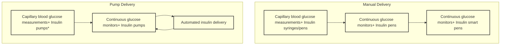
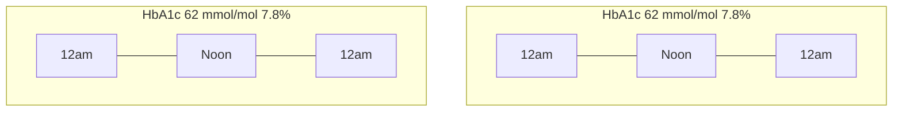
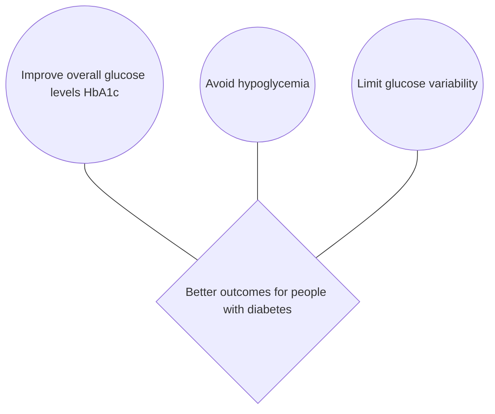
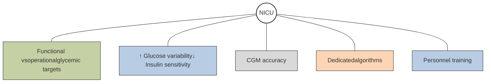

# 36
# Digitized Approaches to Diabetes Diagnostics and Therapeutics

TADEJ BATTELINO, JENNIFER L. SHERR, ALFONSO GALDERISI, AND KLEMEN DOVC

## CHAPTER OUTLINE

*   Sensor Calibration and Accuracy, 1424
*   CGM Technology Is Transformative for Diabetes Care, 1426
*   CGM Data Make It Possible to Understand and Manage Multiple Risk Factors in Diabetes, 1426
*   Making Daily Decisions Using CGM Technology, 1428
*   Using CGM-Derived Glucose Metrics in Clinical Practice, 1430
*   Time in Range in T1D and T2D, 1430
*   Time in Range in Elderly People With Diabetes and Those at High Risk of Hypoglycemia, 1431
*   Time in Range During Pregnancy, 1433
*   Decision-Support Systems for Visualizing CGM Data and Beyond, 1434
*   Ambulatory Glucose Profile—A Graphical Tool for Reviewing CGM Data, 1436
*   Using the Ambulatory Glucose Profile Report in a Systematic Way, 1437
*   Using CGM Improves Measures of Glycemia Compared to SMBG, 1437
*   Improvements in Glycemic Outcomes in Type 1 Diabetes, 1439
*   CGM Is Effective in Daily Management of T2D on Insulin Regimens, 1440
*   Use of CGM in People With T2D Not on Insulin Therapy, 1440
*   Telemonitoring and Telemedicine Are Essential Attributes of CGM Technology, 1440
*   Insulin Delivery, 1441
*   Connected Insulin Pens, 1441
*   Insulin Pumps, 1442
*   Sensor-Augmented Pump Therapy, 1443
*   Automated Insulin Delivery, 1445
*   Anticipated Developments for Insulin Delivery and Automated Insulin Delivery, 1446
*   Use of Diabetes Technologies in Special Situations, 1448
*   Future Directions, 1451

## KEY POINTS

*   The use of continuous glucose monitoring (CGM) is transformative for diabetes management, improving glycemia, reducing acute complications, and improving quality of life.
*   All individuals with diabetes, regardless of the diabetes type, therapy modality, or stage of the disease, benefit from the use of CGM.
*   The use of CGM-derived metrics such as time in range (TIR), time below range (TBR), and time above range (TAR) facilitates day-to-day diabetes management, glycemic outcomes, and quality of life.
*   Artificial intelligence decision-support systems (advisers) can facilitate the day-to-day use of CGM.
*   Connected insulin pens (smart pens) can further facilitate treatment with multiple daily injections and improve glycemic outcomes.
*   Insulin delivery with continuous subcutaneous insulin infusion (CSII, insulin pump) improves glycemia, reduces acute complications, and improves quality of life.
*   Advanced hybrid closed-loop systems for automated insulin delivery (AID) currently represent the most successful treatment modality for individuals treated with insulin.
*   Special considerations are important for different user populations, age groups, sick-day management, regular sport activities, and in-hospital and intensive care treatment.
*   Better access to diabetes technologies for all individuals with diabetes is paramount.
*   Further technologic developments may improve user-friendliness, additionally increase automation, and improve long-term user experience and satisfaction.

1423
Downloaded for d4030sltung d4030sltung (d4030sltung@gmail.com) at Tungs' Taichung MetroHarbor Hospital from ClinicalKey.com by Elsevier on June 04, 2026. For personal use only. No other uses without permission. Copyright ©2026. Elsevier Inc. All rights reserved.

---

1424 SECTION VIII Disorders of Carbohydrate and Fat Metabolism

While the development of insulin therapy vastly changed the course of diabetes management, technologic advances have allowed for more refined treatment methods. Diabetes technologies have classically been categorized as glucose monitoring devices and insulin delivery modalities. The advent of capillary glucose measurements allowed for optimization of insulin doses, yet continuous glucose monitoring has provided exponential expansion in the frequency of glucose measures, thereby permitting better understanding of glucose dynamics within an individual and proving an opportunity to have a more personalized approach to disease management. Similarly, insulin delivery modalities have evolved from subcutaneous administration using vials and syringes to insulin pens followed by connected insulin pens and continuous subcutaneous insulin infusion (CSII) pumps. The latter forms the basis of more advanced diabetes technologies where insulin delivery is linked to sensor glucose readings.

Mirroring what has been seen with technologies used in daily life, there has been rapid evolution and iteration of diabetes technologies, leading to an expanding arsenal of tools that can be used by people with diabetes to help them achieve glycemic targets. Further, glycemic targets are no longer based solely on averages derived from glycated hemoglobin A1c (HbA1c); now the lived experience can be better approximated with continuous glucose data including understanding of time spent in various glucose ranges to help guide care. The landscape of the digitized approach to care of people with diabetes will be reviewed herein.

## Understanding and Applying Continuous Glucose Monitoring Technologies in Diabetes

Routine monitoring of glucose is essential for people with diabetes to see how various foods and exercise can affect their glucose levels and cause glycemic excursions, as well as to understand the glycemic impact of daily stress and illness. For people with diabetes, particularly for those on insulin or insulinotropic therapy, frequent glucose monitoring can help them to predict and reduce the risk of hypoglycemia. Just as important for people with diabetes is to minimize glucose variability and periods of extended hyperglycemia with ketosis, along with risk for ketoacidosis.

The standard of care for glucose monitoring has been the use of self-monitoring of blood glucose (SMBG) by fingerprick testing to evaluate glucose levels in capillary blood (Fig. 36.1).1 Even when performed multiple times daily, for example, a 7-point profile before and after meals and once at night, a full understanding of glycemic profiles can never be entirely captured by this sparse sampling approach (Fig. 36.2). Unfortunately, for many people with diabetes, fingerprick lancing can be painful, and suboptimal engagement with SMBG can be a barrier to achieving glucose targets.2,3 Thus, the recommended daily frequency of SMBG testing is not achieved by most people with type 1 diabetes (T1D) or type 2 diabetes (T2D), which affects glucose control and increases the risks for long-term complications of diabetes.4,5 As a consequence, wearable continuous glucose monitoring (CGM) technologies are increasingly used in the management of people with diabetes, particularly individuals receiving insulin therapy (see Fig. 36.1).6

Commercially available CGM devices measure glucose levels in the interstitial fluid in the subcutaneous space,7,8 either using a sensor with a thin filament inserted through the skin into the subcutaneous space (transcutaneous; Fig. 36.3) or by insertion of the sensor itself into the subcutaneous tissue (implantable).9 Glucose readings are transmitted wirelessly at intervals from 1 to 5 minutes to a reader, to a smartphone or smartwatch app, or, in the case of automated insulin delivery (AID) systems, to an insulin pump (see Fig. 36.1). CGM devices that transmit glucose data only when the user actively scans their sensor with a reader or smartphone app are referred to as intermittently scanned CGM (isCGM).8

Transcutaneous CGM sensors have wear times from 7 to 14 days, during which they are active and after which a new sensor is applied. Implantable systems currently transmit glucose data for up to 180 days before replacement. All glucose sensors have performance characteristics depending on the different wear periods (early, middle, late), the reference glucose levels (high, in-range, low), and the rate of glucose change.10–14

The first modern CGM devices were introduced in 2000 as a diagnostic tool,15 providing 72 hours of retrospective data when calibrated with SMBG readings. These first systems were not approved for insulin dosing or other therapeutic adjustments. However, the accuracy, utility, and size of CGM devices have improved dramatically since the first systems were used to assess glycemia and are now an important part of daily diabetes care. Several CGM devices are approved for making insulin-dosing and titration decisions with no need for a confirmatory SMBG test reading, so-called nonadjunctive use.

The widespread use of CGM technology in diabetes care, along with the substantial number of clinical trials that have validated their efficacy and safety, have transformed the way people with diabetes and health care professionals now manage glycemic control.15a This does not simply apply to the many day-to-day decisions possible using CGM technology, but also to the evaluation of long-term glucose exposure, which has previously been understood only in the context of the measurement of glycated hemoglobin (HbA1c). This rapid evolution of CGM technology has been accompanied by the development of novel measures of glycemic performance that can be used to assess short-term patterns and trends in glucose, as well as provide measures of long-term glycemic exposure that can be used alongside a recent HbA1c test result to understand risks for complications of diabetes.

## Sensor Calibration and Accuracy

Most CGM sensors are factory calibrated,10 which eliminates the need for users to calibrate them using SMBG fingerprick tests, or they may require daily calibrations using SMBG fingerprick tests.9,16 A third method of calibration requires users to enter a calibration code provided with each sensor, before sensor application.17 Differences in calibration requirements may affect choice of CGM device for an individual, since user engagement can be affected,2 and unwillingness to perform SMBG due to discomfort or poor technique may affect CGM system accuracy.18 Sensor accuracy has been known to vary immediately after application because of insertion-site trauma and reduced glucose bioavailability.19–21 Similarly, pressure-induced sensor attenuation has been noted during compression at the application site,22 for example, when sleeping prone. Current systems have adapted to these situations, and there is no evidence of harm as a consequence in adults. However, use of CGM systems in acute neonatal care must be cognizant of these, as described later.

The accuracy of interstitial fluid glucose sensor readings is assessed by regulatory authorities by comparison with blood

Downloaded for d4030sltung d4030sltung (d4030sltung@gmail.com) at Tungs' Taichung MetroHarbor Hospital from ClinicalKey.com by Elsevier on June 04, 2026. For personal use only. No other uses without permission. Copyright ©2026. Elsevier Inc. All rights reserved.

---

CHAPTER 36 Digitized Approaches to Diabetes Diagnostics and Therapeutics **1425**

*   **Pens are pre-filled with insulin and eliminate the need to draw up insulin**
*   **Capillary blood glucose monitoring provides point in time measurements of current glucose levels**
*   **Current CGM devices measure glucose in interstitial fluid every 1-5 minutes.**
*   **Smart Pens record and store insulin doses and timings. These can be reviewed on the pen and are also sent to the CGM system**
*   **Tubed insulin pumps**: Insulin reservoir is inside the pump hardware, connected to the infusion site via catheter made of steel or synthetic polymer tubes
*   **Patch insulin pumps**: Insulin is held within a reservoir placed directly on the skin with a separate polymer catheter inserted subcutaneously
*   **CGM sensor data are communicated to an algorithm, which adjusts insulin delivery via the insulin pump to match glucose levels**

CGM, continuous glucose monitoring

**• Fig. 36.1** The evolution of diabetes technology in glucose management in diabetes.

### SMBG glucose snapshots

| Time | Glucose level (mmol/L) |
| ---- | ---------------------- |
| 12am | 9                      |
| 3am  | 10                     |
| 6am  | 7                      |
| 9am  | 11                     |
| Noon | 8                      |
| 3pm  | 12                     |
| 6pm  | 9                      |
| 9pm  | 5                      |
| 12am | 4.5                    |

### CGM glucose daily profile

| Time | Glucose level (mmol/L) |
| ---- | ---------------------- |
| 12am | 9                      |
| 3am  | 12                     |
| 6am  | 8                      |
| 9am  | 4                      |
| Noon | 8                      |
| 3pm  | 12                     |
| 6pm  | 10                     |
| 9pm  | 12                     |
| 12am | 8                      |

**• Fig. 36.2** CGM sensor glucose readings provide a meaningful profile of daily glucose levels and fluctuations. SMBG testing provides isolated snapshots of glucose levels at any one moment of time. Most people would not perform fingerstick testing eight times daily as shown in the left graphic, and both high and low glycemic excursions may not be detected. In contrast, CGM sensors collect glucose readings minute-by-minute to generate a complete view of glucose levels throughout the day and through the night (right), covering periods of high or low glucose, as well as peaks and troughs when glucose is variable.

**Transcutaneous CGM sensor**

| Layer                      | Description                                       |
| -------------------------- | ------------------------------------------------- |
| \*\*Skin\*\*               | Epidermis and dermis layers                       |
| \*\*Cells\*\*              | Subcutaneous tissue cells                         |
| \*\*Interstitial fluid\*\* | Fluid surrounding cells where glucose is measured |
| \*\*Glucose\*\*            | Molecules diffusing from blood to fluid           |
| \*\*Capillary blood\*\*    | Source of glucose in the bloodstream              |

**• Fig. 36.3** Transcutaneous CGM sensors measure glucose in the interstitial fluid. Glucose in the capillary blood diffuses into the interstitial fluid in the subcutaneous space below the epidermis. Transdermal CGM sensors detect the glucose in the interstitial fluid using electrochemical via insertion of a thin filament.

glucose readings taken concurrently and measured using a reference blood glucose analyzer. Sensor accuracy is quantified by metrics that focus on the mean absolute relative difference (MARD) between a CGM measurement and the corresponding simultaneous value obtained by the reference system. Currently available CGM devices achieve MARD values in the range of 8% to 14%,10,11,14 which compares well with the wide accuracy range of SMBG test meters.23 Among CGM devices, those that are approved for nonadjunctive insulin dosing and titration, or use with AID systems, typically have lower MARD values of below 10%.10,11,24 However, no prospective clinical studies have shown this to be a requirement and the exact clinical significance of lower MARD has not been fully evaluated.

Since blood and interstitial fluid are different physiologic compartments with different glycemic dynamics,25 the concordance between interstitial fluid glucose and blood glucose readings must also take into account the time it takes for blood glucose levels to

Downloaded for d4030sltung d4030sltung (d4030sltung@gmail.com) at Tungs' Taichung MetroHarbor Hospital from ClinicalKey.com by Elsevier on June 04, 2026. For personal use only. No other uses without permission. Copyright ©2026. Elsevier Inc. All rights reserved.

---

1426 SECTION VIII Disorders of Carbohydrate and Fat Metabolism

be reflected in the interstitial fluid. The average time-lag may vary from 3 to 15 minutes,10–14 but may be higher when the physiologic rate of change of glucose between compartments is above 2.0 mg/dL/min (0.1 mmol/L/min).

A further test of system accuracy and precision is the consensus error grid,26 which evaluates the clinical significance of inaccuracies in sensor-glucose readings and assigns a specific level of risk to any errors within defined zones, based on whether these have an impact on clinical decision making. For example, the most clinically important error would be a high CGM reading leading to insulin administration in the setting of a low physiologic glucose, furthering the risk of severe hypoglycemia. A snapshot summary of characteristics for CGM systems available at the time of writing is provided in Table 36.1.

## CGM Technology Is Transformative for Diabetes Care

A person with diabetes can measure their glucose levels at any point during the day using a fingerprick SMBG test, but this can be painful,3 and it is hard to manage more than a few tests each day at recommended times. Equally, although HbA1c is a well-established marker for long-term complications of diabetes, it is not a useful indicator of day-to-day glucose levels and fluctuations. CGM technology is now able to provide objective information across all time periods of interest in diabetes management.

### The Limitations of SMBG Testing

Fingerprick SMBG tests provide isolated snapshots of glucose levels at any one moment of time, whereas CGM sensors collect information to give the user and health care professionals a complete view of glucose levels throughout the day, including through the night, covering periods of high or low glucose, and peaks and troughs when glucose is variable (see Fig. 36.2).

### The Limitations of HbA1c

HbA1c is an accepted measure of overall glucose control over the past 3 months and illustrates how a person with diabetes has been managing their treatment regimen. HbA1c was first associated with diabetes in 1969,27 and it became clear there was a relationship between HbA1c, mean fasting glucose, and mean daily glucose. Using HbA1c as a longitudinal marker of average blood-glucose levels, the United Kingdom Prospective Diabetes Study (UKPDS) and the Diabetes Complications and Control Trial (DCCT) both showed that improved diabetes control, as measured by HbA1c, reduces the risk of long-term health problems such as retinopathy, nephropathy, neuropathy, or kidney failure.4,5,28 Based on these and subsequent studies, HbA1c has become established as an objective measure of glycemic control and also the gold standard marker for risk of morbidity and mortality for people with diabetes. Improving the HbA1c level of a person with diabetes is important, and this is a proven strategy for supporting long-term health in people with T1D or T2D.

As a glycemic marker, HbA1c does reflect average glucose levels over a 2- to 3-month timeframe but cannot reflect the realities of day-to-day glucose levels and fluctuations. For example, people with diabetes who have identical HbA1c test results can have very different patterns of hyperglycemia and hypoglycemia, which will affect their treatment needs (Fig. 36.4). A further issue with HbA1c is that, although it is formed in red blood cells in proportion to average blood glucose levels, it is influenced by a range of nonglycemic factors related to blood-cell turnover and homeostasis.29 Thus, HbA1c can either overestimate or in more clinical conditions underestimate average glucose in any person with diabetes. Use of CGM systems has confirmed this can create a risk of treatment overintensification for people in whom HbA1c tends to overestimate their average glucose exposure,30 with consequent increase in risk of hypoglycemia.

## CGM Data Make It Possible to Understand and Manage Multiple Risk Factors in Diabetes

Although HbA1c has allowed us to understand the long-term consequences of hyperglycemia, we now know it is just as important to avoid hypoglycemia and limit glucose variability. This CGM-driven approach to diabetes management has been termed the "triangle of diabetes care" (Fig. 36.5) and builds on the understanding that the frequency of hypoglycemia and degree of glucose variability are independent risk factors in diabetes.

A meta-analysis of five landmark studies, the UKPDS,31 Action to Control Cardiovascular Risk in Diabetes (ACCORD),32 Action in Diabetes and Vascular Disease: Preterax and Diamicron Modified Release Controlled Evaluation (ADVANCE),33 Veterans Affairs Diabetes Trial (VADT),34 and PROspective pioglitAzone Clinical Trial In macroVascular Events (PROactive)35 trials, has shown intensive control of HbA1c has cardiovascular benefits, but without improving overall mortality in people with T2D.36 Moreover, a number of studies have shown that the relationship between HbA1c and complications and/or mortality is not a straight line but takes a U-shaped or J-shaped curve,37 suggesting a lower HbA1c is not always better. In T1D, a 2018 study on 33,915 individuals from the Swedish national diabetes registry reported that people with T1D and an optimal HbA1c of ≤6.9% (or 52 mmol/mol) have a twofold risk of death from any cause or from cardiovascular disease compared to people without diabetes.38 In order to control for variables not related to diabetes, the study paired each person with T1D with five control subjects matched for age and sex, but without diabetes. The outcomes indicated that achievement of glycemic targets for people with T1D is masking additional factors that contribute to increased risk of cardiovascular complications.

### The Need to Manage Hypoglycemia

The adverse consequences of hypoglycemia are an acknowledged part of diabetes therapy with insulin and insulinotropic drugs (see also discussion "Time in Range in Elderly People With Diabetes and Those at High Risk of Hypoglycemia" later in this chapter). The neurologic consequences include impairment of cognitive function, with confusion, irrational behavior, and drowsiness, and may ultimately lead to seizures and coma. People with diabetes may experience social or workplace embarrassment, as well as physical injury.39 Acute hypoglycemia has been estimated to account for up to 10% of deaths in people with T1D under the age of 40 years.40

There are clear strands of evidence that link hypoglycemia with cardiovascular disease being associated with an increase in cardiac dysrhythmia,41–43 increased inflammatory responses with endothelial-cell dysfunction that predisposes to atherosclerosis,44,45 and a disruption in the coagulation system that leads to a prothrombotic environment.46,47

Downloaded for d4030sltung d4030sltung (d4030sltung@gmail.com) at Tungs' Taichung MetroHarbor Hospital from ClinicalKey.com by Elsevier on June 04, 2026. For personal use only. No other uses without permission. Copyright ©2026. Elsevier Inc. All rights reserved.

---

CHAPTER 36 Digitized Approaches to Diabetes Diagnostics and Therapeutics 1427

### TABLE 36.1 Attributes of Glucose Sensors Used by Available CGM Systemsa

| Device                           | Type of Sensor | Calibration                       | Wear Time (Days)d | Wear Site                                    | Alarms                             | Separate Transmitter | Warm-up Period | Scanning Needed |
| -------------------------------- | -------------- | --------------------------------- | ----------------- | -------------------------------------------- | ---------------------------------- | -------------------- | -------------- | --------------- |
| Abbott FreeStyle Libre systemb   | Transdermal    | Factory calibrated                | 14                | Back of upper arm                            | No                                 | No                   | 60 min         | Yes             |
| Abbott FreeStyle Libre 2 systemb | Transdermal    | Factory calibrated                | 14                | Back of upper arm                            | Optional high and low glucose      | No                   | 60 min         | Yes             |
| Abbott FreeStyle Libre 3 systemb | Transdermal    | Factory calibrated                | 14                | Back of upper arm                            | Optional high and low glucose      | No                   | 60 min         | No              |
| Dexcom Onec                      | Transdermal    | Factory-supplied calibration code | 10                | Back of arm, abdomen, buttocks (age 2–17 yr) | Optional high and low glucose      | Yes                  | 2 hr           | No              |
| Dexcom G4 & G5c                  | Transdermal    | Twice-daily SMBG test             | 7                 | Back of arm, abdomen, buttocks (age 2–17 yr) | High and low alerts                | Yes                  | 2 hr           | No              |
| Dexcom G6c                       | Transdermal    | Factory-supplied calibration code | 10                | Back of arm, abdomen, buttocks (age 2–17 yr) | High and low alerts Predictive | Yes                  | 2 hr           | No              |
| Dexcom G7c                       | Transdermal    | Factory-supplied calibration code | 10                | Back of arm, abdomen, buttocks               | High and low alerts Predictive | No                   | 30 min         | No              |
| Medtronic Guardian Connectd      | Transdermal    | Twice-daily SMBG test             | 7                 | Abdomen, back                                | High and low alerts Predictive | Yes                  | 2 hr           | No              |
| Medtronic Guardian 3             | Transdermal    | Twice-daily SMBG test             | 7                 | Back of arm, abdomen, buttocks (age 7–13 yr) | High and low alerts Predictive | Yes                  | 2 hr           | No              |
| Medtronic Guardian 4             | Transdermal    | Factory calibrated                | 7                 | Back of arm, abdomen, buttocks               | High and low alerts Predictive | Yes                  | 2 hr           | No              |
| Medtronic Simplera               | Transdermal    | Factory calibrated                | 7                 | Back of upper arm                            | High and low alerts Predictive | No                   | 2 hr           | No              |
| Roche Senseonics Eversense E3e   | Implantable    | Twice-daily SMBG test             | 180               | Implanted under skin on the upper arm        | Optional high and low glucose      | Yes                  | 24 hr          | No              |

aThese systems reflect those used most frequently in clinical studies in T1D and T2D. Other CGM systems are available.
bAll FreeStyle Libre systems, https://www.diabetescare.abbott/support/manuals/uk.html
cAll Dexcom Mobile systems, https://www.dexcom.com/en-us/guides
dhttps://www.medtronicdiabetes.com/customer-support/guardian-connect-system-support
ehttps://www.ascensiadiabetes.com/eversense/user-guides/
The table shows the product range for the manufacturers with widely used standalone CGM products.
SMBG, self-monitoring of blood glucose.

### The Need to Manage Glycemic Variability

The link between glucose variability and cardiovascular pathology has been strengthened by the availability of CGM data. In both T1D and T2D, experimentally induced swings from hypoglycemia to hyperglycemia cause significant increases in endothelial dysfunction and oxidative stress compared to sustained high glucose levels.48–50 Moreover, in people with diabetes who are admitted to hospital for any clinical reason, glycemic swings have been shown to be associated with both increased mortality and longer hospital stay.51 CGM data have also indicated a correlation between reactive oxygen metabolites and glucose variability in T2D,52,53 in which increased reactive oxygen metabolites were significantly correlated with the mean amplitude of glucose

Downloaded for d4030sltung d4030sltung (d4030sltung@gmail.com) at Tungs' Taichung MetroHarbor Hospital from ClinicalKey.com by Elsevier on June 04, 2026. For personal use only. No other uses without permission. Copyright ©2026. Elsevier Inc. All rights reserved.

---

1428 SECTION VIII Disorders of Carbohydrate and Fat Metabolism

# HbA1c 62 mmol/mol (7.8%)

*(Note: The above is a placeholder for the visual representation of Fig 36.4. Data points are transcribed in the table below.)*

| Time | Patient A Glucose (mmol/L) | Patient B Glucose (mmol/L) |
| ---- | -------------------------- | -------------------------- |
| 12am | 10                         | 10                         |
| 6am  | 15                         | 5                          |
| Noon | 4                          | 10                         |
| 6pm  | 15                         | 5                          |
| 12am | 4                          | 10                         |

* **Fig. 36.4** Continuous glucose monitoring sensor readings provide a meaningful profile of daily glucose levels and fluctuations. CGM sensor data reveal the important details in daily and weekly glucose patterns that are unique to each person with diabetes, even if they have identical HbA1c test results.

* **Fig. 36.5** Triangle of diabetes care—a model for application of CGM in diabetes care. The triangle of diabetes care illustrates how the attributes of CGM technology can be used to manage multiple risk factors in diabetes.

### Dexcom G7 system

| Metric          | Value                               |
| --------------- | ----------------------------------- |
| Current Glucose | 5.7 mmol/L                          |
| Trend           | Falling rapidly (Double arrow down) |
| Alert           | 3.1 mmol/L within 20 minutes        |
| Time            | 10:30                               |

### FreeStyle Libre system

| Metric          | Value                      |
| --------------- | -------------------------- |
| Current Glucose | 112 mg/dL                  |
| Trend           | Rising (Diagonal arrow up) |
| Status          | GLUCOSE IN RANGE           |
| Time            | 10:23                      |

* **Fig. 36.6** Examples of CGM trend arrow displays. Images show the smartphone home-screen representation of current glucose and the associated rate of change trend arrow for two CGM systems currently approved by regulatory authorities for nonadjunct use to make insulin dosing decisions. The Dexcom G7 system shows that glucose is falling rapidly at >2.0 mg/dL (>0.1 mmol/L) and is predicting low glucose; the FreeStyle Libre system shows that glucose is rising at 1.0–2.0 mg/dL (0.06–0.1 mmol/L). See Table 36.2 for all trend arrow rates of change.

excursions each day and with the mean differences in glucose between days.

## Making Daily Decisions Using CGM Technology
The first major benefit for people with diabetes using CGM devices is the impact on effective daily diabetes self-management decisions. Being able to see current glucose levels on demand, at any time of day or night, without the need for fingerprick SMBG testing, ensures CGM users are more aware of their glucose status. However, on its own, a high or low glucose reading can prompt a person with diabetes to take corrective action that may or may not be needed. A more-significant capability with CGM devices is that these systems also provide trend arrow information on the direction and rate of change of glucose (Fig. 36.6).

## Trend Arrows and Projected Glucose
CGM technology is able to collect glucose readings on a minute-by-minute basis, and each system is able to calculate both the direction and the rate of change of glucose based on the readings stored over the previous 15 minutes. This information is displayed on the CGM reader or smartphone app as a trend arrow, showing whether glucose levels are rising, falling, or stable. In addition to the direction of change, the trend arrow indicates to the user how fast their glucose is rising or falling. By looking at the trend arrow displayed alongside their current glucose

Downloaded for d4030sltung d4030sltung (d4030sltung@gmail.com) at Tungs' Taichung MetroHarbor Hospital from ClinicalKey.com by Elsevier on June 04, 2026. For personal use only. No other uses without permission. Copyright ©2026. Elsevier Inc. All rights reserved.

---

CHAPTER 36 Digitized Approaches to Diabetes Diagnostics and Therapeutics 1429

### TABLE 36.2 Comparison of the Rates of Change That Are Illustrated by the Trend Arrow Displays of Different CGM Providers

| Trend Arrows Number and Orientation | Abbott FreeStyle Libre Systemᵃ           | Dexcom G4/G5/G6/G7 Mobileᵇ               | Medtronic Guardian Connect, Sensor 3, Sensor 4ᶜ | Roche Senseonics Eversenseᵈ              |
| ----------------------------------- | ---------------------------------------- | ---------------------------------------- | ----------------------------------------------- | ---------------------------------------- |
| ↑↑↑                                 | NA                                       | NA                                       | >3 mg/dL >0.2 mmol/L per minute             | NA                                       |
| ↑↑                                  | NA                                       | >3 mg/dL >0.2 mmol/L per minute      | 2–3 mg/dL 0.1–0.2 mmol/L per minute         | NA                                       |
| ↑                                   | >2 mg/dL >0.1 mmol/L per minute      | 2–3 mg/dL 0.1–0.2 mmol/L per minute  | 1–2 mg/dL 0.05–0.1 mmol/L per minute        | >2 mg/dL >0.1 mmol/L per minute      |
| ↗                                   | 1–2 mg/dL 0.05–0.1 mmol/L per minute | 1–2 mg/dL 0.05–0.1 mmol/L per minute | NA                                              | 1–2 mg/dL 0.05–0.1 mmol/L per minute |
| →                                   | <1 mg/dL <0.05 mmol/L per minute     | <1 mg/dL <0.05 mmol/L per minute     | NA                                              | 0–1 mg/dL 0–0.05 mmol/L per minute   |
| ↘                                   | 1–2 mg/dL 0.05–0.1 mmol/L per minute | 1–2 mg/dL 0.05–0.1 mmol/L per minute | NA                                              | 1–2 mg/dL 0.05–0.1 mmol/L per minute |
| ↓                                   | >2 mg/dL >0.1 mmol/L per minute      | 2–3 mg/dL 0.1–0.2 mmol/L per minute  | 1–2 mg/dL 0.05–0.1 mmol/L per minute        | >2 mg/dL >0.1 mmol/L per minute      |
| ↓↓                                  | NA                                       | >3 mg/dL >0.2 mmol/L per minute      | 2–3 mg/dL 0.1–0.2 mmol/L per minute         | NA                                       |
| ↓↓↓                                 | NA                                       | NA                                       | >3 mg/dL >0.2 mmol/L per minute             | NA                                       |

aAll FreeStyle Libre systems, https://www.diabetescare.abbott/support/manuals/uk.html
bAll Dexcom Mobile systems, https://www.dexcom.com/en-us/guides
chttps://www.medtronicdiabetes.com/customer-support/guardian-connect-system-support
dhttps://www.ascensiadiabetes.com/eversense/user-guides/
The table shows the product range for the manufacturers with widely used standalone CGM products. These systems also reflect those used most frequently in clinical studies in T1D and T2D. Other CGM systems are available.

reading, CGM users can make an informed and timely decision on whether to take any corrective action to adjust their glucose levels, for example, by taking insulin or intake of carbohydrates in order to prevent unwanted rise or fall in glucose concentration. This also allows them to understand the context of their glucose levels and trends and to make decisions about timing of exercise, meals, and glycemic management during illness. Table 36.2 describes characteristics of trend arrows displayed by the most widely used standalone CGM products that have been more commonly used in clinical studies in T1D and T2D.

### Making Insulin Dosing Decisions Incorporating Glucose Trend Arrows

As discussed, multiple CGM devices are approved by health authorities for making decisions on insulin dosing, without the need for a confirmatory SMBG test. Recommendations for treatment decisions should take into account both the direction of the trend arrows and the different rates of change. There is no standardization between different CGM devices regarding trend arrow orientations and rate of change; thus, recommendations for insulin dosing must be adjusted to accommodate the distinctions of different CGM devices. To date, there have been several recommendations published for how to respond to trend arrow information for insulin dosing in T1D, as discussed next.

### Evolution of the "Slide Rule" System for Using Trend Arrows for Insulin Dosing

During the Juvenile Diabetes Research Foundation (JDRF) and Diabetes Research in Children Network Study Group (DirecNet) studies on CGM,54,55 participants had been advised that, based on their trend arrows and current glucose reading, they should increase or decrease their regular insulin dose by 10% (glucose rising or falling) or 20% (glucose rising rapidly or falling rapidly). However, subsequent patient-reported data revealed that an upward trend arrow might trigger a self-determined insulin dose increase of more than 100% of their usually calculated dose, whereas a downward trend arrow might result in an insulin dose reduction of up to 50%.56

Consequently, more-specific recommendations were developed, in which a defined glucose concentration value was added or subtracted to adjust the current glucose level, depending on the trend arrow displayed.57 However, this creates additional burden on CGM users, requiring mathematical skills and a level of numeracy. Even when simplified,58 this approach did not take into account clinical factors, such as individual insulin regimens or insulin sensitivity.

To accommodate as many factors as possible into the dosing decision, a selection of "slide rule" approaches have been defined. Laffel et al59 and Aleppo et al60 published tables guiding the addition or subtraction of a fixed amount of insulin based on the glucose trend arrow orientation and rate of change, but

Downloaded for d4030sltung d4030sltung (d4030sltung@gmail.com) at Tungs' Taichung MetroHarbor Hospital from ClinicalKey.com by Elsevier on June 04, 2026. For personal use only. No other uses without permission. Copyright ©2026. Elsevier Inc. All rights reserved.

---

1430 SECTION VIII Disorders of Carbohydrate and Fat Metabolism

| FreeStyle Libra↑↑                                                | Dexcom G5/G6 App ◯ | Dexcom G5/G6 Receiver ↑↑ | ISF (mg/dL) | Insulin units | FreeStyle Libra<25                                               | Dexcom G5/G6 App +4.5 | Dexcom G5/G6 Receiver ↑↑ | ISF (mg/dL)≥75 | 70-180 mg/dL Insulin units ◯ | >180-250 mg/dL Insulin units ↑↑ | >250 mg/dL Insulin units <25 25-49 | >250 mg/dL Insulin units +3.5 +3.5 | >250 mg/dL Insulin units +4.5 | >250 mg/dL Insulin units +5.0 | >250 mg/dL Insulin units | >250 mg/dL Insulin units25-49 50-74 +1.5 | >250 mg/dL Insulin units+2.5 +2.5 | >250 mg/dL Insulin units+3.5 | >250 mg/dL Insulin units+4.0 | >250 mg/dL Insulin units | >250 mg/dL Insulin units50-74 | >250 mg/dL Insulin units+1.5 ≥75 | >250 mg/dL Insulin units+2.5 +1.0 | >250 mg/dL Insulin units+3.0 +1.5 | +2.0 |      |
| ---------------------------------------------------------------- | -------------------------- | -------------------------------- | ----------- | ------------- | ---------------------------------------------------------------- | ----------------------------- | -------------------------------- | -------------- | ------------------------------------ | --------------------------------------- | ---------------------------------------------- | ---------------------------------------------- | ------------------------------------- | ------------------------------------- | ---------------------------- | ---------------------------------------------------- | ----------------------------------------- | -------------------------------- | -------------------------------- | ---------------------------- | --------------------------------- | ---------------------------------------- | ----------------------------------------- | ----------------------------------------- | ---- | ---- |
| ↑                                                                | ◯                          | ↑                                | <25         | +3.5          | ↑                                                                | ◯                             | ↑                                | <25            | +2.5                                 | +3.5                                    | +4.0                                           |                                                |                                       |                                       |                              |                                                      |                                           |                                  |                                  |                              |                                   |                                          |                                           |                                           |      |      |
|                                                                  |                            |                                  |             |               |                                                                  |                               |                                  | 25-49          | +2.5                                 |                                         |                                                |                                                | 25-49                                 | +2.0                                  | +2.5                         | +3.0                                                 |                                           |                                  |                                  |                              |                                   |                                          |                                           |                                           |      |      |
|                                                                  |                            |                                  |             |               |                                                                  |                               |                                  |                |                                      |                                         |                                                |                                                | 50-74                                 | +1.5                                  |                              |                                                      |                                           | 50-74                            | +1.0                             | +1.5                         | +2.0                              |                                          |                                           |                                           |      |      |
|                                                                  |                            |                                  |             |               |                                                                  |                               |                                  |                |                                      |                                         |                                                |                                                |                                       |                                       |                              |                                                      |                                           | ≥75                              | +1.0                             |                              |                                   |                                          | ≥75                                       | +0.5                                      | +1.0 | +1.5 |
| ↗                                                                | ◯                          | ↗                                | <25         | +2.5          | ↗                                                                | ◯                             | ↗                                | <25            | +1.5                                 | +2.5                                    | +3.0                                           |                                                |                                       |                                       |                              |                                                      |                                           |                                  |                                  |                              |                                   |                                          |                                           |                                           |      |      |
|                                                                  |                            |                                  |             |               |                                                                  |                               |                                  | 25-49          | +1.5                                 |                                         |                                                |                                                | 25-49                                 | +1.0                                  | +1.5                         | +2.0                                                 |                                           |                                  |                                  |                              |                                   |                                          |                                           |                                           |      |      |
|                                                                  |                            |                                  |             |               |                                                                  |                               |                                  |                |                                      |                                         |                                                |                                                | 50-74                                 | +1.0                                  |                              |                                                      |                                           | 50-74                            | +0.5                             | +1.0                         | +1.5                              |                                          |                                           |                                           |      |      |
|                                                                  |                            |                                  |             |               |                                                                  |                               |                                  |                |                                      |                                         |                                                |                                                |                                       |                                       |                              |                                                      |                                           | ≥75                              | +0.5                             |                              |                                   |                                          | ≥75                                       | +0.5                                      | +0.5 | +1.0 |
| When Trend Arrows are stable, no insulin adjustment is indicated |                            |                                  |             |               | When Trend Arrows are stable, no insulin adjustment is indicated |                               |                                  |                |                                      |                                         |                                                |                                                |                                       |                                       |                              |                                                      |                                           |                                  |                                  |                              |                                   |                                          |                                           |                                           |      |      |
| ↘                                                                | ◯                          | ↘                                | <25         | -2.5          | ↘                                                                | ◯                             | ↘                                | <25            | -2.5                                 | -2.0                                    | -2.5                                           |                                                |                                       |                                       |                              |                                                      |                                           |                                  |                                  |                              |                                   |                                          |                                           |                                           |      |      |
|                                                                  |                            |                                  |             |               |                                                                  |                               |                                  | 25-49          | -1.5                                 |                                         |                                                |                                                | 25-49                                 | -1.5                                  | -1.0                         | -1.0                                                 |                                           |                                  |                                  |                              |                                   |                                          |                                           |                                           |      |      |
|                                                                  |                            |                                  |             |               |                                                                  |                               |                                  |                |                                      |                                         |                                                |                                                | 50-74                                 | -1.0                                  |                              |                                                      |                                           | 50-74                            | -1.0                             | -0.5                         | -0.5                              |                                          |                                           |                                           |      |      |
|                                                                  |                            |                                  |             |               |                                                                  |                               |                                  |                |                                      |                                         |                                                |                                                |                                       |                                       |                              |                                                      |                                           | ≥75                              | -0.5                             |                              |                                   |                                          | ≥75                                       | -0.5                                      | -0.5 | -0.0 |
| ↓                                                                | ◯                          | ↓                                | <25         | -3.5          | ↓                                                                | ◯                             | ↓                                | <25            | -3.5                                 | -3.0                                    | -3.5                                           |                                                |                                       |                                       |                              |                                                      |                                           |                                  |                                  |                              |                                   |                                          |                                           |                                           |      |      |
|                                                                  |                            |                                  |             |               |                                                                  |                               |                                  | 25-49          | -2.5                                 |                                         |                                                |                                                | 25-49                                 | -2.5                                  | -2.0                         | -2.0                                                 |                                           |                                  |                                  |                              |                                   |                                          |                                           |                                           |      |      |
|                                                                  |                            |                                  |             |               |                                                                  |                               |                                  |                |                                      |                                         |                                                |                                                | 50-74                                 | -1.5                                  |                              |                                                      |                                           | 50-74                            | -1.5                             | -1.0                         | -1.0                              |                                          |                                           |                                           |      |      |
|                                                                  |                            |                                  |             |               |                                                                  |                               |                                  |                |                                      |                                         |                                                |                                                |                                       |                                       |                              |                                                      |                                           | ≥75                              | -1.0                             |                              |                                   |                                          | ≥75                                       | -1.0                                      | -1.0 | -0.5 |
| ↓↓                                                               | ◯                          | ↓↓                               | <25         | -4.5          | ↓↓                                                               | ◯                             | ↓↓                               | <25            | -4.5                                 | -4.0                                    | -4.0                                           |                                                |                                       |                                       |                              |                                                      |                                           |                                  |                                  |                              |                                   |                                          |                                           |                                           |      |      |
|                                                                  |                            |                                  |             |               |                                                                  |                               |                                  | 25-49          | -3.5                                 |                                         |                                                |                                                | 25-49                                 | -3.5                                  | -3.0                         | -2.5                                                 |                                           |                                  |                                  |                              |                                   |                                          |                                           |                                           |      |      |
|                                                                  |                            |                                  |             |               |                                                                  |                               |                                  |                |                                      |                                         |                                                |                                                | 50-74                                 | -2.5                                  |                              |                                                      |                                           | 50-74                            | -2.5                             | -1.5                         | -1.5                              |                                          |                                           |                                           |      |      |
|                                                                  |                            |                                  |             |               |                                                                  |                               |                                  |                |                                      |                                         |                                                |                                                |                                       |                                       |                              |                                                      |                                           | ≥75                              | -1.5                             |                              |                                   |                                          | ≥75                                       | -1.5                                      | -1.0 | -0.5 |

The Endocrine Society recommends using the rates of change and ISF to make insulin adjustments.

In a modified version, ISF is combined with current glucose to identify the necessary insulin adjustments.

* **Fig. 36.7** Slide-rule calculators for making insulin dose adjustments based on CGM trend arrow orientations and rates of glucose change.60,61 ISF, Insulin sensitivity factor.

also determined by different levels of insulin sensitivity, with separate tabular calculations for children and adults (Fig. 36.7A). This approach can be more easily adjusted to the requirements of an individual’s insulin therapy and has been recommended by the Endocrine Society and as shown in Fig. 36.7A.59,60 A similar slide rule approach was developed by Ziegler et al,61 but adding in the current glucose range as a variable for the tabular calculation (Fig. 36.7B), which was further modified by Bruttomesso et al,62 increasing both the number of current glucose ranges and the classes of insulin sensitivity for adults.

In general, all of these methods are variably adopted, and all have been evaluated in modeling scenarios as being effective when glucose is falling, as indicated by downward trend arrows63; however, they appear to overestimate additional insulin doses for rising glucose, which would then potentially require a subsequent corrective action. No clinical studies have been conducted to assess the individual or comparative value of each of the models to date.

## Using CGM-Derived Glucose Metrics in Clinical Practice

The use of CGM as an important technology in the care of people with diabetes was initially centered on the care of people with T1D,64 but has subsequently widened in application for people with T2D and for diabetes in pregnancy.65 An important and clinically essential component of the application of CGM technology has been the adoption of internationally agreed and standardized metrics for interpreting the glucose data provided by CGM devices.66 Of prime importance among these metrics are the time in ranges.

### Time in Range in T1D and T2D

*Time in range* (TIR) denotes the proportion of each day that a person with diabetes spends with CGM-measured glucose readings in each of three glucose ranges defined by international consensus.66 For people with T1D or T2D, TIR indicates the amount of time glucose readings are within the target glucose range of 70 to 180 mg/dL (3.9–10.0 mmol/L). A secondary consensus TIR metric,65 termed *time in tight range* (TITR), is emerging as a reported measure, particularly for people with T1D using AID systems or in people with T2D using novel glucose-lowering agents. TITR is defined as the percentage time glucose readings are within 70 to 140 mg/dL (3.9–7.8 mmol/L).65,67 For people with diabetes for whom maintaining TITR is recommended, the suggested target for TITR is above 70%,68 as for TIR 70 to 180 mg/dL (3.9–10.0 mmol/L).

*Time below range* (TBR) refers to the amount of time spent below the target glucose range (below 70 mg/dL, 3.9 mmol/L), and *time above range* (TAR) refers to the amount of time spent above the target range (above 180 mg/dL, 10.0 mmol/L). From a clinical management perspective, TBR can also be divided into level 1 and level 2, which indicate different degrees of urgency for clinical action.65,66 Level 1 hypoglycemia, with glucose 54 to 69 mg/dL (3.0–3.9 mmol/L), is an alert threshold,69 independent of any acute symptoms, and health care professionals and people with diabetes should monitor time spent in level 1 hypoglycemia. Level 2 hypoglycemia, with a glucose level of below 54 mg/dL (3.0 mmol/L), with or without symptoms, is considered clinically significant in that it may trigger counterregulatory responses, cause cognitive impairment leading to severe hypoglycemia, and therefore requires immediate attention.69 Each of these CGM-defined episodes of low glucose is considered clinically relevant if it lasts 15 minutes or more before returning above 70 mg/dL (3.9 mmol/L).

TAR can be divided into 181 to 250 mg/dL (10.1–13.9 mmol/L) and above 250 mg/dL (13.9 mmol/L). Similar to hypoglycemia, these ranges are referred to as level 1 and level 2 hyperglycemia, respectively. These definitions are important since blood-glucose values exceeding 250 mg/dL (13.9 mmol/L) may increase the risk of diabetic ketoacidosis (DKA) in a person with T1D.70

Downloaded for d4030sltung d4030sltung (d4030sltung@gmail.com) at Tungs' Taichung MetroHarbor Hospital from ClinicalKey.com by Elsevier on June 04, 2026. For personal use only. No other uses without permission. Copyright ©2026. Elsevier Inc. All rights reserved.

---

CHAPTER 36 Digitized Approaches to Diabetes Diagnostics and Therapeutics **1431**

### TABLE 36.3 Consensus Recommendations for %TIR, %TBR, and %TAR for Adults, Children, and Young People With T1D or T2D, for People at High Risk of Hypoglycemia, and Pregnant Women With Pregestational T1D

| Diabetes Group                       | TIME IN RANGE (TIR) Target Range | TIME IN RANGE (TIR) % of Time: Time per Day | TIME BELOW RANGE (TBR) Below Target Level | TIME BELOW RANGE (TBR) % of Time: Time per Day | TIME ABOVE RANGE (TAR) Above Target Level | TIME ABOVE RANGE (TAR) % of Time: Time per Day |
| ------------------------------------ | ------------------------------------ | ----------------------------------------------- | --------------------------------------------- | -------------------------------------------------- | --------------------------------------------- | -------------------------------------------------- |
| *Type 1/type 2*a                     | 70–180 mg/dL (3.9–10.0 mmol/L)   | >70%: >16 hr 48 min                         | 70 mg/dL (<3.9 mmol/L)                    | <4%: <1 hr                                     | >180 mg/dL (>10.0 mmol/L)                 | <25%: <6 hr                                    |
|                                      |                                      |                                                 | 54 mg/dL (<3.0 mmol/L)                    | <1% <15 min                                    | >250 mg/dL (>13.9 mmol/L)                 | <5% <1 hr, 12 min                              |
| Older/high-risk, type 1 or *type 2*b | 70–180 mg/dL (3.9–10.0 mmol/L)   | >50%: >12 hr                                | 70 mg/dL (<3.9 mmol/L)                    | <1%: <15 min                                   | >250 mg/dL (>13.9 mmol/L)                 | <10%: <2 hr 24 min                             |
| Pregnancy, *type 1*c                 | 63–140 mg/dL (3.5–7.8 mmol/L)    | >70%: >16 hr 48 min                         | 63 mg/dL (<3.5 mmol/L)                    | <4%: <1 hr                                     | >140 mg/dL (>7.8 mmol/L)                  | <25%: <6 hr                                    |
|                                      |                                      |                                                 | 54 mg/dL (<3.0 mmol/L)                    | <1%: <15 min                                   | \[blank]                                      | \[blank]                                           |
| Pregnancy, *type 2 and GD*           | 63–140 mg/dL (3.5–7.8 mmol/L)    | \[blank]                                        | 63 mg/dL (<3.5 mmol/L)                    | \[blank]                                           | >140 mg/dL (>7.8 mmol/L)                  | \[blank]                                           |
|                                      |                                      |                                                 | 54 mg/dL (<3.0 mmol/L)                    | \[blank]                                           | \[blank]                                      | \[blank]                                           |

aFor age ≤25 years, if the A1C goal is 7.5%, set TIR target to approximately 60%.
bPeople with T1D or T2D at high risk of hypoglycemia because of age, duration of diabetes, duration of insulin therapy, or impaired awareness of hypoglycemia.
c%TIR in pregnancy values are based on limited evidence. Consensus recommendations are provided for %TIR, %TBR, and %TAR for women with T1D during pregnancy or planning pregnancy. During pregnancy the %TIR should be considered in conjunction with mean daily glucose, aiming for a mean glucose of 6.0–6.5mmol/L. No consensus recommendations for %TIR, %TBR, or %TAR in pregnancy in T2D or in GD are available.
GD, gestational diabetes mellitus.

The International Consensus on Time in Range66 has defined a series of clinical targets for TIR, TBR, and TAR that can be applied in the clinical care of people with T1D or T2D. These targets are detailed in Table 36.3 and illustrated in Fig. 36.8. Separate recommendations have also been made for pregnant women with pregestational T1D, as well as for older and elderly people who are at higher risk of hypoglycemia (see later discussion). Consensus targets for TIRs in children, adolescents, and young adults up to 25 years old with T1D follow the overall recommendations for adults but acknowledge the International Society for Pediatric and Adolescent Diabetes (ISPAD) position that people ≤25 years of age should aim for the lowest achievable HbA1c without undue exposure to severe hypoglycemia.71

As a focus for assessing glycemia, TIR, TBR, and TAR are easily understood by people with diabetes and by health care professionals. From a diabetes management perspective, each of these measures is immediately responsive to changes in medication, diet, and lifestyle that can be visualized and discussed in consultation between the CGM user and their health care professionals.

To date there is limited but fast increasing evidence that percent TIR (%TIR) is an outcome measure associated with complications of diabetes, which suggests the continued value of HbA1c as a measure of risk of long-term microvascular and macrovascular disease. However, available evidence supports that for people with T2D there is a consistent association between higher TIR and fewer macrovascular and microvascular complications,72–77 with a smaller number of studies in T1D indicating that lower TIR is associated with an increased prevalence of microvascular and cardiovascular complications.78,79

### Understanding Glycemic Variability Using CGM Data

Managing glycemic variability is a component of the triangle of diabetes care that is facilitated by CGM data. This is achieved with a metric, the coefficient of variation (CV), that is calculated as a function of the standard deviation (SD) of mean glucose over the assessment period. Percent CV is a measure of glucose variability that is strongly correlated with TBR,80 and the target for the coefficient of variation in T1D is recommended as ≤36%,65 based on the increased risk of hypoglycemia above this level.80

### Time in Range in Elderly People With Diabetes and Those at High Risk of Hypoglycemia

Older and elderly people with diabetes are at higher risk for severe hypoglycemia due to their age, duration of diabetes, duration of insulin therapy, and/or greater prevalence of hypoglycemia unawareness.81–86 Their increased risk of severe hypoglycemia can be exacerbated by cognitive and physical impairments, as well as other comorbidities (e.g., renal disease, joint disease, osteoporosis, fracture, and/or cardiovascular disease), especially in people requiring assisted care.83,86 The risk of severe or fatal hypoglycemia increases considerably in elderly individuals with diabetes who are treated with insulinotropic medications.87–89 Hypoglycemia in

Downloaded for d4030sltung d4030sltung (d4030sltung@gmail.com) at Tungs' Taichung MetroHarbor Hospital from ClinicalKey.com by Elsevier on June 04, 2026. For personal use only. No other uses without permission. Copyright ©2026. Elsevier Inc. All rights reserved.

---

1432 SECTION VIII Disorders of Carbohydrate and Fat Metabolism

### Adults with T1D or T2D

| Glucose level (mmol/L) | Glucose level (mg/dL) | Category                                          | Target                |
| ---------------------- | --------------------- | ------------------------------------------------- | --------------------- |
| 13.9                   | 250                   | Very high (>250 mg/dL) (>13.9 mmol/L)             | <5% <1 h 12 min   |
|                        |                       | High (>180 mg/dL) (>10.0 mmol/L)                  | <25%\* <6 h       |
| 10.0                   | 180                   | Target range (70 – 180 mg/dL) (3.9 – 10.0 mmol/L) | >70% >16 h 48 min |
| 3.9                    | 70                    | Low (<70 mg/dL, <3.9 mmol/L)                      | <4% <1 h¶             |
| 3.0                    | 54                    | Very low (<54 mg/dL, <3.0 mmol/L)                 | <1% <15 min           |

\* Readings >13.9 mmol/L are also included in the <25% target
¶ Readings <3.0 mmol/L are also included in the <4% target

### Time in tight range (TITR) in T1D of T2D

| Glucose level (mmol/L) | Glucose level (mg/dL) | Category                                         | Target                |
| ---------------------- | --------------------- | ------------------------------------------------ | --------------------- |
| 13.9                   | 250                   | Very high (>250 mg/dL) (>13.9 mmol/L)            | <5% <1 h 12 min   |
|                        |                       | High (>140 mg/dL) (>7.8 mmol/L)                  | <25%\* <6 h       |
| 7.8                    | 140                   | Target range (70 – 140 mg/dL) (3.9 – 7.8 mmol/L) | >70% >16 h 48 min |
| 3.9                    | 70                    | Low (<70 mg/dL, <3.9 mmol/L)                     | <4% <1 h¶             |
| 3.0                    | 54                    | Very low (<54 mg/dL, <3.0 mmol/L)                | <1% <15 min           |

\* Readings >13.9 mmol/L are also included in the <25% target
¶ Readings <3.0 mmol/L are also included in the <4% target

### Older people with T1D or T2D at risk of hypoglycemia

| Glucose level (mmol/L) | Glucose level (mg/dL) | Category                                          | Target               |
| ---------------------- | --------------------- | ------------------------------------------------- | -------------------- |
| 13.9                   | 250                   | Very high (>250 mg/dL) (>13.9 mmol/L)             | <10% <2 h 24 min |
| 10.0                   | 180                   | High (>180 mg/dL) (>10.0 mmol/L)                  | <50%\* <12 h     |
| 3.9                    | 70                    | Target range (70 – 180 mg/dL) (3.9 – 10.0 mmol/L) | >50% >12 h       |
| \[blank]               | \[blank]              | Low (<70 mg/dL, <3.9 mmol/L)                      | <1% <15 min          |

\* Readings >13.9 mmol/L are also included in the <25% target

### Women with T1D who are pregnant or planing pregnancy

| Glucose level (mmol/L) | Glucose level (mg/dL) | Category                                         | Target                |
| ---------------------- | --------------------- | ------------------------------------------------ | --------------------- |
| 7.8                    | 140                   | High (>140 mg/dL) (>7.8 mmol/L)                  | <25%\* <6 h       |
| \[blank]               | \[blank]              | Target range (63 – 140 mg/dL) (3.5 – 7.8 mmol/L) | >70% >16 h 48 min |
| 3.5                    | 63                    | Low (<63 mg/dL, <3.5 mmol/L)                     | <4% <1 h¶             |
| 3.0                    | 54                    | Very low (<54 mg/dL, <3.0 mmol/L)                | <1% <15 min           |

\* %TIR, %TBR and %TAR are based on limited evidence. More research is needed.
¶ Readings <3.0 mmol/L are also included in the <4% target

**• Fig. 36.8** International consensus time in ranges and targets.

elderly people with T2D is also associated with increased incidence of cardiovascular events, dementia, and death.90

Use of blinded CGM confirms asymptomatic hypoglycemia is frequent among older populations with diabetes,91 including those on all types of noninsulin therapy, and in those with elevated HbA1c. Therefore, the avoidance of hypoglycemia has been suggested as a greater priority than minimizing HbA1c among elderly people with diabetes.92

The International Consensus on Time in Range recommendations66 for high-risk and elderly people emphasize the need to be cautious and to individualize targets for %TIR, with a clear focus on reducing the %TBR (below 70 mg/dL, 3.9 mmol/L) while preventing excessive hyperglycemia (see Table 36.3 and Fig. 36.8). The recommended target range for high-risk and elderly individuals is still 70 to 180 mg/dL (3.9–10.0 mmol/L), but the daily goal is for above 50% (>12 hours/day) TIR, rather than above 70% (16 hours, 48 min/day). Because of the need to manage the risk of hypoglycemia more closely in this group, the recommendation is to keep %TBR (below 70 mg/dL, 3.9 mmol/L) below 1% or less than 15 minutes per day. Similarly, the recommendations for %TAR are streamlined to focus on keeping levels >250 mg/dL (13.9 mmol/L) to below 10% (2 hours, 24 min/day; see Table 36.3 and Fig. 36.8).

Multiple trials demonstrate benefits of CGM in older populations. In the Wireless Innovation for Seniors with Diabetes Mellitus (WISDM) randomized controlled trial (RCT),93 use of CGM reduced TBR (below 70 mg/dL, 3.9 mmol/L) by 48% after 26

Downloaded for d4030sltung d4030sltung (d4030sltung@gmail.com) at Tungs' Taichung MetroHarbor Hospital from ClinicalKey.com by Elsevier on June 04, 2026. For personal use only. No other uses without permission. Copyright ©2026. Elsevier Inc. All rights reserved.

---

CHAPTER 36 Digitized Approaches to Diabetes Diagnostics and Therapeutics 1433

weeks, compared to SMBG ($p <0.001$), and this benefit was maintained through 12 months, in adults with T1D age $\geq 60$ years. Study participants also had increased TIR and reduced HbA1c at 12 months. In participants with T2D on intensive insulin therapy in the Evaluation of a Novel Glucose Sensing Technology in Type 2 Diabetes (REPLACE) RCT,94 a 56% reduction in TBR (70 mg/dL, 3.9 mmol/L) was observed in the subgroup of study participants $\geq 65$ years old in the CGM intervention group, which was similar to participants <65 years. Similarly, in the DIAMOND clinical trial in adults with T2D on intensive insulin therapy,95 participants age 60 years or older using CGM were able to improve HbA1c and reduce glycemic variability, compared to SMBG alone, and the response of this older subgroup was not different from younger adults with T2D in the trial. Bao and colleagues96 reported that people with T2D age $\geq 65$ years old on basal insulin therapy were able to improve TIR and reduce hypoglycemia after starting traditional CGM, at least as significantly as younger adults. Importantly, the feasibility and acceptability of using CGM in older adults up to 91 years has been demonstrated.97

Time in tight range (TITR) with glucose between 70 and 140 mg/dL (3.9 and 7.8 mmol/L) is gaining attention,97a with developing AHCL technology in T1D97b and potent novel medications in T2D.97c,97d

## Time in Range During Pregnancy

During pregnancy, the goal for women with diabetes is to safely increase %TIR as quickly as possible, while reducing %TAR, %TBR, and glycemic variability. International consensus guidelines propose that pregnant women with pregestational diabetes or gestational diabetes spend greater than 70% of the time with glucose between 63 and 140 mg/dL (3.5–7.8 mmol/L).66 Initial studies using CGM show that during the critical stages of early pregnancy women with pregestational T1D or T2D spend on average only 50% of each day (12 hours) with glucose levels in the target range of 70 to 140 mg/dL (3.9–7.8 mmol/L).98 This rises to 60% (14 hours, 24 min/day) during the third trimester for women with T1D and to almost 80% (19 hours, 12 min/day) for women with T2D. Women with T1D spend 40% (9 hours, 36 min/day) of time in hyperglycemia (TAR during pregnancy [TARp] 140 mg/dL, 7.8 mmol/L) at the end of the first trimester, falling to 33% (7 hours, 55 min/day) at the end of the third trimester. For women with T2D, TARp was 33% (7 hours, 55 min/day) at the end of the first trimester, falling to 12% (2 hours, 53 min/day) at the end of the third trimester. However, it should be noted that at 8 weeks of gestation, women with T1D or T2D spend 40% (9 hours, 36 min/day) of the time with a glucose level above 140 mg/dL (7.8 mmol/L).98 Women with T1D also spent more time (approximately 4% or 1 hour/day) with CGM glucose levels below 70 mg/dL (3.9 mmol/L) than women with T2D.98

The Continuous Glucose Monitoring in Pregnant Women With Type 1 Diabetes (CONCEPTT) trial99 in 215 pregnant women with T1D used a target glucose range of 63 to 140 mg/dL (3.5–7.8 mmol/L) confirmed the general observation that TIRp increased by approximately 10% (2 hours, 24 min/day) from the first to the third trimester. Importantly, the CONCEPTT trial also showed that use of CGM helps women with T1D improve their %TIRp during pregnancy compared to controls using SMBG (68% vs. 61%; 16 hours, 19 min vs. 14 hours, 38 min/day), as well as reducing %TARp (27% vs. 32%; 6 hours, 29 min vs. 7 hours, 41 min/day) at 34 to 35 weeks. This improvement in glycemia was achieved without increased maternal hypoglycemia. In fact, the observed percent TBR during pregnancy (%TBRp) in the CONCEPTT trial was 4% (1 hour/day), which was lower than previously reported during T1D pregnancy,98 even accounting for the lower 63 mg/dL (3.5 mmol/L) threshold for low glucose used in this study. This finding indicates the international consensus recommendation of less than 4% (1 hour/day) time below 63 mg/dL (3.5 mmol/L) for women with T1D during pregnancy66 is safely achievable.

A thorough retrospective analysis100 of CGM data from both the CONCEPTT trial99 and a Swedish retrospective study101 on 186 pregnancies show women with T1D who subsequently went on to have large-for-gestational-age (LGA) babies had significantly lower %TIRp from around 6 to 8 weeks of gestation, compared to women with T1D who delivered normal-sized infants. From around 10 weeks of gestation, women who delivered an LGA infant had a 7% lower TIRp compared to those with normal birth-weight babies. This %TIRp difference between the groups persisted during 10 to 20 weeks, then increased further during weeks 20 to 30, and the %TIRp remained significantly lower (by 8%–10%) in the LGA birth group until 34 weeks of gestation. The differences in %TIRp were also reflected in %TARp above 140 mg/dL (7.8 mmol/L). From 10 weeks onward, a significant 5% increase in TARp persisted for women with an LGA infant compared to those with a normal birth-weight baby. This comparative hyperglycemia in the LGA group increased further during 18 to 28 weeks of gestation. This association between normal birth weight and significantly higher TIR, and lower TAR from before the end of the first trimester, emphasizes the need to focus on CGM-derived glucose targets to optimize day-to-day maternal glycemia from early pregnancy in women with pregestational diabetes. The relevance of CGM in this context is further underscored by data indicating that increased glucose variability is an independent risk factor for delivering LGA infants in women with pregestational diabetes.102,103

International consensus recommends a target glucose range of 63 to 140 mg/dL (3.5–7.8 mmol/L) for women with T1D during pregnancy and a %TIRp of over 70% (16 hours, 48 min/day; see Table 36.3 and Fig. 36.8).66 However, data from CONCEPTT and the Swedish observational data suggest this target was met only in the final 3 to 4 weeks of pregnancy in T1D,99,101 which is too late for optimal neonatal outcomes. In practice, women with T1D should be encouraged to aim for a TIRp of above 70% and a daily TARp (above 140 mg/dL, 7.8 mmol/L) of less than 25%, from as early as possible during pregnancy. Accepting that meeting the target for TIRp of above 70% in the second and early third trimester may not be realistic for all women with T1D, it is important to emphasize that even a 5% increase in TIRp during this important part of the pregnancy is associated with clinically relevant improvements in neonatal health.

In order to manage the risk of low glucose during pregnancy, international consensus guidelines recommend that women with T1D should aim for a %TBRp (below 63 mg/dL, 3.5 mmol/L) of less than 4% (1 hour/day) and a target of less than 1% (15 min/day) for TBRp (below 54 mg/dL, 3.0 mmol/L; see Table 36.3 and Fig. 36.8).66 The observations from the CONCEPTT study indicate that these glycemic goals should be clinically achievable.99 The evidence-based international consensus recommendations for %TIRp, %TBRp, and %TARp are for women with T1D. The use of advanced hybrid closed loop (AHCL) systems further facilitates reaching these targets, as demonstrated in the AiDAPT trial.104 Several additional randomized controlled trials with AHCL technology are ongoing.105 Women with T2D spend one-third less time in hyperglycemia during pregnancy than women with T1D and can achieve up to 20% (4 hours, 48 min/day) higher %TIRp throughout pregnancy.98 Because of the lack of evidence on CGM targets for women with T2D or with gestational diabetes mellitus

Downloaded for d4030sltung d4030sltung (d4030sltung@gmail.com) at Tungs' Taichung MetroHarbor Hospital from ClinicalKey.com by Elsevier on June 04, 2026. For personal use only. No other uses without permission. Copyright ©2026. Elsevier Inc. All rights reserved.

---

1434 SECTION VIII Disorders of Carbohydrate and Fat Metabolism

(GD), no firm recommendations for %TIRp, %TBRp, or %TARp for these two groups have been established. However, because of the data on neonatal health outcomes, a target glucose range of 63 to 140 mg/dL (3.5–7.8 mmol/L) is recommended for women with T2D or GD during pregnancy.66 Additional ongoing clinical trials including pregnant woman with diabetes using CGM will provide more evidence for further recommendations.104,105

## Decision-Support Systems for Visualizing CGM Data and Beyond

Proactive management of people with diabetes who use CGM, either as standalone systems or when part of an AID system, requires a data-management platform. These can be system specific to a single CGM product or be inclusive for glucose data delivered by a number of CGM systems. A list of the current platforms that can be used for this purpose is provided in Table 36.4. Each of these is a cloud-based data-management system that can be accessed using the web and designed to support shared decision making and therapeutic adjustment for people with diabetes. Access for the person with diabetes or their health care team is via secure log-in, and each system is set up to ensure data confidentiality and security. Each of these systems provides people with diabetes or health care professionals with visual summaries of their current or historical glycemic status over the period selected by the user. Each system has proprietary features but also provides a selection of reports that are common across most systems. These include versions of the TIR performance “bars” (see Fig. 36.8) and the ambulatory glucose profile (Fig. 36.9; see later discussion). Decision-support portals can be accessed remotely between scheduled follow-up appointments so the health care professional can review up-to-date information about the individual’s response to changes in therapy or progress toward goals.

An emerging field in diabetes care involves decision-support systems that are able to use data from connected care devices including CGM, smart insulin pens, SMBG, and insulin pumps to generate meaningful guidance and advice to people with diabetes via smart apps or cloud-based algorithms. This evolving field can aid with dose titrations for people on multiple daily injections (MDIs) with insulin or pump therapy, giving recommendations on dose optimizations and potential behavioral modifications. These tools can provide additional insight to the clinical team with enhanced visualization and advice on insulin management.106–108 An RCT comparing the effectiveness of physician-guided dose alterations to those recommended by a decision-support tool showed noninferiority of the algorithm, leading to regulatory approval of the device.109 Other decision-support tools remain in development.110,111

### Providing Support for Caregivers

Among the downloadable apps available for users to visualize their current glucose readings are a selection of apps that allow them to invite their family and caregivers to also have access to their glucose data. This allows caregivers to monitor the continuous glucose readings of the person with diabetes remotely on their own smartphone, including receiving alerts for high or low glucose. For parents and caregivers these can be invaluable tools providing reassurance and feedback on glucose levels, even when they cannot be present. Critical to use of this feature is setting clear expectations on how the person following the data will react to alerts and alarms, which is particularly important during adolescence as teenagers vie for autonomy.

### Mobile Health and the Rise of Diabetes Smartphone Apps

A majority of people with diabetes using CGM and AID systems have access to smartphones, which is a common way for them to access, monitor, and self-regulate their glucose monitoring or insulin delivery systems. The wider landscape of mobile health (mHealth) applications (apps) and information must also be considered (Box 36.1). A simple search of Google Play and Apple App Store (conducted November 2022) revealed a list of 85 diabetes mHealth apps, many of which were provided by diabetes technology companies to assist people using their proprietary SMBG meters, CGM systems, or insulin pumps. The apps associated with manufacturers of diabetes devices have undergone regulatory assessment to ensure compliance with system accuracy and data privacy. A further 56 were from independent providers and centered on aspects of diabetes health and daily management. The most common of these functioned as blood-sugar diaries or healthy eating and meal planning apps, occasionally both. Less

### TABLE 36.4 Decision-Support Systems for Accessing and Viewing CGM Glucometric Data

| Platform           | DEVICES SUPPORTED SMBG Meters | DEVICES SUPPORTED CGM | DEVICES SUPPORTED Insulin Pumps | DEVICES SUPPORTED Smart Pens | Supports Multiple Brands Smart Pens |
| ------------------ | --------------------------------- | ------------------------- | ----------------------------------- | -------------------------------- | --------------------------------------- |
| Glooko             | Yes                               | Yes                       | Yes                                 | Yes                              | Yes                                     |
| Tidepool           | Yes                               | Yes                       | Yes                                 | Yes                              | Yes                                     |
| Abbott LibreView   | Yes                               | Yes                       | No                                  | Yes                              | No                                      |
| Medtronic Carelink | Yes                               | No                        | Yes                                 | No                               | No                                      |
| Dexcom Clarity     | No                                | Yes                       | No                                  | No                               | No                                      |
| Tandem t:connect   | No                                | No                        | Yes                                 | No                               | No                                      |

The table shows a selection of the decision-support systems that are commonly used for storing and visualizing These systems also reflect those used most frequently in clinical studies in T1D. Other decision-support systems are available.
CGM, continuous glucose monitoring; SMBG, self-monitoring of blood glucose.

Downloaded for d4030sltung d4030sltung (d4030sltung@gmail.com) at Tungs' Taichung MetroHarbor Hospital from ClinicalKey.com by Elsevier on June 04, 2026. For personal use only. No other uses without permission. Copyright ©2026. Elsevier Inc. All rights reserved.

---

CHAPTER 36 Digitized Approaches to Diabetes Diagnostics and Therapeutics **1435**

# AGP Report: Continuous glucose monitoring

**Sam test patient** DOB: Jan 1, 1970
**14 days: August 8 - August 21, 2021**
**Time CGM active: 100%**

### Time in ranges (Goals for type 1 and type 2 diabetes)

| Range     | Glucose Level   | Percentage | Combined Percentage | Goals                                                     |                                                     |
| --------- | --------------- | ---------- | ------------------- | --------------------------------------------------------- | --------------------------------------------------- |
| Very high | > 250 mg/dL     | 20%        | 44%                 | Goal: < 5%                                                |                                                     |
| High      | 181 - 250 mg/dL | 24%        |                     | \[blank]                                                  | Goal: < 25%                                         |
| Target    | 70 - 180 mg/dL  | 46%        | 46%                 | Goal: > 70% Each 5% increase is clinically beneficial |                                                     |
| Low       | 54 - 69 mg/dL   | 5%         | 10%                 | Goal: < 4%                                                |                                                     |
| Very Low  | < 54 mg/dL      | 5%         |                     | \[blank]                                                  | Goal: < 1% Each 1% time in range =\~ 15 minutes |

### Glucose metrics

| Metric                                                            | Value     | Goal        |
| ----------------------------------------------------------------- | --------- | ----------- |
| Average glucose                                                   | 175 mg/dL | < 154 mg/dL |
| Glucose management indicator (GMI)                                | 7.5%      | < 7%        |
| Glucose variability (Defined as percent coefficient of variation) | 45.5%     | ≤ 36%       |

### Ambulatory glucose profile (AGP)

AGP is a summary of glucose values from the report period, with median (50%) and other percentiles shown as if they occurred in a single day.

[The image shows a line graph of glucose levels over a 24-hour period from 12am to 12am. The graph includes shaded areas representing the 5th, 25th, 50th (median), 75th, and 95th percentiles. The target range is highlighted between 70 and 180 mg/dL.]

| Time               | 12am | 3am | 6am | 9am | 12pm | 3pm | 6pm | 9pm | 12am |
| ------------------ | ---- | --- | --- | --- | ---- | --- | --- | --- | ---- |
| Median (50%) mg/dL | 220  | 150 | 100 | 150 | 200  | 180 | 180 | 190 | 230  |

### Daily glucose profiles

Each daily profile represents a midnight-to-midnight period.

[The image shows 14 individual daily glucose profile sparklines arranged in a calendar-like grid for two weeks, from Sunday, August 8 to Saturday, August 21. Each chart shows the glucose fluctuations relative to the 70-180 mg/dL target range.]

* **Fig. 36.9** The ambulatory glucose profile (AGP) report format. (Copyright 2022 International Diabetes Center, Bloomington, MN.)

Downloaded for d4030sltung d4030sltung (d4030sltung@gmail.com) at Tungs' Taichung MetroHarbor Hospital from ClinicalKey.com by Elsevier on June 04, 2026. For personal use only. No other uses without permission. Copyright ©2026. Elsevier Inc. All rights reserved.

---

1436 SECTION VIII Disorders of Carbohydrate and Fat Metabolism

> ### • BOX 36.1 Definitions in Digital Health Using Diabetes Technology
>
> **Telemedicine**—the practice of medicine using technology to deliver care at a distance, whereby a health care professional in one location uses a telecommunications infrastructure to deliver medical care to a patient at a distant site. Telemedicine may involve synchronous or asynchronous consultation using information and communication technology. The scope of telemedicine includes telemonitoring (see below), tele-expertise, tele-assistance, televisit, teleconsultation, and tele-education.
>
> **Telemonitoring**—the use of information and communication technology to monitor, transmit, and share information between geographically separated individuals that relates to the health status of a patient. Telemedicine allows care of patients at home or at other locations remote from their health care professionals, using external telecommunication devices and infrastructure (e.g., mobile phones and tablet computers, desktop computers, using broadband or digital cellular networks). The use of CGM systems to monitor glycemic metrics is an example of telemonitoring.
>
> **mHealth**—mobile health (mHealth) is a subsegment of eHealth by which medical and public health practices are directly supported by mobile devices. It particularly includes the use of mobile communications devices for delivering health and well-being information and services, as well as mobile health applications. Smartphone apps for reading and reporting glucose-sensor data are established examples of mHealth.

common were apps that focused on physical activity or on diabetes communities.

A small number of studies have shown adolescents with T1D are receptive to mHealth apps and information,112,113 including apps that focus on nutrition, physical activity, glucose logging and monitoring, insulin bolusing, and insulin delivery.114 A 2022 survey113 of 310 adolescents and adults with T1D reported 80% of respondents indicated they would be willing to share real-time glucose data to receive tailored support for diabetes management, including via text messaging and email. The use of mHealth applications is also endorsed by people with T2D,115,116 which aligns with a preference for independence and convenience. Similar to those with T1D, people with T2D are accepting of text messages with reminders and reinforcing messages delivered by mHealth applications.117

A significant concern has been the role of regulatory authorities in providing quality assurance for mHealth developers, including monitoring of the accuracy and safety of information provided.118 Although the Food and Drug Administration (FDA) operates a registration and listing database for approved software apps,119 including for diabetes, only those provided by diabetes technology hardware providers were listed at the time of publication. A small number of apps have been given a CE mark in Europe, but this is not a requirement. For U.S.-based health care professionals, the concept of *digiceuticals* is starting to be applied. These are clinically validated mHealth apps that can only be accessed following a physician prescription and include diabetes-specific apps.

The importance of accuracy and clinical validity of mHealth apps for people with diabetes has been the focus for the Diabetes Technology Working Group across the European Association for the Study of Diabetes (EASD) and the American Diabetes Association (ADA).112 This group has issued consensus recommendations for more oversight by regulatory agencies of mHealth technologies. For health care professionals, the simplest calls to action are as follows: (1) be knowledgeable of digital health apps and their strengths and weaknesses; (2) support and inform people with diabetes on the use of digital health apps to augment their diabetes management and lifestyle modification; and (3) use any health data to improve quality of care and health outcomes. This has day-to-day relevance since the efficacy of mHealth will differ for younger versus older patients and for those with more access to mobile technology. Health care professionals may be best placed to make recommendations in this context.

The collective wisdom of people with diabetes must also be considered in respect to mHealth apps. Both Google Play and Apple App Store provide a star-rating system for app users to provide feedback and comment on the utility and personal efficacy of each app. In doing so, the opportunity to highlight beneficial or problematic apps and features is of benefit to all users. A survey of use of popular apps among people with T1D or T2D concluded that using diabetes apps for self-management was positively associated with self-care behavior and could support changes in lifestyle and glucose monitoring in these groups.120 Overall, telemedicine and mHealth apps are an acknowledged benefit for people with diabetes, and there is not an implicit problem with health and digital literacy among users. In fact, digital technologies can help promote diabetes health literacy.121

## Ambulatory Glucose Profile—A Graphical Tool for Reviewing CGM Data

An accepted standard method for summarizing and visualizing the dense CGM data is the ambulatory glucose profile (AGP).1,122,123 The AGP is an evolving tool for understanding daily and weekly glycemic profiles for CGM users and is designed to support shared decision making and therapeutic adjustment for people with diabetes. Effective use is based on four separate components.

### Data Capture
Fourteen consecutive days of CGM sensor use, with ≥70% data capture, is sufficient to generate an AGP report that will satisfactorily represent the patterns and trends that will be visible with up to 90 days of glucose data124,125 (i.e., the period over which HbA1c is informative). This means that changes to medication or lifestyle can be reviewed over periods of a few weeks rather than many months.

### Time in Ranges Over the Report Period
As discussed, the AGP report provides a visual summary of how well the individual CGM user achieved the standardized glucose targets for TIR, TBR, and TAR, defined by the international consensus group (see Table 36.3 and Fig. 36.8). The separate colors in the time in ranges bar also reflect a growing consensus that using consistent color-coding for different glucose ranges can optimize safety and clinical interpretation,126 with green indicating desired levels of glucose and red indicating levels that are a first priority for attention. Yellow and orange in the profile indicate a pattern of high glucose values that should be a focus for medication or behavioral adjustment to move them into the green range.

### Visual Components of the Ambulatory Glucose Profile Graphic—The Modal Day
The considerable amount of glucose data represented in a 14-day AGP graphic is displayed as if all the readings had occurred in a single 24-hour period—the so-called modal day.123,127 The modal day element of the AGP is constructed from four key features, as shown in Fig. 36.9:

Downloaded for d4030sltung d4030sltung (d4030sltung@gmail.com) at Tungs' Taichung MetroHarbor Hospital from ClinicalKey.com by Elsevier on June 04, 2026. For personal use only. No other uses without permission. Copyright ©2026. Elsevier Inc. All rights reserved.

---

CHAPTER 36 Digitized Approaches to Diabetes Diagnostics and Therapeutics **1437**

1. The target glucose range, typically spanning 70 to 180 mg/dL (3.9–10.0 mmol/L), except in pregnancy, is colored green.
2. The median line, a darker solid line tracing the midpoint glucose reading at each point in the modal day, shows whether average glucose is within the green target glucose range and how much it oscillates during the typical day.
3. The 25th to 75th percentile band, also called the interquartile range (IQR), is a darker shaded band in each part of the AGP showing the 50% of all glucose readings closest to the median line and their day-to-day variability. The IQR band shows daily trends in glucose levels that occur on most days and indicates primarily how meals and medication (commonly insulin) are influencing glucose levels. At times across the day when the IQR band is wider, this indicates more variability in day-to-day glucose levels.
4. The 5th to 95th percentile range, the lightest of the shaded bands, indicates the less frequent glucose variability occurring on some days but not others, and can indicate how behavior and lifestyle factors are affecting glycemia.

Note that the 5% of glucose readings at the highest and lowest percentiles (i.e., those outside the 5th–95th percentile range) are not displayed in the AGP. These values are outliers that occur rarely, so they should not affect clinical judgment and decision making.

### Daily Glucose Profiles

At the very bottom of the AGP report are the daily glucose profiles, which show the individual glucose traces for each day within the 14-day AGP. These make it possible to understand whether the glucose variability in the AGP can be interpreted in the context of different daily activities. For example, are there certain activities that happen on a regular day of the week that contribute to particular changes to glucose control?

### Using the Ambulatory Glucose Profile Report in a Systematic Way

The AGP graph can be used in a systematic stepwise process to identify trends in glucose control to enable clinical decision making.128 These are summarized in Box 36.2, although there is no formal guidance or consensus on a specific approach. Step 5 in the process involves using the glucose management indicator (GMI) shown in the AGP report. GMI is a measure of glucose exposure over the 14-day AGP assessment period,129 calculated from CGM-derived mean glucose and reported using DCCT or International Federation of Clinical Chemistry (IFCC) standardized units as for HbA1c (% or mmol/mol). This is important because HbA1c is a surrogate for long-term glycemic exposure only and may not reflect average glucose alone, since it can be affected by a number of nonglycemic factors (see reference 24 for clinical scenarios). GMI is an estimate of longer-term glucose exposure based only on average glucose. If GMI is higher or comparable with the measured HbA1c, the individual may be a low or average "glycator,"130 and treatment intensification can be guided by GMI or HbA1c. A notable exception is that high red blood cell turnover can falsely lower HbA1c, thus causes of increased turnover including occult blood loss should be considered when the HbA1c is lower than the GMI. However, if GMI is noticeably lower than a recent HbA1c, the person is considered a "high glycator,"130 and treatment intensification should be managed using the GMI value. Intensification in high glycators, based solely on HbA1c, carries a risk of hypoglycemia.30 This assessment is important given that the relationship between average glucose as measured by GMI and by HbA1c can differ based on many factors, including ethnic and racial differences.131–133

> ### BOX 36.2 Systematic Review of the AGP Report in Clinical Practice
>
> **Step 1: Check Data Capture**
> Confirm that the patient has captured >70% of data over 14 consecutive days of sensor wear time. This indicates that the patient is adherent with using the CGM system.
>
> **Step 2: Investigate Time Below Range (TBR)**
> Reducing the occurrence and risk of hypoglycemia is at the heart of diabetes guidelines.425 If <4% of sensor glucose readings are below 70 mg/dL (3.9 mmol/L), the patient is on target and the consultation can move on. If ≥4% of readings are below 70 mg/dL (3.9 mmol/L), it is important to understand why, especially if 1% or more are below 54 mg/dL (3.0 mmol/L). Note that the international consensus recommends aiming for <1% of readings below 70 mg/dL (3.9 mmol/L) in high-risk individuals.66
>
> **Step 3: Investigate Time Above Range (TAR)**
> If <25% of sensor glucose readings are above 180 mg/dL (10.0 mmol/L), the patient is on target and the consultation can move past this step. However, if ≥25% of readings are above 180 mg/dL (10.0 mmol/L) it is important to investigate, especially if 5% or more are above 250 mg/dL (13.9 mmol/L).
>
> **Step 4: Investigate Glucose Variability**
> Evidence is emerging indicating that glucose variability is associated with an increased risk of microvascular and macrovascular complications of diabetes. The target for CV is ≤36%,65 since the risk of hypoglycemic events rises significantly above this value.80 When investigating CV >36%, look for areas of the AGP with a wider IQR band and a wider outer 5th–95th percentile band.
>
> **Step 5: Review Glucose Management Indicator (GMI) Against Recent HbA1c**
> In cases where treatment intensification may be indicated, a comparison of GMI alongside the most-recent HbA1c value should be made to assess if a patient is a low, average, or high glycator. If the patient is a high glycator, treatment intensification should be managed using the GMI value only, since treatment intensification in high glycators, based solely on HbA1c, carries a risk of hypoglycaemia.30
>
> <small>AGP, ambulatory glucose profile; CGM, continuous glucose monitoring; CV, coefficient of variation; IQR, interquartile range.</small>

### Using CGM Improves Measures of Glycemia Compared to SMBG

RCTs and prospective real-world studies confirm that use of CGM devices is associated with lowered HbA1c in children and adults with T1D on either MDI or on CSII, when compared with SMBG testing alone,134,135 and in adults with T2D, treated either with insulin or a noninsulin therapy.95,136–138 Use of CGM is also associated with increased TIR and reduced TAR in hyperglycemia and TBR in hypoglycemia, including nocturnal hypoglycemia, in people with T1D or T2D.94,139,140 In addition to improvements in these core metrics, initiation of CGM is associated with lower glucose variability, improved quality of life,141–143 and reduction in hospital admissions for acute diabetes events such as DKA and severe hypoglycemia.144–147 The key outcome studies related to using CGM technology in people with diabetes are summarized in Table 36.5 and discussed here.

Downloaded for d4030sltung d4030sltung (d4030sltung@gmail.com) at Tungs' Taichung MetroHarbor Hospital from ClinicalKey.com by Elsevier on June 04, 2026. For personal use only. No other uses without permission. Copyright ©2026. Elsevier Inc. All rights reserved.

---

1438 SECTION VIII Disorders of Carbohydrate and Fat Metabolism

### TABLE 36.5 Key Outcome Studies Related to Using CGM Technology in People With Diabetes

| Author (Year)               | Type of Study             | Diabetes | Treatment   | Participants                                       | CGM Sensor                 | Intervention Period | Key Outcomes Associated With CGM Use                                                                                                                                                                                         |
| --------------------------- | ------------------------- | -------- | ----------- | -------------------------------------------------- | -------------------------- | ------------------- | ---------------------------------------------------------------------------------------------------------------------------------------------------------------------------------------------------------------------------- |
| Battelino et al (2011)154   | RCT                       | T1D      | MDI or CSII | Children/adults 10–65 yr (n = 120) HbA1c <7.5%     | FreeStyle Navigator        | 6 mo                | 0.27% mean reduction in HbA1c (p = 0.008) 46% reduction in time in hypoglycemia <70 mg/dL (3.9 mmol/L) (p = 0.01) 50% reduction in time in hypoglycemia <63 mg/dL (3.5 mmol/L) (p = 0.03)                            |
| Battelino et al (2012)151   | RCT                       | T1D      | CSII        | Children/adults, 6–70 yr (n = 153) HbA1c 7.5%–9.5% | Medtronic Guardian         | 6 mo                | 0.4% (−4.7 mmol/mol) mean reduction in HbA1c (p <0.001) 70% reduction in TBR <70 mg/dL (3.9 mmol/L) (p = 0.009)                                                                                                          |
| Bolinder et al (2016)140    | RCT                       | T1D      | MDI         | Adults ≥18 yr (n = 239) HbA1c ≤7.5% (58 mmol/mol)  | FreeStyle Libre            | 6 mo                | 35% reduction in hypoglycemia <70 mg/dL (3.9 mmol/L) 40% reduction in nocturnal hypoglycemia <70 mg/dL (3.9 mmol/L) 60% reduction in hypoglycemia <45 mg/dL (2.5 mmol/L)                                             |
| Lind et al (2017)149        | RCT                       | T1D      | MDI         | Adults ≥18 yr HbA1c ≥7.5%                          | Dexcom G4 PLATINUM         | 26 wk               | 0.43% (−4.7 mmol/mol) mean reduction in HbA1c (p <0.001)                                                                                                                                                                     |
| Beck et al (2017)134        | RCT                       | T1D      | MDI         | Adults ≥25 yr HbA1c 7.0%–10%                       | Dexcom G4 PLATINUM         | 24 wk               | 0.6% mean reduction in HbA1c (p <0.001) 12% increase in TIR (p = 0.005) 46% reduction in TBR <70 mg/dL (3.9 mmol/L) (p = 0.002)                                                                                      |
| Campbell et al (2018)153    | Single-arm prospective    | T1D      | MDI or CSII | Children 4–17 yr (n = 76)                          | FreeStyle Libre            | 8 wk                | 0.4% mean reduction in HbA1c (p <0.001) 10% increase in TIR (p = 0.005)                                                                                                                                                  |
| Šoupal et al (2019)152      | Prospective observational | T1D      | MDI or CSII | Adults >18 yr HbA1c 7.0%–10%                       | Medtronic Enlite Dexcom G4 | 3 yr                | CSII + CGM vs. CSII + SMBG 0.9% mean reduction in HbA1c (p <0.001) 14.5% increase in TIR (p <0.001) MDI + CGM vs. MDI + SMBG 0.87% mean reduction in HbA1c (p = 0.0016) 14.5% increase in TIR (p <0.001) |
| Leelarathna et al (2022)150 | RCT                       | T1D      | MDI or CSII | Age ≥16 yr (n = 156) HbA1c 7.5%–11%                | FreeStyle Libre 2          | 24 wk               | 0.5% mean reduction in HbA1c (p <0.001) 9% increase in TIR (p = 0.005)                                                                                                                                                   |
| Beck et al (2017)95         | RCT                       | T2D      | MDI         | Adults 37–79 yr (n = 158) HbA1c 7.5%–9.9%          | Dexcom G4 PLATINUM         | 24 wk               | 0.3% mean reduction in HbA1c (p = 0.022). 20% more participants in the CGM group achieved an HbA1c reduction of ≥1.0% at study end                                                                                       |
| Yaron et al (2019)154       | RCT                       | T2D      | MDI         | Adults 30–80 yr (n = 101) HbA1c 7.5%–10%           | FreeStyle Libre            | 10 wk               | 0.85% (9.3 mmol/mol) mean reduction in HbA1c in the intervention group using isCGM, compared to a 0.32% (3.5 mmol/mol) in the SMBG group (p <0.0001)                                                                         |
| Haak et al (2017)94         | RCT                       | T2D      | MDI/CSII    | Adults ≥18 yr (n = 224) HbA1c 7.5%–11.5%           | FreeStyle Libre            | 6 months            | 43% reduction in hypoglycemia <70 mg/dL (3.9 mmol/L) 54% reduction in nocturnal hypoglycemia <70 mg/dL (3.9 mmol/L) 64% reduction in hypoglycemia <45 mg/dL (2.5 mmol/L)                                             |

Downloaded for d4030sltung d4030sltung (d4030sltung@gmail.com) at Tungs' Taichung MetroHarbor Hospital from ClinicalKey.com by Elsevier on June 04, 2026. For personal use only. No other uses without permission. Copyright ©2026. Elsevier Inc. All rights reserved.

---

CHAPTER 36 Digitized Approaches to Diabetes Diagnostics and Therapeutics **1439**

### TABLE 36.5 Key Outcome Studies Related to Using CGM Technology in People With Diabetes—cont'd

| Author (Year)           | Type of Study | Diabetes | Treatment     | Participants                            | CGM Sensor      | Intervention Period | Key Outcomes Associated With CGM Use                                                                                                                                                                   |
| ----------------------- | ------------- | -------- | ------------- | --------------------------------------- | --------------- | ------------------- | ------------------------------------------------------------------------------------------------------------------------------------------------------------------------------------------------------ |
| Martens et al (2021)136 | RCT           | T2D      | Basal insulin | Adults ≥30 yr (n = 176) HbA1c 7.8%–12%  | Dexcom G6       | 8 mo                | 0.4% mean reduction in HbA1c (p = 0.022). 27% increase in TIR (p <0.001)                                                                                                                           |
| Wada et al (2020)137    | RCT           | T2D      | Noninsulin    | Adults <70 yr (n = 93) HbA1c ≥7.5%–8.4% | FreeStyle Libre | 12 wk               | 0.29% (3.2 mmol/mol) mean reduction in HbA1c (p = 0.022) Measures of glycemic variability were significantly reduced                                                                               |
| Roussel et al (2021)144 | Retrospective | T1D      | MDI/CSII      | Ages 1–97 yr (n = 33,165)               | FreeStyle Libre | 1 yr                | 49.0% fall in hospital admissions for acute diabetes events 56.2% fall in admissions for DKA 39.6% fall in admissions for diabetes-related comas                                               |
| Roussel et al (2021)144 | Retrospective | T2D      | Any           | Ages 18–99 yr (n = 40,846)              | FreeStyle Libre | 1 yr                | 39.4% fall in hospital admissions for acute diabetes events 52.1% fall in admissions for DKA 10.8% fall in admissions for hypoglycemia 31.9% fall in admissions for diabetes-related comas |
| Guerci et al (2022)159  | Retrospective | T2D      | Basal insulin | Ages 18–99 yr (n = 5,933)               | FreeStyle Libre | 1 yr                | 63% fall in hospital admissions for acute diabetes events 68% fall in admissions for DKA 58% fall in admissions for hypoglycemia                                                               |

<mark>CGM, continuous glucose monitoring; CSII, continuous subcutaneous insulin infusion; DKA, diabetic ketoacidosis; isCGM, intermittently scanned continuous glucose monitoring; MDI, multiple daily injections; RCT, randomized controlled trial; SMBG, self-monitoring of blood glucose; T1D, type 1 diabetes mellitus; TBR, time below range; TIR, time in range.</mark>

### Improvements in Glycemic Outcomes in Type 1 Diabetes

A series of RCTs and prospective observational studies have given unequivocal support for the use of CGM in T1D. After the initial RCT including children and adults,148 the 2008 Juvenile Diabetes Research Foundation CGM trial54 showed children and adults using a selection of CGM devices could improve HbA1c and reduce episodes of severe hypoglycemia over 6 months, although CGM use was intermittent for some of the study group. A series of RCTs using a single CGM study device subsequently showed HbA1c was reduced by up to 0.6% (6.6 mmol/mol) when using CGM compared to SMBG over 6 months, in both adults and children with T1D on intensive insulin control with MDI or CSII.134,149–151 The Comparison of Different Treatment Modalities for Type 1 Diabetes, Including Sensor-Augmented Insulin Regimens (COMISAIR) study152 evaluated the impact of combining CGM with either MDI or CSII over 3 years of follow-up, compared to SMBG, in 94 adult participants. In both the MDI and CSII study groups, a 0.9% reduction in HbA1c was evident compared to the SMBG group, indicating that the benefits of CGM are more impactful than the mode of insulin delivery in T1D. Although there are fewer studies specifically in children, the FreeStyle Libre Glucose Monitoring System Paediatric Study (SELFY) study153 in 76 children age 4 to 17 years showed that an 8-week application of isCGM resulted in a 0.4% reduction in mean HbA1c and a 10% improvement in TIR.

A reduction in hypoglycemia in T1D is also a benefit of CGM use. Battelino and colleagues151,154 observed reductions of between 46% and 70% in time in hypoglycemia, below 70 mg/dL (3.9 mmol/L), compared to SMBG alone, across two RCTs using different CGM systems in each study. The Randomised Controlled Study to Evaluate the Impact of Novel Glucose Sensing Technology on Hypoglycaemia in Type 1 Diabetes (IMPACT) RCT139 using isCGM in a group of 239 adults with well-controlled T1D (baseline HbA1c ≤7.5%, 58 mmol/mol) found isCGM resulted in a 38% reduction in hypoglycemia below 70 mg/dL (3.9 mmol/L) and a 40% reduction in nocturnal hypoglycemia below 70 mg/dL (3.9 mmol/L). Very low hypoglycemia below 45 mg/dL (2.5 mmol/L) was reduced by 60%. The DIAMOND trial demonstrated a 46% reduction in hypoglycemia, below 70 mg/dL (3.9 mmol/L), with CGM use compared to SMBG, associated with improved hypoglycemic confidence and decreased diabetes distress.134,143

Along with these prospective outcomes for glycemic measures, the Real World Evidence of FreeStyle Libre Analysis of the SNDS Database in France (RELIEF) retrospective study144 found hospitalizations for acute diabetes complications fell by 49%, including a 56% fall in admissions for DKA and a 40% fall in diabetes-related comas, after initiating isCGM in 33,165 people with T1D in France. The German Diabetes Prospective Follow-Up (DPV) registry analysis demonstrated a substantial reduction in severe hypoglycemia, hypoglycemic coma, DKA, and severe DKA with the use of CGM in young individuals with T1D.144a

Downloaded for d4030sltung d4030sltung (d4030sltung@gmail.com) at Tungs' Taichung MetroHarbor Hospital from ClinicalKey.com by Elsevier on June 04, 2026. For personal use only. No other uses without permission. Copyright ©2026. Elsevier Inc. All rights reserved.

---

1440 SECTION VIII Disorders of Carbohydrate and Fat Metabolism

## CGM Is Effective in Daily Management of T2D on Insulin Regimens

People with T2D on intensive insulin therapy benefit from using CGM devices in the same way shown for people with T1D. A 0.3% fall in HbA1c for CGM users compared to those using SMBG alone was seen in the DIAMOND RCT of 158 adults with T2D treated with MDI.95 In addition, 20% more participants in the CGM group achieved an HbA1c reduction of ≥1.0% at study end compared to the SMBG group. A second RCT155 showed a 0.85% (9.3 mmol/mol) reduction in HbA1c in the intervention group using isCGM, compared to a 0.32% (3.5 mmol/mol) reduction in the SMBG control group in 101 adults with T2D on MDI therapy. Likewise, using isCGM compared to SMBG alone resulted in a 43% reduction in hypoglycemia (below 70 mg/dL, 3.9 mmol/L), a 54% reduction in nocturnal hypoglycemia (below 70 mg/dL, 3.9 mmol/L), and a 64% reduction in level 2 hypoglycemia (below 45 mg/dL, 2.5 mmol/L) in the REPLACE randomized clinical trial in 224 adults with T2D.94

Hospitalizations for acute diabetes complications fell by 39.4% after initiating isCGM, including a 52.1% reduction in admissions for DKA, a 10.8% fall in hypoglycemia admissions, with 31.9% fewer diabetes-related comas, in the RELIEF retrospective study cohort of 40,846 people with T2D in France.144

Less-intensive basal-only insulin therapy is often recommended for people with T2D who are failing oral therapies.156 For people with T2D on basal insulin therapy, CGM lowered HbA1c by 0.4% and reduced both time in hyperglycemia (over 250 mg/dL, 13.9 mmol/L) and hypoglycemia event rates over an 8-month period, compared to a control group using SMBG testing alone in the Type 2 Diabetes Basal Insulin Users: The Mobile Study (MOBILE) RCT of 175 adults.136 Outcomes of retrospective studies showing reductions between 0.8% and 1.1% in HbA1c for people with T2D on basal insulin therapy, 3 to 6 months after initiating isCGM, are generally consistent with the randomized trials.157,158 Hospital admissions for acute diabetes complications were reduced by 63% after initiating isCGM, with a 68% reduction in admissions for DKA and a 58% fall in hypoglycemia admissions, among 5933 people with T2D on basal insulin therapy, in the RELIEF study.159

## Use of CGM in People With T2D Not on Insulin Therapy

Evidence is accumulating that people with T2D not on insulin therapy can have clinically significant reductions in their HbA1c by using CGM devices.159a An HbA1c reduction of 0.29% (3.2 mmol/mol) for the isCGM group compared to the SMBG cohort was observed following 12 weeks in a randomized trial in 93 people with T2D not taking insulin.137 The cohorts in this randomized trial had baseline mean HbA1c of 7.8%,137 but a retrospective study, including 728 people with T2D on noninsulin therapies who started isCGM, suggest reductions in HbA1c can be considerably greater for those with suboptimally controlled T2D and a higher HbA1c level at the time of CGM initiation.138 Glycemic variability is also reduced in people with T2D on noninsulin therapy using CGM compared to SMBG.137 Although data are limited, the use of CGM among people with T2D on noninsulin therapy can be associated with reduced acute diabetes events requiring hospital evaluation or admission.160

## Telemonitoring and Telemedicine Are Essential Attributes of CGM Technology

An accepted benefit of using CGM technology is the opportunity it creates for remote consultations for people with diabetes, with shared information on glycemia available for the CGM user and their health care professional to review together, while at different physical locations. Equally, the remote monitoring capability of CGM systems allows diabetes care teams to access and review an individual's most-recent AGP and TIR reports separately from a synchronous consultation. Consensus recommendations for using diabetes digital technologies in this context have been authored (Box 36.3).161 The virtual diabetes clinic has been a goal of health care systems and expert diabetes professionals for some time. Based around the growing number of technologies that enable diabetes care, telemedicine has been proposed as an important solution to the need to expand care for the benefit of people with diabetes, while improving efficiencies and rationalizing costs.

The promise of telemedicine (as defined in Box 36.1) has been validated in a range of settings in T1D and in T2D, using solutions as diverse as smartphone apps for remote insulin-dosing support162 to virtual diabetes clinic concepts.163 In each case, the telemedicine approach resulted in HbA1c improvements for people with T1D or T2D163 compared to usual care. A meta-analysis of telemedicine in T1D and T2D, covering interventions in more than 3000 participants,153 found that telemedicine interventions are at least as effective as usual care in managing diabetes, especially T2D. In this context, older people with diabetes who have a longer duration of intervention predict the best outcomes. A move to telemedicine has been examined in several pediatric diabetes situations, such as the Virtual Diabetes Outpatient Clinic for Children and Adolescents (VIDIKI) study,164,165 which reported both a reduction in HbA1c for children with T1D and reduced diabetes burden for their parents. The key benefit to parents was assessed as the increased frequency of contact and the ease of short-term therapy adjustments.

Telemonitoring has demonstrated benefits for women with diabetes during pregnancy, for whom in-person clinic attendance may be inconvenient. A 2020 meta-analysis of 32 RCTs showed that telemedicine consultations were associated with significant improvements in HbA1c, as well as in fasting and postprandial blood glucose.166 Perinatal and postnatal outcomes, both for mothers and babies, were also improved by telemedicine as compared to standard clinical attendance.

In reality, the value of implementing remote consultations has been most thoroughly validated as a consequence of the COVID-19 pandemic.167–169 A review of 27 separate studies on glycemic control167 for a combined population of 69,294 CGM users with T1D found that despite restricted access to diabetes clinics during the COVID-19 pandemic, glycemia did not deteriorate for 25 of the 27 cohorts and improved in 23 of the 27 study groups. Notably, TIR (70–180 mg/dL, 3.9–10.0 mmol/L) increased across 19 of the 27 cohorts with a median 3.3% change. In 30% of the cohorts with TIR data, an average clinically significant TIR improvement of 5% or more was reported, possibly as a consequence of more accurate glucose monitoring and improved connectivity through telemedicine. Notably, based on their positive experience of telemedicine during the COVID-19 pandemic, 75% of people with T1D in a survey indicated they would continue with remote appointments in the future.170

The COVID-19 pandemic also forced health care services to deliver care to support people with diabetes in new models that

Downloaded for d4030sltung d4030sltung (d4030sltung@gmail.com) at Tungs' Taichung MetroHarbor Hospital from ClinicalKey.com by Elsevier on June 04, 2026. For personal use only. No other uses without permission. Copyright ©2026. Elsevier Inc. All rights reserved.

---

CHAPTER 36 Digitized Approaches to Diabetes Diagnostics and Therapeutics **1441**

> ### • BOX 36.3 The Digital/Virtual Diabetes Clinic: Recommendations From an International Panel on Diabetes Digital Technologies161
>
> *   Diabetes digital technologies for insulin delivery and glucose monitoring support improvements in diabetes health status and should be widely applied for the care of people with diabetes.
> *   Telemonitoring and telemedicine are effective models of care in diabetes. Optimizing the value of these approaches will enable delivery of care to people with diabetes who live in less-accessible locations or who may struggle to attend in-person consultations.
> *   Additional digital health technologies are required to expand the diabetes digital ecosystem and fully realize the opportunities provided by existing digital tools. The ultimate goal is to create a digital/virtual diabetes clinic that enables seamless transfer of real-time diabetes data to guide therapy and adjust treatment in a timely and effective manner.
> *   Universal protocols and mechanisms are essential for transferring glucose and insulin data between people with diabetes and their health care team.
> *   The digital virtual diabetes clinic must use inclusive electronic medical records (EMRs) that reflect in one place the complete health status for any person with diabetes, including their up-to-date glucometric and treatment profile. This will enable effective and seamless care between specialist and primary care services.
> *   Key obstacles must be overcome to meet the needs of the digital/virtual diabetes clinic, including the following:
>     - Initiate stakeholder collaborations to achieve full interoperability and data compatibility.
>     - Ensure that people with diabetes retain ownership of and unfettered access to their data.
>     - Establish appropriate reimbursement for health care professionals to engage with and use digital diabetes technologies.
>     - Develop appropriate insurance coverage practices and tariffs.
>     - Generate additional evidence for the digital/virtual diabetes clinic.

minimized need to attend medical centers. It is not a coincidence that early adopters of new service designs were pediatric diabetes clinics,168,171,172 one of which reported that more than 80% of scheduled visits had been accomplished by telemedicine within 3 weeks of the transition to this mode of care delivery during the pandemic, with fewer missed appointments.172

Much of the perceived long-term value in using telemonitoring and telemedicine with CGM is to enable the care of people with diabetes in rural and underserved communities, for whom in-person contact with health care professionals can be infrequent. What we learned from the COVID-19 restrictions largely validated this capability, but to date there are limited studies using CGM in geographically remote populations. People age ≥65 years with diabetes are an underserved population, and a prospective study173 on remote management using CGM, again as a consequence of COVID-19, indicated this group was able to use both insulin pump and CGM technology as part of a telemedicine program to increase TIR and reduce hyperglycemia without increasing hypoglycemia.

### Telemonitoring Can Help Change the Delivery of Care

An important benefit of using telemonitoring with CGM is the opportunity to stratify care in diabetes. As access to CGM technology becomes more widespread, particularly within the wider population of people with T2D,174 telemonitoring allows the practitioner to independently review glycemic profiles of all patients who are actively using the CGM devices and to assess their priority for a consultation. Therefore, it is possible to triage individuals for clinical attention and reduce unnecessary visits. People with problematic hypoglycemia, uncontrolled hyperglycemia, or high glucose variability may be given a priority for either an in-clinic or a remote consultation. People with stable and well-managed glucose levels may require a less-frequent interaction with the physician, centered on adjustments that are within the capability of self-management. In this way, using telemonitoring and telemedicine alongside in-clinic reviews can be an effective management approach that focuses clinical contact and clinical value on those most in need.

### Digital Health Services Must Be Centered Around Electronic Medical Records

The opportunities provided by telemonitoring and telemedicine in diabetes can only be realized if CGM and insulin-pump data are integrated into a unified electronic medical record (EMR) for each person. This optimizes the management of individuals by multiple clinicians (e.g., a general practitioner and a specialist) and multidisciplinary teams. The EMR should detail the person’s health status and medical history alongside up-to-date CGM-derived glycemic metrics as well as the most-recent HbA1c. This will enable a consistent evaluation of treatment response and achievement of goals, and permit an individualized prognostic assessment of risks for microvascular or cardiometabolic complications. This approach has been tested only in limited settings, but at least one proof-of-concept study175 has demonstrated that the use of a shared inpatient-outpatient EMR for people with diabetes is associated with a significant shift toward improved follow-up, delivered through a combination of telemedicine and outpatient laboratory evaluations, without the need for time-consuming in-person attendance. The ultimate goal of a unified EMR should be to streamline workflows and enable fully coordinated care, while ensuring that data confidentiality, security, and privacy are maintained. The Integration of Continuous Glucose Monitoring Data into the Electronic Health Record (iCoDE) Project recently published the CGM-Electronic Health Record (EHR) Integration Standards and Recommendations to develop the technical specifications required to integrate CGM into the EMR, as well as develop workflows and guidelines to make this possible.176

### Insulin Delivery

In parallel with advances in glucose monitoring technology, technology to deliver therapeutic doses of insulin for people with diabetes has moved at a considerable pace (see Fig. 36.1). These advances have created benefits for achievement of glycemic targets and improved quality of life for children and adults on insulin therapy.

#### Connected Insulin Pens

“Smart” or connected insulin pens and caps are insulin injector devices paired with smartphone applications and can be used with CGM or fingerstick glucose readings (see Fig. 36.1). At a minimum, smart pens are valuable for people with diabetes who may not remember if or how much insulin they have taken. These devices can be preset with factors to help with dose determinations, including correction factors, target glucose, duration of insulin action, and carbohydrate ratios, and substantially offset

Downloaded for d4030sltung d4030sltung (d4030sltung@gmail.com) at Tungs' Taichung MetroHarbor Hospital from ClinicalKey.com by Elsevier on June 04, 2026. For personal use only. No other uses without permission. Copyright ©2026. Elsevier Inc. All rights reserved.

---

1442 SECTION VIII Disorders of Carbohydrate and Fat Metabolism

the burden from calculations for the person with diabetes. Some devices can use a more qualitative approach to meal announcements, using meal size rather than discrete carbohydrate count. Stacking of insulin, administration of multiple doses of insulin in a short interval of time when prior doses remain active, can be minimized by programming duration of insulin action in the device, thereby reducing the risk of hypoglycemia. A memory function on the pen can record the timing of insulin administration and, in some cases, the dose of insulin. Additional features may include a reminder for administration of long-acting insulin, temperature tracking, and an indicator of how much insulin remains in the pen.

Evidence from an observational study suggests smart pens increase TIR by approximately 2 hours per day in adults when paired with a CGM, with a reduction both in hyperglycemia (above 180 mg/dL, 10.0 mmol/L) and hypoglycemia (below 70 mg/dL, 3.9 mmol/L).177 Similar findings have been shown in children in a real-world observational study.178 These results are likely due to fewer omitted boluses observed following introduction of smart pens.177 A recent literature review highlights that in the eight studies where participant preference was reported, smart insulin pens are preferred over the alternate insulin delivery method.179 Further, a cost-effectiveness analysis showed connected pens could be cost beneficial, as their use would be expected to reduce risk and delay onset of complications.180

While use of more advanced diabetes technologies has grown, many people continue to use insulin injections as their preferred mode of insulin delivery. Data from 2010 to 2018 examining technology use in three international registries showed increased pump prevalence, yet frequency of pump use by 2018 varied between 41% and 73%.181 Smart pens could represent a useful resource to offer those on MDIs more precise insulin therapy as they leverage dosing calculators and provide the ability to optimize insulin doses based on the history of both insulin administration and glycemic patterns.

## Insulin Pumps

Since the late 1970s, when small studies first demonstrated improvement in glycemia with CSII, insulin pump therapy has evolved considerably (see Fig. 36.1).182–184 As compared to MDIs, insulin pumps leverage the ability to accurately deliver smaller doses of insulin, with current technology achieving doses ranging from 0.001 to 0.05 units depending on device manufacturer. Basal insulin profiles, which replace long-acting basal insulin analogues, provide the opportunity to have preset insulin infusion rates, in units/hour, that vary throughout the day. Further, use of temporary basal rates allows for immediate adjustment of basal insulin delivery, either reducing delivery for situations of increased sensitivity, as can occur with exercise, or increasing basal insulin delivery, which may be required during times of illness.

Most modern insulin pumps have bolus calculators permitting storage of insulin to carbohydrate ratios as well as correction factors/insulin sensitivity factors, which can also be varied by time of day. As the duration of insulin action can be set, insulin-on-board can be estimated, thereby preventing stacking of insulin, and together these features lessen potential excessive correction doses that can lead to hypoglycemia. Since infusion sets are currently changed every 3 days, the ability to administer multiple boluses throughout the day for carbohydrate intake and/or correction doses does not rely on an injection, as would occur with MDI therapy. Consequently, insulin pumps form the backbone for many more advanced diabetes technologies described later in this chapter.

### Insulin Pump Therapy Improves Measures of Glycemia and Quality of Life

Over the years, an extensive evidence base has been developed showing use of pump therapy is associated with improvements in glycemia, decreased rates of hypoglycemia, and improvements in quality of life.185–189 In addition to clinical trials, real-world registries also offer insights into the impact of pump therapy, showing an association between pump use and lower HbA1c levels.190–192 Not surprisingly, use of insulin pump therapy in clinical practice has increased over time, as evidenced by the German/Austrian Prospective Diabetes Follow-up Registry (DPV), the U.S.-based Type 1 Diabetes Exchange clinic registry (T1DX), and the international SWEET registry.193–195

Pump therapy has also been associated with lower rates of severe hypoglycemia, defined as an event requiring assistance from another person for recovery.197–200 Further, trials and registry data have also shown lower rates of DKA with pump use.197,199 When analyzing data based on treatment modality, a Danish study found those on pump therapy had lower HbA1c but similar incidence of DKA when compared to those on MDIs.201 However, this finding was sample-size dependent; if more than 250 pump users were followed by a clinic, the rate of DKA events among pump users was lower.201 Recognizing the importance of minimizing microvascular complications, a prospective study of youth on either MDI therapy or pump therapy showed lower rates of peripheral nerve abnormality and retinopathy in the pump-treated group despite the fact that the two groups had similar HbA1c levels (8.7% vs. 8.6%, respectively).202 Importantly, this study was controlled for socioeconomic bias as well as diabetes duration. Sustained improvement in glycemia has been reported with long-term pump use.198,199,203

Pump therapy has been evaluated across a wide spectrum of potential users. It has been demonstrated to be beneficial in very young children with diabetes, leading the International Society for Pediatric and Adolescent Diabetes (ISPAD) to recommend pump therapy in preschoolers if pumps are available and clinicians have expertise to guide care.204–208 Additionally, older adults with diabetes have been successful with this mode of insulin delivery.209–211 Use of pump therapy is not contingent on disease duration as studies have shown the success of pump therapy shortly after a diagnosis of T1D.212–215 Incorporation of pump therapy is feasible regardless of diabetes type, with studies showing the utility of this mode of insulin delivery in people with T2D.216–218 Pre–pump therapy glycemia, as measured by HbA1c, does not dictate whether integration of pump therapy will be useful. Indeed, analysis has shown that those with the highest HbA1c levels before introduction of pump therapy derive the greatest benefit.219 Thus, pump therapy should be considered in people with diabetes who would benefit from intensive insulin treatment.

### Additional Considerations With Insulin Pump Therapy

Although the benefits of pump therapy are clear, choice of pump therapy instead of MDI therapy must consider several factors. With currently available technology, insulin pump use requires an external device. The prospect of having a physical reminder of a

Downloaded for d4030sltung d4030sltung (d4030sltung@gmail.com) at Tungs' Taichung MetroHarbor Hospital from ClinicalKey.com by Elsevier on June 04, 2026. For personal use only. No other uses without permission. Copyright ©2026. Elsevier Inc. All rights reserved.

---

CHAPTER 36 Digitized Approaches to Diabetes Diagnostics and Therapeutics 1443

chronic medical condition is problematic for some patients.220,221 The potential to use intraperitoneal pumps remains an active area of investigation, which may overcome this issue.222–225 Attrition from pump therapy is uncommon, ranging from 4% to 20% of individuals.226–230 In adults, occurrence of severe hypoglycemia while on pump therapy was associated with cessation of pump therapy.230 In youth, those who discontinued pump therapy have been predominantly female, adolescents, and noted to have higher rates of depressive symptoms.226–228

Adverse events related to pump therapy are relatively commonplace, with the most frequently encountered issue relating to pump malfunctions and/or failure of the infusion set.231–233 No difference in rate of infusion set failure over 7 days of wear was noted in a study comparing Teflon to steel catheters; however, 15% of the Teflon catheters kinked on insertion, necessitating replacement.234 Thus, paramount to successful use of pump therapy is counseling individuals with diabetes about the risk of ketoacidosis that can occur due to partial occlusion of an infusion set, dislodgement at the site, or pump malfunction. Proactive strategies to manage such situations are critical in the form of sick-day plans, as well as access to both pump manufacturers and clinicians to provide guidance 24/7 during an acute event.

Continual administration of insulin into a given region can lead to the development of lipohypertrophy, which is local fat accumulation. Studies have shown that the frequency of this complication ranges from 20% to nearly half of all individuals examined.235–237 To prevent lipohypertrophy, infusion sets and injection sites should be rotated. Once detected, avoidance of the affected area is required to allow for resolution of the issue. Conversely, fat loss at the site of prior infusion sets, known as lipoatrophy, is less common with incidence ranging from 2% to 6% of study participants, with a higher incidence in those with concomitant multiple autoimmune diseases.235–238 With lipoatrophy, localized administration of steroids has been shown to be an effective treatment regimen.239,240 Both of these conditions fall underneath the category of lipodystrophy, and presence of these issues has been associated with increased glycemic variability and suboptimal glycemia, as measured by HbA1c.236,241

In addition to lipodystrophy, use of diabetes technologies necessitates the use of adhesives to keep devices in place. However, this can often lead to skin irritation. One recent study with direct examination noted localized eczematous reaction in 14% of youth examined.242 However, an online questionnaire regarding skin-related issues associated with device use found that 89% of pump users endorsed experiencing such issues, with 77% reporting itching, 50% reporting wounds, and nearly half the respondents indicating they had nonspecific eczema.243 Given the frequency of these issues, there has been a call to action to better understand adhesives used and how wear time may affect adverse dermatologic issues noted.244

## Sensor-Augmented Pump Therapy

The first step in bridging insulin delivery with glucose data can arguably be attributed to the dawn of sensor-augmented pump (SAP) therapy. With SAP therapy, sensor glucose data can be viewed either on a smartphone/dedicated reader or directly on an insulin pump; yet the onus for treatment decisions still falls to the person using the devices. Therefore, a high-glucose alert identified by a sensor would still require the person with diabetes to act, likely by delivering a correction bolus of insulin. As such, the SAP does provide the opportunity for automation of insulin dosing by providing the foundation on which more integrated systems can be built.

In 2008, the first RCT comparing SAP therapy to pump therapy demonstrated similar reductions in HbA1c in both groups; however, those in the control arm (pump therapy with SMBG) had increased exposure to hypoglycemia.245 Notably, for those in the SAP group, sensor utilization greater than 60% of the time led to a reduction in HbA1c levels.245

The critical importance of sensor wear was echoed by the data from the Sensor-Augmented Pump Therapy for A1C Reduction (STAR-3) study, which was an RCT comparing SAP to MDIs with SMBG over a 1-year study period in participants who had T1D and were device naïve. Use of SAP was associated with reduction in HbA1c, but the finding was mediated by sensor wear frequency, with the adolescent cohort having the lowest sensor use and the fewest achieving age-based glycemic targets.246–248 Other trials have corroborated these findings.249 A retrospective, real-world assessment that included 162 people with T1D transitioning to SAP therapy showed use of this technology led to improved glycemia by 3 months, which was maintained over 2 years’ time.250

Cost-effectiveness analyses demonstrate the benefits of SAP therapy when compared to conventional pump therapy based on quality-adjusted life-years and the clinical benefits that this mode of insulin delivery afford, contingent on sensor use being persistent.251,252

## Low Glucose Suspend

Following the ability to display sensor glucose data on a pump, the next step in the path to automation was to use the sensor data to affect insulin delivery. Logically, suspension of insulin delivery would be less risky than ramping up insulin delivery based on sensor glucose data. Leveraging data obtained during early feasibility studies of AID, which were conducted in a clinical research center, it became evident that low glucose suspend systems could be both efficacious and safe.253,254 Thus, low glucose suspend systems were created whereby basal insulin is suspended if the sensor glucose reaches a predefined low glucose threshold (Fig. 36.10A).

While an early study of the technology used exercise to experimentally induce hypoglycemia, the Automation to Simulate Pancreatic Insulin REsponse (ASPIRE) in-home study demonstrated sensor glucose readings in the hypoglycemic range were reduced with real-world use of such a system in individuals with T1D age 16 to 70 years.255,256 Importantly, this RCT also demonstrated no deterioration in glycemia as measured by HbA1c, and that with nocturnal insulin interruption glucose levels were stable 2 hours after the suspension occurred.256 Similarly, another RCT examining the use of low glucose suspend in those who had a history of impaired awareness of hypoglycemia demonstrated that use of a low glucose suspend system reduced rates of severe (hypoglycemic seizure or coma) and moderate (an event requiring assistance for treatment) hypoglycemia.257 Indeed, those in the control group had six severe hypoglycemic events during the 6-month study period, whereas no such episodes occurred in the low glucose suspend group.257 By analyzing data from uploads to a centralized server, real-world observational studies have corroborated results demonstrated from RCTs.258

Before health authority approval of low glucose suspend systems, concerns were raised that insulin interruption in situations where sensor glucose readings were inaccurate could

Downloaded for d4030sltung d4030sltung (d4030sltung@gmail.com) at Tungs' Taichung MetroHarbor Hospital from ClinicalKey.com by Elsevier on June 04, 2026. For personal use only. No other uses without permission. Copyright ©2026. Elsevier Inc. All rights reserved.

---

1444 SECTION VIII Disorders of Carbohydrate and Fat Metabolism

lead to hyperglycemia, or even progress to DKA. This concern was rooted in issues regarding sensor accuracy and what might happen if a sensor glucose was reading low, but actual blood glucose was in normal or even hyperglycemic ranges. An experimental study to explore this potential issue compared nights with preprogrammed 2-hour insulin interruptions to nights with usual insulin delivery.259 Although fasting glucose was about 50 mg/dL (2.8 mmol/L) higher on the nights after insulin interruption, and blood beta hydroxybutyrate levels were numerically higher, this did not meet statistical significance nor was it considered to be clinically significant.259 Thus, fear of insulin interruption in the presence of an inaccurate sensor glucose reading was allayed.

For those with a high risk of hypoglycemia, disabling hypoglycemia, impaired hypoglycemia awareness, and/or fear of hypoglycemia, low glucose suspend systems have been found to be cost-effective.252,260,261

## Predictive Low Glucose Suspend

Moving from a reactive system like low glucose suspend, which implements change once an event occurs, predictive low glucose suspend (PLGS) systems proactively interrupt insulin delivery to prevent hypoglycemia (see Fig. 36.10B). Initial investigation of these devices occurred with algorithms on laptop computers placed at a participant's bedside and demonstrated the utility of this approach.262–264 Further, these studies allowed for assessment regarding safety of the systems by examining rates of ketosis in the morning, which was not different between the PLGS group and the control group on SAP therapy.265,266 Importantly, the study focusing on pediatric participants found that the younger age group (age 4–9 years) had a higher number of mornings with ketosis detected when compared to the 10- to 14-year-old age group.266 Earlier studies have demonstrated that, regardless of insulin delivery modality, there was a higher incidence of ketonemia (concentrations above 0.2 mmol/L) in younger children as compared to adolescents (4–7 years vs. 14–19 years) and that ketonemia was most often seen in the fasting period.267 This suggests the higher frequency of ketosis in the present study relates more to physiologic differences based on age rather than the method of insulin delivery. Thus, no mandatory assessment of ketones is needed in those with PLGS systems, other than what would be recommended for anyone on pump therapy, which includes the importance of checking for ketones for persistent hyperglycemia or in the setting of illness.

In a PLGS system, insulin delivery is interrupted if the sensor glucose is predicted to be 20 mg/dL (1.1 mmol/L) above the preset user-specified low glucose limit within 30 minutes. Following recovery of hypoglycemia, insulin delivery is resumed with a minimum interruption period of 30 minutes and a maximum of 120 minutes. To assess this PLGS system in those age 14 to 75 years, hypoglycemia was induced overnight through increases in basal insulin delivery in a clinical research setting and in most instances hypoglycemia was avoided.264 In children, exercise was used to induce hypoglycemia, and the PLGS system successfully prevented hypoglycemia in 80% of the studies conducted.268 Two RCTs have been conducted with this system, each showing a reduction in hypoglycemia with system use.269,270 However, in one study, use of PLGS was associated with a concurrent rise in time spent above 140 mg/dL (7.8 mmol/L).269

In another PLGS system using a different algorithm and a different sensor, this system will suspend insulin delivery once it is predicted that within 30 minutes the sensor glucose value will fall below the fixed threshold of 80 mg/dL (4.4 mmol/L) or if a sensor glucose reading is below 70 mg/dL (3.9 mmol/L). In addition to a different method of triggering insulin suspension, this system has a minimal suspend duration of 5 minutes and delivery is resumed as soon as sensor glucose values are detected to be rising with a maximum suspend of 2 hours. The 6-week Predictive Low Glucose Suspend for Reduction of Low Glucose (PROLOG)

### (a) Low glucose suspend
Basal insulin is interrupted once glucose crosses low threshold

| Sensor glucose tracing            | Value              | Value     |
| --------------------------------- | ------------------ | --------- |
| Upper Limit                       | 180mg/dL           | 10mmol/L  |
| Lower Threshold                   | 70mg/dL            | 3.9mmol/L |
|                                   |                    |           |
| Basal insulin delivery (units/hr) | Status             |           |
| 1.0                               | Active             |           |
| 0                                 | Interrupted (at X) |           |

### (b) Predictive low glucose suspend
Basal insulin is interrupted once glucose is predicted to cross low threshold

| Sensor glucose tracing            | Value              | Value     |
| --------------------------------- | ------------------ | --------- |
| Upper Limit                       | 180mg/dL           | 10mmol/L  |
| Lower Threshold                   | 70mg/dL            | 3.9mmol/L |
|                                   |                    |           |
| Basal insulin delivery (units/hr) | Status             |           |
| 1.0                               | Active             |           |
| 0                                 | Interrupted (at X) |           |

### (c) Hybrid closed-loop
Sensor glucose data fed to an algorithm, adjusts insulin delivery via the pump, requires mealtime bolus input by person with diabetes

| Sensor glucose tracing  | Value    | Value     |
| ----------------------- | -------- | --------- |
| Upper Limit             | 180mg/dL | 10mmol/L  |
| Lower Threshold         | 70mg/dL  | 3.9mmol/L |
|                         |          |           |
| Automated Basal (units) | Value    |           |
| Max                     | 0.2      |           |
| Min                     | 0        |           |

**• Fig. 36.10** Advances in automation of insulin delivery. (Pediatric Diabetes 2022, Copyright John Wiley & Sons Ltd.)

Downloaded for d4030sltung d4030sltung (d4030sltung@gmail.com) at Tungs' Taichung MetroHarbor Hospital from ClinicalKey.com by Elsevier on June 04, 2026. For personal use only. No other uses without permission. Copyright ©2026. Elsevier Inc. All rights reserved.

---

CHAPTER 36 Digitized Approaches to Diabetes Diagnostics and Therapeutics **1445**

RCT showed that with PLGS use there was a 31% reduction in time spent below 70 mg/dL (3.9 mmol/L) when compared to the control group who used SAP.271

Real-world observational data support the outcomes from clinical trials of PLGS systems.258,272–274 Transition to a PLGS system has been reported to increase device satisfaction and lead to less diabetes impact on life by both adults with T1D and caregivers of minors with T1D.275 Indeed, a cross-sectional analysis comparing integration of either PLGS system in clinical practice showed both to be beneficial.276 A meta-analysis focused on use of a PLGS system in the overnight period found an 8.8% lower risk of hypoglycemia with system use.277 Further, a meta-analysis including five RCTs demonstrated that use of a PLGS system is superior to SAP therapy.278

With systems that suspend insulin delivery the number of carbohydrates needed to treat a hypoglycemic event likely needs to be decreased. In a recent trial of a PLGS system, the median amount of carbohydrates required to treat hypoglycemia was only 9.9 grams.279

## Automated Insulin Delivery

AID systems, also known as closed loop (CL) or artificial pancreas (AP) systems, not only suspend insulin delivery to mitigate hypoglycemia but also are able to ramp up insulin delivery to lessen time spent in hyperglycemia (see Fig. 36.10C). The fundamental components of an AID system include a glucose sensor, which feeds data to an algorithm that then determines the amount of insulin to be delivered via an insulin pump. The "brain" behind this mode of insulin delivery is the algorithm used, with several approaches that have been developed and tested. Model predictive control (MPC) algorithms use parameters specific to the individual using the system to calculate insulin delivery by minimizing the difference between model-predicted glucose concentrations and target glucose over a pre-specified time horizon.280 Proportional integral derivative (PID) algorithms are reactive and insulin delivery is calculated by summing up the amount of insulin required according to the difference from the target glucose (proportional), the area under the curve between measured and target glucose (integral), and the rate of change of a measured glucose (derivative).281 Fuzzy logic controllers modulate insulin delivery by imitating the reasoning of a diabetes practitioner, which takes into account common medical knowledge, known recommendations, and the experience of providers.282 Two approaches to system targets are also utilized: one involves a treat-to-target approach with a single glucose target and the other uses a treat-to-range approach providing lower and upper bounds for algorithmic insulin dosing.

Early studies used a fully automated approach, leading to a full closed loop. However, this approach led to significant postprandial glycemic excursions necessitating the adoption of a "hybrid" approach whereby prandial insulin is input by the user.283 There is continued focus on creating a fully AID system, with some approaches including use of faster-acting insulin analogues and adjunctive to insulin therapies, which are discussed later in this chapter.

While the classic categorization of insulin delivery via pumps has been to describe dosing as being either basal or bolus doses, this terminology is becoming less appropriate with more advanced insulin delivery methods. Indeed, recent consensus guidelines suggest using alternative classifications of either user-initiated or algorithm-modulated insulin delivery.284

### The Evidence to Support the Use of Automated Insulin Delivery Systems in Diabetes Care

The wealth of data generated from AID trials has exponentially grown in the past few years. Based on this growing evidence base, an international consensus group has authored clinical practice guidelines for use of AID systems.284 In assessing the data from RCTs and single-arm studies a clear picture emerged that, from toddlers to the geriatric population, AID systems have uniformly demonstrated an increase in %TIR (70–180 mg/dL, 3.9–10.0 mmol/L) that occurs concomitant with a reduction in mean glucose, time in hyperglycemia, and HbA1c, with either no change or a reduction in time in hypoglycemia.284 Increases in TIR in the RCT data have varied between 10% and 15%, which equates to 2.0 to 3.5 more hours a day, when compared to conventional pump therapy, SAP, PLGS, or first generation AID systems.285–299 When compared to baseline data collection before initiation of an AID system, single-arm studies have yielded similar results for TIR improvements.300–306

To help contextualize the improvements in glycemia demonstrated with use of AID systems, a post hoc analysis of data from the Diabetes Control and Complications Trial shows that each 10% lower time in target range is associated with increased risk of retinopathy progression and development of microalbuminuria (hazard rates of 64% and 40%, respectively).78 However, these figures may underestimate the true differences, since only 7-point SMBG measurements during daytime hours could be used in the study to calculate the TIR for this analysis.78

The integration of this technology into clinical care first occurred in 2017. With the first commercially approved AID system, system-mandated exits occurred at a variety of times, including when a sensor was not calibrated with a fingerstick glucose level, if insulin delivery reached a predefined period of maximal insulin delivery, or conversely if insulin suspension occurred for too long. Early reports from single centers demonstrated attrition of roughly 30% of those using this system, which was believed to be secondary to frustrations with system-mandated exits that occurred.307,308 Using a real-world prospective design, a survey of 80 users of the first commercially approved AID system, with 30% of the cohort below 18 years old, indicated that while participants endorsed getting appropriate training on the new technology, more than half experienced sleep disruptions due to alarms, and the frequency of system-mandated exits was problematic for 40% of the cohort.309 With factory-calibrated sensors and a reduction in system-mandated exits, newer generation systems have evolved to allow for increased time in automation and, hopefully, reduced burden that will increase system wear and persistence of device use.

As people recruited into RCTs do not generally reflect the diverse population of those living with diabetes, assessment of real-world use of AID technologies is very informative. Additionally, protocol-mandated contacts may not replicate what is feasible in clinical care and this can affect the findings achieved in clinical trials. To explore how one AID system performed during real-world use, data from the central server were analyzed for 9451 users, with 17% of the cohort reported to have T2D.310 This analysis showed the median percent time in automation was 94% and median percent time in target range increased from 63.6% at baseline to 73.6% over 12 months of system use, findings that mirror what was seen in the RCT of this technology.310 A more recent analysis investigating the use of the another AID system, based on cloud-based data uploads, showed that for 4120 early

Downloaded for d4030sltung d4030sltung (d4030sltung@gmail.com) at Tungs' Taichung MetroHarbor Hospital from ClinicalKey.com by Elsevier on June 04, 2026. For personal use only. No other uses without permission. Copyright ©2026. Elsevier Inc. All rights reserved.

---

1446 SECTION VIII Disorders of Carbohydrate and Fat Metabolism

adopters mean GMI was 6.8% and time in target range was 76% after a median of 2 months of system wear.311 These findings have been echoed in a more recent analysis that grouped the cohort by age, up to 15 years (n = 3211) versus above 15 years (n = 8874). Both age groups were shown to have 75% of the cohort achieving consensus guideline target of more than 70% time in target range.312 Taken together, it can be anticipated that clinical trials of the next generation of AID systems will more accurately predict the experience of real-world application of this insulin delivery modality.

### Special Situations With AID Use
Sick-day management for those on AID systems should consist of regularly checking for ketones and changing the infusion set as one would for any insulin infusion pump.284 As AID is driven by sensor glucose levels and knowing ketones are present during times of insulin deficiency, it may be prudent to counsel people with diabetes to exit out of automation and revert to open loop settings should ketosis occur. By doing this, the individual can administer a correction dose of insulin and leverage temporary basal rates, which can be set to deliver more insulin (e.g., 200% basal rate, which is equivalent to +100% of usual basal rates) regardless of current glucose level. As ketosis resolves, automation can be resumed, but should be no sooner than the insulin duration of action setting in the algorithm (i.e., 2–4 hours) to prevent stacking of algorithmic and user-initiated insulin delivery.284,313

In situations where treatment with steroids is required, the decision to remain in automation may depend on the system being used.311 Some systems have the ability to allow for more aggressive insulin delivery. For example, several alternate insulin profiles can be set, while a specific “boost” mode allows the user to temporarily increase insulin delivery. Guidance regarding continuation of automation will be specific to the individual, the system they are using, and the potency and dose of steroids being used.

Before minor procedures, use of an AID system may be of great benefit to the person with diabetes, as the likelihood of being in an acceptable glucose range will be increased thanks to the glucose-driven insulin delivery available with automation. Should concern exist that there may be an episode of hypoglycemia, one could use a temporary glucose target or exercise/activity mode, all of which will work to lessen insulin on board and mitigate hypoglycemia.284,313

### Insights From Open-Source AID Systems
While we are now seeing wider access to AID technology in clinical practice, a subset of individuals with diabetes and their loved ones realized the inherent delays in conducting clinical trials and obtaining necessary regulatory approval for diabetes devices and chose to take action. Using a do-it-yourself (DIY) approach, online tech-savvy diabetes communities devised methods to remotely monitor glucose and then to alter insulin delivery before commercial approval of similar products.314,315 Based on data of over 550 users, a real-word prospective observational trial showed use of DIY AID systems increased %TIR while reducing the incidence of severe hypoglycemic events, suggesting these systems can be used safely and effectively.316 More recently, using an RCT design comparing use of an open-source AID system to a control group using CGM alone, users of the DIY AID system had an increase in TIR of 10%, which amounted to a 14% difference (or more than 3 hours) in TIR between groups.317

Device discontinuation has been reported due to connectivity issues in 5% of participants randomized to the AID group in the RCT, and in an observational study a similar proportion of participants discontinued this mode of insulin delivery.317,318 While health care professionals should approach recommendation of these DIY devices cautiously as they do not have regulatory approval, consensus guidelines highlight that when people with diabetes choose to use a DIY AID system providers should support them.319

### Access to AID Systems: Making Systems Available for All Individuals Requiring Insulin
Access to diabetes technologies has at times been hindered by selection bias toward individuals assumed to be ideal candidates for device use. In a survey of 192 providers, determination of who would be eligible for pump therapy was subjective, with factors taken into consideration including frequency of fingerstick checks, attendance at medical visits per year, achievement of target HbA1c levels, and time since diabetes diagnosis.320 Such criteria might align with the disparities in device access that have been reported.321 More recent analyses both from RCT data and real-world observational data have shown that those with the highest baseline HbA1c, or GMI, have the greatest reduction in time above range and GMI, as well as increase in time in target range.311,322,323 Thus, clinicians should think broadly about considering use of AID therapy in all persons with diabetes, a finding supported by consensus guidelines from various academic societies,69,313,324,325 as well as aggregated data from recent RCTs demonstrating that more automation increases the percentage of TIR (Fig. 36.11).

## Anticipated Developments for Insulin Delivery and Automated Insulin Delivery
Despite the promising results of AID across all age groups, daily management of diabetes remains complex for people with diabetes and their caregivers. Meal announcements, often requiring carbohydrate counting, the requirement to regularly replace sensors and insulin infusion sets, and the need for constant vigilance to recognize times when device components are not working as intended ensures that despite some automation of insulin delivery, the care of this chronic medical condition remains taxing. Several strategies have been investigated to mitigate meal-related glucose excursions, even in the absence of meal bolusing, and to make technology easy to use for children and adults living with diabetes.

### Alternative Insulin Delivery Routes
The use of alternative insulin routes has been explored to see how they may benefit AID therapy, including exploration of both inhaled insulin and intraperitoneal insulin delivery. Inhaled insulin has a faster plasma peak (12–15 min after dosing) due to the rapid absorption through the lung capillaries as well as expedited clearance, with a return to baseline concentrations in less than 3 hours from administration.326 This improves the postprandial glucose excursion while also reducing the risk for late-onset hypoglycemia.326 Intraperitoneal insulin delivery has been explored as it represents a more physiologic insulin delivery route.222,224 A 24-hour inpatient trial involving 10 adult participants demonstrated use of the intraperitoneal route led to an increased proportion of time

Downloaded for d4030sltung d4030sltung (d4030sltung@gmail.com) at Tungs' Taichung MetroHarbor Hospital from ClinicalKey.com by Elsevier on June 04, 2026. For personal use only. No other uses without permission. Copyright ©2026. Elsevier Inc. All rights reserved.

---

CHAPTER 36 Digitized Approaches to Diabetes Diagnostics and Therapeutics **1447**

|                                            | SAP (n=1748) | PLGS (n=481) | AID (n=2855) |
| ------------------------------------------ | ------------ | ------------ | ------------ |
| Time in range 70–180 mg/dL (3.9–10 mmol/L) | 58           | 60           | 71           |

**• Fig. 36.11** Levels of time in range achieved with different automation of insulin delivery. Data are from clinical trials conducted from 2014 to 2022 including 5084 individuals with type 1 diabetes using sensor-augmented pump (SAP), predictive low glucose suspend (PLGS), or automated insulin delivery (AID).

in tight target range of 80 to 140 mg/dL (4.4–7.8 mmol/L) and a lower mean glucose.223 Both of these methods would also reduce the peripheral hyperinsulinemia associated with subcutaneous insulin delivery, which has been implicated in long-term macrovascular risk.327–329 However, both approaches are in their nascent phase and longer-term and larger trials are still required.

### Bihormonal and Adjunctive Therapies

The use of a bihormonal system that integrates both insulin and glucagon, thereby further mimicking normal islet physiology, has been an area of great interest. Initial feasibility trials have shown positive results330–334 and have paved way for the possibility of a fully automated system that does not require meal announcement.335,336 The availability of stable formulations of liquid glucagon that can be safely used for more than 24 hours in an external pump is expected to support the development of these systems.337 However, use of glucagon in this manner has to be considered in the absence of long-term data regarding the effect of continuous infusion of this hormone and the impact it may have given its multiple-organ effects.338

The use of adjunctive noninsulin therapies in addition to insulin in T1D holds the potential to positively impact the path to fully AID by blunting postmeal glucose peaks. A variety of agents have been considered, including pramlintide, glucagon-like peptide-1 (GLP1) receptor agonists, and sodium glucose cotransporter (SGLT) inhibitors.339–341 These adjunctive therapies may offer benefits beyond glycemia as some have been associated with reduction in insulin doses, stabilization of weight or weight loss, and the potential for long-term impact on cardiovascular outcomes.342,343

Pramlintide, an analogue of the β-cell peptide amylin that is co-secreted with insulin, delays gastric emptying and inhibits the paradoxic postmeal glucagon rise observed in those with T1D.344–346 Pramlintide has proven to effectively reduce postmeal glucose excursion by matching plasma glucose and insulin appearance, when administered in a fixed dose via an insulin pump.347 Feasibility studies have explored use of this adjunctive agent either administered with premeal injections or coformulated as part of an AID system.348–351 To date, pramlintide is approved as an adjunctive treatment for T1D; however, its use remains limited in clinical practice due to the need for subcutaneous administration.352

GLP1 is secreted by the intestinal L cells in response to food ingestion and leads to glucose-responsive insulin secretion, suppressed glucagon release, and delayed gastric emptying.328 GLP1-receptor agonists, which can be administered either via subcutaneous injection or as an oral agent, afford a longer half-life than the endogenously produced hormone. This class of agents used concomitantly with AID systems has also been explored in small feasibility studies.348,353 The anticipated benefit of GLP1-receptor agonists may be limited by the inability to promote insulin secretion in those with T1D. One small study compared an inpatient 24-hour full AID admission to a second study after a 3- to 4-week outpatient dose titration period where GLP1-receptor agonist therapy was initiated.348 With GLP1-receptor agonist therapy, lower peak plasma glucose excursions after meals were noted with a concomitant reduction in weight by 3.2 kg and 26% reduction in total daily insulin dose.348 This occurred despite the fact that the GLP1-receptor agonist led to no suppression of endogenous glucagon production following a mixed meal tolerance.344 With interest in whether GLP1-receptor agonists may lead to β-cell proliferation and the potential benefits of lower insulin doses and weight loss, future studies of newer GLP1-receptor agonist therapy are planned in the T1D population.

Sodium glucose cotransporter inhibitors primarily act by lowering the renal threshold for glucose clearance via SGLT2; therefore, they lower blood glucose by promoting glycosuria at a glucose concentration lower than 180 mg/dL (10.0 mmol/L)—the physiologic renal threshold for glycosuria. Dual inhibitors also bind the intestinal SGLT1 transporter, leading to reduced luminal glucose absorption. Despite the benefits of this therapy, which include lower insulin doses, reductions in weight, and a clear class effect on long-term cardiovascular outcome in those with T2D, use has been hindered in those with T1D. This is secondary to the fact that in the setting of insulin deficiency use of this agent can lead to unrecognized, euglycemic ketoacidosis. Yet, it has been shown that rates of ketosis are not increased, rather the signal to detect ketosis, namely hyperglycemia, is no longer present.354 Recognizing that SGLT2 inhibitors are currently not approved for use by the FDA in T1D, the potential benefits of this therapy in conjunction with AID systems has led to a number of promising trials that highlight the potential glycemic benefits of this combination therapy such that future guidance may change.339–341,355

### Extended-Wear Infusion Set

Standard infusion sets are designed to be worn no longer than 3 days, to prevent skin inflammation, infection, and pain at the infusion site. Ultimately the goal is to avoid a site failure, which can subsequently lead to hyperglycemia or an episode of DKA. To explore the frequency of infusion set failures, data from a pivotal trial in those age 6 to 72 years were assessed. Representing more than 22,000 discrete infusion set wears, 7.4% were removed before 72 hours in association with a glucose above 300 mg/dL (16.7 mmol/L) and 3.3% were removed due to prolonged hyperglycemia, defined as glucose above 250 mg/dL (13.9 mmol/L) for 2 hours.356 Such failures can occur with any insulin delivery

Downloaded for d4030sltung d4030sltung (d4030sltung@gmail.com) at Tungs' Taichung MetroHarbor Hospital from ClinicalKey.com by Elsevier on June 04, 2026. For personal use only. No other uses without permission. Copyright ©2026. Elsevier Inc. All rights reserved.

---

1448 SECTION VIII Disorders of Carbohydrate and Fat Metabolism

modality that pumps insulin subcutaneously, from conventional pumps to AID systems.

Even though manufacturers and health care providers recommend changing the infusion set after 3 days to minimize infusion site problems, it is not uncommon for people with diabetes to use sites for a longer duration, suspected to be secondary to an underlying desire to minimize diabetes-related procedures.357,358 Recently, extended-wear infusion sets have been investigated with a rate of device-related hyperglycemia of 0.1% at the end of 7 days of use.359 Overall survival rates of sets was 77% for the full 7 days of wear, and participants reported greater satisfaction with these devices.359 The extension of set duration has been achieved by using new fluid path design that improves insulin preservative retention and stability, thus reducing the set obstruction due to precipitation of insulin.359,360 This set has now achieved Conformité Européenne (CE)–mark and FDA approval. Continued investigation into other extended-wear infusion sets remains ongoing.361,362

### Tackling Exercise

At least 150 minutes per week of moderate- to vigorous-intensity aerobic exercise is recommended for adults living with T1D and T2D,363 while children and adolescents should engage in at least 1 hour/day of similar activity.363 This is a reflection of the multiple benefits that exercise has for people with diabetes, including more-targeted glycemia along with the positive impact on cardiovascular risk and mortality.364,365 Nevertheless, exercise can be burdensome for people with diabetes due to the specific metabolic challenges they face, including the relative hyperinsulinemia secondary to subcutaneous insulin delivery, which then suppresses the counterregulatory response and the availability of alternative metabolic fuels (including lactate and ketones), thus worsening the multiple-organ impact of hypoglycemia. Additionally, current diabetes management includes monitoring of a single metabolite—glucose. Thus, for people with diabetes to prepare for exercise, they need to adjust insulin delivery, while also considering how different forms of exercise affect metabolic needs.366,366a

For those on conventional pump therapy, strategies to manage exercise rely on the adjustments of both basal and insulin boluses before and after the session and on the ingestion of carbohydrates before/during the activity.367,368 A recent meta-analysis found that AID systems used during exercise improved TIR compared to conventional pump therapy.369 Most of the commercially available AID systems have methods to restrain insulin delivery by raising the target glucose levels.370 However, such methods must be set well in advance of activity to afford the opportunity to minimize insulin on board and mitigate the risk of hypoglycemia.370a Future work may use wearable devices as well as measurement of other metabolites, including lactate, to aid with detection of exercise.371–373 Bihormonal systems that integrate the use of glucagon continuously have shown promise with managing physical activity.374

### Menstrual Cycles

Insulin requirements fluctuate considerably across the menstrual cycle in women with T1D, leading to increased glucose variability and, ultimately, an additional challenge of managing this chronic condition. These changes are due to the impact of estradiol and progesterone on insulin sensitivity, which generally decrease near ovulation and during the luteal phase (postovulatory phase) of the menstrual cycle with an increased risk of hyperglycemia during periovulation and early luteal phases as compared to the follicular phase.375 Tools able to track insulin sensitivity (e.g., CGM-based algorithms) could be a valuable support to individualize insulin treatment in women with T1D and minimize monthly glucose variability.376 A recent analysis of menstruating women who use an AID system found no difference in TIR or insulin delivered across the menstrual cycle.377 Thus, it is postulated that technology may help overcome some of the glucose variability associated with menses.

## Use of Diabetes Technologies in Special Situations

### Technologies for Glycemic Control in Hospitalized Patients

One out of four noncritically ill hospitalized individuals has diabetes.378 An additional 25% of people who are hospitalized experience hyperglycemia because of either the specific disease leading to hospitalization (e.g., infections) or due to inpatient procedures (e.g., surgeries, parenteral nutrition).379,380 The frequency of hyperglycemia is even higher in those who are critically ill, neonates, infants, and adults despite not having a preexisting diagnosis of diabetes.381–386 Both diabetes and hyperglycemia are associated with prolonged hospitalization, increased incidence of complications, and mortality.380,381,383,387–392 Thus, the use of CGM, insulin pumps, AID systems, and bedside algorithms to optimize glycemia in hospitalized individuals has received growing attention due to the potential to improve short-term and long-term clinically relevant outcomes, as well as to abate the costs of hospitalization.

However, hospitalization itself poses several challenges to the use of technologies to optimize glucose management due to the high variability of insulin requirements and the heterogenous mechanisms underlying hyperglycemia, for example for adults with sepsis or neurologic compromise (Fig. 36.12) or in neonatal care.383,385,393–394 Insulin sensitivity—and therefore insulin requirements—can fluctuate largely during the hospital admission due to unsuppressed and erratic hepatic glucose production, reduced peripheral glucose uptake, and drug-induced insulin resistance.392 Therefore, clinicians are faced with the need to continually assess the clinical picture and alter insulin regimens in those already receiving insulin therapy before hospitalization while considering the need to initiate insulin therapy in those who have been previously naïve, recognizing this treatment may solely be required during hospitalization or continue to be required on discharge home. Additional hurdles to glycemic management stem from changes in nutritional delivery (e.g., parenteral nutrition vs. enteral nutrition), prolonged immobilization that may affect the accuracy of glucose sensors, and the burden of adoption of new technologies in a hospital unit that may not be familiar with their use.379,380,395–397

Critical to management of glycemia is an understanding of the necessary targets. The Endocrine Society suggests an operational target of 100 to 180 mg/dL (5.6–10.0 mmol/L) for noncritical patients with or without a history of diabetes.380 Yet, controversy exists as there is no agreement on the optimal target for neonates and hospitalized pediatric patients, with a prevailing use of targets that are adapted based on clinical scenario.398 The commonly used target range of 72 to 144 mg/dL (4–8 mmol/L) for preterm

Downloaded for d4030sltung d4030sltung (d4030sltung@gmail.com) at Tungs' Taichung MetroHarbor Hospital from ClinicalKey.com by Elsevier on June 04, 2026. For personal use only. No other uses without permission. Copyright ©2026. Elsevier Inc. All rights reserved.

---

CHAPTER 36 Digitized Approaches to Diabetes Diagnostics and Therapeutics **1449**

**• Fig. 36.12** The challenge of using diabetes technology for inpatient care.

neonates in clinical trials is based on practical considerations in the absence of functional measures to define glucose thresholds with respect to clinically meaningful outcomes.386,398,399 Hyperglycemia itself, in those who are hospitalized, is associated with increased morbidity and mortality and prolonged hospital stay.383,392 However, tight glycemic control, achieved with intravenous or subcutaneous insulin treatment, can also increase the risk for hypoglycemia, this latter augmenting the risk for mortality in the intensive care setting.391,400

Although there is a compelling need for optimizing inpatient treatment of hyperglycemia without increasing the number of hypoglycemic events, intravenous insulin delivery is hindered by an increased burden for hospital personnel, the need for frequent glucose assessments required to titrate insulin drips, and the risk of infection associated with frequent manipulation of intravenous lines. These factors are even more risky in critically ill neonates and pediatric patients in whom minimizing the amount of blood drawn is of critical importance in both the neonatal intensive care unit (NICU) and pediatric intensive care unit (PICU).395,401,402

### Diabetes Technologies in the Neonatal Intensive Care Unit: CGM and Bedside Advisors

Following delivery, all infants have a transient drop in glucose as there is cessation of the continuous glucose supply previously received through the placenta. However, preterm infants’ lack of glycogen stores, which typically accumulate during the third trimester, as well as inadequate gluconeogenesis, place them at a greater risk of hypoglycemia.403,404 Thus, it is not surprising that more than 50% of neonates born prematurely experience either hypoglycemia or hyperglycemia during the first postnatal days, regardless of whether the mother had a history of gestational or pregestational diabetes. As preterm infants’ glucose intake is largely dependent on intravenous provision, the use of CGM and dedicated algorithms to maintain target glucose levels has been investigated. On the other hand, neonatal hypoglycemia in late preterm and term infants is mainly due to maternal hyperglycemia during pregnancy, thus interventions targeting early nutrition or preventive glucose gel administration have been explored and combined with CGM, which allows for early identification of hypoglycemia.405,406 As glucose is the primary fuel for the neonatal developing brain, hypoglycemia and hyperglycemia may greatly affect neurodevelopment of preterm babies.

Indeed, neonates experiencing neonatal hypoglycemia have been shown to exhibit 20% lower literacy test scores and proficiency at fourth-grade tests than their peers not exposed to transient hypoglycemia.407,408 Evidence also suggests that both hypoglycemia and hyperglycemia may in turn affect the long-term neurodevelopment of preterm neonates.390

Current glycemic management in preterm neonates admitted to the NICU must weigh the need for adequate nutritional support to permit growth, which may in turn lead to hyperglycemia. While the goal may be to minimize hyperglycemia, insulin treatment may further predispose these at-risk infants to a concomitant higher risk of hypoglycemia. Thus, conventional methods to measure glucose, using heel pricks to permit bedside capillary glucose measurement, may not detect important glycemic fluctuations (Fig. 36.13).408a Even though CGM is not part of standard neonatal care, its use has been shown to be both safe and effective at helping to achieving tight neonatal glycemic control in several trials.399,409,410 Indeed, older generation devices have been found to have sufficient accuracy to drive therapeutic choices (MARD <14%) in preterm neonates.409,411 The evidence on use of CGM in term neonates remains limited.412

Trials using CGM in NICUs have enrolled very preterm and extremely preterm neonates weighing less than 1000 g at birth. The device has generally been placed on the lateral side of the thigh and used according to manufacturer’s instruction, with or

Downloaded for d4030sltung d4030sltung (d4030sltung@gmail.com) at Tungs' Taichung MetroHarbor Hospital from ClinicalKey.com by Elsevier on June 04, 2026. For personal use only. No other uses without permission. Copyright ©2026. Elsevier Inc. All rights reserved.

---

1450 SECTION VIII Disorders of Carbohydrate and Fat Metabolism

```mermaid
graph TD
    subgraph Standard_of_care [Standard of care]
        A[Infant]
        B[Blood Glucose Meter]
        C[Insulin/Glucose Infusion Bag]
        D[Healthcare Provider]
        
        B -- "3-4 times/day" --> A
        A -- "Data" --> D
        D -- "Periodic adjustment ofglucose and insulin infusion" --> C
    end

    subgraph CGM_bedside_advisor [CGM bedside advisor]
        E[Infant with CGM Sensor]
        F[CGM Transmitter]
        G[Insulin/Glucose Infusion Bag]
        H[Healthcare Provider]
        I[Laptop/Bedside Algorithm]
        
        E -- "24/7 data" --> F
        F -- "Hypo/Hyper alerts" --> I
        I -- "Bedside algorithm" --> H
        H -- "Real-time adjustment ofglucose and insulin infusion" --> G
    end
```

**• Fig. 36.13** Bedside advisor for glucose and insulin infusion versus standard of care. *CGM, continuous glucose monitor.*408a

without calibrations. Previous trials adopted CGM to guide bedside adjustment of glucose and insulin infusion to optimize glycemia based on a control algorithm fed by the real-time CGM values. In two pivotal trials, such an approach led to an increase of time in target glucose range by around 10% when compared to standard-of-care methods with no time in hypoglycemia, defined as detected glucose below 47 mg/dL (2.6 mmol/L).401,411 Given the large number of participants and the absence of adverse events, these studies suggest that CGM could improve the clinical management of neonatal dysglycemia and support, on the longer term, a change in clinical practice to incorporate these tools in neonatal care.401

A technical limitation of CGM use is the frequency of sensor artifacts due to compressions, interference of medications (e.g., acetaminophen, vitamin C, alcohol, tetracycline),413 sensor glucose readings, and the sensor lag time, which may negatively influence the clinical decision process (Fig. 36.14). However, these potential limitations have not emerged as a major barrier in the clinical trials.

## Diabetes Technologies in the Pediatric Intensive Care Unit: CGM and Bedside Advisors

Bedside CGM to guide glucose and insulin infusion has also been investigated in the PICU. The Safe Pediatric Euglycemia in Cardiac Surgery (SPECS) trial is one of the earliest studies investigating the use of CGM to guide the frequency of blood glucose sampling in children admitted to the PICU after cardiac surgery. Data from bedside glucose meters fed a control algorithm to guide intravenous insulin delivery. The intervention resulted in an increased time in tight glycemic range of 80 to 110 mg/dL (4.4–6.1 mmol/L) in the absence of an effect on health care–associated infections, which was the primary outcome of the study.414 However, the longitudinal analysis of the SPECS cohort demonstrated that those experiencing moderate to severe hypoglycemia, defined as below 50 mg/dL (2.7 mmol/L) and below 40 mg/dL (2.2 mmol/L), respectively, had lower scores on the Bayley-III cognitive and motor domains compared to children without mild hypoglycemia.415 The choice of glycemic targets in critically ill children remains controversial.

## Diabetes Technology for Noncritical Hospitalized Patients With and Without Preexisting Diabetes

In adults with insulin-treated diabetes hospitalized for noncritical illness, the use of real-time CGM is recommended, although with confirmatory bedside point-of-care (POC) blood glucose tests, for adjustments in insulin over POC testing alone.380 CGM reduces the time spent in hyperglycemia above 180 mg/dL (10.0 mmol/L) as well as increases the detection of hypoglycemia, below 70 mg/dL (3.9 mmol/L).380 However, as previously mentioned, it is recommended to account for items that may potentially affect sensor glucose readings, including medications (e.g., acetaminophen, vitamin C, alcohol, tetracycline),413 hypoperfusion, and other factors that may impair the accuracy of CGM.

For individuals with diabetes using an insulin pump, the ADA and the American Association of Clinical Endocrinologists (AACE) advocate for maintaining the insulin pump and/or CGM during the hospitalization, if the individual is physically and mentally able to continue its use, has the necessary supplies, and hospital personnel with expertise in diabetes technologies can assist with management.325,379,380

The initial assessment to determine whether pump use in individuals with diabetes admitted to the hospital is feasible should take into account the type of hospitalization (length, critical vs. noncritical unit), the status of the person (ability to self-manage), and the type of procedures the individual may undergo.379 For pregnant women with diabetes using a pump admitted for labor, the AACE Clinical Practice Guideline recommends maintaining pump therapy.325

The ultimate decision to permit continued use of pump therapy also is contingent on having hospital personnel knowledgeable with the device. Otherwise, transition to a basal-bolus MDI regimen should be considered.380

Downloaded for d4030sltung d4030sltung (d4030sltung@gmail.com) at Tungs' Taichung MetroHarbor Hospital from ClinicalKey.com by Elsevier on June 04, 2026. For personal use only. No other uses without permission. Copyright ©2026. Elsevier Inc. All rights reserved.

---

CHAPTER 36 Digitized Approaches to Diabetes Diagnostics and Therapeutics **1451**

### Limitations of CGM use in preterm neonates

| Time (x-axis) | Glucose (y-axis) | Condition | Note                                                                                                                                |
| ------------- | ---------------- | --------- | ----------------------------------------------------------------------------------------------------------------------------------- |
| 0 to 1000     | 40 to 180        | BW 1130g  | Time lag: ⇑ positive error when blood glucose concentration is falling; ⇑ negative error when blood glucose concentration is rising |
| 0 to 1200     | 40 to 180        | BW 1080g  | Drift: Due to corrosion or biofilm on the sensor surface, different currents are generated by the same blood glucose concentration  |
| 0 to 1000     | 40 to 200        | BW 1360g  | Compression artifacts: Compression may result in "false" hypoglycemia                                                               |

[The image shows three line graphs representing Continuous Glucose Monitoring (CGM) data in preterm neonates with different birth weights (BW). The first graph illustrates "Time lag" with a red circle highlighting a discrepancy between actual and measured glucose. The second graph illustrates "Drift" with a red circle showing sensor instability. The third graph illustrates "Compression artifacts" with a red circle showing a sudden drop in measured glucose. Beside the third graph is a photograph of a preterm neonate's leg with a CGM sensor attached.]

*   **Fig. 36.14** Limitations of CGM use in preterm neonates.403-405,408a

### AID in People Who Are Hospitalized
An RCT of hospitalized noncritical patients with hyperglycemia receiving enteral/parenteral nutrition in a general medical ward demonstrated that an AID with faster-acting insulin aspart increased the time in target glucose range of 100 to 180 mg/dL (5.5–10.0 mmol/L) by more than 30% compared to conventional subcutaneous insulin treatment.416 Interestingly, less than 50% of the participants had preadmission diagnosis of diabetes. Notably, the AID did not significantly reduce the time in hypoglycemia, thus leaving room for future investigations in larger cohorts of critical and noncritical patients targeting hypoglycemia as a primary outcome.

In hospitalized noncritical people with T2D, fully automated AID without meal announcements has been demonstrated to safely increase time spent in the target glucose range of 100 to 180 mg/dL (5.5–10.0 mmol/L) by around 25%, equivalent to 6 more hours a day, without increasing the total daily insulin dose compared to conventional treatment consisting of MDIs.417,418 Remarkably, this result was achieved without disrupting workflow on the ward and was well received by patients, who were not using such systems before hospitalization.393,418 These trials provide compelling evidence, but given their sample size and that the conduct of the studies only occurred at two hospital sites, further investigation and larger, multicenter trials would be prudent.393,418,419

### AID in Pregnancy
As previously discussed, women with diabetes are advised to aim for a near-normal glycemic targets of 63 to 140 mg/dL (3.5–7.8 mmol/L) during pregnancy to prevent fetal and postnatal complications associated with hyperglycemia.325 However, for women living with T1D this remains challenging as insulin requirements widely fluctuate throughout the pregnancy with high interday glucose variability.420 While for those with T1D the therapeutic goal is to achieve over 70% of time spent in the pregnancy target range (TIRp) of 63 to 140 mg/dL (3.5–7.8 mmol/L; see Table 36.3 and Fig. 36.8),66 less than 4% time below 63 mg/dL (3.5 mmol/L), and less than 1% below 54 mg/dL (3.0 mmol/L), evidence-based targets to be used for women with T2D and gestational diabetes remain to be determined.325

The use of AID has been tested in pregnant women and proven to be safe in this population. A short 4-week randomized crossover study showed AID increased the percentage of time spent in tight glycemic range of 63 to 140 mg/dL (3.5–7.8 mmol/L) by about 15%, achieving more than 70% of time in target when used overnight compared to SAP therapy. During an extension phase that lasted up to 14 weeks, the percentage of time in target was maintained.421 An ongoing multicenter trial is testing the efficacy of AID in women with T1D and HbA1c between 6.5% (48 mmol/mol) and 10% (86 mmol/mol),422 with more ongoing trials to follow.104

### Future Directions
Modern management of diabetes has been transformed by the development and implementation of digital technologies that can guide people with diabetes and health care professionals to make more effective decisions on glucose management, thus reducing the risks of long-term complications and lessening the burden of living with diabetes. The ultimate demonstration of this is the

Downloaded for d4030sltung d4030sltung (d4030sltung@gmail.com) at Tungs' Taichung MetroHarbor Hospital from ClinicalKey.com by Elsevier on June 04, 2026. For personal use only. No other uses without permission. Copyright ©2026. Elsevier Inc. All rights reserved.

---

1452 SECTION VIII Disorders of Carbohydrate and Fat Metabolism

widespread introduction of AID systems in the care of people with T1D, effectively replacing the functions of the pancreas relating to glucose homeostasis. The future goal must be to have AID systems made available as the standard of care in T1D.272 The wider application of AID systems also has the potential to help all women with diabetes on insulin therapy to plan a successful pregnancy and deliver a healthy baby.

A similar objective is to have wearable CGM devices as the standard of care in the treatment of T2D, as it is now in T1D. This should include people with T2D not on insulin and also be standard of care for women with pregestational T2D during pregnancy. Particularly for people with T2D on insulin therapy, the opportunity to better manage daily glucose levels should not be ignored, including the use of smart pens for recording and monitoring insulin dosing.

Importantly, CGM-derived metrics will be used as primary and secondary study outcomes in diabetes medication trials.423 This will in turn enable regulatory agencies such as the U.S. FDA and the European Medical Agency to add CGM-derived metrics into the labeling of new medications.424

Further technical improvements and developments can be expected for insulin delivery devices, glucose sensors, and the artificial intelligence algorithms that optimize their combined use. Particularly, there is anticipation both for noninvasive sensing and for long-term implantable sensors, able to measure glucose, ketones, and other metabolic parameters simultaneously over several years. New diabetes medications, formulations, and combination formulations are also likely be developed, specifically for use with diabetes technology.

The continued evolution and application of interconnected diabetes technologies will provide benefits and challenges to health care services. Not least of these is the unmet need for further standardization and integration of the data they provide, including oversight of the expanding number of patient-centered diabetes mHealth apps. Ultimately, the goal is the development and implementation of a fully inclusive EMR that reflects the complete health status for any person with diabetes, including their up-to-date glucometric profile. This will enable effective and seamless care between specialist and primary care services. Given the extensive evidence base for treatment outcomes and the density of data available in the EMR, the use of algorithm-based artificial intelligence should enable core options for therapy adjustment to be identified. Digitized approaches to diabetes diagnostics and therapeutics have created the opportunity to change diabetes care, not only for people with diabetes but also for health care services, for regulators, and for payers. This great opportunity is matched by the substantial challenge it creates and will require a paradigm shift in attitudes, education, technology, and service design.

*Visit Elsevier eBooks+ at eBooks.Health.Elsevier.com for the complete reference list.*

Downloaded for d4030sltung d4030sltung (d4030sltung@gmail.com) at Tungs' Taichung MetroHarbor Hospital from ClinicalKey.com by Elsevier on June 04, 2026. For personal use only. No other uses without permission. Copyright ©2026. Elsevier Inc. All rights reserved.

---

# References

1. American Diabetes Association Professional Practice Committee, Draznin B, Aroda VR, Bakris G, Benson G, Brown FM, et al. 7. Diabetes technology: standards of medical care in diabetes—2022. *Diabetes Care*. 2021;45:S97–S112.
2. Ward JEF, Stetson BA, Mokshagundam SPL. Patient perspectives on self-monitoring of blood glucose: perceived recommendations, behaviors and barriers in a clinic sample of adults with type 2 diabetes. *J Diabetes Metabolic Disord*. 2015;14:43.
3. Heinemann L. Finger pricking and pain: a never ending story. *J Diabetes Sci Technology*. 2008;2:919–921.
4. DM N, S G, J L. The effect of intensive treatment of diabetes on the development and progression of long-term complications in insulin-dependent diabetes mellitus. *New Engl J Medicine*. 1993;329:977–986.
5. Stratton IM, Adler AI, Neil HAW, et al. Association of glycaemia with macrovascular and microvascular complications of type 2 diabetes (UKPDS 35): prospective observational study. *Bmj*. 2000;321:405.
6. Ajjan RA. How can We realize the clinical benefits of continuous glucose monitoring? *Diabetes Technology Amp Ther*. 2017;19:1–10.
7. Freckmann G, Pleus S, Grady M, Setford S, Levy B. Measures of accuracy for continuous glucose monitoring and blood glucose monitoring devices. *J Diabetes Sci Technology*. 2019;13:575–583.
8. Bailey T, Bode BW, Christiansen MP, Klaff LJ, Alva S. The performance and Usability of a factory-calibrated flash glucose monitoring system. *Diabetes Technology Amp Ther*. 2015;17:787–794.
9. Joseph JI. Review of the long-term implantable Senseonics continuous glucose monitoring system and other continuous glucose monitoring systems. *J Diabetes Sci Technology*. 2021;15:167–173.
10. Alva S, Bailey T, Brazg R, et al. Accuracy of a 14-day factory-calibrated continuous glucose monitoring system with advanced algorithm in pediatric and adult population with diabetes. *J Diabetes Sci Technology*. 2020:193229682095875.
11. Garg SK, Kipnes M, Castorino K, et al. Accuracy and safety of Dexcom G7 continuous glucose monitoring in adults with diabetes. *Diabetes Technol Ther*. 2022.
12. Wadwa RP, Laffel LM, Shah VN, Garg SK. Accuracy of a factory-calibrated, real-time continuous glucose monitoring system during 10 Days of Use in youth and adults with diabetes. *Diabetes Technol Ther*. 2018.
13. Slover RH, Tryggestad JB, DiMeglio LA, et al. Accuracy of a fourth-generation continuous glucose monitoring system in children and adolescents with type 1 diabetes. *Diabetes Technol Ther*. 2018;20:576–584.
14. Garg SK, Liljenquist D, Bode B, et al. Evaluation of accuracy and safety of the next-generation up to 180-day long-term implantable Eversense continuous glucose monitoring system: the PROMISE study. *Diabetes Technol Ther*. 2022;24:84–92.
15. Gross TM, Bode BW, Einhorn D, et al. Performance evaluation of the MiniMed® continuous glucose monitoring system during patient home Use. *Diabetes Technol Ther*. 2000;2:49–56.
15a. Ebekozien O, Mungmode A, Sanchez J, Rompicherla S, Demeterco-Berggren C, et al. Longitudinal trends in glycemic outcomes and technology use for over 48,000 people with type 1 diabetes (2016-2022) from the T1D Exchange Quality Improvement Collaborative. *Diabetes Technol Ther*. 2023;25(11):765–773.
16. Linden J van der, Welsh JB, Walker TC. Sustainable Use of a real-time continuous glucose monitoring system from 2018 to 2020. *Diabetes Technol Ther*. 2021;23:508–511.
17. Shah VN, Laffel LM, Wadwa RP, Garg SK. Performance of a factory-calibrated real-time continuous glucose monitoring system utilizing an automated sensor applicator. *Diabetes Technol Ther*. 2018;20:428–433.
18. Sølvik UØ, Risa M, Jacobsen CE, Monsen G, Sandberg S. Performance of 10 systems for self-monitoring of blood glucose by trained Healthcare professionals and in the hands of the users. *Clin Chem*. 2015;61:772–774.
19. Klueh U, Liu Z, Feldman B, et al. Metabolic Biofouling of glucose sensors in Vivo: role of tissue Microhemorrhages. *J Diabetes Sci Technology*. 2011;5:583–595.
20. Ward WK. A review of the Foreign-body response to subcutaneously-implanted devices: the role of Macrophages and Cytokines in Biofouling and Fibrosis. *J Diabetes Sci Technology*. 2008;2:768–777.
21. Gerritsen M, Jansen JA, Kros A, et al. Influence of inflammatory cells and serum on the performance of implantable glucose sensors. *J Biomed Mater Res*. 2001;54:69–75.
22. Helton KL, Ratner BD, Wisniewski NA. Biomechanics of the sensor-tissue Interface—effects of motion, pressure, and design on sensor performance and Foreign body response—Part II: examples and application. *J Diabetes Sci Technology*. 2011;5:647–656.
23. Ekhlaspour L, Mondesir D, Lautsch N, et al. Comparative accuracy of 17 point-of-care glucose meters. *J Diabetes Sci Technology*. 2017;11:558–566.
24. Christiansen MP, Garg SK, Brazg R, et al. Accuracy of a fourth-generation subcutaneous continuous glucose sensor. *Diabetes Technol Ther*. 2017;19:446–456.
25. Laffel L. Improved accuracy of continuous glucose monitoring systems in pediatric patients with diabetes mellitus: results from two studies. *Diabetes Technol Ther*. 2016;18:S2-23-S2-33.
26. Klonoff DC, Lias C, Vigersky R, et al. The Surveillance error grid. *J Diabetes Sci Technology*. 2014;8:658–672.
27. Rahbar S, Blumenfeld O, Ranney HM. Studies of an unusual hemoglobin in patients with diabetes mellitus. *Biochem Bioph Res Co*. 1969;36:838–843.
28. Nathan DM, Bayless M, Cleary P, et al. Diabetes control and complications trial/Epidemiology of diabetes interventions and complications study at 30 Years: advances and Contributions. *Diabetes*. 2013;62:3976–3986.
29. Hempe JM, Gomez R, McCarter RJ, Chalew SA. High and low hemoglobin glycation phenotypes in type 1 diabetes. *J Diabetes Complicat*. 2002;16:313–320.
30. Gomez-Peralta F, Choudhary P, Cosson E, Irace C, Rami-Merhar B, Seibold A. Understanding the clinical implications of differences between GMI and HbA1c. *Diabetes Obes Metabolism*. 2022.
31. Group US. Intensive blood-glucose control with sulphonylureas or insulin compared with conventional treatment and risk of complications in patients with type 2 diabetes (UKPDS 33). UK Prospective Diabetes Study (UKPDS) Group. *Lancet Lond Engl*. 1998;352:837–853.
32. Group AS, Gerstein HC, Miller ME, et al. Long-term effects of intensive glucose lowering on cardiovascular outcomes. *New Engl J Medicine*. 2011;364:818–828.
33. Group AC, Patel A, MacMahon S, et al. Intensive blood glucose control and Vascular outcomes in patients with type 2 diabetes. *New Engl J Medicine*. 2008;358:2560–2572.
34. Duckworth W, Abraira C, Moritz T, et al. Glucose control and Vascular complications in Veterans with type 2 diabetes. *New Engl J Medicine*. 2009;360:129–139.
35. Dormandy JA, Charbonnel B, Eckland DJ, et al. Secondary prevention of macrovascular events in patients with type 2 diabetes in the PROactive Study (PROspective pioglitAzone Clinical Trial in macroVascular Events): a randomised controlled trial. *Lancet*. 2005;366:1279–1289.
36. Mannucci E, Monami M, Lamanna C, Gori F, Marchionni N. Prevention of cardiovascular disease through glycemic control in type 2 diabetes: a meta-analysis of randomized clinical trials. *Nutrition Metabolism Cardiovasc Dis*. 2009;19:604–612.
37. Currie CJ, Peters JR, Tynan A, et al. Survival as a function of HbA1c in people with type 2 diabetes: a retrospective cohort study. *Lancet*. 2010;375:481–489.
38. Lind M, Svensson A-M, Kosiborod M, et al. Glycemic control and excess mortality in type 1 diabetes. *New Engl J Medicine*. 2014;371:1972–1982.

1452.e1
Downloaded for d4030sltung d4030sltung (d4030sltung@gmail.com) at Tungs' Taichung MetroHarbor Hospital from ClinicalKey.com by Elsevier on June 04, 2026. For personal use only. No other uses without permission. Copyright ©2026. Elsevier Inc. All rights reserved.

---

1452.e2 References

39. Amiel SA. The consequences of hypoglycaemia. *Diabetologia*. 2021;64:963–970.
40. Cryer PE. Severe hypoglycemia predicts mortality in diabetes. *Diabetes Care*. 2012;35:1814–1816.
41. Wright RJ, Frier BM. Vascular disease and diabetes: is hypoglycaemia an aggravating factor? *Diabetes Metabolism Res Rev*. 2008;24:353–363.
42. Chow E, Bernjak A, Williams S, et al. Risk of cardiac Arrhythmias during hypoglycemia in patients with type 2 diabetes and cardiovascular risk. *Diabetes*. 2014;63:1738–1747.
43. Khunti K, Davies M, Majeed A, Thorsted BL, Wolden ML, Paul SK. Hypoglycemia and risk of cardiovascular disease and all-cause mortality in insulin-treated people with type 1 and type 2 diabetes: a cohort study. *Diabetes Care*. 2014;38:316–322.
44. Joy NG, Hedrington MS, Briscoe VJ, Tate DB, Ertl AC, Davis SN. Effects of acute hypoglycemia on inflammatory and Pro-atherothrombotic Biomarkers in individuals with type 1 diabetes and healthy individuals. *Diabetes Care*. 2010;33:1529–1535.
45. Wright RJ, Newby DE, Stirling D, Ludlam CA, Macdonald IA, Frier BM. Effects of acute insulin-induced hypoglycemia on Indices of inflammation. *Diabetes Care*. 2010;33:1591–1597.
46. Alzahrani S, Ajjan R. Review article: coagulation and fibrinolysis in diabetes. *Diabetes Vasc Dis Re*. 2010;7:260–273.
47. Hess K, Grant P. Inflammation and thrombosis in diabetes. *Thromb Haemostasis*. 2011;105:S43–S54.
48. Ceriello A, Esposito K, Piconi L, et al. Oscillating glucose is more Deleterious to endothelial function and oxidative stress than mean glucose in normal and type 2 diabetic patients. *Diabetes*. 2008;57:1349–1354.
49. Ceriello A, Novials A, Ortega E, et al. Hyperglycemia following recovery from hypoglycemia worsens endothelial damage and thrombosis activation in type 1 diabetes and in healthy controls. *Nutr Metab Cardiovasc Dis*. 2014;24:116–123.
50. Ceriello A, Novials A, Ortega E, et al. Evidence that hyperglycemia after recovery from hypoglycemia worsens endothelial function and increases oxidative stress and inflammation in healthy control subjects and subjects with type 1 diabetes. *Diabetes*. 2012;61:2993–2997.
51. Akirov A, Shochat T, Dotan I, Diker-Cohen T, Gorshtein A, Shimon I. Glycemic variability and mortality in patients hospitalized in general surgery wards. *Surgery*. 2019;166:184–192.
52. Ohara M, Fukui T, Ouchi M, et al. Relationship between daily and day-to-day glycemic variability and increased oxidative stress in type 2 diabetes. *Diabetes Res Clin Pr*. 2016;122:62–70.
53. Dasari PS, Gandomani BS, Teague AM, Pitale A, Otto M, Short KR. Glycemic variability is associated with markers of Vascular stress in adolescents. *J Pediatrics*. 2016;172:47–55.e2.
54. JDRF CGM Study Group. JDRF randomized clinical trial to assess the efficacy of real-time continuous glucose monitoring in the management of type 1 diabetes: research design and methods. *Diabetes Technol The*. 2008;10:310–321.
55. Diabetes Research in Children Network (DirecNet) Study Group, Buckingham B, Xing D, Weinzimer S, Fiallo-Scharer R, Kollman C, et al. Use of the DirecNet Applied Treatment Algorithm (DATA) for diabetes management with a real-time continuous glucose monitor (the FreeStyle Navigator). *Pediatr Diabetes*. 2008;9:142–147.
56. Pettus J, Edelman SV. Use of glucose rate of change arrows to adjust insulin therapy among individuals with type 1 diabetes who Use continuous glucose monitoring. *Diabetes Technol The*. 2016;18:S2-34-S2-42.
57. Pettus J, Edelman SV. Recommendations for using real-time continuous glucose monitoring (rtCGM) data for insulin adjustments in type 1 diabetes. *J Diabetes Sci Technology*. 2017;11:138–147.
58. Klonoff DC, Kerr D. A simplified approach using rate of change arrows to adjust insulin with real-time continuous glucose monitoring. *J Diabetes Sci Technology*. 2017;11:1063–1069.
59. Laffel LM, Aleppo G, Buckingham BA, et al. A practical approach to using trend arrows on the Dexcom G5 CGM system to manage children and adolescents with diabetes. *J Endocr Soc*. 2017;1:js.2017-00389.
60. Aleppo G, Laffel LM, Ahmann AJ, et al. A practical approach to using trend arrows on the Dexcom G5 CGM system for the management of adults with diabetes. *J Endocr Soc*. 2017;js.2017-00388.
61. Ziegler R, Sengbusch S von, Kröger J, et al. Therapy adjustments based on trend arrows using continuous glucose monitoring systems. *J Diabetes Sci Technology*. 2019;1932296818822539.
62. Bruttomesso D, Boscari F, Lepore G, et al. A “slide rule” to adjust insulin dose using trend arrows in adults with type 1 diabetes: test in Silico and in real life. *Diabetes Ther*. 2021:1–12.
63. Noaro G, Cappon G, Sparacino G, Boscari F, Bruttomesso D, Facchinetti A. Methods for insulin bolus adjustment based on the continuous glucose monitoring trend arrows in type 1 diabetes: performance and safety assessment in an in Silico clinical trial. *J Diabetes Sci Technology*. 2021:193229682110431.
64. Agiostratidou G, Anhalt H, Ball D, et al. Standardizing clinically meaningful outcome measures beyond HbA1c for type 1 diabetes: a consensus report of the American association of clinical Endocrinologists, the American association of diabetes Educators, the American diabetes association, the endocrine society, JDRF international, the Leona M. and Harry B. Helmsley Charitable Trust, the pediatric endocrine society, and the T1D Exchange. *Diabetes Care*. 2017;40:1622–1630.
65. Danne T, Nimri R, Battelino T, et al. International consensus on Use of continuous glucose monitoring. *Diabetes Care*. 2017;40:1631–1640.
66. Battelino T, Danne T, Bergenstal RM, et al. Clinical targets for continuous glucose monitoring data interpretation: recommendations from the international consensus on time in range. *Diabetes Care*. 2019:dci190028.
67. Boscari F, Ferretto S, Cavallin F, Bruttomesso D. Switching from predictive low glucose suspend to advanced hybrid closed loop control: effects on glucose control and patient reported outcomes. *Diabetes Res Clin Pr*. 2022;185:109784.
68. Battelino T, Bergenstal RM, Rodríguez A, et al. Efficacy of once-weekly tirzepatide versus once-daily insulin degludec on glycaemic control measured by continuous glucose monitoring in adults with type 2 diabetes (SURPASS-3 CGM): a substudy of the randomised, open-label, parallel-group, phase 3 SURPASS-3 trial. *Lancet Diabetes Endocrinol*. 2022.
69. Holt RIG, DeVries JH, Hess-Fischl A, et al. The management of type 1 diabetes in adults. A consensus report by the American Diabetes Association (ADA) and the European Association for the Study of Diabetes (EASD). *Diabetologia*. 2021;64:2609–2652.
70. Kitabchi AE, Umpierrez GE, Miles JM, Fisher JN. Hyperglycemic Crises in adult patients with diabetes. *Diabetes Care*. 2009;32:1335–1343.
71. DiMeglio LA, Acerini CL, Codner E, et al. ISPAD Clinical Practice Consensus Guidelines 2018: glycemic control targets and glucose monitoring for children, adolescents, and young adults with diabetes. *Pediatr Diabetes*. 2018;19:105–114.
72. Lu J, Ma X, Zhou J, et al. Association of time in range, as assessed by continuous glucose monitoring, with diabetic retinopathy in type 2 diabetes. *Diabetes Care*. 2018;41:dc181131.
73. Lu J, Wang C, Shen Y, et al. Time in range in relation to all-cause and cardiovascular mortality in patients with type 2 diabetes: a prospective cohort study. *Diabetes Care*. 2021;44:549–555.
74. Li J, Li Y, Ma W, et al. Association of time in range levels with lower Extremity Arterial disease in patients with type 2 diabetes. *Diabetes Metabolic Syndrome Clin Res Rev*. 2020;14:2081–2085.
75. Lu J, Ma X, Shen Y, et al. Time in range is associated with Carotid Intima-Media Thickness in type 2 diabetes. *Diabetes Technol The*. 2020;22:72–78.
76. Mayeda L, Katz R, Ahmad I, et al. Glucose time in range and peripheral neuropathy in type 2 diabetes mellitus and chronic kidney disease. *Bmj Open Diabetes Res Care*. 2020;8:e000991.

Downloaded for d4030sltung d4030sltung (d4030sltung@gmail.com) at Tungs' Taichung MetroHarbor Hospital from ClinicalKey.com by Elsevier on June 04, 2026. For personal use only. No other uses without permission. Copyright ©2026. Elsevier Inc. All rights reserved.

---

References **1452.e3**

77. Guo Q-Y, Lu B, Guo Z-H, et al. Continuous glucose monitoring defined time-in-range is associated with sudomotor dysfunction in type 2 diabetes. *World J Diabetes*. 2020;11:489–500.
78. Beck RW, Bergenstal RM, Riddlesworth TD, et al. Validation of time in range as an outcome measure for diabetes clinical trials. *Diabetes Care*. 2018;42:dc181444.
79. Malahi AE, Elsen MV, Charleer S, et al. Relationship between time in range, glycemic variability, HbA1c, and complications in adults with type 1 diabetes mellitus. *J Clin Endocrinol Metabolism*. 2021.
80. Monnier L, Colette C, Wojtusciszyn A, et al. Toward defining the threshold between low and high glucose variability in diabetes. *Diabetes Care*. 2016;40:dc161769.
81. Weinstock RS, DuBose SN, Bergenstal RM, et al. Risk factors associated with severe hypoglycemia in older adults with type 1 diabetes. *Diabetes Care*. 2015;39:603–610.
82. Bremer JP, Jauch-Chara K, Hallschmid M, Schmid S, Schultes B. Hypoglycemia unawareness in older compared with middle-aged patients with type 2 diabetes. *Diabetes Care*. 2009;32:1513–1517.
83. Punthakee Z, Miller ME, Launer LJ, et al. Poor cognitive function and risk of severe hypoglycemia in type 2 diabetes: post hoc epidemiologic analysis of the ACCORD trial. *Diabetes Care*. 2012;35:787–793.
84. Giorda CB, Ozzello A, Gentile S, et al. Incidence and risk factors for severe and symptomatic hypoglycemia in type 1 diabetes. Results of the HYPOS-1 study. *Acta Diabetol*. 2015;52:845–853.
85. Cariou B, Fontaine P, Eschwege E, et al. Frequency and predictors of confirmed hypoglycaemia in type 1 and insulin-treated type 2 diabetes mellitus patients in a real-life setting: results from the DIALOG study. *Diabetes Metab*. 2014;41:116–125.
86. Abdelhafiz AH, Rodríguez-Mañas L, Morley JE, Sinclair AJ. Hypoglycemia in older people - a less well recognized risk factor for Frailty. *Aging Dis*. 2015;6:156.
87. Meneilly GS, Tessier D. Diabetes in elderly adults. *Journals Gerontology Ser*. 2001;56:M5–13.
88. Meneilly GS, Tessier D. Diabetes in the elderly. *Diabetic Med*. 1995;12:949–960.
89. Schütt M, Fach E-M, Seufert J, et al. Multiple complications and frequent severe hypoglycaemia in ‘elderly’ and ‘old’ patients with Type 1 diabetes. *Diabetic Med*. 2012;29:e176–e179.
90. Mattishent K, Richardson K, Dhatariya K, Savva GM, Fox C, Loke YK. The effects of hypoglycaemia and dementia on cardiovascular events, falls and fractures and all-cause mortality in older individuals: a retrospective cohort study. *Diabetes Obes Metabolism*. 2019;21:2076–2085.
91. Munshi MN, Segal AR, Suhl E, et al. Frequent hypoglycemia among elderly patients with poor glycemic control. *Arch Intern Med*. 2011;171:362–364.
92. Mattishent K, Loke YK. Is avoidance of hypoglycaemia a better target than HbA1C in older people with diabetes? *Brit J Clin Pharmaco*. 2021;87:9–11.
93. Miller KM, Kanapka LG, Rickels MR, et al. Benefit of continuous glucose monitoring in reducing hypoglycemia is sustained through 12 Months of Use among older adults with type 1 diabetes. *Diabetes Technol Ther*. 2022.
94. Haak T, Hanaire H, Ajjan R, Hermanns N, Riveline J-P, Rayman G. Flash glucose-sensing technology as a replacement for blood glucose monitoring for the management of insulin-treated type 2 diabetes: a multicenter, open-label randomized controlled trial. *Diabetes Ther*. 2017;8:55–73.
95. Beck RW, Riddlesworth TD, Ruedy K, et al. Continuous glucose monitoring versus usual care in patients with type 2 diabetes receiving multiple daily insulin injections. *Ann Intern Med*. 2017;167:365.
96. Bao S, Bailey R, Calhoun P, Beck RW. Effectiveness of continuous glucose monitoring in older adults with type 2 diabetes treated with basal insulin. *Diabetes Technol Ther*. 2022;24:299–306.
97. Selvin E, Wang D, Tang O, Minotti M, Echouffo-Tcheugui JB, Coresh J. Glucose patterns in very old adults: a pilot study in a Community-based population. *Diabetes Technol Ther*. 2021;23:737–744.
97a. Beck RW, Raghinaru D, Calhoun P, Bergenstal RM. A comparison of continuous glucose monitoring-measured time-in-range 70-180 mg/dL versus time-in-tight-range 70-140 mg/dL. *Diabetes Technol Ther*. 2023 Oct 13. https://doi.org/10.1089/dia.2023.0380. Epub ahead of print. PMID: 37870460.
97b. Castañeda J, Arrieta A, van den Heuvel T, Battelino T, Cohen O. Time in tight glucose range in type 1 diabetes: predictive factors and achievable targets in real-world users of the MiniMed 780G System. *Diabetes Care*. 2023 Dec 19:dc231581. http://doi.org/10.2337/dc23-1581. Epub ahead of print. PMID: 38113453.
97c. Bajaj HS, Ásbjörnsdóttir B, Carstensen L, Laugesen C, Mathieu C, Philis-Tsimikas A, Battelino T. Continuous glucose monitoring-based metrics and hypoglycemia duration in insulin-experienced individuals with long-standing type 2 diabetes switched from a daily basal insulin to once-weekly insulin icodec: post hoc analysis of ONWARDS 2 and ONWARDS 4. *Diabetes Care*. 2024 Feb 21:dc232136. http://doi.org/10.2337/dc23-2136. Epub ahead of print. PMID: 38380954.
97d. Battelino T, Bergenstal RM, Rodríguez A, Fernández Landó L, Bray R, Tong Z, Brown K. Efficacy of once-weekly tirzepatide versus once-daily insulin degludec on glycaemic control measured by continuous glucose monitoring in adults with type 2 diabetes (SURPASS-3 CGM): a substudy of the randomised, open-label, parallel-group, phase 3 SURPASS-3 trial. *Lancet Diabetes Endocrinol*. 2022 Jun;10(6):407-417. https://doi.org/10.1016/S2213-8587(22)00077-8. Epub 2022 Apr 22. Erratum in: *Lancet Diabetes Endocrinol*. 2022 Aug;10(8):e8. PMID: 35468321.
98. Murphy HR, Rayman G, Duffield K, et al. Changes in the glycemic profiles of women with type 1 and type 2 diabetes during pregnancy. *Diabetes Care*. 2007;30:2785–2791.
99. Feig DS, Donovan LE, Corcoy R, et al. Continuous glucose monitoring in pregnant women with type 1 diabetes (CONCEPTT): a multicentre international randomised controlled trial. *Lancet*. 2017;390:2347–2359.
100. Scott EM, Murphy HR, Kristensen KH, et al. Continuous glucose monitoring metrics and birth weight: Informing management of type 1 diabetes throughout pregnancy. *Diabetes Care*. 2022;45:1724–1734.
101. Kristensen K, Ögge LE, Sengpiel V, et al. Continuous glucose monitoring in pregnant women with type 1 diabetes: an observational cohort study of 186 pregnancies. *Diabetologia*. 2019;62:1143–1153.
102. Bartal MF, Cornthwaite JA, Ghafir D, et al. Time in range and pregnancy outcomes in people with diabetes using continuous glucose monitoring. *Am J Perinat*. 2022.
103. Dori-Dayan N, Cukierman-Yaffe T, Kedar N, et al. Maternal glucose variability during pregnancy & birthweight percentile in women with pre-gestational diabetes. *Gynecol Endocrinol*. 2021;37:1116–1120.
104. Lee TTM, Collett C, Bergford S, Hartnell S, Scott EM, et al; AiDAPT Collaborative Group. Automated insulin delivery in women with pregnancy complicated by type 1 diabetes. *N Engl J Med*. 2023;389(17):1566–1578.
105. Benhalima K, Beunen K, Siegelaar SE, Painter R, Murphy HR, et al. Management of type 1 diabetes in pregnancy: update on lifestyle, pharmacological treatment, and novel technologies for achieving glycaemic targets. *Lancet Diabetes Endocrinol*. 2023;11(7):490–508. Erratum in: *Lancet Diabetes Endocrinol*. 2023;11(10):e12.
106. Breton MD, Patek SD, Lv D, et al. Continuous glucose monitoring and insulin informed advisory system with automated titration and dosing of insulin reduces glucose variability in type 1 diabetes mellitus. *Diabetes Technol Ther*. 2018;20:531–540.

Downloaded for d4030sltung d4030sltung (d4030sltung@gmail.com) at Tungs' Taichung MetroHarbor Hospital from ClinicalKey.com by Elsevier on June 04, 2026. For personal use only. No other uses without permission. Copyright ©2026. Elsevier Inc. All rights reserved.

---

1452.e4 References

107. Nimri R, Dassau E, Segall T, et al. Adjusting insulin doses in patients with type 1 diabetes who use insulin pump and continuous glucose monitoring: Variations among countries and physicians. *Diabetes Obes Metabolism*. 2018;20:2458–2466.
108. Pérez-Gandía C, García-Sáez G, Subías D, et al. Decision support in diabetes care: the challenge of supporting patients in their daily living using a mobile glucose predictor. *J Diabetes Sci Technology*. 2018;12:243–250.
109. Nimri R, Battelino T, Laffel LM, et al. Insulin dose optimization using an automated artificial intelligence-based decision support system in youths with type 1 diabetes. *Nat Med*. 2020;26:1380–1384.
110. Castle JR, Wilson LM, Tyler NS, et al. Assessment of a decision support system for adults with type 1 diabetes on multiple daily insulin injections. *Diabetes Technol Ther*. 2022.
111. Bisio A, Anderson S, Norlander L, et al. Impact of a novel diabetes support system on a cohort of individuals with type 1 diabetes treated with multiple daily injections: a multicenter randomized study. *Diabetes Care*. 2021;45:186–193.
112. Dobson R, Whittaker R, Murphy R, et al. The Use of mobile health to deliver self-management support to young people with type 1 diabetes: a cross-sectional survey. *Jmir Diabetes*. 2017;2:e4.
113. Lin YK, Richardson C, Dobrin I, Pop-Busui R, Piatt G, Piette J. Accessibility and Openness to diabetes management support with mobile phones: survey study of people with type 1 diabetes using advanced diabetes technologies. *Jmir Diabetes*. 2022;7:e36140.
114. Fleming GA, Petrie JR, Bergenstal RM, Holl RW, Peters AL, Heinemann L. Diabetes digital app technology: benefits, challenges, and recommendations. A consensus report by the European association for the study of diabetes (EASD) and the American diabetes association (ADA) diabetes technology working group. *Diabetes Care*. 2019;43:250–260.
115. Buysse H, Coremans P, Pouwer F, Ruige J. Sustainable improvement of HbA1c and satisfaction with diabetes care after adding telemedicine in patients on adaptable insulin regimens: results of the TeleDiabetes randomized controlled trial. *Health Inform J*. 2020;26:628–641.
116. Rodríguez-Fortúnez P, Franch-Nadal J, Fornos-Pérez JA, Martínez-Martínez F, Paz HD de, Orera-Peña ML. Cross-sectional study about the use of telemedicine for type 2 diabetes mellitus management in Spain: patient’s perspective. The EnREDa2 Study. *BMJ Open*. 2019;9:e028467.
117. Torbjørnsen A, Ribu L, Rønnevig M, Grøttland A, Helseth S. Users’ acceptability of a mobile application for persons with type 2 diabetes: a qualitative study. *BMC Health Serv Res*. 2019;19:641.
118. Fleming GA, Petrie JR, Bergenstal RM, Holl RW, Peters AL, Heinemann L. Diabetes digital app technology: benefits, challenges, and recommendations. A consensus report by the European association for the study of diabetes (EASD) and the American diabetes association (ADA) diabetes technology working group. *Diabetologia*. 2020;63:229–241.
119. US FDA Establishment Registration & Device Listing [Internet]. Available from: https://www.accessdata.fda.gov/scripts/cdrh/cfdocs/cfRL/rl.cfm.
120. Kebede MM, Pischke CR. Popular diabetes apps and the impact of diabetes app Use on self-care Behaviour: a survey among the digital community of persons with diabetes on social Media. *Front Endocrinol*. 2019;10:135.
121. Boels AM, Vos RC, Hermans TGT, et al. What determines treatment satisfaction of patients with type 2 diabetes on insulin therapy? An observational study in eight European countries. *BMJ Open*. 2017;7:e016180.
122. Mazze RS, Lucido D, Langer O, Hartmann K, Rodbard D. Ambulatory glucose profile: representation of Verified self-Monitored blood glucose data. *Diabetes Care*. 1987;10:111–117.
123. Bergenstal RM, Ahmann AJ, Bailey T, et al. Recommendations for standardizing glucose reporting and analysis to optimize clinical decision making in diabetes: the ambulatory glucose profile. *J Diabetes Sci Technology*. 2013;7:562–578.
124. Xing D, Kollman C, Beck RW, et al. Optimal sampling intervals to assess long-term glycemic control using continuous glucose monitoring. *Diabetes Technol Ther*. 2011;13:351–358.
125. Riddlesworth TD, Beck RW, Gal RL, et al. Optimal Sampling Duration for Continuous Glucose Monitoring to Determine Long-Term Glycemic Control. *Diabetes Technol Ther*; 2018.
126. Bergenstal RM, Simonson GD, Heinemann L. More green, less red: how color standardization may facilitate effective Use of CGM data. *J Diabetes Sci Technology*. 2022;16:3–6.
127. Mazze RS. Making Sense of glucose monitoring technologies: from SMBG to CGM. *Diabetes Technol Ther*. 2005;7:784–787.
128. Kröger J, Reichel A, Siegmund T, Ziegler R. Clinical recommendations for the Use of the ambulatory glucose profile in diabetes care. *J Diabetes Sci Technology*. 2020;14:586–594.
129. Leelarathna L, Beck RW, Bergenstal RM, Thabit H, Hovorka R. APCam11 on behalf of, et al. Glucose Management Indicator (GMI): insights and Validation Using Guardian 3 and Navigator 2 Sensor Data. *Diabetes Care*. 2019;42:e60–e61.
130. Hudson PR, Child DF, Jones H, Williams CP. Differences in rates of glycation (glycation Index) may significantly affect individual HbA1c results in type 1 diabetes. *Ann Clin Biochem Int J Biochem Laboratory Medicine*. 1999;36:451–459.
131. Hu Y, Shen Y, Yan R, et al. Relationship between estimated Glycosylated hemoglobin using flash glucose monitoring and actual measured Glycosylated hemoglobin in a Chinese population. *Diabetes Ther Res Treat Educ Diabetes Relat Disord*. 2020:1–9.
132. Bergenstal RM, Gal RL, Connor CG, et al. Racial differences in the relationship of glucose concentrations and hemoglobin A1c levels. *Ann Intern Med*. 2017;167:95–102.
133. Oriot P, Hermans MP. “Mind the gap please...”: estimated vs. measured A1c from continuous measurement of interstitial glucose over a 3-month period in patients with type 1 diabetes. *Acta Clin Belg*. 2018;75:109–115.
134. Beck RW, Riddlesworth T, Ruedy K, et al. Effect of continuous glucose monitoring on glycemic control in adults with type 1 diabetes using insulin injections: the DIAMOND randomized clinical trial. *JAMA*. 2017;317:371–378.
135. Beck RW, Riddlesworth TD, Ruedy KJ, et al. Effect of initiating use of an insulin pump in adults with type 1 diabetes using multiple daily insulin injections and continuous glucose monitoring (DIAMOND): a multicentre, randomised controlled trial. *Lancet Diabetes Endocrinol*. 2017;5:700–708.
136. Martens T, Beck RW, Bailey R, et al. Effect of continuous glucose monitoring on glycemic control in patients with type 2 diabetes treated with basal insulin. *JAMA*. 2021;325:2262–2272.
137. Wada E, Onoue T, Kobayashi T, et al. Flash glucose monitoring helps achieve better glycemic control than conventional self-monitoring of blood glucose in non-insulin-treated type 2 diabetes: a randomized controlled trial. *Bmj Open Diabetes Res Care*. 2020;8:e001115.
138. Wright EE, Kerr MSD, Reyes IJ, Nabutovsky Y, Miller E. Use of flash continuous glucose monitoring is associated with A1C reduction in people with type 2 diabetes treated with basal insulin or noninsulin therapy. *Diabetes Spectr*. 2021;34:184–189.
139. Bolinder J, Antuna R, Geelhoed-Duijvestijn P, Kröger J, Weitgasser R. Novel glucose-sensing technology and hypoglycaemia in type 1 diabetes: a multicentre, non-masked, randomised controlled trial. *Lancet*. 2016;388:2254–2263.
140. Riddlesworth T, Price D, Cohen N, Beck RW. Hypoglycemic event frequency and the effect of continuous glucose monitoring in adults with type 1 diabetes using multiple daily insulin injections. *Diabetes Ther*. 2017;8:947–951.
141. Díez-Fernández A, Rodríguez-Huerta MD, Mirón-González R, Laredo-Aguilera JA, Martín-Espinosa NM. Flash glucose monitoring and patient satisfaction: a meta-review of systematic reviews. *Int J Environ Res Pu*. 2021;18:3123.

Downloaded for d4030sltung d4030sltung (d4030sltung@gmail.com) at Tungs' Taichung MetroHarbor Hospital from ClinicalKey.com by Elsevier on June 04, 2026. For personal use only. No other uses without permission. Copyright ©2026. Elsevier Inc. All rights reserved.

---

References **1452.e5**

142. Gilbert TR, Noar A, Blalock O, Polonsky WH. Change in hemoglobin A1c and quality of life with real-time continuous glucose monitoring Use by people with insulin-treated diabetes in the landmark study. *Diabetes Technol Ther.* 2021;23:S-35-S-39.
143. Polonsky WH, Hessler D, Ruedy KJ, Beck RW. Group for the DS. The impact of continuous glucose monitoring on markers of quality of life in adults with type 1 diabetes: further findings from the DIAMOND randomized clinical trial. *Diabetes Care.* 2017;40: dc170133.
144. Roussel R, Riveline J-P, Vicaut E, et al. Important drop rate of acute diabetes complications in people with type 1 or type 2 diabetes after initiation of flash glucose monitoring in France: the RELIEF study. *Diabetes Care.* 2021:dc201690.
144a. Karges B, Tittel SR, Bey A, Freiberg C, Klinkert C, et al. Continuous glucose monitoring versus blood glucose monitoring for risk of severe hypoglycaemia and diabetic ketoacidosis in children, adolescents, and young adults with type 1 diabetes: a population-based study. *Lancet Diabetes Endocrinol.* 2023;11(5):314–323.
145. Charleer S, Mathieu C, Nobels F, et al. Effect of continuous glucose monitoring on glycemic control, acute admissions, and quality of life: a real-world study. *J Clin Endocrinol Metabolism.* 2018;103:1224–1232.
146. Charleer S, Block CD, Huffel LV, et al. Quality of life and glucose control after 1 Year of Nationwide reimbursement of intermittently scanned continuous glucose monitoring in adults living with type 1 diabetes (FUTURE): a prospective observational real-world cohort study. *Diabetes Care.* 2020;43:389–397.
147. Riveline J-P, Roussel R, Vicaut E, et al. Reduced rate of acute diabetes events with flash glucose monitoring is sustained for two-years after initiation: extended outcomes from the RELIEF study. *Diabetes Technology Ther.* 2022;0.
148. Deiss D, Bolinder J, Riveline JP, et al. Improved glycemic control in poorly controlled patients with type 1 diabetes using real-time continuous glucose monitoring. *Diabetes Care.* 2006 Dec;29(12):2730–2732.
149. Lind M, Polonsky W, Hirsch IB, et al. Continuous glucose monitoring vs conventional therapy for glycemic control in adults with type 1 diabetes treated with multiple daily insulin injections: the GOLD randomized clinical trial. *JAMA.* 2017;317:379–387.
150. Leelarathna L, Evans ML, Neupane S, et al. Intermittently scanned continuous glucose monitoring for type 1 diabetes. *New Engl J Med.* 2022.
151. Battelino T, Conget I, Olsen B, et al. The use and efficacy of continuous glucose monitoring in type 1 diabetes treated with insulin pump therapy: a randomised controlled trial. *Diabetologia.* 2012;55:3155–3162.
152. Šoupal J, Petruželková L, Grunberger G, et al. Glycemic outcomes in adults with T1D are impacted more by continuous glucose monitoring than by insulin delivery method: 3 Years of follow-up from the COMISAIR study. *Diabetes Care.* 2019;43:37–43.
153. Campbell FM, Murphy NP, Stewart C, Biester T, Kordonouri O. Outcomes of using flash glucose monitoring technology by children and young people with type 1 diabetes in a single arm study. *Pediatr Diabetes.* 2018;19:1294–1301.
154. Battelino T, Phillip M, Bratina N, Nimri R, Oskarsson P, Bolinder J. Effect of continuous glucose monitoring on hypoglycemia in type 1 diabetes. *Diabetes Care.* 2011;34:795–800.
155. Yaron M, Roitman E, Aharon-Hananel G, et al. Effect of flash glucose monitoring technology on glycemic control and treatment satisfaction in patients with type 2 diabetes. *Diabetes Care.* 2019:dc180166.
156. Davies MJ, Aroda VR, Collins BS, et al. Management of hyperglycaemia in type 2 diabetes, 2022. A consensus report by the American diabetes association (ADA) and the European association for the study of diabetes (EASD). *Diabetologia.* 2022:1–42.
157. Carlson AL, Daniel TD, DeSantis A, et al. Flash glucose monitoring in type 2 diabetes managed with basal insulin in the USA: a retrospective real-world chart review study and meta-analysis. *Bmj Open Diabetes Res Care.* 2022;10:e002590.
158. Elliott T, Beca S, Beharry R, Tsoukas MA, Zarruk A, Abitbol A. The impact of flash glucose monitoring on glycated hemoglobin in type 2 diabetes managed with basal insulin in Canada: a retrospective real-world chart review study. *Diabetes Vasc Dis Re.* 2021;18:14791641211021374.
159. Guerci B, Roussel R, Levrat-Guillen F, et al. Important decrease in hospitalizations for acute diabetes events following FreeStyle Libre® system initiation in people with type 2 diabetes on basal insulin therapy in France. *Diabetes Technology Ther.* 2022;0.
159a. Ajjan RA, Battelino T, Cos X, Del Prato S, Philips JC, Meyer L, Seufert J, Seidu S. Continuous glucose monitoring in persons with type 2 diabetes mellitus who are not on intensive insulin therapy. *Nat Rev Endocrinol.* 2024; https://doi.org/10.1038/s41574-024-00973-1, in press.
160. Miller E, Kerr MSD, Roberts GJ, Nabutovsky Y, Wright E. Flash CGM associated with event reduction in nonintensive diabetes therapy. *Am J Managed Care.* 2021;27:e372–e377.
161. Phillip M, Bergenstal RM, Close KL, et al. The digital/virtual clinic: the future is now—recommendations from an international Panel on diabetes digital technologies introduction. *Diabetes Technol Ther.* 2021;23(2):146–154.
162. Charpentier G, Benhamou P-Y, Dardari D, et al. The Diabeo software enabling individualized insulin dose adjustments combined with telemedicine support improves HbA1c in poorly controlled type 1 diabetic patients. *Diabetes Care.* 2011;34:533–539.
163. Dixon RF, Zisser H, Layne JE, et al. A virtual type 2 diabetes clinic using continuous glucose monitoring and Endocrinology visits. *J Diabetes Sci Technology.* 2020;14:908–911.
164. Sengbusch S von, Eisemann N, Mueller-Godeffroy E, et al. Outcomes of monthly video consultations as an add-on to regular care for children with type 1 diabetes: a 6-month quasi-randomized clinical trial followed by an extension phase. *Pediatr Diabetes.* 2020;21:1502–1515.
165. Sengbusch S von, Doerdelmann J, Lemke S, et al. Parental expectations before and after 12-month experience with video consultations combined with regular outpatient care for children with type 1 diabetes: a qualitative study. *Diabetic Med.* 2020:e14410.
166. Xie W, Dai P, Qin Y, Wu M, Yang B, Yu X. Effectiveness of telemedicine for pregnant women with gestational diabetes mellitus: an updated meta-analysis of 32 randomized controlled trials with trial sequential analysis. *Bmc Pregnancy Childb.* 2020;20:198.
167. Danne T, Limbert C, Domingo MP, et al. Telemonitoring, telemedicine and time in range during the pandemic: paradigm change for diabetes risk management in the post-COVID future. *Diabetes Ther.* 2021;12:2289–2310.
168. Danne T, Limbert C. COVID-19, type 1 diabetes, and technology: why paediatric patients are leading the way. *Lancet Diabetes Endocrinol.* 2020;8:465–467.
169. Choudhary P, Bellido V, Graner M, et al. The challenge of sustainable access to telemonitoring tools for people with diabetes in Europe: Lessons from COVID-19 and beyond. *Diabetes Ther.* 2021:1–17.
170. Scott SN, Fontana FY, Züger T, Laimer M, Stettler C. Use and perception of telemedicine in people with type 1 diabetes during the COVID-19 pandemic—results of a global survey. *Endocrinol Diabetes Metabolism.* 2021;4:e00180.
171. Braune K, Boss K, Schmidt-Herzel J, et al. Shaping workflows in digital and remote diabetes care during the COVID-19 pandemic: a service design approach. (Preprint). *Jmir Form Res.* 2020.
172. March CA, Flint A, DeArment D, et al. Paediatric diabetes care during the COVID-19 pandemic: Lessons learned in scaling up telemedicine services. *Endocrinol Diabetes Metabolism.* 2021;4:e00202.
173. Toschi E, Slyne C, Weinger K, et al. Use of telecommunication and diabetes-related technologies in older adults with Type 1 Diabetes during a time of sudden isolation (Preprint). *Jmir Diabetes.* 2022.
174. Beck RW, Bergenstal RM. Continuous glucose monitoring for type 2 diabetes: how does it compare with type 1 diabetes? *Diabetes Technol Ther.* 2022;24:153–156.

Downloaded for d4030sltung d4030sltung (d4030sltung@gmail.com) at Tungs' Taichung MetroHarbor Hospital from ClinicalKey.com by Elsevier on June 04, 2026. For personal use only. No other uses without permission. Copyright ©2026. Elsevier Inc. All rights reserved.

---

1452.e6 References

175. Reed M, Huang J, Brand R, et al. Inpatient-outpatient shared electronic health records: telemedicine and laboratory follow-up after hospital discharge. *Am J Managed Care*. 2020;26:e327–e332.
176. Espinoza JC, Klonoff DC, Vidmar AP, et al. iCoDE Report: CGM-EHR Integration Standards and Recommendations. [Internet] Diabetes Technology Society; 2022. Available from: https://airtable.com/shrA3T1uCWc9WNHPa.
177. Adolfsson P, Hartvig NV, Kaas A, Møller JB, Hellman J. Increased time in range and fewer missed bolus injections after introduction of a smart connected insulin pen. *Diabetes Technol Ther*. 2020;22:709–718.
178. Adolfsson P, Björnsson V, Hartvig NV, Kaas A, Møller JB, Lange EO. Improved glycemic control observed in children with type 1 diabetes following the introduction of smart insulin pens: a real-world study. *Diabetes Ther*. 2022;13:43–56.
179. Heinemann L, Schnell O, Gehr B, Schloot NC, Görgens SW, Görgen C. Digital diabetes management: a literature review of smart insulin pens. *J Diabetes Sci Technology*. 2022;16:587–595.
180. Jendle J, Ericsson Å, Gundgaard J, Møller JB, Valentine WJ, Hunt B. Smart insulin pens are associated with improved clinical outcomes at lower cost versus standard-of-care treatment of type 1 diabetes in Sweden: a cost-effectiveness analysis. *Diabetes Ther*. 2021;12:373–388.
181. Lal RA, Robinson H, Lanzinger S, et al. Temporal changes in hemoglobin A1c and diabetes technology Use in DPV, NPDA, and T1DX pediatric cohorts from 2010 to 2018. *Diabetes Technol Ther*. 2022;24:628–634.
182. Pickup JC, Keen H, Stevenson RW, et al. Insulin via continuous subcutaneous infusion. *Lancet*. 1978;312:988–989.
183. Pickup JC, Keen H, Parsons JA, Alberti KG. Continuous subcutaneous insulin infusion: an approach to achieving normoglycaemia. *Brit Med J*. 1978;1:204.
184. Tamborlane WV, Sherwin RS, Genel M, Felig P. Reduction to normal of plasma glucose in Juvenile diabetes by subcutaneous administration of insulin with a portable infusion pump. *New Engl J Medicine*. 1979;300:573–578.
185. Retnakaran R, Hochman J, DeVries JH, et al. Continuous subcutaneous insulin infusion versus multiple daily injections. *Diabetes Care*. 2004;27:2590–2596.
186. Pickup JC, Sutton AJ. Severe hypoglycaemia and glycaemic control in Type 1 diabetes: meta-analysis of multiple daily insulin injections compared with continuous subcutaneous insulin infusion. *Diabet Med*. 2008;25:765–774.
187. Orr CJ, Hopman W, Yen JL, Houlden RL. Long-term efficacy of insulin pump therapy on glycemic control in adults with type 1 diabetes mellitus. *Diabetes Technol Ther*. 2015;17:49–54.
188. Jeitler K, Horvath K, Berghold A, et al. Continuous subcutaneous insulin infusion versus multiple daily insulin injections in patients with diabetes mellitus: systematic review and meta-analysis. *Diabetologia*. 2008;51:941–951.
189. Hanas R, Adolfsson P. Insulin pumps in pediatric routine care improve long-term metabolic control without increasing the risk of hypoglycemia. *Pediatr Diabetes*. 2006;7:25–31.
190. Pańkowska E, Błazik M, Dziechciarz P, Szypowska A, Szajewska H. Continuous subcutaneous insulin infusion vs. multiple daily injections in children with type 1 diabetes: a systematic review and meta-analysis of randomized control trials. *Pediatr Diabetes*. 2009;10:52–58.
191. Sherr JL, Hermann JM, Campbell F, et al. Use of insulin pump therapy in children and adolescents with type 1 diabetes and its impact on metabolic control: comparison of results from three large, transatlantic paediatric registries. *Diabetologia*. 2016;59:87–91.
192. Szypowska A, Schwandt A, Svensson J, et al. Insulin pump therapy in children with type 1 diabetes: analysis of data from the SWEET registry. *Pediatr Diabetes*. 2016;17:38–45.
193. Cardona-Hernandez R, Schwandt A, Alkandari H, et al. Glycemic outcome associated with insulin pump and glucose sensor Use in children and adolescents with type 1 diabetes. Data from the international pediatric registry SWEET. *Diabetes Care*. 2021:dc201674.
194. Boom L van den, Karges B, Auzanneau M, et al. Temporal trends and Contemporary Use of insulin pump therapy and glucose monitoring among children, adolescents, and adults with type 1 diabetes between 1995 and 2017. *Diabetes Care*. 2019;42:2050–2056.
195. Foster NC, Beck RW, Miller KM, et al. State of type 1 diabetes management and outcomes from the T1D Exchange in 2016–2018. *Diabetes Technol Ther*. 2019;21:66–72.
196. Gerhardsson P, Schwandt A, Witsch M, et al. The SWEET Project 10-year Benchmarking in 19 countries Worldwide is associated with improved HbA1c and increased Use of diabetes technology in youth with type 1 diabetes. *Diabetes Technol Ther*. 2021.
197. Karges B, Schwandt A, Heidtmann B, et al. Association of insulin pump therapy vs insulin injection therapy with severe hypoglycemia, ketoacidosis, and glycemic control among children, adolescents, and young adults with type 1 diabetes. *JAMA*. 2017;318:1358–1366.
198. Jakisch BI, Wagner VM, Heidtmann B, et al. Comparison of continuous subcutaneous insulin infusion (CSII) and multiple daily injections (MDI) in paediatric Type 1 diabetes: a multi-centre matched-pair cohort analysis over 3 years. *Diabet Med*. 2008;25:80–85.
199. Johnson SR, Cooper MN, Jones TW, Davis EA. Long-term outcome of insulin pump therapy in children with type 1 diabetes assessed in a large population-based case–control study. *Diabetologia*. 2013;56:2392–2400.
200. Burckhardt M, Smith GJ, Cooper MN, Jones TW, Davis EA. Real-world outcomes of insulin pump compared to injection therapy in a population-based sample of children with type 1 diabetes. *Pediatr Diabetes*. 2018;19:1459–1466.
201. Hoshina S, Andersen GS, Jørgensen ME, Ridderstråle M, Vistisen D, Andersen HU. Treatment modality–dependent risk of diabetic ketoacidosis in patients with type 1 diabetes: Danish adult diabetes database study. *Diabetes Technol Ther*. 2018;20:229–234.
202. Zabeen B, Craig ME, Virk SA, et al. Insulin pump therapy is associated with lower rates of retinopathy and peripheral nerve abnormality. *PLoS One*. 2016;11:e0153033.
203. Scrimgeour L, Cobry E, McFann K, et al. Improved glycemic control after long-term insulin pump Use in pediatric patients with type 1 diabetes. *Diabetes Technol Ther*. 2007;9:421–428.
204. Litton J, Rice A, Friedman N, Oden J, Lee MM, Freemark M. Insulin pump therapy in toddlers and preschool children with type 1 diabetes mellitus. *J Pediatrics*. 2002;141:490–495.
205. Jeha GS, Karaviti LP, Anderson B, et al. Insulin pump therapy in preschool children with type 1 diabetes mellitus improves glycemic control and decreases glucose excursions and the risk of hypoglycemia. *Diabetes Technol Ther*. 2005;7:876–884.
206. Mack-Fogg JE, Orlowski CC, Jospe N. Continuous subcutaneous insulin infusion in toddlers and children with type 1 diabetes mellitus is safe and effective. *Pediatr Diabetes*. 2005;6:17–21.
207. Berhe T, Postellon D, Wilson B, Stone R. Feasibility and safety of insulin pump therapy in children aged 2 to 7 Years with type 1 diabetes: a retrospective study. *Pediatrics*. 2006;117:2132–2137.
208. Sundberg F, Barnard K, Cato A, et al. Managing diabetes in preschool children. *Pediatr Diabetes*. 2017;18:499–517.
209. Siegel-Czarkowski L, Herold KC, Goland RS. Continuous subcutaneous insulin infusion in older patients with type 1 diabetes. *Diabetes Care*. 2004;27:3022–3023.
210. Yeoh E, Beato-Vibora P, Rogers H, Amiel SA, Choudhary P. Efficacy of insulin pump therapy in elderly patients. *Diabetes Technol Ther*. 2015;17:364–365.

Downloaded for d4030sltung d4030sltung (d4030sltung@gmail.com) at Tungs' Taichung MetroHarbor Hospital from ClinicalKey.com by Elsevier on June 04, 2026. For personal use only. No other uses without permission. Copyright ©2026. Elsevier Inc. All rights reserved.

---

References **1452.e7**

211. Grammes J, Küstner E, Dapp A, et al. Comparative characteristics of older people with type 1 diabetes treated with continuous subcutaneous insulin infusion or insulin injection therapy: data from the German/Austrian DPV registry. *Diabet Med.* 2020;37:856–862.
212. Ramchandani N, Ten S, Anhalt H, et al. Insulin pump therapy from the time of diagnosis of type 1 diabetes. *Diabetes Technol Ther.* 2006;8:663–670.
213. Berghaeuser M, Kapellen T, Heidtmann B, et al. Continuous subcutaneous insulin infusion in toddlers starting at diagnosis of type 1 diabetes mellitus. A multicenter analysis of 104 patients from 63 centres in Germany and Austria. *Pediatr Diabetes.* 2008;9:590–595.
214. Beaufort CE, Houtzagers CMGJ, Bruining GJ, et al. Continuous subcutaneous insulin infusion (CSII) versus conventional injection therapy in newly diagnosed diabetic children: two-year follow-up of a randomized, prospective trial. *Diabet Med.* 1989;6:766–771.
215. Kamrath C, Tittel SR, Kapellen TM, et al. Early versus delayed insulin pump therapy in children with newly diagnosed type 1 diabetes: results from the multicentre, prospective diabetes follow-up DPV registry. *Lancet Child Adolesc Health.* 2021;5:17–25.
216. Herman WH, Ilag LL, Johnson SL, et al. A clinical trial of continuous subcutaneous insulin infusion versus multiple daily injections in older adults with type 2 diabetes. *Diabetes Care.* 2005;28:1568–1573.
217. Reznik Y, Cohen O, Aronson R, et al. Insulin pump treatment compared with multiple daily injections for treatment of type 2 diabetes (OpT2mise): a randomised open-label controlled trial. *Lancet.* 2014;384:1265–1272.
218. Raskin P, Bode BW, Marks JB, et al. Continuous subcutaneous insulin infusion and multiple daily injection therapy are equally effective in type 2 diabetes. *Diabetes Care.* 2003;26:2598–2603.
219. Botros S, Islam N, Hursh B. Insulin pump therapy, pre-pump hemoglobin A1c and metabolic improvement in children with type 1 diabetes at a tertiary Canadian children’s hospital. *Pediatr Diabetes.* 2019;20:427–433.
220. Commissariat PV, Boyle CT, Miller KM, et al. Insulin pump use in young children with type 1 diabetes: Sociodemographic factors and Parent-reported barriers. *Diabetes Technol Ther.* 2017;19:363–369.
221. Tanenbaum ML, Hanes SJ, Miller KM, Naranjo D, Bensen R, Hood KK. Diabetes device use in adults with type 1 diabetes: barriers to uptake and potential intervention targets. *Diabetes Care.* 2017;40:181–187.
222. Presti JL, Galderisi A, Doyle FJ, et al. Intraperitoneal insulin delivery: evidence of a physiological route for artificial pancreas from compartmental modeling. *J Diabetes Sci Technol.* 2022:193229682210765.
223. Dassau E, Renard E, Place J, et al. Intraperitoneal insulin delivery provides superior glycaemic regulation to subcutaneous insulin delivery in model predictive control-based fully-automated artificial pancreas in patients with type 1 diabetes: a pilot study. *Diabetes Obes Metab.* 2017;19:1698–1705.
224. Renard E. Insulin delivery route for the artificial pancreas: subcutaneous, intraperitoneal, or intravenous? Pros and Cons. *J Diabetes Sci Technol.* 2008;2:735–738.
225. Renard E, Place J, Cantwell M, Chevassus H, Palerm CC. Closed-loop insulin delivery using a subcutaneous glucose sensor and intraperitoneal insulin delivery. *Diabetes Care.* 2010;33:121–127.
226. Hofer S, Heidtmann B, Raile K, et al. Discontinuation of insulin pump treatment in children, adolescents, and young adults. A multicenter analysis based on the DPV database in Germany and Austria. *Pediatr Diabetes.* 2010;11:116–121.
227. Wong JC, Boyle C, DiMeglio LA, et al. Evaluation of pump discontinuation and associated factors in the T1D Exchange clinic registry. *J Diabetes Sci Technol.* 2017;11:224–232.
228. Wong JC, Dolan LM, Yang TT, Hood KK. Insulin pump use and glycemic control in adolescents with type 1 diabetes: predictors of change in method of insulin delivery across two years. *Pediatr Diabetes.* 2015;16:592–599.
229. Babar GS, Ali O, Parton EA, Hoffmann RG, Alemzadeh R. Factors associated with adherence to continuous subcutaneous insulin infusion in pediatric diabetes. *Diabetes Technol Ther.* 2009;11:131–137.
230. Gargouri I, Inna AAH, Franc S, Picaud P, Penfornis A, Amadou C. Factors associated with insulin pump discontinuation in adults with diabetes: a time-to-event analysis and prediction model. *Endocr Pract.* 2022;28:185–190.
231. Wheeler BJ, Heels K, Donaghue KC, Reith DM, Ambler GR. Insulin pump-associated adverse events in children and adolescents—a prospective study. *Diabetes Technol Ther.* 2014;16:558–562.
232. Guenego A, Bouzillé G, Breitel S, et al. Insulin pump failures: has there been an improvement? Update of a prospective observational study. *Diabetes Technol Ther.* 2016;18:820–824.
233. Heinemann L, Krinelke L. Insulin infusion set: the Achilles heel of continuous subcutaneous insulin infusion. *J Diabetes Sci Technol.* 2012;6:954–964.
234. Patel PJ, Benasi K, Ferrari G, et al. Randomized trial of infusion set function: steel versus Teflon. *Diabetes Technol Ther.* 2014;16:15–19.
235. Binder E, Lange O, Edlinger M, et al. Frequency of dermatological side effects of continuous subcutaneous insulin infusion in children and adolescents with type 1 diabetes. *Exp Clin Endocrinol Diabetes.* 2015;123:260–264.
236. Deeb A, Abdelrahman L, Tomy M, et al. Impact of insulin injection and infusion routines on lipohypertrophy and glycemic control in children and adults with diabetes. *Diabetes Ther.* 2019;10:259–267.
237. Kordonouri O, Lauterborn R, Deiss D. Lipohypertrophy in young patients with type 1 diabetes. *Diabetes Care.* 2002;25:634–634.
238. Kordonouri O, Biester T, Schnell K, et al. Lipoatrophy in children with type 1 diabetes. *J Diabetes Sci Technol.* 2014;9:206–208.
239. Ramos AJS, Farias MA. Human insulin-induced lipoatrophy. *Diabetes Care.* 2006;29:926–927.
240. Kumar D, Miller LV, Mehtalia SD. Use of Dexamethasone in treatment of insulin lipoatrophy. *Diabetes.* 1977;26:296–299.
241. Lombardo F, Bombaci B, Alibrandi A, Visalli G, Salzano G, Passanisi S. The impact of insulin-induced lipodystrophy on glycemic variability in pediatric patients with type 1 diabetes. *Children.* 2022;9:1087.
242. Burgmann J, Biester T, Grothaus J, Kordonouri O, Ott H. Pediatric diabetes and skin disease (PeDiSkin): a cross-sectional study in 369 children, adolescents and young adults with type 1 diabetes. *Pediatr Diabetes.* 2020;21:1556–1565.
243. Berg AK, Olsen BS, Thyssen JP, et al. High frequencies of dermatological complications in children using insulin pumps or sensors. *Pediatr Diabetes.* 2018;19:733–740.
244. Heinemann L, Kamann S. Adhesives used for diabetes medical devices: a neglected risk with serious consequences? *J Diabetes Sci Technol.* 2016;10:1211–1215.
245. Hirsch IB, Abelseth J, Bode BW, et al. Sensor-augmented insulin pump therapy: results of the first randomized treat-to-target study. *Diabetes Technol Ther.* 2008;10:377–383.
246. Bergenstal RM, Tamborlane WV, Ahmann A, et al. Effectiveness of sensor-augmented insulin-pump therapy in type 1 diabetes. *N Engl J Med.* 2010;363:311–320.
247. Buse JB, Dailey G, Ahmann AA, et al. Baseline predictors of A1C reduction in adults using sensor-augmented pump therapy or multiple daily injection therapy: the STAR 3 experience. *Diabetes Technol Ther.* 2011;13:601–606.
248. Slover RH, Welsh JB, Criego A, et al. Effectiveness of sensor-augmented pump therapy in children and adolescents with type 1 diabetes in the STAR 3 study. *Pediatr Diabetes.* 2012;13:6–11.
249. Kordonouri O, Pankowska E, Rami B, et al. Sensor-augmented pump therapy from the diagnosis of childhood type 1 diabetes: results of the Paediatric Onset Study (ONSET) after 12 months of treatment. *Diabetologia.* 2010;53:2487–2495.

Downloaded for d4030sltung d4030sltung (d4030sltung@gmail.com) at Tungs' Taichung MetroHarbor Hospital from ClinicalKey.com by Elsevier on June 04, 2026. For personal use only. No other uses without permission. Copyright ©2026. Elsevier Inc. All rights reserved.

---

1452.e8 References

250. Coronel-Restrepo N, Blanco VM, Palacio A, et al. Real-world effectiveness and safety of sensor-augmented insulin pump therapy in adults with type 1 diabetes: long-term follow-up. *Endocrinol Diabetes Y Nutrición Engl Ed.* 2021;68:567–572.
251. Roze S, Smith-Palmer J, Portu S de, Saltik AZÖ, Akgül T, Deyneli O. Cost-effectiveness of sensor-augmented insulin pump therapy versus continuous insulin infusion in patients with type 1 diabetes in Turkey. *Diabetes Technol Ther.* 2019;21:727–735.
252. Roze S, Smith-Palmer J, Portu S de, Dalbaere A, Brouwer B de, Valk HW de. Cost-effectiveness of sensor-augmented insulin pump therapy vs continuous subcutaneous insulin infusion in patients with type 1 diabetes in The Netherlands. *Clin Outcomes Res.* 2019;11:73–82.
253. Cengiz E, Sherr JL, Weinzimer SA, Tamborlane WV. Clinical equipoise: an argument for expedited approval of the first small step toward an autonomous artificial pancreas. *Expert Rev Med Devic.* 2012;9:315–317.
254. Elleri D, Allen JM, Nodale M, et al. Suspended insulin infusion during overnight closed-loop glucose control in children and adolescents with Type 1 diabetes. *Diabet Med.* 2010;27:480–484.
255. Garg S, Brazg RL, Bailey TS, et al. Reduction in duration of hypoglycemia by automatic suspension of insulin delivery: the in-clinic ASPIRE study. *Diabetes Technol Ther.* 2012;14:205–209.
256. Bergenstal RM, Klonoff DC, Garg SK, et al. Threshold-based insulin-pump interruption for reduction of hypoglycemia. *New Engl J Medicine.* 2013;369:224–232.
257. Ly TT, Nicholas JA, Retterath A, Lim EM, Davis EA, Jones TW. Effect of sensor-augmented insulin pump therapy and automated insulin suspension vs standard insulin pump therapy on hypoglycemia in patients with type 1 diabetes: a randomized clinical trial. *JAMA.* 2013;310:1240–1247.
258. Choudhary P, Portu S, Arrieta A, Castañeda J, Campbell FM. Use of sensor-integrated pump therapy to reduce hypoglycaemia in people with Type 1 diabetes: a real-world study in the UK. *Diabet Med.* 2019;36:1100–1108.
259. Sherr JL, Collazo MP, Cengiz E, et al. Safety of Nighttime 2-hour suspension of basal insulin in pump-treated type 1 diabetes even in the absence of low glucose. *Diabetes Care.* 2014;37:773–779.
260. Conget I, Martín-Vaquero P, Roze S, et al. Cost-effectiveness analysis of sensor-augmented pump therapy with low glucose-suspend in patients with type 1 diabetes mellitus and high risk of hypoglycemia in Spain. *Endocrinol Diabetes Nutr (Engl Ed).* 2018;65:380–386.
261. National Institute for Health and Care Excellence. *Integrated Sensor-Augmented Pump Therapy Systems for Managing Blood Glucose Levels in Type 1 Diabetes (The MiniMed Paradigm Veo System and the Vibe and G4 PLATINUM CGM System) Diagnostics Guidance [DG21]* [Internet]; 2021. Available from: https://www.nice.org.uk/guidance/dg21.
262. Maahs DM, Calhoun P, Buckingham BA, et al. A randomized trial of a home system to reduce nocturnal hypoglycemia in type 1 diabetes. *Diabetes Care.* 2014;37:1885–1891.
263. Calhoun PM, Buckingham BA, Maahs DM, et al. Efficacy of an overnight predictive low-glucose suspend system in relation to hypoglycemia risk factors in youth and adults with type 1 diabetes. *J Diabetes Sci Technology.* 2016;10:1216–1221.
264. Buckingham BA, Bailey TS, Christiansen M, et al. Evaluation of a predictive low-glucose management system in-clinic. *Diabetes Technol Ther.* 2017;19:288–292.
265. Beck RW, Raghinaru D, Wadwa RP, et al. Frequency of morning ketosis after overnight insulin suspension using an automated nocturnal predictive low glucose suspend system. *Diabetes Care.* 2014;37:1224–1229.
266. Wadwa RP, Chase HP, Raghinaru D, et al. Ketone production in children with type 1 diabetes, ages 4–14 years, with and without nocturnal insulin pump suspension. *Pediatr Diabetes.* 2017;18:422–427.
267. Samuelsson U, Ludvigsson J. When should determination of ketonemia Be recommended? *Diabetes Technol Ther.* 2002;4:645–650.
268. Wood MA, Shulman DI, Forlenza GP, et al. In-clinic evaluation of the MiniMed 670G system "suspend before low" feature in children with type 1 diabetes. *Diabetes Technol Ther.* 2018;20:731–737.
269. Battelino T, Nimri R, Dovc K, Phillip M, Bratina N. Prevention of hypoglycemia with predictive low glucose insulin suspension in children with type 1 diabetes: a randomized controlled trial. *Diabetes Care.* 2017;40:764–770.
270. Abraham MB, Nicholas JA, Smith GJ, et al. Reduction in hypoglycemia with the predictive low-glucose management system: a long-term randomized controlled trial in adolescents with type 1 diabetes. *Diabetes Care.* 2017;41:303–310.
271. Forlenza GP, Li Z, Buckingham BA, et al. Predictive low-glucose suspend reduces hypoglycemia in adults, adolescents, and children with type 1 diabetes in an at-home randomized crossover study: results of the PROLOG trial. *Diabetes Care.* 2018;41:2155–2161.
272. Pinsker JE, Leas S, Müller L, Habif S. Real-world improvements in hypoglycemia in an insulin-dependent cohort with diabetes mellitus pre/post Tandem basal-Iq technology remote software Update. *Endocr Pract.* 2020;26:714–721.
273. Müller L, Habif S, Leas S, Aronoff-Spencer E. Reducing hypoglycemia in the real world: a retrospective analysis of predictive low-glucose suspend technology in an ambulatory insulin-dependent cohort. *Diabetes Technol Ther.* 2019;21:478–484.
274. Beato-Víbora PI, Quirós-López C, Lázaro-Martín L, et al. Impact of sensor-augmented pump therapy with predictive low-glucose suspend function on glycemic control and patient satisfaction in adults and children with type 1 diabetes. *Diabetes Technol Ther.* 2018;20:738–743.
275. Messer LH, Campbell K, Pyle L, Forlenza GP. Basal-IQ technology in the real world: satisfaction and reduction of diabetes burden in individuals with type 1 diabetes. *Diabet Med.* 2021;38:e14381.
276. Moreno-Fernandez J, Beato-Vibora P, Olvera P, et al. Real-world outcomes of two different sensor-augmented insulin pumps with predictive low glucose suspend function in type 1 diabetes patients. *Diabetes Res Clin Pr.* 2021;181:109093.
277. Chen E, King F, Kohn MA, Spanakis EK, Breton M, Klonoff DC. A review of predictive low glucose suspend and its effectiveness in preventing nocturnal hypoglycemia. *Diabetes Technol Ther.* 2019;21:602–609.
278. Alotaibi A, Khalifah RA, McAssey K. The efficacy and safety of insulin pump therapy with predictive low glucose suspend feature in decreasing hypoglycemia in children with type 1 diabetes mellitus: a systematic review and meta-analysis. *Pediatr Diabetes.* 2020;21:1256–1267.
279. Pinsker JE, Bartee A, Katz M, et al. Predictive low-glucose suspend necessitates less carbohydrate Supplementation to Rescue hypoglycemia: need to Revisit current hypoglycemia treatment guidelines. *Diabetes Technol Ther.* 2021;23:512–516.
280. Hovorka R, Canonico V, Chassin LJ, et al. Nonlinear model predictive control of glucose concentration in subjects with type 1 diabetes. *Physiol Meas.* 2004;25:905–920.
281. Steil GM, Panteleon AE, Rebrin K. Closed-loop insulin delivery—the path to physiological glucose control. *Adv Drug Deliver Rev.* 2004;56:125–144.
282. Mauseth R, Wang Y, Dassau E, et al. Proposed clinical application for Tuning Fuzzy logic controller of artificial pancreas utilizing a Personalization factor. *J Diabetes Sci Technology.* 2010;4:913–922.
283. Weinzimer SA, Steil GM, Swan KL, Dziura J, Kurtz N, Tamborlane WV. Fully automated closed-loop insulin delivery versus Semiautomated hybrid control in pediatric patients with type 1 diabetes using an artificial pancreas. *Diabetes Care.* 2008;31:934–939.
284. Phillip M, Nimri R, Bergenstal RM, et al. Consensus recommendations for the Use of automated insulin delivery (AID) technologies in clinical practice. *Endocr Rev.* 2022.
285. Ware J, Allen JM, Boughton CK, et al. Randomized trial of closed-loop control in very young children with type 1 diabetes. *New Engl J Med.* 2022;386:209–219.

Downloaded for d4030sltung d4030sltung (d4030sltung@gmail.com) at Tungs' Taichung MetroHarbor Hospital from ClinicalKey.com by Elsevier on June 04, 2026. For personal use only. No other uses without permission. Copyright ©2026. Elsevier Inc. All rights reserved.

---

References **1452.e9**

286. Collyns OJ, Meier RA, Betts ZL, et al. Improved glycemic outcomes with Medtronic MiniMed advanced hybrid closed-loop delivery: results from a randomized crossover trial comparing automated insulin delivery with predictive low glucose suspend in people with type 1 diabetes. *Diabetes Care*. 2021;44:dc202250.
287. Tauschmann M, Thabit H, Bally L, et al. Closed-loop insulin delivery in suboptimally controlled type 1 diabetes: a multicentre, 12-week randomised trial. *Lancet*. 2018;392:1321–1329.
288. Brown SA, Kovatchev BP, Raghinaru D, et al. Six-month randomized, multicenter trial of closed-loop control in type 1 diabetes. *New Engl J Med*. 2019;381:1707–1717.
289. Breton MD, Kanapka LG, Beck RW, et al. A randomized trial of closed-loop control in children with type 1 diabetes. *New Engl J Med*. 2020;383:836–845.
290. Bergenstal RM, Nimri R, Beck RW, et al. A comparison of two hybrid closed-loop systems in adolescents and young adults with type 1 diabetes (FLAIR): a multicentre, randomised, crossover trial. *Lancet*. 2021;397:208–219.
291. Benhamou P-Y, Franc S, Reznik Y, et al. Closed-loop insulin delivery in adults with type 1 diabetes in real-life conditions: a 12-week multicentre, open-label randomised controlled crossover trial. *Lancet Digital Heal*. 2019;1:e17–e25.
292. Kariyawasam D, Morin C, Casteels K, et al. Hybrid closed-loop insulin delivery versus sensor-augmented pump therapy in children aged 6–12 years: a randomised, controlled, cross-over, non-inferiority trial. *Lancet Digital Heal*. 2022;4:e158–e168.
293. Berge T, Remus K, Biester S, et al. In-home use of a hybrid closed loop achieves time-in-range targets in preschoolers and school children: results from a randomized, controlled, crossover trial. *Diabetes Obes Metabolism*. 2022;24:1319–1327.
294. Group BPR, Russell SJ, Beck RW, et al. Multicenter, randomized trial of a bionic pancreas in type 1 diabetes. *New Engl J Med*. 2022;387:1161–1172.
295. Choudhary P, Kolassa R, Keuthage W, et al. Advanced hybrid closed loop therapy versus conventional treatment in adults with type 1 diabetes (ADAPT): a randomised controlled study. *Lancet Diabetes Endocrinol*. 2022;10:720–731.
296. Boughton CK, Hartnell S, Thabit H, et al. Hybrid closed-loop glucose control compared with sensor augmented pump therapy in older adults with type 1 diabetes: an open-label multicentre, multinational, randomised, crossover study. *Lancet Heal Longev*. 2022;3:e135–e142.
297. McAuley SA, Trawley S, Vogrin S, et al. Closed-loop insulin delivery versus sensor-augmented pump therapy in older adults with type 1 diabetes (ORACL): a randomized, crossover trial. *Diabetes Care*. 2021;45:381–390.
298. McAuley SA, Lee MH, Paldus B, et al. Six Months of hybrid closed-loop versus manual insulin delivery with fingerprick blood glucose monitoring in adults with type 1 diabetes: a randomized, controlled trial. *Diabetes Care*. 2020;43:3024–3033.
299. Renard E, Tubiana-Rufi N, Bonnemaison E, et al. Outcomes of hybrid closed-loop insulin delivery activated 24/7 versus evening and night in free-living prepubertal children with type 1 diabetes: a multicentre, randomized clinical trial. *Diabetes Obes Metabolism*. 2022;24:511–521.
300. Bergenstal RM, Garg S, Weinzimer SA, et al. Safety of a hybrid closed-loop insulin delivery system in patients with type 1 diabetes. *JAMA*. 2016;316:1407.
301. Garg SK, Weinzimer SA, Tamborlane WV, et al. Glucose outcomes with the in-home Use of a hybrid closed-loop insulin delivery system in adolescents and adults with type 1 diabetes. *Diabetes Technol Ther*. 2017;19:155–163.
302. Forlenza GP, Ekhlaspour L, DiMeglio LA, et al. Glycemic outcomes of children 2–6 years of age with type 1 diabetes during the pediatric MiniMedTM 670G system trial. *Pediatr Diabetes*. 2022;23:324–329.
303. Forlenza GP, Pinhas-Hamiel O, Liljenquist DR, et al. Safety evaluation of the MiniMed 670G system in children 7–13 Years of age with type 1 diabetes. *Diabetes Technol Ther*. 2019;21:11–19.
304. Brown SA, Forlenza GP, Bode BW, et al. Multicenter trial of a Tubeless, on-body automated insulin delivery system with Customizable glycemic targets in pediatric and adult participants with type 1 diabetes. *Diabetes Care*. 2021;44:1630–1640.
305. Sherr JL, Bode BW, Forlenza GP, et al. Safety and glycemic outcomes with a Tubeless automated insulin delivery system in very young children with type 1 diabetes: a single-arm multicenter clinical trial. *Diabetes Care*. 2022.
306. Carlson AL, Sherr JL, Shulman DI, et al. Safety and glycemic outcomes during the MiniMedTM advanced hybrid closed-loop system pivotal trial in adolescents and adults with type 1 diabetes. *Diabetes Technol Ther*. 2022;24:178–189.
307. Lal RA, Basina M, Maahs DM, Hood K, Buckingham B, Wilson DM. One Year clinical experience of the first commercial hybrid closed-loop system. *Diabetes Care*. 2019;42:2190–2196.
308. Berget C, Messer LH, Vigers T, et al. Six months of hybrid closed loop in the real-world: an evaluation of children and young adults using the 670G system. *Pediatr Diabetes*. 2020;21:310–318.
309. DuBose SN, Bauza C, Verdejo A, et al. Real-world, patient-reported and clinic data from individuals with type 1 diabetes using the MiniMed 670G hybrid closed-loop system. *Diabetes Technol Ther*. 2021;23:791–798.
310. Breton MD, Kovatchev BP. One Year real-world Use of the control-IQ advanced hybrid closed-loop technology. *Diabetes Technol Ther*. 2021;23:601–608.
311. Silva JD, Lepore G, Battelino T, et al. Real-world performance of the MiniMedTM 780G system: first report of outcomes from 4,120 users. *Diabetes Technology Ther*. 2021;0.
312. Arrieta A, Battelino T, Scaramuzza AE, et al. Comparison of MiniMed 780G system performance in users aged younger and older than 15 years: evidence from 12 870 real-world users. *Diabetes Obes Metabolism*. 2022;24:1370–1379.
313. Sherr JL, Heinemann L, Fleming GA, et al. Automated insulin delivery: benefits, challenges, and recommendations. A consensus report of the joint diabetes technology working group of the European association for the study of diabetes and the American diabetes association. *Diabetes Care*. 2022.
314. Litchman ML, Walker HR, Fitzgerald C, Hoyos MG, Lewis D, Gee PM. Patient-driven diabetes technologies: Sentiment and Personas of the #WeAreNotWaiting and #OpenAPS Movements. *J Diabetes Sci Technology*. 2020;14:990–999.
315. Lewis D, Leibrand S, Community #OpenAPS. Real-world Use of open source artificial pancreas systems. *J Diabetes Sci Technology*. 2016;10:1411–1411.
316. Lum JW, Bailey RJ, Barnes-Lomen V, et al. A real-world prospective study of the safety and effectiveness of the loop open source automated insulin delivery system. *Diabetes Technol Ther*. 2021;23:367–375.
317. Burnside MJ, Lewis DM, Crocket HR, et al. Open-source automated insulin delivery in type 1 diabetes. *New Engl J Med*. 2022;387:869–881.
318. Wong JJ, Suttiratana SC, Lal RA, et al. Discontinued Use of the loop insulin dosing system: a mixed-methods investigation. *Diabetes Technol Ther*. 2022;24:241–248.
319. Braune K, Lal RA, Petruželková L, et al. Open-source automated insulin delivery: international consensus statement and practical guidance for health-care professionals. *Lancet Diabetes Endocrinol*. 2021;10:58–74.
320. Fredette ME, Zonfrillo MR, Park S, Quintos JB, Gruppuso PA, Topor LS. Self-reported insulin pump prescribing practices in pediatric type 1 diabetes. *Pediatr Diabetes*. 2021;22:758–765.
321. Addala A, Auzanneau M, Miller K, et al. A decade of disparities in diabetes technology Use and HbA1c in pediatric type 1 diabetes: a transatlantic comparison. *Diabetes Care*. 2021;44:133–140.

Downloaded for d4030sltung d4030sltung (d4030sltung@gmail.com) at Tungs' Taichung MetroHarbor Hospital from ClinicalKey.com by Elsevier on June 04, 2026. For personal use only. No other uses without permission. Copyright ©2026. Elsevier Inc. All rights reserved.

---

1452.e10 References

322. Ekhlaspour L, Town M, Raghinaru D, Lum JW, Brown SA, Buckingham BA. Glycemic outcomes in baseline hemoglobin A1C subgroups in the international diabetes closed-loop trial. *Diabetes Technol Ther.* 2022;24:588–591.
323. Forlenza GP, Breton MD, Kovatchev BP. Candidate selection for hybrid closed loop systems. *Diabetes Technol Ther.* 2021;23:760–762.
324. Sherr JL, Tauschmann M, Battelino T, et al. ISPAD clinical practice consensus guidelines 2018: diabetes technologies. *Pediatr Diabetes.* 2018;19:302–325.
325. Grunberger G, Sherr J, Allende M, et al. American association of clinical Endocrinology clinical practice guideline: the Use of advanced technology in the management of persons with diabetes mellitus. *Endocr Pract.* 2021;27:505–537.
326. Galderisi A, Cohen N, Calhoun P, et al. Effect of Afrezza on glucose dynamics during HCL treatment. *Diabetes Care.* 2020;43:2146–2152.
327. Gregory JM, Cherrington AD, Moore DJ. The peripheral Peril: Injected insulin induces insulin Insensitivity in type 1 diabetes. *Diabetes.* 2020;69:837–847.
328. Gregory JM, Smith TJ, Slaughter JC, et al. Iatrogenic hyperinsulinemia, not hyperglycemia, drives insulin resistance in type 1 diabetes as revealed by comparison with GCK-MODY (MODY2). *Diabetes.* 2019;68:1565–1576.
329. Levitsky LL. Reducing Caretaker burden, Protecting young brains and Bodies. *New Engl J Med.* 2022;386:285–286.
330. Russell SJ, El-Khatib FH, Sinha M, et al. Outpatient glycemic control with a bionic pancreas in type 1 diabetes. *New Engl J Medicine.* 2014;371:313–325.
331. Russell SJ, Hillard MA, Balliro C, et al. Day and night glycaemic control with a bionic pancreas versus conventional insulin pump therapy in preadolescent children with type 1 diabetes: a randomised crossover trial. *Lancet Diabetes Endocrinol.* 2016;4:233–243.
332. Haidar A, Rabasa-Lhoret R, Legault L, et al. Single- and Dual-hormone artificial pancreas for overnight glucose control in type 1 diabetes. *J Clin Endocrinol Metabolism.* 2016;101:214–223.
333. Blauw H, Bon AC van, Koops R, DeVries JH, consortium on behalf of the PCDIAB. Performance and safety of an integrated bihormonal artificial pancreas for fully automated glucose control at home. *Diabetes Obes Metabolism.* 2016;18:671–677.
334. El-Khatib FH, Balliro C, Hillard MA, et al. Home use of a bihormonal bionic pancreas versus insulin pump therapy in adults with type 1 diabetes: a multicentre randomised crossover trial. *Lancet.* 2017;389:369–380.
335. Blauw H, Onvlee AJ, Klaassen M, Bon AC van, DeVries JH. Fully closed loop glucose control with a bihormonal artificial pancreas in adults with type 1 diabetes: an outpatient, randomized, crossover trial. *Diabetes Care.* 2021;44:836–838.
336. Castellanos LE, Balliro CA, Sherwood JS, et al. Performance of the insulin-only iLet bionic pancreas and the bihormonal iLet using Dasiglucagon in adults with type 1 diabetes in a home-use setting. *Diabetes Care.* 2021;44:e118–e120.
337. Castle JR, Elander M. Long-term safety and Tolerability of Dasiglucagon, a stable-in-solution glucagon analogue. *Diabetes Technol Ther.* 2019;21:94–96.
338. Taleb N, Haidar A, Messier V, Gingras V, Legault L, Rabasa-Lhoret R. Glucagon in artificial pancreas systems: potential benefits and safety profile of future chronic use. *Diabetes Obes Metabolism.* 2017;19:13–23.
339. Haidar A, Lovblom LE, Cardinez N, et al. Empagliflozin add-on therapy to closed-loop insulin delivery in type 1 diabetes: a 2 x 2 factorial randomized crossover trial. *Nat Med.* 2022;28:1269–1276.
340. Garcia-Tirado J, Farhy L, Nass R, et al. Automated insulin delivery with SGLT2i combination therapy in type 1 diabetes. *Diabetes Technol Ther.* 2022;24:461–470.
341. Biester T, Muller I, von dem BT, et al. Add-on therapy with dapagliflozin under full closed loop control improves time in range in adolescents and young adults with type 1 diabetes: the DAPA-Dream study. *Diabetes Obes Metabolism.* 2021;23:599–608.
342. Ang KH, Sherr JL. Moving beyond subcutaneous insulin: the application of adjunctive therapies to the treatment of type 1 diabetes. *Expert Opin Drug Del.* 2017;14:1113–1131.
343. Bode BW, Garg SK. The emerging role of adjunctive noninsulin Antihyperglycemic therapy in the management of type 1 diabetes. *Endocr Pract.* 2016;22:220–230.
344. Galderisi A, Sherr J, VanName M, et al. Pramlintide but not Liraglutide suppresses meal-Stimulated glucagon responses in type 1 diabetes. *J Clin Endocrinol Metabolism.* 2017;103:1088–1094.
345. Hinshaw L, Schiavon M, Dadlani V, et al. Effect of pramlintide on postprandial glucose Fluxes in type 1 diabetes. *J Clin Endocrinol Metabolism.* 2016;101:1954–1962.
346. Frandsen CS, Dejgaard TF, Madsbad S. Non-insulin drugs to treat hyperglycaemia in type 1 diabetes mellitus. *Lancet Diabetes Endocrinol.* 2016;4:766–780.
347. Riddle MC, Nahra R, Han J, et al. Control of postprandial hyperglycemia in type 1 diabetes by 24-hour fixed-dose Coadministration of pramlintide and regular Human insulin: a randomized, two-way crossover study. *Diabetes Care.* 2018;41:2346–2352.
348. Sherr JL, Patel NS, Michaud CI, et al. Mitigating meal-related glycemic excursions in an insulin-Sparing manner during closed-loop insulin delivery: the beneficial effects of adjunctive pramlintide and Liraglutide. *Diabetes Care.* 2016;39:1127–1134.
349. Tsoukas MA, Majdpour D, Yale J-F, et al. A fully artificial pancreas versus a hybrid artificial pancreas for type 1 diabetes: a single-centre, open-label, randomised controlled, crossover, non-inferiority trial. *Lancet Digital Heal.* 2021;3:e723–e732.
350. Haidar A, Tsoukas MA, Bernier-Twardy S, et al. A novel Dual-hormone insulin-and-pramlintide artificial pancreas for type 1 diabetes: a randomized controlled crossover trial. *Diabetes Care.* 2020;43:597–606.
351. Weinzimer SA, Sherr JL, Cengiz E, et al. Effect of pramlintide on prandial glycemic excursions during closed-loop control in adolescents and young adults with type 1 diabetes. *Diabetes Care.* 2012;35:1994–9.
352. US FDA. Symlin (Pramlintide Acetate) Injection - Approval Package [Internet]; 2005. Available from: http://www.accessdata.fda.gov/drugsatfda_docs/nda/2005/21-332_Symlin.cfm.
353. Renukuntla VS, Ramchandani N, Trast J, Cantwell M, Heptulla RA. Role of glucagon-like peptide-1 analogue versus amylin as an Adjuvant therapy in type 1 diabetes in a closed loop setting with ePID algorithm. *J Diabetes Sci Technology.* 2014;8:1011–1017.
354. Patel NS, Name MAV, Cengiz E, et al. Altered patterns of early metabolic Decompensation in type 1 diabetes during treatment with a SGLT2 inhibitor: an insulin pump suspension study. *Diabetes Technol Ther.* 2017;19:618–622.
355. Pasqua M-R, Jafar A, Kobayati A, Tsoukas MA, Haidar A. Low-dose Empagliflozin as Adjunct to hybrid closed-loop insulin therapy in adults with suboptimally controlled type 1 diabetes: a randomized crossover controlled trial. *Diabetes Care.* 2022.
356. Kanapka LG, Lum JW, Beck RW. Insulin Pump Infusion Set Failures Associated with Prolonged Hyperglycemia: Frequency and Relationship to Age and Type of Infusion Set during 22,741 Infusion Set Wears. *Diabetes Technol Ther;* 2022.
357. Evert AB, Bode BW, Buckingham BA, et al. Improving patient experience with insulin infusion sets. *Diabetes Educ.* 2016;42:470–484.
358. Pfützner A, Sachsenheimer D, Grenningloh M, et al. Using insulin infusion sets in CSII for longer than the recommended usage time leads to a high risk for adverse events. *J Diabetes Sci Technology.* 2015;9:1292–1298.
359. Brazg R, Garg SK, Bhargava A, et al. Evaluation of extended infusion set performance in adults with type 1 diabetes: infusion set survival rate and glycemic outcomes from a pivotal trial. *Diabetes Technol Ther.* 2022;24:535–543.

Downloaded for d4030sltung d4030sltung (d4030sltung@gmail.com) at Tungs' Taichung MetroHarbor Hospital from ClinicalKey.com by Elsevier on June 04, 2026. For personal use only. No other uses without permission. Copyright ©2026. Elsevier Inc. All rights reserved.

---

References **1452.e11**

360. Zhang G, Cohen O, Chattaraj S. Development of the extended infusion set and its mechanism of action. *J Diabetes Sci Technology*. 2022:193229682211121.
361. Kastner JR, Venkatesh N, Brown K, et al. Feasibility study of a prototype extended-wear insulin infusion set in adults with type 1 diabetes. *Diabetes Obes Metabolism*. 2022;24:1143–1149.
362. Kastner JR, Eisler G, Torjman MC, et al. In Vivo study of the inflammatory tissue response Surrounding a novel extended-wear Kink-Resistant insulin infusion set prototype compared with a commercial control over two Weeks of wear time. *J Diabetes Sci Technology*. 2022:193229682210933.
363. Colberg SR, Sigal RJ, Yardley JE, et al. Physical activity/exercise and diabetes: a position statement of the American diabetes association. *Diabetes Care*. 2016;39:2065–2079.
364. MacMillan F, Kirk A, Mutrie N, Matthews L, Robertson K, Saunders DH. A systematic review of physical activity and sedentary behavior intervention studies in youth with type 1 diabetes: study characteristics, intervention design, and efficacy. *Pediatr Diabetes*. 2014;15:175–189.
365. Riddell MC, Gallen IW, Smart CE, et al. Exercise management in type 1 diabetes: a consensus statement. *Lancet Diabetes Endocrinol*. 2017;5:377–390.
366. Zaharieva D, Yavelberg L, Jamnik V, Cinar A, Turksoy K, Riddell MC. The effects of basal insulin suspension at the Start of exercise on blood glucose levels during continuous versus Circuit-based exercise in individuals with type 1 diabetes on continuous subcutaneous insulin infusion. *Diabetes Technol Ther*. 2017;19:370–378.
366a. Riddell MC, Gal RL, Bergford S, Patton SR, Clements MA, et al. The acute effects of real-world physical activity on glycemia in adolescents with type 1 diabetes: the Type 1 Diabetes Exercise Initiative Pediatric (T1DEXIP) Study. *Diabetes Care*. 2024;47(1):132–139.
367. Zaharieva DP, McGaugh S, Pooni R, Vienneau T, Ly T, Riddell MC. Improved open-loop glucose control with basal insulin reduction 90 minutes before aerobic exercise in patients with type 1 diabetes on continuous subcutaneous insulin infusion. *Diabetes Care*. 2019;42:824–831.
368. Riddell MC, Peters AL. Exercise in adults with type 1 diabetes mellitus. *Nat Rev Endocrinol*. 2022:1–14.
369. Eckstein ML, Weilguni B, Tauschmann M, et al. Time in range for closed-loop systems versus standard of care during physical exercise in people with type 1 diabetes: a systematic review and meta-analysis. *J Clin Medicine*. 2021;10:2445.
370. Zaharieva DP, Messer LH, Paldus B, O’Neal DN, Maahs DM, Riddell MC. Glucose control during physical activity and exercise using closed loop technology in type 1 diabetes. *Can J Diabetes*. 2020;44:740–749.
370a. Dovc K, Bergford S, Fröhlich-Reiterer E, Zaharieva DP, Potocnik N, et al. A comparison of faster insulin aspart with standard insulin aspart using hybrid automated insulin delivery system in active children and adolescents with type 1 diabetes: a randomized double-blind crossover trial. *Diabetes Technol Ther*. 2023;25(9):612–621.
371. Paldus B, Morrison D, Zaharieva DP, et al. A randomized crossover trial comparing glucose control during moderate-intensity, high-intensity, and resistance exercise with hybrid closed-loop insulin delivery while profiling potential additional signals in adults with type 1 diabetes. *Diabetes Care*. 2021;45:194–203.
372. Garcia-Tirado J, Brown SA, Laichuthai N, et al. Anticipation of historical exercise patterns by a novel artificial pancreas system reduces hypoglycemia during and after moderate-intensity physical activity in people with type 1 diabetes. *Diabetes Technol Ther*. 2021;23:277–285.
373. Turksoy K, Hajizadeh I, Hobbs N, et al. Multivariable artificial pancreas for various exercise types and Intensities. *Diabetes Technol Ther*. 2018;20:662–671.
374. Wilson LM, Jacobs PG, Ramsey KL, et al. Dual-hormone closed-loop system using a liquid stable glucagon formulation versus insulin-only closed-loop system compared with a predictive low glucose suspend system: an open-label, outpatient, single-center, crossover, randomized controlled trial. *Diabetes Care*. 2020;43:2721–2729.
375. Brown SA, Jiang B, McElwee-Malloy M, Wakeman C, Breton MD. Fluctuations of hyperglycemia and insulin sensitivity are linked to menstrual cycle phases in women with T1D. *J Diabetes Sci Technol*. 2015;9:1192–1199.
376. JLD C, Fabris C, Breton MD, Cengiz E. Insulin replacement across the menstrual cycle in women with type 1 diabetes: an in Silico assessment of the need for Ad hoc technology. *Diabetes Technol Ther*. 2022;24:832–841.
377. Levy CJ, O’Malley G, Raghinaru D, et al. Insulin delivery and glucose variability throughout the menstrual cycle on closed loop control for women with type 1 diabetes. *Diabetes Technol Ther*. 2022;24:357–361.
378. Kufeldt J, Kovarova M, Adolph M, et al. Prevalence and Distribution of diabetes mellitus in a maximum care hospital: Urgent need for HbA1c-Screening. *Exp Clin Endocr Diab*. 2018;126:123–129.
379. Umpierrez GE, Klonoff DC. Diabetes technology Update: use of insulin pumps and continuous glucose monitoring in the hospital. *Diabetes Care*. 2018;41:1579–1589.
380. Korytkowski MT, Muniyappa R, Antinori-Lent K, et al. Management of hyperglycemia in hospitalized adult patients in non-critical care settings: an endocrine society clinical practice guideline. *J Clin Endocrinol Metabolism*. 2022;107:dgac278.
381. Kosiborod M, Rathore SS, Inzucchi SE, et al. Admission glucose and mortality in elderly patients hospitalized with acute Myocardial Infarction. *Circulation*. 2005;111:3078–3086.
382. Ballweg JA, Wernovsky G, Ittenbach RF, et al. Hyperglycemia after infant cardiac surgery does not adversely impact neurodevelopmental outcome. *Ann Thorac Surg*. 2007;84:2052–2058.
383. Fahy BG, Sheehy AM, Coursin DB. Glucose control in the intensive care unit. *Crit Care Med*. 2009;37:1769–1776.
384. Vlasselaers D, Milants I, Desmet L, et al. Intensive insulin therapy for patients in paediatric intensive care: a prospective, randomised controlled study. *Lancet*. 2009;373:547–556.
385. Steil GM, Deiss D, Shih J, Buckingham B, Weinzimer S, Agus MSD. Intensive care Unit insulin delivery algorithms: why so many? How to choose? *J Diabetes Sci Technology*. 2009;3:125–140.
386. Hay WW, Rozance PJ. Neonatal hyperglycemia—causes, treatments, and Cautions. *J Pediatrics*. 2018;200:6–8.
387. Guiducci S, Meggiolaro L, Righetto A, Piccoli M, Baraldi E, Galderisi A. Neonatal hyperglycemia and neurodevelopmental outcomes in preterm infants: a review. *Children*. 2022;9:1541.
388. Agus MS, Hirshberg E, Srinivasan V, et al. Design and rationale of Heart and Lung Failure – pediatric INsulin Titration Trial (HALF-PINT): a randomized clinical trial of tight glycemic control in hyperglycemic critically ill children. *Contemp Clin Trials*. 2017;53:178–187.
389. Fendler W, Walenciak J, Mlynarski W, Piotrowski A. Higher glycemic variability in very low birth weight newborns is associated with greater early neonatal mortality. *J Maternal-fetal Neonatal Medicine*. 2012;25:1122–1126.
390. Tottman AC, Alsweiler JM, Bloomfield FH, Pan M, Harding JE. Relationship between measures of neonatal glycemia, neonatal illness, and 2-year outcomes in very preterm infants. *J Pediatrics*. 2017;188:115–121.
391. Yamada T, Shojima N, Noma H, Yamauchi T, Kadowaki T. Glycemic control, mortality, and hypoglycemia in critically ill patients: a systematic review and network meta-analysis of randomized controlled trials. *Intensive Care Med*. 2017;43:1–15.
392. Dungan KM, Braithwaite SS, Preiser J-C. Stress hyperglycaemia. *Lancet*. 2009;373:1798–1807.
393. Boughton CK, Hovorka R. Automated insulin delivery in adults. *Endocrin Metab Clin*. 2019;49:167–178.
394. Rake AJ, Srinivasan V, Nadkarni V, Kaptan R, Newth CJL. Glucose variability and survival in critically ill children: Allostasis or harm? *Pediatr Crit Care Med*. 2010;11:707–712.

Downloaded for d4030sltung d4030sltung (d4030sltung@gmail.com) at Tungs' Taichung MetroHarbor Hospital from ClinicalKey.com by Elsevier on June 04, 2026. For personal use only. No other uses without permission. Copyright ©2026. Elsevier Inc. All rights reserved.

---

1452.e12 References

395. Chase JG, Desaive T, Bohe J, et al. Improving glycemic control in critically ill patients: personalized care to mimic the endocrine pancreas. *Crit Care*. 2018;22:182.
396. Shah R, McKinlay CJD, Harding JE. Neonatal hypoglycemia. *Curr Opin Pediatr*. 2018;30:204–208.
397. Lanzola G, Losiouk E, Favero SD, et al. Remote blood glucose monitoring in mHealth scenarios: a review. *Sensors*. 2016;16:1983.
398. Hay WW, Raju TNK, Higgins RD, Kalhan SC, Devaskar SU. Knowledge Gaps and research needs for understanding and treating neonatal hypoglycemia: Workshop report from Eunice Kennedy Shriver national Institute of Child health and Human development. *J Pediatrics*. 2009;155:612–617.
399. Hay WW, Rozance PJ. Continuous glucose monitoring for diagnosis and treatment of neonatal hypoglycemia. *J Pediatrics*. 2010;157:180–182.
400. Investigators N-SS, Finfer S, Liu B, et al. Hypoglycemia and risk of death in critically ill patients. *New Engl J Medicine*. 2012;367:1108–1118.
401. Galderisi A, Trevisanuto D, Russo C, Hall R, Bruschettini M. Continuous glucose monitoring for the prevention of morbidity and mortality in preterm infants. *Cochrane Db Syst Rev*. 2021;2021:CD013309.
402. Ogilvy-Stuart AL, Beardsall K. Management of hyperglycaemia in the preterm infant. *Archives Dis Child - Fetal Neonatal Ed*. 2010;95:F126.
403. Mitanchez D. Glucose regulation in preterm Newborn infants. *Horm Res Paediat*. 2007;68:265–271.
404. Adamkin DH, Newborn C on F. Postnatal glucose homeostasis in late-preterm and term infants. *Pediatrics*. 2011;127:575–579.
405. Harris DL, Alsweiler JM, Ansell JM, et al. Outcome at 2 Years after Dextrose gel treatment for neonatal hypoglycemia: follow-up of a randomized trial. *J Pediatrics*. 2016;170:54–59.e2.
406. Harris DL, Weston PJ, Signal M, Chase JG, Harding JE. Dextrose gel for neonatal hypoglycaemia (the Sugar Babies Study): a randomised, double-blind, placebo-controlled trial. *Lancet*. 2014;382:2077–2083.
407. Azria E, Kayem G, Langer B, et al. Neonatal mortality and long-term outcome of infants born between 27 and 32 Weeks of gestational age in Breech Presentation: the EPIPAGE cohort study. *PLoS One*. 2016;11:e0145768.
408. Pierrat V, Marchand-Martin L, Arnaud C, et al. Neurodevelopmental outcome at 2 years for preterm children born at 22 to 34 weeks’ gestation in France in 2011: EPIPAGE-2 cohort study. *Bmj*. 2017;358:j3448.
408a. Galderisi A, Facchinetti A, Steil GM, Ortiz-Rubio P, Cavallin F, et al. Continuous glucose monitoring in very preterm infants: a randomized controlled trial. *Pediatrics*. 2017;140(4):e20171162
409. Beardsall K, Ogilvy-Stuart AL, Ahluwalia J, Thompson M, Dunger DB. The continuous glucose monitoring sensor in neonatal intensive care. *Archives Dis Child - Fetal Neonatal Ed*. 2005;90:F307.
410. Sinclair JC, Bottino M, Cowett RM. Interventions for prevention of neonatal hyperglycemia in very low birth weight infants. *Cochrane Db Syst Rev*. 2009:CD007615.
411. Beardsall K, Thomson L, Guy C, et al. Real-time continuous glucose monitoring in preterm infants (REACT): an international, open-label, randomised controlled trial. *Lancet Child Adolesc Heal*. 2021;5:265–273.
412. Nally LM, Bondy N, Doiev J, Buckingham BA, Wilson DM. A feasibility study to detect neonatal hypoglycemia in infants of diabetic mothers using real-time continuous glucose monitoring. *Diabetes Technol Ther*. 2019;21:170–176.
413. Heinemann L. Interferences with CGM systems: practical relevance? *J Diabetes Sci Technology*. 2022;16:271–274.
414. Agus MSD, Steil GM, Wypij D, et al. Tight glycemic control versus standard care after pediatric cardiac surgery. *New Engl J Medicine*. 2012;367:1208–1219.
415. Sadhwani A, Asaro LA, Goldberg CS, et al. Impact of tight glycemic control and hypoglycemia after pediatric cardiac surgery on neurodevelopmental outcomes at three years of age: findings from a randomized clinical trial. *BMC Pediatr*. 2022;22:531.
416. Boughton CK, Bally L, Martignoni F, et al. Fully closed-loop insulin delivery in inpatients receiving nutritional support: a two-centre, open-label, randomised controlled trial. *Lancet Diabetes Endocrinol*. 2019;7:368–377.
417. Thabit H, Hartnell S, Allen JM, et al. Closed-loop insulin delivery in inpatients with type 2 diabetes: a randomised, parallel-group trial. *Lancet Diabetes Endocrinol*. 2017;5:117–124.
418. Bally L, Thabit H, Hartnell S, et al. Closed-loop insulin delivery for glycemic control in noncritical care. *New Engl J Med*. 2018;379:547–556.
419. Bally L, Gubler P, Thabit H, et al. Fully closed-loop insulin delivery Improves glucose control of inpatients with type 2 diabetes receiving hemodialysis. *Kidney Int*. 2019;96:593–596.
420. García-Patterson A, Gich I, Amini SB, Catalano PM, Leiva A de, Corcoy R. Insulin requirements throughout pregnancy in women with type 1 diabetes mellitus: three changes of direction. *Diabetologia*. 2010;53:446–451.
421. Stewart ZA, Wilinska ME, Hartnell S, et al. Closed-loop insulin delivery during pregnancy in women with type 1 diabetes. *New Engl J Medicine*. 2016;375:644–654.
422. Lee TTM, Collett C, Man M-S, et al. AiDAPT: automated insulin delivery amongst pregnant women with type 1 diabetes: a multicentre randomized controlled trial – study protocol. *Bmc Pregnancy Childb*. 2022;22:282.
423. Battelino T, Alexander CM, Amiel SA, et al. Continuous glucose monitoring and metrics for clinical trials: an international consensus statement. *Lancet Diabetes Endocrinol*. 2023 Jan;11(1):42–57.
424. Carroll J, Heverly J, Phillip M, et al. International consensus of continuous glucose monitor Use in Pharmacological clinical trials in diabetes. *Diabetes Technol Ther*. 2023 Apr;25(4):217–218.
425. American Diabetes Association Professional Practice Committee, Draznin B, Aroda VR, Bakris G, Benson G, Brown FM, et al. 6. Glycemic targets: standards of medical care in diabetes—2022. *Diabetes Care*. 2021;45:S83–S96.

Downloaded for d4030sltung d4030sltung (d4030sltung@gmail.com) at Tungs' Taichung MetroHarbor Hospital from ClinicalKey.com by Elsevier on June 04, 2026. For personal use only. No other uses without permission. Copyright ©2026. Elsevier Inc. All rights reserved.
