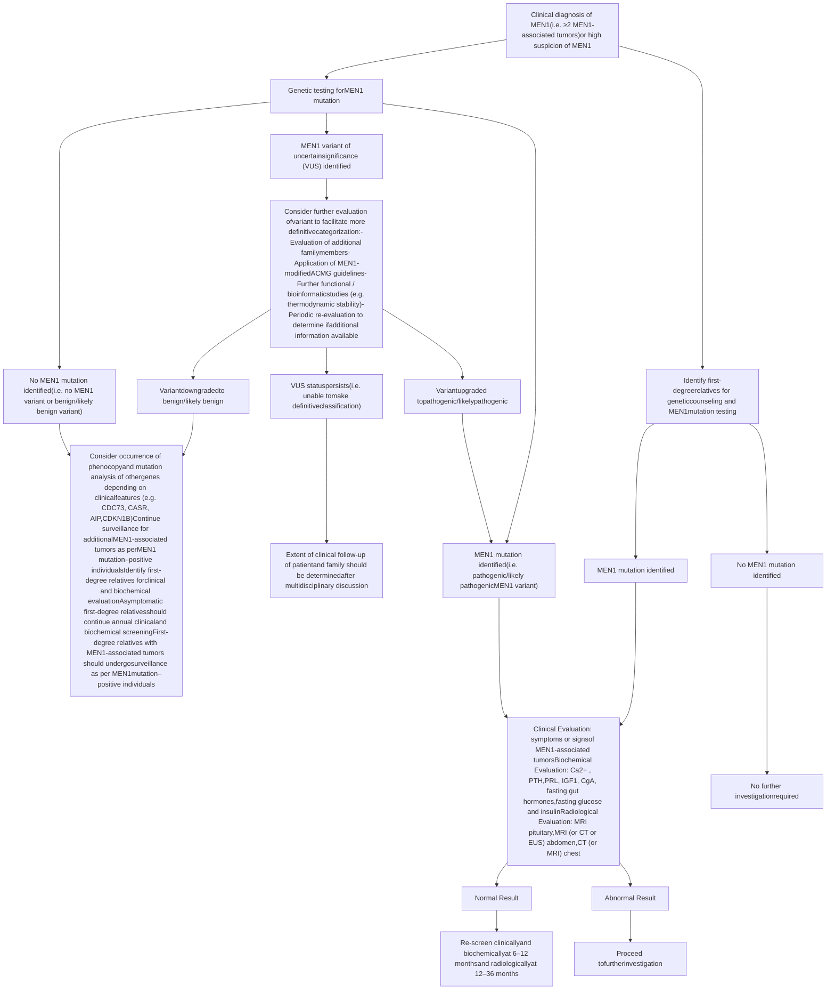

# Ch.42 Endocrine Neoplasia Syndromes — 中英對照（Bilingual EN/中文）

> 本檔為原始 LlamaParse 解析全文的**中英對照版**：保留完整英文原文，每個小片段後緊接繁體中文翻譯（`> 🇹🇼 中譯：`），方便 fellow 一邊讀原文一邊對照。
>
> 原始純英文全文見：[`Ch42-raw-LlamaParse.md`](Ch42-raw-LlamaParse.md)。文末 References（參考文獻）依慣例不翻譯。

---

# Endocrine Neoplasia Syndromes

> 🇹🇼 **中譯：** 內分泌腫瘤症候群

PAUL J. NEWEY AND RAJESH V. THAKKER

> 🇹🇼 **中譯：** PAUL J. NEWEY 與 RAJESH V. THAKKER

## CHAPTER OUTLINE

> 🇹🇼 **中譯：** 本章大綱

Introduction to the Endocrine Neoplasia Syndromes, 1678

Multiple Endocrine Neoplasia Type 1 (MEN1), 1678

Multiple Endocrine Neoplasia Type 2 (MEN2) and Type 3 (MEN3), 1695

Multiple Endocrine Neoplasia Type 4 (MEN4), 1710

Multiple Endocrine Neoplasia Type 5 (MEN5), 1711

Multiple Endocrine and Other Organ Neoplasia Syndromes (MEONs), 1711

Future Directions and Concluding Remarks, 1720

> 🇹🇼 **中譯：**
> - 內分泌腫瘤症候群導論，1678
> - 第 1 型多發性內分泌腫瘤（MEN1），1678
> - 第 2 型（MEN2）與第 3 型（MEN3）多發性內分泌腫瘤，1695
> - 第 4 型多發性內分泌腫瘤（MEN4），1710
> - 第 5 型多發性內分泌腫瘤（MEN5），1711
> - 多發性內分泌及其他器官腫瘤症候群（MEONs），1711
> - 未來方向與結語，1720

## KEY POINTS

> 🇹🇼 **中譯：** 重點摘要

* Multiple endocrine neoplasia (MEN) syndromes, which may be inherited as autosomal-dominant traits, are characterized by the occurrence of two or more endocrine tumors in a patient. A number of additional multiple endocrine and other organ neoplasia (MEON) syndromes are characterized by the occurrence of endocrine neoplasia alongside tumors of nonendocrine tissues.

> 🇹🇼 **中譯：** 多發性內分泌腫瘤（multiple endocrine neoplasia, MEN）症候群可以體染色體顯性（autosomal-dominant）方式遺傳，其特徵為單一病人身上出現兩個或更多的內分泌腫瘤。另有若干多發性內分泌及其他器官腫瘤（multiple endocrine and other organ neoplasia, MEON）症候群，其特徵為內分泌腫瘤與非內分泌組織腫瘤同時出現。

* The MEN syndromes include five major types (MEN1–MEN5), whereas the MEONs include a heterogeneous group of six disorders: hyperparathyroidism–jaw tumor (HPT-JT) syndrome, von Hippel-Lindau (VHL) disease, neurofibromatosis type 1 (NF1), Carney complex (CNC), Cowden syndrome (CS), and McCune-Albright syndrome (MAS).

> 🇹🇼 **中譯：** MEN 症候群包含五大型（MEN1–MEN5），而 MEONs 則包含一組異質性的六種疾患：副甲狀腺機能亢進—顎骨腫瘤（hyperparathyroidism–jaw tumor, HPT-JT）症候群、von Hippel-Lindau（VHL）疾病、第 1 型神經纖維瘤病（neurofibromatosis type 1, NF1）、Carney complex（CNC）、Cowden 症候群（CS）以及 McCune-Albright 症候群（MAS）。

* Of the MEN syndromes, MEN1 through MEN3 are most frequently encountered. MEN1 is characterized by the occurrence of parathyroid, anterior pituitary, and duodenopancreatic neuroendocrine tumors and is caused by mutations of the *MEN1* gene, which encodes the tumor-suppressor protein menin.

> 🇹🇼 **中譯：** 在 MEN 症候群中，以 MEN1 至 MEN3 最為常見。MEN1 的特徵為出現副甲狀腺（parathyroid）、前腦下垂體（anterior pituitary）及十二指腸胰臟神經內分泌腫瘤（duodenopancreatic neuroendocrine tumors），其成因為 *MEN1* 基因突變，該基因編碼腫瘤抑制蛋白 menin。

* MEN2 (also referred to as *MEN2A*) is characterized by the occurrence of medullary thyroid carcinoma (MTC), pheochromocytomas, and parathyroid tumors, whereas MEN3 (also referred to as *MEN2B*) is characterized by the occurrence of MTC and pheochromocytomas in association with a marfanoid habitus, mucosal neuromas, medullated corneal fibers, and *RET* intestinal ganglioneuromatosis. MEN2 and MEN3 are due to proto-oncogene mutations that lead to constitutive activation of the encoded receptor tyrosine kinase (TK).

> 🇹🇼 **中譯：** MEN2（亦稱為 *MEN2A*）的特徵為出現甲狀腺髓質癌（medullary thyroid carcinoma, MTC）、嗜鉻細胞瘤（pheochromocytomas）及副甲狀腺腫瘤；而 MEN3（亦稱為 *MEN2B*）的特徵則為出現 MTC 與嗜鉻細胞瘤，並合併馬凡氏體型（marfanoid habitus）、黏膜神經瘤（mucosal neuromas）、有髓鞘角膜纖維（medullated corneal fibers）以及 *RET* 腸道神經節瘤病（intestinal ganglioneuromatosis）。MEN2 與 MEN3 係因原致癌基因（proto-oncogene）突變所致，導致其所編碼的受體酪胺酸激酶（receptor tyrosine kinase, TK）持續性活化。

* The MEONs represent a heterogeneous group of monogenic disorders, each inherited as autosomal-dominant traits, with the exception of MAS, which results from a postzygotic somatic mutation of the *GNAS* gene.

> 🇹🇼 **中譯：** MEONs 代表一組異質性的單基因疾患，各以體染色體顯性方式遺傳，唯一的例外是 MAS，其成因為 *GNAS* 基因之合子後體細胞突變（postzygotic somatic mutation）。

* Genetic testing should be offered to the majority of patients suspected of having a MEN or MEON syndrome. Genetic testing should also be offered to relatives considered to be at high risk of disease (i.e., first-degree relatives of those harboring a germline pathogenic variant [“mutation”] in the respective gene). Individuals harboring a mutation, who are at risk of developing tumors, should be offered periodic clinical, biochemical, and/or radiologic screening for the early detection and treatment of tumors.

> 🇹🇼 **中譯：** 對於大多數疑似罹患 MEN 或 MEON 症候群的病人，均應提供基因檢測。對於被認為具高罹病風險的親屬（即帶有相應基因生殖系致病變異〔germline pathogenic variant，「突變」〕者的一等親）亦應提供基因檢測。帶有突變、具發生腫瘤風險的個體，應接受定期的臨床、生化及／或影像學篩檢，以利腫瘤的早期偵測與治療。

* Treatment of MEN and MEON patients, which aims to minimize the disease-associated morbidity and mortality while maintaining the quality of life, requires a multidisciplinary approach.

> 🇹🇼 **中譯：** MEN 與 MEON 病人的治療目標在於將疾病相關的罹病率與死亡率降至最低，同時維持生活品質，此需採取多專科團隊（multidisciplinary）的合作方式。

# Introduction to the Endocrine Neoplasia Syndromes

> 🇹🇼 **中譯：** 內分泌腫瘤症候群導論

Multiple endocrine neoplasia (MEN) is characterized by the occurrence of tumors involving two or more endocrine glands within a single patient.1,2 Five major forms of MEN, referred to as MEN types 1 through 5 (MEN1–MEN5), are recognized, and each form is characterized by the development of tumors within specific endocrine glands (Table 42.1).1,3 All these forms of MEN may be inherited as autosomal-dominant disorders or may occur sporadically in the absence of a family history.1,2

> 🇹🇼 **中譯：** 多發性內分泌腫瘤（MEN）的特徵為單一病人身上發生侵犯兩個或更多內分泌腺體的腫瘤。1,2 目前公認有五大型的 MEN，稱為 MEN 第 1 型至第 5 型（MEN1–MEN5），每一型的特徵為在特定內分泌腺體內發生腫瘤（表 42.1）。1,3 所有這些型別的 MEN 均可能以體染色體顯性疾患方式遺傳，或在無家族史的情況下散發性（sporadically）發生。1,2

However, this distinction between sporadic and familial cases may sometimes be difficult because in some sporadic cases, a familial history may be absent because the patient with the disease may have died before symptoms developed.

> 🇹🇼 **中譯：** 然而，散發性與家族性病例之間的區分有時並不容易，因為在某些散發性病例中之所以缺乏家族史，可能是由於該家族中罹病者在症狀出現之前即已死亡。

In addition to MEN1 through MEN5, six other multiple endocrine and other organ neoplasia (MEON) syndromes, which are associated with tumors involving one or more of the endocrine glands as well as nonendocrine organs, have been reported.4–8 These include hyperparathyroidism–jaw tumor (HPT-JT) syndrome, von Hippel-Lindau (VHL) disease, Carney complex (CNC), neurofibromatosis type 1 (NF1), Cowden syndrome (CS), and McCune-Albright syndrome (MAS); all of these may be inherited as autosomal-dominant disorders, except MAS, which is due to a mosaic expression of a postzygotic somatic cell mutation. This chapter will focus on describing the major clinical and molecular aspects of MEN1 through MEN5 before briefly describing each of the MEON syndromes.

> 🇹🇼 **中譯：** 除了 MEN1 至 MEN5 之外，文獻亦報告了其他六種多發性內分泌及其他器官腫瘤（MEON）症候群，其與侵犯一個或多個內分泌腺體以及非內分泌器官的腫瘤有關。4–8 這些包括副甲狀腺機能亢進—顎骨腫瘤（HPT-JT）症候群、von Hippel-Lindau（VHL）疾病、Carney complex（CNC）、第 1 型神經纖維瘤病（NF1）、Cowden 症候群（CS）以及 McCune-Albright 症候群（MAS）；除 MAS 外，所有這些疾患均可能以體染色體顯性方式遺傳，而 MAS 則因合子後體細胞突變的鑲嵌性表現（mosaic expression）所致。本章將著重描述 MEN1 至 MEN5 的主要臨床與分子層面，之後再簡要描述各個 MEON 症候群。

## Multiple Endocrine Neoplasia Type 1 (MEN1)

> 🇹🇼 **中譯：** 第 1 型多發性內分泌腫瘤（MEN1）

### Introduction

> 🇹🇼 **中譯：** 導論

MEN1, which has also been referred to as *Wermer syndrome*, is an autosomal-dominant disorder with an estimated prevalence of 1:30,000. MEN1 is characterized by the combined occurrence of parathyroid, pituitary, and duodenopancreatic neuroendocrine tumors. In addition, patients may also develop other endocrine tumors (e.g., adrenal cortical tumors, neuroendocrine tumors [NETs] of the thymus and bronchus) and nonendocrine tumors (e.g., meningiomas, facial angiofibromas, collagenomas, and cutaneous lipomas) (see Table 42.1).

> 🇹🇼 **中譯：** MEN1 亦曾被稱為 *Wermer syndrome*，是一種體染色體顯性疾患，估計盛行率為 1:30,000。MEN1 的特徵為合併出現副甲狀腺、腦下垂體（pituitary）及十二指腸胰臟神經內分泌腫瘤。此外，病人也可能發生其他內分泌腫瘤（如腎上腺皮質腫瘤〔adrenal cortical tumors〕、胸腺與支氣管的神經內分泌腫瘤〔NETs〕）以及非內分泌腫瘤（如腦膜瘤〔meningiomas〕、顏面血管纖維瘤〔facial angiofibromas〕、膠原瘤〔collagenomas〕及皮膚脂肪瘤〔cutaneous lipomas〕）（見表 42.1）。

The first description of MEN1 was reported by Erdheim in 1903, at autopsy in a patient with an anterior pituitary tumor and enlarged parathyroid glands.9 In the 1920s, the occurrence of pancreatic islet cell tumors in association with parathyroid and pituitary tumors was reported,10,11 and from 1930 to 1960, the triad of parathyroid, pancreatic islet cell, and anterior pituitary tumors became recognized as characteristic of MEN1, together with the familial basis and autosomal-dominant inheritance of the syndrome.12,13 Studies in the 1980s through 1990s of MEN1 families and MEN tumors led to the identification of the *MEN1* gene, which is located on chromosome 11q13.14–16

> 🇹🇼 **中譯：** MEN1 最早的描述由 Erdheim 於 1903 年提出，係在一名同時具有前腦下垂體腫瘤與副甲狀腺腫大病人的屍體解剖中發現。9 在 1920 年代，文獻報告了胰島細胞腫瘤（pancreatic islet cell tumors）與副甲狀腺及腦下垂體腫瘤合併出現的情形；10,11 自 1930 至 1960 年間，副甲狀腺、胰島細胞及前腦下垂體腫瘤這三聯徵（triad）被認定為 MEN1 的特徵，同時也確立了此症候群的家族性基礎與體染色體顯性遺傳。12,13 1980 至 1990 年代針對 MEN1 家族及 MEN 腫瘤的研究，使得位於染色體 11q13 的 *MEN1* 基因得以被鑑定出來。14–16

Since then, the implementation of germline *MEN1* genetic testing of affected individuals (and their relatives) has transformed the diagnosis and management of the disorder. In addition, somatic *MEN1* mutations have been identified as major drivers of sporadic (nonfamilial) parathyroid and pancreatic NETs, and this has widened the biologic and clinical significance of the *MEN1* gene and its encoded protein, menin, which consists of 610 amino acids and is a nuclear protein that acts as a tumor suppressor by interacting with other proteins in transcription regulation, genome stability, cell division and proliferation, and epigenetic regulation.

> 🇹🇼 **中譯：** 自此之後，對受影響個體（及其親屬）施行生殖系 *MEN1* 基因檢測，已徹底改變了此疾患的診斷與處置。此外，體細胞 *MEN1* 突變已被鑑定為散發性（非家族性）副甲狀腺與胰臟 NETs 的主要驅動因子，這拓寬了 *MEN1* 基因及其所編碼蛋白 menin 的生物學與臨床意義。menin 由 610 個胺基酸組成，是一種核蛋白，藉由與其他蛋白質在轉錄調控、基因組穩定性、細胞分裂與增生以及表觀遺傳調控等過程中的交互作用，發揮腫瘤抑制（tumor suppressor）的功能。

### Clinical Features and Management

> 🇹🇼 **中譯：** 臨床特徵與處置

The clinical manifestations of MEN1 are related to the sites of tumor development and/or consequences of hormone hypersecretion. MEN1 is a highly penetrant genetic disorder, such that virtually all patients with a *MEN1* mutation develop clinical or biochemical evidence of tumor development by the age of 50 years. MEN1 tumors are unusual in early childhood (i.e., ≤5 years of age) but thereafter demonstrate an increasing age-related penetrance such that ~20% to 70% of patients will have ≥1 tumor by the age of 18 to 21 years.17–19

> 🇹🇼 **中譯：** MEN1 的臨床表現與腫瘤發生的部位及／或荷爾蒙過度分泌的後果有關。MEN1 是一種高外顯率（highly penetrant）的遺傳疾患，因此幾乎所有帶有 *MEN1* 突變的病人，到 50 歲時都會出現腫瘤發生的臨床或生化證據。MEN1 腫瘤在幼兒早期（即 ≤5 歲）不常見，但其後隨年齡增加而呈現上升的外顯率，使得約 20% 至 70% 的病人在 18 至 21 歲時已具有 ≥1 個腫瘤。17–19

Parathyroid tumors are typically the first manifestation of disease in 75% to 90% of patients with MEN1 (see Table 42.1), although childhood presentations with pancreatic NETs (e.g., insulinoma) or pituitary tumors are not infrequent, whereas some patients may present with gastrinoma, thymic NETs, or adrenal tumors. Overall, clinically relevant duodenopancreatic NETs, including hormone-secreting and nonsecreting tumors (Fig. 42.1), occur in 40% to 70% of patients, whereas anterior pituitary tumors occur in 30% to 40% of patients.

> 🇹🇼 **中譯：** 在 75% 至 90% 的 MEN1 病人中，副甲狀腺腫瘤通常是疾病的首發表現（見表 42.1），不過以胰臟 NETs（如胰島素瘤〔insulinoma〕）或腦下垂體腫瘤為兒童期表現者亦不罕見，而部分病人則可能以胃泌素瘤（gastrinoma）、胸腺 NETs 或腎上腺腫瘤表現。整體而言，具臨床意義的十二指腸胰臟 NETs（包括分泌荷爾蒙與不分泌荷爾蒙的腫瘤）（圖 42.1）發生於 40% 至 70% 的病人，而前腦下垂體腫瘤則發生於 30% 至 40% 的病人。

The frequency of other endocrine tumors is variable, such that 20% to 55% of patients with MEN1 have adrenal tumors, whereas <10% manifest thymic NETs, and 5% to 30% may develop bronchopulmonary NETs. The recognition and appropriate management of the MEN1-associated tumors is important because they are associated with high morbidity and mortality, such that ~30% to 70% of patients with MEN1 will die of causes directly related to MEN1, with malignant duodenopancreatic NETs and thymic NETs accounting for the greatest risk of premature death.20

> 🇹🇼 **中譯：** 其他內分泌腫瘤的發生頻率不一，故 20% 至 55% 的 MEN1 病人具有腎上腺腫瘤，<10% 表現胸腺 NETs，5% 至 30% 可能發生支氣管肺部 NETs（bronchopulmonary NETs）。辨識並適當處置 MEN1 相關腫瘤相當重要，因為這些腫瘤與高罹病率及死亡率有關，使得約 30% 至 70% 的 MEN1 病人會死於與 MEN1 直接相關的原因，其中以惡性十二指腸胰臟 NETs 與胸腺 NETs 構成早逝的最大風險。20

A diagnosis of MEN1 may be established in an individual by one of three criteria1,21,22: on the basis of the occurrence of two or more primary MEN1-associated endocrine tumors (i.e., parathyroid adenoma, enteropancreatic tumor, and pituitary adenoma); the occurrence of one of the MEN1-associated tumors in a first-degree relative of a patient with a clinical diagnosis of MEN; and identification of a germline *MEN1* mutation in an individual, who may be asymptomatic and has not yet developed serum biochemical or radiologic abnormalities indicative of tumor development.

> 🇹🇼 **中譯：** 在個體身上可依下列三項標準之一來建立 MEN1 的診斷1,21,22：依據出現兩個或更多原發性 MEN1 相關內分泌腫瘤（即副甲狀腺腺瘤〔parathyroid adenoma〕、腸胰腫瘤〔enteropancreatic tumor〕及腦下垂體腺瘤〔pituitary adenoma〕）；於臨床診斷為 MEN 病人的一等親身上出現一種 MEN1 相關腫瘤；以及在個體身上鑑定出生殖系 *MEN1* 突變，該個體可能無症狀，且尚未出現指示腫瘤發生的血清生化或影像學異常。

The management of each of the respective MEN1-associated tumors is broadly similar to that of their sporadic counterparts, although there are several MEN1-specific factors that require consideration. Most importantly, MEN1-associated tumors are frequently multiple, thereby resulting in a reduced likelihood of surgical cure.

> 🇹🇼 **中譯：** 各個 MEN1 相關腫瘤的處置大致與其散發性對應腫瘤相似，不過有若干 MEN1 特有的因素需要考量。最重要的是，MEN1 相關腫瘤常為多發性，因而降低了手術治癒的可能性。

# TABLE 42.1 Multiple Endocrine Neoplasia (MEN) Syndromes and Their Characteristic Tumors and Associated Genetic Abnormalities

> 🇹🇼 **中譯：** 表 42.1　多發性內分泌腫瘤（MEN）症候群及其特徵性腫瘤與相關基因異常

<table>
  <thead>
    <tr>
        <th>Type (Chromosome Location)</th>
        <th>Tumors (Estimated Penetrance)</th>
        <th>Gene; Most Frequently Mutated Codons</th>
    </tr>
  </thead>
  <tbody>
    <tr>
        <td>MEN1 (11q13)</td>
        <td>Parathyroid adenoma (90%)</td>
        <td><em>MEN1</em></td>
    </tr>
    <tr>
        <td> </td>
        <td>Entero-pancreatic tumor (30%–70%)</td>
        <td>83/84, 4-bp del (~4%)</td>
    </tr>
    <tr>
        <td> </td>
        <td>* Gastrinoma (40%)</td>
        <td>119, 3-bp del (~3%)</td>
    </tr>
    <tr>
        <td> </td>
        <td>* Insulinoma (10%)</td>
        <td>209-211, 4-bp del (~8%)</td>
    </tr>
    <tr>
        <td> </td>
        <td>* Nonfunctioning (20%–55%)</td>
        <td>418, 3-bp del (~4%)</td>
    </tr>
    <tr>
        <td> </td>
        <td>* Glucagonoma (&lt;1%)</td>
        <td>514-516, del or ins (~7%)</td>
    </tr>
    <tr>
        <td> </td>
        <td>* VIPoma (&lt;1%)</td>
        <td>Intron 4 ss, (~10%)</td>
    </tr>
    <tr>
        <td> </td>
        <td>Pituitary adenoma (30%–40%)</td>
        <td> </td>
    </tr>
    <tr>
        <td> </td>
        <td>* Prolactinoma (20%)</td>
        <td> </td>
    </tr>
    <tr>
        <td> </td>
        <td>* Somatotrophinoma (10%)</td>
        <td> </td>
    </tr>
    <tr>
        <td> </td>
        <td>* Corticotropinoma (&lt;5%)</td>
        <td> </td>
    </tr>
    <tr>
        <td> </td>
        <td>* Nonfunctioning (&lt;5%–20%)</td>
        <td> </td>
    </tr>
    <tr>
        <td> </td>
        <td>Associated tumors</td>
        <td> </td>
    </tr>
    <tr>
        <td> </td>
        <td>* Adrenal cortical tumor (20%–40%)</td>
        <td> </td>
    </tr>
    <tr>
        <td> </td>
        <td>* Pheochromocytoma (&lt;1%)</td>
        <td> </td>
    </tr>
    <tr>
        <td> </td>
        <td>* Bronchopulmonary NET (2%)</td>
        <td> </td>
    </tr>
    <tr>
        <td> </td>
        <td>* Thymic NET (2%)</td>
        <td> </td>
    </tr>
    <tr>
        <td> </td>
        <td>* Gastric NET (10%)</td>
        <td> </td>
    </tr>
    <tr>
        <td> </td>
        <td>* Lipomas (30%)</td>
        <td> </td>
    </tr>
    <tr>
        <td> </td>
        <td>* Angiofibromas (85%)</td>
        <td> </td>
    </tr>
    <tr>
        <td> </td>
        <td>* Collagenomas (70%)</td>
        <td> </td>
    </tr>
    <tr>
        <td> </td>
        <td>* Meningiomas (8%)</td>
        <td> </td>
    </tr>
    <tr>
        <td colspan="3">MEN2/MEN3 (10 cen-10q11.2)</td>
    </tr>
    <tr>
        <td>MEN2A (also known as <em>MEN2</em>)</td>
        <td>MTC (90%)</td>
        <td><em>RET</em></td>
    </tr>
    <tr>
        <td> </td>
        <td>Pheochromocytoma (50%)</td>
        <td>634, missense (e.g., Cys→Arg)</td>
    </tr>
    <tr>
        <td> </td>
        <td>Parathyroid adenoma (20%–30%)</td>
        <td> </td>
    </tr>
    <tr>
        <td>MEN2B (also known as <em>MEN3</em>)</td>
        <td>MTC (&gt;90%)</td>
        <td><em>RET</em> 918, Met→Thr</td>
    </tr>
    <tr>
        <td> </td>
        <td>Pheochromocytoma (40%–50%)</td>
        <td> </td>
    </tr>
    <tr>
        <td> </td>
        <td>Associated abnormalities (40%–50%)</td>
        <td> </td>
    </tr>
    <tr>
        <td> </td>
        <td>* Mucosal neuromas</td>
        <td> </td>
    </tr>
    <tr>
        <td> </td>
        <td>* Marfanoid habitus</td>
        <td> </td>
    </tr>
    <tr>
        <td> </td>
        <td>* Medullated corneal nerve fibers</td>
        <td> </td>
    </tr>
    <tr>
        <td> </td>
        <td>* Megacolon</td>
        <td> </td>
    </tr>
    <tr>
        <td>MEN4 (12p13)</td>
        <td>Parathyroid adenomaa</td>
        <td><em>CDKN1B</em></td>
    </tr>
    <tr>
        <td> </td>
        <td>Pituitary adenomaa</td>
        <td>No common mutations identified</td>
    </tr>
    <tr>
        <td> </td>
        <td>Reproduction organ tumorsa (e.g., testicular cancer, neuroendocrine cervical carcinoma)</td>
        <td> </td>
    </tr>
    <tr>
        <td> </td>
        <td>?Adrenal + renal tumorsa</td>
        <td> </td>
    </tr>
    <tr>
        <td>MEN5 (14q23.3)</td>
        <td>Pheochromocytoma (may be bilateral, multifocal, and/or metastatic)a</td>
        <td><em>MAX</em> No common mutations identified</td>
    </tr>
  </tbody>
</table>

> 🇹🇼 **中譯（表 42.1 上半部說明）：** 欄位為「型別（染色體位置）」、「腫瘤（估計外顯率）」、「基因；最常突變的密碼子（codon）」。
> - **MEN1 (11q13)**：副甲狀腺腺瘤（90%）；腸胰腫瘤（30%–70%）—其下含 * 胃泌素瘤 Gastrinoma（40%）、* 胰島素瘤 Insulinoma（10%）、* 無功能性 Nonfunctioning（20%–55%）、* 升糖素瘤 Glucagonoma（<1%）、* VIPoma（<1%）；腦下垂體腺瘤（30%–40%）—其下含 * 泌乳素瘤 Prolactinoma（20%）、* 生長激素瘤 Somatotrophinoma（10%）、* 促腎上腺皮質素瘤 Corticotropinoma（<5%）、* 無功能性 Nonfunctioning（<5%–20%）；相關腫瘤（Associated tumors）—* 腎上腺皮質腫瘤（20%–40%）、* 嗜鉻細胞瘤（<1%）、* 支氣管肺部 NET（2%）、* 胸腺 NET（2%）、* 胃部 NET（10%）、* 脂肪瘤 Lipomas（30%）、* 血管纖維瘤 Angiofibromas（85%）、* 膠原瘤 Collagenomas（70%）、* 腦膜瘤 Meningiomas（8%）。基因為 *MEN1*；最常突變密碼子（原樣保留）：83/84, 4-bp del（~4%）、119, 3-bp del（~3%）、209-211, 4-bp del（~8%）、418, 3-bp del（~4%）、514-516, del or ins（~7%）、Intron 4 ss（~10%）。
> - **MEN2/MEN3 (10 cen-10q11.2)**。**MEN2A（亦稱 *MEN2*）**：MTC（90%）、嗜鉻細胞瘤（50%）、副甲狀腺腺瘤（20%–30%）；基因 *RET*，最常為 codon 634 錯義突變（missense，例如 Cys→Arg）。**MEN2B（亦稱 *MEN3*）**：MTC（>90%）、嗜鉻細胞瘤（40%–50%）、相關異常（40%–50%）—* 黏膜神經瘤、* 馬凡氏體型、* 有髓鞘角膜神經纖維、* 巨結腸症（Megacolon）；基因 *RET* codon 918, Met→Thr。
> - **MEN4 (12p13)**：副甲狀腺腺瘤a、腦下垂體腺瘤a、生殖器官腫瘤a（例如睪丸癌、神經內分泌子宮頸癌）、?腎上腺＋腎臟腫瘤a；基因 *CDKN1B*，未發現共通突變。
> - **MEN5 (14q23.3)**：嗜鉻細胞瘤（可能為雙側、多發及／或轉移性）a；基因 *MAX*，未發現共通突變。
> （上標 a 表示報告例數不足以提供盛行率資訊。）

# TABLE 42.1 Multiple Endocrine Neoplasia (MEN) Syndromes and Their Characteristic Tumors and Associated Genetic Abnormalities—cont’d

> 🇹🇼 **中譯：** 表 42.1（續）　多發性內分泌腫瘤（MEN）症候群及其特徵性腫瘤與相關基因異常

<table>
  <thead>
    <tr>
        <th>Type (Chromosome Location)</th>
        <th>Tumors (Estimated Penetrance)</th>
        <th>Gene; Most Frequently Mutated Codons</th>
    </tr>
  </thead>
  <tbody>
    <tr>
        <td> </td>
        <td>Pituitary adenoma (?GH, PRL-secreting)a ?Parathyroid adenomasa Neural crest tumors (e.g., Ganglioneuroma, neuroblastoma) (other tumors potentially associated with germline <em>MAX</em> mutations include renal cell carcinoma, renal oncocytoma, pancreatic NETs, chondrosarcoma)</td>
        <td> </td>
    </tr>
  </tbody>
</table>

> 🇹🇼 **中譯（表 42.1 續—MEN5 補充）：** 此列延續 MEN5（*MAX*）的相關腫瘤：腦下垂體腺瘤（?分泌 GH、PRL）a；?副甲狀腺腺瘤a；神經嵴腫瘤（neural crest tumors，例如神經節瘤 Ganglioneuroma、神經母細胞瘤 neuroblastoma）。（其他可能與生殖系 *MAX* 突變相關的腫瘤包括腎細胞癌〔renal cell carcinoma〕、腎嗜酸細胞瘤〔renal oncocytoma〕、胰臟 NETs、軟骨肉瘤〔chondrosarcoma〕。）

\*aInsufficient numbers reported to provide prevalence information.

Autosomal-dominant inheritance of the MEN syndromes has been established.

> 🇹🇼 **中譯：** a 報告例數不足以提供盛行率資訊。MEN 症候群之體染色體顯性遺傳已獲確立。

del, deletion; GH, growth hormone; ins, insertion; MTC, medullary thyroid carcinoma; NET, neuroendocrine tumor; PRL, prolactin; VIPoma, vasoactive intestinal polypeptide–secreting tumor. Modified from Thakker RV, Newey PJ, Walls GV, et al. Clinical practice guidelines for multiple endocrine neoplasia type 1 (MEN1). *J Clin Endocrinol Metab.* 2012;97(9):2990–3011.

> 🇹🇼 **中譯（縮寫說明）：** del, deletion（缺失）；GH, growth hormone（生長激素）；ins, insertion（插入）；MTC, medullary thyroid carcinoma（甲狀腺髓質癌）；NET, neuroendocrine tumor（神經內分泌腫瘤）；PRL, prolactin（泌乳素）；VIPoma, vasoactive intestinal polypeptide–secreting tumor（血管活性腸肽分泌性腫瘤）。（出處引文不翻譯，原樣保留。）

surgical cure. For example, patients with MEN1 often develop multiple small submucosal duodenal gastrinomas, such that achieving biochemical remission is difficult without extensive surgical resections. In this setting, disease control with proton pump inhibitor (PPI) therapy may be considered a suitable alternative and has been associated with improved long-term outcomes.

> 🇹🇼 **中譯：** （承接前段「手術治癒」）例如，MEN1 病人常發生多發性的小型黏膜下十二指腸胃泌素瘤（submucosal duodenal gastrinomas），因此若不進行廣泛的手術切除便難以達成生化緩解（biochemical remission）。在此情況下，以氫離子幫浦抑制劑（proton pump inhibitor, PPI）治療來控制疾病可被視為一項合適的替代方案，並且已被認為與較佳的長期預後相關。

Similarly, the occurrence of synchronous pancreatic NETs may make the planning of therapeutic interventions challenging (e.g., localizing functioning tumors for resection), and it is important to consider that any remnant pancreatic tissue post tumor resection will remain at risk of further tumor development. Thus, the goal of treatment in MEN1 should be to balance the potential risks and benefits of any intervention, with the ultimate aim of minimizing disease-associated morbidity and mortality while preserving the patient’s quality of life. In this regard, it is important that MEN1 is managed by a multidisciplinary team and that patients play an active role in the decision-making process.

> 🇹🇼 **中譯：** 同樣地，同時發生的多個胰臟 NETs（synchronous pancreatic NETs）可能使治療介入的規劃變得困難（例如定位有功能的腫瘤以利切除），且必須考量到腫瘤切除後任何殘留的胰臟組織仍將處於進一步發生腫瘤的風險之中。因此，MEN1 的治療目標應在於權衡任何介入的潛在風險與效益，最終目的是將疾病相關的罹病率與死亡率降至最低，同時保全病人的生活品質。就此而言，MEN1 應由多專科團隊處置，且病人在決策過程中扮演積極的角色，這點相當重要。

---

## Parathyroid Tumors

> 🇹🇼 **中譯：** 副甲狀腺腫瘤

### Clinical Features

> 🇹🇼 **中譯：** 臨床特徵

Primary hyperparathyroidism (PHPT) is the most common feature of MEN1 and occurs in approximately 95% of all patients; it is the first manifestation of MEN1 in 75% to 90% of patients.1,17,23 Patients are frequently asymptomatic, with only biochemical evidence of disease, although symptomatic presentations due to hypercalcemia (i.e., polyuria, polydipsia, constipation, malaise) or other manifestations, including nephrolithiasis, osteitis fibrosa cystica, or peptic ulceration, may occur.1 The diagnosis of PHPT is made by the demonstration of hypercalcemia in the presence of raised or inappropriately normal circulating PTH concentrations. The degree of hypercalcemia is usually mild, and severe hypercalcemia or parathyroid carcinoma is rare.1

> 🇹🇼 **中譯：** 原發性副甲狀腺功能亢進症（primary hyperparathyroidism, PHPT）是 MEN1 最常見的表現，約發生於 95% 的所有患者；在 75% 至 90% 的患者中，它是 MEN1 的首發表現。患者常無症狀，僅有疾病的生化證據，但仍可能出現因高血鈣引起的症狀（即多尿、多飲、便秘、倦怠）或其他表現，包括腎結石（nephrolithiasis）、纖維囊性骨炎（osteitis fibrosa cystica）或消化性潰瘍。PHPT 的診斷依據是在血中 PTH 濃度升高或不適當地正常的情況下證實有高血鈣。高血鈣的程度通常輕微，嚴重高血鈣或副甲狀腺癌（parathyroid carcinoma）則罕見。

PHPT in patients with MEN1 usually occurs at above 15 years of age, although symptomatic and asymptomatic presentations have been reported in children of 8 and 4 years of age, respectively.17 Biochemical evidence of PHPT has been reported in up to 80% of children and young adults with MEN1 below 21 years of age, although only a minority of these patients will have clinical features (e.g., nephrolithiasis).17–19,24

> 🇹🇼 **中譯：** MEN1 患者的 PHPT 通常發生在 15 歲以上，不過曾分別在 8 歲（有症狀）與 4 歲（無症狀）的兒童中有報告。在 21 歲以下的 MEN1 兒童與年輕成人中，高達 80% 曾被報告有 PHPT 的生化證據，但其中僅少數患者會出現臨床表現（例如腎結石）。

In addition to the early age of onset, MEN1-associated PHPT has other important differences when compared to non-MEN1 PHPT, and these include an equal sex distribution (M:F 1:1 vs. 1:3) and the synchronous or asynchronous involvement of all four parathyroid glands with tumors,1,17,25,26 which result from the monoclonal expansion of one or more population of cells within individuals glands, due to biallelic inactivation of the *MEN1* gene.27,28

> 🇹🇼 **中譯：** 除了發病年齡較早之外，MEN1 相關的 PHPT 與非 MEN1 的 PHPT 相比還有其他重要差異，包括性別分布相等（M:F 1:1，相對於非 MEN1 的 1:3），以及四個副甲狀腺同時或非同時受腫瘤侵犯；這是由於各個腺體內一個或多個細胞群的單株性（monoclonal）增生所致，其原因為 *MEN1* 基因的雙等位基因失活（biallelic inactivation）。

MEN1-associated PHPT is reported to be associated with a greater reduction in bone mineral density (BMD) than that occurring in non-MEN1 PHPT, such that osteoporosis and osteopenia are common in patients with MEN1.24,29,30 The reduction in BMD and bone demineralization in patients with MEN1 is particularly evident at the lumbar spine, femoral neck, and distal radius when compared to those with equivalent sporadic PHPT.30,31 These observations may be due to the earlier age of onset and chronicity of MEN1-associated PHPT or differences in disease pathogenesis.

> 🇹🇼 **中譯：** 據報告，MEN1 相關的 PHPT 與非 MEN1 的 PHPT 相比，骨密度（bone mineral density, BMD）下降更為明顯，因此骨質疏鬆症與骨質缺乏症在 MEN1 患者中很常見。與同等的散發性 PHPT 相比，MEN1 患者的 BMD 下降與骨礦物質流失在腰椎、股骨頸與遠端橈骨處特別明顯。這些觀察結果可能是由於 MEN1 相關 PHPT 發病較早且呈慢性，或疾病致病機轉的差異所致。

### Treatment

> 🇹🇼 **中譯：** 治療

Surgical removal of the overactive parathyroid glands is the treatment of choice for MEN1-associated PHPT. However, several aspects of management remain controversial, and these include the indications for and timing of surgery and the extent of surgery.1 These uncertainties reflect a paucity of high-quality evidence to guide clinical recommendations.1 Currently, surgery is recommended for MEN1-associated PHPT in those with symptomatic disease, severe hypercalcemia (i.e., >3.00 mmol/L), and/or evidence of end-organ damage (e.g., nephrolithiasis, hypercalciuria [>9 mmol/L per 24 hr or 400 mg/24 hr], creatinine clearance <60 mL/min, reduced BMD [i.e., T-score <–2.5], and/or previous fragility fracture).1

> 🇹🇼 **中譯：** 手術切除過度活躍的副甲狀腺是 MEN1 相關 PHPT 的首選治療。然而，處置上仍有數個有爭議之處，包括手術的適應症與時機，以及手術的範圍。這些不確定性反映出缺乏高品質證據來指導臨床建議。目前，對於有症狀的疾病、嚴重高血鈣（即 >3.00 mmol/L）和／或有標的器官損傷證據（例如腎結石、高尿鈣 [>9 mmol/L per 24 hr 或 400 mg/24 hr]、肌酸酐清除率 <60 mL/min、BMD 下降 [即 T-score <–2.5]，和／或既往脆性骨折）的 MEN1 相關 PHPT 患者，建議手術。

Most centers will recommend subtotal parathyroidectomy (removal of 3–3.5 glands) or total parathyroidectomy with autotransplantation of cryopreserved parathyroid tissue.1,32–35 Concurrent transcervical thymectomy is also suggested at the time of neck surgery to remove any supernumerary parathyroid tumors that may be embedded in the thymus (and to reduce [but not exclude] the future possibility of thymic NETs).1 Minimally invasive selective parathyroidectomy, unilateral clearance, and less than subtotal parathyroidectomy (i.e., removal of <3–3.5 glands) have not typically been recommended because all four parathyroid glands are usually affected with multiple adenomas or hyperplasia.

> 🇹🇼 **中譯：** 大多數中心會建議施行次全副甲狀腺切除術（subtotal parathyroidectomy，切除 3–3.5 個腺體），或全副甲狀腺切除術（total parathyroidectomy）合併冷凍保存副甲狀腺組織的自體移植。在頸部手術同時也建議施行經頸胸腺切除術（transcervical thymectomy），以移除任何可能嵌埋於胸腺中的多餘（supernumerary）副甲狀腺腫瘤（並降低 [但無法排除] 未來發生胸腺神經內分泌腫瘤 (NET) 的可能性）。微創選擇性副甲狀腺切除術、單側清除，以及少於次全的副甲狀腺切除術（即切除 <3–3.5 個腺體）通常不被建議，因為四個副甲狀腺通常都受多發性腺瘤或增生侵犯。

However, more recently, some have advocated these lesser approaches (e.g., unilateral clearance of ipsilateral glands) for younger patients with MEN1-associated hyperparathyroidism, aiming to achieve a period of eucalcemia without the risk of hypoparathyroidism, accepting that further surgery will be required at a later stage (see later discussion).

> 🇹🇼 **中譯：** 然而，較近期有些人主張對年輕的 MEN1 相關副甲狀腺功能亢進症患者採用這些較小範圍的術式（例如清除同側腺體），目的是在不冒副甲狀腺功能低下風險的情況下達到一段血鈣正常期，並接受日後需要進一步手術（見後文討論）。

The aims of parathyroid surgery in MEN1 are to maintain normocalcemia for as long as possible and to avoid iatrogenic complications of surgery, including laryngeal nerve damage and permanent hypoparathyroidism. The lowest risk of persistent or recurrent PHPT occurs with subtotal and total parathyroidectomy, with higher rates of recurrence occurring in those with less than subtotal parathyroidectomy.34–37 Most experts agree that bilateral neck exploration with subtotal parathyroidectomy (i.e., of at least 3.5 glands) with concomitant transcervical thymectomy is the preferred operation that strikes the best balance of achieving long-term eucalcemia with the risk of permanent hypoparathyroidism.24

> 🇹🇼 **中譯：** MEN1 副甲狀腺手術的目標是盡可能長時間維持血鈣正常，並避免手術的醫源性併發症，包括喉返神經（laryngeal nerve）損傷與永久性副甲狀腺功能低下。次全與全副甲狀腺切除術發生持續性或復發性 PHPT 的風險最低，而少於次全的副甲狀腺切除術復發率較高。大多數專家同意，雙側頸部探查合併次全副甲狀腺切除術（即至少切除 3.5 個腺體）並同時施行經頸胸腺切除術，是在達成長期血鈣正常與永久性副甲狀腺功能低下風險之間取得最佳平衡的首選術式。

Preoperative imaging studies (e.g., ultrasound [US], technetium-99m sestamibi, computed tomography [CT], magnetic resonance imaging [MRI], and fluorine-18 fluorocholine positron emission tomography [PET]/CT) are of limited value because all parathyroid glands may be affected, thereby necessitating an open bilateral neck exploration. Indeed, preoperative imaging in patients with MEN1 has been reported to not alter the surgical approach in >90% of patients; to have limited value in identifying ectopic parathyroid glands, which were correctly identified in only ~38% of cases; and to correctly localize only the largest parathyroid gland subsequently identified at surgery in 69% of cases while failing to identify enlarged contralateral glands in 86% of these cases.33,38 Despite these limitations, imaging studies are performed because they may still aid the surgeon in planning surgical neck exploration.

> 🇹🇼 **中譯：** 術前影像檢查（例如超音波 [US]、technetium-99m sestamibi、電腦斷層 [CT]、磁振造影 [MRI]，以及 fluorine-18 fluorocholine 正子斷層 [PET]/CT）的價值有限，因為所有副甲狀腺都可能受侵犯，因此需要開放式雙側頸部探查。事實上，據報告 MEN1 患者的術前影像在 >90% 的患者中並未改變手術方式；在辨識異位副甲狀腺方面價值有限，僅約 38% 的病例能正確辨識；且在 69% 的病例中僅能正確定位後續手術所辨識出的最大副甲狀腺，而在這些病例中有 86% 未能辨識出對側增大的腺體。儘管有這些限制，仍會施行影像檢查，因為它們仍可能協助外科醫師規劃頸部探查手術。

Total parathyroidectomy is reported to be associated with the highest risk of permanent hypoparathyroidism, which may occur in 13% to 67% of cases.35,37 The development of permanent hypoparathyroidism requires lifelong therapy with active vitamin D metabolites (i.e., calcitriol or alfacalcidol), and this may be associated with significant morbidity (e.g., due to development of inadvertent significant hypo- or hypercalcemia). Total parathyroidectomy with autotransplantation of either fresh or cryopreserved parathyroid tissue into the forearm has therefore been considered as an alternate approach.1

> 🇹🇼 **中譯：** 據報告，全副甲狀腺切除術發生永久性副甲狀腺功能低下的風險最高，可能發生於 13% 至 67% 的病例。永久性副甲狀腺功能低下的發生需要終身使用活性維生素 D 代謝物（即 calcitriol 或 alfacalcidol）治療，而這可能伴隨顯著的罹病率（例如因不慎發生明顯的低血鈣或高血鈣）。因此，全副甲狀腺切除術合併將新鮮或冷凍保存的副甲狀腺組織自體移植至前臂被視為一種替代方法。

The use of cryopreserved tissue allows confirmation of hypoparathyroidism postoperatively but is associated with a higher graft failure rate due to reduced cell viability and a higher rate of permanent hypoparathyroidism. Moreover, recurrent disease is frequently observed in the transplanted tissue,34 which may necessitate surgical removal,35 and the reported finding in a patient with MEN1 of a metastatic thymic carcinoma within the parathyroid autotransplanted tissue highlights the need for caution with this surgical approach.39

> 🇹🇼 **中譯：** 使用冷凍保存組織可在術後確認副甲狀腺功能低下，但由於細胞存活率降低而伴隨較高的移植失敗率，以及較高的永久性副甲狀腺功能低下率。此外，在移植組織中常觀察到疾病復發，可能需要手術切除；而曾報告一名 MEN1 患者在其副甲狀腺自體移植組織內出現轉移性胸腺癌（thymic carcinoma），凸顯了採用此術式時需審慎。

When compared to subtotal parathyroidectomy of at least 3.5 glands or total parathyroidectomy with autotransplantation, lesser surgical approaches are reported to be associated with higher rates of persistent or recurrent disease. For example, one study reported persistent hyperparathyroidism in 70% of patients with MEN1 who underwent removal of only 1 or 2 glands, 20% in those with 2.5 to 3 glands removed, and ~5% in those with removal of 3.5 glands.33

> 🇹🇼 **中譯：** 與切除至少 3.5 個腺體的次全副甲狀腺切除術或全副甲狀腺切除合併自體移植相比，據報告較小範圍的術式伴隨較高的持續性或復發性疾病率。例如，一項研究報告在僅切除 1 或 2 個腺體的 MEN1 患者中，70% 出現持續性副甲狀腺功能亢進；切除 2.5 至 3 個腺體者為 20%；切除 3.5 個腺體者約為 5%。

However, more recent studies have reported better short to medium outcomes with lesser approaches; for example, one study reported a persistent hyperparathyroidism or recurrent hyperparathyroidism rate of ~15% and ~20%, respectively, in those in whom one or two glands were removed after a median follow-up of ~9 years, without any occurrence of permanent hypoparathyroidism.40 Advocates of these lesser approaches (e.g., unilateral clearance) argue that in younger patients with apparent one- or two-gland involvement, achieving a period of eucalcemia without the risk of hypoparathyroidism offers some advantages over more substantial operations while accepting the likely need for future surgery.

> 🇹🇼 **中譯：** 然而，較近期的研究報告較小範圍術式有較佳的短至中期結果；例如，一項研究報告在切除一或兩個腺體者中，於中位數約 9 年的追蹤後，持續性副甲狀腺功能亢進與復發性副甲狀腺功能亢進的發生率分別約為 15% 與 20%，且未發生任何永久性副甲狀腺功能低下。這些較小範圍術式（例如單側清除）的支持者主張，在明顯僅一或兩個腺體受侵犯的年輕患者中，能在不冒副甲狀腺功能低下風險的情況下達到一段血鈣正常期，相較於範圍更大的手術具有一些優勢，同時接受日後可能需要再次手術。

Given the controversy in this area and lack of high-quality evidence to guide clinical recommendations, it is recommended that the timing and extent of surgical intervention should be undertaken by a multidisciplinary team that takes into account the local surgical expertise, the availability of vitamin D analogues for subsequent treatment of long-term hypoparathyroidism, and the preferences of the patient. Cinacalcet, a calcimimetic that is an allosteric modulator of the calcium-sensing receptor (CaSR), has been used to reduce or normalize plasma calcium and PTH levels in patients with MEN1 with PHPT in whom surgery is contraindicated because of comorbidities or has failed to cure the PHPT.41

> 🇹🇼 **中譯：** 鑑於此領域的爭議以及缺乏高品質證據來指導臨床建議，建議手術介入的時機與範圍應由多專科團隊（multidisciplinary team）決定，並考量當地的手術專長、可供日後治療長期副甲狀腺功能低下的維生素 D 類似物之取得性，以及患者的偏好。Cinacalcet 是一種擬鈣劑（calcimimetic），為鈣感知受體（calcium-sensing receptor, CaSR）的異位調節劑（allosteric modulator），已被用於對因共病而為手術禁忌或手術未能治癒 PHPT 的 MEN1 合併 PHPT 患者，以降低或使血漿鈣與 PTH 濃度正常化。

The optimal management of asymptomatic patients with MEN1, including children and young adults who manifest only mild biochemical features, remains to be defined, and at present, some centers advocate early treatment to minimize impacts on bone health, whereas others favor conservative treatment involving the regular assessment of patients for the onset of symptoms and/or associated complications, thereby avoiding the immediate risks associated with surgery (e.g., permanent hypoparathyroidism).1,17,33

> 🇹🇼 **中譯：** 無症狀 MEN1 患者（包括僅表現輕微生化特徵的兒童與年輕成人）的最佳處置方式仍待確立；目前有些中心主張早期治療以盡量減少對骨骼健康的影響，而其他中心則偏好保守治療，包括定期評估患者是否出現症狀和／或相關併發症，藉此避免與手術相關的立即風險（例如永久性副甲狀腺功能低下）。

## Pancreatic Neuroendocrine Tumors

> 🇹🇼 **中譯：** 胰臟神經內分泌腫瘤

Pancreatic NETs remain the leading cause of premature death in patients with MEN1. Clinically apparent pancreatic NETs are reported in 30% to 80% of patients with MEN1,1,17,24,42–48 although microscopic islet tumors are found in almost all patients with MEN1 when evaluated histopathologically.49 Pancreatic NETs (e.g., gastrinoma, insulinoma, and glucagonoma) may secrete excess hormones and result in relevant clinical features, or they may be nonsecreting (also referred to as nonfunctioning [NF]) tumors (see Fig. 42.1), and these include those producing pancreatic polypeptide (PPomas) that is not associated with clinical manifestations of hormonal excess.1

> 🇹🇼 **中譯：** 胰臟神經內分泌腫瘤（NET）仍是 MEN1 患者過早死亡的首要原因。據報告，臨床上明顯的胰臟 NET 發生於 30% 至 80% 的 MEN1 患者，不過在組織病理學評估時，幾乎所有 MEN1 患者都可發現顯微鏡下的胰島腫瘤。胰臟 NET（例如胃泌素瘤 gastrinoma、胰島素瘤 insulinoma、升糖素瘤 glucagonoma）可能分泌過量荷爾蒙而導致相關臨床表現，或可能為不分泌（也稱為無功能 [nonfunctioning, NF]）的腫瘤（見圖 42.1），其中包括產生胰多肽（pancreatic polypeptide）的腫瘤（PPomas），而這類腫瘤並不伴隨荷爾蒙過量的臨床表現。

Patients with MEN1 may have more than one synchronous pancreatic NET, and this may confound the interpretation of biochemical and imaging studies; for example, patients with MEN1 may have microscopic duodenal gastrinomas and concomitant NF pancreatic NETs, such that surgical resection of the pancreatic tumor alone will not resolve hypergastrinemia. The main goals of treatment for these MEN1-associated pancreatic NETs are to reduce the morbidity and mortality associated with their occurrence (i.e., relief of symptoms and risk of malignancy) while preserving the patient's quality of life.

> 🇹🇼 **中譯：** MEN1 患者可能有一個以上同時存在的胰臟 NET，這可能干擾生化與影像檢查的判讀；例如，MEN1 患者可能有顯微鏡下的十二指腸胃泌素瘤並同時合併 NF 胰臟 NET，因此單獨手術切除胰臟腫瘤並無法解決高胃泌素血症（hypergastrinemia）。這些 MEN1 相關胰臟 NET 治療的主要目標是降低其發生所伴隨的罹病率與死亡率（即緩解症狀與惡性風險），同時維持患者的生活品質。

However, there are many different treatments available (Fig. 42.2), and the absence of high-quality evidence for their efficacy makes it challenging to decide on correct therapy. For example, the ideal treatment of a nonmetastatic, single functioning pancreatic NET is surgical removal because this offers the only potentially curative treatment. Surgery is also recommended for NF pancreatic NETs deemed to be at a higher risk of malignancy (i.e., all tumors >2 cm, or those <2 cm with rapid growth or increased tumor grade).

> 🇹🇼 **中譯：** 然而，可用的治療方式繁多（圖 42.2），且因缺乏其療效的高品質證據，使得決定正確治療具有挑戰性。例如，對於未轉移、單一且具功能的胰臟 NET，理想的治療是手術切除，因為這提供唯一可能治癒的治療。對於被判定為惡性風險較高的 NF 胰臟 NET（即所有 >2 cm 的腫瘤，或 <2 cm 但快速生長或腫瘤分級升高者），也建議手術。

However, it is important to recognize that after surgery the remnant pancreatic tissue remains at risk of further tumor development, and pancreatic surgery is associated with high rates of early and late complications.46,50,51 A further challenge is that currently, noninvasive biomarkers of pancreatic tumor behavior are not available, such that the malignant potential of pancreatic NETs cannot be accurately predicted by tumor size, radiologic features, or hormone production.46,48,52,53

> 🇹🇼 **中譯：** 然而，必須認識到手術後殘餘的胰臟組織仍有發生進一步腫瘤的風險，且胰臟手術伴隨高比率的早期與晚期併發症。另一項挑戰是，目前尚無可用於評估胰臟腫瘤行為的非侵入性生物標記，因此無法藉由腫瘤大小、影像特徵或荷爾蒙分泌來準確預測胰臟 NET 的惡性潛能。

For the 15% to 30% of patients with pancreatic NETs who develop advanced disease (i.e., distant metastases), most commonly from NF pancreatic NETs and gastrinomas, treatment options include systemic and locoregional approaches, although their optimal use in MEN1 has not been established. Overall, the 5- and 10-year survival rate in those with nonmetastatic duodenopancreatic NETs is 95% and 86%, respectively, whereas in those with hepatic metastases, it is 65% and 50%, respectively.24,54 Thus, the occurrence of multiple pancreatic NETs and their varied and unpredictable malignant potential in patients with MEN1 pose major challenges in their management.1,52 The diagnosis of and treatments for these MEN1-associated pancreatic NETs will be reviewed.

> 🇹🇼 **中譯：** 對於 15% 至 30% 發展為晚期疾病（即遠端轉移）的胰臟 NET 患者（最常來自 NF 胰臟 NET 與胃泌素瘤），治療選擇包括全身性與局部區域性方法，不過其在 MEN1 中的最佳使用方式尚未確立。整體而言，未轉移的十二指腸胰臟 NET 患者的 5 年與 10 年存活率分別為 95% 與 86%，而有肝轉移者則分別為 65% 與 50%。因此，MEN1 患者多發性胰臟 NET 的發生及其多變且難以預測的惡性潛能，對其處置構成重大挑戰。以下將回顧這些 MEN1 相關胰臟 NET 的診斷與治療。

**Fig. 42.1** Nonfunctioning pancreatic neuroendocrine tumor (NET) in a 14-year-old patient with multiple endocrine neoplasia type 1 (MEN1). (A) Abdominal MRI scan demonstrates a low-intensity tumor, larger than 2.0 cm (anteroposterior maximal diameter), within the neck of pancreas (*arrow*). There was no evidence of invasion of adjacent structures or metastases. (B) The pancreatic NET was removed by surgery, and macroscopic examination confirmed the location of the tumor in the neck of the pancreas (*dashed circles*). Hematoxylin and eosin (*H&E*) examination demonstrated a tumor that was largely well circumscribed (C), but focally, the margin between tumor (paler cells) and normal pancreas was poorly defined (D). Immunostaining supported the clinical and biochemical diagnosis of a nonfunctioning pancreatic NET because the tumor did not have significant expression of gastrointestinal peptides (results for gastrin and insulin shown [E and F]) but did contain chromogranin A (G). (H) The proliferative index measured by *MIB-1* (Ki-67) was low, consistent with a low-grade tumor. Loss of menin expression was demonstrated in the tumor; in the adjacent nontumorous pancreatic tissue, nuclear menin expression is evident within pancreatic islets (I), whereas nuclear menin expression is lost within the tumor (J), consistent with biallelic inactivation of the *MEN1* gene. (A and C–J, modified from Newey PJ, Jeyabalan J, Walls GV, et al. Asymptomatic children with multiple endocrine neoplasia type 1 mutations may harbor nonfunctioning pancreatic neuroendocrine tumors. *J Clin Endocrinol Metab*. 2009;94:3640–3646.)

> 🇹🇼 **中譯：** 圖 42.1 一名 14 歲 MEN1 患者的無功能胰臟神經內分泌腫瘤（NET）。(A) 腹部 MRI 顯示胰臟頸部內一個低訊號強度、大於 2.0 cm（前後最大徑）的腫瘤（箭頭）。無侵犯鄰近結構或轉移的證據。(B) 該胰臟 NET 經手術切除，肉眼檢查確認腫瘤位於胰臟頸部（虛線圈）。蘇木素—伊紅（H&E）檢查顯示腫瘤大致界線清楚 (C)，但局部腫瘤（較淡的細胞）與正常胰臟之間的界線不清 (D)。免疫染色支持無功能胰臟 NET 的臨床與生化診斷，因為腫瘤並無明顯的腸胃道胜肽表現（顯示 gastrin 與 insulin 結果 [E 與 F]），但含有 chromogranin A (G)。(H) 以 MIB-1（Ki-67）測得的增殖指數偏低，與低分級腫瘤一致。腫瘤中顯示 menin 表現喪失；在鄰近的非腫瘤胰臟組織中，胰島內可見核內 menin 表現 (I)，而腫瘤內則喪失核內 menin 表現 (J)，與 *MEN1* 基因的雙等位基因失活一致。（A 與 C–J，改編自 Newey PJ 等人之文獻。）

**Fig. 42.2** Current and emerging medical therapies for pancreatic neuroendocrine tumors (NETs). Medical therapies for pancreatic NETs include drugs, biotherapies, and antibodies that target different pathways in cancer cells. Somatostatin analogues (e.g., octreotide and lanreotide) are used widely in the treatment of pancreatic NETs. Somatostatin analogues target members of the somatostatin receptor family on the tumor cell surface to control excess hormone secretion and inhibit growth (i.e., antiproliferative effects). Additional medical therapies include mammalian target of rapamycin (mTOR) inhibitors (e.g., everolimus) and receptor tyrosine kinase (RTK) inhibitors (e.g., sunitinib and pazopanib), which have been shown to delay pancreatic NET tumor progression. Current clinical trials are investigating the use of these agents in combination or with other therapies, including monoclonal antibodies targeting the VEGFR (e.g., bevacizumab). Interferon-α (IFNα), which targets the IFNα/β-receptor (IFNAR), may also be effective in symptom and tumor control. Chemotherapeutic agents may also be effective in the treatment of metastatic pancreatic NETs and include alkylating agents (e.g., streptozocin, temozolomide, cisplatin, cyclophosphamide, procarbazine, dacarbazine, and oxaliplatin), antimicrotubule agents (e.g., docetaxel and etoposide), antimetabolites (e.g., 5-fluorouracil, capecitabine, and gemcitabine), topoisomerase inhibitors (e.g., doxorubicin, etoposide, and irinotecan), and cytotoxic antibiotics (e.g., actinomycin D, doxorubicin, mitomycin C, mitoxantrone). Combinations of chemopreventative agents that target different cellular pathways are more frequently used rather than as a monotherapy. VEGFA, vascular endothelial growth factor A. (Modified from Frost M, Lines KE, Thakker RV. Current and emerging therapies for PNETs in patients with or without MEN1. *Nat Rev Endocrinol.* 2018;14:216–227.)

> 🇹🇼 **中譯：** 圖 42.2 胰臟神經內分泌腫瘤（NET）目前與新興的藥物治療。胰臟 NET 的藥物治療包括針對癌細胞不同路徑的藥物、生物治療與抗體。體抑素類似物（somatostatin analogues，例如 octreotide 與 lanreotide）廣泛用於胰臟 NET 的治療，其作用於腫瘤細胞表面的體抑素受體家族成員，以控制過量荷爾蒙分泌並抑制生長（即抗增殖作用）。其他藥物治療包括 mTOR 抑制劑（例如 everolimus）與受體酪胺酸激酶（RTK）抑制劑（例如 sunitinib 與 pazopanib），已證實可延緩胰臟 NET 的腫瘤進展。目前的臨床試驗正研究將這些藥物合併使用或與其他治療併用，包括針對 VEGFR 的單株抗體（例如 bevacizumab）。針對 IFNα/β 受體（IFNAR）的干擾素-α（IFNα）也可能有效控制症狀與腫瘤。化療藥物對轉移性胰臟 NET 的治療也可能有效，包括烷化劑（例如 streptozocin、temozolomide、cisplatin、cyclophosphamide、procarbazine、dacarbazine、oxaliplatin）、抗微管劑（例如 docetaxel、etoposide）、抗代謝劑（例如 5-fluorouracil、capecitabine、gemcitabine）、拓樸異構酶抑制劑（例如 doxorubicin、etoposide、irinotecan），以及細胞毒性抗生素（例如 actinomycin D、doxorubicin、mitomycin C、mitoxantrone）。針對不同細胞路徑的化學預防藥物較常以組合方式使用，而非單一治療。VEGFA，血管內皮生長因子 A。（改編自 Frost M 等人之文獻。）

# Gastrinoma

> 🇹🇼 **中譯：** 胃泌素瘤

## Clinical Features

> 🇹🇼 **中譯：** 臨床特徵

Gastrin-secreting tumors are associated with a marked overproduction of gastric acid, which results in recurrent peptic ulceration, a combination referred to as *Zollinger-Ellison syndrome* (ZES).⁵⁵ Symptoms of ZES include those associated with peptic ulceration (i.e., abdominal pain, heartburn), as well as weight loss, diarrhea, and steatorrhea.¹ In addition, esophageal stricture and/or Barrett esophagus are also more common in patients with ZES, whereas acute presentations with small bowel perforation and/or hemorrhage secondary to peptic ulceration contribute to the high morbidity associated with ZES. Symptomatic presentations are rare in childhood, although they have been reported in children <10 years of age.¹⁷

> 🇹🇼 **中譯：** 分泌胃泌素（gastrin）的腫瘤伴隨胃酸的明顯過度產生，導致反覆的消化性潰瘍，此組合稱為 *Zollinger-Ellison 症候群*（ZES）。ZES 的症狀包括與消化性潰瘍相關者（即腹痛、胃灼熱），以及體重減輕、腹瀉與脂肪瀉。此外，食道狹窄和／或巴瑞特食道（Barrett esophagus）在 ZES 患者中也較常見，而繼發於消化性潰瘍的小腸穿孔和／或出血等急性表現則造成 ZES 相關的高罹病率。有症狀的表現在兒童期罕見，不過曾在 <10 歲的兒童中有報告。

Gastrinomas occur in ∼20% to 60% of patients with MEN1⁵²,⁵⁶,⁵⁷ and are found more frequently in adult males.²⁵ Approximately 20% of patients with sporadic gastrinoma will have MEN1.¹ MEN1-associated gastrinomas frequently occur as small (<5 mm in diameter), multiple nodular lesions deep within the duodenal mucosa and are only rarely observed in the pancreas,⁵⁶,⁵⁸ in contrast to sporadic gastrinomas, which typically occur as solitary tumors within the pancreas or duodenum.

> 🇹🇼 **中譯：** 胃泌素瘤發生於約 20% 至 60% 的 MEN1 患者，且較常見於成年男性。約 20% 的散發性胃泌素瘤患者會有 MEN1。MEN1 相關的胃泌素瘤常以小型（直徑 <5 mm）、多發性結節病灶出現於十二指腸黏膜深處，僅罕見於胰臟，這與散發性胃泌素瘤不同——後者通常以單一腫瘤出現於胰臟或十二指腸內。

In addition, MEN1-associated gastrinomas often occur as microscopic tumors (i.e., <1 mm), which, despite their small size, frequently metastasize to local lymph nodes at an early stage in the disease course.⁵⁶,⁵⁸ Indeed, local lymph node metastases are found in 30% to 70% of cases at diagnosis,⁵²,⁵⁹ although advanced presentations with hepatic metastases are rare in MEN1, but when present, they are associated with a poor prognosis.⁶⁰ Additional poor prognostic indicators include markedly elevated gastrin levels (e.g., >20× the upper limit of normal), co-occurrence of pancreatic tumors >2 cm, and age >40 years.⁶¹

> 🇹🇼 **中譯：** 此外，MEN1 相關的胃泌素瘤常以顯微鏡下的腫瘤（即 <1 mm）出現，儘管體積小，卻常在疾病病程的早期即轉移至局部淋巴結。事實上，診斷時有 30% 至 70% 的病例可見局部淋巴結轉移，不過在 MEN1 中伴隨肝轉移的晚期表現罕見，但若出現則伴隨不良預後。其他不良預後指標包括胃泌素濃度明顯升高（例如 >正常上限的 20 倍）、合併出現 >2 cm 的胰臟腫瘤，以及年齡 >40 歲。

Overall 5- and 10-year survival in patients with MEN1 with gastrinomas has been reported to be 83% and 65%, respectively, in a national cohort, which was worse than that for patients with MEN1 without gastrinomas.⁶¹ Gastrinoma in patients with MEN1 appears to occur rarely in the absence of PHPT, and successful treatment of PHPT with restoration of normocalcemia is reported to result in symptomatic and biochemical improvements in ~20% of patients with MEN1 with hypergastrinemia and ZES.⁶² It is also reported that gastrinoma (and severity of hypergastrinemia) is associated with past *Helicobacter pylori* infection in patients with MEN1.⁶³

> 🇹🇼 **中譯：** 在一項全國性世代研究中，據報告 MEN1 合併胃泌素瘤患者的整體 5 年與 10 年存活率分別為 83% 與 65%，較無胃泌素瘤的 MEN1 患者為差。在沒有 PHPT 的情況下，MEN1 患者似乎罕見發生胃泌素瘤；據報告成功治療 PHPT 並恢復血鈣正常後，約 20% 合併高胃泌素血症與 ZES 的 MEN1 患者可獲得症狀與生化的改善。此外也有報告指出，MEN1 患者的胃泌素瘤（以及高胃泌素血症的嚴重程度）與過去的 *Helicobacter pylori*（幽門螺旋桿菌）感染有關。

The diagnosis of gastrinoma is made by demonstrating an increased fasting serum gastrin in association with increased basal gastric acid secretion.¹ A raised fasting serum gastrin alone is insufficient to make the diagnosis because this may occur in achlorhydria, antral G-cell hyperplasia, *H. pylori* infection, renal failure, hypercalcemia, and use of PPI therapy.⁶⁴,⁶⁵ Occasionally, an intravenous provocation test with secretin or calcium, which will be associated with a marked increase in gastrin in patients with gastrinoma, may help in the diagnosis.¹

> 🇹🇼 **中譯：** 胃泌素瘤的診斷依據是證實空腹血清胃泌素升高並伴隨基礎胃酸分泌增加。單憑空腹血清胃泌素升高不足以做出診斷，因為這也可能發生於胃酸缺乏（achlorhydria）、胃竇 G 細胞增生（antral G-cell hyperplasia）、*H. pylori* 感染、腎衰竭、高血鈣以及使用 PPI 治療時。偶爾，以 secretin 或鈣進行的靜脈激發試驗（在胃泌素瘤患者中會伴隨胃泌素明顯升高）可能有助於診斷。

MEN1-associated gastrinomas in the duodenum may be localized by endoscopic ultrasound, CT, MRI, selective angiography, and/or SRS. Selective arterial secretagogue injection (SASI) (e.g., calcium) and hepatic venous gastrin measurements may also help to localize the tumor.¹ It is now recognized that gastrinomas occurring within the pancreas are an exception in patients with MEN1, although concomitant duodenal gastrinomas with synchronous NF pancreatic NETs are not uncommon.⁴⁶,⁶¹,⁶⁶

> 🇹🇼 **中譯：** 位於十二指腸的 MEN1 相關胃泌素瘤可藉由內視鏡超音波、CT、MRI、選擇性血管攝影和／或體抑素受體閃爍掃描（SRS）來定位。選擇性動脈促分泌劑注射（selective arterial secretagogue injection, SASI，例如鈣）與肝靜脈胃泌素測定也可能有助於腫瘤定位。現已認識到，發生於胰臟內的胃泌素瘤在 MEN1 患者中屬例外，不過十二指腸胃泌素瘤同時合併存在的 NF 胰臟 NET 並不罕見。

## Treatment

> 🇹🇼 **中譯：** 治療

The lack of results from prospective randomized controlled trials of treatments in patients with MEN1 with gastrinomas makes their management challenging and reliant on expert opinion.¹,²⁴,⁴⁶,⁴⁷,⁵²,⁶¹ The aims of treatment should be to ameliorate the symptoms and/or sequelae of the associated hypergastrinemia while reducing the likelihood of developing advanced metastatic disease. The medical treatment of gastrinoma was transformed following the introduction of PPI therapies (e.g., omeprazole and lansoprazole), which are highly efficacious at reducing basal acid secretion to <10 mmol/L and reducing symptoms associated with gastrinoma.¹

> 🇹🇼 **中譯：** 由於缺乏對 MEN1 合併胃泌素瘤患者治療的前瞻性隨機對照試驗結果，使得其處置具有挑戰性並仰賴專家意見。治療的目標應為改善相關高胃泌素血症的症狀和／或後遺症，同時降低發展為晚期轉移性疾病的可能性。胃泌素瘤的藥物治療在質子幫浦抑制劑（PPI，例如 omeprazole 與 lansoprazole）問世後有了轉變，這類藥物對於將基礎胃酸分泌降至 <10 mmol/L 並減輕胃泌素瘤相關症狀極為有效。

H₂-receptor antagonists (e.g., ranitidine) may be added if symptoms remain uncontrolled on high-dose PPI. These therapies represent the mainstay of treatment for controlling symptoms and have resulted in a marked reduction in the morbidity and mortality previously associated with ZES in patients with MEN1. However, the effects on tumor growth and/or risk of developing advanced disease with this treatment are not established. In addition, the role of somatostatin analogue therapy in MEN1-associated gastrinomas, which may express somatostatin receptors, remains to be established.

> 🇹🇼 **中譯：** 若高劑量 PPI 仍無法控制症狀，可加用 H₂ 受體拮抗劑（例如 ranitidine）。這些治療是控制症狀的主要方式，並已使 MEN1 患者過去與 ZES 相關的罹病率與死亡率明顯降低。然而，此治療對腫瘤生長和／或發展為晚期疾病風險的影響尚未確立。此外，體抑素類似物治療在可能表現體抑素受體的 MEN1 相關胃泌素瘤中的角色，仍待確立。

The role of surgery in MEN1-associated gastrinoma remains controversial, which in part is due to not knowing the long-term natural course of disease in patients with MEN1.⁴⁶,⁵²,⁶⁶⁻⁶⁸ Overall, the prognosis of gastrinoma in patients with MEN1 is reported to be good, with 5-, 10-, and 20-year survival rates of 80% to 96%, 65% to 96%, and 58% to 90%, respectively.¹,⁶¹,⁶⁹,⁷⁰ Surgery is recommended for gastrinomas >2 cm, which is a rare occurrence (see earlier discussion). The role of surgery for duodenal gastrinomas remains controversial, with some centers advocating an initial medical approach and others pursuing surgical intervention.

> 🇹🇼 **中譯：** 手術在 MEN1 相關胃泌素瘤中的角色仍有爭議，部分原因是 MEN1 患者疾病的長期自然病程尚未明瞭。整體而言，據報告 MEN1 患者胃泌素瘤的預後良好，5 年、10 年與 20 年存活率分別為 80% 至 96%、65% 至 96%，以及 58% 至 90%。對於 >2 cm 的胃泌素瘤建議手術，但這種情況罕見（見前文討論）。十二指腸胃泌素瘤的手術角色仍有爭議，有些中心主張先採藥物治療，其他中心則採取手術介入。

Centers advocating a nonsurgical approach point to the excellent long-term prognosis associated with smaller tumors, even in the presence of lymph node metastases; the reduced surgical cure rates in the presence of multiple small duodenal tumors; the potential high morbidity associated with pancreaticoduodenal resections; the excellent symptom control achieved with PPI therapy; and the lack of evidence demonstrating improved survival in those undergoing surgical resections.¹,⁵²,⁶⁹

> 🇹🇼 **中譯：** 主張非手術方法的中心指出：即使有淋巴結轉移，較小腫瘤仍伴隨極佳的長期預後；在存在多發性小型十二指腸腫瘤時手術治癒率降低；胰十二指腸切除術潛在的高罹病率；PPI 治療所達到的極佳症狀控制；以及缺乏證據顯示接受手術切除者的存活率改善。

In contrast, centers advocating early surgical intervention in patients with MEN1-associated gastrinoma point to results that have achieved eugastrinemia in 30% to 90% of patients over the short to medium term.⁶⁶,⁷¹⁻⁷³ Surgical approaches in these studies have included duodenotomy with excision of gastrinomas in the duodenal mucosa, coupled with enucleation (if feasible) or resection of tumors in the pancreatic head, peripancreatic and lymph node removal, and corporacaudal pancreatic resection; partial pancreaticoduodenectomy; pancreas-preserving total duodenectomy; and total pancreaticoduodenectomy.¹,⁴⁶,⁵²,⁶⁶,⁷¹,⁷²,⁷⁴,⁷⁵

> 🇹🇼 **中譯：** 相對地，主張對 MEN1 相關胃泌素瘤患者早期手術介入的中心，則指出已在短至中期內使 30% 至 90% 的患者達到胃泌素正常化（eugastrinemia）的結果。這些研究中的手術方法包括：十二指腸切開術合併切除十二指腸黏膜中的胃泌素瘤，並合併摘除（若可行）或切除胰頭腫瘤、胰周與淋巴結清除，以及胰體尾部切除；部分胰十二指腸切除術；保留胰臟的全十二指腸切除術；以及全胰十二指腸切除術。

Total pancreaticoduodenectomy (i.e., Whipple procedure), which is associated with a substantially greater risk of diabetes mellitus and malabsorption, is rarely performed and is typically reserved for patients with diffuse large pancreatic tumors.¹ Given the lack of consensus on the indications for surgery in patients with MEN1, reflecting a lack of accurate predictive biomarkers of disease course, and the generally favorable outcomes in the majority of patients in those managed medically, many centers advocate nonsurgical management for the majority of patients with MEN1 with gastrinomas. However, the option of surgery may be appropriate for some patients with MEN1 who attend centers with suitable surgical experience, although such surgery should only be undertaken after a full discussion with the patient of the potential risks and benefits.¹,⁴⁶,⁵²

> 🇹🇼 **中譯：** 全胰十二指腸切除術（即 Whipple 手術）伴隨明顯較高的糖尿病與吸收不良風險，甚少施行，通常保留給有瀰漫性大型胰臟腫瘤的患者。鑑於 MEN1 患者手術適應症缺乏共識（反映缺乏準確的疾病病程預測性生物標記），以及多數採藥物處置的患者結果普遍良好，許多中心主張對多數 MEN1 合併胃泌素瘤的患者採非手術處置。然而，對於就診於具備合適手術經驗中心的某些 MEN1 患者，手術選擇可能是適當的，不過此類手術應僅在與患者充分討論潛在風險與益處後才施行。

The management of advanced/disseminated gastrinomas is difficult and does not differ from that of sporadic disease. Chemotherapy with streptozotocin and 5-fluorouracil, capecitabine and temozolomide, cisplatin and etoposide, hormonal therapy with octreotide or lanreotide (which are human somatostatin analogues (SSAs) (see Fig. 42.2), selected internal radiation therapy (SIRT), radiofrequency ablation (RFA), peptide receptor radionuclide therapy (PRRT), hepatic artery embolization, administration of human leukocyte interferon, and removal of all resectable tumor and hepatic transplantation have each been employed with occasional benefit.⁵²,⁷¹

> 🇹🇼 **中譯：** 晚期／瀰漫性胃泌素瘤的處置困難，且與散發性疾病無異。包括 streptozotocin 加 5-fluorouracil、capecitabine 加 temozolomide、cisplatin 加 etoposide 的化療，以 octreotide 或 lanreotide（為人類體抑素類似物 [SSAs]，見圖 42.2）的荷爾蒙治療，選擇性體內放射治療（SIRT）、射頻燒灼（RFA）、胜肽受體放射性核素治療（PRRT）、肝動脈栓塞、施予人類白血球干擾素，以及切除所有可切除腫瘤並施行肝臟移植，各種方法皆曾被使用且偶有助益。

# Insulinoma

> 🇹🇼 **中譯：** 胰島素瘤

## Clinical Features

> 🇹🇼 **中譯：** 臨床特徵

Insulinomas, which arise from pancreatic islet β-cells, occur in ~10% to 30% of patients with MEN1, and 5% to 10% of patients presenting with insulinoma will have MEN1.¹,¹⁷,²³,²⁶ Insulinomas in patients with MEN1 frequently occur, in contrast to non-MEN1 patients, before the age of 40 years and may be the first manifestation of MEN1 in ~10% of cases. Indeed, a study of 160 patients with MEN1 younger than 21 years of age observed insulinomas to occur in 12% of the cohort, with the earliest presentation at 5 years of age,¹⁷ and a similar proportion (~14%) of affected children and young persons was reported in another multicenter cohort.¹⁸

> 🇹🇼 **中譯：** 胰島素瘤源自胰島 β 細胞，發生於約 10% 至 30% 的 MEN1 患者，而 5% 至 10% 以胰島素瘤表現的患者會有 MEN1。與非 MEN1 患者不同，MEN1 患者的胰島素瘤常發生於 40 歲之前，並可能在約 10% 的病例中為 MEN1 的首發表現。事實上，一項針對 160 名 21 歲以下 MEN1 患者的研究觀察到該世代中有 12% 發生胰島素瘤，最早發病為 5 歲；另一項多中心世代研究也報告了相近比例（約 14%）的受影響兒童與年輕人。

Patients with MEN1 with insulinomas typically present with symptoms of hypoglycemia (e.g., weakness, headaches, sweating, faintness, anxiety, altered behavior, seizures, and loss of consciousness) that develop after fasting or exercise and improve after glucose (food) intake.¹⁷ The diagnosis of insulinoma in MEN1 does not differ from that in patients with sporadic insulinoma and is most reliably made by a supervised 72-hour fast,¹,⁶⁵ in which hypoglycemia (i.e., glucose <2.2 mmol/L [40 mg/dL]) is documented in the presence of inappropriately elevated concentrations of insulin (together with pro-insulin and C-peptide).¹

> 🇹🇼 **中譯：** 合併胰島素瘤的 MEN1 患者通常以低血糖症狀表現（例如虛弱、頭痛、出汗、暈眩、焦慮、行為改變、癲癇發作與意識喪失），這些症狀於禁食或運動後出現，並在攝取葡萄糖（食物）後改善。MEN1 中胰島素瘤的診斷與散發性胰島素瘤患者無異，最可靠的方式是進行受監督的 72 小時禁食試驗，在試驗中記錄到低血糖（即葡萄糖 <2.2 mmol/L [40 mg/dL]）同時伴隨不適當升高的胰島素濃度（連同 pro-insulin 與 C-peptide）。

Following biochemical diagnosis, preoperative localization is required to guide the surgical approach, although such studies may be confounded by the presence of multiple synchronous tumors. The majority of insulinomas are benign tumors occurring as single lesions in the body or tail of the pancreas, although multiple or multicentric insulinomas may be observed in 30% to 40% of patients with MEN1, whereas malignant tumors occur infrequently.46,76 Imaging modalities routinely employed for preoperative localization include endoscopic ultrasound, CT, and MRI, whereas more specialized methods, including celiac axis angiography and selective intraarterial calcium stimulation combined with hepatic venous insulin measurements, may also be required.

> 🇹🇼 **中譯：** 生化診斷之後，需要術前定位以指導手術方式，不過此類檢查可能因存在多個同時性腫瘤而受干擾。大多數胰島素瘤是良性腫瘤，以單一病灶出現於胰臟體部或尾部，不過在 30% 至 40% 的 MEN1 患者中可觀察到多發性或多中心性胰島素瘤，而惡性腫瘤則不常見。常規用於術前定位的影像方式包括內視鏡超音波、CT 與 MRI，而較專門的方法（包括腹腔軸血管攝影與選擇性動脈內鈣刺激合併肝靜脈胰島素測定）也可能需要。

Somatostatin receptor scintigraphy (SRS) with 111In-octreotide has been reported to be associated with low sensitivity for insulinomas (20%–60%), whereas 68Ga-DOTATATE PET/CT may have a higher sensitivity, but it may also detect other noninsulinoma pancreatic NETs.77,78 Scintigraphy based on glucagon-like peptide-1 (GLP1) has also been reported to be highly sensitive in localizing insulinomas when compared to conventional imaging modalities, and it may provide a useful diagnostic modality.77–79 The utility of fluorodeoxyglucose (FDG)-PET/CT for insulinoma detection is typically limited to high-grade metastatic disease.⁷⁷ Finally, direct intraoperative pancreatic ultrasound may be useful at the time of surgery to identify the likely tumor.

> 🇹🇼 **中譯：** 據報告，使用 111In-octreotide 的體抑素受體閃爍掃描（SRS）對胰島素瘤的敏感度偏低（20%–60%），而 68Ga-DOTATATE PET/CT 可能有較高的敏感度，但也可能偵測到其他非胰島素瘤的胰臟 NET。據報告，與傳統影像方式相比，基於類升糖素胜肽-1（GLP1）的閃爍掃描在定位胰島素瘤方面具高度敏感度，可能提供一種有用的診斷方式。氟去氧葡萄糖（FDG）-PET/CT 對偵測胰島素瘤的效用通常僅限於高分級轉移性疾病。最後，術中直接的胰臟超音波在手術時可能有助於辨識可能的腫瘤。

### Treatment

> 🇹🇼 **中譯：** 治療

Medical therapy, which consists of frequent carbohydrate meals, diazoxide, and SSAs, is often required to avoid recurrent hypoglycemia before surgery, which is the treatment of choice for those with nonmetastatic disease. A number of surgical procedures have been reported to provide excellent long-term curative outcomes, including enucleation or excision of single or multiple tumors, distal or partial pancreatectomy, and pancreatoduodenectomy.76,80–82 Minimally invasive approaches (e.g., laparoscopic, robot-assisted) may be appropriate in selected MEN1 cases.80,83

> 🇹🇼 **中譯：** 藥物治療包含頻繁攝取含碳水化合物的餐食、diazoxide 與 SSAs，常需於手術前用以避免反覆低血糖；而手術則是未轉移疾病患者的首選治療。據報告，多種手術術式可提供極佳的長期治癒結果，包括摘除或切除單一或多發性腫瘤、遠端或部分胰臟切除術，以及胰十二指腸切除術。微創方法（例如腹腔鏡、機器人輔助）在選定的 MEN1 病例中可能是適當的。

The surgical approach adopted will depend on the location and size of the insulinoma, as well as the presence or absence of additional pancreatic tumors.76,82 For the minority of patients who develop metastatic disease, PRRT, systemic therapies (e.g., mammalian target of rapamycin [mTOR] or receptor tyrosine kinase [RTK] inhibitors, SSAs, chemotherapy [using streptozotocin, 5-fluorouracil, and doxorubicin]), and locoregional approaches, including hepatic artery embolization, may be employed for disease and symptom control (see Fig. 42.2).1,52,84

> 🇹🇼 **中譯：** 所採用的手術方式取決於胰島素瘤的位置與大小，以及是否存在其他胰臟腫瘤。對於少數發展為轉移性疾病的患者，可採用 PRRT、全身性治療（例如 mTOR 或 RTK 抑制劑、SSAs、化療 [使用 streptozotocin、5-fluorouracil 與 doxorubicin]）以及局部區域性方法（包括肝動脈栓塞）以控制疾病與症狀（見圖 42.2）。

## Glucagonoma

> 🇹🇼 **中譯：** 升糖素瘤

### Clinical Features

> 🇹🇼 **中譯：** 臨床特徵

Glucagonomas, which arise from the pancreatic islet α-cells and lead to excess glucagon secretion, occur in 1% to 2% of patients with MEN1.⁸⁵ However, the characteristic clinical features of skin rash (necrolytic migratory erythema), stomatitis, weight loss, venous thrombosis, and anemia may be absent.⁸⁵ Instead, glucagonomas may be detected in asymptomatic patients with MEN1 following surveillance pancreatic imaging or the finding of hyperglucagonemia with or without glucose intolerance. It should be noted that a significant proportion of NF pancreatic NETs immunostain for glucagon (either in insolation or together with additional pancreatic hormones) in the absence of hyperglucagonemia,⁴⁹ whereas a proportion of NF tumors will be associated with modest elevations in plasma glucagon.

> 🇹🇼 **中譯：** 升糖素瘤源自胰島 α 細胞並導致升糖素（glucagon）過量分泌，發生於 1% 至 2% 的 MEN1 患者。然而，其特徵性臨床表現——皮疹（壞死性遊走性紅斑，necrolytic migratory erythema）、口炎、體重減輕、靜脈血栓與貧血——可能不存在。取而代之的是，升糖素瘤可能在無症狀的 MEN1 患者中經由監測性胰臟影像或發現高升糖素血症（伴或不伴葡萄糖耐受不良）而被偵測到。應注意，相當比例的 NF 胰臟 NET 在無高升糖素血症的情況下，其升糖素免疫染色呈陽性（單獨或連同其他胰臟荷爾蒙一起），而部分 NF 腫瘤會伴隨血漿升糖素的輕度升高。

### Treatment

> 🇹🇼 **中譯：** 治療

Glucagonomas most frequently present in the tail of the pancreas, and where possible, surgical resection, which can be curative, is the treatment of choice. However, curative surgery may not be feasible because ~50% to 80% of patients may have large tumors with metastases.¹ Medical treatment with SSAs (e.g., octreotide or lanreotide) or chemotherapy (with streptozotocin and 5-fluorouracil or dimethyltriazeno-imidazole carboxamide [DTIC]) (see Fig. 42.2) has been successful in some patients, and hepatic artery embolization has been used to treat metastatic disease.1,52,84

> 🇹🇼 **中譯：** 升糖素瘤最常出現於胰臟尾部，可行時以手術切除為首選治療，且可能治癒。然而，根治性手術可能無法施行，因為約 50% 至 80% 的患者可能有伴隨轉移的大型腫瘤。以 SSAs（例如 octreotide 或 lanreotide）的藥物治療，或化療（使用 streptozotocin 加 5-fluorouracil 或 dimethyltriazeno-imidazole carboxamide [DTIC]）（見圖 42.2）在某些患者中曾獲成功，而肝動脈栓塞則曾用於治療轉移性疾病。

## VIPoma

> 🇹🇼 **中譯：** 血管活性腸胜肽瘤（VIPoma）

### Clinical Features

> 🇹🇼 **中譯：** 臨床特徵

Patients with vasoactive intestinal peptide (VIP)omas, which are VIP-secreting pancreatic tumors, develop watery diarrhea, hypokalemia, and achlorhydria, or WDHA syndrome, also referred to as *Verner-Morrison syndrome* or *VIPoma syndrome*.1,85 Only a few patients with MEN1 have been reported to have VIPomas.⁸⁵ The diagnosis is established by excluding laxative and diuretic abuse and confirming a stool volume in excess of 0.5 to 1.0 L/day during a fast, together with a markedly increased plasma VIP concentration.

> 🇹🇼 **中譯：** 血管活性腸胜肽瘤（VIPoma）患者（為分泌 VIP 的胰臟腫瘤）會出現水樣腹瀉、低血鉀與胃酸缺乏，即 WDHA 症候群，也稱為 *Verner-Morrison 症候群* 或 *VIPoma 症候群*。僅有少數 MEN1 患者被報告有 VIPoma。診斷的確立需排除瀉劑與利尿劑濫用，並確認禁食期間每日糞便量超過 0.5 至 1.0 L，同時血漿 VIP 濃度明顯升高。

### Treatment

> 🇹🇼 **中譯：** 治療

Surgical management of VIPomas, which are mostly located in the tail of the pancreas, has been curative, although ~50% of patients have metastases at diagnosis. In patients with unresectable disease, treatment with SSAs, such as octreotide and lanreotide, streptozotocin with 5-fluorouracil, corticosteroids, indomethacin, metoclopramide, and lithium carbonate, has proven beneficial, and hepatic artery embolization has been useful for the treatment of metastases (see Fig. 42.2).¹

> 🇹🇼 **中譯：** VIPoma 大多位於胰臟尾部，其手術處置曾能治癒，不過約 50% 的患者於診斷時已有轉移。對於無法切除的疾病患者，以 SSAs（如 octreotide 與 lanreotide）、streptozotocin 加 5-fluorouracil、皮質類固醇、indomethacin、metoclopramide 與 lithium carbonate 的治療已證實有益，而肝動脈栓塞對轉移的治療也有用（見圖 42.2）。

## Nonfunctioning Pancreatic NETs

> 🇹🇼 **中譯：** 無功能胰臟神經內分泌腫瘤（NF 胰臟 NET）

### Clinical Features

> 🇹🇼 **中譯：** 臨床特徵

NF pancreatic NETs in MEN1 likely represent a heterogeneous group of tumors that are characterized by the absence of clinically relevant excess hormone production. Typically, they present with symptoms related to local mass effects (i.e., pain and/or compression of adjacent structures) or metastatic disease (e.g., cachexia, jaundice, hepatomegaly, and hepatic and bone pain) or are detected by radiologic imaging in asymptomatic individuals. Some NF pancreatic NETs may be associated with elevations in pancreatic polypeptide (PP) and/or glucagon,1,86 although plasma PP and glucagon, together with chromogranin A, are reported to have low sensitivity and specificity for pancreatic NET detection in patients with MEN1.87,88

> 🇹🇼 **中譯：** MEN1 中的 NF 胰臟 NET 可能代表一群異質性腫瘤，其特徵為沒有臨床上具意義的過量荷爾蒙產生。它們通常以局部腫塊效應相關的症狀（即疼痛和／或壓迫鄰近結構）或轉移性疾病（例如惡病質、黃疸、肝腫大，以及肝臟與骨骼疼痛）表現，或在無症狀個體中經由影像檢查被偵測到。某些 NF 胰臟 NET 可能伴隨胰多肽（PP）和／或升糖素的升高，不過據報告血漿 PP 與升糖素連同 chromogranin A 對 MEN1 患者胰臟 NET 偵測的敏感度與特異度均偏低。

Other circulating biomarkers, such as the NETest, are reported to be useful for the detection of sporadic pancreatic NETs, but their value in detecting early pancreatic NETs in MEN1 has not been validated. The lack of biomarkers with sufficient negative predictive value means that the diagnosis of NF NETs in MEN1 relies on imaging, although the optimal modality for detection has not been established and frequently depends on local availability and expertise.

> 🇹🇼 **中譯：** 其他循環生物標記（如 NETest）據報告對偵測散發性胰臟 NET 有用，但其在偵測 MEN1 早期胰臟 NET 方面的價值尚未經驗證。缺乏具備足夠陰性預測值的生物標記，意味著 MEN1 中 NF NET 的診斷仰賴影像，不過偵測的最佳方式尚未確立，且常取決於當地的取得性與專長。

The implementation of surveillance imaging programs for patients with MEN1 has shown that NF pancreatic NETs are the most prevalent pancreatic NETs in MEN1, with clinically apparent tumors occurring in 15% to 55% of patients.43,45,52,53,86,89 For example, a prospective endoscopic ultrasound study (EUS) demonstrated that ~55% of patients with MEN1 had one or more NF NETs,42 and a histopathologic study reported that almost all patients with MEN1 had small microadenoma NF tumors.49,52 In addition, NF pancreatic NETs have been reported to occur in >5% to 40% of children and young adults aged 12 to 20 years with MEN1.17,18,86,90

> 🇹🇼 **中譯：** 對 MEN1 患者實施監測性影像計畫顯示，NF 胰臟 NET 是 MEN1 中最常見的胰臟 NET，臨床上明顯的腫瘤發生於 15% 至 55% 的患者。例如，一項前瞻性內視鏡超音波研究（EUS）顯示約 55% 的 MEN1 患者有一個或多個 NF NET，而一項組織病理學研究報告幾乎所有 MEN1 患者都有小型微腺瘤的 NF 腫瘤。此外，據報告 NF 胰臟 NET 發生於 >5% 至 40% 的 12 至 20 歲 MEN1 兒童與年輕成人。

The current guidelines therefore recommend surveillance imaging for NF pancreatic NETs from age 10 years,1 with the aim of detecting and monitoring clinically relevant tumors while minimizing exposure to ionizing radiation and/or iatrogenic complications related to the procedure. A recent study evaluating the age-related penetrance of "clinically relevant" NF NETs in MEN1 estimated a 1%, 2.5%, and 5% prevalence of such tumors at ages 9.5, 13.5, and 17.8 years, respectively, and suggested that surveillance imaging in asymptomatic patients could be deferred until 13 to 14 years of age.91

> 🇹🇼 **中譯：** 因此，現行指引建議自 10 歲起對 NF 胰臟 NET 進行監測性影像檢查，目的是偵測並監測臨床上具意義的腫瘤，同時盡量減少游離輻射暴露和／或與檢查相關的醫源性併發症。一項近期研究評估 MEN1 中「臨床上具意義的」NF NET 之年齡相關外顯率（penetrance），估計此類腫瘤在 9.5、13.5 與 17.8 歲時的盛行率分別為 1%、2.5% 與 5%，並建議無症狀患者的監測性影像可延後至 13 至 14 歲。

Although EUS has been reported to be the most sensitive method for the detection of tumors <1 cm,52 it is an invasive and time-consuming procedure that is dependent on user expertise, and the value of detecting lesions <1 cm is controversial because it is unlikely that the identification of such small lesions will result in a change of management or intervention in most centers. MRI or CT is therefore frequently employed for tumor diagnosis and surveillance, with the former often preferred due to the lack of associated ionizing radiation.

> 🇹🇼 **中譯：** 雖然據報告 EUS 是偵測 <1 cm 腫瘤最敏感的方法，但它是一種侵入性且耗時的檢查，並取決於操作者的專長；而偵測 <1 cm 病灶的價值存在爭議，因為在多數中心，辨識出此類微小病灶不太可能導致處置或介入的改變。因此，MRI 或 CT 常被用於腫瘤診斷與監測，其中前者因無相關游離輻射而常較受青睞。

Additional imaging modalities are also used to characterize pancreatic NETs and may help guide management. For example, SRS (i.e., based on octreotide/68Gallium-DOTATATE PET) and FDG-PET have each been associated with high sensitivity and specificity in different series such that combinations of these modalities are often used to fully characterize tumors and may facilitate accurate staging and/or detect occult metastatic disease.24,52,53,92–95

> 🇹🇼 **中譯：** 其他影像方式也被用於特徵化胰臟 NET，並可能有助於指導處置。例如，SRS（即基於 octreotide/68Gallium-DOTATATE PET）與 FDG-PET 在不同的系列研究中各自伴隨高敏感度與特異度，因此常合併使用這些方式以完整特徵化腫瘤，並可能有助於準確分期和／或偵測隱匿性轉移疾病。

NF pancreatic NETs are the leading cause of premature mortality in patients with MEN1 and are associated with a worse prognosis than other MEN1-associated pancreatic NETs (e.g., insulinoma, gastrinoma).20,52,59,96 Premature morbidity and mortality typically result from the development of metastatic disease, although they may also arise due to complications of surgical intervention.20,43,45,51,96 The risk of developing liver metastases correlates with primary tumor size, and synchronous liver metastases have been reported in ~43% of patients with NF NETs >3 cm, 18% of patients with NF NETS of 2 to 3 cm, 10% in those with NF NETS of 1 to 2 cm, and only 4% of those with NF NETS <1 cm.89

> 🇹🇼 **中譯：** NF 胰臟 NET 是 MEN1 患者過早死亡的首要原因，且與其他 MEN1 相關胰臟 NET（例如胰島素瘤、胃泌素瘤）相比預後較差。過早的罹病與死亡通常源自轉移性疾病的發生，不過也可能因手術介入的併發症而產生。發生肝轉移的風險與原發腫瘤大小相關：據報告，NF NET >3 cm 者約 43% 有同時性肝轉移，2 至 3 cm 者為 18%，1 至 2 cm 者為 10%，而 <1 cm 者僅 4%。

However, tumor size is not universally correct in predicting metastatic risk in NF NETs because a small percentage of patients with small tumors are reported to develop advanced disease.97 In addition, currently circulating biomarkers are not available for predicting metastatic risk in NF pancreatic NETs, and circulating biomarkers based on microRNA, circulating tumor cells, multiple-gene signatures, and tumor DNA, which are being evaluated, may hold future promise in predicting tumor behavior.92,98,99 For example, a recent preliminary investigative study reported that a blood-based three-marker polyamine signature could distinguish patients with MEN1 with distant metastatic pancreatic NETs from control groups, with a sensitivity and specificity of 66% and 95%, respectively.24,100,101

> 🇹🇼 **中譯：** 然而，腫瘤大小在預測 NF NET 轉移風險上並非普遍準確，因為據報告有一小部分小型腫瘤的患者會發展為晚期疾病。此外，目前尚無可用於預測 NF 胰臟 NET 轉移風險的循環生物標記；而正在評估中的循環生物標記——基於 microRNA、循環腫瘤細胞、多基因特徵與腫瘤 DNA——可能在預測腫瘤行為方面具未來潛力。例如，一項近期初步研究報告，一種基於血液的三標記多胺（polyamine）特徵能將具遠端轉移性胰臟 NET 的 MEN1 患者與對照組區分，敏感度與特異度分別為 66% 與 95%。

### Treatment

> 🇹🇼 **中譯：** 治療

The aims of treatment for MEN1-associated NF NETs are to minimize the risk of developing metastatic disease while avoiding unnecessary surgical interventions that are known to result in significant early and late complications.1,51,52 However, surgical removal of NF pancreatic NETs is of benefit, as illustrated by a recent study in which only 6/16 (~40%) of patients with MEN1 with NF pancreatic NETs >3 cm who had surgery developed hepatic metastases or died, compared to 5/6 (~80%) patients who did not have surgery.45 However, the same study reported that rates of metastasis in patients undergoing surgery for NF pancreatic NETs <2 cm were not significantly different from those managed without surgery.45

> 🇹🇼 **中譯：** MEN1 相關 NF NET 治療的目標是盡量降低發展為轉移性疾病的風險，同時避免已知會導致顯著早期與晚期併發症的不必要手術介入。然而，手術切除 NF 胰臟 NET 是有益的，如一項近期研究所示：在接受手術的 NF 胰臟 NET >3 cm 的 MEN1 患者中，僅 6/16（約 40%）發生肝轉移或死亡，相較之下未接受手術者為 5/6（約 80%）。然而，同一研究報告，對 NF 胰臟 NET <2 cm 接受手術的患者，其轉移率與未接受手術處置者相比並無顯著差異。

Indeed, a systematic review of prognostic factors in MEN1-associated NF NETs identified tumor size >2 cm and tumor grade (i.e., World Health Organization [WHO] Grade 2 or higher) to be the most important indicators available to guide treatment decisions.102 Thus, the majority of centers recommend surgery for NF pancreatic NETS >2 cm, whereas surgery for tumors <2 cm may be appropriate for those growing rapidly on serial imaging or those identified to be of WHO Grade 2 (or higher) if histopathology is available.

> 🇹🇼 **中譯：** 事實上，一項針對 MEN1 相關 NF NET 預後因子的系統性回顧指出，腫瘤大小 >2 cm 與腫瘤分級（即世界衛生組織 [WHO] Grade 2 或更高）是可用於指導治療決策最重要的指標。因此，多數中心建議對 NF 胰臟 NET >2 cm 者手術，而對 <2 cm 的腫瘤，若在連續影像上快速生長，或在有組織病理學資料的情況下被判定為 WHO Grade 2（或更高），手術可能是適當的。

This approach is supported by the observation from one study reporting that ~70% of NF pancreatic NETs <2 cm remained stable over a median follow-up of 3 years, whereas the remaining 30% that demonstrated growth increased on average by 1.6 mm/yr.44 A second study43,103 reported that 60% (28/46) of patients with NF pancreatic NETs <2 cm had stable disease, whereas in the remaining 40% of patients who had an increase in size or number of tumors or developed hypersecretion syndromes, only 5% (7/46) required surgery, and only 2% (1/46) of patients died from metastatic disease.43

> 🇹🇼 **中譯：** 此方法獲一項研究的觀察結果支持，該研究報告約 70% 的 NF 胰臟 NET <2 cm 在中位數 3 年的追蹤期間維持穩定，而其餘出現生長的 30% 平均每年增加 1.6 mm。第二項研究報告，NF 胰臟 NET <2 cm 的患者中 60%（28/46）疾病穩定，而其餘 40% 出現腫瘤大小或數目增加或發生高分泌症候群的患者中，僅 5%（7/46）需要手術，且僅 2%（1/46）的患者死於轉移性疾病。

Moreover, another study has reported that surgery in patients with MEN1 with NF NETs <2 cm does not affect progression-free survival when compared to those patients managed conservatively.103 However, surgery is recommended when there is rapid tumor growth (i.e., doubling of tumor size over 3- to 6-month interval) (see Fig. 42.1), and some centers will consider surgery if pancreatic NETs are ≥1cm in size. The decision to undertake surgery for NF pancreatic NETs in MEN1 should consider the potential presence of additional tumors within the pancreas (and elsewhere), the presence of occult metastatic disease either related to the tumor undergoing resection or from another source, and that any remnant pancreatic tissue will remain a risk for the development of further tumors. Thus, all of these considerations highlight the importance of multidisciplinary teamwork and the involvement of the patient in the decision-making process.96

> 🇹🇼 **中譯：** 此外，另一項研究報告，對 NF NET <2 cm 的 MEN1 患者施行手術，與保守處置的患者相比並不影響無惡化存活期。然而，當腫瘤快速生長（即腫瘤大小在 3 至 6 個月內倍增）時建議手術（見圖 42.1），且某些中心對胰臟 NET 大小 ≥1 cm 者會考慮手術。對 MEN1 的 NF 胰臟 NET 是否手術的決定，應考量胰臟內（及其他部位）可能存在的其他腫瘤、可能存在的隱匿性轉移疾病（與接受切除的腫瘤相關或來自其他來源），以及任何殘餘的胰臟組織仍將是發生進一步腫瘤的風險。因此，所有這些考量都凸顯了多專科團隊合作以及患者參與決策過程的重要性。

Medical treatments for small (i.e., <2 cm) NF pancreatic NETs in MEN1 have not been validated in randomized controlled trials. However, long-acting octreotide has been reported to be associated with a tumor response in 10% of patients, stable disease in 80% of patients, and disease progression in 10% of patients over 12 to 15 months of treatment,104 whereas105 an observational nonrandomized, unblinded study evaluating the effect of the lanreotide in 42 patients with MEN1 with NF NETs <2 cm indicated an objective tumor response in 4/23 patients and disease stability in 15/23 patients, compared to 0/19 and 6/19, respectively, whereas 1 patient in each of the treatment and control groups developed liver metastases.106

> 🇹🇼 **中譯：** MEN1 中小型（即 <2 cm）NF 胰臟 NET 的藥物治療尚未在隨機對照試驗中經過驗證。然而，據報告長效型 octreotide 在 12 至 15 個月的治療期間，10% 的患者有腫瘤反應、80% 疾病穩定、10% 疾病惡化；而一項評估 lanreotide 對 42 名 NF NET <2 cm 的 MEN1 患者效果的觀察性、非隨機、非盲性研究顯示，治療組有 4/23 名患者出現客觀腫瘤反應、15/23 名疾病穩定，相較之下對照組分別為 0/19 與 6/19，而治療組與對照組各有 1 名患者發生肝轉移。

However, the results of these studies require caution, and larger controlled studies are needed to assess the impact of such treatments on longer-term disease progression and survival. For patients with advanced disease, treatments include locoregional and systemic approaches (see Fig. 42.2) and are similar to those used for the other pancreatic NETs. However, the evidence for the use of such treatments has arisen from the study of non-MEN1 patients, and extrapolation to patients with MEN1 requires caution.52 Systemic therapies include SSA therapy,107,108 the RTK inhibitor sunitinib,109 the mTOR inhibitor everolimus,110 chemotherapy, and PRRT; locoregional therapies include RFA, transarterial chemoembolization (TACE), and SIRT.52,84

> 🇹🇼 **中譯：** 然而，這些研究的結果需審慎看待，仍需更大型的對照研究來評估此類治療對較長期疾病惡化與存活的影響。對於晚期疾病患者，治療包括局部區域性與全身性方法（見圖 42.2），與用於其他胰臟 NET 者相似。然而，使用此類治療的證據來自對非 MEN1 患者的研究，外推至 MEN1 患者時需審慎。全身性治療包括 SSA 治療、RTK 抑制劑 sunitinib、mTOR 抑制劑 everolimus、化療與 PRRT；局部區域性治療包括 RFA、經動脈化療栓塞（TACE）與 SIRT。

## Somatostatinoma

> 🇹🇼 **中譯：** 體抑素瘤

Pancreatic tumors secreting somatostatin are associated with somatostatinoma syndrome, characterized by hyperglycemia, cholelithiasis, low acid output, steatorrhea, diarrhea, abdominal pain, anemia, and weight loss. Although elevations in somatostatin are observed in a significant proportion of MEN1-associated pancreatic NETs, somatostatinoma syndrome has not been reported.20,85

> 🇹🇼 **中譯：** 分泌體抑素（somatostatin）的胰臟腫瘤伴隨體抑素瘤症候群，其特徵為高血糖、膽石症、胃酸輸出低下、脂肪瀉、腹瀉、腹痛、貧血與體重減輕。雖然在相當比例的 MEN1 相關胰臟 NET 中可觀察到體抑素升高，但體抑素瘤症候群尚未被報告過。

## GHRHoma

> 🇹🇼 **中譯：** 生長激素釋放激素瘤（GHRHoma）

Pancreatic islet tumors secreting growth hormone-releasing hormone (GHRH) have been reported in some patients with MEN1.1,111 Patients may present with features of acromegaly and are diagnosed by demonstrating elevations in serum growth hormone (GH), GHRH, and insulin-like growth factor 1 (IGF1). In the context of MEN1, GHRHomas occur predominantly within the pancreas, although sporadic GHRHomas may arise in the lung or small intestine.111 Surgical removal is the treatment of choice for MEN1-associated pancreatic GHRHomas.111

> 🇹🇼 **中譯：** 分泌生長激素釋放激素（growth hormone-releasing hormone, GHRH）的胰島腫瘤曾在某些 MEN1 患者中被報告。患者可能以肢端肥大症（acromegaly）的特徵表現，並藉由證實血清生長激素（GH）、GHRH 與類胰島素生長因子 1（IGF1）升高來診斷。在 MEN1 的情境中，GHRHoma 主要發生於胰臟內，不過散發性 GHRHoma 可能出現於肺部或小腸。手術切除是 MEN1 相關胰臟 GHRHoma 的首選治療。

# Pituitary Tumors

> 🇹🇼 **中譯：** 腦下垂體腫瘤

## Clinical Features

> 🇹🇼 **中譯：** 臨床特徵

Anterior pituitary tumors occur in ~30% to 50% of patients with MEN1, with the frequency of detection increasing with the introduction of routine surveillance of patients with MEN1, together with the improved sensitivity of imaging modalities.1,23,112,113 Women are reported to be affected more frequently than men,25 and one study has reported an intrafamilial correlation and suggested the occurrence of potential genetic modifying influences that are independent of the *MEN1* mutation.114

> 🇹🇼 **中譯：** 前葉腦下垂體腫瘤發生於約 30% 至 50% 的 MEN1 患者，隨著對 MEN1 患者引入例行監測以及影像方式敏感度的提升，偵測頻率有所增加。據報告女性受影響的頻率高於男性，且一項研究報告了家族內相關性，並提示可能存在獨立於 *MEN1* 突變之外的潛在遺傳修飾性影響。

Pituitary tumors typically present in early adulthood at a mean age of 30 to 40 years.112 However, pituitary tumors may occur earlier, and one study has reported a prevalence of ~35% in children and young persons who presented with clinical manifestations before 21 years of age, with the majority of cases presenting between 15 and 20 years.17 The youngest presentation has been reported in a boy of 5 years of age, and pituitary tumors are the first manifestation of MEN1 in 10% to 20% of cases.17,115

> 🇹🇼 **中譯：** 腦下垂體腫瘤通常於成年早期表現，平均年齡為 30 至 40 歲。然而，腦下垂體腫瘤可能更早發生，一項研究報告在 21 歲前出現臨床表現的兒童與年輕人中盛行率約 35%，多數病例於 15 至 20 歲間表現。最年輕的表現報告於一名 5 歲男孩，而腦下垂體腫瘤在 10% 至 20% 的病例中為 MEN1 的首發表現。

Initial studies had reported a high prevalence (>80%) of pituitary macroadenomas (i.e., >1 cm) in patients with MEN1, although more recent series indicate that microadenomas (i.e., <1 cm) occur frequently, and these differences are likely explained by the introduction of sensitive surveillance imaging.112,115 Pituitary tumor subtypes are observed in patients with MEN1, with prolactinomas representing the most common type, accounting for ~40% to 75% of MEN1-associated pituitary tumors.17,112,113,115 Other functioning pituitary tumors include GH-secreting tumors (5%–15%) and adrenocorticotrophic hormone (ACTH)-secreting tumors (3%–7%), whereas pluri-hormonal secretion (i.e., prolactin/GH and prolactin/ACTH) may be observed in a minority of tumors. The remaining tumors predominantly comprise NF pituitary tumors (15%–40%).1,20,112,115

> 🇹🇼 **中譯：** 早期研究曾報告 MEN1 患者中腦下垂體巨腺瘤（macroadenoma，即 >1 cm）的盛行率很高（>80%），不過較近期的系列研究指出微腺瘤（microadenoma，即 <1 cm）也常發生，這些差異可能以引入敏感的監測性影像來解釋。MEN1 患者可觀察到各種腦下垂體腫瘤亞型，其中泌乳素瘤（prolactinoma）為最常見的型別，佔 MEN1 相關腦下垂體腫瘤的約 40% 至 75%。其他具功能的腦下垂體腫瘤包括分泌 GH 的腫瘤（5%–15%）與分泌促腎上腺皮質素（ACTH）的腫瘤（3%–7%），而多種荷爾蒙分泌（即 prolactin/GH 與 prolactin/ACTH）可在少數腫瘤中觀察到。其餘腫瘤主要為 NF 腦下垂體腫瘤（15%–40%）。

One recent study reported that ~50% of pituitary tumors detected by screening, as opposed to clinical presentations, in patients with MEN1 represented NF tumors, of which the majority were microadenomas.112 The clinical manifestations and diagnosis of MEN1-associated pituitary tumors are similar to those in patients with sporadic pituitary tumors. Given the high risk of tumor development, MEN1 mutation carriers are recommended to undergo periodic biochemical evaluation for prolactin and IGF1, together with MRI of the pituitary fossa.

> 🇹🇼 **中譯：** 一項近期研究報告，在 MEN1 患者中經篩檢（相對於臨床表現）偵測到的腦下垂體腫瘤約有 50% 為 NF 腫瘤，其中多數為微腺瘤。MEN1 相關腦下垂體腫瘤的臨床表現與診斷，與散發性腦下垂體腫瘤患者相似。鑑於腫瘤發生風險高，建議 *MEN1* 突變帶因者定期接受 prolactin 與 IGF1 的生化評估，並合併進行腦下垂體窩的 MRI。

## Treatment

> 🇹🇼 **中譯：** 治療

Overall, the prognosis of patients with MEN1 pituitary tumors, the majority of which are benign neoplasms, is favorable.20 Pituitary carcinoma is extremely rare in MEN1, with only a few cases reported.1 The treatment of pituitary tumors in patients with MEN1 is similar to that for their sporadic counterparts and comprises appropriate medical therapy (e.g., cabergoline for prolactinoma; SSAs and/or pegvisomant for somatotrophinoma) or selective transsphenoidal adenomectomy if feasible, with radiotherapy reserved for those patients with residual and/or unresectable tumor tissue.

> 🇹🇼 **中譯：** 整體而言，MEN1 腦下垂體腫瘤患者的預後良好，其多數為良性腫瘤。腦下垂體癌在 MEN1 中極為罕見，僅有少數病例報告。MEN1 患者腦下垂體腫瘤的治療與其散發性對應者相似，包含適當的藥物治療（例如泌乳素瘤用 cabergoline；生長激素瘤 [somatotrophinoma] 用 SSAs 和／或 pegvisomant），或在可行時施行選擇性經蝶竇腺瘤切除術（transsphenoidal adenomectomy），放射治療則保留給有殘餘和／或無法切除腫瘤組織的患者。

Earlier studies reported MEN1-associated pituitary tumors to be larger and more invasive than their sporadic counterparts and less responsive to medical treatments,17,113 but more recent studies report that the majority of pituitary tumors in patients with MEN1 respond well to medical therapies and have a similar behavior to sporadic tumors (e.g., response rate for prolactinomas is >90%), whereas NF tumors were frequently small and stable and did not require surgical intervention.67,112

> 🇹🇼 **中譯：** 早期研究報告 MEN1 相關腦下垂體腫瘤較其散發性對應者更大、更具侵襲性，且對藥物治療反應較差；但較近期的研究報告，MEN1 患者多數腦下垂體腫瘤對藥物治療反應良好，行為與散發性腫瘤相似（例如泌乳素瘤的反應率 >90%），而 NF 腫瘤則常為小型且穩定，不需手術介入。

# Adrenal Tumors

> 🇹🇼 **中譯：** 腎上腺腫瘤

## Clinical Features

> 🇹🇼 **中譯：** 臨床特徵

The incidence of adrenocortical tumors in patients with MEN1 is reported to be 20% to 55%,1,116 and a higher frequency of adrenal involvement (~75%) has been reported with the use of highly sensitive imaging modalities, such as endoscopic ultrasound. Most affected patients are asymptomatic because the majority of tumors, which may include cortical adenomas, hyperplasia, multiple adenomas, nodular hyperplasia, cysts, or carcinomas, are NF.1,116 Indeed, <10% of patients with enlarged adrenal glands have biochemical evidence of hormonal hypersecretion, and among these, primary hyperaldosteronism (Conn syndrome) and ACTH-independent Cushing syndrome are the most commonly encountered.116

> 🇹🇼 **中譯：** 據報告 MEN1 患者腎上腺皮質腫瘤的發生率為 20% 至 55%，而使用高敏感度影像方式（如內視鏡超音波）時，曾報告較高的腎上腺受侵犯頻率（約 75%）。大多數受影響的患者無症狀，因為多數腫瘤（可能包括皮質腺瘤、增生、多發性腺瘤、結節性增生、囊腫或癌）為 NF。事實上，腎上腺增大的患者中 <10% 有荷爾蒙過度分泌的生化證據，而其中最常見的是原發性醛固酮過多症（Conn 症候群）與 ACTH 非依賴性庫欣症候群（Cushing syndrome）。

Occasionally, hyperandrogenemia may occur in association with adrenocortical carcinoma, whereas the occurrence of pheochromocytoma in patients with MEN1 is rare. Although adrenal involvement is most commonly observed in adults with MEN1 (with equal sex distribution), occasional presentations in childhood are reported. For example, adrenal carcinoma has been reported in a 4-year-old boy and 16-year-old girl, with each having clinical and biochemical evidence of androgen excess.17 Adrenal tumors have been reported to demonstrate heritability in MEN1 kindreds, thereby highlighting a need for increased vigilance in those with other affected family members.114

> 🇹🇼 **中譯：** 偶爾，高雄性素血症（hyperandrogenemia）可能伴隨腎上腺皮質癌發生，而嗜鉻細胞瘤（pheochromocytoma）在 MEN1 患者中的發生則罕見。雖然腎上腺受侵犯最常見於成年 MEN1 患者（性別分布相等），但偶有兒童期表現的報告。例如，曾報告一名 4 歲男孩與一名 16 歲女孩有腎上腺癌，兩人各有雄性素過量的臨床與生化證據。據報告腎上腺腫瘤在 MEN1 家族中具有遺傳性，因此凸顯了對有其他受影響家庭成員者需提高警覺。

Biochemical investigation (e.g., plasma renin and aldosterone concentrations, low-dose dexamethasone suppression test, urinary catecholamines and/or metanephrines) should be undertaken for those with symptoms or signs suggestive of functioning adrenal tumors or for those with tumors >1 cm. The incidence of adrenocortical carcinoma is reported to be ~1% in patients with MEN1 but is higher, at ~13%, in patients with MEN1 with adrenal tumors >1 cm.116 Thus, it is important that patients with MEN1 with adrenal tumors are offered annual imaging and those that display atypical radiologic characteristics, significant growth, or are >4 cm are considered for surgical removal.1,116

> 🇹🇼 **中譯：** 對於有提示功能性腎上腺腫瘤之症狀或徵象者，或腫瘤 >1 cm 者，應進行生化檢查（例如血漿 renin 與 aldosterone 濃度、低劑量 dexamethasone 抑制試驗、尿液兒茶酚胺和／或甲基腎上腺素類 [metanephrines]）。據報告 MEN1 患者腎上腺皮質癌的發生率約 1%，但在腎上腺腫瘤 >1 cm 的 MEN1 患者中較高，約為 13%。因此，重要的是對有腎上腺腫瘤的 MEN1 患者提供年度影像檢查，並對顯示非典型影像特徵、明顯生長或 >4 cm 者考慮手術切除。

### Treatment

> 🇹🇼 **中譯：** 治療

Consensus has not been reached about the management of MEN1-associated NF adrenal tumors because the majority of these neoplasms are benign. However, the risk of malignancy is increased if the tumor has a diameter >4 cm, although adrenocortical carcinomas have been identified in tumors <4 cm in patients with MEN1.1,116 Surgery is recommended for adrenal tumors that are >4 cm in diameter, have atypical or suspicious radiologic features (e.g., increased Hounsfield unit on unenhanced CT scan) and are 1 to 4 cm in diameter, or show significant measurable growth over a 6-month interval.1 The treatment of functioning (i.e., secreting) adrenal tumors in patients with MEN1 is similar to that for tumors occurring in non-MEN1 patients.

> 🇹🇼 **中譯：** 對於 MEN1 相關 NF 腎上腺腫瘤的處置尚未達成共識，因為這些腫瘤多數為良性。然而，若腫瘤直徑 >4 cm 則惡性風險增加，不過在 MEN1 患者中也曾在 <4 cm 的腫瘤中發現腎上腺皮質癌。對於直徑 >4 cm 的腎上腺腫瘤、具非典型或可疑影像特徵（例如未顯影 CT 上 Hounsfield 單位增高）且直徑為 1 至 4 cm 者，或在 6 個月內顯示明顯可測量生長者，建議手術。MEN1 患者功能性（即分泌性）腎上腺腫瘤的治療，與非 MEN1 患者腫瘤的治療相似。

## Thymic and Bronchopulmonary Neuroendocrine Tumors

> 🇹🇼 **中譯：** 胸腺與支氣管肺神經內分泌腫瘤

NETs arising in the thymus or lungs occur at varying frequencies in patients with MEN1. Thymic carcinoid tumors, although rare, present the most significant clinical challenge because they are associated with an aggressive disease course and are one of the leading causes of premature death in patients with MEN1.

> 🇹🇼 **中譯：** 源自胸腺或肺部的 NET 在 MEN1 患者中以不同頻率發生。胸腺類癌（thymic carcinoid）腫瘤雖罕見，卻構成最重大的臨床挑戰，因為它們伴隨侵襲性的疾病病程，且是 MEN1 患者過早死亡的首要原因之一。

### Thymic NETs

> 🇹🇼 **中譯：** 胸腺神經內分泌腫瘤（胸腺 NET）

Thymic NETs occur in 2% to 8% of patients with MEN11,117–120 and are observed predominantly in adult male patients, although sex differences appear specific to individual ethnic populations (e.g., European populations, 20M:1F; Japan, 2M:1F; China, 1M:1F).25,118,121 In MEN1 populations of European descent, smoking is an independent risk factor for tumor development.118 The median age of diagnosis is 40 to 45 years,118 although much earlier presentations have been reported, including a 16-year-old boy who died 49 months after diagnosis from local and distant metastatic disease.17

> 🇹🇼 **中譯：** 胸腺 NET 發生於 2% 至 8% 的 MEN1 患者，且主要見於成年男性患者，不過性別差異似乎因不同族群而異（例如歐洲族群 20M:1F；日本 2M:1F；中國 1M:1F）。在歐洲裔的 MEN1 族群中，吸菸是腫瘤發生的獨立危險因子。診斷的中位年齡為 40 至 45 歲，不過曾報告更早的表現，包括一名 16 歲男孩於診斷後 49 個月死於局部與遠端轉移性疾病。

Although the overall frequency of thymic NETs is low in patients with MEN1, several reports highlight a clustering of cases within individual families, thereby suggesting a high heritability independent of the *MEN1* mutation.114,118,122 Thymic NETs are responsible for ~20% of premature deaths in patients with MEN1.20,59,118 Once diagnosed, thymic NETs typically run an aggressive disease course, with an overall 10-year survival of ~35%, and >50% of patients in reported cases present with distant metastases.24,47,118,120

> 🇹🇼 **中譯：** 雖然胸腺 NET 在 MEN1 患者中的整體頻率偏低，數篇報告卻凸顯出病例在個別家族內群聚，從而提示存在獨立於 *MEN1* 突變之外的高遺傳性。胸腺 NET 造成 MEN1 患者約 20% 的過早死亡。一旦診斷，胸腺 NET 通常呈侵襲性病程，整體 10 年存活率約 35%，且報告病例中 >50% 的患者於表現時已有遠端轉移。

Symptomatic presentations may include pain (e.g., arising from chest, shoulder, breast) or features of vena caval obstruction, whereas the features of carcinoid syndrome (i.e., flushing, diarrhea) are not typically observed.118,120 Biochemical markers (e.g., raised chromogranin A, urinary 5HIAA) are not sufficiently sensitive for tumor detection, and as a consequence, diagnosis is reliant on radiologic imaging, although the optimal screening methods have not been established.

> 🇹🇼 **中譯：** 有症狀的表現可能包括疼痛（例如源自胸部、肩部、乳房）或腔靜脈阻塞的特徵，而類癌症候群（carcinoid syndrome）的特徵（即潮紅、腹瀉）通常不會觀察到。生化標記（例如 chromogranin A 升高、尿液 5HIAA）對腫瘤偵測的敏感度不足，因此診斷仰賴影像檢查，不過最佳篩檢方法尚未確立。

A recent study of 294 patients with MEN1 identified thymic tumors in 14 patients, including 12 with thymic NETs (~4%) and 2 with thymomas. The majority of tumors demonstrated loss of heterozygosity (LOH) at the *MEN1* locus, and transcriptome analysis demonstrated that thymic NETs had a distinct molecular signature compared to thymomas and normal thymic tissue.123 CT is considered to be sensitive for tumor detection, but there is concern over the repeated exposure to ionizing radiation, particularly because the natural history of thymic NETs in MEN1 is one of rapid development such that a frequent scanning interval (i.e., every 1–2 years) would be required.1,119

> 🇹🇼 **中譯：** 一項針對 294 名 MEN1 患者的近期研究在 14 名患者中辨識出胸腺腫瘤，包括 12 名胸腺 NET（約 4%）與 2 名胸腺瘤（thymoma）。多數腫瘤顯示 *MEN1* 基因座的異質性喪失（loss of heterozygosity, LOH），且轉錄體分析顯示胸腺 NET 相較於胸腺瘤與正常胸腺組織具有獨特的分子特徵。CT 被認為對腫瘤偵測敏感，但對反覆游離輻射暴露存在疑慮，特別是因為 MEN1 中胸腺 NET 的自然病史為快速發展，因而需要頻繁的掃描間隔（即每 1–2 年）。

"Low-dose" CT or MRI may be optimized for tumor detection, but further studies are required to assess their utility in MEN1. Similarly, SRS is frequently positive in thymic NETs, although insufficient evidence is available to recommend its use as a screening modality. FDG-PET may also be useful in the evaluation of patients with thoracic lesions in MEN1.124 The treatment of thymic NETs depends on the stage of presentation. Surgical removal is recommended because it may be curative, although recurrence rates following surgery are high, and there may be a role for adjuvant radiotherapy in some settings.118,120 Older age at presentation, larger tumor diameter, and the presence of metastases are each associated with worse clinical outcomes.118

> 🇹🇼 **中譯：** 「低劑量」CT 或 MRI 可能可針對腫瘤偵測加以最佳化，但仍需進一步研究以評估其在 MEN1 中的效用。同樣地，SRS 在胸腺 NET 中常呈陽性，不過尚無足夠證據建議將其作為篩檢方式。FDG-PET 在評估 MEN1 胸腔病灶患者時也可能有用。胸腺 NET 的治療取決於表現時的分期。建議手術切除，因為它可能治癒，不過術後復發率高，且在某些情況下輔助放射治療可能有其角色。表現時年齡較大、腫瘤直徑較大以及有轉移，各自與較差的臨床結果相關。

For those with advanced disease, treatment options are based on those available for sporadic disease and include chemotherapy, radiotherapy, mTOR inhibitors, SSA therapy, and PRRT. It should be noted that cervical thymectomy is recommended in patients with MEN1 undergoing parathyroidectomy, but cases of thymic carcinoid have been reported in patients who have undergone this procedure, and there is little evidence that such prophylactic thymus removal prevents subsequent thymic carcinoid NET development. Current guidelines recommend regular screening for thymic carcinoid, although there is no evidence that this approach, aimed at early tumor detection, results in improved outcomes.119,125

> 🇹🇼 **中譯：** 對於晚期疾病患者，治療選擇係基於散發性疾病可用者，包括化療、放射治療、mTOR 抑制劑、SSA 治療與 PRRT。應注意，對接受副甲狀腺切除術的 MEN1 患者建議施行頸部胸腺切除術，但曾在接受此術式的患者中報告胸腺類癌病例，且幾乎沒有證據顯示此種預防性胸腺切除可預防後續胸腺類癌 NET 的發生。現行指引建議定期篩檢胸腺類癌，不過沒有證據顯示這種旨在早期偵測腫瘤的方法能改善結果。

### Bronchopulmonary NETs

> 🇹🇼 **中譯：** 支氣管肺神經內分泌腫瘤（支氣管肺 NET）

Histologically confirmed bronchopulmonary NETs are reported in <5% of adult patients with MEN1, although the radiologic frequency of these tumors is reported to be considerably higher at ~20% to 30%, with equal sex distribution.20,24,117,119,124,126–128 Bronchopulmonary NETs typically present in adulthood at a median age of 40 to 45 years, whereas presentations in early childhood have not been reported.17,24,117,119,127,128 The majority of patients with bronchopulmonary NETs are asymptomatic, and features of carcinoid syndrome are typically absent.57,117 The majority of radiologically identified bronchopulmonary NETs are small (<1 cm) and may be multiple and/or bilateral.

> 🇹🇼 **中譯：** 經組織學確認的支氣管肺 NET 據報告發生於 <5% 的成年 MEN1 患者，不過這些腫瘤的影像偵測頻率據報告高出許多，約為 20% 至 30%，性別分布相等。支氣管肺 NET 通常於成年期表現，中位年齡為 40 至 45 歲，而幼兒期的表現則尚未被報告。多數支氣管肺 NET 患者無症狀，且通常沒有類癌症候群的特徵。多數經影像辨識的支氣管肺 NET 為小型（<1 cm），且可能為多發性和／或雙側。

Typically, bronchopulmonary NETs demonstrate slow growth rates (e.g., 6%/yr in one study), with the majority of tumors running an indolent course.24,127 Histologically, 50% to 75% of bronchopulmonary NETs are reported to have features of typical carcinoids, 25% to 30% have atypical carcinoids, and the remainder of cases have either small or large cell neuroendocrine carcinomas.128 Overall, the prognosis of patients with MEN1 with bronchopulmonary NETs is reported to be good, with little excess mortality, although occasional fatal cases are reported.

> 🇹🇼 **中譯：** 支氣管肺 NET 通常顯示緩慢的生長速率（例如某研究中為每年 6%），多數腫瘤呈惰性病程。組織學上，據報告 50% 至 75% 的支氣管肺 NET 具典型類癌（typical carcinoid）特徵，25% 至 30% 為非典型類癌（atypical carcinoid），其餘病例則為小細胞或大細胞神經內分泌癌。整體而言，據報告 MEN1 合併支氣管肺 NET 患者的預後良好，幾乎沒有額外的死亡率，不過偶有致死病例報告。

For example, one study of 102 patients with MEN1 with suspected bronchopulmonary NETs reported a 15-year survival rate of 15% without any lung-related deaths, whereas a second study of 51 patients with histologically proven bronchopulmonary NETs reported a total of 7 disease-related deaths, including 3 patients with atypical carcinoids, 3 with small cell lung carcinoma, and 1 with a large cell neuroendocrine carcinoma.127,128 Recently, it has been reported that MEN1-associated bronchopulmonary NETs have a better survival compared to the corresponding sporadic tumors (not explained by differences in baseline characteristics), indicating that they may represent a different entity.129

> 🇹🇼 **中譯：** 例如，一項針對 102 名疑似支氣管肺 NET 之 MEN1 患者的研究報告 15 年存活率為 15%，且無任何與肺部相關的死亡；而第二項針對 51 名經組織學證實之支氣管肺 NET 患者的研究報告共 7 例與疾病相關的死亡，包括 3 名非典型類癌、3 名小細胞肺癌與 1 名大細胞神經內分泌癌患者。近期有報告指出，MEN1 相關的支氣管肺 NET 與其對應的散發性腫瘤相比存活率較佳（無法以基線特徵的差異來解釋），顯示它們可能代表一種不同的疾病實體。

The diagnosis of bronchopulmonary NETs is made on imaging, most frequently with CT, followed, where appropriate, by histologic confirmation. However, it should be noted that pulmonary lesions in patients with MEN1 require careful evaluation because they may represent metastatic lesions from other tumor sites.117,124 Surgery has typically been recommended for bronchopulmonary NETs in patients with MEN1, although the increasing detection of small, frequently multiple pulmonary nodules associated with slow growth rates and excellent medium-term survival suggests that surveillance may be appropriate in some individuals.

> 🇹🇼 **中譯：** 支氣管肺 NET 的診斷依據影像，最常以 CT 進行，並在適當時以組織學確認。然而，應注意 MEN1 患者的肺部病灶需仔細評估，因為它們可能代表來自其他腫瘤部位的轉移病灶。對 MEN1 患者的支氣管肺 NET 通常建議手術，不過越來越多地偵測到小型、常為多發性、伴隨緩慢生長速率與極佳中期存活的肺結節，顯示對某些個體而言監測可能是適當的。

Future studies are required to identify additional prognostic markers that may aid the stratification of such lesions. For example, a recent study employing thoracic FDG-PET/CT imaging in patients with MEN1 identified pulmonary nodules in ~25% of patients, with FDG-avid lesions demonstrating higher growth rates compared to non–FDG-avid lesions.¹²⁴

> 🇹🇼 **中譯：** 仍需未來研究來辨識其他預後標記，以協助此類病灶的分層。例如，一項對 MEN1 患者採用胸腔 FDG-PET/CT 影像的近期研究，在約 25% 的患者中辨識出肺結節，且 FDG 攝取增高的病灶相較於非 FDG 攝取病灶顯示較高的生長速率。

## Gastric Carcinoids

> 🇹🇼 **中譯：** 胃類癌

Type II gastric carcinoids (also referred to as *enterochromaffin-like cell carcinoids* [ECLomas]) are observed in ~15% to 70% of patients with MEN1 with coexisting hypergastrinemia and are frequently detected incidentally at the time of upper gastrointestinal endoscopy.¹,130,131 A recent study of 38 patients with MEN1 reported that ~60% (10/16) of patients with MEN1 with hypergastrinemia (i.e., due to ZES) had evidence of enterochromaffin-like cell (ECL) hyperplasia, whereas ~15% (2/16) had small ECL tumors.¹³¹ Indeed, the majority of ECL tumors are small (e.g., <1.5 cm), and SRS may demonstrate increased uptake in the stomach. The malignant potential of these tumors is uncertain, and where feasible, surgical resection may be appropriate.¹³⁰ However, treatment with SSA therapy has also been reported to result in regression of these tumors.¹³⁰,132

> 🇹🇼 **中譯：** 第 II 型胃類癌（也稱為腸嗜鉻樣細胞類癌 [enterochromaffin-like cell carcinoids, ECLomas]）見於約 15% 至 70% 合併高胃泌素血症的 MEN1 患者，且常在上消化道內視鏡檢查時被意外發現。一項針對 38 名 MEN1 患者的近期研究報告，合併高胃泌素血症（即因 ZES）的 MEN1 患者中約 60%（10/16）有腸嗜鉻樣細胞（ECL）增生的證據，而約 15%（2/16）有小型 ECL 腫瘤。事實上，多數 ECL 腫瘤為小型（例如 <1.5 cm），且 SRS 可能在胃部顯示攝取增加。這些腫瘤的惡性潛能不確定，在可行時手術切除可能是適當的。然而，據報告以 SSA 治療也可使這些腫瘤消退。

## Other Tumors

> 🇹🇼 **中譯：** 其他腫瘤

### Central Nervous System Tumors

> 🇹🇼 **中譯：** 中樞神經系統腫瘤

Central nervous system tumors, including ependymomas, schwannomas, and meningiomas, have been reported in patients with MEN1.¹ Meningiomas are reported in ~8% of patients with MEN1. The majority of meningiomas were not found to be associated with symptoms, and 60% did not enlarge.¹ The treatment of MEN1-associated meningiomas is similar to that occurring in non-MEN1 patients.

> 🇹🇼 **中譯：** 中樞神經系統腫瘤，包括室管膜瘤（ependymoma）、許旺氏細胞瘤（schwannoma）與腦膜瘤（meningioma），曾在 MEN1 患者中被報告。據報告約 8% 的 MEN1 患者有腦膜瘤。多數腦膜瘤未發現與症狀相關，且 60% 未增大。MEN1 相關腦膜瘤的治療與非 MEN1 患者者相似。

### Lipomas

> 🇹🇼 **中譯：** 脂肪瘤

Subcutaneous lipomas may occur in 15% to 33% of patients with MEN1, and frequently they are multiple.¹,23 In addition, visceral, pleural, or retroperitoneal lipomas may occur in patients with MEN1. Management is conservative. However, when surgically removed for cosmetic reasons, they typically do not recur.

> 🇹🇼 **中譯：** 皮下脂肪瘤可能發生於 15% 至 33% 的 MEN1 患者，且常為多發性。此外，MEN1 患者也可能發生內臟、胸膜或腹膜後脂肪瘤。處置為保守治療。然而，當因美容理由手術切除時，它們通常不會復發。

### Facial Angiofibromas and Collagenomas

> 🇹🇼 **中譯：** 顏面血管纖維瘤與膠原瘤

Studies have revealed that multiple facial angiofibromas occur in 22% to 88% of patients with MEN1, and collagenomas occur in 0% to 72% (Fig. 42.3).¹ MEN1 angiofibromas are clinically and histologically identical to those observed in patients with tuberous sclerosis, with the exception that in patients with MEN1, angiofibromas are also present on the upper lip and vermilion border of the lip, which are areas not involved in tuberous sclerosis. These cutaneous findings, which occur with a higher frequency in patients with MEN1, may provide a useful means for possible presymptomatic diagnosis of MEN1 in the relatives of a patient with MEN1. Treatment for these cutaneous lesions is usually not required.

> 🇹🇼 **中譯：** 研究顯示多發性顏面血管纖維瘤（angiofibroma）發生於 22% 至 88% 的 MEN1 患者，而膠原瘤（collagenoma）發生於 0% 至 72%（圖 42.3）。MEN1 的血管纖維瘤在臨床與組織學上與結節性硬化症（tuberous sclerosis）患者所見者相同，唯一例外是在 MEN1 患者中，血管纖維瘤也出現於上唇與唇紅緣（vermilion border），而這些是結節性硬化症未侵犯的部位。這些在 MEN1 患者中發生頻率較高的皮膚表現，可能為 MEN1 患者親屬之 MEN1 症狀前診斷提供一種有用的方法。這些皮膚病灶通常不需治療。

### Thyroid Tumors

> 🇹🇼 **中譯：** 甲狀腺腫瘤

Thyroid tumors consisting of adenomas, colloid goiters, and carcinomas have been reported to occur in more than 25% of patients with MEN1.¹,23 However, the prevalence of thyroid disorders in the general population is high, and it has been suggested that the association of thyroid abnormalities in patients with MEN1 may be incidental.¹

> 🇹🇼 **中譯：** 據報告，由腺瘤、膠質性甲狀腺腫（colloid goiter）與癌組成的甲狀腺腫瘤發生於超過 25% 的 MEN1 患者。然而，甲狀腺疾病在一般族群中的盛行率很高，因此有人提出 MEN1 患者中甲狀腺異常的關聯可能是偶然的。

**Fig. 42.3** Multiple angiofibromas in a patient with multiple endocrine neoplasia type 1.

> 🇹🇼 **中譯：** 圖 42.3 一名 MEN1 患者的多發性血管纖維瘤。

## Breast Cancer

> 🇹🇼 **中譯：** 乳癌

Female patients with MEN1 have been reported to have an increased relative risk between 2.3 and 2.8 of developing breast cancer, occurring on average ~15 years earlier than in the general population.24,133 The majority of breast tumors are of the ductal type with mixed hormone receptor status (estrogen receptor [ER], progesterone receptor [PR], and human epidermal growth factor receptor [HER2]).¹³³,134 Based on these initial observations, together with subsequent studies reporting that the increased breast cancer rate is not related to other known risk factors,¹³⁵ some centers have advocated the introduction of screening for breast cancer in female patients with MEN1 over the age of 40 years.¹³⁵ However, further evidence is required to support the value of undertaking such screening.⁷⁹

> 🇹🇼 **中譯：** 據報告，女性 MEN1 患者發生乳癌的相對風險增加，介於 2.3 至 2.8 之間，且平均比一般族群早約 15 年發生。多數乳房腫瘤為導管型（ductal type），荷爾蒙受體狀態混合（estrogen receptor [ER]、progesterone receptor [PR] 與 human epidermal growth factor receptor [HER2]）。基於這些初步觀察，連同後續研究報告乳癌率增加與其他已知危險因子無關，有些中心主張對 40 歲以上的女性 MEN1 患者引入乳癌篩檢。然而，仍需進一步證據以支持施行此類篩檢的價值。

## Other Clinical Considerations

> 🇹🇼 **中譯：** 其他臨床考量

Patients with MEN1 have been reported to be at increased risk of venous thromboembolism (VTE), with a recent study reporting that 13% of 286 patients with MEN1 experienced such an event, representing an approximately twofold increased risk compared with the general population. Notably, 80% of VTE events occurred in patients with pancreatic NETs, with only 40% occurring around the time of surgery.¹³⁶ Pregnancy outcomes in women with MEN1 report a higher prevalence of gestational diabetes, pregnancy-associated hypertensive disorders, and reduced birth weight compared to the general population but no impact on the miscarriage rate.¹³⁷

> 🇹🇼 **中譯：** 據報告 MEN1 患者發生靜脈血栓栓塞（venous thromboembolism, VTE）的風險增加，一項近期研究報告 286 名 MEN1 患者中有 13% 經歷此類事件，相較於一般族群代表約兩倍的風險增加。值得注意的是，80% 的 VTE 事件發生於胰臟 NET 患者，且僅 40% 發生於手術前後期間。MEN1 女性的妊娠結果顯示，與一般族群相比，妊娠糖尿病、妊娠相關高血壓疾患與出生體重降低的盛行率較高，但對流產率無影響。

Furthermore, offspring of mothers with MEN1 are also reported in one study to have a higher likelihood of admission to a higher-care neonatal unit, whereas parental MEN1 was associated with increased perinatal mortality (which was not explained by either maternal or neonatal hypercalcemia) and excess mortality by the age of 15 years.138

> 🇹🇼 **中譯：** 此外，一項研究也報告 MEN1 母親的後代入住較高照護等級新生兒單位的可能性較高，而父母患有 MEN1 與周產期死亡率增加（無法以母體或新生兒高血鈣來解釋）以及至 15 歲時的額外死亡率相關。

**Fig. 42.4** Menin has nuclear and cytoplasmic roles. Loss of menin expression (blue boxes) in endocrine tissues may result in increased cell proliferation by multiple pathways. In the nucleus, the loss of menin results in disruption of its interaction with transcription factors *JUND* and *PRMT5* that lifts the transcriptional repression of target genes *Gastrin* and *GAS1*, respectively; binding to *MLL1*, *MLL2*, and *SMAD3* (a TGFβ signaling component) to promote transcription of target genes; and ability to regulate the WNT pathway because β-catenin is no longer prevented from entering the nucleus by menin, thereby enabling transcription of WNT-pathway target genes. Interactions with additional transcription factors and chromatin-modifying protein complexes may further modulate oncogenic signaling pathways. In the cytoplasm, loss of menin reduces its inhibitory actions on the mammalian target of rapamycin (*mTOR*) pathway by binding to *AKT* (downstream of *PI3K*, part of the receptor tyrosine kinase [*RTK*] signaling pathway) and preventing its translocation to the plasma membrane and *KRAS*-induced proliferation (by possible inhibition of *ERK*-dependent phosphorylation [P] and prevention of the interaction between *SOS1* and *KRAS*). All pathways affect proliferation, which involves both nuclear and cytoplasmic mechanisms (*shown in the cytoplasm only*). Ligands are shown as *green circles*, and receptors are *orange circles*. Akt, protein kinase B; B-Raf; serine/threonine-protein kinase B-Raf; CDKN, cyclin-dependent kinase inhibitor; ERK, extra signal-related kinase; FZD, frizzled; GAS1, growth arrest specific 1; GF, growth factor; MEK, mitogen-activated protein kinase; MLL, mixed lineage leukemia; PI3K, phosphoinositide 3-kinase; PRMT5, protein arginine N-methytransferase 5; RASSF1A, RAS-associated domain family member 1 isoform A; Smad3, mothers against decapentaplegic hormone 3; SOS1, sons of sevenless 1; SST, somatostatin; SSTR, SST receptor; TGFβ, transforming growth factor β; TGFβR, TGFβ receptor; WNT, wingless-related integration site. (Modified from Frost M, Lines KE, Thakker RV. Current and emerging therapies for PNETs in patients with or without MEN1. *Nat Rev Endocrinol*. 2018;14:216–227.)

> 🇹🇼 **中譯：** 圖 42.4 Menin 具有細胞核與細胞質的角色。內分泌組織中 menin 表現的喪失（藍色框）可能透過多種路徑導致細胞增殖增加。在細胞核中，menin 的喪失導致其與轉錄因子 *JUND* 與 *PRMT5* 的交互作用受到破壞，從而分別解除對標的基因 *Gastrin* 與 *GAS1* 的轉錄抑制；與 *MLL1*、*MLL2* 與 *SMAD3*（TGFβ 訊息傳遞成分）結合以促進標的基因的轉錄；以及調控 WNT 路徑的能力——因為 β-catenin 不再被 menin 阻止進入細胞核，從而使 WNT 路徑標的基因得以轉錄。與其他轉錄因子及染色質修飾蛋白複合體的交互作用可能進一步調節致癌訊息傳遞路徑。在細胞質中，menin 的喪失藉由與 *AKT*（位於 *PI3K* 下游，為受體酪胺酸激酶 [*RTK*] 訊息傳遞路徑的一部分）結合並阻止其轉位至細胞膜，從而降低其對 mTOR 路徑的抑制作用；並降低對 *KRAS* 誘導之增殖的抑制（藉由可能抑制 *ERK* 依賴性磷酸化 [P]，以及阻止 *SOS1* 與 *KRAS* 之間的交互作用）。所有路徑皆影響增殖，其涉及細胞核與細胞質兩種機制（圖中僅顯示於細胞質）。配體以綠色圓圈表示，受體以橙色圓圈表示。Akt，蛋白激酶 B；B-Raf，絲胺酸/蘇胺酸蛋白激酶 B-Raf；CDKN，週期素依賴性激酶抑制劑；ERK，胞外訊息相關激酶；FZD，frizzled；GAS1，生長停滯特異基因 1；GF，生長因子；MEK，促分裂原活化蛋白激酶；MLL，混合譜系白血病；PI3K，磷脂醯肌醇 3-激酶；PRMT5，蛋白質精胺酸 N-甲基轉移酶 5；RASSF1A，RAS 相關結構域家族成員 1 異構型 A；Smad3，mothers against decapentaplegic 同源物 3；SOS1，sons of sevenless 1；SST，體抑素；SSTR，SST 受體；TGFβ，轉化生長因子 β；TGFβR，TGFβ 受體；WNT，wingless-related integration site。（改編自 Frost M 等人之文獻。）

---

## Molecular Genetics

> 🇹🇼 **中譯：** 分子遺傳學

The *MEN1* gene is located on chromosome 11q13 and consists of 10 exons, which encode a 610–amino acid protein, menin, that regulates transcription, chromatin structure, genome stability, and cellular proliferation through direct associations with interacting protein partners or via the modulation of key cellular signaling pathways (Fig. 42.4).15,16,47,84,139,140 Patients with MEN1 harbor a germline heterozygous pathogenic variant (“mutation”) of the *MEN1* gene, which predisposes them to tumor development; however, tumorigenesis requires somatic inactivation of the wild-type *MEN1* allele, such that MEN1 tumors demonstrate biallelic inactivation of the *MEN1* gene.

> 🇹🇼 **中譯：** *MEN1* 基因位於第 11q13 染色體，包含 10 個外顯子，編碼一個 610 個胺基酸的蛋白質——menin。menin 透過與互動的蛋白質夥伴直接結合，或藉由調控關鍵細胞訊息傳遞路徑，調節轉錄、染色質結構、基因組穩定性與細胞增生（圖 42.4）。MEN1 患者帶有 *MEN1* 基因的生殖系異合子致病變異（「突變」），使其易於發生腫瘤；然而，腫瘤的形成需要野生型 *MEN1* 對偶基因（allele）的體細胞性失活，因此 MEN1 腫瘤呈現 *MEN1* 基因的雙對偶基因失活（biallelic inactivation）。

Most commonly, the inactivation of the wild-type allele occurs through a large somatic deletion (i.e., at the 11q13 locus), which manifests as LOH of the tumor DNA, consistent with Knudson’s “two-hit” model of inherited tumorigenesis and a tumor-suppressor function for menin in endocrine tissues. However, alternate mechanisms leading to inactivation of the wild-type *MEN1* allele include point mutations (i.e., resulting in nonsense or missense amino acid substitutions) or small insertions or deletions (indels), and in such cases, LOH will not be apparent.¹

> 🇹🇼 **中譯：** 最常見的情況是，野生型對偶基因的失活是透過大片段的體細胞缺失（即在 11q13 位點），表現為腫瘤 DNA 的雜合性缺失（LOH），這與 Knudson 遺傳性腫瘤形成的「二次打擊」（two-hit）模型，以及 menin 在內分泌組織中作為腫瘤抑制因子的功能一致。然而，導致野生型 *MEN1* 對偶基因失活的其他機制包括點突變（即造成無義或錯義胺基酸取代）或小片段插入或缺失（indels），在此類情況下，LOH 將不明顯。

The *MEN1* gene spans 7.7kb of genomic DNA, and at least 18 different *MEN1* transcripts have been identified, of which 15 are predicted to encode proteins ranging from 146 to 652 amino acids. The main *MEN1* transcript is a 2.76-kb mRNA that encodes the 610–amino acid isoform of menin. Expression of the *MEN1* transcript is observed in all human tissues examined, although menin protein expression may not necessarily correlate with transcript levels.

> 🇹🇼 **中譯：** *MEN1* 基因橫跨 7.7kb 的基因組 DNA，已鑑定出至少 18 種不同的 *MEN1* 轉錄本，其中 15 種預測可編碼範圍從 146 至 652 個胺基酸的蛋白質。主要的 *MEN1* 轉錄本是一個 2.76-kb 的 mRNA，編碼 610 個胺基酸的 menin 異構體（isoform）。在所有受檢的人類組織中皆觀察到 *MEN1* 轉錄本的表現，雖然 menin 蛋白質的表現量不一定與轉錄本量相關。

The *MEN1* gene and menin protein are highly conserved in mammalian species (e.g., ~89% and ~97% DNA and protein identity, respectively, with mouse and rat). Orthologues of menin are observed in evolutionarily distant species, including zebrafish and *Drosophila*, although they are not present in yeast (e.g., *Saccharomyces cerevisiae*) or nematodes (e.g., *Caenorhabditis elegans*). Recent population-level genetic studies indicate that the coding region of *MEN1* demonstrates high levels of constraint against missense and nonsense variation, suggesting it remains under strong evolutionary selection pressure.¹⁴¹

> 🇹🇼 **中譯：** *MEN1* 基因與 menin 蛋白質在哺乳動物物種間高度保守（例如，與小鼠及大鼠的 DNA 與蛋白質一致性分別約為 89% 與約 97%）。menin 的直系同源物（orthologues）在演化上遠緣的物種中也可觀察到，包括斑馬魚與果蠅（*Drosophila*），但不存在於酵母菌（如 *Saccharomyces cerevisiae*）或線蟲（如 *Caenorhabditis elegans*）。近期的族群層級遺傳研究顯示，*MEN1* 的編碼區對錯義與無義變異展現高度的約束（constraint），暗示其仍受強烈的演化選擇壓力。

# Germline MEN1 Mutations

> 🇹🇼 **中譯：** 生殖系 MEN1 突變

To date, >1200 germline *MEN1* pathogenic variants have been reported in patients with MEN1 or individuals with associated tumors, and of these, ~600 different germline mutations are observed.142–144 *MEN1* mutations are most frequently inherited from an affected parent, although they arise de novo in ~10% of cases. The majority of mutations (~70%) are predicted to result in a loss of function (LOF) through premature truncation of the menin protein (i.e., frameshift deletions or insertions [40%–45%], nonsense mutations [14%–20%], splice-site mutations [~10%]), whereas the remainder occur as missense mutations (20%–25%), in-frame deletions or insertions (~5%), or gross deletions involving all or part of the *MEN1* gene (1%–2.5%).¹⁴²,¹⁴⁴

> 🇹🇼 **中譯：** 迄今為止，在 MEN1 患者或具相關腫瘤的個體中已報告超過 1200 種生殖系 *MEN1* 致病變異，其中觀察到約 600 種不同的生殖系突變。*MEN1* 突變最常由罹病的父母遺傳而來，但約 10% 的病例為新生（de novo）突變。大多數突變（約 70%）預測會透過 menin 蛋白質的提早截斷（premature truncation）導致功能喪失（loss of function, LOF）（即移碼缺失或插入〔40%–45%〕、無義突變〔14%–20%〕、剪接位點突變〔約 10%〕），其餘則為錯義突變（20%–25%）、框內（in-frame）缺失或插入（約 5%），或涉及 *MEN1* 基因全部或部分的大片段缺失（1%–2.5%）。

The mutations are observed throughout the entire coding region of the *MEN1* gene, although several specific mutations are reported in multiple apparently independent families. Furthermore, a number of specific codons (e.g., 45, 69, 70, 139, 156, 183, 220, 253, 418, 436, and 516) are reported to be affected by ≥5 different *MEN1* mutations.¹⁴⁴ Together, these studies indicate that specific regions of the *MEN1* gene may be more susceptible to mutation, and it is notable that some of these mutations occur within repetitive DNA sequences, consistent with a replication-slippage model of mutagenesis.¹⁴² An alternative proposed explanation for the occurrence of these recurrent mutations in unrelated kindreds is the presence of population-specific founder mutations, whose presence may be established by haplotype analysis.¹³⁹

> 🇹🇼 **中譯：** 這些突變遍布整個 *MEN1* 基因的編碼區，雖然有數個特定突變於多個明顯獨立的家族中被報告。此外，有若干特定的 codon（例如 45、69、70、139、156、183、220、253、418、436 與 516）被報告受到 ≥5 種不同的 *MEN1* 突變影響。這些研究綜合顯示，*MEN1* 基因的特定區域可能較易發生突變；值得注意的是，其中部分突變發生於重複性 DNA 序列內，與突變生成的複製滑脫（replication-slippage）模型一致。對於這些反覆出現於非親屬家系中的突變，另一個提出的解釋是存在族群特異性的奠基者突變（founder mutations），其存在可由單倍型（haplotype）分析確立。

Correlations between *MEN1* mutations and clinical manifestations of the disorder (i.e., genotype-phenotype correlations) appear to be absent.³,142,145 For example, studies of several large MEN1 kindreds, each harboring the same *MEN1* mutation, have shown that members of the respective families can develop a different range of tumors.³,146 Although it has been reported that mutations affecting menin regions involved in interaction with the checkpoint kinase 1 (CHES1) protein and JUND transcription factor, respectively, are associated with specific adverse outcomes,¹⁴⁷,¹⁴⁸ these studies require further validation.

> 🇹🇼 **中譯：** *MEN1* 突變與本疾病臨床表現之間的相關性（即基因型—表現型相關性）似乎並不存在。例如，對數個大型 MEN1 家系（各家系帶有相同 *MEN1* 突變）的研究顯示，各家族成員可發展出不同範圍的腫瘤。雖然有報告指出，分別影響 menin 與檢查點激酶 1（checkpoint kinase 1, CHES1）蛋白質及 JUND 轉錄因子互動區域的突變與特定不良結果相關，但這些研究仍需進一步驗證。

However, it is notable that some kindreds with germline *MEN1* mutations have been reported not to develop the full clinical phenotype of MEN1. For example, families with the Burin or prolactinoma variant of MEN1, who harbor specific nonsense mutations (i.e., Tyr312Ter, Arg460Ter), are reported to be characterized by a high occurrence of prolactinomas but a low occurrence of gastrinomas.¹⁴⁹,¹⁵⁰ Similarly, somatotropinomas are not observed in a large kindred from Tasmania carrying a splice-site *MEN1* mutation (c.446-3C>G).¹⁵¹

> 🇹🇼 **中譯：** 然而，值得注意的是，有些帶有生殖系 *MEN1* 突變的家系被報告並未發展出完整的 MEN1 臨床表現型。例如，帶有特定無義突變（即 Tyr312Ter、Arg460Ter）的 MEN1 之 Burin 變異型或泌乳素瘤（prolactinoma）變異型家族，被報告其特徵為泌乳素瘤高發生率，但胃泌素瘤（gastrinomas）低發生率。同樣地，在一個攜帶剪接位點 *MEN1* 突變（c.446-3C>G）的塔斯馬尼亞大型家系中並未觀察到生長激素瘤（somatotropinomas）。

Other families with germline *MEN1* mutations only develop parathyroid tumors, a condition referred to as *familial isolated hyperparathyroidism* (FIHP).142,144,152 These phenotypic variants may be due to the specific *MEN1* mutation or genetic modifiers. For example, FIHP, when compared to MEN1, is associated with a high occurrence of missense *MEN1* mutations (~38% vs. 23%, *p* <0.01), and several of the FIHP missense mutations, when compared to MEN1-associated mutations, have been reported retain menin protein stability and biologic activity, consistent with the milder phenotype.¹⁵³

> 🇹🇼 **中譯：** 其他帶有生殖系 *MEN1* 突變的家族只發展出副甲狀腺腫瘤，此情況稱為家族性孤立性副甲狀腺機能亢進症（*familial isolated hyperparathyroidism*, FIHP）。這些表現型變異可能源於特定的 *MEN1* 突變或遺傳修飾因子（genetic modifiers）。例如，FIHP 與 MEN1 相比，與較高發生率的錯義 *MEN1* 突變相關（約 38% 對 23%，*p* <0.01）；且數個 FIHP 錯義突變與 MEN1 相關突變相比，被報告能保留 menin 蛋白質的穩定性與生物活性，與較輕微的表現型一致。

However, some FIHP kindreds have the same protein-truncating mutations that occur in MEN1 families, thereby implicating a role for genetic modifiers. Furthermore, it has also been reported that some MEN1 manifestations may cluster in kindreds. For example, some families are reported to have a higher frequency of thymic NETs and pituitary and adrenal tumors, indicating the presence of potential genetic modifying influences on disease expression.¹¹⁴ Finally, a recent report indicates the possibility of genetic anticipation of clinical manifestations in MEN1, although it is noted that the earlier detection of tumors in offspring may relate to ascertainment biases.¹⁵⁴

> 🇹🇼 **中譯：** 然而，有些 FIHP 家系帶有與 MEN1 家族中相同的蛋白質截斷型突變，因此暗示遺傳修飾因子扮演某種角色。此外，亦有報告指出某些 MEN1 表現可能在家系中群聚出現。例如，有些家族被報告具有較高頻率的胸腺 NET（thymic NETs）以及腦下垂體與腎上腺腫瘤，顯示對疾病表現可能存在潛在的遺傳修飾影響。最後，近期一則報告指出 MEN1 臨床表現可能存在遺傳早現（genetic anticipation）的可能性，但須注意子代腫瘤被較早偵測到可能與確認偏差（ascertainment biases）有關。

It should be noted that ~5% to 25% of patients with a clinical diagnosis of MEN1 do not harbor mutations in the *MEN1* coding region,¹⁵⁵ and these individuals may harbor mutations in the promoter or untranslated regions of the gene or represent phenocopies with mutations in other genes (see later discussion).¹ In addition, some of these patients, when compared to patients with *MEN1* mutations, have been reported to present with the first endocrine tumor at a later age, to very rarely develop a third MEN1 manifestation,¹⁵⁵ and to have a greater life expectancy.24,67,155 Thus, it seems likely that many of these individuals may have two coincidental sporadic endocrine tumors rather than the hereditary MEN1 syndrome.¹⁵⁵,¹⁵⁶

> 🇹🇼 **中譯：** 應注意的是，約 5% 至 25% 臨床診斷為 MEN1 的患者並未帶有 *MEN1* 編碼區的突變，這些個體可能帶有該基因啟動子（promoter）或非轉譯區（untranslated regions）的突變，或為帶有其他基因突變的表現型擬態（phenocopies）（見後文討論）。此外，這些患者中有些與帶有 *MEN1* 突變的患者相比，被報告其第一個內分泌腫瘤出現的年齡較晚、極少發展出第三個 MEN1 表現，且具有較長的預期壽命。因此，這些個體中許多人很可能是恰巧同時罹患兩個偶發性（sporadic）內分泌腫瘤，而非遺傳性 MEN1 症候群。

However, it is important to note that recent reports highlight that a small proportion of patients with clinical manifestations in keeping with MEN1 may harbor a mosaic *MEN1* mutation, which may not have been detected by prior *MEN1* genetic testing. The recognition of such patients is important because the clinical expression of MEN1 does not appear to differ significantly from those with germline mutations. Depending on the distribution and extent of the mosaicism, the diagnosis may require genetic analysis of affected tissue or high-depth next generation sequencing methods.¹⁵⁷,¹⁵⁸

> 🇹🇼 **中譯：** 然而，重要的是須注意近期報告強調，一小部分臨床表現符合 MEN1 的患者可能帶有鑲嵌型（mosaic）*MEN1* 突變，這可能在先前的 *MEN1* 基因檢測中未被偵測到。辨識此類患者很重要，因為 MEN1 的臨床表現似乎與帶有生殖系突變者沒有顯著差異。視鑲嵌現象的分布與範圍而定，診斷可能需要對受影響組織進行基因分析，或採用高深度次世代定序（next generation sequencing）方法。

When evaluating patients for germline *MEN1* mutations, it is important to be aware of variation in the germline coding region in the background population. For example, in the current GnomAD data set, 2 common (minor allele frequency [MAF] >0.5%) missense variants (i.e., p.Arg176Gln and p.Ala546Thr in the canonical transcript) and >200 rare (MAF 0.5%) missense variants are observed (see http://gnomad.broadinstitute.org/), and the vast majority of these will not be of clinical significance.¹⁴¹

> 🇹🇼 **中譯：** 在評估患者的生殖系 *MEN1* 突變時，重要的是須注意背景族群中生殖系編碼區的變異。例如，在現行的 GnomAD 資料集中，觀察到 2 個常見（次要對偶基因頻率〔minor allele frequency, MAF〕>0.5%）的錯義變異（即標準轉錄本中的 p.Arg176Gln 與 p.Ala546Thr）以及 >200 個罕見（MAF 0.5%）的錯義變異（見 http://gnomad.broadinstitute.org/），而其中絕大多數不具臨床意義。

# MEN1 Phenocopies and Mutations in Other Genes

> 🇹🇼 **中譯：** MEN1 表現型擬態與其他基因的突變

Phenocopies are reported in ~5% to 10% of MEN1 kindreds and may occur in different clinical settings.21,22,159,160 For example, phenocopies have been reported in the context of familial MEN1, in which patients manifesting a MEN1-associated tumor (e.g., pituitary or parathyroid tumor) do not harbor the familial *MEN1* mutation.21,22 Phenocopies may also occur in the context of patients or kindreds presenting with an apparent clinical diagnosis of MEN1 (i.e., ≥2 MEN1-associated endocrine tumors) who do not harbor a *MEN1* mutation but instead have mutations in another gene that is more typically associated with a different disease.21,22

> 🇹🇼 **中譯：** 表現型擬態被報告於約 5% 至 10% 的 MEN1 家系中，且可發生於不同的臨床情境。例如，已有報告在家族性 MEN1 的情境中出現表現型擬態，即表現出 MEN1 相關腫瘤（如腦下垂體或副甲狀腺腫瘤）的患者並未帶有該家族的 *MEN1* 突變。表現型擬態亦可發生於有明顯 MEN1 臨床診斷（即 ≥2 個 MEN1 相關內分泌腫瘤）的患者或家系，這些人並未帶有 *MEN1* 突變，反而帶有另一個更典型與不同疾病相關的基因突變。

Such genes include *CDC73* associated with HPT-JT syndrome159,161; *CASR*, which encodes CaSR, mutations of which result in familial benign hypocalciuric hypercalcemia type 1 (FHH1) and/or FIHP162,163; and *AIP*, which encodes the aryl hydrocarbon receptor interacting protein, mutations of which are associated with familial isolated pituitary adenoma (FIPA).164 Finally, a small percentage of patients manifesting clinical features of MEN1, in the absence of a *MEN1* mutation, may have a mutation in *CDKN1B*, which results in the associated disorder of MEN4 (Table 42.1)165,166 or *MAX*, which has recently been reported to be associated with a putative MEN5 phenotype167 (see later discussion).

> 🇹🇼 **中譯：** 此類基因包括與 HPT-JT 症候群相關的 *CDC73*；編碼 CaSR 的 *CASR*，其突變造成家族性良性低尿鈣性高血鈣症第 1 型（familial benign hypocalciuric hypercalcemia type 1, FHH1）及／或 FIHP；以及編碼芳香烴受體互動蛋白（aryl hydrocarbon receptor interacting protein）的 *AIP*，其突變與家族性孤立性腦下垂體腺瘤（familial isolated pituitary adenoma, FIPA）相關。最後，一小部分表現出 MEN1 臨床特徵但無 *MEN1* 突變的患者，可能帶有 *CDKN1B* 突變（造成相關疾病 MEN4，表 42.1），或帶有 *MAX* 突變（近期被報告與一個推定的 MEN5 表現型相關）（見後文討論）。

Thus, the possibility of a phenocopy or an alternate genetic diagnosis should be considered in those presenting with typical or atypical manifestations of MEN1 in whom a *MEN1* mutation is not found. In addition, genetic testing should be undertaken in all kindred members where a familial *MEN1* mutation is present, irrespective of the clinical disease status of the individual.

> 🇹🇼 **中譯：** 因此，對於表現出典型或非典型 MEN1 表現但未發現 *MEN1* 突變者，應考慮表現型擬態或替代性遺傳診斷的可能性。此外，在家族性 *MEN1* 突變存在的情況下，應對所有家系成員進行基因檢測，無論該個體的臨床疾病狀態為何。

# Somatic MEN1 Mutations

> 🇹🇼 **中譯：** 體細胞 MEN1 突變

Somatic inactivating *MEN1* mutations are observed in a large number of the equivalent sporadic MEN1-associated tumors, indicating that *MEN1* is a key driver of both inherited and non-inherited tumorigenesis. For example, somatic LOF *MEN1* mutations are reported in ~35% of parathyroid tumors,168,169 40% to 45% of NF pancreatic NETs,170,171 ~40% of gastrinomas,142 0% to 15% of insulinomas,172 3% to 5% of pituitary tumors,142,173 ~15% to 20% of pulmonary carcinoids,174,175 <3% of small intestinal NETs,176,177 <3% adrenocortical tumors, 10% of angiofibromas, and ~30% of lipomas.142 Somatic *MEN1* LOF mutations have also been reported in non-MEN1 tumor types, including 6% of uterine leiomyosarcomas.178

> 🇹🇼 **中譯：** 在大量相對應的偶發性 MEN1 相關腫瘤中觀察到體細胞失活型 *MEN1* 突變，顯示 *MEN1* 是遺傳性與非遺傳性腫瘤形成的關鍵驅動因子。例如，體細胞 LOF *MEN1* 突變被報告於約 35% 的副甲狀腺腫瘤、40% 至 45% 的無功能（NF）胰臟 NET、約 40% 的胃泌素瘤、0% 至 15% 的胰島素瘤（insulinomas）、3% 至 5% 的腦下垂體腫瘤、約 15% 至 20% 的肺類癌（pulmonary carcinoids）、<3% 的小腸 NET、<3% 的腎上腺皮質腫瘤、10% 的血管纖維瘤（angiofibromas），以及約 30% 的脂肪瘤（lipomas）。體細胞 *MEN1* LOF 突變亦被報告於非 MEN1 腫瘤類型，包括 6% 的子宮平滑肌肉瘤（uterine leiomyosarcomas）。

The identification of somatic *MEN1* mutations in sporadic tumors currently has little clinical utility, although it is possible that tumor genotyping may contribute to personalized treatment approaches in the future. In addition, such mutation profiling of tumors may provide prognostic information, and it has been reported that the presence of a somatic *MEN1* mutation in sporadic pancreatic NETs is associated with improved survival when compared to those without a *MEN1* mutation.171

> 🇹🇼 **中譯：** 在偶發性腫瘤中鑑定體細胞 *MEN1* 突變目前臨床用途不大，雖然未來腫瘤基因型分析（genotyping）有可能有助於個人化治療策略。此外，此類腫瘤的突變剖析可能提供預後資訊；已有報告指出，偶發性胰臟 NET 中存在體細胞 *MEN1* 突變者，與無 *MEN1* 突變者相比，存活率有所改善。

# Functions of the Menin Protein and Insights Into Mechanisms of Tumorigenesis

> 🇹🇼 **中譯：** Menin 蛋白質的功能與對腫瘤形成機制的洞見

Menin is a ubiquitously expressed protein that is located predominantly in the nucleus, and it is reported to have at least three nuclear localization signals within its C-terminus.47,84,139,140,179 Menin is also reported to be found in the cytoplasm, where it regulates key signaling pathways.180 Menin, which functions as a scaffold protein, has been reported to interact with >20 proteins and molecules that facilitate its role in modulating multiple cellular processes, including transcriptional and epigenetic regulation, genome stability, DNA repair, cell division, cell signaling, and cell motility (see Fig. 42.4).47,139,140,179

> 🇹🇼 **中譯：** Menin 是一種普遍表現的蛋白質，主要位於細胞核內，並被報告在其 C 端（C-terminus）內具有至少三個核定位訊號（nuclear localization signals）。Menin 亦被報告存在於細胞質中，於該處調控關鍵訊息傳遞路徑。Menin 作為支架蛋白（scaffold protein）發揮功能，被報告可與 >20 個蛋白質與分子互動，促進其在調節多項細胞過程中的角色，包括轉錄與表觀遺傳（epigenetic）調控、基因組穩定性、DNA 修復、細胞分裂、細胞訊息傳遞與細胞運動（見圖 42.4）。

However, it is apparent that menin function is both cell-type and context specific such that apparent paradoxical activities are observed. For example, menin can act as both an activator and repressor of gene transcription, and although menin is considered a tumor suppressor in MEN1-associated tumors, it is reported to be an oncogenic cofactor in many other cancer types (e.g., leukemia, pediatric glioma, and prostate, hepatocellular, and breast cancer), and it acts as an oncogene.139,140,179,181–184

> 🇹🇼 **中譯：** 然而，明顯可見 menin 的功能同時具有細胞類型特異性與情境特異性，因此可觀察到表面上矛盾的活性。例如，menin 可同時作為基因轉錄的活化子（activator）與抑制子（repressor）；雖然在 MEN1 相關腫瘤中 menin 被視為腫瘤抑制因子，但在許多其他癌症類型中（如白血病、兒童膠質瘤〔pediatric glioma〕，以及攝護腺癌、肝細胞癌與乳癌）卻被報告作為致癌共同因子（oncogenic cofactor），並扮演致癌基因（oncogene）的角色。

Current understanding of these apparent paradoxical activities and role in tumorigenesis is hampered by a lack of physiologically relevant endocrine cell lines and/or ex vivo models to explore gene function.47 However, insights into the in vivo function of menin have arisen from studies of conventional and conditional *Men1* mouse knockout models.185 Several conventional *Men1* knockout models have been established,185 and despite some modest differences in tumor spectrum, each of these models recapitulates major features of the clinical MEN1 syndrome, with heterozygous (*Men1*+/-) mice developing multiple tumors affecting the pancreatic islets, anterior pituitary, and parathyroid and adrenal glands, frequently with biochemical and/or immunohistochemical features of the respective human tumor.

> 🇹🇼 **中譯：** 目前對於這些表面矛盾活性及其在腫瘤形成中角色的理解，受限於缺乏具生理相關性的內分泌細胞株及／或可探討基因功能的離體（ex vivo）模型。然而，對 menin 體內（in vivo）功能的洞見來自於傳統型與條件型（conditional）*Men1* 小鼠基因剔除（knockout）模型的研究。已建立數個傳統型 *Men1* 剔除模型，儘管腫瘤譜系上有些微差異，但這些模型各自重現了臨床 MEN1 症候群的主要特徵：異合子（*Men1*+/-）小鼠發展出影響胰島、腦下垂體前葉、副甲狀腺與腎上腺的多發性腫瘤，且常具有相對應人類腫瘤的生化及／或免疫組織化學特徵。

In each of the *Men1*+/- models, the various tumors emerged in a time-dependent fashion, typically commencing at ~9 months, and molecular analysis of the tumors confirmed LOH at the *Men1* locus and loss of menin expression, consistent with biallelic *Men1* inactivation for tumor development and its role as a tumor suppressor. In each of the conventional mouse models, homozygous *Men1* ablation (*Men1*-/-) is reported to result in embryonic lethality between embryonic day (E) 10.5 and 14.5 with craniofacial defects, hemorrhages, edema, and neural tube defects as well as abnormalities of early pancreatic endocrine development,186,187 although the timing of embryonic death and the specific observed phenotypes are dependent on the background strain of mouse, indicating a possible role for genetic modifiers.186

> 🇹🇼 **中譯：** 在每個 *Men1*+/- 模型中，各種腫瘤以時間依賴方式出現，通常於約 9 個月時開始；腫瘤的分子分析證實 *Men1* 位點的 LOH 與 menin 表現喪失，與腫瘤發展需 *Men1* 雙對偶基因失活及其作為腫瘤抑制因子的角色一致。在每個傳統型小鼠模型中，同合子 *Men1* 剔除（*Men1*-/-）被報告造成胚胎致死，發生於胚胎日（embryonic day, E）10.5 至 14.5 之間，伴有顱面缺陷、出血、水腫與神經管缺陷，以及早期胰臟內分泌發育的異常；不過胚胎死亡的時間點與所觀察到的特定表現型取決於小鼠的背景品系，顯示遺傳修飾因子可能扮演某種角色。

Several tissue-specific conditional *Men1* knockout models have also been generated, including those under temporal control, thereby enabling the consequences of controlled biallelic *Men1* inactivation to be evaluated in endocrine and nonendocrine tissues.185 These include parathyroid- and pancreatic- (e.g., α-cell, β-cell) specific models that have facilitated insights into the consequences of menin depletion in different endocrine tissues.185

> 🇹🇼 **中譯：** 亦已產生數個組織特異性的條件型 *Men1* 剔除模型，包括受時間調控者，因而能在內分泌與非內分泌組織中評估受控的 *Men1* 雙對偶基因失活之後果。這些包括副甲狀腺特異性與胰臟特異性（如 α 細胞、β 細胞）模型，有助於洞悉 menin 在不同內分泌組織中耗竭（depletion）的後果。

For example, the generation of a tamoxifen-inducible β-cell *Men1* knockout model (i.e., combining established Rip-Cre *Men1* models with transgenic mice harboring an ER-Cre) has not only demonstrated a rapid onset of islet cell proliferation after acute *Men1* inactivation but also provides a model to investigate early events in tumorigenesis and for assessing the effects of novel therapies.188 Furthermore, several of the *Men1* knockout mouse models have been used in preclinical studies to investigate the potential utility of different treatments for MEN1-associated tumors, including gene therapy, new SSAs, epigenetic modulators, β-catenin antagonists, and MEK1/2 inhibitors.84

> 🇹🇼 **中譯：** 例如，建立一個 tamoxifen 可誘導的 β 細胞 *Men1* 剔除模型（即結合既有的 Rip-Cre *Men1* 模型與帶有 ER-Cre 的基因轉殖小鼠），不僅展現急性 *Men1* 失活後胰島細胞快速開始增生，也提供了一個可研究腫瘤形成早期事件並評估新療法效果的模型。此外，數個 *Men1* 剔除小鼠模型已被用於臨床前研究，以探討不同治療對 MEN1 相關腫瘤的潛在效用，包括基因治療、新型體抑素類似物（SSAs）、表觀遺傳調節劑、β-catenin 拮抗劑與 MEK1/2 抑制劑。

# Genetic Testing and Tumor Surveillance

> 🇹🇼 **中譯：** 基因檢測與腫瘤監測

*MEN1* mutational analysis is helpful in clinical practice in several ways, including (1) confirmation of the clinical diagnosis, (2) identification of family members who harbor the *MEN1* mutation and require screening for tumor detection and early treatment, and (3) identification of family members who do not harbor the familial germline *MEN1* mutation and can therefore be reassured (Fig. 42.5).1,21

> 🇹🇼 **中譯：** *MEN1* 突變分析在臨床實務上有數方面助益，包括：(1) 確認臨床診斷；(2) 辨識帶有 *MEN1* 突變、需接受篩檢以偵測腫瘤並早期治療的家族成員；以及 (3) 辨識未帶有家族性生殖系 *MEN1* 突變、因而可獲安心保證的家族成員（圖 42.5）。

Current guidelines recommend that *MEN1* mutational analysis should be undertaken in (1) an index case with two or more MEN1-associated tumors (i.e., parathyroid, pancreatic islet, or pituitary tumors); (2) all first-degree relatives of a known *MEN1* mutation carrier, irrespective of whether they are asymptomatic or manifest associated clinical features (i.e., having symptoms, signs, or biochemical and/or radiologic evidence of one or more MEN1-associated tumors); and (3) in patients with suspicion of MEN1 or atypical manifestations, which includes those with a parathyroid adenoma below the age of 30 years and/or multigland parathyroid disease, gastrinoma or multiple pancreatic NETs presenting at any age, or individuals who have two or more MEN1-associated tumors that are not exclusively limited to the classic triad of parathyroid, pancreatic islet, and parathyroid tumors (i.e., parathyroid plus adrenal tumor).1,21

> 🇹🇼 **中譯：** 現行指引建議，*MEN1* 突變分析應於以下情況進行：(1) 帶有兩個或以上 MEN1 相關腫瘤（即副甲狀腺、胰島或腦下垂體腫瘤）的指標病例（index case）；(2) 已知 *MEN1* 突變帶因者的所有一等親（first-degree relatives），無論其為無症狀或表現出相關臨床特徵（即具有一個或以上 MEN1 相關腫瘤的症狀、徵象，或生化及／或放射學證據）；以及 (3) 懷疑為 MEN1 或具非典型表現的患者，包括年齡 30 歲以下的副甲狀腺腺瘤及／或多腺體副甲狀腺疾病者、任何年齡出現的胃泌素瘤或多發性胰臟 NET，或具有兩個或以上不僅限於副甲狀腺、胰島與腦下垂體經典三聯徵（classic triad）之 MEN1 相關腫瘤的個體（即副甲狀腺加上腎上腺腫瘤）。

These recommendations are supported by results from several studies reporting the frequency of *MEN1* mutations in different cohorts of patients referred for genetic testing. Thus, a study of 200 patients with endocrine tumors reported that *MEN1* mutations occurred in >70% of individuals with two or more of the major MEN1-associated endocrine tumors (e.g., parathyroid, pancreatic pituitary tumors) and a family history of these tumors, ~60% of individuals with at least one of the major endocrine tumors and a first-degree relative with a major endocrine tumor, and 6% of patients with sporadic (i.e., nonfamilial) MEN1-associated endocrine tumors referred for testing, although the *MEN1* mutations were only observed in patients who had multiple endocrine tumors and/or were below 30 years of age.189

> 🇹🇼 **中譯：** 這些建議得到數項研究結果的支持，這些研究報告了不同轉介接受基因檢測之患者世代中 *MEN1* 突變的頻率。例如，一項針對 200 名內分泌腫瘤患者的研究報告：在具有兩個或以上主要 MEN1 相關內分泌腫瘤（如副甲狀腺、胰臟、腦下垂體腫瘤）且有此類腫瘤家族史的個體中，*MEN1* 突變發生率 >70%；在至少有一個主要內分泌腫瘤且有一等親患主要內分泌腫瘤的個體中約 60%；在轉介受檢之偶發性（即非家族性）MEN1 相關內分泌腫瘤患者中為 6%，不過 *MEN1* 突變僅見於具有多發性內分泌腫瘤及／或年齡 30 歲以下的患者。

In addition, another study has reported that the likelihood of finding a *MEN1* mutation correlates with the presence of clinical features, with 80% of index cases presenting with three MEN1-related tumors having a germline *MEN1* mutation, which increased to >90% if family history revealed the presence of affected relatives, whereas only 15% of patients presenting with a single MEN1-associated tumor had a *MEN1* mutation, and this decreased to 0% when the family history revealed the absence of affected relatives.190

> 🇹🇼 **中譯：** 此外，另一項研究報告，發現 *MEN1* 突變的可能性與臨床特徵的存在相關：表現出三個 MEN1 相關腫瘤的指標病例中有 80% 帶有生殖系 *MEN1* 突變，若家族史顯示有罹病親屬則此比例增至 >90%；而僅表現出單一 MEN1 相關腫瘤的患者中只有 15% 帶有 *MEN1* 突變，當家族史顯示無罹病親屬時此比例降至 0%。

A study of 205 patients with PHPT and a family history of PHPT revealed that ~45% had a *MEN1* mutation and that multigland disease, male sex, and age <45 years were independent predictors for an associated germline mutation, with an odds ratio of 14, ~1.5, and ~8, respectively.191 A model predicting the risk of a *MEN1* mutation in patients presenting with sporadic endocrine tumors has also been reported.192 All of these studies indicate that failure to undertake genetic testing may result in a missed opportunity for early diagnosis.1

> 🇹🇼 **中譯：** 一項針對 205 名罹患原發性副甲狀腺機能亢進症（PHPT）且有 PHPT 家族史的患者之研究顯示，約 45% 帶有 *MEN1* 突變，且多腺體疾病、男性、年齡 <45 歲為相關生殖系突變的獨立預測因子，勝算比（odds ratio）分別為 14、約 1.5 與約 8。亦有報告提出一個預測偶發性內分泌腫瘤患者帶有 *MEN1* 突變風險的模型。所有這些研究顯示，未進行基因檢測可能導致錯失早期診斷的機會。

Following the genetic diagnosis of MEN1, predictive genetic testing should be offered to all first-degree relatives (see Fig. 42.5), and current guidelines recommend that this should be undertaken at the earliest opportunity.1 Indeed, delays in the genetic diagnosis of first-degree relatives of an affected index case are reported to result in increased morbidity, highlighting the need for proactive cascade testing within MEN1 kindreds.193

> 🇹🇼 **中譯：** 在 MEN1 的基因診斷確立後，應對所有一等親提供預測性基因檢測（見圖 42.5），現行指引建議此應於最早的時機進行。事實上，延遲對罹病指標病例之一等親進行基因診斷被報告會導致罹病率增加，凸顯了在 MEN1 家系內主動進行階層式（cascade）檢測的必要性。

However, there are several ethical issues to consider, and pretest counseling and transparency are essential. Thus, patients may be concerned by the implications of finding a causative mutation for other family members, future reproductive decision making, and the potential for financial or societal discrimination. However, with appropriate genetic counseling, most patients conclude that the potential benefits of genetic testing outweigh the potential harms.

> 🇹🇼 **中譯：** 然而，有數個倫理議題須考量，檢測前諮詢與透明度至關重要。因此，患者可能會擔憂發現致病突變對其他家族成員的影響、未來生育決策，以及可能在財務或社會上遭受歧視。不過，在適當的遺傳諮詢下，大多數患者得出基因檢測的潛在益處超過潛在害處的結論。

A further consideration involves the genetic testing of children, which is frequently undertaken with parental consent. Indeed, in view of the high penetrance of early-onset MEN1-associated tumors, it has been recommended that at-risk asymptomatic children (i.e., offspring of an affected parent) should be offered genetic testing in the first decade of life.1 Preconception genetic counseling, where appropriate, should be provided to individuals at risk of transmitting MEN1 to their future offspring (i.e., symptomatic or asymptomatic *MEN1* mutation carriers), and advances in genetic testing combined with in vitro fertilization (IVF) can now offer potential parents the opportunity to have preimplantation genetic diagnosis (PGD).

> 🇹🇼 **中譯：** 另一個須考量的層面涉及兒童的基因檢測，此項常在父母同意下進行。事實上，鑑於早發性 MEN1 相關腫瘤的高外顯率（penetrance），已建議對處於風險中的無症狀兒童（即罹病父母的子代）於人生第一個十年內提供基因檢測。在適當情況下，應對有將 MEN1 傳給未來子代風險的個體（即有症狀或無症狀的 *MEN1* 突變帶因者）提供孕前遺傳諮詢；基因檢測的進展結合體外受精（in vitro fertilization, IVF），現已能為有意願的父母提供進行胚胎著床前基因診斷（preimplantation genetic diagnosis, PGD）的機會。

All *MEN1* genetic testing should be undertaken in accredited genetics laboratories using validated testing strategies that adequately sequence all exonic and splice-site regions of the *MEN1* gene, thereby facilitating the reliable detection of all single-nucleotide variants (SNVs) or small insertions or deletions (indels). In the diagnostic genetic testing setting, if no pathogenic *MEN1* variants are identified on direct DNA sequencing, methods to detect whole or partial gene deletions should be performed (e.g., multiplex ligation-dependent probe amplification [MLPA] or other forms of copy number analysis).

> 🇹🇼 **中譯：** 所有 *MEN1* 基因檢測應於認證合格的遺傳實驗室中，使用經驗證的檢測策略進行，以充分定序 *MEN1* 基因所有外顯子與剪接位點區域，從而促進對所有單核苷酸變異（single-nucleotide variants, SNVs）或小片段插入或缺失（indels）的可靠偵測。在診斷性基因檢測情境中，若直接 DNA 定序未鑑定出致病性 *MEN1* 變異，則應進行偵測全部或部分基因缺失的方法（如多重連接依賴探針擴增〔multiplex ligation-dependent probe amplification, MLPA〕或其他形式的拷貝數分析）。

DNA variants identified during genetic testing should be evaluated according to validated methods (i.e., those based on the American College of Medical Genetics and Genomics [ACMG] guidelines), and a recent study has also reported MEN1-specific adjustment to these guidelines to improve variant classification.194 Likewise, recent studies have evaluated the utility of different in silico methods to evaluate rare missense *MEN1* variants, with the aim of improving classification of such variants.195,196

> 🇹🇼 **中譯：** 基因檢測過程中鑑定出的 DNA 變異應依經驗證的方法評估（即以美國醫學遺傳學與基因組學學院〔American College of Medical Genetics and Genomics, ACMG〕指引為基礎者）；近期一項研究亦報告對這些指引進行 MEN1 特異性調整，以改善變異的分類。同樣地，近期研究評估了不同電腦模擬（in silico）方法在評估罕見錯義 *MEN1* 變異上的效用，目的在於改善此類變異的分類。

Current guidelines recommend that all individuals at high risk for MEN1 (i.e., mutant gene carriers) undergo periodic clinical, biochemical, and radiologic screening to facilitate the early detection and treatment of tumors, with the aim of reducing their associated morbidity and mortality (Table 42.2; see Fig. 42.5).1 Although it seems logical that such screening programs are likely to be beneficial, high-quality evidence supporting their effectiveness has not been established. However, most clinicians recommend the implementation of interval surveillance, although the frequency and scope of investigation are debated.17,67,79,125

> 🇹🇼 **中譯：** 現行指引建議，所有 MEN1 高風險個體（即突變基因帶因者）應接受定期的臨床、生化與放射學篩檢，以促進腫瘤的早期偵測與治療，目的在於降低其相關的罹病率與死亡率（表 42.2；見圖 42.5）。雖然此類篩檢計畫看似合理且可能有益，但支持其有效性的高品質證據尚未確立。然而，大多數臨床醫師建議實施間隔性監測，儘管檢查的頻率與範圍仍有爭議。

Two particularly controversial areas involve the detection of NF pancreatic NETs and thoracic NETs (e.g., thymic and bronchopulmonary NETs) with regard to the age at which to commence screening and the optimal imaging modalities.17,79,87,88,125 For example, current guidelines recommend commencing pancreatic imaging from the age of 10 years, and this is supported by several reports that indicate a high penetrance of NF NETs in the second decade of life.17,86,90 However, some centers recommend that imaging should be delayed until at least 16 years, whereas a recent study suggests initiating surveillance screening at 13 to 14 years of age based on a predicted frequency of "clinically relevant" NF pancreatic NETs (i.e., ≥2 cm in size of demonstrating rapid growth) of ~2.5%.91

> 🇹🇼 **中譯：** 兩個特別具爭議的領域涉及無功能（NF）胰臟 NET 與胸腔 NET（如胸腺與支氣管肺部 NET）的偵測，關乎開始篩檢的年齡與最佳影像學檢查方式。例如，現行指引建議自 10 歲開始進行胰臟影像檢查，此獲得數則報告的支持，這些報告指出無功能 NET 在人生第二個十年具有高外顯率。然而，有些中心建議影像檢查應延後至至少 16 歲，而近期一項研究則建議於 13 至 14 歲開始監測篩檢，依據是「具臨床相關性」的無功能胰臟 NET（即大小 ≥2 cm 或呈現快速生長者）之預測頻率約為 2.5%。

Similarly, for thymic NETs, the rapid growth rates and aggressive disease course would favor screening with thoracic CT or MRI every 1 to 2 years, but given that such tumors occur in only a small subset of patients with MEN1, such a high frequency of scans (and potential cumulative dose of ionizing radiation if using CT) may not be appropriate.1,125 Thus, several uncertainties exist, and it is important to individualize these current recommendations to the patient and to adapt them for the local availability of resources and wishes of the patient, who should be involved in the decision-making process.1,125

> 🇹🇼 **中譯：** 同樣地，對於胸腺 NET，其快速的生長速率與侵襲性的病程傾向於每 1 至 2 年以胸腔 CT 或 MRI 篩檢，但鑑於此類腫瘤僅發生於一小部分 MEN1 患者，如此高頻率的掃描（以及若使用 CT 時可能的游離輻射累積劑量）可能並不恰當。因此，存在數項不確定性，重要的是須將這些現行建議個人化以適合患者，並依當地資源的可得性與患者的意願加以調整，而患者應參與決策過程。

> 🇹🇼 **中譯：** （圖 42.5 流程圖中譯）由「MEN1 的臨床診斷（即 ≥2 個 MEN1 相關腫瘤）或高度懷疑 MEN1」出發，分兩路：(B)「進行 MEN1 突變的基因檢測」與 (C)「辨識一等親以接受遺傳諮詢與 MEN1 突變檢測」。基因檢測 (B) 有三種結果：(D)「未鑑定出 MEN1 突變（即無 MEN1 變異，或為良性／可能良性變異）」、(E)「鑑定出意義不明的 MEN1 變異（VUS）」、(F)「鑑定出 MEN1 突變（即致病性／可能致病性 MEN1 變異）」。一等親辨識 (C) 有兩種結果：(G)「鑑定出 MEN1 突變」與 (H)「未鑑定出 MEN1 突變」，後者 → (I)「不需進一步檢查」。結果 (D) → (J)：依臨床特徵考慮表現型擬態並分析其他基因（如 CDC73、CASR、AIP、CDKN1B）；比照 MEN1 突變陽性個體持續監測其他 MEN1 相關腫瘤；辨識一等親進行臨床與生化評估；無症狀一等親應持續每年臨床與生化篩檢；具 MEN1 相關腫瘤的一等親應比照突變陽性個體接受監測。結果 (E)〔VUS〕 → (K)：考慮進一步評估變異以利更明確分類——評估其他家族成員、套用 MEN1 修改版 ACMG 指引、進一步功能／生物資訊研究（如熱力學穩定性）、定期重新評估是否有新資訊。(K) 再導向 (L)「變異降級為良性／可能良性」、(M)「VUS 狀態持續（即無法做明確分類）」、(N)「變異升級為致病性／可能致病性」。(L) → (J)；(M) → (O)「患者與家族的臨床追蹤範圍應於多專科討論後決定」；(N) → (F)。(F) 與 (G) → (P)：臨床評估（MEN1 相關腫瘤的症狀或徵象）；生化評估（Ca²⁺、PTH、PRL、IGF1、CgA、空腹腸道荷爾蒙、空腹血糖與胰島素）；放射學評估（腦下垂體 MRI、腹部 MRI〔或 CT 或 EUS〕、胸部 CT〔或 MRI〕）。(P) → (Q)「正常結果」與 (R)「異常結果」。(Q) → (S)「於 6–12 個月重新進行臨床與生化篩檢，並於 12–36 個月重新進行放射學篩檢」；(R) → (T)「進行進一步檢查」。

**• Fig. 42.5** An approach to genetic testing and tumor screening in multiple neuroendocrine neoplasia type 1 (MEN1). Index cases, or individuals in whom there is a high suspicion of clinical MEN1, should be offered genetic counseling and MEN1 mutation testing. The identification of a germline *MEN1* mutation should prompt entry into a periodic clinical, biochemical, and radiologic screening program. At the same time, all first-degree relatives should be identified and offered genetic counseling and *MEN1* mutation testing irrespective of whether they express clinical features of MEN1 or are asymptomatic. Individuals who have inherited the *MEN1* mutation should enter periodic screening. First-degree relatives who have not inherited the *MEN1* mutation require no further follow-up and may be alleviated of the anxiety associated with the development of MEN1-associated tumors. The identification of a *MEN1* variant of uncertain significance (VUS) on genetic testing of a patient with clinical features of MEN1 may present a clinical challenge, and attempts should be made to determine if the variant represents a pathogenic/likely pathogenic variant or a benign/likely benign variant. This may include evaluating the strength of the clinical phenotype, assessment of additional family members to determine if they have MEN1 manifestations, and/or establishing whether the variant occurred de novo. If it is not possible to resolve the uncertainty, the extent of clinical follow-up of the patient (and family) should be based on multidisciplinary team discussion, and periodic re-review of the variant should be undertaken. For index cases in whom no *MEN1* mutation is identified (including the exclusion of partial- or whole-gene deletions [e.g., by multiplex ligation-dependent probe amplification analysis]), additional genetic testing may be indicated depending on the specific clinical features. This may include examination for mutations in genes associated with familial parathyroid syndromes, including *CDC73* associated with hyperparathyroidism–jaw tumor syndrome (HPT-JT) and the calcium-sensing receptor (*CASR*) gene associated with familial benign hypercalciuric hypercalcemia (FBHH), or cyclin-dependent kinase 1B (*CDKN1B*) and aryl hydrocarbon receptor interacting protein (*AIP*), which are rarely identified in those with clinical MEN1. Up to 10% of kindreds with clinical MEN1 may harbor phenocopies, emphasizing the importance of accurate genetic evaluation. For MEN1 kindreds in whom no *MEN1* mutation is identified, a pragmatic approach is to offer clinical, biochemical, and radiologic screening to those with clinical manifestations of disease and to offer annual clinical and biochemical screening to asymptomatic first-degree relatives. ACMG, American College of Medical Genetics and Genomics, Ca2+, calcium; CgA, chromogranin A; CT, computed tomography; EUS, endoscopic ultrasound; IGF1, insulin-like growth factor 1; MRI, magnetic resonance imaging; PRL, prolactin; PTH, parathyroid hormone. (Modified from Thakker RV, Newey PJ, Walls GV, et al. Clinical practice guidelines for multiple endocrine neoplasia type 1 [MEN1]. *J Clin Endocrinol Metab*. 2012;97[9]:2990–3011.)

> 🇹🇼 **中譯：** 圖 42.5　第 1 型多發性神經內分泌腫瘤（MEN1）之基因檢測與腫瘤篩檢策略。指標病例，或高度懷疑為臨床 MEN1 的個體，應接受遺傳諮詢與 MEN1 突變檢測。鑑定出生殖系 *MEN1* 突變應促使其進入定期的臨床、生化與放射學篩檢計畫。同時，所有一等親皆應被辨識並接受遺傳諮詢與 *MEN1* 突變檢測，無論其是否表現 MEN1 臨床特徵或為無症狀。遺傳到 *MEN1* 突變的個體應進入定期篩檢。未遺傳到 *MEN1* 突變的一等親不需進一步追蹤，並可解除與發展 MEN1 相關腫瘤相關的焦慮。在具有 MEN1 臨床特徵的患者基因檢測中鑑定出意義不明的 *MEN1* 變異（VUS），可能構成臨床難題，應設法判定該變異屬致病性／可能致病性變異或良性／可能良性變異。此可包括評估臨床表現型的強度、評估其他家族成員以判定其是否具 MEN1 表現，及／或確認該變異是否為新生（de novo）變異。若無法解決此不確定性，則患者（與家族）的臨床追蹤範圍應依多專科團隊討論決定，並應定期重新審視該變異。對於未鑑定出 *MEN1* 突變的指標病例（包括已排除部分或全基因缺失〔如以 MLPA 分析〕），可能視特定臨床特徵指示進行額外基因檢測。此可包括檢查與家族性副甲狀腺症候群相關的基因突變，包括與副甲狀腺機能亢進—顎骨腫瘤症候群（HPT-JT）相關的 *CDC73*、與家族性良性高尿鈣性高血鈣症（FBHH）相關的鈣感受器（*CASR*）基因，或 cyclin-dependent kinase 1B（*CDKN1B*）與芳香烴受體互動蛋白（*AIP*），後二者在臨床 MEN1 者中罕被鑑定。多達 10% 的臨床 MEN1 家系可能帶有表現型擬態，強調精確遺傳評估的重要性。對於未鑑定出 *MEN1* 突變的 MEN1 家系，一個務實的做法是對有疾病臨床表現者提供臨床、生化與放射學篩檢，並對無症狀一等親提供每年的臨床與生化篩檢。縮寫：ACMG，美國醫學遺傳學與基因組學學院；Ca²⁺，鈣；CgA，嗜鉻顆粒蛋白 A（chromogranin A）；CT，電腦斷層；EUS，內視鏡超音波；IGF1，類胰島素生長因子 1；MRI，磁振造影；PRL，泌乳素；PTH，副甲狀腺素。（修改自 Thakker RV, Newey PJ, Walls GV, et al. *J Clin Endocrinol Metab*. 2012;97[9]:2990–3011。）

<table>
  <thead>
    <tr>
        <th colspan="4">TABLE 42.2 Suggested Screening Guidelines for Individuals at Risk of MEN1</th>
    </tr>
    <tr>
        <th>MEN1-Associated Tumor</th>
        <th>Age to Begin Screening (Years)</th>
        <th>Biochemical Screening Test (Annually)</th>
        <th>Imaging Screening Test (Time Interval)</th>
    </tr>
  </thead>
  <tbody>
    <tr>
        <td>Parathyroid</td>
        <td>8</td>
        <td>Calcium, PTH</td>
        <td>None</td>
    </tr>
    <tr>
        <td colspan="4">Pancreatic</td>
    </tr>
    <tr>
        <td>Gastrinoma</td>
        <td>20</td>
        <td>Fasting gastrin</td>
        <td>None</td>
    </tr>
    <tr>
        <td>Insulinoma</td>
        <td>5</td>
        <td>Fasting glucose (±insulin)</td>
        <td>None</td>
    </tr>
    <tr>
        <td>Other PNET (e.g., nonfunctioning)</td>
        <td>10</td>
        <td>Chromogranin A, gastrointestinal hormone profilea (e.g., glucagon, pancreatic polypeptide, vasoactive intestinal peptide)</td>
        <td>MRI abdomen, EUS (annually)</td>
    </tr>
    <tr>
        <td colspan="4">Pituitary</td>
    </tr>
    <tr>
        <td>Prolactinoma</td>
        <td>5</td>
        <td>Prolactin</td>
        <td>None</td>
    </tr>
    <tr>
        <td>Somatotropinoma</td>
        <td>5</td>
        <td>Insulin-like growth factor 1</td>
        <td>None</td>
    </tr>
    <tr>
        <td>Other pituitary adenoma (e.g., nonfunctioning NET)</td>
        <td>10b</td>
        <td>None, unless signs or symptoms of functioning tumor (e.g., corticotroph adenoma)</td>
        <td>MRI pituitary (every 3 years)</td>
    </tr>
    <tr>
        <td>Adrenocortical</td>
        <td>&lt;10</td>
        <td>None, unless signs or symptoms of functioning tumor or tumor &gt;1 cm on imaging</td>
        <td>MRI abdomen (annually)</td>
    </tr>
    <tr>
        <td>Thymic/bronchial carcinoid</td>
        <td>15</td>
        <td>None</td>
        <td>CT or MRI chest (every 1–2 years)</td>
    </tr>
  </tbody>
</table>

> 🇹🇼 **中譯：** 表 42.2　針對 MEN1 高風險個體建議的篩檢指引。欄位為：MEN1 相關腫瘤｜開始篩檢的年齡（歲）｜生化篩檢項目（每年）｜影像篩檢項目（時間間隔）。逐列說明：
> - **副甲狀腺（Parathyroid）**：8 歲｜鈣（Calcium）、PTH｜無（None）。
> - **胰臟（Pancreatic）**（分項如下）：
>   - 胃泌素瘤（Gastrinoma）：20 歲｜空腹胃泌素（fasting gastrin）｜無。
>   - 胰島素瘤（Insulinoma）：5 歲｜空腹血糖（±胰島素）｜無。
>   - 其他 PNET（如無功能性〔nonfunctioning〕）：10 歲｜chromogranin A、腸胃道荷爾蒙圖譜ᵃ（如 glucagon、pancreatic polypeptide、vasoactive intestinal peptide）｜腹部 MRI、EUS（每年）。
> - **腦下垂體（Pituitary）**（分項如下）：
>   - 泌乳素瘤（Prolactinoma）：5 歲｜泌乳素（Prolactin）｜無。
>   - 生長激素瘤（Somatotropinoma）：5 歲｜類胰島素生長因子 1（IGF1）｜無。
>   - 其他腦下垂體腺瘤（如無功能性 NET）：10 歲ᵇ｜無，除非有功能性腫瘤（如促腎上腺皮質素細胞腺瘤〔corticotroph adenoma〕）的徵象或症狀｜腦下垂體 MRI（每 3 年）。
> - **腎上腺皮質（Adrenocortical）**：<10 歲｜無，除非有功能性腫瘤的徵象或症狀，或影像上腫瘤 >1 cm｜腹部 MRI（每年）。
> - **胸腺／支氣管類癌（Thymic/bronchial carcinoid）**：15 歲｜無｜胸部 CT 或 MRI（每 1–2 年）。

aChromogranin A, pancreatic polypeptide, and glucagon concentrations can be elevated with nonfunctioning PNETs, but they have low sensitivity and specificity, such that their value is debated.

> 🇹🇼 **中譯：** ᵃ 在無功能性 PNET 中，chromogranin A、pancreatic polypeptide 與 glucagon 的濃度可能升高，但其敏感度與特異度低，因此其價值仍有爭議。

bPituitary tumors are reported in patients with MEN1 as young as 5 years of age. In the absence of symptoms, signs, or biochemical evidence of a pituitary adenoma, pituitary imaging may be delayed until >10 years of age to coincide with pancreatic imaging.

> 🇹🇼 **中譯：** ᵇ 在 MEN1 患者中已有年僅 5 歲即出現腦下垂體腫瘤的報告。在無腦下垂體腺瘤的症狀、徵象或生化證據的情況下，腦下垂體影像檢查可延後至 >10 歲，以與胰臟影像檢查時程一致。

CT, computed tomography; EUS, endoscopic ultrasound; MEN1, multiple endocrine neoplasia type 1; MRI, magnetic resonance imaging; NET, neuroendocrine tumor; PNET, pancreatic neuroendocrine tumor; PTH, parathyroid hormone.

> 🇹🇼 **中譯：** 縮寫：CT，電腦斷層；EUS，內視鏡超音波；MEN1，第 1 型多發性內分泌腫瘤；MRI，磁振造影；NET，神經內分泌腫瘤；PNET，胰臟神經內分泌腫瘤；PTH，副甲狀腺素。

Modified from Thakker RV, Newey PJ, Walls GV, et al. Clinical practice guidelines for multiple endocrine neoplasia type 1 (MEN1). J Clin Endocrinol Metab. 2012;97(9):2990–3011.

> 🇹🇼 **中譯：** （表格出處，參考文獻原樣保留，不翻譯。）

---

# Multiple Endocrine Neoplasia Type 2 (MEN2) and Type 3 (MEN3)

> 🇹🇼 **中譯：** 第2型（MEN2）與第3型（MEN3）多發性內分泌腫瘤症

## Introduction

> 🇹🇼 **中譯：** 前言

MEN2, which has also been referred to as *MEN2A* and *Sipple syndrome*, is an autosomal-dominant disorder with a reported incidence of 1/80,000 to 200,000 live births that is characterized by the occurrence of medullary thyroid carcinoma (MTC) in association with pheochromocytoma and parathyroid tumors.2,197,198 MEN2 also includes three variants, which are MEN2A with Hirschsprung disease (HSCR); MEN2A with cutaneous lichen amyloidosis; and familial MTC only (FMTC), in which MTC is the sole manifestation of the syndrome. MEN3, also referred to as *MEN2B*, is characterized by the occurrence of MTC and pheochromocytoma without PHPT but in association with a marfanoid habitus, mucosal neuromas, medullated corneal fibers, and intestinal autonomic ganglion dysfunction leading to megacolon (Fig. 42.6).2 MEN2 is more common than MEN3, with MEN2 accounting for >90% and MEN3 between 5% and 10% of patients, although MTC in MEN3 usually arises in infancy and has a more aggressive course.2

> 🇹🇼 **中譯：** MEN2 也曾被稱為 *MEN2A* 與 *Sipple syndrome*（Sipple 症候群），是一種體染色體顯性遺傳疾病，報告發生率為每 80,000 至 200,000 名活產嬰兒中有 1 例，其特徵為甲狀腺髓質癌（medullary thyroid carcinoma, MTC）合併嗜鉻細胞瘤（pheochromocytoma）與副甲狀腺腫瘤。2,197,198 MEN2 還包含三種變異型，分別為：合併赫許施普龍病（Hirschsprung disease, HSCR）的 MEN2A；合併皮膚苔蘚樣澱粉樣變性（cutaneous lichen amyloidosis）的 MEN2A；以及僅有家族性 MTC（familial MTC only, FMTC），其唯一表現即為 MTC。MEN3 又稱 *MEN2B*，其特徵為發生 MTC 與嗜鉻細胞瘤，但無原發性副甲狀腺亢進（PHPT），而合併馬凡氏體型（marfanoid habitus）、黏膜神經瘤（mucosal neuromas）、角膜髓鞘化纖維（medullated corneal fibers），以及導致巨結腸症（megacolon）的腸道自律神經節功能異常（圖 42.6）。2 MEN2 比 MEN3 常見，MEN2 占 >90%、MEN3 占 5% 至 10% 的患者，但 MEN3 的 MTC 通常於嬰兒期出現且病程較具侵襲性。2

Historically, the association between thyroid carcinoma and pheochromocytoma was first reported by Sipple in 1961,199 with Cushman and Rochester reporting a family with autosomal-dominant inheritance of pheochromocytomas, MTC, and parathyroid adenoma200 and Steiner and colleagues in 1968 proposing the term MEN2 to describe a family with MTC, pheochromocytoma, PHPT, and Cushing syndrome.201 The association of multiple neuromas, pheochromocytoma, and MTC was reported by Williams and Pollock in 1966202 and Schimke and colleagues in 1968,203 and in 1975, Chong and colleagues used the term *MEN2B* to describe this disorder.204 Interestingly, the first descriptions of MEN2A and pheochromocytoma were in 1886, in an 18-year-old woman who had bilateral adrenal tumors and whose relatives, in the Black Forest in Germany, have subsequently been reported to have pheochromocytoma and MTC due to a *RET* mutation (Cys634Trp), indicating that this patient and family have MEN2A.205 The first descriptions of patients with likely MEN3 were in 1922 and 1923 by Wagenmann206 and Froboese,207 respectively.

> 🇹🇼 **中譯：** 在歷史上，甲狀腺癌與嗜鉻細胞瘤之間的關聯最早由 Sipple 於 1961 年提出；199 Cushman 與 Rochester 報告了一個以體染色體顯性方式遺傳嗜鉻細胞瘤、MTC 與副甲狀腺腺瘤的家族；200 Steiner 等人於 1968 年提出 MEN2 一詞，用以描述一個具有 MTC、嗜鉻細胞瘤、PHPT 與庫欣症候群（Cushing syndrome）的家族。201 多發性神經瘤、嗜鉻細胞瘤與 MTC 的關聯由 Williams 與 Pollock 於 1966 年202 及 Schimke 等人於 1968 年203 報告，而 Chong 等人於 1975 年使用 *MEN2B* 一詞描述此疾病。204 有趣的是，MEN2A 與嗜鉻細胞瘤的最早描述出現在 1886 年，為一名 18 歲女性，她有雙側腎上腺腫瘤，其位於德國黑森林（Black Forest）的親屬後續被報告因 *RET* 突變（Cys634Trp）而有嗜鉻細胞瘤與 MTC，顯示此患者及其家族患有 MEN2A。205 可能為 MEN3 的患者最早分別由 Wagenmann（1922 年）206 與 Froboese（1923 年）207 描述。

Genetic studies of MEN2 and MEN3 families in the 1980s to 1990s, led to the demonstration that mutations of the REarranged during Transfection (*RET*) proto-oncogene, which is located on chromosome 10q11.21 and encodes an RTK, caused MEN2 and MEN3 syndromes. Approximately ~95% of MEN2 *RET* mutations involve the cysteine-rich extracellular domain (ECD), with mutations of Cys634 accounting for ~85% of all MEN2 mutations, whereas ~95% of MEN3 *RET* mutations affect Met918, which is located in the intracellular tyrosine kinase (TK) domain (Table 42.3 and Fig. 42.7; see Table 42.1). Moreover, the identification of these *RET* mutations, which reliably predict the risk of MTC with regard to its clinical expression and age of onset, have transformed the management of patients because it has helped to determine the timing of prophylactic thyroid surgery, which is highly effective in avoiding the morbidity and mortality associated with MTC. Indeed, prophylactic thyroidectomy with lifelong thyroxine replacement has dramatically improved

> 🇹🇼 **中譯：** 1980 至 1990 年代對 MEN2 與 MEN3 家族的遺傳學研究證明，位於染色體 10q11.21、編碼一種受體酪胺酸激酶（RTK）的 *RET*（REarranged during Transfection）原致癌基因發生突變，會導致 MEN2 與 MEN3 症候群。約 ~95% 的 MEN2 *RET* 突變涉及富含半胱胺酸的細胞外結構域（extracellular domain, ECD），其中 Cys634 突變占所有 MEN2 突變的 ~85%；而 ~95% 的 MEN3 *RET* 突變影響位於細胞內酪胺酸激酶（tyrosine kinase, TK）結構域的 Met918（表 42.3 與圖 42.7；參見表 42.1）。此外，這些 *RET* 突變的鑑定能可靠地預測 MTC 的臨床表現與發病年齡的風險，已改變患者的處置，因為它有助於決定預防性甲狀腺手術的時機，而此手術在避免 MTC 相關的併發症與死亡上極為有效。事實上，預防性甲狀腺切除術合併終身甲狀腺素（thyroxine）補充已顯著改善

Clinical features of MEN3: nodule in neck and thyroidectomy scar
Clinical features of MEN3: mucosal neuromas on tongue
Chest x-ray showing lung metastases
Barium meal radiograph showing intestinal diverticula

> 🇹🇼 **中譯：** MEN3 的臨床特徵：頸部結節與甲狀腺切除術疤痕；MEN3 的臨床特徵：舌部黏膜神經瘤；顯示肺部轉移的胸部 X 光；顯示腸道憩室的鋇餐攝影。

\* **Fig. 42.6** Clinical features in a patient with multiple endocrine neoplasia type 3. (A) Patient has evidence of a nodule in left side of neck, representing metastases from medullary thyroid carcinoma (*upper arrow*). Note the thyroidectomy scar (*lower arrow*). (B) Mucosal neuromas are evident on the tongue and lips. (C) Chest x-ray demonstrating bilateral lung metastases of medullary thyroid carcinoma. (D) Radiograph of barium meal and follow-through demonstrating multiple intestinal diverticula, which are secondary to autonomic ganglion dysfunction. The patient had a history of diarrhea and malabsorption. (Modified from Thakker RV. Multiple endocrine neoplasia. *Medicine*. 2013;41:562–565.)

> 🇹🇼 **中譯：** \* **圖 42.6** 一名第3型多發性內分泌腫瘤症患者的臨床特徵。(A) 患者頸部左側有一結節，代表甲狀腺髓質癌的轉移（*上方箭頭*）。注意甲狀腺切除術疤痕（*下方箭頭*）。(B) 舌部與唇部可見明顯的黏膜神經瘤。(C) 胸部 X 光顯示甲狀腺髓質癌之雙側肺轉移。(D) 鋇餐及追蹤攝影顯示多發性腸道憩室，繼發於自律神經節功能異常。該患者有腹瀉與吸收不良病史。（修改自 Thakker RV. Multiple endocrine neoplasia. *Medicine*. 2013;41:562–565.）

# TABLE 42.3 Clinical Relationships and MTC Risk Level Associated With Common *RET* Mutations in MEN2A and MEN2B (MEN3)

> 🇹🇼 **中譯：** 表 42.3　MEN2A 與 MEN2B（MEN3）常見 *RET* 突變的臨床關聯與 MTC 風險等級

<table>
  <thead>
    <tr>
        <th>Exon</th>
        <th>Affected Codon/Mutation</th>
        <th>ATA MTC Risk Level</th>
        <th>Penetrance of Pheochromocytoma</th>
        <th>Penetrance of Primary HPT</th>
        <th>Additional Reported Associations</th>
    </tr>
  </thead>
  <tbody>
    <tr>
        <td>8</td>
        <td>Gly533Cys</td>
        <td>Moderate</td>
        <td>c.10%</td>
        <td>c.10%</td>
        <td>—</td>
    </tr>
    <tr>
        <td>10</td>
        <td>Cys609Phe/Gly/Arg/Ser/Tyr</td>
        <td>Moderate</td>
        <td>c.10%–20%</td>
        <td>c.10%</td>
        <td>HD</td>
    </tr><tr>
<td>10</td>
<td>Cys611Phe/Gly/Ser/Tyr/Trp</td>
<td>Moderate</td>
<td>c.10%–20%</td>
<td>c.10%</td>
<td>HD</td>
</tr><tr>
<td>10</td>
<td>Cys618Phe/Arg/Ser</td>
<td>Moderate</td>
<td>c.10%–20%</td>
<td>c.10%</td>
<td>HD</td>
</tr><tr>
<td>10</td>
<td>Cys620Phe/Arg/Ser</td>
<td>Moderate</td>
<td>c.10%–20%</td>
<td>c.10%</td>
<td>HD</td>
</tr><tr>
<td>11</td>
<td>Asp631Tyr</td>
<td>Moderate</td>
<td>c.50%</td>
<td>—</td>
<td>—</td>
</tr><tr>
<td>11</td>
<td>Cys634Phe/Gly/Arg/Ser/Trp/Tyr</td>
<td>High</td>
<td>c.50%</td>
<td>c.20%–30%</td>
<td>CLA</td>
</tr><tr>
<td>11</td>
<td>Lys666Glu</td>
<td>Moderate</td>
<td>c.10%</td>
<td>—</td>
<td>—</td>
</tr><tr>
<td>13</td>
<td>Lys768Asp</td>
<td>Moderate</td>
<td>—</td>
<td>—</td>
<td>—</td>
</tr><tr>
<td>13</td>
<td>Leu790Phe</td>
<td>Moderate</td>
<td>c.10%</td>
<td>—</td>
<td>—</td>
</tr><tr>
<td>14</td>
<td>Val804Leu</td>
<td>Moderate</td>
<td>c.10%</td>
<td>c.10%</td>
<td>—</td>
</tr><tr>
<td>14</td>
<td>Val804Met</td>
<td>Moderate</td>
<td>c.10%</td>
<td>c.10%</td>
<td>—</td>
</tr><tr>
<td>15</td>
<td>Ala883Phe</td>
<td>High</td>
<td>c.50%</td>
<td>—</td>
<td>—</td>
</tr>
    <tr>
        <td>15</td>
        <td>Ser891Ala</td>
        <td>Moderate</td>
        <td>c.10%</td>
        <td>c.10%</td>
        <td>—</td>
    </tr>
    <tr>
        <td>16</td>
        <td>Arg912Pro</td>
        <td>Moderate</td>
        <td>—</td>
        <td>—</td>
        <td>—</td>
    </tr>
    <tr>
        <td>16</td>
        <td>Met918Thr</td>
        <td>Highest</td>
        <td>c.50%</td>
        <td>—</td>
        <td>MEN2B clinical features</td>
    </tr>
  </tbody>
</table>

> 🇹🇼 **中譯：** 本表列出各 exon 上的 *RET* 突變與其臨床關聯。欄位為：Exon（外顯子）、Affected Codon/Mutation（受影響的 codon／突變）、ATA MTC Risk Level（ATA 之 MTC 風險等級：Moderate＝中度、High＝高度、Highest＝最高）、Penetrance of Pheochromocytoma（嗜鉻細胞瘤外顯率）、Penetrance of Primary HPT（原發性副甲狀腺亢進外顯率）、Additional Reported Associations（其他已報告之關聯）。例如：exon 8 的 Gly533Cys 為中度風險，兩種外顯率均約 10%；exon 10 的 Cys609/Cys611/Cys618/Cys620 系列突變為中度風險，嗜鉻細胞瘤外顯率約 10%–20%、PHPT 約 10%，並與 HD（Hirschsprung 病）相關；exon 11 的 Cys634 系列突變為高度風險，嗜鉻細胞瘤外顯率約 50%、PHPT 約 20%–30%，並與 CLA（皮膚苔蘚樣澱粉樣變性）相關；exon 16 的 Met918Thr 為最高風險，嗜鉻細胞瘤外顯率約 50%，並具 MEN2B 臨床特徵。表中 c. 表示「約」（circa）；「—」表示一般不出現/無關聯。

\* —, not typically observed/associated; *ATA*, American Thyroid Association; *CLA*, cutaneous lichen sclerosis; *HD*, Hirschsprung’s disease; *HPT*, hyperparathyroidism; *MEN2A*, multiple endocrine neoplasia type 2A; *MEN2B*, multiple endocrine neoplasia type 2B; *MEN3*, multiple endocrine neoplasia type 3; *MTC*, medullary thyroid carcinoma.

> 🇹🇼 **中譯：** \* —，一般不會觀察到/無關聯；*ATA*，美國甲狀腺學會（American Thyroid Association）；*CLA*，皮膚苔蘚樣硬化（原文作 cutaneous lichen sclerosis）；*HD*，赫許施普龍病（Hirschsprung's disease）；*HPT*，副甲狀腺亢進；*MEN2A*，第2A型多發性內分泌腫瘤症；*MEN2B*，第2B型多發性內分泌腫瘤症；*MEN3*，第3型多發性內分泌腫瘤症；*MTC*，甲狀腺髓質癌。

Modified from Wells SA Jr, Asa SL, Dralle H, et al. Revised American Thyroid Association guidelines for the management of medullary thyroid carcinoma. *Thyroid*. 2015;25(6):567–610.

> 🇹🇼 **中譯：** 修改自 Wells SA Jr, Asa SL, Dralle H, et al. Revised American Thyroid Association guidelines for the management of medullary thyroid carcinoma. *Thyroid*. 2015;25(6):567–610.

Diagram of RET receptor structure (A) showing functional domains: EC Domain (N-terminal, Cadherin-like domains, Cysteine-rich domain), TM Domain, and IC Domain (Tyrosine kinase domain, Isoform-specific C-terminal, C-terminal). Specific mutations are labeled: Cys609Phe/Gly/Arg/Ser/Tyr, Cys611/Phe/Gly/Ser/Trp/Tyr, Cys618Phe/Arg/Ser/Tyr/Gly, Cys620Phe/Arg/Ser/Gly/Tyr, Cys630Arg/Tyr, Asp631Tyr, Cys634Phe/Gly/Arg/Ser/Trp/Tyr, Leu790Phe, Val804Met/Leu, Ala883Phe (MEN3), Ser891Ala, and Met918Thr (MEN3).

> 🇹🇼 **中譯：** RET 受體結構示意圖 (A) 顯示其功能性結構域：EC 結構域（N 端、cadherin 樣結構域、富含半胱胺酸結構域）、TM 結構域，以及 IC 結構域（酪胺酸激酶結構域、同型異構物特異性 C 端、C 端）。標示的特定突變包括：Cys609Phe/Gly/Arg/Ser/Tyr、Cys611/Phe/Gly/Ser/Trp/Tyr、Cys618Phe/Arg/Ser/Tyr/Gly、Cys620Phe/Arg/Ser/Gly/Tyr、Cys630Arg/Tyr、Asp631Tyr、Cys634Phe/Gly/Arg/Ser/Trp/Tyr、Leu790Phe、Val804Met/Leu、Ala883Phe（MEN3）、Ser891Ala 與 Met918Thr（MEN3）。

Diagram (B) showing Wild-type RET receptor activation by GDNF and GFRα1, leading to receptor dimerization and phosphorylation (P).

> 🇹🇼 **中譯：** 示意圖 (B) 顯示野生型 RET 受體經由 GDNF 與 GFRα1 活化，導致受體二聚化與磷酸化（P）。

Diagram (C) illustrating different mechanisms of RET activation by mutations: MEN2 EC Domain mutations (showing disulfide bond S-S formation), MEN2 IC Domain mutations, and MEN3 Met918Thr mutations (showing ligand-independent activation).

> 🇹🇼 **中譯：** 示意圖 (C) 描繪突變導致 RET 活化的不同機制：MEN2 之 EC 結構域突變（顯示雙硫鍵 S-S 的形成）、MEN2 之 IC 結構域突變，以及 MEN3 之 Met918Thr 突變（顯示不依賴配體的活化）。

\* **Fig. 42.7** RET receptor structure highlighting the main functional domains and locations of common multiple endocrine neoplasia type 2 (MEN2)-associated RET mutations (A). MEN2-associated mutations arise most frequently in the cysteine-rich region of the extracellular (*EC*) domain or in the intracellular (*IC*) tyrosine kinase domain, which are linked by the transmembrane domain (*TM*). The mutations shown represent those most commonly observed in MEN2 and MEN type 3 (MEN3), although additional *RET* mutations have been described in small numbers of kindreds. The American Thyroid Association risk category of *RET*

> 🇹🇼 **中譯：** \* **圖 42.7** RET 受體結構，標示主要功能性結構域與常見第2型多發性內分泌腫瘤症（MEN2）相關 RET 突變的位置 (A)。MEN2 相關突變最常發生於細胞外（*EC*）結構域的富含半胱胺酸區，或細胞內（*IC*）酪胺酸激酶結構域，兩者由跨膜結構域（*TM*）連接。所示突變代表 MEN2 與第3型 MEN（MEN3）中最常見者，但在少數家系中亦有描述其他 *RET* 突變。美國甲狀腺學會（American Thyroid Association）對 *RET* 的風險分類

Continued

> 🇹🇼 **中譯：** （續）

\* **Fig. 42.7, cont’d** mutation is also indicated: “highest” risk, *red*; “high” risk, *blue*; “moderate” risk, *green*. Mutations associated with *MEN3* are noted in parentheses. All other mutations are associated with *MEN2*. *RET* receptor activation occurs following binding of members of the glial-cell-line–derived neurotropic factor (*GDNF*) family of ligands (GFLs), which comprise *GDNF* (shown), neurturin, persephin, and artemin (B). However, binding is mediated by a coreceptor, represented by members of the *GDNF* family receptor $\alpha$ group of proteins (*GFR$\alpha$1* is shown). Thus, once formed, the GFL-GFR$\alpha$ complex engages *RET*, facilitating receptor dimerization and receptor activation, resulting in autophosphorylation of specific tyrosine residues within the tyrosine kinase domain and subsequent recruitment and activation of downstream signaling complexes. Mutations associated with *MEN2* are associated with ligand-independent receptor activation but achieve this by different mechanisms (C). *MEN2* mutations in the extracellular (EC) cysteine-rich domain result in ligand-independent receptor dimerization mediated by disulphide-bond (S) formation between unpaired cysteine residues, resulting in constitutive receptor activation. In contrast, *MEN2*-associated mutations affecting the intracellular (IC) tyrosine kinase domain result in receptor activation in monomeric form. The *MEN3* Met918Thr mutation also results in monomeric ligand-independent receptor activation but potentially may be further enhanced by the presence of *RET* ligand, thereby facilitating receptor dimerization and even higher levels of receptor signaling. However, the *in vivo* role of such ligand-enhanced activity in association with the Met918Thr mutation remains uncertain (represented by double question marks [??]). (A modified from Newey PJ. Multiple endocrine neoplasia. Medicine. 2017;45[9]:538–542.)

> 🇹🇼 **中譯：** \* **圖 42.7（續）** 也以顏色標示突變風險：「最高（highest）」風險為*紅色*；「高（high）」風險為*藍色*；「中（moderate）」風險為*綠色*。與 *MEN3* 相關的突變以括號註記，其餘突變均與 *MEN2* 相關。RET 受體在膠質細胞株衍生神經營養因子（glial-cell-line–derived neurotropic factor, *GDNF*）家族配體（GFLs，包含 *GDNF*〔圖示〕、neurturin、persephin 與 artemin）結合後活化 (B)。然而，此結合由一種共受體介導，即 *GDNF* 家族受體 $\alpha$ 群蛋白（圖示為 *GFR$\alpha$1*）。因此，一旦形成，GFL-GFR$\alpha$ 複合體即會接合 *RET*，促進受體二聚化與活化，導致酪胺酸激酶結構域內特定酪胺酸殘基自體磷酸化，並隨後招募與活化下游訊息複合體。與 *MEN2* 相關的突變會造成不依賴配體的受體活化，但藉由不同機制達成 (C)。位於細胞外（EC）富含半胱胺酸結構域的 *MEN2* 突變，會經由未配對半胱胺酸殘基之間形成雙硫鍵（S），造成不依賴配體的受體二聚化，導致組成性（constitutive）受體活化。相對地，影響細胞內（IC）酪胺酸激酶結構域的 *MEN2* 相關突變則以單體形式造成受體活化。*MEN3* 之 Met918Thr 突變亦造成單體、不依賴配體的受體活化，但在有 *RET* 配體存在時可能進一步增強，從而促進受體二聚化與更高程度的受體訊息傳遞。然而，這種與 Met918Thr 突變相關之配體增強活性在*體內*的角色仍不確定（以雙問號 [??] 表示）。（A 修改自 Newey PJ. Multiple endocrine neoplasia. Medicine. 2017;45[9]:538–542.）

outcomes in patients with MEN2 and MEN3, such that 90% of young patients with *RET* mutations who had a prophylactic thyroidectomy had no evidence of persistent or recurrent MTC at 7 years after surgery.208 To facilitate management of MTC in MEN2 and MEN3 patients, the American Thyroid Association (ATA) has defined three categories for germline *RET* mutations that are based on their correlations between genotype and phenotype (e.g., aggressiveness of MTC); these are as follows: highest risk (MEN3 associated Met918Thr mutation), high risk (Cys634 and Ala883Phe mutations associated with MEN2 and MEN3, respectively), and moderate risk (all other MEN2 *RET* mutations) (Table 42.4; see Table 42.3).2 For asymptomatic individuals identified to harbor *RET* mutations, the current recommendations for tumor surveillance and treatment are based on these risk categories, with the aim of identifying *RET* mutations at a sufficiently early age (i.e., often in the first months or years of life) to provide a window of opportunity for “prophylactic” thyroidectomy. In addition, the identification of a MEN2-associated *RET* mutation in an affected patient should prompt screening of all first-degree relatives, and the possibility of MEN2 or MEN3 should be considered in all patients presenting with MTC or pheochromocytoma, and germline *RET* genetic testing should be undertaken. However, it is important to note that de novo *RET* mutations are observed in ~5% to 10% and ~75% of individuals with MEN2 and MEN3, respectively. These advances in our understanding of RET and RTKs have also resulted in the use of RTK inhibitors for the treatment of advanced and metastatic MTC. The treatment of patients presenting with one or more of the clinical manifestations of MEN2 and MEN3 requires a multidisciplinary approach involving surgeons, oncologists, endocrinologists, and geneticists to ensure the optimal therapeutic approach.

> 🇹🇼 **中譯：** MEN2 與 MEN3 患者的預後，如此一來，90% 接受預防性甲狀腺切除術、帶有 *RET* 突變的年輕患者，在術後 7 年時並無持續性或復發性 MTC 的證據。208 為促進 MEN2 與 MEN3 患者的 MTC 處置，美國甲狀腺學會（ATA）依基因型與表現型之間的相關性（例如 MTC 的侵襲性）定義了三類胚系（germline）*RET* 突變，分別為：最高風險（與 MEN3 相關的 Met918Thr 突變）、高風險（分別與 MEN2 及 MEN3 相關的 Cys634 與 Ala883Phe 突變），以及中度風險（所有其他 MEN2 *RET* 突變）（表 42.4；參見表 42.3）。2 對於被鑑定帶有 *RET* 突變的無症狀個體，目前的腫瘤監測與治療建議即依這些風險分類，目的是在足夠早的年齡（通常為出生後最初數月或數年）鑑定出 *RET* 突變，以提供「預防性」甲狀腺切除術的時機之窗。此外，在患病者身上鑑定出 MEN2 相關 *RET* 突變，應促使對所有一等親進行篩檢；對於所有以 MTC 或嗜鉻細胞瘤表現的患者均應考慮 MEN2 或 MEN3 的可能性，並進行胚系 *RET* 基因檢測。然而須注意，新生（de novo）*RET* 突變分別見於約 5% 至 10% 的 MEN2 個體與約 75% 的 MEN3 個體。我們對 RET 與 RTK 理解的這些進展，也促成 RTK 抑制劑用於治療晚期與轉移性 MTC。對於以 MEN2 與 MEN3 一種或多種臨床表現就診的患者，其治療需要外科醫師、腫瘤科醫師、內分泌科醫師與遺傳學家共同參與的多專科團隊合作，以確保最佳的治療策略。

# Medullary Thyroid Cancer (MTC)

> 🇹🇼 **中譯：** 甲狀腺髓質癌（MTC）

## Clinical Features

> 🇹🇼 **中譯：** 臨床特徵

MTC is the most common and often the first manifestation of MEN2 and MEN3 and occurs in almost all affected individuals (Fig. 42.8; see Fig. 42.6). MTC, which also represents the major cause of premature morbidity and mortality, frequently presents in children. Thus, early detection and treatment of MTC is important, and widespread implementation of *RET* mutation testing has transformed the management of patients from MEN2 and MEN3 families in whom the causative *RET* mutation is known. Indeed, the identification of *RET* as the causative gene for MEN2 and the subsequent ability to undertake genetic testing of “at-risk” first-degree relatives has resulted in a shift in clinical presentation from those presenting with a neck mass and advanced disease to otherwise asymptomatic *RET* mutation carriers, who are recommended to have prophylactic thyroidectomy, which substantially reduces their likelihood of developing advanced MTC.208,209 Furthermore, widespread availability of *RET* genetic testing that identifies presymptomatic individuals who then undergo a prophylactic thyroidectomy has resulted in a significant fall in the proportion of MEN2 cases who present as index cases with MTC.210

> 🇹🇼 **中譯：** MTC 是 MEN2 與 MEN3 最常見、且往往是首發的表現，幾乎發生於所有患病個體（圖 42.8；參見圖 42.6）。MTC 也是早期併發症與死亡的主要原因，常於兒童期出現。因此，MTC 的早期偵測與治療相當重要，而 *RET* 突變檢測的廣泛施行，已改變對致病 *RET* 突變已知之 MEN2 與 MEN3 家族患者的處置。事實上，鑑定 *RET* 為 MEN2 的致病基因，以及隨後能對「高風險」一等親進行基因檢測，已使臨床表現從以頸部腫塊與晚期疾病就診者，轉變為原本無症狀的 *RET* 突變帶因者；建議後者接受預防性甲狀腺切除術，可大幅降低其發展為晚期 MTC 的可能性。208,209 此外，*RET* 基因檢測的廣泛可及性使得症狀前個體得以被鑑定並接受預防性甲狀腺切除術，已使以 MTC 作為指標病例（index case）就診的 MEN2 患者比例顯著下降。210

However, in the absence of a relevant family history (and/or prior knowledge of *RET* genetic status), the presentation of MTC is typically with a palpable neck mass, which may be asymptomatic or associated with symptoms of pressure or dysphagia in >15% of patients, although it should be noted that only a small minority (0.3%–1.4%) of the population presenting with thyroid nodules harbors an underlying MTC.2 For such index cases presenting with MTC (i.e., with a neck lump), regional and/or distant metastases are frequently evident at the point of diagnosis, and surgical cure is rarely achieved. MTC and pheochromocytoma may be present synchronously, and this possibility should be considered before any thyroid surgical intervention, particularly if the results of *RET* genetic testing are unavailable. Additional symptoms associated with MTC include diarrhea, which is reported in ~30% of patients, and/or flushing, each reflecting high circulating concentrations of calcitonin or other tumor-secreted hormones (e.g., serotonin, prostaglandins). Diarrhea occurs most frequently in those with advanced disease and most often in the presence of liver metastases.2 The ectopic production of ACTH or corticotropin-releasing hormone (CRH) from MTC may give rise to Cushing syndrome, and 1% to 3% of all cases of ectopic Cushing syndrome are due to MTC. In those presenting with a neck mass, lymph node and distant metastases are frequently present at the time of diagnosis, and the extent of lymph node involvement provides important prognostic information.2,211 The cervical and mediastinal nodes are the most common sites of local metastases, whereas distant spread typically involves bone, liver, lung, or brain.

> 🇹🇼 **中譯：** 然而，在缺乏相關家族史（且/或事先不知 *RET* 基因狀態）的情況下，MTC 通常以可觸及的頸部腫塊表現，可能無症狀，或在 >15% 的患者中伴隨壓迫或吞嚥困難（dysphagia）的症狀；不過須注意，以甲狀腺結節就診的人群中，僅有極少數（0.3%–1.4%）潛藏 MTC。2 對於這類以 MTC（即頸部腫塊）就診的指標病例，診斷時常已有區域性且/或遠端轉移，且很少能藉手術治癒。MTC 與嗜鉻細胞瘤可能同時存在，在進行任何甲狀腺手術介入之前都應考慮此可能性，尤其是在尚無 *RET* 基因檢測結果時。MTC 相關的其他症狀包括腹瀉（約見於 30% 的患者）且/或潮紅（flushing），兩者皆反映血中高濃度的抑鈣素（calcitonin）或其他腫瘤分泌的荷爾蒙（如 serotonin、prostaglandins）。腹瀉最常見於晚期疾病者，且最常在有肝轉移時發生。2 MTC 異位產生 ACTH 或促腎上腺皮質素釋放激素（corticotropin-releasing hormone, CRH）可能引起庫欣症候群，而所有異位性庫欣症候群病例中有 1% 至 3% 係因 MTC 所致。在以頸部腫塊就診者中，診斷時常已有淋巴結與遠端轉移，且淋巴結侵犯的範圍提供重要的預後資訊。2,211 頸部與縱膈淋巴結是局部轉移最常見的部位，而遠端擴散通常涉及骨骼、肝臟、肺臟或腦部。

MTC occurs following the malignant transformation of parafollicular C cells, which are concentrated in the middle and upper

> 🇹🇼 **中譯：** MTC 是在濾泡旁 C 細胞（parafollicular C cells，集中於甲狀腺中段與上段）發生惡性轉化後形成。

## TABLE 42.4 Recommendations for Screening and Surgery in MEN2A and MEN2B (MEN3)

> 🇹🇼 **中譯：** 表 42.4　MEN2A 與 MEN2B（MEN3）的篩檢與手術建議

<table>
  <thead>
    <tr>
        <th> </th>
        <th> </th>
        <th colspan="5">RECOMMENDED AGE (YEARS) FOR SCREENING TEST/INTERVENTION</th>
    </tr>
    <tr>
        <th>ATA Risk Categoryᵃ</th>
        <th>Relevant RET Mutations</th>
        <th>RET Mutational Analysis</th>
        <th>First Serum Calcitonin and Neck US</th>
        <th>Prophylactic Thyroidectomy</th>
        <th>Screening for PCCᵇ</th>
        <th>Screening for Primary HPT</th>
    </tr>
  </thead>
  <tbody>
    <tr>
        <td>Moderate</td>
        <td>Validated pathogenic mutations excluding those in high- and highest-risk categoriesᶜ</td>
        <td>&lt;3–5</td>
        <td>5</td>
        <td>&gt;5ᵈ</td>
        <td>16</td>
        <td>16</td>
    </tr>
    <tr>
        <td>High</td>
        <td>Cys634Phe/Gly/Arg/Ser/Trp/Tyr Ala883Phe</td>
        <td>&lt;3</td>
        <td>3</td>
        <td>5 or earlierᵉ</td>
        <td>11</td>
        <td>11</td>
    </tr>
    <tr>
        <td>Highest</td>
        <td>Met918Thrᶠ</td>
        <td>ASAP and by &lt;1</td>
        <td>ASAP and by &lt;0.5–1</td>
        <td>ASAP and by &lt;1</td>
        <td>11</td>
        <td>—</td>
    </tr>
  </tbody>
</table>

> 🇹🇼 **中譯：** 本表為各 ATA 風險分類建議的「篩檢測試／介入之建議年齡（歲）」。欄位為：ATA Risk Category（ATA 風險分類）、Relevant RET Mutations（相關 RET 突變）、RET Mutational Analysis（RET 突變分析）、First Serum Calcitonin and Neck US（首次血清抑鈣素與頸部超音波）、Prophylactic Thyroidectomy（預防性甲狀腺切除術）、Screening for PCC（嗜鉻細胞瘤篩檢）、Screening for Primary HPT（原發性副甲狀腺亢進篩檢）。Moderate（中度）：除高與最高風險類別外的已驗證致病突變，RET 分析 <3–5 歲、首次抑鈣素與頸部超音波 5 歲、預防性甲狀腺切除 >5 歲、PCC 與 PHPT 篩檢均為 16 歲。High（高度）：Cys634Phe/Gly/Arg/Ser/Trp/Tyr 與 Ala883Phe，RET 分析 <3 歲、首次抑鈣素與超音波 3 歲、預防性甲狀腺切除 5 歲或更早、PCC 與 PHPT 篩檢均為 11 歲。Highest（最高）：Met918Thr，RET 分析應儘速並於 <1 歲前、首次抑鈣素與超音波應儘速並於 <0.5–1 歲前、預防性甲狀腺切除應儘速並於 <1 歲前、PCC 篩檢 11 歲、PHPT 篩檢不需要（—）。ASAP＝as soon as possible（儘速）。

ᵃATA risk category as defined in Wells SA Jr., Asa SL, Dralle H, et al. Revised American Thyroid Association guidelines for the management of medullary thyroid carcinoma. *Thyroid*. 2015;25:567–610.
ᵇIndividuals with medullary thyroid cancer must have pheochromocytoma excluded before surgical intervention, and it should be excluded in all at-risk individuals who are planning pregnancy or are pregnant.

> 🇹🇼 **中譯：** ᵃ ATA 風險分類定義見 Wells SA Jr., Asa SL, Dralle H, et al. Revised American Thyroid Association guidelines for the management of medullary thyroid carcinoma. *Thyroid*. 2015;25:567–610。ᵇ 甲狀腺髓質癌患者在手術介入前必須先排除嗜鉻細胞瘤；對於所有計劃懷孕或已懷孕的高風險個體亦應排除之。

ᶜ*RET* mutations reported at ClinVar, ARUP database (arup.utah.edu/database/MEN2/MEN2_welcome.php).

> 🇹🇼 **中譯：** ᶜ 載於 ClinVar、ARUP 資料庫（arup.utah.edu/database/MEN2/MEN2_welcome.php）所報告之 *RET* 突變。

ᵈTiming of surgery to be based on elevation of serum calcitonin and/or the joint discussion of the pediatrician, surgeon, and parent/family. For example, later surgery may be appropriate if serum calcitonin and neck ultrasound are normal.

> 🇹🇼 **中譯：** ᵈ 手術時機應依血清抑鈣素升高情形且/或由小兒科醫師、外科醫師與家長／家屬共同討論決定。例如，若血清抑鈣素與頸部超音波正常，較晚手術可能較為適當。

ᵉEarlier than 5 years based on elevation of serum calcitonin. The surgeon and pediatrician, in consultation with the child’s parent, should decide the optimal timing of surgery.
ᶠ*RET* mutation associated with MEN2B.

> 🇹🇼 **中譯：** ᵉ 若血清抑鈣素升高則可早於 5 歲。外科醫師與小兒科醫師應與孩童家長協商，決定最佳手術時機。ᶠ 與 MEN2B 相關的 *RET* 突變。

—, not required because not part of MEN2B (MEN3); ASAP, as soon as possible; ATA, American Thyroid Association; HPT, hyperparathyroidism; MEN2A, multiple endocrine neoplasia type 2A; MEN2B, multiple endocrine neoplasia type 2B; MEN3, multiple endocrine neoplasia type 3; PCC, pheochromocytoma; US, ultrasound.

> 🇹🇼 **中譯：** —，不需要，因其非 MEN2B（MEN3）之一部分；ASAP，儘速；ATA，美國甲狀腺學會；HPT，副甲狀腺亢進；MEN2A，第2A型多發性內分泌腫瘤症；MEN2B，第2B型多發性內分泌腫瘤症；MEN3，第3型多發性內分泌腫瘤症；PCC，嗜鉻細胞瘤；US，超音波。

Data from American Thyroid Association Guidelines Taskforce, Kloos RT, Eng C, et al. Medullary thyroid cancer: management guidelines of the American Thyroid Association. *Thyroid*. 2009;19(6):565–612; and Wells SA Jr, Asa SL, Dralle H, et al. Revised American Thyroid Association guidelines for the management of medullary thyroid carcinoma. *Thyroid*. 2015;25(6):567–610.

> 🇹🇼 **中譯：** 資料來源：American Thyroid Association Guidelines Taskforce, Kloos RT, Eng C, et al. Medullary thyroid cancer: management guidelines of the American Thyroid Association. *Thyroid*. 2009;19(6):565–612；以及 Wells SA Jr, Asa SL, Dralle H, et al. Revised American Thyroid Association guidelines for the management of medullary thyroid carcinoma. *Thyroid*. 2015;25(6):567–610。

regions of the thyroid gland.²¹² C cells secrete several biogenic amines and peptides, including calcitonin, an evolutionarily conserved hormone that is involved in calcium homeostasis. However, the physiologic function of calcitonin in mammalian species is unknown; an absence of the hormone either by genetic knockout of the calcitonin gene in mice or thyroid dysgenesis in humans does not affect viability or bone development and is associated with a normal development and a normal phenotype.²¹² The transformation of C cells to MTC occurs along a multistep pathway, which initially involves C-cell hyperplasia (CCH), followed by noninvasive microscopic MTC (i.e., <1 cm) that progresses to invasive carcinoma with lymph node and distant metastases.¹⁹⁷ The molecular basis of each of these stages remains ill defined, although aberrant *RET* signaling almost certainly represents the key initiating event in tumor formation. In the context of MEN2, MTC is frequently multifocal and bilateral, occurring in the upper two-thirds of the thyroid, corresponding to the highest concentration of C cells, and it is likely that the CCH observed early in the disease course represents monoclonal proliferation of transformed progenitor cells rather than hyperplasia per se.² The secretory capacity for calcitonin is usually retained throughout each stage of tumor development, thereby providing a valuable tumor marker with clinical utility for both MTC diagnosis as well as subsequent tumor surveillance (i.e., detecting residual, recurrent, or progressive disease).² Thus, the diagnosis of MTC relies on the demonstration of high basal serum calcitonin concentrations, together with supporting cytologic/histopathologic evidence.²

> 🇹🇼 **中譯：** 處（C 細胞集中於甲狀腺中段與上段區域）。212 C 細胞分泌數種生物胺與胜肽，包括抑鈣素（calcitonin）——一種演化上保守、參與鈣恆定的荷爾蒙。然而，抑鈣素在哺乳動物物種的生理功能尚不清楚；無論是在小鼠中以基因剔除抑鈣素基因，或在人類中因甲狀腺發育不全而缺乏此荷爾蒙，皆不影響存活或骨骼發育，並與正常發育及正常表現型相關。212 C 細胞轉化為 MTC 是沿著多步驟途徑發生，最初涉及 C 細胞增生（C-cell hyperplasia, CCH），其後為非侵犯性顯微 MTC（即 <1 cm），再進展為具有淋巴結與遠端轉移的侵犯性癌。197 上述各階段的分子基礎仍未明確界定，但異常的 *RET* 訊息傳遞幾乎可確定是腫瘤形成的關鍵起始事件。在 MEN2 的情境下，MTC 常為多病灶且雙側性，發生於甲狀腺上三分之二、對應 C 細胞濃度最高之處；且病程早期所見的 CCH 很可能代表轉化的前驅細胞之單株（monoclonal）增殖，而非真正的增生。2 抑鈣素的分泌能力在腫瘤發展的各階段通常都得以保留，因而提供一個極具價值的腫瘤標記，對 MTC 診斷及後續腫瘤監測（即偵測殘餘、復發或進展性疾病）皆具臨床效用。2 因此，MTC 的診斷依賴於證實基礎血清抑鈣素濃度升高，並佐以細胞學／組織病理學的支持證據。2

FDG-PET scan showing MTC in neck, metastatic MTC in liver, FDG avid left pheochromocytoma, and FDG uptake in forearm consistent with skeletal metastases

> 🇹🇼 **中譯：** FDG-PET 掃描顯示頸部 MTC、肝臟轉移性 MTC、FDG 高攝取的左側嗜鉻細胞瘤，以及前臂與骨骼轉移相符的 FDG 攝取。

• **Fig. 42.8** Fluorodeoxyglucose (FDG) positron emission tomography (PET) scan showing medullary thyroid carcinoma (MTC) with liver and skeletal metastasis and PET-avid uptake by the left adrenal pheochromocytoma in a patient with multiple endocrine neoplasia type 2 due to a Cys634Arg *RET* mutation. (From Naziat A, Karavitaki N, Thakker R, et al. Confusing genes: a patient with MEN2A and Cushing’s disease. *Clin Endocrinol*. 2013;78:966–968.)

> 🇹🇼 **中譯：** • **圖 42.8** 氟去氧葡萄糖（fluorodeoxyglucose, FDG）正子斷層掃描（PET）顯示一名因 Cys634Arg *RET* 突變所致第2型多發性內分泌腫瘤症患者的甲狀腺髓質癌（MTC）合併肝臟與骨骼轉移，以及左側腎上腺嗜鉻細胞瘤之 PET 高攝取。（取自 Naziat A, Karavitaki N, Thakker R, et al. Confusing genes: a patient with MEN2A and Cushing's disease. *Clin Endocrinol*. 2013;78:966–968.）

Neck ultrasound with fine-needle aspiration (FNA) is the initial investigation of choice for individuals presenting with a solitary thyroid nodule, and radionuclide thyroid scans may reveal MTC tumors as “cold” nodules. MTC may display a variable cytologic appearance, and on occasion, it be misdiagnosed as other tumor types.² Typical cytologic appearances include the presence of discohesive or weakly cohesive cells, which may be spindle-shaped or have plasmacytoid or epithelioid appearances.²

> 🇹🇼 **中譯：** 對於以單發甲狀腺結節就診的個體，頸部超音波合併細針抽吸（fine-needle aspiration, FNA）是首選的初始檢查，而放射性核種甲狀腺掃描可能將 MTC 腫瘤顯示為「冷」結節。MTC 可呈現多變的細胞學外觀，偶爾會被誤診為其他腫瘤類型。2 典型的細胞學外觀包括出現失黏附或弱黏附的細胞，可能呈梭形，或具漿細胞樣（plasmacytoid）或上皮樣（epithelioid）外觀。2

Important cytologic criteria for MTC are reported to include a dispersed pattern of polygonal or triangular cells, azurophilic cytoplasmic granules, and extremely eccentrically placed nuclei with coarse granular chromatin and amyloid.² Some studies have reported a high diagnostic accuracy of FNA in MTC (i.e., >80%), but a meta-analysis of 15 studies and 641 MTC cases reported a detection rate of ~55%, with several specimens that were initially classified as indeterminate or benign being subsequently found to be MTC; however, many specimens that were not identified as MTC were found to be malignancies, thereby indicating a need for surgery.²,213 For aspirate results that are suspicious for MTC or indeterminate, the diagnostic accuracy may be improved by measuring calcitonin levels in the FNA washout fluid and/or undertaking additional immunohistochemical evaluation for neuroendocrine markers, including calcitonin, chromogranin, and carcinoembryonic antigen (CEA).²,214

> 🇹🇼 **中譯：** 據報告，MTC 的重要細胞學判斷標準包括：多邊形或三角形細胞的分散排列、嗜天青（azurophilic）的細胞質顆粒，以及極度偏位、具粗糙顆粒狀染色質的細胞核及澱粉樣物質（amyloid）。2 有些研究報告 FNA 對 MTC 的診斷準確度高（即 >80%），但一項涵蓋 15 項研究、641 例 MTC 的統合分析報告偵測率僅約 55%，其中數個最初被歸類為不確定或良性的檢體後續被發現為 MTC；然而，許多未被辨識為 MTC 的檢體後來證實為惡性腫瘤，因而顯示有手術之必要。2,213 對於懷疑為 MTC 或不確定的抽吸結果，可藉由測量 FNA 沖洗液中的抑鈣素濃度，且/或進行神經內分泌標記（包括 calcitonin、chromogranin 與癌胚抗原〔carcinoembryonic antigen, CEA〕）的額外免疫組織化學評估，以提升診斷準確度。2,214

Once MTC is suspected, the measurement of basal serum calcitonin levels should be undertaken. Modern commercial immunochemiluminometric (ICMAs) assays are highly sensitive and specific for monomeric calcitonin and do not typically display cross-reactivity for pro-calcitonin or other calcitonin-related peptides. However, elevated serum calcitonin concentrations may be observed in other conditions, such as chronic renal failure, thyroiditis, lung and prostate cancers, and other NETs, thereby diminishing the specificity of basal calcitonin levels for diagnosis of MTC.² Elevated (or occasionally inappropriately low) calcitonin levels may also occur in the presence of heterophile antibodies, whereas false-negative or inappropriately low calcitonin levels may occasionally be observed due to the "Hook effect," in which very high levels of serum calcitonin saturate the binding capacity of the antibody in the immunoassay, although the likelihood of this is reduced with modern ICMAs. Inappropriately low serum calcitonin concentrations (i.e., relative to disease stage) may also rarely occur in the setting of advanced MTC in which tumor dedifferentiation results in reduced calcitonin secretion.² Finally, occasional case reports of calcitonin-negative MTC presenting with a solitary thyroid nodule have been reported.²¹⁵ Reference ranges for basal serum calcitonin levels are assay specific and must also consider age-related and sex-dependent factors. For example, serum calcitonin concentrations are typically higher in males than females, reflecting a higher total C-cell mass. In addition, serum calcitonin levels are elevated in infants and young children, and age-specific reference ranges are required until 2 to 3 years of age, after which serum calcitonin concentrations are indistinguishable from those of adults.²,216 Establishing a serum calcitonin concentration below which the diagnosis of MTC can be confidently excluded in a patient presenting with a thyroid nodule remains challenging because false-positives occur frequently.²¹⁷ Thus, routine measurement of basal serum calcitonin concentrations in all patients presenting with thyroid nodules and before an FNA is controversial. Advocates of calcitonin measurement pre-FNA cite the need for early diagnosis, given the low cure rates observed once MTC spreads beyond the thyroid. However, the very low overall frequency of MTC in this setting (i.e., <1%) raises concerns about cost-effectiveness, and the potential for iatrogenic morbidity in those with raised basal serum calcitonin levels, but no subsequent MTC, has not been fully evaluated.²¹⁸ A recent study reported the potential utility of preoperative calcitonin in all patients undergoing thyroid surgery as a reliable predictor of MTC, demonstrating high specificity and sensitivity when employing sex-specific cutoffs.²¹⁹ Thus, current guidelines recognize differences in clinical practice and do not make any clear recommendations.²

> 🇹🇼 **中譯：** 一旦懷疑 MTC，即應測量基礎血清抑鈣素濃度。現代商業化的免疫化學發光分析法（immunochemiluminometric assays, ICMAs）對單體抑鈣素具高敏感度與專一性，通常不會與 pro-calcitonin 或其他抑鈣素相關胜肽發生交叉反應。然而，血清抑鈣素濃度升高也可見於其他情況，如慢性腎衰竭、甲狀腺炎、肺癌與攝護腺癌，以及其他神經內分泌腫瘤（NET），因而降低基礎抑鈣素濃度對診斷 MTC 的專一性。2 當存在異嗜性抗體（heterophile antibodies）時，亦可能出現抑鈣素升高（或偶爾不適當地偏低）；而偶爾可因「Hook 效應」觀察到偽陰性或不適當偏低的抑鈣素濃度——此效應指極高的血清抑鈣素濃度使免疫分析中抗體的結合能力達飽和，不過現代 ICMAs 可降低此情形發生的可能性。在晚期 MTC（腫瘤去分化導致抑鈣素分泌減少）情境下，亦罕見出現相對於疾病分期而言不適當偏低的血清抑鈣素濃度。2 最後，偶有以單發甲狀腺結節表現的抑鈣素陰性 MTC 病例報告。215 基礎血清抑鈣素濃度的參考範圍因檢驗方法而異，且須同時考量年齡相關與性別相關因素。例如，男性的血清抑鈣素濃度通常高於女性，反映其總 C 細胞量較高。此外，嬰兒與幼童的血清抑鈣素濃度升高，在 2 至 3 歲之前需採用年齡特定的參考範圍，之後其血清抑鈣素濃度即與成人無異。2,216 對於以甲狀腺結節就診的患者，要建立一個能據以有把握排除 MTC 診斷的血清抑鈣素濃度閾值仍具挑戰性，因為偽陽性頻繁發生。217 因此，對所有以甲狀腺結節就診者於 FNA 前常規測量基礎血清抑鈣素濃度仍具爭議。主張於 FNA 前測量抑鈣素者，引述一旦 MTC 擴散至甲狀腺以外其治癒率即偏低，故有早期診斷之必要。然而，在此情境下 MTC 的整體頻率極低（即 <1%），引發對成本效益的疑慮；而對於基礎血清抑鈣素升高、但後續並無 MTC 者所可能造成的醫源性（iatrogenic）併發症，亦尚未獲完整評估。218 近期一項研究報告，對所有接受甲狀腺手術的患者於術前測量抑鈣素可作為 MTC 的可靠預測因子，並在採用性別特定切點（cutoff）時展現高專一性與敏感度。219 因此，現行指引認可臨床實務上的差異，並未提出任何明確建議。2

Provocation tests with potent secretagogues, including calcium and pentagastrin, that were previously commonly used to improve the diagnostic value of serum calcitonin measurements are now employed less frequently.² In addition to calcitonin, other biomarkers that may be associated with MTC include CEA, although this is not specific for MTC and has little role in establishing the diagnosis but may be useful for monitoring disease progression,² and others such as serum carbohydrate antigen 19.9 (Ca 19.9), which may be associated with MTC but is not routinely employed for diagnosis.²²⁰

> 🇹🇼 **中譯：** 過去常用以提升血清抑鈣素測量診斷價值的強效促分泌劑激發試驗（包括鈣與 pentagastrin），現今使用較少。2 除抑鈣素外，可能與 MTC 相關的其他生物標記包括 CEA，但其對 MTC 並不專一，在建立診斷上作用不大，但可能有助於監測疾病進展；2 以及其他如血清醣類抗原 19.9（carbohydrate antigen 19.9, Ca 19.9），其可能與 MTC 相關，但未常規用於診斷。220

Once the diagnosis of MTC has been made by FNA of a thyroid nodule and demonstration of an elevated basal serum calcitonin concentration, further investigations are required to determine the likely extent of disease. Thus, preoperative staging with neck ultrasound is mandatory, whereas cross-sectional imaging, using CT or MRI, should be undertaken in those in whom metastatic disease is suspected, which is usually based on extensive neck disease and/or very high serum calcitonin levels (e.g., >500 pg/mL). CT is used widely to detect lung and mediastinal lymph node involvement, whereas complementary additional modalities (e.g., MRI, bone scintigraphy) are employed to detect metastases at other locations. FDG-PET/CT or F-DOPA-PET/CT, which may be helpful (see Fig. 42.8), is not readily available in many centers. Finally, for the investigation of MTC, it is important to undertake RET germline genetic testing in all patients, and for those who have a mutation (or for those in whom there is likely to be a significant delay in testing), the presence of pheochromocytoma and PHPT should be excluded before surgery.²

> 🇹🇼 **中譯：** 一旦藉由甲狀腺結節的 FNA 與證實基礎血清抑鈣素濃度升高而診斷 MTC，即需進一步檢查以判定疾病可能的範圍。因此，以頸部超音波進行術前分期為必需；而對於懷疑有轉移性疾病者（通常依據廣泛的頸部病灶且/或血清抑鈣素濃度極高，如 >500 pg/mL），應進行 CT 或 MRI 等橫斷面影像檢查。CT 廣泛用於偵測肺部與縱膈淋巴結侵犯，而互補的其他影像方式（如 MRI、骨骼閃爍造影）則用於偵測其他部位的轉移。FDG-PET/CT 或 F-DOPA-PET/CT 可能有所助益（參見圖 42.8），但在許多醫療中心並不易取得。最後，對於 MTC 的檢查，重要的是對所有患者進行 RET 胚系基因檢測；對於有突變者（或檢測可能會有顯著延遲者），應於手術前排除嗜鉻細胞瘤與 PHPT 的存在。2

MTC is highly penetrant in MEN2, with 70% to 100% of affected individuals developing disease by the age of 70 years. There is a strong genotype-phenotype correlation such that the timing of MTC is predicted (at least in part) by the specific RET mutation, and the current ATA risk categorizations of germline RET mutations are based on the potential "aggressiveness" of MTC, which in turn is based on the age of onset, rather than tumor behavior (see Table 42.4). Thus, the ATA highest-risk category, represented by the Met918Thr mutation in association with MEN3, is invariably associated with MTC initiation during the first few years of life, and macroscopic disease may occur before the age of 1 year. Indeed, the earliest reported case of MTC in MEN3 is 9 weeks of age, and lymph node metastases have been identified in the first year of life.²²¹,222 However, the high frequency of de novo mutations in patients with MEN3 frequently results in a delayed diagnosis of the associated MTC until the second decade of life (i.e., mean age of diagnosis ~14 years), by which time spread beyond the thyroid is invariably present and the opportunity for curative treatment has been missed.²²¹⁻²²³ Indeed, MTC is the leading cause of death in MEN3 and is associated with an apparent aggressive disease course such that it has a worse 10-year survival than the MTC occurring in MEN2, although this may in part reflect the earlier age of onset and typical later stage of diagnosis.²²²

> 🇹🇼 **中譯：** MTC 在 MEN2 中外顯率高，70% 至 100% 的患病個體於 70 歲前發病。基因型與表現型之間有強烈相關，故 MTC 的發生時機（至少部分）可由特定的 RET 突變預測；現行 ATA 對胚系 RET 突變的風險分類即依 MTC 潛在的「侵襲性」而定，而此侵襲性又是依發病年齡（而非腫瘤行為）來判斷（參見表 42.4）。因此，以 Met918Thr 突變（與 MEN3 相關）為代表的 ATA 最高風險類別，必然與生命最初數年內 MTC 的起始相關，且肉眼可見的疾病可能在 1 歲前發生。事實上，MEN3 中報告最早的 MTC 病例為 9 週齡，且在出生第一年內即曾發現淋巴結轉移。221,222 然而，MEN3 患者新生突變的高頻率常導致相關 MTC 的診斷延遲至第二個十年（即平均診斷年齡約 14 歲），屆時甲狀腺以外的擴散必然已經存在，根治性治療的機會也已錯失。221–223 的確，MTC 是 MEN3 的首要死因，並與明顯的侵襲性病程相關，使其 10 年存活率較 MEN2 所發生的 MTC 為差，但這可能部分反映其較早的發病年齡與通常較晚的診斷分期。222

MTC occurs in patients with MEN2 and MEN3 with ATA high-risk RET mutations (i.e., codon Cys634 mutations and the Ala883Phe mutation, respectively), with a median age of diagnosis of 20 to 25 years, although it has been reported in those <5 years of age.²²⁴,225 However, in these high-risk RET mutation carriers, lymph node metastases are unusual in those <10 years of age,²,226 and different codon 634 mutations may be associated with subtle differences in MTC expression. For example, the penetrance of MTC is reported to be higher in carriers of the Cys634Arg mutation when compared to other codon 634 substitutions.²²⁷,228 MEN2 patients with ATA moderate-risk RET mutations (i.e., all other *RET* mutations, excluding Met918Thr, Cys634, and Ala883Phe) have a median age of MTC onset that is typically later than those with higher-risk mutations, but this may be highly variable. For example, in a series of 127 patients with moderate-risk *RET* mutations, the median age of MTC diagnosis was 42 years, with a range of 6 to 86 years.²²⁴ Furthermore, despite the later age of MTC diagnosis in moderate-risk compared to high-risk mutation carriers, no difference in clinical course was observed, suggesting that the *RET* mutations predominantly influence age of onset rather disease aggressiveness per se.²²⁴ In addition, recent studies indicate that it may be possible to further subdivide the ATA moderate-risk category to include a moderate-to high-risk group, such as mutations affecting codons Cys611, Cys618, and Cys620, and a moderate- to low-risk group, such as mutations affecting codons Leu790, Val804, and Ser891, according to the age-related progression of MTC.²²⁵ The penetrance of MTC associated with certain moderate-risk *RET* mutations (e.g., Val804Met) is also likely to be significantly reduced, as indicated by a higher than anticipated frequency of individuals harboring the variant in the background population.¹⁴¹,229 Thus, the risk and age-related penetrance of MTC are strongly determined by codon-specific *RET* mutations, although additional genetic and/or environmental modifying factors are likely to influence disease expression. For example, the risk of MTC (and other MEN2 clinical features) in individuals with a specific *RET* mutation may also be influenced by additional *RET* coding variants and/or the background *RET* haplotype.²³⁰

> 🇹🇼 **中譯：** MTC 發生於帶有 ATA 高風險 RET 突變的 MEN2 與 MEN3 患者（即分別為 codon Cys634 突變與 Ala883Phe 突變），中位診斷年齡為 20 至 25 歲，但亦曾報告於 <5 歲者。224,225 然而，在這些高風險 RET 突變帶因者中，淋巴結轉移在 <10 歲者中並不常見，2,226 且不同的 codon 634 突變可能與 MTC 表現上的細微差異相關。例如，據報告 Cys634Arg 突變帶因者的 MTC 外顯率較其他 codon 634 置換為高。227,228 帶有 ATA 中度風險 RET 突變的 MEN2 患者（即除 Met918Thr、Cys634 與 Ala883Phe 之外的所有 *RET* 突變），其 MTC 發病的中位年齡通常較高風險突變者為晚，但變異度可能很大。例如，在一系列 127 名中度風險 *RET* 突變患者中，MTC 診斷的中位年齡為 42 歲，範圍為 6 至 86 歲。224 此外，儘管中度風險突變帶因者的 MTC 診斷年齡較高風險者為晚，卻未觀察到臨床病程上的差異，顯示 *RET* 突變主要影響發病年齡，而非疾病侵襲性本身。224 此外，近期研究指出，依 MTC 的年齡相關進展，或可將 ATA 中度風險類別進一步細分為「中至高風險」群（如影響 codon Cys611、Cys618 與 Cys620 的突變）與「中至低風險」群（如影響 codon Leu790、Val804 與 Ser891 的突變）。225 某些中度風險 *RET* 突變（如 Val804Met）相關的 MTC 外顯率也很可能顯著降低，此可由背景人群中帶有該變異個體的頻率高於預期得到佐證。141,229 因此，MTC 的風險與年齡相關外顯率強烈取決於 codon 特定的 *RET* 突變，但其他遺傳與/或環境修飾因子也可能影響疾病表現。例如，帶有特定 *RET* 突變個體的 MTC 風險（及其他 MEN2 臨床特徵）也可能受其他 *RET* 編碼變異與/或背景 *RET* 單體型（haplotype）影響。230

## Treatment

> 🇹🇼 **中譯：** 治療

Surgery, comprising a total thyroidectomy with dissection of cervical lymph node compartments, is the recommended treatment for sporadic and hereditary MTC because it offers the best chance of achieving cure. For recurrent or metastatic MTC, a number of different treatment strategies (e.g., locoregional cytoreductive surgery, external beam radiotherapy, RFA, chemoembolization, and systemic targeted therapies such as RTK inhibitors) are available.

> 🇹🇼 **中譯：** 對於散發性與遺傳性 MTC，建議的治療為手術——包括全甲狀腺切除術合併頸部淋巴結區的清除術——因為其提供達成治癒的最佳機會。對於復發性或轉移性 MTC，則有多種不同的治療策略可供選擇（如局部區域減積手術、體外放射治療、射頻消融〔RFA〕、化學栓塞，以及如 RTK 抑制劑等全身性標靶治療）。

The majority of patients presenting with MTC in the context of a thyroid nodule will have evidence of lymph node metastases at diagnosis, and the extent of surgery remains controversial. In addition, index cases with MEN2 may have multifocal and/or bilateral disease, and the degree of cervical lymph node involvement and/or presence of distant metastases will influence the extent of surgery. Preoperative basal serum calcitonin concentrations have been reported to be associated with the degree of cervical lymph node involvement and are used in some centers to make decisions on the extent of lymph node resection. For example, a study of 300 treatment-naive MTC patients reported that the presence of lymph node metastases in the ipsilateral central and lateral neck, contralateral central neck, contralateral lateral neck, and upper mediastinum was associated with basal serum calcitonin concentrations above 20, 50, 200, and 500 pg/mL, respectively,²³¹ and that bilateral compartment-oriented neck surgery could achieve biochemical cure in >50% of patients with pretreatment calcitonin levels of ≤1,000 pg/mL, whereas such outcomes were not achieved in patients with preoperative calcitonin levels of ≥10,000 pg/mL.²³¹ Postoperative biochemical remission or cure is important because it is associated with low recurrence rates and excellent long-term survival rates of 98% at 10 years. Prognostic information on lymph node involvement and surgical cure rates has also been reported for CEA.²³² For example, preoperative serum CEA concentrations >30 ng/mL are reported to indicate central and ipsilateral lateral lymph node metastases, whereas serum CEA concentrations >100 ng/mL are reported to signify the presence of contralateral lateral lymph node involvement and/or distant metastases.²³² However, consensus has not been reached on the optimal surgical approach for MTC with regard to the extent of lymph node resection, which should be dependent on both neck US findings and serum calcitonin levels. Current ATA guidelines suggest total thyroidectomy and central compartment lymph node clearance in patients with MTC and no evidence of cervical lymph node metastases on US, whereas removal of lymph nodes in the lateral compartments may be considered based on calcitonin levels.² If there is cervical lymph node involvement, then dissection of the central and involved lateral compartment is recommended, although if the lateral compartment on the opposite side to that of the MTC is observed to be free of disease, then decisions on lymph node removal in this area may be based on calcitonin levels.² European guidelines similarly base their recommendations on the extent of lymph node dissection on serum calcitonin levels, together with neck US findings, although they suggest that bilateral central neck dissection is not required in those with node-negative imaging and a preoperative serum calcitonin <20 pg/mL.²³³

> 🇹🇼 **中譯：** 以甲狀腺結節情境就診的 MTC 患者，多數在診斷時即有淋巴結轉移的證據，而手術範圍仍具爭議。此外，MEN2 的指標病例可能有多病灶與/或雙側性疾病，且頸部淋巴結侵犯的程度與/或遠端轉移的存在將影響手術範圍。據報告，術前基礎血清抑鈣素濃度與頸部淋巴結侵犯程度相關，部分醫療中心據以決定淋巴結切除範圍。例如，一項針對 300 名未曾治療 MTC 患者的研究報告，同側中央區與側頸、對側中央區、對側側頸，以及上縱膈出現淋巴結轉移，分別與基礎血清抑鈣素濃度高於 20、50、200 與 500 pg/mL 相關；231 且雙側區域導向的頸部手術，可在治療前抑鈣素濃度 ≤1,000 pg/mL 的患者中於 >50% 達成生化治癒，而在術前抑鈣素濃度 ≥10,000 pg/mL 的患者中則無法達成此結果。231 術後生化緩解或治癒很重要，因為其與低復發率及優異的長期存活率（10 年時 98%）相關。對於淋巴結侵犯與手術治癒率的預後資訊，亦曾以 CEA 進行報告。232 例如，據報告術前血清 CEA 濃度 >30 ng/mL 表示有中央區與同側側頸淋巴結轉移，而血清 CEA 濃度 >100 ng/mL 則表示有對側側頸淋巴結侵犯與/或遠端轉移。232 然而，對於 MTC 在淋巴結切除範圍方面的最佳手術術式尚未達成共識，此範圍應同時取決於頸部超音波發現與血清抑鈣素濃度。現行 ATA 指引建議，對於超音波上無頸部淋巴結轉移證據的 MTC 患者，行全甲狀腺切除術與中央區淋巴結清除；至於側頸區的淋巴結是否切除則可依抑鈣素濃度考量。2 若有頸部淋巴結侵犯，則建議清除中央區與受侵犯的側頸區；不過若 MTC 對側的側頸區觀察到無疾病，則該區的淋巴結是否切除可依抑鈣素濃度決定。2 歐洲指引同樣依血清抑鈣素濃度連同頸部超音波發現作為淋巴結清除範圍的建議依據，但其建議對於影像上淋巴結陰性且術前血清抑鈣素 <20 pg/mL 者，不需行雙側中央頸部清除術。233

In patients with regional lymph node involvement, total thyroidectomy and bilateral lymph node dissection frequently fail to achieve biochemical cure. For example, in those with involvement of 1 to 10 cervical lymph nodes, immediate postoperative normalization of serum calcitonin is achieved in 31% to 57% of patients, whereas in those with involvement of >10 cervical nodes, biochemical remission is observed in 0% to 4%.²³⁴,235 Thus, the presence of lymph node metastases is a poor prognostic factor, and the number of involved lymph nodes has also been reported to provide prognostic information on the likelihood of developing distant metastases.²¹¹ In addition, it has been reported that in patients undergoing thyroidectomy and lymphadenectomy for MTC, the higher the number of lymph nodes harvested at surgery (i.e., lymph node yield [LNY])—a surrogate for adequate staging—and the metastatic lymph node ratio (i.e., number of metastatic lymph nodes/lymph node yield [MLNR]) correlated with poorer survival.²³⁶ The American Joint Committee for Cancer (AJCC) tumor, necrosis, metastasis (TNM) staging system also provides prognostic utility, and increased recurrence rates are reported for a primary tumor that extends beyond the thyroid capsule to invade local structures (i.e., pT4 tumors).² However, the AJCC system does not incorporate age, pre- and postoperative serum calcitonin levels, or quantification of the number of affected lymph nodes, which each also provide additional prognostic information. Finally, it is important to note that distant metastases are extremely rare in the absence of positive local lymph node involvement in sporadic and hereditary MTC. For example, distant metastases were observed in 0% and 1.7% of lymph node–negative patients with hereditary and sporadic MTC, respectively.²³⁷

> 🇹🇼 **中譯：** 在有區域性淋巴結侵犯的患者中，全甲狀腺切除術合併雙側淋巴結清除術常無法達成生化治癒。例如，在有 1 至 10 顆頸部淋巴結受侵犯者中，術後血清抑鈣素立即正常化的比例為 31% 至 57%；而在有 >10 顆頸部淋巴結受侵犯者中，生化緩解的比例僅為 0% 至 4%。234,235 因此，淋巴結轉移的存在是不良預後因子，而受侵犯淋巴結的數目亦曾被報告可提供有關發展遠端轉移可能性的預後資訊。211 此外，據報告在接受甲狀腺切除術與淋巴結清除術的 MTC 患者中，手術所取得的淋巴結數目（即淋巴結採獲量〔lymph node yield, LNY〕，為適當分期的替代指標）越高，以及轉移淋巴結比率（即轉移淋巴結數／淋巴結採獲量〔metastatic lymph node ratio, MLNR〕）越高，皆與較差的存活相關。236 美國癌症聯合委員會（American Joint Committee for Cancer, AJCC）的腫瘤、壞死、轉移（TNM）分期系統亦具預後效用，且據報告原發腫瘤延伸超出甲狀腺被膜並侵犯局部結構者（即 pT4 腫瘤）的復發率較高。2 然而，AJCC 系統並未納入年齡、術前與術後血清抑鈣素濃度，或受侵犯淋巴結數目的量化，而這些各自亦提供額外的預後資訊。最後，重要的是須注意，在散發性與遺傳性 MTC 中，若無局部淋巴結陽性侵犯，遠端轉移極為罕見。例如，在淋巴結陰性的遺傳性與散發性 MTC 患者中，分別觀察到 0% 與 1.7% 出現遠端轉移。237

Thyroidectomy, together with lymph node clearance, may be associated with several postoperative complications, including lymphatic leakage, transient (and occasionally permanent) hypoparathyroidism, and transient or longer-term damage to the recurrent laryngeal nerves and/or spinal accessory nerve. Following surgery, basal or stimulated calcitonin levels should be ascertained to assess disease status, although typically this is delayed by ~3 months to allow sufficient time for levels to reach a nadir.²,238 Following total thyroidectomy, all patients require lifelong thyroid hormone replacement and will also require monitoring of plasma calcium concentrations with appropriate treatment where necessary. In patients with known advanced disease (i.e., extensive regional or metastatic disease), less aggressive surgery may be appropriate because cure will not be achieved, and the aims in these patients will be to maintain the voice and swallowing, preserve the quality of life, and avoid local complications.2,233

> 🇹🇼 **中譯：** 甲狀腺切除術合併淋巴結清除可能伴隨數種術後併發症，包括淋巴滲漏、暫時性（偶爾永久性）副甲狀腺功能低下，以及對喉返神經（recurrent laryngeal nerves）與/或副神經（spinal accessory nerve）的暫時或較長期損傷。術後應測定基礎或激發後的抑鈣素濃度以評估疾病狀態，但通常會延後約 3 個月，以留足夠時間讓濃度達到最低點（nadir）。2,238 全甲狀腺切除術後，所有患者均需終身甲狀腺荷爾蒙補充，並需監測血漿鈣濃度且於必要時給予適當治療。對於已知晚期疾病的患者（即廣泛區域性或轉移性疾病），由於無法達成治癒，較不積極的手術可能較為適當；這些患者的治療目標是維持發聲與吞嚥、保全生活品質並避免局部併發症。2,233

## Prophylactic Thyroidectomy in MEN2

> 🇹🇼 **中譯：** MEN2 的預防性甲狀腺切除術

The ability to identify individuals at high risk of developing hereditary MTC through germline *RET* mutation testing provides a "window of opportunity" to undertake preventative or curative surgery in otherwise asymptomatic individuals.2,197,226,239 Indeed, "prophylactic" thyroidectomy has become the mainstay of treatment for children at risk of hereditary MTC, and when undertaken at a sufficiently early stage, it has the potential to avoid the morbidity and mortality associated with MTC development.2,197,208–210,226,239–241 For example, in 2005 a study reported that prophylactic thyroidectomy in 50 patients, who were <19 years of age with MEN2-associated *RET* mutations, resulted in no evidence of residual or recurrent disease in ~90% of cases at a mean follow-up period of 7 years.208 More recently, a study reporting the outcomes of prophylactic thyroidectomy in 167 children with MEN2- and MEN3-associated *RET* mutations reported no instances of recurrent or residual disease after a mean of 7 years in any of the 149 patients for whom follow-up data were available. In addition, normalization of postoperative serum calcitonin was observed in 99% of patients who had raised preoperative calcitonin levels.209 However, it is important to note that the aim of such preventative surgery is not necessarily to remove the thyroid before any abnormality develops but rather to do so before there is a significant risk of metastatic disease. In this regard, the advent of highly sensitive serum calcitonin assays now provides additional information that may help inform surgical decisions, although it should be noted that serum calcitonin concentrations in young children and especially in the first few months of life are frequently high and do not accurately reflect disease status. Thus, whereas prior recommendations on the timing of prophylactic thyroidectomy were based on the risk category of the *RET* mutation alone, more recent guidelines suggest that in some instances it is reasonable to take into account basal or stimulated serum calcitonin levels, which provide a reliable indicator of MTC status and disease risk.2 This represents an important change and recognizes that there remains considerable heterogeneity in the age of MTC onset in those carrying the same *RET* mutation who may even be from the same kindred. Furthermore, it suggests that although the risk category of *RET* mutation is the major determinant of the age of onset of CCH and subsequent transformation to MTC, additional genetic and/or environmental factors may influence disease expression.

> 🇹🇼 **中譯：** 藉由胚系 *RET* 突變檢測得以鑑定出發展遺傳性 MTC 高風險個體的能力，提供了在原本無症狀個體身上進行預防性或根治性手術的「時機之窗」。2,197,226,239 事實上，「預防性」甲狀腺切除術已成為治療遺傳性 MTC 高風險孩童的主流，且當在足夠早期施行時，有潛力避免 MTC 發展所伴隨的併發症與死亡。2,197,208–210,226,239–241 例如，2005 年一項研究報告，對 50 名 <19 歲、帶有 MEN2 相關 *RET* 突變的患者施行預防性甲狀腺切除術，在平均 7 年的追蹤期下，約 90% 的病例無殘餘或復發疾病的證據。208 較近期一項報告 167 名帶有 MEN2 與 MEN3 相關 *RET* 突變孩童預防性甲狀腺切除術結果的研究指出，在 149 名有追蹤資料的患者中，平均 7 年後無任何復發或殘餘疾病的情形。此外，在術前抑鈣素濃度升高的患者中，99% 觀察到術後血清抑鈣素正常化。209 然而，重要的是須注意，這類預防性手術的目的不一定是在任何異常發生前即切除甲狀腺，而是在出現顯著轉移性疾病風險之前進行。在此方面，高敏感度血清抑鈣素檢驗的問世現今提供了可協助手術決策的額外資訊，但須注意幼童（尤其是出生最初數月）的血清抑鈣素濃度常偏高，並不能準確反映疾病狀態。因此，雖然先前對預防性甲狀腺切除術時機的建議僅依 *RET* 突變的風險類別，較近期的指引則建議，在某些情況下將基礎或激發後血清抑鈣素濃度納入考量是合理的，因其可提供 MTC 狀態與疾病風險的可靠指標。2 此代表一項重要的轉變，並體認到即使是帶有相同 *RET* 突變（甚至來自同一家系）者，其 MTC 發病年齡仍存在相當的異質性。此外，這也提示雖然 *RET* 突變的風險類別是 CCH 發病年齡及隨後轉化為 MTC 的主要決定因素，但其他遺傳與/或環境因子可能影響疾病表現。

Thyroidectomy in early childhood is associated with a higher complication rate than that observed in older children or adults. Such surgery should only be undertaken at a center with appropriate experience. Complications associated with surgery include a higher likelihood of developing hypoparathyroidism because frequently, the parathyroid glands are hard to identify in very young children. Complications in early childhood are also increased if central lymph node dissection is performed, and this includes the higher risks of transient and permanent hypoparathyroidism, as well as the likelihood of transient recurrent laryngeal nerve palsy.²²⁶,242 As a consequence, the timing of prophylactic surgery aims to strike an important balance between the risks associated with early surgery and those associated with more extensive surgical procedures, which may be necessary when intervention is delayed. Current guidelines attempt to address this balance, offering some flexibility in the timing of prophylactic thyroidectomy in children with germline *RET* mutations associated with a later age of MTC onset while recommending early surgery in those deemed to be at highest risk (see Table 42.4). Thus, children identified to harbor the ATA highest-risk *RET* mutations (i.e., Met918Thr) are recommended to undergo total thyroidectomy in the first year of life, and the higher potential complication rate of hypoparathyroidism in this age group is considered acceptable, given the potential for metastatic disease by delaying treatment. Indeed, remission rates of >80% (i.e., undetectable serum calcitonin levels) are reported in patients with MEN3 undergoing thyroidectomy at <1 year of age, in comparison to ~15% in those undergoing thyroidectomy for MTC at later ages.²⁴³ In children with ATA high-risk mutations (i.e., codon Cys634 and Ala883Phe mutations), prophylactic thyroidectomy is typically recommended before 5 years of age, with the exact timing based on annual clinical examination, neck ultrasound, and serum calcitonin levels starting from age 3 years. For those children with ATA moderate-risk *RET* mutations, the timing of prophylactic thyroidectomy should be based on the findings of clinical examination, neck ultrasound, and serum calcitonin concentrations, commencing at age 5 years.² Thyroidectomy is indicated once serum calcitonin concentrations are elevated, although it may also be appropriate in children with normal calcitonin levels in whom such long-term monitoring is not feasible or desired. The window of "safe" serum calcitonin concentrations in which curative surgery is feasible has not been precisely defined, although once basal serum calcitonin levels exceed the upper end of the normal range (e.g., ~10 pg/mL), this may herald the early stages of MTC development and a suitable time for surgical intervention. Serum calcitonin concentrations between 10 and 30 pg/mL may represent an optimal window for intervention because nodal metastases were not observed to occur in children with *RET* mutations who had serum calcitonin concentrations of ≤30 pg/mL.²²⁶,241 Once calcitonin levels are >30 pg/mL, then the likelihood of nodal metastases increases, and this will often necessitate central node dissection, which is associated with increased operative morbidity and a reduction in duration of long-term remission.²²⁶,244

> 🇹🇼 **中譯：** 幼兒早期施行甲狀腺切除術，其併發症率較年齡較大的孩童或成人為高。此類手術應僅於具適當經驗的中心進行。手術相關併發症包括較高的副甲狀腺功能低下發生機率，因為在極年幼孩童中常難以辨識副甲狀腺。若施行中央區淋巴結清除，幼兒早期的併發症也會增加，包括暫時性與永久性副甲狀腺功能低下的較高風險，以及暫時性喉返神經麻痺的可能性。226,242 因此，預防性手術的時機旨在於早期手術相關風險與更廣泛手術術式相關風險之間取得重要平衡，後者在介入延遲時可能成為必要。現行指引試圖處理此一平衡，對於帶有與較晚 MTC 發病年齡相關之胚系 *RET* 突變的孩童，給予預防性甲狀腺切除術時機上的若干彈性，同時建議對被認定為最高風險者進行早期手術（參見表 42.4）。因此，對於被鑑定帶有 ATA 最高風險 *RET* 突變（即 Met918Thr）的孩童，建議於出生第一年內接受全甲狀腺切除術，且考量延遲治療可能導致轉移性疾病，此年齡層較高的副甲狀腺功能低下潛在併發症率被視為可接受。事實上，據報告 MEN3 患者於 <1 歲接受甲狀腺切除術時的緩解率 >80%（即血清抑鈣素無法測得），相較之下，於較晚年齡因 MTC 接受甲狀腺切除術者僅約 15%。243 對於帶有 ATA 高風險突變（即 codon Cys634 與 Ala883Phe 突變）的孩童，通常建議於 5 歲前進行預防性甲狀腺切除術，確切時機則依自 3 歲起的每年臨床檢查、頸部超音波與血清抑鈣素濃度而定。對於帶有 ATA 中度風險 *RET* 突變的孩童，預防性甲狀腺切除術的時機應依自 5 歲起的臨床檢查、頸部超音波與血清抑鈣素濃度的發現而定。2 一旦血清抑鈣素濃度升高即有甲狀腺切除術的適應症；不過，對於抑鈣素濃度正常但無法或不願進行此種長期監測的孩童，亦可能適合施行。可進行根治性手術之「安全」血清抑鈣素濃度的窗口尚未精確界定，但一旦基礎血清抑鈣素濃度超出正常範圍上限（如約 10 pg/mL），這可能預示 MTC 發展的早期階段，是手術介入的適當時機。血清抑鈣素濃度介於 10 與 30 pg/mL 之間可能代表介入的最佳窗口，因為在血清抑鈣素濃度 ≤30 pg/mL 的 *RET* 突變孩童中未觀察到淋巴結轉移發生。226,241 一旦抑鈣素濃度 >30 pg/mL，淋巴結轉移的可能性即增加，這常使中央淋巴結清除成為必要，而後者與增加的手術併發症及長期緩解持續時間的縮短相關。226,244

## Postoperative Evaluation and Management of Patients With MTC

> 🇹🇼 **中譯：** MTC 患者的術後評估與處置

Following surgery, the normalization of serum calcitonin levels is associated with very favorable long-term outcomes, although a small proportion of these patients may develop recurrent disease. For example, patients with postoperative basal serum calcitonin concentrations <10 pg/mL are reported to have 3- and 5-year relapse-free survival rates of 95% and 90%, respectively,245 with only ~4% of patients with recurrent disease found to have had normal postoperative serum calcitonin levels.246 Thus, postoperative normalization of serum calcitonin levels cannot be considered curative in all patients, highlighting the need for long-term clinical and biochemical follow-up. Patients who have postoperative basal serum calcitonin levels above the reference range will require further investigation, and this will depend on the severity of the hypercalcitonemia. Thus, serum calcitonin levels that are >10 pg/mL but <150 pg/mL indicate localized residual disease within the neck, which should be evaluated by US, whereas serum calcitonin concentrations of >150 pg/mL indicate the possibility of more extensive disease that will require additional imaging (e.g., CT, MRI, bone scintigraphy, $^{18}$F-FDOPA PET/CT). The extent and location of the residual/recurrent disease, along with the rate of tumor progression as determined both by imaging and calcitonin and/or CEA doubling time, will determine which of the different local or systemic treatment options (see following discussion) should be pursued. Calcitonin doubling time is an important guide of prognosis,$^{238}$ and calcitonin doubling times of <6 months and 6 to 24 months have been reported by one study to be associated with 10-year survivals of ~10% and ~40%, respectively, whereas all patients with a doubling time of >24 months were alive at the end of the study.$^{247}$ In another study, both calcitonin and CEA doubling times were also strongly related to disease progression, with ~95% of those with doubling times $\le$2 years observed to have progressive disease, whereas ~85% of those with doubling times of >2 years had stable disease.$^{248}$ It should also be noted that a recent study indicated that although hereditary MTC (i.e., occurring in the context of MEN2/MEN3) had a younger age of onset than sporadic MTC, both groups of tumors had similar stage-specific disease outcomes, indicating that tumor behavior is likely to be similar.$^{249}$ An additional recent study also evaluated the utility of pre- and postoperative circulating tumoral DNA in patients with MTC and demonstrated that although this was not found to be useful for diagnostic purposes, it may offer some utility in monitoring responses to treatment in a subset of patients.$^{250}$ Currently, additional molecular prognostic markers (i.e., separate from *RET* mutation status and calcitonin/CEA) are not clinically available for patients with sporadic or hereditary MTC.$^{251}$

> 🇹🇼 **中譯：** 術後血清抑鈣素濃度正常化與非常良好的長期結果相關，但這些患者中有一小部分可能發展復發性疾病。例如，據報告術後基礎血清抑鈣素濃度 <10 pg/mL 的患者，其 3 年與 5 年無復發存活率分別為 95% 與 90%；245 而在復發疾病的患者中，僅約 4% 被發現術後血清抑鈣素濃度為正常。246 因此，術後血清抑鈣素濃度正常化並不能在所有患者中視為已治癒，凸顯了長期臨床與生化追蹤的必要性。術後基礎血清抑鈣素濃度高於參考範圍的患者將需要進一步檢查，這取決於高抑鈣素血症（hypercalcitonemia）的嚴重程度。因此，血清抑鈣素濃度 >10 pg/mL 但 <150 pg/mL 表示頸部內局部殘餘疾病，應以超音波評估；而血清抑鈣素濃度 >150 pg/mL 表示可能有更廣泛的疾病，將需要額外影像檢查（如 CT、MRI、骨骼閃爍造影、$^{18}$F-FDOPA PET/CT）。殘餘／復發疾病的範圍與位置，連同由影像以及抑鈣素與/或 CEA 倍增時間所判定的腫瘤進展速率，將決定應採取哪一種不同的局部或全身性治療選項（見後續討論）。抑鈣素倍增時間是預後的重要指引；238 一項研究報告，抑鈣素倍增時間 <6 個月與 6 至 24 個月者，其 10 年存活率分別約為 10% 與 40%，而倍增時間 >24 個月的所有患者於研究結束時皆存活。247 在另一項研究中，抑鈣素與 CEA 倍增時間皆與疾病進展強烈相關，倍增時間 $\le$2 年者約 95% 觀察到進展性疾病，而倍增時間 >2 年者約 85% 為穩定疾病。248 亦須注意，近期一項研究指出，雖然遺傳性 MTC（即發生於 MEN2/MEN3 情境者）的發病年齡較散發性 MTC 為年輕，但兩組腫瘤具有相似的分期特定疾病結果，顯示其腫瘤行為很可能相似。249 另一項近期研究亦評估了 MTC 患者術前與術後循環腫瘤 DNA 的效用，並證實雖然發現其對診斷目的並無用處，但在一部分患者中對監測治療反應可能具有某些效用。250 目前對於散發性或遺傳性 MTC 患者，尚無臨床可用的其他分子預後標記（即獨立於 *RET* 突變狀態與抑鈣素/CEA 之外者）。251

## Management of Advanced Disease

> 🇹🇼 **中譯：** 晚期疾病的處置

The management of advanced MTC in patients with MEN2 or MEN3 does not differ from that in patients with sporadic MTC.$^2$ In patients with MEN2 and MEN3 with significant elevations of serum calcitonin preoperatively (e.g., >500 pg/mL), postoperatively (e.g., >150 pg/mL), or during the subsequent follow-up periods, the possibility of locally advanced and/or metastatic disease should be investigated because this will influence the choice of downstream therapeutic approach.$^2$

> 🇹🇼 **中譯：** MEN2 或 MEN3 患者晚期 MTC 的處置與散發性 MTC 患者並無不同。2 對於 MEN2 與 MEN3 患者，若術前（如 >500 pg/mL）、術後（如 >150 pg/mL）或後續追蹤期間血清抑鈣素顯著升高，應檢查局部晚期與/或轉移性疾病的可能性，因為這將影響後續治療策略的選擇。2

In patients with residual or recurrent disease that is limited to the neck, reoperation with compartmental dissection of central and/or lateral regions based on preoperative investigation (i.e., imaging and/or biopsy) may be appropriate, with the aim of normalizing or reducing serum calcitonin levels, although these potential benefits must be balanced against the increased morbidity that may be associated with further neck surgery. Postoperative radioiodine is not recommended for patients with MTC unless there is evidence that the recurrent MTC contains elements of papillary or follicular thyroid cancer. External beam radiotherapy (EBRT) to the neck has been used widely for locoregional disease control, although there is little evidence of survival benefit when other prognostic factors are taken into account. Current guidelines suggest considering EBRT in those patients at high risk for local disease recurrence and those at risk of airway obstruction. However, the decision to use EBRT in these situations should consider the potential acute and chronic toxicities associated with the treatment.$^2$

> 🇹🇼 **中譯：** 對於殘餘或復發疾病僅侷限於頸部的患者，依術前檢查（即影像與/或切片）對中央區與/或側區進行分區清除的再次手術可能適當，目的在使血清抑鈣素濃度正常化或降低；但這些潛在效益必須與進一步頸部手術可能伴隨的增加併發症相權衡。對於 MTC 患者不建議術後放射碘治療，除非有證據顯示復發的 MTC 含有乳突狀或濾泡狀甲狀腺癌的成分。對頸部的體外放射治療（external beam radiotherapy, EBRT）已廣泛用於局部區域的疾病控制，但在納入其他預後因子考量後，鮮少有存活效益的證據。現行指引建議對局部疾病復發高風險及有氣道阻塞風險的患者考慮使用 EBRT。然而，在這些情況下使用 EBRT 的決定應考量此治療相關的潛在急性與慢性毒性。2

Once distant metastases have developed, treatments are aimed at disease control and/or symptomatic benefit because curative therapies are not available. Determining the optimal therapy will depend on a number of factors, including the site(s) and extent of metastases, the rate of tumor progression, the performance status of the patient, the treatment modalities available to the patient, and the wishes of the patient. MTC most commonly metastasizes to the liver and axial skeleton (see Fig. 42.8) and, to a lesser extent, the lungs (see Fig. 42.6), brain, and skin, and in these settings, several treatment approaches may be employed to achieve symptom and/or disease control.$^2$ Treatments for metastatic disease are broadly categorized into local and systemic therapies. Local treatments, which are typically used for disease or symptom control at specific sites related to tumor spread, include surgical resection/debulking, chemoembolization, RFA, and EBRT.$^2$ Symptoms related to aberrant hormonal secretion may also require treatment. For example, antimotility agents (e.g., loperamide) and/or SSAs may improve diarrhea in those with hormonally active hepatic metastases and may be used before surgical debulking and/or selective arterial chemoembolization.$^2$ Similarly, biochemical control of Cushing syndrome (i.e., due to the ectopic production of CRH or ACTH) may be required to minimize the associated morbidity (e.g., hyperglycemia, osteoporosis, hypertension, hypokalemia, gastritis), and this may be achieved by several approaches, including medical therapies (e.g., ketoconazole, metyrapone, mitotane), bilateral adrenalectomy, or debulking of hepatic metastases. Remission of ectopic Cushing syndrome due to MTC has also been observed in case reports of patients receiving the RTK inhibitor vandetanib (see later discussion).$^{252}$

> 🇹🇼 **中譯：** 一旦發生遠端轉移，由於並無根治性治療可用，治療即以疾病控制與/或症狀緩解為目標。判定最佳治療將取決於多項因素，包括轉移的部位與範圍、腫瘤進展速率、患者的體能狀態（performance status）、患者可獲得的治療方式，以及患者的意願。MTC 最常轉移至肝臟與中軸骨骼（見圖 42.8），較少見者為肺臟（見圖 42.6）、腦部與皮膚；在這些情境下，可採用數種治療方法以達成症狀與/或疾病控制。2 轉移性疾病的治療大致分為局部與全身性治療。局部治療通常用於控制與腫瘤擴散相關之特定部位的疾病或症狀，包括手術切除/減積、化學栓塞、RFA 與 EBRT。2 與異常荷爾蒙分泌相關的症狀亦可能需要治療。例如，抑制腸蠕動藥物（如 loperamide）與/或體抑素類似物（SSAs）可改善具荷爾蒙活性肝轉移者的腹瀉，並可於手術減積與/或選擇性動脈化學栓塞前使用。2 同樣地，可能需要對庫欣症候群（即因 CRH 或 ACTH 異位產生所致）進行生化控制，以減少相關併發症（如高血糖、骨質疏鬆、高血壓、低血鉀、胃炎），這可藉由數種方法達成，包括藥物治療（如 ketoconazole、metyrapone、mitotane）、雙側腎上腺切除術，或肝轉移減積。在接受 RTK 抑制劑 vandetanib 的患者病例報告中，亦曾觀察到 MTC 所致異位性庫欣症候群的緩解（見後續討論）。252

Systemic antitumor therapies are typically reserved for patients with metastatic MTC in whom there is evidence of significant disease burden and/or evidence of disease progression. The advent of targeted therapy with RTK inhibitors has provided a significant advance in the field, and these drugs now represent first-line treatment for the majority of patients with advanced progressive disease (see later discussion). In contrast, conventional cytotoxic chemotherapeutic regimens, either as single agents or in combination, have been associated with low response rates and are not routinely recommended.$^{2,253}$ Alternate systemic therapies, including radionuclide therapies (e.g., [$^{90}$Y-DOTA]-TOC), have also been employed in early-phase clinical trials, but these treatments require further evaluation to support their wider clinical use.$^2$

> 🇹🇼 **中譯：** 全身性抗腫瘤治療通常保留給有顯著疾病負荷證據與/或疾病進展證據的轉移性 MTC 患者。以 RTK 抑制劑進行標靶治療的問世，為此領域帶來了重大進展，這些藥物現今已成為多數晚期進展性疾病患者的第一線治療（見後續討論）。相對地，傳統的細胞毒性化療方案，無論單一藥物或合併使用，皆與低反應率相關，並不常規建議。2,253 其他全身性治療，包括放射性核種治療（如 [$^{90}$Y-DOTA]-TOC），亦曾用於早期臨床試驗，但這些治療仍需進一步評估以支持其更廣泛的臨床使用。2

## Targeted Therapies for MEN2-Associated MTC

> 🇹🇼 **中譯：** MEN2 相關 MTC 的標靶治療

The first two RTK inhibitors approved for use in advanced progressive MTC were vandetanib, which targets RET, epidermal growth factor receptor (EGFR), and vascular endothelial growth factor receptor (VEGFR) kinases, and cabozantinib, which targets RET, c-Met, and VEGFR kinases.$^{2,223,254-256}$ These multikinase inhibitors represented the first major development in the treatment of advanced MTC compared to standard chemotherapeutic approaches.$^{257,258}$ The safety and efficacy of vandetanib in advanced MTC were initially evaluated in clinical trials of patients with MEN2 and MEN3, which demonstrated partial response rates of 15% to 20% and stable disease persisting for $\ge$24 weeks in an additional ~50% of patients.$^{259,260}$ In a subsequent phase 3 trial of patients with advanced MTC due to sporadic hereditary disease, vandetanib demonstrated increased progression-free survival (PFS) when compared to placebo (median PFS 30.5 months vs. 19.5 months, respectively), whereas ~45% of patients in the treatment group demonstrated a partial tumor response.$^{254}$ Vandetanib treatment in 28 patients with germline *RET* mutations revealed ~45% to have an objective tumor response,$^{254}$ and tumors harboring a somatic Met918Thr *RET* mutation also had an enhanced response.$^{254}$ A subsequent study of vandetanib in children and adolescents with MEN3 and locally advanced or metastatic MTC reported an objective partial response rate of 47%, whereas all 15 patients with MEN3 harboring the germline Met918Thr mutation experienced some reduction in tumor size.261

> 🇹🇼 **中譯：** 最早獲核准用於晚期進展性 MTC 的兩種 RTK 抑制劑為 vandetanib（標靶 RET、表皮生長因子受體〔EGFR〕與血管內皮生長因子受體〔VEGFR〕激酶）與 cabozantinib（標靶 RET、c-Met 與 VEGFR 激酶）。2,223,254-256 相較於標準化療方法，這些多重激酶抑制劑代表了晚期 MTC 治療上的首次重大進展。257,258 vandetanib 在晚期 MTC 的安全性與療效最初於 MEN2 與 MEN3 患者的臨床試驗中評估，顯示 15% 至 20% 的部分反應率，另有約 50% 的患者出現持續 $\ge$24 週的穩定疾病。259,260 在隨後一項針對散發性遺傳性疾病所致晚期 MTC 患者的第 3 期試驗中，vandetanib 相較於安慰劑展現增加的無惡化存活期（progression-free survival, PFS）（中位 PFS 分別為 30.5 個月 vs. 19.5 個月），而治療組約 45% 的患者出現部分腫瘤反應。254 在 28 名帶有胚系 *RET* 突變的患者中，vandetanib 治療顯示約 45% 有客觀腫瘤反應，254 且帶有體細胞（somatic）Met918Thr *RET* 突變的腫瘤亦有增強的反應。254 隨後一項針對患有 MEN3 與局部晚期或轉移性 MTC 的兒童與青少年的 vandetanib 研究，報告客觀部分反應率為 47%，而所有 15 名帶有胚系 Met918Thr 突變的 MEN3 患者皆出現某種程度的腫瘤體積縮小。261

In a phase 3 clinical trial, cabozantinib resulted in a partial tumor response in 28% of patients with locally advanced or metastatic MTC, compared to 0% in the placebo group, whereas PFS was increased in those receiving treatment compared to placebo (11.2 vs. 4.0 months, respectively).262 However, no overall survival benefit was demonstrated between the treatment and placebo arms.262 Subsequent analysis of this trial reported an increased median PFS in patients with a *RET* or *RAS* mutation receiving cabozantinib compared to placebo (13.8 months vs. 4.6 months, and 10.8 vs. 1.8 months, respectively). In contrast, no such benefit was observed in patients without *RET* or *RAS* mutations (median PFS in treatment and placebo groups of 5.6 vs. 5.3 months, respectively).263 In addition, patients with tumors harboring the Met918Thr *RET* mutation were also found to have the greatest median PFS benefit with cabozantinib treatment (14.1 months), and importantly, these patients were the only group to have increased overall survival.263–265 Moreover, objective response rates of 32% and 22% were observed in patients with and without *RET* mutations, respectively, indicating some antitumor activity in patients without *RET* mutations.263,264 Drug resistance to vandetanib and cabozantinib developed in the majority of patients, thereby resulting in only short- to medium-term improvements in disease control and long-term disease remission, and major survival benefits were not demonstrated.223,264,265 Furthermore, the adverse effects associated with these drugs, which included diarrhea, rash, fatigue, hypertension, abdominal pain, photosensitivity, prolonged QT interval, and gastrointestinal fistulas, resulted in either drug discontinuation or the requirement for a dose reduction in 12% to 16% and 35% to 79%, respectively.2

> 🇹🇼 **中譯：** 在一項第 3 期臨床試驗中，cabozantinib 使 28% 的局部晚期或轉移性 MTC 患者出現部分腫瘤反應，相較於安慰劑組為 0%；接受治療者相較於安慰劑其 PFS 增加（分別為 11.2 vs. 4.0 個月）。262 然而，治療組與安慰劑組之間未顯示整體存活效益。262 此試驗的後續分析報告，帶有 *RET* 或 *RAS* 突變且接受 cabozantinib 的患者相較於安慰劑有增加的中位 PFS（分別為 13.8 個月 vs. 4.6 個月，以及 10.8 vs. 1.8 個月）。相對地，在無 *RET* 或 *RAS* 突變的患者中則未觀察到此類效益（治療組與安慰劑組中位 PFS 分別為 5.6 vs. 5.3 個月）。263 此外，帶有 Met918Thr *RET* 突變腫瘤的患者亦被發現於 cabozantinib 治療下有最大的中位 PFS 效益（14.1 個月），且重要的是，這些患者是唯一有整體存活增加的群組。263–265 再者，在帶有與不帶有 *RET* 突變的患者中分別觀察到 32% 與 22% 的客觀反應率，顯示在無 *RET* 突變的患者中亦有某些抗腫瘤活性。263,264 多數患者對 vandetanib 與 cabozantinib 產生抗藥性，因而僅造成短期至中期的疾病控制改善與長期疾病緩解，並未顯示重大存活效益。223,264,265 此外，這些藥物相關的不良反應，包括腹瀉、皮疹、疲倦、高血壓、腹痛、光敏感、QT 間期延長與胃腸道瘻管，分別導致 12% 至 16% 的患者停藥或 35% 至 79% 的患者需減量。2

In 2020, two selective RET inhibitors were approved for use in metastatic MTC. In a phase 1/2 trial, selpercatinib was associated with a 69% response rate in patients with progressive *RET*-mutated MTC who had previously received vandetanib or cabozantinib, whereas a 73% response was observed in those not previously treated with RTK inhibitors.258,266 The responses observed were reported to be independent of the specific *RET* variant genotype. Subsequently, a study of six children with MEN2 and MEN3 (*n* = 2 and *n* = 4, respectively) and recurrent and/or progressive MTC reported that all individuals demonstrated a persistent biochemical response (fall in serum calcitonin) to treatment, with four children demonstrating a good radiologic response.267 Pralsetinib was approved for use in *RET*-mutated MTC on the basis of a phase 1/2 multicohort trial of patients with *RET*-altered thyroid cancer.268 This study included patients with progressive MTC who had been previously treated with cabozantinib or vandetanib or were treatment naive and demonstrated ~60% and ~71% objective response rates in each group, respectively.268 These responses persisted at >6 months in ~80% of both groups, respectively, with an associated PFS of 75% and 81% in pretreated and treatment-naive patients, respectively.253,258,268 Furthermore, these RET-specific inhibitors are reported to have an improved side effect profile compared to the multikinase RTKs, as well as activity against apparent "gatekeeper" *RET* mutations affecting the valine residue at codon 804. However, it is important to note that patients receiving these treatments also acquired tumor resistance due to additional *RET* mutations.258,269 Thus, to date, the optimal timing and sequencing of these newer agents remain to be defined, and specific licenses for use in *RET*-mutated MTC vary among regulatory authorities.253

> 🇹🇼 **中譯：** 2020 年，有兩種選擇性 RET 抑制劑獲核准用於轉移性 MTC。在一項第 1/2 期試驗中，selpercatinib 在先前曾接受 vandetanib 或 cabozantinib 的進展性 *RET* 突變 MTC 患者中達 69% 的反應率，而在先前未曾以 RTK 抑制劑治療者中觀察到 73% 的反應。258,266 據報告，所觀察到的反應與特定 *RET* 變異基因型無關。隨後，一項針對六名患有 MEN2 與 MEN3（分別 *n* = 2 與 *n* = 4）及復發性與/或進展性 MTC 孩童的研究報告，所有個體皆對治療展現持續的生化反應（血清抑鈣素下降），其中四名孩童展現良好的放射影像反應。267 Pralsetinib 是依據一項針對 *RET* 改變甲狀腺癌患者的第 1/2 期多世代（multicohort）試驗而獲核准用於 *RET* 突變 MTC。268 此研究納入先前曾以 cabozantinib 或 vandetanib 治療或未曾治療的進展性 MTC 患者，兩組分別展現約 60% 與約 71% 的客觀反應率。268 這些反應在兩組分別約 80% 的患者中持續 >6 個月，曾接受治療與未曾治療患者的相關 PFS 分別為 75% 與 81%。253,258,268 此外，據報告這些 RET 特異性抑制劑相較於多重激酶 RTK 具有改善的副作用特性，並對影響 codon 804 處 valine 殘基的明顯「守門員（gatekeeper）」*RET* 突變具活性。然而，重要的是須注意，接受這些治療的患者亦因其他 *RET* 突變而獲得腫瘤抗藥性。258,269 因此，迄今這些較新藥物的最佳時機與使用順序仍待界定，且各監管機構對其用於 *RET* 突變 MTC 的特定核准許可亦有所不同。253

Other multi-TK and RET inhibitors that have also been evaluated in early-phase clinical trials for advanced MTC include sorafenib, lenvatinib, and sunitinib, and these were associated with partial response rates of <40%; to date, these agents are not currently approved for use in the treatment of MTC.255

> 🇹🇼 **中譯：** 其他亦曾於晚期 MTC 早期臨床試驗中評估的多重 TK 與 RET 抑制劑包括 sorafenib、lenvatinib 與 sunitinib，這些藥物的部分反應率為 <40%；迄今這些藥物尚未獲核准用於 MTC 的治療。255

# Pheochromocytoma

> 🇹🇼 **中譯：** 嗜鉻細胞瘤

## Clinical Features

> 🇹🇼 **中譯：** 臨床特徵

Pheochromocytomas are the second-most-frequent neoplasms in MEN2 and MEN3, with an overall penetrance of 40% to 50%. Pheochromocytoma may be the first manifestation in a minority (<10%) of cases and may also occur synchronously with MTC in ~35% of cases (see Fig. 42.8).270–272 Childhood presentations of pheochromocytoma are rare in MEN2, although the earliest ages of onset related to codon Cys634 and Met918Thr mutations are 8 and 10 years, respectively.2,273,274 A key characteristic of MEN2-associated pheochromocytoma is that in 50% of patients, they occur as bilateral disease, which can occur synchronously or metachronously.270,275–277 Such bilateral disease has a higher frequency in individuals with specific genotypes, including the Cys634Arg *RET* mutation.227,228 The majority (>95%) of MEN2- and MEN3-associated pheochromocytomas arise within the adrenal gland and occur on the background of adrenal medullary hyperplasia.197 However, more recent studies indicate that regions of adrenal medullary hyperplasia share molecular characteristics with pheochromocytoma and should be more appropriately considered as micropheochromocytomas.278 The overwhelming majority (>95%) of MEN2- and MEN3-associated pheochromocytomas are benign, and only 0% to 4% are reported to progress to malignancy in large series, although individual case reports highlight occasional instances of metastatic spread.270,279 Extraadrenal pheochromocytoma/paraganglioma is extremely rare in MEN2 and MEN3.

> 🇹🇼 **中譯：** 嗜鉻細胞瘤是 MEN2 與 MEN3 第二常見的腫瘤，整體外顯率為 40% 至 50%。嗜鉻細胞瘤可能在少數（<10%）病例中為首發表現，亦可能在約 35% 的病例中與 MTC 同時發生（見圖 42.8）。270–272 嗜鉻細胞瘤於兒童期的表現在 MEN2 中罕見，但與 codon Cys634 及 Met918Thr 突變相關的最早發病年齡分別為 8 歲與 10 歲。2,273,274 MEN2 相關嗜鉻細胞瘤的一個關鍵特徵是，在 50% 的患者中為雙側性疾病，可同時或異時（metachronously）發生。270,275–277 此類雙側性疾病在帶有特定基因型者（包括 Cys634Arg *RET* 突變）中頻率較高。227,228 大多數（>95%）MEN2 與 MEN3 相關嗜鉻細胞瘤起源於腎上腺內，並發生於腎上腺髓質增生（adrenal medullary hyperplasia）的背景上。197 然而，較近期的研究指出，腎上腺髓質增生的區域與嗜鉻細胞瘤共有分子特徵，更恰當地應視為微嗜鉻細胞瘤（micropheochromocytomas）。278 絕大多數（>95%）MEN2 與 MEN3 相關嗜鉻細胞瘤為良性，在大型系列研究中僅報告 0% 至 4% 進展為惡性，但個別病例報告凸顯偶有轉移性擴散的情形。270,279 腎上腺外嗜鉻細胞瘤/副神經節瘤（paraganglioma）在 MEN2 與 MEN3 中極為罕見。

The clinical signs and symptoms of pheochromocytoma in MEN2 and MEN3 do not differ from those occurring in patients with nonsyndromic and nonfamilial pheochromocytomas. Thus, patients with MEN2 and MEN3 with pheochromocytoma may present with features associated with excess catecholamine secretion, and these include episodic headaches, sweating, palpitations, anxiety, and hypertension. However, 30% to 50% of patients with MEN2 and MEN3 are asymptomatic and the pheochromocytoma is diagnosed during a screening program.280 Thus, the possibility of pheochromocytoma due to MEN2 should be considered in all patients diagnosed with MTC before surgery (irrespective of signs or symptoms) because failure to diagnose and treat a concurrent pheochromocytoma may result in catastrophic outcomes due to an intraoperative adrenergic crisis.2 Furthermore, it is important to exclude pheochromocytoma in all "at-risk" patients with MEN2 and MEN3 before pregnancy.2

> 🇹🇼 **中譯：** MEN2 與 MEN3 中嗜鉻細胞瘤的臨床徵象與症狀，與非症候群性及非家族性嗜鉻細胞瘤患者所出現者並無不同。因此，患有嗜鉻細胞瘤的 MEN2 與 MEN3 患者可能以與兒茶酚胺（catecholamine）過度分泌相關的特徵表現，包括陣發性頭痛、出汗、心悸、焦慮與高血壓。然而，30% 至 50% 的 MEN2 與 MEN3 患者無症狀，其嗜鉻細胞瘤是在篩檢計畫中診斷出來的。280 因此，對所有診斷為 MTC 的患者，於手術前都應考慮 MEN2 所致嗜鉻細胞瘤的可能性（無論有無徵象或症狀），因為未能診斷與治療同時存在的嗜鉻細胞瘤，可能因術中腎上腺素危象（adrenergic crisis）而導致災難性後果。2 此外，重要的是須在所有「高風險」的 MEN2 與 MEN3 患者懷孕前排除嗜鉻細胞瘤。2

The diagnosis of pheochromocytoma is confirmed by demonstrating elevated concentrations of plasma and/or urinary free fractionated metanephrines. MEN2-associated pheochromocytomas are typically adrenergic and are reported to secrete disproportionate amounts of epinephrine,197 and elevated epinephrine (and associated metanephrine) concentrations may help distinguish MEN2 from other hereditary pheochromocytoma/paraganglioma syndromes, such as VHL and familial paraganglioma syndromes, in which norepinephrine or other metabolites predominate. Pre-operative tumor localization studies are essential because there is a high probability of bilateral disease, and the imaging should evaluate both adrenal glands. Cross-sectional imaging with CT or MRI is recommended, and some centers will prefer CT because it provides a higher resolution, with the pheochromocytoma appearing as a dense, hypervascular mass.281 Several functional imaging modalities (e.g., 123I-metaiodobenzylguanidine [123I-MIBG], 18F-FDOPA PET/CT, 18F-FDG-PET, and 68Ga-DOTA) are also associated with high sensitivity and specificity for disease localization and detection of metastatic and extraadrenal disease, although their usefulness in MEN2 and MEN3 may not be great because the majority of patients have benign disease limited to the adrenal medulla.

> 🇹🇼 **中譯：** 嗜鉻細胞瘤的診斷藉由證實血漿與/或尿液游離分段甲氧基腎上腺素類（free fractionated metanephrines）濃度升高來確認。MEN2 相關嗜鉻細胞瘤通常屬腎上腺素型（adrenergic），據報告會分泌不成比例的腎上腺素（epinephrine），197 而腎上腺素（及相關 metanephrine）濃度升高可能有助於將 MEN2 與其他遺傳性嗜鉻細胞瘤/副神經節瘤症候群（如 VHL 與家族性副神經節瘤症候群，其以正腎上腺素〔norepinephrine〕或其他代謝物為主）區分。術前腫瘤定位檢查為必需，因雙側性疾病的可能性高，且影像檢查應評估雙側腎上腺。建議以 CT 或 MRI 進行橫斷面影像檢查，部分中心偏好 CT，因其提供較高解析度，嗜鉻細胞瘤呈現為一緻密、富血管的腫塊。281 數種功能性影像方式（如 123I-metaiodobenzylguanidine〔123I-MIBG〕、18F-FDOPA PET/CT、18F-FDG-PET 與 68Ga-DOTA）對疾病定位及偵測轉移性與腎上腺外疾病亦具高敏感度與專一性，但其在 MEN2 與 MEN3 的用處可能不大，因為多數患者為侷限於腎上腺髓質的良性疾病。

The occurrence of pheochromocytomas in patients with MEN2 and MEN3 is dependent on genotype.197,226,228,275,277,280 Notably, patients with the rare MEN2-associated *RET* mutation Asp631Tyr frequently present with pheochromocytoma (rather than MTC),282 whereas of the more common *RET* mutations, the highest prevalence of pheochromocytoma is observed in those with ATA high-risk (codon Cys634 and Ala883Phe) and highest-risk (Met918Thr) *RET* mutations, with a lower disease frequency observed in those with the other moderate-risk *RET* mutations (see Fig. 42.7 and Table 42.3). To date, most estimates of pheochromocytoma penetrance are age related, such that the absolute lifetime risk for several *RET* mutations is unknown. For example, 30% and 100% of patients with the Met918Thr mutation had developed pheochromocytoma by the ages of 27 years and 56 years, respectively, whereas a recent study of MEN3 revealed that 156 out of 313 (50%) patients had developed bilateral pheochromocytoma by 28 years of age.243 In comparison 25%, 30% to 60%, 52%, and 88% of codon Cys634 *RET* mutation carriers had developed disease by age 30, 35, 50, and 77 years, respectively, and <20% of patients carrying moderate-risk exon 10 mutations (e.g., those affecting codons 609–620) had pheochromocytomas by 35 years of age.226,228,271,275,277,280 Different mutations affecting the same Cys634 residue have been reported to give rise to different tumor penetrance, with the Cys634Arg mutation being associated with the highest incidence of pheochromocytoma in patients with MEN2.227,228,272 In addition, recent studies also indicate the presence of potential genetic or environmental disease modifiers, and a different natural history of pheochromocytoma in MEN2 is reported in individuals with the same *RET* mutations from different geographical regions. For example, MEN2 patients from South America with exon 11 mutations (e.g., affecting codon Cys634) appear to have a lower disease penetrance and/or later age of onset when compared to those from European locations (i.e., southern, central, and western Europe).283 Further support for the influence of genetic modifiers is provided by the observation that even within the same kindred, the penetrance and expression of pheochromocytoma vary. Potential insights into such modifying influences include the observation that certain haplotypes containing *RET* mutations alongside additional *RET* rare variants (e.g., Tyr791Phe) or polymorphisms (e.g., Leu769Leu, Ser836Ser, and Gly691Ser/Ser904Ser) are reported to result in an increased age-related risk of pheochromocytoma.284,285 Finally, a recent study has reported parent-of-origin effects with regard to the clinical expression of MEN2. Thus, offspring who inherit a MEN2 *RET* missense mutation from their father are reported to develop clinical manifestations including pheochromocytoma and bilateral phaeochromocytoma (as well as PHPT and nodal metastases from MTC) at a younger age than those who inherit the mutation from their mother.286

> 🇹🇼 **中譯：** MEN2 與 MEN3 患者發生嗜鉻細胞瘤取決於基因型。197,226,228,275,277,280 值得注意的是，帶有罕見 MEN2 相關 *RET* 突變 Asp631Tyr 的患者常以嗜鉻細胞瘤（而非 MTC）表現；282 而在較常見的 *RET* 突變中，嗜鉻細胞瘤盛行率最高者見於帶有 ATA 高風險（codon Cys634 與 Ala883Phe）與最高風險（Met918Thr）*RET* 突變者，而帶有其他中度風險 *RET* 突變者疾病頻率較低（見圖 42.7 與表 42.3）。迄今，多數嗜鉻細胞瘤外顯率的估計皆與年齡相關，故數種 *RET* 突變的絕對終身風險尚屬未知。例如，帶有 Met918Thr 突變的患者，至 27 歲與 56 歲時分別有 30% 與 100% 發展嗜鉻細胞瘤；而近期一項 MEN3 研究顯示，313 名患者中有 156 名（50%）至 28 歲時已發展雙側嗜鉻細胞瘤。243 相較之下，codon Cys634 *RET* 突變帶因者至 30、35、50 與 77 歲時，分別有 25%、30% 至 60%、52% 與 88% 發病；而帶有中度風險 exon 10 突變（如影響 codon 609–620 者）的患者，至 35 歲時 <20% 有嗜鉻細胞瘤。226,228,271,275,277,280 據報告，影響同一 Cys634 殘基的不同突變會造成不同的腫瘤外顯率，其中 Cys634Arg 突變與 MEN2 患者最高的嗜鉻細胞瘤發生率相關。227,228,272 此外，近期研究亦指出可能存在遺傳或環境性疾病修飾因子，且來自不同地理區域、帶有相同 *RET* 突變的個體，其 MEN2 嗜鉻細胞瘤的自然史有所不同。例如，來自南美洲、帶有 exon 11 突變（如影響 codon Cys634）的 MEN2 患者，相較於來自歐洲地區（即南歐、中歐與西歐）者，似乎有較低的疾病外顯率與/或較晚的發病年齡。283 對遺傳修飾因子影響的進一步佐證來自以下觀察：即使在同一家系內，嗜鉻細胞瘤的外顯率與表現亦有差異。對此類修飾影響的潛在見解包括：據報告，某些含有 *RET* 突變並伴隨其他 *RET* 罕見變異（如 Tyr791Phe）或多型性（如 Leu769Leu、Ser836Ser 與 Gly691Ser/Ser904Ser）的單體型，會造成嗜鉻細胞瘤年齡相關風險的增加。284,285 最後，近期一項研究報告了 MEN2 臨床表現方面的親源效應（parent-of-origin effects）。據此，自父親遺傳 MEN2 *RET* 錯義（missense）突變的後代，相較於自母親遺傳此突變者，據報告會於較年輕的年齡發展包括嗜鉻細胞瘤與雙側嗜鉻細胞瘤（以及 PHPT 與 MTC 之淋巴結轉移）等臨床表現。286

### Treatment

> 🇹🇼 **中譯：** 治療

Surgical removal of the pheochromocytoma(s) is the treatment of choice, with pre- and perioperative α- and β-blockade. However, patients having bilateral adrenalectomy will be at risk of postoperative steroid and mineralocorticoid deficiency, and therefore these patients will require perioperative steroids. For unilateral or bilateral adrenalectomy, laparoscopic or open (i.e., retroperitoneoscopic) approaches are appropriate and reported to be associated with similar outcomes.2 However, there are a number of additional factors that should be considered specifically in patients with MEN2 and MEN3, compared to patients with nonsyndromic and nonfamilial pheochromocytomas, in planning the surgical strategy. Thus, in patients with synchronous bilateral pheochromocytomas, the simultaneous removal of both adrenal glands results in postoperative adrenal insufficiency, with all patients requiring lifelong glucocorticoid and mineralocorticoid replacement.226,280 For this reason, bilateral adrenalectomy is not recommended in those with unilateral disease, despite the potential for tumor development in the contralateral gland.2 To reduce the risk of adrenal insufficiency in patients requiring bilateral adrenalectomy, some centers have advocated adrenal-sparing surgery (i.e., subtotal adrenalectomy) despite the potential risk for tumor recurrence in the remnant tissue.226,275,280,287 Adrenal-sparing surgery involves removal of the pheochromocytoma while aiming to leave 10% to 30% residual adrenal cortical tissue to provide sufficient adrenal reserve for glucocorticoid and mineralocorticoid function. Supporters of this approach cite the low risk of malignancy, a relatively low tumor recurrence rate with substantial disease-free intervals, and a low frequency of adrenal insufficiency associated with adrenal-sparing surgery. Several retrospective series have compared clinical outcomes between conventional and adrenal-sparing adrenalectomy. For example, in one series of 552 patients with MEN2 undergoing surgery for pheochromocytoma, ~20% were treated by adrenal-sparing surgery, and ~60% of those undergoing bilateral tumor resections were demonstrated to have preserved glucocorticoid production.280,287 Furthermore, following either unilateral or bilateral adrenal-sparing surgery, a low tumor recurrence rate of ~3% was observed in the remnant operated gland after 10 years of follow-up.275,280 Although higher recurrence rates are reported in other series and are likely to rise with increasingly lengths of follow-up, current guidelines suggest adrenal-sparing surgery as an alternative to adrenalectomy, although this approach may not be technically feasible in patients with MEN2 and MEN3 with multifocal disease.2,226,275,277,287 Finally, in patients who have pheochromocytoma concurrently with MTC, the usual practice is to remove the adrenal tumor(s) before thyroidectomy.2 The decisions regarding surgical strategy should balance the relative risks and benefits of the planned approach and take into account the wishes of the patient. In addition, it is important to note that the improvements in screening programs and treatment approaches have reduced the morbidity and mortality associated with MEN2- and MEN3-associated pheochromocytoma, which have a very low frequency of malignant disease, such that current outcomes are generally very favorable.275,280 Postsurgery, lifelong follow-up is required for all patients to ensure appropriate compliance and monitor glucocorticoid and mineralocorticoid replacement therapy in those with adrenal insufficiency and to monitor for the development of additional pheochromocytomas in the contralateral adrenal gland following unilateral resections, or in remnant adrenal tissue following adrenal-sparing surgery, so that appropriate surgery (i.e., adrenalectomy) can be planned and provided.

> 🇹🇼 **中譯：** 手術切除嗜鉻細胞瘤為首選治療，並於術前與圍手術期給予 α 與 β 阻斷。然而，接受雙側腎上腺切除術的患者將面臨術後類固醇與礦皮質素（mineralocorticoid）缺乏的風險，因此這些患者將需要圍手術期類固醇。對於單側或雙側腎上腺切除術，腹腔鏡或開放式（即後腹腔鏡）術式皆適當，並據報告與相似的結果相關。2 然而，相較於非症候群性與非家族性嗜鉻細胞瘤患者，在規劃 MEN2 與 MEN3 患者的手術策略時，有若干額外因素應特別納入考量。因此，在同時有雙側嗜鉻細胞瘤的患者中，同時切除兩側腎上腺會導致術後腎上腺功能不全，所有患者皆需終身糖皮質素（glucocorticoid）與礦皮質素補充。226,280 基於此因，對於單側疾病者不建議雙側腎上腺切除術，儘管對側腺體有發展腫瘤的可能性。2 為降低需接受雙側腎上腺切除術患者的腎上腺功能不全風險，部分中心倡導保留腎上腺手術（即次全腎上腺切除術），儘管殘餘組織有腫瘤復發的潛在風險。226,275,280,287 保留腎上腺手術涉及切除嗜鉻細胞瘤，同時力求保留 10% 至 30% 的殘餘腎上腺皮質組織，以提供足夠的腎上腺儲備供糖皮質素與礦皮質素功能之用。此方法的支持者引述其惡性風險低、腫瘤復發率相對低且有可觀的無疾病間隔，以及保留腎上腺手術相關的腎上腺功能不全頻率低。數項回溯性系列研究比較了傳統與保留腎上腺腎上腺切除術之間的臨床結果。例如，在一系列 552 名因嗜鉻細胞瘤接受手術的 MEN2 患者中，約 20% 以保留腎上腺手術治療，而接受雙側腫瘤切除者中約 60% 被證實保留了糖皮質素的產生。280,287 此外，在單側或雙側保留腎上腺手術後，追蹤 10 年時於接受手術的殘餘腺體中觀察到約 3% 的低腫瘤復發率。275,280 雖然其他系列研究報告較高的復發率，且其可能隨追蹤時間延長而上升，現行指引建議將保留腎上腺手術作為腎上腺切除術的替代方案，但對於多病灶疾病的 MEN2 與 MEN3 患者，此方法在技術上可能不可行。2,226,275,277,287 最後，對於同時患有嗜鉻細胞瘤與 MTC 的患者，慣常做法是在甲狀腺切除術之前先切除腎上腺腫瘤。2 有關手術策略的決定應權衡所規劃方法的相對風險與效益，並納入患者的意願。此外，重要的是須注意，篩檢計畫與治療方法的改善已降低 MEN2 與 MEN3 相關嗜鉻細胞瘤（其惡性疾病頻率極低）的併發症與死亡，使目前的結果普遍非常良好。275,280 術後所有患者均需終身追蹤，以確保適當遵從性、監測腎上腺功能不全者的糖皮質素與礦皮質素補充治療，並監測單側切除後對側腎上腺或保留腎上腺手術後殘餘腎上腺組織是否發展出其他嗜鉻細胞瘤，以便能規劃並提供適當手術（即腎上腺切除術）。

# Primary Hyperparathyroidism (PHPT)

> 🇹🇼 **中譯：** 原發性副甲狀腺亢進（PHPT）

## Clinical Features

> 🇹🇼 **中譯：** 臨床特徵

PHPT, which occurs in <30% of patients with MEN2, typically presents in the third to fourth decade.²,226,228,275,277,288 PHPT was reported to be the first manifestation of disease in only 10 of 1085 patients with MEN2 (0.9%), with 9/10 cases having evidence of synchronous MTC, thereby indicating that the likelihood of MEN2 in patients with apparently sporadic PHPT is extremely low.²⁸⁹ In patients with MEN2 with PHPT, multiple parathyroid glands may be affected with hyperplasia and/or adenoma formation, and frequently this is asynchronous, such that a dominant single-gland parathyroid tumor is often observed.²⁷⁵ The risk of PHPT is related to *RET* genotype, and patients with the Met918Thr *RET* mutation do not develop PHPT, whereas ~10% to 20% of patients with codon Cys634 mutations will develop PHPT by 35 to 40 years of age,²²⁶,227,277 and those with the Cys634Arg *RET* mutation are reported to be at the highest risk of having PHPT,²²⁷,228 although some patients with MEN2 with codon Cys634 mutations have been reported to develop PHPT as early as 2 years of age.²,290,291 Less than 5% of patients with other *RET* mutations (e.g., of exon 10 involving codons Cys609, Cys611, Cys618, and Cys620) have PHPT.²,292

> 🇹🇼 **中譯：** PHPT 發生於 <30% 的 MEN2 患者，通常於第三至第四個十年出現。2,226,228,275,277,288 據報告，在 1085 名 MEN2 患者中僅 10 名（0.9%）以 PHPT 為疾病的首發表現，其中 9/10 例有同時存在 MTC 的證據，因而顯示在看似散發性 PHPT 的患者中為 MEN2 的可能性極低。289 在患有 PHPT 的 MEN2 患者中，多個副甲狀腺可能受增生與/或腺瘤形成影響，且此情形常為非同步，故常觀察到一個主導性的單一腺體副甲狀腺腫瘤。275 PHPT 的風險與 *RET* 基因型相關，帶有 Met918Thr *RET* 突變的患者不會發展 PHPT，而帶有 codon Cys634 突變的患者約 10% 至 20% 會於 35 至 40 歲時發展 PHPT，226,227,277 且帶有 Cys634Arg *RET* 突變者據報告為發生 PHPT 風險最高者，227,228 不過有些帶有 codon Cys634 突變的 MEN2 患者據報告早於 2 歲即發展 PHPT。2,290,291 帶有其他 *RET* 突變（如涉及 codon Cys609、Cys611、Cys618 與 Cys620 之 exon 10 者）的患者中，<5% 有 PHPT。2,292

The diagnosis of PHPT in MEN2 does not differ from that of patients with nonsyndromic and nonfamilial presentations and is reliant on demonstrating hypercalcemia with elevated or inappropriately normal plasma PTH concentrations. However, patients with MEN2 with PHPT are frequently asymptomatic and only have mild hypercalcemia,²,226 such that the diagnosis is often made following routine biochemical testing or during screening for other MEN2 manifestations. Preoperative imaging using US, sestamibi, ¹⁸F-fluorocholine PET/CT, and 4-dimensional CT (4D-CT) scans to localize the parathyroids is useful in patients who have had prior neck surgery (i.e., thyroidectomy and/or central node neck dissection) for MTC because this may help to guide the surgical approach. However, in patients in whom the diagnosis of PHPT is made concurrently with that of MTC, neck US or MRI for MTC staging may help identify enlarged parathyroid glands, but there is little added value of further parathyroid imaging because surgical exploration will allow evaluation of all four parathyroid glands.

> 🇹🇼 **中譯：** MEN2 中 PHPT 的診斷與非症候群性及非家族性表現的患者並無不同，並依賴於證實高血鈣合併血漿 PTH 濃度升高或不適當地正常。然而，患有 PHPT 的 MEN2 患者常無症狀且僅有輕度高血鈣，2,226 故診斷常在例行生化檢查後或在篩檢其他 MEN2 表現期間做出。對於先前曾因 MTC 接受頸部手術（即甲狀腺切除術與/或中央淋巴結頸部清除術）的患者，使用超音波、sestamibi、18F-fluorocholine PET/CT 與四維 CT（4D-CT）掃描進行術前影像以定位副甲狀腺是有用的，因為這可能有助於引導手術方式。然而，對於 PHPT 與 MTC 同時診斷的患者，用於 MTC 分期的頸部超音波或 MRI 可能有助於辨識腫大的副甲狀腺，但進一步的副甲狀腺影像鮮少有附加價值，因為手術探查將可評估全部四個副甲狀腺。

## Treatment

> 🇹🇼 **中譯：** 治療

The current recommendations for treatment of PHPT in MEN2 favor the removal of only enlarged/diseased parathyroid glands rather than the more substantial operations recommended for MEN1.²,226 However, the surgical approach will depend on the timing of the diagnosis relative to MTC. Thus, in patients who have synchronous MTC and PHPT and are undergoing thyroidectomy for the MTC, the recommendation is to remove only the enlarged parathyroid glands, with the success of parathyroidectomy being monitored by intraoperative PTH assays.²²⁶ However, in patients with four-gland involvement, it is recommended that subtotal parathyroidectomy that leaves a remnant in situ on a vascular pedicle, or total parathyroidectomy with autotransplantation, should be undertaken.² In patients who have development of PHPT subsequent to thyroidectomy, the goals of parathyroid surgery should be tailored to removal of only enlarged parathyroid glands, which may have been identified by preoperative imaging studies² and intraoperative PTH assays used to monitor for successful removal of the enlarged glands, with the normal parathyroid glands being left in situ. Finally, in patients undergoing thyroidectomy for MTC with normal calcium and PTH, it is recommended that prophylactic parathyroidectomy is not undertaken but that normal-appearing and viable parathyroid glands should be left in situ.²⁸⁸

> 🇹🇼 **中譯：** 現行對 MEN2 中 PHPT 治療的建議傾向僅切除腫大／患病的副甲狀腺，而非 MEN1 所建議的較大範圍手術。2,226 然而，手術方式將取決於診斷相對於 MTC 的時機。因此，對於同時有 MTC 與 PHPT 並正因 MTC 接受甲狀腺切除術的患者，建議僅切除腫大的副甲狀腺，並以術中 PTH 檢驗監測副甲狀腺切除的成功與否。226 然而，對於四腺體皆受侵犯的患者，建議施行保留一殘餘部分於血管蒂上的次全副甲狀腺切除術，或合併自體移植的全副甲狀腺切除術。2 對於在甲狀腺切除術之後才發展 PHPT 的患者，副甲狀腺手術的目標應調整為僅切除腫大的副甲狀腺（其可能已由術前影像檢查辨識），2 並以術中 PTH 檢驗監測腫大腺體是否成功切除，而將正常的副甲狀腺留置原位。最後，對於因 MTC 接受甲狀腺切除術且鈣與 PTH 正常的患者，建議不施行預防性副甲狀腺切除術，而應將外觀正常且具活性的副甲狀腺留置原位。288

# Additional Clinical Features Associated With MEN2A Variant Disorders

> 🇹🇼 **中譯：** 與 MEN2A 變異型疾病相關的其他臨床特徵

## Familial MTC Only (FMTC)

> 🇹🇼 **中譯：** 僅家族性 MTC（FMTC）

Familial MTC only (FMTC) is characterized by MTC being the sole manifestation of MEN2. However, the distinction between FMTC and MEN2A is difficult because of the low penetrance of pheochromocytoma in some patients, and FMTC should only be considered if there are at least four family members >50 years who are affected by MTC but not pheochromocytomas or PHPT.²,293 FMTC, when strict diagnostic criteria are applied, is found to be very rare.

> 🇹🇼 **中譯：** 僅家族性 MTC（familial MTC only, FMTC）的特徵為 MTC 是 MEN2 的唯一表現。然而，由於部分患者嗜鉻細胞瘤的外顯率低，FMTC 與 MEN2A 之間的區分有困難；唯有當至少有四名 >50 歲的家族成員患有 MTC 但無嗜鉻細胞瘤或 PHPT 時，才應考慮 FMTC。2,293 當套用嚴格的診斷標準時，FMTC 被發現非常罕見。

## MEN2 With Cutaneous Lichen Amyloidosis (CLA)

> 🇹🇼 **中譯：** 合併皮膚苔蘚樣澱粉樣變性（CLA）的 MEN2

Cutaneous lichen amyloidosis (CLA) has been reported to occur in up to 35% of patients with MEN2 harboring codon Cys634 mutations (Fig. 42.9),²⁹⁴ but it is very rarely observed in patients with MEN2 with other *RET* mutations. CLA typically presents with intense pruritus and a rash in the interscapular area of the T2 to T6 dermatome region (see Fig. 42.9).² The lesions improve with sunlight and may worsen at times of stress. CLA may predate the other clinical manifestations of MEN2. Treatment includes the use of topical creams, including corticosteroids; systemic antihistamines; and/or phototherapy, which may provide partial symptom relief.²

> 🇹🇼 **中譯：** 據報告，皮膚苔蘚樣澱粉樣變性（cutaneous lichen amyloidosis, CLA）發生於高達 35% 帶有 codon Cys634 突變的 MEN2 患者（圖 42.9），294 但在帶有其他 *RET* 突變的 MEN2 患者中極少觀察到。CLA 通常以劇烈搔癢與位於 T2 至 T6 皮節區肩胛間區（interscapular area）的皮疹表現（見圖 42.9）。2 病灶在日照下改善，並可能於壓力時惡化。CLA 可能早於 MEN2 的其他臨床表現出現。治療包括使用外用乳膏（含皮質類固醇）、全身性抗組織胺，以及/或光照治療，這些可能提供部分症狀緩解。2

## MEN2 With Hirschsprung Disease (HSCR)

> 🇹🇼 **中譯：** 合併赫許施普龍病（HSCR）的 MEN2

Approximately 7% of patients with MEN2 manifest features of HSCR and typically present shortly after birth with the inability to pass stool and the development of megacolon, resulting from an absence of enteric ganglia along a variable length of the intestine. The phenotype is only observed in patients with MEN2 harboring activating *RET* mutations in exon 10 that affect cysteine residues at positions 609, 611, 618, and 620. Heterozygous LOF *RET* mutations are observed in ~50% of patients with sporadic HSCR, and thus the co-occurrence of MEN2 with Hirschsprung disease appears paradoxical (i.e., HSCR occurring in the context of both activating and LOF *RET* mutations). Knowledge of receptor structure/function (see later discussion) has provided potential insights into the molecular basis of these paradoxical observations, with the hypothesis that these specific exon 10 mutations result in constitutive receptor activation sufficient for oncogenic signaling (i.e., resulting in the MEN2 phenotype) but diminishing cell surface receptor expression (e.g., through reduced stability), thereby resulting in inadequate ligand-dependent *RET* signaling during enteric nervous system development.²⁹⁵

> 🇹🇼 **中譯：** 約 7% 的 MEN2 患者表現出 HSCR 的特徵，通常於出生後不久即以無法排便及巨結腸症的發展表現，此係因沿著一段長度不一的腸道缺乏腸神經節（enteric ganglia）所致。此表現型僅見於帶有影響第 609、611、618 與 620 位半胱胺酸殘基之 exon 10 活化型 *RET* 突變的 MEN2 患者。約 50% 散發性 HSCR 患者可觀察到異型合子的功能喪失（loss-of-function, LOF）*RET* 突變，因而 MEN2 與赫許施普龍病的共同出現顯得矛盾（即 HSCR 同時發生於活化型與 LOF *RET* 突變的情境）。對受體結構／功能的認識（見後續討論）為這些矛盾觀察的分子基礎提供了潛在見解，其假說為：這些特定的 exon 10 突變造成足以產生致癌訊息（即導致 MEN2 表現型）的組成性受體活化，但同時減少細胞表面受體的表現（如透過降低穩定性），因而在腸神經系統發育期間造成不足的、依賴配體之 *RET* 訊息傳遞。295

Very occasionally, dermatologic features more typical of MEN3 have been reported in patients with MEN2, including dermal hyperneury (i.e., hypertrophic myelinated and unmyelinated nerve fibers in the skin). In addition, multiple sclerotic fibromas have also been reported, more reminiscent of changes observed in phosphatase and tensin homolog (PTEN) hamartoma-tumor syndrome.²⁹⁶

> 🇹🇼 **中譯：** 極偶爾地，在 MEN2 患者中曾報告較典型屬於 MEN3 的皮膚特徵，包括皮膚神經過度增生（dermal hyperneury，即皮膚中肥厚的有髓鞘與無髓鞘神經纖維）。此外，亦曾報告多發性硬化性纖維瘤（sclerotic fibromas），較類似於在磷酸酶與張力蛋白同源物（phosphatase and tensin homolog, PTEN）錯構瘤－腫瘤症候群中所觀察到的變化。296

Cutaneous lichen amyloidosis in a patient with multiple endocrine neoplasia type 2

> 🇹🇼 **中譯：** 一名第2型多發性內分泌腫瘤症患者的皮膚苔蘚樣澱粉樣變性。

• **Fig. 42.9** Cutaneous lichen amyloidosis in a patient with multiple endocrine neoplasia type 2 harboring a codon Cys634 mutation. (From Birla S, Singla R, Sharma A, Tandon N. Rare manifestation of multiple endocrine neoplasia type 2A & cutaneous lichen amyloidosis in a family with *RET* gene mutation. *Indian J Med Res.* 2014;139:779–781.)

> 🇹🇼 **中譯：** • **圖 42.9** 一名帶有 codon Cys634 突變的第2型多發性內分泌腫瘤症患者的皮膚苔蘚樣澱粉樣變性。（取自 Birla S, Singla R, Sharma A, Tandon N. Rare manifestation of multiple endocrine neoplasia type 2A & cutaneous lichen amyloidosis in a family with *RET* gene mutation. *Indian J Med Res.* 2014;139:779–781.）

international multicenter study reported marfanoid body habitus, mucosal neuromas, and gastrointestinal signs in 106 of 190 (56%) patients with MEN3.²⁴³

> 🇹🇼 **中譯：** 國際多中心研究報告，190 名 MEN3 患者中有 106 名（56%）出現馬凡氏體型、黏膜神經瘤與胃腸道徵象。243

## Molecular Genetics

> 🇹🇼 **中譯：** 分子遺傳學

The human *RET* proto-oncogene, which encodes a single-pass transmembrane receptor of the TK family, is located in the pericentromeric region of chromosome 10q11.2 and comprises 21 coding exons that span ~55 kb of genomic DNA.²⁵⁶,299–303 The RET receptor, which is a RTK, consists of an ECD containing four cadherin-like repeats and a cysteine-rich region, a hydrophobic single-pass transmembrane domain (TM), a juxta-membrane (JM) segment, and an intracellular domain (ICD) that comprises the TK domain and an isoform-specific C-terminal (see Fig. 42.7). *RET* transcription is regulated by several DNA-binding factors that act on upstream promoter and enhancer elements, and the transcript levels are further controlled by regulatory elements within intronic and 3′ untranslated regions.³⁰² Alternate splicing of *RET* results in several highly conserved protein isoforms, and the two predominant isoforms are RET9 (“short”) and RET51 (“long”), which differ only by 9 and 51 C-terminal amino acids, respectively, in their extreme C-terminal regions (see Fig. 42.7).³⁰²

> 🇹🇼 **中譯：** 人類 *RET* 原致癌基因編碼一種 TK 家族的單次跨膜受體，位於染色體 10q11.2 的近中節（pericentromeric）區，包含 21 個編碼外顯子，橫跨約 55 kb 的基因體 DNA。256,299–303 RET 受體為一種 RTK，由以下部分組成：一個含有四個 cadherin 樣重複序列與一個富含半胱胺酸區的 ECD、一個疏水性單次跨膜結構域（TM）、一個近膜（juxta-membrane, JM）區段，以及一個包含 TK 結構域與同型異構物特異性 C 端的細胞內結構域（intracellular domain, ICD）（見圖 42.7）。*RET* 的轉錄受數個作用於上游啟動子（promoter）與增強子（enhancer）元件的 DNA 結合因子調控，其轉錄本（transcript）量進一步受內含子（intronic）與 3′ 非轉譯區（untranslated regions）內的調控元件控制。302 *RET* 的交替剪接（alternate splicing）產生數種高度保守的蛋白質同型異構物，兩個主要的同型異構物為 RET9（「短型」）與 RET51（「長型」），兩者僅在其最末端 C 端區域分別相差 9 與 51 個 C 端胺基酸（見圖 42.7）。302

---

## Additional Clinical Manifestations Associated With MEN3

> 🇹🇼 **中譯：** 與 MEN3 相關的其他臨床表現

Extra-endocrine features occur in virtually all patients with MEN3, who typically have the endocrine manifestations of early-onset aggressive MTC together and pheochromocytoma.²²² However, the penetrance and/or severity of these extra-endocrine features may be variable, although some may be evident very early in life, which, when recognized, may facilitate early diagnosis. However, such features frequently go overlooked, resulting in delays in treatment.²⁹⁷

> 🇹🇼 **中譯：** 幾乎所有 MEN3 病人都會出現內分泌系統外（extra-endocrine）的表現，這些病人通常同時具有早發性侵襲性 MTC（甲狀腺髓質癌）與嗜鉻細胞瘤（pheochromocytoma）的內分泌表現。²²² 然而，這些內分泌系統外特徵的外顯率（penetrance）與／或嚴重度可能差異很大，雖然有些可能在生命非常早期就明顯可見；若能辨識出來，有助於早期診斷。然而，這類特徵常被忽略，導致治療延誤。²⁹⁷

These extra- or nonendocrine features are reported to include a skeletal phenotype giving rise to a marfanoid habitus with tall stature, long limbs, narrow and elongated face, high arched palate, chest wall abnormalities (e.g., pes excavatum, pes cavus), scoliosis, arachnodactyly, and increased risk of slipped capital femoral epiphyses.²,222 However, it should be noted that a recent study has also reported short stature and normal body proportions in children with MEN3.²⁹⁸

> 🇹🇼 **中譯：** 據報告，這些內分泌系統外（或非內分泌）特徵包括：造成類馬凡氏體態（marfanoid habitus）的骨骼表型，伴隨身材高瘦、四肢細長、臉型狹長、高拱腭、胸壁異常（如漏斗胸 pes excavatum、高弓足 pes cavus）、脊柱側彎（scoliosis）、蜘蛛指（arachnodactyly），以及股骨頭骨骺滑脫（slipped capital femoral epiphyses）的風險增加。²,222 然而，須注意近期一項研究亦報告 MEN3 兒童可有身材矮小與正常的身體比例。²⁹⁸

Additional features include multiple mucosal neuromas, typically presenting as soft papules in and around the oral cavity (e.g., affecting tongue, lips), as well as in the nasal and laryngeal mucosa (see Fig. 42.6); ocular manifestations such as alacrima, mild ptosis, conjunctival neuromas, and prominent corneal nerve fibers²²²; upper gastrointestinal symptoms such as swallowing difficulties and vomiting, likely due to esophageal abnormalities; lower gastrointestinal symptoms such as altered bowel habit (most commonly constipation), early feeding intolerance due to diffuse intestinal ganglioneuromatosis (see Fig. 42.6), and impaired colonic motility resulting in megacolon²²²; tooth malposition; and dermal hyperneury. A recent large

> 🇹🇼 **中譯：** 其他特徵包括多發性黏膜神經瘤（multiple mucosal neuromas），典型表現為口腔內及周圍（如舌、唇）以及鼻腔與喉部黏膜的柔軟丘疹（見 Fig. 42.6）；眼部表現如淚液缺乏（alacrima）、輕度眼瞼下垂（ptosis）、結膜神經瘤（conjunctival neuromas）及明顯的角膜神經纖維²²²；上消化道症狀如吞嚥困難與嘔吐，可能因食道異常所致；下消化道症狀如排便習慣改變（最常見為便秘）、因瀰漫性腸神經節瘤病（diffuse intestinal ganglioneuromatosis）所致的早期餵食不耐（見 Fig. 42.6），以及大腸蠕動受損導致的巨結腸（megacolon）²²²；牙齒位置不正；以及皮膚神經過度增生（dermal hyperneury）。近期一項大型

## Germline RET Mutations

> 🇹🇼 **中譯：** 生殖系（germline）RET 突變

More than 50 different germline heterozygous *RET* mutations, which result in receptor activation, have been reported in association with MEN2 and MEN3.¹⁹⁸,295 The majority of MEN2-associated *RET* mutations involve heterozygous nonsynonymous amino acid substitutions of cysteine residues within the cysteine-rich ECD of the receptor or of noncysteine residues within the intracellular TK domain (see Fig. 42.7). However, several additional MEN2-associated *RET* mutations, the majority of which affect a relatively small number of codons, are reported and include either nonsynonymous amino acid substitutions outside of these regions or small duplications, insertions, and deletions (see Table 42.3).

> 🇹🇼 **中譯：** 已有報告超過 50 種不同的生殖系異型合子（heterozygous）*RET* 突變與 MEN2 及 MEN3 相關，這些突變會導致受體活化。¹⁹⁸,295 大多數與 MEN2 相關的 *RET* 突變涉及受體富含半胱胺酸的胞外功能區（cysteine-rich ECD）內半胱胺酸殘基的異型合子非同義（nonsynonymous）胺基酸取代，或細胞內酪胺酸激酶（TK）功能區內非半胱胺酸殘基的取代（見 Fig. 42.7）。然而，亦有報告數種其他與 MEN2 相關的 *RET* 突變，其中多數影響相對少數的密碼子（codon），包括這些區域以外的非同義胺基酸取代，或小型重複、插入與缺失（見 Table 42.3）。

Thus, MEN2 is most frequently associated with amino acid substitutions of codon Cys634 in the cysteine-rich ECD (see Fig. 42.7), with mutations of cysteine residues at codons 609, 611, 618, or 620 in this domain also accounting for a significant proportion of the remaining MEN2 mutations.¹⁹⁸,228,295,304,305 *MEN2* mutations also occur in the intracellular TK domain, and these involve substitutions of leucine 790 (i.e., Leu790Phe), valine 804 (i.e. Val804Met, Val804Leu), and serine 891 (i.e., Ser891Ala).

> 🇹🇼 **中譯：** 因此，MEN2 最常與富含半胱胺酸 ECD 中密碼子 Cys634 的胺基酸取代相關（見 Fig. 42.7），而此功能區中密碼子 609、611、618 或 620 半胱胺酸殘基的突變亦佔其餘 MEN2 突變的相當比例。¹⁹⁸,228,295,304,305 *MEN2* 突變也發生於細胞內 TK 功能區，這些涉及白胺酸 790（即 Leu790Phe）、纈胺酸 804（即 Val804Met、Val804Leu）與絲胺酸 891（即 Ser891Ala）的取代。

Additional variants in the cysteine-rich and TK domains have also been reported in some patients. However, some variants previously reported as pathogenic (i.e., mutations) may have been misclassified due to ascertainment and/or reporting biases, and these likely represent benign variants (e.g., Ser649Leu, Tyr791Phe, and Ile852Met).²²⁵,295,306 Approximately 95% of *MEN3* mutations involve a methionine-to-threonine substitution of codon 918 (Met918Thr) of the intracellular TK domain, and <5% are represented by the Ala883Phe mutation, which is typically associated with a less aggressive disease course.

> 🇹🇼 **中譯：** 部分病人也曾報告富含半胱胺酸功能區與 TK 功能區的其他變異。然而，某些先前被報告為致病性（即突變）的變異，可能因確認偏差（ascertainment bias）與／或報告偏差而被錯誤分類，這些很可能其實是良性變異（如 Ser649Leu、Tyr791Phe 與 Ile852Met）。²²⁵,295,306 約 95% 的 *MEN3* 突變涉及細胞內 TK 功能區密碼子 918 的甲硫胺酸轉為蘇胺酸取代（Met918Thr），而 <5% 為 Ala883Phe 突變，後者通常與較不具侵襲性的病程相關。

A paradigmatic feature of MEN2 and MEN3, which has transformed the clinical management of patients, is the strong genotype-phenotype correlation that predicts the potential disease spectrum and age of MTC onset associated with a specific *RET* mutation. However, the disease phenotype and its severity may vary between individuals harboring the same mutation and even within the same kindred, thereby implicating a role for genetic modifiers, which may include the co-occurrence of cis-acting *RET* coding-region variants alongside the pathogenic mutations.295,302

> 🇹🇼 **中譯：** MEN2 與 MEN3 的一項典範特徵，已徹底改變病人的臨床處置，即強烈的基因型－表型相關性（genotype-phenotype correlation），能預測與特定 *RET* 突變相關的潛在疾病範圍與 MTC 發病年齡。然而，疾病表型及其嚴重度可能在帶有相同突變的個體之間、甚至同一家系（kindred）內有所差異，因而暗示基因修飾因子（genetic modifiers）扮演角色，這些可能包括在致病性突變之外同時存在順式作用（cis-acting）的 *RET* 編碼區變異。295,302

For example, a number of *RET* variants (e.g., Glu805Lys, Tyr806Cys, and Ser904Phe) have been reported in individuals harboring the Val804Met mutation, and these are associated with enhanced receptor signaling, which results in a more severe disease phenotype that resembles MEN3.307,308 In addition, a number of noncoding and synonymous *RET* polymorphisms, identified by haplotype analysis, have been reported to modify disease expression and clinical course.230

> 🇹🇼 **中譯：** 例如，在帶有 Val804Met 突變的個體中，已報告數種 *RET* 變異（如 Glu805Lys、Tyr806Cys 與 Ser904Phe），這些與受體訊息傳遞增強相關，導致較嚴重、類似 MEN3 的疾病表型。307,308 此外，經單倍型分析（haplotype analysis）所辨識出的數種非編碼與同義（synonymous）*RET* 多型性，已被報告可修飾疾病的表現與臨床病程。230

The overall prevalence of MEN2-associated germline *RET* mutations in European populations has been estimated to be ~1:80 to 100,000.198,141,229,309 However, it is also important to note that the incidence and spectrum of *RET* mutations may vary by geographical area, reflecting possible population-specific factors and the presence of potential founder mutations. In most countries studied, germline mutations affecting codon 634 are most frequent, typically representing ~30% to 50% of cases.304

> 🇹🇼 **中譯：** 在歐洲族群中，MEN2 相關生殖系 *RET* 突變的整體盛行率估計約為 1:80 至 100,000。198,141,229,309 然而，亦須注意 *RET* 突變的發生率與範圍可能因地理區域而異，反映可能的族群特異性因素與潛在創始者突變（founder mutations）的存在。在大多數已研究的國家中，影響密碼子 634 的生殖系突變最為常見，通常佔約 30% 至 50% 的病例。304

For example, a study of ~500 MEN2 families from Germany, Italy, and France demonstrated that ~34% of kindreds harbored codon Cys634 *RET* mutations, with ~17%, ~10%, and 7.6% having codon Val804, Met918, and Leu790 mutations, respectively.198 In contrast, another study from Denmark reported that codon Cys611 *RET* mutations were the most prevalent, likely reflecting a founder mutation (e.g., Cys611Tyr) in this population.310

> 🇹🇼 **中譯：** 例如，一項針對來自德國、義大利與法國約 500 個 MEN2 家庭的研究顯示，約 34% 的家系帶有密碼子 Cys634 *RET* 突變，而帶有密碼子 Val804、Met918 與 Leu790 突變者分別約為 17%、10% 與 7.6%。198 相對地，另一項來自丹麥的研究報告密碼子 Cys611 *RET* 突變最為盛行，這很可能反映該族群中的一個創始者突變（如 Cys611Tyr）。310

Over 50% of patients with FMTC have a *RET* mutation of Cys618, with Cys618Arg being the most common. However, a small number of families with FMTC do not have *RET* mutations, and recently, a germline *ESR2* mutation was reported to cosegregate with MTC in one family,311 thereby indicating the occurrence of genetic heterogeneity and roles for other genes in the etiology of MTC. Germline LOF *RET* mutations are the most common cause of isolated HSCR,312 and more than 200 different heterozygous *RET* mutations, which are predicted to result in diminished *RET* receptor signaling and a failure to transmit key developmental signals required for enteric nervous system development, have been reported in patients with HSCR.

> 🇹🇼 **中譯：** 超過 50% 的 FMTC（家族性甲狀腺髓質癌）病人帶有 Cys618 的 *RET* 突變，其中以 Cys618Arg 最常見。然而，少數 FMTC 家庭並無 *RET* 突變，且近期有報告在一個家庭中一個生殖系 *ESR2* 突變與 MTC 共分離（cosegregate），311 因而顯示 MTC 病因中存在遺傳異質性（genetic heterogeneity）及其他基因的角色。生殖系功能喪失型（LOF）*RET* 突變是孤立型 HSCR（赫希施普龍病，Hirschsprung disease）最常見的原因，312 並已在 HSCR 病人中報告超過 200 種不同的異型合子 *RET* 突變，預測這些突變會導致 *RET* 受體訊息傳遞減弱，並無法傳遞腸道神經系統發育所需的關鍵發育訊號。

It is important to differentiate pathogenic MEN2/MEN3 *RET* mutations from nonpathogenic (i.e., benign) sequence variants within the *RET* gene, and caution is required when missense *RET* sequence variants are identified during genetic testing. This is particularly important for novel missense variants occurring in proximity to known functional *RET* domains, where ascribing pathogenicity may not be possible until there is clear evidence of variant segregation with the disease phenotype and/or abnormalities in cellular function established. The potential challenge of variant interpretation is highlighted by the observation that ~600 different rare (MAF <0.5%) missense *RET* variants have been reported in the GnomAD data set (see http://gnomad.broadinstitute.org/).

> 🇹🇼 **中譯：** 重要的是要將致病性的 MEN2/MEN3 *RET* 突變與 *RET* 基因內非致病性（即良性）的序列變異區分開來，且當在基因檢測中辨識出錯義（missense）*RET* 序列變異時須謹慎。這對於發生於已知 *RET* 功能區附近的新發錯義變異尤其重要，在這些情況下，除非有明確證據顯示該變異與疾病表型共分離（segregation）及／或已確立細胞功能異常，否則可能無法判定其致病性。變異判讀的潛在挑戰，可由以下觀察凸顯：GnomAD 資料集中已報告約 600 種不同的罕見（MAF <0.5%）錯義 *RET* 變異（見 http://gnomad.broadinstitute.org/）。

## Somatic RET Mutations and Rearrangements

> 🇹🇼 **中譯：** 體細胞（somatic）RET 突變與重排

Between 40% and 50% of sporadic MTCs harbor somatic *RET* mutations, although this frequency varies by tumor size and stage of disease.295,313,314 Thus, the frequency of *RET* mutations is increased in tumors >2 cm and may exceed 80% in those with advanced or metastatic presentations.313,315 The somatic *RET* mutations occurring in sporadic MTC typically affect the same residues as those disrupted in MEN2 and MEN3, and 60% to 80% are represented by the MEN3-associated Met918Thr substitution.313,315

> 🇹🇼 **中譯：** 約 40% 至 50% 的偶發性（sporadic）MTC 帶有體細胞 *RET* 突變，但此頻率因腫瘤大小與疾病分期而異。295,313,314 因此，在 >2 cm 的腫瘤中 *RET* 突變的頻率增加，而在表現為晚期或轉移性者中可能超過 80%。313,315 偶發性 MTC 中發生的體細胞 *RET* 突變，典型上影響與 MEN2 及 MEN3 中相同的殘基，且其中 60% 至 80% 為與 MEN3 相關的 Met918Thr 取代。313,315

In MTC without *RET* mutations, somatic *RAS* mutations (predominantly of *HRAS* and *KRAS*) represent the second-most-common genetic abnormality and occur in ~10% to 30% of sporadic MTCs, thereby supporting the role of activation of the RET-RAS-MAPK kinase pathway as a central feature of MTC development.314 Testing for somatic *RET* mutations may be of clinical use because a recent meta-analysis has reported that patients with somatic *RET* mutations have an increased risk of lymph node metastases, distant metastases, tumor recurrence, and higher mortality,316 and the recent approval of selective *RET* inhibitors for treatment of patients with *RET*-mutated advanced MTC further supports the implementation of genetic testing.266,317

> 🇹🇼 **中譯：** 在無 *RET* 突變的 MTC 中，體細胞 *RAS* 突變（主要為 *HRAS* 與 *KRAS*）為第二常見的遺傳異常，發生於約 10% 至 30% 的偶發性 MTC，因而支持 RET-RAS-MAPK 激酶路徑活化為 MTC 發生之核心特徵的角色。314 檢測體細胞 *RET* 突變可能具臨床用途，因為近期一項統合分析（meta-analysis）報告，帶有體細胞 *RET* 突變的病人發生淋巴結轉移、遠端轉移、腫瘤復發的風險增加，且死亡率較高，316 而近期核准選擇性 *RET* 抑制劑用於治療 *RET* 突變型晚期 MTC 病人，更進一步支持實施基因檢測。266,317

Somatic rearrangements of the *RET* locus that place the *RET* TK domain genetic locus adjacent to a ubiquitously expressed donor gene containing a coiled-coil dimerization domain that facilitates constitutive receptor function and activation of downstream oncogenic signaling pathways295 have been reported in ~20% to 40% of sporadic papillary thyroid carcinomas (PTCs). Such RET/PTC chimeric proteins have a higher prevalence in radiation-induced PTC, indicating that ionizing radiation is a likely risk factor for their occurrence, although they may also occur without exposure to radiation and are often observed in children with PTC.300

> 🇹🇼 **中譯：** 在約 20% 至 40% 的偶發性甲狀腺乳突癌（PTC）中，已報告 *RET* 基因座的體細胞重排（rearrangements），這些重排將 *RET* TK 功能區的基因座置於一個廣泛表現、含有捲曲螺旋（coiled-coil）二聚化功能區的供體基因（donor gene）旁，從而促成組成型（constitutive）受體功能與下游致癌訊息傳遞路徑的活化。295 此類 RET/PTC 嵌合蛋白（chimeric proteins）在放射線誘發的 PTC 中盛行率較高，顯示游離輻射很可能是其發生的危險因子，但它們也可能在無輻射暴露下發生，並常見於罹患 PTC 的兒童。300

## RET Signaling and Function

> 🇹🇼 **中譯：** RET 訊息傳遞與功能

*RET* signaling is activated by the binding of members of the glial-cell-line–derived neurotropic factor (GDNF) family of ligands (GFLs), which comprise GDNF, neurturin, persephin, and artemin (see Fig. 42.7).299 However, for receptor engagement, each of these ligands requires the presence of a ligand-binding coreceptor, which comprise members of the GDNF family receptor α (GFRα) group of proteins.299,302,303 Four different GFRα coreceptors are described (GFRα1-4), with apparent preferential selectivity for each of the four GFLs.

> 🇹🇼 **中譯：** *RET* 訊息傳遞由膠細胞株衍生神經滋養因子（glial-cell-line–derived neurotropic factor, GDNF）配體家族（GFLs）成員的結合所活化，GFLs 包含 GDNF、neurturin、persephin 與 artemin（見 Fig. 42.7）。299 然而，為使受體結合，這些配體各自需要一個配體結合的共受體（coreceptor），這些共受體屬於 GDNF 家族受體 α（GFRα）這群蛋白質的成員。299,302,303 共描述了四種不同的 GFRα 共受體（GFRα1-4），對四種 GFLs 各有明顯的優先選擇性。

Although the precise sequence of events leading to receptor activation is debated, the formation of the GFL-GFRα complex allows *RET* recruitment and the formation of heterodimers in which the RET-GFL-GFRα complex has a 2:2:2 stoichiometry.299 The formation of this ternary complex results in activation of the TK domain and autophosphorylation of multiple intracellular tyrosine residues, which in turn form docking sites for signaling proteins, such as those with SRC homology 2 (SH2) or phosphotyrosine-binding (PTB) domains, that ultimately facilitate downstream transmission of signals within the cell via a large number of effector pathways.256,299

> 🇹🇼 **中譯：** 雖然導致受體活化的確切事件順序仍有爭議，但 GFL-GFRα 複合體的形成可使 *RET* 被招募並形成異二聚體（heterodimers），其中 RET-GFL-GFRα 複合體具有 2:2:2 的化學計量比（stoichiometry）。299 此三元複合體（ternary complex）的形成導致 TK 功能區活化，以及多個細胞內酪胺酸殘基的自體磷酸化（autophosphorylation），進而形成訊息傳遞蛋白的對接位點（docking sites），例如具有 SRC homology 2（SH2）或磷酸酪胺酸結合（PTB）功能區的蛋白，最終透過大量的效應路徑促成細胞內訊號的下游傳遞。256,299

Several conserved residues have been found to have key functions in catalytic activation and subsequent signal transduction.256,299 For example, autophosphorylated tyrosine residues at Tyr1062 and Tyr1096 in the RET51 isoform appear to form key signaling hubs that facilitate activation of multiple distinct signaling pathways (e.g., RAS-MAPK and PI3K-AKT),301,302 and autophosphorylation of the juxtamembrane residue Tyr687 has been shown to increase *RET* catalytic activity. Receptor function is also reported to be dependent on a phospho-serine residue (Ser909) within the activation loop, indicating that *RET* acts as a dual-specific kinase.318

> 🇹🇼 **中譯：** 已發現數個保守殘基在催化活化及後續訊號傳導中具有關鍵功能。256,299 例如，RET51 異構物（isoform）中 Tyr1062 與 Tyr1096 的自體磷酸化酪胺酸殘基，似乎形成關鍵的訊息傳遞樞紐，促進多個不同訊息傳遞路徑（如 RAS-MAPK 與 PI3K-AKT）的活化，301,302 而近膜（juxtamembrane）殘基 Tyr687 的自體磷酸化已顯示可增加 *RET* 的催化活性。受體功能亦被報告依賴活化環（activation loop）內的一個磷酸化絲胺酸殘基（Ser909），顯示 *RET* 為一雙重特異性激酶（dual-specific kinase）。318

The activation of multiple downstream pathways (e.g., RAS-MAPK, PI3K-AKT, phospholipase C-γ, JNK, JAK-STAT, FAK, and β-catenin/WNT) modulates cellular processes that include differentiation, proliferation, migration, and cytokine production.

> 🇹🇼 **中譯：** 多個下游路徑（如 RAS-MAPK、PI3K-AKT、phospholipase C-γ、JNK、JAK-STAT、FAK 與 β-catenin/WNT）的活化，調控包括分化、增生、遷移與細胞激素（cytokine）產生在內的細胞過程。

The ability of RET to direct specific cellular effects is likely to be achieved by a number of mechanisms. For example, the binding of different RET ligands (i.e., GFLs) may result in differences in receptor activation, whereas the expression of different RET isoforms (e.g., RET9 and RET51) may result in the differential deployment of individual intracellular signaling pathways.319 Furthermore, the availability of each of the various intracellular signaling partner complexes in different cells may also contribute to RET signaling specificity.

> 🇹🇼 **中譯：** RET 引導特定細胞效應的能力，很可能透過多種機制達成。例如，不同 RET 配體（即 GFLs）的結合可能導致受體活化的差異，而不同 RET 異構物（如 RET9 與 RET51）的表現可能導致各個細胞內訊息傳遞路徑的差異性運用。319 此外，不同細胞中各種細胞內訊息傳遞夥伴複合體的可獲得性，也可能促成 RET 訊息傳遞的特異性。

Under physiologic conditions, the RET protein is expressed at its highest levels during embryonic development, where it plays an essential role in the development of multiple tissues. For example, RET is essential for the normal development of the kidneys and urogenital tract, where it plays a key role in modulating wolffian duct patterning and branching morphogenesis of the ureteric bud.302,320 In addition, RET is predominantly expressed in cell lineages derived from the neural crest, including neuroendocrine and neuronal lineages, and it is therefore not surprising that several of these relate to the diseases observed in patients with *RET* mutations.

> 🇹🇼 **中譯：** 在生理狀況下，RET 蛋白在胚胎發育期間表現量最高，於此時期在多種組織的發育中扮演必要角色。例如，RET 對腎臟與泌尿生殖道的正常發育是必要的，在其中對調控沃爾夫氏管（wolffian duct）的構型與輸尿管芽（ureteric bud）的分支形態發生（branching morphogenesis）扮演關鍵角色。302,320 此外，RET 主要表現於源自神經嵴（neural crest）的細胞譜系，包括神經內分泌與神經元譜系，因此其中數者與帶有 *RET* 突變病人所見的疾病相關，並不令人意外。

Thus, RET is expressed in the thyroid parafollicular cells; adrenal chromaffin cells; and neurons, where it plays an essential role in the migration and establishment of the enteric nervous system.256,321 RET expression also occurs in neural crest–derived peripheral and central neuronal populations, where it regulates axonal growth and cell survival.302 For example, RET is expressed in spinal cord motor neurons during early development, where it mediates potent prosurvival activities, and similar protective effects have been reported in adult ventral midbrain dopaminergic neurons.303 Finally, RET is expressed at low levels in hematopoietic and immune cell precursors and is reported to be required for the formation of gut-associated lymphoid tissue and Peyer patches.

> 🇹🇼 **中譯：** 因此，RET 表現於甲狀腺濾泡旁細胞（parafollicular cells）、腎上腺嗜鉻細胞（chromaffin cells）以及神經元，在其中對腸道神經系統的遷移與建立扮演必要角色。256,321 RET 也表現於源自神經嵴的周邊與中樞神經元族群，在其中調控軸突生長與細胞存活。302 例如，RET 在早期發育期間表現於脊髓運動神經元，在其中媒介強效的促存活活性，並在成人腹側中腦多巴胺神經元中報告有類似的保護效果。303 最後，RET 在造血與免疫細胞前驅細胞中以低量表現，並被報告為腸道相關淋巴組織（gut-associated lymphoid tissue）與培氏斑（Peyer patches）形成所必需。

## RET Mutations and Receptor Function

> 🇹🇼 **中譯：** RET 突變與受體功能

Mechanistic molecular insights into RET receptor function have been provided by studies of disease-associated RET mutations or translocations that result in abnormalities of receptor signaling. Thus, studies of heterozygous *RET* mutations, which cause LOF and are associated with Hirschsprung disease or gain of function (GOF) (i.e., enhanced receptor signaling) and are associated with MEN2 and MEN3, have increased our understanding of the structure-function relationships of this RTK.

> 🇹🇼 **中譯：** 對 RET 受體功能的機制性分子洞見，來自對導致受體訊息傳遞異常的疾病相關 RET 突變或易位（translocations）之研究。因此，對異型合子 *RET* 突變的研究——這些突變造成功能喪失（LOF）並與赫希施普龍病（Hirschsprung disease）相關，或造成功能獲得（gain of function, GOF，即受體訊息傳遞增強）並與 MEN2 及 MEN3 相關——已增進我們對此受體酪胺酸激酶（RTK）構造－功能關係的理解。

For example, *MEN2* mutations involving substitutions of cysteine residues in the ECD (e.g., Cys609, Cys611, Cys18, Cys620, Cys630, Cys634) result in an unpaired cysteine residue that can form a disulfide bond with a similarly unpaired residue on a neighboring mutant RET receptor, thereby resulting in ligand-independent dimerization and constitutive receptor activation (see Fig. 42.7). Interestingly, some of these mutations (e.g., affecting Cys611, Cys18, Cys620) can result in RET receptors with apparent paradoxical GOF and LOF activity. This occurs because the mutant RET receptors, although having constitutive activity, have poor maturation that results in their decreased cell surface expression, which will have detrimental effects on the development of tissues dependent on GFLs.

> 🇹🇼 **中譯：** 例如，涉及 ECD 中半胱胺酸殘基取代的 *MEN2* 突變（如 Cys609、Cys611、Cys18、Cys620、Cys630、Cys634）會產生一個未配對的半胱胺酸殘基，該殘基可與鄰近突變型 RET 受體上類似的未配對殘基形成雙硫鍵（disulfide bond），從而導致配體非依賴性（ligand-independent）二聚化與組成型受體活化（見 Fig. 42.7）。有趣的是，其中某些突變（如影響 Cys611、Cys18、Cys620 者）可產生具有明顯矛盾性 GOF 與 LOF 活性的 RET 受體。這是因為突變型 RET 受體雖具組成型活性，但成熟不良，導致其細胞表面表現減少，這將對依賴 GFLs 的組織發育造成有害影響。

Thus, the mutant RET receptors, although activated, will be fewer, and this provides an explanation for the coexistence of MEN2 due to enhanced RET signaling and Hirschsprung disease, which is associated with RET haploinsufficiency and LOF mutations.256,302 The RET receptor mutations of the ECD may also alter downstream receptor signaling. For example, the ligand-independent dimerization associated with cysteine-rich domain mutations may be associated with different cellular localizations and result in altered access to downstream signaling complexes and preferential activation of individual pathways, such as the PI3K/AKT pathway,302 or altered ICD function that results in different patterns of receptor autophosphorylation and recruitment of adaptor proteins. These different effects on RET signaling may in turn contribute to the observed differences in phenotypes in patients.

> 🇹🇼 **中譯：** 因此，突變型 RET 受體雖被活化，數量卻會較少，這為以下共存現象提供了解釋：因 RET 訊息傳遞增強所致的 MEN2，與和 RET 單套劑量不足（haploinsufficiency）及 LOF 突變相關的赫希施普龍病同時存在。256,302 ECD 的 RET 受體突變也可能改變下游受體訊息傳遞。例如，與富含半胱胺酸功能區突變相關的配體非依賴性二聚化，可能與不同的細胞內定位相關，並導致對下游訊息傳遞複合體的接近改變，以及對個別路徑（如 PI3K/AKT 路徑）的優先活化，302 或導致胞內功能區（ICD）功能改變，造成受體自體磷酸化與接合蛋白（adaptor proteins）招募的不同模式。這些對 RET 訊息傳遞的不同影響，可能進而促成病人中所觀察到的表型差異。

The MEN2-associated *RET* mutations of the ICD (e.g., affecting Leu790, Tyr791, Val804, Ser891) result in mutant receptors that are active as monomers in the absence of ligand, and this autonomous signaling is not further enhanced in the presence of ligand. This contrasts with the MEN3-associated *RET* mutation, Met918Thr, which also resides in the ICD TK domain but results in a receptor conformation change that increases affinity for adenosine triphosphate (ATP) and ligand-independent kinase activity in both monomeric and dimeric forms, which is enhanced further by the presence of ligand.256,299

> 🇹🇼 **中譯：** ICD 中與 MEN2 相關的 *RET* 突變（如影響 Leu790、Tyr791、Val804、Ser891 者）會產生在無配體時即以單體（monomer）形式具活性的突變型受體，且此自主性訊息傳遞在配體存在時不會進一步增強。這與 MEN3 相關的 *RET* 突變 Met918Thr 形成對比，後者雖也位於 ICD 的 TK 功能區，卻導致受體構形改變，增加對三磷酸腺苷（ATP）的親和力，以及在單體與二聚體形式下皆有的配體非依賴性激酶活性，而此活性在配體存在時更進一步增強。256,299

This enhanced function is more pronounced for the RET9 isoform compared to RET51, and this greater signaling activity may contribute to the aggressive clinical phenotype observed in patients with MEN3. In addition, mutations in the RET ICD are reported to result in phosphorylation of substrates more commonly associated with cytoplasmic TKs (e.g., SRC and FAK), and this may also contribute to enhanced tumorigenic activity and more aggressive tumor manifestations in patients.299

> 🇹🇼 **中譯：** 此增強的功能在 RET9 異構物中較 RET51 更為顯著，而此較強的訊息傳遞活性可能促成 MEN3 病人中所觀察到的侵襲性臨床表型。此外，RET ICD 的突變被報告會導致更常與胞質型酪胺酸激酶（cytoplasmic TKs，如 SRC 與 FAK）相關之受質的磷酸化，這也可能促成病人中增強的致瘤活性與更具侵襲性的腫瘤表現。299

## Genetic Testing and Tumor Surveillance

> 🇹🇼 **中譯：** 基因檢測與腫瘤監測

The widespread implementation of *RET* genetic testing has transformed the management of patients with MEN2 and MEN3 because it enables the identification of those individuals who are at a higher risk of developing the disease, and very often, this is now in early childhood and before the onset of clinical features (i.e., presymptomatic diagnosis), such that appropriate monitoring and early treatment can be implemented. Indeed, the effectiveness of *RET* genetic testing in MEN2 has been demonstrated by studies from Germany, which reveal a fall in the percentage of index cases in the population, owing to the increased detection of at-risk individuals through cascade genetic testing, together with a marked fall in MTC occurrence in nonindex *RET* mutation carriers, owing to prophylactic thyroidectomy.210 The situation for MEN3 is more difficult due to the high percentage (~75%) of cases presenting with de novo mutations, such that opportunities for early detection and prophylactic treatment are often missed.

> 🇹🇼 **中譯：** *RET* 基因檢測的廣泛實施已徹底改變 MEN2 與 MEN3 病人的處置，因為它能辨識出發病風險較高的個體，且如今這往往是在兒童早期、臨床特徵出現之前（即症狀前診斷，presymptomatic diagnosis），如此便可實施適當的監測與早期治療。事實上，*RET* 基因檢測在 MEN2 的成效已由來自德國的研究所證實：這些研究顯示族群中初發病例（index cases）的比例下降，原因是透過級聯式基因檢測（cascade genetic testing）增加了對高風險個體的偵測，加上因預防性甲狀腺切除術（prophylactic thyroidectomy）使非初發 *RET* 突變帶因者的 MTC 發生率顯著下降。210 MEN3 的情況較為困難，因為有高比例（約 75%）的病例為新生突變（de novo mutations），以致常錯失早期偵測與預防性治療的機會。

The potential for improved clinical outcomes within kindreds following a genetic diagnosis of MEN2 highlights the need to identify potential index cases harboring germline *RET* mutations. Thus, genetic testing should be considered in a number of settings to maximize the likelihood of successfully establishing the diagnosis in an index case. Thus, *RET* genetic testing is currently indicated in all patients presenting with a clinical diagnosis of MEN2 (e.g., MTC and pheochromocytoma), as well as those with clinical features of an associated MEN2 syndrome (e.g., FMTC, CLA, HSCR) or phenotypic manifestations of MEN3.

> 🇹🇼 **中譯：** 在 MEN2 的基因診斷後家系內臨床結果有望改善，凸顯了辨識出帶有生殖系 *RET* 突變的潛在初發病例之需要。因此，應在數種情境下考慮基因檢測，以最大化成功在初發病例中確立診斷的可能性。據此，目前在以下所有病人均建議進行 *RET* 基因檢測：臨床診斷為 MEN2 者（如 MTC 與嗜鉻細胞瘤），以及具有相關 MEN2 症候群臨床特徵者（如 FMTC、CLA、HSCR）或具 MEN3 表型表現者。

Similarly, those presenting with MEN2-associated clinical features and a relevant family history require testing. In addition, all patients presenting with apparently sporadic MTC or unilateral or bilateral adrenal pheochromocytoma should undergo *RET* mutational analysis.2,295,305 For patients in whom the *RET* mutation status is unknown, either a prioritized DNA-sequencing approach of the *RET* gene that incorporates recurrently affected exons (e.g., exons 10, 11, 13–16) or sequencing of the entire *RET* coding region should be undertaken.

> 🇹🇼 **中譯：** 同樣地，呈現 MEN2 相關臨床特徵並有相關家族史者需接受檢測。此外，所有呈現看似偶發性 MTC、或單側或雙側腎上腺嗜鉻細胞瘤的病人，均應接受 *RET* 突變分析。2,295,305 對於 *RET* 突變狀態不明的病人，應採行以下其一：對 *RET* 基因進行納入反覆受影響外顯子（exon，如 exons 10、11、13–16）的優先 DNA 定序法，或對整個 *RET* 編碼區進行定序。

In patients in whom the clinical phenotype is highly suggestive of a specific genotype (e.g., typical MEN3 extra-endocrine features with Met918Thr mutations), a more limited testing of the *RET* gene sequence may be appropriate. However, if *RET* testing is limited to specific exons, it is possible that additional sequence variants may be overlooked, and this may have clinical implications for the patient.² *RET* sequence variants that have not been previously reported in patients with MEN2 and MEN3 will need careful evaluation by the clinical genetics team for the likely pathogenicity of the variant, and decisions on the role of cascade genetic testing of family members will have to be taken based on the clinical picture.

> 🇹🇼 **中譯：** 在臨床表型高度提示特定基因型的病人中（如典型 MEN3 內分泌系統外特徵伴 Met918Thr 突變），對 *RET* 基因序列進行較有限的檢測可能是合適的。然而，若 *RET* 檢測僅限於特定外顯子，則可能忽略其他序列變異，這對病人可能具臨床意義。² 先前未曾在 MEN2 與 MEN3 病人中報告過的 *RET* 序列變異，需由臨床遺傳團隊就該變異的可能致病性審慎評估，且關於對家族成員進行級聯式基因檢測的角色之決策，必須根據臨床情況作出。

Once an established pathogenic *RET* mutation has been identified in an index case, genetic counseling and appropriate genetic testing for the specific sequence variant should be offered to all at-risk first-degree relatives. *RET* genetic testing of at-risk individuals should be performed at an early time point, and in children who may harbor the ATA highest-risk or high-risk category of *RET* mutations, this should be in the first months or years of life, respectively, due to the early onset of disease in these groups. *RET* gene testing of the first-degree relatives of a presumed affected index case whose mutational status is unknown or unavailable is also indicated.

> 🇹🇼 **中譯：** 一旦在初發病例中辨識出已確立的致病性 *RET* 突變，即應對所有具風險的第一等親提供遺傳諮詢，並針對該特定序列變異進行適當的基因檢測。對具風險個體的 *RET* 基因檢測應在早期時間點進行，而對於可能帶有 ATA 最高風險或高風險類別 *RET* 突變的兒童，由於這些群組疾病發病較早，應分別在出生後最初數月或數年內進行。對於突變狀態不明或無法取得之推定罹病初發病例的第一等親，亦建議進行 *RET* 基因檢測。

Preconception genetic counseling, where appropriate, should be provided to all individuals at risk of transmitting *RET* mutations to their future offspring. Prenatal genetic testing using invasive (e.g., amniocentesis) or noninvasive approaches (e.g., by evaluating cell-free fetal DNA from maternal blood) may inform prospective parents regarding the disease status of the developing fetus. Recent advances in genetic testing combined with IVF also offer prospective parents the opportunity to have PGD.

> 🇹🇼 **中譯：** 在適當情況下，應對所有有風險將 *RET* 突變遺傳給未來後代的個體提供受孕前（preconception）遺傳諮詢。使用侵入性（如羊膜穿刺術，amniocentesis）或非侵入性方法（如評估母體血液中的游離胎兒 DNA，cell-free fetal DNA）的產前基因檢測，可使準父母得知發育中胎兒的疾病狀態。基因檢測的近期進展結合試管嬰兒（IVF），也為準父母提供進行胚胎著床前診斷（PGD）的機會。

The ability to make a genetic diagnosis of MEN2 or MEN3 in at-risk individuals, often in early childhood and before the onset of clinical features, enables the appropriate monitoring and treatment of asymptomatic individuals. Recommendations for the respective schedule of tumor surveillance and timing of potential prophylactic thyroidectomy are determined by the ATA risk category of the *RET* mutation (see Table 42.4). Thus, for those with the highest-risk and high-risk categories of *RET* mutations, prophylactic thyroidectomy is typically recommended by the age of 1 year and 5 years, respectively (although earlier in some instances based on clinical, biochemical, and/or radiologic features).

> 🇹🇼 **中譯：** 能在具風險個體中（往往是在兒童早期、臨床特徵出現之前）作出 MEN2 或 MEN3 的基因診斷，使無症狀個體得以接受適當的監測與治療。各自的腫瘤監測時程，以及潛在預防性甲狀腺切除術時機的建議，由 *RET* 突變的 ATA 風險類別決定（見 Table 42.4）。因此，對於帶有最高風險與高風險類別 *RET* 突變者，預防性甲狀腺切除術通常分別建議在 1 歲與 5 歲前進行（雖然在某些情況下，會根據臨床、生化與／或放射學特徵更早施行）。

The timing of prophylactic surgery in those with moderate-risk *RET* mutations is now based on the serial measurement of basal serum calcitonin levels in combination with neck imaging studies.² Appropriate annual screening for pheochromocytoma and PHPT, based on genotype-phenotype correlations, is also recommended and should commence at an age commensurate with the risk profile of the specific *RET* mutation (see Table 42.4). In adult patients identified to harbor MEN2-associated *RET* mutations through cascade genetic testing, serum calcitonin concentrations and plasma/urinary free fractionated metanephrines should be determined immediately.

> 🇹🇼 **中譯：** 帶有中度風險 *RET* 突變者的預防性手術時機，現在以基礎血清抑鈣素（calcitonin）濃度的連續測量結合頸部影像檢查為依據。² 亦建議根據基因型－表型相關性，對嗜鉻細胞瘤與 PHPT（原發性副甲狀腺功能亢進）進行適當的年度篩檢，並應在與特定 *RET* 突變風險特性相稱的年齡開始（見 Table 42.4）。對於透過級聯式基因檢測辨識出帶有 MEN2 相關 *RET* 突變的成人病人，應立即測定血清抑鈣素濃度與血漿／尿液中的游離分段腎上腺素衍生物（free fractionated metanephrines）。

In individuals with normal serum calcitonin concentrations and/or normal metanephrines, annual monitoring of serum calcitonin and plasma/urinary metanephrines should commence. This situation is most frequently observed for moderate-risk *RET* mutations that may result in late-onset disease or reduced tumor penetrance. In those identified to have elevated serum calcitonin concentrations or elevated plasma or urinary metanephrines, full evaluations to determine the stages of the MTC and/or pheochromocytoma should be performed before appropriate treatment. Furthermore, it is imperative that coexistent pathologies such as pheochromocytoma should be excluded before any intervention in all patients with a *RET* mutation or those who have MTC, MEN2, or MEN3.

> 🇹🇼 **中譯：** 對於血清抑鈣素濃度正常與／或腎上腺素衍生物（metanephrines）正常的個體，應開始每年監測血清抑鈣素與血漿／尿液腎上腺素衍生物。此情況最常見於可能導致晚發疾病或腫瘤外顯率降低的中度風險 *RET* 突變。對於辨識出血清抑鈣素濃度升高、或血漿或尿液腎上腺素衍生物升高者，應在適當治療前進行完整評估，以確定 MTC 與／或嗜鉻細胞瘤的分期。此外，在所有帶有 *RET* 突變者、或患有 MTC、MEN2 或 MEN3 者進行任何介入之前，務必排除如嗜鉻細胞瘤等共存的病理。

## Multiple Endocrine Neoplasia Type 4 (MEN4)

> 🇹🇼 **中譯：** 第 4 型多發性內分泌腫瘤（MEN4）

MEN4, an autosomal-dominant disorder due to mutation of the *CDKN1B* gene located on chromosome 12p13, has been reported in <50 index cases,¹⁶⁶,322–324 and patients have clinical features that are similar to those of patients with MEN1. Indeed, among the ~5% to 25% of patients with a clinical diagnosis of MEN1 who do not have mutations of the *MEN1* gene, <5% will have *CDKN1B* mutations.³²²

> 🇹🇼 **中譯：** MEN4 為一種因位於染色體 12p13 的 *CDKN1B* 基因突變所致的自體顯性（autosomal-dominant）疾病，已報告 <50 個初發病例，¹⁶⁶,322–324 病人的臨床特徵與 MEN1 病人類似。事實上，在臨床診斷為 MEN1 但無 *MEN1* 基因突變的約 5% 至 25% 病人中，<5% 會帶有 *CDKN1B* 突變。³²²

### Clinical Features and Treatment

> 🇹🇼 **中譯：** 臨床特徵與治療

Patients with MEN4 are reported to predominantly manifest parathyroid and pituitary tumors in association with gastropancreatic, bronchial, thymic, and cervical NETs, NF adrenal tumors, papillary thyroid carcinoma, lipomas, and breast cancer.⁴,166,322–327 Parathyroid tumors associated with PHPT have been reported in ~80% of MEN4 cases, although PHPT is observed to occur at a later age than MEN1. Pituitary tumors (including somatotropinoma, corticotropinoma, prolactinoma, and NF adenoma) occur in 30% to 40% of cases,¹⁶⁶,322 and duodenal-pancreatic NETs occur in 5% to 35% of cases.³²² The investigation and treatments for these MEN4-associated tumors are similar to those for MEN1 and non-MEN1 tumors.

> 🇹🇼 **中譯：** 據報告，MEN4 病人主要表現副甲狀腺與腦垂腺腫瘤，並伴隨胃胰（gastropancreatic）、支氣管（bronchial）、胸腺（thymic）與頸部（cervical）神經內分泌腫瘤（NETs）、無功能（NF）腎上腺腫瘤、甲狀腺乳突癌、脂肪瘤（lipomas）與乳癌。⁴,166,322–327 與 PHPT 相關的副甲狀腺腫瘤已在約 80% 的 MEN4 病例中報告，但觀察到 PHPT 較 MEN1 在較晚的年齡發生。腦垂腺腫瘤（包括生長激素瘤 somatotropinoma、促腎上腺皮質素瘤 corticotropinoma、泌乳素瘤 prolactinoma 與 NF 腺瘤）發生於 30% 至 40% 的病例，¹⁶⁶,322 而十二指腸－胰臟 NETs 發生於 5% 至 35% 的病例。³²² 這些 MEN4 相關腫瘤的檢查與治療，與 MEN1 及非 MEN1 腫瘤者類似。

### Molecular Genetics

> 🇹🇼 **中譯：** 分子遺傳學

*CDKN1B* encodes the cyclin-dependent kinase inhibitor (CDKI) p27kip1, also referred to as p27,¹⁶⁶,324,327 which participates in cell cycle regulation through its interaction with several cyclins and their respective cyclin-dependent kinases. To date, <50 MEN4 index cases with *CDKN1B* mutations have been reported, and the majority of these mutations are associated with reduced levels of p27Kip1 or altered protein function, consistent with a tumor-suppressor role. The mutations reported include nonsense, frameshift, splice-site, and missense mutations.¹⁶⁶,322–324

> 🇹🇼 **中譯：** *CDKN1B* 編碼週期素依賴性激酶抑制劑（cyclin-dependent kinase inhibitor, CDKI）p27kip1（亦稱 p27），¹⁶⁶,324,327 其透過與數種週期素（cyclins）及其各自的週期素依賴性激酶（cyclin-dependent kinases）之交互作用參與細胞週期調控。迄今，已報告 <50 個帶有 *CDKN1B* 突變的 MEN4 初發病例，這些突變多數與 p27Kip1 量降低或蛋白功能改變相關，符合腫瘤抑制者（tumor-suppressor）的角色。所報告的突變包括無義（nonsense）、移碼（frameshift）、剪接位點（splice-site）與錯義（missense）突變。¹⁶⁶,322–324

Germline *CDNK1B* mutations have also been reported in patients with apparently sporadic (i.e., nonfamilial) PHPT, although further studies are required to confirm the clinical significance of the variants and whether such individuals develop additional MEN-associated tumors.³²⁸,329 More recently, germline pathogenic *CDKN1B* variants (as well as *CDKN1B* variant of uncertain significance [VUS] variants) have also been reported in a small proportion (<3%) of children with apparently sporadic Cushing disease, and again, establishing whether such patients go on to develop other manifestations remains to be determined.³³⁰

> 🇹🇼 **中譯：** 生殖系 *CDNK1B* 突變亦已在看似偶發性（即非家族性）PHPT 病人中報告，惟仍需進一步研究以確認這些變異的臨床意義，以及此類個體是否會發生其他 MEN 相關腫瘤。³²⁸,329 更近期，生殖系致病性 *CDKN1B* 變異（以及意義未明的 *CDKN1B* 變異 [VUS]）亦已在一小部分（<3%）看似偶發性庫欣病（Cushing disease）兒童中報告，同樣地，確立此類病人是否會繼續發生其他表現尚待確定。³³⁰

### Genetic Testing and Tumor Surveillance

> 🇹🇼 **中譯：** 基因檢測與腫瘤監測

Genetic analysis for *CDKN1B* mutations is indicated in individuals who have clinical evidence of typical or atypical MEN1 but without *MEN1* mutations or are first-degree relatives of patients with a known *CDKN1B* mutation.¹,166,323 The low numbers of patients reported with MEN4 make it difficult to provide guidelines specifically for the management of MEN4, and at present, it would appear reasonable to follow a similar protocol of surveillance to that of MEN1.¹,166,323,324

> 🇹🇼 **中譯：** 對於具有典型或非典型 MEN1 臨床證據但無 *MEN1* 突變的個體，或為已知帶有 *CDKN1B* 突變病人之第一等親者，建議進行 *CDKN1B* 突變的基因分析。¹,166,323 因 MEN4 報告的病人數量稀少，難以針對 MEN4 的處置提供專屬指引，目前看來，依循與 MEN1 類似的監測方案似屬合理。¹,166,323,324

# Multiple Endocrine Neoplasia Type 5 (MEN5)

> 🇹🇼 **中譯：** 第 5 型多發性內分泌腫瘤（MEN5）

## Clinical Features and Management

> 🇹🇼 **中譯：** 臨床特徵與處置

Recently, a multiple-tumor syndrome characterized by pheochromocytoma with multiple additional tumors was reported in two kindreds, each with a heterozygous germline *MAX* mutation,¹⁶⁷ and this disorder was putatively designated MEN5.¹⁶⁷ One kindred had multiple members with pheochromocytoma (including individuals with multifocal, bilateral, and metastatic disease), one individual with confirmed acromegaly presumed secondary to ectopic GHRH secretion from a coexisting pheochromocytoma, and two siblings without pheochromocytoma but with other NETs (a ganglioneuroma and neuroblastoma, respectively).¹⁶⁷

> 🇹🇼 **中譯：** 近期，在兩個各帶有異型合子生殖系 *MAX* 突變的家系中，報告了一種以嗜鉻細胞瘤合併多種其他腫瘤為特徵的多腫瘤症候群，¹⁶⁷ 此疾病暫定命名為 MEN5。¹⁶⁷ 其中一個家系有多名成員罹患嗜鉻細胞瘤（包括多病灶、雙側與轉移性疾病的個體）、一名經確診的肢端肥大症（acromegaly）個體（推定繼發於共存嗜鉻細胞瘤的異位 GHRH 分泌），以及兩名無嗜鉻細胞瘤但有其他 NETs 的手足（分別為一例神經節瘤 ganglioneuroma 與一例神經母細胞瘤 neuroblastoma）。¹⁶⁷

In the other kindred, the index case had bilateral metastatic pheochromocytoma, a prolactin (PRL)-secreting pituitary adenoma, and multigland parathyroid adenomas, as well as nonendocrine tumors, including a chondrosarcoma and lung adenocarcinoma.¹⁶⁷ Previously, germline *MAX* mutations had been reported as a rare cause of hereditary pheochromocytoma and paraganglioma, but a wider inherited tumor syndrome had not been clearly described. However, instances of pheochromocytoma in association with pituitary NETs and other endocrine and nonendocrine tumor types had been reported, as had the possible familial occurrence of endocrine tumors.167,331–336

> 🇹🇼 **中譯：** 在另一個家系中，初發病例患有雙側轉移性嗜鉻細胞瘤、一個分泌泌乳素（PRL）的腦垂腺腺瘤，以及多腺體副甲狀腺腺瘤，並有包括軟骨肉瘤（chondrosarcoma）與肺腺癌（lung adenocarcinoma）在內的非內分泌腫瘤。¹⁶⁷ 此前，生殖系 *MAX* 突變曾被報告為遺傳性嗜鉻細胞瘤與副神經節瘤（paraganglioma）的一個罕見病因，但尚未明確描述更廣泛的遺傳性腫瘤症候群。然而，曾報告嗜鉻細胞瘤合併腦垂腺 NETs 及其他內分泌與非內分泌腫瘤類型的案例，亦曾報告內分泌腫瘤可能的家族性發生。167,331–336

The clinical expression of patients with germline *MAX* mutations remains to be fully defined. Early-onset pheochromocytoma, which is typically bilateral and/or multifocal, has been reported in many individuals and/or kindreds with germline *MAX* mutations. Additional endocrine tumor types reported in patients with germline *MAX* mutations include pituitary adenomas (as part of the 3PA syndrome), ganglioneuromas, ganglioneuroblastomas, parathyroid tumors, and pancreatic NETs, whereas nonendocrine tumors include renal oncocytomas and renal carcinoma.167,331–334,337

> 🇹🇼 **中譯：** 帶有生殖系 *MAX* 突變病人的臨床表現尚待充分定義。早發性嗜鉻細胞瘤（典型為雙側與／或多病灶）已在許多帶有生殖系 *MAX* 突變的個體與／或家系中報告。帶有生殖系 *MAX* 突變病人中報告的其他內分泌腫瘤類型包括腦垂腺腺瘤（作為 3PA 症候群的一部分）、神經節瘤、神經節母細胞瘤（ganglioneuroblastomas）、副甲狀腺腫瘤與胰臟 NETs，而非內分泌腫瘤則包括腎嗜酸細胞瘤（renal oncocytomas）與腎細胞癌。167,331–334,337

## Molecular Genetics

> 🇹🇼 **中譯：** 分子遺傳學

*MAX* is located on chromosome 14q23.3 and encodes the ubiquitously expressed MYC-associated factor X transcription factor.³³⁸ *MAX* is presumed to act as a tumor suppressor and is an essential component of the MYC/MAX/MXD1 axis and was identified as an MYC interacting protein. Indeed, MAX forms heterodimers with each of the MYC and MXD1 family members (as well as forming homodimers). Notably, the MYC-MAX and MAX-MXD1 heterodimers utilize the same E-box DNA-recognition sequences to activate and repress MYC-dependent transcription, respectively. Thus, the balance of these respective factors determines the outcomes of the MYC signaling pathway, which is known to regulate multiple cellular processes, including differentiation, proliferation, and apoptosis.¹⁶⁷,339

> 🇹🇼 **中譯：** *MAX* 位於染色體 14q23.3，編碼廣泛表現的 MYC 相關因子 X（MYC-associated factor X）轉錄因子。³³⁸ *MAX* 推定扮演腫瘤抑制者角色，為 MYC/MAX/MXD1 軸的必要組成，並被辨識為一種 MYC 交互作用蛋白。事實上，MAX 與 MYC 及 MXD1 家族成員各自形成異二聚體（亦可形成同二聚體）。值得注意的是，MYC-MAX 與 MAX-MXD1 異二聚體利用相同的 E-box DNA 辨識序列，分別活化與抑制 MYC 依賴性的轉錄。因此，這些各自因子的平衡決定了 MYC 訊息傳遞路徑的結果，而此路徑已知可調控包括分化、增生與凋亡（apoptosis）在內的多種細胞過程。¹⁶⁷,339

## Genetic Testing and Tumor Surveillance

> 🇹🇼 **中譯：** 基因檢測與腫瘤監測

No specific surveillance recommendations have been published for patients with MEN5, but it is suggested that all patients with germline pathogenic *MAX* mutations should undergo lifelong periodic surveillance comprising regular clinical, biochemical, and radiologic assessments for pheochromocytoma, acknowledging the high frequency of bilateral and metastatic disease. Furthermore, it is suggested that patients should undergo regular assessment to evaluate for the presence of other endocrine (e.g., pituitary, parathyroid) and nonendocrine (e.g., neural crest tumors) manifestations. However, the optimal frequency and extent of such assessments have not been established.

> 🇹🇼 **中譯：** 尚未發表針對 MEN5 病人的特定監測建議，但建議所有帶有生殖系致病性 *MAX* 突變的病人應接受終生定期監測，包含針對嗜鉻細胞瘤的定期臨床、生化與放射學評估，以因應雙側與轉移性疾病的高頻率。此外，建議病人應接受定期評估，以評估是否存在其他內分泌（如腦垂腺、副甲狀腺）與非內分泌（如神經嵴腫瘤）的表現。然而，此類評估的最佳頻率與範圍尚未確立。

---

# Multiple Endocrine and Other Organ Neoplasia Syndromes (MEONs)

> 🇹🇼 **中譯：** 多發性內分泌與其他器官腫瘤症候群（MEONs）

## Hyperparathyroidism–Jaw Tumor (HPT-JT) Syndrome

> 🇹🇼 **中譯：** 副甲狀腺機能亢進–顎骨腫瘤（HPT-JT）症候群

### Clinical Features and Management

> 🇹🇼 **中譯：** 臨床特徵與處置

HPT-JT syndrome is an autosomal-dominant disorder characterized by the development of parathyroid tumors in association with ossifying fibromas of the maxilla and/or mandible, due to pathogenic germline variants of the cell cycle division 73 (*CDC73*) gene.6,161,340–342 In addition, some patients may develop uterine and renal tumors, whereas rarely reported manifestations include pancreatic, testicular, thyroid, and pituitary tumors (Table 42.5). However, it is notable that HPT-JT is associated with reduced disease penetrance such that ~10% to 35% of germline *CDC73* mutation carriers do not manifest overt clinical features.6,340,341

> 🇹🇼 **中譯：** HPT-JT 症候群是一種體染色體顯性遺傳疾病，特徵為副甲狀腺腫瘤的發生，並伴隨上頜骨（maxilla）和／或下頜骨（mandible）的骨化性纖維瘤（ossifying fibromas），其致病原因為 cell cycle division 73（*CDC73*）基因的致病性生殖系變異。此外，部分患者可能發生子宮與腎臟腫瘤，而罕見報導的表現則包括胰臟、睪丸、甲狀腺與腦下垂體腫瘤（表 42.5）。然而值得注意的是，HPT-JT 與較低的疾病外顯率（penetrance）有關，因此約 10% 至 35% 的生殖系 *CDC73* 突變帶因者並未表現出明顯的臨床特徵。

PHPT is reported to occur in 65% to 90% of patients with HPT-JT and most frequently arises in early adulthood (median age of diagnosis, 30–35 years), although it may occur in children <10 years of age.341,342 A striking feature of HPT-JT is a high incidence of parathyroid carcinoma, occurring in 15% to 30% of patients (reported as early as 8 years of age).6,342,343 The majority (70%–90%) of patients with HPT-JT manifest a single parathyroid tumor, with a minority (10%–30%) having multigland involvement, although more recent long-term follow-up studies indicate that asynchronous multigland involvement is more common.³⁴²

> 🇹🇼 **中譯：** 據報導，原發性副甲狀腺機能亢進（PHPT）發生於 65% 至 90% 的 HPT-JT 患者，最常出現於成年早期（診斷的中位年齡為 30–35 歲），但也可能發生於 <10 歲的兒童。HPT-JT 的一個顯著特徵是副甲狀腺癌（parathyroid carcinoma）的高發生率，發生於 15% 至 30% 的患者（最早曾於 8 歲時報導）。大多數（70%–90%）HPT-JT 患者表現為單一副甲狀腺腫瘤，少數（10%–30%）有多腺體侵犯；不過較近期的長期追蹤研究指出，非同步性（asynchronous）的多腺體侵犯更為常見。

The investigation and treatment for HPT-JT–associated PHPT is similar to that in sporadic PHPT, although early parathyroidectomy is advisable because of the increased occurrence of PC. The HPT-JT–associated ossifying fibromas, which are reported in ~10% to 30% of patients, typically involve tooth-bearing regions of the maxilla or mandible and may be single or multiple, unilateral or bilateral, and typically present in adulthood.6,342

> 🇹🇼 **中譯：** HPT-JT 相關 PHPT 的檢查與治療與偶發型（sporadic）PHPT 類似，但由於副甲狀腺癌（PC）發生率升高，建議及早施行副甲狀腺切除術。HPT-JT 相關的骨化性纖維瘤據報導發生於約 10% 至 30% 的患者，通常侵犯上頜骨或下頜骨含齒區域，可為單發或多發、單側或雙側，且通常於成年期才表現出來。

Radiologically, the ossifying fibromas may appear as expansive, lytic lesions with radiolucent and/or radiopaque properties. Histologically, they are characterized by a well-defined but unencapsulated hypercellular fibroblast-rich stroma with calcified bone trabeculae. Surgery may be required in some patients for cosmetic indications. The investigation and treatment of the additional HPT-JT–associated tumors (see Table 42.5) are similar to those of their sporadic counterparts.

> 🇹🇼 **中譯：** 影像學上，骨化性纖維瘤可能表現為擴張性、溶骨性（lytic）的病灶，具有透光（radiolucent）和／或不透光（radiopaque）特性。組織學上，其特徵為界限清楚但未包膜化、富含纖維母細胞且細胞密度高的基質，並含有鈣化的骨小樑（bone trabeculae）。部分患者可能因美觀因素需要手術。其他 HPT-JT 相關腫瘤（見表 42.5）的檢查與治療，與其偶發型對應病灶類似。

### Molecular Genetics

> 🇹🇼 **中譯：** 分子遺傳學

The *CDC73* gene, located on chromosome 1q31.2, encodes the tumor-suppressor protein parafibromin.³⁴¹,342,344 More than 50 different heterozygous germline pathogenic *CDC73* variants have been reported in patients with HPT-JT.³⁴¹,342 Additional germline pathogenic *CDC73* variants have also been reported in patients and kindreds with sporadic parathyroid carcinoma and familial isolated hyperparathyroidism (FIHP), respectively. Somatic *CDC73* mutations are also reported in sporadic PC, parathyroid adenomas, and ossifying fibromas, confirming a regulatory role for *CDC73*/parafibromin in both hereditary and sporadic tumorigenesis.⁶,340–342,345 The majority of germline pathogenic *CDC73* variants are frameshift or nonsense variants, with a smaller proportion

> 🇹🇼 **中譯：** *CDC73* 基因位於染色體 1q31.2，編碼腫瘤抑制蛋白 parafibromin。已於 HPT-JT 患者中報導超過 50 種不同的異型合子（heterozygous）生殖系致病性 *CDC73* 變異。此外，也分別在偶發型副甲狀腺癌及家族性孤立型副甲狀腺機能亢進（FIHP）的患者與家系中報導了生殖系致病性 *CDC73* 變異。在偶發型 PC、副甲狀腺腺瘤與骨化性纖維瘤中亦有體細胞 *CDC73* 突變的報導，證實 *CDC73*／parafibromin 在遺傳性與偶發性腫瘤發生中皆具有調控作用。大多數生殖系致病性 *CDC73* 變異為移碼（frameshift）或無義（nonsense）變異，較少部分

# TABLE 42.5 Multiple Endocrine and Other Organ Neoplasia (MEON) Syndromes

> 🇹🇼 **中譯：** 表 42.5 多發性內分泌與其他器官腫瘤（MEON）症候群

<table>
  <thead>
    <tr>
        <th>Disorder</th>
        <th>Main Clinical Manifestations</th>
        <th>Gene(s) (Location)</th>
    </tr>
  </thead>
  <tbody>
    <tr>
        <td>Hyperparathyroidism–jaw tumor (HPT-JT)</td>
        <td>• Parathyroid adenoma and/or carcinoma • Fibro-osseous tumors of the jaw • Renal lesions (e.g., cysts, hamartomas, clear cell and papillary renal cell carcinoma, Wilms tumor) • Uterine tumors (e.g., adenofibroma, leiomyoma, adenomyosis, adenosarcoma) • Pancreatic adenocarcinomas, neuroendocrine tumors • Testicular mixed germ cell tumors • Thyroid Hürthle cell adenoma • Pituitary tumors (e.g., lactotroph, somatotroph adenomas)</td>
        <td>CDC73 (1q31.2)</td>
    </tr>
    <tr>
        <td>Von Hippel-Lindau (VHL)</td>
        <td>• Retinal angiomas • CNS hemangioblastomas • Renal cysts, renal cell carcinoma (RCC) • Pheochromocytoma (rarely paraganglioma) • Pancreatic cysts, neuroendocrine tumors (NETs) • Endolymphatic sac tumors (ELSTs)</td>
        <td>VHL (3p25)</td>
    </tr>
    <tr>
        <td>Carney complex</td>
        <td>• Pigmented skin lesions • Cardiac, cutaneous myxomas • Endocrine manifestations: - Primary pigmented nodular adrenal disease (PPNAD) - Pituitary abnormalities - Thyroid abnormalities - Testicular tumors - Ovarian tumors • Psammomatous melanotic schwannoma (PMS)</td>
        <td>PRKAR1A (17q24.2)</td>
    </tr>
    <tr>
        <td>Neurofibromatosis Type 1 (NF1)</td>
        <td>• Café-au-lait macules • Axillary, inguinal freckling • Dermal, plexiform neurofibromas, • Iris hamartomas • Optic pathway gliomas • Long-bone dysplasia • Endocrine manifestations: - Disrupted hypothalamic/pituitary function from optic gliomas (e.g., precocious puberty, GH excess) - Pheochromocytoma/paraganglioma - Gastropancreatic NETs</td>
        <td>NF1 (17q11.2)</td>
    </tr>
    <tr>
        <td>Cowden syndrome (CS)</td>
        <td>• Multiple hamartomas • Increased cancer risk: - Breast cancer - Thyroid cancer - Endometrial cancer - Renal cell cancer - Melanoma</td>
        <td>PTEN (10q23.31) SDHB (1p36.13),a SDHD (11q23.1), KLLN (10q23.31), PIK3CA (3q26.32), AKT1 (14q32.33), SEC23B (20p11.23)a</td>
    </tr>
    <tr>
        <td>McCune-Albright syndrome (MAS)</td>
        <td>• Polyostotic fibrous dysplasia • Café-au-lait pigmentation • Autonomous endocrine function: - Precocious puberty - Pituitary tumors (GH-, PRL-secreting) - Neonatal hypercortisolemia - Thyroid nodules, thyrotoxicosis - Hypophosphatemic rickets</td>
        <td>GNAS (20q13.32)</td>
    </tr>
  </tbody>
</table>

aCowden syndrome is a genetically heterogeneous condition. In patients in whom no germline pathogenic variant in *PTEN* is observed, mutations in a number of other genes have been reported.
CNS, central nervous system; GH, growth hormone; PRL, prolactin.

> 🇹🇼 **中譯：** 本表列出多發性內分泌與其他器官腫瘤（MEON）症候群，欄位為「疾病」「主要臨床表現」「基因（位置）」。
> - **副甲狀腺機能亢進–顎骨腫瘤（HPT-JT）**：副甲狀腺腺瘤和／或癌；顎骨纖維骨性腫瘤；腎臟病灶（如囊腫、錯構瘤、亮細胞型與乳突型腎細胞癌、Wilms 瘤）；子宮腫瘤（如腺纖維瘤、平滑肌瘤、子宮肌腺症、腺肉瘤）；胰臟腺癌、神經內分泌腫瘤；睪丸混合性生殖細胞瘤；甲狀腺 Hürthle 細胞腺瘤；腦下垂體腫瘤（如泌乳素細胞、生長素細胞腺瘤）。基因：CDC73 (1q31.2)。
> - **Von Hippel-Lindau（VHL）**：視網膜血管瘤；中樞神經系統血管母細胞瘤；腎囊腫、腎細胞癌（RCC）；嗜鉻細胞瘤（罕見副神經節瘤）；胰臟囊腫、神經內分泌腫瘤（NETs）；內淋巴囊腫瘤（ELSTs）。基因：VHL (3p25)。
> - **Carney complex**：色素性皮膚病灶；心臟、皮膚黏液瘤；內分泌表現：原發性色素性結節性腎上腺病變（PPNAD）、腦下垂體異常、甲狀腺異常、睪丸腫瘤、卵巢腫瘤；砂粒體性黑色素性神經鞘瘤（PMS）。基因：PRKAR1A (17q24.2)。
> - **第 1 型神經纖維瘤病（NF1）**：咖啡牛奶斑；腋下、腹股溝雀斑；皮膚、叢狀神經纖維瘤；虹膜錯構瘤；視神經路徑膠質瘤；長骨發育不良；內分泌表現：視神經膠質瘤造成下視丘／腦下垂體功能破壞（如性早熟、生長激素過多）、嗜鉻細胞瘤／副神經節瘤、胃胰神經內分泌腫瘤。基因：NF1 (17q11.2)。
> - **Cowden 症候群（CS）**：多發性錯構瘤；癌症風險上升：乳癌、甲狀腺癌、子宮內膜癌、腎細胞癌、黑色素瘤。基因：PTEN (10q23.31)；SDHB (1p36.13)、SDHD (11q23.1)、KLLN (10q23.31)、PIK3CA (3q26.32)、AKT1 (14q32.33)、SEC23B (20p11.23)。
> - **McCune-Albright 症候群（MAS）**：多骨性纖維性發育不良；咖啡牛奶斑色素沉著；自主性內分泌功能：性早熟、腦下垂體腫瘤（分泌 GH、PRL）、新生兒高皮質醇血症、甲狀腺結節、甲狀腺毒症、低磷血症性佝僂病。基因：GNAS (20q13.32)。
> - 註 a：Cowden 症候群為基因異質性疾病；在未發現 *PTEN* 生殖系致病變異的患者中，已報導多種其他基因的突變。縮寫：CNS＝中樞神經系統；GH＝生長激素；PRL＝泌乳素。

represented by missense or splice-site variants, as well as structural variants resulting from larger-scale deletions. Examination of parathyroid tumor tissue from patients with HPT-JT frequently reveals LOH at the *CDC73* locus (with associated loss of parafibromin expression), indicating a tumor-suppressor function.342

> 🇹🇼 **中譯：** （較少部分）則為錯義（missense）或剪接位點（splice-site）變異，以及由較大規模缺失所造成的結構性變異。檢查 HPT-JT 患者的副甲狀腺腫瘤組織時，常可發現 *CDC73* 基因座的雜合性缺失（LOH，並伴隨 parafibromin 表現的喪失），顯示其具有腫瘤抑制功能。

Parafibromin is an evolutionarily conserved, predominantly nuclear protein that forms a component of the ubiquitously expressed human RNA polymerase II–associated factor (PAF1) complex.344,346 The highly conserved PAF1 complex plays a fundamental role in gene transcription through transcription

> 🇹🇼 **中譯：** Parafibromin 是一種演化上保守、主要位於細胞核的蛋白質，為普遍表現的人類 RNA polymerase II 相關因子（PAF1）複合體的組成成分。高度保守的 PAF1 複合體透過轉錄（延伸）在基因轉錄中扮演基本角色，

elongation and regulation of chromatin structure.346 Parafibromin is a 531–amino acid protein and contains two recognized protein domains, a larger N-terminal domain and a C-terminal core homology domain (sharing ~27% homology with yeast CDC73). The central portion of parafibromin is reported to be important for binding interacting partner proteins. The crystal structure of the N-terminal 111 amino acids of human parafibromin has been resolved, whereas insight into the structure of the C-terminal domain is limited to the yeast homolog.347

> 🇹🇼 **中譯：** （透過轉錄）延伸與染色質結構的調控發揮作用。Parafibromin 是一個 531 個胺基酸的蛋白質，含有兩個已知的蛋白質結構域：一個較大的 N 端結構域與一個 C 端核心同源結構域（與酵母 CDC73 約有 27% 的同源性）。據報導，parafibromin 的中央部分對於結合交互作用的伙伴蛋白質很重要。人類 parafibromin N 端前 111 個胺基酸的晶體結構已被解析，而對 C 端結構域結構的了解則僅限於酵母同源物。

Although no clear genotype-phenotype correlation is observed, a recent structural analysis of *CDC73*-associated variants reported that those variants predicted to significantly alter the conformation or loss of parafibromin expression (i.e., "high-impact mutations") were associated with a greater than sixfold increased risk of parathyroid carcinoma when compared to "low-impact mutations."348 Furthermore, only variants in the C-terminal domain were associated with parathyroid cancer development.348

> 🇹🇼 **中譯：** 雖然並未觀察到明確的基因型–表現型相關性，但一項近期針對 *CDC73* 相關變異的結構分析指出，那些被預測會顯著改變構形或導致 parafibromin 表現喪失的變異（即「高影響突變」），與「低影響突變」相比，副甲狀腺癌的風險增加超過六倍。此外，只有 C 端結構域的變異與副甲狀腺癌的發生有關。

Conventional and conditional knockout Cdc73 mouse models have been established, and these partially recapitulate the clinical features of HPT-JT. Thus, conventional heterozygous and parathyroid-specific heterozygous and homozygous knockout mice are reported to develop parathyroid tumors with increased serum calcium and PTH levels, whereas female heterozygous conventional knockout mice were also observed to develop uterine tumors.349 However, overt bone or renal abnormalities were not observed.349

> 🇹🇼 **中譯：** 已建立傳統型（conventional）與條件型（conditional）Cdc73 基因剔除小鼠模型，這些模型可部分重現 HPT-JT 的臨床特徵。據報導，傳統型異型合子，以及副甲狀腺特異性異型合子與同型合子（homozygous）基因剔除小鼠會發生副甲狀腺腫瘤，伴隨血清鈣與 PTH 濃度升高；而雌性傳統型異型合子基因剔除小鼠也被觀察到會發生子宮腫瘤。然而，未觀察到明顯的骨骼或腎臟異常。

### Genetic Testing and Tumor Surveillance

> 🇹🇼 **中譯：** 基因檢測與腫瘤監測

The possibility of HPT-JT and genetic testing for the presence of *CDC73* mutations should be considered in all patients presenting with a clinical diagnosis of HPT-JT (e.g., PHPT and an ossifying fibroma of the maxilla or mandible), as well as all patients with parathyroid carcinoma, atypical parathyroid adenomas, or multigland disease and those with sporadic parathyroid adenomas presenting at a young age (e.g., <50 years) or in those with a history suggestive of FIHP.340–342 Likewise, genetic testing should be considered in patients with PHPT and early-onset renal cysts or tumors, relevant uterine lesions, or other relevant tumors (e.g., pancreatic NETs or pituitary adenomas).

> 🇹🇼 **中譯：** 對於所有臨床診斷為 HPT-JT 的患者（如 PHPT 合併上頜或下頜骨的骨化性纖維瘤），以及所有罹患副甲狀腺癌、非典型副甲狀腺腺瘤或多腺體疾病的患者，還有那些於年輕時（如 <50 歲）出現偶發型副甲狀腺腺瘤者，或病史提示 FIHP 者，皆應考慮 HPT-JT 的可能性並進行 *CDC73* 突變的基因檢測。同樣地，對於 PHPT 合併早發性腎囊腫或腫瘤、相關子宮病灶，或其他相關腫瘤（如胰臟 NETs 或腦下垂體腺瘤）的患者，也應考慮基因檢測。

*CDC73* mutational analysis is increasingly undertaken as part of a larger PHPT gene panel (encompassing *MEN1*, *CDC73*, *RET*, *CDKN1B*, and *CASR*). This may be helpful because patients with pathogenic *CDC73* variants may present as phenocopies for other disorders (e.g., MEN1). For individuals identified as harboring pathogenic germline *CDC73* variants, periodic surveillance is recommended to identify tumor development (Table 42.6). In addition, cascade genetic testing of first-degree relatives should be considered to identify affected or at-risk family members.

> 🇹🇼 **中譯：** *CDC73* 突變分析越來越多地作為更大型 PHPT 基因套組（包含 *MEN1*、*CDC73*、*RET*、*CDKN1B* 與 *CASR*）的一部分來進行。此做法可能有所助益，因為具有致病性 *CDC73* 變異的患者可能表現為其他疾病（如 MEN1）的表型擬態（phenocopy）。對於確認帶有致病性生殖系 *CDC73* 變異的個體，建議進行定期監測以發現腫瘤的發生（表 42.6）。此外，應考慮對一等親進行級聯式（cascade）基因檢測，以辨識受影響或具風險的家庭成員。

## Von Hippel-Lindau Syndrome (VHL)

> 🇹🇼 **中譯：** Von Hippel-Lindau 症候群（VHL）

### Clinical Features and Management

> 🇹🇼 **中譯：** 臨床特徵與處置

VHL is an autosomal-dominant disorder with an incidence of 1:36,000, characterized by a spectrum of benign and malignant vascular and solid-organ lesions due to monoallelic pathogenic germline variants in the *VHL* gene (see Table 42.5).350–354 The cardinal clinical features of VHL include hemangioblastomas of the retina and central nervous system (CNS), renal cysts and renal cell carcinomas (RCCs), pancreas cysts and pancreatic NETs, pheochromocytomas (and less commonly paragangliomas), epididymal and broad ligament cysts, and endolymphatic sac tumors (ELSTs).8,350,352,353 Although several diagnostic criteria guidelines

> 🇹🇼 **中譯：** VHL 是一種體染色體顯性遺傳疾病，發生率為 1:36,000，特徵為一系列良性與惡性的血管及實質器官病灶，係由 *VHL* 基因的單一等位基因（monoallelic）致病性生殖系變異所致（見表 42.5）。VHL 的主要臨床特徵包括視網膜與中樞神經系統（CNS）的血管母細胞瘤（hemangioblastomas）、腎囊腫與腎細胞癌（RCCs）、胰臟囊腫與胰臟 NETs、嗜鉻細胞瘤（較少見為副神經節瘤）、附睪及闊韌帶囊腫，以及內淋巴囊腫瘤（ELSTs）。雖然已提出多項診斷標準指引，

<table>
  <thead>
    <tr>
        <th colspan="3">TABLE 42.6 Surveillance Recommendations in HPT-JT</th>
    </tr>
    <tr>
        <th>Clinical Features</th>
        <th>Screening Modality</th>
        <th>Frequency</th>
    </tr>
  </thead>
  <tbody>
    <tr>
        <td>Parathyroid tumors</td>
        <td>Serum calcium, PTH</td>
        <td>6–12 months</td>
    </tr>
    <tr>
        <td>Ossifying fibromas of the jaw</td>
        <td>Clinical examination and panoramic jaw x-ray</td>
        <td>5 years</td>
    </tr>
    <tr>
        <td>Renal cysts/ tumors</td>
        <td>Abdominal MRI* (or renal US)</td>
        <td>5 years</td>
    </tr>
    <tr>
        <td>Uterine tumors</td>
        <td>Pelvic US, MRI* (if indicated)</td>
        <td>Annual*</td>
    </tr>
  </tbody>
</table>

\*Radiologic procedures involving ionizing radiation should ideally be avoided to minimize risk of generating subsequent mutations. US scan recommended if MRI unavailable. Such selective pelvic imaging should be considered after obtaining a detailed menstrual history. Screening for the most common HPT-JT–associated tumors is considered. Assessment for other reported tumor types may be indicated (e.g., pancreatic, thyroid, testicular tumors.
HPT-JT, hyperparathyroidism–jaw tumor syndrome; MRI, magnetic resonance imaging; PTH, parathyroid hormone; US, ultrasound.

Modified from PJ Newey, et al. Cell division cycle protein 73 homolog (CDC73) mutations in the hyperparathyroidism-jaw tumor syndrome (HPT-JT) and parathyroid tumors. Hum Mutat. 2010;31:295–307.

> 🇹🇼 **中譯：** 表 42.6 HPT-JT 的監測建議。欄位為「臨床特徵」「篩檢方式」「頻率」。
> - 副甲狀腺腫瘤：血清鈣、PTH；每 6–12 個月。
> - 顎骨骨化性纖維瘤：臨床檢查與全口環口 X 光（panoramic jaw x-ray）；每 5 年。
> - 腎囊腫／腫瘤：腹部 MRI*（或腎臟超音波 US）；每 5 年。
> - 子宮腫瘤：骨盆超音波、MRI*（若有指徵）；每年*。
> - 註 *：理想上應避免涉及游離輻射的影像檢查，以降低引發後續突變的風險；若無法施行 MRI 則建議以超音波檢查。此類選擇性骨盆影像檢查應在取得詳細月經史後再考慮。此處考量的是針對最常見 HPT-JT 相關腫瘤的篩檢；對其他已報導的腫瘤類型（如胰臟、甲狀腺、睪丸腫瘤）的評估亦可能有指徵。縮寫：HPT-JT＝副甲狀腺機能亢進–顎骨腫瘤症候群；MRI＝磁振造影；PTH＝副甲狀腺素；US＝超音波。本表改編自 PJ Newey 等人，Hum Mutat. 2010;31:295–307。

have been proposed, the clinical diagnosis of VHL is typically established according to specific clinical features (e.g., ≥2 retinal or CNS hemangioblastomas; one hemangioblastoma and one typical visceral manifestation [e.g., pheochromocytoma, RCC, ELST]; or one hemangioblastoma or visceral manifestation and a family history of VHL). VHL can be further subdivided into two main categories (Table 42.7). Type 1 VHL includes those with typical manifestations, including hemangioblastoma and RCC, but not pheochromocytoma. Type 2 describes those with pheochromocytoma and is further subdivided according to the presence or absence of additional manifestations (see Table 42.7).351,355 Affected individuals typically develop clinically apparent disease between the second and third decade, with a mean age of 26 years. Penetrance is high, such that close to 100% of affected individuals manifest disease by age 75 years.

> 🇹🇼 **中譯：** （雖然已提出多項診斷標準指引，）VHL 的臨床診斷通常依據特定臨床特徵來建立（如 ≥2 個視網膜或 CNS 血管母細胞瘤；一個血管母細胞瘤加上一個典型內臟表現〔如嗜鉻細胞瘤、RCC、ELST〕；或一個血管母細胞瘤或內臟表現加上 VHL 的家族史）。VHL 可進一步分為兩大類（表 42.7）。第 1 型 VHL 包括具有典型表現者，含血管母細胞瘤與 RCC，但不含嗜鉻細胞瘤。第 2 型則描述具有嗜鉻細胞瘤者，並依是否有其他附加表現再進一步細分（見表 42.7）。受影響的個體通常於第二與第三個十年之間（20–30 歲間）發展出臨床上明顯的疾病，平均年齡為 26 歲。外顯率高，因此接近 100% 的受影響個體在 75 歲時會表現出疾病。

Retinal and CNS hemangioblastomas are the most common manifestation of VHL, affecting ~70% to 80% of individuals, and are frequently the earliest manifestation of disease.350,352,353,356 RCC and CNS hemangioblastomas also represent the most common cause of death in VHL. In those with type 1 and type 2B VHL, the penetrance of RCC is 70% by age 60 years, with a mean age of presentation of 40 years.353,357,358 The RCC lesions are frequently multifocal, and the risk of metastatic spread is related to tumor size, with lesions <3 cm harboring a good prognosis. Surgery is typically reserved for lesions considered at risk of metastatic spread (e.g., >3 cm).

> 🇹🇼 **中譯：** 視網膜與 CNS 血管母細胞瘤是 VHL 最常見的表現，影響約 70% 至 80% 的個體，且常為疾病最早出現的表現。RCC 與 CNS 血管母細胞瘤也是 VHL 最常見的死亡原因。在第 1 型與第 2B 型 VHL 患者中，RCC 至 60 歲時的外顯率為 70%，平均發病年齡為 40 歲。RCC 病灶常為多發性，轉移擴散的風險與腫瘤大小有關，<3 cm 的病灶預後良好。手術通常保留給被認為有轉移擴散風險的病灶（如 >3 cm）。

The endocrine manifestations of VHL primarily consist of pheochromocytoma and pancreatic NETs. Biochemically, the pheochromocytomas in VHL disease secrete predominantly norepinephrine, and the clinical presentation is similar to that in sporadic cases, except that there is a higher frequency of bilateral or multiple tumors.355,357,359 A recent analysis reported an overall penetrance of pheochromocytoma/paraganglioma in VHL of ~20%, rising to 60% in those with type 2 VHL (58%, 50%, and 84% in type 2A, 2B, and 2C, respectively), with synchronous or metachronous bilateral disease reported in up to 60% of patients.355

> 🇹🇼 **中譯：** VHL 的內分泌表現主要包括嗜鉻細胞瘤與胰臟 NETs。生化上，VHL 疾病中的嗜鉻細胞瘤主要分泌正腎上腺素（norepinephrine），臨床表現與偶發型病例類似，唯雙側或多發性腫瘤的頻率較高。一項近期分析報導，VHL 中嗜鉻細胞瘤／副神經節瘤的整體外顯率約為 20%，在第 2 型 VHL 患者中上升至 60%（第 2A、2B、2C 型分別為 58%、50% 與 84%），且高達 60% 的患者有同步性（synchronous）或異時性（metachronous）的雙側疾病。

The great majority of pheochromocytomas in VHL are

benign and arise within the adrenal glands, but their occurrence at extraadrenal sites is also reported.355 The treatment of VHL-associated pheochromocytoma is similar to that of pheochromocytoma in MEN2/MEN3. The most frequent pancreatic lesions in VHL disease are multiple cyst-adenomas, which rarely cause clinical disease.360,361 However, nonsecreting pancreatic NETs are observed in ~10% of patients with VHL. Affected individuals are frequently asymptomatic, and tumors are often detected by radiologic screening.360,361 Pancreatic NETs may become malignant, and surgical resection is recommended, although the optimal timing of surgery has not been established.

> 🇹🇼 **中譯：** VHL 中絕大多數的嗜鉻細胞瘤為良性，並發生於腎上腺內，但也有發生於腎上腺外部位的報導。VHL 相關嗜鉻細胞瘤的治療與 MEN2/MEN3 中嗜鉻細胞瘤的治療類似。VHL 疾病中最常見的胰臟病灶為多發性囊腺瘤（cyst-adenomas），鮮少造成臨床疾病。然而，約 10% 的 VHL 患者可觀察到不分泌型的胰臟 NETs。受影響的個體常無症狀，腫瘤多由影像學篩檢發現。胰臟 NETs 可能轉為惡性，因此建議手術切除，但最佳的手術時機尚未確立。

## Molecular Genetics

> 🇹🇼 **中譯：** 分子遺傳學

The *VHL* gene, which is located on chromosome 3p26-p25, encodes a 213–amino acid protein (pVHL). Approximately 80% of affected individuals inherit the pathogenic germline *VHL* variant from an affected parent, whereas up to 20% of cases arise de novo. The pathogenic variants in *VHL* include missense SNVs, LOF mutations (e.g., frameshift, nonsense, or splice-site variants), and larger-scale *VHL* deletions.350,351,354 A small proportion of patients with a clinical diagnosis of VHL may harbor somatic mosaic *VHL* variants (highlighting the potential utility of genetic testing of additional tissue samples in apparently *VHL* variant–negative cases).362 VHL-associated tumors typically demonstrate biallelic inactivation of the *VHL* gene consistent with a tumor-suppressor function, further supported by the high frequency of somatic *VHL* inactivation in sporadic clear cell RCC (~80%) and hemangioblastomas (~50%).

> 🇹🇼 **中譯：** *VHL* 基因位於染色體 3p26-p25，編碼一個 213 個胺基酸的蛋白質（pVHL）。約 80% 的受影響個體是從受影響的父母遺傳到致病性生殖系 *VHL* 變異，而高達 20% 的病例為新生（de novo）突變。*VHL* 的致病性變異包括錯義 SNVs、功能喪失型（LOF）突變（如移碼、無義或剪接位點變異），以及較大規模的 *VHL* 缺失。少部分臨床診斷為 VHL 的患者可能帶有體細胞嵌合（somatic mosaic）*VHL* 變異（這凸顯了在表面上看似 *VHL* 變異陰性的病例中，對額外組織樣本進行基因檢測的潛在價值）。VHL 相關腫瘤通常表現出 *VHL* 基因雙等位基因失活，符合腫瘤抑制功能；偶發型亮細胞 RCC（約 80%）與血管母細胞瘤（約 50%）中體細胞 *VHL* 失活的高頻率亦進一步支持此論點。

pVHL is widely expressed and likely harbors tissue-specific activities. However, its clearest defined function is in cellular oxygen-sensing regulating the hypoxia-inducible factor-α (HIF-α) pathway.363,364 Thus, under normoxic conditions, HIF-1α is hydroxylated on proline residues (i.e., amino acids 402 and/or 564) by one of the HIF prolyl hydroxylase domain proteins (PHD1–PHD3), which facilitates binding to pVHL, leading to recruitment of an E3 ubiquitin-ligase complex that targets HIF-1α for ubiquitination and proteosomal degradation.

> 🇹🇼 **中譯：** pVHL 廣泛表現，並可能具有組織特異性的活性。然而，其最明確界定的功能是在細胞氧氣感測中，調控低氧誘導因子-α（HIF-α）路徑。因此，在常氧（normoxic）條件下，HIF-1α 會在脯胺酸（proline）殘基上（即胺基酸 402 和／或 564）被某一個 HIF 脯胺醯羥化酶結構域蛋白（PHD1–PHD3）羥化，這促進其與 pVHL 結合，進而招募一個 E3 泛素接合酶（ubiquitin-ligase）複合體，使 HIF-1α 被泛素化並經蛋白酶體（proteasome）降解。

In hypoxic conditions, the reduced hydroxylation of HIF-1α prevents VHL-mediated degradation, facilitating activation of HIF-1 target-gene expression. In the presence of mutant (or absent) pVHL, aberrant stabilization of HIF-1α (and HIF-2α) occurs even under normoxic conditions, giving rise to the inappropriate expression of hundreds of HIF target genes. This promotes processes relevant to tumorigenesis, including the overproduction of vascular endothelial growth factor (VEGF) and angiogenesis.354,363–365

> 🇹🇼 **中譯：** 在低氧（hypoxic）條件下，HIF-1α 的羥化減少，阻止了 VHL 介導的降解，從而促進 HIF-1 標的基因表現的活化。當 pVHL 突變（或缺失）時，即使在常氧條件下，HIF-1α（與 HIF-2α）也會異常穩定，導致數百個 HIF 標的基因不當表現。這促進了與腫瘤發生相關的過程，包括血管內皮生長因子（VEGF）的過度產生與血管新生（angiogenesis）。

Genotype-phenotype correlations are reported in VHL, whereby the *VHL* variant type predicts the risk of specific clinical manifestations (see Table 42.7). Thus, in contrast to large-scale deletions and protein-truncating *VHL* variants, which are associated with a low incidence of pheochromocytoma, amino acid substitutions affecting the surface of the VHL protein are associated with a higher risk of pheochromocytoma (see Table 42.7).

> 🇹🇼 **中譯：** VHL 中已報導基因型–表現型相關性，亦即 *VHL* 變異類型可預測特定臨床表現的風險（見表 42.7）。因此，與大規模缺失及造成蛋白質截短（protein-truncating）的 *VHL* 變異（與嗜鉻細胞瘤的低發生率有關）相反，影響 VHL 蛋白表面的胺基酸取代與較高的嗜鉻細胞瘤風險有關（見表 42.7）。

More specific genotype-phenotype correlations have been reported in recent studies; for example, VHL kindreds with missense *VHL* variants outside the HIF-1α binding site were reported to have a reduced risk of CNS hemangioblastoma, RCC, and pancreatic NETs compared to patients with missense variants affecting the HIF-1α binding site or with protein-truncating variants351,354; a study of Chinese patients with VHL reported a lower age-related risk of VHL-associated tumors and longer life expectancy in those with protein-truncating variants upstream of codon 117

> 🇹🇼 **中譯：** 近期研究報導了更具體的基因型–表現型相關性；例如，據報導，帶有 HIF-1α 結合位點以外之錯義 *VHL* 變異的 VHL 家系，與帶有影響 HIF-1α 結合位點之錯義變異或蛋白質截短變異的患者相比，CNS 血管母細胞瘤、RCC 與胰臟 NETs 的風險較低；一項針對中國 VHL 患者的研究報導，帶有 codon 117 上游之蛋白質截短變異者，其與年齡相關的 VHL 相關腫瘤風險較低，且預期壽命較長

<table>
  <thead>
    <tr>
        <th colspan="3">TABLE 42.7 Genotype-Phenotype Correlations in VHL</th>
    </tr>
    <tr>
        <th>VHL Subtype</th>
        <th>VHL Variant Type</th>
        <th>High-Risk Clinical Manifestations</th>
    </tr>
  </thead>
  <tbody>
    <tr>
        <td>1</td>
        <td>Deletions, nonsense, frameshift, missense</td>
        <td>CNS/Retinal hemangioblastoma Clear cell renal cell carcinoma</td>
    </tr>
    <tr>
        <td>1B</td>
        <td>Contiguous gene deletions involving VHL</td>
        <td>CNS/Retinal hemangioblastoma</td>
    </tr>
    <tr>
        <td>2A</td>
        <td>Missense (e.g., p.Tyr112His, pVal116Phe)</td>
        <td>CNS/Retinal hemangioblastoma Pheochromocytoma</td>
    </tr>
    <tr>
        <td>2B</td>
        <td>Missense (e.g., p.Arg167Gln, pArg167Trp)</td>
        <td>CNS/Retinal hemangioblastoma Clear cell renal cell carcinoma Pheochromocytoma</td>
    </tr>
    <tr>
        <td>2C</td>
        <td>Missense (e.g., p.Leu188Val, pVal84Leu)</td>
        <td>Pheochromocytoma</td>
    </tr>
  </tbody>
</table>

CNS, central nervous system; VHL, von Hippel-Lindau syndrome.
Based on Nielsen et al. Von Hippel-Lindau disease: genetics and role of genetic counseling in a multiple neoplasia syndrome. J Clin Onc. 2016;34:2172–2181.

> 🇹🇼 **中譯：** 表 42.7 VHL 的基因型–表現型相關性。欄位為「VHL 亞型」「VHL 變異類型」「高風險臨床表現」。
> - 亞型 1：缺失、無義、移碼、錯義；高風險表現：CNS／視網膜血管母細胞瘤、亮細胞型腎細胞癌。
> - 亞型 1B：涉及 VHL 的連續性基因缺失（contiguous gene deletions）；高風險表現：CNS／視網膜血管母細胞瘤。
> - 亞型 2A：錯義（如 p.Tyr112His、pVal116Phe）；高風險表現：CNS／視網膜血管母細胞瘤、嗜鉻細胞瘤。
> - 亞型 2B：錯義（如 p.Arg167Gln、pArg167Trp）；高風險表現：CNS／視網膜血管母細胞瘤、亮細胞型腎細胞癌、嗜鉻細胞瘤。
> - 亞型 2C：錯義（如 p.Leu188Val、pVal84Leu）；高風險表現：嗜鉻細胞瘤。
> - 縮寫：CNS＝中樞神經系統；VHL＝von Hippel-Lindau 症候群。本表根據 Nielsen 等人，J Clin Onc. 2016;34:2172–2181。

compared to those with similar variants downstream of this site, as well as a higher risk of pheochromocytoma and lower risk of CNS hemangioblastoma in those with missense pathogenic variants outside of known functional pVHL domains.351,366 A recent large-scale meta-analysis employing machine learning and data from 2146 patients (1671 kindreds) and 566 pathogenic *VHL* variants has provided further insights into genotype-phenotype correlations.351 This analysis confirmed and expanded on hotspot codons for *VHL* variants, supported existing genotype-phenotype associations (e.g., 90% and 79% of patients with pheochromocytoma and pancreatic NETs harbored nontruncating variants, respectively), and demonstrated no difference in VHL disease distribution by sex.351 Additional new insights include the co-occurrence of pheochromocytoma and pancreatic NETs, suggesting a shared tumorigenic mechanism.351

> 🇹🇼 **中譯：** （與年齡相關的較低風險與較長預期壽命，）相較於帶有此位點下游類似變異者；同時，帶有已知功能性 pVHL 結構域以外之錯義致病變異者，嗜鉻細胞瘤的風險較高，而 CNS 血管母細胞瘤的風險較低。一項近期的大規模統合分析（meta-analysis）運用機器學習，並使用來自 2146 名患者（1671 個家系）與 566 種致病性 *VHL* 變異的資料，對基因型–表現型相關性提供了進一步的見解。此分析確認並擴充了 *VHL* 變異的熱點密碼子（hotspot codons），支持現有的基因型–表現型關聯（例如，分別有 90% 與 79% 的嗜鉻細胞瘤及胰臟 NETs 患者帶有非截短型變異），並顯示 VHL 疾病分布在性別間並無差異。其他新見解包括嗜鉻細胞瘤與胰臟 NETs 的共同發生，提示二者具有共同的腫瘤發生機制。

## Genetic Testing and Tumor Surveillance

> 🇹🇼 **中譯：** 基因檢測與腫瘤監測

Several different diagnostic criteria guidelines have been suggested for VHL, and the possibility of the disorder should be considered in any patient expressing any of the main clinical manifestations, although the specific indications for *VHL* genetic testing will vary according to regional/national guidelines and may overlap with other genetic testing panels (e.g., pheochromocytoma/paraganglioma, inherited renal cancer). In the broadest terms, genetic testing should be considered in patients presenting with one or more of the main VHL-associated tumors (e.g., retinal/CNS hemangioblastomas, pheochromocytoma, ELST, RCC) with or without a relevant family history of VHL-associated tumors. In those with solitary tumors, some testing guidelines provide tumor-specific age criteria to prioritize testing. In addition to diagnostic testing, predictive *VHL* genetic testing should be offered to all first-degree relatives of known carriers of pathogenic *VHL* variants, and where possible, this should be offered

> 🇹🇼 **中譯：** 針對 VHL 已提出多種不同的診斷標準指引，任何表現出任一主要臨床表現的患者皆應考慮此疾病的可能性，但 *VHL* 基因檢測的具體適應症會依各地區／國家的指引而異，且可能與其他基因檢測套組（如嗜鉻細胞瘤／副神經節瘤、遺傳性腎癌）重疊。就最廣義而言，對於出現一個或多個主要 VHL 相關腫瘤（如視網膜／CNS 血管母細胞瘤、嗜鉻細胞瘤、ELST、RCC）的患者，無論是否有 VHL 相關腫瘤的相關家族史，皆應考慮進行基因檢測。對於僅有孤立性腫瘤者，部分檢測指引提供腫瘤特異性的年齡標準，以排定檢測的優先順序。除了診斷性檢測外，應對所有已知致病性 *VHL* 變異帶因者的一等親提供預測性（predictive）*VHL* 基因檢測，且在可能的情況下，此檢測應提供

# TABLE 42.8 Schedule of Possible Surveillance in VHL

> 🇹🇼 **中譯：** 表 42.8 VHL 可行的監測時程

<table>
  <thead>
    <tr>
        <th>Clinical Manifestations</th>
        <th>Modality</th>
        <th>Timing</th>
    </tr>
  </thead>
  <tbody>
    <tr>
        <td>All</td>
        <td>History and examination – focused on each of the main VHL manifestations (e.g., history of palpitations, headache, sweating, abdominal pain; neurologic exam, pulse, BP check; hearing assessment)</td>
        <td>Annual (commence as soon as diagnosis made)</td>
    </tr>
    <tr>
        <td>Retinal angioma</td>
        <td>Ophthalmic examinations (direct and indirect ophthalmoscopy)</td>
        <td>Annually (beginning in infancy)</td>
    </tr>
    <tr>
        <td>Endolymphatic sac tumor (ELST)</td>
        <td>Audiometry MRI of the internal auditory canal</td>
        <td>Every 24 mo (beginning at age 11 yr) Once (e.g., at age 15 yr)</td>
    </tr>
    <tr>
        <td>CNS hemangioblastoma</td>
        <td>MRI of the head and spine (with and without contrast)</td>
        <td>Every 24 mo (beginning at age 11 yr)</td>
    </tr>
    <tr>
        <td>Renal cell carcinoma and pancreatic tumors</td>
        <td>MRI abdomen (with and without contrast)*</td>
        <td>Every 24 mo (beginning at age 15 yr)</td>
    </tr>
    <tr>
        <td>Pheochromocytoma/ paraganglioma</td>
        <td>BP/pulse monitoring 24-hour urinary fractionated metanephrines or plasma free metanephrines</td>
        <td>Annually Annually (beginning at age 5 yr)</td>
    </tr>
  </tbody>
</table>

\*Imaging of abdomen will also identify pheochromocytoma/paraganglioma.

Intervals between investigation may change if abnormalities are identified.

BP, blood pressure; CNS, central nervous system; MRI, magnetic resonance imaging; VHL, von Hippel-Lindau syndrome.

Information based on suggested guidance of VHL Alliance. More detailed description of the surveillance guidelines provided at https://www.vhl.org/wp-content/uploads/2020/10/Active-Surveillance-Guidelines-2020.pdf.

> 🇹🇼 **中譯：** 表 42.8 VHL 可行的監測時程。欄位為「臨床表現」「方式」「時機」。
> - 全部（All）：病史與檢查——著重於每一項主要 VHL 表現（如心悸、頭痛、出汗、腹痛病史；神經學檢查、脈搏、血壓檢查；聽力評估）；每年（一旦診斷即開始）。
> - 視網膜血管瘤：眼科檢查（直接與間接眼底鏡檢查）；每年（自嬰兒期開始）。
> - 內淋巴囊腫瘤（ELST）：聽力檢查（audiometry）、內聽道 MRI；每 24 個月（自 11 歲開始）、一次（如於 15 歲時）。
> - CNS 血管母細胞瘤：頭部與脊椎 MRI（含與不含對比劑）；每 24 個月（自 11 歲開始）。
> - 腎細胞癌與胰臟腫瘤：腹部 MRI（含與不含對比劑）*；每 24 個月（自 15 歲開始）。
> - 嗜鉻細胞瘤／副神經節瘤：血壓／脈搏監測、24 小時尿液分段腎上腺素代謝物（fractionated metanephrines）或血漿游離 metanephrines；每年、每年（自 5 歲開始）。
> - 註 *：腹部影像檢查也可辨識嗜鉻細胞瘤／副神經節瘤。若發現異常，檢查間隔可能改變。縮寫：BP＝血壓；CNS＝中樞神經系統；MRI＝磁振造影；VHL＝von Hippel-Lindau 症候群。資訊根據 VHL Alliance 的建議指引；更詳細的監測指引描述見 https://www.vhl.org/wp-content/uploads/2020/10/Active-Surveillance-Guidelines-2020.pdf。

in early childhood owing to the potential for early age of disease expression. Individuals identified to have a clinical diagnosis of VHL or carrying a germline pathogenic *VHL* variant should be offered an integrated specialist multidisciplinary follow-up that includes periodic surveillance for presymptomatic tumor detection. Suggested surveillance recommendations for all patients are provided (Table 42.8), irrespective of their genotype or perceived risk of specific manifestations.

> 🇹🇼 **中譯：** （此檢測應提供）於兒童早期，因為疾病可能於早齡即表現。對於確認臨床診斷為 VHL 或帶有生殖系致病性 *VHL* 變異的個體，應提供整合性的專科多專業團隊追蹤，其中包括用於症狀前腫瘤偵測的定期監測。本文提供了適用於所有患者的建議監測方案（表 42.8），不論其基因型或對特定表現的預估風險為何。

## Neurofibromatosis Type 1 (NF1)

> 🇹🇼 **中譯：** 第 1 型神經纖維瘤病（NF1）

### Clinical Features and Management

> 🇹🇼 **中譯：** 臨床特徵與處置

NF1 is an autosomal-dominant disorder affecting 1:3000 individuals.7,367–370 The diagnosis of NF1 is typically established on clinical grounds based on the presence of combinations of characteristic features and/or a relevant family history, although a recently proposed modification of the 1987 National Institutes of Health (NIH) diagnostic criteria now includes consideration of germline genetic testing results (Box 42.1).368 The major diagnostic features of NF-1 include café-au-lait macules with smooth borders (the “coast of California” appearance); peripheral and spinal neurofibromas; axillary and/or inguinal freckling; optic pathway glioma; Lisch nodules (i.e., iris hamartomas); and distinctive bony lesions, including long-bone pseudoarthrosis and sphenoid dysplasia.

> 🇹🇼 **中譯：** NF1 是一種體染色體顯性遺傳疾病，影響 1:3000 的個體。NF1 的診斷通常依臨床基礎建立，根據特徵性表現的組合和／或相關家族史而定；不過，近期所提出對 1987 年美國國家衛生研究院（NIH）診斷標準的修訂，現已納入對生殖系基因檢測結果的考量（Box 42.1）。NF-1 的主要診斷特徵包括邊緣平滑的咖啡牛奶斑（café-au-lait macules，呈「加州海岸」〔coast of California〕外觀）；周邊與脊髓神經纖維瘤；腋下和／或腹股溝雀斑；視神經路徑膠質瘤；Lisch 結節（即虹膜錯構瘤）；以及特徵性的骨骼病灶，包括長骨假關節（pseudoarthrosis）與蝶骨發育不良（sphenoid dysplasia）。

The endocrine abnormalities in NF1 include pheochromocytoma (and less commonly paraganglioma), gastropancreatic NETs, and disorders of growth and puberty relating to hypothalamic and pituitary dysfunction (see later discussion). Although the diagnostic clinical features may not be evident in infants, the majority of affected individuals will manifest clinically apparent features by age 8 years (clinical expressivity reported to be 50% by 1 year of age, ~97% by 8 years, and virtually all by age 20 years).367,368,371

> 🇹🇼 **中譯：** NF1 的內分泌異常包括嗜鉻細胞瘤（較少見為副神經節瘤）、胃胰 NETs，以及與下視丘和腦下垂體功能失常相關的生長與青春期障礙（見後文討論）。雖然診斷性臨床特徵在嬰兒期可能不明顯，但大多數受影響的個體將於 8 歲時表現出臨床上明顯的特徵（據報導臨床表現度於 1 歲時為 50%，8 歲時約 97%，至 20 歲時幾乎全部）。

### • BOX 42.1 Suggested Revised 2021 Diagnostic Criteria for Neurofibromatosis Type 1 (NF1)

> 🇹🇼 **中譯：** Box 42.1 建議的 2021 年修訂版第 1 型神經纖維瘤病（NF1）診斷標準

(A) In an individual without a parent diagnosed with NF1 with two or more of the following features:
* ≥6 café-au-lait macules (≥5 mm prepuberty or ≥15 mm after puberty)
* Freckling in the axillary or inguinal region
* ≥2 neurofibromas of any type or ≥1 plexiform neurofibroma
* ≥2 Lisch nodules identified by slit-lamp examination or ≥2 choroidal anomalies as defined by bright patchy nodules imaged by optical coherence tomography (OCT)/near-infrared reflectance (NIR) imaging
* Optic pathway glioma
* A distinctive osseus lesion such as sphenoid wing dysplasia, anterolateral bowing of the tibia, or pseudoarthrosis of a long bone.
* A heterozygous pathogenic *NF1* gene variant with a variant allele frequency of 50% in apparently normal tissue such as white blood cells

> 🇹🇼 **中譯：** （A）在父母均未被診斷為 NF1 的個體中，具有下列特徵中的兩項或更多：
> * ≥6 個咖啡牛奶斑（青春期前 ≥5 mm，青春期後 ≥15 mm）
> * 腋下或腹股溝區域的雀斑
> * ≥2 個任何類型的神經纖維瘤，或 ≥1 個叢狀神經纖維瘤
> * 經裂隙燈檢查確認的 ≥2 個 Lisch 結節，或經光學同調斷層掃描（OCT）／近紅外線反射（NIR）影像確認、定義為明亮斑塊狀結節的 ≥2 個脈絡膜異常
> * 視神經路徑膠質瘤
> * 特徵性骨骼病灶，如蝶骨翼發育不良、脛骨前外側彎曲，或長骨假關節
> * 在白血球等表面看似正常的組織中，具變異等位基因頻率為 50% 的異型合子致病性 *NF1* 基因變異

(B) A child of a parent who meets the diagnostic criteria specified in (A) meets the diagnosis if one or more criteria in (A) are present

> 🇹🇼 **中譯：** （B）若父母符合（A）所述的診斷標準，則其子女只要具有（A）中一項或多項標準，即符合診斷。

*Based on Legius E, et al. Revised diagnostic criteria for neurofibromatosis type 1 and Legius syndrome: an international consensus recommendation. Genet Med. 2021;23:1506–1513.*

> 🇹🇼 **中譯：** （本表根據 Legius E 等人，Genet Med. 2021;23:1506–1513。）

Individuals with NF1 have a 0.6% to 6% lifetime risk of developing pheochromocytoma or paraganglioma, with a median age of presentation of ~40 years. The features of pheochromocytoma/paraganglioma in NF1 are similar to those in non-NF1 patients, with 80% to 90% of tumors occurring as solitary benign adrenal tumors.7,372 However, bilateral tumors (either synchronous or asynchronous) are reported in ~10% to 15% of patients, and a subset of tumors (~10%) are malignant. Extraadrenal presentations occur in up to 10% of cases, most typically involving

> 🇹🇼 **中譯：** NF1 個體一生中發生嗜鉻細胞瘤或副神經節瘤的風險為 0.6% 至 6%，發病的中位年齡約為 40 歲。NF1 中嗜鉻細胞瘤／副神經節瘤的特徵與非 NF1 患者類似，80% 至 90% 的腫瘤為孤立性良性腎上腺腫瘤。然而，約 10% 至 15% 的患者報導有雙側腫瘤（同步或非同步），且一部分腫瘤（約 10%）為惡性。腎上腺外（extraadrenal）的表現發生於高達 10% 的病例，最常見的是侵犯

para-aortic regions. Treatment of pheochromocytoma and para-ganglioma in NF1 is similar to that of non-NF1 patients. Gastropancreatic NETs occur in ~1% of patients with NF1, most commonly arising as duodenal carcinoid tumors affecting the periampullary region, although gastrinoma, NF pancreatic NETs, and insulinoma have also been observed. Disruption of the hypothalamic-pituitary axis may result from optic pathway gliomas, which occur in 15% to 20% of patients with NF1 and may result in growth abnormalities in children and/or precocious or delayed puberty.372–374

> 🇹🇼 **中譯：** （最常見的是侵犯）主動脈旁（para-aortic）區域。NF1 中嗜鉻細胞瘤與副神經節瘤的治療與非 NF1 患者類似。胃胰 NETs 發生於約 1% 的 NF1 患者，最常以侵犯壺腹周圍（periampullary）區域的十二指腸類癌（duodenal carcinoid）形式出現，但也曾觀察到胃泌素瘤（gastrinoma）、不分泌型（NF）胰臟 NETs 與胰島素瘤（insulinoma）。下視丘–腦下垂體軸的破壞可能源自視神經路徑膠質瘤，後者發生於 15% 至 20% 的 NF1 患者，並可能造成兒童的生長異常和／或性早熟或青春期延遲。

Central precocious puberty is typically associated with an optic pathway glioma extending into the hypothalamus, although it may rarely arise in the absence of such involvement. GH hyper- or hyposecretion may also occur in those with or without optic pathways gliomas, although short stature independent of GH deficiency may result from skeletal abnormalities.372–374 The investigation and treatment of the endocrine manifestations in NF1 are similar to those for the sporadic counterparts.

> 🇹🇼 **中譯：** 中樞性性早熟通常與延伸進入下視丘的視神經路徑膠質瘤有關，但在罕見情況下也可能在沒有此種侵犯的情況下發生。生長激素（GH）分泌過多或不足也可能發生於有或無視神經路徑膠質瘤的患者，但與 GH 缺乏無關的身材矮小可能源自骨骼異常。NF1 中內分泌表現的檢查與治療，與其偶發型對應病灶類似。

## Molecular Genetics

> 🇹🇼 **中譯：** 分子遺傳學

NF1 is inherited in an autosomal-dominant manner due to heterozygous germline pathogenic variants of the *NF1* gene located on chromosome 17q11.2.7,367,370 However, up to ~50% of pathogenic *NF1* variants occur de novo. Furthermore, in some individuals, the NF1 phenotype may arise from somatic mosaicism, with the spectrum of clinical features dependent on the extent and tissue distribution of the mosaic mutation (e.g., potential for “segmental NF1”). The *NF1* gene comprises 60 exons (with the main transcript comprising 58 exons) spanning ~350 Kb.

> 🇹🇼 **中譯：** NF1 以體染色體顯性方式遺傳，係由位於染色體 17q11.2 之 *NF1* 基因的異型合子生殖系致病變異所致。然而，高達約 50% 的致病性 *NF1* 變異為新生（de novo）。此外，在某些個體中，NF1 表型可能源自體細胞嵌合（somatic mosaicism），其臨床特徵的範圍取決於嵌合突變的程度與組織分布（如可能形成「節段性 NF1」〔segmental NF1〕）。*NF1* 基因由 60 個外顯子（主要轉錄本含 58 個外顯子）組成，跨距約 350 Kb。

To date, >2700 pathogenic *NF1* variants have been reported in variant repositories (i.e., ClinVar [https://www.ncbi.nlm.nih.gov/clinvar] and HGMD [http://www.hgmd.cf.ac.uk/ac/all.php]), and these are scattered throughout the exonic regions.375 The pathogenic *NF1* variants are represented by nonsense or splice-site SNVs, small insertions or deletions (indels), missense SNVs, and larger structural variants (e.g., exon deletions or duplications, whole-gene deletion). The majority of pathogenic *NF1* variants are predicted to result in an LOF because >80% predict premature truncation of the encoded protein.

> 🇹🇼 **中譯：** 至今，變異資料庫（即 ClinVar〔https://www.ncbi.nlm.nih.gov/clinvar〕與 HGMD〔http://www.hgmd.cf.ac.uk/ac/all.php〕）已報導 >2700 種致病性 *NF1* 變異，且這些變異散布於整個外顯子區域。致病性 *NF1* 變異包括無義或剪接位點 SNVs、小型插入或缺失（indels）、錯義 SNVs，以及較大型的結構性變異（如外顯子缺失或重複、整個基因缺失）。大多數致病性 *NF1* 變異被預測會導致功能喪失（LOF），因為 >80% 預測會造成編碼蛋白質的提早截短。

A number of genotype-phenotype correlations have been suggested, although there is variable clinical expression even between affected members of the same kindred.375,376 For example, a more severe phenotype characterized by higher numbers of cutaneous and plexiform neurofibromas is reported in those with deletions involving the whole *NF1* gene, whereas clustering of pathogenic variants at the 5′ end of the gene are associated increased incidence of optic pathway gliomas.375 Furthermore, a number of potential genetic modifiers of clinical expression have been reported.375,376

> 🇹🇼 **中譯：** 已提出數項基因型–表現型相關性，但即使在同一家系中受影響的成員之間，臨床表現也有差異。例如，據報導，帶有涉及整個 *NF1* 基因之缺失者，會有以較多皮膚與叢狀神經纖維瘤為特徵的較嚴重表型；而致病性變異聚集於基因 5′ 端者，則與視神經路徑膠質瘤發生率增加有關。此外，也已報導若干臨床表現的潛在遺傳修飾因子（genetic modifiers）。

The *NF1* gene product, neurofibromin, a 2818–amino acid presumed tumor-suppressor protein, is ubiquitously expressed, although its expression is highest in a range of nervous system cell types, including neurons, astrocytes, oligodendrocytes, microglia, and Schwann cells. Neurofibromin harbors a RAS-GTPase activating (RAS-GAP) related domain (amino acids 1198–1530) and acts as a negative regulator of RAS by converting the active RAS-GTP bound form to its inactive RAS-GDP form.377,378

> 🇹🇼 **中譯：** *NF1* 基因產物 neurofibromin 是一個 2818 個胺基酸、被推定為腫瘤抑制蛋白的分子，普遍表現，但其表現在一系列神經系統細胞類型中最高，包括神經元、星狀細胞（astrocytes）、寡突膠細胞（oligodendrocytes）、微膠細胞（microglia）與許旺細胞（Schwann cells）。Neurofibromin 含有一個 RAS-GTPase 活化（RAS-GAP）相關結構域（胺基酸 1198–1530），透過將活化的 RAS-GTP 結合型轉換為其不活化的 RAS-GDP 型，扮演 RAS 的負向調節因子。

## Genetic Testing and Tumor Surveillance

> 🇹🇼 **中譯：** 基因檢測與腫瘤監測

The diagnosis of NF1 has typically been a clinical one, but now genetic testing is increasingly used to establish a genetic diagnosis. This may be useful in individuals with relatively few clinical

features or to avoid misdiagnosis that may result from alternate disorders with overlapping clinical features (e.g., NF2, MAS, and Legius syndrome). Furthermore, genetic testing may be useful in prenatal diagnosis. However, genetic testing may be challenging due to the large size of the *NF1* gene, the range of pathogenic variants that may occur, and the possibility of mosaic forms, and hence, genetic testing strategies may include DNA and/or RNA sequencing (e.g., to detect noncoding changes resulting in splicing defects) analysis and gene-dosage analysis (i.e., to identify gene deletions or insertions).

> 🇹🇼 **中譯：** NF1 的診斷一向以臨床為主，但如今基因檢測越來越常被用於建立基因診斷。對於臨床特徵相對較少的個體，或為避免因臨床特徵重疊的其他疾病（如 NF2、MAS 與 Legius 症候群）所致的誤診，此做法可能有所助益。此外，基因檢測在產前診斷中也可能有用。然而，由於 *NF1* 基因龐大、可能發生的致病性變異種類繁多，以及嵌合型的可能性，基因檢測可能具有挑戰性；因此，基因檢測策略可能包括 DNA 和／或 RNA 定序（如用以偵測造成剪接缺陷的非編碼變化）分析，以及基因劑量分析（gene-dosage analysis，即用以辨識基因缺失或插入）。

Annual clinical assessment of children with NF1 and education regarding self-monitoring of the signs and symptoms of associated clinical manifestations is suggested. Ongoing clinical assessment into adulthood may be appropriate to facilitate early recognition and treatment of manifestations associated with significant morbidity.370

> 🇹🇼 **中譯：** 建議對 NF1 兒童進行每年的臨床評估，並提供關於自我監測相關臨床表現徵象與症狀的衛教。持續至成年期的臨床評估可能是合適的，以利及早辨識並治療與顯著病態相關的表現。

---

# Carney Complex

> 🇹🇼 **中譯：** Carney 複合症（Carney complex, CNC）

## Clinical Features and Management

> 🇹🇼 **中譯：** 臨床特徵與處置

CNC is a rare autosomal-dominant disorder characterized by endocrine and nonendocrine manifestations. Characteristic clinical features include pigmented lesions affecting the skin and mucosa (usually of the face, labia, and conjunctiva); myxomas (typically of the eyelids and heart); psammomatous melanotic schwannomas (usually of the sympathetic nerve chain and upper gastrointestinal tract); and endocrine tumors that involve the adrenals, Sertoli cells, somatotrophs, thyroid, and ovary (Box 42.2; see Table 42.5).4,5,379–381 The clinical manifestations of CNC are diverse and highly variable and typically appear over a number of years, such that establishing a diagnosis may be challenging. Thus, although manifestations often become clinically apparent in early childhood, the diagnosis is frequently delayed, with a median age of detection of 20 to 30 years.4,5,379–381

> 🇹🇼 **中譯：** CNC 是一種罕見的體染色體顯性遺傳疾病，以內分泌與非內分泌的表現為特徵。其特徵性臨床表現包括：侵犯皮膚與黏膜的色素性病灶（通常位於臉部、陰唇與結膜）；黏液瘤（myxomas，典型發生於眼瞼與心臟）；砂粒體性黑色素性神經鞘瘤（psammomatous melanotic schwannomas，通常位於交感神經鏈與上消化道）；以及侵犯腎上腺、Sertoli 細胞、生長激素細胞（somatotrophs）、甲狀腺與卵巢的內分泌腫瘤（Box 42.2；參見 Table 42.5）。4,5,379–381 CNC 的臨床表現多樣且變異性極高，且通常經過數年才逐漸出現，因此確立診斷可能具有挑戰性。所以，儘管臨床表現常在幼年早期即明顯出現，診斷卻常被延誤，偵測的年齡中位數為 20 至 30 歲。4,5,379–381

**Endocrine Manifestations.** The endocrine manifestations of CNC include ACTH-independent Cushing syndrome, pituitary abnormalities, and thyroid tumors.4,5,379,380 ACTH-independent Cushing syndromes resulting from primary pigmented nodular adrenal disease (PPNAD) is the most common endocrine manifestation of CNC, occurring in ~25% to 60% of individuals. It presents more commonly in females, with a median age of presentation of ~34 years, although it has been reported in early childhood. PPNAD is characterized by small, pigmented nodules affecting both adrenals, typically measuring <10 mm, with surrounding atrophic adrenal cortex. Patients with CNC and Cushing syndrome often have an atypical appearance in being thin. It is important to note that these patients may not have markedly increased levels of cortisol (e.g., in urine collections) and may demonstrate a paradoxical elevation in cortisol following dexamethasone (as part of the Liddle test). In addition, abnormal cortisol production may only occur periodically (i.e., "periodic" or "cyclical" Cushing syndrome).4,5,379,380 Patients with CNC with Cushing syndrome usually have a loss of the circadian rhythm of cortisol production. The adrenals may appear normal or moderately enlarged on CT imaging. Treatment of PPNAD is typically bilateral adrenalectomy, although for those with subclinical disease, the decision to intervene may be more nuanced.

> 🇹🇼 **中譯：** **內分泌表現。** CNC 的內分泌表現包括非 ACTH 依賴型庫欣氏症候群（ACTH-independent Cushing syndrome）、腦下垂體異常與甲狀腺腫瘤。4,5,379,380 由原發性色素性結節性腎上腺疾病（primary pigmented nodular adrenal disease, PPNAD）所致的非 ACTH 依賴型庫欣氏症候群，是 CNC 最常見的內分泌表現，發生於約 25% 至 60% 的個體。它較常見於女性，發病的年齡中位數約為 34 歲，不過也曾在幼年早期被報告。PPNAD 的特徵為侵犯雙側腎上腺的小型色素性結節，典型大小 <10 mm，周圍環繞萎縮的腎上腺皮質。患有 CNC 並合併庫欣氏症候群的病人，外觀常呈非典型的偏瘦。值得注意的是，這些病人的皮質醇（cortisol）值（例如尿液收集中）可能未明顯升高，且在給予 dexamethasone 後（作為 Liddle test 的一部分）皮質醇可能出現矛盾性的升高。此外，異常的皮質醇分泌可能僅週期性地發生（即「週期性」或「循環性」庫欣氏症候群）。4,5,379,380 患有 CNC 並合併庫欣氏症候群的病人，通常會喪失皮質醇分泌的晝夜節律。在 CT 影像上腎上腺可能看起來正常或中度增大。PPNAD 的治療通常為雙側腎上腺切除術，但對於亞臨床（subclinical）疾病者，是否介入的決定可能較為微妙。

Disturbance of pituitary function is common in CNC, with elevations of GH, IGF1, and/or prolactin observed in ~75% of affected individuals (presumed due to somatomammotrophic hyperplasia), although typically these individuals are

> 🇹🇼 **中譯：** 腦下垂體功能障礙在 CNC 中很常見，約 75% 的受影響個體可觀察到 GH、IGF1 與／或泌乳素（prolactin）升高（推測是由於 somatomammotrophic 增生），不過這些個體通常

# • BOX 42.2 Diagnostic Criteria and Supplemental Criteria for Carney Complex (CNC)

> 🇹🇼 **中譯：** • BOX 42.2 Carney 複合症（CNC）之診斷準則與補充準則

## Diagnostic Criteria
1. Spotty skin pigmentation with typical distribution (lips, conjunctiva, inner/outer canthi, vaginal/penile mucosa)
2. Myxomaa (cutaneous and mucosal)
3. Cardiac myxomaa
4. Breast myxomatosisa or fat-suppressed MRI findings suggestive of this diagnosis
5. PPNAD or paradoxical response of urinary corticosteroids to dexamethasone administration during Liddle test
6. Acromegaly due to GH-producing adenomaa
7. LCCSCTa or characteristic calcification on testicular US in a young patient
8. Thyroid carcinomaa or multiple hypoechoic nodules on thyroid US
9. Psammatous melanotic schwannomaa
10. Blue nevus, epithelioid blue nevus (multiple)a
11. Breast ductal adenoma (multiple)a
12. Osteochondromyxomaa

> 🇹🇼 **中譯：** ## 診斷準則
> 1. 具典型分布的斑點狀皮膚色素沉著（嘴唇、結膜、內／外眥、陰道／陰莖黏膜）
> 2. 黏液瘤（myxoma）a（皮膚與黏膜）
> 3. 心臟黏液瘤（cardiac myxoma）a
> 4. 乳房黏液瘤病（breast myxomatosis）a 或具此診斷意涵的脂肪抑制 MRI 表現
> 5. PPNAD，或 Liddle test 中給予 dexamethasone 後尿中皮質類固醇出現矛盾性反應
> 6. 由 GH 製造性腺瘤所致的肢端肥大症（acromegaly）a
> 7. LCCSCT（大細胞鈣化型 Sertoli 細胞瘤）a，或年輕病人睪丸超音波出現特徵性鈣化
> 8. 甲狀腺癌（thyroid carcinoma）a，或甲狀腺超音波出現多發性低回音結節
> 9. 砂粒體性黑色素性神經鞘瘤（psammatous melanotic schwannoma）a
> 10. 藍痣、上皮樣藍痣（多發性）a
> 11. 乳房導管腺瘤（多發性）a
> 12. 骨軟骨黏液瘤（osteochondromyxoma）a

## Supplemental Criteria
1. Affected first-degree relative
2. Inactivating pathogenic variant of the *PRKAR1A* gene

> 🇹🇼 **中譯：** ## 補充準則
> 1. 受影響的一等親
> 2. *PRKAR1A* 基因的去活化（inactivating）致病變異

aRequires histologic diagnosis.

> 🇹🇼 **中譯：** a需要組織學診斷。

A diagnosis of CNC is made if the patient manifests two of the diagnostic criteria or one of the diagnostic criteria and one of the supplemental criteria.

> 🇹🇼 **中譯：** 若病人符合兩項診斷準則，或符合一項診斷準則加一項補充準則，即可診斷為 CNC。

A number of additional manifestations may be suggestive of CNC but do not form part of the diagnostic criteria, including the following: intense freckling (without darkly pigmented spots or typical distribution); blue nevus, common type (if multiple); café-au-lait spots or other "birthmarks"; elevated insulin-like growth factor 1 levels, abnormal glucose tolerance test, or paradoxical GH response to thyroid-releasing hormone testing in the absence of clinical acromegaly; cardiomyopathy; pilonidal sinus; history of Cushing syndrome, acromegaly, or sudden death in extended family; multiple skin tags or other skin lesions; lipomas; colonic polyps (usually in association with acromegaly); hyperprolactinemia (usually mild and almost always combined with clinical or subclinical acromegaly); single, benign thyroid nodule in a young patient; multiple thyroid nodules in an older patient; family history of carcinoma, in particular of the thyroid, colon, pancreas, and ovary; other multiple benign or malignant tumors.

> 🇹🇼 **中譯：** 有若干額外表現可能提示 CNC，但不構成診斷準則的一部分，包括以下各項：濃密雀斑（無深色色素斑點或典型分布）；常見型藍痣（若為多發性）；咖啡牛奶斑或其他「胎記」；在無臨床肢端肥大症的情況下出現升高的類胰島素生長因子 1（IGF1）值、異常的葡萄糖耐受試驗、或對甲狀腺釋放激素（thyroid-releasing hormone）測試出現矛盾性的 GH 反應；心肌病變；藏毛竇（pilonidal sinus）；大家族中有庫欣氏症候群、肢端肥大症或猝死病史；多發性皮膚贅瘤或其他皮膚病灶；脂肪瘤；結腸瘜肉（通常合併肢端肥大症）；高泌乳素血症（通常為輕度，且幾乎總是合併臨床或亞臨床肢端肥大症）；年輕病人的單一良性甲狀腺結節；年長病人的多發性甲狀腺結節；癌症家族史，尤其是甲狀腺、結腸、胰臟與卵巢癌；其他多發性良性或惡性腫瘤。

GH, growth hormone; LCCSCT, large cell calcifying Sertoli cell tumor; MRI, magnetic resonance imaging; PPNAD, primary pigmented nodular adrenocortical disease; US, ultrasound.
Information from Rothenbuhler & Stratakis 2010; Best Practice & Research Clinical Endocrinology & Metabolism 24; 389e399.

> 🇹🇼 **中譯：** GH，生長激素；LCCSCT，大細胞鈣化型 Sertoli 細胞瘤；MRI，磁振造影；PPNAD，原發性色素性結節性腎上腺皮質疾病；US，超音波。資料來源同上（Rothenbuhler & Stratakis 2010；Best Practice & Research Clinical Endocrinology & Metabolism 24; 389e399）。

asymptomatic.4,5,379,380 Clinical evidence of acromegaly due to an underlying pituitary somatotrophinoma is observed in 10% to 20% of patients with CNC. Rare cases of prolactinoma have also been reported. Thyroid abnormalities are common, with ~60% to 75% of individuals harboring benign nodules, and rare instances of papillary and follicular thyroid cancer have been reported. Testicular tumors may occur in one-third of male patients with CNC and most frequently comprise childhood onset large cell calcifying Sertoli cell tumors (LCCSTs), with testicular adrenal rest tumors (due to ectopic PPNAD) and Leydig cell tumors (alongside LCCSTs) reported less frequently.4,5,379,380 Ovarian cysts, cystadenomas, and teratomas are reported in female patients with CNC and may occasionally progress to malignant ovarian tumors.

> 🇹🇼 **中譯：** 為無症狀。4,5,379,380 由潛在的腦下垂體生長激素瘤（somatotrophinoma）所致的肢端肥大症臨床證據，可見於 10% 至 20% 的 CNC 病人。亦曾有罕見的泌乳素瘤（prolactinoma）病例報告。甲狀腺異常很常見，約 60% 至 75% 的個體帶有良性結節，並曾有罕見的乳突狀及濾泡狀甲狀腺癌病例報告。睪丸腫瘤可發生於三分之一的男性 CNC 病人，最常見為兒童期發病的大細胞鈣化型 Sertoli 細胞瘤（LCCSTs），睪丸腎上腺殘餘瘤（因異位 PPNAD 所致）與 Leydig 細胞瘤（與 LCCSTs 並存）則較少被報告。4,5,379,380 在女性 CNC 病人中曾報告卵巢囊腫、囊腺瘤與畸胎瘤，且偶爾可能進展為惡性卵巢腫瘤。

**Nonendocrine Manifestations.** Cardiac myxomas occur in 30% to 45% of patients with CNC and account for considerable morbidity and premature mortality. Surgical excision is required to reduce the associated risks (e.g., sudden death, heart failure, embolism), but recurrence rates are high (~40%).382 Cutaneous manifestations, including lentigines, epithelioid blue naevi, and cutaneous myxomas, occur in 60% to 80%, 20% to 50%, and 20% to 50% of patients with CNC, respectively.

> 🇹🇼 **中譯：** **非內分泌表現。** 心臟黏液瘤發生於 30% 至 45% 的 CNC 病人，造成相當程度的罹病率與早發死亡率。需以手術切除以降低相關風險（例如猝死、心臟衰竭、栓塞），但復發率很高（約 40%）。382 皮膚表現包括雀斑樣痣（lentigines）、上皮樣藍痣與皮膚黏液瘤，分別發生於 60% 至 80%、20% 至 50% 與 20% 至 50% 的 CNC 病人。

Recognition of such lesions is important because they are reported to occur in 80% of patients with CNC who go on to develop cardiac myxomas. Breast lesions may occur in CNC, including lobular or nodular myxomatosis, fibroadenomas, and ductal adenomas, and a possible increased prevalence of breast carcinoma has been reported. Bone lesions, including osteochondromyxomas of distal long bones or nasal sinuses, occur in <5% of patients and present in early life (e.g., <2 years of age). Finally, psammomatous melanotic schwannomas occur in <10% of patients with CNC and may occur at any location in the peripheral nervous system but most frequently arise in the paraspinal sympathetic chain or gastrointestinal tract. These tumors may be malignant and can metastasize to the liver, lungs, and nervous system.4,379,380

> 🇹🇼 **中譯：** 辨識這類病灶很重要，因為據報告它們發生於 80% 後續發展出心臟黏液瘤的 CNC 病人。CNC 可出現乳房病灶，包括小葉狀或結節狀黏液瘤病、纖維腺瘤與導管腺瘤，並曾有乳癌盛行率可能增加的報告。骨病灶，包括遠端長骨或鼻竇的骨軟骨黏液瘤，發生於 <5% 的病人，並於生命早期表現（例如 <2 歲）。最後，砂粒體性黑色素性神經鞘瘤發生於 <10% 的 CNC 病人，可發生於周邊神經系統的任何位置，但最常發生於脊柱旁交感神經鏈或消化道。這些腫瘤可能為惡性，並可轉移至肝、肺與神經系統。4,379,380

## Molecular Genetics

> 🇹🇼 **中譯：** 分子遺傳學

Carney complex type 1 (CNC1) results from pathogenic variants in the *PRKAR1A* gene, which encodes the protein kinase A (PKA) regulatory subunit 1 α(R1α) tumor-suppressor protein.4,5,379,381 *PRKAR1A* is located on chromosome 17q.24.2 and comprises 10 coding exons. The majority of affected patients inherit the pathogenic germline *PRKAR1A* variant from an affected parent, whereas 20% to 30% of cases arise de novo. Recently, mosaicism for a *PRKAR1A* mutation has been reported; in this case, a patient presented with ACTH-independent Cushing disease and was noted to have low-level mosaicism for a *PRKAR1A* mutation that led to the formation of an adrenal adenoma in which a second somatic *PRKAR1A* mutation was observed.383 To date, more than 130 different heterozygous germline pathogenic *PRKAR1A* variants have been reported, with the majority (~80%) comprising exonic inactivating variants, with ~20% affecting intronic splice sites.379 The *PRKAR1A* gene encodes the PKA regulatory subunit 1 α(R1α), which is a key regulator of the cellular cyclic adenosine monophosphate (cAMP)/PKA pathway. In the inactive state, PKA comprises a heterotetramer of two regulatory and two catalytic subunits. The binding of cAMP to the regulatory subunit leads to their dissociation from catalytic subunits, facilitating downstream phosphorylation of a number of target proteins and resulting in alterations in gene transcription.5,379,384 Inactivating mutations in *PRKAR1A* result in constitutive activation of the cAMP/PKA signaling pathway through the increased availability of PKA catalytic subunits. A second locus for CNC (i.e., CNC type 2 [CNC2]) has been reported on chromosome 2p16, although the causative gene/genetic abnormality has not yet been identified.

> 🇹🇼 **中譯：** Carney 複合症第 1 型（CNC1）係由 *PRKAR1A* 基因的致病變異所致，該基因編碼蛋白激酶 A（PKA）的調控次單元 1 α（R1α）腫瘤抑制蛋白。4,5,379,381 *PRKAR1A* 位於第 17q.24.2 號染色體，包含 10 個編碼性外顯子（coding exons）。大多數受影響病人是從受影響的親代遺傳到致病的胚系（germline）*PRKAR1A* 變異，而 20% 至 30% 的病例為新生（de novo）突變。近期曾有 *PRKAR1A* 突變鑲嵌現象（mosaicism）的報告；在此病例中，一名病人以非 ACTH 依賴型庫欣氏病（Cushing disease）表現，並被注意到帶有低度的 *PRKAR1A* 突變鑲嵌，導致一個腎上腺腺瘤的形成，並在該腺瘤中觀察到第二個體細胞性（somatic）*PRKAR1A* 突變。383 迄今已報告超過 130 種不同的異型合子（heterozygous）胚系致病 *PRKAR1A* 變異，其中大多數（約 80%）為外顯子去活化變異，約 20% 影響內含子剪接位點（intronic splice sites）。379 *PRKAR1A* 基因編碼 PKA 調控次單元 1 α（R1α），它是細胞內環腺苷單磷酸（cAMP）/PKA 路徑的關鍵調控者。在非活化狀態下，PKA 由兩個調控次單元與兩個催化次單元組成異型四聚體（heterotetramer）。cAMP 與調控次單元結合後，使其與催化次單元分離，促進下游一系列標的蛋白的磷酸化，並導致基因轉錄的改變。5,379,384 *PRKAR1A* 的去活化突變透過增加 PKA 催化次單元的可用性，導致 cAMP/PKA 訊號路徑的組成性（constitutive）活化。CNC 的第二個基因座（即 Carney 複合症第 2 型 [CNC2]）已被報告位於第 2p16 號染色體，但其致病基因／遺傳異常尚未被鑑定。

## Genetic Testing and Tumor Surveillance

> 🇹🇼 **中譯：** 基因檢測與腫瘤監測

Genetic testing for germline pathogenic *PRKAR1A* variants is recommended in those with a clinical phenotype suggestive of CNC, as well as in first-degree relatives of those with a known pathogenic *PRKAR1A* variant. In the absence of pathogenic variants in the coding region/splice sites of *PRKAR1A*, copy number analysis to detect large deletions involving the *PRKAR1A* locus should be considered. Genetic testing of other relevant genes may need to be considered (e.g., *PRKACA*, *PRKACB*, phosphodiesterase genes). Screening of individuals at risk of developing CNC-associated clinical manifestations (i.e., those with a clinical diagnosis of CNC or individuals known to harbor a pathogenic germline *PRKAR1A* variant) is recommended. Regular clinical assessment and biochemical and radiologic surveillance

> 🇹🇼 **中譯：** 對於具有提示 CNC 之臨床表現型者，以及已知帶有致病 *PRKAR1A* 變異者的一等親，建議進行胚系致病 *PRKAR1A* 變異的基因檢測。若在 *PRKAR1A* 的編碼區／剪接位點未發現致病變異，應考慮進行拷貝數分析（copy number analysis），以偵測涉及 *PRKAR1A* 基因座的大片段缺失。可能需要考慮對其他相關基因進行基因檢測（例如 *PRKACA*、*PRKACB*、磷酸二酯酶（phosphodiesterase）基因）。建議對有發展出 CNC 相關臨床表現風險的個體（即臨床診斷為 CNC 者，或已知帶有致病胚系 *PRKAR1A* 變異的個體）進行篩檢。建議定期進行臨床評估以及生化與放射學監測

# TABLE 42.9 Possible Suggested Surveillance Schedule in Carney Complex

> 🇹🇼 **中譯：** TABLE 42.9 Carney 複合症可能建議的監測時程

<table>
  <thead>
    <tr>
        <th>Clinical Features</th>
        <th>Surveillance Test</th>
        <th>Frequency (Age to Begin)</th>
    </tr>
  </thead>
  <tbody>
    <tr>
        <td>General</td>
        <td>Clinical evaluation—symptom review Clinical examination Growth, pubertal status</td>
        <td>Annual (early childhood)</td>
    </tr>
    <tr>
        <td>Skin myxomas</td>
        <td>Clinical examination</td>
        <td>Annual (early childhood)</td>
    </tr>
    <tr>
        <td>Cardiac myxomas</td>
        <td>Echocardiography</td>
        <td>Annual (early childhood)</td>
    </tr>
    <tr>
        <td>Pituitary disease</td>
        <td>Growth charts IGF1 (OGTT + GH), PRL (Pituitary MRI if above abnormal)</td>
        <td>Annual (childhood)</td>
    </tr>
    <tr>
        <td>PPNAD</td>
        <td>24-hour urinary free cortisol Overnight 1-mg dexamethasone suppression test (Additional testing as appropriate)</td>
        <td>Annual (childhood)</td>
    </tr>
    <tr>
        <td>Thyroid disease</td>
        <td>Thyroid US</td>
        <td>1–3 years (&gt;10 years)</td>
    </tr>
    <tr>
        <td>Gonadal tumors</td>
        <td>Testicular/ovarian US</td>
        <td>1–3 years</td>
    </tr>
    <tr>
        <td>Psammomatous melanotic schwannoma (PMS)</td>
        <td>MRI brain, spine, chest, abdomen, pelvis</td>
        <td>Baseline (repeat if clinical features)</td>
    </tr>
  </tbody>
</table>

> 🇹🇼 **中譯：** 表 42.9 為 Carney 複合症的建議監測時程。欄位為「臨床特徵／監測檢查／頻率（開始年齡）」。逐列說明：
> - **General（一般）**：臨床評估—症狀回顧、理學檢查、生長與青春期狀態；每年一次（幼年早期開始）。
> - **Skin myxomas（皮膚黏液瘤）**：理學檢查；每年一次（幼年早期開始）。
> - **Cardiac myxomas（心臟黏液瘤）**：心臟超音波（echocardiography）；每年一次（幼年早期開始）。
> - **Pituitary disease（腦下垂體疾病）**：生長曲線圖、IGF1（OGTT + GH）、PRL（若上述異常則做腦下垂體 MRI）；每年一次（兒童期開始）。
> - **PPNAD**：24 小時尿液游離皮質醇、隔夜 1-mg dexamethasone 抑制試驗（視情況追加檢查）；每年一次（兒童期開始）。
> - **Thyroid disease（甲狀腺疾病）**：甲狀腺超音波；每 1–3 年（>10 歲開始）。
> - **Gonadal tumors（性腺腫瘤）**：睪丸／卵巢超音波；每 1–3 年。
> - **Psammomatous melanotic schwannoma (PMS，砂粒體性黑色素性神經鞘瘤)**：腦、脊椎、胸、腹、骨盆 MRI；基準檢查（baseline；若出現臨床特徵則重複）。

\*GH, growth hormone; MRI, magnetic resonance imaging; OGTT, oral glucose tolerance test; PPNAD, primary pigmented nodular adrenal disease; PRL, prolactin; US, ultrasound.
Information from: Bouys L, Bertherat J. Management of endocrine disease: Carney complex: clinical and genetic update 20 years after the identification of the CNC1 (PRKAR1A) gene. Eur J Endocrinol 2021;184:R99–R109; and Correa R, et al. Carney complex: an update. Eur J Endocrinol. 2015;173:M85–M97.

> 🇹🇼 **中譯：** \*GH，生長激素；MRI，磁振造影；OGTT，口服葡萄糖耐受試驗；PPNAD，原發性色素性結節性腎上腺疾病；PRL，泌乳素；US，超音波。資料來源同上（Bouys L, Bertherat J. Eur J Endocrinol 2021;184:R99–R109；及 Correa R, et al. Eur J Endocrinol. 2015;173:M85–M97）。

are recommended to detect associated clinical manifestations (Table 42.9).379,380

> 🇹🇼 **中譯：** 以偵測相關的臨床表現（Table 42.9）。379,380（承接前段，此句完成「建議定期進行臨床評估及生化與放射學監測……以偵測相關臨床表現」之意。）

## Cowden Syndrome

> 🇹🇼 **中譯：** Cowden 症候群（Cowden syndrome, CS）

### Clinical Features and Management

> 🇹🇼 **中譯：** 臨床特徵與處置

CS is a rare autosomal-dominant disorder characterized by the presence of multiple hamartomatous lesions involving tissues from each of the three germ cell layers and an increased risk of several tumor types, including thyroid and breast cancer (see Table 42.5).385–388 CS is a genetically heterogeneous disorder, although in those meeting the diagnostic criteria, germline pathogenic variants in the phosphatase and tensin homolog (PTEN) gene are the most frequently observed.386,387 CS has an estimated prevalence of ~1 in 200,000, but due to variability in clinical expression, it may go unrecognized such that the true frequency is likely to be higher.385

> 🇹🇼 **中譯：** CS 是一種罕見的體染色體顯性遺傳疾病，特徵為存在多發性錯構瘤（hamartomatous）病灶，涉及三個胚層（germ cell layers）各層的組織，並有數種腫瘤類型風險增加，包括甲狀腺癌與乳癌（參見 Table 42.5）。385–388 CS 是一種遺傳異質性（genetically heterogeneous）疾病，不過在符合診斷準則者中，最常觀察到的是磷酸酶與張力蛋白同源物（phosphatase and tensin homolog, PTEN）基因的胚系致病變異。386,387 CS 估計盛行率約為每 200,000 人 1 例，但因臨床表現的變異性，可能未被辨識，故真實的頻率可能更高。385

Establishing a clinical diagnosis of CS is challenging due to the wide age-related penetrance, variable clinical expression, and inclusion of clinical features that occur at high frequency in the general population (e.g., thyroid nodules, breast cancer). Thus, the clinician needs to be alert to the possibility of CS in those with relevant clinical features, particularly when presenting at young ages. The mucocutaneous manifestations of CS (e.g., facial trichilemmomas, papillomatous papules, buccal, intestinal, and colonic mucosal lesions) occur with high penetrance (estimated to be ~100% by age 30 years), and macrocephaly, thyroid abnormalities, and fibrocystic breast disease and breast cancer also occur with high penetrance (lifetime risk of breast cancer of 25%–85%). Thyroid abnormalities occur in ~60% to 70% of patients with CS, and these usually consist of multinodular goiter or benign adenomas, with a ~10% to 35% lifetime risk of thyroid cancer (predominantly follicular [and to a lesser extent papillary] neoplasms).385,389 Colonic polyps occur at high frequency, and there is likely an increased risk of colon cancer. Endometrial cancer is reported to be increased, as are RCCs and melanoma.390 The

> 🇹🇼 **中譯：** 由於與年齡相關的外顯率（penetrance）範圍廣、臨床表現多變，且納入了在一般族群中高頻率發生的臨床特徵（例如甲狀腺結節、乳癌），確立 CS 的臨床診斷具有挑戰性。因此，臨床醫師對於具有相關臨床特徵者，尤其是在年輕時即出現者，需警覺 CS 的可能性。CS 的黏膜皮膚表現（例如臉部毛根鞘瘤 [trichilemmomas]、乳頭瘤狀丘疹、口頰、腸道與結腸黏膜病灶）以高外顯率發生（估計至 30 歲時約達 100%），而巨頭症（macrocephaly）、甲狀腺異常、纖維囊性乳房疾病與乳癌也以高外顯率發生（乳癌終生風險為 25%–85%）。甲狀腺異常發生於約 60% 至 70% 的 CS 病人，通常為多結節性甲狀腺腫或良性腺瘤，甲狀腺癌的終生風險約為 10% 至 35%（主要為濾泡狀 [及較少數的乳突狀] 腫瘤）。385,389 結腸瘜肉發生頻率高，且結腸癌風險可能增加。據報告子宮內膜癌的風險增加，腎細胞癌（RCC）與黑色素瘤亦然。390

investigation and treatment for CS tumors are similar to those undertaken for non-CS patients.385–388

> 🇹🇼 **中譯：** CS 腫瘤的檢查與治療，與非 CS 病人所採取者相似。385–388

### Molecular Genetics

> 🇹🇼 **中譯：** 分子遺傳學

Depending on the study population and diagnostic criteria employed, 25% to 85% of CS probands are reported to harbor germline pathogenic variants in the tumor-suppressor PTEN gene, located on chromosome 10q23.31,385–388,391 and ~40% of individuals may have a de novo PTEN variant.388 The PTEN gene comprises 9 exons that encode a ubiquitously expressed 403–amino acid tumor suppressor, PTEN. PTEN contains a protein tyrosine phosphatase domain, which has a catalytic signature motif (amino acids 123–130) within the N-terminal region that acts as a dual-specificity phosphatase (i.e., able to dephosphorylate both lipid and protein substrates).388 Within the cytoplasm, PTEN acts as a negative regulator of phosphatidylinositol 3′ kinase (PI3K) to inhibit AKT/mTOR activation, thereby influencing cell survival and apoptosis, as well as inhibiting cell migration. However, PTEN is a pleiotropic protein with a diversity of additional reported activities, including those within the nucleus involved in cell cycle control and genome stability.

> 🇹🇼 **中譯：** 視所採用的研究族群與診斷準則而定，據報告 25% 至 85% 的 CS 先證者（probands）帶有腫瘤抑制基因 PTEN（位於第 10q23.31 號染色體）的胚系致病變異，385–388,391 且約 40% 的個體可能帶有新生（de novo）PTEN 變異。388 PTEN 基因包含 9 個外顯子，編碼一個普遍表現的 403 個胺基酸的腫瘤抑制蛋白 PTEN。PTEN 含有一個蛋白酪胺酸磷酸酶結構域，其 N 端區域內含一個催化特徵基序（amino acids 123–130），作為雙重特異性磷酸酶（即能夠去磷酸化脂質與蛋白質兩種受質）。388 在細胞質內，PTEN 作為磷脂醯肌醇 3′ 激酶（PI3K）的負向調控者，以抑制 AKT/mTOR 的活化，從而影響細胞存活與細胞凋亡（apoptosis），並抑制細胞遷移。然而，PTEN 是一個多效性（pleiotropic）蛋白，據報告具有多種額外的活性，包括在細胞核內參與細胞週期控制與基因體穩定性者。

Germline pathogenic PTEN variants occur throughout the gene and comprise nonsense, frameshift, splice-site, and missense variants and larger-scale deletions.388,391–393 Noncoding variants affecting the promoter region and intronic regions (e.g., resulting in exon skipping and alternative splicing) are also reported. Pathogenic variants affecting exons 5 (containing the catalytic core motif), 7, and 8 are reported to be overrepresented.388 Although certain genotype-phenotype correlations have been suggested, these have not been validated in multiple large cohorts.

> 🇹🇼 **中譯：** 胚系致病 PTEN 變異遍布整個基因，包括無義（nonsense）、移碼（frameshift）、剪接位點（splice-site）與錯義（missense）變異以及較大規模的缺失。388,391–393 亦曾報告影響啟動子區域與內含子區域的非編碼變異（例如導致外顯子跳躍 [exon skipping] 與替代剪接 [alternative splicing]）。據報告，影響 exons 5（含催化核心基序）、7 與 8 的致病變異有過度代表的現象。388 雖然曾提出某些基因型—表現型相關性，但這些尚未在多個大型世代研究（cohorts）中得到驗證。

CS is a genetically heterogeneous disorder, and for those individuals with no pathogenic variant in PTEN, a variety of alternate genetic etiologies may be responsible, including pathogenic variants in genes within the PTEN pathway (e.g., AKT1, PIK3CA) or independent of it (e.g., SDHX, KLLN, SEC23B) (see Table 42.5).392,393

> 🇹🇼 **中譯：** CS 是一種遺傳異質性疾病，對於沒有 PTEN 致病變異的個體，可能由多種替代的遺傳病因所致，包括位於 PTEN 路徑內基因（例如 AKT1、PIK3CA）或與其無關之基因（例如 SDHX、KLLN、SEC23B）的致病變異（參見 Table 42.5）。392,393

Each of these forms is inherited in an autosomal-dominant fashion, although the penetrance of manifestations and clinical phenotypes may be variable.392,393

> 🇹🇼 **中譯：** 上述每一種型式皆以體染色體顯性方式遺傳，不過其表現的外顯率與臨床表現型可能各有差異。392,393

## Genetic Testing and Tumor Surveillance

> 🇹🇼 **中譯：** 基因檢測與腫瘤監測

The variability of clinical phenotypes and incomplete penetrance may result in diagnostic challenges. Genetic testing should be considered in those meeting diagnostic criteria for CS and in first-degree relatives of those with a known germline pathogenic *PTEN* (or other relevant CS gene) variant. However, given the variability in clinical expression and lack of clear genotype-phenotype correlations, it is not possible to accurately predict the likely disease spectrum of age-related penetrance. As such, the optimal screening protocol for individuals at risk of malignancy has not been established but should consist of regular evaluation for breast and thyroid abnormalities, as well as surveillance for endometrial, colonic, and dermatologic tumors.

> 🇹🇼 **中譯：** 臨床表現型的變異性與不完全外顯率可能造成診斷上的挑戰。對於符合 CS 診斷準則者，以及已知帶有胚系致病 *PTEN*（或其他相關 CS 基因）變異者的一等親，應考慮進行基因檢測。然而，鑑於臨床表現的變異性以及缺乏明確的基因型—表現型相關性，無法準確預測與年齡相關之外顯率的可能疾病譜。因此，對於有惡性腫瘤風險的個體，最佳篩檢方案尚未確立，但應包含定期評估乳房與甲狀腺異常，以及對子宮內膜、結腸與皮膚腫瘤的監測。

# McCune-Albright Syndrome

> 🇹🇼 **中譯：** McCune-Albright 症候群（McCune-Albright syndrome, MAS）

## Clinical Features and Management

> 🇹🇼 **中譯：** 臨床特徵與處置

MAS is characterized by the triad of fibrous dysplasia, café-au-lait skin pigmentation, and autonomous/excessive function of multiple endocrine glands.5,394–396 It is not inherited but results from postzygotic activating (gain-of-function) variants of the G-protein stimulatory subunit (*GNAS*) gene. It is rare, with a mean age of diagnosis of ~6 years. Fibrous dysplasia is reported in almost all patients, involving either single (monostotic) or multiple (polyostotic) sites. The degree of skeletal involvement may be highly variable, with the most commonly affected sites including the proximal femurs, craniofacial bones, skull base, and pelvis, although there may be involvement at other sites (e.g., ribs, spine). Clinical symptoms or signs frequently emerge during childhood and may present with a limp, pain, overt fracture, or features related to skeletal deformity.394–396 Once diagnosed, a thorough investigation of the skeletal system is recommended to identify the extent of involvement and quantify pain. The treatment of fibrous dysplasia is multidisciplinary and may involve lifestyle advice and physical therapy to optimize bone health; surgery for fracture repair and correction of overt skeletal deformities; and medical therapies, including simple analgesia for pain (bisphosphonates may also be used for severe bone pain, although evidence that they reduce the size or progression of lesions is not established).394–397 Renal phosphate wasting is observed in ~50% of patients with MAS, with bone involvement likely due to excess FGF23 levels, and is reported to be related to the severity of the skeletal phenotype.394–396 Suggested treatments include vitamin D analogue therapy with oral phosphate supplementation. Malignant transformation of fibrous dysplasia (i.e., resulting in osteosarcoma, fibrosarcoma, or chondrosarcoma) may occasionally occur. Café-au-lait macules are common in MAS and may appear after birth and develop in childhood. They can be variable in size; have a characteristic irregular, jagged border ("coast of Maine" appearance); tend not to cross the midline of the body; and most frequently occur ipsilateral to the skeletal lesions. In addition to the endocrine manifestations of MAS (see later discussion), additional clinical manifestations include hepatobiliary dysfunction (e.g., neonatal jaundice and persistent elevation of liver enzymes with varying histologic hepatic abnormalities), cardiac disease (tachycardia, hypertension, and occasionally sudden death), and

> 🇹🇼 **中譯：** MAS 的特徵為纖維性發育不良（fibrous dysplasia）、咖啡牛奶斑皮膚色素沉著與多個內分泌腺體自主性／過度功能的三聯徵（triad）。5,394–396 它並非遺傳性，而是源自 G 蛋白刺激次單元（*GNAS*）基因合子後（postzygotic）的活化（功能獲得性，gain-of-function）變異。它很罕見，診斷的平均年齡約為 6 歲。幾乎所有病人都有纖維性發育不良的報告，涉及單一（單骨性，monostotic）或多個（多骨性，polyostotic）部位。骨骼受侵犯的程度可能高度變異，最常受侵犯的部位包括股骨近端、顱面骨、顱底與骨盆，不過也可能侵犯其他部位（例如肋骨、脊椎）。臨床症狀或徵象常於兒童期出現，可能以跛行、疼痛、明顯骨折，或與骨骼變形相關的特徵表現。394–396 一旦診斷，建議對骨骼系統進行徹底的檢查，以確認侵犯範圍並量化疼痛。纖維性發育不良的治療是多專科的，可能包括生活型態建議與物理治療以優化骨骼健康；針對骨折修復與矯正明顯骨骼變形的手術；以及藥物治療，包括針對疼痛的單純止痛（雙磷酸鹽 [bisphosphonates] 也可用於嚴重骨痛，不過其能縮小病灶大小或減緩病灶進展的證據尚未確立）。394–397 約 50% 的 MAS 病人可觀察到腎臟磷酸鹽流失，伴隨骨骼受侵犯，可能是由於 FGF23 值過高，且據報告與骨骼表現型的嚴重度相關。394–396 建議的治療包括維生素 D 類似物治療搭配口服磷酸鹽補充。纖維性發育不良偶爾可能發生惡性轉化（即形成骨肉瘤 [osteosarcoma]、纖維肉瘤 [fibrosarcoma] 或軟骨肉瘤 [chondrosarcoma]）。咖啡牛奶斑在 MAS 中很常見，可能於出生後出現並於兒童期發展。它們大小可變；具有特徵性的不規則、鋸齒狀邊界（「緬因州海岸」[coast of Maine] 外觀）；傾向不跨越身體中線；且最常發生於與骨骼病灶同側。除了 MAS 的內分泌表現（見後文討論）外，其他臨床表現還包括肝膽功能障礙（例如新生兒黃疸與肝臟酵素持續升高，伴隨不同的組織學肝臟異常）、心臟疾病（心搏過速、高血壓，偶爾猝死），以及

gastrointestinal manifestations (e.g., polyps, splenic hyperplasia, pancreatic abnormalities).394–396

> 🇹🇼 **中譯：** 消化道表現（例如瘜肉、脾臟增生、胰臟異常）。394–396

**Endocrine Manifestations of MAS.** Precocious puberty is common in MAS, occurring in >60% of patients as a result of autonomous activation of gonadal tissue (i.e., gonadotrophin-independent rather than central precocious puberty).394–396,398 In females, it is often the presenting feature of disease, occurring in early childhood (e.g., often <5 years and occasionally in infancy) with painless vaginal bleeding that may or may not be accompanied by breast development and/or accelerated growth/bone maturation, although clinical features are variable.398 In females, precocious puberty is driven by autonomous ovarian estrogen production associated with the development of ovarian cysts, which may become large. Diagnosis is made by clinical assessment (pubertal staging and growth velocity), biochemical assessment (inappropriately elevated estradiol levels compared to prepubertal range, with low gonadotrophins), and imaging studies of the ovaries and uterus. However, the clinical course may be variable, with episodes of quiescence.398 Treatment can be challenging; observation may be appropriate for patients with mild, infrequent episodes and normal growth, whereas the nonsteroidal aromatase inhibitor letrozole is the first-line therapy when treatment is required, and estrogen-receptor blockers and/or antagonists (e.g., tamoxifen, fulvestrant) may be used as second-line treatment.394,398–400 Surgery is usually not recommended and reserved for patients with severe pain or complications related to cysts (e.g., ovarian torsion). Occasionally, there may secondary activation of the hypothalamic-pituitary-gonadal axis (i.e., resulting in central precocious puberty) when GnRH analogues may be required. Precocious puberty is reported less commonly in boys, although testicular involvement is common, with autonomous activity of Sertoli and Leydig cells resulting in bilateral (occasionally unilateral) testicular enlargement and excess levels of testosterone. Occasional isolated activation of Sertoli cells results in testicular enlargement without testosterone excess. Testicular ultrasound may demonstrate a number of changes (e.g., microlithiasis, focal calcification), although testicular lesions do not tend to undergo malignant transformation and surgery is not recommended. Treatment, if required, involves androgen receptor blockers and/or aromatase inhibitors.398

> 🇹🇼 **中譯：** **MAS 的內分泌表現。** 性早熟（precocious puberty）在 MAS 中很常見，發生於 >60% 的病人，係因性腺組織的自主性活化所致（即促性腺素非依賴型 [gonadotrophin-independent] 而非中樞性性早熟）。394–396,398 在女性中，它常是疾病的初發表現，發生於幼年早期（例如常 <5 歲，偶爾於嬰兒期），表現為無痛性陰道出血，可能伴有或不伴有乳房發育與／或生長加速／骨齡成熟，不過臨床特徵各有差異。398 在女性中，性早熟是由自主性卵巢雌激素製造所驅動，並與卵巢囊腫的發展相關，這些囊腫可能變大。診斷係透過臨床評估（青春期分期與生長速度）、生化評估（相較於青春期前範圍出現不當升高的雌二醇 [estradiol] 值，伴隨低促性腺素）以及卵巢與子宮的影像學檢查而做出。然而，臨床病程可能有變化，會有靜止期（quiescence）。398 治療可能具有挑戰性；對於發作輕微、不頻繁且生長正常的病人，觀察可能是適當的，而當需要治療時，非類固醇芳香酶抑制劑（aromatase inhibitor）letrozole 為第一線治療，雌激素受體阻斷劑與／或拮抗劑（例如 tamoxifen、fulvestrant）可作為第二線治療。394,398–400 通常不建議手術，僅保留給有嚴重疼痛或與囊腫相關之併發症（例如卵巢扭轉）的病人。偶爾可能會有下視丘—腦下垂體—性腺軸的續發性活化（即導致中樞性性早熟），此時可能需要 GnRH 類似物。據報告男孩較少出現性早熟，不過睪丸受侵犯很常見，Sertoli 與 Leydig 細胞的自主性活動會導致雙側（偶爾單側）睪丸腫大與睪固酮（testosterone）過量。偶有 Sertoli 細胞單獨活化，導致睪丸腫大而無睪固酮過量。睪丸超音波可顯示若干變化（例如微石症 [microlithiasis]、局部鈣化），不過睪丸病灶不傾向發生惡性轉化，且不建議手術。如需治療，包括雄性素受體阻斷劑與／或芳香酶抑制劑。398

GH excess resulting in gigantism or acromegaly occurs in 10% to 20% of patients with MAS, with a mean age of presentation of 24 years.394–396,398 However, only 60% to 80% of patients with MAS with evidence of GH excess have an observable pituitary tumor, with the remainder having hyperplasia or no overt abnormality. Coexistent hyperprolactinemia is observed in 50% to 80% of patients. The diagnosis of GH excess in MAS does not differ from that of sporadic GH-secreting tumors. Treatment to normalize IGF1 levels requires a multidisciplinary approach, with medical therapy advocated by some experts as first-line therapy (i.e., SSAs, the GH-receptor blocker pegvisomant, and dopamine agonists) due to the complications associated with surgery (e.g., due to frequent coexistent craniofacial fibrous dysplasia and potential involvement of whole pituitary gland).394 Pituitary surgery may be required if medical therapy fails to control IGF1 levels, and radiotherapy is only rarely recommended due to risk of malignant transformation of associated skull-base fibrous dysplasia.398

> 🇹🇼 **中譯：** 導致巨人症（gigantism）或肢端肥大症的 GH 過量發生於 10% 至 20% 的 MAS 病人，發病的平均年齡為 24 歲。394–396,398 然而，在具有 GH 過量證據的 MAS 病人中，僅 60% 至 80% 有可觀察到的腦下垂體腫瘤，其餘則為增生或無明顯異常。50% 至 80% 的病人可觀察到並存的高泌乳素血症。MAS 中 GH 過量的診斷與散發性 GH 分泌性腫瘤並無不同。使 IGF1 值正常化的治療需要多專科取向，由於手術相關的併發症（例如因常並存顱面纖維性發育不良以及可能侵犯整個腦下垂體），部分專家主張以藥物治療作為第一線治療（即體抑素類似物 [SSAs]、GH 受體阻斷劑 pegvisomant 與多巴胺促效劑 [dopamine agonists]）。394 若藥物治療無法控制 IGF1 值，可能需要腦下垂體手術，而放射治療因有相關顱底纖維性發育不良發生惡性轉化的風險，僅在罕見情況下被建議。398

Thyroid overactivity occurs in ~30% of patients with MAS, most commonly due to autonomous thyroid nodules. Patients

> 🇹🇼 **中譯：** 甲狀腺功能過度活躍發生於約 30% 的 MAS 病人，最常見係由自主性甲狀腺結節所致。病人

with MAS should be monitored with thyroid function tests and thyroid US, and first-line therapy for biochemical overactivity is usually with thionamides (e.g., methimazole, carbimazole), with surgery and radioiodine therapy reserved for those patients inadequately controlled on medical therapy.394–396,398

> 🇹🇼 **中譯：** 患有 MAS 者應以甲狀腺功能檢查與甲狀腺超音波進行監測，針對生化功能過度活躍的第一線治療通常為硫醯胺類藥物（thionamides，例如 methimazole、carbimazole），手術與放射性碘治療則保留給藥物治療控制不佳的病人。394–396,398

Hypercortisolemia may present in the first year of life in MAS, resulting from autonomous adrenal function (hyperplasia or solitary adenoma), which is thought to begin in utero. Presentation is with clinical features of Cushing syndrome (as well as additional features, including poor growth and infection), and investigations should include assessments of 24-hour urinary cortisol, low-dose dexamethasone suppression tests, and adrenal imaging. Treatment includes medical therapy (e.g., metyrapone) and/or adrenalectomy, although in some instances, neonatal hypercortisolemia may resolve spontaneously such that conservative management of mild disease may be appropriate.394–396,398 Occasionally, adrenal insufficiency has been reported in patients in whom the hypercortisolemia has resolved (i.e., adrenal suppression resulting from the previous cortisol excess).

> 🇹🇼 **中譯：** 高皮質醇血症在 MAS 中可能於出生後第一年表現，係源自自主性腎上腺功能（增生或單發性腺瘤），一般認為其始於子宮內。表現為庫欣氏症候群的臨床特徵（以及其他特徵，包括生長不良與感染），檢查應包括 24 小時尿液皮質醇、低劑量 dexamethasone 抑制試驗與腎上腺影像學的評估。治療包括藥物治療（例如 metyrapone）與／或腎上腺切除術，不過在某些情況下，新生兒高皮質醇血症可能自發性緩解，因此對輕度疾病採保守處置可能是適當的。394–396,398 偶有報告指出，在高皮質醇血症已緩解的病人中出現腎上腺功能不全（即先前皮質醇過量所造成的腎上腺抑制）。

## Molecular Genetics

> 🇹🇼 **中譯：** 分子遺傳學

MAS results from postzygotic somatic activating variants in the *GNAS* gene that encodes the $\alpha$-chain of the heterotrimeric cAMP-associated stimulatory G-protein (Gs$\alpha$).395,396 Virtually all patients with MAS harbor activating GS$\alpha$ variants in exon 8, resulting in amino acid substitutions affecting Arg 201 (usually His or Cys substitutions but less commonly Ser, Gly, or Leu). This amino acid position is a critical site for GTPase activity, with the activating variants resulting in constitutive activation of adenylyl cyclase and the protein kinase A (PKA) pathway. Imprinting of the *GNAS* locus in a tissue-specific manner may influence the phenotype. Thus, in pituitary somatotrophs, *GNAS* expression is from the maternal allele, and patients with MAS with GH-secreting adenomas will have the activating *GNAS* variant on the maternal allele. This type of epigenetic regulation is not relevant in tissue types expressing both parental alleles. Somatic activating GS$\alpha$ variants involving the Arg201 or Gly229 residues are also observed in a variety of sporadic endocrine tumors, including pituitary adenomas (GH- and ACTH-secreting, NF tumors), thyroid tumors, parathyroid adenomas, and adrenocortical tumors. Germline *GNAS* variants resulting in inactivation of GS$\alpha$ are associated with Albright hereditary osteodystrophy and pseudohypoparathyroidism.395,396

> 🇹🇼 **中譯：** MAS 源自 *GNAS* 基因合子後體細胞性（postzygotic somatic）的活化變異，該基因編碼異三聚體（heterotrimeric）cAMP 相關刺激性 G 蛋白（Gsα）的 α 鏈。395,396 幾乎所有 MAS 病人都在 exon 8 帶有活化性 GSα 變異，導致影響 Arg 201 的胺基酸取代（通常為 His 或 Cys 取代，但較少為 Ser、Gly 或 Leu）。此胺基酸位置是 GTPase 活性的關鍵位點，活化性變異導致腺苷酸環化酶（adenylyl cyclase）與蛋白激酶 A（PKA）路徑的組成性活化。*GNAS* 基因座以組織特異性方式進行的銘印（imprinting）可能影響表現型。因此，在腦下垂體生長激素細胞中，*GNAS* 由母系等位基因（maternal allele）表現，故患有 GH 分泌性腺瘤的 MAS 病人，其活化性 *GNAS* 變異位於母系等位基因。此類表觀遺傳調控在同時表現雙親等位基因的組織類型中並不相關。涉及 Arg201 或 Gly229 殘基的體細胞性活化 GSα 變異，也可見於多種散發性內分泌腫瘤，包括腦下垂體腺瘤（GH 分泌性與 ACTH 分泌性、無功能 [NF] 腫瘤）、甲狀腺腫瘤、副甲狀腺腺瘤與腎上腺皮質腫瘤。導致 GSα 去活化的胚系 *GNAS* 變異則與 Albright 遺傳性骨營養不良（Albright hereditary osteodystrophy）及假性副甲狀腺機能低下（pseudohypoparathyroidism）相關。395,396

## Genetic Testing and Tumor Surveillance

> 🇹🇼 **中譯：** 基因檢測與腫瘤監測

The diagnosis of MAS is frequently a clinical one, but genetic testing may be helpful for confirmation. Analysis of affected tissue is most likely to yield an informative result because although leucocyte DNA may reveal the variant, negative testing does not exclude the diagnosis (depending on distribution of affected cell lineages). Improved sensitivity of diagnostic testing may be achieved by increased depth of coverage with next generation sequencing approaches.

> 🇹🇼 **中譯：** MAS 的診斷常為臨床診斷，但基因檢測可能有助於確認。分析受影響的組織最有可能產生具資訊性的結果，因為雖然白血球 DNA 可能揭示該變異，但檢測陰性並不能排除診斷（視受影響細胞譜系的分布而定）。透過次世代定序（next generation sequencing）方法增加覆蓋深度，可提高診斷檢測的敏感度。

## Future Directions and Concluding Remarks

> 🇹🇼 **中譯：** 未來方向與結語

Significant progress has been made in the diagnosis and management of the MEN and MEON syndromes. In particular, the widespread implementation of genetic testing has facilitated the identification of individuals at risk of developing the respective disorders and, in many settings, has facilitated the periodic screening of mutation carriers, thereby enabling the early and/or presymptomatic detection of tumors and leading to treatments that aim to reduce disease-associated morbidity and mortality. For example, the implementation of "prophylactic" thyroidectomy in MEN2 has resulted in significant improvements in clinical outcomes. Furthermore, an improved understanding of the natural history of the MEN and MEON syndromes has led to the formulation of clinical guidelines, which are currently often based on a consensus among experts, and studies that would facilitate evidence-based recommendations are required to address key issues such as the optimal treatment of the associated tumors. Furthermore, reliable biomarkers and diagnostic tools that accurately predict the behavior of the tumors associated with the highest morbidity and mortality are required (e.g., MEN1-associated NF pancreatic NETs and thymic NETs). Likewise, initiatives that facilitate the earlier diagnosis of index cases (e.g., MEN3) may facilitate improved outcomes. Finally, an understanding of the molecular basis of each of the respective disorders and a translation of these advances into improved therapeutic strategies and personalized treatment approaches (e.g., targeting selective RTK inhibitors for aggressive MTCs) are important and achievable goals.

> 🇹🇼 **中譯：** 在 MEN 與 MEON 症候群的診斷與處置上已取得重大進展。特別是基因檢測的廣泛實施，促進了對有發展出各該疾病風險之個體的鑑定，並在許多情境下促進了對突變攜帶者的定期篩檢，從而使腫瘤得以早期及／或在症狀前被偵測，並引導出旨在降低疾病相關罹病率與死亡率的治療。例如，在 MEN2 中實施「預防性」甲狀腺切除術，已使臨床結果顯著改善。此外，對 MEN 與 MEON 症候群自然病史更深入的理解，已促成臨床指引的制定，這些指引目前常以專家間的共識為基礎，而仍需有能促成實證為基礎之建議的研究，以解決諸如相關腫瘤最佳治療等關鍵議題。此外，仍需有能準確預測與最高罹病率及死亡率相關之腫瘤行為的可靠生物標記與診斷工具（例如 MEN1 相關的無功能 [NF] 胰臟神經內分泌腫瘤 [pancreatic NETs] 與胸腺神經內分泌腫瘤 [thymic NETs]）。同樣地，能促進指標病例（index cases）更早診斷的措施（例如 MEN3）可能有助於改善結果。最後，理解各該疾病的分子基礎，並將這些進展轉化為更佳的治療策略與個人化治療取向（例如針對侵襲性甲狀腺髓質癌 [MTCs] 使用選擇性 RTK 抑制劑），是重要且可達成的目標。

## Acknowledgments

> 🇹🇼 **中譯：** 誌謝

RVT is supported by a Wellcome Trust Investigator Award (106995/2/15/2), the National Institute for Health Research (NIHR) Oxford Biomedical Research Centre Programme, and a NIHR Senior Investigator Award (NF-SI-0514-1091).

> 🇹🇼 **中譯：** RVT 受 Wellcome Trust Investigator Award（106995/2/15/2）、National Institute for Health Research（NIHR）Oxford Biomedical Research Centre Programme，以及 NIHR Senior Investigator Award（NF-SI-0514-1091）的支持。

Visit Elsevier eBooks+ at *eBooks.Health.Elsevier.com* for the complete reference list.

> 🇹🇼 **中譯：** 完整參考文獻清單請至 Elsevier eBooks+（*eBooks.Health.Elsevier.com*）查閱。

---

