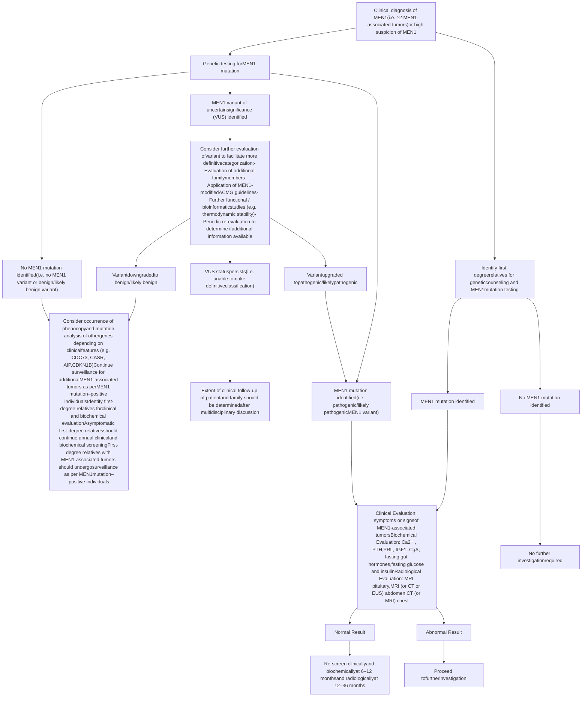

42

# Endocrine Neoplasia Syndromes

PAUL J. NEWEY AND RAJESH V. THAKKER

## CHAPTER OUTLINE

Introduction to the Endocrine Neoplasia Syndromes, 1678

Multiple Endocrine Neoplasia Type 1 (MEN1), 1678

Multiple Endocrine Neoplasia Type 2 (MEN2) and Type 3 (MEN3), 1695

Multiple Endocrine Neoplasia Type 4 (MEN4), 1710

Multiple Endocrine Neoplasia Type 5 (MEN5), 1711

Multiple Endocrine and Other Organ Neoplasia Syndromes (MEONs), 1711

Future Directions and Concluding Remarks, 1720

## KEY POINTS

* Multiple endocrine neoplasia (MEN) syndromes, which may be inherited as autosomal-dominant traits, are characterized by the occurrence of two or more endocrine tumors in a patient. A number of additional multiple endocrine and other organ neoplasia (MEON) syndromes are characterized by the occurrence of endocrine neoplasia alongside tumors of nonendocrine tissues.

* The MEN syndromes include five major types (MEN1–MEN5), whereas the MEONs include a heterogeneous group of six disorders: hyperparathyroidism–jaw tumor (HPT-JT) syndrome, von Hippel-Lindau (VHL) disease, neurofibromatosis type 1 (NF1), Carney complex (CNC), Cowden syndrome (CS), and McCune-Albright syndrome (MAS).

* Of the MEN syndromes, MEN1 through MEN3 are most frequently encountered. MEN1 is characterized by the occurrence of parathyroid, anterior pituitary, and duodenopancreatic neuroendocrine tumors and is caused by mutations of the *MEN1* gene, which encodes the tumor-suppressor protein menin.

* MEN2 (also referred to as *MEN2A*) is characterized by the occurrence of medullary thyroid carcinoma (MTC), pheochromocytomas, and parathyroid tumors, whereas MEN3 (also referred to as *MEN2B*) is characterized by the occurrence of MTC and pheochromocytomas in association with a marfanoid habitus, mucosal neuromas, medullated corneal fibers, and *RET* intestinal ganglioneuromatosis. MEN2 and MEN3 are due to proto-oncogene mutations that lead to constitutive activation of the encoded receptor tyrosine kinase (TK).

* The MEONs represent a heterogeneous group of monogenic disorders, each inherited as autosomal-dominant traits, with the exception of MAS, which results from a postzygotic somatic mutation of the *GNAS* gene.

* Genetic testing should be offered to the majority of patients suspected of having a MEN or MEON syndrome. Genetic testing should also be offered to relatives considered to be at high risk of disease (i.e., first-degree relatives of those harboring a germline pathogenic variant [“mutation”] in the respective gene). Individuals harboring a mutation, who are at risk of developing tumors, should be offered periodic clinical, biochemical, and/or radiologic screening for the early detection and treatment of tumors.

* Treatment of MEN and MEON patients, which aims to minimize the disease-associated morbidity and mortality while maintaining the quality of life, requires a multidisciplinary approach.

# Introduction to the Endocrine Neoplasia Syndromes

Multiple endocrine neoplasia (MEN) is characterized by the occurrence of tumors involving two or more endocrine glands within a single patient.<sup>1,2</sup> Five major forms of MEN, referred to as MEN types 1 through 5 (MEN1–MEN5), are recognized, and each form is characterized by the development of tumors within specific endocrine glands (Table 42.1).<sup>1,3</sup> All these forms of MEN may be inherited as autosomal-dominant disorders or may occur sporadically in the absence of a family history.<sup>1,2</sup> However, this distinction between sporadic and familial cases may sometimes be difficult because in some sporadic cases, a familial history may be absent because the patient with the disease may have died before symptoms developed. In addition to MEN1 through MEN5, six other multiple endocrine and other organ neoplasia (MEON) syndromes, which are associated with tumors involving one or more of the endocrine glands as well as nonendocrine organs, have been reported.<sup>4–8</sup> These include hyperparathyroidism–jaw tumor (HPT-JT) syndrome, von Hippel-Lindau (VHL) disease, Carney complex (CNC), neurofibromatosis type 1 (NF1), Cowden syndrome (CS), and McCune-Albright syndrome (MAS); all of these may be inherited as autosomal-dominant disorders, except MAS, which is due to a mosaic expression of a postzygotic somatic cell mutation. This chapter will focus on describing the major clinical and molecular aspects of MEN1 through MEN5 before briefly describing each of the MEON syndromes.

## Multiple Endocrine Neoplasia Type 1 (MEN1)

### Introduction

MEN1, which has also been referred to as *Wermer syndrome*, is an autosomal-dominant disorder with an estimated prevalence of 1:30,000. MEN1 is characterized by the combined occurrence of parathyroid, pituitary, and duodenopancreatic neuroendocrine tumors. In addition, patients may also develop other endocrine tumors (e.g., adrenal cortical tumors, neuroendocrine tumors [NETs] of the thymus and bronchus) and nonendocrine tumors (e.g., meningiomas, facial angiofibromas, collagenomas, and cutaneous lipomas) (see Table 42.1). The first description of MEN1 was reported by Erdheim in 1903, at autopsy in a patient with an anterior pituitary tumor and enlarged parathyroid glands.<sup>9</sup> In the 1920s, the occurrence of pancreatic islet cell tumors in association with parathyroid and pituitary tumors was reported,<sup>10,11</sup> and from 1930 to 1960, the triad of parathyroid, pancreatic islet cell, and anterior pituitary tumors became recognized as characteristic of MEN1, together with the familial basis and autosomal-dominant inheritance of the syndrome.<sup>12,13</sup> Studies in the 1980s through 1990s of MEN1 families and MEN tumors led to the identification of the *MEN1* gene, which is located on chromosome 11q13.<sup>14–16</sup> Since then, the implementation of germline *MEN1* genetic testing of affected

individuals (and their relatives) has transformed the diagnosis and management of the disorder. In addition, somatic *MEN1* mutations have been identified as major drivers of sporadic (nonfamilial) parathyroid and pancreatic NETs, and this has widened the biologic and clinical significance of the *MEN1* gene and its encoded protein, menin, which consists of 610 amino acids and is a nuclear protein that acts as a tumor suppressor by interacting with other proteins in transcription regulation, genome stability, cell division and proliferation, and epigenetic regulation.

### Clinical Features and Management

The clinical manifestations of MEN1 are related to the sites of tumor development and/or consequences of hormone hypersecretion. MEN1 is a highly penetrant genetic disorder, such that virtually all patients with a *MEN1* mutation develop clinical or biochemical evidence of tumor development by the age of 50 years. MEN1 tumors are unusual in early childhood (i.e., ≤5 years of age) but thereafter demonstrate an increasing age-related penetrance such that ~20% to 70% of patients will have ≥1 tumor by the age of 18 to 21 years.<sup>17–19</sup> Parathyroid tumors are typically the first manifestation of disease in 75% to 90% of patients with MEN1 (see Table 42.1), although childhood presentations with pancreatic NETs (e.g., insulinoma) or pituitary tumors are not infrequent, whereas some patients may present with gastrinoma, thymic NETs, or adrenal tumors. Overall, clinically relevant duodenopancreatic NETs, including hormone-secreting and nonsecreting tumors (Fig. 42.1), occur in 40% to 70% of patients, whereas anterior pituitary tumors occur in 30% to 40% of patients. The frequency of other endocrine tumors is variable, such that 20% to 55% of patients with MEN1 have adrenal tumors, whereas <10% manifest thymic NETs, and 5% to 30% may develop bronchopulmonary NETs. The recognition and appropriate management of the MEN1-associated tumors is important because they are associated with high morbidity and mortality, such that ~30% to 70% of patients with MEN1 will die of causes directly related to MEN1, with malignant duodenopancreatic NETs and thymic NETs accounting for the greatest risk of premature death.<sup>20</sup>

A diagnosis of MEN1 may be established in an individual by one of three criteria<sup>1,21,22</sup>: on the basis of the occurrence of two or more primary MEN1-associated endocrine tumors (i.e., parathyroid adenoma, enteropancreatic tumor, and pituitary adenoma); the occurrence of one of the MEN1-associated tumors in a first-degree relative of a patient with a clinical diagnosis of MEN; and identification of a germline *MEN1* mutation in an individual, who may be asymptomatic and has not yet developed serum biochemical or radiologic abnormalities indicative of tumor development.

The management of each of the respective MEN1-associated tumors is broadly similar to that of their sporadic counterparts, although there are several MEN1-specific factors that require consideration. Most importantly, MEN1-associated tumors are frequently multiple, thereby resulting in a reduced likelihood of

# TABLE 42.1 Multiple Endocrine Neoplasia (MEN) Syndromes and Their Characteristic Tumors and Associated Genetic Abnormalities


<table>
  <thead>
    <tr>
        <th>Type (Chromosome Location)</th>
        <th>Tumors (Estimated Penetrance)</th>
        <th>Gene; Most Frequently Mutated Codons</th>
    </tr>
  </thead>
  <tbody>
    <tr>
        <td>MEN1 (11q13)</td>
        <td>Parathyroid adenoma (90%)</td>
        <td><em>MEN1</em></td>
    </tr>
    <tr>
        <td> </td>
        <td>Entero-pancreatic tumor (30%–70%)</td>
        <td>83/84, 4-bp del (~4%)</td>
    </tr>
    <tr>
        <td> </td>
        <td>* Gastrinoma (40%)</td>
        <td>119, 3-bp del (~3%)</td>
    </tr>
    <tr>
        <td> </td>
        <td>* Insulinoma (10%)</td>
        <td>209-211, 4-bp del (~8%)</td>
    </tr>
    <tr>
        <td> </td>
        <td>* Nonfunctioning (20%–55%)</td>
        <td>418, 3-bp del (~4%)</td>
    </tr>
    <tr>
        <td> </td>
        <td>* Glucagonoma (&lt;1%)</td>
        <td>514-516, del or ins (~7%)</td>
    </tr>
    <tr>
        <td> </td>
        <td>* VIPoma (&lt;1%)</td>
        <td>Intron 4 ss, (~10%)</td>
    </tr>
    <tr>
        <td> </td>
        <td>Pituitary adenoma (30%–40%)</td>
        <td> </td>
    </tr>
    <tr>
        <td> </td>
        <td>* Prolactinoma (20%)</td>
        <td> </td>
    </tr>
    <tr>
        <td> </td>
        <td>* Somatotrophinoma (10%)</td>
        <td> </td>
    </tr>
    <tr>
        <td> </td>
        <td>* Corticotropinoma (&lt;5%)</td>
        <td> </td>
    </tr>
    <tr>
        <td> </td>
        <td>* Nonfunctioning (&lt;5%–20%)</td>
        <td> </td>
    </tr>
    <tr>
        <td> </td>
        <td>Associated tumors</td>
        <td> </td>
    </tr>
    <tr>
        <td> </td>
        <td>* Adrenal cortical tumor (20%–40%)</td>
        <td> </td>
    </tr>
    <tr>
        <td> </td>
        <td>* Pheochromocytoma (&lt;1%)</td>
        <td> </td>
    </tr>
    <tr>
        <td> </td>
        <td>* Bronchopulmonary NET (2%)</td>
        <td> </td>
    </tr>
    <tr>
        <td> </td>
        <td>* Thymic NET (2%)</td>
        <td> </td>
    </tr>
    <tr>
        <td> </td>
        <td>* Gastric NET (10%)</td>
        <td> </td>
    </tr>
    <tr>
        <td> </td>
        <td>* Lipomas (30%)</td>
        <td> </td>
    </tr>
    <tr>
        <td> </td>
        <td>* Angiofibromas (85%)</td>
        <td> </td>
    </tr>
    <tr>
        <td> </td>
        <td>* Collagenomas (70%)</td>
        <td> </td>
    </tr>
    <tr>
        <td> </td>
        <td>* Meningiomas (8%)</td>
        <td> </td>
    </tr>
    <tr>
        <td colspan="3">MEN2/MEN3 (10 cen-10q11.2)</td>
    </tr>
    <tr>
        <td>MEN2A (also known as <em>MEN2</em>)</td>
        <td>MTC (90%)</td>
        <td><em>RET</em></td>
    </tr>
    <tr>
        <td> </td>
        <td>Pheochromocytoma (50%)</td>
        <td>634, missense (e.g., Cys→Arg)</td>
    </tr>
    <tr>
        <td> </td>
        <td>Parathyroid adenoma (20%–30%)</td>
        <td> </td>
    </tr>
    <tr>
        <td>MEN2B (also known as <em>MEN3</em>)</td>
        <td>MTC (&gt;90%)</td>
        <td><em>RET</em> 918, Met→Thr</td>
    </tr>
    <tr>
        <td> </td>
        <td>Pheochromocytoma (40%–50%)</td>
        <td> </td>
    </tr>
    <tr>
        <td> </td>
        <td>Associated abnormalities (40%–50%)</td>
        <td> </td>
    </tr>
    <tr>
        <td> </td>
        <td>* Mucosal neuromas</td>
        <td> </td>
    </tr>
    <tr>
        <td> </td>
        <td>* Marfanoid habitus</td>
        <td> </td>
    </tr>
    <tr>
        <td> </td>
        <td>* Medullated corneal nerve fibers</td>
        <td> </td>
    </tr>
    <tr>
        <td> </td>
        <td>* Megacolon</td>
        <td> </td>
    </tr>
    <tr>
        <td>MEN4 (12p13)</td>
        <td>Parathyroid adenoma<sup>a</sup></td>
        <td><em>CDKN1B</em></td>
    </tr>
    <tr>
        <td> </td>
        <td>Pituitary adenoma<sup>a</sup></td>
        <td>No common mutations identified</td>
    </tr>
    <tr>
        <td> </td>
        <td>Reproduction organ tumors<sup>a</sup> (e.g., testicular cancer,<br/>neuroendocrine cervical carcinoma)</td>
        <td> </td>
    </tr>
    <tr>
        <td> </td>
        <td>?Adrenal + renal tumors<sup>a</sup></td>
        <td> </td>
    </tr>
    <tr>
        <td>MEN5 (14q23.3)</td>
        <td>Pheochromocytoma (may be bilateral, multifocal, and/or<br/>metastatic)<sup>a</sup></td>
        <td><em>MAX</em><br/>No common mutations identified</td>
    </tr>
  </tbody>
</table>

# TABLE 42.1 Multiple Endocrine Neoplasia (MEN) Syndromes and Their Characteristic Tumors and Associated Genetic Abnormalities—cont’d


<table>
  <thead>
    <tr>
        <th>Type (Chromosome Location)</th>
        <th>Tumors (Estimated Penetrance)</th>
        <th>Gene; Most Frequently Mutated Codons</th>
    </tr>
  </thead>
  <tbody>
    <tr>
        <td> </td>
        <td>Pituitary adenoma (?GH, PRL-secreting)<sup>a</sup><br/>?Parathyroid adenomas<sup>a</sup><br/>Neural crest tumors (e.g., Ganglioneuroma, neuroblastoma)<br/>(other tumors potentially associated with germline <em>MAX</em><br/>mutations include renal cell carcinoma, renal oncocytoma,<br/>pancreatic NETs, chondrosarcoma)</td>
        <td> </td>
    </tr>
  </tbody>
</table>


\*<sup>a</sup>Insufficient numbers reported to provide prevalence information.

Autosomal-dominant inheritance of the MEN syndromes has been established.

del, deletion; GH, growth hormone; ins, insertion; MTC, medullary thyroid carcinoma; NET, neuroendocrine tumor; PRL, prolactin; VIPoma, vasoactive intestinal polypeptide–secreting tumor. Modified from Thakker RV, Newey PJ, Walls GV, et al. Clinical practice guidelines for multiple endocrine neoplasia type 1 (MEN1). *J Clin Endocrinol Metab.* 2012;97(9):2990–3011.

surgical cure. For example, patients with MEN1 often develop multiple small submucosal duodenal gastrinomas, such that achieving biochemical remission is difficult without extensive surgical resections. In this setting, disease control with proton pump inhibitor (PPI) therapy may be considered a suitable alternative and has been associated with improved long-term outcomes. Similarly, the occurrence of synchronous pancreatic NETs may make the planning of therapeutic interventions challenging (e.g., localizing functioning tumors for resection), and it is important to consider that any remnant pancreatic tissue post tumor resection will remain at risk of further tumor development. Thus, the goal of treatment in MEN1 should be to balance the potential risks and benefits of any intervention, with the ultimate aim of minimizing disease-associated morbidity and mortality while preserving the patient’s quality of life. In this regard, it is important that MEN1 is managed by a multidisciplinary team and that patients play an active role in the decision-making process.

## Parathyroid Tumors

### Clinical Features

Primary hyperparathyroidism (PHPT) is the most common feature of MEN1 and occurs in approximately 95% of all patients; it is the first manifestation of MEN1 in 75% to 90% of patients.<sup>1,17,23</sup> Patients are frequently asymptomatic, with only biochemical evidence of disease, although symptomatic presentations due to hypercalcemia (i.e., polyuria, polydipsia, constipation, malaise) or other manifestations, including nephrolithiasis, osteitis fibrosa cystica, or peptic ulceration, may occur.<sup>1</sup> The diagnosis of PHPT is made by the demonstration of hypercalcemia in the presence of raised or inappropriately normal circulating PTH concentrations. The degree of hypercalcemia is usually mild, and severe hypercalcemia or parathyroid carcinoma is rare.<sup>1</sup> PHPT in patients with MEN1 usually occurs at above 15 years of age, although symptomatic and asymptomatic presentations have been reported in children of 8 and 4 years of age, respectively.<sup>17</sup> Biochemical evidence of PHPT has been reported in up to 80% of children and young adults with MEN1 below 21 years of age, although only a minority of these patients will have clinical features (e.g., nephrolithiasis).<sup>17–19,24</sup> In addition to the early age of

onset, MEN1-associated PHPT has other important differences when compared to non-MEN1 PHPT, and these include an equal sex distribution (M:F 1:1 vs. 1:3) and the synchronous or asynchronous involvement of all four parathyroid glands with tumors,<sup>1,17,25,26</sup> which result from the monoclonal expansion of one or more population of cells within individuals glands, due to biallelic inactivation of the *MEN1* gene.<sup>27,28</sup> MEN1-associated PHPT is reported to be associated with a greater reduction in bone mineral density (BMD) than that occurring in non-MEN1 PHPT, such that osteoporosis and osteopenia are common in patients with MEN1.<sup>24,29,30</sup> The reduction in BMD and bone demineralization in patients with MEN1 is particularly evident at the lumbar spine, femoral neck, and distal radius when compared to those with equivalent sporadic PHPT.<sup>30,31</sup> These observations may be due to the earlier age of onset and chronicity of MEN1-associated PHPT or differences in disease pathogenesis.

### Treatment

Surgical removal of the overactive parathyroid glands is the treatment of choice for MEN1-associated PHPT. However, several aspects of management remain controversial, and these include the indications for and timing of surgery and the extent of surgery.<sup>1</sup> These uncertainties reflect a paucity of high-quality evidence to guide clinical recommendations.<sup>1</sup> Currently, surgery is recommended for MEN1-associated PHPT in those with symptomatic disease, severe hypercalcemia (i.e., >3.00 mmol/L), and/or evidence of end-organ damage (e.g., nephrolithiasis, hypercalciuria [>9 mmol/L per 24 hr or 400 mg/24 hr], creatinine clearance <60 mL/min, reduced BMD [i.e., T-score <–2.5], and/or previous fragility fracture).<sup>1</sup>

Most centers will recommend subtotal parathyroidectomy (removal of 3–3.5 glands) or total parathyroidectomy with autotransplantation of cryopreserved parathyroid tissue.<sup>1,32–35</sup> Concurrent transcervical thymectomy is also suggested at the time of neck surgery to remove any supernumerary parathyroid tumors that may be embedded in the thymus (and to reduce [but not exclude] the future possibility of thymic NETs).<sup>1</sup> Minimally invasive selective parathyroidectomy, unilateral clearance, and less than subtotal parathyroidectomy (i.e., removal of <3–3.5 glands) have not typically been recommended because all four

Nonfunctioning pancreatic neuroendocrine tumor (NET) in a 14-year-old patient with MEN1. Panels A-J show MRI, macroscopic specimen, H&E staining, immunostaining for gastrin, insulin, chromogranin A, MIB-1, and menin expression.

\* **Fig. 42.1** Nonfunctioning pancreatic neuroendocrine tumor (NET) in a 14-year-old patient with multiple endocrine neoplasia type 1 (MEN1). (A) Abdominal MRI scan demonstrates a low-intensity tumor, larger than 2.0 cm (anteroposterior maximal diameter), within the neck of pancreas (*arrow*). There was no evidence of invasion of adjacent structures or metastases. (B) The pancreatic NET was removed by surgery, and macroscopic examination confirmed the location of the tumor in the neck of the pancreas (*dashed circles*). Hematoxylin and eosin (*H&E*) examination demonstrated a tumor that was largely well circumscribed (C), but focally, the margin between tumor (paler cells) and normal pancreas was poorly defined (D). Immunostaining supported the clinical and biochemical diagnosis of a nonfunctioning pancreatic NET because the tumor did not have significant expression of gastrointestinal peptides (results for gastrin and insulin shown [E and F]) but did contain chromogranin A (G). (H) The proliferative index measured by *MIB-1* (Ki-67) was low, consistent with a low-grade tumor. Loss of menin expression was demonstrated in the tumor; in the adjacent nontumorous pancreatic tissue, nuclear menin expression is evident within pancreatic islets (I), whereas nuclear menin expression is lost within the tumor (J), consistent with biallelic inactivation of the *MEN1* gene. (A and C–J, modified from Newey PJ, Jeyabalan J, Walls GV, et al. Asymptomatic children with multiple endocrine neoplasia type 1 mutations may harbor nonfunctioning pancreatic neuroendocrine tumors. *J Clin Endocrinol Metab*. 2009;94:3640–3646.)

parathyroid glands are usually affected with multiple adenomas or hyperplasia. However, more recently, some have advocated these lesser approaches (e.g., unilateral clearance of ipsilateral glands) for younger patients with MEN1-associated hyperparathyroidism, aiming to achieve a period of eucalcemia without the risk of hypoparathyroidism, accepting that further surgery will be required at a later stage (see later discussion).

The aims of parathyroid surgery in MEN1 are to maintain normocalcemia for as long as possible and to avoid iatrogenic

complications of surgery, including laryngeal nerve damage and permanent hypoparathyroidism. The lowest risk of persistent or recurrent PHPT occurs with subtotal and total parathyroidectomy, with higher rates of recurrence occurring in those with less than subtotal parathyroidectomy.<sup>34–37</sup> Most experts agree that bilateral neck exploration with subtotal parathyroidectomy (i.e., of at least 3.5 glands) with concomitant transcervical thymectomy is the preferred operation that strikes the best balance of achieving long-term eucalcemia

with the risk of permanent hypoparathyroidism.<sup>24</sup> Preoperative imaging studies (e.g., ultrasound [US], technetium-99m sestamibi, computed tomography [CT], magnetic resonance imaging [MRI], and fluorine-18 fluorocholine positron emission tomography [PET]/CT) are of limited value because all parathyroid glands may be affected, thereby necessitating an open bilateral neck exploration. Indeed, preoperative imaging in patients with MEN1 has been reported to not alter the surgical approach in >90% of patients; to have limited value in identifying ectopic parathyroid glands, which were correctly identified in only ~38% of cases; and to correctly localize only the largest parathyroid gland subsequently identified at surgery in 69% of cases while failing to identify enlarged contralateral glands in 86% of these cases.<sup>33,38</sup> Despite these limitations, imaging studies are performed because they may still aid the surgeon in planning surgical neck exploration.

Total parathyroidectomy is reported to be associated with the highest risk of permanent hypoparathyroidism, which may occur in 13% to 67% of cases.<sup>35,37</sup> The development of permanent hypoparathyroidism requires lifelong therapy with active vitamin D metabolites (i.e., calcitriol or alfacalcidol), and this may be associated with significant morbidity (e.g., due to development of inadvertent significant hypo- or hypercalcemia). Total parathyroidectomy with autotransplantation of either fresh or cryopreserved parathyroid tissue into the forearm has therefore been considered as an alternate approach.<sup>1</sup> The use of cryopreserved tissue allows confirmation of hypoparathyroidism postoperatively but is associated with a higher graft failure rate due to reduced cell viability and a higher rate of permanent hypoparathyroidism. Moreover, recurrent disease is frequently observed in the transplanted tissue,<sup>34</sup> which may necessitate surgical removal,<sup>35</sup> and the reported finding in a patient with MEN1 of a metastatic thymic carcinoma within the parathyroid autotransplanted tissue highlights the need for caution with this surgical approach.<sup>39</sup> When compared to subtotal parathyroidectomy of at least 3.5 glands or total parathyroidectomy with autotransplantation, lesser surgical approaches are reported to be associated with higher rates of persistent or recurrent disease. For example, one study reported persistent hyperparathyroidism in 70% of patients with MEN1 who underwent removal of only 1 or 2 glands, 20% in those with 2.5 to 3 glands removed, and ~5% in those with removal of 3.5 glands.<sup>33</sup> However, more recent studies have reported better short to medium outcomes with lesser approaches; for example, one study reported a persistent hyperparathyroidism or recurrent hyperparathyroidism rate of ~15% and ~20%, respectively, in those in whom one or two glands were removed after a median follow-up of ~9 years, without any occurrence of permanent hypoparathyroidism.<sup>40</sup> Advocates of these lesser approaches (e.g., unilateral clearance) argue that in younger patients with apparent one- or two-gland involvement, achieving a period of eucalcemia without the risk of hypoparathyroidism offers some advantages over more substantial operations while accepting the likely need for future surgery. Given the controversy in this area and lack of high-quality evidence to guide clinical recommendations, it is recommended that the timing and extent of surgical intervention should be undertaken by a multidisciplinary team that takes into account the local surgical expertise, the availability of vitamin D analogues for subsequent treatment of long-term hypoparathyroidism, and the preferences of the patient. Cinacalcet, a calcimimetic that is an allosteric modulator of the calcium-sensing receptor (CaSR), has been used to reduce or normalize plasma calcium and PTH levels in patients with MEN1 with PHPT in

whom surgery is contraindicated because of comorbidities or has failed to cure the PHPT.<sup>41</sup>

The optimal management of asymptomatic patients with MEN1, including children and young adults who manifest only mild biochemical features, remains to be defined, and at present, some centers advocate early treatment to minimize impacts on bone health, whereas others favor conservative treatment involving the regular assessment of patients for the onset of symptoms and/or associated complications, thereby avoiding the immediate risks associated with surgery (e.g., permanent hypoparathyroidism).<sup>1,17,33</sup>

## Pancreatic Neuroendocrine Tumors

Pancreatic NETs remain the leading cause of premature death in patients with MEN1. Clinically apparent pancreatic NETs are reported in 30% to 80% of patients with MEN1,<sup>1,17,24,42–48</sup> although microscopic islet tumors are found in almost all patients with MEN1 when evaluated histopathologically.<sup>49</sup> Pancreatic NETs (e.g., gastrinoma, insulinoma, and glucagonoma) may secrete excess hormones and result in relevant clinical features, or they may be nonsecreting (also referred to as nonfunctioning [NF]) tumors (see Fig. 42.1), and these include those producing pancreatic polypeptide (PPomas) that is not associated with clinical manifestations of hormonal excess.<sup>1</sup> Patients with MEN1 may have more than one synchronous pancreatic NET, and this may confound the interpretation of biochemical and imaging studies; for example, patients with MEN1 may have microscopic duodenal gastrinomas and concomitant NF pancreatic NETs, such that surgical resection of the pancreatic tumor alone will not resolve hypergastrinemia. The main goals of treatment for these MEN1-associated pancreatic NETs are to reduce the morbidity and mortality associated with their occurrence (i.e., relief of symptoms and risk of malignancy) while preserving the patient's quality of life. However, there are many different treatments available (Fig. 42.2), and the absence of high-quality evidence for their efficacy makes it challenging to decide on correct therapy. For example, the ideal treatment of a nonmetastatic, single functioning pancreatic NET is surgical removal because this offers the only potentially curative treatment. Surgery is also recommended for NF pancreatic NETs deemed to be at a higher risk of malignancy (i.e., all tumors >2 cm, or those <2 cm with rapid growth or increased tumor grade). However, it is important to recognize that after surgery the remnant pancreatic tissue remains at risk of further tumor development, and pancreatic surgery is associated with high rates of early and late complications.<sup>46,50,51</sup> A further challenge is that currently, noninvasive biomarkers of pancreatic tumor behavior are not available, such that the malignant potential of pancreatic NETs cannot be accurately predicted by tumor size, radiologic features, or hormone production.<sup>46,48,52,53</sup> For the 15% to 30% of patients with pancreatic NETs who develop advanced disease (i.e., distant metastases), most commonly from NF pancreatic NETs and gastrinomas, treatment options include systemic and locoregional approaches, although their optimal use in MEN1 has not been established. Overall, the 5- and 10-year survival rate in those with nonmetastatic duodenopancreatic NETs is 95% and 86%, respectively, whereas in those with hepatic metastases, it is 65% and 50%, respectively.<sup>24,54</sup> Thus, the occurrence of multiple pancreatic NETs and their varied and unpredictable malignant potential in patients with MEN1 pose major challenges in their management.<sup>1,52</sup> The diagnosis of and treatments for these MEN1-associated pancreatic NETs will be reviewed.

Diagram showing current and emerging medical therapies for pancreatic neuroendocrine tumor (NET) cells, illustrating various drug classes and their targets such as SSTR, IFNAR, VEGFR, RTK, and mTOR.

\* **Fig. 42.2** Current and emerging medical therapies for pancreatic neuroendocrine tumors (NETs). Medical therapies for pancreatic NETs include drugs, biotherapies, and antibodies that target different pathways in cancer cells. Somatostatin analogues (e.g., octreotide and lanreotide) are used widely in the treatment of pancreatic NETs. Somatostatin analogues target members of the somatostatin receptor family on the tumor cell surface to control excess hormone secretion and inhibit growth (i.e., antiproliferative effects). Additional medical therapies include mammalian target of rapamycin (mTOR) inhibitors (e.g., everolimus) and receptor tyrosine kinase (RTK) inhibitors (e.g., sunitinib and pazopanib), which have been shown to delay pancreatic NET tumor progression. Current clinical trials are investigating the use of these agents in combination or with other therapies, including monoclonal antibodies targeting the VEGFR (e.g., bevacizumab). Interferon-α (IFNα), which targets the IFNα/β-receptor (IFNAR), may also be effective in symptom and tumor control. Chemotherapeutic agents may also be effective in the treatment of metastatic pancreatic NETs and include alkylating agents (e.g., streptozocin, temozolomide, cisplatin, cyclophosphamide, procarbazine, dacarbazine, and oxaliplatin), antimicrotubule agents (e.g., docetaxel and etoposide), antimetabolites (e.g., 5-fluorouracil, capecitabine, and gemcitabine), topoisomerase inhibitors (e.g., doxorubicin, etoposide, and irinotecan), and cytotoxic antibiotics (e.g., actinomycin D, doxorubicin, mitomycin C, mitoxantrone). Combinations of chemopreventative agents that target different cellular pathways are more frequently used rather than as a monotherapy. VEGFA, vascular endothelial growth factor A. (Modified from Frost M, Lines KE, Thakker RV. Current and emerging therapies for PNETs in patients with or without MEN1. *Nat Rev Endocrinol.* 2018;14:216–227.)

# Gastrinoma

## Clinical Features

Gastrin-secreting tumors are associated with a marked overproduction of gastric acid, which results in recurrent peptic ulceration, a combination referred to as *Zollinger-Ellison syndrome* (ZES).⁵⁵ Symptoms of ZES include those associated with peptic ulceration (i.e., abdominal pain, heartburn), as well as weight loss, diarrhea, and steatorrhea.¹ In addition, esophageal stricture and/or Barrett esophagus are also more common in patients with ZES, whereas acute presentations with small bowel perforation and/or hemorrhage secondary to peptic ulceration contribute to the high morbidity associated with ZES. Symptomatic presentations are rare in childhood, although they have been reported in children <10 years of age.¹⁷ Gastrinomas occur in ∼20% to 60% of patients with MEN1⁵²,⁵⁶,⁵⁷ and are found more frequently

in adult males.²⁵ Approximately 20% of patients with sporadic gastrinoma will have MEN1.¹ MEN1-associated gastrinomas frequently occur as small (<5 mm in diameter), multiple nodular lesions deep within the duodenal mucosa and are only rarely observed in the pancreas,⁵⁶,⁵⁸ in contrast to sporadic gastrinomas, which typically occur as solitary tumors within the pancreas or duodenum. In addition, MEN1-associated gastrinomas often occur as microscopic tumors (i.e., <1 mm), which, despite their small size, frequently metastasize to local lymph nodes at an early stage in the disease course.⁵⁶,⁵⁸ Indeed, local lymph node metastases are found in 30% to 70% of cases at diagnosis,⁵²,⁵⁹ although advanced presentations with hepatic metastases are rare in MEN1, but when present, they are associated with a poor prognosis.⁶⁰ Additional poor prognostic indicators include markedly elevated gastrin levels (e.g., >20× the upper limit of normal), co-occurrence

of pancreatic tumors >2 cm, and age >40 years.⁶¹ Overall 5- and 10-year survival in patients with MEN1 with gastrinomas has been reported to be 83% and 65%, respectively, in a national cohort, which was worse than that for patients with MEN1 without gastrinomas.⁶¹ Gastrinoma in patients with MEN1 appears to occur rarely in the absence of PHPT, and successful treatment of PHPT with restoration of normocalcemia is reported to result in symptomatic and biochemical improvements in ~20% of patients with MEN1 with hypergastrinemia and ZES.⁶² It is also reported that gastrinoma (and severity of hypergastrinemia) is associated with past *Helicobacter pylori* infection in patients with MEN1.⁶³

The diagnosis of gastrinoma is made by demonstrating an increased fasting serum gastrin in association with increased basal gastric acid secretion.¹ A raised fasting serum gastrin alone is insufficient to make the diagnosis because this may occur in achlorhydria, antral G-cell hyperplasia, *H. pylori* infection, renal failure, hypercalcemia, and use of PPI therapy.⁶⁴,⁶⁵ Occasionally, an intravenous provocation test with secretin or calcium, which will be associated with a marked increase in gastrin in patients with gastrinoma, may help in the diagnosis.¹ MEN1-associated gastrinomas in the duodenum may be localized by endoscopic ultrasound, CT, MRI, selective angiography, and/or SRS. Selective arterial secretagogue injection (SASI) (e.g., calcium) and hepatic venous gastrin measurements may also help to localize the tumor.¹ It is now recognized that gastrinomas occurring within the pancreas are an exception in patients with MEN1, although concomitant duodenal gastrinomas with synchronous NF pancreatic NETs are not uncommon.⁴⁶,⁶¹,⁶⁶

## Treatment

The lack of results from prospective randomized controlled trials of treatments in patients with MEN1 with gastrinomas makes their management challenging and reliant on expert opinion.¹,²⁴,⁴⁶,⁴⁷,⁵²,⁶¹ The aims of treatment should be to ameliorate the symptoms and/or sequelae of the associated hypergastrinemia while reducing the likelihood of developing advanced metastatic disease. The medical treatment of gastrinoma was transformed following the introduction of PPI therapies (e.g., omeprazole and lansoprazole), which are highly efficacious at reducing basal acid secretion to <10 mmol/L and reducing symptoms associated with gastrinoma.¹ H₂-receptor antagonists (e.g., ranitidine) may be added if symptoms remain uncontrolled on high-dose PPI. These therapies represent the mainstay of treatment for controlling symptoms and have resulted in a marked reduction in the morbidity and mortality previously associated with ZES in patients with MEN1. However, the effects on tumor growth and/or risk of developing advanced disease with this treatment are not established. In addition, the role of somatostatin analogue therapy in MEN1-associated gastrinomas, which may express somatostatin receptors, remains to be established.

The role of surgery in MEN1-associated gastrinoma remains controversial, which in part is due to not knowing the long-term natural course of disease in patients with MEN1.⁴⁶,⁵²,⁶⁶⁻⁶⁸ Overall, the prognosis of gastrinoma in patients with MEN1 is reported to be good, with 5-, 10-, and 20-year survival rates of 80% to 96%, 65% to 96%, and 58% to 90%, respectively.¹,⁶¹,⁶⁹,⁷⁰ Surgery is recommended for gastrinomas >2 cm, which is a rare occurrence (see earlier discussion). The role of surgery for duodenal gastrinomas remains controversial, with some centers advocating an initial medical approach and others pursuing surgical intervention. Centers advocating a nonsurgical approach point to the excellent long-term prognosis associated with smaller tumors, even in the

presence of lymph node metastases; the reduced surgical cure rates in the presence of multiple small duodenal tumors; the potential high morbidity associated with pancreaticoduodenal resections; the excellent symptom control achieved with PPI therapy; and the lack of evidence demonstrating improved survival in those undergoing surgical resections.¹,⁵²,⁶⁹ In contrast, centers advocating early surgical intervention in patients with MEN1-associated gastrinoma point to results that have achieved eugastrinemia in 30% to 90% of patients over the short to medium term.⁶⁶,⁷¹⁻⁷³ Surgical approaches in these studies have included duodenotomy with excision of gastrinomas in the duodenal mucosa, coupled with enucleation (if feasible) or resection of tumors in the pancreatic head, peripancreatic and lymph node removal, and corporacaudal pancreatic resection; partial pancreaticoduodenectomy; pancreas-preserving total duodenectomy; and total pancreaticoduodenectomy.¹,⁴⁶,⁵²,⁶⁶,⁷¹,⁷²,⁷⁴,⁷⁵ Total pancreaticoduodenectomy (i.e., Whipple procedure), which is associated with a substantially greater risk of diabetes mellitus and malabsorption, is rarely performed and is typically reserved for patients with diffuse large pancreatic tumors.¹ Given the lack of consensus on the indications for surgery in patients with MEN1, reflecting a lack of accurate predictive biomarkers of disease course, and the generally favorable outcomes in the majority of patients in those managed medically, many centers advocate nonsurgical management for the majority of patients with MEN1 with gastrinomas. However, the option of surgery may be appropriate for some patients with MEN1 who attend centers with suitable surgical experience, although such surgery should only be undertaken after a full discussion with the patient of the potential risks and benefits.¹,⁴⁶,⁵²

The management of advanced/disseminated gastrinomas is difficult and does not differ from that of sporadic disease. Chemotherapy with streptozotocin and 5-fluorouracil, capecitabine and temozolomide, cisplatin and etoposide, hormonal therapy with octreotide or lanreotide (which are human somatostatin analogues (SSAs) (see Fig. 42.2), selected internal radiation therapy (SIRT), radiofrequency ablation (RFA), peptide receptor radionuclide therapy (PRRT), hepatic artery embolization, administration of human leukocyte interferon, and removal of all resectable tumor and hepatic transplantation have each been employed with occasional benefit.⁵²,⁷¹

# Insulinoma

## Clinical Features

Insulinomas, which arise from pancreatic islet β-cells, occur in ~10% to 30% of patients with MEN1, and 5% to 10% of patients presenting with insulinoma will have MEN1.¹,¹⁷,²³,²⁶ Insulinomas in patients with MEN1 frequently occur, in contrast to non-MEN1 patients, before the age of 40 years and may be the first manifestation of MEN1 in ~10% of cases. Indeed, a study of 160 patients with MEN1 younger than 21 years of age observed insulinomas to occur in 12% of the cohort, with the earliest presentation at 5 years of age,¹⁷ and a similar proportion (~14%) of affected children and young persons was reported in another multicenter cohort.¹⁸

Patients with MEN1 with insulinomas typically present with symptoms of hypoglycemia (e.g., weakness, headaches, sweating, faintness, anxiety, altered behavior, seizures, and loss of consciousness) that develop after fasting or exercise and improve after glucose (food) intake.¹⁷ The diagnosis of insulinoma in MEN1 does not differ from that in patients with sporadic insulinoma and is most reliably made by a supervised 72-hour fast,¹,⁶⁵ in which

hypoglycemia (i.e., glucose <2.2 mmol/L [40 mg/dL]) is documented in the presence of inappropriately elevated concentrations of insulin (together with pro-insulin and C-peptide).¹ Following biochemical diagnosis, preoperative localization is required to guide the surgical approach, although such studies may be confounded by the presence of multiple synchronous tumors. The majority of insulinomas are benign tumors occurring as single lesions in the body or tail of the pancreas, although multiple or multicentric insulinomas may be observed in 30% to 40% of patients with MEN1, whereas malignant tumors occur infrequently.<sup>46,76</sup> Imaging modalities routinely employed for preoperative localization include endoscopic ultrasound, CT, and MRI, whereas more specialized methods, including celiac axis angiography and selective intraarterial calcium stimulation combined with hepatic venous insulin measurements, may also be required. Somatostatin receptor scintigraphy (SRS) with <sup>111</sup>In-octreotide has been reported to be associated with low sensitivity for insulinomas (20%–60%), whereas <sup>68</sup>Ga-DOTATATE PET/CT may have a higher sensitivity, but it may also detect other noninsulinoma pancreatic NETs.<sup>77,78</sup> Scintigraphy based on glucagon-like peptide-1 (GLP1) has also been reported to be highly sensitive in localizing insulinomas when compared to conventional imaging modalities, and it may provide a useful diagnostic modality.<sup>77–79</sup> The utility of fluorodeoxyglucose (FDG)-PET/CT for insulinoma detection is typically limited to high-grade metastatic disease.⁷⁷ Finally, direct intraoperative pancreatic ultrasound may be useful at the time of surgery to identify the likely tumor.

### Treatment

Medical therapy, which consists of frequent carbohydrate meals, diazoxide, and SSAs, is often required to avoid recurrent hypoglycemia before surgery, which is the treatment of choice for those with nonmetastatic disease. A number of surgical procedures have been reported to provide excellent long-term curative outcomes, including enucleation or excision of single or multiple tumors, distal or partial pancreatectomy, and pancreatoduodenectomy.<sup>76,80–82</sup> Minimally invasive approaches (e.g., laparoscopic, robot-assisted) may be appropriate in selected MEN1 cases.<sup>80,83</sup> The surgical approach adopted will depend on the location and size of the insulinoma, as well as the presence or absence of additional pancreatic tumors.<sup>76,82</sup> For the minority of patients who develop metastatic disease, PRRT, systemic therapies (e.g., mammalian target of rapamycin [mTOR] or receptor tyrosine kinase [RTK] inhibitors, SSAs, chemotherapy [using streptozotocin, 5-fluorouracil, and doxorubicin]), and locoregional approaches, including hepatic artery embolization, may be employed for disease and symptom control (see Fig. 42.2).<sup>1,52,84</sup>

## Glucagonoma

### Clinical Features

Glucagonomas, which arise from the pancreatic islet α-cells and lead to excess glucagon secretion, occur in 1% to 2% of patients with MEN1.⁸⁵ However, the characteristic clinical features of skin rash (necrolytic migratory erythema), stomatitis, weight loss, venous thrombosis, and anemia may be absent.⁸⁵ Instead, glucagonomas may be detected in asymptomatic patients with MEN1 following surveillance pancreatic imaging or the finding of hyperglucagonemia with or without glucose intolerance. It should be noted that a significant proportion of NF pancreatic NETs immunostain for glucagon (either in insolation or together with additional pancreatic hormones) in the absence of hyperglucagonemia,⁴⁹ whereas a proportion of NF tumors will be associated with modest elevations in plasma glucagon.

### Treatment

Glucagonomas most frequently present in the tail of the pancreas, and where possible, surgical resection, which can be curative, is the treatment of choice. However, curative surgery may not be feasible because ~50% to 80% of patients may have large tumors with metastases.¹ Medical treatment with SSAs (e.g., octreotide or lanreotide) or chemotherapy (with streptozotocin and 5-fluorouracil or dimethyltriazeno-imidazole carboxamide [DTIC]) (see Fig. 42.2) has been successful in some patients, and hepatic artery embolization has been used to treat metastatic disease.<sup>1,52,84</sup>

## VIPoma

### Clinical Features

Patients with vasoactive intestinal peptide (VIP)omas, which are VIP-secreting pancreatic tumors, develop watery diarrhea, hypokalemia, and achlorhydria, or WDHA syndrome, also referred to as *Verner-Morrison syndrome* or *VIPoma syndrome*.<sup>1,85</sup> Only a few patients with MEN1 have been reported to have VIPomas.⁸⁵ The diagnosis is established by excluding laxative and diuretic abuse and confirming a stool volume in excess of 0.5 to 1.0 L/day during a fast, together with a markedly increased plasma VIP concentration.

### Treatment

Surgical management of VIPomas, which are mostly located in the tail of the pancreas, has been curative, although ~50% of patients have metastases at diagnosis. In patients with unresectable disease, treatment with SSAs, such as octreotide and lanreotide, streptozotocin with 5-fluorouracil, corticosteroids, indomethacin, metoclopramide, and lithium carbonate, has proven beneficial, and hepatic artery embolization has been useful for the treatment of metastases (see Fig. 42.2).¹

## Nonfunctioning Pancreatic NETs

### Clinical Features

NF pancreatic NETs in MEN1 likely represent a heterogeneous group of tumors that are characterized by the absence of clinically relevant excess hormone production. Typically, they present with symptoms related to local mass effects (i.e., pain and/or compression of adjacent structures) or metastatic disease (e.g., cachexia, jaundice, hepatomegaly, and hepatic and bone pain) or are detected by radiologic imaging in asymptomatic individuals. Some NF pancreatic NETs may be associated with elevations in pancreatic polypeptide (PP) and/or glucagon,<sup>1,86</sup> although plasma PP and glucagon, together with chromogranin A, are reported to have low sensitivity and specificity for pancreatic NET detection in patients with MEN1.<sup>87,88</sup> Other circulating biomarkers, such as the NETest, are reported to be useful for the detection of sporadic pancreatic NETs, but their value in detecting early pancreatic NETs in MEN1 has not been validated. The lack of biomarkers with sufficient negative predictive value means that the diagnosis of NF NETs in MEN1 relies on imaging, although the optimal modality for detection has not been established and frequently depends on local availability and expertise. The implementation of surveillance imaging programs for patients with MEN1 has shown that NF pancreatic NETs are the most prevalent pancreatic

NETs in MEN1, with clinically apparent tumors occurring in 15% to 55% of patients.<sup>43,45,52,53,86,89</sup> For example, a prospective endoscopic ultrasound study (EUS) demonstrated that ~55% of patients with MEN1 had one or more NF NETs,<sup>42</sup> and a histopathologic study reported that almost all patients with MEN1 had small microadenoma NF tumors.<sup>49,52</sup> In addition, NF pancreatic NETs have been reported to occur in >5% to 40% of children and young adults aged 12 to 20 years with MEN1.<sup>17,18,86,90</sup> The current guidelines therefore recommend surveillance imaging for NF pancreatic NETs from age 10 years,<sup>1</sup> with the aim of detecting and monitoring clinically relevant tumors while minimizing exposure to ionizing radiation and/or iatrogenic complications related to the procedure. A recent study evaluating the age-related penetrance of "clinically relevant" NF NETs in MEN1 estimated a 1%, 2.5%, and 5% prevalence of such tumors at ages 9.5, 13.5, and 17.8 years, respectively, and suggested that surveillance imaging in asymptomatic patients could be deferred until 13 to 14 years of age.<sup>91</sup> Although EUS has been reported to be the most sensitive method for the detection of tumors <1 cm,<sup>52</sup> it is an invasive and time-consuming procedure that is dependent on user expertise, and the value of detecting lesions <1 cm is controversial because it is unlikely that the identification of such small lesions will result in a change of management or intervention in most centers. MRI or CT is therefore frequently employed for tumor diagnosis and surveillance, with the former often preferred due to the lack of associated ionizing radiation. Additional imaging modalities are also used to characterize pancreatic NETs and may help guide management. For example, SRS (i.e., based on octreotide/<sup>68</sup>Gallium-DOTATATE PET) and FDG-PET have each been associated with high sensitivity and specificity in different series such that combinations of these modalities are often used to fully characterize tumors and may facilitate accurate staging and/or detect occult metastatic disease.<sup>24,52,53,92–95</sup>

NF pancreatic NETs are the leading cause of premature mortality in patients with MEN1 and are associated with a worse prognosis than other MEN1-associated pancreatic NETs (e.g., insulinoma, gastrinoma).<sup>20,52,59,96</sup> Premature morbidity and mortality typically result from the development of metastatic disease, although they may also arise due to complications of surgical intervention.<sup>20,43,45,51,96</sup> The risk of developing liver metastases correlates with primary tumor size, and synchronous liver metastases have been reported in ~43% of patients with NF NETs >3 cm, 18% of patients with NF NETS of 2 to 3 cm, 10% in those with NF NETS of 1 to 2 cm, and only 4% of those with NF NETS <1 cm.<sup>89</sup> However, tumor size is not universally correct in predicting metastatic risk in NF NETs because a small percentage of patients with small tumors are reported to develop advanced disease.<sup>97</sup> In addition, currently circulating biomarkers are not available for predicting metastatic risk in NF pancreatic NETs, and circulating biomarkers based on microRNA, circulating tumor cells, multiple-gene signatures, and tumor DNA, which are being evaluated, may hold future promise in predicting tumor behavior.<sup>92,98,99</sup> For example, a recent preliminary investigative study reported that a blood-based three-marker polyamine signature could distinguish patients with MEN1 with distant metastatic pancreatic NETs from control groups, with a sensitivity and specificity of 66% and 95%, respectively.<sup>24,100,101</sup>

### Treatment

The aims of treatment for MEN1-associated NF NETs are to minimize the risk of developing metastatic disease while avoiding unnecessary surgical interventions that are known to result in significant early and late complications.<sup>1,51,52</sup> However, surgical removal of NF pancreatic NETs is of benefit, as illustrated by a recent study in which only 6/16 (~40%) of patients with MEN1 with NF pancreatic NETs >3 cm who had surgery developed hepatic metastases or died, compared to 5/6 (~80%) patients who did not have surgery.<sup>45</sup> However, the same study reported that rates of metastasis in patients undergoing surgery for NF pancreatic NETs <2 cm were not significantly different from those managed without surgery.<sup>45</sup> Indeed, a systematic review of prognostic factors in MEN1-associated NF NETs identified tumor size >2 cm and tumor grade (i.e., World Health Organization [WHO] Grade 2 or higher) to be the most important indicators available to guide treatment decisions.<sup>102</sup> Thus, the majority of centers recommend surgery for NF pancreatic NETS >2 cm, whereas surgery for tumors <2 cm may be appropriate for those growing rapidly on serial imaging or those identified to be of WHO Grade 2 (or higher) if histopathology is available. This approach is supported by the observation from one study reporting that ~70% of NF pancreatic NETs <2 cm remained stable over a median follow-up of 3 years, whereas the remaining 30% that demonstrated growth increased on average by 1.6 mm/yr.<sup>44</sup> A second study<sup>43,103</sup> reported that 60% (28/46) of patients with NF pancreatic NETs <2 cm had stable disease, whereas in the remaining 40% of patients who had an increase in size or number of tumors or developed hypersecretion syndromes, only 5% (7/46) required surgery, and only 2% (1/46) of patients died from metastatic disease.<sup>43</sup> Moreover, another study has reported that surgery in patients with MEN1 with NF NETs <2 cm does not affect progression-free survival when compared to those patients managed conservatively.<sup>103</sup> However, surgery is recommended when there is rapid tumor growth (i.e., doubling of tumor size over 3- to 6-month interval) (see Fig. 42.1), and some centers will consider surgery if pancreatic NETs are ≥1cm in size. The decision to undertake surgery for NF pancreatic NETs in MEN1 should consider the potential presence of additional tumors within the pancreas (and elsewhere), the presence of occult metastatic disease either related to the tumor undergoing resection or from another source, and that any remnant pancreatic tissue will remain a risk for the development of further tumors. Thus, all of these considerations highlight the importance of multidisciplinary teamwork and the involvement of the patient in the decision-making process.<sup>96</sup>

Medical treatments for small (i.e., <2 cm) NF pancreatic NETs in MEN1 have not been validated in randomized controlled trials. However, long-acting octreotide has been reported to be associated with a tumor response in 10% of patients, stable disease in 80% of patients, and disease progression in 10% of patients over 12 to 15 months of treatment,<sup>104</sup> whereas<sup>105</sup> an observational nonrandomized, unblinded study evaluating the effect of the lanreotide in 42 patients with MEN1 with NF NETs <2 cm indicated an objective tumor response in 4/23 patients and disease stability in 15/23 patients, compared to 0/19 and 6/19, respectively, whereas 1 patient in each of the treatment and control groups developed liver metastases.<sup>106</sup> However, the results of these studies require caution, and larger controlled studies are needed to assess the impact of such treatments on longer-term disease progression and survival. For patients with advanced disease, treatments include locoregional and systemic approaches (see Fig. 42.2) and are similar to those used for the other pancreatic NETs. However, the evidence for the use of such treatments has arisen from the study of non-MEN1 patients, and extrapolation to patients with MEN1 requires caution.<sup>52</sup> Systemic therapies include SSA therapy,<sup>107,108</sup> the RTK inhibitor sunitinib,<sup>109</sup> the mTOR inhibitor

everolimus,<sup>110</sup> chemotherapy, and PRRT; locoregional therapies include RFA, transarterial chemoembolization (TACE), and SIRT.<sup>52,84</sup>

## Somatostatinoma

Pancreatic tumors secreting somatostatin are associated with somatostatinoma syndrome, characterized by hyperglycemia, cholelithiasis, low acid output, steatorrhea, diarrhea, abdominal pain, anemia, and weight loss. Although elevations in somatostatin are observed in a significant proportion of MEN1-associated pancreatic NETs, somatostatinoma syndrome has not been reported.<sup>20,85</sup>

## GHRHoma

Pancreatic islet tumors secreting growth hormone-releasing hormone (GHRH) have been reported in some patients with MEN1.<sup>1,111</sup> Patients may present with features of acromegaly and are diagnosed by demonstrating elevations in serum growth hormone (GH), GHRH, and insulin-like growth factor 1 (IGF1). In the context of MEN1, GHRHomas occur predominantly within the pancreas, although sporadic GHRHomas may arise in the lung or small intestine.<sup>111</sup> Surgical removal is the treatment of choice for MEN1-associated pancreatic GHRHomas.<sup>111</sup>

# Pituitary Tumors

## Clinical Features

Anterior pituitary tumors occur in ~30% to 50% of patients with MEN1, with the frequency of detection increasing with the introduction of routine surveillance of patients with MEN1, together with the improved sensitivity of imaging modalities.<sup>1,23,112,113</sup> Women are reported to be affected more frequently than men,<sup>25</sup> and one study has reported an intrafamilial correlation and suggested the occurrence of potential genetic modifying influences that are independent of the *MEN1* mutation.<sup>114</sup> Pituitary tumors typically present in early adulthood at a mean age of 30 to 40 years.<sup>112</sup> However, pituitary tumors may occur earlier, and one study has reported a prevalence of ~35% in children and young persons who presented with clinical manifestations before 21 years of age, with the majority of cases presenting between 15 and 20 years.<sup>17</sup> The youngest presentation has been reported in a boy of 5 years of age, and pituitary tumors are the first manifestation of MEN1 in 10% to 20% of cases.<sup>17,115</sup> Initial studies had reported a high prevalence (>80%) of pituitary macroadenomas (i.e., >1 cm) in patients with MEN1, although more recent series indicate that microadenomas (i.e., <1 cm) occur frequently, and these differences are likely explained by the introduction of sensitive surveillance imaging.<sup>112,115</sup> Pituitary tumor subtypes are observed in patients with MEN1, with prolactinomas representing the most common type, accounting for ~40% to 75% of MEN1-associated pituitary tumors.<sup>17,112,113,115</sup> Other functioning pituitary tumors include GH-secreting tumors (5%–15%) and adrenocorticotrophic hormone (ACTH)-secreting tumors (3%–7%), whereas pluri-hormonal secretion (i.e., prolactin/GH and prolactin/ACTH) may be observed in a minority of tumors. The remaining tumors predominantly comprise NF pituitary tumors (15%–40%).<sup>1,20,112,115</sup> One recent study reported that ~50% of pituitary tumors detected by screening, as opposed to clinical presentations, in patients with MEN1 represented

NF tumors, of which the majority were microadenomas.<sup>112</sup> The clinical manifestations and diagnosis of MEN1-associated pituitary tumors are similar to those in patients with sporadic pituitary tumors. Given the high risk of tumor development, MEN1 mutation carriers are recommended to undergo periodic biochemical evaluation for prolactin and IGF1, together with MRI of the pituitary fossa.

## Treatment

Overall, the prognosis of patients with MEN1 pituitary tumors, the majority of which are benign neoplasms, is favorable.<sup>20</sup> Pituitary carcinoma is extremely rare in MEN1, with only a few cases reported.<sup>1</sup> The treatment of pituitary tumors in patients with MEN1 is similar to that for their sporadic counterparts and comprises appropriate medical therapy (e.g., cabergoline for prolactinoma; SSAs and/or pegvisomant for somatotrophinoma) or selective transsphenoidal adenomectomy if feasible, with radiotherapy reserved for those patients with residual and/or unresectable tumor tissue. Earlier studies reported MEN1-associated pituitary tumors to be larger and more invasive than their sporadic counterparts and less responsive to medical treatments,<sup>17,113</sup> but more recent studies report that the majority of pituitary tumors in patients with MEN1 respond well to medical therapies and have a similar behavior to sporadic tumors (e.g., response rate for prolactinomas is >90%), whereas NF tumors were frequently small and stable and did not require surgical intervention.<sup>67,112</sup>

# Adrenal Tumors

## Clinical Features

The incidence of adrenocortical tumors in patients with MEN1 is reported to be 20% to 55%,<sup>1,116</sup> and a higher frequency of adrenal involvement (~75%) has been reported with the use of highly sensitive imaging modalities, such as endoscopic ultrasound. Most affected patients are asymptomatic because the majority of tumors, which may include cortical adenomas, hyperplasia, multiple adenomas, nodular hyperplasia, cysts, or carcinomas, are NF.<sup>1,116</sup> Indeed, <10% of patients with enlarged adrenal glands have biochemical evidence of hormonal hypersecretion, and among these, primary hyperaldosteronism (Conn syndrome) and ACTH-independent Cushing syndrome are the most commonly encountered.<sup>116</sup> Occasionally, hyperandrogenemia may occur in association with adrenocortical carcinoma, whereas the occurrence of pheochromocytoma in patients with MEN1 is rare. Although adrenal involvement is most commonly observed in adults with MEN1 (with equal sex distribution), occasional presentations in childhood are reported. For example, adrenal carcinoma has been reported in a 4-year-old boy and 16-year-old girl, with each having clinical and biochemical evidence of androgen excess.<sup>17</sup> Adrenal tumors have been reported to demonstrate heritability in MEN1 kindreds, thereby highlighting a need for increased vigilance in those with other affected family members.<sup>114</sup> Biochemical investigation (e.g., plasma renin and aldosterone concentrations, low-dose dexamethasone suppression test, urinary catecholamines and/or metanephrines) should be undertaken for those with symptoms or signs suggestive of functioning adrenal tumors or for those with tumors >1 cm. The incidence of adrenocortical carcinoma is reported to be ~1% in patients with MEN1 but is higher, at ~13%, in patients with MEN1 with adrenal tumors >1 cm.<sup>116</sup> Thus, it is important that patients with MEN1 with adrenal tumors are offered annual imaging and those that display

atypical radiologic characteristics, significant growth, or are >4 cm are considered for surgical removal.<sup>1,116</sup>

### Treatment

Consensus has not been reached about the management of MEN1-associated NF adrenal tumors because the majority of these neoplasms are benign. However, the risk of malignancy is increased if the tumor has a diameter >4 cm, although adrenocortical carcinomas have been identified in tumors <4 cm in patients with MEN1.<sup>1,116</sup> Surgery is recommended for adrenal tumors that are >4 cm in diameter, have atypical or suspicious radiologic features (e.g., increased Hounsfield unit on unenhanced CT scan) and are 1 to 4 cm in diameter, or show significant measurable growth over a 6-month interval.<sup>1</sup> The treatment of functioning (i.e., secreting) adrenal tumors in patients with MEN1 is similar to that for tumors occurring in non-MEN1 patients.

## Thymic and Bronchopulmonary Neuroendocrine Tumors

NETs arising in the thymus or lungs occur at varying frequencies in patients with MEN1. Thymic carcinoid tumors, although rare, present the most significant clinical challenge because they are associated with an aggressive disease course and are one of the leading causes of premature death in patients with MEN1.

### Thymic NETs

Thymic NETs occur in 2% to 8% of patients with MEN1<sup>1,117–120</sup> and are observed predominantly in adult male patients, although sex differences appear specific to individual ethnic populations (e.g., European populations, 20M:1F; Japan, 2M:1F; China, 1M:1F).<sup>25,118,121</sup> In MEN1 populations of European descent, smoking is an independent risk factor for tumor development.<sup>118</sup> The median age of diagnosis is 40 to 45 years,<sup>118</sup> although much earlier presentations have been reported, including a 16-year-old boy who died 49 months after diagnosis from local and distant metastatic disease.<sup>17</sup> Although the overall frequency of thymic NETs is low in patients with MEN1, several reports highlight a clustering of cases within individual families, thereby suggesting a high heritability independent of the *MEN1* mutation.<sup>114,118,122</sup> Thymic NETs are responsible for ~20% of premature deaths in patients with MEN1.<sup>20,59,118</sup> Once diagnosed, thymic NETs typically run an aggressive disease course, with an overall 10-year survival of ~35%, and >50% of patients in reported cases present with distant metastases.<sup>24,47,118,120</sup> Symptomatic presentations may include pain (e.g., arising from chest, shoulder, breast) or features of vena caval obstruction, whereas the features of carcinoid syndrome (i.e., flushing, diarrhea) are not typically observed.<sup>118,120</sup> Biochemical markers (e.g., raised chromogranin A, urinary 5HIAA) are not sufficiently sensitive for tumor detection, and as a consequence, diagnosis is reliant on radiologic imaging, although the optimal screening methods have not been established. A recent study of 294 patients with MEN1 identified thymic tumors in 14 patients, including 12 with thymic NETs (~4%) and 2 with thymomas. The majority of tumors demonstrated loss of heterozygosity (LOH) at the *MEN1* locus, and transcriptome analysis demonstrated that thymic NETs had a distinct molecular signature compared to thymomas and normal thymic tissue.<sup>123</sup> CT is considered to be sensitive for tumor detection, but there is concern over the repeated exposure to ionizing radiation, particularly because the natural history of thymic NETs in MEN1 is one of rapid development such that a frequent scanning interval

(i.e., every 1–2 years) would be required.<sup>1,119</sup> “Low-dose” CT or MRI may be optimized for tumor detection, but further studies are required to assess their utility in MEN1. Similarly, SRS is frequently positive in thymic NETs, although insufficient evidence is available to recommend its use as a screening modality. FDG-PET may also be useful in the evaluation of patients with thoracic lesions in MEN1.<sup>124</sup> The treatment of thymic NETs depends on the stage of presentation. Surgical removal is recommended because it may be curative, although recurrence rates following surgery are high, and there may be a role for adjuvant radiotherapy in some settings.<sup>118,120</sup> Older age at presentation, larger tumor diameter, and the presence of metastases are each associated with worse clinical outcomes.<sup>118</sup> For those with advanced disease, treatment options are based on those available for sporadic disease and include chemotherapy, radiotherapy, mTOR inhibitors, SSA therapy, and PRRT. It should be noted that cervical thymectomy is recommended in patients with MEN1 undergoing parathyroidectomy, but cases of thymic carcinoid have been reported in patients who have undergone this procedure, and there is little evidence that such prophylactic thymus removal prevents subsequent thymic carcinoid NET development. Current guidelines recommend regular screening for thymic carcinoid, although there is no evidence that this approach, aimed at early tumor detection, results in improved outcomes.<sup>119,125</sup>

### Bronchopulmonary NETs

Histologically confirmed bronchopulmonary NETs are reported in <5% of adult patients with MEN1, although the radiologic frequency of these tumors is reported to be considerably higher at ~20% to 30%, with equal sex distribution.<sup>20,24,117,119,124,126–128</sup> Bronchopulmonary NETs typically present in adulthood at a median age of 40 to 45 years, whereas presentations in early childhood have not been reported.<sup>17,24,117,119,127,128</sup> The majority of patients with bronchopulmonary NETs are asymptomatic, and features of carcinoid syndrome are typically absent.<sup>57,117</sup> The majority of radiologically identified bronchopulmonary NETs are small (<1 cm) and may be multiple and/or bilateral. Typically, bronchopulmonary NETs demonstrate slow growth rates (e.g., 6%/yr in one study), with the majority of tumors running an indolent course.<sup>24,127</sup> Histologically, 50% to 75% of bronchopulmonary NETs are reported to have features of typical carcinoids, 25% to 30% have atypical carcinoids, and the remainder of cases have either small or large cell neuroendocrine carcinomas.<sup>128</sup> Overall, the prognosis of patients with MEN1 with bronchopulmonary NETs is reported to be good, with little excess mortality, although occasional fatal cases are reported. For example, one study of 102 patients with MEN1 with suspected bronchopulmonary NETs reported a 15-year survival rate of 15% without any lung-related deaths, whereas a second study of 51 patients with histologically proven bronchopulmonary NETs reported a total of 7 disease-related deaths, including 3 patients with atypical carcinoids, 3 with small cell lung carcinoma, and 1 with a large cell neuroendocrine carcinoma.<sup>127,128</sup> Recently, it has been reported that MEN1-associated bronchopulmonary NETs have a better survival compared to the corresponding sporadic tumors (not explained by differences in baseline characteristics), indicating that they may represent a different entity.<sup>129</sup> The diagnosis of bronchopulmonary NETs is made on imaging, most frequently with CT, followed, where appropriate, by histologic confirmation. However, it should be noted that pulmonary lesions in patients with MEN1 require careful evaluation because they may represent metastatic lesions from other tumor sites.<sup>117,124</sup> Surgery

has typically been recommended for bronchopulmonary NETs in patients with MEN1, although the increasing detection of small, frequently multiple pulmonary nodules associated with slow growth rates and excellent medium-term survival suggests that surveillance may be appropriate in some individuals. Future studies are required to identify additional prognostic markers that may aid the stratification of such lesions. For example, a recent study employing thoracic FDG-PET/CT imaging in patients with MEN1 identified pulmonary nodules in ~25% of patients, with FDG-avid lesions demonstrating higher growth rates compared to non–FDG-avid lesions.¹²⁴

## Gastric Carcinoids

Type II gastric carcinoids (also referred to as *enterochromaffin-like cell carcinoids* [ECLomas]) are observed in ~15% to 70% of patients with MEN1 with coexisting hypergastrinemia and are frequently detected incidentally at the time of upper gastrointestinal endoscopy.¹,130,131 A recent study of 38 patients with MEN1 reported that ~60% (10/16) of patients with MEN1 with hypergastrinemia (i.e., due to ZES) had evidence of enterochromaffin-like cell (ECL) hyperplasia, whereas ~15% (2/16) had small ECL tumors.¹³¹ Indeed, the majority of ECL tumors are small (e.g., <1.5 cm), and SRS may demonstrate increased uptake in the stomach. The malignant potential of these tumors is uncertain, and where feasible, surgical resection may be appropriate.¹³⁰ However, treatment with SSA therapy has also been reported to result in regression of these tumors.¹³⁰,132

## Other Tumors

### Central Nervous System Tumors

Central nervous system tumors, including ependymomas, schwannomas, and meningiomas, have been reported in patients with MEN1.¹ Meningiomas are reported in ~8% of patients with MEN1. The majority of meningiomas were not found to be associated with symptoms, and 60% did not enlarge.¹ The treatment of MEN1-associated meningiomas is similar to that occurring in non-MEN1 patients.

### Lipomas

Subcutaneous lipomas may occur in 15% to 33% of patients with MEN1, and frequently they are multiple.¹,23 In addition, visceral, pleural, or retroperitoneal lipomas may occur in patients with MEN1. Management is conservative. However, when surgically removed for cosmetic reasons, they typically do not recur.

### Facial Angiofibromas and Collagenomas

Studies have revealed that multiple facial angiofibromas occur in 22% to 88% of patients with MEN1, and collagenomas occur in 0% to 72% (Fig. 42.3).¹ MEN1 angiofibromas are clinically and histologically identical to those observed in patients with tuberous sclerosis, with the exception that in patients with MEN1, angiofibromas are also present on the upper lip and vermilion border of the lip, which are areas not involved in tuberous sclerosis. These cutaneous findings, which occur with a higher frequency in patients with MEN1, may provide a useful means for possible presymptomatic diagnosis of MEN1 in the relatives of a patient with MEN1. Treatment for these cutaneous lesions is usually not required.

### Thyroid Tumors

Thyroid tumors consisting of adenomas, colloid goiters, and carcinomas have been reported to occur in more than 25% of patients

Multiple angiofibromas in a patient with multiple endocrine neoplasia type 1.

\* Fig. 42.3 Multiple angiofibromas in a patient with multiple endocrine neoplasia type 1.

with MEN1.¹,23 However, the prevalence of thyroid disorders in the general population is high, and it has been suggested that the association of thyroid abnormalities in patients with MEN1 may be incidental.¹

## Breast Cancer

Female patients with MEN1 have been reported to have an increased relative risk between 2.3 and 2.8 of developing breast cancer, occurring on average ~15 years earlier than in the general population.24,133 The majority of breast tumors are of the ductal type with mixed hormone receptor status (estrogen receptor [ER], progesterone receptor [PR], and human epidermal growth factor receptor [HER2]).¹³³,134 Based on these initial observations, together with subsequent studies reporting that the increased breast cancer rate is not related to other known risk factors,¹³⁵ some centers have advocated the introduction of screening for breast cancer in female patients with MEN1 over the age of 40 years.¹³⁵ However, further evidence is required to support the value of undertaking such screening.⁷⁹

## Other Clinical Considerations

Patients with MEN1 have been reported to be at increased risk of venous thromboembolism (VTE), with a recent study reporting that 13% of 286 patients with MEN1 experienced such an event, representing an approximately twofold increased risk compared with the general population. Notably, 80% of VTE events occurred in patients with pancreatic NETs, with only 40% occurring around the time of surgery.¹³⁶ Pregnancy outcomes in women with MEN1 report a higher prevalence of gestational diabetes, pregnancy-associated hypertensive disorders, and reduced birth weight compared to the general population but no impact on the miscarriage rate.¹³⁷ Furthermore, offspring of mothers with MEN1 are also reported in one study to have a higher likelihood of admission to a higher-care neonatal unit, whereas parental MEN1 was associated with increased perinatal mortality (which

```mermaid
graph TD
    subgraph CYTOPLASM
        GF((GF)) --> RTK(RTKe.g.VEGFR)
        SST((SST)) --> SSTR(SSTR)
        RTK --> SSTR
        RTK --> PI3K(PI3K)
        RTK --> SOS1(SOS1)
        RTK --> K-Ras(K-Ras)
        SSTR --> K-Ras
        
        Menin1[Menin] --| | Akt(Akt)
        PI3K --> Akt
        Akt --> mTOR(mTOR)
        
        SOS1 --> K-Ras
        K-Ras --> B-Raf(B-Raf)
        K-Ras --> RASSF1A(RASSF1A)
        B-Raf --> MEK(MEK)
        MEK --> ERK(ERK)
        ERK --> Proliferation[Proliferation]
        
        Menin2[Menin] --| | Proliferation
        
        WNT((WNT)) --> FZD(FZD)
        FZD --> Destruction_complex(Destruction complex)
        Destruction_complex --> Beta_Catenin1(β Catenin)
        Beta_Catenin1 --> Beta_Catenin2(β Catenin)
        Menin3[Menin] --| | Beta_Catenin2
        
        TGFB((TGFβ)) --> TGFBR(TGFβR)
        TGFBR --> Smad3_P(Smad3-P)
        
        subgraph NUCLEUS
            Beta_Catenin3(β Catenin) --> Axin2_etc(Axin2 etc)
            
            Menin4[Menin] --- JunD(JunD)
            JunD --> Gastrin(Gastrin)
            
            Menin5[Menin] --- MLL1(MLL1)
            MLL1 --> CDKN1B(CDKN1B)
            MLL1 --> CDKN2C(CDKN2C)
            
            Menin6[Menin] --- PRMT5(PRMT5)
            PRMT5 --> GAS1(GAS1)
            
            Menin7[Menin] --- Smad3(Smad3)
            Smad3_P --> Smad3
        end
        
        mTOR --> Proliferation
        Beta_Catenin3 --> Proliferation
        Gastrin --> Proliferation
        CDKN1B --| | Proliferation
        CDKN2C --| | Proliferation
        GAS1 --| | Proliferation
        Smad3 --| | Proliferation
    end
```

\* **Fig. 42.4** Menin has nuclear and cytoplasmic roles. Loss of menin expression (blue boxes) in endocrine tissues may result in increased cell proliferation by multiple pathways. In the nucleus, the loss of menin results in disruption of its interaction with transcription factors *JUND* and *PRMT5* that lifts the transcriptional repression of target genes *Gastrin* and *GAS1*, respectively; binding to *MLL1*, *MLL2*, and *SMAD3* (a TGFβ signaling component) to promote transcription of target genes; and ability to regulate the WNT pathway because β-catenin is no longer prevented from entering the nucleus by menin, thereby enabling transcription of WNT-pathway target genes. Interactions with additional transcription factors and chromatin-modifying protein complexes may further modulate oncogenic signaling pathways. In the cytoplasm, loss of menin reduces its inhibitory actions on the mammalian target of rapamycin (*mTOR*) pathway by binding to *AKT* (downstream of *PI3K*, part of the receptor tyrosine kinase [*RTK*] signaling pathway) and preventing its translocation to the plasma membrane and *KRAS*-induced proliferation (by possible inhibition of *ERK*-dependent phosphorylation [P] and prevention of the interaction between *SOS1* and *KRAS*). All pathways affect proliferation, which involves both nuclear and cytoplasmic mechanisms (*shown in the cytoplasm only*). Ligands are shown as *green circles*, and receptors are *orange circles*. Akt, protein kinase B; B-Raf; serine/threonine-protein kinase B-Raf; CDKN, cyclin-dependent kinase inhibitor; ERK, extra signal-related kinase; FZD, frizzled; GAS1, growth arrest specific 1; GF, growth factor; MEK, mitogen-activated protein kinase; MLL, mixed lineage leukemia; PI3K, phosphoinositide 3-kinase; PRMT5, protein arginine N-methytransferase 5; RASSF1A, RAS-associated domain family member 1 isoform A; Smad3, mothers against decapentaplegic hormone 3; SOS1, sons of sevenless 1; SST, somatostatin; SSTR, SST receptor; TGFβ, transforming growth factor β; TGFβR, TGFβ receptor; WNT, wingless-related integration site. (Modified from Frost M, Lines KE, Thakker RV. Current and emerging therapies for PNETs in patients with or without MEN1. *Nat Rev Endocrinol*. 2018;14:216–227.)

was not explained by either maternal or neonatal hypercalcemia) and excess mortality by the age of 15 years.<sup>138</sup>

## Molecular Genetics

The *MEN1* gene is located on chromosome 11q13 and consists of 10 exons, which encode a 610–amino acid protein, menin, that regulates transcription, chromatin structure, genome stability, and cellular proliferation through direct associations with interacting protein partners or via the modulation of key cellular signaling pathways (Fig. 42.4).<sup>15,16,47,84,139,140</sup> Patients with MEN1 harbor a germline heterozygous pathogenic variant (“mutation”) of the *MEN1* gene, which predisposes them to tumor development; however, tumorigenesis requires somatic inactivation of the

wild-type *MEN1* allele, such that MEN1 tumors demonstrate biallelic inactivation of the *MEN1* gene. Most commonly, the inactivation of the wild-type allele occurs through a large somatic deletion (i.e., at the 11q13 locus), which manifests as LOH of the tumor DNA, consistent with Knudson’s “two-hit” model of inherited tumorigenesis and a tumor-suppressor function for menin in endocrine tissues. However, alternate mechanisms leading to inactivation of the wild-type *MEN1* allele include point mutations (i.e., resulting in nonsense or missense amino acid substitutions) or small insertions or deletions (indels), and in such cases, LOH will not be apparent.¹

The *MEN1* gene spans 7.7kb of genomic DNA, and at least 18 different *MEN1* transcripts have been identified, of which 15 are predicted to encode proteins ranging from 146 to 652 amino acids. The main *MEN1* transcript is a 2.76-kb mRNA that encodes the 610–amino acid isoform of menin. Expression of the *MEN1* transcript is observed in all human tissues examined, although menin protein expression may not necessarily correlate with transcript levels. The *MEN1* gene and menin protein are highly conserved in mammalian species (e.g., ~89% and ~97% DNA and protein identity, respectively, with mouse and rat). Orthologues of menin are observed in evolutionarily distant species, including zebrafish and *Drosophila*, although they are not present in yeast (e.g., *Saccharomyces cerevisiae*) or nematodes (e.g., *Caenorhabditis elegans*). Recent population-level genetic studies indicate that the coding region of *MEN1* demonstrates high levels of constraint against missense and nonsense variation, suggesting it remains under strong evolutionary selection pressure.¹⁴¹

# Germline MEN1 Mutations

To date, >1200 germline *MEN1* pathogenic variants have been reported in patients with MEN1 or individuals with associated tumors, and of these, ~600 different germline mutations are observed.142–144 *MEN1* mutations are most frequently inherited from an affected parent, although they arise de novo in ~10% of cases. The majority of mutations (~70%) are predicted to result in a loss of function (LOF) through premature truncation of the menin protein (i.e., frameshift deletions or insertions [40%–45%], nonsense mutations [14%–20%], splice-site mutations [~10%]), whereas the remainder occur as missense mutations (20%–25%), in-frame deletions or insertions (~5%), or gross deletions involving all or part of the *MEN1* gene (1%–2.5%).¹⁴²,¹⁴⁴ The mutations are observed throughout the entire coding region of the *MEN1* gene, although several specific mutations are reported in multiple apparently independent families. Furthermore, a number of specific codons (e.g., 45, 69, 70, 139, 156, 183, 220, 253, 418, 436, and 516) are reported to be affected by ≥5 different *MEN1* mutations.¹⁴⁴ Together, these studies indicate that specific regions of the *MEN1* gene may be more susceptible to mutation, and it is notable that some of these mutations occur within repetitive DNA sequences, consistent with a replication-slippage model of mutagenesis.¹⁴² An alternative proposed explanation for the occurrence of these recurrent mutations in unrelated kindreds is the presence of population-specific founder mutations, whose presence may be established by haplotype analysis.¹³⁹

Correlations between *MEN1* mutations and clinical manifestations of the disorder (i.e., genotype-phenotype correlations) appear to be absent.³,142,145 For example, studies of several large MEN1 kindreds, each harboring the same *MEN1* mutation, have shown that members of the respective families can develop a different range of tumors.³,146 Although it has been reported that mutations affecting menin regions involved in interaction with

the checkpoint kinase 1 (CHES1) protein and JUND transcription factor, respectively, are associated with specific adverse outcomes,¹⁴⁷,¹⁴⁸ these studies require further validation. However, it is notable that some kindreds with germline *MEN1* mutations have been reported not to develop the full clinical phenotype of MEN1. For example, families with the Burin or prolactinoma variant of MEN1, who harbor specific nonsense mutations (i.e., Tyr312Ter, Arg460Ter), are reported to be characterized by a high occurrence of prolactinomas but a low occurrence of gastrinomas.¹⁴⁹,¹⁵⁰ Similarly, somatotropinomas are not observed in a large kindred from Tasmania carrying a splice-site *MEN1* mutation (c.446-3C>G).¹⁵¹ Other families with germline *MEN1* mutations only develop parathyroid tumors, a condition referred to as *familial isolated hyperparathyroidism* (FIHP).142,144,152 These phenotypic variants may be due to the specific *MEN1* mutation or genetic modifiers. For example, FIHP, when compared to MEN1, is associated with a high occurrence of missense *MEN1* mutations (~38% vs. 23%, *p* <0.01), and several of the FIHP missense mutations, when compared to MEN1-associated mutations, have been reported retain menin protein stability and biologic activity, consistent with the milder phenotype.¹⁵³ However, some FIHP kindreds have the same protein-truncating mutations that occur in MEN1 families, thereby implicating a role for genetic modifiers. Furthermore, it has also been reported that some MEN1 manifestations may cluster in kindreds. For example, some families are reported to have a higher frequency of thymic NETs and pituitary and adrenal tumors, indicating the presence of potential genetic modifying influences on disease expression.¹¹⁴ Finally, a recent report indicates the possibility of genetic anticipation of clinical manifestations in MEN1, although it is noted that the earlier detection of tumors in offspring may relate to ascertainment biases.¹⁵⁴

It should be noted that ~5% to 25% of patients with a clinical diagnosis of MEN1 do not harbor mutations in the *MEN1* coding region,¹⁵⁵ and these individuals may harbor mutations in the promoter or untranslated regions of the gene or represent phenocopies with mutations in other genes (see later discussion).¹ In addition, some of these patients, when compared to patients with *MEN1* mutations, have been reported to present with the first endocrine tumor at a later age, to very rarely develop a third MEN1 manifestation,¹⁵⁵ and to have a greater life expectancy.24,67,155 Thus, it seems likely that many of these individuals may have two coincidental sporadic endocrine tumors rather than the hereditary MEN1 syndrome.¹⁵⁵,¹⁵⁶

However, it is important to note that recent reports highlight that a small proportion of patients with clinical manifestations in keeping with MEN1 may harbor a mosaic *MEN1* mutation, which may not have been detected by prior *MEN1* genetic testing. The recognition of such patients is important because the clinical expression of MEN1 does not appear to differ significantly from those with germline mutations. Depending on the distribution and extent of the mosaicism, the diagnosis may require genetic analysis of affected tissue or high-depth next generation sequencing methods.¹⁵⁷,¹⁵⁸

When evaluating patients for germline *MEN1* mutations, it is important to be aware of variation in the germline coding region in the background population. For example, in the current GnomAD data set, 2 common (minor allele frequency [MAF] >0.5%) missense variants (i.e., p.Arg176Gln and p.Ala546Thr in the canonical transcript) and >200 rare (MAF 0.5%) missense variants are observed (see http://gnomad.broadinstitute.org/), and the vast majority of these will not be of clinical significance.¹⁴¹

# MEN1 Phenocopies and Mutations in Other Genes

Phenocopies are reported in ~5% to 10% of MEN1 kindreds and may occur in different clinical settings.<sup>21,22,159,160</sup> For example, phenocopies have been reported in the context of familial MEN1, in which patients manifesting a MEN1-associated tumor (e.g., pituitary or parathyroid tumor) do not harbor the familial *MEN1* mutation.<sup>21,22</sup> Phenocopies may also occur in the context of patients or kindreds presenting with an apparent clinical diagnosis of MEN1 (i.e., ≥2 MEN1-associated endocrine tumors) who do not harbor a *MEN1* mutation but instead have mutations in another gene that is more typically associated with a different disease.<sup>21,22</sup> Such genes include *CDC73* associated with HPT-JT syndrome<sup>159,161</sup>; *CASR*, which encodes CaSR, mutations of which result in familial benign hypocalciuric hypercalcemia type 1 (FHH1) and/or FIHP<sup>162,163</sup>; and *AIP*, which encodes the aryl hydrocarbon receptor interacting protein, mutations of which are associated with familial isolated pituitary adenoma (FIPA).<sup>164</sup> Finally, a small percentage of patients manifesting clinical features of MEN1, in the absence of a *MEN1* mutation, may have a mutation in *CDKN1B*, which results in the associated disorder of MEN4 (Table 42.1)<sup>165,166</sup> or *MAX*, which has recently been reported to be associated with a putative MEN5 phenotype<sup>167</sup> (see later discussion). Thus, the possibility of a phenocopy or an alternate genetic diagnosis should be considered in those presenting with typical or atypical manifestations of MEN1 in whom a *MEN1* mutation is not found. In addition, genetic testing should be undertaken in all kindred members where a familial *MEN1* mutation is present, irrespective of the clinical disease status of the individual.

# Somatic MEN1 Mutations

Somatic inactivating *MEN1* mutations are observed in a large number of the equivalent sporadic MEN1-associated tumors, indicating that *MEN1* is a key driver of both inherited and non-inherited tumorigenesis. For example, somatic LOF *MEN1* mutations are reported in ~35% of parathyroid tumors,<sup>168,169</sup> 40% to 45% of NF pancreatic NETs,<sup>170,171</sup> ~40% of gastrinomas,<sup>142</sup> 0% to 15% of insulinomas,<sup>172</sup> 3% to 5% of pituitary tumors,<sup>142,173</sup> ~15% to 20% of pulmonary carcinoids,<sup>174,175</sup> <3% of small intestinal NETs,<sup>176,177</sup> <3% adrenocortical tumors, 10% of angiofibromas, and ~30% of lipomas.<sup>142</sup> Somatic *MEN1* LOF mutations have also been reported in non-MEN1 tumor types, including 6% of uterine leiomyosarcomas.<sup>178</sup> The identification of somatic *MEN1* mutations in sporadic tumors currently has little clinical utility, although it is possible that tumor genotyping may contribute to personalized treatment approaches in the future. In addition, such mutation profiling of tumors may provide prognostic information, and it has been reported that the presence of a somatic *MEN1* mutation in sporadic pancreatic NETs is associated with improved survival when compared to those without a *MEN1* mutation.<sup>171</sup>

# Functions of the Menin Protein and Insights Into Mechanisms of Tumorigenesis

Menin is a ubiquitously expressed protein that is located predominantly in the nucleus, and it is reported to have at least three nuclear localization signals within its C-terminus.<sup>47,84,139,140,179</sup> Menin is also reported to be found in the cytoplasm, where it regulates key signaling pathways.<sup>180</sup> Menin, which functions as a scaffold protein, has been reported to interact with >20 proteins and molecules that facilitate its role in modulating multiple cellular processes, including transcriptional and epigenetic regulation, genome stability, DNA repair, cell division, cell signaling, and cell motility (see Fig. 42.4).<sup>47,139,140,179</sup> However, it is apparent that menin function is both cell-type and context specific such that apparent paradoxical activities are observed. For example, menin can act as both an activator and repressor of gene transcription, and although menin is considered a tumor suppressor in MEN1-associated tumors, it is reported to be an oncogenic cofactor in many other cancer types (e.g., leukemia, pediatric glioma, and prostate, hepatocellular, and breast cancer), and it acts as an oncogene.<sup>139,140,179,181–184</sup> Current understanding of these apparent paradoxical activities and role in tumorigenesis is hampered by a lack of physiologically relevant endocrine cell lines and/or ex vivo models to explore gene function.<sup>47</sup> However, insights into the in vivo function of menin have arisen from studies of conventional and conditional *Men1* mouse knockout models.<sup>185</sup> Several conventional *Men1* knockout models have been established,<sup>185</sup> and despite some modest differences in tumor spectrum, each of these models recapitulates major features of the clinical MEN1 syndrome, with heterozygous (*Men1*<sup>+/-</sup>) mice developing multiple tumors affecting the pancreatic islets, anterior pituitary, and parathyroid and adrenal glands, frequently with biochemical and/or immunohistochemical features of the respective human tumor. In each of the *Men1*<sup>+/-</sup> models, the various tumors emerged in a time-dependent fashion, typically commencing at ~9 months, and molecular analysis of the tumors confirmed LOH at the *Men1* locus and loss of menin expression, consistent with biallelic *Men1* inactivation for tumor development and its role as a tumor suppressor. In each of the conventional mouse models, homozygous *Men1* ablation (*Men1*<sup>-/-</sup>) is reported to result in embryonic lethality between embryonic day (E) 10.5 and 14.5 with craniofacial defects, hemorrhages, edema, and neural tube defects as well as abnormalities of early pancreatic endocrine development,<sup>186,187</sup> although the timing of embryonic death and the specific observed phenotypes are dependent on the background strain of mouse, indicating a possible role for genetic modifiers.<sup>186</sup>

Several tissue-specific conditional *Men1* knockout models have also been generated, including those under temporal control, thereby enabling the consequences of controlled biallelic *Men1* inactivation to be evaluated in endocrine and nonendocrine tissues.<sup>185</sup> These include parathyroid- and pancreatic- (e.g., α-cell, β-cell) specific models that have facilitated insights into the consequences of menin depletion in different endocrine tissues.<sup>185</sup> For example, the generation of a tamoxifen-inducible β-cell *Men1* knockout model (i.e., combining established Rip-Cre *Men1* models with transgenic mice harboring an ER-Cre) has not only demonstrated a rapid onset of islet cell proliferation after acute *Men1* inactivation but also provides a model to investigate early events in tumorigenesis and for assessing the effects of novel therapies.<sup>188</sup> Furthermore, several of the *Men1* knockout mouse models have been used in preclinical studies to investigate the potential utility of different treatments for MEN1-associated tumors, including gene therapy, new SSAs, epigenetic modulators, β-catenin antagonists, and MEK1/2 inhibitors.<sup>84</sup>

# Genetic Testing and Tumor Surveillance

*MEN1* mutational analysis is helpful in clinical practice in several ways, including (1) confirmation of the clinical diagnosis, (2) identification of family members who harbor the *MEN1* mutation

and require screening for tumor detection and early treatment, and (3) identification of family members who do not harbor the familial germline *MEN1* mutation and can therefore be reassured (Fig. 42.5).<sup>1,21</sup> Current guidelines recommend that *MEN1* mutational analysis should be undertaken in (1) an index case with two or more MEN1-associated tumors (i.e., parathyroid, pancreatic islet, or pituitary tumors); (2) all first-degree relatives of a known *MEN1* mutation carrier, irrespective of whether they are asymptomatic or manifest associated clinical features (i.e., having symptoms, signs, or biochemical and/or radiologic evidence of one or more MEN1-associated tumors); and (3) in patients with suspicion of MEN1 or atypical manifestations, which includes those with a parathyroid adenoma below the age of 30 years and/or multigland parathyroid disease, gastrinoma or multiple pancreatic NETs presenting at any age, or individuals who have two or more MEN1-associated tumors that are not exclusively limited to the classic triad of parathyroid, pancreatic islet, and parathyroid tumors (i.e., parathyroid plus adrenal tumor).<sup>1,21</sup> These recommendations are supported by results from several studies reporting the frequency of *MEN1* mutations in different cohorts of patients referred for genetic testing. Thus, a study of 200 patients with endocrine tumors reported that *MEN1* mutations occurred in >70% of individuals with two or more of the major MEN1-associated endocrine tumors (e.g., parathyroid, pancreatic pituitary tumors) and a family history of these tumors, ~60% of individuals with at least one of the major endocrine tumors and a first-degree relative with a major endocrine tumor, and 6% of patients with sporadic (i.e., nonfamilial) MEN1-associated endocrine tumors referred for testing, although the *MEN1* mutations were only observed in patients who had multiple endocrine tumors and/or were below 30 years of age.<sup>189</sup> In addition, another study has reported that the likelihood of finding a *MEN1* mutation correlates with the presence of clinical features, with 80% of index cases presenting with three MEN1-related tumors having a germline *MEN1* mutation, which increased to >90% if family history revealed the presence of affected relatives, whereas only 15% of patients presenting with a single MEN1-associated tumor had a *MEN1* mutation, and this decreased to 0% when the family history revealed the absence of affected relatives.<sup>190</sup> A study of 205 patients with PHPT and a family history of PHPT revealed that ~45% had a *MEN1* mutation and that multigland disease, male sex, and age <45 years were independent predictors for an associated germline mutation, with an odds ratio of 14, ~1.5, and ~8, respectively.<sup>191</sup> A model predicting the risk of a *MEN1* mutation in patients presenting with sporadic endocrine tumors has also been reported.<sup>192</sup> All of these studies indicate that failure to undertake genetic testing may result in a missed opportunity for early diagnosis.<sup>1</sup>

Following the genetic diagnosis of MEN1, predictive genetic testing should be offered to all first-degree relatives (see Fig. 42.5), and current guidelines recommend that this should be undertaken at the earliest opportunity.<sup>1</sup> Indeed, delays in the genetic diagnosis of first-degree relatives of an affected index case are reported to result in increased morbidity, highlighting the need for proactive cascade testing within MEN1 kindreds.<sup>193</sup> However, there are several ethical issues to consider, and pretest counseling and transparency are essential. Thus, patients may be concerned by the implications of finding a causative mutation for other family members, future reproductive decision making, and the potential for financial or societal discrimination. However, with appropriate genetic counseling, most patients conclude that the potential benefits of genetic testing outweigh the potential harms. A further consideration involves the genetic testing of children, which

is frequently undertaken with parental consent. Indeed, in view of the high penetrance of early-onset MEN1-associated tumors, it has been recommended that at-risk asymptomatic children (i.e., offspring of an affected parent) should be offered genetic testing in the first decade of life.<sup>1</sup> Preconception genetic counseling, where appropriate, should be provided to individuals at risk of transmitting MEN1 to their future offspring (i.e., symptomatic or asymptomatic *MEN1* mutation carriers), and advances in genetic testing combined with in vitro fertilization (IVF) can now offer potential parents the opportunity to have preimplantation genetic diagnosis (PGD).

All *MEN1* genetic testing should be undertaken in accredited genetics laboratories using validated testing strategies that adequately sequence all exonic and splice-site regions of the *MEN1* gene, thereby facilitating the reliable detection of all single-nucleotide variants (SNVs) or small insertions or deletions (indels). In the diagnostic genetic testing setting, if no pathogenic *MEN1* variants are identified on direct DNA sequencing, methods to detect whole or partial gene deletions should be performed (e.g., multiplex ligation-dependent probe amplification [MLPA] or other forms of copy number analysis). DNA variants identified during genetic testing should be evaluated according to validated methods (i.e., those based on the American College of Medical Genetics and Genomics [ACMG] guidelines), and a recent study has also reported MEN1-specific adjustment to these guidelines to improve variant classification.<sup>194</sup> Likewise, recent studies have evaluated the utility of different in silico methods to evaluate rare missense *MEN1* variants, with the aim of improving classification of such variants.<sup>195,196</sup>

Current guidelines recommend that all individuals at high risk for MEN1 (i.e., mutant gene carriers) undergo periodic clinical, biochemical, and radiologic screening to facilitate the early detection and treatment of tumors, with the aim of reducing their associated morbidity and mortality (Table 42.2; see Fig. 42.5).<sup>1</sup> Although it seems logical that such screening programs are likely to be beneficial, high-quality evidence supporting their effectiveness has not been established. However, most clinicians recommend the implementation of interval surveillance, although the frequency and scope of investigation are debated.<sup>17,67,79,125</sup> Two particularly controversial areas involve the detection of NF pancreatic NETs and thoracic NETs (e.g., thymic and bronchopulmonary NETs) with regard to the age at which to commence screening and the optimal imaging modalities.<sup>17,79,87,88,125</sup> For example, current guidelines recommend commencing pancreatic imaging from the age of 10 years, and this is supported by several reports that indicate a high penetrance of NF NETs in the second decade of life.<sup>17,86,90</sup> However, some centers recommend that imaging should be delayed until at least 16 years, whereas a recent study suggests initiating surveillance screening at 13 to 14 years of age based on a predicted frequency of "clinically relevant" NF pancreatic NETs (i.e., ≥2 cm in size of demonstrating rapid growth) of ~2.5%.<sup>91</sup> Similarly, for thymic NETs, the rapid growth rates and aggressive disease course would favor screening with thoracic CT or MRI every 1 to 2 years, but given that such tumors occur in only a small subset of patients with MEN1, such a high frequency of scans (and potential cumulative dose of ionizing radiation if using CT) may not be appropriate.<sup>1,125</sup> Thus, several uncertainties exist, and it is important to individualize these current recommendations to the patient and to adapt them for the local availability of resources and wishes of the patient, who should be involved in the decision-making process.<sup>1,125</sup>



**• Fig. 42.5** An approach to genetic testing and tumor screening in multiple neuroendocrine neoplasia type 1 (MEN1). Index cases, or individuals in whom there is a high suspicion of clinical MEN1, should be offered genetic counseling and MEN1 mutation testing. The identification of a germline *MEN1* mutation should prompt entry into a periodic clinical, biochemical, and radiologic screening program. At the same time, all first-degree relatives should be identified and offered genetic counseling and *MEN1* mutation testing irrespective of whether they express clinical features of MEN1 or are asymptomatic. Individuals who have inherited the *MEN1* mutation should enter periodic screening. First-degree relatives who have not inherited the *MEN1* mutation require no further follow-up and may be alleviated of the anxiety associated with the development of MEN1-associated tumors. The identification of a *MEN1* variant of uncertain significance (VUS) on genetic testing of a patient with clinical features of MEN1 may present a clinical challenge, and attempts should be made to determine if the variant represents a pathogenic/likely pathogenic variant or a benign/likely benign variant. This may include evaluating the strength of the clinical phenotype, assessment of additional family members to determine if they have MEN1 manifestations, and/or establishing whether the variant occurred de novo. If it is not possible to resolve the uncertainty, the extent of clinical follow-up of the patient (and family) should be based on multidisciplinary team discussion, and periodic re-review of the variant should be undertaken. For index cases in whom no *MEN1* mutation is identified (including the exclusion of partial- or whole-gene deletions [e.g., by multiplex ligation-dependent probe amplification analysis]), additional genetic testing may be indicated depending on the specific clinical features. This may include examination for mutations in genes associated with familial parathyroid syndromes, including *CDC73* associated with hyperparathyroidism–jaw tumor syndrome (HPT-JT) and the calcium-sensing receptor (*CASR*) gene associated with familial benign hypercalciuric hypercalcemia (FBHH), or cyclin-dependent kinase 1B (*CDKN1B*) and aryl hydrocarbon receptor interacting protein (*AIP*), which are rarely identified in those with clinical MEN1. Up to 10% of kindreds with clinical MEN1 may harbor phenocopies, emphasizing the importance of accurate genetic evaluation. For MEN1 kindreds in whom no *MEN1* mutation is identified, a pragmatic approach is to offer clinical, biochemical, and radiologic screening to those with clinical manifestations of disease and to offer annual clinical and biochemical screening to asymptomatic first-degree relatives. ACMG, American College of Medical Genetics and Genomics, Ca<sup>2+</sup>, calcium; CgA, chromogranin A; CT, computed tomography; EUS, endoscopic ultrasound; IGF1, insulin-like growth factor 1; MRI, magnetic resonance imaging; PRL, prolactin; PTH, parathyroid hormone. (Modified from Thakker RV, Newey PJ, Walls GV, et al. Clinical practice guidelines for multiple endocrine neoplasia type 1 [MEN1]. *J Clin Endocrinol Metab*. 2012;97[9]:2990–3011.)

<table>
  <thead>
    <tr>
        <th colspan="4">TABLE 42.2 Suggested Screening Guidelines for Individuals at Risk of MEN1</th>
    </tr>
    <tr>
        <th>MEN1-Associated Tumor</th>
        <th>Age to Begin Screening (Years)</th>
        <th>Biochemical Screening Test (Annually)</th>
        <th>Imaging Screening Test (Time Interval)</th>
    </tr>
  </thead>
  <tbody>
    <tr>
        <td>Parathyroid</td>
        <td>8</td>
        <td>Calcium, PTH</td>
        <td>None</td>
    </tr>
    <tr>
        <td colspan="4">Pancreatic</td>
    </tr>
    <tr>
        <td>Gastrinoma</td>
        <td>20</td>
        <td>Fasting gastrin</td>
        <td>None</td>
    </tr>
    <tr>
        <td>Insulinoma</td>
        <td>5</td>
        <td>Fasting glucose (±insulin)</td>
        <td>None</td>
    </tr>
    <tr>
        <td>Other PNET<br/>(e.g., nonfunctioning)</td>
        <td>10</td>
        <td>Chromogranin A, gastrointestinal hormone profile<sup>a</sup> (e.g., glucagon, pancreatic polypeptide, vasoactive intestinal peptide)</td>
        <td>MRI abdomen, EUS (annually)</td>
    </tr>
    <tr>
        <td colspan="4">Pituitary</td>
    </tr>
    <tr>
        <td>Prolactinoma</td>
        <td>5</td>
        <td>Prolactin</td>
        <td>None</td>
    </tr>
    <tr>
        <td>Somatotropinoma</td>
        <td>5</td>
        <td>Insulin-like growth factor 1</td>
        <td>None</td>
    </tr>
    <tr>
        <td>Other pituitary adenoma<br/>(e.g., nonfunctioning NET)</td>
        <td>10<sup>b</sup></td>
        <td>None, unless signs or symptoms of functioning tumor (e.g., corticotroph adenoma)</td>
        <td>MRI pituitary (every 3 years)</td>
    </tr>
    <tr>
        <td>Adrenocortical</td>
        <td>&lt;10</td>
        <td>None, unless signs or symptoms of functioning tumor or tumor &gt;1 cm on imaging</td>
        <td>MRI abdomen (annually)</td>
    </tr>
    <tr>
        <td>Thymic/bronchial carcinoid</td>
        <td>15</td>
        <td>None</td>
        <td>CT or MRI chest (every 1–2 years)</td>
    </tr>
  </tbody>
</table>


<sup>a</sup>Chromogranin A, pancreatic polypeptide, and glucagon concentrations can be elevated with nonfunctioning PNETs, but they have low sensitivity and specificity, such that their value is debated.
<sup>b</sup>Pituitary tumors are reported in patients with MEN1 as young as 5 years of age. In the absence of symptoms, signs, or biochemical evidence of a pituitary adenoma, pituitary imaging may be delayed until >10 years of age to coincide with pancreatic imaging.

CT, computed tomography; EUS, endoscopic ultrasound; MEN1, multiple endocrine neoplasia type 1; MRI, magnetic resonance imaging; NET, neuroendocrine tumor; PNET, pancreatic neuroendocrine tumor; PTH, parathyroid hormone.

Modified from Thakker RV, Newey PJ, Walls GV, et al. Clinical practice guidelines for multiple endocrine neoplasia type 1 (MEN1). J Clin Endocrinol Metab. 2012;97(9):2990–3011.

# Multiple Endocrine Neoplasia Type 2 (MEN2) and Type 3 (MEN3)

## Introduction

MEN2, which has also been referred to as *MEN2A* and *Sipple syndrome*, is an autosomal-dominant disorder with a reported incidence of 1/80,000 to 200,000 live births that is characterized by the occurrence of medullary thyroid carcinoma (MTC) in association with pheochromocytoma and parathyroid tumors.<sup>2,197,198</sup> MEN2 also includes three variants, which are MEN2A with Hirschsprung disease (HSCR); MEN2A with cutaneous lichen amyloidosis; and familial MTC only (FMTC), in which MTC is the sole manifestation of the syndrome. MEN3, also referred to as *MEN2B*, is characterized by the occurrence of MTC and pheochromocytoma without PHPT but in association with a marfanoid habitus, mucosal neuromas, medullated corneal fibers, and intestinal autonomic ganglion dysfunction leading to megacolon (Fig. 42.6).<sup>2</sup> MEN2 is more common than MEN3, with MEN2 accounting for >90% and MEN3 between 5% and 10% of patients, although MTC in MEN3 usually arises in infancy and has a more aggressive course.<sup>2</sup>

Historically, the association between thyroid carcinoma and pheochromocytoma was first reported by Sipple in 1961,<sup>199</sup> with Cushman and Rochester reporting a family with autosomal-dominant inheritance of pheochromocytomas, MTC, and parathyroid adenoma<sup>200</sup> and Steiner and colleagues in 1968 proposing the term MEN2 to describe a family with MTC, pheochromocytoma, PHPT, and Cushing syndrome.<sup>201</sup> The association of

multiple neuromas, pheochromocytoma, and MTC was reported by Williams and Pollock in 1966<sup>202</sup> and Schimke and colleagues in 1968,<sup>203</sup> and in 1975, Chong and colleagues used the term *MEN2B* to describe this disorder.<sup>204</sup> Interestingly, the first descriptions of MEN2A and pheochromocytoma were in 1886, in an 18-year-old woman who had bilateral adrenal tumors and whose relatives, in the Black Forest in Germany, have subsequently been reported to have pheochromocytoma and MTC due to a *RET* mutation (Cys634Trp), indicating that this patient and family have MEN2A.<sup>205</sup> The first descriptions of patients with likely MEN3 were in 1922 and 1923 by Wagenmann<sup>206</sup> and Froboese,<sup>207</sup> respectively.

Genetic studies of MEN2 and MEN3 families in the 1980s to 1990s, led to the demonstration that mutations of the REarranged during Transfection (*RET*) proto-oncogene, which is located on chromosome 10q11.21 and encodes an RTK, caused MEN2 and MEN3 syndromes. Approximately ~95% of MEN2 *RET* mutations involve the cysteine-rich extracellular domain (ECD), with mutations of Cys634 accounting for ~85% of all MEN2 mutations, whereas ~95% of MEN3 *RET* mutations affect Met918, which is located in the intracellular tyrosine kinase (TK) domain (Table 42.3 and Fig. 42.7; see Table 42.1). Moreover, the identification of these *RET* mutations, which reliably predict the risk of MTC with regard to its clinical expression and age of onset, have transformed the management of patients because it has helped to determine the timing of prophylactic thyroid surgery, which is highly effective in avoiding the morbidity and mortality associated with MTC. Indeed, prophylactic thyroidectomy with lifelong thyroxine replacement has dramatically improved

Clinical features of MEN3: nodule in neck and thyroidectomy scar
Clinical features of MEN3: mucosal neuromas on tongue
Chest x-ray showing lung metastases
Barium meal radiograph showing intestinal diverticula

\* **Fig. 42.6** Clinical features in a patient with multiple endocrine neoplasia type 3. (A) Patient has evidence of a nodule in left side of neck, representing metastases from medullary thyroid carcinoma (*upper arrow*). Note the thyroidectomy scar (*lower arrow*). (B) Mucosal neuromas are evident on the tongue and lips. (C) Chest x-ray demonstrating bilateral lung metastases of medullary thyroid carcinoma. (D) Radiograph of barium meal and follow-through demonstrating multiple intestinal diverticula, which are secondary to autonomic ganglion dysfunction. The patient had a history of diarrhea and malabsorption. (Modified from Thakker RV. Multiple endocrine neoplasia. *Medicine*. 2013;41:562–565.)

# TABLE 42.3 Clinical Relationships and MTC Risk Level Associated With Common *RET* Mutations in MEN2A and MEN2B (MEN3)


<table>
  <thead>
    <tr>
        <th>Exon</th>
        <th>Affected Codon/Mutation</th>
        <th>ATA MTC Risk Level</th>
        <th>Penetrance of Pheochromocytoma</th>
        <th>Penetrance of Primary HPT</th>
        <th>Additional Reported Associations</th>
    </tr>
  </thead>
  <tbody>
    <tr>
        <td>8</td>
        <td>Gly533Cys</td>
        <td>Moderate</td>
        <td>c.10%</td>
        <td>c.10%</td>
        <td>—</td>
    </tr>
    <tr>
        <td>10</td>
        <td>Cys609Phe/Gly/Arg/Ser/Tyr</td>
        <td>Moderate</td>
        <td>c.10%–20%</td>
        <td>c.10%</td>
        <td>HD</td>
    </tr><tr>
<td>10</td>
<td>Cys611Phe/Gly/Ser/Tyr/Trp</td>
<td>Moderate</td>
<td>c.10%–20%</td>
<td>c.10%</td>
<td>HD</td>
</tr><tr>
<td>10</td>
<td>Cys618Phe/Arg/Ser</td>
<td>Moderate</td>
<td>c.10%–20%</td>
<td>c.10%</td>
<td>HD</td>
</tr><tr>
<td>10</td>
<td>Cys620Phe/Arg/Ser</td>
<td>Moderate</td>
<td>c.10%–20%</td>
<td>c.10%</td>
<td>HD</td>
</tr><tr>
<td>11</td>
<td>Asp631Tyr</td>
<td>Moderate</td>
<td>c.50%</td>
<td>—</td>
<td>—</td>
</tr><tr>
<td>11</td>
<td>Cys634Phe/Gly/Arg/Ser/Trp/Tyr</td>
<td>High</td>
<td>c.50%</td>
<td>c.20%–30%</td>
<td>CLA</td>
</tr><tr>
<td>11</td>
<td>Lys666Glu</td>
<td>Moderate</td>
<td>c.10%</td>
<td>—</td>
<td>—</td>
</tr><tr>
<td>13</td>
<td>Lys768Asp</td>
<td>Moderate</td>
<td>—</td>
<td>—</td>
<td>—</td>
</tr><tr>
<td>13</td>
<td>Leu790Phe</td>
<td>Moderate</td>
<td>c.10%</td>
<td>—</td>
<td>—</td>
</tr><tr>
<td>14</td>
<td>Val804Leu</td>
<td>Moderate</td>
<td>c.10%</td>
<td>c.10%</td>
<td>—</td>
</tr><tr>
<td>14</td>
<td>Val804Met</td>
<td>Moderate</td>
<td>c.10%</td>
<td>c.10%</td>
<td>—</td>
</tr><tr>
<td>15</td>
<td>Ala883Phe</td>
<td>High</td>
<td>c.50%</td>
<td>—</td>
<td>—</td>
</tr>
    <tr>
        <td>15</td>
        <td>Ser891Ala</td>
        <td>Moderate</td>
        <td>c.10%</td>
        <td>c.10%</td>
        <td>—</td>
    </tr>
    <tr>
        <td>16</td>
        <td>Arg912Pro</td>
        <td>Moderate</td>
        <td>—</td>
        <td>—</td>
        <td>—</td>
    </tr>
    <tr>
        <td>16</td>
        <td>Met918Thr</td>
        <td>Highest</td>
        <td>c.50%</td>
        <td>—</td>
        <td>MEN2B clinical features</td>
    </tr>
  </tbody>
</table>


\* —, not typically observed/associated; *ATA*, American Thyroid Association; *CLA*, cutaneous lichen sclerosis; *HD*, Hirschsprung’s disease; *HPT*, hyperparathyroidism; *MEN2A*, multiple endocrine neoplasia type 2A; *MEN2B*, multiple endocrine neoplasia type 2B; *MEN3*, multiple endocrine neoplasia type 3; *MTC*, medullary thyroid carcinoma.

Modified from Wells SA Jr, Asa SL, Dralle H, et al. Revised American Thyroid Association guidelines for the management of medullary thyroid carcinoma. *Thyroid*. 2015;25(6):567–610.

Diagram of RET receptor structure (A) showing functional domains: EC Domain (N-terminal, Cadherin-like domains, Cysteine-rich domain), TM Domain, and IC Domain (Tyrosine kinase domain, Isoform-specific C-terminal, C-terminal). Specific mutations are labeled: Cys609Phe/Gly/Arg/Ser/Tyr, Cys611/Phe/Gly/Ser/Trp/Tyr, Cys618Phe/Arg/Ser/Tyr/Gly, Cys620Phe/Arg/Ser/Gly/Tyr, Cys630Arg/Tyr, Asp631Tyr, Cys634Phe/Gly/Arg/Ser/Trp/Tyr, Leu790Phe, Val804Met/Leu, Ala883Phe (MEN3), Ser891Ala, and Met918Thr (MEN3).

Diagram (B) showing Wild-type RET receptor activation by GDNF and GFRα1, leading to receptor dimerization and phosphorylation (P).

Diagram (C) illustrating different mechanisms of RET activation by mutations: MEN2 EC Domain mutations (showing disulfide bond S-S formation), MEN2 IC Domain mutations, and MEN3 Met918Thr mutations (showing ligand-independent activation).

\* **Fig. 42.7** RET receptor structure highlighting the main functional domains and locations of common multiple endocrine neoplasia type 2 (MEN2)-associated RET mutations (A). MEN2-associated mutations arise most frequently in the cysteine-rich region of the extracellular (*EC*) domain or in the intracellular (*IC*) tyrosine kinase domain, which are linked by the transmembrane domain (*TM*). The mutations shown represent those most commonly observed in MEN2 and MEN type 3 (MEN3), although additional *RET* mutations have been described in small numbers of kindreds. The American Thyroid Association risk category of *RET*

Continued

\* **Fig. 42.7, cont’d** mutation is also indicated: “highest” risk, *red*; “high” risk, *blue*; “moderate” risk, *green*. Mutations associated with *MEN3* are noted in parentheses. All other mutations are associated with *MEN2*. *RET* receptor activation occurs following binding of members of the glial-cell-line–derived neurotropic factor (*GDNF*) family of ligands (GFLs), which comprise *GDNF* (shown), neurturin, persephin, and artemin (B). However, binding is mediated by a coreceptor, represented by members of the *GDNF* family receptor $\alpha$ group of proteins (*GFR$\alpha$1* is shown). Thus, once formed, the GFL-GFR$\alpha$ complex engages *RET*, facilitating receptor dimerization and receptor activation, resulting in autophosphorylation of specific tyrosine residues within the tyrosine kinase domain and subsequent recruitment and activation of downstream signaling complexes. Mutations associated with *MEN2* are associated with ligand-independent receptor activation but achieve this by different mechanisms (C). *MEN2* mutations in the extracellular (EC) cysteine-rich domain result in ligand-independent receptor dimerization mediated by disulphide-bond (S) formation between unpaired cysteine residues, resulting in constitutive receptor activation. In contrast, *MEN2*-associated mutations affecting the intracellular (IC) tyrosine kinase domain result in receptor activation in monomeric form. The *MEN3* Met918Thr mutation also results in monomeric ligand-independent receptor activation but potentially may be further enhanced by the presence of *RET* ligand, thereby facilitating receptor dimerization and even higher levels of receptor signaling. However, the *in vivo* role of such ligand-enhanced activity in association with the Met918Thr mutation remains uncertain (represented by double question marks [??]). (A modified from Newey PJ. Multiple endocrine neoplasia. Medicine. 2017;45[9]:538–542.)

outcomes in patients with MEN2 and MEN3, such that 90% of young patients with *RET* mutations who had a prophylactic thyroidectomy had no evidence of persistent or recurrent MTC at 7 years after surgery.<sup>208</sup> To facilitate management of MTC in MEN2 and MEN3 patients, the American Thyroid Association (ATA) has defined three categories for germline *RET* mutations that are based on their correlations between genotype and phenotype (e.g., aggressiveness of MTC); these are as follows: highest risk (MEN3 associated Met918Thr mutation), high risk (Cys634 and Ala883Phe mutations associated with MEN2 and MEN3, respectively), and moderate risk (all other MEN2 *RET* mutations) (Table 42.4; see Table 42.3).<sup>2</sup> For asymptomatic individuals identified to harbor *RET* mutations, the current recommendations for tumor surveillance and treatment are based on these risk categories, with the aim of identifying *RET* mutations at a sufficiently early age (i.e., often in the first months or years of life) to provide a window of opportunity for “prophylactic” thyroidectomy. In addition, the identification of a MEN2-associated *RET* mutation in an affected patient should prompt screening of all first-degree relatives, and the possibility of MEN2 or MEN3 should be considered in all patients presenting with MTC or pheochromocytoma, and germline *RET* genetic testing should be undertaken. However, it is important to note that de novo *RET* mutations are observed in ~5% to 10% and ~75% of individuals with MEN2 and MEN3, respectively. These advances in our understanding of RET and RTKs have also resulted in the use of RTK inhibitors for the treatment of advanced and metastatic MTC. The treatment of patients presenting with one or more of the clinical manifestations of MEN2 and MEN3 requires a multidisciplinary approach involving surgeons, oncologists, endocrinologists, and geneticists to ensure the optimal therapeutic approach.

# Medullary Thyroid Cancer (MTC)

## Clinical Features

MTC is the most common and often the first manifestation of MEN2 and MEN3 and occurs in almost all affected individuals (Fig. 42.8; see Fig. 42.6). MTC, which also represents the major cause of premature morbidity and mortality, frequently presents in children. Thus, early detection and treatment of MTC is important, and widespread implementation of *RET* mutation testing has transformed the management of patients from

MEN2 and MEN3 families in whom the causative *RET* mutation is known. Indeed, the identification of *RET* as the causative gene for MEN2 and the subsequent ability to undertake genetic testing of “at-risk” first-degree relatives has resulted in a shift in clinical presentation from those presenting with a neck mass and advanced disease to otherwise asymptomatic *RET* mutation carriers, who are recommended to have prophylactic thyroidectomy, which substantially reduces their likelihood of developing advanced MTC.<sup>208,209</sup> Furthermore, widespread availability of *RET* genetic testing that identifies presymptomatic individuals who then undergo a prophylactic thyroidectomy has resulted in a significant fall in the proportion of MEN2 cases who present as index cases with MTC.<sup>210</sup> However, in the absence of a relevant family history (and/or prior knowledge of *RET* genetic status), the presentation of MTC is typically with a palpable neck mass, which may be asymptomatic or associated with symptoms of pressure or dysphagia in >15% of patients, although it should be noted that only a small minority (0.3%–1.4%) of the population presenting with thyroid nodules harbors an underlying MTC.<sup>2</sup> For such index cases presenting with MTC (i.e., with a neck lump), regional and/or distant metastases are frequently evident at the point of diagnosis, and surgical cure is rarely achieved. MTC and pheochromocytoma may be present synchronously, and this possibility should be considered before any thyroid surgical intervention, particularly if the results of *RET* genetic testing are unavailable. Additional symptoms associated with MTC include diarrhea, which is reported in ~30% of patients, and/or flushing, each reflecting high circulating concentrations of calcitonin or other tumor-secreted hormones (e.g., serotonin, prostaglandins). Diarrhea occurs most frequently in those with advanced disease and most often in the presence of liver metastases.<sup>2</sup> The ectopic production of ACTH or corticotropin-releasing hormone (CRH) from MTC may give rise to Cushing syndrome, and 1% to 3% of all cases of ectopic Cushing syndrome are due to MTC. In those presenting with a neck mass, lymph node and distant metastases are frequently present at the time of diagnosis, and the extent of lymph node involvement provides important prognostic information.<sup>2,211</sup> The cervical and mediastinal nodes are the most common sites of local metastases, whereas distant spread typically involves bone, liver, lung, or brain.

MTC occurs following the malignant transformation of parafollicular C cells, which are concentrated in the middle and upper

## TABLE 42.4 Recommendations for Screening and Surgery in MEN2A and MEN2B (MEN3)


<table>
  <thead>
    <tr>
        <th> </th>
        <th> </th>
        <th colspan="5">RECOMMENDED AGE (YEARS) FOR SCREENING TEST/INTERVENTION</th>
    </tr>
    <tr>
        <th>ATA Risk Categoryᵃ</th>
        <th>Relevant RET Mutations</th>
        <th>RET Mutational Analysis</th>
        <th>First Serum Calcitonin and Neck US</th>
        <th>Prophylactic Thyroidectomy</th>
        <th>Screening for PCCᵇ</th>
        <th>Screening for Primary HPT</th>
    </tr>
  </thead>
  <tbody>
    <tr>
        <td>Moderate</td>
        <td>Validated pathogenic mutations excluding those in high- and highest-risk categoriesᶜ</td>
        <td>&lt;3–5</td>
        <td>5</td>
        <td>&gt;5ᵈ</td>
        <td>16</td>
        <td>16</td>
    </tr>
    <tr>
        <td>High</td>
        <td>Cys634Phe/Gly/Arg/Ser/Trp/Tyr<br/>Ala883Phe</td>
        <td>&lt;3</td>
        <td>3</td>
        <td>5 or earlierᵉ</td>
        <td>11</td>
        <td>11</td>
    </tr>
    <tr>
        <td>Highest</td>
        <td>Met918Thrᶠ</td>
        <td>ASAP and by &lt;1</td>
        <td>ASAP and by &lt;0.5–1</td>
        <td>ASAP and by &lt;1</td>
        <td>11</td>
        <td>—</td>
    </tr>
  </tbody>
</table>


ᵃATA risk category as defined in Wells SA Jr., Asa SL, Dralle H, et al. Revised American Thyroid Association guidelines for the management of medullary thyroid carcinoma. *Thyroid*. 2015;25:567–610.
ᵇIndividuals with medullary thyroid cancer must have pheochromocytoma excluded before surgical intervention, and it should be excluded in all at-risk individuals who are planning pregnancy or are pregnant.

ᶜ*RET* mutations reported at ClinVar, ARUP database (arup.utah.edu/database/MEN2/MEN2_welcome.php).

ᵈTiming of surgery to be based on elevation of serum calcitonin and/or the joint discussion of the pediatrician, surgeon, and parent/family. For example, later surgery may be appropriate if serum calcitonin and neck ultrasound are normal.

ᵉEarlier than 5 years based on elevation of serum calcitonin. The surgeon and pediatrician, in consultation with the child’s parent, should decide the optimal timing of surgery.
ᶠ*RET* mutation associated with MEN2B.

—, not required because not part of MEN2B (MEN3); ASAP, as soon as possible; ATA, American Thyroid Association; HPT, hyperparathyroidism; MEN2A, multiple endocrine neoplasia type 2A; MEN2B, multiple endocrine neoplasia type 2B; MEN3, multiple endocrine neoplasia type 3; PCC, pheochromocytoma; US, ultrasound.

Data from American Thyroid Association Guidelines Taskforce, Kloos RT, Eng C, et al. Medullary thyroid cancer: management guidelines of the American Thyroid Association. *Thyroid*. 2009;19(6):565–612; and Wells SA Jr, Asa SL, Dralle H, et al. Revised American Thyroid Association guidelines for the management of medullary thyroid carcinoma. *Thyroid*. 2015;25(6):567–610.

regions of the thyroid gland.²¹² C cells secrete several biogenic amines and peptides, including calcitonin, an evolutionarily conserved hormone that is involved in calcium homeostasis. However, the physiologic function of calcitonin in mammalian species is unknown; an absence of the hormone either by genetic knockout of the calcitonin gene in mice or thyroid dysgenesis in humans does not affect viability or bone development and is associated with a normal development and a normal phenotype.²¹² The transformation of C cells to MTC occurs along a multistep pathway, which initially involves C-cell hyperplasia (CCH), followed by noninvasive microscopic MTC (i.e., <1 cm) that progresses to invasive carcinoma with lymph node and distant metastases.¹⁹⁷ The molecular basis of each of these stages remains ill defined, although aberrant *RET* signaling almost certainly represents the key initiating event in tumor formation. In the context of MEN2, MTC is frequently multifocal and bilateral, occurring in the upper two-thirds of the thyroid, corresponding to the highest concentration of C cells, and it is likely that the CCH observed early in the disease course represents monoclonal proliferation of transformed progenitor cells rather than hyperplasia per se.² The secretory capacity for calcitonin is usually retained throughout each stage of tumor development, thereby providing a valuable tumor marker with clinical utility for both MTC diagnosis as well as subsequent tumor surveillance (i.e., detecting residual, recurrent, or progressive disease).² Thus, the diagnosis of MTC relies on the demonstration of high basal serum calcitonin concentrations, together with supporting cytologic/histopathologic evidence.²

FDG-PET scan showing MTC in neck, metastatic MTC in liver, FDG avid left pheochromocytoma, and FDG uptake in forearm consistent with skeletal metastases

• **Fig. 42.8** Fluorodeoxyglucose (FDG) positron emission tomography (PET) scan showing medullary thyroid carcinoma (MTC) with liver and skeletal metastasis and PET-avid uptake by the left adrenal pheochromocytoma in a patient with multiple endocrine neoplasia type 2 due to a Cys634Arg *RET* mutation. (From Naziat A, Karavitaki N, Thakker R, et al. Confusing genes: a patient with MEN2A and Cushing’s disease. *Clin Endocrinol*. 2013;78:966–968.)

Neck ultrasound with fine-needle aspiration (FNA) is the initial investigation of choice for individuals presenting with a solitary thyroid nodule, and radionuclide thyroid scans may reveal MTC tumors as “cold” nodules. MTC may display a variable cytologic appearance, and on occasion, it be misdiagnosed as other tumor types.² Typical cytologic appearances include the presence of discohesive or weakly cohesive cells, which may be spindle-shaped or have plasmacytoid or epithelioid appearances.²

Important cytologic criteria for MTC are reported to include a dispersed pattern of polygonal or triangular cells, azurophilic cytoplasmic granules, and extremely eccentrically placed nuclei with coarse granular chromatin and amyloid.² Some studies have reported a high diagnostic accuracy of FNA in MTC (i.e., >80%), but a meta-analysis of 15 studies and 641 MTC cases reported a detection rate of ~55%, with several specimens that were initially classified as indeterminate or benign being subsequently found to be MTC; however, many specimens that were not identified as MTC were found to be malignancies, thereby indicating a need for surgery.²,213 For aspirate results that are suspicious for MTC or indeterminate, the diagnostic accuracy may be improved by measuring calcitonin levels in the FNA washout fluid and/or undertaking additional immunohistochemical evaluation for neuroendocrine markers, including calcitonin, chromogranin, and carcinoembryonic antigen (CEA).²,214

Once MTC is suspected, the measurement of basal serum calcitonin levels should be undertaken. Modern commercial immunochemiluminometric (ICMAs) assays are highly sensitive and specific for monomeric calcitonin and do not typically display cross-reactivity for pro-calcitonin or other calcitonin-related peptides. However, elevated serum calcitonin concentrations may be observed in other conditions, such as chronic renal failure, thyroiditis, lung and prostate cancers, and other NETs, thereby diminishing the specificity of basal calcitonin levels for diagnosis of MTC.² Elevated (or occasionally inappropriately low) calcitonin levels may also occur in the presence of heterophile antibodies, whereas false-negative or inappropriately low calcitonin levels may occasionally be observed due to the "Hook effect," in which very high levels of serum calcitonin saturate the binding capacity of the antibody in the immunoassay, although the likelihood of this is reduced with modern ICMAs. Inappropriately low serum calcitonin concentrations (i.e., relative to disease stage) may also rarely occur in the setting of advanced MTC in which tumor dedifferentiation results in reduced calcitonin secretion.² Finally, occasional case reports of calcitonin-negative MTC presenting with a solitary thyroid nodule have been reported.²¹⁵ Reference ranges for basal serum calcitonin levels are assay specific and must also consider age-related and sex-dependent factors. For example, serum calcitonin concentrations are typically higher in males than females, reflecting a higher total C-cell mass. In addition, serum calcitonin levels are elevated in infants and young children, and age-specific reference ranges are required until 2 to 3 years of age, after which serum calcitonin concentrations are indistinguishable from those of adults.²,216 Establishing a serum calcitonin concentration below which the diagnosis of MTC can be confidently excluded in a patient presenting with a thyroid nodule remains challenging because false-positives occur frequently.²¹⁷ Thus, routine measurement of basal serum calcitonin concentrations in all patients presenting with thyroid nodules and before an FNA is controversial. Advocates of calcitonin measurement pre-FNA cite the need for early diagnosis, given the low cure rates observed once MTC spreads beyond the thyroid. However, the very low overall frequency of MTC in this setting (i.e., <1%) raises concerns about cost-effectiveness, and the potential for iatrogenic morbidity in those with raised basal serum calcitonin levels, but no subsequent MTC, has not been fully evaluated.²¹⁸ A recent study reported the potential utility of preoperative calcitonin in all patients undergoing thyroid surgery as a reliable predictor of MTC, demonstrating high specificity and sensitivity when employing sex-specific cutoffs.²¹⁹ Thus, current guidelines recognize differences in clinical practice and do not make any clear recommendations.²

Provocation tests with potent secretagogues, including calcium and pentagastrin, that were previously commonly used to improve the diagnostic value of serum calcitonin measurements are now employed less frequently.² In addition to calcitonin, other biomarkers that may be associated with MTC include CEA, although this is not specific for MTC and has little role in establishing the diagnosis but may be useful for monitoring disease progression,² and others such as serum carbohydrate antigen 19.9 (Ca 19.9), which may be associated with MTC but is not routinely employed for diagnosis.²²⁰

Once the diagnosis of MTC has been made by FNA of a thyroid nodule and demonstration of an elevated basal serum calcitonin concentration, further investigations are required to determine the likely extent of disease. Thus, preoperative staging with neck ultrasound is mandatory, whereas cross-sectional imaging, using CT or MRI, should be undertaken in those in whom metastatic disease is suspected, which is usually based on extensive neck disease and/or very high serum calcitonin levels (e.g., >500 pg/mL). CT is used widely to detect lung and mediastinal lymph node involvement, whereas complementary additional modalities (e.g., MRI, bone scintigraphy) are employed to detect metastases at other locations. FDG-PET/CT or F-DOPA-PET/CT, which may be helpful (see Fig. 42.8), is not readily available in many centers. Finally, for the investigation of MTC, it is important to undertake RET germline genetic testing in all patients, and for those who have a mutation (or for those in whom there is likely to be a significant delay in testing), the presence of pheochromocytoma and PHPT should be excluded before surgery.²

MTC is highly penetrant in MEN2, with 70% to 100% of affected individuals developing disease by the age of 70 years. There is a strong genotype-phenotype correlation such that the timing of MTC is predicted (at least in part) by the specific RET mutation, and the current ATA risk categorizations of germline RET mutations are based on the potential "aggressiveness" of MTC, which in turn is based on the age of onset, rather than tumor behavior (see Table 42.4). Thus, the ATA highest-risk category, represented by the Met918Thr mutation in association with MEN3, is invariably associated with MTC initiation during the first few years of life, and macroscopic disease may occur before the age of 1 year. Indeed, the earliest reported case of MTC in MEN3 is 9 weeks of age, and lymph node metastases have been identified in the first year of life.²²¹,222 However, the high frequency of de novo mutations in patients with MEN3 frequently results in a delayed diagnosis of the associated MTC until the second decade of life (i.e., mean age of diagnosis ~14 years), by which time spread beyond the thyroid is invariably present and the opportunity for curative treatment has been missed.²²¹⁻²²³ Indeed, MTC is the leading cause of death in MEN3 and is associated with an apparent aggressive disease course such that it has a worse 10-year survival than the MTC occurring in MEN2, although this may in part reflect the earlier age of onset and typical later stage of diagnosis.²²²

MTC occurs in patients with MEN2 and MEN3 with ATA high-risk RET mutations (i.e., codon Cys634 mutations and the Ala883Phe mutation, respectively), with a median age of diagnosis of 20 to 25 years, although it has been reported in those <5 years of age.²²⁴,225 However, in these high-risk RET mutation carriers, lymph node metastases are unusual in those <10 years of age,²,226 and different codon 634 mutations may be associated with subtle differences in MTC expression. For example, the penetrance of MTC is reported to be higher in carriers of the Cys634Arg mutation when compared to other codon 634 substitutions.²²⁷,228 MEN2 patients with ATA moderate-risk RET

mutations (i.e., all other *RET* mutations, excluding Met918Thr, Cys634, and Ala883Phe) have a median age of MTC onset that is typically later than those with higher-risk mutations, but this may be highly variable. For example, in a series of 127 patients with moderate-risk *RET* mutations, the median age of MTC diagnosis was 42 years, with a range of 6 to 86 years.²²⁴ Furthermore, despite the later age of MTC diagnosis in moderate-risk compared to high-risk mutation carriers, no difference in clinical course was observed, suggesting that the *RET* mutations predominantly influence age of onset rather disease aggressiveness per se.²²⁴ In addition, recent studies indicate that it may be possible to further subdivide the ATA moderate-risk category to include a moderate-to high-risk group, such as mutations affecting codons Cys611, Cys618, and Cys620, and a moderate- to low-risk group, such as mutations affecting codons Leu790, Val804, and Ser891, according to the age-related progression of MTC.²²⁵ The penetrance of MTC associated with certain moderate-risk *RET* mutations (e.g., Val804Met) is also likely to be significantly reduced, as indicated by a higher than anticipated frequency of individuals harboring the variant in the background population.¹⁴¹,229 Thus, the risk and age-related penetrance of MTC are strongly determined by codon-specific *RET* mutations, although additional genetic and/or environmental modifying factors are likely to influence disease expression. For example, the risk of MTC (and other MEN2 clinical features) in individuals with a specific *RET* mutation may also be influenced by additional *RET* coding variants and/or the background *RET* haplotype.²³⁰

## Treatment

Surgery, comprising a total thyroidectomy with dissection of cervical lymph node compartments, is the recommended treatment for sporadic and hereditary MTC because it offers the best chance of achieving cure. For recurrent or metastatic MTC, a number of different treatment strategies (e.g., locoregional cytoreductive surgery, external beam radiotherapy, RFA, chemoembolization, and systemic targeted therapies such as RTK inhibitors) are available.

The majority of patients presenting with MTC in the context of a thyroid nodule will have evidence of lymph node metastases at diagnosis, and the extent of surgery remains controversial. In addition, index cases with MEN2 may have multifocal and/or bilateral disease, and the degree of cervical lymph node involvement and/or presence of distant metastases will influence the extent of surgery. Preoperative basal serum calcitonin concentrations have been reported to be associated with the degree of cervical lymph node involvement and are used in some centers to make decisions on the extent of lymph node resection. For example, a study of 300 treatment-naive MTC patients reported that the presence of lymph node metastases in the ipsilateral central and lateral neck, contralateral central neck, contralateral lateral neck, and upper mediastinum was associated with basal serum calcitonin concentrations above 20, 50, 200, and 500 pg/mL, respectively,²³¹ and that bilateral compartment-oriented neck surgery could achieve biochemical cure in >50% of patients with pretreatment calcitonin levels of ≤1,000 pg/mL, whereas such outcomes were not achieved in patients with preoperative calcitonin levels of ≥10,000 pg/mL.²³¹ Postoperative biochemical remission or cure is important because it is associated with low recurrence rates and excellent long-term survival rates of 98% at 10 years. Prognostic information on lymph node involvement and surgical cure rates has also been reported for CEA.²³² For example, preoperative serum CEA concentrations >30 ng/mL are reported

to indicate central and ipsilateral lateral lymph node metastases, whereas serum CEA concentrations >100 ng/mL are reported to signify the presence of contralateral lateral lymph node involvement and/or distant metastases.²³² However, consensus has not been reached on the optimal surgical approach for MTC with regard to the extent of lymph node resection, which should be dependent on both neck US findings and serum calcitonin levels. Current ATA guidelines suggest total thyroidectomy and central compartment lymph node clearance in patients with MTC and no evidence of cervical lymph node metastases on US, whereas removal of lymph nodes in the lateral compartments may be considered based on calcitonin levels.² If there is cervical lymph node involvement, then dissection of the central and involved lateral compartment is recommended, although if the lateral compartment on the opposite side to that of the MTC is observed to be free of disease, then decisions on lymph node removal in this area may be based on calcitonin levels.² European guidelines similarly base their recommendations on the extent of lymph node dissection on serum calcitonin levels, together with neck US findings, although they suggest that bilateral central neck dissection is not required in those with node-negative imaging and a preoperative serum calcitonin <20 pg/mL.²³³

In patients with regional lymph node involvement, total thyroidectomy and bilateral lymph node dissection frequently fail to achieve biochemical cure. For example, in those with involvement of 1 to 10 cervical lymph nodes, immediate postoperative normalization of serum calcitonin is achieved in 31% to 57% of patients, whereas in those with involvement of >10 cervical nodes, biochemical remission is observed in 0% to 4%.²³⁴,235 Thus, the presence of lymph node metastases is a poor prognostic factor, and the number of involved lymph nodes has also been reported to provide prognostic information on the likelihood of developing distant metastases.²¹¹ In addition, it has been reported that in patients undergoing thyroidectomy and lymphadenectomy for MTC, the higher the number of lymph nodes harvested at surgery (i.e., lymph node yield [LNY])—a surrogate for adequate staging—and the metastatic lymph node ratio (i.e., number of metastatic lymph nodes/lymph node yield [MLNR]) correlated with poorer survival.²³⁶ The American Joint Committee for Cancer (AJCC) tumor, necrosis, metastasis (TNM) staging system also provides prognostic utility, and increased recurrence rates are reported for a primary tumor that extends beyond the thyroid capsule to invade local structures (i.e., pT4 tumors).² However, the AJCC system does not incorporate age, pre- and postoperative serum calcitonin levels, or quantification of the number of affected lymph nodes, which each also provide additional prognostic information. Finally, it is important to note that distant metastases are extremely rare in the absence of positive local lymph node involvement in sporadic and hereditary MTC. For example, distant metastases were observed in 0% and 1.7% of lymph node–negative patients with hereditary and sporadic MTC, respectively.²³⁷

Thyroidectomy, together with lymph node clearance, may be associated with several postoperative complications, including lymphatic leakage, transient (and occasionally permanent) hypoparathyroidism, and transient or longer-term damage to the recurrent laryngeal nerves and/or spinal accessory nerve. Following surgery, basal or stimulated calcitonin levels should be ascertained to assess disease status, although typically this is delayed by ~3 months to allow sufficient time for levels to reach a nadir.²,238 Following total thyroidectomy, all patients require lifelong thyroid hormone replacement and will also require monitoring of plasma calcium concentrations with appropriate treatment where

necessary. In patients with known advanced disease (i.e., extensive regional or metastatic disease), less aggressive surgery may be appropriate because cure will not be achieved, and the aims in these patients will be to maintain the voice and swallowing, preserve the quality of life, and avoid local complications.<sup>2,233</sup>

## Prophylactic Thyroidectomy in MEN2

The ability to identify individuals at high risk of developing hereditary MTC through germline *RET* mutation testing provides a "window of opportunity" to undertake preventative or curative surgery in otherwise asymptomatic individuals.<sup>2,197,226,239</sup> Indeed, "prophylactic" thyroidectomy has become the mainstay of treatment for children at risk of hereditary MTC, and when undertaken at a sufficiently early stage, it has the potential to avoid the morbidity and mortality associated with MTC development.<sup>2,197,208–210,226,239–241</sup> For example, in 2005 a study reported that prophylactic thyroidectomy in 50 patients, who were <19 years of age with MEN2-associated *RET* mutations, resulted in no evidence of residual or recurrent disease in ~90% of cases at a mean follow-up period of 7 years.<sup>208</sup> More recently, a study reporting the outcomes of prophylactic thyroidectomy in 167 children with MEN2- and MEN3-associated *RET* mutations reported no instances of recurrent or residual disease after a mean of 7 years in any of the 149 patients for whom follow-up data were available. In addition, normalization of postoperative serum calcitonin was observed in 99% of patients who had raised preoperative calcitonin levels.<sup>209</sup> However, it is important to note that the aim of such preventative surgery is not necessarily to remove the thyroid before any abnormality develops but rather to do so before there is a significant risk of metastatic disease. In this regard, the advent of highly sensitive serum calcitonin assays now provides additional information that may help inform surgical decisions, although it should be noted that serum calcitonin concentrations in young children and especially in the first few months of life are frequently high and do not accurately reflect disease status. Thus, whereas prior recommendations on the timing of prophylactic thyroidectomy were based on the risk category of the *RET* mutation alone, more recent guidelines suggest that in some instances it is reasonable to take into account basal or stimulated serum calcitonin levels, which provide a reliable indicator of MTC status and disease risk.<sup>2</sup> This represents an important change and recognizes that there remains considerable heterogeneity in the age of MTC onset in those carrying the same *RET* mutation who may even be from the same kindred. Furthermore, it suggests that although the risk category of *RET* mutation is the major determinant of the age of onset of CCH and subsequent transformation to MTC, additional genetic and/or environmental factors may influence disease expression.

Thyroidectomy in early childhood is associated with a higher complication rate than that observed in older children or adults. Such surgery should only be undertaken at a center with appropriate experience. Complications associated with surgery include a higher likelihood of developing hypoparathyroidism because frequently, the parathyroid glands are hard to identify in very young children. Complications in early childhood are also increased if central lymph node dissection is performed, and this includes the higher risks of transient and permanent hypoparathyroidism, as well as the likelihood of transient recurrent laryngeal nerve palsy.<sup>226,242</sup> As a consequence, the timing of prophylactic surgery aims to strike an important balance between the risks associated with early surgery and those associated with more extensive surgical procedures, which may be necessary when intervention is delayed. Current guidelines attempt to address this balance, offering some flexibility in the timing of prophylactic thyroidectomy in children with germline *RET* mutations associated with a later age of MTC onset while recommending early surgery in those deemed to be at highest risk (see Table 42.4). Thus, children identified to harbor the ATA highest-risk *RET* mutations (i.e., Met918Thr) are recommended to undergo total thyroidectomy in the first year of life, and the higher potential complication rate of hypoparathyroidism in this age group is considered acceptable, given the potential for metastatic disease by delaying treatment. Indeed, remission rates of >80% (i.e., undetectable serum calcitonin levels) are reported in patients with MEN3 undergoing thyroidectomy at <1 year of age, in comparison to ~15% in those undergoing thyroidectomy for MTC at later ages.<sup>243</sup> In children with ATA high-risk mutations (i.e., codon Cys634 and Ala883Phe mutations), prophylactic thyroidectomy is typically recommended before 5 years of age, with the exact timing based on annual clinical examination, neck ultrasound, and serum calcitonin levels starting from age 3 years. For those children with ATA moderate-risk *RET* mutations, the timing of prophylactic thyroidectomy should be based on the findings of clinical examination, neck ultrasound, and serum calcitonin concentrations, commencing at age 5 years.<sup>2</sup> Thyroidectomy is indicated once serum calcitonin concentrations are elevated, although it may also be appropriate in children with normal calcitonin levels in whom such long-term monitoring is not feasible or desired. The window of "safe" serum calcitonin concentrations in which curative surgery is feasible has not been precisely defined, although once basal serum calcitonin levels exceed the upper end of the normal range (e.g., ~10 pg/mL), this may herald the early stages of MTC development and a suitable time for surgical intervention. Serum calcitonin concentrations between 10 and 30 pg/mL may represent an optimal window for intervention because nodal metastases were not observed to occur in children with *RET* mutations who had serum calcitonin concentrations of ≤30 pg/mL.<sup>226,241</sup> Once calcitonin levels are >30 pg/mL, then the likelihood of nodal metastases increases, and this will often necessitate central node dissection, which is associated with increased operative morbidity and a reduction in duration of long-term remission.<sup>226,244</sup>

## Postoperative Evaluation and Management of Patients With MTC

Following surgery, the normalization of serum calcitonin levels is associated with very favorable long-term outcomes, although a small proportion of these patients may develop recurrent disease. For example, patients with postoperative basal serum calcitonin concentrations <10 pg/mL are reported to have 3- and 5-year relapse-free survival rates of 95% and 90%, respectively,<sup>245</sup> with only ~4% of patients with recurrent disease found to have had normal postoperative serum calcitonin levels.<sup>246</sup> Thus, postoperative normalization of serum calcitonin levels cannot be considered curative in all patients, highlighting the need for long-term clinical and biochemical follow-up. Patients who have postoperative basal serum calcitonin levels above the reference range will require further investigation, and this will depend on the severity of the hypercalcitonemia. Thus, serum calcitonin levels that are >10 pg/mL but <150 pg/mL indicate localized residual disease within the neck, which should be evaluated by US, whereas serum calcitonin concentrations of >150 pg/mL indicate the possibility of more extensive disease that will require additional imaging (e.g., CT,

MRI, bone scintigraphy, $^{18}$F-FDOPA PET/CT). The extent and location of the residual/recurrent disease, along with the rate of tumor progression as determined both by imaging and calcitonin and/or CEA doubling time, will determine which of the different local or systemic treatment options (see following discussion) should be pursued. Calcitonin doubling time is an important guide of prognosis,$^{238}$ and calcitonin doubling times of <6 months and 6 to 24 months have been reported by one study to be associated with 10-year survivals of ~10% and ~40%, respectively, whereas all patients with a doubling time of >24 months were alive at the end of the study.$^{247}$ In another study, both calcitonin and CEA doubling times were also strongly related to disease progression, with ~95% of those with doubling times $\le$2 years observed to have progressive disease, whereas ~85% of those with doubling times of >2 years had stable disease.$^{248}$ It should also be noted that a recent study indicated that although hereditary MTC (i.e., occurring in the context of MEN2/MEN3) had a younger age of onset than sporadic MTC, both groups of tumors had similar stage-specific disease outcomes, indicating that tumor behavior is likely to be similar.$^{249}$ An additional recent study also evaluated the utility of pre- and postoperative circulating tumoral DNA in patients with MTC and demonstrated that although this was not found to be useful for diagnostic purposes, it may offer some utility in monitoring responses to treatment in a subset of patients.$^{250}$ Currently, additional molecular prognostic markers (i.e., separate from *RET* mutation status and calcitonin/CEA) are not clinically available for patients with sporadic or hereditary MTC.$^{251}$

## Management of Advanced Disease

The management of advanced MTC in patients with MEN2 or MEN3 does not differ from that in patients with sporadic MTC.$^2$ In patients with MEN2 and MEN3 with significant elevations of serum calcitonin preoperatively (e.g., >500 pg/mL), postoperatively (e.g., >150 pg/mL), or during the subsequent follow-up periods, the possibility of locally advanced and/or metastatic disease should be investigated because this will influence the choice of downstream therapeutic approach.$^2$

In patients with residual or recurrent disease that is limited to the neck, reoperation with compartmental dissection of central and/or lateral regions based on preoperative investigation (i.e., imaging and/or biopsy) may be appropriate, with the aim of normalizing or reducing serum calcitonin levels, although these potential benefits must be balanced against the increased morbidity that may be associated with further neck surgery. Postoperative radioiodine is not recommended for patients with MTC unless there is evidence that the recurrent MTC contains elements of papillary or follicular thyroid cancer. External beam radiotherapy (EBRT) to the neck has been used widely for locoregional disease control, although there is little evidence of survival benefit when other prognostic factors are taken into account. Current guidelines suggest considering EBRT in those patients at high risk for local disease recurrence and those at risk of airway obstruction. However, the decision to use EBRT in these situations should consider the potential acute and chronic toxicities associated with the treatment.$^2$

Once distant metastases have developed, treatments are aimed at disease control and/or symptomatic benefit because curative therapies are not available. Determining the optimal therapy will depend on a number of factors, including the site(s) and extent of metastases, the rate of tumor progression, the performance status of the patient, the treatment modalities available to the patient, and the wishes of the patient. MTC most commonly metastasizes to the liver and axial skeleton (see Fig. 42.8) and, to a lesser extent, the lungs (see Fig. 42.6), brain, and skin, and in these settings, several treatment approaches may be employed to achieve symptom and/or disease control.$^2$ Treatments for metastatic disease are broadly categorized into local and systemic therapies. Local treatments, which are typically used for disease or symptom control at specific sites related to tumor spread, include surgical resection/debulking, chemoembolization, RFA, and EBRT.$^2$ Symptoms related to aberrant hormonal secretion may also require treatment. For example, antimotility agents (e.g., loperamide) and/or SSAs may improve diarrhea in those with hormonally active hepatic metastases and may be used before surgical debulking and/or selective arterial chemoembolization.$^2$ Similarly, biochemical control of Cushing syndrome (i.e., due to the ectopic production of CRH or ACTH) may be required to minimize the associated morbidity (e.g., hyperglycemia, osteoporosis, hypertension, hypokalemia, gastritis), and this may be achieved by several approaches, including medical therapies (e.g., ketoconazole, metyrapone, mitotane), bilateral adrenalectomy, or debulking of hepatic metastases. Remission of ectopic Cushing syndrome due to MTC has also been observed in case reports of patients receiving the RTK inhibitor vandetanib (see later discussion).$^{252}$

Systemic antitumor therapies are typically reserved for patients with metastatic MTC in whom there is evidence of significant disease burden and/or evidence of disease progression. The advent of targeted therapy with RTK inhibitors has provided a significant advance in the field, and these drugs now represent first-line treatment for the majority of patients with advanced progressive disease (see later discussion). In contrast, conventional cytotoxic chemotherapeutic regimens, either as single agents or in combination, have been associated with low response rates and are not routinely recommended.$^{2,253}$ Alternate systemic therapies, including radionuclide therapies (e.g., [$^{90}$Y-DOTA]-TOC), have also been employed in early-phase clinical trials, but these treatments require further evaluation to support their wider clinical use.$^2$

## Targeted Therapies for MEN2-Associated MTC

The first two RTK inhibitors approved for use in advanced progressive MTC were vandetanib, which targets RET, epidermal growth factor receptor (EGFR), and vascular endothelial growth factor receptor (VEGFR) kinases, and cabozantinib, which targets RET, c-Met, and VEGFR kinases.$^{2,223,254-256}$ These multikinase inhibitors represented the first major development in the treatment of advanced MTC compared to standard chemotherapeutic approaches.$^{257,258}$ The safety and efficacy of vandetanib in advanced MTC were initially evaluated in clinical trials of patients with MEN2 and MEN3, which demonstrated partial response rates of 15% to 20% and stable disease persisting for $\ge$24 weeks in an additional ~50% of patients.$^{259,260}$ In a subsequent phase 3 trial of patients with advanced MTC due to sporadic hereditary disease, vandetanib demonstrated increased progression-free survival (PFS) when compared to placebo (median PFS 30.5 months vs. 19.5 months, respectively), whereas ~45% of patients in the treatment group demonstrated a partial tumor response.$^{254}$ Vandetanib treatment in 28 patients with germline *RET* mutations revealed ~45% to have an objective tumor response,$^{254}$ and tumors harboring a somatic Met918Thr *RET* mutation also had an enhanced response.$^{254}$ A subsequent study of vandetanib in children and adolescents with MEN3 and locally advanced or metastatic MTC

reported an objective partial response rate of 47%, whereas all 15 patients with MEN3 harboring the germline Met918Thr mutation experienced some reduction in tumor size.<sup>261</sup>

In a phase 3 clinical trial, cabozantinib resulted in a partial tumor response in 28% of patients with locally advanced or metastatic MTC, compared to 0% in the placebo group, whereas PFS was increased in those receiving treatment compared to placebo (11.2 vs. 4.0 months, respectively).<sup>262</sup> However, no overall survival benefit was demonstrated between the treatment and placebo arms.<sup>262</sup> Subsequent analysis of this trial reported an increased median PFS in patients with a *RET* or *RAS* mutation receiving cabozantinib compared to placebo (13.8 months vs. 4.6 months, and 10.8 vs. 1.8 months, respectively). In contrast, no such benefit was observed in patients without *RET* or *RAS* mutations (median PFS in treatment and placebo groups of 5.6 vs. 5.3 months, respectively).<sup>263</sup> In addition, patients with tumors harboring the Met918Thr *RET* mutation were also found to have the greatest median PFS benefit with cabozantinib treatment (14.1 months), and importantly, these patients were the only group to have increased overall survival.<sup>263–265</sup> Moreover, objective response rates of 32% and 22% were observed in patients with and without *RET* mutations, respectively, indicating some antitumor activity in patients without *RET* mutations.<sup>263,264</sup> Drug resistance to vandetanib and cabozantinib developed in the majority of patients, thereby resulting in only short- to medium-term improvements in disease control and long-term disease remission, and major survival benefits were not demonstrated.<sup>223,264,265</sup> Furthermore, the adverse effects associated with these drugs, which included diarrhea, rash, fatigue, hypertension, abdominal pain, photosensitivity, prolonged QT interval, and gastrointestinal fistulas, resulted in either drug discontinuation or the requirement for a dose reduction in 12% to 16% and 35% to 79%, respectively.<sup>2</sup>

In 2020, two selective RET inhibitors were approved for use in metastatic MTC. In a phase 1/2 trial, selpercatinib was associated with a 69% response rate in patients with progressive *RET*-mutated MTC who had previously received vandetanib or cabozantinib, whereas a 73% response was observed in those not previously treated with RTK inhibitors.<sup>258,266</sup> The responses observed were reported to be independent of the specific *RET* variant genotype. Subsequently, a study of six children with MEN2 and MEN3 (*n* = 2 and *n* = 4, respectively) and recurrent and/or progressive MTC reported that all individuals demonstrated a persistent biochemical response (fall in serum calcitonin) to treatment, with four children demonstrating a good radiologic response.<sup>267</sup> Pralsetinib was approved for use in *RET*-mutated MTC on the basis of a phase 1/2 multicohort trial of patients with *RET*-altered thyroid cancer.<sup>268</sup> This study included patients with progressive MTC who had been previously treated with cabozantinib or vandetanib or were treatment naive and demonstrated ~60% and ~71% objective response rates in each group, respectively.<sup>268</sup> These responses persisted at >6 months in ~80% of both groups, respectively, with an associated PFS of 75% and 81% in pretreated and treatment-naive patients, respectively.<sup>253,258,268</sup> Furthermore, these RET-specific inhibitors are reported to have an improved side effect profile compared to the multikinase RTKs, as well as activity against apparent "gatekeeper" *RET* mutations affecting the valine residue at codon 804. However, it is important to note that patients receiving these treatments also acquired tumor resistance due to additional *RET* mutations.<sup>258,269</sup> Thus, to date, the optimal timing and sequencing of these newer agents remain to be defined,

and specific licenses for use in *RET*-mutated MTC vary among regulatory authorities.<sup>253</sup>

Other multi-TK and RET inhibitors that have also been evaluated in early-phase clinical trials for advanced MTC include sorafenib, lenvatinib, and sunitinib, and these were associated with partial response rates of <40%; to date, these agents are not currently approved for use in the treatment of MTC.<sup>255</sup>

# Pheochromocytoma

## Clinical Features

Pheochromocytomas are the second-most-frequent neoplasms in MEN2 and MEN3, with an overall penetrance of 40% to 50%. Pheochromocytoma may be the first manifestation in a minority (<10%) of cases and may also occur synchronously with MTC in ~35% of cases (see Fig. 42.8).<sup>270–272</sup> Childhood presentations of pheochromocytoma are rare in MEN2, although the earliest ages of onset related to codon Cys634 and Met918Thr mutations are 8 and 10 years, respectively.<sup>2,273,274</sup> A key characteristic of MEN2-associated pheochromocytoma is that in 50% of patients, they occur as bilateral disease, which can occur synchronously or metachronously.<sup>270,275–277</sup> Such bilateral disease has a higher frequency in individuals with specific genotypes, including the Cys634Arg *RET* mutation.<sup>227,228</sup> The majority (>95%) of MEN2- and MEN3-associated pheochromocytomas arise within the adrenal gland and occur on the background of adrenal medullary hyperplasia.<sup>197</sup> However, more recent studies indicate that regions of adrenal medullary hyperplasia share molecular characteristics with pheochromocytoma and should be more appropriately considered as micropheochromocytomas.<sup>278</sup> The overwhelming majority (>95%) of MEN2- and MEN3-associated pheochromocytomas are benign, and only 0% to 4% are reported to progress to malignancy in large series, although individual case reports highlight occasional instances of metastatic spread.<sup>270,279</sup> Extraadrenal pheochromocytoma/paraganglioma is extremely rare in MEN2 and MEN3.

The clinical signs and symptoms of pheochromocytoma in MEN2 and MEN3 do not differ from those occurring in patients with nonsyndromic and nonfamilial pheochromocytomas. Thus, patients with MEN2 and MEN3 with pheochromocytoma may present with features associated with excess catecholamine secretion, and these include episodic headaches, sweating, palpitations, anxiety, and hypertension. However, 30% to 50% of patients with MEN2 and MEN3 are asymptomatic and the pheochromocytoma is diagnosed during a screening program.<sup>280</sup> Thus, the possibility of pheochromocytoma due to MEN2 should be considered in all patients diagnosed with MTC before surgery (irrespective of signs or symptoms) because failure to diagnose and treat a concurrent pheochromocytoma may result in catastrophic outcomes due to an intraoperative adrenergic crisis.<sup>2</sup> Furthermore, it is important to exclude pheochromocytoma in all "at-risk" patients with MEN2 and MEN3 before pregnancy.<sup>2</sup>

The diagnosis of pheochromocytoma is confirmed by demonstrating elevated concentrations of plasma and/or urinary free fractionated metanephrines. MEN2-associated pheochromocytomas are typically adrenergic and are reported to secrete disproportionate amounts of epinephrine,<sup>197</sup> and elevated epinephrine (and associated metanephrine) concentrations may help distinguish MEN2 from other hereditary pheochromocytoma/paraganglioma syndromes, such as VHL and familial paraganglioma syndromes,

in which norepinephrine or other metabolites predominate. Pre-operative tumor localization studies are essential because there is a high probability of bilateral disease, and the imaging should evaluate both adrenal glands. Cross-sectional imaging with CT or MRI is recommended, and some centers will prefer CT because it provides a higher resolution, with the pheochromocytoma appearing as a dense, hypervascular mass.<sup>281</sup> Several functional imaging modalities (e.g., <sup>123</sup>I-metaiodobenzylguanidine [<sup>123</sup>I-MIBG], <sup>18</sup>F-FDOPA PET/CT, <sup>18</sup>F-FDG-PET, and <sup>68</sup>Ga-DOTA) are also associated with high sensitivity and specificity for disease localization and detection of metastatic and extraadrenal disease, although their usefulness in MEN2 and MEN3 may not be great because the majority of patients have benign disease limited to the adrenal medulla.

The occurrence of pheochromocytomas in patients with MEN2 and MEN3 is dependent on genotype.<sup>197,226,228,275,277,280</sup> Notably, patients with the rare MEN2-associated *RET* mutation Asp631Tyr frequently present with pheochromocytoma (rather than MTC),<sup>282</sup> whereas of the more common *RET* mutations, the highest prevalence of pheochromocytoma is observed in those with ATA high-risk (codon Cys634 and Ala883Phe) and highest-risk (Met918Thr) *RET* mutations, with a lower disease frequency observed in those with the other moderate-risk *RET* mutations (see Fig. 42.7 and Table 42.3). To date, most estimates of pheochromocytoma penetrance are age related, such that the absolute lifetime risk for several *RET* mutations is unknown. For example, 30% and 100% of patients with the Met918Thr mutation had developed pheochromocytoma by the ages of 27 years and 56 years, respectively, whereas a recent study of MEN3 revealed that 156 out of 313 (50%) patients had developed bilateral pheochromocytoma by 28 years of age.<sup>243</sup> In comparison 25%, 30% to 60%, 52%, and 88% of codon Cys634 *RET* mutation carriers had developed disease by age 30, 35, 50, and 77 years, respectively, and <20% of patients carrying moderate-risk exon 10 mutations (e.g., those affecting codons 609–620) had pheochromocytomas by 35 years of age.<sup>226,228,271,275,277,280</sup> Different mutations affecting the same Cys634 residue have been reported to give rise to different tumor penetrance, with the Cys634Arg mutation being associated with the highest incidence of pheochromocytoma in patients with MEN2.<sup>227,228,272</sup> In addition, recent studies also indicate the presence of potential genetic or environmental disease modifiers, and a different natural history of pheochromocytoma in MEN2 is reported in individuals with the same *RET* mutations from different geographical regions. For example, MEN2 patients from South America with exon 11 mutations (e.g., affecting codon Cys634) appear to have a lower disease penetrance and/or later age of onset when compared to those from European locations (i.e., southern, central, and western Europe).<sup>283</sup> Further support for the influence of genetic modifiers is provided by the observation that even within the same kindred, the penetrance and expression of pheochromocytoma vary. Potential insights into such modifying influences include the observation that certain haplotypes containing *RET* mutations alongside additional *RET* rare variants (e.g., Tyr791Phe) or polymorphisms (e.g., Leu769Leu, Ser836Ser, and Gly691Ser/Ser904Ser) are reported to result in an increased age-related risk of pheochromocytoma.<sup>284,285</sup> Finally, a recent study has reported parent-of-origin effects with regard to the clinical expression of MEN2. Thus, offspring who inherit a MEN2 *RET* missense mutation from their father are reported to develop clinical manifestations including pheochromocytoma and bilateral phaeochromocytoma (as well as PHPT

and nodal metastases from MTC) at a younger age than those who inherit the mutation from their mother.<sup>286</sup>

### Treatment

Surgical removal of the pheochromocytoma(s) is the treatment of choice, with pre- and perioperative α- and β-blockade. However, patients having bilateral adrenalectomy will be at risk of postoperative steroid and mineralocorticoid deficiency, and therefore these patients will require perioperative steroids. For unilateral or bilateral adrenalectomy, laparoscopic or open (i.e., retroperitoneoscopic) approaches are appropriate and reported to be associated with similar outcomes.<sup>2</sup> However, there are a number of additional factors that should be considered specifically in patients with MEN2 and MEN3, compared to patients with nonsyndromic and nonfamilial pheochromocytomas, in planning the surgical strategy. Thus, in patients with synchronous bilateral pheochromocytomas, the simultaneous removal of both adrenal glands results in postoperative adrenal insufficiency, with all patients requiring lifelong glucocorticoid and mineralocorticoid replacement.<sup>226,280</sup> For this reason, bilateral adrenalectomy is not recommended in those with unilateral disease, despite the potential for tumor development in the contralateral gland.<sup>2</sup> To reduce the risk of adrenal insufficiency in patients requiring bilateral adrenalectomy, some centers have advocated adrenal-sparing surgery (i.e., subtotal adrenalectomy) despite the potential risk for tumor recurrence in the remnant tissue.<sup>226,275,280,287</sup> Adrenal-sparing surgery involves removal of the pheochromocytoma while aiming to leave 10% to 30% residual adrenal cortical tissue to provide sufficient adrenal reserve for glucocorticoid and mineralocorticoid function. Supporters of this approach cite the low risk of malignancy, a relatively low tumor recurrence rate with substantial disease-free intervals, and a low frequency of adrenal insufficiency associated with adrenal-sparing surgery. Several retrospective series have compared clinical outcomes between conventional and adrenal-sparing adrenalectomy. For example, in one series of 552 patients with MEN2 undergoing surgery for pheochromocytoma, ~20% were treated by adrenal-sparing surgery, and ~60% of those undergoing bilateral tumor resections were demonstrated to have preserved glucocorticoid production.<sup>280,287</sup> Furthermore, following either unilateral or bilateral adrenal-sparing surgery, a low tumor recurrence rate of ~3% was observed in the remnant operated gland after 10 years of follow-up.<sup>275,280</sup> Although higher recurrence rates are reported in other series and are likely to rise with increasingly lengths of follow-up, current guidelines suggest adrenal-sparing surgery as an alternative to adrenalectomy, although this approach may not be technically feasible in patients with MEN2 and MEN3 with multifocal disease.<sup>2,226,275,277,287</sup> Finally, in patients who have pheochromocytoma concurrently with MTC, the usual practice is to remove the adrenal tumor(s) before thyroidectomy.<sup>2</sup> The decisions regarding surgical strategy should balance the relative risks and benefits of the planned approach and take into account the wishes of the patient. In addition, it is important to note that the improvements in screening programs and treatment approaches have reduced the morbidity and mortality associated with MEN2- and MEN3-associated pheochromocytoma, which have a very low frequency of malignant disease, such that current outcomes are generally very favorable.<sup>275,280</sup> Postsurgery, lifelong follow-up is required for all patients to ensure appropriate compliance and monitor glucocorticoid and mineralocorticoid replacement therapy in those with adrenal insufficiency and to monitor for the development of additional pheochromocytomas in the contralateral adrenal gland following unilateral resections, or in remnant

adrenal tissue following adrenal-sparing surgery, so that appropriate surgery (i.e., adrenalectomy) can be planned and provided.

# Primary Hyperparathyroidism (PHPT)

## Clinical Features

PHPT, which occurs in <30% of patients with MEN2, typically presents in the third to fourth decade.²,226,228,275,277,288 PHPT was reported to be the first manifestation of disease in only 10 of 1085 patients with MEN2 (0.9%), with 9/10 cases having evidence of synchronous MTC, thereby indicating that the likelihood of MEN2 in patients with apparently sporadic PHPT is extremely low.²⁸⁹ In patients with MEN2 with PHPT, multiple parathyroid glands may be affected with hyperplasia and/or adenoma formation, and frequently this is asynchronous, such that a dominant single-gland parathyroid tumor is often observed.²⁷⁵ The risk of PHPT is related to *RET* genotype, and patients with the Met918Thr *RET* mutation do not develop PHPT, whereas ~10% to 20% of patients with codon Cys634 mutations will develop PHPT by 35 to 40 years of age,²²⁶,227,277 and those with the Cys634Arg *RET* mutation are reported to be at the highest risk of having PHPT,²²⁷,228 although some patients with MEN2 with codon Cys634 mutations have been reported to develop PHPT as early as 2 years of age.²,290,291 Less than 5% of patients with other *RET* mutations (e.g., of exon 10 involving codons Cys609, Cys611, Cys618, and Cys620) have PHPT.²,292

The diagnosis of PHPT in MEN2 does not differ from that of patients with nonsyndromic and nonfamilial presentations and is reliant on demonstrating hypercalcemia with elevated or inappropriately normal plasma PTH concentrations. However, patients with MEN2 with PHPT are frequently asymptomatic and only have mild hypercalcemia,²,226 such that the diagnosis is often made following routine biochemical testing or during screening for other MEN2 manifestations. Preoperative imaging using US, sestamibi, ¹⁸F-fluorocholine PET/CT, and 4-dimensional CT (4D-CT) scans to localize the parathyroids is useful in patients who have had prior neck surgery (i.e., thyroidectomy and/or central node neck dissection) for MTC because this may help to guide the surgical approach. However, in patients in whom the diagnosis of PHPT is made concurrently with that of MTC, neck US or MRI for MTC staging may help identify enlarged parathyroid glands, but there is little added value of further parathyroid imaging because surgical exploration will allow evaluation of all four parathyroid glands.

## Treatment

The current recommendations for treatment of PHPT in MEN2 favor the removal of only enlarged/diseased parathyroid glands rather than the more substantial operations recommended for MEN1.²,226 However, the surgical approach will depend on the timing of the diagnosis relative to MTC. Thus, in patients who have synchronous MTC and PHPT and are undergoing thyroidectomy for the MTC, the recommendation is to remove only the enlarged parathyroid glands, with the success of parathyroidectomy being monitored by intraoperative PTH assays.²²⁶ However, in patients with four-gland involvement, it is recommended that subtotal parathyroidectomy that leaves a remnant in situ on a vascular pedicle, or total parathyroidectomy with autotransplantation, should be undertaken.² In patients who have development of PHPT subsequent to thyroidectomy, the goals of parathyroid surgery should be tailored to removal of only enlarged parathyroid

glands, which may have been identified by preoperative imaging studies² and intraoperative PTH assays used to monitor for successful removal of the enlarged glands, with the normal parathyroid glands being left in situ. Finally, in patients undergoing thyroidectomy for MTC with normal calcium and PTH, it is recommended that prophylactic parathyroidectomy is not undertaken but that normal-appearing and viable parathyroid glands should be left in situ.²⁸⁸

# Additional Clinical Features Associated With MEN2A Variant Disorders

## Familial MTC Only (FMTC)

Familial MTC only (FMTC) is characterized by MTC being the sole manifestation of MEN2. However, the distinction between FMTC and MEN2A is difficult because of the low penetrance of pheochromocytoma in some patients, and FMTC should only be considered if there are at least four family members >50 years who are affected by MTC but not pheochromocytomas or PHPT.²,293 FMTC, when strict diagnostic criteria are applied, is found to be very rare.

## MEN2 With Cutaneous Lichen Amyloidosis (CLA)

Cutaneous lichen amyloidosis (CLA) has been reported to occur in up to 35% of patients with MEN2 harboring codon Cys634 mutations (Fig. 42.9),²⁹⁴ but it is very rarely observed in patients with MEN2 with other *RET* mutations. CLA typically presents with intense pruritus and a rash in the interscapular area of the T2 to T6 dermatome region (see Fig. 42.9).² The lesions improve with sunlight and may worsen at times of stress. CLA may predate the other clinical manifestations of MEN2. Treatment includes the use of topical creams, including corticosteroids; systemic antihistamines; and/or phototherapy, which may provide partial symptom relief.²

## MEN2 With Hirschsprung Disease (HSCR)

Approximately 7% of patients with MEN2 manifest features of HSCR and typically present shortly after birth with the inability to pass stool and the development of megacolon, resulting from an absence of enteric ganglia along a variable length of the intestine. The phenotype is only observed in patients with MEN2 harboring activating *RET* mutations in exon 10 that affect cysteine residues at positions 609, 611, 618, and 620. Heterozygous LOF *RET* mutations are observed in ~50% of patients with sporadic HSCR, and thus the co-occurrence of MEN2 with Hirschsprung disease appears paradoxical (i.e., HSCR occurring in the context of both activating and LOF *RET* mutations). Knowledge of receptor structure/function (see later discussion) has provided potential insights into the molecular basis of these paradoxical observations, with the hypothesis that these specific exon 10 mutations result in constitutive receptor activation sufficient for oncogenic signaling (i.e., resulting in the MEN2 phenotype) but diminishing cell surface receptor expression (e.g., through reduced stability), thereby resulting in inadequate ligand-dependent *RET* signaling during enteric nervous system development.²⁹⁵

Very occasionally, dermatologic features more typical of MEN3 have been reported in patients with MEN2, including dermal hyperneury (i.e., hypertrophic myelinated and unmyelinated nerve fibers in the skin). In addition, multiple sclerotic fibromas have also been reported, more reminiscent of changes observed

Cutaneous lichen amyloidosis in a patient with multiple endocrine neoplasia type 2

• **Fig. 42.9** Cutaneous lichen amyloidosis in a patient with multiple endocrine neoplasia type 2 harboring a codon Cys634 mutation. (From Birla S, Singla R, Sharma A, Tandon N. Rare manifestation of multiple endocrine neoplasia type 2A & cutaneous lichen amyloidosis in a family with *RET* gene mutation. *Indian J Med Res.* 2014;139:779–781.)

international multicenter study reported marfanoid body habitus, mucosal neuromas, and gastrointestinal signs in 106 of 190 (56%) patients with MEN3.²⁴³

## Molecular Genetics

The human *RET* proto-oncogene, which encodes a single-pass transmembrane receptor of the TK family, is located in the pericentromeric region of chromosome 10q11.2 and comprises 21 coding exons that span ~55 kb of genomic DNA.²⁵⁶,299–303 The RET receptor, which is a RTK, consists of an ECD containing four cadherin-like repeats and a cysteine-rich region, a hydrophobic single-pass transmembrane domain (TM), a juxta-membrane (JM) segment, and an intracellular domain (ICD) that comprises the TK domain and an isoform-specific C-terminal (see Fig. 42.7). *RET* transcription is regulated by several DNA-binding factors that act on upstream promoter and enhancer elements, and the transcript levels are further controlled by regulatory elements within intronic and 3′ untranslated regions.³⁰² Alternate splicing of *RET* results in several highly conserved protein isoforms, and the two predominant isoforms are RET9 (“short”) and RET51 (“long”), which differ only by 9 and 51 C-terminal amino acids, respectively, in their extreme C-terminal regions (see Fig. 42.7).³⁰²

in phosphatase and tensin homolog (PTEN) hamartoma-tumor syndrome.²⁹⁶

## Additional Clinical Manifestations Associated With MEN3

Extra-endocrine features occur in virtually all patients with MEN3, who typically have the endocrine manifestations of early-onset aggressive MTC together and pheochromocytoma.²²² However, the penetrance and/or severity of these extra-endocrine features may be variable, although some may be evident very early in life, which, when recognized, may facilitate early diagnosis. However, such features frequently go overlooked, resulting in delays in treatment.²⁹⁷ These extra- or nonendocrine features are reported to include a skeletal phenotype giving rise to a marfanoid habitus with tall stature, long limbs, narrow and elongated face, high arched palate, chest wall abnormalities (e.g., pes excavatum, pes cavus), scoliosis, arachnodactyly, and increased risk of slipped capital femoral epiphyses.²,222 However, it should be noted that a recent study has also reported short stature and normal body proportions in children with MEN3.²⁹⁸ Additional features include multiple mucosal neuromas, typically presenting as soft papules in and around the oral cavity (e.g., affecting tongue, lips), as well as in the nasal and laryngeal mucosa (see Fig. 42.6); ocular manifestations such as alacrima, mild ptosis, conjunctival neuromas, and prominent corneal nerve fibers²²²; upper gastrointestinal symptoms such as swallowing difficulties and vomiting, likely due to esophageal abnormalities; lower gastrointestinal symptoms such as altered bowel habit (most commonly constipation), early feeding intolerance due to diffuse intestinal ganglioneuromatosis (see Fig. 42.6), and impaired colonic motility resulting in megacolon²²²; tooth malposition; and dermal hyperneury. A recent large

## Germline RET Mutations

More than 50 different germline heterozygous *RET* mutations, which result in receptor activation, have been reported in association with MEN2 and MEN3.¹⁹⁸,295 The majority of MEN2-associated *RET* mutations involve heterozygous nonsynonymous amino acid substitutions of cysteine residues within the cysteine-rich ECD of the receptor or of noncysteine residues within the intracellular TK domain (see Fig. 42.7). However, several additional MEN2-associated *RET* mutations, the majority of which affect a relatively small number of codons, are reported and include either nonsynonymous amino acid substitutions outside of these regions or small duplications, insertions, and deletions (see Table 42.3). Thus, MEN2 is most frequently associated with amino acid substitutions of codon Cys634 in the cysteine-rich ECD (see Fig. 42.7), with mutations of cysteine residues at codons 609, 611, 618, or 620 in this domain also accounting for a significant proportion of the remaining MEN2 mutations.¹⁹⁸,228,295,304,305 *MEN2* mutations also occur in the intracellular TK domain, and these involve substitutions of leucine 790 (i.e., Leu790Phe), valine 804 (i.e. Val804Met, Val804Leu), and serine 891 (i.e., Ser891Ala). Additional variants in the cysteine-rich and TK domains have also been reported in some patients. However, some variants previously reported as pathogenic (i.e., mutations) may have been misclassified due to ascertainment and/or reporting biases, and these likely represent benign variants (e.g., Ser649Leu, Tyr791Phe, and Ile852Met).²²⁵,295,306 Approximately 95% of *MEN3* mutations involve a methionine-to-threonine substitution of codon 918 (Met918Thr) of the intracellular TK domain, and <5% are represented by the Ala883Phe mutation, which is typically associated with a less aggressive disease course.

A paradigmatic feature of MEN2 and MEN3, which has transformed the clinical management of patients, is the strong genotype-phenotype correlation that predicts the potential disease spectrum and age of MTC onset associated with a specific *RET* mutation. However, the disease phenotype and its severity may vary between individuals harboring the same mutation and even within the same kindred, thereby implicating a role for genetic

modifiers, which may include the co-occurrence of cis-acting *RET* coding-region variants alongside the pathogenic mutations.<sup>295,302</sup> For example, a number of *RET* variants (e.g., Glu805Lys, Tyr806Cys, and Ser904Phe) have been reported in individuals harboring the Val804Met mutation, and these are associated with enhanced receptor signaling, which results in a more severe disease phenotype that resembles MEN3.<sup>307,308</sup> In addition, a number of noncoding and synonymous *RET* polymorphisms, identified by haplotype analysis, have been reported to modify disease expression and clinical course.<sup>230</sup>

The overall prevalence of MEN2-associated germline *RET* mutations in European populations has been estimated to be ~1:80 to 100,000.<sup>198,141,229,309</sup> However, it is also important to note that the incidence and spectrum of *RET* mutations may vary by geographical area, reflecting possible population-specific factors and the presence of potential founder mutations. In most countries studied, germline mutations affecting codon 634 are most frequent, typically representing ~30% to 50% of cases.<sup>304</sup> For example, a study of ~500 MEN2 families from Germany, Italy, and France demonstrated that ~34% of kindreds harbored codon Cys634 *RET* mutations, with ~17%, ~10%, and 7.6% having codon Val804, Met918, and Leu790 mutations, respectively.<sup>198</sup> In contrast, another study from Denmark reported that codon Cys611 *RET* mutations were the most prevalent, likely reflecting a founder mutation (e.g., Cys611Tyr) in this population.<sup>310</sup>

Over 50% of patients with FMTC have a *RET* mutation of Cys618, with Cys618Arg being the most common. However, a small number of families with FMTC do not have *RET* mutations, and recently, a germline *ESR2* mutation was reported to cosegregate with MTC in one family,<sup>311</sup> thereby indicating the occurrence of genetic heterogeneity and roles for other genes in the etiology of MTC. Germline LOF *RET* mutations are the most common cause of isolated HSCR,<sup>312</sup> and more than 200 different heterozygous *RET* mutations, which are predicted to result in diminished *RET* receptor signaling and a failure to transmit key developmental signals required for enteric nervous system development, have been reported in patients with HSCR.

It is important to differentiate pathogenic MEN2/MEN3 *RET* mutations from nonpathogenic (i.e., benign) sequence variants within the *RET* gene, and caution is required when missense *RET* sequence variants are identified during genetic testing. This is particularly important for novel missense variants occurring in proximity to known functional *RET* domains, where ascribing pathogenicity may not be possible until there is clear evidence of variant segregation with the disease phenotype and/or abnormalities in cellular function established. The potential challenge of variant interpretation is highlighted by the observation that ~600 different rare (MAF <0.5%) missense *RET* variants have been reported in the GnomAD data set (see http://gnomad.broadinstitute.org/).

## Somatic RET Mutations and Rearrangements

Between 40% and 50% of sporadic MTCs harbor somatic *RET* mutations, although this frequency varies by tumor size and stage of disease.<sup>295,313,314</sup> Thus, the frequency of *RET* mutations is increased in tumors >2 cm and may exceed 80% in those with advanced or metastatic presentations.<sup>313,315</sup> The somatic *RET* mutations occurring in sporadic MTC typically affect the same residues as those disrupted in MEN2 and MEN3, and 60% to 80% are represented by the MEN3-associated Met918Thr substitution.<sup>313,315</sup> In MTC without *RET* mutations, somatic *RAS* mutations (predominantly of *HRAS* and *KRAS*) represent the second-most-common genetic abnormality and occur in ~10% to 30% of sporadic MTCs, thereby supporting the role of activation of the RET-RAS-MAPK kinase pathway as a central feature of MTC development.<sup>314</sup> Testing for somatic *RET* mutations may be of clinical use because a recent meta-analysis has reported that patients with somatic *RET* mutations have an increased risk of lymph node metastases, distant metastases, tumor recurrence, and higher mortality,<sup>316</sup> and the recent approval of selective *RET* inhibitors for treatment of patients with *RET*-mutated advanced MTC further supports the implementation of genetic testing.<sup>266,317</sup>

Somatic rearrangements of the *RET* locus that place the *RET* TK domain genetic locus adjacent to a ubiquitously expressed donor gene containing a coiled-coil dimerization domain that facilitates constitutive receptor function and activation of downstream oncogenic signaling pathways<sup>295</sup> have been reported in ~20% to 40% of sporadic papillary thyroid carcinomas (PTCs). Such RET/PTC chimeric proteins have a higher prevalence in radiation-induced PTC, indicating that ionizing radiation is a likely risk factor for their occurrence, although they may also occur without exposure to radiation and are often observed in children with PTC.<sup>300</sup>

## RET Signaling and Function

*RET* signaling is activated by the binding of members of the glial-cell-line–derived neurotropic factor (GDNF) family of ligands (GFLs), which comprise GDNF, neurturin, persephin, and artemin (see Fig. 42.7).<sup>299</sup> However, for receptor engagement, each of these ligands requires the presence of a ligand-binding coreceptor, which comprise members of the GDNF family receptor α (GFRα) group of proteins.<sup>299,302,303</sup> Four different GFRα coreceptors are described (GFRα1-4), with apparent preferential selectivity for each of the four GFLs. Although the precise sequence of events leading to receptor activation is debated, the formation of the GFL-GFRα complex allows *RET* recruitment and the formation of heterodimers in which the RET-GFL-GFRα complex has a 2:2:2 stoichiometry.<sup>299</sup> The formation of this ternary complex results in activation of the TK domain and autophosphorylation of multiple intracellular tyrosine residues, which in turn form docking sites for signaling proteins, such as those with SRC homology 2 (SH2) or phosphotyrosine-binding (PTB) domains, that ultimately facilitate downstream transmission of signals within the cell via a large number of effector pathways.<sup>256,299</sup> Several conserved residues have been found to have key functions in catalytic activation and subsequent signal transduction.<sup>256,299</sup> For example, autophosphorylated tyrosine residues at Tyr1062 and Tyr1096 in the RET51 isoform appear to form key signaling hubs that facilitate activation of multiple distinct signaling pathways (e.g., RAS-MAPK and PI3K-AKT),<sup>301,302</sup> and autophosphorylation of the juxtamembrane residue Tyr687 has been shown to increase *RET* catalytic activity. Receptor function is also reported to be dependent on a phospho-serine residue (Ser909) within the activation loop, indicating that *RET* acts as a dual-specific kinase.<sup>318</sup>

The activation of multiple downstream pathways (e.g., RAS-MAPK, PI3K-AKT, phospholipase C-γ, JNK, JAK-STAT, FAK, and β-catenin/WNT) modulates cellular processes that include differentiation, proliferation, migration, and cytokine production.

The ability of RET to direct specific cellular effects is likely to be achieved by a number of mechanisms. For example, the binding of different RET ligands (i.e., GFLs) may result in differences in receptor activation, whereas the expression of different RET isoforms (e.g., RET9 and RET51) may result in the differential deployment of individual intracellular signaling pathways.<sup>319</sup> Furthermore, the availability of each of the various intracellular signaling partner complexes in different cells may also contribute to RET signaling specificity.

Under physiologic conditions, the RET protein is expressed at its highest levels during embryonic development, where it plays an essential role in the development of multiple tissues. For example, RET is essential for the normal development of the kidneys and urogenital tract, where it plays a key role in modulating wolffian duct patterning and branching morphogenesis of the ureteric bud.<sup>302,320</sup> In addition, RET is predominantly expressed in cell lineages derived from the neural crest, including neuroendocrine and neuronal lineages, and it is therefore not surprising that several of these relate to the diseases observed in patients with *RET* mutations. Thus, RET is expressed in the thyroid parafollicular cells; adrenal chromaffin cells; and neurons, where it plays an essential role in the migration and establishment of the enteric nervous system.<sup>256,321</sup> RET expression also occurs in neural crest–derived peripheral and central neuronal populations, where it regulates axonal growth and cell survival.<sup>302</sup> For example, RET is expressed in spinal cord motor neurons during early development, where it mediates potent prosurvival activities, and similar protective effects have been reported in adult ventral midbrain dopaminergic neurons.<sup>303</sup> Finally, RET is expressed at low levels in hematopoietic and immune cell precursors and is reported to be required for the formation of gut-associated lymphoid tissue and Peyer patches.

## RET Mutations and Receptor Function

Mechanistic molecular insights into RET receptor function have been provided by studies of disease-associated RET mutations or translocations that result in abnormalities of receptor signaling. Thus, studies of heterozygous *RET* mutations, which cause LOF and are associated with Hirschsprung disease or gain of function (GOF) (i.e., enhanced receptor signaling) and are associated with MEN2 and MEN3, have increased our understanding of the structure-function relationships of this RTK. For example, *MEN2* mutations involving substitutions of cysteine residues in the ECD (e.g., Cys609, Cys611, Cys18, Cys620, Cys630, Cys634) result in an unpaired cysteine residue that can form a disulfide bond with a similarly unpaired residue on a neighboring mutant RET receptor, thereby resulting in ligand-independent dimerization and constitutive receptor activation (see Fig. 42.7). Interestingly, some of these mutations (e.g., affecting Cys611, Cys18, Cys620) can result in RET receptors with apparent paradoxical GOF and LOF activity. This occurs because the mutant RET receptors, although having constitutive activity, have poor maturation that results in their decreased cell surface expression, which will have detrimental effects on the development of tissues dependent on GFLs. Thus, the mutant RET receptors, although activated, will be fewer, and this provides an explanation for the coexistence of MEN2 due to enhanced RET signaling and Hirschsprung disease, which is associated with RET haploinsufficiency and LOF mutations.<sup>256,302</sup> The RET receptor mutations of the ECD may also alter downstream receptor signaling. For example, the ligand-independent dimerization associated with cysteine-rich domain mutations

may be associated with different cellular localizations and result in altered access to downstream signaling complexes and preferential activation of individual pathways, such as the PI3K/AKT pathway,<sup>302</sup> or altered ICD function that results in different patterns of receptor autophosphorylation and recruitment of adaptor proteins. These different effects on RET signaling may in turn contribute to the observed differences in phenotypes in patients.

The MEN2-associated *RET* mutations of the ICD (e.g., affecting Leu790, Tyr791, Val804, Ser891) result in mutant receptors that are active as monomers in the absence of ligand, and this autonomous signaling is not further enhanced in the presence of ligand. This contrasts with the MEN3-associated *RET* mutation, Met918Thr, which also resides in the ICD TK domain but results in a receptor conformation change that increases affinity for adenosine triphosphate (ATP) and ligand-independent kinase activity in both monomeric and dimeric forms, which is enhanced further by the presence of ligand.<sup>256,299</sup> This enhanced function is more pronounced for the RET9 isoform compared to RET51, and this greater signaling activity may contribute to the aggressive clinical phenotype observed in patients with MEN3. In addition, mutations in the RET ICD are reported to result in phosphorylation of substrates more commonly associated with cytoplasmic TKs (e.g., SRC and FAK), and this may also contribute to enhanced tumorigenic activity and more aggressive tumor manifestations in patients.<sup>299</sup>

## Genetic Testing and Tumor Surveillance

The widespread implementation of *RET* genetic testing has transformed the management of patients with MEN2 and MEN3 because it enables the identification of those individuals who are at a higher risk of developing the disease, and very often, this is now in early childhood and before the onset of clinical features (i.e., presymptomatic diagnosis), such that appropriate monitoring and early treatment can be implemented. Indeed, the effectiveness of *RET* genetic testing in MEN2 has been demonstrated by studies from Germany, which reveal a fall in the percentage of index cases in the population, owing to the increased detection of at-risk individuals through cascade genetic testing, together with a marked fall in MTC occurrence in nonindex *RET* mutation carriers, owing to prophylactic thyroidectomy.<sup>210</sup> The situation for MEN3 is more difficult due to the high percentage (~75%) of cases presenting with de novo mutations, such that opportunities for early detection and prophylactic treatment are often missed.

The potential for improved clinical outcomes within kindreds following a genetic diagnosis of MEN2 highlights the need to identify potential index cases harboring germline *RET* mutations. Thus, genetic testing should be considered in a number of settings to maximize the likelihood of successfully establishing the diagnosis in an index case. Thus, *RET* genetic testing is currently indicated in all patients presenting with a clinical diagnosis of MEN2 (e.g., MTC and pheochromocytoma), as well as those with clinical features of an associated MEN2 syndrome (e.g., FMTC, CLA, HSCR) or phenotypic manifestations of MEN3. Similarly, those presenting with MEN2-associated clinical features and a relevant family history require testing. In addition, all patients presenting with apparently sporadic MTC or unilateral or bilateral adrenal pheochromocytoma should undergo *RET* mutational analysis.<sup>2,295,305</sup> For patients in whom the *RET* mutation status is unknown, either a prioritized DNA-sequencing approach

of the *RET* gene that incorporates recurrently affected exons (e.g., exons 10, 11, 13–16) or sequencing of the entire *RET* coding region should be undertaken. In patients in whom the clinical phenotype is highly suggestive of a specific genotype (e.g., typical MEN3 extra-endocrine features with Met918Thr mutations), a more limited testing of the *RET* gene sequence may be appropriate. However, if *RET* testing is limited to specific exons, it is possible that additional sequence variants may be overlooked, and this may have clinical implications for the patient.² *RET* sequence variants that have not been previously reported in patients with MEN2 and MEN3 will need careful evaluation by the clinical genetics team for the likely pathogenicity of the variant, and decisions on the role of cascade genetic testing of family members will have to be taken based on the clinical picture.

Once an established pathogenic *RET* mutation has been identified in an index case, genetic counseling and appropriate genetic testing for the specific sequence variant should be offered to all at-risk first-degree relatives. *RET* genetic testing of at-risk individuals should be performed at an early time point, and in children who may harbor the ATA highest-risk or high-risk category of *RET* mutations, this should be in the first months or years of life, respectively, due to the early onset of disease in these groups. *RET* gene testing of the first-degree relatives of a presumed affected index case whose mutational status is unknown or unavailable is also indicated. Preconception genetic counseling, where appropriate, should be provided to all individuals at risk of transmitting *RET* mutations to their future offspring. Prenatal genetic testing using invasive (e.g., amniocentesis) or noninvasive approaches (e.g., by evaluating cell-free fetal DNA from maternal blood) may inform prospective parents regarding the disease status of the developing fetus. Recent advances in genetic testing combined with IVF also offer prospective parents the opportunity to have PGD.

The ability to make a genetic diagnosis of MEN2 or MEN3 in at-risk individuals, often in early childhood and before the onset of clinical features, enables the appropriate monitoring and treatment of asymptomatic individuals. Recommendations for the respective schedule of tumor surveillance and timing of potential prophylactic thyroidectomy are determined by the ATA risk category of the *RET* mutation (see Table 42.4). Thus, for those with the highest-risk and high-risk categories of *RET* mutations, prophylactic thyroidectomy is typically recommended by the age of 1 year and 5 years, respectively (although earlier in some instances based on clinical, biochemical, and/or radiologic features). The timing of prophylactic surgery in those with moderate-risk *RET* mutations is now based on the serial measurement of basal serum calcitonin levels in combination with neck imaging studies.² Appropriate annual screening for pheochromocytoma and PHPT, based on genotype-phenotype correlations, is also recommended and should commence at an age commensurate with the risk profile of the specific *RET* mutation (see Table 42.4). In adult patients identified to harbor MEN2-associated *RET* mutations through cascade genetic testing, serum calcitonin concentrations and plasma/urinary free fractionated metanephrines should be determined immediately. In individuals with normal serum calcitonin concentrations and/or normal metanephrines, annual monitoring of serum calcitonin and plasma/urinary metanephrines should commence. This situation is most frequently observed for moderate-risk *RET* mutations that may result in late-onset disease or reduced tumor penetrance. In those identified to have elevated serum calcitonin concentrations or elevated plasma or urinary metanephrines, full

evaluations to determine the stages of the MTC and/or pheochromocytoma should be performed before appropriate treatment. Furthermore, it is imperative that coexistent pathologies such as pheochromocytoma should be excluded before any intervention in all patients with a *RET* mutation or those who have MTC, MEN2, or MEN3.

## Multiple Endocrine Neoplasia Type 4 (MEN4)

MEN4, an autosomal-dominant disorder due to mutation of the *CDKN1B* gene located on chromosome 12p13, has been reported in <50 index cases,¹⁶⁶,322–324 and patients have clinical features that are similar to those of patients with MEN1. Indeed, among the ~5% to 25% of patients with a clinical diagnosis of MEN1 who do not have mutations of the *MEN1* gene, <5% will have *CDKN1B* mutations.³²²

### Clinical Features and Treatment

Patients with MEN4 are reported to predominantly manifest parathyroid and pituitary tumors in association with gastropancreatic, bronchial, thymic, and cervical NETs, NF adrenal tumors, papillary thyroid carcinoma, lipomas, and breast cancer.⁴,166,322–327 Parathyroid tumors associated with PHPT have been reported in ~80% of MEN4 cases, although PHPT is observed to occur at a later age than MEN1. Pituitary tumors (including somatotropinoma, corticotropinoma, prolactinoma, and NF adenoma) occur in 30% to 40% of cases,¹⁶⁶,322 and duodenal-pancreatic NETs occur in 5% to 35% of cases.³²² The investigation and treatments for these MEN4-associated tumors are similar to those for MEN1 and non-MEN1 tumors.

### Molecular Genetics

*CDKN1B* encodes the cyclin-dependent kinase inhibitor (CDKI) p27<sup>kip1</sup>, also referred to as p27,¹⁶⁶,324,327 which participates in cell cycle regulation through its interaction with several cyclins and their respective cyclin-dependent kinases. To date, <50 MEN4 index cases with *CDKN1B* mutations have been reported, and the majority of these mutations are associated with reduced levels of p27<sup>Kip1</sup> or altered protein function, consistent with a tumor-suppressor role. The mutations reported include nonsense, frameshift, splice-site, and missense mutations.¹⁶⁶,322–324 Germline *CDNK1B* mutations have also been reported in patients with apparently sporadic (i.e., nonfamilial) PHPT, although further studies are required to confirm the clinical significance of the variants and whether such individuals develop additional MEN-associated tumors.³²⁸,329 More recently, germline pathogenic *CDKN1B* variants (as well as *CDKN1B* variant of uncertain significance [VUS] variants) have also been reported in a small proportion (<3%) of children with apparently sporadic Cushing disease, and again, establishing whether such patients go on to develop other manifestations remains to be determined.³³⁰

### Genetic Testing and Tumor Surveillance

Genetic analysis for *CDKN1B* mutations is indicated in individuals who have clinical evidence of typical or atypical MEN1 but without *MEN1* mutations or are first-degree relatives of patients with a known *CDKN1B* mutation.¹,166,323 The low numbers of patients reported with MEN4 make it difficult to provide guidelines specifically for the management of MEN4, and at present, it would appear reasonable to follow a similar protocol of surveillance to that of MEN1.¹,166,323,324

# Multiple Endocrine Neoplasia Type 5 (MEN5)

## Clinical Features and Management

Recently, a multiple-tumor syndrome characterized by pheochromocytoma with multiple additional tumors was reported in two kindreds, each with a heterozygous germline *MAX* mutation,¹⁶⁷ and this disorder was putatively designated MEN5.¹⁶⁷ One kindred had multiple members with pheochromocytoma (including individuals with multifocal, bilateral, and metastatic disease), one individual with confirmed acromegaly presumed secondary to ectopic GHRH secretion from a coexisting pheochromocytoma, and two siblings without pheochromocytoma but with other NETs (a ganglioneuroma and neuroblastoma, respectively).¹⁶⁷ In the other kindred, the index case had bilateral metastatic pheochromocytoma, a prolactin (PRL)-secreting pituitary adenoma, and multigland parathyroid adenomas, as well as nonendocrine tumors, including a chondrosarcoma and lung adenocarcinoma.¹⁶⁷ Previously, germline *MAX* mutations had been reported as a rare cause of hereditary pheochromocytoma and paraganglioma, but a wider inherited tumor syndrome had not been clearly described. However, instances of pheochromocytoma in association with pituitary NETs and other endocrine and nonendocrine tumor types had been reported, as had the possible familial occurrence of endocrine tumors.167,331–336 The clinical expression of patients with germline *MAX* mutations remains to be fully defined. Early-onset pheochromocytoma, which is typically bilateral and/or multifocal, has been reported in many individuals and/or kindreds with germline *MAX* mutations. Additional endocrine tumor types reported in patients with germline *MAX* mutations include pituitary adenomas (as part of the 3PA syndrome), ganglioneuromas, ganglioneuroblastomas, parathyroid tumors, and pancreatic NETs, whereas nonendocrine tumors include renal oncocytomas and renal carcinoma.167,331–334,337

## Molecular Genetics

*MAX* is located on chromosome 14q23.3 and encodes the ubiquitously expressed MYC-associated factor X transcription factor.³³⁸ *MAX* is presumed to act as a tumor suppressor and is an essential component of the MYC/MAX/MXD1 axis and was identified as an MYC interacting protein. Indeed, MAX forms heterodimers with each of the MYC and MXD1 family members (as well as forming homodimers). Notably, the MYC-MAX and MAX-MXD1 heterodimers utilize the same E-box DNA-recognition sequences to activate and repress MYC-dependent transcription, respectively. Thus, the balance of these respective factors determines the outcomes of the MYC signaling pathway, which is known to regulate multiple cellular processes, including differentiation, proliferation, and apoptosis.¹⁶⁷,339

## Genetic Testing and Tumor Surveillance

No specific surveillance recommendations have been published for patients with MEN5, but it is suggested that all patients with germline pathogenic *MAX* mutations should undergo lifelong periodic surveillance comprising regular clinical, biochemical, and radiologic assessments for pheochromocytoma, acknowledging the high frequency of bilateral and metastatic disease. Furthermore, it is suggested that patients should undergo regular assessment to evaluate for the presence of other endocrine (e.g., pituitary, parathyroid) and nonendocrine (e.g., neural crest tumors) manifestations. However, the optimal frequency and extent of such assessments have not been established.

# Multiple Endocrine and Other Organ Neoplasia Syndromes (MEONs)

## Hyperparathyroidism–Jaw Tumor (HPT-JT) Syndrome

### Clinical Features and Management

HPT-JT syndrome is an autosomal-dominant disorder characterized by the development of parathyroid tumors in association with ossifying fibromas of the maxilla and/or mandible, due to pathogenic germline variants of the cell cycle division 73 (*CDC73*) gene.6,161,340–342 In addition, some patients may develop uterine and renal tumors, whereas rarely reported manifestations include pancreatic, testicular, thyroid, and pituitary tumors (Table 42.5). However, it is notable that HPT-JT is associated with reduced disease penetrance such that ~10% to 35% of germline *CDC73* mutation carriers do not manifest overt clinical features.6,340,341 PHPT is reported to occur in 65% to 90% of patients with HPT-JT and most frequently arises in early adulthood (median age of diagnosis, 30–35 years), although it may occur in children <10 years of age.341,342 A striking feature of HPT-JT is a high incidence of parathyroid carcinoma, occurring in 15% to 30% of patients (reported as early as 8 years of age).6,342,343 The majority (70%–90%) of patients with HPT-JT manifest a single parathyroid tumor, with a minority (10%–30%) having multigland involvement, although more recent long-term follow-up studies indicate that asynchronous multigland involvement is more common.³⁴² The investigation and treatment for HPT-JT–associated PHPT is similar to that in sporadic PHPT, although early parathyroidectomy is advisable because of the increased occurrence of PC. The HPT-JT–associated ossifying fibromas, which are reported in ~10% to 30% of patients, typically involve tooth-bearing regions of the maxilla or mandible and may be single or multiple, unilateral or bilateral, and typically present in adulthood.6,342 Radiologically, the ossifying fibromas may appear as expansive, lytic lesions with radiolucent and/or radiopaque properties. Histologically, they are characterized by a well-defined but unencapsulated hypercellular fibroblast-rich stroma with calcified bone trabeculae. Surgery may be required in some patients for cosmetic indications. The investigation and treatment of the additional HPT-JT–associated tumors (see Table 42.5) are similar to those of their sporadic counterparts.

### Molecular Genetics

The *CDC73* gene, located on chromosome 1q31.2, encodes the tumor-suppressor protein parafibromin.³⁴¹,342,344 More than 50 different heterozygous germline pathogenic *CDC73* variants have been reported in patients with HPT-JT.³⁴¹,342 Additional germline pathogenic *CDC73* variants have also been reported in patients and kindreds with sporadic parathyroid carcinoma and familial isolated hyperparathyroidism (FIHP), respectively. Somatic *CDC73* mutations are also reported in sporadic PC, parathyroid adenomas, and ossifying fibromas, confirming a regulatory role for *CDC73*/parafibromin in both hereditary and sporadic tumorigenesis.⁶,340–342,345 The majority of germline pathogenic *CDC73* variants are frameshift or nonsense variants, with a smaller proportion

# TABLE 42.5 Multiple Endocrine and Other Organ Neoplasia (MEON) Syndromes

<table>
  <thead>
    <tr>
        <th>Disorder</th>
        <th>Main Clinical Manifestations</th>
        <th>Gene(s) (Location)</th>
    </tr>
  </thead>
  <tbody>
    <tr>
        <td>Hyperparathyroidism–jaw tumor (HPT-JT)</td>
        <td>• Parathyroid adenoma and/or carcinoma<br/>• Fibro-osseous tumors of the jaw<br/>• Renal lesions (e.g., cysts, hamartomas, clear cell and papillary renal cell carcinoma, Wilms tumor)<br/>• Uterine tumors (e.g., adenofibroma, leiomyoma, adenomyosis, adenosarcoma)<br/>• Pancreatic adenocarcinomas, neuroendocrine tumors<br/>• Testicular mixed germ cell tumors<br/>• Thyroid Hürthle cell adenoma<br/>• Pituitary tumors (e.g., lactotroph, somatotroph adenomas)</td>
        <td>CDC73 (1q31.2)</td>
    </tr>
    <tr>
        <td>Von Hippel-Lindau (VHL)</td>
        <td>• Retinal angiomas<br/>• CNS hemangioblastomas<br/>• Renal cysts, renal cell carcinoma (RCC)<br/>• Pheochromocytoma (rarely paraganglioma)<br/>• Pancreatic cysts, neuroendocrine tumors (NETs)<br/>• Endolymphatic sac tumors (ELSTs)</td>
        <td>VHL (3p25)</td>
    </tr>
    <tr>
        <td>Carney complex</td>
        <td>• Pigmented skin lesions<br/>• Cardiac, cutaneous myxomas<br/>• Endocrine manifestations:<br/>- Primary pigmented nodular adrenal disease (PPNAD)<br/>- Pituitary abnormalities<br/>- Thyroid abnormalities<br/>- Testicular tumors<br/>- Ovarian tumors<br/>• Psammomatous melanotic schwannoma (PMS)</td>
        <td>PRKAR1A (17q24.2)</td>
    </tr>
    <tr>
        <td>Neurofibromatosis Type 1 (NF1)</td>
        <td>• Café-au-lait macules<br/>• Axillary, inguinal freckling<br/>• Dermal, plexiform neurofibromas,<br/>• Iris hamartomas<br/>• Optic pathway gliomas<br/>• Long-bone dysplasia<br/>• Endocrine manifestations:<br/>- Disrupted hypothalamic/pituitary function from optic gliomas (e.g., precocious puberty, GH excess)<br/>- Pheochromocytoma/paraganglioma<br/>- Gastropancreatic NETs</td>
        <td>NF1 (17q11.2)</td>
    </tr>
    <tr>
        <td>Cowden syndrome (CS)</td>
        <td>• Multiple hamartomas<br/>• Increased cancer risk:<br/>- Breast cancer<br/>- Thyroid cancer<br/>- Endometrial cancer<br/>- Renal cell cancer<br/>- Melanoma</td>
        <td>PTEN (10q23.31)<br/>SDHB (1p36.13),<sup>a</sup> SDHD (11q23.1), KLLN (10q23.31), PIK3CA (3q26.32), AKT1 (14q32.33), SEC23B (20p11.23)<sup>a</sup></td>
    </tr>
    <tr>
        <td>McCune-Albright syndrome (MAS)</td>
        <td>• Polyostotic fibrous dysplasia<br/>• Café-au-lait pigmentation<br/>• Autonomous endocrine function:<br/>- Precocious puberty<br/>- Pituitary tumors (GH-, PRL-secreting)<br/>- Neonatal hypercortisolemia<br/>- Thyroid nodules, thyrotoxicosis<br/>- Hypophosphatemic rickets</td>
        <td>GNAS (20q13.32)</td>
    </tr>
  </tbody>
</table>


<sup>a</sup>Cowden syndrome is a genetically heterogeneous condition. In patients in whom no germline pathogenic variant in *PTEN* is observed, mutations in a number of other genes have been reported.
CNS, central nervous system; GH, growth hormone; PRL, prolactin.

represented by missense or splice-site variants, as well as structural variants resulting from larger-scale deletions. Examination of parathyroid tumor tissue from patients with HPT-JT frequently reveals LOH at the *CDC73* locus (with associated loss of parafibromin expression), indicating a tumor-suppressor function.<sup>342</sup>

Parafibromin is an evolutionarily conserved, predominantly nuclear protein that forms a component of the ubiquitously expressed human RNA polymerase II–associated factor (PAF1) complex.<sup>344,346</sup> The highly conserved PAF1 complex plays a fundamental role in gene transcription through transcription

elongation and regulation of chromatin structure.<sup>346</sup> Parafibromin is a 531–amino acid protein and contains two recognized protein domains, a larger N-terminal domain and a C-terminal core homology domain (sharing ~27% homology with yeast CDC73). The central portion of parafibromin is reported to be important for binding interacting partner proteins. The crystal structure of the N-terminal 111 amino acids of human parafibromin has been resolved, whereas insight into the structure of the C-terminal domain is limited to the yeast homolog.<sup>347</sup> Although no clear genotype-phenotype correlation is observed, a recent structural analysis of *CDC73*-associated variants reported that those variants predicted to significantly alter the conformation or loss of parafibromin expression (i.e., "high-impact mutations") were associated with a greater than sixfold increased risk of parathyroid carcinoma when compared to "low-impact mutations."<sup>348</sup> Furthermore, only variants in the C-terminal domain were associated with parathyroid cancer development.<sup>348</sup> Conventional and conditional knockout Cdc73 mouse models have been established, and these partially recapitulate the clinical features of HPT-JT. Thus, conventional heterozygous and parathyroid-specific heterozygous and homozygous knockout mice are reported to develop parathyroid tumors with increased serum calcium and PTH levels, whereas female heterozygous conventional knockout mice were also observed to develop uterine tumors.<sup>349</sup> However, overt bone or renal abnormalities were not observed.<sup>349</sup>

### Genetic Testing and Tumor Surveillance

The possibility of HPT-JT and genetic testing for the presence of *CDC73* mutations should be considered in all patients presenting with a clinical diagnosis of HPT-JT (e.g., PHPT and an ossifying fibroma of the maxilla or mandible), as well as all patients with parathyroid carcinoma, atypical parathyroid adenomas, or multigland disease and those with sporadic parathyroid adenomas presenting at a young age (e.g., <50 years) or in those with a history suggestive of FIHP.<sup>340–342</sup> Likewise, genetic testing should be considered in patients with PHPT and early-onset renal cysts or tumors, relevant uterine lesions, or other relevant tumors (e.g., pancreatic NETs or pituitary adenomas). *CDC73* mutational analysis is increasingly undertaken as part of a larger PHPT gene panel (encompassing *MEN1*, *CDC73*, *RET*, *CDKN1B*, and *CASR*). This may be helpful because patients with pathogenic *CDC73* variants may present as phenocopies for other disorders (e.g., MEN1). For individuals identified as harboring pathogenic germline *CDC73* variants, periodic surveillance is recommended to identify tumor development (Table 42.6). In addition, cascade genetic testing of first-degree relatives should be considered to identify affected or at-risk family members.

## Von Hippel-Lindau Syndrome (VHL)

### Clinical Features and Management

VHL is an autosomal-dominant disorder with an incidence of 1:36,000, characterized by a spectrum of benign and malignant vascular and solid-organ lesions due to monoallelic pathogenic germline variants in the *VHL* gene (see Table 42.5).<sup>350–354</sup> The cardinal clinical features of VHL include hemangioblastomas of the retina and central nervous system (CNS), renal cysts and renal cell carcinomas (RCCs), pancreas cysts and pancreatic NETs, pheochromocytomas (and less commonly paragangliomas), epididymal and broad ligament cysts, and endolymphatic sac tumors (ELSTs).<sup>8,350,352,353</sup> Although several diagnostic criteria guidelines


<table>
  <thead>
    <tr>
        <th colspan="3">TABLE 42.6 Surveillance Recommendations in HPT-JT</th>
    </tr>
    <tr>
        <th>Clinical Features</th>
        <th>Screening Modality</th>
        <th>Frequency</th>
    </tr>
  </thead>
  <tbody>
    <tr>
        <td>Parathyroid tumors</td>
        <td>Serum calcium, PTH</td>
        <td>6–12 months</td>
    </tr>
    <tr>
        <td>Ossifying fibromas of the jaw</td>
        <td>Clinical examination and panoramic jaw x-ray</td>
        <td>5 years</td>
    </tr>
    <tr>
        <td>Renal cysts/ tumors</td>
        <td>Abdominal MRI* (or renal US)</td>
        <td>5 years</td>
    </tr>
    <tr>
        <td>Uterine tumors</td>
        <td>Pelvic US, MRI* (if indicated)</td>
        <td>Annual*</td>
    </tr>
  </tbody>
</table>


\*Radiologic procedures involving ionizing radiation should ideally be avoided to minimize risk of generating subsequent mutations. US scan recommended if MRI unavailable. Such selective pelvic imaging should be considered after obtaining a detailed menstrual history. Screening for the most common HPT-JT–associated tumors is considered. Assessment for other reported tumor types may be indicated (e.g., pancreatic, thyroid, testicular tumors.
HPT-JT, hyperparathyroidism–jaw tumor syndrome; MRI, magnetic resonance imaging; PTH, parathyroid hormone; US, ultrasound.

Modified from PJ Newey, et al. Cell division cycle protein 73 homolog (CDC73) mutations in the hyperparathyroidism-jaw tumor syndrome (HPT-JT) and parathyroid tumors. Hum Mutat. 2010;31:295–307.

have been proposed, the clinical diagnosis of VHL is typically established according to specific clinical features (e.g., ≥2 retinal or CNS hemangioblastomas; one hemangioblastoma and one typical visceral manifestation [e.g., pheochromocytoma, RCC, ELST]; or one hemangioblastoma or visceral manifestation and a family history of VHL). VHL can be further subdivided into two main categories (Table 42.7). Type 1 VHL includes those with typical manifestations, including hemangioblastoma and RCC, but not pheochromocytoma. Type 2 describes those with pheochromocytoma and is further subdivided according to the presence or absence of additional manifestations (see Table 42.7).<sup>351,355</sup> Affected individuals typically develop clinically apparent disease between the second and third decade, with a mean age of 26 years. Penetrance is high, such that close to 100% of affected individuals manifest disease by age 75 years.

Retinal and CNS hemangioblastomas are the most common manifestation of VHL, affecting ~70% to 80% of individuals, and are frequently the earliest manifestation of disease.<sup>350,352,353,356</sup> RCC and CNS hemangioblastomas also represent the most common cause of death in VHL. In those with type 1 and type 2B VHL, the penetrance of RCC is 70% by age 60 years, with a mean age of presentation of 40 years.<sup>353,357,358</sup> The RCC lesions are frequently multifocal, and the risk of metastatic spread is related to tumor size, with lesions <3 cm harboring a good prognosis. Surgery is typically reserved for lesions considered at risk of metastatic spread (e.g., >3 cm).

The endocrine manifestations of VHL primarily consist of pheochromocytoma and pancreatic NETs. Biochemically, the pheochromocytomas in VHL disease secrete predominantly norepinephrine, and the clinical presentation is similar to that in sporadic cases, except that there is a higher frequency of bilateral or multiple tumors.<sup>355,357,359</sup> A recent analysis reported an overall penetrance of pheochromocytoma/paraganglioma in VHL of ~20%, rising to 60% in those with type 2 VHL (58%, 50%, and 84% in type 2A, 2B, and 2C, respectively), with synchronous or metachronous bilateral disease reported in up to 60% of patients.<sup>355</sup> The great majority of pheochromocytomas in VHL are

benign and arise within the adrenal glands, but their occurrence at extraadrenal sites is also reported.<sup>355</sup> The treatment of VHL-associated pheochromocytoma is similar to that of pheochromocytoma in MEN2/MEN3. The most frequent pancreatic lesions in VHL disease are multiple cyst-adenomas, which rarely cause clinical disease.<sup>360,361</sup> However, nonsecreting pancreatic NETs are observed in ~10% of patients with VHL. Affected individuals are frequently asymptomatic, and tumors are often detected by radiologic screening.<sup>360,361</sup> Pancreatic NETs may become malignant, and surgical resection is recommended, although the optimal timing of surgery has not been established.

## Molecular Genetics

The *VHL* gene, which is located on chromosome 3p26-p25, encodes a 213–amino acid protein (pVHL). Approximately 80% of affected individuals inherit the pathogenic germline *VHL* variant from an affected parent, whereas up to 20% of cases arise de novo. The pathogenic variants in *VHL* include missense SNVs, LOF mutations (e.g., frameshift, nonsense, or splice-site variants), and larger-scale *VHL* deletions.<sup>350,351,354</sup> A small proportion of patients with a clinical diagnosis of VHL may harbor somatic mosaic *VHL* variants (highlighting the potential utility of genetic testing of additional tissue samples in apparently *VHL* variant–negative cases).<sup>362</sup> VHL-associated tumors typically demonstrate biallelic inactivation of the *VHL* gene consistent with a tumor-suppressor function, further supported by the high frequency of somatic *VHL* inactivation in sporadic clear cell RCC (~80%) and hemangioblastomas (~50%).

pVHL is widely expressed and likely harbors tissue-specific activities. However, its clearest defined function is in cellular oxygen-sensing regulating the hypoxia-inducible factor-α (HIF-α) pathway.<sup>363,364</sup> Thus, under normoxic conditions, HIF-1α is hydroxylated on proline residues (i.e., amino acids 402 and/or 564) by one of the HIF prolyl hydroxylase domain proteins (PHD1–PHD3), which facilitates binding to pVHL, leading to recruitment of an E3 ubiquitin-ligase complex that targets HIF-1α for ubiquitination and proteosomal degradation. In hypoxic conditions, the reduced hydroxylation of HIF-1α prevents VHL-mediated degradation, facilitating activation of HIF-1 target-gene expression. In the presence of mutant (or absent) pVHL, aberrant stabilization of HIF-1α (and HIF-2α) occurs even under normoxic conditions, giving rise to the inappropriate expression of hundreds of HIF target genes. This promotes processes relevant to tumorigenesis, including the overproduction of vascular endothelial growth factor (VEGF) and angiogenesis.<sup>354,363–365</sup>

Genotype-phenotype correlations are reported in VHL, whereby the *VHL* variant type predicts the risk of specific clinical manifestations (see Table 42.7). Thus, in contrast to large-scale deletions and protein-truncating *VHL* variants, which are associated with a low incidence of pheochromocytoma, amino acid substitutions affecting the surface of the VHL protein are associated with a higher risk of pheochromocytoma (see Table 42.7). More specific genotype-phenotype correlations have been reported in recent studies; for example, VHL kindreds with missense *VHL* variants outside the HIF-1α binding site were reported to have a reduced risk of CNS hemangioblastoma, RCC, and pancreatic NETs compared to patients with missense variants affecting the HIF-1α binding site or with protein-truncating variants<sup>351,354</sup>; a study of Chinese patients with VHL reported a lower age-related risk of VHL-associated tumors and longer life expectancy in those with protein-truncating variants upstream of codon 117


<table>
  <thead>
    <tr>
        <th colspan="3">TABLE 42.7 Genotype-Phenotype Correlations in VHL</th>
    </tr>
    <tr>
        <th>VHL Subtype</th>
        <th>VHL Variant Type</th>
        <th>High-Risk Clinical Manifestations</th>
    </tr>
  </thead>
  <tbody>
    <tr>
        <td>1</td>
        <td>Deletions, nonsense, frameshift, missense</td>
        <td>CNS/Retinal hemangioblastoma<br/>Clear cell renal cell carcinoma</td>
    </tr>
    <tr>
        <td>1B</td>
        <td>Contiguous gene deletions involving VHL</td>
        <td>CNS/Retinal hemangioblastoma</td>
    </tr>
    <tr>
        <td>2A</td>
        <td>Missense (e.g., p.Tyr112His, pVal116Phe)</td>
        <td>CNS/Retinal hemangioblastoma<br/>Pheochromocytoma</td>
    </tr>
    <tr>
        <td>2B</td>
        <td>Missense (e.g., p.Arg167Gln, pArg167Trp)</td>
        <td>CNS/Retinal hemangioblastoma<br/>Clear cell renal cell carcinoma<br/>Pheochromocytoma</td>
    </tr>
    <tr>
        <td>2C</td>
        <td>Missense (e.g., p.Leu188Val, pVal84Leu)</td>
        <td>Pheochromocytoma</td>
    </tr>
  </tbody>
</table>


CNS, central nervous system; VHL, von Hippel-Lindau syndrome.
Based on Nielsen et al. Von Hippel-Lindau disease: genetics and role of genetic counseling in a multiple neoplasia syndrome. J Clin Onc. 2016;34:2172–2181.

compared to those with similar variants downstream of this site, as well as a higher risk of pheochromocytoma and lower risk of CNS hemangioblastoma in those with missense pathogenic variants outside of known functional pVHL domains.<sup>351,366</sup> A recent large-scale meta-analysis employing machine learning and data from 2146 patients (1671 kindreds) and 566 pathogenic *VHL* variants has provided further insights into genotype-phenotype correlations.<sup>351</sup> This analysis confirmed and expanded on hotspot codons for *VHL* variants, supported existing genotype-phenotype associations (e.g., 90% and 79% of patients with pheochromocytoma and pancreatic NETs harbored nontruncating variants, respectively), and demonstrated no difference in VHL disease distribution by sex.<sup>351</sup> Additional new insights include the co-occurrence of pheochromocytoma and pancreatic NETs, suggesting a shared tumorigenic mechanism.<sup>351</sup>

## Genetic Testing and Tumor Surveillance

Several different diagnostic criteria guidelines have been suggested for VHL, and the possibility of the disorder should be considered in any patient expressing any of the main clinical manifestations, although the specific indications for *VHL* genetic testing will vary according to regional/national guidelines and may overlap with other genetic testing panels (e.g., pheochromocytoma/paraganglioma, inherited renal cancer). In the broadest terms, genetic testing should be considered in patients presenting with one or more of the main VHL-associated tumors (e.g., retinal/CNS hemangioblastomas, pheochromocytoma, ELST, RCC) with or without a relevant family history of VHL-associated tumors. In those with solitary tumors, some testing guidelines provide tumor-specific age criteria to prioritize testing. In addition to diagnostic testing, predictive *VHL* genetic testing should be offered to all first-degree relatives of known carriers of pathogenic *VHL* variants, and where possible, this should be offered

# TABLE 42.8 Schedule of Possible Surveillance in VHL


<table>
  <thead>
    <tr>
        <th>Clinical Manifestations</th>
        <th>Modality</th>
        <th>Timing</th>
    </tr>
  </thead>
  <tbody>
    <tr>
        <td>All</td>
        <td>History and examination – focused on each of the main VHL manifestations<br/>(e.g., history of palpitations, headache, sweating, abdominal pain; neurologic exam, pulse, BP check; hearing assessment)</td>
        <td>Annual (commence as soon as diagnosis made)</td>
    </tr>
    <tr>
        <td>Retinal angioma</td>
        <td>Ophthalmic examinations (direct and indirect ophthalmoscopy)</td>
        <td>Annually (beginning in infancy)</td>
    </tr>
    <tr>
        <td>Endolymphatic sac tumor (ELST)</td>
        <td>Audiometry<br/>MRI of the internal auditory canal</td>
        <td>Every 24 mo (beginning at age 11 yr)<br/>Once (e.g., at age 15 yr)</td>
    </tr>
    <tr>
        <td>CNS hemangioblastoma</td>
        <td>MRI of the head and spine (with and without contrast)</td>
        <td>Every 24 mo (beginning at age 11 yr)</td>
    </tr>
    <tr>
        <td>Renal cell carcinoma and pancreatic tumors</td>
        <td>MRI abdomen (with and without contrast)*</td>
        <td>Every 24 mo (beginning at age 15 yr)</td>
    </tr>
    <tr>
        <td>Pheochromocytoma/ paraganglioma</td>
        <td>BP/pulse monitoring<br/>24-hour urinary fractionated metanephrines or plasma free metanephrines</td>
        <td>Annually<br/>Annually (beginning at age 5 yr)</td>
    </tr>
  </tbody>
</table>


\*Imaging of abdomen will also identify pheochromocytoma/paraganglioma.

Intervals between investigation may change if abnormalities are identified.

BP, blood pressure; CNS, central nervous system; MRI, magnetic resonance imaging; VHL, von Hippel-Lindau syndrome.

Information based on suggested guidance of VHL Alliance. More detailed description of the surveillance guidelines provided at https://www.vhl.org/wp-content/uploads/2020/10/Active-Surveillance-Guidelines-2020.pdf.

in early childhood owing to the potential for early age of disease expression. Individuals identified to have a clinical diagnosis of VHL or carrying a germline pathogenic *VHL* variant should be offered an integrated specialist multidisciplinary follow-up that includes periodic surveillance for presymptomatic tumor detection. Suggested surveillance recommendations for all patients are provided (Table 42.8), irrespective of their genotype or perceived risk of specific manifestations.

## Neurofibromatosis Type 1 (NF1)

### Clinical Features and Management

NF1 is an autosomal-dominant disorder affecting 1:3000 individuals.<sup>7,367–370</sup> The diagnosis of NF1 is typically established on clinical grounds based on the presence of combinations of characteristic features and/or a relevant family history, although a recently proposed modification of the 1987 National Institutes of Health (NIH) diagnostic criteria now includes consideration of germline genetic testing results (Box 42.1).<sup>368</sup> The major diagnostic features of NF-1 include café-au-lait macules with smooth borders (the “coast of California” appearance); peripheral and spinal neurofibromas; axillary and/or inguinal freckling; optic pathway glioma; Lisch nodules (i.e., iris hamartomas); and distinctive bony lesions, including long-bone pseudoarthrosis and sphenoid dysplasia. The endocrine abnormalities in NF1 include pheochromocytoma (and less commonly paraganglioma), gastropancreatic NETs, and disorders of growth and puberty relating to hypothalamic and pituitary dysfunction (see later discussion). Although the diagnostic clinical features may not be evident in infants, the majority of affected individuals will manifest clinically apparent features by age 8 years (clinical expressivity reported to be 50% by 1 year of age, ~97% by 8 years, and virtually all by age 20 years).<sup>367,368,371</sup>

### • BOX 42.1 Suggested Revised 2021 Diagnostic Criteria for Neurofibromatosis Type 1 (NF1)

(A) In an individual without a parent diagnosed with NF1 with two or more of the following features:
* ≥6 café-au-lait macules (≥5 mm prepuberty or ≥15 mm after puberty)
* Freckling in the axillary or inguinal region
* ≥2 neurofibromas of any type or ≥1 plexiform neurofibroma
* ≥2 Lisch nodules identified by slit-lamp examination or ≥2 choroidal anomalies as defined by bright patchy nodules imaged by optical coherence tomography (OCT)/near-infrared reflectance (NIR) imaging
* Optic pathway glioma
* A distinctive osseus lesion such as sphenoid wing dysplasia, anterolateral bowing of the tibia, or pseudoarthrosis of a long bone.
* A heterozygous pathogenic *NF1* gene variant with a variant allele frequency of 50% in apparently normal tissue such as white blood cells

(B) A child of a parent who meets the diagnostic criteria specified in (A) meets the diagnosis if one or more criteria in (A) are present

*Based on Legius E, et al. Revised diagnostic criteria for neurofibromatosis type 1 and Legius syndrome: an international consensus recommendation. Genet Med. 2021;23:1506–1513.*

Individuals with NF1 have a 0.6% to 6% lifetime risk of developing pheochromocytoma or paraganglioma, with a median age of presentation of ~40 years. The features of pheochromocytoma/paraganglioma in NF1 are similar to those in non-NF1 patients, with 80% to 90% of tumors occurring as solitary benign adrenal tumors.<sup>7,372</sup> However, bilateral tumors (either synchronous or asynchronous) are reported in ~10% to 15% of patients, and a subset of tumors (~10%) are malignant. Extraadrenal presentations occur in up to 10% of cases, most typically involving

para-aortic regions. Treatment of pheochromocytoma and para-ganglioma in NF1 is similar to that of non-NF1 patients. Gastropancreatic NETs occur in ~1% of patients with NF1, most commonly arising as duodenal carcinoid tumors affecting the periampullary region, although gastrinoma, NF pancreatic NETs, and insulinoma have also been observed. Disruption of the hypothalamic-pituitary axis may result from optic pathway gliomas, which occur in 15% to 20% of patients with NF1 and may result in growth abnormalities in children and/or precocious or delayed puberty.<sup>372–374</sup> Central precocious puberty is typically associated with an optic pathway glioma extending into the hypothalamus, although it may rarely arise in the absence of such involvement. GH hyper- or hyposecretion may also occur in those with or without optic pathways gliomas, although short stature independent of GH deficiency may result from skeletal abnormalities.<sup>372–374</sup> The investigation and treatment of the endocrine manifestations in NF1 are similar to those for the sporadic counterparts.

## Molecular Genetics

NF1 is inherited in an autosomal-dominant manner due to heterozygous germline pathogenic variants of the *NF1* gene located on chromosome 17q11.2.<sup>7,367,370</sup> However, up to ~50% of pathogenic *NF1* variants occur de novo. Furthermore, in some individuals, the NF1 phenotype may arise from somatic mosaicism, with the spectrum of clinical features dependent on the extent and tissue distribution of the mosaic mutation (e.g., potential for “segmental NF1”). The *NF1* gene comprises 60 exons (with the main transcript comprising 58 exons) spanning ~350 Kb. To date, >2700 pathogenic *NF1* variants have been reported in variant repositories (i.e., ClinVar [https://www.ncbi.nlm.nih.gov/clinvar] and HGMD [http://www.hgmd.cf.ac.uk/ac/all.php]), and these are scattered throughout the exonic regions.<sup>375</sup> The pathogenic *NF1* variants are represented by nonsense or splice-site SNVs, small insertions or deletions (indels), missense SNVs, and larger structural variants (e.g., exon deletions or duplications, whole-gene deletion). The majority of pathogenic *NF1* variants are predicted to result in an LOF because >80% predict premature truncation of the encoded protein. A number of genotype-phenotype correlations have been suggested, although there is variable clinical expression even between affected members of the same kindred.<sup>375,376</sup> For example, a more severe phenotype characterized by higher numbers of cutaneous and plexiform neurofibromas is reported in those with deletions involving the whole *NF1* gene, whereas clustering of pathogenic variants at the 5′ end of the gene are associated increased incidence of optic pathway gliomas.<sup>375</sup> Furthermore, a number of potential genetic modifiers of clinical expression have been reported.<sup>375,376</sup> The *NF1* gene product, neurofibromin, a 2818–amino acid presumed tumor-suppressor protein, is ubiquitously expressed, although its expression is highest in a range of nervous system cell types, including neurons, astrocytes, oligodendrocytes, microglia, and Schwann cells. Neurofibromin harbors a RAS-GTPase activating (RAS-GAP) related domain (amino acids 1198–1530) and acts as a negative regulator of RAS by converting the active RAS-GTP bound form to its inactive RAS-GDP form.<sup>377,378</sup>

## Genetic Testing and Tumor Surveillance

The diagnosis of NF1 has typically been a clinical one, but now genetic testing is increasingly used to establish a genetic diagnosis. This may be useful in individuals with relatively few clinical

features or to avoid misdiagnosis that may result from alternate disorders with overlapping clinical features (e.g., NF2, MAS, and Legius syndrome). Furthermore, genetic testing may be useful in prenatal diagnosis. However, genetic testing may be challenging due to the large size of the *NF1* gene, the range of pathogenic variants that may occur, and the possibility of mosaic forms, and hence, genetic testing strategies may include DNA and/or RNA sequencing (e.g., to detect noncoding changes resulting in splicing defects) analysis and gene-dosage analysis (i.e., to identify gene deletions or insertions).

Annual clinical assessment of children with NF1 and education regarding self-monitoring of the signs and symptoms of associated clinical manifestations is suggested. Ongoing clinical assessment into adulthood may be appropriate to facilitate early recognition and treatment of manifestations associated with significant morbidity.<sup>370</sup>

# Carney Complex

## Clinical Features and Management

CNC is a rare autosomal-dominant disorder characterized by endocrine and nonendocrine manifestations. Characteristic clinical features include pigmented lesions affecting the skin and mucosa (usually of the face, labia, and conjunctiva); myxomas (typically of the eyelids and heart); psammomatous melanotic schwannomas (usually of the sympathetic nerve chain and upper gastrointestinal tract); and endocrine tumors that involve the adrenals, Sertoli cells, somatotrophs, thyroid, and ovary (Box 42.2; see Table 42.5).<sup>4,5,379–381</sup> The clinical manifestations of CNC are diverse and highly variable and typically appear over a number of years, such that establishing a diagnosis may be challenging. Thus, although manifestations often become clinically apparent in early childhood, the diagnosis is frequently delayed, with a median age of detection of 20 to 30 years.<sup>4,5,379–381</sup>

**Endocrine Manifestations.** The endocrine manifestations of CNC include ACTH-independent Cushing syndrome, pituitary abnormalities, and thyroid tumors.<sup>4,5,379,380</sup> ACTH-independent Cushing syndromes resulting from primary pigmented nodular adrenal disease (PPNAD) is the most common endocrine manifestation of CNC, occurring in ~25% to 60% of individuals. It presents more commonly in females, with a median age of presentation of ~34 years, although it has been reported in early childhood. PPNAD is characterized by small, pigmented nodules affecting both adrenals, typically measuring <10 mm, with surrounding atrophic adrenal cortex. Patients with CNC and Cushing syndrome often have an atypical appearance in being thin. It is important to note that these patients may not have markedly increased levels of cortisol (e.g., in urine collections) and may demonstrate a paradoxical elevation in cortisol following dexamethasone (as part of the Liddle test). In addition, abnormal cortisol production may only occur periodically (i.e., “periodic” or “cyclical” Cushing syndrome).<sup>4,5,379,380</sup> Patients with CNC with Cushing syndrome usually have a loss of the circadian rhythm of cortisol production. The adrenals may appear normal or moderately enlarged on CT imaging. Treatment of PPNAD is typically bilateral adrenalectomy, although for those with subclinical disease, the decision to intervene may be more nuanced.

Disturbance of pituitary function is common in CNC, with elevations of GH, IGF1, and/or prolactin observed in ~75% of affected individuals (presumed due to somatomammotrophic hyperplasia), although typically these individuals are

# • BOX 42.2 Diagnostic Criteria and Supplemental Criteria for Carney Complex (CNC)

## Diagnostic Criteria
1. Spotty skin pigmentation with typical distribution (lips, conjunctiva, inner/outer canthi, vaginal/penile mucosa)
2. Myxoma<sup>a</sup> (cutaneous and mucosal)
3. Cardiac myxoma<sup>a</sup>
4. Breast myxomatosis<sup>a</sup> or fat-suppressed MRI findings suggestive of this diagnosis
5. PPNAD or paradoxical response of urinary corticosteroids to dexamethasone administration during Liddle test
6. Acromegaly due to GH-producing adenoma<sup>a</sup>
7. LCCSCT<sup>a</sup> or characteristic calcification on testicular US in a young patient
8. Thyroid carcinoma<sup>a</sup> or multiple hypoechoic nodules on thyroid US
9. Psammatous melanotic schwannoma<sup>a</sup>
10. Blue nevus, epithelioid blue nevus (multiple)<sup>a</sup>
11. Breast ductal adenoma (multiple)<sup>a</sup>
12. Osteochondromyxoma<sup>a</sup>

## Supplemental Criteria
1. Affected first-degree relative
2. Inactivating pathogenic variant of the *PRKAR1A* gene

<sup>a</sup>Requires histologic diagnosis.

A diagnosis of CNC is made if the patient manifests two of the diagnostic criteria or one of the diagnostic criteria and one of the supplemental criteria.

A number of additional manifestations may be suggestive of CNC but do not form part of the diagnostic criteria, including the following: intense freckling (without darkly pigmented spots or typical distribution); blue nevus, common type (if multiple); café-au-lait spots or other “birthmarks”; elevated insulin-like growth factor 1 levels, abnormal glucose tolerance test, or paradoxical GH response to thyroid-releasing hormone testing in the absence of clinical acromegaly; cardiomyopathy; pilonidal sinus; history of Cushing syndrome, acromegaly, or sudden death in extended family; multiple skin tags or other skin lesions; lipomas; colonic polyps (usually in association with acromegaly); hyperprolactinemia (usually mild and almost always combined with clinical or subclinical acromegaly); single, benign thyroid nodule in a young patient; multiple thyroid nodules in an older patient; family history of carcinoma, in particular of the thyroid, colon, pancreas, and ovary; other multiple benign or malignant tumors.

GH, growth hormone; LCCSCT, large cell calcifying Sertoli cell tumor; MRI, magnetic resonance imaging; PPNAD, primary pigmented nodular adrenocortical disease; US, ultrasound.
Information from Rothenbuhler & Stratakis 2010; Best Practice & Research Clinical Endocrinology & Metabolism 24; 389e399.

asymptomatic.<sup>4,5,379,380</sup> Clinical evidence of acromegaly due to an underlying pituitary somatotrophinoma is observed in 10% to 20% of patients with CNC. Rare cases of prolactinoma have also been reported. Thyroid abnormalities are common, with ~60% to 75% of individuals harboring benign nodules, and rare instances of papillary and follicular thyroid cancer have been reported. Testicular tumors may occur in one-third of male patients with CNC and most frequently comprise childhood onset large cell calcifying Sertoli cell tumors (LCCSTs), with testicular adrenal rest tumors (due to ectopic PPNAD) and Leydig cell tumors (alongside LCCSTs) reported less frequently.<sup>4,5,379,380</sup> Ovarian cysts, cystadenomas, and teratomas are reported in female patients with CNC and may occasionally progress to malignant ovarian tumors.

**Nonendocrine Manifestations.** Cardiac myxomas occur in 30% to 45% of patients with CNC and account for considerable morbidity and premature mortality. Surgical excision is required to reduce the associated risks (e.g., sudden death, heart failure, embolism), but recurrence rates are high (~40%).<sup>382</sup> Cutaneous manifestations, including lentigines, epithelioid blue naevi, and cutaneous myxomas, occur in 60% to 80%, 20% to 50%, and 20% to 50% of patients with CNC, respectively.

Recognition of such lesions is important because they are reported to occur in 80% of patients with CNC who go on to develop cardiac myxomas. Breast lesions may occur in CNC, including lobular or nodular myxomatosis, fibroadenomas, and ductal adenomas, and a possible increased prevalence of breast carcinoma has been reported. Bone lesions, including osteochondromyxomas of distal long bones or nasal sinuses, occur in <5% of patients and present in early life (e.g., <2 years of age). Finally, psammomatous melanotic schwannomas occur in <10% of patients with CNC and may occur at any location in the peripheral nervous system but most frequently arise in the paraspinal sympathetic chain or gastrointestinal tract. These tumors may be malignant and can metastasize to the liver, lungs, and nervous system.<sup>4,379,380</sup>

## Molecular Genetics

Carney complex type 1 (CNC1) results from pathogenic variants in the *PRKAR1A* gene, which encodes the protein kinase A (PKA) regulatory subunit 1 α(R1α) tumor-suppressor protein.<sup>4,5,379,381</sup> *PRKAR1A* is located on chromosome 17q.24.2 and comprises 10 coding exons. The majority of affected patients inherit the pathogenic germline *PRKAR1A* variant from an affected parent, whereas 20% to 30% of cases arise de novo. Recently, mosaicism for a *PRKAR1A* mutation has been reported; in this case, a patient presented with ACTH-independent Cushing disease and was noted to have low-level mosaicism for a *PRKAR1A* mutation that led to the formation of an adrenal adenoma in which a second somatic *PRKAR1A* mutation was observed.<sup>383</sup> To date, more than 130 different heterozygous germline pathogenic *PRKAR1A* variants have been reported, with the majority (~80%) comprising exonic inactivating variants, with ~20% affecting intronic splice sites.<sup>379</sup> The *PRKAR1A* gene encodes the PKA regulatory subunit 1 α(R1α), which is a key regulator of the cellular cyclic adenosine monophosphate (cAMP)/PKA pathway. In the inactive state, PKA comprises a heterotetramer of two regulatory and two catalytic subunits. The binding of cAMP to the regulatory subunit leads to their dissociation from catalytic subunits, facilitating downstream phosphorylation of a number of target proteins and resulting in alterations in gene transcription.<sup>5,379,384</sup> Inactivating mutations in *PRKAR1A* result in constitutive activation of the cAMP/PKA signaling pathway through the increased availability of PKA catalytic subunits. A second locus for CNC (i.e., CNC type 2 [CNC2]) has been reported on chromosome 2p16, although the causative gene/genetic abnormality has not yet been identified.

## Genetic Testing and Tumor Surveillance

Genetic testing for germline pathogenic *PRKAR1A* variants is recommended in those with a clinical phenotype suggestive of CNC, as well as in first-degree relatives of those with a known pathogenic *PRKAR1A* variant. In the absence of pathogenic variants in the coding region/splice sites of *PRKAR1A*, copy number analysis to detect large deletions involving the *PRKAR1A* locus should be considered. Genetic testing of other relevant genes may need to be considered (e.g., *PRKACA*, *PRKACB*, phosphodiesterase genes). Screening of individuals at risk of developing CNC-associated clinical manifestations (i.e., those with a clinical diagnosis of CNC or individuals known to harbor a pathogenic germline *PRKAR1A* variant) is recommended. Regular clinical assessment and biochemical and radiologic surveillance

# TABLE 42.9 Possible Suggested Surveillance Schedule in Carney Complex


<table>
  <thead>
    <tr>
        <th>Clinical Features</th>
        <th>Surveillance Test</th>
        <th>Frequency (Age to Begin)</th>
    </tr>
  </thead>
  <tbody>
    <tr>
        <td>General</td>
        <td>Clinical evaluation—symptom review<br/>Clinical examination<br/>Growth, pubertal status</td>
        <td>Annual (early childhood)</td>
    </tr>
    <tr>
        <td>Skin myxomas</td>
        <td>Clinical examination</td>
        <td>Annual (early childhood)</td>
    </tr>
    <tr>
        <td>Cardiac myxomas</td>
        <td>Echocardiography</td>
        <td>Annual (early childhood)</td>
    </tr>
    <tr>
        <td>Pituitary disease</td>
        <td>Growth charts<br/>IGF1 (OGTT + GH), PRL<br/>(Pituitary MRI if above abnormal)</td>
        <td>Annual (childhood)</td>
    </tr>
    <tr>
        <td>PPNAD</td>
        <td>24-hour urinary free cortisol<br/>Overnight 1-mg dexamethasone suppression test<br/>(Additional testing as appropriate)</td>
        <td>Annual (childhood)</td>
    </tr>
    <tr>
        <td>Thyroid disease</td>
        <td>Thyroid US</td>
        <td>1–3 years (&gt;10 years)</td>
    </tr>
    <tr>
        <td>Gonadal tumors</td>
        <td>Testicular/ovarian US</td>
        <td>1–3 years</td>
    </tr>
    <tr>
        <td>Psammomatous melanotic schwannoma (PMS)</td>
        <td>MRI brain, spine, chest, abdomen, pelvis</td>
        <td>Baseline (repeat if clinical features)</td>
    </tr>
  </tbody>
</table>


\*GH, growth hormone; MRI, magnetic resonance imaging; OGTT, oral glucose tolerance test; PPNAD, primary pigmented nodular adrenal disease; PRL, prolactin; US, ultrasound.
Information from: Bouys L, Bertherat J. Management of endocrine disease: Carney complex: clinical and genetic update 20 years after the identification of the CNC1 (PRKAR1A) gene. Eur J Endocrinol 2021;184:R99–R109; and Correa R, et al. Carney complex: an update. Eur J Endocrinol. 2015;173:M85–M97.

are recommended to detect associated clinical manifestations (Table 42.9).<sup>379,380</sup>

## Cowden Syndrome

### Clinical Features and Management

CS is a rare autosomal-dominant disorder characterized by the presence of multiple hamartomatous lesions involving tissues from each of the three germ cell layers and an increased risk of several tumor types, including thyroid and breast cancer (see Table 42.5).<sup>385–388</sup> CS is a genetically heterogeneous disorder, although in those meeting the diagnostic criteria, germline pathogenic variants in the phosphatase and tensin homolog (PTEN) gene are the most frequently observed.<sup>386,387</sup> CS has an estimated prevalence of ~1 in 200,000, but due to variability in clinical expression, it may go unrecognized such that the true frequency is likely to be higher.<sup>385</sup>

Establishing a clinical diagnosis of CS is challenging due to the wide age-related penetrance, variable clinical expression, and inclusion of clinical features that occur at high frequency in the general population (e.g., thyroid nodules, breast cancer). Thus, the clinician needs to be alert to the possibility of CS in those with relevant clinical features, particularly when presenting at young ages. The mucocutaneous manifestations of CS (e.g., facial trichilemmomas, papillomatous papules, buccal, intestinal, and colonic mucosal lesions) occur with high penetrance (estimated to be ~100% by age 30 years), and macrocephaly, thyroid abnormalities, and fibrocystic breast disease and breast cancer also occur with high penetrance (lifetime risk of breast cancer of 25%–85%). Thyroid abnormalities occur in ~60% to 70% of patients with CS, and these usually consist of multinodular goiter or benign adenomas, with a ~10% to 35% lifetime risk of thyroid cancer (predominantly follicular [and to a lesser extent papillary] neoplasms).<sup>385,389</sup> Colonic polyps occur at high frequency, and there is likely an increased risk of colon cancer. Endometrial cancer is reported to be increased, as are RCCs and melanoma.<sup>390</sup> The

investigation and treatment for CS tumors are similar to those undertaken for non-CS patients.<sup>385–388</sup>

### Molecular Genetics

Depending on the study population and diagnostic criteria employed, 25% to 85% of CS probands are reported to harbor germline pathogenic variants in the tumor-suppressor PTEN gene, located on chromosome 10q23.31,<sup>385–388,391</sup> and ~40% of individuals may have a de novo PTEN variant.<sup>388</sup> The PTEN gene comprises 9 exons that encode a ubiquitously expressed 403–amino acid tumor suppressor, PTEN. PTEN contains a protein tyrosine phosphatase domain, which has a catalytic signature motif (amino acids 123–130) within the N-terminal region that acts as a dual-specificity phosphatase (i.e., able to dephosphorylate both lipid and protein substrates).<sup>388</sup> Within the cytoplasm, PTEN acts as a negative regulator of phosphatidylinositol 3′ kinase (PI3K) to inhibit AKT/mTOR activation, thereby influencing cell survival and apoptosis, as well as inhibiting cell migration. However, PTEN is a pleiotropic protein with a diversity of additional reported activities, including those within the nucleus involved in cell cycle control and genome stability.

Germline pathogenic PTEN variants occur throughout the gene and comprise nonsense, frameshift, splice-site, and missense variants and larger-scale deletions.<sup>388,391–393</sup> Noncoding variants affecting the promoter region and intronic regions (e.g., resulting in exon skipping and alternative splicing) are also reported. Pathogenic variants affecting exons 5 (containing the catalytic core motif), 7, and 8 are reported to be overrepresented.<sup>388</sup> Although certain genotype-phenotype correlations have been suggested, these have not been validated in multiple large cohorts.

CS is a genetically heterogeneous disorder, and for those individuals with no pathogenic variant in PTEN, a variety of alternate genetic etiologies may be responsible, including pathogenic variants in genes within the PTEN pathway (e.g., AKT1, PIK3CA) or independent of it (e.g., SDHX, KLLN, SEC23B) (see Table 42.5).<sup>392,393</sup>

Each of these forms is inherited in an autosomal-dominant fashion, although the penetrance of manifestations and clinical phenotypes may be variable.<sup>392,393</sup>

## Genetic Testing and Tumor Surveillance

The variability of clinical phenotypes and incomplete penetrance may result in diagnostic challenges. Genetic testing should be considered in those meeting diagnostic criteria for CS and in first-degree relatives of those with a known germline pathogenic *PTEN* (or other relevant CS gene) variant. However, given the variability in clinical expression and lack of clear genotype-phenotype correlations, it is not possible to accurately predict the likely disease spectrum of age-related penetrance. As such, the optimal screening protocol for individuals at risk of malignancy has not been established but should consist of regular evaluation for breast and thyroid abnormalities, as well as surveillance for endometrial, colonic, and dermatologic tumors.

# McCune-Albright Syndrome

## Clinical Features and Management

MAS is characterized by the triad of fibrous dysplasia, café-au-lait skin pigmentation, and autonomous/excessive function of multiple endocrine glands.<sup>5,394–396</sup> It is not inherited but results from postzygotic activating (gain-of-function) variants of the G-protein stimulatory subunit (*GNAS*) gene. It is rare, with a mean age of diagnosis of ~6 years. Fibrous dysplasia is reported in almost all patients, involving either single (monostotic) or multiple (polyostotic) sites. The degree of skeletal involvement may be highly variable, with the most commonly affected sites including the proximal femurs, craniofacial bones, skull base, and pelvis, although there may be involvement at other sites (e.g., ribs, spine). Clinical symptoms or signs frequently emerge during childhood and may present with a limp, pain, overt fracture, or features related to skeletal deformity.<sup>394–396</sup> Once diagnosed, a thorough investigation of the skeletal system is recommended to identify the extent of involvement and quantify pain. The treatment of fibrous dysplasia is multidisciplinary and may involve lifestyle advice and physical therapy to optimize bone health; surgery for fracture repair and correction of overt skeletal deformities; and medical therapies, including simple analgesia for pain (bisphosphonates may also be used for severe bone pain, although evidence that they reduce the size or progression of lesions is not established).<sup>394–397</sup> Renal phosphate wasting is observed in ~50% of patients with MAS, with bone involvement likely due to excess FGF23 levels, and is reported to be related to the severity of the skeletal phenotype.<sup>394–396</sup> Suggested treatments include vitamin D analogue therapy with oral phosphate supplementation. Malignant transformation of fibrous dysplasia (i.e., resulting in osteosarcoma, fibrosarcoma, or chondrosarcoma) may occasionally occur. Café-au-lait macules are common in MAS and may appear after birth and develop in childhood. They can be variable in size; have a characteristic irregular, jagged border ("coast of Maine" appearance); tend not to cross the midline of the body; and most frequently occur ipsilateral to the skeletal lesions. In addition to the endocrine manifestations of MAS (see later discussion), additional clinical manifestations include hepatobiliary dysfunction (e.g., neonatal jaundice and persistent elevation of liver enzymes with varying histologic hepatic abnormalities), cardiac disease (tachycardia, hypertension, and occasionally sudden death), and

gastrointestinal manifestations (e.g., polyps, splenic hyperplasia, pancreatic abnormalities).<sup>394–396</sup>

**Endocrine Manifestations of MAS.** Precocious puberty is common in MAS, occurring in >60% of patients as a result of autonomous activation of gonadal tissue (i.e., gonadotrophin-independent rather than central precocious puberty).<sup>394–396,398</sup> In females, it is often the presenting feature of disease, occurring in early childhood (e.g., often <5 years and occasionally in infancy) with painless vaginal bleeding that may or may not be accompanied by breast development and/or accelerated growth/bone maturation, although clinical features are variable.<sup>398</sup> In females, precocious puberty is driven by autonomous ovarian estrogen production associated with the development of ovarian cysts, which may become large. Diagnosis is made by clinical assessment (pubertal staging and growth velocity), biochemical assessment (inappropriately elevated estradiol levels compared to prepubertal range, with low gonadotrophins), and imaging studies of the ovaries and uterus. However, the clinical course may be variable, with episodes of quiescence.<sup>398</sup> Treatment can be challenging; observation may be appropriate for patients with mild, infrequent episodes and normal growth, whereas the nonsteroidal aromatase inhibitor letrozole is the first-line therapy when treatment is required, and estrogen-receptor blockers and/or antagonists (e.g., tamoxifen, fulvestrant) may be used as second-line treatment.<sup>394,398–400</sup> Surgery is usually not recommended and reserved for patients with severe pain or complications related to cysts (e.g., ovarian torsion). Occasionally, there may secondary activation of the hypothalamic-pituitary-gonadal axis (i.e., resulting in central precocious puberty) when GnRH analogues may be required. Precocious puberty is reported less commonly in boys, although testicular involvement is common, with autonomous activity of Sertoli and Leydig cells resulting in bilateral (occasionally unilateral) testicular enlargement and excess levels of testosterone. Occasional isolated activation of Sertoli cells results in testicular enlargement without testosterone excess. Testicular ultrasound may demonstrate a number of changes (e.g., microlithiasis, focal calcification), although testicular lesions do not tend to undergo malignant transformation and surgery is not recommended. Treatment, if required, involves androgen receptor blockers and/or aromatase inhibitors.<sup>398</sup>

GH excess resulting in gigantism or acromegaly occurs in 10% to 20% of patients with MAS, with a mean age of presentation of 24 years.<sup>394–396,398</sup> However, only 60% to 80% of patients with MAS with evidence of GH excess have an observable pituitary tumor, with the remainder having hyperplasia or no overt abnormality. Coexistent hyperprolactinemia is observed in 50% to 80% of patients. The diagnosis of GH excess in MAS does not differ from that of sporadic GH-secreting tumors. Treatment to normalize IGF1 levels requires a multidisciplinary approach, with medical therapy advocated by some experts as first-line therapy (i.e., SSAs, the GH-receptor blocker pegvisomant, and dopamine agonists) due to the complications associated with surgery (e.g., due to frequent coexistent craniofacial fibrous dysplasia and potential involvement of whole pituitary gland).<sup>394</sup> Pituitary surgery may be required if medical therapy fails to control IGF1 levels, and radiotherapy is only rarely recommended due to risk of malignant transformation of associated skull-base fibrous dysplasia.<sup>398</sup>

Thyroid overactivity occurs in ~30% of patients with MAS, most commonly due to autonomous thyroid nodules. Patients

with MAS should be monitored with thyroid function tests and thyroid US, and first-line therapy for biochemical overactivity is usually with thionamides (e.g., methimazole, carbimazole), with surgery and radioiodine therapy reserved for those patients inadequately controlled on medical therapy.<sup>394–396,398</sup>

Hypercortisolemia may present in the first year of life in MAS, resulting from autonomous adrenal function (hyperplasia or solitary adenoma), which is thought to begin in utero. Presentation is with clinical features of Cushing syndrome (as well as additional features, including poor growth and infection), and investigations should include assessments of 24-hour urinary cortisol, low-dose dexamethasone suppression tests, and adrenal imaging. Treatment includes medical therapy (e.g., metyrapone) and/or adrenalectomy, although in some instances, neonatal hypercortisolemia may resolve spontaneously such that conservative management of mild disease may be appropriate.<sup>394–396,398</sup> Occasionally, adrenal insufficiency has been reported in patients in whom the hypercortisolemia has resolved (i.e., adrenal suppression resulting from the previous cortisol excess).

## Molecular Genetics

MAS results from postzygotic somatic activating variants in the *GNAS* gene that encodes the $\alpha$-chain of the heterotrimeric cAMP-associated stimulatory G-protein (Gs$\alpha$).<sup>395,396</sup> Virtually all patients with MAS harbor activating GS$\alpha$ variants in exon 8, resulting in amino acid substitutions affecting Arg 201 (usually His or Cys substitutions but less commonly Ser, Gly, or Leu). This amino acid position is a critical site for GTPase activity, with the activating variants resulting in constitutive activation of adenylyl cyclase and the protein kinase A (PKA) pathway. Imprinting of the *GNAS* locus in a tissue-specific manner may influence the phenotype. Thus, in pituitary somatotrophs, *GNAS* expression is from the maternal allele, and patients with MAS with GH-secreting adenomas will have the activating *GNAS* variant on the maternal allele. This type of epigenetic regulation is not relevant in tissue types expressing both parental alleles. Somatic activating GS$\alpha$ variants involving the Arg201 or Gly229 residues are also observed in a variety of sporadic endocrine tumors, including pituitary adenomas (GH- and ACTH-secreting, NF tumors), thyroid tumors, parathyroid adenomas, and adrenocortical tumors. Germline *GNAS* variants resulting in inactivation of GS$\alpha$ are associated with Albright hereditary osteodystrophy and pseudohypoparathyroidism.<sup>395,396</sup>

## Genetic Testing and Tumor Surveillance

The diagnosis of MAS is frequently a clinical one, but genetic testing may be helpful for confirmation. Analysis of affected tissue is most likely to yield an informative result because although leucocyte DNA may reveal the variant, negative testing does not exclude the diagnosis (depending on distribution of affected cell lineages). Improved sensitivity of diagnostic testing may be achieved by increased depth of coverage with next generation sequencing approaches.

## Future Directions and Concluding Remarks

Significant progress has been made in the diagnosis and management of the MEN and MEON syndromes. In particular, the widespread implementation of genetic testing has facilitated the identification of individuals at risk of developing the respective disorders and, in many settings, has facilitated the periodic screening of mutation carriers, thereby enabling the early and/or presymptomatic detection of tumors and leading to treatments that aim to reduce disease-associated morbidity and mortality. For example, the implementation of “prophylactic” thyroidectomy in MEN2 has resulted in significant improvements in clinical outcomes. Furthermore, an improved understanding of the natural history of the MEN and MEON syndromes has led to the formulation of clinical guidelines, which are currently often based on a consensus among experts, and studies that would facilitate evidence-based recommendations are required to address key issues such as the optimal treatment of the associated tumors. Furthermore, reliable biomarkers and diagnostic tools that accurately predict the behavior of the tumors associated with the highest morbidity and mortality are required (e.g., MEN1-associated NF pancreatic NETs and thymic NETs). Likewise, initiatives that facilitate the earlier diagnosis of index cases (e.g., MEN3) may facilitate improved outcomes. Finally, an understanding of the molecular basis of each of the respective disorders and a translation of these advances into improved therapeutic strategies and personalized treatment approaches (e.g., targeting selective RTK inhibitors for aggressive MTCs) are important and achievable goals.

## Acknowledgments

RVT is supported by a Wellcome Trust Investigator Award (106995/2/15/2), the National Institute for Health Research (NIHR) Oxford Biomedical Research Centre Programme, and a NIHR Senior Investigator Award (NF-SI-0514-1091).

Visit Elsevier eBooks+ at *eBooks.Health.Elsevier.com* for the complete reference list.

# References

1. Thakker RV, Newey PJ, Walls GV, et al. Clinical practice guidelines for multiple endocrine neoplasia type 1 (MEN1). *J Clin Endocrinol Metab*. 2012;97(9):2990–3011.
2. Wells Jr SA, Asa SL, Dralle H, et al. Revised American Thyroid Association guidelines for the management of medullary thyroid carcinoma. *Thyroid*. 2015;25(6):567–610.
3. Thakker RV. Multiple endocrine neoplasia--syndromes of the twentieth century. *J Clin Endocrinol Metab*. 1998;83(8):2617–2620.
4. Schernthaner-Reiter MH, Trivellin G, Stratakis CA. MEN1, MEN4, and Carney complex: Pathology and molecular genetics. *Neuroendocrinology*. 2016;103(1):18–31.
5. Salpea P, Stratakis CA. Carney complex and McCune Albright syndrome: an overview of clinical manifestations and human molecular genetics. *Mol Cell Endocrinol*. 2014;386(1–2):85–91.
6. Newey PJ, Bowl MR, Cranston T, et al. Cell division cycle protein 73 homolog (CDC73) mutations in the hyperparathyroidism-jaw tumor syndrome (HPT-JT) and parathyroid tumors. *Hum Mutat*. 2010;31(3):295–307.
7. Hirbe AC, Gutmann DH. Neurofibromatosis type 1: a multidisciplinary approach to care. *Lancet Neurol*. 2014;13(8):834–843.
8. Nielsen SM, Rhodes L, Blanco I, et al. Von Hippel-Lindau disease: genetics and role of genetic counseling in a multiple neoplasia syndrome. *J Clin Oncol*. 2016;34(18):2172–2181.
9. Erdheim J. Zur normalen und pathologischen histologie der glandula thyreoidea, parathyreoidea und hypophysis. *Beitr Pathol Anat*. 1903;33:158–263.
10. Cushing H, Davidoff LM. The pathological findings in four Autopsied cases of acromegaly with a Disucssion of their significance. *Monographs of the Rockefeller Institute for Medical Research*. 1927;(22).
11. Lloyd P. A case of hypophyseal tumor with associated tumor-like enlargement of the parathyroids and islands of Langerhans. *Bull Johns Hopkins Hosp*. 1929;45:1–14.
12. Moldawer MP, Nardi GL, Raker JW. Concomitance of multiple adenomas of the parathyroids and pancreatic islets with tumor of the pituitary: a syndrome with a familial incidence. *Am J Med Sci*. 1954;228(2):190–206.
13. Wermer P. Genetic aspects of adenomatosis of endocrine glands. *Am J Med*. 1954;16(3):363–371.
14. Agarwal SK, Kester MB, Debelenko LV, et al. Germline mutations of the MEN1 gene in familial multiple endocrine neoplasia type 1 and related states. *Hum Mol Genet*. 1997;6(7):1169–1175.
15. Lemmens I, Van de Ven WJ, Kas K, et al. Identification of the multiple endocrine neoplasia type 1 (MEN1) gene. The European Consortium on MEN1. *Hum Mol Genet*. 1997;6(7):1177–1183.
16. Chandrasekharappa SC, Guru SC, Manickam P, et al. Positional cloning of the gene for multiple endocrine neoplasia-type 1. *Science*. 1997;276(5311):404–407.
17. Goudet P, Dalac A, Le Bras M, et al. MEN1 disease occurring before 21 years old: a 160-patient cohort study from the Groupe d’etude des Tumeurs Endocrines. *J Clin Endocrinol Metab*. 2015;100(4):1568–1577.
18. Shariq OA, Lines KE, English KA, et al. Multiple endocrine neoplasia type 1 in children and adolescents: clinical features and treatment outcomes. *Surgery*. 2022;171(1):77–87.
19. Herath M, Parameswaran V, Thompson M, et al. Paediatric and young adult manifestations and outcomes of multiple endocrine neoplasia type 1. *Clin Endocrinol (Oxf)*. 2019;91(5):633–638.
20. Goudet P, Murat A, Binquet C, et al. Risk factors and causes of death in MEN1 disease. A GTE (Groupe d’Etude des Tumeurs Endocrines) cohort study among 758 patients. *World J Surg*. 2010;34(2):249–255.
21. Newey PJ, Thakker RV. Role of multiple endocrine neoplasia type 1 mutational analysis in clinical practice. *Endocr Pract*. 2011;17(suppl 3):8–17.
22. Turner JJ, Christie PT, Pearce SH, et al. Diagnostic challenges due to phenocopies: lessons from Multiple Endocrine Neoplasia type1 (MEN1). *Hum Mutat*. 2010;31(1):E1089–E1101.
23. Trump D, Farren B, Wooding C, et al. Clinical studies of multiple endocrine neoplasia type 1 (MEN1). *Qjm*. 1996;89(9):653–669.
24. Pieterman CRC, Valk GD. Update on the clinical management of multiple endocrine neoplasia type 1. *Clin Endocrinol (Oxf)*. 2022;97(4):409–423.
25. Goudet P, Bonithon-Kopp C, Murat A, et al. Gender-related differences in MEN1 lesion occurrence and diagnosis: a cohort study of 734 cases from the Groupe d’etude des Tumeurs Endocrines. *Eur J Endocrinol*. 2011;165(1):97–105.
26. Machens A, Schaaf L, Karges W, et al. Age-related penetrance of endocrine tumours in multiple endocrine neoplasia type 1 (MEN1): a multicentre study of 258 gene carriers. *Clin Endocrinol (Oxf)*. 2007;67(4):613–622.
27. Thakker RV, Bouloux P, Wooding C, et al. Association of parathyroid tumors in multiple endocrine neoplasia type 1 with loss of alleles on chromosome 11. *N Engl J Med*. 1989;321(4):218–224.
28. Friedman E, Sakaguchi K, Bale AE, et al. Clonality of parathyroid tumors in familial multiple endocrine neoplasia type 1. *N Engl J Med*. 1989;321(4):213–218.
29. Eller-Vainicher C, Chiodini I, Battista C, et al. Sporadic and MEN1-related primary hyperparathyroidism: differences in clinical expression and severity. *J Bone Miner Res*. 2009;24(8):1404–1410.
30. Lourenco Jr DM, Coutinho FL, Toledo RA, et al. Early-onset, progressive, frequent, extensive, and severe bone mineral and renal complications in multiple endocrine neoplasia type 1-associated primary hyperparathyroidism. *J Bone Miner Res*. 2010;25(11):2382–2391.
31. Coutinho FL, Lourenco Jr DM, Toledo RA, et al. Bone mineral density analysis in patients with primary hyperparathyroidism associated with multiple endocrine neoplasia type 1 after total parathyroidectomy. *Clin Endocrinol (Oxf)*. 2010;72(4):462–468.
32. Horiuchi K, Sakurai M, Haniu K, et al. Impact of “tailored” parathyroidectomy for treatment of primary hyperparathyroidism in patients with multiple endocrine neoplasia type 1. *World J Surg*. 2018;42(6):1772–1778.
33. Nilubol N, Weinstein LS, Simonds WF, et al. Limited parathyroidectomy in multiple endocrine neoplasia type 1-associated primary hyperparathyroidism: a Setup for failure. *Ann Surg Oncol*. 2016;23(2):416–423.
34. Pieterman CR, van Hulsteijn LT, den Heijer M, et al. Primary hyperparathyroidism in MEN1 patients: a cohort study with long-term follow-up on preferred surgical procedure and the relation with genotype. *Ann Surg*. 2012;255(6):1171–1178.
35. Schreinemakers JM, Pieterman CR, Scholten A, et al. The optimal surgical treatment for primary hyperparathyroidism in MEN1 patients: a systematic review. *World J Surg*. 2011;35(9):1993–2005.
36. Waldmann J, Lopez CL, Langer P, et al. Surgery for multiple endocrine neoplasia type 1-associated primary hyperparathyroidism. *Br J Surg*. 2010;97(10):1528–1534.
37. Elaraj DM, Skarulis MC, Libutti SK, et al. Results of initial operation for hyperparathyroidism in patients with multiple endocrine neoplasia type 1. *Surgery*. 2003;134(6):858–864; discussion 864-855.
38. Nilubol N, Weinstein L, Simonds WF, et al. Preoperative localizing studies for initial parathyroidectomy in MEN1 syndrome: is there any benefit? *World J Surg*. 2012;36(6):1368–1374.
39. Shifrin AL, LiVolsi VA, Zheng M, et al. Neuroendocrine thymic carcinoma metastatic to the parathyroid gland that was reimplanted into the forearm in patient with multiple endocrine neoplasia type 1 syndrome: a challenging management dilemma. *Endocr Pract*. 2013;19(6):e163–e167.
40. Manoharan J, Albers MB, Bollmann C, et al. Single gland excision for MEN1-associated primary hyperparathyroidism. *Clin Endocrinol (Oxf)*. 2020;92(1):63–70.

41. Moyes VJ, Monson JP, Chew SL, et al. Clinical Use of Cinacalcet in MEN1 hyperparathyroidism. *Int J Endocrinol.* 2010;2010:906163.

42. Thomas-Marques L, Murat A, Delemer B, et al. Prospective endoscopic ultrasonographic evaluation of the frequency of non-functioning pancreaticoduodenal endocrine tumors in patients with multiple endocrine neoplasia type 1. *Am J Gastroenterol.* 2006;101(2):266–273.

43. Triponez F, Sadowski SM, Pattou F, et al. Long-term Follow-up of MEN1 Patients Who Do Not Have Initial Surgery for Small </=2 cm Nonfunctioning Pancreatic Neuroendocrine Tumors, an AFCE and GTE Study: association Francophone de Chirurgie Endocrinienne & Groupe d’Etude des Tumeurs Endocrines. *Ann Surg.* 2018;268(1):158–164.

44. Pieterman CRC, de Laat JM, Twisk JWR, et al. Long-term natural course of small nonfunctional pancreatic neuroendocrine tumors in MEN1-results from the Dutch MEN1 study group. *J Clin Endocrinol Metab.* 2017;102(10):3795–3805.

45. Nell S, Verkooijen HM, Pieterman CR, et al. Management of MEN1 related nonfunctioning pancreatic NETs: a shifting Paradigm: results from the DutchMEN1 study group. *Ann Surg.* 2018;267(6):1155–1160.

46. Niederle B, Selberherr A, Bartsch DK, et al. Multiple endocrine neoplasia type 1 and the pancreas: diagnosis and treatment of functioning and non-functioning pancreatic and duodenal neuroendocrine neoplasia within the MEN1 syndrome - an international consensus statement. *Neuroendocrinology.* 2021;111(7):609–630.

47. Brandi ML, Agarwal SK, Perrier ND, et al. Multiple endocrine neoplasia type 1: latest insights. *Endocr Rev.* 2021;42(2):133–170.

48. Pieterman CRC, Sadowski SM, Maxwell JE, et al. Hereditary endocrine TUMOURS: current state-of-the-ART and RESEARCH opportunities: MEN1-related pancreatic NETs: identification of unmet clinical needs and future directives. *Endocr Relat Cancer.* 2020;27(8):T9–T25.

49. Anlauf M, Schlenger R, Perren A, et al. Microadenomatosis of the endocrine pancreas in patients with and without the multiple endocrine neoplasia type 1 syndrome. *Am J Surg Pathol.* 2006;30(5):560–574.

50. van Beek DJ, Takkenkamp TJ, Wong-Lun-Hing EM, et al. Risk factors for complications after surgery for pancreatic neuroendocrine tumors. *Surgery.* 2022;172(1):127–136.

51. Nell S, Borel Rinkes IHM, Verkooijen HM, et al. Early and late complications after surgery for MEN1-related nonfunctioning pancreatic neuroendocrine tumors. *Ann Surg.* 2018;267(2):352–356.

52. Yates CJ, Newey PJ, Thakker RV. Challenges and controversies in management of pancreatic neuroendocrine tumours in patients with MEN1. *Lancet Diabetes Endocrinol.* 2015;3(11):895–905.

53. Challis BG, Casey RT, Grossman A, et al. What is the appropriate management of nonfunctioning pancreatic neuroendocrine tumours disclosed on screening in adult patients with multiple endocrine neoplasia type 1? *Clin Endocrinol (Oxf).* 2019;91(6):708–715.

54. Conemans EB, Nell S, Pieterman CRC, et al. Prognostic factors for survival of Men1 patients with duodenopancreatic tumors metastatic to the liver: results from the Dmsg. *Endocr Pract.* 2017;23(6):641–648.

55. Zollinger RM, Ellison EH. Primary peptic ulcerations of the jejunum associated with islet cell tumors of the pancreas. *Ann Surg.* 1955;142(4):709–723; discussion, 724-708.

56. Pipeleers-Marichal M, Somers G, Willems G, et al. Gastrinomas in the duodenums of patients with multiple endocrine neoplasia type 1 and the Zollinger-Ellison syndrome. *N Engl J Med.* 1990;322(11):723–727.

57. Pieterman CR, Conemans EB, Dreijerink KM, et al. Thoracic and duodenopancreatic neuroendocrine tumors in multiple endocrine neoplasia type 1: natural history and function of menin in tumorigenesis. *Endocr Relat Cancer.* 2014;21(3):R121–R142.

58. Anlauf M, Garbrecht N, Henopp T, et al. Sporadic versus hereditary gastrinomas of the duodenum and pancreas: distinct clinico-pathological and epidemiological features. *World J Gastroenterol.* 2006;12(34):5440–5446.

59. Ito T, Igarashi H, Uehara H, et al. Causes of death and prognostic factors in multiple endocrine neoplasia type 1: a prospective study: comparison of 106 MEN1/Zollinger-Ellison syndrome patients with 1613 literature MEN1 patients with or without pancreatic endocrine tumors. *Medicine (Baltimore).* 2013;92(3):135–181.

60. Imamura M. Recent standardization of treatment strategy for pancreatic neuroendocrine tumors. *World J Gastroenterol.* 2010;16(36):4519–4525.

61. van Beek DJ, Nell S, Pieterman CRC, et al. Prognostic factors and survival in MEN1 patients with gastrinomas: results from the DutchMEN study group (DMSG). *J Surg Oncol.* 2019;120(6):966–975.

62. Norton JA, Venzon DJ, Berna MJ, et al. Prospective study of surgery for primary hyperparathyroidism (HPT) in multiple endocrine neoplasia-type 1 and Zollinger-Ellison syndrome: long-term outcome of a more virulent form of HPT. *Ann Surg.* 2008;247(3):501–510.

63. Endall R, Thompson M, Parameswaran V, et al. The relationship of gastrinoma in MEN 1 to Helicobacter pylori infection. *J Clin Endocrinol Metab.* 2020;105(3).

64. O’Toole D, Grossman A, Gross D, et al. ENETS consensus guidelines for the standards of care in neuroendocrine tumors: biochemical markers. *Neuroendocrinology.* 2009;90(2):194–202.

65. Vinik AI, Woltering EA, Warner RR, et al. NANETS consensus guidelines for the diagnosis of neuroendocrine tumor. *Pancreas.* 2010;39(6):713–734.

66. Albers MB, Manoharan J, Bartsch DK. Contemporary surgical management of the Zollinger-Ellison syndrome in multiple endocrine neoplasia type 1. *Best Pract Res Clin Endocrinol Metab.* 2019;33(5):101318.

67. van Leeuwaarde RS, de Laat JM, Pieterman CRC, et al. The future: medical advances in MEN1 therapeutic approaches and management strategies. *Endocr Relat Cancer.* 2017;24(10):T179–T193.

68. Krampitz GW, Norton JA. Current management of the Zollinger-Ellison syndrome. *Adv Surg.* 2013;47:59–79.

69. Jensen RT, Berna MJ, Bingham DB, et al. Inherited pancreatic endocrine tumor syndromes: advances in molecular pathogenesis, diagnosis, management, and controversies. *Cancer.* 2008;113(7 Suppl):1807–1843.

70. Gibril F, Venzon DJ, Ojeaburu JV, et al. Prospective study of the natural history of gastrinoma in patients with MEN1: definition of an aggressive and a nonaggressive form. *J Clin Endocrinol Metab.* 2001;86(11):5282–5293.

71. Ito T, Igarashi H, Jensen RT. Zollinger-Ellison syndrome: recent advances and controversies. *Curr Opin Gastroenterol.* 2013;29(6):650–661.

72. Imamura M, Komoto I, Ota S, et al. Biochemically curative surgery for gastrinoma in multiple endocrine neoplasia type 1 patients. *World J Gastroenterol.* 2011;17(10):1343–1353.

73. Kong W, Albers MB, Manoharan J, et al. Pancreaticoduodenectomy is the best surgical procedure for Zollinger-Ellison syndrome associated with multiple endocrine neoplasia type 1. *Cancers (Basel).* 2022;14(8).

74. Lopez CL, Falconi M, Waldmann J, et al. Partial pancreaticoduodenectomy can provide cure for duodenal gastrinoma associated with multiple endocrine neoplasia type 1. *Ann Surg.* 2013;257(2):308–314.

75. Dickson PV, Rich TA, Xing Y, et al. Achieving eugastrinemia in MEN1 patients: both duodenal inspection and formal lymph node dissection are important. *Surgery.* 2011;150(6):1143–1152.

76. van Beek DJ, Nell S, Verkooijen HM, et al. Surgery for multiple endocrine neoplasia type 1-related insulinoma: long-term outcomes in a large international cohort. *Br J Surg.* 2020.

77. Pattison DA, Hicks RJ. Molecular imaging in the investigation of hypoglycaemic syndromes and their management. *Endocr Relat Cancer.* 2017;24(6):R203–R221.

78. Shah R, Sehemby M, Garg R, et al. (68) Ga-DOTATATE PET/CT imaging in endogenous hyperinsulinemic hypoglycemia: a tertiary endocrine centre experience. *Clin Endocrinol (Oxf)*. 2022;96(2):190–199.

79. Manoharan J, Albers MB, Bartsch DK. The future: diagnostic and imaging advances in MEN1 therapeutic approaches and management strategies. *Endocr Relat Cancer*. 2017;24(10):T209–T225.

80. Bartsch DK, Albers M, Knoop R, et al. Enucleation and limited pancreatic resection provide long-term cure for insulinoma in multiple endocrine neoplasia type 1. *Neuroendocrinology*. 2013;98(4):290–298.

81. Niina Y, Fujimori N, Nakamura T, et al. The current strategy for managing pancreatic neuroendocrine tumors in multiple endocrine neoplasia type 1. *Gut Liver*. 2012;6(3):287–294.

82. Vezzosi D, Cardot-Bauters C, Bouscaren N, et al. Long-term results of the surgical management of insulinoma patients with MEN1: a Groupe d’etude des Tumeurs Endocrines (GTE) retrospective study. *Eur J Endocrinol*. 2015;172(3):309–319.

83. Lopez CL, Albers MB, Bollmann C, et al. Minimally invasive versus open pancreatic surgery in patients with multiple endocrine neoplasia type 1. *World J Surg*. 2016;40(7):1729–1736.

84. Frost M, Lines KE, Thakker RV. Current and emerging therapies for PNETs in patients with or without MEN1. *Nat Rev Endocrinol*. 2018;14(4):216–227.

85. Levy-Bohbot N, Merle C, Goudet P, et al. Prevalence, characteristics and prognosis of MEN 1-associated glucagonomas, VIPomas, and somatostatinomas: study from the GTE (Groupe des Tumeurs Endocrines) registry. *Gastroenterol Clin Biol*. 2004;28(11):1075–1081.

86. Newey PJ, Jeyabalan J, Walls GV, et al. Asymptomatic children with multiple endocrine neoplasia type 1 mutations may harbor nonfunctioning pancreatic neuroendocrine tumors. *J Clin Endocrinol Metab*. 2009;94(10):3640–3646.

87. Qiu W, Christakis I, Silva A, et al. Utility of chromogranin A, pancreatic polypeptide, glucagon and gastrin in the diagnosis and follow-up of pancreatic neuroendocrine tumours in multiple endocrine neoplasia type 1 patients. *Clin Endocrinol (Oxf)*. 2016;85(3):400–407.

88. de Laat JM, Pieterman CR, Weijmans M, et al. Low accuracy of tumor markers for diagnosing pancreatic neuroendocrine tumors in multiple endocrine neoplasia type 1 patients. *J Clin Endocrinol Metab*. 2013;98(10):4143–4151.

89. Triponez F, Dosseh D, Goudet P, et al. Epidemiology data on 108 MEN 1 patients from the GTE with isolated nonfunctioning tumors of the pancreas. *Ann Surg*. 2006;243(2):265–272.

90. Goncalves TD, Toledo RA, Sekiya T, et al. Penetrance of functioning and nonfunctioning pancreatic neuroendocrine tumors in multiple endocrine neoplasia type 1 in the second decade of life. *J Clin Endocrinol Metab*. 2014;99(1):E89–E96.

91. Klein Haneveld MJ, van Treijen MJC, Pieterman CRC, et al. Initiating pancreatic neuroendocrine tumor (pNET) screening in young MEN1 patients: results from the DutchMEN study group. *J Clin Endocrinol Metab*. 2021;106(12):3515–3525.

92. Oberg K, Krenning E, Sundin A, et al. A Delphic consensus assessment: imaging and biomarkers in gastroenteropancreatic neuroendocrine tumor disease management. *Endocr Connect*. 2016;5(5):174–187.

93. Tirosh A, Papadakis GZ, Millo C, et al. Prognostic utility of total (68)Ga-DOTATATE-Avid tumor volume in patients with neuroendocrine tumors. *Gastroenterology*. 2018;154(4):998–1008. e1001.

94. Mennetrey C, Le Bras M, Bando-Delaunay A, et al. Value of somatostatin receptor PET/CT in patients with MEN1 at various stages of their disease. *J Clin Endocrinol Metab*. 2022;107(5):e2056–e2064.

95. Kornaczewski Jackson ER, Pointon OP, Bohmer R, et al. Utility of FDG-PET imaging for risk stratification of pancreatic neuroendocrine tumors in MEN1. *J Clin Endocrinol Metab*. 2017;102(6):1926–1933.

96. Donegan D, Singh Ospina N, Rodriguez-Gutierrez R, et al. Long-term outcomes in patients with multiple endocrine neoplasia type 1 and pancreaticoduodenal neuroendocrine tumours. *Clin Endocrinol (Oxf)*. 2017;86(2):199–206.

97. Sallinen V, Le Large TY, Galeev S, et al. Surveillance strategy for small asymptomatic non-functional pancreatic neuroendocrine tumors - a systematic review and meta-analysis. *HPB (Oxford)*. 2017;19(4):310–320.

98. Zatelli MC, Grossrubatscher EM, Guadagno E, et al. Circulating tumor cells and miRNAs as prognostic markers in neuroendocrine neoplasms. *Endocr Relat Cancer*. 2017;24(6):R223–R237.

99. Pavel M, Jann H, Prasad V, et al. NET blood transcript analysis Defines the crossing of the clinical Rubicon: when stable disease becomes progressive. *Neuroendocrinology*. 2017;104(2):170–182.

100. Kassi E, Kaltsas G. Plasma polyamines as an additional to imaging biomarker in MEN1 patients with duodenopancreatic neuroendocrine tumors. *J Clin Endocrinol Metab*. 2022;107(2):e880–e882.

101. Fahrmann JF, Wasylishen AR, Pieterman CRC, et al. A blood-based polyamine signature associated with MEN1 duodenopancreatic neuroendocrine tumor progression. *J Clin Endocrinol Metab*. 2021;106(12):e4969–e4980.

102. Sadowski SM, Pieterman CRC, Perrier ND, et al. Prognostic factors for the outcome of nonfunctioning pancreatic neuroendocrine tumors in MEN1: a systematic review of literature. *Endocr Relat Cancer*. 2020;27(6):R145–R161.

103. Partelli S, Tamburrino D, Lopez C, et al. Active surveillance versus surgery of nonfunctioning pancreatic neuroendocrine neoplasms </=2 cm in MEN1 patients. *Neuroendocrinology*. 2016;103(6):779–786.

104. Ramundo V, Del Prete M, Marotta V, et al. Impact of long-acting octreotide in patients with early-stage MEN1-related duodeno-pancreatic neuroendocrine tumours. *Clin Endocrinol (Oxf)*. 2014;80(6):850–855.

105. Cioppi F, Cianferotti L, Masi L, et al. The LARO-MEN1 study: a longitudinal clinical experience with octreotide Long-Acting Release in patients with Multiple Endocrine Neoplasia type 1 Syndrome. *Clin Cases Miner Bone Metab*. 2017;14(2):123–130.

106. Faggiano A, Modica R, Lo Calzo F, et al. Lanreotide therapy vs active surveillance in MEN1-related pancreatic neuroendocrine tumors < 2 Centimeters. *J Clin Endocrinol Metab*. 2020;105(1).

107. Caplin ME, Pavel M, Cwikla JB, et al. Lanreotide in metastatic enteropancreatic neuroendocrine tumors. *N Engl J Med*. 2014;371(3):224–233.

108. Caplin ME, Pavel M, Cwikla JB, et al. Anti-tumour effects of lanreotide for pancreatic and intestinal neuroendocrine tumours: the CLARINET open-label extension study. *Endocr Relat Cancer*. 2016;23(3):191–199.

109. Raymond E, Dahan L, Raoul JL, et al. Sunitinib malate for the treatment of pancreatic neuroendocrine tumors. *N Engl J Med*. 2011;364(6):501–513.

110. Yao JC, Shah MH, Ito T, et al. Everolimus for advanced pancreatic neuroendocrine tumors. *N Engl J Med*. 2011;364(6):514–523.

111. Garby L, Caron P, Claustrat F, et al. Clinical characteristics and outcome of acromegaly induced by ectopic secretion of growth hormone-releasing hormone (GHRH): a French nationwide series of 21 cases. *J Clin Endocrinol Metab*. 2012;97(6):2093–2104.

112. de Laat JM, Dekkers OM, Pieterman CR, et al. Long-term natural course of pituitary tumors in patients with MEN1: results from the DutchMEN1 study group (DMSG). *J Clin Endocrinol Metab*. 2015;100(9):3288–3296.

113. Trouillas J, Labat-Moleur F, Sturm N, et al. Pituitary tumors and hyperplasia in multiple endocrine neoplasia type 1 syndrome (MEN1): a case-control study in a series of 77 patients versus 2509 non-MEN1 patients. *Am J Surg Pathol*. 2008;32(4):534–543.

114. Thevenon J, Bourredjem A, Faivre L, et al. Unraveling the intrafamilial correlations and heritability of tumor types in MEN1: a Groupe d’etude des Tumeurs Endocrines study. *Eur J Endocrinol*. 2015;173(6):819–826.

115. Giusti F, Cianferotti L, Boaretto F, et al. Multiple endocrine neoplasia syndrome type 1: institution, management, and data analysis of a nationwide multicenter patient database. Endocrine. 2017;58(2):349–359.

116. Gatta-Cherifi B, Chabre O, Murat A, et al. Adrenal involvement in MEN1. Analysis of 715 cases from the Groupe d’etude des Tumeurs Endocrines database. Eur J Endocrinol. 2012;166(2):269–279.

117. de Laat JM, Pieterman CR, van den Broek MF, et al. Natural course and survival of neuroendocrine tumors of thymus and lung in MEN1 patients. J Clin Endocrinol Metab. 2014;99(9):3325–3333.

118. Ye L, Wang W, Ospina NS, et al. Clinical features and prognosis of thymic neuroendocrine tumours associated with multiple endocrine neoplasia type 1: a single-centre study, systematic review and meta-analysis. Clin Endocrinol (Oxf). 2017;87(6):706–716.

119. Singh Ospina N, Maraka S, Montori V, et al. When and how should patients with multiple endocrine neoplasia type 1 be screened for thymic and bronchial carcinoid tumours? Clin Endocrinol (Oxf). 2016;84(1):13–16.

120. Goudet P, Murat A, Cardot-Bauters C, et al. Thymic neuroendocrine tumors in multiple endocrine neoplasia type 1: a comparative study on 21 cases among a series of 761 MEN1 from the GTE (Groupe des Tumeurs Endocrines). World J Surg. 2009;33(6):1197–1207.

121. Sakurai A, Imai T, Kikumori T, et al. Thymic neuroendocrine tumour in multiple endocrine neoplasia type 1: female patients are not rare exceptions. Clin Endocrinol (Oxf). 2013;78(2):248–254.

122. Yliaska I, Tokola H, Ebeling T, et al. Thymic neuroendocrine tumors in patients with multiple endocrine neoplasia type 1. Endocrine. 2022;77(3):527–537.

123. Mandl A, Welch JM, Kapoor G, et al. Two distinct classes of thymic tumors in patients with MEN1 show LOH at the MEN1 locus. Endocr Relat Cancer. 2021;28(11):L15–L19.

124. So A, Pointon O, Hodgson R, et al. An assessment of (18) F-FDG PET/CT for thoracic screening and risk stratification of pulmonary nodules in multiple endocrine neoplasia type 1. Clin Endocrinol (Oxf). 2018;88(5):683–691.

125. Newey PJ, Newell-Price J. MEN1 surveillance guidelines: time to (Re)Think? J Endocr Soc. 2022;6(2):bvac001.

126. Bartsch DK, Albers MB, Lopez CL, et al. Bronchopulmonary neuroendocrine neoplasms and their precursor lesions in multiple endocrine neoplasia type 1. Neuroendocrinology. 2016;103(3–4):240–247.

127. van den Broek MFM, de Laat JM, van Leeuwaarde RS, et al. The management of neuroendocrine tumors of the lung in MEN1: results from the Dutch MEN1 study group. J Clin Endocrinol Metab. 2021;106(2):e1014–e1027.

128. Lecomte P, Binquet C, Le Bras M, et al. Histologically proven bronchial neuroendocrine tumors in MEN1: a GTE 51-case cohort study. World J Surg. 2018;42(1):143–152.

129. van den Broek MFM, Levy S, Buikhuisen WA, et al. Well-Differentiated bronchopulmonary neuroendocrine tumors: more than one entity. J Thorac Oncol. 2021;16(11):1810–1820.

130. Berna MJ, Annibale B, Marignani M, et al. A prospective study of gastric carcinoids and enterochromaffin-like cell changes in multiple endocrine neoplasia type 1 and Zollinger-Ellison syndrome: identification of risk factors. J Clin Endocrinol Metab. 2008;93(5):1582–1591.

131. Manoharan J, Anlauf M, Albers MB, et al. Gastric enterochromaffin-like cell changes in multiple endocrine neoplasia type 1. Clin Endocrinol (Oxf). 2021;95(3):439–446.

132. Tomassetti P, Migliori M, Caletti GC, et al. Treatment of type II gastric carcinoid tumors with somatostatin analogues. N Engl J Med. 2000;343(8):551–554.

133. Dreijerink KM, Goudet P, Burgess JR, et al. Breast-cancer predisposition in multiple endocrine neoplasia type 1. N Engl J Med. 2014;371(6):583–584.

134. Brennan P. Breast cancer risk in MEN1 - a cancer genetics perspective. Clin Endocrinol (Oxf). 2015;82(3):327–229.

135. van Leeuwaarde RS, Dreijerink KM, Ausems MG, et al. MEN1-Dependent breast cancer: Indication for early screening? Results from the Dutch MEN1 study group. J Clin Endocrinol Metab. 2017;102(6):2083–2090.

136. Lee ME, Ortega-Sustache YM, Agarwal SK, et al. Patients with MEN1 are at an increased risk for venous thromboembolism. J Clin Endocrinol Metab. 2021;106(2):e460–e468.

137. Hogg P, Thompson M, Burgess J. The clinical expression and impact of multiple endocrine neoplasia 1 during pregnancy. Clin Endocrinol (Oxf). 2020;93(4):429–438.

138. Thompson M, Hogg P, De Paoli A, et al. Parental multiple endocrine neoplasia type 1 (MEN 1) is associated with increased offspring childhood mortality. J Clin Endocrinol Metab. 2020;105(4).

139. Agarwal SK. The future: genetics advances in MEN1 therapeutic approaches and management strategies. Endocr Relat Cancer. 2017;24(10):T119–T134.

140. Matkar S, Thiel A, Hua X. Menin: a scaffold protein that controls gene expression and cell signaling. Trends Biochem Sci. 2013;38(8):394–402.

141. Newey PJ, Berg JN, Zhou K, et al. Utility of population-level DNA sequence data in the diagnosis of hereditary endocrine disease. J Endocr Soc. 2017;1(12):1507–1526.

142. Lemos MC, Thakker RV. Multiple endocrine neoplasia type 1 (MEN1): analysis of 1336 mutations reported in the first decade following identification of the gene. Hum Mutat. 2008;29(1):22–32.

143. Marini F, Giusti F, Fossi C, et al. Multiple endocrine neoplasia type 1: analysis of germline MEN1 mutations in the Italian multicenter MEN1 patient database. Endocrine. 2018;62(1):215–233.

144. Concolino P, Costella A, Capoluongo E. Multiple endocrine neoplasia type 1 (MEN1): an update of 208 new germline variants reported in the last nine years. Cancer Genet. 2016;209(1–2):36–41.

145. Bassett JH, Forbes SA, Pannett AA, et al. Characterization of mutations in patients with multiple endocrine neoplasia type 1. Am J Hum Genet. 1998;62(2):232–244.

146. Turner JJ, Leotlela PD, Pannett AA, et al. Frequent occurrence of an intron 4 mutation in multiple endocrine neoplasia type 1. J Clin Endocrinol Metab. 2002;87(6):2688–2693.

147. Bartsch DK, Slater EP, Albers M, et al. Higher risk of aggressive pancreatic neuroendocrine tumors in MEN1 patients with MEN1 mutations affecting the CHES1 interacting MENIN domain. J Clin Endocrinol Metab. 2014;99(11):E2387–E2391.

148. Thevenon J, Bourredjem A, Faivre L, et al. Higher risk of death among MEN1 patients with mutations in the JunD interacting domain: a Groupe d’etude des Tumeurs Endocrines (GTE) cohort study. Hum Mol Genet. 2013;22(10):1940–1948.

149. Hao W, Skarulis MC, Simonds WF, et al. Multiple endocrine neoplasia type 1 variant with frequent prolactinoma and rare gastrinoma. J Clin Endocrinol Metab. 2004;89(8):3776–3784.

150. Olufemi SE, Green JS, Manickam P, et al. Common ancestral mutation in the MEN1 gene is likely responsible for the prolactinoma variant of MEN1 (MEN1Burin) in four kindreds from Newfoundland. Hum Mutat. 1998;11(4):264–269.

151. Burgess JR, Nord B, David R, et al. Phenotype and phenocopy: the relationship between genotype and clinical phenotype in a single large family with multiple endocrine neoplasia type 1 (MEN 1). Clin Endocrinol (Oxf). 2000;53(2):205–211.

152. Hannan FM, Nesbit MA, Christie PT, et al. Familial isolated primary hyperparathyroidism caused by mutations of the MEN1 gene. Nat Clin Pract Endocrinol Metab. 2008;4(1):53–58.

153. Shimazu S, Nagamura Y, Yaguchi H, et al. Correlation of mutant menin stability with clinical expression of multiple endocrine neoplasia type 1 and its incomplete forms. Cancer Sci. 2011;102(11):2097–2102.

154. van den Broek MFM, van Nesselrooij BPM, Pieterman CRC, et al. Clues for genetic anticipation in multiple endocrine neoplasia type 1. J Clin Endocrinol Metab. 2020;105(7).

155. de Laat JM, van der Luijt RB, Pieterman CR, et al. MEN1 redefined, a clinical comparison of mutation-positive and mutation-negative patients. *BMC Med.* 2016;14(1):182.

156. Pieterman CRC, Hyde SM, Wu SY, et al. Understanding the clinical course of genotype-negative MEN1 patients can inform management strategies. *Surgery.* 2021;169(1):175–184.

157. Coppin L, Giraud S, Pasmant E, et al. Multiple endocrine neoplasia type 1 caused by mosaic mutation: clinical follow-up and genetic counseling? *Eur J Endocrinol.* 2022;187(1):K1–K6.

158. Beijers H, Stikkelbroeck NML, Mensenkamp AR, et al. Germline and somatic mosaicism in a family with multiple endocrine neoplasia type 1 (MEN1) syndrome. *Eur J Endocrinol.* 2019;180(2):K15–K19.

159. Lines KE, Nachtigall LB, Dichtel LE, et al. Multiple endocrine neoplasia type 1 (MEN1) phenocopy due to a cell cycle division 73 (CDC73) variant. *J Endocr Soc.* 2020;4(11):bvaa142.

160. Backman S, Bajic D, Crona J, et al. Whole genome sequencing of apparently mutation-negative MEN1 patients. *Eur J Endocrinol.* 2020;182(1):35–45.

161. Carpten JD, Robbins CM, Villablanca A, et al. HRPT2, encoding parafibromin, is mutated in hyperparathyroidism-jaw tumor syndrome. *Nat Genet.* 2002;32(4):676–680.

162. Hannan FM, Babinsky VN, Thakker RV. Disorders of the calcium-sensing receptor and partner proteins: insights into the molecular basis of calcium homeostasis. *J Mol Endocrinol.* 2016;57(3):R127–R142.

163. Hannan FM, Thakker RV. Calcium-sensing receptor (CaSR) mutations and disorders of calcium, electrolyte and water metabolism. *Best Pract Res Clin Endocrinol Metab.* 2013;27(3):359–371.

164. Vierimaa O, Georgitsi M, Lehtonen R, et al. Pituitary adenoma predisposition caused by germline mutations in the AIP gene. *Science.* 2006;312(5777):1228–1230.

165. Pellegata NS, Quintanilla-Martinez L, Siggelkow H, et al. Germline mutations in p27Kip1 cause a multiple endocrine neoplasia syndrome in rats and humans. *Proc Natl Acad Sci U S A.* 2006;103(42):15558–15563.

166. Alrezk R, Hannah-Shmouni F, Stratakis CA. MEN4 and CDKN1B mutations: the latest of the MEN syndromes. *Endocr Relat Cancer.* 2017;24(10):T195–T208.

167. Seabrook AJ, Harris JE, Velosa SB, et al. Multiple endocrine tumors associated with germline MAX mutations: multiple endocrine neoplasia type 5? *J Clin Endocrinol Metab.* 2021;106(4):1163–1182.

168. Newey PJ, Nesbit MA, Rimmer AJ, et al. Whole-exome sequencing studies of nonhereditary (sporadic) parathyroid adenomas. *J Clin Endocrinol Metab.* 2012;97(10):E1995–E2005.

169. Cromer MK, Starker LF, Choi M, et al. Identification of somatic mutations in parathyroid tumors using whole-exome sequencing. *J Clin Endocrinol Metab.* 2012;97(9):E1774–E1781.

170. Scarpa A, Chang DK, Nones K, et al. Whole-genome landscape of pancreatic neuroendocrine tumours. *Nature.* 2017;543(7643):65–71.

171. Jiao Y, Shi C, Edil BH, et al. DAXX/ATRX, MEN1, and mTOR pathway genes are frequently altered in pancreatic neuroendocrine tumors. *Science.* 2011;331(6021):1199–1203.

172. Cao Y, Gao Z, Li L, et al. Whole exome sequencing of insulinoma reveals recurrent T372R mutations in YY1. *Nat Commun.* 2013;4:2810.

173. Cuny T, Pertuit M, Sahnoun-Fathallah M, et al. Genetic analysis in young patients with sporadic pituitary macroadenomas: besides AIP don’t forget MEN1 genetic analysis. *Eur J Endocrinol.* 2013;168(4):533–541.

174. Simbolo M, Mafficini A, Sikora KO, et al. Lung neuroendocrine tumours: deep sequencing of the four World Health Organization histotypes reveals chromatin-remodelling genes as major players and a prognostic role for TERT, RB1, MEN1 and KMT2D. *J Pathol.* 2017;241(4):488–500.

175. Fernandez-Cuesta L, Peifer M, Lu X, et al. Frequent mutations in chromatin-remodelling genes in pulmonary carcinoids. *Nat Commun.* 2014;5:3518.

176. Francis JM, Kiezun A, Ramos AH, et al. Somatic mutation of CDKN1B in small intestine neuroendocrine tumors. *Nat Genet.* 2013;45(12):1483–1486.

177. Banck MS, Kanwar R, Kulkarni AA, et al. The genomic landscape of small intestine neuroendocrine tumors. *J Clin Invest.* 2013;123(6):2502–2508.

178. Choi J, Manzano A, Dong W, et al. Integrated mutational landscape analysis of uterine leiomyosarcomas. *Proc Natl Acad Sci U S A.* 2021;118(15).

179. Dreijerink KMA, Groner AC, Vos ESM, et al. Enhancer-mediated oncogenic function of the menin tumor suppressor in breast cancer. *Cell Rep.* 2017;18(10):2359–2372.

180. Cao Y, Liu R, Jiang X, et al. Nuclear-cytoplasmic shuttling of menin regulates nuclear translocation of {beta}-catenin. *Mol Cell Biol.* 2009;29(20):5477–5487.

181. Malik R, Khan AP, Asangani IA, et al. Targeting the MLL complex in castration-resistant prostate cancer. *Nat Med.* 2015;21(4):344–352.

182. Funato K, Major T, Lewis PW, et al. Use of human embryonic stem cells to model pediatric gliomas with H3.3K27M histone mutation. *Science.* 2014;346(6216):1529–1533.

183. Cherif C, Nguyen DT, Paris C, et al. Menin inhibition suppresses castration-resistant prostate cancer and enhances chemosensitivity. *Oncogene.* 2022;41(1):125–137.

184. Klossowski S, Miao H, Kempinska K, et al. Menin inhibitor MI-3454 induces remission in MLL1-rearranged and NPM1-mutated models of leukemia. *J Clin Invest.* 2020;130(2):981–997.

185. Mohr H, Pellegata NS. Animal models of MEN1. *Endocr Relat Cancer.* 2017;24(10):T161–T177.

186. Lemos MC, Harding B, Reed AA, et al. Genetic background influences embryonic lethality and the occurrence of neural tube defects in Men1 null mice: relevance to genetic modifiers. *J Endocrinol.* 2009;203(1):133–142.

187. Bertolino P, Radovanovic I, Casse H, et al. Genetic ablation of the tumor suppressor menin causes lethality at mid-gestation with defects in multiple organs. *Mech Dev.* 2003;120(5):549–560.

188. Lines KE, Vas Nunes RP, Frost M, et al. A MEN1 pancreatic neuroendocrine tumour mouse model under temporal control. *Endocr Connect.* 2017;6(4):232–242.

189. Tham E, Grandell U, Lindgren E, et al. Clinical testing for mutations in the MEN1 gene in Sweden: a report on 200 unrelated cases. *J Clin Endocrinol Metab.* 2007;92(9):3389–3395.

190. Ellard S, Hattersley AT, Brewer CM, et al. Detection of an MEN1 gene mutation depends on clinical features and supports current referral criteria for diagnostic molecular genetic testing. *Clin Endocrinol (Oxf).* 2005;62(2):169–175.

191. El Lakis M, Nockel P, Gaitanidis A, et al. Probability of positive genetic testing results in patients with family history of primary hyperparathyroidism. *J Am Coll Surg.* 2018;226(5):933–938.

192. de Laat JM, Tham E, Pieterman CR, et al. Predicting the risk of multiple endocrine neoplasia type 1 for patients with commonly occurring endocrine tumors. *Eur J Endocrinol.* 2012;167(2):181–187.

193. van Leeuwaarde RS, van Nesselrooij BP, Hermus AR, et al. Impact of delay in diagnosis in outcomes in MEN1: results from the Dutch MEN1 study group. *J Clin Endocrinol Metab.* 2016;101(3):1159–1165.

194. Romanet P, Odou MF, North MO, et al. Proposition of adjustments to the ACMG-AMP framework for the interpretation of MEN1 missense variants. *Hum Mutat.* 2019;40(6):661–674.

195. Caswell RC, Owens MM, Gunning AC, et al. Using structural analysis in silico to assess the impact of missense variants in MEN1. *J Endocr Soc.* 2019;3(12):2258–2275.

196. Dreijerink KMA, Ozyerli-Goknar E, Koidl S, et al. Multi-omics analyses of MEN1 missense mutations identify disruption of menin-MLL and menin-JunD interactions as critical requirements for molecular pathogenicity. *Epigenetics Chromatin.* 2022;15(1):29.

197. Waguespack SG, Rich TA, Perrier ND, et al. Management of medullary thyroid carcinoma and MEN2 syndromes in childhood. *Nat Rev Endocrinol*. 2011;7(10):596–607.

198. Machens A, Lorenz K, Sekulla C, et al. Molecular epidemiology of multiple endocrine neoplasia 2: implications for RET screening in the new millennium. *Eur J Endocrinol*. 2013;168(3):307–314.

199. Sipple J. The association of pheochromocytoma with carcinoma of the thyroid gland. *Am J Med Sci*. 1961;31:163–166.

200. Cushman Jr P. Familial endocrine tumors; report of two unrelated kindred affected with pheochromocytomas, one also with multiple thyroid carcinomas. *Am J Med*. 1962;32:352–360.

201. Steiner AL, Goodman AD, Powers SR. Study of a kindred with pheochromocytoma, medullary thyroid carcinoma, hyperparathyroidism and Cushing’s disease: multiple endocrine neoplasia, type 2. *Medicine (Baltimore)*. 1968;47(5):371–409.

202. Williams ED, Pollock DJ. Multiple mucosal neuromata with endocrine tumours: a syndrome allied to von Recklinghausen’s disease. *J Pathol Bacteriol*. 1966;91(1):71–80.

203. Schimke RN, Hartmann WH, Prout TE, et al. Syndrome of bilateral pheochromocytoma, medullary thyroid carcinoma and multiple neuromas. A possible regulatory defect in the differentiation of chromaffin tissue. *N Engl J Med*. 1968;279(1):1–7.

204. Chong GC, Beahrs OH, Sizemore GW, et al. Medullary carcinoma of the thyroid gland. *Cancer*. 1975;35(3):695–704.

205. Fraenkel F. Ein Fall von doppelseitigem, vollig latent verlaufenen Nebennierentumor und gleichzeitiger Nephritis mit Veranderungen am Circulationsapparat und Retinitis. *Arch Path Anat Physiol Klin Med*. 1886;103:244–263.

206. Wagenmann A. Multiple neurome des auges und der Zunge. *Ber Dtsch Ophthalmol Ges*. 1922;43:282–285.

207. Froboese C. Zugleich Beitrag zu den nervösen Geschwülsten der Zunge und des Augenlides. *Virchows Arch path Anat*. 1923;240:312–327.

208. Skinner MA, Moley JA, Dilley WG, et al. Prophylactic thyroidectomy in multiple endocrine neoplasia type 2A. *N Engl J Med*. 2005;353(11):1105–1113.

209. Machens A, Elwerr M, Lorenz K, et al. Long-term outcome of prophylactic thyroidectomy in children carrying RET germline mutations. *Br J Surg*. 2018;105(2):e150–e157.

210. Machens A, Dralle H. Therapeutic effectiveness of screening for multiple endocrine neoplasia type 2A. *J Clin Endocrinol Metab*. 2015;100(7):2539–2545.

211. Machens A, Dralle H. Prognostic impact of N staging in 715 medullary thyroid cancer patients: proposal for a revised staging system. *Ann Surg*. 2013;257(2):323–329.

212. Cote GJ, Grubbs EG, Hofmann MC. Thyroid C-cell biology and oncogenic transformation. *Recent Results Cancer Res*. 2015;204:1–39.

213. Trimboli P, Treglia G, Guidobaldi L, et al. Detection rate of FNA cytology in medullary thyroid carcinoma: a meta-analysis. *Clin Endocrinol (Oxf)*. 2015;82(2):280–285.

214. Trimboli P, Cremonini N, Ceriani L, et al. Calcitonin measurement in aspiration needle washout fluids has higher sensitivity than cytology in detecting medullary thyroid cancer: a retrospective multicentre study. *Clin Endocrinol (Oxf)*. 2014;80(1):135–140.

215. Brutsaert EF, Gersten AJ, Tassler AB, et al. Medullary thyroid cancer with undetectable serum calcitonin. *J Clin Endocrinol Metab*. 2015;100(2):337–341.

216. Castagna MG, Fugazzola L, Maino F, et al. Reference range of serum calcitonin in pediatric population. *J Clin Endocrinol Metab*. 2015;100(5):1780–1784.

217. Kwon H, Kim WG, Choi YM, et al. A cut-off value of basal serum calcitonin for detecting macroscopic medullary thyroid carcinoma. *Clin Endocrinol (Oxf)*. 2015;82(4):598–603.

218. Daniels GH. Screening for medullary thyroid carcinoma with serum calcitonin measurements in patients with thyroid nodules in the United States and Canada. *Thyroid*. 2011;21(11):1199–1207.

219. Weber T, Poplawski A, Vorlander C, et al. Preoperative calcitonin testing improves the diagnosis of medullary thyroid carcinoma in female and male patients. *Eur J Endocrinol*. 2022;186(2):223–231.

220. Elisei R, Lorusso L, Piaggi P, et al. Elevated level of serum carbohydrate antigen 19.9 as predictor of mortality in patients with advanced medullary thyroid cancer. *Eur J Endocrinol*. 2015;173(3):297–304.

221. Raue F, Dralle H, Machens A, et al. Long-term Survivorship in multiple endocrine neoplasia type 2B diagnosed before and in the new Millennium. *J Clin Endocrinol Metab*. 2018;103(1):235–243.

222. Castinetti F, Moley J, Mulligan L, et al. A comprehensive review on MEN2B. *Endocr Relat Cancer*. 2018;25(2):T29–T39.

223. Wells Jr SA. Advances in the management of MEN2: from improved surgical and medical treatment to novel kinase inhibitors. *Endocr Relat Cancer*. 2018;25(2):T1–T13.

224. Voss RK, Feng L, Lee JE, et al. Medullary thyroid carcinoma in MEN2A: ATA moderate- or high-risk RET mutations do not predict disease aggressiveness. *J Clin Endocrinol Metab*. 2017;102(8):2807–2813.

225. Machens A, Lorenz K, Weber F, et al. Genotype-specific progression of hereditary medullary thyroid cancer. *Hum Mutat*. 2018;39(6):860–869.

226. Machens A, Dralle H. Advances in risk-oriented surgery for multiple endocrine neoplasia type 2. *Endocr Relat Cancer*. 2018;25(2):T41–T52.

227. Valdes N, Navarro E, Mesa J, et al. RET Cys634Arg mutation confers a more aggressive multiple endocrine neoplasia type 2A phenotype than Cys634Tyr mutation. *Eur J Endocrinol*. 2015;172(3):301–307.

228. Machens A, Dralle H. Variability in penetrance of multiple endocrine neoplasia 2A with amino acid substitutions in RET codon 634. *Clin Endocrinol (Oxf)*. 2016;84(2):210–215.

229. Loveday C, Josephs K, Chubb D, et al. p.Val804Met, the most frequent pathogenic mutation in RET, confers a very low lifetime risk of medullary thyroid cancer. *J Clin Endocrinol Metab*. 2018;103(11):4275–4282.

230. Kaczmarek-Rys M, Ziemnicka K, Plawski A, et al. Modifying impact of RET gene haplotypes on medullary thyroid carcinoma clinical course. *Endocr Relat Cancer*. 2018.

231. Machens A, Dralle H. Biomarker-based risk stratification for previously untreated medullary thyroid cancer. *J Clin Endocrinol Metab*. 2010;95(6):2655–2663.

232. Machens A, Ukkat J, Hauptmann S, et al. Abnormal carcinoembryonic antigen levels and medullary thyroid cancer progression: a multivariate analysis. *Arch Surg*. 2007;142(3):289–293; discussion 294.

233. Filetti S, Durante C, Hartl D, et al. Thyroid cancer: ESMO Clinical Practice Guidelines for diagnosis, treatment and follow-up†. *Ann Oncol*. 2019;30(12):1856–1883.

234. Machens A, Gimm O, Ukkat J, et al. Improved prediction of calcitonin normalization in medullary thyroid carcinoma patients by quantitative lymph node analysis. *Cancer*. 2000;88(8):1909–1915.

235. Scollo C, Baudin E, Travagli JP, et al. Rationale for central and bilateral lymph node dissection in sporadic and hereditary medullary thyroid cancer. *J Clin Endocrinol Metab*. 2003;88(5):2070–2075.

236. Leggett MD, Chen SL, Schneider PD, et al. Prognostic value of lymph node yield and metastatic lymph node ratio in medullary thyroid carcinoma. *Ann Surg Oncol*. 2008;15(9):2493–2499.

237. Machens A, Lorenz K, Weber F, et al. Exceptionality of distant metastasis in node-negative hereditary and sporadic medullary thyroid cancer: lessons learned. *J Clin Endocrinol Metab*. 2021;106(8):e2968–e2979.

238. Elisei R, Pinchera A. Advances in the follow-up of differentiated or medullary thyroid cancer. *Nat Rev Endocrinol*. 2012;8(8):466–475.

239. Grubbs EG, Lechan RM, Edeiken-Monroe B, et al. Hereditary endocrine TUMOURS: current state-of-the-ART and RESEARCH opportunities: early thyroidectomy in multiple

endocrine neoplasia: a four decade experience. *Endocr Relat Cancer*. 2020;27(8):T1–T8.

240. Prete FP, Abdel-Aziz T, Morkane C, et al. Prophylactic thyroidectomy in children with multiple endocrine neoplasia type 2. *Br J Surg*. 2018;105(10):1319–1327.

241. Rohmer V, Vidal-Trecan G, Bourdelot A, et al. Prognostic factors of disease-free survival after thyroidectomy in 170 young patients with a RET germline mutation: a multicenter study of the Groupe Francais d’Etude des Tumeurs Endocrines. *J Clin Endocrinol Metab*. 2011;96(3):E509–E518.

242. Machens A, Elwerr M, Thanh PN, et al. Impact of central node dissection on postoperative morbidity in pediatric patients with suspected or proven thyroid cancer. *Surgery*. 2016;160(2):484–492.

243. Castinetti F, Waguespack SG, Machens A, et al. Natural history, treatment, and long-term follow up of patients with multiple endocrine neoplasia type 2B: an international, multicentre, retrospective study. *Lancet Diabetes Endocrinol*. 2019;7(3):213–220.

244. Machens A, Schneyer U, Holzhausen HJ, et al. Prospects of remission in medullary thyroid carcinoma according to basal calcitonin level. *J Clin Endocrinol Metab*. 2005;90(4):2029–2034.

245. Pellegriti G, Leboulleux S, Baudin E, et al. Long-term outcome of medullary thyroid carcinoma in patients with normal postoperative medical imaging. *Br J Cancer*. 2003;88(10):1537–1542.

246. Franc S, Niccoli-Sire P, Cohen R, et al. Complete surgical lymph node resection does not prevent authentic recurrences of medullary thyroid carcinoma. *Clin Endocrinol (Oxf)*. 2001;55(3):403–409.

247. Barbet J, Campion L, Kraeber-Bodere F, et al. Prognostic impact of serum calcitonin and carcinoembryonic antigen doubling-times in patients with medullary thyroid carcinoma. *J Clin Endocrinol Metab*. 2005;90(11):6077–6084.

248. Laure Giraudet A, Al Ghulzan A, Auperin A, et al. Progression of medullary thyroid carcinoma: assessment with calcitonin and carcinoembryonic antigen doubling times. *Eur J Endocrinol*. 2008;158(2):239–246.

249. Raue F, Bruckner T, Frank-Raue K. Similar stage-dependent survival and outcome in sporadic and hereditary medullary thyroid carcinoma. *J Clin Endocrinol Metab*. 2021;106(9):e3582–e3591.

250. Ciampi R, Romei C, Ramone T, et al. Pre- and post-operative circulating tumoral Dna in patients with medullary thyroid carcinoma. *J Clin Endocrinol Metab*. 2022;107(8):e3420–e3427.

251. Oczko-Wojciechowska M, Czarniecka A, Gawlik T, et al. Current status of the prognostic molecular markers in medullary thyroid carcinoma. *Endocr Connect*. 2020;9(12):R251–R263.

252. Baudry C, Paepegaey AC, Groussin L. Reversal of Cushing’s syndrome by vandetanib in medullary thyroid carcinoma. *N Engl J Med*. 2013;369(6):584–586.

253. Filetti S, Durante C, Hartl DM, et al. ESMO Clinical Practice Guideline update on the use of systemic therapy in advanced thyroid cancer. *Ann Oncol*. 2022;33(7):674–684.

254. Wells Jr SA, Robinson BG, Gagel RF, et al. Vandetanib in patients with locally advanced or metastatic medullary thyroid cancer: a randomized, double-blind phase III trial. *J Clin Oncol*. 2012;30(2):134–141.

255. Redaelli S, Plaza-Menacho I, Mologni L. Novel targeted therapeutics for MEN2. *Endocr Relat Cancer*. 2018;25(2):T53–T68.

256. Plaza-Menacho I, Mologni L, McDonald NQ. Mechanisms of RET signaling in cancer: current and future implications for targeted therapy. *Cell Signal*. 2014;26(8):1743–1752.

257. Puerto M, Borson-Chazot F, Tabarin A. Updates on therapy for medullary thyroid cancer in 2021. *Ann Endocrinol (Paris)*. 2022;83(2):114–118.

258. Okafor C, Hogan J, Raygada M, et al. Update on targeted therapy in medullary thyroid cancer. *Front Endocrinol (Lausanne)*. 2021;12:708949.

259. Robinson BG, Paz-Ares L, Krebs A, et al. Vandetanib (100 mg) in patients with locally advanced or metastatic hereditary medullary thyroid cancer. *J Clin Endocrinol Metab*. 2010;95(6):2664–2671.

260. Wells Jr SA, Gosnell JE, Gagel RF, et al. Vandetanib for the treatment of patients with locally advanced or metastatic hereditary medullary thyroid cancer. *J Clin Oncol*. 2010;28(5):767–772.

261. Fox E, Widemann BC, Chuk MK, et al. Vandetanib in children and adolescents with multiple endocrine neoplasia type 2B associated medullary thyroid carcinoma. *Clin Cancer Res*. 2013;19(15):4239–4248.

262. Elisei R, Schlumberger MJ, Muller SP, et al. Cabozantinib in progressive medullary thyroid cancer. *J Clin Oncol*. 2013;31(29):3639–3646.

263. Sherman SI, Clary DO, Elisei R, et al. Correlative analyses of RET and RAS mutations in a phase 3 trial of cabozantinib in patients with progressive, metastatic medullary thyroid cancer. *Cancer*. 2016;122(24):3856–3864.

264. Nelkin B. Recent advances in the biology and therapy of medullary thyroid carcinoma. *F1000Res*. 2017;6:2184.

265. Schlumberger M, Elisei R, Muller S, et al. Overall survival analysis of EXAM, a phase III trial of cabozantinib in patients with radiographically progressive medullary thyroid carcinoma. *Ann Oncol*. 2017;28(11):2813–2819.

266. Wirth LJ, Sherman E, Robinson B, et al. Efficacy of selpercatinib in RET-altered thyroid cancers. *N Engl J Med*. 2020;383(9):825–835.

267. Shankar A, Kurzawinski T, Ross E, et al. Treatment outcome with a selective RET tyrosine kinase inhibitor selpercatinib in children with multiple endocrine neoplasia type 2 and advanced medullary thyroid carcinoma. *Eur J Cancer*. 2021;158:38–46.

268. Subbiah V, Hu MI, Wirth LJ, et al. Pralsetinib for patients with advanced or metastatic RET-altered thyroid cancer (ARROW): a multi-cohort, open-label, registrational, phase 1/2 study. *Lancet Diabetes Endocrinol*. 2021;9(8):491–501.

269. Subbiah V, Shen T, Terzyan SS, et al. Structural basis of acquired resistance to selpercatinib and pralsetinib mediated by non-gatekeeper RET mutations. *Ann Oncol*. 2021;32(2):261–268.

270. Thosani S, Ayala-Ramirez M, Palmer L, et al. The characterization of pheochromocytoma and its impact on overall survival in multiple endocrine neoplasia type 2. *J Clin Endocrinol Metab*. 2013;98(11):E1813–E1819.

271. Imai T, Uchino S, Okamoto T, et al. High penetrance of pheochromocytoma in multiple endocrine neoplasia 2 caused by germ line RET codon 634 mutation in Japanese patients. *Eur J Endocrinol*. 2013;168(5):683–687.

272. Mucha L, Leidig-Bruckner G, Frank-Raue K, et al. Phaeochromocytoma in multiple endocrine neoplasia type 2: RET codon-specific penetrance and changes in management during the last four decades. *Clin Endocrinol (Oxf)*. 2017;87(4):320–326.

273. Rowland KJ, Chernock RD, Moley JF. Pheochromocytoma in an 8-year-old patient with multiple endocrine neoplasia type 2A: implications for screening. *J Surg Oncol*. 2013;108(4):203–206.

274. Makri A, Akshintala S, Derse-Anthony C, et al. Pheochromocytoma in children and adolescents with multiple endocrine neoplasia type 2B. *J Clin Endocrinol Metab*. 2019;104(1):7–12.

275. Guerin C, Romanet P, Taieb D, et al. Looking beyond the thyroid: advances in the understanding of pheochromocytoma and hyperparathyroidism phenotypes in MEN2 and of non-MEN2 familial forms. *Endocr Relat Cancer*. 2018;25(2):T15–T28.

276. Lang BH, Yu HW, Lo CY, et al. Bilateral pheochromocytomas in MEN2A syndrome: a two-institution experience. *World J Surg*. 2015;39(10):2484–2491.

277. Machens A, Lorenz K, Dralle H. Peak incidence of pheochromocytoma and primary hyperparathyroidism in multiple endocrine neoplasia 2: need for age-adjusted biochemical screening. *J Clin Endocrinol Metab*. 2013;98(2):E336–E345.

278. Korpershoek E, Petri BJ, Post E, et al. Adrenal medullary hyperplasia is a precursor lesion for pheochromocytoma in MEN2 syndrome. *Neoplasia*. 2014;16(10):868–873.

279. Pal R, Rastogi A, Kumar S, et al. Metastatic pheochromocytoma in MEN 2A: a rare association. BMJ Case Rep. 2018;2018.

280. Castinetti F, Qi XP, Walz MK, et al. Outcomes of adrenal-sparing surgery or total adrenalectomy in phaeochromocytoma associated with multiple endocrine neoplasia type 2: an international retrospective population-based study. Lancet Oncol. 2014;15(6):648–655.

281. Buitenwerf E, Korteweg T, Visser A, et al. Unenhanced CT imaging is highly sensitive to exclude pheochromocytoma: a multicenter study. Eur J Endocrinol. 2018;178(5):431–437.

282. Elston MS, Meyer-Rochow GY, Holdaway I, et al. Patients with RET D631Y mutations most commonly present with pheochromocytoma and not medullary thyroid carcinoma. Horm Metab Res. 2012;44(5):339–342.

283. Castinetti F, Maia AL, Peczkowska M, et al. The penetrance of MEN2 pheochromocytoma is not only determined by RET mutations. Endocr Relat Cancer. 2017;24(8):L63–L67.

284. Siqueira DR, Ceolin L, Ferreira CV, et al. Role of RET genetic variants in MEN2-associated pheochromocytoma. Eur J Endocrinol. 2014;170(6):821–828.

285. Toledo RA, Wagner SM, Coutinho FL, et al. High penetrance of pheochromocytoma associated with the novel C634Y/Y791F double germline mutation in the RET protooncogene. J Clin Endocrinol Metab. 2010;95(3):1318–1327.

286. Machens A, Lorenz K, Weber F, et al. Sex differences in MEN 2A penetrance and expression according to parental inheritance. Eur J Endocrinol. 2022;186(4):469–476.

287. Castinetti F, Taieb D, Henry JF, et al. Management of endocrine disease: outcome of adrenal sparing surgery in heritable pheochromocytoma. Eur J Endocrinol. 2016;174(1):R9–R18.

288. Moley JF, Skinner M, Gillanders WE, et al. Management of the parathyroid glands during preventive thyroidectomy in patients with multiple endocrine neoplasia type 2. Ann Surg. 2015;262(4):641–646.

289. Larsen LV, Mirebeau-Prunier D, Imai T, et al. Primary hyperparathyroidism as first manifestation in multiple endocrine neoplasia type 2A: an international multicenter study. Endocr Connect. 2020;9(6):489–497.

290. Jackson MB, Guttenberg M, Hedrick H, et al. Multiple endocrine neoplasia type 2A in a kindred with C634Y mutation. Pediatrics. 2005;116(3):e468–e471.

291. Schuffenecker I, Virally-Monod M, Brohet R, et al. Risk and penetrance of primary hyperparathyroidism in multiple endocrine neoplasia type 2A families with mutations at codon 634 of the RET proto-oncogene. Groupe D’etude des Tumeurs a Calcitonine. J Clin Endocrinol Metab. 1998;83(2):487–491.

292. Frank-Raue K, Rybicki LA, Erlic Z, et al. Risk profiles and penetrance estimations in multiple endocrine neoplasia type 2A caused by germline RET mutations located in exon 10. Hum Mutat. 2011;32(1):51–58.

293. Brandi ML, Gagel RF, Angeli A, et al. Guidelines for diagnosis and therapy of MEN type 1 and type 2. J Clin Endocrinol Metab. 2001;86(12):5658–5671.

294. Verga U, Fugazzola L, Cambiaghi S, et al. Frequent association between MEN 2A and cutaneous lichen amyloidosis. Clin Endocrinol (Oxf). 2003;59(2):156–161.

295. Romei C, Ciampi R, Elisei R. A comprehensive overview of the role of the RET proto-oncogene in thyroid carcinoma. Nat Rev Endocrinol. 2016;12(4):192–202.

296. Alegria-Landa V, Jo-Velasco M, Robledo M, et al. Dermal hyperneury and multiple sclerotic fibromas in multiple endocrine neoplasia type 2A syndrome. JAMA Dermatol. 2017;153(12):1298–1301.

297. Makri A, Akshintala S, Derse-Anthony C, et al. Multiple endocrine neoplasia type 2B presents early in childhood but often is Undiagnosed for Years. J Pediatr. 2018;203:447–449.

298. van den Broek MFM, van Santen HM, Valk GD, et al. Children with multiple endocrine neoplasia type 2B: not tall and marfanoid, but short with normal body proportions. Clin Endocrinol (Oxf). 2021;95(3):453–459.

299. Plaza-Menacho I. Structure and function of RET in multiple endocrine neoplasia type 2. Endocr Relat Cancer. 2018;25(2):T79–T90.

300. Mulligan LM. 65 years of the double HELIX: Exploiting insights on the RET receptor for personalized cancer medicine. Endocr Relat Cancer. 2018;25(8):T189–T200.

301. De Falco V, Carlomagno F, Li HY, et al. The molecular basis for RET tyrosine-kinase inhibitors in thyroid cancer. Best Pract Res Clin Endocrinol Metab. 2017;31(3):307–318.

302. Mulligan LM. RET revisited: expanding the oncogenic portfolio. Nat Rev Cancer. 2014;14(3):173–186.

303. Ibanez CF. Structure and physiology of the RET receptor tyrosine kinase. Cold Spring Harb Perspect Biol. 2013;5(2).

304. Maciel RMB, Maia AL. Global ENDOCRINOLOGY: geographical variation in the profile of RET variants in patients with medullary thyroid cancer: a comprehensive review. Eur J Endocrinol. 2021;186(1):R15–R30.

305. Fussey JM, Smith JA, Cleaver R, et al. Diagnostic RET genetic testing in 1,058 index patients: a UK centre perspective. Clin Endocrinol (Oxf). 2021;95(2):295–302.

306. Toledo RA, Hatakana R, Lourenco Jr DM, et al. Comprehensive assessment of the disputed RET Y791F variant shows no association with medullary thyroid carcinoma susceptibility. Endocr Relat Cancer. 2015;22(1):65–76.

307. Cranston AN, Carniti C, Oakhill K, et al. RET is constitutively activated by novel tandem mutations that alter the active site resulting in multiple endocrine neoplasia type 2B. Cancer Res. 2006;66(20):10179–10187.

308. Menko FH, van der Luijt RB, de Valk IA, et al. Atypical MEN type 2B associated with two germline RET mutations on the same allele not involving codon 918. J Clin Endocrinol Metab. 2002;87(1):393–397.

309. Maniam P, Zhou K, Lonergan M, et al. Pathogenicity and penetrance of germline SDHA variants in pheochromocytoma and paraganglioma (PPGL). J Endocr Soc. 2018;2(7):806–816.

310. Mathiesen JS, Kroustrup JP, Vestergaard P, et al. Founder effect of the RET(C611Y) mutation in multiple endocrine neoplasia 2A in Denmark: a nationwide study. Thyroid. 2017;27(12):1505–1510.

311. Smith J, Read ML, Hoffman J, et al. Germline ESR2 mutation predisposes to medullary thyroid carcinoma and causes up-regulation of RET expression. Hum Mol Genet. 2016;25(9):1836–1845.

312. Amiel J, Sproat-Emison E, Garcia-Barcelo M, et al. Hirschsprung disease, associated syndromes and genetics: a review. J Med Genet. 2008;45(1):1–14.

313. Elisei R, Cosci B, Romei C, et al. Prognostic significance of somatic RET oncogene mutations in sporadic medullary thyroid cancer: a 10-year follow-up study. J Clin Endocrinol Metab. 2008;93(3):682–687.

314. Ji JH, Oh YL, Hong M, et al. Identification of driving ALK Fusion genes and genomic landscape of medullary thyroid cancer. PLoS Genet. 2015;11(8):e1005467.

315. Romei C, Casella F, Tacito A, et al. New insights in the molecular signature of advanced medullary thyroid cancer: evidence of a bad outcome of cases with double RET mutations. J Med Genet. 2016;53(11):729–734.

316. Vuong HG, Odate T, Ngo HTT, et al. Clinical significance of RET and RAS mutations in sporadic medullary thyroid carcinoma: a meta-analysis. Endocr Relat Cancer. 2018;25(6):633–641.

317. Salvatore D, Santoro M, Schlumberger M. The importance of the RET gene in thyroid cancer and therapeutic implications. Nat Rev Endocrinol. 2021;17(5):296–306.

318. Plaza-Menacho I, Barnouin K, Goodman K, et al. Oncogenic RET kinase domain mutations perturb the autophosphorylation trajectory by enhancing substrate presentation in trans. Mol Cell. 2014;53(5):738–751.

319. Lian EY, Maritan SM, Cockburn JG, et al. Differential roles of RET isoforms in medullary and papillary thyroid carcinomas. *Endocr Relat Cancer*. 2017;24(1):53–69.

320. Davis TK, Hoshi M, Jain S. To bud or not to bud: the RET perspective in CAKUT. *Pediatr Nephrol*. 2014;29(4):597–608.

321. Lake JI, Heuckeroth RO. Enteric nervous system development: migration, differentiation, and disease. *Am J Physiol Gastrointest Liver Physiol*. 2013;305(1):G1–G24.

322. Frederiksen A, Rossing M, Hermann P, et al. Clinical features of multiple endocrine neoplasia type 4: novel pathogenic variant and review of published cases. *J Clin Endocrinol Metab*. 2019;104(9):3637–3646.

323. Wasserman JD, Tomlinson GE, Druker H, et al. Multiple endocrine neoplasia and Hyperparathyroid-jaw tumor syndromes: clinical features, genetics, and surveillance recommendations in childhood. *Clin Cancer Res*. 2017;23(13):e123–e132.

324. Thakker RV. Multiple endocrine neoplasia type 1 (MEN1) and type 4 (MEN4). *Mol Cell Endocrinol*. 2014;386(1–2):2–15.

325. Seabrook A, Wijewardene A, De Sousa S, et al. MEN4, the MEN1 mimicker; a case series of 3 phenotypically heterogenous patients with unique CDKN1B mutations. *J Clin Endocrinol Metab*. 2022.

326. Lee M, Pellegata NS. Multiple endocrine neoplasia type 4. *Front Horm Res*. 2013;41:63–78.

327. Pellegata NS. MENX and MEN4. *Clinics (Sao Paulo)*. 2012;67(suppl 1):13–18.

328. Costa-Guda J, Marinoni I, Molatore S, et al. Somatic mutation and germline sequence abnormalities in CDKN1B, encoding p27Kip1, in sporadic parathyroid adenomas. *J Clin Endocrinol Metab*. 2011;96(4):E701–E706.

329. Borsari S, Pardi E, Pellegata NS, et al. Loss of p27 expression is associated with MEN1 gene mutations in sporadic parathyroid adenomas. *Endocrine*. 2017;55(2):386–397.

330. Chasseloup F, Pankratz N, Lane J, et al. Germline CDKN1B loss-of-function variants cause pediatric Cushing’s disease with or without an MEN4 phenotype. *J Clin Endocrinol Metab*. 2020;105(6).

331. Mamedova E, Vasilyev E, Petrov V, et al. Familial acromegaly and bilateral asynchronous pheochromocytomas in a female patient with a MAX mutation: a case report. *Front Endocrinol (Lausanne)*. 2021;12:683492.

332. Pozza C, Sesti F, Di Dato C, et al. A novel MAX gene mutation variant in a patient with multiple and “Composite” neuroendocrine-Neuroblastic tumors. *Front Endocrinol (Lausanne)*. 2020;11:234.

333. Petignot S, Daly AF, Castermans E, et al. Pancreatic neuroendocrine neoplasm associated with a familial MAX deletion. *Horm Metab Res*. 2020;52(11):784–787.

334. Korpershoek E, Koffy D, Eussen BH, et al. Complex MAX rearrangement in a family with malignant pheochromocytoma, renal oncocytoma, and Erythrocytosis. *J Clin Endocrinol Metab*. 2016;101(2):453–460.

335. Burnichon N, Cascon A, Schiavi F, et al. MAX mutations cause hereditary and sporadic pheochromocytoma and paraganglioma. *Clin Cancer Res*. 2012;18(10):2828–2837.

336. Comino-Mendez I, Gracia-Aznarez FJ, Schiavi F, et al. Exome sequencing identifies MAX mutations as a cause of hereditary pheochromocytoma. *Nat Genet*. 2011;43(7):663–667.

337. Chang X, Li Z, Ma X, et al. A novel phenotype of germline pathogenic variants in MAX: Concurrence of pheochromocytoma and ganglioneuroma in a Chinese family and literature review. *Front Endocrinol (Lausanne)*. 2020;11:558.

338. Loughrey PB, Roncaroli F, Healy E, et al. Succinate dehydrogenase and MYC-associated factor X mutations in pituitary neuroendocrine tumours. *Endocr Relat Cancer*. 2022;29(10):R157–R172.

339. Cascon A, Robledo M. MAX and MYC: a heritable breakup. *Cancer Res*. 2012;72(13):3119–3124.

340. van der Tuin K, Tops CMJ, Adank MA, et al. CDC73-Related disorders: clinical manifestations and case detection in primary hyperparathyroidism. *J Clin Endocrinol Metab*. 2017;102(12):4534–4540.

341. Cardoso L, Stevenson M, Thakker RV. Molecular genetics of syndromic and non-syndromic forms of parathyroid carcinoma. *Hum Mutat*. 2017;38(12):1621–1648.

342. Newey PJ. Hereditary primary hyperparathyroidism. *Endocrinol Metab Clin North Am*. 2021;50(4):663–681.

343. Dutta A, Pal R, Jain N, et al. Pediatric parathyroid carcinoma: a case report and review of the literature. *J Endocr Soc*. 2019;3(12):2224–2235.

344. Newey PJ, Bowl MR, Thakker RV. Parafibromin--functional insights. *J Intern Med*. 2009;266(1):84–98.

345. Costa-Guda J, Pandya C, Strahl M, et al. Parafibromin abnormalities in ossifying fibroma. *J Endocr Soc*. 2021;5(7):bvab087.

346. Francette AM, Tripplehorn SA, Arndt KM. The Paf1 complex: a Keystone of nuclear regulation operating at the Interface of transcription and chromatin. *J Mol Biol*. 2021;433(14):166979.

347. Sun W, Kuang XL, Liu YP, et al. Crystal structure of the N-terminal domain of human CDC73 and its implications for the hyperparathyroidism-jaw tumor (HPT-JT) syndrome. *Sci Rep*. 2017;7(1):15638.

348. Li Y, Zhang J, Adikaram PR, et al. Genotype of CDC73 germline mutation determines risk of parathyroid cancer. *Endocr Relat Cancer*. 2020;27(9):483–494.

349. Walls GV, Stevenson M, Lines KE, et al. Mice deleted for cell division cycle 73 gene develop parathyroid and uterine tumours: model for the hyperparathyroidism-jaw tumour syndrome. *Oncogene*. 2017;36(28):4025–4036.

350. Maher ER, Neumann HP, Richard S. von Hippel-Lindau disease: a clinical and scientific review. *Eur J Hum Genet*. 2011;19(6):617–623.

351. Chiorean A, Farncombe KM, Delong S, et al. Large scale genotype- and phenotype-driven machine learning in Von Hippel-Lindau disease. *Hum Mutat*. 2022;43(9):1268–1285.

352. Wolters WPG, Dreijerink KMA, Giles RH, et al. Multidisciplinary integrated care pathway for von Hippel-Lindau disease. *Cancer*. 2022;128(15):2871–2879.

353. Louise MBM, Smerdel M, Borgwadt L, et al. von Hippel-Lindau disease: Updated guideline for diagnosis and surveillance. *Eur J Med Genet*. 2022;65(8):104538.

354. Liu SJ, Wang JY, Peng SH, et al. Genotype and phenotype correlation in von Hippel-Lindau disease based on alteration of the HIF-alpha binding site in VHL protein. *Genet Med*. 2018;20(10):1266–1273.

355. Castro-Teles J, Sousa-Pinto B, Rebelo S, et al. Pheochromocytomas and paragangliomas in von Hippel-Lindau disease: not a needle in a haystack. *Endocr Connect*. 2021;10(11):R293–R304.

356. Dornbos 3rd D, Kim HJ, Butman JA, et al. Review of the Neurological implications of von Hippel-Lindau disease. *JAMA Neurol*. 2018;75(5):620–627.

357. Reich M, Jaegle S, Neumann-Haefelin E, et al. Genotype-phenotype correlation in von Hippel-Lindau disease. *Acta Ophthalmol*. 2021;99(8):e1492–e1500.

358. Binderup ML, Jensen AM, Budtz-Jorgensen E, et al. Survival and causes of death in patients with von Hippel-Lindau disease. *J Med Genet*. 2017;54(1):11–18.

359. Rednam SP, Erez A, Druker H, et al. Von Hippel-Lindau and hereditary pheochromocytoma/paraganglioma syndromes: clinical features, genetics, and surveillance recommendations in childhood. *Clin Cancer Res*. 2017;23(12):e68–e75.

360. Naber MR, Ahmad S, Verrijn Stuart AA, et al. Is there a role for biomarkers in surveillance of pancreatic neuroendocrine neoplasms in von Hippel-Lindau disease? *J Endocr Soc*. 2022;6(2):bvab191.

361. Ahmad S, Naber MR, Giles RH, et al. Diagnostic and management strategies for pNETs in Von Hippel-Lindau: a systematic review. *Endocr Relat Cancer*. 2021;28(3):151–160.

362. Oldfield LE, Grzybowski J, Grenier S, et al. VHL mosaicism: the added value of multi-tissue analysis. *NPJ Genom Med*. 2022;7(1):21.

363. Semenza GL. Heritable disorders of oxygen sensing. *Am J Med Genet*. 2021;185(8):2576–2581.

364. Gossage L, Eisen T, Maher ER. VHL, the story of a tumour suppressor gene. *Nat Rev Cancer*. 2015;15(1):55–64.

365. Arreola A, Payne LB, Julian MH, et al. Von Hippel-Lindau mutations disrupt vascular patterning and maturation via Notch. *JCI Insight*. 2018;3(4).

366. Qiu J, Zhang K, Ma K, et al. The genotype-phenotype association of von Hipple Lindau disease based on mutation locations: a retrospective study of 577 cases in a Chinese population. *Front Genet*. 2020;11:532588.

367. Wilson BN, John AM, Handler MZ, et al. Neurofibromatosis type 1: new developments in genetics and treatment. *J Am Acad Dermatol*. 2021;84(6):1667–1676.

368. Legius E, Messiaen L, Wolkenstein P, et al. Revised diagnostic criteria for neurofibromatosis type 1 and Legius syndrome: an international consensus recommendation. *Genet Med*. 2021;23(8):1506–1513.

369. Cimino PJ, Gutmann DH. Neurofibromatosis type 1. *Handb Clin Neurol*. 2018;148:799–811.

370. Stewart DR, Korf BR, Nathanson KL, et al. Care of adults with neurofibromatosis type 1: a clinical practice resource of the American College of Medical Genetics and Genomics (ACMG). *Genet Med*. 2018;20(7):671–682.

371. Kehrer-Sawatzki H, Cooper DN. Challenges in the diagnosis of neurofibromatosis type 1 (NF1) in young children facilitated by means of revised diagnostic criteria including genetic testing for pathogenic *NF1* gene variants. *Hum Genet*. 2022;141(2):177–191.

372. Bizzarri C, Bottaro G. Endocrine implications of neurofibromatosis 1 in childhood. *Horm Res Paediatr*. 2015;83(4):232–241.

373. Hannah-Shmouni F, Trivellin G, Beckers P, et al. Neurofibromatosis type 1 has a wide spectrum of growth hormone excess. *J Clin Med*. 2022;11(8):2168.

374. Lodish MB, Stratakis CA. Endocrine tumours in neurofibromatosis type 1, tuberous sclerosis and related syndromes. *Best Pract Res Clin Endocrinol Metab*. 2010;24(3):439–449.

375. Wang W, Wei CJ, Cui XW, et al. Impacts of *NF1* gene mutations and genetic modifiers in neurofibromatosis type 1. *Front Neurol*. 2021;12:704639.

376. Pasmant E, Vidaud M, Vidaud D, et al. Neurofibromatosis type 1: from genotype to phenotype. *J Med Genet*. 2012;49(8):483–489.

377. Mo J, Moye SL, McKay RM, et al. Neurofibromin and suppression of tumorigenesis: beyond the GAP. *Oncogene*. 2022;41(9):1235–1251.

378. Ratner N, Miller SJ. A RASopathy gene commonly mutated in cancer: the neurofibromatosis type 1 tumour suppressor. *Nat Rev Cancer*. 2015;15(5):290–301.

379. Bouys L, Bertherat J. Management of endocrine disease: Carney complex: clinical and genetic update 20 years after the identification of the CNC1 (*PRKAR1A*) gene. *Eur J Endocrinol*. 2021;184(3):R99–R109.

380. Espiard S, Vantyghem MC, Assie G, et al. Frequency and incidence of Carney complex manifestations: a prospective multicenter study with a three-year follow-up. *J Clin Endocrinol Metab*. 2020;105(3).

381. Kirschner LS, Carney JA, Pack SD, et al. Mutations of the gene encoding the protein kinase A type I-alpha regulatory subunit in patients with the Carney complex. *Nat Genet*. 2000;26(1):89–92.

382. Pitsava G, Zhu C, Sundaram R, et al. Predicting the risk of cardiac myxoma in Carney complex. *Genet Med*. 2021;23(1):80–85.

383. Kamilaris CDC, Faucz FR, Andriessen VC, et al. First somatic *PRKAR1A* defect associated with mosaicism for another *PRKAR1A* mutation in a patient with Cushing syndrome. *J Endocr Soc*. 2021;5(4):bvab007.

384. Jafari N, Del Rio J, Akimoto M, et al. Noncanonical protein kinase A activation by oligomerization of regulatory subunits as revealed by inherited Carney complex mutations. *Proc Natl Acad Sci U S A*. 2021;118(21).

385. Hendricks LAJ, Hoogerbrugge N, Schuurs-Hoeijmakers JHM, et al. A review on age-related cancer risks in PTEN hamartoma tumor syndrome. *Clin Genet*. 2021;99(2):219–225.

386. Yehia L, Keel E, Eng C. The clinical spectrum of *PTEN* mutations. *Annu Rev Med*. 2020;71:103–116.

387. Pilarski R. PTEN hamartoma tumor syndrome: a clinical overview. *Cancers (Basel)*. 2019;11(6).

388. Mester J, Charis E. PTEN hamartoma tumor syndrome. *Handb Clin Neurol*. 2015;132:129–137.

389. Szabo Yamashita T, Baky FJ, McKenzie TJ, et al. Occurrence and natural history of thyroid cancer in patients with Cowden syndrome. *Eur Thyroid J*. 2020;9(5):243–246.

390. Bubien V, Bonnet F, Brouste V, et al. High cumulative risks of cancer in patients with PTEN hamartoma tumour syndrome. *J Med Genet*. 2013;50(4):255–263.

391. Pilarski R, Burt R, Kohlman W, et al. Cowden syndrome and the PTEN hamartoma tumor syndrome: systematic review and revised diagnostic criteria. *J Natl Cancer Inst*. 2013;105(21):1607–1616.

392. Yehia L, Eng C. PTEN hamartoma tumour syndrome: what happens when there is no PTEN germline mutation? *Hum Mol Genet*. 2020;29(R2):R150–R157.

393. Yehia L, Eng C. 65 years of the double HELIX: one gene, many endocrine and metabolic syndromes: PTEN-opathies and precision medicine. *Endocr Relat Cancer*. 2018;25(8):T121–T140.

394. Javaid MK, Boyce A, Appelman-Dijkstra N, et al. Best practice management guidelines for fibrous dysplasia/McCune-Albright syndrome: a consensus statement from the FD/MAS international consortium. *Orphanet J Rare Dis*. 2019;14(1):139.

395. de Castro LF, Ovejero D, Boyce AM. Diagnosis of endocrine disease: mosaic disorders of FGF23 excess: fibrous dysplasia/McCune-Albright syndrome and cutaneous skeletal hypophosphatemia syndrome. *Eur J Endocrinol*. 2020;182(5):R83–R99.

396. Boyce AM, Collins MT. Fibrous dysplasia/McCune-Albright syndrome: a rare, mosaic disease of Galpha s activation. *Endocr Rev*. 2020;41(2).

397. Berglund JA, Tella SH, Tuthill KF, et al. Scoliosis in fibrous dysplasia/McCune-Albright syndrome: factors associated with Curve progression and effects of bisphosphonates. *J Bone Miner Res*. 2018;33(9):1641–1648.

398. Tufano M, Ciofi D, Amendolea A, et al. Auxological and Endocrinological features in children with McCune Albright syndrome: a review. *Front Endocrinol (Lausanne)*. 2020;11:522.

399. Wang X, Yu Q. Management of precocious puberty in girls with McCune-Albright syndrome using letrozole. *Endocr Connect*. 2018;7(12):1424–1431.

400. Estrada A, Boyce AM, Brillante BA, et al. Long-term outcomes of letrozole treatment for precocious puberty in girls with McCune-Albright syndrome. *Eur J Endocrinol*. 2016;175(5):477–483.