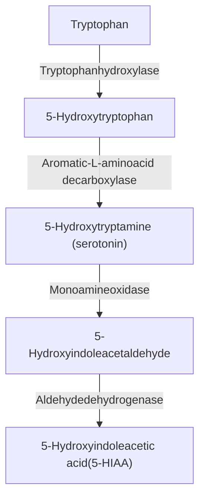

# Ch.43 Neuroendocrine Tumors and Disorders — 中英對照（Bilingual EN/中文）

> 本檔為原始 LlamaParse 解析全文的**中英對照版**：保留完整英文原文，每個小片段後緊接繁體中文翻譯（`> 🇹🇼 中譯：`），方便 fellow 一邊讀原文一邊對照。
>
> 原始純英文全文見：[`_source/Ch43-raw-LlamaParse.md`](_source/Ch43-raw-LlamaParse.md)。文末 References（參考文獻）依慣例不翻譯。

---

# Neuroendocrine Tumors and Disorders

> 🇹🇼 **中譯：** 神經內分泌腫瘤與相關疾病

WOUTER W. DE HERDER, RICHARD A. FEELDERS, AND JOHANNES HOFLAND

> 🇹🇼 **中譯：** WOUTER W. DE HERDER、RICHARD A. FEELDERS 與 JOHANNES HOFLAND

## CHAPTER OUTLINE

> 🇹🇼 **中譯：** 本章大綱

Introduction, 1721	NEN—Circulating Markers Including Hormones, 1729
Genetic Syndromes With NENs, 1722	NEN Imaging, 1729
Endocrine-Related Symptoms and Syndromes Caused by NENs, 1722	Management, 1730
Non–Endocrine-Related Symptoms, 1726	Therapy of Hormonal Syndromes, 1732
NEN Pathology, 1727	Antiproliferative Therapy, 1734

> 🇹🇼 **中譯：** 引言，1721；NEN—包括荷爾蒙在內的循環標記物，1729；伴有 NEN 的遺傳性症候群，1722；NEN 影像學，1729；NEN 所引起之內分泌相關症狀與症候群，1722；治療處置，1730；非內分泌相關症狀，1726；荷爾蒙症候群的治療，1732；NEN 病理學，1727；抗增殖治療，1734。

## KEY POINTS

> 🇹🇼 **中譯：** 重點摘要

* The World Health Organization (WHO) classification system (2022) of neuroendocrine tumors (NETs; G1 NET, G2 NET, and G3 NET) and neuroendocrine carcinoma (NEC) is informative and necessary for the clinical management of gastroenteropancreatic and lung neuroendocrine neoplasms.

> 🇹🇼 **中譯：** 世界衛生組織（WHO）2022 年針對神經內分泌腫瘤（NETs；G1 NET、G2 NET 與 G3 NET）與神經內分泌癌（NEC）所制定的分類系統，對於腸胃胰（gastroenteropancreatic）與肺部神經內分泌腫瘤的臨床處置具有提供資訊的價值且為必要。

* The most important and widely used circulating general biomarkers for neuroendocrine neoplasms are chromogranin A (general) and 5-hydroxyindoleacetic acid (5-HIAA) (carcinoid syndrome) and the less widely used NETest and neuron-specific enolase (NSE) for small cell lung cancer. Specific assays for hypersecreted hormones are commonly used in functioning pancreatic neuroendocrine tumor syndromes (insulin, gastrin, glucagon, vasoactive intestinal peptide).

> 🇹🇼 **中譯：** 神經內分泌腫瘤最重要且最廣泛使用的循環一般生物標記物為 chromogranin A（一般用途）與 5-hydroxyindoleacetic acid（5-HIAA）（用於類癌症候群〔carcinoid syndrome〕），以及較少使用的 NETest 與用於小細胞肺癌的 neuron-specific enolase（NSE）。針對特定過度分泌荷爾蒙的檢測，常用於功能性胰臟神經內分泌腫瘤症候群（insulin、gastrin、glucagon、vasoactive intestinal peptide）。

* The carcinoid syndrome includes flushing, secretory diarrhea, right-sided heart fibrosis eventually resulting in right-sided heart failure (carcinoid heart disease), mesenterial fibrosis eventually leading to small bowel obstruction, edema, and ischemia, and occasionally bronchial wheezing.

> 🇹🇼 **中譯：** 類癌症候群（carcinoid syndrome）包括潮紅（flushing）、分泌性腹瀉、右側心臟纖維化最終導致右側心臟衰竭（類癌性心臟病〔carcinoid heart disease〕）、腸繫膜纖維化（mesenterial fibrosis）最終導致小腸阻塞、水腫與缺血，偶爾也會出現支氣管喘鳴（bronchial wheezing）。

* Molecular imaging with 68Ga-DOTA-labeled somatostatin receptor ligands in combination with three-phase computed tomography or magnetic resonance imaging is an important procedure for staging of the neuroendocrine tumor disease and is a theranostic tool for peptide receptor radionuclide therapy (PRRT) using beta-emitting radiolabeled somatostatin receptor ligands.

> 🇹🇼 **中譯：** 以 68Ga-DOTA 標記之 somatostatin 受體配體（somatostatin receptor ligands）進行的分子影像，搭配三期電腦斷層（three-phase computed tomography）或磁振造影，是神經內分泌腫瘤疾病分期的重要程序，並且是使用 beta 射線發射之放射標記 somatostatin 受體配體進行胜肽受體放射性核種治療（peptide receptor radionuclide therapy, PRRT）的治療診斷（theranostic）工具。

* Somatostatin receptor ligands are approved first-line therapies for patients with functioning (hormone-secreting) and nonfunctioning gastroenteropancreatic neuroendocrine tumors (G1 NET, G2 NET, and G3 NET).

> 🇹🇼 **中譯：** Somatostatin 受體配體為核可的第一線療法，適用於功能性（分泌荷爾蒙）與非功能性腸胃胰神經內分泌腫瘤（G1 NET、G2 NET 與 G3 NET）的患者。

* Genetic syndromes associated with neuroendocrine neoplasms include multiple endocrine neoplasia type 1, multiple endocrine neoplasia type 4, von Hippel-Lindau disease, neurofibromatosis 1, the Pacak-Zhuang syndrome, Mahvash disease, and insulinomatosis.

> 🇹🇼 **中譯：** 與神經內分泌腫瘤相關的遺傳性症候群包括第 1 型多發性內分泌腫瘤（multiple endocrine neoplasia type 1）、第 4 型多發性內分泌腫瘤（multiple endocrine neoplasia type 4）、von Hippel-Lindau disease、neurofibromatosis 1、Pacak-Zhuang syndrome、Mahvash disease 與 insulinomatosis。

* Targeted therapy with everolimus is approved as second-line therapy in patients with G1-2 gastroenteropancreatic and bronchopulmonary NET, and sunitinib is approved as second-line therapy in patients with G1-2 pancreatic NET.

> 🇹🇼 **中譯：** 使用 everolimus 的標靶治療被核可作為 G1-2 腸胃胰與支氣管肺部 NET 患者的第二線療法，而 sunitinib 被核可作為 G1-2 胰臟 NET 患者的第二線療法。

* Cytotoxic chemotherapy is usually reserved for G2-3 pancreatic NET and NEC and small cell lung cancer, large cell neuroendocrine carcinomas of the lung, and metastatic and/or inoperable atypical bronchopulmonary carcinoids.

> 🇹🇼 **中譯：** 細胞毒性化學治療通常保留給 G2-3 胰臟 NET 與 NEC、小細胞肺癌、肺部大細胞神經內分泌癌（large cell neuroendocrine carcinomas），以及轉移性與／或無法手術切除的非典型支氣管肺部類癌（atypical bronchopulmonary carcinoids）。

* Second-line peptide receptor radionuclide therapy with 177Lu-DOTATATE can be considered for patients with functioning (hormone-producing) and nonfunctioning somatostatin receptor-positive G1 NET and G2 NET and potentially for some selected patients with G3 NET.

> 🇹🇼 **中譯：** 使用 177Lu-DOTATATE 的第二線胜肽受體放射性核種治療（PRRT），可考慮用於功能性（產生荷爾蒙）與非功能性、somatostatin 受體陽性的 G1 NET 與 G2 NET 患者，且有可能用於某些經篩選的 G3 NET 患者。

## Introduction

> 🇹🇼 **中譯：** 引言

The majority of neuroendocrine neoplasms (NENs) arise in the gastrointestinal tract and pancreas (gastroenteropancreatic [GEP] NENs) and in the bronchopulmonary tract (BP NENs), but these tumors may also develop in other organs.¹ NENs express markers of neuroendocrine differentiation, organ-specific  bioactive substances, and tissue-specific transcription factors.² NENs encompass a wide spectrum ranging from well-differentiated and relatively slowly growing tumors (neuroendocrine tumors [NETs]) to very aggressive, poorly differentiated neuroendocrine carcinomas (NECs).1–3 GEP NENs are mostly diagnosed after metastases have developed. Obsolete terminologies for NENs include "APUDomas" after Anthony Pearse (1916–2003),

> 🇹🇼 **中譯：** 大多數神經內分泌腫瘤（neuroendocrine neoplasms, NENs）發生於腸胃道與胰臟（腸胃胰〔gastroenteropancreatic, GEP〕NENs）以及支氣管肺部（BP NENs），但這些腫瘤也可能發生於其他器官。¹ NENs 會表現神經內分泌分化的標記物、器官特異性的生物活性物質，以及組織特異性的轉錄因子。² NENs 涵蓋廣泛的範圍，從分化良好且生長相對緩慢的腫瘤（神經內分泌腫瘤〔neuroendocrine tumors, NETs〕）到極具侵襲性、分化不良的神經內分泌癌（NECs）。1–3 GEP NENs 大多在轉移已發生後才被診斷出來。NENs 的過時術語包括以 Anthony Pearse（1916–2003）命名的「APUDomas」，

who established the amine precursor uptake and decarboxylation (APUD) concept in the late 1960s, and "carcinoid tumors" or "carcinoids" after Siegfried Oberndorfer (1876–1944) in 1907 and "islet cell tumors," although the term "carcinoid syndrome" is still widely used.⁴,5

> 🇹🇼 **中譯：** 他於 1960 年代晚期建立了胺前驅物攝取與去羧化（amine precursor uptake and decarboxylation, APUD）的概念；此外還有 1907 年以 Siegfried Oberndorfer（1876–1944）命名的「carcinoid tumors」或「carcinoids」，以及「islet cell tumors」，不過「carcinoid syndrome」一詞至今仍被廣泛使用。⁴,5

As NENs predominantly derive from the embryonic gut, primary tumor sites are traditionally categorized into "foregut," "midgut," and "hindgut" NENs. Foregut NENs include bronchopulmonary (BP) and thymic NENs and tracheal, esophageal, gastric, proximal duodenal (ampulla of Vater), and pancreatic NENs (panNENs). Bronchopulmonary (BP), thymic, and gastric NENs may be classified separately. BP NENs account for 20% to 25% of lung cancers and for 25% to 30% of NENs from all tissue sites. BP NENs are subclassified as high-grade carcinomas, small cell lung cancer (SCLC) and large cell neuroendocrine carcinoma (LCNEC), and low-grade tumors—atypical carcinoids (ACs), classified as intermediate grade, and typical carcinoids (TCs), classified as low grade. SCLC accounts for approximately 80% of all BP NENs and is an aggressive tumor.⁶⁻⁸ In the stomach, type 1 gastric NENs develop multifocally in enterochromaffin-like (ECL) cells of the stomach as a consequence of chronic hypergastrinemia resulting from autoimmune atrophic gastritis.⁹⁻¹¹ Type 2 gastric NENs develop due to chronic stimulation by gastrin from a gastrin-secreting NEN (gastrinoma) in the context of the multiple endocrine neoplasia type 1 (MEN1) syndrome.¹²,¹³ These type 1 and 2 gastric NENs were formerly also named "ECLomas" or "gastric carcinoids." Type 3 gastric NENs are sporadic, solitary NENs, which develop in the absence of elevated gastrin levels and have an aggressive biologic behavior despite their well-differentiated morphology.¹⁰ Type 4 gastric NENs are poorly differentiated carcinomas with a poor prognosis.¹⁰ Midgut NENs arise in the intestinal section vascularized by the superior mesenteric artery and show a predilection for the ileocecal region.¹ Appendix NENs are also categorized as midgut NENs, but these tumors are generally considered a distinct entity because of the peak incidence in children and young adults and their relatively benign behavior.¹⁴,¹⁵ Incidence rates of hindgut NENs show a prevalence of rectal NENs over colon NENs, both of which are increasingly diagnosed by (screening) colonoscopy.¹,¹⁶

> 🇹🇼 **中譯：** 由於 NENs 主要源自胚胎期的腸道，原發腫瘤部位傳統上分為「前腸（foregut）」、「中腸（midgut）」與「後腸（hindgut）」NENs。前腸 NENs 包括支氣管肺部（BP）與胸腺 NENs，以及氣管、食道、胃、近端十二指腸（ampulla of Vater，即華特氏壺腹）與胰臟 NENs（panNENs）。支氣管肺部（BP）、胸腺與胃 NENs 可單獨分類。BP NENs 佔肺癌的 20% 至 25%，並佔所有組織部位 NENs 的 25% 至 30%。BP NENs 進一步分類為高惡性度癌（small cell lung cancer〔SCLC〕與 large cell neuroendocrine carcinoma〔LCNEC〕）與低惡性度腫瘤——非典型類癌（atypical carcinoids, ACs，歸類為中惡性度）與典型類癌（typical carcinoids, TCs，歸類為低惡性度）。SCLC 約佔所有 BP NENs 的 80%，且為侵襲性腫瘤。⁶⁻⁸ 在胃部，第 1 型胃 NENs 因自體免疫性萎縮性胃炎所致的慢性高胃泌素血症（hypergastrinemia）而在胃的腸嗜鉻樣（enterochromaffin-like, ECL）細胞中多灶性發生。⁹⁻¹¹ 第 2 型胃 NENs 因第 1 型多發性內分泌腫瘤（MEN1）症候群背景下、由分泌 gastrin 的 NEN（gastrinoma）所釋出的 gastrin 慢性刺激而發生。¹²,¹³ 這些第 1 型與第 2 型胃 NENs 過去也被稱為「ECLomas」或「gastric carcinoids」。第 3 型胃 NENs 為偶發性、單發性 NENs，在 gastrin 濃度未升高的情況下發生，儘管型態分化良好仍具侵襲性的生物行為。¹⁰ 第 4 型胃 NENs 為分化不良的癌，預後不佳。¹⁰ 中腸 NENs 發生於由上腸繫膜動脈（superior mesenteric artery）供應血流的腸段，並好發於迴盲（ileocecal）區。¹ 闌尾 NENs 也歸類為中腸 NENs，但這些腫瘤因發生率高峰位於兒童與年輕成人且行為相對良性，一般被視為一個獨立的疾病實體。¹⁴,¹⁵ 後腸 NENs 的發生率顯示直腸 NENs 較結腸 NENs 普遍，兩者均日益由（篩檢性）大腸鏡檢查所診斷。¹,¹⁶

Other, rarer primary NEN tumor sites include the liver (bile ducts), ovaries, testes, prostate, kidneys, breasts, inner ear, and skin. Alternatively, NENs can also metastasize to the ovaries, testes, kidneys, breasts, and skin, which should be considered when assessing the potential primary tumor site.¹,³

> 🇹🇼 **中譯：** 其他較罕見的原發 NEN 腫瘤部位包括肝臟（膽管）、卵巢、睪丸、攝護腺、腎臟、乳房、內耳與皮膚。另一方面，NENs 也可能轉移至卵巢、睪丸、腎臟、乳房與皮膚，在評估潛在原發腫瘤部位時應將此納入考量。¹,³

The overall estimated incidence of all GEP NENs and BP NENs has gradually increased 3.5 to 5 times over the previous 4 decades. In the Western world, the highest increase in GEP NEN incidence was found for gastric and rectal NENs and the lowest increase was found for small intestinal and cecal NENs.¹⁷ The annual incidence of GEP NENs is estimated at approximately 3.5 to 4 per 100,000 persons.¹⁷,¹⁸ Gender and racial differences in incidence rates and complications differ by site.¹⁸,¹⁹ In Asian patients, small intestinal NENs seem to be rare, whereas gastric and rectal NENs are more prevalent.

> 🇹🇼 **中譯：** 在過去 4 個十年間，所有 GEP NENs 與 BP NENs 的整體估計發生率已逐漸增加至原本的 3.5 至 5 倍。在西方世界，GEP NEN 發生率增加最多的是胃與直腸 NENs，增加最少的是小腸與盲腸 NENs。¹⁷ GEP NENs 的年發生率估計約為每 10 萬人 3.5 至 4 例。¹⁷,¹⁸ 發生率與併發症的性別與種族差異依部位而異。¹⁸,¹⁹ 在亞洲患者中，小腸 NENs 似乎罕見，而胃與直腸 NENs 則較為普遍。

# Genetic Syndromes With NENs

> 🇹🇼 **中譯：** 伴有 NEN 的遺傳性症候群

Primary pancreatic, gastric, duodenal, thymic, and BP NENs arise in patients with the multiple endocrine neoplasia type 1 syndrome (MEN1, Mendelian Inheritance in Man [MIM] number 131100).¹²,²⁰ In patients with the multiple endocrine neoplasia type 4 (MEN4, MIM number 610755) syndrome caused

> 🇹🇼 **中譯：** 原發性胰臟、胃、十二指腸、胸腺與 BP NENs 可發生於罹患第 1 型多發性內分泌腫瘤症候群（MEN1，人類孟德爾遺傳〔Mendelian Inheritance in Man, MIM〕編號 131100）的患者。¹²,²⁰ 在罹患第 4 型多發性內分泌腫瘤（MEN4，MIM 編號 610755）症候群的患者中——

by inactivating mutations in the cyclin-dependent kinase inhibitor 1B (*CDKN1B*) gene, GEP and BP NENs also occur.²¹ PanNENs can also be diagnosed in patients with von Hippel-Lindau disease (VHL, MIM number 193300).²² Ampullary-type duodenal somatostatinomas and panNENs can be diagnosed in patients with neurofibromatosis 1 (MIM number 162200).²³ In the Pacak-Zhuang syndrome (MIM number 603349), gain-of-function mutations in the endothelial PAS domain protein 1 (*EPAS1*) gene result in reduced degradation and stabilization of hypoxia-inducible factor 2-alpha (HIF-2α) and lead to the development of somatostatinomas.²⁴,²⁵ In Mahvash disease (MIM number 619290) caused by inactivating mutations in the glucagon receptor (*GCGR*) gene, multiple glucagon-producing panNENs among diffuse α cell hyperplasia can be found, but the clinical glucagonoma syndrome (see later discussion) is absent.²⁶⁻²⁸ In patients with an autosomal dominant syndrome characterized by insulinomatosis (multiple insulinomas) of the pancreas, the *MAF BZIP transcription factor A* (*MAFA*) mutation (MIM number 147630) was found.²⁹

> 🇹🇼 **中譯：** ——由 cyclin-dependent kinase inhibitor 1B（*CDKN1B*）基因之去活化突變所致——GEP 與 BP NENs 也會發生。²¹ panNENs 亦可診斷於罹患 von Hippel-Lindau disease（VHL，MIM 編號 193300）的患者。²² 壺腹型十二指腸體抑素瘤（somatostatinomas）與 panNENs 可診斷於罹患 neurofibromatosis 1（MIM 編號 162200）的患者。²³ 在 Pacak-Zhuang syndrome（MIM 編號 603349）中，endothelial PAS domain protein 1（*EPAS1*）基因的功能獲得性（gain-of-function）突變導致 hypoxia-inducible factor 2-alpha（HIF-2α）的降解減少與穩定化，進而導致體抑素瘤（somatostatinomas）的發生。²⁴,²⁵ 在由 glucagon receptor（*GCGR*）基因去活化突變所致的 Mahvash disease（MIM 編號 619290）中，可在瀰漫性 α 細胞增生中發現多發性產生 glucagon 的 panNENs，但臨床上的升糖素瘤症候群（glucagonoma syndrome，見後文討論）並不存在。²⁶⁻²⁸ 在以胰臟胰島素瘤多發症（insulinomatosis，多發性胰島素瘤）為特徵的體染色體顯性症候群患者中，發現了 *MAF BZIP transcription factor A*（*MAFA*）突變（MIM 編號 147630）。²⁹

# Endocrine-Related Symptoms and Syndromes Caused by NENs

> 🇹🇼 **中譯：** NEN 所引起之內分泌相關症狀與症候群

Isolated or metastatic NENs can present with hormone-related symptoms and syndromes that result from hypersecretion of one or more peptides or amines by these tumors. Production of these products can be characteristic of the specific tissue of origin leading to a secretory syndrome (eutopic secretion), or, rarely, bioactive peptides/hormones, which usually originate from other anatomic sites (ectopic secretion), are secreted. The majority of NENs are nonfunctioning, or not secreting biologically relevant levels of active peptides or hormones (ICD-O coding: 8150/3. Neuroendocrine tumor, nonfunctioning pancreatic—ICD-11 coding: 2C10.1 and XH3709. NENs of pancreas, pancreatic endocrine tumor, nonfunctioning).

> 🇹🇼 **中譯：** 孤立性或轉移性 NENs 可因這些腫瘤過度分泌一種或多種胜肽或胺類而表現出荷爾蒙相關的症狀與症候群。這些產物的產生可能是特定起源組織的特徵，進而導致分泌性症候群（正位分泌〔eutopic secretion〕）；或者，較少見地，分泌出通常源自其他解剖部位的生物活性胜肽／荷爾蒙（異位分泌〔ectopic secretion〕）。大多數 NENs 為非功能性，亦即不分泌具生物意義濃度的活性胜肽或荷爾蒙（ICD-O 編碼：8150/3。神經內分泌腫瘤，非功能性胰臟——ICD-11 編碼：2C10.1 與 XH3709。胰臟 NENs、胰臟內分泌腫瘤、非功能性）。

# Carcinoid Syndrome

> 🇹🇼 **中譯：** 類癌症候群（Carcinoid Syndrome）

ICD-O coding: 8241/3. Neuroendocrine tumor, EC-cell and/or serotonin-producing—ICD-11 coding: 2C10.1 and XH7NM1. NENs of pancreas and enterochromaffin cell carcinoid (includes serotonin-producing carcinoid).

> 🇹🇼 **中譯：** ICD-O 編碼：8241/3。神經內分泌腫瘤，EC 細胞與／或產生 serotonin 者——ICD-11 編碼：2C10.1 與 XH7NM1。胰臟 NENs 與腸嗜鉻細胞類癌（enterochromaffin cell carcinoid）（包含產生 serotonin 的類癌）。

The carcinoid syndrome is characterized by frequent watery (secretory) diarrhea and flushing and is occasionally also associated with wheezing⁵ (Fig. 43.1; Boxes 43.1 and 43.2). The incidence of carcinoid syndrome is estimated to be 2 cases per 100,000 persons.⁵ The main secretory products, which potentially have a causal role in the carcinoid syndrome, include serotonin (5-hydroxytryptamine [5-HT]), histamine, bradykinins and tachykinins, kallikrein, and prostaglandin.⁵ Since these hormones and peptides can be effectively metabolized by the liver, symptoms of the carcinoid syndrome generally only occur when tumor localizations are outside of, or bypass, the portal vein drainage system. Examples of these bypasses include primary BP NEN, thymic, ovarian, or extensive retroperitoneal sites. Midgut NENs, followed by BP NENs, are the most frequent primary sources of the carcinoid syndrome. Carcinoid syndrome is present in approximately 20% to 30% of patients with liver and/or bone metastases from these tumors.⁵,³⁰⁻³³ Serotonin regulates motility of and fluid secretion into the intestinal tract with the inhibition of absorption. Serotonin also has a role in fibrosis, as seen in many patients

> 🇹🇼 **中譯：** 類癌症候群的特徵為頻繁的水樣（分泌性）腹瀉與潮紅，偶爾也伴隨喘鳴⁵（圖 43.1；方框 43.1 與 43.2）。類癌症候群的發生率估計為每 10 萬人 2 例。⁵ 在類癌症候群中可能具有致病角色的主要分泌產物包括 serotonin（5-hydroxytryptamine〔5-HT〕）、histamine、bradykinins 與 tachykinins、kallikrein 與 prostaglandin。⁵ 由於這些荷爾蒙與胜肽可被肝臟有效代謝，類癌症候群的症狀一般僅在腫瘤位置位於門靜脈（portal vein）引流系統之外或繞過該系統時才會出現。這類繞過途徑的例子包括原發性 BP NEN、胸腺、卵巢或廣泛的腹膜後（retroperitoneal）部位。中腸 NENs，其次是 BP NENs，為類癌症候群最常見的原發來源。在罹患這些腫瘤且有肝臟與／或骨骼轉移的患者中，約有 20% 至 30% 出現類癌症候群。⁵,³⁰⁻³³ Serotonin 調節腸道的蠕動與液體分泌並抑制吸收。Serotonin 在纖維化中也扮演角色，如同在許多患者中所見——

Patient with the carcinoid syndrome showing the typical facial flushing.

> 🇹🇼 **中譯：** 罹患類癌症候群的患者，呈現典型的面部潮紅。

• Fig. 43.1 Patient with the carcinoid syndrome showing the typical facial flushing.

> 🇹🇼 **中譯：** • 圖 43.1 罹患類癌症候群的患者，呈現典型的面部潮紅。

# • BOX 43.2 Differential Diagnosis of Flushing

> 🇹🇼 **中譯：** • 方框 43.2 潮紅（Flushing）的鑑別診斷

## Wet Flushing
* Hypogonadism (menopause)
* Pheochromocytoma/paraganglioma
* Neurologic disorder
* Medication

> 🇹🇼 **中譯：** 濕性潮紅（Wet Flushing）：性腺功能低下（更年期）；嗜鉻細胞瘤／副神經節瘤（pheochromocytoma/paraganglioma）；神經學疾患；藥物。

## Dry Flushing
* Emotions
    - Medication
    - Food
    - Capsaicin
    - Toxins
    - Food additives
* Alcoholism
* Carcinoid syndrome
    - Pheochromocytoma/paraganglioma
    - VIPoma
    - Medullary thyroid carcinoma
    - Mastocytosis
    - Serotonin syndrome
    - Anaphylaxis

> 🇹🇼 **中譯：** 乾性潮紅（Dry Flushing）：情緒；藥物；食物；capsaicin（辣椒素）；毒素；食品添加物；酒精成癮；類癌症候群；嗜鉻細胞瘤／副神經節瘤（pheochromocytoma/paraganglioma）；VIPoma；甲狀腺髓質癌（medullary thyroid carcinoma）；肥大細胞增生症（mastocytosis）；血清素症候群（serotonin syndrome）；過敏性休克（anaphylaxis）。

Flushing = episodic attacks of redness of the skin together with a sensation of warmth or burning of the face, neck, and, less frequently, the upper trunk and abdomen. Wet/dry refers to increased perspiration.

> 🇹🇼 **中譯：** 潮紅（Flushing）＝陣發性發作的皮膚發紅，伴隨臉部、頸部以及較少見的上軀幹與腹部的溫熱或灼熱感。濕性／乾性指的是是否伴隨出汗增加。

*Modified from Huguet I, Grossman A. Management of endocrine disease: flushing: current concepts. Eur J Endocrinol. 2017;177(5):R219–R229.*

> 🇹🇼 **中譯：** （參考文獻，原樣保留，不翻譯）

# • BOX 43.1 Differential Diagnosis of Diarrhea in a Patient With a Metastatic Neuroendocrine Neoplasm (NEN)

> 🇹🇼 **中譯：** • 方框 43.1 轉移性神經內分泌腫瘤（NEN）患者腹瀉的鑑別診斷

## Secretory Diarrhea
### NEN-Related
* Carcinoid syndrome
* Gastrinoma
* VIPoma
* CCKoma
* Medullary thyroid carcinoma

### Not NEN-Related
* Bile acid diarrhea

> 🇹🇼 **中譯：** 分泌性腹瀉（Secretory Diarrhea）。與 NEN 相關：類癌症候群；胃泌素瘤（gastrinoma）；VIPoma；CCKoma；甲狀腺髓質癌（medullary thyroid carcinoma）。與 NEN 無關：膽酸性腹瀉（bile acid diarrhea）。

## Osmotic Diarrhea
## Inflammatory Diarrhea
## Maldigestive Diarrhea
### NEN-related
* Somatostatinoma
* Pancreatic exocrine insufficiency
    - Postsurgery (postpancreatectomy)
    - Medication (somatostatin receptor ligands)

> 🇹🇼 **中譯：** 滲透性腹瀉（Osmotic Diarrhea）。發炎性腹瀉（Inflammatory Diarrhea）。消化不良性腹瀉（Maldigestive Diarrhea）。與 NEN 相關：體抑素瘤（somatostatinoma）；胰臟外分泌功能不全（pancreatic exocrine insufficiency）——術後（胰臟切除後〔postpancreatectomy〕）；藥物（somatostatin 受體配體）。

## Maldigestive/Malabsorptive Diarrhea
* Short bowel
* Bacterial overgrowth
* Other causes (irritable bowel, lactose intolerance, celiac disease, laxatives, hyperthyroidism, enteropathies, common variable immunodeficiency)

> 🇹🇼 **中譯：** 消化不良／吸收不良性腹瀉（Maldigestive/Malabsorptive Diarrhea）：短腸症（short bowel）；細菌過度生長（bacterial overgrowth）；其他原因（腸躁症、乳糖不耐症、乳糜瀉〔celiac disease〕、瀉藥、甲狀腺機能亢進、腸病變〔enteropathies〕、常見變異型免疫缺乏症〔common variable immunodeficiency〕）。

*Modified from Eads JR, Reidy-Lagunes D, Soares HP, et al. Differential diagnosis of diarrhea in patients with neuroendocrine tumors. Pancreas. 2020;49(9):1123–1130.*

> 🇹🇼 **中譯：** （參考文獻，原樣保留，不翻譯）

with the carcinoid syndrome, and diarrhea and carcinoid heart disease (CHD) are symptoms attributed to systemic serotonin excess. CHD is a severe complication of the carcinoid syndrome with a prevalence of 20% to 50% in patients with the carcinoid syndrome5,34,35 (Fig. 43.2). CHD is characterized most frequently by tricuspid valve (TV) and pulmonary valve (PV) fibrosis causing regurgitation and valve stenosis as well as endocardial fibrosis. In approximately one-third of cases, CHD can also affect the left-sided heart aortic and mitral valves, in patients with coexisting patent foramen ovale (PFO), and also in those with serotonin-producing BP NENs. Patients with CHD can be asymptomatic, but may eventually develop progressive exertional dyspnea and fatigue, together with right-sided heart failure, including elevated jugular venous pressure, hepatomegaly, and peripheral edema. All patients with carcinoid syndrome should be screened for CHD because this is a major prognostic factor limiting 3-year survival by 30% when left untreated. Generally, management of CHD requires a multidisciplinary approach in a dedicated center.5,34,35 Fibrosis can also occur around the primary NEN or metastatic lesions in the mesentery that become circumscribed by an extensive fibrotic reaction. Mesenterial fibrosis may lead to intestinal obstruction, edema, and ischemia, which causes abdominal pain and cachexia and often necessitates surgery.36–39 Mesenterial fibrosis is observed in more than 60% of patients with metastatic midgut NENs.36–39

> 🇹🇼 **中譯：** ——罹患類癌症候群者；而腹瀉與類癌性心臟病（carcinoid heart disease, CHD）是歸因於全身性 serotonin 過量的症狀。CHD 是類癌症候群的嚴重併發症，在類癌症候群患者中盛行率為 20% 至 50%5,34,35（圖 43.2）。CHD 最常見的特徵為三尖瓣（tricuspid valve, TV）與肺動脈瓣（pulmonary valve, PV）纖維化，造成瓣膜逆流與瓣膜狹窄，以及心內膜纖維化（endocardial fibrosis）。在約三分之一的病例中，CHD 也可影響左側心臟的主動脈瓣與二尖瓣，見於合併開放性卵圓孔（patent foramen ovale, PFO）的患者，以及罹患產生 serotonin 之 BP NENs 的患者。CHD 患者可能無症狀，但最終可能發展出進行性的運動性呼吸困難與疲倦，並合併右側心臟衰竭，包括頸靜脈壓升高、肝腫大與周邊水腫。所有類癌症候群患者都應接受 CHD 篩檢，因為這是一個主要的預後因子，若未治療會使 3 年存活率降低 30%。一般而言，CHD 的處置需要在專責中心以多專科團隊方式進行。5,34,35 纖維化也可發生於原發 NEN 或腸繫膜（mesentery）轉移病灶周圍，使其被廣泛的纖維化反應所包圍。腸繫膜纖維化可導致腸阻塞、水腫與缺血，造成腹痛與惡病質（cachexia），且常需手術處理。36–39 在轉移性中腸 NENs 患者中，超過 60% 觀察到腸繫膜纖維化。36–39

An acute life-threatening feature of (uncontrolled) carcinoid syndrome is "carcinoid crisis" characterized by abrupt onset of hemodynamic instability, usually accompanied by general features of the carcinoid syndrome with severe flushing and cardiovascular collapse; if left untreated, it may be fatal. Case reports and small studies have suggested that physiologic stress or direct tumor manipulation may initiate these crises by inducing a massive release of vasoactive peptides and hormones probably mediated by catecholamines. It is unclear whether the acute intravenous (IV) administration of somatostatin receptor ligands (SRLs), such as octreotide, can prevent or reverse these crises.5,32,40,41

> 🇹🇼 **中譯：** （未受控制的）類癌症候群有一個急性、危及生命的表現，即「類癌危象（carcinoid crisis）」，其特徵為血流動力學不穩定的突然發作，通常伴隨類癌症候群的一般表現，包括嚴重潮紅與心血管崩潰；若未治療可能致命。病例報告與小型研究指出，生理壓力或直接的腫瘤操作可能透過誘發大量血管活性胜肽與荷爾蒙（可能由 catecholamines 所介導）的釋放而引發這些危象。目前尚不清楚急性靜脈注射（IV）somatostatin 受體配體（somatostatin receptor ligands, SRLs），例如 octreotide，是否能預防或逆轉這些危象。5,32,40,41

Echocardiography of a patient with carcinoid heart disease. (A) Four-chamber image showing tricuspid valve leaflets. (B) Doppler imaging showing tricuspid valve regurgitation.

> 🇹🇼 **中譯：** 一位類癌性心臟病患者的心臟超音波。（A）四腔室影像顯示三尖瓣瓣葉。（B）都卜勒影像顯示三尖瓣逆流。

* **Fig. 43.2** Echocardiography of a patient with carcinoid heart disease. Four-chamber image shows thickened and retracted tricuspid valve leaflets during contraction of the right ventricle (RV) in midsystole (A). The tricuspid valve regurgitation is visible as a blue jet on Doppler imaging and leads to dilation of the right atrium (RA) and elevated venous pressure (B).

> 🇹🇼 **中譯：** * **圖 43.2** 一位類癌性心臟病患者的心臟超音波。四腔室影像顯示在收縮中期（midsystole）右心室（right ventricle, RV）收縮時，增厚且回縮的三尖瓣瓣葉（A）。三尖瓣逆流在都卜勒影像上可見為藍色噴流（blue jet），並導致右心房（right atrium, RA）擴張與靜脈壓升高（B）。

> 🇹🇼 **中譯：** 此流程圖呈現 serotonin 的生合成與代謝路徑：Tryptophan 經 Tryptophan hydroxylase（色胺酸羥化酶）轉變為 5-Hydroxytryptophan；再經 Aromatic-L-amino acid decarboxylase（芳香族 L-胺基酸去羧酶）轉變為 5-Hydroxytryptamine（serotonin，血清素）；再經 Monoamine oxidase（單胺氧化酶）轉變為 5-Hydroxyindoleacetaldehyde；最後經 Aldehyde dehydrogenase（醛去氫酶）轉變為 5-Hydroxyindoleacetic acid（5-HIAA）。

* **Fig. 43.3** Biosynthesis and metabolism of 5-hydroxytryptamine (5-HT; serotonin).

> 🇹🇼 **中譯：** * **圖 43.3** 5-hydroxytryptamine（5-HT；serotonin，血清素）的生合成與代謝。

The increased conversion of tryptophan to serotonin may lead to tryptophan deficiency with subsequent decreased protein synthesis, hypoalbuminemia, and nicotinic acid (vitamin B₃) deficiency, which only occasionally leads to the clinical picture of pellagra.⁴² The breakdown metabolite of serotonin is 5-hydroxyindoleacetic acid (5-HIAA), which is excreted in the urine (Fig. 43.3 and Table 43.1). Flushing of the face and upper trunk is not directly associated to serotonin but is likely mediated by vasoactive substances produced and released by the NEN and its metastases.⁵

> 🇹🇼 **中譯：** tryptophan 轉變為 serotonin 的增加可能導致 tryptophan 缺乏，隨之而來的是蛋白質合成減少、低白蛋白血症（hypoalbuminemia）與 nicotinic acid（菸鹼酸，維生素 B₃）缺乏，後者僅偶爾導致糙皮病（pellagra）的臨床表現。⁴² serotonin 的分解代謝產物為 5-hydroxyindoleacetic acid（5-HIAA），經由尿液排出（圖 43.3 與表 43.1）。臉部與上軀幹的潮紅與 serotonin 並無直接關聯，而可能是由 NEN 及其轉移灶所產生並釋放的血管活性物質所介導。⁵

---

# Functioning Pancreatic Neuroendocrine Neoplasms—PanNENs

> 🇹🇼 **中譯：** 功能性胰臟神經內分泌腫瘤（functioning pancreatic neuroendocrine neoplasms，panNENs）

## Introduction

> 🇹🇼 **中譯：** 前言

PanNENs account for 1% to 10% of pancreatic neoplasms with a prevalence of 1 per 100,000 persons and with a still increasing annual incidence of 1 to 4 per million persons. Nonfunctioning panNENs (NF-panNENs) make up 60% to 80% of all panNEN cases. Insulinomas and gastrinomas are the most frequent functioning panNENs. Fifty percent of MEN1 patients harbor panNENs.20,43–46

> 🇹🇼 **中譯：** panNENs 佔胰臟腫瘤的 1% 至 10%，盛行率為每 100,000 人 1 例，年發生率仍持續上升，為每百萬人 1 至 4 例。非功能性 panNENs（NF-panNENs）佔所有 panNEN 病例的 60% 至 80%。胰島素瘤（insulinoma）與胃泌素瘤（gastrinoma）是最常見的功能性 panNENs。50% 的 MEN1 病患帶有 panNENs。20,43–46

## Insulinoma

> 🇹🇼 **中譯：** 胰島素瘤（Insulinoma）

ICD-O coding: 8151/3. Neuroendocrine tumor, insulin-producing (insulinoma)—ICD-11 coding: 2C10.1 and XH3UK0. NENs of pancreas and insulinoma, malignant.

> 🇹🇼 **中譯：** ICD-O 編碼：8151/3。神經內分泌腫瘤，產胰島素型（胰島素瘤）—ICD-11 編碼：2C10.1 與 XH3UK0。胰臟 NENs 與胰島素瘤，惡性。

Insulinomas have an estimated incidence of 1 to 3 per million persons per year. These NENs usually cause severe hypoglycemias through inappropriately increased secretion of insulin, or insulin precursors. Approximately 10% of insulinomas are multiple NENs, less than 10% can be metastatic at diagnosis, and 5% to 10% are associated with the MEN1 syndrome. MEN1-related insulinomas may occur as multiple lesions. Usually, the so-called Whipple’s triad consisting of (1) symptoms of hypoglycemia, (2) plasma glucose levels <2.2 mmol/L (<40 mg/dL), and (3) relief of symptoms with the administration of glucose prevails. Hallmark features of insulinomas resulting from hypoglycemia include neuroglycopenic (e.g., confusion, visual changes, unusual behavior)

> 🇹🇼 **中譯：** 胰島素瘤的估計年發生率為每百萬人 1 至 3 例。這些 NENs 通常因不適當地增加胰島素或胰島素前驅物的分泌而造成嚴重低血糖。約 10% 的胰島素瘤為多發性 NENs，診斷時不到 10% 會有轉移，5% 至 10% 與 MEN1 症候群相關。MEN1 相關的胰島素瘤可能以多發性病灶呈現。通常以所謂的 Whipple 三聯徵（Whipple’s triad）為主，包括：(1) 低血糖症狀，(2) 血漿葡萄糖濃度 <2.2 mmol/L（<40 mg/dL），以及 (3) 給予葡萄糖後症狀緩解。胰島素瘤因低血糖所致的標誌性特徵包括神經性低血糖（neuroglycopenic，如意識混亂、視覺變化、異常行為）

<table>
  <thead>
    <tr>
        <th colspan="2">TABLE 43.1 Agents That Can Interfere With Urinary 5-HIAA Measurements</th>
    </tr>
    <tr>
        <th>Foods</th>
        <th>Drugs</th>
    </tr>
    <tr>
        <th colspan="2"><u>Agents That Can Produce False-Positive Results</u></th>
    </tr>
  </thead>
  <tbody>
    <tr>
        <td>Avocado</td>
        <td>Acetaminophen</td>
    </tr>
    <tr>
        <td>Banana162</td>
        <td>Caffeine</td>
    </tr>
    <tr>
        <td>Chocolate</td>
        <td>Fluorouracil</td>
    </tr>
    <tr>
        <td>Coffee</td>
        <td>Guaifenesin</td>
    </tr>
    <tr>
        <td>Eggplant</td>
        <td>l-Dopa</td>
    </tr>
    <tr>
        <td>Pecan</td>
        <td>Melphalan</td>
    </tr>
    <tr>
        <td>Pineapple</td>
        <td>Mephenesin</td>
    </tr>
    <tr>
        <td>Plum</td>
        <td>Methamphetamine</td>
    </tr>
    <tr>
        <td>Tea</td>
        <td>Methocarbamol</td>
    </tr>
    <tr>
        <td>Walnut</td>
        <td>Methysergide</td>
    </tr>
    <tr>
        <td> </td>
        <td>Reserpine</td>
    </tr>
    <tr>
        <td> </td>
        <td>Salicylates</td>
    </tr>
    <tr>
        <th colspan="2"><u>Agents That Can Produce False-Negative Results</u></th>
    </tr>
    <tr>
        <td>—</td>
        <td>Corticotropin</td>
    </tr>
    <tr>
        <td> </td>
        <td>Chlorophenylalanine</td>
    </tr>
    <tr>
        <td> </td>
        <td>Chlorpromazine</td>
    </tr>
    <tr>
        <td> </td>
        <td>Heparin</td>
    </tr>
    <tr>
        <td> </td>
        <td>Imipramine</td>
    </tr>
    <tr>
        <td> </td>
        <td>Isoniazid</td>
    </tr>
    <tr>
        <td> </td>
        <td>Methenamine</td>
    </tr>
    <tr>
        <td> </td>
        <td>Methyldopa</td>
    </tr>
    <tr>
        <td> </td>
        <td>Monoamine oxidase (MAO) inhibitors</td>
    </tr>
    <tr>
        <td> </td>
        <td>Phenothiazine</td>
    </tr>
    <tr>
        <td> </td>
        <td>Promethazine</td>
    </tr>
    <tr>
        <td> </td>
        <td>Telotristat</td>
    </tr>
  </tbody>
</table>

> 🇹🇼 **中譯：** 表 43.1 可能干擾尿液 5-HIAA 測定的物質。欄位：Foods（食物）、Drugs（藥物）。
> **可能造成偽陽性結果的物質（Agents That Can Produce False-Positive Results）**：食物—Avocado（酪梨）、Banana（香蕉）162、Chocolate（巧克力）、Coffee（咖啡）、Eggplant（茄子）、Pecan（胡桃／碧根果）、Pineapple（鳳梨）、Plum（李子）、Tea（茶）、Walnut（核桃）；藥物—Acetaminophen、Caffeine、Fluorouracil、Guaifenesin、l-Dopa、Melphalan、Mephenesin、Methamphetamine、Methocarbamol、Methysergide、Reserpine、Salicylates。
> **可能造成偽陰性結果的物質（Agents That Can Produce False-Negative Results）**：食物—無（—）；藥物—Corticotropin、Chlorophenylalanine、Chlorpromazine、Heparin、Imipramine、Isoniazid、Methenamine、Methyldopa、Monoamine oxidase (MAO) inhibitors（單胺氧化酶抑制劑）、Phenothiazine、Promethazine、Telotristat。

5-HIAA, 5-hydroxyindoleacetic acid.

> 🇹🇼 **中譯：** 5-HIAA，5-羥基吲哚乙酸（5-hydroxyindoleacetic acid）。

and sympathetic-adrenal (e.g., palpitations, diaphoresis, tremulousness) symptoms. After initial recognition of key symptoms, laboratory testing, dedicated imaging, and eventually surgery should be undertaken with a multidisciplinary team approach. Because a firmly established diagnosis of an insulin-secreting panNEN is essential for successful management, it is important to exclude other causes of hypoglycemia associated with fasting, including big-IGF-2–producing tumors, glycogen storage diseases, administration of exogenous insulin or sulfonylureas, insulinomatosis and (congenital) nesidioblastosis of the pancreas, and insulin autoimmune syndrome (Hirata disease).47–52

> 🇹🇼 **中譯：** 以及交感腎上腺（sympathetic-adrenal，如心悸、出汗、顫抖）症狀。在初步辨識關鍵症狀後，應以多專科團隊方式進行實驗室檢查、專門影像檢查，最終接受手術。由於確立分泌胰島素之 panNEN 的診斷對成功處置至關重要，因此排除其他與禁食相關之低血糖原因相當重要，包括產生 big-IGF-2 的腫瘤、肝醣儲積症（glycogen storage diseases）、給予外源性胰島素或磺醯脲類（sulfonylureas）、胰島素瘤病（insulinomatosis）與胰臟（先天性）胰島細胞增生症（nesidioblastosis），以及胰島素自體免疫症候群（insulin autoimmune syndrome，Hirata disease）。47–52

## Gastrinoma

> 🇹🇼 **中譯：** 胃泌素瘤（Gastrinoma）

ICD-O coding: 8153/3. Neuroendocrine tumor, gastrin-producing (gastrinoma)—ICD-11 coding: 2C10.1 and XH0GY2. NENs of pancreas and gastrinoma, malignant.

> 🇹🇼 **中譯：** ICD-O 編碼：8153/3。神經內分泌腫瘤，產胃泌素型（胃泌素瘤）—ICD-11 編碼：2C10.1 與 XH0GY2。胰臟 NENs 與胃泌素瘤，惡性。

Gastrinomas are NENs that secrete gastrins, a peptide hormone family that stimulates secretion of gastric acid (HCl) by the parietal cells of the stomach and aids in gastric motility. Gastrin isoforms, such as gastrin-34 (“big gastrin”), gastrin-17 (“little gastrin”), and gastrin-14 (“minigastrin”), bind to a specific G protein–coupled receptor.53 The incidence of gastrinomas is 0.5 to 3 cases per million persons.13 These tumors can be located in the duodenum (50%–85%) and pancreas. Most gastrinomas can be found at the junction of the cystic/common bile ducts posteriorly, the junction of the second/third parts of the duodenum inferiorly, and the junction of the pancreatic neck/body medially, which is

> 🇹🇼 **中譯：** 胃泌素瘤是分泌胃泌素（gastrins）的 NENs；胃泌素為一胜肽激素家族，可刺激胃壁細胞（parietal cells）分泌胃酸（HCl）並協助胃腸蠕動。胃泌素的異構型，如 gastrin-34（「big gastrin」）、gastrin-17（「little gastrin」）與 gastrin-14（「minigastrin」），會與特定的 G 蛋白偶聯受體結合。53 胃泌素瘤的發生率為每百萬人 0.5 至 3 例。13 這些腫瘤可位於十二指腸（50%–85%）與胰臟。多數胃泌素瘤可在以下範圍內找到：後方為膽囊管／總膽管交界處、下方為十二指腸第二／第三部交界處、內側為胰頸／胰體交界處，此範圍

appropriately named “gastrinoma-triangle.”13 Gastrinoma disease is also known as Zollinger-Ellison syndrome (ZES), named after Robert Zollinger (1903–1992) and Edwin Ellison (1918–1970), who published the first cases in 1955. MEN1 is found in 20% to 25% of ZES patients. It is important to identify patients with ZES/MEN1 as their management differs from those with sporadic disease.12,13,44

> 🇹🇼 **中譯：** 被恰當地命名為「胃泌素瘤三角（gastrinoma-triangle）」。13 胃泌素瘤疾病亦稱為 Zollinger-Ellison 症候群（ZES），以 Robert Zollinger（1903–1992）與 Edwin Ellison（1918–1970）命名，兩人於 1955 年發表了首批病例。20% 至 25% 的 ZES 病患可見 MEN1。辨識 ZES/MEN1 病患相當重要，因為其處置方式與偶發性（sporadic）疾病者不同。12,13,44

Gastric acid hypersecretion in ZES can result in (recurrent) *Helicobacter pylori*–negative severe peptic ulcer disease and/or gastroesophageal reflux disease (GERD) and diarrhea.13 Whereas in the past, textbooks reported peptic ulcer disease occurring in abnormal locations outside the duodenum or as multiple, at present, most ZES patients present with a typical duodenal ulcer indistinguishable from *Helicobacter pylori*–associated peptic ulcer disease.13 Diarrhea is present in more than one-half of ZES patients (but usually not in those with *Helicobacter pylori*–associated peptic ulcer disease), and in up to 20% of patients it is the principal or a prominent presenting feature. Diarrhea is characteristically not large volume (<1 L/day) and is characterized by increased frequency and mild steatorrhea.13 Diarrhea in ZES is due to effects of gastric acid hypersecretion causing structural small intestinal damage, interference with fat transport, inactivation of pancreatic lipase, and precipitation of bile acids and, if long-lasting, leads to steatorrhea13 (see Box 43.1). Only patients with advanced disease late in the disease course present with prominent symptoms due to the tumor bulk. The most prominent symptom is abdominal pain, usually caused by a duodenal ulcer (>70%). Others may present with complaints caused by GERD (20%–45%).13

> 🇹🇼 **中譯：** ZES 中的胃酸過度分泌可導致（反覆性）*Helicobacter pylori*（幽門螺旋桿菌）陰性的嚴重消化性潰瘍疾病及／或胃食道逆流疾病（GERD）與腹瀉。13 過去教科書記載消化性潰瘍發生於十二指腸以外的異常位置或呈多發性，但現今多數 ZES 病患呈現典型的十二指腸潰瘍，與 *Helicobacter pylori* 相關之消化性潰瘍無法區別。13 超過半數的 ZES 病患有腹瀉（但 *Helicobacter pylori* 相關消化性潰瘍者通常沒有），而高達 20% 的病患以腹瀉為主要或顯著的表現特徵。腹瀉的特徵為非大量（<1 L/day），表現為次數增加與輕度脂肪便（steatorrhea）。13 ZES 中的腹瀉是因胃酸過度分泌造成小腸結構性損傷、干擾脂肪運輸、使胰脂酶（pancreatic lipase）失活，以及膽酸沉澱所致；若長期持續，則導致脂肪便13（見 Box 43.1）。只有疾病晚期、處於進展期的病患才會因腫瘤體積龐大而出現顯著症狀。最顯著的症狀為腹痛，通常由十二指腸潰瘍引起（>70%）。其他人則可能以 GERD 所致的不適表現（20%–45%）。13

At endoscopy, apart from esophagitis and/or duodenal ulcers, prominent, but not specific, gastric folds are present in 94% of ZES patients.13,54

> 🇹🇼 **中譯：** 在內視鏡檢查時，除了食道炎及／或十二指腸潰瘍外，94% 的 ZES 病患可見明顯但不具特異性的胃皺襞（gastric folds）。13,54

The diagnosis of ZES requires demonstrating fasting hypergastrinemia in the presence of inappropriate acid secretion (see later discussion). However, since the diagnosis of ZES is challenging, particularly being hampered by the abundant use of proton pump inhibitors (PPIs), it is generally believed that ZES is currently underdiagnosed. Chronic hypergastrinemia also has trophic effects on the gastric mucosa, stimulating an increase in the number of parietal cells and gastric ECL cells. It has been proposed that with chronic hypergastrinemia, ECL cells undergo a progressive hyperplasia-neoplasia sequence of events finally resulting in development of gastric NENs (see earlier discussion). However, gastric NENs (gastric carcinoids/ECLomas) rarely occur (<1%) in sporadic-ZES patients but do occur at least with 70-fold greater frequency than type 2 gastric NENs in MEN1/ZES patients.12,13

> 🇹🇼 **中譯：** ZES 的診斷需在不適當的胃酸分泌情況下證明禁食時高胃泌素血症（hypergastrinemia）（見後文討論）。然而，由於 ZES 的診斷具挑戰性，尤其受到質子幫浦抑制劑（PPIs）廣泛使用的妨礙，一般認為目前 ZES 被診斷不足。慢性高胃泌素血症對胃黏膜亦有營養性（trophic）作用，刺激壁細胞與胃 ECL 細胞數目增加。有人提出，在慢性高胃泌素血症下，ECL 細胞會經歷漸進的增生—腫瘤（hyperplasia-neoplasia）序列事件，最終導致胃 NENs 的發生（見前文討論）。然而，胃 NENs（gastric carcinoids/ECLomas）在偶發性 ZES 病患中罕見發生（<1%），但在 MEN1/ZES 病患中其發生頻率至少比第 2 型胃 NENs 高出 70 倍。12,13

## VIPoma

> 🇹🇼 **中譯：** 血管活性腸胜肽瘤（VIPoma）

ICD-O coding: 8155/3. VIPoma—ICD-11 coding: 2C10.1 and XH8LS0. NENs of pancreas and VIPoma, malignant.

> 🇹🇼 **中譯：** ICD-O 編碼：8155/3。VIPoma—ICD-11 編碼：2C10.1 與 XH8LS0。胰臟 NENs 與 VIPoma，惡性。

A VIPoma is a NEN secreting vasoactive intestinal peptide (VIP), a 28-amino-acid peptide and a ligand to a specific G protein–coupled VIP receptor. Most VIPomas are located in the pancreas (75%) whereas ganglioneuromas, ganglioneuroblastomas, or neuroblastomas can also secrete VIP. The annual incidence of VIPomas is 1 to 2 cases per 10 million persons. Patients with VIPomas experience profuse large volumes (6–8 L) of watery (secretory) diarrhea leading to severe electrolyte disturbances caused by loss of stool bicarbonate and potassium (see Box 43.1). About 50% of VIPoma patients also present with hypercalcemia, possibly related to co-secretion of parathyroid hormone–related peptide (PTHrp). Another symptom is facial flushing. In VIPoma

> 🇹🇼 **中譯：** VIPoma 是分泌血管活性腸胜肽（vasoactive intestinal peptide，VIP）的 NEN；VIP 為一 28 個胺基酸的胜肽，是特定 G 蛋白偶聯 VIP 受體的配體。多數 VIPomas 位於胰臟（75%），而神經節瘤（ganglioneuromas）、神經節母細胞瘤（ganglioneuroblastomas）或神經母細胞瘤（neuroblastomas）亦可分泌 VIP。VIPomas 的年發生率為每 1,000 萬人 1 至 2 例。VIPoma 病患會出現大量（6–8 L）水樣（分泌性）腹瀉，因糞便流失碳酸氫鹽與鉀而導致嚴重電解質紊亂（見 Box 43.1）。約 50% 的 VIPoma 病患亦出現高血鈣，可能與共同分泌副甲狀腺素相關胜肽（parathyroid hormone–related peptide，PTHrp）有關。另一症狀為臉部潮紅（facial flushing）。在 VIPoma

patients, gastric acid secretion is inhibited. Therefore, the VIPoma syndrome has also been termed watery diarrhea hypokalemia achlorhydria (WDHA) syndrome. The first cases of VIPoma were reported in 1958 by John Verner, Jr. (1927–2022) and Ashton Morrison (1922–2008) and the VIPoma syndrome has therefore also been named Verner-Morrison syndrome.55

> 🇹🇼 **中譯：** 病患中，胃酸分泌受到抑制。因此，VIPoma 症候群亦稱為水樣腹瀉—低血鉀—胃酸缺乏（watery diarrhea hypokalemia achlorhydria，WDHA）症候群。VIPoma 的首批病例於 1958 年由 John Verner, Jr.（1927–2022）與 Ashton Morrison（1922–2008）報告，因此 VIPoma 症候群亦被命名為 Verner-Morrison 症候群。55

### Glucagonoma

> 🇹🇼 **中譯：** 升糖素瘤（Glucagonoma）

ICD-O coding: 8152/3. Neuroendocrine tumor, glucagon-producing (glucagonoma)—ICD-11 coding: 2C10.1 and XH87C1. NENs of pancreas and glucagonoma, malignant.

> 🇹🇼 **中譯：** ICD-O 編碼：8152/3。神經內分泌腫瘤，產升糖素型（升糖素瘤）—ICD-11 編碼：2C10.1 與 XH87C1。胰臟 NENs 與升糖素瘤，惡性。

Glucagon is a 29-amino-acid peptide and a ligand to a specific G protein–coupled glucagon receptor. Glucagonomas are panNENs secreting glucagon. Their annual incidence is about 1 case per 20 million persons. Glucagon, a catabolic hormone inducing glucose and fatty acid levels with significant weight loss in 70% to 80% of patients, is usually accompanied by either new onset or worsening of diabetes mellitus. Also, cheilosis, glossitis, and stomatitis resulting from severe amino acid depletion are reported in approximately 40% of patients (Fig. 43.4). Thromboembolic events and anemia frequently occur, and depressive symptoms are common; in some patients, dilated cardiomyopathy occurs. However, the most distinct feature of the glucagonoma syndrome occurring in approximately 80% of patients is necrolytic migratory erythema of the skin56,57 (Fig. 43.5).

> 🇹🇼 **中譯：** 升糖素（glucagon）為一 29 個胺基酸的胜肽，是特定 G 蛋白偶聯升糖素受體的配體。升糖素瘤是分泌升糖素的 panNENs。其年發生率約為每 2,000 萬人 1 例。升糖素是一種分解代謝激素，會升高葡萄糖與脂肪酸濃度，在 70% 至 80% 的病患中造成顯著體重減輕，通常伴隨新發或惡化的糖尿病（diabetes mellitus）。此外，約 40% 的病患報告因嚴重胺基酸耗竭所致的唇炎（cheilosis）、舌炎（glossitis）與口炎（stomatitis）（Fig. 43.4）。血栓栓塞事件與貧血常見發生，憂鬱症狀亦常見；部分病患出現擴張性心肌病（dilated cardiomyopathy）。然而，升糖素瘤症候群最具特徵性的表現（發生於約 80% 的病患）為皮膚壞死性遊走性紅斑（necrolytic migratory erythema）56,57（Fig. 43.5）。

### Somatostatinoma

> 🇹🇼 **中譯：** 體抑素瘤（Somatostatinoma）

ICD-O coding: 8156/3. Neuroendocrine tumor, somatostatin-producing (somatostatinoma), ICD-11 coding 2C10.1 and XH9Z82. NENs of pancreas and somatostatinoma, malignant.

> 🇹🇼 **中譯：** ICD-O 編碼：8156/3。神經內分泌腫瘤，產體抑素型（體抑素瘤），ICD-11 編碼 2C10.1 與 XH9Z82。胰臟 NENs 與體抑素瘤，惡性。

Somatostatin is secreted as two isoforms, somatostatin-14 (comprising 14 amino acids) and somatostatin-28 (28 amino acids). The five different somatostatin receptor (SST) subtypes (SST1-5) are G protein–coupled receptors that inhibit hormone release by various endocrine organs. Somatostatin also plays a role as a central nervous system neurotransmitter.

> 🇹🇼 **中譯：** 體抑素（somatostatin）以兩種異構型分泌：somatostatin-14（含 14 個胺基酸）與 somatostatin-28（28 個胺基酸）。五種不同的體抑素受體（somatostatin receptor，SST）亞型（SST1-5）為 G 蛋白偶聯受體，可抑制各種內分泌器官的激素釋放。體抑素亦扮演中樞神經系統神經傳遞物質的角色。

Somatostatinomas are somatostatin-secreting NENs that can be localized in the pancreas (60%) or in the duodenum (40%). Their annual incidence is extremely rare at 1 case per 40 million persons. The somatostatinoma syndrome is characterized by diabetes mellitus of recent onset, decreased gastric acid secretion, gallstones, steatorrhea, anemia, and weight loss. NENs that show immunohistochemical labeling with somatostatin but lack symptoms of somatostatinoma syndrome, such as those observed within the ampulla and duodenum, should be designated as nonfunctioning NENs and are not considered somatostatinomas.58

> 🇹🇼 **中譯：** 體抑素瘤是分泌體抑素的 NENs，可位於胰臟（60%）或十二指腸（40%）。其年發生率極為罕見，為每 4,000 萬人 1 例。體抑素瘤症候群的特徵為近期發作的糖尿病、胃酸分泌減少、膽結石、脂肪便、貧血與體重減輕。對於免疫組織化學染色呈現體抑素但缺乏體抑素瘤症候群症狀的 NENs（如在壺腹與十二指腸內所見者），應歸類為非功能性 NENs，不視為體抑素瘤。58

### Other Hormonal Syndromes in NENs

> 🇹🇼 **中譯：** NENs 的其他激素症候群

Cholecystokinins are a group of polypeptides having many structural similarities with gastrin. The CCKoma syndrome is characterized by nonwatery diarrhea, gallstones, peptic ulcer disease, and significant weight loss59,60 (see Box 43.1).

> 🇹🇼 **中譯：** 膽囊收縮素（cholecystokinins）是一組與胃泌素有許多結構相似性的多胜肽。CCKoma 症候群的特徵為非水樣腹瀉、膽結石、消化性潰瘍疾病與顯著體重減輕59,60（見 Box 43.1）。

Apart from secretion of a single hormone, multiple and secondary hormone secretion can be detected in 3% to 10% of patients with metastatic panNENs. Also, over time, panNENs may start secreting another hormone, or nonfunctioning panNENs may start secreting a biologically active peptide/hormone (i.e., “metachronous” secretion). Secondary hormone secretion is usually associated with disease progression and is also associated with increased morbidity and mortality, particularly in patients with newly diagnosed insulin hypersecretion.61,62

> 🇹🇼 **中譯：** 除了單一激素的分泌外，在 3% 至 10% 的轉移性 panNENs 病患中可偵測到多重與次發性激素分泌。此外，隨著時間推移，panNENs 可能開始分泌另一種激素，或非功能性 panNENs 可能開始分泌具生物活性的胜肽／激素（即「異時性（metachronous）」分泌）。次發性激素分泌通常與疾病進展相關，亦與較高的罹病率與死亡率相關，尤其在新診斷胰島素過度分泌的病患中。61,62

Paraneoplastic humoral syndromes, mostly occurring in patients with panNENs, typical and atypical BP carcinoids, and SCLC, can be caused by adrenocorticotropic hormone (ACTH) or corticotropin-releasing hormone (CRH) secretion causing Cushing syndrome, parathyroid hormone–related peptide (PTHrp) secretion causing hypercalcemia, antidiuretic hormone (ADH) secretion causing hyponatremia, and growth hormone–releasing hormone (GHRH) secretion causing acromegaly.63–65

> 🇹🇼 **中譯：** 副腫瘤性體液症候群（paraneoplastic humoral syndromes）主要發生於 panNENs、典型與非典型支氣管肺（BP）類癌（carcinoids）以及小細胞肺癌（SCLC）的病患，可由以下機制引起：分泌促腎上腺皮質素（adrenocorticotropic hormone，ACTH）或促腎上腺皮質素釋放激素（corticotropin-releasing hormone，CRH）造成庫欣症候群（Cushing syndrome）、分泌副甲狀腺素相關胜肽（PTHrp）造成高血鈣、分泌抗利尿激素（antidiuretic hormone，ADH）造成低血鈉，以及分泌生長激素釋放激素（growth hormone–releasing hormone，GHRH）造成肢端肥大症（acromegaly）。63–65

### Non–Endocrine-Related Symptoms

> 🇹🇼 **中譯：** 非內分泌相關症狀

Complaints resulting from compression, ingrowth, or obstruction of vital structures largely depend on the location of the primary

> 🇹🇼 **中譯：** 因重要結構受壓迫、腫瘤侵入或阻塞所致的不適，主要取決於原發

Cheilosis in a glucagonoma patient.

> 🇹🇼 **中譯：** 一名升糖素瘤病患的唇炎（cheilosis）。

\* **Fig. 43.4** Cheilosis in a glucagonoma patient.

> 🇹🇼 **中譯：** \* **圖 43.4** 一名升糖素瘤病患的唇炎（cheilosis）。

Necrolytic migratory erythema of the skin of the foot and ankle in a glucagonoma patient.

> 🇹🇼 **中譯：** 一名升糖素瘤病患足部與踝部皮膚的壞死性遊走性紅斑（necrolytic migratory erythema）。

\* **Fig. 43.5** Necrolytic migratory erythema of the skin of the foot and ankle in a glucagonoma patient.

> 🇹🇼 **中譯：** \* **圖 43.5** 一名升糖素瘤病患足部與踝部皮膚的壞死性遊走性紅斑（necrolytic migratory erythema）。

tumor and its metastases. Abdominal pain is a common symptom in GEP NEN patients. Fibrosis is a pathognomonic feature of mesenteric metastases of midgut NENs, leading to intermittent pain due to venous congestion, ischemia, invagination, and bowel obstruction. Extensive liver metastases in most stage IV NEN patients can lead to pain and compression of the stomach and/or anorexia and jaundice resulting from intrahepatic bile duct obstruction. Skeletal metastases can cause bone pain and vertebral metastases can induce instability of the spine and nerve root compression. Recurring infections, cough, dyspnea, chest pain, and wheezing can be diagnosed in patients with BP NENs or lung metastases, especially when tumors are located near the central airways. Systemic symptoms of malignancy such as cachexia, fever, and night sweats are only seldomly observed in patients with well-differentiated NENs, but more frequently in high-grade NENs and NECs. Given the expanded use of cross-sectional imaging and endoscopy procedures, an increasing number of patients will be diagnosed with an NEN without related symptoms (incidentalomas).¹

> 🇹🇼 **中譯：** 腫瘤及其轉移的位置。腹痛是胃腸胰（GEP）NEN 病患的常見症狀。纖維化（fibrosis）是中腸（midgut）NENs 腸繫膜轉移的特徵性表現，因靜脈鬱血、缺血、腸套疊（invagination）與腸阻塞而導致間歇性疼痛。多數第 IV 期 NEN 病患的廣泛肝轉移可導致疼痛與胃部受壓迫，及／或因肝內膽管阻塞而造成厭食與黃疸。骨骼轉移可造成骨痛，脊椎轉移可引起脊柱不穩定與神經根受壓迫。在 BP NENs 或肺轉移的病患中，可診斷出反覆感染、咳嗽、呼吸困難、胸痛與喘鳴，尤其當腫瘤位於中央氣道附近時。惡性腫瘤的全身性症狀（如惡病質、發燒與夜間盜汗）在分化良好的 NENs 病患中僅少見，但在高惡性度 NENs 與 NECs 中較常見。鑑於橫斷面影像與內視鏡檢查的使用增加，將有越來越多病患在無相關症狀下被診斷出 NEN（偶發瘤，incidentalomas）。¹

---

## NEN Pathology

> 🇹🇼 **中譯：** NEN 的病理學

In all patients suspected of having an NEN, histology should be obtained by biopsy or resection. The histologic diagnosis of NEN is primarily based on the general markers of neuroendocrine differentiation: chromogranin and synaptophysin and immunohistochemistry for pancreatic hormones (insulin, gastrin, glucagon) in patients with functional panNENs. In addition, immunohistochemistry is also useful for identifying prognostic and theranostic markers such as the somatostatin receptor subtype 2 (SST₂).³,66,67

> 🇹🇼 **中譯：** 對所有疑似罹患 NEN 的病人，應透過切片或手術切除取得組織學檢體。NEN 的組織學診斷主要依據神經內分泌分化的一般標記：chromogranin 與 synaptophysin，以及在具功能性 panNEN 的病人中針對胰臟荷爾蒙（insulin、gastrin、glucagon）的免疫組織化學染色。此外，免疫組織化學也有助於辨識預後與治療診斷（theranostic）標記，例如體抑素受體第 2 亞型（somatostatin receptor subtype 2, SST₂）。³,66,67

The Union for International Cancer Control/American Joint Cancer Committee (UICC/AJCC), World Health Organization (WHO), and European Neuroendocrine Tumor Society (ENETS) have proposed classification systems for both staging and grading of GEP NENs.³ These classification systems have prognostic significance as well as predictive value for treatment decisions. The grade of the tumor is determined using proliferative indices (Ki-67 and mitotic index) and the histologic degree of differentiation of the tumor. GEP NENs are divided into three grades based on the proliferative indices with Grade 1 (G1) or low grade, having a Ki67 <3% (<2 mitoses/10 high-power field [HPF]); G2 or intermediate grade having a Ki67 3% to 20% (2–20 mitoses/10 HPF); and high grade or G3 having a Ki67 >20% (>20 mitosis/10 HPF)³ (Table 43.2). G3 is further divided into two different groups depending on tumor differentiation, with G3 neuroendocrine tumor (NET) having well-differentiated tumor cells and (G3) neuroendocrine carcinoma (NEC) having poorly differentiated tumor cells³ (see Table 43.2).

> 🇹🇼 **中譯：** 國際抗癌聯盟／美國癌症聯合委員會（UICC/AJCC）、世界衛生組織（WHO）及歐洲神經內分泌腫瘤學會（ENETS）已提出 GEP NEN 的分期與分級分類系統。³ 這些分類系統兼具預後意義以及對治療決策的預測價值。腫瘤的分級係以增殖指數（Ki-67 與有絲分裂指數）及腫瘤組織學分化程度來判定。GEP NEN 依增殖指數分為三個等級：第 1 級（G1）或低度（low grade），Ki67 <3%（<2 個有絲分裂/10 個高倍視野 [HPF]）；G2 或中度（intermediate grade），Ki67 3% 至 20%（2–20 個有絲分裂/10 HPF）；以及高度（high grade）或 G3，Ki67 >20%（>20 個有絲分裂/10 HPF）³（表 43.2）。G3 再依腫瘤分化進一步分為兩個不同群組：G3 神經內分泌腫瘤（NET）具分化良好的腫瘤細胞，而（G3）神經內分泌癌（NEC）則具分化不良的腫瘤細胞³（見表 43.2）。

The sequential application of immunohistochemical stains for transcription factors may be applied for identification of an unknown primary site of an NEN. GEP NENs generally express caudal-type homeobox 2 (CDX2) and are negative for thyroid transcription factor 1 (TTF1). Those arising in the duodenum and pancreas may also express insulin gene enhancer protein (ISL1), pancreatic and duodenal homeobox 1 (PDX1), and Aristaless-related homeobox gene (ARX).⁶⁸,⁶⁹ Hindgut NENs also express prostate-specific acid phosphatase (PSAP).³ G3 GEP NENs and G3 GEP NECs vary markedly with regard to patient survival, and also vary in their molecular pathogenesis and treatment approaches. In panNENs, loss of alpha-thalassemia/mental retardation X-linked (ATRX)/death domain–associated protein (DAXX), MEN1 mutations, or p27 and/or retained SST2&5

> 🇹🇼 **中譯：** 可依序應用針對轉錄因子的免疫組織化學染色，以辨識 NEN 不明的原發部位。GEP NEN 一般會表現 caudal-type homeobox 2（CDX2）且 thyroid transcription factor 1（TTF1）呈陰性。源自十二指腸與胰臟者可能還會表現 insulin gene enhancer protein（ISL1）、pancreatic and duodenal homeobox 1（PDX1）及 Aristaless-related homeobox gene（ARX）。⁶⁸,⁶⁹ 後腸（hindgut）NEN 也會表現 prostate-specific acid phosphatase（PSAP）。³ G3 GEP NEN 與 G3 GEP NEC 在病人存活上有明顯差異，其分子致病機轉與治療方式也不同。在 panNEN 中，alpha-thalassemia/mental retardation X-linked（ATRX）/death domain–associated protein（DAXX）的喪失、MEN1 突變、或 p27 及/或保留的 SST2&5

immunohistochemical staining are often used to support the diagnosis of G3 NET. Three different subtypes of nonfunctioning panNENs are based on their epigenomics and transcriptomics. The nonfunctioning panNEN type is mainly composed of cells that resemble B cells, without copy number alterations, MEN1, or ATRX/DAXX mutations (and, therefore, no alternative lengthening of telomeres [ALT]), and has a favorable prognosis. The second nonfunctioning panNEN type is composed of ARX-positive cells with A-cell characteristics, limited copy number variation, and recurrent MEN1 mutations. The third nonfunctioning panNEN type is composed of ARX-positive cells with less pronounced A-cell characteristics, significant copy number alterations, and MEN1 mutations, as well as recurrent ATRX/DAXX mutations. ARX-expressing nonfunctioning panNENs appear to represent a tumor subtype that has the highest metastatic potential, probably due to its susceptibility for ALT activation.³,⁶⁸ A-cell or B-cell characteristics can also be used to differentiate between indolent nonmetastatic insulinomas and clinically aggressive (metastatic) insulinomas. Indolent insulinoma cells have strong epigenetic similarities to B cells (being PDX1-positive and ARX-negative), whereas the rarer clinically aggressive insulinomas express ARX and are characterized by large tumor size (>3 cm) and metastatic behavior.⁷⁰ These findings suggest a different origin of both tumor types, the aggressive insulinomas being more related to the nonfunctioning NETs.³

> 🇹🇼 **中譯：** 的免疫組織化學染色，常用來支持 G3 NET 的診斷。非功能性 panNEN 依其表觀基因體學（epigenomics）與轉錄體學（transcriptomics）分為三種不同亞型。第一型非功能性 panNEN 主要由類似 B 細胞的細胞組成，無拷貝數變異（copy number alterations）、無 MEN1 或 ATRX/DAXX 突變（因此沒有端粒替代延長 [alternative lengthening of telomeres, ALT]），預後良好。第二型非功能性 panNEN 由具 A 細胞特徵的 ARX 陽性細胞組成，拷貝數變異有限，並有反覆出現的 MEN1 突變。第三型非功能性 panNEN 由 ARX 陽性細胞組成，但 A 細胞特徵較不明顯，具顯著的拷貝數變異與 MEN1 突變，以及反覆出現的 ATRX/DAXX 突變。表現 ARX 的非功能性 panNEN 似乎代表一種具最高轉移潛能的腫瘤亞型，可能是因其易於發生 ALT 活化所致。³,⁶⁸ A 細胞或 B 細胞特徵也可用以區分惰性（indolent）非轉移性胰島素瘤（insulinoma）與臨床上侵襲性（轉移性）胰島素瘤。惰性胰島素瘤細胞在表觀遺傳上與 B 細胞高度相似（PDX1 陽性、ARX 陰性），而較罕見的臨床侵襲性胰島素瘤則表現 ARX，並以腫瘤體積大（>3 cm）及轉移行為為特徵。⁷⁰ 這些發現顯示兩種腫瘤類型的起源不同，侵襲性胰島素瘤與非功能性 NET 較為相關。³

Loss of chromosome 18 has been reported in 60% to 90% of small intestinal NENs, but up to present no mutated genes on this chromosome have been detected. CDKN1B has been demonstrated as the only mutated gene in small intestinal NENs, but a low frequency of 8% suggests that its role as a driver in the development of these tumors is limited.⁷¹

> 🇹🇼 **中譯：** 據報告，60% 至 90% 的小腸 NEN 有第 18 號染色體（chromosome 18）的喪失，但迄今尚未在此染色體上偵測到突變基因。CDKN1B 已被證實為小腸 NEN 中唯一的突變基因，但其低頻率（8%）顯示其作為這些腫瘤發生驅動因子（driver）的角色有限。⁷¹

For GEP NENs a tumor-node-metastasis (TNM) staging system has been developed, including tumor size and infiltration, lymph node involvement, and distant metastases⁷²⁻⁷⁴ (Table 43.3).

> 🇹🇼 **中譯：** 針對 GEP NEN，已發展出腫瘤－淋巴結－轉移（tumor-node-metastasis, TNM）分期系統，內容包括腫瘤大小與浸潤、淋巴結侵犯及遠端轉移⁷²⁻⁷⁴（表 43.3）。

BP NENs are subclassified into the high-grade SCLCs and LCNECs and the low-grade ACs and TCs (Table 43.4). Defining histologic criteria include mitotic count per 2 mm², the

> 🇹🇼 **中譯：** BP NEN 再細分為高度（high-grade）的 SCLC 與 LCNEC，以及低度（low-grade）的 AC 與 TC（表 43.4）。界定的組織學標準包括每 2 mm² 的有絲分裂計數、

<table>
  <thead>
    <tr>
        <th colspan="3">TABLE 43.2 2022 WHO Grading of Epithelial Neuroendocrine Neoplasms of the Gastrointestinal and Pancreaticobiliary Tract</th>
    </tr>
    <tr>
        <th>Definition, Grade</th>
        <th>Ki-67 Index (%)</th>
        <th>Mitotic Count (/2 mm²)</th>
    </tr>
    <tr>
        <th colspan="3">Well-Differentiated Neuroendocrine Tumors (NETs)</th>
    </tr>
  </thead>
  <tbody>
    <tr>
        <td>G1 NETs</td>
        <td>&lt;3</td>
        <td>&lt;2</td>
    </tr>
    <tr>
        <td>G2 NETs</td>
        <td>3–20</td>
        <td>2–20</td>
    </tr>
    <tr>
        <td>G3 NETs</td>
        <td>&gt;20</td>
        <td>&gt;20</td>
    </tr>
    <tr>
        <th colspan="3">Poorly Differentiated Neuroendocrine Carcinomas (NECs) (G3 by default)</th>
    </tr>
    <tr>
        <td>Small cell NECs</td>
        <td>Small cell cytomorphology</td>
        <td>&gt;20</td>
    </tr>
    <tr>
        <td>Large cell NECs</td>
        <td>Large cell cytomorphology</td>
        <td>&gt;20</td>
    </tr>
  </tbody>
</table>

> 🇹🇼 **中譯：** 表 43.2 為 2022 年 WHO 對胃腸道及胰膽道上皮性神經內分泌腫瘤（epithelial neuroendocrine neoplasms）的分級。欄位為「定義／分級」、「Ki-67 指數（%）」、「有絲分裂計數（/2 mm²）」。分化良好的神經內分泌腫瘤（NETs）：G1 NETs，Ki-67 <3，有絲分裂 <2；G2 NETs，Ki-67 3–20，有絲分裂 2–20；G3 NETs，Ki-67 >20，有絲分裂 >20。分化不良的神經內分泌癌（NECs）（依定義為 G3）：small cell NECs（小細胞 NEC），具小細胞型態（small cell cytomorphology），有絲分裂 >20；large cell NECs（大細胞 NEC），具大細胞型態（large cell cytomorphology），有絲分裂 >20。WHO＝世界衛生組織。改編自 Rindi G, Mete O, Uccella S, et al. Overview of the 2022 WHO Classification of Neuroendocrine Neoplasms. Endocr Pathol. 2022;33(1):115–154。

WHO, World Health Organization.

Modified from Rindi G, Mete O, Uccella S, et al. Overview of the 2022 WHO Classification of Neuroendocrine Neoplasms. Endocr Pathol. 2022;33(1):115–154.

# TABLE 43.3 ENETS and AJCC TNM Staging Systems for Pancreatic Neuroendocrine Neoplasms (panNENs)

> 🇹🇼 **中譯：** 表 43.3 ENETS 與 AJCC 對胰臟神經內分泌腫瘤（panNENs）的 TNM 分期系統

<table>
  <thead>
    <tr>
        <th>T-N-M</th>
        <th>ENETS</th>
        <th>AJCC UICC 8th Edition</th>
    </tr>
  </thead>
  <tbody>
    <tr>
        <td>T1</td>
        <td>Tumor limited to the pancreas,a &lt;2 cm in greatest diameter</td>
        <td>Tumor limited to the pancreas,a &lt;2 cm in greatest diameter</td>
    </tr>
    <tr>
        <td>T2</td>
        <td>Tumor limited to the pancreas,a 2–4 cm in greatest diameter</td>
        <td>Tumor limited to the pancreas,a 2–4 cm in greatest diameter</td>
    </tr>
    <tr>
        <td>T3</td>
        <td>Tumor limited to the pancreas,a &gt;4 cm in greatest diameter, or invading duodenum or common bile duct</td>
        <td>Tumor limited to the pancreas, &gt;4 cm in greatest diameter, or invading the duodenum or common bile duct</td>
    </tr>
    <tr>
        <td>T4</td>
        <td>Tumor invades adjacent structures (stomach, spleen, colon, or the wall of large vessels, including celiac axis or superior mesenteric artery)</td>
        <td>Tumor invading adjacent organs (stomach, spleen, colon, adrenal gland) or the wall of large vessels (celiac axis or the superior mesenteric artery)</td>
    </tr>
    <tr>
        <td>N0</td>
        <td>No regional LN metastasis</td>
        <td>No regional LN metastasis</td>
    </tr>
    <tr>
        <td>N1</td>
        <td>Regional LN metastasis</td>
        <td>Regional LN metastasis</td>
    </tr>
    <tr>
        <td>M0</td>
        <td>No distant metastasis</td>
        <td>No distant metastasis</td>
    </tr>
    <tr>
        <td>M1</td>
        <td>Distant metastasis</td>
        <td>Distant metastasis</td>
    </tr>
    <tr>
        <td>M1a</td>
        <td> </td>
        <td>Hepatic metastases only</td>
    </tr>
    <tr>
        <td>M1b</td>
        <td> </td>
        <td>Extrahepatic metastases only</td>
    </tr>
    <tr>
        <td>M1c</td>
        <td> </td>
        <td>Both hepatic and extrahepatic metastases</td>
    </tr>
    <tr>
        <th colspan="3">Stage</th>
    </tr>
    <tr>
        <td>Ia</td>
        <td> </td>
        <td>T1 N0 M0</td>
    </tr>
    <tr>
        <td>Ib</td>
        <td> </td>
        <td>T2 N0 M0</td>
    </tr>
    <tr>
        <td>IIa</td>
        <td> </td>
        <td>T3 N0 M0</td>
    </tr>
    <tr>
        <td>IIb</td>
        <td> </td>
        <td>T1–3 N1 M0</td>
    </tr>
    <tr>
        <td>III</td>
        <td> </td>
        <td>T4 N0–1 M0</td>
    </tr>
    <tr>
        <td>IV</td>
        <td> </td>
        <td>Any T M1</td>
    </tr>
    <tr>
        <th colspan="3">Or</th>
    </tr>
    <tr>
        <td>I</td>
        <td>T1 N0 M0</td>
        <td> </td>
    </tr>
    <tr>
        <td>IIA</td>
        <td>T2 N0 M0</td>
        <td> </td>
    </tr>
    <tr>
        <td>IIB</td>
        <td>T3 N0 M0</td>
        <td> </td>
    </tr>
    <tr>
        <td>IIIA</td>
        <td>T4 N0 M0</td>
        <td> </td>
    </tr>
    <tr>
        <td>IIIB</td>
        <td>Any T N1 M0</td>
        <td> </td>
    </tr>
    <tr>
        <td>IV</td>
        <td>Any T Any N M1</td>
        <td> </td>
    </tr>
  </tbody>
</table>

> 🇹🇼 **中譯：** 表 43.3 比較 ENETS 與 AJCC/UICC 第 8 版（8th Edition）對 panNEN 的 TNM 定義。**T1**：腫瘤侷限於胰臟ᵃ，最大徑 <2 cm（兩系統相同）。**T2**：腫瘤侷限於胰臟ᵃ，最大徑 2–4 cm（兩系統相同）。**T3**：腫瘤侷限於胰臟ᵃ，最大徑 >4 cm，或侵犯十二指腸或總膽管（common bile duct）（兩系統相同）。**T4**：腫瘤侵犯鄰近結構／器官——ENETS 列為胃、脾、結腸或大血管管壁（包括腹腔動脈幹 celiac axis 或上腸繫膜動脈 superior mesenteric artery）；AJCC 列為胃、脾、結腸、腎上腺（adrenal gland）或大血管管壁（celiac axis 或 superior mesenteric artery）。**N0**：無區域淋巴結（LN）轉移；**N1**：有區域 LN 轉移。**M0**：無遠端轉移；**M1**：有遠端轉移。AJCC 另分：**M1a** 僅肝轉移、**M1b** 僅肝外轉移、**M1c** 兼有肝與肝外轉移。**分期（AJCC）**：Ia＝T1 N0 M0；Ib＝T2 N0 M0；IIa＝T3 N0 M0；IIb＝T1–3 N1 M0；III＝T4 N0–1 M0；IV＝任何 T M1。**或（ENETS 分期）**：I＝T1 N0 M0；IIA＝T2 N0 M0；IIB＝T3 N0 M0；IIIA＝T4 N0 M0；IIIB＝任何 T N1 M0；IV＝任何 T 任何 N M1。ᵃ「侷限於胰臟」指未侵犯鄰近器官或大血管管壁，延伸至胰周脂肪組織仍視為「侷限於胰臟」。AJCC＝美國癌症聯合委員會；ENETS＝歐洲神經內分泌腫瘤學會；LN＝淋巴結；UICC＝國際抗癌聯盟。

a“Limited to the pancreas” means no invasion of adjacent organs or the wall of large vessels. Extension into peripancreatic adipose tissue is included in “limited to the pancreas.”

AJCC, American Joint Committee on Cancer; ENETS, European Neuroendocrine Tumour Society; LN, lymph node; UICC, Union for International Cancer Control.

Data from Lloyd RV, La Rosa S. WHO Classification of Tumours of Endocrine Organs; Rindi G, Klersy C, Albarello L, et al. Competitive Testing of the WHO 2010 versus the WHO 2017 Grading of Pancreatic Neuroendocrine Neoplasms: Data from a Large International Cohort Study. *Neuroendocrinology*. 2018;107(4):375–386; and Rindi G, Klimstra DS, Abedi-Ardekani B, et al. A common classification framework for neuroendocrine neoplasms: an International Agency for Research on Cancer (IARC) and World Health Organization (WHO) expert consensus proposal. *Mod Pathol*. 2018;31(12):1770–1786.

# TABLE 43.4 Classification of Bronchopulmonary Neuroendocrine Neoplasms (BP NENs) According to the 2022 WHO Classification of Lung Tumors

> 🇹🇼 **中譯：** 表 43.4 依 2022 年 WHO 肺部腫瘤分類對支氣管肺神經內分泌腫瘤（BP NENs）的分類

<table>
  <thead>
    <tr>
        <th>Definition, Grade</th>
        <th>Specific Features</th>
        <th>Mitotic Count (/2 mm²)</th>
    </tr>
    <tr>
        <th colspan="3"><u>Well-Differentiated Neuroendocrine Tumors (NETs)</u></th>
    </tr>
  </thead>
  <tbody>
    <tr>
        <td>Typical carcinoid G1 NET</td>
        <td>No necrosis</td>
        <td>&lt;2</td>
    </tr>
    <tr>
        <td>Atypical carcinoid G2 NET</td>
        <td>Necrosis</td>
        <td>2–10</td>
    </tr>
    <tr>
        <td>Carcinoids/NETs with elevated mitotic counts and/or Ki67 proliferation index</td>
        <td>Atypical carcinoid morphology</td>
        <td>&gt;10 and/or Ki67 &gt;30%</td>
    </tr>
    <tr>
        <th colspan="3"><u>Poorly Differentiated Neuroendocrine Carcinomas (NECs)</u></th>
    </tr>
    <tr>
        <td>Small cell (lung) carcinoma</td>
        <td>Often necrosis and small cell cytomorphology</td>
        <td>&gt;10</td>
    </tr>
    <tr>
        <td>Large cell NEC</td>
        <td>Virtually always necrosis and large cell cytomorphology</td>
        <td>&gt;10</td>
    </tr>
  </tbody>
</table>

> 🇹🇼 **中譯：** 表 43.4 欄位為「定義／分級」、「特定特徵（Specific Features）」、「有絲分裂計數（/2 mm²）」。**分化良好的神經內分泌腫瘤（NETs）**：典型類癌（Typical carcinoid）/G1 NET，無壞死（no necrosis），有絲分裂 <2；非典型類癌（Atypical carcinoid）/G2 NET，有壞死（necrosis），有絲分裂 2–10；具升高有絲分裂計數及/或 Ki67 增殖指數的類癌/NET，呈非典型類癌型態，有絲分裂 >10 及/或 Ki67 >30%。**分化不良的神經內分泌癌（NECs）**：小細胞（肺）癌（small cell [lung] carcinoma），常有壞死及小細胞型態，有絲分裂 >10；大細胞 NEC（large cell NEC），幾乎總是有壞死及大細胞型態，有絲分裂 >10。WHO＝世界衛生組織。改編自 Rindi G, Mete O, Uccella S, et al. Overview of the 2022 WHO Classification of Neuroendocrine Neoplasms. *Endocr Pathol*. 2022;33(1):115–154。

WHO, World Health Organization.

Modified from Rindi G, Mete O, Uccella S, et al. Overview of the 2022 WHO Classification of Neuroendocrine Neoplasms. *Endocr Pathol*. 2022;33(1):115–154.

presence of necrosis, cell size and shape, nuclear features, and overall architecture.6,7,75 BP NENs and thymic NENs can express TTF1.3

> 🇹🇼 **中譯：** 壞死的有無、細胞大小與形狀、核特徵及整體結構。6,7,75 BP NEN 與胸腺（thymic）NEN 可表現 TTF1。3

By definition, mixed neuroendocrine-nonneuroendocrine neoplasms (MiNENs) are mixed epithelial neoplasms in which a neuroendocrine component is combined with a nonneuroendocrine component, each of which is morphologically and immunohistochemically distinct. MiNENs should be distinguished from adenocarcinomas with interspersed occasional neuroendocrine cells or malignancies that aberrantly express neuroendocrine differentiation. The prognosis of MiNEN depends on the biologically most aggressive component. Therefore, both MiNEN components need to be characterized, quantified, and graded separately.3,76–78 In the past, these tumors were named *mixed adeno-neuroendocrine carcinomas* (MANECs).79

> 🇹🇼 **中譯：** 依定義，混合性神經內分泌－非神經內分泌腫瘤（mixed neuroendocrine-nonneuroendocrine neoplasms, MiNENs）是一種混合性上皮腫瘤，其中神經內分泌成分與非神經內分泌成分結合，且兩者在型態學與免疫組織化學上各自不同。MiNEN 應與散在偶見神經內分泌細胞的腺癌（adenocarcinomas）或異常表現神經內分泌分化的惡性腫瘤加以區別。MiNEN 的預後取決於生物學上最具侵襲性的成分。因此，MiNEN 的兩種成分都需要分別加以特徵描述、量化與分級。3,76–78 過去這類腫瘤被稱為*混合性腺－神經內分泌癌*（mixed adeno-neuroendocrine carcinomas, MANECs）。79

Neuroendocrine cell hyperplasia of infancy (NEHI) is a rare pediatric interstitial and diffuse lung disease with increased numbers of neuroendocrine cells in the distal lung epithelium of otherwise normal lung tissue.80 Diffuse idiopathic pulmonary neuroendocrine cell hyperplasia (DIPNECH) is a rare adult-onset lung syndrome consisting of scattered small nodules with BP NENs, or a linear proliferation of BP NENs. In the past, these features were referred to as *tumorlets*. The majority of DIPNECH patients are women, and the disease is not associated with smoking or other lung diseases. Patients diagnosed with DIPNECH often present with symptoms including cough and exertional dyspnea and are usually diagnosed with obstructive or mixed obstructive/restrictive pulmonary function testing.81

> 🇹🇼 **中譯：** 嬰兒期神經內分泌細胞增生（neuroendocrine cell hyperplasia of infancy, NEHI）是一種罕見的兒科間質性與瀰漫性肺病，在其餘正常的肺組織之遠端肺上皮中出現神經內分泌細胞數量增加。80 瀰漫性自發性肺神經內分泌細胞增生（diffuse idiopathic pulmonary neuroendocrine cell hyperplasia, DIPNECH）是一種罕見的成人發病肺部症候群，由散在分布、含 BP NEN 的小結節，或 BP NEN 的線狀增生所構成。過去這些特徵被稱為*微小瘤*（tumorlets）。DIPNECH 病人多數為女性，此病與抽菸或其他肺部疾病無關。被診斷為 DIPNECH 的病人常出現包括咳嗽與運動性呼吸困難（exertional dyspnea）的症狀，且通常經由阻塞型或混合型阻塞/侷限型肺功能檢查而診斷。81

---

# NEN—Circulating Markers Including Hormones

> 🇹🇼 **中譯：** 神經內分泌腫瘤（NEN）—包含荷爾蒙在內的循環標記物

## Circulating Biomarkers

> 🇹🇼 **中譯：** 循環生物標記物

Chromogranin is a component of the intracellular neuroendocrine vesicles and generally used as an immunocytochemical marker for NEN. Chromogranin A (CgA) is released in the bloodstream. However, when the diagnosis of NEN has been established, elevated CgA levels in the blood are only 60% to 90% accurate. CgA is unsuitable as a first-line diagnostic or screening tool.82,83 CgA specificity is low (<35%) because elevated levels can be found in many other conditions, including other neoplasms, cardiac and inflammatory diseases, renal failure, atrophic gastritis, and PPI or H2-blocker administration.68 In patients with gastrinomas, chronic hypergastrinemia causes gastric ECL cell proliferation, which also results in an increase of plasma CgA.82,83 Thus, in ZES patients, elevated plasma CgA can arise from the gastrinoma or from hyperplastic ECL cells.84 Pancreastatin is a CgA derivative that is less affected by PPI administration and is elevated in 60% to 80% of NENs, but is not widely used.82 Neuron-specific enolase (NSE) is also not widely used as an NEN biomarker, except for SCLC.82

> 🇹🇼 **中譯：** Chromogranin（嗜鉻粒蛋白）是細胞內神經內分泌囊泡的成分，一般用作 NEN 的免疫細胞化學標記物。Chromogranin A（CgA）會被釋放到血液中。然而，當 NEN 的診斷已經確立後，血中 CgA 升高的準確度僅有 60% 到 90%。CgA 不適合作為第一線的診斷或篩檢工具。82,83 CgA 的特異性偏低（<35%），因為許多其他情況下也會出現 CgA 升高，包括其他腫瘤、心臟及發炎性疾病、腎衰竭、萎縮性胃炎，以及使用質子幫浦抑制劑（PPI）或 H2-blocker（H2 受體拮抗劑）。68 在 gastrinoma（胃泌素瘤）病人中，慢性高胃泌素血症會造成胃部 ECL 細胞增生，這也會導致血漿 CgA 升高。82,83 因此，在 ZES 病人中，血漿 CgA 升高可能來自 gastrinoma，也可能來自增生的 ECL 細胞。84 Pancreastatin 是 CgA 的衍生物，較不受 PPI 使用影響，在 60% 到 80% 的 NEN 中升高，但並未被廣泛使用。82 Neuron-specific enolase（NSE，神經元特異性烯醇酶）作為 NEN 生物標記物也未被廣泛使用，但 SCLC（小細胞肺癌）除外。82

## NETest and Other Blood-Based Tumor Markers

> 🇹🇼 **中譯：** NETest 與其他以血液為基礎的腫瘤標記物

The NETest is a blood-based multianalyte NEN-specific gene transcript analysis specifically developed for detection of NENs. A multianalyte algorithm is based on simultaneous measurement of 51 circulating neuroendocrine-specific marker genes. This approach is superior to single analyte tumor biomarkers and has high sensitivity (90%–99%) and specificity (85%–95%) for detection of GEP and BP NENs and significantly outperforms other monoanalytes such as CgA. Furthermore, it is not hampered by concomitant treatment with PPIs and/or SRLs.85–87

> 🇹🇼 **中譯：** NETest 是一種以血液為基礎、針對 NEN 而專門開發的多分析物（multianalyte）NEN 特異性基因轉錄分析。其多分析物演算法是基於同時測量 51 個循環中神經內分泌特異性標記基因。此方法優於單一分析物的腫瘤生物標記物，對 GEP（胃腸胰）及 BP（支氣管肺）NEN 的偵測具有高敏感性（90%–99%）與特異性（85%–95%），並明顯優於 CgA 等其他單一分析物。此外，它不受同時使用 PPI 及／或 SRL（體抑素受體配體）治療的干擾。85–87

Circulating tumor cells (CTCs) are not sensitive and specific for all NENs and do not correlate with tumor grading or staging. Techniques determining circulating tumor DNA, RNA, or circulating micro-RNAs are in development.88–90

> 🇹🇼 **中譯：** 循環腫瘤細胞（CTCs）對所有 NEN 而言既不夠敏感也不夠特異，且與腫瘤分級或分期無相關性。用於測定循環腫瘤 DNA、RNA 或循環 micro-RNA 的技術仍在開發中。88–90

## Carcinoid Syndrome Markers

> 🇹🇼 **中譯：** 類癌症候群（carcinoid syndrome）標記物

Plasma or urinary levels of the breakdown metabolite of serotonin, 5-HIAA, are used for diagnosis and follow-up of GEP NEN and BP NEN patients who demonstrate symptoms of the carcinoid syndrome and CHD, although these levels can also be increased in those patients without the full-blown carcinoid syndrome33,82,91–94 (see Table 43.1 and Fig. 43.3). N-terminal pro–brain natriuretic protein (BNP) and atrial natriuretic peptide (ANP) are valuable nonspecific biochemical markers for screening and follow-up of patients with CHD.35,68,70

> 🇹🇼 **中譯：** serotonin（血清素）的分解代謝物 5-HIAA 在血漿或尿液中的濃度，可用於對表現出類癌症候群及 CHD（類癌性心臟病）症狀的 GEP NEN 與 BP NEN 病人進行診斷與追蹤，不過在沒有完整型類癌症候群的病人中這些數值也可能升高33,82,91–94（見 Table 43.1 與 Fig. 43.3）。N-terminal pro–brain natriuretic protein（BNP，N 端腦鈉肽前體）與 atrial natriuretic peptide（ANP，心房鈉尿肽）是用於 CHD 病人篩檢與追蹤的有價值之非特異性生化標記物。35,68,70

## Gastrinoma Markers and Testing

> 🇹🇼 **中譯：** Gastrinoma（胃泌素瘤）的標記物與檢測

The following criteria are established for confirming the diagnosis of gastrinoma: fasting serum hypergastrinemia (FSG) ≥10-times upper limit of reference range (≥10 × ULN) in combination with gastric pH ≤2 (retained antrum excluded by history).13,95 If FSG is <10 × ULN and gastric pH ≤2, an additional secretin test, or measurement of basal acid output (BAO), needs to be performed to exclude other causes of FSG/hyperchlorhydria.13,95 A positive secretin test (defined as ≥120 pg/mL gastrin increase after IV  administration of 75 IU secretin) and/or elevated BAO (defined as >15 mEq/h) confirm the diagnosis.13,95 The potential false-positive secretin test in patients with hypo-/achlorhydria limits the usefulness of this test in patients taking PPIs unless gastric pH is ≤2.84,96

> 🇹🇼 **中譯：** 確認 gastrinoma 診斷的標準如下：空腹血清高胃泌素血症（FSG）≥ 參考範圍上限的 10 倍（≥10 × ULN），併合胃內 pH ≤2（並依病史排除殘留胃竇／retained antrum）。13,95 若 FSG <10 × ULN 且胃內 pH ≤2，則需額外進行 secretin（胰泌素）刺激試驗，或測量 basal acid output（BAO，基礎胃酸分泌量），以排除造成 FSG／胃酸過多（hyperchlorhydria）的其他原因。13,95 secretin 試驗陽性（定義為靜脈注射 75 IU secretin 後 gastrin 上升 ≥120 pg/mL）及／或 BAO 升高（定義為 >15 mEq/h）可確認診斷。13,95 在胃酸過少／缺乏（hypo-/achlorhydria）的病人中可能出現偽陽性的 secretin 試驗，這限制了此試驗在服用 PPI 病人中的實用性，除非胃內 pH ≤2。84,96

## Insulinoma Markers and Testing

> 🇹🇼 **中譯：** Insulinoma（胰島素瘤）的標記物與檢測

The first step in the diagnosis of an insulinoma is to demonstrate hyperinsulinemic hypoglycemia (i.e., “organic hyperinsulinism”), which can potentially be achieved during a spontaneous hypoglycemia, but most frequently requires a 72-hour fast.97,98 The patient is closely clinically observed while serial glucose and insulin levels are obtained over 72 hours until the patient becomes symptomatic, or hypoglycemia is demonstrated. More than 95% of cases can be diagnosed based on responses to this hallmark test. Values of insulin ≥3 μU/mL in the presence of a blood glucose <3 mmol/L (<55 mg/dL) are highly suggestive. Most specialists require more stringent cutoff glucose values amounting to ≤2.2 mmol/L (≤40 mg/dL) to increase the diagnostic specificity.51,97,98 Because the absolute insulin level is not elevated in all patients with insulinomas, a nondetectable or not-elevated insulin level does not rule out the disease. Because currently used insulin assays do not detect potential proinsulin, this peptide measurement should be ordered, as well as C-peptide levels, particularly when insulin levels are low or undetectable. Concomitant C-peptide levels ≥0.2 nmol/L and/or concomitant pro-insulin levels ≥5 pmol/L (in the presence of a hypoglycemia) are suggestive of an insulinoma. Commercial insulin preparations do not contain C-peptide, and low C-peptide levels combined with high insulin levels confirm the diagnosis of factitious hyperinsulinemia. Furthermore, absence of sulphonylurea and thiazolidinedione (metabolites) in the plasma or urine also excludes factitious hypoglycemias in (von) Munchhausen syndrome/(von) Munchausen by proxy. Patients who take sulfonylureas surreptitiously may have raised insulin and C-peptide values soon after ingestion, but chronic use will result in hypoglycemia without raised insulin or C-peptide levels. In principle, factitious use of all these medications except inhibitors of dipeptidyl peptidase 4 (DPP4 inhibitors or gliptins), glucagon-like peptide-1 receptor agonists (GLP1 receptor agonists or incretin mimetics) and metformin (which generally cannot cause hypoglycemias) should also be excluded. Finally, demonstration of β-hydroxy-butyrate levels equal to or less than 2.7 mmol/L at end of fast is used by some to confirm the hyperinsulinemic state, and some require demonstration of a glucose response to 1 mg glucagon of more than 1.4 mmol/L (25 mg/dL) at end of a fast. Increased glucose is illustrative for the hyperinsulinemic state, because hyperinsulinemia preserves liver glycogen storage despite fasting.97,98

> 🇹🇼 **中譯：** 診斷 insulinoma 的第一步是證實高胰島素血症性低血糖（即「器質性高胰島素血症／organic hyperinsulinism」），這有可能在自發性低血糖期間達成，但最常需要進行 72 小時禁食試驗。97,98 病人在臨床上受到密切觀察，並在 72 小時內連續測定血糖與胰島素，直到病人出現症狀或證實有低血糖為止。超過 95% 的病例可依此標誌性試驗的反應而診斷。當血糖 <3 mmol/L（<55 mg/dL）時併合胰島素 ≥3 μU/mL，具有高度提示性。多數專家要求採用更嚴格的血糖切點，即 ≤2.2 mmol/L（≤40 mg/dL），以提高診斷特異性。51,97,98 由於並非所有 insulinoma 病人的絕對胰島素濃度都會升高，因此偵測不到或未升高的胰島素濃度並不能排除此疾病。由於目前使用的胰島素檢測無法偵測潛在的 proinsulin（胰島素原），因此應加驗此胜肽以及 C-peptide（C 胜肽）濃度，尤其在胰島素濃度偏低或無法偵測時。在有低血糖的情況下，併合的 C-peptide 濃度 ≥0.2 nmol/L 及／或併合的 pro-insulin 濃度 ≥5 pmol/L，提示為 insulinoma。市售胰島素製劑不含 C-peptide，因此低 C-peptide 濃度合併高胰島素濃度可確認為人為性高胰島素血症（factitious hyperinsulinemia）的診斷。此外，血漿或尿液中沒有 sulphonylurea（磺醯尿素）與 thiazolidinedione（代謝物），也可排除（von）Munchhausen syndrome／（von）Munchausen by proxy 中的人為性低血糖。偷服 sulfonylurea 的病人在服藥後不久可能出現胰島素與 C-peptide 升高，但長期使用則會導致低血糖卻無胰島素或 C-peptide 升高。原則上，除了 dipeptidyl peptidase 4 抑制劑（DPP4 inhibitors 或 gliptins）、glucagon-like peptide-1 受體促效劑（GLP1 receptor agonists 或 incretin mimetics）及 metformin（這些藥物一般不會造成低血糖）以外，也應排除所有上述藥物的人為使用。最後，有些人會以禁食結束時 β-hydroxy-butyrate（β-羥丁酸）濃度等於或低於 2.7 mmol/L 來確認高胰島素狀態，而有些人則要求在禁食結束時注射 1 mg glucagon（昇糖素）後血糖反應上升超過 1.4 mmol/L（25 mg/dL）。血糖上升可說明高胰島素狀態，因為高胰島素血症即使在禁食狀態下仍能保留肝臟肝醣儲存。97,98

## Other Functioning PanNEN Markers

> 🇹🇼 **中譯：** 其他功能性胰臟 NEN（PanNEN）的標記物

In VIPoma patients, plasma VIP levels are usually elevated >60 pmol/L, or >190 pg/mL.55 A fasting plasma glucagon level >500 pg/mL (reference range, 70–160 pg/mL) is diagnostic for glucagonoma.56 Somatostatinoma syndrome can be confirmed by a fasting plasma somatostatin level >25 pmol/L (>60 pg/mL).58

> 🇹🇼 **中譯：** 在 VIPoma 病人中，血漿 VIP 濃度通常升高至 >60 pmol/L，或 >190 pg/mL。55 空腹血漿 glucagon 濃度 >500 pg/mL（參考範圍為 70–160 pg/mL）可診斷 glucagonoma（昇糖素瘤）。56 Somatostatinoma syndrome（體抑素瘤症候群）可藉由空腹血漿 somatostatin 濃度 >25 pmol/L（>60 pg/mL）來確認。58

# NEN Imaging

> 🇹🇼 **中譯：** NEN 的影像學

## Computed Tomography

> 🇹🇼 **中譯：** 電腦斷層攝影（CT）

High-resolution serial computed tomography (CT) imaging series, obtained before and after IV administration of iodine-based

> 🇹🇼 **中譯：** 在靜脈注射含碘對比劑前後取得的高解析度連續電腦斷層（CT）影像系列，

Transverse CT image from a patient with a stage IV metastatic insulinoma. The liver shows three hypervascular metastatic lesions in arterial contrast phase (arrows). The two dorsal metastases are surrounded by hypodense fat or steatosis due to the paracrine effects of insulin secreted by the metastases.

> 🇹🇼 **中譯：** 一位第 IV 期轉移性 insulinoma 病人的橫切面 CT 影像。肝臟在動脈對比期顯示三個富血管性轉移病灶（箭頭）。兩個背側轉移灶周圍被低密度脂肪或脂肪變性（steatosis）所包圍，此乃因轉移灶分泌的胰島素之旁分泌（paracrine）效應所致。

\* **Fig. 43.6** Transverse CT image from a patient with a stage IV metastatic insulinoma. The liver shows three hypervascular metastatic lesions in arterial contrast phase (arrows). The two dorsal metastases are surrounded by hypodense fat or steatosis due to the paracrine effects of insulin secreted by the metastases.

> 🇹🇼 **中譯：** **圖 43.6** 一位第 IV 期轉移性 insulinoma 病人的橫切面 CT 影像。肝臟在動脈對比期顯示三個富血管性轉移病灶（箭頭）。兩個背側轉移灶周圍被低密度脂肪或脂肪變性所包圍，此乃因轉移灶分泌的胰島素之旁分泌效應所致。

contrast media, are at present most commonly used for localization, staging, decision making, and monitoring response to treatment in NENs. CT triple-phase, which includes imaging before (nonenhanced) and after IV contrast enhancement in the late arterial (portal venous inflow) and venous phase, is generally used for the demonstration and delineation of hepatic metastases. NEN-related lesions are usually hypervascular, but occasionally appear hypovascular (Fig. 43.6). Mesenteric metastases secondary to small intestinal NENs can show as an intense desmoplastic reaction appearing as a soft tissue mass, sometimes with areas of calcification surrounded by radiating fibrotic streaks to the mesentery (Fig. 43.7). Response Evaluation Criteria in Solid Tumors (RECIST) have been implemented for reporting and evaluation of treatment responses.99–102

> 🇹🇼 **中譯：** （承上：含碘對比劑）目前最常用於 NEN 的定位、分期、決策與監測治療反應。CT 三相攝影（triple-phase）包含對比前（未增強）以及靜脈注射對比劑增強後在晚動脈期（門脈血流流入期）與靜脈期的影像，一般用於顯示與描繪肝臟轉移灶。NEN 相關病灶通常為富血管性，但偶爾呈現為乏血管性（Fig. 43.6）。繼發於小腸 NEN 的腸繫膜轉移灶可表現為強烈的促纖維增生反應（desmoplastic reaction），呈現為軟組織腫塊，有時帶有鈣化區域，並被向腸繫膜放射狀延伸的纖維化條紋所環繞（Fig. 43.7）。實體腫瘤療效評估標準（RECIST）已被用於治療反應的報告與評估。99–102

## Magnetic Resonance Imaging

> 🇹🇼 **中譯：** 磁振造影（MRI）

Magnetic resonance imaging (MRI) appears to be superior to CT for imaging of pancreas NEN lesions and for detection of liver, skeleton, and brain metastases. NEN lesions characteristically exhibit a low signal intensity on T1-weighted and intermediate-to-high signal intensity on T2-weighted images. MRI is particularly helpful for the detection of small (<2 cm) panNENs, which are mostly well-vascularized neoplasms without exerting a compressive effect on the main pancreatic duct.99,101

> 🇹🇼 **中譯：** 磁振造影（MRI）在胰臟 NEN 病灶的影像，以及肝臟、骨骼與腦部轉移的偵測上，似乎優於 CT。NEN 病灶的特徵是在 T1 加權影像上呈現低訊號強度，在 T2 加權影像上呈現中至高訊號強度。MRI 對於偵測小型（<2 cm）的 panNEN 特別有幫助，這些腫瘤大多為血管豐富的腫瘤，且不會對主胰管產生壓迫效應。99,101

## Ultrasonography and Endoscopic Ultrasonography

> 🇹🇼 **中譯：** 超音波檢查與內視鏡超音波檢查

Conventional abdominal ultrasonography generally has a low detection rate for panNENs but has a higher detection rate for identifying hepatic metastases. In contrast, in skilled hands, endoscopic ultrasound (EUS) is a very sensitive tool for detecting panNENs.99 In addition, EUS allows access to tissue sampling, which enables confirmation of the diagnosis while obtaining grading information.103,104

> 🇹🇼 **中譯：** 傳統腹部超音波對 panNEN 的偵測率一般偏低，但在辨識肝臟轉移上偵測率較高。相對地，在熟練的操作者手中，內視鏡超音波（EUS）是偵測 panNEN 非常敏感的工具。99 此外，EUS 可進行組織取樣，使診斷得以確認並同時取得分級資訊。103,104

## Somatostatin Receptor Imaging

> 🇹🇼 **中譯：** 體抑素受體影像（Somatostatin Receptor Imaging, SRI）

The rationale of performing somatostatin receptor imaging (SRI) is based on the widespread expression of SSTs by NENs and provides information for the presence of the primary NEN and its metastases throughout the body, many times revealing additional metastases compared with conventional imaging with CT/MRI.6,105 In addition, it has a prognostic role as SST expression is more commonly found in well-differentiated neoplasms whereas the quantification of radionuclide uptake in tumor lesions is used for selecting patients for peptide receptor radiotherapy (PRRT) with radiolabeled SRLs.106 SRI with 111In-pentetreotide along with SPECT (OctreoScan) was used in the past but has been replaced by 68Ga-DOTA-SRLs along with positron emission tomography (PET)/CT or PET/MRI83,99,105,107–109 (Fig. 43.8).

> 🇹🇼 **中譯：** 進行體抑素受體影像（SRI）的理論基礎是 NEN 廣泛表現 SST（體抑素受體），可提供原發 NEN 及其全身轉移是否存在的資訊，相較於 CT/MRI 的傳統影像，往往能發現額外的轉移灶。6,105 此外，它具有預後角色，因為 SST 表現較常見於分化良好的腫瘤，而腫瘤病灶中放射性核種攝取的量化則用於挑選適合以放射標記 SRL 進行胜肽受體放射治療（PRRT）的病人。106 過去使用以 111In-pentetreotide 併合 SPECT 進行的 SRI（OctreoScan），但已被以 68Ga-DOTA-SRL 併合正子發射斷層攝影（PET）/CT 或 PET/MRI 所取代83,99,105,107–109（Fig. 43.8）。

## 18F-Fluorodeoxyglucose PET

> 🇹🇼 **中譯：** 18F-Fluorodeoxyglucose（FDG）正子攝影

18F-fluorodeoxyglucose (FDG) PET/CT and PET/MRI are widely used to reveal previously unnoticed cancer lesions and for staging. 18FDG PET/CT and PET/MRI are the imaging modalities of choice for G3 NETs and NECs. 18FDG-PET/CT and PET/MRI can also be positive in G2 NETs and can be used as complementary hybrid imaging in combination with 68Ga-SRL PET/CT or PET/MRI.105,109

> 🇹🇼 **中譯：** 18F-fluorodeoxyglucose（FDG）PET/CT 與 PET/MRI 被廣泛用於揭露先前未察覺的癌症病灶及進行分期。18FDG PET/CT 與 PET/MRI 是 G3 NET 與 NEC 的首選影像模式。18FDG-PET/CT 與 PET/MRI 在 G2 NET 中也可能呈陽性，並可作為與 68Ga-SRL PET/CT 或 PET/MRI 併用的互補性混合影像。105,109

## Other Imaging Tracers

> 🇹🇼 **中譯：** 其他影像示蹤劑

Nonmetastatic, localized insulinomas express SST2 in approximately 50% of patients, and therefore imaging with 68Ga-SRL may be negative.105 In such cases, imaging with 68Ga-DOTA-exendin-4 is preferred110,111 (see Fig. 43.8). Imaging with 18F-DOPA-PET-CT is sometimes preferred for metastatic small intestinal NENs.105,112

> 🇹🇼 **中譯：** 非轉移性、侷限性的 insulinoma 約有 50% 的病人表現 SST2，因此以 68Ga-SRL 進行的影像可能呈陰性。105 在此類情況下，較偏好以 68Ga-DOTA-exendin-4 進行影像110,111（見 Fig. 43.8）。對於轉移性小腸 NEN，有時較偏好以 18F-DOPA-PET-CT 進行影像。105,112

# Management

> 🇹🇼 **中譯：** 處置（治療）

## Watchful Waiting

> 🇹🇼 **中譯：** 觀察性等待（Watchful Waiting）

Given the indolent growth patterns of a subset of G1-2 NET, not all patients with irresectable or metastasized disease require first-line antiproliferative therapy. Especially in G1 NET with limited tumor sites, a watchful waiting approach can be considered. In the PROMID trial (see later discussion), the median overall survival (OS) was similar in patients assigned to octreotide and placebo (84.7 versus 83.7 months), providing some rationale for this approach.113 Also, in patients with localized nonmetastatic nonfunctioning G1-2 panNETs, the PANDORA and ASPEN prospective studies in combination with several retrospective series, particularly in MEN1 and VHL patients, show that nonfunctioning panNENs with a diameter ≤2 cm do not necessarily need to be resected and can undergo careful follow-up.22,46,114,115

> 🇹🇼 **中譯：** 鑑於部分 G1-2 NET 具有惰性的生長模式，並非所有無法切除或已轉移的病人都需要第一線的抗增生治療。特別是腫瘤部位有限的 G1 NET，可考慮採取觀察性等待的策略。在 PROMID 試驗中（見後續討論），分派至 octreotide 與安慰劑組的病人，其中位總體存活期（OS）相近（84.7 對 83.7 個月），為此策略提供了一些依據。113 此外，在侷限性、非轉移性、無功能性的 G1-2 panNET 病人中，PANDORA 與 ASPEN 前瞻性研究合併數項回溯性系列研究（特別是在 MEN1 與 VHL 病人中）顯示，直徑 ≤2 cm 的無功能性 panNEN 不一定需要切除，可進行謹慎的追蹤。22,46,114,115

## Therapies for Local Regional Disease

> 🇹🇼 **中譯：** 局部區域性疾病的治療

Patients with stage I to III (locoregional) disease should undergo a careful analysis of potential curative surgical resection. Small (diameter 1–2 cm) gastroduodenal NENs without the presence of lymph node metastases can be candidates for curative endoscopic mucosal resection (EMR).116 Small (diameter <1.5 cm) rectal NENs without the presence of lymph node metastases can be candidates for curative EMR or ligation-assisted endoscopic

> 🇹🇼 **中譯：** 第 I 期至第 III 期（局部區域性）疾病的病人應接受對潛在治癒性手術切除的仔細評估。沒有淋巴結轉移的小型（直徑 1–2 cm）胃十二指腸 NEN，可作為治癒性內視鏡黏膜切除術（EMR）的候選對象。116 沒有淋巴結轉移的小型（直徑 <1.5 cm）直腸 NEN，可作為治癒性 EMR 或結紮輔助內視鏡（承下：黏膜下切除術）的候選對象，

Transverse CT image (A) showing mesenteric mass with calcification

> 🇹🇼 **中譯：** 橫切面 CT 影像（A）顯示帶有鈣化的腸繫膜腫塊

Coronal CT image (B) showing mesenteric mass with calcification

> 🇹🇼 **中譯：** 冠狀面 CT 影像（B）顯示帶有鈣化的腸繫膜腫塊

Sagittal CT image (C) showing mesenteric mass with calcification

> 🇹🇼 **中譯：** 矢狀面 CT 影像（C）顯示帶有鈣化的腸繫膜腫塊

• **Fig. 43.7** Transverse (A), coronal (B), and sagittal (C) CT images from a patient with a stage IV metastatic neuroendocrine tumor from the ileum and the carcinoid syndrome. The scans show typical mesenteric fibrosis as radiating strands of soft tissue surrounding a metastatic mesenteric mass with calcification (arrows).

> 🇹🇼 **中譯：** **圖 43.7** 一位源自迴腸（ileum）的第 IV 期轉移性神經內分泌腫瘤併類癌症候群病人的橫切面（A）、冠狀面（B）與矢狀面（C）CT 影像。掃描顯示典型的腸繫膜纖維化，呈現為軟組織的放射狀條索，環繞著一個帶有鈣化的轉移性腸繫膜腫塊（箭頭）。

submucosal resection (ESMR-L), endoscopic submucosal dissection (ESD), or full-thickness transanal endoscopic microsurgery (TEMS).10,117

> 🇹🇼 **中譯：** （承上）黏膜下切除術（ESMR-L）、內視鏡黏膜下剝離術（ESD），或全層經肛門內視鏡顯微手術（TEMS）。10,117

Well-differentiated BP NENs or thymic NENs without distant metastases can be cured by resection, also when locoregional lymph node metastases are present. Strategies include a segmentectomy, wedge resection, (bi)lobectomy, or pulmonectomy with lymph node dissection.6,7,75

> 🇹🇼 **中譯：** 分化良好且無遠端轉移的 BP NEN 或胸腺 NEN 可藉由切除而治癒，即使存在局部區域性淋巴結轉移亦然。策略包括節段切除術（segmentectomy）、楔形切除術（wedge resection）、（雙）肺葉切除術（(bi)lobectomy），或併行淋巴結清掃的全肺切除術（pulmonectomy）。6,7,75

Small (diameter <1 cm) gastric type 1 NENs usually have an excellent prognosis without disease-related mortality. Yearly or 2-yearly endoscopic surveillance has been proven to be a safe strategy.118 Treatment of type 2 gastric NENs should take into account the coexistence of (multiple) gastrin-producing duodenal or pancreatic gastrinomas and eventually their metastases. Given the intermediate malignant potential of type 2 gastric NENs,

> 🇹🇼 **中譯：** 小型（直徑 <1 cm）的第 1 型胃部 NEN 通常預後極佳，無疾病相關死亡率。每年或每兩年一次的內視鏡監測已被證實為安全的策略。118 第 2 型胃部 NEN 的治療應考量（多發性）產生胃泌素的十二指腸或胰臟 gastrinoma 及最終其轉移灶的共存。鑑於第 2 型胃部 NEN 具有中度惡性潛能，

endoscopic or surgical resection should be considered for sporadic cases. For type 3 and type 4 gastric NENs, a surgical partial or complete gastrectomy with lymphadenectomy is the treatment of choice. Duodenal NENs should be radically removed by either endoscopic techniques (if diameter is ≤1.0 cm) or surgical duodenectomy.119

> 🇹🇼 **中譯：** （承上）對於偶發性病例應考慮內視鏡或手術切除。對於第 3 型與第 4 型胃部 NEN，併行淋巴結清掃的部分或全胃切除術（gastrectomy）是首選治療。十二指腸 NEN 應藉由內視鏡技術（若直徑 ≤1.0 cm）或手術十二指腸切除術（duodenectomy）予以根治性移除。119

Apart from resection or enucleation of small (diameter ≤2 cm) functioning panNENs, EUS-guided radiofrequency ablation (RFA) can also be considered for selected cases.

> 🇹🇼 **中譯：** 除了切除或摘除（enucleation）小型（直徑 ≤2 cm）功能性 panNEN 之外，對於選定的病例也可考慮 EUS 導引的射頻燒灼術（RFA）。

## Therapies for Extensive Disease

> 🇹🇼 **中譯：** 廣泛性疾病的治療

Surgery for midgut NENs is often palliative as most patients present with metastatic disease. Palliative surgery should be considered for symptomatic patients presenting with advanced disease and a

> 🇹🇼 **中譯：** 中腸（midgut）NEN 的手術往往是緩和性的，因為多數病人在表現時即已有轉移性疾病。對於表現為進展期疾病且伴有（承下：腸繫膜轉移之促纖維增生反應）的有症狀病人，應考慮緩和性手術，

Arterial phase of contrast-enhanced CT (CE-CT) showing a hypervascular lesion in the pancreatic tail (arrow).

> 🇹🇼 **中譯：** 對比增強 CT（CE-CT）的動脈期顯示胰尾部有一富血管性病灶（箭頭）。

Somatostatin receptor imaging with 68Ga-DOTATATE PET/CT showing positive uptake in the pancreatic lesion.

> 🇹🇼 **中譯：** 以 68Ga-DOTATATE PET/CT 進行的體抑素受體影像顯示該胰臟病灶有陽性攝取。

GLP1 receptor imaging with 68Ga-exendin PET/CT showing positive uptake in the same pancreatic lesion.

> 🇹🇼 **中譯：** 以 68Ga-exendin PET/CT 進行的 GLP1 受體影像顯示同一胰臟病灶有陽性攝取。

* **Fig. 43.8** Imaging in insulinoma. (A) Arterial phase of contrast-enhanced CT (CE-CT) shows hypervascular lesion in the pancreatic tail (arrow) in this patient with hyperinsulinemic hypoglycemia. (B) This lesion reveals positive uptake on somatostatin receptor imaging with 68Ga-DOTATATE PET/CT. (C) The same lesion is also positive on GLP1 receptor imaging with 68Ga-exendin PET/CT.

> 🇹🇼 **中譯：** **圖 43.8** insulinoma 的影像。(A) 在這位高胰島素血症性低血糖病人中，對比增強 CT（CE-CT）的動脈期顯示胰尾部的富血管性病灶（箭頭）。(B) 此病灶在以 68Ga-DOTATATE PET/CT 進行的體抑素受體影像上顯示陽性攝取。(C) 同一病灶在以 68Ga-exendin PET/CT 進行的 GLP1 受體影像上也呈陽性。

desmoplastic reaction in mesenteric metastases that increases the risk of future ischemia and/or venous congestion of the bowel, ileus, and bowel perforation.15,119,120 NENs in the colon may present as a single lesion and should be resected, but most patients also present with metastatic disease because these tumors show a more aggressive behavior than those located in the small bowel.

> 🇹🇼 **中譯：** （承上）在腸繫膜轉移灶中出現促纖維增生反應，會增加未來腸道缺血及／或靜脈鬱血、腸阻塞（ileus）與腸穿孔的風險。15,119,120 結腸的 NEN 可能表現為單一病灶並應予切除，但多數病人在表現時也已有轉移性疾病，因為這些腫瘤比位於小腸者表現出更具侵襲性的行為。

of toxicity have been observed with TACE than with TAE. TARE causes tumor response through radiation-induced DNA damage instead of ischemia being achieved using TAE. In very select cases without extrahepatic disease, specialized centers consider liver transplantation for selected NEN patients with multilobe liver metastases after complete removal of the primary NEN and its locoregional metastases.7,121–124

> 🇹🇼 **中譯：** （承前文：相較於 TAE，TACE 觀察到更高比率）的毒性。TARE 是透過輻射誘發的 DNA 損傷而非如 TAE 般透過缺血來達成腫瘤反應。在極少數沒有肝外疾病的選定病例中，專科中心會在完整移除原發 NEN 及其局部區域性轉移後，對選定的多肝葉肝轉移 NEN 病人考慮肝臟移植。7,121–124

## Liver-Directed Therapies

> 🇹🇼 **中譯：** 針對肝臟的治療（Liver-Directed Therapies）

Resection of the primary tumor, local lymphadenectomy, and additional liver metastasectomy, hemihepatectomy, or liver segment resection for metastases is associated with long-term progression-free survival (PFS). Alternative therapies include RFA or microwave ablation (MWA) for oligometastatic lesions limited in size. Transarterial embolization techniques through the hepatic artery are used as a treatment for NEN liver metastases and include bland particle embolization (TAE), chemoembolization (TACE), and radioembolization (TARE) with radiospheres. Higher rates

> 🇹🇼 **中譯：** 原發腫瘤切除、局部淋巴結清掃，以及針對轉移灶額外進行的肝轉移灶切除術（liver metastasectomy）、半肝切除術（hemihepatectomy）或肝節段切除術，與長期無惡化存活期（PFS）有關。替代療法包括對體積受限的寡轉移（oligometastatic）病灶施行 RFA 或微波燒灼術（MWA）。經肝動脈的經動脈栓塞技術被用作 NEN 肝轉移的治療，包括單純顆粒栓塞（TAE）、化學栓塞（TACE）及使用放射微球的放射栓塞（TARE）。較高比率（承下：的毒性在 TACE 較 TAE 為多）

## Therapy of Hormonal Syndromes

> 🇹🇼 **中譯：** 荷爾蒙症候群的治療

The management of hormonal complaints in NEN patients requires an approach tailored to the individual situation. Even the possibility of a surgical radical resection or debulking should be considered because tumor bulk often correlates with hormone levels and, thereby, the severity of an endocrine syndrome. Preoperative and/or perioperative antihormonal treatment or treatment to control the negative effects of hormonal excess should be started in patients with uncontrolled complaints.

> 🇹🇼 **中譯：** NEN 病人荷爾蒙相關不適的處置，需採取依個別情況量身調整的策略。甚至應考慮手術根治性切除或減積（debulking）的可能性，因為腫瘤體積往往與荷爾蒙濃度相關，並因而與內分泌症候群的嚴重度相關。對於不適未受控制的病人，應開始術前及／或圍手術期的抗荷爾蒙治療，或控制荷爾蒙過量負面效應的治療。

<table>
  <thead>
    <tr>
        <th>Therapy</th>
        <th>5-HIAA levels</th>
        <th>Symptoms</th>
        <th>Diarrhea</th>
        <th>Flushes</th>
    </tr>
    <tr>
        <th> </th>
        <th>Response rate</th>
        <th>Response rate</th>
        <th>Response rate</th>
        <th>Response rate</th>
    </tr>
  </thead>
  <tbody>
    <tr>
        <td>Telotristat</td>
        <td>0.75 ± 0.05</td>
        <td> </td>
        <td>0.4 ± 0.05</td>
        <td> </td>
    </tr>
    <tr>
        <td>PRRT</td>
        <td>0.15 ± 0.05</td>
        <td>0.75 ± 0.05</td>
        <td>0.75 ± 0.05</td>
        <td>0.75 ± 0.05</td>
    </tr>
    <tr>
        <td>Liver embolization</td>
        <td>0.5 ± 0.05</td>
        <td>0.85 ± 0.05</td>
        <td>0.75 ± 0.05</td>
        <td>0.75 ± 0.05</td>
    </tr>
    <tr>
        <td>Everolimus + SRL</td>
        <td>0.5 ± 0.05</td>
        <td> </td>
        <td>0.75 ± 0.05</td>
        <td>0.75 ± 0.05</td>
    </tr>
    <tr>
        <td>SRL</td>
        <td>0.45 ± 0.05</td>
        <td>0.7 ± 0.05</td>
        <td>0.65 ± 0.05</td>
        <td>0.7 ± 0.05</td>
    </tr>
    <tr>
        <td>Placebo</td>
        <td>0.2 ± 0.05</td>
        <td>0.3 ± 0.05</td>
        <td>0.1 ± 0.05</td>
        <td> </td>
    </tr>
  </tbody>
</table>

> 🇹🇼 **中譯：** 本表比較各類針對類癌症候群之治療的反應率（response rate），欄位分別為：Therapy（治療）、5-HIAA levels（5-HIAA 濃度）、Symptoms（症狀）、Diarrhea（腹瀉）、Flushes（潮紅）。各列治療為：Telotristat、PRRT、Liver embolization（肝臟栓塞）、Everolimus + SRL、SRL、Placebo（安慰劑）。表中數值為平均反應率 ± 標準差。例如：Telotristat 對 5-HIAA 濃度的反應率為 0.75 ± 0.05、對腹瀉為 0.4 ± 0.05；PRRT 對 5-HIAA 為 0.15 ± 0.05，對症狀、腹瀉、潮紅均為 0.75 ± 0.05；Liver embolization 對 5-HIAA 為 0.5 ± 0.05，對症狀為 0.85 ± 0.05，對腹瀉與潮紅均為 0.75 ± 0.05；Everolimus + SRL 對 5-HIAA 為 0.5 ± 0.05，對腹瀉與潮紅均為 0.75 ± 0.05；SRL 對 5-HIAA 為 0.45 ± 0.05，對症狀為 0.7 ± 0.05，對腹瀉為 0.65 ± 0.05，對潮紅為 0.7 ± 0.05；Placebo 對 5-HIAA 為 0.2 ± 0.05，對症狀為 0.3 ± 0.05，對腹瀉為 0.1 ± 0.05。（空白欄表示原表未提供該數值。）

**• Fig. 43.9** Biochemical and clinical effects of carcinoid syndrome–targeting therapies. Response rates are depicted as mean (total) response rate ± standard deviation. 5-HIAA, 5-hydroxyindoleacetic acid; PRRT, peptide receptor radionuclide therapy with radiolabeled SRLs; SRL, somatostatin receptor ligand. (Adapted from Hofland J, Herrera-Martinez AD, Zandee WT, de Herder WW. Management of carcinoid syndrome: a systematic review and meta-analysis. *Endocr Relat Cancer*. 2019;26[3]:R145–R156.)

> 🇹🇼 **中譯：** **圖 43.9** 針對類癌症候群之治療的生化與臨床效果。反應率以平均（總）反應率 ± 標準差表示。5-HIAA，5-hydroxyindoleacetic acid（5-羥吲哚乙酸）；PRRT，使用放射標記 SRL 的胜肽受體放射核種治療；SRL，somatostatin receptor ligand（體抑素受體配體）。（改編自 Hofland J, Herrera-Martinez AD, Zandee WT, de Herder WW. Management of carcinoid syndrome: a systematic review and meta-analysis. *Endocr Relat Cancer*. 2019;26[3]:R145–R156.）

---

# Therapy for Carcinoid Syndrome and Carcinoid Heart Disease

> 🇹🇼 **中譯：** 類癌症候群（carcinoid syndrome）與類癌心臟病（carcinoid heart disease）之治療

Chronic diarrhea in patients with the carcinoid syndrome can be multifactorial and include other causes such as exocrine pancreatic insufficiency, bile acid sequestration, bacterial overgrowth, or short bowel after abdominal surgery, which can be treated accordingly with dietary modifications, pancreatic enzymes, antibiotics, or cholestyramine, respectively125,126 (see Box 43.1). In patients with the carcinoid syndrome and severe secretory diarrhea, supportive measures such as avoiding food or stress that evokes complaints and antidiarrheals such as loperamide, codeine phosphate, or even opium or morphine can sometimes provide alleviation of symptoms.

> 🇹🇼 **中譯：** 類癌症候群患者的慢性腹瀉可能由多重因素造成，並包含其他成因，例如外分泌胰臟功能不全（exocrine pancreatic insufficiency）、膽酸滯留（bile acid sequestration）、細菌過度增生（bacterial overgrowth），或腹部手術後的短腸症（short bowel），這些可分別以飲食調整、胰臟酵素、抗生素或 cholestyramine 對應治療125,126（見 Box 43.1）。在合併嚴重分泌性腹瀉的類癌症候群患者，支持性措施（例如避免會誘發症狀的食物或壓力）以及止瀉藥（如 loperamide、codeine phosphate，甚至 opium 或 morphine）有時可緩解症狀。

SRLs are the most effective drugs for the carcinoid syndrome and induce a symptomatic response in 65% to 70% of cases (Fig. 43.9). Frequently such a clinical response is paralleled by a biochemical response resulting in a reduction in plasma 5-HIAA, or urinary 5-HIAA excretion. Therefore, long-acting first generation SRLs (octreotide or lanreotide) are usually started once the diagnosis of carcinoid syndrome is confirmed.91

> 🇹🇼 **中譯：** SRLs（somatostatin receptor ligands，體抑素受體配體）是治療類癌症候群最有效的藥物，在 65% 至 70% 的病例中可誘發症狀反應（圖 43.9）。這類臨床反應常伴隨生化反應，使血漿 5-HIAA 或尿中 5-HIAA 排泄量下降。因此，一旦確診類癌症候群，通常即開始使用長效型第一代 SRLs（octreotide 或 lanreotide）。91

At present, the immediate-release, short-acting form of octreotide is indicated in the management of refractory carcinoid syndrome as an adjunct to longer-acting formulations, or in the treatment of carcinoid crisis and in the peri-interventional setting to prevent the occurrence of carcinoid crisis.127 It is further indicated in at least the first 2 weeks after the administration of the first long-acting octreotide injection. There is an ongoing debate whether perioperative infusion with immediate-release, short-acting octreotide is needed in symptomatic patients with the carcinoid syndrome who are already treated with long-acting SRLs to prevent a carcinoid crisis, but historical studies and guidelines still recommend this approach.40,41,127–129

> 🇹🇼 **中譯：** 目前，立即釋放型、短效型 octreotide 的適應症包括：作為長效製劑的輔助以處理難治型類癌症候群、用於治療類癌危象（carcinoid crisis），以及在介入治療前後（peri-interventional）以預防類癌危象的發生。127 此外，在首次注射長效型 octreotide 後至少前 2 週也有其適應症。對於已接受長效型 SRLs 治療、仍有症狀的類癌症候群患者，是否需在圍手術期（perioperative）輸注立即釋放型、短效型 octreotide 以預防類癌危象，目前仍有爭議，但既往研究與指引仍建議採此作法。40,41,127–129

Telotristat ethyl is a serotonin synthesis inhibitor that alleviates SRL-refractory diarrhea episodes, but it has no significant effects on flushing episodes91 (see Fig. 43.9). Interferon-α was historically shown to alleviate carcinoid syndrome symptoms, although its efficacy is limited and this drug should be limited to refractory cases because of its side effects.91 Liver-directed therapy can be potentially very effective in cases with liver-dominant disease. Alternatively, PRRT with radiolabeled SRLs can induce an improvement of carcinoid syndrome symptoms130 (see Fig. 43.9).

> 🇹🇼 **中譯：** Telotristat ethyl 是一種血清素合成抑制劑（serotonin synthesis inhibitor），可緩解對 SRL 難治型的腹瀉發作，但對潮紅（flushing）發作無顯著效果91（見圖 43.9）。Interferon-α 在以往被證實可緩解類癌症候群症狀，但其療效有限，且因其副作用，此藥應僅限於難治型病例使用。91 對於以肝臟為主病灶（liver-dominant）的病例，肝臟導向治療（liver-directed therapy）可能非常有效。另外，使用放射性標誌 SRLs 的 PRRT 可誘發類癌症候群症狀的改善130（見圖 43.9）。

Importantly, patients with severe carcinoid syndrome can suffer from niacin (vitamin B₃) deficiency or pellagra due to a shift of tryptophan metabolism toward serotonin production. These patients should be treated with niacin or nicotinamide supplementation. In addition, SRLs can induce deficiencies of fat-soluble vitamins (e.g., vitamin D) and vitamin B₁₂.42,131 These levels should be monitored in patients with steatorrhea and supplemented accordingly. CHD and right-sided heart failure should be treated appropriately first with medication, but sometimes valve replacement of the tricuspid and pulmonary heart valves will be necessary.5,34

> 🇹🇼 **中譯：** 重要的是，嚴重類癌症候群患者可能因色胺酸（tryptophan）代謝轉向血清素生成，而出現菸鹼酸（niacin，vitamin B₃）缺乏或糙皮病（pellagra）。這些患者應以 niacin 或 nicotinamide 補充治療。此外，SRLs 可造成脂溶性維生素（例如 vitamin D）及 vitamin B₁₂ 的缺乏。42,131 對於有脂肪瀉（steatorrhea）的患者應監測這些濃度並適當補充。CHD（carcinoid heart disease，類癌心臟病）與右側心衰竭應先以藥物適當治療，但有時需進行三尖瓣（tricuspid）與肺動脈瓣（pulmonary）的瓣膜置換。5,34

# Therapy for Insulinoma

> 🇹🇼 **中譯：** 胰島素瘤（insulinoma）之治療

The principal treatment target of insulinoma management is the prevention of severe hypoglycemia. Patients should receive a glucose monitor and be instructed to regularly check their blood glucose until normal blood glucose levels are maintained throughout day and night. Radical surgical resection of the insulinoma is the potentially curative treatment of first choice for locoregional disease and occasionally for limited and resectable distant metastases. Dietary advice includes frequent meals, introduction of long-acting carbohydrates, and, if needed, nightly intake. In severe cases, enteral feeding through a nasogastric or nasoduodenal tube might be required. If tube feeding is not tolerated, switching to parenteral glucose infusion through a central venous indwelling catheter should be considered.

> 🇹🇼 **中譯：** 胰島素瘤治療的主要目標是預防嚴重低血糖。患者應配有血糖監測儀，並被指導定期檢測血糖，直到日夜均能維持正常血糖值。對於局部區域性疾病（locoregional disease），有時也包括有限且可切除的遠處轉移，胰島素瘤的根治性手術切除（radical surgical resection）是具潛在治癒性的首選治療。飲食建議包括少量多餐、引入長效型碳水化合物，必要時夜間進食。在嚴重病例，可能需經鼻胃管（nasogastric）或鼻十二指腸管（nasoduodenal）的腸道營養（enteral feeding）。若無法耐受管灌餵食，則應考慮改為經中央靜脈留置導管的腸外（parenteral）葡萄糖輸注。

Diazoxide is often prescribed for insulinomas because of its insulin-suppressive effect with improvement of glucose levels. Its mechanism of action is believed to be the inhibition of insulin secretion via activation of adenosine triphosphate (ATP)–sensitive potassium channels in insulin-producing cells. SRLs can be trialed for the prevention of hypoglycemia in patients with insulinoma. SRLs potentially can decrease the levels of counterregulatory hormones, and this treatment might result in aggravation of hypoglycemic events; SRL treatment of insulinoma patients should therefore preferably be started in an in-hospital setting with administration of an immediate-release, short-acting SRL formulation.

> 🇹🇼 **中譯：** Diazoxide 常用於胰島素瘤，因其具抑制胰島素的作用而可改善血糖。其作用機轉一般認為是經由活化胰島素生成細胞中對腺苷三磷酸（ATP）敏感的鉀離子通道，而抑制胰島素分泌。SRLs 可試用於預防胰島素瘤患者的低血糖。SRLs 可能降低反調節荷爾蒙（counterregulatory hormones）的濃度，此治療可能導致低血糖事件惡化；因此，胰島素瘤患者的 SRL 治療最好在住院環境下開始，並先給予立即釋放型、短效型的 SRL 製劑。

There is a theoretical advantage for the use of pasireotide over octreotide or lanreotide because of its hyperglycemic adverse effects, which is supported by some anecdotal clinical experience. Glucocorticoids possess efficacy in uncontrolled insulinoma patients, but the high doses needed to control blood glucose levels can be accompanied by significant adverse events. Cytoreductive or antiproliferative therapies can further lead to a decrease in insulin production. PRRT with radiolabeled SRLs and everolimus are the most successful therapies in this spectrum.48,132,133 The mTOR inhibitor class adverse event of hyperglycemia with everolimus is considered an advantage in the treatment of insulinoma.132

> 🇹🇼 **中譯：** 因 pasireotide 具有高血糖的副作用，理論上其使用較 octreotide 或 lanreotide 具優勢，此點亦有一些零星的臨床經驗支持。Glucocorticoids 對控制不佳的胰島素瘤患者具療效，但控制血糖所需的高劑量可能伴隨顯著的不良事件。減積（cytoreductive）或抗增生（antiproliferative）治療可進一步使胰島素生成減少。在此範疇中，使用放射性標誌 SRLs 的 PRRT 與 everolimus 是最成功的治療。48,132,133 mTOR 抑制劑此類藥物（everolimus）造成高血糖的不良事件，在胰島素瘤的治療上被視為一項優點。132

## Therapy for Gastrinoma

> 🇹🇼 **中譯：** 胃泌素瘤（gastrinoma）之治療

In ZES patients, control of the acid hypersecretion and tumor control of the gastrinoma, which is malignant in 60% to 90% of cases, are required. Given morbidity due to gastric acid hypersecretion, the primary treatment goal is to reduce excessive gastric acid production. Acid hypersecretion can usually be controlled medically with high doses of PPIs, and ZES-associated complaints usually resolve. Surgery of the duodenal or pancreatic gastrinoma is the only curative option and consequently radical resection should be explored. Given the multiplicity of duodenal gastrinomas in MEN1 patients there is discussion whether surgical resection should be performed in this situation. SRLs decrease tumoral gastrin production and acid production and constitute a valuable therapeutic addition to patients with complaints resistant to standard therapy with PPIs or H2-blockers next to their additive antiproliferative effect in patients with irresectable or metastasized gastrinomas. Cytoreductive or antiproliferative therapies, including PRRT with radiolabeled SRLs, can further lead to a decrease in gastrin production.13,48,133

> 🇹🇼 **中譯：** 在 ZES（Zollinger-Ellison syndrome）患者中，需要控制胃酸過度分泌，並對胃泌素瘤（在 60% 至 90% 的病例為惡性）進行腫瘤控制。鑑於胃酸過度分泌所致的併發症，主要治療目標是減少過量胃酸生成。胃酸過度分泌通常可用高劑量 PPIs 以藥物控制，且 ZES 相關的不適通常隨之緩解。十二指腸或胰臟胃泌素瘤的手術是唯一的治癒選項，因此應評估根治性切除。鑑於 MEN1 患者的十二指腸胃泌素瘤具多發性，在此情況下是否應進行手術切除仍有討論。SRLs 可減少腫瘤的胃泌素生成與胃酸生成，對於以 PPIs 或 H2-blockers 標準治療仍難治的患者，是一項有價值的治療補充；此外，在無法切除或已轉移的胃泌素瘤患者中，SRLs 還具有附加的抗增生效果。減積或抗增生治療（包括使用放射性標誌 SRLs 的 PRRT）可進一步使胃泌素生成減少。13,48,133

## Therapy for VIPoma

> 🇹🇼 **中譯：** VIP 瘤（VIPoma）之治療

The first step in the treatment of a patient with a VIPoma is to correct the fluid and electrolyte deficits. Therapy with SRLs can reduce diarrhea episodes and volume, thereby further aiding in the restoration of fluid and electrolyte imbalances. Cytoreductive or antiproliferative therapies, including PRRT with radiolabeled SRLs, can further lead to a decrease in VIP production.55

> 🇹🇼 **中譯：** 治療 VIP 瘤患者的第一步是矯正體液與電解質缺失。SRLs 治療可減少腹瀉發作次數與排泄量，從而進一步協助體液與電解質失衡的恢復。減積或抗增生治療（包括使用放射性標誌 SRLs 的 PRRT）可進一步使 VIP 生成減少。55

## Therapy for Glucagonoma and Somatostatinoma

> 🇹🇼 **中譯：** 升糖素瘤（glucagonoma）與體抑素瘤（somatostatinoma）之治療

Necrolytic migratory erythema in glucagonoma patients is susceptible to treatment with SRLs and cytoreductive or antiproliferative therapies, including PRRT with radiolabeled SRLs, can further lead to a clinical improvement. Attention should be paid to the diet and circulating amino acid levels of the patient, preferably through dietary support. Oral blood glucose–lowering therapies, if needed, should be optimized.

> 🇹🇼 **中譯：** 升糖素瘤患者的壞死性遊走性紅斑（necrolytic migratory erythema）對 SRLs 治療有反應，而減積或抗增生治療（包括使用放射性標誌 SRLs 的 PRRT）可進一步帶來臨床改善。應注意患者的飲食與循環中胺基酸（amino acid）濃度，最好透過飲食支持來處理。若有需要，應優化口服降血糖治療。

Anecdotal series and reports exist on the nonsurgical treatment of somatostatinoma. Most measures are supportive with glucose management, cholecystectomy, and the administration of pancreatic enzymes. Intriguingly, SRLs have on occasion been shown to improve clinical symptoms in patients with somatostatinoma.56,58,133 Cytoreductive or antiproliferative therapies, including PRRT with radiolabeled SRLs, can further lead to a decrease in glucagon production.55

> 🇹🇼 **中譯：** 關於體抑素瘤的非手術治療，僅有零星的系列病例與報告。大多數措施屬支持性，包括血糖管理、膽囊切除（cholecystectomy）以及給予胰臟酵素。有趣的是，SRLs 在某些情況下被證實可改善體抑素瘤患者的臨床症狀。56,58,133 減積或抗增生治療（包括使用放射性標誌 SRLs 的 PRRT）可進一步使升糖素生成減少。55

# Antiproliferative Therapy

> 🇹🇼 **中譯：** 抗增生治療（antiproliferative therapy）

## First-Line Antiproliferative Therapy

> 🇹🇼 **中譯：** 第一線抗增生治療

### Somatostatin Receptor Ligands

> 🇹🇼 **中譯：** 體抑素受體配體（somatostatin receptor ligands, SRLs）

The clinical evidence that SRLs can have a growth-stabilizing effect in NEN was confirmed in two randomized placebo-controlled phase 3 trials. In the PROMID trial, midgut NEN patients treated with monthly injections of 30 mg octreotide LAR IM had a significantly prolonged time to progression (TTP) (median 14.3 months) compared with placebo-treated patients (median 6.0 months). The OS was equal in both groups and an objective response was only seen in 2% of patients treated with octreotide.113 However, the median OS was similar in patients assigned to octreotide LAR and placebo (84.7 versus 83.7 months). There was a trend toward improved OS in patients with a low hepatic tumor load receiving octreotide compared to placebo.

> 🇹🇼 **中譯：** SRLs 對 NEN 具穩定生長（growth-stabilizing）效果的臨床證據，已在兩項隨機、安慰劑對照的第 3 期試驗中獲得確認。在 PROMID 試驗中，每月接受 30 mg octreotide LAR 肌肉注射的中腸（midgut）NEN 患者，其疾病進展時間（time to progression, TTP）顯著延長（中位數 14.3 個月），相較於安慰劑組（中位數 6.0 個月）。兩組的 OS（overall survival，整體存活）相當，且接受 octreotide 治療者僅 2% 出現客觀反應。113 然而，分派至 octreotide LAR 組與安慰劑組者的中位 OS 相近（84.7 對 83.7 個月）。在肝臟腫瘤負荷較低的患者中，接受 octreotide 者相較於安慰劑有 OS 改善的趨勢。

In the CLARINET trial, GEP NEN patients treated with 120 mg lanreotide monthly deep SC had a median PFS of 32.8 months compared with 18.0 months in placebo-treated patients.134 Both studies led to the international approval of both SRLs as first-line treatment in nonfunctioning/nonsyndromic G1-2 midgut NET (octreotide LAR 30 mg every 4 weeks) and G1-2 GEP NET (lanreotide 120 mg every 4 weeks).135-137

> 🇹🇼 **中譯：** 在 CLARINET 試驗中，每月接受 120 mg lanreotide 深層皮下注射的 GEP NEN 患者，其中位 PFS（progression-free survival，無惡化存活）為 32.8 個月，相較於安慰劑組的 18.0 個月。134 兩項研究促成這兩種 SRLs 在國際上獲准作為非功能性／非症候群型 G1-2 中腸 NET（octreotide LAR 30 mg 每 4 週）及 G1-2 GEP NET（lanreotide 120 mg 每 4 週）的第一線治療。135-137

To date, there is no standard of care for DIPNECH. The most effective treatment strategy for patients with DIPNECH is the use of SRLs, which have shown effectiveness in improving symptoms of cough and dyspnea in some patients.

> 🇹🇼 **中譯：** 迄今，DIPNECH（diffuse idiopathic pulmonary neuroendocrine cell hyperplasia）尚無標準治療。DIPNECH 患者最有效的治療策略是使用 SRLs，其在部分患者已顯示能有效改善咳嗽與呼吸困難（dyspnea）的症狀。

The second generation, multi-SST receptor ligand, pasireotide, which has higher affinity for all SSTs except SST₄, has unfortunately not shown superiority to 40 mg octreotide LAR every 4 weeks in patients with GEP NEN, including patients with refractory symptoms of hormonal hypersecretion.138 As BP NENs generally express lower levels of SST₂, pasireotide might be a better candidate SRL for patients with these tumors. In the LUNA trial, a prospective, multicenter, randomized, open-label, phase 2 trial of patients with advanced, progressive, well-differentiated carcinoid tumors of the BP tract or thymus, disease control at 9 months was found in 39% of patients treated with pasireotide LAR (60 mg/4 weeks).139 Pasireotide is currently not approved for treatment of NEN patients.

> 🇹🇼 **中譯：** 第二代、多重 SST 受體配體 pasireotide，對除 SST₄ 外的所有 SSTs 具有較高親和力，但很遺憾地，在 GEP NEN 患者（包括有難治型荷爾蒙過度分泌症狀者）中，並未顯示優於每 4 週 40 mg octreotide LAR。138 由於 BP（bronchopulmonary，支氣管肺部）NENs 一般表現較低濃度的 SST₂，pasireotide 對此類腫瘤的患者可能是較佳的 SRL 候選藥物。在 LUNA 試驗（一項針對 BP 道或胸腺之晚期、進展中、分化良好類癌腫瘤患者的前瞻性、多中心、隨機、開放標籤第 2 期試驗）中，接受 pasireotide LAR（60 mg／4 週）治療者於第 9 個月有 39% 達到疾病控制。139 Pasireotide 目前尚未被核准用於治療 NEN 患者。

## Second- and Third-Line Antiproliferative Therapy

> 🇹🇼 **中譯：** 第二線與第三線抗增生治療

### Radionuclide Therapy

> 🇹🇼 **中譯：** 放射性核種治療（radionuclide therapy）

The success of SRI in improving diagnostics in patients with NEN led to the subsequent application of beta-emitting radiolabeled SRLs for treatment. This modality is termed peptide receptor radionuclide therapy (PRRT). The combination of SRI and PRRT with radiolabeled SRLs is also considered as “theranostics.”105 PRRT with [177Lu-DOTA⁰,Tyr³]octreotate (177Lu-DOTATATE) is an approved second-third line therapy for patients with G1-2 GEP NENs who progressed on first-line SRL therapy.140-142

> 🇹🇼 **中譯：** SRI（somatostatin receptor imaging，體抑素受體影像）在改善 NEN 患者診斷上的成功，促成了後續以發射 beta 射線的放射性標誌 SRLs 用於治療。此治療方式稱為胜肽受體放射性核種治療（peptide receptor radionuclide therapy, PRRT）。SRI 與使用放射性標誌 SRLs 的 PRRT 之結合，亦被視為「治療診斷學（theranostics）」。105 以 [177Lu-DOTA⁰,Tyr³]octreotate（177Lu-DOTATATE）進行的 PRRT，是已核准用於第一線 SRL 治療後進展之 G1-2 GEP NENs 患者的第二／第三線治療。140-142

The efficacy of PRRT with 177Lu-DOTATATE was shown in the phase 3 NETTER-1 randomized controlled trial in patients with metastasized G1-2 midgut NET progressive on first-line therapy with a standard dose of octreotide LAR (30 mg/4 weeks). The risk of progressive disease (PD) or death was 79% lower in patients treated with PRRT with 177Lu-DOTATATE in combination with octreotide LAR 30 mg/4 weeks than those treated with a double-dose (60 mg/4 weeks) octreotide LAR. The median OS was 48.0 months in patients treated with PRRT in combination with octreotide LAR 30 mg/4 weeks and 36.3 months in those treated with a double-dose (60 mg/4 weeks) octreotide LAR.143

> 🇹🇼 **中譯：** 以 177Lu-DOTATATE 進行的 PRRT 之療效，已於第 3 期 NETTER-1 隨機對照試驗中獲得證實，該試驗對象為已轉移、且在標準劑量 octreotide LAR（30 mg／4 週）第一線治療下仍進展的 G1-2 中腸 NET 患者。接受 177Lu-DOTATATE PRRT 併用 octreotide LAR 30 mg／4 週者，其疾病進展（progressive disease, PD）或死亡的風險，較接受雙倍劑量（60 mg／4 週）octreotide LAR 者低 79%。接受 PRRT 併用 octreotide LAR 30 mg／4 週者的中位 OS 為 48.0 個月，接受雙倍劑量（60 mg／4 週）octreotide LAR 者則為 36.3 個月。143

In a large series of Dutch GEP and BP NEN patients treated with 177Lu-DOTATATE, the objective response rate (ORR) was 39%. Stable disease (SD) was reached in 43% of patients, and PFS and OS for all NEN patients were 29 and 63 months, respectively.144 PRRT with 177Lu-DOTATATE can also lead to a clinically significant improvement in quality of life.141 Apart from its effects on tumor progression, PRRT with 177Lu-DOTATATE can further result in reduction of hormonal hypersecretion in hormone-producing GEP NEN.130,133,145,146

> 🇹🇼 **中譯：** 在一個荷蘭的大型系列、以 177Lu-DOTATATE 治療的 GEP 與 BP NEN 患者中，客觀反應率（objective response rate, ORR）為 39%。43% 的患者達到疾病穩定（stable disease, SD），而所有 NEN 患者的 PFS 與 OS 分別為 29 與 63 個月。144 以 177Lu-DOTATATE 進行的 PRRT 亦可帶來具臨床意義的生活品質改善。141 除了對腫瘤進展的作用外，以 177Lu-DOTATATE 進行的 PRRT 還可進一步減少產荷爾蒙型 GEP NEN 的荷爾蒙過度分泌。130,133,145,146

Side effects of PRRT with 177Lu-DOTATATE include nausea (usually caused by the infusion of kidney-protective amino acids), renal toxicity, transient bone marrow suppression, and the development of myelodysplastic syndrome or acute myeloid leukemia in 2% to 3% of cases.1,144

> 🇹🇼 **中譯：** 以 177Lu-DOTATATE 進行的 PRRT 之副作用包括噁心（通常由輸注保護腎臟的胺基酸所引起）、腎毒性、暫時性骨髓抑制，以及在 2% 至 3% 的病例中發生骨髓化生不良症候群（myelodysplastic syndrome）或急性骨髓性白血病（acute myeloid leukemia）。1,144

## Targeted Therapy

> 🇹🇼 **中譯：** 標靶治療（targeted therapy）

Two signaling cascades involved in the proliferation of NEN cells have been successfully targeted with proven efficacy in NENs: the mTOR and the tyrosine kinase pathways.

> 🇹🇼 **中譯：** 兩條參與 NEN 細胞增生的訊息傳遞級聯（signaling cascade）已成功被標靶，並在 NENs 中證實有效：mTOR 路徑與酪胺酸激酶（tyrosine kinase）路徑。

### Everolimus

> 🇹🇼 **中譯：** Everolimus

Activation of the mTOR cascade plays an important role in the proliferation, growth, and apoptosis of GEP and BP NEN through the downstream effects of the phosphatidylinositol 3-kinase/AKT pathway.135 The mTOR inhibitor everolimus is an approved second-line therapy in patients with unresectable G1-2 GEP and BP NEN. The antiproliferative effect of everolimus was studied in three randomized controlled RADIANT trials. In advanced G1-2 panNEN patients with PD, everolimus treatment (10 mg/day) increased PFS to 11.0 months compared to 4.6 months in the placebo group. Similarly, in patients with advanced G1-2 nonfunctional well-differentiated BP and gastrointestinal (GI) NEN and documented PD at baseline, the PFS was 11.0 months in the patients treated with everolimus (10 mg/day) compared to 3.9 months in the placebo group.147

> 🇹🇼 **中譯：** mTOR 級聯的活化，透過磷脂醯肌醇 3-激酶／AKT（phosphatidylinositol 3-kinase/AKT）路徑的下游效應，在 GEP 與 BP NEN 的增生、生長與細胞凋亡（apoptosis）中扮演重要角色。135 mTOR 抑制劑 everolimus 是已核准用於無法切除之 G1-2 GEP 與 BP NEN 患者的第二線治療。Everolimus 的抗增生效果已在三項隨機對照 RADIANT 試驗中研究。在晚期、有 PD 的 G1-2 panNEN 患者中，everolimus 治療（10 mg／天）使 PFS 增加至 11.0 個月，相較於安慰劑組的 4.6 個月。同樣地，在晚期、非功能性、分化良好之 BP 與胃腸道（gastrointestinal, GI）NEN 且基線有記錄到 PD 的患者中，接受 everolimus（10 mg／天）者的 PFS 為 11.0 個月，相較於安慰劑組的 3.9 個月。147

In patients with advanced G1-2 NEN and the carcinoid syndrome, everolimus (10 mg/day) plus octreotide LAR (30 mg/week) prolonged PFS to 16.4 months compared with 11.3 months for placebo plus octreotide LAR. However, there was no significant difference in OS between both arms in this study.148,149 In the LUNA trial, everolimus treatment (10 mg/day) resulted in an objective response in 14 of 42 patients (33%) and the combination of the same dose of everolimus and pasireotide LAR (60 mg/4 weeks) resulted in an objective response in 24 of 41 patients (58%).

> 🇹🇼 **中譯：** 在晚期 G1-2 NEN 合併類癌症候群的患者中，everolimus（10 mg／天）加上 octreotide LAR（30 mg／週）使 PFS 延長至 16.4 個月，相較於安慰劑加 octreotide LAR 的 11.3 個月。然而，此研究中兩組間的 OS 無顯著差異。148,149 在 LUNA 試驗中，everolimus 治療（10 mg／天）使 42 名患者中有 14 名（33%）出現客觀反應，而相同劑量 everolimus 與 pasireotide LAR（60 mg／4 週）併用，則使 41 名患者中有 24 名（58%）出現客觀反應。

However, both pasireotide and everolimus, and particularly their combination, can lead to severe hyperglycemias, making these drugs less attractive, except for patients with metastatic insulinomas. Long-term treatment with everolimus is associated with primary and acquired resistance, limiting long-term benefit for NEN.150 Frequent adverse effects reported with everolimus include stomatitis, rash, diarrhea, fatigue, infections, diabetes mellitus, and pneumonitis.48,151

> 🇹🇼 **中譯：** 然而，pasireotide 與 everolimus 兩者，尤其是其併用，可導致嚴重高血糖，使這些藥物較不具吸引力，但對轉移性胰島素瘤患者則屬例外。Everolimus 的長期治療與原發性及後天性抗藥性（primary and acquired resistance）有關，限制了其對 NEN 的長期效益。150 Everolimus 常見的不良反應包括口腔炎（stomatitis）、皮疹、腹瀉、疲倦、感染、糖尿病（diabetes mellitus）及肺炎（pneumonitis）。48,151

### Sunitinib

> 🇹🇼 **中譯：** Sunitinib

Sunitinib is an oral multitargeted tyrosine kinase inhibitor (TKI) that inhibits PDGFR, VEGFR1/2, c-KIT, and FLT-3, among others. Production and effects of VEGF have been demonstrated in NENs, which are generally highly vascularized.135 In patients with advanced G1-2 panNENs and documented PD at baseline, sunitinib (37.5 mg/day) treatment prolonged the PFS to 11.4 months (later adjusted to 12.6 months) compared with 5.5 months (5.8 months) for placebo-treated patients. OS improved nearly by 10 months to 38.6 months. This study led to the approval of sunitinib for the treatment of progressive well-differentiated nonresectable panNEN. As with everolimus, long-term treatment with sunitinib is associated with primary and acquired resistance, which limits its long-term benefit for NEN. Adverse effects of sunitinib include neutropenia, hypertension, diarrhea, nausea, fatigue, thyroid dysfunction, and palmar-plantar erythrodysesthesia.152

> 🇹🇼 **中譯：** Sunitinib 是一種口服多標靶酪胺酸激酶抑制劑（tyrosine kinase inhibitor, TKI），可抑制 PDGFR、VEGFR1/2、c-KIT 及 FLT-3 等。VEGF 的生成與作用已在 NENs 中獲得證實，而 NENs 一般血管化程度高。135 在晚期、基線有記錄到 PD 的 G1-2 panNENs 患者中，sunitinib（37.5 mg／天）治療使 PFS 延長至 11.4 個月（後校正為 12.6 個月），相較於安慰劑組的 5.5 個月（5.8 個月）。OS 改善近 10 個月至 38.6 個月。此研究促成 sunitinib 獲准用於治療進展中、分化良好、無法切除的 panNEN。與 everolimus 相同，sunitinib 的長期治療與原發性及後天性抗藥性有關，限制了其對 NEN 的長期效益。Sunitinib 的不良反應包括嗜中性球減少（neutropenia）、高血壓、腹瀉、噁心、疲倦、甲狀腺功能異常，以及手掌足底紅斑感覺異常（palmar-plantar erythrodysesthesia）。152

## Immunotherapy

> 🇹🇼 **中譯：** 免疫治療（immunotherapy）

Interferon-α has previously been used to treat metastasized GEP NENs, or the carcinoid syndrome. The limited efficacy combined with the poor tolerability of this drug has restricted its use to selected patients with refractory functional midgut NENs.153 Interferon-α treatment further has unfavorable and sometimes intolerable side effects, including fatigue, fever and flu-like symptoms, autoimmune disorders, thyroid dysfunction, and liver enzyme abnormalities.153,154

> 🇹🇼 **中譯：** Interferon-α 過去曾用於治療已轉移的 GEP NENs 或類癌症候群。此藥療效有限，加上耐受性不佳，使其使用受限於特定的難治型功能性中腸 NENs 患者。153 Interferon-α 治療尚有不利、有時無法耐受的副作用，包括疲倦、發燒與類流感症狀、自體免疫疾患、甲狀腺功能異常，以及肝臟酵素異常。153,154

The efficacy of immune checkpoint inhibitors is likely restricted to a subset of high-grade (G3) NEN, or NEC with high numbers of tumor-infiltrating lymphocytes.155–157

> 🇹🇼 **中譯：** 免疫檢查點抑制劑（immune checkpoint inhibitors）的療效可能僅限於一部分高分級（G3）NEN，或具有大量腫瘤浸潤淋巴球（tumor-infiltrating lymphocytes）的 NEC（neuroendocrine carcinoma，神經內分泌癌）。155–157

## Chemotherapy

> 🇹🇼 **中譯：** 化學治療（chemotherapy）

Chemotherapy has a very poor response rate in well-differentiated (G1-2) GI NEN. More favorable response rates can be achieved in metastatic well-differentiated G2 panNEN. Until recently, streptozotocin (STZ) in combination with doxorubicin, 5-fluorouracil, or cyclophosphamide was used. More recently, it was shown that temozolomide in combination with capecitabine is superior and less toxic.158

> 🇹🇼 **中譯：** 化學治療在分化良好（G1-2）的 GI NEN 中反應率非常差。在轉移性、分化良好的 G2 panNEN 中則可達到較佳的反應率。直到近期，仍使用 streptozotocin（STZ）併用 doxorubicin、5-fluorouracil 或 cyclophosphamide。較近期則顯示，temozolomide 併用 capecitabine 較佳且毒性較低。158

The response of NENs to the alkylating agent temozolomide mostly depends on expression of the DNA repair enzyme, O6-methylguanine DNA methyl transferase (MGMT). MGMT deficiency is associated with an increased objective response rate, prolonged PFS, and prolonged OS in patients with advanced NENs treated with alkylating agents.159 This might also explain why panNENs respond to alkylating agents in contrast to midgut NENs. In NEC, platinum-based regimens historically constitute the first line of choice. The reader is referred to the recent oncology literature.160,161

> 🇹🇼 **中譯：** NENs 對烷化劑（alkylating agent）temozolomide 的反應，主要取決於 DNA 修復酵素 O6-methylguanine DNA methyl transferase（MGMT）的表現。在以烷化劑治療的晚期 NENs 患者中，MGMT 缺乏與較高的客觀反應率、延長的 PFS 及延長的 OS 相關。159 這或許也可解釋為何 panNENs 對烷化劑有反應，而中腸 NENs 則否。在 NEC 中，以鉑類為基礎（platinum-based）的療法在以往是第一線的選擇。讀者可參閱近期的腫瘤學文獻。160,161

*Visit Elsevier eBooks+ at eBooks.Health.Elsevier.com for the complete reference list.*

> 🇹🇼 **中譯：** 請至 Elsevier eBooks+（eBooks.Health.Elsevier.com）取得完整的參考文獻清單。

---

