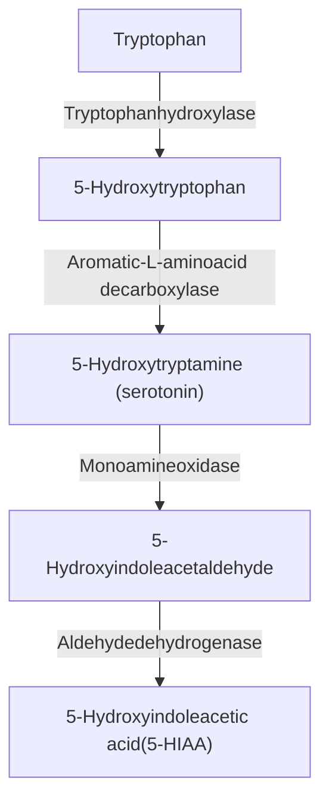

43

# Neuroendocrine Tumors and Disorders

WOUTER W. DE HERDER, RICHARD A. FEELDERS, AND JOHANNES HOFLAND

## CHAPTER OUTLINE

Introduction, 1721	NEN—Circulating Markers Including Hormones, 1729
Genetic Syndromes With NENs, 1722	NEN Imaging, 1729
Endocrine-Related Symptoms and Syndromes Caused by NENs, 1722	Management, 1730
Non–Endocrine-Related Symptoms, 1726	Therapy of Hormonal Syndromes, 1732
NEN Pathology, 1727	Antiproliferative Therapy, 1734

## KEY POINTS

* The World Health Organization (WHO) classification system (2022) of neuroendocrine tumors (NETs; G1 NET, G2 NET, and G3 NET) and neuroendocrine carcinoma (NEC) is informative and necessary for the clinical management of gastroenteropancreatic and lung neuroendocrine neoplasms.
* The most important and widely used circulating general biomarkers for neuroendocrine neoplasms are chromogranin A (general) and 5-hydroxyindoleacetic acid (5-HIAA) (carcinoid syndrome) and the less widely used NETest and neuron-specific enolase (NSE) for small cell lung cancer. Specific assays for hypersecreted hormones are commonly used in functioning pancreatic neuroendocrine tumor syndromes (insulin, gastrin, glucagon, vasoactive intestinal peptide).
* The carcinoid syndrome includes flushing, secretory diarrhea, right-sided heart fibrosis eventually resulting in right-sided heart failure (carcinoid heart disease), mesenterial fibrosis eventually leading to small bowel obstruction, edema, and ischemia, and occasionally bronchial wheezing.
* Molecular imaging with 68Ga-DOTA-labeled somatostatin receptor ligands in combination with three-phase computed tomography or magnetic resonance imaging is an important procedure for staging of the neuroendocrine tumor disease and is a theranostic tool for peptide receptor radionuclide therapy (PRRT) using beta-emitting radiolabeled somatostatin receptor ligands.
* Somatostatin receptor ligands are approved first-line therapies for patients with functioning (hormone-secreting) and nonfunctioning gastroenteropancreatic neuroendocrine tumors (G1 NET, G2 NET, and G3 NET).
* Genetic syndromes associated with neuroendocrine neoplasms include multiple endocrine neoplasia type 1, multiple endocrine neoplasia type 4, von Hippel-Lindau disease, neurofibromatosis 1, the Pacak-Zhuang syndrome, Mahvash disease, and insulinomatosis.
* Targeted therapy with everolimus is approved as second-line therapy in patients with G1-2 gastroenteropancreatic and bronchopulmonary NET, and sunitinib is approved as second-line therapy in patients with G1-2 pancreatic NET.
* Cytotoxic chemotherapy is usually reserved for G2-3 pancreatic NET and NEC and small cell lung cancer, large cell neuroendocrine carcinomas of the lung, and metastatic and/or inoperable atypical bronchopulmonary carcinoids.
* Second-line peptide receptor radionuclide therapy with 177Lu-DOTATATE can be considered for patients with functioning (hormone-producing) and nonfunctioning somatostatin receptor-positive G1 NET and G2 NET and potentially for some selected patients with G3 NET.

## Introduction

The majority of neuroendocrine neoplasms (NENs) arise in the gastrointestinal tract and pancreas (gastroenteropancreatic [GEP] NENs) and in the bronchopulmonary tract (BP NENs), but these tumors may also develop in other organs.¹ NENs express markers of neuroendocrine differentiation, organ-specific  bioactive substances, and tissue-specific transcription factors.² NENs encompass a wide spectrum ranging from well-differentiated and relatively slowly growing tumors (neuroendocrine tumors [NETs]) to very aggressive, poorly differentiated neuroendocrine carcinomas (NECs).1–3 GEP NENs are mostly diagnosed after metastases have developed. Obsolete terminologies for NENs include “APUDomas” after Anthony Pearse (1916–2003),

who established the amine precursor uptake and decarboxylation (APUD) concept in the late 1960s, and “carcinoid tumors” or “carcinoids” after Siegfried Oberndorfer (1876–1944) in 1907 and “islet cell tumors,” although the term “carcinoid syndrome” is still widely used.⁴,5

As NENs predominantly derive from the embryonic gut, primary tumor sites are traditionally categorized into “foregut,” “midgut,” and “hindgut” NENs. Foregut NENs include bronchopulmonary (BP) and thymic NENs and tracheal, esophageal, gastric, proximal duodenal (ampulla of Vater), and pancreatic NENs (panNENs). Bronchopulmonary (BP), thymic, and gastric NENs may be classified separately. BP NENs account for 20% to 25% of lung cancers and for 25% to 30% of NENs from all tissue sites. BP NENs are subclassified as high-grade carcinomas, small cell lung cancer (SCLC) and large cell neuroendocrine carcinoma (LCNEC), and low-grade tumors—atypical carcinoids (ACs), classified as intermediate grade, and typical carcinoids (TCs), classified as low grade. SCLC accounts for approximately 80% of all BP NENs and is an aggressive tumor.⁶⁻⁸ In the stomach, type 1 gastric NENs develop multifocally in enterochromaffin-like (ECL) cells of the stomach as a consequence of chronic hypergastrinemia resulting from autoimmune atrophic gastritis.⁹⁻¹¹ Type 2 gastric NENs develop due to chronic stimulation by gastrin from a gastrin-secreting NEN (gastrinoma) in the context of the multiple endocrine neoplasia type 1 (MEN1) syndrome.¹²,¹³ These type 1 and 2 gastric NENs were formerly also named “ECLomas” or “gastric carcinoids.” Type 3 gastric NENs are sporadic, solitary NENs, which develop in the absence of elevated gastrin levels and have an aggressive biologic behavior despite their well-differentiated morphology.¹⁰ Type 4 gastric NENs are poorly differentiated carcinomas with a poor prognosis.¹⁰ Midgut NENs arise in the intestinal section vascularized by the superior mesenteric artery and show a predilection for the ileocecal region.¹ Appendix NENs are also categorized as midgut NENs, but these tumors are generally considered a distinct entity because of the peak incidence in children and young adults and their relatively benign behavior.¹⁴,¹⁵ Incidence rates of hindgut NENs show a prevalence of rectal NENs over colon NENs, both of which are increasingly diagnosed by (screening) colonoscopy.¹,¹⁶

Other, rarer primary NEN tumor sites include the liver (bile ducts), ovaries, testes, prostate, kidneys, breasts, inner ear, and skin. Alternatively, NENs can also metastasize to the ovaries, testes, kidneys, breasts, and skin, which should be considered when assessing the potential primary tumor site.¹,³

The overall estimated incidence of all GEP NENs and BP NENs has gradually increased 3.5 to 5 times over the previous 4 decades. In the Western world, the highest increase in GEP NEN incidence was found for gastric and rectal NENs and the lowest increase was found for small intestinal and cecal NENs.¹⁷ The annual incidence of GEP NENs is estimated at approximately 3.5 to 4 per 100,000 persons.¹⁷,¹⁸ Gender and racial differences in incidence rates and complications differ by site.¹⁸,¹⁹ In Asian patients, small intestinal NENs seem to be rare, whereas gastric and rectal NENs are more prevalent.

# Genetic Syndromes With NENs

Primary pancreatic, gastric, duodenal, thymic, and BP NENs arise in patients with the multiple endocrine neoplasia type 1 syndrome (MEN1, Mendelian Inheritance in Man [MIM] number 131100).¹²,²⁰ In patients with the multiple endocrine neoplasia type 4 (MEN4, MIM number 610755) syndrome caused

by inactivating mutations in the cyclin-dependent kinase inhibitor 1B (*CDKN1B*) gene, GEP and BP NENs also occur.²¹ PanNENs can also be diagnosed in patients with von Hippel-Lindau disease (VHL, MIM number 193300).²² Ampullary-type duodenal somatostatinomas and panNENs can be diagnosed in patients with neurofibromatosis 1 (MIM number 162200).²³ In the Pacak-Zhuang syndrome (MIM number 603349), gain-of-function mutations in the endothelial PAS domain protein 1 (*EPAS1*) gene result in reduced degradation and stabilization of hypoxia-inducible factor 2-alpha (HIF-2α) and lead to the development of somatostatinomas.²⁴,²⁵ In Mahvash disease (MIM number 619290) caused by inactivating mutations in the glucagon receptor (*GCGR*) gene, multiple glucagon-producing panNENs among diffuse α cell hyperplasia can be found, but the clinical glucagonoma syndrome (see later discussion) is absent.²⁶⁻²⁸ In patients with an autosomal dominant syndrome characterized by insulinomatosis (multiple insulinomas) of the pancreas, the *MAF BZIP transcription factor A* (*MAFA*) mutation (MIM number 147630) was found.²⁹

# Endocrine-Related Symptoms and Syndromes Caused by NENs

Isolated or metastatic NENs can present with hormone-related symptoms and syndromes that result from hypersecretion of one or more peptides or amines by these tumors. Production of these products can be characteristic of the specific tissue of origin leading to a secretory syndrome (eutopic secretion), or, rarely, bioactive peptides/hormones, which usually originate from other anatomic sites (ectopic secretion), are secreted. The majority of NENs are nonfunctioning, or not secreting biologically relevant levels of active peptides or hormones (ICD-O coding: 8150/3. Neuroendocrine tumor, nonfunctioning pancreatic—ICD-11 coding: 2C10.1 and XH3709. NENs of pancreas, pancreatic endocrine tumor, nonfunctioning).

# Carcinoid Syndrome

ICD-O coding: 8241/3. Neuroendocrine tumor, EC-cell and/or serotonin-producing—ICD-11 coding: 2C10.1 and XH7NM1. NENs of pancreas and enterochromaffin cell carcinoid (includes serotonin-producing carcinoid).

The carcinoid syndrome is characterized by frequent watery (secretory) diarrhea and flushing and is occasionally also associated with wheezing⁵ (Fig. 43.1; Boxes 43.1 and 43.2). The incidence of carcinoid syndrome is estimated to be 2 cases per 100,000 persons.⁵ The main secretory products, which potentially have a causal role in the carcinoid syndrome, include serotonin (5-hydroxytryptamine [5-HT]), histamine, bradykinins and tachykinins, kallikrein, and prostaglandin.⁵ Since these hormones and peptides can be effectively metabolized by the liver, symptoms of the carcinoid syndrome generally only occur when tumor localizations are outside of, or bypass, the portal vein drainage system. Examples of these bypasses include primary BP NEN, thymic, ovarian, or extensive retroperitoneal sites. Midgut NENs, followed by BP NENs, are the most frequent primary sources of the carcinoid syndrome. Carcinoid syndrome is present in approximately 20% to 30% of patients with liver and/or bone metastases from these tumors.⁵,³⁰⁻³³ Serotonin regulates motility of and fluid secretion into the intestinal tract with the inhibition of absorption. Serotonin also has a role in fibrosis, as seen in many patients

Patient with the carcinoid syndrome showing the typical facial flushing.

• Fig. 43.1 Patient with the carcinoid syndrome showing the typical facial flushing.

# • BOX 43.2 Differential Diagnosis of Flushing

## Wet Flushing
* Hypogonadism (menopause)
* Pheochromocytoma/paraganglioma
* Neurologic disorder
* Medication

## Dry Flushing
* Emotions
    - Medication
    - Food
    - Capsaicin
    - Toxins
    - Food additives
* Alcoholism
* Carcinoid syndrome
    - Pheochromocytoma/paraganglioma
    - VIPoma
    - Medullary thyroid carcinoma
    - Mastocytosis
    - Serotonin syndrome
    - Anaphylaxis

Flushing = episodic attacks of redness of the skin together with a sensation of warmth or burning of the face, neck, and, less frequently, the upper trunk and abdomen. Wet/dry refers to increased perspiration.

*Modified from Huguet I, Grossman A. Management of endocrine disease: flushing: current concepts. Eur J Endocrinol. 2017;177(5):R219–R229.*

# • BOX 43.1 Differential Diagnosis of Diarrhea in a Patient With a Metastatic Neuroendocrine Neoplasm (NEN)

## Secretory Diarrhea
### NEN-Related
* Carcinoid syndrome
* Gastrinoma
* VIPoma
* CCKoma
* Medullary thyroid carcinoma

### Not NEN-Related
* Bile acid diarrhea

## Osmotic Diarrhea
## Inflammatory Diarrhea
## Maldigestive Diarrhea
### NEN-related
* Somatostatinoma
* Pancreatic exocrine insufficiency
    - Postsurgery (postpancreatectomy)
    - Medication (somatostatin receptor ligands)

## Maldigestive/Malabsorptive Diarrhea
* Short bowel
* Bacterial overgrowth
* Other causes (irritable bowel, lactose intolerance, celiac disease, laxatives, hyperthyroidism, enteropathies, common variable immunodeficiency)

*Modified from Eads JR, Reidy-Lagunes D, Soares HP, et al. Differential diagnosis of diarrhea in patients with neuroendocrine tumors. Pancreas. 2020;49(9):1123–1130.*

with the carcinoid syndrome, and diarrhea and carcinoid heart disease (CHD) are symptoms attributed to systemic serotonin excess. CHD is a severe complication of the carcinoid syndrome with a prevalence of 20% to 50% in patients with the carcinoid syndrome5,34,35 (Fig. 43.2). CHD is characterized most frequently by tricuspid valve (TV) and pulmonary valve (PV) fibrosis causing regurgitation and valve stenosis as well as endocardial fibrosis. In approximately one-third of cases, CHD can also affect the left-sided heart aortic and mitral valves, in patients with coexisting patent foramen ovale (PFO), and also in those with serotonin-producing BP NENs. Patients with CHD can be asymptomatic, but may eventually develop progressive exertional dyspnea and fatigue, together with right-sided heart failure, including elevated jugular venous pressure, hepatomegaly, and peripheral edema. All patients with carcinoid syndrome should be screened for CHD because this is a major prognostic factor limiting 3-year survival by 30% when left untreated. Generally, management of CHD requires a multidisciplinary approach in a dedicated center.5,34,35 Fibrosis can also occur around the primary NEN or metastatic lesions in the mesentery that become circumscribed by an extensive fibrotic reaction. Mesenterial fibrosis may lead to intestinal obstruction, edema, and ischemia, which causes abdominal pain and cachexia and often necessitates surgery.36–39 Mesenterial fibrosis is observed in more than 60% of patients with metastatic midgut NENs.36–39

An acute life-threatening feature of (uncontrolled) carcinoid syndrome is “carcinoid crisis” characterized by abrupt onset of hemodynamic instability, usually accompanied by general features of the carcinoid syndrome with severe flushing and cardiovascular collapse; if left untreated, it may be fatal. Case reports and small studies have suggested that physiologic stress or direct tumor manipulation may initiate these crises by inducing a massive release of vasoactive peptides and hormones probably mediated by catecholamines. It is unclear whether the acute intravenous (IV) administration of somatostatin receptor ligands (SRLs), such as octreotide, can prevent or reverse these crises.5,32,40,41

Echocardiography of a patient with carcinoid heart disease. (A) Four-chamber image showing tricuspid valve leaflets. (B) Doppler imaging showing tricuspid valve regurgitation.

* **Fig. 43.2** Echocardiography of a patient with carcinoid heart disease. Four-chamber image shows thickened and retracted tricuspid valve leaflets during contraction of the right ventricle (RV) in midsystole (A). The tricuspid valve regurgitation is visible as a blue jet on Doppler imaging and leads to dilation of the right atrium (RA) and elevated venous pressure (B).

* **Fig. 43.3** Biosynthesis and metabolism of 5-hydroxytryptamine (5-HT; serotonin).

The increased conversion of tryptophan to serotonin may lead to tryptophan deficiency with subsequent decreased protein synthesis, hypoalbuminemia, and nicotinic acid (vitamin B₃) deficiency, which only occasionally leads to the clinical picture of pellagra.⁴² The breakdown metabolite of serotonin is 5-hydroxyindoleacetic acid (5-HIAA), which is excreted in the urine (Fig. 43.3 and Table 43.1). Flushing of the face and upper trunk is not directly associated to serotonin but is likely mediated by vasoactive substances produced and released by the NEN and its metastases.⁵

# Functioning Pancreatic Neuroendocrine Neoplasms—PanNENs

## Introduction

PanNENs account for 1% to 10% of pancreatic neoplasms with a prevalence of 1 per 100,000 persons and with a still increasing annual incidence of 1 to 4 per million persons. Nonfunctioning panNENs (NF-panNENs) make up 60% to 80% of all panNEN cases. Insulinomas and gastrinomas are the most frequent functioning panNENs. Fifty percent of MEN1 patients harbor panNENs.20,43–46

## Insulinoma

ICD-O coding: 8151/3. Neuroendocrine tumor, insulin-producing (insulinoma)—ICD-11 coding: 2C10.1 and XH3UK0. NENs of pancreas and insulinoma, malignant.

Insulinomas have an estimated incidence of 1 to 3 per million persons per year. These NENs usually cause severe hypoglycemias through inappropriately increased secretion of insulin, or insulin precursors. Approximately 10% of insulinomas are multiple NENs, less than 10% can be metastatic at diagnosis, and 5% to 10% are associated with the MEN1 syndrome. MEN1-related insulinomas may occur as multiple lesions. Usually, the so-called Whipple’s triad consisting of (1) symptoms of hypoglycemia, (2) plasma glucose levels <2.2 mmol/L (<40 mg/dL), and (3) relief of symptoms with the administration of glucose prevails. Hallmark features of insulinomas resulting from hypoglycemia include neuroglycopenic (e.g., confusion, visual changes, unusual behavior)

<table>
  <thead>
    <tr>
        <th colspan="2">TABLE 43.1 Agents That Can Interfere With Urinary 5-HIAA Measurements</th>
    </tr>
    <tr>
        <th>Foods</th>
        <th>Drugs</th>
    </tr>
    <tr>
        <th colspan="2"><u>Agents That Can Produce False-Positive Results</u></th>
    </tr>
  </thead>
  <tbody>
    <tr>
        <td>Avocado</td>
        <td>Acetaminophen</td>
    </tr>
    <tr>
        <td>Banana162</td>
        <td>Caffeine</td>
    </tr>
    <tr>
        <td>Chocolate</td>
        <td>Fluorouracil</td>
    </tr>
    <tr>
        <td>Coffee</td>
        <td>Guaifenesin</td>
    </tr>
    <tr>
        <td>Eggplant</td>
        <td>l-Dopa</td>
    </tr>
    <tr>
        <td>Pecan</td>
        <td>Melphalan</td>
    </tr>
    <tr>
        <td>Pineapple</td>
        <td>Mephenesin</td>
    </tr>
    <tr>
        <td>Plum</td>
        <td>Methamphetamine</td>
    </tr>
    <tr>
        <td>Tea</td>
        <td>Methocarbamol</td>
    </tr>
    <tr>
        <td>Walnut</td>
        <td>Methysergide</td>
    </tr>
    <tr>
        <td> </td>
        <td>Reserpine</td>
    </tr>
    <tr>
        <td> </td>
        <td>Salicylates</td>
    </tr>
    <tr>
        <th colspan="2"><u>Agents That Can Produce False-Negative Results</u></th>
    </tr>
    <tr>
        <td>—</td>
        <td>Corticotropin</td>
    </tr>
    <tr>
        <td> </td>
        <td>Chlorophenylalanine</td>
    </tr>
    <tr>
        <td> </td>
        <td>Chlorpromazine</td>
    </tr>
    <tr>
        <td> </td>
        <td>Heparin</td>
    </tr>
    <tr>
        <td> </td>
        <td>Imipramine</td>
    </tr>
    <tr>
        <td> </td>
        <td>Isoniazid</td>
    </tr>
    <tr>
        <td> </td>
        <td>Methenamine</td>
    </tr>
    <tr>
        <td> </td>
        <td>Methyldopa</td>
    </tr>
    <tr>
        <td> </td>
        <td>Monoamine oxidase (MAO) inhibitors</td>
    </tr>
    <tr>
        <td> </td>
        <td>Phenothiazine</td>
    </tr>
    <tr>
        <td> </td>
        <td>Promethazine</td>
    </tr>
    <tr>
        <td> </td>
        <td>Telotristat</td>
    </tr>
  </tbody>
</table>

5-HIAA, 5-hydroxyindoleacetic acid.

and sympathetic-adrenal (e.g., palpitations, diaphoresis, tremulousness) symptoms. After initial recognition of key symptoms, laboratory testing, dedicated imaging, and eventually surgery should be undertaken with a multidisciplinary team approach. Because a firmly established diagnosis of an insulin-secreting panNEN is essential for successful management, it is important to exclude other causes of hypoglycemia associated with fasting, including big-IGF-2–producing tumors, glycogen storage diseases, administration of exogenous insulin or sulfonylureas, insulinomatosis and (congenital) nesidioblastosis of the pancreas, and insulin autoimmune syndrome (Hirata disease).47–52

## Gastrinoma

ICD-O coding: 8153/3. Neuroendocrine tumor, gastrin-producing (gastrinoma)—ICD-11 coding: 2C10.1 and XH0GY2. NENs of pancreas and gastrinoma, malignant.

Gastrinomas are NENs that secrete gastrins, a peptide hormone family that stimulates secretion of gastric acid (HCl) by the parietal cells of the stomach and aids in gastric motility. Gastrin isoforms, such as gastrin-34 (“big gastrin”), gastrin-17 (“little gastrin”), and gastrin-14 (“minigastrin”), bind to a specific G protein–coupled receptor.53 The incidence of gastrinomas is 0.5 to 3 cases per million persons.13 These tumors can be located in the duodenum (50%–85%) and pancreas. Most gastrinomas can be found at the junction of the cystic/common bile ducts posteriorly, the junction of the second/third parts of the duodenum inferiorly, and the junction of the pancreatic neck/body medially, which is

appropriately named “gastrinoma-triangle.”13 Gastrinoma disease is also known as Zollinger-Ellison syndrome (ZES), named after Robert Zollinger (1903–1992) and Edwin Ellison (1918–1970), who published the first cases in 1955. MEN1 is found in 20% to 25% of ZES patients. It is important to identify patients with ZES/MEN1 as their management differs from those with sporadic disease.12,13,44

Gastric acid hypersecretion in ZES can result in (recurrent) *Helicobacter pylori*–negative severe peptic ulcer disease and/or gastroesophageal reflux disease (GERD) and diarrhea.13 Whereas in the past, textbooks reported peptic ulcer disease occurring in abnormal locations outside the duodenum or as multiple, at present, most ZES patients present with a typical duodenal ulcer indistinguishable from *Helicobacter pylori*–associated peptic ulcer disease.13 Diarrhea is present in more than one-half of ZES patients (but usually not in those with *Helicobacter pylori*–associated peptic ulcer disease), and in up to 20% of patients it is the principal or a prominent presenting feature. Diarrhea is characteristically not large volume (<1 L/day) and is characterized by increased frequency and mild steatorrhea.13 Diarrhea in ZES is due to effects of gastric acid hypersecretion causing structural small intestinal damage, interference with fat transport, inactivation of pancreatic lipase, and precipitation of bile acids and, if long-lasting, leads to steatorrhea13 (see Box 43.1). Only patients with advanced disease late in the disease course present with prominent symptoms due to the tumor bulk. The most prominent symptom is abdominal pain, usually caused by a duodenal ulcer (>70%). Others may present with complaints caused by GERD (20%–45%).13

At endoscopy, apart from esophagitis and/or duodenal ulcers, prominent, but not specific, gastric folds are present in 94% of ZES patients.13,54

The diagnosis of ZES requires demonstrating fasting hypergastrinemia in the presence of inappropriate acid secretion (see later discussion). However, since the diagnosis of ZES is challenging, particularly being hampered by the abundant use of proton pump inhibitors (PPIs), it is generally believed that ZES is currently underdiagnosed. Chronic hypergastrinemia also has trophic effects on the gastric mucosa, stimulating an increase in the number of parietal cells and gastric ECL cells. It has been proposed that with chronic hypergastrinemia, ECL cells undergo a progressive hyperplasia-neoplasia sequence of events finally resulting in development of gastric NENs (see earlier discussion). However, gastric NENs (gastric carcinoids/ECLomas) rarely occur (<1%) in sporadic-ZES patients but do occur at least with 70-fold greater frequency than type 2 gastric NENs in MEN1/ZES patients.12,13

## VIPoma

ICD-O coding: 8155/3. VIPoma—ICD-11 coding: 2C10.1 and XH8LS0. NENs of pancreas and VIPoma, malignant.

A VIPoma is a NEN secreting vasoactive intestinal peptide (VIP), a 28-amino-acid peptide and a ligand to a specific G protein–coupled VIP receptor. Most VIPomas are located in the pancreas (75%) whereas ganglioneuromas, ganglioneuroblastomas, or neuroblastomas can also secrete VIP. The annual incidence of VIPomas is 1 to 2 cases per 10 million persons. Patients with VIPomas experience profuse large volumes (6–8 L) of watery (secretory) diarrhea leading to severe electrolyte disturbances caused by loss of stool bicarbonate and potassium (see Box 43.1). About 50% of VIPoma patients also present with hypercalcemia, possibly related to co-secretion of parathyroid hormone–related peptide (PTHrp). Another symptom is facial flushing. In VIPoma

patients, gastric acid secretion is inhibited. Therefore, the VIPoma syndrome has also been termed watery diarrhea hypokalemia achlorhydria (WDHA) syndrome. The first cases of VIPoma were reported in 1958 by John Verner, Jr. (1927–2022) and Ashton Morrison (1922–2008) and the VIPoma syndrome has therefore also been named Verner-Morrison syndrome.55

### Glucagonoma

ICD-O coding: 8152/3. Neuroendocrine tumor, glucagon-producing (glucagonoma)—ICD-11 coding: 2C10.1 and XH87C1. NENs of pancreas and glucagonoma, malignant.

Glucagon is a 29-amino-acid peptide and a ligand to a specific G protein–coupled glucagon receptor. Glucagonomas are panNENs secreting glucagon. Their annual incidence is about 1 case per 20 million persons. Glucagon, a catabolic hormone inducing glucose and fatty acid levels with significant weight loss in 70% to 80% of patients, is usually accompanied by either new onset or worsening of diabetes mellitus. Also, cheilosis, glossitis, and stomatitis resulting from severe amino acid depletion are reported in approximately 40% of patients (Fig. 43.4). Thromboembolic events and anemia frequently occur, and depressive symptoms are common; in some patients, dilated cardiomyopathy occurs. However, the most distinct feature of the glucagonoma syndrome occurring in approximately 80% of patients is necrolytic migratory erythema of the skin56,57 (Fig. 43.5).

### Somatostatinoma

ICD-O coding: 8156/3. Neuroendocrine tumor, somatostatin-producing (somatostatinoma), ICD-11 coding 2C10.1 and XH9Z82. NENs of pancreas and somatostatinoma, malignant.

Somatostatin is secreted as two isoforms, somatostatin-14 (comprising 14 amino acids) and somatostatin-28 (28 amino acids). The five different somatostatin receptor (SST) subtypes (SST1-5) are G protein–coupled receptors that inhibit hormone release by various endocrine organs. Somatostatin also plays a role as a central nervous system neurotransmitter.

Somatostatinomas are somatostatin-secreting NENs that can be localized in the pancreas (60%) or in the duodenum (40%). Their annual incidence is extremely rare at 1 case per 40 million persons. The somatostatinoma syndrome is characterized by diabetes mellitus of recent onset, decreased gastric acid secretion, gallstones, steatorrhea, anemia, and weight loss. NENs that show immunohistochemical labeling with somatostatin but lack symptoms of somatostatinoma syndrome, such as those observed within the ampulla and duodenum, should be designated as nonfunctioning NENs and are not considered somatostatinomas.58

### Other Hormonal Syndromes in NENs

Cholecystokinins are a group of polypeptides having many structural similarities with gastrin. The CCKoma syndrome is characterized by nonwatery diarrhea, gallstones, peptic ulcer disease, and significant weight loss59,60 (see Box 43.1).

Apart from secretion of a single hormone, multiple and secondary hormone secretion can be detected in 3% to 10% of patients with metastatic panNENs. Also, over time, panNENs may start secreting another hormone, or nonfunctioning panNENs may start secreting a biologically active peptide/hormone (i.e., “metachronous” secretion). Secondary hormone secretion is usually associated with disease progression and is also associated with increased morbidity and mortality, particularly in patients with newly diagnosed insulin hypersecretion.61,62

Paraneoplastic humoral syndromes, mostly occurring in patients with panNENs, typical and atypical BP carcinoids, and SCLC, can be caused by adrenocorticotropic hormone (ACTH) or corticotropin-releasing hormone (CRH) secretion causing Cushing syndrome, parathyroid hormone–related peptide (PTHrp) secretion causing hypercalcemia, antidiuretic hormone (ADH) secretion causing hyponatremia, and growth hormone–releasing hormone (GHRH) secretion causing acromegaly.63–65

### Non–Endocrine-Related Symptoms

Complaints resulting from compression, ingrowth, or obstruction of vital structures largely depend on the location of the primary

Cheilosis in a glucagonoma patient.

\* **Fig. 43.4** Cheilosis in a glucagonoma patient.

Necrolytic migratory erythema of the skin of the foot and ankle in a glucagonoma patient.

\* **Fig. 43.5** Necrolytic migratory erythema of the skin of the foot and ankle in a glucagonoma patient.

tumor and its metastases. Abdominal pain is a common symptom in GEP NEN patients. Fibrosis is a pathognomonic feature of mesenteric metastases of midgut NENs, leading to intermittent pain due to venous congestion, ischemia, invagination, and bowel obstruction. Extensive liver metastases in most stage IV NEN patients can lead to pain and compression of the stomach and/or anorexia and jaundice resulting from intrahepatic bile duct obstruction. Skeletal metastases can cause bone pain and vertebral metastases can induce instability of the spine and nerve root compression. Recurring infections, cough, dyspnea, chest pain, and wheezing can be diagnosed in patients with BP NENs or lung metastases, especially when tumors are located near the central airways. Systemic symptoms of malignancy such as cachexia, fever, and night sweats are only seldomly observed in patients with well-differentiated NENs, but more frequently in high-grade NENs and NECs. Given the expanded use of cross-sectional imaging and endoscopy procedures, an increasing number of patients will be diagnosed with an NEN without related symptoms (incidentalomas).¹

## NEN Pathology

In all patients suspected of having an NEN, histology should be obtained by biopsy or resection. The histologic diagnosis of NEN is primarily based on the general markers of neuroendocrine differentiation: chromogranin and synaptophysin and immunohistochemistry for pancreatic hormones (insulin, gastrin, glucagon) in patients with functional panNENs. In addition, immunohistochemistry is also useful for identifying prognostic and theranostic markers such as the somatostatin receptor subtype 2 (SST₂).³,66,67

The Union for International Cancer Control/American Joint Cancer Committee (UICC/AJCC), World Health Organization (WHO), and European Neuroendocrine Tumor Society (ENETS) have proposed classification systems for both staging and grading of GEP NENs.³ These classification systems have prognostic significance as well as predictive value for treatment decisions. The grade of the tumor is determined using proliferative indices (Ki-67 and mitotic index) and the histologic degree of differentiation of the tumor. GEP NENs are divided into three grades based on the proliferative indices with Grade 1 (G1) or low grade, having a Ki67 <3% (<2 mitoses/10 high-power field [HPF]); G2 or intermediate grade having a Ki67 3% to 20% (2–20 mitoses/10 HPF); and high grade or G3 having a Ki67 >20% (>20 mitosis/10 HPF)³ (Table 43.2). G3 is further divided into two different groups depending on tumor differentiation, with G3 neuroendocrine tumor (NET) having well-differentiated tumor cells and (G3) neuroendocrine carcinoma (NEC) having poorly differentiated tumor cells³ (see Table 43.2).

The sequential application of immunohistochemical stains for transcription factors may be applied for identification of an unknown primary site of an NEN. GEP NENs generally express caudal-type homeobox 2 (CDX2) and are negative for thyroid transcription factor 1 (TTF1). Those arising in the duodenum and pancreas may also express insulin gene enhancer protein (ISL1), pancreatic and duodenal homeobox 1 (PDX1), and Aristaless-related homeobox gene (ARX).⁶⁸,⁶⁹ Hindgut NENs also express prostate-specific acid phosphatase (PSAP).³ G3 GEP NENs and G3 GEP NECs vary markedly with regard to patient survival, and also vary in their molecular pathogenesis and treatment approaches. In panNENs, loss of alpha-thalassemia/mental retardation X-linked (ATRX)/death domain–associated protein (DAXX), MEN1 mutations, or p27 and/or retained SST2&5

immunohistochemical staining are often used to support the diagnosis of G3 NET. Three different subtypes of nonfunctioning panNENs are based on their epigenomics and transcriptomics. The nonfunctioning panNEN type is mainly composed of cells that resemble B cells, without copy number alterations, MEN1, or ATRX/DAXX mutations (and, therefore, no alternative lengthening of telomeres [ALT]), and has a favorable prognosis. The second nonfunctioning panNEN type is composed of ARX-positive cells with A-cell characteristics, limited copy number variation, and recurrent MEN1 mutations. The third nonfunctioning panNEN type is composed of ARX-positive cells with less pronounced A-cell characteristics, significant copy number alterations, and MEN1 mutations, as well as recurrent ATRX/DAXX mutations. ARX-expressing nonfunctioning panNENs appear to represent a tumor subtype that has the highest metastatic potential, probably due to its susceptibility for ALT activation.³,⁶⁸ A-cell or B-cell characteristics can also be used to differentiate between indolent nonmetastatic insulinomas and clinically aggressive (metastatic) insulinomas. Indolent insulinoma cells have strong epigenetic similarities to B cells (being PDX1-positive and ARX-negative), whereas the rarer clinically aggressive insulinomas express ARX and are characterized by large tumor size (>3 cm) and metastatic behavior.⁷⁰ These findings suggest a different origin of both tumor types, the aggressive insulinomas being more related to the nonfunctioning NETs.³

Loss of chromosome 18 has been reported in 60% to 90% of small intestinal NENs, but up to present no mutated genes on this chromosome have been detected. CDKN1B has been demonstrated as the only mutated gene in small intestinal NENs, but a low frequency of 8% suggests that its role as a driver in the development of these tumors is limited.⁷¹

For GEP NENs a tumor-node-metastasis (TNM) staging system has been developed, including tumor size and infiltration, lymph node involvement, and distant metastases⁷²⁻⁷⁴ (Table 43.3).

BP NENs are subclassified into the high-grade SCLCs and LCNECs and the low-grade ACs and TCs (Table 43.4). Defining histologic criteria include mitotic count per 2 mm², the

<table>
  <thead>
    <tr>
        <th colspan="3">TABLE 43.2 2022 WHO Grading of Epithelial Neuroendocrine Neoplasms of the Gastrointestinal and Pancreaticobiliary Tract</th>
    </tr>
    <tr>
        <th>Definition, Grade</th>
        <th>Ki-67 Index (%)</th>
        <th>Mitotic Count (/2 mm²)</th>
    </tr>
    <tr>
        <th colspan="3">Well-Differentiated Neuroendocrine Tumors (NETs)</th>
    </tr>
  </thead>
  <tbody>
    <tr>
        <td>G1 NETs</td>
        <td>&lt;3</td>
        <td>&lt;2</td>
    </tr>
    <tr>
        <td>G2 NETs</td>
        <td>3–20</td>
        <td>2–20</td>
    </tr>
    <tr>
        <td>G3 NETs</td>
        <td>&gt;20</td>
        <td>&gt;20</td>
    </tr>
    <tr>
        <th colspan="3">Poorly Differentiated Neuroendocrine Carcinomas (NECs) (G3 by default)</th>
    </tr>
    <tr>
        <td>Small cell NECs</td>
        <td>Small cell cytomorphology</td>
        <td>&gt;20</td>
    </tr>
    <tr>
        <td>Large cell NECs</td>
        <td>Large cell cytomorphology</td>
        <td>&gt;20</td>
    </tr>
  </tbody>
</table>

WHO, World Health Organization.

Modified from Rindi G, Mete O, Uccella S, et al. Overview of the 2022 WHO Classification of Neuroendocrine Neoplasms. Endocr Pathol. 2022;33(1):115–154.

# TABLE 43.3 ENETS and AJCC TNM Staging Systems for Pancreatic Neuroendocrine Neoplasms (panNENs)

<table>
  <thead>
    <tr>
        <th>T-N-M</th>
        <th>ENETS</th>
        <th>AJCC UICC 8th Edition</th>
    </tr>
  </thead>
  <tbody>
    <tr>
        <td>T1</td>
        <td>Tumor limited to the pancreas,a &lt;2 cm in greatest diameter</td>
        <td>Tumor limited to the pancreas,a &lt;2 cm in greatest diameter</td>
    </tr>
    <tr>
        <td>T2</td>
        <td>Tumor limited to the pancreas,a 2–4 cm in greatest diameter</td>
        <td>Tumor limited to the pancreas,a 2–4 cm in greatest diameter</td>
    </tr>
    <tr>
        <td>T3</td>
        <td>Tumor limited to the pancreas,a &gt;4 cm in greatest diameter, or invading duodenum or common bile duct</td>
        <td>Tumor limited to the pancreas, &gt;4 cm in greatest diameter, or invading the duodenum or common bile duct</td>
    </tr>
    <tr>
        <td>T4</td>
        <td>Tumor invades adjacent structures (stomach, spleen, colon, or the wall of large vessels, including celiac axis or superior mesenteric artery)</td>
        <td>Tumor invading adjacent organs (stomach, spleen, colon, adrenal gland) or the wall of large vessels (celiac axis or the superior mesenteric artery)</td>
    </tr>
    <tr>
        <td>N0</td>
        <td>No regional LN metastasis</td>
        <td>No regional LN metastasis</td>
    </tr>
    <tr>
        <td>N1</td>
        <td>Regional LN metastasis</td>
        <td>Regional LN metastasis</td>
    </tr>
    <tr>
        <td>M0</td>
        <td>No distant metastasis</td>
        <td>No distant metastasis</td>
    </tr>
    <tr>
        <td>M1</td>
        <td>Distant metastasis</td>
        <td>Distant metastasis</td>
    </tr>
    <tr>
        <td>M1a</td>
        <td> </td>
        <td>Hepatic metastases only</td>
    </tr>
    <tr>
        <td>M1b</td>
        <td> </td>
        <td>Extrahepatic metastases only</td>
    </tr>
    <tr>
        <td>M1c</td>
        <td> </td>
        <td>Both hepatic and extrahepatic metastases</td>
    </tr>
    <tr>
        <th colspan="3">Stage</th>
    </tr>
    <tr>
        <td>Ia</td>
        <td> </td>
        <td>T1 N0 M0</td>
    </tr>
    <tr>
        <td>Ib</td>
        <td> </td>
        <td>T2 N0 M0</td>
    </tr>
    <tr>
        <td>IIa</td>
        <td> </td>
        <td>T3 N0 M0</td>
    </tr>
    <tr>
        <td>IIb</td>
        <td> </td>
        <td>T1–3 N1 M0</td>
    </tr>
    <tr>
        <td>III</td>
        <td> </td>
        <td>T4 N0–1 M0</td>
    </tr>
    <tr>
        <td>IV</td>
        <td> </td>
        <td>Any T M1</td>
    </tr>
    <tr>
        <th colspan="3">Or</th>
    </tr>
    <tr>
        <td>I</td>
        <td>T1 N0 M0</td>
        <td> </td>
    </tr>
    <tr>
        <td>IIA</td>
        <td>T2 N0 M0</td>
        <td> </td>
    </tr>
    <tr>
        <td>IIB</td>
        <td>T3 N0 M0</td>
        <td> </td>
    </tr>
    <tr>
        <td>IIIA</td>
        <td>T4 N0 M0</td>
        <td> </td>
    </tr>
    <tr>
        <td>IIIB</td>
        <td>Any T N1 M0</td>
        <td> </td>
    </tr>
    <tr>
        <td>IV</td>
        <td>Any T Any N M1</td>
        <td> </td>
    </tr>
  </tbody>
</table>

a“Limited to the pancreas” means no invasion of adjacent organs or the wall of large vessels. Extension into peripancreatic adipose tissue is included in “limited to the pancreas.”

AJCC, American Joint Committee on Cancer; ENETS, European Neuroendocrine Tumour Society; LN, lymph node; UICC, Union for International Cancer Control.

Data from Lloyd RV, La Rosa S. WHO Classification of Tumours of Endocrine Organs; Rindi G, Klersy C, Albarello L, et al. Competitive Testing of the WHO 2010 versus the WHO 2017 Grading of Pancreatic Neuroendocrine Neoplasms: Data from a Large International Cohort Study. *Neuroendocrinology*. 2018;107(4):375–386; and Rindi G, Klimstra DS, Abedi-Ardekani B, et al. A common classification framework for neuroendocrine neoplasms: an International Agency for Research on Cancer (IARC) and World Health Organization (WHO) expert consensus proposal. *Mod Pathol*. 2018;31(12):1770–1786.

# TABLE 43.4 Classification of Bronchopulmonary Neuroendocrine Neoplasms (BP NENs) According to the 2022 WHO Classification of Lung Tumors

<table>
  <thead>
    <tr>
        <th>Definition, Grade</th>
        <th>Specific Features</th>
        <th>Mitotic Count (/2 mm²)</th>
    </tr>
    <tr>
        <th colspan="3"><u>Well-Differentiated Neuroendocrine Tumors (NETs)</u></th>
    </tr>
  </thead>
  <tbody>
    <tr>
        <td>Typical carcinoid G1 NET</td>
        <td>No necrosis</td>
        <td>&lt;2</td>
    </tr>
    <tr>
        <td>Atypical carcinoid G2 NET</td>
        <td>Necrosis</td>
        <td>2–10</td>
    </tr>
    <tr>
        <td>Carcinoids/NETs with elevated mitotic counts and/or Ki67 proliferation index</td>
        <td>Atypical carcinoid morphology</td>
        <td>&gt;10 and/or Ki67 &gt;30%</td>
    </tr>
    <tr>
        <th colspan="3"><u>Poorly Differentiated Neuroendocrine Carcinomas (NECs)</u></th>
    </tr>
    <tr>
        <td>Small cell (lung) carcinoma</td>
        <td>Often necrosis and small cell cytomorphology</td>
        <td>&gt;10</td>
    </tr>
    <tr>
        <td>Large cell NEC</td>
        <td>Virtually always necrosis and large cell cytomorphology</td>
        <td>&gt;10</td>
    </tr>
  </tbody>
</table>

WHO, World Health Organization.

Modified from Rindi G, Mete O, Uccella S, et al. Overview of the 2022 WHO Classification of Neuroendocrine Neoplasms. *Endocr Pathol*. 2022;33(1):115–154.

presence of necrosis, cell size and shape, nuclear features, and overall architecture.6,7,75 BP NENs and thymic NENs can express TTF1.3

By definition, mixed neuroendocrine-nonneuroendocrine neoplasms (MiNENs) are mixed epithelial neoplasms in which a neuroendocrine component is combined with a nonneuroendocrine component, each of which is morphologically and immunohistochemically distinct. MiNENs should be distinguished from adenocarcinomas with interspersed occasional neuroendocrine cells or malignancies that aberrantly express neuroendocrine differentiation. The prognosis of MiNEN depends on the biologically most aggressive component. Therefore, both MiNEN components need to be characterized, quantified, and graded separately.3,76–78 In the past, these tumors were named *mixed adeno-neuroendocrine carcinomas* (MANECs).79

Neuroendocrine cell hyperplasia of infancy (NEHI) is a rare pediatric interstitial and diffuse lung disease with increased numbers of neuroendocrine cells in the distal lung epithelium of otherwise normal lung tissue.80 Diffuse idiopathic pulmonary neuroendocrine cell hyperplasia (DIPNECH) is a rare adult-onset lung syndrome consisting of scattered small nodules with BP NENs, or a linear proliferation of BP NENs. In the past, these features were referred to as *tumorlets*. The majority of DIPNECH patients are women, and the disease is not associated with smoking or other lung diseases. Patients diagnosed with DIPNECH often present with symptoms including cough and exertional dyspnea and are usually diagnosed with obstructive or mixed obstructive/restrictive pulmonary function testing.81

# NEN—Circulating Markers Including Hormones

## Circulating Biomarkers

Chromogranin is a component of the intracellular neuroendocrine vesicles and generally used as an immunocytochemical marker for NEN. Chromogranin A (CgA) is released in the bloodstream. However, when the diagnosis of NEN has been established, elevated CgA levels in the blood are only 60% to 90% accurate. CgA is unsuitable as a first-line diagnostic or screening tool.82,83 CgA specificity is low (<35%) because elevated levels can be found in many other conditions, including other neoplasms, cardiac and inflammatory diseases, renal failure, atrophic gastritis, and PPI or H2-blocker administration.68 In patients with gastrinomas, chronic hypergastrinemia causes gastric ECL cell proliferation, which also results in an increase of plasma CgA.82,83 Thus, in ZES patients, elevated plasma CgA can arise from the gastrinoma or from hyperplastic ECL cells.84 Pancreastatin is a CgA derivative that is less affected by PPI administration and is elevated in 60% to 80% of NENs, but is not widely used.82 Neuron-specific enolase (NSE) is also not widely used as an NEN biomarker, except for SCLC.82

## NETest and Other Blood-Based Tumor Markers

The NETest is a blood-based multianalyte NEN-specific gene transcript analysis specifically developed for detection of NENs. A multianalyte algorithm is based on simultaneous measurement of 51 circulating neuroendocrine-specific marker genes. This approach is superior to single analyte tumor biomarkers and has high sensitivity (90%–99%) and specificity (85%–95%) for detection of GEP and BP NENs and significantly outperforms other monoanalytes such as CgA. Furthermore, it is not hampered by concomitant treatment with PPIs and/or SRLs.85–87

Circulating tumor cells (CTCs) are not sensitive and specific for all NENs and do not correlate with tumor grading or staging. Techniques determining circulating tumor DNA, RNA, or circulating micro-RNAs are in development.88–90

## Carcinoid Syndrome Markers

Plasma or urinary levels of the breakdown metabolite of serotonin, 5-HIAA, are used for diagnosis and follow-up of GEP NEN and BP NEN patients who demonstrate symptoms of the carcinoid syndrome and CHD, although these levels can also be increased in those patients without the full-blown carcinoid syndrome33,82,91–94 (see Table 43.1 and Fig. 43.3). N-terminal pro–brain natriuretic protein (BNP) and atrial natriuretic peptide (ANP) are valuable nonspecific biochemical markers for screening and follow-up of patients with CHD.35,68,70

## Gastrinoma Markers and Testing

The following criteria are established for confirming the diagnosis of gastrinoma: fasting serum hypergastrinemia (FSG) ≥10-times upper limit of reference range (≥10 × ULN) in combination with gastric pH ≤2 (retained antrum excluded by history).13,95 If FSG is <10 × ULN and gastric pH ≤2, an additional secretin test, or measurement of basal acid output (BAO), needs to be performed to exclude other causes of FSG/hyperchlorhydria.13,95 A positive secretin test (defined as ≥120 pg/mL gastrin increase after IV  administration of 75 IU secretin) and/or elevated BAO (defined as >15 mEq/h) confirm the diagnosis.13,95 The potential false-positive secretin test in patients with hypo-/achlorhydria limits the usefulness of this test in patients taking PPIs unless gastric pH is ≤2.84,96

## Insulinoma Markers and Testing

The first step in the diagnosis of an insulinoma is to demonstrate hyperinsulinemic hypoglycemia (i.e., “organic hyperinsulinism”), which can potentially be achieved during a spontaneous hypoglycemia, but most frequently requires a 72-hour fast.97,98 The patient is closely clinically observed while serial glucose and insulin levels are obtained over 72 hours until the patient becomes symptomatic, or hypoglycemia is demonstrated. More than 95% of cases can be diagnosed based on responses to this hallmark test. Values of insulin ≥3 μU/mL in the presence of a blood glucose <3 mmol/L (<55 mg/dL) are highly suggestive. Most specialists require more stringent cutoff glucose values amounting to ≤2.2 mmol/L (≤40 mg/dL) to increase the diagnostic specificity.51,97,98 Because the absolute insulin level is not elevated in all patients with insulinomas, a nondetectable or not-elevated insulin level does not rule out the disease. Because currently used insulin assays do not detect potential proinsulin, this peptide measurement should be ordered, as well as C-peptide levels, particularly when insulin levels are low or undetectable. Concomitant C-peptide levels ≥0.2 nmol/L and/or concomitant pro-insulin levels ≥5 pmol/L (in the presence of a hypoglycemia) are suggestive of an insulinoma. Commercial insulin preparations do not contain C-peptide, and low C-peptide levels combined with high insulin levels confirm the diagnosis of factitious hyperinsulinemia. Furthermore, absence of sulphonylurea and thiazolidinedione (metabolites) in the plasma or urine also excludes factitious hypoglycemias in (von) Munchhausen syndrome/(von) Munchausen by proxy. Patients who take sulfonylureas surreptitiously may have raised insulin and C-peptide values soon after ingestion, but chronic use will result in hypoglycemia without raised insulin or C-peptide levels. In principle, factitious use of all these medications except inhibitors of dipeptidyl peptidase 4 (DPP4 inhibitors or gliptins), glucagon-like peptide-1 receptor agonists (GLP1 receptor agonists or incretin mimetics) and metformin (which generally cannot cause hypoglycemias) should also be excluded. Finally, demonstration of β-hydroxy-butyrate levels equal to or less than 2.7 mmol/L at end of fast is used by some to confirm the hyperinsulinemic state, and some require demonstration of a glucose response to 1 mg glucagon of more than 1.4 mmol/L (25 mg/dL) at end of a fast. Increased glucose is illustrative for the hyperinsulinemic state, because hyperinsulinemia preserves liver glycogen storage despite fasting.97,98

## Other Functioning PanNEN Markers

In VIPoma patients, plasma VIP levels are usually elevated >60 pmol/L, or >190 pg/mL.55 A fasting plasma glucagon level >500 pg/mL (reference range, 70–160 pg/mL) is diagnostic for glucagonoma.56 Somatostatinoma syndrome can be confirmed by a fasting plasma somatostatin level >25 pmol/L (>60 pg/mL).58

# NEN Imaging

## Computed Tomography

High-resolution serial computed tomography (CT) imaging series, obtained before and after IV administration of iodine-based

Transverse CT image from a patient with a stage IV metastatic insulinoma. The liver shows three hypervascular metastatic lesions in arterial contrast phase (arrows). The two dorsal metastases are surrounded by hypodense fat or steatosis due to the paracrine effects of insulin secreted by the metastases.

\* **Fig. 43.6** Transverse CT image from a patient with a stage IV metastatic insulinoma. The liver shows three hypervascular metastatic lesions in arterial contrast phase (arrows). The two dorsal metastases are surrounded by hypodense fat or steatosis due to the paracrine effects of insulin secreted by the metastases.

contrast media, are at present most commonly used for localization, staging, decision making, and monitoring response to treatment in NENs. CT triple-phase, which includes imaging before (nonenhanced) and after IV contrast enhancement in the late arterial (portal venous inflow) and venous phase, is generally used for the demonstration and delineation of hepatic metastases. NEN-related lesions are usually hypervascular, but occasionally appear hypovascular (Fig. 43.6). Mesenteric metastases secondary to small intestinal NENs can show as an intense desmoplastic reaction appearing as a soft tissue mass, sometimes with areas of calcification surrounded by radiating fibrotic streaks to the mesentery (Fig. 43.7). Response Evaluation Criteria in Solid Tumors (RECIST) have been implemented for reporting and evaluation of treatment responses.99–102

## Magnetic Resonance Imaging

Magnetic resonance imaging (MRI) appears to be superior to CT for imaging of pancreas NEN lesions and for detection of liver, skeleton, and brain metastases. NEN lesions characteristically exhibit a low signal intensity on T1-weighted and intermediate-to-high signal intensity on T2-weighted images. MRI is particularly helpful for the detection of small (<2 cm) panNENs, which are mostly well-vascularized neoplasms without exerting a compressive effect on the main pancreatic duct.99,101

## Ultrasonography and Endoscopic Ultrasonography

Conventional abdominal ultrasonography generally has a low detection rate for panNENs but has a higher detection rate for identifying hepatic metastases. In contrast, in skilled hands, endoscopic ultrasound (EUS) is a very sensitive tool for detecting panNENs.99 In addition, EUS allows access to tissue sampling, which enables confirmation of the diagnosis while obtaining grading information.103,104

## Somatostatin Receptor Imaging

The rationale of performing somatostatin receptor imaging (SRI) is based on the widespread expression of SSTs by NENs and provides information for the presence of the primary NEN and its metastases throughout the body, many times revealing additional metastases compared with conventional imaging with CT/MRI.6,105 In addition, it has a prognostic role as SST expression is more commonly found in well-differentiated neoplasms whereas the quantification of radionuclide uptake in tumor lesions is used for selecting patients for peptide receptor radiotherapy (PRRT) with radiolabeled SRLs.106 SRI with 111In-pentetreotide along with SPECT (OctreoScan) was used in the past but has been replaced by 68Ga-DOTA-SRLs along with positron emission tomography (PET)/CT or PET/MRI83,99,105,107–109 (Fig. 43.8).

## 18F-Fluorodeoxyglucose PET

18F-fluorodeoxyglucose (FDG) PET/CT and PET/MRI are widely used to reveal previously unnoticed cancer lesions and for staging. 18FDG PET/CT and PET/MRI are the imaging modalities of choice for G3 NETs and NECs. 18FDG-PET/CT and PET/MRI can also be positive in G2 NETs and can be used as complementary hybrid imaging in combination with 68Ga-SRL PET/CT or PET/MRI.105,109

## Other Imaging Tracers

Nonmetastatic, localized insulinomas express SST2 in approximately 50% of patients, and therefore imaging with 68Ga-SRL may be negative.105 In such cases, imaging with 68Ga-DOTA-exendin-4 is preferred110,111 (see Fig. 43.8). Imaging with 18F-DOPA-PET-CT is sometimes preferred for metastatic small intestinal NENs.105,112

# Management

## Watchful Waiting

Given the indolent growth patterns of a subset of G1-2 NET, not all patients with irresectable or metastasized disease require first-line antiproliferative therapy. Especially in G1 NET with limited tumor sites, a watchful waiting approach can be considered. In the PROMID trial (see later discussion), the median overall survival (OS) was similar in patients assigned to octreotide and placebo (84.7 versus 83.7 months), providing some rationale for this approach.113 Also, in patients with localized nonmetastatic nonfunctioning G1-2 panNETs, the PANDORA and ASPEN prospective studies in combination with several retrospective series, particularly in MEN1 and VHL patients, show that nonfunctioning panNENs with a diameter ≤2 cm do not necessarily need to be resected and can undergo careful follow-up.22,46,114,115

## Therapies for Local Regional Disease

Patients with stage I to III (locoregional) disease should undergo a careful analysis of potential curative surgical resection. Small (diameter 1–2 cm) gastroduodenal NENs without the presence of lymph node metastases can be candidates for curative endoscopic mucosal resection (EMR).116 Small (diameter <1.5 cm) rectal NENs without the presence of lymph node metastases can be candidates for curative EMR or ligation-assisted endoscopic

Transverse CT image (A) showing mesenteric mass with calcification

Coronal CT image (B) showing mesenteric mass with calcification

Sagittal CT image (C) showing mesenteric mass with calcification

• **Fig. 43.7** Transverse (A), coronal (B), and sagittal (C) CT images from a patient with a stage IV metastatic neuroendocrine tumor from the ileum and the carcinoid syndrome. The scans show typical mesenteric fibrosis as radiating strands of soft tissue surrounding a metastatic mesenteric mass with calcification (arrows).

submucosal resection (ESMR-L), endoscopic submucosal dissection (ESD), or full-thickness transanal endoscopic microsurgery (TEMS).10,117

Well-differentiated BP NENs or thymic NENs without distant metastases can be cured by resection, also when locoregional lymph node metastases are present. Strategies include a segmentectomy, wedge resection, (bi)lobectomy, or pulmonectomy with lymph node dissection.6,7,75

Small (diameter <1 cm) gastric type 1 NENs usually have an excellent prognosis without disease-related mortality. Yearly or 2-yearly endoscopic surveillance has been proven to be a safe strategy.118 Treatment of type 2 gastric NENs should take into account the coexistence of (multiple) gastrin-producing duodenal or pancreatic gastrinomas and eventually their metastases. Given the intermediate malignant potential of type 2 gastric NENs,

endoscopic or surgical resection should be considered for sporadic cases. For type 3 and type 4 gastric NENs, a surgical partial or complete gastrectomy with lymphadenectomy is the treatment of choice. Duodenal NENs should be radically removed by either endoscopic techniques (if diameter is ≤1.0 cm) or surgical duodenectomy.119

Apart from resection or enucleation of small (diameter ≤2 cm) functioning panNENs, EUS-guided radiofrequency ablation (RFA) can also be considered for selected cases.

## Therapies for Extensive Disease

Surgery for midgut NENs is often palliative as most patients present with metastatic disease. Palliative surgery should be considered for symptomatic patients presenting with advanced disease and a

Arterial phase of contrast-enhanced CT (CE-CT) showing a hypervascular lesion in the pancreatic tail (arrow).

Somatostatin receptor imaging with 68Ga-DOTATATE PET/CT showing positive uptake in the pancreatic lesion.

GLP1 receptor imaging with 68Ga-exendin PET/CT showing positive uptake in the same pancreatic lesion.

* **Fig. 43.8** Imaging in insulinoma. (A) Arterial phase of contrast-enhanced CT (CE-CT) shows hypervascular lesion in the pancreatic tail (arrow) in this patient with hyperinsulinemic hypoglycemia. (B) This lesion reveals positive uptake on somatostatin receptor imaging with 68Ga-DOTATATE PET/CT. (C) The same lesion is also positive on GLP1 receptor imaging with 68Ga-exendin PET/CT.

desmoplastic reaction in mesenteric metastases that increases the risk of future ischemia and/or venous congestion of the bowel, ileus, and bowel perforation.15,119,120 NENs in the colon may present as a single lesion and should be resected, but most patients also present with metastatic disease because these tumors show a more aggressive behavior than those located in the small bowel.

of toxicity have been observed with TACE than with TAE. TARE causes tumor response through radiation-induced DNA damage instead of ischemia being achieved using TAE. In very select cases without extrahepatic disease, specialized centers consider liver transplantation for selected NEN patients with multilobe liver metastases after complete removal of the primary NEN and its locoregional metastases.7,121–124

## Liver-Directed Therapies

Resection of the primary tumor, local lymphadenectomy, and additional liver metastasectomy, hemihepatectomy, or liver segment resection for metastases is associated with long-term progression-free survival (PFS). Alternative therapies include RFA or microwave ablation (MWA) for oligometastatic lesions limited in size. Transarterial embolization techniques through the hepatic artery are used as a treatment for NEN liver metastases and include bland particle embolization (TAE), chemoembolization (TACE), and radioembolization (TARE) with radiospheres. Higher rates

## Therapy of Hormonal Syndromes

The management of hormonal complaints in NEN patients requires an approach tailored to the individual situation. Even the possibility of a surgical radical resection or debulking should be considered because tumor bulk often correlates with hormone levels and, thereby, the severity of an endocrine syndrome. Preoperative and/or perioperative antihormonal treatment or treatment to control the negative effects of hormonal excess should be started in patients with uncontrolled complaints.

<table>
  <thead>
    <tr>
        <th>Therapy</th>
        <th>5-HIAA levels</th>
        <th>Symptoms</th>
        <th>Diarrhea</th>
        <th>Flushes</th>
    </tr>
    <tr>
        <th> </th>
        <th>Response rate</th>
        <th>Response rate</th>
        <th>Response rate</th>
        <th>Response rate</th>
    </tr>
  </thead>
  <tbody>
    <tr>
        <td>Telotristat</td>
        <td>0.75 ± 0.05</td>
        <td> </td>
        <td>0.4 ± 0.05</td>
        <td> </td>
    </tr>
    <tr>
        <td>PRRT</td>
        <td>0.15 ± 0.05</td>
        <td>0.75 ± 0.05</td>
        <td>0.75 ± 0.05</td>
        <td>0.75 ± 0.05</td>
    </tr>
    <tr>
        <td>Liver embolization</td>
        <td>0.5 ± 0.05</td>
        <td>0.85 ± 0.05</td>
        <td>0.75 ± 0.05</td>
        <td>0.75 ± 0.05</td>
    </tr>
    <tr>
        <td>Everolimus + SRL</td>
        <td>0.5 ± 0.05</td>
        <td> </td>
        <td>0.75 ± 0.05</td>
        <td>0.75 ± 0.05</td>
    </tr>
    <tr>
        <td>SRL</td>
        <td>0.45 ± 0.05</td>
        <td>0.7 ± 0.05</td>
        <td>0.65 ± 0.05</td>
        <td>0.7 ± 0.05</td>
    </tr>
    <tr>
        <td>Placebo</td>
        <td>0.2 ± 0.05</td>
        <td>0.3 ± 0.05</td>
        <td>0.1 ± 0.05</td>
        <td> </td>
    </tr>
  </tbody>
</table>

**• Fig. 43.9** Biochemical and clinical effects of carcinoid syndrome–targeting therapies. Response rates are depicted as mean (total) response rate ± standard deviation. 5-HIAA, 5-hydroxyindoleacetic acid; PRRT, peptide receptor radionuclide therapy with radiolabeled SRLs; SRL, somatostatin receptor ligand. (Adapted from Hofland J, Herrera-Martinez AD, Zandee WT, de Herder WW. Management of carcinoid syndrome: a systematic review and meta-analysis. *Endocr Relat Cancer*. 2019;26[3]:R145–R156.)

# Therapy for Carcinoid Syndrome and Carcinoid Heart Disease

Chronic diarrhea in patients with the carcinoid syndrome can be multifactorial and include other causes such as exocrine pancreatic insufficiency, bile acid sequestration, bacterial overgrowth, or short bowel after abdominal surgery, which can be treated accordingly with dietary modifications, pancreatic enzymes, antibiotics, or cholestyramine, respectively125,126 (see Box 43.1). In patients with the carcinoid syndrome and severe secretory diarrhea, supportive measures such as avoiding food or stress that evokes complaints and antidiarrheals such as loperamide, codeine phosphate, or even opium or morphine can sometimes provide alleviation of symptoms. SRLs are the most effective drugs for the carcinoid syndrome and induce a symptomatic response in 65% to 70% of cases (Fig. 43.9). Frequently such a clinical response is paralleled by a biochemical response resulting in a reduction in plasma 5-HIAA, or urinary 5-HIAA excretion. Therefore, long-acting first generation SRLs (octreotide or lanreotide) are usually started once the diagnosis of carcinoid syndrome is confirmed.91 At present, the immediate-release, short-acting form of octreotide is indicated in the management of refractory carcinoid syndrome as an adjunct to longer-acting formulations, or in the treatment of carcinoid crisis and in the peri-interventional setting to prevent the occurrence of carcinoid crisis.127 It is further indicated in at least the first 2 weeks after the administration of the first long-acting octreotide injection. There is an ongoing debate whether perioperative infusion with immediate-release, short-acting octreotide is needed in symptomatic patients with the carcinoid syndrome who are already treated with long-acting SRLs to prevent a carcinoid crisis, but historical studies and guidelines still recommend this approach.40,41,127–129 Telotristat ethyl is a serotonin synthesis inhibitor that alleviates SRL-refractory diarrhea episodes, but it has no significant effects on flushing episodes91 (see Fig. 43.9). Interferon-α was historically shown to alleviate carcinoid syndrome symptoms, although its efficacy is limited and this drug should be limited to refractory cases because of its side effects.91 Liver-directed therapy can be potentially very effective in cases with liver-dominant disease. Alternatively, PRRT with radiolabeled SRLs can induce an improvement of carcinoid syndrome symptoms130 (see Fig. 43.9). Importantly, patients with severe carcinoid syndrome can suffer from niacin (vitamin B₃) deficiency or pellagra due to a shift of tryptophan metabolism toward serotonin production. These

patients should be treated with niacin or nicotinamide supplementation. In addition, SRLs can induce deficiencies of fat-soluble vitamins (e.g., vitamin D) and vitamin B₁₂.42,131 These levels should be monitored in patients with steatorrhea and supplemented accordingly. CHD and right-sided heart failure should be treated appropriately first with medication, but sometimes valve replacement of the tricuspid and pulmonary heart valves will be necessary.5,34

# Therapy for Insulinoma

The principal treatment target of insulinoma management is the prevention of severe hypoglycemia. Patients should receive a glucose monitor and be instructed to regularly check their blood glucose until normal blood glucose levels are maintained throughout day and night. Radical surgical resection of the insulinoma is the potentially curative treatment of first choice for locoregional disease and occasionally for limited and resectable distant metastases. Dietary advice includes frequent meals, introduction of long-acting carbohydrates, and, if needed, nightly intake. In severe cases, enteral feeding through a nasogastric or nasoduodenal tube might be required. If tube feeding is not tolerated, switching to parenteral glucose infusion through a central venous indwelling catheter should be considered.

Diazoxide is often prescribed for insulinomas because of its insulin-suppressive effect with improvement of glucose levels. Its mechanism of action is believed to be the inhibition of insulin secretion via activation of adenosine triphosphate (ATP)–sensitive potassium channels in insulin-producing cells. SRLs can be trialed for the prevention of hypoglycemia in patients with insulinoma. SRLs potentially can decrease the levels of counterregulatory hormones, and this treatment might result in aggravation of hypoglycemic events; SRL treatment of insulinoma patients should therefore preferably be started in an in-hospital setting with administration of an immediate-release, short-acting SRL formulation. There is a theoretical advantage for the use of pasireotide over octreotide or lanreotide because of its hyperglycemic adverse effects, which is supported by some anecdotal clinical experience. Glucocorticoids possess efficacy in uncontrolled insulinoma patients, but the high doses needed to control blood glucose levels can be accompanied by significant adverse events. Cytoreductive or antiproliferative therapies can further lead to a decrease in insulin production. PRRT with radiolabeled SRLs and everolimus are

the most successful therapies in this spectrum.48,132,133 The mTOR inhibitor class adverse event of hyperglycemia with everolimus is considered an advantage in the treatment of insulinoma.132

## Therapy for Gastrinoma

In ZES patients, control of the acid hypersecretion and tumor control of the gastrinoma, which is malignant in 60% to 90% of cases, are required. Given morbidity due to gastric acid hypersecretion, the primary treatment goal is to reduce excessive gastric acid production. Acid hypersecretion can usually be controlled medically with high doses of PPIs, and ZES-associated complaints usually resolve. Surgery of the duodenal or pancreatic gastrinoma is the only curative option and consequently radical resection should be explored. Given the multiplicity of duodenal gastrinomas in MEN1 patients there is discussion whether surgical resection should be performed in this situation. SRLs decrease tumoral gastrin production and acid production and constitute a valuable therapeutic addition to patients with complaints resistant to standard therapy with PPIs or H2-blockers next to their additive antiproliferative effect in patients with irresectable or metastasized gastrinomas. Cytoreductive or antiproliferative therapies, including PRRT with radiolabeled SRLs, can further lead to a decrease in gastrin production.13,48,133

## Therapy for VIPoma

The first step in the treatment of a patient with a VIPoma is to correct the fluid and electrolyte deficits. Therapy with SRLs can reduce diarrhea episodes and volume, thereby further aiding in the restoration of fluid and electrolyte imbalances. Cytoreductive or antiproliferative therapies, including PRRT with radiolabeled SRLs, can further lead to a decrease in VIP production.55

## Therapy for Glucagonoma and Somatostatinoma

Necrolytic migratory erythema in glucagonoma patients is susceptible to treatment with SRLs and cytoreductive or antiproliferative therapies, including PRRT with radiolabeled SRLs, can further lead to a clinical improvement. Attention should be paid to the diet and circulating amino acid levels of the patient, preferably through dietary support. Oral blood glucose–lowering therapies, if needed, should be optimized. Anecdotal series and reports exist on the nonsurgical treatment of somatostatinoma. Most measures are supportive with glucose management, cholecystectomy, and the administration of pancreatic enzymes. Intriguingly, SRLs have on occasion been shown to improve clinical symptoms in patients with somatostatinoma.56,58,133 Cytoreductive or antiproliferative therapies, including PRRT with radiolabeled SRLs, can further lead to a decrease in glucagon production.55

# Antiproliferative Therapy

## First-Line Antiproliferative Therapy

### Somatostatin Receptor Ligands

The clinical evidence that SRLs can have a growth-stabilizing effect in NEN was confirmed in two randomized placebo-controlled phase 3 trials. In the PROMID trial, midgut NEN patients treated with monthly injections of 30 mg octreotide LAR IM had a significantly prolonged time to progression (TTP) (median 14.3 months) compared with placebo-treated patients (median 6.0 months). The OS was equal in both groups and an objective response was only seen in 2% of patients treated with octreotide.113 However, the median OS was similar in patients assigned to octreotide LAR and placebo (84.7 versus 83.7 months). There was a trend toward improved OS in patients with a low hepatic tumor load receiving octreotide compared to placebo. In the CLARINET trial, GEP NEN patients treated with 120 mg lanreotide monthly deep SC had a median PFS of 32.8 months compared with 18.0 months in placebo-treated patients.134 Both studies led to the international approval of both SRLs as first-line treatment in nonfunctioning/nonsyndromic G1-2 midgut NET (octreotide LAR 30 mg every 4 weeks) and G1-2 GEP NET (lanreotide 120 mg every 4 weeks).135-137

To date, there is no standard of care for DIPNECH. The most effective treatment strategy for patients with DIPNECH is the use of SRLs, which have shown effectiveness in improving symptoms of cough and dyspnea in some patients.

The second generation, multi-SST receptor ligand, pasireotide, which has higher affinity for all SSTs except SST₄, has unfortunately not shown superiority to 40 mg octreotide LAR every 4 weeks in patients with GEP NEN, including patients with refractory symptoms of hormonal hypersecretion.138 As BP NENs generally express lower levels of SST₂, pasireotide might be a better candidate SRL for patients with these tumors. In the LUNA trial, a prospective, multicenter, randomized, open-label, phase 2 trial of patients with advanced, progressive, well-differentiated carcinoid tumors of the BP tract or thymus, disease control at 9 months was found in 39% of patients treated with pasireotide LAR (60 mg/4 weeks).139 Pasireotide is currently not approved for treatment of NEN patients.

## Second- and Third-Line Antiproliferative Therapy

### Radionuclide Therapy

The success of SRI in improving diagnostics in patients with NEN led to the subsequent application of beta-emitting radiolabeled SRLs for treatment. This modality is termed peptide receptor radionuclide therapy (PRRT). The combination of SRI and PRRT with radiolabeled SRLs is also considered as “theranostics.”105 PRRT with [177Lu-DOTA⁰,Tyr³]octreotate (177Lu-DOTATATE) is an approved second-third line therapy for patients with G1-2 GEP NENs who progressed on first-line SRL therapy.140-142 The efficacy of PRRT with 177Lu-DOTATATE was shown in the phase 3 NETTER-1 randomized controlled trial in patients with metastasized G1-2 midgut NET progressive on first-line therapy with a standard dose of octreotide LAR (30 mg/4 weeks). The risk of progressive disease (PD) or death was 79% lower in patients treated with PRRT with 177Lu-DOTATATE in combination with octreotide LAR 30 mg/4 weeks than those treated with a double-dose (60 mg/4 weeks) octreotide LAR. The median OS was 48.0 months in patients treated with PRRT in combination with octreotide LAR 30 mg/4 weeks and 36.3 months in those treated with a double-dose (60 mg/4 weeks) octreotide LAR.143 In a large series of Dutch GEP and BP NEN patients treated with 177Lu-DOTATATE, the objective response rate (ORR) was 39%. Stable disease (SD) was reached in 43% of patients, and PFS and OS for all NEN patients were 29 and 63 months, respectively.144 PRRT with 177Lu-DOTATATE can also lead to a clinically significant improvement in quality of life.141 Apart from its effects on tumor progression, PRRT with 177Lu-DOTATATE can further result in reduction of hormonal hypersecretion in hormone-producing GEP NEN.130,133,145,146 Side effects of PRRT with

177Lu-DOTATATE include nausea (usually caused by the infusion of kidney-protective amino acids), renal toxicity, transient bone marrow suppression, and the development of myelodysplastic syndrome or acute myeloid leukemia in 2% to 3% of cases.1,144

## Targeted Therapy

Two signaling cascades involved in the proliferation of NEN cells have been successfully targeted with proven efficacy in NENs: the mTOR and the tyrosine kinase pathways.

### Everolimus

Activation of the mTOR cascade plays an important role in the proliferation, growth, and apoptosis of GEP and BP NEN through the downstream effects of the phosphatidylinositol 3-kinase/AKT pathway.135 The mTOR inhibitor everolimus is an approved second-line therapy in patients with unresectable G1-2 GEP and BP NEN. The antiproliferative effect of everolimus was studied in three randomized controlled RADIANT trials. In advanced G1-2 panNEN patients with PD, everolimus treatment (10 mg/day) increased PFS to 11.0 months compared to 4.6 months in the placebo group. Similarly, in patients with advanced G1-2 nonfunctional well-differentiated BP and gastrointestinal (GI) NEN and documented PD at baseline, the PFS was 11.0 months in the patients treated with everolimus (10 mg/day) compared to 3.9 months in the placebo group.147 In patients with advanced G1-2 NEN and the carcinoid syndrome, everolimus (10 mg/day) plus octreotide LAR (30 mg/week) prolonged PFS to 16.4 months compared with 11.3 months for placebo plus octreotide LAR. However, there was no significant difference in OS between both arms in this study.148,149 In the LUNA trial, everolimus treatment (10 mg/day) resulted in an objective response in 14 of 42 patients (33%) and the combination of the same dose of everolimus and pasireotide LAR (60 mg/4 weeks) resulted in an objective response in 24 of 41 patients (58%). However, both pasireotide and everolimus, and particularly their combination, can lead to severe hyperglycemias, making these drugs less attractive, except for patients with metastatic insulinomas. Long-term treatment with everolimus is associated with primary and acquired resistance, limiting long-term benefit for NEN.150 Frequent adverse effects reported with everolimus include stomatitis, rash, diarrhea, fatigue, infections, diabetes mellitus, and pneumonitis.48,151

### Sunitinib

Sunitinib is an oral multitargeted tyrosine kinase inhibitor (TKI) that inhibits PDGFR, VEGFR1/2, c-KIT, and FLT-3, among others. Production and effects of VEGF have been demonstrated in NENs, which are generally highly vascularized.135 In patients with advanced G1-2 panNENs and documented PD at baseline, sunitinib (37.5 mg/day) treatment prolonged the PFS to 11.4 months (later adjusted to 12.6 months) compared with 5.5 months (5.8 months) for placebo-treated patients. OS improved nearly by 10 months to 38.6 months. This study led to the approval of sunitinib for the treatment of progressive well-differentiated nonresectable panNEN. As with everolimus, long-term treatment with sunitinib is associated with primary and acquired resistance, which limits its long-term benefit for NEN. Adverse effects of sunitinib include neutropenia, hypertension, diarrhea, nausea, fatigue, thyroid dysfunction, and palmar-plantar erythrodysesthesia.152

## Immunotherapy

Interferon-α has previously been used to treat metastasized GEP NENs, or the carcinoid syndrome. The limited efficacy combined with the poor tolerability of this drug has restricted its use to selected patients with refractory functional midgut NENs.153 Interferon-α treatment further has unfavorable and sometimes intolerable side effects, including fatigue, fever and flu-like symptoms, autoimmune disorders, thyroid dysfunction, and liver enzyme abnormalities.153,154

The efficacy of immune checkpoint inhibitors is likely restricted to a subset of high-grade (G3) NEN, or NEC with high numbers of tumor-infiltrating lymphocytes.155–157

## Chemotherapy

Chemotherapy has a very poor response rate in well-differentiated (G1-2) GI NEN. More favorable response rates can be achieved in metastatic well-differentiated G2 panNEN. Until recently, streptozotocin (STZ) in combination with doxorubicin, 5-fluorouracil, or cyclophosphamide was used. More recently, it was shown that temozolomide in combination with capecitabine is superior and less toxic.158 The response of NENs to the alkylating agent temozolomide mostly depends on expression of the DNA repair enzyme, O6-methylguanine DNA methyl transferase (MGMT). MGMT deficiency is associated with an increased objective response rate, prolonged PFS, and prolonged OS in patients with advanced NENs treated with alkylating agents.159 This might also explain why panNENs respond to alkylating agents in contrast to midgut NENs. In NEC, platinum-based regimens historically constitute the first line of choice. The reader is referred to the recent oncology literature.160,161

*Visit Elsevier eBooks+ at eBooks.Health.Elsevier.com for the complete reference list.*

# References

1. Hofland J, Kaltsas G, de Herder WW. Advances in the diagnosis and management of well-differentiated neuroendocrine neoplasms. *Endocr Rev.* 2020;41(2):371–403.

2. Rindi G, Wiedenmann B. Neuroendocrine neoplasia of the gastrointestinal tract revisited: towards precision medicine. *Nat Rev Endocrinol.* 2020;16(10):590–607.

3. Rindi G, Mete O, Uccella S, et al. Overview of the 2022 WHO classification of neuroendocrine neoplasms. *Endocr Pathol.* 2022;33(1):115–154.

4. de Herder WW, Rehfeld JF, Kidd M, Modlin IM. A short history of neuroendocrine tumours and their peptide hormones. *Best Pract Res Clin Endocrinol Metab.* 2016;30(1):3–17.

5. Grozinsky-Glasberg S, Davar J, Hofland J, et al. European Neuroendocrine Tumor Society (ENETS) 2022 guidance Paper for carcinoid syndrome and carcinoid heart disease. *J Neuroendocrinol.* 2022:e13146.

6. Caplin ME, Baudin E, Ferolla P, et al. Pulmonary neuroendocrine (carcinoid) tumors: European Neuroendocrine Tumor Society expert consensus and recommendations for best practice for typical and atypical pulmonary carcinoids. *Ann Oncol.* 2015;26(8):1604–1620.

7. Baudin E, Caplin M, Garcia-Carbonero R, et al. Lung and thymic carcinoids: ESMO Clinical Practice Guidelines for diagnosis, treatment and follow-up. *Ann Oncol.* 2021;32(4):439–451.

8. Derks JL, Rijnsburger N, Hermans BCM, et al. Clinical-pathologic Challenges in the classification of pulmonary neuroendocrine neoplasms and targets on the Horizon for future clinical practice. *J Thorac Oncol.* 2021;16(10):1632–1646.

9. Shah SC, Piazuelo MB, Kuipers EJ, Li D. AGA clinical practice Update on the diagnosis and management of atrophic gastritis: expert review. *Gastroenterology.* 2021;161(4):1325–1332.e1327.

10. Delle Fave G, O'Toole D, Sundin A, et al. Vienna consensus Conference p. ENETS consensus guidelines Update for gastroduodenal neuroendocrine neoplasms. *Neuroendocrinology.* 2016;103(2):119–124.

11. Kaplan LM, Graeme-Cook FM. Case 9-1997 — a 39-year-Old woman with Pernicious anemia and a gastric mass. *N Engl J Med.* 1997;336(12):861–867.

12. Pieterman CRC, van Leeuwaarde RS, van den Broek MFM, van Nesselrooij BPM, Valk GD. Multiple endocrine neoplasia type 1. In: Feingold KR, Anawalt B, Boyce A, et al., eds. *Endotext.* South Dartmouth (MA): MDText.com, Inc. Copyright 2000-2022, MDText.com, Inc.; 2000.

13. Jensen RT, Ito T. Gastrinoma. In: Feingold KR, Anawalt B, Boyce A, et al., eds. *Endotext.* South Dartmouth (MA): MDText.com, Inc. Copyright 2000-2021, MDText.com, Inc.; 2000.

14. Pape UF, Niederle B, Costa F, et al. ENETS consensus guidelines for neuroendocrine neoplasms of the Appendix (excluding Goblet cell carcinomas). *Neuroendocrinology.* 2016;103(2):144–152.

15. Boudreaux JP, Klimstra DS, Hassan MM, et al. The NANETS consensus guideline for the diagnosis and management of neuroendocrine tumors: well-differentiated neuroendocrine tumors of the Jejunum, Ileum, Appendix, and Cecum. *Pancreas.* 2010;39(6):753–766.

16. Mandair D, Caplin ME. Colonic and rectal NET's. *Best Pract Res Clin Gastroenterol.* 2012;26(6):775–789.

17. Fraenkel M, Kim M, Faggiano A, de Herder WW, Valk GD, Knowledge N. Incidence of gastroenteropancreatic neuroendocrine tumours: a systematic review of the literature. *Endocr Relat Cancer.* 2014;21(3):R153–R163.

18. Shen C, Gu D, Zhou S, et al. Racial differences in the incidence and survival of patients with neuroendocrine tumors. *Pancreas.* 2019;48(10):1373–1379.

19. Blažević A, Iyer AM, van Velthuysen MF, et al. Sexual Dimorphism in small-intestinal neuroendocrine tumors: lower prevalence of mesenteric disease in Premenopausal women. *J Clin Endocrinol Metab.* 2022;107(5):e1969–e1975.

20. Niederle B, Selberherr A, Bartsch D, et al. Multiple endocrine neoplasia type 1 (MEN1) and the pancreas - diagnosis and treatment of functioning and non-functioning pancreatic and duodenal neuroendocrine neoplasia within the MEN1 syndrome - an international consensus Statement. *Neuroendocrinology.* 2021;111(7):609–630.

21. Alrezk R, Hannah-Shmouni F, Stratakis CA. MEN4 and CDKN1B mutations: the latest of the MEN syndromes. *Endocr Relat Cancer.* 2017;24(10):T195–t208.

22. Laks S, van Leeuwaarde R, Patel D, et al. Management recommendations for pancreatic manifestations of von Hippel-Lindau disease. *Cancer.* 2022;128(3):435–446.

23. Garbrecht N, Anlauf M, Schmitt A, et al. Somatostatin-producing neuroendocrine tumors of the duodenum and pancreas: incidence, types, biological behavior, association with inherited syndromes, and functional activity. *Endocr Relat Cancer.* 2008;15(1):229–241.

24. Zhuang Z, Yang C, Lorenzo F, et al. Somatic HIF2A gain-of-function mutations in paraganglioma with polycythemia. *N Engl J Med.* 2012;367(10):922–930.

25. Pacak K, Jochmanova I, Prodanov T, et al. New syndrome of paraganglioma and somatostatinoma associated with polycythemia. *J Clin Oncol.* 2013;31(13):1690–1698.

26. Zhou C, Dhall D, Nissen NN, Chen CR, Yu R. Homozygous P86S mutation of the human glucagon receptor is associated with hyperglucagonemia, alpha cell hyperplasia, and islet cell tumor. *Pancreas.* 2009;38(8):941–946.

27. Yu R. Pancreatic α-cell hyperplasia: facts and myths. *J Clin Endocrinol Metab.* 2014;99(3):748–756.

28. Sipos B, Sperveslage J, Anlauf M, et al. Glucagon cell hyperplasia and neoplasia with and without glucagon receptor mutations. *J Clin Endocrinol Metab.* 2015;100(5):E783–E788.

29. Iacovazzo D, Flanagan SE, Walker E, et al. MAFA missense mutation causes familial insulinomatosis and diabetes mellitus. *Proc Natl Acad Sci U S A.* 2018;115(5):1027–1032.

30. Halperin DM, Shen C, Dasari A, et al. Frequency of carcinoid syndrome at neuroendocrine tumour diagnosis: a population-based study. *Lancet Oncol.* 2017;18(4):525–534.

31. Ito T, Lee L, Jensen RT. Carcinoid-syndrome: recent advances, current status and controversies. *Curr Opin Endocrinol Diabetes Obes.* 2018;25(1):22–35.

32. Clement D, Ramage J, Srirajaskanthan R. Update on Pathophysiology, treatment, and complications of carcinoid syndrome. *J Oncol.* 2020;2020:8341426.

33. Zandee WT, de Herder WW, Jann H. Incidence and prognosis of carcinoid syndrome: hormones or tumour burden? *Lancet Oncol.* 2017;18(6):e299.

34. Grozinsky-Glasberg S, Grossman AB, Gross DJ. Carcinoid heart disease: from Pathophysiology to Treatment--´Something in the Way it Moves. *Neuroendocrinology.* 2015;101(4):263–273.

35. Hofland J, Lamarca A, Steeds R, et al. Synoptic reporting of echocardiography in carcinoid heart disease (ENETS carcinoid heart disease Task Force). *J Neuroendocrinol.* 2022;34(3):e13060.

36. Blazevic A, Zandee WT, Franssen GJH, et al. Mesenteric fibrosis and palliative surgery in small intestinal neuroendocrine tumours. *Endocr Relat Cancer.* 2018;25(3):245–254.

37. Blazevic A, Hofland J, Hofland LJ, Feelders RA, de Herder WW. Small intestinal neuroendocrine tumours and fibrosis: an entangled conundrum. *Endocr Relat Cancer.* 2018;25(3):R115–R130.

38. Blazevic A, Starmans MPA, Brabander T, et al. Predicting symptomatic mesenteric mass in small intestinal neuroendocrine tumors using radiomics. *Endocr Relat Cancer.* 2021;28(8):529–539.

39. Blažević A, Brabander T, Zandee WT, et al. Evolution of the mesenteric mass in small intestinal neuroendocrine tumours. *Cancers.* 2021;13(3).

40. Wonn SM, Ratzlaff AN, Pommier SJ, McCully BH, Pommier RF. A prospective study of carcinoid crisis with no perioperative octreotide. *Surgery.* 2022;171(1):88–93.

41. Maxwell JE, Naraev B, Halperin DM, Choti MA, Halfdanarson TR. Shifting Paradigms in the Pathophysiology and treatment of carcinoid crisis. *Ann Surg Oncol.* 2022;29(5):3072–3084.

42. Bouma G, van Faassen M, Kats-Ugurlu G, de Vries EG, Kema IP, Walenkamp AM. Niacin (vitamin B3) supplementation in patients with serotonin-producing neuroendocrine tumor. *Neuroendocrinology.* 2016;103(5):489–494.

43. Jensen RT, Bodei L, Capdevila J, et al. Unmet needs in functional and nonfunctional pancreatic neuroendocrine neoplasms. *Neuroendocrinology.* 2019;108(1):26–36.

44. Falconi M, Eriksson B, Kaltsas G, et al. ENETS consensus guidelines Update for the management of patients with functional pancreatic neuroendocrine tumors and non-functional pancreatic neuroendocrine tumors. *Neuroendocrinology.* 2016;103(2):153–171.

45. Klein Haneveld MJ, van Treijen MJC, Pieterman CRC, et al. Initiating pancreatic neuroendocrine tumor (pNET) screening in young MEN1 patients: results from the DutchMEN study group. *J Clin Endocrinol Metab.* 2021;106(12):3515–3525.

46. Nell S, Verkooijen HM, Pieterman CRC, et al. Management of MEN1 related nonfunctioning pancreatic NETs: a shifting Paradigm: results from the DutchMEN1 study group. *Ann Surg.* 2018;267(6):1155–1160.

47. Dynkevich Y, Rother KI, Whitford I, et al. Tumors, IGF-2, and hypoglycemia: insights from the clinic, the laboratory, and the historical archive. *Endocr Rev.* 2013;34(6):798–826.

48. Ito T, Jensen RT. Perspectives on the current pharmacotherapeutic strategies for management of functional neuroendocrine tumor syndromes. *Expert Opin Pharmacother.* 2021;22(6):685–693.

49. Bansal N, Weinstock RS. Non-diabetic hypoglycemia. In: Feingold KR, Anawalt B, Boyce A, et al., eds. *Endotext.* South Dartmouth (MA): MDText.com, Inc. Copyright 2000-2022, MDText.com, Inc.; 2000.

50. Kittah NE, Vella A. Management of endocrine disease: pathogenesis and management of hypoglycemia. *Eur J Endocrinol.* 2017;177(1):R37–R47.

51. de Herder WW, Zandee WT, Hofland J. Insulinoma. In: Feingold KR, Anawalt B, Boyce A, et al., eds. *Endotext.* South Dartmouth (MA): MDText.com, Inc. Copyright 2000-2021, MDText.com, Inc.; 2000.

52. Haverkamp GLG, Ijzerman RG, Kooter J, Krul-Poel YHM. The after-Dinner Dip. *N Engl J Med.* 2022;386(22):2130–2136.

53. Schubert ML, Rehfeld JF. Gastric peptides-gastrin and somatostatin. *Compr Physiol.* 2019;10(1):197–228.

54. Borbath I, Pape UF, Deprez PH, et al. ENETS standardized (synoptic) reporting for endoscopy in neuroendocrine tumors. *J Neuroendocrinol.* 2022;34(3):e13105.

55. Zandee WT, Hofland J, de Herder WW. Vasoactive intestinal peptide tumor (VIPoma). In: Feingold KR, Anawalt B, Boyce A, et al., eds. *Endotext.* South Dartmouth (MA): MDText.com, Inc. Copyright 2000-2022, MDText.com, Inc.; 2000.

56. Zandee WT, Hofland J, de Herder WW. Glucagonoma syndrome. In: Feingold KR, Anawalt B, Boyce A, et al., eds. *Endotext.* South Dartmouth (MA): MDText.com, Inc. Copyright 2000-2021, MDText.com, Inc.; 2000.

57. Chang-Chretien K, Chew JT, Judge DP. Reversible dilated cardiomyopathy associated with glucagonoma. *Heart.* 2004;90(7):e44.

58. de Herder WW, Zandee WT, Hofland J. Somatostatinoma. In: Feingold KR, Anawalt B, Boyce A, et al., eds. *Endotext.* South Dartmouth (MA): MDText.com, Inc. Copyright 2000-2021, MDText.com, Inc.; 2000.

59. Rehfeld JF. Cholecystokinin and the hormone concept. *Endocr Connect.* 2021;10(3):R139–R150.

60. de Herder WW, Hofland J. CCKoma. In: Feingold KR, Anawalt B, Boyce A, et al., eds. *Endotext.* South Dartmouth (MA): MDText.com, Inc. Copyright 2000-2021, MDText.com, Inc.; 2000.

61. de Mestier L, Hentic O, Cros J, et al. Metachronous hormonal syndromes in patients with pancreatic neuroendocrine tumors: a case-series study. *Ann Intern Med.* 2015;162(10):682–689.

62. Crona J, Norlén O, Antonodimitrakis P, Welin S, Stålberg P, Eriksson B. Multiple and secondary hormone secretion in patients with metastatic pancreatic neuroendocrine tumours. *J Clin Endocrinol Metab.* 2016;101(2):445–452.

63. Kamp K, Alwani RA, Korpershoek E, Franssen GJ, de Herder WW, Feelders RA. Prevalence and clinical features of the ectopic ACTH syndrome in patients with gastroenteropancreatic and thoracic neuroendocrine tumors. *Eur J Endocrinol.* 2016;174(3):271–280.

64. Kamp K, Feelders RA, van Adrichem RC, et al. Parathyroid hormone-related peptide (PTHrP) secretion by gastroenteropancreatic neuroendocrine tumors (GEP-NETs): clinical features, diagnosis, management, and follow-up. *J Clin Endocrinol Metab.* 2014;99(9):3060–3069.

65. van Hoek M, Hofland LJ, de Rijke YB, et al. Effects of somatostatin analogs on a growth hormone-releasing hormone secreting bronchial carcinoid, in vivo and in vitro studies. *J Clin Endocrinol Metab.* 2009;94(2):428–433.

66. Uccella S, La Rosa S, Volante M, Papotti M. Immunohistochemical biomarkers of gastrointestinal, pancreatic, pulmonary, and thymic neuroendocrine neoplasms. *Endocr Pathol.* 2018;29(2):150–168.

67. van Velthuysen MF, Couvelard A, Rindi G, et al. ENETS standardized (synoptic) reporting for neuroendocrine tumour pathology. *J Neuroendocrinol.* 2022;34(3):e13100.

68. Hackeng WM, Brosens LAA, Kim JY, et al. Non-functional pancreatic neuroendocrine tumours: ATRX/DAXX and alternative lengthening of telomeres (ALT) are prognostically independent from ARX/PDX1 expression and tumour size. *Gut.* 2022;71(5):961–973.

69. Pipinikas CP, Berner AM, Sposito T, Thirlwell C. The evolving (epi)genetic landscape of pancreatic neuroendocrine tumours. *Endocr Relat Cancer.* 2019;26(9):R519–R544.

70. Hackeng WM, Schelhaas W, Morsink FHM, et al. Alternative lengthening of telomeres and differential expression of endocrine transcription factors distinguish metastatic and non-metastatic insulinomas. *Endocr Pathol.* 2020;31(2):108–118.

71. Stålberg P, Westin G, Thirlwell C. Genetics and epigenetics in small intestinal neuroendocrine tumours. *J Intern Med.* 2016;280(6):584–594.

72. Perren A, Couvelard A, Scoazec JY, et al. ENETS consensus guidelines for the standards of care in neuroendocrine tumors: pathology: diagnosis and prognostic Stratification. *Neuroendocrinology.* 2017;105(3):196–200.

73. van Riet J, van de Werken HJG, Cuppen E, et al. The genomic landscape of 85 advanced neuroendocrine neoplasms reveals subtype-heterogeneity and potential therapeutic targets. *Nat Commun.* 2021;12(1):4612.

74. Vandamme T, Beyens M, Boons G, et al. Hotspot DAXX, PTCH2 and CYFIP2 mutations in pancreatic neuroendocrine neoplasms. *Endocr Relat Cancer.* 2019;26(1):1–12.

75. Baudin E, Hayes AR, Scoazec JY, et al. Unmet medical needs in pulmonary neuroendocrine (carcinoid) neoplasms. *Neuroendocrinology.* 2019;108(1):7–17.

76. de Mestier L, Cros J, Neuzillet C, et al. Digestive system mixed neuroendocrine-non-neuroendocrine neoplasms. *Neuroendocrinology.* 2017;105(4):412–425.

77. Frizziero M, Chakrabarty B, Nagy B, et al. Mixed neuroendocrine non-neuroendocrine neoplasms: a systematic review of a Controversial and Underestimated diagnosis. *J Clin Med.* 2020;9(1).

78. Uccella S, La Rosa S. Looking into digestive mixed neuroendocrine - nonneuroendocrine neoplasms: subtypes, prognosis, and predictive factors. *Histopathology.* 2020;77(5):700–717.

79. Lloyd RV, La Rosa S. *WHO Classification of Tumours of Endocrine Organs.*

80. Liptzin DR, Pickett K, Brinton JT, et al. Neuroendocrine cell hyperplasia of infancy. Clinical Score and Comorbidities. *Ann Am Thorac Soc.* 2020;17(6):724–728.

81. Almquist DR, Ernani V, Sonbol MB. Diffuse idiopathic pulmonary neuroendocrine cell hyperplasia: DIPNECH. *Curr Opin Pulm Med.* 2021;27(4):255–261.

82. Hofland J, Zandee WT, de Herder WW. Role of biomarker tests for diagnosis of neuroendocrine tumours. *Nat Rev Endocrinol*. 2018;14(11):656–669.

83. Oberg K, Krenning E, Sundin A, et al. A Delphic consensus assessment: imaging and biomarkers in gastroenteropancreatic neuroendocrine tumor disease management. *Endocr Connect*. 2016;5(5):174–187.

84. Metz DC, Cadiot G, Poitras P, Ito T, Jensen RT. Diagnosis of Zollinger-Ellison syndrome in the era of PPIs, faulty gastrin assays, sensitive imaging and limited access to acid secretory testing. *Int J Endocr Oncol*. 2017;4(4):167–185.

85. Modlin IM, Kidd M, Falconi M, et al. A multigenomic liquid biopsy biomarker for neuroendocrine tumor disease outperforms CgA and has surgical and clinical utility. *Ann Oncol*. 2021;32(11):1425–1433.

86. Modlin IM, Kidd M, Frilling A, et al. Molecular genomic assessment using a blood-based mRNA signature (NETest) is Cost effective and Predicts neuroendocrine tumor recurrence with 94% accuracy. *Ann Surg*. 2021;274(3):481–490.

87. van Treijen MJC, van der Zee D, Heeres BC, et al. Blood molecular genomic analysis Predicts the disease course of gastroenteropancreatic neuroendocrine tumor patients: a Validation study of the predictive value of the NETest. *Neuroendocrinology*. 2021;111(6):586–598.

88. Boons G, Vandamme T, Mariën L, et al. Longitudinal copy-number alteration analysis in plasma cell-free DNA of neuroendocrine neoplasms is a novel specific biomarker for diagnosis, prognosis, and follow-up. *Clin Cancer Res*. 2022;28(2):338–349.

89. Boons G, Vandamme T, Peeters M, Van Camp G, Op de Beeck K. Clinical applications of (epi)genetics in gastroenteropancreatic neuroendocrine neoplasms: Moving towards liquid biopsies. *Rev Endocr Metab Disord*. 2019;20(3):333–351.

90. Childs A, Steele CD, Vesely C, et al. Whole-genome sequencing of single circulating tumor cells from neuroendocrine neoplasms. *Endocr Relat Cancer*. 2021;28(9):631–644.

91. Hofland J, Herrera-Martinez AD, Zandee WT, de Herder WW. Management of carcinoid syndrome: a systematic review and meta-analysis. *Endocr Relat Cancer*. 2019;26(3):R145–R156.

92. Zandee WT, van Adrichem RC, Kamp K, Feelders RA, van Velthuysen MF, de Herder WW. Incidence and prognostic value of serotonin secretion in pancreatic neuroendocrine tumours. *Clin Endocrinol (Oxf)*. 2017;87(2):165–170.

93. Zandee WT, Kamp K, van Adrichem RC, Feelders RA, de Herder WW. Effect of hormone secretory syndromes on neuroendocrine tumor prognosis. *Endocr Relat Cancer*. 2017;24(7):R261–R274.

94. Zandee WT, Kamp K, van Adrichem RC, Feelders RA, de Herder WW. Limited value for urinary 5-HIAA excretion as prognostic marker in gastrointestinal neuroendocrine tumours. *Eur J Endocrinol*. 2016;175(5):361–366.

95. Ito T, Igarashi H, Jensen RT. Zollinger-Ellison syndrome: recent advances and controversies. *Curr Opin Gastroenterol*. 2013;29(6):650–661.

96. Bhattacharya S, Blau JE, Cochran C, et al. Validity of secretin stimulation testing on proton pump inhibitor therapy for diagnosis of Zollinger-Ellison syndrome. *Am J Gastroenterol*. 2021;116(11):2216–2221.

97. Service FJ. Hypoglycemic disorders. *N Engl J Med*. 1995;332(17):1144–1152.

98. Cryer PE, Axelrod L, Grossman AB, et al. Evaluation and management of adult hypoglycemic disorders: an endocrine Society clinical practice guideline. *J Clin Endocrinol Metab*. 2009;94(3):709–728.

99. Sundin A, Arnold R, Baudin E, et al. ENETS consensus guidelines for the standards of care in neuroendocrine tumors: radiological, nuclear medicine & hybrid imaging. *Neuroendocrinology*. 2017;105(3):212–244.

100. Vullierme MP, Ruszniewski P, de Mestier L. Are recist criteria adequate in assessing the response to therapy in metastatic NEN? *Rev Endocr Metab Disord*. 2021;22(3):637–645.

101. Dromain C, Déandréis D, Scoazec JY, et al. Imaging of neuroendocrine tumors of the pancreas. *Diagn Interv Imaging*. 2016;97(12):1241–1257.

102. Dromain C, Vullierme MP, Hicks RJ, et al. ENETS standardized (synoptic) reporting for radiological imaging in neuroendocrine tumours. *J Neuroendocrinol*. 2022;34(3):e13044.

103. Kann PH. Is endoscopic ultrasonography more sensitive than magnetic resonance imaging in detecting and localizing pancreatic neuroendocrine tumors? *Rev Endocr Metab Disord*. 2018;19(2):133–137.

104. Kann PH, Moll R, Bartsch D, et al. Endoscopic ultrasound-guided fine-needle aspiration biopsy (EUS-FNA) in insulinomas: Indications and clinical relevance in a single investigator cohort of 47 patients. *Endocrine*. 2017;56(1):158–163.

105. Ambrosini V, Kunikowska J, Baudin E, et al. Consensus on molecular imaging and theranostics in neuroendocrine neoplasms. *Eur J Cancer*. 2021;146:56–73.

106. Refardt J, Zandee WT, Brabander T, et al. Inferior outcome of neuroendocrine tumor patients negative on somatostatin receptor imaging. *Endocr Relat Cancer*. 2020;27(11):615–624.

107. Bozkurt MF, Virgolini I, Balogova S, et al. Guideline for PET/CT imaging of neuroendocrine neoplasms with (68)Ga-DOTA-conjugated somatostatin receptor targeting peptides and (18)F-DOPA. *Eur J Nucl Med Mol Imaging*. 2017;44(9):1588–1601.

108. Hope TA, Bergsland EK, Bozkurt MF, et al. Appropriate Use criteria for somatostatin receptor PET imaging in neuroendocrine tumors. *J Nucl Med*. 2018;59(1):66–74.

109. Hicks RJ, Dromain C, de Herder WW, et al. ENETS standardized (synoptic) reporting for molecular imaging studies in neuroendocrine tumours. *J Neuroendocrinol*. 2022;34(3):e13040.

110. Antwi K, Fani M, Nicolas G, et al. Localization of Hidden insulinomas with ⁶⁸Ga-DOTA-Exendin-4 PET/CT: a Pilot study. *J Nucl Med*. 2015;56(7):1075–1078.

111. Jansen TJP, van Lith SAM, Boss M, et al. Exendin-4 analogs in insulinoma theranostics. *J Labelled Comp Radiopharm*. 2019;62(10):656–672.

112. Veenstra EB, de Groot DJA, Brouwers AH, Walenkamp AME, Noordzij W. Comparison of 18F-DOPA versus 68Ga-DOTATOC as preferred PET imaging tracer in well-differentiated neuroendocrine neoplasms. *Clin Nucl Med*. 2021;46(3):195–200.

113. Rinke A, Wittenberg M, Schade-Brittinger C, et al. Placebo-controlled, double-Blind, prospective, randomized study on the effect of octreotide LAR in the control of tumor growth in patients with metastatic neuroendocrine midgut tumors (PROMID): results of long-term survival. *Neuroendocrinology*. 2017;104(1):26–32.

114. Partelli S, Ramage JK, Massironi S, et al. Management of asymptomatic sporadic nonfunctioning pancreatic neuroendocrine neoplasms (ASPEN) ≤2 cm: study Protocol for a prospective Observational study. *Front Med*. 2020;7:598438.

115. Pieterman CRC, de Laat JM, Twisk JWR, et al. Long-term Natural course of small nonfunctional pancreatic neuroendocrine tumors in MEN1-results from the Dutch MEN1 study group. *J Clin Endocrinol Metab*. 2017;102(10):3795–3805.

116. Tran CG, Sherman SK, Suraju MO, et al. Management of duodenal neuroendocrine tumors: surgical versus endoscopic mucosal resection. *Ann Surg Oncol*. 2022;29(1):75–84.

117. de Mestier L, Lorenzo D, Fine C, et al. Endoscopic, transanal, laparoscopic, and transabdominal management of rectal neuroendocrine tumors. *Best Pract Res Clin Endocrinol Metab*. 2019;33(5):101293.

118. Deprez PH, Moons LMG, OʼToole D, et al. Endoscopic management of subepithelial lesions including neuroendocrine neoplasms: European Society of Gastrointestinal Endoscopy (ESGE) Guideline. *Endoscopy*. 2022;54(4):412–429.

119. Partelli S, Bartsch DK, Capdevila J, et al. ENETS consensus guidelines for standard of care in neuroendocrine tumours: surgery for small intestinal and pancreatic neuroendocrine tumours. *Neuroendocrinology*. 2017;105(3):255–265.

120. Niederle B, Pape UF, Costa F, et al. ENETS consensus guidelines Update for neuroendocrine neoplasms of the Jejunum and ileum. *Neuroendocrinology*. 2016;103(2):125–138.

121. Frilling A, Modlin IM, Kidd M, et al. Recommendations for management of patients with neuroendocrine liver metastases. *Lancet Oncol*. 2014;15(1):e8–e21.

122. Maire F, Lombard-Bohas C, O’Toole D, et al. Hepatic arterial embolization versus chemoembolization in the treatment of liver metastases from well-differentiated midgut endocrine tumors: a prospective randomized study. *Neuroendocrinology*. 2012;96(4):294–300.

123. Braat A, Kwekkeboom DJ, Kam BLR, et al. Additional hepatic (166)Ho-radioembolization in patients with neuroendocrine tumours treated with (177)Lu-DOTATATE; a single center, interventional, non-randomized, non-comparative, open label, phase II study (HEPAR PLUS trial). *BMC Gastroenterol*. 2018;18(1):84.

124. Schaarschmidt BM, Wildgruber M, Kloeckner R, et al. (90)Y radioembolization in the treatment of neuroendocrine neoplasms: results of an international multicenter retrospective study. *J Nucl Med*. 2022;63(5):679–685.

125. Eads JR, Reidy-Lagunes D, Soares HP, et al. Differential diagnosis of diarrhea in patients with neuroendocrine tumors. *Pancreas*. 2020;49(9):1123–1130.

126. Khan MS, Walter T, Buchanan-Hughes A, et al. Differential diagnosis of diarrhoea in patients with neuroendocrine tumours: a systematic review. *World J Gastroenterol*. 2020;26(30):4537–4556.

127. Kaltsas G, Caplin M, Davies P, et al. Antibes consensus Conference p. ENETS consensus guidelines for the standards of care in neuroendocrine tumors: Pre- and perioperative therapy in patients with neuroendocrine tumors. *Neuroendocrinology*. 2017;105(3):245–254.

128. Woltering EA, Wright AE, Stevens MA, et al. Development of effective prophylaxis against intraoperative carcinoid crisis. *J Clin Anesth*. 2016;32:189–193.

129. Condron ME, Pommier SJ, Pommier RF. Continuous infusion of octreotide combined with perioperative octreotide bolus does not prevent intraoperative carcinoid crisis. *Surgery*. 2016;159(1):358–365.

130. Zandee WT, Brabander T, Blažević A, et al. Peptide receptor radionuclide therapy with 177Lu-DOTATATE for symptomatic control of refractory carcinoid syndrome. *J Clin Endocrinol Metab*. 2021;106(9):e3665–e3672.

131. de Hosson LD, Stelwagen J, Bouma G, et al. Towards optimal personalized diet and vitamin supplementation in NET patients. *Endocr Relat Cancer*. 2018;25(3):L23–L26.

132. Kulke MH, Bergsland EK, Yao JC. Glycemic control in patients with insulinoma treated with everolimus. *N Engl J Med*. 2009;360(2):195–197.

133. Zandee WT, Brabander T, Blazevic A, et al. Symptomatic and radiological response to 177Lu-DOTATATE for the treatment of functioning pancreatic neuroendocrine tumors. *J Clin Endocrinol Metab*. 2019;104(4):1336–1344.

134. Caplin ME, Pavel M, Phan AT, et al. Lanreotide autogel/depot in advanced enteropancreatic neuroendocrine tumours: final results of the CLARINET open-label extension study. *Endocrine*. 2020;71(2):502–513.

135. Pavel M, Valle JW, Eriksson B, et al. Antibes consensus Conference P, Antibes consensus Conference p. ENETS consensus guidelines for the standards of care in neuroendocrine neoplasms: systemic therapy - Biotherapy and novel targeted agents. *Neuroendocrinology*. 2017;105(3):266–280.

136. de Herder WW, Feelders RA, Hofland J. Medical treatment of neuroendocrine neoplasms. *Curr Opin Endocr Metab Res*. 2021;18:139–144.

137. Halfdanarson TR, Strosberg JR, Tang L, et al. The North American neuroendocrine tumor Society consensus guidelines for surveillance and medical management of pancreatic neuroendocrine tumors. *Pancreas*. 2020;49(7):863–881.

138. Wolin EM, Jarzab B, Eriksson B, et al. Phase III study of pasireotide long-acting release in patients with metastatic neuroendocrine tumors and carcinoid symptoms refractory to available somatostatin analogues. *Drug Des Devel Ther*. 2015;9:5075–5086.

139. Ferolla P, Brizzi MP, Meyer T, et al. Efficacy and safety of long-acting pasireotide or everolimus alone or in combination in patients with advanced carcinoids of the lung and thymus (LUNA): an open-label, multicentre, randomised, phase 2 trial. *Lancet Oncol*. 2017;18(12):1652–1664.

140. Haider M, Das S, Al-Toubah T, Pelle E, El-Haddad G, Strosberg J. Somatostatin receptor radionuclide therapy in neuroendocrine tumors. *Endocr Relat Cancer*. 2021;28(3):R81–R93.

141. Brabander T, Teunissen JJ, Van Eijck CH, et al. Peptide receptor radionuclide therapy of neuroendocrine tumours. *Best Pract Res Clin Endocrinol Metab*. 2016;30(1):103–114.

142. Minczeles NS, Hofland J, de Herder WW, Brabander T. Strategies towards improving clinical Outcomes of peptide receptor radionuclide therapy. *Curr Oncol Rep*. 2021;23(4):46.

143. Strosberg JR, Caplin ME, Kunz PL, et al. (177) Lu-Dotatate plus long-acting octreotide versus high-dose long-acting octreotide in patients with midgut neuroendocrine tumours (NETTER-1): final overall survival and long-term safety results from an open-label, randomised, controlled, phase 3 trial. *Lancet Oncol*. 2021;22(12):1752–1763.

144. Brabander T, van der Zwan WA, Teunissen JJM, et al. Long-term efficacy, survival, and safety of [(177)Lu-DOTA(0),Tyr(3)]octreotate in patients with gastroenteropancreatic and bronchial neuroendocrine tumors. *Clin Cancer Res*. 2017;23(16):4617–4624.

145. Hope TA, Bodei L, Chan JA, et al. NANETS/SNMMI consensus Statement on patient selection and appropriate Use of (177)Lu-DOTATATE peptide receptor radionuclide therapy. *J Nucl Med*. 2020;61(2):222–227.

146. Hicks RJ, Kwekkeboom DJ, Krenning E, et al. ENETS consensus guidelines for the standards of care in neuroendocrine neoplasia: peptide receptor radionuclide therapy with radiolabeled somatostatin analogues. *Neuroendocrinology*. 2017;105(3):295–309.

147. Yao JC, Fazio N, Singh S, et al. Everolimus for the treatment of advanced, non-functional neuroendocrine tumours of the lung or gastrointestinal tract (RADIANT-4): a randomised, placebo-controlled, phase 3 study. *Lancet*. 2016;387(10022):968–977.

148. Pavel ME, Baudin E, Öberg KE, et al. Efficacy of everolimus plus octreotide LAR in patients with advanced neuroendocrine tumor and carcinoid syndrome: final overall survival from the randomized, placebo-controlled phase 3 RADIANT-2 study. *Ann Oncol*. 2017;28(7):1569–1575.

149. Pavel ME, Hainsworth JD, Baudin E, et al. Everolimus plus octreotide long-acting repeatable for the treatment of advanced neuroendocrine tumours associated with carcinoid syndrome (RADIANT-2): a randomised, placebo-controlled, phase 3 study. *Lancet*. 2011;378(9808):2005–2012.

150. Vandamme T, Beyens M, de Beeck KO, et al. Long-term acquired everolimus resistance in pancreatic neuroendocrine tumours can be overcome with novel PI3K-AKT-mTOR inhibitors. *Br J Cancer*. 2016;114(6):650–658.

151. Fazio N, Carnaghi C, Buzzoni R, et al. Relationship between metabolic toxicity and efficacy of everolimus in patients with neuroendocrine tumors: a pooled analysis from the randomized, phase 3 RADIANT-3 and RADIANT-4 trials. *Cancer*. 2021;127(15):2674–2682.

152. Fallahi P, Ferrari SM, Elia G, et al. Therapy of endocrine disease: endocrine-metabolic effects of treatment with multikinase inhibitors. *Eur J Endocrinol*. 2021;184(1):R29–R40.

153. Kaderli RM, Spanjol M, Kollár A, et al. Therapeutic options for neuroendocrine tumors: a systematic review and Network meta-analysis. *JAMA Oncol*. 2019;5(4):480–489.

154. Yao JC, Guthrie KA, Moran C, et al. Phase III prospective randomized Comparison trial of depot octreotide plus Interferon Alfa-2b versus depot octreotide plus Bevacizumab in patients with advanced carcinoid tumors: SWOG S0518. *J Clin Oncol*. 2017;35(15):1695–1703.

155. Bösch F, Brüwer K, Altendorf-Hofmann A, et al. Immune checkpoint markers in gastroenteropancreatic neuroendocrine neoplasia. *Endocr Relat Cancer*. 2019;26(3):293–301.

156. Yao JC, Strosberg J, Fazio N, et al. Spartalizumab in metastatic, well/poorly-differentiated neuroendocrine neoplasms. *Endocr Relat Cancer*. 2021.

157. Takkenkamp TJ, Jalving M, Hoogwater FJH, Walenkamp AME. The immune tumour microenvironment of neuroendocrine tumours and its implications for immune checkpoint inhibitors. *Endocr Relat Cancer*. 2020;27(9):R329–R343.

158. de Mestier L, Walter T, Evrard C, et al. Temozolomide alone or combined with capecitabine for the treatment of advanced pancreatic neuroendocrine tumor. *Neuroendocrinology*. 2020;110(1–2):83–91.

159. de Mestier L, Couvelard A, Blazevic A, et al. Critical appraisal of MGMT in digestive NET treated with alkylating agents. *Endocr Relat Cancer*. 2020;27(10):R391–R405.

160. Garcia-Carbonero R, Rinke A, Valle JW, et al. Antibes consensus Conference p. ENETS consensus guidelines for the standards of care in neuroendocrine neoplasms. Systemic therapy 2: chemotherapy. *Neuroendocrinology*. 2017;105(3):281–294.

161. Garcia-Carbonero R, Sorbye H, Baudin E, et al. ENETS consensus guidelines for high-grade gastroenteropancreatic neuroendocrine tumors and neuroendocrine carcinomas. *Neuroendocrinology*. 2016;103(2):186–194.

162. Crawford MA. Excretion of 5-hydroxyindolylacetic acid in East Africans. *Lancet*. 1962;1(7225):352–353.