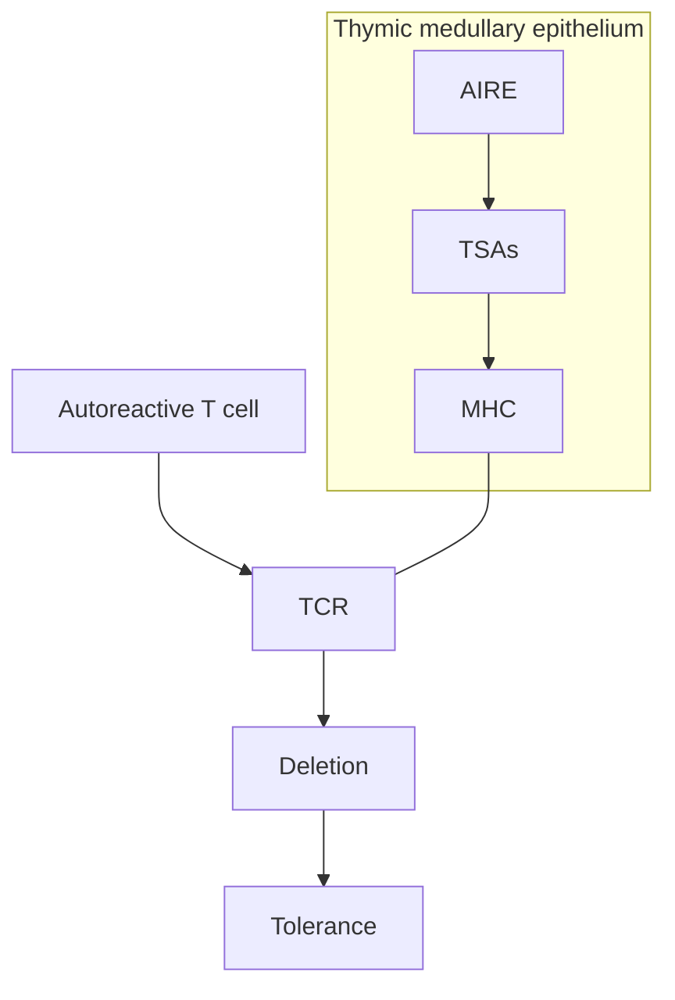

# Ch.44 The Immunoendocrinopathy Syndromes — 中英對照（Bilingual EN/中文）

> 本檔為原始 LlamaParse 解析全文的**中英對照版**：保留完整英文原文，每個小片段後緊接繁體中文翻譯（`> 🇹🇼 中譯：`），方便 fellow 一邊讀原文一邊對照。
>
> 原始純英文全文見：[`Ch44-raw-LlamaParse.md`](Ch44-raw-LlamaParse.md)。文末 References（參考文獻）依慣例不翻譯。

---

# The Immunoendocrinopathy Syndromes

> 🇹🇼 **中譯：** 免疫內分泌病症候群（The Immunoendocrinopathy Syndromes）

JENNIFER M. BARKER, YUTAKA TAKAHASHI, PETER A. GOTTLIEB,
AND MARK S. ANDERSON

> 🇹🇼 **中譯：** 作者：JENNIFER M. BARKER、YUTAKA TAKAHASHI、PETER A. GOTTLIEB 與 MARK S. ANDERSON

## CHAPTER OUTLINE

> 🇹🇼 **中譯：** 章節大綱

* Autoimmunity Primer, 1737
* Natural History of Autoimmune Disorders, 1738
* Autoimmune Polyendocrine Syndrome Type I, 1741
* Autoimmune Polyendocrine Syndrome Type II, 1744
* Other Polyendocrine Deficiency Autoimmune Syndromes, 1746
* Conclusion, 1749

> 🇹🇼 **中譯：**
> * 自體免疫入門（Autoimmunity Primer），1737
> * 自體免疫疾病的自然病史（Natural History of Autoimmune Disorders），1738
> * 第 I 型自體免疫多腺體症候群（Autoimmune Polyendocrine Syndrome Type I），1741
> * 第 II 型自體免疫多腺體症候群（Autoimmune Polyendocrine Syndrome Type II），1744
> * 其他多腺體缺損自體免疫症候群（Other Polyendocrine Deficiency Autoimmune Syndromes），1746
> * 結論（Conclusion），1749

## KEY POINTS

> 🇹🇼 **中譯：** 重點

* Endocrine diseases may occur together, and understanding of these associations can lead to earlier diagnosis of additional disorders.
* cells, which is defined as paraneoplastic autoimmune hypophysitis.

> 🇹🇼 **中譯：**
> * 內分泌疾病可能合併出現，了解這些關聯有助於更早診斷其他相關疾病。
> * 細胞，此被定義為副腫瘤性自體免疫腦下垂體炎（paraneoplastic autoimmune hypophysitis）。

* Many autoimmune endocrine diseases have genetic risk at overlapping genetic loci, explaining, in part, their concurrence in individuals.
* Studies of these disorders have uncovered the genetic basis for these rare syndromes and have helped to define important immune pathways.

> 🇹🇼 **中譯：**
> * 許多自體免疫內分泌疾病在重疊的基因座（genetic loci）上具有遺傳風險，這部分解釋了它們為何會在同一個人身上同時出現。
> * 對這些疾病的研究揭示了這些罕見症候群的遺傳基礎，並有助於界定重要的免疫路徑。

* Elucidation of the causes of these rare disorders has led to fundamental insights into the functioning of the immune system in autoimmunity.
* The search for means to define endocrine autoimmunity and disease states has led to the development of new assays that have become the cornerstone of endocrine autoimmune testing.

> 🇹🇼 **中譯：**
> * 釐清這些罕見疾病的成因，帶來了對免疫系統在自體免疫中運作方式的根本性洞見。
> * 為了界定內分泌自體免疫及疾病狀態，發展出新的檢驗方法，這些方法已成為內分泌自體免疫檢測的基石。

* Ectopic pituitary antigen presentation by the complicated tumor can cause autoimmunity against anterior pituitary
* Recommended testing for these related disorders is discussed in this chapter.

> 🇹🇼 **中譯：**
> * 併存腫瘤所進行的異位腦下垂體抗原呈現（ectopic pituitary antigen presentation），可引起針對前葉腦下垂體的自體免疫
> * 本章將討論針對這些相關疾病所建議的檢測。

Since Addison’s initial description of primary adrenal insufficiency in a patient with two autoimmune disorders (vitiligo and the hyperpigmentation of Addison disease), the immunoendocrinopathy syndromes have contributed to the understanding of both endocrinology and immunology (Fig. 44.1). Understanding the pathogenesis of the polyendocrine syndromes continues to expand. In particular, shared genetic loci underlying disease susceptibility, potential environmental factors, and organ-specific autoantigens targeted by the immune system are being defined. Recent advances include the development of more reliable T-cell and other immunologic assays, further refinement in predictive models of disease, and continued unraveling of the genetic factors underlying disease susceptibility.

> 🇹🇼 **中譯：** 自從 Addison 最初在一位同時患有兩種自體免疫疾病（白斑症 vitiligo 與 Addison 病的色素沉著）的病患身上描述了原發性腎上腺功能不全以來，免疫內分泌病症候群對內分泌學與免疫學的理解都有所貢獻（圖 44.1）。對多腺體症候群致病機轉的理解持續擴展。特別是疾病易感性背後共有的基因座、潛在的環境因子，以及被免疫系統鎖定的器官特異性自體抗原（organ-specific autoantigens），都正逐漸被界定。近年的進展包括發展出更可靠的 T 細胞及其他免疫學檢驗、疾病預測模型的進一步精細化，以及對疾病易感性背後遺傳因子的持續釐清。

Most autoimmune endocrine disorders (e.g., type 1 diabetes, autoimmune thyroid disease) occur in isolation. Two distinct autoimmune polyendocrine syndromes with characteristic groupings of manifestations are readily recognized. *Autoimmune polyendocrine syndrome type I* (APS-I) is a rare disorder with autosomal-recessive inheritance that is caused by defects in the *autoimmune regulator (AIRE)* gene. In contrast, *autoimmune polyendocrine syndrome type II* (APS-II) is more common but less well defined and includes overlapping groups of disorders. A unifying characteristic within APS-II is the strong association with polymorphic genes of

> 🇹🇼 **中譯：** 大多數自體免疫內分泌疾病（如第 1 型糖尿病、自體免疫甲狀腺疾病）為單獨發生。有兩種界線分明、具有特徵性表現組合的自體免疫多腺體症候群很容易被辨認出來。*第 I 型自體免疫多腺體症候群*（APS-I）是一種罕見的體染色體隱性遺傳疾病，由*自體免疫調節因子（AIRE）*基因的缺陷所引起。相對地，*第 II 型自體免疫多腺體症候群*（APS-II）較為常見但界定較不明確，並包含一群彼此重疊的疾病。APS-II 中一個共通的特徵是與下列多型性基因（polymorphic genes）有強烈的關聯：

the human leukocyte antigen (HLA) region located on the short arm of chromosome 6 (band 6p21.3). In addition to HLA, many other genetic loci are likely to contribute to susceptibility to APS-II. For purposes of simplicity in this chapter, APS-II encompasses what some clinicians divide into APS-II (Addison disease plus type 1 diabetes or thyroid autoimmunity), APS-III (thyroid autoimmunity plus other autoimmune diseases, not Addison disease or type 1 diabetes), and APS-IV (two or more other organ-specific autoimmune disorders).

> 🇹🇼 **中譯：** 位於第 6 號染色體短臂（band 6p21.3）的人類白血球抗原（HLA）區域。除了 HLA 之外，許多其他基因座也可能促成 APS-II 的易感性。為了本章敘述上的簡潔，APS-II 涵蓋了某些臨床醫師所區分的 APS-II（Addison 病加上第 1 型糖尿病或甲狀腺自體免疫）、APS-III（甲狀腺自體免疫加上其他自體免疫疾病，但不含 Addison 病或第 1 型糖尿病）以及 APS-IV（兩種或以上其他器官特異性自體免疫疾病）。

APS-II has also been known by various other names, including Schmidt syndrome, polyglandular autoimmune disease, polyglandular failure syndrome, organ-specific autoimmune disease, and polyendocrinopathy diabetes. Such diverse names reflect the large number of studies and case reports of this syndrome and its historical importance. Each of these other names has some shortcomings, such as failure to include the fact that both hyperfunction and hypofunction of endocrine glands can occur, or failure to recognize that nonendocrine disorders such as pernicious anemia and celiac disease are parts of the syndrome. Studies of patients with APS-II were instrumental in identifying the autoimmune bases of several diseases and developing autoantibody assays such as those for type 1 diabetes and cytoplasmic islet cell antibodies.

> 🇹🇼 **中譯：** APS-II 過去也以多種其他名稱為人所知，包括 Schmidt syndrome、多腺體自體免疫疾病（polyglandular autoimmune disease）、多腺體衰竭症候群（polyglandular failure syndrome）、器官特異性自體免疫疾病（organ-specific autoimmune disease）以及多內分泌病糖尿病（polyendocrinopathy diabetes）。如此多樣的名稱反映了此症候群有大量的研究與病例報告及其歷史重要性。這些其他名稱各有缺點，例如未能涵蓋內分泌腺體既可亢進也可低下的事實，或未能認知到惡性貧血（pernicious anemia）與乳糜瀉（celiac disease）等非內分泌疾病也是此症候群的一部分。對 APS-II 病患的研究在辨識數種疾病的自體免疫基礎，以及發展自體抗體檢驗（例如針對第 1 型糖尿病與細胞質島細胞抗體 cytoplasmic islet cell antibodies 的檢驗）方面，發揮了關鍵作用。

This illustration accompanied Addison’s initial description of primary adrenal insufficiency (Addison disease).

> 🇹🇼 **中譯：** 此圖隨附於 Addison 最初對原發性腎上腺功能不全（Addison 病）的描述。

\* Fig. 44.1 This illustration accompanied Addison’s initial description of primary adrenal insufficiency (Addison disease). (From Addison T. On the Constitutional and Local Effects of Disease of the Supra-renal Capsules. London, UK: Samuel Highley; 1855.)

> 🇹🇼 **中譯：** 圖 44.1　此圖隨附於 Addison 最初對原發性腎上腺功能不全（Addison 病）的描述。（取自 Addison T. On the Constitutional and Local Effects of Disease of the Supra-renal Capsules. London, UK: Samuel Highley; 1855.）

Other rare autoimmune endocrine disorders have contributed to an understanding of the development of autoimmunity. For example, the rare disorder called *immunodysregulation polyendocrinopathy enteropathy X-linked syndrome* (IPEX) is caused by a mutation of the *forkhead box P3 (FOXP3)* gene. *FOXP3* plays a central role in the development and function of regulatory CD4⁺ T cells that function to maintain tolerance to self. It has become increasingly recognized that these T cells play a key role in the pathogenesis of many autoimmune diseases, and therapies targeting these cells will likely be developed and tested. A thorough understanding of these rare and often genetically simple disorders provides insight into the development of syndromes that are characterized by polygenic inheritance and that affect a larger group of patients.

> 🇹🇼 **中譯：** 其他罕見的自體免疫內分泌疾病也對理解自體免疫的發生有所貢獻。例如，名為*免疫失調多內分泌病腸病變 X 連鎖症候群*（IPEX）的罕見疾病，是由*叉頭框 P3（FOXP3）*基因突變所引起。*FOXP3* 在調節型 CD4⁺ T 細胞（regulatory CD4⁺ T cells）的發育與功能中扮演核心角色，這類細胞的功能在於維持對自體的耐受性（tolerance to self）。人們愈來愈認知到這些 T 細胞在許多自體免疫疾病的致病機轉中扮演關鍵角色，針對這些細胞的療法也很可能會被開發並接受試驗。徹底理解這些罕見、且通常在遺傳上較單純的疾病，可為理解那些以多基因遺傳（polygenic inheritance）為特徵、影響更大群病患的症候群提供洞見。

## Autoimmunity Primer

> 🇹🇼 **中譯：** 自體免疫入門

An understanding of the pathophysiology of autoimmune disease requires a basic knowledge of the immunologic mechanisms that underlie tolerance (the ability to differentiate self from nonself). Autoimmunity develops when the mechanisms of immune tolerance break down. It can occur centrally at the level of the generative organs (e.g., thymus, bone marrow) or peripherally in the target organs or lymphoid tissues. T lymphocytes and autoantibodies produced by B cells are two arms of the immune system that differ fundamentally in their recognition of target antigens. Autoantibodies react with intact molecules (including both soluble and cell surface molecules) and usually interact with conformational determinants of the autoantigen. In contrast, T lymphocytes recognize peptide fragments of autoantigens, often 8 to 12 amino acids in length, that are presented on the surface of another cell by molecules of the major histocompatibility complex (MHC).

> 🇹🇼 **中譯：** 要理解自體免疫疾病的病理生理學，需先具備關於耐受性（tolerance，即區別自體與非自體的能力）背後免疫機轉的基本知識。當免疫耐受性的機制崩解時，便會發生自體免疫。它可發生在中樞層次的生成器官（如胸腺 thymus、骨髓 bone marrow），也可發生在周邊的標的器官或淋巴組織。T 淋巴球與 B 細胞所產生的自體抗體是免疫系統的兩個分支，二者在對標的抗原的辨識上有根本差異。自體抗體與完整的分子反應（包括可溶性分子與細胞表面分子），且通常與自體抗原的構形決定位（conformational determinants）作用。相對地，T 淋巴球辨識的是自體抗原的胜肽片段（通常長 8 至 12 個胺基酸），這些片段由主要組織相容性複合體（MHC）的分子呈現在另一個細胞的表面上。

Histocompatibility molecules interact with T-cell receptors when bound with an antigenic peptide. These molecules resemble a hot dog in a bun, with the antigenic peptide (the hot dog) bound in the groove of the histocompatibility molecule (the bun). Histocompatibility molecules are extremely polymorphic, with different amino acids lining the peptide-binding groove. These variable amino acids determine which peptides are bound and presented to T lymphocytes.

> 🇹🇼 **中譯：** 組織相容性分子在與抗原胜肽結合時，會與 T 細胞受體（T-cell receptors）作用。這些分子就像麵包裡夾著的熱狗，抗原胜肽（熱狗）嵌結在組織相容性分子（麵包）的凹槽中。組織相容性分子具有極高的多型性，胜肽結合凹槽內排列著不同的胺基酸。這些可變的胺基酸決定了哪些胜肽會被結合並呈現給 T 淋巴球。

T cells differ based on multiple cell surface molecules, and these molecules determine their function in the immune system. T cells interact with other cells within and outside the immune system. CD4⁺ T cells typically react with peptides that are derived from proteins in extracellular compartments that are bound and acquired by class II histocompatibility molecules (HLA-DP, HLA-DQ, or HLA-DR in humans), expressed on antigen-presenting cells (APCs) such as macrophages, dendritic cells, and B lymphocytes. CD8⁺ T cells react with peptides bound by class I histocompatibility molecules (HLA-A, HLA-B, and HLA-C). Class I molecules are present on the surface of almost all nucleated cells. The antigen peptide in this case is derived from proteins expressed endogenously and is presented in a complex by class I HLA by the target cell itself. Recognition of the antigenic peptide by CD8⁺ T cells typically leads to the release of cytotoxic chemicals that kill the target cell.

> 🇹🇼 **中譯：** T 細胞依據多種細胞表面分子而有所不同，這些分子決定了它們在免疫系統中的功能。T 細胞會與免疫系統內外的其他細胞作用。CD4⁺ T 細胞通常與下列胜肽反應：源自細胞外間隔（extracellular compartments）蛋白質的胜肽，這些胜肽由表現在抗原呈現細胞（APCs，如巨噬細胞、樹突細胞及 B 淋巴球）上的第 II 類組織相容性分子（人類為 HLA-DP、HLA-DQ 或 HLA-DR）所結合與取得。CD8⁺ T 細胞則與第 I 類組織相容性分子（HLA-A、HLA-B 及 HLA-C）所結合的胜肽反應。第 I 類分子存在於幾乎所有有核細胞的表面。此情況下的抗原胜肽源自內生性表現的蛋白質，並由標的細胞本身以第 I 類 HLA 形成複合體加以呈現。CD8⁺ T 細胞對抗原胜肽的辨識通常導致釋出細胞毒性化學物質，殺死標的細胞。

The T-cell response depends on the context in which the antigen is presented. The simple expression of histocompatibility molecules and recognition of antigen by a T cell are not sufficient for T-cell activation. This context is at least partially determined by the interaction of cell surface molecules on both the T cell and the APC. Interaction among the MHC, the peptide, and the T-cell receptor (signal one) is critical to the activation process; other co-stimulatory molecules then help to define the nature of the immune response (signal two). The context in which the antigens are presented is critical for the determination of this response. Cell surface molecules and receptors, cytokines, and chemokines form the context in which the antigen is presented. Based on this context, the cell can become activated, tolerized, or anergic (immune unresponsive). For example, the APC cell surface molecule CD80 or CD86 engages the CD28 receptor on the T cell and amplifies signal one, which leads to T-cell activation. When a T cell recognizes an antigen in the context of the MHC and does not receive the appropriate second signal, anergy results.

> 🇹🇼 **中譯：** T 細胞的反應取決於抗原被呈現時的情境（context）。僅僅是組織相容性分子的表現及 T 細胞對抗原的辨識，並不足以使 T 細胞活化。此情境至少部分取決於 T 細胞與 APC 雙方細胞表面分子的交互作用。MHC、胜肽與 T 細胞受體三者間的交互作用（signal one，第一訊號）對活化過程至關重要；其他共刺激分子（co-stimulatory molecules）接著協助界定免疫反應的性質（signal two，第二訊號）。抗原被呈現的情境對決定此反應極為關鍵。細胞表面分子與受體、細胞激素（cytokines）及趨化激素（chemokines）構成了抗原被呈現的情境。依此情境，細胞可變得活化、被誘導耐受（tolerized）或失能（anergic，免疫無反應性）。例如，APC 細胞表面分子 CD80 或 CD86 與 T 細胞上的 CD28 受體結合並放大第一訊號，導致 T 細胞活化。當 T 細胞在 MHC 的情境下辨識抗原，卻未接收到適當的第二訊號時，便產生失能（anergy）。

Tolerance induction is a staged process that begins in the thymus during T-cell maturation. This process depends in part on the presence of *peripheral antigens* in the thymus. Peripheral antigens are self-antigens (e.g., insulin) normally expressed in tissues outside the immune system that are expressed at low levels in the thymus. Developing T cells that react strongly to these peripheral molecules in the context of the MHC are deleted in the thymus and are thus removed from the T-cell repertoire in a process known as negative selection. Study of *AIRE* gene knockout mice has supported the importance of these phenomena in the development of autoimmunity. These mice have low levels of expression of peripheral antigens in the thymus and develop lymphocytic infiltrates in multiple organs (see later discussion).

> 🇹🇼 **中譯：** 耐受性的誘導是一個分階段的過程，始於胸腺中 T 細胞成熟的期間。此過程部分取決於胸腺中*周邊抗原（peripheral antigens）*的存在。周邊抗原是指正常於免疫系統以外組織表現的自體抗原（如胰島素 insulin），而在胸腺中以低量表現。發育中的 T 細胞若在 MHC 的情境下對這些周邊分子有強烈反應，便會在胸腺中被清除，從而透過稱為負選擇（negative selection）的過程被移出 T 細胞庫（T-cell repertoire）。對 *AIRE* 基因剔除小鼠的研究支持了這些現象在自體免疫發生中的重要性。這些小鼠在胸腺中周邊抗原的表現量偏低，並在多個器官出現淋巴球浸潤（lymphocytic infiltrates）（見後文討論）。

Peripheral tolerance is an important mechanism for tolerance induction after T cells have matured in the thymus. Anergic and regulatory T cells are integral in the development of tolerance for naive T cells. A major population of T-regulatory cells carry the cell surface markers CD4 and CD25 and express FOXP3. The function of the population of CD4⁺/CD25high cells involves an active suppressive activity and relies on the transcription factor FOXP3. Deletion of this transcription factor leads to fulminant autoimmunity in neonates (e.g., neonatal type 1 diabetes and enteropathy), often resulting in death within the first year of life (IPEX syndrome; see later discussion). Another set of key molecules that help control peripheral T-cell tolerance are cytotoxic T-lymphocyte antigen 4 (CTLA4) and programmed death 1 (PD1).¹ CTLA4 is expressed in T cells and acts as a negative regulator of T-cell signaling by competing with the T-cell activator CD28 (described earlier). CTLA4 outcompetes CD28 for binding to its ligands CD80 and CD86 due to its higher affinity for ligand. In addition, CTLA4 is broadly expressed on the surface of FOXP3-expressing CD4⁺ T-regulatory cells, where it likely plays a role in blocking CD28 interactions with CD80 and

> 🇹🇼 **中譯：** 周邊耐受性（peripheral tolerance）是 T 細胞在胸腺成熟之後誘導耐受性的一項重要機制。失能型與調節型 T 細胞在初始（naive）T 細胞耐受性的建立中不可或缺。調節型 T 細胞（T-regulatory cells）的主要族群帶有細胞表面標記 CD4 與 CD25，並表現 FOXP3。CD4⁺/CD25high 細胞族群的功能涉及主動的抑制活性，並依賴轉錄因子 FOXP3。剔除此轉錄因子會在新生兒中導致猛爆性自體免疫（如新生兒第 1 型糖尿病及腸病變），常於出生後第一年內死亡（即 IPEX 症候群；見後文討論）。另一組有助於控制周邊 T 細胞耐受性的關鍵分子是細胞毒性 T 淋巴球抗原 4（CTLA4）與計畫性死亡 1（PD1）。¹ CTLA4 表現於 T 細胞，藉由與 T 細胞活化因子 CD28（如前所述）競爭而作為 T 細胞訊號傳遞的負向調節因子。CTLA4 因對配體有較高的親和力，在與其配體 CD80 及 CD86 結合上勝過 CD28。此外，CTLA4 廣泛表現於表現 FOXP3 的 CD4⁺ 調節型 T 細胞表面，在此它可能扮演阻斷 CD28 與 CD80 及

Model of the pathogenesis of autoimmunity in polyendocrine disorders diagram showing interactions between Thymus, PAE cells, T cells, B cells, and Target organs with markers for AIRE, APS1, FOXP3, IPEX, HLA, and APC.

> 🇹🇼 **中譯：** 多腺體疾病中自體免疫致病機轉的模型圖，顯示胸腺（Thymus）、PAE 細胞、T 細胞、B 細胞與標的器官（Target organs）之間的交互作用，並標示 AIRE、APS1、FOXP3、IPEX、HLA 及 APC 等標記。

\* **Fig. 44.2** Model of the pathogenesis of autoimmunity in polyendocrine disorders. The development of autoimmune disease is determined by a group of T cells that recognize one or more organ-specific epitopes. Peptides are presented in the human leukocyte antigen (*HLA*) molecule and are recognized by the T-cell receptor. Recognition of self molecules depends on the maturation of the T cell, a process that begins in the thymus and continues in the periphery. The transcription factor FOXP3 stimulates the development of CD4⁺/CD25⁺ regulatory T cells. B cells produce autoantibodies under the stimulation of T cells. *AIRE*, autoimmune regulator; *APC*, antigen-presenting cell; *APS1*, autoimmune polyendocrine syndrome 1; *IPEX*, immunodysregulation polyendocrinopathy enteropathy X-linked; *PAE*, peripheral antigen-expressing cell; *Th1*, type 1 helper T cell; *Th2*, type 2 helper T cell. (From Eisenbarth GS, Gottlieb PA. Autoimmune polyendocrine syndromes. *N Engl J Med.* 2004;350:2068–2079.)

> 🇹🇼 **中譯：** 圖 44.2　多腺體疾病中自體免疫致病機轉的模型。自體免疫疾病的發生由一群辨識一個或多個器官特異性抗原決定位（epitopes）的 T 細胞所決定。胜肽呈現於人類白血球抗原（*HLA*）分子中，並被 T 細胞受體辨識。對自體分子的辨識取決於 T 細胞的成熟，此過程始於胸腺並在周邊持續進行。轉錄因子 FOXP3 促進 CD4⁺/CD25⁺ 調節型 T 細胞的發育。B 細胞在 T 細胞的刺激下產生自體抗體。*AIRE*，autoimmune regulator（自體免疫調節因子）；*APC*，antigen-presenting cell（抗原呈現細胞）；*APS1*，autoimmune polyendocrine syndrome 1（第 1 型自體免疫多腺體症候群）；*IPEX*，immunodysregulation polyendocrinopathy enteropathy X-linked（免疫失調多內分泌病腸病變 X 連鎖）；*PAE*，peripheral antigen-expressing cell（周邊抗原表現細胞）；*Th1*，第 1 型輔助 T 細胞；*Th2*，第 2 型輔助 T 細胞。（取自 Eisenbarth GS, Gottlieb PA. Autoimmune polyendocrine syndromes. *N Engl J Med.* 2004;350:2068–2079.）

CD86. PD1 is yet another co-stimulatory molecule that becomes upregulated on T cells that have been chronically activated, and it confers negative signals through inhibitory signaling domains in its intracytoplasmic tail. The importance of both PD1 and CTLA4 in peripheral tolerance is underscored in knockout mouse models that develop spontaneous multiorgan autoimmunity and in cancer patients treated with antibodies that block their activity where many of these patients develop autoimmune complications (see later discussion).

> 🇹🇼 **中譯：** CD86 交互作用的角色。PD1 是另一個共刺激分子，在被慢性活化的 T 細胞上表現上調，並透過其胞質內尾端（intracytoplasmic tail）的抑制性訊號傳遞區域傳遞負向訊號。PD1 與 CTLA4 在周邊耐受性中的重要性，可由下列現象凸顯：會自發性產生多器官自體免疫的剔除小鼠模型，以及接受阻斷其活性之抗體治療的癌症病患（其中許多病患出現自體免疫併發症）（見後文討論）。

Cognate help is the process by which B cells are activated by CD4⁺ T cells that are responding to the same antigen. CD4⁺ T cells activate B cells to produce the humoral immune response. This occurs after the CD4⁺ T cell engages an antigen in the context of the MHC on the cell surface of a B cell. The cytokines (interleukin [IL] 4, IL5, and IL6) produced by the CD4⁺ T cells induce the maturation of a B cell. Depending on the cytokine milieu, the B cell will switch from producing immunoglobulin M (IgM) to IgG, IgE, or IgA. The development of B-cell tolerance is partially dependent on this linked recognition: autoreactive B-cell clones that do not have a CD4⁺ T cell that can bind with the antigen in its MHC groove will not normally be activated. Thus, in most cases, the generation of autoantibodies by B cells is also linked to an autoreactive T cell specific for the same self-antigen. Growing evidence supports the role of autoreactive B cells as critical APCs to autoreactive T cells, creating a positive feedback loop in the expansion and maintenance of the autoimmune process.

> 🇹🇼 **中譯：** 同源輔助（cognate help）是指 B 細胞被同樣對該抗原起反應的 CD4⁺ T 細胞所活化的過程。CD4⁺ T 細胞活化 B 細胞以產生體液免疫反應。此過程發生於 CD4⁺ T 細胞在 B 細胞表面以 MHC 情境結合某抗原之後。CD4⁺ T 細胞所產生的細胞激素（介白素 [IL] 4、IL5 及 IL6）誘導 B 細胞的成熟。視細胞激素環境而定，B 細胞會從產生免疫球蛋白 M（IgM）轉換為產生 IgG、IgE 或 IgA。B 細胞耐受性的建立部分取決於此種連結式辨識（linked recognition）：若自體反應性 B 細胞株沒有可在其 MHC 凹槽中與該抗原結合的 CD4⁺ T 細胞，通常不會被活化。因此，在多數情況下，B 細胞產生自體抗體也與一個對同一自體抗原具特異性的自體反應性 T 細胞相連結。愈來愈多的證據支持自體反應性 B 細胞作為自體反應性 T 細胞重要 APC 的角色，從而在自體免疫過程的擴增與維持中形成一個正回饋迴路。

## Natural History of Autoimmune Disorders

> 🇹🇼 **中譯：** 自體免疫疾病的自然病史

The natural history of autoimmune disorders can be divided into a series of stages beginning with genetic susceptibility, followed by triggering of autoimmunity (e.g., dietary gliadin exposure in celiac disease) and active autoimmunity preceding clinical manifestations (e.g., progressive glandular destruction), and, finally,

> 🇹🇼 **中譯：** 自體免疫疾病的自然病史可分為一系列階段，始於遺傳易感性，接著是自體免疫的觸發（如乳糜瀉中飲食性麥膠蛋白 gliadin 的暴露），以及在臨床表現之前的活躍自體免疫（如腺體進行性破壞），最後則是

overt disease. This is a theoretical construct that may be useful for understanding factors involved with the development of autoimmunity and disease, but of necessity it is simplified and does not reflect the potential relapsing-remitting nature of autoimmunity (Fig. 44.2).

> 🇹🇼 **中譯：** 顯性疾病（overt disease）。這是一個理論性的架構，對理解涉及自體免疫與疾病發生的因素可能有所助益，但它必然是經過簡化的，並未反映自體免疫可能具有的復發—緩解（relapsing-remitting）性質（圖 44.2）。

## Genetic Associations

> 🇹🇼 **中譯：** 遺傳關聯

Although there is familial aggregation of APS-II and its component disorders, there is no simple pattern of inheritance (Table 44.1). Susceptibility is probably determined by multiple genetic loci (with HLA having the strongest effect) interacting with environmental factors. Autoimmune diseases share common genetic risk factors, including HLA, the MHC class I–related gene A (*MICA*), the gene for lymphoid tyrosine phosphatase (*PTPN22*), the cytotoxic T lymphocyte–associated antigen 4 (*CTLA4*), and the gene for NACHT leucine-rich repeat protein 1 (*NLRP1*, or *NALP1*).² In addition, genetic susceptibility for some autoimmune diseases has been linked to polymorphisms that are organ specific—for example, polymorphisms in the variable nucleotide tandem repeat upstream from the insulin gene have been associated with risk for type 1 diabetes.³

> 🇹🇼 **中譯：** 雖然 APS-II 及其組成疾病具有家族聚集性，但並無簡單的遺傳模式（表 44.1）。易感性可能由多個基因座（其中 HLA 影響最強）與環境因子交互作用所決定。自體免疫疾病共有一些共通的遺傳風險因子，包括 HLA、MHC 第 I 類相關基因 A（*MICA*）、淋巴樣酪胺酸磷酸酶基因（*PTPN22*）、細胞毒性 T 淋巴球相關抗原 4（*CTLA4*），以及 NACHT 富白胺酸重複蛋白 1 的基因（*NLRP1*，或稱 *NALP1*）。² 此外，某些自體免疫疾病的遺傳易感性與器官特異性的多型性相關——例如，胰島素基因上游可變核苷酸串聯重複（variable nucleotide tandem repeat）中的多型性已與第 1 型糖尿病的風險相關聯。³

Genes located on the MHC found on chromosome 6 have been implicated in the pathogenesis of organ-specific autoimmune diseases. These genes are in strong linkage disequilibrium with each other and encode proteins that are important in the function of the immune system. Foremost in importance for the genetics of organ-specific autoimmune diseases are class I and class II HLA genes. Molecular HLA genotyping has revealed many subtypes of the older, serologically defined alleles, and the unique genetic sequence encoding each polymorphic chain of the histocompatibility molecules is now given a unique identifying number. A case in point is the DQ molecule, which is the histocompatibility molecule most strongly associated with endocrine autoimmunity.

> 🇹🇼 **中譯：** 位於第 6 號染色體 MHC 上的基因已被認為與器官特異性自體免疫疾病的致病機轉有關。這些基因彼此間呈強連鎖不平衡（linkage disequilibrium），並編碼在免疫系統功能上重要的蛋白質。對器官特異性自體免疫疾病的遺傳學而言，最重要的是第 I 類與第 II 類 HLA 基因。分子 HLA 基因分型已揭示出較早期以血清學定義之等位基因的眾多亞型，而編碼組織相容性分子每一條多型性鏈的獨特基因序列，如今都被賦予一個獨特的識別編號。一個典型例子是 DQ 分子，它是與內分泌自體免疫關聯最強的組織相容性分子。

<table>
  <thead>
    <tr><th colspan="2">TABLE 44.1 Genetic Associations With Autoimmune Disease</th></tr>
    <tr>
        <th>Gene</th>
        <th>Proposed Mechanism of Action</th>
        <th>Polymorphism/Mutation</th>
        <th>Disease</th>
        <th>Inheritance</th>
    </tr>
  </thead>
  <tbody>
    <tr>
        <td rowspan="5">HLA</td>
        <td rowspan="5">Antigen presentation</td>
        <td>DR3-DQ2/DR4-DQ8</td>
        <td>Type 1 diabetes</td>
        <td rowspan="5">Multigenic</td>
    </tr>
    <tr>
        <td>DR3-DQ2</td>
        <td>Celiac disease</td>
    </tr>
    <tr>
        <td>DR3-DQ2/DRB1*0404-DQ8</td>
        <td>Addison disease</td>
    </tr>
    <tr>
        <td>DR3-DQ2/DR4-DQ8</td>
        <td>Graves disease</td>
    </tr>
    <tr>
        <td>DR3 DR5</td>
        <td>Hypothyroidism</td>
    </tr>
    <tr>
        <td rowspan="3">MICA</td>
        <td rowspan="3">Priming of naive T cells</td>
        <td>5, 5.1</td>
        <td>Type 1 diabetes</td>
        <td rowspan="3">Multigenic</td>
    </tr>
    <tr>
        <td>4, 5.1</td>
        <td>Celiac disease</td>
    </tr>
    <tr>
        <td>5.1</td>
        <td>Addison disease</td>
    </tr>
    <tr>
        <td rowspan="6">PTPN22</td>
        <td rowspan="6">T-cell receptor signaling pathway through interaction with regulatory kinases</td>
        <td rowspan="6">Tryptophan substitution for arginine at position 620</td>
        <td>Type 1 diabetes</td>
        <td rowspan="6">Multigenic</td>
    </tr>
    <tr>
        <td>SLE</td>
    </tr>
    <tr>
        <td>RA</td>
    </tr>
    <tr>
        <td>Graves disease</td>
    </tr>
    <tr>
        <td>Hypothyroidism</td>
    </tr>
    <tr>
        <td>Vitiligo</td>
    </tr>
    <tr>
        <td rowspan="5">CTLA4</td>
        <td rowspan="5">Receptor on activated CD4+ and CD8+ T cells; decreases T-cell activation</td>
        <td>CT60</td>
        <td>Type 1 diabetes</td>
        <td rowspan="5">Multigenic</td>
    </tr>
    <tr>
        <td>CT60; +49A/G</td>
        <td>Graves disease</td>
    </tr>
    <tr>
        <td>CT60; +49A/G</td>
        <td>Hypothyroidism</td>
    </tr>
    <tr>
        <td>++49A/G</td>
        <td>Celiac disease</td>
    </tr>
    <tr>
        <td>++49A/G</td>
        <td>Addison disease</td>
    </tr>
    <tr>
        <td>AIRE</td>
        <td>“Peripheral” antigen presentation in the thymus</td>
        <td>Multiple reported mutations</td>
        <td>APS-I</td>
        <td>Autosomal recessive</td>
    </tr>
    <tr>
        <td>FOXP3</td>
        <td>Transcription factor important for maturation of CD4+/CD25+ regulatory T cells</td>
        <td>Multiple reported mutations</td>
        <td>IPEX</td>
        <td>X-linked</td>
    </tr>
  </tbody>
</table>

> 🇹🇼 **中譯：** 表 44.1　與自體免疫疾病的遺傳關聯。欄位依序為：基因（Gene）、建議的作用機制（Proposed Mechanism of Action）、多型性／突變（Polymorphism/Mutation）、疾病（Disease）、遺傳模式（Inheritance）。
> - **HLA**——作用機制：抗原呈現（antigen presentation）；遺傳模式：多基因（Multigenic）。對應：DR3-DQ2/DR4-DQ8 → 第 1 型糖尿病；DR3-DQ2 → 乳糜瀉；DR3-DQ2/DRB1\*0404-DQ8 → Addison 病；DR3-DQ2/DR4-DQ8 → Graves 病；DR3 DR5 → 甲狀腺功能低下（hypothyroidism）。
> - **MICA**——作用機制：初始 T 細胞的致敏（priming of naive T cells）；遺傳模式：多基因。對應：5、5.1 → 第 1 型糖尿病；4、5.1 → 乳糜瀉；5.1 → Addison 病。
> - **PTPN22**——作用機制：透過與調節性激酶（regulatory kinases）的交互作用影響 T 細胞受體訊號傳遞路徑；多型性／突變：第 620 位精胺酸被色胺酸取代（tryptophan substitution for arginine at position 620）；遺傳模式：多基因。對應疾病：第 1 型糖尿病、SLE、RA、Graves 病、甲狀腺功能低下、白斑症（vitiligo）。
> - **CTLA4**——作用機制：活化的 CD4+ 與 CD8+ T 細胞上的受體；降低 T 細胞活化；遺傳模式：多基因。對應：CT60 → 第 1 型糖尿病；CT60、+49A/G → Graves 病；CT60、+49A/G → 甲狀腺功能低下；++49A/G → 乳糜瀉；++49A/G → Addison 病。
> - **AIRE**——作用機制：胸腺中「周邊」抗原的呈現；多型性／突變：多種已報告的突變；疾病：APS-I；遺傳模式：體染色體隱性（autosomal recessive）。
> - **FOXP3**——作用機制：對 CD4+/CD25+ 調節型 T 細胞成熟重要的轉錄因子；多型性／突變：多種已報告的突變；疾病：IPEX；遺傳模式：X 連鎖（X-linked）。

AIRE, autoimmune regulator; APS-I, autoimmune polyendocrine syndrome type I; CTLA4, cytotoxic T lymphocyte–associated antigen 4; FOXP3, forkhead box protein 3; HLA, human leukocyte antigen; IPEX, immunodysregulation polyendocrinopathy enteropathy X-linked; MICA, major histocompatibility complex class I–related gene A; PTPN22, the gene for lymphoid tyrosine phosphatase; RA, rheumatoid arthritis; SLE, systemic lupus erythematosus.

> 🇹🇼 **中譯：** 縮寫說明：AIRE，自體免疫調節因子；APS-I，第 I 型自體免疫多腺體症候群；CTLA4，細胞毒性 T 淋巴球相關抗原 4；FOXP3，叉頭框蛋白 3；HLA，人類白血球抗原；IPEX，免疫失調多內分泌病腸病變 X 連鎖；MICA，主要組織相容性複合體第 I 類相關基因 A；PTPN22，淋巴樣酪胺酸磷酸酶基因；RA，類風濕性關節炎；SLE，全身性紅斑性狼瘡。

A number is assigned for each unique α- and β-chain sequence. Examples are DQA1\*0501 for the α chain and DQB1\*0201 for the β chain of the DQ molecule (also termed *DQ2*) commonly encoded on DR3 (DRB1\*0301) haplotypes. A haplotype consists of a series of alleles of different genes on a contiguous region of a chromosome (e.g., DQA1 and DQB1 alleles) that are inherited together. A genotype is the combination of the haplotypes of both chromosomes. Fine mapping of the HLA has shown remarkable conservation of the HLA-A1/B8/DR3 haplotype such that a region of approximately 2.9 megabases is invariable. Conservation of large areas suggests that these areas of the genome have been inherited without recombination and are in very tight linkage disequilibrium. This greatly complicates the ability to identify which, if any, of the genes within the area of conservation are associated with disease and must be accounted for when assessing susceptibility to disease in this region.

> 🇹🇼 **中譯：** 每一條獨特的 α 鏈與 β 鏈序列都會被賦予一個編號。例如 DQ 分子（亦稱 *DQ2*，常編碼於 DR3〔DRB1\*0301〕單套型上）的 α 鏈為 DQA1\*0501、β 鏈為 DQB1\*0201。一個單套型（haplotype）由染色體相鄰區域上不同基因的一系列等位基因（如 DQA1 與 DQB1 等位基因）所組成，這些等位基因一起遺傳。基因型（genotype）則是兩條染色體單套型的組合。HLA 的精細圖譜顯示 HLA-A1/B8/DR3 單套型具有顯著的保守性，使得一段約 2.9 megabases 的區域維持不變。大片區域的保守性意味著基因組的這些區域是在未發生重組（recombination）的情況下遺傳，並處於非常緊密的連鎖不平衡。這大大增加了辨識保守區域內哪些（若有的話）基因與疾病相關的難度，且在評估此區域的疾病易感性時必須加以考量。

Part of the overlapping risk for autoimmune disease is related to shared genetic susceptibility, especially within the HLA. For example, the highest-risk HLA genotype for type 1 diabetes is DR3-DQ2, DR4-DQ8 (DQ8 = DQA1\*0301-DQB1\*0302). The importance of this HLA genotype in the development of type 1 diabetes is highlighted by the observation that children who inherited the same DR3-DQ2, DR4-DQ8 as a sibling with type 1 diabetes are at greater than 75% risk for development of

> 🇹🇼 **中譯：** 自體免疫疾病重疊風險的一部分與共有的遺傳易感性有關，尤其是 HLA 之內。例如，第 1 型糖尿病風險最高的 HLA 基因型為 DR3-DQ2、DR4-DQ8（DQ8 = DQA1\*0301-DQB1\*0302）。此 HLA 基因型在第 1 型糖尿病發生中的重要性，可由以下觀察凸顯：與患有第 1 型糖尿病的手足遺傳到相同 DR3-DQ2、DR4-DQ8 的兒童，發生下述情形的風險超過 75%——

autoimmunity by age 12 years and at greater than 50% risk of developing diabetes by 12 years.⁴ A specific DR4 subtype of this gene, DRB1\*0404, shows a strong association with Addison disease.⁵,⁶ The DR3-DQ2 haplotype is associated with celiac disease both in the presence⁷ and absence⁸ of type 1 diabetes. This haplotype has been associated with autoimmune thyroid disease,⁹ although conflicting reports exist.¹⁰

> 🇹🇼 **中譯：** 在 12 歲前出現自體免疫，且在 12 歲前發生糖尿病的風險超過 50%。⁴ 此基因的一個特定 DR4 亞型 DRB1\*0404 與 Addison 病有強烈關聯。⁵,⁶ DR3-DQ2 單套型無論在合併⁷或未合併⁸第 1 型糖尿病的情況下，都與乳糜瀉相關。此單套型亦與自體免疫甲狀腺疾病相關聯，⁹ 不過也有相互矛盾的報告存在。¹⁰

Whereas some HLA alleles increase disease risk, others are associated with protection from disease. For example, the DQ alleles DQA1\*0102-DQB1\*0602 (usually associated with DR2) not only confer strong protection from type 1A diabetes in a dominant fashion¹¹ but also confer susceptibility to another autoimmune disorder—multiple sclerosis. Furthermore, this protection is not general to endocrine autoimmunity, because no protection from Addison disease is afforded by DQB1\*0602. *DP* is another gene within the MHC, and its 0402 polymorphism has been shown to be associated with a decreased risk for type 1 diabetes in subjects with the highest-risk HLA genotype for type 1 diabetes (DR3/DR4).¹² Observations such as these suggest that as more is learned about the genetic influence of disease, researchers will be able to combine different genotypes and refine prediction of autoimmune disease.

> 🇹🇼 **中譯：** 有些 HLA 等位基因會增加疾病風險，另一些則與疾病的保護作用相關。例如，DQ 等位基因 DQA1\*0102-DQB1\*0602（通常與 DR2 相關）不僅以顯性方式對第 1A 型糖尿病提供強烈保護，¹¹ 也賦予對另一種自體免疫疾病——多發性硬化症（multiple sclerosis）的易感性。再者，此保護作用並非對內分泌自體免疫普遍適用，因為 DQB1\*0602 並不提供對 Addison 病的保護。*DP* 是 MHC 內的另一個基因，其 0402 多型性已被證明在具有第 1 型糖尿病最高風險 HLA 基因型（DR3/DR4）的個體中，與較低的第 1 型糖尿病風險相關。¹² 諸如此類的觀察顯示，隨著對疾病遺傳影響的了解增加，研究者將能夠結合不同的基因型，精進對自體免疫疾病的預測。

MICA produces a protein that is expressed in the thymus and in naive CD8⁺ T cells. Polymorphisms of MICA have been associated

> 🇹🇼 **中譯：** MICA 產生一種表現於胸腺及初始 CD8⁺ T 細胞中的蛋白質。MICA 的多型性已被關聯到——

with type 1 diabetes,¹³ celiac disease,¹⁴ and Addison disease.¹⁵ A particular polymorphism of *MICA*, denoted 5.1, results from the insertion of a single base pair. This insertion produces a premature stop codon and a truncated protein. This particular polymorphism has been shown to influence the risk for Addison disease in subjects with autoimmunity associated with Addison disease.

> 🇹🇼 **中譯：** 第 1 型糖尿病、¹³ 乳糜瀉¹⁴ 及 Addison 病。¹⁵ *MICA* 的一個特定多型性，標示為 5.1，源自單一鹼基對的插入。此插入產生一個提前的終止密碼子（premature stop codon）與一段截短的蛋白質。此特定多型性已被證明會影響具 Addison 病相關自體免疫之個體的 Addison 病風險。

Genes outside the MHC have also been implicated in the pathogenesis of autoimmune disease. For example, the *PTPN22* gene encodes lymphoid tyrosine phosphatase (LYP) protein. LYP, through interactions with regulatory kinases such as CSK, appears to act as an inhibitor of the signal cascade downstream from the T-cell receptor. A specific polymorphism associated with a tryptophan substitution for arginine at position 620 (R620W) blocks LYP’s interaction with CSK.¹⁶ Recent work has suggested that this allele may increase the development of autoreactive B cells¹⁶,¹⁷ and affect intracellular signaling pathways in both T and B cells.¹⁸ This polymorphism has been associated with type 1 diabetes,¹⁹ rheumatoid arthritis,²⁰ systemic lupus erythematosus (SLE),²¹ Graves disease,²² and vitiligo²³ and is weakly associated with Addison disease.²⁴ Furthermore, this disease-associated allele has also been associated with SLE, rheumatoid arthritis, type 1 diabetes, and autoimmune hypothyroidism in families with several members affected by more than one autoimmune disease.²⁴

> 🇹🇼 **中譯：** MHC 之外的基因也被認為與自體免疫疾病的致病機轉有關。例如，*PTPN22* 基因編碼淋巴樣酪胺酸磷酸酶（LYP）蛋白。LYP 透過與如 CSK 等調節性激酶的交互作用，似乎作為 T 細胞受體下游訊號級聯（signal cascade）的抑制因子。一個與第 620 位精胺酸被色胺酸取代（R620W）相關的特定多型性會阻斷 LYP 與 CSK 的交互作用。¹⁶ 近期研究顯示此等位基因可能增加自體反應性 B 細胞的生成，¹⁶,¹⁷ 並影響 T 細胞與 B 細胞兩者的胞內訊號傳遞路徑。¹⁸ 此多型性已與第 1 型糖尿病、¹⁹ 類風濕性關節炎、²⁰ 全身性紅斑性狼瘡（SLE）、²¹ Graves 病²² 及白斑症²³ 相關聯，並與 Addison 病有微弱關聯。²⁴ 此外，在數名成員罹患一種以上自體免疫疾病的家族中，此疾病相關等位基因也與 SLE、類風濕性關節炎、第 1 型糖尿病及自體免疫甲狀腺功能低下相關聯。²⁴

CTLA4 is expressed on activated CD4⁺ and CD8⁺ T cells, where it is hypothesized to act as a negative regulator as outlined earlier.²⁵ Several polymorphisms within the *CTLA4* gene have been associated with autoimmune diseases. One polymorphism associated with AT repeats has been shown to reduce the inhibitory function of CTLA4 in subjects with Graves disease.²⁶ A single nucleotide polymorphism in the 3′ untranslated region, denoted CT60, has been associated with Graves disease²⁷ and autoimmune hypothyroidism.²⁸ An additional polymorphism, denoted +49A/G, has been associated with celiac disease in the Dutch population,²⁹ with autoimmune thyroid disease,³⁰ and with Addison disease.³¹

> 🇹🇼 **中譯：** CTLA4 表現於活化的 CD4⁺ 與 CD8⁺ T 細胞上，如前所述，推測在此作為負向調節因子。²⁵ *CTLA4* 基因內的數個多型性已與自體免疫疾病相關聯。一個與 AT 重複序列相關的多型性已被證明在 Graves 病個體中會降低 CTLA4 的抑制功能。²⁶ 位於 3′ 非轉譯區（3′ untranslated region）、標示為 CT60 的單一核苷酸多型性，已與 Graves 病²⁷ 及自體免疫甲狀腺功能低下²⁸ 相關聯。另一個標示為 +49A/G 的多型性，已與荷蘭族群的乳糜瀉、²⁹ 自體免疫甲狀腺疾病³⁰ 及 Addison 病³¹ 相關聯。

*NALP1* regulates the innate immune system. After the initial observation that this gene was associated with the risk of vitiligo³² and other related autoimmune diseases, it was associated with Addison disease and type 1 diabetes.³³

> 🇹🇼 **中譯：** *NALP1* 調節先天免疫系統（innate immune system）。在最初觀察到此基因與白斑症³² 及其他相關自體免疫疾病的風險相關之後，它又被關聯到 Addison 病與第 1 型糖尿病。³³

Organ-specific genetic polymorphisms have been associated with the development of specific autoimmune diseases. For example, polymorphisms of the variable number of tandem repeats upstream of the insulin gene have been associated with the development of type 1 diabetes. Higher numbers of tandem repeats are associated with increased production of insulin in the thymus and protection from type 1 diabetes presumably due to improved negative selection of insulin-reactive T cells.³ Similarly, polymorphisms of the thyroglobulin gene are associated with autoimmune thyroid disease.³⁴

> 🇹🇼 **中譯：** 器官特異性的遺傳多型性已與特定自體免疫疾病的發生相關聯。例如，胰島素基因上游可變數目串聯重複（variable number of tandem repeats）的多型性已與第 1 型糖尿病的發生相關聯。較高數目的串聯重複與胸腺中胰島素產量增加，以及對第 1 型糖尿病的保護相關，推測係因對胰島素反應性 T 細胞的負選擇得以改善。³ 同樣地，甲狀腺球蛋白（thyroglobulin）基因的多型性與自體免疫甲狀腺疾病相關。³⁴

Single-gene defects such as *AIRE* and *FOXP3* cause multiorgan autoimmunity and are discussed in sections devoted to those topics. Analysis of mutations of the *AIRE* gene indicates that it generally does not play a role in APS-II or sporadic Addison disease, with 1 (1.1%) in 90 patients with Addison disease (non–APS-I) and 1 (0.2%) in 576 control subjects having *AIRE* mutations.³¹

> 🇹🇼 **中譯：** 如 *AIRE* 與 *FOXP3* 之類的單一基因缺陷會造成多器官自體免疫，將於專門討論這些主題的章節中說明。對 *AIRE* 基因突變的分析顯示，它一般在 APS-II 或散發性 Addison 病中並不扮演角色：在 90 名 Addison 病（非 APS-I）病患中有 1 名（1.1%）、576 名對照受試者中有 1 名（0.2%）帶有 *AIRE* 突變。³¹

## Environmental Triggers

> 🇹🇼 **中譯：** 環境觸發因子

Although genetics is known to play an important role in the development of autoimmunity, it does not tell the whole story. For example, the highest-risk HLA genotype for type 1 diabetes (DR3-DQ2, DR4-DQ8) is associated with a risk of 1 in 20

> 🇹🇼 **中譯：** 雖然已知遺傳在自體免疫的發生中扮演重要角色，但它並不能說明全貌。例如，第 1 型糖尿病風險最高的 HLA 基因型（DR3-DQ2、DR4-DQ8）所伴隨的風險為 1/20——

for the development of diabetes.³⁵ Although this is greater than the general population prevalence rate of 1 in 200 by the age of 20 years, it is certainly not a 100% risk. Therefore, other factors (genetic and environmental) must be involved in the initiation of autoimmunity. Some theorize that these factors may be environmental triggers.

> 🇹🇼 **中譯：** 發生糖尿病。³⁵ 雖然這高於一般族群在 20 歲前 1/200 的盛行率，但這當然不是 100% 的風險。因此，必定有其他因子（遺傳與環境）涉入自體免疫的啟動。有些人推論這些因子可能是環境觸發因子。

For one disease, celiac disease, the underlying environmental trigger has been identified: gluten. Through studies such as DAISY (the Diabetes Autoimmunity Study in the Young), BabyDiab, and CEDAR (Celiac Disease Autoimmunity Research), the timing of first exposure to cereal has been identified as a risk factor for the development of diabetes and celiac disease autoimmunity. Infants exposed at a very young age to cereal developed diabetes and celiac-associated autoimmunity at a greater rate than those who had cereal introduced at a later date.³⁶⁻³⁸ In epidemiologic studies, cod liver oil consumption has been associated with a decreased risk for type 1 diabetes. Cod liver oil contains omega-3 polyunsaturated fats and vitamin D. In prospective studies, there is some suggestion that lower consumption of omega-3 polyunsaturated fats is associated with an increased risk for autoimmunity associated with type 1 diabetes.³⁹ Further investigation may identify additional environmental associations. Changes in our diet, our food composition, and use of medicines such as antibiotics have the potential to change our gut flora and microbiome. Animal studies suggest that changes in the gut microbiome can affect disease in these models of autoimmunity.⁴⁰,⁴¹ Human evidence is being sought to determine whether the interaction between the microbiome and innate immunity is leading to increased inflammation and setting the stage for increased frequencies of all autoimmune disorders that have recently been observed.⁴²,⁴³

> 🇹🇼 **中譯：** 對於乳糜瀉這一疾病，其潛在的環境觸發因子已被確認：麩質（gluten）。透過 DAISY（青少年糖尿病自體免疫研究）、BabyDiab 及 CEDAR（乳糜瀉自體免疫研究）等研究，首次接觸穀類（cereal）的時機已被確認為發生糖尿病及乳糜瀉自體免疫的風險因子。在極年幼時即接觸穀類的嬰兒，發生糖尿病及乳糜瀉相關自體免疫的比率高於較晚才開始接觸穀類者。³⁶⁻³⁸ 在流行病學研究中，攝取鱈魚肝油（cod liver oil）已與較低的第 1 型糖尿病風險相關。鱈魚肝油含有 omega-3 多元不飽和脂肪與維生素 D。在前瞻性研究中，有些跡象顯示較少攝取 omega-3 多元不飽和脂肪與第 1 型糖尿病相關自體免疫風險增加有關。³⁹ 進一步的研究可能會發現其他環境關聯。我們飲食的改變、食物組成的改變，以及如抗生素等藥物的使用，都有可能改變我們的腸道菌叢（gut flora）與微生物體（microbiome）。動物研究顯示，在這些自體免疫模型中腸道微生物體的改變可影響疾病。⁴⁰,⁴¹ 目前正在尋求人體證據，以判定微生物體與先天免疫之間的交互作用是否導致發炎增加，並為近期觀察到所有自體免疫疾病頻率增加鋪設了背景。⁴²,⁴³

Virus and other infections have been considered as a cause of autoimmunity and have been shown to cause the development of type 1 diabetes when infection occurs in utero for rubella, for example. Examination of pancreata from individuals with prediabetes (autoantibodies) or those with diabetes has provided evidence consistent with viral infection of the organ.⁴⁴,⁴⁵ Association is not causality, and further experiments are needed to determine whether this finding is an important component of how either autoimmunity is initiated or propagated.

> 🇹🇼 **中譯：** 病毒及其他感染一直被視為自體免疫的可能成因，並已被證明在某些情況下會導致第 1 型糖尿病的發生，例如德國麻疹（rubella）感染發生於子宮內時。對處於前驅糖尿病期（具自體抗體）個體或糖尿病患者胰臟的檢查，提供了與該器官受病毒感染相符的證據。⁴⁴,⁴⁵ 但關聯不等於因果，仍需進一步的實驗來判定此發現是否為自體免疫如何被啟動或傳播的重要組成。

Targeted immunologic therapies are also associated with the induction of autoimmunity. A remarkable example is the treatment of patients with multiple sclerosis with an anti-CD52 monoclonal antibody. One-third of 27 patients given the monoclonal antibody developed antithyrotropin receptor autoantibodies and hyperthyroidism.⁴⁶ Interferon-α (IFNα) therapy for hepatitis has been associated with thyroid autoimmunity⁴⁷ and type 1 diabetes.⁴⁸ Severe hypoglycemia associated with insulin autoantibodies in the absence of insulin administration, termed *Hirata disease*, is associated with methimazole treatment of Graves disease. The development of Hirata disease in these patients is associated with HLA-Bw62/Cw4/DR4 with a specific DRB1 allele (DRB1*0406).⁴⁹ Immune checkpoint blockade is now an approved treatment approach for several cancers, and these antibodies that block CTLA4 or PD1 on T cells have both been associated with the induction of autoimmune complications in a subset of patients. These autoimmune complications are broad but now include the induction of endocrine-related autoimmunity including thyroiditis, type 1 diabetes, lymphocytic hypophysitis, and adrenalitis.⁵⁰

> 🇹🇼 **中譯：** 標靶免疫治療也與自體免疫的誘發相關。一個顯著的例子是以抗 CD52 單株抗體治療多發性硬化症病患。接受該單株抗體的 27 名病患中，有三分之一出現抗甲狀腺刺激素受體自體抗體（antithyrotropin receptor autoantibodies）與甲狀腺功能亢進。⁴⁶ 用於肝炎的干擾素-α（IFNα）治療已與甲狀腺自體免疫⁴⁷ 及第 1 型糖尿病⁴⁸ 相關。在未施用胰島素的情況下，與胰島素自體抗體相關的嚴重低血糖，稱為 *Hirata disease*，與 Graves 病的 methimazole 治療相關。這些病患發生 Hirata disease 與 HLA-Bw62/Cw4/DR4 及一個特定的 DRB1 等位基因（DRB1*0406）相關。⁴⁹ 免疫檢查點阻斷（immune checkpoint blockade）現已是數種癌症的核可治療途徑，這些阻斷 T 細胞上 CTLA4 或 PD1 的抗體，兩者都與一部分病患自體免疫併發症的誘發相關。這些自體免疫併發症範圍廣泛，但如今包括內分泌相關自體免疫的誘發，含甲狀腺炎、第 1 型糖尿病、淋巴球性腦下垂體炎（lymphocytic hypophysitis）及腎上腺炎（adrenalitis）。⁵⁰

As seen in paraneoplastic neurologic syndrome, ectopic expression of organ-specific antigen in the tumor can break immune tolerance and cause specific autoimmunity.⁵⁰ᵃ Recently,

> 🇹🇼 **中譯：** 如同在副腫瘤性神經症候群（paraneoplastic neurologic syndrome）中所見，腫瘤中器官特異性抗原的異位表現可打破免疫耐受性並引起特定的自體免疫。⁵⁰ᵃ 近期，

a paraneoplastic autoimmune condition has been described, characterized by isolated ACTH deficiency and anti-PIT-1 hypophysitis.50b

> 🇹🇼 **中譯：** 一種副腫瘤性自體免疫病況已被描述，其特徵為單獨的 ACTH 缺乏（isolated ACTH deficiency）與抗 PIT-1 腦下垂體炎（anti-PIT-1 hypophysitis）。50b

## Development of Organ-Specific Autoimmunity

> 🇹🇼 **中譯：** 器官特異性自體免疫的發生

Autoantibodies highly specific for a given disorder are present before disease onset. Each specific autoantibody reacts with only a single autoantigen, although autoantigens may be present in multiple tissues. The targets of autoantibodies appear to be unrelated; however, for organ-specific autoimmunity, they are usually expressed in specific cells and cellular sites. Anti-islet antibodies include antibodies to glutamic acid decarboxylase (GAD); islet cell antibody (ICA) 512 (also termed *insulinoma antigen 2* [IA2]); insulin; and, the most recently discovered, ZnT8.51 Celiac disease is associated with antibodies against tissue transglutaminase (tTG). Addison disease is associated with antibodies against 21-hydroxylase.

> 🇹🇼 **中譯：** 對某一特定疾病高度專一的自體抗體會在疾病發病前即存在。每一種特定的自體抗體只與單一自體抗原反應，儘管自體抗原可能存在於多種組織中。自體抗體的標的看似彼此無關；然而，就器官特異性自體免疫而言，它們通常表現於特定的細胞與細胞部位。抗島細胞抗體（anti-islet antibodies）包括針對麩胺酸脫羧酶（GAD）的抗體；島細胞抗體（ICA）512（亦稱 *胰島瘤抗原 2*〔IA2〕）；胰島素；以及最近才被發現的 ZnT8。51 乳糜瀉與針對組織轉麩醯胺酸酶（tissue transglutaminase, tTG）的抗體相關。Addison 病與針對 21-hydroxylase 的抗體相關。

Given that the antibodies can be identified before the development of organ dysfunction, they can be used to screen subjects who are at high risk for development of autoimmune disease to identify risk for additional autoimmune diseases. This approach has been employed in studies such as TrialNet for type 1 diabetes to screen first-degree relatives of patients with type 1 diabetes for diabetes-related autoantibodies. In this and other cohorts, risk for development of diabetes increases with the number of autoantibodies and their persistence.

> 🇹🇼 **中譯：** 由於這些抗體可在器官功能異常發生前即被偵測到，它們可用於篩檢自體免疫疾病高風險的個體，以辨識罹患其他自體免疫疾病的風險。此方法已被用於如針對第 1 型糖尿病的 TrialNet 等研究，篩檢第 1 型糖尿病患者的一等親是否帶有糖尿病相關自體抗體。在此及其他世代研究中，發生糖尿病的風險隨自體抗體的數目及其持續存在而增加。

Organ-specific autoantibodies (identified with appropriate assays) are rarely present (approximately 1 in 100) in the general population and identify a subset of people who are at greater risk for clinical disease. These autoantibodies may be expressed for years before the disease develops, and additional autoantibodies can develop over time. The pace at which disease develops is highly variable. For example, children as young as 1 year can present with type 1 diabetes. In contrast, a subset of subjects (5%–10%) with type 2 diabetes diagnosed in adulthood have autoimmunity as the underlying cause. This may be due in part to genetics, because subjects who develop autoimmune diabetes at an older age have a higher proportion of the protective diabetes allele DQB1\*0602, although even in adults, DQB1\*0602 provides dramatic protection.52

> 🇹🇼 **中譯：** 器官特異性自體抗體（以適當檢驗偵測）在一般族群中很少出現（約 1/100），並能辨識出罹患臨床疾病風險較高的一部分人。這些自體抗體可能在疾病發生前數年即已表現，並可能隨時間出現額外的自體抗體。疾病發生的速度差異極大。例如，年僅 1 歲的兒童即可能出現第 1 型糖尿病。相對地，一部分（5%–10%）於成年期被診斷為第 2 型糖尿病的個體，其潛在病因實為自體免疫。這部分可能與遺傳有關，因為在較大年齡才發生自體免疫糖尿病的個體，帶有保護性糖尿病等位基因 DQB1\*0602 的比例較高，不過即使在成人中，DQB1\*0602 仍提供顯著的保護。52

In contrast, less is known concerning the specificity of pathogenic T cells. Given the observation that cross-reactive recognition by pathogenic T-cell clones may be determined by as few as four properly spaced amino acids of a nonapeptide and the estimate that each T-cell receptor might react with a million different peptides, there is considerable potential for patterns of autoimmunity to be determined by cross-reactive T cells. An important development has been the discovery in the thymus and other lymphoid tissues of peripheral antigen-expressing cells that express autoantigens such as insulin. Minute quantities of such molecules in the thymus can contribute to tolerance. Insulin messenger RNA in the thymus is regulated by genetic polymorphisms of the insulin gene associated with diabetes risk.3 There is also evidence that stromal and lymphoid cells (CD11c+) in the spleen, lymph nodes, and circulation express multiple similar antigens.53

> 🇹🇼 **中譯：** 相對地，關於致病性 T 細胞（pathogenic T cells）的專一性則所知較少。鑑於以下觀察——致病性 T 細胞株的交叉反應性辨識可能僅由九胜肽（nonapeptide）中四個適當間隔的胺基酸所決定，以及估計每個 T 細胞受體可能與一百萬種不同胜肽反應——自體免疫的模式由交叉反應性 T 細胞所決定的可能性相當大。一項重要進展是在胸腺及其他淋巴組織中發現了表現胰島素等自體抗原的周邊抗原表現細胞（peripheral antigen-expressing cells）。胸腺中極微量的此類分子即可促成耐受性。胸腺中的胰島素信使 RNA 受到與糖尿病風險相關之胰島素基因遺傳多型性的調節。3 也有證據顯示，脾臟、淋巴結及循環中的基質細胞與淋巴細胞（CD11c+）會表現多種類似的抗原。53

## Failure of Gland

> 🇹🇼 **中譯：** 腺體衰竭

Organ dysfunction develops over time and can include a period of intermediate function that may be characterized by increased

> 🇹🇼 **中譯：** 器官功能異常會隨時間發展，並可能包含一段中間功能期，其特徵可能為下列升高——

levels of the stimulatory hormones (e.g., thyroid-stimulating hormone, corticotropin [ACTH]) with normal levels of certain hormones (triiodothyronine, thyroxine, and cortisol). Once a significant portion of the gland has been destroyed, overt disease is then present.

> 🇹🇼 **中譯：** 刺激性荷爾蒙（如甲狀腺刺激素 thyroid-stimulating hormone、促腎上腺皮質素 corticotropin〔ACTH〕）濃度升高，而某些荷爾蒙（三碘甲狀腺素 triiodothyronine、甲狀腺素 thyroxine 及皮質醇 cortisol）濃度仍正常。一旦腺體有相當大的部分被破壞，便會出現顯性疾病。

---

# Autoimmune Polyendocrine Syndrome Type I

> 🇹🇼 **中譯：** 第一型自體免疫多內分泌腺症候群（Autoimmune Polyendocrine Syndrome Type I, APS-I）

## Clinical Features

> 🇹🇼 **中譯：** 臨床特徵

Table 44.2 compares the features of APS-I with those of APS-II. Table 44.3 shows the clinical features and recommended follow-up for patients with APS-I. Note some of the distinctions in the pattern of disease features of the two syndromes, particularly the propensity for hypoparathyroidism and candidiasis in APS-I, which is virtually absent in APS-II. Likewise, celiac disease is frequently observed in APS-II but is not seen in APS-I.

> 🇹🇼 **中譯：** 表 44.2 比較了 APS-I 與 APS-II 的特徵。表 44.3 列出 APS-I 患者的臨床特徵與建議的追蹤項目。請注意這兩種症候群在疾病特徵型態上的若干差異，特別是 APS-I 傾向出現副甲狀腺低能症（hypoparathyroidism）與念珠菌感染（candidiasis），而這些在 APS-II 中幾乎不存在。同樣地，乳糜瀉（celiac disease）常見於 APS-II，但在 APS-I 中則不會出現。

APS-I (Mendelian Inheritance in Man [MIM] 240300), also known as *autoimmune polyendocrinopathy-candidiasis-ectodermal dystrophy*, or APECED, is characterized by the classic triad of mucocutaneous candidiasis, autoimmune hypoparathyroidism, and Addison disease, which form three of the most common components of the disorder. Patients with APS-I are at risk for the development of autoimmune diseases affecting almost every organ. Multiple patient series have been reported, including subjects in two large series from both Finland54–56 and the United States.57,58

> 🇹🇼 **中譯：** APS-I（Mendelian Inheritance in Man [MIM] 240300），又稱為*自體免疫多內分泌病變-念珠菌感染-外胚層失養症*（autoimmune polyendocrinopathy-candidiasis-ectodermal dystrophy, APECED），其特徵為黏膜皮膚念珠菌感染（mucocutaneous candidiasis）、自體免疫性副甲狀腺低能症與 Addison 病（Addison disease）這三聯徵（classic triad），構成此疾病最常見的三項組成成分。APS-I 患者有發生侵犯幾乎每個器官的自體免疫疾病的風險。已有多個病例系列被報導，包括來自芬蘭54–56與美國57,58的兩個大型系列研究對象。

In a series of 89 Finnish patients described by Perheentupa,54 all had chronic candidiasis at some time, 86% had hypoparathyroidism, and 79% had Addison disease. Gonadal failure (72% in women, 26% in men) and hypoplasia of the dental enamel (77% of patients) were also frequent findings. Other manifestations that occurred less often included alopecia (40%), vitiligo (26%), intestinal malabsorption (18%), type 1 diabetes (23%), pernicious anemia (31%), chronic active hepatitis (17%), and hypothyroidism

> 🇹🇼 **中譯：** 在 Perheentupa54所描述的 89 位芬蘭患者系列中，所有人在某個時期都曾有慢性念珠菌感染，86% 有副甲狀腺低能症，79% 有 Addison 病。性腺衰竭（gonadal failure，女性 72%、男性 26%）與牙齒琺瑯質發育不全（dental enamel hypoplasia，77% 患者）也是常見的發現。其他較少出現的表現包括脫髮（alopecia，40%）、白斑症（vitiligo，26%）、腸道吸收不良（intestinal malabsorption，18%）、第 1 型糖尿病（type 1 diabetes，23%）、惡性貧血（pernicious anemia，31%）、慢性活動性肝炎（chronic active hepatitis，17%）與甲狀腺低能症（hypothyroidism）

<table>
  <thead>
    <tr>
        <th colspan="3">TABLE 44.2 Contrasting Features of Autoimmune Polyendocrine Syndrome</th>
    </tr>
    <tr>
        <th>Feature</th>
        <th>APS-I</th>
        <th>APS-II</th>
    </tr>
  </thead>
  <tbody>
    <tr>
        <td>Inheritance pattern</td>
        <td>Autosomal recessive (only siblings affected)</td>
        <td>Polygenic (multiple generations affected)</td>
    </tr>
    <tr>
        <td>Associated gene</td>
        <td>AIRE gene mutation</td>
        <td>HLA-DR3 and DR4 associated</td>
    </tr>
    <tr>
        <td>Gender association</td>
        <td>Equal gender incidence</td>
        <td>Female preponderance</td>
    </tr>
    <tr>
        <td>Age at onset</td>
        <td>Onset in infancy</td>
        <td>Peak onset 20–60 years</td>
    </tr>
    <tr>
        <td>Clinical features</td>
        <td>Mucocutaneous candidiasis</td>
        <td>Type 1 diabetes</td>
    </tr>
    <tr>
        <td> </td>
        <td>Hypoparathyroidism</td>
        <td>Autoimmune thyroid disease</td>
    </tr>
    <tr>
        <td> </td>
        <td>Addison disease</td>
        <td>Addison disease</td>
    </tr>
    <tr>
        <td>Diagnostic antibodies</td>
        <td>Anti-interferon</td>
        <td> </td>
    </tr>
  </tbody>
</table>

> 🇹🇼 **中譯：** 表 44.2 自體免疫多內分泌腺症候群之對比特徵。欄位為「特徵（Feature）／APS-I／APS-II」。
> - 遺傳模式（Inheritance pattern）：APS-I 為體染色體隱性遺傳（autosomal recessive，僅手足受影響）；APS-II 為多基因性（polygenic，多個世代受影響）。
> - 相關基因（Associated gene）：APS-I 為 AIRE 基因突變；APS-II 與 HLA-DR3 及 DR4 相關。
> - 性別關聯（Gender association）：APS-I 男女發生率相當；APS-II 以女性居多。
> - 發病年齡（Age at onset）：APS-I 於嬰兒期發病；APS-II 高峰發病在 20–60 歲。
> - 臨床特徵（Clinical features）：APS-I 為黏膜皮膚念珠菌感染、副甲狀腺低能症、Addison 病；APS-II 為第 1 型糖尿病、自體免疫甲狀腺疾病、Addison 病。
> - 診斷性抗體（Diagnostic antibodies）：APS-I 為抗干擾素抗體（Anti-interferon）。

APS, autoimmune polyendocrine syndrome.

> 🇹🇼 **中譯：** APS，自體免疫多內分泌腺症候群（autoimmune polyendocrine syndrome）。

# TABLE 44.3 Clinical Features and Recommended Follow-Up for APS-I and APS-II

> 🇹🇼 **中譯：** 表 44.3 APS-I 與 APS-II 的臨床特徵與建議追蹤

<table>
  <thead>
    <tr>
        <th>Component Disease</th>
        <th>Frequency at Age 40 Years (%)</th>
        <th>Recommended Evaluation</th>
    </tr>
  </thead>
  <tbody>
    <tr>
        <td colspan="3"><u>Autoimmune Polyendocrine Syndrome Type I</u></td>
    </tr>
    <tr>
        <td>Addison disease</td>
        <td>79</td>
        <td>Sodium, potassium, ACTH, cortisol, plasma renin activity, 21-hydroxylase autoantibodies</td>
    </tr>
    <tr>
        <td>Diarrhea</td>
        <td>18</td>
        <td>History</td>
    </tr>
    <tr>
        <td>Ectodermal dysplasia</td>
        <td>50–75</td>
        <td>Physical examination</td>
    </tr>
    <tr>
        <td>Hypoparathyroidism</td>
        <td>86</td>
        <td>Serum calcium, phosphate, PTH</td>
    </tr>
    <tr>
        <td>Hepatitis</td>
        <td>17</td>
        <td>Liver function test</td>
    </tr>
    <tr>
        <td>Hypothyroidism</td>
        <td>18</td>
        <td>TSH; thyroid peroxidase and/or thyroglobulin autoantibodies</td>
    </tr>
    <tr>
        <td>Male hypogonadism</td>
        <td>26</td>
        <td>FSH/LH</td>
    </tr>
    <tr>
        <td>Mucocutaneous candidiasis</td>
        <td>100</td>
        <td>Physical examination</td>
    </tr>
    <tr>
        <td>Obstipation</td>
        <td>21</td>
        <td>History</td>
    </tr>
    <tr>
        <td>Ovarian failure</td>
        <td>72</td>
        <td>FSH/LH</td>
    </tr>
    <tr>
        <td>Pernicious anemia</td>
        <td>31</td>
        <td>CBC, vitamin B12 levels</td>
    </tr>
    <tr>
        <td>Splenic atrophy</td>
        <td>15</td>
        <td>Blood smear for Howell-Jolly bodies; platelet count; ultrasound if positive</td>
    </tr>
    <tr>
        <td>Type 1 diabetes</td>
        <td>23</td>
        <td>Glucose, hemoglobin A1c, diabetes-associated autoantibodies (insulin, GAD65, IA2)</td>
    </tr>
    <tr>
        <td colspan="3"><u>Autoimmune Polyendocrine Syndrome Type II</u>a</td>
    </tr>
    <tr>
        <td>Addison disease</td>
        <td>0.5</td>
        <td>21-Hydroxylase autoantibodies</td>
    </tr>
    <tr>
        <td> </td>
        <td> </td>
        <td>ACTH stimulation testing if positive</td>
    </tr>
    <tr>
        <td>Alopecia</td>
        <td> </td>
        <td>Physical examination</td>
    </tr>
    <tr>
        <td>Autoimmune hypothyroidism</td>
        <td>15–30</td>
        <td>TSH; thyroid peroxidase and/or thyroglobulin autoantibodies</td>
    </tr>
    <tr>
        <td>Celiac disease</td>
        <td>5–10</td>
        <td>Transglutaminase autoantibodies; small intestine biopsy if positive</td>
    </tr>
    <tr>
        <td>Cerebellar ataxia</td>
        <td>Rareb</td>
        <td>Dictated by signs and symptoms of disease</td>
    </tr>
    <tr>
        <td>Chronic inflammatory demyelinating polyneuropathy</td>
        <td>Rareb</td>
        <td>Dictated by signs and symptoms of disease</td>
    </tr>
    <tr>
        <td>Hypophysitis</td>
        <td>Rareb</td>
        <td>Dictated by signs and symptoms of disease</td>
    </tr>
    <tr>
        <td>Idiopathic heart block</td>
        <td>Rareb</td>
        <td>Dictated by signs and symptoms of disease</td>
    </tr>
    <tr>
        <td>IgA deficiency</td>
        <td>0.5</td>
        <td>IgA level</td>
    </tr>
    <tr>
        <td>Myasthenia gravis</td>
        <td>Rareb</td>
        <td>Dictated by signs and symptoms of disease</td>
    </tr>
    <tr>
        <td>Myocarditis</td>
        <td>Rareb</td>
        <td>Dictated by signs and symptoms of disease</td>
    </tr>
    <tr>
        <td>Pernicious anemia</td>
        <td>0.5–5</td>
        <td>Anti–parietal cell autoantibodies</td>
    </tr>
    <tr>
        <td> </td>
        <td> </td>
        <td>CBC, vitamin B12 levels if positive</td>
    </tr>
    <tr>
        <td>Serositis</td>
        <td>Rareb</td>
        <td>Dictated by signs and symptoms of disease</td>
    </tr>
    <tr>
        <td>Stiff-man syndrome</td>
        <td>Rareb</td>
        <td>Dictated by signs and symptoms of disease</td>
    </tr>
    <tr>
        <td>Vitiligo</td>
        <td>1–9</td>
        <td>Physical examination</td>
    </tr>
  </tbody>
</table>

> 🇹🇼 **中譯：** 表 44.3 各組成疾病、40 歲時的發生頻率（%）、與建議的評估。
> **第一型自體免疫多內分泌腺症候群（APS-I）：**
> - Addison 病：79%；檢查鈉（sodium）、鉀（potassium）、ACTH、皮質醇（cortisol）、血漿腎素活性（plasma renin activity）、21-hydroxylase 自體抗體。
> - 腹瀉（diarrhea）：18%；病史詢問。
> - 外胚層發育不良（ectodermal dysplasia）：50–75%；理學檢查。
> - 副甲狀腺低能症：86%；血清鈣、磷、PTH。
> - 肝炎（hepatitis）：17%；肝功能檢查。
> - 甲狀腺低能症：18%；TSH；甲狀腺過氧化酶（thyroid peroxidase）與／或甲狀腺球蛋白（thyroglobulin）自體抗體。
> - 男性性腺低能症（male hypogonadism）：26%；FSH/LH。
> - 黏膜皮膚念珠菌感染：100%；理學檢查。
> - 頑固性便祕（obstipation）：21%；病史詢問。
> - 卵巢衰竭（ovarian failure）：72%；FSH/LH。
> - 惡性貧血：31%；CBC、維生素 B12 濃度。
> - 脾臟萎縮（splenic atrophy）：15%；血液抹片找 Howell-Jolly 小體；血小板計數；陽性則做超音波。
> - 第 1 型糖尿病：23%；血糖、糖化血色素 A1c、糖尿病相關自體抗體（insulin、GAD65、IA2）。
>
> **第二型自體免疫多內分泌腺症候群（APS-II）a：**
> - Addison 病：0.5%；21-hydroxylase 自體抗體；陽性則做 ACTH 刺激試驗。
> - 脫髮（alopecia）：理學檢查。
> - 自體免疫甲狀腺低能症：15–30%；TSH；甲狀腺過氧化酶與／或甲狀腺球蛋白自體抗體。
> - 乳糜瀉（celiac disease）：5–10%；轉麩醯胺酸酶（transglutaminase）自體抗體；陽性則做小腸切片。
> - 小腦運動失調（cerebellar ataxia）：罕見b；依疾病徵象與症狀決定檢查。
> - 慢性發炎性脫髓鞘多發性神經病變（chronic inflammatory demyelinating polyneuropathy）：罕見b；依疾病徵象與症狀決定檢查。
> - 腦下垂體炎（hypophysitis）：罕見b；依疾病徵象與症狀決定檢查。
> - 特發性心臟傳導阻滯（idiopathic heart block）：罕見b；依疾病徵象與症狀決定檢查。
> - IgA 缺乏（IgA deficiency）：0.5%；IgA 濃度。
> - 重症肌無力（myasthenia gravis）：罕見b；依疾病徵象與症狀決定檢查。
> - 心肌炎（myocarditis）：罕見b；依疾病徵象與症狀決定檢查。
> - 惡性貧血：0.5–5%；抗壁細胞（anti–parietal cell）自體抗體；陽性則做 CBC、維生素 B12 濃度。
> - 漿膜炎（serositis）：罕見b；依疾病徵象與症狀決定檢查。
> - 僵人症候群（stiff-man syndrome）：罕見b；依疾病徵象與症狀決定檢查。
> - 白斑症（vitiligo）：1–9%；理學檢查。

\*aIn the population with type 1 diabetes.

> 🇹🇼 **中譯：** a於第 1 型糖尿病族群中。

\*bRare reported disorders in subjects with APS-II.

> 🇹🇼 **中譯：** b在 APS-II 對象中罕見被報導的疾病。

\*ACTH, adrenocorticotropic hormone; APS, autoimmune polyendocrine syndrome; CBC, complete blood count; FSH, follicle-stimulating hormone; GAD, glutamic acid decarboxylase; IA2, insulinoma antigen

\*2; IgA, immunoglobulin A; LH, luteinizing hormone; PTH, parathyroid hormone; TSH, thyroid-stimulating hormone.

> 🇹🇼 **中譯：** ACTH，腎上腺皮質刺激素（adrenocorticotropic hormone）；APS，自體免疫多內分泌腺症候群；CBC，全血球計數（complete blood count）；FSH，濾泡刺激素（follicle-stimulating hormone）；GAD，麩胺酸脫羧酶（glutamic acid decarboxylase）；IA2，胰島素瘤抗原 2（insulinoma antigen 2）；IgA，免疫球蛋白 A（immunoglobulin A）；LH，黃體生成素（luteinizing hormone）；PTH，副甲狀腺素（parathyroid hormone）；TSH，甲狀腺刺激素（thyroid-stimulating hormone）。

(18%). The incidence rates for many of these disorders peak in the first or second decade of life, and the disease continues to develop over decades (Fig. 44.3). Therefore, reported prevalence rates of component disorders are highly dependent on the age at which follow-up ended.

> 🇹🇼 **中譯：** （18%）。這些疾病中有許多其發生率在人生的第一或第二個十年達到高峰，而疾病會持續數十年陸續出現（圖 44.3）。因此，各組成疾病所報導的盛行率高度取決於追蹤結束時的年齡。

APS-I is characteristically recognized in early childhood. Infants can present with chronic or recurrent mucocutaneous candidiasis in the first year of life, followed by hypoparathyroidism and Addison disease, but new components can develop at any age. Decades can elapse between the diagnosis of one disorder and the onset of another in the same patient. Consequently, lifelong follow-up is important to allow early detection of additional components.

> 🇹🇼 **中譯：** APS-I 的典型特徵是在幼兒早期被辨識出來。嬰兒可在出生第一年出現慢性或反覆性的黏膜皮膚念珠菌感染，隨後出現副甲狀腺低能症與 Addison 病，但新的組成成分可在任何年齡發生。在同一位患者身上，從某一疾病的診斷到另一疾病的發病之間可能相隔數十年。因此，終身追蹤對於及早偵測額外的組成成分十分重要。

Recurrent candidiasis commonly affects the mouth and nails and, less frequently, the skin and esophagus.⁵⁴ Chronic oral candidiasis can result in atrophic disease with areas suggestive of leukoplakia. If this develops, the patient is at significant risk for carcinoma of the oral mucosa (with its high mortality rate).

> 🇹🇼 **中譯：** 反覆性念珠菌感染常侵犯口腔與指甲，較少侵犯皮膚與食道。⁵⁴ 慢性口腔念珠菌感染可導致萎縮性病變，並出現提示白斑（leukoplakia）的區域。若發生此情形，患者罹患口腔黏膜癌（carcinoma of the oral mucosa）的風險顯著上升（且此癌症死亡率高）。

Ectodermal dystrophy is another component of the syndrome (manifested by pitted nails, keratopathy, and enamel hypoplasia) and cannot be attributed to hypoparathyroidism. Enamel hypoplasia can precede the onset of hypoparathyroidism and, despite adequate replacement therapy, can also affect teeth forming after the onset of hypoparathyroidism.⁵⁹

> 🇹🇼 **中譯：** 外胚層失養症（ectodermal dystrophy）是此症候群的另一組成成分（表現為點狀凹陷指甲、角膜病變[keratopathy] 與琺瑯質發育不全[enamel hypoplasia]），且無法歸因於副甲狀腺低能症。琺瑯質發育不全可早於副甲狀腺低能症發病之前出現，且即使給予充分的補充治療，仍可影響在副甲狀腺低能症發病之後形成的牙齒。⁵⁹

Friedman and colleagues⁶⁰ reported the frequent occurrence of asplenism and cholelithiasis as additional features of APS-I. Splenic atrophy may also cause immune deficiency. Although the cause of this part of the disorder is unknown, it is relatively common: up to 15% of patients are asplenic.⁵⁴ The presence of Howell-Jolly bodies on peripheral blood smear is suggestive of asplenia. If asplenia is identified, immunization with polyvalent pneumococcal vaccine should be administered, and follow-up antibody titers should be obtained. If an adequate response is not produced, daily prophylactic antibiotics may be necessary.

> 🇹🇼 **中譯：** Friedman 與同事⁶⁰報導了無脾症（asplenism）與膽石症（cholelithiasis）作為 APS-I 額外特徵的頻繁出現。脾臟萎縮也可能造成免疫缺乏。雖然此部分病變的成因不明，但相對常見：高達 15% 的患者為無脾。⁵⁴ 周邊血液抹片上出現 Howell-Jolly 小體提示無脾。若確認有無脾，應接種多價肺炎鏈球菌疫苗（polyvalent pneumococcal vaccine），並追蹤抗體效價。若未產生足夠的反應，可能需要每日預防性抗生素。

Malabsorption with steatorrhea is of uncertain origin, is usually intermittent, and may be exacerbated by hypocalcemia. Bereket and associates⁶¹ reported a case in which patchy intestinal lymphangiectasia was discovered by endoscopically directed biopsy. Pancreatic insufficiency has been treated with cyclosporine.⁶² Autoantibodies (e.g., tryptophan hydroxylase, histidine decarboxylase) reacting with intestinal endocrine cells (enterochromaffin, cholecystokinin, and enterochromaffin like) occur and are associated with loss of endocrine cells on biopsy and with gastrointestinal dysfunction.⁶³,⁶⁴

> 🇹🇼 **中譯：** 伴隨脂肪瀉（steatorrhea）的吸收不良其成因不明，通常為間歇性，且可能因低血鈣（hypocalcemia）而加劇。Bereket 與同事⁶¹報導一例經內視鏡導引切片發現斑塊狀腸道淋巴管擴張（patchy intestinal lymphangiectasia）的病例。胰臟功能不全（pancreatic insufficiency）曾以 cyclosporine 治療。⁶² 與腸道內分泌細胞（enterochromaffin、cholecystokinin 與 enterochromaffin like 細胞）反應的自體抗體（如 tryptophan hydroxylase、histidine decarboxylase）會出現，並與切片上內分泌細胞流失及胃腸功能障礙相關。⁶³,⁶⁴

<table>
  <thead>
    <tr>
        <th>Age</th>
        <th>Mucocutaneous candidiasis</th>
        <th>Addison disease</th>
        <th>Ovarian atrophy</th>
        <th>Hypoparathyroidism</th>
        <th>Diabetes mellitus</th>
    </tr>
  </thead>
  <tbody>
    <tr>
        <td>0</td>
        <td>0.04</td>
        <td>0</td>
        <td>0</td>
        <td>0</td>
        <td>0</td>
    </tr>
    <tr>
        <td>10</td>
        <td>0.08</td>
        <td>0.04</td>
        <td>0.02</td>
        <td>0.22</td>
        <td>0.02</td>
    </tr>
    <tr>
        <td>20</td>
        <td>0.06</td>
        <td>0.05</td>
        <td>0.02</td>
        <td>0.08</td>
        <td>0.01</td>
    </tr>
    <tr>
        <td>30</td>
        <td>0.03</td>
        <td>0.02</td>
        <td>0.06</td>
        <td>0.01</td>
        <td>0.01</td>
    </tr>
    <tr>
        <td>40</td>
        <td>0.04</td>
        <td>0.01</td>
        <td>0.10</td>
        <td>0.02</td>
        <td>0.01</td>
    </tr>
  </tbody>
</table>

> 🇹🇼 **中譯：** 此表顯示各年齡（Age：0、10、20、30、40 歲）下各疾病的新發生率，欄位依序為黏膜皮膚念珠菌感染（Mucocutaneous candidiasis）、Addison 病（Addison disease）、卵巢萎縮（Ovarian atrophy）、副甲狀腺低能症（Hypoparathyroidism）、糖尿病（Diabetes mellitus）。數值保留原樣，例如副甲狀腺低能症在 10 歲時的發生率為 0.22（最高），卵巢萎縮則在 40 歲時達 0.10。

• **Fig. 44.3** Incidence of disease development by age in patients with autoimmune polyendocrine syndrome type I (APS-I). (From Perheentupa J. APS-I/APECED: the clinical disease and therapy. *Endocrinol Metab Clin North Am.* 2002;31:295–320.)

> 🇹🇼 **中譯：** • **圖 44.3** 第一型自體免疫多內分泌腺症候群（APS-I）患者依年齡的疾病發生率。（取自 Perheentupa J. APS-I/APECED: the clinical disease and therapy. *Endocrinol Metab Clin North Am.* 2002;31:295–320.）

---

## Genetics

> 🇹🇼 **中譯：** 遺傳學

APS-I is inherited in a classic mendelian autosomal-recessive fashion and is caused by mutations in the *AIRE* gene, located on the short arm of chromosome 21 (near markers D21s49 and D21s171 on 21p22.3).⁶⁵ The gene encodes a transcriptional regulator protein that is highly expressed in antigen-presenting epithelial cells in the thymus and in a small subset of cells in lymphoid tissues.⁶⁶,⁶⁷ It has been localized to the nucleus, and mutations have been demonstrated to be associated with decreased transcription of reporter products.⁶⁸,⁶⁹

> 🇹🇼 **中譯：** APS-I 以典型的孟德爾體染色體隱性（autosomal-recessive）方式遺傳，由 *AIRE* 基因突變所致，該基因位於第 21 號染色體短臂（在 21p22.3 上的標記 D21s49 與 D21s171 附近）。⁶⁵ 此基因編碼一種轉錄調節蛋白（transcriptional regulator protein），在胸腺（thymus）的抗原呈現上皮細胞（antigen-presenting epithelial cells）以及淋巴組織中一小群細胞內高度表現。⁶⁶,⁶⁷ 它被定位於細胞核內，且突變已被證實與報告產物（reporter products）轉錄減少有關。⁶⁸,⁶⁹

A mouse model of APS-I has been generated, and *Aire* knockout mice also spontaneously develop autoimmune features. Detailed analyses of antigen-presenting epithelial cells in the thymus of *Aire* knockout mice have shown that these cells have decreased expression of peripheral *tissue-specific self-antigens* (TSAs) and that *Aire* promotes the expression of thousands of such self-antigens in these cells.⁶⁶ Furthermore, autoreactive T cells with specificity to these TSAs can escape thymic deletion when *Aire* is defective and promote autoimmunity.⁷⁰⁻⁷² Thus, *Aire* appears to act as a transcriptional activator that promotes the expression of a wide array of TSAs in the thymus to promote central tolerance (Fig. 44.4).

> 🇹🇼 **中譯：** 已建立 APS-I 的小鼠模型，*Aire* 基因剔除（knockout）小鼠也會自發性地出現自體免疫特徵。對 *Aire* 基因剔除小鼠胸腺中抗原呈現上皮細胞的詳細分析顯示，這些細胞對周邊組織特異性自體抗原（tissue-specific self-antigens, TSAs）的表現減少，而 *Aire* 會促進這些細胞表現數以千計的此類自體抗原。⁶⁶ 此外，當 *Aire* 有缺陷時，對這些 TSAs 具特異性的自體反應性 T 細胞（autoreactive T cells）可逃過胸腺刪除（thymic deletion）並促成自體免疫。⁷⁰⁻⁷² 因此，*Aire* 似乎扮演轉錄活化因子（transcriptional activator）的角色，促進胸腺中廣泛多樣的 TSAs 表現，以建立中樞耐受性（central tolerance）（圖 44.4）。

Multiple mutations of *AIRE* have been identified in subjects with APS-I. The frequency of specific mutations varies in different populations. For example, in Sardinia, a deletion of amino acid 257 is present in 90% of mutated alleles. A 136–base pair deletion in exon 8 is present in 71% of British alleles and in 56% of alleles in the United States. Analysis of haplotypes indicates that this deletion has arisen on many occasions.

> 🇹🇼 **中譯：** 在 APS-I 患者中已鑑定出多種 *AIRE* 突變。特定突變的頻率在不同族群間有所差異。例如，在薩丁尼亞（Sardinia），amino acid 257 的缺失存在於 90% 的突變等位基因中。exon 8 中一段 136–base pair 的缺失存在於 71% 的英國等位基因及美國 56% 的等位基因中。單倍型（haplotype）分析顯示此缺失曾於多個場合獨立發生。

Most cases of APS-I are associated with autosomal-recessive inheritance patterns; however, there are now reports of autosomal-dominant inheritance. A rare kindred of patients from Italy have a mutation in the SAND domain of the AIRE protein (G228W) that when present in the heterozygous state is associated with

> 🇹🇼 **中譯：** 大多數 APS-I 病例與體染色體隱性遺傳模式有關；然而，現在也有體染色體顯性（autosomal-dominant）遺傳的報告。一個來自義大利的罕見家系（kindred）患者，在 AIRE 蛋白的 SAND domain 中帶有一個突變（G228W），當以異型合子（heterozygous）狀態存在時，與

> 🇹🇼 **中譯：** （圖示）胸腺髓質上皮（Thymic medullary epithelium）內：AIRE → TSAs → MHC；自體反應性 T 細胞（Autoreactive T cell）→ TCR；MHC 與 TCR 接觸；TCR → 刪除（Deletion）→ 耐受性（Tolerance）。

• **Fig. 44.4** The autoimmune regulator (*AIRE*) gene functions to maintain tolerance by promoting the display of self-antigens in the thymus. An AIRE-expressing thymic medullary epithelial cell is shown (*left*). AIRE operates in the nucleus to promote the expression of thousands of different tissue-specific self-antigens (TSAs) that include many endocrine organ-specific proteins such as insulin. Peptide fragments of these TSAs are displayed on major histocompatibility complex (MHC) molecules to help promote the deletion of autoreactive T cells (*right*) that can be generated in the thymus from random gene rearrangement of the T-cell receptor (TCR). Such T cells are deleted when they encounter their antigen-MHC in the thymus, and thus immune tolerance is maintained.

> 🇹🇼 **中譯：** • **圖 44.4** 自體免疫調節因子（autoimmune regulator, *AIRE*）基因藉由促進胸腺中自體抗原的呈現來維持耐受性。圖中（*左*）顯示一個表現 AIRE 的胸腺髓質上皮細胞（thymic medullary epithelial cell）。AIRE 在細胞核內運作，促進數千種不同的組織特異性自體抗原（TSAs）表現，其中包括許多內分泌器官特異性蛋白，例如胰島素（insulin）。這些 TSAs 的胜肽片段呈現於主要組織相容性複合體（major histocompatibility complex, MHC）分子上，協助促進自體反應性 T 細胞（*右*）的刪除；這些 T 細胞可由 T 細胞受體（T-cell receptor, TCR）隨機基因重組於胸腺中產生。當這類 T 細胞在胸腺中遇到其抗原-MHC 時即被刪除，從而維持免疫耐受性。

autoimmunity, thus fitting an autosomal dominant inheritance pattern.⁷³ In a mouse model of this mutation, the expression of TSAs in the thymus was decreased compared with that in the control model, suggesting a mechanism for this observed inheritance pattern.⁷⁴ In addition, point mutations in the PHD1 domain of AIRE have now been associated with a dominant inheritance pattern.⁷⁵ In all cases, the molecular explanation could be related to the observation that AIRE forms multimers through its N-terminal domain, and thus mutations in other domains could still allow for multimerization with a wild-type copy of AIRE and a dominant-negative effect in AIRE activity. The autoimmune phenotype in this group of patients appears to be milder with the development of fewer autoimmune features or even a single disease feature that likely reflects partial AIRE activity in these patients.

> 🇹🇼 **中譯：** 自體免疫有關，因而符合體染色體顯性遺傳模式。⁷³ 在此突變的小鼠模型中，胸腺內 TSAs 的表現較對照模型減少，提示了此觀察到的遺傳模式之機制。⁷⁴ 此外，AIRE 的 PHD1 domain 中的點突變（point mutations）現在也與顯性遺傳模式有關。⁷⁵ 在所有情況中，其分子層面的解釋可能與以下觀察有關：AIRE 透過其 N 端結構域（N-terminal domain）形成多聚體（multimers），因此其他結構域的突變仍可與野生型（wild-type）AIRE 拷貝形成多聚體，並對 AIRE 活性產生顯性負向（dominant-negative）效應。此類患者的自體免疫表型似乎較輕微，僅出現較少的自體免疫特徵，甚至只有單一疾病特徵，這可能反映了這些患者體內仍有部分 AIRE 活性。

## Diagnosis

> 🇹🇼 **中譯：** 診斷

The diagnosis of APS-I is highly likely when two or more of the primary component disorders (i.e., mucocutaneous candidiasis, hypoparathyroidism, and Addison disease) are present. Siblings of an affected patient should be considered affected even if only one of these disorders is present. Sequence analysis of AIRE for mutations may be helpful in identifying subjects with APS-I. Any patient with any of the component disorders deserves careful follow-up to watch for the development of additional disease.

> 🇹🇼 **中譯：** 當兩種或以上的主要組成性疾病（即黏膜皮膚念珠菌病〔mucocutaneous candidiasis〕、副甲狀腺功能低下症〔hypoparathyroidism〕及愛迪生氏病〔Addison disease〕）同時存在時，極可能診斷為 APS-I。受影響患者的手足即使僅出現其中一種疾病，也應視為受影響。對 AIRE 進行突變的序列分析可能有助於辨識 APS-I 患者。任何帶有任一組成性疾病的患者都值得仔細追蹤，以觀察是否出現額外的疾病。

Autoantibodies against IFNα and IFNω have been identified in almost 100% of subjects with APS-I, regardless of age at screening.⁷⁶ The autoantibody has been found in subjects with many different mutations of the AIRE gene; it is not present in other autoimmune diseases, and it has been proposed to use this autoantibody to screen subjects with multiple autoimmune diseases for APS-I. It is unclear if antibodies to these type 1 IFNs are of any clinical consequence, as APS-I subjects do not have an increased propensity for viral infections.⁵⁴

> 🇹🇼 **中譯：** 不論篩檢時的年齡為何，幾乎 100% 的 APS-I 患者都可檢出針對 IFNα 與 IFNω 的自體抗體。⁷⁶ 此自體抗體已在帶有多種不同 AIRE 基因突變的患者中發現；它不存在於其他自體免疫疾病中，因此有人提議利用此自體抗體來篩檢具多種自體免疫疾病的患者是否罹患 APS-I。目前尚不清楚針對這些第 1 型干擾素（type 1 IFNs）的抗體是否具任何臨床意義，因為 APS-I 患者並未有較高的病毒感染傾向。⁵⁴

In contrast, it has also been shown that many APS-I subjects also harbor autoantibodies to IL17A, IL17F, and IL22.⁷⁷,⁷⁸ These are key cytokines for the function of the Th17 T-cell subset, and recent work has demonstrated that loss of function of these cytokines, as in patients with mutations in the IL17 receptor, is associated with increased susceptibility to *Candida albicans* infections.⁷⁹ Thus, it appears that the Candida susceptibility in APS-I may be due to an autoimmune response against this effector cytokine family.

> 🇹🇼 **中譯：** 相對地，研究也顯示許多 APS-I 患者同時帶有針對 IL17A、IL17F 及 IL22 的自體抗體。⁷⁷,⁷⁸ 這些是 Th17 T 細胞亞群（Th17 T-cell subset）功能的關鍵細胞激素（cytokines），近期研究已證實這些細胞激素功能喪失（例如帶有 IL17 receptor 突變的患者）與對 *Candida albicans*（白色念珠菌）感染的易感性增加有關。⁷⁹ 因此，APS-I 中對念珠菌的易感性似乎可能源自針對此效應細胞激素家族的自體免疫反應。

## Therapy and Follow-Up

> 🇹🇼 **中譯：** 治療與追蹤

The treatment of adrenal insufficiency and hypoparathyroidism is the same as that discussed in other chapters, with the caveat that malabsorption can complicate treatment. The therapy for mucocutaneous candidiasis has been improved with the use of orally active antifungal drugs such as fluconazole and ketoconazole. Infection often recurs when the drug is discontinued or the dosage is decreased. Patients must be monitored carefully, because ketoconazole can inhibit adrenal and gonadal steroid synthesis and can precipitate adrenal failure. It is also associated with transient elevation of liver enzyme levels and, occasionally, with hepatitis. Fluconazole is associated with a lower frequency of hepatitis and does not inhibit steroidogenesis when given in the recommended doses.

> 🇹🇼 **中譯：** 腎上腺功能不全（adrenal insufficiency）與副甲狀腺功能低下症的治療與其他章節所討論者相同，但須注意吸收不良（malabsorption）可能使治療複雜化。黏膜皮膚念珠菌病的治療已因使用口服活性抗黴菌藥物（如 fluconazole 與 ketoconazole）而獲得改善。當藥物停用或劑量減少時，感染常會復發。患者必須仔細監測，因為 ketoconazole 可抑制腎上腺與性腺類固醇的合成，並可能誘發腎上腺衰竭。它也與肝臟酵素值的暫時性升高有關，偶爾會引起肝炎（hepatitis）。Fluconazole 引起肝炎的頻率較低，且以建議劑量給予時不會抑制類固醇生成（steroidogenesis）。

Autoantibodies associated with multiple autoimmune diseases have been reported. Antiparathyroid and antiadrenal antibodies have been reported. Whereas 21-hydroxylase appears to be the major autoantigen in isolated Addison disease and in Addison disease associated with APS-II, autoantibodies against 17α-hydroxylase and cytochrome P450 side-chain cleavage enzyme (CYP11A1) have also been reported in Addison disease associated with APS-I.⁸⁰ There have been reports of antibodies to tryptophan hydroxylase in intestinal disease, tyrosine hydroxylase in alopecia areata, L-amino acid decarboxylase in hepatitis and vitiligo, phenylalanine hydroxylase,⁸¹,⁸² and antibodies reacting with hair follicles.⁸³

> 🇹🇼 **中譯：** 已有報告指出與多種自體免疫疾病相關的自體抗體。也曾有抗副甲狀腺（antiparathyroid）與抗腎上腺（antiadrenal）抗體的報告。雖然 21-hydroxylase 在單獨的愛迪生氏病以及與 APS-II 相關的愛迪生氏病中似為主要自體抗原，但在與 APS-I 相關的愛迪生氏病中也曾報告過針對 17α-hydroxylase 及細胞色素 P450 側鏈裂解酶（cytochrome P450 side-chain cleavage enzyme, CYP11A1）的自體抗體。⁸⁰ 也曾有以下報告：腸道疾病中針對 tryptophan hydroxylase 的抗體、圓禿（alopecia areata）中針對 tyrosine hydroxylase 的抗體、肝炎與白斑（vitiligo）中針對 L-amino acid decarboxylase 的抗體、phenylalanine hydroxylase，⁸¹,⁸² 以及與毛囊（hair follicles）反應的抗體。⁸³

Tuomi and coworkers⁸⁴ originally observed that many more APS-I patients (41%) express anti-GAD65 autoantibodies than become diabetic, suggesting that reactivity to this single autoantigen has low predictive value in this population. Antibodies against NALP5 were identified in 49% of patients with APS-I and hypoparathyroidism compared with none of those with APS-I but no hypoparathyroidism.⁸⁵ Screening for autoantibodies associated with additional autoimmune diseases may be useful in patients with APS-I.

> 🇹🇼 **中譯：** Tuomi 與同事⁸⁴ 最初觀察到，表現 anti-GAD65 自體抗體的 APS-I 患者（41%）遠多於實際發展為糖尿病者，提示在此族群中對此單一自體抗原的反應性其預測價值較低。在 APS-I 合併副甲狀腺功能低下症的患者中有 49% 檢出針對 NALP5 的抗體，而在患有 APS-I 但無副甲狀腺功能低下症者中則無人檢出。⁸⁵ 篩檢與其他自體免疫疾病相關的自體抗體，對 APS-I 患者可能有所助益。

Screening to allow the early detection of new disorders before overt symptoms and signs develop is recommended, including autoantibody studies, electrolytes, calcium and phosphorus levels, thyroid and liver function tests, blood smear, and plasma vitamin B₁₂. Patients at risk for adrenal failure can be screened by measurement of basal ACTH and supine plasma renin activity, followed by dynamic testing as appropriate. Evaluation for asplenism⁶⁰ with abdominal ultrasonography and blood smear examination for Howell-Jolly bodies is warranted, with pneumococcal vaccination and appropriate antibiotic coverage for affected patients.

> 🇹🇼 **中譯：** 建議進行篩檢以便在明顯症狀與徵象出現前早期偵測新疾病，包括自體抗體檢查、電解質、鈣與磷濃度、甲狀腺與肝功能檢查、血液抹片（blood smear），以及血漿維生素 B₁₂。對有腎上腺衰竭風險的患者，可藉由測量基礎 ACTH 與仰臥位血漿腎素活性（supine plasma renin activity）進行篩檢，並視情況接續動態檢測。對於脾臟功能缺失（asplenism）⁶⁰ 的評估可使用腹部超音波及血液抹片檢查是否有 Howell-Jolly bodies，受影響的患者應接受肺炎鏈球菌疫苗接種（pneumococcal vaccination）及適當的抗生素涵蓋。

There are case reports of severely affected patients who have benefited from immunosuppressive therapy. For example, Ward and colleagues⁶² treated a 13-year-old patient who had keratoconjunctivitis, hepatitis, and severe pancreatic insufficiency. Treatment with cyclosporine was associated with normalization of stool fat (from 31.5 to 2.5 g/day).

> 🇹🇼 **中譯：** 有案例報告指出，受嚴重影響的患者曾因免疫抑制治療（immunosuppressive therapy）而獲益。例如，Ward 與同事⁶² 治療一位 13 歲、患有角結膜炎（keratoconjunctivitis）、肝炎及嚴重胰臟功能不全（pancreatic insufficiency）的患者。以 cyclosporine 治療後，糞便脂肪（stool fat）回復正常（自 31.5 降至 2.5 g/day）。

# Autoimmune Polyendocrine Syndrome Type II

> 🇹🇼 **中譯：** 第 II 型自體免疫多內分泌症候群（Autoimmune Polyendocrine Syndrome Type II）

## Clinical Features

> 🇹🇼 **中譯：** 臨床特徵

APS-II (MIM 269200) is defined by the occurrence in the same patient of two or more of the following: primary adrenal insufficiency (Addison disease), Graves disease, autoimmune thyroiditis, type 1A diabetes, primary hypogonadism, myasthenia gravis, and celiac disease. Vitiligo, alopecia, serositis, and pernicious anemia also occur with increased frequency in patients with this syndrome and in their family members (see Table 44.3). APS-II is more common than APS-I. It occurs more often in female than in male patients, often has its onset in adulthood, and exhibits familial aggregation (see Table 44.2).

> 🇹🇼 **中譯：** APS-II（MIM 269200）的定義為同一患者出現以下兩種或以上：原發性腎上腺功能不全（primary adrenal insufficiency，即愛迪生氏病）、葛瑞夫茲氏病（Graves disease）、自體免疫甲狀腺炎（autoimmune thyroiditis）、第 1A 型糖尿病（type 1A diabetes）、原發性性腺功能低下症（primary hypogonadism）、重症肌無力（myasthenia gravis）及乳糜瀉（celiac disease）。白斑（vitiligo）、禿髮（alopecia）、漿膜炎（serositis）及惡性貧血（pernicious anemia）在此症候群患者及其家族成員中發生頻率也較高（見表 44.3）。APS-II 比 APS-I 更為常見。它在女性患者較男性患者更常發生，常於成年發病，並呈現家族聚集性（familial aggregation）（見表 44.2）。

When one of the component disorders is present, an associated disorder occurs more commonly than in the general population. Furthermore, circulating organ-specific autoantibodies are often present even in the absence of overt clinical disease. For example, in subjects with type 1 diabetes, there is a 15% to 20% risk of hypothyroidism, a 5% to 10% risk of celiac-related autoimmunity, and a 1.5% risk of adrenal autoimmunity. The risk of autoimmunity is greater in relatives of patients with APS-II. In our assessment of APS-II families with Addison disease, up to 15% of relatives were found to have 21-hydroxylase autoantibodies (Addison disease–associated autoantibodies), anti-islet autoantibodies, or tTG autoantibodies (celiac disease–associated autoantibodies). The initial lesion and precipitating events that result in

> 🇹🇼 **中譯：** 當其中一種組成性疾病存在時，相關疾病發生的機會較一般族群更高。此外，即使在沒有明顯臨床疾病的情況下，循環中的器官特異性自體抗體也常存在。例如，在第 1 型糖尿病患者中，有 15% 至 20% 的甲狀腺功能低下症風險、5% 至 10% 的乳糜瀉相關自體免疫風險，以及 1.5% 的腎上腺自體免疫風險。APS-II 患者親屬罹患自體免疫的風險更高。在我們對患有愛迪生氏病的 APS-II 家庭之評估中，多達 15% 的親屬被發現帶有 21-hydroxylase 自體抗體（愛迪生氏病相關自體抗體）、抗胰島（anti-islet）自體抗體，或 tTG 自體抗體（乳糜瀉相關自體抗體）。導致

the syndrome are unknown, but immunogenetic and immuno-logic similarities are present with regard to both the time course and the pathogenesis of each of the component disorders.

> 🇹🇼 **中譯：** 此症候群的初始病灶與促發事件尚不明確，但就每一種組成性疾病的時間進程與發病機轉而言，存在免疫遺傳學（immunogenetic）與免疫學上的相似性。

Because of the chronic development of organ-specific auto-immunity, patients with the syndrome and their families should have repeated endocrinologic evaluations over time. In a family in which the syndrome has been documented, relatives should be advised of the early symptoms and signs of the principal component diseases (a list is available from the Barbara Davis Center for Diabetes website⁸⁶). Relatives of patients with multiple disorders should have a medical history, physical examination, and screening every 3 to 5 years, with measurement of anti-islet autoantibodies, a sensitive thyrotropin assay, and measurement of serum vitamin B₁₂ levels. If there are any symptoms or signs, or if 21-hydroxylase autoantibodies are present, the patient should have annual assays of basal ACTH levels with Cortrosyn stimulation testing.

> 🇹🇼 **中譯：** 由於器官特異性自體免疫呈慢性發展，此症候群患者及其家屬應隨時間反覆接受內分泌學評估。在已確診此症候群的家庭中，應告知親屬主要組成性疾病的早期症狀與徵象（清單可自 Barbara Davis Center for Diabetes 網站取得⁸⁶）。患有多種疾病者的親屬應每 3 至 5 年進行病史詢問、身體檢查及篩檢，包括測量抗胰島自體抗體、敏感的甲狀腺刺激素（thyrotropin）檢測，以及血清維生素 B₁₂ 濃度。若出現任何症狀或徵象，或存在 21-hydroxylase 自體抗體，患者應每年檢測基礎 ACTH 濃度並進行 Cortrosyn 刺激測試。

Among 224 patients with Addison disease and APS-II reported by Neufeld and colleagues,⁵⁷ type 1 diabetes and autoimmune thy-roid disease were the most common coexisting conditions (52% and 69% of patients, respectively). Other components were less common, including vitiligo (5%) and gonadal failure (4%). In an Italian cohort of more than 600 patients, the majority of patients with Addison disease (86.7%, after exclusion of subjects with APS-I) had additional autoimmunity diseases, most frequently thyroid disease (56%) and diabetes (12%). A significant proportion of subjects exhibited thyroid-related (16%) and diabetes-related (8.8%) autoimmunity without yet developing disease over average follow-up of 10 years.⁸⁷ Therefore, careful monitoring of patients with Addison disease for additional autoimmune diseases including thyroid, type 1A diabetes, and premature ovarian insufficiency is warranted.

> 🇹🇼 **中譯：** 在 Neufeld 與同事⁵⁷ 所報告的 224 位患有愛迪生氏病及 APS-II 的患者中，第 1 型糖尿病與自體免疫甲狀腺疾病為最常見的共存狀況（分別佔 52% 與 69% 的患者）。其他組成成分較少見，包括白斑（5%）與性腺衰竭（gonadal failure，4%）。在一個超過 600 位患者的義大利世代研究中，大多數愛迪生氏病患者（排除 APS-I 患者後為 86.7%）罹患額外的自體免疫疾病，最常見為甲狀腺疾病（56%）與糖尿病（12%）。有相當比例的患者在平均 10 年的追蹤期間表現出甲狀腺相關（16%）與糖尿病相關（8.8%）的自體免疫，但尚未發展為疾病。⁸⁷ 因此，對愛迪生氏病患者仔細監測是否出現額外的自體免疫疾病（包括甲狀腺、第 1A 型糖尿病及早發性卵巢功能不全〔premature ovarian insufficiency〕）是有必要的。

Among patients with type 1A diabetes, thyroid autoimmu-nity and celiac disease coexist with sufficient frequency to justify screening. Thyroid peroxidase autoantibodies are present in 10% to 20% of children with type 1 diabetes; this incidence is higher in female patients and increases in all patients with age and with diabetes duration. A significant fraction of patients with type 1 diabetes and thyroid peroxidase autoantibodies develop thyroid disease. One study showed that after follow-up for more than 15 years, 80% of patients with thyroid peroxidase autoantibodies and type 1 diabetes became hypothyroid.⁸⁸ However, several studies have shown that a subset of patients with negative autoantibodies develop thyroid disease. Therefore, patients with type 1 diabetes should be screened annually for thyrotropin levels, which is a cost-effective approach.

> 🇹🇼 **中譯：** 在第 1A 型糖尿病患者中，甲狀腺自體免疫與乳糜瀉共存的頻率足以支持進行篩檢。甲狀腺過氧化酶（thyroid peroxidase）自體抗體存在於 10% 至 20% 的第 1 型糖尿病兒童；此發生率在女性患者較高，並隨年齡及糖尿病病程在所有患者中增加。相當一部分帶有甲狀腺過氧化酶自體抗體的第 1 型糖尿病患者會發展為甲狀腺疾病。一項研究顯示，追蹤超過 15 年後，80% 帶有甲狀腺過氧化酶自體抗體並患有第 1 型糖尿病者變為甲狀腺功能低下。⁸⁸ 然而，數項研究顯示，部分自體抗體陰性的患者也會發展為甲狀腺疾病。因此，第 1 型糖尿病患者應每年篩檢甲狀腺刺激素濃度，此為一種具成本效益的做法。

With the identification of tTG as the major endomysial auto-antigen of celiac disease, radioimmunoassays were developed and demonstrated that 10% to 12% of patients with type 1 diabe-tes have tTG autoantibodies.⁷ The prevalence of tTG autoanti-bodies was higher in diabetic patients with HLA-DQ2; one-third of DQ2-homozygous subjects were found to express anti-tTG antibody, reflective of the influence of HLA-DQ2 in the develop-ment of both type 1 diabetes and celiac disease. Seventy percent of those with high-titer antibody who underwent biopsy were subse-quently found to have the disease.⁸⁹

> 🇹🇼 **中譯：** 隨著 tTG 被鑑定為乳糜瀉的主要肌內膜（endomysial）自體抗原，放射免疫分析（radioimmunoassays）得以發展，並證實 10% 至 12% 的第 1 型糖尿病患者帶有 tTG 自體抗體。⁷ tTG 自體抗體的盛行率在帶有 HLA-DQ2 的糖尿病患者中較高；三分之一的 DQ2 同型合子（homozygous）患者被發現表現 anti-tTG 抗體，反映 HLA-DQ2 對第 1 型糖尿病與乳糜瀉發展兩者的影響。在接受切片檢查的高效價（high-titer）抗體者中，有 70% 隨後被發現罹患此疾病。⁸⁹

Celiac disease may be identi-fied at onset of type 1 diabetes. However, it can develop in patients with long-standing diabetes as well and in at least one cohort has been shown to be increased in patients with adult-onset type 1 diabetes compared with childhood onset.⁹⁰ If left untreated, symptomatic celiac disease is also associated with an increased risk of gastrointestinal malignancy, especially lymphoma. Survival analysis in patients with type 1 diabetes and celiac disease shows

> 🇹🇼 **中譯：** 乳糜瀉可能在第 1 型糖尿病發病時即被發現。然而，它也可能在長期糖尿病患者中發展，且至少在一個世代研究中顯示，成人發病型第 1 型糖尿病患者相較於兒童期發病者，乳糜瀉有所增加。⁹⁰ 若未經治療，有症狀的乳糜瀉也與胃腸道惡性腫瘤（尤其是淋巴瘤〔lymphoma〕）風險增加有關。針對第 1 型糖尿病合併乳糜瀉患者的存活分析顯示

an increase in mortality rate in patients with type 1 diabetes and celiac disease duration of greater than 15 years.⁹¹ Frequency and method of screening remain areas of debate. At the very least, pro-viders should be aware of the association and have a low threshold for screening with tTG antibodies. If the results are positive and are confirmed on repeat assay, small bowel biopsy to document celiac disease is warranted, with institution of a gluten-free diet if the disease is present. Many patients have asymptomatic celiac dis-ease that is nevertheless associated with osteopenia and impaired growth.

> 🇹🇼 **中譯：** 在第 1 型糖尿病合併乳糜瀉病程超過 15 年的患者中死亡率上升。⁹¹ 篩檢的頻率與方法仍存在爭議。至少，醫療提供者應注意此關聯性，並對以 tTG 抗體進行篩檢採取較低的門檻。若結果為陽性並經重複檢測確認，則有必要進行小腸切片以證實乳糜瀉，若疾病存在則應採行無麩質飲食（gluten-free diet）。許多患者患有無症狀的乳糜瀉，但其仍與骨質缺乏（osteopenia）及生長受損有關。

## Diagnosis

> 🇹🇼 **中譯：** 診斷

The diagnosis of APS-II requires an understanding of the risk for additional autoimmune diseases in patients with a single auto-immune endocrine disorder. A thorough history and physical examination may identify symptoms or signs of an additional autoimmune disorder. Screening for disease can include screening for markers of the autoimmune diseases (organ-specific autoanti-bodies) and assays of glandular function (e.g., thyrotropin levels).

> 🇹🇼 **中譯：** APS-II 的診斷需要了解患有單一自體免疫內分泌疾病的患者罹患額外自體免疫疾病的風險。詳盡的病史詢問與身體檢查可能辨識出額外自體免疫疾病的症狀或徵象。疾病篩檢可包括篩檢自體免疫疾病的標記（器官特異性自體抗體）及腺體功能的檢測（例如甲狀腺刺激素濃度）。

Improved assays for several organ-specific autoantibodies have been developed since the cloning of specific autoantigens and the development of assays that use recombinant antigens. These radioimmunoassays are superior to assays based on immuno-fluorescence with tissue sections, such as ICA testing. The most notable finding is the identification of multiple autoantigens tar-geted even in single autoimmune disorders. Most of the endocrine autoantigens are hormones (e.g., insulin) or enzymes associated with differentiated endocrine function: thyroid peroxidase in thy-roiditis; GAD, carboxypeptidase H, and ICA 512/IA2 in type 1 diabetes; 17α-hydroxylase and 21-hydroxylase in Addison disease; and the parietal cell enzyme H⁺/K⁺-adenosine triphosphatase in pernicious anemia.

> 🇹🇼 **中譯：** 自從特定自體抗原被選殖（cloning）以及使用重組抗原（recombinant antigens）的檢測法發展以來，多種器官特異性自體抗體的改良檢測法已被開發。這些放射免疫分析優於以組織切片免疫螢光（immunofluorescence）為基礎的檢測法，例如 ICA 檢測。最值得注意的發現是，即使在單一自體免疫疾病中也辨識出多種被標的的自體抗原。大多數內分泌自體抗原為荷爾蒙（例如胰島素）或與分化內分泌功能相關的酵素：甲狀腺炎中的 thyroid peroxidase；第 1 型糖尿病中的 GAD、carboxypeptidase H 及 ICA 512/IA2；愛迪生氏病中的 17α-hydroxylase 及 21-hydroxylase；以及惡性貧血中的壁細胞酵素 H⁺/K⁺-adenosine triphosphatase。

In type 1 diabetes, the four most informative assays identify autoantibodies reacting with insulin, GAD65, ICA512/IA2, and ZnT8.⁵¹ Similarly, a radioassay for autoantibodies against the enzyme 21-hydroxylase in Addison disease has been developed and provides excellent disease specificity and sensitivity. Adre-nal autoantibodies reacting with recombinant 21-hydroxylase usually precede the development of Addison disease. Screening with 21-hydroxylase autoantibodies may identify patients with antibodies but have normal production of cortisol in response to ACTH. Annual screening with a basal level of corticotropin with follow-up cosyntropin stimulation testing is an effective strategy for identifying adrenal insufficiency in patients with 21-hydroxy-lase autoantibodies.

> 🇹🇼 **中譯：** 在第 1 型糖尿病中，四種最具資訊價值的檢測可辨識出與胰島素、GAD65、ICA512/IA2 及 ZnT8 反應的自體抗體。⁵¹ 同樣地，已發展出針對愛迪生氏病中 21-hydroxylase 酵素之自體抗體的放射分析法，提供極佳的疾病特異性與敏感度。與重組 21-hydroxylase 反應的腎上腺自體抗體通常先於愛迪生氏病的發展出現。以 21-hydroxylase 自體抗體篩檢可辨識出帶有抗體但對 ACTH 反應的皮質醇（cortisol）生成仍正常的患者。每年以基礎 corticotropin 濃度搭配後續 cosyntropin 刺激測試進行篩檢，是辨識帶有 21-hydroxylase 自體抗體患者之腎上腺功能不全的有效策略。

Typically, autoantibodies mark the presence of or risk for auto-immune disease caused by T-cell–mediated glandular destruction. However, autoantibodies may also be pathogenic. A hallmark of pathogenic autoantibodies is the existence of a neonatal form of the disorder, secondary to transplacental passage of the autoan-tibody. Examples include neonatal Graves disease (anti–thyro-tropin-receptor autoantibodies) and neonatal myasthenia gravis (anti–acetylcholine-receptor autoantibodies).

> 🇹🇼 **中譯：** 一般而言，自體抗體標誌著由 T 細胞媒介的腺體破壞所引起之自體免疫疾病的存在或風險。然而，自體抗體也可能具致病性（pathogenic）。致病性自體抗體的一個標誌性特徵是該疾病存在新生兒型，繼發於自體抗體經胎盤傳遞（transplacental passage）。例子包括新生兒葛瑞夫茲氏病（anti–thyrotropin-receptor 自體抗體）與新生兒重症肌無力（anti–acetylcholine-receptor 自體抗體）。

## Therapy

> 🇹🇼 **中譯：** 治療

Treatment of the individual diseases of the polyendocrine autoim-mune syndrome is discussed in other chapters. Therapeutic con-siderations related specifically to APS-II are discussed here.

> 🇹🇼 **中譯：** 多內分泌自體免疫症候群中各別疾病的治療於其他章節討論。此處討論與 APS-II 特別相關的治療考量。

Many of the component disorders of the syndrome have a long prodromal phase and are associated with the expression of

> 🇹🇼 **中譯：** 此症候群的許多組成性疾病具有漫長的前驅期（prodromal phase），並與下列之表現有關：

autoantibodies before the manifestation of overt disease. Therefore, people at risk for autoimmune diseases can be identified before the clinical onset of disease, and if the right treatment were identified, disease may be preventable. This is particularly important for type 1A diabetes but is also likely to apply to Addison disease and hypogonadism.

> 🇹🇼 **中譯：** 在明顯疾病表現前即出現自體抗體。因此，有自體免疫疾病風險者可在疾病臨床發病前被辨識出來，且若能找到正確的治療，疾病或許可被預防。這對第 1A 型糖尿病尤其重要，但也可能適用於愛迪生氏病與性腺功能低下症。

Prevention strategies have been extensively evaluated in patients with type 1 diabetes. Prevention of disease can occur at multiple time points along the natural history of evolving $\beta$-cell dysfunction. Treatments targeted at patients with genetic risk without evidence for autoimmunity will expose people who will never get disease to an intervention (primary prevention). Therefore, any intervention must be safe and easily administered. Prevention trials in patients with diabetes-related autoantibodies before abnormalities of glucose metabolism (secondary prevention) can employ agents with higher risks of adverse events. Tertiary prevention of diabetes employs immune-modulating agents for the preservation of the $\beta$-cell mass with the hopes of inducing a prolonged C-peptide production.

> 🇹🇼 **中譯：** 預防策略已在第 1 型糖尿病患者中被廣泛評估。疾病預防可在不斷演進的 $\beta$ 細胞功能障礙之自然病史的多個時間點上進行。針對有遺傳風險但無自體免疫證據之患者的治療，將使永遠不會罹病者暴露於某項介入（一級預防，primary prevention）。因此，任何介入都必須安全且易於施行。針對在葡萄糖代謝異常出現前已帶有糖尿病相關自體抗體之患者的預防試驗（二級預防，secondary prevention），可採用不良事件風險較高的藥物。糖尿病的三級預防（tertiary prevention）則使用免疫調節藥物以保存 $\beta$ 細胞量，期望能誘導較長期的 C 胜肽（C-peptide）生成。

Primary prevention of type 1 diabetes targets infants at the highest risk for the development of type 1 diabetes on the basis of family history or specific HLA genotypes. Infants must be negative for diabetes-related autoantibodies. Interventions have focused on dietary manipulations, including gluten-free diets, docosahexaenoic acid (DHA) supplementation, and elemental formulas lacking bovine insulin. To date, the interventions have not prevented the development of diabetes-related autoantibodies or diabetes in large-scale clinical trials.⁹²

> 🇹🇼 **中譯：** 第 1 型糖尿病的一級預防以家族史或特定 HLA 基因型為依據，鎖定發展第 1 型糖尿病風險最高的嬰兒。這些嬰兒必須對糖尿病相關自體抗體呈陰性。介入措施聚焦於飲食調整，包括無麩質飲食、二十二碳六烯酸（docosahexaenoic acid, DHA）補充，以及不含牛胰島素（bovine insulin）的元素配方（elemental formulas）。迄今為止，在大規模臨床試驗中，這些介入並未能預防糖尿病相關自體抗體或糖尿病的發展。⁹²

Secondary prevention of type 1 diabetes has been antigen specific (insulin and GAD65) and antigen nonspecific (nicotinamide). These studies have targeted subjects with positive diabetes-related autoantibodies before the development of diabetes. Some studies have included patients with abnormalities of glucose metabolism such as impaired first-phase insulin response and impaired glucose tolerance.

> 🇹🇼 **中譯：** 第 1 型糖尿病的二級預防曾採用抗原特異性（胰島素與 GAD65）及非抗原特異性（菸鹼醯胺，nicotinamide）方式。這些研究鎖定在糖尿病發病前已帶有陽性糖尿病相關自體抗體的患者。部分研究納入了具葡萄糖代謝異常的患者，例如第一相胰島素反應受損（impaired first-phase insulin response）及葡萄糖耐受不良（impaired glucose tolerance）。

A large National Institutes of Health trial—the Diabetes Prevention Trial–Type 1 (DPT-1)—directly tested oral and parenteral insulin for prevention of diabetes. DPT-1 had two arms: intravenous-subcutaneous for those at high risk (risk of diabetes >50% within 5 years) and oral insulin for those at moderate risk (risk of diabetes 25%–50% within 5 years). Neither parenteral⁹³ nor oral⁹⁴ insulin slowed progression to diabetes. However, in a subgroup analysis of subjects in the DPT-1 oral trial, a treatment effect was noted for those who had the higher insulin autoantibody levels at diagnosis,⁹⁴ and further trials are under way. In preclinical Addison disease, a short course of glucocorticoids appeared to suppress the expression of adrenal autoantibodies and prevent progressive adrenal destruction.⁹⁵ Studies of immune-modulating agents (abatacept and teplizumab) in patients with diabetes-related autoantibodies and abnormalities of glucose metabolism are currently under way.

> 🇹🇼 **中譯：** 一項美國國家衛生院（National Institutes of Health）的大型試驗——第 1 型糖尿病預防試驗（Diabetes Prevention Trial–Type 1, DPT-1）——直接測試口服與注射型（parenteral）胰島素對糖尿病的預防效果。DPT-1 有兩個試驗組：針對高風險者（5 年內糖尿病風險 >50%）的靜脈-皮下（intravenous-subcutaneous）給藥，以及針對中度風險者（5 年內糖尿病風險 25%–50%）的口服胰島素。注射型⁹³ 與口服⁹⁴ 胰島素皆未能延緩進展至糖尿病。然而，在 DPT-1 口服試驗患者的次族群分析中，對於診斷時胰島素自體抗體濃度較高者觀察到治療效果，⁹⁴ 進一步的試驗正在進行中。在臨床前期（preclinical）愛迪生氏病中，短療程的糖皮質素（glucocorticoids）似可抑制腎上腺自體抗體的表現並預防腎上腺進行性破壞。⁹⁵ 針對帶有糖尿病相關自體抗體及葡萄糖代謝異常患者的免疫調節藥物（abatacept 與 teplizumab）研究目前正在進行中。

Because of the autoimmune nature of these disorders, several studies have evaluated the use of immunosuppressive and immune-modulating drugs. Drugs such as cyclosporine have preserved some residual insulin secretion. However, because cyclosporine is nephrotoxic and potentially oncogenic, more generalized use is precluded. Newer immunosuppressive agents (e.g., sirolimus) are being studied, and biologics such as anti-CD20 antibody (rituximab), abatacept, and nonmitogenic CD3 antibodies have been shown to prolong C-peptide production and to result in a decreased insulin dose through the first year of diabetes when compared with control subjects.⁹⁶⁻¹⁰⁰

> 🇹🇼 **中譯：** 由於這些疾病具自體免疫本質，數項研究已評估免疫抑制與免疫調節藥物的使用。像 cyclosporine 之類的藥物保留了部分殘餘胰島素分泌。然而，因為 cyclosporine 具腎毒性（nephrotoxic）且可能具致癌性（oncogenic），故無法更廣泛地使用。較新的免疫抑制藥物（例如 sirolimus）正在研究中，而生物製劑如抗 CD20 抗體（rituximab）、abatacept 及非促有絲分裂型（nonmitogenic）CD3 抗體，已被證實相較於對照組可延長 C 胜肽生成，並使糖尿病第一年的胰島素劑量減少。⁹⁶⁻¹⁰⁰

Thyroxine therapy can precipitate a life-threatening addisonian crisis in a patient with untreated adrenal insufficiency and hypothyroidism. Therefore, it is necessary to evaluate adrenal function in all hypothyroid patients in whom the syndrome is suspected before instituting such therapy. A decreasing insulin requirement in a patient with insulin-dependent diabetes can be one of the earliest indications of adrenal insufficiency, occurring before the development of hyperpigmentation or electrolyte abnormalities.

> 🇹🇼 **中譯：** 在未經治療的腎上腺功能不全合併甲狀腺功能低下症患者中，甲狀腺素（thyroxine）治療可能誘發危及生命的愛迪生氏危象（addisonian crisis）。因此，對所有懷疑罹患此症候群的甲狀腺功能低下患者，在開始此類治療前有必要評估腎上腺功能。胰島素依賴型糖尿病患者胰島素需求量下降，可能是腎上腺功能不全最早的徵兆之一，會發生在色素過度沉著（hyperpigmentation）或電解質異常出現之前。

---

## Other Polyendocrine Deficiency Autoimmune Syndromes

> 🇹🇼 **中譯：** 其他多內分泌腺缺乏自體免疫症候群

Rare polyendocrine syndromes are listed in Table 44.4.

> 🇹🇼 **中譯：** 罕見的多內分泌腺症候群列於 Table 44.4。

## Immunodysregulation Polyendocrinopathy Enteropathy X-Linked Syndrome

> 🇹🇼 **中譯：** 免疫失調、多內分泌腺病、腸病變、X 染色體連鎖症候群（IPEX）

IPEX (MIM 340790, MIM 300292), first described in 1982, is a rare, X-linked recessive disorder that is characterized by immune dysregulation and results in multiple autoimmune diseases and early death (see Fig. 44.4). It is caused by mutations of the *FOXP3* gene. Clinical characteristics include very early onset type 1A diabetes, severe enteropathy resulting in failure to thrive, and dermatitis, generally resulting in death within the first couple of years of life unless definitive treatment is pursued. Other reported abnormalities include atopy, thrombocytopenia, hemolytic anemia, hypothyroidism, lymphadenopathy, nephropathy, and alopecia (2012 review).¹⁰¹ Immunologic evaluation shows elevated IgE and eosinophilia in addition to the abnormalities associated with the component disorders.

> 🇹🇼 **中譯：** IPEX（MIM 340790, MIM 300292）於 1982 年首次被描述，是一種罕見的 X 染色體連鎖隱性遺傳疾病，特徵為免疫失調，並導致多種自體免疫疾病與早夭（見 Fig. 44.4）。它由 *FOXP3* 基因突變所引起。臨床特徵包括極早發型的第 1A 型糖尿病、導致生長遲滯（failure to thrive）的嚴重腸病變，以及皮膚炎，若未接受根治性治療，通常在出生後最初幾年內死亡。其他已報告的異常包括異位性體質（atopy）、血小板低下（thrombocytopenia）、溶血性貧血（hemolytic anemia）、甲狀腺功能低下、淋巴結病變（lymphadenopathy）、腎病變（nephropathy）與禿髮（alopecia）（2012 年回顧）。¹⁰¹ 免疫學評估除了各組成疾病相關的異常外，還顯示 IgE 升高與嗜伊紅性白血球增多（eosinophilia）。

The identification of *FOXP3* as the gene associated with IPEX was aided by the scurfy mouse model. The scurfy mouse exhibits characteristics similar to those seen in children affected with IPEX. The gene associated with this disorder in the scurfy mouse was found to be a DNA-binding protein with characteristics of a transcription factor.¹⁰² Clues about the function of this gene included the observations that implantation of thymus from a scurfy mouse into immune-incompetent mice transfers the disease, but transplantation of thymus into immune-competent mice does not transfer disease, and injections of normal T cells can rescue the phenotype, suggesting that a regulatory cell is involved in the pathogenesis of this disorder. Linkage analysis demonstrated that a 17-centimorgan stretch of the X chromosome (Xp11.1-q13.3) is associated with IPEX, and mutations within the *FOXP3* gene have been identified in most of the families studied thus far.¹⁰³ *FOXP3* encodes a protein that is a member of the forkhead class of winged helix transcription factors (forkhead box protein 3). *FOXP3* has been shown to be expressed in CD4⁺/CD25⁺ regulatory T cells.¹⁰⁴ These T cells can suppress activation of other T cells.¹⁰⁴ Therefore, mutations in *FOXP3* result in inability to generate regulatory T cells and the development of IPEX. Patients with mutations throughout the *FOXP3* gene have been described. In general, milder phenotypes are associated with point mutations or small deletions that do not result in a total lack of FOXP3. However, significant variability in phenotype within a single mutation suggests that other genes or environmental exposures may play an important role in the development of the disorder.

> 🇹🇼 **中譯：** 將 *FOXP3* 鑑定為與 IPEX 相關的基因，得力於 scurfy 小鼠模型。scurfy 小鼠表現出與 IPEX 患童相似的特徵。在 scurfy 小鼠中與此疾病相關的基因，被發現是一種具有轉錄因子特性的 DNA 結合蛋白。¹⁰² 關於此基因功能的線索包括以下觀察：將 scurfy 小鼠的胸腺植入免疫不全（immune-incompetent）小鼠可傳遞疾病，但將胸腺移植入免疫健全（immune-competent）小鼠則不會傳遞疾病，且注射正常 T 細胞可挽救此表現型，提示一種調節性細胞參與此疾病的發病機制。連鎖分析（linkage analysis）顯示 X 染色體上一段 17-centimorgan 的區域（Xp11.1-q13.3）與 IPEX 相關，且在目前所研究的大多數家系中已鑑定出 *FOXP3* 基因內的突變。¹⁰³ *FOXP3* 編碼一種蛋白質，屬於 winged helix 轉錄因子之 forkhead 類（forkhead box protein 3）的成員。*FOXP3* 已被證實表現於 CD4⁺/CD25⁺ 調節性 T 細胞（regulatory T cells）。¹⁰⁴ 這些 T 細胞可抑制其他 T 細胞的活化。¹⁰⁴ 因此，*FOXP3* 突變導致無法產生調節性 T 細胞，進而發展為 IPEX。已有描述帶有遍佈整個 *FOXP3* 基因突變的患者。一般而言，較輕微的表現型與點突變（point mutations）或小片段缺失相關，這些突變不會導致 FOXP3 完全缺乏。然而，單一突變內表現型的顯著變異性提示，其他基因或環境暴露可能在此疾病的發展中扮演重要角色。

Treatment options are targeted to the underlying disorders. At the time of diagnosis, infants may be so affected by the enteropathy that they require bowel rest and parenteral nutrition. Diabetes is managed with insulin therapy. Immunosuppression with

> 🇹🇼 **中譯：** 治療選擇針對各個基礎疾病。在診斷時，嬰兒可能因腸病變受到嚴重影響，以致需要腸道休息（bowel rest）與靜脈營養（parenteral nutrition）。糖尿病以胰島素治療管理。以（下接）免疫抑制治療……

<table>
  <thead>
    <tr>
        <th>Disorder</th>
        <th>Clinical Features</th>
        <th>Cause</th>
    </tr>
  </thead>
  <tbody>
    <tr>
        <td>Hirata disease (insulin resistance syndrome)</td>
        <td>Hypoglycemia</td>
        <td>Insulin autoantibodies Associated with methimazole</td>
    </tr>
    <tr>
        <td>IPEX or CD25 deficiency</td>
        <td>Type 1 diabetes Enteropathy</td>
        <td>Mutations of FOXP3 for IPEX Mutations of IL2RA for CD25-deficiency</td>
    </tr>
    <tr>
        <td>Autoimmune lymphoproliferative syndrome type V</td>
        <td>Autoimmune thyroiditis Autoimmune cytopenias Hypogammaglobulinemia</td>
        <td>Mutations of CTLA4 resulting in haploinsufficiency</td>
    </tr>
    <tr>
        <td>Infantile-onset autoimmune disease 1</td>
        <td>Autoimmune cytopenias Autoimmune thyroiditis Type 1 diabetes Short stature</td>
        <td>Dominant activating mutations of STAT3 in heterozygosity</td>
    </tr>
    <tr>
        <td>Kearns-Sayre syndrome</td>
        <td>Hypoparathyroidism Primary gonadal failure Nonautoimmune diabetes Hypopituitarism</td>
        <td>Deletions of mitochondrial DNA</td>
    </tr>
    <tr>
        <td>POEMS</td>
        <td>Polyneuropathy Organomegaly Diabetes Primary gonadal failure</td>
        <td>Plasma cell dyscrasia with production of M protein and cytokines</td>
    </tr>
    <tr>
        <td>Thymic tumors</td>
        <td>Myasthenia gravis Red blood cell hypoglobulinemia Autoimmune thyroid disease Adrenal insufficiency</td>
        <td>Thymomas</td>
    </tr>
    <tr>
        <td>Type B insulin resistance</td>
        <td>Severe insulin resistance</td>
        <td>Insulin receptor autoantibodies</td>
    </tr>
    <tr>
        <td>Wolfram syndrome</td>
        <td>Diabetes insipidus Nonautoimmune diabetes Bilateral optic atrophy Sensorineural deafness</td>
        <td>Mutations of WSF1, which encodes wolframin</td>
    </tr>
  </tbody>
</table>

> 🇹🇼 **中譯：** （Table 44.4 罕見多內分泌腺症候群，欄位：疾病／臨床特徵／病因）
> - **Hirata disease（胰島素阻抗症候群）**：臨床特徵為低血糖；病因為胰島素自體抗體（insulin autoantibodies），與 methimazole 相關。
> - **IPEX 或 CD25 缺乏症**：臨床特徵為第 1 型糖尿病、腸病變；病因為 IPEX 之 *FOXP3* 突變、CD25 缺乏之 *IL2RA* 突變。
> - **第 V 型自體免疫淋巴增生症候群（Autoimmune lymphoproliferative syndrome type V）**：臨床特徵為自體免疫性甲狀腺炎、自體免疫性血球減少（autoimmune cytopenias）、低丙種球蛋白血症（hypogammaglobulinemia）；病因為 *CTLA4* 突變導致單套劑量不足（haploinsufficiency）。
> - **嬰兒期發病自體免疫疾病 1（Infantile-onset autoimmune disease 1）**：臨床特徵為自體免疫性血球減少、自體免疫性甲狀腺炎、第 1 型糖尿病、身材矮小（short stature）；病因為 *STAT3* 之異合子顯性活化突變（dominant activating mutations in heterozygosity）。
> - **Kearns-Sayre 症候群**：臨床特徵為副甲狀腺功能低下、原發性性腺衰竭（primary gonadal failure）、非自體免疫性糖尿病、腦下垂體功能低下（hypopituitarism）；病因為粒線體 DNA 缺失。
> - **POEMS**：臨床特徵為多發性神經病變（polyneuropathy）、器官腫大（organomegaly）、糖尿病、原發性性腺衰竭；病因為漿細胞惡性病變（plasma cell dyscrasia）合併 M 蛋白與細胞激素的產生。
> - **胸腺腫瘤（Thymic tumors）**：臨床特徵為重症肌無力（myasthenia gravis）、紅血球低球蛋白血症、自體免疫性甲狀腺疾病、腎上腺功能不全；病因為胸腺瘤（thymomas）。
> - **B 型胰島素阻抗（Type B insulin resistance）**：臨床特徵為嚴重胰島素阻抗；病因為胰島素受體自體抗體（insulin receptor autoantibodies）。
> - **Wolfram 症候群**：臨床特徵為尿崩症（diabetes insipidus）、非自體免疫性糖尿病、雙側視神經萎縮（bilateral optic atrophy）、感音神經性聽力喪失（sensorineural deafness）；病因為 *WSF1* 突變（編碼 wolframin）。

\*IPEX, immunodysregulation polyendocrinopathy enteropathy X-linked; POEMS, plasma cell dyscrasia with polyneuropathy, organomegaly, endocrinopathy, m protein, and skin changes.

> 🇹🇼 **中譯：** \*IPEX：免疫失調、多內分泌腺病、腸病變、X 染色體連鎖（immunodysregulation polyendocrinopathy enteropathy X-linked）；POEMS：漿細胞惡性病變合併多發性神經病變、器官腫大、內分泌病變、M 蛋白與皮膚變化（plasma cell dyscrasia with polyneuropathy, organomegaly, endocrinopathy, m protein, and skin changes）。

calcineurin inhibitors has been used in the initial, stabilization phase of treatment. Definitive treatment is with hematopoietic stem cell transplantation (HSCT). HSCT results in reversal of the enteropathy and other autoimmune components.105 Generally, established type 1 diabetes and thyroid disease do not resolve. However, some reports document reversal of type 1 diabetes in patients who have received the conditioning immunotherapy and HSCT.106 An additional case report shows that reconstitution of the gut immune system may occur later than reconstitution of the bone marrow.107 Novel approaches to insert a functional *FOXP3* gene into lymphocytes as gene therapy in addition to or eventually in place of HSCT are being developed as well.108,109

> 🇹🇼 **中譯：** （承上）以 calcineurin 抑制劑進行免疫抑制，已被用於治療的初期、穩定化階段。根治性治療是造血幹細胞移植（hematopoietic stem cell transplantation, HSCT）。HSCT 可逆轉腸病變與其他自體免疫組成。105 一般而言，已確立的第 1 型糖尿病與甲狀腺疾病不會消退。然而，部分報告記錄了接受了清髓性免疫治療（conditioning immunotherapy）與 HSCT 的患者其第 1 型糖尿病的逆轉。106 另有一篇病例報告顯示，腸道免疫系統的重建可能比骨髓重建發生得更晚。107 此外，作為基因治療而將具功能的 *FOXP3* 基因插入淋巴細胞——以輔助 HSCT 或最終取代 HSCT——的新穎方法亦正在發展中。108,109

Over the past several years, disorders with similar clinical characteristics as IPEX but without mutations in *FOXP3* have been identified. In these disorders, mutations in *IL2RA*,110,111 *STAT5b*,112 *STAT-1*,113 and *ITCH*114 result in abnormalities of these cell populations in emphasizing the important role of regulatory T-cell function, the maintenance of immune tolerance.

> 🇹🇼 **中譯：** 過去數年間，已鑑定出與 IPEX 具相似臨床特徵但無 *FOXP3* 突變的疾病。在這些疾病中，*IL2RA*、110,111 *STAT5b*、112 *STAT-1*、113 與 *ITCH*114 的突變導致這些細胞族群的異常，凸顯了調節性 T 細胞功能在維持免疫耐受性（immune tolerance）中的重要角色。

## CTLA4, STAT3, and LRBA Mutations

> 🇹🇼 **中譯：** CTLA4、STAT3 與 LRBA 突變

With recent advances in whole genome sequencing, there has been rapid progress in associating rare genetic variants in isolated patients or kindreds with multiorgan autoimmunity that often involves endocrinopathy. Loss of function mutations in heterozygosity in the *CTLA4* gene have now been associated with autoimmunity in a few isolated kindreds and appears to be associated with a defect in T-regulatory cell function.115,116 However, it should be noted that the autoimmunity associated with these mutations is much milder than IPEX. A similar syndrome has also been described in patients with heterozygous mutations in the *LRBA* gene.117 Here, the mechanism is less clear but may involve proper intracellular trafficking of CTLA4 in T cells. Finally, dominant activating mutations in the *STAT3* gene have now been associated with an autoimmune syndrome in isolated cases and several families.118,119 Here, patients frequently develop thyroiditis, cytopenias, and type 1 diabetes, along with other unusual features, including short stature. The exact mechanism of how these mutations lead to autoimmunity in these subjects is not clear but could involve improper activation of T cells, as STAT3 is a known transducer of effector cytokines.

> 🇹🇼 **中譯：** 隨著全基因組定序（whole genome sequencing）的近期進展，將個別患者或家系中的罕見遺傳變異與常涉及內分泌病變的多器官自體免疫相連結的研究進展迅速。*CTLA4* 基因的異合子失能突變（loss of function mutations in heterozygosity）現已在少數個別家系中與自體免疫相關，且似乎與調節性 T 細胞功能缺陷有關。115,116 然而，應注意這些突變相關的自體免疫遠較 IPEX 輕微。在帶有 *LRBA* 基因異合子突變的患者中亦曾描述類似的症候群。117 此處的機制較不明確，但可能涉及 CTLA4 在 T 細胞內正確的胞內運輸（intracellular trafficking）。最後，*STAT3* 基因的顯性活化突變現已在個別病例與數個家族中與一種自體免疫症候群相關。118,119 此處患者常發展出甲狀腺炎、血球減少與第 1 型糖尿病，並伴有包括身材矮小在內的其他不尋常特徵。這些突變在這些個體中如何導致自體免疫的確切機制尚不清楚，但可能涉及 T 細胞的不當活化，因為 STAT3 是已知的效應細胞激素（effector cytokines）的轉導者。

## Anti–Insulin Receptor Autoantibodies

> 🇹🇼 **中譯：** 抗胰島素受體自體抗體（Anti–Insulin Receptor Autoantibodies）

In this rarely reported disorder (<100 patients), also called type B insulin resistance or *acanthosis nigricans*, insulin resistance is caused by the presence of anti–insulin receptor antibodies and anti-insulin antibodies.120 Approximately one-third of patients with these

> 🇹🇼 **中譯：** 在這種罕見報告的疾病中（<100 名患者），又稱 B 型胰島素阻抗（type B insulin resistance）或*黑色棘皮症（acanthosis nigricans）*，胰島素阻抗是由抗胰島素受體抗體（anti–insulin receptor antibodies）與抗胰島素抗體（anti-insulin antibodies）的存在所引起。120 約三分之一帶有這些（下接）抗體……

antibodies have an associated autoimmune illness such as SLE or Sjögren syndrome. Arthralgia, vitiligo, alopecia, autoimmune thyroid disease, secondary amenorrhea, and family history of autoimmunity have also been reported. Autoimmune thyroid disease has been described in two such patients, one with hypothyroidism and the other with antithyroid antibodies. Antinuclear antibodies, an elevated erythrocyte sedimentation rate, hyperglobulinemia, leukopenia, and hypocomplementemia are common.121

> 🇹🇼 **中譯：** （承上）抗體的患者，伴有相關的自體免疫疾病，如系統性紅斑性狼瘡（SLE）或修格蘭氏症候群（Sjögren syndrome）。亦曾報告關節痛（arthralgia）、白斑（vitiligo）、禿髮、自體免疫性甲狀腺疾病、續發性無月經（secondary amenorrhea），以及自體免疫的家族史。曾在兩名此類患者中描述自體免疫性甲狀腺疾病，一名為甲狀腺功能低下，另一名帶有抗甲狀腺抗體。抗核抗體（antinuclear antibodies）、紅血球沉降速率（erythrocyte sedimentation rate）升高、高球蛋白血症（hyperglobulinemia）、白血球低下（leukopenia）與低補體血症（hypocomplementemia）相當常見。121

The major clinical manifestations are related to the anti–insulin receptor antibodies. Insulin resistance is profound, and up to 175,000 U of insulin given intravenously per day may be ineffective in lowering the elevated glucose. Despite hyperglycemia and marked insulin resistance, ketoacidosis is uncommon. The course of the diabetes is variable, and several patients have had spontaneous remissions. Other patients have had severe hypoglycemia (perhaps related to the insulin-like effects of anti–insulin receptor antibodies demonstrable in vitro).122 The acanthosis nigricans, which is caused by hypertrophy and folding of otherwise histologically normal skin, appears to be related to the insulin-resistant state. Other forms of marked insulin resistance in the absence of antireceptor antibodies are also associated with acanthosis nigricans. A treatment regimen developed at the National Institutes of Health that includes rituximab that targets B lymphocytes with cyclophosphamide and pulse corticosteroids has been used successfully to treat this rare disorder.122,123

> 🇹🇼 **中譯：** 主要的臨床表現與抗胰島素受體抗體有關。胰島素阻抗極為嚴重，每日靜脈給予高達 175,000 U 的胰島素可能仍無法降低升高的血糖。儘管有高血糖與明顯的胰島素阻抗，酮酸中毒（ketoacidosis）並不常見。糖尿病的病程多變，數名患者曾出現自發性緩解（spontaneous remissions）。其他患者曾出現嚴重低血糖（可能與體外可證明的抗胰島素受體抗體之類胰島素效應有關）。122 黑色棘皮症是由原本組織學上正常的皮膚之肥厚與皺褶所引起，似乎與胰島素阻抗狀態有關。在無抗受體抗體的情況下，其他形式的明顯胰島素阻抗亦與黑色棘皮症相關。由美國國家衛生研究院（National Institutes of Health）發展的一套治療方案，包含針對 B 淋巴細胞的 rituximab，搭配 cyclophosphamide 與脈衝式皮質類固醇（pulse corticosteroids），已成功用於治療這種罕見疾病。122,123

### POEMS Syndrome

> 🇹🇼 **中譯：** POEMS 症候群

The components of the multisystem disorder POEMS (plasma cell dyscrasia with polyneuropathy, organomegaly, endocrinopathy, monoclonal plasma cell disorder, and skin changes), also known as Crow-Fukase syndrome (MIM 192240), consist of diabetes mellitus (3%–36% of patients), primary gonadal failure (55%–89% of patients), plasma cell dyscrasia, sclerotic bone lesions, and neuropathy.124 Patients usually present with severe progressive sensorimotor polyneuropathy, hepatosplenomegaly, lymphadenopathy, and hyperpigmentation. On evaluation, they are found to have plasma cell dyscrasia and sclerotic bone lesions. Patients present in the fifth to sixth decades of life and have a median survival time after diagnosis of 14 years.124,125

> 🇹🇼 **中譯：** 多系統疾病 POEMS（漿細胞惡性病變合併多發性神經病變、器官腫大、內分泌病變、單株漿細胞疾病與皮膚變化）又稱 Crow-Fukase 症候群（MIM 192240），其組成包括糖尿病（3%–36% 的患者）、原發性性腺衰竭（55%–89% 的患者）、漿細胞惡性病變（plasma cell dyscrasia）、硬化性骨病灶（sclerotic bone lesions）與神經病變。124 患者通常表現為嚴重進行性的感覺運動性多發性神經病變、肝脾腫大（hepatosplenomegaly）、淋巴結病變與色素沉著過度（hyperpigmentation）。經評估後，發現他們具有漿細胞惡性病變與硬化性骨病灶。患者在 50 至 60 多歲時發病，診斷後的中位存活時間為 14 年。124,125

The pathophysiology of POEMS is poorly understood. There is evidence implicating cytokines such as IL1A, IL6, and TNFα in addition to the M protein in the pathogenesis of this disorder. In several studies, elevated levels of vascular endothelial growth factor (VEGF) correlated with the disease state, and treatment with immunosuppressive agents reduced the symptoms of the disease and the levels of VEGF, suggesting that this growth factor plays a role in the disease.126,127 A therapeutic trial of an anti-VEGF antibody would provide more definitive evidence for this hypothesis.

> 🇹🇼 **中譯：** POEMS 的病理生理學所知甚少。有證據顯示，除了 M 蛋白外，IL1A、IL6 與 TNFα 等細胞激素亦涉及此疾病的發病機制。在數項研究中，血管內皮生長因子（vascular endothelial growth factor, VEGF）水平升高與疾病狀態相關，且以免疫抑制劑治療可減輕疾病症狀並降低 VEGF 水平，提示此生長因子在此疾病中扮演一定角色。126,127 一項抗 VEGF 抗體的治療試驗將可為此假說提供更明確的證據。

Algorithms have been proposed for the treatment of POEMS.125 Important features of treatment include extensive baseline evaluation, ongoing monitoring for component disorders, systemic therapy for the plasma cell disorder, and radiation at the site of identified bone lesions. The diabetes mellitus responds to small, subcutaneous doses of insulin.

> 🇹🇼 **中譯：** 已有針對 POEMS 治療所提出的演算法（algorithms）。125 治療的重要要素包括廣泛的基線評估、對各組成疾病的持續監測、針對漿細胞疾病的全身性治療，以及對已辨識骨病灶部位的放射治療。糖尿病對小劑量皮下注射胰島素有反應。

### Kearns-Sayre Syndrome

> 🇹🇼 **中譯：** Kearns-Sayre 症候群

The rare Kearns-Sayre syndrome (MIM 530000), also known as oculocraniosomatic disease or oculocraniosomatic neuromuscular disease with ragged red fibers, is characterized by myopathic abnormalities leading to ophthalmoplegia and progressive weakness

> 🇹🇼 **中譯：** 罕見的 Kearns-Sayre 症候群（MIM 530000）又稱眼–顱–體疾病（oculocraniosomatic disease）或伴有破碎紅纖維（ragged red fibers）的眼–顱–體神經肌肉疾病，特徵為導致眼肌麻痺（ophthalmoplegia）與進行性無力的肌病性異常（下接）……

in association with several endocrine abnormalities, including hypoparathyroidism, primary gonadal failure, diabetes mellitus, and hypopituitarism.128 Crystalline mitochondrial inclusions are found in muscle biopsy specimens, and such inclusions have also been observed in the cerebellum. The relation between the mitochondrial disorders and endocrinologic abnormalities is not known. Antiparathyroid antibodies have not been described; however, antibodies to the anterior pituitary gland and striated muscle have been found, and the disease may have autoimmune components. Other abnormalities include retinitis pigmentosa and heart block. Deletions in mitochondrial DNA have been associated with Kearns-Sayre syndrome.129 These mutations usually occur sporadically and are not associated with a familial syndrome.

> 🇹🇼 **中譯：** （承上）並伴隨數種內分泌異常，包括副甲狀腺功能低下、原發性性腺衰竭、糖尿病與腦下垂體功能低下。128 在肌肉切片檢體中發現結晶狀粒線體內含物（crystalline mitochondrial inclusions），此類內含物在小腦中亦曾被觀察到。粒線體疾病與內分泌異常之間的關係尚不清楚。尚未有抗副甲狀腺抗體的描述；然而，已發現抗前葉腦下垂體與抗橫紋肌（striated muscle）的抗體，此疾病可能具有自體免疫成分。其他異常包括色素性視網膜炎（retinitis pigmentosa）與心臟傳導阻滯（heart block）。粒線體 DNA 缺失已與 Kearns-Sayre 症候群相關。129 這些突變通常為偶發性（sporadically），與家族性症候群無關。

### Thymic Tumors

> 🇹🇼 **中譯：** 胸腺腫瘤

The thymus is a complex tissue with a specialized endocrine epithelium that synthesizes a variety of biologically active peptides involved in the control of T-cell maturation. This epithelium is derived from the neural crest and contains complex gangliosides that react with monoclonal antibody (A2B5) and tetanus toxin in a manner similar to that of pancreatic islets.

> 🇹🇼 **中譯：** 胸腺是一種複雜的組織，具有特化的內分泌上皮，能合成多種涉及調控 T 細胞成熟的生物活性胜肽。此上皮源自神經嵴（neural crest），並含有複雜的神經節苷脂（gangliosides），其與單株抗體（A2B5）及破傷風毒素（tetanus toxin）的反應方式類似於胰島（pancreatic islets）。

The illnesses associated with thymomas are similar to those seen in APS-II,130 although the incidence of specific disorders is different. In one review of patients with thymoma, myasthenia gravis was found to occur in 44% of the patients, red blood cell aplasia in approximately 20%, hypoglobulinemia in 6%, autoimmune thyroid disease in 2%, and adrenal insufficiency in 1 of 423 patients (0.24%). The incidence of autoimmune thyroid disease reported in patients with thymoma is probably an underestimate, given the incidence of unsuspected thyroid disease in patients with myasthenia gravis. Mucocutaneous candidiasis in adults is also associated with thymomas. Interestingly, a 2010 study suggested that an alteration in the proper expression of AIRE and peripheral antigens may be part of the explanation of the autoimmunity that arises in these patients.131

> 🇹🇼 **中譯：** 與胸腺瘤（thymomas）相關的疾病類似於在 APS-II 中所見者，130 儘管特定疾病的發生率不同。在一項對胸腺瘤患者的回顧中，發現重症肌無力發生於 44% 的患者、紅血球再生不良（red blood cell aplasia）約 20%、低球蛋白血症 6%、自體免疫性甲狀腺疾病 2%，腎上腺功能不全發生於 423 名患者中的 1 名（0.24%）。考量到重症肌無力患者中未被懷疑的甲狀腺疾病之發生率，胸腺瘤患者中所報告的自體免疫性甲狀腺疾病發生率可能被低估。成人的黏膜皮膚念珠菌病（mucocutaneous candidiasis）亦與胸腺瘤相關。有趣的是，2010 年一項研究提示，AIRE 與周邊抗原（peripheral antigens）正常表現的改變可能是這些患者出現自體免疫的部分原因。131

### Paraneoplastic Autoimmune Hypophysitis

> 🇹🇼 **中譯：** 副腫瘤性自體免疫性腦下垂體炎（Paraneoplastic Autoimmune Hypophysitis）

Paraneoplastic autoimmune hypophysitis is defined as “autoimmunity against pituitary caused by an ectopic expression of pituitary antigen in the complicated tumor.”132 Thus far, three diseases of anti–PIT-1 hypophysitis, a part of isolated ACTH deficiency, and a part of immune checkpoint inhibitor–related hypophysitis have been reported.133

> 🇹🇼 **中譯：** 副腫瘤性自體免疫性腦下垂體炎被定義為「由併發腫瘤中腦下垂體抗原之異位表現（ectopic expression）所引起的、針對腦下垂體的自體免疫」。132 迄今已報告三種疾病：抗 PIT-1 腦下垂體炎、部分的單一性 ACTH 缺乏（isolated ACTH deficiency），以及部分的免疫檢查點抑制劑相關腦下垂體炎（immune checkpoint inhibitor–related hypophysitis）。133

Anti–PIT-1 hypophysitis is characterized by an acquired deficiency in GH-, PRL-, and TSH-producing pituitary cells caused by autoimmunity against a pituitary-specific transcription factor PIT-1 (POU1F1).134 Thymoma and other malignancies that ectopically express PIT-1 caused the breakdown of immune tolerance against PIT-1, resulting in a production of circulating anti–PIT-1 antibody and cytotoxic T cells (CTLs) that react with PIT-1 expressing anterior pituitary cells.50b,135,136 PIT-1 epitope has been shown to be presented with MHC in the anterior pituitary cells.137

> 🇹🇼 **中譯：** 抗 PIT-1 腦下垂體炎的特徵為產生 GH、PRL 與 TSH 的腦下垂體細胞發生後天性缺乏，乃由針對腦下垂體特異性轉錄因子 PIT-1（POU1F1）的自體免疫所引起。134 異位表現 PIT-1 的胸腺瘤與其他惡性腫瘤導致針對 PIT-1 的免疫耐受性崩解，造成循環中抗 PIT-1 抗體與細胞毒性 T 細胞（cytotoxic T cells, CTLs）的產生，這些 CTLs 會與表現 PIT-1 的前葉腦下垂體細胞反應。50b,135,136 已證實 PIT-1 抗原表位（epitope）在前葉腦下垂體細胞中與 MHC 一同呈現。137

A case of isolated ACTH deficiency complicated with large cell neuroendocrine carcinoma (LCNEC) has been reported.138 LCNEC ectopically expressed POMC and circulating anti-POMC antibody and POMC-specific CTLs were detected, suggesting that the ectopic expression of POMC evoked autoimmunity against POMC and caused isolated ACTH deficiency. It is also suggested that a part of isolate ACTH deficiency is a form of paraneoplastic syndrome.

> 🇹🇼 **中譯：** 已報告一例合併大細胞神經內分泌癌（large cell neuroendocrine carcinoma, LCNEC）的單一性 ACTH 缺乏病例。138 LCNEC 異位表現 POMC，並偵測到循環中抗 POMC 抗體與 POMC 特異性 CTLs，提示 POMC 的異位表現誘發了針對 POMC 的自體免疫並造成單一性 ACTH 缺乏。亦有人提出，部分的單一性 ACTH 缺乏是一種副腫瘤症候群（paraneoplastic syndrome）的形式。

In immune checkpoint inhibitor–related hypophysitis, PD1/PDL1 inhibitor–related hypophysitis causes a specific defect in ACTH secretion and secondary adrenal insufficiency.¹³⁹ A part of PD1/PDL1 inhibitor–related hypophysitis exhibited an ectopic expression of POMC in the complicated tumor accompanied with a circulating anti-POMC antibody, indicating that at least in part of PD1/PDL1 inhibitor–related hypophysitis was caused as a form of paraneoplastic syndrome.¹⁴⁰ It is suggested that ectopic expression of POMC evoked autoimmunity against corticotrophs, and PD1/PDL1 inhibitor promoted the specific immune reaction.

> 🇹🇼 **中譯：** 在免疫檢查點抑制劑相關腦下垂體炎中，PD1/PDL1 抑制劑相關腦下垂體炎會造成 ACTH 分泌的特異性缺陷與續發性腎上腺功能不全。¹³⁹ 部分的 PD1/PDL1 抑制劑相關腦下垂體炎在併發腫瘤中表現出 POMC 的異位表現，並伴有循環中抗 POMC 抗體，顯示至少部分的 PD1/PDL1 抑制劑相關腦下垂體炎是以副腫瘤症候群的形式所引起。¹⁴⁰ 有人提出，POMC 的異位表現誘發了針對促腎上腺皮質激素細胞（corticotrophs）的自體免疫，而 PD1/PDL1 抑制劑則促進了此特異性免疫反應。

It is necessary to apply a new approach based on onco-immuno-endocrinology to understand the pathophysiology of these conditions defined as a new entity of paraneoplastic autoimmune hypophysitis.50a,133

> 🇹🇼 **中譯：** 為了解這些被定義為副腫瘤性自體免疫性腦下垂體炎此一新疾病實體的病理生理學，有必要採用以腫瘤–免疫–內分泌學（onco-immuno-endocrinology）為基礎的新方法。50a,133

## Wolfram Syndrome

> 🇹🇼 **中譯：** Wolfram 症候群

Wolfram syndrome (MIM 222300, chromosome 4; MIM 598500, mitochondrial) is a rare autosomal recessive disease that is also called *DIDMOAD* (*d*iabetes *i*nsipidus, *d*iabetes *m*ellitus, progressive bilat-eral *o*ptic *a*trophy, and sensorineural *d*eafness). In addition, neurologic and psychiatric disturbances are prominent in most patients and can cause severe disability. Atrophic changes in the brain have been found on magnetic resonance imaging.¹⁴¹ Segregation analysis of the mutations found in familial and sporadic cases of Wolfram syndrome led to the identification of wolframin, a 100-kDa transmembrane protein encoded by *WFS1*, a gene located at 4p16.1.116. Genotype and phenotype analyses have identified the severe phenotype (defined as the development of neurologic disease within the first decade) in patients with truncated proteins and mutations in the carboxy-terminus of the protein.¹⁴²

> 🇹🇼 **中譯：** Wolfram 症候群（MIM 222300，第 4 號染色體；MIM 598500，粒線體）是一種罕見的體染色體隱性遺傳疾病，又稱 *DIDMOAD*（*d*iabetes *i*nsipidus 尿崩症、*d*iabetes *m*ellitus 糖尿病、progressive bilateral *o*ptic *a*trophy 進行性雙側視神經萎縮，與 sensorineural *d*eafness 感音神經性聽力喪失）。此外，神經與精神方面的障礙在大多數患者中相當顯著，並可造成嚴重失能。在磁振造影（magnetic resonance imaging）上曾發現腦部的萎縮性變化。¹⁴¹ 對 Wolfram 症候群家族性與偶發性病例中所發現突變的分離分析（segregation analysis），導致鑑定出 wolframin，一種由位於 4p16.1.116 的基因 *WFS1* 所編碼的 100-kDa 穿膜蛋白。基因型與表現型分析在帶有截短蛋白（truncated proteins）及蛋白質羧基末端（carboxy-terminus）突變的患者中，鑑定出嚴重表現型（定義為在第一個十年內發展出神經疾病）。¹⁴²

Wolframin has been localized to the endoplasmic reticulum¹⁴³ and is found in neuronal and neuroendocrine tissue.¹⁴⁴ Its expression induces ion channel activity with a resultant increase in intracellular calcium and may play an important role in intracellular calcium homeostasis.¹⁴⁵ Functional studies have shown that reported *WFS1* mutations lead to decreased stability of the protein wolframin.¹⁴⁶ Linkage to other loci in addition to *WFS1* may explain the variability in phenotype seen in this disorder.

> 🇹🇼 **中譯：** Wolframin 已被定位於內質網（endoplasmic reticulum），¹⁴³ 並存在於神經元與神經內分泌組織中。¹⁴⁴ 其表現可誘發離子通道活性，導致胞內鈣增加，並可能在胞內鈣恆定（intracellular calcium homeostasis）中扮演重要角色。¹⁴⁵ 功能性研究顯示，已報告的 *WFS1* 突變會導致 wolframin 蛋白穩定性降低。¹⁴⁶ 除 *WFS1* 外與其他基因座（loci）的連鎖，或可解釋此疾病中所見的表現型變異性。

Wolfram syndrome appears to be a slowly progressive neurodegenerative process, and there is also (nonautoimmune) selective destruction of the pancreatic β cells, recently associated in a stem cell model with increased endoplasmic reticulum stress in the pancreatic β cell.¹⁴⁷ This association is probably a result of the expression pattern of *WFS1*. Diabetes mellitus with an onset in

> 🇹🇼 **中譯：** Wolfram 症候群似乎是一種緩慢進行的神經退化過程，且亦有（非自體免疫性的）胰臟 β 細胞的選擇性破壞，近期在一個幹細胞模型中與胰臟 β 細胞內質網壓力（endoplasmic reticulum stress）增加相關。¹⁴⁷ 此關聯可能是 *WFS1* 表現模式的結果。發病於（下接）……的糖尿病

childhood is usually the first manifestation. Diabetes mellitus and optic atrophy are present in all reported cases, but expression of the other features is variable. Duration of diabetes is linked to the development of microvascular complications.¹⁴⁶ Additional endocrinologic diseases, such as ACTH deficiency and growth hormone deficiency, have been reported.¹⁴⁶ In one case report, two related children with Wolfram syndrome had megaloblastic and sideroblastic anemia that responded to treatment with thiamine. Furthermore, thiamine treatment was associated with a marked decrease in insulin requirements.¹⁴⁸

> 🇹🇼 **中譯：** （承上）發病於兒童期的糖尿病通常是第一個表現。糖尿病與視神經萎縮存在於所有已報告的病例中，但其他特徵的表現則多變。糖尿病的病程長短與微血管併發症（microvascular complications）的發展有關。¹⁴⁶ 已報告其他的內分泌疾病，如 ACTH 缺乏與生長激素缺乏。¹⁴⁶ 在一篇病例報告中，兩名有親屬關係且患有 Wolfram 症候群的兒童有巨母紅血球性（megaloblastic）與環狀鐵粒幼細胞性（sideroblastic）貧血，對 thiamine（硫胺）治療有反應。此外，thiamine 治療與胰島素需求量明顯減少相關。¹⁴⁸

## Omenn Syndrome

> 🇹🇼 **中譯：** Omenn 症候群

Omenn syndrome (MIM 603554) is a primary immunodeficiency syndrome with autoimmune manifestations affecting mainly the skin and gastrointestinal tract. Mutations associated with decreased recombination of the T-cell receptor have been described. One study showed that the levels of *AIRE* gene expression were decreased in the thymus of two affected patients and that this was associated with decreased expression of peripheral antigens compared with control subjects.¹²⁵

> 🇹🇼 **中譯：** Omenn 症候群（MIM 603554）是一種原發性免疫缺乏症候群，伴有主要影響皮膚與胃腸道的自體免疫表現。已描述與 T 細胞受體（T-cell receptor）重組減少相關的突變。一項研究顯示，在兩名受影響患者的胸腺中 *AIRE* 基因表現水平降低，且相較於對照組，此與周邊抗原表現減少相關。¹²⁵

## Chromosomal Disorders

> 🇹🇼 **中譯：** 染色體疾病

Down syndrome, or trisomy 21 (MIM 190685), is associated with the development of type 1 diabetes, thyroiditis, and celiac disease. Patients with Turner syndrome are at increased risk for the development of thyroid disease and celiac disease. It is recommended to screen patients with trisomy 21 and Turner syndrome for associated autoimmune diseases on a regular basis.

> 🇹🇼 **中譯：** 唐氏症（Down syndrome）或第 21 對三體（trisomy 21，MIM 190685）與第 1 型糖尿病、甲狀腺炎與乳糜瀉（celiac disease）的發生相關。Turner 症候群（透納氏症候群）患者發生甲狀腺疾病與乳糜瀉的風險增加。建議對 trisomy 21 與 Turner 症候群患者定期篩檢相關的自體免疫疾病。

## Conclusion

> 🇹🇼 **中譯：** 結論

Through the study of rare disorders such as APS-I and IPEX, the processes of thymic expression of peripheral antigens and development of regulatory T cells are beginning to be defined. This understanding provides invaluable insight into the development of the normal immune system and the mistakes that can occur and lead to autoimmunity. Lessons learned from these rare diseases will help to better define the pathophysiology of more common autoimmune endocrine disorders, possibly leading to the development of immunologic methods for the prevention and treatment of these disorders.

> 🇹🇼 **中譯：** 透過對 APS-I 與 IPEX 等罕見疾病的研究，周邊抗原在胸腺中的表現過程，以及調節性 T 細胞的發育過程，正開始被釐清。這種理解為正常免疫系統的發育，以及可能發生並導致自體免疫的錯誤，提供了極其寶貴的洞見。從這些罕見疾病所學到的經驗，將有助於更佳地界定較常見的自體免疫性內分泌疾病之病理生理學，並可能進而發展出用於預防與治療這些疾病的免疫學方法。

*Visit Elsevier eBooks+ at eBooks.Health.Elsevier.com for the complete reference list.*

> 🇹🇼 **中譯：** *請至 eBooks.Health.Elsevier.com 造訪 Elsevier eBooks+ 以取得完整的參考文獻清單。*

---

