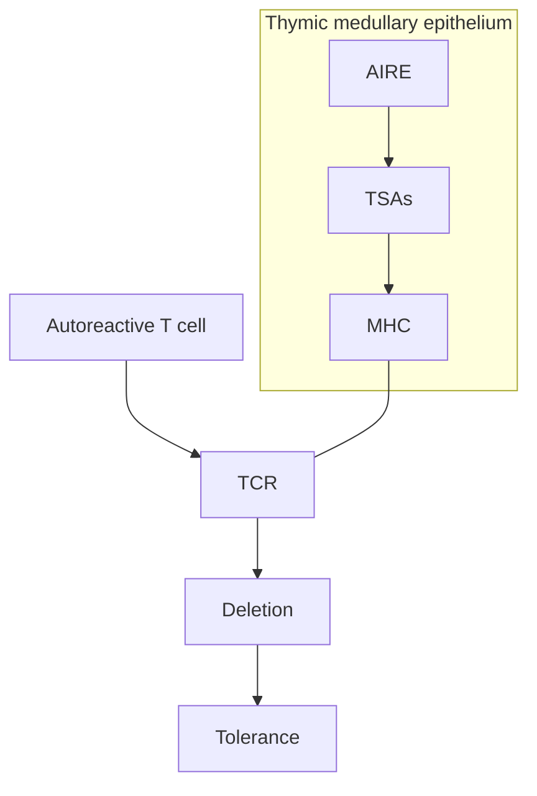

44

# The Immunoendocrinopathy Syndromes

JENNIFER M. BARKER, YUTAKA TAKAHASHI, PETER A. GOTTLIEB,
AND MARK S. ANDERSON

## CHAPTER OUTLINE

* Autoimmunity Primer, 1737
* Natural History of Autoimmune Disorders, 1738
* Autoimmune Polyendocrine Syndrome Type I, 1741
* Autoimmune Polyendocrine Syndrome Type II, 1744
* Other Polyendocrine Deficiency Autoimmune Syndromes, 1746
* Conclusion, 1749

## KEY POINTS

* Endocrine diseases may occur together, and understanding of these associations can lead to earlier diagnosis of additional disorders.
* cells, which is defined as paraneoplastic autoimmune hypophysitis.

* Many autoimmune endocrine diseases have genetic risk at overlapping genetic loci, explaining, in part, their concurrence in individuals.
* Studies of these disorders have uncovered the genetic basis for these rare syndromes and have helped to define important immune pathways.

* Elucidation of the causes of these rare disorders has led to fundamental insights into the functioning of the immune system in autoimmunity.
* The search for means to define endocrine autoimmunity and disease states has led to the development of new assays that have become the cornerstone of endocrine autoimmune testing.

* Ectopic pituitary antigen presentation by the complicated tumor can cause autoimmunity against anterior pituitary
* Recommended testing for these related disorders is discussed in this chapter.

Since Addison’s initial description of primary adrenal insufficiency in a patient with two autoimmune disorders (vitiligo and the hyperpigmentation of Addison disease), the immunoendocrinopathy syndromes have contributed to the understanding of both endocrinology and immunology (Fig. 44.1). Understanding the pathogenesis of the polyendocrine syndromes continues to expand. In particular, shared genetic loci underlying disease susceptibility, potential environmental factors, and organ-specific autoantigens targeted by the immune system are being defined. Recent advances include the development of more reliable T-cell and other immunologic assays, further refinement in predictive models of disease, and continued unraveling of the genetic factors underlying disease susceptibility.

Most autoimmune endocrine disorders (e.g., type 1 diabetes, autoimmune thyroid disease) occur in isolation. Two distinct autoimmune polyendocrine syndromes with characteristic groupings of manifestations are readily recognized. *Autoimmune polyendocrine syndrome type I* (APS-I) is a rare disorder with autosomal-recessive inheritance that is caused by defects in the *autoimmune regulator (AIRE)* gene. In contrast, *autoimmune polyendocrine syndrome type II* (APS-II) is more common but less well defined and includes overlapping groups of disorders. A unifying characteristic within APS-II is the strong association with polymorphic genes of

the human leukocyte antigen (HLA) region located on the short arm of chromosome 6 (band 6p21.3). In addition to HLA, many other genetic loci are likely to contribute to susceptibility to APS-II. For purposes of simplicity in this chapter, APS-II encompasses what some clinicians divide into APS-II (Addison disease plus type 1 diabetes or thyroid autoimmunity), APS-III (thyroid autoimmunity plus other autoimmune diseases, not Addison disease or type 1 diabetes), and APS-IV (two or more other organ-specific autoimmune disorders).

APS-II has also been known by various other names, including Schmidt syndrome, polyglandular autoimmune disease, polyglandular failure syndrome, organ-specific autoimmune disease, and polyendocrinopathy diabetes. Such diverse names reflect the large number of studies and case reports of this syndrome and its historical importance. Each of these other names has some shortcomings, such as failure to include the fact that both hyperfunction and hypofunction of endocrine glands can occur, or failure to recognize that nonendocrine disorders such as pernicious anemia and celiac disease are parts of the syndrome. Studies of patients with APS-II were instrumental in identifying the autoimmune bases of several diseases and developing autoantibody assays such as those for type 1 diabetes and cytoplasmic islet cell antibodies.

This illustration accompanied Addison’s initial description of primary adrenal insufficiency (Addison disease).

\* Fig. 44.1 This illustration accompanied Addison’s initial description of primary adrenal insufficiency (Addison disease). (From Addison T. On the Constitutional and Local Effects of Disease of the Supra-renal Capsules. London, UK: Samuel Highley; 1855.)

Other rare autoimmune endocrine disorders have contributed to an understanding of the development of autoimmunity. For example, the rare disorder called *immunodysregulation polyendocrinopathy enteropathy X-linked syndrome* (IPEX) is caused by a mutation of the *forkhead box P3 (FOXP3)* gene. *FOXP3* plays a central role in the development and function of regulatory CD4⁺ T cells that function to maintain tolerance to self. It has become increasingly recognized that these T cells play a key role in the pathogenesis of many autoimmune diseases, and therapies targeting these cells will likely be developed and tested. A thorough understanding of these rare and often genetically simple disorders provides insight into the development of syndromes that are characterized by polygenic inheritance and that affect a larger group of patients.

## Autoimmunity Primer

An understanding of the pathophysiology of autoimmune disease requires a basic knowledge of the immunologic mechanisms that underlie tolerance (the ability to differentiate self from nonself). Autoimmunity develops when the mechanisms of immune tolerance break down. It can occur centrally at the level of the generative organs (e.g., thymus, bone marrow) or peripherally in the target organs or lymphoid tissues. T lymphocytes and autoantibodies produced by B cells are two arms of the immune system that differ fundamentally in their recognition of target antigens. Autoantibodies react with intact molecules (including both soluble and cell surface molecules) and usually interact with conformational determinants of the autoantigen. In contrast, T lymphocytes recognize peptide fragments of autoantigens, often 8 to 12 amino acids in length, that are presented on the surface of another cell by molecules of the major histocompatibility complex (MHC).

Histocompatibility molecules interact with T-cell receptors when bound with an antigenic peptide. These molecules resemble a hot dog in a bun, with the antigenic peptide (the hot dog) bound in the groove of the histocompatibility molecule (the bun). Histocompatibility molecules are extremely polymorphic, with different amino acids lining the peptide-binding groove. These variable amino acids determine which peptides are bound and presented to T lymphocytes.

T cells differ based on multiple cell surface molecules, and these molecules determine their function in the immune system. T cells interact with other cells within and outside the immune system. CD4⁺ T cells typically react with peptides that are derived from proteins in extracellular compartments that are bound and acquired by class II histocompatibility molecules (HLA-DP, HLA-DQ, or HLA-DR in humans), expressed on antigen-presenting cells (APCs) such as macrophages, dendritic cells, and B lymphocytes. CD8⁺ T cells react with peptides bound by class I histocompatibility molecules (HLA-A, HLA-B, and HLA-C). Class I molecules are present on the surface of almost all nucleated cells. The antigen peptide in this case is derived from proteins expressed endogenously and is presented in a complex by class I HLA by the target cell itself. Recognition of the antigenic peptide by CD8⁺ T cells typically leads to the release of cytotoxic chemicals that kill the target cell.

The T-cell response depends on the context in which the antigen is presented. The simple expression of histocompatibility molecules and recognition of antigen by a T cell are not sufficient for T-cell activation. This context is at least partially determined by the interaction of cell surface molecules on both the T cell and the APC. Interaction among the MHC, the peptide, and the T-cell receptor (signal one) is critical to the activation process; other co-stimulatory molecules then help to define the nature of the immune response (signal two). The context in which the antigens are presented is critical for the determination of this response. Cell surface molecules and receptors, cytokines, and chemokines form the context in which the antigen is presented. Based on this context, the cell can become activated, tolerized, or anergic (immune unresponsive). For example, the APC cell surface molecule CD80 or CD86 engages the CD28 receptor on the T cell and amplifies signal one, which leads to T-cell activation. When a T cell recognizes an antigen in the context of the MHC and does not receive the appropriate second signal, anergy results.

Tolerance induction is a staged process that begins in the thymus during T-cell maturation. This process depends in part on the presence of *peripheral antigens* in the thymus. Peripheral antigens are self-antigens (e.g., insulin) normally expressed in tissues outside the immune system that are expressed at low levels in the thymus. Developing T cells that react strongly to these peripheral molecules in the context of the MHC are deleted in the thymus and are thus removed from the T-cell repertoire in a process known as negative selection. Study of *AIRE* gene knockout mice has supported the importance of these phenomena in the development of autoimmunity. These mice have low levels of expression of peripheral antigens in the thymus and develop lymphocytic infiltrates in multiple organs (see later discussion).

Peripheral tolerance is an important mechanism for tolerance induction after T cells have matured in the thymus. Anergic and regulatory T cells are integral in the development of tolerance for naive T cells. A major population of T-regulatory cells carry the cell surface markers CD4 and CD25 and express FOXP3. The function of the population of CD4⁺/CD25high cells involves an active suppressive activity and relies on the transcription factor FOXP3. Deletion of this transcription factor leads to fulminant autoimmunity in neonates (e.g., neonatal type 1 diabetes and enteropathy), often resulting in death within the first year of life (IPEX syndrome; see later discussion). Another set of key molecules that help control peripheral T-cell tolerance are cytotoxic T-lymphocyte antigen 4 (CTLA4) and programmed death 1 (PD1).¹ CTLA4 is expressed in T cells and acts as a negative regulator of T-cell signaling by competing with the T-cell activator CD28 (described earlier). CTLA4 outcompetes CD28 for binding to its ligands CD80 and CD86 due to its higher affinity for ligand. In addition, CTLA4 is broadly expressed on the surface of FOXP3-expressing CD4⁺ T-regulatory cells, where it likely plays a role in blocking CD28 interactions with CD80 and

Model of the pathogenesis of autoimmunity in polyendocrine disorders diagram showing interactions between Thymus, PAE cells, T cells, B cells, and Target organs with markers for AIRE, APS1, FOXP3, IPEX, HLA, and APC.

\* **Fig. 44.2** Model of the pathogenesis of autoimmunity in polyendocrine disorders. The development of autoimmune disease is determined by a group of T cells that recognize one or more organ-specific epitopes. Peptides are presented in the human leukocyte antigen (*HLA*) molecule and are recognized by the T-cell receptor. Recognition of self molecules depends on the maturation of the T cell, a process that begins in the thymus and continues in the periphery. The transcription factor FOXP3 stimulates the development of CD4⁺/CD25⁺ regulatory T cells. B cells produce autoantibodies under the stimulation of T cells. *AIRE*, autoimmune regulator; *APC*, antigen-presenting cell; *APS1*, autoimmune polyendocrine syndrome 1; *IPEX*, immunodysregulation polyendocrinopathy enteropathy X-linked; *PAE*, peripheral antigen-expressing cell; *Th1*, type 1 helper T cell; *Th2*, type 2 helper T cell. (From Eisenbarth GS, Gottlieb PA. Autoimmune polyendocrine syndromes. *N Engl J Med.* 2004;350:2068–2079.)

CD86. PD1 is yet another co-stimulatory molecule that becomes upregulated on T cells that have been chronically activated, and it confers negative signals through inhibitory signaling domains in its intracytoplasmic tail. The importance of both PD1 and CTLA4 in peripheral tolerance is underscored in knockout mouse models that develop spontaneous multiorgan autoimmunity and in cancer patients treated with antibodies that block their activity where many of these patients develop autoimmune complications (see later discussion).

Cognate help is the process by which B cells are activated by CD4⁺ T cells that are responding to the same antigen. CD4⁺ T cells activate B cells to produce the humoral immune response. This occurs after the CD4⁺ T cell engages an antigen in the context of the MHC on the cell surface of a B cell. The cytokines (interleukin [IL] 4, IL5, and IL6) produced by the CD4⁺ T cells induce the maturation of a B cell. Depending on the cytokine milieu, the B cell will switch from producing immunoglobulin M (IgM) to IgG, IgE, or IgA. The development of B-cell tolerance is partially dependent on this linked recognition: autoreactive B-cell clones that do not have a CD4⁺ T cell that can bind with the antigen in its MHC groove will not normally be activated. Thus, in most cases, the generation of autoantibodies by B cells is also linked to an autoreactive T cell specific for the same self-antigen. Growing evidence supports the role of autoreactive B cells as critical APCs to autoreactive T cells, creating a positive feedback loop in the expansion and maintenance of the autoimmune process.

## Natural History of Autoimmune Disorders

The natural history of autoimmune disorders can be divided into a series of stages beginning with genetic susceptibility, followed by triggering of autoimmunity (e.g., dietary gliadin exposure in celiac disease) and active autoimmunity preceding clinical manifestations (e.g., progressive glandular destruction), and, finally,

overt disease. This is a theoretical construct that may be useful for understanding factors involved with the development of autoimmunity and disease, but of necessity it is simplified and does not reflect the potential relapsing-remitting nature of autoimmunity (Fig. 44.2).

## Genetic Associations

Although there is familial aggregation of APS-II and its component disorders, there is no simple pattern of inheritance (Table 44.1). Susceptibility is probably determined by multiple genetic loci (with HLA having the strongest effect) interacting with environmental factors. Autoimmune diseases share common genetic risk factors, including HLA, the MHC class I–related gene A (*MICA*), the gene for lymphoid tyrosine phosphatase (*PTPN22*), the cytotoxic T lymphocyte–associated antigen 4 (*CTLA4*), and the gene for NACHT leucine-rich repeat protein 1 (*NLRP1*, or *NALP1*).² In addition, genetic susceptibility for some autoimmune diseases has been linked to polymorphisms that are organ specific—for example, polymorphisms in the variable nucleotide tandem repeat upstream from the insulin gene have been associated with risk for type 1 diabetes.³

Genes located on the MHC found on chromosome 6 have been implicated in the pathogenesis of organ-specific autoimmune diseases. These genes are in strong linkage disequilibrium with each other and encode proteins that are important in the function of the immune system. Foremost in importance for the genetics of organ-specific autoimmune diseases are class I and class II HLA genes. Molecular HLA genotyping has revealed many subtypes of the older, serologically defined alleles, and the unique genetic sequence encoding each polymorphic chain of the histocompatibility molecules is now given a unique identifying number. A case in point is the DQ molecule, which is the histocompatibility molecule most strongly associated with endocrine autoimmunity.

<table>
  <thead>
    <tr><th colspan="2">TABLE 44.1 Genetic Associations With Autoimmune Disease</th></tr>
    <tr>
        <th>Gene</th>
        <th>Proposed Mechanism of Action</th>
        <th>Polymorphism/Mutation</th>
        <th>Disease</th>
        <th>Inheritance</th>
    </tr>
  </thead>
  <tbody>
    <tr>
        <td rowspan="5">HLA</td>
        <td rowspan="5">Antigen presentation</td>
        <td>DR3-DQ2/DR4-DQ8</td>
        <td>Type 1 diabetes</td>
        <td rowspan="5">Multigenic</td>
    </tr>
    <tr>
        <td>DR3-DQ2</td>
        <td>Celiac disease</td>
    </tr>
    <tr>
        <td>DR3-DQ2/DRB1*0404-DQ8</td>
        <td>Addison disease</td>
    </tr>
    <tr>
        <td>DR3-DQ2/DR4-DQ8</td>
        <td>Graves disease</td>
    </tr>
    <tr>
        <td>DR3 DR5</td>
        <td>Hypothyroidism</td>
    </tr>
    <tr>
        <td rowspan="3">MICA</td>
        <td rowspan="3">Priming of naive T cells</td>
        <td>5, 5.1</td>
        <td>Type 1 diabetes</td>
        <td rowspan="3">Multigenic</td>
    </tr>
    <tr>
        <td>4, 5.1</td>
        <td>Celiac disease</td>
    </tr>
    <tr>
        <td>5.1</td>
        <td>Addison disease</td>
    </tr>
    <tr>
        <td rowspan="6">PTPN22</td>
        <td rowspan="6">T-cell receptor signaling pathway through interaction with regulatory kinases</td>
        <td rowspan="6">Tryptophan substitution for arginine at position 620</td>
        <td>Type 1 diabetes</td>
        <td rowspan="6">Multigenic</td>
    </tr>
    <tr>
        <td>SLE</td>
    </tr>
    <tr>
        <td>RA</td>
    </tr>
    <tr>
        <td>Graves disease</td>
    </tr>
    <tr>
        <td>Hypothyroidism</td>
    </tr>
    <tr>
        <td>Vitiligo</td>
    </tr>
    <tr>
        <td rowspan="5">CTLA4</td>
        <td rowspan="5">Receptor on activated CD4+ and CD8+ T cells; decreases T-cell activation</td>
        <td>CT60</td>
        <td>Type 1 diabetes</td>
        <td rowspan="5">Multigenic</td>
    </tr>
    <tr>
        <td>CT60; +49A/G</td>
        <td>Graves disease</td>
    </tr>
    <tr>
        <td>CT60; +49A/G</td>
        <td>Hypothyroidism</td>
    </tr>
    <tr>
        <td>++49A/G</td>
        <td>Celiac disease</td>
    </tr>
    <tr>
        <td>++49A/G</td>
        <td>Addison disease</td>
    </tr>
    <tr>
        <td>AIRE</td>
        <td>“Peripheral” antigen presentation in the thymus</td>
        <td>Multiple reported mutations</td>
        <td>APS-I</td>
        <td>Autosomal recessive</td>
    </tr>
    <tr>
        <td>FOXP3</td>
        <td>Transcription factor important for maturation of CD4+/CD25+ regulatory T cells</td>
        <td>Multiple reported mutations</td>
        <td>IPEX</td>
        <td>X-linked</td>
    </tr>
  </tbody>
</table>

AIRE, autoimmune regulator; APS-I, autoimmune polyendocrine syndrome type I; CTLA4, cytotoxic T lymphocyte–associated antigen 4; FOXP3, forkhead box protein 3; HLA, human leukocyte antigen; IPEX, immunodysregulation polyendocrinopathy enteropathy X-linked; MICA, major histocompatibility complex class I–related gene A; PTPN22, the gene for lymphoid tyrosine phosphatase; RA, rheumatoid arthritis; SLE, systemic lupus erythematosus.

A number is assigned for each unique α- and β-chain sequence. Examples are DQA1\*0501 for the α chain and DQB1\*0201 for the β chain of the DQ molecule (also termed *DQ2*) commonly encoded on DR3 (DRB1\*0301) haplotypes. A haplotype consists of a series of alleles of different genes on a contiguous region of a chromosome (e.g., DQA1 and DQB1 alleles) that are inherited together. A genotype is the combination of the haplotypes of both chromosomes. Fine mapping of the HLA has shown remarkable conservation of the HLA-A1/B8/DR3 haplotype such that a region of approximately 2.9 megabases is invariable. Conservation of large areas suggests that these areas of the genome have been inherited without recombination and are in very tight linkage disequilibrium. This greatly complicates the ability to identify which, if any, of the genes within the area of conservation are associated with disease and must be accounted for when assessing susceptibility to disease in this region.

Part of the overlapping risk for autoimmune disease is related to shared genetic susceptibility, especially within the HLA. For example, the highest-risk HLA genotype for type 1 diabetes is DR3-DQ2, DR4-DQ8 (DQ8 = DQA1\*0301-DQB1\*0302). The importance of this HLA genotype in the development of type 1 diabetes is highlighted by the observation that children who inherited the same DR3-DQ2, DR4-DQ8 as a sibling with type 1 diabetes are at greater than 75% risk for development of

autoimmunity by age 12 years and at greater than 50% risk of developing diabetes by 12 years.⁴ A specific DR4 subtype of this gene, DRB1\*0404, shows a strong association with Addison disease.⁵,⁶ The DR3-DQ2 haplotype is associated with celiac disease both in the presence⁷ and absence⁸ of type 1 diabetes. This haplotype has been associated with autoimmune thyroid disease,⁹ although conflicting reports exist.¹⁰

Whereas some HLA alleles increase disease risk, others are associated with protection from disease. For example, the DQ alleles DQA1\*0102-DQB1\*0602 (usually associated with DR2) not only confer strong protection from type 1A diabetes in a dominant fashion¹¹ but also confer susceptibility to another autoimmune disorder—multiple sclerosis. Furthermore, this protection is not general to endocrine autoimmunity, because no protection from Addison disease is afforded by DQB1\*0602. *DP* is another gene within the MHC, and its 0402 polymorphism has been shown to be associated with a decreased risk for type 1 diabetes in subjects with the highest-risk HLA genotype for type 1 diabetes (DR3/DR4).¹² Observations such as these suggest that as more is learned about the genetic influence of disease, researchers will be able to combine different genotypes and refine prediction of autoimmune disease.

MICA produces a protein that is expressed in the thymus and in naive CD8⁺ T cells. Polymorphisms of MICA have been associated

with type 1 diabetes,¹³ celiac disease,¹⁴ and Addison disease.¹⁵ A particular polymorphism of *MICA*, denoted 5.1, results from the insertion of a single base pair. This insertion produces a premature stop codon and a truncated protein. This particular polymorphism has been shown to influence the risk for Addison disease in subjects with autoimmunity associated with Addison disease.

Genes outside the MHC have also been implicated in the pathogenesis of autoimmune disease. For example, the *PTPN22* gene encodes lymphoid tyrosine phosphatase (LYP) protein. LYP, through interactions with regulatory kinases such as CSK, appears to act as an inhibitor of the signal cascade downstream from the T-cell receptor. A specific polymorphism associated with a tryptophan substitution for arginine at position 620 (R620W) blocks LYP’s interaction with CSK.¹⁶ Recent work has suggested that this allele may increase the development of autoreactive B cells¹⁶,¹⁷ and affect intracellular signaling pathways in both T and B cells.¹⁸ This polymorphism has been associated with type 1 diabetes,¹⁹ rheumatoid arthritis,²⁰ systemic lupus erythematosus (SLE),²¹ Graves disease,²² and vitiligo²³ and is weakly associated with Addison disease.²⁴ Furthermore, this disease-associated allele has also been associated with SLE, rheumatoid arthritis, type 1 diabetes, and autoimmune hypothyroidism in families with several members affected by more than one autoimmune disease.²⁴

CTLA4 is expressed on activated CD4⁺ and CD8⁺ T cells, where it is hypothesized to act as a negative regulator as outlined earlier.²⁵ Several polymorphisms within the *CTLA4* gene have been associated with autoimmune diseases. One polymorphism associated with AT repeats has been shown to reduce the inhibitory function of CTLA4 in subjects with Graves disease.²⁶ A single nucleotide polymorphism in the 3′ untranslated region, denoted CT60, has been associated with Graves disease²⁷ and autoimmune hypothyroidism.²⁸ An additional polymorphism, denoted +49A/G, has been associated with celiac disease in the Dutch population,²⁹ with autoimmune thyroid disease,³⁰ and with Addison disease.³¹

*NALP1* regulates the innate immune system. After the initial observation that this gene was associated with the risk of vitiligo³² and other related autoimmune diseases, it was associated with Addison disease and type 1 diabetes.³³

Organ-specific genetic polymorphisms have been associated with the development of specific autoimmune diseases. For example, polymorphisms of the variable number of tandem repeats upstream of the insulin gene have been associated with the development of type 1 diabetes. Higher numbers of tandem repeats are associated with increased production of insulin in the thymus and protection from type 1 diabetes presumably due to improved negative selection of insulin-reactive T cells.³ Similarly, polymorphisms of the thyroglobulin gene are associated with autoimmune thyroid disease.³⁴

Single-gene defects such as *AIRE* and *FOXP3* cause multiorgan autoimmunity and are discussed in sections devoted to those topics. Analysis of mutations of the *AIRE* gene indicates that it generally does not play a role in APS-II or sporadic Addison disease, with 1 (1.1%) in 90 patients with Addison disease (non–APS-I) and 1 (0.2%) in 576 control subjects having *AIRE* mutations.³¹

## Environmental Triggers

Although genetics is known to play an important role in the development of autoimmunity, it does not tell the whole story. For example, the highest-risk HLA genotype for type 1 diabetes (DR3-DQ2, DR4-DQ8) is associated with a risk of 1 in 20

for the development of diabetes.³⁵ Although this is greater than the general population prevalence rate of 1 in 200 by the age of 20 years, it is certainly not a 100% risk. Therefore, other factors (genetic and environmental) must be involved in the initiation of autoimmunity. Some theorize that these factors may be environmental triggers.

For one disease, celiac disease, the underlying environmental trigger has been identified: gluten. Through studies such as DAISY (the Diabetes Autoimmunity Study in the Young), BabyDiab, and CEDAR (Celiac Disease Autoimmunity Research), the timing of first exposure to cereal has been identified as a risk factor for the development of diabetes and celiac disease autoimmunity. Infants exposed at a very young age to cereal developed diabetes and celiac-associated autoimmunity at a greater rate than those who had cereal introduced at a later date.³⁶⁻³⁸ In epidemiologic studies, cod liver oil consumption has been associated with a decreased risk for type 1 diabetes. Cod liver oil contains omega-3 polyunsaturated fats and vitamin D. In prospective studies, there is some suggestion that lower consumption of omega-3 polyunsaturated fats is associated with an increased risk for autoimmunity associated with type 1 diabetes.³⁹ Further investigation may identify additional environmental associations. Changes in our diet, our food composition, and use of medicines such as antibiotics have the potential to change our gut flora and microbiome. Animal studies suggest that changes in the gut microbiome can affect disease in these models of autoimmunity.⁴⁰,⁴¹ Human evidence is being sought to determine whether the interaction between the microbiome and innate immunity is leading to increased inflammation and setting the stage for increased frequencies of all autoimmune disorders that have recently been observed.⁴²,⁴³

Virus and other infections have been considered as a cause of autoimmunity and have been shown to cause the development of type 1 diabetes when infection occurs in utero for rubella, for example. Examination of pancreata from individuals with prediabetes (autoantibodies) or those with diabetes has provided evidence consistent with viral infection of the organ.⁴⁴,⁴⁵ Association is not causality, and further experiments are needed to determine whether this finding is an important component of how either autoimmunity is initiated or propagated.

Targeted immunologic therapies are also associated with the induction of autoimmunity. A remarkable example is the treatment of patients with multiple sclerosis with an anti-CD52 monoclonal antibody. One-third of 27 patients given the monoclonal antibody developed antithyrotropin receptor autoantibodies and hyperthyroidism.⁴⁶ Interferon-α (IFNα) therapy for hepatitis has been associated with thyroid autoimmunity⁴⁷ and type 1 diabetes.⁴⁸ Severe hypoglycemia associated with insulin autoantibodies in the absence of insulin administration, termed *Hirata disease*, is associated with methimazole treatment of Graves disease. The development of Hirata disease in these patients is associated with HLA-Bw62/Cw4/DR4 with a specific DRB1 allele (DRB1*0406).⁴⁹ Immune checkpoint blockade is now an approved treatment approach for several cancers, and these antibodies that block CTLA4 or PD1 on T cells have both been associated with the induction of autoimmune complications in a subset of patients. These autoimmune complications are broad but now include the induction of endocrine-related autoimmunity including thyroiditis, type 1 diabetes, lymphocytic hypophysitis, and adrenalitis.⁵⁰

As seen in paraneoplastic neurologic syndrome, ectopic expression of organ-specific antigen in the tumor can break immune tolerance and cause specific autoimmunity.⁵⁰ᵃ Recently,

a paraneoplastic autoimmune condition has been described, characterized by isolated ACTH deficiency and anti-PIT-1 hypophysitis.50b

## Development of Organ-Specific Autoimmunity

Autoantibodies highly specific for a given disorder are present before disease onset. Each specific autoantibody reacts with only a single autoantigen, although autoantigens may be present in multiple tissues. The targets of autoantibodies appear to be unrelated; however, for organ-specific autoimmunity, they are usually expressed in specific cells and cellular sites. Anti-islet antibodies include antibodies to glutamic acid decarboxylase (GAD); islet cell antibody (ICA) 512 (also termed *insulinoma antigen 2* [IA2]); insulin; and, the most recently discovered, ZnT8.51 Celiac disease is associated with antibodies against tissue transglutaminase (tTG). Addison disease is associated with antibodies against 21-hydroxylase.

Given that the antibodies can be identified before the development of organ dysfunction, they can be used to screen subjects who are at high risk for development of autoimmune disease to identify risk for additional autoimmune diseases. This approach has been employed in studies such as TrialNet for type 1 diabetes to screen first-degree relatives of patients with type 1 diabetes for diabetes-related autoantibodies. In this and other cohorts, risk for development of diabetes increases with the number of autoantibodies and their persistence.

Organ-specific autoantibodies (identified with appropriate assays) are rarely present (approximately 1 in 100) in the general population and identify a subset of people who are at greater risk for clinical disease. These autoantibodies may be expressed for years before the disease develops, and additional autoantibodies can develop over time. The pace at which disease develops is highly variable. For example, children as young as 1 year can present with type 1 diabetes. In contrast, a subset of subjects (5%–10%) with type 2 diabetes diagnosed in adulthood have autoimmunity as the underlying cause. This may be due in part to genetics, because subjects who develop autoimmune diabetes at an older age have a higher proportion of the protective diabetes allele DQB1\*0602, although even in adults, DQB1\*0602 provides dramatic protection.52

In contrast, less is known concerning the specificity of pathogenic T cells. Given the observation that cross-reactive recognition by pathogenic T-cell clones may be determined by as few as four properly spaced amino acids of a nonapeptide and the estimate that each T-cell receptor might react with a million different peptides, there is considerable potential for patterns of autoimmunity to be determined by cross-reactive T cells. An important development has been the discovery in the thymus and other lymphoid tissues of peripheral antigen-expressing cells that express autoantigens such as insulin. Minute quantities of such molecules in the thymus can contribute to tolerance. Insulin messenger RNA in the thymus is regulated by genetic polymorphisms of the insulin gene associated with diabetes risk.3 There is also evidence that stromal and lymphoid cells (CD11c+) in the spleen, lymph nodes, and circulation express multiple similar antigens.53

## Failure of Gland

Organ dysfunction develops over time and can include a period of intermediate function that may be characterized by increased

levels of the stimulatory hormones (e.g., thyroid-stimulating hormone, corticotropin [ACTH]) with normal levels of certain hormones (triiodothyronine, thyroxine, and cortisol). Once a significant portion of the gland has been destroyed, overt disease is then present.

# Autoimmune Polyendocrine Syndrome Type I

## Clinical Features

Table 44.2 compares the features of APS-I with those of APS-II. Table 44.3 shows the clinical features and recommended follow-up for patients with APS-I. Note some of the distinctions in the pattern of disease features of the two syndromes, particularly the propensity for hypoparathyroidism and candidiasis in APS-I, which is virtually absent in APS-II. Likewise, celiac disease is frequently observed in APS-II but is not seen in APS-I.

APS-I (Mendelian Inheritance in Man [MIM] 240300), also known as *autoimmune polyendocrinopathy-candidiasis-ectodermal dystrophy*, or APECED, is characterized by the classic triad of mucocutaneous candidiasis, autoimmune hypoparathyroidism, and Addison disease, which form three of the most common components of the disorder. Patients with APS-I are at risk for the development of autoimmune diseases affecting almost every organ. Multiple patient series have been reported, including subjects in two large series from both Finland54–56 and the United States.57,58

In a series of 89 Finnish patients described by Perheentupa,54 all had chronic candidiasis at some time, 86% had hypoparathyroidism, and 79% had Addison disease. Gonadal failure (72% in women, 26% in men) and hypoplasia of the dental enamel (77% of patients) were also frequent findings. Other manifestations that occurred less often included alopecia (40%), vitiligo (26%), intestinal malabsorption (18%), type 1 diabetes (23%), pernicious anemia (31%), chronic active hepatitis (17%), and hypothyroidism

<table>
  <thead>
    <tr>
        <th colspan="3">TABLE 44.2 Contrasting Features of Autoimmune Polyendocrine Syndrome</th>
    </tr>
    <tr>
        <th>Feature</th>
        <th>APS-I</th>
        <th>APS-II</th>
    </tr>
  </thead>
  <tbody>
    <tr>
        <td>Inheritance pattern</td>
        <td>Autosomal recessive (only siblings affected)</td>
        <td>Polygenic (multiple generations affected)</td>
    </tr>
    <tr>
        <td>Associated gene</td>
        <td>AIRE gene mutation</td>
        <td>HLA-DR3 and DR4 associated</td>
    </tr>
    <tr>
        <td>Gender association</td>
        <td>Equal gender incidence</td>
        <td>Female preponderance</td>
    </tr>
    <tr>
        <td>Age at onset</td>
        <td>Onset in infancy</td>
        <td>Peak onset 20–60 years</td>
    </tr>
    <tr>
        <td>Clinical features</td>
        <td>Mucocutaneous candidiasis</td>
        <td>Type 1 diabetes</td>
    </tr>
    <tr>
        <td> </td>
        <td>Hypoparathyroidism</td>
        <td>Autoimmune thyroid disease</td>
    </tr>
    <tr>
        <td> </td>
        <td>Addison disease</td>
        <td>Addison disease</td>
    </tr>
    <tr>
        <td>Diagnostic antibodies</td>
        <td>Anti-interferon</td>
        <td> </td>
    </tr>
  </tbody>
</table>

APS, autoimmune polyendocrine syndrome.

# TABLE 44.3 Clinical Features and Recommended Follow-Up for APS-I and APS-II

<table>
  <thead>
    <tr>
        <th>Component Disease</th>
        <th>Frequency at Age 40 Years (%)</th>
        <th>Recommended Evaluation</th>
    </tr>
  </thead>
  <tbody>
    <tr>
        <td colspan="3"><u>Autoimmune Polyendocrine Syndrome Type I</u></td>
    </tr>
    <tr>
        <td>Addison disease</td>
        <td>79</td>
        <td>Sodium, potassium, ACTH, cortisol, plasma renin activity, 21-hydroxylase autoantibodies</td>
    </tr>
    <tr>
        <td>Diarrhea</td>
        <td>18</td>
        <td>History</td>
    </tr>
    <tr>
        <td>Ectodermal dysplasia</td>
        <td>50–75</td>
        <td>Physical examination</td>
    </tr>
    <tr>
        <td>Hypoparathyroidism</td>
        <td>86</td>
        <td>Serum calcium, phosphate, PTH</td>
    </tr>
    <tr>
        <td>Hepatitis</td>
        <td>17</td>
        <td>Liver function test</td>
    </tr>
    <tr>
        <td>Hypothyroidism</td>
        <td>18</td>
        <td>TSH; thyroid peroxidase and/or thyroglobulin autoantibodies</td>
    </tr>
    <tr>
        <td>Male hypogonadism</td>
        <td>26</td>
        <td>FSH/LH</td>
    </tr>
    <tr>
        <td>Mucocutaneous candidiasis</td>
        <td>100</td>
        <td>Physical examination</td>
    </tr>
    <tr>
        <td>Obstipation</td>
        <td>21</td>
        <td>History</td>
    </tr>
    <tr>
        <td>Ovarian failure</td>
        <td>72</td>
        <td>FSH/LH</td>
    </tr>
    <tr>
        <td>Pernicious anemia</td>
        <td>31</td>
        <td>CBC, vitamin B12 levels</td>
    </tr>
    <tr>
        <td>Splenic atrophy</td>
        <td>15</td>
        <td>Blood smear for Howell-Jolly bodies; platelet count; ultrasound if positive</td>
    </tr>
    <tr>
        <td>Type 1 diabetes</td>
        <td>23</td>
        <td>Glucose, hemoglobin A1c, diabetes-associated autoantibodies (insulin, GAD65, IA2)</td>
    </tr>
    <tr>
        <td colspan="3"><u>Autoimmune Polyendocrine Syndrome Type II</u>a</td>
    </tr>
    <tr>
        <td>Addison disease</td>
        <td>0.5</td>
        <td>21-Hydroxylase autoantibodies</td>
    </tr>
    <tr>
        <td> </td>
        <td> </td>
        <td>ACTH stimulation testing if positive</td>
    </tr>
    <tr>
        <td>Alopecia</td>
        <td> </td>
        <td>Physical examination</td>
    </tr>
    <tr>
        <td>Autoimmune hypothyroidism</td>
        <td>15–30</td>
        <td>TSH; thyroid peroxidase and/or thyroglobulin autoantibodies</td>
    </tr>
    <tr>
        <td>Celiac disease</td>
        <td>5–10</td>
        <td>Transglutaminase autoantibodies; small intestine biopsy if positive</td>
    </tr>
    <tr>
        <td>Cerebellar ataxia</td>
        <td>Rareb</td>
        <td>Dictated by signs and symptoms of disease</td>
    </tr>
    <tr>
        <td>Chronic inflammatory demyelinating polyneuropathy</td>
        <td>Rareb</td>
        <td>Dictated by signs and symptoms of disease</td>
    </tr>
    <tr>
        <td>Hypophysitis</td>
        <td>Rareb</td>
        <td>Dictated by signs and symptoms of disease</td>
    </tr>
    <tr>
        <td>Idiopathic heart block</td>
        <td>Rareb</td>
        <td>Dictated by signs and symptoms of disease</td>
    </tr>
    <tr>
        <td>IgA deficiency</td>
        <td>0.5</td>
        <td>IgA level</td>
    </tr>
    <tr>
        <td>Myasthenia gravis</td>
        <td>Rareb</td>
        <td>Dictated by signs and symptoms of disease</td>
    </tr>
    <tr>
        <td>Myocarditis</td>
        <td>Rareb</td>
        <td>Dictated by signs and symptoms of disease</td>
    </tr>
    <tr>
        <td>Pernicious anemia</td>
        <td>0.5–5</td>
        <td>Anti–parietal cell autoantibodies</td>
    </tr>
    <tr>
        <td> </td>
        <td> </td>
        <td>CBC, vitamin B12 levels if positive</td>
    </tr>
    <tr>
        <td>Serositis</td>
        <td>Rareb</td>
        <td>Dictated by signs and symptoms of disease</td>
    </tr>
    <tr>
        <td>Stiff-man syndrome</td>
        <td>Rareb</td>
        <td>Dictated by signs and symptoms of disease</td>
    </tr>
    <tr>
        <td>Vitiligo</td>
        <td>1–9</td>
        <td>Physical examination</td>
    </tr>
  </tbody>
</table>

\*aIn the population with type 1 diabetes.

\*bRare reported disorders in subjects with APS-II.

\*ACTH, adrenocorticotropic hormone; APS, autoimmune polyendocrine syndrome; CBC, complete blood count; FSH, follicle-stimulating hormone; GAD, glutamic acid decarboxylase; IA2, insulinoma antigen

\*2; IgA, immunoglobulin A; LH, luteinizing hormone; PTH, parathyroid hormone; TSH, thyroid-stimulating hormone.

(18%). The incidence rates for many of these disorders peak in the first or second decade of life, and the disease continues to develop over decades (Fig. 44.3). Therefore, reported prevalence rates of component disorders are highly dependent on the age at which follow-up ended.

APS-I is characteristically recognized in early childhood. Infants can present with chronic or recurrent mucocutaneous candidiasis in the first year of life, followed by hypoparathyroidism and Addison disease, but new components can develop at any age. Decades can elapse between the diagnosis of one disorder and the onset of another in the same patient. Consequently, lifelong follow-up is important to allow early detection of additional components.

Recurrent candidiasis commonly affects the mouth and nails and, less frequently, the skin and esophagus.⁵⁴ Chronic oral candidiasis can result in atrophic disease with areas suggestive of leukoplakia. If this develops, the patient is at significant risk for carcinoma of the oral mucosa (with its high mortality rate).

Ectodermal dystrophy is another component of the syndrome (manifested by pitted nails, keratopathy, and enamel hypoplasia) and cannot be attributed to hypoparathyroidism. Enamel hypoplasia can precede the onset of hypoparathyroidism and, despite adequate replacement therapy, can also affect teeth forming after the onset of hypoparathyroidism.⁵⁹

Friedman and colleagues⁶⁰ reported the frequent occurrence of asplenism and cholelithiasis as additional features of APS-I. Splenic atrophy may also cause immune deficiency. Although the cause of this part of the disorder is unknown, it is relatively common: up to 15% of patients are asplenic.⁵⁴ The presence of Howell-Jolly bodies on peripheral blood smear is suggestive of asplenia. If asplenia is identified, immunization with polyvalent pneumococcal vaccine should be administered, and follow-up antibody titers should be obtained. If an adequate response is not produced, daily prophylactic antibiotics may be necessary.

Malabsorption with steatorrhea is of uncertain origin, is usually intermittent, and may be exacerbated by hypocalcemia. Bereket and associates⁶¹ reported a case in which patchy intestinal lymphangiectasia was discovered by endoscopically directed biopsy. Pancreatic insufficiency has been treated with cyclosporine.⁶² Autoantibodies (e.g., tryptophan hydroxylase, histidine decarboxylase) reacting with intestinal endocrine cells (enterochromaffin, cholecystokinin, and enterochromaffin like) occur and are associated with loss of endocrine cells on biopsy and with gastrointestinal dysfunction.⁶³,⁶⁴

<table>
  <thead>
    <tr>
        <th>Age</th>
        <th>Mucocutaneous candidiasis</th>
        <th>Addison disease</th>
        <th>Ovarian atrophy</th>
        <th>Hypoparathyroidism</th>
        <th>Diabetes mellitus</th>
    </tr>
  </thead>
  <tbody>
    <tr>
        <td>0</td>
        <td>0.04</td>
        <td>0</td>
        <td>0</td>
        <td>0</td>
        <td>0</td>
    </tr>
    <tr>
        <td>10</td>
        <td>0.08</td>
        <td>0.04</td>
        <td>0.02</td>
        <td>0.22</td>
        <td>0.02</td>
    </tr>
    <tr>
        <td>20</td>
        <td>0.06</td>
        <td>0.05</td>
        <td>0.02</td>
        <td>0.08</td>
        <td>0.01</td>
    </tr>
    <tr>
        <td>30</td>
        <td>0.03</td>
        <td>0.02</td>
        <td>0.06</td>
        <td>0.01</td>
        <td>0.01</td>
    </tr>
    <tr>
        <td>40</td>
        <td>0.04</td>
        <td>0.01</td>
        <td>0.10</td>
        <td>0.02</td>
        <td>0.01</td>
    </tr>
  </tbody>
</table>

• **Fig. 44.3** Incidence of disease development by age in patients with autoimmune polyendocrine syndrome type I (APS-I). (From Perheentupa J. APS-I/APECED: the clinical disease and therapy. *Endocrinol Metab Clin North Am.* 2002;31:295–320.)

## Genetics

APS-I is inherited in a classic mendelian autosomal-recessive fashion and is caused by mutations in the *AIRE* gene, located on the short arm of chromosome 21 (near markers D21s49 and D21s171 on 21p22.3).⁶⁵ The gene encodes a transcriptional regulator protein that is highly expressed in antigen-presenting epithelial cells in the thymus and in a small subset of cells in lymphoid tissues.⁶⁶,⁶⁷ It has been localized to the nucleus, and mutations have been demonstrated to be associated with decreased transcription of reporter products.⁶⁸,⁶⁹ A mouse model of APS-I has been generated, and *Aire* knockout mice also spontaneously develop autoimmune features. Detailed analyses of antigen-presenting epithelial cells in the thymus of *Aire* knockout mice have shown that these cells have decreased expression of peripheral *tissue-specific self-antigens* (TSAs) and that *Aire* promotes the expression of thousands of such self-antigens in these cells.⁶⁶ Furthermore, autoreactive T cells with specificity to these TSAs can escape thymic deletion when *Aire* is defective and promote autoimmunity.⁷⁰⁻⁷² Thus, *Aire* appears to act as a transcriptional activator that promotes the expression of a wide array of TSAs in the thymus to promote central tolerance (Fig. 44.4).

Multiple mutations of *AIRE* have been identified in subjects with APS-I. The frequency of specific mutations varies in different populations. For example, in Sardinia, a deletion of amino acid 257 is present in 90% of mutated alleles. A 136–base pair deletion in exon 8 is present in 71% of British alleles and in 56% of alleles in the United States. Analysis of haplotypes indicates that this deletion has arisen on many occasions.

Most cases of APS-I are associated with autosomal-recessive inheritance patterns; however, there are now reports of autosomal-dominant inheritance. A rare kindred of patients from Italy have a mutation in the SAND domain of the AIRE protein (G228W) that when present in the heterozygous state is associated with

• **Fig. 44.4** The autoimmune regulator (*AIRE*) gene functions to maintain tolerance by promoting the display of self-antigens in the thymus. An AIRE-expressing thymic medullary epithelial cell is shown (*left*). AIRE operates in the nucleus to promote the expression of thousands of different tissue-specific self-antigens (TSAs) that include many endocrine organ-specific proteins such as insulin. Peptide fragments of these TSAs are displayed on major histocompatibility complex (MHC) molecules to help promote the deletion of autoreactive T cells (*right*) that can be generated in the thymus from random gene rearrangement of the T-cell receptor (TCR). Such T cells are deleted when they encounter their antigen-MHC in the thymus, and thus immune tolerance is maintained.

autoimmunity, thus fitting an autosomal dominant inheritance pattern.⁷³ In a mouse model of this mutation, the expression of TSAs in the thymus was decreased compared with that in the control model, suggesting a mechanism for this observed inheritance pattern.⁷⁴ In addition, point mutations in the PHD1 domain of AIRE have now been associated with a dominant inheritance pattern.⁷⁵ In all cases, the molecular explanation could be related to the observation that AIRE forms multimers through its N-terminal domain, and thus mutations in other domains could still allow for multimerization with a wild-type copy of AIRE and a dominant-negative effect in AIRE activity. The autoimmune phenotype in this group of patients appears to be milder with the development of fewer autoimmune features or even a single disease feature that likely reflects partial AIRE activity in these patients.

## Diagnosis

The diagnosis of APS-I is highly likely when two or more of the primary component disorders (i.e., mucocutaneous candidiasis, hypoparathyroidism, and Addison disease) are present. Siblings of an affected patient should be considered affected even if only one of these disorders is present. Sequence analysis of AIRE for mutations may be helpful in identifying subjects with APS-I. Any patient with any of the component disorders deserves careful follow-up to watch for the development of additional disease.

Autoantibodies against IFNα and IFNω have been identified in almost 100% of subjects with APS-I, regardless of age at screening.⁷⁶ The autoantibody has been found in subjects with many different mutations of the AIRE gene; it is not present in other autoimmune diseases, and it has been proposed to use this autoantibody to screen subjects with multiple autoimmune diseases for APS-I. It is unclear if antibodies to these type 1 IFNs are of any clinical consequence, as APS-I subjects do not have an increased propensity for viral infections.⁵⁴ In contrast, it has also been shown that many APS-I subjects also harbor autoantibodies to IL17A, IL17F, and IL22.⁷⁷,⁷⁸ These are key cytokines for the function of the Th17 T-cell subset, and recent work has demonstrated that loss of function of these cytokines, as in patients with mutations in the IL17 receptor, is associated with increased susceptibility to *Candida albicans* infections.⁷⁹ Thus, it appears that the Candida susceptibility in APS-I may be due to an autoimmune response against this effector cytokine family.

## Therapy and Follow-Up

The treatment of adrenal insufficiency and hypoparathyroidism is the same as that discussed in other chapters, with the caveat that malabsorption can complicate treatment. The therapy for mucocutaneous candidiasis has been improved with the use of orally active antifungal drugs such as fluconazole and ketoconazole. Infection often recurs when the drug is discontinued or the dosage is decreased. Patients must be monitored carefully, because ketoconazole can inhibit adrenal and gonadal steroid synthesis and can precipitate adrenal failure. It is also associated with transient elevation of liver enzyme levels and, occasionally, with hepatitis. Fluconazole is associated with a lower frequency of hepatitis and does not inhibit steroidogenesis when given in the recommended doses.

Autoantibodies associated with multiple autoimmune diseases have been reported. Antiparathyroid and antiadrenal antibodies have been reported. Whereas 21-hydroxylase appears to be the major autoantigen in isolated Addison disease and in Addison disease associated with APS-II, autoantibodies against 17α-hydroxylase and cytochrome P450 side-chain cleavage enzyme (CYP11A1) have also been reported in Addison disease associated with APS-I.⁸⁰ There have been reports of antibodies to tryptophan hydroxylase in intestinal disease, tyrosine hydroxylase in alopecia areata, L-amino acid decarboxylase in hepatitis and vitiligo, phenylalanine hydroxylase,⁸¹,⁸² and antibodies reacting with hair follicles.⁸³ Tuomi and coworkers⁸⁴ originally observed that many more APS-I patients (41%) express anti-GAD65 autoantibodies than become diabetic, suggesting that reactivity to this single autoantigen has low predictive value in this population. Antibodies against NALP5 were identified in 49% of patients with APS-I and hypoparathyroidism compared with none of those with APS-I but no hypoparathyroidism.⁸⁵ Screening for autoantibodies associated with additional autoimmune diseases may be useful in patients with APS-I.

Screening to allow the early detection of new disorders before overt symptoms and signs develop is recommended, including autoantibody studies, electrolytes, calcium and phosphorus levels, thyroid and liver function tests, blood smear, and plasma vitamin B₁₂. Patients at risk for adrenal failure can be screened by measurement of basal ACTH and supine plasma renin activity, followed by dynamic testing as appropriate. Evaluation for asplenism⁶⁰ with abdominal ultrasonography and blood smear examination for Howell-Jolly bodies is warranted, with pneumococcal vaccination and appropriate antibiotic coverage for affected patients.

There are case reports of severely affected patients who have benefited from immunosuppressive therapy. For example, Ward and colleagues⁶² treated a 13-year-old patient who had keratoconjunctivitis, hepatitis, and severe pancreatic insufficiency. Treatment with cyclosporine was associated with normalization of stool fat (from 31.5 to 2.5 g/day).

# Autoimmune Polyendocrine Syndrome Type II

## Clinical Features

APS-II (MIM 269200) is defined by the occurrence in the same patient of two or more of the following: primary adrenal insufficiency (Addison disease), Graves disease, autoimmune thyroiditis, type 1A diabetes, primary hypogonadism, myasthenia gravis, and celiac disease. Vitiligo, alopecia, serositis, and pernicious anemia also occur with increased frequency in patients with this syndrome and in their family members (see Table 44.3). APS-II is more common than APS-I. It occurs more often in female than in male patients, often has its onset in adulthood, and exhibits familial aggregation (see Table 44.2).

When one of the component disorders is present, an associated disorder occurs more commonly than in the general population. Furthermore, circulating organ-specific autoantibodies are often present even in the absence of overt clinical disease. For example, in subjects with type 1 diabetes, there is a 15% to 20% risk of hypothyroidism, a 5% to 10% risk of celiac-related autoimmunity, and a 1.5% risk of adrenal autoimmunity. The risk of autoimmunity is greater in relatives of patients with APS-II. In our assessment of APS-II families with Addison disease, up to 15% of relatives were found to have 21-hydroxylase autoantibodies (Addison disease–associated autoantibodies), anti-islet autoantibodies, or tTG autoantibodies (celiac disease–associated autoantibodies). The initial lesion and precipitating events that result in

the syndrome are unknown, but immunogenetic and immuno-logic similarities are present with regard to both the time course and the pathogenesis of each of the component disorders.

Because of the chronic development of organ-specific auto-immunity, patients with the syndrome and their families should have repeated endocrinologic evaluations over time. In a family in which the syndrome has been documented, relatives should be advised of the early symptoms and signs of the principal component diseases (a list is available from the Barbara Davis Center for Diabetes website⁸⁶). Relatives of patients with multiple disorders should have a medical history, physical examination, and screening every 3 to 5 years, with measurement of anti-islet autoantibodies, a sensitive thyrotropin assay, and measurement of serum vitamin B₁₂ levels. If there are any symptoms or signs, or if 21-hydroxylase autoantibodies are present, the patient should have annual assays of basal ACTH levels with Cortrosyn stimulation testing.

Among 224 patients with Addison disease and APS-II reported by Neufeld and colleagues,⁵⁷ type 1 diabetes and autoimmune thy-roid disease were the most common coexisting conditions (52% and 69% of patients, respectively). Other components were less common, including vitiligo (5%) and gonadal failure (4%). In an Italian cohort of more than 600 patients, the majority of patients with Addison disease (86.7%, after exclusion of subjects with APS-I) had additional autoimmunity diseases, most frequently thyroid disease (56%) and diabetes (12%). A significant proportion of subjects exhibited thyroid-related (16%) and diabetes-related (8.8%) autoimmunity without yet developing disease over average follow-up of 10 years.⁸⁷ Therefore, careful monitoring of patients with Addison disease for additional autoimmune diseases including thyroid, type 1A diabetes, and premature ovarian insufficiency is warranted.

Among patients with type 1A diabetes, thyroid autoimmu-nity and celiac disease coexist with sufficient frequency to justify screening. Thyroid peroxidase autoantibodies are present in 10% to 20% of children with type 1 diabetes; this incidence is higher in female patients and increases in all patients with age and with diabetes duration. A significant fraction of patients with type 1 diabetes and thyroid peroxidase autoantibodies develop thyroid disease. One study showed that after follow-up for more than 15 years, 80% of patients with thyroid peroxidase autoantibodies and type 1 diabetes became hypothyroid.⁸⁸ However, several studies have shown that a subset of patients with negative autoantibodies develop thyroid disease. Therefore, patients with type 1 diabetes should be screened annually for thyrotropin levels, which is a cost-effective approach.

With the identification of tTG as the major endomysial auto-antigen of celiac disease, radioimmunoassays were developed and demonstrated that 10% to 12% of patients with type 1 diabe-tes have tTG autoantibodies.⁷ The prevalence of tTG autoanti-bodies was higher in diabetic patients with HLA-DQ2; one-third of DQ2-homozygous subjects were found to express anti-tTG antibody, reflective of the influence of HLA-DQ2 in the develop-ment of both type 1 diabetes and celiac disease. Seventy percent of those with high-titer antibody who underwent biopsy were subse-quently found to have the disease.⁸⁹ Celiac disease may be identi-fied at onset of type 1 diabetes. However, it can develop in patients with long-standing diabetes as well and in at least one cohort has been shown to be increased in patients with adult-onset type 1 diabetes compared with childhood onset.⁹⁰ If left untreated, symptomatic celiac disease is also associated with an increased risk of gastrointestinal malignancy, especially lymphoma. Survival analysis in patients with type 1 diabetes and celiac disease shows

an increase in mortality rate in patients with type 1 diabetes and celiac disease duration of greater than 15 years.⁹¹ Frequency and method of screening remain areas of debate. At the very least, pro-viders should be aware of the association and have a low threshold for screening with tTG antibodies. If the results are positive and are confirmed on repeat assay, small bowel biopsy to document celiac disease is warranted, with institution of a gluten-free diet if the disease is present. Many patients have asymptomatic celiac dis-ease that is nevertheless associated with osteopenia and impaired growth.

## Diagnosis

The diagnosis of APS-II requires an understanding of the risk for additional autoimmune diseases in patients with a single auto-immune endocrine disorder. A thorough history and physical examination may identify symptoms or signs of an additional autoimmune disorder. Screening for disease can include screening for markers of the autoimmune diseases (organ-specific autoanti-bodies) and assays of glandular function (e.g., thyrotropin levels).

Improved assays for several organ-specific autoantibodies have been developed since the cloning of specific autoantigens and the development of assays that use recombinant antigens. These radioimmunoassays are superior to assays based on immuno-fluorescence with tissue sections, such as ICA testing. The most notable finding is the identification of multiple autoantigens tar-geted even in single autoimmune disorders. Most of the endocrine autoantigens are hormones (e.g., insulin) or enzymes associated with differentiated endocrine function: thyroid peroxidase in thy-roiditis; GAD, carboxypeptidase H, and ICA 512/IA2 in type 1 diabetes; 17α-hydroxylase and 21-hydroxylase in Addison disease; and the parietal cell enzyme H⁺/K⁺-adenosine triphosphatase in pernicious anemia.

In type 1 diabetes, the four most informative assays identify autoantibodies reacting with insulin, GAD65, ICA512/IA2, and ZnT8.⁵¹ Similarly, a radioassay for autoantibodies against the enzyme 21-hydroxylase in Addison disease has been developed and provides excellent disease specificity and sensitivity. Adre-nal autoantibodies reacting with recombinant 21-hydroxylase usually precede the development of Addison disease. Screening with 21-hydroxylase autoantibodies may identify patients with antibodies but have normal production of cortisol in response to ACTH. Annual screening with a basal level of corticotropin with follow-up cosyntropin stimulation testing is an effective strategy for identifying adrenal insufficiency in patients with 21-hydroxy-lase autoantibodies.

Typically, autoantibodies mark the presence of or risk for auto-immune disease caused by T-cell–mediated glandular destruction. However, autoantibodies may also be pathogenic. A hallmark of pathogenic autoantibodies is the existence of a neonatal form of the disorder, secondary to transplacental passage of the autoan-tibody. Examples include neonatal Graves disease (anti–thyro-tropin-receptor autoantibodies) and neonatal myasthenia gravis (anti–acetylcholine-receptor autoantibodies).

## Therapy

Treatment of the individual diseases of the polyendocrine autoim-mune syndrome is discussed in other chapters. Therapeutic con-siderations related specifically to APS-II are discussed here.

Many of the component disorders of the syndrome have a long prodromal phase and are associated with the expression of

autoantibodies before the manifestation of overt disease. Therefore, people at risk for autoimmune diseases can be identified before the clinical onset of disease, and if the right treatment were identified, disease may be preventable. This is particularly important for type 1A diabetes but is also likely to apply to Addison disease and hypogonadism.

Prevention strategies have been extensively evaluated in patients with type 1 diabetes. Prevention of disease can occur at multiple time points along the natural history of evolving $\beta$-cell dysfunction. Treatments targeted at patients with genetic risk without evidence for autoimmunity will expose people who will never get disease to an intervention (primary prevention). Therefore, any intervention must be safe and easily administered. Prevention trials in patients with diabetes-related autoantibodies before abnormalities of glucose metabolism (secondary prevention) can employ agents with higher risks of adverse events. Tertiary prevention of diabetes employs immune-modulating agents for the preservation of the $\beta$-cell mass with the hopes of inducing a prolonged C-peptide production.

Primary prevention of type 1 diabetes targets infants at the highest risk for the development of type 1 diabetes on the basis of family history or specific HLA genotypes. Infants must be negative for diabetes-related autoantibodies. Interventions have focused on dietary manipulations, including gluten-free diets, docosahexaenoic acid (DHA) supplementation, and elemental formulas lacking bovine insulin. To date, the interventions have not prevented the development of diabetes-related autoantibodies or diabetes in large-scale clinical trials.⁹²

Secondary prevention of type 1 diabetes has been antigen specific (insulin and GAD65) and antigen nonspecific (nicotinamide). These studies have targeted subjects with positive diabetes-related autoantibodies before the development of diabetes. Some studies have included patients with abnormalities of glucose metabolism such as impaired first-phase insulin response and impaired glucose tolerance.

A large National Institutes of Health trial—the Diabetes Prevention Trial–Type 1 (DPT-1)—directly tested oral and parenteral insulin for prevention of diabetes. DPT-1 had two arms: intravenous-subcutaneous for those at high risk (risk of diabetes >50% within 5 years) and oral insulin for those at moderate risk (risk of diabetes 25%–50% within 5 years). Neither parenteral⁹³ nor oral⁹⁴ insulin slowed progression to diabetes. However, in a subgroup analysis of subjects in the DPT-1 oral trial, a treatment effect was noted for those who had the higher insulin autoantibody levels at diagnosis,⁹⁴ and further trials are under way. In preclinical Addison disease, a short course of glucocorticoids appeared to suppress the expression of adrenal autoantibodies and prevent progressive adrenal destruction.⁹⁵ Studies of immune-modulating agents (abatacept and teplizumab) in patients with diabetes-related autoantibodies and abnormalities of glucose metabolism are currently under way.

Because of the autoimmune nature of these disorders, several studies have evaluated the use of immunosuppressive and immune-modulating drugs. Drugs such as cyclosporine have preserved some residual insulin secretion. However, because cyclosporine is nephrotoxic and potentially oncogenic, more generalized use is precluded. Newer immunosuppressive agents (e.g., sirolimus) are being studied, and biologics such as anti-CD20 antibody (rituximab), abatacept, and nonmitogenic CD3 antibodies have been shown to prolong C-peptide production and to result in a decreased insulin dose through the first year of diabetes when compared with control subjects.⁹⁶⁻¹⁰⁰

Thyroxine therapy can precipitate a life-threatening addisonian crisis in a patient with untreated adrenal insufficiency and hypothyroidism. Therefore, it is necessary to evaluate adrenal function in all hypothyroid patients in whom the syndrome is suspected before instituting such therapy. A decreasing insulin requirement in a patient with insulin-dependent diabetes can be one of the earliest indications of adrenal insufficiency, occurring before the development of hyperpigmentation or electrolyte abnormalities.

## Other Polyendocrine Deficiency Autoimmune Syndromes

Rare polyendocrine syndromes are listed in Table 44.4.

## Immunodysregulation Polyendocrinopathy Enteropathy X-Linked Syndrome

IPEX (MIM 340790, MIM 300292), first described in 1982, is a rare, X-linked recessive disorder that is characterized by immune dysregulation and results in multiple autoimmune diseases and early death (see Fig. 44.4). It is caused by mutations of the *FOXP3* gene. Clinical characteristics include very early onset type 1A diabetes, severe enteropathy resulting in failure to thrive, and dermatitis, generally resulting in death within the first couple of years of life unless definitive treatment is pursued. Other reported abnormalities include atopy, thrombocytopenia, hemolytic anemia, hypothyroidism, lymphadenopathy, nephropathy, and alopecia (2012 review).¹⁰¹ Immunologic evaluation shows elevated IgE and eosinophilia in addition to the abnormalities associated with the component disorders.

The identification of *FOXP3* as the gene associated with IPEX was aided by the scurfy mouse model. The scurfy mouse exhibits characteristics similar to those seen in children affected with IPEX. The gene associated with this disorder in the scurfy mouse was found to be a DNA-binding protein with characteristics of a transcription factor.¹⁰² Clues about the function of this gene included the observations that implantation of thymus from a scurfy mouse into immune-incompetent mice transfers the disease, but transplantation of thymus into immune-competent mice does not transfer disease, and injections of normal T cells can rescue the phenotype, suggesting that a regulatory cell is involved in the pathogenesis of this disorder. Linkage analysis demonstrated that a 17-centimorgan stretch of the X chromosome (Xp11.1-q13.3) is associated with IPEX, and mutations within the *FOXP3* gene have been identified in most of the families studied thus far.¹⁰³ *FOXP3* encodes a protein that is a member of the forkhead class of winged helix transcription factors (forkhead box protein 3). *FOXP3* has been shown to be expressed in CD4⁺/CD25⁺ regulatory T cells.¹⁰⁴ These T cells can suppress activation of other T cells.¹⁰⁴ Therefore, mutations in *FOXP3* result in inability to generate regulatory T cells and the development of IPEX. Patients with mutations throughout the *FOXP3* gene have been described. In general, milder phenotypes are associated with point mutations or small deletions that do not result in a total lack of FOXP3. However, significant variability in phenotype within a single mutation suggests that other genes or environmental exposures may play an important role in the development of the disorder.

Treatment options are targeted to the underlying disorders. At the time of diagnosis, infants may be so affected by the enteropathy that they require bowel rest and parenteral nutrition. Diabetes is managed with insulin therapy. Immunosuppression with

<table>
  <thead>
    <tr>
        <th>Disorder</th>
        <th>Clinical Features</th>
        <th>Cause</th>
    </tr>
  </thead>
  <tbody>
    <tr>
        <td>Hirata disease (insulin resistance syndrome)</td>
        <td>Hypoglycemia</td>
        <td>Insulin autoantibodies Associated with methimazole</td>
    </tr>
    <tr>
        <td>IPEX or CD25 deficiency</td>
        <td>Type 1 diabetes Enteropathy</td>
        <td>Mutations of FOXP3 for IPEX Mutations of IL2RA for CD25-deficiency</td>
    </tr>
    <tr>
        <td>Autoimmune lymphoproliferative syndrome type V</td>
        <td>Autoimmune thyroiditis Autoimmune cytopenias Hypogammaglobulinemia</td>
        <td>Mutations of CTLA4 resulting in haploinsufficiency</td>
    </tr>
    <tr>
        <td>Infantile-onset autoimmune disease 1</td>
        <td>Autoimmune cytopenias Autoimmune thyroiditis Type 1 diabetes Short stature</td>
        <td>Dominant activating mutations of STAT3 in heterozygosity</td>
    </tr>
    <tr>
        <td>Kearns-Sayre syndrome</td>
        <td>Hypoparathyroidism Primary gonadal failure Nonautoimmune diabetes Hypopituitarism</td>
        <td>Deletions of mitochondrial DNA</td>
    </tr>
    <tr>
        <td>POEMS</td>
        <td>Polyneuropathy Organomegaly Diabetes Primary gonadal failure</td>
        <td>Plasma cell dyscrasia with production of M protein and cytokines</td>
    </tr>
    <tr>
        <td>Thymic tumors</td>
        <td>Myasthenia gravis Red blood cell hypoglobulinemia Autoimmune thyroid disease Adrenal insufficiency</td>
        <td>Thymomas</td>
    </tr>
    <tr>
        <td>Type B insulin resistance</td>
        <td>Severe insulin resistance</td>
        <td>Insulin receptor autoantibodies</td>
    </tr>
    <tr>
        <td>Wolfram syndrome</td>
        <td>Diabetes insipidus Nonautoimmune diabetes Bilateral optic atrophy Sensorineural deafness</td>
        <td>Mutations of WSF1, which encodes wolframin</td>
    </tr>
  </tbody>
</table>

\*IPEX, immunodysregulation polyendocrinopathy enteropathy X-linked; POEMS, plasma cell dyscrasia with polyneuropathy, organomegaly, endocrinopathy, m protein, and skin changes.

calcineurin inhibitors has been used in the initial, stabilization phase of treatment. Definitive treatment is with hematopoietic stem cell transplantation (HSCT). HSCT results in reversal of the enteropathy and other autoimmune components.105 Generally, established type 1 diabetes and thyroid disease do not resolve. However, some reports document reversal of type 1 diabetes in patients who have received the conditioning immunotherapy and HSCT.106 An additional case report shows that reconstitution of the gut immune system may occur later than reconstitution of the bone marrow.107 Novel approaches to insert a functional *FOXP3* gene into lymphocytes as gene therapy in addition to or eventually in place of HSCT are being developed as well.108,109

Over the past several years, disorders with similar clinical characteristics as IPEX but without mutations in *FOXP3* have been identified. In these disorders, mutations in *IL2RA*,110,111 *STAT5b*,112 *STAT-1*,113 and *ITCH*114 result in abnormalities of these cell populations in emphasizing the important role of regulatory T-cell function, the maintenance of immune tolerance.

## CTLA4, STAT3, and LRBA Mutations

With recent advances in whole genome sequencing, there has been rapid progress in associating rare genetic variants in isolated patients or kindreds with multiorgan autoimmunity that often involves endocrinopathy. Loss of function mutations in heterozygosity in the *CTLA4* gene have now been associated with autoimmunity in a few isolated kindreds and appears to be associated with a defect in T-regulatory cell function.115,116 However, it should be noted that the autoimmunity associated with these mutations is much milder than IPEX. A similar syndrome has also been described in patients with heterozygous mutations in the *LRBA* gene.117 Here, the mechanism is less clear but may involve proper intracellular trafficking of CTLA4 in T cells. Finally, dominant activating mutations in the *STAT3* gene have now been associated with an autoimmune syndrome in isolated cases and several families.118,119 Here, patients frequently develop thyroiditis, cytopenias, and type 1 diabetes, along with other unusual features, including short stature. The exact mechanism of how these mutations lead to autoimmunity in these subjects is not clear but could involve improper activation of T cells, as STAT3 is a known transducer of effector cytokines.

## Anti–Insulin Receptor Autoantibodies

In this rarely reported disorder (<100 patients), also called type B insulin resistance or *acanthosis nigricans*, insulin resistance is caused by the presence of anti–insulin receptor antibodies and anti-insulin antibodies.120 Approximately one-third of patients with these

antibodies have an associated autoimmune illness such as SLE or Sjögren syndrome. Arthralgia, vitiligo, alopecia, autoimmune thyroid disease, secondary amenorrhea, and family history of autoimmunity have also been reported. Autoimmune thyroid disease has been described in two such patients, one with hypothyroidism and the other with antithyroid antibodies. Antinuclear antibodies, an elevated erythrocyte sedimentation rate, hyperglobulinemia, leukopenia, and hypocomplementemia are common.121

The major clinical manifestations are related to the anti–insulin receptor antibodies. Insulin resistance is profound, and up to 175,000 U of insulin given intravenously per day may be ineffective in lowering the elevated glucose. Despite hyperglycemia and marked insulin resistance, ketoacidosis is uncommon. The course of the diabetes is variable, and several patients have had spontaneous remissions. Other patients have had severe hypoglycemia (perhaps related to the insulin-like effects of anti–insulin receptor antibodies demonstrable in vitro).122 The acanthosis nigricans, which is caused by hypertrophy and folding of otherwise histologically normal skin, appears to be related to the insulin-resistant state. Other forms of marked insulin resistance in the absence of antireceptor antibodies are also associated with acanthosis nigricans. A treatment regimen developed at the National Institutes of Health that includes rituximab that targets B lymphocytes with cyclophosphamide and pulse corticosteroids has been used successfully to treat this rare disorder.122,123

### POEMS Syndrome

The components of the multisystem disorder POEMS (plasma cell dyscrasia with polyneuropathy, organomegaly, endocrinopathy, monoclonal plasma cell disorder, and skin changes), also known as Crow-Fukase syndrome (MIM 192240), consist of diabetes mellitus (3%–36% of patients), primary gonadal failure (55%–89% of patients), plasma cell dyscrasia, sclerotic bone lesions, and neuropathy.124 Patients usually present with severe progressive sensorimotor polyneuropathy, hepatosplenomegaly, lymphadenopathy, and hyperpigmentation. On evaluation, they are found to have plasma cell dyscrasia and sclerotic bone lesions. Patients present in the fifth to sixth decades of life and have a median survival time after diagnosis of 14 years.124,125

The pathophysiology of POEMS is poorly understood. There is evidence implicating cytokines such as IL1A, IL6, and TNFα in addition to the M protein in the pathogenesis of this disorder. In several studies, elevated levels of vascular endothelial growth factor (VEGF) correlated with the disease state, and treatment with immunosuppressive agents reduced the symptoms of the disease and the levels of VEGF, suggesting that this growth factor plays a role in the disease.126,127 A therapeutic trial of an anti-VEGF antibody would provide more definitive evidence for this hypothesis.

Algorithms have been proposed for the treatment of POEMS.125 Important features of treatment include extensive baseline evaluation, ongoing monitoring for component disorders, systemic therapy for the plasma cell disorder, and radiation at the site of identified bone lesions. The diabetes mellitus responds to small, subcutaneous doses of insulin.

### Kearns-Sayre Syndrome

The rare Kearns-Sayre syndrome (MIM 530000), also known as oculocraniosomatic disease or oculocraniosomatic neuromuscular disease with ragged red fibers, is characterized by myopathic abnormalities leading to ophthalmoplegia and progressive weakness

in association with several endocrine abnormalities, including hypoparathyroidism, primary gonadal failure, diabetes mellitus, and hypopituitarism.128 Crystalline mitochondrial inclusions are found in muscle biopsy specimens, and such inclusions have also been observed in the cerebellum. The relation between the mitochondrial disorders and endocrinologic abnormalities is not known. Antiparathyroid antibodies have not been described; however, antibodies to the anterior pituitary gland and striated muscle have been found, and the disease may have autoimmune components. Other abnormalities include retinitis pigmentosa and heart block. Deletions in mitochondrial DNA have been associated with Kearns-Sayre syndrome.129 These mutations usually occur sporadically and are not associated with a familial syndrome.

### Thymic Tumors

The thymus is a complex tissue with a specialized endocrine epithelium that synthesizes a variety of biologically active peptides involved in the control of T-cell maturation. This epithelium is derived from the neural crest and contains complex gangliosides that react with monoclonal antibody (A2B5) and tetanus toxin in a manner similar to that of pancreatic islets.

The illnesses associated with thymomas are similar to those seen in APS-II,130 although the incidence of specific disorders is different. In one review of patients with thymoma, myasthenia gravis was found to occur in 44% of the patients, red blood cell aplasia in approximately 20%, hypoglobulinemia in 6%, autoimmune thyroid disease in 2%, and adrenal insufficiency in 1 of 423 patients (0.24%). The incidence of autoimmune thyroid disease reported in patients with thymoma is probably an underestimate, given the incidence of unsuspected thyroid disease in patients with myasthenia gravis. Mucocutaneous candidiasis in adults is also associated with thymomas. Interestingly, a 2010 study suggested that an alteration in the proper expression of AIRE and peripheral antigens may be part of the explanation of the autoimmunity that arises in these patients.131

### Paraneoplastic Autoimmune Hypophysitis

Paraneoplastic autoimmune hypophysitis is defined as “autoimmunity against pituitary caused by an ectopic expression of pituitary antigen in the complicated tumor.”132 Thus far, three diseases of anti–PIT-1 hypophysitis, a part of isolated ACTH deficiency, and a part of immune checkpoint inhibitor–related hypophysitis have been reported.133

Anti–PIT-1 hypophysitis is characterized by an acquired deficiency in GH-, PRL-, and TSH-producing pituitary cells caused by autoimmunity against a pituitary-specific transcription factor PIT-1 (POU1F1).134 Thymoma and other malignancies that ectopically express PIT-1 caused the breakdown of immune tolerance against PIT-1, resulting in a production of circulating anti–PIT-1 antibody and cytotoxic T cells (CTLs) that react with PIT-1 expressing anterior pituitary cells.50b,135,136 PIT-1 epitope has been shown to be presented with MHC in the anterior pituitary cells.137

A case of isolated ACTH deficiency complicated with large cell neuroendocrine carcinoma (LCNEC) has been reported.138 LCNEC ectopically expressed POMC and circulating anti-POMC antibody and POMC-specific CTLs were detected, suggesting that the ectopic expression of POMC evoked autoimmunity against POMC and caused isolated ACTH deficiency. It is also suggested that a part of isolate ACTH deficiency is a form of paraneoplastic syndrome.

In immune checkpoint inhibitor–related hypophysitis, PD1/PDL1 inhibitor–related hypophysitis causes a specific defect in ACTH secretion and secondary adrenal insufficiency.¹³⁹ A part of PD1/PDL1 inhibitor–related hypophysitis exhibited an ectopic expression of POMC in the complicated tumor accompanied with a circulating anti-POMC antibody, indicating that at least in part of PD1/PDL1 inhibitor–related hypophysitis was caused as a form of paraneoplastic syndrome.¹⁴⁰ It is suggested that ectopic expression of POMC evoked autoimmunity against corticotrophs, and PD1/PDL1 inhibitor promoted the specific immune reaction.

It is necessary to apply a new approach based on onco-immuno-endocrinology to understand the pathophysiology of these conditions defined as a new entity of paraneoplastic autoimmune hypophysitis.50a,133

## Wolfram Syndrome

Wolfram syndrome (MIM 222300, chromosome 4; MIM 598500, mitochondrial) is a rare autosomal recessive disease that is also called *DIDMOAD* (*d*iabetes *i*nsipidus, *d*iabetes *m*ellitus, progressive bilat-eral *o*ptic *a*trophy, and sensorineural *d*eafness). In addition, neurologic and psychiatric disturbances are prominent in most patients and can cause severe disability. Atrophic changes in the brain have been found on magnetic resonance imaging.¹⁴¹ Segregation analysis of the mutations found in familial and sporadic cases of Wolfram syndrome led to the identification of wolframin, a 100-kDa transmembrane protein encoded by *WFS1*, a gene located at 4p16.1.116. Genotype and phenotype analyses have identified the severe phenotype (defined as the development of neurologic disease within the first decade) in patients with truncated proteins and mutations in the carboxy-terminus of the protein.¹⁴²

Wolframin has been localized to the endoplasmic reticulum¹⁴³ and is found in neuronal and neuroendocrine tissue.¹⁴⁴ Its expression induces ion channel activity with a resultant increase in intracellular calcium and may play an important role in intracellular calcium homeostasis.¹⁴⁵ Functional studies have shown that reported *WFS1* mutations lead to decreased stability of the protein wolframin.¹⁴⁶ Linkage to other loci in addition to *WFS1* may explain the variability in phenotype seen in this disorder.

Wolfram syndrome appears to be a slowly progressive neurodegenerative process, and there is also (nonautoimmune) selective destruction of the pancreatic β cells, recently associated in a stem cell model with increased endoplasmic reticulum stress in the pancreatic β cell.¹⁴⁷ This association is probably a result of the expression pattern of *WFS1*. Diabetes mellitus with an onset in

childhood is usually the first manifestation. Diabetes mellitus and optic atrophy are present in all reported cases, but expression of the other features is variable. Duration of diabetes is linked to the development of microvascular complications.¹⁴⁶ Additional endocrinologic diseases, such as ACTH deficiency and growth hormone deficiency, have been reported.¹⁴⁶ In one case report, two related children with Wolfram syndrome had megaloblastic and sideroblastic anemia that responded to treatment with thiamine. Furthermore, thiamine treatment was associated with a marked decrease in insulin requirements.¹⁴⁸

## Omenn Syndrome

Omenn syndrome (MIM 603554) is a primary immunodeficiency syndrome with autoimmune manifestations affecting mainly the skin and gastrointestinal tract. Mutations associated with decreased recombination of the T-cell receptor have been described. One study showed that the levels of *AIRE* gene expression were decreased in the thymus of two affected patients and that this was associated with decreased expression of peripheral antigens compared with control subjects.¹²⁵

## Chromosomal Disorders

Down syndrome, or trisomy 21 (MIM 190685), is associated with the development of type 1 diabetes, thyroiditis, and celiac disease. Patients with Turner syndrome are at increased risk for the development of thyroid disease and celiac disease. It is recommended to screen patients with trisomy 21 and Turner syndrome for associated autoimmune diseases on a regular basis.

## Conclusion

Through the study of rare disorders such as APS-I and IPEX, the processes of thymic expression of peripheral antigens and development of regulatory T cells are beginning to be defined. This understanding provides invaluable insight into the development of the normal immune system and the mistakes that can occur and lead to autoimmunity. Lessons learned from these rare diseases will help to better define the pathophysiology of more common autoimmune endocrine disorders, possibly leading to the development of immunologic methods for the prevention and treatment of these disorders.

*Visit Elsevier eBooks+ at eBooks.Health.Elsevier.com for the complete reference list.*

# References

1. Fife BT, Bluestone JA. Control of peripheral T-cell tolerance and autoimmunity via the CTLA-4 and PD-1 pathways. *Immunol Rev.* 2008;224:166–182.
2. Goris A, Liston A. The immunogenetic architecture of autoimmune disease. *Cold Spring Harb Perspect Biol.* 2012;4(3).
3. Pugliese A, Zeller M, Fernandez Jr A, et al. The insulin gene is transcribed in the human thymus and transcription levels correlated with allelic variation at the INS VNTR-IDDM2 susceptibility locus for type 1 diabetes. *Nat Genet.* 1997;15(3):293–297.
4. Aly TA, Ide A, Jahromi MM, et al. Extreme genetic risk for type 1A diabetes. *Proc Natl Acad Sci U S A.* 2006;103(38):14074–14079.
5. Yu L, Brewer KW, Gates S, et al. DRB1\*04 and DQ alleles: expression of 21-hydroxylase autoantibodies and risk of progression to Addison’s disease. *J Clin Endocrinol Metab.* 1999;84(1):328–335.
6. Myhre AG, Undlien DE, Lovas K, et al. Autoimmune adrenocortical failure in Norway autoantibodies and human leukocyte antigen class II associations related to clinical features. *J Clin Endocrinol Metab.* 2002;87(2):618–623.
7. Bao F, Yu L, Babu S, et al. One third of HLA DQ2 homozygous patients with type 1 diabetes express celiac disease-associated transglutaminase autoantibodies. *J Autoimmun.* 1999;13(1):143–148.
8. Hoffenberg EJ, MacKenzie T, Barriga KJ, et al. A prospective study of the incidence of childhood celiac disease. *J Pediatr.* 2003;143(3):308–314.
9. Levin L, Ban Y, Concepcion E, Davies TF, Greenberg DA, Tomer Y. Analysis of HLA genes in families with autoimmune diabetes and thyroiditis. *Hum Immunol.* 2004;65(6):640–647.
10. Ban Y, Davies TF, Greenberg DA, Concepcion ES, Tomer Y. The influence of human leucocyte antigen (HLA) genes on autoimmune thyroid disease (AITD): results of studies in HLA-DR3 positive AITD families. *Clin Endocrinol (Oxf).* 2002;57(1):81–88.
11. Baisch JM, Weeks T, Giles R, Hoover M, Stastny P, Capra JD. Analysis of HLA-DQ genotypes and susceptibility in insulin-dependent diabetes mellitus. *N Engl J Med.* 1990;322(26):1836–1841.
12. Baschal EE, Aly TA, Babu SR, et al. HLA-DPB1\*0402 protects against type 1A diabetes autoimmunity in the highest risk DR3-DQB1\*0201/DR4-DQB1\*0302 DAISY population. *Diabetes.* 2007;56(9):2405–2409.
13. Zake LN, Ghaderi M, Park YS, Babu S, Eisenbarth G, Sanjeevi CB. MHC class I chain-related gene alleles 5 and 5.1 are transmitted more frequently to type 1 diabetes offspring in HBDI families. *Ann N Y Acad Sci.* 2002;958:309–311.
14. Bilbao JR, Martin-Pagola A, Vitoria JC, Zubillaga P, Ortiz L, Castano L. HLA-DRB1 and MHC class 1 chain-related A haplotypes in Basque families with celiac disease. *Tissue Antigens.* 2002;60(1):71–76.
15. Park YS, Sanjeevi CB, Robles D, et al. Additional association of intra-MHC genes, MICA and D6S273, with Addison’s disease. *Tissue Antigens.* 2002;60(2):155–163.
16. Menard L, Saadoun D, Isnardi I, et al. The PTPN22 allele encoding an R620W variant interferes with the removal of developing autoreactive B cells in humans. *J Clin Invest.* 2011;121(9):3635–3644.
17. Habib T, Funk A, Rieck M, et al. Altered B cell homeostasis is associated with type I diabetes and carriers of the PTPN22 allelic variant. *J Immunol.* 2012;188(1):487–496.
18. Cerosaletti K, Buckner JH. Protein tyrosine phosphatases and type 1 diabetes: genetic and functional implications of PTPN2 and PTPN22. *Rev Diabet Stud.* 2012;9(4):188–200.
19. Bottini N, Musumeci L, Alonso A, et al. A functional variant of lymphoid tyrosine phosphatase is associated with type I diabetes. *Nat Genet.* 2004;36(4):337–338.
20. van Oene M, Wintle RF, Liu X, et al. Association of the lymphoid tyrosine phosphatase R620W variant with rheumatoid arthritis, but not Crohn’s disease, in Canadian populations. *Arthritis Rheum.* 2005;52(7):1993–1998.
21. Orozco G, Sanchez E, Gonzalez-Gay MA, et al. Association of a functional single-nucleotide polymorphism of PTPN22, encoding lymphoid protein phosphatase, with rheumatoid arthritis and systemic lupus erythematosus. *Arthritis Rheum.* 2005;52(1):219–224.
22. Velaga MR, Wilson V, Jennings CE, et al. The codon 620 tryptophan allele of the lymphoid tyrosine phosphatase (LYP) gene is a major determinant of Graves’ disease. *J Clin Endocrinol Metab.* 2004;89(11):5862–5865.
23. Canton I, Akhtar S, Gavalas NG, et al. A single-nucleotide polymorphism in the gene encoding lymphoid protein tyrosine phosphatase (PTPN22) confers susceptibility to generalised vitiligo. *Genes Immun.* 2005;6(7):584–587.
24. Criswell LA, Pfeiffer KA, Lum RF, et al. Analysis of families in the multiple autoimmune disease genetics consortium (MADGC) collection: the PTPN22 620W allele associates with multiple autoimmune phenotypes. *Am J Hum Genet.* 2005;76(4):561–571.
25. Vaidya B, Pearce S. The emerging role of the CTLA-4 gene in autoimmune endocrinopathies. *Eur J Endocrinol.* 2004;150(5):619–626.
26. Takara M, Kouki T, DeGroot LJ. CTLA-4 AT-repeat polymorphism reduces the inhibitory function of CTLA-4 in Graves’ disease. *Thyroid.* 2003;13(12):1083–1089.
27. Ban Y, Concepcion ES, Villanueva R, Greenberg DA, Davies TF, Tomer Y. Analysis of immune regulatory genes in familial and sporadic Graves’ disease. *J Clin Endocrinol Metab.* 2004;89(9):4562–4568.
28. Ban Y, Tozaki T, Taniyama M, Tomita M, Ban Y. Association of a CTLA-4 3' untranslated region (CT60) single nucleotide polymorphism with autoimmune thyroid disease in the Japanese population. *Autoimmunity.* 2005;38(2):151–153.
29. van Belzen MJ, Mulder CJ, Zhernakova A, Pearson PL, Houwen RH, Wijmenga C. CTLA4 +49 A/G and CT60 polymorphisms in Dutch coeliac disease patients. *Eur J Hum Genet.* 2004;12(9):782–785.
30. Ban Y, Davies TF, Greenberg DA, et al. Analysis of the CTLA-4, CD28, and inducible costimulator (ICOS) genes in autoimmune thyroid disease. *Genes Immun.* 2003;4(8):586–593.
31. Vaidya B, Imrie H, Geatch DR, et al. Association analysis of the cytotoxic T lymphocyte antigen-4 (CTLA-4) and autoimmune regulator-1 (AIRE-1) genes in sporadic autoimmune Addison’s disease. *J Clin Endocrinol Metab.* 2000;85(2):688–691.
32. Jin Y, Mailloux CM, Gowan K, et al. NALP1 in vitiligo-associated multiple autoimmune disease. *N Engl J Med.* 2007;356(12):1216–1225.
33. Magitta NF, Boe Wolff AS, et al. A coding polymorphism in NALP1 confers risk for autoimmune Addison’s disease and type 1 diabetes. *Genes Immun.* 2009;10(2):120–124.
34. Tomer Y, Greenberg DA, Concepcion E, Ban Y, Davies TF. Thyroglobulin is a thyroid specific gene for the familial autoimmune thyroid diseases. *J Clin Endocrinol Metab.* 2002;87(1):404–407.
35. Lambert AP, Gillespie KM, Thomson G, et al. Absolute risk of childhood-onset type 1 diabetes defined by human leukocyte antigen class II genotype: a population-based study in the United Kingdom. *J Clin Endocrinol Metab.* 2004;89(8):4037–4043.
36. Norris JM, Barriga K, Hoffenberg EJ, et al. Risk of celiac disease autoimmunity and timing of gluten introduction in the diet of infants at increased risk of disease. *J Am Med Assoc.* 2005;293(19):2343–2351.
37. Norris JM, Barriga K, Klingensmith G, et al. Timing of initial cereal exposure in infancy and risk of islet autoimmunity. *J Am Med Assoc.* 2003;290(13):1713–1720.
38. Ziegler AG, Schmid S, Huber D, Hummel M, Bonifacio E. Early infant feeding and risk of developing type 1 diabetes-associated autoantibodies. *J Am Med Assoc.* 2003;290(13):1721–1728.
39. Norris JM, Yin X, Lamb MM, et al. Omega-3 polyunsaturated fatty acid intake and islet autoimmunity in children at increased risk for type 1 diabetes. *J Am Med Assoc.* 2007;298(12):1420–1428.

40. Hara N, Alkanani AK, Ir D, et al. The role of the intestinal microbiota in type 1 diabetes. *Clin Immunol*. 2013;146(2):112–119.

41. Wen L, Ley RE, Volchkov PY, et al. Innate immunity and intestinal microbiota in the development of type 1 diabetes. *Nature*. 2008;455(7216):1109–1113.

42. Endesfelder D, zu Castell W, Ardissone A, et al. Compromised gut microbiota networks in children with anti-islet cell autoimmunity. *Diabetes*. 2014;63(6):2006–2014.

43. Dunne JL, Triplett EW, Gevers D, et al. The intestinal microbiome in type 1 diabetes. *Clin Exp Immunol*. 2014;177(1):30–37.

44. Kondrashova A, Hyoty H. Role of viruses and other microbes in the pathogenesis of type 1 diabetes. *Int Rev Immunol*. 2014;33(4):284–295.

45. Schneider DA, von Herrath MG. Potential viral pathogenic mechanism in human type 1 diabetes. *Diabetologia*. 2014;57(10):2009–2018.

46. Coles AJ, Wing M, Smith S, et al. Pulsed monoclonal antibody treatment and autoimmune thyroid disease in multiple sclerosis. *Lancet*. 1999;354(9191):1691–1695.

47. Gisslinger H, Gilly B, Woloszczuk W, et al. Thyroid autoimmunity and hypothyroidism during long-term treatment with recombinant interferon-alpha. *Clin Exp Immunol*. 1992;90(3):363–367.

48. Bosi E, Minelli R, Bazzigaluppi E, Salvi M. Fulminant autoimmune type 1 diabetes during interferon-alpha therapy: a case of Th1-mediated disease? *Diabet Med*. 2001;18(4):329–332.

49. Uchigata Y, Kuwata S, Tsushima T, et al. Patients with Graves’ disease who developed insulin autoimmune syndrome (Hirata disease) possess HLA-Bw62/Cw4/DR4 carrying DRB1*0406. *J Clin Endocrinol Metab*. 1993;77(1):249–254.

50. Postow MA, Sidlow R, Hellmann MD. Immune-related adverse events associated with immune checkpoint blockade. *N Engl J Med*. 2018;378(2):158–168.

50a. Takahashi Y. Paraneoplastic autoimmune hypophysitis: a novel form of paraneoplastic endocrine syndrome *Endocr J*. 2023;70(6):559–565.

50b. Yamamoto M, Iguchi G, Bando H, et al. Autoimmune pituitary disease: new concepts with clinical implications. *Endocr Rev*. 2020;41(2):1–12.

51. Wenzlau JM, Moua O, Sarkar SA, et al. SlC30A8 is a major target of humoral autoimmunity in type 1 diabetes and a predictive marker in prediabetes. *Ann N Y Acad Sci*. 2008;1150:256–259.

52. Lohmann T, Sessler J, Verlohren HJ, et al. Distinct genetic and immunological features in patients with onset of IDDM before and after age 40. *Diabetes Care*. 1997;20(4):524–529.

53. Gardner JM, Devoss JJ, Friedman RS, et al. Deletional tolerance mediated by extrathymic Aire-expressing cells. *Science*. 2008;321(5890):843–847.

54. Perheentupa J. APS-I/APECED: the clinical disease and therapy. *Endocrinol Metab Clin North Am*. 2002;31(2):295–320, vi.

55. Ahonen P, Myllarniemi S, Sipila I, Perheentupa J. Clinical variation of autoimmune polyendocrinopathy-candidiasis-ectodermal dystrophy (APECED) in a series of 68 patients. *N Engl J Med*. 1990;322(26):1829–1836.

56. Perheentupa J, Miettinen A. Autoimmune polyendocrinopathy-candidiasis-ectodermal dystrophy. In: Eisenbarth GS, ed. *Endocrine and Organ Specific Immunity*. Austin, TX: RG Landes; 1999.

57. Neufeld M, Maclaren NK, Blizzard RM. Two types of autoimmune Addison’s disease associated with different polyglandular autoimmune (PGA) syndromes. *Medicine (Baltim)*. 1981;60(5):355–362.

58. Ferre EM, Rose SR, Rosenzweig SD, et al. Redefined clinical features and diagnostic criteria in autoimmune polyendocrinopathy-candidiasis-ectodermal dystrophy. *JCI Insight*. 2016;1(13).

59. Walls AW, Soames JV. Dental manifestations of autoimmune hypoparathyroidism. *Oral Surg Oral Med Oral Pathol*. 1993;75(4):452–454.

60. Friedman TC, Thomas PM, Fleisher TA, et al. Frequent occurrence of asplenism and cholelithiasis in patients with autoimmune polyglandular disease type I. *Am J Med*. 1991;91(6):625–630.

61. Bereket A, Lowenheim M, Blethen SL, Kane P, Wilson TA. Intestinal lymphangiectasia in a patient with autoimmune polyglandular disease type I and steatorrhea. *J Clin Endocrinol Metab*. 1995;80(3):933–935.

62. Ward L, Paquette J, Seidman E, et al. Severe autoimmune polyendocrinopathy-candidiasis-ectodermal dystrophy in an adolescent girl with a novel AIRE mutation: response to immunosuppressive therapy. *J Clin Endocrinol Metab*. 1999;84(3):844–852.

63. Gianani R, Eisenbarth GS. Autoimmunity to gastrointestinal endocrine cells in autoimmune polyendocrine syndrome type I. *J Clin Endocrinol Metab*. 2003;88(4):1442–1444.

64. Hogenauer C, Meyer RL, Netto GJ, et al. Malabsorption due to cholecystokinin deficiency in a patient with autoimmune polyglandular syndrome type I. *N Engl J Med*. 2001;344(4):270–274.

65. Aaltonen J, Bjorses P, Sandkuijl L, Perheentupa J, Peltonen L. An autosomal locus causing autoimmune disease: autoimmune polyglandular disease type I assigned to chromosome 21. *Nat Genet*. 1994;8(1):83–87.

66. Anderson MS, Venanzi ES, Klein L, et al. Projection of an immunological self shadow within the thymus by the aire protein. *Science*. 2002;298(5597):1395–1401.

67. Gardner JM, Metzger TC, McMahon EJ, et al. Extrathymic Aire-expressing cells are a distinct bone marrow-derived population that induce functional inactivation of CD4(+) T cells. *Immunity*. 2013;39(3):560–572.

68. Bjorses P, Halonen M, Palvimo JJ, et al. Mutations in the AIRE gene: effects on subcellular location and transactivation function of the autoimmune polyendocrinopathy-candidiasis-ectodermal dystrophy protein. *Am J Hum Genet*. 2000;66(2):378–392.

69. Halonen M, Kangas H, Ruppell T, et al. APECED-causing mutations in AIRE reveal the functional domains of the protein. *Hum Mutat*. 2004;23(3):245–257.

70. DeVoss J, Hou Y, Johannes K, et al. Spontaneous autoimmunity prevented by thymic expression of a single self-antigen. *J Exp Med*. 2006;203(12):2727–2735.

71. Anderson MS, Venanzi ES, Chen Z, Berzins SP, Benoist C, Mathis D. The cellular mechanism of Aire control of T cell tolerance. *Immunity*. 2005;23(2):227–239.

72. Liston A, Lesage S, Wilson J, Peltonen L, Goodnow CC. Aire regulates negative selection of organ-specific T cells. *Nat Immunol*. 2003;4(4):350–354.

73. Cetani F, Barbesino G, Borsari S, et al. A novel mutation of the autoimmune regulator gene in an Italian kindred with autoimmune polyendocrinopathy-candidiasis-ectodermal dystrophy, acting in a dominant fashion and strongly cosegregating with hypothyroid autoimmune thyroiditis. *J Clin Endocrinol Metab*. 2001;86(10):4747–4752.

74. Su MA, Giang K, Zumer K, et al. Mechanisms of an autoimmunity syndrome in mice caused by a dominant mutation in Aire. *J Clin Invest*. 2008;118(5):1712–1726.

75. Oftedal BE, Hellesen A, Erichsen MM, et al. Dominant mutations in the autoimmune regulator AIRE are associated with common organ-specific autoimmune diseases. *Immunity*. 2015;42(6):1185–1196.

76. Meager A, Visvalingam K, Peterson P, et al. Anti-interferon autoantibodies in autoimmune polyendocrinopathy syndrome type 1. *PLoS Med*. 2006;3(7):e289.

77. Kisand K, Boe Wolff AS, Podkrajsek KT, et al. Chronic mucocutaneous candidiasis in APECED or thymoma patients correlates with autoimmunity to Th17-associated cytokines. *J Exp Med*. 2010;207(2):299–308.

78. Puel A, Doffinger R, Natividad A, et al. Autoantibodies against IL-17A, IL-17F, and IL-22 in patients with chronic mucocutaneous candidiasis and autoimmune polyendocrine syndrome type I. *J Exp Med*. 2010;207(2):291–297.

79. Puel A, Cypowyj S, Bustamante J, et al. Chronic mucocutaneous candidiasis in humans with inborn errors of interleukin-17 immunity. *Science*. 2011;332(6025):65–68.

80. Uibo R, Aavik E, Peterson P, et al. Autoantibodies to cytochrome P450 enzymes P450scc, P450c17, and P450c21 in autoimmune polyglandular disease types I and II and in isolated Addison’s disease. *J Clin Endocrinol Metab.* 1994;78(2):323–328.

81. Ekwall O, Hedstrand H, Haavik J, et al. Pteridin-dependent hydroxylases as autoantigens in autoimmune polyendocrine syndrome type I. *J Clin Endocrinol Metab.* 2000;85(8):2944–2950.

82. Husebye ES, Boe AS, Rorsman F, et al. Inhibition of aromatic L-amino acid decarboxylase activity by human autoantibodies. *Clin Exp Immunol.* 2000;120(3):420–423.

83. Hedstrand H, Perheentupa J, Ekwall O, et al. Antibodies against hair follicles are associated with alopecia totalis in autoimmune polyendocrine syndrome type I. *J Invest Dermatol.* 1999;113(6):1054–1058.

84. Tuomi T, Bjorses P, Falorni A, et al. Antibodies to glutamic acid decarboxylase and insulin-dependent diabetes in patients with autoimmune polyendocrine syndrome type I. *J Clin Endocrinol Metab.* 1996;81(4):1488–1494.

85. Alimohammadi M, Bjorklund P, Hallgren A, et al. Autoimmune polyendocrine syndrome type 1 and NALP5, a parathyroid autoantigen. *N Engl J Med.* 2008;358(10):1018–1028.

86. Barbara Davis Center for Diabetes [website]. Available at: www.barbaradaviscenter.org. Accessed December 18, 2018.

87. Betterle C, Scarpa R, Garelli S, et al. Addison’s disease: a survey on 633 patients in Padova. *Eur J Endocrinol.* 2013;169(6):773–784.

88. Umpierrez GE, Latif KA, Murphy MB, et al. Thyroid dysfunction in patients with type 1 diabetes: a longitudinal study. *Diabetes Care.* 2003;26(4):1181–1185.

89. Hoffenberg EJ, Bao F, Eisenbarth GS, et al. Transglutaminase antibodies in children with a genetic risk for celiac disease. *J Pediatr.* 2000;137(3):356–360.

90. Tiberti C, Panimolle F, Bonamico M, et al. Long-standing type 1 diabetes: patients with adult-onset develop celiac-specific immunoreactivity more frequently than patients with childhood-onset diabetes, in a disease duration-dependent manner. *Acta Diabetol.* 2014;51(4):675–678.

91. Mollazadegan K, Sanders DS, Ludvigsson J, Ludvigsson JF. Long-term coeliac disease influences risk of death in patients with type 1 diabetes. *J Intern Med.* 2013;274(3):273–280.

92. Knip M, Akerblom HK, Becker D, et al. Hydrolyzed infant formula and early beta-cell autoimmunity: a randomized clinical trial. *J Am Med Assoc.* 2014;311(22):2279–2287.

93. Effects of insulin in relatives of patients with type 1 diabetes mellitus. *N Engl J Med.* 2002;346(22):1685–1691.

94. Skyler JS, Krischer JP, Wolfsdorf J, et al. Effects of oral insulin in relatives of patients with type 1 diabetes: the Diabetes Prevention Trial--Type 1. *Diabetes Care.* 2005;28(5):1068–1076.

95. De Bellis A, Bizzarro A, Rossi R, et al. Remission of subclinical adrenocortical failure in subjects with adrenal autoantibodies. *J Clin Endocrinol Metab.* 1993;76(4):1002–1007.

96. Pescovitz MD, Torgerson TR, Ochs HD, et al. Effect of rituximab on human in vivo antibody immune responses. *J Allergy Clin Immunol.* 2011;128(6):1295–1302.e5.

97. Orban T, Bundy B, Becker DJ, et al. Costimulation modulation with abatacept in patients with recent-onset type 1 diabetes: follow-up 1 year after cessation of treatment. *Diabetes Care.* 2014;37(4):1069–1075.

98. Rigby MR, DiMeglio LA, Rendell MS, et al. Targeting of memory T cells with alefacept in new-onset type 1 diabetes (T1DAL study): 12 month results of a randomised, double-blind, placebo-controlled phase 2 trial. *Lancet Diabetes Endocrinol.* 2013;1(4):284–294.

99. Lebastchi J, Deng S, Lebastchi AH, et al. Immune therapy and beta-cell death in type 1 diabetes. *Diabetes.* 2013;62(5):1676–1680.

100. Herold KC, Gitelman SE, Willi SM, et al. Teplizumab treatment may improve C-peptide responses in participants with type 1 diabetes after the new-onset period: a randomised controlled trial. *Diabetologia.* 2013;56(2):391–400.

101. d’Hennezel E, Bin Dhuban K, Torgerson T, Piccirillo CA. The immunogenetics of immune dysregulation, polyendocrinopathy, enteropathy, X linked (IPEX) syndrome. *J Med Genet.* 2012;49(5):291–302.

102. Godfrey VL, Wilkinson JE, Russell LB. X-linked lymphoreticular disease in the scurfy (sf) mutant mouse. *Am J Pathol.* 1991;138(6):1379–1387.

103. Chatila TA, Blaeser F, Ho N, et al. JM2, encoding a fork head-related protein, is mutated in X-linked autoimmunity-allergic dysregulation syndrome. *J Clin Invest.* 2000;106(12):R75–R81.

104. Walker MR, Kasprowicz DJ, Gersuk VH, et al. Induction of FoxP3 and acquisition of T regulatory activity by stimulated human CD4+CD25− T cells. *J Clin Invest.* 2003;112(9):1437–1443.

105. Zhan H, Sinclair J, Adams S, et al. Immune reconstitution and recovery of FOXP3 (forkhead box P3)-expressing T cells after transplantation for IPEX (immune dysregulation, polyendocrinopathy, enteropathy, X-linked) syndrome. *Pediatrics.* 2008;121(4):e998–e1002.

106. Baud O, Goulet O, Canioni D, et al. Treatment of the immune dysregulation, polyendocrinopathy, enteropathy, X-linked syndrome (IPEX) by allogeneic bone marrow transplantation. *N Engl J Med.* 2001;344(23):1758–1762.

107. Gambineri E, Ciullini Mannurita S, et al. Gut immune reconstitution in immune dysregulation, polyendocrinopathy, enteropathy, X-linked syndrome after hematopoietic stem cell transplantation. *J Allergy Clin Immunol.* 2015;135(1):260–262.

108. Passerini L, Rossi Mel E, Sartirana C, et al. CD4(+) T cells from IPEX patients convert into functional and stable regulatory T cells by FOXP3 gene transfer. *Sci Transl Med.* 2013;5(215):215ra174.

109. Passerini L, Santoni de Sio FR, Porteus MH, Bacchetta R. Gene/cell therapy approaches for immune dysregulation polyendocrinopathy enteropathy X-linked syndrome. *Curr Gene Ther.* 2014;14(6):422–428.

110. Caudy AA, Reddy ST, Chatila T, Atkinson JP, Verbsky JW. CD25 deficiency causes an immune dysregulation, polyendocrinopathy, enteropathy, X-linked-like syndrome, and defective IL-10 expression from CD4 lymphocytes. *J Allergy Clin Immunol.* 2007;119(2):482–487.

111. Goudy K, Aydin D, Barzaghi F, et al. Human IL2RA null mutation mediates immunodeficiency with lymphoproliferation and autoimmunity. *Clin Immunol.* 2013;146(3):248–261.

112. Cohen AC, Nadeau KC, Tu W, et al. Cutting edge: decreased accumulation and regulatory function of CD4+ CD25(high) T cells in human STAT5b deficiency. *J Immunol.* 2006;177(5):2770–2774.

113. Uzel G, Sampaio EP, Lawrence MG, et al. Dominant gain-of-function STAT1 mutations in FOXP3 wild-type immune dysregulation-polyendocrinopathy-enteropathy-X-linked-like syndrome. *J Allergy Clin Immunol.* 2013;131(6):1611–1623.

114. Lohr NJ, Molleston JP, Strauss KA, et al. Human ITCH E3 ubiquitin ligase deficiency causes syndromic multisystem autoimmune disease. *Am J Hum Genet.* 2010;86(3):447–453.

115. Kuehn HS, Ouyang W, Lo B, et al. Immune dysregulation in human subjects with heterozygous germline mutations in CTLA4. *Science.* 2014;345(6204):1623–1627.

116. Schubert D, Bode C, Kenefeck R, et al. Autosomal dominant immune dysregulation syndrome in humans with CTLA4 mutations. *Nat Med.* 2014;20(12):1410–1416.

117. Lo B, Zhang K, Lu W, et al. Autoimmune disease. Patients with LRBA deficiency show CTLA4 loss and immune dysregulation responsive to abatacept therapy. *Science.* 2015;349(6246):436–440.

118. Flanagan SE, Haapaniemi E, Russell MA, et al. Activating germline mutations in STAT3 cause early-onset multi-organ autoimmune disease. *Nat Genet.* 2014;46(8):812–814.

119. Milner JD, Vogel TP, Forbes L, et al. Early-onset lymphoproliferation and autoimmunity caused by germline STAT3 gain-of-function mutations. *Blood.* 2015;125(4):591–599.

120. Kahn CR, Flier JS, Bar RS, et al. The syndromes of insulin resistance and acanthosis nigricans. Insulin-receptor disorders in man. *N Engl J Med.* 1976;294(14):739–745.

121. Flier JS, Bar RS, Muggeo M, Kahn CR, Roth J, Gorden P. The evolving clinical course of patients with insulin receptor autoantibodies: spontaneous remission or receptor proliferation with hypoglycemia. *J Clin Endocrinol Metab.* 1978;47(5):985–995.

122. Malek R, Chong AY, Lupsa BC, et al. Treatment of type B insulin resistance: a novel approach to reduce insulin receptor autoantibodies. *J Clin Endocrinol Metab.* 2010;95(8):3641–3647.

123. Manikas ED, Isaac I, Semple RK, Malek R, Fuhrer D, Moeller LC. Successful treatment of type B insulin resistance with rituximab. *J Clin Endocrinol Metab.* 2015;100(5):1719–1722.

124. Dispenzieri A, Kyle RA, Lacy MQ, et al. POEMS syndrome: definitions and long-term outcome. *Blood.* 2003;101(7):2496–2506.

125. Latov N. Diagnosis and treatment of chronic acquired demyelinating polyneuropathies. *Nat Rev Neurol.* 2014;10(8):435–446.

126. Soubrier M, Dubost JJ, Serre AF, et al. Growth factors in POEMS syndrome: evidence for a marked increase in circulating vascular endothelial growth factor. *Arthritis Rheum.* 1997;40(4):786–787.

127. Watanabe O, Maruyama I, Arimura K, et al. Overproduction of vascular endothelial growth factor/vascular permeability factor is causative in Crow-Fukase (POEMS) syndrome. *Muscle Nerve.* 1998;21(11):1390–1397.

128. Harvey JN, Barnett D. Endocrine dysfunction in Kearns-Sayre syndrome. *Clin Endocrinol.* 1992;37(1):97–103.

129. De Block CE, De Leeuw IH, Maassen JA, Ballaux D, Martin JJ. A novel 7301-bp deletion in mitochondrial DNA in a patient with Kearns-Sayre syndrome, diabetes mellitus, and primary amenorrhoea. *Exp Clin Endocrinol Diabetes.* 2004;112(2):80–83.

130. Combs RM. Malignant thymoma, hyperthyroidism and immune disorder. *South Med J.* 1968;61(4):337–341.

131. Cheng MH, Fan U, Grewal N, et al. Acquired autoimmune polyglandular syndrome, thymoma, and an AIRE defect. *N Engl J Med.* 2010;362(8):764–766.

132. Bando H, Kanie K, Takahashi Y. Paraneoplastic autoimmune hypophysitis: an emerging concept. *Best Pract Res Clin Endocrinol Metab.* 2022;36(3):101601.

133. Takahashi Y. The novel concept of "Onco-Immuno-Endocrinology" led to the discovery of new clinical entity "paraneoplastic autoimmune hypophysitis". *Best Pract Res Clin Endocrinol Metab.* 2022;36(3):101663.

134. Yamamoto M, Iguchi G, Takeno R, et al. Adult combined GH, prolactin, and TSH deficiency associated with circulating PIT-1 antibody in humans. *J Clin Invest.* 2011;121(1):113–119.

135. Bando H, Iguchi G, Okimura Y, et al. A novel thymoma-associated autoimmune disease: anti-PIT-1 antibody syndrome. *Sci Rep.* 2017;7:43060.

136. Kanie K, Iguchi G, Inuzuka M, et al. Two cases of anti-PIT-1 hypophysitis exhibited as a form of paraneoplastic syndrome not associated with thymoma. *J Endocr Soc.* 2021;5(3):bvaa194.

137. Kanie K, Bando H, Iguchi G, et al. Pathogenesis of anti-PIT-1 antibody syndrome: PIT-1 presentation by HLA class I on anterior pituitary cells. *J Endocr Soc.* 2019;3(11):1969–1978.

138. Bando H, Iguchi G, Kanie K, et al. Isolated adrenocorticotropic hormone deficiency as a form of paraneoplastic syndrome. *Pituitary.* 2018;21(5):480–489.

139. Mizukoshi T, Fukuoka H, Takahashi Y. Immune checkpoint inhibitor-related hypophysitis. *Best Pract Res Clin Endocrinol Metab.* 2022;36(3):101668.

140. Kanie K, Iguchi G, Bando H, et al. Mechanistic insights into immune checkpoint inhibitor-related hypophysitis: a form of paraneoplastic syndrome. *Cancer Immunol Immunother.* 2021;70(12):3669–3677.

141. Rando TA, Horton JC, Layzer RB. Wolfram syndrome: evidence of a diffuse neurodegenerative disease by magnetic resonance imaging. *Neurology.* 1992;42(6):1220–1224.

142. Smith CJ, Crock PA, King BR, Meldrum CJ, Scott RJ. Phenotype-genotype correlations in a series of wolfram syndrome families. *Diabetes Care.* 2004;27(8):2003–2009.

143. Takeda K, Inoue H, Tanizawa Y, et al. WFS1 (Wolfram syndrome 1) gene product: predominant subcellular localization to endoplasmic reticulum in cultured cells and neuronal expression in rat brain. *Hum Mol Genet.* 2001;10(5):477–484.

144. Hofmann S, Philbrook C, Gerbitz KD, Bauer MF. Wolfram syndrome: structural and functional analyses of mutant and wild-type wolframin, the WFS1 gene product. *Hum Mol Genet.* 2003;12(16):2003–2012.

145. Osman AA, Saito M, Makepeace C, Permutt MA, Schlesinger P, Mueckler M. Wolframin expression induces novel ion channel activity in endoplasmic reticulum membranes and increases intracellular calcium. *J Biol Chem.* 2003;278(52):52755–52762.

146. Medlej R, Wasson J, Baz P, et al. Diabetes mellitus and optic atrophy: a study of Wolfram syndrome in the Lebanese population. *J Clin Endocrinol Metab.* 2004;89(4):1656–1661.

147. Shang L, Hua H, Foo K, et al. beta-cell dysfunction due to increased ER stress in a stem cell model of Wolfram syndrome. *Diabetes.* 2014;63(3):923–933.

148. Borgna-Pignatti C, Marradi P, Pinelli L, Monetti N, Patrini C. Thiamine-responsive anemia in DIDMOAD syndrome. *J Pediatr.* 1989;114(3):405–410.