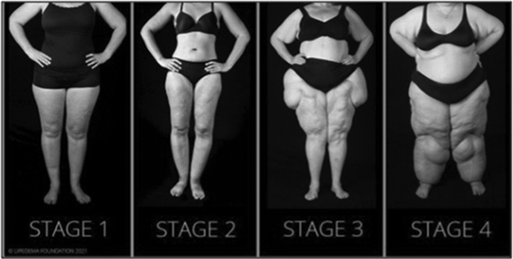

# Lipedema at the Intersection of Endocrinology and Adipose Biology
> **中文標題**：脂肪水腫（Lipedema）：內分泌學與脂肪生物學的交會
> **分類 Category**：Adipose Tissue, Appetite, Obesity, and Lipids
> **講者 Faculty**：José O. Alemán-Diaz, MD, PhD — Laboratory of Translational Obesity Research, Translational Research Institute, AdventHealth Orlando, Orlando, Florida
> **來源 Source**：2026 Endocrine Case Management — Meet the Professor · ENDO 2026 · Endocrine Society

---

## 📋 教學目標 Educational Objectives

- Recognize lipedema as a distinct disorder of loose connective tissue under the umbrella of obesity, distinct from vascular disease–related lymphedema.
  將 lipedema 辨識為 obesity 範疇下、一種獨立的疏鬆結締組織（loose connective tissue）疾病，須與血管疾病相關的 lymphedema 區別開來。

- Describe endocrinology and adipose biology relevant to the development and future treatment of lipedema.
  說明與 lipedema 發生及未來治療相關的內分泌學（endocrinology）與脂肪生物學（adipose biology）。

- Discuss current and emerging treatment options to reduce morbidity from lipedema.
  討論可減輕 lipedema 相關疾病負擔的現有與新興治療選項。

---

## 🩺 臨床情境 Clinical Scenario

本章附有三則臨床病例，忠實呈現如下，並於文末（個案解析）進一步討論。

### Case 1
A 52-year-old woman with class 2 obesity (BMI = 36 kg/m²) presents with worsening bilateral leg swelling. She reports menarche at age 11 and a distant history of leg swelling during puberty. She had difficulty maintaining her weight throughout young adulthood, with "big legs." Over the past 3 years, the swelling has markedly increased, causing discomfort when putting on clothes and walking. She endorses occasional hot flashes and misses periods every 2 to 3 months.

On physical examination, the patient appears well and has a gynoid pattern of obesity. Palpation of her lower extremities reveals pearl-like nodules along her thighs and hypersensitivity to touch, with associated discomfort.

Laboratory test results are normal, including those from a basic metabolic panel, a complete blood cell count, B-type natriuretic peptide, and measurement of TSH and vitamin B₁₂.

> 一位 52 歲、class 2 obesity（BMI = 36 kg/m²）的女性，因雙側下肢腫脹惡化就診。她 11 歲初經，青春期即有下肢腫脹的病史。年輕時體重難以維持，並自述「腿很粗」。過去 3 年腫脹明顯加劇，穿衣與行走時感到不適。她偶有 hot flashes，且月經每 2 至 3 個月才來一次。理學檢查外觀無異狀，呈 gynoid（女性型）肥胖分布；觸診雙下肢大腿沿線可摸到珍珠狀結節（pearl-like nodules），並有觸痛與觸覺過敏。實驗室檢查（basic metabolic panel、CBC、BNP、TSH、vitamin B₁₂）皆正常。

**問題：要診斷此患者的 lipedema，還需要哪些額外檢查（如果有的話）？**
**Answer: A) No additional testing needed —— 不需額外檢查。**

### Case 2
An 18-year-old woman describes a history of larger legs that accelerated during puberty. Despite multiple attempts at diet-induced weight loss and, more recently, medication-induced weight loss, she has been unable to reduce her leg size and has relied on wearing larger boots to conceal her appearance. She now seeks assistance for her enlarged legs, which are limiting her mobility.

On physical examination, the patient's vital signs are within normal limits. Her BMI is 32 kg/m², and she has a gynoid fat distribution with excess skin and dimpling. The Stemmer sign is positive. She has no pain to touch or nodularity in her legs.

> 一位 18 歲女性，腿部肥大的病史在青春期加速。她多次嘗試飲食減重、近期也嘗試藥物減重，但腿圍始終無法縮小，只能穿較大的靴子遮掩。她因腿部肥大影響行動而求助。理學檢查生命徵象正常，BMI 32 kg/m²，呈 gynoid 脂肪分布，皮膚鬆弛並有凹陷（dimpling）。Stemmer sign 為陽性（positive）。腿部無觸痛、無結節。

**問題：依其可能的 lipedema 分期，此時應「避免」哪一項治療？**
**Answer: D) Surgical removal —— 應避免手術切除。**

### Case 3
A 37-year-old woman with hypertension and type 2 diabetes (hemoglobin A₁c = 6.3% [45 mmol/mol]), controlled for 3 years on metformin, presents to the endocrinology clinic with concern about leg swelling and oozing. She endorses increased leg mass since menarche and, over the past 4 years, has gained significant weight that has been unresponsive to diuretic treatment or GLP-1 receptor agonist therapy. She now reports pain and painful, pearl-like nodules in her legs, along with oozing from her heels.

On physical examination, the patient has a BMI of 41 kg/m² and stable vital signs. Her light-touch sensation remains intact on monofilament testing, and there are mild abrasions on the heel and plantar surfaces with clear fluid oozing. She has excess skin on her thighs and decreased mobility, with difficulty standing from her chair.

> 一位 37 歲女性，患有 hypertension 與 type 2 diabetes（HbA₁c = 6.3% [45 mmol/mol]），使用 metformin 控制已 3 年。她因下肢腫脹與滲液（oozing）至內分泌門診就診。自初經起腿部量體即增加，過去 4 年體重明顯上升，且對 diuretic 及 GLP-1 receptor agonist 治療皆無反應。目前主訴下肢疼痛、有痛性珍珠狀結節，且腳跟處滲液。理學檢查 BMI 41 kg/m²，生命徵象穩定；monofilament 檢查輕觸覺完整，腳跟與足底有輕微擦傷並滲出清澈液體。大腿皮膚鬆弛、行動力下降，從椅子起身困難。

**問題：此患者呈較進展的 lipo-lymphedema，應先考慮哪一項初始治療？**
**Answer: B) Complete decongestive therapy —— 完整消腫治療（CDT）。**

---

## 🔬 背景與重要性 Background & Significance

### 什麼是 Lipedema？ What Is Lipedema?

Lipedema is a chronic disorder of subcutaneous adipose tissue characterized by disproportionate fat accumulation in the limbs (usually the legs, sometimes the arms) and almost exclusively affects women. First described in 1940 by Allen and Hines, lipedema is distinct from general obesity and lymphedema, with morbidity decreasing quality of life.¹˒² In lipedema, excessive fat deposition causes symmetric enlargement of the legs and/or arms, often presenting as a columnlike leg shape, while hands and feet remain unaffected until late stages. A hallmark is that the affected fat tissue is painful to palpation and prone to bruising with minor trauma, indicative of capillary fragility. Unlike common obesity, the fat in lipedema is diet-resistant.

> Lipedema 是一種皮下脂肪組織的慢性疾病，特徵為四肢（多為下肢，有時上肢）不成比例的脂肪堆積，且幾乎只發生在女性。1940 年由 Allen 與 Hines 首度描述，與一般 obesity 及 lymphedema 不同，會嚴重影響生活品質。過多的脂肪沉積造成腿與（或）手臂對稱性肥大，常呈「柱狀腿（columnlike）」外觀，而手腳在疾病晚期前不受影響。其標誌性特徵是受累脂肪組織觸診會疼痛、輕微外傷即容易瘀青，反映微血管脆弱（capillary fragility）。與一般肥胖不同，lipedema 的脂肪具「抗飲食（diet-resistant）」特性——即使明顯減重，患肢體積往往改善有限，這有助於與單純 obesity 區分。Lipedema 的脂肪沉積通常是雙側對稱的，可與多為單側的 lymphedema 區別。總結而言，lipedema 被視為一種脂肪的疏鬆結締組織疾病，涉及在臀部、髖部與四肢的結節狀、纖維化脂肪堆積，並在荷爾蒙與發育觸發（如 puberty）下發生，造成進行性、不成比例的肢體肥大伴疼痛。

### 盛行率 Prevalence

Recent estimates suggest that roughly 11% (up to nearly 1 in 9) of adult women worldwide may have lipedema. A German literature review reported that 6% to 8% of women in the general population could have lipedema, and 15% to 19% of women seen in specialty vascular clinics were diagnosed with lipedema.⁵ In contrast, lipedema is exceedingly rare in men, with only isolated case reports, usually in men with extreme hormonal disorders, such as testosterone deficiency or estrogen excess, or liver disease.

> 近期估計全球約 11%（近 1/9）的成年女性可能有 lipedema。因長期被低估、過去又常與 obesity 混淆，確切盛行率仍不確定。一篇德國文獻回顧指出，一般族群女性 6%–8% 可能有 lipedema，而在血管專科門診就診的女性中，15%–19% 被診斷為 lipedema。相對地，lipedema 在男性極為罕見，僅有零星病例報告，通常見於有極端荷爾蒙異常（如 testosterone 缺乏或 estrogen 過量）或肝病的男性。

### Practice Gaps 臨床落差

- Lipedema is common among women seeking care for weight management or vascular medicine.
  在因體重管理或血管醫學就診的女性中，lipedema 相當常見。
- Lipedema does not respond to medical or surgical weight-loss interventions. Cornerstones of therapy include compression and, in advanced cases, plastic surgery to remove affected adipose tissue.
  Lipedema 對內科或外科的減重介入皆無反應；治療基石為 compression，進展期則以整形外科手術移除受累脂肪組織。
- As a disorder of loose connective tissue, lipedema has important hormonal connections that endocrinologists should be aware of.
  作為一種疏鬆結締組織疾病，lipedema 的發生與病生理與荷爾蒙密切相關，內分泌科醫師應予以重視。

### 病生理 Pathophysiology

本章將 lipedema 的病生理概念性地拆解為 **vascular（血管）**、**endocrine（內分泌）**、**adipose（脂肪）** 三大成分。

**Vascular Component 血管成分**
Despite the "edema" suffix, lipedema does not involve fluid accumulation in early stages. The Stemmer sign is negative in lipedema. Lymphedema, by contrast, stems from impaired lymphatic capillary drainage, often begins distally in the feet, and tends to be asymmetric. The microvasculature in lipedema is compromised, leading to easy bruising and increased vascular permeability. In later stages, secondary lymphedema can coexist (lipo-lymphedema). The International Lipedema Consensus of 2020 proposed that chronic inflammation and tissue hypoxia in the enlarging fat are likely causes of the pain, rather than fluid edema per se.⁴

> 儘管字尾有「edema」，lipedema 在早期並不涉及液體堆積。其標誌是不成比例、對稱性的痛性脂肪堆積於上或下肢；足、手、軀幹、頸、頭不受影響。Stemmer sign 在 lipedema 為陰性（檢查者無法捏起腳趾皮膚者為陽性，見於 lymphedema）。相對地，lymphedema 源於淋巴微血管引流受損，常從足部遠端開始且多為不對稱。Lipedema 的微血管功能受損，導致易瘀青與脂肪內血管通透性增加，屬微血管病變（microangiopathic）狀態；滲漏的微血管造成輕傷後瘀青，以及觸診時的壓迫感、沉重感與疼痛。晚期可合併次發性 lymphedema，即 lipo-lymphedema。2020 年 International Lipedema Consensus 提出：腫大脂肪內的慢性發炎與組織缺氧（tissue hypoxia）較可能是疼痛來源，而非液體性水腫本身。此觀點使治療焦點從單純的消腫療法，轉向抗發炎與抗肥胖等策略。

**Endocrine Component 內分泌成分**
Lipedema often appears or worsens during periods of major hormonal flux, classically at puberty, sometimes during pregnancy, and frequently at menopause. A common hypothesis links lipedema to estrogen surges. One study reported reduced ERα and increased ERβ in adipose tissue from patients with lipedema, which could promote lipid accumulation in lower-body depots.⁷ Progesterone and androgen levels have also been implicated, but direct evidence is lacking.

> Lipedema 的發生與女性一生的荷爾蒙變化密切相關，常在荷爾蒙劇烈波動與體重變化時出現或惡化——典型於 puberty，有時於 pregnancy，並常於 menopause。常見假說認為 lipedema 與這些過渡期的 estrogen 高峰有關。研究顯示 lipedema 的脂肪組織可能有異常的 estrogen 特徵，包括 estrogen receptor alpha（ERα）與 beta（ERβ）比例失衡。Estrogen 會促進 gluteofemoral（臀股）分布的脂肪堆積，與 lipedema 的脂肪分布一致。一項研究報告 lipedema 患者脂肪組織中 ERα 減少、ERβ 增加，可能促使下半身脂肪堆積。Progesterone 與 androgen 分別在 pregnancy 與 menopausal transition 中被提及，但缺乏直接證據。荷爾蒙觸發是 lipedema 何時發作與惡化的核心，使其成為受內分泌影響的脂肪疾病之典範。

**Adipose Component 脂肪成分**
Histological studies of lipedema fat have demonstrated both adipocyte hypertrophy (enlarged fat cells) and adipocyte hyperplasia (increased number of fat cells) in the affected areas.⁷˒⁸˒⁹ This contrasts with typical obesity, where hypertrophy tends to predominate.¹⁰ Lipedema fat depots have a higher proportion of M2 macrophages (anti-inflammatory), whereas obesity-related fat tends to have more proinflammatory M1 macrophages. Adipose-derived stem cells from patients with lipedema show impaired adipogenesis in vitro and altered adipokine expression.

> 就核心而言，lipedema 是疏鬆結締組織內的脂肪組織疾病，adipocyte 扮演主角，且同時記錄到 hypertrophy（脂肪細胞肥大）與 hyperplasia（脂肪細胞數目增加）的變化；此與典型 obesity 以 hypertrophy 為主不同。Lipedema 脂肪常形成結節狀質地：顯微鏡下可見纖維化結締組織的結節環繞成群 adipocyte，尤以晚期為甚。早期（stage 1）纖維化較少、皮膚仍柔軟，脂肪雖呈結節狀但不硬化，觸感如小豌豆；進展至 stage 2、3 時皮下纖維化增加，collagen 沉積形成疤痕樣組織，使表面皮膚凹陷（類似但更極端的橘皮）。至 stage 3 出現大型脂肪小葉，由纖維隔膜懸吊，於膝、臂周形成變形的組織懸垂。純 lipedema（stage 1–3）不會造成 lymphedema 所見的真皮纖維化或 peau d'orange（橘皮樣）質地，皮膚可捏起、不呈木質硬結；唯有合併 lymphedema 時皮膚才開始增厚。

> 在免疫細胞方面，lipedema 脂肪的組成與正常及肥胖相關脂肪皆不同：M2 macrophages（替代活化、抗發炎）比例較高，而肥胖相關脂肪傾向較多促發炎的 M1 macrophages。此 M2 為主的現象雖看似矛盾（lipedema 會痛），但可能反映慢性、未解決的組織重塑狀態；有人推論疼痛源於膨脹脂肪內的神經受牽拉或壓迫、缺氧與輕度發炎使神經敏化，帶有神經病理性疼痛（neuropathic）成分。此外，lipedema 患者的 adipose-derived stem cells 在體外顯示 adipogenesis 受損、adipokine 表現改變，這些差異潛在可作為 biomarker 或治療標的。Lipedema 脂肪一旦形成即抗減重——calorie restriction 或 bariatric surgery 可減整體體重，卻常「保留」lipedema 脂肪，提示該組織脂肪代謝存在根本性失調。與纖維化的 lymphedema 組織不同，lipedema 脂肪（尤其早期）仍是「柔軟」脂肪，由能保水與保脂的疏鬆結締組織基質構成，故稱「loose connective tissue disease」。理解脂肪成分是治療關鍵——這也是 liposuction 能藉由物理性移除病理脂肪細胞而顯著改善的原因。

---

## 🧭 診斷與評估 Diagnosis & Evaluation

The diagnosis of lipedema is clinical, based on a thorough patient history, characteristic physical exam findings, and exclusion of other conditions. Formal diagnostic criteria were established by the US Standard of Care consensus.⁴ There is no specific laboratory test or biomarker for lipedema.

> Lipedema 的診斷是臨床診斷，依據完整病史、特徵性理學檢查與排除其他疾病。正式診斷準則由美國 Standard of Care 共識制定。目前無特異性實驗室檢查或 biomarker，臨床須辨識一組徵象與症狀的組合。

### Major Criteria 主要準則

1. **Bilateral, symmetric distribution 雙側對稱分布**：異常皮下脂肪典型影響下肢（自髖部至踝部）、有時上肢，並「保留（sparing）」足與手，於踝或腕處形成突然的截斷或「袖口狀（cuffing）」外觀。
2. **Negative Stemmer sign 陰性 Stemmer sign**：可捏起並提起趾／指基部的皮膚（lymphedema 因腫脹通常無法捏起）。
3. **Little or no pitting edema 幾乎無凹陷性水腫**：至少在早期，任何腫脹皆為非凹陷性且輕微，除非發生淋巴受損。

### Supportive Criteria 支持性準則
受累脂肪組織的疼痛、觸痛與易瘀青；荷爾蒙變化（puberty、pregnancy）時發作或惡化；下半身遠比上半身肥大（不成比例分布），軀幹相對纖細、足部不腫；對熱量限制與運動無明顯改善（diet-resistant fat）。

### Staging 分期
- **Stage 1**：皮膚平滑，結節柔軟（smooth skin, soft nodules）。
- **Stage 2**：皮膚表面不平整，出現大型結節（蘋果至核桃大小），脂肪增厚並纖維化。
- **Stage 3**：脂肪組織大量突出，硬結性團塊與脂肪小葉。
- **Stage 4**：有時用以指合併 lymphedema 者（lipo-lymphedema）。

### Types 依區域分布分型
- Type I：臀部／髖部（buttocks/hips）
- Type II：臀部至膝（buttocks to knees）
- Type III：延伸至踝（down to ankles）
- Type IV：上肢（arms）
- Type V：小腿（calves）

**Figure. Stages of Lipedema According to Progression of Fat Accumulation and Changes to Skin and Lymphatic System（圖：Lipedema 依脂肪堆積進展與皮膚及淋巴系統變化之分期）**

> 📎 Adapted from the Lipedema Foundation, lipedema.org
>
> 改編自 Lipedema Foundation, lipedema.org

---

## 💊 治療與處置 Management

There is currently no cure for lipedema, but a variety of treatments can manage symptoms, improve function, and slow disease progression. Optimal care is usually multidisciplinary. The overall goals are to reduce pain and swelling, restore mobility, prevent or treat lymphedema, and address the psychosocial impact.

> 目前 lipedema 尚無根治方法，但多種治療可控制症狀、改善功能並延緩進展。最佳照護通常為多專科合作，結合內科治療、營養指導、物理治療，有時加上手術。整體目標為減輕疼痛與腫脹、恢復行動力、預防或治療 lymphedema，並處理社會心理衝擊。應向患者說明期待值：治療能顯著改善生活品質，但通常無法清除所有 lipedema 組織（除手術移除外），且需持續維持。

### Medical Management 內科治療
Pain management includes analgesics such as nonsteroidal anti-inflammatory agents; for suspected neuropathic pain, gabapentin or duloxetine may be tried. A cornerstone is compression therapy—graduated compression stockings or tights, usually class II, 20-30 mm Hg or higher. When lipedema overlaps with fluid edema, a certified lymphedema therapist trained in complete decongestive therapy (manual lymphatic drainage, multilayer compression bandaging, exercises, skin care) is extremely beneficial.

> 內科治療著重症狀與共病處理，因目前尚無藥物或注射可特異性移除 lipedema 脂肪。疼痛管理可用鎮痛劑，包括 nonsteroidal anti-inflammatory agents；若懷疑 neuropathic pain，可在醫師指導下嘗試 gabapentin 或 duloxetine。處理共病亦關鍵：如靜脈功能不全或靜脈曲張造成水腫，應給予 compression 或靜脈燒灼（vein ablation）；同時處理 hypothyroidism、vitamin D 缺乏或其他代謝異常。內科治療的基石為 **compression therapy（壓力治療）**——持續使用漸進式壓力襪／褲，通常為 class II、20–30 mm Hg 或更高，可減少每日腫脹、支撐組織，並藉限制微血管滲漏減輕疼痛與瘀青。當 lipedema 合併液體性水腫時，受過 **complete decongestive therapy（完整消腫治療，CDT）** 訓練的合格 lymphedema 治療師極有幫助，內容包括徒手淋巴引流按摩、多層壓力繃帶、運動與皮膚照護衛教。

### Surgical Treatment 外科治療
Typically, conservative measures are tried for at least 6 to 12 months; if significant pain or functional limitation persists, liposuction is considered. Liposuction (ideally tumescent technique with microcannulas by experienced surgeons) permanently removes lipedema fat cells. It usually requires multiple sessions—each limb may require 2 to 3 operations staged months apart—and carries surgical risks including fluid shifts and potential lymphatic injury.

> 另一項重要治療決策為是否手術，特別是 **liposuction（抽脂）**。Liposuction 屬外科介入，但因是少數能真正移除病理脂肪的方法，故納入標準照護討論。一般先嘗試保守治療至少 6 至 12 個月；若仍有明顯疼痛或功能受限，才考慮 liposuction。理想上採 tumescent 技術搭配 microcannula、由具 lipedema 經驗的外科醫師執行，可永久移除 lipedema 脂肪細胞，縮小肢體、改善輪廓，並常大幅減少疼痛與瘀青。通常需多次手術，每肢可能需 2 至 3 次、相隔數月分階段進行，並帶有一般手術風險，包括體液移動與潛在淋巴損傷。在有經驗者手中，liposuction 安全且有效，對中重度患者而言最接近「確定性」治療。德國等國已正式將 liposuction 納入 lipedema 治療、部分情況甚至由保險給付；在美國，保險給付不一且常有困難。

### Nutrition 營養
There is no single scientifically proven "lipedema diet." Advocated approaches include anti-inflammatory diets, lower-carbohydrate or ketogenic diets, intermittent fasting, gluten-free or allergy-elimination diets, and general weight-loss diets. The common theme is a healthy, balanced, sustainable diet.

> 目前並無單一經科學證實的「lipedema 飲食」。專家與病友倡議的方法包括抗發炎飲食、低碳水或生酮（ketogenic）飲食、間歇性斷食、無麩質或過敏排除飲食，以及一般減重飲食。共同主軸是可長期維持的健康均衡飲食。營養是 lipedema 管理的基石之一，旨在優化身體組成與減少發炎。如 Tomada 所述，適當營養與體重管理可保留行動力與功能，並可能延緩疾病進展。

> 經數十年相對忽視後，病友倡議、科學好奇與臨床迫切正推動 lipedema 治療的進展。最終願景是讓 lipedema 不再是「孤兒（orphan）」疾病，而成為特徵明確、擁有多種有效治療的醫學實體。

---

## 🧠 個案解析與臨床推理 Case Analysis & Clinical Reasoning

**Case 1（52 歲女性）— 何時「不需」額外檢查。** 正解為 **A) 不需額外檢查**。Lipedema 的診斷依賴完整病史、特徵性理學發現與排除其他疾病；目前無具診斷效力的特異性實驗室檢查。本例已具備典型線索：青春期起病、gynoid 分布、大腿珍珠狀結節、觸痛與觸覺過敏，且基礎檢驗（含 TSH、BNP）正常已足以合理排除甲狀腺與心因性水腫。選項 B 的 vascular scintigraphy 為侵入性核醫檢查，用以評估淋巴逆流、可協助排除 lymphedema，但本身並非 lymphedema 的確診工具；選項 C（凝血檢查）與 D（LH、FSH、estradiol）雖可提示但無診斷價值。臨床要點：診斷是「認得出來」，而非「驗出來」。

**Case 2（18 歲女性）— 早期病程應避免的治療。** 正解為 **D) 應避免手術切除**。此患者依描述應為 class I 或 II lipedema，且自青春期起病、病程不太可能超過 10 年，因此有充分機會以分層（layered）策略預防惡化，包括飲食策略（A）與機械性治療如 complete decongestive therapy（B）與 complete lymphatic therapy（C）。手術移除（D）應保留給有明顯疼痛、行動受限或進展期的患者，惟指引仍在演變中。值得注意：本例 Stemmer sign 陽性且無觸痛與結節，提示可能有淋巴成分或其他鑑別，臨床上仍須審慎評估，但就「此時應避免」的答案而言，早期病程不宜貿然手術。

**Case 3（37 歲女性，lipo-lymphedema）— 進展期的初始治療。** 正解為 **B) Complete decongestive therapy**。此患者呈較進展的 lipo-lymphedema（BMI 41、腳跟滲液、痛性結節、行動受限），應採分層策略，先以機械性減壓治療（CDT）開始，再進展至內科或外科治療。血管醫學評估很重要，用以評估 lymphedema 範圍及其對 lipedema 進展的影響；血管評估後可考慮 diuretic（A）。GLP-1 receptor agonist（C）在纖維化形成後通常無法移除 lipedema 脂肪。手術移除（D）可於初始機械與內科治療後再考慮。

### 鑑別診斷 Differential Diagnosis
- **Lymphedema**：常單側、遠端起於足部、Stemmer sign 陽性、可有 pitting 與 peau d'orange；lipedema 則雙側對稱、保留足部、Stemmer 陰性、早期非凹陷。
- **一般 Obesity**：脂肪分布較均勻或呈中央型，無選擇性下肢痛性結節，且對減重有反應；lipedema 脂肪 diet-resistant 且觸痛。
- **靜脈功能不全 / 心因性或腎因性水腫**：多為凹陷性、可隨體液狀態變動；本章 Case 1 以正常 BNP、TSH 協助排除。
- **Lipo-lymphedema**：晚期 lipedema 合併次發性 lymphedema。

### 常見陷阱 Pitfalls
- 把 lipedema 誤當單純肥胖而反覆勸減重，忽略其 diet-resistant 本質，延誤診斷。
- 期待 GLP-1 receptor agonist 或 bariatric surgery 能縮小患肢——它們可減整體體重卻常保留 lipedema 脂肪。
- 對早期患者過早施行手術；反之對進展期 lipo-lymphedema 未先行機械性減壓即貿然用藥或手術。
- 忽略疼痛的抗發炎與神經病理性成分，只當作「水腫」處理。

---

## ⭐ 重點整理 Key Takeaways

- Lipedema 是一種疏鬆結締組織（loose connective tissue）疾病，特徵為下半身異常脂肪分布與疼痛，幾乎只影響女性，在內分泌領域仍常被低估與誤診。
- Lipedema 位於 endocrinology 與 adipose biology 的交會處：荷爾蒙（puberty、pregnancy、menopause 的 estrogen 波動、ERα/ERβ 失衡）是重要觸發，adipocyte 的 hypertrophy 與 hyperplasia 則是核心驅動。
- 診斷為臨床診斷：雙側對稱分布、negative Stemmer sign、早期少或無 pitting edema；並以 diet-resistant、痛性結節與易瘀青為支持線索。目前無特異 biomarker。
- Lipedema 對傳統減重治療（GLP-1 receptor agonists、飲食介入）無反應；需分層（layered）處置，涵蓋機械（compression、complete decongestive therapy）、內科與最終外科（liposuction）介入。
- Compression therapy（通常 class II, 20–30 mm Hg 或以上）為內科治療基石；liposuction 常需每肢 2–3 次、相隔數月分階段進行。
- 手術（liposuction）保留給明顯疼痛、功能受限或進展期患者；早期病程應避免手術，優先採飲食與機械性治療預防惡化。
- 進展期 lipo-lymphedema 的初始治療是 complete decongestive therapy，並轉介 vascular medicine 評估。
- 持續研究致力於找出血液與影像 biomarker，以指引未來針對荷爾蒙觸發與脂肪病理的治療。

---

## 💬 討論問題 Discussion Questions

1. 面對一位因「腿粗、減重無效」求診的女性，你會用哪些病史與理學線索，在門診第一時間把 lipedema 與單純 obesity、lymphedema 區分開來？哪些特徵最具鑑別力？
2. 既然 lipedema 脂肪對 GLP-1 receptor agonists 與飲食減重「抗性」，你如何向已使用抗肥胖藥物的患者說明期待值，並重新設定治療目標？
3. Estrogen 與 ERα/ERβ 失衡被認為與 lipedema 發生相關。在 puberty、pregnancy、menopause 等荷爾蒙過渡期，臨床上可如何前瞻性地衛教與監測高風險女性？
4. 在何種情況下你會把患者從保守（compression、CDT、營養）轉介至 liposuction？在保險給付受限的現實下，如何與患者共同決策？
5. 若未來出現可靠的血液或影像 biomarker，會如何改變你對 lipedema 的診斷時機與治療分層？

---

## 📚 參考文獻 References

1. Ernst AM, Bauer H, Bauer HC, Steiner M, Malfertheiner A, Lipp AT. Lipedema research-quo vadis? *J Pers Med*. 2022;13(1):98. PMID: 36675759
2. Lundanes J, Sandnes F, Gjeilo KH, et al. Effect of a low-carbohydrate diet on pain and quality of life in female patients with lipedema: a randomized controlled trial. *Obesity (Silver Spring)*. 2024;32(6):1071-1082. PMID: 38627016
3. Shavit E, Wollina U, Alavi A. Lipoedema is not lymphoedema: a review of current literature. *Int Wound J*. 2018;15(6):921-928. PMID: 29956468
4. Herbst KL, Kahn LA, Iker E, et al. Standard of care for lipedema in the United States. *Phlebology*. 2021;36(10):779-796. PMID: 34049453
5. Kruppa P, Georgiou I, Biermann N, Prantl L, Klein-Weigel P, Ghods M. Lipedema-pathogenesis, diagnosis, and treatment options. *Dtsch Arztebl Int*. 2020;117(22-23):396-403. PMID: 32762835
6. Tomada I. Lipedema: from women's hormonal changes to nutritional intervention. *Endocrine*. 2025;6(24):1-19.
7. Fife CE, Maus EA, Carter MJ. Lipedema: a frequently misdiagnosed and misunderstood fatty deposition syndrome. *Adv Skin Wound Care*. 2010;23(2):81-94. PMID: 20087075
8. Frank AP, de Souza Santos R, Palmer BF, Clegg DJ. Determinants of body fat distribution in humans may provide insight about obesity-related health risks. *J Lipid Res*. 2019;60(10):1710-1719. PMID: 30097511
9. Felmerer G, Stylianaki A, Hägerling R, et al. Adipose tissue hypertrophy, an aberrant biochemical profile and distinct gene expression in lipedema. *J Surg Res*. 2020;253:294-303. PMID: 32407981
10. Al-Ghadban S, Cromer W, Allen M, et al. Dilated blood and lymphatic microvessels, angiogenesis, increased macrophages, and adipocyte hypertrophy in lipedema thigh skin and fat tissue. *J Obes*. 2019;2019:8747461. PMID: 30949365
11. Wiedner M, Aghajanzadeh D, Richter DF. Differential diagnoses and treatment of lipedema. *Plast Aesthetic Res*. 2020;7(0):10.
12. Mortada H, Alhithlool AW, AlBattal NZ, et al. Lipedema: clinical features, diagnosis, and management. *Arch Plast Surg*. 2025;52(3):185-196. PMID: 40386000
