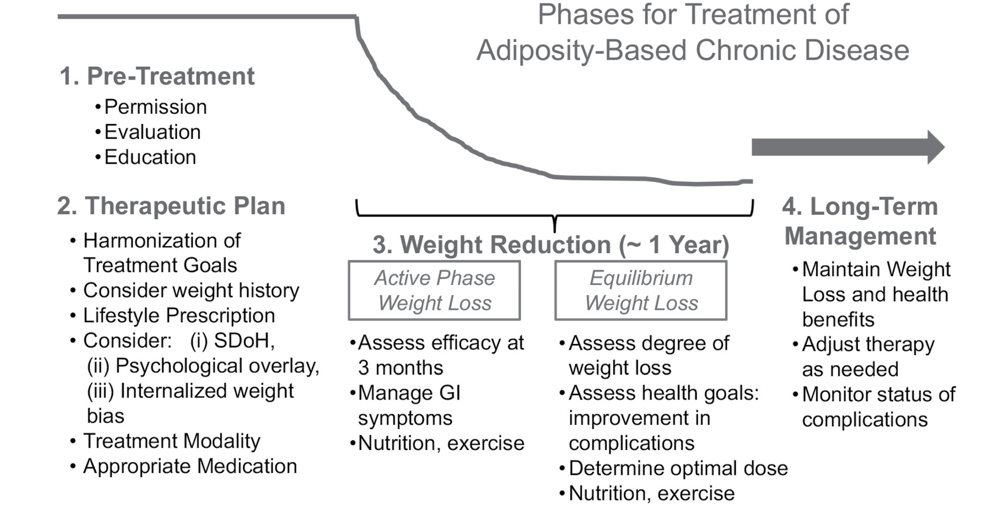
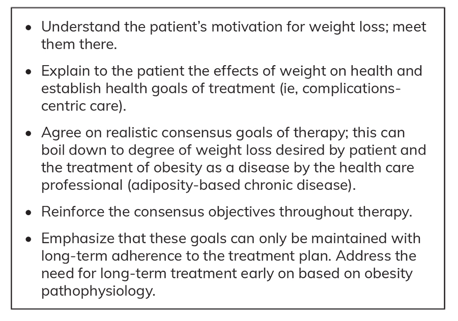
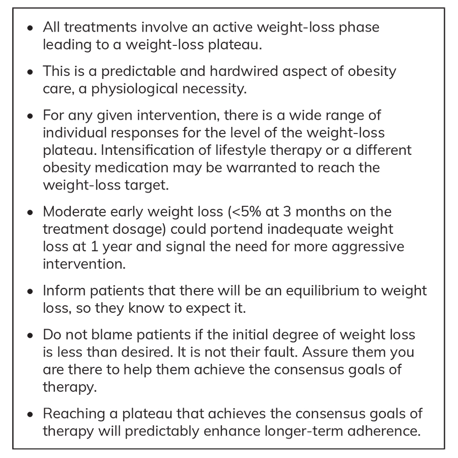
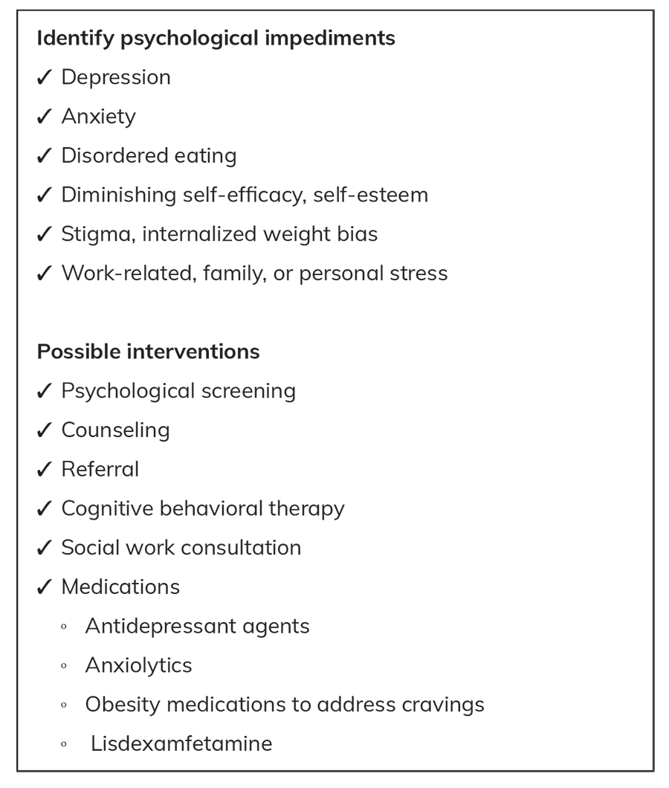
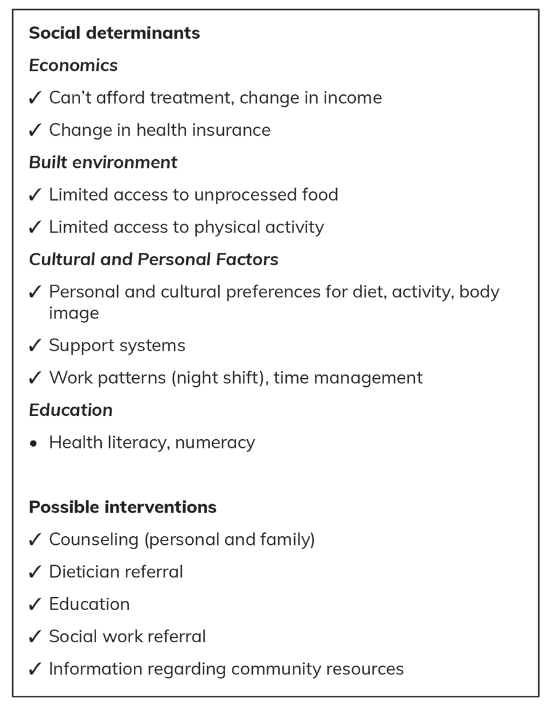
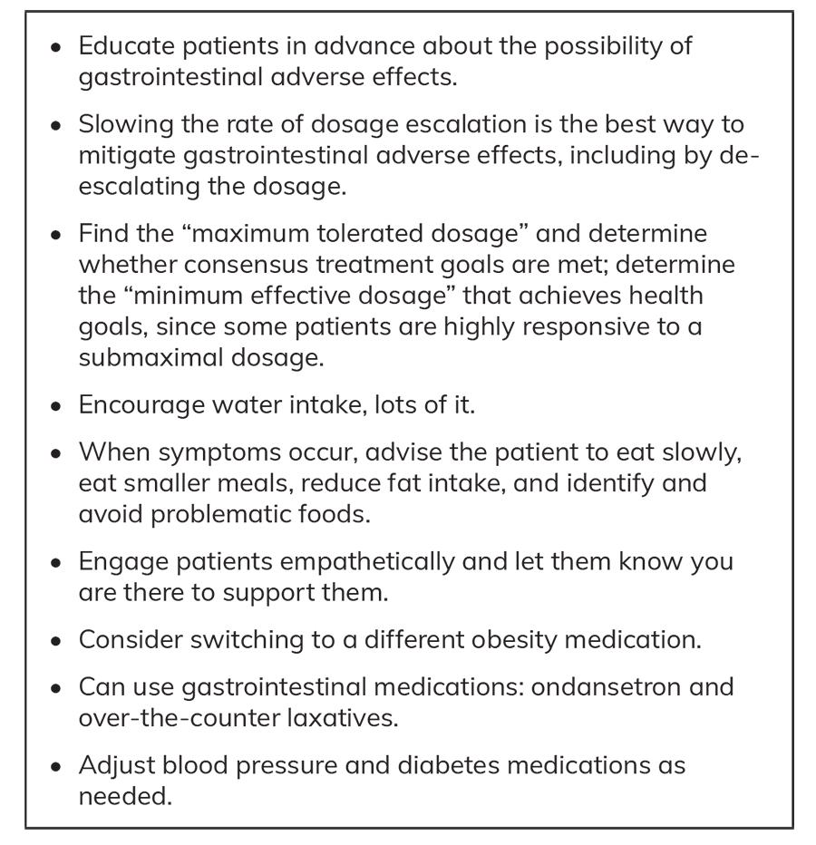
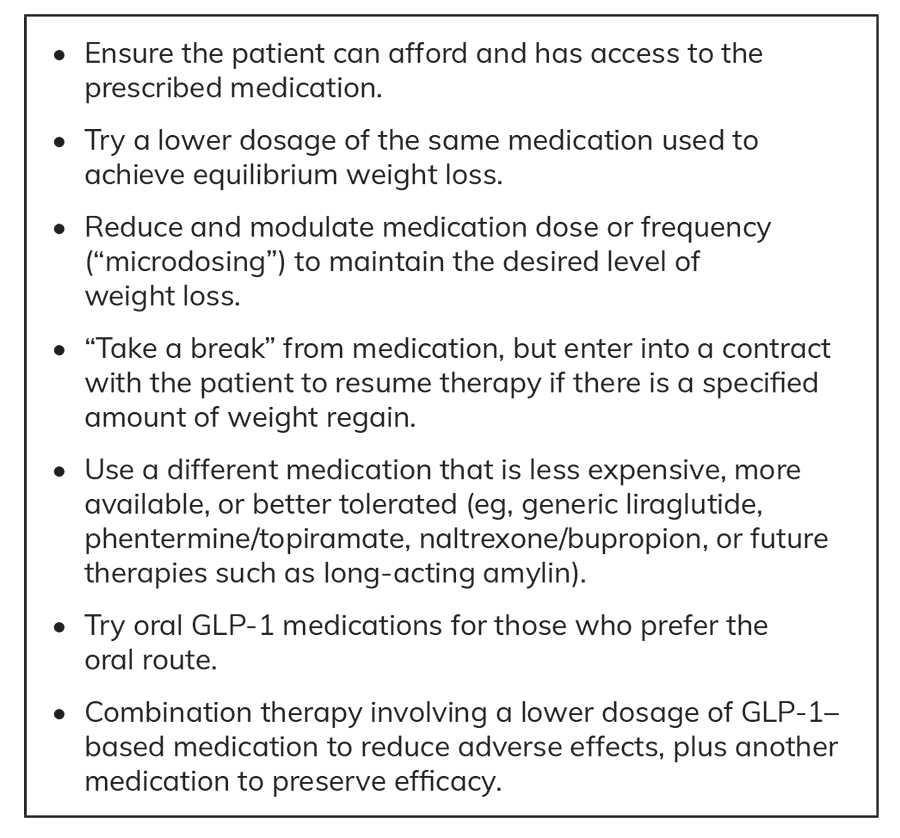
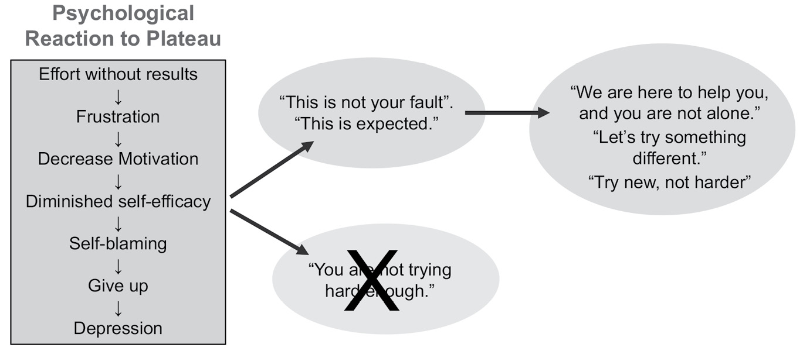

# GLP-1–Based Therapies: Preparing Patients With Obesity for Long-Term Maintenance and Transition
> **中文標題**：以 GLP-1 為基礎的療法：協助肥胖病人為長期維持與轉銜做好準備
> **分類 Category**：Adipose Tissue, Appetite, Obesity, and Lipids
> **講者 Faculty**：W. Timothy Garvey, MD（Department of Nutrition Sciences, University of Alabama at Birmingham, Birmingham, Alabama）
> **來源 Source**：2026 Endocrine Case Management — Meet the Professor · ENDO 2026 · Endocrine Society

---

## 📋 教學目標 Educational Objectives

- **Describe practices at each phase of obesity management, namely pretreatment, weight reduction, and chronic care, that promote long-term adherence to an individualized therapeutic plan.**
  說明肥胖治療各階段（治療前 pretreatment、減重期 weight reduction、慢性照護 chronic care）中可促進病人長期遵從個人化治療計畫的實務做法。

- **Explain how a consensus agreement on treatment goals between a patient and a health care professional can be emphasized throughout all phases of obesity management and used to reinforce adherence to long-term therapy.**
  說明如何在肥胖治療的所有階段持續強調「病人與醫療人員之間對治療目標達成共識」，並藉此強化對長期治療的遵從性。

- **Describe the need to be flexible with dosing and medication selection as needed for long-term maintenance of weight loss and treatment persistence.**
  說明為了長期維持減重成果與維持治療（treatment persistence），在劑量與藥物選擇上保持彈性的必要性。

---

## 🩺 臨床情境 Clinical Scenario

本章以三個臨床案例呈現長期使用以 GLP-1 為基礎藥物的常見挑戰。以下為第一案例的完整病歷情境；其餘兩案例整理於「個案解析」段落。

**Case 1 — Patient Reaches Weight-Loss Plateau and Disengages From Treatment**
一位 58 歲女性希望減重，想要更有活力、成為孫女們的榜樣。她自 27 歲懷孕後體重逐漸增加，去年嘗試低醣飲食（low-carbohydrate diet）但體重復胖。既往病史包括：hypertension（以 losartan/hydrochlorothiazide 治療）、LDL-cholesterol 升高（以 atorvastatin 20 mg daily 治療）、以及 depression（以 duloxetine 60 mg daily 治療）。她已離婚，職業為法務助理（paralegal），主訴疲倦與失眠（insomnia）。

**Physical examination and laboratory findings**
理學檢查：BMI 38 kg/m²，血壓 148/94 mm Hg。實驗室檢驗：

| 項目 Item | 數值 Value | SI 單位 |
|---|---|---|
| Fasting glucose | 104 mg/dL | 5.8 mmol/L |
| LDL cholesterol | 120 mg/dL | 3.11 mmol/L |
| Triglycerides | 165 mg/dL | 1.86 mmol/L |
| HDL cholesterol | 38 mg/dL | 0.98 mmol/L |
| Polysomnography (AHI) | 35 | — |

Polysomnography 顯示 apnea-hypopnea index（AHI）為 35。病人希望透過減重讓自己感覺更好、更有活力、更受孫女敬重；而身為醫療人員，你則傳達治療的目的在於改善健康——預防由 prediabetes 進展為 type 2 diabetes、降低血壓、改善 dyslipidemia，並改善 sleep apnea 及其相關症狀。

**Clinical goals of therapy**
此病人的臨床治療目標包括：(a) 預防由 prediabetes 進展為 type 2 diabetes；(b) 降低血壓；(c) 治療 obstructive sleep apnea。

---

## 🔬 背景與重要性 Background & Significance

**Two second-generation obesity medications with unprecedented efficacy**
兩種作用於營養素調節荷爾蒙（nutrient-regulated hormones）的胜肽藥物，為肥胖治療帶來前所未有的療效：GLP-1 receptor agonist **semaglutide**（2021 年核准）與雙重 GLP-1 及 GIP agonist **tirzepatide**（2023 年核准）。在 phase 3 臨床試驗中，這兩種藥物達到平均 15% 或以上的體重減輕；在此減重程度下，能有效預防與治療多種肥胖相關的併發症與疾病，因此被稱為「第二代肥胖藥物（second-generation obesity medications）」。相對地，2014 年（含）以前核准的第一代肥胖藥物（orlistat、phentermine/topiramate、naltrexone/bupropion、liraglutide）在臨床試驗中通常僅產生低於 10% 的平均體重減輕。第一代藥物在肥胖治療中仍有重要地位，但在許多病人身上無法達到最能帶來健康益處的減重幅度。

**A complications-centric approach and the ABCD concept**
第二代藥物大幅促進了「以併發症為中心（complications-centric）」的照護模式。其基本原則為：(a) 治療肥胖的目的在於改善健康；(b) 肥胖相關併發症與疾病會降低生活品質、造成罹病與死亡，從而損害健康；(c) 治療的目標與終點是預防與治療這些併發症，而非單純減去某個公斤數。2016 年 American Association of Clinical Endocrinology（AACE）肥胖治療指引以及後續各專業學會的指引，皆倡導以併發症為中心、將肥胖視為疾病的治療取向。這需要一個同時包含「人體測量成分（anthropometric component，確認過量脂肪堆積）」與「臨床成分（clinical component，透過理學檢查與病史評估肥胖相關併發症之有無與嚴重度）」的診斷。此概念由診斷名詞 **adiposity-based chronic disease（ABCD）** 所強調——由 AACE 與 European Association for the Study of Obesity 共同倡議。ABCD 指出「治療什麼」（脂肪組織在質量、分布與功能上的異常）以及「為何治療」（一種會引發損害健康之併發症的慢性疾病）。

**Complications ameliorated by second-generation medications**
Semaglutide 與 tirzepatide 在臨床試驗中已證實能改善作為主要結果（primary outcomes）的併發症，包括心血管代謝疾病結果（cardiometabolic disease outcomes）如 type 2 diabetes、metabolic dysfunction-associated steatohepatitis、hypertension、dyslipidemia、因 heart failure with preserved ejection fraction 引起的 congestive heart failure、major adverse cardiovascular events 之預防，以及對進行性 chronic kidney disease 的腎臟保護；也包括生物力學性併發症（biomechanical complications）如 obstructive sleep apnea 與 osteoarthritis。這些藥物使臨床醫師能對病人進行有效的、以併發症為中心的處置，在肥胖藥物治療上具有變革性意義。

**Suboptimal treatment: the problem of long-term persistence**
儘管已有這些療效空前的藥物，將肥胖（即 ABCD）當作慢性疾病來治療的成效仍不理想。最主要的失敗在於大量病人無法持續長期治療。在大型真實世界世代研究中，約四分之一的病人未領取處方；一年後，維持藥物遵從性者不足 50%。一旦停用肥胖藥物，多數病人會復胖並失去減重帶來的健康益處。這是因為涉及飽足荷爾蒙（satiety hormones）及其與大腦攝食中樞交互作用的病理生理機制仍持續運作，而這些機制本就是造成過量脂肪堆積的主因。因此，如同其他慢性疾病（如 diabetes、hypertension），長期持續使用肥胖藥物是取得並維持最佳結果的必要條件。

**Multifactorial reasons for discontinuation**
停用肥胖藥物的原因是多因素的，但最主要的原因是高昂的費用。第二代藥物對許多病人仍難以取得——只有有限的保險公司與自保雇主為肥胖照護或肥胖藥物（尤其是第二代 GLP-1 receptor agonists）提供給付，病人必須承擔高額自付額或自費支出。其他因素則與藥物本身有關，包括頻繁的腸胃道不良反應與不一致的減重反應，因此沒有任何一種藥物對所有病人都足夠有效。在缺乏實質評估與追蹤下於網路上取得肥胖藥物屬於不合格的照護，也使以併發症為中心的照護無法實現，因為併發症的有無與嚴重度未被處理；在無醫師照護下取得這些藥物也可能助長濫用（例如飲食失調 eating disorders 或 anorexia nervosa 病人、或本身偏瘦且無疾病者的使用）。此外還有肥胖慢性照護模式不足的問題，其中最主要的是各層級（病人、醫療人員、醫療體系與社會）的偏見與污名化。內化的體重偏見（internalized weight bias）會削弱病人作為照護夥伴的能力、損害自我效能、助長自責，並降低對治療計畫的遵從性。

---

## 🧭 診斷與評估 Diagnosis & Evaluation

**Diagnosis of ABCD requires two components**
ABCD 的診斷需同時具備兩個成分：(1) 人體測量成分，確認過量脂肪堆積；(2) 臨床成分，透過完整的理學檢查與病史，評估肥胖相關併發症與疾病之風險、有無與嚴重度。此評估使以實證為基礎、以併發症為中心的照護得以進行。

**Pretreatment phase evaluation**
治療前階段需取得病人同意討論體重議題，並以同理與尊重促成病人投入。衛教至關重要，用以協助病人理解過量脂肪如何影響健康，且應以符合病人健康識能（health literacy）程度、具文化能力（culturally competent）的方式傳達。在此早期階段即應告知病人：由於肥胖是慢性疾病，將需要長期治療。評估也應納入病人的體重史與過去的減重嘗試，因為這些因素會影響治療計畫。

**Assessing the weight-reduction response**
減重期涵蓋治療的第一年，包含急性減重期與達到較低體重平衡點（lower weight equilibrium）的過程。早期反應可作為療效指標：在治療劑量下 3 個月後減重幅度偏低（<5%）可預測 1 年時療效不足，並提示需更換治療。平衡期的減重程度也應足以逆轉並預防併發症；在部分病人，此目標可能在次最大（submaximal）藥物劑量下即可達成。

**Figure 1. Phases of Treatment for Adiposity-Based Chronic Disease and Practices That Can Promote Short- and Long-Term Success**（圖 1. adiposity-based chronic disease 治療的各階段，以及可促進短期與長期成功的實務做法）

> 📎 [Color—Print (Color Gallery page CG4 ) or web & ePub editions]
>
> 彩色版請見印刷版 Color Gallery 第 CG4 頁，或 web 與 ePub 版本。

**Minimum weight-loss thresholds for complication improvement（源自 Case 1 教學）**
治療肥胖相關併發症需要不同程度的減重才能達到可預期的臨床益處：

| 併發症 Complication | 可預期臨床改善所需的最低減重幅度 |
|---|---|
| 血壓下降（Look AHEAD） | 超過 5% 後隨減重漸進改善 |
| Obstructive sleep apnea（AHI 改善） | 10% 或以上（Sleep AHEAD、phentermine/topiramate 試驗） |
| Diabetes prevention（prediabetes） | 7%–10%（Diabetes Prevention Project）；約 10% 時 phentermine/topiramate 使進展減少 80% |

對 Case 1 而言，正確的最低減重門檻答案為 **10%**。資料顯示：Diabetes Prevention Project 中最大化預防糖尿病進展發生於 7%–10% 減重；使用 phentermine/topiramate 達約 10% 減重可較 placebo 減少 80% 進展為 type 2 diabetes 之風險；bariatric surgery 雖能產生更大減重，但糖尿病預防仍約為 80%。此可解讀為 10% 減重對糖尿病預防已屬最大效益，且約 20% 的 prediabetes 病人無論減重與否仍會進展為糖尿病。使用 semaglutide 2.4 mg 與 tirzepatide 10–15 mg 可使約 90% 達到糖尿病預防；由 80% 提升至 90% 的差異可能反映這些藥物的 incretin 特性。

---

## 💊 治療與處置 Management

**Three phases of management**
- **Pretreatment（治療前）**：取得討論體重之同意、衛教、完整理學檢查與病史、評估併發症；並在此時建立「將需長期治療」的認知。
- **Weight reduction（減重期，約第一年）**：積極管理減重、處理腸胃道不良反應、視需要調整其他藥物、監測營養狀態。
- **Long-term management（長期管理）**：終生維持減重與健康益處；維持治療（persistence）是關鍵，但用於維持的劑量與/或藥物可能不同於減重期所用。需長期監測並處理不良反應、營養狀態、疾病併發症與藥物調整。

**Harmonization of treatment goals（Box 1）**
成功的長期管理須整合病人期望的結果與醫療人員的目標。治療計畫據此制定以達成共識目標，並在整個治療過程中反覆重申。可在雙方同意下隨時間調整，以兼顧病人與臨床醫師。此共識也需納入疾病的心理層面（psychological overlay）與健康的社會決定因素（social determinants of health）。

**Box 1. Harmonization of Treatment Goals**（框 1. 治療目標的整合協調）

**Case 1 initial regimen（實際處置範例）**
初始治療為結構化生活型態介入（含營養師飲食建議與步行運動計畫）。**Tirzepatide** 起始並逐步增量至 15 mg weekly subcutaneously。**Atorvastatin** 由 20 mg 增至 40 mg daily，並加上 **ezetimibe** 10 mg daily。治療一年後，病人減去 10% 體重，並在過去 5 個月維持穩定，但血壓目標尚未達成。

**Weight-loss plateau（Box 2）**
為促進長期持續用藥，治療計畫應產生足夠的平衡期減重，以安全達成共識目標。減重達到高原期（plateau）是治療的自然過程，應向病人說明其意義。

**Box 2. Weight-Loss Plateau**（框 2. 減重高原期）

**Psychological conditions（Box 3）**
肥胖伴隨多種心理議題與疾患。若未在治療一開始及全程加以處理，將降低遵從性、減重介入的成效以及對疾病結果的益處。

**Box 3. Psychological Conditions Associated With Obesity That Should Be Addressed to Promote Long-Term Adherence**（框 3. 與肥胖相關、應加以處理以促進長期遵從性的心理疾患）

**Social determinants of health（Box 4）**
制定個人化治療計畫時應考量健康的社會決定因素。若在開立生活型態與藥物處方時未納入考量，這些因素都可能破壞短期與長期的遵從性。特別是病人必須在減重期與長期管理期都能取得並負擔得起藥物；建成環境（built environment）應能支持飲食與身體活動的處方；衛教與治療共識目標的討論須配合病人的健康識能；家庭與社區支持系統對部分病人相當重要。核心原則是：務必開立病人能實際遵從的治療方案。

**Box 4. Social Determinants of Health to Consider to Promote Long-Term Treatment Adherence**（框 4. 為促進長期治療遵從性應納入考量的健康社會決定因素）

**Managing gastrointestinal adverse effects（Box 5）**
許多病人在使用以 GLP-1 為基礎的藥物時出現腸胃道不良反應，可能在減重期與長期管理的任何時點限制遵從性。在 phase 3 臨床試驗中，治療期間約 40%–45% 病人出現 nausea、約 30% 出現 diarrhea、約 20%–25% 出現 vomiting 或 constipation。這些症狀通常為輕至中度，且最常發生於劑量增量（dosage escalation）期間。在臨床實務中，可將增量的速率與期程拉長，這是緩解腸胃道症狀最有效的方法。若在採取相關介入後仍無法耐受，可改用替代肥胖藥物，包括另一種以 GLP-1 為基礎的藥物。

**Box 5. Tips for Managing Gastrointestinal Adverse Effects of GLP-1 Receptor Agonists**（框 5. 處理 GLP-1 receptor agonists 腸胃道不良反應的訣竅）

**SURMOUNT-5：頭對頭比較的耐受性資料**
SURMOUNT-5 試驗以 72 週頭對頭比較 semaglutide 1.7–2.4 mg weekly 與 tirzepatide 10–15 mg weekly 於肥胖病人。隨機分派至 tirzepatide 者平均減重較大；然而，因腸胃道不良反應而停藥的比例在兩種藥物皆低（tirzepatide 2.7%、semaglutide 5.6%），且 nausea、diarrhea、vomiting 與 constipation 的盛行率幾乎相同。一般認為 GLP-1 receptor agonists 會活化 area postrema 的神經元，在許多（但非所有）病人身上介導腸胃道症狀，需加以處置以確保長期遵從。

**Tips for long-term adherence（Box 6）與未來方向**
一旦病人在減重後進入長期管理階段，臨床醫師應準備好以創意方式處理各病人特有、會削弱維持治療的問題。理想的維持用藥應：足夠有效、無腸胃道不良反應而耐受良好、具長期安全性證據、易於取得且可負擔，並能在納入醫療體系的實證慢性照護模式中管理。

**Box 6. Tips for Promoting Long-Term Adherence to Obesity Medical Therapy**（框 6. 促進肥胖藥物治療長期遵從性的訣竅）

- **SURMOUNT-MAINTAIN（phase 3B）**：病人先以 open-label tirzepatide 10–15 mg 治療至 60 週達到平衡期減重，再於盲性隨機分派至 placebo、tirzepatide 5 mg 或 tirzepatide 10–15 mg 至第 112 週，以判定較低的 5 mg 劑量是否能維持減重與相隨的健康益處。
- **Microdosing（微劑量）**：部分病人正在自行嘗試調整劑量與頻率（通常使用多劑量筆或藥瓶），理想上應與醫療人員討論。此做法目前尚不建議，但軼事上有些病人能找到足以抑制食慾、維持所需減重程度的用藥策略。其類比是熟練的 type 1 diabetes 病人自行調整 rapid-acting 與 basal insulin 劑量以維持血糖控制。
- **未來藥物管線**：包括具新穎作用機轉且可能改善耐受性的長效 amylin agonists（與較低劑量 GLP-1 receptor agonists 併用）、可能改善遵從性的口服 GLP-1 receptor agonists，以及可較不頻繁給藥（如每 6 個月或更久）的 antibody、small interfering RNA 與 transgene 為基礎的藥物。

**Figure 2. Potential Psychological Reactions When Results of Initial Therapy Fall Below Expectations and the Preferred Response From Health Care Professionals**（圖 2. 當初始治療結果低於預期時病人可能出現的心理反應，以及醫療人員的建議回應方式）

> 📎 [Color—Print (Color Gallery page CG4 ) or web & ePub editions]
>
> 彩色版請見印刷版 Color Gallery 第 CG4 頁，或 web 與 ePub 版本。

---

## 🧠 個案解析與臨床推理 Case Analysis & Clinical Reasoning

**Case 1｜高原期脫落（Plateau Disengagement）**
病人減去 10% 並已穩定 5 個月，主觀感覺改善、與孫女互動增加，但血壓目標未達；她認為體重不再下降、不想再付藥費，並已於一個月前自行停藥。此題問「哪一項處置最不宜」：正確答案為 **A）告訴病人她需要更努力**。對有 depression 或高度內化體重偏見的病人而言，這種回應可能有害——會引發挫折、自責與自我效能下降。較佳回應是告訴病人「這不是你的錯」，以同理與支持的態度進行治療調整以達成目標，並重申原本的共識目標大致已達成（「維持現狀就是成功」），同時說明停藥後很可能復胖。可行選項包括：以「契約」方式讓她暫時停藥、持續生活型態調整並定期量體重，若體重較目前上升 10% 即回診並重啟藥物；探究「成本是否為真正問題」並建議較低成本的治療；或加上非 GLP-1 為基礎的藥物（phentermine/topiramate、naltrexone/bupropion）。惟需注意：合併治療（Answer C）屬 off-label 使用，真實世界雖有採用，但缺乏安全性資料，應在與病人討論利弊後審慎進行。

**Case 2｜減重過多與「fatigue syndrome」**
一位 34 歲女性（BMI 31 kg/m²）尋求減重，有 prediabetes 與 hypertension（以 hydrochlorothiazide 治療）。起始 semaglutide，第四週即達 2.4 mg weekly。10 個月時她減去 60 lb（27.2 kg），BMI 降至 21 kg/m²（總減重 32%）。她食慾大幅下降、每日攝取熱量低於 1000 kcal，血壓與血糖已隨減重正常化而僅服用維他命。她主訴全身疲倦、認知「霧感（fogginess）」、肌肉流失（尤其下肢）、掉髮與 oligomenorrhea（即「fatigue syndrome」）。最佳下一步為 **D）將 semaglutide 由 2.4 mg 減至 0.5 mg weekly**。核心訊息是：並非每位病人都需要 20% 以上的減重，健康目標常可在 10%–15% 減重或次最大劑量下達成。肥胖是異質性疾病，部分病人即使低劑量也高度反應。此病人食慾深度受抑，無法依「多吃」建議（Answer A）增加熱量攝取，也可能難以攝取高蛋白奶昔（Answer C）；降低現行藥物劑量（Answer D）常有助於減緩減重速率或容許部分復胖，部分病人可能需要暫時停藥。營養評估很重要，治療高齡病人時尤須特別謹慎（sarcopenia、osteopenia、跌倒，以及需訂立明確的健康相關目標）。

**Case 3｜社會決定因素是否讓治療計畫失效**
一位 58 歲男性有 hypertension 與 chronic kidney disease（eGFR 55 mL/min per 1.73 m²，以 lisinopril 治療），BMI 41 kg/m²，一直不願討論體重，直到本次就診才願意。病史包括 depression（以 fluoxetine 治療）與使行走困難的膝痛；膝部 X 光顯示雙側關節腔狹窄（bilateral joint space narrowing）。他 5 年前離婚、無子女，上個月失業。治療計畫包含 Mediterranean diet（每日 500 kcal 熱量赤字）、視耐受度在社區散步，以及 semaglutide 逐步增量至 2.4 mg weekly。6 個月時進展有限，減重僅 1%–2%。追問後發現：他無法取得符合 Mediterranean diet 的食物，也負擔不起肥胖藥物。首選處置為 **E）在社工諮詢確認財務可行性後，開立 phentermine/topiramate**。第二代肥胖藥物的成本是病人停藥的首要原因；高達四分之一病人未領取處方，一年後遵從者不足 50%。這些議題本應在治療前階段擬定方案時即探討，且應注意到近期失業。鑑於他多次飲食失敗史，單靠生活型態介入不太可能成功，並可能需要評估 depression。制定個人化計畫之初，就必須將健康的社會決定因素與肥胖的心理層面納入考量。

**Differential diagnosis 與 pitfalls（臨床提醒）**
- Case 2 的「fatigue syndrome」需與其他造成疲倦、掉髮、oligomenorrhea 的病因鑑別（如甲狀腺功能異常、營養素缺乏、憂鬱等）；在此情境下，過度快速且過量的減重合併極低熱量攝取是主要驅動因素，處置重點在於減緩減重並進行營養評估。
- 常見陷阱：把高原期或療效不足歸咎於病人「不夠努力」；忽略成本與社會決定因素而在治療前未先評估；預設所有病人都需要最大劑量與最大減重；以及忽視內化體重偏見與心理共病對遵從性的影響。
- 決策要點：療效不足時先釐清「真正的障礙」（成本、耐受性、心理、社會因素），再據此彈性調整劑量、頻率、藥物或給藥途徑，而非一味加壓病人。

---

## ⭐ 重點整理 Key Takeaways

- 肥胖是慢性疾病（ABCD），治療目標是預防與治療併發症，而非單純減去特定公斤數；照護應「以併發症為中心（complications-centric）」。
- 第二代藥物 semaglutide 與 tirzepatide 在 phase 3 試驗達平均 ≥15% 減重，並能改善 type 2 diabetes、hypertension、dyslipidemia、HFpEF、obstructive sleep apnea、osteoarthritis 與 chronic kidney disease 等併發症。
- 長期維持治療（persistence）是最大挑戰：一年後遵從者不足 50%，停藥後多數病人復胖並失去健康益處；主要停藥原因是高昂成本。
- 不同併發症需不同減重門檻：血壓於 >5% 後漸進改善、obstructive sleep apnea 需 ≥10%、diabetes prevention 約在 7%–10% 達最大效益。
- 並非人人都需要 20% 以上減重；10%–15% 或次最大劑量常足以達成健康目標，過度減重（如 Case 2 的「fatigue syndrome」）需主動減量並評估營養。
- 腸胃道不良反應（nausea 40%–45%、diarrhea ~30%、vomiting/constipation 20%–25%）多為輕中度且好發於增量期；延長增量速率與期程是最有效的緩解方式，SURMOUNT-5 顯示因 GI 停藥比例低（tirzepatide 2.7%、semaglutide 5.6%）。
- 臨床醫師須具彈性：可考慮較低劑量、較不頻繁給藥、耐受性更佳或更可負擔的替代藥物、依偏好選用口服藥、或（審慎且屬 off-label 的）合併治療，以維持長期遵從。
- 制定個人化計畫時務必納入心理共病、內化體重偏見與健康的社會決定因素（成本、可及性、建成環境、健康識能、家庭與社區支持）。

---

## 💬 討論問題 Discussion Questions

1. 當病人在達到共識治療目標後進入減重高原期並想停藥時，你會如何以同理且實證的方式重新界定「成功」，並設計可行的追蹤與重啟藥物機制？
2. 面對如 Case 2 般減重過多且出現「fatigue syndrome」的病人，你的減量與營養評估策略為何？在高齡病人身上又需額外注意哪些風險？
3. 如 Case 3 所示，成本與社會決定因素常是療效不足的真正原因。你的臨床流程中，如何在治療前階段就系統性地篩檢並處理這些障礙（例如社工轉介、藥物選擇、可近性）？
4. 針對以 GLP-1 為基礎藥物的腸胃道不良反應，你在增量策略與換藥時機上的實務判斷準則為何？
5. 在缺乏長期資料的情況下，你如何看待病人自行「microdosing」的現象？臨床醫師與研究者可如何負責任地探討長期維持策略的療效與安全性？

---

## 📚 參考文獻 References

1. Garvey WT. New horizons. A new paradigm for treating to target with second-generation obesity medications. *J Clin Endocrinol Metab*. 2022;107(4):e1339-e1347. PMID: 34865050
2. Daniel S, Soleymani T, Garvey WT. A complications-based clinical staging of obesity to guide treatment modality and intensity. *Curr Opin Endocrinol Diabetes Obes*. 2013;20(5):377-388. PMID: 23974764
3. Garvey WT, Garber AJ, Mechanick JI, et al. American Association of Clinical Endocrinologists and American College of Endocrinology position statement on the 2014 advanced framework for a new diagnosis of obesity as a chronic disease. *Endocr Pract*. 2014;20(9):977-989. PMID: 25253227
4. Garvey WT, Mechanick JI, Brett EM, Garber AJ, Hurley DL, Jastreboff AM, et al. American Association of Clinical Endocrinologists and the American College of Endocrinology comprehensive clinical practice guidelines for medical care of patients with obesity. *Endocr Pract.* 2016;22(Suppl 3):1-203. PMID: 27219496
5. Busetto L, Dicker D, Frühbeck G, et al. A new framework for the diagnosis, staging and management of obesity in adults. *Nat Med*. 2024;30(9):2395-2399. PMID: 38969880
6. Rubino F, Cummings DE, Eckel RH, et al. Definition and diagnostic criteria of clinical obesity. *Lancet Diabetes Endocrinol*. 2025;13(3):221-262. PMID: 39824205
7. American Diabetes Association Professional Practice Committee for Obesity. Pharmacologic treatment of obesity in adults: Standards of care in overweight and obesity. *BMJ Open Diabetes Res Care*. 2026;13(Suppl 1):e005729. PMID: 41529914
8. Nadolsky K, Garvey WT, Agarwal M, et al. American Association of Clinical Endocrinology consensus statement: algorithm for the evaluation and treatment of adults with obesity/adiposity-based chronic disease - 2025 update. *Endocr Pract*. 2025;31(11):1351-1394. PMID: 40956256
9. Mechanick JI, Hurley DL, Garvey WT. Adiposity-based chronic disease as a new diagnostic term: the American Association of Endocrinologists and the American College of Endocrinology position statement. *Endocr Pract*. 2017;23(3):372-378. PMID: 27967229
10. Frühbeck G, Busetto L, Dicker D, et al. The ABCD of Obesity: An EASO Position Statement on a Diagnostic Term with Clinical and Scientific Implications. *Obes Facts*. 2019;12(2):131-136. PMID: 30844811
11. Gasoyan H, Pfoh ER, Schulte R, Le P, Rothberg MB. Early- and later-stage persistence with antiobesity medications: A retrospective cohort study. *Obesity (Silver Spring)*. 2024;32(3):486-493. PMID: 38053443
12. Blue Health Intelligence. *Real World Trends in GLP-1 Treatment Persistence and Prescribing for Weight Management*. Blue Cross Blue Shield Association; May 2024. Accessed February 24, 2025. https://www.bcbs.com/media/pdf/BHI_Issue_Brief_GLP1_Trends.pdf
13. Garvey WT. Is obesity or adiposity-based chronic disease curable: the set point theory, the environment, and second-generation medications. *Endocr Pract*. 2022;28(2):214-222. PMID: 34823000
14. Garvey WT, Mahle CD, Bell T, Kushner RF. Healthcare professionals' perceptions and management of obesity & knowledge of glucagon, GLP-1, GIP receptor agonists, and dual agonists. *Obes Sci Pract*. 2024;10(3):e756. PMID: 38708040
15. Burguera B, Griebeler ML, Garvey WT. Effective but inaccessible antiobesity medications: a call for sharing responsibility for improving access to evidence-based care. *Cleve Clin J Med*. 2024;91(11):671-676. PMID: 39486846
16. Nadolsky K, Addison B, Agarwal M, et al. American Association of Clinical Endocrinology consensus statement: addressing stigma and bias in the diagnosis and management of patients with obesity/adiposity-based chronic disease and assessing bias and stigmatization as determinants of disease severity. *Endocr Pract*. 2023;29(6):417-427. PMID: 37140524
17. Kyle TK, Garvey WT, Dunn JP, Salas XR, Stanford FC. Overcoming weight bias in health care systems. *Am J Manag Care*. 2025;31(9):e241-e243. PMID: 40966598
18. Casanova D, Kushner RF, Ciemins EL, et al. Building successful models in primary care to improve the management of adult patients with obesity. *Popul Health Manag*. 2021;24(5):548-559. PMID: 33784483
19. Wilding JPH, Batterham RL, Calanna S, et al. Once-weekly semaglutide in adults with overweight or obesity. *N Engl J Med.* 2021;384(11):989-1002. PMID: 33567185
20. Jastreboff AM, Aronne LJ, Ahmad NN, et al. Tirzepatide once weekly for the treatment of obesity. *N Engl J Med*. 2022;387(3):205-216. PMID: 35658024
21. Aronne LJ, Horn DB, le Roux CW, et al. Tirzepatide as compared with semaglutide for the treatment of obesity. *N Engl J Med*. 2025;393(1):26-36. PMID: 40353578
22. Horn DB, Aronne LJ, Wharton S, et al. Tirzepatide for the maintenance of body weight reduction: rationale, design, and baseline characteristics of SURMOUNT-MAINTAIN. *Obesity (Silver Spring)*. 2025;33(10):1873-1885. PMID: 40916045
23. Whitley HP, Trujillo JM, Neumiller JJ. Special report: potential strategies for addressing GLP-1 and dual GLP-1/GIP receptor agonist shortages. *Clin Diabetes*. 2023;41(3):467-473. PMID: 37456085
24. Komé AM, Chandran MM, Tungate Lopez SS, Buse JB, Klein KR. One size does not fit all: understanding microdosing semaglutide for diabetes in multidose pens. *Diabetes Care*. 2025;48(3):e25-e27. PMID: 39808463
25. Wing RR, Lang W, Wadden TA, et al. Benefits of modest weight loss in improving cardiovascular risk factors in overweight and obese individuals with type 2 diabetes. *Diabetes Care*. 2011;34(7):1481-1486. PMID: 21593294
26. Foster GD, Borradaile KE, Sanders MH, et al. A randomized study on the effect of weight loss on obstructive sleep apnea among obese patients with type 2 diabetes: the Sleep AHEAD study. *Arch Intern Med*. 2009;169(17):1619-1626. PMID: 19786682
27. Winslow DH, Bowden CH, DiDonato KP, McCullough PA. A randomized, double-blind, placebo-controlled study of an oral, extended-release formulation of phentermine/topiramate for the treatment of obstructive sleep apnea in obese adults. *Sleep*. 2012;35(11):1529-1539. PMID: 23115402
28. Hamman RF, Wing RR, Edelstein SL, et al. Effect of weight loss with lifestyle intervention on risk of diabetes. *Diabetes Care*. 2006;29(9):2102-2107. PMID: 16936160
29. Garvey WT, Ryan DH, Henry R, et al. Prevention of type 2 diabetes in subjects with prediabetes and metabolic syndrome treated with phentermine and topiramate extended release. *Diabetes Care*. 2014;37(4):912-921. PMID: 24103901
30. Carlsson LM, Peltonen M, Ahlin S, et al. Bariatric surgery and prevention of type 2 diabetes in Swedish obese subjects. *N Engl J Med*. 2012;367(8):695-704. PMID: 22913680
31. Booth H, Khan O, Prevost T, et al. Incidence of type 2 diabetes after bariatric surgery: population-based matched cohort study. *Lancet Diabetes Endocrinol*. 2014;2(12):963-968. PMID: 25466723
32. Garvey WT, Batterham RL, Bhatta M, et al. Two-year effects of semaglutide in adults with overweight or obesity: the STEP 5 trial. *Nat Med*. 2022;28(10):2083-2091. PMID: 36216945
33. Kahn SE, Deanfield JE, Jeppesen OK, et al. Effect of semaglutide on regression and progression of glycemia in people with overweight or obesity but without diabetes in the SELECT trial. *Diabetes Care*. 2024;47(8):1350-1359. PMID: 38907683
34. Jastreboff AM, le Roux CW, Stefanski A, et al. Tirzepatide for obesity treatment and diabetes prevention. *N Engl J Med*. 2025;392(10):958-971. PMID: 39536238
