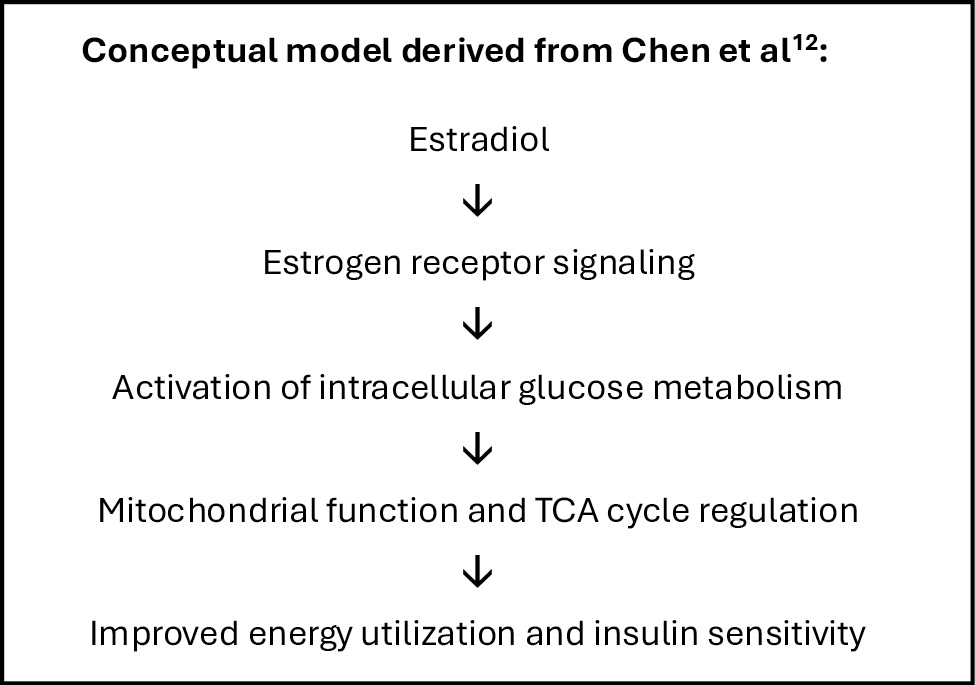
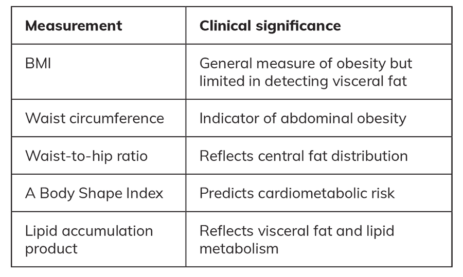
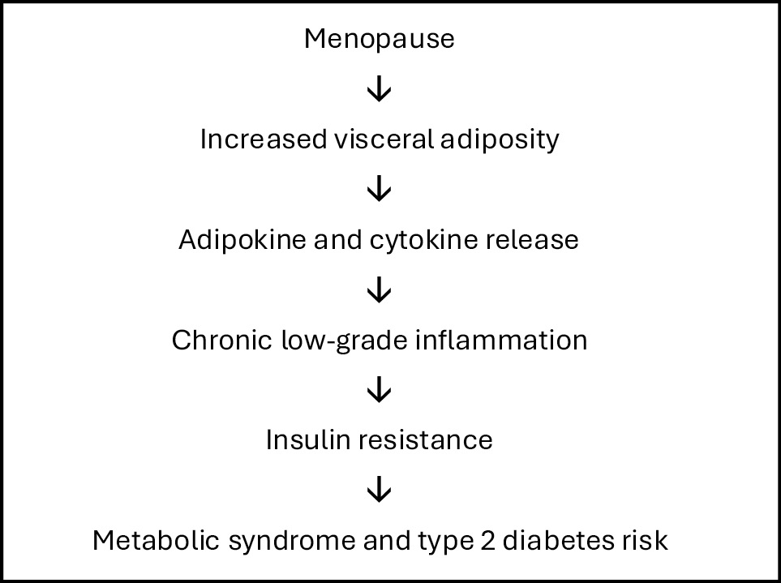
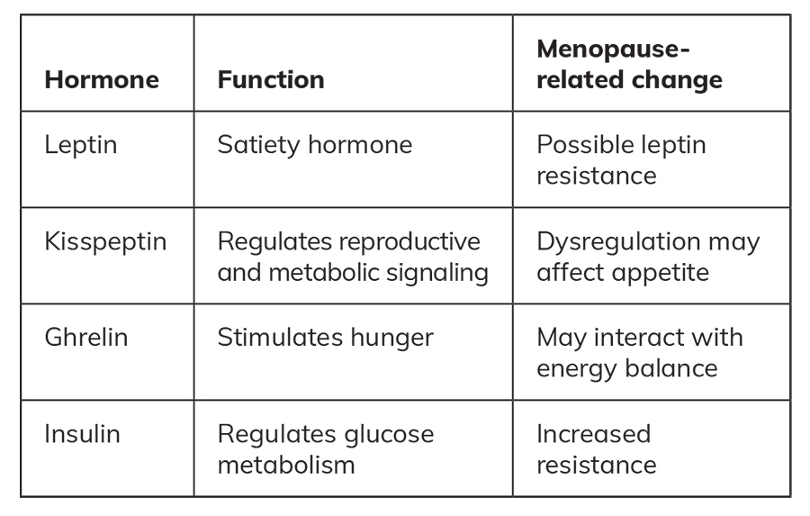
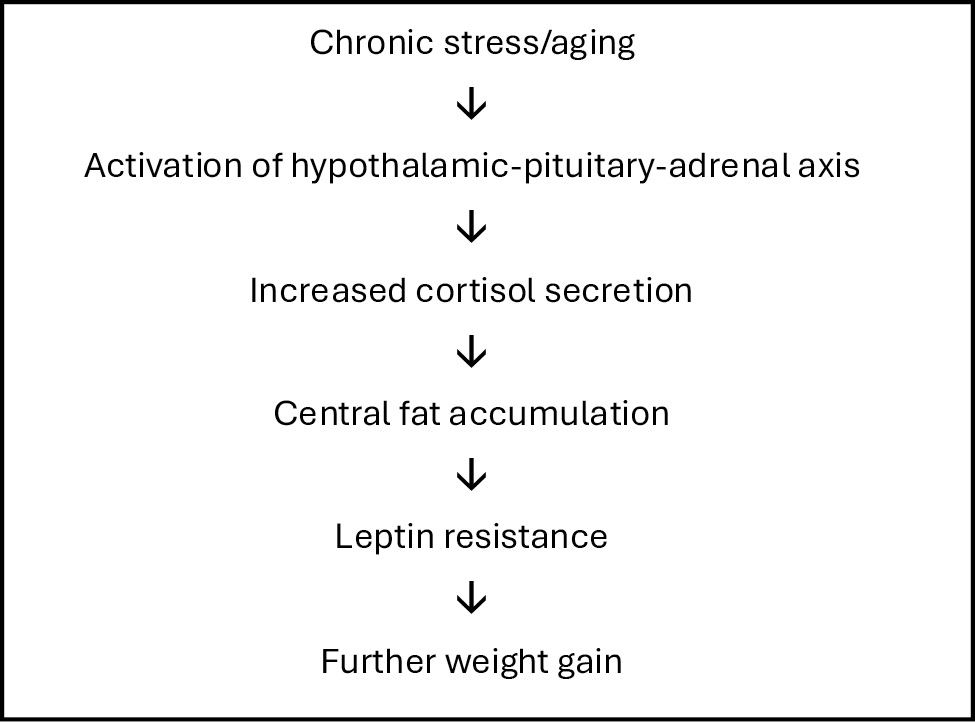
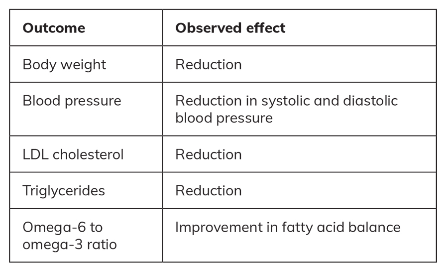
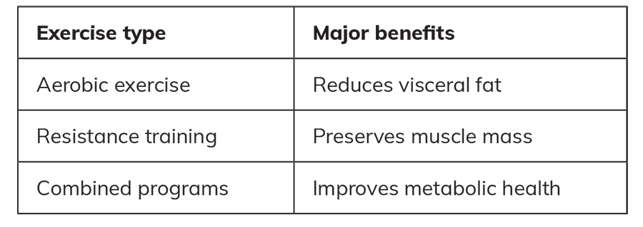
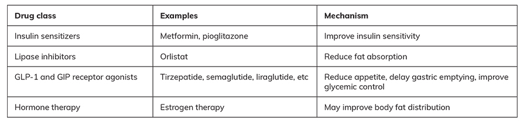

# Navigating Obesity Management in Menopause and Midlife: Endocrine Mechanisms and Clinical Management
> **中文標題**：更年期與中年女性肥胖管理的臨床導航：內分泌機轉與臨床處置
> **分類 Category**：Adipose Tissue, Appetite, Obesity, and Lipids
> **講者 Faculty**：George Mastorakos, MD, DmedSc, MSc; Harilena Tsourouktsoglou, MD; Georgios Valsamakis, MD, PhD（Unit of Endocrinology, Diabetes Mellitus, and Metabolism, Aretaieion Hospital, School of Medicine, National and Kapodistrian University of Athens, Athens, Greece）
> **來源 Source**：2026 Endocrine Case Management — Meet the Professor · ENDO 2026 · Endocrine Society

---

## 📋 教學目標 Educational Objectives

- **Diagnose and differentiate premenopause, perimenopause, and menopause in midlife women presenting with weight gain or central adiposity by using clinical features and appropriate hormonal evaluation.**
  運用臨床特徵與適當的荷爾蒙評估，診斷並鑑別中年女性因體重增加或中央型肥胖（central adiposity）就診時所處的 premenopause、perimenopause 與 menopause 階段。

- **Differentiate the causes of obesity in menopausal women, including menopause-related physiologic changes in body composition, endocrine disorders, lifestyle contributors, and central fat redistribution, using waist-based metrics alongside BMI.**
  鑑別更年期女性肥胖的成因，包括更年期相關的體組成生理變化、內分泌疾病、生活型態因素，以及中央型脂肪重新分布；並在 BMI 之外，一併採用以腰圍為基礎的量測指標。

- **Explain the metabolic effects of menopausal hormone therapy (MHT) and emerging alternatives, including their influence on fat distribution and insulin sensitivity, and their potential integration with lifestyle and pharmacologic treatments. Furthermore, recognize nonhormonal modifiers of metabolic risk during menopause, including diet quality, energy expenditure, sleep disruption, and adipokine involvement (eg, leptin).**
  說明 menopausal hormone therapy（MHT）及新興替代療法的代謝效應，包括其對脂肪分布與胰島素敏感性的影響，以及與生活型態、藥物治療整合的可能性。此外，辨識更年期代謝風險的非荷爾蒙調節因子，包括飲食品質、能量消耗、睡眠中斷，以及 adipokine（如 leptin）的角色。

---

## 🩺 臨床情境 Clinical Scenario

本章節除了背景論述外，另附三則臨床病例（Clinical Case Vignettes），涵蓋 menopause、late perimenopause 與 postmenopause 三個不同階段，並以選擇題形式引導治療決策。以下先呈現三則病例的原始資料。

### Case 1 — 54 歲女性

- Amenorrhea for 9 months／停經（無月經）9 個月
- Weight gain of approximately 18 lb (8 kg) over 2 years／2 年內體重增加約 18 lb（8 kg）
- Central fat accumulation in the abdomen／腹部中央型脂肪堆積
- Frequent hot flashes and night sweats／頻繁的熱潮紅與夜間盜汗
- Fatigue and depressed mood during dieting／節食期間出現疲倦與情緒低落
- Vaginal and generalized dryness／陰道與全身乾燥

**檢查所見**：BMI 31.8 kg/m²、waist circumference 37 in（93 cm）。自 51 歲起有控制良好的 hypertension；新診斷 dyslipidemia（total 與 LDL cholesterol 上升）。

**實驗室數據**：

| 項目 Item | 數值 Value |
|---|---|
| Fasting glucose 空腹血糖 | 118 mg/dL（SI: 6.55 mmol/L） |
| Insulin / 胰島素阻抗 | 上升，HOMA-IR = 6.7 |

### Case 2 — 49 歲 late perimenopausal 女性

- 病人主訴：「過去一年月經變得非常不規則，有時會跳過 2 至 3 個月。飲食習慣沒有改變，但體重卻增加了約 13 lb（6 kg）。衣服在腰部變緊，且經常感到腹脹。我很擔心，因為我母親在五十幾歲時得了糖尿病。這會和更年期有關嗎？」
- Sleep disturbance, difficulties in short-term memory, and fatigue／睡眠障礙、短期記憶困難與疲倦
- Central weight gain／中央型體重增加

**病史**：家族史有 T2D；久坐生活型態。**檢查所見**：BMI 29.4 kg/m²、waist circumference 36 in（92 cm）。

**實驗室數據**：

| 項目 Item | 數值 Value |
|---|---|
| Fasting glucose 空腹血糖 | 110 mg/dL（SI: 6.1 mmol/L） |
| Fasting insulin 空腹胰島素 | 18 µIU/mL（SI: 125 pmol/L） |
| HOMA-IR | 4.9 |
| Total cholesterol | 210 mg/dL（SI: 5.44 mmol/L） |
| HDL cholesterol | 50 mg/dL（SI: 1.30 mmol/L） |
| LDL cholesterol | 138 mg/dL（SI: 3.57 mmol/L） |
| Triglycerides | 160 mg/dL（SI: 1.81 mmol/L） |

### Case 3 — 58 歲、postmenopausal 已 4 年的女性

- 病人主訴：「我大約 4 年前進入更年期，但熱潮紅從未停止，事實上現在似乎更嚴重。我也感到關節疼痛與乾燥。過去十年來我增加了約 26 lb（12 kg），而且似乎不可能減下來。我很擔心，因為血壓升高了，醫師也告訴我膽固醇偏高。」
- Severe vasomotor symptoms（frequent hot flashes）／嚴重血管舒縮症狀（頻繁熱潮紅）
- Joint and muscle pain／關節與肌肉疼痛
- Vaginal dryness／陰道乾燥
- Fatigue／疲倦

**病史**：hypertension（已治療）與 dyslipidemia；former cigarette smoker（曾吸菸）。**檢查所見**：BMI 33.1 kg/m²、waist circumference 38 in（96 cm）。

**實驗室數據**：

| 項目 Item | 數值 Value |
|---|---|
| Fasting glucose 空腹血糖 | 116 mg/dL（SI: 6.4 mmol/L） |
| Fasting insulin 空腹胰島素 | 25 µIU/mL（SI: 173.6 pmol/L） |
| HOMA-IR | 7.1 |
| Total cholesterol | 240 mg/dL（SI: 6.22 mmol/L） |
| HDL cholesterol | 45 mg/dL（SI: 1.17 mmol/L） |
| LDL cholesterol | 160 mg/dL（SI: 4.14 mmol/L） |
| Triglycerides | 170 mg/dL（SI: 1.92 mmol/L） |

> 三則病例的正確答案與解析，詳見下方「個案解析與臨床推理」章節。

---

## 🔬 背景與重要性 Background & Significance

### Introduction 引言

Menopause is defined as the permanent cessation of ovarian function and menstrual cycles due to follicular depletion and is accompanied by profound hormonal changes, particularly a decline in circulating estrogen levels.1

Menopause 定義為因濾泡（follicle）耗竭導致卵巢功能與月經週期永久停止，並伴隨深遠的荷爾蒙變化，尤其是循環中 estrogen 濃度的下降。1

過去一個世紀的人口結構變化大幅改變了 menopause 的臨床意義：如今約 95% 的女性會經歷 menopause，且許多人在停經後狀態下度過超過 30 年。因此，menopause 相關的代謝疾病已成為重大公共衛生議題，而 obesity 扮演核心角色。2 Obesity 越來越被視為一種慢性、易復發的疾病，其特徵是基因、表觀遺傳、生物、行為與環境因素間的複雜交互作用，並在中年女性中呈現不成比例的上升。3 在此族群中，體重增加常伴隨 visceral adiposity（內臟脂肪）增加，這是一種在更年期過渡期出現、由荷爾蒙介導的轉變，並與 cardiometabolic risk 密切相關。4,5

The STRAW+10 (Stages of Reproductive Aging Workshop) classification provides a standardized framework for defining the stages of reproductive aging.1

STRAW+10（Stages of Reproductive Aging Workshop +10）分類提供了一個標準化架構，依據月經型態與荷爾蒙變化，界定生殖老化的各階段（reproductive stage、menopausal transition、post menopause），使臨床特徵描述與風險評估更為一致。1 因此，menopause 不應僅被視為生殖里程碑，更是一次影響能量平衡、脂肪組織分布與 cardiometabolic risk 的重大代謝轉變。7 儘管這些變化廣為人知，menopause 相關的體組成改變與代謝風險在臨床實務上仍常被低估。除了總體重的變化外，中年女性常出現胰島素敏感性下降、不利的血脂型態，以及發炎指標上升，這些變化早於明顯代謝疾病的出現，並伴隨一系列影響生活品質的更年期症狀。8-10

### Estrogen Depletion 雌激素耗竭

Although lifestyle factors remain important, accumulating evidence suggests that menopause is accompanied by intrinsic metabolic adaptations related to estrogen decline. These changes include reductions in resting and total energy expenditure that occur independently of chronological aging.7,11

儘管飲食、身體活動與睡眠等生活型態因素仍然重要，累積的證據顯示 menopause 伴隨與 estrogen 下降相關的內在代謝適應。這些變化包括獨立於實際年齡老化之外的靜息與總能量消耗下降、脂肪組織生物學的改變，以及中樞食慾調節的變化，三者共同促成正能量平衡。7,11 下降的 estrogen 與基礎代謝率（basal metabolic rate）降低、中央型肥胖增加，以及心肺適能受損有關，後者可能增加自覺費力程度並降低運動耐受度。

Estrogens play a central role in metabolic homeostasis by regulating appetite, energy expenditure, glucose metabolism, and lipid metabolism.12

Estrogen 透過調節食慾、能量消耗、glucose metabolism 與 lipid metabolism，在代謝恆定中扮演核心角色。12 其下降會擾亂 adipokine 訊號傳遞，降低如 adiponectin 等有益介質，同時改變 leptin 敏感性，進而促成促發炎（proinflammatory）與胰島素阻抗的代謝狀態。8,13 在細胞層次，estradiol 支持粒線體能量生成與細胞內 glucose metabolism，影響包括 glycolysis 與 tricarboxylic acid（TCA）cycle 在內的關鍵代謝路徑。動物實驗進一步顯示，在切除卵巢（ovariectomized）的動物給予 estrogen 補充，可預防體重增加並保護免於胰島素阻抗。14 然而，menopause 未必伴隨絕對的體重增加；其特徵更在於脂肪優先重新分布至內臟脂肪庫（visceral depots），即使 BMI 無顯著變化亦然。此時期是預防與介入的關鍵窗口，然而 menopause 特有的代謝驅動因子卻常被忽略，或被單純誤歸因於實際年齡老化。2

**Figure 1. Estradiol Regulation of Cellular Energy Metabolism（Estradiol 對細胞能量代謝的調控）**

> 📎 Derived from Chen JQ et al. Biochim Biophys Acta, 2009; 1793(7): 1128-1143. © Elsevier B.V.
>
> 改繪自 Chen JQ 等人。Biochim Biophys Acta，2009; 1793(7): 1128-1143。© Elsevier B.V.

### Clinical Impact 臨床衝擊

One of the most significant metabolic changes during menopause is the shift in body fat distribution from a gynoid to an android pattern characterized by increased visceral adipose tissue accumulation and reduced lean body mass.7

Menopause 期間最顯著的代謝變化之一，是體脂分布由 gynoid（女性/梨形）型轉為 android（男性/蘋果形）型，其特徵為 visceral adipose tissue 堆積增加與 lean body mass（瘦體組織）減少。7 Visceral adiposity 與胰島素阻抗、dyslipidemia 及慢性低度發炎密切相關，是停經後女性 cardiometabolic risk 的主要驅動因子。因此，waist circumference、waist-to-hip ratio 與 waist-to-height ratio 比單獨使用 BMI 更能預測風險（European Association for the Study of Obesity〔EASO〕guidelines）。15,16 重要的是，這種重新分布可在體重無重大變化的情況下發生。

儘管 BMI 仍是最廣泛使用的 obesity 分類量測，但它無法充分反映脂肪分布或內臟脂肪，而後兩者與 cardiometabolic risk 的關聯更為密切。因此，中央型肥胖的量測——包括 waist circumference、waist-to-hip ratio、waist-to-height ratio，以及新興指標如 lipid accumulation product（LAP）與 A Body Shape Index（ABSI）——能提供更具臨床意義的 cardiometabolic risk 評估（EASO guidelines）。3,16 雖然 obesity 傳統上定義為 BMI ≥ 30 kg/m²，但 waist circumference（女性 > 35 in〔> 88 cm〕）與 waist-to-height ratio（≥ 0.5）更能準確反映中央型肥胖與 cardiometabolic risk。15

近期方法也強調 obesity phenotyping（肥胖表型分型），認知到即使 BMI 相近，個體的代謝風險輪廓仍可能因脂肪分布與代謝健康狀態而顯著不同。3 縱貫世代研究，包括 Study of Women's Health Across the Nation（SWAN），進一步顯示 menopausal transition 與中央型肥胖進行性增加及不利的代謝變化相關，即使整體體重維持相對穩定亦然。17,18 此外，surgical menopause（手術性停經）與嚴重肥胖風險增加相關，尤其是接受 bilateral oophorectomy（雙側卵巢切除）的女性。6

**Table 1. Anthropometric Indicators of Visceral Adiposity（內臟脂肪的人體測量學指標）**

### Practice Gaps 實務落差

- 將 visceral fat 增加辨識為 menopausal transition 期間 estrogen deficiency 的早期臨床徵象。
- 認知 MHT（聚焦於加入 estrogen）在減少 visceral fat 上的有益角色，並僅在符合相應指引適應症時考慮使用。值得注意的是，visceral fat 或體重的減少，本身並不構成 MHT 的適應症。
- 認知 MHT 能增強運動（尤其是 resistance exercise）在更年期肥胖女性中的有益效果。
- 考量肥胖女性的治療兩難（特別是 BMI 超過 30 kg/m² 或 class 3 obesity 的女性）：MHT 雖可能有助於減少 visceral adipose tissue，卻可能促成血栓栓塞（thromboembolic）事件。
- 認知此女性生命階段中，其他影響脂肪組織代謝與體重的內分泌變化。

### Discussion — 病生理機轉 Pathophysiology

Menopause is associated with major metabolic changes that increase the risk of obesity and cardiometabolic disease, mainly due to declining estrogen levels.2

Menopause 與重大代謝變化相關，會增加 obesity 與 cardiometabolic disease 的風險，主因是 estrogen 濃度下降，進而影響體組成、脂肪分布與能量恆定。2 實驗與臨床模型顯示，漸進性 estrogen 缺乏會促進胰島素阻抗、增加 visceral adiposity，並擾亂包括 leptin、adiponectin 與 kisspeptin 路徑在內的 adipokine 訊號傳遞。12,19 觀察性資料進一步顯示，較早 menopause 與較高的代謝疾病風險相關，包括 type 2 diabetes（T2D）。20-22

由此產生的 visceral adiposity 增加在病生理上具有活性。Estrogen 缺乏會促進脂肪組織內的 lipolysis（脂解），增加循環中的 free fatty acids，進而損害肝臟與骨骼肌的胰島素訊號。同時，改變的 adipokine 輪廓（adiponectin 降低、leptin 訊號受損）造成促發炎、胰島素阻抗的狀態，可能表現為葡萄糖耐受不良或空腹高胰島素血症，從而增加心血管事件風險。13 值得注意的是，這些代謝轉變可獨立於絕對體重增加之外發生。多條調節代謝健康的內分泌路徑（包括 insulin、leptin、cortisol 與 thyroid hormones）在 estrogen 缺乏的中年女性中可能失調。

#### Insulin

Menopause 與胰島素阻抗及高胰島素血症增加相關。Visceral adipose tissue 透過釋放發炎介質（如 TNF、IL-6、IL-1）與 adipokines 參與此過程。血管舒縮症狀（vasomotor symptoms），包括 hot flashes 與 night sweats，也與胰島素阻抗與 cardiometabolic risk 增加相關，暗示神經血管調節與代謝功能障礙間存在潛在關聯。2,8,23

此外，menopause 期間的 visceral adiposity 與胰島素阻抗，與 metabolic dysfunction-associated steatotic liver disease（MASLD）的發生密切相關。停經後女性呈現肝臟脂肪堆積增加，主要由中央型肥胖、脂質代謝改變與慢性低度發炎驅動。24,25 MASLD 越來越被視為 menopause 相關 cardiometabolic risk 輪廓的一部分。Visceral adiposity 與葡萄糖失調間的密切交互作用被稱為「diabesity」，凸顯 obesity、胰島素阻抗與 T2D 發生之間的緊密關聯。26

**Figure 2. Mechanisms Linking Visceral Fat and Insulin Resistance（內臟脂肪與胰島素阻抗的連結機轉）**

#### Leptin

Leptin 透過下視丘（hypothalamic）訊號路徑調節食慾與能量平衡。在停經後女性中，可能因訊號機制改變而發展出 leptin resistance。實驗與臨床證據顯示，hypothalamic inflammation（下視丘發炎）可能透過擾亂參與食慾調節與能量恆定的 leptin 訊號路徑而促成此過程。Leptin 與相關神經內分泌路徑的失調可能促成 obesity。13,19,27

**Table 2. Neuroendocrine Regulators of Appetite in Menopause（更年期食慾的神經內分泌調節因子）**

#### Cortisol and the Stress Axis 皮質醇與壓力軸

The hypothalamic-pituitary-adrenal (HPA) axis plays an important role in metabolic regulation.28,29

Hypothalamic-pituitary-adrenal（HPA）axis 在代謝調節中扮演重要角色。老化與慢性壓力可能增加 cortisol 分泌，進而促進腹部脂肪沉積。28,29

**Figure 3. Interaction Between Stress, Cortisol, and Obesity（壓力、皮質醇與肥胖間的交互作用）**

#### Thyroid Hormones 甲狀腺荷爾蒙

Thyroid dysfunction 可能促成 menopause 期間的代謝變化。研究觀察到 climacteric（更年期）女性比停經前女性更常使用 thyroid medication，儘管明顯甲狀腺疾病的盛行率可能無顯著差異。30 除了生物因素外，生活型態行為與心理社會因素在 obesity 的發展中也扮演重要角色。

---

## 🧭 診斷與評估 Diagnosis & Evaluation

本章強調在 menopause 與中年女性中，代謝風險評估不應僅依賴 BMI，而需納入中央型肥胖指標與更年期分期。

**Menopause 分期（STRAW+10）**：依月經型態與荷爾蒙變化，界定 reproductive stage、menopausal transition（perimenopause）與 post menopause，以進行一致的臨床特徵描述與風險評估。1

**Obesity 與中央型肥胖的量測**：

| 指標 Metric | 判讀閾值 Cut-off（女性） | 臨床意義 |
|---|---|---|
| BMI | ≥ 30 kg/m²（obesity） | 傳統分類，但無法反映脂肪分布 |
| Waist circumference 腰圍 | > 35 in（> 88 cm） | 反映中央型/內臟脂肪 |
| Waist-to-height ratio 腰身高比 | ≥ 0.5 | 較 waist circumference 與 BMI 更佳的篩檢工具16 |
| Waist-to-hip ratio 腰臀比 | — | 反映脂肪分布型態 |
| LAP、ABSI | — | 新興 cardiometabolic risk 指標 |

**代謝評估**：中年女性常在明顯代謝疾病前即出現胰島素敏感性下降、不利血脂型態與發炎指標上升。臨床上可透過 fasting glucose、fasting insulin 與 HOMA-IR 評估胰島素阻抗；並評估 lipid profile（total、LDL、HDL cholesterol、triglycerides）。應留意 MASLD 作為 menopause 相關 cardiometabolic risk 輪廓的一部分。

**關鍵原則**：脂肪由 gynoid 轉為 android 型的重新分布可在體重無重大變化下發生，因此僅依 BMI 或體重評估會低估風險；需結合 waist-based metrics 與更年期分期進行早期風險分層。

---

## 💊 治療與處置 Management

Effective management of obesity during menopause requires a holistic strategy that includes dietary interventions, regular physical activity, behavioral therapy, and pharmacological treatment when appropriate. Even modest weight reduction of 5% to 10% can significantly improve metabolic parameters and menopausal symptoms.

有效管理 menopause 期間的 obesity 需要整體性策略，涵蓋飲食介入、規律身體活動、行為治療，以及在適當時使用藥物治療。即使是 5% 至 10% 的溫和減重，也能顯著改善代謝參數與更年期症狀。當代 obesity 管理指引建議採取階梯式治療策略，包括生活型態調整、有適應症時的藥物治療，以及對嚴重肥胖採用代謝或減重手術（metabolic or bariatric surgery）。

### Lifestyle Modification 生活型態調整

生活型態調整仍是更年期肥胖女性 obesity 管理的基石。即使 5% 至 10% 的溫和減重，也能顯著改善與胰島素阻抗相關的代謝異常。報告的益處包括改善血糖控制、降低心血管危險因子，甚至改善 vasomotor symptoms（如 hot flashes）。31,32

### Nutritional Interventions 營養介入

Mediterranean diet 與多項代謝益處相關，並在數個正向面向上表現突出。33 它強調水果、蔬菜、全穀類、橄欖油、魚類與適量乳製品的攝取。

**Table 3. Effects of the Mediterranean Diet in Menopausal Women（Mediterranean diet 對更年期女性的效益）**

### Physical Activity 身體活動

運動對維持更年期女性的代謝健康至關重要。31 在 menopausal transition 期間，女性常較少從事身體活動，此反映了年齡增長與更年期相關的代謝與生物變化。2 下降的 estrogen 與 basal metabolic rate 降低、中央型肥胖增加及心肺適能受損相關，這些變化增加自覺費力程度並降低運動耐受度。11 睡眠障礙與壓力相關的神經內分泌改變（如 leptin 與 HPA axis 活性的失調）可能進一步耗竭可用能量並降低習慣性身體活動。13,28

**現行建議 Current recommendations**：

- 每週至少 150 分鐘中等強度身體活動（At least 150 minutes of moderate physical activity per week）
- 結合有氧與阻力訓練（A combination of aerobic and resistance training）34,35

**Table 4. Benefits of Exercise in Menopausal Women（運動對更年期女性的益處）**

### Behavioral Interventions 行為介入

心理因素會影響 menopause 期間的體重增加。Cognitive behavioral therapy（CBT）可透過改善順從性與處理情緒障礙，支持生活型態介入。36

### Menopausal Hormone Therapy（MHT）

MHT may be considered for symptomatic women; however, obesity influences treatment decisions. Women with a BMI greater than 30 kg/m² may be at increased risk of adverse effects from certain hormonal therapies, whereas transdermal estradiol may be a safer option in some cases because of its lower thrombotic risk.37

MHT 可考慮用於有症狀的女性；然而 obesity 會影響治療決策。BMI 超過 30 kg/m² 的女性，使用某些荷爾蒙療法時發生不良反應的風險可能較高，而 transdermal estradiol 因血栓風險較低，在某些情況下可能是較安全的選擇。37

因此，臨床決策應個別化，在症狀緩解與 cardiometabolic risk 之間取得平衡。在停經前（premenopausal）女性中，也可考慮使用 cyclical micronized progesterone 或 levonorgestrel-releasing intrauterine system。須注意的是，hormone therapy 並不會一致地產生顯著減重，儘管它可能減少中央型脂肪堆積。38,39

### Pharmacologic Treatment 藥物治療

當生活型態介入失敗時建議藥物治療。對於嚴重肥胖或有肥胖相關併發症、且生活型態與藥物介入不足的病人，可考慮代謝或減重手術（metabolic or bariatric surgery）。34,40

**Table 5. Pharmacologic Options for Obesity in Menopause（更年期肥胖的藥物治療選項）**

### Prevention and Clinical Implications 預防與臨床意涵

預防 menopause 期間的 obesity 需採取生命歷程（life-course）取向。醫療專業人員應自生命早期即推廣健康飲食習慣、身體活動與體重維持。處理促成 obesity 的環境因素（如久坐生活型態與高熱量飲食）亦至關重要。3

---

## 🧠 個案解析與臨床推理 Case Analysis & Clinical Reasoning

### 核心臨床邏輯

三則病例共同傳達的核心訊息是：中年女性的體重增加與代謝惡化，應同時涵蓋「更年期特有的病因」與「內臟脂肪/總體脂肪的有害效應」，而非僅針對單一代謝異常（如血糖或血脂）進行片面處理。治療目標須依 menopause 分期（premenopause／perimenopause／postmenopause）調整，並在使用 MHT 時權衡 BMI 帶來的血栓風險。

### Case 1（54 歲，menopause）

**正確答案：D — Waist circumference, BMI, and menopausal symptoms。**

此選項同時處理 visceral fat、總體脂肪與 estrogen deficiency 三者的有害效應。2,7,8

- 次佳選項為 C（waist circumference 與 BMI），因其處理內臟與總體脂肪的有害效應；中央型肥胖與胰島素阻抗、cardiometabolic risk 密切相關，可解釋葡萄糖代謝受損與 dyslipidemia。
- 選項 A（僅治療高血糖，如生活型態調整、metformin）會忽略代謝紊亂的 menopause 相關病因。
- 選項 B（僅針對脂肪組織相關的胰島素阻抗）會忽略 menopause 相關的胰島素阻抗。
- 選項 E（dyslipidemia）僅針對代謝紊亂的單一因素。

**臨床要點**：HOMA-IR 6.7 與 fasting glucose 118 mg/dL 顯示顯著胰島素阻抗與前期血糖異常，但這些應被理解為 menopause 驅動之代謝症候群的下游表現，處置應以中央型肥胖與更年期症狀為整合性標的。

### Case 2（49 歲，late perimenopause）

**Question 1 — 正確答案：D — Waist circumference, BMI, bloating, and menstrual irregularity。**

此選項同時處理 premenopause 相關症狀（月經不規則、睡眠障礙、短期記憶困難、疲倦）的病因，以及此生命階段體重增加的病因。2,5,23 在 menopausal transition 期間，荷爾蒙變化——尤其是 estrogen 下降——即使無顯著體重增加，也會促進中央型脂肪重新分布與 visceral adiposity 增加；obesity 與 BMI 上升也與更強烈的更年期症狀相關。

**Question 2 — 正確答案：D — Micronized progesterone 或 levonorgestrel-releasing intrauterine system，加上 physical activity 與 nutrition advice（weight reduction）。**

此組合同時針對 premenopause 相關症狀與此階段體重增加的病因。32,38

- 選項 A（僅運動與營養建議）未處理停經前症狀。
- 選項 B（僅 progesterone 或 LNG-IUS）僅治療停經前症狀。
- 選項 C（僅身體活動）過於侷限，且未被證實能加速減重。
- 選項 E（加上安眠藥物）屬症狀性而非病因性處理。

**Question 3 —「然後呢？（And then what?）」**：本題為開放式追問，用意在引導思考後續的縱貫追蹤與升階策略。基於本章邏輯，合理的臨床推理包括：定期重新評估 waist-based metrics 與代謝參數、強化生活型態依從性、監測是否進展至 postmenopause 而需重新評估 MHT 的適應症與風險，以及在生活型態介入不足時考慮藥物治療。（此為標準臨床推理，來源未提供本題的固定標準答案。）

### Case 3（58 歲，postmenopausal 4 年）

**正確答案：E — Physical activity、nutrition advice（weight reduction）、optimization of cardiometabolic risk factors，以及 transdermal MHT with micronized progesterone 或 progestogen，並依此順序施行。**

- 選項 A（僅身體活動與營養建議）未治療更年期症狀；惟減重與代謝控制可同時改善心血管風險與更年期症狀。
- 選項 B（progesterone 或 LNG-IUS）不適用於 menopause。
- 選項 C（僅 transdermal MHT）對更年期症狀適當，但本例 BMI 升高需審慎；obesity 與更嚴重的更年期症狀（尤其 vasomotor symptoms）相關，脂肪組織可能促成體溫調節不穩與荷爾蒙失衡。
- 選項 D（transdermal MHT 加運動與營養建議）為更全面的取向，兼顧 obesity 與更年期症狀的管理；但正確選擇為 E——需依所述順序施行，並對此 BMI 升高女性審慎給予 MHT。8,31,32,37

**臨床要點**：本例為 postmenopausal 且 BMI 33.1 kg/m²、former smoker、合併 hypertension 與 dyslipidemia，屬血栓與心血管高風險族群。因此策略應先以生活型態與 cardiometabolic risk 因子最佳化為基礎，再在審慎評估下選用 transdermal（而非口服）路徑以降低血栓風險。

### 常見陷阱 Pitfalls

- **僅依 BMI 評估風險**：脂肪重新分布可在體重穩定時發生，忽略 waist-based metrics 會低估 cardiometabolic risk。
- **片面治療單一代謝異常**：僅處理血糖或血脂，會忽略 menopause 驅動的整體病因。
- **忽略 MHT 的血栓風險**：在 BMI > 30 kg/m² 或 class 3 obesity 女性，口服 estrogen 可能增加 thromboembolic 風險；transdermal 路徑較安全。
- **以 MHT 作為減重手段**：MHT 並非為體重變化而開立；減少 visceral fat 或體重本身不構成 MHT 的適應症，僅可作為評估時的輔助考量。
- **將更年期代謝變化誤歸因於單純老化**：忽略此關鍵預防/介入窗口。

---

## ⭐ 重點整理 Key Takeaways

- Premenopause 與 menopause 與體重增加相關，尤其是 visceral fat 堆積；此重新分布可在 BMI 無顯著變化下發生。
- 在 menopausal transition 期間，女性常出現身體活動與能量消耗（energy expenditure）下降。
- 風險評估不應僅依賴 BMI；應納入 waist circumference（女性 > 88 cm）、waist-to-height ratio（≥ 0.5）等中央型肥胖指標（EASO guidelines）。
- Estrogen 缺乏透過 insulin、leptin、cortisol 與 thyroid hormones 等多條內分泌路徑影響能量平衡與脂肪分布，並促成 MASLD 與「diabesity」。
- 內分泌科醫師應將體重增加與中央型脂肪重新分布辨識為 premenopausal 與 menopausal syndromes 的一部分。
- MHT 的適應症不包含體重變化；但體重增加與脂肪朝內臟重新分布可作為評估其潛在使用時的輔助考量。在 BMI > 30 kg/m² 女性應審慎，transdermal estradiol 因血栓風險較低而較受青睞。
- 治療需整體性：5% 至 10% 的溫和減重即可顯著改善代謝健康與生活品質；內分泌科醫師應熟悉運動處方（含 resistance exercise）的開立。

---

## 💬 討論問題 Discussion Questions

1. 在一位 BMI 正常但 waist circumference 超標的 perimenopausal 女性中，你會如何向她說明「體重沒變但風險上升」的機轉，並據此設計介入？
2. 面對 BMI > 30 kg/m²、合併嚴重 vasomotor symptoms 且有心血管危險因子的停經後女性，你如何在 MHT 的症狀緩解益處與血栓風險間權衡？transdermal 與 oral 路徑的選擇考量為何？
3. 「MHT 不應作為減重工具，但體重與脂肪分布可作為輔助考量」——在臨床實務中，你如何向病人溝通這個界線，避免其誤解 MHT 為減肥藥？
4. 對 Case 2 的「然後呢（And then what?）」，你會設計怎樣的縱貫追蹤與升階治療流程（含何時考慮 pharmacotherapy 或轉介手術）？
5. 在你的臨床環境中，如何將 waist-based metrics、obesity phenotyping 與更年期分期整合進常規門診評估，以提升早期風險分層？

---

## 📚 參考文獻 References

1. Harlow SD, Gass M, Hall JE, et al. Executive summary of the Stages of Reproductive Aging Workshop + 10: addressing the unfinished agenda of staging reproductive aging. *J Clin Endocrinol Metab*. 2012;97(4):1159-1168. PMID: 22344196
2. El Khoudary SR, Aggarwal B, Beckie TM, et al. Menopause transition and cardiovascular disease risk: implications for timing of early prevention: a scientific statement from the American Heart Association. *Circulation*. 2020;142(25):e506-e532. PMID: 33251828
3. Busetto L, Dicker D, Azran C, et al. Practical recommendations of the Obesity Management Task Force of the European Association for the Study of Obesity for the post-bariatric surgery medical management. *Obes Facts*. 2017;10(6):597-632. PMID: 29207379
4. Ambikairajah A, Walsh E, Tabatabaei-Jafari H, Cherbuin N. Fat mass changes during menopause: a metaanalysis. *Am J Obstet Gynecol*. 2019;221(5):393-409.e50. PMID: 31034807
5. Greendale GA, Han W, Finkelstein JS, Burnett-Bowie SM, Huang M, Martin D, Karlamangla AS. Changes in regional fat distribution and anthropometric measures across the menopause transition. *J Clin Endocrinol Metab*. 2021;106(9):2520-2534. PMID: 34061966
6. Sowers M, Zheng H, Tomey K, et al. Changes in body composition in women over six years at midlife: ovarian and chronological aging. *J Clin Endocrinol Metab*. 2007;92(3):895-901. PMID: 17192296
7. Greendale GA, Sternfeld B, Huang M, et al. Changes in body composition and weight during the menopause transition. *JCI Insight*. 2019;4(5). PMID: 30843880
8. Kahn SE, Hull RL, Utzschneider KM. Mechanisms linking obesity to insulin resistance and type 2 diabetes. *Nature*. 2006;444(7121):840-846. PMID: 17167471
9. Perry CD, Alekel DL, Ritland LM, et al. Centrally located body fat is related to inflammatory markers in healthy postmenopausal women. *Menopause*. 2008;15(4 Pt 1):619-627. PMID: 18202591
10. Nappi RE, Kokot-Kierepa M. Vaginal Health: Insights, Views & Attitudes (VIVA)—results from an international survey. *Climacteric*. 2012;15(1):36-44. PMID: 22168244
11. Lovejoy JC, Champagne CM, de Jonge L, Xie H, Smith SR. Increased visceral fat and decreased energy expenditure during the menopausal transition. *Int J Obes (Lond)*. 2008;32(6):949-958. PMID: 18332882
12. Chen JQ, Brown TR, Russo J. Regulation of energy metabolism pathways by estrogens and estrogenic chemicals and potential implications in obesity associated with increased exposure to endocrine disruptors. *Biochim Biophys Acta*. 2009;1793(7):1128-1143. PMID: 19348861
13. Springer AM, Foster-Schubert K, Morton GJ, Schur EA. Is there evidence that estrogen therapy promotes weight maintenance via effects on leptin? *Menopause*. 2014;21(4):424-432. PMID: 24149922
14. Zhu L, Brown WC, Cai Q, et al. Estrogen treatment after ovariectomy protects against fatty liver and may improve pathway-selective insulin resistance. *Diabetes*. 2013;62(2):424-434. PMID: 22966069
15. Ross R, Neeland IJ, Yamashita S, et al. Waist circumference as a vital sign in clinical practice: a consensus statement from the IAS and ICCR Working Group on Visceral Obesity. *Nat Rev Endocrinol*. 2020;16(3):177-189. PMID: 32020062
16. Ashwell M, Gunn P, Gibson S. Waist-to-height ratio is a better screening tool than waist circumference and BMI for adult cardiometabolic risk factors: systematic review and meta-analysis. *Obes Rev*. 2012;13(3):275-286. PMID: 22106927
17. Samargandy S, Matthews KA, Brooks MM, et al. Abdominal visceral adipose tissue over the menopause transition and carotid atherosclerosis: the SWAN heart study. *Menopause*. 2021;28(6):626-633. PMID: 33651741
18. Sutton-Tyrrell K, Zhao X, Santoro N, et al. Reproductive hormones and obesity: 9 years of observation from the Study of Women's Health Across the Nation. *Am J Epidemiol*. 2010;171(11):1203-1213. PMID: 20427327
19. Hestiantoro A, Astuti BPK, Muharam R, et al. Dysregulation of kisspeptin and leptin, as anorexigenic agents, plays role in the development of obesity in postmenopausal women. *Int J Endocrinol*. 2019;2019:1347208. PMID: 31871451
20. Asllanaj E, Bano A, Glisic M, et al. Age at natural menopause and life expectancy with and without type 2 diabetes. *Menopause*. 2019;26(4):387-394. PMID: 30300301
21. Muka T, Asllanaj E, Avazverdi N, et al. Age at natural menopause and risk of type 2 diabetes: a prospective cohort study. *Diabetologia*. 2017;60(10):1951-1960. PMID: 28721436
22. Mishra GD, Kuh D. Health symptoms during midlife in relation to menopausal transition: British prospective cohort study. *BMJ*. 2012;344:e402. PMID: 22318435
23. Thurston RC, Sowers MR, Sutton-Tyrrell K, et al. Abdominal adiposity and hot flashes among midlife women. *Menopause*. 2008;15(3):429-434. PMID: 18204407
24. Ntikoudi A, Spyrou A, Evangelou E, Dokoutsidou E, Mastorakos G. The effect of menopausal status, insulin resistance and body mass index on the prevalence of non-alcoholic fatty liver disease. *Healthcare (Basel)*. 2024;12(11):1081. PMID: 38891156
25. Venetsanaki V, Polyzos SA. Menopause and non-alcoholic fatty liver disease: a review focusing on therapeutic perspectives. *Curr Vasc Pharmacol*. 2019;17(6):546-555. PMID: 29992886
26. Astrup A, Finer N. Redefining type 2 diabetes: "diabesity" or "obesity dependent diabetes mellitus"? *Obes Rev*. 2000;1(2):57-59. PMID: 12119987
27. Dionysopoulou S, Charmandari E, Bargiota A, Vlahos N, Mastorakos G, Valsamakis G. The role of hypothalamic inflammation in diet-induced obesity and its association with cognitive and mood disorders. *Nutrients*. 2021;13(2):498. PMID: 33546219
28. Papargyri P, Zapanti E, Salakos N, Papargyris L, Bargiota A, Mastorakos G. Links between HPA axis and adipokines: clinical implications in paradigms of stress-related disorders. *Expert Rev Endocrinol Metab*. 2018;13(6):317-332. PMID: 30422016
29. Barlampa D, Bompoula MS, Bargiota A, Kalantaridou S, Mastorakos G, Valsamakis G. Hypothalamic inflammation as a potential pathophysiologic basis for the heterogeneity of clinical, hormonal, and metabolic presentation in PCOS. *Nutrients*. 2021;13(2):520. PMID: 33562540
30. Savukoski SM, Niinimäki MJ, Pesonen PRO, et al. Is climacterium by the mid-40s associated with thyroid dysfunction or autoimmunity? A population-based study. *Menopause*. 2021;28(9):1053-1059. PMID: 34010935
31. Jakicic JM. Physical activity and weight loss. *Nestle Nutr Inst Workshop Ser*. 2012;73:21-36. PMID: 23128763
32. Mastorakos G, Valsamakis G, Paltoglou G, Creatsas G. Management of obesity in menopause: diet, exercise, pharmacotherapy and bariatric surgery. *Maturitas*. 2010;65(3):219-224. PMID: 20044222
33. Gonçalves C, Moreira H, Santos R. Systematic review of Mediterranean diet interventions in menopausal women. *AIMS Public Health*. 2024;11(1):110-129. PMID: 38617417
34. Apovian CM, Aronne LJ, Bessesen DH, et al. Pharmacological management of obesity: an Endocrine Society clinical practice guideline. *J Clin Endocrinol Metab*. 2015;100(2):342-362. PMID: 25590212
35. Bouchard DR, Soucy L, Sénéchal M, Dionne IJ, Brochu M. Impact of resistance training with or without caloric restriction on physical capacity in obese older women. *Menopause*. 2009;16(1):66-72. PMID: 18779759
36. Mefferd K, Nichols JF, Pakiz B, Rock CL. A cognitive behavioral therapy intervention to promote weight loss improves body composition and blood lipid profiles among overweight breast cancer survivors. *Breast Cancer Res Treat*. 2007;104(2):145-152. PMID: 17058023
37. The North American Menopause Society. The 2022 hormone therapy position statement of The North American Menopause Society. *Menopause*. 2022;29(7):767-794. PMID: 35797481
38. Memi E, Pavli P, Papagianni M, Vrachnis N, Mastorakos G. Diagnostic and therapeutic use of oral micronized progesterone in endocrinology. *Rev Endocr Metab Disord*. 2024;25(4):751-772. PMID: 38652231
39. Papadakis GE, Hans D, Gonzalez Rodriguez E, et al. Menopausal hormone therapy is associated with reduced total and visceral adiposity: the OsteoLaus cohort. *J Clin Endocrinol Metab*. 2018;103(5):1948-1957. PMID: 29596606
40. Eisenberg D, Shikora SA, Aarts E, et al. 2022 American Society of Metabolic and Bariatric Surgery (ASMBS) and International Federation for the Surgery of Obesity and Metabolic Disorders (IFSO) indications for metabolic and bariatric surgery. *Obes Surg*. 2023;33(1):3-14. PMID: 36336720
