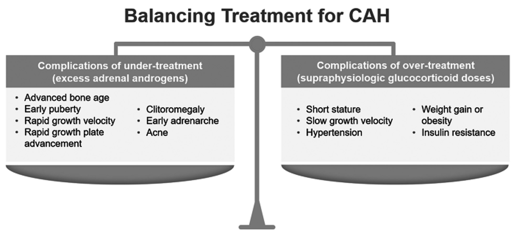
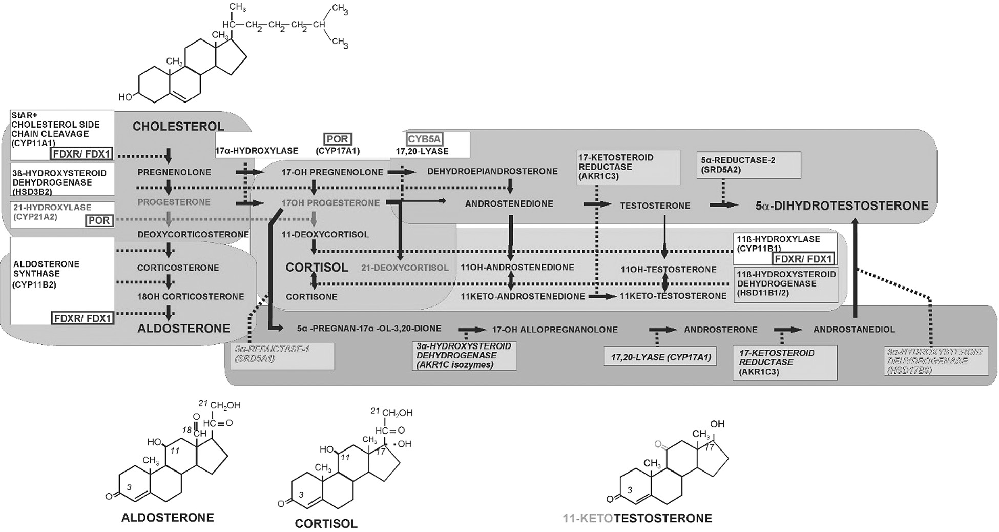
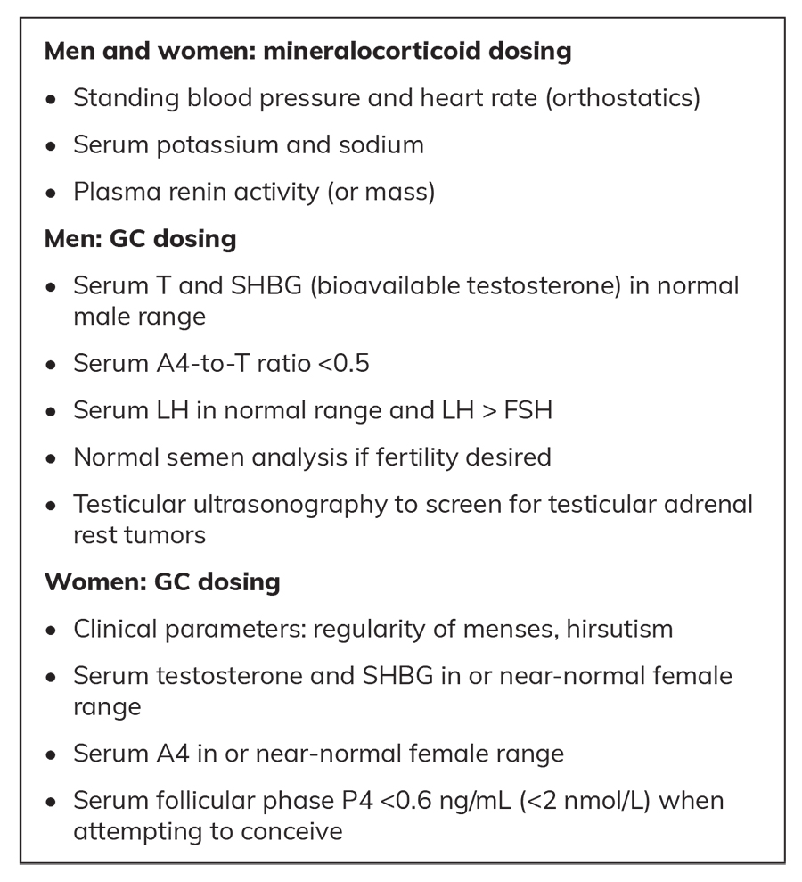
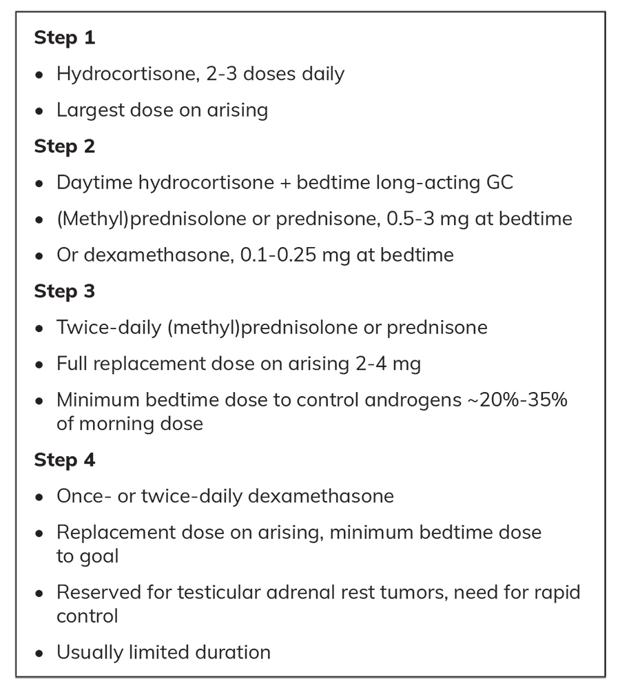
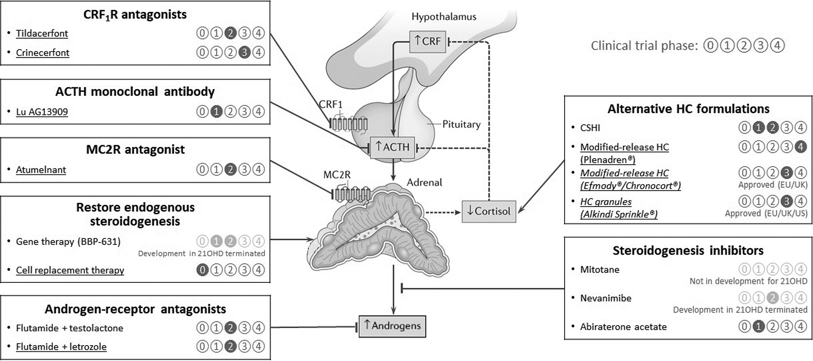

# New Management Options for Adults With Congenital Adrenal Hyperplasia
> **中文標題**：成人先天性腎上腺增生症（CAH）的新型治療選擇
> **分類 Category**：Adrenal
> **講者 Faculty**：Richard J. Auchus, MD, PhD（University of Michigan；LTC Charles S. Kettles VA Medical Center, Ann Arbor, Michigan）；Benjamin Wilson, BA（Boston University Chobanian and Avedisian School of Medicine；Visiting Student, University of Michigan）
> **來源 Source**：2026 Endocrine Case Management — Meet the Professor · ENDO 2026 · Endocrine Society

---

## 📋 教學目標 Educational Objectives

- **Distinguish the complications observed in adults with congenital adrenal hyperplasia (CAH) due to the disease itself from those derived from long-term treatment with supraphysiological glucocorticoids (GCs).**
  區分成人 CAH 病人中「源自疾病本身」與「源自長期使用超生理劑量 glucocorticoids（GCs）治療」兩類併發症。

- **List the sites of action for non-GC adjunct therapies for CAH that have been studied and are in trials.**
  列出目前已研究或正在臨床試驗中的 CAH 非 GC 輔助療法的作用位點。

- **Develop monitoring and GC-dose-reduction plans when adding adjunctive non-GC therapies in adults with CAH.**
  在成人 CAH 加入非 GC 輔助治療時，能擬定監測計畫與 GC 減量方案。

---

## 🩺 臨床情境 Clinical Scenario

本章以兩個真實化的病例貫穿成人 CAH（21-OHD）的處置決策。

### Case 1

**English.** A 25-year-old woman with classic 21-OHD from birth presents for transition to adult care. CAH was well-managed with hydrocortisone until age 23 years, at which time her control began to deteriorate without any change in regimen. She has had amenorrhea for 6 months, oily skin, acne, and unwanted coarse hairs on her abdomen and chest. She is getting married and wants to start a family soon. Current regimen: hydrocortisone 10-10-5 mg with meals, plus fludrocortisone 0.2 mg daily. On examination, blood pressure is normal, no cushingoid features, bruising, or muscle weakness; mild facial acne and oily skin.

- A4 = 490 ng/dL（正常 <180 ng/dL）（SI: 17.1 nmol/L [<6.3 nmol/L]）
- T = 129 ng/dL（正常 <60 ng/dL）（SI: 4.5 nmol/L [<2.1 nmol/L]）

**繁中.** 25 歲女性，出生即診斷古典型 21-OHD，此次因轉銜至成人照護而就診。原本以 hydrocortisone 控制良好，直到 23 歲在未更動處方下疾病控制開始惡化。她已無月經 6 個月，並有油性皮膚、痤瘡，以及腹部與胸部不受歡迎的粗毛。她即將結婚並希望儘快懷孕。現行處方為 hydrocortisone 隨餐 10-10-5 mg，加 fludrocortisone 0.2 mg/day。理學檢查血壓正常，無 cushingoid 表現、瘀青或肌肉無力，僅有輕度臉部痤瘡與油性皮膚。上述 A4 與 T 皆明顯上升，代表疾病控制不佳。

### Case 2

**English.** A 22-year-old woman with classic 21-OHD has transitioned to adult care on hydrocortisone 12.5/10/10 mg with meals and fludrocortisone 0.1 mg daily. She reports no recent weight gain, easy bruising, or muscle weakness, but has had no menses for a year and plucks terminal chin hairs weekly. She plans to have children in the future and is concerned about the amenorrhea.

- A4 = 480 ng/dL（SI: 16.8 nmol/L）
- T = 195 ng/dL（SI: 6.8 nmol/L）
- P4 = 3.2 ng/mL（SI: 10.2 nmol/L）
- Plasma renin = 77 pg/mL（SI: 1.8 pmol/L）
- Potassium = 4.7 mEq/L（SI: 4.7 mmol/L）

**繁中.** 22 歲女性，古典型 21-OHD，轉銜至成人照護，處方為 hydrocortisone 隨餐 12.5/10/10 mg 與 fludrocortisone 0.1 mg/day。她否認近期體重增加、易瘀青或肌肉無力，但已一年無月經，每週需拔除下巴的終毛。她計畫未來生育，對停經感到憂心。實驗數據顯示 A4、T、P4 皆偏高，renin 偏高、鉀正常。

---

## 🔬 背景與重要性 Background & Significance

**English.** Since Lawson Wilkins introduced cortisone therapy for children with classic CAH due to 21-hydroxylase deficiency (21-OHD) in the 1950s, GC therapy has been used both to replace cortisol deficiency and to normalize adrenal-derived androgens. Untreated children risk adrenal crises with hypotension, hyperkalemia, and hypoglycemia; chronic androgen/estrogen exposure causes rapid somatic growth with advanced bone age, precocious pubarche, short adult stature, and derangements in pubertal progression and fertility. Oral hydrocortisone has poor pharmacokinetics—peak concentrations 1 to 2 hours after ingestion and a half-life of 60 to 90 minutes—so it only approximates the normal circadian cortisol rhythm.

**繁中.** 自 1950 年代 Lawson Wilkins 為古典型 21-OHD 兒童引入 cortisone 治療以來，GC 治療同時肩負「補充 cortisol 不足」與「壓抑腎上腺來源雄性素」兩項任務。未治療的兒童面臨低血壓、高血鉀、低血糖的 adrenal crisis 風險；長期雄性素／雌性素暴露則造成快速體格成長、骨齡超前、pubarche 提早、成人身高矮小，以及青春期進展與生育力受損。口服 hydrocortisone 藥動學不佳（服藥後 1–2 小時達峰、半衰期僅 60–90 分鐘），最多只能「近似」正常晝夜 cortisol 節律。

**English.** Higher-than-physiological doses are needed to normalize adrenal-derived androgens for several reasons: (1) ACTH and adrenal steroidogenesis rise at approximately 0400, before awakening and the first hydrocortisone dose; (2) a massive steroid flux of about 7 mg/m² per day of cortisol generation is diverted to sex steroids that are active at 100-fold lower concentrations; and (3) oral hydrocortisone is cleared rapidly, in proportion to its concentration. More potent synthetic GCs (prednisolone and its prodrug prednisone, methylprednisolone, dexamethasone) have narrow therapeutic indices, and overtreatment causes growth suppression. Pediatric care is thus a delicate balance between over- and undertreatment.

**繁中.** 之所以需要超生理劑量才能壓抑腎上腺來源雄性素，原因有三：(1) ACTH 與腎上腺類固醇生成約在清晨 0400、在起床與第一劑 hydrocortisone 之前即開始上升；(2) 原本約 7 mg/m²/day 的龐大 cortisol 生成通量被改道流向性類固醇，而性類固醇在低 100 倍的濃度即具活性；(3) 口服 hydrocortisone 依其濃度成比例快速清除。較強效的合成 GC（prednisolone 及其前驅藥 prednisone、methylprednisolone、dexamethasone）治療區間狹窄，過度治療會抑制生長。故兒童期照護是在過度與不足之間的細膩平衡，需頻繁監測與劑量調整，並考量體型隨時間增大。

**Figure 1. Balancing Treatment for Patients With CAH（CAH 病人治療的平衡）**

> 📎 Both overtreatment and undertreatment of CAH can lead to acute and chronic complications. Reprinted from Nokoff NJ et al. J Clin Endocrinol Metab, 2025; 110(Supplement 1): S13-S24. © The Authors. Published by Oxford University Press on behalf of the Endocrine Society.
>
> CAH 的過度治療與治療不足都可能導致急性與慢性併發症。轉載自 Nokoff NJ 等人。J Clin Endocrinol Metab, 2025; 110(Supplement 1): S13-S24。© 作者群。由 Oxford University Press 代表 Endocrine Society 出版。

**English.** Upon reaching adulthood, skeletal growth is complete and well-managed adolescents have finished pubertal maturation, so treatment intensity can be relaxed somewhat—gonadal-derived androgens normally equal or exceed the adrenal component in unaffected adults. Nevertheless, supraphysiological GC dosing is still necessary in most patients to allow normal gonadal function. Cohorts of adults with CAH show a high prevalence of obesity, insulin resistance, low bone mineral density, and cardiovascular events—very similar to adults with subtle hypercortisolism from adrenal adenomas. This drives the search for alternative approaches to reduce excess GC exposure.

**繁中.** 進入成年後骨骼生長已完成，控制良好的青少年也已完成青春期成熟，治療強度可稍放寬——正常成人的性腺來源雄性素通常等於或超過腎上腺成分。然而多數病人仍需超生理劑量 GC 才能維持正常性腺功能。成人 CAH 世代研究顯示肥胖、胰島素阻抗、低骨密度與心血管事件盛行率偏高，與腎上腺腺瘤造成之輕微 hypercortisolism 成人非常相似。因此臨床上一直在尋找可減少過量 GC 暴露的替代方案。

### 病理生理：紊亂的類固醇生成 Deranged Steroid Production

**English.** In 21-OHD, the block to cortisol and aldosterone synthesis reroutes steroid flux to androgens. The major accumulating steroid is 17-hydroxyprogesterone (17-OHP), used for diagnosis and, in children, for monitoring. The adrenal produces androstenedione (A4), converted to testosterone (T) and 5α-dihydrotestosterone (DHT) mainly in extra-adrenal tissues. The adrenal-specific 11β-hydroxylase (CYP11B1) converts A4 to 11β-hydroxyandrostenedione (11-OHA4), which is converted peripherally to the active androgen 11-ketotestosterone (11-KT) and its 5α-reduced metabolite. In 21-OHD, 11-OHA4 and 11-KT are often higher than A4 and T, respectively. Other androgen-excess forms—11β-hydroxylase deficiency (11-OHD) and 3β-hydroxysteroid dehydrogenase type 2 deficiency (3β-HSD2D)—produce very little 11-OHA4/11-KT. Upstream of 17-OHP, progesterone (P4) also accumulates; like synthetic progestins, P4 can suppress or alter the hypothalamic-pituitary-gonadal axis in both sexes, and in women P4's action on the uterus is a major cause of irregular menses and infertility.

**繁中.** 在 21-OHD 中，cortisol 與 aldosterone 合成受阻，使類固醇通量改道至雄性素。阻斷點上游主要累積的是 17-hydroxyprogesterone（17-OHP），為診斷依據，在兒童也用於監測。腎上腺產生 androstenedione（A4），主要在腎上腺外組織轉為 testosterone（T）與 5α-dihydrotestosterone（DHT）。腎上腺專一的 11β-hydroxylase（CYP11B1）將 A4 轉為 11β-hydroxyandrostenedione（11-OHA4），再於周邊轉為活性雄性素 11-ketotestosterone（11-KT）及其 5α-還原代謝物。在 21-OHD，11-OHA4 與 11-KT 常分別高於 A4 與 T。其他伴雄性素過多的 CAH（11-OHD、3β-HSD2D）則因 11-OHD 或腺內 A4 合成極少，幾乎不產生 11-OHA4/11-KT。此外，17-OHP 上游的 progesterone（P4）亦會累積，腺內缺乏有效代謝途徑（21-OHD 中僅部分 P4 被 11β-羥化）。與合成 progestins 相似，P4 可壓抑或改變兩性的 hypothalamic-pituitary-gonadal 軸；在女性，P4 對子宮的作用是月經不規則與不孕的主因。

**Figure 2. Pathways of Adrenal Steroidogenesis and Derangements in 21-OHD（21-OHD 中的腎上腺類固醇生成途徑與異常）**

> 📎 The 17-hydroxyprogesterone that accumulates above the block can be converted to androgens via androstenedione and 11 β -hydroxyandrostenedione or, after 5 α -reduction, through the alternative pathway to 5 α -dihydrotestosterone. Progesterone also accumulates upstream of 17-hydroxyprogesterone. Reprinted from Claahsen-van der Grinten HL et al. Endocr Rev , 2022; 43(1): 91-159. © The Authors. Published by Oxford University Press on behalf of the Endocrine Society.
>
> 累積在阻斷點上游的 17-hydroxyprogesterone 可經 androstenedione 與 11β-hydroxyandrostenedione 轉為雄性素，或在 5α-還原後經 alternative pathway 轉為 5α-dihydrotestosterone。Progesterone 亦累積於 17-hydroxyprogesterone 上游。轉載自 Claahsen-van der Grinten HL 等人。Endocr Rev, 2022; 43(1): 91-159。© 作者群。由 Oxford University Press 代表 Endocrine Society 出版。

### Practice Gaps 臨床落差

- **English.** CAH is rare; before the 1970s (when hydrocortisone became widely available) patients rarely survived into adulthood. **繁中.** CAH 罕見；在 1970 年代 hydrocortisone 普及之前，病人少能存活至成年。
- **English.** Endocrinologists have little experience with managing adults with CAH, interpreting biomarkers, and titrating GCs. **繁中.** 內分泌科醫師對成人 CAH 的處置、生物標記判讀與 GC 調整經驗有限。
- **English.** Adults with CAH are often lost to endocrinology follow-up without a smooth pediatric-to-adult transition. **繁中.** 成人 CAH 常因兒科到成人照護銜接不順而失聯。
- **English.** GCs have narrow therapeutic indices; long-term therapy causes many complications that take years to develop and vary widely between individuals. **繁中.** GC 治療區間狹窄，長期治療引發多種需數年才顯現、且個體差異大的併發症。
- **English.** Adults with CAH develop unrelated diseases, and "anchoring" on CAH as the cause of all symptoms delays diagnosis. **繁中.** 成人 CAH 也會罹患與其基因疾病無關的其他病；把所有症狀都「錨定」歸因於 CAH 常延誤診斷。
- **English.** Patients are often weary of the disease burden and frustrated at finding physicians comfortable managing CAH. **繁中.** 病人常對疾病負擔感到疲憊，並苦於難覓能自在處置 CAH 的醫師。

---

## 🧭 診斷與評估 Diagnosis & Evaluation

### 生物標記與 GC 調整 Biomarkers & GC Titration

**English.** A4 and T are the primary biomarkers used to titrate GC dosing. 17-OHP is a highly sensitive marker of tight control, especially in children, but it varies more than A4 and T relative to the most recent GC dose, which compromises its utility. ACTH begins to rise when circulating cortisol falls below approximately 5 μg/dL (<140 nmol/L), driving adrenal androgen production—so patients may be adequately *replaced* with near-physiological GC yet still have poor disease *control*.

**繁中.** A4 與 T 是調整 GC 劑量的主要生物標記。17-OHP 對「嚴格控制」極為敏感（尤其兒童），但相對於最近一次 GC 給藥時間，其變異度大於 A4 與 T，因而降低了實用性。當循環 cortisol 低於約 5 μg/dL（<140 nmol/L）時 ACTH 即開始上升，驅動腎上腺雄性素生成——因此病人可能在近生理劑量下「補充充足」，卻仍「疾病控制不佳」。

### Fludrocortisone 的監測 Mineralocorticoid Monitoring

**English.** To titrate fludrocortisone, use standing blood pressure, serum potassium and sodium, and plasma renin activity or mass. Fatigue that worsens through the day and does not improve after a GC dose may reflect volume depletion and respond to more fludrocortisone. Conversely, hypokalemia, hypertension, and muscle cramps suggest fludrocortisone overtreatment—especially combined with hydrocortisone, which has some mineralocorticoid activity.

**繁中.** 調整 fludrocortisone 時，可參考站立血壓、血鉀與血鈉、以及 plasma renin activity 或 mass。若疲倦感一整天逐漸加重、且在 GC 給藥後仍未改善，可能為容積不足，增加 fludrocortisone 可改善。反之，低血鉀、高血壓與肌肉抽筋常提示 fludrocortisone 過量，尤其與具部分礦皮質活性的 hydrocortisone 併用時。

**Box 2. Monitoring Parameters for 21-OHD（21-OHD 的監測參數）**

### 男性睪丸功能評估 Assessing Testicular Function in Men

**English.** In men, LH and the A4-to-T ratio assess testicular function. A low LH indicates gonadal suppression from adrenal-derived sex steroids; LH can be suppressed even when T is low-normal, because 11-KT is produced in excess of T in poorly controlled CAH. Only Leydig cells express *HSD17B3* (17-βHSD3), the only enzyme that efficiently converts A4 to T; in postpubertal males the A4-to-T ratio should be <0.5 (often <0.2). As adrenal-derived androgens rise, A4 increases disproportionately and the ratio climbs; 11-KT is roughly inversely proportional to T. Elevated FSH can indicate irreversible Sertoli-cell damage, usually from testicular adrenal rest tumors (TARTs). A normal semen analysis is strong evidence of preserved function but is usually obtained only during infertility evaluation.

**繁中.** 男性以 LH 與 A4-to-T 比值評估睪丸功能。LH 偏低代表腎上腺來源性類固醇造成性腺抑制；即使 T 在正常低值，LH 也可能被壓抑，因為控制不佳的 CAH 男性其 11-KT 產量超過 T。只有 Leydig 細胞表現 *HSD17B3*（17-βHSD3），是唯一能有效將 A4 轉為 T 的酵素；青春期後男性的 A4-to-T 比值應 <0.5（常 <0.2）。當腎上腺來源雄性素上升，A4 不成比例增加，比值上升；11-KT 大致與 T 成反比。FSH 升高可能代表不可逆的 Sertoli 細胞損傷，通常來自 testicular adrenal rest tumors（TARTs）。精液分析正常是睪丸功能保留的有力證據，但通常僅在不孕評估時檢查。

### 女性 P4 的關鍵地位 P4 as the Key Marker in Women

**English.** Adrenal-derived P4, accumulating upstream of 17-OHP, is the main reason for irregular menses and infertility in women with CAH—analogous to spotting during progestin-only contraception or depot medroxyprogesterone. Follicular-phase P4 antagonizes estrogen-induced endometrial growth, shifts gonadotropin pulsing away from an ovulatory pattern, and thickens cervical mucus (blocking sperm penetration), impairing ovulation, fertilization, and implantation. Retrospective data from University College London show that a **follicular-phase P4 <0.6 ng/mL (<2 nmol/L)** is a reliable target for medication titration in women attempting to conceive—even 1 ng/mL (3 nmol/L) is often sufficient. Women with CAH can achieve normal fecundity rates with proper regimens, though time-to-pregnancy is longer than in unaffected women.

**繁中.** 累積在 17-OHP 上游的腎上腺來源 P4，是女性 CAH 月經不規則與不孕的主因，機轉類似 progestin-only 避孕或 depot medroxyprogesterone 治療時的點狀出血。濾泡期 P4 會拮抗雌性素誘導的子宮內膜生長、將 gonadotropin 脈衝改為不利排卵的型態、並使子宮頸黏液變稠（阻擋精子穿透），因而損害排卵、受精與著床。University College London 的回溯資料顯示，欲受孕女性以 **濾泡期 P4 <0.6 ng/mL（<2 nmol/L）** 為可靠的調藥目標——許多情況下 1 ng/mL（3 nmol/L）已足夠。適當處方下 CAH 女性可達正常受孕率，但受孕所需時間較未罹病女性長。

---

## 💊 治療與處置 Management

### 傳統階梯式 GC 治療 Traditional Stepped GC Therapy

**English.** Corticosteroid replacement for primary adrenal insufficiency uses GC to approximate the circadian cortisol rhythm plus fludrocortisone acetate as an aldosterone substitute. Most hydrocortisone regimens use 2 or 3 daily doses, the largest on arising to mimic the morning peak, a second at/after midday, and sometimes a third in late afternoon. The resulting cortisol-vs-time curves are jagged distortions with higher peaks and lower troughs, but because cortisol's cellular action persists for hours after clearance, patients fare reasonably well. Longer-acting synthetic GCs are usually given once daily but their rapid peak and exponential clearance do not recapitulate normal dynamics. Fludrocortisone has a long half-life and acts via volume expansion over days to weeks, allowing once-, twice-, or even alternate-day dosing.

**繁中.** 原發性腎上腺功能不全的類固醇補充，以 GC 近似晝夜 cortisol 節律，並以 fludrocortisone acetate 取代 aldosterone。多數 hydrocortisone 方案採每日 2–3 劑，起床時給最大劑以模擬清晨高峰，第二劑於中午或稍後，有時第三劑於下午晚些。由此得到的 cortisol–時間曲線並非平滑複製，而是高峰更高、低谷更低的鋸齒狀扭曲；但因 cortisol 在細胞內的作用於清除後仍持續數小時，病人多能耐受。較長效的合成 GC 通常每日一次，但其快速達峰與指數式清除無法重現正常動態。Fludrocortisone 半衰期長，透過數天到數週的容積擴張作用，可每日一次、兩次甚至隔日給藥。

**Box 1. Stepped GC Therapy for CAH（CAH 的階梯式 GC 治療）**

### 劑量等值與陷阱 Dose Equivalence & Pitfalls

**English.** Hydrocortisone's short half-life improves safety relative to synthetic GCs, which have narrow therapeutic indices and are easily overdosed. Traditional textbook tables scale GCs by anti-inflammatory activity rather than by HPA-axis and other effects. Historically hydrocortisone was given as 20 + 10 mg daily, well above the daily cortisol production rate of 7 ± 4 mg/m² per day (≈15 mg total daily as now recommended). Traditional teaching equated 15–20 mg hydrocortisone to 5 mg prednisone/prednisolone, but a physiological dose is probably closer to **2.5–3 mg** daily. Methylprednisolone is slightly more potent—**2 mg** daily suffices for many. For dexamethasone, even **0.25 mg** daily can render patients cushingoid over months to years. Requirements, clearance, and tolerance vary, mandating clinical judgment.

**繁中.** Hydrocortisone 半衰期短，安全性優於治療區間狹窄、易過量的合成 GC。傳統教科書以抗發炎活性換算 GC，而非依 HPA 軸及其他作用。過去 hydrocortisone 給 20 + 10 mg/day，遠高於每日 cortisol 生成率 7 ± 4 mg/m²/day（現建議約每日總量 15 mg）。傳統認為 15–20 mg hydrocortisone 等於 5 mg prednisone/prednisolone，但生理劑量可能更接近每日 **2.5–3 mg**。Methylprednisolone 略強效，許多病人每日 **2 mg** 已足夠。Dexamethasone 即使每日 **0.25 mg**，數月至數年也可使病人 cushingoid。各人需求、清除率與耐受性不同，須靠臨床判斷。

**English.** Although hydrocortisone troughs may be tolerated symptomatically, ACTH rises as cortisol falls below ~5 μg/dL (<140 nmol/L), driving androgen production. Longer-acting GCs and more frequent hydrocortisone dosing improve control, but adverse effects increase as GC-free periods shrink, hindering recovery from catabolic effects.

**繁中.** 雖然 hydrocortisone 谷值在症狀上可耐受，但當 cortisol 降至約 5 μg/dL（<140 nmol/L）以下時 ACTH 上升，驅動雄性素生成。較長效 GC 與更頻繁的 hydrocortisone 給藥可改善控制，但隨著「無 GC 空窗期」縮短，不良反應增加，妨礙從分解代謝作用中恢復。

### TART 與 myelolipoma 的處置 Managing TARTs and Adrenal Myelolipomas

**English.** TARTs arise from Leydig stem cells reprogrammed under chronic ACTH stimulation; they synthesize A4 and 11-OHA4 like adrenal cortex but also more T and 11-OHT directly (17-βHSD3 expression). Screening testicular ultrasonography is recommended when boys reach adulthood, but TARTs can develop earlier and >50% of boys/men with CAH have them. Small TARTs (<1 cm) rarely impair function but are a sentinel sign prompting closer control. Larger TARTs raise intratesticular pressure within the fibrous capsule, compromising blood flow and causing irreversible Sertoli-cell/tubular damage. **High-dose GC regimens often shrink TARTs and can restore fertility**, though scar tissue often remains. To regress TARTs, ACTH must be suppressed throughout the day, e.g., **dexamethasone 1 mg on arising and 0.5 mg at bedtime**, or **hydrocortisone 10 mg 3 times daily with meals plus dexamethasone 0.25 mg at bedtime**. Surgical removal reduces mass effects (often permanently) but rarely restores function, so TART excision is reserved for exhausted options and/or when fertility preservation is not desired.

**繁中.** TART 源自在慢性 ACTH 刺激下被重編程的 Leydig 幹細胞；它們像腎上腺皮質般合成 A4 與 11-OHA4，但因表現 17-βHSD3，也直接產生較多 T 與 11-OHT。男孩成年時建議做睪丸超音波篩檢，但 TART 可更早出現，超過半數 CAH 男性帶有 TART。小型 TART（<1 cm）少影響功能，但為警示徵象，應加強控制。較大 TART 在纖維包膜內升高睪丸內壓，壓迫血流，造成不可逆的 Sertoli 細胞與細精管損傷。**高劑量 GC 方案常可縮小 TART 並恢復生育力**，但長期 TART 常留下疤痕組織。要使 TART 消退，須整日壓抑 ACTH，例如 **dexamethasone 起床 1 mg、睡前 0.5 mg**，或 **hydrocortisone 隨餐每日三次 10 mg 加睡前 dexamethasone 0.25 mg**。手術切除可減少壓迫效應（常為永久），但少能恢復功能，故 TART 切除保留給其他選項用盡、且／或不再需要保存生育力者。

**English.** In women, androgen-excess manifestations (facial hair, voice deepening, clitoral growth) bother many but not all patients, so goal-aligned assessment matters. Poor control can also cause eutopic adrenal and ectopic rest tumors in the pelvis. **Bilateral adrenal myelolipomas** are not uncommon in poorly controlled CAH—mesenchymal, non-malignant, non-steroid-producing tumors that treatment intensification rarely slows. Very large tumors (>20 cm) cause mass effects (reflux, abdominal swelling, venous congestion, discomfort lying prone). Resection of large tumors requires open surgery with long recovery; after bilateral adrenalectomy, corticosteroid insufficiency is severe and fatal adrenal crises become more common. Chronically anovulatory women also need uterine protection from unopposed estrogen (risk of endometrial hyperplasia/cancer); elevated adrenal-derived P4 may mitigate some risk (like progestin-eluting IUDs), but the true risk is unknown.

**繁中.** 女性的雄性素過多表現（臉部毛髮、聲音變低沉、陰蒂增大）困擾許多但非所有病人，故須以病人目標為導向評估。控制不佳也可能造成骨盆腔的原位腎上腺與異位 rest tumor。**雙側腎上腺 myelolipoma** 在控制不佳的 CAH 並不少見——為間質性、非惡性、不分泌類固醇的腫瘤，加強治療也難減緩其生長。極大腫瘤（>20 cm）造成壓迫效應（逆流、腹脹、靜脈鬱血、俯臥不適）。切除大型腫瘤須開放手術、恢復期長；雙側 adrenalectomy 後皮質類固醇不足極為嚴重，致命的 adrenal crisis 更常見。長期無排卵的女性也需保護子宮免於無拮抗雌性素暴露（endometrial hyperplasia/癌症風險）；升高的腎上腺來源 P4 或可減輕部分風險（如同 progestin 釋放型 IUD），但實際風險未知。

### 非 GC 治療策略 Non-GC Treatment Strategies

**English.** In **nonclassic 21-OHD**, women lack clinically manifest adrenal insufficiency and generally do not require GC. Children with advancing bone age may receive GC to delay skeletal maturation and optimize height. In adulthood, spironolactone plus estrogen-containing oral contraceptives mitigate androgen effects and restore cyclic menses; if menses are regular, no therapy is mandatory and hirsutism can be managed by mechanical epilation or topical eflornithine (now compounded only). One case series reported 3 children with nonclassic 21-OHD reaching predicted adult height on aromatase-inhibitor monotherapy (anastrozole). An NIH RCT compared conventional hydrocortisone (15 mg/m²/day) with reduced-dose hydrocortisone (7.6 mg/m²/day) plus an antiandrogen and an aromatase inhibitor in 62 children (45 completed): experimental adult heights were **not higher but not lower**, a proof-of-concept that non-GC medications can limit exogenous GC exposure.

**繁中.** 在 **非古典型 21-OHD**，女性無臨床顯性腎上腺功能不全，通常不需 GC。骨齡超前的兒童可用 GC 延緩骨骼成熟以優化身高。成年後以 spironolactone 加含雌性素口服避孕藥減輕雄性素作用並恢復週期性月經；若月經規則則非必需治療，多毛可用機械除毛或外用 eflornithine（現僅能調劑取得）。一份病例系列報告 3 位非古典型 21-OHD 兒童以 aromatase inhibitor 單藥（anastrozole）達到預測成人身高。NIH 一項 RCT 在 62 名兒童（45 名完成）中，比較傳統 hydrocortisone（15 mg/m²/day）與減量 hydrocortisone（7.6 mg/m²/day）加抗雄性素與 aromatase inhibitor：實驗組成人身高 **未較高但也未較低**，證明非 GC 藥物可用於限制外源性 GC 暴露的概念可行。

**English.** For adults with **classic 21-OHD**, the key difference is genuine cortisol (and often aldosterone) deficiency—GC must not be stopped entirely. Supraphysiological doses (often 15–17 mg/m²/day) are typically required to maintain fertility and prevent tumor formation. Large observational studies (UK, NIH) show a high prevalence of GC-overexposure comorbidities (obesity, glucose intolerance, adverse cardiovascular risk/events, reduced bone mass, mental-health treatment). The rationale for non-GC therapy is that reducing GC exposure will mitigate these comorbidities—while drugs attacking other targets maintain disease control.

**繁中.** 對 **古典型 21-OHD 成人**，關鍵差異在於真正的 cortisol（且常伴 aldosterone）不足——GC 不可完全停用。通常需超生理劑量（常 15–17 mg/m²/day）才能維持生育力並預防腫瘤形成。英國與 NIH 大型觀察研究顯示 GC 過度暴露相關共病（肥胖、葡萄糖耐受不良、心血管風險與事件、骨量減少、心理健康治療）盛行率偏高。非 GC 治療的邏輯是：減少 GC 暴露可減輕這些共病——同時以攻擊其他標的的藥物維持疾病控制。

**Figure 3. Targets of Non-GC Therapies for CAH（CAH 非 GC 療法的作用標的）**

> 📎 Since this publication, both Lu AG13909 (asedebart) and atumelnant have advanced to phase 2 and 3 trials in adults, with a phase 3 trial of atumelnant in children. Crinecerfont is in phase 3b and 4 trials, and the phase 1 trial of abiraterone acetate has been terminated. Reprinted from Sarafoglou K & Auchus RJ. J Clin Endocrinol Metab, 2025; 110(Supplement 1): S74-S87. © The Authors. Published by Oxford University Press on behalf of the Endocrine Society.
>
> 自本圖發表後，Lu AG13909 (asedebart) 與 atumelnant 已進展至成人 phase 2 與 3 試驗，atumelnant 另有兒童 phase 3 試驗。Crinecerfont 在 phase 3b 與 4 試驗中，abiraterone acetate 的 phase 1 試驗已終止。轉載自 Sarafoglou K 與 Auchus RJ。J Clin Endocrinol Metab, 2025; 110(Supplement 1): S74-S87。© 作者群。由 Oxford University Press 代表 Endocrine Society 出版。

### 改良藥動學：連續輸注與 MR-HC

**English.** One alternative is to improve hydrocortisone pharmacokinetics. **Hydrocortisone hemisuccinate** (Solu-cortef), a water-soluble ester, can be delivered by a programmable (insulin) pump to smoothly replicate the circadian pattern without interdose nadirs and ACTH rises. Small series show improved control at the same total daily dose, especially with rapid cortisol clearance—but subcutaneous pump delivery is expensive, off-label, labor-intensive, and prone to mechanical failure and site reactions; practical only for highly motivated patients.

**繁中.** 一種替代做法是改善 hydrocortisone 藥動學。**Hydrocortisone hemisuccinate**（Solu-cortef）為水溶性酯，可用可程式化（胰島素）幫浦輸注，較平順地重現晝夜型態，避免劑間谷值與 ACTH 上升。小型系列顯示在相同每日總劑量下控制改善，尤其對 cortisol 清除快者——但皮下幫浦輸注昂貴、屬 off-label、耗費人力，且易機械故障與注射部位反應；僅對高度積極的病人實用。

**English.** These studies inspired **modified-release oral hydrocortisone (MR-HC)**. **Efmody** (Neurocrine Biosciences) is hydrocortisone microgranules on an inert core with an enteric coating, in 5-, 10-, and 20-mg capsules. The coating delays absorption 2–4 hours, giving a broad peak declining over 12–16 hours. The morning exposure is dosed at **bedtime** (providing cortisol before awakening) with a second smaller **on-arising** dose. MR-HC pharmacokinetics are *not* the same as prednisolone. Versus tablets, MR-HC achieved better early-morning control at a similar 30–32 mg daily (15–17 mg/m²/day); after the 6-month blinded phase, dose was reduced to ~20 mg daily (11 mg/m²/day) with maintained control and only moderately elevated 17-OHP, sustained over years. Anecdotally, some women with infertility conceived on MR-HC. Efmody is EMA-approved for classic CAH and available in several European countries. Weight gain was common—the modified formulation amplifies both positive and negative hydrocortisone effects; patients who reach good control at a lowered total dose benefit most.

**繁中.** 這些研究啟發了 **改良釋放口服 hydrocortisone（MR-HC）**。**Efmody**（Neurocrine Biosciences）為包覆惰性核心、外加腸溶衣的 hydrocortisone 微粒，有 5、10、20 mg 膠囊。腸溶衣延遲吸收 2–4 小時，形成寬廣高峰、於 12–16 小時內漸降。清晨暴露於 **睡前** 給藥（在起床前提供 cortisol），另加一劑較小的 **起床** 劑。MR-HC 的藥動學與 prednisolone *不同*。相較錠劑，MR-HC 在相似每日 30–32 mg（15–17 mg/m²/day）下清晨控制更佳；6 個月盲性比較期後，劑量降至約每日 20 mg（11 mg/m²/day）仍維持良好控制、僅 17-OHP 中度升高，長期追蹤數年維持。軼事顯示部分不孕女性在 MR-HC 下受孕。Efmody 經 EMA 核准用於古典型 CAH，於數個歐洲國家上市。體重增加常見——此改良劑型會放大 hydrocortisone 的正負作用；能以較低總劑量達良好控制者獲益最大。

### Abiraterone Acetate (AA)

**English.** AA is the oral prodrug for abiraterone, a potent, specific inhibitor of **CYP17A1** (17-hydroxylase/17,20-lyase), required to convert 21-carbon precursors (including 17-OHP) to 19-carbon androgen precursors. In 6 adult women on oral contraceptives and hydrocortisone (20 mg daily), **AA 100–250 mg daily for 6 days** consistently reduced A4, T, and urine androgen metabolites into the normal range by day 6, staying well below baseline 48 hours after the last dose. A prepubertal trial was begun but not completed for logistical reasons; AA has effectively improved control for short periods in difficult adult CAH. AA is unsuitable for long-term adult management because it also inhibits gonadal androgen (and estrogen) production and increases progesterone accumulation.

**繁中.** AA 是 abiraterone 的口服前驅藥，為強效專一的 **CYP17A1**（17-hydroxylase/17,20-lyase）抑制劑，該酵素負責將 21 碳前驅物（含 17-OHP）轉為 19 碳雄性素前驅物。在 6 位服用口服避孕藥與 hydrocortisone（20 mg/day）的成年女性，**AA 每日 100–250 mg、連續 6 天**，於第 6 天一致地將 A4、T 與尿雄性素代謝物降至正常範圍，末劑後 48 小時仍遠低於基線。青春期前試驗曾啟動但因後勤原因未完成；AA 已能短期有效改善難治成人 CAH 的控制。因 AA 亦抑制性腺雄性素（與雌性素）生成並增加 progesterone 累積，不適合成人長期使用。

### Crinecerfont（CRF₁ 拮抗劑）

**English.** CRF₁ (type 1 corticotropin-releasing factor receptor) is expressed in pituitary corticotropes and widely in cerebral cortex; CRF₁-null mice resist anxiety-like behavior, spurring CRF₁ antagonists for mood disorders (later terminated as no better than SSRIs). In the mid-2010s some compounds were repurposed for pituitary-directed CAH treatment. Phase 2/3 studies of crinecerfont in children and adults showed reduced A4, enabling GC dose reduction. The **FDA approved crinecerfont** as adjunctive therapy for children ≥4 years and adults with CAH.

- **Adult dose:** 100 mg twice daily with meals; increase total daily dose to 300 or 400 mg with moderate or potent CYP3A4-inducing drugs (e.g., rifampin), respectively.
- **Pediatric (weight-based), twice daily:** 10–20 kg → 25 mg; 20–55 kg → 50 mg; >55 kg → 100 mg.
- **Formulations:** 25-, 50-, 100-mg hard gelatin capsules; 50 mg/mL oral solution.

**繁中.** CRF₁（第 1 型 corticotropin-releasing factor 受體）表現於腦下垂體 corticotropes，也廣泛分布於大腦皮質；CRF₁ 基因剔除小鼠抗焦慮，促成開發 CRF₁ 拮抗劑用於情緒障礙（後因不優於 SSRI 而終止）。2010 年代中期部分化合物被再定位用於「腦下垂體導向」的 CAH 治療。兒童與成人的 phase 2/3 試驗顯示 crinecerfont 降低 A4，進而使 GC 得以減量。**FDA 核准 crinecerfont** 作為 ≥4 歲兒童與成人 CAH 的輔助治療。

- **成人劑量：** 隨餐每日兩次 100 mg；併用中效或強效 CYP3A4 誘導劑（如 rifampin）時，每日總劑量分別增至 300 或 400 mg。
- **兒童（依體重）每日兩次：** 10–20 kg → 25 mg；20–55 kg → 50 mg；>55 kg → 100 mg。
- **劑型：** 25、50、100 mg 硬明膠膠囊；50 mg/mL 口服液。

**English.** Only a minority of patients maintain desired control on physiological hydrocortisone. Crinecerfont is used to reach target control at approximately physiological GC exposure. It is added when patients cannot achieve control at the maximal tolerated GC dose, **or** when control is achieved at the cost of GC toxicity (weight gain, glucose intolerance, skin thinning, myopathy, poor sleep, easy bruising, low bone density). Phase 3 data showed weight loss, improved insulin sensitivity, and reactivated bone turnover, consistent with GC dose reduction.

**繁中.** 只有少數病人能在生理劑量 hydrocortisone 下維持理想控制。Crinecerfont 用於在近生理 GC 暴露下達到目標控制。使用時機為：在最大可耐受 GC 劑量仍無法達到控制，**或** 雖達控制卻付出 GC 毒性代價（體重增加、葡萄糖耐受不良、皮膚變薄、肌病、睡眠不佳、易瘀青、低骨密度）。Phase 3 資料顯示體重下降、胰島素敏感度改善、骨轉換再活化，與 GC 減量效果一致。

### 開始 crinecerfont 後的 GC 減量原則 GC Tapering After Starting Crinecerfont

**English.** Before starting, educate patients on GC withdrawal symptoms and set control/dosing targets via shared decision-making. Patients very suppressed on dexamethasone, high-dose prednisolone, or combinations who wish to switch to hydrocortisone should **first convert to a roughly equivalent hydrocortisone dose (e.g., 10–15 mg 3 times daily)** and wait until withdrawal symptoms abate *before* starting crinecerfont; adrenal atrophy keeps them in tight control for months, so delay is not critical. For patients on typical moderate doses (~15–17 mg/m²/day hydrocortisone equivalent), simply **add crinecerfont and keep GC unchanged for at least 4 weeks**, then recheck biomarkers. The poorer the baseline control, the longer to wait before reducing GC.

**繁中.** 開始前，教育病人認識 GC 戒斷症狀，並以共同決策設定控制與劑量目標。使用 dexamethasone、高劑量 prednisolone 或合併治療而腎上腺極度受抑、想轉為 hydrocortisone 者，應 **先轉換為約略等效的 hydrocortisone 劑量（如每日三次 10–15 mg）**，並等戒斷症狀緩解 *後* 再開始 crinecerfont；因腎上腺萎縮，他們數月內仍會維持嚴格控制，故延遲並不關鍵。對典型中等劑量者（約 15–17 mg/m²/day hydrocortisone 當量），只需 **加上 crinecerfont，GC 至少維持 4 週不變**，再複檢生物標記。基線控制越差，開始減 GC 前應等越久。

**English.** Reduce GC **gradually in small increments** (e.g., hydrocortisone −2.5 mg/day or prednisolone −0.5 mg/day) and **no more often than every 4 weeks**. In the adult phase 3 trial, the most toxic/nonphysiological (yet most effective) doses were reduced first, approaching circadian cortisol exposure—so **bedtime GCs are tapered/discontinued first**, and daytime dosing is adjusted as in autoimmune/iatrogenic primary adrenal insufficiency. The rate depends on withdrawal symptoms and is predicated on maintaining biomarker targets; do not attempt further reductions without confirming biomarkers and clinical parameters remain at goal.

**繁中.** GC 應 **以小幅度逐步減量**（如 hydrocortisone 每日 −2.5 mg 或 prednisolone 每日 −0.5 mg），且 **頻率不超過每 4 週一次**。成人 phase 3 試驗中先減最具毒性／最非生理（但最有效）的劑量，以趨近晝夜 cortisol 暴露——故 **睡前 GC 最先減量／停用**，日間劑量則如自體免疫或醫源性原發性腎上腺功能不全般調整。減量速度取決於戒斷症狀，並以維持生物標記目標為前提；未確認生物標記與臨床參數仍達標前，不應嘗試進一步減量。

**English.** For patients on hydrocortisone as their only GC, a **fludrocortisone increase** may be needed during hydrocortisone tapering; conversely, patients switching from prednisolone/dexamethasone to hydrocortisone may need a **fludrocortisone decrease**. After reaching target reduction, monitor periodically. Review stress-dosing frequently: 15–17 mg/m²/day hydrocortisone is already a 2- to 3-fold "stress dose" for minor home-managed illness; a patient tapered to a single 10–15 mg morning dose must both **increase the total dose and distribute it (e.g., 10 mg 3 times daily)** during illness. Injectable hydrocortisone hemisuccinate up to **100 mg** should be available for significant illness when oral GC cannot be taken.

**繁中.** 對僅用 hydrocortisone 者，在 hydrocortisone 減量時可能需 **增加 fludrocortisone**；反之由 prednisolone/dexamethasone 轉 hydrocortisone 者可能需 **減少 fludrocortisone**。達目標減量後應定期監測。頻繁複習壓力劑量：15–17 mg/m²/day hydrocortisone 對居家可處理的輕微疾病已是 2–3 倍「壓力劑量」；已減至單一早晨 10–15 mg 的病人，生病時須 **同時增加總劑量並分散給藥（如每日三次 10 mg）**。應備妥可注射的 hydrocortisone hemisuccinate 至 **100 mg**，供無法口服 GC 的重大疾病或就醫轉送途中緊急使用。

### 更多試驗與新藥 Additional Trials & New Medications

**English.** Crinecerfont is being trialed in children <4 years, with long-term observational studies ongoing. Its label reads "adjunctive treatment to GC replacement to control androgens in adults and pediatric patients ≥4 years with classic CAH," without specifying 21-OHD (the only form studied); consequently some classic 11-OHD patients have been treated off protocol, with effectiveness data emerging. **Atumelnant**, an oral once-daily small-molecule antagonist of the melanocortin type 2 (ACTH) receptor (**MC2R**), has completed phase 1/2 and is in phase 3 trials for children and adults. **Lu AG13909 (asedebart)**, a humanized anti-ACTH antibody, has fully enrolled phase 1 in Europe and is in a phase 2 monthly-infusion dose-cohort trial. A **gene therapy trial (BBP-631)** was started but terminated when the highest dose did not produce sufficient cortisol.

**繁中.** Crinecerfont 正在 <4 歲兒童試驗，長期觀察研究進行中。其仿單載明「作為 GC 補充的輔助治療，用於控制 ≥4 歲兒童與成人古典型 CAH 的雄性素」，未指明 21-OHD（唯一被研究的型別）；因此部分古典型 11-OHD 病人已於試驗外接受治療，療效資料開始浮現。**Atumelnant** 為口服每日一次的 melanocortin 第 2 型（ACTH）受體（**MC2R**）小分子拮抗劑，已完成 phase 1/2，正進行兒童與成人 phase 3 試驗。**Lu AG13909（asedebart）** 為人源化抗 ACTH 抗體，在歐洲已完成 phase 1 收案，正進行每月輸注不同劑量群組的 phase 2 試驗。一項 **基因治療試驗（BBP-631）** 曾啟動，但因最高劑量仍無法產生足夠 cortisol 而終止。

---

## 🧠 個案解析與臨床推理 Case Analysis & Clinical Reasoning

### Case 1 解析：以懷孕為目標的處置

**惡化的疾病控制。** 25 歲女性 A4 = 490、T = 129 ng/dL，遠高於目標，代表控制不佳；「無須調整（A）」不成立。她已用每日三劑 hydrocortisone，故僅移動或微調 5 mg（B、E）作用有限。Dexamethasone（D）雖有效，但除臨床試驗外於孕期禁用，且 1 mg 過量。正確答案為 **加 prednisolone 2.5 mg 睡前（C）**：睡前一劑小量 prednisolone 可壓抑清晨 ACTH、17-OHP 與 P4 的上升，多數情況既足夠又不過量。替代方案為每日兩次 prednisolone（早晨約 3 mg 生理補充 + 睡前足量），但須避免「反轉晝夜」給藥（會干擾睡眠並惡化代謝）。

**受孕最關鍵的生物標記。** 答案為 **濾泡期晨間 P4 <0.6 ng/mL（<2 nmol/L）（E）**。UCL 回溯研究證實此為欲受孕 CAH 女性可靠的調藥目標，許多情況 1 ng/mL（3 nmol/L）已足夠。A4、T、17-OHP、A4-to-T 比值等雖彼此相關，卻非受孕 GC 調整的可靠依據。**關鍵教學點：在追求懷孕時，追 P4，而非只追雄性素。**

**治療旅程的教訓。** 她加 prednisolone 後 3 個月恢復月經，P4 降至 0.5 ng/mL 達標；但方案過於複雜且 prednisolone 昂貴、保險不給付。改為 methylprednisolone 6 mg 晨間單劑後，即使 A4、T 正常，P4 卻回升至 2.2 ng/mL——顯示 **晨間單劑無法壓抑清晨的 P4 上升**。加睡前 2 mg 使 P4 降至 1.2 ng/mL，卻出現紫紋、皮膚變薄、瘀青與增重 16 kg 的醫源性 Cushing。經共同決策改回 hydrocortisone 每日三次 10 mg，體重回降、6 週後再度停經（其實已懷孕），最終順利生產。**核心洞見：一旦達到嚴格控制，因腎上腺皮質萎縮、產類固醇細胞量減少，之後可用先前無效的較低劑量方案來維持。**

### Case 2 解析：以 crinecerfont 減 GC

**為何選 crinecerfont（B）。** 她在 hydrocortisone 每日三次 + 睡前 prednisolone 3 mg 下雖恢復月經，卻出現 cushingoid 早期徵象（皮下脂肪墊、臉部潮紅與圓臉）。選項 A、C、D 都是減少或維持同等 GC，而睡前 prednisolone 正是維持控制最關鍵的一劑，不宜貿然移除。Dexamethasone 0.5 mg（E）約為 prednisolone 3 mg 的 3 倍 GC 暴露，會惡化醫源性 Cushing。**加 crinecerfont（B）** 可在維持疾病控制的同時，讓 GC 得以減量。

**如何開始減量（D）。** 加 crinecerfont 4 個月後 T 已正常、A4 接近正常。此時應 **從最非生理的劑量開始、小幅漸減**：正確做法為 **prednisolone 由 3 mg 減為 2 mg，並於 4–6 週後複檢（D）**。選項 A、B、C 為大幅快速減量，易誘發戒斷或惡化控制；E 停中午 hydrocortisone 或屬合理，但等 6 個月才複檢過久。後續 A4 降至 69.5、T 25.2 ng/dL，睡前 prednisolone 續減至 1 mg 再於 4 週後停用，最終在無戒斷症狀、未失控下恢復月經與生物標記目標。**格言：寧慢勿快（err on the side of slower rather than faster）。**

### 鑑別診斷與陷阱 Pitfalls

- **錨定偏誤（anchoring）。** 成人 CAH 也會得與 CAH 無關的疾病；勿把所有症狀都歸因於 CAH 而延誤診斷。
- **「補充足夠」不等於「控制良好」。** cortisol 一旦低於約 5 μg/dL，ACTH 即上升驅動雄性素；近生理補充仍可能控制不佳。
- **P4 vs 雄性素。** 女性受孕失敗常因濾泡期 P4 未達標，即使 A4、T 已正常；晨間單劑無法壓抑清晨 P4 上升。
- **GC 效價換算陷阱。** 教科書以抗發炎效價換算會低估 HPA 抑制；dexamethasone 0.25 mg 即可長期致 cushingoid。
- **孕期用藥。** Dexamethasone 除試驗外於孕期禁用；AA 因抑制性腺類固醇並升高 P4，不適合欲受孕者長期使用。
- **TART 是警示徵象。** 小 TART 提示控制不佳；及早強化控制可避免不可逆的 Sertoli 損傷與不孕。
- **雙側 adrenalectomy 的代價。** 術後皮質類固醇極度不足、致命 adrenal crisis 風險升高，非首選。
- **減量順序與壓力劑量。** 先減睡前／最非生理劑量；減量後務必重申並個別化 stress dosing 指示，並備妥注射型 hydrocortisone。

---

## ⭐ 重點整理 Key Takeaways

- 慢性升高的 ACTH 與腎上腺來源雄性素可導致原位腎上腺與異位 rest tumor（TART、myelolipoma）形成，並造成男女不孕；預防這些併發症常需超生理劑量 GC。
- 長期超生理劑量 GC 暴露增加心血管、代謝、骨骼與心理健康的長期病態；非 GC 療法（如 crinecerfont）的理念即在「維持控制的同時減少 GC 暴露」。
- 終身建議以日間 GC 補充 cortisol、必要時加 mineralocorticoid，並在生病時 stress dosing；15–17 mg/m²/day hydrocortisone 已屬輕症的 2–3 倍壓力劑量。
- 女性 CAH 的月經不規則與不孕主因是腎上腺來源 P4；欲受孕者最須緊盯 **濾泡期 P4 <0.6 ng/mL（<2 nmol/L）**，而非僅追 A4/T。
- 男性以 **A4-to-T ratio <0.5** 與未受抑制的 LH 代表控制良好、睪丸功能可保留；FSH 升高提示 TART 造成的 Sertoli 損傷。
- **Crinecerfont**（CRF₁ 拮抗劑，成人 100 mg BID）經 FDA 核准為 ≥4 歲兒童與成人 CAH 的輔助治療，可在維持控制下減 GC。
- GC 減量四原則：等生物標記達標／接近後再減、給腎上腺萎縮足夠時間、從最非生理劑量小幅漸減、確認達標後再進一步減量——**寧慢勿快**。
- 其他策略／新藥：改良釋放 hydrocortisone（**Efmody/MR-HC**，EMA 核准）、連續皮下 hydrocortisone hemisuccinate 輸注、短期 **abiraterone acetate**（CYP17A1 抑制）、以及 **atumelnant**（MC2R 拮抗）與 **Lu AG13909/asedebart**（抗 ACTH 抗體）等試驗中藥物。

---

## 💬 討論問題 Discussion Questions

1. 對一位想懷孕的古典型 21-OHD 女性，你會如何在「壓抑濾泡期 P4 達標」與「避免醫源性 Cushing」之間取捨？睡前 prednisolone、每日兩次 prednisolone、改回分散劑量 hydrocortisone 各有何優劣？
2. 你的 CAH 病人已出現 cushingoid 徵象但生物標記仍未達標。在加入 crinecerfont 前，你會如何評估「先轉換 GC 種類與時程」與「直接加藥」的先後？如何向病人說明 GC 戒斷風險？
3. 在資源與費用限制下（如 prednisolone 昂貴、pump 或 MR-HC 未上市），你會如何為台灣的成人 CAH 病人設計務實的分散劑量方案與監測時程？
4. 一位古典型 21-OHD 男性 A4-to-T 比值升高、超音波發現 <1 cm TART。你會如何調整方案並追蹤？何時考慮更積極的 ACTH 全日壓抑？何時才考慮手術？
5. 面對「把所有症狀都歸因於 CAH」的錨定偏誤，你在成人 CAH 長期追蹤中會建立哪些例行評估，以免遺漏與 CAH 無關的新疾病？

---

## 📚 參考文獻 References

1. Nokoff NJ, Buchanan C, Barker JM. Clinical manifestations and treatment challenges in infants and children with classic congenital adrenal hyperplasia due to 21-hydroxylase deficiency. *J Clin Endocrinol Metab*. 2025;110(Suppl 1):S13-S24. PMID: 39836622
2. Claahsen-van der Grinten HL, Speiser PW, Ahmed SF, et al. Congenital adrenal hyperplasia-current insights in pathophysiology, diagnostics, and management. *Endocr Rev*. 2022;43(1):91-159. PMID: 33961029
3. Merke DP, Auchus RJ. Congenital adrenal hyperplasia due to 21-hydroxylase deficiency. *N Engl J Med*. 2020;383(13):1248-1261. PMID: 32966723
4. Sarafoglou K, Auchus RJ. Future directions in the management of classic congenital adrenal hyperplasia due to 21-hydroxylase deficiency. *J Clin Endocrinol Metab*. 2025;110(Suppl 1):S74-S87. PMID: 39836617
5. Turcu AF, Nanba AT, Chomic R, et al. Adrenal-derived 11-oxygenated 19-carbon steroids are the dominant androgens in classic 21-hydroxylase deficiency. *Eur J Endocrinol*. 2016;174(5):601-609. PMID: 26865584
6. Al-Kofahi M, Ahmed MA, Jaber MM, et al. An integrated pk-pd model for cortisol and the 17-hydroxyprogesterone and androstenedione biomarkers in children with congenital adrenal hyperplasia. *Br J Clin Pharmacol*. 2021;87(3):1098-1110. PMID: 32652643
7. Charmandari E, Matthews DR, Johnston A, et al. Serum cortisol and 17-hydroxyprogesterone interrelation in classic 21-hydroxylase deficiency: Is current replacement therapy satisfactory? *J Clin Endocrinol Metab*. 2001;86(10):4679-4685. PMID: 11600525
8. Melin J, Parra-Guillen ZP, Michelet R, et al. Pharmacokinetic/pharmacodynamic evaluation of hydrocortisone therapy in pediatric patients with congenital adrenal hyperplasia. *J Clin Endocrinol Metab*. 2020;105(3):dgaa071. PMID: 32052005
9. King TF, Lee MC, Williamson EE, et al. Experience in optimizing fertility outcomes in men with congenital adrenal hyperplasia due to 21 hydroxylase deficiency. *Clin Endocrinol (Oxf)*. 2016;84(6):830-836. PMID: 26666213
10. Schroder MAM, Turcu AF, O'Day P, et al. Production of 11-oxygenated androgens by testicular adrenal rest tumors. *J Clin Endocrinol Metab*. 2022;107(1):e272-e280. PMID: 34390337
11. Vaid S, Kulkarni S, Marko J, et al. Longitudinal characterization and sonographic staging of testicular adrenal rest tumors. *J Clin Endocrinol Metab*. 2025 [Online ahead of print] PMID: 40921717
12. Claahsen-van der Grinten HL, Otten BJ, Sweep FC, et al. Repeated successful induction of fertility after replacing hydrocortisone with dexamethasone in a patient with congenital adrenal hyperplasia and testicular adrenal rest tumors. *Fertil Steril*. 2007;88(3):705.e5-e8. PMID: 17517401
13. Claahsen-van der Grinten HL, Otten BJ, Takahashi S, et al. Testicular adrenal rest tumors in adult males with congenital adrenal hyperplasia: Evaluation of pituitary-gonadal function before and after successful testis-sparing surgery in eight patients. *J Clin Endocrinol Metab*. 2007;92(2):612-615. PMID: 17090637
14. Casteràs A, De Silva P, Rumsby G, Conway GS. Reassessing fecundity in women with classical congenital adrenal hyperplasia (cah): Normal pregnancy rate but reduced fertility rate. *Clin Endocrinol (Oxf)*. 2009;70:833-837. PMID: 19250265
15. Auer MK, Minea CE, Quinkler M, et al. Women with congenital adrenal hyperplasia have favorable pregnancy outcomes but prolonged time to conceive. *J Endocr Soc*. 2024;9(1):bvae211. PMID: 39669654
16. Liu SC, Suresh M, Jaber M, et al. Case report: Anastrozole as a monotherapy for pre-pubertal children with non-classic congenital adrenal hyperplasia. *Front Endocrinol (Lausanne)*. 2023;14:1101843. PMID: 36936152
17. Merke DP, Mallappa A, Parker M, et al. Adult height following prepubertal treatment with antiandrogen, aromatase inhibitor, and reduced hydrocortisone in cah. *J Clin Endocrinol Metab.* 2025;110(7):e2171-e2182. PMID: 39672600
18. Arlt W, Willis DS, Wild SH, et al; United Kingdom Congenital Adrenal Hyperplasia Adult Study Executive (CaHASE). Health status of adults with congenital adrenal hyperplasia: A cohort study of 203 patients. *J Clin Endocrinol Metab*. 2010;95(11):5110-5121. PMID: 20719839
19. Finkielstain GP, Kim MS, Sinaii N, et al. Clinical characteristics of a cohort of 244 patients with congenital adrenal hyperplasia. *J Clin Endocrinol Metab*. 2012;97(12):4429-4438. PMID: 22990093
20. Nella AA, Mallappa A, Perritt AF, et al. A phase 2 study of continuous subcutaneous hydrocortisone infusion in adults with congenital adrenal hyperplasia. *J Clin Endocrinol Metab*. 2016;101(12):4690-4698. PMID: 27680873
21. Bryan SM, Honour JW, Hindmarsh PC. Management of altered hydrocortisone pharmacokinetics in a boy with congenital adrenal hyperplasia using a continuous subcutaneous hydrocortisone infusion. *J Clin Endocrinol Metab*. 2009;94(9):3477-3480. PMID: 19567522
22. Merke DP, Mallappa A, Arlt W, et al. Modified-release hydrocortisone in congenital adrenal hyperplasia. *J Clin Endocrinol Metab*. 2021;106(5):e2063-e2077. PMID: 33527139
23. Arlt W, Brac de la Perriere A, Hirschberg AL, et al. Long-term outcomes in patients with congenital adrenal hyperplasia treated with hydrocortisone modified-release hard capsules. *Eur J Endocrinol*. 2025;193(1):76-84. PMID: 40576296
24. Auchus RJ, Buschur E, Hammer GD, et al. Marked androgen reduction in adult women with classic 21-hydroxylase deficiency (21ohd) treated with abiraterone acetate (aa) added to physiologic hydrocortisone (hc) and fludrocortisone (fc). *Endocr Rev*. 2013;34:34:LB-OR-31.
25. Stuckey BGA, Dedic D, Zhang R, et al. Abiraterone in classic congenital adrenal hyperplasia: Results of medical therapy before adrenalectomy. *JCEM Case Rep*. 2024;2(6):luae077. PMID: 38798742
26. Wright C, O'Day P, Alyamani M, Sharifi N, Auchus RJ. Abiraterone acetate treatment lowers 11-oxygenated androgens. *Eur J Endocrinol*. 2020;182(4):413-421. PMID: 32045360
27. Sarafoglou K, Barnes CN, Huang M, et al. Tildacerfont in adults with classic congenital adrenal hyperplasia: Results from two phase 2 studies. *J Clin Endocrinol Metab*. 2021;106(11):e4666-e4679. PMID: 34146101
28. Turcu AF, Spencer-Segal JL, Farber RH, et al. Single-dose study of a corticotropin-releasing factor receptor-1 antagonist in women with 21-hydroxylase deficiency. *J Clin Endocrinol Metab*. 2016;101(3):1174-1180. PMID: 26751191
29. Newfield RS, Sarafoglou K, Fechner PY, et al. Crinecerfont, a crf1 receptor antagonist, lowers adrenal androgens in adolescents with congenital adrenal hyperplasia. *J Clin Endocrinol Metab*. 2023;108(11):2871-2878. PMID: 37216921
30. Sarafoglou K, Kim MS, Lodish M, et al. Phase 3 trial of crinecerfont in pediatric congenital adrenal hyperplasia. *N Engl J Med.* 2024;391(6):493-503. PMID: 38828945
31. Auchus RJ, Hamidi O, Pivonello R, et al. Phase 3 trial of crinecerfont in adult congenital adrenal hyperplasia. *N Engl J Med*. 2024;391(6):504-514. PMID: 38828955
32. Auchus RJ, Sarafoglou K, Fechner PY, et al. Crinecerfont lowers elevated hormone markers in adults with 21-hydroxylase deficiency congenital adrenal hyperplasia. *J Clin Endocrinol Metab*. 2022;107(3):801-812. PMID: 34653252
