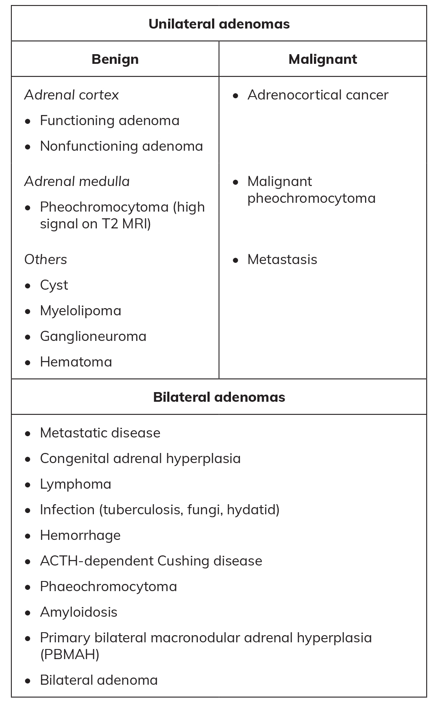

# Metabolic Implications of Adrenal Incidentalomas: When Do We Intervene?
> **中文標題**：腎上腺偶發瘤的代謝影響：何時該介入？
> **分類 Category**：Adrenal
> **講者 Faculty**：John Newell-Price, MA, PhD — School of Medicine and Population Health, University of Sheffield, Sheffield Teaching Hospitals NHS Foundation Trust, Sheffield, United Kingdom
> **來源 Source**：2026 Endocrine Case Management — Meet the Professor · ENDO 2026 · Endocrine Society

---

## 📋 教學目標 Educational Objectives

- **Describe the association of mild autonomous cortisol excess (MACS) with mortality and morbidity in patients presenting with an adrenal incidentaloma.**
  說明 mild autonomous cortisol excess (MACS) 與腎上腺偶發瘤患者之死亡率與病態率之間的關聯。
- **Identify issues with biochemical assessment of adrenal incidentalomas.**
  辨識腎上腺偶發瘤生化評估上的問題與陷阱。
- **Differentiate among options for surgical intervention vs observation in patients with adrenal incidentalomas.**
  區辨腎上腺偶發瘤患者在手術介入與觀察追蹤之間的選擇。

---

## 🩺 臨床情境 Clinical Scenario

> Adrenal incidentalomas are frequently detected during abdominal cross-sectional imaging performed for reasons other than adrenal gland assessment. Most are benign adrenocortical adenomas, which are common and increase in prevalence with age, occurring in up to 10% of people aged 80 years or older.

腎上腺偶發瘤（adrenal incidentaloma）常在因其他原因所做的腹部橫切面影像中被發現。多數為良性的 adrenocortical adenoma；此類腺瘤盛行率隨年齡上升，在 80 歲以上族群可達 10%。

> Approximately 20% to 50% of adrenocortical adenomas secrete excess cortisol — evidenced by a lack of serum cortisol suppression on an overnight dexamethasone-suppression test (1.8 µg/dL [>50 nmol/L]) independent of normal hypothalamic-pituitary regulation (termed MACS) — but without classic features of Cushing syndrome. Thus, approximately 2% to 5% of people aged 70 to 80 years are living with cortisol excess.

約 20% 至 50% 的 adrenocortical adenoma 會分泌過量 cortisol：表現為 overnight dexamethasone-suppression test 後 serum cortisol 無法被壓制（1.8 µg/dL [>50 nmol/L]），且不受正常 hypothalamic-pituitary 調控（即 MACS），但缺乏典型 Cushing syndrome 的臨床表現。因此，約有 2% 至 5% 的 70 至 80 歲族群正處於 cortisol 過量的狀態。

本章以「何時該介入」為核心，透過三個臨床案例（見下方個案）帶出：影像判讀、生化評估陷阱，以及手術與保守治療之間的權衡。

---

## 🔬 背景與重要性 Background & Significance

> MACS is associated with a significantly increased risk of cardiometabolic morbidity and mortality, and mortality risk increases with higher postdexamethasone serum cortisol levels. Large population data suggest that this occurs above a postdexamethasone serum cortisol threshold of around 3 µg/dL (80 nmol/L).

MACS 與心血管代謝相關的病態率與死亡率顯著上升有關，且死亡風險會隨著 postdexamethasone serum cortisol 濃度升高而增加。大型族群資料顯示，此風險大約在 postdexamethasone serum cortisol 超過 3 µg/dL（80 nmol/L）的門檻以上開始出現。

> When several cortisol-related comorbidities are present, increasing evidence suggests adrenal surgery may be justified in patients with established MACS, a suppressed plasma ACTH level, and a higher serum cortisol level after dexamethasone-suppression testing.

當患者同時存在多項 cortisol 相關共病時，越來越多證據支持：對已確立 MACS、plasma ACTH 被壓制、且 dexamethasone-suppression test 後 serum cortisol 偏高者，腎上腺手術可能是合理的選擇。

> Enthusiasm for investigation and intervention must be balanced against the patient's age, comorbidities, frailty assessment, and patient choice. Intervention for MACS is more likely to benefit patients aged 65 years or younger and those with hypertension.

對檢查與介入的積極度，必須與患者年齡、共病、frailty 評估以及患者意願相互權衡。針對 MACS 的介入，較可能讓 65 歲以下者以及合併 hypertension 者獲益。

**臨床落差 Practice Gaps**

- 目前尚未完全確立，如何最佳地篩選出適合手術介入的患者。
- 當採取保守（conservative）策略時，如何最佳地管理相關共病，也尚未有定論。

---

## 🧭 診斷與評估 Diagnosis & Evaluation

面對腎上腺偶發瘤，應處理兩個核心問題 / Two main questions must be addressed：

- Does imaging evaluation suggest the lesion is benign or malignant? — 影像評估提示良性或惡性？
- Is the lesion hormonally active? — 病灶是否具荷爾蒙活性？

**Box. Differential Diagnosis of Adrenal Incidentalomas**（腎上腺偶發瘤之鑑別診斷）

### 影像評估 Imaging Evaluation

**初始影像 Initial Imaging**

- *Preferred modality*：Noncontrast CT is recommended as the first-line imaging modality. / Noncontrast CT 為評估腎上腺偶發瘤的第一線影像檢查。
- *Benign criteria*：Homogeneous lesions with Hounsfield unit (HU) ≤10 are considered benign, and no further imaging is required. If HU <10 on a contrast-enhanced scan, a noncontrast scan is not necessary. Adrenal masses with HU of 10 to 20 and diameter <4 cm are almost always benign. / 均質且 HU ≤10 者視為良性，不需進一步影像；若在顯影掃描上 HU <10，則不需再做非顯影掃描。HU 介於 10 至 20 且直徑 <4 cm 的病灶幾乎皆為良性。
- *Indeterminate lesions*：HU >10 或外觀異質者，可能需要額外影像或追蹤，通常間隔 6 至 12 個月。

**進階影像 Additional Imaging**

- *MRI with chemical shift*：可用於特徵化不確定病灶，尤其對有 CT 禁忌症者（少數）。out-of-phase 影像上訊號強度下降提示良性 adenoma。
- *FDG PET-CT*：不常規建議；但對疑似惡性者（尤其有 extra-adrenal malignancy 病史）可考慮，用以評估轉移。須留意良性病灶亦可能 FDG PET 陽性，故陽性並非癌症特異性。

**腎上腺切片 Adrenal Biopsy**：僅在影像無法定論、且切片結果會改變處置時考慮，特別是已知有 extra-adrenal malignancy 的患者。

### 生化評估 Biochemical Assessment

> Most patients require biochemical evaluation, but in frail patients with poor performance status for whom intervention other than treating comorbidities is not an option, avoiding biochemical evaluation may be reasonable. The one caveat is assessment and management of adrenal insufficiency, which should always be performed if this is a possibility.

多數患者需要生化評估；但對於 frail、performance status 不佳、且除了處理共病外並無其他介入選項的患者，不進行生化評估可能是合理的。唯一的例外是 adrenal insufficiency 的評估與處理——只要有此可能性，就一定要執行。

**Cortisol 分泌 — 1-mg Overnight Dexamethasone-Suppression Test（建議所有患者施行）**

| 項目 Item | 數值 Value | 判讀 Interpretation |
|---|---|---|
| Serum cortisol | ≤1.8 µg/dL（≤50 nmol/L） | Normal suppression 正常壓制 |
| Serum cortisol | >1.8 µg/dL（>50 nmol/L） | Indicates MACS 提示 MACS |

- *Further evaluation*：確認 MACS 者，應評估與 cortisol 過量可能相關的共病，包括 hypertension、type 2 diabetes 與 osteoporosis。
- *Caveats for testing*：主要風險為 dexamethasone 後 serum cortisol 的 false-positive，常落在 1.8 至 3 µg/dL（50–80 nmol/L）。eGFR <60 mL/min per 1.73 m² 可能與 false-positive 結果有關。

**Serum Dexamethasone 測定**

Serum dexamethasone measurement is not widely available；當懷疑 dexamethasone-suppression test 中的 serum cortisol 為 false-positive 時建議測定。serum dexamethasone 濃度 >3.3 nmol/L 表示 dexamethasone 濃度足夠。

**其他荷爾蒙評估 Other Hormonal Assessments**

- *Pheochromocytoma screening*：對有臨床特徵提示者及不確定病灶者，測定 plasma-free 或尿液 fractionated metanephrines。當 HU <10（提示良性 adrenocortical adenoma）時 **不需要** 測定。
- *Aldosterone-producing adenomas*：對 hypertension 或 hypokalaemia 患者，評估 plasma aldosterone concentration 與 plasma renin activity。
- *Sex steroid and steroid precursor profiling*：對影像或臨床特徵提示 adrenocortical carcinoma 者考慮，理想上使用 tandem mass spectrometry；若有，urinary steroid metabolomics 亦可協助特徵化不確定病灶。對疑似 hyperplasia 的雙側良性病灶應測定 17-Hydroxyprogesterone，以排除 classic congenital adrenal hyperplasia。

---

## 💊 治療與處置 Management

### 單側腎上腺偶發瘤 Unilateral Adrenal Incidentalomas

- *Nonfunctioning, benign lesions*：不需進一步影像或荷爾蒙評估。
- *MACS with comorbidities*：對 MACS 且 basal plasma ACTH 被壓制者，可考慮手術介入，並納入年齡、整體健康與意願。另一方面（且更常見）則依標準治療管理共病。越來越多資料顯示，適當篩選的患者接受腎上腺手術可改善 cortisol 相關共病，尤其是 hypertension。惟 **接受單側腎上腺手術的 MACS 患者中，高達 50% 會發生 adrenal insufficiency**。有限資料顯示，以正常化 serum cortisol 為目標的藥物治療可改善 hypertension，但屬非對照的個案性資料，仍需前瞻性大型試驗證實。
- *Indeterminate lesions*：處置應個別化，常透過多科團隊（multidisciplinary team）討論；選項包括額外影像、間隔追蹤或手術切除，依病灶特徵與患者因素（如年輕患者的較大、異質病灶）而定。

### 雙側腎上腺偶發瘤 Bilateral Adrenal Incidentalomas

- *Classification 分類*：
  - Primary bilateral macronodular adrenal hyperplasia
  - Bilateral adenomas
  - Morphologically similar but non–adenoma-like masses
  - Morphologically different masses
  - Hyperplasia（例如 congenital adrenal hyperplasia）
- *Evaluation*：依臨床情境評估 cortisol autonomy 與可能的 adrenal insufficiency；infiltrative、metastatic disease 與 hemorrhage 皆可造成 adrenal insufficiency。
- *Management*：依荷爾蒙活性、病灶特徵與共病個別化。**在無明顯 Cushing syndrome 的情況下，不建議 bilateral adrenalectomy。**

### 手術適應症 Surgical Indications

- *Suspicion of malignancy*：影像特徵提示 adrenocortical carcinoma 者，建議由高手術量（high-volume）的專家外科醫師施行切除。
- *Functioning tumors*：造成臨床症候群的荷爾蒙活性腫瘤，具手術適應症。
- *Indeterminate lesions*：對年輕患者（<40 歲）、孕婦，或病灶隨時間出現生長或影像特徵改變者，考慮手術。
- *Surgical approach*：應由高手術量中心的資深外科醫師執行；適當時優先採微創（minimally invasive）技術。

### 監測與追蹤 Monitoring and Follow-Up

**非手術處置 Nonoperative Management**

- *Benign, nonfunctioning lesions*：除非出現新的臨床徵象，否則不需常規追蹤影像或荷爾蒙檢查。
- *Indeterminate lesions not resected*：於 6 至 12 個月重複影像（noncontrast CT 或 MRI），評估大小或外觀變化。
- *MACS without surgery*：每年進行臨床評估，觀察 cortisol 過量相關共病之出現或進展。

**術後追蹤 Postsurgical Follow-Up**

- *Histopathological evaluation*：為確認診斷與評估惡性所必需。
- *Hormonal assessment*：術後監測 adrenal insufficiency，特別是 cortisol-secreting tumors 患者。

---

## 🧠 個案解析與臨床推理 Case Analysis & Clinical Reasoning

### Case 1 — 73 歲、氧氣依賴、末期肺纖維化男性

因胸腔感染入院。CT 顯示右側 2.8 cm 腎上腺腫塊，顯影後 attenuation 為 46 HU；平常 performance status 為 3，血壓 100/65 mm Hg，理學檢查未提示全身性症候群。

**最佳下一步？→ 答案 E）以上皆非（None of the above）**

推理：本情境中，任何評估都不會改變處置，因為介入本身不可行。照護應依標準路線進行。此案凸顯一個核心決策原則——**先問「檢查結果會不會改變處置」，再決定要不要檢查**。對 frailty 明顯、performance status 差的患者，過度檢查（包含生化與影像特徵化）並無臨床效益。唯一需牢記的例外是：若懷疑 adrenal insufficiency，仍應評估處理。

### Case 2 — 40 歲女性，hypertension 與 type 2 diabetes

車禍後 CT 發現右側 2 cm 均質腎上腺腫塊，attenuation −5 HU。
- Postdexamethasone serum cortisol = 5 µg/dL（138 nmol/L）
- Basal plasma ACTH = 5 pg/mL（1.1 pmol/L）→ 壓制
- HbA1c = 8.1%（65 mmol/mol）
- DXA：lumbar spine T-score = −2.6（osteoporosis）

**進一步檢查與處置？→ 答案 C）轉介腎上腺手術（Refer for adrenal surgery）**

推理：
- HU <10（−5 HU）即代表病灶為良性，**不需再測 plasma metanephrines**，也不需進一步影像。
- Postdexamethasone cortisol 5 µg/dL 明顯超過 MACS 門檻，且 basal ACTH 被壓制 → 支持自主性 cortisol 分泌（autonomy）。
- Cortisol 過量會影響中軸骨骼，此患者已有 osteoporosis；再加上 hypertension、type 2 diabetes（HbA1c 8.1%），構成一整組（"full house"）很可能由 cortisol 驅動的共病。
- 在此年齡（40 歲、≤65 歲較可能獲益）合併多項共病下，手術較藥物管理共病更為適當，但術後須密切監測可能持續 6 個月以上的 adrenal insufficiency。

### Case 3 — 35 歲女性，hypertension 與飲食控制的 type 2 diabetes

因腹痛做 CT，發現右側 3.5 cm 腎上腺腫塊，attenuation −8 HU。
- Serum cortisol after 1 mg overnight DST = 3.6 µg/dL（98 nmol/L）
- Basal plasma ACTH（9 AM）= 22 pg/mL（4.8 pmol/L）→ **未被壓制**
- Plasma aldosterone-to-renin ratio 正常

**進一步檢查與處置？→ 答案 A）僅藥物管理共病（Medical management of comorbidities only）**

推理：
- HU <10 → 病灶良性，不需測 metanephrines，也不需進一步影像。
- 雖然 postdexamethasone cortisol 3.6 µg/dL 落在 MACS 範圍，但 **morning basal plasma ACTH 未被壓制（22 pg/mL）→ 未展現完整的腎上腺自主性**，故即使患者年輕，手術仍不具適應症。
- 應以管理共病為重，並在往後數年每年評估 cortisol 過量之臨床或生化特徵是否進展。若未來確認 basal morning ACTH 被壓制，手術決策可能改變。

### 關鍵鑑別與陷阱 Differential & Pitfalls

- **鑑別診斷**：單側 vs 雙側病灶的鑑別範圍都很廣，涵蓋良性 adenoma、adrenocortical carcinoma、pheochromocytoma、metastasis、hyperplasia（含 congenital adrenal hyperplasia）等。
- **陷阱一（false-positive DST）**：1.8–3 µg/dL 的 postdexamethasone cortisol 常為 false-positive，特別是 eGFR <60 者；必要時以 serum dexamethasone（>3.3 nmol/L 為足量）佐證。
- **陷阱二（ACTH 未壓制）**：如 Case 3，DST 落在 MACS 區間但 ACTH 未壓制，並不足以支持手術——完整自主性需 ACTH 被壓制。
- **陷阱三（過度檢查 frail 患者）**：如 Case 1，若檢查不會改變處置，就不應為了「完整評估」而檢查。
- **陷阱四（術後 adrenal insufficiency）**：單側手術後高達 50% 發生 adrenal insufficiency，可持續 6 個月以上，務必事前告知並監測。
- **決策要點**：手術獲益者的典型輪廓為——單側 adrenal adenoma、確立 MACS、basal morning ACTH 被壓制、postdexamethasone cortisol 偏高、年齡 ≤65 歲、合併 hypertension 等多項 cortisol 相關共病。

---

## ⭐ 重點整理 Key Takeaways

- 造成 MACS 的腎上腺偶發瘤十分常見；MACS 與心血管代謝的病態率、死亡率有關，死亡風險隨 postdexamethasone cortisol 升高而增加（約 >3 µg/dL / 80 nmol/L 起明顯）。
- 是否深入檢查，應同時權衡影像特徵與患者 performance status；對介入無望的 frail 患者，過度檢查並無益處（Case 1）。
- **HU <10 即代表良性病灶，不需重複影像，也不需篩檢 pheochromocytoma（不必測 metanephrines）。**
- 對「單側 adrenal adenoma + 多項 MACS 相關共病 + basal morning ACTH 被壓制」的選定患者，應考慮由 high-volume 外科醫師施行 minimally invasive surgery，並以辨識與處理 adrenal insufficiency 為目標。
- DST 落在 MACS 區間但 basal ACTH 未壓制者，未展現完整自主性，通常不具手術適應症（Case 3）；必要時以 serum dexamethasone 排除 false-positive。
- 在雙側疾病（bilateral disease）情境下，**不建議** 為 MACS 施行 bilateral adrenal surgery。
- 單側腎上腺手術後 adrenal insufficiency 發生率高達 50%，可持續 ≥6 個月，須術後密切監測。
- 針對 MACS 的藥物治療策略，仍有待大規模、前瞻性對照試驗來驗證。

---

## 💬 討論問題 Discussion Questions

1. 在你的臨床實務中，面對一位符合 MACS 生化定義但 basal ACTH 未完全壓制的患者，你會如何向他解釋「暫不手術、以管理共病為主」的理由？追蹤策略又該如何設計？
2. 對於 Case 1 這類 frail、performance status 差的患者，「不做生化評估」在倫理與臨床上如何自處？哪些情況會讓你改變決定（例如懷疑 adrenal insufficiency）？
3. 面對 postdexamethasone cortisol 落在 1.8–3 µg/dL 灰色地帶的患者，你會如何釐清 false-positive？在缺乏 serum dexamethasone 測定的院所，有哪些替代策略？
4. 對合併多項 cortisol 相關共病的年輕 MACS 患者，你如何與外科團隊及患者共同決策手術？術後 adrenal insufficiency 高達 50% 的風險應如何事前溝通與監測？
5. 目前針對 MACS 的藥物治療（如以正常化 cortisol 為目標）證據仍有限，你認為未來的對照試驗最需要回答哪些臨床問題？

---

## 📚 參考文獻 References

1. Fassnacht M, Tsagarakis S, Terzolo M, et al. European Society of Endocrinology clinical practice guidelines on the management of adrenal incidentalomas, in collaboration with the European Network for the Study of Adrenal Tumors. *Eur J Endocrinol*. 2023;189(1):G1-G42. PMID: 37318239
2. Pelsma ICM, Fassnacht M, Tsagarakis S, et al. Comorbidities in mild autonomous cortisol secretion and the effect of treatment: systematic review and meta-analysis. *Eur J Endocrinol*. 2023;189(4):S88-S101. PMID: 37801655.
3. Debono M, Bradburn M, Bull M, Harrison B, Ross RJ, Newell-Price J. Cortisol as a marker for increased mortality in patients with incidental adrenocortical adenomas. *J Clin Endocrinol Metab*. 2014;99(12):4462-4470. PMID: 25238207
4. Prete A, Subramanian A, Bancos I, et al; ENSAT EURINE-ACT Investigators. Cardiometabolic disease burden and steroid excretion in benign adrenal tumors: A cross-sectional multicenter study. *Ann Intern Med*. 2022;175(3):325-334. PMID: 34978855
5. Deutschbein T, Reimondo G, Di Dalmazi G, et al. Age-dependent and sex-dependent disparity in mortality in patients with adrenal incidentalomas and autonomous cortisol secretion: an international, retrospective, cohort study. *Lancet Diabetes Endocrinol*. 2022;10(7):499-508. PMID: 35533704
6. Kjellbom A, Lindgren O, Puvaneswaralingam S, Löndahl M, Olsen H. Association between mortality and levels of autonomous cortisol secretion by adrenal incidentalomas: a cohort study. *Ann Intern Med*. 2021;174(8):1041-1049. PMID: 34029490
7. Kjellbom A, Lindgren O, Danielsson M, Olsen H, Löndahl M. Mortality not increased in patients with nonfunctional adrenal adenomas: a matched cohort study. *J Clin Endocrinol Metab*. 2023;108(8):e536-e541. PMID: 36800277
8. Ueland GÅ, Methlie P, Kellmann R, et al. Simultaneous assay of cortisol and dexamethasone improved diagnostic accuracy of the dexamethasone suppression test. *Eur J Endocrinol*. 2017;176(6):705-713. PMID: 28298353
9. Hawley JM, Owen LJ, Debono M, Newell-Price J, Keevil BG. Development of a rapid liquid chromatography tandem mass spectrometry method for the quantitation of serum dexamethasone and its clinical verification. *Ann Clin Biochem*. 2018;55(6):665-672. PMID: 29534610
10. Bancos I, Taylor AE, Chortis V, et al; ENSAT EURINE-ACT Investigators. Urine steroid metabolomics for the differential diagnosis of adrenal incidentalomas in the EURINE-ACT study: a prospective test validation study. *Lancet Diabetes Endocrinol*. 2020;8(9):773-781. PMID: 32711725
11. Koh JM, Song K, Kwak MK, et al. Adrenalectomy improves body weight, glucose, and blood pressure control in patients with mild autonomous cortisol secretion: results of an randomized controlled trial by the Co-work of Adrenal Research (COAR) study. *Ann Surg*. 2024;279(6):945-952. PMID: 38126763
12. Tabarin A, Espiard S, Deutschbein T, et al; CHIRACIC Collaborators. Surgery for the treatment of arterial hypertension in patients with unilateral adrenal incidentalomas and mild autonomous cortisol secretion (CHIRACIC): a multicentre, open-label, superiority randomised controlled trial. *Lancet Diabetes Endocrinol*. 2025;13(7):580-590. PMID: 40373786
13. Di Dalmazi G, Berr CM, Fassnacht M, Beuschlein F, Reincke M. Adrenal function after adrenalectomy for subclinical hypercortisolism and Cushing's syndrome: a systematic review of the literature. *J Clin Endocrinol Metab*. 2014;99(8):2637-2645. PMID: 24878052
14. Berry S, Iqbal A, Newell-Price J, Debono M. Efficacy and tolerability of metyrapone in mild autonomous cortisol secretion: real-world findings from clinical practice. *Clin Endocrinol (Oxf)*. [Online ahead of print] PMID: 41198609
