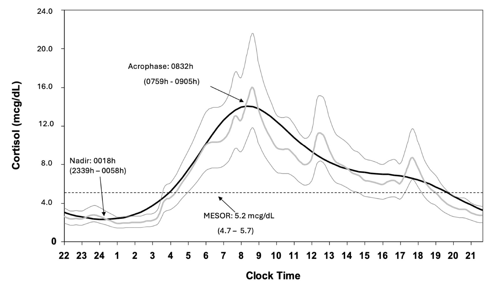
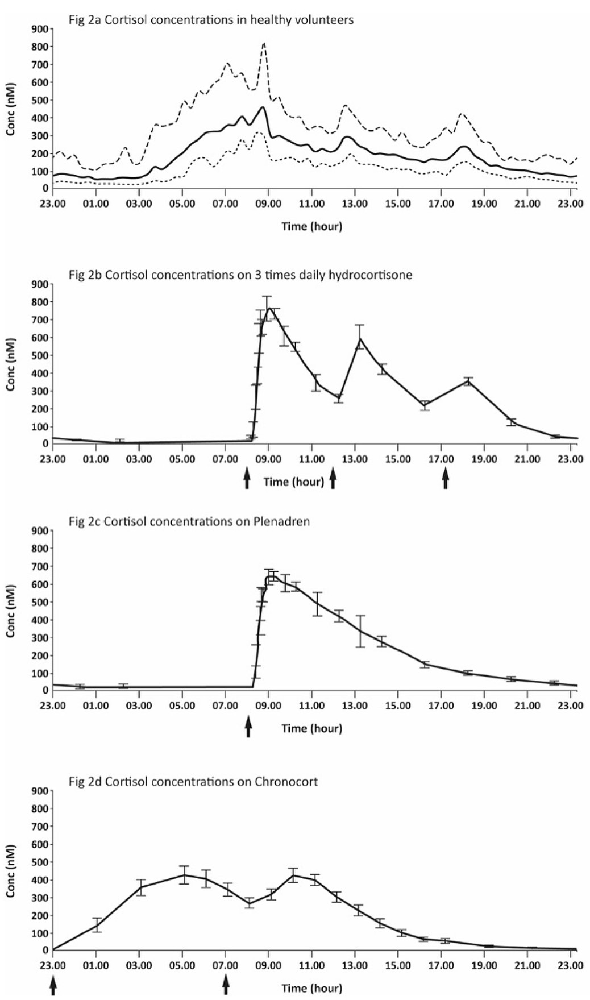

# Challenges in the Diagnosis and Management of Adrenal Insufficiency
> **中文標題**：腎上腺功能不全 (Adrenal Insufficiency) 診斷與治療的挑戰
> **分類 Category**：Adrenal
> **講者 Faculty**：Richard J. M. Ross, MBBS, MD（University of Sheffield, Sheffield, United Kingdom）；Miguel Debono, MD, PhD（University of Sheffield, Sheffield, United Kingdom）
> **來源 Source**：2026 Endocrine Case Management — Meet the Professor · ENDO 2026 · Endocrine Society

---

## 📋 教學目標 Educational Objectives

After reviewing this chapter, learners should be able to:

- **Select a test to diagnose adrenal insufficiency (AI).**
  選擇適當的檢驗來診斷 adrenal insufficiency (AI)。
- **Differentiate among the causes of AI.**
  區分 AI 的各種病因。
- **Prevent and treat adrenal crisis.**
  預防並治療 adrenal crisis。
- **Establish cortisol replacement therapy for a patient with AI.**
  為 AI 病人建立 cortisol 補充療法。

---

## 🩺 臨床情境 Clinical Scenario

本章以四段臨床決策題貫穿三個病例，聚焦 AI 診斷與處置的關鍵陷阱。以下忠實呈現來源病例。

### Case 1
> A 25-year-old woman with no relevant medical history and taking no medications presents to your afternoon clinic with concerns of fatigue and weight loss. There are no signs of AI, but you decide it is important to exclude this diagnosis.

一位 25 歲女性，無相關病史、未服用任何藥物，因疲倦與體重減輕於下午門診就診。理學檢查無 AI 徵象，但你認為排除此診斷很重要。

**Q：以下哪一項檢驗最可能出現「偽陽性 (false-positive)」結果？**
1. Cosyntropin-stimulation test
2. Serum cortisol measured in a sample drawn in the clinic（門診當下抽的血清 cortisol）
3. Waking salivary cortisone measurement
4. Early-morning measurement of serum cortisol and ACTH
5. Early-morning measurement of serum cortisol

> **Answer: B) Serum cortisol measured in a sample drawn in the clinic**

Cortisol 具有 circadian rhythm，清晨高、午後與傍晚低。健康人清醒時 cortisol 峰值平均約 15 µg/dL (414 nmol/L)。晨間 cortisol 小於 5 µg/dL (<140 nmol/L) 視為相對 AI；然而午後與傍晚的 cortisol 本來就常低於 5 µg/dL (<140 nmol/L)，因此在下午門診當下抽血最容易造成偽陽性。晨間 serum cortisol（合併或不合併 ACTH）與清醒時 salivary cortisone 都是良好的 AI 篩檢工具。

### Case 1, Continued
> The patient then tells you she is on an oral contraceptive.

病人接著告訴你她正在服用口服避孕藥 (oral contraceptive)。

**Q：以下哪一項檢驗最適合用來排除 AI？**

> **Answer: C) Waking salivary cortisone measurement**

口服避孕藥會提高 corticosteroid-binding globulin (CBG)，使晨間及 cosyntropin 刺激後的 cortisol 數值假性偏高。傳統作法是停用 estrogen 6 週後再檢測，但這會延誤診斷並有非預期懷孕風險。Salivary cortisone 反映游離血清 cortisol（游離 cortisol 在唾液腺快速轉為 cortisone），且不受口服 hydrocortisone 干擾，因此更適合此情境。

### Case 2
> A 70-year-old man in the orthopedic ward has a low sodium concentration and a clinical picture consistent with syndrome of inappropriate antidiuretic hormone secretion (SIADH).

一位 70 歲男性住在骨科病房，血鈉偏低，臨床表現符合 SIADH。

**Q：測量以下哪一項最能排除內分泌病因？**
1. Aldosterone　2. Free T₄　3. Free T₃　4. Cortisol　5. ACTH

> **Answer: D) Cortisol**

AI 可以 SIADH 樣式（低血鈉）表現。Primary AI 通常呈現低血鈉、高血鉀，但並非總是如此。已在補充治療但遇壓力卻未增加 hydrocortisone 劑量的 AI 病人，也可能出現類似 SIADH 的表現。Primary hypothyroidism 亦可能合併 AI，應測 TSH，但不宜測 free T₄ 或 T₃（可能因 sick euthyroid syndrome 而偏低）。急性病人 ACTH 可能升高，但不反映 HPA 軸對疾病的反應；SIADH 情境下 aldosterone 偏低或受抑制。

### Case 2, Continued
> The cortisol level comes back as undetectable.

Cortisol 結果為測不到 (undetectable)。

**Q：測量以下哪一項最能鑑別病因？**

> **Answer: E) ACTH**

確診 AI 後第一步是分辨 primary 或 secondary，以引導後續檢查。務必與 cortisol 同時抽取「配對 (paired)」的 ACTH。低或測不到的 cortisol 合併高 ACTH 可診斷 primary AI；低 cortisol 合併 ACTH 在參考範圍內、偏低或測不到，則提示 secondary 或 tertiary AI。

### Case 2, Continued
> The patient had undergone spinal surgery 48 hours before the referral. Laboratory results have documented undetectable cortisol and ACTH. You check the records and see that the patient had received 8 mg of dexamethasone with their premedication. You had already prescribed the patient hydrocortisone when you received the result of undetectable cortisol.

病人在轉診前 48 小時接受脊椎手術。檢驗顯示 cortisol 與 ACTH 皆測不到。你查閱記錄發現病人於術前給藥 (premedication) 曾接受 8 mg dexamethasone。在收到測不到 cortisol 的結果時，你已先開立 hydrocortisone。

**Q：以下何者為最佳的下一步？**
1. Continue hydrocortisone until the patient recovers from surgery
2. Stop hydrocortisone in the evening and measure next-morning cortisol
3. Stop treatment of SIADH
4. Start prednisolone
5. Continue dexamethasone

> **Answer: B) Stop hydrocortisone in the evening and measure next-morning cortisol**

任何以低 cortisol 表現的病人都應考慮 glucocorticoid-induced AI，這是透過抑制 HPA 軸造成 AI 最常見的原因。務必詢問病人與其醫師的 glucocorticoid 使用史，並檢視處方，涵蓋吸入、口服、經皮與注射途徑——如本例於術前給藥合併投予，極易被忽略。治療少於 3 週未見腎上腺抑制，故此病人可於腸胃外 dexamethasone 給藥後 72 小時檢測 HPA 軸；停用 hydrocortisone 後 12 小時內即可清除。詳見「治療與處置」中對使用超過 3–4 週者的判讀準則。

### Case 3
> A 17-year-old woman presents to the emergency department with diarrhea and vomiting. She has a slight fever and is hypotensive. She has a history of primary hypothyroidism and is on levothyroxine, 75 mcg daily. She is dehydrated, her blood glucose concentration is normal, her sodium concentration is low, and her potassium concentration is high.

一位 17 歲女性因腹瀉與嘔吐至急診。有輕微發燒與低血壓，既往有 primary hypothyroidism，服用 levothyroxine 75 mcg/day。她脫水、血糖正常、血鈉偏低、血鉀偏高。

**Q：現在最佳的處置為何？**
1. Draw blood for cortisol measurement and ask the laboratory to process it urgently
2. Draw blood for cortisol measurement and immediately administer hydrocortisone, 100 mg intravenously
3. Draw blood for free T₄ measurement and increase the levothyroxine dosage to 100 mcg daily
4. Immediately start a 5% dextrose infusion to rehydrate
5. Start an insulin infusion

> **Answer: B) Draw blood for cortisol measurement and immediately administer hydrocortisone, 100 mg intravenously**

此病人具備 adrenal crisis 的所有症狀與徵象，需要立即治療。應抽血送檢並請檢驗室保留 ACTH 檢體，以便確診 AI 時測量。Hydrocortisone 可靜脈或肌肉注射給予，之後可續用或改為輸注。詳細劑量見「治療與處置」。

### Case 3, Continued
> The patient's cortisol concentration before treatment is documented to be 2.7 µg/dL (75 nmol/L), and her ACTH concentration is greatly elevated, thus confirming the diagnosis of adrenal crisis. The patient makes an uneventful recovery over 48 hours on intravenous hydrocortisone. Her regimen is converted to oral hydrocortisone 3 times daily, and fludrocortisone is started.

治療前 cortisol 為 2.7 µg/dL (75 nmol/L)，ACTH 明顯升高，確診 adrenal crisis。病人在靜脈 hydrocortisone 下於 48 小時內順利恢復，改為口服 hydrocortisone 一日三次，並開始 fludrocortisone。

**Q：出院前，以下何者為必要？**
1. Wean her to a replacement dose of hydrocortisone
2. Measure ACTH to ensure it has normalized
3. Reassess thyroid function
4. Teach her about stress dosing and the sick-day rules
5. Measure renin

> **Answer: D) Teach her about stress dosing and the sick-day rules**

已確診 AI 的病人最常見的死因即為 adrenal crisis，因此出院前務必衛教 stress dosing 與 sick-day rules，並給予 emergency pack。其餘各項皆可於出院後再進行。

### Case 3, Continued
> At an outpatient visit 6 months after diagnosis, the patient states she has been well, but she feels fatigued in the morning. Her laboratory results are all satisfactory, including free T₄ and renin measurements, as well as a cortisol day curve. She has no clinical or biochemical evidence of other autoimmune disorders, such as celiac disease.

診斷後 6 個月門診追蹤，病人整體狀況良好，但晨間感到疲倦。所有檢驗（含 free T₄、renin 及 cortisol day curve）皆令人滿意，亦無 celiac disease 等其他自體免疫疾病的臨床或生化證據。

**Q：以下何者可能改善她的疲倦？**
1. Increase the hydrocortisone dose over the day
2. Increase the fludrocortisone dose
3. Change the treatment regimen
4. Take the hydrocortisone dose last thing at bedtime
5. Change treatment to dexamethasone

> **Answer: C) Change the treatment regimen**

疲倦在接受補充治療的 AI 病人中很常見，且與所用方案無關；但證據顯示某些方案能改善生活品質並減少疲倦（詳見「治療與處置」與「個案解析」）。

---

## 🔬 背景與重要性 Background & Significance

> AI results from a deficiency of cortisol, the essential stress hormone secreted by the adrenal glands. When untreated, AI results in death due to adrenal crisis. The causes of AI are classified according to which component of the hypothalamic-pituitary-adrenal (HPA) axis is disrupted.

AI 源自 cortisol 缺乏——這是腎上腺分泌的關鍵壓力荷爾蒙。若未治療，AI 會因 adrenal crisis 而致死。病因依 hypothalamic-pituitary-adrenal (HPA) axis 中受損的環節分類：腎上腺本身病變為 **primary AI**、腦下垂體病變為 **secondary AI**、下視丘病變為 **tertiary AI**。

> In childhood, congenital adrenal hyperplasia (CAH) is the most common cause of primary AI, while autoimmune disease is the most common cause of acquired primary AI. In adults, secondary AI is more common than primary AI and is most often caused by benign pituitary adenomas.

在兒童，congenital adrenal hyperplasia (CAH) 是 primary AI 最常見的原因；後天性 primary AI 則以自體免疫疾病最常見。在成人，secondary AI 較 primary AI 常見，多由良性 pituitary adenoma 引起。

> Worldwide, adults and children are at risk of AI caused by infectious diseases; however, in most countries, the most common cause is iatrogenic adrenal suppression from the use of anti-inflammatory glucocorticoids (steroid medication). It is estimated that 1% to 3% of the population is prescribed systemic steroids, and approximately 50% of these individuals have suppressed adrenal function. Adrenal crisis and death also occur in patients on other steroid formulations, and approximately 20% of adults and 40% of children with asthma treated with high-dosage inhaled steroids have AI. Drugs such as opioids and immune checkpoint inhibitors also cause AI.

全球成人與兒童都可能因感染性疾病而罹患 AI；然而在多數國家，最常見的原因是使用抗發炎 glucocorticoid（類固醇藥物）造成的醫源性腎上腺抑制。估計有 1%–3% 的人口被開立全身性類固醇，其中約 50% 有腎上腺功能受抑制。其他劑型的類固醇同樣可能引發 adrenal crisis 甚至死亡：使用高劑量吸入型類固醇的氣喘病人中，約 20% 的成人與 40% 的兒童有 AI。此外，opioids 與 immune checkpoint inhibitors 等藥物也會造成 AI。由於大量病人使用類固醇與 opioid 藥物，加上臨床警覺提升，AI 的檢測頻率正逐漸增加。

### Practice Gaps 臨床落差
- 可用於診斷 AI 的檢驗有多種，選對檢驗以避免偽陽性與偽陰性至關重要——需知道「何時、對誰、用哪種檢驗」。
- 判定 AI 病因很重要。最常見的 glucocorticoid-induced AI 常被漏診，因為臨床醫師未詢問類固醇使用史。
- Adrenal crisis 仍是 AI 病人最常見的死因，原因在於醫護與病人對如何治療與預防此致命狀況的教育不足。
- AI 有多種治療方案，但對「何者最佳」的知識仍有限。

### Discussion 疾病負擔重點
> Symptoms of AI are nonspecific and include fatigue, resulting in a large testing burden despite the fact that most patients who are tested have normal adrenal function. When undiagnosed, AI risks adrenal crisis, with life-threatening cardiovascular collapse and a mortality rate of approximately 6%. Annually, 6% to 8% of individuals with AI experience a crisis.

AI 症狀非特異（包含疲倦），造成龐大的檢測負擔，儘管多數受檢者腎上腺功能正常。未診斷的 AI 有 adrenal crisis 風險，會造成危及生命的心血管衰竭，死亡率約 6%。每年約有 6%–8% 的 AI 病人發生一次 crisis。

> In a large, prospective study, 8.3 episodes of adrenal crisis per 100 patient-years were reported, with an associated mortality rate of 0.5 per 100 patient-years. Patients with CAH, on average, use sick-day rules 171 times during their life and attend the hospital for an adrenal crisis 11 times.

一項大型前瞻性研究報告 adrenal crisis 發生率為每 100 病人年 8.3 次，相關死亡率為每 100 病人年 0.5 次。CAH 病人一生平均使用 sick-day rules 171 次、因 adrenal crisis 就醫 11 次。因此針對 crisis 誘因、壓力期需增加 glucocorticoid 劑量，以及辨識 crisis 早期表現的病人教育至為關鍵。

---

## 🧭 診斷與評估 Diagnosis & Evaluation

### Cortisol 的 circadian rhythm 與篩檢
> Cortisol has a circadian rhythm with high levels in the morning and low levels in the afternoon and evening. Waking cortisol levels vary among healthy individuals, with a mean peak waking cortisol concentration of 15 µg/dL (414 nmol/L). A morning cortisol value less than 5 µg/dL (<140 nmol/L) is considered to reflect relative AI.

Cortisol 具有 circadian rhythm，晨間高、午後與傍晚低。健康人清醒時 cortisol 峰值平均約 15 µg/dL (414 nmol/L)。晨間 cortisol 小於 5 µg/dL (<140 nmol/L) 被視為反映相對 AI。晨間 serum cortisol（合併或不合併 ACTH）與清醒時 salivary cortisone 皆為良好篩檢工具。

**Figure 1. Physiological Cortisol Circadian Rhythm**（生理性 cortisol 的 circadian rhythm）

> 📎 The figure shows the geometric mean ±2 SD of serum cortisol concentration, calculated from 20-minute sampling over a 24-hour period, in 33 healthy participants. The fitted cosinor ( — ) is the average of harmonic regressions that were a fit for the individual subject data. Cortisol has a distinct circadian rhythm, with a peak of 15.5 µg/ dL (95% CI, 11.7-20.6 µg/ dL) at 0832h and a nadir of less than 2.0 µg/ dL (95% CI, 1.5-2.5 µg/ dL) at 0018h. Mesor = midline estimating statistic of rhythm. Acrophase = time of peak using a 24-hour clock with midnight taken as origin. Nadir = time of trough cortisol level. The mean and 95% CI are shown for the mesor, acrophase, and nadir. Reprinted from Debono M, Ghobadi C, Rostami-Hodjegan A, et al. Modified-release hydrocortisone to provide circadian cortisol profiles. J Clin Endocrinol Metab . 2009;94(5):1548-1554. 11
>
> 本圖顯示 33 位健康受試者在 24 小時期間以 20 分鐘間隔採樣所計算之 serum cortisol 濃度的幾何平均值 ±2 SD。擬合的 cosinor（—）為各受試者個別資料 harmonic regression 的平均。Cortisol 具有明顯的 circadian rhythm，於 0832h 達峰值 15.5 µg/dL（95% CI, 11.7-20.6 µg/dL），於 0018h 降至最低點小於 2.0 µg/dL（95% CI, 1.5-2.5 µg/dL）。Mesor = 節律的中線估計統計量。Acrophase = 以午夜為起點的 24 小時制峰值時間。Nadir = cortisol 谷值時間。圖中顯示 mesor、acrophase 與 nadir 的平均值與 95% CI。重製自 Debono M, Ghobadi C, Rostami-Hodjegan A, et al. Modified-release hydrocortisone to provide circadian cortisol profiles. J Clin Endocrinol Metab. 2009;94(5):1548-1554.

### 藥物干擾：oral estrogen
> Oral contraceptives increase corticosteroid-binding globulin and therefore result in spuriously high cortisol values both in the morning and after cosyntropin stimulation. Salivary cortisone reflects free serum cortisol levels, as free serum cortisol is rapidly converted to cortisone in the salivary gland. Salivary cortisone better reflects serum cortisol levels than salivary cortisol, and oral hydrocortisone does not interfere with its measurement.

口服避孕藥會提高 corticosteroid-binding globulin (CBG)，使晨間及 cosyntropin 刺激後 cortisol 假性偏高。傳統作法是檢測前停用 estrogen 6 週，但有延誤診斷與非預期懷孕之虞。Salivary cortisone 反映游離血清 cortisol（游離 cortisol 在唾液腺快速轉為 cortisone），較 salivary cortisol 更能反映 serum cortisol，且不受口服 hydrocortisone 干擾，也能在 serum cortisol 偏低時測得。唾液類固醇於室溫穩定，可於病人居家採樣後郵寄至檢驗室。研究顯示居家採集的清醒時 salivary cortisone 在診斷 AI 的準確度與 cosyntropin-stimulation test 相當。

### 定位病因：paired cortisol + ACTH
> When AI is diagnosed, the first step is to determine whether it is primary or secondary. It is important to draw the cortisol sample at the same time as the ACTH sample, so they are paired. A high ACTH concentration in the presence of low or undetectable cortisol is diagnostic of primary AI, and an ACTH concentration that is in reference range, low, or undetectable in the presence of low cortisol suggests either secondary or tertiary AI.

診斷 AI 後第一步是分辨 primary 或 secondary，以引導後續檢查。務必與 cortisol 同時抽取「配對」的 ACTH。

| 檢驗組合 Pattern | 判讀 Interpretation |
|---|---|
| ↑ ACTH + 低/測不到 cortisol | Primary AI（如 Addison disease）|
| ACTH 正常/偏低/測不到 + 低 cortisol | Secondary 或 tertiary AI |

### 鑑別 SIADH 樣表現
> AI can present with a clinical picture of SIADH, with a low sodium concentration. Primary AI usually presents with low sodium and high potassium values, but this is not always the case. Primary hypothyroidism can present with AI, and TSH should be measured, but not free T₄ or T₃, as these might be low due to sick euthyroid syndrome.

AI 可以 SIADH 樣式（低血鈉）表現。Primary AI 通常低血鈉、高血鉀，但並非總是如此。已在補充治療的 AI 病人遇壓力卻未增加 hydrocortisone 劑量時，也可能出現類似 SIADH 的表現。Primary hypothyroidism 亦可合併 AI，應測 TSH，但不宜測 free T₄ 或 T₃（可能因 sick euthyroid syndrome 偏低）。急性病人 ACTH 可能升高，但不反映 HPA 軸對疾病的反應；SIADH 情境下 aldosterone 偏低或受抑制。

### Glucocorticoid-induced AI：判讀 HPA 軸恢復
> Adrenal suppression has not been reported with glucocorticoid treatment of less than 3 weeks' duration. In patients who have received glucocorticoids for longer than 3 to 4 weeks, the guidelines suggest the following.

治療少於 3 週未見腎上腺抑制。對使用 glucocorticoid 超過 3–4 週者，指引建議依晨間 cortisol 判讀：

| 晨間 cortisol | 判讀與處置 Action |
|---|---|
| > 10 µg/dL (>300 nmol/L) | HPA 軸已恢復，可安全停用 glucocorticoid |
| 5–10 µg/dL (150–300 nmol/L) | 續用生理劑量，數週至數月後複測晨間 cortisol |
| < 5 µg/dL (<150 nmol/L) | 續用生理劑量，數月後複測晨間 cortisol |

---

## 💊 治療與處置 Management

### 一般 cortisol 補充原則
> Treatment of AI involves replacing cortisol. Hydrocortisone and cortisone are widely recommended as first-line glucocorticoids in clinical guidelines because they are less potent than synthetic glucocorticoids and may be associated with fewer adverse effects. The use of synthetic glucocorticoids (prednisolone and prednisone) is recommended to be restricted to patients in whom symptoms of cortisol deficiency are not adequately controlled with hydrocortisone or cortisone, or when adherence to a multiple daily dose regimen is poor. The use of dexamethasone is discouraged because of the risk of excess glucocorticoid exposure.

AI 的治療是補充 cortisol。指引普遍推薦 **hydrocortisone 與 cortisone 為第一線**，因其效價低於合成 glucocorticoid，副作用可能較少，且可小幅度滴定、以臨床反應評估療效。合成 glucocorticoid（prednisolone、prednisone）建議僅限於 hydrocortisone/cortisone 無法充分控制症狀，或多次給藥順從性不佳者。**不建議使用 dexamethasone**，因其過量暴露風險高、難以滴定、無 mineralocorticoid 作用且副作用較多。

### Modified-release hydrocortisone
> Modified-release hydrocortisone formulations are available in the United Kingdom and Europe: Plenadren (Takeda), a once-daily formulation that replaces daytime cortisol levels, and Efmody (Neurocrine Biosciences), a twice-daily formulation that replaces the early-morning rise in cortisol and daytime cortisol levels in patients with CAH.

英國與歐洲有兩種 modified-release hydrocortisone：**Plenadren**（Takeda）為一日一次，補充白天 cortisol；**Efmody**（Neurocrine Biosciences，即 Chronocort）為一日兩次，補充清晨 cortisol 上升與白天 cortisol，用於 CAH 病人。

**Figure 2. Cortisol Concentrations in Healthy Volunteers and in Patients Treated With Hydrocortisone and Modified-Release Hydrocortisone Formulations**（健康志願者與接受 hydrocortisone／modified-release hydrocortisone 治療病人的 cortisol 濃度）

> 📎 Panel (a) , Cortisol concentrations measured by liquid chromatography–tandem mass spectrometry in healthy volunteers (mean, 10th and 90th percentile). 2 0 Panel (b) , Cortisol concentrations measured by immunoassay on 3 times daily immediate-release hydrocortisone, 20 to 40 mg , in patients with adrenal insufficiency (mean and 95% CI). 21 Panel (c) , Cortisol concentrations measured by immunoassay on once-daily Plenadren, 20 to 40 mg , in patients with adrenal insufficiency (mean and 95% CI). 21 Panel (d) , Cortisol concentrations measured by liquid chromatography–tandem mass spectrometry on twice-daily Chronocort with 20 mg at 2300h and 10 mg at 0700h in patients with CAH (mean and standard error of the mean). 22 Arrows on the x-axis represent the timing of dosing. 18
>
> Panel (a)，健康志願者以 liquid chromatography–tandem mass spectrometry (LC-MS/MS) 測得之 cortisol 濃度（平均值、第 10 與第 90 百分位）。Panel (b)，adrenal insufficiency 病人以 immunoassay 測得、一日三次 immediate-release hydrocortisone 20 至 40 mg 之 cortisol 濃度（平均值與 95% CI）。Panel (c)，adrenal insufficiency 病人以 immunoassay 測得、一日一次 Plenadren 20 至 40 mg 之 cortisol 濃度（平均值與 95% CI）。Panel (d)，CAH 病人以 LC-MS/MS 測得、一日兩次 Chronocort（2300h 給 20 mg、0700h 給 10 mg）之 cortisol 濃度（平均值與標準誤差）。x 軸箭頭代表給藥時間。

### Adrenal crisis 的緊急治療（Case 3）
> The guidelines recommend that patients with suspected adrenal crisis should be treated with an immediate parenteral injection of hydrocortisone, 100 mg (50 mg/m² for children), followed by appropriate fluid resuscitation and 200 mg (50-100 mg/m² for children) of hydrocortisone per 24 hours (via continuous intravenous therapy or injection every 6 hours). Age- and body surface–appropriate dosing is required in children.

疑似 adrenal crisis 應立即腸胃外注射 **hydrocortisone 100 mg**（兒童 50 mg/m²），接著適當輸液復甦，並於 24 小時內給予 **hydrocortisone 200 mg**（兒童 50–100 mg/m²，可連續靜脈輸注或每 6 小時注射一次）。兒童須依年齡與體表面積調整劑量。抽血送檢時應請檢驗室保留 ACTH 檢體。

### Adrenal crisis 的預防與病人教育
> The most common cause of death in patients with established AI is adrenal crisis. The guidelines recommend the following.

已確診 AI 病人最常見死因為 adrenal crisis，出院前務必完成衛教並給予 emergency pack。指引建議：
1. 依疾病嚴重度或壓力大小調整 glucocorticoid 劑量以預防 adrenal crisis。
2. 病人教育應涵蓋壓力事件下的 glucocorticoid 調整、crisis 預防策略，包括腸胃外的自我或旁人施打緊急 glucocorticoid。
3. 所有病人應配備 steroid emergency card 與 medical alert identification，告知醫護在緊急時需增加劑量並立即腸胃外注射類固醇。
4. 每位病人都應配備 glucocorticoid 注射套組並學會使用。

### 疲倦與方案調整（Case 3, Continued）
> Fatigue is common among patients with AI on replacement therapy. Patients often think that increasing the hydrocortisone dose will help; however, the evidence suggests that higher doses do not improve quality of life or reduce fatigue. There is no evidence that increasing the fludrocortisone dose helps if the renin level is normal. In open-label studies, continuous subcutaneous hydrocortisone infusion has been shown to improve quality of life. In open-label studies, Plenadren improves quality of life. Efmody improves disease control in patients with CAH, and in a randomized, double-blind study, Efmody improved quality of life and reduced fatigue in patients with primary AI.

疲倦在接受補充治療的 AI 病人中很常見。病人常以為增加 hydrocortisone 劑量會有幫助，但證據顯示較高劑量並不會改善生活品質或減少疲倦。若 renin 正常，增加 fludrocortisone 劑量亦無證據支持。夜間服用 hydrocortisone 可能影響睡眠，且清醒前即已代謝清除。Dexamethasone 為禁忌。Hydrocortisone 一日兩次或三次給予，但尚無盲性研究比較兩者；多數臨床醫師建議晨起立即服用第一劑以對抗晨間疲倦。開放標籤研究顯示連續皮下 hydrocortisone 輸注可改善生活品質，但一項納入 10 位 primary AI 病人的雙盲研究則未見對生活品質的影響（惟樣本小且基礎生活品質良好）。開放標籤研究顯示 Plenadren 改善生活品質；Efmody 改善 CAH 病人的疾病控制，且一項隨機雙盲研究顯示 Efmody 改善 primary AI 病人生活品質並減少疲倦。

---

## 🧠 個案解析與臨床推理 Case Analysis & Clinical Reasoning

**1. 篩檢時機決定成敗（Case 1）。** AI 篩檢的第一個陷阱是「採檢時間」。Cortisol 的 circadian rhythm 使午後樣本本就偏低，下午門診抽血極易造成偽陽性、引發不必要的確診檢查與病人焦慮。正確策略是安排**晨間 serum cortisol**，或使用居家**清醒時 salivary cortisone**；若篩檢結果落在灰帶，cosyntropin-stimulation test 可於任何時間進行以確診。

**2. 別忘了 binding protein（Case 1, Continued）。** Serum cortisol 測的是「總量」，會受 CBG 影響。Oral estrogen（含口服避孕藥）拉高 CBG，造成晨間與 cosyntropin 刺激後 cortisol 假性偏高。停 estrogen 6 週再測有延誤與懷孕風險。**Salivary cortisone 反映游離 cortisol**，是這類女性的首選篩檢，也適用於服用口服 hydrocortisone 者。

**3. 低血鈉的內分泌鑑別（Case 2）。** 面對「像 SIADH」的低血鈉，別忘了 AI。關鍵測項是 **cortisol**；並記得 primary AI 雖典型呈低鈉高鉀，但不一定如此。鑑別時測 TSH 而非 free T₄/T₃（避免 sick euthyroid syndrome 誤導）。確診 AI 後，以**配對的 ACTH** 定位為 primary 或 secondary/tertiary。

**4. 最易漏掉的病因：外源性類固醇（Case 2, Continued）。** 測不到的 cortisol + 測不到的 ACTH，加上術前給藥的 8 mg dexamethasone，指向 **glucocorticoid-induced（tertiary）AI**。這是最常見卻最常被漏診的 AI 病因，因為臨床醫師未主動詢問吸入、口服、經皮、關節腔注射等各種途徑。因治療 < 3 週，此軸預期會恢復：停 hydrocortisone（12 小時內清除）、於 dexamethasone 給藥 72 小時後複測晨間 cortisol 即可釐清，不需長期補充。

**5. Adrenal crisis：先治療，不等結果（Case 3）。** 17 歲女性有低血壓、脫水、低鈉高鉀且既往有自體免疫性 hypothyroidism（提示 autoimmune polyendocrine 傾向），臨床即為 adrenal crisis。正確作法是**先抽血、立即給 hydrocortisone 100 mg IV**，並保留 ACTH 檢體，切勿為等檢驗而延誤治療。單純輸液或補 levothyroxine 都無法救命。

**6. 出院衛教勝過任何檢驗（Case 3, Continued）。** 由於 crisis 是 AI 最常見死因，出院前的**必要**動作是 stress dosing／sick-day rules 衛教與 emergency pack，而非急著複測 ACTH 或調整 thyroid function。

**7. 疲倦的處理邏輯（Case 3, Continued）。** 先排除其他原因（thyroid、renin、autoimmune 如 celiac disease）——本例皆已排除。接著記住三個「不要」：不要盲目加 hydrocortisone 總量、renin 正常時不要加 fludrocortisone、不要換 dexamethasone。真正有機會改善晨間疲倦的是**調整方案**，特別是能重建清晨 cortisol 上升的 modified-release 製劑（如 Efmody/Chronocort）。

**常見陷阱 Pitfalls 摘要**
- 下午抽 random cortisol → 偽陽性。
- 忽略 oral estrogen 對 CBG 的影響 → 偽陰性（假性正常）。
- 未同時採 paired ACTH → 無法定位病因。
- 未詢問各途徑類固醇史 → 漏掉最常見的 glucocorticoid-induced AI。
- 疑似 crisis 時等檢驗才治療 → 可能致命。
- 以加大劑量處理疲倦 → 無效且增加副作用。

---

## ⭐ 重點整理 Key Takeaways

- 篩檢 AI 要善用 cortisol 的 circadian rhythm：安排**晨間 serum cortisol** 或居家**waking salivary cortisone**；午後 random cortisol 易偽陽性。灰帶時以 **cosyntropin-stimulation test** 確診。
- **Oral estrogen** 提高 CBG 造成 serum cortisol 假性偏高；服用口服避孕藥的女性應改用 **waking salivary cortisone**（優於 salivary cortisol，且不受口服 hydrocortisone 干擾）。
- 記錄到低 cortisol 時，第一個要測的是與 cortisol **配對的 ACTH**：↑ACTH 為 primary AI（如 Addison disease）；ACTH 低/正常/測不到為 secondary 或 tertiary AI。
- 最常見的 tertiary AI 是 **glucocorticoid-induced AI**，務必詢問吸入、外用、口服、注射（含關節腔內）各途徑類固醇史。
- **Adrenal crisis** 需立即治療且仍是 AI 最常見死因：立即 **hydrocortisone 100 mg 腸胃外**（兒童 50 mg/m²），續以 24 小時 200 mg；所有 AI 病人出院前應獲得 emergency pack 並學會 stress dosing／sick-day rules。
- 第一線用 **hydrocortisone 或 cortisone**；限制 prednisolone/prednisone 使用，**避免 dexamethasone**。
- AI 病人最常見症狀是**疲倦**；先排除其他病因（尤其 primary AI 的其他自體免疫疾病）。**增加 hydrocortisone 總量無助益**；重建清晨 cortisol 上升的 **modified-release hydrocortisone（Efmody/Chronocort）** 有證據可改善生活品質並減少疲倦。

---

## 💬 討論問題 Discussion Questions

1. 在你的臨床環境中，若無法取得 waking salivary cortisone 檢測，面對服用 oral estrogen 的女性，你會如何調整 AI 的篩檢與確診策略？停用 estrogen 6 週的作法在實務上有哪些取捨？
2. 一位長期使用高劑量吸入型或關節腔注射類固醇的病人，臨床上如何系統性地問診與檢驗，才能不漏掉 glucocorticoid-induced AI？你會如何依晨間 cortisol（>10、5–10、<5 µg/dL）分層追蹤？
3. 你所在機構對 adrenal crisis 的辨識與即時給藥流程是否順暢？如何確保「先給 hydrocortisone、再等檢驗」的觀念落實於急診與住院團隊？
4. 對於補充治療下仍持續疲倦的 AI 病人，你如何在排除其他病因後，決定是否從 immediate-release 轉換為 modified-release hydrocortisone？成本、可及性與證據等級如何權衡？
5. 你如何評估病人對 sick-day rules 與 emergency injection kit 的實際掌握程度？有哪些教育策略或工具能降低 crisis 復發與死亡？

---

## 📚 參考文獻 References

1. Vaidya A, Findling J, Bancos I. Adult adrenal insufficiency-reply. *JAMA.* 2025 [Online ahead of print]
2. Laugesen K, Stovring H, Hallas J, Pottegard A, Jorgensen JOL, Sorensen HT, Petersen I. Prescription duration and treatment episodes in oral glucocorticoid users: application of the parametric waiting time distribution. *Clin Epidemiol*. 2017;9:591-600. PMID: 29180903
3. Broersen LH, Pereira AM, Jorgensen JO, Dekkers OM. Adrenal insufficiency in corticosteroids use: systematic review and meta-analysis. *J Clin Endocrinol Metab*. 2015;100(6):2171-2180. PMID: 25844620
4. Todd GR, Acerini CL, Ross-Russell R, Zahra S, Warner JT, McCance D. Survey of adrenal crisis associated with inhaled corticosteroids in the United Kingdom. *Arch Dis Child*. 2002;87(6):457-461. PMID: 12456538
5. Woods CP, Argese N, Chapman M, et al. Adrenal suppression in patients taking inhaled glucocorticoids is highly prevalent and management can be guided by morning cortisol. *Eur J Endocrinol*. 2015;173(5):633-642. PMID: 26294794
6. Rushworth RL, Torpy DJ, Falhammar H. Adrenal crisis. *N Engl J Med*. 2019;381(9):852-861. PMID: 31461595
7. Debono M, Elder CJ, Lewis J, et al. Home waking salivary cortisone to screen for adrenal insufficiency. *NEJM Evid*. 2023;2(2):EVIDoa2200182. PMID: 38320034
8. Hahner S, Spinnler C, Fassnacht M, et al. High incidence of adrenal crisis in educated patients with chronic adrenal insufficiency: a prospective study. *J Clin Endocrinol Metab*. 2015;100(2):407-416. PMID: 25419882
9. Hummel SR, Sadler S, Whitaker MJ, Ara RM, Dixon S, Ross RJ. A model for measuring the health burden of classic congenital adrenal hyperplasia in adults. *Clin Endocrinol (Oxf)*. 2016;85(3):361-398. PMID: 26991412
10. Bornstein SR, Allolio B, Arlt W, et al. Diagnosis and treatment of primary adrenal insufficiency: an Endocrine Society clinical practice guideline. *J Clin Endocrinol Metab*. 2016;101(2):364-389. PMID: 26760044
11. Debono M, Ghobadi C, Rostami-Hodjegan A, et al. Modified-release hydrocortisone to provide circadian cortisol profiles. *J Clin Endocrinol Metab*. 2009;94(5):1548-1554. PMID: 19223520
12. Debono M, Harrison RF, Whitaker MJ, et al. Salivary cortisone reflects cortisol exposure under physiological conditions and after hydrocortisone. *J Clin Endocrinol Metab*. 2016;101(4):1469-1477. PMID: 26812690
13. Chihaoui M, Mouelhi Y, Hammami B, et al. Salivary cortisol measurement contamination after oral hydrocortisone: a randomized crossover trial. *Horm Metab Res*. 2024;56(8):566-573. PMID: 38447948
14. Tonge JJ, Keevil BG, Craig JN, Whitaker MJ, Ross RJ, Elder CJ. Salivary steroid collection in children under conditions replicating home sampling. *J Clin Endocrinol Metab*. 2022;107(11):3128-3136. PMID: 35961299
15. Beuschlein F, Else T, Bancos I, et al. European Society of Endocrinology and Endocrine Society joint clinical guideline: diagnosis and therapy of glucocorticoid-induced adrenal insufficiency. *Eur J Endocrinol*. 2024;190(5):G25-G51. PMID: 35961299
16. Hahner S, Loeffler M, Fassnacht M, et al. Impaired subjective health status in 256 patients with adrenal insufficiency on standard therapy based on cross-sectional analysis. *J Clin Endocrinol Metab*. 2007;92(10):3912-3922. PMID: 17684047
17. Gagliardi L, Nenke MA, Thynne TR, et al. Continuous subcutaneous hydrocortisone infusion therapy in Addison's disease: a randomized, placebo-controlled clinical trial. *J Clin Endocrinol Metab*. 2014;99(11):4149-4157. PMID: 25127090
18. Porter J, Blair J, Ross RJ. Is physiological glucocorticoid replacement important in children? *Arch Dis Child*. 2017;102(2):199-205. PMID: 27582458
19. Arlt W, Brac de la Perriere A, Hirschberg AL, et al. Long-term outcomes in patients with congenital adrenal hyperplasia treated with hydrocortisone modified-release hard capsules. *Eur J Endocrinol*. 2025;193(1):76-84. PMID: 40576296
20. Whitaker MJ, Debono M, Huatan H, Merke DP, Arlt W, Ross RJ. An oral multiparticulate, modified-release, hydrocortisone replacement therapy that provides physiological cortisol exposure. *Clin Endocrinol (Oxf)*. 2014;80(4):554-561. PMID: 23980724
21. Johannsson G, Nilsson AG, Bergthorsdottir R, et al. Improved cortisol exposure-time profile and outcome in patients with adrenal insufficiency: a prospective randomized trial of a novel hydrocortisone dual-release formulation. *J Clin Endocrinol Metab*. 2012;97(2):473-481. PMID: 22112807
22. Mallappa A, Sinaii N, Kumar P, et al. A phase 2 study of Chronocort(R), a modified-release formulation of hydrocortisone, in the treatment of adults with classic congenital adrenal hyperplasia. *J Clin Endocrinol Metab*. 2015;100(3):1137-1145. PMID: 25494662
23. Isidori AM, Venneri MA, Graziadio C, et al. Effect of once-daily, modified-release hydrocortisone versus standard glucocorticoid therapy on metabolism and innate immunity in patients with adrenal insufficiency (DREAM): a single-blind, randomised controlled trial. *Lancet Diabetes Endocrinol*. 2018;6(3):173-185. PMID: 29229498
24. Prete A, Theiler-Schwetz V, Arlt W, et al. Effects of modified release hydrocortisone on restoration of early morning cortisol, quality of life, and fatigue in adrenal insufficiency (The CHAMPAIN study): a randomised, double-blind, double-dummy, cross-over study comparing Chronocort and Plenadren. *EClinicalMedicine*. 2026;91:103714. PMID: 41552007
