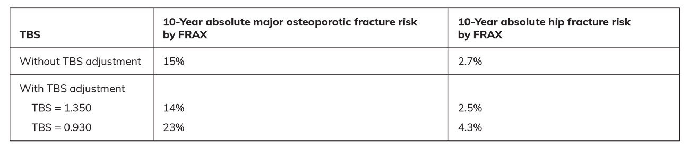

# Beyond Basic Dual-Energy X-Ray Absorptiometry
> **中文標題**：超越基礎雙能量 X 光吸收儀（DXA）：TBS、全股骨影像與全身體組成的臨床應用
> **分類 Category**：Bone and Mineral Metabolism
> **講者 Faculty**：Angela M. Cheung, MD, PhD, CCD（Department of Medicine, University of Toronto, Toronto, Canada）
> **來源 Source**：2026 Endocrine Case Management — Meet the Professor · ENDO 2026 · Endocrine Society

---

## 📋 教學目標 Educational Objectives

- **Manage patients at risk of fractures by using the trabecular bone score (TBS) to refine 10-year fracture risk estimates.**
  運用 trabecular bone score（TBS）來精修骨折高風險病人的 10 年骨折風險評估，以協助臨床處置。

- **Explain what full femur imaging (FFI) is used for and when to use it for detecting incomplete atypical femoral fractures (AFFs).**
  說明 full femur imaging（FFI）的用途，以及何時應以其偵測不完全性 atypical femoral fractures（AFFs）。

- **Illustrate how total body composition scans with dual-energy X-ray absorptiometry (DXA) can be used for patients with sarcopenia.**
  闡述如何運用 DXA 全身體組成掃描（total body composition scan）評估 sarcopenia 病人。

---

## 🩺 臨床情境 Clinical Scenario

本場 Meet the Professor 以三個臨床病例貫穿三項進階 DXA 工具的應用。

**Case 1 —— TBS 的應用**
> A 72-year-old White postmenopausal woman presents with a history of wrist fracture 15 years ago when she was pulled by a dog and fell on her outstretched hand. She is otherwise well and is physically active without increased fall risk. She has taken vitamin D supplements (25 mcg [1000 international units] daily) for the past 15 years and has never taken any bone medications.
>
> On DXA today, her lumbar spine (L1-L4) T-score is –0.3, left femoral neck T-score is –1.7, and left total hip T-score is –1.6. According to FRAX, her 10-year major osteoporotic fracture risk is 15%, and her 10-year hip fracture risk is 2.7%.

一位 72 歲白人停經後女性，15 年前曾因遛狗被拉扯、手部撐地跌倒而發生手腕骨折。平時健康、規律活動、無跌倒風險增加。過去 15 年服用 vitamin D 補充劑（25 mcg／1000 international units 每日），從未使用任何骨質疏鬆藥物。理學檢查無異常，wall-to-occiput distance 與 rib-pelvic span 正常，脊椎無叩擊痛，tandem gait 正常。今日 DXA：腰椎（L1-L4）T-score –0.3、左股骨頸 T-score –1.7、左全髖 T-score –1.6；依 FRAX，10 年主要骨質疏鬆性骨折風險 15%、10 年髖部骨折風險 2.7%。

**Case 2 —— FFI 的應用**
> A 69-year-old Asian postmenopausal woman with rheumatoid arthritis (never on biologic agents) and osteoporosis. She has been taking oral alendronate 70 mg weekly for the past 10 years. Recent DXA: lumbar spine (L1-L4) T-score –3.3, left femoral neck T-score –3.1, left total hip T-score –2.8. FRAX 10-year major osteoporotic fracture risk 20%, hip fracture risk 4.3%.

一位 69 歲亞洲裔停經後女性，患有 rheumatoid arthritis（從未使用 biologic agents）及骨質疏鬆症，從未骨折。過去 10 年服用口服 alendronate 70 mg 每週一次。5 年前另一位內分泌科醫師曾建議使用 teriparatide（bone-formation therapy），但因嚴重關節痛與肌肉痛無法耐受，服用不到 1 個月即停藥。目前同時使用 methotrexate 7.5 mg 每週、vitamin D 50 mcg（2000 international units）每日，飲食鈣攝取充足（約 1200 mg 每日）。近期 DXA：腰椎（L1-L4）T-score –3.3、左股骨頸 T-score –3.1、左全髖 T-score –2.8；相較 18 個月前，腰椎 BMD 下降 5%，股骨頸與全髖則維持穩定。FRAX 10 年主要骨質疏鬆性骨折風險 20%、髖部骨折風險 4.3%。

**Case 3 —— Total body composition 的應用**
> A 65-year-old Hispanic postmenopausal woman presents for management of type 2 diabetes and class II obesity. On metformin 500 mg three times daily and sitagliptin 100 mg daily for 5 years. Despite lifestyle modifications, weight is unchanged and HbA1c remains elevated at 8.7% (72 mmol/mol). She feels she has been losing leg muscle mass after menopause and is interested in a GLP-1 receptor agonist but concerned about muscle loss.

一位 65 歲西班牙裔停經後女性，因 type 2 diabetes 與 class II obesity 前來就診。過去 5 年使用 metformin 500 mg 每日三次與 sitagliptin 100 mg 每日。儘管已進行生活型態調整（運動與飲食），體重未變、HbA1c 仍偏高達 8.7%（72 mmol/mol）。合併雙側膝關節 osteoarthritis，並自覺停經後腿部肌肉量流失。因職業因素生活型態偏靜態。她想嘗試 GLP-1 receptor agonist 以減重並改善血糖控制，但擔心肌肉流失，想知道是否有檢查可評估她是否有 sarcopenia。

---

## 🔬 背景與重要性 Background & Significance

> DXA has been used in clinical practice for nearly 40 years. Hip and spine scans for bone mineral density (BMD) have been the standard-of-care measurements for assessing skeletal health. Recent developments in DXA scanning include: (a) TBS of the spine to refine fracture risk assessment in FRAX, (b) FFI for detecting incomplete AFFs, and (c) total body composition scans to measure lean and fat mass, which can be useful for diagnosing sarcopenia.

DXA 在臨床上已使用近 40 年，髖部與脊椎的 BMD 掃描一直是評估骨骼健康的標準照護（standard of care）。近年 DXA 掃描的新進展包括：(a) 脊椎 TBS，用於在 FRAX 中精修骨折風險評估；(b) FFI，用於偵測不完全性 AFFs；(c) 全身體組成掃描，用於量測 lean mass 與 fat mass，有助於診斷 sarcopenia。本章即以病例示範這些工具如何用於臨床照護。

### Practice Gaps 實務落差

> - TBS has been recommended in multiple guidelines (ISCD, IOF, ESCEO) to refine fracture risk assessment, but few clinicians outside the bone health community are aware of this tool.
> - FFI has been used to detect incomplete AFFs. Incomplete AFFs are often present before complete AFFs, which require urgent surgical fixation. More frequent use of FFI may help detect AFFs earlier and prevent progression.
> - Total body composition scans are useful for assessing fat and lean mass. Coverage varies. They can be helpful in diagnosing sarcopenia or assisting in decision-making regarding weight-loss regimens.

- TBS 已被多個指引（International Society for Clinical Densitometry [ISCD]、International Osteoporosis Foundation [IOF]、European Society for Clinical and Economic Aspects of Osteoporosis and Osteoarthritis [ESCEO]）建議用於精修骨折風險評估，但骨骼健康專科以外的臨床醫師大多不熟悉此工具。
- FFI 已被用於偵測不完全性 AFFs。AFFs 屬於壓力性骨折（stress fractures）；不完全性 AFFs 常先於完全性 AFFs 出現，而後者需要緊急手術固定。更廣泛地使用 FFI，有助於更早偵測 AFFs 並防止其進展為完全性骨折。
- 全身體組成掃描有助於評估 fat mass 與 lean mass。目前各地保險給付情形不一。此工具有助於診斷 sarcopenia，或協助減重方案的決策。

### 三項工具的原理 Rationale

**Trabecular Bone Score（TBS）**
> TBS is an advanced, noninvasive software tool applied to standard lumbar spine DXA to evaluate bone microarchitecture and quality. By measuring textural variations in the image, TBS predicts fracture risk independently of BMD and can identify patients with low fracture risk despite low BMD or high fracture risk despite normal BMD. TBS enhances fracture risk prediction and helps diagnose bone fragility in patients with certain medical conditions, such as diabetes, where BMD alone may not indicate high risk. It can also be used to monitor structural improvements in response to bone formation therapies.

TBS 是一套套用於標準腰椎 DXA 的進階、非侵入性軟體工具，用以評估骨骼微結構（bone microarchitecture）與品質。TBS 透過量測影像的紋理變化（textural variation），能獨立於 BMD 之外預測骨折風險，可辨識出「BMD 偏低但骨折風險低」或「BMD 正常但骨折風險高」的病人。TBS 可強化骨折風險預測，並協助診斷某些疾病（如 diabetes）病人的骨脆性——在這些情況下，單靠 BMD 可能無法反映高風險。此外，TBS 也可用於監測 bone formation therapy 後骨骼結構的改善。

**Full Femur Imaging（FFI）**
> FFI is a specialized, low-dose imaging technique that captures the entire femur, not just the hip joint, to detect radiographic abnormalities across the spectrum of AFFs. Abnormalities include focal thickening of the lateral cortex on the periosteal or endosteal side, a lucency that corresponds to a fracture line, and beaking (focal thickening plus lucent line or "dreaded black line"). It is often used for patients on long-term potent antiresorptive therapies, especially those on glucocorticoid therapy. FFI can be performed on GE Lunar and Hologic densitometers as part of a routine BMD assessment.

FFI 是一種特殊的低劑量影像技術，涵蓋整根股骨（而非僅髖關節），用以偵測 AFFs 光譜上的各種影像異常。這些異常包括：外側皮質（lateral cortex）在骨膜側（periosteal）或骨內膜側（endosteal）的局部增厚、對應骨折線的透亮區（lucency），以及 beaking（局部增厚合併透亮線，即所謂「dreaded black line」）。FFI 常用於長期使用強效 antiresorptive therapy 的病人，尤其是同時接受 glucocorticoid therapy 者。FFI 可在 GE Lunar 與 Hologic 骨密度儀上執行，作為例行 BMD 評估的一部分。早期偵測不完全性 AFFs，可及時介入以避免進展為完全性骨折。

**Total Body Composition**
> Total body composition is a highly accurate, noninvasive imaging test that measures body fat and lean muscle mass. Using low-dose X-rays, it provides a comprehensive report detailing body fat percentage, regional fat distribution (including visceral fat vs subcutaneous fat), and muscle symmetry. The test can often be done within 10 minutes. Athletes commonly use total body composition to refine their nutrition and training. It is also used to diagnose and monitor sarcopenia and to track whether weight loss is fat rather than muscle.

全身體組成是一項高準確度、非侵入性的影像檢查，可量測體脂與 lean muscle mass。利用低劑量 X 光，可提供完整報告，包含體脂百分比、局部脂肪分布（含 visceral fat 與 subcutaneous fat 的區分）以及肌肉對稱性。檢查通常可在 10 分鐘內完成。運動員常用此檢查來精修營養與訓練以提升表現；臨床上亦用於診斷與監測 sarcopenia，並協助個案追蹤減重時流失的是脂肪而非肌肉。

---

## 🧭 診斷與評估 Diagnosis & Evaluation

### TBS 判讀與 FRAX 整合（Case 1）

> Bone strength depends on bone density, bone quality, and bone structure; bone density is not the sole determinant of fracture risk. While BMD measured by DXA accounts for approximately 60% to 70% of the variation in bone strength, the remaining 30% to 40% is determined by factors that contribute to the structural integrity and material properties of the bone. TBS quantifies the grey level of pixels, estimates the homogeneity or heterogeneity of the projected image, and is an independent risk factor for fractures.

骨骼強度取決於 bone density、bone quality 與 bone structure；骨密度並非骨折風險的唯一決定因子。DXA 測得的 BMD 約可解釋骨骼強度變異的 60%–70%，其餘 30%–40% 則由影響骨骼結構完整性與材料特性的因子決定。TBS 量化像素的灰階值（grey level），估計投影影像的均質或異質性，是骨折的獨立危險因子。

> TBS can be measured using the patient's lumbar spine DXA scan. It is FDA approved and incorporated into the DXA software. A high TBS value (>1.350) correlates with strong, fracture-resistant microarchitecture, whereas a low TBS value (<1.200) correlates with weak, fracture-prone microarchitecture.

TBS 可直接由病人的腰椎 DXA 掃描計算，已獲 FDA 核准並整合於 DXA 軟體中（各國核准情形不一）。判讀切點：

| TBS 值 TBS Value | 微結構意義 Microarchitecture |
|---|---|
| > 1.350 | 強韌、抗骨折 strong, fracture-resistant |
| 1.200–1.350 | 介於中間 intermediate |
| < 1.200 | 脆弱、易骨折 weak, fracture-prone |

TBS 可納入 FRAX 以精修骨折風險評估。就本病例而言，不同 TBS 值對骨折風險的影響見下表（原書表格）。

**Table. Patient's Fracture Risk Assessment With and Without TBS Adjustment**（本病例在有／無 TBS 校正下的骨折風險評估）

臨床意涵：偏低的 TBS 會上調 FRAX 的骨折風險估計，偏高的 TBS 則下調之，藉此協助決定是否啟動骨鬆藥物治療。

> According to ISCD guidelines, in individuals for whom you are trying to decide whether to treat with bone medications, TBS can provide a refined fracture risk assessment and help with clinical decision-making.

依 ISCD 指引，對於「是否要以骨鬆藥物治療」尚在猶豫的病人，TBS 可提供更精修的骨折風險評估，協助臨床決策。

### FFI 適應症與判讀（Case 2）

> FFI can help identify incomplete AFFs or changes in the AFF spectrum. This type of imaging can be done at the same time as a routine DXA. Current ISCD guidelines suggest performing FFI at the time of DXA for individuals who have been on potent antiresorptive therapy for 3 or more years. A negative scan can provide reassurance for continuing current bisphosphonate therapy or switching to a bone formation agent such as romosozumab. Potent bisphosphonate therapies, denosumab, and romosozumab have been associated with AFFs.

FFI 有助於辨識不完全性 AFFs 或 AFF 光譜上的變化，且可與例行 DXA 同時進行。現行 ISCD 指引建議：對已接受強效 antiresorptive therapy 達 3 年以上的病人，在做 DXA 時同步執行 FFI。若掃描結果為陰性，可為「繼續現行 bisphosphonate 治療」或「轉換為 bone formation agent（如 romosozumab）」提供安心的依據。需注意的是，強效 bisphosphonate、denosumab 與 romosozumab 皆曾與 AFFs 有關聯。

### Sarcopenia 的階梯式評估（Case 3）

> For this patient, the SARC-F can be used as a screening questionnaire for sarcopenia. If positive, muscle strength can be measured by a hand-grip dynamometer (<27 kg for men, <16 kg for women) or a 5-time chair test (>15 s). If positive, muscle mass can be measured with total body DXA. For the diagnosis of sarcopenia, a low appendicular lean mass (<20 kg for men, <15 kg for women) or a low appendicular lean mass index (appendicular lean mass/height²; <7.2 kg/m² for men, <5.5 kg/m² for women) is often used.

Sarcopenia 的評估採階梯式流程：

| 步驟 Step | 工具 Tool | 陽性切點 Cut-off |
|---|---|---|
| 篩檢 Screen | SARC-F 問卷 | 陽性 → 進入下一步 |
| 肌力 Strength | Hand-grip dynamometer | 男 < 27 kg；女 < 16 kg |
| 肌力 Strength | 5-time chair stand test | > 15 秒 |
| 肌肉量 Mass | Total body DXA（appendicular lean mass, ALM） | 男 < 20 kg；女 < 15 kg |
| 肌肉量 Mass | ALM index（ALM/height²） | 男 < 7.2 kg/m²；女 < 5.5 kg/m² |

先以 SARC-F 篩檢；若陽性，以握力計或 5 次坐站測試量測肌力；若仍陽性，再以 total body DXA 量測肌肉量。

> According to ISCD position statements, total body DXA can be used in patients with obesity who are considering weight-loss regimens anticipated to result in weight loss greater than 10%.

依 ISCD position statement，對於預期減重幅度大於 10% 的肥胖病人，若正在考慮減重方案，可使用 total body DXA。

---

## 💊 治療與處置 Management

### Case 1（TBS）處置要點

此病人 BMD 幾近正常（腰椎 T-score –0.3、股骨頸 –1.7），FRAX 落在灰色地帶（主要骨質疏鬆性骨折 15%、髖部 2.7%）。**最有幫助的評估是 TBS（答案 B）**。透過將 TBS 納入 FRAX，可依微結構品質上調或下調骨折風險，進而協助判斷是否需要啟動骨鬆藥物治療，而非依賴 BMD 單一數值。

### Case 2（FFI）處置要點

> According to the 2020 Endocrine Society Guidelines for the Management of Osteoporosis in Postmenopausal Women, she should continue her current therapy without a drug holiday or switch to another osteoporosis treatment. However, long-term bisphosphonate therapy without a drug holiday can increase the risk of rare adverse effects such as AFFs, especially in Asian women and in the setting of rheumatoid arthritis.

依 2020 年 Endocrine Society 停經後骨質疏鬆症處置指引，此高風險病人應「繼續現行治療、不進行 drug holiday」，或改用其他骨鬆治療。然而長期使用 bisphosphonate 而不安排 drug holiday，會增加如 AFFs 等罕見不良反應的風險，尤其在亞洲女性及合併 rheumatoid arthritis 的情況下。**最有幫助的評估是以 DXA 執行 FFI 或全股骨 X 光（答案 C）**：

- 現行藥物：oral alendronate 70 mg 每週一次（已 10 年）、methotrexate 7.5 mg 每週、vitamin D 50 mcg（2000 IU）每日、飲食鈣約 1200 mg 每日。
- 因已使用強效 antiresorptive 超過 3 年且屬 AFF 高風險族群，建議在 DXA 時同步執行 FFI。
- FFI 陰性 → 可安心繼續 bisphosphonate，或轉換為 romosozumab 等 bone formation agent。
- 注意病人先前無法耐受 teriparatide（因嚴重 arthralgia 與 myalgia，服用不到 1 個月停藥）。

### Case 3（Sarcopenia／減重）處置要點

> While weight loss can benefit individuals with diabetes and obesity by improving glycemic control, reducing cardiovascular risk, and slowing the progression of osteoarthritis, adverse effects often include loss of muscle and bone mass. Thus, engaging in weight-bearing and resistance exercises and ensuring a high protein intake are important to counteract muscle and bone loss during weight loss.

**最建議的評估是 total body composition（答案 E）**。減重雖能改善血糖控制、降低心血管風險並延緩 osteoarthritis 進展，但常伴隨肌肉與骨質流失。因此在減重過程中：

- 進行負重（weight-bearing）與阻力（resistance）運動；
- 確保高蛋白質攝取；
- 以 total body DXA 監測，確認流失的是脂肪而非肌肉與骨質。

在計畫使用 GLP-1 receptor agonist 減重前，先取得 total body composition 基線，有助於後續追蹤肌肉量變化。

---

## 🧠 個案解析與臨床推理 Case Analysis & Clinical Reasoning

**核心概念**：三個病例分別對應三項「超越基礎 DXA」的工具，貫穿一個共同主軸——BMD 單一數值不足以完整反映骨骼健康與肌肉骨骼風險。

**Case 1 的推理**：病人 BMD 幾乎正常，但有低創傷性（撐地跌倒）手腕骨折病史，且 FRAX 落在治療與否的灰色地帶。BMD 僅能解釋骨骼強度變異的 60%–70%，其餘由骨骼品質與結構決定。TBS 正是量測此「隱藏」風險的工具。選項中，height and weight、distal radius BMD、urinary calcium、length of radius 皆無法像 TBS 那樣精修 FRAX 風險並直接影響是否用藥的決策。

**Case 2 的推理**：這是「高骨折風險 vs. 罕見但嚴重之 AFF 風險」的權衡。病人同時具備多項 AFF 危險因子——亞洲裔、長期（10 年）bisphosphonate、rheumatoid arthritis。指引明確要求高風險者不停藥，但也提醒長期抑制骨吸收可能誘發 AFF。FFI 讓臨床醫師在「繼續／轉換治療」前先排除不完全性 AFF，是兼顧兩端風險的關鍵一步。常見陷阱：誤以為「無症狀就無 AFF」——不完全性 AFF 常在完全骨折前即已存在但無症狀。

**Case 3 的推理**：GLP-1 receptor agonist 帶來的體重下降常伴隨 lean mass 流失，對已自覺肌肉流失的停經後女性尤須警覺 sarcopenic obesity（與較高死亡率相關）。評估應循 SARC-F → 肌力 → 肌肉量的階梯式流程，而 total body DXA 是量化肌肉量的客觀工具。選項中，6-minute walk test 評估的是功能耐力、albumin 非肌肉量指標、hip/spine BMD 與 height/weight 皆無法直接量測 appendicular lean mass。

**共通決策要點**：這三項工具多可在既有 DXA 平台上、與例行 BMD 掃描同一次完成，臨床可近性高；關鍵在於「知道何時啟用、如何判讀、如何整合進治療決策」，而非額外的侵入性檢查。

---

## ⭐ 重點整理 Key Takeaways

- 髖部與脊椎 DXA 仍是骨骼健康評估的標準照護，但至 2026 年，TBS、FFI 與 total body composition 等進階 DXA 工具已廣泛用於臨床與研究。
- **TBS** 可精修骨折風險評估；獨立於 BMD 之外預測骨折，> 1.350 為佳、< 1.200 為差，並可納入 FRAX 協助用藥決策（尤其在 diabetes 等 BMD 可能低估風險的族群）。
- **FFI** 用於偵測不完全性 AFFs；ISCD 建議對使用強效 antiresorptive therapy ≥ 3 年者，於 DXA 時同步執行，可在做治療決策前排除 AFF。
- AFF 風險在**亞洲女性**、**rheumatoid arthritis**、長期 bisphosphonate 及 glucocorticoid 使用者較高；denosumab 與 romosozumab 亦與 AFF 有關聯。
- **Total body composition（total body DXA）** 可量測 fat mass 與 lean mass，用於診斷與監測 sarcopenia，並追蹤減重時是否流失肌肉。
- Sarcopenia 採階梯式評估：**SARC-F → 肌力（握力男 < 27 kg／女 < 16 kg；5 次坐站 > 15 s）→ 肌肉量（ALM 男 < 20 kg／女 < 15 kg；ALM index 男 < 7.2／女 < 5.5 kg/m²）**。
- 減重（含 GLP-1 receptor agonist）常伴隨肌肉與骨質流失，應搭配負重與阻力運動、高蛋白攝取，並以 total body DXA 監測；預期減重 > 10% 的肥胖者可考慮此檢查。

---

## 💬 討論問題 Discussion Questions

1. 對於 BMD 接近正常但有低創傷性骨折病史、FRAX 落在治療灰色地帶的病人，你會如何運用 TBS 來決定是否啟動骨鬆藥物？TBS 在 diabetes 病人身上的價值又如何影響你的判斷？
2. 面對長期使用 bisphosphonate 的亞洲裔、rheumatoid arthritis 高骨折風險女性，你如何在「不停藥」與「AFF 風險」之間取得平衡？FFI 的結果會如何改變你後續在 bisphosphonate 與 romosozumab 之間的選擇？
3. 對於準備使用 GLP-1 receptor agonist 減重的停經後女性，你會如何以 SARC-F 與 total body DXA 建立基線並監測 sarcopenia？在臨床上如何具體落實運動與蛋白質介入？
4. 這三項進階 DXA 工具在你的臨床環境中可近性與給付如何？哪些制度性障礙阻礙了它們的常規使用，可如何克服？
5. 若不完全性 AFF 常無症狀，臨床上應如何設計篩檢策略，才能在不過度檢查的前提下及早偵測高風險病人？

---

## 📚 參考文獻 References

1. Cheung AM, Detsky AS. Osteoporosis and fractures: missing the bridge? *JAMA*. 2008;299(12):1468-1470. PMID: 18364489
2. Shevroja E, Reginster JY, Lamy O, et al. Update on the clinical use of trabecular bone score (TBS) in the management of osteoporosis: results of an expert group meeting organized by the European Society for Clinical and Economic Aspects of Osteoporosis, Osteoarthritis and Musculoskeletal Diseases (ESCEO), and the International Osteoporosis Foundation (IOF) under the auspices of WHO Collaborating Center for Epidemiology of Musculoskeletal Health and Aging. *Osteoporos Int*. 2023;34(9):1501-1529. PMID: 37393412
3. Goel H, Binkley N, Boggild M, et al. Clinical use of trabecular bone score: the 2023 ISCD official positions. *J Clin Densitom*. 2024;27(1):101452. PMID: 38228014
4. International Society for Clinical Densitometry. Adult Official Positions of the ISCD. Updated August 24, 2023. Accessed March 10, 2026. https://iscd.org/official-positions-2023/
5. Shoback D, Rosen CJ, Black DM, Cheung AM, Murad MH, Eastell R. Pharmacological management of osteoporosis in postmenopausal women: an Endocrine Society guideline update. *J Clin Endocrinol Metab*. 2020;105(3):dgaa048. PMID: 32068863
6. Shane E, Burr D, Abrahamsen B, et al. Atypical subtrochanteric and diaphyseal femoral fractures: second report of a task force of the American Society for Bone and Mineral Research. *J Bone Miner Res*. 2014;29(1):1-23. PMID: 23712442
7. Cheung AM, McKenna MJ, van de Laarschot DM, et al. Detection of atypical femur fractures. *J Clin Densitom*. 2019;22(4):506-516. PMID: 31377055
8. Dent E, Morley JE, Cruz-Jentoft AJ, et al. International Clinical Practice Guidelines for Sarcopenia (ICFSR): screening, diagnosis and management. *J Nutr Health Aging*. 2018;22(10):1148-1161. PMID: 30498820
9. Benz E, Pinel A, Guillet C, et al. Sarcopenia and sarcopenic obesity and mortality among older people. *JAMA Netw Open*. 2024;7(3):e243604. PMID: 38526491
10. SARC-F: A simple questionnaire to rapidly diagnose sarcopenia. Physiopedia. Updated March 12, 2021. Accessed March 10, 2026. https://www.physio-pedia.com/index.php?title=SARC-F:_A_Simple_Questionnaire_to_Rapidly_Diagnose_Sarcopenia&oldid=268650
11. Chung JY, Kim SG, Kim SH, Park CH. Sarcopenia: how to determine and manage. *Knee Surg Relat Res*. 2025;37(1):12. PMID: 40098209
12. Cruz-Jentoft AJ, Baeyens JP, Bauer JM, et al. Sarcopenia: European consensus on definition and diagnosis: report of the European Working Group on Sarcopenia in Older People. *Age Ageing*. 2010;39(4):412-423. PMID: 20392703
