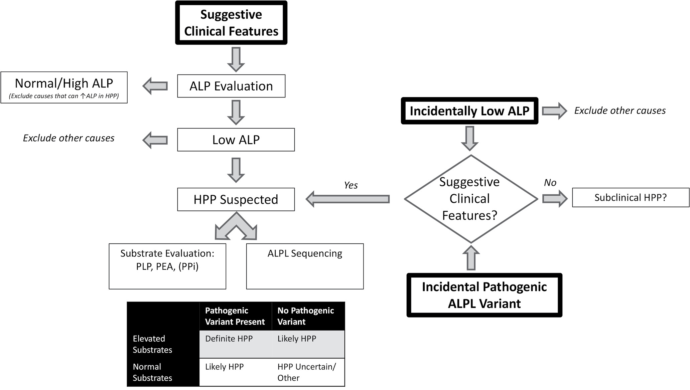

# Hypophosphatasia in Adults: Recognizing, Diagnosing, and Treating a Multisystem Disease
> **中文標題**：成人低血磷酸酶症（Hypophosphatasia）：辨識、診斷與治療一個多系統疾病
> **分類 Category**：Bone and Mineral Metabolism
> **講者 Faculty**：Juan Carl Pallais, MD, MPH — Brigham and Women's Hospital / Mass General Brigham and Harvard Medical School, Boston, Massachusetts
> **來源 Source**：2026 Endocrine Case Management — Meet the Professor · ENDO 2026 · Endocrine Society

---

## 📋 教學目標 Educational Objectives

閱讀本章後，學習者應能：

- **Describe the pathophysiology of hypophosphatasia (HPP) and its clinical manifestations in adults.**
  描述 hypophosphatasia（HPP）的病生理機轉及其在成人的臨床表現。

- **Apply diagnostic criteria to identify adults with HPP and understand common diagnostic challenges.**
  應用診斷準則辨識成人 HPP 患者，並理解常見的診斷挑戰。

- **Describe evidence-based treatment options for adults with HPP.**
  描述成人 HPP 以實證為基礎的治療選項。

---

## 🩺 臨床情境 Clinical Scenario

> HPP 常被誤認為停經後骨質疏鬆症、fibromyalgia 或退化性關節疾病，導致診斷延遲常超過十年，並可能因誤用 antiresorptive 藥物而惡化骨骼預後。以下為本章三個核心臨床情境的綜整。

**Case 1** — A 68-year-old woman is referred for evaluation of osteoporosis after DXA demonstrated severe bone loss at the distal radius and low bone density at the femoral neck (T-scores −3.9 and −2.6, respectively), with relatively preserved lumbar spine density. She reports a single metatarsal fracture as a teenager. Alendronate had been prescribed, but she was hesitant to initiate therapy. Review of previous laboratory data revealed persistently borderline-low ALP activity ranging from 34 to 37 U/L (0.57 to 0.62 µkat/L) over the past decade (reference range, 35-130 U/L [0.58-2.17 µkat/L]).

一位 68 歲女性因骨質疏鬆症被轉介評估。DXA 顯示遠端橈骨嚴重骨質流失、股骨頸骨密度偏低（T-scores 分別為 −3.9 與 −2.6），但腰椎骨密度相對保留。她自述青少年時期曾有一次蹠骨（metatarsal）骨折。曾被開立 Alendronate，但她對是否開始治療感到猶豫。回顧過去十年的檢驗資料，發現 ALP 活性持續處於臨界偏低值，介於 34 至 37 U/L（0.57 至 0.62 µkat/L）之間（參考範圍 35-130 U/L [0.58-2.17 µkat/L]）。她自成年早期即有慢性肌肉骨骼疼痛，並有偏頭痛與焦慮病史，仍以瑜伽維持活動。家族史值得注意：父親於 50 多歲即全口無牙並曾發生股骨骨折，兒子則有 fibromyalgia、多次肌肉骨骼傷害，並於 31 歲接受髖關節置換。

**Case 2** — A 63-year-old woman is referred for management of osteoporosis. She has a history of low-trauma fractures with delayed healing in her 20s and progressive daily musculoskeletal pain involving the hips, thighs, and lower legs. She has had persistently low ALP over the past 25 years (18-31 U/L). Serum PLP = 97 µg/L (<50 µg/L); urinary PEA = 23 nmol/mg creat (<48). DXA: lumbar spine (L1-L3) T-score −0.2, femoral neck T-score −2.7. Genetic testing for pathogenic *ALPL* variants is negative.

一位 63 歲女性因骨質疏鬆症被轉介處置。她於 20 多歲即有低創傷性骨折併癒合延遲，並有進行性、每日發作、涉及髖部、大腿與小腿的肌肉骨骼疼痛，過去十年持續惡化並限制日常活動。過去 25 年 ALP 持續偏低（18-31 U/L）。血清 PLP 升高（97 µg/L；參考 <50），尿液 PEA 正常（23 nmol/mg creat；參考 <48）。DXA 呈現腰椎相對保留（L1-L3 T-score −0.2）而髖部偏低（股骨頸 T-score −2.7）。*ALPL* 致病變異基因檢測為陰性。

**Case 3** — A 59-year-old woman is referred for progressive muscle weakness, chronic musculoskeletal pain, and recurrent fractures, with difficulty rising from a chair and climbing stairs. She has multiple lifelong low-trauma fractures, early tooth loss at age 4, persistently very low ALP (16-25 U/L), markedly elevated serum PLP (277 µg/L), elevated urinary PEA (65 nmol/mg creat), preserved BMD on DXA, and a heterozygous pathogenic *ALPL* nonsense variant (c.303C>A; p.Tyr101*).

一位 59 歲女性因進行性肌肉無力、慢性肌肉骨骼疼痛與反覆骨折被轉介，主訴由椅子起身與爬樓梯困難、輕微出力後恢復期延長。她自成年早期起有多次低創傷性骨折（含雙側足部骨折、髕骨骨折併內固定失敗與後續再骨折、膝關節置換術後周邊假體骨折、跌倒後移位性粉碎性肩部骨折），4 歲即掉牙、兒童期多顆蛀牙、青春期多次拔牙。理學檢查有近端肌肉無力，功能測試顯示 5 次坐立起身時間 27.5 秒（正常 <13 秒）、Timed Up and Go 18.2 秒（異常）。ALP 持續且明顯偏低（16-25 U/L），血清 PLP 明顯升高（277 µg/L），尿液 PEA 升高（65 nmol/mg creat），DXA 骨密度保留，基因檢測發現 heterozygous pathogenic *ALPL* nonsense variant（c.303C>A; p.Tyr101*）。

---

## 🔬 背景與重要性 Background & Significance

**Significance of the Clinical Problem.** Hypophosphatasia (HPP) is an inherited metabolic disease caused by loss-of-function variants in the *ALPL* gene, which encodes tissue-nonspecific alkaline phosphatase (TNSALP), the isoenzyme responsible for alkaline phosphatase activity in both bone and liver.1-4 Historically regarded as a rare pediatric skeletal dysplasia, HPP is now recognized as a multisystem disorder that frequently presents in adulthood with heterogeneous and often nonspecific manifestations.4-7 Diagnostic delay is common, often exceeding a decade.8

Hypophosphatasia（HPP）是一種遺傳性代謝疾病，由 *ALPL* 基因的功能喪失（loss-of-function）變異所致。*ALPL* 編碼 tissue-nonspecific alkaline phosphatase（TNSALP），此同功酶負責骨骼與肝臟中的 alkaline phosphatase 活性。HPP 過去被視為罕見的兒童骨骼發育不良，如今則被認定為一種多系統疾病，常在成年期以異質且非特異性的表現出現。診斷延遲十分常見，經常超過十年，反映出臨床醫師警覺性不足與成人疾病表現多變的本質。

**In adults**, manifestations extend beyond skeletal fragility to include dental disease, nephrocalcinosis, chondrocalcinosis, chronic musculoskeletal pain, fatigue, and muscle weakness.7,9-11 These features overlap with common conditions such as osteoporosis, fibromyalgia, and degenerative joint disease, contributing to misdiagnosis and inappropriate therapy.12-14 Notably, antiresorptive therapies commonly used for presumed osteoporosis may worsen skeletal outcomes in HPP, including increased risk of atypical femoral fractures and impaired fracture healing.15,16

在成人，其表現不僅止於骨骼脆弱，還包括牙科疾病、nephrocalcinosis、chondrocalcinosis、慢性肌肉骨骼疼痛、疲勞與肌肉無力。這些特徵與 osteoporosis、fibromyalgia、退化性關節疾病等常見狀況重疊，導致誤診與不當治療。特別值得注意的是，常用於推定骨質疏鬆症的 antiresorptive 藥物，可能惡化 HPP 的骨骼預後，包括增加 atypical femoral fractures 風險與損害骨折癒合。

**Accurate diagnosis** has important clinical implications: identification may allow access to targeted enzyme replacement therapy, provide a unifying explanation for longstanding symptoms, guide surveillance and family counseling, and prevent exposure to potentially harmful treatments.1,2,13

正確診斷具有重要的臨床意義：確診可讓病人有機會接受標靶性酵素替代治療、為長期症狀提供統一的解釋、指引監測與家族諮詢，並避免接受可能有害的治療。提升臨床醫師對成人 HPP 的警覺性因此至關重要。

### Pathophysiology 病生理

The *ALPL* gene encodes TNSALP, a ubiquitous ectoenzyme that hydrolyzes several physiologic substrates, including inorganic pyrophosphate (PPi), pyridoxal-5′-phosphate (PLP)—the principal circulating vitamin B6 vitamer—and phosphoethanolamine (PEA).2-4 Deficient TNSALP activity leads to accumulation of PPi, a potent inhibitor of hydroxyapatite formation, resulting in osteomalacia, impaired mineralization, and delayed fracture healing.2,4 PLP elevation reflects impaired vitamin B6 metabolism. Beyond mineralization, TNSALP has been implicated in mitochondrial energetics, providing mechanistic insight into muscle weakness, fatigue, and chronic pain in adults.19-22

*ALPL* 編碼 TNSALP，是一種廣泛存在的外酶（ectoenzyme），可水解數種生理受質，包括 inorganic pyrophosphate（PPi）、pyridoxal-5′-phosphate（PLP，血中主要的 vitamin B6 型態）以及 phosphoethanolamine（PEA）。TNSALP 活性不足會導致 PPi 堆積；PPi 是 hydroxyapatite 形成的強效抑制劑，因而造成 osteomalacia、礦化障礙與骨折癒合延遲。PLP 升高反映 vitamin B6 代謝受損，在嚴重表型最為顯著，但也可協助成人的診斷。除礦化作用外，TNSALP 亦被認為參與粒線體能量代謝與相關細胞生物能量路徑，為成人 HPP 常見的肌肉無力、疲勞與慢性疼痛提供機轉上的解釋。

### Genetics and Prevalence 遺傳與盛行率

Nearly 500 *ALPL* variants have been identified, with both autosomal dominant and recessive inheritance patterns.5,6,29,30 Penetrance and expressivity are highly variable, even within families.6 Analyses from large biobanks, including UK Biobank and BioVU, suggest that pathogenic or likely pathogenic *ALPL* variants may be present in approximately 1 in 175 to 1 in 350 to 500 individuals, many of whom exhibit mild, atypical, or incomplete phenotypes.31-33

目前已辨識出將近 500 個 *ALPL* 變異，兼具 autosomal dominant 與 recessive 的遺傳模式。其外顯率（penetrance）與表現度（expressivity）差異極大，即使在同一家族內亦然。以族群為基礎的研究顯示，成人 HPP 可能遠比過去所認知的更常見；來自 UK Biobank 與 BioVU 等大型 biobank 的分析指出，pathogenic 或 likely pathogenic 的 *ALPL* 變異可能存在於約每 175 人到每 350-500 人之中，其中許多人呈現輕微、非典型或不完全的表型。

Importantly, genotype, residual enzymatic activity, and substrate levels correlate poorly with clinical severity in adults. While some heterozygous variants may exert dominant-negative effects, genotype alone does not reliably predict age of onset, skeletal burden, or extraskeletal manifestations.5,6,32,34

重要的是，在成人，genotype、殘餘酵素活性與受質濃度與臨床嚴重度的相關性都很差。雖然部分 heterozygous 變異可能產生 dominant-negative 效應，單靠 genotype 並無法可靠預測發病年齡、骨骼負擔或骨骼外表現。因此，診斷需整合臨床特徵、生化發現與基因資料。

### Practice Gaps 臨床落差

- Health care providers' limited awareness of HPP in adults. — 醫療提供者對成人 HPP 的警覺性不足。
- Difficulty recognizing nonspecific symptoms as manifestations of HPP. — 難以將非特異性症狀辨識為 HPP 的表現。
- Challenges in interpreting low or low-normal alkaline phosphatase (ALP) values. — 判讀偏低或低-正常 ALP 值的困難。
- Limited familiarity with diagnostic criteria for HPP and treatment options in adults. — 對成人 HPP 診斷準則與治療選項的熟悉度有限。

---

## 🧭 診斷與評估 Diagnosis & Evaluation

### Biochemical Presentation 生化表現

Persistently low serum ALP is the biochemical hallmark of hypophosphatasia.2,13,14 However, ALP values may fall within the low-normal range in adults with HPP. Total ALP activity reflects contributions from TNSALP-derived isoenzymes (bone and liver), as well as intestinal, placental, or tumor-associated isoenzymes.23-26 Conditions that transiently increase bone or liver ALP—such as hyperparathyroidism, hyperthyroidism, recent fractures, bone-anabolic therapy, or liver and biliary disease—may raise total ALP into the reference range and mask underlying TNSALP deficiency.14,23-26

持續偏低的血清 ALP 是 hypophosphatasia 的生化標誌。然而，成人 HPP 的 ALP 值可能落在低-正常範圍內。Total ALP 活性反映了來自 TNSALP 的同功酶（骨與肝），以及腸道、胎盤或腫瘤相關同功酶的貢獻。會暫時性升高骨或肝 ALP 的狀況（如 hyperparathyroidism、hyperthyroidism、近期骨折、bone-anabolic 治療、或肝膽疾病）可能把 total ALP 拉抬進參考範圍，因而掩蓋潛在的 TNSALP 缺乏。

此外，已有描述 TNSALP 對特定受質的缺陷：某些 *ALPL* 變異在常規 ALP 檢驗所用的非生理性條件下（如以 p-nitrophenyl phosphate 為人工受質）仍可保留催化活性，但對生理性受質（PPi、PLP、PEA）的水解則受損。結果是，即使酵素功能已有臨床上重要的失調，病人仍可能呈現臨界或甚至「正常」的 total ALP 活性。

Measurement of serum PLP and urinary PEA (and PPi, when available) supports the diagnosis by demonstrating impaired TNSALP activity.14,18,28 However, substrate testing has important limitations: PLP is light-sensitive and influenced by dietary vitamin B6 intake, supplementation, and kidney function; normal PLP levels therefore do not exclude HPP.14,18 Urinary PEA is a specific but variable marker and does not correlate with disease severity.14,28 Expert consensus emphasizes that biochemical substrate testing and genetic testing are complementary and should be performed together whenever feasible, rather than ordered sequentially.13,14

測量血清 PLP 與尿液 PEA（以及 PPi，若可取得）可透過證明 TNSALP 活性受損來支持診斷。然而受質檢測在成人有重要限制：PLP 對光敏感，並受飲食 vitamin B6 攝取、補充劑與腎功能影響，因此正常的 PLP 值並不能排除 HPP。尿液 PEA 是 TNSALP 活性受損的特異但變異度高的標記，且與疾病嚴重度不相關。因此專家共識強調：生化受質檢測與基因檢測是互補的，應盡可能一起進行，而非依序（sequential）安排。

### Radiographic Findings 影像學發現

Radiographic manifestations in adults may include:7,10,12,15

- Pseudofractures, particularly of the lateral femoral cortex — 假性骨折，特別是股骨外側皮質
- Recurrent metatarsal fractures — 反覆性蹠骨骨折
- Chondrocalcinosis and calcific periarthritis — Chondrocalcinosis 與鈣化性關節周圍炎
- Nephrocalcinosis or kidney stones — Nephrocalcinosis 或腎結石

**DXA is unreliable for fracture risk assessment in HPP**; despite the potential for osteomalacia, lumbar spine bone mineral density (BMD) is often preserved or elevated.10,11

DXA 在 HPP 中無法可靠評估骨折風險；儘管有 osteomalacia 的可能，腰椎骨密度（BMD）卻常保留甚至偏高。

**Figure. Diagnostic Pathways for HPP in Adults**（成人 HPP 的診斷路徑）

> 📎 Adults with HPP may enter the diagnostic pathway through suggestive clinical features, incidentally identified persistently low ALP, or incidental detection of a pathogenic ALPL variant. Persistently low or low-normal ALP, after exclusion of secondary causes, should prompt evaluation for HPP, recognizing that total ALP may be masked by non-TNSALP isoenzymes or transient increases in bone or liver ALP. Diagnostic confirmation relies on parallel, rather than sequential, assessment of physiologic TNSALP substrates (PLP, PEA, PPi when available) and ALPL sequencing. Diagnosis integrates clinical, biochemical, and genetic data rather than any single parameter.
>
> 成人 HPP 患者可經由三種途徑進入診斷流程：具提示性的臨床特徵、偶然發現持續偏低的 ALP、或偶然檢出的 pathogenic ALPL 變異。在排除次發性原因後，持續偏低或低-正常的 ALP 應促使進行 HPP 評估，並須注意 total ALP 可能被非 TNSALP 同功酶或骨/肝 ALP 的暫時性上升所掩蓋。診斷確立需仰賴平行（而非依序）評估生理性 TNSALP 受質（PLP、PEA、可取得時的 PPi）與 ALPL 定序。診斷整合臨床、生化與基因資料，而非依賴任何單一參數。

### Diagnostic Criteria for HPP in Adults 成人 HPP 診斷準則

International working group criteria require **persistently low ALP** plus **either 2 major criteria, or 1 major and 2 minor criteria**.13

國際工作小組（International Working Group）準則要求：持續偏低的 ALP，再加上「2 項主要準則」或「1 項主要準則加 2 項次要準則」。

**Major criteria 主要準則**

- Identification of pathogenic or likely pathogenic *ALPL* variants — 檢出 pathogenic 或 likely pathogenic 的 *ALPL* 變異
- Elevated TNSALP substrates (PLP, PEA, or PPi if available) — TNSALP 受質升高（PLP、PEA，或可取得時的 PPi）
- Atypical femoral fractures — Atypical femoral fractures
- Recurrent metatarsal fractures — 反覆性蹠骨骨折

**Minor criteria 次要準則**

- Poorly healing fractures — 骨折癒合不良
- Chronic musculoskeletal pain — 慢性肌肉骨骼疼痛
- Early, atraumatic loss of primary or permanent teeth — 乳牙或恆牙早期、非外傷性脫落
- Chondrocalcinosis or pseudogout — Chondrocalcinosis 或 pseudogout
- Nephrocalcinosis or kidney stones — Nephrocalcinosis 或腎結石

Patients may enter the diagnostic pathway through several distinct scenarios (a suggestive phenotype, persistently low ALP, or an incidental genetic finding), and evaluation should converge on an integrated assessment of phenotype, biochemistry, and genotype.13,14

病人可能經由數種不同的臨床情境進入 HPP 診斷路徑（具提示性的表型、持續偏低的 ALP、或偶然的基因發現），而評估最終應收斂到對表型、生化與 genotype 的整合性判讀。

---

## 💊 治療與處置 Management

Management includes supportive, multidisciplinary care and avoidance of harmful therapies. **Antiresorptive agents should generally be avoided** due to increased risk of atypical femoral fractures and concerns regarding fracture healing in HPP.15,16

處置包括支持性、多專科的照護，以及避免有害的治療。Antiresorptive 藥物一般應予避免，因為在 HPP 中會增加 atypical femoral fractures 風險並影響骨折癒合。

**Asfotase alfa**, a recombinant TNSALP, is approved for pediatric-onset HPP in the United States and has demonstrated benefits in adults with pediatric-onset disease, including improved physical function, pain, and quality of life.35-38 Emerging real-world and registry data suggest potential benefits in selected adults, including improved fracture healing and functional outcomes.35,36,38,39

Asfotase alfa 是一種重組 TNSALP，在美國核准用於 pediatric-onset HPP，並已在具兒童期發病的成人中展現效益，包括改善身體功能、疼痛與生活品質。新興的真實世界（real-world）與登錄資料顯示，在特定成人中可能有潛在效益，包括改善骨折癒合與功能性結果。

> **重要治療原則**：在美國，asfotase alfa 僅核准用於 pediatric-onset HPP。因此，取得兒童期表現（牙科史、骨折型態、身體活動限制與旁證資料）的詳細病史，對治療資格、保險給付與酵素替代治療的取得具有直接影響。所謂「childhood-onset」與「adult-onset」HPP 的區分在生物學上是人為的：TNSALP 活性受損的疾病機轉可跨越一生持續進展，許多最初被標記為「成人發病」者，經仔細回顧後常發現有被忽略或誤歸因的兒童期表現。

Off-label anabolic agents (e.g., teriparatide/PTH analogues) have been used in selected adults lacking access to enzyme replacement, but benefits are variable and often transient, and they do not correct TNSALP deficiency.13,42-44

Off-label 使用的 anabolic 藥物（如 teriparatide／PTH analogues）曾用於無法取得酵素替代治療的特定成人，但效益不一且常為短暫，且無法矯正 TNSALP 缺乏。

---

## 🧠 個案解析與臨床推理 Case Analysis & Clinical Reasoning

### Case 1：低-正常 ALP 不能排除 HPP

Case 1 的正確處置是「測量 ALP 受質（PLP、PEA）並安排 *ALPL* 基因檢測」（答案 E）。此病人具多項提示 HPP 的特徵：持續低-正常的 ALP、自成年早期開始的慢性肌肉骨骼疼痛、既往壓力性骨折、牙科疾病，以及與遺傳性低 ALP 骨病相符的家族史。她並無低 ALP 的次發性原因（如營養不良、hypothyroidism、hypoparathyroidism、multiple myeloma、celiac disease、glucocorticoid 暴露或 antiresorptive 治療）。

**關鍵陷阱（pitfall）**：臨界或間歇性正常的 total ALP 並不能排除 HPP。Total ALP 可被非 TNSALP 同功酶（腸道、胎盤、腫瘤相關）以及肝或骨 ALP 從低基準線的暫時性上升「推」進低-正常範圍。此外，常規 ALP 檢驗使用非生理條件下的人工受質，可能漏掉那些「檢驗活性保留、但生理性受質水解受損」的受質特異性缺陷。

**選項辨析**：Antiresorptive 治療（zoledronic acid、denosumab）在 HPP 排除前應避免；teriparatide 不應在確立潛在代謝性骨病之前作為首步；單獨測量 ALP isoenzymes 無法確立診斷，也不應延誤確定性的生化與基因評估。

**Case 1 續**：進一步檢查 PLP = 44 µg/L（5-50，正常範圍內）、尿液 PEA = 57 nmol/mg creat（<48，升高），基因檢測發現 heterozygous likely pathogenic *ALPL* 變異 c.1247G>A（p.Gly416Asp），JKU *ALPL* Variant Portal 記載其殘餘活性 <5% 並具 dominant-negative 效應。正確判讀為：「此病人確診 HPP，且 genotype 與受質濃度無法可靠預測臨床嚴重度」（答案 D）。她符合成人 HPP 診斷準則（持續臨界偏低 ALP + 主要準則：一項自然 TNSALP 受質升高〔尿 PEA〕與一個具 dominant-negative 效應的 likely pathogenic *ALPL* 變異）。

**要點**：heterozygous likely pathogenic 變異並不代表「僅是帶因者（carrier-only）」；許多 heterozygous pathogenic missense 變異透過 dominant-negative 效應運作。正常的 PLP 值不能排除 HPP（PLP 受光敏感性、飲食 B6、補充劑與腎功能影響）；PEA 升高支持酵素功能失調但不能分級嚴重度，即使輕微升高也可能具臨床意義。

### Case 2：陰性基因檢測不能排除 HPP，且「兒童期病史」攸關治療資格

Case 2 的最佳下一步是「取得更多關於兒童期 HPP 表現的病史」（答案 A）。此病人多項特徵強烈提示 HPP：數十年持續偏低的 ALP、升高的血清 PLP、慢性進行性肌肉骨骼疼痛、骨折癒合延遲，以及「腰椎 BMD 相對保留、髖部 BMD 偏低」的骨骼表型（典型於 HPP 而非停經後骨質疏鬆）。即使未檢出 pathogenic *ALPL* 變異，這些發現已滿足 1 項主要準則（TNSALP 受質升高）與至少 2 項次要準則（骨折癒合不良與慢性肌肉骨骼疼痛）。

**臨床決策要點**：由於美國 asfotase alfa 僅核准用於 pediatric-onset HPP，記錄兒童期表現對治療資格與保險給付有直接影響，因此在考慮治療前，確認兒童期表現至關重要。Antiresorptive（alendronate、denosumab）應避免；PTH analogue 效益不一且無法矯正 TNSALP 缺乏。

### Case 3：DXA 與臨床反應的分離；肌肉功能為核心療效指標

Case 3 詢問對 asfotase alfa 的預期反應，答案為「肌力與身體功能改善，但 DXA 變化極小」（答案 C）。此病人為嚴重多系統 HPP，具終生骨折史、4 歲早期掉牙、持續且明顯偏低的 ALP、升高的 TNSALP 受質（PLP 與 PEA）、近端肌肉無力，以及客觀功能測試（chair rise、Timed Up and Go）的顯著障礙，並帶有 heterozygous pathogenic nonsense *ALPL* 變異，足以造成臨床上顯著的疾病。

**核心觀念**：儘管有大量骨折史，DXA 卻呈現保留甚至高於平均的 BMD——這是成人 HPP 一個廣為描述且具誤導性的特徵。在 HPP 中，礦化障礙、PPi 堆積與骨材料性質改變造成的骨脆弱，無法由面積骨密度（areal BMD）反映，因此 DXA 無法可靠反映疾病嚴重度、骨折風險或治療反應。肌肉無力、疲勞、運動耐受不良與出力後恢復延遲，愈來愈被認定為成人 HPP 的核心表現（獨立於骨密度之外），並最好以功能性評估（chair rise time、Timed Up and Go、gait speed）而非 DXA 來捕捉。

**療效預期**：在 pediatric-onset HPP 的成人，asfotase alfa 一致地改善身體功能、行動力、疼痛與生活品質，即使基準骨密度正常或偏高亦然；此臨床改善與 DXA 反應的分離，是成人 HPP 的特徵，並強調應以功能性與以病人為中心的終點（而非單獨 BMD）評估治療效益。Asfotase alfa 恢復生理性 TNSALP 活性並改善礦化，不抑制骨重塑，也不增加 atypical femoral fractures 風險。較晚才治療的成人仍可獲得有意義的疼痛、功能與行動力改善。

### 鑑別診斷 Differential Diagnosis

需與 HPP 鑑別的常見狀況包括：postmenopausal osteoporosis（骨密度型態不同：HPP 常腰椎保留、髖部偏低）、fibromyalgia、退化性關節疾病、其他 osteomalacia 病因，以及造成低 ALP 的次發性原因（營養不良、hypothyroidism、hypoparathyroidism、multiple myeloma、celiac disease、glucocorticoid 或 antiresorptive 藥物）。

---

## ⭐ 重點整理 Key Takeaways

- HPP 是一種多系統疾病，在成人常被誤診（frequently misdiagnosed）；診斷延遲常超過十年。
- 成人 HPP 的診斷需整合表型、生化與 genotype（phenotype, biochemistry, and genotype）；受質檢測（PLP、PEA）與 *ALPL* 基因檢測應平行、而非依序進行。
- 持續偏低或低-正常的 ALP 都不能忽視；total ALP 可被非 TNSALP 同功酶或骨/肝 ALP 的暫時上升掩蓋，而正常 PLP 也不能排除 HPP。
- DXA 在 HPP 中無法可靠評估骨折風險；腰椎 BMD 常保留甚至偏高，與臨床骨脆弱程度不符。
- Antiresorptive 治療（bisphosphonates、denosumab）在 HPP 可能有害，與 atypical femoral fractures 及骨折癒合受損相關，排除 HPP 前應避免。
- Genotype、殘餘酵素活性與受質濃度與成人臨床嚴重度相關性差；heterozygous pathogenic 變異可透過 dominant-negative 效應致病，並非僅是「帶因者」。
- 酵素替代治療 asfotase alfa（美國核准用於 pediatric-onset HPP）可改善特定成人的功能與生活品質，療效以功能性終點而非 DXA 評估；確認兒童期表現對治療資格關鍵。

---

## 💬 討論問題 Discussion Questions

1. 當一位疑似骨質疏鬆的病人 ALP 落在低-正常範圍（如 35-40 U/L），你會用哪些線索與後續檢查來決定是否啟動 HPP 的評估？如何在臨床實務中避免把它當成「正常」而錯過？
2. 面對基因檢測陰性、但生化與臨床高度符合 HPP 的病人（如 Case 2），你如何向病人與保險方說明診斷與治療資格？取得「兒童期病史」在你的臨床脈絡中有哪些實際困難與策略？
3. 既然 DXA 無法反映 HPP 的骨折風險與治療反應，臨床上你會採用哪些功能性或以病人為中心的指標（如 chair rise、Timed Up and Go、gait speed、疼痛量表）來追蹤療效？
4. 在你的診療環境中，如何建立一套流程，避免對未辨識的 HPP 病人誤用 antiresorptive 藥物？低 ALP 是否應成為啟動治療前的例行警示（flag）？
5. 面對帶有 heterozygous pathogenic *ALPL* 變異、但表型輕微的家族成員，你如何在「過度醫療化」與「適當監測與家族諮詢」之間取得平衡？

---

## 📚 參考文獻 References

1. Khan AA, Josse R, Kannu P, et al. Hypophosphatasia: Canadian update on diagnosis and management. *Osteoporos Int*. 2019;30(9):1713-1722. PMID: 30915507
2. Whyte MP. Hypophosphatasia - aetiology, nosology, pathogenesis, diagnosis and treatment. *Nat Rev Endocrinol*. 2016;12(4):233-246. PMID: 26893260
3. Liedtke D, Hofmann C, Jakob F, Klopocki E, Graser S. Tissue-nonspecific alkaline phosphatase—a gatekeeper of physiological conditions in health and a modulator of biological environments in disease. *Biomolecules*. 2020;10(12):1648. PMID: 33302551
4. Whyte MP. Hypophosphatasia: an overview for 2017. *Bone*. 2017;102:15-25. PMID: 2823880
5. Mornet E, Taillandier A, Domingues C, et al. Hypophosphatasia: a genetic-based nosology and new insights in genotype-phenotype correlation. *Eur J Hum Genet*. 2021;29(2):289-299. PMID: 32973344
6. Hofmann C, Girschick H, Mornet E, Schneider D, Jakob F, Mentrup B. Unexpected high intrafamilial phenotypic variability observed in hypophosphatasia. *Eur J Hum Genet*. 2014;22(10):1160-1164. PMID: 24569605
7. Dahir KM, Seefried L, Kishnani PS, et al. Clinical profiles of treated and untreated adults with hypophosphatasia in the Global HPP Registry. *Orphanet J Rare Dis*. 2022;17(1):277. PMID: 35854311
8. Högler W, Langman C, Gomes da Silva H, et al. Diagnostic delay is common among patients with hypophosphatasia: initial findings from a longitudinal, prospective, global registry. *BMC Musculoskelet Disord*. 2019;20:80. PMID: 30764793
9. Seefried L, Dahir K, Petryk A, et al. Burden of illness in adults with hypophosphatasia: data from the global hypophosphatasia patient registry. *J Bone Miner Res*. 2020;35(11):2171-2178. PMID: 32654183
10. Genest F, Claußen L, Rak D, Seefried L. Bone mineral density and fracture risk in adult patients with hypophosphatasia. *Osteoporos Int*. 2021;32(2):377-385. PMID: 32879991
11. Hepp N, Folkestad L, Møllebæk S, et al. Bone-microarchitecture and bone-strength in a sample of adults with hypophosphatasia and a matched reference population assessed by HR-pQCT and impact microindentation. *Bone*. 2022;160:116420. PMID: 35421614
12. Brandi ML, Khan AA, Rush ET, et al. The challenge of hypophosphatasia diagnosis in adults: results from the HPP International Working Group Literature Surveillance. *Osteoporos Int*. 2024;35(3):439-449. PMID: 37982856
13. Khan AA, Brandi ML, Rush ET, et al. Hypophosphatasia diagnosis: current state of the art and proposed diagnostic criteria for children and adults. *Osteoporos Int*. 2024;35(3):431-438. PMID: 37982857
14. Riancho JA. Diagnostic approach to patients with low serum alkaline phosphatase. *Calcif Tissue Int*. 2023;112(3):289-296. PMID: 36348061
15. Genest F, Seefried L. Subtrochanteric and diaphyseal femoral fractures in hypophosphatasia—not atypical at all. *Osteoporos Int*. 2018;29(8):1815-1825. PMID: 29774402
16. Charoenngam N, Thongpiya J, Yingchoncharoen P, et al. Atypical femoral fracture in hypophosphatasia: a systematic review. *Int J Endocrinol*. 2023;2023:5544148. PMID: 37731773
17. Whyte MP, Zhang F, Mack KE, et al. Pyridoxine challenge reflects pediatric hypophosphatasia severity and thereby examines tissue-nonspecific alkaline phosphatase's role in vitamin B6 metabolism. *Bone*. 2024;181:117033. PMID: 38307176
18. Whyte MP, Zhang F, Wenkert D, et al. Hypophosphatasia: vitamin B6 status of affected children and adults. *Bone*. 2022;154:116204. PMID: 34547524
19. Graser S, Liedtke D, Jakob F. TNAP as a new player in chronic inflammatory conditions and metabolism. *Int J Mol Sci*. 2021;22(2):919. PMID: 33477631
20. Sun Y, Rahbani JF, Jedrychowski MP, et al. Mitochondrial TNAP controls thermogenesis by hydrolysis of phosphocreatine. *Nature*. 2021;593(7860):580-585. PMID: 33981039
21. Zhang Z, Nam HK, Crouch S, Hatch NE. Tissue nonspecific alkaline phosphatase function in bone and muscle progenitor cells: control of mitochondrial respiration and ATP production. *Int J Mol Sci*. 2021;22(3):1140. PMID: 33498907
22. Williams DK, Pinzón C, Huggins S, et al. Genetic engineering a large animal model of human hypophosphatasia in sheep. *Sci Rep*. 2018;8:16945. PMID: 30446691
23. Makris K, Mousa C, Cavalier E. Alkaline phosphatases: biochemistry, functions, and measurement. *Calcif Tissue Int*. 2023;112(2):233-242. PMID: 36571614
24. Pratt DS, Kaplan MM. Evaluation of abnormal liver-enzyme results in asymptomatic patients. *N Engl J Med*. 2000;342(17):1266-1271. PMID: 10781624
25. Lallès JP. Recent advances in intestinal alkaline phosphatase, inflammation, and nutrition. *Nutr Rev*. 2019;77(10):710-724. PMID: 31086953
26. Jiang T, Zeng Q, He J. Do alkaline phosphatases have great potential in the diagnosis, prognosis, and treatment of tumors? *Transl Cancer Res*. 2023;12(10):2932-2945. PMID: 37969388
27. Di Mauro S, Manes T, Hessle L, et al. Kinetic characterization of hypophosphatasia mutations with physiological substrates. *J Bone Miner Res*. 2002;17(8):1383-1391. PMID: 12162492
28. Shajani-Yi Z, Ayala-Lopez N, Black M, Dahir KM. Urine phosphoethanolamine is a specific biomarker for hypophosphatasia in adults. *Bone*. 2022;163:116504. PMID: 35878747
29. Farman MR, Rehder C, Malli T, et al. The Global ALPL gene variant classification project: dedicated to deciphering variants. *Bone*. 2024;178:116947. PMID: 37898381
30. Variant - ALPL. ALPL Mutation Database. Accessed January 17, 2026. https://alplmutationdatabase.jku.at/table/
31. Angel G del, Mowrey W, Petryk A, et al. P027: Genetic landscape of ALPL and other genes impacting alkaline phosphatase variation in the UK Biobank. *Genet Med Open*. 2025;3:102871.
32. Dahir KM, Below JE, Liu J, Javid A, Wang G, Bastarache L. Hypophosphatasia: low penetrance of pathogenic and likely-pathogenic ALPL variants identified through an unselected biorepository. *J Bone Miner Res*. Published online November 21, 2025:zjaf176. PMID: 41269245
33. Dahir KM, Tilden DR, Warner JL, et al. Rare variants in the gene ALPL that cause hypophosphatasia are strongly associated with ovarian and uterine disorders. *J Clin Endocrinol Metab*. 2018;103(6):2234-2243. PMID: 29659871
34. Montero-Lopez R, Farman MR, Högler F, et al. Biochemical phenotype of hypophosphatasia in asymptomatic individuals carrying ALPL variants. *J Bone Miner Res*. Published online September 11, 2025:zjaf124. PMID: 41042986
35. Kishnani PS, Rockman-Greenberg C, Rauch F, et al. Five-year efficacy and safety of asfotase alfa therapy for adults and adolescents with hypophosphatasia. *Bone*. 2019;121:149-162. PMID: 30576866
36. Kishnani PS, Martos-Moreno GÁ, Linglart A, et al. Effectiveness of asfotase alfa for treatment of adults with hypophosphatasia: results from a global registry. *Orphanet J Rare Dis*. 2024;19(1):109. PMID: 38459585
37. Seefried L, Genest F, Petryk A, Veith M. Effects of asfotase alfa in adults with pediatric-onset hypophosphatasia over 24 months of treatment. *Bone*. 2023;175:116856. PMID: 37481150
38. Seefried L, Genest F, Hofmann C, Brandi ML, Rush E. Diagnosis and treatment of hypophosphatasia. *Calcif Tissue Int*. 2025;116(1):46. PMID: 40047955
39. Khan AA, Rush ET, Wakeford C, Staub D, Brandi ML. Key learnings from clinical research and real-world evidence on asfotase alfa effectiveness in hypophosphatasia: 10 years post-approval. *Adv Ther*. 2025;42(9):4270-4299. PMID: 40715944
40. McKiernan FE, Shrestha LK, Berg RL, Fuehrer J. Acute hypophosphatasemia. *Osteoporos Int*. 2014;25(2):519-523. PMID: 23912555
41. Sadhukhan S, Mehta P, Rajender S, Gupta SK, Chattopadhyay N. Proposing a clinical algorithm for better diagnosis of hypophosphatasia in resource-limiting situations. *Osteoporos Int*. 2022;33(12):2479-2493. PMID: 35776147
42. Wang S, Sun L, Hu J, et al. Effects of asfotase alfa on fracture healing of adult patient with hypophosphatasia and literature review. *Orphanet J Rare Dis*. 2025;20:162. PMID: 40189581
43. Whyte MP, Mumm S, Deal C. Adult hypophosphatasia treated with teriparatide. *J Clin Endocrinol Metab*. 2007;92(4):1203-1208. PMID: 17213282
44. Gagnon C, Sims NA, Mumm S, et al. Lack of sustained response to teriparatide in a patient with adult hypophosphatasia. *J Clin Endocrinol Metab*. 2010;95(3):1007-1012. PMID: 20089612
45. Mornet E, Stura E, Lia-Baldini AS, Stigbrand T, Ménez A, Le Du MH. Structural evidence for a functional role of human tissue nonspecific alkaline phosphatase in bone mineralization. *J Biol Chem*. 2001;276(33):31171-31178. PMID: 11395499
46. Whyte MP, Greenberg CR, Salman NJ, et al. Enzyme-replacement therapy in life-threatening hypophosphatasia. *N Engl J Med*. 2012;366(10):904-913. PMID: 22322541
47. Dahir KM, Dunbar NS. Medical management of hypophosphatasia: review of data on asfotase alfa. *Curr Osteoporos Rep*. 2025;23(1):14. PMID: 40100438
48. Genest F, Rak D, Petryk A, Seefried L. Physical function and health-related quality of life in adults treated with asfotase alfa for pediatric-onset hypophosphatasia. *JBMR Plus*. 2020;4(9):e10395. PMID: 32995696
49. Cárdenas-Aguilera JG, González-López V, Zarante-Bahamón AM, et al. Diagnosis, treatment, and follow-up of patients with hypophosphatasia. *Endocrine*. 2025;87(2):400-419. PMID: 39663303
50. Seefried L, Rak D, Petryk A, Genest F. Bone turnover and mineral metabolism in adult patients with hypophosphatasia treated with asfotase alfa. *Osteoporos Int*. 2021;32(12):2505-2513. PMID: 34215909
