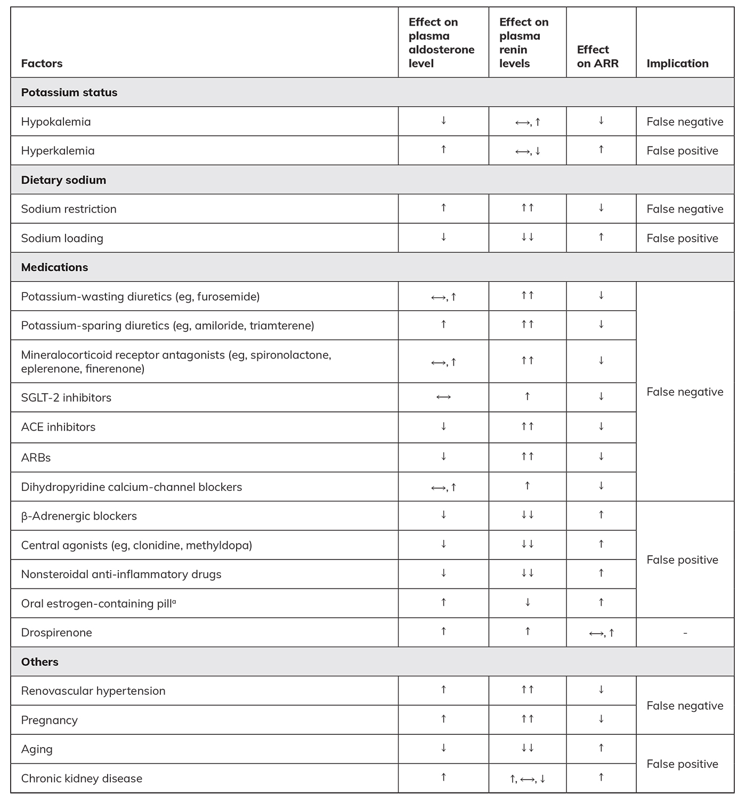
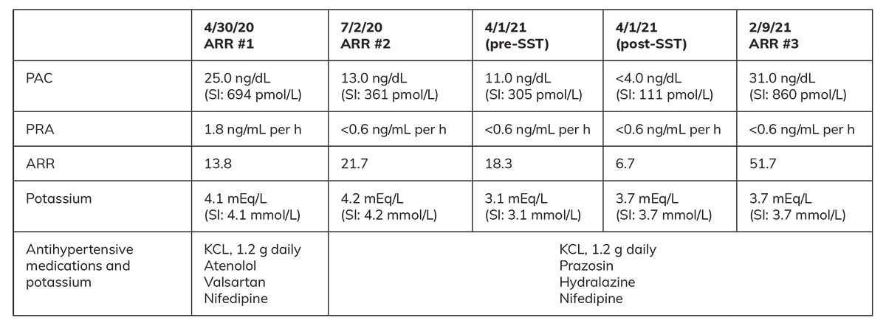
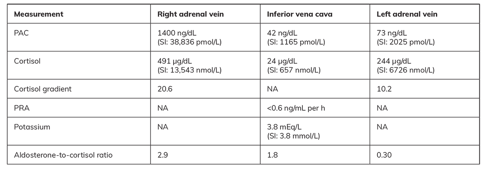
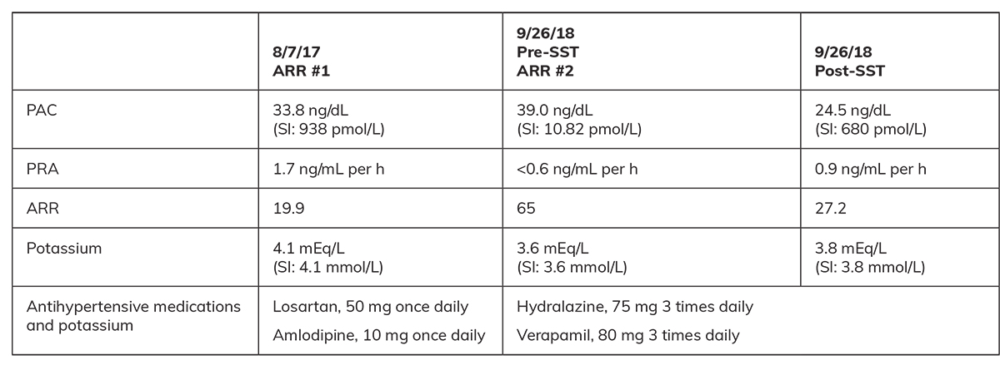
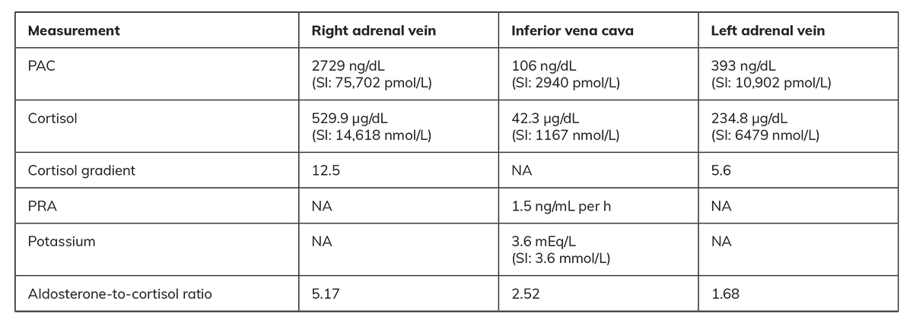
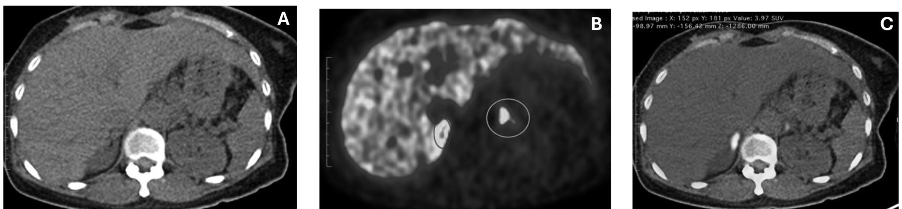
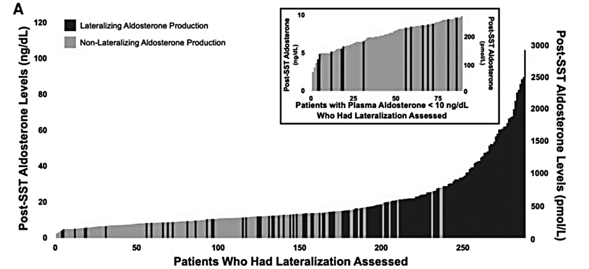
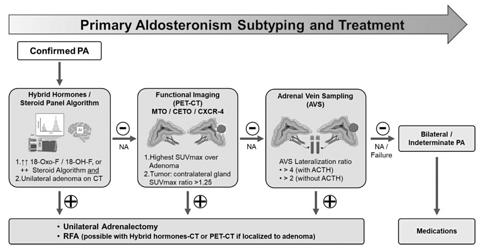

# Interpreting Aldosterone and Renin: Tricks of the Trade
> **中文標題**：判讀 Aldosterone 與 Renin：實戰技巧與陷阱
> **分類 Category**：Cardiovascular Endocrinology
> **講者 Faculty**：David Suphadetch Leungsuwan, MBBS, MMed（Department of Endocrinology, Changi General Hospital, SingHealth, Singapore）；Troy H. Puar, MBBS, PhD（Department of Endocrinology, Changi General Hospital, SingHealth, Singapore；Duke-NUS Medical School）
> **來源 Source**：2026 Endocrine Case Management — Meet the Professor · ENDO 2026 · Endocrine Society

---

## 📋 教學目標 Educational Objectives

- Consider the various factors affecting the interpretation of aldosterone and renin results.
  - 思考各種會影響 aldosterone 與 renin 檢驗結果判讀的因素。
- Identify which patients with primary aldosteronism (PA) could benefit from medical treatment and which might benefit from subtyping and adrenalectomy.
  - 辨識哪些 primary aldosteronism（PA）病人適合藥物治療，哪些適合進一步分型（subtyping）並接受 adrenalectomy。
- Identify instances when patients might not require aldosterone-suppression testing or adrenal venous sampling (AVS).
  - 辨識哪些情況下病人不需要進行 aldosterone-suppression testing 或 adrenal venous sampling（AVS）。
- Describe challenges when interpreting aldosterone values during AVS and potential newer modalities for subtyping PA.
  - 說明判讀 AVS 過程中 aldosterone 數值的挑戰，以及 PA 分型可能採用的新興檢查工具。

---

## 🩺 臨床情境 Clinical Scenario

本章以三個實際臨床案例貫穿，示範如何在真實世界中判讀 aldosterone 與 renin、決定是否需要 confirmatory testing 與 AVS，並選擇藥物或手術治療。以下先呈現三個案例的重點情境，詳細數值與解析見後續各節。

**Case 1** — A 63-year-old man with a 20-year history of hypertension, type 2 diabetes, and hyperlipidemia is referred for bilateral adrenal incidentalomas, with uncontrolled BP (146/91 mm Hg) despite three antihypertensive agents. ARR is positive at 30. He is not interested in surgery.
> 63 歲男性，高血壓 20 年、type 2 diabetes 與高血脂，因雙側 adrenal incidentaloma 轉診；已使用三種降壓藥但血壓仍達 146/91 mm Hg。ARR 為 30（陽性）。病人無意接受手術。

**Case 2** — A 55-year-old man with hypertension since age 35 and hypokalemia since age 45 (never evaluated), with severe concentric left ventricular hypertrophy. Initial ARR was negative on interfering medications, but after medication change and repeat testing, aldosterone was markedly elevated. He wishes to pursue unilateral adrenalectomy if indicated.
> 55 歲男性，35 歲起高血壓、45 歲起低血鉀（從未評估），心臟 MRI 顯示嚴重同心性左心室肥厚。在有干擾藥物下初次 ARR 為陰性，換藥並重複檢驗後 aldosterone 明顯升高。若確診為單側病灶，病人願意接受 unilateral adrenalectomy。

**Case 3** — A 49-year-old woman with a 10-year history of hypertension; post-SST PAC remained elevated (consistent with PA), CT showed an 8-mm right adrenal nodule, but AVS was indeterminate.
> 49 歲女性，高血壓 10 年；SST 後 PAC 仍升高（符合 PA），CT 顯示右側 8 mm adrenal nodule，但 AVS 結果落在不確定區間。

---

## 🔬 背景與重要性 Background & Significance

### 臨床問題的重要性 Significance of the Clinical Problem

Hypertension affects 1 in 3 adults worldwide and is a major cause of cardiovascular morbidity and mortality. Although most patients have essential hypertension, studies show that 5% to 20% of patients with hypertension have PA (defined using traditional cutoffs for confirmatory testing).¹ More recent studies show a spectrum of renin-independent aldosteronism, with cardiometabolic risk increasing even at aldosterone levels below the traditional PA cutoffs.² Hence, many more people are at risk of aldosterone-mediated cardiovascular disease (CVD) than currently recognized.
> 全球每 3 位成人就有 1 位罹患高血壓，是心血管疾病死亡與失能的主要原因。雖然多數為 essential hypertension，研究顯示 5% 至 20% 的高血壓病人其實是 PA（以傳統 confirmatory testing 切點定義）。¹ 近年研究更指出 renin-independent aldosteronism 是一個「連續光譜」，即使 aldosterone 低於傳統 PA 診斷切點，心血管代謝併發症的風險也已上升。² 因此暴露於 aldosterone 介導 CVD 風險的人數，遠比目前所辨識的還要多。

Compared with age-, sex-, and BP-matched patients with essential hypertension, patients with PA have a 2- to 3-fold higher risk of CVD and kidney failure,³ and poorer quality of life. Diagnosing PA matters because 30% to 60% of patients may have unilateral adrenal pathology and could be candidates for curative unilateral adrenalectomy, which completely cures PA in 90% to 97% of patients and improves or cures hypertension.⁴ Surgically treated patients have better outcomes than medically treated patients,⁵,⁶ with reduced pill burden and improved quality of life.⁷
> 相較於年齡、性別、血壓相匹配的 essential hypertension 病人，PA 病人的 CVD 與腎衰竭風險高出 2 至 3 倍，³ 生活品質也較差。診斷 PA 之所以重要，是因為 30% 至 60% 病人可能為單側 adrenal 病灶，適合接受可治癒性的 unilateral adrenalectomy——手術可讓 90% 至 97% 病人完全治癒 PA，並改善或治癒高血壓。⁴ 相較於藥物治療，手術治療的預後更佳，⁵,⁶ 同時減少服藥負擔並提升生活品質。⁷

Worldwide, it is estimated that less than 5% of patients at high risk of PA are ever screened,⁸ and less than 0.1% of patients with unilateral PA undergo curative surgery.⁹
> 全球估計高風險 PA 病人中被篩檢者不到 5%，⁸ 而 unilateral PA 病人接受治癒性手術者不到 0.1%。⁹

### 臨床實務缺口 Practice Gaps

- Few patients worldwide are screened for PA, and even fewer are treated with mineralocorticoid receptor antagonist (MRA) therapy.
  > 全球接受 PA 篩檢的病人極少，接受 MRA 治療者更少。
- Many patients with unilateral PA — a surgically curable form — remain undiagnosed and are not offered potentially curative surgery.
  > 許多可經手術治癒的 unilateral PA 病人仍未被診斷，也未被提供潛在的治癒性手術。

### 生理學基礎 Pathophysiology

The hallmark of PA is suppressed renin with inappropriately elevated aldosterone. Renin is secreted by the juxtaglomerular apparatus of the kidneys in response to baroreceptors: in volume- or salt-depleted states renin rises, while in volume- or salt-overloaded states renin is suppressed. Renin converts angiotensinogen to angiotensin I, which ACE converts to angiotensin II. Aldosterone is chiefly regulated by angiotensin II, and also by potassium and ACTH. It is essential to always pair aldosterone measurements with serum potassium.
> PA 的特徵是 renin 被抑制、aldosterone 卻不適當地升高。Renin 由腎臟的 juxtaglomerular apparatus 依 baroreceptor 訊號分泌：在體液或鹽分不足時 renin 上升，在體液或鹽分過多時 renin 被抑制。Renin 將 angiotensinogen 轉為 angiotensin I，再由 ACE 轉為 angiotensin II。Aldosterone 主要受 angiotensin II 調控，也受 potassium 與 ACTH 影響。判讀 aldosterone 時務必同時檢測 serum potassium。

---

## 🧭 診斷與評估 Diagnosis & Evaluation

### 篩檢與診斷 Screening and Diagnosis

Case detection is performed using the aldosterone-renin ratio (ARR); patients with PA have high aldosterone and suppressed renin, producing an elevated ARR. Numerous factors affect the ARR and must be considered:
> 病例偵測以 aldosterone-renin ratio（ARR）進行；PA 病人 aldosterone 高、renin 被抑制，導致 ARR 升高。判讀 ARR 時必須考量許多干擾因素：

- **低血鉀 Hypokalemia**：Hypokalemia can itself blunt aldosterone signals. Patients should receive adequate potassium supplementation to achieve serum potassium ≥3.5 mEq/L (≥3.5 mmol/L), particularly those with PA and hypokalemia.
  > 低血鉀本身會抑制 aldosterone 訊號。應適當補充鉀，使 serum potassium 達 ≥3.5 mEq/L（≥3.5 mmol/L），尤其是合併低血鉀的 PA 病人。
- **ACE inhibitors / ARBs**：lower aldosterone and raise renin → 可能造成 false-negative ARR。
- **β-adrenergic blockers**：lower renin, and to a lesser extent aldosterone → 可能造成 false-positive ARR。
- **其他因素 Other factors**：Chronic kidney disease 或 aging 可能升高 aldosterone、降低 renin → 導致 ARR 升高。

The latest PA Endocrine Society guidelines recommend that screening may proceed **while potentially interfering medications are still in use**, with results interpreted accordingly, to improve historically low screening rates. Patients with suppressed renin and inappropriate aldosterone signals despite being on ACE inhibitors or ARBs are considered to have a positive screening test.
> 最新的 Endocrine Society PA 指引建議：篩檢可在「仍使用可能干擾藥物的情況下」進行，並據此判讀結果，以提升一向偏低的篩檢率。即使病人正服用 ACE inhibitor 或 ARB，若仍呈現 renin 被抑制且 aldosterone 訊號不適當升高，即視為篩檢陽性。

**Table 1. Factors That May Cause False-Positive and -Negative ARR Results 10-13**（表 1：可能造成 ARR 偽陽性與偽陰性結果的因素）

> 📎 Legend: ↑ increased, ←→ unchanged, ↓ decreased
>
> 圖例：↑ 升高、←→ 不變、↓ 降低。

### 確認試驗（Aldosterone-Suppression Test）Confirmatory Testing

After a positive screening ARR, confirmatory (aldosterone-suppression) testing may be recommended — but not for everyone:
> 篩檢 ARR 陽性後，可能建議 confirmatory（aldosterone-suppression）試驗，但並非所有人都需要：

- **低分型可能性 Low probability of lateralizing PA**：Proceed directly to a trial of MRA therapy rather than confirmatory tests.
  > 直接嘗試 MRA 治療，不需 confirmatory test。
- **高分型可能性 High probability of lateralizing PA**（spontaneous hypokalemia、suppressed renin、且 PAC >20 ng/dL [>555 pmol/L]）：May proceed directly to imaging and subtyping without a suppression test.
  > 可直接進行影像與 subtyping，不需 suppression test。
- **中等可能性 Intermediate likelihood**：Advised to undergo aldosterone-suppression testing. Failure to suppress aldosterone to prespecified thresholds is consistent with PA.
  > 建議進行 aldosterone-suppression testing；aldosterone 無法抑制到預設閾值即符合 PA 診斷。

Current aldosterone-suppression tests: (1) intravenous seated saline-suppression test (SST); (2) oral salt loading; (3) captopril challenge test; (4) fludrocortisone-suppression test.
> 目前的 aldosterone-suppression 試驗包括：(1) 坐姿靜脈鹽水抑制試驗（SST）；(2) 口服鹽負荷；(3) captopril challenge test；(4) fludrocortisone-suppression test。

### PA 分型 Subtyping of PA — Adrenal Venous Sampling

Identifying the abnormal adrenal gland(s) is subtyping. CT alone is generally not accurate enough: it may detect adenomas but can miss aldosterone-producing adenomas (APAs) smaller than 8 mm, and 5% to 8% of the normal population harbors (often nonfunctional) adrenal nodules, with prevalence rising with age. AVS involves selective cannulation of the adrenal veins to identify the site(s) of aldosterone excess **based on biochemistry rather than radiology**, and has conventionally been the gold standard.
> 找出異常的 adrenal 腺體即為 subtyping。單靠 CT 通常不夠準確：CT 雖可偵測 adenoma，但可能漏掉直徑小於 8 mm 的 aldosterone-producing adenoma（APA）；且正常人群中有 5% 至 8% 帶有（多為無功能的）adrenal nodule，盛行率隨年齡上升。AVS 是選擇性插管至 adrenal veins，「以生化而非影像」判斷 aldosterone 過度分泌的位置，向來被視為 subtyping 的 gold standard。

Exception: young patients (<35 years) with overt PA, a unilateral adrenal adenoma, and a normal contralateral gland may bypass AVS and proceed directly to adrenalectomy, because nonfunctional incidentalomas are uncommon in the young. For most other patients seeking surgical cure, AVS remains the standard of care.¹⁰ However, AVS is invasive, technically challenging, frequently inconclusive,¹⁴ and its infrastructure/expertise are not universally available.¹⁵
> 例外：年輕病人（<35 歲）若有明顯 PA、單側 adrenal adenoma 且對側腺體正常，可略過 AVS 直接手術，因為年輕人少見無功能 incidentaloma。對多數其他尋求手術治癒的病人，AVS 仍是標準做法。¹⁰ 然而 AVS 具侵入性、技術困難、常得到無法判讀的結果，¹⁴ 且所需設備與技術並非各地皆有。¹⁵

### 檢驗方法學要點 Assay Methodology

- **Renin**：以 plasma renin activity（PRA，量測產生的 angiotensin I，屬 bioassay）或 direct renin concentration（DRC，直接量測 renin 量）測定。ARR 傳統上以 PRA 較被廣泛採用與研究，²⁸ 而以 DRC 計算的 ARR 可能出現 false-negative。
- **Aldosterone**：可由 immunoassay、radioimmunoassay 或 LC-MS/MS 測定。LC-MS/MS 特異性高，其 aldosterone 值可能比 immunoassay 低 20% 至 80%，²⁶,²⁷ 因此 Endocrine Society 建議判讀 LC-MS/MS 結果時採用「低 25%」的切點。¹⁰
- **交叉反應 Cross-reactivity**：循環 aldosterone 濃度僅為 cortisol 的千分之一，與 cortisol 等物質的交叉反應可造成偽高。Immunoassay 在低濃度（約 ≤7.2 ng/dL [≤200 pmol/L]）時準確度較差，而此範圍正接近 PA 診斷閾值。一項研究中 immunoassay 的 aldosterone 比 LC-MS/MS 高 50% 至 80%；幾乎所有「immunoassay 抑制後陽性、但 LC-MS/MS 陰性」的病人最終為 bilateral PA，顯示 immunoassay 可能導致偽陽性診斷與不必要的 AVS。²⁷

### 手術方閾值：PAC cutoffs

- Overtly high aldosterone confirming PA（可略過 suppression test）：PAC >20 ng/dL（>554.8 pmol/L）on immunoassay，或 >15 ng/dL（>416.1 pmol/L）on LC-MS/MS，搭配 suppressed renin 與 spontaneous hypokalemia。

---

## 💊 治療與處置 Management

Laparoscopic unilateral adrenalectomy offers cure of PA and improvement or cure of hypertension in unilateral PA. Patients with bilateral PA, or those not seeking surgery, should receive medical therapy.
> 對 unilateral PA，腹腔鏡 unilateral adrenalectomy 可治癒 PA 並改善或治癒高血壓。Bilateral PA 或不願手術者，應接受藥物治療。

**MRA 藥物治療 Medical therapy with MRA**

- **Spironolactone**：first-line；有效降壓、矯正低血鉀、降低 CVD 風險，且便宜有效。缺點為 antiandrogenic 副作用（尤其男性），如 gynecomastia、性慾下降；女性可能月經不規則。¹⁶ **懷孕禁用（contraindicated in pregnancy）**。
- **Eplerenone**：spironolactone 有副作用時的替代藥（在美國僅 FDA 核准用於 hypertension）。
- **Amiloride**：epithelial sodium-channel inhibitor，另一替代選擇。

Importantly, adequate dosing is required for full MR blockade. Goals of MRA therapy: normokalemia (preferably high-normal potassium if previously hypokalemic), normal BP, and **unsuppressed renin levels**.¹⁷
> 重點是劑量要足以達到完整的 MR blockade。MRA 治療目標：血鉀正常（若先前低血鉀，最好維持在正常偏高值）、血壓正常，以及「renin 不再被抑制」。¹⁷

**腎功能變化的處置 Managing the creatinine rise**

Chronic aldosterone excess causes increased sodium reabsorption, increased renal perfusion pressure, and glomerular hyperfiltration, plus renal and cardiac fibrosis. MRA therapy reverses hyperfiltration and reduces proteinuria, and there may be a transient rise in creatinine (as also seen with ACE inhibitors in diabetes). For a 20% to 30% increase in serum creatinine after starting MRA, continue close monitoring at the same dose — in most PA patients creatinine stabilizes or falls subsequently.
> 慢性 aldosterone 過量會增加鈉再吸收、升高腎灌流壓、造成 glomerular hyperfiltration，並導致腎臟與心臟纖維化。MRA 治療可逆轉 hyperfiltration、減少 proteinuria，過程中 creatinine 可能一過性上升（類似糖尿病病人使用 ACE inhibitor 的情形）。若起始 MRA 後 serum creatinine 上升 20% 至 30%，應維持原劑量密切追蹤——多數 PA 病人的 creatinine 之後會穩定甚至下降。

---

## 🧠 個案解析與臨床推理 Case Analysis & Clinical Reasoning

### Case 1：不打算手術者，可略過 confirmatory testing

**關鍵數值**：PAC = 12 ng/dL（333 pmol/L）；PRA < 0.4 ng/mL/h；ARR = 30；serum potassium = 3.8 mEq/L；1-mg overnight dexamethasone 後 cortisol = 1.3 µg/dL（排除顯著 cortisol 共分泌）；urinary metanephrine/normetanephrine 正常（排除 pheochromocytoma）。病人服用 valsartan（ARB）與 hydrochlorothiazide（thiazide-like diuretic），且無意手術。

**最佳處置 = D）Start medical treatment with MRA。**
> 病人 ARR 為 30 屬陽性，且在服用會「降低」ARR 的 ARB 與 thiazide-like diuretic（ARB 同時會壓低 PAC）之下，仍呈現 aldosterone 升高與 renin 抑制。因此無需停藥重測 ARR，也不需做 aldosterone-suppression test。對不願手術者，進一步的 confirmatory testing 不會改變臨床決策（無論如何都建議 MRA），故可直接治療。

**臨床要點**：非手術候選者（因 CVD、stroke、CKD 等共病，或個人偏好長期服藥）可略過 confirmatory testing。停經後女性通常對 spironolactone 耐受良好，可能偏好藥物治療。Bilateral macronodular adrenal hyperplasia 的 PA 通常為雙側，無需進一步 subtyping。

**Case 1 續**：起始 spironolactone 後血壓改善至 119/81 mm Hg，albuminuria 由 306 mg/g 降至 6 mg/g，但 creatinine 由 0.70 上升至 1.19 mg/dL。**最佳處置 = D）維持 spironolactone 25 mg/day 並監測。** 這是治療有效逆轉 hyperfiltration 的預期反應；此病人 4 年後 creatinine 穩定在 0.89 mg/dL。若出現 antiandrogenic 副作用才考慮換 eplerenone 或 amiloride。

### Case 2：善用「多次配對」判讀，避免二分法思維

**關鍵歷程**：初始在 valsartan / atenolol / nifedipine 下，LC-MS/MS：PAC = 25 ng/dL、PRA = 1.8 ng/mL/h、ARR = 13.8、K = 4.1 mEq/L（服 KCl 1.2 g/day）→ 初次 ARR 陰性。換為 hydralazine 與 prazosin 後重測 ARR 陽性；坐姿 IV SST 後 PAC < 4 ng/dL（<111 pmol/L，可被完全抑制）；再一次重測 ARR 又陽性且 PAC 明顯升高。

**最佳處置 = D）Proceed directly to AVS。**
> 病人有長期高血壓與低血鉀，PA（尤其 unilateral PA）的 pretest probability 高。初始 ARR 陰性可被 ACE inhibitor/ARB 與 diuretic 混淆；值得注意的是他在服用 β-blocker 下 PRA 竟未被抑制。停用干擾藥後重測 ARR 轉陽；雖然一次 suppression test 陰性，但之後重測 ARR 顯示 aldosterone 明顯升高，符合 PA（PAC >20 ng/dL immunoassay 或 >15 ng/dL LC-MS/MS + suppressed renin + spontaneous hypokalemia），因而免除 suppression test。

**四大學習點 Pitfalls & pearls**：
1. **Interday variability**：即使用藥與血鉀相近，ARR 仍可日與日之間大幅波動（此例 ARR #3 為 ARR #2 的兩倍以上）。
2. **抽血時機**：baseline 檢體應在 suppression test 開始「之前」抽取（清晨、坐姿），可順便再評估一次 ARR。
3. **低血鉀 = 高 pretest probability**：出現低血鉀者 PA（尤其 unilateral）機率高；若初始 ARR 陰性，值得重測並考慮停用干擾藥。
4. **PRA 偏高時確保足夠鈉攝取**：low-sodium diet 可能造成 false-negative ARR。

**核心觀念**：不要把每一組 aldosterone/renin 當作最終、二分的判定（PA vs not PA、bilateral vs unilateral），而應整合所有資訊評估「unilateral PA 的可能性」。此病人 SST 可完全抑制（傾向 bilateral），但又有 spontaneous hypokalemia 與某次極高 aldosterone（傾向 unilateral），且本人願意手術，故仍值得 subtyping。

**Case 2 續 — AVS 判讀（with continuous cosyntropin）**：兩側 adrenal vein 的 cortisol 皆 ≥ IVC 的 5 倍，確認插管成功。右側 aldosterone-to-cortisol ratio 為左側的 9.7 倍（>4 倍），符合右側 lateralization；且左側對側被抑制（左側 A/C ratio 低於 IVC）。病人接受右側 adrenalectomy，術後血壓改善至 103/65 mm Hg，達 complete biochemical success（PAC = 4.0 ng/dL、PRA = 0.6 ng/mL/h、不需補鉀而血鉀正常）。

**Table 2. Case 2 Patient's ARR and SST Results**（表 2：Case 2 病人的 ARR 與 SST 結果）

**Table 3. Case 2 Patient's AVS Results**（表 3：Case 2 病人的 AVS 結果）

> 📎 Lateralization ratio to the right: 2.9/0.3 = 9.7
>
> 右側 lateralization ratio：2.9/0.3 = 9.7。

### Case 3：AVS 落在不確定區間時的下一步

**關鍵數值**：初始（hydralazine + verapamil）PAC = 33.8 ng/dL、PRA = 1.7 ng/mL/h、K = 4.1 mEq/L；換藥後 IV SST 後 PAC = 24.5 ng/dL（680 pmol/L，符合 PA）；CT 顯示右側 8 mm nodule。AVS（with cosyntropin）：lateralization ratio to right = 5.17/1.68 = 3.1；contralateral suppression of left = 1.68/2.52 = 0.7。

**Table 4. Case 3 Patient's ARR and SST Results**（表 4：Case 3 病人的 ARR 與 SST 結果）

**Table 5. Case 3 Patient's AVS Results**（表 5：Case 3 病人的 AVS 結果）

> 📎 Lateralization ratio to the right: 5.17/1.68 = 3.1
>
> 右側 lateralization ratio：5.17/1.68 = 3.1。

**最佳處置 = C）Inconclusive AVS；若可行，考慮進一步 subtyping（molecular imaging [PET-CT] 或 hybrid hormones）。**

**AVS 判讀規則 Interpretation rules**：
- **Cannulation 成功**：with cosyntropin 用 cortisol gradient ≥5；without cosyntropin 用較低閾值（2 或 3）。本例雙側皆 ≥5，插管成功。
- **Lateralization ratio**：>4 符合 unilateral PA；<3 符合 bilateral PA；**3 至 4 為 indeterminate（本例 3.1 即落此區）**——部分病人仍為 unilateral 並能受惠於手術。
- 若無其他工具，在病人知情（可能術後 PA 持續）下，adrenalectomy 亦屬合理。
- 即使 lateralization ratio 高達 4 倍甚至 ≥10 倍，術後仍有 2% 至 5% 的 persistent PA 風險，歸因於不對稱的雙側 PA。

**本例後續**：¹¹C-metomidate PET-CT 顯示右側 nodule 強烈攝取，SUVmax 47.3 vs 左側 24.2，比值 1.95（> 閾值 1.25），符合右側 lateralization。Baseline hybrid hormones 皆升高：18-oxocortisol = 10.6 ng/dL（> 閾值 6.1 ng/dL）、18-hydroxycortisol = 142.2 ng/dL。病人接受右側 adrenalectomy，CYP11B2 免疫組織化學顯示 11 mm APA（以 zona-fasciculata 細胞為主）。術後一年高血壓完全治癒，達 complete biochemical success（PAC = 4.0 ng/dL、PRA = 3.1 ng/mL/h、K = 4.0 mEq/L）。

**Figure 3. Case 3 Patient's Imaging**（圖 3：Case 3 病人的影像）

> 📎 11 C-Metomidate PET-CT with Panel A , CT showing a right-sided 8-mm adrenal nodule; Panel B , highly PET-avid on PET with SUV max of 47.3 compared with the left gland with an SUV max of 24.2; Panel C , the fused images showing that the highest PET uptake is over the adrenal adenoma.
>
> ¹¹C-Metomidate PET-CT：Panel A，CT 顯示右側 8 mm adrenal nodule；Panel B，PET 上高度攝取，SUVmax 47.3，相較於左側腺體的 SUVmax 24.2；Panel C，融合影像顯示最高 PET 攝取位於 adrenal adenoma。

### 判讀陷阱總覽 Pearls and Pitfalls in PA Screening

- **Unilateral PA 的可能性**：aldosterone 越高、低血鉀越嚴重，unilateral PA 的機率越高。²⁰⁻²² 一般而言表型越嚴重（PAC 較高、血鉀較低、高血壓較嚴重）越可能是 unilateral。SST 後 aldosterone 越高越可能在 AVS 呈現 lateralization；但即使 post-SST aldosterone <10 ng/dL（<277 pmol/L），仍有多達 15% 的病人在 AVS 呈現 lateralization——故是否 subtyping 應個別化，並納入病人手術意願。
- **生物與檢驗變異 Biological & assay variability**：Aldosterone 分泌有日內與日間波動，受 ACTH 影響通常早上較高。²⁴ 即使是已手術治癒的 unilateral PA，某些日子 aldosterone 也可能落在正常範圍。²⁵ 因此對高 pretest probability 者（如不明原因低血鉀合併高血壓），若首次 ARR 陰性，值得重測。Assay variability（同一檢體同一方法重複測定的差異）約 ≤10%，無論 immunoassay 或 LC-MS/MS 皆然。

**Figure 1. Lateralization of Aldosterone Production and Treatment Decisions as a Function of SST**（圖 1：aldosterone 生產的 lateralization 與治療決策隨 SST 的變化）

> 📎 Lateralization of aldosterone production. Lateralization was assessed via AVS or imaging for a unilateral adrenal mass in patients with overt PA and hypokalemia; 143 of 288 patients (49%) were determined to have lateralizing PA. The inset depicts a magnified view of only those participants who had a post-SST aldosterone value less than 10 ng/ dL (<277 pmol/ L), wherein 13 of 89 patients (15%) had lateralizing PA (15%). Reprinted from Parksook WW et al. J Clin Endocrinol Metab, 2024; 109(9): 2220-2232. © The Authors. Published by Oxford University Press on behalf of the Endocrine Society. 23
>
> Aldosterone 生產的 lateralization。以 AVS 或針對單側 adrenal mass 的影像評估 overt PA 合併 hypokalemia 病人的 lateralization；288 位病人中有 143 位（49%）判定為 lateralizing PA。內插圖為僅針對 post-SST aldosterone <10 ng/dL（<277 pmol/L）病人的放大檢視，其中 89 位中有 13 位（15%）為 lateralizing PA。轉載自 Parksook WW et al. J Clin Endocrinol Metab, 2024; 109(9): 2220-2232。© The Authors. 由 Oxford University Press 代表 Endocrine Society 出版。

---

## 🆕 新進展 What's New

依 **2025 Endocrine Society guidelines** 的重要更新：
> Several updates in the recent 2025 Endocrine Society guidelines:

1. **Universal screening for all patients with hypertension is now recommended.**
   > 現建議對「所有高血壓病人」進行 PA 普篩。
2. **Less emphasis on discontinuing interfering antihypertensive medications** — patients can be tested while on interfering medications, and ARR interpreted in that context.
   > 不再強調停用干擾性降壓藥；可在服藥下檢驗，並在該藥物背景下判讀 ARR。
3. **Patients not considering surgery can proceed directly to medical treatment**, without aldosterone-suppression testing.
   > 不考慮手術者可直接接受藥物治療，不需 aldosterone-suppression testing。

**理由**：25 年來研究顯示 PA 佔高血壓 5% 至 20%，但全球篩檢率極低（<1% 曾被檢測；即使高風險族群如高血壓合併低血鉀、頑固型高血壓也僅 5% 至 10%），且病人常在低血鉀多年後才被診斷。¹⁸ Renin-independent aldosteronism 現被視為一個病理光譜，² PA 只是其最高端（以人為切點界定）；更多人因 MR 過度活化而受害，並能受惠於 MRA。即使 suppression test 後 aldosterone 被抑制者也可能對 MRA 反應良好。¹⁹

**新興 subtyping 工具 Emerging modalities**：
- **Molecular imaging**：¹¹C-metomidate（MTO）PET-CT 與 ⁶⁸Ga-pentixafor 已用於臨床試驗。MTO 抑制 CYP11B1（cortisol 合成）與 CYP11B2（aldosterone 合成），可 ¹¹C 標記做 PET；影像前給 dexamethasone 以增強對 CYP11B2 的選擇性。最大型的 MATCH study 顯示 ¹¹C-MTO PET-CT 對 AVS 為 non-inferior；²⁹ 部分 AVS 未 lateralize 的 unilateral PA 在 ¹¹C-MTO PET-CT 卻清楚 lateralize，且術後達 complete biochemical remission。若可取得，可作為 first-line、非侵入性 subtyping 工具（陽性即可免做侵入性檢查），³⁰ 也可用於 AVS 失敗或無法取得時。目前 PA 影像 radiotracer 仍不普及。
- **Hybrid hormones 與 steroid profiling**：高達 95% 的 APA 帶有 somatic pathogenic variant。³¹ *KCNJ5* 是 ≥1 cm APA 最常見的 somatic variant，在亞洲族群較盛行；*KCNJ5*-variant APA 術後預後最佳、最可能完全治癒高血壓。²⁹ 這類病人常有高 hybrid hormones（18-oxocortisol 與 18-hydroxycortisol），18-oxocortisol 常 >6.1 ng/dL。³² 因此 CT 上有可見 adenoma 且 hybrid hormone 明顯升高者，可考慮手術（仍需前瞻性試驗驗證）。Steroid profiling 結合 machine-learning AI 模型在 PA 篩檢與 unilateral PA subtyping 皆展現準確度，³³ 未來或優於單一 aldosterone 測定。

**Figure 2. Proposed Future Algorithm for Subtyping PA**（圖 2：PA subtyping 的未來建議流程）

> 📎 Abbreviations: NA, not available; SUVmax, maximum standardized uptake value. Current data suggest that each subtype test is highly specific. Hence, this algorithm recommends using them sequentially, from least to most invasive: hybrid hormone/steroid panel algorithm, molecular imaging, and AVS. *Clear lateralization for 11 C-MTO PET-CT uses an SUV max ratio of greater than 1.25; thresholds with other radiotracers would differ. Reprinted from Ada E D Teo et al. J Clin Endocrinol Metab, 2025; 110(12): 3559-3568. © The Authors. Published by Oxford University Press on behalf of the Endocrine Society. 30
>
> 縮寫：NA = not available；SUVmax = maximum standardized uptake value。現有數據顯示各 subtype 檢查特異性皆高，故本流程建議由低至高侵入性依序使用：hybrid hormone/steroid panel 演算法、molecular imaging，以及 AVS。*¹¹C-MTO PET-CT 之清楚 lateralization 採 SUVmax ratio >1.25；其他 radiotracer 的閾值則不同。轉載自 Ada E D Teo et al. J Clin Endocrinol Metab, 2025; 110(12): 3559-3568。© The Authors. 由 Oxford University Press 代表 Endocrine Society 出版。

---

## ⭐ 重點整理 Key Takeaways

- PA 常見且與心血管併發症增加相關，但全球仍嚴重「診斷不足」（underdiagnosed）。
- 為提升偵測率，**所有高血壓病人都應接受 PA 篩檢**，不論其用藥為何，並在藥物背景下判讀結果。
- 判讀 ARR 務必同時看 **serum potassium**，並校正低血鉀（≥3.5 mmol/L），同時考量 ACE inhibitor / ARB（易 false-negative）、β-blocker（易 false-positive）、CKD 與年齡等干擾。
- **不打算手術或 unilateral PA 可能性低者**（如 PAC 僅輕度升高、血鉀正常）不需 aldosterone-suppression testing，直接給予 MRA therapy 即可。
- **PAC 明顯升高（immunoassay >20 ng/dL 或 LC-MS/MS >15 ng/dL）+ suppressed renin + spontaneous hypokalemia** 時可略過 suppression test，直接進入影像與 subtyping。
- 願意手術且 unilateral 可能性中高者應以 **AVS** 分型；判讀時 with cosyntropin 用 cortisol gradient ≥5 確認插管，lateralization ratio >4 為 unilateral、<3 為 bilateral、3–4 為 indeterminate。
- 勿以單次配對做二分判定；aldosterone 有 **interday 生物變異**，高 pretest probability 而首次陰性者值得重測。**LC-MS/MS** 特異性高、切點需下修 25%，可減少 immunoassay 造成的偽陽性與不必要 AVS。
- 新興非侵入性工具——**¹¹C-metomidate PET-CT**、hybrid hormones（18-oxocortisol >6.1 ng/dL）與 steroid profiling——在可取得時可補充或取代 AVS，尤其 AVS 不確定或失敗時。

---

## 💬 討論問題 Discussion Questions

1. 面對一位服用 ARB 與 thiazide diuretic、ARR 陽性但不願手術的高血壓病人，你會如何向他/她說明「為何不需停藥重測、也不需 confirmatory test」，並如何設定 MRA 治療目標與追蹤指標？
2. Case 2 中 SST 後 aldosterone 可被完全抑制（傾向 bilateral），但病人仍有 spontaneous hypokalemia 與某次極高 aldosterone。你如何整合這些矛盾資訊來評估 unilateral PA 的可能性，並決定是否進行 AVS？
3. 當 AVS lateralization ratio 落在 3 至 4 的 indeterminate 區間、且你的院所沒有 molecular imaging 或 hybrid hormone 檢測時，你會如何與病人溝通手術 vs 藥物的取捨？
4. 起始 MRA 後 serum creatinine 上升 20% 至 30%，臨床上如何區分「預期的 hyperfiltration 逆轉」與「需要停藥的腎損傷」？你會如何監測？
5. 在「universal screening for all hypertension」與「renin-independent aldosteronism 為連續光譜」的新典範下，你認為基層照護（primary care）端落實 PA 篩檢的最大障礙為何？可如何簡化流程？

---

## 📚 參考文獻 References

1. Käyser SC, Dekkers T, Groenewoud HJ, et al. Study heterogeneity and estimation of prevalence of primary aldosteronism: a systematic review and meta-regression analysis. *J Clin Endocrinol Metab*. 2016;101(7):2826-2835. PMID: 27172433
2. Brown JM, Robinson-Cohen C, Luque-Fernandez MA, et al. The spectrum of subclinical primary aldosteronism and incident hypertension: a cohort study. *Ann Intern Med*. 2017;167(9):630-641. PMID: 29052707
3. Monticone S, D'Ascenzo F, Moretti C, et al. Cardiovascular events and target organ damage in primary aldosteronism compared with essential hypertension: a systematic review and meta-analysis. *Lancet Diabetes Endocrinol*. 2018;6(1):41-50. PMID: 29129575
4. Williams TA, Lenders JWM, Mulatero P, et al. Outcomes after adrenalectomy for unilateral primary aldosteronism: an international consensus on outcome measures and analysis of remission rates in an international cohort. *Lancet Diabetes Endocrinol*. 2017;5(9):689-699. PMID: 28576687
5. Hundemer GL, Curhan GC, Yozamp N, Wang M, Vaidya A. Cardiometabolic outcomes and mortality in medically treated primary aldosteronism: a retrospective cohort study. *Lancet Diabetes Endocrinol*. 2018;6(1):51-59. PMID: 29129576
6. Hundemer GL, Curhan GC, Yozamp N, Wang M, Vaidya A. Renal outcomes in medically and surgically treated primary aldosteronism. *Hypertension*. 2018;72(3):658-666. PMID: 29987110
7. Velema M, Dekkers T, Hermus A, et al. Quality of life in primary aldosteronism: a comparative effectiveness study of adrenalectomy and medical treatment. *J Clin Endocrinol Metab*. 2018;103(1):16-24. PMID: 29099925
8. Turcu AF, Nhan W, Grigoryan S, et al. Primary aldosteronism screening rates differ with sex, race, and comorbidities. *J Am Heart Assoc*. 2022;11(14):e025952. PMID: 35861830
9. Gkaniatsa E, Ekerstad E, Gavric M, et al. Increasing incidence of primary aldosteronism in western Sweden during 3 decades - yet an underdiagnosed disorder. *J Clin Endocrinol Metab*. 2021;106(9):e3603-e3610. PMID: 33974052
10. Adler GK, Stowasser M, Correa RR, et al. Primary aldosteronism: an Endocrine Society clinical practice guideline. *J Clin Endocrinol Metab*. 2025;110(9):2453-2495. PMID: 40658480
11. Funder JW, Carey RM, Mantero F, et al. The management of primary aldosteronism: case detection, diagnosis, and treatment: an Endocrine Society clinical practice guideline. *J Clin Endocrinol Metab*. 2016;101(5):1889-1916. PMID: 26934393
12. Manosroi W, Danpanichkul P, Atthakomol P. Effect of sodium-glucose cotransporter-2 inhibitors on aldosterone and renin levels in diabetes mellitus type 2 patients: a systematic review and meta-analysis. *Sci Rep*. 2022;12(1):19603. PMID: 36380013
13. Wang N, Kong J, Lu Z, et al. Effects of SGLT-2 inhibitors on renin-angiotensin-aldosterone system and their correlation with glucose metabolism in type 2 diabetes mellitus patients with hypertension: a prospective study. *PLoS One*. 2025;20(11):e0336158. PMID: 41252382
14. Rossi GP, Rossitto G, Amar L, et al. Clinical outcomes of 1625 patients with primary aldosteronism subtyped with adrenal vein sampling. *Hypertension*. 2019;74(4):800-808. PMID: 31476901
15. Sukor N, Sunthornyothin S, Tran TV, et al. Health care challenges in the management of primary aldosteronism in Southeast Asia. *J Clin Endocrinol Metab*. 2024;109(7):1718-1725. PMID: 38261997
16. Tang F, Loh LM, Foo RS, et al. Tolerability and efficacy of long-term medical therapy in primary aldosteronism. *J Endocr Soc*. 2021;5(11):bvab144. PMID: 34541440
17. Yang J, Burrello J, Goi J, et al. Outcomes after medical treatment for primary aldosteronism: an international consensus and analysis of treatment response in an international cohort. *Lancet Diabetes Endocrinol*. 2025;13(2):119-133. PMID: 39824204
18. Gupta G, Teo AED, Swee DS, et al. Prolonged hypokalemia and delayed diagnosis of primary aldosteronism: clinical course and risk factors. *J Clin Endocrinol Metab*. 2024;109(8):e1574-e1581. PMID: 38134306
19. Vaidya A, Mulatero P, Baudrand R, Adler GK. The expanding spectrum of primary aldosteronism: implications for diagnosis, pathogenesis, and treatment. *Endocr Rev*. 2018;39(6):1057-1088. PMID: 30124805
20. Puar TH, Loh WJ, Lim DS, et al. Aldosterone-potassium ratio predicts primary aldosteronism subtype. *J Hypertens*. 2020;38(7):1375-1383. PMID: 31851033
21. Kobayashi H, Abe M, Soma M, et al. Development and validation of subtype prediction scores for the workup of primary aldosteronism. *J Hypertens*. 2018;36(11):2269-2276. PMID: 30020243
22. Murakami M, Naruse M, Kobayashi H, et al. Expert Consensus on the Primary Aldosteronism Severity Classification and its strategic application in indicating adrenal venous sampling. *Eur J Endocrinol*. 2025;193(1):85-96. PMID: 40485198
23. Parksook WW, Brown JM, Omata K, et al. The spectrum of dysregulated aldosterone production: an international human physiology study. *J Clin Endocrinol Metab*. 2024;109(9):2220-2232. PMID: 38450549
24. Grytaas MA, Upton T, Marinelli I, et al. Home measurement of 24-hour corticosteroid dynamics in primary aldosteronism. Preprint at https://doi.org/10.21203/rs.3.rs-6095171/v1 (2025).
25. Yozamp N, Hundemer GL, Moussa M, et al. Intraindividual variability of aldosterone concentrations in primary aldosteronism: implications for case detection. *Hypertension*. 2021;77(3):891-899. PMID: 33280409
26. Guo Z, Poglitsch M, McWhinney BC, et al. Aldosterone LC-MS/MS assay-specific threshold values in screening and confirmatory testing for primary aldosteronism. *J Clin Endocrinol Metab*. 2018;103(11):3965-3973. PMID: 30137438
27. Eisenhofer G, Kurlbaum M, Peitzsch M, et al. The saline infusion test for primary aldosteronism: implications of immunoassay inaccuracy. *J Clin Endocrinol Metab*. 2022;107(5):e2027-e2036. PMID: 34963138
28. Lin CH, Lin CH, Chung MC, et al. Aldosterone-to-renin ratio (ARR) as a screening tool for primary aldosteronism (PA). *J Formos Med Assoc*. 2024;123 Suppl 2:S98-S103. PMID: 37173226
29. Wu X, Senanayake R, Goodchild E, et al. [¹¹C]metomidate PET-CT versus adrenal vein sampling for diagnosing surgically curable primary aldosteronism: a prospective, within-patient trial. *Nat Med*. 2023;29(1):190-202. PMID: 36646800
30. Teo AED, Tran HTN, Khoo CM, et al. Approach to the patient with primary aldosteronism: role of molecular imaging. *J Clin Endocrinol Metab*. 2025;110(12):3559-3568. PMID: 40690719
31. De Sousa K, Boulkroun S, Baron S, et al. Genetic, cellular, and molecular heterogeneity in adrenals with aldosterone-producing adenoma. *Hypertension*. 2020;75(4):1034-1044. PMID: 32114847
32. Satoh F, Morimoto R, Ono Y, et al. Measurement of peripheral plasma 18-oxocortisol can discriminate unilateral adenoma from bilateral diseases in patients with primary aldosteronism. *Hypertension*. 2015;65(5):1096-1102. PMID: 25776074
33. Eisenhofer G, Durán C, Cannistraci CV, et al. Use of steroid profiling combined with machine learning for identification and subtype classification in primary aldosteronism. *JAMA Netw Open*. 2020;3(9):e2016209. PMID: 32990741
