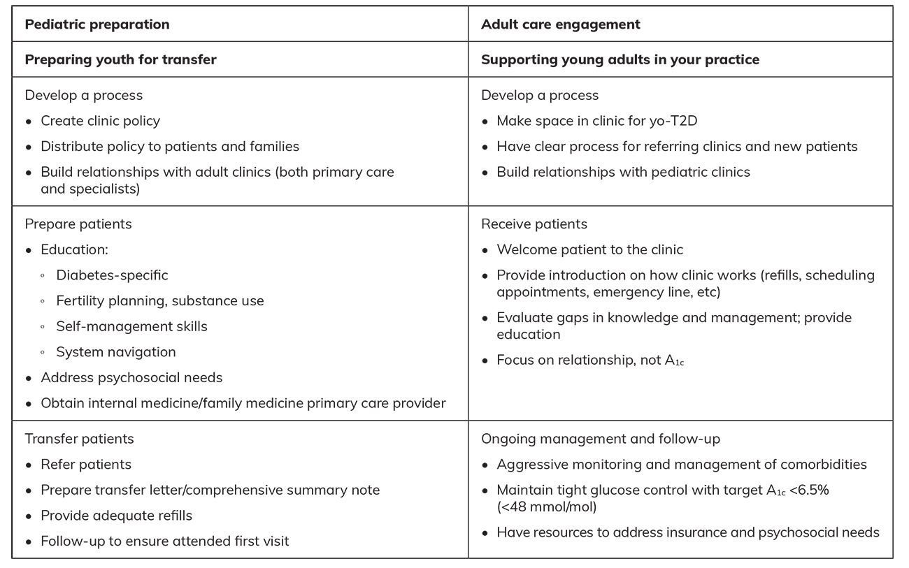

# Transition of Care in Patients With Youth-Onset Type 2 Diabetes
> **中文標題**：青少年發病型第2型糖尿病（youth-onset type 2 diabetes）的照護轉銜
> **分類 Category**：Diabetes and Vascular Disease
> **講者 Faculty**：Erin Finn, MD — Divisions of Endocrinology, Metabolism, and Diabetes and Pediatric Endocrinology, University of Colorado Anschutz, UCHealth University of Colorado, Children's Hospital Colorado, Aurora, Colorado
> **來源 Source**：2026 Endocrine Case Management — Meet the Professor · ENDO 2026 · Endocrine Society

---

## 📋 教學目標 Educational Objectives

After reviewing this chapter, learners should be able to:

- **Identify the unique characteristics of youth-onset type 2 diabetes (yo-T2D) that affect transition of care from pediatric to adult endocrinology.**
  辨識 youth-onset type 2 diabetes（yo-T2D）的獨特臨床特徵，以及這些特徵如何影響從兒科到成人內分泌科的照護轉銜。

- **Use effective receivership approaches to better receive, maintain, and care for this high-risk population.**
  運用有效的「接收端（receivership）」策略，以更好地接收、留住並照護這群高風險族群。

- **Provide important preconception counseling to young adults.**
  對年輕成人提供重要的孕前（preconception）諮詢。

---

## 🩺 臨床情境 Clinical Scenario

本章以三則臨床案例串起 yo-T2D 從兒科轉銜到成人照護的關鍵議題。以下先呈現各案例的原始資料，臨床選擇題與解析詳見後續各段。

### Case 1

> An 18-year-old woman with yo-T2D presents to the pediatric diabetes clinic for follow-up. T2D was diagnosed at age 16 years. Current management: insulin glargine 60 units daily; empagliflozin 25 mg daily; metformin 2000 mg daily; dulaglutide 4.5 mg weekly.

一名 18 歲女性，yo-T2D 患者，回兒科糖尿病門診追蹤。16 歲時診斷 T2D。目前治療為 insulin glargine 每日 60 units、empagliflozin 每日 25 mg、metformin 每日 2000 mg、dulaglutide 每週 4.5 mg。

**理學檢查 Physical examination**

| 項目 Item | 數值 Value |
|---|---|
| Blood pressure | 118/65 mm Hg |
| Pulse | 72 beats/min |
| Temperature | 98.2ºF (36.8ºC) |
| Height | 63 in (160 cm) |
| Weight | 165 lb (74.8 kg) |
| BMI | 29.2 kg/m² |
| 其他 | 頸部 grade 2 acanthosis nigricans |

**檢驗 Laboratory results**

| 項目 Item | 數值 Value |
|---|---|
| Hemoglobin A1c | 6.9% (52 mmol/mol) |
| Urinary albumin | normal |
| AST | 45 U/L (SI: 0.75 µkat/L) |
| ALT | 60 U/L (SI: 1.00 µkat/L) |
| Complete metabolic panel | normal |
| Complete blood cell count | normal |

Overall, she feels well and has no history of hypoglycemia.
整體而言她感覺良好，且無低血糖病史。

### Case 2

> A 19-year-old woman with yo-T2D, accompanied by her new husband, is seen for diabetes follow-up. Diagnosed with yo-T2D at age 11 years; care complicated by poor adherence and significant insulin resistance. Current medications: metformin ER 2000 mg daily; insulin glargine 75 units daily; dulaglutide 1.5 mg weekly. She misses about 2 insulin doses per week. HbA1c 12% (108 mmol/mol).

一名 19 歲女性，yo-T2D 患者，由新婚丈夫陪同來門診追蹤糖尿病。11 歲診斷 yo-T2D，病程因服藥順從性差與顯著胰島素阻抗（insulin resistance）而複雜化。目前用藥為 metformin ER 每日 2000 mg、insulin glargine 每日 75 units、dulaglutide 每週 1.5 mg；每週約漏打 2 劑胰島素。BMI 26.3 kg/m²，HbA1c 為 12%（108 mmol/mol）。

### Case 3

> A 24-year-old man with yo-T2D presents to establish care. Diagnosed with T2D at age 14 years; initially on metformin but required insulin. Previously followed at the children's hospital and another adult endocrinology practice; without follow-up care for 3 years. Current regimen: insulin glargine and insulin aspart (fixed-meal dosing), restarted during a recent hospitalization for diabetic ketoacidosis.

一名 24 歲男性，yo-T2D 患者，來門診建立照護。14 歲診斷 T2D，起初使用 metformin，之後需加上胰島素。曾於兒童醫院與另一家成人內分泌診所追蹤，但已中斷追蹤達 3 年。目前使用 insulin glargine 加 insulin aspart（固定餐時劑量），是數月前因 diabetic ketoacidosis 住院時重新開始。

**理學檢查與檢驗 Physical examination & Laboratory results**

| 項目 Item | 數值 Value |
|---|---|
| Blood pressure | 142/81 mm Hg |
| Pulse | 111 beats/min |
| Height | 66 in (167.6 cm) |
| Weight | 247 lb (112 kg) |
| BMI | 39.9 kg/m² |
| Hemoglobin A1c | 9.4% (79 mmol/mol) |
| Urinary albumin/creatinine ratio | 4623.8 mg/g |
| Creatinine | 0.72 mg/dL (SI: 63.6 µmol/L) |
| T1D antibodies (GAD, IA-2, ZnT8) | negative |

---

## 🔬 背景與重要性 Background & Significance

### 臨床問題的重要性 Significance of the Clinical Problem

> T2D, once called "adult-onset diabetes," has steadily increased in prevalence among children and adolescents in the United States and globally, becoming an emerging epidemic with serious long-term implications. yo-T2D, defined as T2D diagnosed in people younger than 20 years, has an aggressive clinical course and higher rates of long-term complications.

T2D 過去被稱為「成人發病型糖尿病」，如今在美國與全球的兒童與青少年間盛行率穩定上升，成為一個具有嚴重長期影響的新興流行病。yo-T2D 定義為在 20 歲以前診斷的 T2D，其臨床病程侵襲性強、長期併發症的發生率更高。由於 yo-T2D 通常在青春期與成年初期（emerging adulthood）發病，成功的長期管理有賴於從兒科到成人醫療體系的照護轉銜（transition of care）順利進行。隨著 yo-T2D 年輕成人族群持續增加，確保臨床醫師有能力照護這群獨特而複雜的族群愈發重要。

### 照護落差 Practice Gaps

- **Emerging adults with yo-T2D are at high risk for worsening glycemic control and gaps in clinical care.**
  yo-T2D 的年輕成人在血糖控制惡化與照護中斷方面屬高風險。
- **Most programs and research on diabetes health care transition (HCT) focus on patients with type 1 diabetes (T1D).**
  多數關於糖尿病照護轉銜（health care transition, HCT）的計畫與研究都聚焦於 T1D 患者。
- **Despite significant improvements in overall diabetes complication rates, yo-T2D has high rates of complications within 10 years of diagnosis, when patients are only in their mid-20s.**
  儘管整體糖尿病併發症率已顯著改善，yo-T2D 卻在診斷後 10 年內、患者僅 25 歲上下時就有高併發症率。

### 流行病學 Epidemiology

> The prevalence of yo-T2D has doubled over the past 20 years. In the SEARCH for Diabetes in Youth Study, prevalence increased from 0.34 per 1000 youths in 2001 to 0.67 per 1000 in 2017, a 95% relative increase over 16 years.

yo-T2D 的盛行率在過去 20 年間增加了一倍。在 SEARCH for Diabetes in Youth Study 中，盛行率從 2001 年的每 1000 名青少年 0.34 例，增加到 2017 年的每 1000 名 0.67 例，16 年間相對增加了 95%。這個增幅在不同種族與族裔間差異甚大，其中負擔最高的是 Black 與 Native American 青少年，盛行率分別為每 1000 名 1.8 例與 1.63 例。雖然 yo-T2D 的整體族群盛行率仍低於 T1D（每 1000 名青少年 2.15 例），但在 Native Americans 中，yo-T2D 的診斷數已超過 T1D（每 1000 名 0.56 例）。此趨勢在全球皆可見：15 至 24 歲族群的 T2D 發生率從 1990 年的每 10 萬人 56 例上升到 2021 年的每 10 萬人 123.9 例。

### 病理生理 Pathophysiology

> yo-T2D differs fundamentally from both childhood-onset T1D and adult-onset T2D. It is characterized by reduced insulin sensitivity, an initial phase of β-cell hypersecretion followed by rapid β-cell decline, and accelerated development of complications.

yo-T2D 與兒童期發病的 T1D 及成人發病的 T2D 都有根本差異。其特徵為：胰島素敏感性下降、初期 β 細胞過度分泌（β-cell hypersecretion）後接續快速的 β 細胞衰退，以及併發症加速發展。在 yo-T2D 的早期管理中，單靠生活型態調整（lifestyle）作為主要治療是不夠的。初始治療聚焦於 metformin，並依診斷時的 HbA1c 與是否合併 diabetic ketoacidosis 決定是否加上 basal insulin。當高血糖改善後，部分 yo-T2D 患者可單靠 metformin 達到血糖控制；然而此控制並不穩固，常會惡化而需要升階治療。達到適當控制之所以困難，與顯著的胰島素阻抗有關，可能需要每日高於 1 unit/kg 的胰島素劑量。愈來愈多的 incretin-based therapies 與 SGLT-2 inhibitors 已核准並用於青少年；然而，可近性不足、順從性差、反應率不一、以及缺乏長期預後資料，仍是重要挑戰。

### 併發症負擔 Complication Burden

> Long-term follow-up from the TODAY study showed that 60.1% of participants developed at least 1 microvascular complication by their mid-20s, and 28.4% had 2 or more.

yo-T2D 的照護細節不僅止於青春期的治療，更延伸至成人期。yo-T2D 的併發症率高於 T1D 與較晚發病的 T2D。TODAY study（Treatment Options for Type 2 Diabetes in Adolescents and Youth）的長期追蹤顯示，60.1% 的參與者在 25 歲上下時已發生至少 1 項微血管併發症（microvascular complication），28.4% 有 2 項以上。也就是說，多數 yo-T2D 的年輕成人在進入 30 歲之前就已出現併發症。有鑑於併發症風險高、而低血糖風險相對低，對 yo-T2D 患者建議的 HbA1c 目標為低於 6.5%（<48 mmol/mol）。挑戰在於：如何在年輕成人生命中的多重轉銜期間持續維持這種嚴格控制。

---

## 🧭 診斷與評估 Diagnosis & Evaluation

### 照護轉銜是一段過程 Transitions in Health Care

> The transition from pediatric to adult health care systems, or HCT, is a period of significant transformation and turbulence in an emerging adult's life.

從兒科到成人醫療體系的轉銜（HCT）是年輕成人生命中充滿劇烈變動與動盪的時期。除了學業、工作、個人生活、居住狀況、財務與保險的改變之外，年輕成人在生活各層面（包括健康）承擔起更大的責任與自主權。此時他們從以家庭為中心、提供大量支持的兒科體系，轉向強調個別病人與個人責任的成人醫療體系。加上失去與兒科醫療團隊長久建立的關係，以及來自家庭的支持減少，HCT 對許多年輕成人是一大挑戰。

> For individuals with diabetes, HCT is associated with glycemic deterioration, gaps in care, increased complications, and psychosocial challenges.

對糖尿病患者而言，HCT 與血糖惡化、照護中斷、併發症增加以及社會心理挑戰相關。已發展出結構化的 HCT 計畫以對抗這些不良結果，並顯示可改善回診率、減少住院、以及血糖的小幅改善。雖然這些糖尿病轉銜的成果令人鼓舞，但多數 HCT 研究聚焦於 T1D。只有 12% 的糖尿病 HCT 研究納入 yo-T2D，僅 2% 專門聚焦 yo-T2D。在專門檢視 yo-T2D 的研究中，接受 HCT 者相較於留在兒科端照護者，其 HbA1c 大於 9.0%（>75 mmol/mol）的勝算（odds）更高。保險給付顯著影響轉銜後的照護可近性：擴大 Medicaid 的州別回診率較佳，不過保險類型並不影響 HbA1c。值得注意的是，即使保險不成為障礙，yo-T2D 患者的回診率仍低於 T1D 患者。探討轉銜前後年輕成人疾病經驗的質性研究強調：處理心理健康需求、強化組織能力（organizational skills）、以及找出支持者（support persons）以促進持續照護的重要性。儘管迄今已有這些努力與關注，目前仍沒有對照試驗評估結構化 HCT 計畫對 yo-T2D 年輕成人的成效。

### 轉銜的障礙 Barriers

> yo-T2D is associated with lower socioeconomic status and disproportionately affects youth from historically marginalized communities.

yo-T2D 與較低的社經地位相關，並不成比例地影響來自歷史上被邊緣化社群的青少年。這些因素往往轉化為：家庭財務支持較少、進入成人期後獲得含保險之高薪工作的機會較少、以及在成人醫療體系中面臨更大的系統性障礙。yo-T2D 的年輕成人在 HCT 時常處於脆弱處境，較高比例使用政府保險或沒有保險，使他們特別容易在保險給付上出現斷層。雖然私人保險現在可涵蓋受扶養人至 26 歲，但此給付有賴父母或監護人擁有私人保險；兒科 Medicaid 僅涵蓋年輕成人至 18 歲。這個缺口可能讓年輕成人失去保險，或為維持政府保險資格而處於低度就業（underemployment）。成年早期的低度就業可能影響終生收入潛力，並增加 T2D 的長期財務負擔。若無足夠保險，insulin、incretin-based therapies 與 SGLT-2 inhibitors 的費用可能極為沉重。最後，yo-T2D 佔據一個獨特位置——它既是兒科次專科的疾病，卻也在成人族群常見；由於醫界對 yo-T2D 是否值得特別關注缺乏明確認知，年輕成人常難以掛到內分泌科與糖尿病專科醫師的門診來接受更密集的監測與管理。

**Table. Approach to HCT for Pediatric and Adult Clinics（兒科與成人診所的照護轉銜 HCT 做法對照表）**

### 展望 Reasons for Hope

> Diabetes care has rapidly evolved over the past 2 decades, driven by advances in therapies and technologies.

儘管挑戰重重，yo-T2D 的 HCT 仍有相當希望。過去 20 年糖尿病照護在治療與科技進步的驅動下快速演進。Incretin-based medications 尤其能提供良好血糖控制、降低併發症率並協助體重管理，且可用單一每週注射一次的藥物達成——這對忙碌的年輕成人而言，對維持順從性至關重要。continuous glucose monitors 與 insulin pumps 等科技，過去專用於 T1D 管理，如今其適應症已擴展至 T2D 管理。最後，對 yo-T2D 與 HCT 整體的關注日益增加，已徹底改變年輕成人照護的討論方式，並創造出改善衛教、持續研究與系統改善的機會，將持續提升這群獨特族群的照護品質。

---

## 💊 治療與處置 Management

### Case 1｜升階治療的抉擇

**Question：Based on her treatment regimen and lab values, which of the following is the best next step for management?**
根據她的治療方案與檢驗值，下列何者為最佳的下一步處置？

- A. HbA1c is at goal; continue current regimen without changes
- B. HbA1c is at goal; slowly wean insulin as able
- C. HbA1c is not at goal; increase insulin to target A1c <6.5% (<48 mmol/mol)
- **D. HbA1c is not at goal; transition to a stronger incretin-based therapy to target A1c <6.5% (<48 mmol/mol)** ✅
- E. HbA1c is not at goal; add a sulfonylurea to target mealtime glucose

> **Answer: D.** Aggressive management of yo-T2D is recommended to prevent long-term complications with a target HbA1c value of less than 6.5% (<48 mmol/mol). Because she is not experiencing hypoglycemia, further escalation of her regimen is reasonable. Considering her BMI and elevated AST and ALT, increasing the incretin-based therapy could provide additional weight loss. The highest available dosage of dulaglutide is 4.5 mg weekly; switching to semaglutide or tirzepatide could potentially achieve additional weight loss and glucose-lowering effects.

**解析**：建議對 yo-T2D 採取積極管理以預防長期併發症，目標 HbA1c 低於 6.5%（<48 mmol/mol）。她並未發生低血糖，因此進一步升階治療是合理的。考量她的 BMI 與偏高的 AST、ALT，增強 incretin-based therapy 可帶來額外的減重效益。Dulaglutide 的最高劑量為每週 4.5 mg（她已用到頂），故改換為 semaglutide 或 tirzepatide 可能達到更多減重與降糖效果。相較於增加 insulin 或加上 sulfonylurea，優先選擇增強 incretin-based therapies 的理由是：後兩者缺乏額外效益、有增重風險，且 sulfonylureas 有加速 β 細胞功能異常的疑慮。由於她並未低血糖、且 yo-T2D 建議更嚴格的 <6.5%（<48 mmol/mol）目標，故不建議降階（deescalation）治療。

### Case 2｜孕前諮詢與懷孕後緊急調整

**Question：In addition to troubleshooting barriers to care, escalating diabetes medications, and discussing HCT plans, what other topic is critical to review at this visit?**
除了排除照護障礙、升階糖尿病藥物與討論 HCT 計畫之外，本次門診還必須檢視哪一個關鍵主題？

- A. Review diet and activity（每週至少 150 分鐘中至高強度運動、每週 3 天肌力訓練）
- B. Discuss symptoms and management of hypoglycemia
- C. Review long-term outcomes and complications of poorly controlled T2D
- D. Review symptoms and management of diabetic ketoacidosis
- **E. Discuss prevention of unintended pregnancy and appropriate planning for intended pregnancy with goal HbA1c <6.5% (<48 mmol/mol) while on medications that are not contraindicated in pregnancy** ✅

> **Answer: E.** Pregnancy prevention and planning should be addressed at puberty and revisited at every appointment, according to the recent Endocrine Society/European Society of Endocrinology guidelines on preexisting diabetes in pregnancy. Counseling should evolve with age.

**解析**：雖然列出的其他主題都可能有益，但孕前諮詢與計畫才是關鍵。依據近期 Endocrine Society／European Society of Endocrinology 關於 preexisting diabetes in pregnancy 的指引，懷孕的預防與計畫應在青春期即開始討論，並在每次門診重新檢視。諮詢內容應隨年齡演變：對青少年常聚焦於預防非計畫懷孕，但對年輕成人，諮詢還應包含如何規劃健康的懷孕。對這名病人而言，即使先前可能已討論過，持續諮詢仍屬關鍵。

**Case 2, Continued：** The patient reports reliably using combined oral contraceptives. Two weeks later she reports a missed period and a positive pregnancy test.
病人表示規律使用複方口服避孕藥（combined oral contraceptives）。兩週後她通知診所：上週月經未來、今日驗孕陽性。

**Question：What immediate changes are needed for her regimen?**
她的用藥方案需要哪些立即調整？

- A. No change in medications
- B. Refer to maternal–fetal medicine; make no changes until they take over
- **C. Stop dulaglutide, continue metformin, continue basal insulin, and start short-acting insulin; rapid titration of insulin is necessary to achieve glucose control as soon as possible** ✅
- D. Stop dulaglutide; wait until a viability scan at 8 weeks to make any additional changes
- E. Start insulin pump therapy with an automated insulin delivery system

> **Answer: C.** yo-T2D has a female predominance, with some studies reporting that 65% to 70% of those diagnosed in youth are female. In the TODAY study analysis of 452 young women with yo-T2D, 10.2% became pregnant with a 20% rate of congenital anomalies. Preconception counseling and contraception decrease major malformations by 70%, perinatal mortality by more than 50%, and NICU admissions by 25%. For those with HbA1c <6.5% (<48 mmol/mol) before conception, malformation rates resemble those in populations without diabetes.

**解析**：yo-T2D 以女性為主，部分研究指出青少年期診斷者中 65% 至 70% 為女性。因此，yo-T2D 年輕成人管理的一大重點就是預期並為懷孕做準備。多項追蹤 yo-T2D 預後與照護轉銜的研究都指出非計畫懷孕與重大不良結果的比率偏高。在 TODAY study 對 452 名 yo-T2D 年輕女性的分析中，10.2% 曾懷孕，先天畸形（congenital anomalies）率達 20%——這個數字高得令人痛心。

- **孕前規劃**：目標為受孕前至少 3 個月將 HbA1c 控制在低於 6.5%（<48 mmol/mol），並以孕期安全（pregnancy-safe）的方案管理其他共病；在準備受孕前應持續避孕。至少應提供低劑量含 estrogen 的口服避孕藥或單一 progestin（如 drospirenone），直到能取得長效可逆避孕（long-acting reversible contraception, LARC）。鑑於非計畫懷孕與不良孕產結果盛行率高，應提供家庭計畫（family planning）門診。孕前諮詢與避孕可使重大畸形減少 70%、周產期死亡率減少超過 50%、NICU 入住率減少 25%。
- **懷孕後的立即處置**：yo-T2D 的年輕成人常使用孕期應停用的藥物，如 incretin-based therapies 與 SGLT-2 inhibitors（這些在孕期的資料有限）。孕期治療的主軸是積極的 basal-bolus therapy（長效加速效 insulin），而多數 yo-T2D 患者對此幾乎沒有經驗。理想上應在嘗試受孕前就更改用藥方案；若時機不理想，也應盡快轉為 basal-bolus insulin。Metformin 可持續使用至第一孕期結束。由於器官形成（organogenesis）發生在懷孕前 8 週、之後即無法預防重大畸形，故早期血糖優化至關重要，且應在第一次產科就診前完成。
- **為何其他選項不適當**：建議轉介 maternal–fetal medicine，但不是為了初始血糖管理（那會延誤血糖改善並錯過關鍵發育階段）。她目前的方案並不適合孕期，故「不改藥」是錯的。Insulin pumps 有用，但並非即時的血糖解方，且需要大量知識與訓練，應在懷孕前、對有意願的病人啟動。

### Case 3｜複雜個案的初診優先順序

**Question：What is the most important aspect of his care to focus on first at this initial visit?**
在這次初診中，最應優先聚焦於他照護的哪一面向？

- A. Improving his HbA1c to target <6.5% (<48 mmol/mol)
- **B. Understanding and addressing the barriers to follow-up that he has experienced for the last 3 years** ✅
- C. Weight management; consider bariatric surgery given elevated BMI and comorbidities
- D. Referral to nephrology given his albumin-to-creatinine ratio
- E. Fast-track for insulin pump training and initiation

> **Answer: B.** The priority at this visit should be to establish rapport and troubleshoot barriers to follow-up. The remaining answers are all topics that should be managed or at least considered during future visits.

**解析**：面對複雜病人的初診，優先順序永遠是一項挑戰。本次門診的重點應是建立信任關係（rapport）並排除回診障礙。其餘選項都是後續門診應處理或至少納入考量的主題：

- **血糖**：他的 HbA1c 目標應更低，以嚴格血糖控制降低併發症風險。
- **腎臟**：儘管 creatinine 正常，嚴重升高的 albuminuria 已顯示早期腎絲球損傷；本例的 hyperfiltration 可能造成偏低的 creatinine，卻正是 diabetic kidney disease 的證據。
- **減重與科技**：bariatric surgery 與含自動化胰島素輸注（automated insulin delivery, AID）的 insulin pumps 對 T2D 照護都有前景。早期使用 bariatric surgery 可能與更高的糖尿病緩解率相關；AID insulin pumps 可改善 HbA1c 與 time-in-range，且現已核准用於 T2D 管理。兩者皆可視未來需求考量。
- **其他篩檢與管理**：多數 yo-T2D 患者在 20 多歲即出現糖尿病相關併發症。他已有 diabetic kidney disease，屬 retinopathy 與 neuropathy 的高風險。血壓偏高，應積極管理，目標低於 120/80 mm Hg。此外應處理與 metabolic syndrome 及肥胖相關的共病，包括安排 sleep study 評估 obstructive sleep apnea、篩檢 metabolic dysfunction-associated steatotic liver disease（MASLD），以及血脂評估與管理。

yo-T2D 需要處理的問題清單很長，很容易想一次全部解決，反而讓本已在順從性與回診上掙扎的病人不知所措。本次門診的目標是：建立信任、提供支持、鼓勵他回診，並開始逐步處理糖尿病照護的各個面向。

### 轉銜的規劃與執行 Planning and Implementing HCT

**Case 1, Continued：Which of the following is the most appropriate approach to transitioning this patient to adult care?**
下列何者是將此病人轉銜至成人照護最適當的做法？

- A. Transfer to adult practice immediately, as she is now an adult
- **B. Begin HCT preparation now (if not started already); discuss HCT, including clinic expectations, patient preference, and goals, before transferring to the new clinic** ✅
- C. Delay HCT until 21 years old; start discussing 1 year before planned transfer
- D. Allow the patient to initiate the conversation about when she is ready
- E. HCT planning should be the responsibility of her primary care provider

> **Answer: B.** HCT is a process, not just an event. The process should begin at least 1 year before transfer, ideally earlier, and for patients diagnosed at a younger age, it can begin in early adolescence.

**解析與原則**：HCT 是一段過程，而非單一事件。此過程應在轉移前至少 1 年開始，理想上更早；對更年幼即診斷的病人，甚至可在青春期早期就開始。

- 診所可運用 **Got Transition** 的 **Six Core Elements**（Policy Creation、Tracking/Monitoring、Readiness Assessment/Education、Planning、Transfer of Care、Transition Completion）來建立做法。
- **病人衛教**應包含：糖尿病專屬訓練與符合年齡的健康討論、逐步賦予病人自主權（graduated autonomy）、以及關於保險、藥局、如何與診所及醫療體系互動的討論。健康討論應包含生育諮詢（fertility counseling）與藥物、酒精對糖尿病的影響，尤其強調使用 insulin 者飲酒的風險。
- **轉移時機**沒有特定年齡界線，取決於病人的需求與體系的能力與強項。不建議等病人自己開口，因為那會造成變異並延誤準備。此年齡層的病人常因居住、就業與保險變動而發生照護中斷，故衛教應納入疑難排解與系統導航，讓年輕成人有能力面對這些挑戰。

**有效的接收端（Effective Receivership）**：與為兒科病人準備 HCT 同等重要的，是確保成人診所有能力接收並留住這些年輕成人。有效接收端的關鍵要素包括：與兒科同儕開放溝通、指派協調者（coordinator）協助轉移病人、把關係（relationships）置於 HbA1c 之上、處理社會心理需求，以及在診所維持團隊為本（team-based）的做法。即使是診所流程的簡單改變——例如把 yo-T2D 視為新病人時段的目標族群、主動營造有明確病人期待的友善環境——都能改善可近性與照護。

**受診提供者可以是 PCP**：yo-T2D 的 HCT 有一個獨特之處，就是可以把糖尿病管理轉銜給基層照護提供者（primary care provider, PCP），而非次專科醫師。只要接收端的臨床醫師熟悉 yo-T2D 並能提供足夠支持，兩種做法都可以適當。關於接收提供者的決定應個別化，考量地理位置、提供者可近性與專業、病人偏好、以及糖尿病的複雜度。最終，建立一個有能力、投入、且有意願照護 yo-T2D 進入成人期的醫療專業社群，才是 HCT 最理想的環境。

---

## 🧠 個案解析與臨床推理 Case Analysis & Clinical Reasoning

**核心主軸**：yo-T2D 是一個「侵襲性表型 + 高社會心理脆弱性 + 照護體系斷層」三重疊加的問題。轉銜期成為生物學變化與醫療體系變化交會的「完美風暴（perfect storm）」，導致血糖惡化、併發症加速與照護中斷。

**關鍵推理**

1. **血糖目標比一般 T2D 更嚴格**：因併發症風險高、低血糖風險低，yo-T2D 建議 HbA1c <6.5%（<48 mmol/mol）。這解釋了 Case 1 中 HbA1c 6.9% 仍「未達標」的判斷。
2. **升階時優先 incretin 而非 insulin/sulfonylurea**：incretin-based therapies 兼具減重與降糖、且不加速 β 細胞功能異常；sulfonylureas 有增重與加速 β 細胞衰退的疑慮。
3. **生育議題貫穿全程**：女性佔多數（65%–70%），非計畫懷孕與 20% 的先天畸形率使孕前諮詢成為每次門診的必談項目，而非一次性衛教。
4. **關係先於數字**：Case 3 提醒複雜個案初診的首要任務是建立信任與排除回診障礙，而非一次解決所有代謝問題。

**鑑別診斷 Differential Diagnosis**

- 年輕發病的糖尿病應與 T1D 鑑別：Case 3 的 GAD、IA-2、ZnT8 抗體皆陰性，支持 T2D；但 yo-T2D 亦可發生 diabetic ketoacidosis，不可因曾有 DKA 就逕自歸為 T1D。
- 亦應考量 monogenic diabetes（MODY）等，尤其在肥胖不明顯、家族史特殊者（本章未展開，屬標準臨床思路）。

**常見陷阱 Pitfalls**

- **被正常 creatinine 誤導**：Case 3 的 creatinine 0.72 mg/dL「正常」，但 UACR 4623.8 mg/g 顯示嚴重 albuminuria；hyperfiltration 可壓低 creatinine，反而是 diabetic kidney disease 的早期證據。
- **停用非孕期安全藥物的時機**：懷孕確認後應立即停 dulaglutide（GLP-1）與 SGLT-2 inhibitors，並盡快轉 basal-bolus insulin；不可等 8 週 viability scan 才調整，因器官形成集中在前 8 週。
- **等病人自己提轉銜**：會造成延誤與變異，應由團隊主動於轉移前至少 1 年啟動。
- **把 HbA1c 當唯一目標**：忽略社會心理與回診障礙，反而流失病人。

---

## ⭐ 重點整理 Key Takeaways

- yo-T2D 與 T1D 及成人發病 T2D 有根本差異，臨床病程更具侵襲性、長期併發症率更高；TODAY study 顯示 60.1% 在 25 歲上下已有至少 1 項 microvascular complication。
- yo-T2D 的 HbA1c 目標應更嚴格，為 <6.5%（<48 mmol/mol），因併發症風險高而低血糖風險低。
- 升階治療優先選擇 incretin-based therapies（如由 dulaglutide 換成 semaglutide 或 tirzepatide），優於加 insulin 或 sulfonylurea。
- HCT 是「過程而非事件」，應於轉移前至少 1 年（甚至青春期早期）啟動，並善用 Got Transition 的 Six Core Elements；接收端應「關係優先於 HbA1c」。
- 有效接收端（effective receivership）包含與兒科溝通、指派協調者、處理社會心理需求、團隊為本；受診端可為熟悉 yo-T2D 的 PCP 或次專科醫師。
- 孕前諮詢應自青春期開始、每次門診重述；yo-T2D 女性佔 65%–70%，TODAY study 中 10.2% 懷孕、20% 先天畸形；受孕前 HbA1c <6.5% 可使畸形率接近無糖尿病族群。
- 懷孕確認後立即停用 incretin-based therapies 與 SGLT-2 inhibitors，改為 basal-bolus insulin（metformin 可用至第一孕期結束），把握前 8 週 organogenesis 的血糖優化窗口。
- 複雜個案初診（如 Case 3）首要任務是建立 rapport 與排除回診障礙；勿被正常 creatinine 掩蓋嚴重 albuminuria 所代表的 diabetic kidney disease。

---

## 💬 討論問題 Discussion Questions

1. 你的機構在把 yo-T2D 年輕成人從兒科轉銜到成人照護時，最大的體系障礙是什麼？如何運用 Got Transition 的 Six Core Elements 加以改善？
2. 面對一位血糖控制不佳、順從性差且缺乏保險的 yo-T2D 年輕成人，你會如何在單次門診中排定處置的優先順序？「關係優先於 HbA1c」在實務上如何落實？
3. 對青春期到成年初期的 yo-T2D 女性，孕前諮詢與避孕的內容應如何隨年齡演變？在你的臨床情境中，如何確保每次門診都不遺漏此議題？
4. yo-T2D 的照護轉銜可交給熟悉此病的 PCP 或次專科醫師，兩者的取捨考量有哪些？在你的地區，哪一種模式較可行？
5. 面對已出現 diabetic kidney disease、高血壓與嚴重肥胖的 yo-T2D 年輕成人，你會如何規劃長期的併發症篩檢與共病管理排程，同時避免病人因負擔過重而流失追蹤？

---

## 📚 參考文獻 References

1. Lawrence JM, Divers J, Isom S, et al. Trends in prevalence of type 1 and type 2 diabetes in children and adolescents in the US, 2001-2017. *JAMA*. 2021;326(8):717-727. PMID: 34427600
2. Deng L, Lu S, Zeng J, Liu H. Global, regional, and national trends and burden of diabetes mellitus type 2 among youth from 1990 to 2021: an analysis from the global burden of disease study 2021. *Front Endocrinol (Lausanne)*. 2025;16:1626225. PMID: 41199866
3. TODAY Study Group; Zeitler P, Hirst K, et al. A clinical trial to maintain glycemic control in youth with type 2 diabetes. *N Engl J Med*. 2012;366(24):2247-2256. PMID: 22540912
4. RISE Consortium. Metabolic contrasts between youth and adults with impaired glucose tolerance or recently diagnosed type 2 diabetes: II. observations using the oral glucose tolerance test. *Diabetes Care*. 2018;41(8):1707-1716. PMID: 29941498
5. RISE Consortium. Impact of insulin and metformin versus metformin alone on beta-cell function in youth with impaired glucose tolerance or recently diagnosed type 2 diabetes. *Diabetes Care*. 2018;41(8):1717-1725. PMID: 29941500
6. American Diabetes Association Professional Practice Committee for Diabetes. 14. Children and adolescents: standards of care in diabetes-2026. *Diabetes Care*. 2026;49(Suppl 1):S297-S320. PMID: 41358890
7. Dabelea D, Stafford JM, Mayer-Davis EJ, et al; SEARCH for Diabetes in Youth Research Group. Association of type 1 diabetes vs type 2 diabetes diagnosed during childhood and adolescence with complications during teenage years and young adulthood. *JAMA*. 2017;317(8):825-835. PMID: 28245334
8. Unnikrishnan R, Anjana RM, Amutha A, et al. Younger-onset versus older-onset type 2 diabetes: clinical profile and complications. *J Diabetes Complications*. 2017;31(6):971-975. PMID: 28410927
9. TODAY Study Group, Bjornstad P, Drews KL, et al. Long-term complications in youth-onset type 2 diabetes. *N Engl J Med*. 2021;385(5):416-426. PMID: 34320286
10. American Diabetes Association Professional Practice Committee. 14. Children and adolescents: standards of care in diabetes-2025. *Diabetes Care*. 2025;48(1 Suppl 1):S283-S305. PMID: 39651980
11. Donvito G, Maltecca C, Hofer SE, Meraner D, Siebert U, Arvandi M. Quality of diabetes mellitus healthcare and metabolic control during transition from paediatric to adult care: a systematic review and meta-analysis. *Diabet Med*. 2025;42(10):e70125. PMID: 40836596
12. Ude AO, Dixon SA, Glaros SB, et al. Transitioning to adult care in youth-onset diabetes: a scoping review of socio-ecological factors in youth-onset type 2 diabetes compared to type 1 diabetes. *BMC Public Health*. 2025;25(1):1784. PMID: 40375107
13. Agarwal S, Raymond JK, Isom S, et al. Transfer from paediatric to adult care for young adults with type 2 diabetes: the SEARCH for Diabetes in Youth Study. *Diabet Med*. 2018;35(4):504-512. PMID: 29377258
14. TODAY Study Group. Health care coverage and glycemic control in young adults with youth-onset type 2 diabetes: results from the TODAY2 study. *Diabetes Care*. 2020;43(10):2469-2477. PMID: 32778555
15. Pundyk KJ, Sellers EAC, Kroeker K, Wicklow BA. Transition of youth with type 2 diabetes: predictors of health-care utilization after transition to adult care from population-based administrative data. *Can J Diabetes*. 2021;45(5):451-457. PMID: 34001461
16. Edmondson EK, Garcia SM, Gregory EF, et al. Emerging adults with type 2 diabetes: understanding illness experience and transition to adult care. *J Adolesc Health*. 2024;75(1):107-114. PMID: 38520432
17. Copeland KC, Zeitler P, Geffner M, et al; TODAY Study Group. Characteristics of adolescents and youth with recent-onset type 2 diabetes: the TODAY cohort at baseline. *J Clin Endocrinol Metab*. 2011;96(1):159-167. PMID: 20962021
18. American Diabetes Association Professional Practice Committee for Diabetes. 7. Diabetes technology: standards of care in diabetes-2026. *Diabetes Care*. 2026;49(Suppl 1):S150-S165. PMID: 41358889
19. Iyengar JJ, Ang L, Rodeman KB, et al. A novel receivership model for transition of young adults with diabetes: experience from a single-center academic transition program. *Endocr Pract*. 2024;30(2):113-121. PMID: 38029926
20. Iyengar J, Thomas IH, Soleimanpour SA. Transition from pediatric to adult care in emerging adults with type 1 diabetes: a blueprint for effective receivership. *Clin Diabetes Endocrinol*. 2019;5:3. PMID: 30891310
21. TODAY Study Group. Pregnancy outcomes in young women with youth-onset type 2 diabetes followed in the TODAY study. *Diabetes Care*. 2021;45(5):1038-1045. PMID: 34880068
22. Wyckoff JA, Lapolla A, Asias-Dinh BD, et al. Preexisting diabetes and pregnancy: an Endocrine Society and European Society of Endocrinology joint clinical practice guideline. *J Clin Endocrinol Metab*. 2025;110(9):2405-2452. PMID: 40652453
23. Klingensmith GJ, Pyle L, Nadeau KJ, et al; TODAY Study Group. Pregnancy outcomes in youth with type 2 diabetes: the TODAY study experience. *Diabetes Care*. 2016;39(1):122-129. PMID: 26628417
24. Wahabi HA, Fayed A, Esmaeil S, et al. Systematic review and meta-analysis of the effectiveness of pre-pregnancy care for women with diabetes for improving maternal and perinatal outcomes. *PLoS One*. 2020;15(8):e0237571. PMID: 32810195
25. Tonneijck L, Muskiet MHA, Smits MM, et al. Glomerular hyperfiltration in diabetes: mechanisms, clinical significance, and treatment. *J Am Soc Nephrol*. 2017;28(4):1023-1039. PMID: 28143897
26. Inge TH, Laffel LM, Jenkins TM, et al. Comparison of surgical and medical therapy for type 2 diabetes in severely obese adolescents. *JAMA Pediatr*. 2018;172(5):452-460. PMID: 29532078
