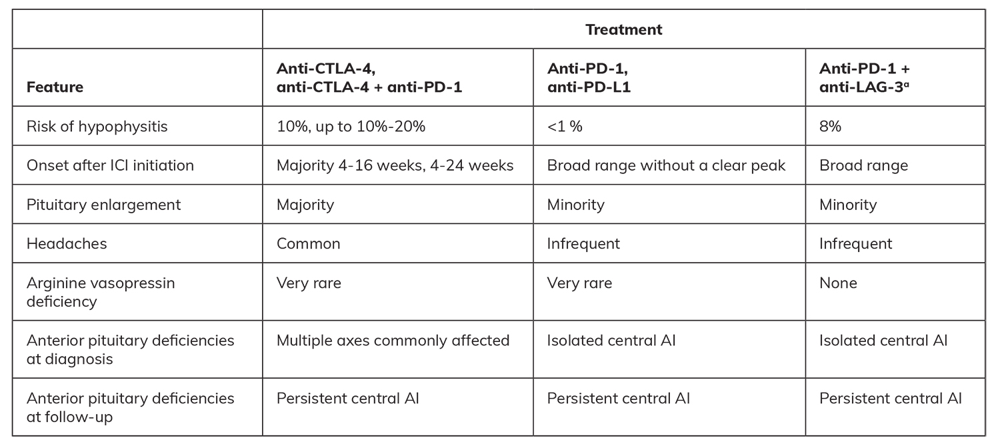
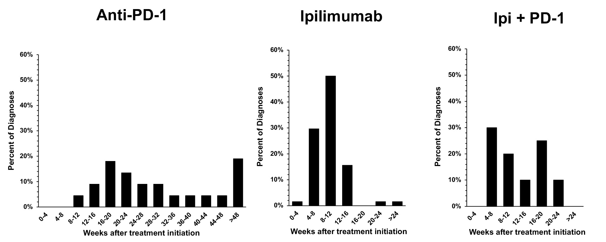
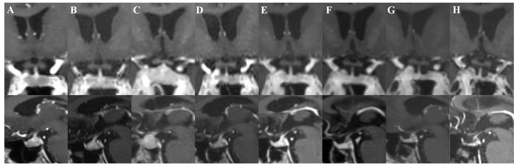
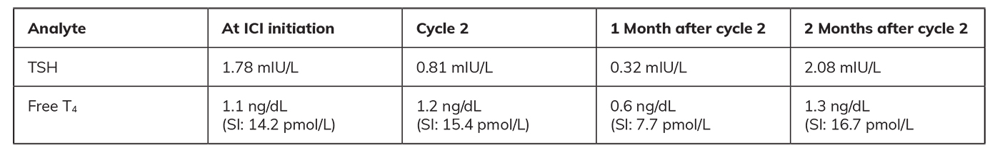
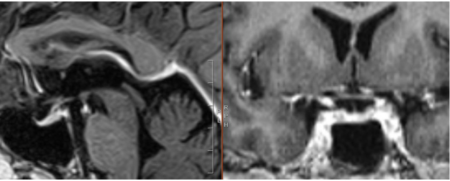
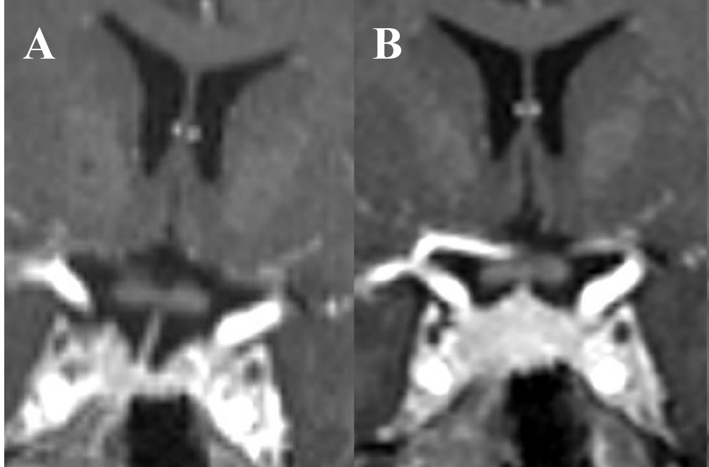
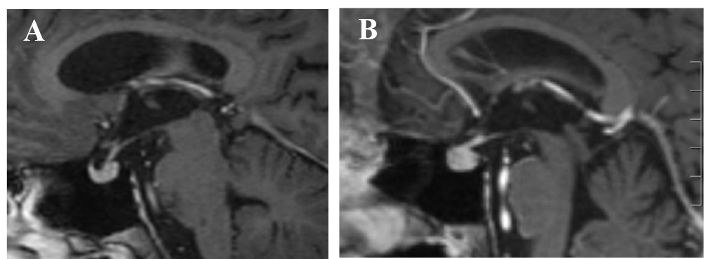

# Neuroendocrine Adverse Effects of Cancer Treatment: Immune Checkpoint Inhibitors
> **中文標題**：癌症治療的神經內分泌副作用：免疫檢查點抑制劑 (Immune Checkpoint Inhibitors)
> **分類 Category**：Neuroendocrinology and Pituitary
> **講者 Faculty**：Alexander Faje, MD — Endocrinology Division, Massachusetts General Hospital, Boston, Massachusetts
> **來源 Source**：2026 Endocrine Case Management — Meet the Professor · ENDO 2026 · Endocrine Society

---

## 📋 教學目標 Educational Objectives

- **Recognize clinical presentations of immune checkpoint inhibitor (ICI)–associated hypophysitis.**
  辨識 immune checkpoint inhibitor (ICI) 相關 hypophysitis 的臨床表現。

- **Discuss the epidemiology and pathophysiology of ICI-associated hypophysitis.**
  討論 ICI 相關 hypophysitis 的流行病學與病理生理學。

- **Discuss outcomes and management of ICI-associated hypophysitis.**
  討論 ICI 相關 hypophysitis 的預後與處置。

---

## 🩺 臨床情境 Clinical Scenario

本章以三個臨床病例呈現 ICI 相關 hypophysitis 的多樣面貌。以下先整體勾勒臨床問題的重要性，再於後續段落逐案解析。

**ICIs have transformed the landscape of oncology.** According to some estimates, approximately 56% of all patients with advanced cancer are eligible for ICI treatment. Hypophysitis is a well-recognized adverse effect, and although pituitary inflammation is usually self-limited and nonrecurrent, hypopituitarism persists to some degree in nearly all patients.

ICIs 徹底改變了腫瘤治療的樣貌。根據部分估計，約 56% 的晚期癌症病人適合接受 ICI 治療。Hypophysitis 是這類藥物公認的副作用；雖然 pituitary 發炎通常是自限性且不再復發，但幾乎所有病人都會殘留某種程度的 hypopituitarism。長期存活的病人因此需要持續接受荷爾蒙補充。

---

## 🔬 背景與重要性 Background & Significance

### 已核准的 ICI 種類 Approved ICI Classes

**Currently, 15 immune checkpoint inhibitors are approved by the US FDA in 4 categories:**

目前美國 FDA 核准共 15 種 immune checkpoint inhibitors，分為 4 大類：

1. **Anti–CTLA-4 (cytotoxic T-lymphocyte antigen 4)**：ipilimumab, tremelimumab
2. **Anti–PD-1 (programmed cell death protein 1)**：nivolumab, pembrolizumab, cemiplimab, dorstalimab, retifanlimab, toripalimab, tislelizumab, penpulimab
3. **Anti–PD-L1 (programmed death-ligand 1)**：atezolizumab, durvalumab, avelumab, cosibelimab
4. **Anti–LAG-3 (lymphocyte-activation gene 3)**：relatlimab

### 流行病學 Epidemiology

**The prevalence of ICI-associated hypophysitis varies by agent subclass.** The risk is higher with regimens that include anti–CTLA-4 agents and may be elevated in combination therapy (anti–CTLA-4 + anti–PD-1; anti–PD-1 + anti–LAG-3) compared with either agent alone. Reported rates also vary by study type (prospective oncologic studies vs retrospective endocrinology-focused analyses) due to imprecise and often overlapping categories in the common terminology criteria for adverse events used in oncology.

ICI 相關 hypophysitis 的盛行率因藥物次類別而異。含 anti–CTLA-4 的治療方案風險較高，且合併治療（anti–CTLA-4 + anti–PD-1；anti–PD-1 + anti–LAG-3）的風險可能高於單一藥物。各研究回報的比率也因研究類型（前瞻性腫瘤學研究 vs 回溯性內分泌導向分析）而不同，部分原因是腫瘤學使用的 common terminology criteria for adverse events 分類不精確且常有重疊。

**風險概要（依方案）Risk by regimen：**

| ICI 方案 Regimen | 大約風險 Approximate risk |
|---|---|
| Anti–PD-1 或 anti–PD-L1 單一治療 monotherapy | ≤ 1% |
| Anti–CTLA-4 單一治療 monotherapy | ~10% |
| Anti–PD-1 + anti–LAG-3（僅一項研究） | ~8% |
| Anti–CTLA-4 + anti–PD-1 | 部分報告可達 10%–20% |

**Although pituitary inflammation in ICI-treated patients is self-limited and nonrecurrent with rare exceptions, hypopituitarism persists to some degree in nearly all patients.** Some patient groups treated with ICIs have achieved impressive long-term survival rates and require ongoing hormone replacement.

雖然 ICI 治療病人的 pituitary 發炎除少數例外外多為自限性且不復發，但幾乎所有病人都會殘留某種程度的 hypopituitarism。部分接受 ICI 的病人族群達到令人矚目的長期存活率，因而需要持續荷爾蒙補充。

### 機轉 Mechanism

**Anti–CTLA-4 antibodies act early in the immune response** to increase T-cell proliferation and activity. T-cell activation occurs following antigen presentation on the major histocompatibility complex (MHC) and binding to the T-cell receptor, along with costimulation via engagement of B7-1/B7-2 ligands with CD28. CTLA-4 competitively inhibits CD28 and generates an opposing signal to serve as a brake after immune response activation.

Anti–CTLA-4 抗體作用於免疫反應的早期，增加 T-cell 的增生與活性。T-cell 活化發生於抗原經 MHC 呈現並結合 T-cell receptor 之後，再加上 B7-1/B7-2 ligands 與 CD28 結合的共同刺激。CTLA-4 會競爭性抑制 CD28，產生相反訊號，在免疫反應啟動後扮演「煞車」的角色。

**Anti–PD-1 and anti–PD-L1 agents act more peripherally** to inhibit the immune response. PD-1 is expressed by activated lymphocytes and monocytes; PD-L1 is expressed by antigen-presenting cells and multiple other cell types, including some tumor cells (to evade immune surveillance). PD-1:PD-L1 binding reduces immune effector–cell proliferation, cytokine secretion, and granular enzyme/perforin production. LAG-3 is expressed by activated T cells and binds MHC II to generate an inhibitory signal.

Anti–PD-1 與 anti–PD-L1 藥物作用位置較周邊，抑制免疫反應。PD-1 由活化的 lymphocytes 與 monocytes 表現；PD-L1 由 antigen-presenting cells 及多種其他細胞（包括部分腫瘤細胞，用以逃避免疫監視）表現。PD-1:PD-L1 結合會減少免疫 effector 細胞的增生、cytokine 分泌與 granular enzyme/perforin 生成。LAG-3 由活化 T cells 表現，結合 MHC II 以產生抑制訊號。

**不同機轉導致不同的 hypophysitis 型態：** Agents targeting PD-1, PD-L1, and LAG-3 are hypothesized to induce hypophysitis by enhancing latent pituitary autoimmunity. Anti–CTLA-4 therapy appears to directly bind to and target anterior pituitary cells expressing CTLA-4, thereby activating antibody-dependent cell-mediated cytotoxicity (ADCC) and the classical complement pathway.

針對 PD-1、PD-L1 與 LAG-3 的藥物，被推論是透過增強潛在的 pituitary autoimmunity 來誘發 hypophysitis。Anti–CTLA-4 治療則似乎直接結合並攻擊表現 CTLA-4 的 anterior pituitary 細胞，進而活化 antibody-dependent cell-mediated cytotoxicity (ADCC) 與 classical complement pathway。

**抗體亞型與其效應功能（immunoglobulin subclass）：**
- Ipilimumab 與 tremelimumab 分別為 IgG1 與 IgG2 基礎的抗體，能參與 ADCC 與補體活化。
- 除 penpulimab 外，anti–PD-1 藥物多為 IgG4 (immunoglobulin G4) 基礎抗體，結合補體與活化 Fc receptor 的能力差。LAG-3 抑制劑 relatlimab 亦為 IgG4 基礎抗體。
- Penpulimab 以及 PD-L1 抑制劑 atezolizumab、durvalumab 因 Fc domain 經修飾，無法有效結合 Fc receptors 或補體。
- Avelumab 與 cosibelimab 則可活化 ADCC 與補體。

**Although several studies have reported variable levels of PD-L1 expression in pituitary adenomas, examination of normal pituitary glands has not found any significant expression.** PD-1 mRNA expression has been demonstrated in homogenates of pituitary adenomas and normal pituitary glands, possibly due to infiltrating immune cells. Rare autopsy specimens from patients with hypophysitis after anti–CTLA-4 and anti–PD-1 treatment have exhibited features consistent with these mechanisms.

雖然數項研究回報 pituitary adenomas 中 PD-L1 表現程度不一，但檢視正常 pituitary gland 並未發現顯著表現。Pituitary adenomas 與正常 pituitary gland 的組織勻漿中曾顯示 PD-1 mRNA 表現，可能來自浸潤的免疫細胞。少數 anti–CTLA-4 與 anti–PD-1 治療後 hypophysitis 病人的解剖標本，呈現與上述機轉一致的特徵。

**基因學佐證 Genetic corroboration：** Clinical experience with individuals harboring germline *CTLA-4* mutations provides further support for direct targeting of the anterior pituitary by anti–CTLA-4 agents. Significantly, **no case of hypophysitis or hypopituitarism was reported among 158 individuals with *CTLA-4* mutations.** *CTLA-4* polymorphisms have been associated with Graves disease, autoimmune hypothyroidism, and type 1 diabetes mellitus but not primary hypophysitis. Rare germline *PD-1* and *PD-L1* mutations have been reported; these individuals have not been diagnosed with hypophysitis.

具 germline *CTLA-4* mutations 的病人臨床經驗，進一步支持 anti–CTLA-4 藥物直接攻擊 anterior pituitary 的假說。值得注意的是，在 158 名帶有 *CTLA-4* mutations 的個案中，沒有任何一例 hypophysitis 或 hypopituitarism。*CTLA-4* polymorphisms 與 Graves disease、autoimmune hypothyroidism 及 type 1 diabetes mellitus 相關，但與 primary hypophysitis 無關。罕見的 germline *PD-1* 與 *PD-L1* mutations 亦曾被報告，這些個案也未被診斷出 hypophysitis。

**旁腫瘤機轉 Paraneoplastic mechanisms：** Additionally, rare cases of ectopic tumoral ACTH expression and associated anti–pro-opiomelanocortin antibodies have been reported in patients with ICI-associated hypophysitis, as well as a case of anti–pituitary-specific positive transcription factor 1 (PIT-1) hypophysitis (ectopic tumoral PIT-1 expression and circulating anti–PIT-1 antibody).

此外，ICI 相關 hypophysitis 病人中曾有罕見的異位腫瘤性 ACTH 表現，並伴隨 anti–pro-opiomelanocortin antibodies；也曾有一例 anti–pituitary-specific positive transcription factor 1 (PIT-1) hypophysitis（異位腫瘤性 PIT-1 表現與循環中 anti–PIT-1 antibody）。

### 臨床照護落差 Practice Gaps

- Reliable pretreatment predictors for the development of ICI-associated hypophysitis are lacking.
  目前缺乏可靠的治療前預測因子來預測 ICI 相關 hypophysitis 的發生。
- The clinical presentation varies, partly related to the type of agent, and may include nonspecific symptoms and mild or absent radiographic findings. Clinical awareness and timely multidisciplinary care are important.
  臨床表現多變，部分與藥物種類有關，可能包含非特異性症狀，影像變化輕微甚至不存在。臨床警覺性與及時的多科團隊照護相當重要。
- ICI-associated hypophysitis is a clinical entity distinct from primary hypophysitis. Available management data are almost exclusively retrospective, limiting the development of treatment strategies and guidelines.
  ICI 相關 hypophysitis 是有別於 primary hypophysitis 的獨立臨床實體。現有的處置資料幾乎全為回溯性，限制了治療策略與指引的發展。

---

## 🧭 診斷與評估 Diagnosis & Evaluation

### 依藥物類別的臨床特徵 Clinical Features by Agent Class

**Unlike in primary hypophysitis, arginine vasopressin deficiency is extremely rare in ICI-associated hypophysitis.** This is consistent with pathology specimens demonstrating sparing of the posterior pituitary.

與 primary hypophysitis 不同，arginine vasopressin deficiency 在 ICI 相關 hypophysitis 中極為罕見。這與病理標本顯示 posterior pituitary 被保留（未受侵犯）的結果一致。

**依藥物類別的下垂體軸受影響型態（重建自 Table 1）：**

**Table 1. Clinical Features of ICI-Associated Hypophysitis（ICI 相關 hypophysitis 的臨床特徵）**

> 📎 Abbreviations: AI, adrenal insufficiency; CTLA-4, cytotoxic T-lymphocyte antigen 4; ICI, immune checkpoint inhibitor; PD-1, programmed cell death protein 1; LAG-3, lymphocyte-activation gene 3; PD-L1, programmed death-ligand 1. a Only one cohort has been published to date.
>
> 縮寫：AI，adrenal insufficiency；CTLA-4，cytotoxic T-lymphocyte antigen 4；ICI，immune checkpoint inhibitor；PD-1，programmed cell death protein 1；LAG-3，lymphocyte-activation gene 3；PD-L1，programmed death-ligand 1。a 迄今僅有一個 cohort 發表。

| 藥物類別 Agent class | 典型 pituitary 受累型態 Typical pattern | 影像/症狀特徵 |
|---|---|---|
| Anti–CTLA-4（單一或含 CTLA-4 合併） | 常見多條 anterior pituitary 軸同時缺損；非 adrenal 軸多可恢復 | headache 較常見；影像變化較常見 |
| Anti–PD-1 / anti–PD-L1 單一治療 | 最常為孤立性 central adrenal insufficiency | 較常為 constitutional 症狀（fatigue、anorexia、myalgias/arthralgias）；影像變化少而輕微 |
| Anti–PD-1 + anti–LAG-3（僅一個世代 cohort 已發表） | 最常為孤立性 central adrenal insufficiency | 同上，影像變化較不明顯 |

> 註：LAG-3 合併相關資料迄今僅有一個 cohort 發表。

**Central adrenal insufficiency is nearly universally permanent in ICI-associated hypophysitis, regardless of the agent utilized.** Notably, central adrenal insufficiency in these patients is typically biochemically severe. Although multiple axes may be affected at diagnosis in anti–CTLA-4 hypophysitis, nonadrenal axes can recover in many patients.

無論使用何種藥物，central adrenal insufficiency 在 ICI 相關 hypophysitis 中幾乎都是永久性的。值得注意的是，這些病人的 central adrenal insufficiency 在生化上通常相當嚴重。雖然 anti–CTLA-4 hypophysitis 在診斷時可能有多條軸受影響，但許多病人的非 adrenal 軸可以恢復。

### 時序 Timeline

**Hypophysitis following anti–CTLA-4 monotherapy generally develops within a relatively narrow timeframe, usually between 4 and 16 weeks after treatment initiation.** Hypophysitis following anti–PD-1, anti–PD-L1, or combined anti–PD-1 + anti–LAG-3 treatment occurs over a much broader timeframe. Combination treatment with anti–CTLA-4 + anti–PD-1 appears to be a hybrid but more closely resembles the anti–CTLA-4 monotherapy timeline.

Anti–CTLA-4 單一治療後的 hypophysitis 通常在相對狹窄的時間窗內發生，多在治療開始後 4 至 16 週。Anti–PD-1、anti–PD-L1 或 anti–PD-1 + anti–LAG-3 合併治療後的 hypophysitis 發生時間窗則寬得多。Anti–CTLA-4 + anti–PD-1 合併治療則呈現混合型態，但較接近 anti–CTLA-4 單一治療的時序。

**Figure 1. Time to Hypophysitis Diagnosis After Initiation of ICI Therapy（ICI 治療開始後至 hypophysitis 診斷的時間）**

> 📎 Abbreviations: Ipi, ipilimumab; PD-1, programmed cell death protein 1. Reprinted from Faje A et al. Eur J Endocrinol, 2019; 181(3): 211-219. © European Society of Endocrinology. By permission of Oxford University Press.
>
> 縮寫：Ipi，ipilimumab；PD-1，programmed cell death protein 1。轉載自 Faje A 等人，Eur J Endocrinol，2019；181(3):211-219。© European Society of Endocrinology。經 Oxford University Press 授權使用。

### 症狀與實驗室 Symptoms & Laboratory

**Headache is a more common presenting symptom in patients treated with anti–CTLA-4 regimens.** Non–CTLA-4–associated hypophysitis more often presents with constitutional symptoms such as fatigue, anorexia, and myalgias/arthralgias. **Hyponatremia is present at diagnosis in a significant portion of patients** with ICI-associated hypophysitis.

Headache 在接受 anti–CTLA-4 方案的病人中是較常見的表現症狀。非 CTLA-4 相關的 hypophysitis 則較常以 constitutional 症狀表現，如 fatigue、anorexia 與 myalgias/arthralgias。相當比例的 ICI 相關 hypophysitis 病人在診斷時已有 hyponatremia。

### 影像 Imaging

**Radiographic changes are more common after anti–CTLA-4 treatment.** Pituitary gland enlargement is typically mild and may not be readily apparent without comparison to previous imaging. Optic nerve compression is very rare. Enhancement is often homogeneous but can sometimes be heterogeneous or contain cystic elements; stalk thickening may be present. **Pituitary gland enlargement can precede symptom onset, is transient, and typically resolves within a couple of months.** Subsequent pituitary gland atrophy occurs in some patients.

影像變化在 anti–CTLA-4 治療後較常見。Pituitary gland 腫大通常輕微，若未與先前影像比較可能不易察覺。Optic nerve 壓迫非常罕見。顯影常為均質，但有時可為異質或含 cystic 成分；部分病例可見 stalk 增厚。Pituitary gland 腫大可能早於症狀出現，為暫時性，通常在數月內消退。部分病人後續會出現 pituitary gland 萎縮。

**Rapid resolution and subtle initial radiographic findings may affect reported rates of radiographic findings.** Other imaging modalities, such as PET, can complement MRI or serve as a useful diagnostic aid if MRI is unavailable.

影像的快速消退與初期變化細微，可能影響研究中回報的影像發現率。其他影像方式（如 PET）可輔助 MRI，或在無法取得 MRI 時作為有用的診斷輔助。

**Figure 2. MRI Changes in a Patient With Hypophysitis Secondary to Ipilimumab（ipilimumab 引起 hypophysitis 病人的 MRI 變化序列）**

> 📎 Panel A , 2 days before ipilimumab initiation; Panel B , 4 days before diagnosis of hypophysitis; Panel C , Diagnosis of hypophysitis; Panel D , 4 days after diagnosis of hypophysitis; Panel E , 6 weeks after diagnosis; Panel F , 9 weeks after diagnosis; Panel G , 15 weeks after diagnosis; Panel H , 19 weeks after diagnosis. Reprinted from Chamorro-Pareja N et al. Endocrinology, 2024; 165(9): bqae084. © The Authors. Published by Oxford University Press on behalf of the Endocrine Society.
>
> Panel A，ipilimumab 開始前 2 天；Panel B，hypophysitis 診斷前 4 天；Panel C，hypophysitis 診斷時；Panel D，診斷後 4 天；Panel E，診斷後 6 週；Panel F，診斷後 9 週；Panel G，診斷後 15 週；Panel H，診斷後 19 週。轉載自 Chamorro-Pareja N 等人，Endocrinology，2024；165(9):bqae084。© The Authors。由 Oxford University Press 代表 Endocrine Society 出版。

### 預測因子 Predictors

**Reliable pretreatment predictors have yet to be identified.** The prevalence of preexisting autoimmune disease does not appear to be higher in patients who develop hypophysitis compared with the general population. Studies of human leukocyte antigen subtypes have yielded variable results.

目前仍未找到可靠的治療前預測因子。發生 hypophysitis 的病人，其先前自體免疫疾病的盛行率並未高於一般族群。針對 human leukocyte antigen 亞型的研究結果不一。

可能有提示價值的線索（非確診指標）：
- **A serial decline in TSH levels** may presage hypophysitis in patients receiving anti–CTLA-4 regimens (when thyrotoxicosis is absent).
  在接受 anti–CTLA-4 方案的病人中，TSH 連續下降（在無 thyrotoxicosis 的情況下）可能預示 hypophysitis。
- **Relative and absolute eosinophilia** have been described as potential predictors, although not specific to hypophysitis and can occur with other irAEs.
  相對與絕對 eosinophilia 曾被描述為潛在預測因子，惟非 hypophysitis 專屬，也可見於其他 irAEs。
- 一項小型分析指出，ICI 治療開始後血清中 anti–GNAL（guanine nucleotide-binding protein G subunit alpha）與 anti–ITM2B（integral membrane protein 2B）抗體顯著上升，可預測 hypophysitis 的發生。

---

## 💊 治療與處置 Management

**Existing analyses have not shown a clear benefit of routine pharmacologic glucocorticoid use in ICI-associated hypophysitis.** Pharmacologic glucocorticoids do not appear to yield clear benefits for symptom resolution, recovery of pituitary function, or speed of radiographic resolution. Nonetheless, pharmacologic glucocorticoids may be appropriate in rare cases of patients with recalcitrant severe headache or visual compromise.

現有分析未顯示常規使用藥理劑量 (pharmacologic dosage) glucocorticoids 對 ICI 相關 hypophysitis 有明確益處。藥理劑量 glucocorticoids 對症狀緩解、pituitary 功能恢復或影像消退速度，均無明顯助益。儘管如此，對於少數頑固性嚴重 headache 或視力受損的病人，藥理劑量 glucocorticoids 仍可能適當。

### 藥理劑量對抗腫瘤療效的疑慮 Antitumor efficacy concerns

**Multiple studies suggest that the development of irAEs may correlate with improved treatment responses in patients receiving ICIs**, although many lack landmark analyses to control for immortal time bias. Patients with severe irAEs treated with systemic glucocorticoids do not appear to have worse survival. However, several studies have demonstrated that defects in the immune response can contribute to primary or acquired resistance to ICI therapy. **High glucocorticoid dosages inhibit the immune response, including pathways linked to ICI resistance.** Survival appeared to be improved in a retrospective analysis of patients with melanoma treated with lower glucocorticoid dosages for ICI-associated hypophysitis.

多項研究指出，發生 irAEs 可能與 ICI 病人較佳的治療反應相關，惟許多研究缺乏 landmark analyses 以校正 immortal time bias。接受全身性 glucocorticoids 的嚴重 irAEs 病人，其存活似乎並未較差。然而，數項研究顯示免疫反應的缺損可能造成對 ICI 治療的原發或後天抗藥性。高劑量 glucocorticoids 會抑制免疫反應，包括與 ICI 抗藥性相關的路徑。在一項針對 melanoma 病人的回溯性分析中，以較低 glucocorticoid 劑量治療 ICI 相關 hypophysitis 者，其存活似乎較佳。

### 處置原則 Management principle

**Given the lack of clear benefit from routine pharmacologic glucocorticoids, the typically mild and self-limited nature of radiographic findings, and potential negative effects on antitumor treatment, management is generally supportive with physiologic dosages of glucocorticoids.**

考量常規藥理劑量 glucocorticoids 缺乏明確益處、影像變化通常輕微且自限，以及對抗腫瘤治療潛在的負面影響，處置一般以生理劑量 (physiologic dosage) glucocorticoids 支持性治療為主。

**Recurrence of ICI-associated hypophysitis is extremely rare, and the diagnosis does not affect patient candidacy for future ICI therapy.**

ICI 相關 hypophysitis 復發極為罕見，且此診斷不影響病人未來接受 ICI 治療的資格。

---

## 🧠 個案解析與臨床推理 Case Analysis & Clinical Reasoning

### Case 1 — 72 歲男性，stage IV melanoma

接受 ipilimumab + nivolumab 共 2 個 cycle。第 2 個 cycle 後 3 週出現嚴重 fatigue、anorexia 與體重減輕，無 headache。診斷為 ICI-associated hepatitis，於第 2 個 cycle 後 2 個月起以 prednisone（起始 60 mg qd，6 週內漸減）加 mycophenolate mofetil 治療。

**問題：較可能的診斷為何？** (A) Sellar metastasis　(B) ICI-associated hypophysitis
**答案：B) ICI-associated hypophysitis**

臨床推理：病人在 anti–CTLA-4 方案常見的時間點出現可能符合 adrenal insufficiency 的症狀。甲狀腺功能檢查顯示 TSH 下降與暫時性 central hypothyroidism（與 adrenal insufficiency 不同，ICI 相關 hypophysitis 的 central hypothyroidism 可為暫時性）。FDG-PET 顯示 sellar 攝取增加，此可見於 hypophysitis（亦可見於 pituitary adenomas、sellar metastases 及其他腫瘤或浸潤性病變）。MRI 未顯示 sellar 腫塊或 pituitary 腫大——這並不意外，因為 ICI 相關 hypophysitis 的 pituitary 腫大可快速消退，而此 post-ICI MRI 是在症狀與異常檢驗出現後約兩個月才取得。病人在 prednisone 漸減完成後再次出現嚴重 fatigue，檢查顯示嚴重的 central adrenal insufficiency，且在生理劑量 glucocorticoid 補充下持續存在。

> **陷阱 Pitfall**：正常或未腫大的 pituitary MRI 不能排除 ICI 相關 hypophysitis；腫大常在數月內消退。切勿因影像陰性而排除診斷——臨床與生化證據才是關鍵。用於 hepatitis 的藥理劑量 glucocorticoids 也可能暫時遮蔽 adrenal insufficiency，taper 後才顯現。

**Table 2. Case 1 Patient's Laboratory Test Results（Case 1 病人的實驗室檢驗結果）**

> 📎 Reference ranges: TSH, 0.40-5.00 mIU/ L; free T 4 , 0.9-1.8 ng/ dL ( SI: 11.6-23.2 pmol/ L).
>
> 參考範圍：TSH，0.40-5.00 mIU/L；free T4，0.9-1.8 ng/dL（SI：11.6-23.2 pmol/L）。

**Figure 3. Case 1 MRIs and FDG-PET（Case 1 的 MRI 與 FDG-PET）**

### Case 2 — 53 歲女性，stage IV breast cancer

以 pembrolizumab 加 eribulin 治療 4 個月。因 fatigue、failure to thrive 與 low-grade fever 入院，無 headache，vital signs 穩定。檢驗顯示 cosyntropin 刺激後 cortisol 測不到、ACTH 亦測不到；血鈉正常，其餘 anterior pituitary 功能檢查正常，無 arginine vasopressin deficiency 的症狀。

**問題：應給予何種 glucocorticoid 劑量？** (A) 藥理劑量 Pharmacologic　(B) 生理劑量 Physiologic
**答案：B) 生理劑量 Physiologic dosage**

臨床推理：MRI 顯示新出現的瀰漫性 pituitary gland 腫大伴均質顯影，符合 ICI 相關 hypophysitis；腺體未接觸 optic apparatus。檢查顯示孤立性 central adrenal insufficiency，與其表現症狀一致，也是接受 anti–PD-1 藥物（如 pembrolizumab）病人最常見的生化表現。研究未顯示常規使用藥理劑量 glucocorticoids 對 ICI 相關 hypophysitis 有益；僅在少數對其他處置無效的嚴重 headache 或視力受損病例，較高劑量才屬合理。部分資料顯示較高 glucocorticoid 劑量可能削弱 ICI 的抗腫瘤療效。

> **重點 Teaching point**：Anti–PD-1 相關 hypophysitis 的典型型態是孤立性 central adrenal insufficiency，可在無 pituitary 腫大或 headache 的情況下出現。若無視力威脅或頑固 headache，生理劑量補充即足夠。

**Figure 4. Case 2 MRIs（Case 2 的 MRI）**

> 📎 Panel A , MRI before ICI treatment; Panel B , MRI during hospital admission.
>
> Panel A，ICI 治療前的 MRI；Panel B，住院期間的 MRI（可見瀰漫性腺體腫大）。

### Case 3 — 62 歲男性，diabetes mellitus 與 stage IVD melanoma

以 ipilimumab + nivolumab（4 cycles，presentation 前 2 個月完成）後續以 nivolumab 單一治療（presentation 時仍進行中）。自覺良好，vital signs 正常，confrontation 視野完整。

**非空腹檢驗（上午 8:40 採檢）Nonfasting labs：**

| 項目 Test | 數值 Value | 參考範圍 Reference |
|---|---|---|
| Sodium | 134 mEq/L | 135–145 mEq/L |
| Glucose | 241 mg/dL (13.3 mmol/L) | — |
| Eosinophils | 12.2%；560/µL | <8%；<900/µL |
| TSH | 0.36 mIU/L | 0.40–5.00 mIU/L |
| Free T4 | 0.7 ng/dL (9.0 pmol/L) | 0.9–1.8 ng/dL |
| Cortisol | 15.0 µg/dL (413.8 nmol/L) | — |
| ACTH | 55 pg/mL | 6–76 pg/mL |
| Prolactin | 5.4 ng/mL | <15.2 ng/mL |
| Testosterone | 55 ng/dL (1.9 nmol/L) | 249–836 ng/dL |
| LH | 1.6 mIU/mL | 2.0–12.0 mIU/mL |
| FSH | 3.1 mIU/mL | 1.0–12.0 mIU/mL |
| IGF-1 | 233 ng/mL | 41–279 ng/mL |

Hemoglobin、platelet count、white blood cell count 皆正常。

**問題：最適當的下一步處置為何？**
(A) 開始 thyroid replacement　(B) 開始 thyroid 與 testosterone replacement　(C) 開始 glucocorticoid 與 thyroid replacement　(D) 不補充荷爾蒙、觀察追蹤
**答案：C) 開始 glucocorticoid 與 thyroid replacement**

臨床推理：病人的臨床史、實驗室資料與影像皆符合 ICI 相關 hypophysitis。雖然檢驗未明確指出 cortisol deficiency（cortisol 15.0 µg/dL、ACTH 於參考範圍內），但此類病人幾乎必然發展為永久性 central adrenal insufficiency，先發性給予生理劑量 glucocorticoid 補充屬合理。其他 anterior pituitary 荷爾蒙缺損在部分病人可自行恢復。Free T4 偏低伴 TSH 未升高，符合 central hypothyroidism，thyroid hormone replacement 為合理選項——但若為輕度 central hypothyroidism，觀察亦可考慮。此病人後續檢查顯示持續且嚴重的 central adrenal insufficiency，而 thyroidal 與 gonadal 軸則恢復。

> **決策要點 Decision point**：面對高度符合 ICI 相關 hypophysitis 的臨床情境，即使當下 cortisol/ACTH 未達診斷 adrenal insufficiency 的門檻，因永久性 central adrenal insufficiency 幾近必然，先發性生理劑量 glucocorticoid 補充是合理的。Testosterone、LH 偏低反映的 central hypogonadism 及 thyroid 軸則可能恢復，不必急於長期補充 testosterone。務必在補充 thyroid hormone 前後確保 glucocorticoid 已到位，以免誘發 adrenal crisis。

**Figure 5. Case 3 MRIs（Case 3 的 MRI）**

> 📎 Panel A , MRI before ICI treatment; Panel B , MRI at the time of presentation.
>
> Panel A，ICI 治療前的 MRI；Panel B，presentation 時的 MRI。

### 鑑別診斷 Differential Diagnosis（綜整）

- **Sellar metastasis / pituitary tumor**：影像上腫塊或 FDG-PET 攝取可與 hypophysitis 重疊；病史時序與缺乏快速消退有助鑑別。
- **Primary hypophysitis**：arginine vasopressin deficiency 較常見、與 ICI 用藥無時序關聯。
- **其他 irAEs 或全身性疾病**：eosinophilia、fatigue 等非特異，需與其他 immune-related adverse events、感染、疾病進展區分。
- **Primary（非 central）adrenal 或 thyroid 疾病**：ICI 亦可引起 primary thyroid dysfunction；以 ACTH/TSH 是否相對偏低（central 型態）加以區分。

---

## ⭐ 重點整理 Key Takeaways

- ICI 相關 hypophysitis 是有別於 primary hypophysitis 的獨立臨床實體，其臨床特徵依 ICI 藥物類別而不同。
- **永久性 central adrenal insufficiency 在 ICI 相關 hypophysitis 病人中幾乎是普遍且不可逆的**，且生化上通常嚴重。
- Anti–CTLA-4 方案風險較高（單一治療約 10%）、易多軸受累且較常伴 headache 與影像變化；anti–PD-1 / anti–PD-L1 單一治療風險 ≤1%，最常表現為孤立性 central adrenal insufficiency。
- 與 primary hypophysitis 不同，**arginine vasopressin deficiency 在 ICI 相關 hypophysitis 極為罕見**（posterior pituitary 被保留）。
- 常規使用藥理劑量 glucocorticoids 並無明顯益處，且可能削弱抗腫瘤療效；**處置一般以生理劑量荷爾蒙補充支持性治療為主**，僅頑固嚴重 headache 或視力受損才考慮較高劑量。
- Pituitary 腫大常輕微、暫時且可在數月內消退，故影像陰性不能排除診斷；診斷應以臨床與生化為核心。
- ICI 相關 hypophysitis 為自限性、幾乎不復發，**不影響病人未來再次接受 ICI 治療的資格**。
- Anti–CTLA-4 方案的發病時間窗較窄（治療後約 4–16 週），anti–PD-1/PD-L1 則時間窗寬得多；TSH 連續下降與 eosinophilia 可能是提示線索但非確診指標。

---

## 💬 討論問題 Discussion Questions

1. 在高度懷疑 anti–PD-1 相關 hypophysitis 的病人，若當下 cortisol 與 ACTH 尚未達 adrenal insufficiency 的診斷門檻，你會選擇先發性生理劑量 glucocorticoid 補充，還是密切追蹤後再決定？理由為何？
2. 由於藥理劑量 glucocorticoids 可能削弱 ICI 的抗腫瘤療效，你會如何在「控制 irAE 症狀」與「維持抗腫瘤療效」之間取得平衡？在哪些具體情境下你會提高至藥理劑量？
3. 面對 pituitary MRI 正常但臨床高度懷疑 hypophysitis 的病人，你會如何整合 FDG-PET、連續 TSH 變化與 eosinophilia 等線索來支持診斷？
4. ICI 相關 hypophysitis 幾乎不復發且不影響再次用藥的資格——在腫瘤團隊考慮 ICI rechallenge 時，內分泌科應提供哪些追蹤與衛教建議？
5. 對於達到長期存活、需終生荷爾蒙補充的病人，如何設計 central adrenal insufficiency 的病人衛教（sick-day rules、adrenal crisis 預防）與跨科追蹤流程？

---

## 📚 參考文獻 References

1. Haslam A, Olivier T, Prasad V. How many people in the US are eligible for and respond to checkpoint inhibitors: An empirical analysis. *Int J Cancer*. 2025;156(12):2352-2359. PMID: 39887747
2. Barroso-Sousa R, Barry WT, Garrido-Castro AC, et al. Incidence of endocrine dysfunction following the use of different immune checkpoint inhibitor regimens: a systematic review and meta-analysis. *JAMA Oncol*. 2018;4(2):173-182. PMID: 28973656
3. Faje A, Reynolds K, Zubiri L, et al. Hypophysitis secondary to nivolumab and pembrolizumab is a clinical entity distinct from ipilimumab-associated hypophysitis. *Eur J Endocrinol*. 2019;181(3):211-219. PMID: 31176301
4. de Filette J, Andreescu CE, Cools F, et al. A systematic review and meta-analysis of endocrine-related adverse events associated with immune checkpoint inhibitors. *Horm Metab Res*. 2019;51(3):145-156. PMID: 30861560
5. Chamorro-Pareja N, Faje AT, Miller KK. The risk of adrenal insufficiency after treatment with relatlimab in combination with nivolumab is higher than expected. *J Clin Endocrinol Metab*. 2025;110(11):e3827-e3831. PMID: 40001294
6. Jessel S, Weiss SA, Austin M, Mahajan A, et al. Immune checkpoint inhibitor-induced hypophysitis and patterns of loss of pituitary function. *Front Oncol*. 2022;12:836-859. PMID: 35350573
7. Baxi S, Yang A, Gennarelli RL, et al. Immune-related adverse events for anti-PD-1 and anti-PD-L1 drugs: systematic review and meta-analysis. *BMJ*. 2018;360:k793. PMID 29540345
8. Jacques JP, Valadares LP, Moura AC, et al. Frequency and clinical characteristics of hypophysitis and hypopituitarism in patients undergoing immunotherapy - a systematic review. *Front Endocrinol*. 2023;14:109118. PMID: 36875457
9. Cheung YM, Hamnvik OP, Shariff A, et al. Dearth of ICD codes for complications of immune checkpoint inhibitors impedes clinical care and research. *J Endocr Soc*. 2023;7(4). PMID: 36819460
10. Park BC, Jung S, Wright JJ, et al. Recurrence of hypophysitis after immune checkpoint inhibitor rechallenge. *Oncologist*. 2022 27(12):e967-e969. PMID: 36288471
11. Wolchok JD, Chiarion-Sileni V, Rutkowski P, et al. Final, 10-year outcomes with nivolumab plus ipilimumab in advanced melanoma. *N Engl J Med*. 2025;392(1):11-22. PMID: 39282897
12. Kennedy A, Waters E, Rowshanravan B, et al. Differences in CD80 and CD86 transendocytosis reveal CD86 as a key target for CTLA-4 immune regulation. *Nat Immunol*. 2022 23(9):1365-1378. PMID: 35999394
13. Jiang Y, Chen M, Nie H, et al. PD-1 and PD-L1 in cancer immunotherapy: clinical implications and future considerations. *Hum Vaccin Immunother*. 2019;15(5):1111-1122. PMID: 30888929
14. Wei Y, Li Z. LAG3-PD-1 combo overcome the disadvantage of drug resistance. *Front Oncol*. 2022 12:831407. PMID: 35494015
15. Iwama S, De Remigis A, Callahan MK, et al. Pituitary expression of CTLA-4 mediates hypophysitis secondary to administration of CTLA-4 blocking antibody. *Sci Transl Med*. 2014 6(230):230ra45. PMID: 24695685
16. Caturegli P, Di Dalmazi G, Lombardi M, et al. Hypophysitis secondary to cytotoxic T-lymphocyte-associated protein 4 blockade: insights into pathogenesis from an autopsy series. *Am J Pathol*. 2016;186(12):3225-3235. PMID: 27750046
17. Mei Y, Bi WL, Greenwald NF, et al. Increased expression of programmed death ligand 1 (PD-L1) in human pituitary tumors. *Oncotarget*. 2016 7(47):76565-76576. PMID: 27655724
18. Salomon MP, Wang X, Marzese DM, et al. The epigenomic landscape of pituitary adenomas reveals specific alterations and differentiates among acromegaly, Cushing's disease and endocrine-inactive Subtypes. *Clin Cancer Res*. 2018 24(17):4126-4136. PMID: 30084836
19. Kemeny HR, Elsamadicy AA, Farber SH, et al. Targeting PD-L1 initiates effective antitumor immunity in a murine model of Cushing disease. *Clin Cancer Res*. 2020;26(5):1141-1151. PMID: 31744830
20. Pollack R, Kagan M, Dresner-Pollak R, et al. PD-L1 expression in normal endocrine tissues is not increased despite high incidence of PD-1 inhibitor-associated endocrinopathies. *Endocr Pract*. 2021;27(1):34-37. PMID: 33475499
21. Xi Z, Jones PS, Mikamoto M, et al. The upregulation of molecules related to tumor immune escape in human pituitary adenomas. *Front Endocrinol*. 2021;12:726448. PMID: 34745002
22. Guo X, Chang M, Li W, et al. Immune atlas of pituitary neuroendocrine tumors highlights endocrine-driven immune signature and therapeutic implication. *Cell Rep*. 2025;44(5):115584. PMID: 40244846
23. Okabe N, Kobayashi T, Furuse J, et al. An autopsy case study of lymphocytic hypophysitis induced by nivolumab treatment for esophageal malignant melanoma. *Pathol Int*. 2021;71(12):831-836. PMID: 34506687
24. Kuehn HS, Ouyang W, Lo B, et al. Immune dysregulation in human subjects with heterozygous germline mutations in CTLA4. *Science*. 2014 345(6204):1623-1627. PMID: 25213377
25. Schubert D, Bode C, Kenefeck R, et al. Autosomal dominant immune dysregulation syndrome in humans with CTLA4 mutations. *Nat Med*. 2014;20(12):1410-1416. PMID: 25329329
26. Schwab C, Gabrysch A, Olbrich P, et al. Phenotype, penetrance, and treatment of 133 cytotoxic T-lymphocyte antigen 4-insufficient subjects. *J Allergy Clin Immunol*. 2018;142(6):1932-1946. PMID: 29729943
27. Ogishi M, Yang R, Aytekin C, et al. Inherited PD-1 deficiency underlies tuberculosis and autoimmunity in a child. *Nat Med*. 2021;27(9):1646-1654. PMID: 34183838
28. Johnson MB, Ogishi M, Domingo-Vila C, et al. Human inherited PD-L1 deficiency is clinically and immunologically less severe than PD-1 deficiency. *J Exp Med*. 2024;221(6):e20231704. PMID: 38634869
29. Kanie K, Iguchi G, Bando H, et al. Mechanistic insights into immune checkpoint inhibitor-related hypophysitis: a form of paraneoplastic syndrome. *Cancer Immunol Immunother*. 2021;70(12):3669-3677. PMID: 33977343
30. Urai S, Watanabe M, Bando H, et al. Paraneoplastic isolated adrenocorticotropic hormone deficiency revealed after immune checkpoint inhibitors therapy: new insights into anti-corticotroph antibody. *Front Immunol*. 2023;14:1284301. PMID: 38035072
31. Urai S, Tomofuji S, Bando H, et al. The early-stage clinical course of anti-pituitary-specific transcription factor-1 hypophysitis diagnosed post-immune checkpoint inhibitor treatment: a case with review of literature. *J Neuroendocrinol*. 2024 36(6):e13395. PMID: 38631695
32. Iwama S, Kobayashi T, Izuchi T, et al. Combined PD-1 and CTLA-4 blockade increases the risks of multiple pituitary hormone deficiency and isolated adrenocorticotropic deficiency: a prospective study. *Endocrinol Metab*. 2025;40(3):459-468. PMID: 39933435
33. van der Leij S, Suijkerbuijk KPM, van den Broek MFM, et al. Differences in checkpoint-inhibitor-induced hypophysitis: mono- versus combination therapy induced hypophysitis. *Front Endocrinol*. 2024;15:1400841. PMID: 39135626
34. Garon-Czmil J, Petitpain N, Rouby F, et al. Immune check point inhibitors-induced hypophysitis: a retrospective analysis of the French Pharmacovigilance database. *Sci Rep*. 2019;9(1):19419. PMID: 31857638
35. Faje A. Immunotherapy and hypophysitis: clinical presentation, treatment, and biologic insights. *Pituitary*. 2016;9(1):82-92. PMID: 26186958
36. van der Hiel B, Blank CU, Haanen JB, et al. Detection of early onset of hypophysitis by (18)F-FDG PET-CT in a patient with advanced stage melanoma treated with ipilimumab. *Clin Nucl Med*. 2013;38(4):e182–184. PMID: 23455528
37. Faje AT, Lawrence D, Flaherty K, et al. High-dose glucocorticoids for the treatment of ipilimumab-induced hypophysitis is associated with reduced survival in patients with melanoma. *Cancer*. 2018;124(18):3706-3714. PMID: 29975414
38. Theiler-Schwetz V, Trummer C, Schmitt L, et al. High-dose glucocorticoid treatment vs. glucocorticoid replacement in immune checkpoint inhibitor associated hypophysitis (CORTICI): an open, randomised controlled trial. *Ann Med*. 2025;57(1):2453829. PMID: 39862267
39. Min L, Hodi FS, Giobbie-Hurder A, et al. Systemic high-dose corticosteroid treatment does not improve the outcome of ipilimumab-related hypophysitis: a retrospective cohort study. *Clin Cancer Res*. 2015;21(4):749-755. PMID: 25538262
40. Weber JS, Hodi FS, Wolchok JD, et al. Safety profile of nivolumab monotherapy: a pooled analysis of patients with advanced melanoma. *J Clin Oncol*. 2017;35(7):785-792. PMID: 28068177
41. Horvat TZ, Adel NG, Dang TO, et al. Immune-related adverse events, need for systemic immunosuppression, and effects on survival and time to treatment failure in patients with melanoma treated with ipilimumab at Memorial Sloan Kettering Cancer Center. *J Clin Oncol*. 2015;33(28):3193-3198. PMID: 26282644
42. Amereller F, Deutschbein T, Joshi M, et al. Differences between immunotherapy-induced and primary hypophysitis-a multicenter retrospective study. *Pituitary*. 2022;25(1):152-158. PMID: 34518996
43. De Sousa SMC, Sheriff N, Tran CH, et al. Fall in thyroid stimulating hormone (TSH) may be an early marker of ipilimumab-induced hypophysitis. *Pituitary*. 2018;21(3):274-282. PMID: 29380110
44. Yamada H, Washino S, Suzuki D, et al. Hypereosinophilia is a predictive biomarker of immune checkpoint inhibitor-induced hypopituitarism in patients with renal cell carcinoma. *BMC Endocr Disord*. 2022;22(1):110. PMID: 35468815
45. Takayasu S, Mizushiri S, Watanuki Y, et al. Eosinophil counts can be a predictive marker of immune checkpoint inhibitor-induced secondary adrenal insufficiency: a retrospective cohort study. *Sci Rep*. 2022;12(1):1294. PMID: 35079086
46. Tahir SA, Gao J, Miura Y, et al. Autoimmune antibodies correlate with immune checkpoint therapy-induced toxicities. *Proc Natl Acad Sci U S A*. 2019 116(44):22246-22251. PMID: 31611368
