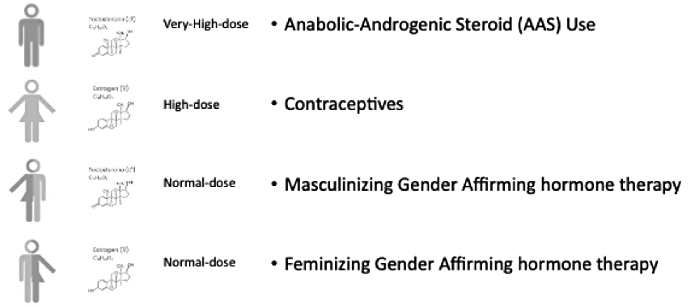

# Endocrine and Fertility Implications After Anabolic Steroids, Hormonal Contraception, and Gender-Affirming Hormone Therapy
> **中文標題**：使用同化性類固醇、荷爾蒙避孕與性別肯認荷爾蒙治療後的內分泌與生育影響
> **分類 Category**：Reproductive Endocrinology
> **講者 Faculty**：Martin den Heijer, MD, PhD — Department of Endocrinology and Metabolism, Amsterdam UMC, The Netherlands
> **來源 Source**：2026 Endocrine Case Management — Meet the Professor · ENDO 2026 · Endocrine Society

---

## 📋 教學目標 Educational Objectives

- **Describe how exogenous sex steroids suppress the hypothalamic-pituitary-gonadal (HPG) axis.**
  說明外源性性荷爾蒙 (exogenous sex steroids) 如何抑制 hypothalamic-pituitary-gonadal (HPG) axis。

- **Identify clinical patterns of endocrine and fertility recovery following the cessation of exogenous hormones.**
  辨識停用外源性荷爾蒙後，內分泌與生育功能恢復的臨床模式。

- **Recognize diagnostic and therapeutic approaches to support recovery of gonadal function and counsel patients in these trajectories.**
  認識支持性腺功能恢復的診斷與治療策略，並能就這些恢復軌跡對病人進行諮詢與衛教。

---

## 🩺 臨床情境 Clinical Scenario

本章以三則臨床病例情境 (Clinical Case Vignettes) 呈現外源性荷爾蒙暴露後的內分泌與生育議題，涵蓋 anabolic-androgenic steroids (AAS) 使用者與 transgender women 的實際處置抉擇。

### Case 1

**A 34-year-old man presents with fatigue, low libido, and infertility. He used AAS intermittently for bodybuilding over a 5-year period and discontinued them 10 months ago.**

一位 34 歲男性因疲倦、性慾低下與不孕就診。他在過去 5 年間為健美 (bodybuilding) 間歇性使用 AAS，並於 10 個月前停用。

Laboratory test results 檢驗結果：

| 項目 Item | 結果 Result |
|---|---|
| Total testosterone | low（偏低） |
| LH | suppressed（受抑制） |
| FSH | suppressed（受抑制） |
| Semen analysis | azoospermia（無精症） |

**Q：Which of the following is the most appropriate next step in management? 下列何者為最適當的下一步處置？**

1. Begin testosterone replacement therapy
2. Begin clomiphene citrate
3. Perform testicular biopsy
4. Begin aromatase inhibitor therapy
5. Recommend observation only

**Answer：B) Begin clomiphene citrate**

> Testosterone replacement therapy would further suppress gonadotropin secretion and worsen infertility. Clomiphene citrate increases endogenous gonadotropin secretion by blocking estrogen feedback at the hypothalamus.
>
> Testosterone replacement therapy 會進一步抑制 gonadotropin 分泌並惡化不孕。Clomiphene citrate 透過阻斷 hypothalamus 層次的 estrogen 負回饋，增加內源性 gonadotropin 分泌。

### Case 2

**A 38-year-old man presents with infertility 2 years after stopping AAS use for competitive bodybuilding. He reports no other medical problems.**

一位 38 歲男性因不孕就診，他為競技健美停用 AAS 已 2 年，無其他病史。

Laboratory test results 檢驗結果：

| 項目 Item | 結果 Result |
|---|---|
| Testosterone | low（偏低） |
| LH | suppressed（受抑制） |
| FSH | suppressed（受抑制） |
| Semen | azoospermia（無精症） |

**Q：Which of the following therapies is most likely to stimulate spermatogenesis? 下列何種治療最可能刺激 spermatogenesis？**

1. Testosterone injections
2. hCG monotherapy
3. hCG combined with FSH therapy
4. GnRH antagonist therapy
5. Aromatase inhibitor monotherapy

**Answer：C) hCG combined with FSH therapy**

> Combined therapy stimulates both Leydig-cell testosterone production and Sertoli-cell function, thereby promoting spermatogenesis. hCG monotherapy might be tried as an initial step.
>
> 合併治療同時刺激 Leydig cell 的 testosterone 生成與 Sertoli cell 功能，進而促進 spermatogenesis。hCG monotherapy 可作為初始嘗試步驟。

### Case 3

**A 25-year-old transgender woman has been receiving estradiol therapy with an antiandrogen (GnRH agonist) for 4 years. She now wishes to explore fertility options.**

一位 25 歲 transgender woman 接受 estradiol 合併 antiandrogen (GnRH agonist) 治療已 4 年，現希望了解生育選項。

**Q：Which counseling statement is most accurate? 下列何項諮詢說法最正確？**

1. Fertility is permanently lost after 2 years of estrogen therapy
2. Spermatogenesis may recover after discontinuation of hormone therapy
3. Sperm production returns immediately after stopping hormone therapy
4. Estrogen therapy permanently destroys germ cells
5. Fertility preservation is not possible

**Answer：B) Spermatogenesis may recover after discontinuation of hormone therapy**

> Spermatogenesis may recover in this setting, but it is unpredictable.
>
> 在此情境下 spermatogenesis 有可能恢復，但恢復與否無法預測。

---

## 🔬 背景與重要性 Background & Significance

### Significance of the Clinical Problem 臨床問題的重要性

**Pharmacologic manipulation of the HPG axis occurs in several medical and nonmedical contexts. Clinicians increasingly encounter individuals who previously used exogenous sex steroids and subsequently seek evaluation of endocrine function or fertility. Common scenarios include prior use of anabolic-androgenic steroids (AAS) in athletes or bodybuilders, discontinuation of hormonal contraception in individuals attempting to conceive, and patients who have used gender-affirming hormone therapy (GAHT) and wish to explore fertility options.**

對 HPG axis 的藥物性操控出現在多種醫療與非醫療情境中。臨床醫師愈來愈常遇到曾使用外源性性荷爾蒙、之後前來評估內分泌功能或生育力的個案。常見情境包括：運動員或健美者過去使用 anabolic-androgenic steroids (AAS)、嘗試懷孕者停用荷爾蒙避孕，以及曾使用 gender-affirming hormone therapy (GAHT) 而希望探詢生育選項的病人。

**All these exposures share a common biological mechanism: suppression of endogenous gonadal function through negative feedback on the HPG axis. While this suppression is usually reversible, recovery of hormonal function and fertility is highly variable and depends on several factors, including the duration of hormone exposure, cumulative dose, age, and underlying reproductive health.**

這些暴露共享同一個生物學機制：透過對 HPG axis 的負回饋，抑制內源性性腺功能。雖然這種抑制通常是可逆的，但荷爾蒙功能與生育力的恢復高度變異，取決於荷爾蒙暴露時間長短、累積劑量、年齡以及潛在的生殖健康狀態等多項因素。

**For many patients, cessation of exogenous hormones leads to gradual restoration of the HPG axis and recovery of reproductive function. However, the time course of recovery ranges from weeks to several years, and in some individuals recovery may be incomplete. These uncertainties can generate significant clinical challenges, particularly in the context of infertility counseling.**

對許多病人而言，停用外源性荷爾蒙後 HPG axis 會逐步恢復、生殖功能也隨之回復。然而恢復的時程可從數週到數年不等，部分個案的恢復甚至可能不完全。這些不確定性會帶來相當大的臨床挑戰，尤其在不孕諮詢的情境下。

**The increasing prevalence of AAS use, broader access to GAHT, and widespread use of hormonal contraception have all contributed to a growing number of patients seeking guidance regarding recovery of gonadal function.**

AAS 使用日益普遍、GAHT 取得管道更為廣泛，以及荷爾蒙避孕的大量使用，都使得尋求性腺功能恢復相關諮詢的病人數目持續增加。因此，內分泌與生殖醫學的臨床醫師必須熟悉 HPG 抑制的機轉、預期的恢復軌跡，以及可促進內分泌與生殖功能回復的可能介入措施。

### Practice Gaps 臨床實務落差

- **Many clinicians are unaware of the variability in recovery of the HPG axis after exogenous hormone exposure.** 許多臨床醫師並未意識到外源性荷爾蒙暴露後 HPG axis 恢復的變異性。雖然抑制通常可逆，但恢復時間可能拖長且難以預測，尤其在 supraphysiologic androgen 暴露之後。
- **Counseling regarding fertility implications is inconsistently provided before starting hormone therapy.** 在開始荷爾蒙治療前，對生育影響的諮詢並未被一致地提供。這對於開始 GAHT，或在無醫療監督下使用 anabolic steroids 的個案尤其重要。
- **Therapeutic strategies to support recovery of gonadal function are underused.** 支持性腺功能恢復的治療策略被低度使用。刺激內源性 gonadotropin 分泌並恢復 spermatogenesis 的藥物策略是可行的；clomiphene 亦可使用，但相關文獻紀錄較少。

### Different Contexts of Sex Hormone Use 性荷爾蒙使用的不同情境

**The use of exogenous hormones occurs across a wide range of medical and social contexts. Prominent examples include AAS use, hormonal contraception, and GAHT. Although these forms of hormone use differ substantially in their purpose, patterns of access, social acceptance, and degree of medical supervision, they share a common physiological effect: suppression of the HPG axis. Through negative feedback mechanisms, exogenous sex steroids reduce endogenous gonadotropin secretion, resulting in decreased gonadal hormone production and impaired reproductive function in both males and females.**

外源性荷爾蒙的使用橫跨廣泛的醫療與社會情境，顯著例子包括 AAS 使用、荷爾蒙避孕與 GAHT。儘管這些荷爾蒙使用型態在目的、取得方式、社會接受度與醫療監督程度上差異甚大，它們卻共享同一個生理效應：抑制 HPG axis。透過負回饋機轉，外源性性荷爾蒙降低內源性 gonadotropin 分泌，導致性腺荷爾蒙生成減少，並使男女兩性的生殖功能受損。

將這些不同型態的性腺抑制放在一起理解，有助於更全面地看待停用外源性荷爾蒙後內分泌恢復的機轉、時程與變異性。此種整合性觀點可增進對 HPG axis 動態的理解、指引恢復期的臨床處置，並協助脈絡化醫療與非醫療情境下荷爾蒙使用的內分泌後果。

**Figure. Sex Hormone Use in Different Contexts（圖：不同情境下的性荷爾蒙使用）**

### Physiology of the HPG Axis HPG 軸生理學

**The HPG axis regulates reproductive endocrine function through a tightly coordinated hormonal signaling system. Sex steroids produced by the gonads exert negative feedback at both the hypothalamic and pituitary levels. Specifically, estradiol reduces GnRH pulsatility and suppresses LH and FSH secretion. A substantial proportion of the negative feedback exerted by testosterone on the HPG axis is mediated through its aromatization to estradiol.**

HPG axis 透過一套緊密協調的荷爾蒙訊號系統調控生殖內分泌功能。性腺所產生的性荷爾蒙同時在 hypothalamus 與 pituitary 兩個層次施加負回饋。具體而言，estradiol 會降低 GnRH 的脈衝性 (pulsatility) 並抑制 LH 與 FSH 分泌。testosterone 對 HPG axis 的負回饋有相當大一部分是透過其芳香化 (aromatization) 為 estradiol 所介導。

**The locally produced estradiol then binds primarily to estrogen receptor-α (ERα), which is abundantly expressed in hypothalamic nuclei involved in reproductive control. Activation of these receptors suppresses the pulsatile secretion of GnRH from hypothalamic neurons. Evidence for this mechanism comes from clinical and experimental studies showing that inhibition of aromatase increases LH and testosterone concentrations, while administration of estradiol strongly suppresses gonadotropin secretion in men.**

局部生成的 estradiol 主要結合到 estrogen receptor-α (ERα)，該受體在參與生殖調控的 hypothalamic nuclei 中大量表現。這些受體被活化後，會抑制 hypothalamic neurons 的 GnRH 脈衝性分泌。支持此機轉的證據來自臨床與實驗研究：抑制 aromatase 會升高 LH 與 testosterone 濃度，而給予 estradiol 則強力抑制男性的 gonadotropin 分泌。

**Exogenous sex steroids exploit this physiologic feedback system. When circulating levels of androgens or estrogens rise due to external administration, endogenous gonadotropin secretion is suppressed. As a result, gonadal steroidogenesis and gametogenesis decline. The degree of suppression depends on the type, dose, and duration of hormone exposure. In many cases, suppression is reversible, but prolonged exposure can lead to extended recovery periods.**

外源性性荷爾蒙利用了此生理回饋系統。當外部給藥使循環中的 androgens 或 estrogens 升高時，內源性 gonadotropin 分泌被抑制，導致性腺類固醇生成 (steroidogenesis) 與配子生成 (gametogenesis) 下降。抑制的程度取決於荷爾蒙暴露的種類、劑量與時間長短。多數情況下抑制是可逆的，但長期暴露可能導致恢復期延長。

---

## 🧭 診斷與評估 Diagnosis & Evaluation

### Recovery of Gonadal Function After AAS Use AAS 使用後的性腺功能恢復

**AASs are synthetic derivatives of testosterone used medically for specific conditions but widely used outside medical supervision to enhance muscle mass and athletic performance. Supraphysiologic doses of these agents strongly suppress LH and FSH secretion through negative feedback at the hypothalamus and pituitary. The resulting endocrine state resembles hypogonadotropic hypogonadism. Serum testosterone may remain low after cessation of steroid use due to persistent suppression of the HPG axis. At the testicular level, reduced intratesticular testosterone leads to impaired spermatogenesis and testicular atrophy.**

AAS 是 testosterone 的合成衍生物，醫療上用於特定疾病，但也廣泛在無醫療監督下使用以增加肌肉量與運動表現。超生理劑量 (supraphysiologic doses) 透過 hypothalamus 與 pituitary 層次的負回饋強力抑制 LH 與 FSH 分泌，形成類似 hypogonadotropic hypogonadism 的內分泌狀態。由於 HPG axis 持續受抑制，停用類固醇後血中 testosterone 可能仍偏低。在睪丸層次，intratesticular testosterone 下降會導致 spermatogenesis 受損與 testicular atrophy。

**Diagnostic monitoring employs hormone assays (LH, FSH, testosterone, inhibin B), semen analysis parameters, and physical examination, including testicular volume measurement.**

診斷監測採用荷爾蒙檢驗（LH、FSH、testosterone、inhibin B）、精液分析 (semen analysis) 參數，以及包含 testicular volume 測量在內的理學檢查。

> **恢復時程摘要 Recovery timeline（AAS 停用後）**
>
> | 參數 Parameter | 恢復時程 Time course | 引用 Ref |
> |---|---|---|
> | Gonadotropins (LH, FSH) 回到 baseline | 13–24 週 within 13 to 24 weeks | 4 |
> | Testosterone 正常化（多數使用者） | 約 3 個月 within 3 months | 5 |
> | Spermatogenesis 恢復 | 約 1 年 approximately 1 year | 6 |

**Recovery of gonadal function after AAS discontinuation follows a gradual pattern, with gonadotropin levels (LH and FSH) returning to baseline within 13 to 24 weeks, testosterone normalizing within 3 months in most users, and spermatogenesis requiring approximately 1 year for recovery. Factors associated with prolonged recovery include longer duration of steroid exposure, higher cumulative doses, use of multiple androgenic compounds, and increasing age. However, recovery remains incomplete in a substantial proportion of users, with 11% to 34% showing persistent abnormalities at 1-year follow-up, and only 4 of 38 patients with known outcomes achieving complete reversibility in 1 systematic review. Recovery of spermatogenesis typically occurs later than recovery of testosterone production because spermatogenesis requires several months to complete a full cycle.**

AAS 停用後性腺功能的恢復呈漸進模式：gonadotropin（LH 與 FSH）在 13 至 24 週內回到 baseline，多數使用者的 testosterone 在 3 個月內正常化，而 spermatogenesis 約需 1 年才能恢復。與恢復延長相關的因素包括：類固醇暴露時間較長、累積劑量較高、使用多種 androgenic compounds，以及年齡增加。然而，仍有相當比例的使用者恢復不完全：在 1 年追蹤時有 11% 至 34% 出現持續性異常；在某一篇 systematic review 中，38 位已知結果的病人裡僅有 4 位達到完全可逆。由於 spermatogenesis 需要數個月才能完成一個完整週期，其恢復通常晚於 testosterone 生成的恢復。

**Recovery outcomes are strongly influenced by AAS exposure characteristics, with negative correlations between recovery and duration of use, dose, and number of concurrent agents. Younger age and oligospermia rather than azoospermia at baseline predict better outcomes, while high cumulative lifetime doses and prolonged use increase the risk of permanent dysfunction.**

恢復結果強烈受 AAS 暴露特徵影響：恢復程度與使用時間長短、劑量以及同時使用的藥物種類數呈負相關。較年輕的年齡，以及 baseline 呈 oligospermia（而非 azoospermia）者，預示較佳結果；而高的終生累積劑量與長期使用，則增加永久性功能障礙的風險。

---

## 💊 治療與處置 Management

### AAS 相關不孕的藥物處置 Pharmacologic Management of AAS-related Infertility

**The recovery process following discontinuation of anabolic steroids involves gradual restoration of hypothalamic GnRH pulsatility, followed by recovery of pituitary gonadotropin secretion. Once LH and FSH levels normalize, endogenous testosterone production and spermatogenesis may gradually resume.**

停用 anabolic steroids 後的恢復過程包含：hypothalamic GnRH pulsatility 逐步回復，接著 pituitary gonadotropin 分泌恢復。一旦 LH 與 FSH 正常化，內源性 testosterone 生成與 spermatogenesis 便可能逐漸回復。

**Management strategies may include pharmacologic stimulation of the HPG axis. Selective estrogen receptor modulators, such as clomiphene citrate, increase endogenous gonadotropin secretion by blocking estrogen-mediated negative feedback at the hypothalamus. hCG can stimulate Leydig cells to produce testosterone, while FSH therapy may be required to directly stimulate spermatogenesis in severe cases.**

處置策略可包含對 HPG axis 的藥物性刺激：

- **Selective estrogen receptor modulators (SERMs)**，如 **clomiphene citrate**：透過阻斷 hypothalamus 層次由 estrogen 介導的負回饋，增加內源性 gonadotropin 分泌。
- **hCG**：可刺激 Leydig cells 生成 testosterone。
- **FSH therapy**：在嚴重個案中，可能需要直接刺激 spermatogenesis。

在 Case 2 的情境中，hCG combined with FSH therapy 同時刺激 Leydig cell 的 testosterone 生成與 Sertoli cell 功能，最能促進 spermatogenesis；hCG monotherapy 則可作為初始嘗試步驟。相對地，testosterone replacement therapy 會進一步抑制 gonadotropin 而惡化不孕，應予避免（見 Case 1）。

### Recovery After Hormonal Contraception 荷爾蒙避孕後的恢復

**Hormonal contraceptives represent one of the most common forms of pharmacologic suppression of the HPG axis. Combined oral contraceptives contain estrogen and progestin, which inhibit ovulation by suppressing gonadotropin secretion. During active use of combined hormonal contraception, ovulation does not occur and endogenous ovarian steroid production is suppressed.**

荷爾蒙避孕是最常見的 HPG axis 藥物性抑制型態之一。Combined oral contraceptives 含有 estrogen 與 progestin，透過抑制 gonadotropin 分泌來抑制排卵。使用 combined hormonal contraception 期間，不會排卵，內源性卵巢類固醇生成也被抑制。

**After cessation of oral contraceptives, the exogenous hormonal feedback is removed, allowing the HPG axis to gradually resume its normal activity. GnRH pulsatility typically recovers first, followed by normalization of FSH and LH secretion. Increased FSH levels stimulate follicular recruitment and growth in the ovaries, while the midcycle LH surge is required to trigger ovulation. In many women, ovulatory cycles resume relatively quickly.**

停用 oral contraceptives 後，外源性荷爾蒙回饋被移除，HPG axis 得以逐漸恢復正常活動。通常 GnRH pulsatility 最先恢復，接著 FSH 與 LH 分泌正常化。升高的 FSH 刺激卵巢中卵泡的招募與生長，而週期中段的 LH surge 則是觸發排卵所必需。許多女性的排卵週期恢復相對快速。

**Studies have shown that most women experience the return of ovulation within 1 to 3 months after stopping combined oral contraceptives. However, the timing of recovery can vary depending on individual factors such as age, duration of contraceptive use, underlying menstrual irregularities, and body composition. Epidemiological studies consistently demonstrate that cumulative pregnancy rates within 1 year after discontinuation of oral contraceptives are comparable to those observed in women who previously used nonhormonal contraceptive methods.**

研究顯示，多數女性在停用 combined oral contraceptives 後 1 至 3 個月內恢復排卵。然而恢復時機可因個別因素而異，例如年齡、避孕使用時間長短、潛在月經不規則，以及身體組成 (body composition)。流行病學研究一致顯示，停用 oral contraceptives 後 1 年內的累積懷孕率，與過去使用非荷爾蒙避孕方法的女性相當。

### Recovery After GAHT 性別肯認荷爾蒙治療後的恢復

**GAHT is used by transgender individuals to align physical characteristics with gender identity. These therapies involve exogenous sex steroids that intentionally suppress endogenous gonadal hormone production.**

GAHT 被 transgender 個案用來使身體特徵與性別認同一致。這些治療使用外源性性荷爾蒙，刻意抑制內源性性腺荷爾蒙生成。

#### Transgender Women

**Transgender women (individuals assigned male at birth who identify as female) typically receive estradiol therapy combined with agents that suppress testosterone production. Antiandrogens such as spironolactone or cyproterone acetate are commonly used, and some individuals receive GnRH analogues. These therapies reduce circulating testosterone levels and suppress spermatogenesis. Histologic examination of testicular tissue in individuals receiving estrogen therapy has demonstrated decreased seminiferous tubule diameter and impaired germ-cell maturation.**

Transgender women（出生指定性別為男性、認同為女性者）通常接受 estradiol therapy，並合併抑制 testosterone 生成的藥物。常用的 antiandrogens 包括 spironolactone 或 cyproterone acetate，部分個案接受 GnRH analogues。這些治療降低循環中的 testosterone 並抑制 spermatogenesis。接受 estrogen therapy 者的睪丸組織 histologic examination 顯示 seminiferous tubule 直徑縮小與生殖細胞成熟受損。

**While suppression of spermatogenesis is common during therapy, recovery after discontinuation appears possible in some individuals. Case reports and small observational studies suggest that sperm production may return several months after cessation of hormone therapy, although the time course is variable. One study found recovery of viable spermatozoa in 9 transwomen who stopped estrogen therapy, suggesting reversibility is possible. However, a systematic review notes that while recovery after cessation may occur, questions about reversibility remain, particularly for those starting transition young. Because recovery is unpredictable, fertility preservation before initiation of GAHT is recommended whenever possible.**

雖然治療期間 spermatogenesis 的抑制很常見，但部分個案在停藥後似乎有可能恢復。病例報告與小型觀察性研究顯示，精子生成可能在停用荷爾蒙治療後數個月回復，但時程變異。一項研究在 9 位停用 estrogen therapy 的 transwomen 中發現有活動精子 (viable spermatozoa) 恢復，顯示可逆性是可能的。然而一篇 systematic review 指出，雖然停藥後可能恢復，但可逆性仍存在疑問，尤其對於年輕即開始轉變 (transition) 者。由於恢復無法預測，建議在開始 GAHT 前盡可能進行生育保存 (fertility preservation)。

#### Transgender Men

**Transgender men (individuals assigned female at birth who identify as male) typically receive testosterone therapy to induce masculinizing physical changes. Testosterone suppresses ovulation and usually leads to amenorrhea within several months. Despite suppression of ovarian function, ovarian follicles often remain present during testosterone therapy. After discontinuation of testosterone, ovulation may resume in many individuals. Pregnancies have been reported after cessation of testosterone therapy, even in individuals who used testosterone for several years. However, the time required for ovulatory recovery can vary.**

Transgender men（出生指定性別為女性、認同為男性者）通常接受 testosterone therapy 以誘發男性化的身體變化。testosterone 抑制排卵，通常在數個月內導致停經 (amenorrhea)。儘管卵巢功能被抑制，testosterone therapy 期間卵巢卵泡通常仍存在。停用 testosterone 後，許多個案可能恢復排卵。即使在使用 testosterone 數年的個案中，也有停藥後懷孕的報告。然而恢復排卵所需的時間可有差異。

**One study followed 56 transgender men prospectively and found antimüllerian hormone levels remained within normal ranges despite slight decreases; notably, 4 men fathered biological children after up to 12 years of testosterone treatment. So, current evidence suggests that ovarian reserve may remain preserved in many individuals receiving testosterone therapy, although long-term data are limited.**

一項前瞻性研究追蹤 56 位 transgender men，發現 antimüllerian hormone (AMH) 濃度雖略有下降，但仍維持在正常範圍內；值得注意的是，其中 4 位在最長達 12 年的 testosterone 治療後生育了親生子女。因此，目前證據顯示許多接受 testosterone therapy 的個案其卵巢儲備 (ovarian reserve) 可能得以保留，但長期資料仍有限。

---

## 🧠 個案解析與臨床推理 Case Analysis & Clinical Reasoning

### 核心生理主軸

三種情境（AAS、hormonal contraception、GAHT）表面上目的與社會脈絡迥異，但共享同一條病生理主軸：**外源性性荷爾蒙 → HPG axis 負回饋 → 內源性 gonadotropin 下降 → 性腺類固醇生成與配子生成受抑**。掌握這條主軸，就能一致地推理各情境的恢復與處置。

值得特別記憶的機轉重點：testosterone 對 HPG axis 的負回饋，有相當比例是先經 **aromatization 轉為 estradiol**，再經 ERα 抑制 GnRH pulsatility。這正是 clomiphene（SERM，阻斷 hypothalamus 的 estrogen 回饋）與 aromatase inhibitor 之所以能「解除煞車」提高內源性 gonadotropin 的藥理基礎。

### 關鍵決策要點

- **停藥後的男性 hypogonadism 不可給 testosterone**：Case 1 的核心陷阱在於，面對疲倦、低性慾、低 testosterone 的男性，直覺上會想補 testosterone；但在「想生育」且 LH/FSH 已受抑的情境下，外源性 testosterone 會進一步壓低 gonadotropin、惡化 azoospermia。正解是 clomiphene citrate 這類促進內源性分泌的策略。
- **azoospermia 的分層治療**：Case 2 中，若 hCG 單獨無法恢復 spermatogenesis，需加上 FSH 以同時驅動 Leydig cell（testosterone）與 Sertoli cell 功能。hCG monotherapy 可作為初始步驟，嚴重個案才需合併 FSH。
- **可逆但不可預測（GAHT）**：Case 3 的正確諮詢是「spermatogenesis 可能恢復，但無法預測」。錯誤選項多半落在兩個極端——宣稱「永久喪失/永久破壞生殖細胞」或「立即恢復」，兩者都與證據不符。臨床上應在開始 GAHT 前就提供 fertility preservation 諮詢。

### 鑑別診斷 Differential Diagnosis

面對 hypogonadotropic hypogonadism（低 testosterone 併 LH/FSH 偏低或不高）的男性，除 AAS 使用史外，應鑑別其他中樞性病因：pituitary 腫瘤/高 prolactin、congenital hypogonadotropic hypogonadism、全身性疾病或藥物（opioids、glucocorticoids）等。詳實的荷爾蒙使用史（包含未在醫療監督下取得的 AAS）是關鍵，因為病人常不主動揭露。

### 常見陷阱 Pitfalls

- 未詢問 AAS 或非處方荷爾蒙使用史，將 AAS 誘發之可逆性 hypogonadism 誤判為原發或需終生補充的病因。
- 對想生育的男性給予 testosterone replacement，反而抑制生育。
- 對 GAHT 病人給予過度樂觀（保證恢復）或過度悲觀（宣稱永久不孕）的諮詢；正確立場是「可能但不可預測」，並強調事前的 fertility preservation。
- 忽略恢復時程差異：gonadotropin 與 testosterone 恢復較早，spermatogenesis 需時較長（約 1 年），過早以單次精液分析判定「無法恢復」並不恰當。

---

## ⭐ 重點整理 Key Takeaways

- 外源性性荷爾蒙透過負回饋機轉抑制 HPG axis（Exogenous sex steroids suppress the HPG axis through negative feedback）。
- 就 testosterone 而言，其負回饋主要透過 aromatization 轉為 estradiol 來達成。
- 荷爾蒙暴露後，性腺內分泌功能與生育力的恢復具變異性，受暴露時間、劑量與 baseline 性腺儲備影響。
- AAS 使用可導致延長的 hypogonadotropic hypogonadism 與不孕；gonadotropin 約 13–24 週、testosterone 約 3 個月、spermatogenesis 約 1 年恢復，但仍有 11%–34% 於 1 年時持續異常。
- 停用 hormonal contraception 後生育力通常快速回復，多數女性 1–3 個月內恢復排卵，1 年累積懷孕率與非荷爾蒙避孕者相當。
- GAHT 後生殖功能的恢復是可能的但不可預測（transgender women 的 spermatogenesis、transgender men 的 ovulation 皆有恢復與懷孕報告）。
- 想生育的男性若呈 hypogonadotropic 型態，應以 clomiphene / hCG ± FSH 促進內源性功能，而非給予 testosterone replacement。
- 在開始任何會抑制性腺功能的治療前，應提供 fertility preservation 諮詢（Fertility preservation counseling before therapy）。

---

## 💬 討論問題 Discussion Questions

1. 面對一位曾長期使用 AAS、現因不孕就診且呈 azoospermia 的男性，你會如何安排評估與分層治療（clomiphene、hCG、FSH）？在什麼時間點會判定恢復不完全並轉介 assisted reproduction？
2. AAS 使用者常不主動揭露用藥史。臨床上有哪些線索與問診技巧，能協助辨識 AAS 誘發的 hypogonadotropic hypogonadism，避免誤給 testosterone replacement？
3. 對即將開始 GAHT 的 transgender 個案（transgender women 與 transgender men），你會如何在治療前進行 fertility preservation 諮詢？如何平衡「可能恢復」與「不可預測」之間的期待管理？
4. 停用 hormonal contraception 後未如期恢復排卵或懷孕的女性，應如何鑑別是避孕本身的殘餘效應，還是潛在的生殖疾病（如 PCOS、hypothalamic 因素）？
5. 現有 GAHT 對生育影響的證據多來自病例報告與小型觀察研究。哪些前瞻性資料缺口最需要被填補，才能改善臨床諮詢的品質？

---

## 📚 參考文獻 References

1. Finkelstein JS, Lee H, Burnett-Bowie SA, et al. Gonadal steroids and body composition, strength, and sexual function in men. *N Engl J Med*. 2013;369(11):1011-1022. PMID: 24024838
2. Hayes FJ, Seminara SB, Crowley WF Jr. Hypogonadotropic hypogonadism. *Endocrinol Metab Clin North Am*. 1998;27(4):739-763. PMID: 9922906
3. Pitteloud N, Dwyer AA, DeCruz S, et al. Inhibition of luteinizing hormone secretion by testosterone in men requires aromatization for its pituitary but not its hypothalamic effects: evidence from the tandem study of normal and gonadotropin-releasing hormone-deficient men. *J Clin Endocrinol Metab*. 2008;93(3):784-791. PMID: 18073301
4. Christou MA, Christou PA, Markozannes G, Tsatsoulis A, Mastorakos G, Tigas S. Effects of anabolic androgenic steroids on the reproductive system of athletes and recreational users: a systematic review and meta-analysis. *Sports Med*. 2017;47(9):1869-1883. PMID: 28258581
5. Smit DL, Buijs MM, de Hon O, den Heijer M, de Ronde W. Disruption and recovery of testicular function during and after androgen abuse: the HAARLEM study. *Hum Reprod*. 2021;36(4):880-890. PMID: 33550376
6. Rajmil O, Moreno-Sepulveda J. Recovery of spermatogenesis after androgenic anabolic steroids abuse in men: a systematic review of the literature. *Actas Urol Esp (Engl Ed)*. 2024;48(2):116-124. PMID: 37567343
7. van Os J, Smit DL, Bond P, de Ronde W. Prolonged post-androgen abuse hypogonadism: potential mechanisms and a proposed standardized diagnosis. *Front Endocrinol (Lausanne)*. 2025;16:1621558. PMID: 40678315
8. Tatem AJ, Beilan J, Kovac JR, Lipshultz LI. Management of anabolic steroid-induced infertility: novel strategies for fertility maintenance and recovery. *World J Mens Health*. 2020;38(2):141-150. PMID: 30929329
9. Ledesma BR, Weber A, Venigalla G, et al. Fertility outcomes in men with prior history of anabolic steroid use. *Fertil Steril*. 2023;120(6):1203-1209. PMID: 37769866
10. Janerich DT, Lawrence CE, Jacobson HI. Fertility patterns after discontinuation of use of oral contraceptives. *Lancet*. 1976;1(7968):1051-1053. *(No PMID — predates PubMed indexing)*
11. Weisberg E. Fertility after discontinuation of oral contraceptives. *Clin Reprod Fertil*. 1982;1(4):261-272. PMID: 6764883
12. Barnhart KT, Schreiber CA. Return to fertility following discontinuation of oral contraceptives. *Fertil Steril*. 2009;91(3):659-663. PMID: 19268187
13. Girum T, Wasie A. Return of fertility after discontinuation of contraception: a systematic review and meta-analysis. *Contracept Reprod Med*. 2018;3:9. PMID: 30062044
14. de Nie I, van Mello NM, Vlahakis E, et al. Successful restoration of spermatogenesis following gender-affirming hormone therapy in transgender women. *Cell Rep Med*. 2023;4(1):100858. PMID: 36652919
15. De Roo C, Schneider F, Stolk THR, van Vugt WLJ, Stoop D, van Mello NM. Fertility in transgender and gender diverse people: systematic review of the effects of gender-affirming hormones on reproductive organs and fertility. *Hum Reprod Update*. 2025;31(3):183-217. PMID: 39854640
16. Yaish I, Tordjman K, Amir H, et al. Functional ovarian reserve in transgender men receiving testosterone therapy: evidence for preserved anti-Müllerian hormone and antral follicle count under prolonged treatment. *Hum Reprod*. 2021;36(10):2753-2760. PMID: 34411251
17. Mortimer RM, Walker ZW, Ashby RK, Ginsburg ES, Srouji SS. Ovarian stimulation and retrieval outcomes in transgender males maintained on testosterone: a case series. *J Assist Reprod Genet*. 2025;42(12):4433-4437. PMID: 41075068
18. Ghofranian A, Estevez SL, Gellman C, et al. Fertility treatment outcomes in transgender men with a history of testosterone therapy. *F S Rep*. 2023;4(4):367-374. PMID: 38204952
