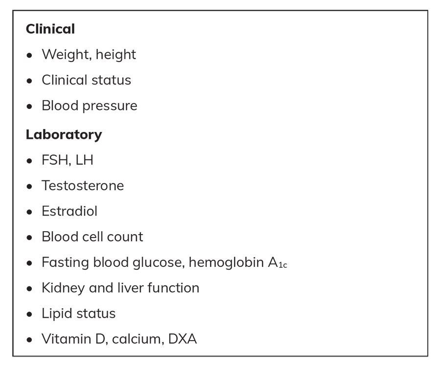

# Update on the Management of Androgen Insensitivity Syndromes
> **中文標題**：雄性素不敏感症候群（Androgen Insensitivity Syndromes）處置新知
> **分類 Category**：Reproductive Endocrinology
> **講者 Faculty**：Anna Nordenström, MD, PhD — Department of Women's and Children's Health, Karolinska Institute, and Pediatric Endocrinology, Astrid Lindgren Pediatric Hospital, Karolinska University Hospital, Stockholm, Sweden
> **來源 Source**：2026 Endocrine Case Management — Meet the Professor · ENDO 2026 · Endocrine Society

---

## 📋 教學目標 Educational Objectives

- **Identify symptoms and initiate appropriate investigations to diagnose androgen insensitivity syndrome (AIS) in men and women.**
  辨識症狀並啟動適當的檢查，以診斷男性與女性的 androgen insensitivity syndrome（AIS）。

- **Manage hormone treatment for adolescents and adults with complete AIS (CAIS) and partial AIS (PAIS), including long-term consequences.**
  處置青少年與成人 complete AIS（CAIS）與 partial AIS（PAIS）的荷爾蒙治療，並涵蓋其長期影響。

- **Manage malignancy risk, ongoing assessment, and follow-up for AIS.**
  處置 AIS 的惡性腫瘤風險、持續評估與追蹤。

---

## 🩺 臨床情境 Clinical Scenario

本章附有三個臨床案例（Case Vignettes），分別呈現 CAIS 女性、PAIS 男性青少年，以及新生兒性別發育差異（DSD）的典型情境。

### Case 1 — 18 歲女性、原發性無月經

> An 18-year-old woman seeks medical attention because she has only had one menstrual bleed several years ago, but none thereafter. She is now starting college and is active in competitive sports. Her height is 67 in (170 cm), and weight is 141 lb (64 kg) (BMI = 22 kg/m²). She has breast development. Somatic status, including pubertal development, shows B4, sparse pubic hair, and no acne. Her blood pressure is 100/57 mm Hg.

一名 18 歲女性因為多年前僅有過一次月經、之後即無月經而就醫。她正要進入大學，並積極從事競技運動。身高 170 cm，體重 64 kg（BMI = 22 kg/m²）。已有乳房發育。身體與青春期發育狀態為 B4、稀疏的陰毛、無痤瘡。血壓 100/57 mm Hg。

檢驗結果 Laboratory results：

| 項目 Test | 值 Value | SI 單位 |
|---|---|---|
| FSH | 17 mIU/mL | 17 IU/L |
| LH | 45 mIU/mL | 45 IU/L |
| Testosterone | 750 ng/dL | 26 nmol/L |
| Estradiol | 25 pg/mL | 92 pmol/L |
| AMH | 113 ng/mL | 807 pmol/L |

> The high testosterone value is not reflected in the physical signs. The AMH value within the male range confirms the presence of Sertoli cells.

偏高的 testosterone 並未反映在理學表徵上（無男性化）。AMH 落在男性範圍，證實有 Sertoli cells 的存在。臨床圖像符合 CAIS。

### Case 2 — 14 歲男孩、令其困擾的女性化乳房

> A 14-year-old boy seeks medical attention because he is very disturbed by gynecomastia... His height is 67.7 in (172 cm), and weight is 119 lb (54 kg) (BMI = 18.5 kg/m²). The first signs of puberty began about 1 year ago. Pubertal status is Ph3... He has had hypospadias repair. Testicular volume is 6 cc. Gynecomastia corresponds to B3.

一名 14 歲男孩因深受 gynecomastia 困擾而就醫，已不再運動或上健身房。身高 172 cm、體重 54 kg（BMI = 18.5 kg/m²）。青春期約在一年前開始，Ph3，無痤瘡。曾接受 hypospadias 修補手術。睪丸體積 6 cc。Gynecomastia 相當於 B3。

檢驗結果 Laboratory results：

| 項目 Test | 值 Value | SI 單位 |
|---|---|---|
| FSH | 20 mIU/mL | 20 IU/L |
| LH | 17 mIU/mL | 17 IU/L |
| Testosterone | 404 ng/dL | 14 nmol/L |
| Estradiol | 24 pg/mL | 89 pmol/L |
| AMH | 32 ng/mL | 229 pmol/L |
| Karyotype | 46,XY | — |

需先排除 Klinefelter syndrome；karyotype 為 46,XY，配合曾有 hypospadias 修補與小睪丸，指向 PAIS。

### Case 3 — 性別不明的新生兒

> A newborn is referred for evaluation because of uncertain sex assignment... birth weight of 3200 g. Apgar scores were 8, 9, and 10. On examination of the genitalia, there is no increased pigmentation, a gonad is possibly palpable on one side (1 ml/cc), the genital tubercle measures 1.8 cm, there is a urethral opening at the base, and there is a bifid scrotum.

一名新生兒因性別指定不確定而轉診。妊娠 39 週、無合併症，出生體重 3200 g，Apgar 8/9/10。生殖器檢查無色素增加，一側可能可觸及性腺（1 ml/cc），genital tubercle 1.8 cm，尿道開口位於基部，並有 bifid scrotum。此為疑似 DSD 的新生兒，最重要的下一步是「緊急轉介 DSD 團隊」。

---

## 🔬 背景與重要性 Background & Significance

### Complete Androgen Insensitivity Syndrome（CAIS）

> CAIS is characterized by a complete absence of androgen receptor (AR) function. Affected girls have female external genitalia, and the Wolffian structures (male internal genitalia) do not differentiate fully despite testosterone produced by Leydig cells in the testes. Antimullerian hormone (AMH), produced by the Sertoli cells, results in the absence of the uterus, fallopian tubes, and the upper part of the vagina.

CAIS 的特徵是 androgen receptor（AR）功能完全喪失。患者具有女性外生殖器；儘管睪丸內的 Leydig cells 會製造 testosterone，Wolffian 構造（男性內生殖器）仍無法完整分化。Sertoli cells 分泌的 AMH 使得子宮、輸卵管與陰道上段缺如。

> In almost half of cases, CAIS is diagnosed in early childhood when the girl is evaluated for an inguinal hernia. Most girls are diagnosed during or after puberty with primary amenorrhea. Girls with retained gonads have normal breast development due to aromatization of testosterone and may have tall stature and little or no pubic and axillary hair. Gender identity is almost exclusively female.

近半數 CAIS 在幼年因評估 inguinal hernia 時被診斷。多數則於青春期或之後因 primary amenorrhea 而確診。保留性腺者因 testosterone 芳香化（aromatization）為雌激素而有正常乳房發育，並可能身材較高、陰毛與腋毛稀少或缺如。性別認同幾乎全為女性。

> Laboratory testing shows testosterone in the male range, FSH within the normal range, and often elevated LH, resulting in an elevated LH-to-FSH ratio due to estrogen-mediated central feedback. Karyotype is 46,XY, and there is no detectable uterus on ultrasonography. In more than 95% of the cases, a loss-of-function variant is detected in the *AR* gene.

檢驗顯示 testosterone 在男性範圍、FSH 正常，LH 常升高，因雌激素介導的中樞回饋而形成升高的 LH-to-FSH ratio。Karyotype 為 46,XY，超音波偵測不到子宮。超過 95% 的病例可在 *AR* 基因偵測到 loss-of-function variant。

> Malignancy risk is considered low before adolescence. They may, however, virilize during puberty if the AR activity is not completely abolished. In individuals raised as girls and who have gonads removed early in life, hormone treatment with estradiol is mandatory for puberty induction. Puberty treatment should start at an appropriate age, similar to when their peers start puberty, at 10 or 11 years of age, and continue into adulthood.

青春期前的惡性腫瘤風險被視為偏低。但若 AR 活性未完全消失，青春期可能出現男性化。對於以女性養育、且早年即切除性腺者，必須以 estradiol 進行青春期誘導；治療應於與同儕相近的適當年齡（約 10 至 11 歲）開始，並持續至成年。

### Partial Androgen Insensitivity Syndrome（PAIS）

> PAIS presents with a wide range of clinical signs at birth, from mild virilization in a girl to severe hypospadias and undescended testes in a boy. PAIS is often diagnosed in the neonatal period after referral to a multidisciplinary team due to suspicion of a difference of sex development (DSD).

PAIS 出生時的臨床表現差異極大，可從女嬰的輕度男性化，到男嬰的嚴重 hypospadias 與 undescended testes。PAIS 常在新生兒期因懷疑 difference of sex development（DSD）轉介多專科團隊而診斷。

> The degree of virilization at birth can be graded using the external masculinization score (EMS) or external genitalia score (EGS). In PAIS, a pathogenic variant in the *AR* gene is identified in less than 30% of cases.

出生時的男性化程度可用 external masculinization score（EMS）或 external genitalia score（EGS）分級。PAIS 中，僅少於 30% 的病例能找到 *AR* 基因的 pathogenic variant。

> A girl with severe PAIS may be diagnosed during evaluation for increased virilization in puberty... Previously undiagnosed boys with a history of surgery for hypospadias may come to medical attention during puberty due to marked gynecomastia or unsatisfactory pubertal progression. The masculinization score at birth is a good predictor of pubertal development and possible need for testosterone treatment, and has been shown to be a better predictor for pubertal development than the genetic variant/genetic assessment.

嚴重 PAIS 的女性可能在青春期因男性化加劇被診斷，此常造成相當的困擾，部分案例甚至導致性別改變。過去未被診斷、有 hypospadias 手術史的男孩，可能於青春期因明顯 gynecomastia 或青春期進展不理想而就醫。出生時的男性化評分是青春期發育與是否需 testosterone 治療的良好預測因子，且被證實比基因變異／基因評估更能預測青春期發育。

> Affected boys often develop less body hair and facial hair (beard) and have a smaller penis and smaller testicular volumes. Laboratory tests show FSH within the normal range and often higher LH, resulting in an elevated LH-to-FSH ratio. LH is more elevated, and the difference is more pronounced in adolescents and adults than in newborns... Inhibin B and AMH are within the normal range before puberty, but after puberty, AMH is relatively high and inhibin B is usually within the normal range.

受影響的男孩常體毛與鬍鬚較少、陰莖較小、睪丸體積較小。檢驗顯示 FSH 正常、LH 常較高，形成升高的 LH-to-FSH ratio；LH 升高在青少年與成人較新生兒更明顯，比值也更高。青春期前 inhibin B 與 AMH 正常；青春期後 AMH 相對偏高，inhibin B 通常正常。

> In some cases, when a variant in the *AR* gene is not identified, pathogenic variants have been found in noncoding and intronic regions, or within *AR* coregulators. There may also be an oligogenic cause... The PAIS phenotype is variable, even among individuals with the same *AR* pathogenic variant within the same family.

部分找不到 *AR* 基因變異的病例，pathogenic variant 可能位於非編碼區與 intron，或位於 *AR* coregulators；也可能為多基因（oligogenic）成因。PAIS 表型變異度大，即使同一家族、帶有相同 *AR* pathogenic variant 者亦然。

### Sexual Health, Well-Being, and Quality of Life

> Sexual health and fertility are affected in both CAIS and PAIS... Impaired sexual function has been reported in CAIS, possibly related to a relatively shorter vagina, less lubrication, and psychological factors. However, others have reported a satisfactory sexual life. In CAIS, pregnancy cannot occur, and no fertility treatments are currently available for this patient population.

CAIS 與 PAIS 的性健康與生育力均受影響。CAIS 曾有性功能受損的報告，可能與陰道相對較短、潤滑較少及心理因素有關；但也有研究報告性生活滿意。CAIS 無法懷孕，目前亦無可用的生育治療。

> A systematic review of adult sexual function after hypospadias surgery, including 13 studies, was recently published. The authors report erectile dysfunction in 12% and sexual dissatisfaction in 16%. The situation may be more difficult for men with PAIS, as a French study reported erectile dysfunction in almost 50%. Seventeen men with PAIS were included in the European dsdLIFE study. Their penile length was 46 mm ± 21 mm, the scrotum was often bifid or hypoplastic, 14 patients were dissatisfied with penis size, and only half were satisfied with erectile function.

一篇納入 13 項研究、關於 hypospadias 手術後成人性功能的系統性回顧報告 erectile dysfunction 為 12%、性生活不滿意為 16%。PAIS 男性的情況可能更困難：一項法國研究報告 erectile dysfunction 近 50%。歐洲 dsdLIFE 研究納入 17 名 PAIS 男性，陰莖長度為 46 mm ± 21 mm，陰囊常為 bifid 或發育不良，14 名不滿意陰莖大小，僅半數滿意勃起功能。PAIS 男性能自然或經特殊治療而生育的個案僅有少數發表。

### Practice Gaps 臨床實務缺口

- CAIS 與 PAIS 在青春期與成年的荷爾蒙治療需個別化；我們對於隨年齡發展的長期問題與其處置才剛開始理解。
- 隨年齡與時間增加，性腺惡性腫瘤的風險究竟有多大？是否需 gonadectomy、以及保留的性腺該如何追蹤，至今仍在爭論。
- 性健康在男女 CAIS 與 PAIS 均受影響並負面衝擊整體福祉；優化荷爾蒙與心理治療照護是否能改善心理社會福祉與生活品質，仍待釐清。

---

## 🧭 診斷與評估 Diagnosis & Evaluation

### 初始檢驗與判讀 Initial Workup

對於 primary amenorrhea 且理學表徵不相稱者，最具資訊價值的初始評估為抽血檢測 **FSH、LH、estradiol、testosterone 與 AMH**（Case 1 正解 B）。AMH 是 Sertoli-cell 功能的關鍵標記；落在男性範圍即支持存在睪丸組織。

典型 CAIS 檢驗型態：

- Testosterone：男性範圍（例：750 ng/dL / 26 nmol/L）
- FSH：正常範圍
- LH：升高 → **elevated LH-to-FSH ratio**（estrogen 介導的中樞回饋）
- AMH：男性範圍（例：113 ng/mL / 807 pmol/L）
- Karyotype：46,XY；超音波無子宮

> The LH/FSH ratio is not sex-dimorphic after infancy; an elevated ratio in this context reflects estrogen-mediated central feedback.

嬰兒期後 LH/FSH ratio 本非性別二分；在此情境下升高的比值反映的是 estrogen 介導的中樞回饋。

### 確診與 DSD 團隊評估

除轉介多專科 DSD 團隊外，最恰當的後續檢查為 **DSD gene panel**（Case 1 續，正解 A），以驗證 CAIS 診斷，作為後續評估的基礎。DSD 團隊會安排：

- 心理師（psychologist）介接
- 內生殖器 ultrasonography 或 MRI
- laparoscopy 與 gonadal biopsies，並由有經驗的病理科醫師進行組織學評估與染色：**OCT3/4、TSPY、KITLG**

### 惡性腫瘤風險判讀

> Gonadal germ-cell cancer and germ-cell neoplasia in situ are associated with the presence of testis-specific protein on Y (TSPY) on the Y chromosome. There are histological and immunohistochemical criteria for germ-cell neoplasia in situ, including OCT3/4 expression or coexpression of TSPY and KITLG.

性腺 germ-cell cancer 與 germ-cell neoplasia in situ 與 Y 染色體上的 testis-specific protein on Y（TSPY）表現有關。germ-cell neoplasia in situ 有組織學與免疫組織化學判讀標準，包括 OCT3/4 表現，或 TSPY 與 KITLG 共同表現。

> The lifetime risk of germ-cell cancer is unknown, but the risk is low before puberty.

germ-cell cancer 的終生風險未知，但青春期前風險偏低。惡性風險評估的 biopsy 建議在青春期後期執行。

### 腫瘤標記的侷限 Tumor Markers

> Regular analyses of tumor markers, including α-fetoprotein, hCG, and lactate dehydrogenase, have been suggested. The drawback of these markers is that their levels rise as the tumor progresses beyond the in situ stage.

已有人建議定期檢測 α-fetoprotein、hCG 與 lactate dehydrogenase。缺點是這些標記要等到腫瘤進展超過 in situ 階段才會上升，因此**無法偵測 neoplasia in situ**。

### PAIS 男性青少年 gynecomastia 的鑑別

在有 gynecomastia 的青少年男孩，最具資訊價值的檢查為 **FSH、LH、testosterone、estradiol 加上 karyotype 分析**（Case 2 正解 B），因需優先考慮並排除 **Klinefelter syndrome**。若 karyotype 為 46,XY，再配合 hypospadias 病史與小睪丸，則指向 PAIS。

### 新生兒 DSD 的初始評估

疑似 DSD 的新生兒，最重要的下一步為**緊急轉介 DSD 團隊**（Case 3 正解 B）。評估應包含荷爾蒙（testosterone 作為 Leydig-cell 標記、AMH 作為 Sertoli-cell 標記，通常較 karyotype 更快取得結果）與基因檢測（karyotype 以辨識可能的性染色體 DSD，及／或 gene panel），並以理學與影像（ultrasonography/MRI）確認性腺位置與是否有子宮，再據以決定養育性別。

---

## 💊 治療與處置 Management

### 惡性腫瘤風險與 gonadectomy 時機

> Because of this risk, gonadectomy was historically performed at diagnosis in virtually all individuals brought up as girls... Today, the timing of gonadectomy is debated because the lifetime risk of invasive tumor development is uncertain. Gonadectomy is often delayed to allow for the possibility of spontaneous puberty, which most consider beneficial. Gonadal biopsies to assess the risk of malignancy are then performed in late puberty.

過去因惡性風險，幾乎所有以女性養育者都在診斷時即行 gonadectomy。如今因侵襲性腫瘤的終生風險不確定，切除時機仍有爭議。gonadectomy 常延後以保留自發性青春期的可能（多數認為有益），並在青春期後期執行 gonadal biopsies 評估惡性風險。青少年階段可讓病人共同參與是否切除性腺的決策。

> Current practice varies across countries and centers, with gonadectomy recommended in early adulthood for CAIS in 67% of centers, and 35% of men with PAIS have retained gonads.

各國與各中心實務不一：67% 的中心建議 CAIS 於成年早期行 gonadectomy；PAIS 男性中有 35% 保留性腺。

### 保留性腺者的追蹤 Retained Gonads

當青春期後保留性腺時，需病人衛教與謹慎追蹤。文獻建議的方式包括：

- 定期檢測 tumor markers（α-fetoprotein、hCG、lactate dehydrogenase）— 但無法偵測 in situ 階段
- 頻繁或每年 ultrasonography 或 MR 掃描
- gonadopexy 以利腹腔內性腺的影像顯示
- 10 年後重複 gonadal biopsy
- 性腺可觸及者，建議定期自我檢查（self-examination）

**Box. Clinical and Laboratory Follow Up（臨床與檢驗追蹤）**

### 女性荷爾蒙補充 Hormone Replacement in Women

> After gonadectomy, hormone replacement is necessary... In general, transdermal estrogen is recommended because it avoids first-pass liver effects. Estrogen positively affects bone health. Women with CAIS should not be treated with progesterone or progestin because they do not have a uterus.

gonadectomy 後必須荷爾蒙補充。保留性腺的女性可能有足夠的 estrogen，但仍可能需補充。一般建議 **transdermal estrogen**，因可避免肝臟 first-pass 效應；estrogen 對骨骼健康有益。CAIS 女性因無子宮，**不應**使用 progesterone 或 progestin。

> There are no generally accepted guidelines for hormone replacement in CAIS, but the recently published guidelines for hormone replacement therapy/menopause can serve as a reference. Premenopausal treatment with 100 to 200 mcg transdermal (equivalent to 2 to 4 mg micronized 17β-estradiol) should be followed by blood sampling.

CAIS 的荷爾蒙補充尚無普遍接受的指引，但近期發表的更年期／荷爾蒙補充治療指引可作參考。停經前劑量為 **transdermal 100 至 200 mcg（相當於 micronized 17β-estradiol 2 至 4 mg）**，並應以抽血追蹤。

> Despite reported good adherence to hormone therapy, hormone levels may vary considerably... underscoring the importance of follow-up with blood samples.

即使回報依從性良好，荷爾蒙濃度仍可能變異甚大（原因研究不足），凸顯以抽血追蹤的重要性。

### 女性 testosterone 治療的證據

> A German multicenter crossover trial of 26 patients with CAIS assessed the short-term effects of transdermal estrogen vs testosterone. Estradiol, 1.5 mg daily, was given for 6 months, followed by crossover to testosterone, 50 mg daily for 6 months. Testosterone treatment showed a positive effect on the female sexual function index (FSFI) for sexual desire but had no other significant effects. No virilization was observed, and gonadotropin concentrations remained stable in both treatment groups.

一項納入 26 名 CAIS 的德國多中心 crossover 試驗，比較 transdermal estrogen 與 testosterone 的短期效果：先給 **estradiol 1.5 mg/日共 6 個月**，再 crossover 至 **testosterone 50 mg/日共 6 個月**。testosterone 對 female sexual function index（FSFI）中的性慾（sexual desire）有正面效果，但無其他顯著效益；未觀察到男性化，兩組 gonadotropin 濃度均穩定。代謝參數（如 BMI 與 lipid profile）可能略微惡化，但未達統計顯著。

### 男性 testosterone 治療

> In men who have had gonadectomy, testosterone treatment needs to be individualized, and higher dosages are often required. Due to the degree of androgen insensitivity, the response is highly variable. The aim is to normalize body hair and penis size as much as possible. Follow-up with assessment of LH, hematocrit, and possibly liver enzymes for safety may be considered.

接受 gonadectomy 的男性，testosterone 治療需個別化，且常需較高劑量。由於 androgen insensitivity 程度不一，反應差異極大。目標是盡量使體毛與陰莖大小正常化。安全性追蹤可考慮評估 **LH、hematocrit，以及可能的肝功能酵素**。

### PAIS 男嬰／男孩的處置

> If the child is raised as a boy, topical treatment with testosterone or dihydrotestosterone can be tried. Preferably, this should be done during the first year, or first 6 months, of life, during mini-puberty.

若以男性養育，可嘗試 **局部 testosterone 或 dihydrotestosterone**，最好在出生第一年、甚至前 6 個月的 mini-puberty 期間進行。

> Adding testosterone can be considered in mid-puberty after assessment... If there are signs of hypoandrogenism, extra transdermal testosterone can be tried by administering supraphysiological doses of testosterone. The aim is to increase facial and pubic hair, as well as penis size. However, there are no controlled trials, and responses are highly variable.

在青春期中段經臨床與檢驗評估後可考慮加上 testosterone。若有 hypoandrogenism 徵象，可嘗試額外的 transdermal testosterone，並使用**超生理劑量（supraphysiological doses）**，目標是增加面部與陰毛、以及陰莖大小。惟無對照試驗，反應差異大。安全性追蹤同上（LH、hematocrit、可能的肝酵素）。

### PAIS 的 Gynecomastia 處置

> Gynecomastia can be a problem for boys and men with PAIS. It is thought to be related to an imbalance between testosterone and estrogen effects... Aromatase inhibitors may improve gynecomastia when started early... Testosterone treatment may lower LH, which in turn may reduce LH-induced aromatase activity, but it may also worsen the situation if estrogen levels increase. Estrogen receptor blockade may be tried. An alternative approach is to treat with dihydrotestosterone, which does not aromatize... In many cases, surgery is required.

Gynecomastia 是 PAIS 男孩／男性的常見問題，一般認為與 testosterone 及 estrogen 效應的失衡有關，也可能受荷爾蒙濃度影響。早期開始的 **aromatase inhibitor** 可能改善。gynecomastia 在陰莖較小的 PAIS 男性更常見，可能反映 androgen 敏感度。

治療思路（Case 2 正解 B：先試相對高劑量 testosterone）：

1. **Testosterone（相對高劑量）**：可優先嘗試，局部給藥便於調整；以 FSH、尤其 LH 反應評估生物效果。testosterone 可降 LH → 減少 LH 誘發的 aromatase 活性；但若 estrogen 上升亦可能反使情況惡化。
2. 效果不足時：**dihydrotestosterone**（不會芳香化，若有藥）或 **aromatase inhibitor**。
3. **Estrogen receptor blockade / antiestrogen**（如 raloxifene、tamoxifen）亦可嘗試。
4. 所有選項均應與病人討論；若 gynecomastia 已隨時間形成，常需**手術**。

（目前尚無隨機對照試驗證實上述任一藥物治療的療效。）

### 多專科團隊照護與心理支持

> In the dsdLIFE follow-up of 1040 individuals, 50% reported a need for psychological care... Gender change is extremely rare in women with CAIS. Among individuals with PAIS, gender change has historically been described in up to 25%, both from male to female and from female to male, but more recent studies are lacking.

dsdLIFE 針對 1040 名個案的追蹤中，50% 表示需要心理照護。CAIS 女性的性別改變極為罕見；PAIS 個案過去曾描述高達 25% 的性別改變（男變女與女變男皆有），但缺乏較新的研究。高度專科化診所的多專科團隊照護（endocrinology、surgery、psychology、sexology、gynecology、andrology）至關重要。

### 女性性健康與 vaginal 處置

> Vaginoplasty was historically the most common procedure, followed by self-dilatation. In recent years, vaginal dilatations have become the first-line treatment and have often proven successful. The elastic tissue of the sinovaginal bulb, the lower part of the vagina, enables this.

過去以 vaginoplasty 最常見，其後為自我擴張。近年 **vaginal dilatation 已成為第一線治療**且常成功，這得益於陰道下段 sinovaginal bulb 的彈性組織。

> An Italian study of 34 women with CAIS... Despite hormone therapy and reported optimal compliance, 69% had estradiol levels less than 50 pg/mL (<180 pmol/L)... Outcomes were better among those with higher estrogen levels at follow-up.

一項納入 34 名 CAIS 女性的義大利研究顯示，儘管接受荷爾蒙治療且回報最佳依從性，仍有 69% 的 estradiol < 50 pg/mL（< 180 pmol/L）；追蹤時 estrogen 濃度較高者結果較佳。再次凸顯以抽血監測並據以調整治療的重要。

---

## 🧠 個案解析與臨床推理 Case Analysis & Clinical Reasoning

**Case 1（CAIS）推理重點**

- 18 歲、primary amenorrhea、有乳房發育但陰毛稀疏——典型「表徵女性化正常、體毛稀少」組合，應立即想到 CAIS。
- 為何加測 AMH？AMH 直接反映 Sertoli-cell 功能；男性範圍的 AMH 加上男性範圍的 testosterone，能在 karyotype 尚未回來前，就高度指向睪丸組織的存在。
- LH 高、FSH 正常 → LH/FSH ratio 升高，是 estrogen 中樞回饋的線索，而非單純性腺功能低下。
- 確診靠 **DSD gene panel（*AR*）** 而非只重複荷爾蒙；診斷確立才能安排後續 laparoscopy、biopsy、OCT3/4/TSPY/KITLG 染色。
- 追蹤決策：保留性腺者採「每年門診 + 抽血 + MRI」（正解 D），而非放手不追蹤。α-fetoprotein/hCG/LDH 可考慮，但須明白其在 in situ 階段不會升高；10 年後可再考慮 biopsy。

**Case 2（PAIS vs Klinefelter）推理重點**

- 青春期男孩 + gynecomastia + hypospadias 修補史 + 小睪丸（6 cc）：務必先驗 **karyotype 排除 Klinefelter syndrome**，這是最常見且不可漏的鑑別。
- karyotype 46,XY、AMH 偏高、testosterone 相對偏低而 LH 偏高 → androgen 作用不足的型態，符合 PAIS。
- gynecomastia 首選嘗試「相對高劑量 testosterone」（局部便於調整），以 LH 反應評估生物效果；階梯式再考慮 DHT／aromatase inhibitor／antiestrogen，成形已久者手術。

**Case 3（新生兒 DSD）推理重點**

- Bifid scrotum、尿道開口在基部、單側可能可觸及性腺、genital tubercle 1.8 cm、無色素增加（暗示較不像 CAH 之類的色素過度）——屬性別指定不確定。
- 最關鍵的下一步不是先做單一檢查，而是**緊急轉介多專科 DSD 團隊**，由團隊統籌荷爾蒙（testosterone、AMH）、基因（karyotype、gene panel）、影像與家庭溝通，再共同決定養育性別。

**常見陷阱 Pitfalls**

- 把 CAIS 的高 testosterone 解讀為「男性化中」——實則 AR 失能，表徵不會反映數值。
- 對 CAIS 女性使用 progesterone/progestin——無子宮，不需要。
- 以 α-fetoprotein/hCG/LDH 作為早期腫瘤篩檢——這些在 in situ 階段不升高，會給假安心。
- 青少年 gynecomastia 未先排除 Klinefelter 就歸因 PAIS。
- 忽略「回報依從性佳但 estradiol 仍偏低」的現象——必須抽血監測、據以調整。

**鑑別診斷 Differential Diagnosis（primary amenorrhea + 46,XY 或男性化）**

- CAIS、PAIS
- Klinefelter syndrome（青少年 gynecomastia）
- 其他 46,XY DSD（如 5α-reductase deficiency、gonadal dysgenesis、雄性素合成障礙）— 均應由 DSD 團隊系統評估

---

## ⭐ 重點整理 Key Takeaways

- **CAIS 由 AR 功能完全喪失造成**：46,XY、女性外生殖器、無子宮、testosterone 男性範圍、AMH 男性範圍、LH/FSH ratio 升高；> 95% 可在 *AR* 找到 loss-of-function variant。
- **PAIS 表型變異極大**，出生時的 masculinization score（EMS/EGS）比基因評估更能預測青春期發育與是否需 testosterone；僅 < 30% 可找到 *AR* pathogenic variant。
- **診斷關鍵在 AMH 與 karyotype/gene panel**：AMH 反映 Sertoli-cell 功能；青少年 gynecomastia 務必先以 karyotype 排除 **Klinefelter syndrome**。
- **惡性風險與 gonadectomy 時機需共享決策**：青春期前風險低，常延後切除以保留自發性青春期，青春期後期以 biopsy（OCT3/4、TSPY、KITLG）評估；保留性腺者需定期影像與自我檢查，tumor markers 無法偵測 in situ 病灶。
- **女性荷爾蒙補充首選 transdermal estrogen**（避免 first-pass；停經前 100–200 mcg，相當 17β-estradiol 2–4 mg），**不用 progestin**（無子宮）；即使依從性佳仍須抽血監測濃度。
- **男性 testosterone 需個別化、常需高／超生理劑量**，反應變異大，追蹤 LH、hematocrit、肝酵素；PAIS 男嬰可於 mini-puberty 試局部 testosterone/DHT。
- **PAIS gynecomastia 階梯處置**：先試相對高劑量 testosterone → DHT／aromatase inhibitor／antiestrogen → 必要時手術。
- **多專科團隊與終生追蹤不可少**：涵蓋 endocrinology、surgery、psychology、sexology、gynecology、andrology；長期監測血壓、心血管代謝、bone mineral density 與心理面向，並重視 transition 與衛教以維持依從性。

---

## 💬 討論問題 Discussion Questions

1. 面對保留性腺的 CAIS 成人，你會如何與病人共享決策、設計惡性腫瘤監測方案？在 tumor markers 無法偵測 in situ 病灶的前提下，影像（ultrasonography vs MRI）與重複 biopsy 的角色與頻率該如何拿捏？
2. 對 CAIS 女性，estrogen 與 testosterone 補充各有何取捨？德國 crossover 試驗僅在 FSFI 性慾面向顯示 testosterone 的正面效果，這樣的證據強度足以改變你的臨床選擇嗎？
3. 在 PAIS 男孩的 gynecomastia，testosterone、DHT、aromatase inhibitor 與 antiestrogen 的機轉與風險各異且缺乏 RCT，你會如何排序治療、以及何時轉介手術？
4. 為何出生時的 masculinization score 比基因型更能預測 PAIS 的青春期發育？這對你在新生兒期與家庭溝通「性別養育與預後」時有何啟示？
5. 面對「回報依從性佳但 estradiol 仍偏低」的 CAIS 女性，你會如何追根究柢並調整治療與追蹤策略？

---

## 📚 參考文獻 References

1. Ahmed SF, Armstrong K, Cheng EY, et al. Differences of sex development. *Nat Rev Dis Primers*. 2025;11(1):54. PMID: 40744932
2. Ahmed SF, Cheng A, Dovey L, et al. Phenotypic features, androgen receptor binding, and mutational analysis in 278 clinical cases reported as androgen insensitivity syndrome. *J Clin Endocrinol Metab*. 2000;85(2):658-665. PMID: 10690872
3. Mongan NP, Tadokoro-Cuccaro R, Bunch T, Hughes IA. Androgen insensitivity syndrome. *Best Pract Res Clin Endocrinol Metab*. 2015;29(4):569-580. PMID: 26303084
4. Ljubicic ML, Jespersen K, Aksglaede L, et al. The LH/FSH ratio is not a sex-dimorphic marker after infancy: data from 6417 healthy individuals and 125 patients with differences of sex development. *Hum Reprod*. 2020;35(10):2323-2335. PMID: 32976602
5. Nordenstrom A, Ahmed SF, van den Akker E, et al. Pubertal induction and transition to adult sex hormone replacement in patients with congenital pituitary or gonadal reproductive hormone deficiency: an Endo-ERN clinical practice guideline. *Eur J Endocrinol*. 2022;186(6):G9-G49. PMID: 35353710
6. Ahmed SF, Achermann J, Alderson J, et al. Society for Endocrinology UK Guidance on the initial evaluation of a suspected difference or disorder of sex development (Revised 2021). *Clin Endocrinol (Oxf)*. 2021;95(6):818-840. PMID: 34031907
7. van der Straaten S, Springer A, Zecic A, et al. The External Genitalia Score (EGS): a European multicenter validation study. *J Clin Endocrinol Metab*. 2020;105(3):e185-e192. PMID: 31665438
8. Hornig N, Batista RL. Androgen insensitivity and the evolving genetic heterogeneity. *Best Pract Res Clin Endocrinol Metab*. 2025;39(4):102000. PMID: 40335402
9. Lek N, Tadokoro-Cuccaro R, Whitchurch JB, et al. Predicting puberty in partial androgen insensitivity syndrome: use of clinical and functional androgen receptor indices. *EBioMedicine*. 2018;36:401-409. PMID: 30316867
10. Hellmann P, Christiansen P, Johannsen TH, et al. Male patients with partial androgen insensitivity syndrome: a longitudinal follow-up of growth, reproductive hormones and the development of gynaecomastia. *Arch Dis Child*. 2012;97(5):403-409. PMID: 22412043
11. Lucas-Herald A, Bertelloni S, Juul A, et al. The long-term outcome of boys with partial androgen insensitivity syndrome and a mutation in the androgen receptor gene. *J Clin Endocrinol Metab*. 2016;101(11):3959-3967. PMID: 27403927
12. Minto CL, Liao KL, Conway GS, Creighton SM. Sexual function in women with complete androgen insensitivity syndrome. *Fertil Steril*. 2003;80(1):157-164. PMID: 12849818
13. Hines M, Ahmed SF, Hughes IA. Psychological outcomes and gender-related development in complete androgen insensitivity syndrome. *Arch Sex Behav*. 2003;32(2):93-101. PMID: 12710824
14. Engberg H, Strandqvist A, Berg E, et al. Sexual function in women with differences of sex development or premature loss of gonadal function. *J Sex Med*. 2022;19(2):249-256. PMID: 34895859
15. Effendi R, Situmorang GR, Wahyudi I, et al. Adult sexual function following hypospadias repair in childhood: a systematic review and meta-analysis of long-term patient outcomes. *Urology*. 2025;204:242-251. PMID: 40383202
16. Bouvattier C, Mignot B, Lefevre H, et al. Impaired sexual activity in male adults with partial androgen insensitivity. *J Clin Endocrinol Metab*. 2006;91(9):3310-3315. PMID: 16757528
17. van de Grift TC, Rapp M, Holmdahl G, et al; dsd-LIFE group. Masculinizing surgery in disorders/differences of sex development: clinician- and participant-evaluated appearance and function. *BJU Int*. 2022;129(3):394-405. PMID: 33587786
18. Cools M, Wolffenbuttel KP, Hersmus R, et al. Malignant testicular germ cell tumors in postpubertal individuals with androgen insensitivity: prevalence, pathology and relevance of single nucleotide polymorphism-based susceptibility profiling. *Hum Reprod*. 2017;32(12):2561-2573. PMID: 29121256
19. Cools M, Cheng EY, Hall J, et al. Multi-stakeholder opinion statement on the care of individuals born with differences of sex development: common ground and opportunities for improvement. *Horm Res Paediatr*. 2025;98(2):226-242. PMID: 38310850
20. Wunsch L, Holterhus PM, Wessel L, Hiort O. Patients with disorders of sex development (DSD) at risk of gonadal tumour development: management based on laparoscopic biopsy and molecular diagnosis. *BJU Int*. 2012;110(11 Pt C):E958-E965. PMID: 22540217
21. Syryn H, De Baere E, Cools M. Approach to the patient with a difference of sexual development. *J Clin Endocrinol Metab*. 2025;110(11):3264-3277. PMID: 40222880
22. Cools M, Looijenga LH, Wolffenbuttel KP, T'Sjoen G. Managing the risk of germ cell tumourigenesis in disorders of sex development patients. *Endocr Dev*. 2014;27:185-196. PMID: 25247655
23. Mazhari N, Freedman A, Marshall C, Kokorowski P. Screening for gonadal malignancy in androgen insensitivity syndrome: a systematic review. *J Pediatr Urol*. 2025. PMID: 41102125
24. Gava G, Mancini I, Orsili I, et al. Bone mineral density, body composition and metabolic profiles in adult women with complete androgen insensitivity syndrome and removed gonads using oral or transdermal estrogens. *Eur J Endocrinol*. 2019;181(6):711-718. PMID: 31491747
25. Mangone A, Profka E, Rodari G, Giavoli C, Mantovani G. Sexual health in adult women with complete androgen insensitivity syndrome: a single centre cross-sectional study. *J Endocrinol Invest*. 2025;48(8):1849-1855. PMID: 40304984
26. Lumsden MA, Dekkers OM, Faubion SS, et al. European Society of Endocrinology clinical practice guideline for evaluation and management of menopause and the perimenopause. *Eur J Endocrinol*. 2025;193(4):G49-G81. PMID: 41082911
27. Ko JKY, King TFJ, Williams L, Creighton SM, Conway GS. Hormone replacement treatment choices in complete androgen insensitivity syndrome: an audit of an adult clinic. *Endocr Connect*. 2017;6(6):375-379. PMID: 28615185
28. Birnbaum W, Marshall L, Werner R, et al. Oestrogen versus androgen in hormone-replacement therapy for complete androgen insensitivity syndrome: a multicentre, randomised, double-dummy, double-blind crossover trial. *Lancet Diabetes Endocrinol*. 2018;6(10):771-780. PMID: 30075954
29. Lehembre-Shiah E, Adams M, Soliman M, et al. The sexual health and well-being of individuals with complete androgen insensitivity syndrome (CAIS). *J Pediatr Adolesc Gynecol*. 2025;S1083-3188(25)00373-0. PMID: 41187870
30. Care ACOAH. ACOG Committee Opinion No. 355: vaginal agenesis: diagnosis, management, and routine care. *Obstet Gynecol*. 2006;108(6):1605-1609. PMID: 17138802
31. Nordenstrom A, Mangone A, Mantovani G. Hormone replacement in disorders of sex development, and long-term effects. *Best Pract Res Clin Endocrinol Metab*. 2025;39(4):102022. PMID: 40634221
32. Patjamontri S, Lucas-Herald AK, Bryce J, et al. Gynecomastia and its management in boys with partial androgen insensitivity syndrome. *J Clin Endocrinol Metab*. 2025;110(6):e2018-e2025. PMID: 39213311
33. Lawrence SE, Faught KA, Vethamuthu J, Lawson ML. Beneficial effects of raloxifene and tamoxifen in the treatment of pubertal gynecomastia. *J Pediatr*. 2004;145(1):71-76. PMID: 15238910
34. Saito R, Yamamoto Y, Goto M, et al. Tamoxifen treatment for pubertal gynecomastia in two siblings with partial androgen insensitivity syndrome. *Horm Res Paediatr*. 2014;81(3):211-216. PMID: 24577144
35. Bennecke E, Strandqvist A, De Vries A, et al. Psychological support for individuals with differences of sex development (DSD). *J Psychosom Res*. 2024;179:111636. PMID: 38507969
36. van der Straaten S, Syryn H, Dessens A, Cools M, Tack L. Role of the pediatrician in the initial management of a newborn with differences of sex development or hypospadias. *Eur J Pediatr*. 2025;184(5):307. PMID: 40261419
37. Cools M, Nordenstrom A, Robeva R, et al; COST Action BM1303 Working Group 1. Caring for individuals with a difference of sex development (DSD): a consensus statement. *Nat Rev Endocrinol*. 2018;14(7):415-429. PMID: 29769693
