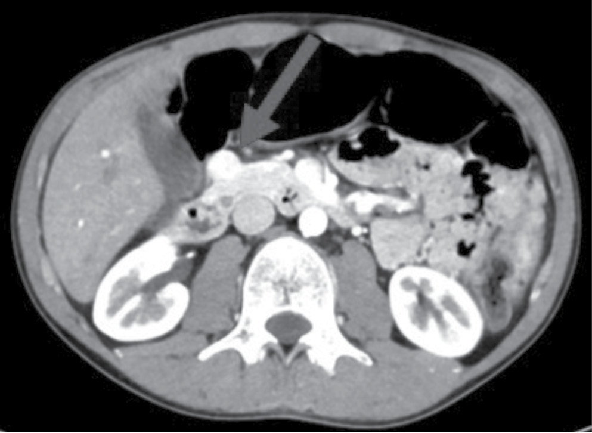
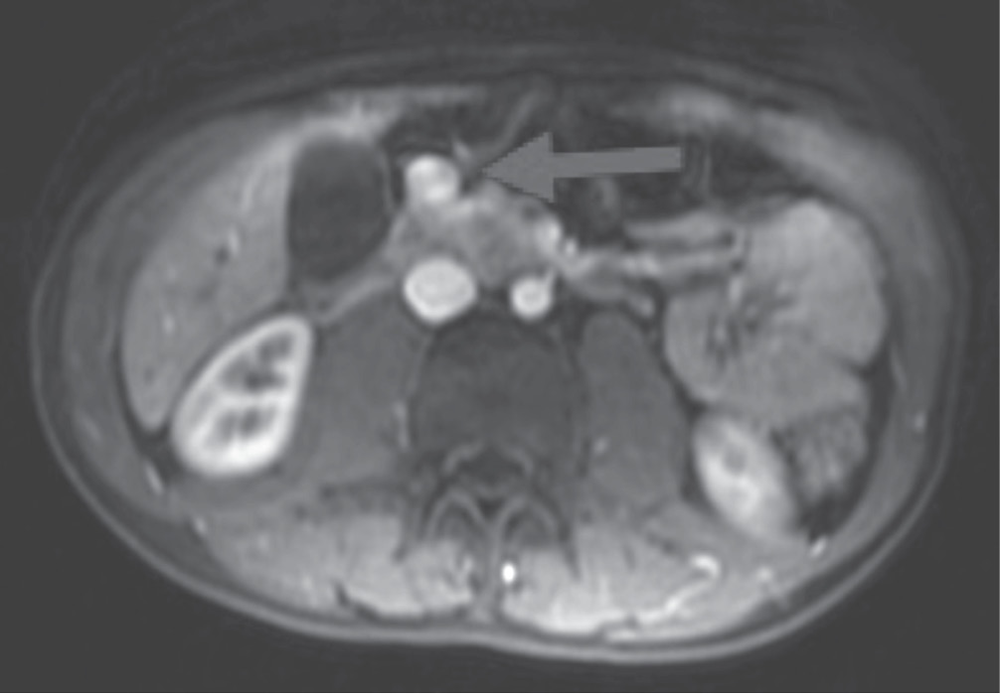
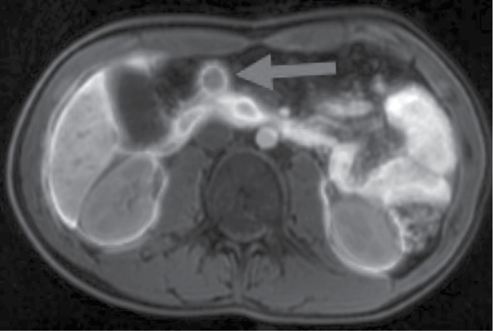
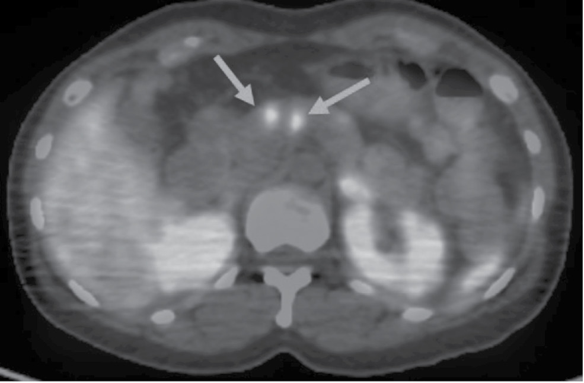
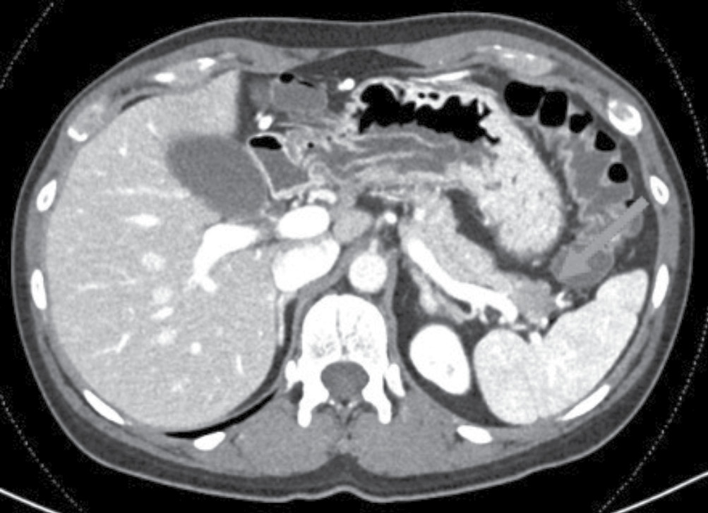
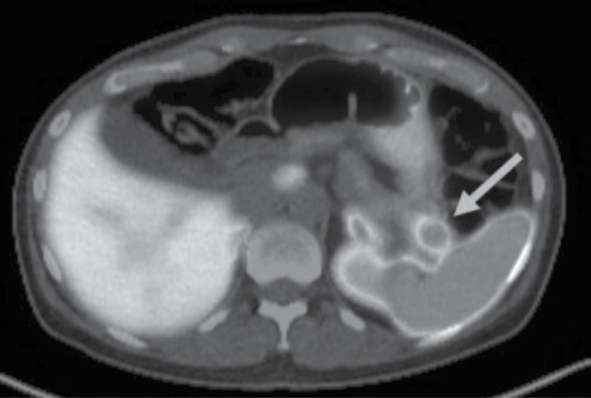

# Management of Duodeno­pancreatic Neuroendocrine Tumors in Patients With Multiple Endocrine Neoplasia Type 1
> **中文標題**：多發性內分泌腫瘤第一型（MEN1）患者之十二指腸胰臟神經內分泌腫瘤處置
> **分類 Category**：Tumor Biology
> **講者 Faculty**：Thorvardur (Thor) R. Halfdanarson, MD（Department of Oncology, Mayo Clinic, Rochester, Minnesota）; Omair A. Shariq, MBBS, PhD（Division of Endocrine Surgery, Department of Surgery, Mayo Clinic, Rochester, Minnesota）
> **來源 Source**：2026 Endocrine Case Management — Meet the Professor · ENDO 2026 · Endocrine Society

---

## 📋 教學目標 Educational Objectives

閱讀本章後，學習者應能：

- **Explain the importance of duodenopancreatic neuroendocrine tumors (DP-NETs) as a key manifestation of multiple endocrine neoplasia type 1 (MEN1) and a critical determinant of long-term prognosis.**
  說明 DP-NETs 作為 MEN1 關鍵表現，以及作為長期預後決定因子的重要性。

- **Guide the diagnostic approach for patients with DP-NETs and MEN1, including when to initiate screening for asymptomatic individuals.**
  指引 MEN1 合併 DP-NETs 患者的診斷策略，包括無症狀個案何時開始篩檢。

- **Review the therapeutic management of patients with MEN1-related DP-NETs, including regional therapy, medical therapy, and observation.**
  回顧 MEN1 相關 DP-NETs 患者的治療處置，包括 regional therapy、藥物治療與觀察追蹤。

---

## 🩺 臨床情境 Clinical Scenario

本章以兩則臨床案例貫穿 MEN1 相關 DP-NETs 的診斷、監測與處置決策。

**Case 1｜19 歲男性、嚴重低血糖**
A 19-year-old man is brought to the emergency department after being found unconscious in his car. On arrival of emergency medical services, his plasma glucose concentration was 21 mg/dL (參考範圍 70-99 mg/dL) (SI: 1.7 mmol/L [3.9-5.5 mmol/L]). Intravenous dextrose was administered with prompt resolution of symptoms. One year ago, he experienced a similar episode of severe hypoglycemia requiring intravenous dextrose. His family history is notable for MEN1 affecting his father, paternal uncle, and grandfather.
一名 19 歲男性因在車內失去意識被送至急診。EMS 到場時血漿葡萄糖僅 21 mg/dL（SI: 1.7 mmol/L），靜脈注射 dextrose 後症狀迅速緩解。一年前曾有類似嚴重低血糖並須靜脈給糖的病史。家族史顯示其父親、叔伯與祖父皆罹患 MEN1。影像上於胰臟體部發現 17 mm 顯影腫塊，68Ga-DOTATATE PET-MRI 顯示胰臟頭/頸部有一顯影強烈的外突性腫塊。臨床高度懷疑 insulinoma。

**Figure 1. Case 1 Abdominal CT（Case 1 腹部 CT）**

> 📎 Abdominal CT (arterial phase) showing an enhancing mass in the head/neck region of the pancreas.
>
> 腹部 CT（arterial phase），顯示胰臟 head/neck 區域一顯影腫塊。

**Figure 2. Case 1 Abdominal MRI（Case 1 腹部 MRI）**

> 📎 Abdominal MRI (arterial phase) showing an enhancing mass in the head/neck region of the pancreas.
>
> 腹部 MRI（arterial phase），顯示胰臟 head/neck 區域一顯影腫塊。

**Figure 3. Case 1 SSTR ( 68 Ga DOTATATE) PET-MRI（Case 1 SSTR PET-MRI）**

> 📎 SSTR ( 68 Ga DOTATATE) PET-MRI showing an SSTR-avid mass.
>
> SSTR（68Ga-DOTATATE）PET-MRI，顯示一 SSTR-avid 腫塊。

**Case 2｜35 歲女性、慢性腹瀉與高 gastrin 血症**
A 35-year-old woman with a strong family history of MEN1 presents with frequent loose stools and occasional diarrhea (up to 4-5 episodes daily) with intermittent heartburn. Fasting serum gastrin is 1120 pg/mL (reference range <100 pg/mL). Upper EUS reveals multiple small pancreatic masses, the largest 11 mm, and SSTR PET-CT confirms at least 3 small pancreatic NETs.
一名 35 歲女性，具強烈 MEN1 家族史，主訴頻繁稀便與偶發腹瀉（每日達 4-5 次）並間歇性火燒心。空腹血清 gastrin 為 1120 pg/mL（參考範圍 <100 pg/mL）。Upper EUS 顯示多發性小胰臟腫塊，最大 11 mm；SSTR PET-CT 證實至少 3 顆小型 pancreatic NET。臨床表現符合 gastrinoma 引起之 Zollinger-Ellison syndrome (ZES)。

**Figure 4. Case 2 SSTR PET-CT（Case 2 SSTR PET-CT，基準）**

> 📎 SSTR PET-CT showing 2 foci of avidity in the pancreatic body.
>
> SSTR PET-CT，顯示胰臟 body 兩處顯影焦點。

---

## 🔬 背景與重要性 Background & Significance

**MEN1 與 DP-NETs 的核心地位**
MEN1 is an inherited endocrine tumor syndrome classically characterized by parathyroid tumors, DP-NETs, and anterior pituitary adenomas.1 Patients are also predisposed to adrenocortical neoplasms, bronchial and thymic NETs, as well as tumors of the skin and central nervous system. Most individuals harbor a detectable germline pathogenic variant in the *MEN1* gene on chromosome 11q13, which encodes the tumor suppressor protein menin. The prevalence of MEN1 is estimated between 1 in 20,000 and 1 in 40,000, with equal sex distribution and no racial or ethnic predilection.2
MEN1 是一種遺傳性內分泌腫瘤症候群，典型三聯表現為 parathyroid tumors、DP-NETs 與 anterior pituitary adenomas。1 患者亦易發生 adrenocortical neoplasms、bronchial 與 thymic NETs，以及皮膚與中樞神經系統腫瘤。多數患者可檢出位於染色體 11q13 之 *MEN1* 基因 germline pathogenic variant，該基因編碼腫瘤抑制蛋白 menin。MEN1 盛行率估計為 1/20,000 至 1/40,000，男女比例相當，無種族偏好。

**流行病學與外顯率**
DP-NETs are the second most common manifestation of MEN1 and demonstrate progressive age-related penetrance, affecting up to 80% to 90% of individuals by the seventh decade, with a mean age at diagnosis in the early forties.1-3 The true prevalence is likely even higher, as many DP-NETs are small and undetectable on cross-sectional imaging.4 Historically, functional DP-NETs (insulinomas, gastrinomas) were thought to comprise most NETs in MEN1, but more recently—likely due to better detection—nonfunctional pancreatic NETs (NF-PNETs) have surpassed functional tumors. DP-NETs are the presenting manifestation of MEN1 in up to 20% of patients.1
DP-NETs 是 MEN1 第二常見的表現，具隨年齡漸增的外顯率，至第七個十年（70 歲前後）可影響高達 80% 至 90% 的患者，平均診斷年齡約在 40 歲出頭。1-3 由於許多 DP-NETs 體積小、cross-sectional imaging 無法偵測，真實盛行率可能更高。4 過去認為 functional DP-NETs（insulinoma、gastrinoma）佔多數，但近期（可能因偵測方法改善）NF-PNETs 的盛行率已超越 functional tumors。DP-NETs 在多達 20% 的患者中是 MEN1 的首發表現。

**兒童與青少年**
In one study, more than one-third of 80 children and adolescents with MEN1 who began screening before age 18 years were found to have DP-NETs.5 Most (>70%) had NF-PNETs, one-third had insulinomas, and a small minority (<5%) had gastrinomas. Insulinomas often present at a younger age (sometimes in the teenage years), whereas gastrinomas tend to present later, typically after age 30 years.6,7
一項研究中，80 名於 18 歲前開始篩檢的 MEN1 兒童與青少年，超過三分之一被發現有 DP-NETs。5 多數（>70%）為 NF-PNETs，三分之一為 insulinoma，少數（<5%）為 gastrinoma。Insulinoma 常於較年輕時（有時在青少年期）出現，而 gastrinoma 傾向較晚出現，通常在 30 歲之後。

**死亡率的演變**
DP-NETs remain the leading cause of death among patients with MEN1. Historically, gastrinomas with complications of ZES accounted for most DP-NET–related deaths, often due to refractory peptic ulcer disease causing upper GI hemorrhage and perforation.8 With proton-pump inhibitors (PPIs) effectively controlling acid production, life-threatening ZES complications have become rare. Presently, metastatic NF-PNETs account for most disease-related mortality. In a nationwide French cohort, life expectancy in MEN1 was approximately 15 years shorter than the general population (70 vs 85 years), though this gap is narrowing.9 In the same cohort, 59% of patients required at least 1 surgical intervention for DP-NETs by age 75 years, with 17% and 3% undergoing at least 2 and 3 operations, respectively.
DP-NETs 仍是 MEN1 患者的首要死因。過去 gastrinoma 併發 ZES 造成多數 DP-NET 相關死亡，常因難治性 peptic ulcer disease 導致上消化道出血與穿孔。8 隨著 PPIs 有效控制胃酸分泌，ZES 的致命併發症已變得罕見。目前 metastatic NF-PNETs 佔多數疾病相關死亡。根據法國全國性世代研究，MEN1 患者的預期壽命約較一般族群短 15 年（70 歲 vs 85 歲），但差距正逐漸縮小。9 同一世代中，59% 患者在 75 歲前至少需接受一次 DP-NET 手術，17% 與 3% 分別接受至少 2 次與 3 次手術。

---

## 🧭 診斷與評估 Diagnosis & Evaluation

### 影像診斷 Imaging

DP-NETs are typically diagnosed in individuals known to have MEN1 or through surveillance of at-risk family members. Diagnosis requires radiographic visualization of the tumor(s) and, for suspected functional tumors, selective biochemical/hormonal evaluation.4 Cross-sectional imaging usually identifies tumors larger than 2 to 3 mm; both CT and MRI are sensitive.10,11 When using CT, multiphasic (biphasic or triphasic contrast-enhanced) protocols are essential—monophasic (venous-phase-only) imaging may miss smaller lesions. Triphasic CT is generally reserved for preoperative planning when detailed assessment of peripancreatic vasculature is required, given longer acquisition times and increased radiation. For long-term surveillance, especially in younger patients, MRI is favored over CT to minimize cumulative radiation. Histological confirmation via EUS-guided biopsy is not required when presentation and imaging are characteristic.1
DP-NETs 通常在已知 MEN1 個案或高風險家族成員的監測中被診斷。診斷需影像可見腫瘤，若懷疑 functional tumor 則加做選擇性生化/荷爾蒙評估。4 Cross-sectional imaging 通常可偵測大於 2 至 3 mm 的腫瘤，CT 與 MRI 皆具敏感度。10,11 使用 CT 時，multiphasic（雙相或三相 contrast-enhanced）protocol 至關重要——單相（僅 venous phase）可能遺漏較小病灶。三相 CT 因取像時間較長、輻射較高，一般保留給須詳細評估 peripancreatic 血管的術前規劃。長期監測（尤其年輕患者）偏好 MRI 以減少累積輻射。當表現與影像具典型特徵時，不需 EUS-guided biopsy 進行組織確認。

> **臨床要點**：Most lesions demonstrate slow linear growth. Rarely, tumor grade transformation may occur, resulting in more rapid growth. Accelerated growth—especially a single lesion growing asynchronously with others—should prompt EUS evaluation with biopsy.
> 多數病灶呈緩慢線性成長。罕見情況下可發生 tumor grade transformation 導致快速成長。加速成長（尤其是與其他病灶不同步成長的單一病灶）應促使進行 EUS 併切片評估。

### Insulinoma 的生化診斷

In patients with insulinoma, diagnosis rests on documenting autonomous, endogenous insulin secretion—inappropriately elevated insulin, proinsulin, and C-peptide relative to the degree of hypoglycemia.12 The optimal hypoglycemia cutoff is debated; glucose levels below 45 mg/dL (<2.5 mmol/L) or 55 mg/dL (<3.0 mmol/L) are commonly used. A 72-hour fast is often required, though some experts advocate shorter-duration tests.13
Insulinoma 的診斷依據為記錄到自主性、內源性 insulin 分泌——即相對於低血糖程度，insulin、proinsulin 與 C-peptide 呈不當升高。12 最佳低血糖 cutoff 仍有爭議；臨床常用血糖低於 45 mg/dL（<2.5 mmol/L）或 55 mg/dL（<3.0 mmol/L）。多數情況需 72-hour fast，部分專家主張較短時程的檢測。13

Localizing insulinomas can be challenging. Most are visible on cross-sectional imaging with careful contrast timing.14 EUS can identify smaller lesions not seen on cross-sectional imaging and allows tissue sampling via FNA or FNB.15 Insulinomas almost invariably express the GLP-1 receptor, a target for nuclear imaging with GLP-1 receptor analogues such as exendin-4.16,17 However, GLP-1 PET imaging remains limited in availability, particularly in the United States.
Insulinoma 的定位具挑戰性。多數在精確掌握 contrast timing 的 cross-sectional imaging 上可見。14 EUS 可偵測 cross-sectional imaging 未見的較小病灶，並可經 FNA 或 FNB 取樣。15 Insulinoma 幾乎必然表現 GLP-1 receptor，可作為 GLP-1 receptor analogue（如 exendin-4）核子影像的標的。16,17 然而 GLP-1 PET 影像的可近性仍有限，尤其在美國。

### Gastrinoma 與 ZES 的診斷

ZES results from excessive gastrin secretion. Abdominal pain and diarrhea are the most common symptoms, each occurring in up to 75% of patients, followed by gastroesophageal reflux and peptic ulcer disease.18 Diagnosis requires confirmation of both a DP-NET and inappropriate gastrin production (elevated fasting gastrin).19
ZES 源於過度的 gastrin 分泌。腹痛與腹瀉是最常見症狀，各可見於多達 75% 患者，其次為 gastroesophageal reflux 與 peptic ulcer disease。18 診斷需同時確認 DP-NET 的存在與不當的 gastrin 分泌（fasting gastrin 升高）。19

> **診斷陷阱**：Although gastrin in ZES typically runs in the thousands, there is substantial overlap with chronic atrophic gastritis and PPI use, both of which cause secondary hypergastrinemia. In fact, most patients with gastrinoma have gastrin under 10-fold the upper limit of normal.20,21
> 雖然 ZES 的 gastrin 通常高達數千，但與 chronic atrophic gastritis 及 PPI 使用（皆造成次發性 hypergastrinemia）有大幅重疊。事實上，多數 gastrinoma 患者的 gastrin 未達正常上限的 10 倍。20,21

In patients suspected of gastrinoma and ZES, discontinuation of PPI therapy to estimate true gastrin production is **not recommended** due to the risk of bowel perforation from uncontrolled acid production. Secretin and calcium stimulation tests can improve diagnostic accuracy but are not widely available. Most gastrinomas arise within the "gastrinoma triangle" (bounded superiorly by the confluence of the cystic and common bile ducts, inferiorly by the second and third portions of the duodenum, and medially by the neck and body of the pancreas).22 MEN1-associated gastrinomas most commonly originate in the duodenum and are frequently small and multifocal.23
懷疑 gastrinoma 與 ZES 的患者，**不建議**為估計真實 gastrin 分泌而停用 PPI，因未受控的胃酸分泌有腸道穿孔風險。Secretin 與 calcium stimulation tests 可提升診斷準確度，但可近性有限。多數 gastrinoma 源於「gastrinoma triangle」（上界為 cystic duct 與 common bile duct 匯合處，下界為十二指腸第二、三段，內側為胰臟 neck 與 body）。22 MEN1 相關 gastrinoma 最常源於十二指腸，且常為小型與多發性。23

### 篩檢 Screening（2025 更新重點）

Current guidelines recommend routine screening for DP-NETs in individuals with MEN1. The most recent update (2025) introduced several refinements to reduce surveillance burden while maintaining sensitivity for clinically significant disease.1
現行指引建議 MEN1 患者常規篩檢 DP-NETs。2025 年最新更新引入多項調整，以在維持對臨床顯著疾病敏感度的同時降低監測負擔。1

| 項目 Item | 舊建議 Previous | 2025 更新 Update |
|---|---|---|
| 起始篩檢年齡 Age to begin imaging | 10 歲前 Before age 10 | 10-15 歲（15 歲前臨床相關 DP-NET 少見） |
| 首選影像 Preferred modality | CT、MRI 或 EUS | MRI |
| 影像頻率 Imaging frequency（無症狀、無已知 DP-NET） | 每年 Annually | 每 2-3 年 |
| Chromogranin A、pancreastatin、pancreatic polypeptide | 常規測量 | 不再建議（敏感度/專一性有限） |
| Insulinoma 生化篩檢 | 每年 fasting glucose/insulin | 改為症狀導向（自 5 歲起，出現低血糖症狀才檢測） |
| Fasting serum gastrin | — | 成人監測時仍建議每年測量 |

Because most DP-NETs are nonfunctional, screening relying solely on biochemical markers is inadequate and fails to detect most tumors.
由於多數 DP-NETs 為 nonfunctional，僅依賴生化標記的篩檢並不足夠，會遺漏多數腫瘤。

---

## 💊 治療與處置 Management

### 小型 NF-PNET 的監測 Monitoring Small NF-PNETs

Most patients with MEN1 and NF-PNETs harbor small, multifocal tumors that can be monitored without immediate intervention. Current guidelines recommend active surveillance for tumors 2 cm or smaller.1-3 Cross-sectional imaging (CT or MRI) is typically repeated 6 to 12 months after initial diagnosis; if stable, annual imaging during the first few years is reasonable, with subsequent intervals individualized. For lesions ≤2 cm growing less than 1 mm per year, extending imaging intervals to every 1 to 2 years is appropriate. Larger lesions, high-grade tumors, or accelerated growth warrant closer monitoring. MRI is preferred long-term to avoid ionizing radiation. Somatostatin receptor PET and EUS are now reserved for specific scenarios where results would meaningfully alter management (rapid growth, diagnostic uncertainty, or preoperative planning).
多數 MEN1 合併 NF-PNETs 的患者為小型、多發性腫瘤，可監測而不需立即介入。現行指引建議對 ≤2 cm 腫瘤採 active surveillance。1-3 Cross-sectional imaging（CT 或 MRI）通常於初診斷後 6 至 12 個月重複；若穩定，前幾年每年影像追蹤合理，之後間隔依腫瘤行為個別化。對 ≤2 cm 且每年成長 <1 mm 的病灶，將影像間隔延長至每 1 至 2 年是適當的。較大病灶、high-grade tumors 或加速成長者需更密切監測。長期以 MRI 為首選以避免游離輻射。Somatostatin receptor PET 與 EUS 現保留給結果會顯著改變處置的特定情境（快速成長、診斷不確定或術前規劃）。

### 手術切除 Surgical Resection

The optimal timing and extent of surgery for MEN1-associated NF-PNETs remain controversial. Consensus guidelines generally recommend resection for tumors 2 cm or larger and for smaller lesions with significant interval growth, reflecting data correlating tumor size with distant metastatic risk.1,2 However, recent data show a subset of tumors smaller than 2 cm may still metastasize, indicating size alone does not fully reflect tumor biology.24 There is an unmet need for noninvasive biomarkers to predict aggressive behavior.
MEN1 相關 NF-PNETs 的最佳手術時機與範圍仍有爭議。共識指引一般建議對 ≥2 cm 腫瘤及有顯著間隔成長的較小病灶進行切除，此反映腫瘤大小與遠端轉移風險的相關資料。1,2 然而近期資料顯示部分 <2 cm 的腫瘤仍可能轉移，代表大小本身無法完全反映腫瘤生物學。24 目前缺乏可預測侵襲性行為的非侵入性 biomarker。

**手術範圍的取捨**
Procedures range from parenchymal-sparing enucleation to formal resections (pancreatoduodenectomy [Whipple] or distal pancreatectomy). Earlier philosophy favored aggressive resection (the "Thompson"/"Ann Arbor" procedure, combining distal pancreatectomy, enucleation of pancreatic head lesions, regional lymphadenectomy, and duodenotomy in ZES).25 However, despite aggressive resection, recurrence and reintervention remain frequent,26 and substantial morbidity—pancreatic exocrine insufficiency and pancreatogenic (type 3c) diabetes—occurs in a significant proportion.27 Total pancreatectomy is generally avoided as an index procedure unless dictated by diffuse advanced disease. A more conservative strategy prioritizes minimal resection to preserve pancreatic function, with organ-sparing reoperation if recurrence occurs—supported by comparable morbidity between primary and repeat resections and observations that some patients may not require reoperation for decades.28
術式範圍從保留實質的 enucleation 到較大的正規切除（pancreatoduodenectomy [Whipple] 或 distal pancreatectomy）。早期理念偏好積極切除（「Thompson」/「Ann Arbor」術式，結合 distal pancreatectomy、胰頭病灶 enucleation、regional lymphadenectomy 及 ZES 時的 duodenotomy）。25 然而即使積極切除，復發與再介入仍頻繁，26 且相當比例患者發生顯著併發症——pancreatic exocrine insufficiency 與 pancreatogenic（type 3c）diabetes。27 Total pancreatectomy 除非因瀰漫性晚期疾病所需，一般不作為首次術式。較保守的策略優先以最小切除保留胰臟功能，復發時再行 organ-sparing 手術——此策略獲以下證據支持：初次與重複切除的併發症率相當，且部分患者初次手術後數十年可能不需再手術。28

**Functional tumors 的手術共識**
In contrast to NF-PNETs, there is greater consensus on functioning DP-NETs. Most experts recommend resection for localized insulinomas, VIPomas, glucagonomas, and somatostatinomas, given the morbidity of uncontrolled hormone excess. Gastrinoma management remains controversial: since PPIs usually control acid hypersecretion, the rationale for surgery is to reduce metastatic risk rather than control symptoms. Because most MEN1-associated gastrinomas are small, multifocal, and duodenal, durable biochemical cure may be unachievable; many centers favor a nonoperative approach unless tumors are 2 cm or larger. Some groups advocate more aggressive surgery when the biochemical diagnosis is unequivocal and distant metastases are absent.29
相較於 NF-PNETs，functioning DP-NETs 的共識較高。多數專家建議對局部 insulinomas、VIPomas、glucagonomas 與 somatostatinomas 進行切除，因未受控的荷爾蒙過量會造成病態。Gastrinoma 的處置仍具爭議：由於 PPIs 通常可控制胃酸過度分泌，手術理由在於降低轉移風險而非控制症狀。由於多數 MEN1 相關 gastrinoma 為小型、多發且源於十二指腸，持久的生化治癒可能無法達成；許多中心偏好非手術策略，除非腫瘤 ≥2 cm。部分團隊主張在生化診斷明確且無遠端轉移時採較積極手術。29

### 全身性治療以控制功能性症候群 Systemic Therapy for Functional Syndromes

A minority of patients develop functional DP-NETs causing hormone-mediated syndromes—most commonly insulinoma and ZES—both potentially life-threatening. When surgery is not feasible, systemic therapy is often required.
少數患者發生造成荷爾蒙介導症候群的 functional DP-NETs——最常見為 insulinoma 與 ZES——兩者皆可能致命。當手術不可行時，常需全身性治療。

**Insulinoma 低血糖的處置（依序）**12,30,31
- **飲食 Diet**：Frequent meals/snacks including bedtime snacks rich in slow-digesting carbohydrates for mild symptoms. 輕微症狀者以頻繁進食/點心（含富含慢消化碳水化合物的睡前點心）控制。
- **Diazoxide**：Frequently used but limited by fluid retention, nausea, and anorexia; in the authors' experience most patients can be managed without it. 常用但受 fluid retention、噁心與厭食限制；作者經驗多數患者可不用 diazoxide 而妥善處理。
- **Somatostatin analogues (SSAs)**：Can control hypoglycemia and tumor growth, but rarely can paradoxically exacerbate hypoglycemia by suppressing counterregulatory glucagon.32 Pasireotide may be most effective at controlling hypoglycemia, though limited by treatment-related hyperglycemia.33 可控制低血糖與腫瘤成長，但罕見情況下會因抑制 counterregulatory glucagon 而矛盾性地加重低血糖。32 Pasireotide 可能最能控制低血糖，但受治療相關 hyperglycemia 限制。33
- **Glucocorticoids**：Transient relief only; adverse effects preclude long-term use. 僅暫時緩解；不良反應排除長期使用。
- **Everolimus (mTOR inhibitor)**：Controls both tumor growth and hypoglycemia; useful especially in advanced disease.34,35 可同時控制腫瘤成長與低血糖，尤其在晚期疾病有用。
- **Radioligand therapy（如 177Lu-DOTATATE）**：Effective and safe for controlling refractory hypoglycemia and tumor growth in metastatic insulinoma; generally reserved for advanced, metastatic NETs.36 對 metastatic insulinoma 的難治性低血糖與腫瘤成長有效且安全；一般保留給晚期、轉移性 NETs。
- **Ersodetug**：A humanized monoclonal antibody targeting the insulin receptor, an investigational therapy for refractory hypoglycemia, currently in a prospective randomized trial (NCT06881992).37 標靶 insulin receptor 的人源化單株抗體，為難治性低血糖的試驗性療法，目前進行前瞻性隨機試驗（NCT06881992）。

Patients with severe, recurrent hypoglycemia may require hospitalization and intravenous dextrose infusion.
嚴重、反覆低血糖的患者可能需住院並靜脈輸注 dextrose。

### 全身性治療以控制腫瘤成長 Systemic Therapy for Tumor Growth

Evidence guiding systemic therapy for tumor control in MEN1-associated DP-NETs is sparse. SSAs (octreotide LAR, lanreotide) have antitumor and symptom-control activity in advanced NETs outside MEN1. The PROMID and CLARINET randomized trials confirmed antitumor efficacy of SSAs in gastroenteropancreatic NETs, though only CLARINET included pancreatic NETs.38
指引 MEN1 相關 DP-NETs 全身性腫瘤控制治療的證據稀少。SSAs（octreotide LAR、lanreotide）在非 MEN1 的晚期 NETs 具抗腫瘤與症狀控制活性。PROMID 與 CLARINET 隨機試驗證實 SSAs 對 gastroenteropancreatic NETs 的抗腫瘤療效，但僅 CLARINET 納入 pancreatic NETs。38

In a nonrandomized prospective observational study of 42 patients with one or more pancreatic NET ≤2 cm, 23 received lanreotide and 19 underwent active surveillance. Median progression-free survival was significantly longer with lanreotide than observation (not reached vs 40 months).41 While suggesting biologic activity, the small sample size and nonrandomized design limit definitive conclusions.
一項納入 42 名有一顆以上 ≤2 cm pancreatic NET 患者的非隨機前瞻性觀察研究中，23 名接受 lanreotide、19 名採 active surveillance。Lanreotide 組的 median progression-free survival 顯著長於觀察組（尚未達到 vs 40 個月）。41 雖顯示生物活性，但樣本數小與非隨機設計限制了確定性結論。

> **關鍵立場**：SSAs should not be considered standard therapy for patients with small but slowly progressive DP-NETs in MEN1, but may be considered in highly select cases. Systemic therapy other than SSAs has not been studied in localized but progressive DP-NETs and is not recommended. Systemic therapy for advanced/metastatic NETs in MEN1 should follow the same paradigms as non-MEN1 patients.30,44,45
> SSAs 不應被視為 MEN1 中小型但緩慢進展 DP-NETs 患者的標準療法，但可在高度篩選的個案中考慮。SSAs 以外的全身性治療未在局部但進展性 DP-NETs 中研究，不建議使用。MEN1 的晚期/轉移性 NETs 全身性治療應遵循與非 MEN1 患者相同的準則。

### 切除以外的 Regional Therapy

In patients not suitable for operative intervention, ablative and radiation therapies may be considered after multidisciplinary evaluation. EUS-guided ablation (ethanol injection or radiofrequency ablation) is safe and effective in insulinoma and other pancreatic NETs, but outcomes appear inferior to minimally invasive resection.46,47 Duodenal NETs are usually not suitable for ablation, but endoscopic resection is appropriate for carefully selected patients.48,49 External-beam radiotherapy has activity in well-differentiated NETs and can be considered for locally progressive tumors when other interventions are not feasible; proximity to upper abdominal viscera (especially the duodenum) poses challenges, and risk may outweigh benefit. Decisions require multidisciplinary discussion and delivery by an experienced high-volume team.50,51
對不適合手術的患者，可在多學科評估後考慮 ablative 與 radiation therapies。EUS-guided ablation（ethanol injection 或 radiofrequency ablation）對 insulinoma 及其他 pancreatic NETs 安全有效，但成效似乎不及 minimally invasive resection。46,47 十二指腸 NETs 通常不適合 ablation，但 endoscopic resection 適用於審慎篩選的患者。48,49 External-beam radiotherapy 對 well-differentiated NETs 有活性，可在其他介入不可行時考慮用於局部進展腫瘤；鄰近上腹臟器（尤其十二指腸）帶來挑戰，風險可能超過效益。決策需多學科討論並由經驗豐富的高量中心團隊執行。

---

## 🧠 個案解析與臨床推理 Case Analysis & Clinical Reasoning

### Case 1：年輕 insulinoma 患者的治療與監測決策

**問題一：確診 insulinoma 後的下一步？ → 答案 C（轉介具胰臟手術專長的外科醫師考慮切除）**
此患者符合 Whipple triad（記錄到症狀性低血糖並在靜脈給糖後迅速緩解），加上影像定位到胰臟病灶、兩次嚴重症狀性低血糖與強烈 MEN1 家族史，insulinoma 診斷高度可能。Surgical resection 是根治性療法，適用於局部疾病的健康患者。雖然切片並非不合理，但此患者需要對 functional insulinoma 進行介入以防止進一步低血糖。Diazoxide 合理，但因此患者的 insulin 分泌極為陣發性，需更根治的治療。EUS-guided ethanol ablation 用於選定個案（尤其切除不可行或非手術候選者）。鑑於此年輕男性健康狀況極佳，建議切除 pancreatic NET。

**問題二：後續 DP-NETs 監測策略？ → 答案 B（每年 fasting gastrin + 腹部 MRI with contrast）**
最適當的追蹤為每年 cross-sectional imaging（MRI 或 CT），年輕患者偏好 MRI 以避免輻射。實驗室方面，除 gastrin 外不需其他 functional tumor markers（此案因家族有 ZES 史，gastrin 更為重要）。非特異性標記如 chromogranin A、pancreastatin、pancreatic polypeptide 缺乏敏感度與專一性。Insulin、proinsulin、C-peptide 除非在低血糖發作時否則無資訊價值。Upper EUS 影像佳但屬侵入性、需深度鎮靜，一般不需要（若日後胰臟影像出現異常可考慮）。SSTR PET 不建議用於監測（證據有限且有輻射）。鑑於高復發風險，不追蹤並不適當。

**問題三：Metastatic、無法切除的 malignant insulinoma 且持續低血糖，何種全身性治療最能持久控制症狀與腫瘤？ → 答案 E（Radioligand therapy，如 177Lu-DOTATATE）**
在 metastatic malignant insulinoma，全身治療目標為同時控制低血糖與腫瘤成長。可行時偏好 regional therapy（手術減積或 liver-directed therapy 如 hepatic artery embolization）。當 regional therapy 不可行時，systemic therapy 可有效控制症候群與腫瘤進展。標靶 somatostatin receptor 的 radioligand therapy（如 177Lu-DOTATATE）為極有效選項，可控制超過 90% 患者的低血糖，常帶來可維持數年的腫瘤退縮或穩定。Everolimus 可有效控制低血糖但腫瘤控制期間不如 radioligand therapy 持久。SSAs 可控制低血糖但不如 radioligand therapy 有效（pasireotide 可能最有效）。Diazoxide 可控制低血糖但常伴顯著不良反應且不控制腫瘤成長。Cabozantinib 可延緩已治療 pancreatic NETs 的腫瘤成長但無助於低血糖。

### Case 2：多發性 gastrinoma 與 grade 進展的警訊

**問題一：確認 ZES 後的下一步？ → 答案 A（開始每日兩次 PPI，監測症狀，6-12 個月後 cross-sectional imaging 與 fasting gastrin）**
此患者有多發性 pancreatic NETs 併符合 functional gastrinoma 與 ZES 的症狀。其 fasting gastrin 在「gastrinoma range」（>1000 pg/mL），雖 gastrin 與 ZES 症狀相關性不完美。鑑於腹瀉與偶發火燒心，建議開始每日兩次 PPI。使用 omeprazole 40 mg 每日兩次一週後，腹瀉與火燒心完全緩解，支持 ZES 診斷。未處理 ZES 即重複影像不建議（有 gastroduodenal perforation 等併發症風險）。持續 PPI 並於 6-12 個月後重複 cross-sectional imaging 是合理的。無需重複 EUS 取組織，因臨床強烈提示 pancreatic NET。基準時不建議 SSA 治療，因多數 MEN1 相關 pancreatic NETs 極為 indolent。鑑於腫瘤小，此時無手術角色。

**問題二：7 年追蹤後胰尾出現新的 2-cm 腫塊，最佳下一步？ → 答案 D（重複 upper EUS 併胰尾腫塊切片）**

**Figure 5. Case 2 CT of the Abdomen and Pelvis（Case 2 腹部與骨盆 CT）**

> 📎 CT of the abdomen and pelvis showing a pancreatic tail mass.
>
> 腹部與骨盆 CT，顯示胰尾（pancreatic tail）腫塊。

**Figure 6. Case 2 SSTR PET-CT（Case 2 SSTR PET-CT，追蹤）**

> 📎 SSTR PET-CT showing an SSTR-avid pancreatic tail mass.
>
> SSTR PET-CT，顯示一 SSTR-avid 的胰尾腫塊。

此情境明顯偏離已知 pancreatic NETs 的 indolent 病程，提示更具侵襲性的生物學。Upper EUS 顯示 well-differentiated grade 3 pancreatic NET，Ki-67 index 為 28%。鑑於此腫塊自 12 個月前影像後才出現，僅觀察並不適當。未確認診斷即進行 distal pancreatectomy 不建議——雖非 MEN1 相關診斷，pancreatic adenocarcinoma 可呈類似表現。在無切片確認診斷前，以 SSA 或 radioligand therapy 進行全身治療並不適當。此患者經 staging 後轉介 hepato-pancreato-biliary 外科並接受 distal pancreatectomy，惜後續發生 metastatic recurrence 而需全身治療。此案闡明 MEN1 與 DP-NETs 罕見的 tumor grade progression 風險——多數患者病程極 indolent，但罕見情況會發生 grade transformation 併更具侵襲性的臨床進展，此時幾乎總是需切片確認。

### 常見陷阱 Pitfalls

- **Gastrin 判讀**：切勿為驗證診斷而停 PPI（穿孔風險）；且 gastrin 升高幅度與 ZES 嚴重度相關性不佳，chronic atrophic gastritis 與 PPI 皆可造成次發性 hypergastrinemia。
- **腫瘤大小的迷思**：<2 cm 不代表零轉移風險；grade transformation 雖罕見但可致命，加速或不同步成長是切片的關鍵指標。
- **過度手術**：積極的全胰切除帶來 type 3c diabetes 與 exocrine insufficiency；MEN1 為終身傾向，須權衡器官功能保留。
- **非特異性標記**：chromogranin A、pancreastatin、pancreatic polypeptide 敏感度/專一性不足，不應用於常規監測。

---

## ⭐ 重點整理 Key Takeaways

- DP-NETs 是 MEN1 第二常見的表現，至 70 歲前可影響高達 90% 患者，且是 MEN1 的首要死因；精準診斷與結構化監測至關重要（**DP-NETs, MEN1, leading cause of death**）。
- DP-NETs 監測通常於 10 至 16 歲間開始，但 15 歲前臨床相關 DP-NET 少見；成人偏好 **abdominal MRI**；不建議使用 **chromogranin A** 等非特異性標記；**EUS** 雖較 cross-sectional imaging 敏感但非常規需要。
- 多數 <2 cm 的 **NF-PNETs** 建議觀察，但腫瘤大小無法完全預測 malignant potential，且缺乏經驗證的侵襲性 biomarker。
- 多數觀察中的 NF-PNETs 每年影像適當；對 ≤2 cm 且成長 <1 mm/y 者可延長至每 2 年一次。
- 手術須平衡 oncologic control 與胰臟內外分泌功能保留；可行時採 parenchyma-sparing（**enucleation** 或有限切除）；局部 **insulinoma** 多建議切除，但小型 **gastrinoma** 在 PPI 妥善控制胃酸下常可觀察。
- 無法切除或行 regional therapy 的晚期 DP-NETs 建議全身治療；**SSAs** 常為第一線，但對局部進展 DP-NETs 的角色不明；晚期疾病遵循非 MEN1 準則。
- **Radioligand therapy（177Lu-DOTATATE）**可控制超過 90% metastatic malignant insulinoma 患者的低血糖並持久控制腫瘤；ablative therapies 與 hepatic artery embolization、radiotherapy 可經 multidisciplinary tumor board 討論後考慮。

---

## 💬 討論問題 Discussion Questions

1. 面對一名 25 歲、germline *MEN1* variant 已確認、胰臟有數顆 <1 cm NF-PNET 的無症狀患者，你會如何與其溝通「觀察 vs 早期介入」的取捨？在何種影像變化下你會改變策略？
2. 2025 MEN1 指引將 chromogranin A、pancreastatin、pancreatic polypeptide 移出常規監測。在你的臨床脈絡中，這對既有追蹤流程與病人焦慮管理有何影響？
3. MEN1 相關 gastrinoma 的手術與否至今爭議：在「biochemical cure 難達成」與「降低轉移風險」之間，你認為哪些臨床特徵（腫瘤大小、位置、grade、家族表型）應主導決策？
4. Case 2 顯示罕見的 grade transformation。臨床上你會用哪些線索（成長速率、不同步成長、SSTR avidity 變化）決定何時該中止觀察而進行 EUS 切片？
5. 在缺乏針對 MEN1-DP-NETs 的前瞻性隨機試驗下，你如何向病人解釋 SSAs 對小型緩慢進展腫瘤「非標準治療但可選擇性考慮」的證據不確定性與成本考量？

---

## 📚 參考文獻 References

1. Brandi ML, Pieterman CRC, English KA, et al. Multiple endocrine neoplasia type 1 (MEN1): recommendations and guidelines for best practice. *Lancet Diabetes Endocrinol*. 2025;13(8):699-721. PMID: 40523372
2. Del Rivero J, Gangi A, Annes JP, et al. American Association of Clinical Endocrinology Consensus Statement on Management of Multiple Endocrine Neoplasia Type 1. *Endocr Pract*. Published online March 26, 2025. PMID: 40232217
3. Goudet P, Cadiot G, Barlier A, et al. French guidelines from the GTE, AFCE and ENDOCAN-RENATEN (Groupe d'étude des Tumeurs Endocrines/Association Francophone de Chirurgie Endocrinienne/Reseau national de prise en charge des tumeurs endocrines) for the screening, diagnosis and management of Multiple Endocrine Neoplasia Type 1. *Ann Endocrinol (Paris)*. 2024;85(1):2-19. PMID: 37739121
4. Niederle B, Selberherr A, Bartsch DK, et al. Multiple Endocrine Neoplasia Type 1 and the Pancreas: Diagnosis and Treatment of Functioning and Non-Functioning Pancreatic and Duodenal Neuroendocrine Neoplasia within the MEN1 Syndrome - An International Consensus Statement. *Neuroendocrinology*. 2021;111(7):609-630. PMID: 32971521
5. Shariq OA, Lines KE, English KA, et al. Multiple endocrine neoplasia type 1 in children and adolescents: Clinical features and treatment outcomes. *Surgery*. 2022;171(1):77-87. PMID: 34183184
6. Gibril F, Venzon DJ, Ojeaburu JV, Bashir S, Jensen RT. Prospective study of the natural history of gastrinoma in patients with MEN1: definition of an aggressive and a nonaggressive form. *J Clin Endocrinol Metab*. 2001;86(11):5282-5293. PMID: 11701693
7. van Beek DJ, Nell S, Pieterman CRC, et al. Prognostic factors and survival in MEN1 patients with gastrinomas: Results from the DutchMEN study group (DMSG). *J Surg Oncol*. 2019;120(6):966-975. PMID: 31401809
8. Yates CJ, Newey PJ, Thakker RV. Challenges and controversies in management of pancreatic neuroendocrine tumours in patients with MEN1. *Lancet Diabetes Endocrinol*. 2015;3(11):895-905. PMID: 26165399
9. Gaujoux S, Martin GL, Mirallié E, et al. Life expectancy and likelihood of surgery in multiple endocrine neoplasia type 1: AFCE and GTE cohort study. *Br J Surg*. 2022;109(9):872-879. PMID: 35833229
10. Rupe E, Diab M, Xoubi L, et al. Imaging update of pancreatic neuroendocrine neoplasms. *Semin Roentgenol*. 2025;60(1):31-43. PMID: 39914907
11. Sakellis C, Jacene HA. Neuroendocrine tumors: diagnostics. *PET Clin*. 2024;19(3):325-339. PMID: 38714399
12. Hofland J, Refardt JC, Feelders RA, Christ E, de Herder WW. Approach to the patient: insulinoma. *J Clin Endocrinol Metab*. 2024;109(4):1109-1118. PMID: 37925662
13. Mikovic N, Mazzilli R, Zamponi V, et al. Short fasting test as a reliable and effective tool to diagnose insulinoma. *Endocrine*. 2024;84(3):1258-1263. PMID: 38451386
14. Yang Y, Shi J, Zhu J. Diagnostic performance of noninvasive imaging modalities for localization of insulinoma: a meta-analysis. *Eur J Radiol*. 2021;145:110016. PMID: 34763145
15. Wang H, Ba Y, Xing Q, Du JL. Diagnostic value of endoscopic ultrasound for insulinoma localization: a systematic review and meta-analysis. *PLoS One*. 2018;13(10):e0206099. PMID: 30352083
16. Qi-Chang W, Lan W, Bin J. Diagnostic performance of exendin-4 PET/CT in localizing insulinomas: a systematic review and meta-analysis. *Acad Radiol*. 2025;32(12):7526-7536. PMID: 41033966
17. Aveline C, Rusu T, Montravers F, et al. 68 Ga-NODAGA-EXENDIN-4 PET/CT in the detection or the exclusion of occult sporadic insulinomas. *Clin Nucl Med*. 2025;50(12):1109-1119. PMID: 41223138
18. Roy PK, Venzon DJ, Shojamanesh H, et al. Zollinger-Ellison syndrome. Clinical presentation in 261 patients. *Medicine (Baltimore)*. 2000;79(6):379-411. PMID: 11144036
19. Jensen RT, Ramos-Alvarez I, Norton JA. Current medical controversies in Zollinger-Ellison syndrome. *Biomedicines*. 2025;13(12):3051. PMID: 41463062
20. Berna MJ, Hoffmann KM, Serrano J, Gibril F, Jensen RT. Serum gastrin in Zollinger-Ellison syndrome: I. Prospective study of fasting serum gastrin in 309 patients from the National Institutes of Health and comparison with 2229 cases from the literature. *Medicine (Baltimore)*. 2006;85(6):295-330. PMID: 17108778
21. Metz DC, Cadiot G, Poitras P, Ito T, Jensen RT. Diagnosis of Zollinger-Ellison syndrome in the era of PPIs, faulty gastrin assays, sensitive imaging and limited access to acid secretory testing. *Int J Endocr Oncol*. 2017;4(4):167-185. PMID: 29326808
22. Norton JA, Fraker DL, Alexander HR, et al. Surgery to cure the Zollinger-Ellison syndrome. *N Engl J Med*. 1999;341(9):635-644. PMID: 10460814
23. Chatzipanagiotou O, Schizas D, Vailas M, et al. All you need to know about gastrinoma today | Gastrinoma and Zollinger-Ellison syndrome: a thorough update. *J Neuroendocrinol*. 2023;35(4):e13267. PMID: 37042078
24. Liu JB, Cai J, Dhir M, et al. Long-term outcomes for patients with multiple endocrine neoplasia type 1 and duodenopancreatic neuroendocrine neoplasms. *Ann Surg Oncol*. 2022;29(12):7808-7817. PMID: 35963905
25. Hausman MS Jr, Thompson NW, Gauger PG, Doherty GM. The surgical management of MEN-1 pancreatoduodenal neuroendocrine disease. *Surgery*. 2004;136(6):1205-1211. PMID: 15657577
26. Gauger PG, Doherty GM, Broome JT, Miller BS, Thompson NW. Completion pancreatectomy and duodenectomy for recurrent MEN-1 pancreaticoduodenal endocrine neoplasms. *Surgery*. 2009;146(4):801-808. PMID: 19789041
27. Nell S, Borel Rinkes IHM, Verkooijen HM, et al. Early and late complications after surgery for MEN1-related nonfunctioning pancreatic neuroendocrine tumors. *Ann Surg*. 2018;267(2):352-356. PMID: 27811505
28. Albers MB, Manoharan J, Bollmann C, Chlosta MP, Holzer K, Bartsch DK. Results of duodenopancreatic reoperations in multiple endocrine neoplasia type 1. *World J Surg*. 2019;43(2):552-558. PMID: 30288555
29. Lopez CL, Falconi M, Waldmann J, et al. Partial pancreaticoduodenectomy can provide cure for duodenal gastrinoma associated with multiple endocrine neoplasia type 1. *Ann Surg*. 2013;257(2):308-314. PMID: 22580937
30. Hofland J, Falconi M, Christ E, et al. European Neuroendocrine Tumor Society 2023 guidance paper for functioning pancreatic neuroendocrine tumour syndromes. *J Neuroendocrinol*. 2023;35(8):e13318. PMID: 37578384
31. Howarth S, Ho TW, Wimbury J, Casey R. Managing hypoglycaemia in patients with insulinoma-a tertiary centre experience and review of the literature. *Clin Endocrinol (Oxf)*. 2025;102(3):344-354. PMID: 39740208
32. Gama R, Marks V, Wright J, Teale JD. Octreotide exacerbated fasting hypoglycaemia in a patient with a proinsulinoma; the glucostatic importance of pancreatic glucagon. *Clin Endocrinol (Oxf)*. 1995;43(1):117-122. PMID: 7641403
33. Vega-Beyhart A, Biagetti B, Marazuela M, Puig-Domingo M, Araujo-Castro M. Efficacy and safety of pasireotide in insulinoma-associated hypoglycemia. *J Clin Endocrinol Metab*. 2025;110(7):e2109-e2120. PMID: 40165498
34. Kulke MH, Bergsland EK, Yao JC. Glycemic control in patients with insulinoma treated with everolimus. *N Engl J Med*. 2009;360(2):195-197. PMID: 19129539
35. Brown E, Watkin D, Evans J, Yip V, Cuthbertson DJ. Multidisciplinary management of refractory insulinomas. *Clin Endocrinol (Oxf)*. 2018;88(5):615-624. PMID: 29205458
36. Koch R, McGarrah PW, Vella A, et al. Comparative efficacy of systemic therapies in malignant insulinoma. *Endocr Relat Cancer*. 2025;32(6):e250091. PMID: 40439997
37. Osataphan S, Vamvini M, Rosen ED, et al. Anti-insulin receptor antibody for malignant Insulinoma and refractory hypoglycemia. *N Engl J Med*. 2023;389(8):767-769. PMID: 37611129
38. Caplin ME, Pavel M, Ćwikła JB, et al. Lanreotide in metastatic enteropancreatic neuroendocrine tumors. *N Engl J Med*. 2014;371(3):224-233. PMID: 25014687
39. La Salvia A, Sesti F, Grinzato C, et al. Somatostatin analogue therapy in MEN1-related pancreatic neuroendocrine tumors from evidence to clinical practice: a systematic review. *Pharmaceuticals (Basel)*. 2021;14(10):1039. PMID: 34681263
40. Cioppi F, Cianferotti L, Masi L, Giusti F, Brandi ML. The LARO-MEN1 study: a longitudinal clinical experience with octreotide long-acting release in patients with multiple endocrine neoplasia type 1 syndrome. *Clin Cases Miner Bone Metab*. 2017;14(2):123-130. PMID: 29263719
41. Faggiano A, Modica R, Lo Calzo F, et al. Lanreotide therapy vs active surveillance in MEN1-related pancreatic neuroendocrine tumors < 2 centimeters. *J Clin Endocrinol Metab*. 2020;105(1):dgz007. PMID: 31586182
42. Oleinikov K, Uri I, Jacob H, et al. Long-term outcomes in MEN-1 patients with pancreatic neuroendocrine neoplasms: an Israeli specialist center experience. *Endocrine*. 2020;68(1):222-229. PMID: 32036501
43. Ramundo V, Del Prete M, Marotta V, et al. Impact of long-acting octreotide in patients with early-stage MEN1-related duodeno-pancreatic neuroendocrine tumours. *Clin Endocrinol (Oxf)*. 2014;80(6):850-855. PMID: 24443791
44. Del Rivero J, Perez K, Kennedy EB, et al. Systemic therapy for tumor control in metastatic well-differentiated gastroenteropancreatic neuroendocrine tumors: ASCO guideline. *J Clin Oncol*. 2023;41(32):5049-5067. PMID: 37774329
45. Kos-Kudła B, Castaño JP, Denecke T, et al. European Neuroendocrine Tumour Society (ENETS) 2023 guidance paper for nonfunctioning pancreatic neuroendocrine tumours. *J Neuroendocrinol*. 2023;35(12):e13343. PMID: 37877341
46. Xiao D, Zhu L, Xiong S, et al. Outcomes of endoscopic ultrasound-guided ablation and minimally invasive surgery in the treatment of pancreatic insulinoma: a systematic review and meta-analysis. *Front Endocrinol (Lausanne)*. 2024;15:1367068. PMID: 38645424
47. Khoury T, Sbeit W, Fusaroli P, et al. Safety and efficacy of endoscopic ultrasound-guided radiofrequency ablation for pancreatic neuroendocrine neoplasms: Systematic review and meta-analysis. *Dig Endosc*. 2024;36(4):395-405. PMID: 37702096
48. Panzuto F, O'Toole D, Kloppel G, et al. Controversies in NEN: An ENETS position statement on the endoscopic management of localised gastric, duodenal and rectal neuroendocrine neoplasms. *J Neuroendocrinol*. 2025;37(12):e70060. PMID: 40524475
49. Panzuto F, Ramage J, Pritchard DM, et al. European Neuroendocrine Tumor Society (ENETS) 2023 guidance paper for gastroduodenal neuroendocrine tumours (NETs) G1-G3. *J Neuroendocrinol*. 2023;35(8):e13306. PMID: 37401795
50. Yit LFN, Li Y. A review of the evolving role of radiotherapy in the treatment of neuroendocrine neoplasms. *Neuroendocrinology*. 2024;114(9):856-865. PMID: 38432216
51. Myrehaug S, Hallet J, Chu W, et al. Proof of concept for stereotactic body radiation therapy in the treatment of functional neuroendocrine neoplasms. *J Radiosurg SBRT*. 2020;6(4):321-324. PMID: 32185093
