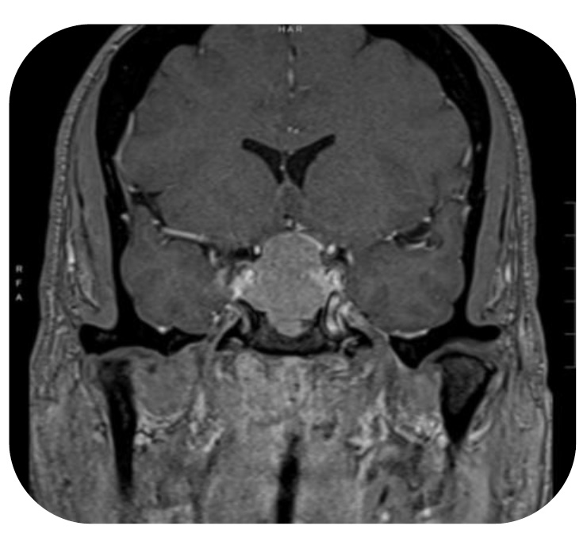
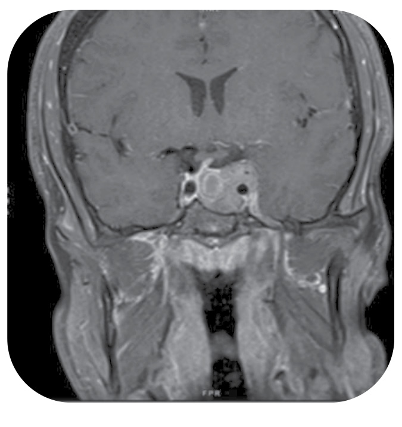
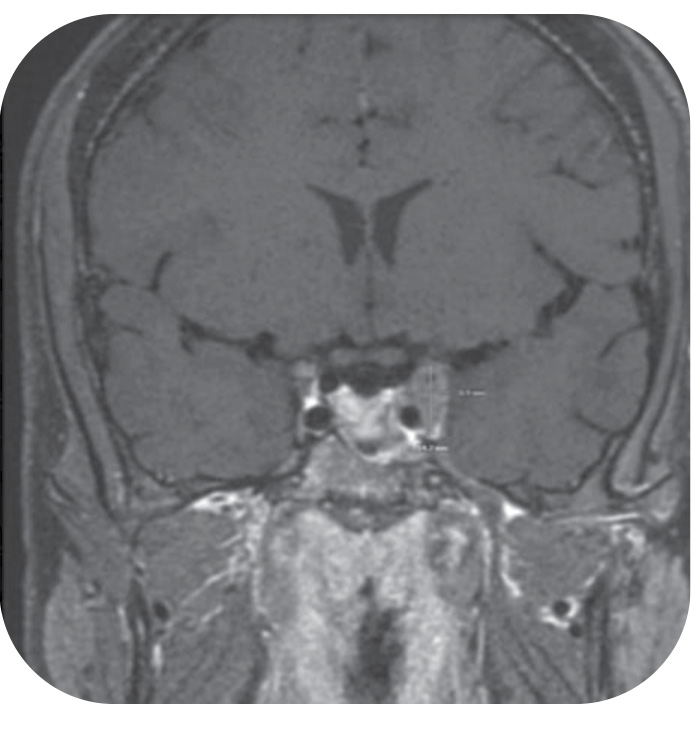
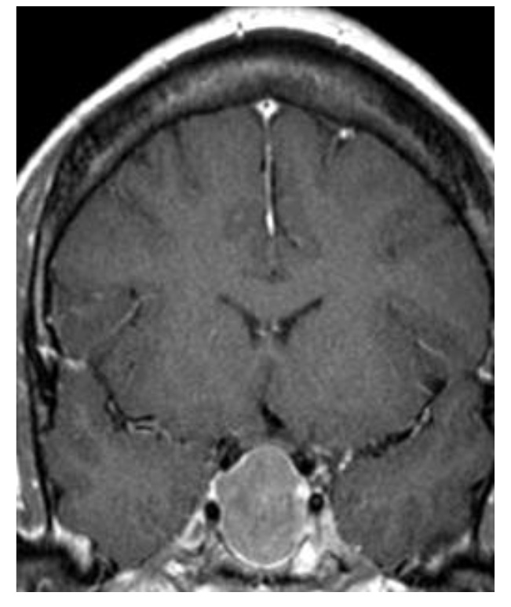
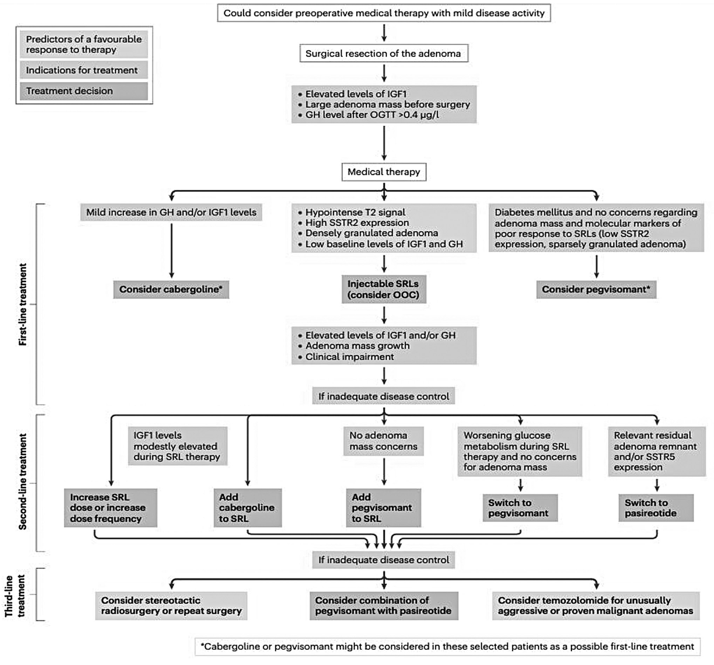

# Current Approach to Acromegaly Care
> **中文標題**：肢端肥大症照護的當代處理策略
> **分類 Category**：Neuroendocrinology and Pituitary
> **講者 Faculty**：Lisa Nachtigall, MD — Mass General Brigham Pituitary Tumor Clinical Center, Division of Endocrinology, Harvard Medical School, Boston, Massachusetts
> **來源 Source**：2026 Endocrine Case Management — Meet the Professor · ENDO 2026 · Endocrine Society

---

## 📋 教學目標 Educational Objectives

After reviewing this chapter, learners should be able to:

- **Identify the challenges in diagnosing acromegaly.**
  辨識 acromegaly 診斷上的困難與挑戰。
- **Manage complex patients with acromegaly using multimodality therapy.**
  運用多模式治療（multimodality therapy）處理複雜的 acromegaly 病人。
- **Recommend the optimal approach for patients with acromegaly who want to become pregnant.**
  為有懷孕意願的 acromegaly 病人建議最合適的處置策略。

---

## 🩺 臨床情境 Clinical Scenario

本章以三個臨床個案貫穿 acromegaly 的診斷延遲、多模式治療與孕期處置等核心議題。

**Case 1.** A 45-year-old woman is referred to an endocrinologist for a high prolactin value. Her history includes sleep apnea (age 35), prediabetes (age 40), bilateral carpal tunnel syndrome (age 41), and jaw malocclusion (age 42). Medications include fluoxetine and inclisiran (PCSK9-directed therapy). She reports fatigue (since age 35), night sweats, joint pain, and increased saliva. Prolactin is mildly high at 39 ng/mL (reference 0–23 ng/mL), and MRI shows a large macroadenoma with suprasellar extension. A pituitary-focused neurosurgeon recognizes facial features of acromegaly: enlarged lips and tongue, slight lower-jaw protrusion, and a widened nasal bridge.
> 一位 45 歲女性因 prolactin 偏高被轉介至內分泌科。病史包含 35 歲診斷的 sleep apnea、40 歲的 prediabetes、41 歲的雙側 carpal tunnel syndrome，以及 42 歲的下顎咬合不正（jaw malocclusion）。用藥包含 fluoxetine 與 inclisiran。她自 35 歲起即有疲倦、夜間盜汗、關節痛與唾液增多。Prolactin 僅輕度上升至 39 ng/mL（參考值 0–23 ng/mL），MRI 顯示一個具鞍上延伸（suprasellar extension）的大型 macroadenoma。專精腦下垂體的神經外科醫師察覺其臉部具 acromegaly 特徵：嘴唇與舌頭肥大、下顎略為前突、鼻樑增寬。

**Case 2.** An 18-year-old man presents with hypogonadism and headaches, plus fatigue and depression for 9 months. He has had no change in ring or shoe size, jaw size, or teeth spacing. He is tall (193 cm, 102 kg) with only mild coarsening of the brow and nasal bridge. IGF-1 is markedly elevated and MRI shows a 3 × 2 × 2-cm macroadenoma invading the left cavernous sinus without suprasellar extension.
> 一位 18 歲男性因 hypogonadism 與頭痛就診，並有 9 個月的疲倦與憂鬱。他的戒指、鞋號、下顎大小或齒縫皆無變化。身高 193 cm、體重 102 kg，僅眉弓與鼻樑輕度粗厚。IGF-1 明顯上升，MRI 顯示一個 3 × 2 × 2 cm、侵犯左側 cavernous sinus 但無鞍上延伸的 macroadenoma。

**Case 3.** A 33-year-old woman with acromegaly, previously treated with transsphenoidal surgery and radiation and currently on medical therapy, wishes to conceive. She presented at age 30 with bilateral visual-field defects, enlarging hands and feet, difficulty biting down, headaches, sweating, snoring, and irregular menses. On combination medical therapy she has now achieved biochemical control and asks how to safely become pregnant.
> 一位 33 歲、患有 acromegaly 的女性，曾接受 transsphenoidal surgery 與放射治療，目前使用藥物治療控制 GH 過量，希望懷孕。她 30 歲發病，當時有雙側視野缺損、手腳變大、咬合困難、頭痛、盜汗、打鼾與月經不規則。目前在合併藥物治療下已達生化控制，詢問如何能安全地懷孕。

---

## 🔬 背景與重要性 Background & Significance

Acromegaly is caused by GH excess, usually due to a GH-secreting pituitary adenoma. Given its rarity and the insidious nature of its presentation, the diagnosis often remains unrecognized for many years after initial symptoms. Delayed diagnosis is associated with multiple comorbidities and more invasive disease, which makes surgical cure less likely.
> Acromegaly 是由 GH 過量所引起，通常源自一個會分泌 GH 的 pituitary adenoma。由於此病罕見且表現隱匿，症狀出現後往往多年仍未被辨識。診斷延遲與多重共病及疾病更具侵襲性有關，也使手術治癒的機會下降。

Over the past 3 decades there have been advances in medical therapy, including dopamine agonists, somatostatin receptor ligands, and a GH receptor antagonist; combination therapy has been used in patients who do not respond to monotherapy. Reported outcomes with combination therapy are favorable, but multidrug therapy for acromegaly is not FDA approved. In recent years, newer oral somatostatin receptor ligands have become FDA approved, with efficacy and safety equivalent to injectable agents based on randomized, prospective, placebo-controlled trials.
> 過去三十年藥物治療持續進步，包含 dopamine agonists、somatostatin receptor ligands 與一種 GH receptor antagonist；對單藥治療反應不佳者則使用合併治療。已發表的合併治療結果良好，但用於 acromegaly 的多藥合併療法並未取得 FDA 核准。近年來較新的口服 somatostatin receptor ligands 已獲 FDA 核准，且依隨機、前瞻、安慰劑對照試驗，其療效與安全性與注射劑相當。

Despite these advances, improvement in time to diagnosis has been minimal. Being diagnosed at a more advanced stage is associated with increased morbidity and mortality and reduced quality of life, making earlier recognition important.
> 儘管有這些進展，診斷所需時間的改善卻極為有限。在疾病較晚期才被診斷，與死亡率、罹病率上升及生活品質下降有關，因此提早辨識此病極為重要。

**流行病學與診斷延遲 Epidemiology & Diagnostic Delay.** Before 2000, the mean delay ranged from 6.6 years to more than 20 years; after 2000 the mean time to diagnosis was 3.2 to 5.5 years. Even in the current era a median of approximately 5 years remains, and more than 10 years in a significant subset of patients. Diagnosis is delayed longer (by 2 years) for women than for men, and the delay in acromegaly exceeds that seen for Cushing disease, prolactinomas, and nonfunctioning pituitary adenomas.
> 在 2000 年之前，平均延遲介於 6.6 年到超過 20 年；2000 年之後平均診斷時間為 3.2 至 5.5 年。即使在當代，中位延遲仍約 5 年，且相當比例的病人超過 10 年。女性的診斷延遲比男性多約 2 年，而 acromegaly 的延遲甚至超過 Cushing disease、prolactinomas 與 nonfunctioning pituitary adenomas。

**Practice Gaps 臨床實務落差.**
- 對於如何發展並落實普遍性策略，以預測哪些 acromegaly 病人會對 somatostatin receptor ligands 有反應，仍有爭議。
- 對於在接受藥物治療的 acromegaly 病人如何處理生育與孕期管理，資料仍有限。
- 提早診斷 acromegaly 並提升對此病的警覺，仍是未被滿足的臨床需求。

**提早診斷的策略 Strategies for Earlier Diagnosis.** Possible strategies include universal screening, facial recognition software, and machine-learning programs based on hand photographs and voice recordings. However, these raise concerns about the cost-effectiveness of screening for rare diseases, the complex ethics of facial recognition, and the lack of ethnic heterogeneity in the largely homogeneous populations used to develop such software — all of which deter universal implementation.
> 可能的策略包含普遍性篩檢、臉部辨識軟體，以及以手部照片與語音錄音為基礎的機器學習程式。然而這些方法引發疑慮：罕見疾病篩檢的成本效益、臉部辨識的複雜倫理，以及用來開發軟體的族群多屬同質、缺乏族裔多樣性，這些都阻礙其普遍應用。

---

## 🧭 診斷與評估 Diagnosis & Evaluation

Once acromegaly is considered, confirming it is straightforward. If classic clinical features are present, an elevated serum IGF-1 level is sufficient for diagnosis. In equivocal cases — either because IGF-1 is only borderline-high or because clinical features are unclear — an oral glucose tolerance test (OGTT) should be done to demonstrate lack of GH suppression to less than 1.0 ng/mL (< 1.0 µg/L). In newer assays, a cutoff of less than 0.4 ng/mL (< 0.4 µg/L) has been proposed.
> 一旦考慮到 acromegaly，確診其實相當直接。若有典型臨床特徵，血清 IGF-1 上升即足以診斷。在不明確的情形下（IGF-1 僅為臨界升高，或臨床特徵不明），應進行 oral glucose tolerance test（OGTT），以證明 GH 無法被壓抑至低於 1.0 ng/mL（< 1.0 µg/L）。在較新的檢驗方法中，已有人提出以低於 0.4 ng/mL（< 0.4 µg/L）為 cut-off。

Given the typical diagnostic delay, most patients present with macroadenomas (≥ 1 cm), and many have invasive disease, including cavernous sinus invasion, which makes complete transsphenoidal resection less likely.
> 由於典型的診斷延遲，多數病人在確診時已是 macroadenoma（≥ 1 cm），且許多具侵襲性，包括侵犯 cavernous sinus，使得經蝶竇（transsphenoidal）完整切除的機會降低。

**病理與轉錄因子 Pathology & Transcription Factors.** Somatotroph (GH-secreting) adenomas stain positive for **Pit-1**; prolactinomas also demonstrate Pit-1 staining. **T-Pit** is diagnostic of a corticotroph adenoma, and **SF-1** of a gonadotroph adenoma. Histologic features such as sparse vs dense granulation and the Ki-67 proliferation index further characterize the tumor.
> 生長激素細胞（somatotroph，分泌 GH）腺瘤的 **Pit-1** 染色為陽性；prolactinomas 亦呈 Pit-1 陽性。**T-Pit** 為 corticotroph adenoma 的診斷標記，**SF-1** 則為 gonadotroph adenoma 的標記。稀疏或緻密顆粒化（sparsely vs densely granulated）等組織學特徵及 Ki-67 proliferation index，可進一步描述腫瘤特性。

**Figure 2. Case 1 Patient MRI（個案一病人之 MRI）**

**Figure 3. Case 2 Patient MRIs at Diagnosis（個案二病人診斷時之 MRI）**

**Figure 4. Case 2 Patient MRI After Transsphenoidal Surgery（個案二病人經蝶竇手術後之 MRI）**

**Figure 5. Case 3 Patient MRI（個案三病人之 MRI）**

### 代表性檢驗數值 Representative Laboratory Values（依原始個案）

| 項目 Test | Case 1 | Case 2 | Case 3（術前 baseline） |
|---|---|---|---|
| IGF-1 | 578 ng/dL（參考 30–317 ng/dL） | 869 ng/mL（參考 108–548 ng/mL） | 900 ng/mL（參考 53–351 ng/mL） |
| Random GH | 47 ng/mL（< 7 ng/mL） | 19 ng/mL | 56 ng/mL（< 7 ng/mL） |
| Prolactin | 39 ng/mL（0–23 ng/mL） | 954 ng/mL（稀釋後；2–18 ng/mL） | 57 ng/mL（0.1–23.3 ng/mL） |
| Testosterone | — | 115 ng/dL（50–1100 ng/dL） | — |
| HbA1c | — | 5.5%（37 mmol/mol） | — |

> 註：原文中 Case 1 之 IGF-1 以 ng/dL 呈現，其餘個案以 ng/mL 呈現，此處忠實保留來源單位。

---

## 💊 治療與處置 Management

**手術 Surgery.** For patients not cured after surgery, several medical therapies are approved, but transsphenoidal resection by an expert pituitary neurosurgeon remains the first-line approach for possible cure when there are no contraindications. Even when surgical cure is not achieved, debulking increases the likelihood of a favorable response to somatostatin receptor ligands.
> **手術**：對術後未治癒者有多種核准的藥物治療，但在無禁忌症時，由專精腦下垂體的神經外科醫師施行的 transsphenoidal resection 仍是以治癒為目標的第一線方式。即使未能手術治癒，減積（debulking）也能提高對 somatostatin receptor ligands 的良好反應機會。

**Somatostatin receptor ligands（SRLs）.** These are the main first-line medical therapy, with potential both to improve IGF-1 levels and to control tumor growth in 50% to 60% of responsive patients.
- **Lanreotide** 與 **octreotide**：長效注射劑，通常每月給藥，主要作用於 somatostatin receptor 2（SST2）。
- **Pasireotide**：優先結合 somatostatin receptor 5（SST5），並同時作用於 SST2，對 SST2 表現較低的腫瘤更有效。
- **Oral octreotide** 與 **paltusotine**：作用於 SST2 的新型口服藥，已獲核准；在隨機對照試驗中療效與注射型 lanreotide、octreotide 相當，對偏好每日口服藥勝於每月注射的病人具吸引力。
> **Somatostatin receptor ligands（SRLs）** 是最主要的第一線藥物，可改善 IGF-1，並在 50% 至 60% 有反應的病人中控制腫瘤生長。Lanreotide 與 octreotide 為每月注射的長效劑，主要作用於 SST2；pasireotide 優先結合 SST5 並兼及 SST2；oral octreotide 與 paltusotine 為新型 SST2 口服藥。

**Pegvisomant（GH receptor antagonist）.** By blocking signaling at the level of the normal GH receptor (not directly at the tumor), pegvisomant should normalize IGF-1 in essentially all patients if taken correctly. However, it is unlikely to reduce tumor size, so when a tumor remnant remains, an SRL is preferred for suppressing tumor growth. It may be used as monotherapy or as an add-on to an SRL.
> **Pegvisomant**（GH receptor antagonist）藉由在正常 GH receptor 層次阻斷訊號（而非直接作用於腫瘤），若正確使用，幾乎能使所有病人的 IGF-1 正常化。但它不太可能縮小腫瘤，因此當仍有腫瘤殘留時，抑制腫瘤生長仍以 SRL 為優先。可作為單藥或加在 SRL 之上使用。

**Cabergoline（dopamine agonist）.** A commonly used oral agent for patients with mild disease or as add-on therapy. Neither combination therapy nor cabergoline is specifically FDA approved for acromegaly.
> **Cabergoline**（dopamine agonist）：常用口服藥，適用於輕度疾病或作為加成治療。合併治療與 cabergoline 皆未針對 acromegaly 取得 FDA 核准。

**合併治療 Combination Therapy（示例，Case 3）.** IGF-1 remained uncontrolled despite maximum-dose lanreotide LAR 120 mg monthly; pegvisomant 30 mg daily was added, achieving biochemical control with IGF-1 normalizing to 237 ng/mL (31.0 nmol/L).
> **合併治療**（Case 3 示例）：在最大劑量 lanreotide LAR 120 mg 每月給藥下 IGF-1 仍未受控；加上 pegvisomant 30 mg 每日給藥後達到生化控制，IGF-1 正常化至 237 ng/mL（31.0 nmol/L）。

**放射治療 Radiation Therapy.** Stereotactic or fractionated radiation remains an option for patients not cured after surgery, particularly those who do not respond to, tolerate, or have access to medical therapy. More than 90% of pituitary adenomas do not grow after radiation, though radiation may cause long-term hypopituitarism and, less commonly, neurocognitive or neurologic complications; it should be reserved until the response to medical therapy is determined.
> **放射治療**：立體定位或分次放射治療仍是術後未治癒者的選項，尤其對藥物無反應、無法耐受或無法取得藥物者。放射後超過 90% 的 pituitary adenomas 不再生長，但可能造成長期 hypopituitarism，較少見的還有神經認知或神經併發症；應等到確定藥物反應後再考慮使用。

**生育與孕期 Fertility & Pregnancy.** Women who remain uncured after surgery and seek fertility pose a challenge because the safety of acromegaly medical therapies in pregnancy is minimally studied. Outcomes are generally favorable — partly because high estrogen levels during pregnancy reduce IGF-1 — but little is known about fetal drug effects, with case reports of both fetal macrosomia and microsomia associated with SRL use in pregnancy. Uncontrolled acromegaly increases the risk of gestational diabetes, hypertension, and toxemia. The ideal strategy is to achieve IGF-1 and tumor control before conceiving and, if possible, to discontinue and wash out medical therapy before conception. Long-acting SRLs take at least 3 months to wash out.
> **生育與孕期**：術後未治癒又想生育的女性是一大挑戰，因為 acromegaly 藥物於孕期的安全性研究極少。整體預後多屬良好——部分因孕期高 estrogen 會降低 IGF-1——但藥物對胎兒的影響所知甚少，且有 SRL 於孕期使用而出現胎兒巨大症（macrosomia）與胎兒過小（microsomia）的個案報告。未受控的 acromegaly 會增加 gestational diabetes、高血壓與 toxemia 的風險。理想策略是在受孕前先達到 IGF-1 與腫瘤控制，並在可能時於受孕前停藥並完成 washout。長效 SRL 至少需 3 個月才能 washout。

**Figure 1. Pituitary Society Acromegaly Consensus（腦下垂體學會 Acromegaly 共識）**

> 📎 Reprinted from Melmed S et al. Nat Rev Endocrinol, 2025; 21(11): 718-37. © Springer Nature Limited. By permission of Springer Nature.
>
> 轉載自 Melmed S et al. Nat Rev Endocrinol, 2025; 21(11): 718-37。© Springer Nature Limited。經 Springer Nature 授權使用。

---

## 🧠 個案解析與臨床推理 Case Analysis & Clinical Reasoning

**Case 1 — 被錯過的診斷：共病叢集（clustering of comorbidities）**
此病人歷經數十年、多位次專科醫師仍未被拼湊出診斷，最終才確診 acromegaly。關鍵推理在於：sleep apnea、prediabetes、bilateral carpal tunnel syndrome 與 jaw malocclusion 這組看似無關的共病，其實是 GH 過量的共同表現。輕度 hyperprolactinemia（39 ng/mL）容易誤導思考方向——但單純 hyperprolactinemia 或 prolactinoma 較不會同時造成 sleep apnea、carpal tunnel 與 jaw malocclusion。鑑別診斷上，obesity 與 polycystic ovary syndrome 可解釋 prediabetes 與 sleep apnea，卻難以說明 carpal tunnel 與咬合不正；autoimmune disease 也無法解釋這組表現。**Pitfall**：把輕度 prolactin 上升當成主診斷，而忽略了背後真正的 GH 過量。面對此類巨腺瘤合併輕度 prolactin 上升，應想到 mixed adenoma 或巨腺瘤造成的「stalk effect」而非單純 prolactinoma。

**治療決策**：即使是侵襲性腫瘤，首選仍是由專家施行 transsphenoidal resection，以爭取治癒並為後續藥物反應鋪路。Craniotomy 併發症風險高，非第一線；primary medical therapy 適用時機在於無 chiasm 壓迫且腫瘤幾無法完整切除者，但此處減積手術能提升日後 SRL 反應，故不作為首選；因 IGF-1 過高，dopamine agonist 單藥不足以控制。

**Case 2 — 年輕、侵襲性、混合分泌腺瘤**
18 歲、身材高大、僅輕微臉部粗厚的男性，臨床上 acromegaly 特徵不明顯，卻有明顯升高的 IGF-1（相對其年齡層）與侵犯 cavernous sinus 的 macroadenoma，加上顯著升高的 prolactin。此為 Pit-1 陽性、混合分泌 prolactin 與 GH 的腺瘤。**臨床推理要點**：（1）年輕發病應安排 genetic testing，但不應為等結果而延遲治療；（2）雖 prolactin 高，cabergoline 單藥不足以控制其高 IGF-1；（3）雖侵犯 cavernous sinus，仍應先手術——即使未治癒，減積可提高 SRL 使 IGF-1 正常化的機會；（4）radiation 應保留為最後手段，尤其此病人 HPA 與 HPT 軸皆正常，不宜輕易冒 hypopituitarism 之險。術後 IGF-1 仍為 711 ng/mL 且有 cavernous sinus 殘留時，最佳下一步是 SRL：低風險、若有反應可正常化 IGF-1 並縮小腫瘤；因仍有腫瘤殘留，抑制腫瘤生長優於選擇不縮瘤的 pegvisomant。

**Case 3 — 已控制的疾病與孕前規劃**
關鍵在孕前藥物 washout 與腫瘤穩定性。此病人已接受手術與放射治療，並以 lanreotide LAR 120 mg + pegvisomant 30 mg 合併治療達到 IGF-1 正常化。**決策要點**：長效 SRL 需至少 3 個月 washout，故不宜在仍具活性藥物下立即受孕（排除立即嘗試懷孕的選項）。已接受放射治療者腫瘤幾乎不再生長（> 90% 不生長），孕期腫瘤增大之疑慮較低；合理策略是待腫瘤穩定、IGF-1 改善或穩定後，改用 cabergoline 及／或短效 octreotide，並在受孕前數月停用並 washout 長效 SRL。**Pitfall**：將孕前 acromegaly 管理完全交給生殖團隊——事實上這是內分泌科醫師的責任，生殖團隊多半仰賴內分泌專家的指引。**重要觀念**：即使是重度疾病，只要採取適當預防措施，pregnancy 並非禁忌，多數母胎預後良好，不需直接建議 surrogacy 或 adoption。

---

## ⭐ 重點整理 Key Takeaways

- 多種共病常同時出現卻未被視為評估 acromegaly 的線索，包括 sleep apnea、carpal tunnel syndrome、hypertension、prediabetes/diabetes、關節異常、關節置換病史與 gonadal dysfunction；共病叢集應提高警覺。
- Acromegaly 的診斷是在具提示性徵象或症狀的病人中，記錄到血清 IGF-1 升高，通常伴隨影像上可見的 adenoma；不明確時以 OGTT 證明 GH 未壓抑至 < 1.0 ng/mL（新式檢驗有人提議 < 0.4 ng/mL 為 cut-off）。
- 治療目標為使 IGF-1 正常化並控制腫瘤生長；多數情況下手術（transsphenoidal surgery）仍是第一線處置。
- 藥物治療包含 dopamine agonists、somatostatin receptor ligands 與 GH receptor antagonist（pegvisomant）；對無法完整切除且無 chiasm 壓迫的侵襲性腫瘤可考慮 primary medical therapy；radiation therapy 用於腫瘤未控、GH/IGF-1 過高，或藥物失敗、不耐受或無法取得時。
- Pegvisomant 幾乎可使所有病人 IGF-1 正常化，但不縮小腫瘤；有腫瘤殘留時 SRL 為抑制腫瘤生長的較佳選擇。合併治療（如 lanreotide LAR 120 mg + pegvisomant）可用於單藥控制不佳者，惟未獲 FDA 核准。
- Acromegaly 病人可以懷孕並多有良好母胎預後；理想上應在懷孕前先控制 IGF-1 與腫瘤，並儘可能於受孕前 washout SRL 或 pegvisomant（長效 SRL 至少需 3 個月）。
- 孕期應密切監測 gestational diabetes 與 hypertension；有腫瘤殘留者應每個 trimester 評估視野（visual fields）。
- 診斷延遲仍是最大未滿足需求：中位延遲約 5 年、部分病人超過 10 年，女性又比男性多延遲約 2 年；晚期診斷與罹病率、死亡率上升相關。

---

## 💬 討論問題 Discussion Questions

1. 在你的臨床實務中，哪些「共病叢集」最容易讓你聯想到 acromegaly？如何在初級照護層級提高辨識率而不造成過度篩檢？
2. 面對一個侵犯 cavernous sinus 的 macroadenoma，你如何在「先手術減積」與「primary medical therapy」之間權衡？哪些因素會改變你的決策？
3. 對 SRL 反應不佳的病人，你會如何安排合併治療（SRL + pegvisomant 或加入 cabergoline）？在缺乏 FDA 核准的情況下，如何與病人溝通風險與實證？
4. 對想懷孕的 acromegaly 女性，你會如何規劃孕前藥物 washout 與腫瘤穩定化？放射治療在這個決策中扮演什麼角色？
5. 臉部辨識、手部影像或語音分析等 AI 篩檢工具，若要導入臨床，你認為需先克服哪些倫理、成本效益與族裔代表性的問題？

---

## 📚 參考文獻 References

1. Gordon DA, Hill FM, Ezrin C. Acromegaly: a review of 100 cases. *Can Med Assoc J*. 1962;87(21):1106-1109. PMID: 13949186
2. Alexander L, Appleton D, Hall R, Ross WM, Wilkinson R. Epidemiology of acromegaly in the Newcastle region. *Clin Endocrinol (Oxf)*. 1980;12(1):71-79. PMID: 7379316
3. Nabarro JD. Acromegaly. *Clin Endocrinol (Oxf)*. 1987;26(4):481-512. PMID: 3308190
4. Bengtsson BA, Edén S, Ernest I, Odén A, Sjögren B. Epidemiology and long-term survival in acromegaly. A study of 166 cases diagnosed between 1955 and 1984. *Acta Med Scand*. 1988;223(4):327-335. PMID: 3369313
5. Nachtigall L, Delgado A, Swearingen B, Lee H, Zerikly R, Klibanski A. Changing patterns in diagnosis and therapy of acromegaly over two decades. *J Clin Endocrinol Metab*. 2008;93(6):2035-2041. PMID: 18381584
6. Esposito D, Ragnarsson O, Johannsson G, Olsson DS. Prolonged diagnostic delay in acromegaly is associated with increased morbidity and mortality. *Eur J Endocrinol*. 2020;182(6):523-531. PMID: 32213651
7. Gadelha MR, Wildemberg LE, Marques NV, Kasuki L. Medical Treatment of Acromegaly: Navigating the Present, Shaping the Future. *Endocr Rev*. 2025;46(6):838-855. PMID: 40644375
8. Samson SL, Nachtigall LB, Fleseriu M, et al. Maintenance of acromegaly control in patients switching from injectable somatostatin receptor ligands to oral octreotide. *J Clin Endocrinol Metab*. 2020;105(10):e3785-e3797. PMID: 32882036
9. Biller BMK, Casagrande A, Elenkova A, et al. Rapid and sustained response of biochemically uncontrolled acromegaly to once-daily oral paltusotine treatment. *J Clin Endocrinol Metab*. Published online October 23, 2025. PMID: 41128642
10. Gadelha MR, Casagrande A, Strasburger CJ, et al. Acromegaly disease control maintained after switching from injected somatostatin receptor ligands to oral paltusotine. *J Clin Endocrinol Metab*. 2024;110(1):228-237. PMID: 38828555
11. Reid TJ, Post KD, Bruce JN, Nabi Kanibir M, Reyes-Vidal CM, Freda PU. Features at diagnosis of 324 patients with acromegaly did not change from 1981 to 2006: acromegaly remains under-recognized and under-diagnosed. *Clin Endocrinol (Oxf)*. 2010;72(2):203-208. PMID: 19473180
12. Petrossians P, Daly AF, Natchev E, et al. Acromegaly at diagnosis in 3173 patients from the Liège Acromegaly Survey (LAS) Database. *Endocr Relat Cancer*. 2017;24(10):505-518. PMID: 28733467
13. Forsgren M, Dahlgren C, Alkebro C, et al. Estimating diagnostic delay in patients with pituitary adenomas in Sweden: a cross-sectional study. *BMJ Open*. 2025;15(6):e097804. PMID: 40550723
14. Kong X, Gong S, Su L, Howard N, Kong Y. Automatic detection of acromegaly from facial photographs using machine learning methods. *EBioMedicine*. 2018;27:94-102. PMID: 29269039
15. Meng T, Guo X, Lian W, et al. Identifying facial features and predicting patients of acromegaly using three-dimensional imaging techniques and machine learning. *Front Endocrinol (Lausanne)*. 2020;11:492. PMID: 32849283
16. Kocaman BB, Akkol OR, Onay G, et al. Facial analysis in acromegaly using machine learning: toward earlier diagnosis. *J Clin Endocrinol Metab*. 2026;111(3):e892-e899. PMID: 40839426
17. Rosario PW, Calsolari MR. Screening for acromegaly by application of a simple questionnaire evaluating the enlargement of extremities in adult patients seen at primary health care units. *Pituitary*. 2012;15(2):179-183. PMID: 21380935
18. Vouzouneraki K, Nylén F, Holmberg J, et al. Digital voice analysis as a biomarker of acromegaly. *J Clin Endocrinol Metab*. 2025;110(4):983-990. PMID: 39363748
19. Ohmachi Y, Nishio M, Abe I, et al. Automatic acromegaly detection using deep learning on hand images: a multicenter observational study. *J Clin Endocrinol Metab*. Published online February 27, 2026. PMID: 41757900
20. Giustina A, Barkan A, Beckers A, et al. A consensus on the diagnosis and treatment of acromegaly comorbidities: an update. *J Clin Endocrinol Metab*. 2020;105(4):dgz096. PMID: 31606735
21. Giustina A, Uygur MM, Frara S, et al. Standards of care for medical management of acromegaly in pituitary tumor centers of excellence (PTCOE). *Pituitary*. 2024;27(4):381-388. PMID: 38833044
22. Trainer PJ, Drake WM, Katznelson L, et al. Treatment of acromegaly with the growth hormone-receptor antagonist pegvisomant. *N Engl J Med*. 2000;342(16):1171-1177. PMID: 10770982
23. Melmed S, di Filippo L, Fleseriu M, et al. Consensus on acromegaly therapeutic outcomes: an update. *Nat Rev Endocrinol*. 2025;21(11):718-737. PMID: 40804505
24. Ghajar A, Jones PS, Guarda FJ, et al. Biochemical control in acromegaly with multimodality therapies: outcomes from a pituitary center and changes over time. *J Clin Endocrinol Metab*. 2020;105(3):e532-e543. PMID: 31701145
25. Bandeira DB, Olivatti TOF, Bolfi F, Boguszewski CL, Dos Santos Nunes-Nogueira V. Acromegaly and pregnancy: a systematic review and meta-analysis. *Pituitary*. 2022;25(3):352-362. PMID: 35098440
26. Chanson P, Vialon M, Caron P. An update on clinical care for pregnant women with acromegaly. *Expert Rev Endocrinol Metab*. 2019;14(2):85-96. PMID: 30696300
