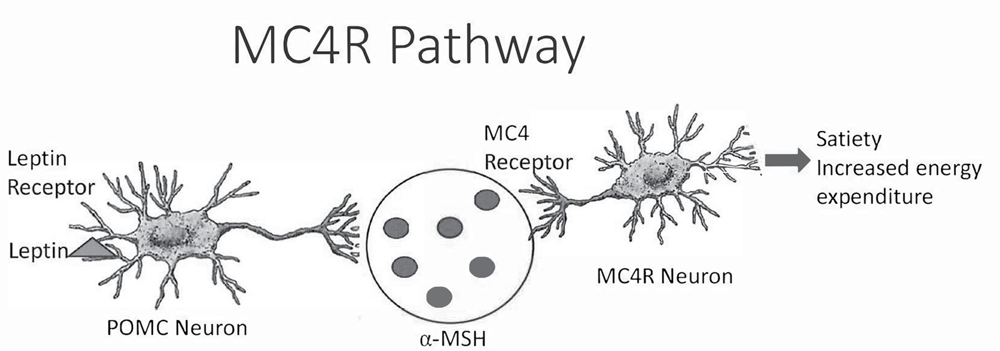
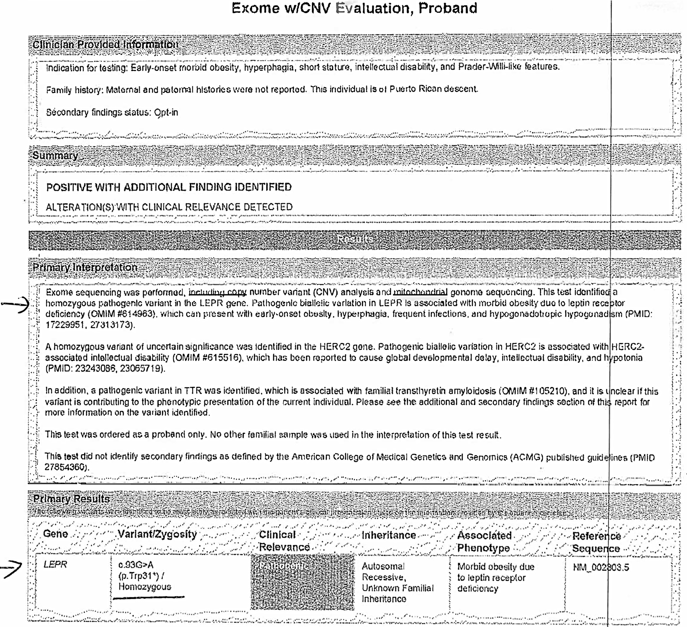
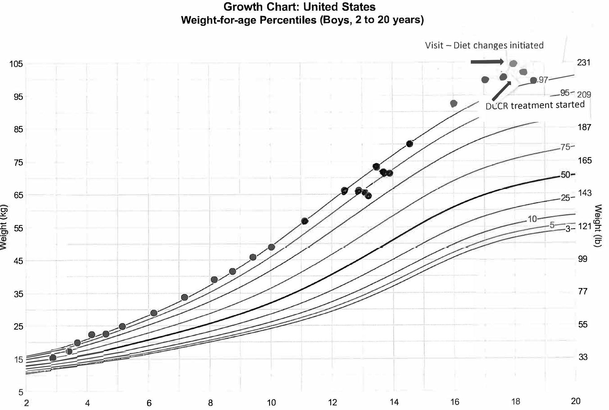
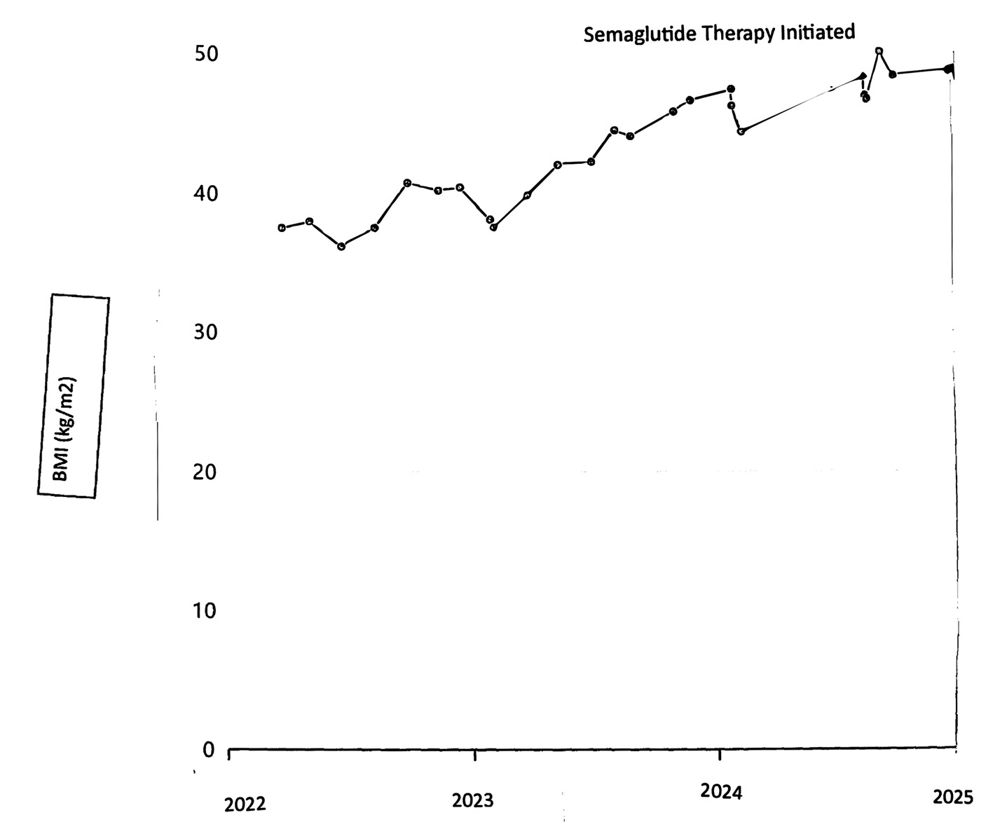

# Management of Hyperphagia in Prader-Willi Syndrome and Other Monogenic Obesity Syndromes
> **中文標題**：Prader-Willi 症候群及其他單基因肥胖症候群之過度飲食（hyperphagia）處置
> **分類 Category**：Pediatric and Adolescent Endocrinology
> **講者 Faculty**：Jennifer Miller, MD, MS — University of Florida, Division of Endocrinology, Department of Pediatrics
> **來源 Source**：2026 Endocrine Case Management — Meet the Professor · ENDO 2026 · Endocrine Society

---

## 📋 教學目標 Educational Objectives

After reviewing this chapter, learners should be able to:

- **Describe recommended dietary interventions for obesity caused by Prader-Willi syndrome (PWS).**
  描述針對 Prader-Willi syndrome (PWS) 所致肥胖的建議飲食介入策略。
- **Identify appropriate indications for the use of diazoxide choline continuous release (DCCR) therapy for hyperphagia caused by PWS.**
  辨識 diazoxide choline continuous release (DCCR) 用於治療 PWS 過度飲食（hyperphagia）的適當適應症。
- **Determine when to consider the use of GLP-1 receptor agonists for monogenic obesity and when to use setmelanotide therapy.**
  判斷何時應考慮對單基因肥胖使用 GLP-1 receptor agonists，以及何時應使用 setmelanotide 治療。

---

## 🩺 臨床情境 Clinical Scenario

本章以三個 PWS／hypothalamic obesity 的真實病例貫穿治療決策，完整病例呈現於下方〈個案解析〉；此處先綜整臨床問題的核心情境。

> Genetic obesity syndromes are typically associated with a combination of low metabolic expenditure and hyperphagia (lack of satiety), which results in obesity-related comorbidities that are extremely difficult to manage effectively.

遺傳性肥胖症候群通常同時具有「低代謝消耗」與「hyperphagia（缺乏飽足感）」兩大特徵，導致難以有效控制的肥胖相關共病。Hyperphagia 嚴重影響病人與其家庭的生活品質。

對於同時有認知遲緩與 hyperphagia 的個案，家屬往往必須採取環境限制以管控食物取得，例如以物理方式封鎖廚房、上鎖櫥櫃、冰箱／冷凍庫甚至垃圾桶。許多功能較高的病人則會自行設計環境限制以避免嚴重暴食與肥胖惡化，包括每日請人代購食材以避免家中囤積或誘惑性食物、刻意不擁有個人交通工具使其難以外出取得食物，甚至使用服務犬（service animals）防止其離家購買食物。

> Many short-term phase 2 medication trials to treat hyperphagia in these conditions have shown promising results, only to be followed by failures in larger, longer-term clinical trials.

許多治療 hyperphagia 的短期第二期（phase 2）藥物試驗曾顯示令人期待的結果，卻在規模更大、時間更長的臨床試驗中失敗。迄今僅有少數藥物試驗成功達成這些複雜遺傳代謝疾病的長期控制。本章聚焦於建議的飲食介入，以及兩個在臨床試驗中成功的藥物：**DCCR** 與 **setmelanotide**；並討論 **GLP-1 receptor agonists** 的潛在角色。

---

## 🔬 背景與重要性 Background & Significance

### Hyperphagia 的定義 Definition

> Hyperphagia is associated with rare obesity-related diseases and presents as a pathologic, insatiable hunger accompanied by abnormal food-seeking behaviors.

Hyperphagia 見於罕見肥胖相關疾病，表現為病態、無法滿足的飢餓感，並伴隨異常的覓食行為（food-seeking behaviors）。雖然目前尚無普遍公認的定義，多數醫師會說「一看便知（you know it when you see it）」。專家群將 hyperphagia 定義為：進食時「達到飽足所需時間延長、飯後飽足持續時間縮短、飢餓感持續時間延長，以及對食物持續的執念」，進而導致覓食行為。3

Hyperphagia 極難處置；病人與家屬指出它負面影響生活的許多面向，包括睡眠、情緒調節、工作能力、參與家庭外活動的能力，以及與家人朋友的關係。3

### 病生理：MC4R 路徑 Pathophysiology — the MC4R pathway

> Hyperphagia caused by rare obesity syndromes is thought to be due to dysfunction of certain areas of the hypothalamus.

罕見肥胖症候群所致的 hyperphagia，一般認為源自 hypothalamus 特定區域的功能失調。對此生物學的理解，來自對 PWS、影響 melanocortin-4 receptor (MC4R) 路徑之遺傳疾病，以及 MC4R 路徑受損（如 craniopharyngioma 或其他腦瘤／腦傷）所致 hyperphagia 的研究。

Hypothalamus 各核團內含促飽足腸道荷爾蒙的關鍵受體，以及食慾與飽足訊號路徑，如 leptin–MC4R pathway。研究顯示 MC4R pathway 對這些 hypothalamic obesity 相關罕病是否出現 hyperphagia 具關鍵作用。3-5 MC4R pathway 透過調控代謝率、熱量消耗與飢餓驅力，來調節能量平衡、食慾與食物攝取。3-5 此訊號的中斷可源自遺傳疾病，也可能繼發於後天 hypothalamic 損傷，兩者皆常導致 hyperphagia，並與能量消耗下降共同惡化肥胖、損害生活品質。一般認為 PWS 患者在此路徑上受體的基因表現發生改變，干擾了 MC4R pathway 的正常生理角色而導致 hyperphagia。6

> When the hypothalamus is functioning correctly, upstream activation of MC4R by release of α-/β-melanocyte-stimulating hormone (α-/β-MSH) from hypothalamic POMC-expressing neurons decreases food intake and increases energy expenditure.

生理上，當 hypothalamus 運作正常時：

- **抑制食慾**：由 hypothalamic pro-opiomelanocortin (POMC) 神經元釋放 α-/β-melanocyte-stimulating hormone (α-/β-MSH)，於上游活化 MC4R，減少食物攝取並增加能量消耗。4,5
- **促進食慾**：由 hypothalamic AgRP 神經元釋放 agouti-related peptide (AgRP)（一種 inverse agonist／反向促效劑）抑制 MC4R，典型地增加食慾。4,5,7

上游 α-/β-MSH 生成不足可經多種機制發生，包括 MC4R pathway 相關基因（如 leptin receptor gene *LEPR* 或 *POMC* 基因，兩者皆為活化 MC4R pathway 所需的訊號）之變異。此外，POMC 神經元中 serotonin receptor 2C 表現的刺激可增強 α-MSH 表現並抑制 AgRP 對 MC4R 的作用；因此影響 serotonin receptor 2C 的遺傳改變會進一步失調 MC4R 訊號。7,8 在 PWS 中，serotonin receptor 2C 被認為因 PWS 遺傳病因相關的 *SNORD116* 父源表現喪失而異常。9

**Figure 1. Melanocortin-4-Receptor Pathway**（Figure 1. Melanocortin-4 receptor (MC4R) 路徑）

> 📎 [Color—Print (Color Gallery page CG19 ) or web & ePub editions]
>
> 〔彩色圖—印刷版請見彩色圖庫第 CG19 頁，或參閱網頁版與 ePub 版〕

### 從 hyperinsulinemia 到 hyperphagia From hyperinsulinemia to hyperphagia

> Impairments in the MC4R pathway ultimately result in hyperleptinemia and hyperinsulinemia, which facilitate hyperphagia and increased energy intake.

MC4R pathway 受損最終導致 hyperleptinemia 與 hyperinsulinemia，進而促成 hyperphagia 與能量攝取增加。PWS 即為典型範例：患者具增高的胰島素敏感性（increased insulin sensitivity），在 hyperinsulinemia 背景下導致脂肪量增加，進而使循環 leptin 濃度升高，誘發中樞的 insulin 與 leptin 阻抗，最終造成肥胖與 hyperphagia。10

Hypothalamus 發育異常，加上 insulin 受體減少、MC4R pathway 與 serotonin receptor 2C 表現異常，很可能共同構成 PWS 嚴重 hyperphagia 的基礎。9,10 由於這一連串致病因素，PWS 患者也常對食物有極度焦慮，並可能出現與食物相關的暴怒與情緒爆發（尤其在嘗試限制食物時）。

> The presentation of hyperphagia is variable, even within the same genetic condition.

潛在病生理及其對 MC4R 訊號的影響差異，決定了 hyperphagic 症狀與行為的嚴重度。11 不同遺傳病因對 MC4R 訊號的功能性影響程度不一10,11；某些遺傳疾病中，hyperphagia 的表現又會被神經認知障礙混淆。7,11 因此即使在同一遺傳疾病內，hyperphagia 的表現也具高度變異性。

### 常見臨床實務缺口 Practice Gaps

- **傳統熱量限制飲食的反效果**：傳統上對 hyperphagia 與 hypothalamic obesity 建議熱量限制飲食，但對於因疾病而「自覺處於飢餓」的病人，限制熱量反而可能惡化食慾。
- **DCCR 並非愈嚴重愈適用**：現已有 FDA 核准治療 PWS hyperphagia 的藥物，醫師可能傾向將其用於最嚴重的個案；然而考量其已知的不良反應譜，這麼做可能不安全。
- **GLP-1 未必等效**：GLP-1 receptor agonists 對環境性肥胖（environmental obesity）能有效降低食慾與體重，許多醫師以為對 hypothalamic dysfunction 所致 hyperphagia 應同樣有效，但實際上往往並非如此。

---

## 🧭 診斷與評估 Diagnosis & Evaluation

- **臨床辨識 hyperphagia**：依專家共識定義評估——達飽足時間延長、飯後飽足持續縮短、飢餓感延長、對食物持續執念與覓食行為。3 需與單純食慾旺盛區辨。
- **PWS 的營養分期（nutritional phases）**：PWS 的食慾隨年齡呈典型分期演變，是臨床史採集的重要框架（詳見 Case 1）：
  - **Phase 1a**：嬰兒期發育不良／需鼻胃或胃造口餵食。
  - **Phase 1b**：食慾與體重正常。
  - **Phase 2a**：熱量攝取未變卻開始增重。
  - **Phase 2b**：對食物興趣與意識增加、體重持續過度增加。
  - **Phase 3**：出現對食物的持續執念與覓食／偷藏食物行為。
- **共病評估**：於考慮藥物治療前，須評估體重軌跡、HbA1c／血糖狀態、obstructive sleep apnea (OSA)、pulmonary hypertension／right heart failure、血壓與血脂。
- **基因診斷（genetic workup）**：對於病因未明的 hypothalamic obesity 與 hyperphagia（尤其自嬰幼兒即嚴重、極端者），應進行完整基因檢測以找出可治療的單基因病因（如 *LEPR*、*POMC* 等 MC4R pathway 相關變異），因為診斷可直接開啟 setmelanotide 等標靶治療。18,19

**Figure 4. Patient's Genetic Test Results Reporting a Pathogenic Variant in the LEPR Gene**（Figure 4. 病人基因檢測報告顯示 *LEPR* 基因的致病性變異）

---

## 💊 治療與處置 Management

### 1. 飲食介入 Dietary intervention（所有治療的基石）

> Diet must be an integral component of any medical intervention for individuals with hyperphagia.

飲食必須是任何 hyperphagia 藥物介入不可或缺的一環。應提供密集飲食諮詢（intensive dietary intervention），建立「均衡飲食、排除甜味食物或飲料」的規律飲食，以協助體重控制與糖尿病管理。12-14 對已有肥胖、持續增重與 prediabetes 者，在啟動 hyperphagia 藥物前，飲食改變與減重是必要前置步驟。單靠藥物或可提供部分助益，但唯有結合飲食與運動改變，才能對 hyperphagia 與肥胖達成真正的長期療效。

### 2. DCCR（diazoxide choline continuous release）

- **適應症與時機**：DCCR 於 **2025 年 3 月**在美國經 FDA 核准用於治療 PWS 的 hyperphagia。應在完成飲食／運動改變並已有減重之後再啟動。
- **作用機轉**：DCCR 為 KATP channel agonist（促效劑），使細胞膜過極化（hyperpolarize）。15
  - 於 β cells 促效 KATP channel → 降低 hyperinsulinemia，減少其對脂肪堆積、insulin resistance 與脂肪組織 leptin 分泌的貢獻。
  - 於 NPY／AgRP／GABA 神經元使 KATP channel 過極化 → 減少 NPY 與 AgRP（兩種強力促食慾神經肽）分泌；並推測抑制 GABA 釋放而減少 hyperphagia。
  - 於 dorsal motor nucleus of the vagus（dorsal vagal complex 之一部）促效 KATP channel → 增加飽足感、降低 hyperinsulinemia、改善 leptin 與 insulin 敏感性。
  - 於 adipocytes → 增加脂肪 β-oxidation、減少 triglyceride 的 de novo 合成，降低脂肪量。
- **劑量與監測**：本章個案於 6 週內滴定至 **4 mg/kg per day**。治療前三個月每週監測空腹血糖（fasting blood glucose），並安排追蹤與實驗室監測。
- **療效（個案）**：治療 3 個月後體重下降 11 lb (5 kg)、HbA1c 由 6.1% 降至 5.7% (39 mmol/mol)，家屬回報對食物的興趣與覓食行為明顯減少、與食物相關的情緒崩潰減少。**Hypertrichosis（多毛）**為該個案唯一的不良反應。
- **安全性禁忌／警訊**：對長期未治療的 OSA 並已產生 pulmonary hypertension 或 right heart failure 的病人，DCCR 有誘發 pulmonary edema 的高風險（個案 2 即出現呼吸惡化、SpO₂ 85%、pulmonary edema）。因此對這類病人、以及 HbA1c 顯著升高者，在未先減重或處理共病前不建議啟動 DCCR。最受關注的整體風險是 type 2 diabetes 的惡化／新發。

### 3. GLP-1 receptor agonists

- **角色**：在 hypothalamic obesity（含 PWS）病人中，GLP-1 receptor agonists 對治療 type 2 diabetes 成功，效果與一般族群相似；但對治療肥胖與 hyperphagia 的結果不一，且在這些族群中未見長期的體重改善。16,17
- **臨床定位**：當病人主要問題為 type 2 diabetes（如個案 2 之 HbA1c 10.2%），且 DCCR 因共病而不安全時，GLP-1 receptor agonist 可作為第一線選擇以控制血糖。

### 4. Setmelanotide（MC4R agonist）

- **適應症**：對經基因檢測確診 MC4R pathway 上游缺陷（如 *LEPR* 致病性變異、POMC 缺陷等）者，setmelanotide 已獲 FDA 核准，並顯示可達成長期成功的體重控制。20,21
- **關鍵前提**：需先完成基因診斷。個案 3（27 歲、panhypopituitarism 與 hypothalamic obesity、自嬰兒起即嚴重 hyperphagia）經基因檢查確認 *LEPR* 致病性變異後啟動 setmelanotide。

### 5. 減重手術 Bariatric surgery

在本章個案中，減重手術（gastric bypass 或 sleeve gastrectomy）並非未先釐清可治療遺傳病因前的首選；個案 3 的正解為先完成基因檢測而非直接轉介手術。

---

## 🧠 個案解析與臨床推理 Case Analysis & Clinical Reasoning

### Case 1｜18 歲男性 PWS（6 megabase deletion）

**病史重點**：3 週齡確診 PWS；病程符合 PWS 典型營養分期（phase 1a 嬰兒期發育不良／胃造口餵食至 6 個月 → phase 1b 正常 → phase 2a 攝取未變卻增重 → 5 歲 phase 2b → 12 歲被發現藏食物包裝與偷錢，坦承持續想著食物、有機會就拿錢或食物，即 phase 3）。已發展 prediabetes（HbA1c 6.1%, 43 mmol/mol）。目前用藥：GH、levothyroxine、testosterone cypionate、metformin 1000 mg/day。過去 3 個月體重增加 11.2 lb (5.1 kg)，家中冰箱與櫥櫃上鎖，採 800 kcal/day 飲食仍持續增重。

**最佳下一步 → 答案 E：提供密集飲食介入**（建立能協助體重控制與糖尿病管理的飲食方案）。

**推理**：雖然 DCCR 已核准治療 PWS hyperphagia，但在此病人有肥胖、持續增重與 prediabetes 的情況下，最大的顧慮是啟動 DCCR 可能誘發 type 2 diabetes。因此應先落實排除甜食／甜飲的均衡飲食，待減重後再考慮 DCCR。續篇顯示：家庭採行飲食與運動改變後 3 個月減重 4.4 lb (2 kg)（病人生平首次體重下降），才啟動 DCCR，滴定至 4 mg/kg/day，3 個月後再減 11 lb (5 kg)、HbA1c 降至 5.7%，且不再需要在校與在家 1:1 監督以防偷食。

**Figure 2. Patient's Growth Curve Before and After Diet Changes and DCCR**（Figure 2. 病人於飲食調整與 DCCR 治療前後的生長曲線）

**教學要點／陷阱**：
- **陷阱**：直接對「最嚴重」個案先上 DCCR。正確順序是先飲食減重、改善血糖，再用藥。
- **陷阱**：把家屬上鎖食物、限制取得誤判為 neglect 而通報兒少保護（答案 A）——這其實是 PWS 的標準環境管理。
- 800 kcal 極低熱量飲食仍增重，反映 PWS 的低能量消耗本質；重點在飲食「組成」（均衡、去甜食）而非單純極端限熱量。

### Case 2｜16 歲女性 PWS（uniparental disomy, UPD）

**病史重點**：14 歲起停用 GH；多重精神科用藥（risperidone、fluoxetine、guanfacine、methylphenidate 等）。BMI 54 kg/m²，就診時入睡；拒用 CPAP、睡眠中常有呼吸暫停；家中食物全上鎖；因行為問題被退學、白天獨自在家、不活動；四肢有 skin-picking 病灶（部分開放逾 2 個月）；grade 2 hypertension、mixed hyperlipidemia、HbA1c 10.2% (88 mmol/mol)。

**最佳下一步 → 答案 C：啟動 GLP-1 receptor agonist**（以治療 type 2 diabetes）。

**推理**：此病人的精神科醫師曾啟動 DCCR 以改善 hyperphagia，但病人出現呼吸惡化、SpO₂ 85% 與 pulmonary edema。長期未治療的 OSA 併發 pulmonary hypertension／right heart failure 者，使用 DCCR 有高 pulmonary edema 風險；加上 HbA1c 顯著升高，均為 DCCR 的禁忌情境。此時應先以 GLP-1 receptor agonist 控制 type 2 diabetes。

**Figure 3. Patient's BMI Before and After Treatment With a GLP-1 Receptor Agonist**（Figure 3. 病人接受 GLP-1 receptor agonist 治療前後的 BMI）

**教學要點／陷阱**：
- **陷阱**：只因存在 hyperphagia 就反射性使用 DCCR，忽略未控制的 OSA／心肺共病與極高 HbA1c。
- GLP-1 對此族群「治糖尿病有效、治肥胖／hyperphagia 效果不一」；用藥目標須明確設定為血糖，而非期待長期減重。

### Case 3｜27 歲女性 panhypopituitarism 與 hypothalamic obesity

**病史重點**：自 9 個月大起肥胖、出生即極度飢餓；青少年至成年曾 3 次因威脅殺害父母以取得食物而非自願精神科住院；家中食物全上鎖、父母睡於廚房前防夜間取食。用藥：GH、levothyroxine、liothyronine、estrogen/progesterone、hydrocortisone、DDAVP。過去一年體重增加 22 lb (10 kg)，BMI 53.28 kg/m²，自述低熱量飲食並遛狗運動；有 OSA 但無法耐受 CPAP；因偷食多次被解僱、無法維持工作；因病況而憂鬱，要求任何可能的 hyperphagia 與肥胖治療。

**最佳下一步 → 答案 D：進行完整基因檢查**以釐清 panhypopituitarism 與 hypothalamic obesity 的病因。

**推理**：此病人於一項診斷 hyperphagia／obesity 遺傳病因的計畫中接受基因評估，發現 *LEPR* 基因的致病性變異，遂啟動 setmelanotide——後者經 FDA 核准治療此狀況並顯示長期成功的體重控制。20,21

**教學要點／陷阱**：
- **陷阱**：對嚴重、早發、非典型的 hypothalamic obesity 直接轉介 bariatric surgery（答案 E）或僅處理憂鬱／OSA／荷爾蒙劑量微調，而錯過可用標靶藥物（setmelanotide）治療的單基因病因。
- 「自新生兒即極度飢餓＋自嬰幼兒起嚴重肥胖」是強烈的單基因（monogenic）病因線索，應優先安排基因檢測。

### 三案整合 Synthesis
三個病例共同傳達：**先飲食、再選對藥、且用藥前務必評估共病與病因**。DCCR、GLP-1、setmelanotide 各有明確的適用族群與禁忌；錯配病人（wrong patient）可能造成嚴重傷害（如 DCCR 誘發 pulmonary edema）或錯失有效治療（如漏診 *LEPR* 而未用 setmelanotide）。

---

## ⭐ 重點整理 Key Takeaways

- Hyperphagia 與 hypothalamic obesity 極難處置，並嚴重影響病人與家屬的生活品質；其核心病生理為 **MC4R pathway**（POMC/α-MSH、AgRP、LEPR、serotonin receptor 2C）失調與繼發之 hyperinsulinemia、hyperleptinemia。
- **飲食是所有藥物治療的基石**：採均衡、排除甜食／甜飲的飲食，而非單純極端熱量限制；用藥前先減重與改善血糖。
- **DCCR**（KATP channel agonist）於 2025 年 3 月經 FDA 核准治療 PWS hyperphagia，個案劑量滴定至 4 mg/kg/day；需每週監測空腹血糖，常見不良反應含 hypertrichosis。
- **DCCR 禁忌情境**：未控制之 OSA 併 pulmonary hypertension／right heart failure（pulmonary edema 風險）、以及 HbA1c 顯著升高者，應先處理共病與減重。
- **GLP-1 receptor agonists** 於 hypothalamic obesity／PWS 對 type 2 diabetes 有效，但對肥胖與 hyperphagia 效果不一、無長期減重證據；用藥目標應鎖定血糖。
- **Setmelanotide**（MC4R agonist）用於基因確診之 MC4R pathway 上游缺陷（如 *LEPR* 致病性變異），可達長期體重控制——**前提是完成基因診斷**。
- 對早發、極端、非典型的 hypothalamic obesity 與 hyperphagia，務必進行完整 **genetic workup**，因診斷可直接開啟標靶治療。
- 家屬上鎖食物、限制取得是 PWS 的標準環境管理，勿誤判為 neglect 而通報。

---

## 💬 討論問題 Discussion Questions

1. 面對 PWS 病人採極低熱量飲食（如 800 kcal/day）仍持續增重，你會如何在「飲食組成」與「熱量限制」之間重新設計飲食策略？如何向家屬說明限制熱量可能反而惡化 hyperphagia 的道理？
2. 在啟動 DCCR 前，你的臨床評估清單（尤其 OSA／pulmonary hypertension、心臟功能、HbA1c）會包含哪些項目？出現哪些發現時你會延後或不用 DCCR？
3. 為何 GLP-1 receptor agonists 對 hypothalamic／monogenic 肥胖的減重效果，常不如其對環境性肥胖？這對你設定治療目標與病人溝通有何啟示？
4. 哪些臨床線索（發病年齡、嚴重度、家族史、共病）會促使你對 hypothalamic obesity 病人啟動完整基因檢測？診斷 *LEPR* 或 POMC 缺陷後，治療策略會如何改變？
5. 當家屬以物理方式限制食物取得時，臨床團隊如何在「病人自主與尊嚴」與「安全與體重控制」之間取得平衡？何時該介入、何時應支持家屬既有策略？

---

## 📚 參考文獻 References

1. Kayadjanian N, Hsu EA, Wood AM, Carson DS. Caregiver burden and its relationship to health-related quality of life in craniopharyngioma survivors. *J Clin Endocrinol Metab*. 2023;109(1):e76-e87. PMID: 37597173
2. Lavelle TA, Crossnohere NL, Bridges JFP. Quantifying the burden of hyperphagia in Prader-Willi syndrome using quality-adjusted life-years. *Clin Ther*. 2021;43(7):1164-1178.e4. PMID: 34193348
3. Heymsfield SB, Clément K, Dubern B, et al. Defining hyperphagia for improved diagnosis and management of MC4R pathway-associated disease: a roundtable summary. *Curr Obes Rep*. 2025;14(1):13. PMID: 39856371
4. Farooqi IS, Keogh JM, Yeo GS, Lank EJ, Cheetham T, O'Rahilly S. Clinical spectrum of obesity and mutations in the melanocortin 4 receptor gene. *N Engl J Med*. 2003;348(12):1085-1095. PMID: 12646665
5. Wang Y, Bernard A, Comblain F, et al. Melanocortin 4 receptor signals at the neuronal primary cilium to control food intake and body weight. *J Clin Invest*. 2021;131(9):e142064. PMID: 33938449
6. Tan Q, Orsso CE, Deehan EC, et al. Current and emerging therapies for managing hyperphagia and obesity in Prader-Willi syndrome: a narrative review. *Obes Rev*. 2020;21(5):e12992. PMID: 31889409
7. Baldini G, Phelan KD. The melanocortin pathway and control of appetite-progress and therapeutic implications. *J Endocrinol*. 2019;241(1):R1-R33. PMID: 30812013
8. Adan RA, Tiesjema B, Hillebrand JJ, la Fleur SE, Kas MJ, de Krom M. The MC4 receptor and control of appetite. *Br J Pharmacol*. 2006;149(7):815-827. PMID: 17043670
9. Morabito MV, Abbas AI, Hood JL, et al. Mice with altered serotonin 2C receptor RNA editing display characteristics of Prader-Willi syndrome. *Neurobiol Dis*. 2010;39(2):169-180. PMID: 20394819
10. Kweh FA, Sulsona CR, Miller JL, Driscoll DJ. Hyperinsulinemia is a probable trigger for weight gain and hyperphagia in individuals with Prader-Willi syndrome. *Obes Sci Pract*. 2023;9(4):383-394. PMID: 37546289
11. Semenova E, Guo A, Liang H, Hernandez CJ, John EB, Thaker VV. The expanding landscape of genetic causes of obesity. *Pediatr Res*. 2025;97(4):1358-1369. PMID: 39690244
12. Miller JL, Tan M. Dietary management for adolescents with Prader-Willi syndrome. *Adolesc Health Med Ther*. 2020;11:113-118. PMID: 32922110
13. Miller JL, Lynn CH, Shuster J, Driscoll DJ. A reduced-energy intake, well-balanced diet improves weight control in children with Prader-Willi syndrome. *J Hum Nutr Diet*. 2013;26(1):2-9. PMID: 23078343
14. Zhang Y, Wang J, Zhang G, et al. The neurobiological drive for overeating implicated in Prader-Willi syndrome. *Brain Res*. 2015;1620:72-80. PMID: 25998539
15. Cowen N, Bhatnagar A. The potential role of activating the ATP-sensitive potassium channel in the treatment of hyperphagic obesity. *Genes (Basel)*. 2020;11(4):450. PMID: 32326226
16. Ng NBH, Low YW, Rajgor DD, et al. The effects of glucagon-like peptide (GLP)-1 receptor agonists on weight and glycaemic control in Prader-Willi syndrome: a systematic review. *Clin Endocrinol (Oxf)*. 2022;96(2):144-154. PMID: 34448208
17. Dimitri P, Roth CL. Treatment of hypothalamic obesity with GLP-1 analogs. *J Endocr Soc*. 2024;9(1):bvae200. PMID: 39703362
18. Farooqi IS. Monogenic obesity syndromes provide insights into the hypothalamic regulation of appetite and associated behaviors. *Biol Psychiatry*. 2022;91(10):856-859. PMID: 35369984
19. Tonin G, Eržen S, Mlinarič Z, et al. The genetic blueprint of obesity: from pathogenesis to novel therapies. *Obes Rev*. 2025;26(12):e13978. PMID: 40650397
20. Qamar S, Mallik R, Makaronidis J. Setmelanotide: a melanocortin-4 receptor agonist for the treatment of severe obesity due to hypothalamic dysfunction. *touchREV Endocrinol*. 2024;20(2):62-71. PMID: 39526054
21. Ferraz Barbosa B, Aquino de Moraes FC, Bordignon Barbosa C, et al. Efficacy and safety of setmelanotide, a melanocortin-4 receptor agonist, for obese patients: a systematic review and meta-analysis. *J Pers Med*. 2023;13(10):1460. PMID: 37888071
