# 20260531

## Fellow camp

## 專科醫師考試-糖尿病

Diabetes Association ROC (Taiwan) logo with 1980

Illustration of a diverse group of people including medical professionals

**Standards of Care**

Williams Textbook of Endocrinology 15th Edition book cover

高雄秀傳醫院
內分泌新陳代謝科 陳昱勳

## Outline

一、考試方式/流程

二、考試範圍/準備

三、重點提示-Williams Textbook of Endocrinology-15th Edition/ ADA/ 中文出版品 四、感想

## 一、考試方式/流程

## ●筆試：100題/120分鐘內分泌、糖尿病各半( )

a.簡單的就快速答題，注意不要劃錯

b.範圍會混雜著出題(像去年就先是bone，但下幾題又會跳到別的領域)

c. 不會的不要想太久，超過1分鐘就先答題並做記號

d. 四選一單選，全英文，不倒扣

e.留時間檢查+思考

f. 考完立刻對答案，跳頁滿快的

●口試：4位考生vs 3位考官

a. 共2站(一站內分泌,一站糖尿病)，每站50分鐘

b.護照備著、會診+門診認真看、與師長討論

c. 滿看運氣：case延伸、問診+理學+檢驗檢查診斷+ +治療；藥物適應症/健保規範/劑量/機轉副作用/

# 二、考試範圍/準備

* Endocrine: Williams\*(可能有到50%), ATA, guidelines, 學會出版中文書...
* Meta: Williams\*(佔比體感低滿多的，可能30%?), 最新ADA, guidelines, clinical trials\*(有些滿細的, cv death/all cause mortality要分清楚, 可能出現在其中一個選項), 臨床情境題, 學會出版品...

# 二、考試範圍/準備

● Endocrine:

5.Neuroendocrinology幾乎跳過

**6-8.Pituitary詳讀**

***9-12.Thyroid重中之重***

**13-14.Adrenal搞懂Adrenal steroidogenesis**

*15-18.Sex分割後頁數*; *19-24.Life span分割後頁數*: 見下頁

25-26.新的運動: 跳過

**27.礦物生理**, **28.骨內分泌**, **29.骨鬆**: 重要; *30.Rickets跳著讀*; 31.Kidney stones跳過

**42.Endocrine neoplasia syndromes要全拿**; 43.Neuroendocrine tumors跳讀; 44.Immunoendocrinopathy跳讀;

45.Endocrinology of cancer+46.Endocrinology of HIV+47.COVID-19+48.Critical illness放棄

# 二、考試範圍/準備

● Endocrine:

15-18.Sex 分割後頁數: 19-24.Life span 分割後頁數

5-sex: 14/26.LH surge 後 34-36 小時排卵, 39-48.PCOS, 43.PCOS 圖片, 49.停經, 87-92.避孕, 122.SRY 基因, 123-128.LH, 129-132/133-134/137-144/145/148-151.男性女乳, 152/154-156/157.SHBG/158/159/160/161.LH pulse+T 分泌, 156-157.男性低下, 162/163/164/165/166/167-170.Klinefelter Syndrome, 175-178.Kallmann, 191-204.testosterone 補充

6.life span- 5-6/8.懷孕, 102.Turner, 201.Laron, 211-217.Turner SHOX short arm, 218.生長, 227+228.CDGP, 229.GSS, **336.delay puberty 表格**, 337-338.CDGP, 345.delay puberty DD, 357-358.anorexia nervosa, 368-370.Turner, 372-373/375-379/387-389/398-399.precocious puberty, 374.性早熟表格, 390.testotoxicosis, 394-397.MAS, 402.甲狀腺低下會 precocious puberty/甲亢會 gynecomastia, 404+405.區分 adrenal/ovarian tumor 的圖表, 444.transgender

# 二、考試範圍/準備

● Meta:

* **32.Insulin**: 要拿
* **33.Pathophysiology**: 重要要拿
* **34.Therapy**: 重要, 但要搭配ADA+ 中文指引
* **35.T1DM**: 重要+36.Digitized多很多版面\*(相比14版)
* **37.MODY**: 背多分
* **38.Complications**: 多且雜
* **39.Hypoglycemia**: 相對不難
* **40.Obesity**: CP值高
* **41.Lipid**: 難, 但似乎不一定考出艱難觀念?

Williams Textbook of Endocrinology 15th Edition cover

# 二、考試範圍/準備

* Endo 中文出版：** 甲狀腺眼病變

2023 台灣成人骨質疏鬆症防治之共識及指引 cover with TOA logo

## 甲狀腺結節及分化型癌臨床手冊

Medical illustration of a thyroid gland with a nodule

TKI RAI-Refractory DTC Treatment Booklet cover

**酪胺酸激酶抑制劑**
**於放射性碘難治**
**分化型甲狀腺癌**
TKI RAI-Refractory DTC Treatment Booklet

治療手冊 AF logo

# 二、考試範圍/準備

\* Meta 中文出版：2026 第 1 刊糖尿病臨床照護指引

Screenshot of a website showing the "Diabetes Association of the Republic of China (Taiwan)" navigation menu and clinical guidelines list. The menu includes sections like "About the Association," "Latest News," "Education and Academic," "Association Journal," "Member Area," "Guidelines Area," "Information Exchange," and "Diabetes Registry." A dropdown menu under "Guidelines Area" lists various clinical guidelines from 2021 to 2024, including "2024 Taiwan Diabetes Kidney Disease Clinical Care Guidelines," "Taiwan Diabetes Lipid Guideline 2023," and "2022 Type 2 Diabetes Clinical Care Guidelines."

# 二、考試範圍/準備

● Meta 中文出版：

a. 學會指引-糖尿病與代謝疾病重要臨床試驗整理

b. 113年 fellow camp 許智堯醫師-最新重要臨床試驗整理\*(EMPA-KIDNEY收納條件?)

糖尿病與代謝疾病重要臨床試驗整理 logo

**糖尿病與代謝疾病重要臨床試驗整理：**

* 1993-2025年
    * [ ] 糖尿病與代謝疾病重要臨床試驗整理1993-2025
    * [ ] 糖尿病與代謝疾病重要臨床試驗整理1993-2025
* 2025年
    * [ ] QWINT-1
    * [ ] QWINT-1
    * [ ] CONFIDENCE
    * [ ] CONFIDENCE
    * [ ] ESSENCE
    * [ ] ESSENCE
    * [ ] SOUL
    * [ ] SOUL
    * [ ] SUMMIT
    * [ ] SUMMIT

### 目 錄 (依主要臨床適應症 / 疾病預後領域分類)

一、經典血糖控制與整體微/大血管併發症 (Intensive Glycemic Control & Early Diabetes):
此類別為早期探討積極控制血糖對大血管與小血管併發症影響的經典大型試驗，以及探討早期糖尿病介入的研究。
ACCORD ................................................................................................................................................. 7
ADVANCE ............................................................................................................................................. 14
DCCT .................................................................................................................................................... 51
EDIC ..................................................................................................................................................... 70
UKPDS 33 .......................................................................................................................................... 232
UKPDS 34 .......................................................................................................................................... 235
UKPDS 80 .......................................................................................................................................... 239
UKPDS 91 .......................................................................................................................................... 243
VADT .................................................................................................................................................. 246
VERIFY ............................................................................................................................................... 249

二、新世代基礎胰島素試驗 (Next-Generation Basal Insulin)
此類別為比較每週一次超長效基礎胰島素與每日一次基礎胰島素療效的試驗。
ONWARDS-1 (Icodec vs. iGlarU100) [NEW] ................................................................................. 140
ONWARDS-6 (Icodec vs. iDeg) [NEW] ............................................................................................ 143
QWINT-1 (Efsitora vs. iGlarU100) [NEW] ....................................................................................... 156
QWINT-2 (Efsitora vs. iDeg) [NEW] ................................................................................................ 160
QWINT-5 (Efsitora vs. iDeg) [NEW] ................................................................................................ 164

糖尿病與代謝疾病重要臨床試驗圖示

**糖尿病與代謝疾病重要臨床試驗**

臺北市立聯合醫院仁愛院區
許智堯醫師
DBD60@tpech.gov.tw

# 二、考試範圍/準備

● 建議進度(參考):

a. Fellow1(11208-11304): 完成內專、門診+照會、與師長討論、跳著翻教科書

->此時期多參加學會活動、遇到不會的認真與師長討論，之後讀教科書就有一定基礎

a. Fellow1-Fellow2(11305-10): 完整看完Williams: 看不懂的看兩遍，還是不懂就做記號跳過
->以最新版15版為主，真的太難的要搭配Fellow camp+考古題，都不懂的就放棄

# 二、考試範圍/準備

● 建議進度(參考):

a. Fellow1(11208-11304): 完成內專、門診+照會、與師長討論、跳著翻教科書

->此時期多參加學會活動、遇到不會的認真與師長討論，之後讀教科書就有一定基礎

a. Fellow1-Fellow2(11305-10): 完整看完Williams: 看不懂的看兩遍，還是不懂就做記號跳過

->以最新版15版為主，真的太難的要搭配Fellow camp+考古題，都不懂的就放棄

a. Fellow2(11311-11402): 搭配考古題+Fellow camp複習Williams，並畫重點

->Endocrine考古題可以協助抓方向，但Meta考古題太舊的要捨棄

a. Fellow2(11403-06): 搭配最新ADA+學會中文版+背誦Clinical trial

b. Fellow2(11406-08): 寫考古題+課本重點+複習讀過的資料

# 三、重點提示-Williams

* 32.Insulin: 要拿
* 33.Pathophysiology: 重要要拿
* 34.Therapy: 重要, 但要搭配ADA+ 中文指引
* 35.T1DM: 重要 +36.Digitized 多很多版面 \*(相比14版)
* 37.MODY: 背多分
* 38.Complications: 多且雜
* 39.Hypoglycemia: 相對不難
* 40.Obesity: CP值高
* 41.Lipid: 難, 但似乎不一定考出艱難觀念?

Williams Textbook of Endocrinology 15th Edition cover

# 三、重點提示-Basic biochemistry

```mermaid
graph TD
    subgraph Extracellular_Cytosol
        FA[Fatty acids] --> ACS[ACS]
        ACS --> ACoA[Acyl CoA]
        ACoA --> TG[TG]
        TG --> FA
        ACoA -- 搶奪 --> CPT1
        
        GLU[Glucose] --> GLY[Glycolysis]
        FRU[* Fructose] --> GLY
        GLY --> PYR[Pyruvate]
        
        LAC[Lactate, Alanine] --> PYR
        GLN[Glutamine] --> PYR
        
        CIT[Citrate] --> ACL[ATP citrate lyase]
        ACL --> ACCoA[Acetyl CoA]
        ACCoA --> ACC[Acetyl CoA carboxylase]
        ACC --> MCoA[Malonyl CoA]
        MCoA --> FAS[Fatty acid synthase]
        FAS --> PAL[Palmitate]
        PAL --> ELO[ELOVL6]
        ELO --> STE[Stearate]
        STE --> SCD1[SCD1]
        SCD1 --> OLE[Oleate(Fatty acids)]
        
        MET[metforminexercise] -- "+" --> AMPK[AMPK]
        OBE[obesity, DM] -- "-" --> AMPK
        AMPK -- "-" --> ACC
        TZD[TZD] -- "-" --> MCoA
    end

    subgraph Mitochondria
        CPT1[CPT1] --> CPT2[CPT2]
        CPT2 --> BOX[β-Oxidation]
        BOX --> MACCoA[Acetyl CoA]
        PYR --> MACCoA
        MACCoA --> TCA[TCA cycle]
        TCA --> CIT
        MACCoA --> KET[Ketones]
    end

    MCoA -- "-" --> CPT1
    胰島素阻抗 --- CPT1
```

> **ElvisChen** 6月15日
>
> Malonyl CoA可抑制CPT1
> SGLT2-i: 增加CPT1, 減少Malonyl CoA
> -> 造成ketone body變多
> SGLT2-i使Acetyl CoA變多, 脂肪氧化變多
> -> Acetyl CoA carboxylase變少
>
> [ 新增回覆 ]

(Fatty acids)

# 三、重點提示-Williams-32.Insulin

**SECTION VIII** Disorders of Carbohydrate and Fat Metabolism

# 32

# Physiology of Insulin Secretion

ELE FERRANNINI AND ANDREA MARI

## CHAPTER OUTLINE

* Introduction, 1313
* The Insulin Secretory Response to Intravenous Glucose, 1319
* Neural Regulation of β-Cell Function, 1315
* Slow β-Cell Response Modes and Adaptation Mechanisms, 1321
* β-Cell Mass, 1315
* The Insulin Secretory Response to Oral Stimuli, 1321
* β-Cell Insulin Content, 1315
* Insulin Secretion and Insulin Sensitivity, 1322
* Insulin Secretion Versus Plasma Insulin, 1316
* Genetic Influences on Insulin Secretion, 1323
* Characteristics of Insulin Secretion In Vivo, 1318
* Insulin Secretion in Dysglycemic States, 1323
* Modes of β-Cell Response, 1318
* Insulin Secretion, Insulin Action, and Glucose Homeostasis, 1324
* Insulin Secretion in the Fasting State, 1319

## KEY POINTS

* <mark>β-cell function</mark> is fundamental for glucose homeostasis: the <mark>insulin secretion rate (ISR)</mark> is finely regulated by multiple mechanisms to ensure appropriate hormone delivery under changing <mark>short-term</mark> conditions (e.g., variable <mark>nutrient intake</mark>) and <mark>longer-term</mark> circumstances (e.g., <mark>obesity, insulin resistance, pregnancy</mark>).
* <mark>The main stimulus for insulin secretion is glucose.</mark> Measurement of <mark>plasma C-peptide</mark> concentrations during an oral glucose tolerance test (OGTT; <mark>mixed meal</mark>) or intravenous glucose tolerance test (IVGTT; <mark>hyperglycemic clamp and graded glucose infusion</mark>) coupled with mathematical modeling allows recapitulation of the main ISR characteristics that are relevant to normal as well as abnormal glucose tolerance.

* At the cellular level, the current β-cell function model features discrete populations of cytoplasmic <mark>insulin granules</mark> with differential ability to undergo rapid exocytosis. An immediately releasable pool underlies the fast ISR phenomena, and its <mark>exocytosis</mark> is triggered by membrane <mark>depolarization</mark> and <mark>calcium influx</mark> consequent to glucose metabolism. The <mark>amplifying role</mark> of glucose contributes to <mark>sustained ISR</mark> and likely involves changes in granule status.
* In an OGTT, the ISR excursions parallel those of glucose concentration, thereby defining a dose response relating the two variables, which is the <mark>most important β-cell response mode.</mark> Additional modes include an <mark>anticipatory secretion phase at rising glucose</mark> and <mark>potentiation over time.</mark>

* The ISR response is polymorphic, and its in vivo study requires different tests to assess different response modes.
* An important longer-term β-cell adaptative response is the <mark>increase in insulin secretion that occurs with insulin resistance.</mark>

* <mark>Reduced β-cell glucose sensitivity</mark> and <mark>increased absolute insulin secretion</mark> characterize the early stages of glucose intolerance and <mark>predict progression to overt diabetes.</mark>

# 32.Insulin

Diagram of insulin secretion pathways in a pancreatic beta cell, showing glucose metabolism, ATP-sensitive K+ channel regulation, voltage-gated Ca2+ channel activation, and the amplifying pathway. Key components include GLUT2, GK, UCP2, MCT1, SCHAD, GDH1, and various hormones/drugs like Diazoxide, Octreotide, GLP-1, and GIP.

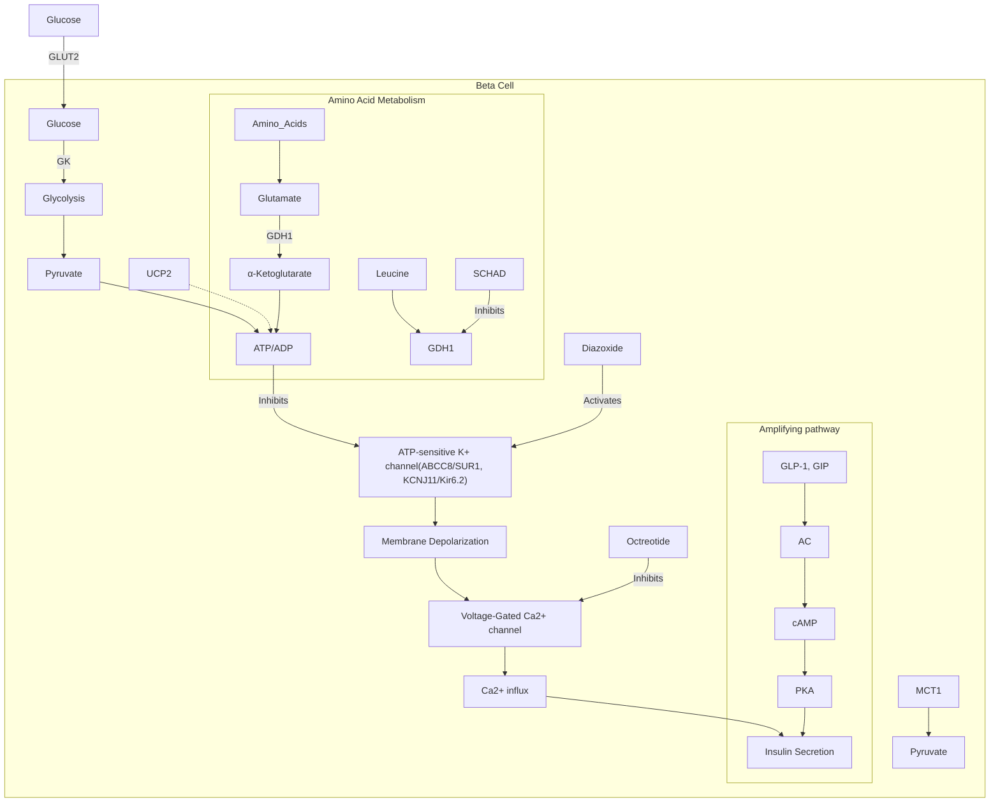

**東西要出來蓋(鈣)子必須打開**

**1** ✖ ~~GLUT2~~

**2** Diazoxide

**3** Octreotide

**4** Insulin Secretion

# 32.Insulin

Diagram showing the mechanism of insulin secretion in a pancreatic beta cell. Glucose enters via Glut1, is phosphorylated by GCK to Glucose-6-P, and metabolized in mitochondria to produce ATP. ATP leads to the closure of Kir6.2/SUR1 K+ channels. This causes membrane depolarization, opening voltage-gated Ca2+ and Na+ channels. The resulting Ca2+ influx triggers exocytosis of insulin granules. GLP1 also potentiates exocytosis via cAMP, PKA, and Epac2.

\* **Fig. 32.1** <mark>Glucose is taken up through the glucose transporter *Glut1* and phosphorylated by glucokinase</mark> <mark>(GCK).</mark> <mark>Further metabolism, especially in the</mark> <mark>mitochondria,</mark> <mark>results in</mark> <mark>generation</mark> <mark>of adenosine triphos-</mark> phate <mark>(ATP),</mark> which leads to <mark>K-channel closure.</mark> <mark>Sulphonylureas (SUs) inhibit the channel by direct binding,</mark> <mark>bypassing metabolism.</mark> The increased membrane resistance (R<sub>m</sub>) resulting from K-channel closure allows small background inward currents, such as those associated with <mark>spontaneous opening of T-type Ca<sup>2+</sup></mark> <mark>channels,</mark> to depolarize the β-cell (Ψ). This leads to regenerative <mark>activation of voltage-gated</mark> L-type and P/Q-type <mark>Ca<sup>2+</sup> channels</mark> and Na<sup>+</sup> channels, which produces <mark>action potential firing.</mark> The associated <mark>Ca<sup>2+</sup></mark> <mark>influx triggers exocytosis of insulin granules.</mark> <mark>Incretins</mark> such as glucagon-like peptide-1 <mark>(GLP1)</mark> potentiate <mark>exocytosis</mark> by both protein kinase A <mark>(PKA)-dependent</mark> and exchange protein activated by cyclic adenosine monophosphate <mark>(cAMP; Epac2)-dependent</mark> mechanisms. Plus signs indicate stimulation, and minus signs inhibition, of the indicated process(es). (Figure and legend modified from Ashcroft AM, Rorsman P. Diabetes mellitus and the β-cell: the last 10 years. *Cell*. 2012; 148:1160–1171, with permission.)

# 32.Insulin

Diagram showing the mechanism of insulin secretion in a pancreatic beta cell, including glucose transport via Glut1, phosphorylation by glucokinase (GCK), mitochondrial ATP production, KATP channel closure by ATP or sulfonylureas (SUs), membrane depolarization, and Ca2+ influx leading to insulin granule exocytosis. Incretins like GLP1 are also shown to potentiate the process via cAMP, PKA, and Epac2.

**ElvisChen** 12月8日

Glucose經由GLUT1進入胰臟beta, 透過GCK(glucokinase)變成G6P(是first rate limiting step)
粒線體產生很多ATP-> ATP增加不只把KATP channels關起來, 還可以insulin granules priming of exocytosis
Kir6.2通道(KCNJ11)被關起來就會去極化-> Ca2+透過voltage-dependent Ca2+通道進來(P/Q, L type), 增加[Ca2+]c
---
β-cell KATP channel有2個subunits:
1. Kir6.2\*(KCNJ11)和SUR1\*(ABCC8)
2. Kir6.2: pore-forming component 鉀通道
2-1. SUR1: sulfonylurea receptor
---
SU跳過代謝, 強制關掉K通道以去極化, T type鈣通道進來-> 分泌胰島素

<mark>is taken up through the glucose transporter *Glut1* and phosphorylated by glucokinase</mark>
<mark>abolism, especially in the mitochondria, results in generation of adenosine triphos-</mark>
leads to <mark>K-channel closure. Sulphonylureas (SUs) inhibit the channel by direct binding,</mark>
<mark>sm. The increased membrane resistance (Rm) resulting from K-channel closure allows</mark>
nward currents, such as those associated with spontaneous opening of T-type Ca2+
arize the β-cell (Ψ). This leads to regenerative <mark>activation of voltage-gated L-type and</mark>
<mark>nnels and Na+ channels, which produces action potential firing. The associated Ca2+</mark>
<mark>ytosis of insulin granules. Incretins</mark> such as glucagon-like peptide-1 (<mark>GLP1</mark>) potentiate
protein kinase A (<mark>PKA)-dependent</mark> and exchange protein activated by cyclic adenosine
AMP; Epac2)-dependent mechanisms. Plus signs indicate stimulation, and minus signs
inhibition, of the indicated process(es). (Figure and legend modified from Ashcroft AM, Rorsman P. Diabetes mellitus and the β-cell: the last 10 years. *Cell*. 2012; 148:1160–1171, with permission.)

# 32.Insulin clearance

血液第一次經過肝臟會先過濾掉65%,
進入循環後，再被肝臟代謝掉15%\*(**共80%**),
剩餘的由肌肉與腎臟代謝\*(腎臟+肌肉: 總共會<20%)

Fasting: prehepatic和peripheral胰島素濃度呈直線關係,
ratio of 4:1

Fed state: 吃越多肝臟<mark>排除率越低</mark>\*(排除功能有上限), 同時
肌肉代謝下降, 腎臟上升, 但腎臟上升+肌肉下降: 仍<20%


<table>
  <thead>
    <tr>
        <th>State</th>
        <th>Peripheral insulin (pmol/L)</th>
        <th>Prehepatic insulin (pmol/L)</th>
    </tr>
  </thead>
  <tbody>
    <tr>
        <td>Fasting</td>
        <td>0</td>
        <td>0</td>
    </tr>
    <tr>
        <td>Fasting</td>
        <td>20</td>
        <td>~80</td>
    </tr>
    <tr>
        <td>Fasting</td>
        <td>40</td>
        <td>~160</td>
    </tr>
    <tr>
        <td>Fasting</td>
        <td>60</td>
        <td>250</td>
    </tr>
    <tr>
        <td>Fasting</td>
        <td>80</td>
        <td>~330</td>
    </tr>
    <tr>
        <td>Fasting</td>
        <td>100</td>
        <td>~410</td>
    </tr>
    <tr>
        <td>Fasting</td>
        <td>120</td>
        <td>~490</td>
    </tr>
    <tr>
        <td>OGTT</td>
        <td>0</td>
        <td>0</td>
    </tr>
    <tr>
        <td>OGTT</td>
        <td>200</td>
        <td>~800</td>
    </tr>
    <tr>
        <td>OGTT</td>
        <td>400</td>
        <td>1600</td>
    </tr>
    <tr>
        <td>OGTT</td>
        <td>600</td>
        <td>~2000</td>
    </tr>
    <tr>
        <td>OGTT</td>
        <td>800</td>
        <td>~2200</td>
    </tr>
    <tr>
        <td>OGTT</td>
        <td>1000</td>
        <td>~2300</td>
    </tr>
    <tr>
        <td>OGTT</td>
        <td>1200</td>
        <td>~2400</td>
    </tr>
  </tbody>
</table>


\* **Fig. 32.4** Relationship between calculated prehepatic and measured <mark>peripheral plasma insulin concentrations</mark> in 1123 normoglycemic (mean fasting plasma glucose of 90 mg/dL [5.0 mmol/L]) subjects after an overnight fast (<mark>fasting</mark>) and during the absorpti<mark>on of a 75-g oral glucose load</mark> (<mark>oral glucose tolerance test [OGTT]</mark>). <mark>Note the linear relationship between prehepatic and peripheral insulin levels in the fasting state</mark> <mark>and the curvilinear relationship during the OGTT, indicating saturation of insulin degradation.</mark> The fasting range is plotted on the OGTT range (*red dotted lines*). (Data from Ferrannini E, Balkau B, Coppack SW, et al. Insulin resistance, insulin response, and obesity as indicators of metabolic risk. J Clin Endocrinol Metab. 2007; 92:2885–2892.)

# 32.Insulin clearance

By using the <mark>C-peptide method</mark> to <mark>calculate insulin secretion</mark> <mark>and an estimate of hepatic plasma flow (70% portal, 30% hepatic</mark> <mark>arterial), one can</mark> <mark>reconstruct prehepatic plasma insulin</mark> concentra- tions.<sup>41</sup> As shown in Fig. 32.4, in individuals with <mark>normal glucose</mark> <mark>tolerance, fasting prehepatic insulin concentrations are related to</mark> <mark>peripheral insulin levels in an approximately linear fashion, with an</mark> <mark>average ratio of 4:1. In the fed state (e.g., after an oral glucose load),</mark> <mark>eMCR<sub>I</sub> is lower</mark> than in the fasting state as a consequence of <mark>satu-</mark> <mark>ration of liver extraction. The contribution of muscle is reduced<sup>42</sup></mark> <mark>while that of the kidney is increased,<sup>35</sup></mark> although together they still contribute <mark>no more than 20%</mark> to overall insulin clearance. As a con- <mark>sequence, the ratio of prehepatic to peripheral insulin is progres-</mark> <mark>sively lower as pancreatic insulin release increases (see Fig. 32.4).</mark>

**Fasting**: prehepatic和peripheral胰島素濃度呈直線關係，ratio of 4:1
**Fed state**: 吃越多肝臟排除率越低\*(排除功能有上限)，同時肌肉代謝下降，腎臟上升

# 32.Insulin secretion


<table>
  <thead>
    <tr>
        <th colspan="4">TABLE 32.1 Insulin Secretion Parameters in Lean Persons With Normal Glucose Tolerance<sup>a</sup></th>
    </tr>
    <tr>
        <th> </th>
        <th>Mean</th>
        <th>Median</th>
        <th>25%—75%</th>
    </tr>
  </thead>
  <tbody>
    <tr>
        <td>Fasting plasma glucose (mg/dL)</td>
        <td>86.6</td>
        <td>88.2</td>
        <td>82.8—91.8</td>
    </tr>
    <tr>
        <td>(mmol/L)</td>
        <td>4.81</td>
        <td>4.90</td>
        <td>4.60—5.10</td>
    </tr>
  </tbody>
</table>


**user** 2月28日

1. Hyperglycemic clamp technique: assess insulin secretion capacity, **glucose sensitivity** (胰岛素分泌能力)
2. Hyperinsulinemic euglycemic clamp: measure insulin resistance, 看胰岛素降多少血糖 (**insulin sensitivity**)

# 新增回覆


<table>
  <tbody>
    <tr>
        <td>Total insulin output (2 hours)</td>
        <td>37</td>
        <td>36</td>
        <td>29—44</td>
    </tr>
    <tr>
        <td>(nmol·m⁻²)</td>
        <td>5.6</td>
        <td>5.4</td>
        <td>4.4—6.6</td>
    </tr>
    <tr>
        <td>(U·m⁻²·h)</td>
        <td> </td>
        <td> </td>
        <td> </td>
    </tr>
    <tr>
        <td>β-cell glucose sensitivity</td>
        <td>150</td>
        <td>125</td>
        <td>91—181</td>
    </tr>
    <tr>
        <td>(pmol·min⁻¹·m⁻²·mM⁻¹)</td>
        <td> </td>
        <td> </td>
        <td> </td>
    </tr>
    <tr>
        <td>Rate sensitivity (nmol·m⁻²·mM⁻¹)</td>
        <td>1.06</td>
        <td>0.69</td>
        <td>0.01—1.43</td>
    </tr>
    <tr>
        <td>Potentiation (ratio)</td>
        <td>2.34</td>
        <td>1.83</td>
        <td>1.26—2.73</td>
    </tr>
  </tbody>
</table>


## The Hyperglycemic Clamp and Biphasic Insulin Secretion

The <mark>hyperglycemic clamp</mark> protocol has been used in vivo, in the perfused pancreas and in islet cultures. The rationale of this test is to <mark>expose β-cells to a square wave of hyperglycemia, whereby glucose concentration is abruptly raised and kept constant</mark> at a preset...


**Insulin secretion in the fasting state**

<table>
  <tbody>
    <tr>
        <td>Body mass index (kg/m²)</td>
        <td>Hyperglycemic subjects (U·kg⁻¹·day⁻¹)</td>
        <td>Normoglycemic subjects (U·kg⁻¹·day⁻¹)</td>
        <td>Fasting insulin (pmol/L)</td>
    </tr>
    <tr>
        <td>≤ 25</td>
        <td>0.55</td>
        <td>0.12</td>
        <td>20</td>
    </tr>
    <tr>
        <td>&lt; 30</td>
        <td>0.62</td>
        <td>0.18</td>
        <td>40</td>
    </tr>
    <tr>
        <td>&lt; 35</td>
        <td>0.70</td>
        <td>0.25</td>
        <td>60</td>
    </tr>
    <tr>
        <td>≥ 35</td>
        <td>0.74</td>
        <td>0.32</td>
        <td>100</td>
    </tr>
  </tbody>
</table>


\* **Fig. 32.5** <mark>Fasting plasma insulin concentrations and corresponding fasting insulin secretion rates</mark> (extrapolated to 24 hours) in 1123 normoglycemic subjects (mean fasting plasma glucose of 90 mg/dL [5.0 mmol/L]) by conventional category of <mark>obesity</mark> (lean, overweight, moderate and severe obese). Plots are mean ±1 standard deviation. Stars indicate mean values of fasting insulin secretion (corresponding insulin concentrations not indicated) in 289 subjects with <mark>impaired glucose tolerance or overt diabetes</mark>. (Data from Ferrannini E, Balkau B, Coppack SW, et al. Insulin resis-

# 32.Insulin secretion

**C-peptide vs. Insulin**

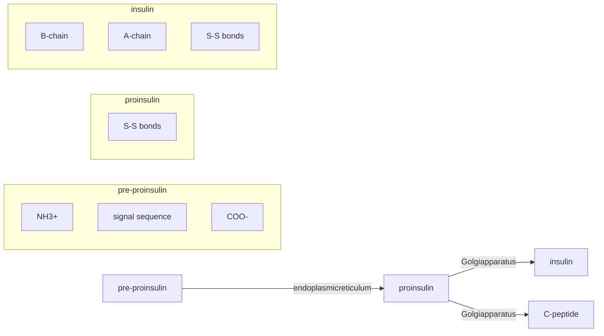

1. <mark>C-peptide 分泌量與胰島素相同</mark>，但<mark>不會被肝臟代謝</mark><mark>且腎臟排除率幾乎每人都相同，半衰期較長</mark>

2. 胰臟功能指標：<mark>urinary C-peptide to creatinine ratio</mark>、<mark>飯後血中 C-peptide</mark> 濃度

# 32.Insulin secretion

IV glucose → Insulin Secretion


The <mark>hyperglycemic</mark> clamp

<table>
  <thead>
    <tr>
        <th>Time (min)</th>
        <th>Plasma glucose (mM)</th>
        <th>Insulin secretion rate (pmol / min)</th>
    </tr>
  </thead>
  <tbody>
    <tr>
        <td>-40</td>
        <td>5</td>
        <td>150</td>
    </tr>
    <tr>
        <td>-20</td>
        <td>5</td>
        <td>150</td>
    </tr>
    <tr>
        <td>0</td>
        <td>9</td>
        <td>150</td>
    </tr>
    <tr>
        <td>5</td>
        <td>9</td>
        <td>850</td>
    </tr>
    <tr>
        <td>10</td>
        <td>9</td>
        <td>250</td>
    </tr>
    <tr>
        <td>20</td>
        <td>9</td>
        <td>380</td>
    </tr>
    <tr>
        <td>40</td>
        <td>9</td>
        <td>400</td>
    </tr>
    <tr>
        <td>60</td>
        <td>9</td>
        <td>420</td>
    </tr>
    <tr>
        <td>80</td>
        <td>9</td>
        <td>400</td>
    </tr>
    <tr>
        <td>100</td>
        <td>9</td>
        <td>480</td>
    </tr>
    <tr>
        <td>120</td>
        <td>9</td>
        <td>600</td>
    </tr>
  </tbody>
</table>
<table>
  <thead>
    <tr>
        <th> </th>
        <th>Phase 1</th>
        <th>Phase 2</th>
    </tr>
  </thead>
  <tbody>
    <tr>
        <td>胰島素敏感度 ↓</td>
        <td>↑</td>
        <td>Normal</td>
    </tr>
    <tr>
        <td><mark>早期 B cell 衰竭</mark></td>
        <td>↓</td>
        <td>Normal</td>
    </tr>
    <tr>
        <td><mark>DM</mark></td>
        <td>X</td>
        <td><mark>Delayed</mark></td>
    </tr>
  </tbody>
</table>


1. 給予 β cell 突然上升且持續的糖分刺激會導致 <mark>biphasic</mark> 胰島素分泌，皆與血糖上升幅度成正比
        a. <mark>Phase 1</mark>：短暫大量的胰島素分泌之後分泌量先短暫下降
        b. <mark>Phase 2</mark>：慢慢增加直到血糖恢復正常
2. 如果葡萄糖分好幾次給，<mark>first-phase response</mark> 會越來越弱，second phase 越來越強，<mark>總量</mark>增加

# 32.Insulin secretion

## The Intravenous Glucose Tolerance Test (<mark>IVGTT</mark>)

Another clinical test yielding the <mark>biphasic insulin response</mark> is the IVGTT. Here, a glucose bolus standardized to body size is injected <mark>intravenously</mark>, and <mark>glucose</mark>, <mark>insulin</mark>, and possibly, <mark>C-peptide</mark> concentrations are measured. In contrast to the hyperglycemic clamp,

給予β cell突然上升且持續的糖分刺激會導致biphasic胰島素分泌，與血糖上升幅度成正比

---

Phase 1\* 短暫 (5-8分鐘)大量胰島素分泌後，分泌量先短暫下降
First phase secretion在早期b細胞衰竭就會下降，是預測DM重要指標

---

Phase 2\* 慢慢增加直到血糖恢復正常 (血糖高的時間就是其分泌時間)

[新增回覆]


<table>
  <thead>
    <tr>
        <th>Time (min)</th>
        <th>-40</th>
        <th>-20</th>
        <th>0</th>
        <th>10</th>
        <th>20</th>
        <th>40</th>
        <th>60</th>
        <th>80</th>
        <th>100</th>
        <th>120</th>
    </tr>
  </thead>
  <tbody>
    <tr>
        <td>Plasma glucose (mM)</td>
        <td>5</td>
        <td>5</td>
        <td>9</td>
        <td>9</td>
        <td>9</td>
        <td>9</td>
        <td>9</td>
        <td>9</td>
        <td>9</td>
        <td>9</td>
    </tr>
    <tr>
        <td>Insulin secretion rate (pmol / min)</td>
        <td>150</td>
        <td>160</td>
        <td>850</td>
        <td>200</td>
        <td>420</td>
        <td>380</td>
        <td>410</td>
        <td>430</td>
        <td>400</td>
        <td>600</td>
    </tr>
  </tbody>
</table>


\* Fig. 32.6 <mark>Biphasic</mark> insulin response to a <mark>step increase in plasma glucose</mark> concentrations from 90 to 162 mg/dL (5.0 to 9.0 mmol/L). Plots are mean ± standard error of measurement (SEM). (Personal data.)


<table>
  <thead>
    <tr>
        <th>Plasma glucose (mmol/L)</th>
        <th>4</th>
        <th>5</th>
        <th>6</th>
        <th>7</th>
        <th>8</th>
        <th>9.5</th>
    </tr>
  </thead>
  <tbody>
    <tr>
        <td>Insulin secretion (pmol/min)</td>
        <td>70</td>
        <td>100</td>
        <td>200</td>
        <td>270</td>
        <td>330</td>
        <td>470</td>
    </tr>
  </tbody>
</table>


\* Fig. 32.7 The <mark>graded</mark> glucose infusion test: the <mark>slope (y/x) of the dose-response curve</mark> measures <mark>β-cell glucose sensitivity to plasma glucose</mark>. Typical data in a normoglycemic subject. (Redrawn from Byrne MM, Sturis J, Polonsky KS. Insulin secretion and clearance during low-dose graded glucose infusion. *Am J Physiol.* 1995; 268:E21-E27.)

# 32.Insulin

**Staub-Traugott effect: 連續吃多餐,**

血糖值及胰島素分泌量會逐漸降低,與給IV糖分相反,
因為前一餐造成的高血糖及高血中胰島素濃度,
會抑制內生糖質製造及胰島素分泌的啟動


Charts showing plasma glucose and insulin secretion rates for OGTT vs mixed meal

khuser PM 05:31

正常食物血糖上升較平緩, 消化較久
正常食物刺激胰島素:
Phase I: 較快較急\*(蛋白質/脂質)
Phase II: 持續較久, 總量較多
---
Mixed meal: 血糖上升慢, 消化久

[新增回覆]

\* **Fig. 32.8** Plasma glucose concentrations and insulin secretion rates in response to a <mark>standard (75-g) oral glucose tolerance test (OGTT)</mark> and to a <mark>mixed meal test (75 g of glucose plus 40 g of parmesan cheese and one 50-g egg, for a total of 500 kcal)</mark> in 22 normoglycemic subjects. The bottom panel shows the <mark>insulin secretion dose response to glucose: note the upward shift with the mixed meal versus oral glucose alone.</mark> Plots are mean ± standard error of measurement (SEM). (Personal data.)

# 32.Insulin-IV v.s. Oral

**ElvisChen** 9月12日
用吃的跟用打的比，因為incretin 作用，相同糖分會刺激更多胰島素分泌
[新增回覆]


<table>
  <tbody>
    <tr>
        <td>Time (min)</td>
        <td>Oral glucose</td>
        <td>IV glucose</td>
    </tr>
    <tr>
        <td>0</td>
        <td>0</td>
        <td>0</td>
    </tr>
    <tr>
        <td>30</td>
        <td>480</td>
        <td>300</td>
    </tr>
    <tr>
        <td>60</td>
        <td>400</td>
        <td>280</td>
    </tr>
    <tr>
        <td>90</td>
        <td>380</td>
        <td>260</td>
    </tr>
    <tr>
        <td>120</td>
        <td>320</td>
        <td>220</td>
    </tr>
    <tr>
        <td>150</td>
        <td>200</td>
        <td>180</td>
    </tr>
    <tr>
        <td>180</td>
        <td>240</td>
        <td>200</td>
    </tr>
  </tbody>
</table>
<table>
  <tbody>
    <tr>
        <td>Plasma glucose (mmol/L)</td>
        <td>Oral glucose</td>
        <td>IV glucose</td>
    </tr>
    <tr>
        <td>4.5</td>
        <td>80</td>
        <td>80</td>
    </tr>
    <tr>
        <td>5</td>
        <td>150</td>
        <td>120</td>
    </tr>
    <tr>
        <td>6</td>
        <td>280</td>
        <td>200</td>
    </tr>
    <tr>
        <td>7</td>
        <td>420</td>
        <td>300</td>
    </tr>
    <tr>
        <td>8</td>
        <td>550</td>
        <td>400</td>
    </tr>
    <tr>
        <td>9</td>
        <td>650</td>
        <td>480</td>
    </tr>
  </tbody>
</table>


• **Fig. 32.9** <mark>Matching</mark> the plasma glucose response to <mark>oral</mark> glucose with a <mark>controlled intravenous</mark> glucose infusion reveals the <mark>incretin effect</mark>, namely, the <mark>potentiation of the insulin secretory response</mark> due to the oral route of glucose entry. The corresponding dose-response curves highlight the <mark>enhanced β-cell sensitivity to oral</mark> as compared to intravenous glucose. *IV, Intravenous. (Personal data.)*

# 32.Insulin-From NGT to T2DM


<table>
  <thead>
    <tr>
        <th>2-hour plasma glucose (mg / dL)</th>
        <th>Glucose-induced insulin output (nmol·m⁻²)</th>
        <th>β-Cell glucose sensitivity (pmol·min⁻¹·m⁻²·mM⁻¹)</th>
    </tr>
  </thead>
  <tbody>
    <tr>
        <td>60</td>
        <td>0</td>
        <td>0</td>
    </tr>
    <tr>
        <td>100</td>
        <td>42</td>
        <td>85</td>
    </tr>
    <tr>
        <td>140</td>
        <td>50</td>
        <td>50</td>
    </tr>
    <tr>
        <td>180</td>
        <td>48</td>
        <td>35</td>
    </tr>
    <tr>
        <td>220</td>
        <td>38</td>
        <td>25</td>
    </tr>
    <tr>
        <td>260</td>
        <td>28</td>
        <td>20</td>
    </tr>
    <tr>
        <td>300</td>
        <td>22</td>
        <td>15</td>
    </tr>
    <tr>
        <td>340</td>
        <td>20</td>
        <td>10</td>
    </tr>
    <tr>
        <td>380</td>
        <td>21</td>
        <td>8</td>
    </tr>
  </tbody>
</table>


> ElvisChen 6月26日
>
> 1. 還沒DM時，insulin分泌可能先增加
> 2. glucose sensitivity下降 > insulin sensitivity
> - 此時血糖都可能是正常
> 3. 之後空腹血糖高，insulin分泌量開始下降
> 4. 血糖達DM標準，且insulin分泌量急速下降
>
> [ 新增回覆 ]

1. <mark>胰島素分泌在 IGT 會些微增加 15%，但在 T2D 病人會持續下降</mark>

2. Insulin sensitivity：每單位胰島素降低多少血糖，測量法：

   a. <mark>hyperinsulinemic euglycemic clamp (黃金標準)</mark>：給予穩定的insulin注射，另外調整注射糖分的量使病人血糖恆定，此時注射糖分的量就是胰島素敏感度

   b. <mark>HOMA-IR: 可只測量 fasting glucose and insulin</mark> levels 去換算 insulin sensitivity

3. <mark>Glucose sensitivity：每單位血糖刺激多少胰島素分泌</mark>

4. <mark>IGT 時，glucose sensitivity 下降的幅度遠大於 insulin sensitivity 下降</mark>的程度

# 32.Insulin-after surgery

Graph showing β-cell function after bariatric surgery, comparing controls, T2D pre-surgery, and T2D post-surgery, with accompanying handwritten and typed notes in Chinese and English.

\* Fig. 32.11 Insulin secretion rates as a function of concomitant plasma glucose concentrations during a mixed meal test in nondiabetic control subjects (*NGT*) and in a group of <mark>overweight patients with long-standing, poorly controlled diabetes before and 12 months after bariatric surgery</mark> (biliopancreatic diversion). Plots are mean ± standard error of measurement (SEM); the blue shaded area is mean ± SEM of controls. (Redrawn from Astiarraga B, Gastaldelli A, Muscelli E, et al. Biliopancreatic diversion in nonobese patients with type 2 diabetes: impact and mechanisms. *J Clin Endocrinol Metab.* 2013; 98:2765–2773.)

**ElvisChen** 3月1日

bariatric surgery可逆轉glucose sensitivity
血糖升到180, 正常人胰島素可到5-6倍
insulin/glucose斜率= b cell glucose sensitivity
\* Insulin sensitivity: 每單位胰島素降低多少血糖
\* Glucose sensitivity: 每單位血糖刺激多少胰島素分泌
\* 從IFG-> IGT-> overt DM: glucose sensitivity下降幅度遠大於insulin sensitivity下降程度
-> 斜率變小
---
First phase secretion在早期b細胞衰竭就會下降, 是預測DM重要指標
Glucose sensitivity下降, 儘管血糖仍正常, 一樣預告著dysglycemia

[新增回覆]

# 三、重點提示-Williams-33.Pathophysiology

# 33

# Pathophysiology of Type 2 Diabetes Mellitus

C. RONALD KAHN, HEATHER A. FERRIS, AND BRIAN T. O'NEILL

## CHAPTER OUTLINE

* Epidemiology, 1326
* Insulin Resistance and the Risk of Type 2 Diabetes Mellitus, 1337

* Pathogenesis, 1328
* Special Conditions That Induce Insulin Resistance, 1346

* Insulin Signaling, 1332

## KEY POINTS

* Type 2 diabetes mellitus (T2D) is one of the most common health conditions and is a major public health problem. The International Diabetes Federation estimated in 2021 that 537 million people have diabetes worldwide and that by 2045 this number will rise to 738 million.
* The clinical presentation is heterogeneous, with a wide range in <mark>age at onset</mark>, severity of <mark>hyperglycemia</mark>, degree of <mark>obesity</mark>, and severity of other <mark>associated metabolic abnormalities</mark>.

* T2D is the predominant form of diabetes worldwide, accounting for <mark>90% to 95%</mark> of cases.
* From a pathophysiologic standpoint, persons with T2D consistently demonstrate four cardinal abnormalities:

* The pathogenesis of T2D is complex and involves interactions among <mark>genetic, epigenetic, and environmental</mark> factors.
    - Resistance to the action of <mark>insulin</mark> in peripheral tissues, particularly muscle, fat, and liver

* Although more than 500 <mark>genetic variants</mark> (single-nucleotide polymorphisms) have been linked with risk for T2D, these variants collectively account for <mark>5% to 10%</mark> of the overall familial risk for disease, supporting the importance of epigenetic effects, as well as <mark>environmental</mark> influences.
    - <mark>Defects in insulin secretion</mark>, particularly in <mark>response to a glucose stimulus</mark>

* Several environmental factors play critical roles in the development of T2D, particularly <mark>excessive caloric intake</mark>, a <mark>sedentary</mark> lifestyle, increases in <mark>fat mass</mark>, and the <mark>gut microbiome</mark>.
    - <mark>Decreased glucose uptake</mark> in muscle and fat

    - Increased glucose production by the liver.

* Insulin receptors are nearly <mark>ubiquitously</mark> expressed, yet the physiologic actions of insulin are highly <mark>tissue specific</mark>, promoting <mark>calorie storage</mark> in the postprandial state via pleotropic effects on growth, metabolism, and cell survival.

# 33.Pathophysiology

> **BOX 33.1** **Epidemiologic Determinants of and Risk Factors for Type 2 Diabetes Mellitus**
>
> > **Genetic Factors**
> > <mark>Genetic markers</mark>
> > <mark>Family history</mark>
>
> > **Demographic Characteristics**
> > <mark>Age</mark>
> > Ethnicity
>
> > **Behavioral and Lifestyle-Related Risk Factors**
> > <mark>Obesity</mark> (including <mark>distribution of obesity</mark> and duration)
> <mark>Physical inactivity</mark>
> <mark>Diet</mark>
> > <mark>Stress</mark>
> > <mark>Westernization,</mark> urbanization, modernization
> > Medications
> > Shift work
>
> > **Metabolic Determinants and Intermediate-Risk Categories**
> > Impaired glucose tolerance
> > Insulin resistance
> > <mark>Gestational diabetes</mark>
> > <mark>Offspring of women with diabetes during pregnancy</mark>
> > <mark>Intrauterine</mark> malnutrition or overnutrition
> > <mark>Microbiome</mark> composition

bullet point icon

# 33.Pathophysiology

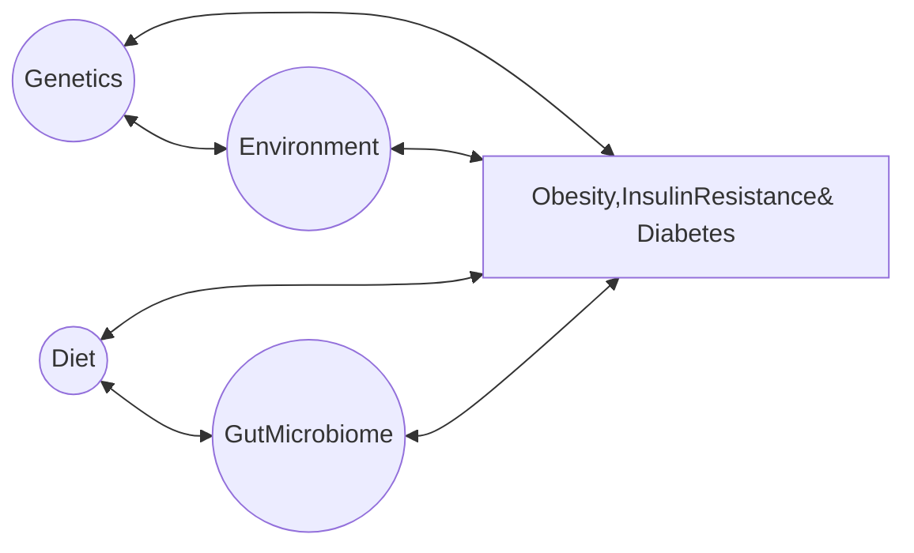

\* **Fig. 33.2** <mark>Genetics, the environment, diet, and the gut microbiome</mark> are among many interacting factors influencing the development of <mark>obesity, insulin resistance, and diabetes.</mark>

# 33.Pathophysiology

In addition, people with T2D may have hyperglucagonemia, <mark>alterations in incretin secretion or action,</mark> accelerated lipolysis in the fat cell, increased renal tubular reabsorption, and abnormalities in central nervous system regulation of metabolism.<sup>14</sup>

From a pathophysiologic standpoint in the development of T2D, there is still debate as to which is more important: insulin resistance or the inability of the pancreatic β cell to adapt to the insulin resistance. What is clear is that the <mark>earliest detectable abnormality in those predisposed to T2D is insulin resistance.</mark> Indeed, <mark>insulin resistance may precede T2D by more than 20 years.</mark><sup>5</sup> Many common factors further increase insulin resistance

ElvisChen note overlay

**ElvisChen** 9月13日

insulin resistant早於T2DM甚至20年
先有大規模下降的glucose sensitivity, 合併些許insulin resistance, 一開始insulin hyper-secretion代償, 而後insulin撐不住開始下降

# 33.Pathophysiology

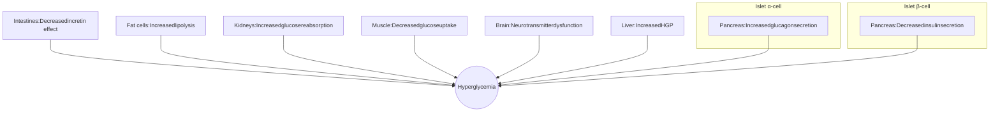

HGP

# 33.Pathophysiology

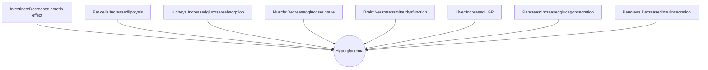

1. 周邊組織
    a. <mark>肌肉</mark>、脂肪、肝臟：<mark>胰島素阻抗</mark>-<mark>最早</mark>出現
    b. accelerated <mark>lipolysis</mark> in the fat cell (not lipogenesis)
    c. <mark>肝臟製糖</mark>增加導致空腹血糖升高
2. 胰臟
    a. 葡萄糖刺激後的胰島素分泌<font color="red">相對</font>不足
    b. <mark>hyperglucagonemia</mark>
3. Alterations in <mark>incretin</mark> hormone secretion or action (<font color="red">早期就有</font>)
4. Increased renal tubular reabsorption (<mark>SGLT2 ↑</mark>)
5. <font color="red">CNS 代謝</font>調節異常 (下視丘的 dopamine ↓，<mark>counter-regulatory hormone ↑</mark>)

# 33.Pathophysiology-gene\*insulin resistance

# Monogenic Forms of Diabetes Associated With Insulin <mark>Resistance</mark>

Insulin <mark>Receptor</mark> Mutation


<table>
  <thead>
    <tr>
        <th> </th>
        <th>Type A insulin resistance</th>
        <th>Donohue syndrome<br/>(Leprechaunism)</th>
        <th>Rabson-Mendenhall<br/>syndrome</th>
    </tr>
  </thead>
  <tbody>
    <tr>
        <td>突變位置</td>
        <td><mark>Intracellular</mark></td>
        <td colspan="2"><mark>Extracellular</mark></td>
    </tr>
    <tr>
        <td>發病</td>
        <td>青春期或<mark>年輕成人</mark><br/>期</td>
        <td><mark>嬰兒期</mark></td>
        <td>嬰幼兒期</td>
    </tr>
    <tr>
        <td>臨床表現</td>
        <td>Hyperinsulinemia<br/><mark>acanthosis</mark><br/><mark>nigricans</mark><br/><mark>hyperandrogenism</mark></td>
        <td><mark>子宮內生長遲滯</mark><br/><mark>低血糖</mark><br/>通常<mark>出生1至2年</mark><br/><mark>內死亡</mark></td>
        <td><mark>凸肚、牙齒及指甲異常</mark><br/><mark>松果體增生、身材矮小</mark></td>
    </tr>
  </tbody>
</table>


Table showing comparison between Type A insulin resistance, Donohue syndrome, and Rabson-Mendenhall syndrome

# 33.Pathophysiology-gene*insulin resistance

<mark>Lipodystrophic Diabetes</mark>

(<mark>insulin resistance</mark> + loss and <mark>misdistribution of fat</mark> + <mark>hypertriglyceridemia</mark>)

uy pettS!


<table>
  <thead>
    <tr>
        <th> </th>
        <th>特色</th>
        <th>Leptin</th>
        <th colspan="3">Gene</th>
    </tr>
    <tr>
        <th rowspan="4">Partial</th>
        <th rowspan="4"><mark>較常見</mark><br/>不易辨認及診斷</th>
        <th rowspan="4">正常或偏低<br/>(補充leptin<br/>治療<mark>無效</mark>)</th>
        <th colspan="3"><mark>PLIN1</mark></th>
    </tr>
    <tr>
        <th rowspan="2"><mark>LMNA</mark></th>
        <th><mark>Dunnigan syndrome</mark></th>
        <th><mark>臉部脂肪保留</mark></th>
    </tr>
    <tr>
        <th><mark>Mandibuloacral<br/>dysplasia syndrome</mark></th>
        <th>出生後的生長遲緩以及<mark>顱顏<br/>與骨骼畸形</mark></th>
    </tr>
    <tr>
        <th><mark>PPARγ</mark> → <mark>TZD</mark>治療效果顯著</th>
        <th> </th>
        <th></th>
    </tr>
  </thead>
  <tbody>
    <tr>
        <th>General</th>
        <th>較罕見<br/><mark>易辨認<br/>及診斷</mark></th>
        <th>很低<br/>(<mark>補充leptin</mark><br/>治療<mark>有效</mark>)</th>
        <th colspan="2"><mark>AGPAT2</mark></th>
        <th> </th>
    </tr>
  </tbody>
</table>


Diagram showing the genetic pathophysiology of lipodystrophic diabetes, categorized into Partial and General types with associated genes like PLIN1, LMNA, PPARγ, and AGPAT2.

# 33.Pathophysiology-gene\*insulin resistance

<mark>Rabson-Mendenhall syndrome</mark> is associated with <mark>short stature</mark>, <mark>pro-tuberant abdomen</mark>, <mark>abnormalities of teeth and nails</mark>, and, in some patients, <mark>pineal hyperplasia</mark>.<sup>21</sup>

These mutations impair <mark>receptor function</mark> by different mechanisms. The majority of mutations associated with <mark>type A insulin resistance</mark> are in the <mark>intracellular</mark> tyrosine kinase domain, whereas in Donohue and Rabson-Mendenhall syndromes the mutations are more frequently found in the <mark>extracellular</mark> domain, causing impairment in ligand binding, or the FnIII domains, which are key for receptor folding.<sup>22</sup> As noted, the insulin resistance associated with these <mark>insulin receptor mutations</mark> is usually severe, manifesting in the neonatal period (e.g., <mark>Donohue and Rabson-Mendenhall syndromes</mark>), or it can occur in a milder form in adulthood, and is often easily detected biochemically by marked <mark>hyperinsulinemia</mark> and clinically by <mark>acanthosis nigricans</mark> often in the absence of obesity. Some individuals with insulin receptor mutations are able to remain normoglycemic due to massive elevations of endogenous insulin secretion, whereas others have presented with hyperglycemia, which fails to respond to insulin therapy, sometimes in doses exceeding 10,000 U/day.<sup>17</sup>

<mark>Lipodystrophic</mark> Diabetes. Lipodystrophic diabetes syndromes can either be genetic or acquired, and they are characterized by <mark>severe insulin resistance</mark> associated with <mark>lipoatrophy (loss of fat)</mark> and/or <mark>lipodystrophy (loss and maldistribution of fat)</mark>. Clinically, these patients present with <mark>decreases in subcutaneous fat</mark>, <mark>insulin resistance</mark>, and <mark>hypertriglyceridemia</mark>. The genetic forms can be divided into <mark>generalized lipodystrophies</mark> or <mark>partial</mark>

**ElvisChen** 3月1日

Insulin receptor的mutation:

Type A insulin resistance: 因為insulin receptor resistance->而有hyperinsulinemia
- 最早表徵通常是acanthosis nigricans或hyperandrogenism的signs: 青少年才發現
- 換言之: 一開始不一定有**DM**相關症狀. 突變點: **核內intracellular** tyrosine kinase

---

Donohue\*(infancy)/ Rabson-Mendenhall syndrome\*(children)突變點在**extracellular**
- 而非如同type A insulin resistance在intracellular
- 此兩種都比較嚴重, 小孩就會被診斷出來: **高胰島素需求**

---

1.**Donohue** syndrome\*(子宮內就生長遲緩/ 出生1-2年死亡/ 臉異常/ 怪異的空腹低血糖):
**severe intrauterine growth retardation**, abnormal **face**\*(所以舊稱**leprechaunism**), 出生**1-2年內死亡**, 儘管severe insulin resistance, 居然可能有**<u>fasting hypoglycemia</u>**\*(因為very elevated insulin levels)

---

2.**Rabson-Mendenhall** syndrome\*(矮/ 凸肚/ 牙齒指甲異常/ 松果體): **short stature**, **<u>protuberant abdomen</u>**, abnormalities of **<u>teeth</u>** and **<u>nails</u>**, pineal hyperplasia

---

Type B insulin resistance
- auto-antibodies to insulin receptor: induce **severe** insulin resistance
- require **<u>thousands</u>** of units of insulin per day
- type B insulin resistance and acanthosis nigricans
- treated successfully with combined immunotherapy

     新增回覆

opment of TZD. It has been argued that because some patients The gene is

# 33.Pathophysiology-gene*insulin secretion


<table>
  <tbody>
    <tr>
        <td rowspan="2"><mark>Wolfram</mark> syndrome<br/>(<mark>WFS</mark>1/2)</td>
        <td>DIDMOAD: <mark>DI</mark>, <mark>DM</mark>, <mark>Optic</mark> Atrophy, <mark>Deafness</mark></td>
    </tr>
    <tr>
        <td><mark>MELAS</mark> syndrome</td>
        <td><mark>粒線體</mark> DNA 問題導致內部 <mark>ATP</mark> <mark>無法上升</mark> → <mark>insulin</mark> <mark>不分泌</mark><br/><mark>Mitochondrial</mark> DNA, <mark>Encephalopathy</mark>, <mark>Lactic</mark> Acidosis, <mark>Stroke</mark></td>
    </tr>
    <tr>
        <td>SLC30A8</td>
        <td><mark>ZnT8</mark> ↓ → exocytosis <mark>granule</mark> 不穩定</td>
    </tr>
    <tr>
        <td><mark>TCF7L2</mark></td>
        <td>和<mark>大腸癌</mark>有關</td>
    </tr>
    <tr>
        <td>Neonatal DM</td>
        <td> </td>
    </tr>
    <tr>
        <td>MODY</td>
        <td>有些基因與 <mark>NDM</mark> 重複</td>
    </tr>
  </tbody>
</table>


Diagram showing genetic associations with insulin secretion pathophysiology

# 33.Pathophysiology-gene*insulin secretion

<!-- layout: scratchpad
1. This is semantically a table showing genetic syndromes and their associated pathophysiology or clinical features.
2. It is a single table with two main columns.
3. Row sampling: Typical row has 2 cells (e.g., "Wolfram syndrome" and "DIDMOAD...").
4. Columns (2 total): Col 1: Syndrome/Gene name; Col 2: Description/Pathophysiology.
5. Merge cell detection: No obvious merges.
6. Header structure: No explicit header row, but the first column acts as a row header.
7. Column count verification: N=2.
8. Header TSV sanity check: N/A (no explicit header).
-->
<table>
  <tbody>
    <tr>
        <td>Wolfram syndrome<br/>(<strong><mark>WFS</mark>1/2</strong>)</td>
        <td>DIDMOAD: <mark>DI</mark>, <mark>DM</mark>, <mark>Optic</mark> Atrophy, <mark>Deafness</mark></td>
    </tr>
    <tr>
        <td><mark>MELAS</mark> syndrome</td>
        <td>粒線體 DNA 問題導致內部 <mark>ATP</mark> <mark>無法上升</mark> $\rightarrow$ <mark>insulin</mark> <mark>不分泌</mark><br/><strong><mark>Mitochondrial</mark> DNA, <mark>Encephalopathy</mark>, <mark>Lactic</mark> Acidosis, <mark>Stroke</mark></strong></td>
    </tr>
    <tr>
        <td>SLC30A8</td>
        <td><mark>ZnT8</mark> $\downarrow$ $\rightarrow$ exocytosis <mark>granule</mark> 不穩定</td>
    </tr>
    <tr>
        <td><mark>TCF7L2</mark></td>
        <td>和<mark>大腸癌</mark>有關</td>
    </tr>
    <tr>
        <td>Neonatal DM</td>
        <td> </td>
    </tr>
    <tr>
        <td>MODY</td>
        <td>有些基因與 <mark>NDM</mark> 重複</td>
    </tr>
  </tbody>
</table>


Yellow icon

> **\*\*Syndromic DM**
> 1-1.<u>maternally</u> inherited diabetes and deafness\* (<u>**MIDD**</u>): mitochondrial DNA
> 1-2.<u>**mitochondrial**</u> encephalopathy, <u>**lactic**</u> acidosis, and <u>**stroke**</u>-like episodes\* (<u>**MELAS**</u>)
> - 包括DM及所有same features as MIDD: presence of <u>**deafness**</u> and <u>**diabetes**</u>
> -> <u>**insulin**</u>在診斷2年內需要用上
> -> 只要mitochondrial function有問題: 就<u>不要</u>用metformin
> 2.<u>**Wolfram**</u> syndrome: <u>**WFS1**</u>基因, wolframin蛋白 -> AR
> - <u>DI</u>\*(central), <u>DM</u>\*(<u>**insulin**</u>), D\*(<u>**deafness**</u> 耳聾\* sensorineural), OA\*(<u>**optic**</u> atrophy)
> - 需要<u>胰島素</u>, 但<u>沒有抗體</u>\*(insulin dependent but <u>**not**</u> autoimmune)
> ---
> 3.<u>**Alstrom**</u> syndrome: <u>**ALMS1**</u>基因突變, AR
> - retinal dystrophy\*(cone rod), 耳聾\*(sensorineural), 幼年肥胖, T2DM
> - 因為是T2DM: 可以藥物 + diet + exercise -> delay progression

# 33.Pathophysiology-T2DM genome wide significance

Venn diagram showing the intersection of genetic loci associated with Type 2 diabetes, BMI, Waist circumference, WHR, Fasting insulin, and Fasting glucose.

* **Fig. 33.3** Venn diagram of the intersection between loci associated at <mark>genome-wide significance</mark> with <mark>type 2 diabetes mellitus</mark>, measures of <mark>adiposity</mark>, and <mark>glucose homeostasis</mark>. <mark>Genome-wide significant associations for six metabolic traits</mark> are shown. Gene symbols shown in the plot are by convention the closest gene and not necessarily the functional gene. *BMI*, body mass index; <mark>*WHR*, waist-to-hip ratio</mark>. (Adapted from Grarup N, Sandholt CH, Hansen T, Pedersen O. Genetic susceptibility to type 2 diabetes and obesity: from genome wide association studies to rare variants and beyond. *Diabetologia*. 2014;57:1528–1541.)

# 33.Pathophysiology-T2DM genome wide significance

1. 將糖尿病相關基因分成五種
metabolic traits: <mark>BMI</mark>、<mark>腰圍</mark>、<mark>腰臀比</mark>、<mark>空腹胰島素</mark>、<mark>空腹血糖</mark>

2. 特例: <mark>CREBRF</mark> 會增加 BMI 但卻降低 **DM** 風險 (可能因為增加的不是內臟脂肪)

3. 預估只找到 5-10% of the total genetic risk

Venn diagram of the intersection between loci associated at genome-wide significance with type 2 diabetes mellitus, measures of adiposity, and glucose homeostasis.

* **Fig. 33.3** Venn diagram of the intersection between loci associated at <mark>genome-wide significance with type 2 diabetes mellitus</mark>, measures of <mark>adiposity</mark>, and <mark>glucose homeostasis</mark>. Genome-wide significant associations for <mark>six metabolic traits</mark> are shown. Gene symbols shown in the plot are by convention the closest gene and not necessarily the functional gene. *BMI*, body mass index; <mark>*WHR*, waist-to-hip ratio</mark>. (Adapted from Grarup N, Sandholt CH, Hansen T, Pedersen O. Genetic susceptibility to type 2 diabetes and obesity: from genome wide association studies to rare variants and beyond. Diabetologia. 2014;57:1528–1541.)

# 33.Pathophysiology-insulin signaling

Diagram of insulin and IGF1 signaling pathways showing receptor activation, PI 3-kinase pathway, and Ras-MAPK pathway leading to metabolic and growth effects.

胰島素訊號傳導
Insulin receptor磷酸化
Node 1 (IRS)

Down arrow

Node 2 (PI-3k)

Down arrow

Node 3 (AKT)

# 33.Pathophysiology-muscle

Diagram showing insulin and exercise signaling pathways in muscle, including glucose uptake via Glut4, metabolism, protein synthesis/growth, and suppression of atrophy/autophagy.

1. 胰島素訊息傳導 IRS→PI3K→AKT

2. 運動活化 AMPK 使 GLUT4 細胞膜表現增加，增加 Glucose 吸收利用

# 33.Pathophysiology-adipose

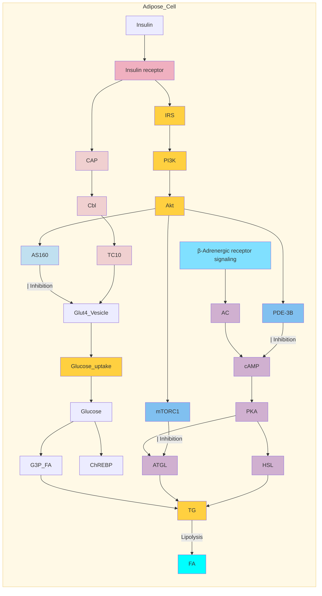

**Glucose uptake** | **Lipogenesis** | **Gene regulation** | **Suppression of lipolysis**

1. 胰島素訊息傳導
   <mark>IRS → PI3K → AKT</mark>

2. <mark>$\beta$-腎上腺素訊號</mark>會增加 cAMP，活化 PKA 進而<mark>促進脂肪分解</mark>

TG 由肝臟製造並儲存於脂肪細胞

# 33.Pathophysiology-liver

Diagram of insulin and glucagon signaling pathways in the liver, showing molecular interactions including IRS, PI3K, Akt, FoxOs, and SREBPs, and their effects on glycogenolysis, gluconeogenesis, and lipogenesis.

1. 胰島素訊息傳導
<mark>IRS→PI3K→AKT</mark>

2. <mark>Glucagon</mark>會增加cAMP，活化PKA進而<mark>增加肝醣裂解</mark>

3. 肝臟透過<mark>GLUT2</mark>輸出<mark>Glucose</mark>

Lipogenesis label

Suppression of glucose production

# 33.Pathophysiology-liver


<table>
  <tbody>
    <tr>
        <td>Fasting plasma glucose level (mg/dL)</td>
        <td>Basal hepatic glucose production (mg/m² per minute)</td>
        <td>Subject Type</td>
    </tr>
    <tr>
        <td>90</td>
        <td>45</td>
        <td>Nondiabetic control</td>
    </tr>
    <tr>
        <td>100</td>
        <td>50</td>
        <td>Nondiabetic control</td>
    </tr>
    <tr>
        <td>110</td>
        <td>55</td>
        <td>Nondiabetic control</td>
    </tr>
    <tr>
        <td>120</td>
        <td>60</td>
        <td>Nondiabetic control</td>
    </tr>
    <tr>
        <td>130</td>
        <td>58</td>
        <td>Nondiabetic control</td>
    </tr>
    <tr>
        <td>140</td>
        <td>62</td>
        <td>Nondiabetic control</td>
    </tr>
    <tr>
        <td>150</td>
        <td>65</td>
        <td>Diabetic</td>
    </tr>
    <tr>
        <td>180</td>
        <td>70</td>
        <td>Diabetic</td>
    </tr>
    <tr>
        <td>200</td>
        <td>75</td>
        <td>Diabetic</td>
    </tr>
    <tr>
        <td>250</td>
        <td>80</td>
        <td>Diabetic</td>
    </tr>
    <tr>
        <td>300</td>
        <td>85</td>
        <td>Diabetic</td>
    </tr>
  </tbody>
</table>


\* **Fig. 33.6** The relationship between <mark>fasting hepatic glucose output</mark> and <mark>fasting plasma glucose levels.</mark> Open squares represent nondiabetic control subjects; <mark>solid squares represent diabetic subjects.</mark> (From Maggs DG, Buchanan TA, Burant CF, et al. Metabolic effects of troglitazone monotherapy in type 2 diabetes mellitus. A randomized, double-blind, placebo-controlled trial. Ann Intern Med. 1998;128:176-185. © American College of Physicians.)

Screenshot of a digital annotation tool overlaying the text

# 33.Pathophysiology-insulin sensitive tissues

Diagram showing the effects of insulin on various tissues including β-cell (survival/proliferation, first-phase secretion), α-cell (glucagon suppression), brain/neuron (satiety, mood stabilization, cholesterol synthesis), macrophage (ER stress, apoptosis, cytokine release), cardiomyocyte (glucose oxidation, hypertrophy, fatty acid oxidation, autophagy), and endothelium (vasodilation via NO).

\* **Fig. 33.7** The expanding collection of insulin-sensitive tissues. <mark>Insulin receptors are ubiquitously expressed</mark>, and thus insulin controls pleotropic effects on numerous "nonclassical" tissues that play an important role in health. *ER*, endoplasmic reticulum.

# 33.Pathophysiology-insulin sensitive tissues

Diagram showing insulin's effects on beta cells, alpha cells, and other tissues. Labels include Survival/proliferation, First-phase secretion, Glucagon suppression, Satiety, Mood stabilization, and Cholesterol.

**user** 3月3日

insulin可作用在多個器官
1.胰臟beta細胞: 促進b cell survival/ proliferation, 及胰島素first phase分泌
- 很敏感for beta cell failure
2.胰臟alpha細胞: 抑制glucagon
3.血管內皮\*(endothelium): 促進NO分泌以及vasodilation-> 預防動脈硬化
4.大腦神經元: satiety\*(飽足感/ 心情穩定)
5.心肌: 增加cardiomyocyte使用葡萄糖\*(glucose oxidation)及post-natal cardiac growth\*(hypertrophy)
- 減少心肌fatty acid oxidation\*(氧化壓力), 減少心肌自噬\*(autophagy)
6.macrophage: 減少巨噬細胞的stress, 減低apoptosis / 但會增加cytokine
- insulin resistance因為巨噬細胞的stress/ apoptosis-> plaque progression

# 33.Pathophysiology-insulin resistance

Diagram showing the complex pathways of insulin resistance involving adipose tissue inflammation, obesity, microbiome alterations, and cellular stress leading to the inhibition of insulin action in muscle or liver cells. Key factors include adipokines (Adiponectin, Resistin, PAI-1), cytokines (IL-6, TNFα), fatty acids (FAs), and intracellular signaling molecules like JNK, IKK, S6K, and PKC which phosphorylate IRS on serine residues.

共同路徑：
<mark>活化 serine/threonine kinase</mark>
<mark>(JNK、IKK、S6K、PKC)</mark> 進而磷酸化 IRS <mark>導致胰島素傳導鏈的訊號</mark>
<mark>干擾中斷</mark>

# 33.Pathophysiology-insulin resistance


<table>
    <tr>
        <th>Body Mass Index (kg/m²)</th>
        <th>SSPG (mg/dL)</th>
        <th>Waist Circumference (cm)</th>
        <th>SSPG (mg/dL)</th>
    </tr>
    <tr>
        <td>15</td>
        <td>0</td>
        <td>50</td>
        <td>0</td>
    </tr>
    <tr>
        <td>20</td>
        <td>75</td>
        <td>60</td>
        <td>50</td>
    </tr>
    <tr>
        <td>25</td>
        <td>125</td>
        <td>70</td>
        <td>100</td>
    </tr>
    <tr>
        <td>30</td>
        <td>175</td>
        <td>80</td>
        <td>150</td>
    </tr>
    <tr>
        <td>35</td>
        <td>225</td>
        <td>90</td>
        <td>200</td>
    </tr>
    <tr>
        <td>40</td>
        <td>275</td>
        <td>100</td>
        <td>250</td>
    </tr>
    <tr>
        <td>45</td>
        <td>325</td>
        <td>110</td>
        <td>300</td>
    </tr>
    <tr>
        <td>EMPTY</td>
        <td>EMPTY</td>
        <td>120</td>
        <td>350</td>
    </tr>
    <tr>
        <td>EMPTY</td>
        <td>EMPTY</td>
        <td>130</td>
        <td>EMPTY</td>
    </tr>
    <tr>
        <td>EMPTY</td>
        <td>EMPTY</td>
        <td>140</td>
        <td>EMPTY</td>
    </tr>
</table>
**A**
**Panel 1 (Left):** $r = 0.58$, $p < 0.001$
**Panel 2 (Right):** $r = 0.57$, $p < 0.001$


<table>
    <tr>
        <th>Intra-abdominal fat area (cm²)</th>
        <th>Insulin sensitivity index (x 10⁻⁵ min⁻¹/pM)</th>
    </tr>
    <tr>
        <td>20</td>
        <td>4.5</td>
    </tr>
    <tr>
        <td>22</td>
        <td>4.0</td>
    </tr>
    <tr>
        <td>24</td>
        <td>3.5</td>
    </tr>
    <tr>
        <td>26</td>
        <td>3.0</td>
    </tr>
    <tr>
        <td>28</td>
        <td>2.5</td>
    </tr>
    <tr>
        <td>30</td>
        <td>1.5</td>
    </tr>
    <tr>
        <td>32</td>
        <td>0.5</td>
    </tr>
</table>
**B**
$r = .59$
$p < 0.05$

• **Fig. 33.9** Relationships between <mark>body mass index, waist circumference, and insulin resistance</mark> measured by <mark>steady-state plasma glucose (SSPG) (A) or intraabdominal fat and insulin sensitivity</mark> (B). (A from Farin MF, Fahim A, Reaven GM. Body mass index and waist circumference both contribute to differences in insulin-mediated glucose disposal in nondiabetic adults. *Am J Clin Nutr.* 2006;83:47–51; B, from Kahn SE, Prigeon RL, McCulloch DK, et al. Quantification of the relationship between insulin sensitivity and beta-cell function in human subjects: evidence for a hyperbolic function. *Diabetes.* 1993;42:1663–1672.)

# 33.Pathophysiology-insulin resistance


<table>
  <thead>
    <tr>
        <th>Group</th>
        <th>Brain</th>
        <th>Muscle</th>
        <th>Adipose</th>
        <th>Splanchnic</th>
    </tr>
  </thead>
  <tbody>
    <tr>
        <td>Controls</td>
        <td>1.2</td>
        <td>4.3</td>
        <td>0.3</td>
        <td>0.7</td>
    </tr>
    <tr>
        <td>Type 2 diabetics</td>
        <td>1.2</td>
        <td>1.7</td>
        <td>0.4</td>
        <td>0.6</td>
    </tr>
  </tbody>
</table>


\* **Fig. 33.10** Tissue uptake of glucose in type 2 diabetic subjects during a <mark>hyperinsulinemic-euglycemic clamp.</mark> (From DeFronzo RA. The triumvirate: beta-cell, muscle, liver—a collusion responsible for NIDDM. Lilly Lecture 1987. *Diabetes.* 1988;37:667–687.)

# 33.Pathophysiology-circadian

Diagram showing the effects of circadian disruption versus time-restricted eating on metabolic health. The left side shows a healthy circadian rhythm with time-restricted eating leading to improved insulin sensitivity, sleep quality, exercise, and weight loss. An arrow labeled "Circadian disruption" points to the right, showing a person with obesity and metabolic complications like diabetes, CVD, and MASLD. A return arrow labeled "Time restricted eating" points back to the healthy state.

吃進去總熱量跟進食時間都很重要
一天24小時，侷限在8-10小時進食

\* **Fig. 33.11** <mark>Circadian rhythm disruption is highly associated with weight gain and metabolic complications.</mark> <mark>Time-restricted eating and improved circadian homeostasis may improve or prevent metabolic compli-</mark> <mark>cations of obesity.</mark> *CVD, cardiovascular disease; MASLD, metabolic associated steatotic liver disease (formerly NAFLD)*

# 33.Pathophysiology-Gut microbiome

Diagram showing the relationship between the gut microbiome, diet, genes, and metabolic health. It illustrates how changes in the gut microbiome, influenced by diet, genes, prebiotics, probiotics, antibiotics, and exercise, lead to changes in food/bile acid metabolism and gut barrier function. These changes affect portal and peripheral circulation, leading to immune activation, metabolic regulation issues, and ultimately diabetes and metabolic syndrome.

\* **Fig. 33.12** The <mark>gut microbiome</mark> is affected by our <mark>genes and environment</mark>. <mark>Changes to the gut micro-</mark>
<mark>biome may result in altered gut barrier function</mark> and <mark>food and bile acid metabolism</mark>, leading to <mark>immune</mark>
<mark>activation and insulin resistance.</mark>

# 33.Pathophysiology-drugs

Screenshot of a medical textbook box titled "Drugs and Stressors Associated With Insulin Resistance" with digital annotations and a comment box.

**• BOX 33.2 Drugs and Stressors Associated With Insulin Resistance**

**Drugs**
<mark>Glucocorticoids</mark>
<mark>Human immunodeficiency virus medications</mark> (all cause varying degrees of metabolic abnormalities)
<mark>Calcineurin inhibitors</mark>
Mammalian target of rapamycin <mark>(mTOR) inhibitors</mark>
Phosphoinositide 3-kinase inhibitors
<mark>Statins</mark>
<mark>Antipsychotic</mark> medications

**Stressors**
<mark>Pregnancy</mark>
<mark>Glucotoxicity</mark>
<mark>Surgery</mark>
<mark>Inflammation (from obesity or infection)</mark>
<mark>Overnutrition</mark>

**user** 9月19日 ... X

mTOR inhibitor影響胰島素作用於下游訊號，造成胰島素阻抗
Calcineurin inhibitor則是抑制胰島素分泌關鍵步驟glucokinase以減少胰島素分泌量

[新增回覆]

# 三、重點提示-Williams-34.Therapy

# 34 Therapeutics of Type 2 Diabetes Mellitus

ANDREW J. AHMANN AND MATTHEW C. RIDDLE

## CHAPTER OUTLINE

* Epidemiology, 1349
* General Approaches to Management, 1351
* Glucose-Lowering Pharmacotherapy, 1362
* Practical Aspects of Treatment, 1375
* A Standardized Initial Therapeutic Approach, 1376
* Considerations in Personalizing Therapy, 1378
* Special Situations in Clinical Management, 1381
* Preventing Type 2 Diabetes Mellitus, 1382
* Future Directions, 1383

## KEY POINTS

* Type 2 diabetes mellitus (T2D) is a major public health problem. The International Diabetes Federation (IDF) estimated a global diabetes prevalence of 535.6 million people worldwide in 2021, with a projected increase in prevalence to <mark>783 million</mark> by 2045.

* <mark>T2D</mark> is the predominant form of diabetes worldwide, accounting for 90% of cases globally.

* The pathogenesis of T2D is complex and involves the interaction of environmental and <mark>genetic factors</mark>.

* Environmental factors that contribute to development of T2D include <mark>excessive caloric intake</mark> and a <mark>sedentary lifestyle</mark> leading to <mark>obesity</mark>.

* Genetically, T2D includes <mark>monogenic and polygenic forms</mark>, and some monogenic forms require a <mark>specific approach to treatment</mark>.

* The typical person developing T2D is in <mark>late middle age and overweight or obese</mark>, but the clinical presentation is heterogeneous, with a wide range in age at onset, degree of obesity, and severity of associated hyperglycemia.

* <mark>Uncontrolled hyperglycemia is associated with eye, nerve, kidney</mark>, and cardiovascular complications that reduce both the quality of life and years of life-expectancy.

* Fortunately, hyperglycemia is a <mark>modifiable</mark> risk factor.

* Significant advances have been made in the treatment of patients with T2D over the past 20 years, and a large number of treatment options are available.

* Diabetes self-management education and support is a critical and underutilized foundational tool in managing T2D.

* <mark>Metformin</mark> as initial therapy in combination with <mark>diet, exercise</mark>, and comprehensive diabetes education effectively lowers glucose with essentially <mark>no risk of hypoglycemia</mark>.

* If the response to metformin is inadequate initially or subsequently, one or more other agents can be added. There are <mark>seven recommended second-line therapies</mark>: <mark>sulfonylurea</mark>, <mark>glucagon-like peptide-1 (GLP1) receptor</mark>, <mark>basal insulin</mark>, <mark>dipeptidyl peptidase-4 (DPP4) inhibitor</mark>, <mark>sodium-glucose cotransporter 2 (SGLT2) inhibitor</mark>, <mark>glucose-dependent insulinotropic polypeptide (GIP)/GLP1 dual receptor agonist</mark>, and <mark>thiazolidinedione</mark>. Each has its advantages and disadvantages.

* The most significant recent change in pharmacologic therapy has been the development of agents that have <mark>nonglycemic benefits</mark>, including <mark>reduction in cardiovascular events and delayed progression of kidney disease</mark>.

* A team approach to management greatly improves success, especially for patients with <mark>diabetes longer than 10 years</mark> and therefore requiring greater complexity and personalization of therapy.

# 34.Therapy-DM criteria


**TABLE 34.1** <mark>Criteria</mark> for Diagnosis of Prediabetes and Diabetes

<table>
  <thead>
    <tr>
        <th>Measurement</th>
        <th>Units</th>
        <th>Diagnostic of Prediabetes</th>
        <th>Diagnostic of Diabetes<sup>a</sup></th>
        <th>Comments</th>
    </tr>
  </thead>
  <tbody>
    <tr>
        <td rowspan="2">Fasting plasma glucose (<mark>FPG</mark>)</td>
        <td>mg/dL</td>
        <td><mark>100–125</mark></td>
        <td><mark>≥126</mark></td>
        <td rowspan="2">After <mark>no calorie intake for at least 8 hours</mark></td>
    </tr>
    <tr>
        <td>mmol/L</td>
        <td>5.6–6.9</td>
        <td>≥7.0</td>
    </tr>
    <tr>
        <td rowspan="2">2-hour plasma glucose (<mark>2-hr PG</mark>)</td>
        <td>mg/dL</td>
        <td><mark>140–199</mark></td>
        <td><mark>≥200</mark></td>
        <td rowspan="2"><mark>2 hours after 75 g oral glucose</mark></td>
    </tr>
    <tr>
        <td>mmol/L</td>
        <td>7.8–11.0</td>
        <td>≥11.1</td>
    </tr>
    <tr>
        <td rowspan="2"><mark>Random</mark> plasma glucose</td>
        <td>mg/dL</td>
        <td>Not applicable</td>
        <td><mark>≥200</mark></td>
        <td rowspan="2">Without oral glucose but with <mark>classic symptoms</mark></td>
    </tr>
    <tr>
        <td>mmol/L</td>
        <td> </td>
        <td>≥11.1</td>
    </tr>
    <tr>
        <td rowspan="2"><mark>HbA<sub>1c</sub></mark></td>
        <td>%</td>
        <td><mark>5.7–6.4</mark></td>
        <td><mark>≥6.5</mark></td>
        <td rowspan="2">Measured in certified laboratory</td>
    </tr>
    <tr>
        <td>mmol/mol</td>
        <td>39–47</td>
        <td>≥48</td>
    </tr>
  </tbody>
</table>


\*<sup>a</sup>In the absence of unequivocal hyperglycemia, results should be <mark>confirmed by repeat testing.</mark>

Data from American Diabetes Association. Classification and diagnosis of diabetes. Standards of medical care in diabetes—2022. *Diabetes Care.* 2022;45:S17–S38.

# 34.Therapy-three stages

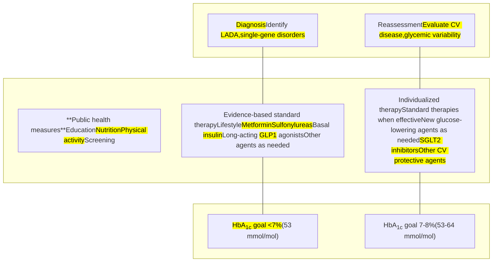

<table>
    <tr>
        <th>High risk due to <mark>IGT/IFG,</mark> prior GD, <mark>family history</mark></th>
        <th>Undiagnosed diabetes</th>
        <th>Early diabetes (&lt;10 years?)</th>
        <th><mark>Long-duration diabetes</mark> <mark>(&gt;10 years?)</mark></th>
    </tr>
    <tr>
        <td>**Common problems**</td>
        <td></td>
        <td>**Common problems**</td>
        <td>**Potential problems**</td>
    </tr>
    <tr>
        <td>Injuries</td>
        <td></td>
        <td><mark>Early neuropathy, retinopathy,</mark></td>
        <td><mark>Amputation, blindness,</mark></td>
    </tr>
    <tr>
        <td>Infections</td>
        <td></td>
        <td><mark>nephropathy</mark></td>
        <td><mark>renal failure</mark></td>
    </tr>
    <tr>
        <td>Psychosocial adjustments</td>
        <td></td>
        <td>Subclinical CV disease</td>
        <td><mark>MI, stroke, CV death</mark></td>
    </tr>
</table>
\* **Fig. 34.1** Overview of the natural history of type 2 diabetes (T2D) and opportunities for assessment and intervention. A schematic depiction of <mark>three stages of management of the natural history of T2D,</mark> noting several opportunities for improvement of management. *CV*, cardiovascular; *GD*, gestational diabetes mellitus; *IFG*, impaired fasting glucose; *IGT*, impaired glucose tolerance; *LADA*, latent autoimmune diabetes of adulthood; *MI*, myocardial infarction. (Redrawn from Zinman B, Skyler JS, Riddle MC, et al. Diabetes research and care through the ages. *Diabetes Care*. 2017;40:1302–1313.)

# 34.Therapy-treatment effects


<table>
  <thead>
    <tr>
        <th>TABLE 34.2</th>
        <th colspan="4">Treatment Effects of <mark>Sulfonylureas or Insulin</mark> in the <mark>UKPDS</mark></th>
    </tr>
    <tr>
        <th> </th>
        <th colspan="2">YEAR: 1997<br/>END OF RANDOMIZED TREATMENT</th>
        <th colspan="2">YEAR: 2007<br/>AFTER <mark>10 YEARS</mark> OF FURTHER OBSERVATION</th>
    </tr>
    <tr>
        <th>Aggregate Endpoints</th>
        <th>Relative Risk Reduction</th>
        <th>p Value</th>
        <th>Relative Risk Reduction</th>
        <th>p Value</th>
    </tr>
  </thead>
  <tbody>
    <tr>
        <td>Any diabetes-related endpoint</td>
        <td>12%</td>
        <td>0.029</td>
        <td>9%</td>
        <td>0.040</td>
    </tr>
    <tr>
        <td>Microvascular disease</td>
        <td><mark>25%</mark></td>
        <td>0.0099</td>
        <td><mark>24%</mark></td>
        <td>0.001</td>
    </tr>
    <tr>
        <td>Myocardial infarction</td>
        <td>16%</td>
        <td>0.052</td>
        <td><mark>15%</mark></td>
        <td>0.014</td>
    </tr>
    <tr>
        <td>All-cause mortality</td>
        <td>6%</td>
        <td>0.44</td>
        <td><mark>13%</mark></td>
        <td>0.007</td>
    </tr>
  </tbody>
</table>


Data from UK Prospective Diabetes Study (UKPDS) Group. Intensive blood glucose control with sulfonylureas or insulin compared with conventional treatment and risk of complications in type 2 diabetes (UKPDS 33). *Lancet (London, England)*. 1998;352:837–853. Holman RR, Paul SK, Bethel MA, et al. 10-year follow-up of intensive glucose control in type 2 diabetes. *N Engl J Med*. 2008;359:1577–1589.


<table>
  <thead>
    <tr>
        <th>TABLE 34.3</th>
        <th colspan="4">Treatment Effects of <mark>Metformin</mark> in the <mark>UKPDS</mark></th>
    </tr>
    <tr>
        <th> </th>
        <th colspan="2">YEAR: 1997<br/>END OF 10 YEARS OF RANDOMIZED TREATMENT</th>
        <th colspan="2">YEAR: 2007<br/>AFTER <mark>10 YEARS</mark> OF FURTHER OBSERVATION</th>
    </tr>
    <tr>
        <th>Aggregate Endpoints</th>
        <th>Relative Risk Reduction</th>
        <th>p Value</th>
        <th>Relative Risk Reduction</th>
        <th>p Value</th>
    </tr>
  </thead>
  <tbody>
    <tr>
        <td>Any diabetes-related endpoint</td>
        <td>32%</td>
        <td>0.0023</td>
        <td>21%</td>
        <td>0.013</td>
    </tr>
    <tr>
        <td>Microvascular disease</td>
        <td>29%</td>
        <td>0.19</td>
        <td>16%</td>
        <td>0.31</td>
    </tr>
    <tr>
        <td>Myocardial infarction</td>
        <td><mark>39%</mark></td>
        <td>0.010</td>
        <td><mark>33%</mark></td>
        <td>0.005</td>
    </tr>
    <tr>
        <td>All-cause mortality</td>
        <td><mark>36%</mark></td>
        <td>0.011</td>
        <td><mark>27%</mark></td>
        <td>0.002</td>
    </tr>
  </tbody>
</table>


Data from UK Prospective Diabetes Study (UKPDS) Group. Effect of intensive blood-glucose control with metformin on complications in overweight patients with type 2 diabetes (UKPDS 34). *Lancet* 1998;352:854–865. Holman RR, Paul SK, Bethel MA, et al. 10-year follow-up of intensive glucose control in type 2 diabetes. *N Engl J Med*. 2008;359:1577–1589.

# 34.Therapy-hypoglycemia


<table>
  <thead>
    <tr>
        <th colspan="4">TABLE 34.5 American Diabetes Association Classification of Hypoglycemia</th>
    </tr>
    <tr>
        <th>Levels of Hypoglycemia</th>
        <th>Glucose Units</th>
        <th>Criteria</th>
        <th>Comments</th>
    </tr>
  </thead>
  <tbody>
    <tr>
        <td><mark>Level 1</mark><br/>Alert value</td>
        <td>mg/dL<br/>mmol/L</td>
        <td><mark>&lt;70</mark> and <mark>≥54</mark><br/>&lt;3.9 and ≥3.0</td>
        <td><mark>Important independent of symptoms,</mark><br/>adjustment of therapy may be needed</td>
    </tr>
    <tr>
        <td>Level 2<br/><mark>Clinically significant</mark></td>
        <td>mg/dL<br/>mmol/L</td>
        <td><mark>≤54</mark><br/>≤3.0</td>
        <td>Requires <mark>immediate</mark> action</td>
    </tr>
    <tr>
        <td>Level 3<br/>Severe</td>
        <td>mg/dL<br/>mmol/L</td>
        <td><mark>Altered mental</mark> and/or physical status<br/>requiring assistance</td>
        <td>Calls for <mark>reevaluation of regimen</mark> and/or<br/>targets</td>
    </tr>
  </tbody>
</table>


Modified from American Diabetes Association. Glycemic targets: standards of medical care in diabetes—2022. *Diabetes Care*. 2022;45:S83–S96.

# 34.Therapy-DSMES

## **BOX 34.2** Key Components of Effective <mark>DSMES</mark> Programs

* Evidence-based <mark>treatment plan</mark>
* <mark>Individualized</mark> to the needs of the person, including language and culture, has a structured theory-driven written curriculum with supporting materials, delivered by trained and competent individuals (<mark>educators</mark>) who are quality assured, delivered in group or individual settings, aligns with the local population needs
diabetes self-management education and support 後面有附上ADA 更詳細

* Supports the person and their family in developing attitudes, beliefs, <mark>knowledge, and skills to self-manage diabetes</mark>

* <mark>Includes core content (i.e., diabetes pathophysiology and treatment</mark> options); <mark>medication</mark> usage; monitoring, preventing, detecting, and treating acute and chronic <mark>complications</mark>; healthy coping with <mark>psychological</mark> issues and concerns; problem solving and dealing with special situations (i.e., <mark>travel, fasting</mark>)

* Available to patients at critical times (i.e., at diagnosis, <mark>annually</mark>, when complications arise, and when transitions in care occur)

* Includes monitoring of patient <mark>progress</mark>, including health status, quality of life

* Quality audited regularly

*From Davies MJ, D'Alessio DA, Fradkin J, et al. Management of hyperglycemia in type 2 diabetes, 2018. A consensus report by the American Diabetes Association (ADA) and the European Association for the Study of Diabetes (EASD). Diabetes Care. 2018;241:2669–2701.*

# 34.Therapy-OADs


<table>
  <thead>
    <tr>
        <th>TABLE 34.8</th>
        <th colspan="8">Classes of Antihyperglycemic Agents for Type 2 Diabetes</th>
    </tr>
    <tr>
        <th>Classes of Agents</th>
        <th>Route of Delivery</th>
        <th>Mechanism of Effect on Glucose</th>
        <th>Basal Glucose Control</th>
        <th>Prandial Glucose Control</th>
        <th>Weight</th>
        <th>BP Control</th>
        <th>CV Risk Reduction</th>
        <th>CKD Protection</th>
    </tr>
  </thead>
  <tbody>
    <tr>
        <td>Biguanide</td>
        <td>Oral</td>
        <td>↓ hepatic glucose production</td>
        <td>+++</td>
        <td>+</td>
        <td>↓</td>
        <td>+</td>
        <td>+</td>
        <td>↔</td>
    </tr>
    <tr>
        <td>Sulfonylurea</td>
        <td>Oral</td>
        <td>↑ insulin secretion</td>
        <td>+++</td>
        <td>++</td>
        <td>↑</td>
        <td>↔</td>
        <td>↔</td>
        <td>↔</td>
    </tr>
    <tr>
        <td>Thiazolidinedione</td>
        <td>Oral</td>
        <td>↓ insulin resistance</td>
        <td>+++</td>
        <td>++</td>
        <td>↑</td>
        <td>+</td>
        <td>±+</td>
        <td>↔</td>
    </tr>
    <tr>
        <td>DPP4 inhibitor</td>
        <td>Oral</td>
        <td>↑ insulin, decrease glucagon</td>
        <td>++</td>
        <td>+</td>
        <td>↔</td>
        <td>↔</td>
        <td>↔</td>
        <td>↔</td>
    </tr>
    <tr>
        <td>α-Glucosidase inhibitor</td>
        <td>Oral</td>
        <td>Delay carbohydrate absorption</td>
        <td>+</td>
        <td>+++</td>
        <td>↓</td>
        <td>↔</td>
        <td>+</td>
        <td>↔</td>
    </tr>
    <tr>
        <td>SGLT inhibitor</td>
        <td>Oral</td>
        <td>↑ renal clearance of glucose, sodium</td>
        <td>++</td>
        <td>+</td>
        <td>↓↓</td>
        <td>++</td>
        <td>+++</td>
        <td>+++</td>
    </tr>
    <tr>
        <td>Bile-acid sequestrant</td>
        <td>Oral</td>
        <td>Delay carbohydrate absorption?</td>
        <td>+</td>
        <td>+</td>
        <td>↔</td>
        <td>↔</td>
        <td>?</td>
        <td>?</td>
    </tr>
    <tr>
        <td>Dopamine agonist</td>
        <td>Oral</td>
        <td>↓ insulin resistance</td>
        <td>+</td>
        <td>+</td>
        <td>↓</td>
        <td>+</td>
        <td>?</td>
        <td>?</td>
    </tr>
    <tr>
        <td>Basal insulin</td>
        <td>SC</td>
        <td>↑ insulin availability</td>
        <td>+++</td>
        <td>+</td>
        <td>↑</td>
        <td>↔</td>
        <td>↔</td>
        <td>↔</td>
    </tr>
    <tr>
        <td>Rapid-acting insulin</td>
        <td>SC</td>
        <td>↑ insulin availability with meals</td>
        <td>↔</td>
        <td>+++</td>
        <td>↑</td>
        <td>↔</td>
        <td>↔</td>
        <td>↔</td>
    </tr>
    <tr>
        <td>GLP1 receptor agonist</td>
        <td>SC (1 oral)</td>
        <td>↑ insulin, ↓ glucagon, slow gastric emptying</td>
        <td>+++</td>
        <td>+++</td>
        <td>↓↓↓</td>
        <td>++</td>
        <td>++</td>
        <td>++</td>
    </tr>
    <tr>
        <td>GLP1/GIP dual receptor agonist</td>
        <td>SC</td>
        <td>↑ insulin, ↓ glucagon, ↑ insulin sensitivity, ↓ gastric emptying</td>
        <td>+++</td>
        <td>+++</td>
        <td>↓↓↓↓</td>
        <td>++</td>
        <td>?</td>
        <td>?</td>
    </tr>
    <tr>
        <td>Amylin receptor agonist</td>
        <td>SC</td>
        <td>↓ glucagon, slow gastric emptying</td>
        <td>+</td>
        <td>+++</td>
        <td>↓↓</td>
        <td>↔</td>
        <td>?</td>
        <td>?</td>
    </tr>
  </tbody>
</table>


BP, blood pressure; CKD, chronic kidney disease; CV, cardiovascular; GIP, glucose-dependent insulinotropic polypeptide; GLP1, glucagon-like peptide-1; SC, subcutaneous; SGLT, sodium-glucose cotransporter.

# 34.Therapy-SGLT2-i


<table>
  <thead>
    <tr>
        <th colspan="5">TABLE 34.10 Treatment Effects of SGLT2 Inhibitors in Type 2 Diabetes</th>
    </tr>
    <tr>
        <th>Endpoints</th>
        <th>Empagliflozin<br/>EMPA-REG</th>
        <th>Canagliflozin<br/>CANVAS</th>
        <th>Dapagliflozin<br/>DECLARE-TIMI 58</th>
        <th>Canagliflozin<br/>CREDENCE<sup>a</sup></th>
    </tr>
  </thead>
  <tbody>
    <tr>
        <td>Baseline CV disease/HF (%)</td>
        <td>99%</td>
        <td>72%</td>
        <td>41%</td>
        <td>50%</td>
    </tr>
    <tr>
        <td> </td>
        <td>HR (95% CI)</td>
        <td>HR (95% CI)</td>
        <td>HR (95% CI)</td>
        <td>HR (95% CI)</td>
    </tr>
    <tr>
        <td>Primary cardiovascular composite<br/>Cardiovascular death, nonfatal myocardial<br/>infarction, or nonfatal stroke</td>
        <td>0.86<br/>(0.74–0.99)</td>
        <td>0.86<br/>(0.75–0.97)</td>
        <td>0.93<br/>(0.84–1.03) ns</td>
        <td>0.80<br/>(0.67–0.95)</td>
    </tr>
    <tr>
        <td>Cardiovascular death</td>
        <td>0.62<br/>(0.49–0.77)</td>
        <td>0.87<br/>(0.72–1.06) ns</td>
        <td>0.98<br/>(0.82–1.17) ns</td>
        <td>0.78<br/>(0.61–1.0)</td>
    </tr>
    <tr>
        <td>All-cause death</td>
        <td>0.68<br/>(0.57–0.82)</td>
        <td>0.87<br/>(0.74–1.01) ns</td>
        <td>0.93<br/>(0.82–1.04) ns</td>
        <td>0.83<br/>(0.68–1.02) ns</td>
    </tr>
    <tr>
        <td>Hospitalization for heart failure</td>
        <td>0.65<br/>(0.50–0.85)</td>
        <td>0.67<br/>(0.52–0.87)</td>
        <td>0.73<br/>(0.61–0.88)</td>
        <td>0.61<br/>(0.47–0.80)</td>
    </tr>
    <tr>
        <td>Renal composite endpoint<sup>b</sup></td>
        <td>0.65<br/>(0.50–0.85)</td>
        <td>0.73<br/>(0.67–0.79)</td>
        <td>0.53<br/>(0.43–0.66)</td>
        <td>0.70<br/>(0.59–0.82)</td>
    </tr>
  </tbody>
</table>


<mark><sup>a</sup>CREDENCE trial was a renal outcomes trial in patients with nephropathy at baseline.</mark>

<sup>b</sup>Renal composite endpoints varied between studies.

*CI, confidence interval; CV, cardiovascular; HF, heart failure; HR, hazard ratio.*

Data from Zinman B, Wanner C, Lachin JM, et al. Empagliflozin, cardiovascular outcomes and mortality in type 2 diabetes. *N Engl J Med.* 2015;373(22):2117–2128; Neal B, Perkovic V, Mahaffey KW, et al. Canagliflozin and cardiovascular and renal events in type 2 diabetes. *N Engl J Med.* 2017;377:644–657; Wiviott SD, Raz I, Bonaca MP, et al. Dapagliflozin and cardiovascular outcomes in type 2 diabetes. *N Engl J Med.* 2019;380:347–357; Perkovic V, Jardine MJ, Neal M, et al. Canagliflozin and renal outcomes in type 2 diabetes and nephropathy. *N Engl J Med.* 2019;380:2295–2306.

# 34.Therapy-SGLT2-i

An unexplained imbalance in <mark>bladder cancer without a change in</mark> total cancer or cancer fatality was reported in early development of dapagliflozin.<sup>275,276</sup> <mark>Dapagliflozin</mark> is the only agent in the class with a <mark>warning</mark> against use of the drug in patients with <mark>bladder cancer.</mark>

As a final concern, there is good evidence of <mark>diabetic ketoacido-</mark> <mark>sis occurring without</mark> markedly <mark>elevated glucose levels (euglycemic</mark> <mark>diabetic ketoacidosis)</mark> during treatment of presumed T2D with an SGLT2 inhibitor.<sup>277,278</sup>

**user** 12月15日

Dapa是唯一用在膀胱癌要密切注意
Cana則是下肢截肢

---

CANVAS增加amputation, 增加fracture
CREDENCE增加DKA(glucagon effect)

# 34.Therapy-insulin


<table>
  <thead>
    <tr>
        <th colspan="5">TABLE 34.11</th>
        <th>Clinical Features of Commonly Used Insulins</th>
    </tr>
    <tr>
        <th>Types and Generic Names<br/>(Brand Names)</th>
        <th>Onset of Action<br/>(min)</th>
        <th>Time to Peak<br/>(hr)</th>
        <th>Duration<br/>(hr)</th>
        <th colspan="2">Administration</th>
    </tr>
  </thead>
  <tbody>
    <tr>
        <td><strong>Inhaled insulin</strong><br/>Technosphere insulin (Afrezza)</td>
        <td>12–14</td>
        <td>0.5–0.75</td>
        <td>2–3</td>
        <td>At beginning of meals</td>
        <td></td>
    </tr>
    <tr>
        <td><strong>Rapid-acting</strong></td>
        <td> </td>
        <td> </td>
        <td> </td>
        <td> </td>
        <td></td>
    </tr>
    <tr>
        <td>Aspart (Fiasp)</td>
        <td><mark>&lt;5</mark></td>
        <td><mark>0.5–1.5</mark></td>
        <td><mark>3–5</mark></td>
        <td>Just before or just after meals</td>
        <td></td>
    </tr>
    <tr>
        <td>Insulin lispro-AABC (Lyumjev)</td>
        <td>10–20</td>
        <td>0.5–1.5</td>
        <td>3–5</td>
        <td><mark>0–15 minutes before or just<br/>after meals</mark></td>
        <td></td>
    </tr>
    <tr>
        <td>Aspart (Novolog)</td>
        <td>10–20</td>
        <td>0.5–1.5</td>
        <td>3–5</td>
        <td> </td>
        <td></td>
    </tr>
    <tr>
        <td>Lispro (Humalog, Admelog)</td>
        <td>10–20</td>
        <td>0.5–1.5</td>
        <td>3–5</td>
        <td> </td>
        <td></td>
    </tr>
    <tr>
        <td>Glulisine (Apidra)</td>
        <td>10–20</td>
        <td>0.5–1.5</td>
        <td>3–5</td>
        <td> </td>
        <td></td>
    </tr>
    <tr>
        <td><strong>Short-acting</strong></td>
        <td> </td>
        <td> </td>
        <td> </td>
        <td> </td>
        <td></td>
    </tr>
    <tr>
        <td><mark>Regular human (Humulin R, Novolin R)</mark></td>
        <td><mark>30–45</mark></td>
        <td>2–4</td>
        <td><mark>4–8</mark></td>
        <td>15–30 minutes before meals</td>
        <td></td>
    </tr>
    <tr>
        <td><strong>Intermediate-acting</strong></td>
        <td> </td>
        <td> </td>
        <td> </td>
        <td> </td>
        <td></td>
    </tr>
    <tr>
        <td><mark>NPH (Humulin N, Novolin N)</mark></td>
        <td>60–120</td>
        <td>4–8</td>
        <td><mark>12–20</mark></td>
        <td>Once or <mark>twice daily</mark></td>
        <td></td>
    </tr>
    <tr>
        <td><strong>Long-acting</strong></td>
        <td> </td>
        <td> </td>
        <td> </td>
        <td> </td>
        <td></td>
    </tr>
    <tr>
        <td>Detemir (Levemir)</td>
        <td>60–120</td>
        <td>6–10</td>
        <td>16–24</td>
        <td>Usually <mark>once daily</mark></td>
        <td></td>
    </tr>
    <tr>
        <td>Glargine (Lantus, Basaglar, Semglee)</td>
        <td>60–120</td>
        <td>No pronounced peak</td>
        <td>~24</td>
        <td> </td>
        <td></td>
    </tr>
    <tr>
        <td>Degludec (Tresiba)</td>
        <td>60–120</td>
        <td>No pronounced peak</td>
        <td>Up to <mark>72</mark></td>
        <td> </td>
        <td></td>
    </tr>
    <tr>
        <td><strong>Premixed</strong></td>
        <td> </td>
        <td> </td>
        <td> </td>
        <td> </td>
        <td></td>
    </tr>
    <tr>
        <td>70/30 NPH/R (Humulin 70/30, Novolin 70/30)</td>
        <td>30–40</td>
        <td>4–8</td>
        <td>12–20</td>
        <td>Usually twice daily, 0–30</td>
        <td></td>
    </tr>
    <tr>
        <td>75/25 Protamine-lispro/lispro (Humalog Mix 70/30)</td>
        <td>10–20</td>
        <td>4–8</td>
        <td>12–20</td>
        <td>minutes before meals</td>
        <td></td>
    </tr>
    <tr>
        <td>70/30 Protamine-aspart/aspart (Novolog Mix 70/30)</td>
        <td>10–20</td>
        <td>4–8</td>
        <td>12–20</td>
        <td> </td>
        <td></td>
    </tr>
    <tr>
        <td>50/50 Protamine-lispro/lispro (Humalog Mix 50/50)</td>
        <td>10–20</td>
        <td>4–8</td>
        <td>12–20</td>
        <td> </td>
        <td></td>
    </tr>
    <tr>
        <td>50/50 Protamine-aspart/aspart (Novolog Mix 50/50)</td>
        <td>0.25–1.0 hr</td>
        <td>4–8</td>
        <td>12–20</td>
        <td> </td>
        <td></td>
    </tr>
    <tr>
        <td><strong>Concentrated</strong></td>
        <td> </td>
        <td> </td>
        <td> </td>
        <td> </td>
        <td></td>
    </tr>
    <tr>
        <td>U-500 human regular (Humulin U-500)</td>
        <td>30–45</td>
        <td>6–12</td>
        <td>12–24</td>
        <td>Twice daily</td>
        <td></td>
    </tr>
    <tr>
        <td>U-200 degludec (Tresiba U-200)</td>
        <td>60–120</td>
        <td>No pronounced peak</td>
        <td>&gt;24</td>
        <td>Once daily</td>
        <td></td>
    </tr>
    <tr>
        <td><mark>U-300 glargine (Toujeo 300 U/mL)</mark></td>
        <td>60–120</td>
        <td>No pronounced peak</td>
        <td>Up to 72</td>
        <td>Once daily</td>
        <td></td>
    </tr>
  </tbody>
</table>

# 34.Therapy-GLP1RA


<table>
  <thead>
    <tr>
        <th colspan="6">TABLE 34.13 Cardiovascular Outcome Trials With Long-Acting GLP1 Receptor Agonists in Type 2 Diabetes</th>
    </tr>
    <tr>
        <th>Endpoints</th>
        <th>Liraglutide<br/>LEADER</th>
        <th>Semaglutide<br/>SUSTAIN-6</th>
        <th>Dulaglutide<br/>REWIND</th>
        <th>Exenatide<br/>EXSCEL</th>
        <th>Albiglutide<br/>HARMONY</th>
    </tr>
    <tr>
        <th> </th>
        <th>HR<br/>CI (95%)<br/>p Value</th>
        <th>HR<br/>CI (95%)<br/>p Value</th>
        <th>HR<br/>CI (95%)<br/>p Value</th>
        <th>HR<br/>CI (95%)<br/>p Value</th>
        <th>HR<br/>CI (95%)<br/>p Value</th>
    </tr>
  </thead>
  <tbody>
    <tr>
        <td>Major adverse cardiovascular events (<mark>MACE</mark>)<br/>Cardiovascular death, nonfatal myocardial infarction, or nonfatal stroke</td>
        <td><mark>0.87</mark><br/>(0.78–0.97)<br/>p = 0.01</td>
        <td><mark>0.74</mark><br/>(0.58–0.94)<br/>p = 0.02</td>
        <td><mark>0.88</mark><br/>(0.79–0.99)<br/>p = 0.026</td>
        <td>0.91<br/>(0.83–1.00)<br/>p = 0.06</td>
        <td>0.78<br/>(0.68–0.90)<br/>p = 0.0006</td>
    </tr>
    <tr>
        <td>Myocardial infarction</td>
        <td>0.88 (≈)<br/>(0.75–1.03)<br/>ns</td>
        <td>0.74<br/>(0.51–1.08)<br/>ns</td>
        <td>0.96<br/>(0.79–1.16)<br/>ns</td>
        <td>0.97<br/>(0.85–1.10)<br/>ns</td>
        <td>0.75<br/>(0.61–0.90)<br/>p = 0.003</td>
    </tr>
    <tr>
        <td>Cardiovascular death</td>
        <td><mark>0.78</mark><br/>(0.66–0.93)<br/>p = 0.007</td>
        <td>0.98<br/>(0.65–1.48)<br/>ns</td>
        <td>0.91<br/>(0.78–1.06)<br/>ns</td>
        <td>0.88<br/>(0.76–1.02)<br/>ns</td>
        <td>0.93<br/>(0.73–1.19)<br/>ns</td>
    </tr>
    <tr>
        <td>All-cause death</td>
        <td><mark>0.85</mark><br/>(0.74–0.97)<br/>p = 0.02</td>
        <td>1.05<br/>(0.74–1.50)<br/>ns</td>
        <td>0.0.90<br/>(0.80–1.01)<br/>ns</td>
        <td>0.86<br/>(0.77–0.97)<br/>p = 0.016</td>
        <td>0.95<br/>(0.79–1.16)<br/>ns</td>
    </tr>
    <tr>
        <td><mark>Stroke</mark></td>
        <td>0.89<br/>(0.72–1.11)<br/>ns</td>
        <td><mark>0.61</mark><br/>(0.38–0.99)<br/>p = 0.04</td>
        <td><mark>0.76</mark><br/>(0.61–0.95)<br/>p = 0.017</td>
        <td>0.85<br/>(0.70–1.03)<br/>p = 0.052</td>
        <td>0.86<br/>(0.66–1.14)<br/>ns</td>
    </tr>
    <tr>
        <td>Hospitalization for heart failure</td>
        <td>0.87<br/>(0.73–1.05)<br/>ns</td>
        <td>1.11<br/>(0.77–1.61)<br/>ns</td>
        <td>1.14<br/>(0.84–1.54)<br/>ns</td>
        <td>0.94<br/>(0.78–1.13)<br/>ns</td>
        <td>NR</td>
    </tr>
  </tbody>
</table>


CI, confidence interval; HR, hazard ratio; NR, not reported; ns, not significant.

Data from Marso SP, Daniels GH, Brown-Frandsen K, et al. Liraglutide and cardiovascular outcomes in type 2 diabetes. *N Engl J Med.* 2016;375:311–322; Marso SP, Bain SC, Consoli A, et al. Semaglutide and cardiovascular outcomes in patients with type 2 diabetes. *N Engl J Med.* 2016;375:1834–1844; Gerstein HC, Colhoun HM, Dagenais GR, et al. Dulaglutide and cardiovascular outcomes in type 2 diabetes (REWIND): a double-blind, randomized placebo-controlled trial. *Lancet.* 2019;394:121–130; Holman RR, Bethel MA, Mentz RJ, et al. Effects of once-weekly exenatide on cardiovascular outcomes in type 2 diabetes. *N Engl J Med.* 2017; 377:1228–1239; Hernandez AF, Green JB, Janmohamed S, et al. Albiglutide and cardiovascular outcomes in patients with type 2 diabetes and cardiovascular disease (Harmony Outcomes): a double-blind randomised placebo-controlled trial. *Lancet.* 2018;392:1519–1529.

# 34.Therapy-GLP1RA


<table>
  <thead>
    <tr>
        <th colspan="6">TABLE 34.13 Cardiovascular Outcome Trials With Long-Acting GLP1 Receptor Agonists in Type 2 Diabetes</th>
    </tr>
    <tr>
        <th>Endpoints</th>
        <th>Liraglutide</th>
        <th>Semaglutide</th>
        <th>Dulaglutide</th>
        <th>Exenatide</th>
        <th>Albiglutide</th>
    </tr>
    <tr>
        <th> </th>
        <th>LEADER</th>
        <th>SUSTAIN-6</th>
        <th>REWIND</th>
        <th>EXSCEL</th>
        <th>HARMONY</th>
    </tr>
    <tr>
        <th> </th>
        <th>HR<br/>CI (95%)<br/>p Value</th>
        <th>HR<br/>CI (95%)<br/>p Value</th>
        <th>HR<br/>CI (95%)<br/>p Value</th>
        <th>HR<br/>CI (95%)<br/>p Value</th>
        <th>HR<br/>CI (95%)<br/>p Value</th>
    </tr>
  </thead>
  <tbody>
    <tr>
        <td>Major adverse cardiovascular<br/>events (MACE)<br/>Cardiovascular death, nonfatal<br/>myocardial infarction, or<br/>nonfatal stroke</td>
        <td>0.87<br/>(0.78—0.97)<br/>p = 0.01</td>
        <td>0.74<br/>(0.58—0.94)<br/>p = 0.02</td>
        <td>0.88<br/>(0.79—0.99)<br/>p = 0.026</td>
        <td>0.91<br/>(0.83—1.00)<br/>p = 0.06</td>
        <td>0.78<br/>(0.68—0.90)<br/>p = 0.0006</td>
    </tr>
    <tr>
        <td>Myocardial infarction</td>
        <td>0.88 (≈)<br/>(0.75—1.03)<br/>ns</td>
        <td>0.74<br/>(0.51—1.08)<br/>ns</td>
        <td>0.96<br/>(0.79—1.16)<br/>ns</td>
        <td> </td>
        <td> </td>
    </tr>
    <tr>
        <td>Cardiovascular death</td>
        <td>0.78<br/>(0.66—0.93)<br/>p = 0.007</td>
        <td>0.98<br/>(0.65—1.48)<br/>ns</td>
        <td>0.91<br/>(0.78—1.06)<br/>ns</td>
        <td> </td>
        <td> </td>
    </tr>
    <tr>
        <td>All-cause death</td>
        <td>0.85<br/>(0.74—0.97)<br/>p = 0.02</td>
        <td>1.05<br/>(0.74—1.50)<br/>ns</td>
        <td>0.0.90<br/>(0.80—1.01)<br/>ns</td>
        <td> </td>
        <td> </td>
    </tr>
    <tr>
        <td>Stroke</td>
        <td>0.89<br/>(0.72—1.11)<br/>ns</td>
        <td>0.61<br/>(0.38—0.99)<br/>p = 0.04</td>
        <td>0.76<br/>(0.61—0.95)<br/>p = 0.017</td>
        <td>0.85<br/>(0.70—1.03)<br/>p = 0.052</td>
        <td>0.86<br/>(0.66—1.14)<br/>ns</td>
    </tr>
    <tr>
        <td>Hospitalization for heart failure</td>
        <td>0.87<br/>(0.73—1.05)<br/>ns</td>
        <td>1.11<br/>(0.77—1.61)<br/>ns</td>
        <td>1.14<br/>(0.84—1.54)<br/>ns</td>
        <td>0.94<br/>(0.78—1.13)<br/>ns</td>
        <td>NR</td>
    </tr>
  </tbody>
</table>


> **user** 10月15日
>
> HF住院全部都沒有做出來
> CV event: LEADER, SUSTAIN-6(最佳), REWIND都有
> CV death, all cause death: 只有LEADER做出來
> HF住院: 都不行
>
> [新增回覆]

# 34.Therapy-ORIGIN trial


**No diabetes**

<table>
  <thead>
    <tr>
        <th>Panel A: No diabetes</th>
        <th>0</th>
        <th>1</th>
        <th>2</th>
        <th>3</th>
        <th>4</th>
        <th>5</th>
        <th>6</th>
        <th>7</th>
        <th>End</th>
    </tr>
    <tr>
        <th>Std</th>
        <th>717</th>
        <th>683</th>
        <th>664</th>
        <th>632</th>
        <th>604</th>
        <th>577</th>
        <th>419</th>
        <th>92</th>
        <th>578</th>
    </tr>
    <tr>
        <th>Glar</th>
        <th>731</th>
        <th>692</th>
        <th>674</th>
        <th>634</th>
        <th>614</th>
        <th>581</th>
        <th>436</th>
        <th>109</th>
        <th>571</th>
    </tr>
  </thead>
</table>


**Diabetes**

<table>
  <thead>
    <tr>
        <th>Panel B: Diabetes</th>
        <th>0</th>
        <th>1</th>
        <th>2</th>
        <th>3</th>
        <th>4</th>
        <th>5</th>
        <th>6</th>
        <th>7</th>
        <th>End</th>
    </tr>
    <tr>
        <th>Std</th>
        <th>5476</th>
        <th>5239</th>
        <th>5089</th>
        <th>4800</th>
        <th>4593</th>
        <th>4353</th>
        <th>2945</th>
        <th>626</th>
        <th>4155</th>
    </tr>
    <tr>
        <th>Glar</th>
        <th>5451</th>
        <th>5149</th>
        <th>4990</th>
        <th>4757</th>
        <th>4565</th>
        <th>4359</th>
        <th>2995</th>
        <th>632</th>
        <th>4158</th>
    </tr>
  </thead>
</table>


**user** 10月15日

ORIGIN trial
1.initial glargine組, 比較少從pre-DM變成真DM
2.但initial glargine組, 會比較多低血糖
3.不管積極+glargine, 或是傳統慢慢加, 都可以大多維持在6.5-> 證明老藥metformin, SU, glargine效果都可以維持長時間

[新增回覆]

\* **Fig. 34.4** <mark>Long-term control of HbA<sub>1c</sub> in the ORIGIN Trial</mark> Participants (n = 12,537) with dysglycemia (impaired glucose tolerance or impaired fasting glucose) or <mark>diagnosed T2D</mark> on diet with or without one oral agent were randomized to treatment <mark>based on insulin glargine</mark> (*solid circles, solid lines*) or to sequential use of oral therapies (*open circles, dashed lines*), seeking fasting plasma glucose ≤95 mg/dL (5.3 mmol/L). <mark>Both regimens maintained HbA<sub>1c</sub> levels close to 6.5% for the duration of the trial.</mark> Data shown for participants with dysglycemia but no diabetes in panel A and for those with diabetes in panel B. (Modified from the ORIGIN Trial Investigators. Characteristics associated with maintenance of mean A1C < 6.5% in people with dysglycemia in the ORIGIN trial. *Diabetes Care*. 2013;36:2915–2922.)

# 34.Therapy-ADA*2026藥物統整

Table 9.2—Features of medications for lowering glucose in type 2 diabetes


<table>
  <thead>
    <tr>
        <th> </th>
        <th> </th>
        <th> </th>
        <th> </th>
        <th colspan="2">CV effects</th>
        <th colspan="2">Kidney effects</th>
        <th> </th>
        <th> </th>
    </tr>
    <tr>
        <th>Medication<br/>(route of<br/>administration)</th>
        <th>Glucose-lowering<br/>efficacy¹</th>
        <th>Hypoglycemia<br/>risk</th>
        <th>Weight effects²</th>
        <th>Effect on MACE</th>
        <th>Effect on HF</th>
        <th>Progression of<br/>CKD</th>
        <th>Dosing/use considerations*</th>
        <th>MASH effects</th>
        <th>Clinical considerations and adverse<br/>effects</th>
    </tr>
  </thead>
  <tbody>
    <tr>
        <td>Metformin (oral)</td>
        <td>High</td>
        <td>No</td>
        <td>Neutral (potential for modest loss)</td>
        <td>Potential benefit</td>
        <td>Neutral</td>
        <td>Neutral</td>
        <td>\* Contraindicated with eGFR &lt;30 mL/min/1.73 m²</td>
        <td>Neutral</td>
        <td>\* GI side effects: mitigate with slow dose titration, extended-release formulations, and administration with food<br/>\* Potential for vitamin B12 deficiency: monitor and replete as appropriate</td>
    </tr>
    <tr>
        <td>SGLT2 inhibitors (oral)</td>
        <td>Intermediate to high</td>
        <td>No</td>
        <td><mark>Loss (intermediate)</mark></td>
        <td>Benefit:<br/><mark>canagliflozin,</mark><br/><mark>empagliflozin</mark></td>
        <td>Benefit:<br/>canagliflozin,<br/>dapagliflozin,<br/>empagliflozin,<br/>ertugliflozin</td>
        <td>Benefit:<br/>canagliflozin,<br/>empagliflozin,<br/>dapagliflozin</td>
        <td>\* See labels of individual agents for dosage considerations for kidney function<br/>\* <mark>Glucose-lowering effect is minimal at eGFR &lt;45 mL/min/1.73 m² and lower;</mark> continue or start for cardiovascular and kidney benefit <mark>if eGFR &gt;20 mL/min/1.73 m².</mark> May continue until dialysis or transplantation</td>
        <td>Unknown</td>
        <td>\* <mark>DKA risk in individuals with insulin deficiency (rare in T2D):</mark> discontinue, evaluate, and treat promptly if suspected; be aware of predisposing risk factors and clinical presentations (including euglycemic DKA); mitigate risk with <mark>sick-day planning;</mark> <mark>discontinue before scheduled surgery (e.g., 3–4 days), during critical illness, or during prolonged fasting</mark><br/>\* <mark>Genital mycotic infections:</mark> mitigate risk with <mark>genital hygiene</mark> and avoid use in high-risk individuals<br/>\* <mark>Urosepsis</mark> and pyelonephritis: evaluate individuals for signs and symptoms of urinary tract infections and treat promptly<br/>\* <mark>Necrotizing fasciitis</mark> in the perineum (Fournier gangrene): rare; prompt treatment if suspected<br/>\* Intravascular <mark>volume depletion:</mark> attention to volume status and blood pressure, particularly when ill or fasting; adjust other volume-contracting agents as applicable; monitor kidney function upon initiation</td>
    </tr>
  </tbody>
</table>

# 34.Therapy-ADA*2026藥物統整

Table 9.2—Continued


<table>
  <thead>
    <tr>
        <th>Medication<br/>(route of<br/>administration)</th>
        <th>Glucose-lowering<br/>efficacy¹</th>
        <th>Hypoglycemia<br/>risk</th>
        <th>Weight effects²</th>
        <th colspan="2">CV effects</th>
        <th>Kidney effects</th>
        <th>Dosing/use considerations*</th>
        <th>MASH effects</th>
        <th>Clinical considerations and adverse<br/>effects</th>
    </tr>
    <tr>
        <th> </th>
        <th> </th>
        <th> </th>
        <th> </th>
        <th>Effect on MACE</th>
        <th>Effect on HF</th>
        <th>Progression of<br/>CKD</th>
        <th> </th>
        <th> </th>
        <th> </th>
    </tr>
  </thead>
  <tbody>
    <tr>
        <td>GLP-1 RAs (SQ;<br/>semaglutide<br/>also available<br/>in oral<br/>formulation)</td>
        <td>High to very high</td>
        <td>No</td>
        <td>Loss (intermediate<br/>to very high)</td>
        <td>Benefit:<br/>dulaglutide,<br/>liraglutide,<br/>semaglutide (SQ<br/>and oral)<br/><br/><mark>Neutral: exenatide<br/>once weekly,<br/>lixisenatide</mark></td>
        <td>Benefit:<br/>semaglutide<br/>(SQ)</td>
        <td>Benefit for<br/>kidney end<br/>points in<br/>CVOTs, driven<br/>by<br/>albuminuria<br/>outcomes:<br/>dulaglutide,<br/>liraglutide,<br/>semaglutide<br/>(SQ)<br/>Demonstrated<br/>benefit for<br/>progression of<br/>CKD for<br/>semaglutide<br/>(SQ)</td>
        <td>* See labels of individ-<br/>ual agents for dosage<br/>considerations for<br/>kidney function<br/>* <mark>No dose adjustment<br/>for dulaglutide,<br/>liraglutide, or<br/>semaglutide</mark><br/>* Monitor kidney<br/>function when initiat-<br/>ing or escalating<br/>doses in individuals<br/>with kidney impair-<br/>ment reporting severe<br/>adverse GI reactions</td>
        <td>Benefit:<br/>semaglutide<br/>(SQ)</td>
        <td>* Thyroid C-cell tumors identi-<br/>fied in rodents; human rele-<br/>vance not determined<br/>* <mark>Provide guidance on discon-<br/>tinuation prior to surgical<br/>procedures to mitigate<br/>potential for pulmonary<br/>aspiration with general<br/>anesthesia or deep sedation</mark><br/>* Pancreatitis: acute pancrea-<br/>titis has been reported, but<br/>causality has not been<br/>established; do not initiate if<br/>at high risk for pancreatitis,<br/>and discontinue if pancreati-<br/>tis is suspected<br/>* Biliary disease: evaluate for<br/>gallbladder disease if chole-<br/>lithiasis or cholecystitis is<br/>suspected; avoid use in at-risk<br/>individuals</td>
    </tr>
    <tr>
        <td>Dual GIP and<br/>GLP-1 RA (SQ)</td>
        <td>Very high</td>
        <td>No</td>
        <td><mark>Loss (very high)</mark></td>
        <td>Under investigation</td>
        <td>Benefit:<br/>tirzepatide</td>
        <td>Potential benefit</td>
        <td>* See labels of individ-<br/>ual agents for dosage<br/>considerations for<br/>kidney function<br/>* No dose adjustment<br/>* Monitor kidney function<br/>when initiating or esca-<br/>lating doses in individu-<br/>als with kidney impair-<br/>ment reporting severe<br/>adverse GI reactions</td>
        <td>Potential benefit</td>
        <td>* <mark>Ileus</mark>: reported, but risk<br/>level is not well established<br/>* <mark>Diabetic retinopathy</mark>: close<br/>monitoring of retinopathy in<br/>those at high risk (older<br/>individuals and those with<br/>longer duration of T2D<br/>[≥10 years])<br/>* Nonarteritic anterior ische-<br/>mic optic neuropathy<br/>(NAION) reported (rare inci-<br/>dence); monitor for NAION<br/>during <mark>eye</mark> examinations<br/>* Impact on drug absorption:<br/><mark>orally administered drug ab-<br/>sorption may be impaired<br/>during dose titration (includ-<br/>ing oral contraceptives)</mark><br/>* <mark>GI</mark> side effects: counsel on<br/>potential for GI side effects;<br/>provide guidance on dietary<br/>modifications to mitigate GI<br/>side effects (reduction in<br/>meal size, mindful eating<br/>practices [e.g., stop eating</td>
    </tr>
  </tbody>
</table>

# 34.Therapy-ADA*2026藥物統整


<table>
  <thead>
    <tr>
        <th colspan="10">Table 9.2—Continued</th>
    </tr>
    <tr>
        <th> </th>
        <th> </th>
        <th> </th>
        <th> </th>
        <th colspan="2">CV effects</th>
        <th colspan="2">Kidney effects</th>
        <th> </th>
        <th> </th>
    </tr>
    <tr>
        <th>Medication<br/>(route of administration)</th>
        <th>Glucose-lowering efficacy¹</th>
        <th>Hypoglycemia risk</th>
        <th>Weight effects²</th>
        <th>Effect on MACE</th>
        <th>Effect on HF</th>
        <th>Progression of CKD</th>
        <th>Dosing/use considerations*</th>
        <th>MASH effects</th>
        <th>Clinical considerations and adverse effects</th>
    </tr>
  </thead>
  <tbody>
    <tr>
        <td> </td>
        <td> </td>
        <td> </td>
        <td> </td>
        <td> </td>
        <td> </td>
        <td> </td>
        <td> </td>
        <td> </td>
        <td>once full], decreasing intake of high-fat or spicy food); consider slower dose titration for those experiencing GI challenges; not recommended for individuals with gastroparesis</td>
    </tr>
    <tr>
        <td>DPP-4 inhibitors<br/>(oral)</td>
        <td><mark>Intermediate</mark></td>
        <td>No</td>
        <td><mark>Neutral</mark></td>
        <td><mark>Neutral</mark></td>
        <td>Neutral<br/><mark>(potential risk: saxagliptin)</mark></td>
        <td>Neutral</td>
        <td>* Dose adjustment required based on kidney function (sitagliptin, saxagliptin, alogliptin)<br/>* <mark>No dose adjustment required for linagliptin</mark></td>
        <td>Unknown</td>
        <td>* <mark>Pancreatitis has been reported</mark> but causality has not been established; discontinue if pancreatitis is suspected<br/>* Postmarketing concerns about joint pain (consider discontinuing if debilitating and other treatment options are feasible) and <mark>bullous pemphigoid (discontinue if suspected)</mark> reversible upon discontinuation</td>
    </tr>
    <tr>
        <td>Pioglitazone<br/>(oral)</td>
        <td>High</td>
        <td>No</td>
        <td><mark>Gain</mark></td>
        <td><mark>Potential benefit</mark></td>
        <td><mark>Increased risk</mark></td>
        <td>Neutral</td>
        <td>* <mark>No dose adjustment required</mark><br/>* Generally not recommended in kidney impairment due to potential for fluid retention</td>
        <td><mark>Potential benefit</mark></td>
        <td>* Increased risk of <mark>HF</mark> and fluid retention; do not use in setting of HF<br/>* Risk of <mark>bone fractures</mark><br/>* <mark>Bladder cancer</mark>: do not use in individuals with active bladder cancer, and use caution in those with prior history of bladder cancer; association observed with higher cumulative exposure (e.g., longer duration, higher doses)</td>
    </tr>
    <tr>
        <td>Sulfonylureas<br/>(2nd generation)<br/>(oral)</td>
        <td>High</td>
        <td><mark>Yes</mark></td>
        <td><mark>Gain</mark></td>
        <td>Neutral</td>
        <td>Neutral</td>
        <td>Neutral</td>
        <td>* Glyburide: generally <mark>not recommended in CKD</mark><br/>* Glipizide and glimepiride: initiate conservatively to avoid hypoglycemia</td>
        <td>Unknown</td>
        <td>* FDA Special Warning on increased risk of CV mortality based on studies of an older sulfonylurea (tolbutamide); <mark>glimepiride shown to be CV safe (see text)</mark><br/>* <mark>Use with caution in individuals at risk for hypoglycemia, particularly if in combination with insulin</mark></td>
    </tr>
  </tbody>
</table>

# 34.Therapy-ADA*2026藥物統整

**Table 9.2—Continued**


<table>
  <thead>
    <tr>
        <th>Medication<br/>(route of administration)</th>
        <th>Glucose-lowering<br/>efficacy¹</th>
        <th>Hypoglycemia<br/>risk</th>
        <th>Weight effects²</th>
        <th colspan="2">CV effects</th>
        <th colspan="2">Kidney effects</th>
        <th>MASH effects</th>
        <th>Clinical considerations and adverse<br/>effects</th>
    </tr>
    <tr>
        <th> </th>
        <th> </th>
        <th> </th>
        <th> </th>
        <th>Effect on MACE</th>
        <th>Effect on HF</th>
        <th>Progression of<br/>CKD</th>
        <th>Dosing/use considerations*</th>
        <th> </th>
        <th> </th>
    </tr>
  </thead>
  <tbody>
    <tr>
        <td>Insulin (human)<br/>(SQ; regular<br/>insulin also<br/>available as<br/>inhaled<br/>formulation)<br/>Insulin (analogs)<br/>(SQ)</td>
        <td>High to <mark>very high</mark></td>
        <td><mark>Yes</mark></td>
        <td><mark>Gain</mark></td>
        <td>Neutral</td>
        <td>Neutral</td>
        <td>Neutral</td>
        <td>* <mark>Lower insulin doses<br/>required with a<br/>decrease in eGFR;</mark><br/>titrate per clinical<br/>response</td>
        <td>Unknown</td>
        <td>* Injection site reactions<br/>* <mark>Higher risk of hypoglycemia<br/>with human insulin (NPH or<br/>premixed formulations) vs.<br/>analogs</mark><br/>* Risk of hypoglycemia and<br/>duration of activity<br/><mark>increases with severity of<br/>impaired kidney function</mark><br/>* Refer to device-specific<br/>instructions for insulins<br/>compatible with different<br/>delivery systems (i.e.,<br/>pumps, connected insulin<br/>pens, insulin patches)</td>
    </tr>
  </tbody>
</table>


CKD, chronic kidney disease; CV, cardiovascular; DKA, diabetic ketoacidosis; DPP-4, dipeptidyl peptidase 4; eGFR, estimated glomerular filtration rate; FDA, U.S. Food and Drug Administration; GI, gastrointestinal; GIP, glucose-dependent insulinotropic polypeptide; GLP-1 RA, glucagon-like peptide 1 receptor agonist; HF, heart failure; MACE, major adverse cardiovascular events; MASH, metabolic dysfunction-associated steatohepatitis; SGLT2, sodium-glucose cotransporter 2; SQ, subcutaneous; T2D, type 2 diabetes. \*For agent-specific dosing recommendations, please refer to manufacturers' prescribing information. <sup>1</sup>Tsapas et al. (107). <sup>2</sup>Tsapas et al. (317). Adapted from Davies et al. (90).

# 34.Therapy-pregnancy

**Pregnancy** Pregnancy icon

Management of diabetes during pregnancy is beyond the scope of this chapter. However, because it is centrally important in the natural history of T2D some important features must be mentioned. Women with risk factors for diabetes often first develop <mark>overt hyperglycemia during pregnancy, otherwise known as gestational diabetes mellitus (GD). After delivery, some continue to</mark> have sufficient hyperglycemia to <mark>justify the diagnosis of T2D</mark>, but more revert to having normal glucose levels. For the latter group, the <mark>risk of reappearance</mark> of hyperglycemia consistent with the diagnosis of T2D in the absence of pregnancy is 50% to 70% after 15 to 25 years, a risk that is increased 10- to 18-fold.\*<sup>434,435</sup> Consequently, <mark>periodic follow-up</mark> with testing of glucose or HbA1c is indicated every 1 to 3 years to allow <mark>early detection</mark>. In addition to signaling a high risk of future development of diabetes, <mark>GD poses more immediate risks to both mother and child. The likelihood of complicated delivery or neonatal complications is greatly increased by GD. Furthermore, children with exposure to hyperglycemia in utero have increased risk of later obesity and/or T2D.</mark>\*<sup>436</sup> <mark>This risk appears to be attenuated by good maternal glycemic control during gestation. Preconception counseling of women at high risk, routine screening for GDM during pregnancy, careful management of hyperglycemia during pregnancy,</mark> and systematic follow-up after delivery should be part of routine clinical practice. For <mark>women of childbearing age who already have diabetes, preconception planning and gestational management are even more urgently needed, especially to limit the risk of fetal malformations resulting from poor glycemic control in the first 10 weeks of pregnancy.</mark> Glucose targets during gestation are lower than advised in routine management of T2D. The recommended target ranges are <mark><95 mg/dL</mark> (5.3 mmol/L) for <mark>fasting</mark> glucose, <mark><140 mg/dL</mark> (7.8 mmol/L) for <mark>1-hour postprandial</mark> glucose, and <mark><120 mg/dL</mark> (6.7 mmol/L) for <mark>2-hour postprandial</mark> glucose and an <mark>HbA<sub>1c</sub> under 6.0%</mark> (42.1 mmol/mol).\*<sup>437</sup> <mark>Careful nutritional</mark> therapy is essential, and additional treatment with <mark>insulin</mark> is often needed. Metformin and the sulfonylurea glyburide are sometimes used instead of insulin, but there are concerns about their safety, particularly with sulfonylureas.\*<sup>438</sup> <mark>For women with preexisting T2D, insulin therapy is generally recommended during gestation.</mark> Whenever possible, an experienced specialized team should assist in management of diabetes during pregnancy.

懷孕 DM控制目標：
1.空腹 <95 / 2.飯後 1小時 <140 / 3.飯後 2小時 <120
4.HbA1c<6.0% / 5.HbAb<15.8
GDM診斷標準：92/180/153
---
懷孕 24-28週進行 GDM篩檢
one step: 75g的 OGTT：主要是根據週產期預後制定
空腹 92/ 一小時 180/ 二小時 153
one step優點：
1.所有孕婦皆要：比較不會 loss / 2.不用先 50再 100：提早診斷提早治療
3.剖腹產機率較低，胎兒預後較佳 / 4.75g跟一般人一樣，方便日後 T2DM 篩檢比較
5.缺點：GDM盛行率提高，增加負擔
---
two step: 先 50g, 異常再 100g: 根據婦女日後發生 T2DM風險制定

# 34.Therapy-pregnancy-ADA-2026-goal

GLYCEMIC GOALS IN PREGNANCY

**Recommendations**

**15.8** Fasting, preprandial, and postprandial blood glucose monitoring are recommended in individuals with diabetes in pregnancy to achieve optimal glucose levels. Glucose goals are fasting plasma glucose <mark><95 mg/dL</mark> (<5.3 mmol/L) and either 1-h postprandial glucose <mark><140 mg/dL</mark> (<7.8 mmol/L) or 2-h postprandial glucose <mark><120 mg/dL</mark> (<6.7 mmol/L). **B**

**15.9** Due to increased red blood cell turnover, <mark>A1C is slightly lower during pregnancy</mark> in people with and without diabetes. Ideally, the <mark>A1C goal in pregnancy is <6%</mark> (<42 mmol/mol) if this can be achieved without significant hypoglycemia, but the goal may be relaxed to <7% (<53 mmol/mol) if necessary to prevent hypoglycemia. **B**

**15.10** Continuous glucose monitoring (<mark>CGM</mark>) can help to achieve glycemic goals (e.g., time in range, time above range) **A** and A1C goal **B** in type 1 diabetes and pregnancy and may be beneficial for other types of diabetes in pregnancy. **E**

**15.11** Recommend CGM to pregnant individuals with type 1 diabetes. **A** In conjunction with aims to achieve traditional pre- and postprandial glycemic goals, <mark>CGM can reduce the risk for large-for-gestational-age infants and neonatal hypoglycemia in pregnancy complicated by type 1 diabetes.</mark> **A**

# 34.Therapy-pregnancy

**2.31a** <mark>Before 15 weeks of gestation, test individuals with risk factors (Table 2.5) B</mark> and consider testing all individuals E for undiagnosed diabetes at the first prenatal visit using standard diagnostic criteria if not screened preconception.

**2.31b** <mark>Before 15 weeks of gestation, screen for abnormal glucose metabolism (defined as A1C 5.9–6.4% [41–47 mmol/mol] or FPG 110–125 mg/dL [6.1–6.9 mmol/L])</mark> to identify individuals who are at higher risk of adverse pregnancy and neonatal outcomes and are at high risk of a later gestational diabetes mellitus (GDM) diagnosis. B

**2.32** Screen for GDM at 24–28 weeks of gestation in pregnant individuals not previously found to have diabetes or high-risk abnormal glucose metabolism detected earlier in the current pregnancy. A

**2.33** Screen individuals with GDM for prediabetes or diabetes at <mark>4–12 weeks postpartum</mark>, using the 75-g OGTT and clinically appropriate non-pregnancy diagnostic criteria. B

**2.34** Individuals with a history of GDM should have lifelong screening for the development of prediabetes or diabetes <mark>every 1–3 years.</mark> B

### Definition

For many years, gestational diabetes mellitus (GDM) was defined as any degree of glucose intolerance that was first recognized during pregnancy (11) regardless of the degree of hyperglycemia. This definition facilitated a uniform strategy for detection and classification of GDM, but it also has limitations. First, the best evidence reveals that many cases of GDM represent preexisting hyperglycemia that is detected by routine screening in pregnancy, as routine screening is not widely performed in nonpregnant individuals of reproductive age. The ongoing epidemic of obesity and diabetes has led to more type 2 diabetes in people of reproductive age, with an increase in

孕婦早期血糖異常定義為空腹血糖110-125，A1C*5.9-6.4

# 34.Therapy-pregnancy*GDM

## Table 2.8—Screening for and diagnosis of GDM

**One-step strategy**
Perform a <mark>75-g OGTT</mark>, with plasma glucose measurement when an individual is <mark>fasting and</mark> <mark>at 1 and 2 h, at 24–28 weeks</mark> of gestation in individuals not previously diagnosed with diabetes.
The OGTT should be performed in the morning after an <mark>overnight fast of at least 8 h.</mark>
The diagnosis of GDM is made when any of the following plasma glucose values are met or exceeded:
* Fasting: <mark>92</mark> mg/dL (5.1 mmol/L)
* 1 h: <mark>180</mark> mg/dL (10.0 mmol/L)
* 2 h: <mark>153</mark> mg/dL (8.5 mmol/L)

**Two-step strategy**
**Step 1:**
Perform a 50-g GLT (nonfasting), with plasma glucose measurement at 1 h, at 24–28 weeks of gestation in individuals not previously diagnosed with diabetes.
If the plasma glucose level measured 1 h after the load is ≥130, 135, or 140 mg/dL (7.2, 7.5, or 7.8 mmol/L, respectively),\* proceed to a 100-g OGTT.
**Step 2:**
The 100-g OGTT should be performed when the individual is fasting.
The diagnosis of GDM is made when at least two† of the following four plasma glucose levels (measured fasting and at 1, 2, and 3 h during OGTT) are met or exceeded (Carpenter-Coustan criteria [208]):
* Fasting: <mark>95</mark> mg/dL (5.3 mmol/L)
* 1 h: <mark>180</mark> mg/dL (10.0 mmol/L)
* 2 h: <mark>155</mark> mg/dL (8.6 mmol/L)
* 3 h: <mark>140</mark> mg/dL (7.8 mmol/L)

GDM, gestational diabetes mellitus; GLT, glucose load test; OGTT, oral glucose tolerance test. \*American College of Obstetricians and Gynecologists (ACOG) recommends any of the commonly used thresholds of 130, 135, or 140 mg/dL for the 1-h 50-g GLT (223). †ACOG notes that one elevated value can be used for diagnosis (223).

# 34.Therapy-screening*ADA

**Table 2.5—Criteria for <mark>screening</mark> for diabetes or <mark>prediabetes</mark> in asymptomatic adults**

1. Testing should be considered in adults with <mark>overweight or obesity</mark> (BMI $\ge$25 kg/m<sup>2</sup> or $\ge$23 kg/m<sup>2</sup> in individuals of Asian ancestry) who have <mark>one or more of the following risk</mark> factors:
    * First-degree <mark>relative</mark> with diabetes
    * <mark>High-risk race</mark>, ethnicity, and ancestry (e.g., <mark>African</mark> American, Latino, <mark>Native</mark> American, <mark>Asian American</mark>)
    * History of <mark>cardiovascular disease</mark>
    * <mark>Hypertension</mark> ($\ge$130/80 mmHg or on therapy for hypertension)
    * <mark>HDL cholesterol level <35 mg/dL</mark> (<0.9 mmol/L) and/or <mark>triglyceride level >250 mg/dL</mark> (>2.8 mmol/L)
    * Individuals with <mark>polycystic ovary syndrome</mark>
    * <mark>Physical inactivity</mark>
    * Other clinical conditions associated with insulin resistance (e.g., severe obesity, <mark>acanthosis nigricans</mark>, <mark>metabolic dysfunction—associated steatotic liver disease</mark>)

2. People with <mark>prediabetes (A1C $\ge$5.7% [$\ge$39 mmol/mol], IGT, or IFG)</mark> should be <mark>tested yearly</mark>.

3. People who were diagnosed with <mark>GDM</mark> should have testing <mark>at least every 1–3 years</mark>.

4. For all other people, testing should begin at <mark>age 35 years</mark>.

5. If results are <mark>normal</mark>, testing should be repeated at a minimum of <mark>3-year intervals</mark>, with consideration of more frequent testing depending on initial results and risk status.

6. Individuals in other high-risk groups (e.g., people with <mark>HIV</mark>, exposure to <mark>high-risk medicines</mark>, evidence of periodontal disease, history of <mark>pancreatitis</mark>) should also be <mark>closely monitored</mark>

GDM, gestational diabetes mellitus; IFG, impaired fasting glucose; IGT, impaired glucose tolerance.

Screenshot of clinical criteria for diabetes screening

# 34.Therapy-screening\*ADA

**2.14** When using <mark>OGTT</mark> as a screening tool for prediabetes or diabetes, <mark>adequate carbohydrate intake (at least 150 g/day) should be assured for 3 days prior to testing.</mark> **C**

**2.15** Risk-based screening for prediabetes or type 2 diabetes should be considered after the <mark>onset of puberty or after 10 years of age</mark>, whichever occurs earlier, in children and adolescents with <mark>overweight (BMI ≥ 85th percentile) or obesity (BMI ≥ 95th percentile)</mark> and who have one or more risk factors for diabetes. (See <u>Table 2.6</u> for evidence grading of risk factors.) **B**

**2.16a** Consider screening people for prediabetes or diabetes if they are on certain medications, such as <mark>statins, thiazide diuretics</mark>, and some <mark>HIV</mark> medications, as these agents are known to increase the risk of these conditions. **C**

**2.16b** In people who are prescribed <mark>second-generation antipsychotic medications</mark>, screen for prediabetes and diabetes at <mark>baseline and repeat 12–16 weeks</mark> after medication initiation or sooner, if clinically indicated, and <mark>annually</mark> thereafter. **B**

**2.17** People with <mark>HIV</mark> should be screened for diabetes and prediabetes with an FPG test <mark>before starting antiretroviral therapy</mark>, at the time of switching antiretroviral therapy, and <mark>3–6 months</mark> after starting or switching antiretroviral therapy. If initial screening results are normal, FPG should be checked <mark>annually</mark>. **E**

**2.18** Monitor <mark>postprandial</mark> or <mark>random</mark> glucose levels with recurrent or <mark>long-term</mark> use of glucocorticoids. **B**

# 34.Therapy-screening\*ADA-children/adolescents

**Table 2.6—Risk-based screening for type 2 diabetes or prediabetes in asymptomatic <mark>children and adolescents</mark> in a clinical setting**

---

Screening should be considered in youth\* who have <mark>overweight (≥85th percentile)</mark> or <mark>obesity (≥95th percentile)</mark> <sup>A</sup> and who have one or more additional risk factors:
* <mark>Maternal history of diabetes or GDM during the child's gestation</mark> <sup>A</sup>
* <mark>Family history of type 2 diabetes in first- or second-degree relative</mark> <sup>A</sup>
* High-risk race, <mark>ethnicity</mark>, and ancestry <sup>A</sup> (see Table 2.5)
* Signs of insulin resistance or conditions associated with insulin resistance (<mark>acanthosis nigricans, hypertension, dyslipidemia, polycystic ovary syndrome, large- or small-for-gestational-age birth weight</mark>) <sup>B</sup>

---

GDM, gestational diabetes mellitus. \*After the onset of puberty or after 10 years of age, whichever occurs earlier. If tests are normal, repeat testing at a minimum of 3-year intervals (or more frequently if BMI is increasing or risk factor profile is deteriorating) is recommended. Reports of type 2 diabetes before age 10 years exist, and this can be considered with numerous risk factors.

# 34.Therapy-screening*ADA-anti-cancer therapy

DIABETES INDUCED BY SYSTEMIC
ANTI-CANCER THERAPY

**Recommendations**

**2.19** People starting cancer treatment with <mark>immune checkpoint inhibitors (ICIs),</mark> including <mark>anti-PD-1 or anti-PDL-1 therapy</mark> (e.g., <mark>nivolumab, pembrolizumab, ave-</mark> <mark>lumab),</mark> phosphoinositidylinositol 3-kinase <mark>α (PI3Kα) inhibitors</mark> (e.g., <mark>alpelisib,</mark> inavolisib), or mammalian target of rapamycin <mark>(mTOR) inhibitors</mark> (e.g., <mark>everoli-</mark> <mark>mus),</mark> should be educated regarding risks, <mark>symptoms, and signs of hypergly-</mark> <mark>cemia</mark> and hyperglycemic crises. **E**

**2.20** In people treated with ICIs, fasting or random plasma glucose should be tested <mark>before initiating treatment,</mark> during <mark>each visit,</mark> or if symptoms and signs of hyperglycemia develop during or after treatment cessation. **E**

**2.21** In people treated with PI3Kα inhibitors, fasting or random plasma glucose and A1C should be tested before initiating treatment, and random plasma glucose should be tested weekly for the first 2 weeks of treatment and then every 4 weeks during treatment. **C** Consider testing A1C every 3 months during treatment. **E**

**2.22** In people treated with mTOR inhibitors, fasting or random plasma glucose should be tested before starting and at each visit throughout the duration of treatment. Consider testing A1C every 3 months during treatment. **C**

# 34.Therapy-screening\*ADA-other

<mark>PANCREATIC</mark> DIABETES OR DIABETES IN THE CONTEXT OF DISEASE OF THE <mark>EXOCRINE</mark> PANCREAS

### Recommendation

**2.23** <mark>Screen people for diabetes within 3–6 months following an episode of acute pancreatitis and annually there-</mark>after. Screening for diabetes is recommended <mark>annually</mark> for people with <mark>chronic pancreatitis.</mark> **E**

<mark>Cystic Fibrosis</mark>—Related Diabetes

### Recommendations

**2.24a** <mark>Annual screening for cystic fibrosis—related diabetes (CFRD) should begin by age 10 years</mark> in all people with cystic fibrosis, preferably using <mark>OGTT.</mark> **B**

**2.24b** If an OGTT is not feasible, A1C can be used as an alternative method as part of a two-step screening strategy. Individuals with A1C values between 5.5% and 6.4% (37 and 47 mmol/mol, respectively) should undergo an OGTT within 3 months. **C** An A1C value of ≥6.5% (≥48 mmol/mol) is consistent with a diagnosis of CFRD. **B**

**2.25** <mark>Beginning 5 years after the diagnosis of CFRD, annual monitoring</mark> for complications of diabetes is recommended. **E**

<mark>POSTTRANSPLANTATION</mark> DIABETES MELLITUS

### Recommendations

**2.26** <mark>After organ transplantation,</mark> screening for hyperglycemia should be done. <mark>A formal diagnosis of post-transplantation diabetes mellitus (PTDM) is best made once the individual is stable on an immunosuppressive plan and in the absence of an acute infec-</mark>tion. **B**

**2.27** The <mark>OGTT</mark> is the <mark>preferred</mark> test to make a diagnosis of PTDM. **B**

**2.28** Immunosuppressive plans shown to provide the best outcomes for individuals and graft survival should be used, irrespective of PTDM risk. **E**

# 34.Therapy-screening*ADA-preDM

Recommendations for monitoring prediabetes and presymptomatic type 1 diabetes

**Recommendations**

**3.1** In people with <mark>prediabetes</mark>, monitor for the <mark>development of diabetes</mark> at least <mark>annually</mark>; modify frequency of testing based on individual risk assessment. **E**

**3.2** In people with <mark>presymptomatic type 1 diabetes</mark>, monitor for <mark>disease progres-</mark> <mark>sion using A1C approximately every 6 months</mark> and <mark>75-g oral glucose tolerance test</mark> (i.e., fasting and 2-h plasma glucose) <mark>annually</mark>; modify frequency of monitoring and consider augmenting with other glycemic assessment tools such as continuous glucose monitoring metrics based on individual risk assessment incorporating age, number and type of autoantibodies, and glycemic metrics. **E**

# 34.Therapy-screening*Taiwan

## 無症狀成人的糖尿病篩檢建議

Infographic showing diabetes screening recommendations for asymptomatic adults in Taiwan

Step 1 icon
**利用國民健康署所提供的成人健康檢查：**

*   <mark>**≥ 40 歲以上民眾**</mark>
    每 **3** 年篩檢 **1** 次
*   <mark>**≥ 65 歲以上民眾**</mark>
    每 **1** 年篩檢 **1** 次

Step 2 icon
**台灣糖尿病風險評估公式顯示為：**

*   **中或高風險者**
    每 **3** 年篩檢 **1** 次
*   <mark>**極高風險者**</mark>
    每 **1** 年篩檢 **1** 次

Step 3 icon
**符合下列 A 或 B 情況者，也建議篩檢**

**A. 符合 ≥ 2 個危險因子者，建議篩檢：**
*   <mark>身體質量指數 ≥24 kg/m² 或腰圍男/女 ≥90/80 cm</mark>
*   <mark>一等親人罹患糖尿病</mark>
*   <mark>曾罹患心血管疾病</mark>
*   <mark>高血壓 (≥140/90 mmHg) 或正接受高血壓治療</mark>
*   <mark>高密度脂蛋白膽固醇 <35 mg/dL 或三酸甘油酯 >250 mg/dL</mark>
*   <mark>多囊性卵巢症候群的婦女</mark>
*   <mark>曾診斷為妊娠性糖尿病的婦女</mark>
*   <mark>缺乏運動</mark>
*   <mark>臨床上有胰島素阻抗的症狀 (例如：重度肥胖，黑色棘皮症)</mark>

<u>篩檢結果未達糖尿病診斷標準者，建議至少每 3 年再檢測一次</u>

**B. <mark>曾檢查為葡萄糖失耐、空腹血糖偏高，或 HbA<sub>1c</sub> ≥5.7% 者，建議每年篩檢</mark>**

# 34.Therapy-screening*Taiwan

台灣糖尿病風險評估公式

Taiwan Diabetes Risk Assessment Formula infographic


<table>
  <thead>
    <tr>
        <th>男性</th>
        <th>X = - 8.3805 + <mark>年齡 (歲)</mark> × 0.0325 + <mark>腰圍 (cm)</mark> × 0.0423 + 如果有使用<mark>抗高血壓藥物加</mark> 0.5866 + 如果有<mark>糖尿病家族史加</mark> 0.2429</th>
    </tr>
    <tr>
        <th>女性</th>
        <th>X = - 9.523 + <mark>年齡 (歲)</mark> × 0.0446 + <mark>腰圍 (cm)</mark> × 0.0468 + 如果有使用<mark>抗高血壓藥物加</mark> 0.4264 + 如果有<mark>糖尿病家族史加</mark> 0.5060</th>
    </tr>
  </thead>
</table>


**罹患糖尿病的風險 (%)**: $$ 1 / (1 + e^{-x}) $$


<table>
  <thead>
    <tr>
        <th>風險等級</th>
        <th>潛藏糖尿病機率</th>
    </tr>
  </thead>
  <tbody>
    <tr>
        <td>極高</td>
        <td>&gt; 20 %</td>
    </tr>
    <tr>
        <td>高</td>
        <td>10 ~ 20%</td>
    </tr>
    <tr>
        <td>中</td>
        <td>5 ~ 10 %</td>
    </tr>
    <tr>
        <td>低</td>
        <td>&lt; 5 %</td>
    </tr>
  </tbody>
</table>


**糖尿病家族史指的是父母、祖父母或兄弟姊妹罹患糖尿病**

連結網頁以獲得更多資訊：http://www.diabetes.org.tw

# 34.Therapy-screening*Taiwan

家族史

<mark>家族史</mark>

<mark>家族史是一個很重要且獨立的糖尿病危險因子</mark>，糖尿病的罹病風險隨著家族成員而有所不同。於 1999 至 2004 年，美國國家健康與營養調查（NHANES）收集了 16,388 位受試者，其中根據糖尿病家族史的不同，將糖尿病的罹病風險分為三組：

(1) <mark>高危險群</mark>：包括家族中有<mark>兩位以上一等親</mark>，或<mark>一位一等親與兩位以上旁系二等親</mark>（如：兄弟姊妹）有糖尿病史。

(2) 中危險群：包括家族中只有<mark>一位一等親與一位二等親</mark>，或只有<mark>一位一等親</mark>，或有<mark>兩位以上直系二等親（如：(外)祖父母、(外)孫子女）</mark>有糖尿病史。

(3) 低危險群：包括完全無糖尿病家族史，或至多僅有一位二等親有糖尿病史。

# 34.Therapy-BP target

1. SBP <mark>120</mark> vs. 140 mmHg


<table>
  <thead>
    <tr>
        <th> </th>
        <th>Patient</th>
        <th>ASCVD</th>
        <th>Stroke</th>
        <th>總死亡率</th>
        <th>腎病變</th>
        <th>電解質異常</th>
        <th>AKI</th>
    </tr>
  </thead>
  <tbody>
    <tr>
        <td>ACCORD</td>
        <td><mark>DM</mark></td>
        <td><mark>-</mark></td>
        <td>down arrow (短期)</td>
        <td> </td>
        <td>down arrow</td>
        <td>up arrow</td>
        <td>up arrow</td>
    </tr>
    <tr>
        <td>SPRINT</td>
        <td><mark>Non-DM</mark></td>
        <td>down arrow</td>
        <td> </td>
        <td>down arrow</td>
        <td> </td>
        <td>up arrow</td>
        <td>up arrow</td>
    </tr>
  </tbody>
</table>


2. DBP 80 vs. 90 mmHg (<mark>HOT trial</mark>)
    a. <mark>包含 DM/non-DM</mark> 病人
    b. <mark>整體來說</mark>，對 CV events (stroke + MI + CV death) <mark>沒有影響</mark>
    c. <mark>但對於 DM 病人來說，可以降低 51% CV events</mark>

3. 結論：較低的收縮壓對 non-DM 病人有利，<mark>較低的舒張壓對 DM</mark> 病人有利

4. Guideline
    a. ADA : 140/90，high <mark>CV risk 130/80</mark>，<mark>pregnant 110-135/85</mark>
    b. Taiwan DM : 140/90，high CV risk or <mark>proteinuria 130/80</mark>

# 34.Therapy-BP target

Screenshot of a presentation slide with a chat overlay containing medical notes on blood pressure targets.

1. SBP <mark>120</mark> vs. 140 mmHg

ElvisChen 下午 12:18

1.DM血壓目標: 130/80-> 只要180/110一次就確定高血壓診斷, 150/90就要two combined

2.<u>懷孕</u>140/90開始治療, 目標**110-135/85**

3.SPRINT: 收縮壓120以下可降ASCVD, **但受試者無DM**

\- AKI及電解質不平衡顯著增加, hypotension當然也較多

4.ACCORD-BP: **有DM**, 但降到120以下**無**ASCVD好處, 或許**有看到**secondary的**<u>stroke</u>**

\- AKI及高血鉀顯著增加, hypotension當然也較多

5.ADVANCE: **有DM**, 使用perindopril和indapamide血壓降到**135**-> 有看到下降ASCVD

6.HOT trial: 有DM無DM**都收錄**, 目標是<u>舒張壓</u>90/ 85/ 80, ASCVD**無差別**;

\- **但在DM那組**, DBP降到80, **顯著下降**ASCVD

7.STEP trial: 收錄60-80歲老人, 約20%有DM, 分為110-130, 及130-150-> 有看到下降ASCVD

2. DBP <mark>80 vs. 90 mmHg</mark> (<mark>HOT trial</mark>)

a. <mark>包含 DM/non-DM 病人</mark>

b. <mark>整體來說</mark>, 對 CV events (stroke + MI)

c. <mark>但對於 DM 病人來說, 可以降低 51% CV events</mark>

3. 結論：較低的<font color="red">收縮壓</font>對 <font color="red">non-DM</font> 病人有利, <mark>較低的舒張壓對 DM 病人有利</mark>

4. Guideline

a. ADA : 140/90, high <mark>CV risk 130/80</mark>, <mark>pregnant 110-135/85</mark>

b. Taiwan DM : 140/90, high CV risk or <mark>proteinuria 130/80</mark>

# 34.DM complication-CV-BP-ADA*2026

Text block with highlights

to have elevated blood pressure without a diagnosis of hypertension (systolic blood pressure 120–129 mmHg and diastolic blood pressure <80 mmHg) should have blood pressure confirmed using multiple readings, including measurements on a separate day, to diagnose hypertension. **A** Hypertension is <mark>defined as a systolic blood pressure ≥130 mmHg or a diastolic blood pressure ≥80 mmHg</mark> based on an average <mark>of two or more measurements</mark> obtained on two or more occasions. **A** Individuals <mark>with blood pressure ≥180/110 mmHg and cardiovascular disease</mark> could be diagnosed with hypertension at a single visit. **E**

**10.2** Counsel all people with hypertension and diabetes to monitor their blood pressure <mark>at home</mark> after appropriate education. **A**

## Treatment Goals

Recommendations block with highlights

### Recommendations

**10.3** For people with diabetes and hypertension, blood pressure goals should be individualized through a shared decision-making process that addresses cardiovascular risk, potential adverse effects of antihypertensive medications, and individual preferences. **B**

**10.4** If it can be safely attained, the <mark>average on-treatment blood pressure goal is <130/80 mmHg</mark>; a systolic blood pressure goal <120 mmHg should be encouraged in individuals with high cardiovascular or kidney risk. **A**

# 34.DM complication-CV-BP-ADA*2026

Recommendations for the treatment of confirmed hypertension in nonpregnant people with diabetes

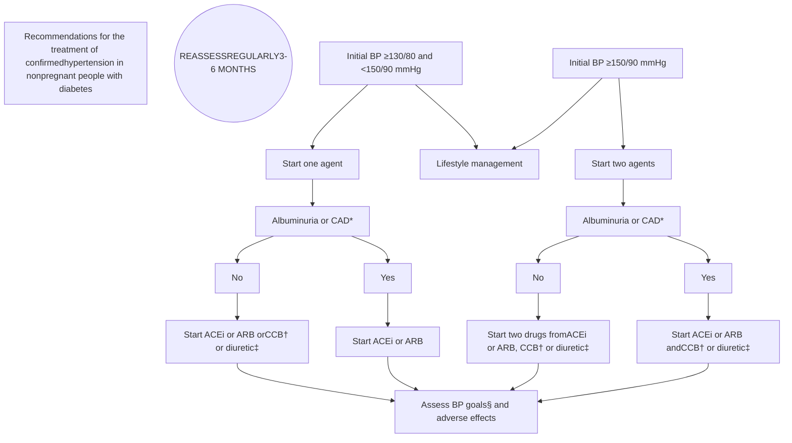

# 34.DM complication-CV-BP-ADA*2026

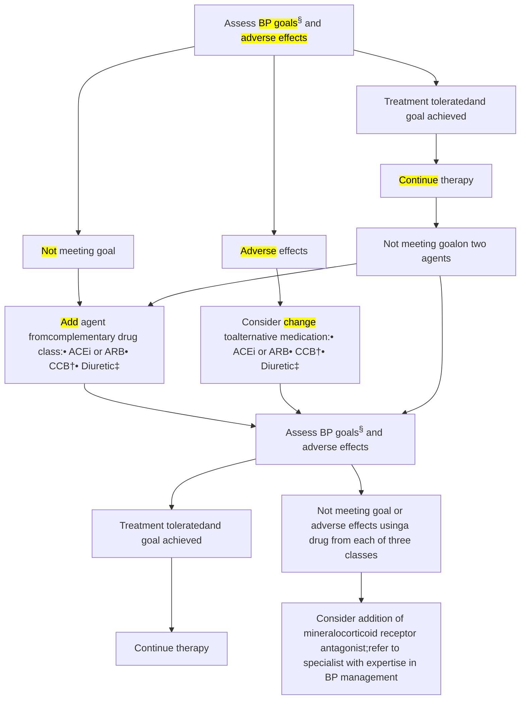

**Figure 10.2**—Recommendations for the treatment of confirmed hypertension in nonpregnant people with diabetes. <mark>\*An ACE inhibitor (ACEi) or angiotensin receptor blocker (ARB) is suggested for the treatment of hypertension in people with coronary artery disease (CAD) or urine albumin-to-creatinine ratio 30–299 mg/g creatinine and is strongly recommended for individuals with urine albumin-to-creatinine ratio ≥300 mg/g creatinine.</mark> †Dihydropyridine calcium channel blocker (CCB). ‡Thiazide-like diuretic; long-acting agents shown to reduce cardiovascular events, such as chlorthalidone and indapamide, are preferred. <mark>§If it can be safely attained, the on-treatment blood pressure goal is <130/80 mmHg; a systolic blood pressure goal <120 mmHg should be encouraged in individuals with high cardiovascular or kidney risk.</mark> BP, blood pressure. Adapted from de Boer et al. (24).

# 34.DM complication-CV-BP-ADA*2026

## Treatment Strategies

### Lifestyle Intervention

**Recommendation**

**10.5** For people with diabetes and <mark>blood pressure >120/80 mmHg, advise lifestyle behaviors including weight loss</mark> when indicated, a Dietary Approaches to Stop Hypertension (DASH)-style eating pattern including <mark>reducing sodium,</mark> limiting or <mark>avoiding alcohol</mark> consumption, <mark>increased physical activity,</mark> and <mark>smoking cessation.</mark> **A**

## PHARMACOLOGIC INTERVENTIONS

**Recommendations**

**10.6** In individuals with <mark>confirmed office-based blood pressure ≥130/80 mmHg,</mark> pharmacologic therapy should be initiated and titrated to achieve their individualized blood pressure goal. **A**

**10.7** Individuals with confirmed office-based blood pressure ≥150/90 mmHg <mark>should,</mark> in addition to lifestyle therapy, <mark>have prompt initiation and timely titration of two drugs</mark> or a single-pill combination of drugs for hypertension that have also been demonstrated to reduce cardiovascular events in people with diabetes. **A**

**10.8** Treatment for hypertension should include drug classes demonstrated to reduce cardiovascular events in people with diabetes. **A** <mark>ACE inhibitors or angiotensin receptor blockers (ARBs) are recommended first-line therapy for hypertension</mark> in people with diabetes and <mark>albuminuria</mark> or <mark>coronary artery disease.</mark> **A**

**10.9** Multiple-drug therapy is generally required to achieve blood pressure goals. However, avoid any combination  of ACE inhibitors, ARBs (including ARBs and neprilysin inhibitors), and direct renin inhibitors. **A**

**10.10** In <mark>nonpregnant</mark> people with diabetes and hypertension, <mark>either an ACE inhibitor or ARB is recommended for those with moderately increased albuminuria (UACR 30–299 mg/g creatinine) B and is strongly recommended for those with severely increased albuminuria (UACR ≥300 mg/g creatinine) and/or estimated glomerular filtration rate (eGFR) <60 mL/min/1.73 m²</mark> to maximally tolerated dose to prevent the progression of kidney disease and reduce cardiovascular events. **A** If one class is not tolerated, the other should be substituted. **B**

**10.11** <mark>Monitor for drop in eGFR and for increase in serum potassium levels</mark> at initiation and periodically as clinically appropriate when ACE inhibitors, ARBs, and mineralocorticoid receptor antagonists (<mark>MRAs</mark>) are used. **B** <mark>Monitor for hypokalemia when diuretics are used</mark> at routine visits and 7–14 days after initiation or after a dose change and periodically as clinically appropriate. **B**

**10.12** In sexually active individuals of childbearing potential who are not using reliable contraception, avoid ACE inhibitors, ARBs, MRAs, direct renin inhibitors, and neprilysin inhibitors, as they are <mark>contraindicated in pregnancy.</mark> **A**

## RESISTANT HYPERTENSION

**Recommendation**

**10.13** Individuals with hypertension who are not meeting blood pressure goals on three classes of antihypertensive medications (including a diuretic) <mark>should be considered for MRA therapy.</mark> **A**

# 34.Therapy-DM prevention

1. <mark>Lifestyle</mark> intervention 有效，效果持續且與<mark>體重下降</mark>程度有關

2. <mark>Metformin</mark> 效果較差一點，但在某些族群可以和 lifestyle intervention 相同

a. ~~< 45 years of age~~ <mark>小於60歲</mark>

b. <mark>BMI > 35 kg/m2</mark>

c. <mark>fasting glucose > 110</mark> mg/dL

d. ADA 建議拿來預防的族群：<mark>< 60 歲</mark>、<mark>BMI > 35</mark>、生活型態介入後血糖仍偏高、<mark>GDM</mark> 病史

3. <mark>Acarbose</mark> 也可以預防，<mark>各族群</mark>效果相同

4. <mark>TZD</mark> 有效，但因為長期副作用不建議拿來預防

6. <mark>GLP1</mark> 有效，但很貴且會噁心，也不建議拿來預防

7. Valsartan : NAVIGATOR study 發現有效

8. <mark>減重相關</mark>：orlistat、phemtamine/topirimate、<mark>減重手術</mark>

Baloise logo

# 34.Therapy-DM prevention*lifestyle

LIFESTYLE BEHAVIOR CHANGE
FOR TYPE 2 DIABETES PREVENTION

**Recommendations**

**3.3** Refer adults with <mark>overweight or obesity at high risk of type 2 diabetes to a diabetes prevention</mark> program to achieve and maintain <mark>a weight reduction of at least 5–7% of initial body weight through a healthy reduced-calorie eating pattern and ≥150 min/week of moderate-intensity physical activity.</mark> **A**

**3.4** Prescribe an evidence-based eating pattern (e.g., <mark>Mediterranean, low carbohydrate</mark>) to individuals with prediabetes to <mark>prevent</mark> type 2 diabetes. **B**

**3.5** Offer diabetes prevention programs to adults at high risk for type 2 diabetes. **A** Diabetes prevention programs should be covered by third-party payors, and inconsistencies in access should be addressed. **E**

**3.6** Based on individual preference, certified technology-assisted diabetes prevention programs through smartphones, web-based applications, and telehealth can be effective in preventing type 2 diabetes and should be considered. **B**

# 34.Therapy-DM prevention*lifestyle-nutrition

**Nutrition**

Nutrition counseling for weight loss in the DPP lifestyle intervention arm focused on reduction of total fat and calories (8,17,18). However, current evidence suggests there is <mark>no ideal percentage of calories from carbohydrate, protein, and fat to prevent diabetes; therefore, macronutrient distribution should be based on an individualized assessment</mark> of current eating patterns, preferences, and metabolic goals. A variety of eating patterns (21) can be appropriate for individuals with prediabetes or diabetes, including <mark>Mediterranean-style, plant-based</mark> (which may or may not be omnivorous), Dietary Approaches to Stop Hypertension <mark>(DASH)</mark>, and <mark>low-carbohydrate</mark> (22–25). The overall quality of food consumed (as measured by the Healthy Eating Index, Alternative Healthy Eating Index, and DASH score), with an emphasis on whole grains, legumes, nuts, fruits, and vegetables and minimal refined and processed foods, is also associated with a lower risk of type 2 diabetes (26–28). For people at risk for or living with diabetes, individualized medical nutrition therapy (see section 5, <u>"Facilitating Positive Health Behaviors and Well-being to Improve Health Outcomes,"</u> for more detailed information) is effective in lowering A1C (29,30).

# 34.Therapy-DM prevention\*medications

PHARMACOLOGIC INTERVENTIONS
TO DELAY TYPE 2 DIABETES

*Recommendations*

**3.7** <mark>Metformin</mark> for the <mark>prevention</mark> of type 2 diabetes should be considered in adults at <mark>high risk of type 2 diabetes</mark>, as typified by the Diabetes Prevention Program, especially <mark>those aged 25–59 years</mark> with <mark>BMI ≥35 kg/m<sup>2</sup></mark>, <mark>higher fasting plasma glucose (e.g., ≥110 mg/dL [≥6 mmol/L])</mark>, and <mark>higher A1C (e.g., ≥6.0% [≥42 mmol/mol])</mark>, and in <mark>individuals with prior gestational diabetes mellitus</mark>. **A**

**3.8** <mark>Consider using metformin to prevent hyperglycemia in high-risk individuals treated with a phosphatidylinositol 3-kinase α (PI3Kα) inhibitor (e.g., alpelisib and inavolisib)</mark>. **B**

**3.9** <mark>Consider using metformin to prevent hyperglycemia in high-risk individuals treated with high-dose glucocorticoids</mark>. **B**

**3.10** Consider <mark>periodic assessment of vitamin B12 levels</mark> in individuals receiving long-term metformin therapy, especially in those with anemia or <mark>peripheral neuropathy</mark>. **B**

# 34.Therapy-DM prevention*medications

Because weight loss and maintenance through lifestyle (e.g., nutrition and physical activity) behavior changes might not be sufficient on their own (<u>13</u>), some people at high risk for type 2 diabetes may benefit from additional pharmacotherapy support. Various pharmacologic agents used to treat diabetes have also been evaluated for diabetes prevention. <mark>Metformin, $\alpha$-glucosidase inhibitors, incretin receptor agonists (e.g., liraglutide, semaglutide, and tirzepatide), thiazolidinediones, and insulin have all been shown to lower the incidence of diabetes in specific populations (<u>75–83</u>). However, whether initiating glucose-lowering treatment early—before hyperglycemia reaches the diagnostic threshold of diabetes—improves long-term health outcomes is unknown.</mark> Indeed, the benefits of glucose lowering to the normoglycemic range need to be balanced against the potential adverse effects of these therapies and the burden and cost of treatment. There are currently <mark>no</mark> long-term data to support the use of pharmacologic treatments <mark>other than</mark> metformin for the sole purpose of preventing type 2 diabetes. However, use of <mark>glucagon-like peptide 1–based therapies for weight management in individuals with overweight or obesity—an essential component of type 2 diabetes prevention—is highly beneficial</mark> and should be considered, as discussed in detail in section 8,

# 34.Therapy-DM prevention*cv events

## PREVENTION OF VASCULAR DISEASE AND MORTALITY

### Recommendations

**3.11** <mark>Prediabetes</mark> is associated with heightened <mark>cardiovascular risk;</mark> therefore, screening for and treatment of modifiable risk factors for cardiovascular disease are suggested. **B**

**3.12** <mark>Statin therapy may increase the risk of type 2 diabetes in people at high risk of developing type 2 diabetes.</mark> In such individuals, glucose status should be monitored regularly and diabetes prevention approaches reinforced. It is not recommended that statins be avoided or discontinued for this adverse effect. **B**

**3.13** <mark>In people with a history of stroke and evidence of insulin resistance and prediabetes, pioglitazone may be considered to lower the risk of stroke or myocardial infarction.</mark> However, this benefit needs to be balanced with the increased risk of weight gain, edema, and fractures. **A** <mark>Lower doses</mark> may mitigate the risk of adverse effects but may be less effective. **C**

# 34.Therapy-DM health behaviors-DSMES

## <mark>DIABETES SELF-MANAGEMENT</mark> EDUCATION AND SUPPORT

### Recommendations

**5.1** Advise all people with diabetes to participate in developmentally and culturally appropriate <mark>diabetes self-management education and support (DSMES)</mark> to facilitate informed decision-making, self-care behaviors, problem-solving, and active collaboration with the health care team. **A**

**5.2** Provide DSMES at diagnosis, annually and/or when not meeting treatment goals, when complicating factors develop (e.g., medical, functional, and psychosocial), and when transitions in life and care occur. **E**

The <mark>National Standards for DSMES</mark> (10) include delivery of content addressing:

* <mark>Pathophysiology</mark> of diabetes and treatment options
* Healthy <mark>coping</mark>
* Healthy <mark>eating</mark>
* Being <mark>active</mark>
* <mark>Taking medication</mark>
* <mark>Monitoring</mark>
* Reducing risk (treating acute and chronic <mark>complications</mark>)
* Problem-solving and <mark>behavior change</mark> strategies

In addition to providing DSMES upon diagnosis, there are additional critical time points <mark>when the need for DSMES should be evaluated</mark> by the health care professional and/or interprofessional team, with referrals made as needed (2):

* <mark>Annually</mark> and/or <mark>when not meeting treatment goals</mark>, whichever is more frequent
* When <mark>complicating factors</mark> (e.g., health conditions, physical or functional limitations, emotional factors, and basic living needs) that influence self-management develop
* When <mark>transitions in life and care</mark> occur

# 34.Therapy-DM health behaviors-nutrition

**Table 5.1—Nutrition recommendations**

Recommendations

**5.10** Provide individualized medical nutrition therapy by referring people with prediabetes or diabetes to a registered dietitian nutritionist, preferably one who has comprehensive experience in diabetes care. **A**

**5.11** Diabetes medical nutrition therapy can result in cost savings **B** and improved cardiometabolic outcomes **A** and should be reimbursed by insurance. **E**

**5.12** <mark>Provide an overweight or obesity treatment plan based on their nutrition, physical activity, and behavioral health status</mark> for all people with <mark>overweight or obesity</mark>, aiming for <mark>at least 5–7% weight loss</mark>. **A**

**5.13** For diabetes prevention and management of people with prediabetes or diabetes, recommend individualized meal plans that keep nutrient quality, total calories, and metabolic goals in mind. **B**

**5.14** Eating patterns should emphasize <mark>key nutrition principles (inclusion of nonstarchy vegetables, whole fruits, legumes, lean proteins, whole grains, nuts and seeds, and low-fat dairy or nondairy alternatives)</mark> and <mark>minimize</mark> consumption of <mark>red</mark> meat, <mark>sugar</mark>-sweetened beverages, sweets, <mark>refined</mark> grains, <mark>processed</mark> and <mark>ultraprocessed</mark> foods in people with prediabetes and diabetes. **B**

**5.15** Consider <mark>reducing carbohydrate</mark> intake for some adults with diabetes to improve glycemia. An effective way to achieve this is by limiting consumption of processed foods. **B**

**5.16** Assess intake of supplements, as <mark>supplementation with micronutrients</mark> (e.g., vitamins and minerals, such as magnesium or chromium) or herbs or spices (e.g., cinnamon and aloe vera) is <mark>not recommended</mark> for glycemic benefits. **C**

**5.17** Counsel <mark>against</mark> <mark>β-carotene supplementation</mark>, as there is evidence of <mark>harm</mark> for certain individuals and it confers no benefit. **B**

**5.18** Advise adults with diabetes and those at risk for diabetes who <mark>consume alcohol to not exceed</mark> the <mark>recommended daily limits</mark>. **B** Advise abstainers to not start drinking alcohol, even in moderation. **B**

**5.19** Counsel people with diabetes about the signs, symptoms, and <mark>self-management of delayed hypoglycemia</mark> and the importance of <mark>monitoring glucose after drinking alcohol</mark> to <mark>reduce hypoglycemia risk</mark>, especially when <mark>using insulin or insulin secretagogues</mark>. **B**

**5.20** Counsel people with diabetes to <mark>limit sodium consumption to <2,300 mg/day</mark>, as clinically appropriate, and the best way to achieve this is through limiting consumption of processed foods. **B**

# 34.Therapy-DM health behaviors-nutrition

5.21 Encourage people with diabetes and those at risk for diabetes to consume <mark>water over other</mark> beverages. **A**

5.22 Counsel people with diabetes and those at risk for diabetes that <mark>nonnutritive sweeteners can be used in place</mark> of sugar-sweetened products if consumed in moderation and for the short term to reduce overall calorie and carbohydrate intake. **B**

5.23 Counsel and regularly monitor individuals <mark>pursuing intentional weight loss</mark> to ensure adequate nutritional intake, with particular attention to <mark>preventing protein insufficiency and micronutrient deficiencies</mark>. **E**

5.24 Emphasize <mark>minimally</mark> processed, <mark>nutrient-dense</mark>, <mark>high-fiber</mark> sources of carbohydrate (<mark>at least 14 g fiber per 1,000 kcal</mark>). **B**

5.25 Advise people with diabetes and those at risk for diabetes to <mark>replace</mark> sugar-sweetened beverages (including any juices) <mark>with water</mark> or low-calorie or no-calorie beverages and minimize foods with added sugar to manage glycemia and reduce risk for cardiometabolic disease. **B**

5.26 Educate individuals with diabetes who are <mark>at risk for developing diabetic ketoacidosis and who are treated with sodium-glucose cotransporter inhibition</mark> on the <mark>risks and signs of ketoacidosis and methods of risk mitigation management</mark>, provide them with appropriate tools for <mark>ketone measurement</mark> (i.e., serum $\beta$-hydroxybutyrate), and <mark>discourage</mark> a <mark>ketogenic eating pattern</mark>. **E**

5.27 Provide education on the <mark>glycemic impact of carbohydrate, A</mark> fat, and protein **B** tailored to an individual's needs, <mark>insulin plan</mark>, and preferences for care to optimize mealtime insulin dosing.

5.28 Counsel people using <mark>fixed insulin doses about consistent patterns of carbohydrate intake</mark> with respect to time and amount while considering the insulin action time, as it can result in <mark>improved glycemia and reduce the risk for hypoglycemia</mark>. **B**

5.29 Counsel people with diabetes and those at risk for diabetes to incorporate more <mark>plant-based protein sources</mark> (e.g., nuts, seeds, and <mark>legumes</mark>) as part of an overall diverse eating pattern to reduce cardiovascular disease risk. **B**

5.30 Counsel people with diabetes and those at risk for diabetes to consider an eating plan emphasizing elements of a <mark>Mediterranean</mark> eating pattern, which is <mark>rich in fatty fish, nuts, and seeds</mark>, to reduce cardiovascular disease risk **A** and improve glucose metabolism. **B**

5.31 Counsel people with diabetes and those at risk for diabetes to <mark>limit intake of foods high</mark> in <mark>saturated fat</mark> to help reduce cardiovascular disease risk. **B**

# 34.Therapy-DM health behaviors-nutrition

**Table 5.2—Nutrition behaviors to encourage**

* Vegetables—especially <mark>nonstarchy vegetables that are dark green, red, and orange in color;</mark> fresh, frozen, or low-sodium canned are all acceptable vegetable options.

* Legumes—<mark>dried beans, peas, and lentils.</mark>

* Fruits—especially <mark>whole fruit</mark>—fresh, frozen, or canned in own juice (or <mark>no added sugar</mark>) are all acceptable fruit options.

* Foods with at least <mark>3 g of fiber per serving</mark> are generally considered <mark>higher fiber choices.</mark> Whole-grain foods—where culturally appropriate, whole-grain versions of commonly consumed foods, such as <mark>100% whole-wheat breads or pastas and brown rice.</mark> When not culturally appropriate, focus more on portion control.

* <mark>Water should be the primary beverage</mark> of choice.

* For individuals who do not prefer <mark>plain water, no-calorie alternatives are the next best choice.</mark> Options include adding lemon, lime, berries, or cucumber slices to water; sparkling no-calorie water or flavored no-calorie waters; no-calorie carbonated beverages.

* Plant-based proteins can include legumes (e.g., <mark>soybeans, pinto beans, black beans, garbanzo beans, dried peas, and lentils), nuts, and seeds.</mark>

* Meats and poultry should be from fresh, frozen, or low-sodium canned and in <mark>lean forms</mark> (e.g., <mark>chicken breast and ground turkey).</mark>

* Heart-healthy wild-caught <mark>fatty fish</mark> such as <mark>salmon, tuna, sardines, and mackerel.</mark> Fresh, frozen, or low-sodium canned are all acceptable options.

* Use herbs (e.g., basil, fennel, mint, parsley, rosemary, and thyme) and spices (e.g., cinnamon, garam masala, ginger, pepper, and turmeric) to season foods <mark>instead of salt or salt-containing</mark> preparations.

* Incorporate onions, garlic, celery, carrots, and other vegetables as a base for preparing various homemade foods.

* Cook with <mark>vegetable oil (e.g., avocado, canola, and olive)</mark> <mark>in place of fats high in saturated fat</mark> (e.g., butter, coconut oil, lard, and shortening).

* Plan out meals for the week. Grocery shop using a list. Cook on a day off so there are ready-to-eat and ready-to-reheat homemade meals waiting in the fridge or freezer.

* Include family or roommates in meal preparation; share the responsibilities of grocery shopping and cooking and use time off for meal preparation in advance when possible.

# 34.Therapy-DM health behaviors-activity

## PHYSICAL ACTIVITY

### Recommendations

**5.34** Evaluate baseline physical activity and sedentary time for all people with diabetes and those at risk for diabetes. For people who do not meet activity guidelines, encourage an <mark>increase in physical activities above</mark> baseline with the goal of meeting activity guidelines. **B** Counsel that <mark>prolonged sitting should be interrupted</mark> at least every 30 min for blood glucose and other benefits. **C**

**5.35** Counsel <mark>children and adolescents</mark> with type 1 diabetes **C** or type 2 diabetes **B** to engage in <mark>60 min/day or more of moderate- or vigorous-intensity aerobic activity, with muscle-strengthening and bone-strengthening activities at least 3 days/week,</mark> and to limit the amount of time being spent sedentary, including recreational screen time. **C**

**5.36** Counsel most <mark>adults</mark> with type 1 diabetes **C** and type 2 diabetes **B** to engage in <mark>150 min or more of moderate- to vigorous-intensity aerobic activity per week, spread over at least 3 days/week, with no more than 2 consecutive days without activity.</mark> Shorter durations (<mark>minimum 75 min/week</mark>) of <mark>vigorous-intensity or interval training may be sufficient</mark> for more physically fit individuals.

**5.37** Counsel <mark>adults</mark> with type 1 diabetes **C** and type 2 diabetes **B** to engage in <mark>2–3 sessions/week of resistance exercise on nonconsecutive days.</mark>

**5.38** Counsel <mark>most older</mark> adults with diabetes to engage in <mark>flexibility training and balance training 2–3 times/week.</mark> **C**

**5.39** Counsel all people with diabetes who are treated with <mark>obesity pharmacotherapy or metabolic surgery</mark> that meeting physical activity recommendations, in particular muscle-strengthening exercises, may be beneficial for maintaining lean body mass. **C**

Background graphic with highlighted text regions

# 34.Therapy-DM health behaviors-24hrs

Importance of 24-hour physical behaviors for type 2 diabetes

**SITTING/BREAKING UP PROLONGED SITTING**

*   Limit sitting. <mark>Breaking up prolonged sitting (at least every 30 min)</mark> with short regular bouts of slow walking or simple resistance exercises can improve glucose metabolism.

**SWEATING (MODERATE-TO-VIGOROUS ACTIVITY)**

*   Encourage <mark>≥150 min/week of moderate-intensity physical activity</mark> (i.e., uses large muscle groups, rhythmic in nature) OR <mark>≥75 min/week vigorous-intensity activity spread over ≥3 days/week, with no more than 2 consecutive days of inactivity.</mark> Supplement with two to three resistance, flexibility, and/or balance sessions.
    *   <mark>As little as 30 min/week of moderate-intensity physical activity improves metabolic profiles.</mark>

**STEPPING**

*   An <mark>increase of only 500 steps/day</mark> is associated with 2-9% decreased risk of cardiovascular morbidity and all-cause mortality.
*   A <mark>5- to 6-min brisk-intensity walk per day</mark> equates to ~4 years' greater life expectancy.

**Physical function/frailty/sarcopenia**

*   The frailty phenotype in type 2 diabetes is unique, often encompassing obesity alongside physical frailty, at an earlier age. The ability of people with type 2 diabetes to undertake simple functional exercises in middle-age is similar to that in those over a decade older.

**SLEEP**

Aim for <mark>consistent, uninterrupted sleep,</mark> even on weekends.

*   **Quantity** - <mark>Long (>8 h) and short (<6 h) sleep durations negatively impact A1C.</mark>
*   **Quality** - <mark>Irregular sleep results in poorer glycemic levels,</mark> likely influenced by the increased prevalence of insomnia, obstructive sleep apnea, and restless leg syndrome in people with type 2 diabetes.
*   **Chronotype** - Evening chronotypes (i.e., night owl: go to bed late and get up late) may be more susceptible to inactivity and poorer glycemic levels <mark>than morning chronotypes (i.e., early bird: go to bed early and get up early).</mark>

**STRENGTHENING**

<mark>Resistance exercise</mark> (i.e., any activity that uses the person's own body weight or works against a resistance) also <mark>improves insulin sensitivity and glucose levels;</mark> activities like <mark>tai chi and yoga</mark> also encompass elements of <mark>flexibility and balance.</mark>


<table>
  <thead>
    <tr>
        <th>Category</th>
        <th>Key Recommendations</th>
    </tr>
  </thead>
  <tbody>
    <tr>
        <td>SITTING/BREAKING UP PROLONGED SITTING</td>
        <td>Limit sitting; break up every 30 min with slow walking or resistance exercises.</td>
    </tr>
    <tr>
        <td>SWEATING (MODERATE-TO-VIGOROUS ACTIVITY)</td>
        <td>≥150 min/week moderate or ≥75 min/week vigorous activity; spread over ≥3 days.</td>
    </tr>
    <tr>
        <td>STEPPING</td>
        <td>Increase by 500 steps/day; 5-6 min brisk walk daily.</td>
    </tr>
    <tr>
        <td>SLEEP</td>
        <td>Consistent, uninterrupted sleep; avoid &lt;6h or &gt;8h; manage quality and chronotype.</td>
    </tr>
    <tr>
        <td>STRENGTHENING</td>
        <td>Resistance exercises, tai chi, or yoga for insulin sensitivity and balance.</td>
    </tr>
    <tr>
        <td>PHYSICAL FUNCTION</td>
        <td>Address frailty/sarcopenia through functional exercises.</td>
    </tr>
  </tbody>
</table>

# 34.Therapy-ADA*2026統整

Use of glucose-lowering medications in the management of type 2 diabetes
(For recommendations for specific conditions, including non-glucose-lowering medications, refer to pertinent sections)

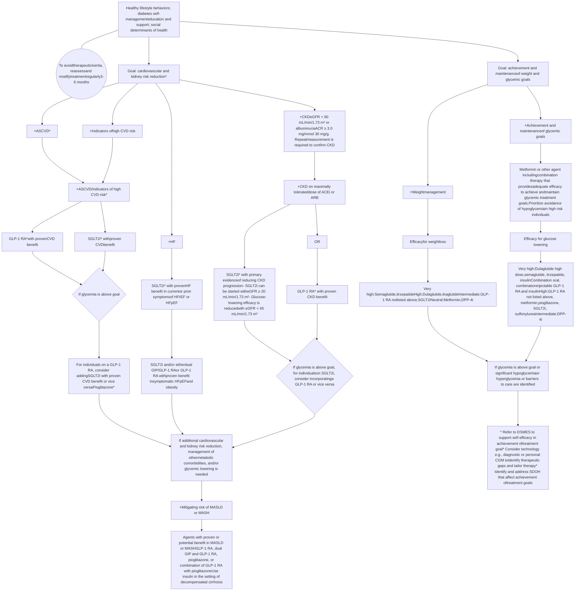

# 34.Therapy-ADA\*children+adolescents

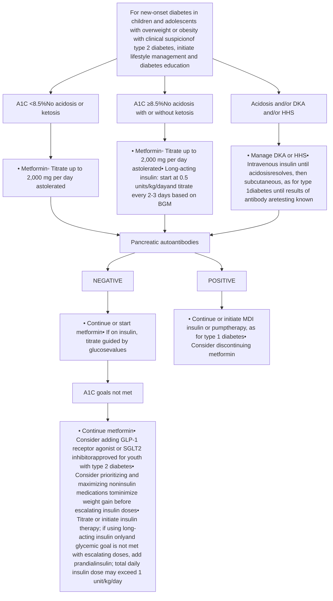

Figure 14.1—Management of new-onset diabetes in youth with overweight or obesity with clinical suspicion of type 2 diabetes. A1C 8.5% = 69 mmol/mol. BGM, blood glucose monitoring; CGM, continuous glucose monitoring; DKA, diabetic ketoacidosis; GLP-1, glucagon-like peptide 1; HHS, hyperosmolar hyperglycemic state; MDI, multiple daily injections; SGLT2, sodium-glucose cotransporter 2. Adapted from the ADA position statement "Evaluation and Management of Youth-Onset Type 2 Diabetes" (3).

# 34.Therapy-ADA*children+adolescents


<table>
  <thead>
    <tr>
        <th colspan="4">Table 14.1—Recommendations for diabetes-associated conditions in children and adolescents</th>
    </tr>
    <tr>
        <th> </th>
        <th>Type 1 diabetes recommendations</th>
        <th>Type 2 diabetes recommendations</th>
        <th>Type 1 and 2 diabetes recommendations</th>
    </tr>
  </thead>
  <tbody>
    <tr>
        <td>Dyslipidemia</td>
        <td><strong>14.43</strong> For children and adolescents with <mark>type 1</mark><br/>diabetes, <mark>lipid screening should be</mark><br/><mark>performed soon after diagnosis,</mark><br/><mark>preferably after glycemia has improved</mark><br/><mark>and age is ≥2 years.</mark> If initial LDL<br/>cholesterol is <mark>≤100 mg/dL</mark> (≤2.6 mmol/L),<br/>subsequent testing should be performed<br/>at <mark>9–11 years</mark> of age B and repeated<br/><mark>every 3 years.</mark> E</td>
        <td><strong>14.44</strong> In children and adolescents with <mark>type 2</mark><br/>diabetes, <mark>lipid screening should be</mark><br/><mark>performed soon after diagnosis,</mark><br/><mark>preferably after glycemia has improved</mark><br/>and <mark>annually</mark> thereafter. B</td>
        <td><strong>14.45</strong> The <mark>LDL cholesterol goal is &lt;100 mg/dL</mark> (&lt;2.6 mmol/L). E<br/><strong>14.46</strong> In children and adolescents with diabetes, if lipids are<br/><mark>abnormal, initial therapy should consist of optimizing</mark><br/><mark>glycemia and medical nutritional therapy to limit calories</mark><br/><mark>from fat to 25–30% and saturated fat to &lt;7%,</mark> limit<br/><mark>cholesterol to &lt;200 mg/day,</mark> avoid <em>trans</em> fats, and aim for<br/><mark>~10% calories from monounsaturated fats</mark> for elevated LDL.<br/>For elevated triglycerides, MNT should also focus on<br/>decreasing carbohydrate intake and <mark>increasing foods rich in</mark><br/><mark>n-3 fatty acids</mark> in addition to the above changes. A<br/><strong>14.47</strong> In children and adolescents with diabetes, if <mark>LDL cholesterol</mark><br/><mark>remains &gt;130 mg/dL</mark> (&gt;3.4 mmol/L) after<br/><mark>6 months of nutrition intervention, initiate therapy with a</mark><br/><mark>statin, with a goal of LDL &lt;100 mg/dL</mark> (&lt;2.6 mmol/L). Due<br/>to the potential teratogenic effects, individuals of childbearing<br/>potential should receive reproductive counseling, and <mark>statins</mark><br/><mark>should be avoided in individuals of childbearing potential</mark> who<br/>are not using reliable contraception. B<br/><strong>14.48</strong> In children and adolescents with diabetes, if <mark>triglycerides</mark><br/><mark>are &gt;400 mg/dL</mark> (&gt;4.7 mmol/L) fasting or <mark>&gt;1,000 mg/dL</mark><br/>(&gt;11.6 mmol/L) nonfasting, <mark>optimize glycemia and begin</mark><br/><mark>fibrate, with a goal of &lt;400 mg/dL</mark> (&lt;4.7 mmol/L) fasting to<br/>reduce risk for pancreatitis. C</td>
    </tr>
  </tbody>
</table>

# 34.Therapy-ADA\*children+adolescents

<mark>Hypertension</mark>

**14.49** In children and adolescents with diabetes, BP should be measured at every clinic visit. <mark>In children and adolescents with high BP (BP $\ge$90th percentile for age, sex, and height or, in adolescents aged $\ge$13 years, $\ge$120/80 mmHg) on three separate measurements, ambulatory BP monitoring should be strongly considered.</mark> **B**

**14.50** Excess weight increases cardiovascular event rates among people with diabetes and should be addressed with MNT, intensive lifestyle interventions focusing on dyslipidemia, hypertension, hyperglycemia along with adjunct pharmacotherapy, and/or bariatric surgery as appropriate. **C**

**14.51** In children and adolescents with diabetes, after excluding secondary hypertension, treatment of <mark>elevated BP (defined as 90th to <95th percentile for age, sex, and height or, in adolescents aged $\ge$13 years, 120–129/<80 mmHg) is lifestyle modification</mark> focused on healthy nutrition, physical activity, sleep, and, if appropriate, weight management. **C**

**14.52** <mark>For children and adolescents with diabetes</mark>, after excluding other causes, in addition to lifestyle modification, <mark>ACE inhibitors or ARBs should be started</mark> for treatment of

Type 1 and 2 diabetes recommendations

<mark>confirmed hypertension (defined as BP consistently $\ge$95th percentile for age, sex, and height or, in adolescents aged $\ge$13 years, BP $\ge$130/80 mmHg).</mark> Due to the potential teratogenic effects, individuals of childbearing potential <mark>should receive reproductive counseling, and ACE inhibitors and ARBs should be avoided in individuals of childbearing potential</mark> who are not using reliable contraception. **B**

**14.53** For children and adolescents the goal of hypertension treatment is BP <90th percentile for age, sex, and height or, in adolescents aged $\ge$13 years, BP <130/80 mmHg. **C**

# 34.Therapy-ADA*children+adolescents

**Nephropathy**

14.54 For children and adolescents with <mark>type 1</mark> diabetes, <mark>nephropathy screening should</mark> be obtained at <mark>puberty</mark> or at age <mark>≥11 years</mark>, whichever is earlier, once the youth have had <mark>diabetes for 5 years</mark> <mark>and annually</mark> thereafter. **B**

14.55 In children and adolescents with <mark>type 2</mark> diabetes, <mark>nephropathy screening should</mark> <mark>be performed at the time of diagnosis</mark> <mark>and annually</mark> thereafter. An elevated <mark>UACR (>30 mg/g creatinine) should be</mark> <mark>confirmed on two of three samples. B</mark>

14.56 In children and adolescents with diabetes, <mark>nephropathy</mark> <mark>screening should be performed with a random spot urine</mark> <mark>sample. Consider obtaining a morning sample if there are</mark> <mark>effects of exercise or orthostatic changes. An elevated UACR</mark> <mark>(>30 mg/g creatinine) should be confirmed on two of three</mark> <mark>samples over a 6-month period. B</mark>

14.57 <mark>Determine eGFR at the time of diagnosis and annually</mark> thereafter. **E**

14.58 In <mark>nonpregnant</mark> children and adolescents with diabetes, either an <mark>ACE inhibitor or an ARB is recommended</mark> for those with <mark>moderately increased albuminuria (UACR</mark> <mark>30–299 mg/g creatinine) B and is strongly recommended</mark> for those with <mark>severely increased albuminuria (UACR</mark> <mark>≥300 mg/g creatinine) and/or eGFR <60 mL/min/1.73 m²</mark> <mark>to maximally tolerated dose to prevent the progression of</mark> <mark>kidney disease and reduce cardiovascular events. A</mark> If one class is not tolerated, the other should be substituted. **B** Due to the potential <mark>teratogenic</mark> effects, individuals of childbearing potential should receive reproductive counseling, and ACE inhibitors and ARBs should be avoided in individuals of childbearing potential who are not using reliable contraception. **B**

14.59 For children and adolescents with nephropathy, <mark>continue</mark> <mark>monitoring (every 3–6 months and/or as indicated by</mark> <mark>UACR and eGFR)</mark> to detect disease progression. **E**

14.60 Refer to nephrology in case of uncertainty of etiology, worsening UACR, or decrease in eGFR. **E**

# 34.Therapy-ADA*children+adolescents


<table>
  <thead>
    <tr>
<th> </th>
<th>Type 1 diabetes recommendations</th>
<th>Type 2 diabetes recommendations</th>
<th colspan="4">Type 1 and 2 diabetes recommendations</th>
    </tr>
  </thead>
  <tbody>
    <tr>
<td>Retinopathy</td>
<td>14.61 An initial dilated and comprehensive diabetes eye examination is recommended once youth have had <mark>type 1 diabetes</mark> for <mark>3–5 years</mark>, provided they are aged <mark>≥11 years or puberty</mark> has started, whichever is earlier. <strong>B</strong></td>
<td>14.62 Retinopathy screening in children and adolescents with <mark>type 2 diabetes</mark> should be performed at or <mark>soon after diagnosis</mark> and annually thereafter. <strong>C</strong></td>
<td>14.63 Optimizing glycemia is recommended to decrease the risk or slow the progression of retinopathy. <strong>B</strong></td>
<td colspan="3"></td>
    </tr>
    <tr>
<th colspan="7">Table 14.1—Continued</th>
    </tr>
    <tr>
<td>14.64 For children and adolescents with <mark>type 1</mark> diabetes, after the initial examination, repeat dilated and comprehensive eye examination or retinal photography is recommended <mark>every 2 years</mark>. Less frequent examinations, every 4 years, may be acceptable on the advice of an eye care professional and based on risk factor assessment, including a history of A1C &lt;8% (&lt;64 mmol/mol). <strong>B</strong></td>
<td>14.65 Less frequent examination (every 2 years) using dilated eye examination or retinal photography may be considered if achieving glycemic goals and a normal eye exam. <strong>C</strong></td>
<td>14.66 Programs that use nondilated retinal photography (with remote reading or use of a validated assessment tool) can be appropriate screening strategies for diabetic retinopathy. <strong>B</strong></td>
    </tr>
    <tr>
<td><mark>Neuropathy</mark></td>
<td>14.67 For children and adolescents with type 1 diabetes, consider an <mark>annual comprehensive foot exam at the start of puberty or at age ≥11 years</mark>, whichever is earlier, once the <mark>youth have had type 1 diabetes for 5 years</mark>. The examination should include inspection, assessment of <mark>foot pulses, pinprick, 10-g monofilament sensation tests, testing of vibration sensation using a 128-Hz tuning fork, and ankle reflex</mark> tests. <strong>B</strong></td>
<td>14.68 Screen children and adolescents with <mark>type 2 diabetes</mark> for the presence of neuropathy by foot examination <mark>at diagnosis</mark> and annually. The examination <mark>could include inspection, assessment of foot pulses, pinprick, 10-g monofilament sensation tests, testing of vibration sensation using a 128-Hz tuning fork, and ankle reflex</mark> tests. <strong>C</strong></td>
<td> </td>
<td colspan="3"></td>
    </tr>
  </tbody>
</table>

# 34.Therapy-ADA\*children+adolescents


<table>
  <tbody>
    <tr>
        <td>MASLD</td>
        <td><strong>14.69</strong> Evaluate children and adolescents with type 2 diabetes for <mark>MASLD (by measuring AST and ALT) at diagnosis</mark> and <mark>annually</mark> thereafter. <strong>B</strong><br/><strong>14.70</strong> Consider referral to gastroenterology for persistently elevated or worsening transaminases. <strong>B</strong></td>
    </tr>
    <tr>
        <td>Obstructive sleep apnea</td>
        <td><strong>14.71</strong> In children and adolescents with diabetes, screening for <mark>symptoms of sleep apnea should be done at least annually</mark>, and referral to a pediatric sleep specialist is recommended for evaluation and a polysomnogram, if indicated. Obstructive sleep apnea should be treated when documented. <strong>B</strong></td>
    </tr>
    <tr>
        <td>Polycystic ovary syndrome</td>
        <td><strong>14.72</strong> <mark>Evaluate for polycystic ovary syndrome in adolescent girls with diabetes</mark>, including <mark>laboratory studies</mark>, when clinically indicated. <strong>B</strong><br/><strong>14.73</strong> <mark>Metformin, in addition to lifestyle modification, is likely to improve the menstrual cyclicity and hyperandrogenism</mark> in adolescent girls with diabetes. <strong>E</strong></td>
    </tr>
    <tr>
        <td>Cardiovascular disease</td>
        <td><strong>14.74</strong> <mark>Excessive weight gain increases cardiovascular event rates among children and adolescents</mark> with diabetes and should be addressed with lifestyle and obesity pharmacotherapy as appropriate. <strong>C</strong></td>
    </tr>
  </tbody>
</table>

# 34.Therapy-ADA*hospitalization

HOSPITAL CARE DELIVERY STANDARDS

### Recommendations
**16.1** Perform an A1C test on all people with diabetes or hyperglycemia (<mark>random blood glucose >140 mg/dL [>7.8 mmol/L]</mark>) at the time of admission to the hospital if no A1C test result is available from the prior 3 months. **B**
**16.2** Institutions should implement protocols using validated written or computerized provider order entry sets for management of dysglycemia in the hospital that allow for a personalized approach. **B**

GLYCEMIC GOALS IN HOSPITALIZED ADULTS

### Recommendations
**16.4a** <mark>Insulin should be initiated or intensified for treatment of persistent hyperglycemia starting at a threshold of ≥180 mg/dL</mark> (≥10.0 mmol/L) (confirmed on two occasions within 24 h) for the majority of critically ill individuals (those in the intensive care unit [ICU]). **A**
**16.4b** Insulin and/or other glucose lowering therapies should be initiated or intensified for treatment of persistent

hyperglycemia starting at a threshold of ≥180 mg/dL (≥10.0 mmol/L) (confirmed on two occasions within 24 h) for the majority of noncritically ill individuals (those not in the ICU). **B**

**16.5a** Once therapy is initiated, a <mark>glycemic goal of 140–180 mg/dL</mark> (7.8–10.0 mmol/L) <mark>is recommended for most critically ill individuals (those in the ICU)</mark> with hyperglycemia. **A** More stringent individualized glycemic goals may be appropriate for selected critically ill individuals if they can be achieved without significant hypoglycemia. **B**

**16.5b** For <mark>noncritically ill individuals</mark> (those not in the ICU), <mark>a glycemic goal of 100–180 mg/dL</mark> (5.6–10.0 mmol/L) <mark>is recommended</mark> if it can be achieved without significant hypoglycemia. **B**

# 34.Therapy-ADA*hospitalization-operation

1. <mark>Stricter perioperative glycemic goals</mark> <mark>are not</mark> advised because they may not improve outcomes and are associated with <mark>increased hypoglycemia (146).</mark>

2. Blood glucose should be monitored at least every 2-4 h while the <mark>individual takes nothing by mouth,</mark> and insulin should be administered as needed. <mark>Insulin is the only recommended glucose-lowering medication in the perioperative</mark> period.

3. CGM should not be used alone for glucose monitoring during surgery (147).

4. <mark>Metformin and</mark> other oral glucose-lowering agents <mark>should be held on</mark> <mark>the day of</mark> surgery or procedure. See below for <mark>SGLT2 inhibitor and</mark> <mark>GLP-1 RA</mark> use in the perioperative period.

5. Individuals using an <mark>insulin pump may</mark> <mark>continue pump use during surgery</mark> if this is consistent with institutional policies and surgical procedures (148). This would require an interprofessional approach and adequate support systems in the hospital. If an insulin pump cannot be used during surgery, an alternative plan (insulin infusion or basal plus correctional insulin) should be initiated before surgery. Compared with usual dosing, a <mark>reduction of 25% of basal insulin dose</mark> <mark>given the evening before surgery is</mark> <mark>more likely to achieve perioperative</mark> <mark>blood glucose goals</mark> with a <mark>lower risk</mark> <mark>for hypoglycemia (149).</mark> Insulin dose reductions also include <mark>NPH insulin to</mark> <mark>one-half of the dose</mark> or <mark>long-acting</mark> <mark>basal insulin analogs to 75-80% of</mark> <mark>the dose</mark> or adjustment of insulin pump (if not in automated mode) basal rates based on the type of diabetes and clinical judgment. However, the decision needs to be individualized, as the dose reduction may not be appropriate for some people with type 1 diabetes.

# 34.Therapy-ADA\*hospitalization-operation

The FDA advises considering temporary <mark>discontinuation of SGLT2 inhibitors at least 3 days prior to surgery and ensuring risk factors for ketoacidosis are resolved prior to reinitiating therapy.</mark> In a retrospective study of individuals with type 2 diabetes using SGLT2 inhibitors and requiring emergency surgery, the incidence of DKA was 4.9% for individuals using SGLT2 inhibitors and 3.5% for individuals not using SGLT2 inhibitors (<u>150</u>). After adjustment for covariates, the differences between the two groups were not statistically significant. However, because the diagnosis of DKA was based on an ICD-10 code, it is possible that some cases of DKA were missed in the SGLT2 inhibitor group, especially cases of euglycemic DKA. Other studies have shown a higher risk of DKA or anion gap acidosis associated with SGLT2 inhibitor use in the perioperative period (<u>151–153</u>). Therefore, until further prospective studies are conducted, as an abundance of caution, <mark>SGLT2 inhibitors should be held for 3–4 days before surgery.</mark> <mark>The medication may be restarted in the hospital setting for heart failure indication when nutritional intake is resumed,</mark> as explained above.

**GLP-1 or Dual GIP and GLP-1 RAs and the Perioperative Period**

With increasing use of GLP-1—based medications, there are concerns about the safety of these medications in the perioperative period. These medications may be <mark>associated with nausea, vomiting, and delayed gastric emptying, and there have been case reports of pulmonary aspiration during general anesthesia and deep sedation (<u>154</u>).</mark> Individuals taking a GLP-1 RA medication have higher chances of increased residual gastric content despite fasting for the procedure as needed (<u>155</u>). Based on these reports, FDA added a warning to the label of <mark>all GLP-1 RA or dual glucose-dependent insulinotropic polypeptide (GIP) and GLP-1 RA medications about the possibility of pulmonary aspiration during surgeries or procedures requiring general anesthesia or deep sedation (<u>156</u>).</mark> However, there is <mark>insufficient</mark> information on how to mitigate the risk of pulmonary aspiration in this situation. Even if the medication is held, the duration required to withhold the medication is unknown because <mark>1 week of holding a once-weekly</mark>

<mark>medication is likely insufficient to mitigate the risk (<u>157</u>). In a retrospective study, withholding semaglutide up to 30 days (with an average of 10 days) was still associated with increased residual gastric content (<u>158</u>).</mark>

The risk of aspiration pneumonia with increased gastric content in this setting is still unknown. In some retrospective studies, no increase in risk of aspiration pneumonia was found in association with GLP-1 RAs (<u>159,160</u>). The American Society of Anesthesiologists initially recommended <mark>holding GLP-1 RAs on the day of the procedure or surgery for daily dose agents and for at least 7 days prior to the procedure or surgery for once-weekly dose agents (<u>161</u>).</mark> However, more recently, multiple societies and expert groups have advised a <mark>more personalized approach, allowing individuals at low risk for delayed stomach emptying who undergo elective surgery to continue taking their GLP-1 RA medications and suggesting a liquid nutrition protocol for 24 h before the procedure or other measures for those at higher risk for significant gastrointestinal side effects (<u>162–164</u>).</mark>

A personalized approach for perioperative management of individuals taking a GLP-1 RA or a dual GIP and GLP-1 RA is recommended. Factors such as the primary indication of these medications (e.g., diabetes or obesity treatment); current glycemic management; dose, duration, and characteristics of the drug; gastrointestinal symptoms; type of surgery or procedure and its urgency; and type of anesthesia should be considered. In addition, a <mark>preoperative gastric ultrasound may be considered to quantify gastric contents.</mark> In individuals with symptoms suggesting delayed gastric emptying (nausea, vomiting, dyspepsia, or abdominal distension), implementation of full stomach precautions may be considered. A liquid nutrition protocol for 24 h before the procedure may be helpful. If a decision is made to hold the drug and worsening of glycemia is anticipated, an alternative strategy for perioperative glycemic management (e.g., insulin) should be implemented.

# 34.Therapy-ADA\*hospitalization-DKA/HHS


<table>
  <thead>
    <tr>
        <th colspan="2">Table 16.1—Diagnostic criteria for DKA and HHS</th>
    </tr>
    <tr>
        <th colspan="2">DKA</th>
    </tr>
  </thead>
  <tbody>
    <tr>
        <td>Diabetes/hyperglycemia</td>
        <td>Glucose <mark>≥</mark>200 mg/dL (11.1 mmol/L) or prior history of diabetes</td>
    </tr>
    <tr>
        <td>Ketosis</td>
        <td><mark>β-Hydroxybutyrate concentration ≥3.0</mark> mmol/L or urine ketone strip 2+ or greater</td>
    </tr>
    <tr>
        <td>Metabolic acidosis</td>
        <td><mark>pH &lt;7.3</mark> and/or bicarbonate concentration <mark>&lt;18</mark> mmol/L</td>
    </tr>
    <tr>
        <th colspan="2">HHS</th>
    </tr>
    <tr>
        <td>Hyperglycemia</td>
        <td>Plasma <mark>glucose ≥600</mark> mg/dL (33.3 mmol/L)</td>
    </tr>
    <tr>
        <td>Hyperosmolarity</td>
        <td>Calculated <mark>effective serum osmolality &gt;300</mark> mOsm/kg (calculated as [2 × Na<sup>+</sup> (mmol/L) + glucose (mmol/L)]) or <mark>total serum osmolality &gt;320</mark> mOsm/kg [2 × Na<sup>+</sup> (mmol/L) + glucose (mmol/L) + urea (mmol/L)]</td>
    </tr>
    <tr>
        <td><mark>Absence of significant ketonemia</mark></td>
        <td>β-Hydroxybutyrate concentration &lt;3.0 mmol/L OR urine ketone strip less than 2+</td>
    </tr>
    <tr>
        <td><mark>Absence of acidosis</mark></td>
        <td><mark>pH ≥7.3 and bicarbonate concentration ≥15</mark> mmol/L</td>
    </tr>
  </tbody>
</table>


Adapted from Umpierrez et al. (165).

# 34.Therapy-ADA*hospitalization-DKA/HHS


<table>
  <thead>
    <tr>
        <th colspan="2">Table 16.2—Clinical presentation in people with diabetes with DKA and HHS</th>
    </tr>
    <tr>
        <th>DKA</th>
        <th>HHS</th>
    </tr>
  </thead>
  <tbody>
    <tr>
        <td>Develops over <mark>hours</mark> to days</td>
        <td>Develops over days to a <mark>week</mark></td>
    </tr>
    <tr>
        <td>Usually alert</td>
        <td><mark>Change in cognitive</mark> state common</td>
    </tr>
    <tr>
        <td colspan="2">Polyuria, polydipsia, weight loss, and dehydration</td>
    </tr>
    <tr>
        <td>Nausea, vomiting, and <mark>abdominal pain</mark></td>
        <td>Often <mark>copresenting with other acute illness</mark></td>
    </tr>
    <tr>
        <td><mark>Kussmaul respiration</mark></td>
        <td> </td>
    </tr>
    <tr>
        <td colspan="2">One-third of hyperglycemic emergencies have a hybrid DKA-HHS presentation</td>
    </tr>
    <tr>
        <td colspan="2">Adapted from Umpierrez et al. (165).</td>
    </tr>
  </tbody>
</table>


Table 16.2 screenshot

# 34.Therapy-ADA*hospitalization-DKA/HHS

```mermaid
graph TD
    subgraph IV_Fluids [I.V. Fluids]
        A1[Determine hydration status]
        A1 --> B1[Severe hypovolemia]
        A1 --> B2[Mild hypovolemia]
        A1 --> B3[Cardiac compromise]
        
        B1 --> C1["0.9% NaCl or other crystalloid (1.0 L/h)"]
        B2 --> C2["0.9% NaCl or other crystalloid at a clinically appropriate rate aiming to replace 50% of the estimated fluid deficit in the first 8-12 h"]
        B3 --> C3["Hemodynamic monitoring/pressors"]
        
        C1 --> D1["When glucose reaches <250 mg/dL, add 5% or 10% dextrose to the 0.9% NaCl/crystalloidIn euglycemic DKA (glucose <200 mg/dL and positive BOHB), 5% or 10% dextrose needs to be started alongside 0.9% NaCl/crystalloid at the start of the insulin treatment"]
        C2 --> D1
        C3 --> D1
    end

    subgraph Insulin [Insulin]
        E1[Mild DKA]
        E2[Moderate or severe DKA]
        E3[HHS]
        
        E1 --> F1[s.c. insulin]
        E2 --> F2[i.v. insulin]
        E3 --> F3[i.v. insulin]
        
        F1 --> G1["0.1 units/kg rapid-acting insulin analog as s.c. bolus"]
        G1 --> H1["0.1 units/kg rapid-acting insulin analog every 1 h or 0.2 units/kg every 2 h"]
        
        F2 --> G2["Consider 0.1 units/kg short-acting insulin as i.v. bolus if there is a delay in setting up the infusion"]
        G2 --> H2["0.1 units/kg/h short-acting insulin fixed-rate i.v. insulin infusion or nurse-driven protocol with a variable rate based on glucose values"]
        
        F3 --> G3["Start 0.05 units/kg/h short-acting insulin as fixed-rate i.v. infusion† or nurse-driven protocol with a variable rate based on glucose values"]
        
        H1 --> I1["When glucose reaches <250 mg/dL, reduce short-acting insulin dose to 0.05 units/kg/h i.v. (or 0.05 units/kg/h or 0.1 units/kg every 2 h s.c. in 'mild' DKA) or nurse-driven protocol with a variable rate based on glucose values"]
        H2 --> I1
        G3 --> I1
        
        I1 --> J1[DKA]
        I1 --> J2[HHS]
        
        J1 --> K1["Keep glucose between 150 and 200 mg/dL until resolution*"]
        J2 --> K2["Target glucose to between 200 and 250 mg/dL until resolution*"]
    end

    subgraph Potassium [Potassium]
        L1["Establish adequate kidney function (urine output ~0.5 mL/kg/h)"]
        L1 --> M1["K+ <3.5 mmol/L"]
        L1 --> M2["K+ = 3.5-5.0 mmol/L"]
        L1 --> M3["K+ >5.0 mmol/L"]
        
        M1 --> N1["10-20 mmol/L/h until K+ >3.5 mmol/L (faster K+ replacement will require central venous access)"]
        M2 --> N2["Give 10-20 mmol/L K+ in each liter of i.v. fluid as needed to keep serum K+ between 4 and 5 mmol/L"]
        M3 --> N3["Start insulin, but do not give K+; check serum K+ every 2 h"]
    end
```

Check electrolytes, kidney function, venous pH, osmolality, and glucose every 2–4 h until stable. After resolution of DKA or HHS and when individual is able to eat and drink, initiate s.c. multidose insulin plan. To transfer from i.v. to maintenance s.c. insulin, continue i.v. insulin infusion for 1–2 h after s.c. insulin.

# 34.Therapy-ADA\*hospitalization-DKA/HHS

Treatment pathways for diabetic ketoacidosis (DKA) and hyperglycemic hyperosmolar state (HHS) flowchart

† Some have recommended that insulin be withheld until glucose has stopped dropping with fluid administration alone.

\* Definitions of resolution (use clinical judgment and do not delay discharge or level of care if these are not met):

- **DKA**: Venous pH >7.3 or bicarbonate >18 mmol/L and plasma/capillary ketones <0.6 mmol/L
- **HHS**: Calculated serum osmolality falls to <300 mOsm/kg and urine output is >0.5 mL/kg/h and glucose is <250 mg/dL

150 mg/dL = 8.3 mmol/L
200 mg/dL = 11.0 mmol/L
250 mg/dL = 13.9 mmol/L
300 mg/dL = 16.6 mmol/L

> ⓘ Bicarbonate should only be considered if pH is <7.0
> ⓘ Phosphate should not be given unless there is muscle weakness, respiratory compromise, and a phosphate <1.0 mmol/L or <0.32 mmol/L

Figure 16.1—Treatment pathways for diabetic ketoacidosis (DKA) and hyperglycemic hyperosmolar state (HHS). BOHB, β-hydroxybutyrate. Adapted from Umpierrez et al. (165).

# 三、重點提示-Williams-35.T1DM

# 35

# Type 1 Diabetes Mellitus

PIETER GILLARD, MARK A. ATKINSON, AND CHANTAL MATHIEU

## CHAPTER OUTLINE

* Introduction, 1385
* Chronic Complications of Type 1 Diabetes, 1403

* Natural History of Type 1 Diabetes, 1385
* Management, 1404

* Epidemiology, 1386
* Insulin Therapy, 1405

* Pathophysiology, 1390
* Health Behavior Management: Nutrition and Exercise, 1409

* Genetics, 1393
* Acute Diabetic Emergencies, 1414

* Environmental Factors, 1395
* Use of Adjunctive Drugs in T1D, 1416

* Mouse Models of Type 1 Diabetes, 1396
* $\beta$-Cell-Replacing Therapies, 1417

* Diagnosis, 1397
* Prevention and Reversal of Type 1 Diabetes, 1419

* Differential Diagnosis, 1399

## KEY POINTS

* Type 1 diabetes mellitus (T1D) is a disorder resulting from <mark>islet dysfunction</mark> and chronic <mark>autoimmune destruction</mark> of the insulin-producing pancreatic <mark>$\beta$-cells</mark>.
* Worldwide, the incidence of T1D is increasing by 2% to 5% per year, especially in underdeveloped nations.
* More than half of genetic disease susceptibility for T1D is provided by the major histocompatibility complex (<mark>MHC</mark>), yet the disorder is clearly <mark>polygenic</mark>; these genes/loci have been combined into a "genetic risk score" (GRS) to identify a given individual's genetic predisposition to this disease.
* <mark>The risk for the disease can be ascertained through a combination of immunologic, genetic, and metabolic markers</mark> of disease, with the natural history now defined by a series of "stages."
* There is a growing appreciation that T1D, rather than being a singular disease, may be a <mark>heterogeneous</mark> disorder with a common phenotype at clinical presentation/diagnosis.
* The pancreas of T1D patients possesses an <mark>islet immune infiltrate</mark> derived from a variety of immunologic phenotypes, <mark>is smaller in size and of lower weight</mark>, and also has <mark>reduced exocrine function</mark>.
* Diagnosis of T1D is a medical emergency, both for the avoidance of adverse outcomes (<mark>diabetic ketoacidosis</mark> [DKA] being all <mark>too often present at diagnosis</mark>, with morbidity and mortality, particularly in the young) and to allow participation of people with newly diagnosed T1D in research-based interventions to <mark>protect remaining $\beta$-cells</mark>.
* Care for people with T1D builds on integrated approaches by multidisciplinary teams, where structured diabetes education, provided by certified educators, elevates the person living with T1D to an integral member of the disease management team. Exercise guidance and nutritional and psychological support should be offered to all living with T1D.
* Significant advances in terms of disease management, afforded by technologic innovations related to insulin analogues, advanced diabetes technologies, and more, set the foundation for marked reductions in hemoglobin A<sub>1c</sub> (HbA<sub>1c</sub>), enhanced diabetes care, and improved biomedical and psychosocial outcomes. This said, those with T1D <mark>still have a reduced life expectancy</mark> of about 10 years, especially when diagnosed at a <mark>young age</mark>.
* Although there have been many advances in the management of T1D, this disease remains associated with many lifestyle changes, in addition to acute and chronic complications, affecting quality of life and even life expectancy.
* Recent advances in <mark>immunotherapies and cellular therapeutics</mark> (both immune and metabolic) are poised to dramatically impact treatment of this disease.

# 35.T1DM

The natural history of type 1 diabetes mellitus—a 25-year-old concept revisited. The chart shows Beta cell mass on the y-axis and Age (years) on the x-axis. A black line represents the original 1986 model, and a lavender line represents recent knowledge gains. Various stages are labeled: Genetic predisposition, (Precipitating event), Overt immunologic abnormalities, Progressive loss of insulin release, and Overt diabetes. Numbered annotations (1-8) provide additional context on genetic and environmental factors, the nature of beta cell loss, and C-peptide production.

\* **Fig. 35.1** The natural history of type 1 diabetes mellitus—a 25-year-old concept revisited. A re-creation of the model as originally proposed in 1986 is tracked by the *black line*. Several additions to and conjectures on this model can be made based on recent knowledge gains (*lavender line*). T1D, type 1 diabetes. (Redrawn from Atkinson MA, Eisenbarth GS, Michels AW. Type 1 diabetes. *Lancet*. 2014;383:69–82.)

# 35.T1DM-histopathology

**Microscopic**

Diagram showing CD8 T cell interaction with β cell leading to Necrosis and Apoptosis. CD8 has TCR and Fas-L; β cell has MHCI + G6P2 ↑ and Fas ↑.

1. 主要破壞者是 <mark>CD8+ T cell</mark>，較<mark>年輕</mark>發病者有<mark>較多 CD8+</mark>，病情也較嚴重

**Macroscopic**

1. <mark>Heterogenous</mark> lobular insulitis：<mark>同時有不同受攻擊程度的胰島</mark> $\rightarrow$ <mark>從抗體出現到發病的時間變異很大</mark>
2. Exocrine atrophy：程度輕微，不太影響整體外分泌功能

# 35.T1DM


<table>
  <thead>
    <tr>
        <th>Calender year</th>
        <th>Finland</th>
        <th>Sardinia</th>
        <th>Sweden</th>
        <th>Norway</th>
        <th>Kuwait</th>
        <th>USA</th>
        <th>Germany (BW)</th>
        <th>Germany (GDR)</th>
        <th>Italy (excluding Sardinia)</th>
        <th>Czech Republic</th>
        <th>Uzbekistan</th>
        <th>Zhejiang, China</th>
    </tr>
  </thead>
  <tbody>
    <tr>
        <td>1960</td>
        <td>18</td>
        <td> </td>
        <td> </td>
        <td> </td>
        <td> </td>
        <td> </td>
        <td> </td>
        <td> </td>
        <td> </td>
        <td> </td>
        <td> </td>
        <td> </td>
    </tr>
    <tr>
        <td>1965</td>
        <td>22</td>
        <td> </td>
        <td> </td>
        <td> </td>
        <td> </td>
        <td> </td>
        <td> </td>
        <td> </td>
        <td> </td>
        <td> </td>
        <td> </td>
        <td> </td>
    </tr>
    <tr>
        <td>1970</td>
        <td>25</td>
        <td> </td>
        <td>10</td>
        <td> </td>
        <td> </td>
        <td> </td>
        <td> </td>
        <td> </td>
        <td> </td>
        <td> </td>
        <td> </td>
        <td> </td>
    </tr>
    <tr>
        <td>1975</td>
        <td>28</td>
        <td> </td>
        <td>18</td>
        <td>15</td>
        <td> </td>
        <td> </td>
        <td> </td>
        <td> </td>
        <td> </td>
        <td> </td>
        <td> </td>
        <td> </td>
    </tr>
    <tr>
        <td>1980</td>
        <td>30</td>
        <td> </td>
        <td>23</td>
        <td>22</td>
        <td> </td>
        <td> </td>
        <td> </td>
        <td> </td>
        <td> </td>
        <td> </td>
        <td> </td>
        <td> </td>
    </tr>
    <tr>
        <td>1985</td>
        <td>37</td>
        <td> </td>
        <td>28</td>
        <td>22</td>
        <td> </td>
        <td> </td>
        <td> </td>
        <td> </td>
        <td> </td>
        <td> </td>
        <td> </td>
        <td> </td>
    </tr>
    <tr>
        <td>1990</td>
        <td>35</td>
        <td>35</td>
        <td>30</td>
        <td>22</td>
        <td> </td>
        <td> </td>
        <td> </td>
        <td> </td>
        <td> </td>
        <td> </td>
        <td> </td>
        <td> </td>
    </tr>
    <tr>
        <td>1995</td>
        <td>44</td>
        <td>46</td>
        <td>35</td>
        <td>24</td>
        <td>18</td>
        <td> </td>
        <td> </td>
        <td> </td>
        <td>22</td>
        <td> </td>
        <td> </td>
        <td> </td>
    </tr>
    <tr>
        <td>2000</td>
        <td>54</td>
        <td>48</td>
        <td>45</td>
        <td>30</td>
        <td>25</td>
        <td>15</td>
        <td>16</td>
        <td>14</td>
        <td>28</td>
        <td>16</td>
        <td> </td>
        <td>2</td>
    </tr>
    <tr>
        <td>2005</td>
        <td>65</td>
        <td>53</td>
        <td>51</td>
        <td>32</td>
        <td>32</td>
        <td>22</td>
        <td>23</td>
        <td>21</td>
        <td>33</td>
        <td>19</td>
        <td> </td>
        <td>3</td>
    </tr>
    <tr>
        <td>2010</td>
        <td>58</td>
        <td>51</td>
        <td>45</td>
        <td>33</td>
        <td>37</td>
        <td>25</td>
        <td>24</td>
        <td>18</td>
        <td>37</td>
        <td>23</td>
        <td> </td>
        <td>3</td>
    </tr>
    <tr>
        <td>2015</td>
        <td>64</td>
        <td> </td>
        <td>54</td>
        <td>35</td>
        <td>41</td>
        <td>24</td>
        <td> </td>
        <td> </td>
        <td> </td>
        <td>21</td>
        <td> </td>
        <td>4</td>
    </tr>
    <tr>
        <td>2020</td>
        <td> </td>
        <td> </td>
        <td> </td>
        <td> </td>
        <td> </td>
        <td> </td>
        <td> </td>
        <td> </td>
        <td> </td>
        <td> </td>
        <td> </td>
        <td> </td>
    </tr>
  </tbody>
</table>


**user** 11月22日

盛行率在北歐最多(西方國家)
- 全世界盛行率都上升
- not linear but fluctuating
相反的，中國/印度/委內瑞拉: T1DM很少

[新增回覆]

\* Fig. 35.2 Time-based trends for the <mark>incidence of T1D in children</mark> aged 0 to 14 years by geographic region and over time. *T1D, type 1 diabetes.* (From Norris JM, Johnson RK, Stene LC. Type 1 diabetes—early life origins and changing epidemiology. *Lancet Diabetes Endocrinol.* 2020;8:226–238.)

# 35.T1DM

Screenshot of a chat or note interface with text about T1DM concordance rates


<table>
  <thead>
    <tr>
        <th>Group</th>
        <th>Childhood Annual Incidence</th>
    </tr>
  </thead>
  <tbody>
    <tr>
        <td>U.S. general population</td>
        <td>0.3% (15—25/100,000)</td>
    </tr>
    <tr>
        <td>Offspring</td>
        <td>1%</td>
    </tr>
    <tr>
        <td>Sibling</td>
        <td>3.2% (through adolescence); <mark>6% lifetime</mark></td>
    </tr>
    <tr>
        <td><mark>Dizygotic</mark> twin</td>
        <td><mark>6%</mark></td>
    </tr>
    <tr>
        <td>Mother</td>
        <td>2%</td>
    </tr>
    <tr>
        <td>Father</td>
        <td>4.6%</td>
    </tr>
    <tr>
        <td><mark>Both parents</mark></td>
        <td><mark>~10%</mark></td>
    </tr>
    <tr>
        <td><mark>Monozygotic twin</mark></td>
        <td><mark>50%</mark>, but incidence varies with age of index twin</td>
    </tr>
  </tbody>
</table>


1. 同卵雙胞胎

- A已經有得到T1DM，B也得到的機率(concordance rate)約為50%

- A愈早發病則B也得到的機率愈高

2. 異卵雙胞胎的concordance rate則與一般手足差不多

# 35.T1DM*stage


<table>
  <thead>
    <tr>
        <th>Proposed Nomenclature</th>
        <th>Stage 1</th>
        <th>Stage 2</th>
        <th>Stage 3</th>
    </tr>
    <tr>
        <th>Phenotypic Characteristics</th>
        <th>β-Cell Autoimmunity<br/>Normoglycemia<br/>Presymptomatic</th>
        <th>β-Cell Autoimmunity<br/>Dysglycemia<br/>Presymptomatic</th>
        <th>β-Cell Autoimmunity<br/>Dysglycemia<br/>Symptomatic</th>
    </tr>
    <tr>
        <th>Phase in Natural History</th>
        <th>Presymptomatic Type 1 Diabetes</th>
        <th> </th>
        <th>Symptomatic Type 1 Diabetes</th>
    </tr>
  </thead>
  <tbody>
    <tr>
        <td>Functional β-Cell Mass</td>
        <td>100% - Variable Genetic &amp; Environmental Risk for Type 1 Diabetes</td>
        <td> </td>
        <td>0%</td>
    </tr>
  </tbody>
</table>


> **ElvisChen** 3月5日
>
> T1DM的3階段
> Stage 1: 兩種以上抗體，但血糖正常
> Stage 2: 兩種以上抗體，且進展為dysglycemia*
> impaired glucose tolerance
> Stage 3: 符合DM診斷
> ---
> 1.基因+環境*(risk)-> 2.pre-symptomatic T1DM-> 3.symptomatic T1DM
>
> [ 新增回覆 ]

\* Fig. 35.3 Staging of pre-type 1 diabetes. (Redrawn from Insel RA, Dunne JL, Atkinson MA, et al. Staging presymptomatic type 1 diabetes: a scientific statement of JDRF, the Endocrine Society, and the American Diabetes Association. *Diabetes Care*. 2015;38:1964–1974.)

# 35.T1DM*stage-ADA


<table>
  <thead>
    <tr>
        <th colspan="4">Table 2.4—Staging of type 1 diabetes</th>
    </tr>
    <tr>
        <th> </th>
        <th>Stage 1</th>
        <th>Stage 2</th>
        <th>Stage 3</th>
    </tr>
  </thead>
  <tbody>
    <tr>
        <td>Characteristics</td>
        <td>* Autoimmunity<br/>* <mark>Normoglycemia</mark><br/>* Presymptomatic</td>
        <td>* Autoimmunity<br/>* <mark>Dysglycemia</mark><br/>* Presymptomatic</td>
        <td>* Autoimmunity<br/>* <mark>Overt hyperglycemia</mark><br/>* <mark>Symptomatic</mark></td>
    </tr>
    <tr>
        <td>Diagnostic criteria</td>
        <td>* Multiple islet autoantibodies<br/>* <mark>No</mark> IGT or IFG, normal A1C</td>
        <td>* Islet autoantibodies (usually multiple)<br/>* Dysglycemia:<br/>  - <mark>IFG: FPG 100–125</mark> mg/dL (5.6–6.9 mmol/L) or<br/>  - <mark>IGT: 2-h PG 140–199</mark> mg/dL (7.8–11.0 mmol/L) or<br/>  - <mark>A1C 5.7–6.4%</mark> (39–47 mmol/mol) or $\ge$10% increase in A1C</td>
        <td>* Autoantibodies may become <mark>absent</mark><br/>* <mark>Diabetes</mark> by standard criteria</td>
    </tr>
  </tbody>
</table>


Adapted from Skyler et al. (35). FPG, fasting plasma glucose; IFG, impaired fasting glucose; IGT, impaired glucose tolerance; 2-h PG, 2-h plasma glucose. Alternative additional stage 2 diagnostic criteria of 30-, 60-, or 90-min plasma glucose on oral glucose tolerance test $\ge$200 mg/dL ($\ge$11.1 mmol/L) and confirmatory testing in those aged $\ge$18 years have been used in clinical trials (82). Dysglycemia can be defined by one or more criteria as outlined in the table.

# 35.T1DM-gene


<table>
  <thead>
    <tr>
        <th colspan="3">TABLE 35.3</th>
        <th>Diabetes Risk of Representative HLA-DR and DQ Haplotypes</th>
    </tr>
    <tr>
        <th>DRB1</th>
        <th>DQA1</th>
        <th colspan="2">DQB1</th>
    </tr>
  </thead>
  <tbody>
    <tr>
        <td colspan="3"><strong>High Risk</strong></td>
        <td></td>
    </tr>
    <tr>
        <td>0401 or 0403 or 0405</td>
        <td>0301</td>
        <td>0302 (DQ8)</td>
        <td></td>
    </tr>
    <tr>
        <td>0301</td>
        <td>0501</td>
        <td>0201 (DQ2)</td>
        <td></td>
    </tr>
    <tr>
        <td colspan="3"><u>Moderate Risk</u></td>
        <td></td>
    </tr>
    <tr>
        <td>0801</td>
        <td>0401</td>
        <td>0402</td>
        <td></td>
    </tr>
    <tr>
        <td>0404</td>
        <td>0301</td>
        <td>0302</td>
        <td></td>
    </tr>
    <tr>
        <td>0101</td>
        <td>0101</td>
        <td>0501</td>
        <td></td>
    </tr>
    <tr>
        <td>0901</td>
        <td>0301</td>
        <td>0303</td>
        <td></td>
    </tr>
    <tr>
        <td colspan="3"><u>Moderate Protection</u></td>
        <td></td>
    </tr>
    <tr>
        <td>0403</td>
        <td>0301</td>
        <td>0302</td>
        <td></td>
    </tr>
    <tr>
        <td>0701</td>
        <td>0201</td>
        <td>0201</td>
        <td></td>
    </tr>
    <tr>
        <td>1101</td>
        <td>0501</td>
        <td>0301</td>
        <td></td>
    </tr>
    <tr>
        <td colspan="3"><mark><strong>Strong Protection</strong></mark></td>
        <td></td>
    </tr>
    <tr>
        <td>1501</td>
        <td>0102</td>
        <td>0602 (DQ6)</td>
        <td></td>
    </tr>
    <tr>
        <td>1401</td>
        <td>0101</td>
        <td>0503</td>
        <td></td>
    </tr>
    <tr>
        <td>0701</td>
        <td>0201</td>
        <td>0303</td>
        <td></td>
    </tr>
  </tbody>
</table>

# 35.T1DM-gene

1. MHC on chromosome <mark>6p21</mark> : <span style="color: red">HLA class II (DQ/DR) 最重要</span>
2. HLA-DR 中是 <span style="color: red">HLA-DRB chain</span> 才有意義，因為 DRA chain 不是 polymorphic
3. HLA-DQ 則是 A and B chain 都有意義


<table>
  <thead>
    <tr>
        <th> </th>
        <th colspan="2"><mark>High risk</mark></th>
        <th colspan="3"><mark>Strong protection</mark></th>
    </tr>
    <tr>
        <th>DRB1</th>
        <th><mark>0401 or 0403 or 0405</mark></th>
        <th><mark>0301</mark></th>
        <th>1501</th>
        <th>1401</th>
        <th>0701</th>
    </tr>
    <tr>
        <th>DQA1</th>
        <th>0301 <mark>(DQ8)</mark></th>
        <th>0501 <mark>(DQ2)</mark></th>
        <th><mark>0102 (DQ6)</mark></th>
        <th>0101</th>
        <th>0201</th>
    </tr>
    <tr>
        <th>DQB1</th>
        <th>0302 <mark>(DQ8)</mark></th>
        <th>0201 <mark>(DQ2)</mark></th>
        <th><mark>0602 (DQ6)</mark></th>
        <th>0503</th>
        <th>0303</th>
    </tr>
  </thead>
</table>


<mark>DRB1\*03:XX 又稱 DR3</mark>，<mark>DRB1\*04:XX 又稱 DR4</mark> DQA1\*05:01 + DQB1\*02:01 組成的 DQ 又稱 <mark>DQ2</mark>
DQA1\*03:01 + DQB1\*03:02 組成的 DQ 又稱 <mark>DQ8</mark> DQA1\*01:02 + DQB1\*06:02 組成的 DQ 又稱 <mark>DQ6</mark>

4. <mark>最高風險的組合是 DR3-DQ2</mark> <span style="color: red">with</span> <mark>DR4-DQ8</mark>，但風險約為一般人的 20 倍
    a. 美國人約 2.4% 有此基因，其中約 6% 會發展為 T1DM
    b. 約 40% 的人有 DR3-DQ2 or DR4-DQ8，T1DM 病人 95% 有 DR3-DQ2 or DR4-DQ8
5. Other loci
    a. Graves' disease related : CTLA-4、IL2R(CD25)、PTPN22、INFα
    b. <mark>APS1 related : AIRE</mark>
    c. 和 GAD65 gene 無關

# 35.T1DM-Precipitating event

**1. Infection**
*   a. <mark>Congenital rubella infection</mark> : 證據力最強的環境因子
*   b. Coxsackie virus
*   c. CMV
*   d. Rotavirus infection: increased anti-islet autoantibodies <mark>but not</mark> T1DM
*   e. LDV (lactate dehydrogenase virus) : 可預防老鼠的 T1DM
*   f. **COVID-19**

**2. 剖腹產：可能與胎兒沒有接觸到陰道細菌有關**

**3. Vaccines：目前沒有證據**

**4. Dietary factors**
*   a. 嬰兒期喝牛奶、吃 gluten / cereals
*   b. Low vitamin D、ω-3 fatty acids、fibers 也會增加 T1DM 的風險
*   c. <mark>但是</mark> dietary interventions with these factors = <mark>not</mark> therapeutic

**5. <mark>Immune check point inhiitor</mark>**
**尤其<mark>PD/PDL-1</mark> (ADA)**

# 35.T1DM-Precipitating event

## Candidate Environmental Factors

### Infection

The best evidence, if not the only strong evidence, for a specific environmental agent to contribute to T1D pathogenesis involves <mark>congenital rubella infection</mark>, which, in contrast to noncongenital infection, greatly <mark>increases risk for development of T1D.</mark><sup>131</sup> The mechanism(s) by which congenital rubella increases diabetes development is currently unknown, with hypotheses ranging from molecular mimicry to long-term alteration in <mark>T-cell function</mark> secondary to the congenital insult.

# 35.T1DM-Diagnosis

1. <mark>Islet cell autoantibodies</mark> (high sensitivity and specificity)

a. <mark>anti-insulin autoantibodies (IAA)</mark>：常第一個出現但會隨時間下降，常用在<mark>兒童</mark>

b. anti-glutamic acid decarboxylase <mark>(GADA)</mark>：<mark>不會隨時間下降</mark>，<mark>敏感度最高</mark>，

<mark>成人首選</mark>，但陰性不能完全排除 T1DM

c. anti-<mark>insulinoma</mark>-associated antigen 2 (IA2A)

d. anti-<mark>zinc</mark>-transporter 8 (ZnT8A)

e. anti-<mark>islet</mark> cell cytoplasmic (ICA)

2. 抗體越多通常病情越嚴重。有<mark>兩種以上</mark>的抗體時，不需症狀即可確診 <mark>T1DM</mark>

# 35.T1DM-Diagnosis-ADA*ab

TYPE 1 DIABETES

*Recommendations*

**2.6** Screen for <mark>presymptomatic type 1</mark> diabetes by testing <mark>autoantibodies</mark> against <mark>insulin (IA)</mark>, glutamic acid decarboxylase <mark>(GAD)</mark>, islet antigen 2 <mark>(IA-2)</mark>, or zinc transporter 8 <mark>(ZnT8)</mark>. **B**

**2.7** <mark>Autoantibody-based screening</mark> for <mark>presymptomatic type 1</mark> diabetes should be offered to those with a <mark>family history of type 1</mark> diabetes or otherwise known elevated <mark>genetic</mark> risk. **B**

**2.8a** Individuals with screening results <mark>positive for one or more islet</mark> <mark>autoantibodies</mark> <mark>should be evaluated</mark> for <mark>stage 3 (overt)</mark> type 1 diabetes (using <mark>A1C</mark>, urinalysis, and/or plasma glucose), which would require <mark>prompt</mark> <mark>clinical</mark> management and education. **B**

**2.8b** Individuals with <mark>multiple</mark> confirmed <mark>islet autoantibodies</mark> and without overt type 1 diabetes have a high risk for progression to stage 3 type 1 diabetes and should be referred to a <mark>specialized center</mark> for metabolic staging (<mark>Table 2.4</mark>), education, and consideration of <mark>prevention trials or approved</mark> <mark>treatments</mark> (e.g., <mark>teplizumab</mark>). **B**

**2.9** Individuals with a <mark>single</mark> confirmed <mark>IA-2</mark> autoantibody should be <mark>monitored similarly to individuals with</mark> <mark>multiple islet autoantibodies, as</mark> <mark>IA-2</mark> autoantibody positivity is an independent <mark>risk factor for progression</mark>. **B** Individuals with a single confirmed islet autoantibody should undergo repeat antibody testing every 6 months to 3 years (depending on age) to assess for persistence or <mark>seroconversion</mark>. **E**

**2.10** Standardized islet autoantibody tests are recommended for classification of diabetes in adults who have <mark>phenotypic risk factors</mark> that overlap with those for type 1 diabetes (e.g., <mark>younger</mark> <mark>age at diagnosis, unintentional weight</mark> <mark>loss, ketoacidosis</mark>, or <mark>short time to insu-</mark> <mark>lin treatment</mark>). **E**

# 35.T1DM-Prevention

**1. Secondary prevention** (有抗體，避免發病)
a. Oral insulin：IV注射沒效，口服高劑量可能有效
b. GAD vaccine

**2. Tertiary prevention** (已發病，延緩惡化)
a. Anti-T cell：Anti-CD2 Ab、<mark>Anti-CD3 Ab</mark> (<mark>Teplizumab</mark>)、CTLA4 (Abatacept)、ATG(抗胸腺球蛋白)
b. anti-inflammation：IL-1 (Anakinra)、TNF (Etanercept)、CD20 (Rituximab)、cyclosporin

Pharmacologic Interventions to
<mark>Delay Symptomatic Type 1 Diabetes</mark>

**Recommendation**

**3.15** <mark>Teplizumab</mark>-mzwv infusion to delay the onset of symptomatic type 1 diabetes (stage 3) should be discussed with selected individuals <mark>aged ≥8 years</mark> <mark>with stage 2 type 1 diabetes.</mark> Treatment should be in a setting with appropriately trained personnel. **B**

# 35.T1DM-Transplantation

Diagram showing transplant types: SPK* (simultaneous pancreas-kidney), PTA* (pancreas transplant alone), PAK* (pancreas after kidney)

1. <mark>同時移植胰臟 + 腎臟</mark>比單獨移植胰臟的 outcome 好，目前多用在 T1DM + ESRD


<table>
  <tbody>
    <tr>
        <td>Survival</td>
        <td>源自<mark>腎</mark>移植 &gt;&gt; 胰臟移植</td>
    </tr>
    <tr>
        <td>QOL</td>
        <td>不需測血糖/打胰島素、<mark>血糖波動↓ (升糖機制、低血糖症狀恢復)</mark></td>
    </tr>
    <tr>
        <td>Kidney</td>
        <td>逆轉病理變化，可能可以逆轉蛋白尿</td>
    </tr>
    <tr>
        <td>Nerve</td>
        <td><mark>改善</mark>或穩定</td>
    </tr>
    <tr>
        <td>Eyes</td>
        <td>不清楚對糖尿病視網膜病變的影響，但<mark>白內障機率上升</mark></td>
    </tr>
    <tr>
        <td>Fracture</td>
        <td>機率 ↓</td>
    </tr>
  </tbody>
</table>


2. 胰臟移植的位置在骨盆腔右側
    a. 動脈：donor common iliac to recipient common iliac
    b. 靜脈：donor portal vein to recipient common iliac vein
    c. <mark>與胰臟相連的一段十二指腸則接至小腸或膀胱</mark>

3. 接受胰臟移植後 T1DM 有可能復發，可能來自於抗體再度出現或是<mark>器官排斥 (較常見)</mark>

4. <mark>Islet</mark> transplant
    a. indication : only in <mark>severe, recurrent hypoglycemia</mark> patient
    b. 蒐集胰島來<mark>注入肝門靜脈至肝臟</mark>
    c. 移植後1年內不用胰島素 (<mark>但2年後要復用</mark>，<mark>5年後失效</mark>)

# 35.T1DM-Transplantation

Simplified overview of indications for <mark>β-cell replacement therapy</mark> in people with <mark>type 1 diabetes</mark>

```mermaid
graph TD
    A[<mark>Severe chronic kidney disease</mark>(GFR <30 mL/min/1.73 m²)]
    B[Severe metabolic complications<ul><li><mark>Hypoglycemia</mark></li><li><mark>Hypoglycemia unawareness</mark></li><li><mark>Ketoacidosis</mark></li><li>Incapacitating problems with exogenous insulin therapy</li><li>Failure of insulin-based management to prevent acutecomplications</li></ul>]

    A --> A1[Living donor kidney]
    A --> A2[<mark>Simultaneous</mark> transplantation]
    
    B --> B1[<mark>Impaired kidney</mark> function]
    B --> B2[Intact/stable kidney function]

    A1 --> C[Balancing surgical risk, metabolic need, and the choice of the individual with diabetes]
    A2 --> C
    B1 --> C
    B2 --> C

    C --> D1[Pancreas afterkidney]
    C --> D2[Islet afterkidney]
    C --> D3[Simultaneouspancreas andkidney]
    C --> D4[Simultaneousislet andkidney]
    C --> D5[Pancreastransplantationalone]
    C --> D6[Islettransplantationalone]
```

Simplified overview of indications for β-cell replacement therapy in people with type 1 diabetes flowchart

<mark>Figure 9.3—Simplified overview of indications for β-cell replacement therapy in people with type 1 diabetes. The two main forms of β-cell replace- ment therapy are whole-pancreas transplantation and islet cell transplantation. β-Cell replacement therapy can be combined with kidney trans- plantation if the individual has kidney failure,</mark> which may be performed simultaneously or after kidney transplantation. All decisions about transplantation must consider the surgical risk, metabolic need, and the choices of the individual with diabetes. GFR, glomerular filtration rate. Adapted from Holt et al. (4).

# 35.T1DM-Comorbidity

1. <mark>Thyroid</mark> Disease (1st)
a. Subclinical <mark>hypothyroidism</mark> 會導致生長遲緩與增加低血糖機率
b. 篩檢時機 (ADA)：<mark>新診斷</mark> (血糖穩定時，避免 <mark>sick euthyroid</mark>)、<mark>之後每 1-2 年</mark>
c. Screening labs：<mark>thyroid antibody</mark> and <mark>TSH</mark>

2. <mark>Celiac</mark> Disease (2nd)
a. <mark>會增加血糖波動與低血糖機率</mark>
b. 篩檢時機 (ADA)：<mark>新診斷、診斷後兩年內、之後的五年內</mark>
c. screening labs
i. 如果 <mark>IgA 正常</mark>：<mark>測 IgA tissue transglutaminase antibodies (IgA tTG)</mark>
ii. 如果 IgA <mark>缺乏</mark>：測 <mark>IgG-specific antibody tests (IgG tTG)</mark>
d. <mark>確診需要腸道切片</mark>
e. <mark>Gluten-free</mark> diet：<mark>減輕腸胃道症狀、血糖問題</mark>

# 35.T1DM-Comorbidity

1. <mark>Thyroid</mark> Disease (1st)
a. Subclinical <mark>hypothyroidism</mark> 會導致生長遲緩與增加低血糖機率
b. 篩檢時機 (ADA)：<mark>新診斷（血糖穩定時，避免 sick euthyroid）、之後每 1-2 年</mark>
c. Screening labs : <mark>thyroid antibody</mark> and <mark>TSH</mark>

2. <mark>Celiac</mark> Disease (2nd)
a. 會增加血糖波動與低血糖機率
b. 篩檢時機 (ADA)：<mark>新診斷、診斷後兩年內、之後的五年內</mark>
c. screening labs
i. 如果 <mark>IgA 正常</mark>：<mark>測 IgA tissue transglutaminase antibodies (IgA tTG)</mark>
ii. 如果 IgA <mark>缺乏</mark>：測 IgG-specific antibody tests (<mark>IgG tTG</mark>)
d. <mark>確診需要腸道切片</mark>
e. <mark>Gluten-free</mark> diet：<mark>減輕腸胃道症狀、血糖問題</mark>

<mark>Autoimmune</mark> Diseases

## Recommendations
4.6 Screen people with type 1 diabe- tes for <mark>autoimmune</mark> thyroid disease <mark>soon after diagnosis and thereafter</mark> at repeated intervals if clinically indi- cated. B
4.7 Adults with type 1 diabetes should be screened for <mark>celiac disease</mark> in the presence of <mark>gastrointestinal symp- toms, signs, laboratory manifesta- tions,</mark> or clinical suspicion suggestive of celiac disease. B

# 35.T1DM-Comorbidity-ADA-2026


<table>
  <thead>
    <tr>
        <th colspan="2">Table 14.1—Continued</th>
    </tr>
    <tr>
        <th colspan="2">Type 1 diabetes recommendations</th>
    </tr>
  </thead>
  <tbody>
    <tr>
        <td><mark>Autoimmune</mark> conditions</td>
        <td><strong>14.75</strong> In children and adolescents with type 1 diabetes, assess for autoimmune conditions outside of critical illness if clinically indicated. <strong>B</strong></td>
    </tr>
    <tr>
        <td><mark>Thyroid</mark> disease</td>
        <td><strong>14.76</strong> In children and adolescents with type 1 diabetes, measure <mark>thyroid-stimulating hormone concentrations at diagnosis when clinically stable or soon after optimizing glycemia.</mark> If normal, suggest <mark>rechecking every 1–2 years</mark> or sooner if the individual has <mark>positive thyroid antibodies</mark> or develops symptoms or signs suggestive of thyroid dysfunction, thyromegaly, an abnormal growth rate, or unexplained glycemic variability. <strong>B</strong></td>
    </tr>
    <tr>
        <td rowspan="3"><mark>Celiac</mark> disease</td>
        <td><strong>14.77</strong> Screen children and adolescents with type 1 diabetes outside of critical illness for celiac disease by measuring <mark>IgA tissue tTG antibodies</mark>, with documentation of acceptable <mark>serum IgA levels for the local assay, soon after the diagnosis</mark> of diabetes, or IgG tTG and deamidated gliadin antibodies if IgA is deficient. <strong>B</strong></td>
    </tr>
    <tr>
        <td><strong>14.78</strong> Repeat screening for celiac disease <mark>within 2 years of type 1 diabetes diagnosis</mark> and then <mark>again after 5 years</mark> and consider more frequent screening in children and adolescents who have symptoms or a first-degree relative with celiac disease. <strong>B</strong></td>
    </tr>
    <tr>
        <td><strong>14.79</strong> Prescribe a <mark>gluten-free eating pattern</mark> for children and adolescents with confirmed celiac disease to avoid nutritional complications. Refer children and adolescents and their caregivers to a registered dietitian nutritionist experienced in managing both diabetes and celiac disease. <strong>B</strong></td>
    </tr>
  </tbody>
</table>

# 35.T1DM-Subtype of T1DM

Diagram showing subtypes of Ketosis-prone DM based on autoantibodies (A) and beta cell function (B).

**Ketosis-prone DM**

**A = autoantibodies**
**B = beta cell function**

* **A + B -** $\rightarrow$ <mark>type 1a</mark> (**classic** type 1)

* **A - B -** $\rightarrow$ type <mark>1b</mark>
    1. 強烈家族史，表現類似 type 1a
    2. <mark>Fulminant</mark> type 1 屬於此分類

* **<mark>A + B +</mark>** $\rightarrow$ <mark>LADA</mark> (type 1.5 DM)
    1. 懷疑時機
        a. LADA clinical score $\ge$ 2/5 (HLADR3/4)
           <50歲發病、BMI <25、高血糖症狀、自體免疫個人/家族史
        b. time to insulin in 3-6 years
    2. 診斷：<mark>成人期發病</mark>、<mark>抗體陽性</mark>、診斷後<mark>半年內未使用胰島素</mark>

* **A - B +** $\rightarrow$ <mark>type 2 DM</mark>
    1. 佔最多比例
    2. 預後好：無誘發因子、<mark>有家族史、老、胖</mark>
    3. 預後差：HLA DQA1\*03、DQB1\*02

# 35.T1DM-Fulminant T1DM

1. 多見於亞洲 (日本)，<mark>β cell 破壞快速且嚴重</mark> + <mark>α cell 破壞 (更易低血糖)</mark>
2. 病因
    a. 基因：HLA DRb1\*04:05、DQB1 04:01、DQA1 03:02
    b. CTLA4、PD1 ↓：使用 CTLA4 inhibitor 沒發生過，但 <font color="#FF0000">PD1 inhibitor</font> 有案例
    c. 病毒
    d. 懷孕
3. 臨床表現
    a. history：多有<mark>呼吸道/腸胃道症狀</mark>、體重下降不明顯
    b. lab：可短暫有 pancreatic enzyme 上升、<mark>無自體抗體</mark>(來不及產生)
4. <font color="#FF0000">診斷標準</font>：須符合全部條件
    a. <mark>高血糖症狀出現後 7 天內發生 DKA</mark> (常伴隨高血鉀)
    b. <mark>HbA1c < 8.5 且血糖 > 288</mark>
    c. <mark>C peptide</mark> 空腹 < 0.3 + glucagon 6 分後 < 0.5
5. 治療：<mark>比一般 type 1 DM 需要更多胰島素</mark>，且<mark>治療後 HbA1c 反而開始上升</mark>

# 35.NDM

## TABLE 35.4 Characteristics of Monogenic Diabetes


<table>
  <thead>
    <tr>
        <th>Type of Diabetes</th>
        <th>Gene or Syndrome</th>
        <th>Affected Protein</th>
        <th>How Common?</th>
        <th>Typical Age at Onset</th>
        <th>Type of Inheritance or Mutation</th>
        <th>Causes Intrauterine Growth Restriction?</th>
        <th>Transient or Permanent?</th>
        <th>Treatment</th>
    </tr>
    <tr>
        <th colspan="9">Neonatal Diabetes Mellitus (ND) (Rare; Occurs in ~1 of Every 100,000–500,000 Live Births)</th>
    </tr>
    <tr>
        <th colspan="9">Permanent Neonatal Diabetes Mellitus (PND) (50% of All Cases of ND)</th>
    </tr>
  </thead>
  <tbody>
    <tr>
        <td>PND</td>
        <td>KCNJ11</td>
        <td>Kir6.2</td>
        <td>Most common type of PND</td>
        <td>3–6 months</td>
        <td>Autosomal dominant (10%)<br/>Spontaneous</td>
        <td>Yes</td>
        <td>Permanent (this gene also causes a transient form of ND)</td>
        <td>Treated with insulin in the past but often can be treated with oral sulfonylureas</td>
    </tr>
    <tr>
        <td>PND</td>
        <td>ABCC8</td>
        <td>SUR1–sulfonylurea receptor 1</td>
        <td>Rare</td>
        <td>1–3 months</td>
        <td>Autosomal dominant (12% of ND cases)<br/>Spontaneous</td>
        <td>No</td>
        <td>Permanent (this gene also causes a transient form of ND)</td>
        <td>Treated with insulin in the past but often can be treated with oral sulfonylureas</td>
    </tr>
    <tr>
        <td>PND</td>
        <td>GCK</td>
        <td>Glucokinase</td>
        <td>Rare</td>
        <td>1 week</td>
        <td>Autosomal recessive</td>
        <td>Yes</td>
        <td>Permanent</td>
        <td>Insulin</td>
    </tr>
    <tr>
        <td>PND</td>
        <td>IPF1; also known as PDX1</td>
        <td>Insulin promoter factor 1</td>
        <td>Rare</td>
        <td>1 week</td>
        <td>Autosomal recessive</td>
        <td>Yes</td>
        <td>Permanent</td>
        <td>Treat to replace endocrine and exocrine pancreas functions</td>
    </tr>
    <tr>
        <td>PND</td>
        <td>PTF1A</td>
        <td>Pancreas transcription factor 1 A</td>
        <td>Rare</td>
        <td>At birth</td>
        <td>Autosomal recessive</td>
        <td>Yes</td>
        <td>Permanent</td>
        <td>Treat to replace endocrine and exocrine pancreas functions</td>
    </tr>
    <tr>
        <td>PND</td>
        <td>FOXP3, IPEX syndrome</td>
        <td>Forkhead box P3</td>
        <td>Rare</td>
        <td>Sometimes present at birth</td>
        <td>X-linked</td>
        <td>Yes</td>
        <td>Permanent</td>
        <td>Insulin</td>
    </tr>
    <tr>
        <td>PND</td>
        <td>EIF2AK3, Wolcott-Rallison syndrome</td>
        <td>Eukaryotic translation initiation factor 2-α kinase 3</td>
        <td>Rare</td>
        <td>3 months</td>
        <td>Autosomal recessive</td>
        <td>Yes</td>
        <td>Permanent</td>
        <td>Insulin and treatment for associated conditions</td>
    </tr>
    <tr>
        <th colspan="9">Transient Neonatal Diabetes Mellitus (TND) (50% of All Cases of ND)</th>
    </tr>
    <tr>
        <td>TND</td>
        <td>ZAC/HYMAI</td>
        <td>ZAC: pleomorphic adenoma gene-like 1 or PLAG1<br/>HYMAI: hydatidiform mole–associated and imprinted transcript</td>
        <td>Most common form of ND</td>
        <td>Birth to 3 months</td>
        <td>Autosomal dominant<br/>Spontaneous</td>
        <td>Yes</td>
        <td>Transient</td>
        <td>Initially, treat with insulin; reduce dosage as needed; when diabetes recurs, treat with diet modification and physical activity; may also require insulin</td>
    </tr>
    <tr>
        <td>TND</td>
        <td>ABCC8</td>
        <td>SUR1 (sulfonylurea receptor 1)</td>
        <td>Rare</td>
        <td>Birth to 6 months</td>
        <td>Autosomal dominant<br/>Spontaneous</td>
        <td>Varies</td>
        <td>Transient (this gene also causes a permanent form of ND)</td>
        <td>Oral sulfonylureas</td>
    </tr>
  </tbody>
</table>

# 35.Monogenic diabetes


<table>
  <tbody>
    <tr>
        <td>TND</td>
        <td>KCNJ11</td>
        <td>Kir6.2</td>
        <td>Uncommon cause of TND but most common cause of PND</td>
        <td>Birth to 6 months</td>
        <td>Autosomal dominant<br/>Spontaneous</td>
        <td>Yes</td>
        <td>Transient (this gene also causes a permanent form of ND)</td>
        <td>Oral sulfonylureas</td>
    </tr>
    <tr>
        <td>TND</td>
        <td>HNF1β (beta); also known as HNF1B</td>
        <td>Hepatocyte nuclear factor 1B</td>
        <td>Rare</td>
        <td>Birth to 6 months</td>
        <td>Autosomal dominant (60%)<br/>Spontaneous</td>
        <td>Yes</td>
        <td>Transient</td>
        <td>Insulin</td>
    </tr>
    <tr>
        <th colspan="9">Maturity-Onset Diabetes of the Young (MODY; 1%—5% of All Cases of Diabetes in the United States)</th>
    </tr>
    <tr>
        <td>MODY 1</td>
        <td>HNF4A</td>
        <td>Hepatocyte nuclear factor 4α (alpha)</td>
        <td>Rare</td>
        <td>Adolescence or early adulthood</td>
        <td>Autosomal dominant</td>
        <td>No</td>
        <td>Permanent</td>
        <td>For most, oral sulfonylureas; some patients may need insulin</td>
    </tr>
    <tr>
        <td>MODY 2</td>
        <td>GCK</td>
        <td>Glucokinase</td>
        <td>MODY 2 and MODY 3 account for about two-thirds of all cases of MODY<br/>MODY 2 is the second-most-common form of MODY</td>
        <td>Mild hyperglycemia may be present at birth; otherwise, early childhood</td>
        <td>Autosomal dominant</td>
        <td>Lower-than-normal birth weight can occur</td>
        <td>Permanent</td>
        <td>Diet modification and physical activity; medications usually not required; some patients do not require any treatment during childhood</td>
    </tr>
    <tr>
        <td>MODY 3</td>
        <td>TCF1</td>
        <td>Hepatic nuclear factor 1α (alpha) or HNF1α (alpha) or HNF1A</td>
        <td>MODY 3 is the most common form of MODY</td>
        <td>Adolescence or early adulthood</td>
        <td>Autosomal dominant</td>
        <td>No</td>
        <td>Permanent</td>
        <td>Initially, treat with diet modification; can be treated with oral sulfonylureas; some patients may need insulin</td>
    </tr>
    <tr>
        <td>MODY 4</td>
        <td>IPF1; also known as PDX1</td>
        <td>Insulin promoter factor 1</td>
        <td>Rare</td>
        <td>Early adulthood; can present later</td>
        <td>Autosomal dominant</td>
        <td>No</td>
        <td>Permanent</td>
        <td>Oral sulfonylureas; some patients may need insulin</td>
    </tr>
    <tr>
        <td>MODY 5</td>
        <td>TCF2</td>
        <td>Hepatic nuclear factor 1β (beta) or HNF1B</td>
        <td>Rare</td>
        <td>Adolescence or early adulthood</td>
        <td>Autosomal dominant</td>
        <td>No</td>
        <td>Permanent</td>
        <td>Insulin; patients also may need treatment for related conditions such as kidney failure or cysts</td>
    </tr>
    <tr>
        <td>MODY 6</td>
        <td>NeuroD1, or BETA2</td>
        <td>Neurogenic differentiation factor 1</td>
        <td>Rare</td>
        <td>In the fourth decade of life</td>
        <td>Autosomal dominant</td>
        <td>No</td>
        <td>Permanent</td>
        <td>Insulin</td>
    </tr>
  </tbody>
</table>

# 35.T1DM vs T2DM


<table>
  <thead>
    <tr>
        <th>TABLE 35.5</th>
        <th colspan="2">Characteristic Comparison of Type 1 Versus Type 2 Diabetes Mellitus</th>
    </tr>
    <tr>
        <th>Characteristic</th>
        <th>Type 1</th>
        <th>Type 2</th>
    </tr>
  </thead>
  <tbody>
    <tr>
        <td>Nature<br/><em>Very different</em></td>
        <td><mark>Autoimmune</mark> disorder marked by <mark>destruction of insulin-</mark><br/><mark>producing β-cells</mark> and loss of insulin production</td>
        <td>A disorder of insulin deficiency involving an interplay<br/>between both pancreatic and extrapancreatic<br/>contributions to disease</td>
    </tr>
    <tr>
        <td>Symptoms<br/><em>Partial overlap</em></td>
        <td><mark>Rapid</mark> onset; very high to extremely high blood glucose<br/>levels; polyphagia; polydipsia, polyuria; <mark>ketoacidosis</mark></td>
        <td>Mild to moderate onset; modest to high elevations in<br/>blood glucose; mild polydipsia/polyuria; fatigue; visual<br/>changes/headache</td>
    </tr>
    <tr>
        <td>Onset<br/><em>Very different</em></td>
        <td><mark>Sudden</mark> (symptoms for days to weeks)</td>
        <td><mark>Slower</mark> onset (symptoms for months to years)</td>
    </tr>
    <tr>
        <td>Risk factors<br/><em>Typically different but overlap</em></td>
        <td><mark>Family history of autoimmune disease</mark> but particularly type<br/>1 diabetes mellitus (10-fold increased risk vs. general<br/>population)</td>
        <td><mark>Overweight/obese</mark>; poor <mark>diet</mark>; <mark>sedentary</mark> lifestyle; ethnicity<br/>(higher in Blacks, Hispanics); family history of type 2<br/>diabetes mellitus; history of <mark>gestational diabetes</mark></td>
    </tr>
    <tr>
        <td>Onset age<br/><em>Typically different but overlap</em></td>
        <td>Typically <mark>early life</mark> through adolescence but can occur at<br/>any age</td>
        <td>Typically <mark>adults</mark> but trending toward earlier age of onset</td>
    </tr>
    <tr>
        <td>Treatment strategy<br/><em>Typically different</em></td>
        <td><mark>Absolute requirement for insulin (multiple daily injections</mark><br/>or insulin pump); self-management lifestyle modification<br/>(monitor food types, exercise, etc.)</td>
        <td><mark>Dietary modifications and exercise</mark> alongside <mark>oral agents</mark><br/>(for most); increasingly greater percentage of patients<br/>require insulin over time</td>
    </tr>
    <tr>
        <td>Can it be prevented?<br/><em>Very different</em></td>
        <td><mark>Not at present</mark> (subject of major research efforts); future<br/>cases can be predicted by autoantibodies and genetics</td>
        <td>Yes, for more than half of potential cases, with <mark>dietary</mark><br/><mark>modifications and exercise</mark></td>
    </tr>
    <tr>
        <td>Can it be reversed?<br/><em>Very different</em></td>
        <td><mark>Not at present</mark> (subject of major research efforts)</td>
        <td>No, but for a limited few; patients can see disease managed<br/>and <mark>risk for complications reduced through diet</mark><br/><mark>modifications, exercise</mark>; growing evidence for disease<br/>improvements through combination therapies</td>
    </tr>
    <tr>
        <td>Complications<br/><em>Mostly similar, but some</em><br/><em>variation</em></td>
        <td>Acute emergencies of hypoglycemia and <mark>ketoacidosis</mark><br/>leading to <mark>hypoglycemic unawareness</mark>; chronic effects<br/>of hyperglycemia can lead to retinopathy, nephropathy,<br/>neuropathy, cardiovascular disease, etc.</td>
        <td>Acute emergencies of hypoglycemia and ketoacidosis<br/>leading to hypoglycemic unawareness; chronic effects<br/>of hyperglycemia can lead to retinopathy, nephropathy,<br/>neuropathy, cardiovascular disease, etc.</td>
    </tr>
  </tbody>
</table>

# 35.ADA T1DM flowchart

Flowchart for investigation of <mark>suspected type 1 diabetes</mark> in newly diagnosed adults, based on data from White European populations

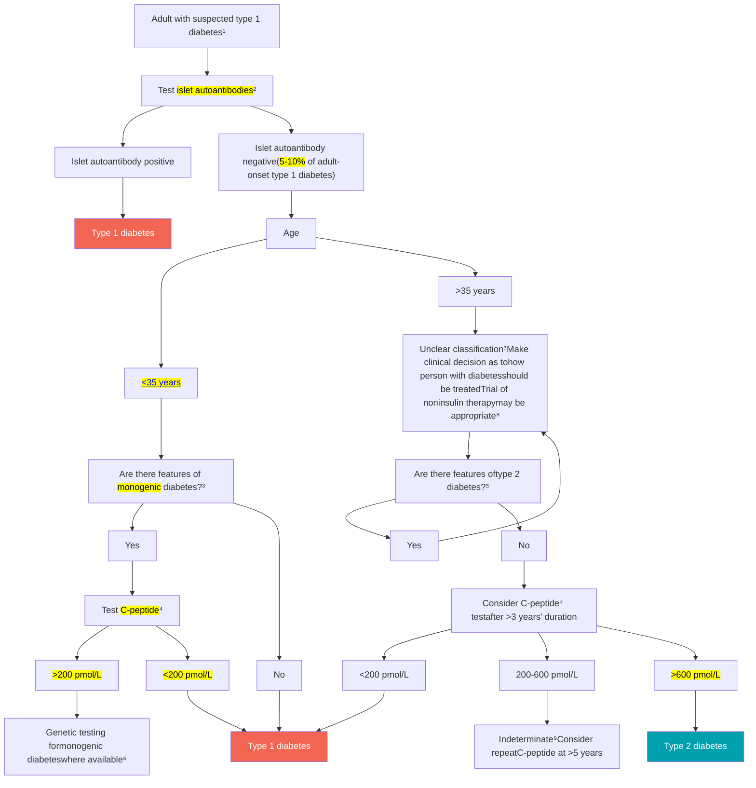
Genetic testing for monogenic diabetes

# 35.ADA T1DM flowchart

Flowchart for investigation of <mark>suspected type 1 diabetes</mark> in newly
diagnosed adults, based on data from White European populations

Figure 2.1—Flowchart for investigation of suspected type 1 diabetes in newly diagnosed adults, based on data from White European populations. <sup>1</sup><mark>No single</mark>
<mark>clinical feature confirms type 1 diabetes in isolation.</mark> <sup>2</sup>Glutamic acid decarboxylase (<mark>GAD</mark>) should be the primary antibody measured and, <mark>if</mark> negative, should be
followed by islet tyrosine phosphatase 2 (<mark>IA-2</mark>) and/or zinc transporter 8 (<mark>ZnT8</mark>) where these tests are available. In individuals who have <mark>not</mark> been treated with in-
sulin, antibodies against insulin may also be useful. In those diagnosed at <mark><35 years</mark> of age who have <mark>no clinical features of type 2 diabetes or monogenic diabe-</mark>
tes, a negative result does not change the diagnosis of type 1 diabetes, since 5–10% of people with type 1 diabetes do not have antibodies. <sup>3</sup><mark>Monogenic</mark>
diabetes is suggested by the presence of one or more of the following features: A1C <mark><58 mmol/mol</mark> (<mark><7.5%</mark>) at diagnosis, one parent with diabetes, features of
a <mark>specific monogenic cause</mark> (e.g., <mark>renal cysts</mark>, partial lipodystrophy, maternally inherited deafness, and severe insulin resistance in the absence of obesity), and
monogenic diabetes prediction model probability >5% (diabetesgenes.org/exeter-diabetes-app/ModyCalculator). <sup>4</sup>A <mark>C-peptide test</mark> is only indicated in people
receiving insulin treatment. A random sample (with concurrent glucose) within 5 h of eating can replace a formal C-peptide stimulation test in the context of
classification. If the <mark>result is ≥600 pmol/L</mark> (≥1.8 ng/mL), the circumstances of testing <mark>do not matter.</mark> If the result is <mark><600 pmol/L</mark> (<1.8 ng/mL) and the concur-
rent glucose is <4 mmol/L (<70 mg/dL) or the person may have been fasting, consider repeating the test. Results showing very low levels (e.g., <80 pmol/L
[<0.24 ng/mL]) do not need to be repeated. Where a person is insulin treated, <mark>C-peptide must be measured prior to insulin discontinuation to exclude severe in-</mark>
<mark>sulin deficiency.</mark> Do not test C-peptide within 2 weeks of a hyperglycemic emergency. <sup>5</sup>Features of <mark>type 2 diabetes</mark> include increased BMI (<mark>≥25 kg/m<sup>2</sup></mark>), <mark>absence</mark>
of weight loss, <mark>absence</mark> of ketoacidosis, and <mark>less</mark> marked hyperglycemia. Less discriminatory features include non-White ethnicity, family history, longer duration
and milder severity of symptoms prior to presentation, features of metabolic syndrome, and absence of a family history of autoimmunity. <sup>6</sup>If genetic testing
does not confirm monogenic diabetes, the classification is unclear and a clinical decision should be made about treatment. <sup>7</sup><mark>Type 2 diabetes</mark> should be strongly
considered in <mark>older</mark> individuals. In some cases, investigation for pancreatic or other types of diabetes may be appropriate. <sup>8</sup>A person with possible type 1 diabe-
tes who is not treated with insulin will require careful monitoring and education so that insulin can be rapidly initiated in the event of glycemic deterioration.
<sup>9</sup>C-peptide values 200–600 pmol/L (0.6–1.8 ng/mL) are usually consistent with type 1 diabetes or maturity-onset diabetes of the young but may occur in insulin-
treated type 2 diabetes, particularly in people with normal or low BMI or after long duration. Reprinted and adapted from Holt et al. (32).

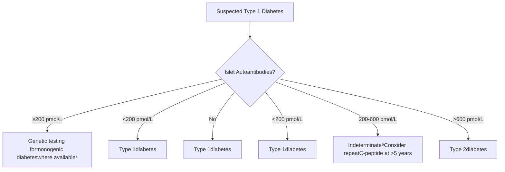

# 35.ADA T1DM flowchart

Initiation and adjustment of <mark>insulin using multiple daily dosing</mark> in individuals with <mark>type 1 diabetes</mark>

```mermaid
graph TD
    Start[Support healthy lifestyle behaviors, deliver diabetes self-management education and support, and address social determinants of health to meet individualized treatment goals] --> Inertia((To avoid therapeutic inertia, reassess and modify treatment regularly 3-6 months))
    Start --> Considerations[**Considerations for starting insulin**Choice of insulin s and administration method should be based on person-specific considerations including <mark>progression and severity of insulin deficiency, initial presentation with DKA,</mark><sup>1</sup> and/or concomitant overweight or obesity<mark>Glucagon</mark> should be prescribed for <mark>emergent hypoglycemia</mark>]
    Considerations --> Initiation[**Initiation and titration of insulin****INITIATION** Start <mark>0.4-0.5 units/kg/day divided equally between basal and prandial</mark><sup>2</sup> coverage**TITRATION** Uptitrate or downtitrate as necessary, adjusting basal and prandial doses based on individualized goals for A1C, CGM, and SMBG]
    Initiation --> Reassess[Reassess frequently using <mark>CGM and/or SMBG</mark> to determine individual needs for prandial and basal dosing balance]
    Reassess --> Goal{If A1C, CGM metrics, or SMBG not at goal}
    
    Goal --> Hypo[If <mark>hypoglycemia</mark> is present, adjust basal and/or prandial insulin based on the timing of the hypoglycemia (e.g., <mark>1-4 units or 5-10% dosage adjustments</mark>)<sup>3,4</sup>]
    Goal --> Hyper[If <mark>hyperglycemia</mark> is present, adjust basal and/or prandial insulin based on the timing and extent of hyperglycemia (e.g., <mark>1-4 units or 5-10% dosage adjustments</mark>)<sup>3,4</sup>]
    
    Hyper --> Fasting[If fasting hyperglycemia is present, review overnight glucose pattern (using CGM, if available) and adjust basal insulin, if appropriate]
    Hyper --> Postprandial[If postprandial hyperglycemia is present, assess and educate to ensure prandial administration is appropriately timed and adjusted for nutrient intake (dosing may be fixed based on general intake or variable based on macronutrient and/or glycemic trends, depending on individual preference and ability)]

    SideNote[Assess adequacy of insulin dose and insulin-taking behaviors at every visitConsider person-specific considerations and clinical signs to evaluate for need for modification of administration method (switch to or from MDI, AID, inhaled insulin) and for overbasalization (e.g., elevated bedtime-to-morning and/or postprandial-to-preprandial differential, hypoglycemia [aware or unaware], high glucose variability)]
```

# 三、重點提示-Williams-36.Digitized

# 36

# Digitized Approaches to Diabetes Diagnostics and Therapeutics

TADEJ BATTELINO, JENNIFER L. SHERR, ALFONSO GALDERISI, AND KLEMEN DOVC

## CHAPTER OUTLINE

Sensor Calibration and Accuracy, 1424

CGM Technology Is Transformative for Diabetes Care, 1426

CGM Data Make It Possible to Understand and Manage Multiple Risk Factors in Diabetes, 1426

Making Daily Decisions Using CGM Technology, 1428

Using CGM-Derived Glucose Metrics in Clinical Practice, 1430

Time in Range in T1D and T2D, 1430

Time in Range in Elderly People With Diabetes and Those at High Risk of Hypoglycemia, 1431

Time in Range During Pregnancy, 1433

Decision-Support Systems for Visualizing CGM Data and Beyond, 1434

Ambulatory Glucose Profile—A Graphical Tool for Reviewing CGM Data, 1436

Using the Ambulatory Glucose Profile Report in a Systematic Way, 1437

Using CGM Improves Measures of Glycemia Compared to SMBG, 1437

Improvements in Glycemic Outcomes in Type 1 Diabetes, 1439

CGM Is Effective in Daily Management of T2D on Insulin Regimens, 1440

Use of CGM in People With T2D Not on Insulin Therapy, 1440

Telemonitoring and Telemedicine Are Essential Attributes of CGM Technology, 1440

Insulin Delivery, 1441

Connected Insulin Pens, 1441

Insulin Pumps, 1442

Sensor-Augmented Pump Therapy, 1443

Automated Insulin Delivery, 1445

Anticipated Developments for Insulin Delivery and Automated Insulin Delivery, 1446

Use of Diabetes Technologies in Special Situations, 1448

Future Directions, 1451

# 36.Digitized


<table>
  <thead>
    <tr>
        <th colspan="2">SMBG glucose snapshots</th>
        <th colspan="2">CGM glucose daily profile</th>
    </tr>
    <tr>
        <th>Time</th>
        <th>Glucose level (mmol/L)</th>
        <th>Time</th>
        <th>Glucose level (mmol/L)</th>
    </tr>
  </thead>
  <tbody>
    <tr>
        <td>12am</td>
        <td>~9</td>
        <td>12am</td>
        <td>~9</td>
    </tr>
    <tr>
        <td>~3am</td>
        <td>~10</td>
        <td>~3am</td>
        <td>~14</td>
    </tr>
    <tr>
        <td>~6am</td>
        <td>~3</td>
        <td>~6am</td>
        <td>~3</td>
    </tr>
    <tr>
        <td>Noon</td>
        <td>~7</td>
        <td>Noon</td>
        <td>~7</td>
    </tr>
    <tr>
        <td>~3pm</td>
        <td>~11</td>
        <td>~3pm</td>
        <td>~11</td>
    </tr>
    <tr>
        <td>~6pm</td>
        <td>~13</td>
        <td>~6pm</td>
        <td>~14</td>
    </tr>
    <tr>
        <td>~9pm</td>
        <td>~8</td>
        <td>~9pm</td>
        <td>~6</td>
    </tr>
    <tr>
        <td>12am</td>
        <td>~5</td>
        <td>12am</td>
        <td>~5</td>
    </tr>
  </tbody>
</table>


\* **Fig. 36.2** <mark>CGM</mark> sensor glucose readings provide a meaningful profile of daily <mark>glucose levels and fluc-</mark>
<mark>tuations.</mark> SMBG testing provides <mark>isolated snapshots of glucose levels</mark> at any one moment of time. Most
people would not perform fingerstick testing eight times daily as shown in the left graphic, and both high
and low glycemic excursions may not be detected. In contrast, <mark>CGM</mark> sensors collect <mark>glucose</mark> readings
<mark>minute-by-minute</mark> to generate a complete view of glucose levels throughout the day and through the night
(right), covering periods of high or low glucose, as well as <mark>peaks and troughs</mark> when glucose is variable.

# 36.Digitized

Triangle of diabetes care diagram showing three interconnected sections: Improve overall glucose levels (HbA1c) in blue at the top, Avoid hypoglycemia in red on the left, and Limit glucose variability in orange on the right, all surrounding a central circle that reads "Better outcomes for people with diabetes".

\* **Fig. 36.5** <mark>Triangle</mark> of diabetes care—a model for application of CGM in diabetes care. The triangle of diabetes care illustrates how the attributes of CGM technology can be used to manage multiple risk factors in diabetes.

# 36.Digitized

**CGM arrow trend**


<table>
  <thead>
    <tr>
        <th>Abbott Freestyle<br/>Libre 2<sup>53</sup></th>
        <th>Dexcom G6<sup>54</sup></th>
        <th>Medtronic<br/>MiniMed 780G<sup>55</sup></th>
        <th>Medtronic<br/>Guardian Connect<sup>56</sup></th>
        <th>Eversense E3<sup>57</sup></th>
    </tr>
  </thead>
  <tbody>
    <tr>
        <td> </td>
        <td> </td>
        <td>↑↑↑<br/><mark>每分鐘上升 &gt;3mg/dl</mark></td>
        <td>↑↑↑<br/>每分鐘上升 &gt;3mg/dl</td>
        <td> </td>
    </tr>
    <tr>
        <td>↑ 快速上升<br/>(<mark>每分鐘 &gt;2mg/dl</mark>)</td>
        <td>↑ 上升<br/>(每分鐘 &gt;2~3mg/dl)</td>
        <td>↑↑<br/><mark>每分鐘上升 2-3mg/dl</mark></td>
        <td>↑↑<br/>每分鐘上升 2-3mg/dl</td>
        <td>↑ 快速上升<br/>(<mark>每分鐘 &gt;2mg/dl</mark>)</td>
    </tr>
    <tr>
        <td>↗ 上升<br/>(<mark>每分鐘 1-2mg/dl</mark>)</td>
        <td>↗ 緩慢上升<br/>(每分鐘 1-2mg/dl)</td>
        <td>↑<br/><mark>每分鐘上升 1-2mg/dl</mark></td>
        <td>↑<br/>每分鐘上升 1-2mg/dl</td>
        <td>↗ 中等程度上升<br/>(<mark>每分鐘 1-2mg/dl</mark>)</td>
    </tr>
    <tr>
        <td>➡ 緩慢變化<br/>(<mark>每分鐘 &lt;1mg/dl</mark>)</td>
        <td>➡ 穩定<br/>(<mark>每分鐘 &lt;1mg/dl</mark>)</td>
        <td> </td>
        <td> </td>
        <td>➡ 緩慢上升或下降<br/>(<mark>每分鐘 &lt;1mg/dl</mark>)</td>
    </tr>
    <tr>
        <td>↘ 下降<br/>(每分鐘 1-2mg/dl)</td>
        <td>↘ 緩慢下降<br/>(每分鐘 1-2mg/dl)</td>
        <td>↓<br/>每分鐘下降 1-2mg/dl</td>
        <td>↓<br/>每分鐘下降 1-2mg/dl</td>
        <td>↘ 中等程度下降<br/>(每分鐘 1-2mg/dl)</td>
    </tr>
    <tr>
        <td>↓ 快速下降<br/>(每分鐘 &gt;2mg/dl)</td>
        <td>↓ 下降<br/>(每分鐘 &gt;2-3mg/dl)</td>
        <td>↓↓<br/>每分鐘下降 2-3mg/dl</td>
        <td>↓↓<br/>每分鐘下降 2-3mg/dl</td>
        <td>↓ 快速下降<br/>(每分鐘 &gt;2mg/dl)</td>
    </tr>
    <tr>
        <td> </td>
        <td> </td>
        <td>↓↓↓<br/>每分鐘下降 &gt;3mg/dl</td>
        <td>↓↓↓<br/>每分鐘下降 &gt;3mg/dl</td>
        <td> </td>
    </tr>
  </tbody>
</table>

# 36.Digitized

箭頭趨勢判斷應用在運動前處置—FreeStyle Libre System 為例 <sup>100</sup>

箭頭趨勢判斷應用在運動前處置圖表

## 運動前使用趨勢箭頭判讀

### 運動前血糖濃度


<table>
  <thead>
    <tr>
        <th colspan="4">運動前使用趨勢箭頭判讀</th>
    </tr>
    <tr>
        <th colspan="4">運動前血糖濃度</th>
    </tr>
    <tr>
        <th>&lt; 100mg/dL</th>
        <th>100-180mg/dL</th>
        <th>181-250mg/dL</th>
        <th>&gt; 250mg/dL</th>
    </tr>
    <tr>
        <th>不建議運動<br/>進行醣類補充及等待血糖上升至 &gt; 100mg/dL</th>
        <th>謹慎運動<br/>每 30 分鐘掃描監測避免低血糖發生</th>
        <th>運動<br/>每 30 分鐘掃描監測避免低血糖發生</th>
        <th>不建議運動<br/>校正及等待血糖下降至 ≦ 250mg/dL</th>
    </tr>
  </thead>
  <tbody>
    <tr>
        <td>↑ 等待血糖上升至 &gt; 100mg/dL</td>
        <td>↑ 每 30 分鐘掃描監測</td>
        <td>↑ 每 30 分鐘掃描監測</td>
        <td>↑ 校正至 ≦ 180mg/dL</td>
    </tr>
    <tr>
        <td>↗ 等待血糖上升至 &gt; 100mg/dL</td>
        <td>↗ 每 30 分鐘掃描監測</td>
        <td>↗ 每 30 分鐘掃描監測</td>
        <td>↗ 校正至 ≦ 180mg/dL</td>
    </tr>
    <tr>
        <td>→ 補充 15 克碳水化合物</td>
        <td>→ 考慮補充 15 克碳水化合物</td>
        <td>→ 每 30 分鐘掃描監測</td>
        <td>→ 校正至 ≦ 180mg/dL</td>
    </tr>
    <tr>
        <td>↘ 補充 15 克碳水化合物</td>
        <td>↘ 考慮補充 15 克碳水化合物</td>
        <td>↘ 每 30 分鐘掃描監測</td>
        <td>↘ 等待血糖下降至 ≦ 250mg/dL</td>
    </tr>
    <tr>
        <td>↓ 補充 30 克碳水化合物</td>
        <td>↓ 考慮補充 30 克碳水化合物</td>
        <td>↓ 考慮補充 15 克碳水化合物</td>
        <td>↓ 等待血糖下降至 ≦ 250mg/dL</td>
    </tr>
  </tbody>
</table>

# 36.Digitized

## 表一、成年人胰島素幫浦設定的計算


<table>
  <thead>
    <tr>
        <th colspan="2">(一) 胰島素幫浦設定的計算</th>
    </tr>
    <tr>
        <th colspan="2">幫浦每日總劑量 (TDD)</th>
    </tr>
    <tr>
        <th>方法 1.</th>
        <th>方法 2.</th>
    </tr>
    <tr>
        <th><mark>依據每日注射劑量</mark></th>
        <th>依據體重</th>
    </tr>
  </thead>
  <tbody>
    <tr>
        <td><mark>注射劑量 X0.75</mark></td>
        <td>體重 ( 公斤 )X0.5</td>
    </tr>
    <tr>
        <td colspan="2">每日總劑量：</td>
    </tr>
    <tr>
        <td colspan="2">•選擇方法 1 或方法 2</td>
    </tr>
    <tr>
        <td colspan="2">•<mark>低血糖患者→從低劑量開始</mark></td>
    </tr>
    <tr>
        <td colspan="2">•高血糖、高 HbA1c 或懷孕→從高劑量開始</td>
    </tr>
  </tbody>
</table>
<table>
  <thead>
    <tr>
        <th colspan="3">(二) 幫浦劑量調整</th>
    </tr>
    <tr>
        <th>基礎速率<br/>(Basal Rate)</th>
        <th><mark>胰島素對碳水化合物<br/>比值 (ICR; <mark>Insulin to<br/>Carbohydrate Ratio</mark>)</mark></th>
        <th><mark>胰島素敏感因子<br/>(ISF; <mark>Insulin<br/>Sensitivity<br/>Factor/<br/>Correction</mark>)</mark></th>
    </tr>
  </thead>
  <tbody>
    <tr>
        <td>( 幫 浦 TDD × 0.5 )<br/>÷ 24 h</td>
        <td><mark>500 ÷ TDD</mark></td>
        <td><mark>1800 ÷ TDD</mark></td>
    </tr>
    <tr>
        <td>臨床指引<br/>•根據 2-3 天的血糖趨勢，開始調整基礎率<br/>•調整至<mark>空腹血糖穩定（包含兩餐之間和睡眠期間）</mark><br/>•根據每日血糖變化，增加不同基礎速率（如：<mark>黎明現象</mark>）</td>
        <td>臨床指引<br/>•根據低脂食物調整已知碳水化合物含量<br/>•餐後 2 小時血糖值比餐前血糖高約 60 mg / dL<br/>•根據餐後血糖，以 10% -20% 調整 CR<br/>•替代方法<br/>•ICR (6 × 體重 kg ÷ TDD)<br/>•三餐固定劑量 = (TDD × 0.5) ÷ 3 餐（無使用 Carbohydrate Ratio 計算）<br/>•根據 MDI 劑量輸送</td>
        <td>臨床指引<br/>•計算胰島素敏感性因子，應該在 2 小時後檢測校正後血糖，如果血糖在 30 mg / dL 之內，則敏感度正確。<br/>•如果校正後 2 小時血糖值高於或低於目標值，則調整 10-20%。</td>
    </tr>
  </tbody>
</table>


縮 寫 :BG = blood glucose; ICR =Insulin to carbohydrate ratio; HbA1c = hemoglobin A1c; ISF = insulin sensitivity factor; MDI =multiple daily injection; TDD = total daily dose

# 36.Digitized

Calculation of daily basal and bolus insulin infusion rates and clinical practice questions

計算每日基礎和快速輸送總量

<table>
    <tr>
        <th>每日基礎總量<br/>幫浦 TDD X 0.5</th>
        <th>每日快速輸送總量<br/>幫浦 TDD - 每日基礎總量</th>
    </tr>
</table>
<table>
    <tr>
        <th>陳小姐的每日總劑量：<br/>30 單位 / 天</th>
        <th>陳小姐的每日總劑量：<br/>30 單位 / 天</th>
    </tr>
</table>
<table>
    <tr>
        <th>30 單位 X 0.5 = 15 單位 / 天<br/>(每日基礎總量)</th>
        <th>30 單位 - 15 單位 = 15 單位 / 天<br/>(每日快速輸送總量)</th>
    </tr>
</table>
基礎速率

基礎速率每日基礎總量 ÷ 24 小時

陳小姐的每日基礎劑量：15 單位 / 天15 單位 / 天 ÷ 24 小時 ≒ 0.625 單位 / 小時

胰島素對碳水化合物比值 (ICR)

500 法則500 ÷ 幫浦 TDD

陳小姐的每日總劑量30 單位 / 天500 ÷ 30 單位 / 天 ≒ 17 克 / 單位 (碳水化合物比值)1 單位涵蓋 17 克

胰島素敏感因子 (ISF)

1800 法則1800 ÷ 幫浦 TDD

陳小姐的每日總劑量30 單位 / 天1800 ÷ 30 單位 / 天 = 60mg/dl (敏感因子)1 單位可將血糖降低 60mg/dl

連續性皮下胰島素注射 (CSII)4. The adjustments of CSII setting

\*考古臨床題

1. 60kg女性，T1D診斷兩年，BMI24，<mark>原本打basal-bolus</mark> insulin ???U 血糖控制不佳HbA1c:10，問換成CSII，<mark>basal dose要怎麼設定？</mark>

2. <mark>給病人C/I</mark>，給午餐前血糖，<mark>午餐預計吃60克的碳水</mark>，<mark>標血糖為 100mg/dl</mark> 目前pump顯示仍有 1.4U的活性胰島素，午餐前時要Bolus劑量要設定多少??

3. <mark>CGM圖判讀夜間低血糖，AID 怎麼調整</mark>

# 36.Digitized

**TABLE 36.3** Consensus Recommendations for %TIR, %TBR, and %TAR for Adults, Children, and Young People With T1D or T2D, for People at High Risk of Hypoglycemia, and Pregnant Women With Pregestational T1D


<table>
  <thead>
    <tr>
        <th rowspan="2">Diabetes Group</th>
        <th colspan="2">TIME IN RANGE (TIR)</th>
        <th colspan="2">TIME BELOW RANGE (TBR)</th>
        <th colspan="2">TIME ABOVE RANGE (TAR)</th>
    </tr>
    <tr>
        <th>Target Range</th>
        <th>% of Time:<br/>Time per Day</th>
        <th>Below Target<br/>Level</th>
        <th>% of Time:<br/>Time per Day</th>
        <th>Above Target<br/>Level</th>
        <th>% of Time:<br/>Time per Day</th>
    </tr>
  </thead>
  <tbody>
    <tr>
        <td rowspan="2">Type 1/type 2<sup>a</sup></td>
        <td>70–180 mg/dL<br/>(3.9–10.0 mmol/L)</td>
        <td>&gt;70%:<br/>&gt;16 hr 48 min</td>
        <td>70 mg/dL<br/>(&lt;3.9 mmol/L)</td>
        <td>&lt;4%:<br/>&lt;1 hr</td>
        <td>&gt;180 mg/dL<br/>(&gt;10.0 mmol/L)</td>
        <td>&lt;25%:<br/>&lt;6 hr</td>
    </tr>
    <tr>
        <td> </td>
        <td>54 mg/dL<br/>(&lt;3.0 mmol/L)</td>
        <td>&lt;1%<br/>&lt;15 min</td>
        <td>&gt;250 mg/dL<br/>(&gt;13.9 mmol/L)</td>
        <td>&lt;5%<br/>&lt;1 hr, 12 min</td>
        <td></td>
    </tr>
    <tr>
        <td>Older/high-risk, type 1 or type 2<sup>b</sup></td>
        <td>70–180 mg/dL<br/>(3.9–10.0 mmol/L)</td>
        <td>&gt;50%:<br/>&gt;12 hr</td>
        <td>70 mg/dL<br/>(&lt;3.9 mmol/L)</td>
        <td>&lt;1%:<br/>&lt;15 min</td>
        <td>&gt;250 mg/dL<br/>(&gt;13.9 mmol/L)</td>
        <td>&lt;10%:<br/>&lt;2 hr 24 min</td>
    </tr>
    <tr>
        <td rowspan="2">Pregnancy, type 1<sup>c</sup></td>
        <td>63–140 mg/dL<br/>(3.5–7.8 mmol/L)</td>
        <td>&gt;70%:<br/>&gt;16 hr 48 min</td>
        <td>63 mg/dL<br/>(&lt;3.5 mmol/L)</td>
        <td>&lt;4%:<br/>&lt;1 hr</td>
        <td>&gt;140 mg/dL<br/>(&gt;7.8 mmol/L)</td>
        <td>&lt;25%:<br/>&lt;6 hr</td>
    </tr>
    <tr>
        <td> </td>
        <td>54 mg/dL<br/>(&lt;3.0 mmol/L)</td>
        <td>&lt;1%:<br/>&lt;15 min</td>
        <td> </td>
        <td> </td>
        <td></td>
    </tr>
    <tr>
        <td rowspan="2">Pregnancy, type 2 and GD</td>
        <td>63–140 mg/dL<br/>(3.5–7.8 mmol/L)</td>
        <td> </td>
        <td>63 mg/dL<br/>(&lt;3.5 mmol/L)</td>
        <td> </td>
        <td>&gt;140 mg/dL<br/>(&gt;7.8 mmol/L)</td>
        <td> </td>
    </tr>
    <tr>
        <td> </td>
        <td>54 mg/dL<br/>(&lt;3.0 mmol/L)</td>
        <td> </td>
        <td> </td>
        <td> </td>
        <td></td>
    </tr>
  </tbody>
</table>


<sup>a</sup>For age ≤25 years, if the A<sub>1c</sub> goal is 7.5%, set TIR target to approximately 60%.
<sup>b</sup>People with T1D or T2D at high risk of hypoglycemia because of age, duration of diabetes, duration of insulin therapy, or impaired awareness of hypoglycemia.
<sup>c</sup>%TIR in pregnancy values are based on limited evidence. Consensus recommendations are provided for %TIR, %TBR, and %TAR for women with T1D during pregnancy or planning pregnancy. During pregnancy the %TIR should be considered in conjunction with mean daily glucose, aiming for a mean glucose of 6.0–6.5 mmol/L. No consensus recommendations for %TIR, %TBR, or %TAR in pregnancy in T2D or in GD are available.

GD, gestational diabetes mellitus.

# 36.Digitized

Infographic showing glucose level targets for adults with T1D or T2D and Time In Tight Range (TITR)


**Adults with T1D or T2D**

<table>
  <thead>
    <tr>
        <th>Glucose level (mmol/L)</th>
        <th>Glucose level (mg/dL)</th>
        <th>Category</th>
        <th>Target</th>
    </tr>
  </thead>
  <tbody>
    <tr>
        <td> </td>
        <td> </td>
        <td><mark><strong>Very high</strong></mark><br/>(&gt;250 mg/dL)<br/>(&gt;13.9 mmol/L)</td>
        <td><mark>&lt;5%</mark><br/>&lt;1 h 12 min</td>
    </tr>
    <tr>
        <td>13.9</td>
        <td>250</td>
        <td> </td>
        <td> </td>
    </tr>
    <tr>
        <td> </td>
        <td> </td>
        <td><strong>High</strong><br/>(&gt;180 mg/dL)<br/>(&gt;10.0 mmol/L)</td>
        <td><mark>&lt;25%*</mark><br/>&lt;6 h</td>
    </tr>
    <tr>
        <td>10.0</td>
        <td>180</td>
        <td> </td>
        <td> </td>
    </tr>
    <tr>
        <td> </td>
        <td> </td>
        <td><mark><strong>Target range</strong></mark><br/>(70 – 180 mg/dL)<br/>(3.9 – 10.0 mmol/L)</td>
        <td><mark>&gt;70%</mark><br/>&gt;16 h 48 min</td>
    </tr>
    <tr>
        <td>3.9</td>
        <td>70</td>
        <td> </td>
        <td> </td>
    </tr>
    <tr>
        <td>3.0</td>
        <td>54</td>
        <td>Low (&lt;70 mg/dL, &lt;3.9 mmol/L)</td>
        <td><mark>&lt;4% &lt;1 h<sup>1</sup></mark></td>
    </tr>
    <tr>
        <td> </td>
        <td> </td>
        <td><mark><strong>Very low</strong></mark> (&lt;54 mg/dL, &lt;3.0 mmol/L)</td>
        <td><mark>&lt;1%</mark> &lt;15 min</td>
    </tr>
  </tbody>
</table>


\* Readings >13.9 mmol/L are also included in the <25% target

<sup>1</sup> Readings <3.0 mmol/L are also included in the <4% target


**Time In <mark>tight</mark> range (<mark>TITR</mark>) In T1D of T2D**

<table>
  <thead>
    <tr>
        <th>Glucose level (mmol/L)</th>
        <th>Glucose level (mg/dL)</th>
        <th>Category</th>
        <th>Target</th>
    </tr>
  </thead>
  <tbody>
    <tr>
        <td> </td>
        <td> </td>
        <td><mark><strong>Very high</strong></mark><br/>(&gt;250 mg/dL)<br/>(&gt;13.9 mmol/L)</td>
        <td><mark>&lt;5%</mark><br/>&lt;1 h 12 min</td>
    </tr>
    <tr>
        <td>13.9</td>
        <td>250</td>
        <td> </td>
        <td> </td>
    </tr>
    <tr>
        <td> </td>
        <td> </td>
        <td><strong>High</strong><br/>(&gt;140 mg/dL)<br/>(&gt;7.8 mmol/L)</td>
        <td><mark>&lt;25%*</mark><br/>&lt;6 h</td>
    </tr>
    <tr>
        <td>7.8</td>
        <td>140</td>
        <td> </td>
        <td> </td>
    </tr>
    <tr>
        <td> </td>
        <td> </td>
        <td><mark><strong>Target range</strong></mark><br/>(70 – 140 mg/dL)<br/>(3.9 – 7.8 mmol/L)</td>
        <td><mark>&gt;70%</mark><br/>&gt;16 h 48 min</td>
    </tr>
    <tr>
        <td>3.9</td>
        <td>70</td>
        <td> </td>
        <td> </td>
    </tr>
    <tr>
        <td>3.0</td>
        <td>54</td>
        <td>Low (&lt;70 mg/dL, &lt;3.9 mmol/L)</td>
        <td><mark>&lt;4% &lt;1 h<sup>1</sup></mark></td>
    </tr>
    <tr>
        <td> </td>
        <td> </td>
        <td><mark><strong>Very low</strong></mark> (&lt;54 mg/dL, &lt;3.0 mmol/L)</td>
        <td><mark>&lt;1%</mark> &lt;15 min</td>
    </tr>
  </tbody>
</table>


\* Readings >13.9 mmol/L are also included in the <25% target

<sup>1</sup> Readings <3.0 mmol/L are also included in the <4% target

# 36.Digitized


**Older people with T1D or T2D at risk of hypoglycemia**

<table>
  <thead>
    <tr>
        <th>Glucose level (mmol/L)</th>
        <th>Glucose level (mg/dL)</th>
        <th>Range Category</th>
        <th>Target (%)</th>
        <th>Target (Time)</th>
    </tr>
  </thead>
  <tbody>
    <tr>
        <td> </td>
        <td> </td>
        <td>Very high (&gt;250 mg/dL) (&gt;13.9 mmol/L)</td>
        <td>&lt;10%</td>
        <td>&lt;2 h 24 min</td>
    </tr>
    <tr>
        <td>13.9</td>
        <td>250</td>
        <td>High (&gt;180 mg/dL) (&gt;10.0 mmol/L)</td>
        <td>&lt;50%*</td>
        <td>&lt;12 h</td>
    </tr>
    <tr>
        <td>10.0</td>
        <td>180</td>
        <td>Target range (70 - 180 mg/dL) (3.9 - 10.0 mmol/L)</td>
        <td>&gt;50%</td>
        <td>&gt;12 h min</td>
    </tr>
    <tr>
        <td>3.9</td>
        <td>70</td>
        <td>Low (&lt;70 mg/dL, &lt;3.9 mmol/L)</td>
        <td>&lt;1%</td>
        <td>&lt;15 min</td>
    </tr>
  </tbody>
</table>

\* Readings >13.9 mmol/L are also included in the <25% target

**Women with T1D who are pregnant or planning pregnancy**

<table>
  <thead>
    <tr>
        <th>Glucose level (mmol/L)</th>
        <th>Glucose level (mg/dL)</th>
        <th>Range Category</th>
        <th>Target (%)</th>
        <th>Target (Time)</th>
    </tr>
  </thead>
  <tbody>
    <tr>
        <td> </td>
        <td> </td>
        <td>High (&gt;140 mg/dL) (&gt;7.8 mmol/L)</td>
        <td>&lt;25%</td>
        <td>&lt;6 h</td>
    </tr>
    <tr>
        <td>7.8</td>
        <td>140</td>
        <td>Target range (63 - 140 mg/dL) (3.5 - 7.8 mmol/L)</td>
        <td>&gt;70%</td>
        <td>&gt;16 h 48 min</td>
    </tr>
    <tr>
        <td>3.5</td>
        <td>63</td>
        <td>Low (&lt;63 mg/dL, &lt;3.5 mmol/L)</td>
        <td>&lt;4%</td>
        <td>&lt;1 h¹</td>
    </tr>
    <tr>
        <td>3.0</td>
        <td>54</td>
        <td>Very low (&lt;54 mg/dL, &lt;3.0 mmol/L)</td>
        <td>&lt;1%</td>
        <td>&lt;15 min</td>
    </tr>
  </tbody>
</table>

\* %TIR, %TBR and %TAR are based on limited evidence. More research is needed.
¹ Readings <3.0 mmol/L are also included in the <4% target

• **Fig. 36.8** International consensus time in ranges and targets.

# 36.Digitized

AGP Report: Continuous glucose monitoring

**Sam test patient** DOB: Jan 1, 1970

14 days: August 8 - August 21, 2021

Time CGM active: 100%


### Time in ranges
Goals for type 1 and type 2 diabetes

<table>
  <thead>
    <tr>
        <th>Range</th>
        <th>Percentage</th>
        <th>Combined</th>
        <th>Goal / Clinical Note</th>
    </tr>
    <tr>
        <th>Very high (&gt;250 mg/dL)</th>
        <th>20%</th>
        <th rowspan="2">44%</th>
        <th><mark>Goal: &lt;5%</mark></th>
    </tr>
    <tr>
        <th>High (180-250 mg/dL)</th>
        <th>24%</th>
        <th><mark>Goal: &lt;25%</mark></th>
    </tr>
    <tr>
        <th>Target (70-180 mg/dL)</th>
        <th>46%</th>
        <th> </th>
        <th><mark>Goal: &gt;70%</mark><br/>Each 5% increase is clinically beneficial</th>
    </tr>
    <tr>
        <th>Low (54-70 mg/dL)</th>
        <th>5%</th>
        <th rowspan="2">10%</th>
        <th><mark>Goal: &lt;4%</mark></th>
    </tr>
    <tr>
        <th>Very Low (&lt;54 mg/dL)</th>
        <th>5%</th>
        <th><mark>Goal: &lt;1%</mark><br/>Each 1% time in range =~15 minutes</th>
    </tr>
  </thead>
</table>


### Glucose metrics

<table>
  <thead>
    <tr>
        <th>Metric</th>
        <th>Value</th>
    </tr>
  </thead>
  <tbody>
    <tr>
        <td>Average glucose<br/>Goal: &lt;154 mg/dL</td>
        <td>175 mg/dL</td>
    </tr>
    <tr>
        <td><mark>Glucose management Indicator (GMI)</mark><br/>Goal: &lt;7%</td>
        <td>7.5%</td>
    </tr>
    <tr>
        <td><mark>Glucose variability</mark><br/><mark>Defined as percent coefficient of variation</mark><br/><mark>Goal: ≤36%</mark></td>
        <td>45.5%</td>
    </tr>
  </tbody>
</table>

# 36.Digitized

## Ambulatory glucose profile (AGP)

<mark>AGP</mark> is a summary of glucose values from the report period, with <mark>median (50%)</mark> and other percentiles shown as if they occurred in a single day.


<table>
  <thead>
    <tr>
        <th>Time</th>
        <th>95% (mg/dL)</th>
        <th>75% (mg/dL)</th>
        <th>50% (mg/dL)</th>
        <th>25% (mg/dL)</th>
        <th>5% (mg/dL)</th>
    </tr>
  </thead>
  <tbody>
    <tr>
        <td>12am</td>
        <td>280</td>
        <td>240</td>
        <td>230</td>
        <td>180</td>
        <td>150</td>
    </tr>
    <tr>
        <td>3am</td>
        <td>270</td>
        <td>220</td>
        <td>180</td>
        <td>140</td>
        <td>110</td>
    </tr>
    <tr>
        <td>6am</td>
        <td>180</td>
        <td>150</td>
        <td>120</td>
        <td>90</td>
        <td>70</td>
    </tr>
    <tr>
        <td>9am</td>
        <td>220</td>
        <td>180</td>
        <td>140</td>
        <td>110</td>
        <td>90</td>
    </tr>
    <tr>
        <td>12pm</td>
        <td>340</td>
        <td>250</td>
        <td>190</td>
        <td>150</td>
        <td>120</td>
    </tr>
    <tr>
        <td>3pm</td>
        <td>240</td>
        <td>200</td>
        <td>160</td>
        <td>130</td>
        <td>110</td>
    </tr>
    <tr>
        <td>6pm</td>
        <td>310</td>
        <td>250</td>
        <td>180</td>
        <td>150</td>
        <td>130</td>
    </tr>
    <tr>
        <td>9pm</td>
        <td>330</td>
        <td>260</td>
        <td>240</td>
        <td>180</td>
        <td>140</td>
    </tr>
    <tr>
        <td>12am</td>
        <td>310</td>
        <td>260</td>
        <td>230</td>
        <td>180</td>
        <td>150</td>
    </tr>
  </tbody>
</table>


**user** 10月18日

綠色是TIR: 70-180
紅色是要高度注意: 低血糖or高於250
橘色是血糖>180但還沒高到250

# 36.Digitized-CGM-ADA*2026


<table>
  <tbody>
    <tr>
        <td>Good health and function, low treatment risks and burdens</td>
        <td>Most adults</td>
        <td>Healthy older adults</td>
        <td>Older adults with complex/intermediate health</td>
        <td>Older adults with very complex/poor health<br/>Any adults with limited life expectancy</td>
    </tr>
  </tbody>
</table>
<table>
  <thead>
    <tr>
        <th>A1C goals</th>
        <th>&lt;6.5%</th>
        <th>&lt;7.0%</th>
        <th>&lt;7.5%</th>
        <th>&lt;8.0%</th>
        <th>No A1C goal</th>
    </tr>
    <tr>
        <th>CGM goals TIR:</th>
        <th>—</th>
        <th>&gt;70%</th>
        <th>—</th>
        <th>&gt;50%</th>
        <th>—</th>
    </tr>
  </thead>
  <tbody>
    <tr>
        <td>\* TBR &lt;70</td>
        <td>—</td>
        <td>&lt;4%</td>
        <td>—</td>
        <td>&lt;1%</td>
        <td>&lt;1%</td>
    </tr>
    <tr>
        <td>\* TBR &lt;54</td>
        <td>—</td>
        <td>&lt;1%</td>
        <td>—</td>
        <td>&lt;1%</td>
        <td>&lt;1%</td>
    </tr>
    <tr>
        <td>\* TAR &gt;180</td>
        <td>—</td>
        <td>&lt;25%</td>
        <td>—</td>
        <td>&lt;50%</td>
        <td rowspan="2">Avoid symptomatic hyperglycemia</td>
    </tr>
    <tr>
        <td>\* TAR &gt;250</td>
        <td>—</td>
        <td>&lt;5%</td>
        <td>—</td>
        <td>&lt;10%</td>
    </tr>
  </tbody>
</table>


## Modifying Factors


<table>
  <thead>
    <tr>
        <th>Favor more stringent goal</th>
        <th>Favor less stringent goal</th>
    </tr>
  </thead>
  <tbody>
    <tr>
        <td>Short diabetes duration</td>
        <td>Long diabetes duration</td>
    </tr>
    <tr>
        <td>Low hypoglycemia risk</td>
        <td>High hypoglycemia risk</td>
    </tr>
    <tr>
        <td>Low treatment risks and burdens</td>
        <td>High treatment risks and burdens</td>
    </tr>
    <tr>
        <td>Pharmacotherapy with cardiovascular, kidney, weight, or other benefits</td>
        <td>Pharmacotherapy without nonglycemic benefits</td>
    </tr>
    <tr>
        <td>No cardiovascular complications</td>
        <td>Established cardiovascular complications</td>
    </tr>
    <tr>
        <td>Few or minor comorbidities</td>
        <td>Severe, life-limiting comorbidities</td>
    </tr>
  </tbody>
</table>

# 36.Digitized

1. The target glucose range, typically spanning <mark>70 to 180 mg/dL</mark> (3.9–10.0 mmol/L), except in pregnancy, is colored <mark>green</mark>.
2. The <mark>median line</mark>, a darker solid line tracing the <mark>midpoint glu-</mark> <mark>cose reading at each point in the modal day</mark>, <mark>shows whether</mark> <mark>average glucose is within the green target glucose range</mark> and how much it oscillates during the typical day.
3. The <mark>25th to 75th percentile band</mark>, also called the <mark>interquartile</mark> <mark>range (IQR)</mark>, is a darker shaded band in each part of the AGP showing the 50% of all glucose readings closest to the median line and their <mark>day-to-day variability</mark>. The IQR band shows daily trends in glucose levels that occur on most days and indicates primarily how <mark>meals and medication</mark> (commonly insulin) are influencing glucose levels. At times across the day when the <mark>IQR band is</mark> <mark>wider, this indicates more variability in day-to-day glucose levels</mark>.
4. The <mark>5th to 95th percentile range</mark>, the lightest of the shaded bands, indicates the less frequent glucose variability occurring on some days <mark>but not others</mark>, and can indicate <mark>how behavior</mark> <mark>and lifestyle factors</mark> are affecting glycemia.
Note that the 5% of glucose readings at the highest and lowest percentiles (i.e., those <mark>outside the 5th–95th percentile range) are</mark> <mark>not displayed in the AGP</mark>. These values are outliers that occur rarely, so they should not affect clinical judgment and decision making.

user 10月19日

1. 戴CGM要連續14天且70%以上時間都有抓到血糖
2. 確認低血糖TBR有無<4%(<70) / <1%(<54); 孕婦<4%(<63) / <1%(<54); 高風險<1%(<70)-> 避免低血糖是CGM的核心
3. 確認高血糖TAR有無<25%(>180), 若有, 更要注意有無<5%(>250); 孕婦<25%(>140); 老人<50%(>180) / <10%(>250); TITR*<25%(>140), <5%(>250)
4. 確認glucose variability (GV)要小於36%, 小於36%可以有最低的低血糖風險, 也會減低小大血管併發症: <T1DM: DCCT*小, EDIC*大+小>, 若沒有<36%, 就要進一步看IQR(25-75th* meal/medication), 及更寬的(5-95th* behavior/lifestyle)
5. 計算出glucose management indicator (GMI): 根據CGM平均血糖算出的預測HbA1c, 近期有高血糖: GMI>實際A1c; 近期積極治療: GMI<實際A1c-> 如果A1c高於GMI是high glycator: 治療就要根據CGM避免低血糖風險

## • BOX 36.2 Systematic Review of the AGP Report in Clinical Practice

### Step 1: Check Data Capture
Confirm that the patient has <mark>captured >70% of data over 14 consecutive days</mark> of <mark>sensor wear time</mark>. This indicates that the patient is <mark>adherent</mark> with using the CGM system.

### Step 2: Investigate Time Below Range <mark>(TBR)</mark>
Reducing the occurrence and <mark>risk of hypoglycemia</mark> is at the <mark>heart of diabetes</mark> <mark>guidelines</mark>.<sup>4,25</sup> If <mark><4%</mark> of sensor glucose readings are <mark>below 70 mg/dL</mark> (3.9 mmol/L), the patient is on target and the consultation can move on. If ≥4% of readings are below 70 mg/dL (3.9 mmol/L), it is important to understand why, especially if <mark>1% or more are below 54 mg/dL</mark> (3.0 mmol/L). Note that the international consensus recommends aiming for <mark>≤1% of readings below 70 mg/</mark> <mark>dL (3.9 mmol/L) in high-risk individuals</mark>.<sup>66</sup>

### Step 3: Investigate Time Above Range <mark>(TAR)</mark>
If <mark><25%</mark> of sensor glucose readings are <mark>above 180 mg/dL</mark> (10.0 mmol/L), the patient is on target and the consultation can move past this step. However, if ≥25% of readings are above 180 mg/dL (10.0 mmol/L) it is important to investigate, especially if <mark>5% or more are above 250 mg/dL</mark> (13.9 mmol/L).

### Step 4: Investigate <mark>Glucose Variability</mark>
Evidence is emerging indicating that glucose variability is associated with an increased risk of microvascular and macrovascular complications of diabetes. The <mark>target for CV is ≤36%</mark>,<sup>65</sup> since the risk of hypoglycemic events rises significantly above this value.<sup>80</sup> When investigating CV >36%, look for areas of <mark>the AGP with a wider IQR band and a wider outer 5th–95th percentile band</mark>.

### Step 5: Review Glucose Management Indicator <mark>(GMI)</mark> Against Recent HbA<sub>1c</sub>
In cases where treatment intensification may be indicated, a <mark>comparison of GMI</mark> <mark>alongside the most-recent HbA<sub>1c</sub></mark> value should be made to assess if a patient is a low, average, or high glycator. If the patient is a high glycator, <mark>treatment</mark> <mark>intensification should be managed using the GMI value only</mark>, since <mark>treatment</mark> <mark>intensification in high glycators, based solely on HbA<sub>1c</sub> carries a risk of</mark> <mark>hypoglycaemia</mark>.<sup>30</sup>

# 三、重點提示-Williams-37.MODY

37

# Monogenic Diabetes

MARIA V. SALGUERO, MARILYN AROSEMENA, ROCHELLE N. NAYLOR, AND LOUIS H. PHILIPSON

## CHAPTER OUTLINE

* **Introduction**, 1453
* **GCK-MODY**, 1462

* **Monogenic Diabetes and Pregnancy**, 1462
* **Conclusions**, 1464

## KEY POINTS

* Monogenic forms of diabetes account for 1% to 2% of diabetes cases and are often a consequence of <mark>gene defects</mark> that either interfere with β-cell development and function, including <mark>insulin production and secretion</mark>, or <mark>insulin action</mark> and result in clinical diabetes.

* Monogenic forms of diabetes include <mark>neonatal diabetes</mark> with onset generally under 9 months of age and <mark>maturity-onset diabetes of the young (MODY)</mark>, characterized by childhood or <mark>young adult-onset of diabetes</mark>, with diagnosis typically occurring <mark>before 30</mark> years of age. Knowledge about monogenic forms of diabetes has evolved from basic descriptions of clinical characteristics to well-defined molecular genetics and specific <mark>therapeutic</mark> approaches.

* The most common causes of neonatal diabetes include pathogenic variants in the insulin gene (requiring insulin treatment) and in <mark>KCNJ11</mark> and <mark>ABCC8</mark> genes, which encode the subunits of the <mark>K-ATP channel</mark> and are usually responsive to high doses of sulfonylureas.

* The four most common causes of MODY include heterozygous pathogenic variants in glucokinase (<mark>GCK</mark>), characterized by <mark>mild fasting</mark> hyperglycemia with <mark>low</mark> to no incidence of related diabetes complications and generally requiring <mark>no</mark> glucose-lowering treatment; <mark>hepatocyte nuclear factor-1α (HNF1A)</mark> associated with glycosuria with progressive hyperglycemia and frequently response to <mark>low doses of sulfonylureas</mark>; <mark>hepatocyte nuclear factor-4 α (HNF4A)</mark> with history of transient neonatal hypoglycemia with progressive hyperglycemia, also frequently responsive to <mark>low doses of sulfonylureas</mark>; and hepatocyte nuclear factor-1β (<u>HNF1B</u>) with <u>renal cysts, pancreatic hypoplasia and exocrine dysfunction, and hypomagnesemia</u>, which <mark>lacks</mark> clear precision therapy.

* Monogenic causes of <mark>lipodystrophies, insulin resistance, and obesity</mark> may also include diabetes as part of the syndrome.

* Syndromic forms of diabetes account for less than 1% of children with diabetes. Examples include maternally inherited diabetes and deafness due to <mark>mitochondrial</mark> pathogenic variants, and <mark>Wolfram</mark> syndrome due to wolframin ER transmembrane glycoprotein (<mark>Wfs1</mark>) pathogenic variants, among others.

# 37.MODY

```mermaid
graph LR
    subgraph Timeline
        T1[1960-1976] --- T2[1987] --- T3[1992-1993] --- T4[1994] --- T5[1996] --- T6[1997] --- T7[1998] --- T8[2000-2003] --- T9[2004-2006] --- T10[2007]
    end

    T1 --- B1["- Fajans and Tattersall:Initial description ofMODY as mild familialdiabetes withdominant inheritance.(3-5)"]
    T2 --- A1["- Fajans:Definition andphenotypic expressionof MODY (6,7)"]
    T3 --- B2["-Froguel et al, Stoffel etal: Discovery of <mark>GCK-</mark><mark>MODY (MODY 2)</mark> (8-11)-Fajans et al:Sulfonylureas can treatsome MODY (12)-Fajans et al: MODYdescribed as a modelfor the study of themolecular genetics ofnon-insulin-dependentdiabetes (13)"]
    T4 --- A2["-Fajans et al, Hermanet al: Abnormal insulinsecretion in the RWpedigree (14)"]
    T5 --- B3["- Bell et al: Discovery of<mark>HNF4A-MODY</mark><mark>(MODY 1)</mark> (15)-Bell et al: Hepaticfunction in HNF4A-MODY (16)- Bell et al, Polonsky etal: Discovery of <mark>MODY-</mark><mark>HNF1A (MODY 3)</mark>(17,18)"]
    T6 --- A3["-Staffers et al: <mark>IPF1</mark><mark>(MODY 4)</mark> (19)- Bell et al: <mark>HNF1B</mark><mark>(MODY 5)</mark> (20)- Hansen et al,Hattersley et al:Sulfonylureas treat<mark>HNF1A and HNF4A</mark>(21,22)"]
    T7 --- B4["- Menzel et al: Lowrenal threshold forglucose in MODY-HNF1A (23)"]
    T8 --- A4["-Njølstad et al: Neonataldiabetes caused by GCKdeficiency (24)"]
    T9 --- B5["- Hattersley et al:Discovery of <mark>KCNJ11,</mark><mark>ABCC8</mark> in transientneonatal diabetes,treatment withsulfonylurea (25)"]
    T10 --- A5["- Støy et al: Insulingene mutations inpermanent neonataldiabetes (26)"]

    style A1 fill:#fff,stroke:#0070c0,stroke-width:2px
    style A2 fill:#fff,stroke:#0070c0,stroke-width:2px
    style A3 fill:#fff,stroke:#0070c0,stroke-width:2px
    style A4 fill:#fff,stroke:#0070c0,stroke-width:2px
    style A5 fill:#fff,stroke:#0070c0,stroke-width:2px
    style B1 fill:#fff,stroke:#0070c0,stroke-width:2px
    style B2 fill:#fff,stroke:#0070c0,stroke-width:2px
    style B3 fill:#fff,stroke:#0070c0,stroke-width:2px
    style B4 fill:#fff,stroke:#0070c0,stroke-width:2px
    style B5 fill:#fff,stroke:#0070c0,stroke-width:2px
    
    style T1 fill:#d9e1f2,stroke:#333
    style T2 fill:#70ad47,stroke:#333
    style T3 fill:#d9e1f2,stroke:#333
    style T4 fill:#70ad47,stroke:#333
    style T5 fill:#d9e1f2,stroke:#333
    style T6 fill:#008080,stroke:#333
    style T7 fill:#d9e1f2,stroke:#333
    style T8 fill:#70ad47,stroke:#333
    style T9 fill:#d9e1f2,stroke:#333
    style T10 fill:#70ad47,stroke:#333
```

\* **Fig. 37.1** Clinical highlights of the history of monogenic diabetes.

# 37.MODY-ADA

## MONOGENIC DIABETES SYNDROMES

Recommendations for Monogenic Diabetes Syndromes

**Recommendations**

**2.29a** Regardless of current age, <mark>all people diagnosed with diabetes in the first 6 months of life</mark> should have <mark>genetic testing for neonatal diabetes.</mark> **A**

**2.29b** Children and young adults who <mark>do not have typical characteristics of type 1 or type 2 diabetes</mark> and have a <mark>family history of diabetes</mark> in successive generations (suggestive of an <mark>autosomal-dominant</mark> pattern of inheritance) <mark>should have genetic testing for maturity-onset diabetes of the young (MODY).</mark> **A**

**2.29c** In both instances, consultation with a center specializing in diabetes genetics is recommended to understand the significance of genetic mutations and how best to approach further evaluation, treatment, and genetic counseling. **E**

# 37.MODY

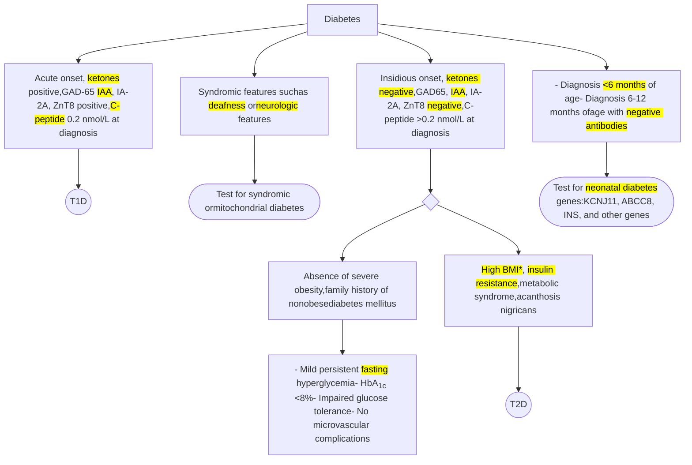

\*High BMI, insulin resistance, metabolic syndrome, acanthosis nigricans

# 37.MODY

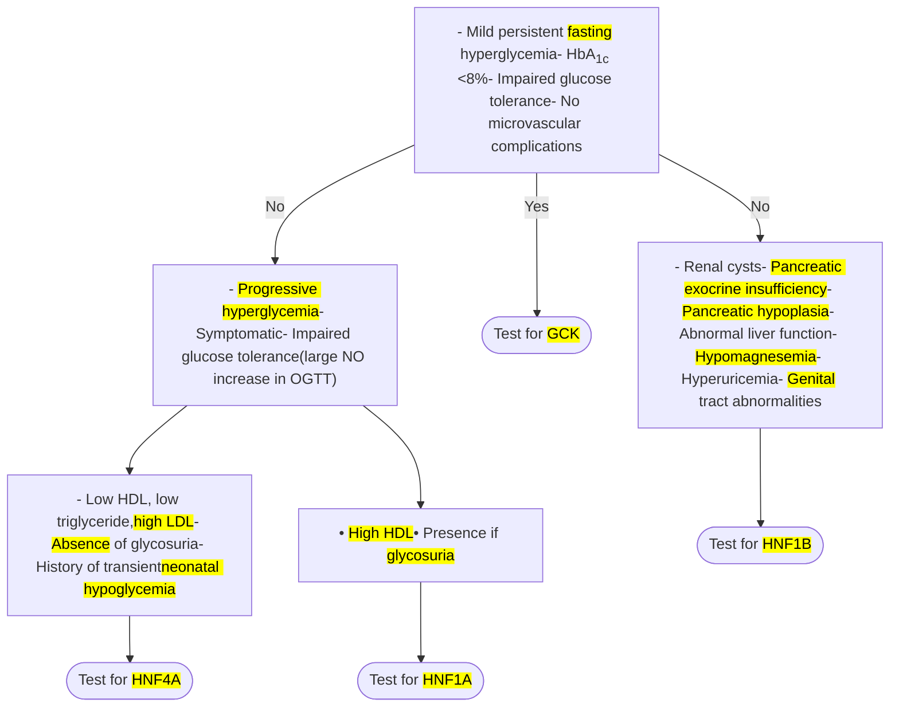

# 37.MODY

Table 37.1 and handwritten notes in Chinese regarding MODY features

## TABLE 37.1 Features Atypical for Type 1 and Type 2 Diabetes Mellitus


<table>
  <thead>
    <tr>
        <th>Features Atypical for Type 1<br/>Diabetes Mellitus</th>
        <th>Features Atypical for Type 2<br/>Diabetes Mellitus</th>
    </tr>
  </thead>
  <tbody>
    <tr>
        <td>* Absence of pancreatic islet <mark>autoantibodies</mark></td>
        <td>* Onset of diabetes before age of 45 years</td>
    </tr>
    <tr>
        <td>* Evidence of endogenous insulin production beyond the honeymoon period</td>
        <td>* Lack of significant <mark>obesity</mark></td>
    </tr>
    <tr>
        <td>* Measurable C-peptide (≥0.60 ng/mL [≥0.2 nmol/L]) in the presence of hyperglycemia</td>
        <td>* Lack of <mark>acanthosis nigricans</mark></td>
    </tr>
    <tr>
        <td>* Low <mark>insulin requirement</mark> for treatment</td>
        <td>* Normal <mark>triglyceride</mark> levels and/or normal or elevated <mark>high-density lipoprotein</mark> cholesterol</td>
    </tr>
    <tr>
        <td>* Lack of <mark>ketoacidosis</mark> when insulin is omitted from treatment</td>
        <td> </td>
    </tr>
  </tbody>
</table>


通常 <mark>< 25</mark> 歲發病、<mark>AD</mark>遺傳，
<mark>抗體陰性</mark>、<mark>不肥胖</mark>，症狀相對
輕微、無法明確歸類成T1D or
T2D要考慮MODY

# 37.MODY

**TABLE 37.3** Classifications of <mark>MODY</mark>, Pathophysiology, and Treatment Options


<table>
  <thead>
    <tr>
        <th>Gene and<br/>Chromosome</th>
        <th>Name and MODY<br/>Designation</th>
        <th>Protein Function</th>
        <th>Pathophysiology</th>
        <th>Precision Treatment</th>
        <th>Relative Incidence/<br/>Frequency (%) of All<br/>Cases Identified<sup>a</sup></th>
    </tr>
  </thead>
  <tbody>
    <tr>
        <td colspan="6"><strong>Most Common Forms</strong></td>
    </tr>
    <tr>
        <td><mark><em>GCK</em></mark> (7p15-p13)</td>
        <td><mark>GCK-MODY (MODY 2)</mark></td>
        <td>Key enzyme in <mark>glucose</mark><br/>metabolism</td>
        <td><mark>Glucose-sensing</mark> defect</td>
        <td><mark>None</mark></td>
        <td><mark>&gt;70</mark></td>
    </tr>
    <tr>
        <td><mark><em>HNF1A</em></mark> (12q24.2)</td>
        <td><mark>HNF1A-MODY (MODY 3)</mark></td>
        <td>Transcription factor</td>
        <td>β-cell dysfunction</td>
        <td>Low-dose <mark>sulfonylurea</mark><br/>/insulin</td>
        <td>20–30</td>
    </tr>
    <tr>
        <td><mark><em>HNF4A</em></mark> (20q12-<br/>q13.1)</td>
        <td><mark>HNF4A-MODY (MODY 1)</mark></td>
        <td>Transcription factor</td>
        <td>β-cell dysfunction</td>
        <td><mark>Sulfonylurea</mark>/insulin</td>
        <td>~5</td>
    </tr>
    <tr>
        <td><mark><em>HNF1B</em></mark> (17q12)</td>
        <td><mark>HNF1B-MODY (MODY 5)</mark></td>
        <td>Transcription factor</td>
        <td>β-cell dysfunction with<br/>syndromic features<br/>(see text)</td>
        <td>Insulin</td>
        <td>&lt;2</td>
    </tr>
  </tbody>
</table>

# 37.MODY2

**khuser** PM 05:02 ... X

GCK是MODY2, 只有些微空腹高血糖
胰島素分泌是適切的, 除了血糖域值稍高
GCK無需治療, 懷孕是例外, 需要處理血糖高
GCK存在於胰島偵測葡萄糖, 肝臟處理glycogen, 腦
袋協調食慾 -> 因此GCK會相對較瘦
非增生性視網膜病變是少數GCK小血管病變

[ 新增回覆 ]

## MODY

MODY is characterized by <mark>childhood</mark> or <mark>young adult—onset</mark> of diabetes, with diagnosis typically occurring <mark>before age 30 years.</mark> Single-gene pathogenic variants and various types of genetic mutations are implicated in the pathogenesis of MODY (Table 37.3). Pathogenic variants in these genes generally cause β-cell dysfunction resulting in decreased insulin production and hyperglycemia (Fig. 37.3). MODY genes have distinct mechanisms of action but overlapping phenotypic presentations compared with type 1 and type 2 diabetes and other forms of diabetes mellitus. There is characteristic pancreatic β-cell disrupted insulin biosynthesis.<sup>5,65</sup>

*Glucokinase-maturity-onset diabetes of the young* (<mark>GCK-MODY</mark> [previously <mark>MODY 2</mark>]) results from decreased <mark>β-cell sensing of glucose</mark> due to loss of function pathogenic variants in the gene encoding the enzyme glucokinase (*GCK*) on chromosome 7.<sup>66</sup> These patients have <mark>stable fasting hyperglycemia</mark> generally in the range of 99–144 mg/dL [5.5–8.0 mmol/L]) present at <mark>birth.</mark> Hyperglycemia is usually discovered as an <mark>incidental</mark> finding during a routine blood chemistry check performed for an unrelated illness or pregnancy screening. In these patients, islet cell antibodies are negative, and an oral glucose tolerance test (OGTT) reveals <mark>mild</mark> hyperglycemia, often with an increase of less than

# 37.MODY2

90 mg/dL (5.0 mmol/L) between fasting and 2-hour values. The phenotype of <mark>GCK-MODY</mark> is uniform despite the differences in pathogenic variant severity; this may be due to <mark>compensation by overexpression of the normal allele.</mark><sup>27,47</sup>

<mark>Insulin levels, if measured, are appropriate</mark> (normal fasting level below 25 mIU/L [144 pmol/L]) <mark>but occur at higher glucose thresholds. GCK</mark> is expressed in <mark>liver</mark> and altered regulation of glycogen storage, and release also contributes to altered glycemia. GCK is also expressed in the <mark>brain.</mark> GCK neurons innervate several nuclei throughout the brain axis with strongest connections in the forebrain. These areas are associated with reward and stress and with <mark>hypothalamic</mark> structures that are involved in <mark>energy</mark> balance and <mark>feeding</mark> regulation. The presence of GCK in the brain could potentially explain why studies have shown these patients to have a <mark>lower BMI</mark> compared to other MODY causes.

These patients are usually misclassified as having type 1 or type 2 diabetes, but there is a <mark>lack of glycemic response to oral hypo-glycemia agents or insulin.</mark> Treatment with these agents in GCK-MODY is not recommended and is even contraindicated because of the lack of most long-term microvascular and macrovascular complications of diabetes and the side effects of potential glycemic-reduction interventions.<sup>47,67-70</sup> <mark>Nonproliferative retinopathy is the only microvascular complication</mark> reported in these subjects after an average 50-year exposure to <mark>mild hyperglycemia.</mark><sup>71</sup> Pregnancy is an exception, when treatment may be recommended for individuals with *GCK* pathogenic variants causing hyperglycemia (see "Monogenic Diabetes and Pregnancy" section for further details).

Screenshot of a user comment overlaying the text. The comment is in Chinese and summarizes the GCK-MODY2 information: GCK is MODY2, with only mild fasting hyperglycemia. Insulin secretion is appropriate, except for a higher blood sugar threshold. GCK requires no treatment, except during pregnancy. GCK exists in pancreatic islet glucose sensors, liver processing of glycogen, and brain coordination of feeding. Therefore, GCK patients are relatively thin. Non-proliferative retinopathy is a rare GCK small vessel complication.

# 37.MODY3

*HNF1A-maturity-onset diabetes of the young* (<mark>HNF1A-</mark> MODY [previously <mark>MODY 3</mark>]) occurs because of heterozygous-dominant variants in the gene encoding the transcription factor HNF1A, which is expressed mainly in <mark>liver, pancreatic β-cells,</mark> and <mark>kidney.</mark><sup>17,75,76</sup> <mark>HNF1A, HNF4A, and HNF1B are homeo-box transcription factors</mark> that interact with DNA at specific target sequences and regulate the expression of specific proteins. Point pathogenic variants are predominantly located in the DNA-binding domain (Fig. 37.4), and diabetes primarily results from the functional absence of one allele. There is genotype-phenotype correlation in the variant.<sup>57,77</sup> However, variability in the age of onset of HNF1A-MODY can occur even within the same pedigree. Several single nucleotide polymorphisms and one in the leucine-rich melanocyte differentiation-associated (*LRMDA*) gene in particular are associated with <mark>age at diabetes onset</mark> in HNF1A-MODY patients.<sup>78</sup> A recent study suggests <mark>serum insulin</mark> may be more discriminative than C-peptide to distinguish between carriers and noncarriers. The conclusion was made after both fasting and during OGTT, where the difference in insulin levels outweighed that in proinsulin or C-peptide levels. <mark>A higher insulin:C-peptide ratio in the carriers may be due to a difference in hepatic insulin clearance.</mark><sup>58</sup>

Screenshot of a user comment box in Chinese

**user** 10月17日

HNF1A是MODY3, 存在於胰臟, 肝臟, 腎臟
glucosuria是因為腎臟閾值下降
肝臟adenoma, 雖然是良性, 但小心少見但嚴重的併發症, 高血脂, 高cv風險, 奇怪的是高HDL
SU治療很有效, 但還是有可能隨著時間變成無效, 尤其體重增加者是治療失敗的危險因子
HNF1A跟SGLT2有關, 也是HNF1A變成成真DM前就有尿糖的原因

[新增回覆]

# 37.MODY3

Screenshot of a social media post in Chinese discussing HNF1A-MODY3 features and treatment.

Early clinical presentation is characterized by minimal symptoms, mild fasting hyperglycemia, and <mark>glucosuria</mark> occurring at <mark>lower renal thresholds</mark> compared with other forms of diabetes. Insulin secretory defect is <mark>progressive</mark>, leading to overt diabetes symptoms in many affected individuals. Birth weight is normal, and many carriers develop diabetes after <mark>young adulthood</mark>. A recent family-based multigenerational study on HNF1A-MODY phenotype showed that the most common causal variant of <mark>HNF1A</mark>-MODY, p.(Gly292fs), presents not only with <mark>hyperglycemia</mark> and <mark>insulin deficiency</mark> but also with increased lipolysis and markedly lower adult BMI.<sup>58</sup> Other features of HNF1A-MODY include <mark>hepatocellular adenomas</mark>, <mark>hyperlipidemia</mark>, and increased risk of <mark>cardiovascular mortality</mark> compared with their unaffected family members.<sup>33</sup> Hepatocellular adenomas are <mark>benign</mark> liver tumors, and related <mark>complications</mark> (hepatic hemorrhage and malignant transformation) are <mark>rare but serious</mark>. The 2016 European guideline on benign liver tumors recognizes the formation of hepatocellular adenomas in metabolic disorders such as HNF1A-MODY and recommends <mark>hepatocellular adenoma resection</mark> in males, irrespective of size or concurring metabolic diagnosis.<sup>79,80</sup>

Complications of diabetes due to HNF1A-MODY can be just as severe as in unmanaged type 2 diabetes if not adequately treated. Most patients are initially <mark>quite responsive to sulfonylureas</mark>, even

to the point of hypoglycemia with <mark>low doses</mark>. Later in life these patients may show progressive failure of sulfonylurea therapy, requiring insulin.<sup>81</sup> The factors leading to this are not fully elucidated, but <mark>weight gain appears to be a risk factor</mark>. Meglitinide analogues act similarly to sulfonylureas but achieve lower postprandial glucose levels and pose a lower risk of delayed hypoglycemia compared with sulfonylureas.<sup>82</sup>

Several anecdotal or small studies have suggested that sodium-glucose cotransporter-2 (SGLT2) inhibitors might also be useful, but large systematic studies have not been performed, so caution is advised in pursuing these therapies. Expression of SGLT2 and the function of the SGLT2 protein are reduced among HNF1A-MODY individuals. In fact, because <mark>HNF1A is a key factor for SGLT2 expression, the appearance of glucose in the urine before onset of diabetes is a hallmark of HNF1A insufficiency</mark> (Fig. 37.5).<sup>83</sup> Further inhibition of SGLT2 with small molecule inhibitors could lead to euglycemia diabetic ketoacidosis or dehydration. The effectiveness of glucagon-like peptide 1 (GLP1) receptor agonists in HNF1A-MODY has been described in case reports and in a small, 6-week double-blind randomized crossover trial.<sup>55</sup> The trial showed that the sulfonylurea glimepiride and the GLP1 receptor agonist liraglutide were effective in reducing fasting plasma glucose; glimepiride had a more pronounced effect on postprandial glucose

#T U

# 37.MODY1

excursions, but treatment was associated with a greater risk for hypoglycemic events compared with liraglutide.<sup>84</sup>

*HNF4A-maturity-onset diabetes of the young* (<mark>HNF4A-</mark> MODY [previously <mark>MODY 1</mark>]) occurs because of variants in the gene encoding HNF4A. HNF4A is a known key regulator of <mark>hepatic</mark> gene expression. HNF4A-MODY is characterized by

<mark>progressive loss of insulin secretion with increasing age. The gene is expressed in liver, kidney, intestine, and islets</mark> and at lower levels in many other cell types.<sup>15</sup>

The clinical phenotype is similar to those seen in HNF1A (<mark>progressive β-cell dysfunction</mark>, defects in glucose-stimulated insulin secretion, and <mark>sensitivity to low-dose sulfonylureas</mark>).<sup>18,85,86</sup>

Screenshot of a user comment in Chinese discussing HNF4A/MODY1 characteristics

Patients are likewise diagnosed between early childhood and the third decade of life. However, <u>hepatocellular adenoma is not seen</u> in HNF4A-MODY.

Affected individuals have been found to <mark>weigh about 800 g</mark> <mark>more at birth than their unaffected siblings, and hyperinsulinemia</mark> <mark>at birth</mark> with symptomatic <mark>neonatal hypoglycemia that resolves</mark> <mark>spontaneously</mark> may occur.<sup>87</sup> Other features seen in these patients are <mark>lower levels of lipoprotein A2</mark> and <mark>high-density lipoprotein</mark> cholesterol. Some patients <mark>respond well to sulfonylureas, but later</mark> in life, as β-cell function declines, they <mark>ultimately require insu-</mark> <mark>lin</mark> treatment.<sup>86,88,89</sup> The potential for effectiveness of the GLP1 receptor agonists semaglutide and liraglutide was reported in a father-son cohort of patients with HNF4A-MODY, showing notable improvement in their HbA<sub>1c</sub> levels and fewer hypoglycemic events.<sup>90</sup>

# 37.MODY5

Screenshot of a user comment in Chinese about HNF1B-MODY5

mic events.<sup>90</sup> icon

*HNF1B-maturity-onset diabetes of the young* (<mark>HNF1B-</mark>MODY [previously called <mark>MODY 5</mark>]) occurs most commonly because of heterozygous single nucleotide variants and large deletions in the *HNF1B* gene. There is no clear correlation between the genotype and phenotype expression of this disorder.<sup>91</sup> Clinical features most frequently observed include abnormally developed <mark>kidneys</mark>, and a common presentation is the <mark>renal cysts</mark> and diabetes syndrome.<sup>20</sup> Other presenting features include anomalies of the <mark>exocrine pancreas</mark> (<mark>reduced size</mark> and pancreatic exocrine <mark>deficiency</mark>), <mark>reproductive</mark> tract abnormalities, abnormal liver tests, <mark>hyperuricemia</mark>, <mark>hypomagnesemia</mark> due to <mark>renal wasting</mark>, alkalosis, and <mark>proteinuria</mark>. <mark>End-stage kidney disease</mark> can occur, with patients requiring hemodialysis and kidney transplantation. Unlike the other transcription factor causes of MODY (HNF1A and HNF4A), these patients do not respond to sulfonylureas and frequently require insulin for management. Rigorous studies of newer diabetes drug classes have not been carried out in HNF1B-MODY.

In addition to single nucleotide variants and large deletions in the *HNF1B* gene, contiguous gene microdeletions in chromosome 17q12 are also a cause of HNF1B-MODY. These deletions are associated with <mark>neurodevelopmental disorders, such as autism</mark> spectrum disorder, <mark>attention-deficit/hyperactivity disorder, and</mark> <mark>cognitive</mark> impairments. Recent publications have suggested a genotype-phenotype correlation between better renal function in HNF1B with 17q12 deletion than *HNF1B* intragenic pathogenic variants that cause loss of function.<sup>92-95</sup>

The care of patients with *HNF1B*-associated disease is complex, and combined guidance of experts in diabetes, <mark>kidney</mark> disease, <mark>gynecology/urology</mark>, gastroenterology, and neurology may be needed. The care team should be aware of the associated features so they can be addressed in a timely manner. At the present time, <mark>insulin</mark> use is <mark>preferred</mark> for <mark>HNF1B-MODY</mark> management.

icon
HNF1B logo

# 37.MODY


<table>
  <thead>
    <tr>
        <th>TABLE 37.3</th>
        <th colspan="5">Classifications of MODY, Pathophysiology, and Treatment Options</th>
    </tr>
    <tr>
        <th colspan="6"><u>Rarer Forms</u></th>
    </tr>
  </thead>
  <tbody>
    <tr>
        <td><strong>INS</strong><br/>11p15.5</td>
        <td>MODY 10</td>
        <td>Hormone</td>
        <td>Insulin biosynthesis defect and structural defect</td>
        <td><mark>Insulin</mark></td>
        <td>&lt;1</td>
    </tr>
    <tr>
        <td><strong>ABCC8</strong><br/>11p15.1</td>
        <td>MODY 12</td>
        <td>Subunit of ATP-sensitive channels</td>
        <td>Insulin secretion defect</td>
        <td><mark>High-dose sulfonylurea</mark></td>
        <td>&lt;1</td>
    </tr>
    <tr>
        <td><strong>KCNJ11</strong><br/>11p15.1</td>
        <td>MODY 13</td>
        <td>Subunit of ATP-sensitive channels</td>
        <td>Insulin secretion defect</td>
        <td><mark>High-dose sulfonylurea</mark></td>
        <td>&lt;1</td>
    </tr>
    <tr>
        <td>PDX1<br/>13q12.2</td>
        <td>MODY 4</td>
        <td>Transcription factor</td>
        <td>β-cell dysfunction</td>
        <td>Insulin</td>
        <td>&lt;1</td>
    </tr>
    <tr>
        <td>NEUROD1<br/>2q32</td>
        <td>MODY 6</td>
        <td>Transcription factor</td>
        <td>β-cell dysfunction</td>
        <td>Insulin</td>
        <td>&lt;1</td>
    </tr>
    <tr>
        <td>CEL<br/>9q34.3</td>
        <td>MODY 8</td>
        <td>Lipolytic enzyme</td>
        <td>Pancreatic exocrine and endocrine dysfunction</td>
        <td>Insulin</td>
        <td>&lt;1</td>
    </tr>
    <tr>
        <td>APPL1<br/>3p14.3</td>
        <td>MODY 14</td>
        <td>Adaptor protein</td>
        <td> </td>
        <td>—</td>
        <td> </td>
    </tr>
    <tr>
        <td>KCNK16<br/>2p16.1</td>
        <td> </td>
        <td>Sensitive channel</td>
        <td>Insulin secretion defect</td>
        <td>—</td>
        <td> </td>
    </tr>
    <tr>
        <td>TALK-1</td>
        <td> </td>
        <td>K+ channel</td>
        <td>Glucose-stimulated insulin secretion defect and reduced plasma insulin levels</td>
        <td>—</td>
        <td> </td>
    </tr>
    <tr>
        <th colspan="6"><u>Refuted/Disputed Forms</u></th>
    </tr>
    <tr>
        <td>KLF11 (2p25.1)</td>
        <td>MODY 7</td>
        <td>Transcription factor</td>
        <td>β-cell dysfunction</td>
        <td>—</td>
        <td> </td>
    </tr>
    <tr>
        <td>PAX4 (7q32.1)</td>
        <td>MODY 9</td>
        <td>Transcription factor</td>
        <td>β-cell dysfunction</td>
        <td>—</td>
        <td> </td>
    </tr>
    <tr>
        <td>BLK (8p23.1)</td>
        <td>MODY 11</td>
        <td>Enzyme</td>
        <td>Insulin secretion defect</td>
        <td>—</td>
        <td> </td>
    </tr>
  </tbody>
</table>

# 37. Monogenic Diabetes and Pregnancy

若胎兒未帶GCK突變，會將帶有GCK突變母體血糖視為偏高並增加胰島素分泌
因此建議使用胰島素治療母體高血糖，以預防巨嬰症的發生


<table>
  <thead>
    <tr>
        <th colspan="6">TABLE 37.5 Management of GCK, HNF1A, and HNF4A During Pregnancy</th>
    </tr>
    <tr>
        <th> </th>
        <th>Before Pregnancy</th>
        <th>1st Trimester</th>
        <th>2nd Trimester</th>
        <th>3rd Trimester</th>
        <th>Management</th>
    </tr>
  </thead>
  <tbody>
    <tr>
        <td rowspan="2">GCK-MODY</td>
        <td rowspan="2">Usually no treatment</td>
        <td colspan="3">Mother and fetus carry a GCK mutation: no treatment is needed</td>
        <td>No additional management is required</td>
    </tr>
    <tr>
        <td colspan="3">Mother carries a GCK mutation; large dose (&gt;1 IU/kg/day) of insulin is recommended</td>
        <td>Induction at 38 weeks<br/>Monitor neonatal glycemia</td>
    </tr>
    <tr>
        <td rowspan="3">HNF1A-MODY<br/>HNF4A-MODY</td>
        <td>Option 1 (preferred): switch from sulfonylurea to insulin</td>
        <td colspan="3">Continue insulin</td>
        <td rowspan="2">Fetal growth assessment with ultrasound at 2-week intervals after 28 weeks</td>
    </tr>
    <tr>
        <td rowspan="2">Option 2: continue sulfonylurea medication and switch to insulin during pregnancy</td>
        <td rowspan="2">Continue sulfonylurea</td>
        <td rowspan="2">Switch from sulfonylurea to insulin</td>
        <td rowspan="2">Continue insulin</td>
    </tr>
    <tr>
        <td rowspan="2">Elective cesarean section or induction of labor between 35 and 38 weeks<br/>Switch to previous sulfonylurea once breastfeeding is completed<br/>Monitor neonatal glycemia (only for HNF4A-MODY)</td>
    </tr>
  </tbody>
</table>


Modified from Delvecchio M, Pastore C, Giordano P. Treatment options for MODY patients: a systematic review of literature. Diabetes Ther. 2020;11(8):1667—1685.

# 37.Monogenic Diabetes and Pregnancy

MODY2- GCK

**GCK-MODY**

Pregnancy is a time when asymptomatic women are screened for hyperglycemia, so women with GCK-MODY may be detected and classified as having gestational diabetes mellitus. Approximately 2% (range 0%–6%) of women with a diagnosis of <mark>gestational diabetes mellitus have a heterozygous *GCK* gene muta-</mark><mark>tion.</mark><sup>67</sup> When comparing β-cell function and glycemia in offspring born to mothers with glucokinase pathogenic variants (exposed) with those of offspring whose fathers had glucokinase pathogenic variants (unexposed), the mean birthweight in offspring born to mothers with glucokinase mutation increased by 450 g compared with offspring of affected fathers, but there was no difference in β-cell function.<sup>122</sup>

Importantly, <mark>unaffected offspring of women with *GCK*</mark> pathogenic variants are at <mark>increased risk of macrosomia</mark> and its obstetric consequences, and data supporting fetal birth weight are predominantly altered by fetal genotype and not treatment of maternal hyperglycemia with insulin.<sup>123</sup> <mark>The fetal genotype</mark> determines how the fetus senses and responds to maternal <mark>hyperglycemia. If the fetus does not carry the *GCK* mutation,</mark> <mark>it will sense the maternal glucose to be high and increase insu-</mark><mark>lin secretion. Thus, insulin therapy is recommended in these</mark> <mark>pregnancies with an unaffected fetus to attempt to normalize</mark> <mark>maternal blood sugar to prevent development of macrosomia.</mark>

**user** 10月18日

媽媽有GCK突變，胎兒也有：不要治療- 治療反而可能嚴重低血糖媽媽有GCK突變，但胎兒沒有：反而要胰島素治療- 因為媽媽血糖稍高，胎兒因為沒有突變，可以正常偵測高血糖->胎兒胰島素高，增加macrosomia風險-> 38週生產

In these cases, consideration of <mark>delivery at 38 weeks</mark> is also recommended.<sup>124</sup>

Management of high blood sugar and pregnancy outcomes have been evaluated in women with GCK-MODY enrolled in the United States Monogenic Diabetes Registry.<sup>69</sup> Women with GCK-MODY treated with insulin experienced a 23% incidence of severe hypoglycemia requiring assistance from another person, and lower birth weights were observed in the insulin-treated, GCK-affected neonates compared with diet alone. The findings of this study support the current recommendation that <mark>insulin</mark> <mark>should be used in cases where it is strongly suspected that the</mark> <mark>fetus has not inherited the *GCK* mutation</mark> based on ultrasound monitoring of fetal growth.<sup>69</sup> Several challenges persist, including the identification of women with GCK-MODY before or early in pregnancy, <mark>identification of fetal *GCK* genotype</mark>, and the modalities of insulin therapy. Cell-free fetal DNA technology studies are ongoing and could provide invaluable help in deciding on maternal treatment during pregnancy.<sup>125,126</sup> Further studies are needed to specify the management of women with GCK-MODY during pregnancy.<sup>127</sup>

# 37.Neonatal diabetes


<table>
  <tbody>
    <tr>
        <td><mark>Permanent 1st 常見</mark></td>
        <td><em>KCNJ11</em></td>
        <td><mark>AD</mark></td>
        <td>Permanent or transient: <mark>IUGR</mark>; possible developmental delay and seizures; <mark>responsive to sulfonylureas</mark></td>
    </tr>
    <tr>
        <td rowspan="2"><mark>Permanent 2nd 常見</mark></td>
        <td><em>INS</em></td>
        <td><mark>AD</mark></td>
        <td><mark>Permanent: IUGR; insulin requiring</mark></td>
    </tr>
    <tr>
        <td><em>ABCC8</em></td>
        <td><mark>AD</mark></td>
        <td>Permanent or transient: IUGR; <mark>rarely</mark> developmental delay; <mark>responsive to sulfonylureas</mark></td>
    </tr>
    <tr>
        <td><mark>Transient 1st 常見</mark></td>
        <td><em>6q24 (PLAGL1, HYMA1)</em></td>
        <td>AD for paternal duplications</td>
        <td><mark>Transient: IUGR; macroglossia; umbilical hernia</mark>; mechanisms include UPD6, paternal duplication, or maternal methylation defect; may be <mark>treatable with medications</mark> other than insulin</td>
    </tr>
    <tr>
        <td> </td>
        <td><em>GATA6</em></td>
        <td>AD</td>
        <td>Permanent: pancreatic hypoplasia; cardiac malformations; pancreatic exocrine insufficiency; insulin requiring</td>
    </tr>
    <tr>
        <td> </td>
        <td><em>EIF2AK3</em></td>
        <td><mark>AR</mark></td>
        <td>Permanent: <mark>Wolcott-Rallison syndrome</mark>: epiphyseal dysplasia; pancreatic exocrine insufficiency; insulin requiring</td>
    </tr>
    <tr>
        <td> </td>
        <td><em>EIF2B1</em></td>
        <td>AD</td>
        <td>Permanent diabetes: can be associated with fluctuating liver function (154)</td>
    </tr>
    <tr>
        <td> </td>
        <td><mark><em>FOXP3</em></mark></td>
        <td><mark>X-linked</mark></td>
        <td>Permanent: <mark>immunodysregulation, polyendocrinopathy, enteropathy X-linked (IPEX) syndrome: autoimmune diabetes, autoimmune thyroid disease, exfoliative dermatitis; insulin requiring</mark></td>
    </tr>
  </tbody>
</table>


Star icon with handwritten text "筆試"

# 37.Neonatal diabetes

**Neonatal DM**

1. 發生在出生<mark>六個月內</mark> (T1DM 發生在出生六個月後)
2. 約有一半是<mark>永久性</mark>，一半是<mark>暫時性</mark> (但可能之後又會出現)

## <mark>Permanent</mark> NDM


<table>
  <thead>
    <tr>
        <th> </th>
        <th>Affected protein</th>
        <th>Inheritance</th>
        <th>Prevelance</th>
        <th>Onset</th>
        <th><mark>IUGR</mark></th>
        <th>Treatment</th>
    </tr>
  </thead>
  <tbody>
    <tr>
        <td><mark>KCNJ11</mark></td>
        <td><mark>Kir6.2</mark></td>
        <td rowspan="3">AD</td>
        <td><mark>1st</mark></td>
        <td><mark>3-6 月</mark></td>
        <td><mark>Yes</mark></td>
        <td><mark>SU</mark></td>
    </tr>
    <tr>
        <td>ABCC8</td>
        <td>SUR1</td>
        <td>Rare</td>
        <td> </td>
        <td>No</td>
        <td><mark>SU</mark></td>
    </tr>
    <tr>
        <td>INS</td>
        <td>Insulin</td>
        <td>2nd</td>
        <td> </td>
        <td rowspan="6">Yes</td>
        <td>Insulin</td>
    </tr>
    <tr>
        <td>MODY GCK</td>
        <td>Glucokinase</td>
        <td rowspan="4"><mark>AR</mark></td>
        <td rowspan="5">Rare</td>
        <td rowspan="5">&lt; 3 月</td>
        <td>Insulin</td>
    </tr>
    <tr>
        <td>MODY IPF1 (PDX1)</td>
        <td>Insulin promoter factor 1</td>
        <td>Replace*</td>
    </tr>
    <tr>
        <td>PTF1A</td>
        <td>Pancreas transcription factor 1 A</td>
        <td>Replace*</td>
    </tr>
    <tr>
        <td><mark>EIF2AK3, Wolcott- Rallison syndrome</mark></td>
        <td>Eukaryotic translation initiation factor 2-alpha kinase 3</td>
        <td>Insulin</td>
    </tr>
    <tr>
        <td><mark>FOXP3, XPID syndrome</mark></td>
        <td>Forkhead box P3</td>
        <td><mark>X-linked</mark></td>
        <td><mark>Insulin</mark></td>
    </tr>
  </tbody>
</table>


\*Replace endocrine and exocrine pancreas function

<mark>XPID</mark>: <mark>X-linked</mark> <mark>Polyendocrinopathy</mark>, <mark>Immune</mark> dysfunction, <mark>Diarrhea</mark> <mark>suppressor T cell</mark> 被關閉 $\rightarrow$ 各種嚴重自體免疫導致內分泌腺體破壞

# 37.Neonatal diabetes

<mark>Transient</mark> NDM


<table>
  <thead>
    <tr>
        <th> </th>
        <th colspan="2">Affected protein</th>
        <th>Inheritance</th>
        <th>Prevelance</th>
        <th>Onset</th>
        <th>IUGR</th>
        <th>Treatment</th>
    </tr>
  </thead>
  <tbody>
    <tr>
        <td rowspan="2">Permanent</td>
        <td>KCNJ11</td>
        <td>Kir6.2</td>
        <td> </td>
        <td>不常見</td>
        <td>0-6 月</td>
        <td>Yes</td>
        <td>SU</td>
    </tr>
    <tr>
        <td>ABCC8</td>
        <td>SUR1</td>
        <td> </td>
        <td>Rare</td>
        <td>0-6 月</td>
        <td>不一定</td>
        <td>SU</td>
    </tr>
    <tr>
        <td> </td>
        <td>ZAC/ HYMAI</td>
        <td>ZAC: pleomorphic adenoma gene-like 1 or PLAG1<br/>HYMAI: hydatidiform mole-associated and imprinted transcript</td>
        <td>AD/自發</td>
        <td>最常見</td>
        <td>0-3 月</td>
        <td>Yes</td>
        <td>Insulin*</td>
    </tr>
    <tr>
        <td>MODY</td>
        <td>HNF1B</td>
        <td>Hepatocyte nuclear factor 1B</td>
        <td> </td>
        <td>Rare</td>
        <td>0-6 月</td>
        <td>Yes</td>
        <td>Insulin</td>
    </tr>
  </tbody>
</table>


\*一開始需要用胰島素，之後<mark>可以慢慢調降劑量</mark>。如果復發可用飲食運動控制 +/- insulin

# 37.MODY+NDM-2026ADA整理

Table 2.7—Most common causes of <mark>monogenic diabetes</mark>


<table>
  <thead>
    <tr>
        <th> </th>
        <th>Gene</th>
        <th>Inheritance</th>
        <th>Clinical features</th>
    </tr>
  </thead>
  <tbody>
    <tr>
        <td rowspan="4">MODY</td>
        <td><mark>HNF1A</mark></td>
        <td><mark>AD</mark></td>
        <td><mark>HNF1A-MODY:</mark> progressive insulin secretory defect with presentation in adolescence or early adulthood; <mark>lowered renal threshold for</mark> <mark>glucosuria;</mark> large rise in 2-h PG level on OGTT (<mark>&gt;90 mg/dL</mark> [&gt;5 mmol/L]); low hs-CRP; sensitive to sulfonylureas</td>
    </tr>
    <tr>
        <td><mark>GCK</mark></td>
        <td><mark>AD</mark></td>
        <td><mark>GCK-MODY:</mark> higher glucose threshold (set point) for glucose-stimulated insulin secretion, causing <mark>stable, nonprogressive elevated fasting</mark> <mark>blood glucose;</mark> typically <mark>does not require treatment in nonpregnant</mark> individuals; microvascular complications are rare; small rise in 2-h PG level on OGTT (<mark>&lt;54 mg/dL</mark> [&lt;3 mmol/L])</td>
    </tr>
    <tr>
        <td><mark>HNF4A</mark></td>
        <td><mark>AD</mark></td>
        <td><mark>HNF4A-MODY:</mark> progressive insulin secretory defect with presentation in adolescence or early adulthood; may have <mark>large birth weight</mark> <mark>(macrosomia)</mark> and <mark>transient neonatal hypoglycemia;</mark> <mark>sensitive to</mark> <mark>sulfonylureas</mark></td>
    </tr>
    <tr>
        <td><mark>HNF1B</mark></td>
        <td><mark>AD</mark></td>
        <td><mark>HNF1B-MODY:</mark> developmental <mark>renal disease (typically cystic);</mark> <mark>genitourinary abnormalities;</mark> atrophy of the <mark>pancreas;</mark> hyperuricemia; gout</td>
    </tr>
    <tr>
        <td rowspan="4">Neonatal diabetes<br/>Permanent</td>
        <td>KCNJ11</td>
        <td>AD</td>
        <td><mark>IUGR;</mark> possible developmental delay and seizures; <mark>responsive to</mark> <mark>sulfonylureas</mark></td>
    </tr>
    <tr>
        <td>ABCC8</td>
        <td>AD</td>
        <td><mark>IUGR;</mark> <mark>rarely</mark> developmental delay; <mark>responsive to sulfonylureas</mark></td>
    </tr>
    <tr>
        <td><mark>INS</mark></td>
        <td>AD</td>
        <td>IUGR; insulin requiring</td>
    </tr>
    <tr>
        <td>FOXP3</td>
        <td><mark>X-linked</mark></td>
        <td>Immunodysregulation, polyendocrinopathy, enteropathy X-linked (<mark>IPEX</mark>) syndrome: autoimmune diabetes, autoimmune thyroid disease, exfoliative dermatitis; insulin requiring</td>
    </tr>
    <tr>
        <td>ROW_SPAN_CONTINUE<br/><mark>Transient</mark></td>
        <td>6q24 (PLAGL1, HYMA1)</td>
        <td>AD for paternal duplications</td>
        <td><mark>IUGR; macroglossia; umbilical hernia;</mark> may be treatable with medications <mark>other than</mark> insulin</td>
    </tr>
  </tbody>
</table>


Adapted from Carmody et al. (171). AD, autosomal dominant; AR, autosomal recessive; IUGR, intrauterine growth restriction; OGTT, oral glucose tolerance test; UPD6, uniparental disomy of chromosome 6; 2-h PG, 2-h plasma glucose.

# 37.Syndromic Diabetes

1.Maternally inherited diabetes and deafness*(MIDD)

\*\*Mitochondrial encephalopathy, lactic acidosis, and stroke-like
episodes*(MELAS) syndrome

2.Wolfram syndrome*(WS)

3.Alström syndrome

# 37.Syndromic Diabetes-MIDD

from syndromic diabetes forms.

<mark>Maternally inherited diabetes and deafness</mark> (**MIDD**) is esti-mated to affect up to 1% of patients with diabetes and results from an A to G substitution at position 3243 (*m.3243A>G*) of the <mark>mitochondrial</mark> DNA encoding the gene for tRNA. In addition to *m.3243A>G*, other mutations in the mitochondrial genome and in the nuclear genes that encode for mitochondrial proteins have also been implicated in some forms of diabetes (*m.8296A>G*, *m.14709T>C*).

Mitochondrial <mark>encephalopathy</mark>, <mark>lactic acidosis</mark>, and <mark>stroke-like</mark> episodes (<mark>MELAS</mark>) syndrome can <mark>include diabetes and all the</mark> <mark>same features as MIDD</mark>, depending on heteroplasmy. Tissues with high energy turnover, such as pancreatic islets and the cochlear stria vascularis, are affected, explaining the presence of <mark>deafness</mark> and <mark>diabetes</mark>. Other systemic manifestations of this syndrome include cardiac conduction defects and cardiomyopathy, short stature, pigmentary retinopathy, lactic acidosis, glomerulopathy with focal segmental glomerulosclerosis, and strokes with cerebel-lar and cerebral atrophy.<sup>104,105</sup>

Screenshot of a comment box showing user 10月17日 and text in Chinese regarding Metformin and MIDD, MELAS

Many people with <mark>MIDD</mark> can initially be treated with dietary changes or oral hypoglycemic agents. <mark>Insulin</mark> therapy is usually needed <mark>within 2 years</mark> of diagnosis, reflecting reduced insulin secretion. <mark>Metformin is best avoided as it is known to interfere with mitochondrial function and the risk of lactic acidosis</mark> may <mark>be</mark> increased, although this has not been reported to date.<sup>106</sup>

# 37.Syndromic Diabetes-WS

**user** 10月17日

Wolfram syndrome: WFS1基因,
Wolframin蛋白, DI, DM, D, OA-> AR, 需
要胰島素, 但沒有抗體

[新增回覆]

Screenshot of a textbook page about Wolfram syndrome with highlights and annotations

...although this has not been reported to date.
<mark>Wolfram</mark> syndrome (WS) is an autosomal-<mark>recessive</mark> disorder (previously known as <mark>diabetes insipidus</mark>, <mark>diabetes mellitus</mark>, <mark>optic atrophy</mark>, and <mark>deafness</mark>) due to a mutation in <mark>*WFS1* gene</mark>, with an estimated prevalence of 1 in 100,000 in North America and 1 in 770,000 in the United Kingdom.<sup>107,108</sup> Dominant forms also occur, some with deafness alone, which is typically low-frequency hearing loss. <mark>Insulin-dependent</mark> <mark>nonautoimmune</mark> diabetes mellitus is the <mark>first</mark> clinical manifestation with onset at the mean age of 6 years (range 3 weeks—16 years).<sup>109</sup> Mild forms with diabetes as the principal, if not the only, feature have also been reported.<sup>110</sup> In the <mark>syndromic</mark> forms, <mark>optic atrophy</mark> closely follows or precedes the onset of diabetes, and affected individuals have <mark>worsening insulin deficiency</mark> and require insulin for treatment.<sup>111</sup> <mark>Central</mark> diabetes insipidus is the next most common manifestation, followed by <mark>sensorineural</mark> deafness in the second decade. By the third decade, patients may have incontinence and evidence of neurologic degeneration.<sup>112</sup> Several intracellular locations have been proposed for the membrane-spanning <mark>*WFS1* protein wolframin</mark>, with defects in intracellular calcium handling, endoplasmic reticulum stress, and mitochondrial defects proposed to explain cell death.<sup>113–115</sup> There is currently <mark>no</mark> cure for WS; management remains largely supportive.<sup>116</sup>

# 37.Syndromic Diabetes-Alström syndrome

Screenshot of a user interface showing notes on Alström syndrome

<mark>Alström</mark> syndrome is an autosomal <mark>recessive</mark> disorder due to a mutation in the *ALMS1* gene with an incidence under 1:100,000 births.<sup>117</sup> It is characterized by <mark>cone-rod retinal dystrophy</mark>, <mark>childhood obesity</mark>, <mark>type 2 diabetes mellitus</mark>, and <mark>sensorineural</mark> <mark>hearing loss</mark>. Other clinical features include dilated cardiomyopathy, hepatic and renal dysfunction, hypertension, hypothyroidism, hypogonadism, urologic abnormalities, short stature in adulthood, and skeletal anomalies. Early diagnosis and medical intervention initially with <mark>diet and exercise</mark> can prevent or <mark>delay progression</mark> of the disease and improve quality of life.<sup>118–120</sup>

# 三、重點提示-Williams-38.Complications

# 38

# Complications of Diabetes Mellitus

MICHAEL BROWNLEE, LLOYD PAUL AIELLO, JENNIFER K. SUN, PAOLO SANDICO SILVA, PETER ROSSING, EVA L. FELDMAN, NAVEED SATTAR, AND ANDREW JM BOULTON

## CHAPTER OUTLINE

Biochemistry and Molecular Cell Biology, 1467
Diabetic Retinopathy and Other Ocular Complications of Diabetes, 1493
Diabetic Nephropathy, 1509
Natural History and Histopathology, 1511
Structural Kidney Lesions in Diabetic Nephropathy, 1512
Epidemiology of Diabetic Nephropathy, 1514
Risk Factors and Markers for Chronic Kidney Disease in Diabetes, 1514
Comorbidities and Associated Complications, 1516
Prevention and Management of Diabetic Nephropathy, 1517
Further Management of Chronic Kidney Disease Stage 3 or Poorer, 1525
Diabetic Neuropathies, 1527
Diabetic Heart Disease, 1547
The Diabetic Foot, 1568

## KEY POINTS

*   <mark>Chronic hyperglycemia</mark> is the main risk factor for <mark>diabetic retinopathy</mark> (DR) and <mark>nephropathy</mark>. Susceptibility or resistance to microvascular complications is partly determined by heritable factors. <mark>Metabolic memory</mark> appears to arise from <mark>hyperglycemia-induced epigenetic changes</mark> in stem cells, probably through modifying enhancer activity, which persist in differentiated cells.
*   <mark>Chronic nonresolving inflammation</mark> caused by defective synthesis of specialized proresolving mediators (SPMs) and abnormal insulin signaling resulting from <mark>tissue-specific insulin resistance</mark> are major determinants of neuropathy, atherosclerosis, and cardiomyopathy.
*   <mark>Mitochondrial dysfunction</mark> is a component of many mechanisms underlying most diabetic complications.
*   <mark>Proliferative diabetic retinopathy (PDR) and diabetic macular edema (DME) remain leading causes of diabetes-related visual loss</mark>. Treatment of DME with <mark>intraocular injection of vascular endothelial growth factor (VEGF) inhibitors</mark>—medications that inhibit VEGF—reduces diabetes-induced abnormal retinal thickening and substantially improves long-term visual acuity outcomes. Treatment with <mark>panretinal photocoagulation or intraocular anti-VEGF therapy</mark> reduces blindness from PDR lipoproteins, <mark>blood pressure control</mark> using renin-angiotensin system blockade, and control of hyperglycemia.
*   In type 2 diabetes (<mark>T2D</mark>) with <mark>CKD</mark>, organ protection is seen with sodium-glucose cotransporter-2 inhibitors (<mark>SGLT2is</mark>) and glucagon-like peptide-1 (GLP-1) receptor agonists (GLP-1RAs). New nonsteroidal mineralocorticoid-receptor antagonists (<mark>MRAs</mark>) <mark>reduce the progression of kidney</mark> and heart disease in T2D with <mark>less risk of hyperkalemia</mark>. Implementation of these new therapies is important.
*   Diabetic neuropathies include <mark>distal symmetric polyneuropathy, mononeuropathies</mark>, and a variety of autonomic neuropathies. Loss of heart rate variability as a result of autonomic neuropathy increases the risk of <mark>cardiac events</mark> more than fourfold. The cornerstone of treatment is blood glucose control for type 1 diabetes (T1D), plus diet and exercise for T2D. Specific antidepressants, anticonvulsants, and the $\gamma$-aminobutyric acid (GABA) analogue <mark>pregabalin</mark> are used to treat <mark>painful neuropathy</mark>.
*   <mark>T2D substantially increases the risk of coronary artery disease, congestive heart failure, and stroke</mark>. Hyperglycemia and <mark>insulin resistance</mark> interact synergistically with hypertension and <mark>dyslipidemia</mark>. Optimal treatment involves multifactorial risk reduction, including intensive lowering of LDL-c

# 38.Complications-ADA*2026

Infographic showing a temple-like structure representing the multifactorial approach to reduction in diabetes complications. The roof contains a figure with arms raised. The pediment is labeled "REDUCTION IN DIABETES COMPLICATIONS". Four pillars support the roof, labeled from left to right: "Glycemic management" with a finger-prick icon, "Blood pressure management" with a blood pressure monitor icon, "Lipid management" with a test tube icon, and "Agents with cardiovascular and kidney benefit" with a syringe icon. The base of the structure is labeled "LIFESTYLE MODIFICATION AND DIABETES EDUCATION" and is flanked by icons representing groups of people.

Figure 10.1—Multifactorial approach to reduction in risk of diabetes complications.

# 38.Complications-hyperglycemia damage

```mermaid
graph TD
    A["↑ Intracellular glucose"] --> B["↑ DAG"]
    B --> C["↑ PKC(α,β,δ, and θ isoforms)"]
    
    C --> D["↓ eNOS"]
    C --> E["↑ ET1"]
    C --> F["↑ VEGF"]
    C --> G["↑ TGFβ↓↑ Collagen↑ Fibronectin"]
    C --> H["↑ PAI1"]
    C --> I["↑ NFκB"]
    C --> J["↑ NAD(P)Hoxidases"]
    C --> K["↑ NFAT"]

    D & E --> L["Blood-flowabnormalities"]
    F --> M["VascularpermeabilityAngiogenesis"]
    G --> N["Capillaryocclusion"]
    H --> O["↓ Fibrinolysis"]
    O --> P["Vascularocclusion"]
    I --> Q["Proinflammatorygene expression"]
    J --> R["↑ ROS"]
    R --> S["Multipleeffects"]
    K --> T["T-cellactivation"]
```

\* **Fig. 38.7** Potential consequences of <mark>hyperglycemia-induced protein kinase C (*PKC*) activation. Hyper-</mark>
<mark>glycemia increases diacylglycerol (*DAG*) content, which activates several PKC isoforms.</mark> Activated PKC
has a number of pathogenic consequences. *eNOS*, endothelial nitric oxide synthase; *ET1*, endothelin 1;
*NAD(P)H*, nicotinamide adenine dinucleotide phosphate; *NFAT*, nuclear factor of activated T cells; *NFκB*,
nuclear factor-κB; *PAI*, plasminogen activator inhibitor; *ROS*, reactive oxygen species; *TGF*, transforming
growth factor; *VEGF*, vascular endothelial growth factor. (Adapted from Koya D, Jirousek MR, Lin YW,
et al. Characterization of protein kinase C beta isoform activation on the gene expression of transforming
growth factor-beta, extracellular matrix components, and prostanoids in the glomeruli of diabetic rats. *J
Clin Invest.* 1997;100:115–126.)

# 38.Complications-hyperglycemia damage

```mermaid
graph TD
    Diabetes --> Glucose
    Glucose --> Mitochondria[Mitochondria: ↑ROS]
    Mitochondria --> NADPH_oxidases[NADPH oxidases]
    NADPH_oxidases --> ↑ROS1[↑ROS]
    ↑ROS1 --> DNA_damage[↑DNA damage]
    Mitochondria --> DNA_damage
    DNA_damage --> ↑PARP[↑PARP]
    ↑PARP --> ↓NAD+[↓NAD+]
    ↓NAD+ --> ↓SIRT1[↓SIRT1]
    ↓SIRT1 --> ↓LKB1[↓LKB1]
    ↓LKB1 --> ↓AMPK[↓AMPK]
    ↓AMPK --> ↓PGC1α[↓PGC1α]
    ↓PGC1α --> Mitochondrial_biogenesis[↓Mitochondrial biogenesis]

    eNOS_unbound(eNOS) -.-> eNOS_bound(eNOS)
    eNOS_bound --> ↑ROS2[↑ROS]
    ↑ROS2 --> DNA_damage

    Glucose --> ↑Glucose-6-P[↑Glucose-6-P]
    
    subgraph Polyol_pathway [Polyol pathway]
        ↑Glucose-6-P -- AKR1B1 --> ↑Sorbitol[↑Sorbitol]
        ↑Sorbitol -- "NAD+ -> NADH" --> ↑Fructose[↑Fructose]
        ↑Fructose --- Increased_AKR1B1[Increased AKR1B1 substrate conversion]
    end
    
    ↑Glucose-6-P --> ↑Fructose-6-P[↑Fructose-6-P]
    
    subgraph Hexosamine_pathway [Hexosamine pathway]
        ↑Fructose-6-P -- "GFAT (Gln -> Glu)" --> ↑Glucosamine-6-P[↑Glucosamine-6-P]
        ↑Glucosamine-6-P --> UDP-GlcNAc[UDP-GlcNAc]
        UDP-GlcNAc --> Increased_O-GlcNAcylation[Increased O-GlcNAcylation]
        Increased_O-GlcNAcylation --> Mitochondrial_biogenesis
    end

    ↑Fructose-6-P --> ↑Glyceraldehyde-3-P[↑Glyceraldehyde-3-P]
    ↑Fructose-6-P --> ↑DHAP[↑DHAP]
    ↑DHAP -- "NADH -> NAD+" --> ↑α-Glycerol-P[↑α-Glycerol-P]
    ↑α-Glycerol-P --> ↑DAG[↑DAG]
    ↑DAG --> ↑PKC[↑PKC]
    ↑PKC --> Activation_of_PKC[Activation of protein kinase C]
    ↑PKC --> ↑NFκB[↑NFκB]

    ↑Glyceraldehyde-3-P -- "X (Inhibition)" --> ↓GAPDH[↓GAPDH]
    ↓GAPDH --> 1,3-Diphosphoglycerate[1,3-Diphosphoglycerate]
    
    ↑Glyceraldehyde-3-P --> ↑Methylglyoxal[↑Methylglyoxal]
    ↑Methylglyoxal --> ↑AGEs[↑AGEs]
    ↑AGEs --- Increased_AGE_formation[Increased AGE formation]
    ↑AGEs --> ↑RAGE[↑RAGE and RAGE ligands]
    
    ↑PARP -.-> ↓GAPDH
```

# 38.Complications-hyperglycemia damage

Diabetes diagram showing hyperglycemia-induced pathogenic mechanisms

\* **Fig. 38.12** Four hyperglycemia-induced pathogenic mechanisms are activated by <mark>overproduction</mark> of reactive oxygen species (*ROS*). <mark>Increased intracellular glucose flux</mark> causes <mark>mitochondrial overproduction of ROS</mark>, which can be further <mark>amplified by activating NADPH oxidases</mark> and <mark>uncoupling</mark> endothelial nitric oxide synthase (*eNOS*). Stable ROS species (hydrogen peroxide, H<sub>2</sub>O<sub>2</sub>) diffuse into the nucleus, where they cause <mark>DNA damage</mark>, which activates poly(ADPribose) polymerase (*PARP*). Poly-ADPribosylation of glyceraldehyde-3-dehydrogenase (*GAPDH*) by PARP <mark>reduces GAPDH activity</mark>, causing <mark>upstream accumulation of early glycolytic intermediates</mark>, which are diverted into four pathogenic signaling pathways. PARP activity <mark>depletes intracellular NAD+</mark> by degrading it to synthesize ADPribose. This <mark>reduces activity of the NAD+-dependent deacetylase sirtuin 1 (*SIRT1*)</mark>, which reduces activity of liver kinase B1 (*LKB1*), the enzyme that activates AMP-activated protein kinase (*AMPK*), which activates peroxisome proliferator-activated receptor gamma coactivator 1α (*PGC1α*) by phosphorylation, and of PGC1α itself (which requires deacetylation for activation). This results in <mark>decreased mitochondrial biogenesis</mark>. <mark>AGEs, advanced glycation end products</mark>; *AKR1B1*, aldose reductase; <mark>DAG, diacylglycerol</mark>; *DHAP*, dihydroxyacetone phosphate; <mark>eNOS, endothelial nitric oxide synthase</mark>; <mark>GAPDH</mark>, glyceraldehyde-3-phosphate dehydrogenase; *GFAT*, glutamine fructose-6-phosphate amidotransferase; *Gln*, glucosamine; *Glu*, glucose; *NAD*, nicotinamide adenine dinucleotide; *NADPH*, nicotinamide adenine dinucleotide phosphate; <mark>NFκB, nuclear factor-κB</mark>; *PKC*, protein kinase C; <mark>RAGE, receptor for AGEs</mark>; <mark>UDP-GlcNAc</mark>, uridine diphosphate *N*-acetylglucosamine. (Modified from Shah M, Brownlee M. Molecular and cellular mechanisms of cardiovascular disorders in diabetes. *Circ Res.* 2016;118:1808–1829.)

# 38.Complications-hyperglycemia damage

Glucose $\rightarrow$ <mark>ROS</mark>

1. $\uparrow$ soluble epoxide hydrolase (<mark>sEH</mark>) : 將<mark>抗發炎</mark>的 <mark>EETs</mark> 轉為<mark>發炎性</mark>的 <mark>DHETs</mark>
2. $\downarrow$ pyruvate kinase M2 (<mark>PKM2</mark>) : 可解毒的 superoxide dismutase (SOD)、thioredoxin (TXN)、<mark>Glyoxalase 1</mark> (<mark>分解</mark> <mark>methylglyoxal</mark>)、aldose reductase (AR) 等酵素的活性皆<mark>下降</mark>
3. <mark>$\downarrow$</mark> nuclear erythroid-related factor 2 (<mark>Nrf2</mark>) : transketolase (可抑制上頁圖中 pathways)、<mark>抗氧化酵素活性皆下降</mark>
4. <mark>$\uparrow$ NLRP3 inflammasome</mark> $\rightarrow$ <mark>inflammatory cytokine</mark> 上升
5. 內質網內鈣離子釋出 + 鈣離子通道打開 $\rightarrow$ 增加細胞中的鈣
$\rightarrow$ 活化 Ca<sup>2+</sup>/calmodulin-dependent calcineurin
a. 去磷酸化 nuclear factor of <mark>activated T-cells (NFAT)</mark>，移動到細胞核後增加<mark>發炎因子轉錄</mark>
b. 去磷酸化 dynamin-related protein 1 (<mark>Drp1</mark>)，移動到粒線體外膜造成擠壓 $\rightarrow$ <mark>粒線體 fission</mark>
6. <mark>Neutrophil</mark> 製造 neutrophil <mark>extracellular traps (NET)</mark> 到細胞外抓住 <mark>macrophage</mark> $\rightarrow$ <mark>分泌發炎因子</mark>
7. <mark>巨噬細胞分泌 Leukotrienes</mark> > specialized <mark>proresolving mediators (SPMs)</mark>
$\rightarrow$ 持續召集 neutrophil and macrophage + macrophage 吞噬功能 <mark>(efferocytosis) 降低</mark>
$\rightarrow$ 動脈硬化斑塊 <mark>thin fibrous cap</mark> + <mark>large necrotic core</mark> $\rightarrow$ <mark>易破裂</mark>
8. Epigenetic change : 改變 DNA/RNA 結構與功能但不改變其 sequence :
DNA cytosine methylation、histone 蛋白修飾、noncoding RNAs、ATP-dependent chromatin remodeling

# 38.Complications

Diagram showing mitochondrial respiratory chain complexes (I, II, III) and associated metabolic pathways, including the role of ALCAT1 in cardiolipin remodeling and ROS production. A user comment box in Chinese is overlaid on the right side.

Mitochondria-associated membrane of endoplasmic reticulum

## Outer membrane

Inner membrane

**user** 10月22日

ALCAT1會造成cardiolipin缺乏及異常，並增加ROS
ALCAT1缺乏：增加cardiolipin的18:2->穩定
以心肌cardiolipin來說，C18:2愈多愈穩定；C20:4在胰島素阻抗時增多為不穩定

[新增回覆]

# 38.Complications

**user** 10月22日
在血管壁，胰島素同時有促進/預防斑塊形成的效果
胰島素阻抗時 -> 促進效果增強/預防效果減弱

[ 新增回覆 ]

```mermaid
graph TD
    Insulin --> IR[IR]
    IR --> IRS12[IRS1, 2]
    
    IRS12 --> MAPKK[MAPKK]
    MAPKK --> MAPK[MAP-K]
    MAPK --> PAI1[PAI1]
    MAPK --> ET1[ET1]
    
    IRS12 --> PI3K[PI 3-Kinase]
    PI3K --| | AKT[AKT]
    AKT -- S1176 --> eNOS[eNOS]
    AKT --> VCAM1[VCAM-1]
    AKT --> VEGF[VEGF]
    AKT --> HO1[HO1]
    eNOS --> NO[NO]
    
    PAI1 --> ProAthero[↑ Vasoconstriction↑ Proliferation↑ Migration]
    ET1 --> ProAthero
    
    VCAM1 --> AntiAthero[↓ Vasodilation↑ Monocyte Adhesion↑ Inflammation↑ Oxidative Stress]
    VEGF --> AntiAthero
    HO1 --> AntiAthero
    NO --> AntiAthero
    
    ProAthero --> ProAction[Proatherogenic actionincreased]
    AntiAthero --> AntiAction[Antiatherogenic actiondecreased]
    
    subgraph "In insulin resistance"
        ProAction
        AntiAction
    end
```

# 38.Complications

Diagram showing nonresolving vs. resolving inflammation in atherosclerosis. Panel A (left) shows an advanced plaque with low SPM:LT ratio, leading to continuous monocyte influx, platelet aggregation, thin fibrous cap, large necrotic core, inflammatory macrophage polarization, and impaired efferocytosis. Panel B (right) shows a stable plaque with high SPM:LT ratio, leading to decreased monocyte influx, no platelet aggregation, thick fibrous cap, smaller necrotic core, resolving macrophage polarization, and increased efferocytosis.

\* **Fig. 38.19** <mark>Nonresolving inflammation in atherosclerosis. Reduced specialized proresolving mediators (SPMs) and increased leukotrienes (LTs) promotes instability of atherosclerotic plaques. When the SPM:LT ratio is low (A), resolution of inflammation is impaired, leading to sustained inflammatory monocyte influx, platelet aggregation, proinflammatory macrophage polarization, impaired efferocytosis, large necrotic cores, and thin fibrous caps. Conversely, when the SPM:LT ratio is high (B), resolution of inflammation is</mark> <u>characterized by decreased monocyte influx, proresolving macrophage polarization, enhanced efferocytosis, decreased necrotic core formation, and thicker fibrous caps.</u> (Redrawn from Kasikara C, Doran A, Cai B, et al. The role of non-resolving inflammation in atherosclerosis. J Clin Invest. 2018;128:2713–2723.)

# 38.DM retinopathy

## 1. Epidemiology

a. <mark>T1DM患者發生眼部併發症的風險比T2D更高且更嚴重</mark>

b. 約有 25% 的 <mark>T1DM 患者在診斷後 5 年內會出現視網膜病變</mark>

c. 約 20% 的新診斷<mark>T2D患者在診斷當下</mark>就已有視網膜病變

## 2. Risk factors

a. <mark>血糖(最重要)</mark>、<mark>血壓</mark>、<mark>血脂</mark>、<mark>蛋白尿</mark>

b. <mark>時間久</mark>、<mark>發病年齡早</mark>

Screenshot of a comment box from ElvisChen on June 28th. The text says: 巨量白蛋白尿同時可預測PDR跟DME, 若進入ESRD, 透析可改善DME. 如果原本穩定的DR突然惡化, 暗示著同時要去檢查腎臟. 貧血也可以預知視網膜惡化: Hb<12那樣, DR風險上升. Below is a button that says "新增回覆".

3 <mark>最常造成視野缺損</mark>的病灶是 <mark>macular</mark> disease

4. 其他可能的眼病變

a. CN <mark>III</mark>, IV, VI：通常是 self-limited

b. <mark>glaucoma</mark>：open angle or close angle (因新生血管) 都可能

c. lens：<mark>白內障</mark>，尤其是接受腎+胰移植者

d. <mark>fungal</mark> infection：Mucorales phycomycosis

# 38.DM retinopathy

1. <mark>T2DM 一診斷就要檢查</mark>，<mark>T1DM 診斷 5年內(ADA)檢查</mark>，<mark>兒童 > 10 歲才需要篩檢</mark>
2. 加速視網膜病變的情況
    a. <mark>青春期</mark>、<mark>懷孕</mark>、<mark>血糖降太快</mark>
    b. <mark>懷孕時的篩檢 (preexisting T1DM or T2DM)：</mark><mark>預計受孕前一年、懷孕後第一孕期</mark> $\rightarrow$ <mark>3個月追蹤一次直到產後一年</mark>
    c. <mark>上述篩檢建議不適用於 GDM 病人（視網膜病變發生率極低）</mark>

```mermaid
graph TD
    A[Diabetes] --> B{Has patienthad eye examsince diagnosisof diabetes?}
    B -- Yes --> C[Ophthalmicfollow-up perpatient's diabeticretinopathy level]
    B -- No --> D{Diabetestype}
    D -- Type 1 --> E{Age≥10 years}
    E -- No --> F[Initialophthalmicexam not yetrequired]
    E -- Yes --> G{Is patientpregnant?}
    G -- Yes --> H[Refer to eyecare provider forcomprehensiveeye exam]
    G -- No --> I{Is diabetesduration≥5 years?}
    I -- No --> F
    I -- Yes --> H
    D -- Type 2 --> H
```

# 38.DM retinopathy

```mermaid
graph TD
    Diabetes --> HighGlucose[High glucose]
    HighGlucose --> PericyteLoss[Pericyte lossBasement membrane thickeningRetinal blood flow change]
    
    HighGlucose --> NoDR[No diabetic retinopathy]
    
    PericyteLoss --> Microaneurysm[Microaneurysm formation]
    PericyteLoss --> CapillaryDropout[Capillary dropout]
    
    Microaneurysm --> RetinalVascularLeakage[Retinal vascular leakage]
    Microaneurysm --> RetinalHemorrhages[Retinal hemorrhages]
    
    RetinalVascularLeakage --> MacularEdema[Macular edemamay occur at any stage]
    MacularEdema --> ModerateVisualLoss[Moderate visual loss]
    
    RetinalHemorrhages --> ModerateVisualLoss
    
    CapillaryDropout --> RetinalIschemia[Retinal ischemia]
    RetinalIschemia --> GrowthFactors[Increased growth factors e.g., VEGF]
    
    NoDR --> MildNPDR[Mild nonproliferative diabetic retinopathy NPDR]
    MildNPDR --> ModerateNPDR[Moderate NPDR]
    ModerateNPDR --> SevereNPDR[Severe NPDR]
    
    GrowthFactors --> RetinalNeovascularization[Retinal neovascularization]
    GrowthFactors --> IrisNeovascularization[Iris neovascularization]
    GrowthFactors --> PDR[Proliferative diabetic retinopathy]
    
    RetinalNeovascularization --> VascularFibrosis[Vascular fibrosis]
    RetinalNeovascularization --> VitreousHemorrhage[Vitreous hemorrhage]
    
    VascularFibrosis --> RetinalTraction[Retinal traction]
    RetinalTraction --> RetinalDetachment[Retinal detachment]
    RetinalDetachment --> SevereVisualLoss1[Severe visual loss]
    
    VitreousHemorrhage --> MildToSevereVisualLoss[Mild to severe visual loss]
    
    IrisNeovascularization --> NeovascularGlaucoma[Neovascular glaucoma]
    NeovascularGlaucoma --> SevereVisualLoss2[Severe visual loss]
```

Pathogenesis of diabetic retinopathy flow chart

\* **Fig. 38.25** Pathogenesis of diabetic retinopathy. This schematic flow chart represents the major preclinical and clinical findings associated with the full spectrum of diabetic retinopathy and macular edema.
*VEGF*, vascular endothelial growth factor.

NPDR

# 38.DM retinopathy-classification of DR/ ME


<table>
  <thead>
    <tr><th colspan="2">Classification of DR and ME</th></tr>
  </thead>
  <tbody>
    <tr><td rowspan="12">DR</td><td>No apparent retinopathy</td><td>no abnormalities</td></tr>
    <tr><td><mark>Mild</mark></td><td><mark>microaneurysms</mark> only</td></tr>
    <tr><td>Moderate</td><td>介於中間</td></tr>
    <tr><td rowspan="3"><mark>Severe</mark></td><td rowspan="3"><mark>4-2-1 rule (任一項)</mark></td><td><mark>4個象限都各有 &gt; 20個出血</mark></td></tr>
    <tr>
        <td><mark>2個以上的象限有 venous beading</mark></td>
        <td></td>
    </tr>
    <tr>
        <td><mark>1個以上的象限有明顯的intraretinal microvascular 異常</mark></td>
        <td></td>
    </tr>
    <tr><td rowspan="5"><mark>PDR*</mark></td><td rowspan="3">血管新生</td><td>new vessels on the optic disc (NVD)</td></tr>
    <tr>
        <td>new vessels elsewhere on the retina (NVE)</td>
        <td></td>
    </tr>
    <tr>
        <td><mark>長在iris: rubeosis iridis</mark></td>
        <td></td>
    </tr>
    <tr><td rowspan="2">hemorrhage</td><td><mark>vitreous</mark></td></tr>
    <tr>
        <td>preretinal</td>
        <td></td>
    </tr>
    <tr><td colspan="2"><mark>fibrous tissue</mark> proliferation</td></tr>
    <tr>
        <th> </th>
        <th>Severity</th>
        <th>Findings (Retinal Thickening or Hard Exudates in Posterior Pole)</th>
        <th colspan="2">ETDRS Scale Equivalent</th>
    </tr>
    <tr><td rowspan="4"><mark>ME</mark></td><td>DME apparently absent</td><td>None</td></tr>
    <tr><td rowspan="3"><mark>DME apparently present</mark></td><td>Mild</td><td>Findings 距離 macula center 很遠</td></tr>
    <tr>
        <td>Moderate</td>
        <td>Findings 接近 macula center</td>
        <td rowspan="2"><mark>CSME (Clinically significant macular edema) 需治療</mark></td>
    </tr>
    <tr>
        <td>Severe</td>
        <td>Findings 影響 macula center</td>
    </tr>
  </tbody>
</table>

# 38.DM retinopathy treatment

原則
a. 治療首重<mark>三高控制</mark>
b. severe NPDR/PDR 病人如果同時有 <mark>DME 要先處理 DME</mark> 的部分，因為 scatter laser 會惡化 DME

DR label

1. 全視網膜雷射 <mark>Scatter laser (panretinal laser)</mark>
    a. Indication : <mark>high risk PDR</mark>，某些 severe NPDR，可降低失明風險
2. Anti-VEGF treatment : aflibercept, ranibizumab, bevacizumab
    a. 相較雷射的優勢：周邊視野影響 ↓、之後較少需要 vitrectomy/因 DME 造成視野缺損
    b 相較雷射的劣勢：需要頻繁注射及追蹤
3. PPV (Pars plana vitrectomy)：玻璃體出血沒有吸收或因 PDR 導致視網膜剝離

DME label

1. <mark>第一線：Anti-VEGF</mark>
    a. Indication: <mark>center-involved diabetic macular edema (ciDME) 首選</mark>
    non-ciDME 視力差或是 severe NPDR/PDR 可以考慮
    b. 若視野缺損嚴重，選 <mark>aflibercept</mark> 效果最好
2. 第二線：Focal or grid laser
    a. Indication: ciDME 一線治療後效果不佳或不適合一線治療
    non-ciDME 若是 severe NPDR/PDR 可以考慮
3. Steroid：<mark>只用在不能用 anti-VEGF 或本來就有白內障的病人</mark>

# 38.DM retinopathy-2026*ADA

DIABETIC RETINOPATHY

## Recommendations

**12.1** Implement strategies to help people with diabetes reach <mark>glycemic</mark> goals to reduce the risk or slow the progression of <mark>diabetic retinopathy</mark>. **A**

**12.2** Implement strategies to help people with diabetes reach <mark>blood pres-</mark> <mark>sure</mark> and <mark>lipid</mark> goals to reduce the risk or slow the progression of diabetic retinopathy. **A**

# Screening

## Recommendations

**12.3** Adults with <mark>type 1 diabetes</mark> should have an <mark>initial dilated and comprehen-</mark> <mark>sive eye examination</mark> by an ophthal- mologist or optometrist <mark>5 years after</mark> <mark>the onset</mark> of diabetes. **B**

**12.4** People with <mark>type 2 diabetes</mark> should have an initial dilated and comprehen- sive eye examination by an ophthalmol- ogist or optometrist <mark>at the time of the</mark> <mark>diabetes diagnosis</mark>. **B**

**12.5** If there is no evidence of retinop- athy from one or more annual eye ex- ams and glycemic indicators are within the goal range, then <mark>screening every</mark> <mark>1–2 years</mark> may be considered. If any level of diabetic retinopathy is present, subsequent dilated retinal examinations should be repeated at least annually by an ophthalmologist or optometrist. If retinopathy is progressing or sight- threatening, then examinations by an ophthalmologist will be required more frequently. **B**

**12.6** Programs that use retinal photog- raphy with remote reading or the use of U.S. Food and Drug Administration– approved <mark>artificial intelligence algo-</mark> <mark>rithms to improve access to diabetic</mark> <mark>retinopathy screening</mark> are appropriate screening strategies for diabetic reti- nopathy. Such programs need to pro- vide pathways for timely referral for a comprehensive eye examination when indicated. **B**

**12.7** Counsel individuals of childbear- ing potential with preexisting type 1 or type 2 diabetes who are <mark>planning preg-</mark> nancy or who are pregnant on the risk of development and/or progression of <mark>diabetic retinopathy</mark>. **B**

**12.8** Individuals with preexisting type 1 or type 2 diabetes should receive an <mark>eye exam before pregnancy</mark> as well as in the <mark>first trimester</mark> and may need to be <mark>monitored every trimester</mark> and for <mark>1 year postpartum</mark> as indicated by the degree of retinopathy. **B**

# 38.DM retinopathy-2026*ADA

**Recommendations**

**12.9** Promptly refer individuals with <mark>any level of diabetic macular edema,</mark> <mark>moderate or worse nonproliferative di-</mark> <mark>abetic retinopathy (a precursor of pro-</mark> <mark>liferative diabetic retinopathy [PDR]),</mark> <mark>or any PDR to an ophthalmologist</mark> who is knowledgeable and experienced in the management of diabetic retinopathy. **A**

**12.10** <mark>Panretinal laser photocoagula-</mark> <mark>tion therapy</mark> is indicated to reduce the risk of vision loss in individuals with <mark>high-risk PDR and, in some cases, se-</mark> <mark>vere nonproliferative diabetic retinop-</mark> athy. **A**

**12.11** <mark>Intravitreous injections of anti-</mark> <mark>vascular endothelial growth factor (anti-</mark> <mark>VEGF) are a reasonable alternative to</mark> <mark>traditional panretinal laser photocoag-</mark> <mark>ulation for some individuals with PDR</mark> and also reduce the risk of vision loss in these individuals. **A**

**12.12** <mark>Intravitreous injections of anti-</mark> <mark>VEGF are indicated as first-line treat-</mark> <mark>ment for most eyes with diabetic mac-</mark> <mark>ular edema that involves the foveal</mark> <mark>center and impairs visual acuity.</mark> **A**

**12.13** Macular focal/grid photocoagulation and intravitreal injections of <mark>cor-</mark> <mark>ticosteroid are reasonable treatments</mark> in eyes with persistent diabetic macular edema despite previous anti-VEGF therapy or eyes that are <mark>not candi-</mark> <mark>dates for this first-line approach.</mark> **A**

**12.14** <mark>The presence of retinopathy is</mark> <mark>not</mark> a contraindication to <mark>aspirin</mark> therapy for cardioprotection, as aspirin does <mark>not increase</mark> the risk of retinal hemorrhage. **A**

# 38.DM nephropathy

## 1. Epidemiology

a. <mark>約40%糖尿病患者合併CKD</mark>
b. 糖尿病合併CKD 的患者中，每 20 位中不到 1 人會活到進展為末期腎病，<mark>大多會先因心血管疾病或感染而死亡</mark>。因此，<mark>糖尿病腎病的治療不僅要預防腎功能惡化，還必須同時控制心血管危險因子</mark>。

## 2. Diagnosis

a. <mark>UACR ≥ 30</mark> (<mark>3-6 個月內，驗 3 次有 2 次</mark>)
b. <mark>eGFR < 60</mark>

**Table 11.1—Reasons to consider <mark>nondiabetic</mark> kidney diseases in a person with chronic kidney disease and diabetes**

* <mark>Type 1 diabetes</mark> duration <mark><5 years</mark>
* Active <mark>urine sediment</mark> (e.g., containing <mark>red blood cells or cellular casts</mark>)
* Chronically well-managed blood glucose
* <mark>Rapidly declining eGFR</mark>
* Rapidly increasing or very high UACR or urine protein/creatinine level
* No retinopathy in a person with <mark>type 1 diabetes</mark>

# 38.DM nephropathy


<table>
  <thead>
    <tr><th colspan="3"> </th><th colspan="3">Persistent albuminuria categories<br/>Description and range</th></tr>
    <tr><th colspan="3">Prognosis of CKD by GFR and<br/>albuminuria categories: KDIGO 2012</th><th>A1</th><th>A2</th><th>A3</th></tr>
    <tr><th> </th><th> </th><th> </th><th>Normal to mildly<br/>increased</th><th>Moderately<br/>increased</th><th>Severely<br/>increased</th></tr>
    <tr><th> </th><th> </th><th> </th><th>&lt;30 mg/g<br/>&lt;3 mg/mmol</th><th>30–300 mg/g<br/>3–30 mg/mmol</th><th>&gt;300 mg/g<br/>&gt;30 mg/mmol</th></tr>
    <tr>
        <th rowspan="6">GFR categories (ml/min/1.73 m²)<br/>Description and range</th>
        <th>G1</th>
        <th>Normal or high</th>
        <th>≥90</th>
        <th>Low risk</th>
        <th>Moderately increased risk</th>
        <th>High risk</th>
    </tr>
    <tr>
        <th>G2</th>
        <th>Mildly decreased</th>
        <th>60–89</th>
        <th>Low risk</th>
        <th>Moderately increased risk</th>
        <th>High risk</th>
    </tr>
    <tr>
        <th>G3a</th>
        <th>Mildly to<br/>moderately decreased</th>
        <th>45–59</th>
        <th>Moderately increased risk</th>
        <th>High risk</th>
        <th>Very high risk</th>
    </tr>
    <tr>
        <th>G3b</th>
        <th>Moderately to<br/>severely decreased</th>
        <th>30–44</th>
        <th>High risk</th>
        <th>Very high risk</th>
        <th>Very high risk</th>
    </tr>
    <tr>
        <th>G4</th>
        <th>Severely decreased</th>
        <th>15–29</th>
        <th>Very high risk</th>
        <th>Very high risk</th>
        <th>Very high risk</th>
    </tr>
    <tr>
        <th>G5</th>
        <th>Kidney failure</th>
        <th>&lt;15</th>
        <th>Very high risk</th>
        <th>Very high risk</th>
        <th>Very high risk</th>
    </tr>
  </thead>
</table>


\* **Fig. 38.35** Prognosis of <mark>chronic kidney disease (CKD) by estimated glomerular filtration rate (GFR) and albuminuria.</mark> (From Levin A, Stevens PE. Summary of KDIGO 2012 CKD guideline: behind the scenes, need for guidance, and a framework for moving forward. *Kidney Int.* 2014;85[1]:49-61.)

# 38.DM nephropathy


<table>
  <thead>
    <tr>
        <th>Glomerular<br/>filtration rate</th>
        <th> </th>
        <th>Blood<br/>pressure</th>
    </tr>
  </thead>
  <tbody>
    <tr>
        <td>↑</td>
        <td>Hyperfiltration</td>
        <td>=/↑</td>
    </tr>
    <tr>
        <td>↓/↑</td>
        <td>Silent</td>
        <td>↑</td>
    </tr>
    <tr>
        <td>↓/↑</td>
        <td>Microalbuminuria</td>
        <td>↑↑</td>
    </tr>
    <tr>
        <td>=/↓</td>
        <td>Macroalbuminuria</td>
        <td>↑↑</td>
    </tr>
    <tr>
        <td>↓</td>
        <td>Renal impairment</td>
        <td>↑↑↑</td>
    </tr>
  </tbody>
</table>


\* Fig. 38.36 The phases (natural history) of diabetic nephropathy

Screenshot of a digital note overlaying a textbook page

Hyperfiltration
1. Silent: 腎臟結構已有變化
2. Microalbuminuria
- 30-300mg/day, 有些人微蛋白尿會自行消失
- 血壓升高可能不明顯, 但顯著的是nocturnal dip消失
3. Macroalbuminuria
- >300mg/day, 不會自行消失
- 血壓明顯升高, GFR下降 -> 血壓更升高的惡性循環
---
\*Normal albuminuric DKD: 無蛋白尿但腎功能仍惡化
- 此族群有不同病理變化: 非典型, 可能合併高血壓/高血脂/肥胖等其他危險因子
- 死亡率/心血管疾病風險較有蛋白尿者低
\*其他DM相關腎臟疾病: renal papillary necrosis/ type 4 RTA

# 38.DM nephropathy

```mermaid
graph TD
    A[Glucose ↑] --> B[<mark>SGLT2 ↑</mark>]
    B --> C[macula densa 偵測到 Na 減少]
    C --> D[<mark>入球小動脈擴張</mark>]
    D --> E[<mark>Tubuloglomerular feedback ↓</mark>]
    E --> F[Glomerular hypertension]
    
    F --> G[Hyperfiltration]
    G --> H[Silent]
    H --> I[Microalbuminuria]
    I --> J[<mark>Macroalbuminuria</mark>]
    J --> K[Renal impairment]
```

> **SGLT2i**: <mark>收縮入球小動脈</mark>
> **RAS inhibitor**: <mark>擴張出球小動脈</mark>

<table>
    <tr>
        <th>GFR</th>
        <th>Phase</th>
        <th>BP</th>
    </tr>
    <tr>
        <td>↑</td>
        <td>Hyperfiltration</td>
        <td>-</td>
    </tr>
    <tr>
        <td>↓/↑</td>
        <td>Silent</td>
        <td>↑</td>
    </tr>
    <tr>
        <td>↓/↑</td>
        <td>Microalbuminuria</td>
        <td>↑↑</td>
    </tr>
    <tr>
        <td>=/↓</td>
        <td>Macroalbuminuria</td>
        <td>↑↑</td>
    </tr>
    <tr>
        <td>↓</td>
        <td>Renal impairment</td>
        <td>↑↑↑</td>
    </tr>
</table>
\* **Fig. 38.36** The phases (natural history) of diabetic nephropathy

### 3. Macroalbuminuria
- \>300mg/day, 不會自行消失
- 血壓明顯升高, GFR下降 -> 血壓更升高的惡性循環
---
\* **Normal albuminuric DKD**: 無蛋白尿但腎功能仍惡化
- 此族群有不同病理變化: 非典型, 可能合併高血壓/高血脂/肥胖等其他危險因子
- 死亡率/心血管疾病風險較有蛋白尿者低
\* **其他DM相關腎臟疾病**: renal papillary necrosis/ type 4 RTA

# 38.DM nephropathy

## Light Microscopy of the Diabetic Kidney

<mark>Renal hypertrophy</mark>, the <mark>earliest renal structural change</mark> in T1D, is not reflected in any specific light microscopy findings. In some patients, <mark>glomerular structure may remain normal or near nor-</mark>
<mark>mal</mark> for many decades, whereas others develop progressive disease. Early changes often include <mark>arteriolar hyalinosis</mark>, <mark>thickening</mark> of the glomerular basement membrane <mark>(GBM)</mark>, and <mark>diffuse mesangial</mark>
<mark>expansion</mark>.<sup>530,548,549</sup> In about 40% to 50% of patients develop- ing <mark>proteinuria</mark>, areas of <mark>extreme mesangial expansion</mark> called <mark>*Kimmelstiel-Wilson nodules*</mark> or <mark>nodular mesangial expansion</mark> can be observed. Although Kimmelstiel-Wilson nodules are diag- nostic of diabetic nephropathy, they are not necessary for severe renal dysfunction to develop. Global glomerulosclerosis can also be observed, especially with progressive disease (Fig. 38.37). Atu- bular glomeruli and glomerulotubular junction abnormalities can also be present in proteinuric patients with T1D.<sup>550,551</sup> Tubular atrophy and interstitial fibrosis, common to most chronic renal disorders, can be present at later stages.

# 38.DM nephropathy

described earlier, 41% had disproportionately severe interstitial fibrosis and tubular atrophy, and the remaining 29% had minimal lesions with normal or near normal glomerular structure.<sup>560</sup> <mark>The presence of retinopathy supports that the underlying lesion is diabetic nephropathy.<sup>561</sup></mark>

> Mesangial愈expansion, GBM愈厚
> -> GFR愈低\*(反比)
> -> 白蛋白尿愈多(正比)
> -> 血壓愈高(正比)

2024/10/28 13:06

ates will go beyond tology—the project ipants with CKD or characterize disease molecular features of iated outcomes. An athways, and targets es.<sup>572</sup>

## Relationship Between Kidney Structure and Function

In T1D, the <mark>associations between kidney structure and function are strong.<sup>548,562,563</sup></mark> <mark>Mesangial fractional volume and GBM width</mark> are <mark>inversely correlated with GFR</mark> and <mark>directly correlated with albuminuria<sup>548,563</sup> and blood pressure.<sup>563,564</sup></mark> Importantly, <mark>GBM width is a strong independent predictor of progression to clinically advanced kidney disease among normoalbuminuric patients with T1D.<sup>565</sup></mark> Among these patients, global glomerular sclerosis<sup>565,566</sup> and interstitial expansion<sup>565,567</sup> are present and are <mark>additional independent predictors of GFR loss.<sup>565</sup></mark> Although increases in podocyte foot process width also correlate with albuminuria increases in T1D,<sup>568-570</sup> our studies in patients with T1D who had no clinical manifestations of CKD at time of their research kidney biopsies indicate that podocyte parameters do not predict long-term progression to clinical CKD.<sup>571</sup> In <mark>T2D</mark>, the correlation between glomerular structure and renal function is <mark>less</mark> strong, which may be related to the <mark>more complex patterns of renal injury seen in patients with T2D.<sup>565</sup></mark> These considerations are relevant to prognosis, in that the patients with more <mark>typical diabetic glomerulopathy</mark>

## Nonclassical Diabetic Kidney Disease

Some 7% to 22% of individuals with T1D<sup>573,574</sup> and <mark>52%</mark> of those with <mark>T2D<sup>514,575,576</sup></mark> <mark>who develop progressive CKD do not have preceding albuminuria.</mark> Identification of people with non-diabetic kidney changes on the basis of clinical features, including the absence of DR,<sup>577</sup> is difficult. Individuals with T2D and CKD stage 3 or more plus moderately or severely increased albuminuria are very likely to have histologic features of diabetic glomerulosclerosis, whereas those with normoalbuminuria are much more likely to have arteriosclerosis.<sup>578</sup> The underlying disease process in <mark>non-classical diabetic CKD probably reflects a combination of aging, hypertension, and atherosclerotic vascular disease in addition to diabetes.</mark> <mark>Obesity, with ectopic lipid accumulation in the kidney,</mark> may also be important<sup>579</sup> and may be a target for intervention.<sup>580</sup>

The rate of progression of CKD in the <mark>absence</mark> of significant <mark>albuminuria is slower</mark> than in those with albuminuria in both T1D<sup>513</sup> and T2D, but kidney failure remains a risk, in addition to the CVD risk.<sup>581,582</sup>

# 38.DM nephropathy

## 1. Glomerular

a. basement membrane <mark>thickening</mark>

b. <mark>mesangial expansion</mark>

c. <mark>Kimmelsteil-Wilson lesion</mark>

d. <mark>Podocyte dysfunction</mark> -> apoptosis
(pivotal role in the development of proteinuria)

## 2. <mark>Tubule</mark>

a. <mark>basement membrane thickening</mark>

b. <mark>epithelial cell hypertrophy</mark>

c. epithelial-mesenchymal transition

d. accumulation of glycogen

3. <mark>Interstitium</mark>: myofibroblasts and <mark>macrophages</mark> 等細胞浸潤
導致 interstitial <mark>space 變大</mark>

4. 腎功能和 <mark>tubule</mark>、<mark>interstitium</mark> 的關聯比 glomerular 大

Microscopic image of kidney tissue showing glomerular and tubular structures with pathological changes

# 38.DM nephropathy

```mermaid
graph TD
    MS[Metabolic syndrome] --> Kidney
    Ob[Obesity] --> Kidney
    Al[Albuminuria] --> Kidney
    GC[Glycemic control] --> Kidney
    Dl[Dyslipidemia] --> Kidney
    RAAS[RAAS] --> Kidney
    BP[Systemic and intraglomerular blood pressure] --> Kidney
    OS[Oxidative stress] --> Kidney
    Inf[Inflammation] --> Kidney
    Fib[Fibrosis] --> Kidney
    Gen[Genetics] --> Kidney
    Sm[Smoking] --> Kidney
    PI[Protein intake] --> Kidney

    subgraph Kidney_Image [ ]
        Kidney(( ))
    end

    style Kidney_Image fill:none,stroke:none
    style Kidney fill:#D2691E,stroke:#8B4513
```

\* **Fig. 38.38** Putative promoters of <mark>progression</mark> of diabetic nephropathy.
*RAAS, renin-angiotensin-aldosterone system.*

# 38.DM nephropathy-BP

## Blood Pressure in Diabetic Nephropathy

<mark>Elevated blood pressure</mark> is critical in the development and <mark>progres-</mark>
<mark>sion of diabetic nephropathy.</mark> Compared to the general popula-
tion, the excess prevalence of hypertension in T1D is confined to
those with nephropathy.<sup>615</sup> In T2D, the link between hyperten-
sion and kidney disease is less striking, perhaps because hyperten-
sion is very common among these patients, present in 70% to
80% of the patients with T2D at the time of diagnosis. In young
people with moderately elevated albuminuria, changes in blood
pressure are subtle, perhaps manifesting only as reduced noctur-
nal diastolic blood pressure dipping.<sup>616</sup> The <mark>nondipping type is</mark>
<mark>associated with mortality and progression of CKD in both T1D</mark>
<mark>and T2D.<sup>617,618</sup></mark> <mark>Once severely increased albuminuria is present,</mark>
<mark>overt hypertension is present</mark> in 80% of patients and is almost
<mark>universal in later stages of CKD</mark> (stage 4 and above). In addition
to the mean blood pressure, variability in systolic and diastolic
blood pressure independently predicts progression of CKD.<sup>612,619</sup>

# 38.DM nephropathy-BP

Screenshot of a digital note in Chinese discussing blood glucose and blood pressure control

replacement therapy, from a mean of 9 to 18 years. Improved management in moderately elevated albuminuria may prevent progression and promote regression to normoalbuminuria. <mark>Blood pressure— and blood glucose—lowering effects are independent of one another but have synergistic effects.<sup>766,767</sup></mark> In contrast to glucose <mark>"metabolic memory,"</mark> <mark>the benefits of blood pressure reduction are lost rapidly when blood pressure control deteriorates.<sup>766</sup></mark>

# 38.DM nephropathy-hyperfiltration

DKD的預防進展的措施: 減低腎臟hyperinfiltration

<mark>Hyperfiltration</mark> is common at <mark>onset</mark> of T1D, particularly with elevated glucose levels, and it is also present in some individuals at T2D diagnosis. Kidney function usually returns to normal values as glucose is controlled but may remain elevated in some individuals. Whether individuals with persistent hyperfiltration are at increased risk for later development of diabetic nephropathy risk remains controversial.<sup>620-623</sup> <mark>SGLT2is</mark> were introduced to lower glucose in T2D, but in addition, they were found to <mark>reduce the progression of kidney disease with or without diabetes</mark> (see later discussion), although the mechanisms behind this are still debated. Whereas there was no effect on normal kidney function, a marked effect was seen on hyperfiltration in T1D with SGLT2i, and it was suggested to reflect lowering of intraglomerular hypertension and to support <u>lowering of hyperfiltration as an important kidney-protective measure.</u><sup>624</sup> More recently, results in T2D were less clear.<sup>625</sup>

## Kidney Function and Kidney Damage

<mark>Albuminuria</mark> and kidney function (<mark>eGFR</mark>) <mark>independently</mark> influence the development and rate of progression of <mark>CKD</mark>.<sup>626,627</sup> The

# 38.DM nephropathy-hyperfiltration

level of <mark>baseline albuminuria is a strong predictor of kidney fail-</mark>
<mark>ure.</mark><sup>628</sup> Higher levels of albuminuria, even within the normoalbu-
minuric range (10–30 mg/g),<sup>629,630</sup> and lower eGFR<sup>631</sup> predict
a faster decline in eGFR. Conversely, a short-term <mark>reduction in</mark>
<mark>albuminuria</mark> with intervention in randomized controlled studies
or in observational studies is associated with <mark>reduced progression</mark>
<mark>of kidney and cardiovascular complications.</mark><sup>632–634</sup> The <mark>reductions</mark>
<mark>in albuminuria</mark> usually reflect hemodynamic changes with <mark>reduced</mark>
<mark>intraglomerular pressure</mark> but could alternatively reflect metabolic,
antiinflammatory, or antifibrotic effects or a combination thereof.
The hemodynamic changes have been most important for cur-
rently approved agents (see later discussion). A 30% reduction in
UACR has been identified as a treatment target in the American
Diabetes Association Standards of Care.<sup>516</sup>

# 38.DM nephropathy-lipid

Screenshot of a digital note-taking application showing a text excerpt about diabetic nephropathy with highlights and handwritten-style notes in Chinese and English.

**user**

ATP binding cassette transporter A1 (ABCA1)
---
reverse cholesterol transport
free cholesterol跑進HDL(APOA1)
1.被動運輸
2.protein transporter ATP-binding cassette transporter A1 (ABCA1)
---
肥胖減少ABCA1-> 造成intrarenal lipid accumulation-> CKD進展

2024/10/28 15:39

## Other Metabolic Factors in Diabetic Nephropathy

Blood <mark>lipids</mark>, including <mark>cholesterol and TGs</mark>,<sup>604,635</sup> are associated with the development and <mark>progression of nephropathy</mark>, although the lipid phenotype alters as nephropathy progresses.<sup>636–638</sup> <mark>Obesity</mark> has also been linked to <mark>CKD</mark> in general and to diabetic kidney disease more specifically.<sup>639</sup> Obesity is potentially linked to CKD through <mark>intrarenal lipid accumulation</mark>, which may be important for the progression of nephropathy in humans similar to that seen in diabetic and nondiabetic experimental models of CKD.<sup>580,640,641</sup> In these models, a defective cholesterol metabolism primarily linked to <mark>reduced ATP-binding cassette transporter A1 (ABCA1) expression</mark> is closely associated with the pathogenesis and <u>progression of CKD, including diabetic kidney disease</u> and Alport syndrome.<sup>642</sup> Whether this contributes to the progression of kidney disease and could be a target for intervention in humans, as in animal models, is under investigation (EUDRACT 2020-001155-40).

# 38.DM nephropathy-UA

Although <mark>insulin resistance</mark> is typically a feature associated with <mark>T2D</mark>, it is also seen in T1D, particularly as <mark>obesity</mark> is becoming <mark>more prevalent</mark> in general. As in T2D, it has been identified as a risk factor for CKD in T1D and a potential target for reducing the progression of albuminuria.<sup>643–645</sup> <mark>Insulin resistance</mark> increases the risk of <mark>albuminuria</mark> and <mark>rapid eGFR decline</mark> in patients with T1D<sup>646</sup> and of albuminuria in those with T2D.<sup>647</sup> Individuals with T1D or T2D and CKD are more likely to have the <mark>metabolic syndrome</mark>.<sup>648,649</sup> <mark>Uric acid predicts the development of severely increased albuminuria</mark><sup>650</sup> and a <mark>decline in GFR</mark>, as well as <mark>cardiovascular events</mark>.<sup>651</sup> Despite this association, which was demonstrated in many cohorts, it may not be causal because a reduction in uric acid by treatment with allopurinol could not slow GFR decline in patients with T1D.<sup>590</sup> A more aggressive uric acid–lowering intervention in T2D showed a reduction in albuminuria.<sup>652</sup> In addition to the metabolic factors discussed earlier, current <mark>smoking</mark> predicts development of <mark>albuminuria</mark>.

# 38.DM nephropathy-CV, all cause


### eGFR and mortality
#### <mark>All-cause mortality</mark>
<table>
  <thead>
    <tr>
        <th>eGFR (mL/min/1.73 m²)</th>
        <th>No diabetes (HR)</th>
        <th>Diabetes (HR)</th>
    </tr>
  </thead>
  <tbody>
    <tr>
        <td>15</td>
        <td>3.2</td>
        <td>4.5</td>
    </tr>
    <tr>
        <td>30</td>
        <td>2.0</td>
        <td>3.0</td>
    </tr>
    <tr>
        <td>45</td>
        <td>1.3</td>
        <td>1.8</td>
    </tr>
    <tr>
        <td>60</td>
        <td>1.0</td>
        <td>1.5</td>
    </tr>
    <tr>
        <td>75</td>
        <td>0.9</td>
        <td>1.3</td>
    </tr>
    <tr>
        <td>90</td>
        <td>1.0</td>
        <td>1.4</td>
    </tr>
    <tr>
        <td>105</td>
        <td>1.1</td>
        <td>1.8</td>
    </tr>
    <tr>
        <td>120</td>
        <td>1.5</td>
        <td>2.5</td>
    </tr>
  </tbody>
</table>


#### <mark>Cardiovascular mortality</mark>
<table>
  <thead>
    <tr>
        <th>eGFR (mL/min/1.73 m²)</th>
        <th>No diabetes (HR)</th>
        <th>Diabetes (HR)</th>
    </tr>
  </thead>
  <tbody>
    <tr>
        <td>15</td>
        <td>2.8</td>
        <td>4.8</td>
    </tr>
    <tr>
        <td>30</td>
        <td>2.5</td>
        <td>4.0</td>
    </tr>
    <tr>
        <td>45</td>
        <td>1.5</td>
        <td>2.0</td>
    </tr>
    <tr>
        <td>60</td>
        <td>1.2</td>
        <td>1.8</td>
    </tr>
    <tr>
        <td>75</td>
        <td>1.0</td>
        <td>1.5</td>
    </tr>
    <tr>
        <td>90</td>
        <td>1.0</td>
        <td>1.4</td>
    </tr>
    <tr>
        <td>105</td>
        <td>1.1</td>
        <td>1.8</td>
    </tr>
    <tr>
        <td>120</td>
        <td>1.4</td>
        <td>2.8</td>
    </tr>
  </tbody>
</table>


### Albuminuria and mortality
#### <mark>All-cause mortality</mark>
<table>
  <thead>
    <tr>
        <th>ACR (mg/g)</th>
        <th>No diabetes (HR)</th>
        <th>Diabetes (HR)</th>
    </tr>
  </thead>
  <tbody>
    <tr>
        <td>2.5</td>
        <td>0.8</td>
        <td>1.2</td>
    </tr>
    <tr>
        <td>5</td>
        <td>1.0</td>
        <td>1.4</td>
    </tr>
    <tr>
        <td>10</td>
        <td>1.2</td>
        <td>1.6</td>
    </tr>
    <tr>
        <td>30</td>
        <td>1.5</td>
        <td>2.2</td>
    </tr>
    <tr>
        <td>300</td>
        <td>2.5</td>
        <td>3.2</td>
    </tr>
    <tr>
        <td>1000</td>
        <td>3.5</td>
        <td>4.0</td>
    </tr>
  </tbody>
</table>


#### <mark>Cardiovascular mortality</mark>
<table>
  <thead>
    <tr>
        <th>ACR (mg/g)</th>
        <th>No diabetes (HR)</th>
        <th>Diabetes (HR)</th>
    </tr>
  </thead>
  <tbody>
    <tr>
        <td>2.5</td>
        <td>0.8</td>
        <td>1.3</td>
    </tr>
    <tr>
        <td>5</td>
        <td>1.0</td>
        <td>1.5</td>
    </tr>
    <tr>
        <td>10</td>
        <td>1.2</td>
        <td>1.8</td>
    </tr>
    <tr>
        <td>30</td>
        <td>1.8</td>
        <td>3.0</td>
    </tr>
    <tr>
        <td>300</td>
        <td>2.5</td>
        <td>4.0</td>
    </tr>
    <tr>
        <td>1000</td>
        <td>3.5</td>
        <td>4.5</td>
    </tr>
  </tbody>
</table>


\* **Fig. 38.39** <mark>Declining glomerular filtration rate or increasing albuminuria</mark> is associated with <mark>all-cause and cardiovascular mortality</mark> in individuals with and without diabetes. Hazard ratios were adjusted for age, sex, race, smoking, history of cardiovascular disease, serum total cholesterol concentration, body mass index, and albuminuria (log albumin-to-creatinine ratio (ACR), log protein-to-creatinine, or categorical dipstick proteinuria [negative, trace, 1+, ≥2+]). Blue and red circles denote *p* <0.05 as compared to the reference. eGFR, estimated glomerular filtration rate. CI, confidence interval; HR, hazard ratio. (Redrawn from Caramori ML, Rossing P. Diabetic kidney disease. [Updated 2022 Aug 3]. In: Feingold KR, Anawalt B, ...)

# 38.DM nephropathy-management

Pyramid diagram illustrating the management of Diabetes with CKD, showing layers of treatment from lifestyle to specific drug therapies.

Diabetes with CKD

# 38.DM nephropathy-management

Pyramid top icon
Sun icon

\* **Fig. 38.40** Patients with diabetes and chronic kidney disease (CKD) should be treated with a comprehensive strategy to <mark>reduce risks of kidney disease progression and cardiovascular disease.</mark> (From Kidney Disease: Improving Global Outcomes Diabetes Work G. KDIGO 2020 clinical practice guideline for diabetes management in chronic kidney disease. *Kidney Int.* 2020;98[4S]:S1–S115.)

Comprehensive management pyramid for Diabetes with CKD. The pyramid is divided into layers. Top layer: Glycemic control, Blood pressure control, and Additional drugs with heart and kidney protection. Second layer: GLP-1RA (T2D), Antiplatelet therapies (ASCVD), and ns-MRA (T2D). Third layer: First-line drug therapy including Metformin (T2D), SGLT2 inhibitor (T2D), RAS blockade (HTN), and Statin. Bottom layer: Lifestyle and self-management including Diet, Exercise, Smoking cessation, and Weight.

Diabetes with CKD

# 38.DM nephropathy-management, uacr 30

<mark>Microalbuminuria: 31–299 mg/day</mark>

```mermaid
graph TD
    Start[Microalbuminuria: 31-299 mg/day] --> Imm[Immediate]
    Start --> Obj[Treatment objectives]

    subgraph Immediate_Actions [ ]
        Imm --> ImmBox["* Treat hypertension* Strive for euglycemia* Reduce hyperlipidemia"]
    end

    subgraph Treatment_Objectives [ ]
        Obj --> ObjBox["* BP < 130/80 mmHg (RASi)* Hemoglobin A1c < 7%* LDL cholesterol < 100 mg/dL (statin)* SGLT2i in T2D with CKD independent of HbA1c* Nonsteroidal MRA in T2D with CKD"]
    end

    ImmBox --> Base[Baseline/periodic]
    ObjBox <--> Mon[Monitoring]
    Base <--> Mon

    subgraph Baseline_Periodic [ ]
        Base --> BaseBox["* Electrocardiogram* Echocardiography* Dobutamine stress test* Urine culture* Fluorescein angiography* Doppler limb flow"]
    end

    subgraph Monitoring_Actions [ ]
        Mon --> MonBox["* Urinary protein* Creatinine clearance* Retinopathy (cataracts)* Cardiac integrity* Bone density* Peripheral perfusion* Neurologic stability* Psychosocial adjustment"]
    end

    BaseBox <--> Comorb[Assess comorbid conditions]
    MonBox --> Comorb

    subgraph Comorbid_Conditions [ ]
        Comorb --> ComorbBox["* Persistent angina* Congestive heart failure, cardiomyopathy* Respiratory disease* Autonomic neuropathy: gastroparesis, obstipation,  diarrhea, cystopathy, orthostatic hypotension* Neurologic: cerebrovascular accident or stroke residual* Musculoskeletal disorders, renal bone disease* Infections: HIV, hepatitis, indolent ulcers* Hematologic problems other than anemia* Vision impairment (decreased acuity to blindness) loss"]
    end
```

\* <mark>Fig. 38.41 Flow chart illustrating the management of diabetic nephropathy before the onset of renal failure.</mark> *ACE, angiotensin-converting enzyme; BP, blood pressure; CKD, chronic kidney disease; HIV, human immunodeficiency virus; LDL, low-density lipoprotein; MRA, mineralocorticoid-receptor antagonist; SLGT2i, sodium-glucose cotransporter-2 inhibitor.*

# 38.DM nephropathy-management, uacr 300

**Proteinuria: >299 mg/day**
**Nephrosis: >3.5 g/day**

```mermaid
graph TD
    Start[Proteinuria: >299 mg/dayNephrosis: >3.5 g/day] --> Immediate
    Start --> Objectives

    subgraph Immediate_Box [Immediate]
        Immediate[
            • <mark>Treat hypertension</mark>
            • Extract <mark>edema</mark>
            • Correct <mark>anemia</mark>
            • Strive for <mark>euglycemia</mark>
            • Reduce <mark>hyperlipidemia</mark>
        ]
    end

    subgraph Objectives_Box [Treatment objectives]
        Objectives[
            • <mark>BP < 130/80 mmHg (RASi)</mark> multiple drugs
            • Hemoglobin A1c (HbA1c) < 7%
            • <mark>LDL cholesterol < 100 mg/dL (statin)</mark>
            • <mark>SGLT2i in T2D with CKD independent of HbA1c</mark>
            • <mark>Nonsteroidal MRA in T2D with CKD</mark>
            • Hematocrit > 35%: <mark>erythropoietin</mark>
            • Attain dry weight: <mark>diuretics</mark>
            • Educate patient re: regimen applied
        ]
    end

    Immediate --> Assess
    Objectives <--> Monitoring
    Assess <--> Monitoring
    Assess --> Objectives

    subgraph Assess_Box [Assess comorbid conditions]
        Assess[
            • Persistent <mark>angina</mark>
            • Congestive <mark>heart failure</mark>, cardiomyopathy
            • Respiratory disease
            • Autonomic <mark>neuropathy</mark>: gastroparesis, obstipation,
              diarrhea, cystopathy, orthostatic hypotension
            • Neurologic: cerebrovascular accident or <mark>stroke</mark> residual
            • Musculoskeletal disorders, renal <mark>bone</mark> disease
            • Infections: HIV, hepatitis, indolent ulcers
            • Hematologic problems other than <mark>anemia</mark>
            • Vision impairment (decreased acuity to blindness, loss)
        ]
    end

    subgraph Monitoring_Box [Monitoring]
        Monitoring[
            • <mark>Urinary protein</mark>
            • Creatinine clearance
            • Retinopathy (cataracts)
            • Cardiac integrity
            • Bone density
            • Peripheral perfusion
            • Neurologic stability
            • Psychosocial adjustment
        ]
    end
```

\* **Fig. 38.42** <mark>Flow chart illustrating the management of diabetic nephropathy after the onset of clinical proteinuria.</mark> *BP*, blood pressure; *CKD*, chronic kidney disease; *HIV*, human immunodeficiency virus; *LDL*, low-density lipoprotein; *MRA*, mineralocorticoid-receptor antagonist; *SLGT2i*, sodium-glucose cotransporter-2 inhibitor.

# 38.DM nephropathy-management, azotemia

**Azotemia**: Serum creatinine >2.0 mg/dL

```mermaid
graph TD
    Start[Azotemia: Serum creatinine >2.0 mg/dL] --> Immediate
    Start --> Objectives[Treatment objectives]
    
    subgraph Immediate_Box [Immediate]
        direction TB
        I1[• Treat hypertension]
        I2[• Extract edema]
        I3[• Correct anemia]
        I4[• Strive for euglycemia]
        I5[• Reduce hyperlipidemia]
    end
    
    subgraph Objectives_Box [Treatment objectives]
        direction TB
        O1[• BP < 130/80 mmHg RASi multiple drugs]
        O2[• Hemoglobin A1c HbA1c < 7%]
        O3[• LDL cholesterol < 100 mg/dL statin]
        O4[• SGLT2i in T2D with CKD independent of HbA1ceGFR > 20 mL/min/1.73 m²]
        O5[• Hematocrit > 35%: erythropoietin]
        O6[• Attain dry weight: diuretics]
        O7[• Educate patient re: regimen applied]
        O8[• Prepare patient for uremia regimen]
        O9[• Inventory potential kidney donors]
        O10[• Create access for hemodialysis or PD]
        O11[• Tissue type]
        O12[• Consider dietary protein restriction]
    end

    Immediate_Box --> Comorbid[Asses comorbid conditions]
    Objectives_Box <--> Monitoring[Monitoring]
    Comorbid --> Monitoring

    subgraph Comorbid_Box [Asses comorbid conditions]
        direction TB
        C1[• Persistent angina]
        C2[• Congestive heart failure, cardiomyopathy]
        C3[• Respiratory disease]
        C4[• Autonomic neuropathy: gastroparesis, obstipation,diarrhea, cystopathy, orthostatic hypotension]
        C5[• Neurologic: cerebrovascular accident or stroke residual]
        C6[• Musculoskeletal disorders, renal bone disease]
        C7[• Infections: HIV, hepatitis, indolent ulcers]
        C8[• Hematologic problems other than anemia]
        C9[• Vision impairment decreased acuity to blindness loss]
    end

    subgraph Monitoring_Box [Monitoring]
        direction TB
        M1[• Urinary protein]
        M2[• Creatinine clearance]
        M3[• Retinopathy cataracts]
        M4[• Cardiac integrity]
        M5[• Bone density]
        M6[• Peripheral perfusion]
        M7[• Neurologic stability]
        M8[• Psychosocial adjustment]
    end
```

**user** 回覆

已經發展出最後腎病變
- 持續三高控制
- 跟巨量微蛋白尿一樣, 注意水腫, 注意貧血, 多了要注意尿毒症, 以及蛋白質限制, 加上要討論透析

2024/10/29 12:19

\* **Fig. 38.43** Flow chart illustrating the management of diabetic nephropathy after onset of renal failure.
*BP, blood pressure; CKD, chronic kidney disease; eGFR, estimated glomerular filtration rate; HIV, human immunodeficiency virus; LDL, low-density lipoprotein; MRA, mineralocorticoid-receptor antagonist; SLGT2i, sodium-glucose cotransporter-2 inhibitor.*

# 38.DM nephropathy-SGLT2i


<table>
  <thead>
    <tr>
        <th>TABLE 38.9</th>
        <th colspan="4">Summary of SGLT2 Inhibitors on Renal Disease</th>
    </tr>
    <tr>
        <th> </th>
        <th>Participants (no.)</th>
        <th>Mean Follow-Up (yr)</th>
        <th>Hazard Ratio* (95% CI)</th>
        <th>P-Value</th>
    </tr>
  </thead>
  <tbody>
    <tr>
        <td>EMPA-REG<br/>Empagliflozin</td>
        <td>7020</td>
        <td>3.1</td>
        <td>0.54<br/>(0.40–0.75)</td>
        <td>&lt;0.001</td>
    </tr>
    <tr>
        <td>CANVAS<br/>Canagliflozin</td>
        <td>10,142</td>
        <td>3.6</td>
        <td>0.60<br/>(0.47–0.77)</td>
        <td>—</td>
    </tr>
    <tr>
        <td>DECLARE-TIMI 58<br/>Dapagliflozin</td>
        <td>17,160</td>
        <td>4.2</td>
        <td>0.53<br/>(0.43–0.66)</td>
        <td>&lt;0.001</td>
    </tr>
    <tr>
        <td>VERTIS-CV<br/>Ertugliflozin</td>
        <td>8246</td>
        <td>3.0</td>
        <td>0.81<br/>(0.63–1.04)</td>
        <td>0.08</td>
    </tr>
    <tr>
        <td>CREDENCE<br/>Canagliflozin</td>
        <td>4401</td>
        <td>2.6</td>
        <td>0.66<br/>(0.53–0.81)</td>
        <td>&lt;0.01</td>
    </tr>
    <tr>
        <td>DAPA-HF<br/>Dapagliflozin</td>
        <td>4774</td>
        <td>1.5</td>
        <td>0.71<br/>(0.44–1.16)</td>
        <td>0.17</td>
    </tr>
    <tr>
        <td>EMPEROR<br/>Empagliflozin</td>
        <td>3730</td>
        <td>1.3</td>
        <td>0.52<br/>(0.32–0.77)</td>
        <td>0.026</td>
    </tr>
    <tr>
        <td>DAPA-CKD<br/>Dapagliflozin</td>
        <td>4304</td>
        <td>2.4</td>
        <td>0.56<br/>(0.45–0.68)</td>
        <td>&lt;0.001</td>
    </tr>
    <tr>
        <td>EMPA-KIDNEY<br/>Empagliflozin</td>
        <td>6609</td>
        <td>2.0</td>
        <td>0.72<br/>(0.64 to 0.82)</td>
        <td>&lt;0.001</td>
    </tr>
  </tbody>
</table>


<sup>a</sup>Renal composite outcomes.

CI, confidence interval; SGLT2, sodium-glucose cotransporter-2.

Adapted from *Kang A, Jardine MJ. SGLT2 inhibitors may offer benefit beyond diabetes. Nat Rev Nephrol. 2021;17(2):83–84.*

# 38.DM nephropathy-management

```mermaid
graph TD
    LT[Lifestyle therapy] --> PA[Physical activitynutritionweight loss]
    PA --> FLT[First-line therapy]
    
    subgraph FLT_Group [First-line therapy]
        direction LR
        M[Metformin]
        SGLT2[SGLT2 inhibitor]
    end

    M --- M1(eGFR <45Reduce dose)
    M --- M2(eGFR <30Discontinue)
    M --- M3(DialysisDiscontinue)
    
    SGLT2 --- S1(eGFR <30Do not initiate)
    SGLT2 --- S2(DialysisDiscontinue)

    FLT_Group --> ADT[Additional drug therapy asneeded for glycemic control]

    subgraph ADT_Group [Additional drug therapy]
        direction TB
        GLP1[GLP-1 receptor agonist(preferred)]
        DPP4[DPP-4 inhibitor]
        INS[Insulin]
        SU[Sulfonylurea]
        TZD[TZD]
        AGI[Alpha-glucosidase inhibitor]
    end
```

> **user**
>
> RASi: 擴張出球小動脈
> SGLT2-i: 收縮入球小動脈
> \- 偕同降低腎絲球內壓力
>
> 2024/10/29 18:24

* Guided by patient preferences, comorbidities, eGFR, and cost
* Includes patients with eGFR <30 mL/min per 1.73 m<sup>2</sup> or treated with dialysis
* See Fig. 38.20

\* **Fig. 38.45** Antihyperglycemic therapies in patients with diabetes and chronic kidney disease (CKD) from KDIGO guideline on management of diabetes in CKD. (From Kidney Disease: Improving Global Outcomes Diabetes Work Group. KDIGO 2020 clinical practice guideline for diabetes management in chronic kidney disease. *Kidney Int.* 2020;98[4S]:S1–S115.)

# 38.DM nephropathy-management

Screenshot of a user post about DM nephropathy management

Lifestyle therapy icon
Lifestyle therapy

First-line therapy icon
First-line therapy

DM nephropathy:
Tubular hypertrophy -> SGLT2上升 -> Na/葡萄糖再吸收增加
-> 遠端macula densa偵測到Na減少 -> 減少Tubuloglomerular feedback
-> 入球小動脈擴張 -> Glomerular hypertension <- RAS上升 / NO下降

---

使用SGLT2-i治療:
減少近端Na/葡萄糖再吸收 -> 遠端macula densa偵測到Na增加
-> 增加Tubuloglomerular feedback
-> 入球小動脈收縮 -> Glomerular pressure減低
-> 所以一開始SGLT2-i會有GFR initial dip
-> 一開始有initial GFR dip反而是腎保護生效
-> 降血壓, 降體重, 增加尿酸排除
-> 減少近端Na/葡萄糖再吸收意味著減少耗氧
-> 減少inflammation, 減少fibrosis

Additional drug therapy icon
Additional drug therapy needed for glycemic control

\* **Fig. 38.45** Antihyperglycemic therapy in patients with T2D and CKD. KDIGO guideline recommendations. (From de Boer IH, Caramori ML, Chan JCN, et al: KDIGO 2020 Clinical Practice Guideline for Diabetes Management in Chronic Kidney disease. Kidney Int 98(4S):S1-S115, 2020.)

# 38.DM nephropathy-management

```mermaid
graph TD
    subgraph Lifestyle ["<mark>Life style</mark>"]
        L1[Healthy diet]
        L2[Physical activity]
        L3[Smoking cessation]
        L4[Weight management]
    end

    L1 & L2 & L3 & L4 --> RFR[Regular risk factor reassessment  (every 3-6 months)]

    subgraph FirstLine ["First-line drug therapy"]
        F1["SGLT2i (initiate eGFR ≥20; continue until dialysis or transplant)"]
        F2["Metformin (if eGFR ≥30)"]
        F3["RAS inhibitor at maximum tolerated dose (if <mark>HTN*</mark>)"]
        F4["Moderate- or high-intensity statin"]
    end

    subgraph Reassessment ["Regular reassessment of <mark>glycemia, albuminuria, BP,</mark> CVD risk, and lipids"]
        direction TB
    end

    F1 & F2 --> A1["GLP-1RA if needed to achieve individualized glycemic target"]
    A1 --> A1_2["Other glucose-lowering drugs if needed to achieve individualized glycemic target"]

    F3 --> A2["Nonsteroidal MRA<sup>†</sup> if ACR ≥30 mg/g [3 mg/mmol] and normal potassium"]
    F3 --> A3["Dihydropyridine CCB and/or <mark>diuretic</mark>* if needed to achieve individualized BP target"]
    A3 --> A3_2["Steroidal MRA if needed for <mark>resistant</mark> hypertension if eGFR ≥45"]

    F4 --> A4["Antiplatelet agent for clinical ASCVD"]
    F4 --> A5["Ez<mark>e</mark>timibe, PCSK9i, or <mark>icosapent</mark> ethyl if indicated based on ASCVD risk and lipids"]

    subgraph Additional ["Additional risk-based therapy"]
        direction LR
    end

    subgraph Legend
        L_T2D[T2D only]
        L_All[All patients (T1D and T2D)]
    end
```

\* Regular risk factor reassessment (every 3-6 months)

\* HTN: Hypertension

† ACR: Albumin-to-creatinine ratio

**Legend:**
*   [ ] T2D only (indicated by green shading)
*   [ ] All patients (T1D and T2D) (indicated by blue shading)

# 38.DM nephropathy-management

Life style

Healthy diet
Physical activity
Smoking cessation
Smoking cessation icon
Weight management
Regular risk factor reassessment (every 3-6 months)

• **Fig. 38.46** Holistic approach for improving outcomes in patients with diabetes and chronic kidney disease. \*Renin-angiotensin system <mark>(RAS) inhibitors</mark> include angiotensin-converting enzyme inhibitor <mark>(ACEi)</mark> or angiotensin II receptor blocker <mark>(ARB)</mark>, which should be <mark>first-line therapy</mark> for hypertension <mark>(HTN)</mark> when <mark>albuminuria</mark> is present, otherwise, dihydropyridine calcium channel blocker *(CCB)* or <mark>diuretic</mark> can also be considered; all three classes are often needed to attain blood pressure <mark>(BP)</mark> targets. †<mark>Finerenone</mark> is currently the <mark>only nonsteroidal mineralocorticoid receptor.</mark> *ACR*, albumin to creatinine ratio; *ASCVD*, atherosclerotic cardiovascular disease; *eGFR*, estimated glomerular filtration rate; *GLP-1RA*, glucagon-like peptide 1 receptor agonists; *MRA*, mineralocorticoid receptor antagonists; *PCSK9i*, proprotein convertase subtilisin/kexin type 9 serine protease inhibitor; *SGLT2i*, sodium-glucose co-transporter 2 inhibitor. (From Kidney Disease: Improving Global Outcomes Diabetes Work Group. KDIGO 2020 clinical practice guideline for diabetes management in chronic kidney disease. *Kidney Int.* 2020;98[4S]:S1–S115.)

individualized glycemic target
hypertension if eGFR ≥45
Legend: T2D only (green square), All patients (T1D and T2D) (blue square)

# 38.DM nephropathy-management

1. 治療首重<mark>血糖</mark>、<mark>血壓</mark>控制
2. Lifestyle
    a. <mark>DASH/地中海飲食</mark>：可預防/減緩 DKD 進展
    b. DKD 建議攝取：<mark>鈉 ≤ 100 meq/day</mark>、<mark>蛋白質 0.8 g/kg/day</mark>
    c. 體重控制可改善蛋白尿，但對腎功能似無助益
3. 血壓
    a. DIRECT study：<mark>正常血壓</mark>的人用 ACEI/ARB <mark>沒有</mark>預防蛋白尿出現的效果
    b. RENAAL/IDNT (<mark>ARB</mark>)、DETAIL/ONTARGET (<mark>ACEI</mark>)：腎功能惡化、蛋白尿、心衰竭住院率 ↓ (兩種藥效果差不多)
    c. ACEI + ARB 會增加高血鉀與 AKI 的風險
    b. direct renin inhibitor (aliskiren)：ALTITUDE study 發現與 ARB 併用<mark>沒有</mark>增加對腎臟或心血管的保護效果
    e. <mark>Mineralocorticoid</mark> antagonist：可以<mark>降低蛋白尿</mark>但是會引起高血鉀 (<mark>finerenone</mark> 高血鉀風險最低)
4. 血糖：<mark>SGLT2i</mark>、<mark>GLP-1</mark> (蛋白尿)
5. <mark>血脂</mark>：controversial
    a. <mark>fenofibrate</mark>：<mark>降低蛋白尿</mark> (FIELD study)
    b. <mark>statin</mark>：<mark>減緩腎功能惡化</mark> (Heart Protection study)
    c. 但是有些 study 做出來則發現沒有幫助

# 38.DM nephropathy-ADA*2026

# ASSESSMENT OF ALBUMINURIA AND ESTIMATED GLOMERULAR FILTRATION RATE

**Recommendations**

**11.1a** Assess kidney function with random urine albumin-to-creatinine ratio (UACR) and estimated glomerular filtration rate (eGFR) at least <mark>annually</mark> in people with <mark>type 1 diabetes</mark> with <mark>duration of</mark> <mark>≥5 years</mark> and in <mark>all people with</mark> <mark>type 2 diabetes</mark> regardless of treatment. **B**

**11.1b** In people with chronic kidney disease (<mark>CKD</mark>), monitor urinary albumin (e.g., spot <mark>UACR</mark>) and eGFR 1–4 times per year depending on the stage of kidney disease (Fig. 11.1). **B**

## SURVEILLANCE

**Recommendation**

**11.2** Aim to <mark>reduce</mark> urinary albumin by <mark>≥30%</mark> in people with CKD and albuminuria <mark>≥300 mg/g</mark> to slow CKD progression. **B**

## Prevention

<mark>The only proven primary prevention in-</mark> <mark>terventions for CKD in people with dia-</mark> <mark>betes are blood glucose (A1C goal of</mark> <mark>7%) and blood pressure management</mark> <mark>(<130/80 mmHg).</mark> There is <mark>no</mark> evidence that RAS inhibitors or any other interventions prevent the development of CKD <mark>in the absence</mark> of hypertension or albuminuria. Thus, the American Diabetes Association does not recommend routine use of these medications solely for the purpose of prevention of the development of CKD

**Table 11.1—Reasons to consider <mark>nondiabetic</mark> kidney diseases in a person with <mark>chronic kidney disease</mark> and diabetes**

* <mark>Type 1 diabetes duration <5 years</mark> or <mark>no retinopathy</mark>
* <mark>Active urine sediment (e.g., containing red blood cells or cellular casts)</mark>
* Chronically <mark>well-managed blood glucose</mark>
* <mark>Rapidly declining eGFR</mark>
* <mark>Rapidly increasing</mark> or <mark>very high UACR (>300 mg/g)</mark> or urine protein/creatinine level (>500 mg/g)

Information adapted from Liang et al. (133). eGFR, estimated glomerular filtration rate; UACR, urine albumin-to-creatinine ratio.

# 38.DM nephropathy-ADA*2026


<table>
  <thead>
    <tr><th> </th><th> </th><th> </th><th colspan="3">Albuminuria categories<br/>Description and range</th></tr>
    <tr><th> </th><th> </th><th> </th><th>A1</th><th>A2</th><th>A3</th></tr>
    <tr><th> </th><th> </th><th> </th><th>Normal to mildly increased</th><th>Moderately increased</th><th>Severely increased</th></tr>
    <tr><th> </th><th> </th><th> </th><th>&lt;30 mg/g<br/>&lt;3 mg/mmol</th><th>30-299 mg/g<br/>3-29 mg/mmol</th><th>≥300 mg/g<br/>≥30 mg/mmol</th></tr>
  </thead>
  <tbody>
    <tr>
        <td rowspan="6">GFR categories (mL/min/1.73 m²)<br/>Description and range</td>
        <td>G1</td>
        <td>Normal or high</td>
        <td>≥90</td>
        <td>Screen<br/>1</td>
        <td>Treat<br/>1</td>
        <td>Treat and refer<br/>2</td>
    </tr>
    <tr>
        <td>G2</td>
        <td>Mildly decreased</td>
        <td>60-89</td>
        <td>Screen<br/>1</td>
        <td>Treat<br/>1</td>
        <td>Treat and refer<br/>2</td>
    </tr>
    <tr>
        <td>G3a</td>
        <td>Mildly to moderately decreased</td>
        <td>45-59</td>
        <td>Treat<br/>1</td>
        <td>Treat<br/>2</td>
        <td>Treat and refer<br/>3</td>
    </tr>
    <tr>
        <td>G3b</td>
        <td>Moderately to severely decreased</td>
        <td>30-44</td>
        <td>Treat<br/>2</td>
        <td>Treat and refer<br/>3</td>
        <td>Treat and refer<br/>3</td>
    </tr>
    <tr>
        <td>G4</td>
        <td>Severely decreased</td>
        <td>15-29</td>
        <td>Treat and refer<br/>3</td>
        <td>Treat and refer<br/>3</td>
        <td>Treat and refer<br/>4+</td>
    </tr>
    <tr>
        <td>G5</td>
        <td>Kidney failure</td>
        <td>&lt;15</td>
        <td>Treat and refer<br/>4+</td>
        <td>Treat and refer<br/>4+</td>
        <td>Treat and refer<br/>4+</td>
    </tr>
  </tbody>
</table>


* green square Low risk (if no other markers of kidney disease, no CKD)
* yellow square Moderately increased risk
* orange square High risk
* red square Very high risk

**Figure 11.1**—Risk of CKD progression, cardiovascular disease risk, and mortality; frequency of visits; and referral to nephrology according to GFR and albuminuria. The numbers in the boxes are a guide to the frequency of screening or monitoring (number of times per year). Green reflects no evidence of CKD by estimated GFR or albuminuria, with screening indicated once per year. For monitoring of prevalent CKD, suggested monitoring varies from once per year (yellow) to four times or more per year (i.e., every 1–3 months [deep red]) according to risks of CKD progression and CKD complications (e.g., cardiovascular disease, anemia, and hyperparathyroidism). These are general parameters based only on expert opinion and underlying comorbid conditions, and disease state must be taken into account, as should the likelihood of impacting a change in management for any individual. CKD, chronic kidney disease; GFR, glomerular filtration rate. Adapted from de Boer et al. (1).

# 38.DM nephropathy-ADA*2026

**INTERVENTIONS**

**Nutrition**

**Recommendation**

11.3 For people with <mark>CKD stage G3</mark> or higher, protein intake should be <mark>0.8 g/kg body weight per day</mark>, as for the general population. **A** For individuals on <mark>dialysis, protein intake of</mark> <mark>1.0–1.2 g/kg/day</mark> should be considered, since <mark>protein energy wasting</mark> is a major problem for some individuals on dialysis. **B**

**Blood Pressure and Use of ACE Inhibitors and Angiotensin Receptor Blockers**

**Recommendations**
11.5 If it can be safely attained, the <mark>on-treatment blood pressure goal</mark> <mark>for people with CKD is <130/80 mmHg</mark>; a systolic blood pressure goal <120 mmHg and/or reduction in blood pressure variability should be encouraged. **A**

11.6a In <mark>nonpregnant</mark> people with diabetes and hypertension, either an <mark>ACE inhibitor or</mark> an angiotensin receptor blocker (<mark>ARB) is recommended</mark> for those with <mark>moderately increased albu-</mark> <mark>minuria (UACR 30–299 mg/g</mark> creatinine) **B** and is strongly recommended for those with <mark>severely increased albu-</mark> <mark>minuria (UACR ≥300 mg/g creatinine)</mark> <mark>and/or eGFR <60 mL/min/1.73 m²</mark> to maximally tolerated dose to prevent the progression of kidney disease and reduce cardiovascular events. **A** If one class is not tolerated, the other should be substituted. **B**

11.6b <mark>Monitor for drop in eGFR</mark> and <mark>increase in serum potassium</mark> levels at initiation and periodically as clinically appropriate when <mark>ACE inhibitors, ARBs,</mark> and mineralocorticoid receptor antagonists (MRAs) are used. **B** Monitor for <mark>hypokalemia when diuretics</mark> are used

at routine visits and <mark>7–14 days after ini-</mark> <mark>tiation or after a dose change</mark> and periodically as clinically appropriate. **B**
11.6c An ACE inhibitor or an ARB is <mark>not recommended for the primary</mark> <mark>prevention of CKD</mark> in people with diabetes who have normal blood pressure, normal UACR (<30 mg/g creatinine), and normal eGFR. **A**
11.6d <mark>Continue</mark> renin-angiotensin system blockade for mild to moderate increases in <mark>serum creatinine (≤30%)</mark> in <mark>individuals who have no signs</mark> of extracellular fluid volume depletion. **A**

# 38.DM nephropathy-ADA*2026

**Direct Kidney Effects of Glucose-Lowering Medications**

Direct Kidney Effects of Glucose-Lowering Medications Recommendations 11.7a and 11.7b

**Kidney and Cardiovascular Outcomes of Mineralocorticoid Receptor Antagonists in Chronic Kidney Disease**

Recommendation 11.8 for nonsteroidal MRA in CKD and albuminuria

**Combination Therapy Considerations to Optimize Kidney and Cardiovascular Risk Reduction**

Recommendation 11.9 for simultaneous initiation of SGLT2 inhibitor and nonsteroidal MRA

# 38.DM nephropathy-ADA*2026

```mermaid
graph TD
    subgraph LIFESTYLE
        L1[Healthy eating]
        L2[Physical activity]
        L3[Smoking cessation]
        L4[Weight management]
        L5[Regular risk factor reassessment  (every 3-6 months)]
    end

    LIFESTYLE --> RAS[RAS inhibitor up to maximally tolerated dose  (if albuminuria and/or hypertension)*†]

    RAS --> FL1[SGLT2i**  (initiate if eGFR is ≥20; continue until dialysis or transplant)]
    RAS --> FL2[Dihydropyridine CCB and/or diuretic if needed  to achieve individualized BP goal]
    RAS --> FL3[Moderate- or high-intensity statin]

    FL1 --> PLUS{±}
    PLUS --> GLP1[GLP-1 RA**]

    subgraph REASSESSMENT [Regular reassessment of glycemia, albuminuria, BP, CVD risk, and lipids]
        direction TB
        A1[Add other glucose-lowering drugs  (e.g., metformin if eGFR ≥30),  if needed to achieve individualized  glycemic goal. The addition of a  GLP-1 RA or SGLT2i is preferred  if not already on the therapy plan***]
        A2[nsMRA**]
        A3[Add other agents with evidence of  CVD and/or kidney benefit per  individualized treatment goals and  preferences (e.g., if on SGLT2i,  consider addition of a GLP-1 RA  and/or finerenone to further  mitigate heart and kidney risk)]
    end

    GLP1 --> REASSESSMENT
    FL2 --> A4[Steroidal MRA if needed  for resistant hypertension  if eGFR ≥45]
    FL3 --> A5[Antiplatelet agent for clinical ASCVD]
    FL3 --> A6[Ezetimibe, PCSK9i, or  cosapent ethyl if indicated  based on ASCVD risk and lipids]

    subgraph T2D_ONLY [T2D only]
        A1
        A2
        A3
    end

    subgraph ALL_INDIVIDUALS [All individuals (T1D and T2D)]
        A4
        A5
        A6
    end
```

# 38.DM nephropathy-ADA*2026

Holistic approach for improving outcomes in people with diabetes and CKD infographic

\*The majority of participants in SGLT2i, GLP-1 RA and nsMRA kidney outcome trials were receiving background optimized RAS inhibitor therapy.
\*\*With demonstrated benefit in this population
\*\*\*Glucose-lowering efficacy of GLP-1 RAs is preserved at low eGFR; glucose-lowering efficacy of SGLT2i is diminished at lower eGFR.

**Figure 11.2**—Holistic approach for improving outcomes in people with diabetes and CKD. Icons presented indicate the following benefits: BP cuff, BP lowering; glucose meter, glucose lowering; heart, cardioprotection; kidney, kidney protection; scale, weight management. eGFR is presented in units of mL/min/1.73 m². <mark>†ACEi or ARB (at maximal tolerated doses) should be first-line therapy for hypertension when albuminuria is present.</mark> Otherwise, dihydropyridine calcium channel blocker or diuretic can also be considered; all three classes are often needed to attain BP targets. <mark>†Finerenone is currently the only nsMRA with proven clinical kidney and cardiovascular benefits.</mark> ACEi, angiotensin-converting enzyme inhibitor; ACR, albumin-to-creatinine ratio; ARB, angiotensin receptor blocker; ASCVD, atherosclerotic cardiovascular disease; BP, blood pressure; CCB, calcium channel blocker; CVD, cardiovascular disease; eGFR, estimated glomerular filtration rate; GLP-1 RA, glucagon-like peptide 1 receptor agonist; HTN, hypertension; MRA, mineralocorticoid receptor antagonist; nsMRA, nonsteroidal mineralocorticoid receptor antagonist; PCSK9i, proprotein convertase subtilisin/kexin type 9 inhibitor; RAS, renin-angiotensin system; SGLT2i, sodium–glucose cotransporter 2 inhibitor; T1D, type 1 diabetes; T2D, type 2 diabetes.

# 38.DM nephropathy-ADA*2026

**Use of Kidney-Protective Medications in Pregnancy**

**Recommendation**
**11.10** <mark>Kidney-protective medications that are potentially harmful in preg- nancy should be avoided</mark> in sexually active individuals of childbearing potential who are not using reliable contraception and, if used, should be switched prior to conception to kidney-protective medications considered safer during pregnancy. **B**

**Treatment for Severe Chronic Kidney Disease and Kidney Failure**

**Recommendation**
**11.11a** Individuals with <mark>eGFR <20 mL/min/1.73 m<sup>2</sup></mark> and not on dialysis <mark>can be safely continued on SGLT2 inhibitors</mark> to reduce the risk of CKD progression **B** and for cardiovascular benefits. **C**
**11.11b** <mark>Individuals on dialysis can be safely initiated or continued on GLP- 1–based therapy</mark> that is not dependent on kidney clearance to reduce cardiovascular risk and mortality. **C**

**Referral to a <mark>Nephrologist</mark>**

**Recommendations**
**11.12a** Individuals should be referred for evaluation by a nephrologist if <mark>they have rapidly increasing urinary al- bumin levels and/or rapidly decreasing eGFR and/or if the eGFR is <30</mark> mL/min/1.73 m<sup>2</sup>. **A**
**11.12b** Refer to a nephrologist for uncertainty about the etiology of kidney disease or difficult management issues. **B**

# 38.DM neuropathy


<table>
  <thead>
    <tr>
        <th>急性*</th>
        <th>慢性</th>
    </tr>
  </thead>
  <tbody>
    <tr>
        <td>疼痛 &gt; 麻木</td>
        <td>麻木 &gt; 疼痛</td>
    </tr>
    <tr>
        <td>非對稱性</td>
        <td>對稱性</td>
    </tr>
    <tr>
        <td>其他 DM<br/>併發症罕見</td>
        <td>其他 DM<br/>併發症常見</td>
    </tr>
    <tr>
        <td>EMG 可能正常</td>
        <td>EMG 異常或<br/>小纖維病變</td>
    </tr>
    <tr>
        <td>多因血糖不穩<br/>可逆</td>
        <td>不可逆</td>
    </tr>
  </tbody>
</table>


\*cranial mononeuropathy、
diabetic polyradiculoneuropthy

# 38.DM neuropathy

Classification for Diabetic Neuropathies chart with handwritten annotations

**Diabetic Neuropathies**

**BOX 38.2 Classification for Diabetic Neuropathies**

<mark>DPN</mark> 定義：糖尿病患者有 <mark>peripheral</mark> nerve dysfunction，<mark>排除其他</mark>原因
（<mark>酒精</mark>中毒、vitamin <mark>B12</mark> 缺乏、癌症、multiple <mark>myeloma</mark>、化療、尿毒症、HIV、<mark>甲狀腺低下</mark>等）

A. <mark>Diffuse neuropathy</mark>
   <mark>DSPN</mark>
   * Primarily small fiber neuropathy
   * Primarily large fiber neuropathy
   * <mark>Mixed small and large fiber neuropathy (most common)</mark>

   <mark>Autonomic</mark>
   **Cardiovascular**
   * Reduced HRV
   * Resting tachycardia
   * <mark>Orthostatic hypotension</mark>
   * <mark>Sudden death (malignant arrhythmia)</mark>
   **Gastrointestinal**
   * <mark>Diabetic gastroparesis (gastropathy)</mark>
   * Diabetic enteropathy (diarrhea)
   * <mark>Colonic hypomotility (constipation)</mark>
   **Urogenital**
   * <mark>Diabetic cystopathy (neurogenic bladder)</mark>
   * <mark>Erectile dysfunction</mark>
   * <mark>Female</mark> sexual dysfunction
   **Sudomotor dysfunction**
   * <mark>Distal hypohydrosis/anhidrosis</mark>
   * <mark>Gustatory sweating</mark>
   <mark>Hypoglycemia unawareness</mark>
   Abnormal pupillary function

B. **Mononeuropathy (mononeuritis multiplex) (atypical forms)**
   Isolated cranial or peripheral nerve (e.g., cranial nerve III, ulnar, median,

> ElvisChen 回覆 X
> 1. 小：溫痛流汗，大：本體震動觸覺
> 2. 是勃起障礙，不是射精障礙
> 3. 皮膚切片小神經\*(sensitivity), NCV大神經\*(specificity)

Acute painful small-fiber neuropathies (treatment induced)

<mark>DSPN, distal symmetric polyneuropathy.</mark>
From Pop-Busui R, Boulton AJM, Feldman EL, et al. Diabetic neuropathies: a position statement by the American Diabetes Association. Diabetes Care. 2017;40:136-154. Copyright and Material from this publication has been used with the permission of the American Diabetes Association.

# 38.DM neuropathy

Abnormal pupillary function

**B. Mononeuropathy (mononeuritis multiplex) (atypical forms)**
Isolated cranial or peripheral nerve (e.g., cranial nerve III, ulnar, median, femoral, peroneal)

Mononeuritis multiplex (if confluent, may resemble polyneuropathy)

**C. Radiculopathy or polyradiculopathy (atypical forms)**
Radiculoplexus neuropathy (a.k.a. lumbosacral polyradiculopathy, proximal motor amyotrophy)

Thoracic radiculopathy

### Nondiabetic Neuropathies Common in Diabetes

Pressure palsies

Chronic inflammatory demyelinating polyneuropathy
Radiculoplexus neuropathy

<mark>Acute painful small-fiber neuropathies (treatment induced)</mark>

and osteomyelitis. <mark>Foot ulcers</mark>
<mark>early mortality</mark> in patients with dia
foot ulcers, 5% die within 1 year
of people with existing ulcers die
mortality rates of 13.6% and 50.6

user interface overlay

1個月內HbA1c就下降超過1%-> 會惡化DM neuropathy, 也會惡化retinopathy

2024/11/16 14:54

DSPN, distal symmetric polyneuropathy.

From Pop-Busui R, Boulton AJM, Feldman EL, et al. Diabetic neuropathies: a position stat

by the American Diabetes Association. Diabetes Care. 2017;40:136–154. Copyright and Material from this publication has been used with the permission of the American Diabetes Association.

amputations.<sup>868</sup>
Like <mark>DSPN</mark>, autonomic neurop
logo and footer elements

# 38.DM neuropathy-symptoms


<table>
  <tbody>
    <tr>
        <td>Large fiber</td>
        <td>震動、本體、輕觸</td>
        <td><mark>negative symptoms: numbness、poor position sense</mark><br/>-&gt; 跌倒、腳掌有深層類似牙痛的感覺 (少見)</td>
    </tr>
    <tr>
        <td>Small fiber</td>
        <td>溫度、疼痛、輕觸<br/>調節微血管血流 (流汗)</td>
        <td><mark>positive symptoms: pain、hyperalgesia</mark> (一點痛就覺得很痛)、<mark>allodynia</mark> (不應該覺得痛但會痛) -&gt; 喪失痛溫覺</td>
    </tr>
  </tbody>
</table>


1. <mark>Small fiber</mark> $\rightarrow$ <mark>large fiber</mark> $\rightarrow$ <mark>motor</mark> fiber

2. 影響範圍：<mark>對稱性地從腳趾開始向上</mark>，到小腿一半時開始影響手指

3. 疼痛常會改變強度與特性，<mark>症狀常在休息時、晚上較嚴重</mark>

4. 運動神經病變：<mark>腳掌的小肌肉萎縮</mark> + <mark>flexor</mark> (緊繃) / extensor (無力) 肌肉失衡

$\rightarrow$ <mark>變形 (prominent metatarsal heads and clawing of the toes、hammer toes)</mark>

5. 如果影響運動 > 感覺、不對稱、快速進展要考慮 <mark>DSPN 以外的原因</mark>

# 38.DM neuropathy-examinations

## 1. <mark>Small</mark> fiber

a. <mark>排汗</mark>：看腳有沒有皮膚乾、<mark>fissures</mark> and <mark>callouses</mark> (繭) (Sudoscan)
b. <mark>痛</mark>：腳姆指背面能不能分辨迴紋針的尖端與鈍端 (<mark>pinprick</mark> 針刺)
c. <mark>溫度</mark>：用冰的音叉放在臉頰與腳姆指背面，看溫度有沒有一樣 (QST)

## 2. <mark>Large</mark> fiber

a. <mark>震動</mark>：看腳姆指背面能感覺幾秒震動的音叉
b. <mark>本體</mark>：評估 <mark>first metatarsophalangeal joint 的 minor movements</mark>
c. <mark>觸</mark>：棉花輕觸 (light touch)、<mark>10-g monofilament</mark>
d. <mark>ankle reflexes</mark>

## 3. 精密檢測：非典型症狀、<mark>診斷不明才需要安排</mark>

a. <mark>皮膚切片</mark>：<mark>小神經</mark>，看神經密度。<mark>敏感度高</mark>，特異度低
b. <mark>角膜顯微鏡</mark>：<mark>小神經</mark>，<mark>非侵入性看神經密度</mark>，<mark>敏感度高</mark>
c. <mark>排汗測試</mark>：<mark>小神經</mark>
d. 定量感覺溫度測試：<mark>小神經</mark>
e. <mark>NCV</mark>：<mark>大神經</mark>。敏感度低，<mark>特異度高</mark>

1. <mark>Small-fiber function: pinprick and tem-</mark>
   <mark>perature sensation.</mark>
2. <mark>Large-fiber function: lower-extremity</mark>
   reflexes, <mark>vibration perception</mark>, and
   <mark>10-g monofilament.</mark>
3. Protective sensation: <mark>10-g monofilament.</mark>

# 38.DM neuropathy-examinations

**• BOX 38.3 Diagnosis of Diabetic Peripheral Neuropathy (DPN)**

### Diagnostic methods in routine clinical use

**Clinical history**

Diabetes is the most common cause of peripheral neuropathy. Long diabetes duration, uncontrolled diabetes (<mark>high levels of hemoglobin A<sub>1c</sub></mark>), obesity, <mark>dyslipidemia, hypertension</mark>, and age are risk factors for DPN.

**Clinical presentation**

<mark>Positive symptoms (e.g., tingling, burning, and lancinating pain)</mark> and <u>negative</u> sensations, such as <u>numbness</u>, usually occur in a <u>symmetric, distal-to-proximal</u> formation, starting in the <u>feet</u> up to the <u>calves</u> and then progressing to the fingers.

**Physical examination**

<mark>Temperature</mark> or <mark>pinprick</mark> sensation tests assess <mark>small-fiber neuropathy</mark>. <u>Vibration</u> tests assess <u>large-fiber neuropathy</u>. <u>Monofilament</u> tests assess ulcer risk. <mark>Small-fiber neuropathy usually precedes</mark> large-fiber neuropathy. Isolated small- and large-fiber neuropathy can also occur.

### Methods for clinical diagnosis of atypical presentations or in research settings

**Nerve conduction studies**

Electrodiagnostic measures of <mark>nerve conduction velocities</mark> in <mark>sensory</mark> (sural, peroneal, tibial) and <u>motor</u> (peroneal, tibial) nerves using surface or needle electrodes. Nerve conduction velocities and amplitudes drop with progressive large-fiber neuropathy. Abnormality (velocity or amplitude) in the sural nerve with at least one other nerve conduction abnormality signifies large-fiber neuropathy. Alternatively, a composite Z-score summation from multiple nerves is compared to normative values.

**Intraepidermal nerve fiber density**

<mark>Intraepidermal nerve fiber density is the gold standard for small-fiber neuropathy.</mark><sup>44</sup> Immunohistochemical tests can be done on skin punch biopsy, generally on the <u>distal leg</u>. Stained small fibers are counted and compared to normative values. <mark>Intraepidermal nerve fiber density drops with progressive small-fiber neuropathy.</mark> Morphologic (e.g., fiber length, branching, axonal swellings) and molecular (e.g., substance P, calcitonin gene-related peptide, and growth-associated protein 43) changes can be assessed.

**Diagnostic criteria**

Hierarchical classification schemes rate the degree of certainty in the diagnosis, ranging from <mark>possible to probable to definite</mark>, using a combination of signs and symptoms (e.g., the Toronto Consensus Panel).

### Diagnostic methods in research settings

**Corneal confocal microscopy**

Noninvasive imaging of corneal fibers, which are counted and compared to normative values. Corneal confocal microscopy can also assess fiber length and branching. Studies suggest that <mark>decline in nerve fiber density can correlate with DPN progression.</mark> Sensitivity is 60.0% to 91.0%, and specificity is 40.0% to 87.0%.

**Hand-held electrodiagnostic device**

A handheld point-of-care device is able to measure sural nerve conduction velocity and response amplitude in a few minutes. Sensitivity is 84.3% to 90.5%, and specificity ranges from 68.3% to 86.1%.

**Sticker sweat detector**

A sticker affixed to the plantar surface of the foot measures moisture (sweat) by turning from blue to pink. Sensitivity ranges from 65.1% to 100.0%, and specificity ranges from 32.0% to 78.5%.

**Instrument sweat detector**

Measures conductance of chloride ions from sweat released from hands and soles of the feet after electrical stimulation of sweat glands. Measures sudomotor function in a few minutes. Sensitivity is 87.5%, and specificity is 76.2%.

### Diagnostic methods for painful DPN in research settings

**Quantitative sensory testing**

Standardized protocols can measure the response to well-defined sensory stimuli. Parameters include thermal and mechanical detection; pain, vibration, and pressure pain thresholds; dynamic mechanical allodynia; and wind-up ratio, which assesses function in all fiber types (Aβ large myelinated, Aδ thinly myelinated, and C unmyelinated).

**Microneurography**

A needle electrode measures spontaneous activity and stimulus-evoked activity of unmyelinated C fibers in peripheral nerves, usually peroneal. Irregular so-called saw-tooth baselines in abnormal nerves have been observed. This is a labor-intensive technique that requires cross-laboratory validation.

**Hoffman-Reflex rate-dependent depression**

Differentiates pain of spinal disinhibition origin from pain of peripheral origin by measuring the deep tendon reflex response neural pathways.

**Functional brain imaging (fMRI)**

fMRI uses different protocols, including the blood oxygen level-dependent (BOLD) response, arterial spin labeling, and connectivity analysis. This type of imaging relates these changes to both spontaneous and evoked pain states, illustrating the distributed cortical network involved in the discriminative and affective pain components, as well as the descending pain modulatory system.

From Elafros MA, Andersen H, Bennett DL, et al. Towards prevention of diabetic peripheral neuropathy: clinical presentation, pathogenesis, and new treatments. Lancet Neurol. 2022;21(10):922-936.

# 38.DM neuropathy-management

## Disease
## Modifying

1. <mark>血糖控制對於 T1DM</mark> <mark>with DPN 初級/次級預防有效</mark>，<mark>但對於</mark> <mark>T2DM效果有限</mark>，僅略微延緩惡化

2. <mark>減重能改善症狀但不能改善neuropathy examination scores</mark> (<mark>Look AHEAD</mark>) 🎦

3. 運動介入能改善 DPN 結果，包括症狀、檢查結果、平衡能力與功能性評估，但<mark>證據強度偏低</mark>

4. 血脂異常是 T2D 和T1D 病患 DPN 的風險因子，但使用statins 或 fibrates) <mark>未顯示能有效治療或預防DPN</mark>

# 38.DM neuropathy-management

**Disease-Modifying Therapy in Distal Symmetric Polyneuropathy.** There are no U.S. Food and Drug Administration (FDA)-approved therapies that directly address DSPN as a disease entity. In the absence of pharmaceuticals, dietary and lifestyle interventions are recommended to modify the course of the illness. Glucose control has only modest effects, if any at all, on DSPN in T2D, whereas it is an important factor in determining the onset and progression of DSPN in T1D.<sup>906</sup> Collectively, components of the metabolic syndrome are drivers of neuropathy in both prediabetes and T2D. Thus, modification of factors beyond glucose control alone, including dyslipidemia, hypertension, obesity, and high waist:hip ratios, are required to effect a clinically meaningful change in neuropathy in both of these patient groups. Of interest, normoglycemic obese patients with the metabolic syndrome also have neuropathy, further confirming that glucose control alone is insufficient to address neuropathy pathogenesis in the patient with prediabetes or T2D.<sup>851</sup>

The 2017 American Diabetes Association (ADA) recommendations are outlined in Box 38.5.<sup>907</sup>

> ## • BOX 38.5 American Diabetes Association Recommendations for Distal Symmetric Polyneuropathy (DSPN)
>
> > * Tight glucose control targeting near-normal glycemia in patients with type 1 diabetes dramatically reduces the incidence of distal symmetric polyneuropathy and is recommended for distal symmetric polyneuropathy prevention in type 1 diabetes. **A**
>
> > * In patients with type 2 diabetes with more advanced disease and multiple risk factors and comorbidities, intensive glucose control alone is modestly effective in preventing distal symmetric polyneuropathy, and patient-centered goals should be targeted. **B**
>
> > * Lifestyle interventions are recommended for distal symmetric polyneuropathy prevention in patients with prediabetes/metabolic syndrome and type 2 diabetes. **B**
>
> > ADA recommendations are assigned ratings of A, B, or C depending on the quality of evidence.
>
> From Pop-Busui R, Boulton AJM, Feldman EL, et al. Diabetic neuropathies: a position statement by the American Diabetes Association. Diabetes Care. 2017;40:136-154. Copyright and Material from this publication has been used with the permission of the American Diabetes Association.

# 38.DM neuropathy-management

**Disease-Modifying Therapy in Distal Symmetric Poly-neuropathy.** There are no U.S. Food and Drug Administration (FDA)-approved therapies that directly address DSPN as a disease entity. In the absence of pharmaceuticals, dietary and lifestyle interventions are recommended to modify the course of the illness. Glucose control has only modest effects, if any at all, on DSPN in T2D, whereas it is an <mark>important factor in determining the onset and progression of DSPN in T1D.</mark><sup>806</sup> Collectively, components of the <mark>metabolic syndrome are drivers of neuropathy in both pre-diabetes and T2D.</mark> Thus, modification of factors <mark>beyond glucose control alone</mark>, including <mark>dyslipidemia, hypertension, obesity, and high waist:hip ratios, are required to effect a clinically meaningful change in neuropathy in both of these patient groups.</mark> Of interest, normoglycemic obese patients with the metabolic syndrome also have neuropathy, further confirming that <mark>glucose control alone is insufficient</mark> to <mark>address neuropathy</mark> pathogenesis in the patient with prediabetes or <mark>T2D.</mark><sup>851</sup>

The 2017 American Diabetes Association (ADA) recommendations are outlined in Box 38.5.<sup>907</sup>

American Diabetes Association Recommendations Box

* **BOX 38.5 American Diabetes Association Recommendations for Distal Symmetric Polyneuropathy (DSPN)**

* <mark>Tight glucose control</mark> targeting near-normal glycemia in patients with type 1 diabetes dramatically reduces the incidence of distal symmetric polyneuropathy and is recommended for distal symmetric polyneuropathy prevention in <mark>type 1 diabetes.</mark> **A**

* In patients with type 2 diabetes with more advanced disease and multiple risk factors and comorbidities, intensive glucose control is modestly effective in preventing distal symmetric polyneuropathy; patient-centered goals should be targeted. **B**

* Lifestyle interventions are recommended for distal symmetric polyneuropathy prevention in patients with <mark>prediabetes/metabolic syndrome and type 2 diabetes.</mark> **B**

ADA recommendations are assigned ratings of A, B, or C depending on the quality of evidence.
From Pop-Busui R, Boulton AJM, Feldman EL, et al. Diabetic neuropathies: a position statement by the American Diabetes Association. Diabetes Care. 2017;40:136-154. Copyright and information from this publication has been used with the permission of the American Diabetes Association.

**user** 回覆

1.單純血糖控制對於T1DM: 避免DSPN的初級/次級預防較有效

2.T2DM需加上血壓, 血脂, 體重控制: 病理機轉不同-> T2DM的neuron有胰島素阻抗

2024/11/16 09:50

# 38.DM neuropathy-management

# Pain Control

chat icon

Note box: 降太快: 眼睛+神經 懷孕: 眼睛+腎臟

1. 降血糖對疼痛控制沒有幫助，反而<mark>過度快速的降血糖會導致疼痛（treatment-induced neuropathies）</mark> $\rightarrow$ <mark>建議 HbA1c 一個月不要降超過 1%</mark>

2. 藥物種類（<mark>FDA approved</mark> 標紅字粗體）

a. Gabapentinoids : voltage-gated $\alpha 2 \delta$ ligands (<mark>pregabalin</mark> > gabapentin)

b. SNRIs : SNRI (<mark>duloxetine</mark>, venlafaxine)

c. TCA (amytriptyline, desipramine)

d. Sodium Channel Blockers: lamotrigine、lacosamide、carbamazepine、oxcarbazepine 與 valproic acid

e. 辣椒素：<mark>Capsaicin 8% patch</mark>

3. <mark>建議使用同一種藥物到最大承受劑量</mark>，如果<mark>無效可以換藥物種類或再加一種藥物</mark>

# 38.DM neuropathy-management

**TABLE 38.15** Class I and Class II Randomized Controlled Trials From the American Academy of Neurology and European Federation of Neurologic Societies Guidelines on the Treatment of <mark>Painful Diabetic Distal Symmetric Polyneuropathy</mark>


<table>
  <thead>
    <tr>
        <th> </th>
        <th> </th>
        <th> </th>
        <th> </th>
        <th> </th>
        <th> </th>
        <th colspan="2">PATIENTS WITH &gt;50% PAIN REDUCTION</th>
        <th rowspan="2">Common Adverse Effects</th>
    </tr>
    <tr>
        <th>Source<sup>c</sup></th>
        <th>Treatment per Day</th>
        <th>Evidence Class<sup>a</sup></th>
        <th>Study Duration (wk)</th>
        <th>No. Receiving Treatment/Total Sample<sup>b</sup></th>
        <th>Mean Pain Reduction on 0-10 Rating Scale vs. Placebo (95% CI)</th>
        <th>Treatment Effect (%)</th>
        <th>Placebo Effect (%)</th>
    </tr>
  </thead>
  <tbody>
    <tr>
        <td>Lesser et al., 2004</td>
        <td><mark>Pregabalin,</mark><br/>300 mg</td>
        <td> </td>
        <td>5</td>
        <td>81/337</td>
        <td>-1.26 (-1.86 to -0.65)</td>
        <td>46</td>
        <td>18</td>
        <td><mark>Dizziness, somnolence,</mark> peripheral edema, confusion, blurry vision</td>
    </tr>
    <tr>
        <td>Rosenstock et al., 2004</td>
        <td>Pregabalin, 300 mg</td>
        <td>I</td>
        <td>8</td>
        <td>76/146</td>
        <td>-1.47 (-2.19 to -0.75)</td>
        <td>40</td>
        <td>14.5</td>
        <td> </td>
    </tr>
    <tr>
        <td>Lesser et al., 2004</td>
        <td>Pregabalin, 600 mg</td>
        <td>I</td>
        <td>5</td>
        <td>82/337</td>
        <td>-1.45 (-2.06 to -0.85)</td>
        <td>48</td>
        <td>18</td>
        <td> </td>
    </tr>
    <tr>
        <td>Richter et al., 2005</td>
        <td>Pregabalin, 600 mg</td>
        <td>I</td>
        <td>6</td>
        <td>72/223</td>
        <td>-1.26 (-1.89 to -0.64)</td>
        <td>39</td>
        <td>15</td>
        <td> </td>
    </tr>
    <tr>
        <td>Freynhagen et al., 2005</td>
        <td>Pregabalin, 300–600</td>
        <td>II</td>
        <td>12</td>
        <td>82/209</td>
        <td>Approximately -1.4 to 1.6</td>
        <td>48–52</td>
        <td>24</td>
        <td> </td>
    </tr>
  </tbody>
</table>

# 38.DM neuropathy-management


<table>
  <thead>
    <tr>
        <th>Source</th>
        <th>Treatment</th>
        <th>Evidence Class</th>
        <th>Study Duration (wk)</th>
        <th>No. Receiving Treatment/Total Sample</th>
        <th>Mean Pain Reduction on 0-10 Rating Scale vs. Placebo (95% CI)</th>
        <th>Treatment Effect (%)</th>
        <th>Placebo Effect (%)</th>
        <th>Common Adverse Effects</th>
    </tr>
  </thead>
  <tbody>
    <tr>
        <td>Raskin et al., 2005</td>
        <td><mark>Duloxetine, 60 mg</mark></td>
        <td>I</td>
        <td>12</td>
        <td>116/348</td>
        <td>-0.9 (-1.39 to -0.42)</td>
        <td>50</td>
        <td>30</td>
        <td>Nausea, <mark>somnolence</mark>, hyperhidrosis, anorexia</td>
    </tr>
  </tbody>
</table>


## TABLE 38.15 Class I and Class II Randomized Controlled Trials From the American Academy of Neurology and European Federation of Neurologic Societies Guidelines on the Treatment of Painful Diabetic Distal Symmetric Polyneuropathy—cont'd


<table>
  <thead>
    <tr>
        <th> </th>
        <th> </th>
        <th> </th>
        <th> </th>
        <th> </th>
        <th> </th>
        <th> </th>
        <th colspan="2">PATIENTS WITH &gt;50% PAIN REDUCTION</th>
    </tr>
    <tr>
        <th>Source<sup>c</sup></th>
        <th>Treatment per Day</th>
        <th>Evidence Class<sup>a</sup></th>
        <th>Study Duration (wk)</th>
        <th>No. Receiving Treatment/Total Sample<sup>b</sup></th>
        <th>Mean Pain Reduction on 0-10 Rating Scale vs. Placebo (95% CI)</th>
        <th>Common Adverse Effects</th>
        <th>Treatment Effect (%)</th>
        <th>Placebo Effect (%)</th>
    </tr>
  </thead>
  <tbody>
    <tr>
        <td>Goldstein et al., 2005</td>
        <td>Duloxetine, 60 mg</td>
        <td>II</td>
        <td>12</td>
        <td>86/344</td>
        <td>-1.17 (-1.84 to -0.5)</td>
        <td>49</td>
        <td>26</td>
        <td> </td>
    </tr>
    <tr>
        <td>Wernicke et al., 2006</td>
        <td>Duloxetine, 60 mg</td>
        <td>II</td>
        <td>12</td>
        <td>85/248</td>
        <td>-1.32 (-1.95 to -0.69)</td>
        <td>43</td>
        <td>27</td>
        <td> </td>
    </tr>
    <tr>
        <td>Raskin et al., 2005</td>
        <td>Duloxetine, 120 mg</td>
        <td>I</td>
        <td>12</td>
        <td>116/348</td>
        <td>-0.87 (-1.36 to -0.39)</td>
        <td>39</td>
        <td>30</td>
        <td> </td>
    </tr>
    <tr>
        <td>Goldstein et al., 2005</td>
        <td>Duloxetine, 120 mg</td>
        <td>II</td>
        <td>12</td>
        <td>80/344</td>
        <td>-1.45 (-2.13 to -0.78)</td>
        <td>52</td>
        <td>26</td>
        <td> </td>
    </tr>
  </tbody>
</table>

# 38.DM neuropathy-management

**TABLE 38.16** Treatment for Pain Associated With <mark>Distal Symmetric Polyneuropathy</mark>


<table>
  <thead>
    <tr>
        <th> </th>
        <th> </th>
        <th colspan="2">DOSE</th>
        <th>NNT Range 30%—50% Improvement^c</th>
        <th>Common Adverse Events</th>
        <th>Major Adverse Events</th>
    </tr>
    <tr>
        <th>Drug Class</th>
        <th>Agent^a</th>
        <th>Initial</th>
        <th>Effective</th>
        <th> </th>
        <th> </th>
        <th> </th>
    </tr>
  </thead>
  <tbody>
    <tr>
        <td rowspan="2">Anticonvulsants</td>
        <td><mark>Pregabalin</mark>^b</td>
        <td>25—75 mg,<br/>1—3×/day</td>
        <td>300—600 mg/day</td>
        <td>3.3—8.3</td>
        <td><mark>Somnolence</mark><br/>Dizziness<br/>Peripheral edema<br/><mark>Headache</mark><br/>Ataxia<br/>Fatigue<br/>Xerostomia<br/>Weight gain</td>
        <td>Angioedema<br/>Hepatotoxicity<br/>Rhabdomyolysis<br/>Suicidal thoughts and behavior<br/><mark>Seizures</mark> after rapid<br/>discontinuation<br/>Thrombocytopenia</td>
    </tr>
    <tr>
        <td>Gabapentin</td>
        <td>100—300 mg,<br/>1—3×/day</td>
        <td>900—3600 mg/day</td>
        <td>3.3—7.2</td>
        <td>Somnolence<br/>Dizziness<br/>Ataxia<br/>Fatigue</td>
        <td>Stevens-Johnson syndrome<br/>Suicidal thoughts and behavior<br/>Seizures after rapid<br/>discontinuation</td>
    </tr>
    <tr>
        <td colspan="7">Antidepressants</td>
    </tr>
    <tr>
        <td>Serotonin-norepinephrine reuptake inhibitors</td>
        <td><mark>Duloxetine</mark>^b</td>
        <td>20—30 mg/day</td>
        <td>60—120 mg/day</td>
        <td>3.8—11</td>
        <td>Nausea<br/><mark>Somnolence</mark><br/><mark>Dizziness</mark><br/>Constipation<br/>Dyspepsia<br/>Diarrhea<br/>Xerostomia<br/>Anorexia<br/><mark>Headache</mark><br/>Diaphoresis<br/>Insomnia<br/>Fatigue<br/>Decreased libido</td>
        <td>Stevens-Johnson syndrome<br/>Hepatotoxicity<br/>Hypertensive crisis<br/>Gastrointestinal hemorrhage<br/>Delirium<br/>Myocardial infarction<br/>Cardiac arrhythmias<br/>Glaucoma<br/>Suicidal thoughts and behavior<br/>Shift to mania in patients with<br/>bipolar disorder<br/><mark>Seizures</mark><br/>Severe hyponatremia<br/>Fragility bone fractures<br/>Serotonin syndrome<br/>Neuroleptic malignant syndrome</td>
    </tr>
  </tbody>
</table>

# 38.DM neuropathy-management

```mermaid
graph TD
    A["Is <mark>pain</mark> due to <mark>DSPN</mark> confirmed?"] -->|No/not sure| B["Refer to neurology/pain clinic"]
    A -->|Yes| C["Assess comorbidities, potential for AEs, (Table 38.16), drug interactions, costs to select initial therapy from the <mark>3 choices</mark> below"]
    C --> D["\*Voltage gated α2-δ ligand (<mark>pregabalin</mark>, gabapentin)*Titrate dose as shown in Table 38.16*"]
    C --> E["\*\*Serotonin-norepinephrine reuptake inhibitor (<mark>duloxetine</mark>, venlafaxine)*Titrate dose as shown in Table 38.16*"]
    C --> F["#Secondary amine tricyclic <mark>antidepressant</mark> (nortriptyline desipramine)*Titrate dose as shown in Table 38.16*"]
```

# 38.DM neuropathy-management

```mermaid
graph TD
    Start[No clinically meaningful effect] --> A
    Start --> B
    A[a. Switch to another agentfrom above] --> B
    B[b. Try combining agentsfrom above] --> C
    C[c. May add tramadol ortapentadolif a and b fail] --> D
    D[No clinically meaningfuleffect/not tolerated] --> E
    E[Refer to pain clinic]
```

\* **Fig. 38.50** Algorithm for management of the patient with pain because of distal symmetric polyneuropathy (DSPN). *AE, adverse events.* \*<mark>Pregabalin</mark> is FDA approved for <mark>painful DSPN</mark>, whereas gabapentin is not. Pharmacokinetic profile, spectrum of AEs, drug interactions, comorbidities, and costs to be considered in selecting the agent of choice. \*\*<mark>Duloxetine</mark> is FDA approved for <mark>painful DSPN</mark>, whereas venlafaxine is not. Pharmacokinetic profile, spectrum of AEs, drug interactions, comorbidities, and costs should be considered in selecting the agent of choice. <sup>#</sup>None is FDA approved for painful DSPN. Spectrum of AEs, drug interactions, and comorbidities need to be considered if selecting these agents. (Modified from Pop-Busui R, Boulton AJ, Feldman EL, et al. Diabetic neuropathy: a position statement by the American Diabetes Association. *Diabetes Care.* 2017;40:136–154.)

# 38.DM neuropathy-ADA*2026

**Screening**

**Recommendations**

**12.17** <mark>All people with diabetes should</mark> <mark>be assessed for diabetic peripheral neu-</mark> <mark>ropathy</mark> <mark>starting at diagnosis of type 2</mark> <mark>diabetes</mark> <mark>and 5 years after the diagnosis</mark> <mark>of type 1 diabetes</mark> <mark>and at least annually</mark> <mark>thereafter.</mark> **B**

**12.18** <mark>Assessment for distal symmetric</mark> <mark>polyneuropathy</mark> should include a careful history and assessment of either <mark>temper-</mark> <mark>ature or pinprick sensation</mark> (small-fiber function) and <mark>vibration sensation</mark> using a <mark>128-Hz tuning fork</mark> (large-fiber function). All people with diabetes should have <mark>annual</mark> <mark>10-g monofilament testing</mark> <mark>to identify feet at risk for ulceration</mark> <mark>and amputation.</mark> **B**

**12.19** <mark>Symptoms and signs of auto-</mark> <mark>nomic neuropathy should be assessed</mark> <mark>in people with diabetes</mark> <mark>starting at di-</mark> <mark>agnosis of type 2 diabetes</mark> <mark>and 5 years</mark> <mark>after the diagnosis of type 1 diabetes,</mark> and at least annually thereafter, and

with evidence of other <mark>microvascular</mark> <mark>complications, particularly kidney dis-</mark> <mark>ease and diabetic peripheral neuropa-</mark> <mark>thy.</mark> Screening can include asking about orthostatic dizziness, syncope, early satiety, erectile dysfunction, changes in sweating patterns, or dry cracked skin in the extremities. Signs of autonomic neuropathy include orthostatic hypotension, a resting tachycardia, or evidence of peripheral dryness or cracking of skin. **E**

1. <mark>Small-fiber function: pinprick and tem-</mark> <mark>perature sensation</mark>
2. <mark>Large-fiber function: lower-extremity</mark> <mark>reflexes, vibration perception, propri-</mark> <mark>oception, and 10-g monofilament</mark>
3. <mark>Protective</mark> sensation: <mark>10-g monofila-</mark> <mark>ment, Ipswich touch test (<u>64,65</u>)</mark>

Handwritten annotation "L mendalrors" over the Recommendations heading

# 38.DM neuropathy-ADA*2026

Recommendations section

**Recommendations**

**12.20** Optimize <mark>glucose</mark> management to prevent or <mark>delay</mark> the development of <mark>neuropathy</mark> in people with <mark>type 1</mark> diabetes **A** and to slow the progression of neuropathy in people with type 2 diabetes. **C** <mark>Optimize weight,</mark> <mark>blood pressure, and lipid</mark> management to reduce the risk or slow the progression of diabetic neuropathy. **B**

**12.21** Assess and treat <mark>pain</mark> related to <mark>diabetic peripheral neuropathy</mark> **B** and symptoms of autonomic neuropathy to improve quality of life. **E**

Recommendations section continued

**12.21** Assess and treat <mark>pain</mark> related to <mark>diabetic peripheral neuropathy</mark> **B** and symptoms of autonomic neuropathy to improve quality of life. **E**

**12.22** <mark>Gabapentinoids,</mark> serotonin-norepinephrine reuptake inhibitors, tricyclic antidepressants, and sodium channel blockers are recommended as initial pharmacologic treatments for neuropathic pain in diabetes. **A** <mark>Combinations of these medications can</mark> <mark>provide additional relief</mark> of neuropathic pain. **A** <mark>Opioids,</mark> including tramadol and tapentadol, <mark>should not</mark> be used for neuropathic pain treatment in diabetes given the potential for adverse events except in rare circumstances. **B**

# 38.Autonomic neuropathy


<table>
  <thead>
    <tr>
        <th colspan="4">TABLE 38.17 Symptoms and Signs Associated With Diabetic <mark>Autonomic Neuropathy</mark></th>
    </tr>
    <tr>
        <th><mark>Cardiac Autonomic Neuropathy</mark></th>
        <th><mark>Gastrointestinal</mark></th>
        <th><mark>Urogenital</mark></th>
        <th><mark>Sudomotor</mark></th>
    </tr>
  </thead>
  <tbody>
    <tr>
        <td><mark>Resting tachycardia</mark></td>
        <td><mark>Gastroparesis (gastropathy)</mark></td>
        <td><mark>Bladder dysfunction</mark></td>
        <td>Dry skin</td>
    </tr>
    <tr>
        <td>Abnormal blood pressure regulation</td>
        <td>Nausea</td>
        <td>Frequency</td>
        <td><mark>Anhidrosis</mark></td>
    </tr>
    <tr>
        <td><mark>Nondipping</mark></td>
        <td>Bloating</td>
        <td>Urgency</td>
        <td><mark>Gustatory sweating</mark></td>
    </tr>
    <tr>
        <td>Reverse dipping</td>
        <td>Loss of appetite</td>
        <td><mark>Nocturia</mark></td>
        <td> </td>
    </tr>
    <tr>
        <td> </td>
        <td>Early satiety</td>
        <td>Hesitancy</td>
        <td> </td>
    </tr>
    <tr>
        <td> </td>
        <td>Postprandial vomiting</td>
        <td>Weak stream</td>
        <td> </td>
    </tr>
    <tr>
        <td> </td>
        <td>Brittle diabetes</td>
        <td>Dribbling</td>
        <td> </td>
    </tr>
    <tr>
        <td> </td>
        <td> </td>
        <td>Urinary incontinence</td>
        <td> </td>
    </tr>
    <tr>
        <td> </td>
        <td> </td>
        <td>Urinary retention</td>
        <td> </td>
    </tr>
    <tr>
        <td><mark>Orthostatic hypotension (all with standing)</mark></td>
        <td>Esophageal dysfunction</td>
        <td>Male sexual dysfunction</td>
        <td> </td>
    </tr>
    <tr>
        <td>Lightheadedness</td>
        <td>Heartburn</td>
        <td><mark>Erectile dysfunction</mark></td>
        <td> </td>
    </tr>
    <tr>
        <td>Weakness</td>
        <td><mark>Dysphagia for solids</mark></td>
        <td>Decreased libido</td>
        <td> </td>
    </tr>
    <tr>
        <td>Faintness</td>
        <td> </td>
        <td>Abnormal ejaculation</td>
        <td> </td>
    </tr>
    <tr>
        <td>Visual impairment</td>
        <td> </td>
        <td> </td>
        <td> </td>
    </tr>
    <tr>
        <td><mark>Syncope</mark></td>
        <td> </td>
        <td> </td>
        <td> </td>
    </tr>
    <tr>
        <td>Orthostatic tachycardia or bradycardia and<br/>chronotropic incompetence (all with<br/>standing)</td>
        <td>Diabetic diarrhea</td>
        <td><mark>Female sexual dysfunction</mark></td>
        <td> </td>
    </tr>
    <tr>
        <td>Lightheadedness</td>
        <td>Profuse and watery diarrhea</td>
        <td>Decreased sexual desire</td>
        <td> </td>
    </tr>
    <tr>
        <td>Weakness</td>
        <td>Fecal incontinence</td>
        <td>Increased pain during<br/>intercourse</td>
        <td> </td>
    </tr>
    <tr>
        <td><mark>Faintness</mark></td>
        <td>May alternate with <mark>constipation</mark></td>
        <td>Decreased sexual arousal</td>
        <td> </td>
    </tr>
    <tr>
        <td>Dizziness</td>
        <td> </td>
        <td>Inadequate lubrication</td>
        <td> </td>
    </tr>
    <tr>
        <td>Visual impairment</td>
        <td> </td>
        <td> </td>
        <td> </td>
    </tr>
    <tr>
        <td>Syncope</td>
        <td> </td>
        <td> </td>
        <td> </td>
    </tr>
    <tr>
        <td><mark>Exercise intolerance</mark></td>
        <td>Constipation<br/>May alternate with explosive diarrhea</td>
        <td> </td>
        <td> </td>
    </tr>
  </tbody>
</table>

# 38.Autonomic neuropathy

**BOX 38.6** **American Diabetes Association Recommendations for <mark>Cardiac Autonomic Neuropathy Screening</mark> and Diagnosis**

* Symptoms and signs of <mark>autonomic</mark> neuropathy <mark>should be assessed</mark> in patients with <mark>microvascular and neuropathic</mark> complications. **E**
* In the presence of symptoms or signs of <mark>cardiovascular autonomic neuropathy</mark>, tests excluding other comorbidities or drug effects/ interactions that could mimic cardiovascular autonomic neuropathy should be performed. **E**
* Consider assessing symptoms and signs of cardiovascular autonomic neuropathy in patients with <mark>hypoglycemia unawareness</mark>. **C**

*ADA recommendations are assigned ratings of A, B, or C depending on the quality of evidence. Expert opinion E is a separate category for recommendations in which there is no evidence from clinical trials, in which clinical trials may be impractical, or in which there is conflicting evidence. From Pop-Busui R, Boulton AJM, Feldman EL, et al. Diabetic neuropathies: a position statement by the American Diabetes Association. Diabetes Care. 2017;40:136–154. Copyright and Material from this publication has been used with the permission of the American Diabetes Association.*

**BOX 38.7** **American Diabetes Association Recommendations for Cardiac Autonomic Neuropathy**

* <mark>Optimize glucose control as early as possible</mark> to prevent or delay the development of cardiovascular autonomic neuropathy in people with <mark>type 1 diabetes</mark>. **A**
* Consider a <mark>multifactorial approach</mark> targeting glycemia among <mark>other risk factors</mark> to prevent <mark>cardiovascular autonomic neuropathy</mark> in people with <mark>type 2 diabetes</mark>. **C**
* <mark>Consider lifestyle modifications to improve cardiovascular autonomic neuropathy in patients with prediabetes</mark>. **C**

*ADA recommendations are assigned ratings of A, B, or C depending on the quality of evidence. From Pop-Busui R, Boulton AJM, Feldman EL, et al. Diabetic neuropathies: a position statement by the American Diabetes Association. Diabetes Care. 2017;40:136–154. Copyright and Material from this publication has been used with the permission of the American Diabetes Association.*

# 38.Autonomic neuropathy

> **• BOX 38.8 American Diabetes Association Recommendations for <mark>Gastrointestinal Neuropathies</mark>**
>
> * Evaluate for <mark>gastroparesis</mark> in people with <mark>diabetic neuropathy, retinopathy,</mark> and/or nephropathy by assessing for symptoms of unexpected glycemic variability, <mark>early satiety, bloating,</mark> nausea, and vomiting. **C**
> * Exclusion of other causes documented to alter gastric emptying, such as use of <mark>opioids</mark> or <mark>glucagon-like peptide 1 receptor agonists</mark> and organic gastric outlet obstruction, is needed before performing specialized testing for gastroparesis. **C**
> * To test for gastroparesis, either measure <mark>gastric emptying</mark> with <mark>scintigraphy of digestible solids</mark> at 15-min intervals for 4 h after food intake or use a <mark><sup>13</sup>C-octanoic acid breath test</mark>. **B**
>
> *ADA recommendations are assigned ratings of A, B, or C depending on the quality of evidence. From Pop-Busui R, Boulton AJM, Feldman EL, et al. Diabetic neuropathies: a position statement by the American Diabetes Association. Diabetes Care. 2017;40:136–154. Copyright and Material from this publication has been used with the permission of the American Diabetes Association.*

<mark>ACCORD</mark> trial revealed a relationship between the number of <mark>episodes of hypoglycemic unawareness and death,</mark> leading to the <mark>early discontinuation of the trial.</mark><sup>949</sup> Although hypoglycemic unawareness does not result in significant permanent cognitive impairment in adults,<sup>950,951</sup> it represents a major and potentially disabling event in children and adolescents.<sup>952</sup> Recurrent episodes in young children can result in behavioral problems and <mark>neurocognitive dysfunction</mark><sup>953,954</sup> associated with <mark>changes in brain structure.</mark><sup>955</sup> In adults who drive, it can result in potentially fatal automobile accidents.

Management of hypoglycemic unawareness begins with <mark>prevention,</mark> with careful blood glucose monitoring and reasonable <mark>blood glucose targets personalized</mark> to each patient,<sup>956</sup> in parallel with patient education.<sup>957</sup> This approach can be augmented with $\beta_2$-adrenergic agents, caffeine, and serotonin reuptake inhibitors, although the effects are small and use of these agents is controversial.<sup>944</sup> Most therapeutic efforts focus on glycemic control. <mark>CGM</mark> to identify hypoglycemia can decrease the number and severity of adverse hypoglycemic events. In a group of patients

**user** 回覆

積極控制血糖至A1c<6.0%: 反而死亡率上升

2024/11/16 17:31

Handwritten annotation or diagram

# 38.Autonomic neuropathy


<table>
  <thead>
    <tr>
        <th colspan="5"><strong>TABLE 38.18</strong> Studies of <mark>Autonomic Neuropathy</mark> and <mark>Bladder Dysfunction</mark> in Diabetes</th>
    </tr>
    <tr>
        <th>Authors (Year)<sup>b</sup></th>
        <th>Overall Population<br/>(Diabetes Type)</th>
        <th>Definition of Autonomic Neuropathy</th>
        <th>Definition of Bladder<br/>Dysfunction</th>
        <th>Findings</th>
    </tr>
  </thead>
  <tbody>
    <tr>
        <td colspan="5"><strong>Male + Female</strong></td>
    </tr>
    <tr>
        <td>Ueda et al. (1997)</td>
        <td>63 diabetes<sup>a</sup></td>
        <td>Sympathetic skin response</td>
        <td>Volume at first desire to void<br/>Max bladder capacity<br/>Bladder pressure<br/>Residual urine</td>
        <td>Mean volume at first desire to void,<br/><mark>max bladder capacity lower</mark><br/>for sympathetic skin response<br/>absent. Mean bladder pressure<br/>and <mark>residual urine greater</mark> for<br/>sympathetic skin response absent.</td>
    </tr>
    <tr>
        <td>Low et al. (2004)</td>
        <td>231 T1D/T2D</td>
        <td>Autonomic Symptom Profile (ASP)<br/>Composite Autonomic Severity Score<br/>(CASS)</td>
        <td>ASP urinary domain: bladder<br/>dysfunction, sexual<br/>dysfunction (males only)</td>
        <td>Significant correlations between ASP<br/>urinary domain and overall CASS<br/>and domain scores</td>
    </tr>
    <tr>
        <td>Kebapci et al.<br/>(2007)</td>
        <td>54 T2D<br/>27 males<br/>27 females</td>
        <td>CAN: deep breathing, Valsalva, stand test</td>
        <td>LUTS: IPSS, urinary<br/>incontinence,<br/>urodynamic studies</td>
        <td>QT prolongation associated with<br/><mark>increased postvoid residual urine</mark><br/>(OR, 2.33 [0.16–34.89])</td>
    </tr>
    <tr>
        <td>Pavy-Le Traon<br/>et al. (2010)</td>
        <td>684 T1D</td>
        <td>CAN severity Ewing Score (0–5): deep<br/>breathing, Valsalva, stand test, HRV, SBS</td>
        <td>Bladder dysfunction<br/>symptoms</td>
        <td>Bladder dysfunction independently<br/>associated with CAN</td>
    </tr>
    <tr>
        <td colspan="5"><strong>Males</strong></td>
    </tr>
    <tr>
        <td>Pop-Busui et al.<br/>(2015)</td>
        <td>635 T1D DCCT/<br/>EDIC study</td>
        <td>CAN: R-R variation &lt;15, or R-R variation<br/>15–19.9 plus Valsalva ratio ≤1.5, 10<br/>mmHg drop in DBP</td>
        <td>LUTS: AUASI 8–35</td>
        <td>LUTS prevalence: 158 (25%)<br/>Odds of ED + LUTS: 2.65 (1.47–<br/>4.79)</td>
    </tr>
    <tr>
        <td>Bansal et al.<br/>(2011)</td>
        <td>52 diabetes<sup>a</sup></td>
        <td>Sympathetic skin response: Medtronic<br/>electromyographic system</td>
        <td>LUTS: IPSS 8–35<br/>urodynamic studies</td>
        <td><mark>Diabetic cystopathy</mark> correlated with<br/>abnormal motor and sensory<br/>nerve conduction velocity studies<br/>and abnormal sympathetic skin<br/>responses</td>
    </tr>
    <tr>
        <td colspan="5"><strong>Females</strong></td>
    </tr>
    <tr>
        <td>Hotaling et al.<br/>(2016)</td>
        <td>571 T1D DCCT/<br/>EDIC study</td>
        <td>CAN: R-R variation &lt;15, or R-R variation<br/>15–19.9 plus Valsalva ratio ≤1.5, 10<br/>mm Hg drop in DBP</td>
        <td>UI: Sandvik Severity Index<br/>3–12</td>
        <td>UI prevalence: 172 (30%)</td>
    </tr>
  </tbody>
</table>


<sup>a</sup>Type of diabetes not indicated.

# 38.Autonomic neuropathy-hypoglycemia

```mermaid
graph TD
    Hypoglycemia[Hypoglycemia] --> Brain[Brain]
    
    subgraph Sensor
    Brain --> BGS[Brain glucose sensingHypothalamusbrain stem]
    end

    Brain --> ANS[Autonomic nervous system]

    subgraph Effector_organs [Effector organs]
    ANS --> Pancreas[Pancreas]
    ANS --> Adrenal[Adrenal gland]
    end

    Pancreas --> Alpha[α-cell]
    Pancreas --> Beta[β-cell]

    Alpha --> Glucagon[↑ Glucagon]
    Beta --> Insulin[↓ Insulin]

    Adrenal --> Cortisol[↑ Cortisol]
    Adrenal --> Epinephrine[↑ Epinephrine]

    subgraph Counter_regulator_hormones [Counter-regulator hormones]
    Glucagon
    Insulin
    Cortisol
    Epinephrine
    end

    subgraph Target_organs [Target organs]
    Glucagon --> Liver[Liver]
    Insulin --> Muscle[Muscle]
    Insulin --> Liver
    Cortisol --> Liver
    Epinephrine --> Muscle
    Epinephrine --> Liver
    end

    Muscle --> GU[↓ Glucose utilization]
    Liver --> GO[↑ Glucose output]
```

# 38.Autonomic neuropathy-hypoglycemia

<mark>Hypoglycemic unawareness</mark> is another form of <mark>diabetic auto-</mark>
<mark>nomic neuropathy</mark> with significant patient morbidity (see Chap-
ter 39). Hypoglycemia is defined as a plasma glucose level of
less than <mark>70 mg/dL</mark> (3.9 mmol/L) without autonomic warning
signs.<sup>941,942</sup> In most patients, two categories of symptoms occur
with hypoglycemia: neuroglycopenic and autonomic symptoms.
<mark>Neuroglycopenic</mark> symptoms are directly correlated with a <mark>lack</mark>
<mark>of available glucose for brain function</mark>, including <mark>hunger</mark>, <mark>altered</mark>
<mark>mental status</mark>, <mark>confusion</mark>, perioral paresthesias, difficulty speak-
ing, diffuse weakness, and syncope. In more severe cases, patients
develop <mark>seizures</mark>, <mark>become comatose</mark>, and (in extreme cases) die.
<mark>Autonomic</mark> symptoms occur concomitantly and include <mark>diapho-</mark>
<mark>resis</mark>, <mark>tremulousness</mark>, pallor, <mark>palpitations</mark>, and generalized anxiety.
<mark>Hypoglycemic unawareness</mark> is defined as the <mark>presence of neurogly-</mark>
<mark>copenic symptoms</mark> before or in the <mark>absence</mark> of <mark>autonomic warning</mark>
symptoms.<sup>943</sup>

<mark>Counterregulatory</mark> responses under the control of the <mark>auto-</mark>
<mark>nomic</mark> nervous system are required to restore normal glycemia
in response to hypoglycemia. These essential responses include
<mark>stimulation of catecholamines</mark> (both norepinephrine and epineph-
rine), <mark>glucagon</mark>, <mark>cortisol</mark>, and <mark>growth hormone</mark> while <mark>inhibiting</mark>
insulin secretion.<sup>944</sup> These counterregulatory responses stimulate
hepatic glucose production while <mark>decreasing glucose utilization</mark>
in the periphery and collectively restore euglycemia (Fig. 38.51).
<mark>Recurrent hypoglycemic</mark> episodes <mark>decrease</mark> the plasma glucose
level that serves as the <mark>setpoint</mark> for activating the <mark>counterregula-</mark>
<mark>tory response</mark> in both patients with T1D and those with T2D.<sup>944</sup>

# 38.Autonomic neuropathy-hypoglycemia

... hypoglycemia: neuroglycopenic and autonomic symptoms.
<mark>Neuroglycopenic</mark> symptoms are directly correlated with a <mark>l</mark>
<mark>of available glucose for brain function, including hunger, alte</mark>
<mark>mental status, confusion,</mark> perioral paresthesias, difficulty spe
ing, diffuse weakness, and syncope. In more severe cases, patie
develop <mark>seizures,</mark> become comatose, and (in extreme cases)
<mark>Autonomic</mark> symptoms occur concomitantly and include <mark>diap</mark>
<mark>sis, tremulousness,</mark> pallor, <mark>palpitations,</mark> and generalized anxi
<mark>Hypoglycemic unawareness is defined as the presence of neurog</mark>
<mark>copenic symptoms before or in the absence of autonomic warn</mark>
symptoms.<sup>943</sup>

> **user** 回覆
>
> 先autonomic警示症狀, 再
> neuroglycopenic危險症狀比較安全
> 若hypoglycemia unawareness直接
> 跳過autonomic-> 很危險

# 38.Autonomic neuropathy-hypoglycemia

with hypoglycemia: neuroglycopenic and au
<mark>Neuroglycopenic symptoms are directly co</mark>
<mark>of available glucose for brain function, inclu</mark>
<mark>mental status, confusion, perioral paresthes</mark>
ing, diffuse weakness, and syncope. In more
<mark>develop seizures, become comatose, and (in</mark>
Autonomic symptoms occur concomitantly
<mark>esis, tremulousness, pallor, palpitations, and</mark>
Hypoglycemic unawareness is defined as the
<mark>copenic symptoms before or in the absence of</mark>
symptoms.<sup>943</sup>

**user** reply icon

低血糖的autonomic\*(neurogenic)症狀就是警示症狀，包括手抖+心悸/冒汗+飢餓; 但hypoglycemia unawareness就是跳過這些neurogenic警示症狀，直接到neuroglycopenic的危險症狀: 意識改變

2025/3/9 11:41

# 38.Diabetic heart disease

## Diabetic Heart Disease

### Levels of Excess Cardiovascular Risk Vary by <mark>Age of Onset</mark> and Other Characteristics

### Cardiovascular Risk Associated With Prediabetes and Type 2 Diabetes

T2D in high-income countries is associated with an approximate doubling in cardiovascular risk compared to those without diabetes after adjusting for traditional risk factors, such as age, sex, smoking, adiposity, blood pressure, and basic lipids levels.<sup>965</sup> However, <mark>absolute risk in people with T2D is much higher</mark> than <mark>in those without because the development of T2D is also associated with the development of multiple other vascular risk factors beyond hyperglycemia.</mark> This concept is nicely demonstrated in <mark>a study of the UK Biobank where HbA<sub>1c</sub> levels across the non-diabetes and diabetes range were related to future cardiovascular outcomes</mark> (Fig. 38.52). Here, the unadjusted risk in diabetes was nearly fourfold higher but reduced to around twofold higher after adjustment for traditional cardiovascular risk factors and BMI. This <mark>twofold adjusted excess risk</mark> thereby approximates the <mark>vascular risk imparted by hyperglycemia</mark> and <mark>other associated features of T2D</mark> not captured by the usual risk factors. Other meta-analyses have confirmed an adjusted cardiovascular risk of approximately <mark>twofold higher in T2D</mark>, with this risk being somewhat greater for fatal versus nonfatal vascular events.<sup>965</sup>

# 38.Diabetic heart disease


Expected median survival by <mark>age at diagnosis</mark> group

<table>
  <thead>
    <tr>
        <th>Age group</th>
        <th>Control (years)</th>
        <th>Type 2 diabetes (years)</th>
    </tr>
  </thead>
  <tbody>
    <tr>
        <td>0 - 20</td>
        <td>87.5</td>
        <td>76.0</td>
    </tr>
    <tr>
        <td>21 - 30</td>
        <td>85.0</td>
        <td>78.5</td>
    </tr>
    <tr>
        <td>31 - 40</td>
        <td>86.0</td>
        <td>78.5</td>
    </tr>
    <tr>
        <td>41 - 50</td>
        <td>85.5</td>
        <td>79.5</td>
    </tr>
    <tr>
        <td>51 - 60</td>
        <td>86.0</td>
        <td>82.0</td>
    </tr>
    <tr>
        <td>61 - 70</td>
        <td>87.0</td>
        <td>84.5</td>
    </tr>
    <tr>
        <td>71 - 80</td>
        <td>88.5</td>
        <td>87.5</td>
    </tr>
    <tr>
        <td>81 - 90</td>
        <td>91.5</td>
        <td>92.0</td>
    </tr>
    <tr>
        <td>90</td>
        <td>97.5</td>
        <td>98.0</td>
    </tr>
  </tbody>
</table>


\* **Fig. 38.53** <mark>Age at diagnosis of T2D</mark> and <mark>loss of life years</mark> in persons without previous cardiovascular disease and without any restriction on the duration T2D. (From Sattar N, Rawshani A, Franzén S, et al. Age at diagnosis of type 2 diabetes mellitus and associations with cardiovascular and mortality risks. *Circulation*. 2019;139:2228–2237.)

# 38.Diabetic heart disease

Screenshot of a user comment in Chinese with a timestamp of 2024/11/16 19:14


<table>
  <thead>
    <tr>
        <th>Age (years)</th>
        <th>Men (kg)</th>
        <th>Women (kg)</th>
    </tr>
  </thead>
  <tbody>
    <tr>
        <td>20-39</td>
        <td>15</td>
        <td>23</td>
    </tr>
    <tr>
        <td>40-49</td>
        <td>13.5</td>
        <td>20.5</td>
    </tr>
    <tr>
        <td>50-59</td>
        <td>12</td>
        <td>16</td>
    </tr>
    <tr>
        <td>60-69</td>
        <td>10</td>
        <td>11.5</td>
    </tr>
    <tr>
        <td>70-79</td>
        <td>7</td>
        <td>8.5</td>
    </tr>
    <tr>
        <td>≥80</td>
        <td>4.5</td>
        <td>5</td>
    </tr>
  </tbody>
</table>


\* **Fig. 38.54** <mark>Weight differential at diagnosis of diabetes</mark> in men and women versus their <mark>age-similar nondiabetes counterparts</mark> across adulthood. (From Wright AK, Welsh P, Gill JMR, et al. Age-, sex- and ethnicity-related differences in body weight, blood pressure, HbA1c and lipid levels at the diagnosis of type 2 diabetes relative to people without diabetes. *Diabetologia*. 2020;63:1542–1553.)

Flowchart showing the link between weight gain, ectopic fat, and development of T2D and its associated risk factors.

\* **Fig. 38.55** The link between <mark>weight gain</mark>, <mark>ectopic fat</mark>, and development of <mark>T2D</mark> and its associated risk factors. *BP*, blood pressure; *HDL-c*, high-density lipoprotein cholesterol; *T2D*, type 2 diabetes mellitus; *TG*, triglyceride.

# 38.Diabetic heart disease-lipid

**TABLE 38.19** Key <mark>Lipid Lowering Medications</mark> and Their Impacts in People With <mark>Type 2 Diabetes</mark>, and Brief Relevant Clinical Implications


<table>
  <thead>
    <tr>
        <th> </th>
        <th>Key Trials</th>
        <th>Findings</th>
        <th>Clinical Implications</th>
    </tr>
  </thead>
  <tbody>
    <tr>
        <td>icon Statins</td>
        <td><mark>CTT</mark></td>
        <td><mark>LDL-c reduction of 1 mmol/L results in approximately 21% reduction in CV event.</mark><br/><mark>Intensive statin regimes result in statistically significant</mark> 15% further reduction in major vascular events, without significant side effects.</td>
        <td><mark>Statins as first line in patients with diabetes.</mark><br/><mark>Nowadays, the most used are atorvastatin and rosuvastatin.</mark><br/>Both have <mark>greater benefits on TG reduction</mark> than the older simvastatin and pravastatin.</td>
    </tr>
    <tr>
        <td>icon Ezetimibe</td>
        <td><mark>IMPROVE-IT</mark></td>
        <td><mark>Reduced CV mortality, major CV event, and stroke</mark> by 5.5% absolute RR (hazard ratio [HR], 0.85; 95% confidence interval [CI], 0.78–0.94). <mark>The largest relative reductions in patients with DM were in MI</mark> (24%) and <mark>stroke</mark> (39%).</td>
        <td>First add-on therapy if patients are not reaching targets for LDL-c or non-HDL-c <mark>despite maximally tolerated statin</mark> therapy</td>
    </tr>
    <tr>
        <td>icon <mark>PCSK9 inhibitor</mark></td>
        <td><mark>FOURIER</mark></td>
        <td><mark>Evolocumab reduced cardiovascular outcomes in patients with diabetes:</mark> HR, 0.83 (95% CI, 0.75–0.93; p = 0.0008) for primary composite endpoint. Similar data for alirocumab.</td>
        <td>Currently reserved for patients at <mark>very high absolute risk for ASCVD.</mark> This includes patients with <mark>FH</mark> or existing ASCVD and with <mark>sustained elevations in LDL-c despite maximally tolerated statin therapy plus ezetimibe.</mark></td>
    </tr>
  </tbody>
</table>


ASCVD, atherosclerotic cardiovascular disease; CI, confidence interval; CTT, Cholesterol Treatment Trial; CV, cardiovascular; DM, diabetes mellitus; FH, familial hypercholesterolemia; FOURIER, Further Cardiovascular Outcomes Research With PCSK9 Inhibition in Subjects With Elevated Risk; HDL-c, high-density lipoprotein cholesterol; HR, hazard ratio; IMPROVE-IT+, Improved Reduction of Outcomes: Vytorin Efficacy International Trial; LDL-c, low-density lipoprotein cholesterol; MI, myocardial infarction; RR, relative risk; TG, triglycerides.

Adapted from Sillars A, Sattar N. Management of lipid abnormalities in patients with diabetes. Curr Cardiol Rep. 2019;21:147.

# 38.Diabetic heart disease-SGLT2i

```mermaid
graph TD
    A(("Caloric / sodiumexcessExcess adiposity↑Ectopic fat")) --> B1["↑Liver fat"]
    A --> B2["↑Pancreatic fat"]
    A --> B3["↑Perivascular fat"]
    
    B1 --> C1["↑Triglyceride"]
    C1 --> D1["↑Atherogenic lipids"]
    
    B2 --> C2["↑Glucose"]
    C2 --- D2["(more rapid on background of genetic riskor family history of diabetes)"]
    
    B3 --> C3["↑Blood pressure"]
    
    A --> E["Hemodynamicstress"]
    E --> F["↑Na+; ↑ECV and ↑interstitialfluid (↓Hematocrit)↑stress on nephrons/ventricles"]
    
    G["SGLT2i"] --- H[" "]
    F --- H
    H --- I
    I --- J["↑ Oxidative stress↑ Inflammation↓ Cellular autophagy"]
    
    A --> K["Intracellular stressors(overnutrition)"]
    K --> J
    
    G --> L["↓ ECV+/- interstitial fluid and hemoconcentration↓ Uric acid (suggestive of ↓ oxidative stress)↑ Cellular autophagy (via mimicking starvation)→ 'keeps cells healthy'↑ EPO (via hypoxic signals)↓ Inflammation"]
```

\* **Fig. 38.66** <mark>Hemodynamic perturbances and cellular overnutrition</mark> may also play roles in the prevention of cardiorenal complications in patients with diabetes without chronic kidney disease or heart failure. It should be noted, however, that not all people with diabetes are susceptible to developing diabetic kidney disease, and <mark>variation in DNA methylation located in the proximal tubule explains a larger fraction of diabetic kidney disease</mark> than gene expression (discussed in this chapter in the "Biochemistry and Molecular Cell Biology" section).

# 38.Diabetic heart disease-GLP1RA

Diagram illustrating the potential mechanisms of GLP-1 receptor agonists (GLP-1RAs) contributing to improved cardiovascular outcomes. The diagram shows various physiological effects including reduced inflammation, blood pressure lowering, promotion of body weight loss, attenuation of atherosclerosis, and beneficial actions on myocardial function, all leading to improved cardiovascular outcomes.

\* **Fig. 38.68** Potential mechanisms that may contribute to the <mark>cardiovascular benefit</mark> afforded by glucagon-like peptide-1 receptor agonists (<mark>GLP-1RAs</mark>). *ANP*, atrial natriuretic peptide; *VSMC*, vascular smooth muscle cell. (From Ussher JR, Greenwell AA, Nguyen M-A, Mulvihill EE. Cardiovascular effects of incretin-based therapies: integrating mechanisms with cardiovascular outcome trials. *Diabetes*. 2022;71:173–183.)

# 38.DM complications-CV-ADA*2026

**ANTIPLATELET AGENTS**

**Recommendations**

**10.33** Use <mark>aspirin therapy (75–162 mg/day)</mark> as a secondary prevention strategy in those with diabetes and a history of ASCVD. **A**

**10.34a** For individuals with ASCVD and documented aspirin allergy, <mark>clopidogrel (75 mg/day) should be used.</mark> **B**

**10.34b** The <mark>length of treatment</mark> with dual antiplatelet therapy using low-dose aspirin and a P2Y12 inhibitor in individuals with diabetes after an acute coronary syndrome, acute ischemic stroke, or transient ischemic attack <mark>should be determined by an interprofessional team approach</mark> that includes a cardiovascular or neurological specialist, respectively. **E**

**10.35** <mark>Combination therapy with 81 mg aspirin daily plus 2.5 mg rivaroxaban twice daily should be considered for individuals with stable coronary and/or peripheral artery disease (PAD) and low bleeding risk to prevent major adverse limb and cardiovascular events.</mark> **A**

**10.36** Aspirin therapy (75–162 mg/day) may be considered as a <mark>primary prevention strategy in those with diabetes who are at increased cardiovascular risk</mark> after a comprehensive discussion with the individual on the benefits versus the comparable increased risk of bleeding. **A**

**CARDIOVASCULAR DISEASE**

**Screening**

**Recommendations**

**10.37a** In asymptomatic individuals, <mark>routine screening for coronary artery disease is</mark> <mark>not recommended</mark>, as it does not improve outcomes as long as ASCVD risk factors are treated. **A**

**10.37b** Consider <mark>investigations for coronary artery disease in the presence of</mark> any of the following: signs or symptoms of cardiac or associated vascular disease, including carotid bruits, transient <mark>ischemic attack, stroke, claudication, or PAD;</mark> or electrocardiographic abnormalities (e.g., pathological Q waves). **E**

**10.38a** Adults with diabetes are at increased risk for the development of asymptomatic cardiac structural or functional abnormalities (<mark>stage B heart failure) or</mark> symptomatic (stage C) heart failure. Consider screening adults with diabetes by measuring a natriuretic peptide (B-type natriuretic peptide [BNP] or N-terminal pro-BNP [NT-proBNP]) to <mark>facilitate prevention of stage C heart failure.</mark> **B**

**10.38b** In <mark>asymptomatic individuals with diabetes and abnormal natriuretic peptide levels, echocardiography is recommended to identify stage B heart failure.</mark> **A**

**10.39** In <mark>asymptomatic individuals with diabetes and age $\ge$65 years, microvascular disease in any location, or foot complications or any end-organ damage from diabetes, screening for PAD with ankle-brachial index</mark> testing is recommended if a PAD diagnosis would change management. **B**

# 38.DM complications-CV-ADA*2026

```mermaid
graph TD
    Start["Prevention of <mark>ASCVD</mark><sup>1</sup> in people with type 2 diabetes"] --> Lifestyle["Nutrition and lifestyleBP management"]
    Lifestyle --> Q1{"Does the individual have established ASCVD?"}
    
    Q1 -- Yes --> Yes1["<mark>High-intensity statin</mark><sup>2</sup><mark>GLP-1 RA</mark><mark>SGLT2i</mark>"]
    Yes1 --> Q2{"Does the individual have ASCVD inat least two vascular beds, or onevascular bed and is <mark>>65 years old?</mark>"}
    
    Q2 -- Yes --> Yes2["<mark>Consider aspirin 81 mg daily AND</mark><mark>rivaroxaban 2.5 mg twice daily</mark>in individuals who do not needsystemic anticoagulation or dualantiplatelet therapy and do nothave another contraindication<sup>3</sup>"]
    Q2 -- No --> No2["Aspirin 81 mg once daily ORclopidogrel 75 mg once daily"]
    
    Q1 -- No --> Q3{"Is the individual at high ASCVD risk?<sup>4</sup>"}
    
    Q3 -- Yes --> Yes3["High-intensity statin<sup>2</sup>GLP-1 RASGLT2i"]
    Q3 -- No --> No3["<mark>Moderate- or high-intensity</mark><mark>statin</mark><sup>2</sup>"]
```

1. ASCVD is defined as a history of an acute coronary syndrome or myocardial infarction, angina, coronary heart disease with or without revascularization, other <mark>arterial revascularization, stroke, or peripheral artery disease</mark> assumed to be atherosclerotic in origin.

2. Non-statins with demonstrated benefit should be considered in those with statin intolerance.

3. Consider low-dose rivaroxaban in people with atherosclerotic disease in at least two vascular beds, or in one bed and are older than 65 years, who do <mark>NOT have an</mark> increased risk of bleeding, recent (<1 year) stroke, renal failure, LVEF <30%, or need for dual antiplatelet therapy or systemic anticoagulation.

4. Individuals at high risk for ASCVD include those with end-organ damage such as left ventricular hypertrophy or retinopathy or with <mark>multiple CV risk factors (e.g.,</mark> older age, hypertension, smoking, dyslipidemia, CKD, and obesity).

**Figure 10.6—Approach to prevent ASCVD in people with type 2 diabetes.** ASCVD, atherosclerotic cardiovascular disease; BP, blood pressure; CKD, chronic kidney disease; CV, cardiovascular; GLP-1 RA, glucagon-like peptide 1 receptor agonist; LVEF, left ventricle ejection fraction; SGLT2i, sodium-glucose cotransporter 2 inhibitor.

# 38.DM complications-CV-ADA*2026

```mermaid
graph TD
    A[Symptomatic HF] --> B{No}
    A --> C{Yes}
    
    B --> D[Is <mark>TTE</mark> available?]
    D --> E{No}
    D --> F{Yes}
    
    E --> G[Consider screening withBNP/NT-proBNP]
    G --> H{Is BNP ≥ 50 pg/mL orNT-proBNP ≥ 125 pg/mL?}
    H --> I{No}
    H --> J{Yes}
    
    I --> K[If CKD present,consider* SGLT2i¹ orSGLT1/2i² withdemonstratedbenefit* nsMRA³]
    
    J --> L[Considerechocardiogram]
    
    F --> M[HF prevention strategies* SGLT2i¹<sup>,</sup>⁴* GLP-1 RA⁴* If CKD present, consider<mark>nsMRA</mark>, SGLT1/2i²]
    M --> N[EF ≤40%]
    M --> O[EF >40%]
    
    N --> P[Refer tocardiology* β-Blocker withdemonstratedbenefit* ACEi or ARB]
    
    O --> Q[ACEi or ARB ifHTN or CKD]
    
    C --> R[EF ≤40%]
    C --> S[EF >40%]
    
    R --> T[**HFrEF GDMT*** Refer to cardiology* SGLT2i¹ or SGLT1/2i² withdemonstrated benefit* <mark>ARNI</mark> or ACEi/ARB if ARNInot tolerated* β-Blocker withdemonstrated benefit* MRA⁵ with demonstratedbenefit]
    
    S --> U[**HFmrEF/HFpEF GDMT*** Refer to cardiology* SGLT2i¹ or SGLT1/2i² withdemonstrated benefit* If obesity <mark>GLP-1 RA</mark> or<mark>dual GIP/GLP-1 RA</mark> withdemonstrated benefit* ACEi or ARB if hypertension,prior MI or CKD* <mark>nsMRA⁶</mark>]
```

1. SGLT2i parameters: if eGFR ≥ 20 mL/min/1.73 m²

2. SGLT1/2i can be used as an alternative to SGLT2i if eGFR ≥ 30 mL/min/1.73 m²

3. If UACR ≥ 30mg/g, K+<5.0 mEq/L (< 5.0 mmol/L)

4. The absolute benefit of SGLT2i and GLP-1RA in preventing symptomatic HF will be greatest among those at the highest absolute risk.

5. If eGFR ≥30 mL/min/1.73 m², K+<5.0 mEq/L (< 5.0 mmol/L)

6. If eGFR ≥25 mL/min/1.73 m², K+<5.0 mEq/L (< 5.0 mmol/L)

# 38.DM foot

```mermaid
graph LR
    A[<mark>神經病變</mark>] --- B[交感神經病變]
    A --- C[運動神經病變]
    A --- D[感覺神經病變]

    B --- B1[<mark>減少流汗</mark> &rarr; 皮膚乾裂]
    B --- B2[增加流向腳掌的血流]

    C --- C1["<mark>腳掌肌肉失衡</mark> &rarr; <mark>變形</mark>(prominent <mark>metatarsal heads</mark><mark>clawing of the toes</mark>)"]

    D --- D1[本體感覺 &rarr; 腳掌接觸地面角度異常]
    D --- D2[周邊感覺 &rarr; <mark>沒有痛覺</mark>，<mark>無法避免傷害</mark>]

    C1 --- E
    D1 --- E
    E["<mark>(callus)</mark><mark>腳的壓力增加</mark>，形成厚繭(為高強度風險因子，<mark>除去厚繭可以降低風險</mark>)"]
```

Diagram of diabetic foot pathology showing nerve and vascular changes

血管病變
<mark>周邊血管阻塞</mark>本身不太會造成 ulcer，但是<mark>加上 minor trauma 就可以</mark>
<mark>小傷口感染</mark> &rarr; <mark>增加血流需求量</mark>，但是血管又阻塞 &rarr; 造成 <mark>ischemic ulcer</mark>

# 38.DM foot

Two lateral views of a high-risk neuropathic foot showing small-muscle wasting, clawing of the toes, and prominent metatarsal heads.

\* **Fig. 38.71** The high-risk neuropathic foot. Two lateral views of a patient with typical signs of a <mark>high-risk neuropathic foot</mark>. Notice the <mark>small-muscle wasting</mark>, <mark>clawing of the toes</mark>, and marked prominence of the <mark>metatarsal heads</mark>. At presentation with type 2 diabetes mellitus, this patient had <mark>severe neuropathy with foot ulceration</mark> on both the right foot (*shown here*) and the left foot. (From Andersson DK, Svärdsudd K. Long-term glycemic control relates to mortality in type II diabetes. *Diabetes Care*. 1995;18:1534–1543.)

# 38.DM foot-Charcot

Anatomical illustration comparing a normal foot skeleton with one affected by Charcot neuroarthropathy. The Charcot foot shows signs such as no signs of trauma, shortened first ray (first metatarsal bone), gapping, pain, swelling, and redness in the midfoot, bony fragmentation, and bony consolidation, osteosclerosis, and fusion of joints.

\* **Fig. 38.74** Some of the key features of <mark>Charcot neuroarthropathy</mark>, an often-overlooked complication of diabetes. (Redrawn from Botek G, Anderson MA, Taylor R. Charcot neuroarthropathy: an often overlooked complication of diabetes. *Cleve Clin J Med.* 2010;77:593–599.)

# 38.DM foot-Charcot

```mermaid
graph TD
    A[<mark>Charcot</mark> Neuroarthropathy] --> B[<mark>創傷</mark>、<mark>自律神經</mark>病變]
    A --> C[<mark>周邊神經</mark>病變]
    B --> D[<mark>發炎</mark>、骨頭血流 ↑]
    D --> E[<mark>RANKL ↑</mark>Osteoclast ↑]
    E --> F[<mark>骨破壞</mark>]
    D -- (惡性循環) --- F
```

1. <mark>單側腳腫、發紅但沒有傷口要懷疑</mark>

2. <mark>X</mark> 光即可診斷，早期病灶可用核醫

- a. 3-phase bisphosphonate bone scans
- b. <mark>FDG-PET-CT</mark> <mark>可區別</mark> osteomyelitis 與 Charcot

3. 治療：<mark>TCC</mark>

Anatomical comparison between a normal foot and a foot with Charcot neuroarthropathy. The normal foot shows regular bone structure. The Charcot foot shows features such as "No signs of trauma", "Shortened first ray (first metatarsal bone)", "Gapping", "Pain, swelling, redness in the midfoot", "Bony fragmentation", and "Bony consolidation, osteosclerosis, fusion of joints".

\* **Fig. 38.74** Some of the key features of <mark>Charcot neuroarthropathy</mark>, an often-overlooked complication of diabetes. (Redrawn from Botek G, Anderson MA, Taylor R. Charcot neuroarthropathy: an often overlooked complication of diabetes. *Cleve Clin J Med.* 2010;77:593–599.)

# 38.DM foot-Charcot

## Charcot Neuroarthropathy

<mark>Charcot neuroarthropathy</mark> is a disabling condition of progressive degeneration of the <mark>weight-bearing joints and bones of the foot.</mark> Although Charcot neuroarthropathy is rare, it should be suspected in any patient with <mark>unexplained swelling and heat in a neuropathic foot.</mark> It is much more frequent (10%—13%) in <mark>high-risk patients</mark> with diabetes. In the Western world, <mark>diabetes is the most common</mark> cause of a <mark>Charcot foot,</mark> and increased awareness of this condition can enable earlier diagnosis and treatment. Early intervention with <mark>immobilization</mark> may halt progression that, in the untreated state, can lead to marked <mark>foot deformity and disability</mark> and require <mark>local or major amputations.</mark>

The pathogenesis of the Charcot process remains poorly understood. Permissive features include the presence of <mark>severe peripheral neuropathy and autonomic dysfunction,</mark> with increased blood flow to the foot reflecting the autonomic dysfunction. The peripheral circulation is usually intact. The <mark>foot is vulnerable to trauma,</mark> which the patient may not recall. <mark>Repetitive trauma results in increased blood flow through the bone,</mark> increased <mark>osteoclastic activity, and bone remodeling.</mark> In some cases, patients walk on a fracture, which leads to continuing bone and joint destruction in that area. Evidence suggests that acute <mark>Charcot neuroarthropathy</mark> may be triggered in the susceptible (i.e., <mark>neuropathic</mark>) individual by <mark>any event</mark> that leads to <mark>localized inflammation</mark> in the affected foot, triggering a <mark>vicious cycle</mark> in which there is <mark>increasing inflammation,</mark> increasing expression of receptor activator of nuclear factor-κB ligand (<mark>RANKL</mark>), a member of the tumor necrosis factor superfamily, and increasing bone breakdown.<sup>1133</sup> Targeting activation of the RANKL/osteoprotegerin pathway might lead to novel future treatments.

<mark>Charcot neuroarthropathy can be difficult to distinguish from osteomyelitis or an inflammatory arthropathy.</mark><sup>1130</sup> A unilateral <mark>swollen, hot foot without an ulcer</mark> in a patient with neuropathy

# 38.DM foot-Charcot

## Charcot Neuroarthropathy

<mark>Charcot neuroarthropathy is a disabling condition of progressive degeneration of the weight-bearing joints and bones of the foot.</mark> Although Charcot neuroarthropathy is rare, it should be suspected in any patient with <mark>unexplained swelling and heat in a neuropathic foot.</mark> It is much more frequent (10%–13%) in <mark>high-risk patients</mark> with diabetes. In the Western world, <mark>diabetes</mark> is the <mark>most</mark> common cause of a <mark>Charcot foot</mark>, and increased awareness of this condition can enable earlier diagnosis and treatment. Early intervention with <mark>immobilization</mark> may halt progression that, in the untreated state, can lead to <mark>marked foot deformity and disability</mark> and require local or major <mark>amputations.</mark>

The pathogenesis of the Charcot process remains poorly understood. Permissive features include the presence of <mark>severe peripheral neuropathy</mark> and <mark>autonomic dysfunction</mark>, with increased blood flow to the foot reflecting the autonomic dysfunction. The <mark>foot is vulnerable to trauma</mark>, which the patient may not recall. Repetitive trauma results in <mark>increased blood flow through the bone</mark>, increased osteoclastic activity, and <mark>bone remodeling.</mark> In some cases, patients walk on a fracture, which leads to continuing bone and joint destruction in that area. Evidence suggests that acute <mark>Charcot neuroarthropathy</mark> may be triggered in the susceptible (i.e., <mark>neuropathic</mark>) individual by <mark>any event</mark> that leads to <mark>localized inflammation</mark> in the affected foot, triggering a <mark>vicious cycle</mark> in which there is <mark>increasing inflammation</mark>, increasing expression of receptor activator of nuclear factor-κB ligand (<mark>RANKL</mark>), a member of the tumor necrosis factor superfamily, and increasing bone breakdown.<sup>1133</sup> Targeting activation of the RANKL/osteoprotegerin pathway might lead to novel future treatments.

<mark>Charcot neuroarthropathy can be difficult to distinguish from osteomyelitis</mark> or an inflammatory arthropathy.<sup>1130</sup> A unilateral swollen, hot foot without an ulcer in a patient with neuropathy

must be considered to be a Charcot foot until proven otherwise. Charcot neuroarthropathy can be diagnosed in most patients by <mark>plain radiography</mark> and a high index of suspicion (Fig. 38.74). Radiographs reveal <mark>bone and joint destruction, fragmentation</mark>, and <mark>remodeling</mark>, although radiographic findings may be normal early in disease. In such cases, three-phase bisphosphonate <mark>bone scans</mark> show increased bone uptake, whereas <sup>111</sup>In-labeled bone scans will be negative in the absence of infection. In patients where osteomyelitis is suspected, <sup>18</sup>F-fluorodeoxyglucose—positron emission tomography–computed tomography (<mark>FDG-PET-CT</mark>) has <mark>the highest sensitivity for distinguishing Charcot neuroarthropathy from osteomyelitis.</mark>

After diagnosis, management of the acute phase involves <u>immobilization, usually in a TCC.</u><sup>1134</sup> There is little evidence at this time to support use of any pharmacologic treatment in the management of this condition.

Screenshot of a user interface overlay showing notes on Charcot neuroarthropathy and total-contact cast (TCC).

total-contact cast\*(TCC): gold standard, 需定時將cast拿下以免反而傷到皮膚

\- 如果已經ischemia, TCC角色就不大
\- Charcot neuroarthropathy首要治療: 固定

# 38.DM foot

```mermaid
graph TD
    A[Diabetic patient] --> B{Risk factors for ulceration?• Peripheral <mark>neuropathy</mark>• Peripheral <mark>vascular</mark> disease• <mark>Foot deformity</mark>• <mark>Edema</mark>• Past ulcer history• Other complications}
    B --> C[No risk factor]
    B --> D[Yes risk factor]
    C --> E[Provide general advice• Nail care, hygiene• Footwear• Podiatry]
    D --> F[• <mark>Foot</mark> care education• Regular podiatry• Possible specialfootwear, hosiery, etc.]
    E --> G[Review risk statusat least annually]
    F --> H[Much more frequent review,always inspecting feet]
```

\* **Fig. 38.72** Simple algorithm for risk screening in the <mark>diabetic foot</mark>.

# 38.DM foot-examinations

**BOX 38.9 Key Components of the Comprehensive Diabetic Foot Examination**

## Dermatologic
<mark>Skin status: color, thickness,</mark> <mark>dryness, cracking</mark>
## Sweating
Infection: check between toes for <mark>fungal infection</mark>
<mark>Ulceration</mark>
<mark>Calluses/blistering:</mark> <mark>hemorrhage into callus?</mark>

## Musculoskeletal
<mark>Deformity (e.g., claw toes, prominent metatarsal heads, Charcot joint)</mark>
<mark>Muscle wasting</mark> (guttering between metatarsals)
Assess whether shoes are appropriate for the feet (e.g., size, width)

## Neurologic
Ability to perceive pressure from a <mark>10-g monofilament plus one</mark> of the following:
* <mark>Vibration using 128-Hz tuning fork</mark>
* <mark>Pinprick sensation</mark>
* <mark>Ankle reflexes</mark>
* <mark>Vibratory perception threshold</mark>

## Vascular
<mark>Foot pulses</mark>
<mark>Ankle-brachial index,</mark> if indicated

*Adapted from Boulton AJ, Armstrong DG, Albert SF, et al. Comprehensive foot examination and risk assessment: a report of the Task Force of the Foot Care Interest Group of the American Diabetes Association, with endorsement by the American Association of Clinical Endocrinologists. Diabetes Care. 2008;31:1679–1685.*

**12.27** Initial screening for peripheral arterial disease <mark>(PAD)</mark> should include assessment of <mark>lower-extremity pulses,</mark> <mark>capillary refill</mark> time, rubor on dependency, <mark>pallor on elevation,</mark> and venous filling time. Individuals with a history of leg fatigue, <mark>claudication,</mark> and rest <mark>pain relieved with dependency or de-</mark> creased or <mark>absent pedal pulses</mark> should be <mark>referred for</mark> <mark>ankle-brachial index</mark> <mark>with toe pressures</mark> and for further vascular assessment as appropriate. B

with diabetes due to noncompressible vessels. <mark>Toe systolic blood pressure tends</mark> <mark>to be more accurate. Toe systolic blood</mark> <mark>pressure <30 mmHg</mark> <mark>is suggestive of PAD</mark> <mark>and an inability to heal foot ulcerations</mark> (103). Individuals with abnormal pulse volume recording tracings and <mark>toe pres-</mark> <mark>sures <30 mmHg</mark> <mark>with foot ulcers</mark> should be referred for <mark>immediate vascular evalu-</mark> <mark>ation.</mark> Due to the high prevalence of PAD

# 38.DM foot-classification


<table>
  <thead>
    <tr>
        <th colspan="2">TABLE 38.21 Wagner Diabetic Foot Ulcer Classification System</th>
    </tr>
    <tr>
        <th>Grade</th>
        <th>Description</th>
    </tr>
  </thead>
  <tbody>
    <tr>
        <td>0</td>
        <td>No ulcer, but high-risk foot (e.g., deformity, callus, insensitivity)</td>
    </tr>
    <tr>
        <td>1</td>
        <td>Superficial full-thickness ulcer</td>
    </tr>
    <tr>
        <td>2</td>
        <td>Deeper ulcer, penetrating tendons, no bone involvement</td>
    </tr>
    <tr>
        <td>3</td>
        <td>Deeper ulcer with bone involvement, osteitis</td>
    </tr>
    <tr>
        <td>4</td>
        <td>Partial gangrene (e.g., toes, forefoot)</td>
    </tr>
    <tr>
        <td>5</td>
        <td>Gangrene of whole foot</td>
    </tr>
  </tbody>
</table>


Modified from Oyibo S, Jude EB, Tarawneh I, et al. A comparison of two diabetic foot ulcer classification systems: the Wagner and the University of Texas wound classification systems. *Diabetes Care.* 2001;24:84–88.


<table>
  <thead>
    <tr>
        <th colspan="5">TABLE 38.22 <mark>University of Texas</mark> Wound Classification System</th>
    </tr>
    <tr>
        <th>Stage</th>
        <th>Grade 0</th>
        <th>Grade 1</th>
        <th>Grade 2</th>
        <th>Grade 3</th>
    </tr>
  </thead>
  <tbody>
    <tr>
        <td>A</td>
        <td>Preulcer or postulcer lesion; no skin break</td>
        <td><mark>Superficial ulcer</mark></td>
        <td><mark>Deep</mark> ulcer to tendon or capsule</td>
        <td>Wound <mark>penetrating bone</mark> or joint</td>
    </tr>
    <tr>
        <td>B</td>
        <td>+ <mark>Infection</mark></td>
        <td>+ Infection</td>
        <td>+ Infection</td>
        <td>+ <mark>Infection</mark></td>
    </tr>
    <tr>
        <td>C</td>
        <td>+ <mark>Ischemia</mark></td>
        <td>+ Ischemia</td>
        <td>+ Ischemia</td>
        <td>+ Ischemia</td>
    </tr>
    <tr>
        <td>D</td>
        <td>+ <mark>Infection and ischemia</mark></td>
        <td>+ Infection and ischemia</td>
        <td>+ Infection and ischemia</td>
        <td>+ <mark>Infection and ischemia</mark></td>
    </tr>
  </tbody>
</table>


Modified from Armstrong DG, Lavery LA, Harkless LB. Validation of a diabetic wound classification system. The contribution of depth, infection, and ischemia to risk of amputation *Diabetes Care.* 1998;12:855–859.

User annotation panel

**user** 回覆

除了深度\*(1.superficial/ 2.deep tendon/ 3.deep bone)
還加入b\*infection, c\*ischemia, 以及d\*infection+ischemia

# 38.DM foot

**TABLE 38.23** <mark>Wound, Ischemia, and Foot Infection (WIFI) Classification of Limb Threat</mark>


<table>
  <thead>
    <tr>
        <th colspan="3">I. Wound (W)</th>
    </tr>
    <tr>
        <th>Grade</th>
        <th>Ulcer</th>
        <th>Gangrene</th>
    </tr>
  </thead>
  <tbody>
    <tr>
        <td>0</td>
        <td>No ulcer</td>
        <td>No gangrene</td>
    </tr>
    <tr>
        <td>1</td>
        <td>Small, <mark>shallow</mark> ulcer(s) on distal leg</td>
        <td>No gangrene</td>
    </tr>
    <tr>
        <td>2</td>
        <td><mark>Deeper</mark> ulcer with exposed bone, joint, or tendon (not involving heel); shallow heel ulcer, without calcaneal involvement</td>
        <td>Gangrenous changes limited to digits</td>
    </tr>
    <tr>
        <td>3</td>
        <td><mark>Extensive, deep ulcer</mark> involving forefoot and/or midfoot; deep, full-thickness heel ulcer ± calcaneal involvement</td>
        <td>Extensive gangrene involving forefoot and/or midfoot; full-thickness heel necrosis ± calcaneal involvement</td>
    </tr>
  </tbody>
</table>
<table>
  <thead>
    <tr>
        <th colspan="3">II. <mark>Ischemia</mark> (I)</th>
    </tr>
    <tr>
        <th>Grade</th>
        <th>Ankle Systolic Pressure</th>
        <th>Toe Systolic Pressure</th>
    </tr>
  </thead>
  <tbody>
    <tr>
        <td>0</td>
        <td>&gt;100 mm Hg</td>
        <td>≥60 mm Hg</td>
    </tr>
    <tr>
        <td>1</td>
        <td>70–100 mm Hg</td>
        <td>40–59 mm Hg</td>
    </tr>
    <tr>
        <td>2</td>
        <td>50–70 mm Hg</td>
        <td>30–39 mm Hg</td>
    </tr>
    <tr>
        <td>3</td>
        <td><mark>&lt;50 mm Hg</mark></td>
        <td><mark>&lt;30 mm Hg</mark></td>
    </tr>
  </tbody>
</table>
<table>
  <thead>
    <tr>
        <th colspan="2">III. Foot <mark>Infection</mark> (FI)</th>
    </tr>
    <tr>
        <th>Grade</th>
        <th>Clinical Manifestation of Infection</th>
    </tr>
  </thead>
  <tbody>
    <tr>
        <td>0</td>
        <td>No symptom of signs of infection</td>
    </tr>
    <tr>
        <td>1</td>
        <td>Infection present, as defined by the presence of at least 2 of the following items:<br/>* Local <mark>swelling</mark> or induration<br/>* <mark>Erythema</mark> &gt;0.5 to ≤2 cm around the ulcer<br/>* Local <mark>tenderness</mark> or pain<br/>* Local warmth<br/>* Purulent <mark>discharge</mark> (thick, opaque to white, or sanguineous secretion)</td>
    </tr>
    <tr>
        <td>2</td>
        <td>Local infection (as described above) with erythema &gt;2 cm, of involving structures deeper than skin and subcutaneous tissues (e.g., abscess, osteomyelitis, septic arthritis, fasciitis), and no systemic inflammatory response signs (as described below)</td>
    </tr>
    <tr>
        <td>3</td>
        <td>Local infection (as described above) with the signs of systemic inflammatory response syndrome (<mark>SIRS</mark>), as manifested by two or more of the following:<br/>* Temperature &gt;38°C or &lt;36°C<br/>* Heart rate &gt;90 beats/minute<br/>* Respiratory rate &gt;20 breaths/min or PaCO<sub>2</sub> &lt;32 mm Hg<br/>* White blood cell count &gt;12,000 or &lt;4000 cu/mm of 10% immature (band) forms</td>
    </tr>
  </tbody>
</table>

# 38.DM foot treatment

1. <mark>Offloading</mark> of plantar <mark>ulcerations</mark>

2. <mark>Debridement</mark> of <mark>necrotic</mark>, nonviable

3. <mark>Revascularization</mark> of <mark>ischemic</mark> wounds

4. Management of <mark>infection</mark>: soft tissue or bone

5. Use of physiologic, topical <mark>dressings</mark>

speech bubble icon

\*\*反覆給傷口壓力就是未癒合的最可能原因

-> pressure relief可以改善

DM foot ulcer如何痊癒?

1.減壓/ 2.治療感染/ 3.動脈血流充足

---如果未痊癒

pressure\*(1st)-> infection\*(2nd)-> no perfusion\*(3rd)

-> 腳踝壓力<**50**mmHg, 腳趾壓力<**30**mmHg,

TcPO2<**25**mmHg, ABI<0.4-> 緊急revascularization

# 38.DM foot treatment

减壓 icon

1. <mark>减壓</mark>
    a. <mark>total-contact cast (TCC): gold standard</mark>，需定時將 cast 拿下以免反而傷到皮膚
    b. removable cast walker (RCW)：減壓效果和 TCC 相同但穿脫方便，病人常常沒在用

2. <mark>感染控制</mark>
    a. 抗生素：若沒有感染的跡象 + 血液循環好可以不使用，局部抗生素<mark>沒有效</mark>
        i. <mark>慢性/深層傷口常是多重細菌感染</mark> (GPC + GNB + 厭氧菌)
        ii. 急性/淺層傷口常是 GPC
        iii. 應清潔/清創後，刮取傷口底部採樣做細菌培養
        iv. 診斷/致病菌不明、治療效果差時可考慮做骨穿刺
    b. 清創手術

3. 處理<mark>血管阻塞</mark>

4. 輔助治療
    a. HBOT：<mark>證據不充分</mark>，會診骨科或有骨髓炎證據才可使用
    b. Tissue-Engineered Skin and PDGF：昂貴，等傳統療法反應不好再用
    c. Negative-Pressure Wound Therapy (<mark>NPWT</mark>)：用在<mark>術後大而複雜的傷口</mark>，可以刺激生長

5. Gangrene：<mark>dry</mark> gangrene 可以自行脫落，<mark>wet</mark> gangrene 需住院打抗生素、<mark>清創與處理血管</mark>

6. 癒合不良應考慮：<mark>pressure</mark> (1st) $\rightarrow$ infection (2nd) $\rightarrow$ no perfusion (3rd)

# 38.DM foot-ADA-2026

FOOT CARE

*Recommendations*
**12.23** Perform a <mark>comprehensive foot</mark> evaluation at least annually to identify risk factors for <mark>ulcers and amputations.</mark> A
**12.24** The examination should include <mark>inspection of the skin</mark>, assessment of foot deformities, neurological assessment (10-g monofilament testing or Ipswich touch test <mark>with at least one additional</mark> assessment: pinprick, temperature, or vibration), and vascular assessment, including <mark>pulses in the legs and feet.</mark> B
**12.25** Individuals with evidence of <mark>sensory loss or prior ulceration or amputation</mark> should have their feet inspected at every visit. A

**12.26** Obtain a prior history of ulceration, amputation, Charcot foot, angioplasty or vascular surgery, cigarette smoking, retinopathy, and renal disease and assess current symptoms of neuropathy (e.g., pain, burning, numbness) and vascular disease (e.g., leg fatigue, claudication). B

**12.27** Initial screening for peripheral artery disease (PAD) should include assessment of <mark>lower-extremity pulses,</mark> capillary refill time, rubor on dependency, pallor on elevation, and venous filling time. Individuals with a history of leg fatigue, claudication, and rest pain relieved with dependency or decreased or absent pedal pulses should be <mark>referred for ankle-brachial index with toe pressures</mark> and for further vascular assessment as appropriate. B
**12.28** An interprofessional approach facilitated by a podiatrist in conjunction

with other appropriate team members is recommended for individuals with <mark>foot ulcers and high-risk feet</mark> (e.g., those on dialysis, those with <mark>Charcot foot,</mark> those with a history of <mark>prior ulcers or amputation,</mark> and those with <mark>PAD</mark>). B
**12.29** Refer individuals who <mark>smoke</mark> and have a history of prior lower-extremity <mark>complications,</mark> loss of protective sensation (<mark>LOPS</mark>), structural abnormalities, or <mark>PAD</mark> to foot care specialists for ongoing preventive care and lifelong surveillance. B These individuals should also be provided with information on the importance of smoking cessation and referred for counseling on smoking cessation. A

**12.30** Provide general preventive foot self-care education to all people with diabetes, including those with <mark>LOPS,</mark> on appropriate ways to examine their feet (palpation or visual inspection with an unbreakable mirror) for daily surveillance of early foot problems. B
**12.31** The use of specialized therapeutic footwear is recommended for people with diabetes at <mark>high risk for ulceration,</mark> including those with <mark>LOPS,</mark> foot deformities, ulcers, callous formation, poor peripheral circulation, or history of <mark>amputation.</mark> B

**12.32** For chronic diabetic foot ulcers that have failed to heal with optimal standard care alone, <mark>adjunctive</mark> treatment with randomized controlled trial—proven advanced agents should be considered (e.g., <mark>negative-pressure wound therapy,</mark> several skin substitutes, or <mark>topical oxygen therapy</mark>). A

# 38.DM foot-ADA-2026


<table>
  <thead>
    <tr>
        <th colspan="4">Table 12.1—International Working Group on Diabetic Foot risk stratification system and corresponding foot screening frequency</th>
    </tr>
    <tr>
        <th>Category</th>
        <th>Ulcer risk</th>
        <th>Characteristics</th>
        <th>Examination frequency*</th>
    </tr>
  </thead>
  <tbody>
    <tr>
        <td>0</td>
        <td>Very low</td>
        <td>No LOPS and no PAD</td>
        <td>Annually</td>
    </tr>
    <tr>
        <td>1</td>
        <td>Low</td>
        <td>LOPS or PAD</td>
        <td>Every 6–12 months</td>
    </tr>
    <tr>
        <td>2</td>
        <td>Moderate</td>
        <td>LOPS + PAD, or<br/>LOPS + foot deformity, or<br/>PAD + foot deformity</td>
        <td>Every 3–6 months</td>
    </tr>
    <tr>
        <td>3</td>
        <td>High</td>
        <td><mark>LOPS or PAD</mark> and one or more of the following:<br/>• History of <mark>foot ulcer</mark><br/>• <mark>Amputation</mark> (minor or major)<br/>• <mark>Kidney</mark> failure</td>
        <td>Every 1–3 months</td>
    </tr>
  </tbody>
</table>


Adapted with permission from Schaper et al. (123). <mark>LOPS, loss of protective sensation;</mark> PAD, peripheral artery disease. \*Examination frequency suggestions are based on expert opinion and person-centered requirements.

# 38.DM complications- bone-ADA*2026

**Bone Health**

*Recommendations*

**4.8** <mark>Assess fracture risk in older adults with diabetes as a part of routine care</mark> in diabetes clinical practice, according to risk factors and comorbidities. **A**

**4.9** <mark>Monitor bone mineral density using dual-energy X-ray absorptiometry in older adults with diabetes (aged ≥65 years) and younger individuals with diabetes and multiple risk factors every 2–3 years (Table 4.4).</mark> **A**

**4.10** Consider the potential adverse impact on skeletal health when selecting pharmacological options to lower glucose levels in people with diabetes. <mark>Avoiding medications with a known association with higher fracture risk (e.g., thiazolidinediones and sulfonylureas) is recommended, particularly for those at elevated risk for fractures.</mark> **B**

**4.11** To reduce the risk of falls and fractures, glycemic management goals should be individualized for people with diabetes at a higher risk of fracture. **C** <mark>Prioritize use of glucose-lowering medications that are associated with low risk for hypoglycemia to avoid falls.</mark> **B**

**4.12** Advise people with diabetes on their intake of calcium (1,000–1,200 mg/day) and vitamin D to ensure it meets the recommended daily allowance for those at risk for fracture, either through their food choices or supplemental means. **B**

**4.13a** <mark>Consider osteoporosis drug therapy in older adults with diabetes who are at increased risk of fracture, including those with low bone mineral density (T-score ≤-2.5), history of fragility fracture, or elevated Fracture Risk Assessment Tool score (≥3% for hip fracture or ≥20% for major osteoporotic fracture).</mark> **B**

**4.13b** <mark>Treatment may be considered for adults with diabetes with a T-score between -2.0 and -2.5 in the presence of additional risk factors for fracture.</mark> **C**


Table 4.4—Diagnostic assessment
<table>
  <thead>
    <tr>
        <th colspan="5">Individuals who should <mark>receive BMD testing</mark></th>
    </tr>
  </thead>
  <tbody>
    <tr>
        <td>People aged <mark>≥65 years</mark></td>
        <td colspan="4"></td>
    </tr>
    <tr>
        <td><mark>Postmenopausal women and men aged ≥50 years</mark> with history of adult-age fracture or with diabetes-specific risk factors:<br/>\* Frequent <mark>hypoglycemic events</mark><br/>\* Diabetes <mark>duration &gt;10 years</mark><br/>\* Diabetes medications: <mark>insulin</td>
        <td>thiazolidinediones</td>
        <td>sulfonylureas</mark><br/>\* <mark>A1C &gt;8%</mark><br/>\* Peripheral or autonomic <mark>neuropathy</td>
        <td>retinopathy</td>
        <td>nephropathy</mark><br/>\* Frequent <mark>falls</mark><br/>\* Glucocorticoid use: <mark>prednisone at doses &gt;2.5 mg per day for ≥3 months</mark></td>
    </tr>
  </tbody>
</table>

# 38.DM complications- bone-ADA*2026

<mark>Intake of calcium (1,000–1,200 mg)</mark> should reflect the age-specific recommendations for the general population and should be obtained through nutrition plan and/or oral supplements (57).

The <mark>optimal level of 25-hydroxyvitamin D</mark> is a matter of controversy (58), although <mark>serum levels 20–30 ng/mL are generally thought to be sufficient (59).</mark> For individuals receiving antiresorptive therapy (including <mark>bisphosphonate ther-</mark> apy), a <mark>25-hydroxyvitamin D level of >30 ng/mL has been recommended (60,61).</mark>

The safe upper limit is also a matter of debate, and there is substantial disagreement over whether to treat to a specified serum level. In the U.S., the recommended <mark>daily allowance of vitamin D is 600 IU for people aged 51–70 years and 800 IU for people aged >70 years (59).</mark> In clinical practice, this dose of supplement may not be sufficient to reach recommended serum levels of vitamin D, particularly in those at risk for vitamin D deficiency, and therefore supplementation should be individualized. Of note, recent draft recommendations made by the U.S. Preventive Services Task Force caution against supplementation with vitamin D (with or without calcium) for the primary prevention of fractures in community-dwelling postmenopausal women and men aged 60 years or older (62).

# 38.DM complications- liver-ADA*2026

Metabolic Dysfunction–Associated <mark>Steatotic Liver Disease</mark> and Metabolic Dysfunction–Associated <mark>Steatohepatitis</mark>

## Screening

### Recommendations

**4.22a** Screen adults with <mark>type 2 dia- betes</mark> or with <mark>prediabetes</mark>, particu- larly those with <mark>obesity</mark> or other <mark>cardiometabolic risk</mark> factors or estab- lished cardiovascular disease, for their risk of having or developing <mark>cirrhosis</mark> related to metabolic dysfunction-associated steatohepatitis (<mark>MASH</mark>) using a calculated fibrosis-4 index (<mark>FIB-4</mark>) (derived from <mark>age, ALT, AST, and platelets</mark> [<u>mdcalc.com/calc/2200/fibrosis4-fib-4-index-liver-fibrosis</u>]), even if they have normal liver enzymes. **B**

**4.22b** Adults with diabetes or predi- abetes with persistently <mark>elevated plasma aminotransferase</mark> levels for <mark>>6 months</mark> and <mark>low FIB-4</mark> should be evaluated for <mark>other causes</mark> of liver disease. **B**

**4.23** Adults with <mark>type 2 diabetes or prediabetes</mark> with a <mark>FIB-4 $\ge$ 1.3</mark> should have additional risk stratification by liver stiffness measurement with transient elastography, or, if unavailable, the enhanced liver fibrosis (ELF) test. **B**

**4.24** Refer adults with <mark>type 2 diabetes or prediabetes at higher risk for signif- icant liver fibrosis (i.e., as indicated by FIB-4, liver stiffness measurement, or ELF)</mark> to a gastroenterologist or hepa- tologist for further evaluation and management. **B**

# 38.DM complications- MASLD-ADA*2026

Metabolic dysfunction–associated steatotic liver disease (<mark>MASLD</mark>) has replaced the term nonalcoholic fatty liver disease (NAFLD) to identify steatotic liver disease. <mark>The definition includes the presence of steatotic liver disease and at least one cardiometabolic risk factor associated with insulin resistance (e.g., prediabetes, diabetes, atherogenic dyslipidemia, or hypertension)</mark> <mark>without</mark> other identifiable causes of steatosis (175). This is in the <mark>absence</mark> of ongoing or recent consumption of <mark>significant amounts of alcohol (defined as ingestion of >21 standard drinks per week in men and >14 standard drinks per week in women over a 2-year period preceding evaluation)</mark> or

other secondary causes of hepatic steatosis (<u>176</u>). It is estimated that in adults in the U.S., the <mark>prevalence of MASLD is >70% of people with type 2 diabetes (<u>177–179</u>)</mark> This is consistent with studies from other countries (<u>180,181</u>). The new definition of MASLD aims to <mark>remove potential stigma from the term “fatty”</mark> when referring to steatosis, <mark>highlights the role of prediabetes and type 2 diabetes in MASLD, and provides a positive diagnosis by using cardiometabolic risk factors as surrogates for insulin resistance</mark>, the main driver for the development of steatosis. The new definition

# 38.DM complications- MASLD-ADA*2026

Diagnostic algorithm for the <mark>prevention of cirrhosis</mark> in people with metabolic dysfunction-associated steatotic liver disease (<mark>MASLD</mark>)

```mermaid
graph TD
    subgraph Groups ["Groups with the highest  risk of cirrhosis"]
        T2D["Type 2 diabetes"]
        PreD["Prediabetes"]
        Obesity["Obesity  with ≥1 CV factors"]
    end

    Groups --> RuleOut["Rule out  secondary  causes of  steatosis  or ↑ ALT"]
    RuleOut --> FIB4{"Is FIB-4  ≥1.3?"}
    
    FIB4 -- No --> LowerRisk["Lower risk  of cirrhosis"]
    LowerRisk --> PrimaryCare["Managed by primary care  (and interprofessional team)  • Repeat FIB-4 every 1–2  years  • Optimize lifestyle and  treatment of comorbidities"]
    
    FIB4 -- Yes --> LSM{"Is LSM  ≥8.0 kPa*?"}
    
    LSM -- No --> PrimaryCare
    
    LSM -- Yes --> Specialist["Managed by liver specialist  (and interprofessional team)  • Additional imaging and  biomarker risk stratification  • Treatment + long-term  follow-up"]
    
    FIB4 -- Yes --> HigherRisk["Higher risk  of cirrhosis"]
    HigherRisk --> FIB4_267{"If FIB-4  >2.67"}
    FIB4_267 --> Specialist

    style FIB4 stroke:#FFD700,stroke-width:4px
    style Groups fill:#FFF8DC,stroke:#CD5C5C
    style T2D fill:#FF6347
    style PreD fill:#FFA07A
    style Obesity fill:#FFFACD
    style PrimaryCare fill:#008B8B,color:#000
    style Specialist fill:#D3D3D3
```

\*Consider <mark>ELF if LSM not</mark> available. Refer to liver <mark>specialist if ELF ≥9.8</mark>

**Figure 4.2**—Diagnostic algorithm for risk stratification and the prevention of cirrhosis in individuals with metabolic dysfunction-associated steatotic liver disease (MASLD). CV, cardiovascular; <mark>ELF, enhanced liver fibrosis test</mark>; <mark>FIB-4, fibrosis-4 index</mark>; <mark>LSM, liver stiffness measurement</mark>, as measured by <mark>vibration-controlled transient elastography</mark>. \*In the absence of LSM, consider ELF a diagnostic alternative. If <mark>ELF ≥9.8</mark>, an individual is at high risk of metabolic dysfunction-associated steatohepatitis with <mark>advanced liver fibrosis (≥F3–F4)</mark> and should be referred to a liver specialist.

# 38.DM complications- MASLD-ADA*2026

**4.26** In adults with <mark>type 2 diabetes</mark>, MASLD, and overweight or obesity, consider using a glucagon-like peptide 1 receptor agonist (<mark>GLP-1 RA</mark>) with demonstrated benefits in MASH **A** or a <mark>dual glucose-dependent insuli-</mark> <mark>notropic polypeptide (GIP) and GLP-1</mark> <mark>RA</mark> with potential benefits in MASH **B** for the treatment of obesity as an adjunctive therapy to lifestyle interventions for weight loss.

**4.27a** In adults with <mark>type 2 diabetes</mark> and biopsy-proven MASH or those at high risk for liver fibrosis (based on noninvasive tests), a GLP-1 RA is <mark>preferred</mark> for glycemic management due to beneficial effects on MASH. **A** <mark>Pioglitazone</mark> **B** or a <mark>dual GIP and</mark> <mark>GLP-1 RA</mark> **B** can be considered for management

<mark>glycemic management</mark> due to potential beneficial effects on MASH.
**4.27b** <mark>Combination therapy with</mark> <mark>pioglitazone plus GLP-1 RA</mark> can be considered for the treatment of hyperglycemia in adults with <mark>type 2 di-</mark> <mark>abetes</mark> with biopsy-proven MASH or those at high risk of liver fibrosis (identified with noninvasive tests) because of potential beneficial effects on MASH. **B**

**4.28** For consideration of treatment with a <mark>thyroid hormone receptor-β</mark> <mark>agonist</mark> in adults with type 2 diabetes or prediabetes with MASLD with moderate (<mark>F2</mark>) or advanced (<mark>F3</mark>) liver fibrosis on liver histology, or by a validated imaging-based or blood-based test, refer to a gastroenterologist or hepatologist with expertise in MASLD management. **A**

**4.30b** <mark>Insulin therapy is the pre-</mark> <mark>ferred agent for the treatment</mark> of hyperglycemia in adults with type 2 diabetes with <mark>decompensated cir-</mark> <mark>rhosis.</mark> **C**
**4.31a** Adults with type 2 diabetes and MASLD are at increased cardiovascular risk; therefore, comprehensive management of cardiovascular risk factors is recommended. **B**
**4.31b** <mark>Statin therapy is safe in adults</mark> <mark>with type 2 diabetes and compensated</mark> <mark>cirrhosis from MASLD</mark> and should be initiated or continued for cardiovascular risk reduction as clinically indicated. **B** In people with <mark>decompensated cir-</mark> <mark>rhosis, statin therapy should be used</mark> <mark>with caution, and close monitoring is</mark> needed, given limited safety and efficacy data. **B**
**4.32a** Consider <mark>metabolic surgery</mark> in appropriate candidates as an option to treat MASH in adults with type 2

diabetes and obesity **B** and to improve cardiovascular outcomes. **B**
**4.32b** <mark>Metabolic surgery</mark> should be <mark>used with caution</mark> in adults with type 2 diabetes with <mark>compensated</mark> <mark>cirrhosis from MASLD</mark> **B** and is <mark>not</mark> <mark>recommended in decompensated</mark> cirrhosis. **B**

# 38.DM complications- MASLD-ADA*2026

Metabolic dysfunction-associated steatotic liver disease (MASLD) treatment algorithm


**Individualize care, targeting the following:**
* Adoption of a healthy lifestyle
* **Weight loss** (if indicated)
* **Optimal diabetes** management
* **Cardiovascular risk** reduction
* **Need for metabolic surgery** (as recommended by guidelines)

<table>
  <thead>
    <tr>
        <th> </th>
        <th>Obesity pharmacotherapy</th>
        <th>Diabetes pharmacotherapy</th>
        <th>MASH pharmacotherapy</th>
    </tr>
  </thead>
  <tbody>
    <tr>
        <td>MASLD with F0-F1</td>
        <td>Prefer GLP-1 RA, dual GIP and GLP-1 RA</td>
        <td>Prefer GLP-1 RA, dual GIP and GLP-1 RA, pioglitazone, SGLT2i</td>
        <td>Not indicated</td>
    </tr>
    <tr>
        <td>MASLD with F2-F3 ("at risk" MASH)</td>
        <td>Prefer GLP-1 RA, dual GIP and GLP-1 RA</td>
        <td>Prefer GLP-1 RA, dual GIP and GLP-1 RA, pioglitazone</td>
        <td>Resmetirom, GLP-1 RA†</td>
    </tr>
    <tr>
        <td>Compensated cirrhosis</td>
        <td>As with F2-F3 with caution*</td>
        <td>As with F2-F3 with caution*</td>
        <td>(!) AVOID</td>
    </tr>
    <tr>
        <td>Decompensated cirrhosis</td>
        <td>(!) AVOID</td>
        <td>Only use insulin</td>
        <td>(!) AVOID</td>
    </tr>
  </tbody>
</table>


† Only semaglutide among GLP-1 RAs has been approved by the FDA for treatment of MASH.

\* Individualized care and close monitoring needed in compensated cirrhosis given limited safety data available.

**Figure 4.3—Metabolic dysfunction-associated steatotic liver disease (MASLD) treatment algorithm.** F0-F1, no to minimal fibrosis; F2-F3, moderate fibrosis; F4, cirrhosis; GIP, glucose-dependent insulinotropic polypeptide; GLP-1 RA, glucagon-like peptide 1 receptor agonist; MASH, metabolic dysfunction-associated steatohepatitis; SGLT2i, sodium-glucose cotransporter 2 inhibitor.

# 三、重點提示-Williams-39.Hypoglycemia

39

# Hypoglycemia

ANA MARÍA ARBELÁEZ AND MICHAEL R. RICKELS

## CHAPTER OUTLINE

* Physiology of Defense Against Hypoglycemia, 1577
* Hypoglycemia in Persons Without Diabetes, 1592
* Clinical Hypoglycemia, 1581
* Hypoglycemia in Infancy and Childhood, 1598
* Hypoglycemia in Persons With Diabetes, 1581

## KEY POINTS

* Hypoglycemia—a plasma glucose concentration low enough to cause symptoms or signs—is a rare occurrence in individuals without diabetes but is <mark>common in insulin-, sulfonylurea-, or glinide-treated diabetes or in children</mark> with some metabolic conditions.

* The plasma glucose concentration is normally maintained in a relative narrow range: <mark>70 to 140 mg/dL</mark> (3.9–7.9 mmol/L). This results from a <mark>fine balance between glucose influx</mark> (exogenous glucose absorption and endogenous glucose production) and <mark>glucose efflux (glucose utilization by insulin-sensitive tissues such as the skeletal muscle and insulin-insensitive tissues, particularly the brain)</mark>.

* Hypoglycemia results from an <mark>imbalance between glucose influx and glucose efflux</mark> due to either excessive glucose removal from the circulation, deficient glucose delivery into the circulation, or both.

* Hypoglycemia in diabetes is typically the result of the interplay of <mark>therapeutic hyperinsulinemia</mark> and compromised defenses against falling glucose levels including <mark>failure to increase glucagon</mark> and development of an attenuated sympathoadrenal response that lead to <mark>defective glucose counterregulation and impaired awareness of hypoglycemia</mark>.

* <mark>An attenuated sympathoadrenal response</mark> to falling glucose levels, the key feature of <mark>hypoglycemia-associated autonomic failure (HAAF)</mark>, is induced by <mark>recent antecedent hypoglycemia, sleep, or prior exercise</mark>, and may be reversible through scrupulous avoidance of hypoglycemia.

* <mark>Iatrogenic hypoglycemia</mark> is associated with both morbidity and mortality in type 1 and type 2 diabetes mellitus.

* The practice of hypoglycemic risk reduction in persons with diabetes includes addressing the issue, considering the conventional risk factors and those indicative of <mark>HAAF</mark>, and applying the principles for achieving glycemic control targets.

* In the absence of diabetes, hypoglycemia in ill or medicated individuals can be caused by many drugs, critical illnesses, <mark>endocrine deficiencies, or non–islet cell tumors</mark>; in seemingly well individuals it may be caused by <mark>endogenous hyperinsulinism</mark> or by various accidental, surreptitious, or malicious mechanisms. In children, it may also be the result of abnormalities in enzyme deficiencies that are key for the metabolism of fuel substrates that will contribute to abnormalities in glucose production and utilization.

* The decision to evaluate a given nondiabetic person systematically—seeking evidence of <mark>a metabolic disorder or an endogenous insulin excess</mark> during hypoglycemia—is recommended only for persons in whom <mark>Whipple triad (signs, symptoms, or both consistent with hypoglycemia; a low reliably measured plasma glucose concentration; and resolution of those symptoms or signs after the glucose concentrations is raised)</mark> can be documented.

* Short-term treatment of hypoglycemia includes <mark>oral carbohydrates, parenteral glucagon or glucose</mark>, or intranasal glucagon; long-term treatment requires correction of the hypoglycemic mechanism.

# 39.Hypoglycemia

## TABLE 39.1 Systemic Glucose Balance<sup>a</sup> and Effects of Circulating Hormones on Endogenous Production and Use of Glucose


<table>
  <thead>
    <tr>
        <th rowspan="2">Source of Glucose<br/>Influx or Efflux</th>
        <th colspan="5">HORMONAL EFFECTS</th>
    </tr>
    <tr>
        <th>Insulin</th>
        <th>Glucagon</th>
        <th>Epinephrine</th>
        <th>Cortisol</th>
        <th>GH</th>
    </tr>
    <tr>
        <th colspan="6">Glucose Influx into the Circulation</th>
    </tr>
  </thead>
  <tbody>
    <tr>
        <td>Exogenous glucose absorption</td>
        <td> </td>
        <td> </td>
        <td> </td>
        <td> </td>
        <td> </td>
    </tr>
    <tr>
        <td>Endogenous glucose production</td>
        <td> </td>
        <td> </td>
        <td> </td>
        <td> </td>
        <td> </td>
    </tr>
    <tr>
        <td>In liver: glycogenolysis and gluconeogenesis</td>
        <td>↓</td>
        <td>↑</td>
        <td>↑</td>
        <td>↑</td>
        <td> </td>
    </tr>
    <tr>
        <td>In kidneys: gluconeogenesis</td>
        <td>↓</td>
        <td> </td>
        <td>↑</td>
        <td> </td>
        <td> </td>
    </tr>
    <tr>
        <th colspan="6">Glucose Efflux out of the Circulation</th>
    </tr>
    <tr>
        <td>Ongoing brain glucose utilization</td>
        <td> </td>
        <td> </td>
        <td> </td>
        <td> </td>
        <td> </td>
    </tr>
    <tr>
        <td>Variable glucose utilization by other tissues (e.g., muscle, fat, liver, kidneys)</td>
        <td>↑</td>
        <td>↓</td>
        <td>↓</td>
        <td>↓</td>
        <td>↓</td>
    </tr>
  </tbody>
</table>


<sup>a</sup>Total glucose influx = total glucose efflux.
GH, growth hormone.

**ElvisChen** 3月10日

葡萄糖influx: 1.吃進來/ 2.肝臟肝醣分解or糖質新生/ 3.腎臟糖質新生
2.肝臟肝醣分解or糖質新生: 胰島素減少, 升糖素增加, Epinephrine增加, Cortisol增加
3.腎臟糖質新生: 胰島素減少, Epinephrine增加
葡萄糖efflux: 1.大腦使用不需要胰島素/ 2.GLUT4的肌肉脂肪, GLUT2的肝臟
3.胰島素促進周邊使用糖, Glucagon\*無影響\*, Epinephrine減少, Cortisol減少, GH減少
\---
Glucagon只影響肝臟增加肝醣分解or糖質新生; 不影響腎臟糖質新生, 也不影響周邊
只有Epinephrine可以增加腎臟糖質新生
GH只會影響周邊減少使用葡萄糖

[ 新增回覆 ]

# 39.Hypoglycemia

```mermaid
graph TD
    DG[Decreased glucose] --> PS[Peripheral sensors]
    DG --> Pancreas
    PS --> CNS
    PS -.-> PNS((PNS))
    CNS --> ISA[Increased sympathoadrenal outflow]
    ISA --> SNS((SNS))
    ISA --> AM[Adrenal medulla]
    
    subgraph Pancreas
        BCell(β cell) --> DI[Decreased insulin]
        ACell(α cell) --> IG[Increased glucagon]
    end
    
    DI --> DI_T1D["(Lost in T1D)"]
    IG --> IG_T1D["(Lost in T1D)"]
    
    AM --> IE[Increased epinephrine]
    IE --> IE_T1D["(Often attenuated in T1D)"]
    
    SNS --> INE[Increased NEpalpitations, tremor, arousal]
    SNS --> IACh[Increased AChsweating, hunger]
    INE --> INS[Increased neurogenic symptoms]
    IACh --> INS
    INS --> INS_T1D["(Often attenuated in T1D)"]
    
    DI_T1D --> LGP[Increased glucose production]
    IG_T1D --> LGP
    IE_T1D --> LGP
    
    subgraph Liver
        LGP --> IGL[Increased glycogenolysis]
        LGP --> IGN[Increased gluconeogenesis]
    end
    
    IGN --> MKF[Muscle Kidney Fat]
    MKF --> ILAG[Increased lactate, amino acids, glycerol]
    ILAG --> LGP
    
    LGP --> IG_Final[Increased glucose]
    
    DI_T1D --> DGC[Decreased glucose clearance]
    DGC --> IG_Final
    
    INS_T1D --> IIC[Increased ingestion of carbohydrates]
    IIC --> IG_Final
```

**ElvisChen** 12月2日

I. 血糖降下來會先減少regulatory的insulin, 再增加counterregulatory的glucagon, epinephrine, cortisol/GH-> 目的是不要產生症狀
II. 等到hormone調控失效, 就會產生autonomic的症狀, 促使趕快進食, 是hypoglycemia的last defense-> 目的是不要產生neurologic症狀
III. 都失效後, 最糟糕的情況發生: cognition下降
autonomic症狀-> 副交感\*冒汗+飢餓, 交感\*手抖+心悸
neurologic症狀-> cognition\*意識改變+昏迷
80.唯一也是Primary regulatory降血糖: insulin-> first defense
70.Primary counterregulatory升血糖: glucagon-> second defense
65.Epinephrine: critical, third defense, 增加腎臟糖質新生
60.Cortisol, GH: not critical, GH只影響周邊減少吃糖
-> 所有hormone都先於症狀(55)-> 所有症狀都先於cognition(50)

\* **Fig. 39.2** Physiologic and behavioral defenses against hypoglycemia in humans. <mark>ACh, acetylcholine;</mark> <mark>α-cell, pancreatic islet α-cells; β-cell, pancreatic islet β-cells; CNS, central nervous system; NE, norepi-</mark> <mark>nephrine; PNS, parasympathetic nervous system; SNS, sympathetic nervous system; T1D, type 1 dia-</mark> betes mellitus. (From Cryer PE. Mechanisms of sympathoadrenal failure and hypoglycemia in diabetes. J Clin Invest. 2006;116:1470–1473, used with permission of the American Society for Clinical Investigation.)

# 39.Hypoglycemia

Diagram showing hormonal regulation and physiological responses to hypoglycemia


<table>
  <thead>
    <tr>
        <th> </th>
        <th>Insulin</th>
        <th>Glucagon</th>
        <th>Epinephrine</th>
        <th>Cortisol</th>
        <th>GH</th>
    </tr>
  </thead>
  <tbody>
    <tr>
        <td><mark>liver: glycogenolysis and gluconeogenesis</mark></td>
        <td>↓</td>
        <td>↑</td>
        <td>↑</td>
        <td>上升</td>
        <td>X</td>
    </tr>
    <tr>
        <td><mark>kidneys: gluconeogenesis</mark> (佔比很小，低血糖時較重要)</td>
        <td>↓</td>
        <td> </td>
        <td>↑</td>
        <td>X</td>
        <td>X</td>
    </tr>
    <tr>
        <td><mark>brain glucose utilization</mark></td>
        <td> </td>
        <td>不受控制</td>
        <td> </td>
        <td>X</td>
        <td>X</td>
    </tr>
    <tr>
        <td><mark>other tissue glucose utilization</mark></td>
        <td>↑</td>
        <td> </td>
        <td>↓</td>
        <td>減少</td>
        <td>減少</td>
    </tr>
  </tbody>
</table>


\*Cortisol and growth hormone 作用類似 epinephrine


<table>
  <thead>
    <tr>
        <th>Response</th>
        <th>Threshold</th>
        <th>Effects</th>
        <th>Mechanism</th>
    </tr>
  </thead>
  <tbody>
    <tr>
        <td><mark>↓ Insulin (1st)</mark></td>
        <td><mark>80-85</mark></td>
        <td> </td>
        <td>β cell glucose ↓ + 交感 ↑</td>
    </tr>
    <tr>
        <td><mark>↑ Glucagon (2nd)</mark></td>
        <td rowspan="3"><mark>65-70</mark></td>
        <td> </td>
        <td>Insulin ↓ (主要) + somatostatin ↓<br/>+ 交感 ↑ (很少)</td>
    </tr>
    <tr>
        <td><mark>↑ Epinephrine (3rd)</mark></td>
        <td><mark>glucagon 不足時很重要</mark></td>
        <td>下視丘調節自律神經</td>
    </tr>
    <tr>
        <td><mark>↑ Cortisol / growth hormone</mark></td>
        <td>不太重要</td>
        <td> </td>
    </tr>
    <tr>
        <td><mark>Symptoms</mark></td>
        <td>50-55</td>
        <td><mark>defense (food ingestion)</mark></td>
        <td> </td>
    </tr>
    <tr>
        <td><mark>↓ Cognition</mark></td>
        <td rowspan="2">&lt; 50</td>
        <td>compromises defense</td>
        <td> </td>
    </tr>
    <tr>
        <td><mark>↓ Brain glucose metabolism</mark></td>
        <td> </td>
        <td></td>
    </tr>
  </tbody>
</table>

# 39.Hypoglycemia

## TABLE 39.2 Physiologic Responses to <mark>Decreasing</mark> Plasma Glucose Concentrations


<table>
  <thead>
    <tr>
        <th>Response</th>
        <th>Glycemic Threshold<sup>a</sup></th>
        <th>Physiologic Effects</th>
        <th>Role in Prevention or Correction of Hypoglycemia (Glucose Counterregulation)</th>
    </tr>
  </thead>
  <tbody>
    <tr>
        <td><mark>↓ Insulin</mark></td>
        <td><mark>80—85</mark> mg/dL<br/>(4.4—4.7 mmol/L)</td>
        <td><mark>↑ R<sub>a</sub> (↓ R<sub>d</sub>)</mark></td>
        <td>Primary glucose <mark>regulatory factor</mark>, <mark>first defense</mark> against hypoglycemia</td>
    </tr>
    <tr>
        <td><mark>↑ Glucagon</mark></td>
        <td><mark>70—75</mark> mg/dL<br/>(3.9—4.2 mmol/L)</td>
        <td><mark>↑ R<sub>a</sub></mark></td>
        <td>Primary glucose <mark>counterregulatory factor</mark>, <mark>second defense</mark> against hypoglycemia</td>
    </tr>
    <tr>
        <td><mark>↑ Epinephrine</mark></td>
        <td><mark>65—70</mark> mg/dL<br/>(3.6—3.9 mmol/L)</td>
        <td><mark>↑ R<sub>a</sub>, ↓ R<sub>d</sub></mark></td>
        <td>Involved, <mark>critical</mark> when glucagon is deficient, <mark>third defense</mark> against hypoglycemia</td>
    </tr>
    <tr>
        <td><mark>↑ Cortisol and growth hormone</mark></td>
        <td><mark>60—65</mark> mg/dL<br/>(3.3—3.6 mmol/L)</td>
        <td>↑ R<sub>a</sub>, ↓ R<sub>d</sub></td>
        <td>Involved, <mark>not</mark> critical</td>
    </tr>
    <tr>
        <td><mark>Symptoms</mark></td>
        <td>50—<mark>55</mark> mg/dL<br/>(2.8—3.1 mmol/L)</td>
        <td>↑ Exogenous glucose</td>
        <td>Prompt behavioral response (<mark>food ingestion</mark>), <mark>last defense</mark> against hypoglycemia</td>
    </tr>
    <tr>
        <td><mark>↓ Cognition</mark></td>
        <td><mark>&lt;50</mark> mg/dL<br/>(&lt;2.8 mmol/L)</td>
        <td>—</td>
        <td>(Compromises behavioral defense)</td>
    </tr>
    <tr>
        <td>↓ Brain glucose metabolism</td>
        <td>&lt;50 mg/dL<br/>(&lt;2.8 mmol/L)</td>
        <td>—</td>
        <td>—</td>
    </tr>
  </tbody>
</table>


\*Arterialized venous, not venous, plasma glucose concentrations.

R<sub>a</sub>, rate of glucose appearance, glucose production by the liver and kidneys; R<sub>d</sub>, rate of glucose disappearance, glucose utilization by insulin-sensitive tissues such as skeletal muscle (no direct effect on central nervous system glucose utilization).

Screenshot of a digital comment box from ElvisChen on December 1st, summarizing the glycemic thresholds and defenses against hypoglycemia in Chinese and English.

# 39.Hypoglycemia

```mermaid
graph TD
    Epinephrine["↑ Epinephrine"] --> Liver
    Epinephrine --> PancreaticIslets["Pancreatic Islets"]
    Epinephrine --> Muscle
    Epinephrine --> Fat

    Liver -- "β₂" --> GlycogenolysisGluconeogenesis["↑ Glycogenolysis↑ Gluconeogenesis"]
    
    PancreaticIslets -- "α₂" --> Insulin["↓ Insulin"]
    PancreaticIslets -- "β₁" --> Glucagon["↑ Glucagon"]
    
    Insulin --> GlycogenolysisGluconeogenesis
    Glucagon -.-> GlycogenolysisGluconeogenesis
    
    Muscle -- "β₂" --> Glycolysis["↑ Glycolysis"]
    Muscle -- "β₂" --> GlucoseTransport["↓ Glucose transport"]
    
    Glycolysis --> LactateAlanine["↑ Lactateand Alanine"]
    LactateAlanine --> GlycogenolysisGluconeogenesis
    
    Fat -- "β₁, β₂(?β₃)" --> Lipolysis["↑ Lipolysis"]
    Lipolysis --> GlycerolNEFA["↑ Glycerol↑ NEFA"]
    
    GlycerolNEFA -.-> GlycogenolysisGluconeogenesis
    GlycerolNEFA -.-> GlucoseUtilization["↓ Glucose utilization"]
    
    GlucoseTransport --> GlucoseUtilization
    
    GlycogenolysisGluconeogenesis --> GlucoseProduction["↑ Glucose production"]
    
    GlucoseProduction --> Glucose["↑ Glucose"]
    GlucoseUtilization --> Glucose
```

\* **Fig. 39.3** Schematic representation of the mechanisms of the hyperglycemic effect of epinephrine, mediated by $\alpha$- and $\beta$-adrenergic stimulation. *NEFA*, nonesterified (free) fatty acids. (From Cryer PE. Catecholamines, pheochromocytoma and diabetes. *Diabetes Rev.* 1993;1:309–317, used with permission of the American Diabetes Association.)

# 39.Hypoglycemia

> **• BOX 39.1 Whipple Triad**
>
> *   Whipple triad is <mark>symptoms, signs,</mark> or both <mark>consistent with hypoglycemia,</mark> a low reliably measured plasma glucose concentration, and <mark>resolution of those symptoms or signs</mark> after the <mark>plasma glucose</mark> concentration is raised.<sup>a</sup>
> *   Clinically, <mark>neuroglycopenic</mark> symptoms are more compelling than <mark>neurogenic</mark> symptoms.
> *   The definition of "low" is judgmental, but a plasma glucose concentration of <mark>less than 55</mark> mg/dL (3.0 mmol/L) is unequivocally low.
> *   Documentation of Whipple triad is particularly important for the diagnosis of <mark>hypoglycemia</mark> in patients who <mark>do not</mark> have <mark>insulin-, sulfonylurea-, or glinide-treated diabetes</mark> because hypoglycemic disorders are <mark>uncommon</mark> in such individuals.
>
> <sup>a</sup>*Modified from Whipple AO. The surgical therapy of hyperinsulinism. J Int Chir. 1938; 3:237–276.*

Handwritten notes in a digital interface

These physiologic defenses against hypoglycemia typically abort episodes of declining plasma glucose concentrations and <mark>prevent clinical</mark> (i.e., <mark>symptomatic) hypoglycemia.</mark> If they do not, the lower plasma glucose concentration causes a <mark>more intense autonomic response,</mark> resulting in the generation of symptoms (see Table 39.2).<sup>1,3</sup> These symptoms, particularly the <mark>neurogenic</mark> symptoms, cause awareness of hypoglycemia that prompts the <mark>behavioral defense against hypoglycemia, ingestion of carbohy- drates</mark> (see Fig. 39.2).<sup>3</sup> Symptoms are the last defense as even lower glucose levels cause cognitive dysfunction and additional manifestations of <mark>functional brain failure including seizure or coma.</mark>

# 39.Hypoglycemia


**Blood sugar low**
($p < 0.001$)

<table>
  <thead>
    <tr>
        <th>Hypoglycemic conditions</th>
        <th>Mean subject scores</th>
    </tr>
  </thead>
  <tbody>
    <tr>
        <td>Euglycemic</td>
        <td>0.2</td>
    </tr>
    <tr>
        <td>Hypoglycemic</td>
        <td>2.2</td>
    </tr>
    <tr>
        <td>Dual adrenergic blockade</td>
        <td>1.6</td>
    </tr>
    <tr>
        <td>Panautonomic blockade</td>
        <td>0.6</td>
    </tr>
  </tbody>
</table>

Mean subject scores

**Neurogenic**
Sweaty
Hungry
Tingling
<mark>Shaky/tremulous</mark>
<mark>Heart pounding</mark>
Nervous/anxious

**Neuroglycopenic**
Warm
Weak
Difficulty thinking/confused
Tired/drowsy
Faint
Dizzy
Difficulty speaking
Blurred vision

Screenshot of a digital note or comment interface with text in English and Chinese.

\* **Fig. 39.4** <mark>Neurogenic (autonomic)</mark> and <mark>neuroglycopenic</mark> symptoms of hypoglycemia in healthy humans. Among the <mark>neurogenic</mark> symptoms, <mark>"sweaty," "hungry,"</mark> and "tingling" are <mark>cholinergic</mark> and <mark>"shaky/tremulous," "heart pounding," and "nervous/anxious" are adrenergic.</mark> See text for discussion. Mean subject scores ($\pm$ standard error) for awareness of hypoglycemia (low blood sugar) are shown during clamped euglycemia (*EU*) and during three conditions of hypoglycemia: alone; with combined $\alpha$- and $\beta$-adrenergic blockade by infused phentolamine and propranolol; and with combined $\alpha$- and $\beta$-adrenergic blockade plus muscarinic cholinergic blockade by atropine (panautonomic blockade). (Data from Towler DA, Havlin CE, Craft S, et al. Mechanism of awareness of hypoglycemia: perception of neurogenic [predominantly cholinergic] rather than neuroglycopenic symptoms. *Diabetes*. 1993;42:1791–1798.)

# 39.Hypoglycemia-cause

BOX 39.2 Causes of Hypoglycemia in Adults screenshot

Handwritten notes on hypoglycemia causes

Non-islet cell tumor：間質細胞瘤 > HCC > 腎上腺皮質癌

a. 分泌過多的<mark>pro-IGF2</mark>(少數分泌 IGF1)，而 pro-IGF2 有類似胰島素的作用

b. lab：free IGF2↑(總量可能正常)，low IGF1 (pro-IGF2 抑制 GH 分泌) → IGF2/IGF1 > 3

c. 透過手術、放射治療或化學治療減少腫瘤體積可能緩解低血糖

d. 藥物：steroid (IGF2 清除↑ + 昇糖效果)、octreotide、生長激素 (可能刺激腫瘤生長，末期再用)

# 39.Hypoglycemia-cause

**\* BOX 39.2 Causes of Hypoglycemia in Adults**

**Ill or Medicated Individual**
**Drugs**
* <mark>Insulin or insulin secretagogue</mark>
* <mark>Alcohol</mark>
* Others (see Table 39.7)

**Critical Illnesses**
* <mark>Hepatic, renal, or cardiac failure</mark>
* <mark>Sepsis</mark>
* <mark>Inanition</mark>

**<mark>Hormonal Deficiency</mark>**
* <mark>Cortisol</mark>
* Glucagon and epinephrine (in insulin-deficient diabetes mellitus)

**<mark>Non-Islet Cell Tumor</mark>**

**ElvisChen** 3月10日

\*用藥或illness, 有四大類
1. **藥物**: insulin, SU, glinide / **酒精**
2. **肝衰竭**/**腎衰竭**/**心衰竭**, **敗血症**, **inanition**營養不良
3. 缺乏hormone: AI, **缺cortisol** / 或缺glucagon, 缺epinephrine
4. non-islet cell tumor: 不是長在胰臟
- 非胰島細胞的**大腫瘤**(多是空腹): tumor burden通常很大, 不是在胰臟
- pro-IGF2分泌很多 -> IGF2/IGF1比值上升, **pro-IGF2**/IGF2比值上升
- pro-IGF2上升, 內生胰島素被壓抑
- **用類固醇**治療有效 / 腫瘤變小(手術or化療)可改善低血糖

## Seemingly Well Individual
**Endogenous Hyperinsulinism**
* <mark>Insulinoma</mark>
* <mark>Functional β-cell disorders (nesidioblastosis)</mark>
    * \* <mark>Noninsulinoma pancreatogenous hypoglycemia</mark>
    * \* <mark>Post-gastric bypass</mark> hypoglycemia
* Autoimmune hypoglycemia
    * \* <mark>Antibody</mark> to insulin
    * \* Antibody to insulin receptor
* Insulin secretagogue (<mark>sulfonylurea or glinide</mark>)
**Other**

**ElvisChen** 3月10日

看起來就well
1. **insulinoma/ nesidioblastosis\*此為飯前**
2. functional beta cell
- noninsulinoma pancreatogenous hypoglycemia
- 在胰臟, 但不是insulinoma\*(多是**飯後**)
- 可能跟beta cell hypertrophy有關
- 做過**gastric bypass**的低血糖
3. insulin的ab, insulin R的ab

## Other Accidental, Surreptitious, or Malicious Hypoglycemia

\*From Cryer PE, Axelrod L, Grossman AB, et al. Evaluation and management of adult hypoglycemic disorders: an Endocrine Society clinical practice guideline. J Clin Endocrinol Metab. 2009;94:709-728, used with permission of The Endocrine Society.

新增回覆

# 39.Hypoglycemia-cause

Diagram showing causes of hypoglycemia in seemingly well individuals, including endogenous hyperinsulinism and accidental/surreptitious causes, with handwritten notes on the right.

**Nesidioblastosis：beta cell hyperfunction**

**a. NIPHS:**

- 胰島細胞瀰漫性增生，影像無法明確找出病灶時-> 做selective pancreatic arterial calcium stimulation test和insulinoma鑑別，判定是否進行部分胰臟切除及切除範圍

- 治療：飲食、acarbose、diazoxide、octreotide 、partial pancreatectomy

**b. Post-gastric bypass (Roux-en Y):**

- 多在<mark>術後6-12個月</mark>發生，<mark>餐後</mark>2–4小時內出現低血糖

- 食物過快進入遠端小腸，進而引發 GLP-1過度分泌-> 大量胰島素釋放

- 治療：飲食、diazoxide、octreotide、acarbose

**3. Antibody to insulin:**

- 通常有其他自體免疫疾病，亞洲人發生率較高，可能與 HLA-DR4 等位基因有關

- 低血糖發生在<mark>餐後晚期</mark>\*(進食後分泌insulin並與抗體結合，之後又與抗體解離導致低血糖)

- 治療: Glucocorticoid, plasmapheresis or rituximab, 睡前給uncooked cornstarch(未煮熟的玉米澱粉), or overnight intragastric glucose infusion

# 39.Hypoglycemia-cause

Screenshot of a digital note with handwritten-style Chinese text and English medical terms

低血糖分兩類
1.空腹低血糖(postabsorptive)

2.飯後低血糖(postprandial)

\*\*飯後低血糖但無Whipple triad

-> function問題, 並非真低血糖, 無需OGTT

-> 舊稱reactive hypoglycemia

-> 現在認為是functional disorder

## Clinical Classification of Hypoglycemic Disorders

The traditional classification of hypoglycemic disorders in non-diabetic persons, as either <mark>postabsorptive (fasting)</mark> or <mark>postprandial</mark> <mark>hypoglycemia,</mark> has been supplanted by a clinical categorization. This distinguishes a patient who has a relevant disease or treatment from a patient who is otherwise seemingly well (see Box 39.2).<sup>2,186</sup> The presence of <mark>postprandial symptoms without Whip-</mark> <mark>ple triad,</mark> previously called <mark>"reactive hypoglycemia,"</mark> is now considered a <mark>functional</mark> disorder in which symptoms are <mark>not due to</mark> <mark>hypoglycemia</mark> and for which oral glucose tolerance testing should <mark>not</mark> be performed.<sup>2</sup>

# 39.Hypoglycemia-classification


<table>
  <thead>
    <tr>
        <th>TABLE 39.3</th>
        <th>Classification of Hypoglycemia in Diabetes</th>
    </tr>
    <tr>
        <th>Clinical Classification</th>
        <th>Definition</th>
    </tr>
  </thead>
  <tbody>
    <tr>
        <td><mark>Level 1, Hypoglycemia alert</mark></td>
        <td>An event with a measured plasma glucose, blood glucose, or interstitial glucose <mark>&lt;70 mg/dL (&lt;3.9 mmol/L), whether accompanied by typical symptoms of hypoglycemia or not,</mark> represents <mark>physiologically low glucose and serves as an alert to take action to prevent a clinical hypoglycemic episode.</mark></td>
    </tr>
    <tr>
        <td><mark>Level 2, Serious hypoglycemia</mark></td>
        <td>An event with a measured plasma glucose, blood glucose, or interstitial glucose <mark>&lt;54 mg/dL (&lt;3.0 mmol/L),</mark> whether accompanied by typical symptoms of hypoglycemia or not, indicates serious, clinically important hypoglycemia.</td>
    </tr>
    <tr>
        <td><mark>Level 3, Severe hypoglycemia</mark></td>
        <td>An event <mark>requiring the assistance of another person</mark> to actively administer carbohydrate, glucagon, or other resuscitative actions. Plasma glucose measurements may not be available during such an event, but <mark>neurologic recovery attributable to the restoration of plasma glucose to a normal level</mark> is considered sufficient evidence that the event was induced by a low plasma glucose concentration.</td>
    </tr>
    <tr>
        <td><mark>Documented symptomatic hypoglycemia</mark></td>
        <td>An event during which <mark>typical symptoms of hypoglycemia</mark> are accompanied by a measured plasma glucose concentration of <mark>&lt;70 mg/dL</mark> (&lt;3.9 mmol/L).</td>
    </tr>
    <tr>
        <td>Asymptomatic hypoglycemia</td>
        <td>An event <mark>not accompanied</mark> by typical symptoms of hypoglycemia but with a measured plasma glucose concentration of <mark>&lt;70 mg/dL</mark> (&lt;3.9 mmol/L).</td>
    </tr>
    <tr>
        <td>Probable symptomatic hypoglycemia</td>
        <td>An event during which symptoms typical of hypoglycemia are not accompanied by a plasma glucose determination but were presumably caused by a plasma glucose concentration of &lt;70 mg/dL (&lt;3.9 mmol/L).</td>
    </tr>
    <tr>
        <td>Pseudohypoglycemia</td>
        <td>An event during which the person with diabetes reports any of the typical symptoms of hypoglycemia and interprets those as indicative of hypoglycemia, with a measured plasma glucose concentration that is ≥70 mg/dL (≥3.9 mmol/L) but is approaching that level.</td>
    </tr>
  </tbody>
</table>

# 39.Hypoglycemia-classification

1. Clinical classification of International Hypoglycaemia Study Group
    a. <mark>level 1 : < 70 mg/dL</mark>
    b. <mark>level 2 : < 54 mg/dL</mark>
    c. <mark>level 3</mark> : severe hypoglycemia (<mark>need help</mark> from another person)

Hypoglycemia symptoms classification table


<table>
  <tbody>
    <tr>
        <td><mark>Neuroglycopenic</mark></td>
        <td>認知/行為/精神異常、<mark>coma</mark>、<mark>seizure</mark></td>
        <td>通常可逆，對<mark>小孩</mark>與<mark>老人</mark>影響較大</td>
    </tr>
    <tr>
        <td rowspan="2"><mark>Neurogenic</mark><br/><strong>(autonomic)</strong></td>
        <td><mark>Adrenergic (catecholamine) :</mark><br/><mark>pallor</mark>、<mark>palpitations</mark>、<mark>tremor</mark>、anxiety、SBP + HR ↑</td>
        <td rowspan="2">較常被病人感受到</td>
    </tr>
    <tr>
        <td><mark>Cholinergic (acetylcholine) :</mark><br/><mark>diaphoresis</mark>、<mark>hunger</mark>、paresthesia</td>
    </tr>
  </tbody>
</table>


\* 症狀的 <mark>threshold</mark> 會改變 (長期太低就變低，長期太高就變高)

# 39.Hypoglycemia-HAAF

```mermaid
graph TD
    HAAF["Hypoglycemia Associated <mark>Autonomic Failure</mark> (HAAF)"] --> T1D["T1D(absolute β cell failure)"]
    HAAF --> T2D["Advanced T2D(relative β cell failure)"]
    T1D --> TH["Therapeutic <mark>hyperinsulinemia</mark>"]
    T2D --> TH
    TH --> FPGL["FALLING PLASMA GLUCOSE LEVELS"]
    FPGL --> BCF["β cell failure ➤ No ↓ Insulin and No ↑ glucagon"]
    BCF --> Hypo["Hypoglycemia"]
    BCF --> ASR["<mark>Attenuated</mark> sympathoadrenalresponses to hypoglycemia (HAAF)"]
    ExS["<mark>Exercise</mark><mark>Sleep</mark>"] --> ASR
    Hypo --> ASR
    ASR --> AER["↓ Adrenomedullaryepinephrine responses"]
    ASR --> SNR["↓ SympatheticNeural responses"]
    AER --> DGC["Defective glucosecounterregulation"]
    SNR --> IAH["Impaired awarenessof hypoglycemia"]
    DGC --> RH["RECURRENT HYPOGLYCEMIA"]
    IAH --> RH
    RH --> ASR
```

\* **Fig. 39.5** Schematic representation of the concept of <mark>hypoglycemia-associated autonomic failure</mark> (*HAAF*) in diabetes and the pathogenesis of <mark>iatrogenic hypoglycemia</mark> including the <mark>clinical syndromes of defective</mark> <mark>glucose counterregulation</mark> and <mark>hypoglycemia unawareness</mark>. β-cell, pancreatic islet β-cells; T1D, type 1 diabetes mellitus; T2D, type 2 diabetes mellitus.

# 39.Hypoglycemia-HAAF

**ElvisChen** 2月28日

T1DM以及很久的T2DM: 因為整個islet cell failure
1.regulatory的insulin沒有減少-> 失去first
2.訊號異常, counterregulatory的glucagon沒有增加-> 失去second
3.epinephrine正常, 但反覆暴露後, 造成反應鈍化-> 失去third
---
autonomic(neurogenic)症狀包括
1.NE\*手抖心悸 / 2.Ach\*冒汗飢餓
共同促成behavior defense for hypoglycemia: 找碳水來進食
---
以上都是為了避免進展成neuroglycopenic缺糖造成的中樞神經學症狀,
除了confusion, 甚至會coma, seizure

至少<mark>3週</mark>嚴格避免低
血糖,有助於逆轉HAAF

```mermaid
graph TD
    HAAF[Hypoglycemia Associated Autonomic Failure HAAF] --> T1D[T1Dabsolute β cell failure]
    HAAF --> T2D[Advanced T2Drelative β cell failure]
    T1D --> TH[Therapeutic hyperinsulinemia]
    T2D --> TH
    TH --> FPGL[FALLING PLASMA GLUCOSE LEVELS]
    FPGL --> BCF[β cell failure ➔ No ↓ Insulin and No ↑ glucagon]
    BCF --> ASR[Attenuated sympathoadrenalresponses to hypoglycemia HAAF]
    Hypo[Hypoglycemia] --> ASR
    ExSl[ExerciseSleep] --> ASR
    ASR --> AER[↓ Adrenomedullaryepinephrine responses]
    ASR --> SNR[↓ SympatheticNeural responses]
    AER --> DGC[Defective glucosecounterregulation]
    SNR --> IAH[Impaired awarenessof hypoglycemia]
    DGC --> RH[RECURRENT HYPOGLYCEMIA]
    IAH --> RH
    RH --> Hypo
```

\* Fig. 39.5 Schematic representation of the concept of hypoglycemia-associated autonomic failure (HAAF) in diabetes and the pathogenesis of iatrogenic hypoglycemia including the clinical syndromes of defective glucose counterregulation and hypoglycemia unawareness. β-cell, pancreatic islet β-cells; T1D, type 1 diabetes mellitus; T2D, type 2 diabetes mellitus.

# 39.Hypoglycemia-risk factors

## • BOX 39.3 Risk Factors for Hypoglycemia in Diabetes

**Conventional Risk Factors: Absolute or Relative Insulin Excess**

* <mark>Insulin</mark> or <mark>insulin secretagogue doses</mark> are excessive, ill-timed, or of the wrong type
* Exogenous glucose absorption is decreased (e.g., after <mark>missed meals</mark>, during the <mark>overnight fast</mark>, with <mark>gastroparesis</mark>, with untreated <mark>celiac disease</mark>)
* Glucose utilization is increased (e.g., during <mark>exercise</mark>)
* Endogenous glucose production is decreased (e.g., after <mark>alcohol</mark> ingestion, with untreated <mark>adrenal insufficiency</mark>, <mark>β-adrenergic blockage</mark>, or malnutrition)
* Sensitivity to insulin is increased (e.g., <mark>after weight loss</mark>, with improved fitness or improved glycemic control, in the <mark>middle of the night</mark>)
* Insulin clearance is decreased (e.g., with renal failure)

**Risk Factors for HAAF**

* Absolute endogenous insulin deficiency with <mark>complete reliance on exogenous insulin</mark> and greater risk of <mark>mismatch between insulin delivery and demand</mark>
* <mark>A history of severe hypoglycemia</mark>, <mark>impaired awareness of hypoglycemia</mark>, or both, and <mark>recent antecedent hypoglycemia</mark>, prior <mark>exercise</mark>, or <mark>sleep</mark>, particularly frequent asymptomatic hypoglycemia
* Aggressive glycemic therapy per se (lower HbA<sub>1c</sub> levels, lower glycemic goals, or both)
* <mark>Excessive glucose variability</mark>

*HAAF, hypoglycemia-associated autonomic failure in diabetes; HbA<sub>1c</sub>, glycosylated hemoglobin.*

# 39.Hypoglycemia-diagnosis

**TABLE 39.4** **Patterns of Findings During <mark>Fasting</mark> in Normal Individuals<sup>a</sup> and in Individuals With <mark>Hyperinsulinemic</mark> (or IGF-mediated) <mark>Hypoglycemia</mark> or Hypoglycemia Caused by Other Mechanisms**


<table>
  <thead>
    <tr>
        <th>Symptoms, Signs, or Both</th>
        <th>Glucose (mg/dL)</th>
        <th>Insulin (μU/mL)</th>
        <th>C-Peptide (nmol/L)</th>
        <th>Proinsulin (pmol/L)</th>
        <th>β-Hydroxybutyrate (mmol/L)</th>
        <th>Glucose Increase After Glucagon (mg/dL)</th>
        <th>Circulating Oral Hypoglycemic Agent</th>
        <th>Antibody to Insulin</th>
        <th>Diagnostic Interpretation</th>
    </tr>
  </thead>
  <tbody>
    <tr>
        <td>No</td>
        <td>&lt;55</td>
        <td>&lt;3</td>
        <td>&lt;0.2</td>
        <td>&lt;5</td>
        <td>&gt;2.7</td>
        <td>&lt;25</td>
        <td>No</td>
        <td>No</td>
        <td>Normal</td>
    </tr>
    <tr>
        <td>Yes</td>
        <td>&lt;55</td>
        <td>≥3</td>
        <td>&lt;0.2</td>
        <td>&lt;5</td>
        <td>≤2.7</td>
        <td>≥25</td>
        <td>No</td>
        <td>Neg (Pos)</td>
        <td>Exogenous insulin</td>
    </tr>
    <tr>
        <td>Yes</td>
        <td>&lt;55</td>
        <td>≥3</td>
        <td>≥0.2</td>
        <td>≥5</td>
        <td>≤2.7</td>
        <td>≥25</td>
        <td>No</td>
        <td>Neg</td>
        <td>Insulinoma, nesidioblastosis</td>
    </tr>
    <tr>
        <td>Yes</td>
        <td>&lt;55</td>
        <td>≥3</td>
        <td>≥0.2</td>
        <td>≥5</td>
        <td>≤2.7</td>
        <td>≥25</td>
        <td>Yes</td>
        <td>Neg</td>
        <td>Oral hypoglycemic agent</td>
    </tr>
    <tr>
        <td>Yes</td>
        <td>&lt;55</td>
        <td>≥3</td>
        <td>≥0.2<sup>b</sup></td>
        <td>≥5<sup>b</sup></td>
        <td>≤2.7</td>
        <td>≥25</td>
        <td>No</td>
        <td>Pos</td>
        <td>Insulin autoimmune</td>
    </tr>
    <tr>
        <td>Yes</td>
        <td>&lt;55</td>
        <td>&lt;3</td>
        <td>&lt;0.2</td>
        <td>&lt;5</td>
        <td>≤2.7</td>
        <td>≥25</td>
        <td>No</td>
        <td>Neg</td>
        <td>IGF<sup>c</sup></td>
    </tr>
    <tr>
        <td>Yes</td>
        <td>&lt;55</td>
        <td>&lt;3</td>
        <td>&lt;0.2</td>
        <td>&lt;5</td>
        <td>&gt;2.7</td>
        <td>&lt;25</td>
        <td>No</td>
        <td>Neg</td>
        <td>Not insulin- or IGF-mediated</td>
    </tr>
  </tbody>
</table>


<sup>a</sup>Normal individuals are those with no symptoms or signs despite relatively low plasma glucose concentrations (i.e., those in whom Whipple triad is not documented).
<sup>b</sup>Concentrations of free C-peptide and proinsulin are low.
<sup>c</sup>Increased pro-IGF-2, free IGF-2, and IGF-2/IGF-1 ratio.

IGF, insulin-like growth factor; NiPHS, noninsulinoma pancreatogenous hypoglycemia; PGBH, postgastric bypass hypoglycemia.

From Cryer PE, Axelrod L, Grossman AB, et al. Evaluation and management of adult hypoglycemic disorders: an Endocrine Society clinical practice guideline. J Clin Endocrinol Metab. 2009;94:709–728, used with permission of the Endocrine Society. Data from Service<sup>186</sup> and Placzkowski and associates.<sup>229</sup> See discussion of Guettier and associates<sup>232</sup> for independent data.

\*C-peptide: 0.2 nmol/L ≈ 0.6 ng/mL
\*Insulin: 3 μU/mL ≈ 18 pmol/L
\*Glucose: 55 mg/dL ≈ 3.06 mmol/L

# 39.Hypoglycemia-diagnosis\*fasting

Screenshot of a digital document with a chat window and a textbook box titled "Suggested Protocol for a Prolonged Diagnostic Fast". The textbook content has several yellow highlights and a blue box around "laboratory-measured plasma glucose". The chat window contains text in Chinese and English about fasting hypoglycemia.

**user** 12月7日

Fasting的低血糖：要真的抽血
Glucose<55, Insulin>3, C-peptide>0.2, Proinsulin>5; b-hydroxybutyrate<2.7
- 如果症狀嚴重也是要馬上停，但要在補充碳水前抽完血

[新增回覆]

## BOX 39.6 Suggested Protocol for a <mark>Prolonged</mark> Diagnostic Fast

*   Date the <mark>onset of the fast</mark> as the time of the last food intake. Discontinue all nonessential medications.
*   Allow the patient to drink <mark>calorie-free</mark> beverages. Ensure that the patient is active during waking hours.
*   Collect samples for <mark>plasma glucose, insulin, C-peptide, proinsulin, and β-hydroxybutyrate</mark> every 6 h <mark>until the plasma glucose concentration is <60 mg/dL</mark> (<3.3 mmol/L); at that point the frequency of sampling should be increased to every 1–2 h.
*   Analysis of samples for plasma insulin, C-peptide, and proinsulin may be limited to those in which the plasma glucose concentration is <60 mg/dL (<3.3 mmol/L).
*   <mark>End the fast when the plasma glucose concentration is <45 mg/dL</mark> (<2.5 mmol/L) and the patient has <mark>symptoms</mark> and/or <mark>signs of hypoglycemia</mark> (or if <mark>72 h have elapsed</mark> without symptoms). The decision to end the fast before 72 h should not be based on a low plasma glucose concentration alone, in the absence of symptoms or signs, because some healthy individuals, especially women and children, have low glucose levels during prolonged fasting. Alternatively, <mark>the fast can be ended when the plasma glucose concentration is <55 mg/dL</mark> (<3.0 mmol/L) without symptoms or signs if <mark>Whipple triad was documented</mark> unequivocally on a prior occasion or if the plasma β-hydroxybutyrate concentration is unequivocally elevated.
*   The decision to end the fast should be based on <u>laboratory-measured plasma glucose</u> concentrations, not those estimated with a point-of-care blood glucose monitor. Serum is acceptable in place of plasma when processed immediately for analysis. If it is judged necessary to treat urgently because of <mark>severe symptoms</mark>, obtain samples for all of the following <mark>before administering carbohydrates</mark>:
*   At the end of the fast, collect samples for <mark>plasma glucose, insulin, C-peptide, proinsulin, β-hydroxybutyrate, and oral hypoglycemia agents</mark>, and then <mark>inject 1.0 mg of glucagon intravenously and measure plasma glucose 10, 20, and 30 min later</mark>. The glycemic response to glucagon may be assessed using a blood glucose monitor as the incremental rather than absolute glucose concentration is used to assess the response. (<mark>Insulin antibodies</mark> should be measured, but not necessarily during hypoglycemia.)

# 39.Hypoglycemia-diagnosis*post prandial

BOX 39.7 Suggested Protocol for a Mixed-Meal Diagnostic Test

## BOX 39.7 Suggested Protocol for a <mark>Mixed-Meal</mark> Diagnostic Test

* Perform the test <mark>after an overnight fast</mark>. Hold all nonessential medications.
* Use a <mark>mixed meal</mark> similar to that which the patient reports has caused symptoms (or use a commercial formula mixed meal).
* Collect samples for <mark>plasma glucose, insulin, and C-peptide before ingestion</mark> and every 30 min through 300 min after ingestion of the meal.
* Observe the patient for <mark>symptoms</mark> and/or signs of hypoglycemia and ask the patient to keep a written log of all symptoms, timed from the start of meal ingestion. If possible, avoid treatment until the test is completed.
* The mixed-meal test should be interpreted on the basis of <mark>laboratory-measured plasma glucose</mark> concentrations, not those estimated with a point-of-care blood glucose monitor. Serum is acceptable in place of plasma when processed immediately for analysis. If it is judged necessary to treat before 300 min because of <mark>severe symptoms, obtain samples for plasma glucose, insulin, and C-peptide before administering carbohydrates</mark>.
* Analysis of samples for plasma insulin and C-peptide may be limited to those in which plasma glucose is <60 mg/dL (<3.3 mmol/L), and a sample for measurement of <mark>oral hypoglycemic agents</mark> should be obtained, if <mark>Whipple triad</mark> is demonstrated. In that case, <mark>antibodies to insulin</mark> should also be measured, but not necessarily during the mixed-meal test.

Screenshot of a user comment interface

# 39.Hypoglycemia-neonatal

> **user** 12月7日
>
> 先天過度生長，出生前即有過度生長，出生後：新生兒低血糖，並伴隨巨舌+內臟腫大
>
> [ 新增回覆 ]

# \* BOX 39.8 Risk Factors for <mark>Neonatal</mark> <mark>Hypoglycemia</mark>

**Maternal** Conditions
* <mark>Diabetes</mark>/abnormal OGTT
* Preeclampsia, hypertension
* Prior infants with <mark>macrosomia</mark>
* Substance abuse
* Intrapartum medications (e.g., tocolytics, IV dextrose)
* Antenatal <mark>steroids</mark>

**Fetal** Conditions
* <mark>Prematurity</mark>
* Intrauterine growth restriction (<mark>IUGR</mark>)
* Perinatal <mark>stress</mark>
* Sepsis
* <mark>Hypothermia</mark>
* Cardiac disease
* <mark>Inborn error of metabolism</mark>
* <mark>Hypopituitarism (growth hormone deficiency/adrenal insufficiency)</mark>
* <mark>Congenital hyperinsulinism</mark>
* <u>Beckwith-Wiedemann syndrome</u>

\*OGTT, oral glucose tolerance test.

# 39.Hypoglycemia-neonatal

## BOX 39.9 Causes of Hypoglycemia Unique to, or Typically With Onset in, Infancy and Childhood

### Intolerance of Fasting
Preterm or small for gestational age infants
Hypopituitarism, adrenal hypoplasia, congenital adrenal hyperplasia
Ketotic hypoglycemia of childhood

### Hyperinsulinism
Infant of a <mark>diabetic mother</mark>
Maternal drugs (<mark>sulfonylurea, β2-adrenergic agonist</mark>)
<mark>Congenital hyperinsulinism</mark>
<mark>Perinatal stress, small for gestational age</mark>
Others: Rh incompatibility, <mark>Beckwith-Wiedemann</mark> syndrome, exchange transfusions, perinatal stress, insulin secreting tumors of pancreatic islet cells (<mark>insulinomas</mark>)

### Inborn Errors of Metabolism (<mark>Enzyme</mark> Defects)
<mark>Carbohydrate</mark> metabolism: <u>glycogen storage</u> disease types I, III, and VI; <u>glycogen synthase deficiency</u>; <u>fructose</u>-1,6-bisphosphatase deficiency; fructose-1-phosphate aldolase deficiency; <u>galactose</u>-1-phosphate uridyltransferase deficiency
<mark>Protein</mark> metabolism: branched-chain <mark>α-keto acid</mark> dehydrogenase complex deficiency
bullet point icon <mark>Fat</mark> metabolism: <u>fatty acid oxidation defects</u> including deficiencies in the <mark>carnitine</mark> cycle, the β-oxidation spiral, the electron transport system, and the <u>ketogenesis</u> sequence

# 39.Hypoglycemia-neonatal

**• BOX 39.9 Causes of Hypoglycemia Unique to, or Typically With Onset in, Infancy and Childhood**

## Intolerance of Fasting

<mark>Preterm or small for gestational age infants</mark>

<mark>Hypopituitarism, adrenal hypoplasia,</mark> congenital adrenal hyperplasia

<mark>Ketotic</mark> hypoglycemia of childhood

嬰兒經過一整夜禁食, 比較可能出現低血糖 +ketone高

\- 胰島素不高, 所以會有ketone

\- 此為嬰兒的fasting intolerance, 早產preterm更嚴重

\- 低血糖反應順序正常是先肝醣分解-> 再糖質新生

\* 但肝醣儲存量不夠, 糖質新生又還不夠完全

\- 間歇性餵食(interrupted), illness, 腎臟糖質新生又還沒增加, 原料(肌肉amino acids)也還不夠

\- 2-5歲因為大腦佔比高, 更容易fasting intolerance-> ketotic hypoglycemia, 10歲後大多會改善

\- 還要注意AI, CAH造成cortisol不足, 或是GH低下, 甚至hypopituitarism

# 39.Hypoglycemia-neonatal

> **BOX 39.9** **Causes of Hypoglycemia Unique to, or Typically With Onset in, Infancy and Childhood**

**Intolerance of Fasting**

<mark>Preterm</mark> or small for gestational age infants
<mark>Hypopituitarism, adrenal hypoplasia,</mark> congenital adrenal hyperplasia
<mark>Ketotic</mark> hypoglycemia of childhood

**Hyperinsulinism**

Infant of a <mark>diabetic mother</mark>
Maternal drugs (<mark>sulfonylurea, β2-adrenergic agonist</mark>)
<mark>Congenital</mark> hyperinsulinism
<mark>Perinatal stress, small for gestational age</mark>
Others: Rh incompatibility, <mark>Beckwith-Wiedemann</mark> syndrome, exchange transfusions, perinatal stress, insulin secreting tumors of pancreatic islet cells (<mark>insulinomas</mark>)

hyperinsulinism造成的新生兒低血糖：
1. 母親問題: DM mother-> 母體血糖高\*胎兒體內血糖高\*胎兒胰島素上升
- 母親服用SU/ B-agonist
2. 早產兒/新生兒體重過輕\*(僅為暫時): diazoxide 治療, 六個月大緩解
3. Nissen fundoplication\*(治療GERD或hiatal hernia): 類似成人gastric bypass後的致病機轉-> postprandial hypoglycemia
4. Insulinoma: MEN 1
5. Congenital hyperinsulinism: 最常見的嬰兒\*非暫時性\*低血糖原因
- KCNJ11\*(Kir6.2)以及ABCC8\*(SUR1)突變\*(不活化\*關起來)是最常見也最嚴重
- 治療: frequent feedings/ diazoxide/ octreotide
- near-total\*(diffuse type)或partial\*(focal type\* F18 PET找病灶) pancreatectomy

# 39.Hypoglycemia-congenital

```mermaid
graph TD
    subgraph Beta_Cell [β-cell]
        GLUT2[GLUT2] -- Glucose --> Glucose_In[Glucose]
        Glucose_In -- GK --> Glycolysis[Glycolysis]
        Glycolysis --> Pyruvate[Pyruvate]
        Pyruvate -- UCP2 --> ATP_ADP[ATP/ADP]
        
        MCT1[MCT1] -- Pyruvate --> Pyruvate
        
        Leucine[Leucine] -- SCHAD --> GDH1[GDH1]
        Amino_Acids[Amino Acids] --> Glutamate[Glutamate]
        Glutamate -- GDH1 --> Alpha_KG[α-Ketoglutarate]
        Alpha_KG --> ATP_ADP
        GDH1 -- NH4 --> NH4_Out[NH4]
        
        ATP_ADP -- Inhibits --> K_Channel[ATP-sensitive K+ channel]
        K_Channel -- Membrane Depolarization --> Ca_Channel[Voltage-Gated Ca2+ channel]
        Ca_Channel -- Ca2+ --> Insulin_Secretion[Insulin Secretion]
        
        Diazoxide[Diazoxide] -- Activates --> K_Channel
        Octreotide[Octreotide] -- Inhibits --> Ca_Channel
    end

    style Diazoxide fill:#90EE90
    style Octreotide fill:#90EE90
    style K_Channel fill:#FFD700
    style Ca_Channel fill:#FFD700
    style Insulin_Secretion fill:#FFD700
```

**ElvisChen** 12月12日

5. Congenital hyperinsulinism: 最常見的嬰兒\*非暫時性\*低血糖原因
- KCNJ11(Kir6.2)以及ABCC8(SUR1)突變是最常見也最嚴重
- 治療: frequent feedings/ diazoxide/ octreotide/
- near-total\*(diffuse type)或partial\*(focal type) pancreatectomy

[新增回覆]

\* **Fig. 39.14** Cellular mechanisms affecting <mark>β-cell insulin secretion in congenital hyperinsulinism</mark> and therapeutic targets. Medications used to treat congenital hyperinsulinism are in green. *ADP*, adenosine diphosphate; *ATP*, adenosine triphosphate; *GDH1*, glutamate dehydrogenase 1; <mark>*GK*, glucokinase</mark>; *GLUT2*, glucose transporter 2; <mark>*Kir6.2*, potassium inward rectifying channel</mark>; <mark>*MCT1*, monocarboxylate transporter 1</mark>; *SCHAD*, short-chain 3-hydroxyacyl-CoA dehydrogenase; <mark>*SUR1*, sulfonylurea receptor-1</mark>; *UCP2*, uncoupling protein 2. (Courtesy Dr. Stephen Stone.)

# 39.Hypoglycemia-enzyme

1. Carbohydrate : <mark>肝糖分解</mark>或糖質新生的酵素有問題
    a. <mark>glycogen storage disease</mark> : 可用<mark>生玉米澱粉</mark>治療
    b. galactosemia : galactose-1-phosphate uridyl transferase deficiency (GALT)
        i. <mark>不能代謝 galactose</mark>，導致 galactose-1-phosphate <mark>堆積在肝臟</mark> $\rightarrow$ <mark>抑制肝醣分解</mark>
        ii. 治療 : <mark>不要吃 galactose、lactose</mark> (會分解為 galactose)
    c. hereditary fructose intolerance : fructose-1-phosphate aldolase deficiency
        i. <mark>不能代謝 fructose</mark>，導致 fructose-1-phosphate <mark>堆積在肝臟</mark> $\rightarrow$ <mark>抑制肝醣分解</mark>
        ii. 治療 : <mark>不要吃 fructose、sucrose</mark> (會分解為 fructose)

2. Protein : maple syrup <mark>urine</mark> disease
    a. branched-chain $\alpha$-ketoacid dehydrogenase complex deficiency
    b. <mark>ketoaciduria</mark>
    c. 肝臟疾病 $\rightarrow$ <mark>糖質新生異常</mark>

3. Fatty acid
    a. <mark>CPT</mark>、acyl-CoA dehydrogenase、HMG-CoA synthase/lyase deficiency
    b. 如果脂肪代謝過程中有任何缺陷，會增加 <mark>glucose oxidation</mark> $\rightarrow$ <mark>低血糖</mark>
    c. 特色 : <mark>low carnitine</mark>

handwritten mark

# 39.Hypoglycemia-children

```mermaid
graph TD
    A["Hypoglycemia: Plasma Glucose ≤50 mg/dL"] --> B["Maternal & InfantHistory, Physical Exam"]
    B --> C["Acidosis"]
    B --> D["No Acidosis"]
    
    C --> E["High Lactate"]
    C --> F["Ketosis"]
    
    D --> G["No Ketosis & No FFA"]
    D --> H["No Ketones, High FFA"]
    
    E --> I["Short Fasting Period"]
    F --> J["Moderate Fasting Period"]
    G --> K["Short to Moderate Fasting Period"]
    H --> L["Prolonged Fasting Period"]
    
    I --> M["-Glycogen Storage Disease• Glucose-6-phosphatasedeficiency (type 1 GSD)-Defects in HepaticGluconeogenesis• Fructose-1,6-diphosphatase deficiency• Pyruvate carboxylase and• Phosphoenolpyruvatedeficiency-Normal Neonate-Ethanol Ingestion"]
    
    J --> N["-Defects in Glycogenolysis(type 3, 6, 9 GSD)• Debrancher• Liver phosphorylase• Phosphorylasekinase deficiencies-Normal Child-Ketotic Hypoglycemia-Growth Hormone orCortisol Deficiency"]
    
    K --> O["-T1D or Insulin Therapy-Oral Hypoglycemic Agents-SGA & Birth Asphyxia-Neonatal Hypopituitarism-Infants of Diabetic Mothers-Congenital Hyperinsulinism"]
    
    L --> P["-Genetic Defects in Fatty AcidOxidation&Ketogenesis"]
```

\* Fig. 39.13 Diagnostic algorithm for determining the etiology of hypoglycemia in children. FFA, free fatty acids; T1D, type 1 diabetes mellitus; PG, plasma glucose; SGA, small for gestational age. (Adapted from Sprague JE, Arbeláez AM. Glucose counterregulatory responses to hypoglycemia. Pediatr Endocrinol Rev. 2011;9[1]:463–475.)

# 39.Hypoglycemia-children

```mermaid
graph TD
    A[Hypoglycemia: Plasma Glucose ≤50 mg/dL] --> B[Maternal & InfantHistory, Physical Exam]
    B --> C[Acidosis]
    B --> D[No Acidosis]
    
    C --> E[High Lactate]
    C --> F[Ketosis]
    
    D --> G[No Ketosis & No FFA]
    D --> H[No Ketones, High FFA]
    
    E --> I[Short Fasting Period]
    F --> J[Moderate Fasting Period]
    G --> K[Short to Moderate Fasting Period]
    H --> L[Prolonged Fasting Period]
    
    I --> M["-Glycogen Storage Disease• Glucose-6-phosphatasedeficiency (type 1 GSD)"]
    I --> N["-Defects in HepaticGluconeogenesis• Fructose-1,6-diphosphatase deficiency• Pyruvate carboxylase and• Phosphoenolpyruvatedeficiency"]
    I --> O["-Normal Neonate-Ethanol Ingestion"]
    
    J --> P["-Defects in Glycogenolysis(type 3, 6, 9 GSD)• Debrancher• Liver phosphorylase• Phosphorylasekinase deficiencies"]
    J --> Q["-Normal Child-Ketotic Hypoglycemia-Growth Hormone orCortisol Deficiency"]
    
    K --> R["-T1D or Insulin Therapy-Oral Hypoglycemic Agents-SGA & Birth Asphyxia-Neonatal Hypopituitarism-Infants of Diabetic Mothers-Congenital Hyperinsulinism"]
    
    L --> S["-Genetic Defects in Fatty AcidOxidation&Ketogenesis"]
```

出生後的1-2天仍偶有短暫低血糖(此為正常)
- 從連續性胎盤循環->變成間歇性feeding
- glycogen肝醣會快速消耗
- 較低的胰島素分泌閾值(相對高胰島素)
-> 2天內偶爾短暫低血糖都正常(>50即可)
---
超過2天還有低血糖就有問題
出生48小時內大於50即可
出生48小時以後就要大於60
---但是
48小時後的嬰兒, postabsorptive空腹血糖要到
70(跟大人一樣)

\* Fig. 39.13 Diagnostic algorithm for determining the etiology of hypoglycemia in children. FFA, free fatty acids; T1D, type 1 diabetes mellitus; PG, plasma glucose; SGA, small for gestational age. (Adapted from Sprague JE, Arbeláez AM. Glucose counterregulatory responses to hypoglycemia. Pediatr Endocrinol Rev. 2011;9[1]:463–475.)

# 三、重點提示-Williams-40.Obesity

# 40

# Obesity and Neuroendocrine Control of Energy Stores

SAMAR HAFIDA AND CAROLINE M. APOVIAN

## CHAPTER OUTLINE

* Brief History of Ineffective Obesity Interventions, 1607
* Pathogenesis of Obesity: Genes and Environment, 1612
* Definition of Obesity, 1607
* Adipose Tissue as an Endocrine and Immune Organ, 1614
* Physiology of Body Energy Homeostasis, 1608
* Metabolically Normal Obesity, 1615
* Energy Expenditure, 1610
* Obesity-Associated Health Complications, 1616

## KEY POINTS

* Body mass index permits stratification of risk for obesity, but healthy ranges are specific to different ethnic groups.
* Most human obesity is <mark>polygenic</mark>, and single gene mutations are responsible for a relatively small number of cases of obesity.
* <mark>Body mass index</mark> is an <mark>imprecise</mark> measure of <mark>adiposity</mark>.
* Currently available weight-loss treatments include <mark>dietary</mark> intervention, increased <mark>physical</mark> activity, behavior modification, <mark>pharmacotherapy</mark>, and endoscopic and <mark>surgical</mark> approaches and combinations thereof.
* Energy homeostasis involves complex <mark>molecular</mark> and physiologic processes that determine both <mark>food intake</mark> and <mark>energy expenditure</mark>.
* Both <mark>environmental</mark> and <mark>genetic</mark> factors contribute to energy homeostasis.

# 40.Obesity-BMI classification


<table>
  <thead>
    <tr>
        <th colspan="5"><strong>TABLE 40.1</strong> Weight Classification by BMI</th>
    </tr>
    <tr>
        <th>Weight Classification</th>
        <th>Obesity Class</th>
        <th colspan="2">BMI (kg/m²)</th>
        <th>Risk of Obesity-Related Diseases</th>
    </tr>
    <tr>
        <th> </th>
        <th> </th>
        <th>Europeans</th>
        <th>Asians</th>
        <th> </th>
    </tr>
  </thead>
  <tbody>
    <tr>
        <td>Underweight</td>
        <td> </td>
        <td>&lt;18.5</td>
        <td>&lt;17.5</td>
        <td>Increased</td>
    </tr>
    <tr>
        <td>Normal weight</td>
        <td> </td>
        <td>18.5–24.9</td>
        <td>17.5–22.9</td>
        <td>Normal</td>
    </tr>
    <tr>
        <td>Overweight</td>
        <td> </td>
        <td>25.0–29.9</td>
        <td>23.0–27.4</td>
        <td>Increased</td>
    </tr>
    <tr>
        <td rowspan="2">Obesity</td>
        <td>I</td>
        <td>30.0–34.9</td>
        <td>27.5–32.4</td>
        <td>High</td>
    </tr>
    <tr>
        <td>II</td>
        <td>35.0–39.9</td>
        <td>32.5–37.5</td>
        <td>Very high</td>
    </tr>
    <tr>
        <td>Extreme obesity</td>
        <td>III</td>
        <td>≥40.0</td>
        <td>≥37.5</td>
        <td>Extremely high</td>
    </tr>
  </tbody>
</table>

\*BMI, body mass index.

# 40.Obesity-mortality


<table>
  <thead>
    <tr>
        <th>Body mass index (kg/m²)</th>
        <th>Mortality ratio</th>
        <th>Risk Category</th>
    </tr>
  </thead>
  <tbody>
    <tr>
        <td>20</td>
        <td>1.15</td>
        <td>Very low</td>
    </tr>
    <tr>
        <td>25</td>
        <td>0.95</td>
        <td>Low</td>
    </tr>
    <tr>
        <td>30</td>
        <td>1.30</td>
        <td>Moderate</td>
    </tr>
    <tr>
        <td>35</td>
        <td>1.75</td>
        <td>High</td>
    </tr>
    <tr>
        <td>40</td>
        <td>2.50</td>
        <td> </td>
    </tr>
  </tbody>
</table>


\* **Fig. 40.1** Relative risk for morbidity and mortality in obese European populations. The <mark>thresholds for defining obesity are based on risk.</mark> Although risk rises even at fairly low body mass index, the inflection thresholds are seen in the body mass index range greater than <mark>35</mark> kg/m<sup>2</sup>, especially in <mark>men.</mark>

# 40.Obesity-regulation

# Homeostatic Regulation of Energy Intake
# Role of the Central Nervous System

```mermaid
graph TD
    subgraph Paraventricular_Nucleus [Paraventricular Nucleus]
        SN[Satiety Neuron]
        MC4R[MC4R Receptors]
    end

    subgraph Arcuate_Nucleus [Arcuate Nucleus]
        NAN[NPY/AgRP Neuron]
        PN[POMC Neuron]
    end

    Ghrelin -- "+" --> NAN
    Leptin -- "-" --> NAN
    Leptin -- "+" --> PN

    NAN -- "NPYGABA" --> SN
    NAN -- "AgRP" --> MC4R
    PN -- "αMSH" --> MC4R

    NAN -- "Increases feeding" --> IF[Increases feeding]
    MC4R -- "Increases satiety" --> IS[Increases satiety]

    NAN -- "-" --> PN
```

1. <mark>促進食慾（pro-orexigenic）</mark>神經元：表現<mark>NPY</mark>與<mark>AgRP</mark>

2. <mark>抑制食慾（appetite-inhibiting）</mark>神經元，表現<mark>POMC</mark>基因並將其產物加工為α-促黑激素（<mark>α-MSH</mark>）

3. <mark>αMSH</mark> and <mark>AgRP</mark> 皆作用於 melanocortin 4 receptor (<mark>MC4R</mark>) 調控食慾

4. 外側下視丘（lateral hypothalamus）中表現 melanin-concentrating hormone (<mark>MCH</mark>)與<mark>orexin</mark>，也與促進食慾有關

# 40.Obesity-regulation

# Homeostatic Regulation of Energy Intake
# Role of the Peripheral Signals

Diagram showing the homeostatic regulation of energy intake involving the brain (Hypothalamus, Brainstem, Pituitary) and peripheral organs (Fat, Stomach, Pancreas, Liver, Muscle, Other Tissues) with various hormonal signals like Leptin, Insulin, Ghrelin, PYY, CCK, GLP1, GIP, Amylin, and GDF15.

1. 飢餓素 (<mark>ghrelin</mark>)
    a. 主要由胃 <mark>fundus</mark> 的 X/A-like cell 分泌，為強效促食慾激素 (<mark>orexigenic</mark> hormone)，其濃度在<mark>進食前上升</mark>、進食後下降

2. Glucagon-like peptide (<mark>GLP-1</mark>)、Peptide YY (<mark>PYY</mark>)、cholecystokinin (<mark>CCK</mark>)
    a. 腸胃 L 細胞分泌，餐後釋放，<mark>引發飽足感</mark>
    b. <mark>CCK</mark> 使膽囊收縮、刺激胰臟分泌消化酶

3. Gastric inhibitory polypeptide (<mark>GIP</mark>)
    a. 由十二指腸與空腸近端的 K 細胞分泌
    b. GIP 對中樞食慾的調控機制尚不明確，若與 GLP-1 受體促效劑結合成單一分子，則能增強食慾抑制

4. 生長分化因子 15 (<mark>GDF15</mark>)
    <mark>感染</mark>、<mark>癌症</mark>、<mark>妊娠或壓力</mark>時，GDF15 會由多種組織分泌。其作用是透過腦幹中的 GFRAL 受體調節營養攝取，已被發現與<mark>厭食症</mark>、<mark>癌因性惡病質</mark>與<mark>妊娠劇吐</mark>有關。

5. 胰澱素 (<mark>Amylin</mark>)：
    由胰臟 $\beta$ 細胞分泌，<mark>延緩胃排空</mark>。在中樞神經系統中，amylin 可刺激延腦神經元以誘發厭食反應，<mark>恢復下視丘對瘦體素的敏感性</mark>。

# 40.Obesity-hormone

## 1. Estrogens

a. 藉由 <mark>aromatase</mark> 將 <mark>androgen 轉換為 estrogen</mark>
b. 年紀越大、<mark>越胖則轉換速度越快</mark>
c. <mark>女性更年期後，脂肪組織成為主要的雌激素合成來源</mark>

## 2. <mark>Resistin</mark>

a. <mark>體重上升、胰島素阻抗、T2DM</mark>

## 3. <mark>Adiponectin</mark> :

a. 作用：改善胰島素阻抗
b. <mark>體重減輕、使用 TZD 改善胰島素阻抗會使 adiponectin 濃度上升</mark>
c. 分泌量最多的 adipokine
d. <mark>高分子量 isoform</mark> / 低分子量 isoform 的比例比 adiponectin 的總量重要

## 4. Leptin:

a. <mark>白色</mark> 脂肪細胞分泌
b. 負責能量平衡，<mark>瘦體素基因缺失會導致肥胖</mark>
c. <mark>大多數肥胖者的瘦體素濃度卻是升高的 (leptin resistance)</mark>

# 40.Obesity-gene

## 1. Monogenic :

* a. melanocortin signaling pathway 如 <mark>MC4R (最常見單基因突變)</mark>，在肥胖成人中MC4R突變的盛行率為0.5%至1%，其他如 *PCSK1*、*SIM1*、*Neurotrophin Receptor TrkB*。

## 2. Obesity syndromes(due to <mark>Chromosomal</mark> Rearrangements

* a. <mark>Prader-Willi</mark> Syndrome
    * i. <mark>paternal</mark> MAGEL2 deletion (<mark>chromosome 15q11</mark>.2-q12) → ubiquitin kinase 異常
    (maternal MAGEL2 deletion → <mark>Angelman</mark> syndrome)
    * ii. <mark>肥胖、矮小、性腺功能低下、智能障礙</mark>
    * iii. 盛行率約為每15,000至30,000分之1
* b. <mark>Bardet-Biedl</mark> Syndrome
    * i. multiple gene defect → abnormal <mark>ciliary</mark> function
    * ii. <mark>肥胖、肢體變形、性腺功能低下、腎臟與視網膜病變</mark>
    * iii. 盛行率低於十萬分之一

## 3. <mark>Polygenic</mark> Causes of Obesity

* a. 超過 100 種基因有影響 (但單一個影響都不大)
* b. 最有影響力的是 <mark>FTO</mark> (the fat mass and obesity associated gene)
* c. <mark>FTO</mark> → <mark>BMI ↑</mark> → <mark>T2DM</mark> (若 BMI 正常則糖尿病風險無上升)

# 40.Obesity-gene

# 1. Monogenic :

a. melanocortin signaling pathway 如 <mark>MC4R (最常見單基因突變)</mark>，在肥胖成人中 MC4R 突變的盛行率為 0.5% 至 1%，其他如 PCSK1、SIM1、Neurotrophin Receptor TrkB.

# 2. Obesity syndromes(due to <mark>Chromosomal</mark> Rearrangements

a. <mark>Prader-Willi</mark> Syndrome

i. <mark>paternal</mark> MAGEL2 deletion (<mark>chromosome 15q11</mark>.2-q12) → ubiquitin kinase 異常
(maternal MAGEL2 deletion → <mark>Angelman</mark> syndrome)

ii. <mark>肥胖、矮小、性腺功能低下、智能障礙</mark>

iii. 盛行率約為每 15,000 至 30,000 分之 1

## Obesity Syndromes

**Prader-Willi Syndrome.** Prader-Willi syndrome was initially described more than 60 years ago as an association of <mark>morbid obesity, short stature, hypogonadism, and cognitive deficiency.</mark><sup>83</sup> Prader-Willi results from a chromosomal abnormality in which the <mark>paternal segment of chromosome 15q11.2-q12 is either deleted or absent.</mark> Interestingly, <mark>maternal deletion of the same segment is associated with a distinct phenotype known as Angelman syndrome,</mark> which is an <mark>autistic spectrum disorder.</mark><sup>84</sup> <mark>Prader-Willi</mark> has a prevalence of 1 in 15,000 to 30,000 births. The molecular etiology has been linked to a <mark>deletion in the melanoma antigen gene (MAGE) family member L2 (MAGEL2), a regulator of ubiquitin kinase.</mark><sup>85</sup>

~~p再來才是q, p短q長, p短臂q長臂~~
MEN1是**11q13**: 染色體**11**的**長臂**
因為有pancreas:
1. MEN1的NET比MEN2多
2. MEN1死亡主要由gastrinoma造成

OLACNAC

**Bardet-Biedl Syndrome.** Bardet-Biedl syndrome is rare, with a prevalence of less than 1 in 100,000, mostly seen in consanguineous populations. The disorder is clinically heterogeneous and includes <mark>obesity, hypogonadism, and abnormalities that include dysmorphic extremities, renal impairments, and retinopathies.</mark> Severe vision loss is not uncommon. Bardet-Biedl syndrome maps to multiple genes that lead to <mark>abnormal ciliary function</mark><sup>85,86</sup>; how these cause obesity remains unknown.

# 40.Obesity-energy

Pyramid diagram showing components of total energy expenditure: Diet induced (10%), Activity induced EE (20%), and Resting EE (70%) with handwritten annotations in Chinese.

\* Fig. 40.4 The <mark>resting energy expenditure accounts for 70% of total</mark> <mark>energy expenditure,</mark> also called the basal metabolic rate. Physical activity comprises 20% of total energy expenditure, and <mark>diet-induced or thermal</mark> <mark>effect of food accounts for 10%</mark> of the total energy expenditure. EE, energy expenditure.

# 40.Obesity-treatment


<table>
  <thead>
    <tr>
        <th colspan="4">TABLE 40.3</th>
        <th>Suggested Weight-Loss Treatment Options Based on BMI and Risk Factors</th>
    </tr>
    <tr>
        <th>BMI (kg/m²)</th>
        <th>Advice, Nutrition, Exercise</th>
        <th>Pharmacotherapy<sup>a</sup></th>
        <th colspan="2">Surgery<sup>b</sup></th>
    </tr>
  </thead>
  <tbody>
    <tr>
        <td>25.0–26.9</td>
        <td>Yes</td>
        <td>No</td>
        <td>No</td>
        <td></td>
    </tr>
    <tr>
        <td>27.0–29.9</td>
        <td>Yes</td>
        <td>Consider if there are risk factors and weight gain trajectory</td>
        <td>No</td>
        <td></td>
    </tr>
    <tr>
        <td>30.0–34.9</td>
        <td>Yes</td>
        <td>Strongly consider with risk factors and weight gain trajectory</td>
        <td>No</td>
        <td></td>
    </tr>
    <tr>
        <td>35.0–39.9</td>
        <td>Yes</td>
        <td>Yes</td>
        <td>If drugs fail, with comorbidity</td>
        <td></td>
    </tr>
    <tr>
        <td>≥40</td>
        <td>Yes</td>
        <td>Yes</td>
        <td>If drugs fail</td>
        <td></td>
    </tr>
  </tbody>
</table>


<sup>a</sup><mark>Pharmacotherapy</mark> should be considered in patients who are <mark>unable to achieve adequate weight loss with available conventional therapy</mark> and who do not have any absolute contraindications for drug therapy.

<sup>b</sup><mark>Bariatric surgery</mark> should be considered in patients who are <mark>unable to lose weight with available conventional therapy</mark> and who do not have any absolute contraindications for surgery.

Ethnic adjustments to BMI ranges should be considered.

BMI, body mass index.

# 40.Obesity-treatment effect


<table>
  <thead>
    <tr>
        <th colspan="3">TABLE 40.4 Metabolic Effects of Progressive Weight Loss in People With Overweight and Obesity</th>
    </tr>
    <tr>
        <th>Percentage of Weight Loss From Baseline</th>
        <th>Metabolic Benefit</th>
        <th>References</th>
    </tr>
  </thead>
  <tbody>
    <tr>
        <td>5%</td>
        <td>• Improved <mark>body composition</mark> (8% ± 3% body fat mass)<br/>• Decreased <mark>intrahepatic steatosis</mark> by 13%<br/>• Reduction in markers of cardiometabolic disease (<mark>fasting glucose</mark>, fasting insulin, <mark>fasting</mark><br/><mark>triglycerides</mark>, alanine transaminase, <mark>leptin</mark>, 24-hour ambulatory <mark>blood pressure</mark>)<br/>• Tissue-specific improvement in <mark>insulin sensitivity</mark>, mainly in the <mark>liver</mark><br/>• Improved <mark>β-cell function</mark><br/>• Improvements in <mark>ovarian function</mark><br/>• Improves <mark>knee</mark> mechanics, walking speed and distance, and knee pain reduction<br/>• Improvement in quality-of-life measures</td>
        <td>237<br/>238–240</td>
    </tr>
    <tr>
        <td>11%–16%</td>
        <td>• Further improvements in body composition<br/>• Decreased <mark>intrahepatic steatosis</mark> by 52%<br/>• <mark>Fasting plasma insulin in a linear</mark> manner<br/>• A twofold increase in <mark>skeletal muscle insulin sensitivity</mark> (measured by insulin-mediated glucose<br/>uptake in skeletal muscle)<br/>• Downregulation of <mark>inflammation</mark>-related gene expression in <mark>adipocytes</mark><br/>• Downregulation in genes related to extracellular matrix and <mark>oxidative stress</mark><br/>• Upregulation of genes involved in metabolic pathways related to cholesterol flux<br/>• Improvements in the <mark>apnea hypopnea index</mark> and markers of <mark>obstructive sleep apnea</mark><br/>• Even further improvements in quality-of-life scores</td>
        <td>154, 237, 241</td>
    </tr>
    <tr>
        <td>16%</td>
        <td>• Even further improvements in body composition and fasting plasma insulin in a linear manner<br/>• Decreased <mark>intrahepatic steatosis</mark> by 65%<br/>• <mark>Lower</mark> incidence of obesity-related <mark>cancer</mark></td>
        <td>164, 237</td>
    </tr>
  </tbody>
</table>

# 40.Obesity-treatment effect-ADA*2026

**8.5** Provide <mark>weight management treat-</mark>
<mark>ment, aiming for</mark> any magnitude of
weight loss. Weight loss of <mark>5–7% of</mark>
baseline weight <mark>improves glycemia and</mark>
<mark>other intermediate cardiovascular risk</mark>
<mark>factors. A</mark> Sustained <mark>loss of >10% of</mark>
body weight usually confers greater ben-
efits, including <mark>disease-modifying effects</mark>
<mark>and possible remission of type 2 diabe-</mark>
<mark>tes A</mark> and may improve long-term car-
diovascular outcomes and mortality. **B**
**8.6** Individualize initial treatment ap-
proaches for obesity (i.e., <mark>lifestyle and</mark>
<mark>nutritional therapy, pharmacologic ther-</mark>
apy, or <mark>metabolic surgery) A</mark> based on
the person's medical history, life circum-
stances, and preferences. **C** Consider
combining treatment approaches if ap-
propriate. **C**

# 40.Obesity-medications


<table>
  <thead>
    <tr>
        <th colspan="5">TABLE 40.5 FDA-Approved Medications Used for Chronic Weight Management</th>
    </tr>
    <tr>
        <th>Year Approved</th>
        <th>Generic Name</th>
        <th>Dose</th>
        <th>Trade Name</th>
        <th>Placebo-Corrected Anticipated Weight Loss (kg)</th>
    </tr>
  </thead>
  <tbody>
    <tr>
        <td>1959</td>
        <td>Phentermine</td>
        <td>8, 15, 30, 37.5 mg</td>
        <td>Ionamin, Adipex-P, Fastin,<br/>Oby-Trim (approved only for<br/>short-term weight loss)</td>
        <td>Approved for short-term use only</td>
    </tr>
    <tr>
        <td>1999</td>
        <td><mark>Orlistat</mark></td>
        <td>60 mg OTC; 120 mg<br/>capsules, 3 times daily</td>
        <td>Xenical, Alli (over the counter)</td>
        <td>2.63</td>
    </tr>
    <tr>
        <td>2012</td>
        <td>Phentermine-topiramate<br/>extended release</td>
        <td>3.75 mg / 23 mg<br/>7.5 mg / 46 mg<br/>11.25 mg / 69 mg<br/>15 mg / 92 mg</td>
        <td>Qsymia</td>
        <td>8.80</td>
    </tr>
    <tr>
        <td>2014</td>
        <td><mark>Liraglutide</mark></td>
        <td><mark>3 mg SC daily</mark></td>
        <td><mark>Saxenda (approved for obesity)</mark></td>
        <td>5.24</td>
    </tr>
    <tr>
        <td>2014</td>
        <td><mark>Naltrexone HCl/Bupropion HCl</mark></td>
        <td>8 mg / 90 mg per tablet;<br/>full dose, 4 tabs/day</td>
        <td>Contrave</td>
        <td>4.95</td>
    </tr>
    <tr>
        <td>2021</td>
        <td><mark>Semaglutide 2.4</mark></td>
        <td><mark>2.4 mg SC per week</mark></td>
        <td><mark>Wegovy</mark></td>
        <td>15.3</td>
    </tr>
    <tr>
        <td>2023</td>
        <td><mark>Tirzepatide</mark></td>
        <td>15 mg IV weekly</td>
        <td>Zepbound</td>
        <td>25% at 88 weeks</td>
    </tr>
  </tbody>
</table>


Note: Intensity of lifestyle interventions and maximum weight loss differs in studies. Represented values mean weight loss in excess of placebo.

# 40.Obesity-medications


<table>
  <thead>
    <tr>
        <th>Medication name</th>
        <th>Treatment arm; weight loss from baseline</th>
        <th>Time frame for weight loss (weeks)*</th>
        <th>Common side effects</th>
        <th>Possible safety concerns and considerations</th>
    </tr>
  </thead>
  <tbody>
    <tr>
        <td><mark>Sympathomimetic amine anorectic:</mark><br/>approved for <mark>short-term</mark> use only<br/><mark>Phentermine</mark> (160,161)†</td>
        <td>* 15 mg q.d.; 7.4%<br/>* 7.5 mg q.d.; 6.6%<br/>* Placebo; 2.3%</td>
        <td>28</td>
        <td>Dry mouth, insomnia, <mark>dizziness, irritability,</mark> increased <mark>blood pressure,</mark> elevated <mark>heart rate</mark></td>
        <td>* Contraindicated for use in combination with monoamine oxidase inhibitors<br/>* Caution with <mark>cardiovascular disease</mark><br/>* Do not use if at high risk for glaucoma due to risk of acute angle-closure <mark>glaucoma</mark></td>
    </tr>
    <tr>
        <td><mark>Lipase inhibitor</mark><br/><mark>Orlistat</mark> (4,162)‡</td>
        <td>* 120 mg t.i.d.; 9.6%<br/>* Placebo; 5.6%</td>
        <td>52</td>
        <td>Abdominal pain, flatulence, <mark>fecal urgency</mark></td>
        <td>* Potential <mark>malabsorption of fat-soluble vitamins</mark> (A, D, E, K) and of certain medications (e.g., cyclosporine, thyroid hormone, anticonvulsants)<br/>* Rare cases of severe liver injury reported<br/>* Cholelithiasis<br/>* Nephrolithiasis</td>
    </tr>
  </tbody>
</table>

# 40. Obesity-medications


<table>
  <thead>
    <tr>
        <th>Class / Medication</th>
        <th>Dosage; Weight Loss %</th>
        <th>Duration (weeks)</th>
        <th>Common Side Effects</th>
        <th>Contraindications / Warnings</th>
    </tr>
  </thead>
  <tbody>
    <tr>
        <td>Sympathomimetic amine anorectic/<br/>antiepileptic combination<br/><mark>Phentermine/topiramate ER (49,163)§</mark></td>
        <td>* 15 mg/92 mg q.d.; 9.8%<br/>* 7.5 mg/46 mg q.d.; 7.8%<br/>* Placebo; 1.2%</td>
        <td>56</td>
        <td>Constipation, paresthesia,<br/><mark>insomnia,</mark><br/>nasopharyngitis,<br/><mark>xerostomia, increased</mark><br/><mark>blood pressure,</mark><br/>nephrolithiasis</td>
        <td>* Contraindicated for use in combination with monoamine oxidase inhibitors<br/>* Birth defects<br/>* <mark>Cognitive impairment</mark><br/>* Caution with <mark>cardiovascular disease</mark><br/>* Do not use if at high risk for glaucoma due to risk of acute angle-closure <mark>glaucoma</mark></td>
    </tr>
    <tr>
        <td></td>
        <td colspan="4"></td>
    </tr>
    <tr>
        <td>Opioid antagonist/antidepressant<br/>combination<br/><mark>Naltrexone/bupropion ER (13,164)</mark></td>
        <td>* 16 mg/180 mg b.i.d.; 5%<br/>* Placebo; 1.8%</td>
        <td>56</td>
        <td>Constipation, nausea,<br/><mark>headache,</mark> xerostomia,<br/><mark>insomnia, elevated heart</mark><br/><mark>rate and blood pressure</mark></td>
        <td>* Contraindicated in people with unmanaged <mark>hypertension</mark> and/or seizure disorders<br/>* Contraindicated for use with chronic opioid therapy<br/>* <mark>Acute angle-closure glaucoma</mark><br/>Black box warning:<br/>* <mark>Risk of suicidal behavior/ideation in people younger than 24 years</mark><br/>old who <mark>have depression</mark></td>
    </tr>
    <tr>
        <td></td>
        <td colspan="4"></td>
    </tr>
    <tr>
        <td>Glucagon-like peptide 1 receptor agonist<br/><mark>Liraglutide (14,51,165)||</mark></td>
        <td>* 3.0 mg q.d.; 6%<br/>* 1.8 mg q.d.; 4.7%<br/>* Placebo; 2%</td>
        <td>56</td>
        <td><mark>Gastrointestinal side effects</mark><br/>(nausea, vomiting,<br/>diarrhea, esophageal<br/>reflux)</td>
        <td>* Hypoglycemia (with concomitant use of insulin or sulfonylurea)<br/>* <mark>Pancreatitis</mark> has been reported in clinical trials, but causality has not been established; discontinue if pancreatitis is suspected.<br/>* Use caution in people with kidney disease when initiating or increasing dose due to increased risk of gastrointestinal side effects and potential risk of acute kidney injury from <mark>dehydration</mark></td>
    </tr>
  </tbody>
</table>

# 40.Obesity-medications

Table 8.1—Continued


<table>
  <thead>
    <tr>
        <th>Medication name</th>
        <th>Treatment arm; weight loss from baseline</th>
        <th>Time frame for weight loss (weeks)*</th>
        <th>Common side effects</th>
        <th>Possible safety concerns and considerations</th>
    </tr>
  </thead>
  <tbody>
    <tr>
        <td><mark>Semaglutide (50,94)||</mark></td>
        <td>* 2.4 mg weekly; 9.6%<br/>* 1.0 mg weekly; 7%<br/>* Placebo; 3.4%</td>
        <td> </td>
        <td> </td>
        <td>* May cause <mark>cholelithiasis and gallstone-related</mark> complications<br/>* Gastrointestinal disorders (severe <mark>constipation and</mark> small-bowel obstruction/ileus progression)<br/>* Monitor for potential consequences of delayed absorption of oral medications<br/>* May cause injection site reactions<br/>* May cause elevated heart rate<br/><strong>Black box warning:</strong><br/>* Risk of <mark>thyroid C-cell tumors</mark> in rodents; human relevance not determined; <mark>do not use in</mark> individuals with personal or family history of <mark>medullary thyroid cancer or multiple endocrine neoplasia type 2</mark></td>
    </tr>
    <tr>
        <td>Dual glucose-dependent insulinotropic polypeptide and glucagon-like peptide 1 receptor agonist<br/><mark>Tirzepatide (89,166)</mark></td>
        <td>* 15 mg weekly; 14.7%<br/>* 10 mg weekly; 12.8%<br/>* Placebo; 3.2%</td>
        <td>72</td>
        <td>Gastrointestinal side effects (nausea, vomiting, diarrhea, esophageal reflux)</td>
        <td>* Same as for GLP-1 receptor agonists<br/>* Monitor effects of oral medications with narrow therapeutic index (warfarin) or whose efficacy is dependent on threshold concentration<br/>* Advise females using <mark>oral contraceptives to switch to a nonoral</mark> contraceptive method or add a barrier method of contraception for <mark>4 weeks after initiation</mark> and for 4 weeks after each dose escalation<br/><strong>Black box warning:</strong><br/>* Risk of thyroid C-cell tumors in rodents; human relevance not determined; <mark>do not use in</mark> individuals with personal or family history of <mark>medullary thyroid cancer or multiple endocrine neoplasia type 2</mark></td>
    </tr>
  </tbody>
</table>


\*.考古
Tirzepatide，SURMOUNT Trial 中達到 weight loss >10% 占多少人

# 40.Obesity-medications(new)

Several promising pharmacotherapy agents are in development. <mark>Mazdutide</mark> is a long-acting synthetic peptide related to oxyntomodulin that is a <mark>dual GLP1-receptor and glucagon-receptor agonist</mark> in phase 1b clinical trial. After 16 weeks, participants in the cohort who received 2.5/5.0/7.5/10.0 mg weekly doses lost 9.5% of their total body weight at 16 weeks, and those who received 3.0/6.0/9.0 mg weekly doses lost 11.9% of their body weight at 12 weeks.<sup>217</sup> The <mark>triple agonist retatrutide</mark> (LY3437943) stimulates <mark>glucagon, GIP, and GLP1 receptors.</mark> In a phase 2 clinical trial using weekly injections of this drug in participants with obesity, the least squares mean percentage in body weight was -17.5% after 48 weeks in participants who received 12 mg.<sup>217a,218</sup> <mark>Cagrilintide</mark> (NNC0174-0833) is a long-acting acylated <mark>amylin analogue.</mark> In a phase 1 clinical study using various doses of cagrilintide <mark>combined with semaglutide 2.4 mg weekly,</mark> the mean weight loss was 17.1% at 20 weeks. This randomized double-blind study was unique in that 59% of participants were <mark>men</mark> and 54% were <mark>Black,</mark> thereby providing <mark>critically needed diversity</mark> in these clinical studies that historically include mostly women.<sup>51</sup> <mark>Bimagrumab</mark> (BYM338) is a novel treatment that may be the <mark>first pharmacotherapy agent to preserve skeletal muscle mass.</mark> It is a fully human monoclonal antibody that binds to the activin type II receptor (ActRII), thereby preventing the actions of natural ligands that negatively regulate skeletal muscle growth. In a phase 1 clinical trial, participants randomized to receive the drug had a <mark>reduction in their body fat mass</mark> of 20.5% and a gain of 3.6% in lean mass at 48 weeks.<sup>219</sup>

# 40.Obesity-medications(new)

<mark>Setmelanotide</mark> is an FDA-approved <mark>melanocortin-4 (MC4)</mark> <mark>receptor agonist</mark> indicated for the treatment of adults and children over the age of 6 with <mark>genetic obesity-caused POMC</mark>, proprotein convertase subtilisin/kexin type 1 (PCSK1), or leptin receptor (LEPR) deficiency<sup>220</sup> and <mark>Bardet-Biedl syndrome.</mark><sup>221</sup> It is administered daily by subcutaneous injection. Side effects include nausea, vomiting, and diarrhea, as well as <mark>skin pigmentation</mark> due to cross stimulation of the peripheral melanocyte receptors in the skin, and disturbances in sexual arousal (see Fig. 40.5).

A <mark>nonsystemic oral hydrogel for weight loss</mark> has been approved by the FDA as an adjunct to a reduced-calorie diet and physical activity for weight management. In the <mark>Gelesis Loss Of Weight</mark> <mark>(GLOW) study,</mark><sup>222</sup> a 24-week, multicenter, randomized, double-blind, placebo-controlled study in patients with BMI≥27 and ≤40 kg/m<sup>2</sup> and fasting plasma glucose≥90 and≤145 mg/dL (5.0 and 8.1 mmol/L, respectively), <mark>Gelesis100-treated patients</mark> <mark>had twice the odds of losing ≥5% and ≥10% weight loss versus</mark> placebo (adjusted OR: 2.0, $p = 0.0008$; OR: 2.1, $p = 0.0107$, respectively). Furthermore, 5% of responders achieved an average weight loss of 10.2%.<sup>222</sup>

# 40.Obesity-T1DM

# TREATMENT OF OBESITY IN TYPE 1 DIABETES

## Recommendation

**8.29** Apply obesity management strategies used in the general adult population, including <mark>GLP-1 RA</mark>-based therapy **B** and <mark>metabolic surgery, C</mark> to adults with type 1 diabetes who have obesity (<mark>BMI ≥30.0 kg/m<sup>2</sup>, or ≥27.5 kg/m<sup>2</sup> in Asian American</mark> individuals). Shared decision-making should inform individualized care.

A large electronic health record-based cross-sectional study showed a significant increase in the prescription pattern of <mark>GLP-1 RAs</mark> and <mark>dual GIP</mark> and GLP-1 RAs over time, which were prescribed in approximately 6.5% of people with type 1 diabetes in 2023 (179). <mark>While</mark> people with <mark>type 1 diabetes</mark> were excluded in most large RCTs testing the efficacy of <mark>GLP-1 RA</mark>-based therapy on <mark>weight loss in people with obesity or</mark> type 2 diabetes, real-world data suggest <mark>benefits for weight reduction and improvement in A1C in association with</mark> <mark>lower insulin requirements (172).</mark> The ~~ADJUNCT ONE and ADJUNCT TWO~~ randomized placebo-controlled trials investigated safety and efficacy of varying doses of <mark>liraglutide</mark> for 52 and 26 weeks, respectively, in <mark>people with longstanding type 1</mark> <mark>diabetes (173,174).</mark> While the <mark>highest</mark> dose of liraglutide (1.8 mg daily) was associated with a <mark>~6% weight reduction</mark> in <mark>both RCTs, the rates of hypoglycemia increased by 20-30% at all doses and the</mark> <mark>risk of hyperglycemia with ketosis doubled</mark> <mark>with liraglutide 1.8 mg</mark> when compared with placebo. <mark>The appetite suppression</mark> <mark>and reduction in caloric intake combined</mark> <mark>with lower insulin requirements</mark> appear to be key factors underlying the risk of ketosis associated with GLP-1 RA-based therapy.

<mark>For treatment of obesity in people</mark> <mark>with type 1 diabetes, initiation of GLP-1</mark> RA or dual GIP and GLP-1 RA should follow a detailed review of the drug side effect profiles and a person-centered dialogue about goals and expectations. Thus, it is essential to counsel people with type 1 diabetes who start treatment with a GLP-1 RA or a dual GIP and GLP-1 <mark>RA on anticipating an</mark> increased risk of hypoglycemia and a reduction in insulin <mark>requirements, on maintaining a critical</mark> carbohydrate intake, and on testing for excess ketone body production. Notably, dose escalation protocols validated in people with <mark>type 2 diabetes should not</mark> be extrapolated to people with type 1 diabetes, for whom titration of GLP-1 RA-based therapy should be particularly cautious and accompanied by close monitoring of changes in insulin requirements and in the frequency of episodes of hypoglycemia. In the absence of robust data specific to people with type 1 diabetes regarding therapy discontinuation, the paradigm of <mark>maintaining long-term treatment</mark>

should be applied to <mark>prevent weight recur-</mark> <mark>rence.</mark> Also, people with type 1 diabetes who discontinue GLP-1 RA-based treatment, which occurs in >50% of people with obesity at 1 year (180), should expect a variable increase in insulin requirements.

In summary, the <mark>decision to initiate</mark> <mark>GLP-1 RA-based therapy in type 1 dia-</mark> betes should be informed by a detailed conversation of risks and benefits, including the anticipated <mark>reduction in in-</mark> <mark>sulin requirements, the importance of</mark> <mark>ketone monitoring</mark> and implementation of <mark>sick-day rules,</mark> and modifications of AID settings, if applicable.

# 40.Obesity-T1DM-metabolic surgery

Metabolic surgery represents a highly individualized option for management of <mark>obesity in people with type 1 diabetes.</mark> In a retrospective analysis of 17 bariatric surgery studies that included 107 individuals with type 1 diabetes (176), 65% of whom underwent RYGB, the average achieved postoperative BMI was 31 kg/m<sup>2</sup> (reduced from an average preoperative BMI of 41 kg/m<sup>2</sup>) over the observation period of 1.5–5 years. Other cohort studies have shown similar BMI reductions (177). In contrast, the effects of metabolic surgery on A1C have been inconsistent (177), with

one study noting an increase at 5 years postoperatively (178).

Also, a frequency of <mark>diabetic ketoacidosis ranging between 15% and 20% (181,182)—often in the first days</mark> after surgery and concomitantly with reduced carbohydrate intake and insulin doses—and enhanced risk of hypoglycemia (182) are key safety issues that should be discussed in detail with people with type 1 diabetes considering metabolic surgery. In addition, <mark>long-term surgical complications like dumping syndrome are particularly challenging to manage in people with type 1 diabetes.</mark> In conclusion, using a multidisciplinary approach a careful evaluation and extensive counseling is required to select people with type 1 diabetes who would benefit the most from metabolic surgery while individualizing goals and setting realistic expectations.

# 40.Obesity-surgery

Schematic diagrams of various bariatric surgery procedures: Roux-en-Y gastric bypass (A), laparoscopic adjustable gastric banding (B), sleeve gastrectomy (C), biliopancreatic diversion (D), and biliopancreatic diversion with duodenal switch (E).

\* **Fig. 40.6** Schematic diagrams of <mark>Roux-en-Y gastric bypass</mark> (A), laparoscopic adjustable gastric banding (B), <mark>sleeve gastrectomy</mark> (C), biliopancreatic diversion (D), and biliopancreatic diversion with duodenal switch (E). (Modified from Bradley D, Magkos F, Klein S. Effects of bariatric surgery on glucose homeostasis and type 2 diabetes. *Gastroenterology*. 2012;143[4]:897–912.)

# 40.Obesity-surgery

1. 優點
    a. 效果明顯且持續
    b. <mark>減少發炎、改善或治癒 T2DM、HTN、dyslipidemia</mark>
    c. 在嚴重肥胖病人可明顯減少死亡率
2. 選項
    a. <mark>sleeve gastrectomy：限制型</mark>
    b. <mark>Roux-en-Y gastric bypass：吸收不良型</mark>(主要) + 限制型，減重效果 ≥ sleeve
    c. adjustable gastric banding：效果差，少做
    d. biliopancreatic diversion (Roux-en-Y + 切掉下半胃)：較多併發症，少做
3. 副作用
    a. <mark>低血糖：Roux-en-Y</mark> 較多
    b. <mark>吸收不良：Roux-en-Y 會影響脂溶性/B1維生素、鈣、鐵、葉酸吸收，要監測骨密度</mark>
    c. exacerbate <mark>depression</mark>

Diagram of a Gastric sleeve procedure

Diagram of a Roux-en-Y gastric bypass procedure showing the Esophagus, Pouch, Small intestine, and Stomach

# 40.Obesity-中文版

衛生福利部 國民健康署 Health Promotion Administration, Ministry of Health and Welfare logo
TMASO logo
Cochrane Taiwan logo

Illustration showing various people engaged in healthy activities like eating balanced meals, exercising, and monitoring health metrics, with a central graphic of a food tray and a sidebar title in Chinese and English.

# 成人肥胖防治實證指引
Evidences-based Guideline on Adult Obesity Prevention and Management

Barcode and ISBN 978-626-7137-95-2

GPN : 1011102005

# 40.Obesity-中文版-治療


<table>
  <thead>
    <tr>
        <th>GRADE<br/>建議等級</th>
        <th>臨床建議內容</th>
        <th>章節</th>
    </tr>
  </thead>
  <tbody>
    <tr>
        <td>1C</td>
        <td><mark>適用於肥胖病人 BMI ≥ 30 kg/m<sup>2</sup> 或是 BMI ≥ 27 kg/m<sup>2</sup> 且至少</mark><br/><mark>有一種合併症（高血壓、第 2 型糖尿病或血脂異常等）。</mark><br/>（強建議，證據等級低）</td>
        <td>10-1</td>
    </tr>
    <tr>
        <td>1A</td>
        <td>目前在我國核准適用於肥胖治療的藥物且有長期療效之證據主要有<br/><mark>Orlistat、Liraglutide 以及 Natrexone/Bupropion ER</mark>。<br/>（強建議，證據等級高） + <mark>Semaglutide (Wegovy)</mark></td>
        <td>10-2</td>
    </tr>
  </tbody>
</table>

# 40.Obesity-手術

一、誰適合接受<mark>減重手術</mark>？


<table>
  <thead>
    <tr>
        <th>GRADE<br/>建議等級</th>
        <th>臨床建議內容</th>
        <th>參考文獻</th>
    </tr>
  </thead>
  <tbody>
    <tr>
        <td>1A</td>
        <td>腹腔鏡減重手術可做為 <mark>BMI ≥ 37.5 kg/m<sup>2</sup></mark> 肥胖之成年人或 <mark>BMI ≥ 32.5 kg/m<sup>2</sup></mark> 且合併有肥胖相關疾病的治療方法。<br/>(強建議，證據等級高)。</td>
        <td>[4-14]</td>
    </tr>
    <tr>
        <td>1A</td>
        <td>減重代謝手術可做為輕度肥胖 BMI 27.5-32.5 kg/m<sup>2</sup> 且合併有肥胖相關疾病 (特別是糖尿病及高血壓)，並對內科治療效果不佳的有效治療方法。<br/>(強建議，證據等級高)</td>
        <td>[10, 13, 23-28]</td>
    </tr>
  </tbody>
</table>


<mark>亞洲人在較低BMI 即有很高的肥胖相關疾病發生率</mark>，因此國際共識以及臺灣指引均支持<mark>亞洲人的減重手術適應症應</mark>**較歐美低2.5**

BE →X X

# 40.Obesity-Bariatric surgery

## 目前主要術式

## A. Sleeve gastrectomy 袖狀胃切除術（縮胃手術）

- 最常被使用的減重手術
- 缺點:術後容易產生胃食道逆流的現象
- 術後營養方面則需要適度補充鈣質及鐵質

Diagram of a gastric sleeve surgery showing the stomach reduced to a sleeve shape

## B. <mark>Roux-en-Y</mark> gastric bypass 胃繞道手術

- <mark>其效果優於袖狀胃切除術</mark>
- 手術的困難度較高，
- <mark>術後較易低血糖</mark>、<mark>脂溶性維生素</mark>、<mark>鈣</mark>、<mark>鐵</mark>、葉酸吸收不良

Diagram of a Roux-en-Y gastric bypass surgery showing the esophagus connected to a small pouch and the small intestine rerouted

Red circular icon with a white horizontal line

Comment box from ElvisChen dated July 7th containing data about c-peptide levels
**ElvisChen** 7月7日

1.c-peptide<3: 55%左右
2.c-peptide*(3-6): 80%
3.c-peptide>6: 90%以上

[ 新增回覆 ]

# 40.DM remission after Bariatric surgery

1. 定義
    a. <mark>完全緩解</mark>：無治療 HbA1c/空腹血糖<mark>正常 > 1 年</mark> $\rightarrow$ 治療目標視同 DM 病人
    b. 部分緩解：無治療 HbA1c/空腹血糖不到診斷標準 > 1 年 $\rightarrow$ 治療目標視同 DM 病人
    c. <mark>長期緩解</mark>：<mark>完全緩解 > 5 年</mark> $\rightarrow$ 治療目標視同正常人
2. 緩解機率高：肥胖嚴重、DM <mark>病史短</mark>、HbA1c <mark>低</mark>、<mark>胰島素分泌佳</mark>、無使用胰島素，<mark>與變瘦程度無關</mark>
3. Mechanism
    a. 體重下降 (<mark>但在體重下降前血糖已經改善</mark>)
    b. <mark>上消化道隔絕</mark> $\rightarrow$ <mark>ghrelin</mark> (胃、十二指腸)、<mark>anti-incretin</mark> (十二指腸) <mark>下降</mark>
    c. 食物加速到<mark>下消化道</mark> $\rightarrow$ <mark>GLP-1/PYY...</mark> <mark>上升</mark>
    d. 膽酸、FGF19、<mark>腸道菌改變</mark>
4. 術後治療
    a. <mark>Metformin</mark> 仍是首選，但劑量可能要降低
    b. TZD 會<mark>增加體重</mark>，不適合使用
    c. SU 易<mark>低血糖且增加</mark> <mark>dumping syndrome</mark> 風險，要小心使用

# 40.Obesity+T2DM-metabolic surgery-ADA*2026

## METABOLIC SURGERY

### Recommendations

**8.22** Consider <mark>metabolic surgery</mark> as a <mark>weight and glycemic management</mark> approach in people with <mark>type 2 dia-</mark> <mark>betes with BMI ≥30.0 kg/m<sup>2</sup> (or</mark> <mark>≥27.5 kg/m<sup>2</sup> in Asian American</mark> in- dividuals) who are otherwise good surgical candidates. **A**

**8.23** Metabolic surgery should be performed in high-volume centers with interprofessional teams knowledgeable about and experienced in managing obesity, diabetes, and gastrointestinal surgery. **E**

**8.28** <mark>Monitor</mark> individuals who have undergone <mark>metabolic surgery for insuffi-</mark> <mark>cient weight loss or weight recurrence</mark> <mark>at least every 6–12 months.</mark> **E** In those who have insufficient weight loss or experience weight recurrence, assess for potential predisposing factors and, if appropriate, consider additional weight loss interventions (e.g., <mark>obesity</mark> <mark>pharmacotherapy</mark>). **C**

# 三、重點提示-Williams-41.Lipid

# 41
# Disorders of Lipoprotein Metabolism

ALAN CHAIT, JOSEPH L. WITZTUM, AND HENRY N. GINSBERG

## CHAPTER OUTLINE

* Lipid Biochemistry, Lipid Metabolism, and Lipoproteins, 1626
* Lipoprotein Metabolism, 1643
* Clinical Approach to the Diagnosis and Treatment of Dyslipidemias, 1645
* Pure Hypercholesterolemia (Hypercholesterolemia Without Hypertriglyceridemia), 1645
* Lipoprotein(a) as a Major Cardiovascular Risk Factor, 1658
* Primary Abnormalities of Triglyceride-Rich Lipoprotein Metabolism, 1660
* Combined Hyperlipoproteinemias, 1667
* Abnormalities of High-Density Lipoprotein Metabolism, 1669
* Secondary Forms of Hyper- and Dyslipoproteinemia, 1672
* Other Rare Lipoprotein Disorders, 1674

## KEY POINTS

* Various forms of dyslipidemia result from genetic, environmental, or secondary disturbances of lipoprotein metabolism.
* <mark>Elevations of low-density lipoproteins (LDL)</mark> and lipoprotein(a) (Lp[a]) and mild to moderate elevations of plasma <mark>triglycerides</mark> are associated with an increased risk of cardiovascular disease, which can be ameliorated or prevented by lowering LDL-cholesterol (LDL-C) levels.
* <mark>Aggressive lowering of LDL levels beyond that achievable with statins alone</mark> can further reduce the incidence of cardiovascular events.
* <mark>Severe hypertriglyceridemia</mark> can result from several conditions and is associated with an increased risk of <mark>pancreatitis</mark>, which can be prevented by markedly reducing triglyceride levels.
* Although low levels of high-density lipoprotein (HDL)-cholesterol (HDL-C) are associated with an increased risk of cardiovascular disease, strategies to specifically <mark>increase HDL-C levels have not been effective</mark> to date in reducing cardiovascular disease events.

# 41.Lipid


<table>
  <thead>
    <tr>
        <th colspan="3">TABLE 41.1</th>
        <th>Major Fatty Acids</th>
    </tr>
    <tr>
        <th>Chemical Designation</th>
        <th>Common Name</th>
        <th colspan="2">Common Food</th>
    </tr>
  </thead>
  <tbody>
    <tr>
        <td colspan="3">Saturated Fatty Acids (No Double Bonds)</td>
        <td></td>
    </tr>
    <tr>
        <td>C12:0</td>
        <td>Lauric</td>
        <td>Coconut oil</td>
        <td></td>
    </tr>
    <tr>
        <td>C14:0</td>
        <td>Myristic</td>
        <td>Coconut oil, butter fat</td>
        <td></td>
    </tr>
    <tr>
        <td>C16:0</td>
        <td>Palmitic</td>
        <td>Butter, cheese, meat</td>
        <td></td>
    </tr>
    <tr>
        <td>C18:0</td>
        <td>Stearic</td>
        <td>Beef, chocolate</td>
        <td></td>
    </tr>
    <tr>
        <td colspan="3">Monounsaturated Fatty Acids (One Double Bond)</td>
        <td></td>
    </tr>
    <tr>
        <td>C18:1</td>
        <td>Oleic</td>
        <td>Olive and canola oils</td>
        <td></td>
    </tr>
    <tr>
        <td colspan="3">Polyunsaturated Fatty Acids (Two or More Double Bonds)</td>
        <td></td>
    </tr>
    <tr>
        <td colspan="3">Omega-6 Fatty Acids</td>
        <td></td>
    </tr>
    <tr>
        <td>C18:2</td>
        <td>Linoleic</td>
        <td>Sunflower, corn, soybean,<br/>and safflower oils</td>
        <td></td>
    </tr>
    <tr>
        <td>C20:4</td>
        <td>Arachidonic</td>
        <td>Chicken, eggs</td>
        <td></td>
    </tr>
    <tr>
        <td colspan="3">Omega-3 Fatty Acids</td>
        <td></td>
    </tr>
    <tr>
        <td>C18:3</td>
        <td>α-Linolenic</td>
        <td>Canola, flaxseed, and<br/>soybean oils</td>
        <td></td>
    </tr>
    <tr>
        <td>C20:5</td>
        <td>Eicosapentaenoic<br/>acid (EPA)</td>
        <td>Salmon, cod, mackerel, tuna</td>
        <td></td>
    </tr>
    <tr>
        <td>C22:6</td>
        <td>Docosahexaenoic<br/>acid (DHA)</td>
        <td>Salmon, cod, mackerel, tuna</td>
        <td></td>
    </tr>
  </tbody>
</table>

# 41.FA metabolism

Illustration of fatty acid metabolism pathways

Screenshot of a user comment box in Chinese regarding GPAT1 and CPT1

```mermaid
graph TD
    FA[Fatty acids] -- ACS --> AcylCoA[Acyl-CoA]
    AcylCoA -- CPT1 --> Mitochondria
    MalonylCoA1[Malonyl-CoA] --|Inhibits| CPT1
    
    subgraph Mitochondria
        BetaOx[β-Oxidation] --> AcetylCoA1[Acetyl-CoA]
        Glycolysis[Glycolysis] -- Pyruvate --> AcetylCoA1
        AcetylCoA1 --> TCA[TCA cycle]
        AcetylCoA1 --> Ketones[Ketones]
    end
    
    TCA --> Citrate[Citrate]
    Citrate --> ATPCL[ATP citrate lyase]
    ATPCL --> AcetylCoA2[Acetyl-CoA]
    AcetylCoA2 --> ACC[Acetyl-CoA carboxylase]
    ACC --> MalonylCoA2[Malonyl-CoA]
    MalonylCoA2 --> FAS[Fatty acid synthase]
    FAS --> Palmitate[Palmitate]
    Palmitate --> ELOVL6[ELOVL6]
    ELOVL6 --> Stearate[Stearate]
    Stearate --> SCD1[SCD1]
    SCD1 --> Oleate[Oleate]
    
    Glucose[Glucose] --> Glycolysis
    Fructose[Fructose] --> Glycolysis
```

\* **Fig. 41.2** Fatty acid metabolism. <mark>Fatty acids</mark> are <mark>substrates</mark> for <mark>ACS</mark>, which <mark>generates CoA</mark> moieties that are transported into <mark>mitochondria</mark> by <mark>CPT1</mark>. This process is <mark>inhibited by malonyl-CoA</mark>. In mitochondria, <mark>β-oxidation generates acetyl-CoA, which can also be generated from glycolysis (bottom left)</mark>. <mark>Acetyl-CoA can be used to produce ketones</mark>, or it may enter the <mark>TCA cycle</mark>, leading to production of <mark>citrate</mark>; in the cytoplasm, <mark>citrate</mark> is a substrate for <mark>ATP-citrate lyase</mark>, which <mark>produces acetyl-CoA</mark>. The <mark>acetyl-CoA</mark> serves as a substrate for de novo synthesis of fatty acids, as depicted on the right side of the figure. ACS, acyl-CoA synthase; *ATP*, adenosine triphosphate; CoA, coenzyme A; *CPT1*, carnitine palmitoyltransferase 1; *ELOVL6*, elongation of very long-chain fatty acid protein 6; *SCD1*, stearoyl-CoA desaturase 1; *TCA*, tricarboxylic acid.

# 41.Lipolysis

Diagram of lipolysis in an adipocyte showing the breakdown of triglycerides into diglycerides, monoglycerides, and finally glycerol and fatty acids, mediated by ATGL/CGI58, hormone-sensitive lipase, and monoglyceride lipase.

\* **Fig. 41.4** <mark>Lipolysis</mark> in adipocytes. <mark>Stored triglycerides</mark> are metabolized to yield the <mark>fatty acids</mark> that circulate in plasma through the action of three distinct lipases with separate substrate specificities. Triglycerides are acted on by <mark>adipose triglyceride lipase (ATGL)</mark> in complex with the coactivator protein CGI58 to <mark>yield diglycerides</mark>, which are acted on by <mark>hormone-sensitive lipase</mark> to yield monoglycerides. The monoglycerides, in turn, are acted on by <mark>monoglyceride lipase</mark> to <mark>yield glycerol</mark>. Lipid droplet proteins modulate this lipolytic process.

# 41.Cholesterol metabolism

```mermaid
graph LR
    Cholesterol -- "Bile salt" --> Micelles
    Phytosterol["Phytosterol(sitosterol)"] -- |" " | Micelles
    Micelles -- x NPC1L1
    NPC1L1 --> Enterocyte
    Enterocyte -.-> ABCG5/8
    ABCG5/8 -.-> BowelLumen["Bowel Lumen"]
    
    subgraph Enterocyte_Box [Enterocyte]
        NPC1L1((NPC1L1))
        ABCG5/8((ABCG5/8))
    end

    style Enterocyte_Box fill:#e6e6e6,stroke:#333,stroke-width:1px
    style NPC1L1 fill:#4a7ebb,color:white
    style ABCG5/8 fill:#4a7ebb,color:white
```

<mark>**Absorption**</mark>

a. 透過 Niemann-Pick C1-like 1 <mark>(NPC1L1) 吸收進腸道細胞</mark>

i. <mark>NPC1L1 也會吸收 sitosterol</mark>

ii. 是 <mark>ezetimibe</mark> 的目標

b. <mark>ABCG5 and ABCG8 可以將 sterol 送回腸道，如果突變會造成 sitosterolemia</mark>

C. <mark>Tx of sitosterolemia : restriction of dietary plant sterols and ezetimibe</mark>

\*考古
<mark>sitosterolemia 的治療: Ezetimide</mark>

sitosterolemia: Ezetimide note

# 41.Cholesterol metabolism

<mark>Synthesis</mark>

```mermaid
graph LR
    Acetate --> HMG-CoA
    HMG-CoA --> Mevalonic_acid
    Mevalonic_acid -.-> Cholesterol
    HMG-CoA_reductase --> HMG-CoA
    Cholesterol -.-> Feedback_regulation
    Feedback_regulation -.-> HMG-CoA_reductase
```

Diagram of cholesterol synthesis pathway showing Acetate to HMG-CoA to Mevalonic acid to Cholesterol, with HMG-CoA reductase as the rate-limiting step and feedback regulation from cholesterol.

<mark>Statin</mark> 透過<mark>抑制肝細胞內的膽固醇生合成</mark>，降低細胞內膽固醇濃度，<mark>進而增加 LDL receptor</mark><mark>於肝細胞表面的表達</mark>，與血漿中的 LDL 結合並胞吞，維持細胞內膽固醇濃度並<mark>降低血漿 LDL</mark>濃度

# 41.Cholesterol metabolism

<mark>Storage</mark>

a. 細胞裡面的 free cholesterol 會被內質網裡的 <mark>ACATs</mark> (acyl CoA:cholesterol acyltransferases) 轉換成 cholesteryl <mark>esters</mark> 後儲存在 <mark>lipoprotein</mark> 裡面
b. <mark>ACAT1</mark> 存在於巨噬細胞，和動脈粥狀硬化有關
c. <mark>ACAT2</mark> 存在於肝與小腸，和膽固醇吸收有關

<mark>Excretion</mark>

Diagram showing cholesterol metabolism, including synthesis from acetate in the liver, conversion to bile acids, excretion into the intestine, and reabsorption cycles (50% for cholesterol, 97% for bile acids).

# 41.Lipoprotein metabolism

Schematic representation of a very low-density lipoprotein particle showing surface components (Apoprotein B100, Apoprotein C, Apoprotein E, Phospholipid, Free cholesterol) and core components (Triglyceride and cholesteryl esters).

1. 表面結構
    a. <mark>phospholipids</mark>
    b. free cholesterol
    c. <mark>apolipoproteins</mark> :
        <mark>hydrophilic</mark> 向外，hydrophobic 向內，
        負責調控 lipoprotein 與外界的互動

2. 核心結構
    a. <mark>TG</mark>
    b. <mark>cholesteryl esters</mark>

\* **Fig. 41.6** General structure of <mark>lipoproteins</mark>: schematic representation of a very low-density lipoprotein particle.

# 41.Lipoprotein metabolism


<table>
  <thead>
    <tr>
        <th colspan="6">TABLE 41.2 Major Classes of Plasma Lipoproteins</th>
    </tr>
    <tr>
        <th>Type</th>
        <th>Density (g/mL)</th>
        <th>Origin</th>
        <th>Major Lipids</th>
        <th>Major Apolipoproteins</th>
        <th>Size (nm)</th>
    </tr>
  </thead>
  <tbody>
    <tr>
        <td><mark>Chylomicrons</mark></td>
        <td>&lt;0.95</td>
        <td><mark>Intestine</mark></td>
        <td><mark>85% Triglyceride</mark></td>
        <td><mark>B48, A1, A4, E, C1, C2, C3</mark></td>
        <td>~100–500</td>
    </tr>
    <tr>
        <td><mark>Chylomicron remnants</mark></td>
        <td>&lt;1.006</td>
        <td><mark>Derived from chylomicrons</mark></td>
        <td><mark>60% Triglyceride</mark><br/>20% Cholesterol</td>
        <td><mark>B48, E</mark></td>
        <td>~80–125</td>
    </tr>
    <tr>
        <td><mark>VLDL</mark></td>
        <td>&lt;1.006</td>
        <td><mark>Liver</mark></td>
        <td><mark>55% Triglyceride</mark><br/><u>20% Cholesterol</u></td>
        <td><mark>B100, E, C1, C2, C3</mark></td>
        <td>30–80</td>
    </tr>
    <tr>
        <td><mark>IDL</mark></td>
        <td>1.006–1.019</td>
        <td><mark>Derived from VLDL</mark></td>
        <td><mark>35% Cholesterol</mark><br/>25% Triglyceride</td>
        <td><mark>B100, E</mark></td>
        <td>25–35</td>
    </tr>
    <tr>
        <td><mark>LDL</mark></td>
        <td>1.019–1.063</td>
        <td><mark>Derived from IDL</mark></td>
        <td><mark>60% Cholesterol</mark><br/>5% Triglyceride</td>
        <td><mark>B100</mark></td>
        <td>18–25</td>
    </tr>
    <tr>
        <td><mark>HDL</mark></td>
        <td>1.063–1.21</td>
        <td><mark>Liver, intestine, plasma</mark></td>
        <td><mark>25% Phospholipid</mark><br/><mark>20% Cholesterol</mark><br/>5% Triglyceride</td>
        <td><mark>A1, A2, C1, C2, C3, E</mark></td>
        <td>5–12</td>
    </tr>
    <tr>
        <td><mark>Lp(a)</mark></td>
        <td>1.05–1.09</td>
        <td><mark>Liver</mark></td>
        <td>60% Cholesterol<br/>5% Triglyceride</td>
        <td><mark>B100, apo(a)</mark></td>
        <td>~30</td>
    </tr>
  </tbody>
</table>

# 41.Lipoprotein(a)

1. <mark>Lp(a)</mark> 是由 <mark>APO(a)</mark> 與 <mark>APOB100</mark> 透過雙硫鍵共價結合，在<mark>肝臟</mark>中生成

2. <mark>APO(a)</mark> 結構與纖溶酶原（plasminogen）高度同源，且包含多種名為「<mark>kringles</mark> (K)」的重複結構 $\rightarrow$ <mark>干擾血栓溶解</mark> $\rightarrow$ <mark>易形成血栓</mark>

3. 流行病學統計，<mark>Lp(a) $\ge$ 50 mg/dL（約20%人口）</mark>之病患屬<mark>ASCVD高風險</mark>族群

4. Lp(a) 的濃度主要由<mark>基因</mark>決定，非遺傳因素對 Lp(a) 濃度影響輕微，例外如<mark>懷孕</mark>、<mark>生長激素治療</mark>、<mark>腎病症候群或腹膜透析</mark>，這些可能使 Lp(a) 大幅上升

5. 治療：<mark>PCSK9 inhibitor</mark>（降15~30%）、<mark>Niacin</mark>、Lipoprotein <mark>apheresis</mark>、<mark>lomitapide</mark> (microsomal triglyceride transfer protein inhibitor)、<mark>Pelecarsen</mark> (<mark>antisense oligonucleotide</mark>)、<mark>Olpasiran (siRNA)</mark>

6. <mark>Statin</mark> 雖能降低 LDL，<mark>卻可能使 Lp(a) 上升 10% 至 15%</mark>

# 41. Lipoprotein(a)


<table>
  <thead>
    <tr>
        <th>Sex</th>
        <th>0</th>
        <th>50</th>
        <th>100</th>
        <th>150</th>
        <th>200</th>
    </tr>
    <tr>
        <th colspan="6">Lp(a) (mg/dL)</th>
    </tr>
  </thead>
  <tbody>
    <tr>
        <td>Men</td>
        <td>High</td>
        <td>Low</td>
        <td>Lower</td>
        <td>Lowest</td>
        <td>Zero</td>
    </tr>
    <tr>
        <td>Women</td>
        <td>High</td>
        <td>Low</td>
        <td>Lower</td>
        <td>Lowest</td>
        <td>Zero</td>
    </tr>
  </tbody>
</table>


\* **Fig. 41.22** Typical distributions of <mark>lipoprotein(a) levels</mark> in the general population. These graphs are based on nonfasting fresh serum samples from 3000 men and 3000 women from the Copenhagen General Population Study collected from 2003 through 2004. <mark>Green indicates levels below the 80th percentile</mark>, whereas <mark>red indicates levels above the 80th percentile</mark>. (Redrawn from Nordestgaard BG, Chapman MJ, Ray K, Boren J, Andreotti F, Watts GF, Ginsberg H, Amarenco P, Catapano A, Descamps OS, et al. Lipoprotein[a] as a cardiovascular risk factor: current status. *Eur Heart J.* 2010;31[23]:2844–2853.)

# 41. Lipoprotein metabolism

Diagram of lipoprotein metabolism showing the pathways of dietary fat and cholesterol from the intestine, through chylomicrons, VLDL, IDL, and LDL, involving the liver, adipose tissue, and peripheral tissues, with key enzymes like LPL and HL.

<mark>**LDL receptor**</mark>
* 可辨識 <mark>apoB100 and apoE</mark>
* 負責吞掉 <mark>chylomicron remnants、VLDL、IDL、LDL、HDL1</mark>

**LDL receptor-related protein 1 (= LRP1 = remnant receptor)**
* 可辨識 <mark>apoE</mark>
* 負責吞掉 <mark>chylomicron remnants、IDL</mark>

<mark>**Lipoprotein lipase (LPL) :**</mark>
* 脂肪細胞、心肌/骨骼肌分泌 $\rightarrow$ 結合血管內皮上的 <mark>GPIHBP1</mark> $\rightarrow$ 水解 lipoprotein 的 <mark>TG/phospholipid</mark> $\rightarrow$ <mark>釋出 fatty acid 給周邊組織、產生 HDL</mark>
* <mark>LPL 活性調節</mark>
    - 需要輔酶 <mark>apoC-II</mark> 的支持
    - <mark>胰島素</mark>、甲狀腺素增加脂肪的 LPL，降低肌肉的 LPL (**能量給脂肪**)
    - <mark>運動</mark>、catecholamine、雄/雌性素則有相反效果 (**能量給肌肉**)
    - growth hormone 整體抑制，steroid 整體刺激 LPL

<mark>**Hepatic lipase (HL)**</mark>
* 轉換 <mark>IDL to LDL，HDL2 to HDL3</mark>
* 處理 <mark>chylomicron remnants、IDL</mark> 促進他們被 <mark>LRP1</mark> 吃掉

# 41.Lipid

Diagram of lipid metabolism involving HDL, VLDL, IDL, and liver processes

* <mark>HDL1：攜帶 apoE，最成熟但數量很少，脂肪多/密度低</mark>
* HDL2：攜帶 apoAI and apoCs
* <mark>HDL3：攜帶 apoAI/AII and apoCs，不成熟，脂肪少/密度高</mark>

Cholesteryl ester transfer protein (<mark>CETP</mark>)：<mark>cholesteryl esters (CE)</mark> 與 TG 交換

- a. <mark>cholesteryl esters：從 HDL 送到 VLDL、IDL、chylomicron remnants $\rightarrow$ 促使動脈硬化</mark>

- b. TG：<mark>從 VLDL、IDL、chylomicron remnants 送到</mark> HDL

# 41.Major Apolipoproteins


<table>
  <thead>
    <tr>
        <th colspan="4">TABLE 41.3</th>
        <th>Major Apolipoproteins</th>
    </tr>
    <tr>
        <th>Apolipoprotein<br/>(Chromosome No.)</th>
        <th>Molecular Weight (kDa)</th>
        <th>Synthesis</th>
        <th colspan="2">Functions</th>
    </tr>
  </thead>
  <tbody>
    <tr>
        <td><mark>A1</mark> (11)</td>
        <td>~29</td>
        <td><mark>Liver, intestine</mark></td>
        <td><mark>Structural protein (HDL)</mark><br/>Cofactor for LCAT<br/>Crucial role in <mark>reverse</mark> cholesterol transport<br/>Ligand for <mark>ABCA1</mark> and <mark>SR-BI</mark></td>
        <td></td>
    </tr>
    <tr>
        <td>A2 (1)</td>
        <td>~17 (dimer)</td>
        <td>Liver</td>
        <td><mark>Inhibits apoE binding to receptors</mark><br/><mark>Activates hepatic lipase</mark><br/><mark>Inhibits LCAT</mark></td>
        <td></td>
    </tr>
    <tr>
        <td>A4 (11)</td>
        <td>~45</td>
        <td><mark>Intestine</mark></td>
        <td><mark>Potential satiety factor</mark><br/>Activator of LCAT<br/>Facilitates lipid secretion from <mark>intestine</mark></td>
        <td></td>
    </tr>
    <tr>
        <td>A5 (11)</td>
        <td>39</td>
        <td>Liver</td>
        <td>Activator of LPL-mediated lipolysis<br/>Might <mark>inhibit</mark> hepatic VLDL synthesis</td>
        <td></td>
    </tr>
    <tr>
        <td><mark>B100</mark> (2)</td>
        <td>~500</td>
        <td>Liver</td>
        <td><mark>Structural protein (VLDL and LDL)</mark><br/>Ligand for LDL receptor</td>
        <td></td>
    </tr>
    <tr>
        <td><mark>B48</mark> (2)</td>
        <td>~200</td>
        <td><mark>Intestine</mark></td>
        <td>Structural protein (<mark>chylomicrons</mark>)</td>
        <td></td>
    </tr>
    <tr>
        <td><mark>C1</mark> (19)</td>
        <td>6.6</td>
        <td>Liver</td>
        <td>Modulates remnant binding to receptors<br/><mark>Activates LCAT</mark></td>
        <td></td>
    </tr>
    <tr>
        <td><mark>C2</mark> (19)</td>
        <td>8.9</td>
        <td>Liver</td>
        <td>Cofactor for LPL</td>
        <td></td>
    </tr>
    <tr>
        <td>C3 (11)</td>
        <td>8.8</td>
        <td>Liver</td>
        <td>Modulates remnant binding to receptors<br/><mark>Inhibitor of LPL</mark></td>
        <td></td>
    </tr>
    <tr>
        <td><mark>E</mark> (19)</td>
        <td>~34</td>
        <td><mark>Liver, brain</mark>, skin, testes,<br/>spleen</td>
        <td><mark>Ligand for LDL and remnant receptors</mark><br/>Local lipid redistribution<br/><mark>Reverse</mark> cholesterol transport (HDL with apoE)</td>
        <td></td>
    </tr>
    <tr>
        <td><mark>apo(a)</mark> (6)</td>
        <td>~400–800</td>
        <td>Liver</td>
        <td>Modulates <mark>thrombosis</mark>/fibrinolysis</td>
        <td></td>
    </tr>
  </tbody>
</table>


ABCA1, adenosine triphosphate–binding cassette transporter A1; apo, apolipoprotein; HDL, high-density lipoprotein; LCAT, lecithin:cholesterol acyltransferase; LDL, low-density lipoprotein; LPL, lipoprotein lipase; SR-B1, scavenger receptor class B type 1; VLDL, very low-density lipoprotein.

# 41. Major Apolipoproteins


<table>
  <thead>
    <tr>
        <th colspan="4">TABLE 41.3 Major Apolipoproteins</th>
    </tr>
    <tr>
        <th>Apolipoprotein<br/>(Chromosome No.)</th>
        <th>Molecular Weight (kDa)</th>
        <th>Synthesis</th>
        <th>Functions</th>
    </tr>
  </thead>
  <tbody>
    <tr>
        <td>A1 (11)</td>
        <td>~29</td>
        <td><mark>Liver, intestine</mark></td>
        <td><mark>Structural protein (HDL)</mark><br/>Cofactor for LCAT<br/>Crucial role in reverse cholesterol transport<br/>Ligand for ABCA1 and SR-BI</td>
    </tr>
    <tr>
        <td>A2 (1)</td>
        <td>~17 (dimer)</td>
        <td>Liver</td>
        <td>Inhibits apoE binding to receptors<br/><mark>Activates hepatic lipase</mark> <strong>HL: IDL-&gt;LDL, HDL2-&gt;HDL3</strong><br/>Inhibits LCAT <strong>HDL3-&gt;HDL2-&gt;HDL1</strong></td>
    </tr>
    <tr>
        <td>A4 (11)</td>
        <td>~45</td>
        <td><mark>Intestine</mark></td>
        <td>Potential satiety factor<br/>Activator of LCAT<br/>Facilitates lipid secretion from intestine</td>
    </tr>
    <tr>
        <td>A5 (11)</td>
        <td>39</td>
        <td>Liver</td>
        <td>Activator of LPL-mediated lipolysis<br/>Might inhibit hepatic VLDL synthesis</td>
    </tr>
    <tr>
        <td>B100 (2)</td>
        <td>~500</td>
        <td>Liver</td>
        <td><mark>Structural protein (VLDL and LDL)</mark><br/>Ligand for LDL receptor</td>
    </tr>
    <tr>
        <td>B48 (2)</td>
        <td>~200</td>
        <td><mark>Intestine</mark></td>
        <td><mark>Structural protein (chylomicrons)</mark></td>
    </tr>
    <tr>
        <td>C1 (19)</td>
        <td>6.6</td>
        <td>Liver</td>
        <td>Modulates remnant binding to receptors<br/>Activates LCAT</td>
    </tr>
    <tr>
        <td>C2 (19)</td>
        <td>8.9</td>
        <td>Liver</td>
        <td>Cofactor for LPL</td>
    </tr>
    <tr>
        <td>C3 (11)</td>
        <td>8.8</td>
        <td>Liver</td>
        <td>Modulates remnant binding to receptors<br/>Inhibitor of LPL</td>
    </tr>
    <tr>
        <td>E (19)</td>
        <td>~34</td>
        <td><mark>Liver, brain, skin, testes, spleen</mark></td>
        <td><mark>Ligand for LDL and remnant receptors</mark><br/>Local lipid redistribution<br/>Reverse cholesterol transport (HDL with apoE)</td>
    </tr>
    <tr>
        <td>apo(a) (6)</td>
        <td>~400-800</td>
        <td>Liver</td>
        <td>Modulates thrombosis/fibrinolysis</td>
    </tr>
  </tbody>
</table>


ABCA1, adenosine triphosphate-binding cassette transporter A1; apo, apolipoprotein; HDL, high-density lipoprotein; LCAT, lecithin:cholesterol acyltransferase; LDL, low-density lipoprotein; LPL, lipoprotein lipase; SR-B1, scavenger receptor class B type 1; VLDL, very low-density lipoprotein.

1. 幾乎都在肝臟合成，<mark>唯二不在肝臟的：A4 and B48（小腸）</mark>
2. 除了肝臟還有在<mark>其他地方合成：AI（小腸）、E（腦、皮膚、脾臟、睪丸）</mark>

APOC1: only known endogenous inhibitor of cholesterol ester transport protein (CETP)\*\*CETP: HDL2<->VLDL/IDL/Chylomicron remnants

Major Apolipoproteins table and notes

# 41.apoB48/ B100

Diagram showing the synthesis of apolipoprotein B100 and apoB48 through mRNA editing. The ApoB gene is transcribed into mRNA. In the liver, the CAA codon remains, leading to the full-length B100 protein (4536 amino acids). In the intestine, mRNA editing changes CAA to UAA (a stop codon), resulting in the shorter B48 protein (2152 amino acids).

\* **Fig. 41.8** Synthesis of apolipoprotein B100 and apoB48 by a messenger RNA (mRNA) editing mechanism. In the human intestine, a specific cytosine (C) is changed to a uracil (U) in the apoB mRNA. This change results in a stop codon and the formation of apoB48, which contains only the first 2152 amino acids of the full-length apoB100 (4536 amino acids). COOH, carboxy-terminus; Gln, glutamine; H<sub>2</sub>N, amino-terminus.

# 41.LDL receptor

```mermaid
graph TD
    Lipoprotein --> Coated_pit[Coated pit]
    LDL_receptors[LDL receptors] --> Coated_pit
    Clathrin --> Coated_pit
    Coated_pit --> Coated_vesicle[Coated vesicle]
    Coated_vesicle --> Endosome
    Endosome --> Lysosome
    Endosome --> Receptor_recycling[Receptor recycling]
    Receptor_recycling --> Cell_Surface[Cell Surface]
    Rough_ER[Rough endoplasmic reticulum] --> Golgi[Golgi apparatus]
    Golgi --> Cell_Surface
```

\* **Fig. 41.12** <mark>Low-density lipoprotein (LDL) receptor pathway.</mark> <mark>LDL interacts with receptors on the cell surface.</mark> <mark>The complex enters the coated pit and is internalized.</mark> <mark>The coated vesicle loses its clathrin coat and becomes an endosome,</mark> the site of <mark>lipoprotein and receptor dissociation.</mark> <mark>The receptors recycle to the cell surface,</mark> and the <mark>lipoproteins are degraded.</mark> Alternatively, <mark>new receptors</mark> are synthesized in the <mark>rough endoplasmic reticulum</mark> and transported to the cell surface. (Modified from Brown MS, Goldstein JL. A receptor-mediated pathway for cholesterol homeostasis. *Science* 1986;232:34–47; and Myant NB. *Cholesterol Metabolism, LDL, and the LDL Receptor*. San Diego: Academic Press; 1990.)

# 41.LDL receptor

```mermaid
graph TD
    A[LDL receptors] --> B[Coated pit]
    B --> C[Coated vesicle]
    C --> D[Endosome]
    D --> E[Lysosome]
    D --> F[Receptor recycling]
    F --> A
    G[Rough endoplasmic reticulum] --> H[Golgi apparatus]
    H --> A
    I[Lipoprotein] --> B
```

\* **Fig. 41.12** Low-density lipoprotein (LDL) receptor pathway. LDL interacts with receptors on the cell surface. The complex enters the coated pit and is internalized. The coated vesicle loses its clathrin coat and becomes an endosome, the site of lipoprotein and receptor dissociation. The receptors recycle to the cell surface, and the lipoproteins are degraded. Alternatively, new receptors are synthesized in the rough endoplasmic reticulum and transported to the cell surface. (Modified from Brown MS, Goldstein JL. A receptor-mediated pathway for cholesterol homeostasis. *Science* 1986;232:34–47; and Myant NB. *Cholesterol Metabolism, LDL, and the LDL Receptor*. San Diego: Academic Press; 1990.)

Diagram showing the role of PCSK9 and its inhibition. The left side shows the Golgi apparatus producing LDL receptors and PCSK9. The top right path shows 'No PCSK9 inhibition' leading to lysosomal degradation of the LDL receptor. The bottom right path shows 'mAb to PCSK9' (PCSK9 inhibition) leading to recycling of the LDL receptor to the cell surface.

PCSK9會降解LDL-R：
PCSK9抑制劑可選擇性結合至PCSK9上；
防止血液中的PCSK9與位在肝臟表面的LDLR結合
->進而防止PCSK9調節的LDLR降解

\* **Fig. 41.13** Role of PCSK9 and its inhibition in low-density lipoprotein (LDL) metabolism. Both the LDL receptor and proprotein convertase subtilisin/kexin type 9 (PCSK9) are processed by the Golgi apparatus, with PCSK9 being secreted. In the absence of PCSK9 inhibition, this protein interacts with the LDL receptor and promotes its retention in pathways that lead to lysosomal degradation of the LDL receptor protein. In the presence of PCSK9 inhibition, more of the LDL receptor recycles to the cell surface, where it clears LDL particles from the circulation to lower LDL-cholesterol and decrease cardiovascular risk.

# 41.LDL receptor

Diagram showing the regulation of the LDL receptor gene by SREBPs in response to sterol levels. The left side shows the pathway when sterols are depleted (- Sterols), leading to the release of active SREBP and increased LDL receptor expression. The right side shows the pathway when sterols are present (+ Sterols), where SCAP does not cycle to the Golgi, preventing SREBP activation and resulting in decreased LDL receptor expression.

Sterol response element-binding proteins (<mark>SREBPs</mark>) are a family of transcription factors <mark>that control the metabolism of both cholesterol and TGs</mark>. In an <mark>active</mark> state, they are translocated to the nucleus, where they regulate production of <mark>biosynthetic genes, promoting synthesis of cholesterol and the LDL receptor</mark> (<mark>SREBP2</mark>) and <mark>TGs</mark> (SREBP1c). One key regulatory function of cholesterol is <mark>control of LDL receptor expression</mark>. <mark>Intracellular sterol</mark> concentrations are sensed by <mark>SREBP</mark> cleavage-activating

protein (SCAP), which is a sterol-binding protein and binds to SREBPs in the endoplasmic reticulum. <mark>SREBP2</mark> is most important for <mark>LDL receptor</mark> transcription; its NH<sub>2</sub>-terminus contains a leucine zipper-type transcription factor structure that binds to a <mark>sterol regulatory element (SRE)</mark> in the <mark>promoter of the LDL receptor gene</mark>. When cells are <mark>sterol depleted</mark> (Fig. 41.14, left side), <mark>SCAP</mark> migrates from the endoplasmic reticulum to the <mark>Golgi</mark> apparatus, where sugar moieties attached to the protein are modified. This <mark>allows SCAP</mark> to transport SREBPs to the site-1 protease (S1P) compartment. There, two proteases, S1P and site-2 protease (S2P), sequentially act on <mark>SREBPs</mark> to release their NH<sub>2</sub>-terminus, which <mark>migrates to the nucleus</mark> and <mark>binds to the SRE</mark> in the promoter region of lipid genes, such as the <mark>LDL receptor</mark> and HMG-CoA reductase, increasing transcription and subsequent levels of <mark>functional proteins</mark>. Thus, when <mark>cell cholesterol is low</mark>, the <mark>synthesis of both cholesterol and LDL receptors is increased</mark>, leading to an <mark>increase in cell cholesterol</mark>. In the <mark>presence of cholesterol</mark> (see Fig. 41.14, right side), SCAP does not cycle to the Golgi structure, it cannot move SREBPs to the S1P compartment, and SREBPs are not cleaved to allow their transcription factor to migrate to the nucleus. This disruption of SREBP activation in the presence of cholesterol decreases both cholesterol and LDL receptor synthesis

and thus protects cells from excessive accumulation of cholesterol. Not shown in Fig. 41.14 are other crucial endoplasmic reticulum proteins, <mark>insulin-induced genes</mark> (INSIG1 and 2), which are oxysterol-binding proteins that sense endoplasmic reticulum sterol levels and promote endoplasmic reticulum retention of <mark>SCAP</mark>, thus preventing its migration to the Golgi. In addition, INSIGs promote ubiquitin-mediated degradation of HMG-CoA reductase, thus inhibiting cholesterol synthesis. These complex mechanisms maintain cellular cholesterol homeostasis by exquisitely fine regulation of cellular membrane sterol content.<sup>50</sup>

\* **Fig. 41.14 Low-density lipoprotein (<mark>LDL</mark>) receptor gene regulation.** COOH, carboxy-terminus; S1P, site-1 protease; S2P, site-2 protease; <mark>SCAP, SREBP cleavage-activating protein</mark>; Sp1, specificity protein 1; <mark>SRE, sterol regulatory element; SREBP, sterol regulatory element-binding protein</mark>; TATA, the TATA box or core promoter sequence.

# 41.PCSK9

*Proprotein Convertase Subtilisin/Kexin Type 9*

Another milestone in efforts to develop effective therapies to lower LDL-C grew out of basic research that uncovered the role of the protease <mark>PCSK9</mark> in <mark>regulating</mark> the level of <mark>LDL receptors</mark> expressed on the <mark>hepatocyte cell surface</mark>. Genetic studies seeking to identify the gene locus of patients with a phenotype of heterozygous familial hypercholesterolemia (HeFH) but with normal *LDLR* genotypes and population studies seeking to identify the gene locus of individuals with low plasma LDL-C both identified the same PCSK9 locus. Subsequent studies identified <mark>gain-of-function mutations in PCSK9</mark> that were associated with <mark>increased atherosclerosis, whereas loss-of-function mutations in PCSK9 were associated with dramatic decreases in CVD.<sup>51,52</sup></mark> These observations propelled a dramatic investment in basic and therapeutic research that rapidly led to the development and approval of novel therapeutics targeting PCSK9 (see "PCSK9 Inhibitors" section) that have been incorporated into clinical practice to optimally lower LDL-C.

<mark>PCSK9</mark> is a member of the proprotein convertase family of proteins that activate other proteins. Although it is secreted by a number of tissues, it is the <mark>hepatic secretion</mark> that is of relevance to regulation of plasma LDL concentrations. PCSK9 is inactive when first synthesized but then undergoes autocleavage to activate it before hepatic secretion. At the <mark>surface of hepatocytes</mark>, it <mark>binds to the LDL receptor, which affects the subsequent intracellular fate of the LDL receptor, targeting it for lysosomal degradation.</mark> <mark>This binding does not require catalytic activity.</mark> As shown in Fig. 41.13, when <mark>plasma LDL binds to the hepatic LDL receptor</mark>, it induces internalization of the <mark>LDL-LDL receptor complex</mark> within an endosome. The acidity of the endosomal environment induces the LDL receptor to adopt a conformational change, which causes the <mark>LDL</mark> to be released and directed to the <mark>lysosome for degradation.</mark> <mark>The LDL receptor, free of its LDL ligand, is then recycled back to the hepatocyte surface for a new round of binding to LDL.</mark> However, in the normal situation, when the <mark>secreted PCSK9</mark> is present at the hepatic cell surface, it <mark>binds to the LDL receptor</mark> and prevents the conformational change of the receptor-ligand complex within the endosome. This inhibition redirects the LDL receptor to the lysosome instead of recycling back to the cell surface, thus effectively <mark>reducing the number of LDL receptors on the hepatocyte surface.</mark> Thus, at steady state, the LDL receptor concentration at the cell surface is a function of LDL receptor synthesis and degradation, which is regulated by the concentration of free PCSK9. Importantly, the presence of <mark>typical plasma levels of PCSK9 in the general population results in about a 50% reduction in LDL receptors available to bind LDL.<sup>53</sup></mark>

hepatocyte cell surface, where it can <mark>clear LDL from the circulation, lowering circulating LDL-C</mark> levels. Targeting PCSK9 has been a major therapeutic advance in our armamentarium to optimally lower LDL-C levels and to treat and prevent CAD (see "PCSK9 Inhibitors" section).

Thus, when the <mark>free PCSK9 concentration in plasma is decreased</mark>, either by the presence of <mark>therapeutic monoclonal antibodies binding to PCSK9</mark> or by either antisense- or siRNA-mediated inhibition of hepatic PCSK9 synthesis, more of the internalized LDL receptor can then be recycled back to the

# 41.Diseases with abnormal TG/ Cholesterol


<table>
  <thead>
    <tr>
        <th> </th>
        <th>Congenital</th>
        <th>Acquired</th>
    </tr>
  </thead>
  <tbody>
    <tr>
        <td>TG↑</td>
        <td><mark>Familial chylomicronemia syndrome</mark><br/>Familial hypertriglyceridemia</td>
        <td><mark>LPL problems(AR)</mark><br/>Diet, <mark>alcohol</mark><br/><mark>Estrogen, Resins, Antipsychotics</mark></td>
    </tr>
    <tr>
        <td>TG↑ + HDL↓</td>
        <td>Hypoalphalipoproteinemia</td>
        <td><mark>DM</mark><br/><mark>Renal failure</mark><br/><mark>Retinoid, beta-blockers</mark></td>
    </tr>
    <tr>
        <td>LDL↑</td>
        <td>Polygenic hypercholesterolemia (PH)<br/>Familial hypercholesterolemia <mark>(FH)(AD)</mark><br/>Familial defective <mark>apolipoprotein B100(AD)</mark><br/><mark>Cerebrotendinous xanthomatosis</mark><br/>AD/AR hypercholesterolemia<br/><mark>Missense mutation of PCSK9</mark><br/><mark>Sitosterolemia</mark></td>
        <td>Obstructive liver disease<br/><mark>Anorexia nervosa</mark><br/>SGLT2i, Anticonvulsant</td>
    </tr>
    <tr>
        <td>TG/LDL↑</td>
        <td>Familial combined hyperlipidemia<br/><mark>Dysbetalipoproteinemia</mark><br/><mark>Hepatic lipase deficiency</mark></td>
        <td>Nephrotic syndrome<br/>Hypothyroidism<br/>Lipodystrophies<br/>HAART, rapamycin, cyclosporin, thiazide</td>
    </tr>
    <tr>
        <td>TG/LDL↑ + HDL↓</td>
        <td> </td>
        <td>Steroid</td>
    </tr>
  </tbody>
</table>


> **user** 6月30日
> 1. DM, CKD都是insulin resistance: TG高 + HDL低
> 2. beta-blocker, thiazide, A酸會惡化代謝症候群
> 3. obstructive liver, nephrotic syndrome, hypothyroidism (厭食): 都是以LDL高為表現
> [新增回覆]

# 41.Diseases with abnormal TG/ Cholesterol


<table>
  <thead>
    <tr>
        <th> </th>
        <th>Congenital</th>
        <th>Acquired</th>
    </tr>
  </thead>
  <tbody>
    <tr>
        <td>HDL↓</td>
        <td>Apolipoprotein <mark>AI</mark> mutation</td>
        <td>HIV</td>
    </tr>
    <tr>
        <td rowspan="4">HDL/LDL↓</td>
        <td><mark>LCAT deficiency</mark></td>
        <td>Liver failure, HCV infection (工廠壞了)</td>
    </tr>
    <tr>
        <td><mark>ABCA1 deficiency</mark></td>
        <td>Cachexia, Malabsorption (材料不足)</td>
    </tr>
    <tr>
        <td><mark>Hyperthyroidism</mark> (好人消耗變多)</td>
        <td></td>
    </tr>
    <tr>
        <td>Sepsis (壞人演變多)</td>
        <td></td>
    </tr>
    <tr>
        <td rowspan="2">HDL↑</td>
        <td><mark>CETP deficiency</mark></td>
        <td>Estrogen, Alcohol, Phenytoin, <mark>Insulin</mark> in</td>
    </tr>
    <tr>
        <td>Endothelial lipase deficiency</td>
        <td>T1DM</td>
    </tr>
    <tr><td rowspan="3">LDL↓</td><td>Familial hypobetalipoproteinemia</td></tr>
    <tr>
        <td>Abetalipoproteinemia</td>
        <td> </td>
    </tr>
    <tr>
        <td>Chylomicron retention syndrome</td>
        <td> </td>
    </tr>
  </tbody>
</table>

# 41.very low HDL-C


<table>
  <thead>
    <tr>
        <th colspan="2">TABLE 41.10 Causes of Very Low HDL-C Levels<br/>(&lt;10 mg/dL)</th>
    </tr>
    <tr>
        <th>Genetic</th>
        <th>Secondary</th>
    </tr>
  </thead>
  <tbody>
    <tr>
        <td><mark>Familial hypoalphalipoproteinemia</mark></td>
        <td>Multiple myeloma</td>
    </tr>
    <tr>
        <td><mark>LCAT deficiency</mark></td>
        <td>Monoclonal gammopathies</td>
    </tr>
    <tr>
        <td><mark>Fish-eye</mark> disease</td>
        <td><mark>Antibodies to APOA1</mark></td>
    </tr>
    <tr>
        <td><mark>Tangier</mark> disease</td>
        <td>Paradoxical response to fibrates</td>
    </tr>
    <tr>
        <td><mark>Total loss of LPL</mark> activity</td>
        <td> </td>
    </tr>
    <tr>
        <td colspan="2">HDL-C, high-density lipoprotein cholesterol; LCAT, lecithin:cholesterol acyltransferase; LPL, lipoprotein lipase.</td>
    </tr>
  </tbody>
</table>


Corneal opacification in LCAT deficiency

\* Fig. 41.28 <mark>Corneal opacification</mark>, as seen in lecithin:cholesterol acyltransferase <mark>(LCAT) deficiency</mark>.

# 41.elevated low HDL-C


<table>
  <thead>
    <tr>
        <th colspan="2">TABLE 41.11</th>
        <th>Causes of Elevated HDL-C Levels</th>
    </tr>
    <tr>
        <th>Genetic</th>
        <th colspan="2">Nongenetic</th>
    </tr>
  </thead>
  <tbody>
    <tr>
        <td>Associated with <mark>low risk of CVD</mark></td>
        <td><mark>Physical</mark> activity</td>
        <td></td>
    </tr>
    <tr>
        <td><u>CETP deficiency</u></td>
        <td>Alcohol consumption</td>
        <td></td>
    </tr>
    <tr>
        <td><u>SR-B1 deficiency</u></td>
        <td><mark>Weight loss</mark></td>
        <td></td>
    </tr>
    <tr>
        <td><u>Hepatic lipase deficiency</u></td>
        <td>Smoking <mark>cessation</mark></td>
        <td></td>
    </tr>
    <tr>
        <td><u>Endothelial lipase deficiency</u></td>
        <td>Oral <mark>estrogens</mark></td>
        <td></td>
    </tr>
    <tr>
        <td> </td>
        <td>Phenytoin</td>
        <td></td>
    </tr>
    <tr>
        <td> </td>
        <td>Phenobarbital</td>
        <td></td>
    </tr>
    <tr>
        <td> </td>
        <td>Some patients with <mark>T1DM</mark></td>
        <td></td>
    </tr>
    <tr>
        <td> </td>
        <td>Discontinuation of medications that<br/>lower HDL-C</td>
        <td></td>
    </tr>
  </tbody>
</table>


CVD, cardiovascular disease; CEPT, cholesterol ester transport protein, HDL-C, high-density lipoprotein cholesterol; T1DM, type 1 diabetes mellitus.

# 41.chylomicronemia syndrome

```mermaid
graph TD
    A[TG level >16.95 mmol/L] --> B[Diagnose <mark>cause of</mark><mark>severe HTG</mark>]
    B --> C[<mark>FCS</mark>]
    B --> D[<mark>MFCS</mark>]
    B --> E[<mark>FPLD</mark>]
    
    C --> F[<mark>Very low-fat</mark><mark>diet</mark>]
    
    D --> G[Very low-fat diet untilTG level <11.3 mmol/L;treat secondary causes,remove offending drugs]
    
    E --> H[Treat <mark>diabetes</mark>,add a <mark>fibrate</mark>]
    
    G --> I[Add a <mark>fibrate</mark> and/or<mark>omega-3 fatty acids</mark>if TG level remains<5.65 mmol/L]
    
    H --> J[If TG level >5.65mmol/L, addomega-3 fattyacids]
    
    I --> K[Treat residual <mark>CVD</mark><mark>risk with a statin</mark>]
```

To get from SI units (mmol/L) to mg/dL multiply by 88.57.

<table>
  <tbody>
    <tr>
        <td>16.95 mmol/L</td>
        <td>1500 mg/dL</td>
    </tr>
    <tr>
        <td>11.3 mmol/L</td>
        <td>1000 mg/dL</td>
    </tr>
    <tr>
        <td>5.65 mmol/L</td>
        <td>500 mg/dL</td>
    </tr>
  </tbody>
</table>


\* **Fig. 41.26** Treatment algorithm for the three main causes of <mark>chylomicronemia syndrome</mark>. CVD, cardiovascular disease; FCS, familial chylomicronemia syndrome; HTG, hypertriglyceridemia; FPDL, familial partial lipodystrophy; MFCS, multifactorial chylomicronemia syndrome; TG, triglyceride. (Redrawn with modification from Chait A, Eckel RH. The chylomicronemia syndrome is most often multifactorial: a narrative review of causes and treatment. *Ann Intern Med*. 2019;170:626–634.)

# 41.hypercholesterolemia

Screenshot of a social media post and a textbook box about hypercholesterolemia

**ElvisChen** 1月2日

LDL高首先想到甲狀腺低下, 厭食會甲低所以也會LDL高, hypopituitarism會甲低所以一樣LDL高; nephrotic syndrome以及obstructive liver會LDL高; 類固醇LDL高/TG也高(抑制LPL)
---LDL高的原因:
1. 甲狀腺低下, 厭食, 腦垂體低下
2. 類固醇使用: 抑制LPL造成高TG
3. nephrotic syndrome, obstructive liver

**BOX 41.3 Conditions and Drugs That Can Lead to <mark>Hypercholesterolemia</mark>**

<mark>Hypothyroidism</mark>
<mark>Nephrotic syndrome</mark>
<mark>Obstructive liver disease</mark>
<mark>Hypopituitarism</mark>
<mark>Anorexia nervosa</mark>
Excess use of <mark>anabolic steroids</mark>

# 41.hypertriglyceridemia

Conditions That Can Lead to Hypertriglyceridemia infographic

**ElvisChen** 1月2日

TG高跟肥胖, DM, 胰島素阻抗, 吃太多碳水, 代謝症候群, 類固醇有關
1.DM, 肥胖, 高碳水飲食, 體重快速增加, LPL-ab
2.Cushing syndrome(類固醇會高LDL高TG), PCOS(肥胖會高TG)
3.Acromegaly(容易DM), GH deficiency(少了IGF1抑制11BHSD1)
4.懷孕(變重)會高TG
5.腎衰竭會高TG, (甲低會高LDL但TG也高), (nephrotic syndrome高LDL但也高TG)
6.敗血症, SLE會高TG/ 低HDL
7.HIV lipodystrophy跟高TG, 胰島素阻抗有關

[新增回覆]

## BOX 41.4 Conditions That Can Lead to Hypertriglyceridemia

* <mark>Diabetes</mark>
* <mark>Hypothyroidism</mark>
* <mark>Pregnancy</mark>
* <mark>Chronic renal failure</mark>
* <mark>Nephrotic syndrome</mark>
* <mark>Obesity</mark>
* High-carbohydrate diets
* <mark>Regain of weight</mark> after initial weight loss
* <mark>Sepsis</mark>
* Endocrine causes
    - <mark>Cushing syndrome</mark>
    - <mark>Polycystic ovarian syndrome</mark>
    - <mark>Growth hormone deficiency</mark>
    - <mark>Acromegaly</mark>
* <mark>Systemic lupus erythematosus</mark>
* <mark>Anti-LPL antibodies</mark>
* <mark>HIV lipodystrophy</mark>

\*HIV, human immunodeficiency virus; LPL, lipoprotein lipase.

# 41.hypertriglyceridemia

**ElvisChen** 1月2日

造成TG高的藥物:
1. 酒精雖然HDL高, 但也會TG高
2. estrogen會HDL高, 但也TG高; SERM會TG高
3. androgen會HDL低
4. 類固醇會TG高也LDL高(Cushing會TG高)
5. resin降LDL但微升TG
6. 免疫抑制劑cyclosporine, 抗精神病劑, HIV的protease-i

[新增回覆]

BOX 41.5 Drugs That Can Increase Triglyceride Levels

## BOX 41.5 Drugs That Can Increase <mark>Triglyceride</mark> Levels

<mark>Alcohol</mark>
<mark>β-Adrenergic blocking</mark> agents
<mark>Diuretics</mark>
Oral estrogens
Selective estrogen-receptor modulators (e.g., <mark>tamoxifen, raloxifene</mark>)
Androgen deprivation therapy
<mark>Glucocorticoids</mark>
Atypical antipsychotics
Sertraline
<mark>Bile acid-binding resins</mark>
Immunosuppressants (e.g., sirolimus, tacrolimus)
Cyclosporine
Retinoid X receptor (RXR) agonists (e.g., bexarotene, isotretinoin)
<mark>Protease inhibitors</mark>

# 41.LDL target

## 2022 Taiwan lipid guidelines for primary prevention

Star icon with handwritten text "口試 筆試"

```mermaid
graph TD
    A[Clinically significant ASCVD] -- Yes --> B(Secondary prevention)
    A -- No --> C[Primary prevention]
    C --> D[DM, CKD or LDL-C ≥190 mg/dL]
    D -- Yes --> E[High risk]
    E --> E1[Start lipid-lowering therapy]
    E --> E2[LDL-C target is <100 mg/dL]
    D -- No --> F["• Hypertension• Age (male ≥ 45 y; female ≥ 55 y)• Premature family history of CAD (men ≤ 55 y or women ≤ 65 y)• HDL-C < 40 mg/dL in men or < 50 mg/dL in women• Smoking• Metabolic syndrome"]
    F --> G1[≥ 2 risk factor]
    F --> G2[1 risk factor]
    F --> G3[0 risk factor]
    G1 --> H1[If LDL-C ≥115 mg/dL]
    G2 --> H2[If LDL-C ≥130 mg/dL]
    G3 --> H3[If LDL-C ≥160 mg/dL]
    H1 & H2 & H3 --> I["• Non-pharmacological therapy for 3 months first• Moderate intensity statin"]
    I --> J1[LDL-C target is <115 mg/dL]
    I --> J2[LDL-C target is <130 mg/dL]
    I --> J3[LDL-C target is <160 mg/dL]
```


**Table 1 Recommended LDL-C targets in atherosclerotic cardiovascular diseases.**
<table>
  <thead>
    <tr>
        <th>Disease categories</th>
        <th>Recommended LDL-C target</th>
    </tr>
  </thead>
  <tbody>
    <tr>
        <td>CAD/ACS</td>
        <td>&lt;70 mg/dL</td>
    </tr>
    <tr>
        <td>CAD/ACS with<br/>• ACS and <mark>diabetes</mark> or<br/>• Recent MI (&lt;12 months) or<br/>• ≥2 prior MIs or<br/>• Multivessel CAD or<br/>• <mark>Concomitant PAD</mark></td>
        <td>&lt;70 mg/dL<br/><mark>&lt;55 mg/dL</mark><br/>can be considered</td>
    </tr>
    <tr>
        <td>PAD</td>
        <td>&lt;70 mg/dL</td>
    </tr>
    <tr>
        <td>• <mark>PAD with CAD or carotid stenosis</mark></td>
        <td><mark>&lt;55 mg/dL</mark><br/>can be considered</td>
    </tr>
    <tr>
        <td>Ischemic stroke or TIA with cerebral or carotid atherosclerotic stenosis or known CAD</td>
        <td>&lt;70 mg/dL</td>
    </tr>
  </tbody>
</table>

# 41.Lipid target

# TAIWAN DIABETES LIPID GUIDELINE 2023


<table>
  <thead>
    <tr>
        <th> </th>
        <th> </th>
        <th> </th>
        <th>LDL + 30</th>
        <th> </th>
        <th> </th>
    </tr>
    <tr>
        <th>Risk categories</th>
        <th>Characteristic</th>
        <th>LDL-C</th>
        <th>Non-HDL-C</th>
        <th>TG</th>
        <th>Apo B</th>
    </tr>
  </thead>
  <tbody>
    <tr>
        <td rowspan="2">Primary prevention<br/>High risk</td>
        <td>DM aged 40 to 75 years</td>
        <td>&lt;100 mg/dL or decrease of 30% to 40%</td>
        <td>&lt;130 mg/dL</td>
        <td>&lt;150 mg/dL</td>
        <td>&lt;90 mg/dL</td>
    </tr>
    <tr>
        <td>ROW_SPAN_CONTINUE<br/>Very high risk</td>
        <td>DM with ≥2 ASCVD risk factors²<br/>DM with specific comorbidites³</td>
        <td>&lt;70 mg/dL or decrease of 50%</td>
        <td>&lt;100 mg/dL</td>
        <td>&lt;150 mg/dL</td>
        <td>&lt;80 mg/dL</td>
    </tr>
    <tr>
        <td>Secondary prevention<br/>Extremely high risk</td>
        <td>DM with ASCVD</td>
        <td>&lt;55 mg/dL and decrease of 50%</td>
        <td>&lt;85 mg/dL</td>
        <td>&lt;150 mg/dL</td>
        <td>&lt;65 mg/dL</td>
    </tr>
  </tbody>
</table>


**1.** <mark>ASCVD including: CHD, cerebrovascular disease, symptomatic peripheral artery disease,</mark> aortic atherosclerotic disease.

**2.** ASCVD <mark>risk factors including age (45 years or older for men, 55 years or older for women), a family history</mark> <mark>of premature ASCVD, hypertension, smoking, and low HDL-C level (≤40 mg/dL).</mark>

**3.** Specific comorbidities are predictors of ASCVD including: <mark>albuminuria, CKD (eGFR ≤ 60 mL/min/1.73 m²),</mark> <mark>retinopathy, neuropathy, and ABI <0.9.</mark>

# 41.Statins


## Table 10.1—High-intensity and moderate-intensity statin therapy

<table>
  <thead>
    <tr>
        <th>High-intensity statin therapy</th>
        <th>Moderate-intensity statin therapy</th>
    </tr>
    <tr>
        <th>(lowers LDL cholesterol by ≥50%)</th>
        <th>(lowers LDL cholesterol by 30-49%)</th>
    </tr>
  </thead>
  <tbody>
    <tr>
        <td>Atorvastatin 40–80 mg</td>
        <td>Atorvastatin 10–20 mg</td>
    </tr>
    <tr>
        <td>Rosuvastatin 20–40 mg</td>
        <td>Rosuvastatin 5–10 mg</td>
    </tr>
    <tr>
        <td> </td>
        <td>Simvastatin 20–40 mg</td>
    </tr>
    <tr>
        <td> </td>
        <td>Pravastatin 40–80 mg</td>
    </tr>
    <tr>
        <td> </td>
        <td>Lovastatin 40 mg</td>
    </tr>
    <tr>
        <td> </td>
        <td>Fluvastatin XL 80 mg</td>
    </tr>
    <tr>
        <td> </td>
        <td>Pitavastatin 1–4 mg</td>
    </tr>
  </tbody>
</table>


Once-daily dosing. XL, extended release.


<table>
  <thead>
    <tr>
        <th rowspan="2">Statin</th>
        <th colspan="4">eGFR (ml/min/1.73m²)</th>
    </tr>
    <tr>
        <th>≥60</th>
        <th>30-59</th>
        <th>15-29</th>
        <th>&lt;15</th>
    </tr>
  </thead>
  <tbody>
    <tr>
        <td>Atorvastatin</td>
        <td>Unnecessary</td>
        <td>Unnecessary</td>
        <td><mark>Unnecessary</mark></td>
        <td rowspan="2"> </td>
    </tr>
    <tr>
        <td>Rosuvastatin</td>
        <td>Unnecessary</td>
        <td>Unnecessary</td>
        <td><mark>Start with 5 mg/day; maximal dose 10 mg/day</mark></td>
    </tr>
    <tr>
        <td>Pravastatin</td>
        <td>Unnecessary</td>
        <td><mark>Starting dose is 10 mg per day, should be monitor closely</mark></td>
        <td> </td>
        <td> </td>
    </tr>
    <tr>
        <td>Fluvastatin</td>
        <td>Unnecessary</td>
        <td>No data</td>
        <td> </td>
        <td> </td>
    </tr>
    <tr>
        <td>Simvastatin</td>
        <td>Unnecessary</td>
        <td>Unnecessary</td>
        <td>Start with 5 mg/day</td>
        <td> </td>
    </tr>
    <tr>
        <td>Pitavastatin</td>
        <td>Unnecessary</td>
        <td><mark>Start with 1 mg/day; maximal dose 2 mg/day</mark></td>
        <td> </td>
        <td> </td>
    </tr>
  </tbody>
</table>

# 41.Statins


<table>
  <thead>
    <tr>
        <th colspan="3">TABLE 41.7</th>
        <th>High-, Moderate-, and Low-Intensity Statin Therapy</th>
    </tr>
    <tr>
        <th>High Intensity</th>
        <th>Moderate Intensity</th>
        <th colspan="2">Low Intensity</th>
    </tr>
  </thead>
  <tbody>
    <tr>
        <td>Daily dose lowers LDL on average by approximately <mark>≥50%<sup>a</sup></mark>:<br/><mark>Rosuvastatin 20–40 mg</mark><br/><mark>Atorvastatin 40–80 mg</mark></td>
        <td>Daily dose lowers LDL on average by approximately <mark>30% to &lt;50%<sup>a</sup></mark>:<br/><mark>Rosuvastatin 5–10 mg</mark><br/><mark>Atorvastatin 10–20 mg</mark><br/>Simvastatin 20–40 mg<br/><mark>Lovastatin 40 mg</mark><br/>Pravastatin 40–80 mg<br/><mark>Fluvastatin 40 mg bid</mark><br/>Pitavastatin 2–4 mg</td>
        <td>Daily dose lowers LDL, on average, by <mark>&lt;30%<sup>a</sup></mark>:<br/><mark>Simvastatin 10 mg</mark><br/>Lovastatin 20 mg<br/>Pravastatin 10–20 mg<br/><mark>Fluvastatin 20–40 mg</mark><br/>Pitavastatin 1 mg</td>
        <td></td>
    </tr>
  </tbody>
</table>


<sup>a</sup>Note that individual responses vary.

bid, Twice a day; LDL, low-density lipoprotein cholesterol.

Data from Robinson JG, Lichtenstein AH, et al. ACC/AHA guideline on the treatment of blood cholesterol to reduce atherosclerotic cardiovascular risk in adults: a report of the American College of Cardiology/American Heart Association Task Force on Practice Guidelines. *J Am Coll Cardiol.* 2014;63:2889–2934.

# 41.Statins


<table>
  <thead>
    <tr>
        <th colspan="6">Typical LDL Reductions (% Change From Baseline) by Statin Dose</th>
    </tr>
    <tr>
        <th>Treatment</th>
        <th>5 mg</th>
        <th>10 mg</th>
        <th>20 mg</th>
        <th>40 mg</th>
        <th>80 mg</th>
    </tr>
  </thead>
  <tbody>
    <tr>
        <td>Rosuvastatin</td>
        <td>-40</td>
        <td>-46</td>
        <td><mark>-52</mark></td>
        <td><mark>-55</mark></td>
        <td>—</td>
    </tr>
    <tr>
        <td>Atorvastatin</td>
        <td>—</td>
        <td>-37</td>
        <td>-43</td>
        <td><mark>-48</mark></td>
        <td><mark>-51</mark></td>
    </tr>
    <tr>
        <td>Simvastatin</td>
        <td>-26</td>
        <td><mark>-30</mark></td>
        <td>-38</td>
        <td>-41</td>
        <td>-47</td>
    </tr>
    <tr>
        <td>Lovastatin</td>
        <td>—</td>
        <td>-21</td>
        <td><mark>-27</mark></td>
        <td><mark>-31</mark></td>
        <td>-40</td>
    </tr>
    <tr>
        <td>Pravastatin</td>
        <td>—</td>
        <td>-20</td>
        <td><mark>-24</mark></td>
        <td>-30</td>
        <td>-36</td>
    </tr>
    <tr>
        <td>Fluvastatin</td>
        <td>—</td>
        <td>—</td>
        <td>-22</td>
        <td><mark>-25</mark></td>
        <td><mark>-35</mark></td>
    </tr>
    <tr>
        <td>Pitavastatin</td>
        <td>—</td>
        <td>—</td>
        <td><mark>(1 mg) -32</mark></td>
        <td>(2 mg) -36</td>
        <td>(4 mg) -43</td>
    </tr>
    <tr>
        <td><mark>Ezetimibe 10 mg plus variable<br/>simvastatin</mark></td>
        <td>—</td>
        <td>-45</td>
        <td>-52</td>
        <td>-55</td>
        <td>-60</td>
    </tr>
  </tbody>
</table>


LDL, low-density lipoprotein cholesterol; —, data not available.

Data from Hou R, Goldberg AC. Lowering low-density lipoprotein cholesterol: statins, ezetimibe, bile acid sequestrants, and combinations—comparative efficacy and safety. *Endocrinol Metab Clin North Am.* 2009;38:79–97; Livalo package insert. Available at http://www.kowapharma.com/documents/LIVALO_PI_CURRENT.pdf.

# 41.Statins


<table>
  <thead>
    <tr>
        <th colspan="3">TABLE 41.9 Features of Individual Statin</th>
    </tr>
    <tr>
        <th>Drug</th>
        <th>Pharmacologic Considerations</th>
        <th>Safety Issues</th>
    </tr>
  </thead>
  <tbody>
    <tr>
        <td>Rosuvastatin</td>
        <td>Synthetic compound; active metabolite is formed by CYP2C9</td>
        <td>Can increase INR when used with warfarin—monitor INR; <mark>dose reduction in renal insufficiency, Asian patients, and elderly patients</mark></td>
    </tr>
    <tr>
        <td>Atorvastatin</td>
        <td>Synthetic drug; <mark>&lt;2% excreted in urine;</mark> half-life 14 hours</td>
        <td>Interacts with <mark>CYP3A4</mark> substrates; <mark>increases digoxin levels</mark></td>
    </tr>
    <tr>
        <td>Simvastatin</td>
        <td>Synthetic derivative of fermentation product of <em>Aspergillus terreus</em>; dose reduction in severe renal insufficiency</td>
        <td>Interactions with CYP3A4 substrates</td>
    </tr>
    <tr>
        <td>Lovastatin</td>
        <td>First statin marketed in United States; isolated from a strain of <em>A. terreus</em>; <mark>food intake increases absorption</mark></td>
        <td>Interactions with CYP3A4 substrates</td>
    </tr>
    <tr>
        <td>Pravastatin</td>
        <td>Derived from fermentation product of <em>A. terreus</em>; dose reduction in renal insufficiency</td>
        <td>Drug interaction with cyclosporine</td>
    </tr>
    <tr>
        <td>Fluvastatin</td>
        <td>Synthetic drug; <mark>minimal renal excretion</mark></td>
        <td>Can interact with warfarin, phenytoin, glyburide, diclofenac, fluconazole, ketoconazole</td>
    </tr>
    <tr>
        <td>Pitavastatin</td>
        <td>Dose reduction in severe renal failure</td>
        <td>Drug interaction with cyclosporine, erythromycin, rifampin</td>
    </tr>
  </tbody>
</table>


*CYP2C9 and CYP3A4*, Cytochrome P450 isoenzymes 2C9 and 3A4; *INR*, international normalized ratio.
Data from Hou R, Goldberg AC. Lowering low-density lipoprotein cholesterol: statins, ezetimibe, bile acid sequestrants, and combinations—comparative efficacy and safety. *Endocrinol Metab Clin North Am.* 2009;38:79–97; Livalo package insert. Available at http://www.kowapharma.com/documents/LIVALO_PI_CURRENT.pdf.

# 41.other than statins


<table>
  <thead>
    <tr>
        <th colspan="4">Profiles of LDL-C lowering drugs other than statins</th>
    </tr>
    <tr>
        <th>Class</th>
        <th>Cholesterol absorption inhibitor</th>
        <th>PCSK9 inhibitor</th>
        <th>ACL inhibitor</th>
    </tr>
  </thead>
  <tbody>
    <tr>
        <td>Drug</td>
        <td>Ezetimibe</td>
        <td>Alirocumab, Evolocumab</td>
        <td>Bempedoic acid</td>
    </tr>
    <tr>
        <td>LDL-C effect</td>
        <td>Mild to moderate<br/>↓ LDL 15~20%</td>
        <td>Moderate to high<br/>↓ LDL ≥ 50%</td>
        <td>Mild to moderate<br/>↓ LDL 18% ~ 30%</td>
    </tr>
    <tr>
        <td>Triglyceride effect</td>
        <td>No</td>
        <td>Mild decrease</td>
        <td>Mild increase</td>
    </tr>
    <tr>
        <td>Non-HDL-C effect</td>
        <td>Mild</td>
        <td>Moderate</td>
        <td>Mild to moderate</td>
    </tr>
    <tr>
        <td>CV outcome</td>
        <td>Primary and secondary</td>
        <td>Secondary</td>
        <td>Primary and secondary</td>
    </tr>
    <tr>
        <td>Glucose intolerance/<br/>diabetes risk</td>
        <td>No</td>
        <td>No</td>
        <td>Decreased risk</td>
    </tr>
    <tr>
        <td>Muscle effect</td>
        <td>No</td>
        <td>No</td>
        <td>No</td>
    </tr>
    <tr>
        <td>Liver effect</td>
        <td>No</td>
        <td>No</td>
        <td>No</td>
    </tr>
    <tr>
        <td>Kidney effect</td>
        <td>No</td>
        <td>No</td>
        <td>No</td>
    </tr>
    <tr>
        <td>GI effect</td>
        <td>Mild diarrhea</td>
        <td>No</td>
        <td>No</td>
    </tr>
    <tr>
        <td>Brain effect</td>
        <td>No</td>
        <td>No</td>
        <td>No</td>
    </tr>
    <tr>
        <td>Other effects</td>
        <td>No</td>
        <td>No</td>
        <td>Elevated uric acid,<br/>tendon rupture</td>
    </tr>
    <tr>
        <td>Interactions</td>
        <td>No</td>
        <td>No</td>
        <td>Avoid with simvastatin &gt;20 mg,<br/>pravastatin &gt;40 mg</td>
    </tr>
  </tbody>
</table>


Diagram showing the mechanism of Bempedoic acid and Statins in the cholesterol synthesis pathway. It notes that Bempedoic acid is a pro-drug requiring liver activation, which avoids muscle side effects, and mentions its effects on DM risk, Hb, BUN/Cr, and UA. The pathway shows Citrate + CoA converting to Acetyl-CoA via ATP-citrate lyase (ACL), which is inhibited by Bempedoic acid. Acetyl-CoA then leads to HMG-CoA, which is converted to Cholesterol via HMG-CoA Reductase, inhibited by Statins. The pathway continues to VLDL and LDL-C.

# 41.other than statins


<table>
  <thead>
    <tr>
        <th colspan="4">TABLE 41.6 Drugs Used to Treat Hyperlipidemia</th>
    </tr>
    <tr>
        <th>Class and Drugs Available</th>
        <th>Dosage</th>
        <th>Major Lipoprotein Decreased</th>
        <th>Mechanism</th>
    </tr>
    <tr>
        <th colspan="4"><mark>HMG-CoA Reductase Inhibitors</mark></th>
    </tr>
  </thead>
  <tbody>
    <tr>
        <td>Rosuvastatin</td>
        <td>5–40 mg qd</td>
        <td rowspan="7">LDL</td>
        <td rowspan="7"><mark>Decrease cholesterol synthesis; increase LDL receptor–mediated removal of LDL</mark></td>
    </tr>
    <tr>
        <td>Atorvastatin</td>
        <td>10–80 mg qd</td>
    </tr>
    <tr>
        <td>Simvastatin</td>
        <td>5–40 mg qd</td>
    </tr>
    <tr>
        <td>Lovastatin</td>
        <td>10–80 mg qd</td>
    </tr>
    <tr>
        <td>Pravastatin</td>
        <td>10–40 mg qd</td>
    </tr>
    <tr>
        <td>Fluvastatin</td>
        <td>20–80 mg qd</td>
    </tr>
    <tr>
        <td>Pitavastatin</td>
        <td>1–4 mg qd</td>
    </tr>
    <tr>
        <th colspan="4"><mark>PCSK9 Inhibitors</mark></th>
    </tr>
    <tr>
        <td>Evolocumab</td>
        <td>140 mg sc q <mark>2 weeks</mark> or<br/>420 mg sc q month</td>
        <td rowspan="3">LDL</td>
        <td rowspan="3"><mark>Prevent degradation of the LDL receptor</mark></td>
    </tr>
    <tr>
        <td>Alirocumab</td>
        <td>75–150 mg sc q 2 weeks</td>
    </tr>
    <tr>
        <td>Inclisiran</td>
        <td>284 mg q6mo</td>
    </tr>
    <tr>
        <th colspan="4"><mark>Intestinal Cholesterol Absorption Inhibitor</mark></th>
    </tr>
    <tr>
        <td>Ezetimibe</td>
        <td>10 mg qd</td>
        <td>LDL</td>
        <td>Inhibits <mark>cholesterol absorption</mark></td>
    </tr>
    <tr>
        <th colspan="4"><mark>Bile Acid Sequestrants</mark></th>
    </tr>
    <tr>
        <td>Cholestyramine</td>
        <td>4–12 g bid</td>
        <td rowspan="3">LDL</td>
        <td rowspan="3"><mark>Increase sterol excretion</mark> and LDL clearance</td>
    </tr>
    <tr>
        <td>Colestipol</td>
        <td>5–15 g bid</td>
    </tr>
    <tr>
        <td>Colesevelam</td>
        <td>3.75–4.375 g qd</td>
    </tr>
    <tr>
        <td>Bempedoic Acid</td>
        <td>180 mg qd</td>
        <td>LDL</td>
        <td>Decrease cholesterol synthesis; increase LDL receptor-mediated removal of LDL</td>
    </tr>
    <tr>
        <th colspan="4"><mark>Fibric Acid Derivatives</mark></th>
    </tr>
    <tr>
        <td>Gemfibrozil</td>
        <td>600 mg bid</td>
        <td rowspan="2">VLDL (LDL)</td>
        <td rowspan="2">Decrease VLDL production; enhance LPL action</td>
    </tr>
    <tr>
        <td>Fenofibrate<sup>a</sup></td>
        <td>30–200 mg qd</td>
    </tr>
    <tr>
        <th colspan="4"><mark>Omega-3 Fatty Acids</mark></th>
    </tr>
    <tr>
        <td>Lovaza (1-g capsule contains EPA and DHA)</td>
        <td>4 g qd</td>
        <td rowspan="3">VLDL</td>
        <td rowspan="3">Inhibit VLDL production</td>
    </tr>
    <tr>
        <td>Vascepa (1-g capsule contains EPA)</td>
        <td>4 g qd</td>
    </tr>
    <tr>
        <td>Epanova (1-g capsule contains EPA and DHA free fatty acids)</td>
        <td>2–4 g qd</td>
    </tr>
    <tr>
        <th colspan="4"><mark>Nicotinic Acid</mark></th>
    </tr>
    <tr>
        <td>Niacin (crystalline)</td>
        <td>1–3 g qd</td>
        <td rowspan="2">VLDL (LDL)</td>
        <td rowspan="2">Decrease VLDL production; enhance LPL action</td>
    </tr>
    <tr>
        <td>Niaspan (extended-release niacin)</td>
        <td>500–2000 mg qd</td>
    </tr>
    <tr>
        <th colspan="4"><mark>Microsomal Triglyceride Transfer Protein Inhibitor</mark></th>
    </tr>
    <tr>
        <td>Lomitapide</td>
        <td>5–60 mg qd</td>
        <td>VLDL, LDL, Lp(a)</td>
        <td>Inhibits microsomal triglyceride transfer protein</td>
    </tr>
  </tbody>
</table>


<sup>a</sup>There are several different preparations of fenofibrate with different doses.

*bid*, twice a day; *EPA*, highly concentrated ethyl esters of eicosapentaenoic acid; *DHA*, docosahexaenoic acid; *HMG-CoA*, 3-hydroxy-3-methylglutaryl coenzyme A; *LDL*, low-density lipoproteins; *Lp(a)*, lipoprotein(a); *LPL*, lipoprotein lipase; *PCSK9*, proprotein convertase subtilisin/kexin type 9; *q*, every; *qd*, every day; *sc*, subcutaneously; *VLDL*, very low-density lipoprotein.

# 41.conbination treatment

## • BOX 41.2 Combination Therapies for LDL


<table>
  <thead>
    <tr>
        <th colspan="2">BOX 41.2 Combination Therapies for LDL</th>
    </tr>
  </thead>
  <tbody>
    <tr>
        <td>Statin plus ezetimibe</td>
        <td>* <mark>Ezetimibe added to a statin may further reduce LDL by 20%</mark> or more and reduce triglycerides by 7%–13%.<br/>* <mark>The combination provides equivalent LDL reduction to a fourfold increase in statin dose.</mark><br/>* <mark>Daily ezetimibe added to a low-dose statin given 2–3 times per week can improve tolerance. Combination pills containing statin and ezetimibe are available.</mark><br/>* Most common side effects reflect those of the individual drugs.<br/>* Combination ezetimibe and simvastatin has been shown to decrease cardiovascular events in patients with renal disease<sup>96</sup> and acute coronary syndrome.<sup>155</sup></td>
    </tr>
    <tr>
        <td>Statin and PCSK9 inhibitors</td>
        <td>* This combination is the <mark>most effective</mark> known treatment for <mark>hypercholesterolemia.</mark><br/>* There are no known negative interactions between these two therapies.<br/>* This combination <mark>reduces CHD events more than statin alone.</mark></td>
    </tr>
    <tr>
        <td>Statin plus bile acid sequestrants</td>
        <td>* <mark>Bile acid sequestrants</mark> in combination with <mark>statins further decrease LDL from 24% to 60%.</mark><br/>* <mark>Cholestyramine and colestipol can interfere with the absorption of statins.</mark> Colesevelam does not affect statin absorption.<br/>* The statin-colesevelam combination is <mark>not</mark> ideal for patients with high <mark>triglycerides</mark> but may be <mark>useful in type 2 diabetes mellitus</mark> because colesevelam reduces glycemia.</td>
    </tr>
    <tr>
        <td>Statin plus niacin</td>
        <td>* Adding <mark>niacin to a statin</mark> can <mark>lower LDL</mark> by 10%–20% in addition to <mark>beneficial effects on triglycerides.</mark><br/>* When used in combination with a statin, the maximum dose of <mark>niacin should be 2000 mg/day.</mark><br/>* This combination in subjects with <mark>already low LDL levels did not reduce CHD events.</mark></td>
    </tr>
    <tr>
        <td>Bile acid sequestrants plus niacin</td>
        <td>* Before the availability of statins, bile acid sequestrants plus niacin were used to lower LDL in high-risk patients.<br/>* The availability of colesevelam and extended-release niacin has made this combination tolerable for many patients who are unable to use statins.</td>
    </tr>
    <tr>
        <td>Ezetimibe plus bile acid sequestrants</td>
        <td>* Ezetimibe inhibits <mark>cholesterol absorption, and sequestrants enhance cholesterol excretion through conversion to bile acids.</mark><br/>* The combination can have <mark>additive effects.</mark><br/>* This combination is useful for patients who cannot take statins.</td>
    </tr>
  </tbody>
</table>


CHD, coronary heart disease; LDL, low-density lipoprotein; PCSK9, proprotein convertase subtilisin/kexin type 9.

# 41.siRNA

Diagram showing the mechanism of action of Inclisiran and PCSK9 inhibition. The left panel shows Inclisiran inhibiting PCSK9 mRNA in the Golgi, leading to PCSK9 inhibition. The top right panel shows the scenario with no PCSK9 inhibition where LDL receptors are degraded. The bottom right panel shows PCSK9 inhibition by monoclonal antibodies (mAb) or Inclisiran, leading to increased LDL receptor recycling and lower LDL levels.

1. <mark>siRNA</mark> 透過結合 <mark>GalNAc</mark> (triantennary N-acetylgalactosamine) 的結構來專一性地與<mark>肝細胞表面</mark> asialoglycoprotein receptor (ASGPR) 結合
2. siRNA 進入肝細胞後具有長的生物半衰期，<mark>首針隔三個月、之後半年打一針</mark> (0, 3, 9)
3. A meta-analysis (pooled Orion trial 9,10,11): 已接受最大耐受劑量 statin 及 ezetimibe，後使用 <mark>Inclisiran，LDL 可再下降約 50%</mark>，減少 24% MACE

# 41.metabolic syndrome


<table>
  <thead>
    <tr>
        <th>TABLE 41.4</th>
        <th>Criteria for Diagnosis of Metabolic Syndrome</th>
    </tr>
    <tr>
        <th>Measure<sup>a</sup></th>
        <th>Categorical Threshold</th>
    </tr>
  </thead>
  <tbody>
    <tr>
        <td>Waist circumference</td>
        <td>Whites, African Americans, Latin Americans:<br/>Men, ≥40 in.; women, ≥35 in.</td>
    </tr>
    <tr>
        <td> </td>
        <td>Asians: Men, ≥35 in.; women, ≥32 in.</td>
    </tr>
    <tr>
        <td>Elevated triglycerides</td>
        <td>≥150 mg/dL</td>
    </tr>
    <tr>
        <td> </td>
        <td><em>or</em> On drug treatment for elevated triglycerides</td>
    </tr>
    <tr>
        <td>Reduced HDL</td>
        <td>Men, &lt;40 mg/dL; women, &lt;50 mg/dL</td>
    </tr>
    <tr>
        <td> </td>
        <td><em>or</em> On drug treatment for reduced HDL</td>
    </tr>
    <tr>
        <td>Elevated blood pressure</td>
        <td>≥130 mm Hg systolic or ≥85 mm Hg diastolic</td>
    </tr>
    <tr>
        <td> </td>
        <td><em>or</em> On drug treatment for reduced HDL</td>
    </tr>
    <tr>
        <td>Elevated fasting glucose</td>
        <td>≥100 mg/dL</td>
    </tr>
    <tr>
        <td> </td>
        <td><em>or</em> On drug treatment for elevated glucose</td>
    </tr>
  </tbody>
</table>


<sup>a</sup>Three of the five measures are required for diagnosis.

HDL, high-density lipoprotein.

Adapted from Grundy SM, Cleeman JI, Daniels SR, et al. Diagnosis and management of the metabolic syndrome: an American Heart Association/National Heart, Lung, and Blood Institute scientific statement. *Circulation*. 2005;112:2735–2752.

# 41.metabolic syndrome

Metabolic syndrome diagnostic criteria table and explanatory notes

<!-- layout: 1. Determine if this is semantically a table. Yes. 2. Side-by-side check: No. 3. Row sampling: 5 rows, 2 columns. 4. Columns: 2. Col 1: Parameter name, Col 2: Criteria values. 5. Merge cell detection: None. 6. Header structure: No explicit header row. 7. Column count: 2. 8. Header TSV: N/A. 9. Verification: Matches visual structure. -->
<table>
  <tbody>
    <tr>
        <td>腰圍</td>
        <td>男性 &gt; 90 cm<br/>女性 &gt; 80 cm</td>
    </tr>
    <tr>
        <td>HDL</td>
        <td>男性 &lt; 40 mg/dL<br/>女性 &lt; 50 mg/dL</td>
    </tr>
    <tr>
        <td>TG</td>
        <td>≥ 150 mg/dL</td>
    </tr>
    <tr>
        <td>BP</td>
        <td>≥ 130/85 mmHg</td>
    </tr>
    <tr>
        <td>空腹血糖</td>
        <td>≥ 100 mg/dL</td>
    </tr>
  </tbody>
</table>


1. 肥胖是最關鍵要素
2. 測量：<mark>吐氣末期</mark>，<mark>最下肋骨與 iliac crest 上緣</mark>的中點
3. <mark>亞洲人的內臟脂肪相對較高，所以標準較嚴格</mark>
4. 預測 DM 時，<mark>腹部肥胖</mark>是<mark>最相關</mark>條件，但非必要條件

# <span style="color: red">≥ 3 / 5</span>

# 41.Life style

User annotation box with text: 飽和脂肪酸: coconut oil/palm oil, butter, cheese, meat, beef, chocolate


<table>
  <thead>
    <tr>
        <th colspan="2">TABLE 41.5</th>
        <th>Lifestyle Recommendations to Reduce Cardiovascular Risk</th>
    </tr>
    <tr>
        <th>Modality</th>
        <th colspan="2">Intervention</th>
    </tr>
  </thead>
  <tbody>
    <tr>
        <td rowspan="4">Diet</td>
        <td>Follow a dietary pattern high in vegetables, fruits, whole grains, poultry, fish, low-fat dairy products, legumes, nontropical vegetable oils, and nuts</td>
        <td></td>
    </tr>
    <tr>
        <td><mark>Limit red meat, sweets, and sugar-sweetened beverages</mark></td>
        <td></td>
    </tr>
    <tr>
        <td><mark>Limit saturated fat to 5%—6%</mark> of total calories</td>
        <td></td>
    </tr>
    <tr>
        <td><mark>Limit calories from trans fats</mark></td>
        <td></td>
    </tr>
    <tr>
        <td>Physical activity</td>
        <td>Engage in <mark>aerobic physical activity 3—4 sessions</mark> per week of <mark>moderate- to vigorous-intensity</mark> physical activity averaging <mark>40 minutes</mark> per session</td>
        <td></td>
    </tr>
    <tr>
        <td rowspan="2">Weight management</td>
        <td>For obese patients (BMI ≥30) or overweight patients (BMI ≥25) who have additional risk factors, sustained <mark>weight loss of 3%—5%</mark> or greater reduces ASCVD risk</td>
        <td></td>
    </tr>
    <tr>
        <td>Consultation with a registered <mark>dietitian</mark> may be helpful to plan, start, and maintain a diet that promotes weight loss and <mark>restricts intake of saturated fats</mark></td>
        <td></td>
    </tr>
  </tbody>
</table>


*ASCVD, atherosclerotic cardiovascular disease; BMI, body mass index.*

Data from Eckel RH, Jakicic JM, Ard JD, et al. 2013 AHA/ACC guideline on lifestyle management to reduce cardiovascular risk: a report of the American College of Cardiology American/Heart Association Task Force on Practice Guidelines. *J Am Coll Cardiol.* 2014;63:2960—2984; Jensen MD, Ryan DH, Apovian CM, et al. 2013 AHA/ACC/TOS guideline for the management of overweight and obesity in adults: a report of the American College of Cardiology/American Heart Association Task Force on Practice Guidelines and the Obesity Society. *J Am Coll Cardiol.* 2014;63:2985—3023.

# 41.DM complication-CV-lipid-ADA*2026

## LIPID MANAGEMENT
### Lifestyle Intervention

**Recommendations**
**10.14** Lifestyle modification focusing on weight loss (if indicated); application of a <mark>Mediterranean</mark> or <mark>DASH</mark> eating pattern; <mark>reduction</mark> of <mark>saturated fat</mark> and <mark>trans fat</mark>; <mark>increase of dietary n-3 fatty</mark> <mark>acids</mark>, <mark>soluble fiber</mark>, and <mark>plant stanol</mark> and sterol intake; and increased physical activity should be recommended to improve the lipid profile and reduce the risk of developing atherosclerotic cardiovascular disease (ASCVD) in people with diabetes. **A**
**10.15** <mark>Intensify lifestyle therapy and op-</mark> <mark>timize glycemic management for people</mark> <mark>with diabetes with elevated triglyceride</mark> <mark>levels</mark> (<mark>≥150</mark> mg/dL [≥1.7 mmol/L]) and/or <mark>low HDL cholesterol</mark> (<mark><40</mark> mg/dL [<1.0 mmol/L] for <mark>men</mark> and <mark><50</mark> mg/dL [<1.3 mmol/L] for <mark>women</mark>). **C**

## Ongoing Therapy and Monitoring With Lipid Panel

**Recommendations**
**10.16** In adults with prediabetes or diabetes not taking statins or other lipid-lowering therapy, it is reasonable to <mark>obtain a lipid profile at the time of</mark> <mark>diagnosis, at an initial medical evalua-</mark> <mark>tion, annually thereafter, or more fre-</mark> <mark>quently if indicated.</mark> **E**
**10.17** <mark>Obtain a lipid profile at initia-</mark> <mark>tion of statins</mark> or other lipid-lowering <mark>therapy, 4–12 weeks after initiation or</mark> <mark>a change in dose</mark>, and annually thereafter, as it facilitates monitoring the response to therapy and informs medication-taking behavior. **A**

# 41.DM complication-CV-lipid-ADA*2026

## STATIN TREATMENT

Primary Prevention

### Recommendations

**10.18** For people with diabetes aged 40–75 years without ASCVD, use moderate-intensity statin therapy in addition to lifestyle therapy. **A**

**10.19** For people with diabetes aged 20–39 years with additional ASCVD risk factors, it may be reasonable to initiate statin therapy in addition to lifestyle therapy. **C**

**10.20** For people with diabetes aged 40–75 years at higher cardiovascular risk, including those with one or more additional ASCVD risk factors, high-intensity statin therapy is recommended to reduce LDL cholesterol by $\ge$50% of baseline and to obtain an LDL cholesterol goal of <70 mg/dL (<1.8 mmol/L). **A**

**10.21** For people with diabetes aged 40–75 years at higher cardiovascular risk, especially those with multiple additional ASCVD risk factors and an LDL cholesterol $\ge$70 mg/dL ($\ge$1.8 mmol/L), it may be reasonable to add ezetimibe or a proprotein convertase subtilisin/kexin type 9 (PCSK9) inhibitor to maximum tolerated statin therapy. **B**

**10.22** In adults with diabetes aged >75 years already on statin therapy, it is reasonable to continue statin treatment. **B**

**10.23** In adults with diabetes aged >75 years, it may be reasonable to initiate moderate-intensity statin therapy after discussion of potential benefits and risks. **C**

**10.24** In people with diabetes intolerant to statin therapy, treatment with bempedoic acid is recommended to reduce cardiovascular event rates as an alternative cholesterol-lowering plan. **A**

**10.25** In most circumstances, lipid-lowering agents should be stopped prior to conception and avoided in sexually active individuals of childbearing potential who are not using reliable contraception. **B** In some circumstances (e.g., familial hypercholesterolemia, familial hypertriglyceridemia, prior ASCVD event, or history of pancreatitis), lipid-lowering therapy may be continued when the benefits outweigh risks. **E**

# 41.DM complication-CV-lipid-ADA*2026

<mark>**Secondary Prevention**</mark>

**Recommendations**

**10.26** <mark>For people of all ages with diabetes and ASCVD, high-intensity statin therapy should be added to lifestyle therapy. **A**</mark>

**10.27** For people with <mark>diabetes and ASCVD, treatment with high-intensity statin therapy is recommended to obtain an LDL cholesterol reduction of ≥50% from baseline and an LDL cholesterol goal of <55 mg/dL (<1.4 mmol/L). Addition of ezetimibe or a PCSK9 inhibitor</mark> with proven benefit in this population is <mark>recommended</mark> if this goal is not achieved on maximum tolerated statin therapy. **B**

**10.28a** For individuals who do not tolerate the intended statin intensity, <mark>the maximum tolerated statin dose should be used. **E**</mark>

**10.28b** For people with diabetes and ASCVD intolerant to statin therapy, <mark>PCSK9 monoclonal antibody therapy, bempedoic acid therapy, **A**</mark> or PCSK9 inhibitor therapy with <mark>inclisiran siRNA **E**</mark> should be considered as an alternative cholesterol-lowering therapy.

**Table 10.1—High-intensity and moderate-intensity statin therapy**


<table>
  <thead>
    <tr>
        <th>High-intensity statin therapy</th>
        <th>Moderate-intensity statin therapy</th>
    </tr>
    <tr>
        <th>(lowers LDL cholesterol by ≥ 50%)</th>
        <th>(lowers LDL cholesterol by 30–49%)</th>
    </tr>
  </thead>
  <tbody>
    <tr>
        <td>Atorvastatin 40–80 mg</td>
        <td>Atorvastatin 10–20 mg</td>
    </tr>
    <tr>
        <td>Rosuvastatin 20–40 mg</td>
        <td>Rosuvastatin 5–10 mg</td>
    </tr>
    <tr>
        <td> </td>
        <td>Simvastatin 20–40 mg</td>
    </tr>
    <tr>
        <td> </td>
        <td>Pravastatin 40–80 mg</td>
    </tr>
    <tr>
        <td> </td>
        <td>Lovastatin 40 mg</td>
    </tr>
    <tr>
        <td> </td>
        <td>Fluvastatin XL 80 mg</td>
    </tr>
    <tr>
        <td> </td>
        <td>Pitavastatin 1–4 mg</td>
    </tr>
  </tbody>
</table>


Once-daily dosing. XL, extended release.

# 41.DM complication-CV-lipid-ADA*2026

```mermaid
graph TD
    Title["Lipid management for <mark>primary</mark> prevention of atherosclerotic cardiovascular diseaseevents in people with diabetes in addition to healthy behavior modification"]
    
    A["In people <mark>20-39</mark>years of age"]
    B["In people <mark>40-75</mark>years of age"]
    C["In people <mark>>75</mark>years of age"]

    A1["<mark>Consider</mark> statin therapyif there <mark>are additional</mark>ASCVD risk factors.*"]
    
    B1["Use <mark>moderate</mark>-intensity statintherapy in those <mark>without</mark>ASCVD risk factors.*"]
    B2["Use a <mark>high</mark>-intensity statin inthose with <mark>≥1 ASCVD risk factor</mark>,*with an LDL cholesterol goalof <mark><70 mg/dL</mark> (<1.8 mmol/L)."]
    
    B1_Alt["Use <mark>bempedoic acid</mark> for thosewho are statin intolerant."]
    B2_Alt["It may be reasonable to <mark>add</mark><mark>ezetimibe or anti-PCSK9 therapy</mark>with proven cardiovascular benefitto <mark>maximum tolerated statin</mark> therapyif LDL goal is not achieved."]

    C1["<mark>Continue</mark> current statintherapy or <mark>consider</mark> initiating a<mark>moderate</mark>-intensity statin afterweighing benefits and risks."]

    Title --- A
    Title --- B
    Title --- C

    A --> A1
    B --> B1
    B --> B2
    B1 --> B1_Alt
    B2 --> B2_Alt
    B2_Alt -.-> B1_Alt
    C --> C1
```

Flowchart of lipid management recommendations for primary prevention of ASCVD in people with diabetes, categorized by age groups (20-39, 40-75, and >75 years).

Figure 10.3—Recommendations for <mark>primary</mark> prevention of atherosclerotic cardiovascular disease (ASCVD) in people with <mark>diabetes</mark> using cholesterol-lower-ing therapy. \*ASCVD risk factors include older age, hypertension, dyslipidemia, smoking, chronic kidney disease, or obesity. Adapted from "Standards of Care in Diabetes—2024 Abridged for Primary Care Professionals" (315).

# 41.DM complication-CV-lipid-ADA*2026

Lipid management for secondary prevention of atherosclerotic cardiovascular disease events in people with diabetes flow chart

Lipid management for <mark>secondary</mark> prevention of atherosclerotic cardiovascular disease events in people with diabetes

Use lifestyle and <mark>high-intensity</mark> statin therapy to reduce LDL cholesterol by ≥50% from baseline to a goal of <mark><55 mg/dL</mark> (<1.4 mmol/L).

<mark>Add ezetimibe or anti-PCSK9</mark> therapy with proven cardiovascular benefit if LDL cholesterol goals are not met on maximum tolerated statin therapy.

Use an alternative lipid-lowering treatment for those who are statin intolerant:
* <mark>PCSK9 monoclonal antibody</mark> with proven cardiovascular benefit
* <mark>Bempedoic acid</mark>
* PCSK9 inhibition with <mark>siRNA inclisiran</mark>

Figure 10.4—Recommendations for <mark>secondary</mark> prevention of atherosclerotic cardiovascular disease (ASCVD) in people with <mark>diabetes</mark> using cholesterol-lowering therapy. Adapted from "Standards of Care in Diabetes—2024 Abridged for Primary Care Professionals" (315).

# 41.DM complication-CV-lipid-ADA*2026

Treatment of <mark>Other</mark> Lipoprotein Fractions or Goals

## Recommendations

**10.29** For individuals with fasting <mark>triglyc-</mark> <mark>eride levels &ge;500 mg/dL (&ge;5.7 mmol/L),</mark> <mark>evaluate for secondary causes of hy-</mark> <mark>pertriglyceridemia and consider med-</mark> <mark>ical therapy to reduce the risk of</mark> <mark>pancreatitis.</mark> **C**

**10.30** In adults with <mark>hypertriglyceride-</mark> <mark>mia</mark> (fasting triglycerides <mark>&gt;150 mg/dL</mark> [&gt;1.7 mmol/L] or nonfasting triglycer- ides &gt;175 mg/dL [&gt;2.0 mmol/L]), clini- cians should address and treat lifestyle <mark>factors (obesity and metabolic syn-</mark> <mark>drome), secondary factors (diabetes,</mark> chronic liver or <mark>kidney</mark> disease and/or <mark>nephrotic syndrome, and hypothyroid-</mark> ism), and medications that raise trigly- cerides. **C**

**10.31** In individuals with <mark>ASCVD</mark> or other cardiovascular risk factors on a statin with managed LDL cholesterol but <mark>ele-</mark> <mark>vated triglycerides (150&ndash;499 mg/dL</mark> [1.7&ndash;5.6 mmol/L]), the addition of <mark>ico-</mark> <mark>sapent ethyl</mark> can be considered to re- duce cardiovascular risk. **B**

## Other Combination Therapy

### Recommendations

**10.32** In individuals receiving <mark>statin</mark> <mark>therapy, the addition of fibrate, niacin,</mark> <mark>or dietary supplements containing n-3</mark> <mark>fatty acids</mark> is <mark>not recommended</mark> as they do not provide additional cardio- vascular risk reduction. **A**

Treatment of Other Lipoprotein Fractions or Goals section

## 四、感想

- 善用刪去法，會的就立刻答，不要讓後面題目備感壓力
- 不會的做記號，記得回來猜，不倒扣！
- 糖尿病的臨床試驗滿細的，但錯的選項就秒殺，例如CV mortality, all cause mortality
- 口試很看運氣，感謝學會兩位理事長、杜院長、主考官們不殺之恩
- 不需要搶答，不需要糾正其他考生錯誤，保持自信但謙虛的應答
- 此次fellow camp是作為讀書完畢的複習之用，不太建議第一次就讀這份ppt
- 考過後就海闊天空囉！

## 四、感想

- 特別感謝李美月醫師、洪薇雯醫師，於fellow時期的耐心指導，有此成果是因為您們的教導與幫忙

●感謝學會邀請，學員備感榮幸

●感謝歷屆Fellow camp學長姊，2025鄭安哲學長、2022韓承翰學長

- 祝福考生高分過關，未來職涯順利

# Thanks for your attention