# 如何準備專科醫師考試(內分泌)

洪紹恩 醫師

台北市立萬芳醫院

## Outline

- 筆試及口試準備心得分享
- 重點導讀

# 如何準備筆試

* 準備重點：Fellow camp、Williams、學會指引、國外臨床指引

* 時間充裕(R4)：建議Williams念完並準備筆記

* 講求效率：先看Fellow camp PPT抓重點，再進一步讀Williams重點章節

* <u>**考前只讀Fellow camp PPT, 學長姊的重點整理和複習Williams以前自己做的筆記或重點**</u>

* William表格跟圖片(尤其歷年fellow camp上有出現)一定要弄熟

* 行有餘力或臨床上有遇到相關case 可搭配Guideline(如ATA, Endocrine society) 更新新知

# Williams重點Chapter

* Section II-Pituitary
    * ✓ Chapter 6: Pituitary Physiology and Diagnostic Evaluation
    * ✓ Chapter 7: Pituitary Masses and Tumors
    * ✓ Chapter 8: Posterior Pituitary

* Section III- Thyroid
    * ✓ Chapter 9: Thyroid Pathophysiology and Diagnostic Evaluation
    * ✓ Chapter 10: Hyperthyroid Disorders
    * ✓ Chapter 11: Hypothyroidism and Thyroiditis
    * ✓ Chapter 12: Nontoxic Diffuse Goiter, Nodular Thyroid Disorders, and Thyroid Malignancies

* Section IV-Adrenal
    * ✓ Chapter 13: The Adrenal Cortex
    * ✓ Chapter 14: Endocrine Hypertension

* Section VII- Mineral metabolism
    * ✓ Chapter 27: Hormones and Disorders of Mineral Metabolism
    * ✓ Chapter 29: Osteoporosis: Basic and Clinical Aspects
    * ✓ Chapter 30: Rickets and Osteomalacia

* Section IX- Polyendocrine and Neoplastic disorders
    * ✓ Chapter 42: Endocrine Neoplasia Syndromes
    * ✓ Chapter 43: Neuroendocrine tumor and disorders
    * ✓ Chapter 44: The Immunoendocrinopathy Syndromes

QR code

# 學會指引(內分泌)

* 甲狀腺眼病變診治建議
* 甲狀腺介入治療新知
* 2023 台灣成人骨質疏鬆症防治之共識及指引
* 2022生長發育專刊
* 2021年腎上腺疾病新知
* 2021年腦垂體專刊
* 副甲狀腺新知
* 酪胺酸激酶抑制劑於放射性碘難治分化型甲狀腺癌治療手冊
* 2019妊娠與產後甲狀腺疾病臨床診治手冊
* 2018甲狀腺結節及分化型癌臨床手冊

<span style="color: red">很重要!!!</span>
<span style="color: red">從裡面出題的機會很高!!!</span>

# Fellow Camp

* 2025年葉雲凱醫師如何準備內分泌考試

QR code

# Fellow Camp- Thyroid cytology

* 111年fellow camp: 甲狀腺的細胞學診斷(詹一秀)

QR code

* 109年fellow camp:甲狀腺的細胞學診斷(施翔蓉)

QR code

# 如何準備口試

* 內分泌、糖尿病各一站
* 3位考官對3-4名考生，依序問(類似內專口試)
* 生理(Williams)、臨床(治療指引)
* 準備重點：器官、分泌過高或過低、成因、病生理機轉、症狀、診斷、治療、預後。
* 回答務必開門見山，精準、簡短。
* 可能會由護照裡面挑case (包含cytology, endocrine test也都可能問)。
* Endocrine dynamic tests建議背熟。

## 考試重點導讀

- Thyroid
- Pituitary
- Adrenal
- Osteoporosis and parathyroid hormone
- MEN/APS
- 性腺和生長發育

# Thyroid

Chapter 9: Thyroid Pathophysiology and Diagnostic Evaluation

Chapter 10: Hyperthyroid Disorders

Chapter 11: Hypothyroidism and Thyroiditis

Chapter 12: Nontoxic Diffuse Goiter, Nodular Thyroid Disorders, and Thyroid Malignancies

Diagram of thyroid hormone synthesis showing Basolateral and Apical membranes, including transporters like NIS, MCT8, and enzymes like TPO, DUOX2, and DEHAL1.

Red star logo

1. **Iodide Trapping** :透過NIS運送碘

2. **Oxidation (需要TPO)**: 碘氧化

3. **Organification/Iodination (需要TPO)**:碘和 thyroglobulin的tyrosine殘基結合變成MIT/DIT (TPO)

4. **Coupling reaction (需要TPO)**: MIT+DIT >> T3 ; DIT + DIT >> T4 (TPO)

5. **Endocytosis and proteolysis**: T3+T4和 Thyroglobluin分開

6. **Secretion**: 釋出到血液

**DEHAL1** : iodotyrosine dehalogenase,
**NIS**: sodium-iodide symporter
**DUOX** : dual oxidase,
**DIT** : diiodotyrosine, **MIT**: monoiodotyrosine
**ANO**: anoctamin 1

**PDS**: pendrin (甲狀腺、腎臟、內耳)

**Pendred syndrome (AR)**：

sensorineural deafness, goiter, partial defect in iodide organification

Q: 關於Pendred syndrome何者敘述是錯的？

A: 是~~NIS mutation~~ → PDS mutation

A: PDS位於~~basolateral端~~ → apical端

<table>
  <thead>
    <tr>
        <th colspan="2">TABLE 11.1 Recommended and Typical Values for Dietary Iodine Intake</th>
    </tr>
    <tr>
        <th>Recommended Daily Intake</th>
        <th> </th>
    </tr>
  </thead>
  <tbody>
    <tr>
        <td>Adults</td>
        <td>150 μg</td>
    </tr>
    <tr>
        <td>During pregnancy<sup>a</sup></td>
        <td>220 μg</td>
    </tr>
    <tr>
        <td>Children</td>
        <td>90-120 μg</td>
    </tr>
  </tbody>
</table>
<table>
  <thead>
    <tr>
        <th colspan="2">國人膳食營養素參考攝取量(微克)</th>
    </tr>
  </thead>
  <tbody>
    <tr>
        <td>成人</td>
        <td>150</td>
    </tr>
    <tr>
        <td>懷孕</td>
        <td>225</td>
    </tr>
    <tr>
        <td>哺乳</td>
        <td>250</td>
    </tr>
    <tr>
        <td>青少年<br/>(10歲以上)</td>
        <td>120-150</td>
    </tr>
  </tbody>
</table>


**Q: 成人建議每日碘攝取量？**
**A: 150 mcg**

Diagram showing the chemical structures and metabolic pathways of thyroid hormones (MIT, DIT, T4, T3, rT3) including glucuronidation and sulfation processes, alongside a physiological feedback loop diagram of the Hypothalamus-Pituitary-Thyroid axis showing the roles of TRH, TSH, and deiodinases (D1, D2, D3). The diagram notes that Phenobarbital, phenytoin, rifampin, and SSRIs (sertraline) induce UDP-GT, leading to increased biliary excretion of T4G.

Red star icon


<table>
  <thead>
    <tr>
        <th colspan="4">TABLE 9.2 Human Iodothyronine Selenodeiodinases</th>
    </tr>
    <tr>
        <th>Parameter</th>
        <th>Type 1 (Outer and Inner Ring)</th>
        <th>Type 2 (Outer Ring)</th>
        <th>Type 3 (Inner Ring)</th>
    </tr>
  </thead>
  <tbody>
    <tr>
        <td>Physiologic role</td>
        <td>rT₃ and T₃S degradation, the source of plasma T₃ in thyrotoxic patients</td>
        <td>Provide intracellular T₃ in specific tissues, a source of plasma T₃</td>
        <td>Inactivate T₃ and T₄</td>
    </tr>
    <tr>
        <td>Tissue location</td>
        <td><u>Liver, kidney, thyroid</u>, pituitary (?) (not CNS)</td>
        <td><u>CNS, pituitary, BAT,</u> placenta thyroid, skeletal muscle, heart</td>
        <td><u>Placenta, CNS, fetal or adult liver,</u> skeletal muscle</td>
    </tr>
    <tr>
        <td>Subcellular location</td>
        <td>Plasma membrane</td>
        <td><u>Endoplasmic reticulum</u></td>
        <td>Plasma membrane</td>
    </tr>
    <tr>
        <td>Preferred substrates (position deiodinated)</td>
        <td>rT₃ (5'), T₃S (5)</td>
        <td>T₄, rT₃ (5')</td>
        <td>T₃, T₄ (5)</td>
    </tr>
    <tr>
        <td>Kₘ</td>
        <td>rT₃, 10⁻⁷; T₄, 10⁻⁶</td>
        <td>10⁻⁹</td>
        <td>10⁻⁹</td>
    </tr>
    <tr>
        <td>Susceptibility to PTU</td>
        <td><u>High</u></td>
        <td>Absent</td>
        <td>Absent</td>
    </tr>
    <tr>
        <td>Response to increased T₄</td>
        <td>↑</td>
        <td><u>↓</u></td>
        <td>↑</td>
    </tr>
  </tbody>
</table>


Q: PTU主要是抑制？

A: D1

Q: 嬰兒diffuse hepatic hemangioma合併 hypothyroidism？

A: D3 (<span style="color: red">consumptive hypothyroidism</span>)

# TABLE 9.5 Comparison of Triiodothyronine (T<sub>3</sub>) and Thyroxine (T<sub>4</sub>) in Humans


<table>
  <thead>
    <tr>
        <th>Parameter</th>
        <th>T3</th>
        <th>T4</th>
    </tr>
  </thead>
  <tbody>
    <tr>
        <td>Production rate (nmol/day)</td>
        <td>50</td>
        <td>110</td>
    </tr>
    <tr>
        <td>Fraction from thyroid</td>
        <td>0.2</td>
        <td>1.0</td>
    </tr>
    <tr>
        <td>Relative metabolic potency</td>
        <td>1.0</td>
        <td>0.3</td>
    </tr>
    <tr>
        <td>Serum concentration</td>
        <td> </td>
        <td> </td>
    </tr>
    <tr>
        <td>Total (nmol/L)</td>
        <td>1.8</td>
        <td>100</td>
    </tr>
    <tr>
        <td>Free (pmol/L)</td>
        <td>5</td>
        <td>20</td>
    </tr>
    <tr>
        <td>Fraction of total hormone in free form (×10⁻²)</td>
        <td>0.3</td>
        <td>0.02</td>
    </tr>
    <tr>
        <td>Distribution volume (L)</td>
        <td>40</td>
        <td>10</td>
    </tr>
    <tr>
        <td>Fraction intracellular</td>
        <td>0.64</td>
        <td>0.15</td>
    </tr>
    <tr>
        <td>Half-life (days)</td>
        <td>0.75</td>
        <td>6.7</td>
    </tr>
  </tbody>
</table>


To convert T<sub>4</sub> from nmol/L to μg/dL (total) or pmol/L to ng/dL (free), divide by 12.87.
To convert T<sub>3</sub> from nmol/L to ng/dL (total) or pmol/L to pg/dL (free), multiply by 65.1.

# TABLE 9.6 Endogenous and Exogenous Agents That May Stimulate or Inhibit Thyrotropin Secretion


<table>
  <thead>
    <tr>
        <th>Stimulatory Agents</th>
        <th>Inhibitory Agents</th>
    </tr>
  </thead>
  <tbody>
    <tr>
        <td>Thyrotropin-releasing hormone (TRH)</td>
        <td>Thyroid hormones and analogues</td>
    </tr>
    <tr>
        <td>Prostaglandins (?)</td>
        <td><u>Dopamine and dopamine agonists</u></td>
    </tr>
    <tr>
        <td>α-Adrenergic agonist (? via TRH)</td>
        <td>Opioids (rat)</td>
    </tr>
    <tr>
        <td><u>Opioids (humans)</u></td>
        <td><u>Glucocorticoids (in vivo, high dose)</u></td>
    </tr>
    <tr>
        <td>Arginine vasopressin (AVP)</td>
        <td>Serotonin</td>
    </tr>
    <tr>
        <td>Glucagon-like peptide 1 (GLP1)</td>
        <td>Cholecystokinin (CCK)</td>
    </tr>
    <tr>
        <td>Galanin</td>
        <td>Gastrin or gastrin-releasing peptide (GRP)</td>
    </tr>
    <tr>
        <td>Leptin</td>
        <td>Arginine vasopressin (AVP)</td>
    </tr>
    <tr>
        <td>Glucocorticoids (in vitro)</td>
        <td>Neuropeptide Y (NPY)</td>
    </tr>
    <tr>
        <td> </td>
        <td>Interleukin 1β and 6</td>
    </tr>
    <tr>
        <td> </td>
        <td>Tumor necrosis factor-α (TNFα)</td>
    </tr>
    <tr>
        <td> </td>
        <td>Bexarotene (retinoid receptor agonist)</td>
    </tr>
    <tr>
        <td> </td>
        <td>Phenytoin</td>
    </tr>
    <tr>
        <td> </td>
        <td><u>Somatostatin and somatostatin analogues</u></td>
    </tr>
    <tr>
        <td> </td>
        <td><u>Mitotane</u></td>
    </tr>
  </tbody>
</table>


**Q: 何者不會抑制TSH？**
**A: Dopamine**
**B: Glucocorticoid**
**C: Somatostatin**
**D: <font color="red">Leptin</font>**

# TABLE 9.9 Changes in Thyroid Hormone Levels During Illness


<table>
  <thead>
    <tr>
        <th>Severity of Illness</th>
        <th>Free T3</th>
        <th>Free T4</th>
        <th>Reverse T3</th>
        <th>TSH</th>
        <th>Probable Cause</th>
    </tr>
  </thead>
  <tbody>
    <tr>
        <td>Mild</td>
        <td>↓</td>
        <td>N</td>
        <td>↑</td>
        <td>N</td>
        <td>↓ D2, D1</td>
    </tr>
    <tr>
        <td>Moderate</td>
        <td>↓↓</td>
        <td>N, ↑↓</td>
        <td>↑↑</td>
        <td>N, ↓</td>
        <td>↓↓ D2, D1, ? ↑ D3</td>
    </tr>
    <tr>
        <td>Severe</td>
        <td>↓↓↓</td>
        <td>↓</td>
        <td>↑</td>
        <td>↓↓</td>
        <td>↓↓ D2, D1, ↑ D3</td>
    </tr>
    <tr>
        <td>Recovery</td>
        <td>↓</td>
        <td>↓</td>
        <td>↑</td>
        <td>↑</td>
        <td>?</td>
    </tr>
  </tbody>
</table>


*D1 through D3, iodothyronine deiodinases; N, no change; T<sub>3</sub>, triiodothyronine; T<sub>4</sub>, thyroxine; TSH, thyroid-stimulating hormone (thyrotropin).*

Q: ICU病人，TSH/T3/T4低？

A: Treat underlying disease and f/u 6-8weeks later
A: ~~T4 supplement can improve prognosis~~

# BOX 9.1 Effects of Hormones on Thyroid Function

## Glucocorticoids

### Excess
Decrease TSH, TBG, TTR (high dose)
Decrease serum T<sub>3</sub>/T<sub>4</sub> and increase rT<sub>3</sub>/T<sub>4</sub> ratios
Increase rT<sub>3</sub> production (? ↑ D3)
Decrease T<sub>4</sub> and T<sub>3</sub> secretion in Graves disease

### Deficiency
Increase TSH

## Estrogen
<u>Increase TBG sialylation and half-life in serum</u>
<u>Increase TSH in postmenopausal women</u>
<u>Increase T<sub>4</sub> requirement in hypothyroid patients</u>

## Androgen
Decrease TBG
Decrease T<sub>4</sub> turnover in women and reduce T<sub>4</sub> requirements in hypothyroid patients

## Growth Hormone
Decrease D3 activity

**Q:** 何者不須增加eltroxin劑量？
**A:** 懷孕
**B:** 口服避孕藥
**C:** <mark>Androgen</mark>

# BOX 9.2 Biochemical Markers of Thyroid Status

## Thyrotoxicosis
### Increased
~~Osteocalcin~~
Urine pyridinium collagen cross-links
<u>Alkaline phosphatase (bone or liver)</u>
Atrial natriuretic hormone
Sex hormone—binding globulin
Ferritin
von Willebrand factor

### Decreased
Low-density lipoprotein cholesterol
Lipoprotein(a)

## Hypothyroidism
### Increased
Creatine kinase (MM isoform)
<u>Low-density lipoprotein cholesterol</u>
<u>Lipoprotein(a)</u>
Plasma norepinephrine

### Decreased
Vasopressin

The normal thyroid iodide clearance rate is approximately 0.4 L/hour, and the renal iodide clearance rate is 2.0 L/hour, so the uptake of I* normally approximates 20% of the administered dose.

# BOX 9.3 Factors That Influence 24-Hour Thyroid Iodide Uptake

## Factors That Increase Uptake

**Increased Hormone Synthesis**

<u>Hyperthyroidism</u>

Response to glandular hormone depletion
- Recovery from thyroid suppression
- Recovery from subacute thyroiditis
- Antithyroid agents

<u>Excessive hormone losses</u>

- Nephrotic syndrome
- Chronic diarrheal states
- Soybean ingestion

**Normal Hormone Synthesis**

<u>Iodine deficiency</u>

- Dietary insufficiency
- Excessive loss (dehalogenase defect, pregnancy)

Hormone biosynthetic defects

## Factors That Decrease Uptake

**Decreased Hormone Synthesis**

<u>Primary hypofunction</u>

- Primary hypothyroidism
- Antithyroid agents
- Hormone biosynthetic defects
- Hashimoto disease
- Subacute thyroiditis

Secondary hypofunction

<u>Exogenous thyroid hormones</u>

**Not Reflecting Decreased Hormone Synthesis**

Increased availability of iodine

- Diet or drugs
- Cardiac or renal insufficiency

Increased hormone release

- Very severe hyperthyroidism (rare)

Red star logo

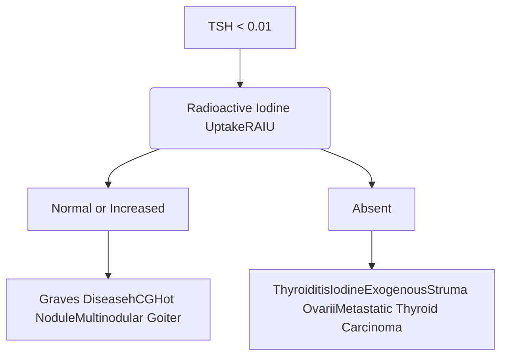


<table>
  <thead>
    <tr>
        <th>TABLE 9.10</th>
        <th colspan="3">Prevalence of Thyroid Autoantibodies</th>
    </tr>
    <tr>
        <th>Group</th>
        <th>TSHR-Ab<br/>(%)</th>
        <th>hTg-Ab<br/>(%)</th>
        <th>hTPO-Ab<br/>(%)</th>
    </tr>
  </thead>
  <tbody>
    <tr>
        <td>General population</td>
        <td>0</td>
        <td>5–20</td>
        <td>8–27</td>
    </tr>
    <tr>
        <td>Patients with Graves disease</td>
        <td>80–95</td>
        <td>50–70</td>
        <td>50–80</td>
    </tr>
    <tr>
        <td>Patients with autoimmune thyroiditis</td>
        <td>10–20</td>
        <td>80–90</td>
        <td>90–100</td>
    </tr>
    <tr>
        <td>Relatives of patients</td>
        <td>0</td>
        <td>40–50</td>
        <td>40–50</td>
    </tr>
    <tr>
        <td>Patients with IDDM</td>
        <td>0</td>
        <td>40</td>
        <td>40</td>
    </tr>
    <tr>
        <td>Pregnant women</td>
        <td>0</td>
        <td>14</td>
        <td>14</td>
    </tr>
  </tbody>
</table>


*IDDM*, insulin-dependent diabetes mellitus; *hTg-Ab*, human thyroglobulin antibody; *hTPO-Ab*, human thyroid peroxidase antibody; *TSHR-Ab*, thyroid-stimulating hormone receptor antibody.

Q: 何者非low RAIU uptake ?

A: Subacute thyroiditis

B: Struma ovarii

C: Exogenous thyroid hormone

D: <mark><font color="red">Graves disease</font></mark>

Star logo

# TABLE 10.4 Advantages and Disadvantages of Treatment Options for Graves Hyperthyroidism


<table>
  <thead>
    <tr>
        <th>Treatment Option</th>
        <th>Advantages</th>
        <th>Disadvantages</th>
    </tr>
  </thead>
  <tbody>
    <tr>
        <td>Antithyroid drugs</td>
        <td>Thyroid tissue is not destroyed or removed<br/>No hospitalization is required<br/>No surgical or anesthesiologic risk<br/>No radiation risk<br/>No effect on GO<br/>Use in pregnancy and breastfeeding<br/>Chance of permanent remission (~40%–50%)</td>
        <td>Side effects of ATDs (usually minor)<br/>Long duration (at least 18–24 months, long-term therapy increasingly accepted)<br/>High recurrence risk</td>
    </tr>
    <tr>
        <td>Radioactive iodine</td>
        <td>Definitive reduction/ablation of hyperfunctioning thyroid tissue<br/>Simplicity<br/>No surgical/anesthesiologic risk<br/>No hospitalization required<br/>Low cost<br/>Low recurrence risk</td>
        <td>Risk of progression of orbitopathy (usually preventable by steroid prophylaxis)<br/>Lifelong LT<sub>4</sub> needed<br/>Radiation exposure<br/>Possible small increase in cancer risk (uncertain)<br/>Control of hyperthyroidism is not immediate<br/>Contraindicated in pregnancy and breastfeeding</td>
    </tr>
    <tr>
        <td>Thyroidectomy</td>
        <td>Removal of the thyroid<br/>Prompt control of hyperthyroidism<br/>No risk of recurrences<br/>No radiation risk<br/>No effect on GO</td>
        <td>Low but unavoidable morbidity<br/>Permanent scar<br/>High costs<br/>Lifelong LT<sub>4</sub> needed</td>
    </tr>
  </tbody>
</table>


# TABLE 10.5 Clinical Conditions That Favor a Particular Treatment Modality for Graves Hyperthyroidism


<table>
  <thead>
    <tr>
        <th>Condition</th>
        <th>ATD</th>
        <th>RAI</th>
        <th>Surgery</th>
    </tr>
  </thead>
  <tbody>
    <tr>
        <td>High risk of remission</td>
        <td>+</td>
        <td> </td>
        <td> </td>
    </tr>
    <tr>
        <td>Active Graves orbitopathy</td>
        <td>+</td>
        <td> </td>
        <td> </td>
    </tr>
    <tr>
        <td>Elderly with comorbidities</td>
        <td>+</td>
        <td>+</td>
        <td> </td>
    </tr>
    <tr>
        <td>Increased surgical risk</td>
        <td>+</td>
        <td>+</td>
        <td> </td>
    </tr>
    <tr>
        <td>Liver disease</td>
        <td> </td>
        <td>+</td>
        <td>+</td>
    </tr>
    <tr>
        <td>Major adverse reactions to ATD</td>
        <td> </td>
        <td>+</td>
        <td>+</td>
    </tr>
    <tr>
        <td>Hypokalemic periodic paralysis</td>
        <td> </td>
        <td>+</td>
        <td>+</td>
    </tr>
    <tr>
        <td>Pulmonary hypertension or congestive heart failure</td>
        <td> </td>
        <td>+</td>
        <td>+</td>
    </tr>
    <tr>
        <td>Previous neck surgery or irradiation</td>
        <td>+</td>
        <td> </td>
        <td> </td>
    </tr>
    <tr>
        <td>Recurrent hyperthyroidism</td>
        <td>+</td>
        <td> </td>
        <td>+</td>
    </tr>
    <tr>
        <td>Malignancy suspected</td>
        <td> </td>
        <td> </td>
        <td>+</td>
    </tr>
    <tr>
        <td>Large thyroid nodules</td>
        <td> </td>
        <td> </td>
        <td>+</td>
    </tr>
    <tr>
        <td>Coexistent hyperparathyroidism</td>
        <td> </td>
        <td> </td>
        <td>+</td>
    </tr>
  </tbody>
</table>


ATD, antithyroid drug; *RAI*, radioactive iodine.

Modified from Ross DS, Burch HB, Cooper DS, et al. 2016 American Thyroid Association guidelines for diagnosis and management of hyperthyroidism and other causes of thyrotoxicosis. *Thyroid*. 2016;26:1343–1421.


<table>
  <thead>
    <tr>
        <th>Years</th>
        <th>Radioiodine</th>
        <th>Surgery</th>
        <th>Medication</th>
    </tr>
  </thead>
  <tbody>
    <tr>
        <td>0</td>
        <td>38</td>
        <td>35</td>
        <td>34</td>
    </tr>
    <tr>
        <td>1</td>
        <td>15</td>
        <td>7</td>
        <td>6</td>
    </tr>
    <tr>
        <td>2</td>
        <td>10</td>
        <td>5</td>
        <td>4</td>
    </tr>
    <tr>
        <td>3</td>
        <td>8</td>
        <td>4</td>
        <td>3</td>
    </tr>
    <tr>
        <td>4</td>
        <td>8</td>
        <td>3</td>
        <td>2</td>
    </tr>
    <tr>
        <td>5</td>
        <td>7</td>
        <td>3</td>
        <td>2</td>
    </tr>
  </tbody>
</table>


Contraindications for RAI are pregnancy or planning pregnancy within 6 months, lactation, and suspicion of thyroid cancer.

RAI should be administered at least 8 weeks after lactation.

Red star logo

# TABLE 10.3 Adverse Events of Antithyroid Drugs

**Q: 何者非ATD副作用？**

**A: <span style="color: red">Renal impairment</span>**

B: Agranulocytosis

C: Hepatitis

D: Skin rash


<table>
  <tbody>
    <tr>
        <td rowspan="4">Common (1%—5%)</td>
        <td>Skin rash</td>
    </tr>
    <tr>
        <td><u>Urticaria</u></td>
    </tr>
    <tr>
        <td>Arthralgia, polyarthritis</td>
    </tr>
    <tr>
        <td>Transient mild leukopenia</td>
    </tr>
    <tr>
        <td rowspan="3">Rare (0.2%—1%)</td>
        <td>Gastrointestinal</td>
    </tr>
    <tr>
        <td>Abnormal smell and taste</td>
    </tr>
    <tr>
        <td><u>Agranulocytosis</u></td>
    </tr>
    <tr>
        <td rowspan="7">Very rare (&lt;0.1%)</td>
        <td>Aplastic anemia (PTU, CBZ)</td>
    </tr>
    <tr>
        <td>Thrombocytopenia (PTU, CBZ)</td>
    </tr>
    <tr>
        <td><u>Vasculitis, lupus-like, ANCA+ve (PTU)</u></td>
    </tr>
    <tr>
        <td><u>Hepatitis (PTU)</u></td>
    </tr>
    <tr>
        <td>Hypoglycemia (anti-insulin antibodies) (PTU)</td>
    </tr>
    <tr>
        <td><u>Cholestatic jaundice (CBZ, MMI)</u></td>
    </tr>
    <tr>
        <td><u>Pancreatitis (MMI)</u></td>
    </tr>
  </tbody>
</table>


ANCA+ve, antineutrophil cytoplasmic antibody positive; CBZ, carbimazole; MMI, methimazole; PTU, propylthiouracil.

## Agranulocytosis risk factors:

* Older age (>40 y/o)

* Higher dose

* Genetic variants: HLA-B\*27:05 (Europeans); HLA-B\*38:02 (Han Chinese); HLA-DRB1\*08:03 (Han Chinese); Nox3 variants (encodes NADPH oxidase)

Williams Textbook of Endocrinology

Ann Intern Med. 1983;98(1):26-29.

Br J Clin Pharmacol. 2019;85(9):1878-1887.

Lancet Diabetes Endocrinol. 2016;4(6):507-516.

# GREAT+ score >> predict recurrence


A
<table>
  <tbody>
    <tr>
        <td>Time (months)</td>
        <td>Class III (%)</td>
        <td>Class II (%)</td>
        <td>Class I (%)</td>
    </tr>
    <tr>
        <td>0</td>
        <td>0</td>
        <td>0</td>
        <td>0</td>
    </tr>
    <tr>
        <td>6</td>
        <td>68</td>
        <td>20</td>
        <td>3</td>
    </tr>
    <tr>
        <td>12</td>
        <td>68</td>
        <td>28</td>
        <td>7</td>
    </tr>
    <tr>
        <td>18</td>
        <td>68</td>
        <td>33</td>
        <td>10</td>
    </tr>
    <tr>
        <td>24</td>
        <td>68</td>
        <td>44</td>
        <td>16</td>
    </tr>
  </tbody>
</table>


B
<table>
  <tbody>
    <tr>
        <td>Time (months)</td>
        <td>Class IV+ (%)</td>
        <td>Class III+ (%)</td>
        <td>Class II+ (%)</td>
        <td>Class I+ (%)</td>
    </tr>
    <tr>
        <td>0</td>
        <td>0</td>
        <td>0</td>
        <td>0</td>
        <td>0</td>
    </tr>
    <tr>
        <td>6</td>
        <td>84</td>
        <td>15</td>
        <td>10</td>
        <td>4</td>
    </tr>
    <tr>
        <td>12</td>
        <td>84</td>
        <td>25</td>
        <td>15</td>
        <td>4</td>
    </tr>
    <tr>
        <td>18</td>
        <td>84</td>
        <td>33</td>
        <td>16</td>
        <td>4</td>
    </tr>
    <tr>
        <td>24</td>
        <td>84</td>
        <td>49</td>
        <td>21</td>
        <td>4</td>
    </tr>
  </tbody>
</table>


Time of follow-up after withdrawal of antithyroid drugs (months)


<table>
  <thead>
    <tr>
        <th colspan="4">TABLE 12.5 Predictive Scores for the Risk of Recurrent Graves Hyperthyroidism After 1-Year Treatment With Antithyroid Drugs</th>
    </tr>
    <tr>
        <th>Items (Assessed Before Starting Therapy)</th>
        <th>GREAT Score Range 0–6</th>
        <th colspan="2">GREAT SCORE</th>
    </tr>
    <tr>
        <th> </th>
        <th> </th>
        <th>Risk Class</th>
        <th>Recurrences</th>
    </tr>
  </thead>
  <tbody>
    <tr>
        <td>Age (yr) ≥40</td>
        <td>0</td>
        <td>Class I (score 0–1)</td>
        <td>16%</td>
    </tr>
    <tr>
        <td>Age (yr) &lt;40</td>
        <td>+1</td>
        <td>Class II (score 2–3)</td>
        <td>44%</td>
    </tr>
    <tr>
        <td>FT₄ (pmol/L) &lt;40</td>
        <td>0</td>
        <td>Class III (score 4–6)</td>
        <td>68%</td>
    </tr>
    <tr>
        <td>FT₄ (pmol/L) ≥40</td>
        <td>+1</td>
        <td> </td>
        <td> </td>
    </tr>
    <tr>
        <td>TBII (U/L) &lt;6</td>
        <td>0</td>
        <td> </td>
        <td> </td>
    </tr>
    <tr>
        <td>TBII (U/L) 6–19.9</td>
        <td>+1</td>
        <td> </td>
        <td> </td>
    </tr>
    <tr>
        <td>TBII (U/L) ≥20</td>
        <td>+2</td>
        <td> </td>
        <td> </td>
    </tr>
    <tr>
        <td>Goiter sizeᵃ gr. 0–I</td>
        <td>0</td>
        <td> </td>
        <td> </td>
    </tr>
    <tr>
        <td>Goiter sizeᵃ gr. II–III</td>
        <td>+2</td>
        <td> </td>
        <td> </td>
    </tr>
    <tr>
        <th>Items Added</th>
        <th>GREAT+ Score Range 0–10</th>
        <th colspan="2">GREAT+ SCORE</th>
    </tr>
    <tr>
        <th> </th>
        <th> </th>
        <th>Risk Class</th>
        <th>Recurrences</th>
    </tr>
    <tr>
        <td>PTPN22 C/C wild type</td>
        <td>0</td>
        <td>Class I+ (score 0–2)</td>
        <td>4%</td>
    </tr>
    <tr>
        <td>PTPN22 C/C</td>
        <td>+1</td>
        <td>Class II+ (score 3–4)</td>
        <td>21%</td>
    </tr>
    <tr>
        <td>HLA nr.ᵇ 0</td>
        <td>0</td>
        <td>Class III+ (score 5–6)</td>
        <td>49%</td>
    </tr>
    <tr>
        <td>HLA nr.ᵇ 1–2</td>
        <td>+2</td>
        <td>Class IV+ (score 7–10)</td>
        <td>84%</td>
    </tr>
    <tr>
        <td>HLA nr.ᵇ 3 (LD)</td>
        <td>+3</td>
        <td> </td>
        <td> </td>
    </tr>
  </tbody>
</table>


ᵃGoiter size: grade 0, thyroid not or distinctly palpable but usually not visible; grade I, thyroid easily palpable and visible with head in normal or raised position; grade II, thyroid easily visible with the head in a normal position; grade III, goiter visible at a distance.
ᵇNumber of HLA subtypes (DQB1-02, DQA1-05, DRB1-03) present.
FT₄, Free thyroxine; HLA, human leukocyte antigen; LD, linkage disequilibrium; TBII, thyroid-stimulating hormone–binding inhibitory immunoglobulins.
Modified from Vos XG, Endert E, Zwinderman AH, et al. Predicting the risk of recurrence before the start of antithyroid drug therapy in patients with Graves’ hyperthyroidism. *J Clin Endocrinol Metab*. 2016;101:1381–1389.

# Thyroid storm


<table>
  <thead>
    <tr>
        <th>Criteria</th>
        <th>Points</th>
    </tr>
  </thead>
  <tbody>
    <tr>
        <td><strong>Thermoregulatory dysfunction</strong></td>
        <td> </td>
    </tr>
    <tr>
        <td>Temperature (°C)</td>
        <td> </td>
    </tr>
    <tr>
        <td>37.2–37.7</td>
        <td>5</td>
    </tr>
    <tr>
        <td>37.8–38.3</td>
        <td>10</td>
    </tr>
    <tr>
        <td>38.4–38.8</td>
        <td>15</td>
    </tr>
    <tr>
        <td>38.9–39.3</td>
        <td>20</td>
    </tr>
    <tr>
        <td>39.4–39.9</td>
        <td>25</td>
    </tr>
    <tr>
        <td>≥ 40.0</td>
        <td>30</td>
    </tr>
    <tr>
        <td><strong>Cardiovascular</strong></td>
        <td> </td>
    </tr>
    <tr>
        <td>Tachycardia (beats per minute)</td>
        <td> </td>
    </tr>
    <tr>
        <td>90–109</td>
        <td>5</td>
    </tr>
    <tr>
        <td>110–119</td>
        <td>10</td>
    </tr>
    <tr>
        <td>120–129</td>
        <td>15</td>
    </tr>
    <tr>
        <td>130–139</td>
        <td>20</td>
    </tr>
    <tr>
        <td>≥ 140</td>
        <td>25</td>
    </tr>
    <tr>
        <td>Atrial fibrillation</td>
        <td> </td>
    </tr>
    <tr>
        <td>Absent</td>
        <td>0</td>
    </tr>
    <tr>
        <td>Present</td>
        <td>10</td>
    </tr>
    <tr>
        <td><strong>Congestive heart failure</strong></td>
        <td> </td>
    </tr>
    <tr>
        <td>Absent</td>
        <td>0</td>
    </tr>
    <tr>
        <td>Mild</td>
        <td>5</td>
    </tr>
    <tr>
        <td>Moderate</td>
        <td>10</td>
    </tr>
    <tr>
        <td>Severe</td>
        <td>15</td>
    </tr>
    <tr>
        <td><strong>Gastrointestinal-hepatic dysfunction</strong></td>
        <td> </td>
    </tr>
    <tr>
        <td>Manifestation</td>
        <td> </td>
    </tr>
    <tr>
        <td>Absent</td>
        <td>0</td>
    </tr>
    <tr>
        <td>Moderate (diarrhea, abdominal pain, nausea/vomiting)</td>
        <td>10</td>
    </tr>
    <tr>
        <td>Severe (jaundice)</td>
        <td>20</td>
    </tr>
    <tr>
        <td><strong>Central nervous system disturbance</strong></td>
        <td> </td>
    </tr>
    <tr>
        <td>Manifestation</td>
        <td> </td>
    </tr>
    <tr>
        <td>Absent</td>
        <td>0</td>
    </tr>
    <tr>
        <td>Mild (agitation)</td>
        <td>10</td>
    </tr>
    <tr>
        <td>Moderate (delirium, psychosis, extreme lethargy)</td>
        <td>20</td>
    </tr>
    <tr>
        <td>Severe (seizure, come)</td>
        <td>30</td>
    </tr>
    <tr>
        <td><strong>Precipitating event</strong></td>
        <td> </td>
    </tr>
    <tr>
        <td>Status</td>
        <td> </td>
    </tr>
    <tr>
        <td>Absent</td>
        <td>0</td>
    </tr>
    <tr>
        <td>Present</td>
        <td>10</td>
    </tr>
    <tr>
        <td><strong>Total score</strong></td>
        <td> </td>
    </tr>
    <tr>
        <td>≥ 45</td>
        <td>Thyroid storm</td>
    </tr>
    <tr>
        <td>25–44</td>
        <td>Impending storm</td>
    </tr>
    <tr>
        <td>&lt; 25</td>
        <td>Storm unlikely</td>
    </tr>
  </tbody>
</table>


Table 3 The diagnostic criteria for thyroid storm (TS) of the Japan Thyroid Association

**Prerequisite for diagnosis**

<u>Presence of thyrotoxicosis with elevated levels of free triiodothyronine (FT3) or free thyroxine (FT4)</u>

**Symptoms**

1. Central nervous system (CNS) manifestations: Restlessness, delirium, mental aberration/psychosis, somnolence/lethargy, coma (≥1 on the Japan Coma Scale or ≤14 on the Glasgow Coma Scale)

2. Fever : ≥ 38°C

3. Tachycardia : ≥ 130 beats per minute or heart rate ≥ 130 in atrial fibrillation

4. Congestive heart failure (CHF) : Pulmonary edema, moist rales over more than half of the lung field, cardiogenic shock, or Class IV by the New York Heart Assciation or ≥ Class III in the Killip classification

5. Gastrointestinal (GI)/hepatic manifestations : nausea, vomiting, diarrhea, or a total bilirubin level ≥ 3.0 mg/dL

**Diagnosis**


<table>
  <thead>
    <tr>
        <th>Grade of TS</th>
        <th>Combinations of features</th>
        <th>Requirements for diagnosis</th>
    </tr>
  </thead>
  <tbody>
    <tr>
        <td>TS1</td>
        <td>First combination</td>
        <td>Thyrotoxicosis and at least one CNS manifestation and fever, tachycardia, CHF, or GI/hapatic manifestations</td>
    </tr>
    <tr>
        <td>TS1</td>
        <td>Alternate combination</td>
        <td>Thyrotoxicosis and at least three combinations of fever, tachycardia, CHF, or GI/hapatic manifestations</td>
    </tr>
    <tr>
        <td>TS2</td>
        <td>First combination</td>
        <td>Thyrotoxicosis and a combination of two of the following: fever, tachycardia, CHF, or GI/hepatic manifastations</td>
    </tr>
    <tr>
        <td>TS2</td>
        <td>Alternate combination</td>
        <td>Patients who met the diagnosis of TS1 except that serum FT3 or FT4 level are not available</td>
    </tr>
  </tbody>
</table>


2016 Guidelines for the management of thyroid storm from The Japan Thyroid Association and Japan Endocrine Society (First edition). Endocrine journal, 63(12), 1025–1064.

# TABLE 7. THYROID STORM: DRUGS AND DOSES


<table>
  <thead>
    <tr>
        <th>Drug</th>
        <th>Dosing</th>
        <th>Comment</th>
    </tr>
  </thead>
  <tbody>
    <tr>
        <td>Propylthiouracil<sup>a</sup></td>
        <td>500–1000 mg load, then<br/>250 mg every 4 hours</td>
        <td>Blocks new hormone synthesis<br/>Blocks T<sub>4</sub>-to-T<sub>3</sub> conversion</td>
    </tr>
    <tr>
        <td>Methimazole</td>
        <td>60–80 mg/d</td>
        <td>Blocks new hormone synthesis</td>
    </tr>
    <tr>
        <td>Propranolol</td>
        <td>60–80 mg every 4 hours</td>
        <td>Consider invasive monitoring in congestive<br/>heart failure patients<br/>Blocks T<sub>4</sub>-to-T<sub>3</sub> conversion in high doses<br/>Alternate drug: esmolol infusion</td>
    </tr>
    <tr>
        <td>Iodine (saturated solution<br/>of potassium iodide)</td>
        <td>5 drops (0.25 mL or 250 mg)<br/>orally every 6 hours</td>
        <td><u>Do not start until 1 hour after antithyroid drugs</u><br/>Blocks new hormone synthesis<br/>Blocks thyroid hormone release<br/>Alternative drug: Lugol's solution</td>
    </tr>
    <tr>
        <td>Hydrocortisone</td>
        <td>300 mg intravenous load,<br/>then 100 mg every 8 hours</td>
        <td>May block T<sub>4</sub>-to-T<sub>3</sub> conversion<br/>Prophylaxis against relative adrenal insufficiency<br/>Alternative drug: dexamethasone</td>
    </tr>
  </tbody>
</table>


\*<sup>a</sup>May be given intravenously.

plasmapheresis, lithium, oral T3 and T4 binding resins (e.g., colestipol and
cholestyramine), thyroid surgery等

# Thyroid eye disease

Red star logo

Diagram showing the pathophysiology of Thyroid Eye Disease involving TSH receptor antibodies, orbital fibroblasts, IGF-1 receptors, and the resulting adipogenesis and hyaluronic acid synthesis leading to expanded orbital muscles and adipose tissue.

## 114年fellow camp：

Hyperthyroidism and thyroid eye disease – 林家弘醫師

QR code

> 最常見下直肌（Inferior rectus muscle）和內直肌（Medial rectus muscle）腫脹，造成眼球 elevation和abduction受限。

Red star icon

# TABLE 10.6 Clinical Assessment of the Patient With Graves Orbitopathy

## Severity Measures (Using the Mnemonic NO SPECS)


<table>
  <thead>
    <tr>
        <th>NO SPECS Class</th>
        <th>Item</th>
        <th>Method</th>
    </tr>
  </thead>
  <tbody>
    <tr>
        <td colspan="3">No signs or symptoms</td>
    </tr>
    <tr>
        <td>Only signs, no symptoms</td>
        <td>Lid aperture</td>
        <td>With ruler in midline in mm</td>
    </tr>
    <tr>
        <td>Soft tissue involvement</td>
        <td>Eyelid and conjunctiva swelling and redness</td>
        <td>Inspection, color pictures<sup>a</sup></td>
    </tr>
    <tr>
        <td>Proptosis</td>
        <td>Exophthalmos</td>
        <td>Hertel in mm</td>
    </tr>
    <tr>
        <td>Extraocular muscle involvement</td>
        <td>Eye muscle motility<br/>Diplopia</td>
        <td>Impaired elevation, abduction<br/>Subjective grading<sup>b</sup></td>
    </tr>
    <tr>
        <td>Corneal involvement</td>
        <td>Keratitis, ulcer</td>
        <td>Fluoresceine</td>
    </tr>
    <tr>
        <td>Sight loss due to optic nerve involvement</td>
        <td>Dysthyroid optic neuropathy (DON)</td>
        <td>Visual acuity, color vision, visual fields, optic disc</td>
    </tr>
  </tbody>
</table>


無瞼軟凸外角盲

## Activity Measures (Using the Clinical Activity Score [CAS])


<table>
  <thead>
    <tr>
        <th>Inflammatory Sign</th>
        <th>Item</th>
        <th>Score</th>
    </tr>
  </thead>
  <tbody>
    <tr>
        <td>Pain</td>
        <td>Spontaneous retrobulbar pain</td>
        <td>1</td>
    </tr>
    <tr>
        <td> </td>
        <td>Pain on up gaze, side gaze, or down gaze</td>
        <td>1</td>
    </tr>
    <tr>
        <td>Redness</td>
        <td>Redness of the eyelids</td>
        <td>1</td>
    </tr>
    <tr>
        <td> </td>
        <td>Redness of the conjunctiva</td>
        <td>1</td>
    </tr>
    <tr>
        <td>Swelling</td>
        <td>Swelling of the eyelids</td>
        <td>1</td>
    </tr>
    <tr>
        <td> </td>
        <td>Swelling of the caruncle and/or plica</td>
        <td>1</td>
    </tr>
    <tr>
        <td> </td>
        <td>Chemosis</td>
        <td>1</td>
    </tr>
    <tr>
        <td colspan="2">Maximum CAS score (assessed momently)</td>
        <td>7</td>
    </tr>
    <tr>
        <td>Impaired function</td>
        <td>Increase in proptosis ≥2 mm in 1–3 months</td>
        <td>1</td>
    </tr>
    <tr>
        <td> </td>
        <td>Decrease of ≥8° in eye muscle motility in any direction in 1–3 months</td>
        <td>1</td>
    </tr>
    <tr>
        <td> </td>
        <td>Decrease in visual acuity of more than one line on the Snellen chart (using pinhole) in 1–3 months</td>
        <td>1</td>
    </tr>
    <tr>
        <td colspan="2">Maximum CAS score (assessed over time)</td>
        <td>10</td>
    </tr>
  </tbody>
</table>


痛紅腫

≥ 3分表示活動期

<sup>a</sup>Color atlas in Dickinson AJ, Perros P. Controversies in the clinical evaluation of active thyroid-associated orbitopathy: use of a detailed protocol with comparative photographs for objective assessment. *Clin Endocrinol (Oxf)*. 2001;55:283–303.

<sup>b</sup>Intermittent diplopia = at awakening or when tired; inconstant diplopia = at extremes of gaze; constant diplopia = in primary or reading position.

# 表 1 甲狀腺眼病變臨床活躍度指數 I <sup>[5, 6]</sup>

**CAS (clinical activity score) 臨床活躍度指數**

初次門診檢查 (最高分 7 分)
* 靜止時眼球疼痛或自發性眼球後疼痛
* 眼球轉動時疼痛如眼球試圖往上或往側方凝視時的疼痛
* 結膜腫
* 結膜紅
* 眼瞼腫
* 眼瞼紅
* 內眥或半月皺襞腫

後續門診追蹤檢查 (除了初診的 7 分, 再加上下列 3 項)
* 眼球突出增加 > 2 mm
* 任一方向眼球運動幅度減少 > 8°
* 視力於 3 個月內下降大於一行 Snellen 視力表

若初診 CAS ≥ 3/7 或者是後續追蹤 CAS ≥ 4/10\*, 則定義為活動型甲狀腺眼病變

\* 病史或病歷記載的甲狀腺眼病變惡化, 例如視力、軟組織發炎、眼球活動度或眼球突出的主觀或客觀惡化, 也表示疾病處於活躍期, 不侷限 CAS 評分高低。

# 表 2 甲狀腺眼病變臨床活躍度指數 II <sup>[7, 8]</sup>

**VISA (Vision, Inflammation, Strabismus, Appearance)**

眼球或眼球後疼痛 (2 分)
* 0 分：無疼痛
* 1 分：眼球轉動時疼痛
* 2 分：靜止時疼痛
結膜水腫 (2 分)
* 0 分：無結膜水腫
* 1 分：結膜水腫, 但仍在眼臉緣灰線後
* 2 分：結膜水腫超出眼臉緣灰線
結膜充血 (1 分)
眼臉水腫 (2 分)
* 0 分：無眼臉水腫
* 1 分：有水腫但未造成組織下垂
* 2 分：造成皮膚摺疊或下臉鬆弛
眼臉充血 (1 分)
內眥或半月皺襞：水腫或充血 (1 分)
晝夜變化 (1 分)

若 VISA ≥ 4/10, 則定義為活動型甲狀腺眼病變

**Table 3** Classification of severity of Graves' orbitopathy (GO).


<table>
  <thead>
    <tr>
        <th>Classification</th>
        <th>Features</th>
    </tr>
  </thead>
  <tbody>
    <tr>
        <td>Mild GO</td>
        <td>Patients whose features of GO have only a minor impact on daily life that have insufficient impact to justify immunomodulation or surgical treatment. They usually have one or more of the following:<br/>• minor lid retraction (&lt;2 mm)<br/>• mild soft-tissue involvement<br/>• exophthalmos<br/>• &lt;3 mm above normal for race and gender<br/>• no or intermittent diplopia and corneal exposure responsive to lubricants</td>
    </tr>
    <tr>
        <td>Moderate-to-severe GO</td>
        <td>Patients without sight-threatening GO whose eye disease has sufficient impact on daily life to justify the risks of immunosuppression (if active) or surgical intervention (if inactive). They usually have two or more of the following:<br/>• lid retraction $\ge$ 2 mm<br/>• moderate or severe soft-tissue involvement<br/>• exophthalmos $\ge$ 3 mm above normal for race and gender<br/>• inconstant or constant diplopia</td>
    </tr>
    <tr>
        <td>Sight-threatening (very severe) GO</td>
        <td>Patients with dysthyroid optic neuropathy and/or corneal breakdown 角盲</td>
    </tr>
  </tbody>
</table>


Upper normal limits of proptosis: 16 mm in Asian females and 17 mm in Asian males
Intermittent diplopia = at awakening or when tired;
Inconstant diplopia = at extremes of gaze;
Constant diplopia = in primary or reading position.

# EUGOGO (European Group on Graves' Orbitopathy Classification)


<table>
  <thead>
    <tr>
        <th colspan="2">EUGOGO (European Group on Graves' Orbitopathy Classification)</th>
    </tr>
  </thead>
  <tbody>
    <tr>
        <td>輕度</td>
        <td>對日常生活影響輕微的患者<br/>病人的甲狀腺眼疾對生活影響有限，不需免疫調節或手術治療。通常符合以下一項或多項：<br/>● 輕微眼瞼退縮（&lt; 2 mm）<br/>● 輕微眼部軟組織影響<br/>● &lt; 正常值 3 mm 的凸眼（依種族與性別）<br/>● 無複視或僅有間歇性複視，角膜暴露能以淚液潤滑劑改善的</td>
    </tr>
    <tr>
        <td>中至重度</td>
        <td>無視力威脅，但對生活有中等或嚴重影響的患者<br/>病人的甲狀腺眼病變對日常生活影響明顯，可考慮免疫抑制治療（若為活動期）或手術治療（若為非活動期）。通常符合以下兩項或以上：<br/>● 眼瞼退縮 ≥ 2 mm<br/>● 中度或重度眼部軟組織影響<br/>● ≥ 正常值 3 mm 的凸眼（依種族與性別）<br/>● 不穩定或持續性的複視（Gorman 評分 2~3）</td>
    </tr>
    <tr>
        <td>威脅視力</td>
        <td>有視神經病變或角膜潰瘍及 / 或眼球半脫位的患者</td>
    </tr>
  </tbody>
</table>

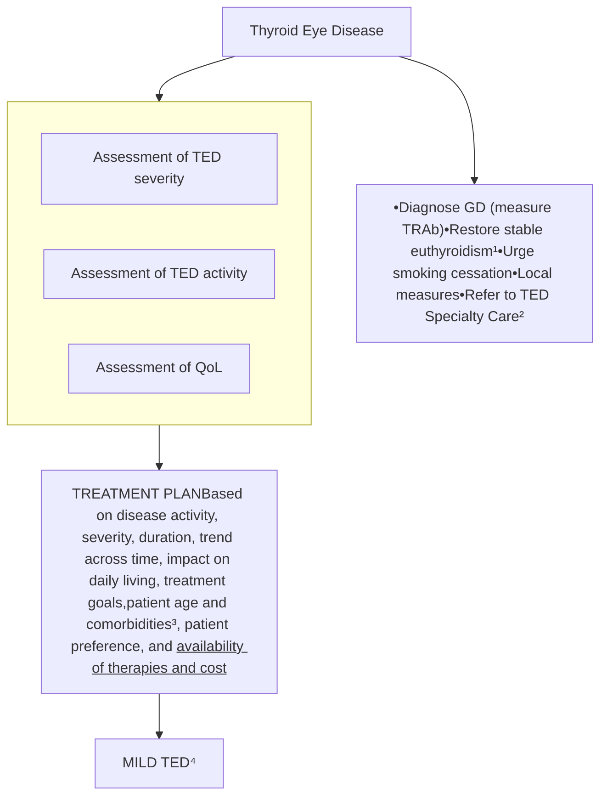


<table>
  <thead>
    <tr>
        <th colspan="5">MILD TED⁴</th>
    </tr>
    <tr>
        <th rowspan="3">Treatment goals</th>
        <th colspan="3">Active phase / progressive disease</th>
        <th rowspan="2">Inactive phase / stable disease</th>
    </tr>
    <tr>
        <th colspan="2">Medical therapy</th>
        <th>Surgical interventions and other</th>
    </tr>
    <tr>
        <th>Preferred therapy</th>
        <th>Acceptable therapy</th>
        <th> </th>
        <th>Surgical interventions and other</th>
    </tr>
  </thead>
  <tbody>
    <tr>
        <td>Improvement in QoL / promote TED remission or prevention of progression</td>
        <td>• Watchful monitoring<br/>• Selenium⁶</td>
        <td>• OGC⁵</td>
        <td>-</td>
        <td>• Corrective surgical procedures (including orbital decompression, correction of eyelid retraction, blepharoplasties)</td>
    </tr>
  </tbody>
</table>


**EUGOGO**
**CAS**

台灣是Selenium充足的地方所以不用給

<table>
  <thead>
    <tr>
        <th colspan="6">MODERATE –TO-SEVERE TED</th>
    </tr>
    <tr>
        <th rowspan="3">Treatment goals</th>
        <th colspan="4">Active phase / progressive disease</th>
        <th rowspan="2">Inactive phase / stable disease</th>
    </tr>
    <tr>
        <th colspan="3">Medical and radiation therapy</th>
        <th rowspan="2">Surgical interventions and other</th>
    </tr>
    <tr>
        <th>Preferred therapy<br/>(where available)</th>
        <th>Acceptable therapy</th>
        <th>May be considered</th>
        <th>Surgical interventions and other</th>
    </tr>
  </thead>
  <tbody>
    <tr>
        <td>Disease inactivation / reduction of ST involvement</td>
        <td>* IVGC<sup>7</sup></td>
        <td>* RT ± IVGC/OGC<br/>* TEP</td>
        <td>* RTX<sup>10</sup><br/>* TCZ<sup>11</sup><br/>* Watchful monitoring<sup>12</sup></td>
        <td> </td>
        <td>* Orbital decompression (“congestive” TED)<sup>13</sup><br/>* Blepharoplasty</td>
    </tr>
    <tr>
        <td>Disease inactivation and diplopia</td>
        <td>* TEP<br/><br/>IGF-1R blocker</td>
        <td>* RT ± IVGC/OGC</td>
        <td> </td>
        <td> </td>
        <td> </td>
    </tr>
    <tr>
        <td>Reduction of proptosis</td>
        <td>* TEP</td>
        <td> </td>
        <td> </td>
        <td> </td>
        <td>* Orbital decompression</td>
    </tr>
    <tr>
        <td>Eye motility improvement</td>
        <td>* IVGC<sup>8</sup><br/>* RT ± IVGC/OGC<br/>* TEP<sup>9</sup></td>
        <td> </td>
        <td> </td>
        <td>* Selective ocular occlusion<br/>* Adhesive prisms</td>
        <td>* Strabismus surgery<br/>* Permanent prisms</td>
    </tr>
    <tr>
        <td>Reduction of lid aperture</td>
        <td> </td>
        <td> </td>
        <td> </td>
        <td>* Botulinum toxin injection<br/>* Subconjunctival levator GC<br/>* Tarsorrhaphy</td>
        <td>* Eyelid correction</td>
    </tr>
  </tbody>
</table>


IV, intravenous; GC, glucocorticoid; TEP, teprotumumab; RT, radiotherapy; RTX, rituximab; TCZ, tocilizumab

<table>
  <thead>
    <tr>
        <th colspan="4">SIGHT THREATENING TED</th>
    </tr>
    <tr>
        <th rowspan="3">Diagnosis</th>
        <th colspan="3">Active phase / progressive disease</th>
    </tr>
    <tr>
        <th colspan="2">Medical and radiation therapy</th>
        <th rowspan="2">Surgical interventions and other</th>
    </tr>
    <tr>
        <th>Preferred therapy</th>
        <th>Acceptable therapy</th>
    </tr>
  </thead>
  <tbody>
    <tr>
        <td>Compressive optic neuropathy</td>
        <td>• IVGC<sup>15</sup></td>
        <td>• RT ± IVGC</td>
        <td>• Orbital decompression</td>
    </tr>
    <tr>
        <td>Stretch optic neuropathy<sup>13</sup><br/>Subluxation<sup>13</sup></td>
        <td> </td>
        <td> </td>
        <td>• Orbital decompression<br/>• Lid retraction correction (for subluxation)</td>
    </tr>
    <tr>
        <td>Corneal compromise<sup>14</sup></td>
        <td> </td>
        <td> </td>
        <td>• Lubricants and topical antibiotics<br/>• Bandaging<br/>• Tarsorrhaphy</td>
    </tr>
  </tbody>
</table>

Red star logo

```mermaid
graph TD
    A[甲狀腺眼病變] --> B[生活型態調整、風險因子控制、局部治療、局部評估、生活品質評估、多科團隊合作]
    B --> C[輕度 (mild)]
    B --> D[中重度 (moderate-to-severe)]
    B --> E[視力威脅 (sight-threatening)]
    
    C --> C1[追蹤觀察]
    C --> C2[Selenium*]
    C --> C3[Pentoxifylline†]
    
    D --> D1[主要徵象]
    D1 --> D1a[突眼(proptosis)]
    D1 --> D1b[複視(diplopia)]
    D1 --> D1c[眼球活動受限(restricted motility)]
    D1 --> D1d[發炎(inflammation)]
    
    D1a --> D1a1[IGF-1Rb]
    D1a1 --> D1a2[IL-6Rb]
    
    D1b --> D1b1[IGF-1Rb]
    D1b1 --> D1b2[RT ± IVGCIVGC ± MMFIL-6Rb‡]
    
    D1c --> D1c1[IGF-1RbIL-6RbIVGC§RT ± GC]
    
    D1d --> D1d1[IVGC ± MMF]
    D1d1 --> D1d2[IL-6RbIGF-1RbRT ± GC]
    
    D1a2 & D1b2 & D1c1 & D1d2 --> D2[反應不佳]
    D2 --> D3[二線治療]
    
    E --> E1[IVGCIGF-1RbIL-6Rb]
    E1 --> E2[反應不佳]
    E2 --> E3[減壓手術]
```

\* 僅限於硒缺乏地區證實有效
† 證據有限，可能可改善眼球突出
‡ 不同研究療效不一
§ 療效有限
GC, glucocorticoid; IGF-1Rb, IGF-1 receptor blocker; IL-6Rb, IL-6 receptor blocker; IVGC, intravenous glucocorticoid; MMF, mycophenolate mofetil; RT, radiotherapy

**圖 1 甲狀腺眼病變處置流程建議**

**Table 7** Logistics of medical therapy for thyroid eye disease


<table>
  <thead>
    <tr>
        <th rowspan="2">Drug</th>
        <th rowspan="2">Route</th>
        <th rowspan="2">Frequency and duration</th>
        <th colspan="2">Total drug cost/full treatment<br/>(Euros and U.S. dollars)</th>
        <th colspan="2">Ratio of cost of full treatment with drug over cost of full treatment with IVGC<sup>a</sup></th>
        <th rowspan="2">Impact of drug on vaccinations<sup>b</sup></th>
    </tr>
    <tr>
        <th>€</th>
        <th>$</th>
        <th>€</th>
        <th>$</th>
    </tr>
  </thead>
  <tbody>
    <tr>
        <td>IVGC</td>
        <td>IV</td>
        <td>0.5 g weekly for 6 weeks, followed by 0.25 g weekly for 6 weeks</td>
        <td>70.0</td>
        <td>172</td>
        <td>1</td>
        <td>1</td>
        <td>Decreased efficacy of vaccine; live vaccines deferred for 1 month after drug discontinuation</td>
    </tr>
    <tr>
        <td>OGC</td>
        <td>PO</td>
        <td>Daily for 3 months (starting with 100 mg prednisolone daily, then tapering dose, cumulative dose 4 g)</td>
        <td>73.6</td>
        <td>440</td>
        <td>1</td>
        <td>3</td>
        <td>Decreased efficacy of vaccine; live vaccines deferred for 1 month after drug discontinuation</td>
    </tr>
    <tr>
        <td>MMF</td>
        <td>PO</td>
        <td>0.72 g daily for 24 weeks</td>
        <td>411</td>
        <td>1191</td>
        <td>6</td>
        <td>7</td>
        <td>Possible decreased efficacy of vaccine but data are controversial</td>
    </tr>
    <tr>
        <td rowspan="3">RTX</td>
        <td rowspan="3">IV</td>
        <td>1 g two doses 1 weekly for 2 weeks</td>
        <td>4308</td>
        <td>19,636</td>
        <td>62</td>
        <td>114</td>
        <td rowspan="3">Decreased efficacy of vaccine; defer vaccination post-therapy until after B cells recovery</td>
    </tr>
    <tr>
        <td>0.5 g single dose</td>
        <td>1698</td>
        <td>4914</td>
        <td>24</td>
        <td>29</td>
    </tr>
    <tr>
        <td>0.1 g single dose</td>
        <td>338</td>
        <td>990</td>
        <td>5</td>
        <td>6</td>
    </tr>
    <tr>
        <td>TEP</td>
        <td>IV</td>
        <td>Every 3 weeks for 6 months (first dose 10 mg/kg, subsequent doses 20 mg/kg, total number of infusions eight)</td>
        <td>Not licensed in Europe</td>
        <td>357,997 for a 75 kg patient</td>
        <td>5110</td>
        <td>2080</td>
        <td>Unknown</td>
    </tr>
    <tr>
        <td>TCZ</td>
        <td>IV</td>
        <td>8 mg/kg every 4 weeks for 12 weeks (four doses)</td>
        <td>4266</td>
        <td>14,519</td>
        <td>61</td>
        <td>84</td>
        <td>Decreased efficacy of vaccine</td>
    </tr>
  </tbody>
</table>

<table>
  <thead>
    <tr>
        <th colspan="3">TABLE 10.7 Differences Between Amiodarone-Induced Thyrotoxicosis Type 1 and Type 2</th>
    </tr>
    <tr>
        <th> </th>
        <th>AIT Type 1</th>
        <th>AIT Type 2</th>
    </tr>
  </thead>
  <tbody>
    <tr>
        <td>Underlying thyroid abnormality</td>
        <td>Yes</td>
        <td>No</td>
    </tr>
    <tr>
        <td>Onset after starting amiodarone</td>
        <td>Short (3 months)</td>
        <td>Long (30 months)</td>
    </tr>
    <tr>
        <td>Thyroid antibodies</td>
        <td>Present in Graves</td>
        <td>Usually absent</td>
    </tr>
    <tr>
        <td>Goiter</td>
        <td>Usually present</td>
        <td>Usually absent</td>
    </tr>
    <tr>
        <td>Color flow Doppler sonography</td>
        <td>High vascularity</td>
        <td>Low/absent vascularity</td>
    </tr>
    <tr>
        <td>Thyroid radioiodine uptake</td>
        <td>Low, normal, high</td>
        <td>Suppressed</td>
    </tr>
    <tr>
        <td>Preferred treatment</td>
        <td><u>Antithyroid drugs</u></td>
        <td><u>Oral prednisone</u></td>
    </tr>
    <tr>
        <td>Amiodarone continuation</td>
        <td><u>No</u></td>
        <td><u>Possible</u></td>
    </tr>
    <tr>
        <td>Spontaneous remission</td>
        <td>No</td>
        <td>Frequent</td>
    </tr>
    <tr>
        <td>Subsequent hypothyroidism</td>
        <td>No</td>
        <td>Possible (17%)</td>
    </tr>
    <tr>
        <td>Subsequent definitive treatment</td>
        <td>Generally yes</td>
        <td>No</td>
    </tr>
  </tbody>
</table>


```mermaid
graph TD
    A[Amiodarone-induced thyrotoxicosis(AIT)] --> B[AIT 1]
    A --> C[Suspected mixed/indefinite AIT]
    A --> D[AIT 2]

    B --> E[Stop amiodarone, if feasible]
    C --> E
    E --> F[Emergency thyroidectomy in selected cases]

    F --> G[Thionamides± sodium perchlorate]
    F --> H[Thionamides± sodium perchlorate± oral glucocorticoids]
    D --> I[Amiodarone can be continued]
    I --> J[Oralglucocorticoids]

    G --> K[Euthyroidism]
    H --> K
    H --> L[Poor response]
    J --> M[Remission]

    K --> N[Definitive thyroid treatmentwith thyroidectomy or radioiodine]
    L --> O[Add oral glucocorticoids(if not given initially)]
    M --> P[Follow-up]
```

\* **Fig. 10.22** Algorithm for the management of amiodarone-induced thyrotoxicosis. (Redrawn from Bartalena L, Bogazzi F, Chiovato L, et al. 2018 European Thyroid Association [ETA] guidelines for the management of amiodarone-associated thyroid dysfunction. *Eur Thyroid J.* 2018;7:55-66.)

Q: 長期吃amiodarone，甲亢症狀，血流低？

A: AIT2，使用corticosteroids治療

Star icon

# TABLE 9.8 Effects of Pregnancy on Thyroid Physiology


<table>
  <thead>
    <tr>
        <th>Physiologic Change</th>
        <th>Thyroid-Related Consequences</th>
    </tr>
  </thead>
  <tbody>
    <tr>
        <td><u>↑ Serum thyroxine-binding globulin</u></td>
        <td><u>↑ Total T4 and T3; ↑ T4 production</u></td>
    </tr>
    <tr>
        <td>↑ Plasma volume</td>
        <td>↑ T4 and T3 pool size; ↑ T4<br/>production; ↑ cardiac output</td>
    </tr>
    <tr>
        <td>D3 expression in placenta and<br/>(?) uterus</td>
        <td>↑ T4 production</td>
    </tr>
    <tr>
        <td><u>First trimester ↑ in hCG</u></td>
        <td><u>↑Free T4; ↓ basal TSH; ↑ T4</u><br/>production</td>
    </tr>
    <tr>
        <td><u>↑ Renal I⁻ clearance</u></td>
        <td><u>↑ Iodine requirements</u></td>
    </tr>
    <tr>
        <td>↑ T4 production; fetal T4<br/>synthesis during second and<br/>third trimesters</td>
        <td> </td>
    </tr>
    <tr>
        <td>↑ Oxygen consumption by<br/>fetoplacental unit, gravid<br/>uterus, and mother</td>
        <td>↑ Basal metabolic rate; ↑ cardiac<br/>output</td>
    </tr>
  </tbody>
</table>


## Mother


<table>
  <thead>
    <tr>
        <th>Week of pregnancy</th>
        <th>TBG</th>
        <th>Total T4</th>
        <th>hCG</th>
        <th>Free T4</th>
        <th>Thyrotropin</th>
    </tr>
  </thead>
  <tbody>
    <tr>
        <td>0</td>
        <td>Low</td>
        <td>Low</td>
        <td>Low</td>
        <td>Medium</td>
        <td>Medium</td>
    </tr>
    <tr>
        <td>10</td>
        <td>High</td>
        <td>High</td>
        <td>Peak</td>
        <td>High</td>
        <td>Low</td>
    </tr>
    <tr>
        <td>20</td>
        <td>High</td>
        <td>High</td>
        <td>Medium</td>
        <td>Medium</td>
        <td>Medium</td>
    </tr>
    <tr>
        <td>30</td>
        <td>High</td>
        <td>High</td>
        <td>Medium</td>
        <td>Medium</td>
        <td>Medium</td>
    </tr>
    <tr>
        <td>40</td>
        <td>High</td>
        <td>High</td>
        <td>Medium</td>
        <td>Medium</td>
        <td>Medium</td>
    </tr>
  </tbody>
</table>


**From GA 7 to 16 wk: ↑50% (↑ 5%/wk)**

可能低到測不到

Q: 何者敘述錯誤？

A: 懷孕初期hCG造成FT4上升、TSH下降

B: estrogen會上升TBG level使T4需求增加

C: 腎臟碘清除上升使碘需求量增加

D: Placenta表現~~D1~~ → D3

# ATD during pregnant

1. 懷孕前三個月(前16週)用PTU
2. 致畸胎:
    A. <mark>Methimazole(aplasia cutis, choanal/esophageal atresia, 腹壁缺損,臍膨出,眼睛,泌尿系統問題, ASD/VSD發展遲緩)</mark>
    B. PTU(臉脖子囊腫, 耳前囊腫,男生泌尿系統異常 輕微腎水腫) 2-3%
3. TRAb, ATD, Thyroid hormone都可通過胎盤，且ATD對胎兒的效果比母體強，若母體TFT正常，胎兒可能被過度治療(甲狀腺腫或hypothyroidism)
    Target: TT4/FT4正常值上限或稍高一些
4. OP=>懷孕中三個月(第二孕期)

Q: 何者不會過胎盤？
A: <mark>TSH</mark>
B: MMI
C: TSHRAb
D: Anti-TPO

# BOX 11.1 Causes of Hypothyroidism

## Primary Hypothyroidism

**Acquired**

Hashimoto thyroiditis

lodine deficiency (endemic goiter)

Drugs blocking synthesis or release of T<sub>4</sub> (e.g., lithium, ethionamide, sulfonamides, iodide)

Drug-induced thyroid destruction (e.g., interferon alpha, interleukin 2, tyrosine kinase inhibitors, blockers of CTLA4 or PD1)

Amiodarone (reversible or permanent)

Goitrogens in foodstuffs or as endemic substances or pollutants

Thyroid infiltration (amyloidosis, hemochromatosis, sarcoidosis, Riedel struma, cystinosis, scleroderma)

Postablative thyroiditis due to <sup>131</sup>I, surgery, or therapeutic irradiation for nonthyroidal malignancy

Transient hypothyroidism following painless thyroiditis (including postpartum) or painful subacute thyroiditis

**Congenital**

Thyroid agenesis or dysplasia (in a subset, mutations in PAX8, TTF1/NKX2.1, TTF2/FOXE1)

lodide transport or utilization defect (NIS or pendrin mutations)

lodotyrosine dehalogenase deficiency

Organification disorders (TPO, DUOX, and DUOXA deficiency or dysfunction)

Defects in thyroglobulin synthesis or processing

lodotyrosine dehalogenase deficiency

Thyroid agenesis or dysplasia

TSH receptor defects

Thyroidal Gs protein abnormalities (pseudohypoparathyroidism type 1a)

Idiopathic TSH unresponsiveness

## Consumptive Hypothyroidism

Rapid destruction of thyroid hormone due to D3 expression in large hemangiomas or hemangioendotheliomas, rare epithelial tumors

## Defects of Thyroxine to Triiodothyronine Conversion

Selenocysteine insertion sequence—binding protein 2 (SECISBP2) defect

## Central Hypothyroidism

**Acquired**

Pituitary origin (secondary)

Hypothalamic disorders (tertiary)

> Bexarotene reduces TSH synthesis.

Bexarotene (retinoid X receptor agonist)

Dopamine or severe illness

Combined pituitary hormone deficiencies

**Congenital**

TSH deficiency or structural abnormality

IGSF1 mutations (isolated or combined TSH deficiency)

TSH receptor defect

## Resistance to Thyroid Hormone (RTH)

Generalized RTHβ (mutations in THRB)

"Pituitary"-dominant RTHβ (mutations in THRB)

RTHα (mutations in THRA)

# • BOX 11.2 Conditions That Alter Levothyroxine Requirements

## INCREASED LEVOTHYROXINE REQUIREMENTS

**Pregnancy**

**Gastrointestinal disorders**
* Mucosal diseases of the small bowel (e.g., sprue)
* After jejunoileal bypass and small bowel resection
* Impaired gastric acid secretion (e.g., atrophic gastritis)
* Diabetic diarrhea

**Therapy with certain pharmacologic agents**
**Drugs that interfere with levothyroxine absorption**
* Cholestyramine
* Sucralfate
* Aluminum hydroxide
* Calcium carbonate
* Ferrous sulfate

**Drugs that increase the cytochrome P450 enzyme (CYP3A4)**
* Rifampin
* Carbamazepine
* Estrogen
* Phenytoin
* Sertraline
* ? Statins

**Drugs that block T<sub>4</sub>-to-T<sub>3</sub> conversion**
* Amiodarone

**Conditions that may block deiodinase synthesis**
* Selenium deficiency
* Cirrhosis

## DECREASED LEVOTHYROXINE REQUIREMENTS

* Aging (≥65 years)
* Androgen therapy in women

# Thyroid Hormone resistance (RTH)

Yellow star icon

* Clinical manifestations of RTHβ : symptoms often differ in the same family.

較常見 (More common) label

    * Elevated TSH stimulates growth of thyroid glands: goiter (The most common sign)
    * Excess thyroid hormones stimulate TRα->heart, bone: tachycardia, growth retardation, retarded skeletal maturation
    * TRβ cannot respond to thyroid hormones->hypothalamic-pituitary axis, CNS: attention-deficit/hyperactivity disorder, deafness

* Clinical manifestations of RTHα

    * TRα cannot respond to thyroid hormones->heart, bone, GI tract, hematologic system: bradycardia, reduced bone age, short stature, femoral epiphyseal dysgenesis, patent cranial sutures, macrocephaly, constipation, normocytic anemia


<table>
  <thead>
    <tr>
        <th> </th>
        <th>RTHα</th>
        <th>RTHβ</th>
    </tr>
  </thead>
  <tbody>
    <tr>
        <td>TSH</td>
        <td>Normal</td>
        <td>Normal or ↑</td>
    </tr>
    <tr>
        <td>T4</td>
        <td>Borderline low</td>
        <td>↑</td>
    </tr>
    <tr>
        <td>T3</td>
        <td>Borderline high, high T3/T4 ratio</td>
        <td>↑</td>
    </tr>
    <tr>
        <td>Treatment</td>
        <td>Levothyroxine may alleviate partial hypothyroid symptoms</td>
        <td>Mostly unnecessary due to adequate compensation by high thyroid hormones</td>
    </tr>
  </tbody>
</table>

# RTHβ vs TSHoma

Red star icon

* Factors favoring the diagnosis of TSH-secreting tumors:
        * Absence of family history
        * Normal thyroid function tests in family
        * Elevated glycoprotein α-subunits


<table>
  <thead>
    <tr>
        <th>RTH</th>
        <th>Criterion</th>
        <th>TSHoma</th>
    </tr>
  </thead>
  <tbody>
    <tr>
        <td>no</td>
        <td>Neurological disturbances (visual defects, headache)</td>
        <td>yes</td>
    </tr>
    <tr>
        <td>yes</td>
        <td>Inappropriate TSH secretion in relatives</td>
        <td>no</td>
    </tr>
    <tr>
        <td>no</td>
        <td>Pituitary adenoma at MRI</td>
        <td>yes</td>
    </tr>
    <tr>
        <td>yes</td>
        <td>(Partial) inhibition of TSH after T3 administration</td>
        <td>no</td>
    </tr>
    <tr>
        <td>yes</td>
        <td>TSH response to TRH stimulation</td>
        <td>no</td>
    </tr>
    <tr>
        <td>no</td>
        <td>High SHBG</td>
        <td>yes</td>
    </tr>
    <tr>
        <td>no</td>
        <td>high α-GSU concentrations and/or high α-GSU/TSH molar ratios</td>
        <td>yes</td>
    </tr>
    <tr>
        <td>yes (about 85%)</td>
        <td>Mutation at TR gene analysis</td>
        <td>no</td>
    </tr>
  </tbody>
</table>


**Q: 何者比較favor RTHB？**
**A: <mark><font color="red">α-subunits沒有上升</font></mark>**
**B: T3 suppression test沒反應**
**C: TRH test沒反應**
**D: 沒有家族史**

Concolino, P., Costella, A. & Paragliola, R.M. Mutational Landscape of Resistance to Thyroid Hormone Beta (RTHβ). Mol Diagn Ther 23, 353–368 (2019).

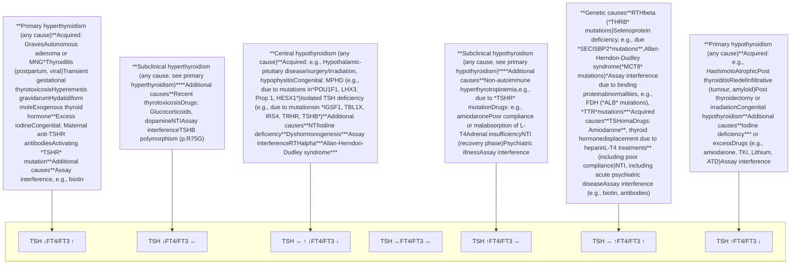

Thyroid ultrasound classification chart

需FNA

microcalcifications hypoechoic nodule irregular margin hypoechoic irregular margins hypoechoic taller than wide hypoechoic, irregular margins, extrathyroidal extension hypoechoic, interrupted rim calcification with soft tissue extrusion

≥ 1.0 cm

Star icon

hypoechoic solid regular margin hypoechoic solid regular margin

hyperechoic solid regular margin isoechoic solid regular margin partially cystic with eccentric solid area partially cystic with eccentric solid area

spongiform partially cystic no suspicious features partially cystic no suspicious features

cyst

Q: 何者最不需要穿刺？

A: 1.0cm microcalcification

B: 1.4cm hypoechoic

C: <mark>1.9cm spongiform</mark>

D: 2.3cm hyperechoic

# ACR TI-RADS

Yellow star icon


<table>
  <thead>
    <tr>
        <th>COMPOSITION</th>
        <th>ECHOGENICITY</th>
        <th>SHAPE</th>
        <th>MARGIN</th>
        <th>ECHOGENIC FOCI</th>
    </tr>
    <tr>
        <th>(Choose 1)</th>
        <th>(Choose 1)</th>
        <th>(Choose 1)</th>
        <th>(Choose 1)</th>
        <th>(Choose All That Apply)</th>
    </tr>
  </thead>
  <tbody>
    <tr>
        <td>Cystic or almost completely cystic 0 points</td>
        <td>Anechoic 0 points</td>
        <td>Wider-than-tall 0 points</td>
        <td>Smooth 0 points</td>
        <td>None or large comet-tail artifacts 0 points</td>
    </tr>
    <tr>
        <td>Spongiform 0 points</td>
        <td>Hyperechoic or isoechoic 1 point</td>
        <td>Taller-than-wide 3 points</td>
        <td>Ill-defined 0 points</td>
        <td>Macrocalcifications 1 point</td>
    </tr>
    <tr>
        <td>Mixed cystic and solid 1 point</td>
        <td>Hypoechoic 2 points</td>
        <td> </td>
        <td>Lobulated or irregular 2 points</td>
        <td>Peripheral (rim) calcifications 2 points</td>
    </tr>
    <tr>
        <td>Solid or almost completely solid 2 points</td>
        <td>Very hypoechoic 3 points</td>
        <td> </td>
        <td>Extra-thyroidal extension 3 points</td>
        <td>Punctate echogenic foci 3 points</td>
    </tr>
  </tbody>
</table>


**Add Points From All Categories to Determine TI-RADS Level**


<table>
  <thead>
    <tr>
        <th>0 Points</th>
        <th>2 Points</th>
        <th>3 Points</th>
        <th>4 to 6 Points</th>
        <th>7 Points or More</th>
    </tr>
  </thead>
  <tbody>
    <tr>
        <td>TR1</td>
        <td>TR2</td>
        <td>TR3</td>
        <td>TR4</td>
        <td>TR5</td>
    </tr>
    <tr>
        <td>Benign</td>
        <td>Not Suspicious</td>
        <td>Mildly Suspicious</td>
        <td>Moderately Suspicious</td>
        <td>Highly Suspicious</td>
    </tr>
    <tr>
        <td>No FNA</td>
        <td>No FNA</td>
        <td>FNA if ≥ 2.5 cm</td>
        <td>FNA if ≥ 1.5 cm</td>
        <td>FNA if ≥ 1 cm</td>
    </tr>
    <tr>
        <td> </td>
        <td> </td>
        <td>Follow if ≥ 1.5 cm</td>
        <td>Follow if ≥ 1 cm</td>
        <td>Follow if ≥ 0.5 cm*</td>
    </tr>
  </tbody>
</table>
<table>
  <thead>
    <tr>
        <th>COMPOSITION</th>
        <th>ECHOGENICITY</th>
        <th>SHAPE</th>
        <th>MARGIN</th>
        <th>ECHOGENIC FOCI</th>
    </tr>
  </thead>
  <tbody>
    <tr>
        <td>Spongiform: Composed predominantly (&gt;50%) of small cystic spaces. Do not add further points for other categories.<br/><br/>Mixed cystic and solid: Assign points for predominant solid component.<br/><br/>Assign 2 points if composition cannot be determined because of calcification.</td>
        <td>Anechoic: Applies to cystic or almost completely cystic nodules.<br/><br/>Hyperechoic/isoechoic/hypoechoic: Compared to adjacent parenchyma.<br/><br/>Very hypoechoic: More hypoechoic than strap muscles.<br/><br/>Assign 1 point if echogenicity cannot be determined.</td>
        <td>Taller-than-wide: Should be assessed on a transverse image with measurements parallel to sound beam for height and perpendicular to sound beam for width.<br/><br/>This can usually be assessed by visual inspection.</td>
        <td>Lobulated: Protrusions into adjacent tissue.<br/><br/>Irregular: Jagged, spiculated, or sharp angles.<br/><br/>Extrathyroidal extension: Obvious invasion = malignancy.<br/><br/>Assign 0 points if margin cannot be determined.</td>
        <td>Large comet-tail artifacts: V-shaped, &gt;1 mm, in cystic components.<br/><br/>Macrocalcifications: Cause acoustic shadowing.<br/><br/>Peripheral: Complete or incomplete along margin.<br/><br/>Punctate echogenic foci: May have small comet-tail artifacts.</td>
    </tr>
  </tbody>
</table>


\*Refer to discussion of papillary microcarcinomas for 5-9 mm TR5 nodules.

Microscopic view of Papillary Thyroid Carcinoma showing crowded sheets and psammoma bodies.

\* **Fig. 10.18** Papillary Thyroid Carcinoma, Classical Type. In some cases, papillae are absent, and the neoplastic cells are arranged in <mark>crowded sheets</mark>. Psammoma bodies are present (Papanicolaou stain).

Microscopic view of Papillary Thyroid Carcinoma showing papillae with fibrovascular cores.

\* **Fig. 10.17** Papillary Thyroid Carcinoma, Classical Type. In classical papillary thyroid carcinoma, <u>papillae with fibrovascular cores</u> are often seen (Papanicolaou stain).

# CYTOMORPHOLOGY OF PAPILLARY THYROID CARCINOMA

* <u>Sheets, cellular swirls, papillae, microfollicles</u>
* Nuclear changes
    - <u>Powdery chromatin</u>
    - <u>Grooves</u>
    - <u>Pseudoinclusions</u>
    - <u>Nucleolus (small or large)</u>
    - <u>Membrane thickening and irregularity</u>
* <u>Nuclear crowding/molding</u>
* <u>Variable cytoplasm (scant or abundant; can be squamoid, oncocytic, or vacuolated)</u>
* <u>Psammoma bodies</u>
* <u>Histiocytes, including multinucleated giant cells</u>

# 請搭配Fellow camp Cytology 的影音檔

# CYTOMORPHOLOGY OF MEDULLARY THYROID CARCINOMA

* <u>Numerous noncohesive cells</u>
* <u>Loose clusters</u>
* <u>Epithelioid, plasmacytoid, and/or spindle-shaped ("comet") cells</u>
* <u>Nuclei</u>
    - Round or elongated
    - <u>Granular chromatin</u>
    - Inconspicuous nucleolus
    - Pseudoinclusions (50% of cases)
    - Multiple nuclei
* <u>Red cytoplasmic granules</u> (70% of cases)
* <u>Amyloid</u>

Yellow star icon

Microscopic images of Medullary Thyroid Carcinoma showing various cellular features and staining

\* **Fig. 10.27** Medullary Thyroid Carcinoma. (A) Smears show <u>numerous isolated cells and small blobs of</u> <u>amyloid (arrows)</u> (Papanicolaou stain). (B) Air-dried Romanowsky-stained preparations show <u>fine red cyto-</u> <u>plasmic granules</u>, a helpful diagnostic feature. (C) <u>Some medullary carcinomas have prominent intranuclear</u> <u>pseudoinclusions</u> (Papanicolaou stain). (D) The malignant cells are strongly immunoreactive for calcitonin.

Star icon

# TABLE 14.3 Clinical Findings Associated With Malignant Thyroid Nodules

**Q: 何者比較不favor惡性結節？**
**A: 年輕**
**B: <mark>女性</mark>**
**C: 頸部做過放射線**
**D: 有家族史**

## <u>Historic Features</u>

Young age (<20–30 years old)

<u>Male sex</u>

Neck irradiation during childhood or adolescence

Rapid growth

Recent, persistent changes in speaking, breathing, or swallowing

Family history of multiple endocrine neoplasia type 2

## <u>Physical Examination</u>

Firm, fixed, and irregular consistency of nodule

Vocal cord paralysis or hoarseness

Persistent regional lymph adenopathy

# TABLE 12.3 The 2017 Bethesda System for Reporting Thyroid Cytopathology With Implied Risk of Malignancy and Recommended Clinical Management


<table>
  <thead>
    <tr>
        <th>Diagnostic Category</th>
        <th>Risk of Malignancy<br/>if NIFTP ≠ CA (%)</th>
        <th>Risk of Malignancy<br/>if NIFTP = CA (%)</th>
        <th>Usual Managementᵃ</th>
    </tr>
  </thead>
  <tbody>
    <tr>
        <td>Nondiagnostic or unsatisfactory</td>
        <td>5–10</td>
        <td>5–10</td>
        <td>Repeat FNA with ultrasound guidance</td>
    </tr>
    <tr>
        <td>Benign</td>
        <td>0–3</td>
        <td>0–3</td>
        <td>Clinical and sonographic follow-up</td>
    </tr>
    <tr>
        <td>Atypia of undetermined significance or follicular lesion of undetermined significance</td>
        <td>6–18</td>
        <td>~10–30</td>
        <td>Repeat FNA, molecular testing, or lobectomy</td>
    </tr>
    <tr>
        <td>Follicular neoplasm or suspicious for a follicular neoplasm</td>
        <td>10–40</td>
        <td>25–40</td>
        <td>Molecular testing, lobectomy</td>
    </tr>
    <tr>
        <td>Suspicious for malignancy</td>
        <td>45–60</td>
        <td>50–75</td>
        <td>Near-total thyroidectomy or lobectomyᵇ,ᶜ</td>
    </tr>
    <tr>
        <td>Malignant</td>
        <td>94–96</td>
        <td>97–99</td>
        <td>Near-total thyroidectomy or lobectomyᶜ</td>
    </tr>
  </tbody>
</table>


\*Actual management may depend on other factors (e.g., clinical, sonographic) besides the FNA interpretation.

\*Some studies have recommended molecular analysis to assess the type of surgical procedure (lobectomy vs. total thyroidectomy).

\*In the case of "suspicious for metastatic tumor" or a "malignant" interpretation indicating metastatic tumor rather than a primary thyroid malignancy, surgery may not be indicated.

\*FNA, fine-needle aspiration; NIFTP, noninvasive follicular thyroid neoplasm with papillary-like nuclear features.

From Cibas ES, Ali SZ. The 2017 Bethesda System for Reporting Thyroid Cytopathology. Thyroid. 2017 Nov;27(11):1341–1346.

# Table 1. Tumors of the Thyroid Gland in the 2022 WHO Classification

Yellow star icon

## Classification

1. Developmental abnormalities
    * Thyroglossal duct cyst
    * Other congenital thyroid abnormalities

2. Follicular cell-derived neoplasms
    * Benign tumors
        * <u>Thyroid follicular nodular disease</u>
        * <u>Follicular thyroid adenoma</u>
        * Follicular thyroid adenoma with papillary architecture
        * <u>Oncocytic adenoma of the thyroid</u>
    * Low risk neoplasms
        * <u>Non-invasive follicular thyroid neoplasm with papillary-like nuclear features</u>
        * Thyroid tumors of uncertain malignant potential
            * Follicular tumor of uncertain malignant potential
            * Well-differentiated tumor of uncertain malignant potential
    * <u>Hyalinizing trabecular tumor</u>
    * Malignant neoplasms
        * Follicular thyroid carcinoma
        * Invasive encapsulated follicular variant papillary thyroid carcinoma
        * Papillary thyroid carcinoma
        * <u>Oncocytic carcinoma of the thyroid</u>
        * <u>Follicular-derived carcinomas, high-grade</u>
            * Poorly differentiated thyroid carcinoma
            * Differentiated high-grade thyroid carcinoma
        * Anaplastic follicular cell-derived thyroid carcinoma

3. Thyroid C-cell-derived carcinoma
    * Medullary thyroid carcinoma

4. Mixed medullary and follicular cell-derived carcinomas
    * Mixed medullary and follicular cell-derived thyroid carcinoma
    * Mixed medullary-follicular carcinoma
    * Mixed medullary-papillary carcinoma

5. Salivary gland-type carcinomas of the thyroid
    * Mucoepidermoid carcinoma of the thyroid
    * Secretory carcinoma of salivary gland type

6. Thyroid tumors of uncertain histogenesis
    * Sclerosing mucoepidermoid carcinoma with eosinophilia
    * Cribriform morular thyroid carcinoma

7. Thymic tumors within the thyroid
    * Thymoma family
    * Spindle epithelial tumor with thymus-like elements
    * Thymic carcinoma family
        * Intrathyroidal thymic carcinoma

8. Embryonal thyroid neoplasms
    * Thyroblastoma

# Q: 何者不是Low risk neoplasm？

A: NIFTP

B: FT-UMP

C: Hyalinizing trabecular tumor

D: <mark><font color="red">Oncocytic adenoma</font></mark>

Yellow star icon

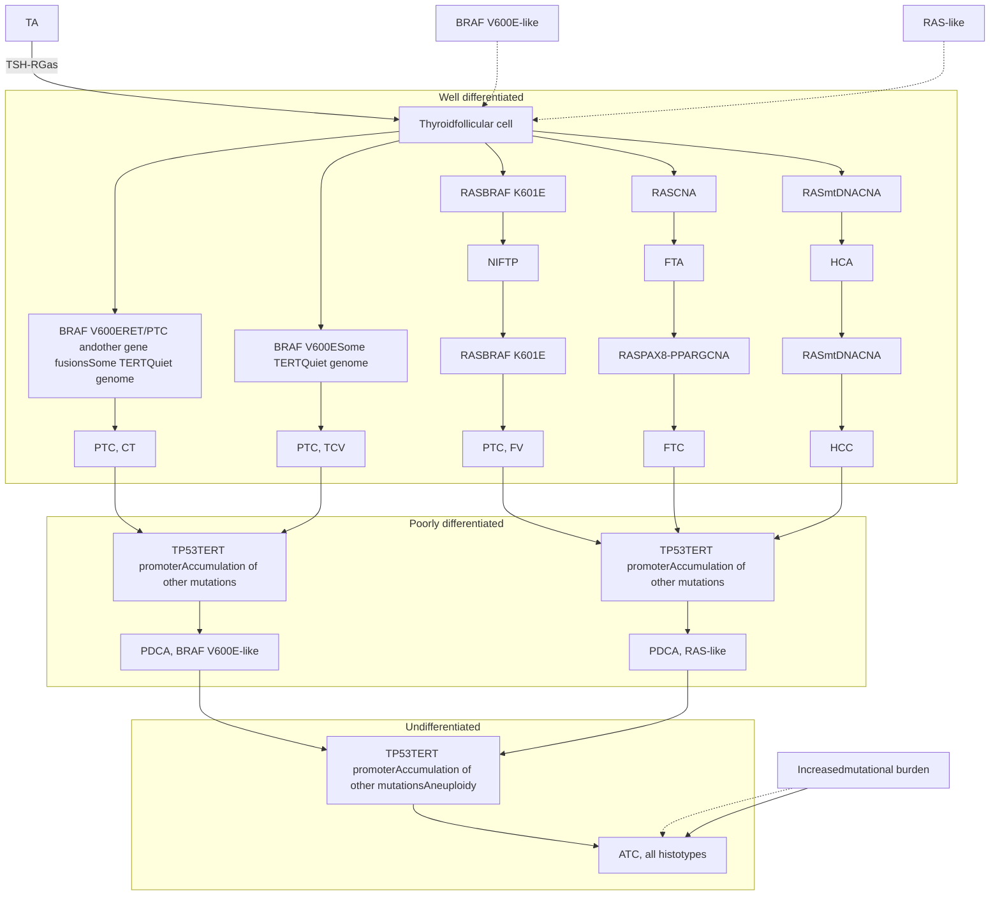

Yellow star icon

# 表1、甲狀腺癌中常見的突變基因


<table>
  <thead>
    <tr>
        <th>癌症類型</th>
        <th>PTC,all</th>
        <th>PTC,CT</th>
        <th>PTC,FV</th>
        <th>PTC,TCV</th>
        <th>FTC</th>
    </tr>
  </thead>
  <tbody>
    <tr>
        <td><em>BARF</em> <sup>V600E</sup></td>
        <td>40-65%</td>
        <td>50-75%</td>
        <td>10-20%</td>
        <td>&gt; 95%</td>
        <td>&lt; 1%</td>
    </tr>
    <tr>
        <td><em>RAS</em></td>
        <td>10-30%</td>
        <td>&lt; 10%</td>
        <td>30-50%</td>
        <td>&lt; 1%</td>
        <td>30-50%</td>
    </tr>
    <tr>
        <td><em>RTK fusions</em></td>
        <td>10-20%</td>
        <td>20-40%</td>
        <td>&lt; 5%</td>
        <td>&lt; 1%</td>
        <td>10-30%</td>
    </tr>
    <tr>
        <td><em>TERT promoter</em></td>
        <td>8-27%</td>
        <td>&lt; 10%</td>
        <td>&lt; 10%</td>
        <td>10-30%</td>
        <td>20%</td>
    </tr>
    <tr>
        <td><em>PAX8/PPARγ fusions</em></td>
        <td>&lt; 5%</td>
        <td>&lt; 1%</td>
        <td>&lt; 10%</td>
        <td>&lt; 1%</td>
        <td>10-30%</td>
    </tr>
    <tr>
        <td><em>PTEN</em></td>
        <td>&lt; 1%</td>
        <td>&lt; 1%</td>
        <td>&lt; 5%</td>
        <td>&lt; 1%</td>
        <td>10%</td>
    </tr>
    <tr>
        <td><em>E1F1AX</em></td>
        <td>&lt; 5%</td>
        <td>&lt; 5%</td>
        <td>&lt; 5%</td>
        <td>&lt; 1%</td>
        <td>&lt; 1%</td>
    </tr>
    <tr>
        <td><em>P53</em></td>
        <td>&lt; 1%</td>
        <td>&lt; 1%</td>
        <td>&lt; 1%</td>
        <td>&lt; 1%</td>
        <td>&lt; 5%</td>
    </tr>
  </tbody>
</table>

Yellow star icon

# 分化型甲狀腺癌分期的TNM系統 (AJCC 8<sup>TH</sup>)


<table>
  <thead>
    <tr>
        <th>分類</th>
        <th>定義</th>
    </tr>
  </thead>
  <tbody>
    <tr>
        <td>T0</td>
        <td>無原發型腫瘤</td>
    </tr>
    <tr>
        <td>T1a</td>
        <td>腫瘤最長徑小於等於一公分，且局限於甲狀腺內</td>
    </tr>
    <tr>
        <td>T1b</td>
        <td>腫瘤最長徑大於一公分但小於等於二公分，且局限於甲狀腺內</td>
    </tr>
    <tr>
        <td>T2</td>
        <td>腫瘤最長徑大於二公分但小於等於四公分，且局限於甲狀腺內</td>
    </tr>
    <tr>
        <td>T3a</td>
        <td>腫瘤大於四公分，且局限於甲狀腺內</td>
    </tr>
    <tr>
        <td>T3b</td>
        <td>任何大小腫瘤，肉眼可見腫瘤穿出甲狀腺，只侵犯舌骨下肌(strap muscles)</td>
    </tr>
    <tr>
        <td>T4a</td>
        <td>任何大小腫瘤，肉眼可見腫瘤穿出甲狀腺，侵犯皮下軟組織，如：喉嚨、氣管、食道或喉返神經</td>
    </tr>
    <tr>
        <td>T4b</td>
        <td>任何大小腫瘤，肉眼可見腫瘤穿出甲狀腺，侵犯脊椎前筋膜或包圍頸動脈或縱膈腔血管</td>
    </tr>
    <tr>
        <td>N0</td>
        <td>無局部淋巴結轉移</td>
    </tr>
    <tr>
        <td>Nx</td>
        <td>無法評估局部淋巴結的轉移</td>
    </tr>
    <tr>
        <td>N1</td>
        <td>局部淋巴結轉移</td>
    </tr>
    <tr>
        <td>N1a</td>
        <td>轉移到頸部第六及第七層級淋巴結(level VI or VII)</td>
    </tr>
    <tr>
        <td>N1b</td>
        <td>轉移到頸部第一至五層級淋巴結(level I-V)或後咽(retropharyngeal)淋巴結</td>
    </tr>
    <tr>
        <td>M0</td>
        <td>無遠端轉移</td>
    </tr>
    <tr>
        <td>M1</td>
        <td>遠端轉移</td>
    </tr>
  </tbody>
</table>
<table>
  <thead>
    <tr>
        <th colspan="2">TNM Staging for Papillary, Follicular, and Poorly Differentiated Thyroid Cancer</th>
    </tr>
  </thead>
  <tbody>
    <tr>
        <td>Age Cutoff</td>
        <td>Age &lt;55 Years</td>
    </tr>
    <tr>
        <td>Stage I</td>
        <td>Any T, any N, M0</td>
    </tr>
    <tr>
        <td>Stage II</td>
        <td>Any T, any N, M1</td>
    </tr>
    <tr>
        <td>Stage III</td>
        <td>None</td>
    </tr>
    <tr>
        <td>Stage IV</td>
        <td>None</td>
    </tr>
    <tr>
        <td>Age Cutoff</td>
        <td>Age ≥55 Years</td>
    </tr>
    <tr>
        <td>Stage I</td>
        <td>T1-T2, N0, M0</td>
    </tr>
    <tr>
        <td>Stage II</td>
        <td>T1-T2, N1a-N1b, M0 or T3, any N, M0</td>
    </tr>
    <tr>
        <td>Stage III</td>
        <td>T4a, any N, M0</td>
    </tr>
    <tr>
        <td>Stage IVA</td>
        <td>T4b, any N, M0</td>
    </tr>
    <tr>
        <td>Stage IVB</td>
        <td>Any T, any N, M1</td>
    </tr>
    <tr>
        <td>Stage IVC</td>
        <td>—</td>
    </tr>
  </tbody>
</table>

# Stage of MTC and ATC


<table>
  <thead>
    <tr>
        <th colspan="2">TABLE 12.4 The Tumor-Node-Metastasis (TNM) Scoring System, 2017 Version (AJCC Eighth Edition)—cont'd</th>
    </tr>
    <tr>
        <th colspan="2">TNM Staging for Medullary Thyroid Cancer</th>
    </tr>
  </thead>
  <tbody>
    <tr>
        <td>Stage I</td>
        <td>T1, N0, M0</td>
    </tr>
    <tr>
        <td>Stage II</td>
        <td>T2-T3, N0, M0</td>
    </tr>
    <tr>
        <td>Stage III</td>
        <td>T1-3, N1a, M0</td>
    </tr>
    <tr>
        <td>Stage IVA</td>
        <td>T1-3, N1b, M0 or T4b, any N, M0</td>
    </tr>
    <tr>
        <td>Stage IVB</td>
        <td>T4b, any N, M0</td>
    </tr>
    <tr>
        <td>Stage IVC</td>
        <td>Any T, any N, M1</td>
    </tr>
    <tr>
        <th colspan="2">TNM Staging for Anaplastic Thyroid Cancer</th>
    </tr>
    <tr>
        <td>Stage IVA</td>
        <td>T1-T3a, N0, M0</td>
    </tr>
    <tr>
        <td>Stage IVB</td>
        <td>T1-T3a, N1, M0 or T3b-T4, any N, M0</td>
    </tr>
    <tr>
        <td>Stage IVC</td>
        <td>Any T, any N, M1</td>
    </tr>
  </tbody>
</table>


AJCC, American Joint Committee on Cancer.

# 分化型甲狀腺癌風險

star icon

# BOX 12.4 2015 American Thyroid Association (ATA) Risk Stratification System

## ATA Low Risk

Papillary thyroid cancer (with all of the following):
* No local or distant metastases
* All macroscopic tumor has been resected
* No tumor invasion of locoregional tissues or structures
* The tumor does not have aggressive histology (e.g., tall cell, hobnail variant, columnar cell carcinoma)
* If <sup>131</sup>I is given, there are no RAI-avid metastatic foci outside the thyroid bed on the first posttreatment whole-body RAI scan
* No vascular invasion
* <u>Clinical N0 or ≤5 pathologic N1 micrometastases (<0.2 cm in largest dimension)</u>

Intrathyroidal, encapsulated follicular variant of papillary thyroid cancer
<u>Intrathyroidal, well-differentiated follicular thyroid cancer with capsular invasion and no or minimal (<4 foci) vascular invasion</u>

Intrathyroidal, papillary microcarcinoma, unifocal or multifocal, including *BRAF*-V600E mutated (if known)

## ATA Intermediate Risk

* Microscopic invasion of tumor into the perithyroidal soft tissues
* RAI-avid metastatic foci in the neck on the first posttreatment whole-body RAI scan
* <u>Aggressive histology (e.g., tall cell, hobnail variant, columnar cell carcinoma)</u>
* Papillary thyroid cancer with vascular invasion
* Clinical N1 or >5 pathologic N1 with all involved lymph nodes <3 cm in largest dimension
* Multifocal papillary microcarcinoma with extrathyroidal extension and *BRAF*-V600E mutated (if known)

## ATA High Risk

* Macroscopic invasion of tumor into the perithyroidal soft tissues (gross extrathyroidal extension)
* Incomplete tumor resection
* Distant metastases
* Postoperative serum thyroglobulin suggestive of distant metastases
* Pathologic N1 with any metastatic lymph node ≥3 cm in largest dimension
* Follicular thyroid cancer with extensive vascular invasion (>4 foci of vascular invasion)

## TABLE 12.5 American Thyroid Association Risk Stratification Definitions and Recommended Treatment


<table>
  <thead>
    <tr>
        <th>Risk Category</th>
        <th>Characteristics</th>
        <th>Likelihood of NED after TT and RAI (%)</th>
        <th>Extent of Surgery</th>
        <th>RAI</th>
        <th>TSH Goal (mU/L)</th>
    </tr>
  </thead>
  <tbody>
    <tr>
        <td>Low</td>
        <td>* Intrathyroidal, completely resected PTC, or encapsulated FVPTC<br/>* No local or distant metastasis<br/>* No aggressive histology (tall cell, hobnail, or columnar cell)<br/>* Intrathyroidal FTC with capsular and/or &lt;4 foci vascular invasion<br/>* Clinical N0 or ≤5 pathologic N micrometastasis (&lt;2 mm)</td>
        <td>78–91</td>
        <td>Lobectomy</td>
        <td>Usually not indicated</td>
        <td>0.5–2</td>
    </tr>
    <tr>
        <td>Intermediate</td>
        <td>* PTC with microscopic extrathyroidal extension, vascular invasion<br/>* Incomplete response to treatment<br/>* Clinical N1 or &gt;5 pathologic N1 &lt;3 cm</td>
        <td>52–64</td>
        <td>Total</td>
        <td>Considered with aggressive histologies, older age, and/or lateral LNM</td>
        <td>0.1–0.5</td>
    </tr>
    <tr>
        <td>High</td>
        <td>* Gross extrathyroidal extension<br/>* Incomplete tumor resection<br/>* Distant metastases<br/>* Nodal metastasis ≥ 3 cm<br/>* FTC with extensive vascular invasion</td>
        <td>31–32</td>
        <td>Total</td>
        <td>Yes</td>
        <td>&lt;0.1</td>
    </tr>
  </tbody>
</table>


FVPTC, follicular variant of papillary thyroid carcinoma; LNM, lymph node metastases; NED, no evidence of disease; PTC, papillary thyroid carcinoma; RAI, radioiodine; TSH, thyroid-stimulating hormone; TT, total thyroidectomy.

Modified from Patel KN, Yip L, Lubitz CC, et al. The American Association of Endocrine Surgeons guidelines for the definitive surgical management of thyroid disease in adults. *Ann Surg*. 2020 Mar;271(3):e21–e93.

**Q: 何者是ATA intermediate risk？**

A: <mark><font color="red">Aggressive histology</font></mark>

B: ≤ 5 pN1 metastasis

C: FTC > 4 foci of vascular invasion

D: Gross ETE

# Estimated Risk of Structural Recurrence


<table>
  <thead>
    <tr>
        <th colspan="2">PTC AND SUBTYPES<sup>Φ</sup></th>
        <th colspan="2">FTC/IEFVPTC<sup>Φ</sup></th>
        <th colspan="2">OTC<sup>Φ</sup></th>
    </tr>
    <tr>
        <th colspan="2">RISK OF RECURRENCE</th>
        <th colspan="2">RISK OF RECURRENCE</th>
        <th colspan="2">RISK OF RECURRENCE</th>
    </tr>
  </thead>
  <tbody>
    <tr>
        <td><strong>T3a + microscopic ETE, T3b, or T4; or ANY T with any of the following:</strong><br/>Poorly differentiated or high grade<br/>Gross incomplete resection (R2)<br/>cN1 ≥3 cm<br/>Extranodal extension (ENE)<br/>Distant metastasis (M1)</td>
        <td>HIGH<br/>&gt;30%</td>
        <td><strong>T3a + microscopic ETE, T3b, or T4; or ANY T with any of the following:</strong><br/>Poorly differentiated or high grade<br/>Widely invasive<br/>Encapsulated angioinvasive: extensive vascular invasion ≥4 vessels<br/>cN1 ≥3 cm\*\*<br/>Extranodal extension (ENE)<br/>Distant metastasis (M1)</td>
        <td>HIGH<br/>&gt;30%</td>
        <td><strong>T3a + microscopic ETE, T3b, or T4; or ANY T with any of the following:</strong><br/>Poorly differentiated or high grade<br/>Widely invasive<br/>Encapsulated angioinvasive: extensive vascular invasion ≥4 vessels<br/>cN1 ≥3 cm\*\*<br/>Extranodal extension (ENE)<br/>Distant metastasis (M1)</td>
        <td>HIGH<br/>&gt;30%</td>
    </tr>
    <tr>
        <td><strong>T1, T2, or T3a with any of the following:</strong><br/>Bilateral multifocality &gt;1 cm<br/>Clinically evident lateral LN mets (cN1b) &lt;3 cm<br/><u>2+ Low-intermediate risk factors</u><br/><u>Aggressive histology</u><br/>Vascular invasion</td>
        <td>INTERMEDIATE-HIGH<br/>≥16-30%</td>
        <td><strong>T1, T2, or T3a with any of the following:</strong><br/>Clinically evident lateral LN mets (cN1b) &lt;3 cm\*\*<br/>2+ Low-intermediate risk factors</td>
        <td>INTERMEDIATE-HIGH<br/>≥16-30%</td>
        <td><strong>T1, T2, or T3a with any of the following:</strong><br/>Clinically evident lateral LN mets (cN1b) &lt;3 cm\*\*<br/>2+ Low-intermediate risk factors</td>
        <td>INTERMEDIATE-HIGH<br/>≥16-30%</td>
    </tr>
    <tr>
        <td><strong>T3a or; T1 or T2 with any of the following:</strong><br/>Unilateral multifocality<br/>Microscopic ETE<br/><u>cN1a or pN1a &gt;2mm\* or &gt;5LNs</u><br/>Negative margins or microscopic + posterior margin (R1)</td>
        <td>LOW-INTERMEDIATE<br/>10-15%</td>
        <td><strong>T3a or; T1 or T2 with any of the following:</strong><br/>Microscopic ETE<br/><u>Limited vascular invasion &lt;4 vessels</u><sup>Φ</sup><br/>cN1a or pN1a &gt;2mm\* or &gt;5LNs\*\*<br/>Negative margins or microscopic + posterior margin (R1)</td>
        <td>LOW-INTERMEDIATE<br/>10-15%</td>
        <td><strong>T3a or; T1 or T2 with any of the following:</strong><br/>Microscopic ETE<br/>Limited vascular invasion &lt;4 vessels<sup>Φ</sup><br/>cN1a or pN1a &gt;2mm\* or &gt;5LNs\*\*<br/>Negative margins or microscopic + posterior margin (R1)</td>
        <td>LOW-INTERMEDIATE<br/>10-15%</td>
    </tr>
    <tr>
        <td><strong>T1 and T2 (≤4cm):</strong><br/>Unifocal<br/>pN0a, or cN0 and pN1a (≤5 LNs, all ≤2 mm)<br/>Negative margins or only microscopic + anterior margin (R1)</td>
        <td>LOW<br/>&lt;10%</td>
        <td><strong>T1 and T2 (≤4cm):</strong><br/>Minimally invasive: capsular invasion only<sup>Φ</sup><br/>pN0a, or cN0 and pN1a (≤5 LNs, all ≤2 mm)\*\*<br/>Negative margins or only microscopic + anterior margin (R1)</td>
        <td>LOW<br/>&lt;10%</td>
        <td><strong>T1 and T2 (≤4cm):</strong><br/>Minimally invasive: capsular invasion only<sup>Φ</sup><br/>pN0a, or cN0 and pN1a (≤5 LNs, all ≤2 mm)\*\*<br/>Negative margins or only microscopic + anterior margin (R1)</td>
        <td>LOW<br/>&lt;10%</td>
    </tr>
  </tbody>
</table>


Star icon

Flowchart in Chinese regarding surgical treatment options for differentiated thyroid cancer and adjuvant RAI therapy.

## 2025 ATA guidelines for DTC

TABLE 5. EXTENT OF INITIAL THYROID SURGERY FOR DTC


<table>
  <thead>
    <tr>
        <th>Clinical stage</th>
        <th>Extent of thyroidectomy<sup>a</sup></th>
    </tr>
  </thead>
  <tbody>
    <tr>
        <td>cT1N0M0 (Unilateral)</td>
        <td>Lobectomy</td>
    </tr>
    <tr>
        <td>cT1 (m) N0M0 (Bilateral)</td>
        <td>Total thyroidectomy</td>
    </tr>
    <tr>
        <td>cT2N0M0 (Unilateral)</td>
        <td>Lobectomy or<br/>Total thyroidectomy</td>
    </tr>
    <tr>
        <td>cT2 (m) N0M0 (Bilateral)</td>
        <td>Total thyroidectomy</td>
    </tr>
    <tr>
        <td>cT3-4 or cN1 or cM1</td>
        <td>Total thyroidectomy</td>
    </tr>
  </tbody>
</table>
<table>
  <thead>
    <tr>
        <th>Risk category</th>
        <th>Typical RAI recommendation</th>
    </tr>
  </thead>
  <tbody>
    <tr>
        <td>Low</td>
        <td>No</td>
    </tr>
    <tr>
        <td>Intermediate-low and intermediate-high</td>
        <td>Consider</td>
    </tr>
    <tr>
        <td>High</td>
        <td>Yes</td>
    </tr>
    <tr>
        <td>Distant metastases</td>
        <td>Yes</td>
    </tr>
  </tbody>
</table>


N1: 局部淋巴結轉移

N1a: 轉移到頸部第六及第七層級淋巴結 (level VI or VII)

N1b: 轉移到頸部第一至第五層級淋巴結 (level I-V) 或後咽 (retropharyngeal) 淋巴結

Yellow star logo

# TABLE 9. RESPONSE CRITERIA AFTER INITIAL THERAPY BASED ON TYPE OF INTERVENTION


<table>
  <thead>
    <tr>
        <th>Response to therapy</th>
        <th>Post total thyroidectomy<br/>and/or neck dissection<br/>with RAI ablation or therapy</th>
        <th>Post total thyroidectomy<br/>and/or neck dissection<br/>without RAI ablation</th>
        <th>Post hemithyroidectomy</th>
        <th>TSH goal</th>
    </tr>
  </thead>
  <tbody>
    <tr>
        <td>Excellent</td>
        <td>Nonstimulated Tg &lt;0.2 or stimulated Tg &lt;1 and negative imaging</td>
        <td>Nonstimulated Tg &lt;2.5</td>
        <td>Normal or low-risk nodules in the contralateral lobe, or contralateral lobe nodules with benign biopsy AND no abnormal lymph nodes on imaging</td>
        <td>TSH within normal reference range</td>
    </tr>
    <tr>
        <td>Indeterminate</td>
        <td>Nonspecific findings on imaging studies or nonstimulated Tg 0.2–1 or stimulated Tg 1–10 or stable/ declining TgAb levels</td>
        <td>Nonspecific findings on imaging studies or nonstimulated Tg 2.5–5, or stable/ declining TgAb levels</td>
        <td>N/A<sup>a</sup></td>
        <td>TSH within normal reference range<sup>b</sup></td>
    </tr>
    <tr>
        <td>Biochemically incomplete</td>
        <td>Non-stimulated Tg &gt;1 or stimulated Tg &gt;10 or increasing TgAb levels and negative imaging</td>
        <td>Nonstimulated Tg &gt;5 or increasing TgAb levels and negative imaging</td>
        <td>N/A<sup>a</sup></td>
        <td>TSH below normal reference range<sup>c</sup></td>
    </tr>
    <tr>
        <td>Structurally incomplete</td>
        <td>Structural evidence of disease (suspicious imaging or biopsy proven local or distant metastatic disease)</td>
        <td>Structural evidence of disease (suspicious imaging or biopsy proven local or distant metastatic disease)</td>
        <td>Structural evidence of disease (suspicious imaging or biopsy proven local or distant metastatic disease)</td>
        <td>TSH below normal reference range<sup>c</sup></td>
    </tr>
  </tbody>
</table>

# 表格三、動態風險評估：已完成甲狀腺全切除與術後放射性碘治療者


<table>
  <thead>
    <tr>
        <th>Category</th>
        <th>Concept</th>
        <th>Definition</th>
    </tr>
  </thead>
  <tbody>
    <tr>
        <td>Excellent response<br/>反應良好</td>
        <td>No clinical, biochemical, or structural evidence of disease.</td>
        <td>Negative imaging and either Suppressed Tg &lt;0.2 ng/mL or TSH-stimulated Tg &lt;1 ng/mL</td>
    </tr>
    <tr>
        <td>Biochemical incomplete response<br/>生化未完全緩解</td>
        <td>Abnormal Tg or rising anti-Tg antibody levels in the absence of localizable disease.</td>
        <td>Negative imaging<br/>and Suppressed Tg ≥1 ng/mL<br/>or Stimulated Tg ≥10 ng/mL<br/>or Rising anti-Tg antibody levels</td>
    </tr>
    <tr>
        <td>Structural incomplete response<br/>結構未完全緩解</td>
        <td>Persistent or newly identified loco-regional or distant metastases.</td>
        <td>Structural or functional<br/>evidence of disease<br/>With any Tg level;<br/>With or without anti-Tg antibodies</td>
    </tr>
    <tr>
        <td>Indeterminate response<br/>反應不確定</td>
        <td>Nonspecific biochemical or structural findings that cannot be confidently classified as either benign or malignant.</td>
        <td>Nonspecific findings on imaging studies<br/>Faint uptake in thyroid bed on RAI scanning<br/>Nonstimulated Tg detectable, but &lt;1 ng/mL<br/>Stimulated Tg detectable, but &lt;10 ng/mL or Anti-Tg antibodies stable or declining in the absence of structural or functional disease</td>
    </tr>
  </tbody>
</table>

# 表格四、動態風險評估：甲狀腺單側切除或全切除但未做術後放射性碘治療者


<table>
  <thead>
    <tr>
        <th>Category</th>
        <th>TT without RAI ablation<br/>甲狀腺全切除但未做術後放射性碘治療</th>
        <th>Lobectomy<br/>甲狀腺單側切除</th>
    </tr>
  </thead>
  <tbody>
    <tr>
        <td>Excellent response<br/>反應良好</td>
        <td>Negative imaging and either<br/>Nonstimulated Tg &lt;0.2 ng/mL<br/>or TSH-stimulated Tg &lt;2 ng/mL<br/>and undetectable TgAb</td>
        <td>Negative imaging and<br/>Stable, nonstimulated Tg &lt;30 ng/mL and<br/>undetectable TgAb</td>
    </tr>
    <tr>
        <td>Biochemical incomplete<br/>response<br/>生化未完全緩解</td>
        <td>Negative imaging and<br/>Nonstimulated Tg &gt;5 ng/mL or<br/>Stimulated Tg &gt;10 ng/mL<br/>or increasing Tg values over time<br/>with similar TSH level<br/>or increasing anti-Tg antibody<br/>levels</td>
        <td>Negative imaging and Nonstimulated Tg &gt;30<br/>ng/mL<br/>or increasing Tg values over time<br/>with similar TSH level<br/>or increasing anti-Tg antibody levels</td>
    </tr>
    <tr>
        <td>Structural incomplete<br/>response<br/>結構未完全緩解</td>
        <td>Structural or functional<br/>evidence of disease<br/>With any Tg level;<br/>With or without anti-Tg<br/>antibodies</td>
        <td>Structural or functional<br/>evidence of disease<br/>With any Tg level;<br/>With or without anti-Tg antibodies</td>
    </tr>
    <tr>
        <td>Indeterminate response<br/>反應不確定</td>
        <td>Nonspecific findings on<br/>imaging studies or<br/>Faint uptake in thyroid bed<br/>on RAI scanning or<br/>Nonstimulated Tg 0.2-5 ng/mL<br/>or Stimulated Tg 2-10 ng/mL<br/>or Anti-Tg antibodies stable or<br/>declining in the absence of<br/>structural or functional disease</td>
        <td>Nonspecific findings on<br/>imaging studies or<br/>Anti-Tg antibodies stable or<br/>declining in the absence of structural or<br/>functional disease</td>
    </tr>
  </tbody>
</table>

# 2015 ATA guideline 對TSH 治療目標的建議


<table>
  <thead>
    <tr>
        <th>Increasing Risk of TSH Suppression</th>
        <th>Excellent</th>
        <th>Indeterminate</th>
        <th>Biochemical Incomplete **</th>
        <th>Structural Incomplete</th>
    </tr>
  </thead>
  <tbody>
    <tr>
        <td>No Known Risk</td>
        <td colspan="2" rowspan="7">No suppression. TSH target 0.5*-2.0 mU/L</td>
        <td colspan="2">Moderate or Complete Suppression. TSH target &lt;0.1 mU/L</td>
    </tr>
    <tr>
        <td>Menopause</td>
        <td colspan="2" rowspan="6">Mild suppression. TSH target 0.1-0.5* mU/L</td>
    </tr>
    <tr>
        <td>Tachycardia</td>
    </tr>
    <tr>
        <td>Osteopenia</td>
    </tr>
    <tr>
        <td>Age &gt; 60</td>
    </tr>
    <tr>
        <td>Osteoporosis</td>
    </tr>
    <tr>
        <td>Atrial Fibrillation</td>
    </tr>
  </tbody>
</table>

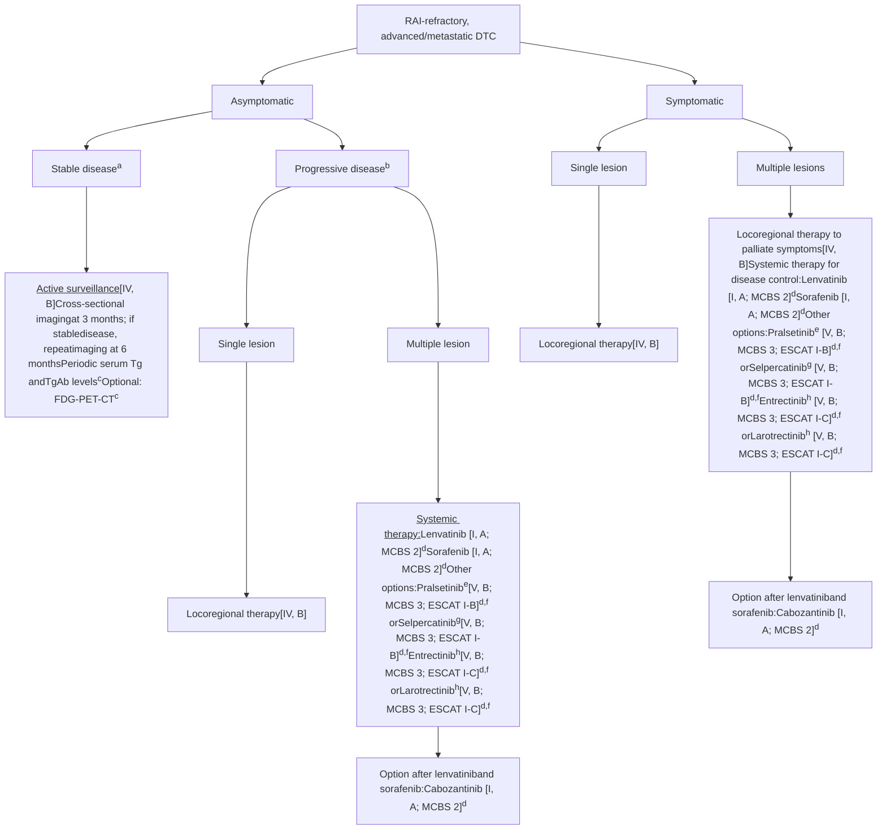

# DATA Framework for Therapy of Radioactive Iodine Resistant (RAIR) DTC

```mermaid
graph LR
    subgraph Headers [" "]
        direction LR
        H1[**D**iagnosis of RAIR DTC] --> H2[**A**ssessment for Progression] --> H3[**T**reatment Decision] --> H4[**A**ssessment for Response]
    end

    Start((RAIR DTC)) --> Staging[Imaging and biochemical staging¹]
    Staging --> Symptom{Symptomatic and/or large volume and/or anatomically threatening disease}
    
    Symptom -- YES --> Genomic1[Comprehensive somatic genomic testing]
    Genomic1 --> Local[Consider local therapy]
    Local --> Decision1{Treatment decision}
    
    Decision1 --> RET_NTRK[RET or NTRK fusion-positive]
    RET_NTRK --> Inhibitor[RET or TRK inhibitor³]
    
    Symptom -- NO --> Serial[Assess progression by serial imaging and Tg²]
    Serial --> Timing[Individualize timing of treatment initiation]
    Timing --> Genomic2[Comprehensive somatic genomic testing]
    Genomic2 --> Wildtype[RET & NTRK wildtype]
    Wildtype --> MKI[Lenvatinib or other MKI³]
    
    Inhibitor --> Response[Assess response and continue if treatment tolerable and no progression⁴]
    MKI --> Response
    
    Response --> Progression([Progression or intolerable side effects  see Figure 10])
```

# DATA Framework for Second-line Therapy of RAIR DTC

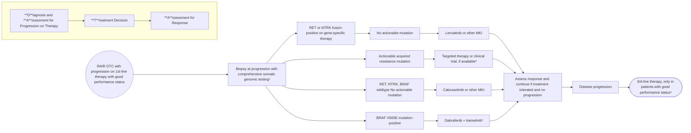

Yellow star icon

# TKI的副作用

* Mucositis
* Nausea/vomiting
* Diarrhea
* Weight loss
* Fatigue
* <span style="color: red">Hypertension (Lenvatinib)</span>
* Proteinuria
* <span style="color: red">Hand foot syndrome (Sorafenib)</span>

Cover of the TKI RAI-Refractory DTC Treatment Booklet showing the title in Chinese and English, and logos of medical societies at the bottom.

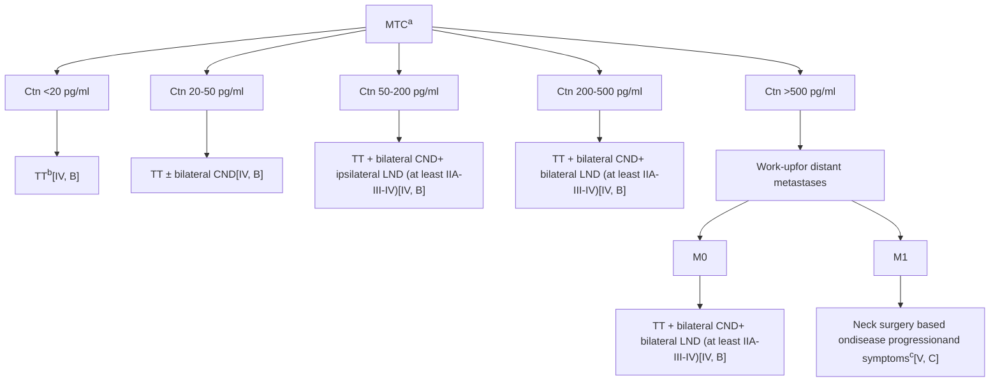

Thyroid cancer: ESMO Clinical Practice Guidelines for diagnosis, treatment and follow-up
Ctn=Calcitonin

**Figure 6.** Recommendations for surgical management of MTC patients.

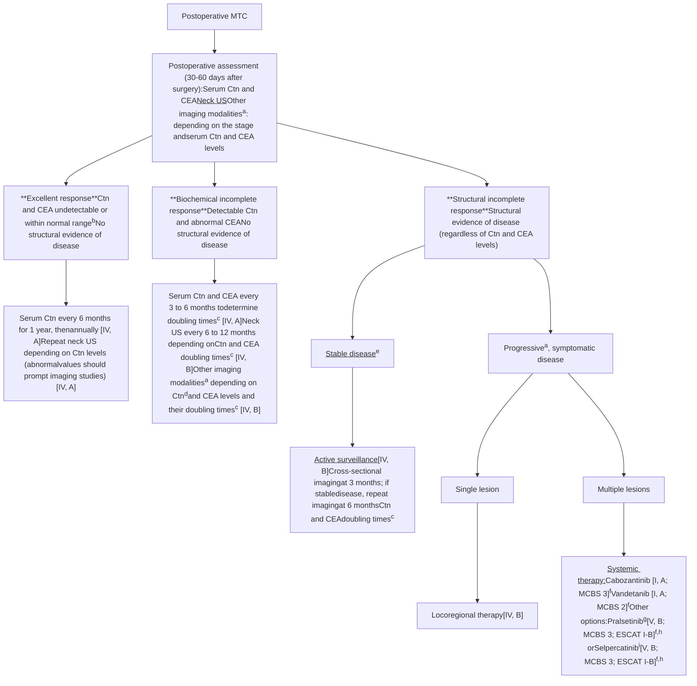

# ATC treatment

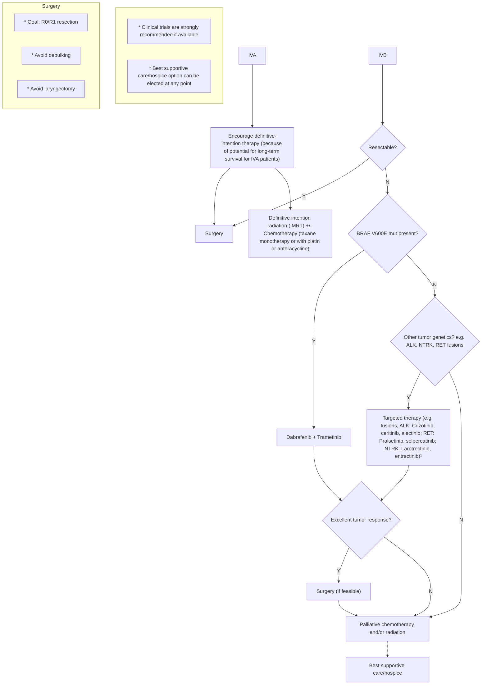

\* **Fig. 12.17** Anaplastic thyroid cancer, initial treatment of stages IVA and IVB. ¹Additional agents exist and are in development; listing not meant to be comprehensive; clinical trials preferred if available; see text. "Cytotoxic chemotherapy may be started as a "bridge" while awaiting genomic information or while awaiting targeted therapy (e.g., dabrafenib and trametinib). Dashed arrows depict circumstances where competing therapeutic options may be of consideration. (Redrawn from Bible KC, Kebebew E, Brierley J, et al. 2021 American Thyroid Association guidelines for management of patients with anaplastic thyroid cancer. Thyroid. 2021;31:337-386.)

# 2021 American Thyroid Association Guidelines for Management of Patients with Anaplastic Thyroid Cancer

* Clinical Trials are strongly recommended if available
* Best Supportive Care/Hospice option can be elected at any point

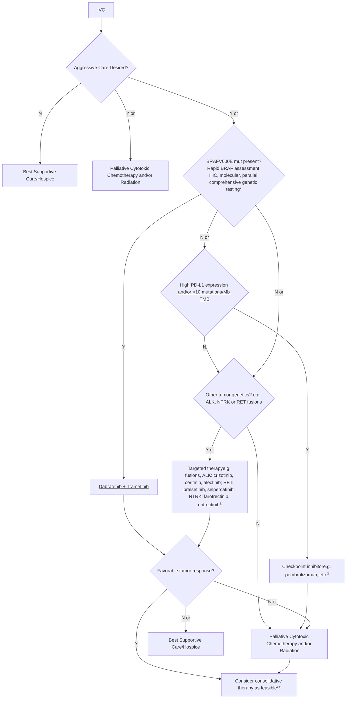

Flowchart for management of Anaplastic Thyroid Cancer Stage IVC

# Pituitary

QR Code

Chapter 6: Pituitary Physiology and Diagnostic Evaluation
Chapter 7: Pituitary Masses and Tumors
Chapter 8: Posterior Pituitary

114年fellow camp：
How do I treat prolactinoma？ - 林思涵醫師
How do I treat acromegaly？ -粘峯榕醫師

QR Code

Diagram showing pituitary gland development and cell lineage differentiation from primordial cells to specific hormone-secreting cells (Gonadotroph, Thyrotroph, Lactotroph, Somatotroph, Corticotroph) with associated transcription factors like Pit-1, Prop-1, Gata-2, and TBX19.


<table>
  <thead>
    <tr>
        <th>Fetal appearance</th>
        <th>12 weeks</th>
        <th>12 weeks</th>
        <th>12 weeks</th>
        <th>8 weeks</th>
        <th>8 weeks</th>
    </tr>
    <tr>
        <th>Hormone</th>
        <th>FSH LH</th>
        <th>TSH</th>
        <th>PRL</th>
        <th>GH</th>
        <th>POMC</th>
    </tr>
  </thead>
  <tbody>
    <tr>
        <td>Chromosomal gene locus</td>
        <td>β-11p; β-19q</td>
        <td>α-6q; β-1p</td>
        <td>6</td>
        <td>17q</td>
        <td>2p</td>
    </tr>
    <tr>
        <td>Protein</td>
        <td>Glycoprotein α, β subunits</td>
        <td>Glycoprotein α, β subunits</td>
        <td>Polypeptide</td>
        <td>Polypeptide</td>
        <td>Polypeptide</td>
    </tr>
    <tr>
        <td>Amino acids</td>
        <td>210 204</td>
        <td>211</td>
        <td>199</td>
        <td>191</td>
        <td>266 (ACTH 1-39)</td>
    </tr>
    <tr>
        <td>Stimulators</td>
        <td>GnRH, estrogen</td>
        <td>TRH</td>
        <td>Estrogen, TRH</td>
        <td>GHRH GHS</td>
        <td>CRH, AVP gp-130 cytokines</td>
    </tr>
    <tr>
        <td>Inhibitors</td>
        <td>Sex steroids, inhibition</td>
        <td>T3, T4, Dopamine, somatostatin glucocorticoids</td>
        <td>Dopamine</td>
        <td>Somatostatin, IGF activins</td>
        <td>Glucocorticoids</td>
    </tr>
    <tr>
        <td>Target gland</td>
        <td>Ovary, testis</td>
        <td>Thyroid</td>
        <td>Breast, other tissues</td>
        <td>Liver, bones, other tissues</td>
        <td>Adrenal</td>
    </tr>
    <tr>
        <td>Trophic effect</td>
        <td>Sex steroid Follicle growth Germ cell maturation</td>
        <td>T4 Synthesis and secretion</td>
        <td>Milk production</td>
        <td>IGF-I production, growth induction, insulin antagonism</td>
        <td>Steroid production</td>
    </tr>
    <tr>
        <td>Normal range</td>
        <td>M, 5-20 IU/L F (basal) 5-20 IU/L</td>
        <td>0.1-5 mU/L</td>
        <td>M &lt;15; F &lt;20 μg/L</td>
        <td>&lt;0.5 μg/L</td>
        <td>ACTH, 4-22 pg/L</td>
    </tr>
  </tbody>
</table>


Fig. 8.2

**Q: combined pituitary hormone deficiency最常見基因？**
A: <mark>Prop-1</mark>

**Q: 何者非Pit-1 lineage？**
A: <mark>Gonadotroph</mark>
B: Thyrotroph
C: Lactotroph
D: Somatotroph

Diagram showing the processing of Pro-opiomelanocortin (POMC) into various peptides like ACTH, MSH, and endorphins by enzymes PC1 and PC2.


<table>
  <thead>
    <tr>
        <th colspan="2">TABLE 6.6</th>
        <th>Tissue Distribution of Melanocortin Receptor (MCR) types</th>
    </tr>
    <tr>
        <th>MC Receptor Types</th>
        <th colspan="2">Tissue</th>
    </tr>
  </thead>
  <tbody>
    <tr>
        <td>MCR1</td>
        <td>Skin, hair follicles</td>
        <td></td>
    </tr>
    <tr>
        <td>MCR2</td>
        <td>Adrenal cortex</td>
        <td></td>
    </tr>
    <tr>
        <td>MCR3</td>
        <td>Hypothalamus, limbic system</td>
        <td></td>
    </tr>
    <tr>
        <td>MCR4</td>
        <td>Hypothalamus, various brain areas,<sup>a</sup> intestines</td>
        <td></td>
    </tr>
    <tr>
        <td>MCR5</td>
        <td>Exocrine glands, skeletal muscle, adrenal cortex</td>
        <td></td>
    </tr>
  </tbody>
</table>

\*<sup>a</sup>Cortex, thalamus, brainstem, and spinal cord.

**PC1**: anterior pituitary, hypothalamus

**PC2**: neurointermediate lobe, hypothalamus, skin, and pancreatic islets (沒有pituitary)

Yellow star icon

**Compression**

also differs. The lactotroph cell is often hyperfunctional as a result of decreased tonic inhibitory signals. PRL deficiency is thus exceedingly rare, except for complete pituitary destruction or genetic syndromes. <mark>The order of diminished trophic hormone reserve function by pituitary compression is usually as follows: GH > FSH > LH > TSH > ACTH.</mark> The cortico-

**Radiation**


<table>
  <thead>
    <tr>
        <th>Years</th>
        <th>TSH</th>
        <th>LH/FSH</th>
        <th>ACTH</th>
        <th>GH</th>
    </tr>
  </thead>
  <tbody>
    <tr>
        <td>0</td>
        <td>1.0</td>
        <td>1.0</td>
        <td>1.0</td>
        <td>1.0</td>
    </tr>
    <tr>
        <td>2</td>
        <td>0.8</td>
        <td>0.7</td>
        <td>0.7</td>
        <td>0.3</td>
    </tr>
    <tr>
        <td>4</td>
        <td>0.7</td>
        <td>0.5</td>
        <td>0.5</td>
        <td>0.1</td>
    </tr>
    <tr>
        <td>6</td>
        <td>0.7</td>
        <td>0.4</td>
        <td>0.4</td>
        <td>0.0</td>
    </tr>
    <tr>
        <td>8</td>
        <td>0.7</td>
        <td>0.4</td>
        <td>0.3</td>
        <td> </td>
    </tr>
    <tr>
        <td>10</td>
        <td>0.6</td>
        <td>0.2</td>
        <td>0.1</td>
        <td> </td>
    </tr>
  </tbody>
</table>


GH>FSH/LH>ACTH>TSH

Williams Textbook of Endocrinology

# Tumours of anterior pituitary

<table>
    <tr>
        <th>2017</th>
        <th>2022</th>
    </tr>
    <tr>
        <td>**PITUITARY ADENOMAS**</td>
        <td><mark>**Pituitary neuroendocrine tumours (PitNETs)**</mark></td>
    </tr>
    <tr>
        <td>Pituitary adenoma</td>
        <td>\* The term **'adenoma'** is replaced by **'tumour'**</td>
    </tr>
    <tr>
        <td>Somatotroph adenoma</td>
        <td>\* **Null cell tumour** is reserved for PitNETs with no evidence of adenohypophyseal lineage differentiation</td>
    </tr>
    <tr>
        <td>Lactotroph adenoma</td>
        <td>\* **Mammosomatotroph and acidophil stem cell tumors** represent distinct PIT1-lineage PitNETs</td>
    </tr>
    <tr>
        <td>Thyrotroph adenoma</td>
        <td>\* **PIT1-positive plurihormonal tumor** is replaced by two clinicopathologically distinct PitNETs: the **immature PIT1-lineage tumor** (formerly known as silent subtype 3 tumor) and the **mature plurihormonal PIT1-lineage tumor**</td>
    </tr>
    <tr>
        <td>Corticotroph adenoma</td>
        <td>EMPTY</td>
    </tr>
    <tr>
        <td>Gonadotroph adenoma</td>
        <td>EMPTY</td>
    </tr>
    <tr>
        <td>Null cell adenoma</td>
        <td>EMPTY</td>
    </tr>
    <tr>
        <td>Plurihormonal &amp; double adenomas</td>
        <td>EMPTY</td>
    </tr>
    <tr>
        <td>**PITUITARY CARCINOMA**</td>
        <td><mark>**Metastatic PitNET**</mark></td>
    </tr>
    <tr>
        <td>**PITUITARY BLASTOMA**</td>
        <td>EMPTY</td>
    </tr>
    <tr>
        <td>**CRANIOPHARYNGIOMA**</td>
        <td>EMPTY</td>
    </tr>
    <tr>
        <td>Adamantinomatous craniopharyngioma</td>
        <td>EMPTY</td>
    </tr>
    <tr>
        <td>Papillary craniopharyngioma</td>
        <td>EMPTY</td>
    </tr>
</table>

Red star icon


<table>
  <thead>
    <tr>
        <th colspan="6">TABLE 7.11</th>
        <th>Classification of Pituitary Adenomas</th>
    </tr>
    <tr>
        <th>Adenoma</th>
        <th>Transcription Factors</th>
        <th>Hormones</th>
        <th>Keratin (CAM5.2 or CK18)</th>
        <th>Pathologic Subtype</th>
        <th colspan="2">Phenotype</th>
    </tr>
    <tr>
        <th colspan="7">PIT1 lineage</th>
    </tr>
  </thead>
  <tbody>
    <tr>
        <td rowspan="2">Somatotroph</td>
        <td>PIT1</td>
        <td>GH, α-subunit</td>
        <td>Perinuclear</td>
        <td>Densely granulated</td>
        <td>Acromegaly, gigantism</td>
        <td></td>
    </tr>
    <tr>
        <td>PIT1</td>
        <td>GH</td>
        <td>Fibrous bodies (&gt;70%)</td>
        <td>Sparsely granulated</td>
        <td> </td>
        <td></td>
    </tr>
    <tr>
        <td rowspan="2">Lactotroph</td>
        <td>PIT1, ERα</td>
        <td>PRL (paranuclear)</td>
        <td>Weak or negative</td>
        <td>Sparsely granulated</td>
        <td rowspan="2">Hyperprolactinemia</td>
        <td></td>
    </tr>
    <tr>
        <td>PIT1, ERα</td>
        <td>PRL (diffuse cytoplasmic)</td>
        <td>Weak or negative</td>
        <td>Densely granulated</td>
        <td></td>
    </tr>
    <tr>
        <td>Mammosomatotroph</td>
        <td>PIT1, ERα</td>
        <td>GH (often predominant), PRL, α-subunit</td>
        <td>Perinuclear</td>
        <td> </td>
        <td>Acromegaly, hyperprolactinemia</td>
        <td></td>
    </tr>
    <tr>
        <td>Thyrotroph</td>
        <td>PIT1, GATA2/3</td>
        <td>β-TSH, α-subunit</td>
        <td>Weak or negative</td>
        <td> </td>
        <td>Hyperthyroidism</td>
        <td></td>
    </tr>
    <tr>
        <td>Mature PIT1 lineage</td>
        <td>PIT1, ERα, GATA2/3</td>
        <td>GH (often predominant), PRL, α-subunit, TSH-β</td>
        <td>Perinuclear</td>
        <td> </td>
        <td>Acromegaly, hyperprolactinemia, hyperthyroidism</td>
        <td></td>
    </tr>
    <tr>
        <td>Acidophil stem cell</td>
        <td>PIT1, ERα</td>
        <td>PRL (predominant) GH (focal/variable)</td>
        <td>Scattered fibrous bodies</td>
        <td> </td>
        <td>Acromegaly, hyperprolactinemia</td>
        <td></td>
    </tr>
    <tr>
        <td>Immature PIT1 lineage</td>
        <td>PIT1, ERα, GATA2/3</td>
        <td>GH, PRL, α-subunit, TSH-β</td>
        <td>Focal/variable</td>
        <td> </td>
        <td>Acromegaly, hyperprolactinemia, hyperthyroidism</td>
        <td></td>
    </tr>
    <tr>
        <th colspan="7">TPIT lineage</th>
    </tr>
    <tr>
        <td rowspan="3">Corticotroph</td>
        <td rowspan="3">TPIT (TBX19), NeuroD1 (β2)</td>
        <td rowspan="3">ACTH and other POMC derivatives</td>
        <td>Strong</td>
        <td>Densely granulated</td>
        <td rowspan="3">Cushing disease</td>
        <td></td>
    </tr>
    <tr>
        <td>Variable</td>
        <td>Sparsely granulated</td>
        <td></td>
    </tr>
    <tr>
        <td>Intense ring-like perinuclear</td>
        <td>Crooke cell</td>
        <td></td>
    </tr>
    <tr>
        <th colspan="7">SF1 lineage</th>
    </tr>
    <tr>
        <td>Gonadotroph</td>
        <td>SF-1, ERα, GATA2/3,</td>
        <td>α-subunit, β-FSH, β-LH</td>
        <td>Variable</td>
        <td> </td>
        <td>Hypogonadism, rarely hypergonadism</td>
        <td></td>
    </tr>
    <tr>
        <th colspan="7">No distinct cell lineage</th>
    </tr>
    <tr>
        <td>Unclassified plurihormonal</td>
        <td>Multiple combinations</td>
        <td>Multiple combinations</td>
        <td>Variable</td>
        <td> </td>
        <td>Variable</td>
        <td></td>
    </tr>
    <tr>
        <td>Null cell</td>
        <td>None</td>
        <td>None</td>
        <td>Variable</td>
        <td> </td>
        <td>None</td>
        <td></td>
    </tr>
  </tbody>
</table>


FSH, follicle-stimulating hormone; GH, growth hormone; POMC, pro-opiomelanocortin; PRL, prolactin; TSH, thyroid-stimulating hormone.

Modified from Lopes MBS, Asa SL, Kleinschmidt-DeMasters BK, et al. Pituitary adenoma/pituitary neuroendocrine tumor. In: WHO Classification of Tumors Editorial Board, ed. *WHO Classification of Tumours: Central Nervous System Tumours*, 5th ed. IARC; 2022.

Yellow star icon


<table>
  <thead>
    <tr>
        <th>Tumor size</th>
        <th>分泌的hormone</th>
    </tr>
  </thead>
  <tbody>
    <tr>
        <td>多為small PitNET(&lt;1cm)</td>
        <td>ACTH, Prolactin</td>
    </tr>
    <tr>
        <td>多為large PitNET(≥1cm)</td>
        <td>GH, TSH</td>
    </tr>
  </tbody>
</table>
<table>
  <thead>
    <tr>
        <th> </th>
        <th>Surgery</th>
        <th>Radiotherapy</th>
        <th>Medical</th>
    </tr>
  </thead>
  <tbody>
    <tr>
        <td>Non-functioning</td>
        <td>1</td>
        <td>2</td>
        <td>2</td>
    </tr>
    <tr>
        <td>Acromegaly</td>
        <td>1</td>
        <td>2</td>
        <td>2</td>
    </tr>
    <tr>
        <td>TSH-oma</td>
        <td>1</td>
        <td>2</td>
        <td>2</td>
    </tr>
    <tr>
        <td>Cushing’s<br/>disease</td>
        <td>1</td>
        <td>2</td>
        <td>2</td>
    </tr>
    <tr>
        <td>Prolactinoma</td>
        <td>2</td>
        <td>2</td>
        <td>1</td>
    </tr>
  </tbody>
</table>


> 不會分泌賀爾蒙的pitNET多為gonadotroph or corticotroph

腦垂體專刊

Star icon

# TABLE 6.9 Assessment of Anterior Pituitary Function


<table>
  <thead>
    <tr>
        <th colspan="4">TABLE 6.9 Assessment of Anterior Pituitary Function</th>
    </tr>
    <tr>
        <th>Test</th>
        <th>Dose</th>
        <th>Normal Response</th>
        <th>Side Effects</th>
    </tr>
    <tr>
        <th colspan="4">ACTH</th>
    </tr>
  </thead>
  <tbody>
    <tr>
        <td>Insulin tolerance</td>
        <td>0.1–0.15 U/kg IV</td>
        <td>Peak cortisol &gt;18 µg/dL,<br/>or increase by ≥7 µg/dL</td>
        <td>Sweating, palpitation, tremor</td>
    </tr>
    <tr>
        <td>Metyrapone<br/>Max: 3g</td>
        <td>Oral administration of 30 mg/kg<br/>at 11 PM</td>
        <td>Peak 11-DOC ≥7 µg/dL<br/>Peak cortisol ≤7 µg/dL<br/>Peak ACTH &gt;75 pg/mL</td>
        <td>Nausea, insomnia, adrenal crisis</td>
    </tr>
    <tr>
        <td>CRH stimulation</td>
        <td>100 µg IV</td>
        <td>Peak ACTH ≥ two- to fourfold<br/>Peak cortisol ≥20 µg/dL,<br/>or increase by ≥7 µg/dL</td>
        <td>Flushing</td>
    </tr>
    <tr>
        <td>ACTH stimulation</td>
        <td>250 µg IV or IM or 1 µg IV</td>
        <td>Peak cortisol ≥20 µg/dL</td>
        <td>Rare</td>
    </tr>
    <tr>
        <th colspan="4">TSH</th>
    </tr>
    <tr>
        <td>Serum free T₄<br/>Total T₃<br/>TSH—third generation<br/>TRH stimulation</td>
        <td>200–500 µg IV</td>
        <td>Peak TSH ≥2.5-fold or increase by ≥5–6 mU/L<br/>(females), ≥2–3 mU/L (males)</td>
        <td>Flushing, nausea, urge to micturate</td>
    </tr>
    <tr>
        <th colspan="4">PRL</th>
    </tr>
    <tr>
        <td>Serum PRL<br/>TRH stimulation</td>
        <td>200–500 µg IV</td>
        <td>PRL ≥2.5-fold</td>
        <td>Flushing, nausea, urge to micturate</td>
    </tr>
    <tr>
        <th colspan="4">LH/FSH</th>
    </tr>
    <tr>
        <td>Serum LH and FSH<br/>Serum testosterone<br/>GnRH stimulation</td>
        <td>100 µg IV</td>
        <td>Elevated in menopause and in men with<br/>primary testicular failure<br/>300–900 ng/mL<br/>LH ≥ two- to threefold, or by 10 IU/L<br/>FSH 1.5- to 2-fold, or by 2 IU/L</td>
        <td>Rare</td>
    </tr>
    <tr>
        <th colspan="4">GH</th>
    </tr>
    <tr>
        <td>Insulin tolerance</td>
        <td>0.1–0.15 U/kg IV</td>
        <td>GH peak &gt;5 µg/L</td>
        <td>Sweating, palpitation, tremor</td>
    </tr>
    <tr>
        <td>Glucagon</td>
        <td>1–1.5 mg IM</td>
        <td>GH peak &gt;3 µg/L Obesity: &gt;1</td>
        <td>Nausea, headaches</td>
    </tr>
    <tr>
        <td>L-Arginine</td>
        <td>0.5 g/kg (max 30 g)<br/>IV over 30–120 min</td>
        <td> </td>
        <td>Nausea</td>
    </tr>
    <tr>
        <td>L-Arginine plus GHRH</td>
        <td>1–5 µg/kg IV</td>
        <td>GH peak &gt;5 µg/L</td>
        <td>Flushing</td>
    </tr>
  </tbody>
</table>


\*ACTH, adrenocorticotropic hormone; CRH, corticotropin-releasing hormone; 11-DOC, 11-deoxycorticosterone; FSH, follicle-stimulating hormone; GH, growth hormone; GHRH, growth hormone–releasing hormone; GnRH, gonadotropin-releasing hormone; IM, intramuscular; IV, intravenous; LH, luteinizing hormone; PRL, prolactin; T₃, triiodothyronine; T₄, thyroxine; TRH, thyrotropin-releasing hormone; TSH, thyroid-stimulating hormone.

Treat other hormone deficiency before provocative tests for growth hormone deficiency:

* Glucocorticoid deficiency leads to a decreased GH secretion due to decreased expression of GHRH and GH secretagogue receptors.

* Patients with hypothyroidism have decreased GH secretion and blunted responses to GH provocative tests.

* Estrogen increases the basal GH secretion rate.

* Testosterone stimulates greater GH secretory burst mass.

Obesity blunts the response to GH provocative tests.

#  BOX 6.2 Causes of Acquired Hypopituitarism

**Traumatic**
Surgical resection
Radiation damage
Traumatic brain injury

**Infiltrative/Inflammatory**
Primary hypophysitis
- Lymphocytic
- Granulomatous
- Xanthomatous
Secondary hypophysitis
- Cancer immune checkpoint inhibitor therapy
- Sarcoidosis
- Histiocytosis X
- Wegener granulomatosis
- Takayasu disease
- Hemochromatosis

**Infections**
Tuberculosis
Fungal (Pneumocytis jirovecii, histoplasmosis, aspergillosis)
Parasitic (toxoplasmosis)
Viral (cytomegalovirus)

**Vascular**
Pregnancy-related (Sheehan syndrome)
Aneurysm
Apoplexy
Diabetes
Subarachnoid hemorrhage
Sickle cell disease

**Neoplastic**
Pituitary adenoma
Parasellar mass
- Rathke's cyst
- Dermoid cyst
- Meningioma
- Germinoma
- Ependymoma
- Glioma
Craniopharyngioma
Hypothalamic hamartoma, gangliocytoma
Metastases
Hematologic malignancy
- Leukemia
- Lymphoma

# Prolactin

Diagram illustrating the levels and mechanisms of prolactin regulation, showing the hypothalamus, anterior pituitary, and systemic circulation with various stimulatory and inhibitory factors such as TRH, VIP, Dopamine, and conditions like hypothyroidism and renal failure.

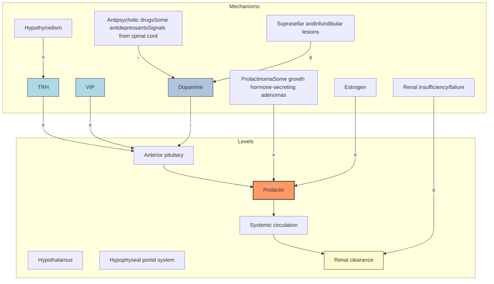

Red star logo


<table>
  <thead>
    <tr>
        <th colspan="5">表一 常見高泌乳素血症的原因（改編自第十四版 Williams 第 8 章）</th>
    </tr>
    <tr>
        <th colspan="5">生理性</th>
    </tr>
  </thead>
  <tbody>
    <tr>
        <td> </td>
        <td>懷孕</td>
        <td>哺乳</td>
        <td>壓力</td>
        <td>睡眠</td>
    </tr>
    <tr>
        <td> </td>
        <td>性交</td>
        <td>運動</td>
        <td> </td>
        <td> </td>
    </tr>
    <tr>
        <th colspan="5">病理性</th>
    </tr>
    <tr>
        <td rowspan="4">下視丘 - 腦垂體柄損傷</td>
        <td>腫瘤</td>
        <td>顱咽管瘤</td>
        <td>腦膜瘤</td>
        <td>下視丘轉移</td>
    </tr>
    <tr>
        <td>浸潤</td>
        <td>幅射</td>
        <td>Rathke's cyst</td>
        <td> </td>
    </tr>
    <tr>
        <td>腦垂體上腫瘤擴展</td>
        <td> </td>
        <td>生殖細胞瘤</td>
        <td>肉芽腫</td>
    </tr>
    <tr>
        <td colspan="4">創傷：腦垂體柄截切，鞍手術，頭部外傷</td>
    </tr>
    <tr>
        <td rowspan="3">腦垂體</td>
        <td>泌乳素瘤</td>
        <td>肢端肥大症</td>
        <td>大腺瘤（壓迫性）</td>
        <td> </td>
    </tr>
    <tr>
        <td>不明原因</td>
        <td>鞍旁腫瘤</td>
        <td>多激素腦垂體腺瘤</td>
        <td> </td>
    </tr>
    <tr>
        <td>淋巴細胞性腦垂體炎</td>
        <td> </td>
        <td>大分子泌乳素血症</td>
        <td> </td>
    </tr>
    <tr>
        <td rowspan="3">系統性疾病</td>
        <td>肝硬化</td>
        <td>癲癇發作</td>
        <td>慢性腎功能衰竭</td>
        <td> </td>
    </tr>
    <tr>
        <td>顱照射</td>
        <td>假單胞菌病</td>
        <td>多囊泡卵巢症</td>
        <td> </td>
    </tr>
    <tr>
        <td colspan="4">胸部：神經源性，胸壁外傷，手術，帶狀皰疹</td>
    </tr>
    <tr>
        <th colspan="5">遺傳</th>
    </tr>
    <tr>
        <td> </td>
        <td colspan="4">泌乳素受體失去活性的突變</td>
    </tr>
  </tbody>
</table>
<table>
  <thead>
    <tr><th colspan="4">表二 藥理上相關的高泌乳素血症的原因（改編自第十四版 Williams 第 8 章）</th></tr>
    <tr><th colspan="4">神經肽</th></tr>
  </thead>
  <tbody>
    <tr>
        <td> </td>
        <td colspan="4">甲狀腺促素釋素 (TRH)</td>
    </tr>
    <tr>
        <td rowspan="3">多巴胺受體阻斷劑</td>
        <td colspan="4">Phenothiazines: chlorpromazine, perphenazine</td>
    </tr>
    <tr>
        <td colspan="4">Butyrophenones: haloperidol</td>
    </tr>
    <tr>
        <td>Thioxanthenes</td>
        <td>Metoclopramide</td>
        <td> </td>
        <td> </td>
    </tr>
    <tr><td rowspan="2">多巴胺合成抑制劑</td></tr>
    <tr>
        <td>α-Methyldopa</td>
        <td> </td>
        <td> </td>
        <td> </td>
    </tr>
    <tr><td rowspan="2">兒茶酚胺消耗劑</td></tr>
    <tr>
        <td>Reserpine</td>
        <td> </td>
        <td> </td>
        <td> </td>
    </tr>
    <tr><td rowspan="2">膽鹼促效劑</td></tr>
    <tr>
        <td>Physostigmine</td>
        <td> </td>
        <td> </td>
        <td> </td>
    </tr>
    <tr><td rowspan="2">降血壓藥</td></tr>
    <tr>
        <td>Labetalol</td>
        <td>Reserpine</td>
        <td>Verapamil</td>
        <td> </td>
    </tr>
    <tr><td rowspan="2">H₂ 抗組織胺</td></tr>
    <tr>
        <td>Cimetidine</td>
        <td>Ranitidine</td>
        <td> </td>
        <td> </td>
    </tr>
    <tr><td rowspan="3">雌性素</td></tr>
    <tr>
        <td colspan="4">口服避孕藥</td>
    </tr>
    <tr>
        <td colspan="4">停止口服避孕藥</td>
    </tr>
    <tr><td rowspan="2">抗癲癇藥物</td></tr>
    <tr>
        <td>Phenytoin</td>
        <td> </td>
        <td> </td>
        <td> </td>
    </tr>
    <tr><td rowspan="5">抗精神病藥物</td></tr>
    <tr>
        <td>Chlorpromazine</td>
        <td>Risperidone</td>
        <td>Promazine</td>
        <td>Promethazine</td>
    </tr>
    <tr>
        <td>Trifluoperazine</td>
        <td>Fluphenazine</td>
        <td>Butaperazine</td>
        <td>Perphenazine</td>
    </tr>
    <tr>
        <td>Thiethylperazine</td>
        <td>Thioridazine</td>
        <td>Haloperidol</td>
        <td>Pimozide</td>
    </tr>
    <tr>
        <td>Thiothixene</td>
        <td>Molindone</td>
        <td> </td>
        <td> </td>
    </tr>
    <tr><td rowspan="2">類鴉片和類鴉片促效劑</td></tr>
    <tr>
        <td>Heroin</td>
        <td>Methadone</td>
        <td>Apomorphine</td>
        <td>Morphine</td>
    </tr>
    <tr><td rowspan="3">抗憂鬱劑</td></tr>
    <tr>
        <td colspan="4">Tricyclic antidepressants: clomipramine, amitriptyline</td>
    </tr>
    <tr>
        <td colspan="4">Selective serotonin reuptake inhibitors: fluoxetine</td>
    </tr>
  </tbody>
</table>


**Q**: 何者不會使prolactin上升？
**A**: Hypothyroidism
**B**: Renal failure
**C**: Metoclopramide
**D**: <mark>Sheehan syndrome</mark>

Red star logo

# Hook effect

Illustration of the radioimmunoassay for prolactin (PRL) showing sandwich formation and failure of sandwich formation due to excess antigen (hook effect).

過高的PRL濃度可能會讓capture antibody和signal antibody飽和導致偽陰性。因此在臨床懷疑 hyperprolactinemia 影像上呈現macroadenomas的病人檢體應至少稀釋1:100倍

**Q: 女性月經沒來、溢乳，影像 macroadenoma，PRL 130ng/dL，下一步？**
**A: 稀釋後再驗一次**

# Macroprolactin

* Macroprolactin = prolactin + anti-prolactin autoantibodies (mostly IgG)
* 臨床懷疑：PRL輕度升高，沒有典型臨床/影像表現
* 診斷：PEG (polyethylene glycol) 聚乙二醇沉澱法，Recovery rate <40%

**Q: 無症狀，PRL 150ng/dL，MRI正常，下一步？**
**A: 懷疑macroprolactin，加入PEG再驗**

# a Selecting a first-line treatment

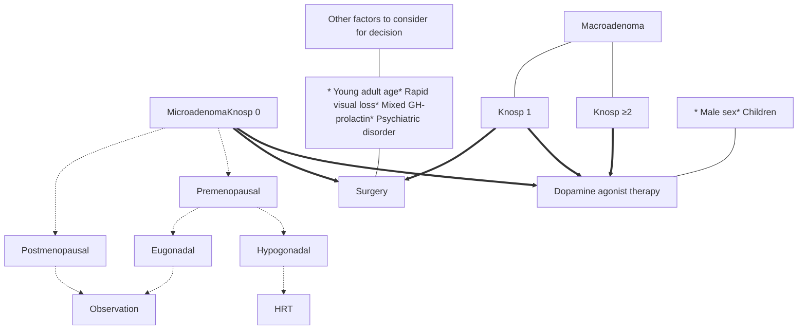

# BOX 7.3 Management of Pregnancy-Associated Prolactinomas

## Prolactinoma management in fertile women

During fertile years, cabergoline treatment is indicated

<u>Macroadenoma mass should be reduced as much as possible before conception</u>

Risks and benefits of surgical resection should be discussed with the patient before and after conception

## Planned pregnancy

Barrier contraception should be initiated concomitant with DA treatment
Allow 2—3 normal menses to occur
Stop contraception and perform periodic hCG testing
Upon positive hCG test, discontinue DA

## Spontaneous pregnancy

<u>DA should be discontinued as soon as pregnancy confirmed</u>

Expansion risk is <5% for microprolactinoma and is ~50% for macroprolactinoma

If headache or visual disturbances arise, perform visual field tests

If symptoms are worrisome, pituitary MRI without gadolinium is indicated

If adenoma expansion is of concern during second or third trimester, DA should be restarted

Risks and benefits of surgical adenoma resection should be offered to the patient

Vaginal delivery may proceed, but the rare possibility of pituitary apoplexy should be discussed with the obstetrician

Postpartum MRI should be performed after 6 weeks

Lactation is not contraindicated if the patient is not being treated with DA
Follow-up 6 and 12 months after delivery

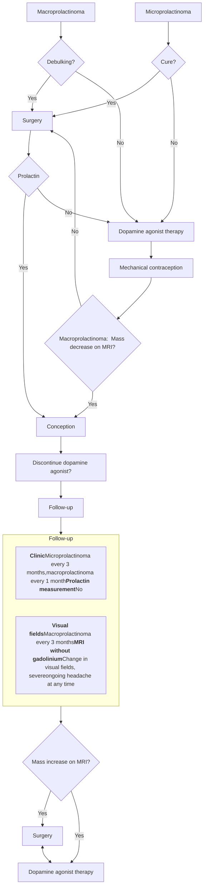

# 2023 Prolactinoma consensus

**Pregnancy and fertility**

* Patients with prolactinoma considering pregnancy should be informed about both medical and surgical options (strong).
* A comprehensive examination performed shortly before pregnancy provides baseline information on serum levels of prolactin, visual fields and adenoma size (weak).
* Patients desiring fertility and undergoing pituitary surgery before pregnancy should be informed of the potential risk of hypopituitarism and its impact on fertility (strong).
* Mechanical contraception should be used instead of hormonal forms of contraception to confirm treatment efficacy before pregnancy and establish the menstrual interval (weak).
* To reduce exposure of the developing fetus to dopamine agonist therapy, dopamine agonists should be discontinued as soon as pregnancy is confirmed (strong).
* In patients with large macroprolactinomas, maintenance of dopamine agonist therapy during pregnancy is also an option (strong).
* <u>Although bromocriptine might reduce fetal exposure due to its shorter half-life, cabergoline is now preferred by the majority of centres owing to increasing safety data (weak).</u>
* In patients with macroprolactinoma, adenoma response to dopamine agonist therapy should be confirmed prior to conception (strong). In those without mass response, surgery should be considered prior to conception (strong).
* Pregnancy in patients with microprolactinomas is usually uneventful, and patients should be followed clinically every 3 months (strong).
* Patients with macroprolactinoma have a risk of clinically relevant adenoma expansion and apoplexy during pregnancy. Patients should be seen monthly during pregnancy and questioned about local mass effects, and should undergo visual field evaluation every 3 months (strong).
* Patients with suspicion of clinically relevant adenoma growth during pregnancy should undergo MRI without gadolinium (strong).
* Re-initiation of dopamine agonist therapy that was discontinued at conception should be considered in patients with clinically relevant adenoma growth (strong).
* In patients with an enlarged adenoma that does not respond to re-initiation of dopamine agonist therapy, consideration should be given to pituitary surgery or delivery if the pregnancy is sufficiently advanced (strong).
* Serum levels of prolactin should not be used to assess for adenoma growth during pregnancy (strong).
* Breastfeeding is usually not contraindicated and could be allowed for a period depending on whether treatment reintroduction is needed for mass control (strong).

# Growth hormone

Red star icon

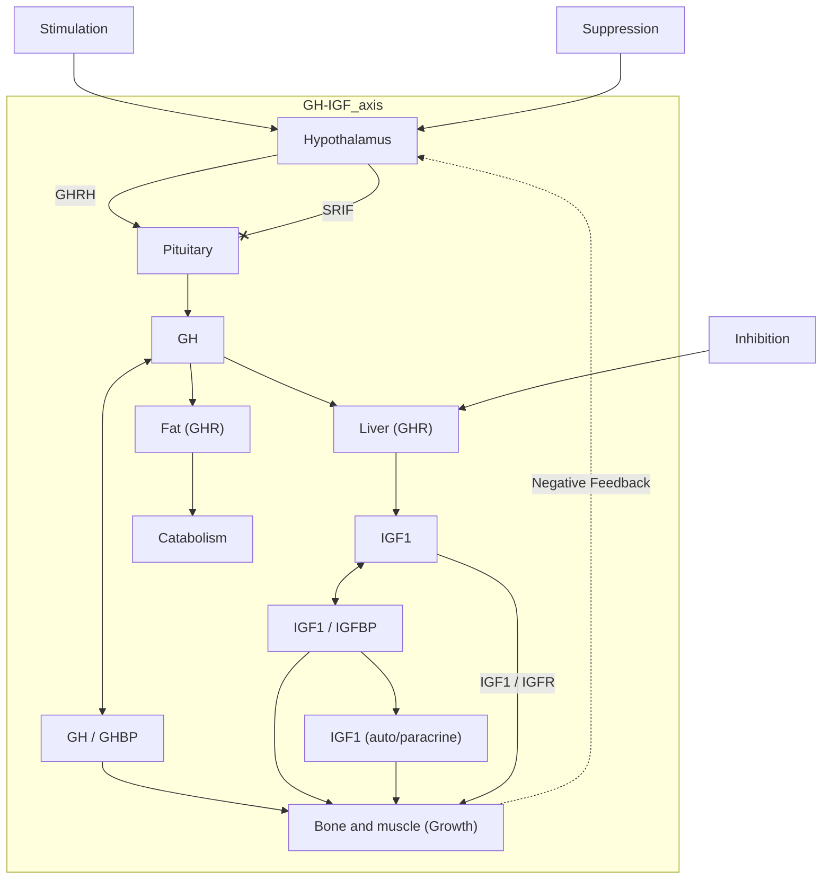

**Stimulation**
* Deep sleep
* $\alpha$-Adrenergic
* Fasting
* Acetylcholine
* Sex steroids
* Stress
* Amino acids
* Hypoglycemia
* Ghrelin

**Suppression**
* Obesity
* $\beta$-Adrenergic
* Glucocorticoids
* FFA
* Glucose
* Hypothyroidism
* IGF1

**Inhibition**
* Undernutrition
* Acute illness
* Chronic illness
* GH receptor deficiency
* GHR antibodies
* IGF1 receptor deficiency

**Q: 何者不會上升GH？**
* A: Deep sleep [ ]
* B: Fasting [ ]
* C: <mark><font color="red">Obesity</font></mark> [ ]
* D: Ghrelin [ ]

# TABLE 6.4 Adult Somatotropin Deficiency


<table>
  <thead>
    <tr>
        <th>Clinical Consequence</th>
        <th>Effect of GH Replacement</th>
    </tr>
    <tr>
        <th><strong>Body Composition</strong></th>
        <th> </th>
    </tr>
  </thead>
  <tbody>
    <tr>
        <td>General and central adiposity</td>
        <td>Decrease</td>
    </tr>
    <tr>
        <td>Reduced lean mass</td>
        <td>Increase</td>
    </tr>
    <tr>
        <td>Reduced bone mass</td>
        <td>Increase</td>
    </tr>
    <tr>
        <th><strong>Function</strong></th>
        <th> </th>
    </tr>
    <tr>
        <td>Reduced exercise capacity</td>
        <td>Improve</td>
    </tr>
    <tr>
        <td>Impaired anaerobic capacity</td>
        <td>Improve</td>
    </tr>
    <tr>
        <td>Muscle weakness</td>
        <td>Increase</td>
    </tr>
    <tr>
        <td>Impaired cardiac function</td>
        <td>Improve</td>
    </tr>
    <tr>
        <td>Hypohydrosis</td>
        <td>Increase</td>
    </tr>
    <tr>
        <th><strong>Quality of Life</strong></th>
        <th> </th>
    </tr>
    <tr>
        <td>Low mood</td>
        <td>Improve</td>
    </tr>
    <tr>
        <td>Fatigue</td>
        <td>Improve</td>
    </tr>
    <tr>
        <td>Low motivation</td>
        <td>Improve</td>
    </tr>
    <tr>
        <td>Reduced satisfaction</td>
        <td>Improve</td>
    </tr>
    <tr>
        <th><strong>Cardiovascular Risk Profile</strong></th>
        <th> </th>
    </tr>
    <tr>
        <td>Abnormal lipid profile</td>
        <td>Improve</td>
    </tr>
    <tr>
        <td>Insulin resistance</td>
        <td>No change</td>
    </tr>
    <tr>
        <td>Increased inflammatory markers</td>
        <td>Decrease</td>
    </tr>
    <tr>
        <td>Intimal media thickening</td>
        <td>Decrease</td>
    </tr>
    <tr>
        <th><strong>Laboratory</strong></th>
        <th> </th>
    </tr>
    <tr>
        <td>Low IGF-1 (in 50%–60%)</td>
        <td>Increase</td>
    </tr>
    <tr>
        <td>Hyperinsulinemia</td>
        <td>Improve</td>
    </tr>
    <tr>
        <td>High LDL and low HDL cholesterol</td>
        <td>Improve</td>
    </tr>
  </tbody>
</table>


# BOX 6.3 Side Effects of Adult Growth Hormone Treatment

* Edema
* Arthralgias
* Myalgias
* Muscle stiffness
* Paresthesia
* Carpal tunnel syndrome
* Atrial fibrillation
* Headache
* Benign intracranial hypertension
* Increase in melanocytic nevi
* Hyperglycemia
* Sleep apnea

**Q: 何者非GH治療的副作用？**
* A: Edema [ ]
* B: Arthralgia [ ]
* C: Carpal tunnel syndrome [ ]
* D: <mark>hyperlipidemia</mark> [ ]

```mermaid
graph TD
    subgraph Primary_GH_excess [Primary GH excess]
        P1_SST[SST] -- "-" --> P1_Pituitary((Pituitary))
        P1_GHRH[GHRH] -- "+" --> P1_Pituitary
        P1_Pituitary -- GH --> P1_Liver[Liver]
        P1_Liver -- IGF1 --> P1_Pituitary
        P1_Pituitary -- GH --> P1_Somatic[Somatic growthmetabolicdysfunction]
        P1_Liver -- "+" --> P1_Somatic
    end

    subgraph Extrapituitary_GH_excess [Extrapituitary GH excess]
        P2_SST[SST] -- "-" --> P2_Pituitary((Pituitary))
        P2_GHRH[GHRH] -- "+" --> P2_Pituitary
        P2_Ectopic_GH[GH] --> P2_GH_Path{ }
        P2_Pituitary -- GH --> P2_GH_Path
        P2_GH_Path --> P2_Liver[Liver]
        P2_Liver -- IGF1 --> P2_Pituitary
        P2_GH_Path --> P2_Somatic[Somatic growthmetabolicdysfunction]
        P2_Liver -- "+" --> P2_Somatic
    end

    subgraph GHRH_excess [GHRH excess]
        P3_SST[SST] -- "-" --> P3_Pituitary((Pituitary))
        P3_GHRH_In[GHRH] -- "+" --> P3_Pituitary
        P3_Ectopic_GHRH[GHRH] --> P3_GHRH_In
        P3_Pituitary -- GH --> P3_Liver[Liver]
        P3_Liver -- IGF1 --> P3_Pituitary
        P3_Pituitary -- GH --> P3_Somatic[Somatic growthmetabolicdysfunction]
        P3_Liver -- "+" --> P3_Somatic
    end
```

*Pituitary adenoma*
Densely granulated GH cell
Sparsely granulated
Mixed GH cell and PRL
Mammosomatotroph cell
Acidophil stem cell
Plurihormonal
Silent somatotroph

*Pituitary carcinoma*

*Ectopic*

Pancreatic islet cell tumor
Lymphoma

Iatrogenic

*Central*
Hypothalamic tumor

*Peripheral*
Bronchial carcinoid
Pancreatic islet cell tumor
Small cell lung cancer
Adrenal adenoma
Medullary thyroid carcinoma
Pheochromocytoma

**Familial syndromes**

Multiple endocrine neoplasia-type I
McCune-Albright syndrome
Familial acromegaly
Carney complex

**Q: 何者不會造成acromegaly？**
A: MEN1
B: MAS
C: Carney compex
D: <mark>APS1</mark>

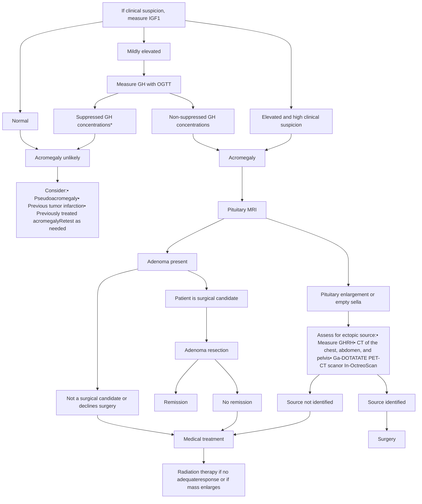

\*Up to 30% of patients with GH excess may not suppress in response to OGTT

75 g glucose and GH measured during 2 hours.

Disease control implies nadir GH level of less than 1 μg/L after OGTT using standard assays and less than 0.4 μg/L using ultrasensitive assays

# 2024 Pituitary consensus

**Table 1** Evolution of criteria for acromegaly diagnosis and evaluation of therapeutic efficacy


<table>
  <thead>
    <tr>
        <th> </th>
        <th>Diagnosis</th>
        <th>Therapeutic efficacy target</th>
    </tr>
  </thead>
  <tbody>
    <tr>
        <td>1st Acromegaly consensus<br/>[3]</td>
        <td>IGF-I elevated for age and sex<br/>Confirm with random GH ≥0.4 μg/L<br/><em>or</em><br/>IGF-I elevated for age and sex<br/>Confirm with GH &gt; 1 μg/L during OGTT</td>
        <td>IGF-I normalized for age and sex<br/>GH &lt;1 μg/L during OGTT</td>
    </tr>
    <tr>
        <td>7th Acromegaly consensus<br/>[4]</td>
        <td>IGF-I elevated for age and sex<br/><em>and</em><br/>Random GH elevated</td>
        <td>Random GH &lt;1 μg/L<br/>GH &lt;0.4 μg/L during OGTT</td>
    </tr>
    <tr>
        <td>Endocrine society guidelines<br/>[5]</td>
        <td>IGF-I elevated for age<br/>Confirm with GH &gt; 1 μg/L during OGTT</td>
        <td>IGF-I normalized for age<br/>Random GH &lt;1 μg/L</td>
    </tr>
    <tr>
        <td>14th Acromegaly consensus<br/>(this publication)</td>
        <td>IGF-I &gt; 1.3 × ULN for age<br/><em>and</em><br/>Characteristic clinical signs of disease<br/>For equivocal results, IGF-I measurements can be repeated, and<br/>OGTT might additionally be useful</td>
        <td>IGF-I normalized for age</td>
    </tr>
  </tbody>
</table>


*GH* growth hormone; *IGF-I* insulin-like growth factor I; *OGTT* oral glucose tolerance test; *ULN* upper limit of normal

# TABLE 7.23 Acromegaly Subclassification for Precise, Personalized Approaches to Therapy


<table>
  <thead>
    <tr><th> </th><th> </th><th colspan="2">ACROMEGALY TYPES</th></tr>
    <tr>
        <th> </th>
        <th> </th>
        <th>Type 1</th>
        <th>Type 2</th>
        <th>Type 3</th>
    </tr>
  </thead>
  <tbody>
    <tr>
        <td colspan="2">Frequency</td>
        <td>50%</td>
        <td>19%</td>
        <td>31%</td>
    </tr>
    <tr>
        <td rowspan="4">Tumor</td>
        <td>Tumor shape and CSI</td>
        <td>Concave</td>
        <td>Flat</td>
        <td>Peanut</td>
    </tr>
    <tr>
        <td>Size</td>
        <td>Micro or macro</td>
        <td>Macro</td>
        <td>Macro</td>
    </tr>
    <tr>
        <td>Invasiveness by MRI</td>
        <td>Intermediate</td>
        <td>Rarely</td>
        <td>Always</td>
    </tr>
    <tr>
        <td>GH granulation</td>
        <td>Dense</td>
        <td>Both</td>
        <td>Sparse</td>
    </tr>
    <tr>
        <td rowspan="4">Immunoreactivity</td>
        <td>α-Subunit</td>
        <td>Positive</td>
        <td>Positive or negative</td>
        <td>Negative</td>
    </tr>
    <tr>
        <td>Ki-67 index &lt;3%</td>
        <td>90%</td>
        <td>33%</td>
        <td>42%</td>
    </tr>
    <tr>
        <td>SST2</td>
        <td>58%</td>
        <td>30%</td>
        <td>22%</td>
    </tr>
    <tr>
        <td>p21</td>
        <td>38%</td>
        <td>15%</td>
        <td>4%</td>
    </tr>
    <tr>
        <td>Biochemistry</td>
        <td>IGF1 at diagnosis</td>
        <td>Lower</td>
        <td>Intermediate</td>
        <td>Higher</td>
    </tr>
    <tr>
        <td rowspan="3">Management and outcomes</td>
        <td>No. of medications</td>
        <td>≤2</td>
        <td>≤2</td>
        <td>≥2</td>
    </tr>
    <tr>
        <td>No. of surgeries</td>
        <td>1</td>
        <td>1 or 2</td>
        <td>≥2</td>
    </tr>
    <tr>
        <td>Disease control</td>
        <td>Frequent</td>
        <td>Intermediate</td>
        <td>Rare</td>
    </tr>
  </tbody>
</table>


Type 1：年紀大、腫瘤小、Dense granulated (T2-weighted MRI hypointensity)、IGF1低、SST2表現多、預後好

Type 3：年紀輕、腫瘤大、Sparse granulated (T2-weighted MRI hyperintensity)、IGF1高、SST2表現少、預後差

<table>
  <thead>
    <tr>
        <th colspan="6">TREATMENTS</th>
    </tr>
    <tr>
        <th>Characteristic</th>
        <th>Surgery</th>
        <th>Radiotherapy</th>
        <th>SRL</th>
        <th>GHR Antagonist</th>
        <th>Dopamine Agonist</th>
    </tr>
    <tr>
        <th colspan="6">Advantages</th>
    </tr>
  </thead>
  <tbody>
    <tr>
        <td>Mode</td>
        <td>Transsphenoidal<br/>resection</td>
        <td>Noninvasive</td>
        <td>Monthly injection</td>
        <td>Daily injection</td>
        <td>Oral</td>
    </tr>
    <tr>
        <th colspan="6">Biochemical control</th>
    </tr>
    <tr>
        <td>GH &lt;2.5 μg/L</td>
        <td>Macroadenomas, &lt;50%<br/>Microadenomas, &gt;80%</td>
        <td>~35% in 10 years</td>
        <td>~55%—65%</td>
        <td>Increases</td>
        <td>&lt;15%</td>
    </tr>
    <tr>
        <td>IGF1 normalized</td>
        <td> </td>
        <td>&lt;30%</td>
        <td>~55%—65%</td>
        <td>&gt;65%</td>
        <td>&lt;15%</td>
    </tr>
    <tr>
        <td>Onset</td>
        <td>Rapid</td>
        <td>Slow (years)</td>
        <td>Rapid</td>
        <td>Rapid</td>
        <td>Slow (weeks)</td>
    </tr>
    <tr>
        <td>Patient compliance</td>
        <td>One-time consent</td>
        <td>Good</td>
        <td>Must be sustained</td>
        <td>Must be sustained</td>
        <td>Good</td>
    </tr>
    <tr>
        <td>Tumor mass</td>
        <td>Debulked or resected</td>
        <td>Ablated</td>
        <td>Growth constrained<br/>or shrinks ~50%</td>
        <td>Unknown</td>
        <td>Unchanged</td>
    </tr>
    <tr>
        <th colspan="6">Disadvantages</th>
    </tr>
    <tr>
        <td>Cost</td>
        <td>One-time</td>
        <td>One-time</td>
        <td>Ongoing</td>
        <td>Ongoing</td>
        <td>Ongoing</td>
    </tr>
    <tr>
        <td>Hypopituitarism</td>
        <td>~10%</td>
        <td>&gt;50%</td>
        <td>None</td>
        <td>Very low IGF1 if<br/>overtreated</td>
        <td>None</td>
    </tr>
    <tr>
        <td>Other</td>
        <td>Tumor persistence or<br/>recurrence, 6%<br/>AVP deficiency, 3%<br/>Local complications, 5%</td>
        <td>Local nerve damage<br/>Second brain tumor<br/>Visual and CNS disorders, ~2%<br/>Cerebrovascular risk</td>
        <td>Gallstones, 20%<br/>Nausea, diarrhea</td>
        <td>Elevated liver<br/>enzymes (rare)</td>
        <td>Nausea, ~30%<br/>Sinusitis<br/>High dose required</td>
    </tr>
  </tbody>
</table>
<table>
  <thead>
    <tr>
        <th colspan="7">Human SST affinity (IC50 nmol/L)</th>
    </tr>
    <tr>
        <th> </th>
        <th> </th>
        <th>SST1</th>
        <th>SST2</th>
        <th>SST3</th>
        <th>SST4</th>
        <th>SST5</th>
    </tr>
  </thead>
  <tbody>
    <tr>
        <td rowspan="2">Endogenous</td>
        <td>SST14</td>
        <td>0.1-2.3</td>
        <td>0.2-1.3</td>
        <td>0.3-1.6</td>
        <td>0.3-1.8</td>
        <td>0.2-0.09</td>
    </tr>
    <tr>
        <td>SST28</td>
        <td>0.1-2.2</td>
        <td>0.2-4.1</td>
        <td>0.3-6.1</td>
        <td>0.3-7.9</td>
        <td>0.05-0.4</td>
    </tr>
    <tr>
        <td rowspan="3">Clinically<br/>approved</td>
        <td>Octreotide</td>
        <td>ns</td>
        <td>0.6</td>
        <td>35</td>
        <td>ns</td>
        <td>7</td>
    </tr>
    <tr>
        <td>Lanreotide</td>
        <td>ns</td>
        <td>0.8</td>
        <td>98</td>
        <td>ns</td>
        <td>4.2</td>
    </tr>
    <tr>
        <td>Pasireotide</td>
        <td>9.3</td>
        <td>1.0</td>
        <td>1.5</td>
        <td>&gt;100</td>
        <td>0.2</td>
    </tr>
  </tbody>
</table>

ns = affinity >1 μmol/L

Williams Textbook of Endocrinology

Red star icon

# BOX 7.5 Significant Predictors of Postoperative Biochemical Remission in Acromegaly Patients

Older age
Smaller tumor size
Lower Knosp grade
Lower preoperative GH level
Lower preoperative IGF1 level

GH, growth hormone; IGF1, insulin-like growth factor 1.

Diagram of KNOSP CLASSIFICATION SYSTEM showing Grade 0 to Grade 4 of pituitary tumor extension

**Q: 何者非acromegaly好的預後因子？**

A: <mark><font color="red">年輕</font></mark>

B: 腫瘤小

C: Knosp grade低

D: 術前IGF1低

表二、肢端肥大症，生長素分泌型腫瘤治療用藥

<table>
  <thead>
    <tr>
        <th> </th>
        <th>Oct-reotide</th>
        <th>Octreotide LAR</th>
        <th>Lanreotide</th>
        <th>Pasir-eotide LAR</th>
        <th>Cabergo-line*</th>
        <th>Pegviso-mant**</th>
    </tr>
    <tr>
        <th>藥物分類</th>
        <th>Somatostatin analog</th>
        <th>Somatostatin analog</th>
        <th>Somatostatin analog</th>
        <th>Somatostatin analog</th>
        <th>Dopamine agonist</th>
        <th>Growth hormone receptor blocker</th>
    </tr>
  </thead>
  <tbody>
    <tr>
        <td>單一劑量</td>
        <td>100μg</td>
        <td>10mg、<br/>20mg、<br/>30mg</td>
        <td>60mg、<br/>90mg、<br/>120mg</td>
        <td>20mg、<br/>40mg、<br/>60mg</td>
        <td>0.5mg</td>
        <td>10mg、<br/>15mg、<br/>20mg、<br/>25mg、<br/>30mg</td>
    </tr>
    <tr>
        <td>建議起始劑量</td>
        <td>每天 50μg</td>
        <td>20mg<br/>4週 1次</td>
        <td>60mg<br/>4週 1次</td>
        <td>20mg<br/>4週 1次</td>
        <td>0.25-0.50mg<br/>每週 2次</td>
        <td>10mg<br/>1天 1次</td>
    </tr>
    <tr>
        <td>建議最大劑量</td>
        <td>100μg<br/>1天 4次</td>
        <td>40mg<br/>4週 1次</td>
        <td>120mg<br/>4週 1次</td>
        <td>60mg<br/>4週 1次</td>
        <td>每週 4mg</td>
        <td>30mg<br/>1天 1次</td>
    </tr>
    <tr>
        <td>用藥途徑</td>
        <td>皮下注射</td>
        <td>肌肉注射</td>
        <td>皮下注射</td>
        <td>肌肉注射</td>
        <td>口服</td>
        <td>皮下注射</td>
    </tr>
    <tr>
        <td>優點</td>
        <td>對於某些肢端肥大症患者的頭痛控制有效</td>
        <td>曾接受手術、放射線治療但均未能得到良好治療效果者或者作為在接受放射線治療而未達最佳療效前的暫時性治療的第一線用藥</td>
        <td>曾接受手術、放射線治療但均未能得到良好治療效果者或者作為在接受放射線治療而未達最佳療效前的暫時性治療的第一線用藥</td>
        <td>療效較 sandostatin LAR 及 lanreotide 佳，可做為第二線用藥</td>
        <td>口服、價格便宜</td>
        <td>降低 IGF-1 的療效最佳</td>
    </tr>
    <tr>
        <td>副作用</td>
        <td>腹部絞痛、腸胃氣脹、腹瀉、膽結石、脫髮</td>
        <td>腹部絞痛、腸胃氣脹、腹瀉、膽結石、脫髮</td>
        <td>腹部絞痛、腸胃氣脹、腹瀉、膽結石、脫髮</td>
        <td>同其他 somatostatin analogue 及血糖上升</td>
        <td>噁心、嘔吐、便秘、頭暈、頭痛、強迫行為、超過每週 2mg 需注意瓣膜性心臟病</td>
        <td>肝毒性、皮下脂肪增生、皮下脂肪分佈異位、噁心、腹瀉</td>
    </tr>
  </tbody>
</table>


Williams Textbook of Endocrinology

腦垂體專刊 logo

Yellow star icon

# McCune-Albright Syndrome

* GNAS gene mutation
* <span style="color: red">Triads: 3Ps:</span> (1) <span style="color: red">P</span>olyostotic fibrous dysplasia (2) <span style="color: red">P</span>igmentation: Café au lait spots or café au lait macules (<span style="color: red">"coast of Maine"</span> borders) (3) Hyper-function of endocrine system (<span style="color: red">P</span>recocious puberty)

p.s. Café au lait with "coast of California" >> neurofibromatosis type 1

* The most common manifestation is <u><span style="color: red">sexual precocity and GH excess</span></u>
* Other hormone: Hypercortisolemia (often ACTH independent), hyperthyroidism, hyperparathyroidism, hyperprolactinemia

Clinical photograph of a patient's back showing a large, irregular café au lait spot with "coast of Maine" borders, indicated by black arrows.
X-ray image of a bone showing polyostotic fibrous dysplasia, with white arrows pointing to affected areas.

Yellow star icon

# Carney complex

PRKAR1A mutation

Illustration of spotty skin pigmentation on a face
Spotty skin pigmentation, 65%

Large portrait illustration of a person with Carney Complex facial features
CARNEY COMPLEX

Illustration of PPNAD on an adrenal gland
PPNAD, 45%

Illustration of cutaneous myxomas on skin
Cutaneous myxomas, 45%

Illustration of a pituitary tumor
GH-secreting pituitary tumor, 10%

Illustration of a cardiac myxoma in a heart section
Cardiac myxomas, 72%

Illustration of mammary myxomas
Mammary myxomas, 42%

Illustration of a testicular tumor
Testicular tumors, 56%

Illustration of a schwannoma on a nerve
Schwannomas, 5%

* Spotty skin pigmentation on lips, conjunctiva and inner or outer canthi, and/or vaginal or penile mucosa
* Myxoma (cutaneous and mucosal)
* Cardiac myxoma
* Breast myxomatosis or fat-suppressed magnetic resonance imaging findings suggestive of this diagnosis
* Acromegaly due to growth hormone-producing adenoma
* Large cell calcifying Sertoli cell tumor or characteristic calcification on testicular ultrasonography
* Primary pigmented nodular adrenocortical dysplasia
* Thyroid carcinoma (nonmedullary) or multiple hypoechoic nodules on thyroid ultrasonography in a young patient
* Psammomatous melanotic schwannoma
* Blue nevus, epithelioid blue nevus (multiple)
* Breast ductal adenoma (multiple)
* Osteochondromyxoma


<table>
  <thead>
    <tr>
        <th>TABLE 13.8</th>
        <th>Clinical Features of Carney Complex</th>
    </tr>
    <tr>
        <th>Feature</th>
        <th>Prevalence (%)</th>
    </tr>
  </thead>
  <tbody>
    <tr>
        <td>Skin lesions</td>
        <td>80</td>
    </tr>
    <tr>
        <td>Pigmented lesions</td>
        <td> </td>
    </tr>
    <tr>
        <td>Blue nevi</td>
        <td> </td>
    </tr>
    <tr>
        <td>Cutaneous myxomas</td>
        <td> </td>
    </tr>
    <tr>
        <td>Cardiac myxomas</td>
        <td>72</td>
    </tr>
    <tr>
        <td>Pigmented nodular adrenal hyperplasia</td>
        <td>45</td>
    </tr>
    <tr>
        <td>Breast lesions</td>
        <td> </td>
    </tr>
    <tr>
        <td>Bilateral fibroadenomas</td>
        <td>45 (females only)</td>
    </tr>
    <tr>
        <td>Testicular tumors</td>
        <td>56 (males only)</td>
    </tr>
    <tr>
        <td>Pituitary lesions, usually growth hormone secreting</td>
        <td>10</td>
    </tr>
    <tr>
        <td>Neural lesions (gastric schwannomas)</td>
        <td>&lt;5</td>
    </tr>
    <tr>
        <td>Miscellaneous</td>
        <td> </td>
    </tr>
    <tr>
        <td>Thyroid cancers</td>
        <td>Rare</td>
    </tr>
    <tr>
        <td>Acoustic neuromas</td>
        <td>Rare</td>
    </tr>
    <tr>
        <td>Hepatomas</td>
        <td>Rare</td>
    </tr>
  </tbody>
</table>

# Carney complex            Carney’s triad

Infographic of Carney Complex symptoms including spotty skin pigmentation (65%), PPNAD (45%), cutaneous myxomas (45%), GH-secreting pituitary tumor (10%), cardiac myxomas (72%), mammary myxomas (42%), testicular tumors (56%), and schwannomas (5%)

Anatomical diagram of Carney's triad showing affected organs

### Lungs:
* - Chondroma

### Stomach:
* - Gastrointestinal stromal tumor

### Adrenal/ganglia:
* - Pheochromocytoma
* - Paraganglioma

# DI


<table>
  <thead>
    <tr>
        <th>Percent change</th>
        <th>Osmolality (pg/mL)</th>
        <th>Volume (pg/mL)</th>
        <th>Pressure (pg/mL)</th>
    </tr>
  </thead>
  <tbody>
    <tr>
        <td>0</td>
        <td>2.5</td>
        <td>2.5</td>
        <td>2.5</td>
    </tr>
    <tr>
        <td>+10 (Osmolality) / -10 (Vol/Pres)</td>
        <td>14.5</td>
        <td>3.5</td>
        <td>3.5</td>
    </tr>
    <tr>
        <td>+20 (Osmolality) / -20 (Vol/Pres)</td>
        <td> </td>
        <td>16.5</td>
        <td>11</td>
    </tr>
    <tr>
        <td>+30 (Osmolality) / -30 (Vol/Pres)</td>
        <td> </td>
        <td> </td>
        <td>22.5</td>
    </tr>
  </tbody>
</table>

FIG. 10.2 Comparison in humans of the release of vasopressin in response to increased osmolality (*open triangles*)

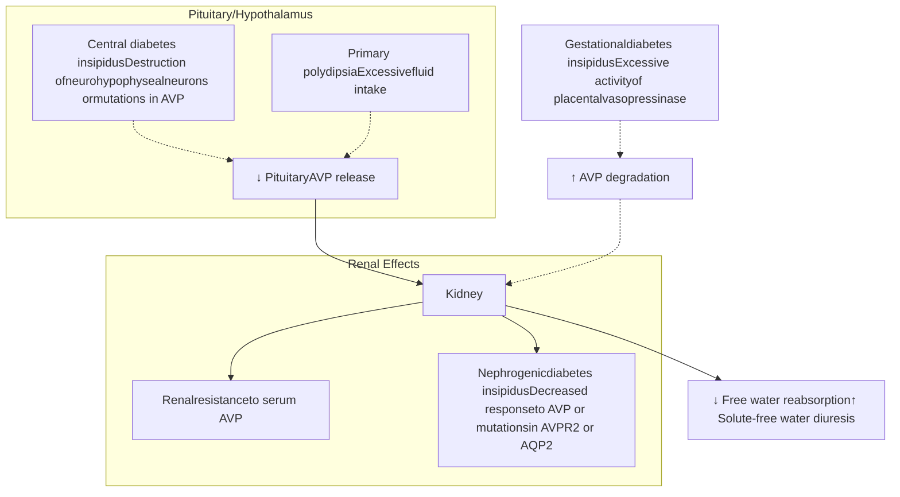

Williams Textbook of Endocrinology

Diabetes insipidus. *Nat Rev Dis Primers* 5, 54 (2019).

# Table 1 | Aetiology of polyuria–polydipsia syndromes


<table>
  <thead>
    <tr>
        <th>Basic defect</th>
        <th>Acquired causes</th>
        <th>Hereditary causes</th>
    </tr>
  </thead>
  <tbody>
    <tr>
        <td colspan="3"><strong>Central DI</strong></td>
    </tr>
    <tr>
        <td>Deficiency in AVP synthesis or secretion</td>
        <td>* Trauma (surgery and deceleration injury)<br/>* Neoplasia (craniopharyngioma, meningioma, germinoma and metastases)<br/>* Vascular (cerebral or hypothalamic haemorrhage and infarction or ligation of anterior communicating artery aneurysm)<br/>* Granulomatous (histiocytosis and sarcoidosis)<br/>* Infectious (meningitis, encephalitis and tuberculosis)<br/>* Inflammatory or autoimmune (lymphocytic infundibuloneurohypophysitis and IgG4 neurohypophysitis)<br/>* Drug or toxin exposure<br/>* Osmoreceptor dysfunction (adipsic DI)<br/>* Others (hydrocephalus, ventricular or suprasellar cyst, and trauma and degenerative diseases)<br/>* Idiopathic</td>
        <td>* Autosomal dominant: AVP mutations<br/>* Autosomal recessive, type a and b: AVP mutations<br/>* Autosomal recessive, type c: WFS1 mutations<br/>* Autosomal recessive, type d: PCSK1 mutations<br/>* X-linked recessive: gene unknown</td>
    </tr>
    <tr>
        <td colspan="3"><strong>Nephrogenic DI</strong></td>
    </tr>
    <tr>
        <td>Reduced renal sensitivity to antidiuretic effect of physiological AVP levels</td>
        <td>* Drug exposure (<u>lithium</u>, demeclocycline, cisplatin, etc.)<br/>* <mark>Hypercalcaemia or hypokalaemia</mark><br/>* Infiltrating lesions (sarcoidosis, amyloidosis, multiple myeloma, etc.)<br/>* Vascular disorders (sickle cell anaemia)<br/>* Mechanical (polycystic kidney disease and urethral obstruction)</td>
        <td>* X-linked: AVPR2 mutations<br/>* Autosomal recessive or dominant: AQP2 mutations</td>
    </tr>
    <tr>
        <td colspan="3"><strong>Primary polydipsia</strong></td>
    </tr>
    <tr>
        <td>Excessive fluid intake at a diminished set point</td>
        <td>* Dipsogenic<sup>a</sup> (idiopathic or similar lesions as with central DI)<br/>* Psychosis intermittent hyponatraemia–polydipsia (PIP) syndrome<br/>* Compulsive water drinking<br/>* Health enthusiasts</td>
        <td>NA</td>
    </tr>
    <tr>
        <td colspan="3"><strong>Gestational DI</strong></td>
    </tr>
    <tr>
        <td>Increased enzymatic metabolism of circulating AVP hormone</td>
        <td>Pregnancy</td>
        <td>NA</td>
    </tr>
  </tbody>
</table>


```mermaid
graph TD
    A(Pregnancy) --> B(1st trimester)
    B --> C(2nd trimester)
    C --> D(3rd trimester)
    D --> E(Labour, delivery and postpartum)

    subgraph Details
        B1["* Vasopressinase produced in placental trophoblasts, detectable at 10 weeks of gestation"]
        C1["* Increasing production of placental vasopressinase"]
        D1["* <mark>Maximum levels</mark> of placental vasopressinase; production proportional to the size of the placenta, with highest levels in twin and multiple pregnancies"]
        E1["* Vasopressinase levels remain increased during labour and delivery and <mark>return to undetectable levels by the second week postpartum</mark>"]
    end

    B --- B1
    C --- C1
    D --- D1
    E --- E1
```

Diagram showing the progression of pregnancy and its effect on vasopressinase levels, leading to increasing AVP degradation and polyuria/polydipsia.

# Diabetes insipidus

## Pituitary stalk damage (by surgery or head trauma)

```mermaid
graph TD
    PVN[Paraventricular nucleus] --- Axon
    SON[Supraoptic nucleus] --- Axon
    ME[Median eminence]
    Axon --- HHT[Hypothalamo-hypophyseal tract]
    HHT --- NL[Neural lobe]
    AL[Anterior lobe]
    NL --- AT[Axon terminal]
    AT --- OV[Oxytocin vesicle]
    AT --- VV[Vasopressin vesicle]
    VV --- IHA[Inferior hypophyseal artery]

    subgraph Labels
        L1[① Pituitary stalk injury: axonal shock]
        L2[② Axon terminal degeneration: uncontrolled AVP release]
        L3[③ Retrograde axonal degradation: death of cell bodies of AVP-producing neurons]
        L4[Autoimmune or inflammatory destruction of AVP-producing neurons or their axons]
        L5[Rapid enlargement of anterior pituitary and compression of axon terminals of AVP-producing neurons]
        L6[Systemic release of vasopressin and oxytocin into the circulation]
    end
```

Fig. 2 | **Pathogenetic mechanisms in acquired central DI.** In the triphasic response, the first phase of central


<table>
  <thead>
    <tr>
        <th>Phase</th>
        <th colspan="6">Diabetes insipidus</th>
        <th colspan="6">Antidiuretic interphase</th>
        <th colspan="4">Diabetes insipidus</th>
    </tr>
    <tr>
        <th>Days post surgery</th>
        <th>1</th>
        <th>2</th>
        <th>3</th>
        <th>4</th>
        <th>5</th>
        <th>6</th>
        <th>7</th>
        <th>8</th>
        <th>9</th>
        <th>10</th>
        <th>11</th>
        <th>12</th>
        <th>13</th>
        <th>14</th>
        <th>15</th>
        <th>16</th>
    </tr>
  </thead>
  <tbody>
    <tr>
        <td>Urine output/24 h</td>
        <td>1</td>
        <td>8</td>
        <td>9</td>
        <td>9</td>
        <td>7</td>
        <td>2</td>
        <td>1</td>
        <td>1</td>
        <td>1</td>
        <td>1</td>
        <td>1</td>
        <td>2</td>
        <td>8</td>
        <td>8.5</td>
        <td>8.5</td>
        <td>8.5</td>
    </tr>
  </tbody>
</table>


\* **Fig. 8.4** Typical triphasic response of urine volume after sectioning of the pituitary stalk induced by surgery or head trauma. The first phase of diabetes insipidus occurs immediately postoperatively and continues to day 6. The second phase of antidiuresis occurs from day 7 and continues to day 12. The third stage is the recurrence of diabetes insipidus on day 13. Durations vary; see text for detailed discussion. (From A. G. Robinson, University of California at Los Angeles.)

Yellow star logo

```mermaid
graph TD
    A[Suspected hypotonic polyuria] --> B[Confirm the presence of polyuria >50 mL/kg/24h]
    B --> C[Urine osmolality <800 mOsm/kg]
    B --> D[Urinary volume <50 mL/kg/24h]
    D --> E[GU evaluation]
    C --> F[Measure serum sodium, plasma osmolality]
    F --> G[Low serum sodium <135 mmol/L]
    F --> H[Normal serum sodium 136-146 mmol/L]
    F --> I[High serum sodium >147 mmol/L]
    G --> J[Primary polydipsia]
    I --> K[Central or nephrogenic DI]
    H --> L[Water deprivation test]
    H --> M[Baseline copeptin level]

    %% Water deprivation test branch
    L --> L1[Urine osmolality >800 mOsm/kg]
    L --> L2[Urine osmolality 300-800 mOsm/kg]
    L --> L3[Urine osmolality <300 mOsm/kg]
    L1 --> L1a[Mild primary polydipsia]
    L2 --> L2a[Desmopressin test]
    L3 --> L3a[Desmopressin test]
    L2a --> L2b[>9% increase]
    L2a --> L2c[<9% increase]
    L3a --> L3b[>50% increase]
    L3a --> L3c[<50% increase]
    L2b --> L2d[Primary polydipsia]
    L2c --> L2e[Partial central DI]
    L3b --> L3d[Complete central DI]
    L3c --> L3e[Nephrogenic DI]

    %% Baseline copeptin level branch
    M --> M1[Copeptin >21.4 pmol/L]
    M --> M2[Copeptin <21.4 pmol/L]
    M1 --> M1a[Complete or partial nephrogenic DI]
    M2 --> M2a[Hypertonic saline test]
    M2a --> M2b["Stimulated copeptin >4.9 pmol/L (at plasma sodium >150 mmol/L)"]
    M2a --> M2c["Stimulated copeptin <4.9 pmol/L (at plasma sodium >150 mmol/L)"]
    M2b --> M2d[Primary polydipsia]
    M2c --> M2e[Complete or partial central DI]
```

<table>
  <thead>
    <tr>
        <th>尿崩症<br/>限水測試<br/>(Water Deprivation Test)</th>
        <th>1. 早上 8 點開始禁止喝水，持續 8 小時。在下午 4 點給予 DDAVP 2 μg。</th>
        <th>1. 當血清滲透壓 &gt; 295 mOsm/L 時，尿液滲透壓 / 血清滲透壓比值 &lt; 2，則可確診尿崩症。</th>
    </tr>
    <tr>
        <th> </th>
        <th>2. 測試期間，每個小時量<u>體重</u>；每 2-3 小時測量血清和<u>尿液滲透壓</u>。</th>
        <th>2. 給予 DDAVP 之後，若尿液滲透壓明顯上升 &gt; 800 mOsm/L，則為中樞性尿崩症；若尿液滲透壓 &lt; 300 mOsm/L，則是腎因性尿崩症。</th>
    </tr>
    <tr>
        <th> </th>
        <th>3. 若患者的血清滲透壓 &gt; 305 mOsm/L；或體重減輕 &gt; 3%，則提前停止限水並給予 DDAVP。</th>
        <th> </th>
    </tr>
    <tr>
        <th> </th>
        <th>4. 給予 <u>DDAVP</u> 之後，仍每小時監測尿量與尿液滲透壓，持續 4 小時。</th>
        <th> </th>
    </tr>
  </thead>
</table>

<table>
  <thead>
    <tr>
        <th>Time (hours)</th>
        <th>Normal response</th>
        <th>Partial central DI</th>
        <th>Primary polydipsia</th>
        <th>Complete central DI</th>
        <th>Partial nephrogenic DI</th>
        <th>Complete nephrogenic DI</th>
    </tr>
  </thead>
  <tbody>
    <tr>
        <td>0</td>
        <td>240</td>
        <td>240</td>
        <td>240</td>
        <td>240</td>
        <td>240</td>
        <td>240</td>
    </tr>
    <tr>
        <td>2</td>
        <td>500</td>
        <td>300</td>
        <td>350</td>
        <td>250</td>
        <td>260</td>
        <td>270</td>
    </tr>
    <tr>
        <td>4</td>
        <td>900</td>
        <td>450</td>
        <td>500</td>
        <td>260</td>
        <td>350</td>
        <td>270</td>
    </tr>
    <tr>
        <td>6</td>
        <td>1000</td>
        <td>580</td>
        <td>620</td>
        <td>260</td>
        <td>450</td>
        <td>270</td>
    </tr>
    <tr>
        <td>8</td>
        <td>1020</td>
        <td>600</td>
        <td>680</td>
        <td>260</td>
        <td>480</td>
        <td>260</td>
    </tr>
    <tr>
        <td>10</td>
        <td>1040</td>
        <td>750</td>
        <td>690</td>
        <td>550</td>
        <td>520</td>
        <td>260</td>
    </tr>
    <tr>
        <td>12</td>
        <td>1040</td>
        <td>880</td>
        <td>700</td>
        <td>650</td>
        <td>530</td>
        <td>270</td>
    </tr>
  </tbody>
</table>


Diagnostic Testing for Diabetes Insipidus. In K. R. Feingold (Eds.) et. al., *Endotext*. MDText.com, Inc.

114年fellow camp：
Primary Aldosteronism:診斷到介入的臨床決策 - 羅仕昌醫師

QR code

# Adrenal

Chapter 13: The Adrenal Cortex
Chapter 14: Endocrine Hypertension

112年fellow camp：
Adrenal disorders - 吳婉禎醫師

QR code

Yellow star icon

```mermaid
graph TD
    Chol1[Cholesterol] --> StAR[StAR]
    subgraph Mitochondrial_membrane
        Outer[Outer]
        Inner[Inner]
    end
    StAR --> Chol2[Cholesterol]
    Chol2 -- "ADR/AdxCYP11A1" --> Pregnenolone[Pregnenolone]
    
    Pregnenolone -- "PORCYP17A1" --> 17OHPreg[17OH-Pregnenolone]
    Pregnenolone -- "HSD3B2" --> Progesterone[Progesterone]
    Pregnenolone -.-> Pregnenediol[Pregnenediol]
    
    17OHPreg -- "POR b5CYP17A1" --> DHEA[Dehydroepi-androsterone]
    17OHPreg -- "HSD3B2" --> 17OHProg[17OH-Progesterone]
    17OHPreg -.-> Pregnenetriol[Pregnenetriol]
    
    DHEA -- "PAPSS2SULT2A1" --> DHEAS[DHEAS]
    DHEA -- "HSD3B2" --> Androstenedione[Androstenedione]
    DHEA -.-> DHEA_16OH[DHEA, 16αOH-DHEAAndrosterone, Etiocholanolone]
    
    Progesterone -- "PORCYP17A1" --> 17OHProg
    Progesterone -- "PORCYP21A2" --> 11Deoxycorticosterone[11-Deoxycorticosterone]
    Progesterone -.-> Pregnanediol[Pregnanediol]
    
    17OHProg -- "POR b5CYP17A1" --> Androstenedione
    17OHProg -- "PORCYP21A2" --> 11Deoxycortisol[11-Deoxycortisol]
    17OHProg -.-> Pregnanetriol_17OH[Pregnanetriol17-OH-Pregnenolone]
    
    Androstenedione -- "AKR1C3" --> Testosterone[Testosterone]
    Androstenedione -- "CYP11B1" --> 11OHAndrostenedione[11OH-Androstenedione]
    Androstenedione -.-> Andro_Etio1[AndrosteroneEtiocholanolone]
    
    Testosterone -.-> Andro_Etio2[AndrosteroneEtiocholanolone]
    
    11Deoxycorticosterone -- "ADR/AdxCYP11B1 / CYP11B2" --> Corticosterone[Corticosterone]
    11Deoxycorticosterone -.-> THDOC[THDOC]
    
    11Deoxycortisol -- "ADR/AdxCYP11B1" --> Cortisol[Cortisol]
    11Deoxycortisol -.-> THS[THS]
    
    11OHAndrostenedione -- "HSD11B2" --> 11Ketoandrostenedione[11-Ketoandrostenedione]
    
    Cortisol -- "HSD11B2" --> Cortisone[Cortisone]
    Cortisol -- "H6PDHHSD11B1" --> Cortisone
    Cortisol -.-> THF[THF, 5αTHF]
    Cortisol -.-> 21Deoxycortisol[21-Deoxycortisol]
    21Deoxycortisol -.-> Pregnanetriolone[Preg-nanetriolone]
    
    Corticosterone -- "ADR/AdxCYP11B2" --> 18OH_Corticosterone[18OH-Corticosterone]
    Corticosterone -.-> THA_THB[THA, THB,5α THA, 5αTHB]
    
    11Ketoandrostenedione -- "AKR1C3" --> 11Ketotestosterone[11-Ketotestosterone]
    
    Cortisone -- "H6PDHHSD11B1" --> Cortisol
    Cortisone -.-> THE[THE]
    
    18OH_Corticosterone -- "ADR/AdxCYP11B2" --> Aldosterone[Aldosterone]
    18OH_Corticosterone -.-> 18OH_THA[18OH-THA]
    
    11Ketotestosterone -- "H6PDHHSD11B1" --> 11OH_Testosterone[11OH-Testosterone]
    11Ketotestosterone -- "HSD11B2" --> 11OH_Testosterone
    
    Aldosterone -.-> THALDO[THALDO]
    
    style Mineralocorticoid fill:none,stroke:none
    style Glucocorticoid fill:none,stroke:none
    style Androgens fill:none,stroke:none
    
    Mineralocorticoid[Mineralocorticoid]
    Glucocorticoid[Glucocorticoid]
    Androgens[Androgens]
```

Q: 哪個enzyme使17OHP變11-deoxycortisol？

A: CYP11A1

B: HSD3B2

C: <mark><font color="red">CYP21A2</font></mark>

D: CYP11B1

Mineralocorticoid            Glucocorticoid            Androgens

# Cushing syndrome

## TABLE 13.6 Symptoms and Signs for the Diagnosis of Cushing Syndrome


<table>
  <thead>
    <tr>
        <th colspan="2">TABLE 13.6 Symptoms and Signs for the Diagnosis of Cushing Syndrome</th>
    </tr>
    <tr>
        <th>Discriminatory</th>
        <th>Less Discriminatory</th>
    </tr>
    <tr>
        <th>Signs</th>
        <th>Signs</th>
    </tr>
  </thead>
  <tbody>
    <tr>
        <td>* Facial plethora</td>
        <td>* Central obesity</td>
    </tr>
    <tr>
        <td>* Proximal myopathy</td>
        <td>* Buffalo hump, supraclavicular fullness</td>
    </tr>
    <tr>
        <td>* Cutaneous striae (red-purple, &gt;1 cm wide)</td>
        <td>* Facial fullness</td>
    </tr>
    <tr>
        <td>* Bruising</td>
        <td>* Acne and hirsutism</td>
    </tr>
    <tr>
        <td>* In children—weight gain with growth arrest</td>
        <td>* Skin thinning</td>
    </tr>
    <tr>
        <td> </td>
        <td>* Poor wound healing</td>
    </tr>
    <tr>
        <td> </td>
        <td>* Peripheral edema</td>
    </tr>
    <tr>
        <th>Symptoms and complications</th>
        <th>Symptoms and complications</th>
    </tr>
    <tr>
        <td>Unexplained or premature</td>
        <td>* Fatigue</td>
    </tr>
    <tr>
        <td>* Osteoporosis and vertebral fractures</td>
        <td>* Weight gain</td>
    </tr>
    <tr>
        <td>* Hypertension</td>
        <td>* Depression, mood and appetite change, impairment of concentration and memory</td>
    </tr>
    <tr>
        <td>* Diabetes mellitus</td>
        <td>* Back pain</td>
    </tr>
    <tr>
        <td> </td>
        <td>* Oligomenorrhea, polycystic ovary syndrome</td>
    </tr>
    <tr>
        <td> </td>
        <td>* Recurrent infections</td>
    </tr>
    <tr>
        <td> </td>
        <td>* Kidney stones</td>
    </tr>
  </tbody>
</table>


<u>Protein wasting</u> <u>Fat redistribution</u>

## BOX 13.4 Classification of Causes of Cushing Syndrome

### ACTH-Dependent Causes

Cushing disease (pituitary dependent)

Ectopic ACTH syndrome

Ectopic CRH syndrome

<u>Macronodular adrenal hyperplasia</u>

Iatrogenic (treatment with [1-24]ACTH)

### ACTH-Independent Causes

Adrenal adenoma and carcinoma

<u>Primary pigmented nodular adrenal hyperplasia and Carney syndrome</u>

<u>McCune-Albright syndrome</u>

<u>Aberrant receptor expression (gastric inhibitory polypeptide, interleukin-1β)</u>

Iatrogenic (e.g., pharmacologic doses of prednisolone, dexamethasone)

### Other Causes of Hypercortisolism (Nonneoplastic)

Alcoholism

Depression

Obesity

Pregnancy

表一. 促腎上腺皮質素依賴型 (ACTH-dependent) 及非促腎上腺皮質素依賴型 (ACTH independent) 庫欣氏症病人在白種人和亞洲人的發生率比較


<table>
  <thead>
    <tr>
        <th rowspan="2">庫欣氏症病因</th>
        <th colspan="2">發生率</th>
    </tr>
    <tr>
        <th>白種人¹</th>
        <th>亞洲人⁶⁻⁸</th>
    </tr>
  </thead>
  <tbody>
    <tr>
        <td>§ ACTH-dependent CS</td>
        <td>70-80%</td>
        <td>25-41%</td>
    </tr>
    <tr>
        <td>(1) Cushing's disease</td>
        <td>60-70%</td>
        <td>21.4-31%</td>
    </tr>
    <tr>
        <td>(2) Ectopic ACTH syndrome</td>
        <td>5-10%</td>
        <td>3.3-10%</td>
    </tr>
    <tr>
        <td>(3) Ectopic CRH § § syndrome</td>
        <td>極罕見</td>
        <td>極罕見²¹</td>
    </tr>
    <tr>
        <td>ACTH-independent CS</td>
        <td>20-30%</td>
        <td>56-75%</td>
    </tr>
    <tr>
        <td>(1) Adrenocortical adenoma</td>
        <td>10-20%</td>
        <td>50.9-58.3%</td>
    </tr>
    <tr>
        <td>(2) Adrenocortical carcinoma</td>
        <td>5-7%</td>
        <td>4.1-8.3%</td>
    </tr>
    <tr>
        <td>(3) PPNAD*</td>
        <td>&lt;2%</td>
        <td>4.8%</td>
    </tr>
    <tr>
        <td>(4) AIMAH**</td>
        <td>&lt;2%</td>
        <td>3.6%</td>
    </tr>
  </tbody>
</table>
<table>
  <thead>
    <tr>
        <th colspan="2">TABLE 13.7 Tumors Associated With Ectopic Adrenocorticotropic Hormone Syndrome</th>
    </tr>
    <tr>
        <th>Tumor Type</th>
        <th>Approximate Incidence (%)</th>
    </tr>
  </thead>
  <tbody>
    <tr>
        <td>Lung neuroendocrine tumors</td>
        <td>20-40</td>
    </tr>
    <tr>
        <td>Small-cell lung carcinoma</td>
        <td>5-20</td>
    </tr>
    <tr>
        <td>Occult neuroendocrine tumors</td>
        <td>10-20</td>
    </tr>
    <tr>
        <td>Pancreatic/intestinal neuroendocrine tumors</td>
        <td>10-15</td>
    </tr>
    <tr>
        <td>Thymic neuroendocrine tumors</td>
        <td>5-10</td>
    </tr>
    <tr>
        <td>Other neuroendocrine tumors</td>
        <td>5-10</td>
    </tr>
    <tr>
        <td>Medullary carcinoma of thyroid</td>
        <td>5-10</td>
    </tr>
    <tr>
        <td>Pheochromocytoma and related tumors</td>
        <td>5</td>
    </tr>
  </tbody>
</table>


```mermaid
graph TD
    Hypothalamus -- CRH --> Pituitary
    Pituitary -- ACTH --> Adrenal_cortex["Adrenal cortex"]
    Adrenal_cortex -- Cortisol --> Pituitary
    Adrenal_cortex -- Cortisol --> Hypothalamus
```
Normal state

Diagram of Pituitary ACTH-dependent Cushing syndrome showing increased ACTH and Cortisol due to a pituitary tumor
Pituitary ACTH-dependent Cushing syndrome

Diagram of Adrenal adenoma with ACTH-independent Cushing syndrome showing increased Cortisol from an adrenal tumor and suppressed CRH/ACTH
Adrenal adenoma with ACTH-independent Cushing syndrome

Diagram of Ectopic ACTH syndrome showing increased ACTH from an ectopic tumor and increased Cortisol
Ectopic ACTH syndrome

Diagram of Ectopic CRH syndrome showing increased CRH from an ectopic tumor, leading to increased ACTH and Cortisol
Ectopic CRH syndrome

Greenspan's Basic & Clinical Endocrinology Williams Textbook of Endocrinology
腎上腺疾病新知專刊

# <u>Cortisol-Secreting Adrenal Adenoma</u>

* 50%: somatic mutation of <mark>PRKACA</mark> (hotspot L205R)

Diagram showing ACTH-dependent cortisol production pathway through MC2R, Gsα, AC, cAMP, and PKA activation of CREB.

Diagram showing autonomous cortisol production through various mutations in the GPCR/cAMP/PKA pathway, including PRKACA, PRKAR1A, and PDEs.

# <u>Primary Pigmented Nodular Adrenal Hyperplasia</u>

Red star icon

* Nodules: 2-4 mm, black or brown
* Atrophic adjacent adrenal tissue
* Carney complex
    - Familial autosomal dominant
    - PPNAD: 70% germline mutation of <mark>PRKAR1A</mark>
* Bilateral adrenalectomy

Diagram 'a' showing normal EGFR signaling pathway leading to POMC expression and lysosomal degradation of USP8.

Diagram 'b' showing mutated USP8 signaling pathway leading to increased POMC expression and reduced lysosomal degradation.

# <u>Bilateral Macronodular Adrenal Hyperplasia</u>

* Nodules: >5 mm, nonpigmented
* Aberrant receptor expression: GIP, vasopressin V1, β-adrenergic, LH, <u>serotonin, angiotensin (AT1)</u>
* 25-55%: germline mutation of <mark>ARMC5</mark>

Diagram showing ARMC5 mutations affecting STEROIDOGENESIS and APOPTOSIS.

# <u>Cushing Disease</u>

* 90% microadenoma, 10% macroadenoma (more invasive)
* Monoclonal origin
* 20-30% recurrence on very long-term follow-up
* 40% somatic missense mutations in <mark>ubiquitin-specific protease 8 (USP8)</mark>
* 10-40% with bilateral adrenocortical hyperplasia and nodules

Red star icon

```mermaid
graph TD
    A[Clinical suspicion for Cushing's syndrome CS] --> B{Does the patient take exogenous GC oral, injections, inhalers, topical?}
    B -- Yes --> C[Stop GC if possible, follow symptoms]
    B -- No --> D[Assess clinical likelihood of endogenous CS]
    D -- Low --> E[Screening test]
    D -- Intermediate or High --> F[2-3 screening tests]
    
    E --> G[Late night salivary cortisol ≥2 tests]
    E --> H[24 h UFC ≥2 tests]
    E --> I[Overnight 1 mg DST]
    
    G & H & I --> J{Normal}
    G & H & I --> K{Abnormal}
    
    J --> L[CS is unlikely]
    
    K --> M["1. Repeat 1-2 screening tests2. Exclude non-neoplastic hypercortisolism(Consider Dex-CRH, DDAVP, midnight serum cortisol)"]
    
    F --> N{Abnormal}
    F --> O{Normal}
    
    O --> P[CS is unlikely or cyclic CS]
    N --> M
    
    M --> Q{Normal}
    M --> R{Abnormal}
    M --> S{Discrepant}
    
    Q --> T[CS unlikely or cyclic CS]
    R --> U[CS diagnosed]
    S --> V["Periodically re-evaluate clinically, repeat testing"]
    
    U --> W[Measure ACTH]
    W --> X[Low ACTH]
    W --> Y[Normal or high ACTH]
    
    X --> Z[ACTH-independent CS]
    Y --> AA[ACTH-dependent CS]
    
    M -.-> AB["Consider:Psychiatric disordersAlcohol use disorderPregnancySevere obesityPCOSUncontrolled DMAnorexia, malnutritionExcessive exerciseIllness/surgeryHigh CBG stateGC resistance"]
```

Q: 何者非CS的 screening test？

A: CRH stimulation

B: Late night salivary cortisol

C: 24h UFC

D: 1mg DST

Consensus on diagnosis and management of Cushing's disease: a guideline update.

Red star icon

```mermaid
graph TD
    Start(( )) --> Normal
    Start --> Abnormal
    Start --> Discrepant

    Normal --> CS_Unlikely[CS unlikely or cyclic CS]
    Abnormal --> CS_Diagnosed[CS diagnosed]
    Discrepant --> Reevaluate[Periodically re-evaluate clinically, repeat testing]

    CS_Diagnosed --> Measure_ACTH[Measure ACTH]

    Measure_ACTH --> Low_ACTH[Low ACTH]
    Measure_ACTH --> Normal_High_ACTH[Normal or high ACTH]

    Low_ACTH --> ACTH_Independent[ACTH-independent CS]
    Normal_High_ACTH --> ACTH_Dependent[ACTH-dependent CS]

    ACTH_Independent --> Adrenal_Imaging[Adrenal CT or MRI]
    ACTH_Dependent --> Pituitary_MRI[Pituitary MRI]

    Pituitary_MRI --> No_Adenoma[No adenoma or equivocal]
    Pituitary_MRI --> Adenoma_Present[Adenoma present]

    No_Adenoma --> Ectopic_CD[Ectopic CS or CD]
    Adenoma_Present --> Less_Than_6_9[< 6-9 mm*]
    Adenoma_Present --> Greater_Than_10[≥ 10 mm*]

    Greater_Than_10 --> Presumed_CD[Presumed CD]
    Less_Than_6_9 --> Ectopic_CD

    Ectopic_CD --> IPSS[IPSS]
    Ectopic_CD --> CRH_DDAVP[CRH and DDAVP testpluswhole-body CT**]

    IPSS --> Pituitary_Gradient_Absent[Pituitary gradient absent]
    IPSS --> Pituitary_Gradient_Present[Pituitary gradient present]

    CRH_DDAVP --> Inconclusive((or))
    Inconclusive -.-> Inconclusive_Label(Inconclusive)
    Inconclusive_Label -.-> IPSS

    CRH_DDAVP --> Neg_CRH_DDAVP[-CRH and -DDAVPand+CT]
    CRH_DDAVP --> Pos_CRH_DDAVP[+CRH and +DDAVPand-CT]

    Pituitary_Gradient_Absent --> Ectopic_CS_Final[Ectopic CS]
    Pituitary_Gradient_Present --> CD_Final[CD]
    Neg_CRH_DDAVP --> Ectopic_CS_Final_2[Ectopic CS]
    Pos_CRH_DDAVP --> CD_Final_2[CD]
```

> **Consider:**
> Psychiatric disorders
> Alcohol use disorder
> Pregnancy
> Severe obesity
> PCOS
> Uncontrolled DM
> Anorexia, malnutrition
> Excessive exercise
> Illness/surgery
> High CBG state
> GC resistance

\*There is consensus that all patients with lesions <6mm should have IPSS and those with lesions of ≥10mm do not need IPSS, but there is a gray zone between 6-9 mm where expert opinions differed.
\*\*This alternative option does not have clear consensus and needs further research.

```mermaid
graph TD
    A[Cushing syndromeclinically/biochemically confirmed] --> B[Differential diagnosis]
    B --> C[ACTH]
    C --> D[Suppressed]
    C --> E[Detectable]
    D --> F[CT of adrenals(consider macronodular hyperplasia)]
    E --> G[ACTH-dependentdisease]
    G --> H["• 50% cortisol suppression following high- or low-dosedexamethasone suppression test (2 mg 6 hourly for 48 hours)AND• >50% increased serum cortisol post CRH stimulation testAND• Positive MRI scan of pituitary"]
    H --> I[Then proceed totranssphenoidal hypophysectomy]
    H --> J["If tests inconclusive (i.e., failure of any above criteria)"]
    J --> K[Inferior petrosal sinus sampling with CRH]
    K --> L[Positive ACTH gradientCushing diseaseTranssphenoidal hypophysectomy]
    K --> M[No ACTH gradientEctopic ACTH syndromeAppropriate radiology ± venous sampling]
```


<table>
  <thead>
    <tr>
        <th>Time (min)</th>
        <th>Cushing disease ACTH (pg/mL)</th>
        <th>Controls ACTH (pg/mL)</th>
        <th>Ectopic ACTH ACTH (pg/mL)</th>
        <th>Cushing disease Cortisol (mg/dL)</th>
        <th>Controls Cortisol (mg/dL)</th>
        <th>Ectopic ACTH Cortisol (mg/dL)</th>
        <th>Controls Cortisol (mg/dL) (Right)</th>
    </tr>
  </thead>
  <tbody>
    <tr>
        <td>-15</td>
        <td>35</td>
        <td>8</td>
        <td>&gt;100</td>
        <td>21</td>
        <td>2</td>
        <td>34</td>
        <td>2</td>
    </tr>
    <tr>
        <td>0</td>
        <td>35</td>
        <td>8</td>
        <td>&gt;90</td>
        <td>21</td>
        <td>2</td>
        <td>37</td>
        <td>2</td>
    </tr>
    <tr>
        <td>15</td>
        <td>158</td>
        <td>20</td>
        <td>&gt;88</td>
        <td>32</td>
        <td>8</td>
        <td>33</td>
        <td>6</td>
    </tr>
    <tr>
        <td>30</td>
        <td>145</td>
        <td>26</td>
        <td>&gt;88</td>
        <td>39</td>
        <td>13</td>
        <td>38</td>
        <td>13</td>
    </tr>
    <tr>
        <td>60</td>
        <td>105</td>
        <td>26</td>
        <td>&gt;90</td>
        <td>41</td>
        <td>15</td>
        <td>37</td>
        <td>15</td>
    </tr>
    <tr>
        <td>90</td>
        <td>80</td>
        <td>18</td>
        <td>&gt;89</td>
        <td>40</td>
        <td>14</td>
        <td>36</td>
        <td>15</td>
    </tr>
    <tr>
        <td>120</td>
        <td>60</td>
        <td>16</td>
        <td>&gt;83</td>
        <td>35</td>
        <td>11</td>
        <td>35</td>
        <td>12</td>
    </tr>
    <tr>
        <td>150</td>
        <td>45</td>
        <td>19</td>
        <td>&gt;85</td>
        <td>35</td>
        <td>13</td>
        <td>35</td>
        <td>13</td>
    </tr>
    <tr>
        <td>180</td>
        <td>40</td>
        <td>15</td>
        <td>&gt;83</td>
        <td>32</td>
        <td>13</td>
        <td>34</td>
        <td>13</td>
    </tr>
  </tbody>
</table>

表二：診斷庫欣氏症 (CS) 的檢測方法 <sup>1,14</sup>


<table>
  <thead>
    <tr>
        <th> </th>
        <th>測驗</th>
        <th>診斷標準</th>
        <th>靈敏度</th>
        <th>特異性</th>
        <th>注意事項</th>
    </tr>
  </thead>
  <tbody>
    <tr>
        <td rowspan="4">門診</td>
        <td>24 小時尿液游離皮質醇<br/>(24-h UFC)</td>
        <td>&gt;3 倍正常值上限</td>
        <td>80 - 98%</td>
        <td>45 - 98%</td>
        <td>尿液收集不完整；攝取過多水分 (≥ 5 L/day)，腎功能不全。</td>
    </tr>
    <tr>
        <td>深夜唾液皮質醇<br/>(late-night salivary cortisol)</td>
        <td>&gt;145 ng/dL</td>
        <td>92 - 100%</td>
        <td>93 - 100%</td>
        <td>檢體收集 / 保存不當 (需要專門的工具收集唾液)；服用甘草、嚼菸、抽菸、太極地刷牙。</td>
    </tr>
    <tr>
        <td rowspan="2">隔夜 1mg dexamethasone<br/>抑制測驗 (overnight 1mg<br/>DST)</td>
        <td>皮質醇 &gt;1.8 μg/dL</td>
        <td>91 - 97%</td>
        <td>80 - 94%</td>
        <td rowspan="2">影響 dexamethasone 代謝與清除，例如：藥物【見表三】、腎功能不全；影響皮質醇結合球蛋白 (CBG) 的濃度，例如：雌激素 /mitotane、腎病症候群、肝硬化；</td>
    </tr>
    <tr>
        <td>皮質醇 &gt;5 μg/dL</td>
        <td>85 - 90%</td>
        <td>95 - 99%</td>
    </tr>
    <tr>
        <td rowspan="4">住院</td>
        <td>兩天低劑量 dexamethasone<br/>抑制測驗 (2-day low-dose<br/>DST)*</td>
        <td>皮質醇 &gt;1.8 μg/dL</td>
        <td>91 - 98%</td>
        <td>70 - 95%</td>
        <td>Dex-CRH 測驗須特別注意準時操作。</td>
    </tr>
    <tr>
        <td>Dex-CRH 測驗 #</td>
        <td>皮質醇 &gt;1.4 μg/dL</td>
        <td>98 - 100%</td>
        <td>60 - 100%</td>
        <td> </td>
    </tr>
    <tr>
        <td rowspan="2">半夜血清皮質醇<br/>(midnight serum cortisol)</td>
        <td>&gt;7.5 μg/dL ( 醒 )</td>
        <td>91 - 98%</td>
        <td>92 - 100%</td>
        <td rowspan="2">盡量準時在半夜 12 點抽取血液樣本；需預留留置管路，以便在病人熟睡時抽血；&lt;1.8 μg/dL 時可排除診斷</td>
    </tr>
    <tr>
        <td>&gt;1.8 μg/dL ( 睡 )</td>
        <td>100%</td>
        <td>30 - 62%</td>
    </tr>
  </tbody>
</table>

表六：診斷庫欣氏病 (CD) 的檢測方法 <sup>1</sup>


<table>
  <thead>
    <tr>
        <th>測驗</th>
        <th>診斷標準</th>
        <th>注意事項</th>
    </tr>
  </thead>
  <tbody>
    <tr>
        <td>高劑量 dexamethasone 抑制測驗<br/>(high-dose DST)\*</td>
        <td>皮質醇降低 &gt;69%</td>
        <td>Diagnostic accuracy ~80%</td>
    </tr>
    <tr>
        <td rowspan="2">皮質釋素刺激測驗 (CRH stimulation test)#</td>
        <td>Ovine CRH：血漿 ACTH 升高 &gt;34%<br/>和 / 或血清皮質醇升高 &gt;20%</td>
        <td>Sensitivity 93%</td>
    </tr>
    <tr>
        <td>Human CRH：血清皮質醇升高 &gt;14%</td>
        <td>Sensitivity 85%, specificity 100%</td>
    </tr>
    <tr>
        <td>腦下垂體影像學檢查，如 MRI</td>
        <td>發現腦下垂體腫塊，特別是 &gt;6mm<br/>的大腫塊</td>
        <td>20-58% CD 病人的腦下垂體瘤無法被檢查出來；另外約 10% 的正常人亦可能被檢查出有無症狀的腦下垂體瘤。</td>
    </tr>
    <tr>
        <td>下岩竇靜脈血液取樣檢測法<br/>(inferior petrosal sinus sampling,<br/>IPSS)</td>
        <td>Central-to-peripheral ACTH gradient<br/>(IPS/P) ≥ 2.0 和 / 或注射 CRH 後達到<br/>≥ 3.0</td>
        <td>為診斷 CD 的黃金標準<br/>Sensitivity 96%, specificity 100%</td>
    </tr>
  </tbody>
</table>

<table>
  <thead>
    <tr>
        <th> </th>
        <th>Cushing's disease</th>
        <th>Ectopic Cushing's syndrome</th>
    </tr>
  </thead>
  <tbody>
    <tr>
        <td>ACTH</td>
        <td>Normal or high</td>
        <td>High</td>
    </tr>
    <tr>
        <td>發生 Hypokalemia 的機會</td>
        <td>較低</td>
        <td>較高</td>
    </tr>
    <tr>
        <td>HDDST&gt;50% suppression</td>
        <td>V</td>
        <td>X</td>
    </tr>
    <tr>
        <td>CRH test</td>
        <td>ACTH/Cortisol 上升</td>
        <td>No response</td>
    </tr>
    <tr>
        <td>Image</td>
        <td>Sella MRI, IPSS</td>
        <td>Whole body CT</td>
    </tr>
  </tbody>
</table>

# Post OP follow up

```mermaid
graph TD
    CD[Cushing's disease] --> PMT[Preoperative medical therapy in select cases]
    PMT --> PS[Pituitary surgery*]
    CD --> PS
    CD --> PSNF[Pituitary surgery not feasible]

    PS --> Rem[Remission]
    PS --> PD[Persistent disease]

    Rem --> MFR[Monitor for recurrence]
    MFR --> LNSC[Late night salivary cortisol]
    LNSC --> DST[1 mg DST]
    DST --> UC[24 h urinary cortisol]
    
    LNSC -- Disease progression --> Rec[Recurrence]
    DST -- Disease progression --> Rec
    UC -- Disease progression --> Rec
    
    Rec --> PS

    PD --> IHN[If histology negative, perform IPSS if not done earlier]
    IHN --> PS
    
    PD --> RSTP[Reoperation if surgical target present*]
    PD --> MT[Medical therapy]
    PD --> RT[Radiation therapy†]
    
    PSNF --> MT
    PSNF --> RT
    PSNF --> LIA[If large or invasive adenoma]
    LIA --> BA[Bilateral adrenalectomy]

    RSTP --> MT
    MT --> Ctrl1[Control]
    MT --> PC[Partial control§]
    MT --> NCI[No control or intolerance§]
    
    PC --> ADCT[Another drug or consider combination therapy]
    ADCT --> Ctrl2[Control]
    ADCT --> NC[No control]
    
    NCI --> RT
    NCI --> BA
    NC --> BA
    
    RT --> NC3[No Control]
    RT --> Ctrl3[Control]
    
    NC3 --> BA
    
    BA --> MCTP[Monitor for corticotroph tumor progression]
```

\*Pituitary surgery should be performed by an experienced surgeon;
†Absence of ACTH-staining adenoma;
‡Lifelong monitoring for hypopituitarism and secondary neoplasia in the radiation field required.
§On maximum tolerated dose of the drug

```mermaid
graph TD
    A[Cushing disease confirmed] --> B[Tumor resection]
    A --> C[Resection not possible]
    B --> D[Remission]
    B --> E[Failed surgery, no surgery, or recurrence]
    C --> E
    D --> F[Monitor for recurrence]
    E --> G[Control hypercortisolism]
    G --> H[Repeat localization studies]
    
    subgraph Consider
    G1[Repeat transsphenoidal surgery]
    G2[Steroidogenesis inhibitors]
    G3[Radiotherapy and steroidogenesis inhibitors]
    G4[Pituitary-directed medical treatment]
    G5[Combinations of the above]
    G6[Glucocorticoid receptor antagonist]
    G7[Bilateral adrenalectomy]
    end
```

# Monitoring for recurrence


<table>
  <thead>
    <tr>
        <th>Test</th>
        <th>Cutoff*</th>
        <th>Sensitivity (%)</th>
        <th>Specificity (%)</th>
        <th>Advantages</th>
        <th>Disadvantages</th>
    </tr>
  </thead>
  <tbody>
    <tr>
        <td>Late-night salivary cortisol</td>
        <td>0.27 μg/dL (7.5 nmol/L)</td>
        <td>75-90</td>
        <td>93-95</td>
        <td>In most patients late-night salivary cortisol is abnormal earlier than dexamethasone suppression test and urinary-free cortisol</td>
        <td>Intra-patient variability; can be normal despite recurrence</td>
    </tr>
    <tr>
        <td>24-h urinary-free cortisol</td>
        <td>1.6 × ULN</td>
        <td>68</td>
        <td>100</td>
        <td>Direct reflection of bioavailable cortisol</td>
        <td>Approximately 50% intra-patient variability; last test to show abnormal results</td>
    </tr>
    <tr>
        <td>Desmopressin test</td>
        <td>Absolute cortisol increments of 7.0-7.4 μg/dL from baseline†</td>
        <td>68</td>
        <td>95</td>
        <td>Earliest test to show positive results in some studies; predicts presence of corticotroph tumour; can become positive before clinical adenoma recurrence</td>
        <td>Dynamic labour-intensive testing</td>
    </tr>
    <tr>
        <td>1 mg dexamethasone suppression test</td>
        <td>1.8 μg/dL (50 nmol/L)</td>
        <td>NA</td>
        <td>NA</td>
        <td>Likely to be abnormal before 24-h urinary-free cortisol</td>
        <td>Limited evidence specifically assessing utility for recurrence</td>
    </tr>
  </tbody>
</table>


ULN=upper level of normal. NA=not available. ACTH=adrenocorticotropic hormone. \*Cutoffs specified are for adults. Some experts recommend using the same cutoffs for initial diagnosis and recurrence. †Some studies use ACTH absolute cutoffs or increments.

**Table 1: Laboratory tests for Cushing's syndrome diagnosis and monitoring for Cushing's disease recurrence<sup>12,13,158,166</sup>**

表七：治療庫欣氏症的藥物選擇 <sup>1,30</sup>

Q: Cushing disease藥物治療可選somatostatin agonist如~~octreotide~~ → Pasireotide

<!-- layout: planning
1. This is semantically a table showing drug options for Cushing's disease, with columns for drug name, mechanism of action, side effects/considerations, and approval status.
2. Side-by-side check: This is a single table with four main columns.
3. Row sampling: Typical rows have 4 columns.
4. Columns (4 total):
   - Col 1: 藥物 (Drug name)
   - Col 2: 作用機轉 (Mechanism of action)
   - Col 3: 副作用／考量 (Side effects / Considerations)
   - Col 4: 各地區核准使用請況 (Approval status by region)
5. Merge cell detection:
   - "類固醇合成抑制劑 (steroidogenesis inhibitors)" -> 
   - "作用於腦下垂體瘤的藥物 (pituitary-directed medical treatments)" -> 
   - "糖皮質素受器拮抗劑 (glucocorticoid receptor antagonist)" -> 
6. Header structure:
   - Row 1: 藥物, 作用機轉, 副作用／考量, 各地區核准使用請況
7. Column count verification: 4 = 4.
8. Header TSV: 藥物	作用機轉	副作用／考量	各地區核准使用請況
-->
<table>
  <thead>
    <tr>
        <th>藥物</th>
        <th>作用機轉</th>
        <th>副作用／考量</th>
        <th>各地區核准使用請況</th>
    </tr>
  </thead>
  <tbody>
    <tr>
        <td colspan="4">類固醇合成抑制劑 (steroidogenesis inhibitors)</td>
    </tr>
    <tr>
        <td>Ketoconazole</td>
        <td>抑制 side-chain<br/>cleavage 17, 20-lyase 和<br/>11-hydroxylase enzyme</td>
        <td>胃腸道不適、肝毒性、雄性激素降低<br/>需要在酸性環境下（例如胃酸）才能發揮其生物活性；留意藥物交互作用</td>
        <td>歐洲（庫欣氏症）<br/>\* 台灣自 2015/1/1 起，廢止含 ketoconazole 成分口服劑型藥品許可證</td>
    </tr>
    <tr>
        <td>Metyrapone</td>
        <td>抑制 11β-hydroxylase</td>
        <td>胃腸道不適、多毛症、高血壓、低血鉀</td>
        <td>歐洲（庫欣氏症）</td>
    </tr>
    <tr>
        <td>Mitotane</td>
        <td>直接對腎上腺皮質<br/>產生細胞毒性作用<br/>(adrenolytic)；抑制<br/>CYP11A1</td>
        <td>胃腸道不適、中樞神經系統副作用、男性女乳症、白血球減少、四碘甲狀腺素降低、肝指數升高、致畸胎生效較慢；半衰期長；糖皮質素結合蛋白 (corticosteroid binding globulin) 升高；留意藥物交互作用</td>
        <td>美國（腎上腺癌）</td>
    </tr>
    <tr>
        <td>Etomidate</td>
        <td>抑制 11β-hydroxylase<br/>和 cholesterol side-chain<br/>cleavage</td>
        <td>腎毒性、高劑量會產生鎮靜作用<br/>需在加護病房監測使用</td>
        <td> </td>
    </tr>
    <tr>
        <td colspan="4">作用於腦下垂體瘤的藥物 (pituitary-directed medical treatments)</td>
    </tr>
    <tr>
        <td>Pasireotide</td>
        <td>體抑素類似物 (soma-<br/>tostatin receptor agonist)</td>
        <td>胃腸道不適、膽結石、高血糖、生長素減少<br/>在 UFC 小於兩倍正常值的病人使用最有效</td>
        <td>美國、歐洲、台灣（無法接受腦下垂體手術或已手術而未能治癒之庫欣氏症）</td>
    </tr>
    <tr>
        <td>Cabergoline</td>
        <td>多巴胺促效劑<br/>(dopamine agonist)</td>
        <td>胃腸道不適、頭痛、頭暈</td>
        <td> </td>
    </tr>
    <tr>
        <td colspan="4">糖皮質素受器拮抗劑 (glucocorticoid receptor antagonist)</td>
    </tr>
    <tr>
        <td>Mifepristone</td>
        <td>糖皮質素受器拮抗<br/>劑；黃體素拮抗劑<br/>(antiprogestin)</td>
        <td>疲勞、胃腸道不適、關節痛、頭痛、高血壓、低血鉀、水腫、子宮內膜增厚、促流產<br/>目前尚無生物指標可用以調整劑量</td>
        <td>美國（無法接受腦下垂體手術或已手術而未能治癒，並且合併葡萄糖耐受不良或糖尿病的庫欣氏症）</td>
    </tr>
  </tbody>
</table>

# • BOX 13.6 Etiology of Adrenocortical Insufficiency

ANTI-21
HYDROXYLASE
ANTIBODY最常見

**Primary Causes: Addison Disease**
Autoimmune
Sporadic
Autoimmune polyendocrine syndrome type I (Addison disease, chronic mucocutaneous candidiasis, hypoparathyroidism, dental enamel hypoplasia, alopecia, primary gonadal failure—see Chapter 44)
Autoimmune polyendocrine syndrome type II (Schmidt syndrome) (Addison disease, primary hypothyroidism, primary hypogonadism, insulin-dependent diabetes, pernicious anemia, vitiligo—see Chapter 44)

<u>世界範圍內最常見</u>
Infections
<u>Tuberculosis</u>
Fungal infections
Cytomegalovirus
HIV
Metastatic tumor
Infiltrations
Amyloidosis
Hemochromatosis
<u>Intraadrenal hemorrhage (Waterhouse-Friderichsen syndrome) after meningococcal septicemia</u>

**Monogenetic Disorders**
Congenital adrenal hypoplasia/developmental disorders
*DAX1 (NR0B1)* mutations
*NR5A1/SF1* mutations
IMAGE syndrome (*CDKN1C, POLE1* mutations)
MIRAGE syndrome (*SAMD9* mutations)
SERKAL syndrome (*WNT4* mutations)
Congenital adrenal hyperplasia (CAH)
Congenital lipoid CAH (*STAR* mutations)
P450 side-chain cleavage deficiency (*CYP11A1* mutations)
3β-hydroxysteroid dehydrogenase deficiency (*HSD3B2* mutations)
21-hydroxylase deficiency (*CYP21A2* mutations)
11β-hydroxylase deficiency (*CYP11B1* mutations)
17α-hydroxylase /17,20-lyase deficiency (*CYP17A1* mutations)
P450 oxidoreductase deficiency (*POR* mutations)

Familial glucocorticoid deficiency (FGD)/ACTH resistance syndromes
*MC2R* mutations (ACTH receptor)
*MRAP* mutations
*AAAS (ALADIN)* mutations (triple-A syndrome)
Nicotinamide nucleotide transhydrogenase (*NNT*) mutations
Thioredoxin reductase deficiency (*TXNRD2*) mutations
Minichromosome maintenance 4 (*MCM4*) mutations
Metabolic disorders
Adrenoleukodystrophies (*PEX, ABCD1* mutations)
Smith-Lemli-Opitz syndrome (*DHCR7* mutations)
Wolman disease (*LIPA* mutations)
Sphingosine-1-phosphate lyase-1 deficiency (*SGPL1* mutations)
Mitochondrial disorders
Bilateral adrenalectomy

Q: 哪個gene跟ACTH resistance syndrome 無關？
A: MC2R
B: MRAP
C: AAAS
D: <mark><font color="red">DAX1</font></mark>

**Secondary Causes: Central Hypoadrenalism**
Exogenous glucocorticoid therapy
Hypopituitarism
Selective removal of ACTH-secreting pituitary adenoma
Pituitary tumors and pituitary surgery, craniopharyngiomas
Pituitary apoplexy
Granulomatous disease (tuberculosis, sarcoid, eosinophilic granuloma)
Secondary tumor deposits (breast, bronchus)
Postpartum pituitary infarction (Sheehan syndrome)
Pituitary irradiation (effect usually delayed for several years)
Isolated ACTH deficiency
Idiopathic
Lymphocytic hypophysitis
*TPIT (TBX19)* gene mutations
*PCSK1* gene mutation (POMC processing defect)
*POMC* gene mutations
Multiple pituitary hormone deficiencies
*HESX1* gene mutations
*LHX4* gene mutations
*SOX3* gene mutations
*PROP1* gene mutations

```mermaid
graph TD
    A[ALGORITHM FOR THE MANAGEMENT OF THE PATIENT WITH SUSPECTED ADRENAL INSUFFICIENCY] --> B(Clinical suspicion of adrenal insufficiencyweight loss, fatigue, postural hypotension, hyperpigmentation,hyponatremia)
    B --> C(Screening/confirmation of diagnosis* Plasma cortisol 30-60 min after 250 μg cosyntropin IM or IVCortisol post cosyntropin <500 nmol/L* CBC, serum sodium, potassium, creatinine, urea, TSH)
    C --> D(Differential diagnosisPlasma ACTH, plasma renin, serum aldosterone)
    D --> E1(Primary adrenal insufficiencyHigh ACTH, High PRA, lowaldosterone)
    D --> E2(Secondary adrenal insufficiencyLow-normal ACTH, normal PRA,normal aldosterone)
    E1 --> F1(Glucocorticoid + mineralocorticoidreplacement)
    E2 --> F2(Glucocorticoid replacement)
    F1 --> G1(Adrenal autoantibodies)
    F2 --> G2(MRI Pituitary)
    G1 -- Positive --> H1(* Autoimmuneadrenalitis;* Autoimmunepolyglandularsyndrome APS)
    G1 -- Negative --> H2(* Chest X-ray* Serum 17OHP* In men: plasma verylong chain fatty acidsVLCFA* Adrenal CT)
    G2 -- Positive --> H3(Hypothalamic-pituitary mass lesion)
    G2 -- Negative --> H4(* History of exogenousglucocorticoid treatment?* History of head trauma?* Consider isolated ACTHdeficiency)
    H2 -- Positive --> I1(* Adrenal infectiontuberculosis,* Infiltratione.g., lymphoma* Hemorrhage;* Congenital adrenalhyperplasia 17OHP↑)
    H2 -- Negative --> I2(* Autoimmuneadrenalitis most likelydiagnosis;* In men, consideradrenoleukodystrophyVLCFA↑)
```

## 表二、原發性腎上腺機能不足的診斷 <sup>1</sup>


<table>
  <thead>
    <tr>
        <th>檢查</th>
        <th>參考範圍</th>
        <th>解讀</th>
    </tr>
  </thead>
  <tbody>
    <tr>
        <td>上午 8 點血清皮質醇 (cortisol)</td>
        <td>5 - 20 μg/dL</td>
        <td>&lt;5 μg/dL 定義為腎上腺機能不足<br/>&lt;10 μg/dL 無法排除腎上腺機能不足<br/>&gt;18 μg/dL 幾乎可排除腎上腺機能不足</td>
    </tr>
    <tr>
        <td>上午 8 點血漿促腎上腺皮質素 (ACTH)</td>
        <td>20 - 52 pg/mL</td>
        <td>&gt;95 pg/mL 可判定為原發性 (多數原發性腎上腺機能不足正常 &gt;190 pg/mL)</td>
    </tr>
    <tr>
        <td>標準劑量的合成促腎上腺皮質素刺激試驗</td>
        <td>高峰皮質醇濃度 &gt;18 μg/dL</td>
        <td>高峰皮質醇濃度 &lt;18 μg/dL 定義為腎上腺機能不足</td>
    </tr>
  </tbody>
</table>


Yellow star icon

## Primary VS. Secondary adrenal insufficiency


<table>
  <thead>
    <tr>
        <th> </th>
        <th>Primary</th>
        <th>Secondary</th>
    </tr>
  </thead>
  <tbody>
    <tr>
        <td>Hyperpigmentation</td>
        <td>V</td>
        <td>X</td>
    </tr>
    <tr>
        <td>Hyperkalemia</td>
        <td>V</td>
        <td>X(Intact RAA system)</td>
    </tr>
    <tr>
        <td>Hyponatremia</td>
        <td>V</td>
        <td>V(ADH, water retention)</td>
    </tr>
    <tr>
        <td>Volume depletion</td>
        <td>V</td>
        <td>X(Intact RAA system)</td>
    </tr>
    <tr>
        <td>ACTH stimulation test</td>
        <td>X</td>
        <td>V</td>
    </tr>
    <tr>
        <td>ACTH</td>
        <td>High</td>
        <td>Low or Normal</td>
    </tr>
  </tbody>
</table>


Harrison principles of internal medicine
腎上腺疾病新知專刊

Star logo

# TABLE 13.11 Congenital Adrenal Hyperplasia: Features for Each Enzyme Defect

## Autosomal recessive

6p21.3      8q24.3      10q24.3      1p13.1      7q11.2


<table>
  <thead>
    <tr>
        <th>Deficiency</th>
        <th>21-Hydroxylase</th>
        <th>11β-Hydroxylase</th>
        <th>17α-Hydroxylase</th>
        <th>3βHSD Type 2</th>
        <th>P450 Oxidoreductase</th>
    </tr>
  </thead>
  <tbody>
    <tr>
        <td>OMIM No.</td>
        <td>+201910</td>
        <td>#202010</td>
        <td>#202110</td>
        <td>+201810</td>
        <td>#201750</td>
    </tr>
    <tr>
        <td>Gene/Protein</td>
        <td>CYP21A2</td>
        <td>CYP11B1</td>
        <td>CYP17A1</td>
        <td>HSD3B2</td>
        <td>POR</td>
    </tr>
    <tr>
        <td>Alias</td>
        <td>P450 21A2</td>
        <td>P450 11B1</td>
        <td>P450 17A1</td>
        <td>3β-HSD</td>
        <td>CPR, CYPOR</td>
    </tr>
    <tr>
        <td>Incidence</td>
        <td>Classic: 1:10,000 to 1:15,000<br/>Nonclassic: 1:500 to 1:1000</td>
        <td>1:100,000 to 1:200,000</td>
        <td>Rare</td>
        <td>Rare</td>
        <td>Unknown</td>
    </tr>
    <tr>
        <td>DSD</td>
        <td>Classic: 46,XX<br/>Nonclassic: No</td>
        <td>46,XX</td>
        <td>46,XY</td>
        <td>46,XYᵃ</td>
        <td>46,XX + 46,XYᵇ</td>
    </tr>
    <tr>
        <td>Primary affected organ</td>
        <td>Adrenal</td>
        <td>Adrenal</td>
        <td>Adrenal, gonads</td>
        <td>Adrenal, gonads</td>
        <td>Adrenal, gonads, liver, all CYP type 2–expressing tissues</td>
    </tr>
    <tr>
        <td>Glucocorticoids</td>
        <td>Classic: Reduced<br/>Nonclassic: Normal</td>
        <td>Reduced</td>
        <td>Reduced cortisol<br/>Increased corticosterone</td>
        <td>Reduced</td>
        <td>Reduced to normal, impaired stress response</td>
    </tr>
    <tr>
        <td>Mineralocorticoids</td>
        <td>Classic: Reduced in SW<br/>Nonclassic: Normal</td>
        <td>Increased, mainly precursors</td>
        <td>Increased</td>
        <td>Reduced often</td>
        <td>Reduced to increased</td>
    </tr>
    <tr>
        <td>Sex hormones</td>
        <td>Increased</td>
        <td>Increased</td>
        <td>Reduced</td>
        <td>Reduced in males, increased in femalesᶜ</td>
        <td>Reduced</td>
    </tr>
    <tr>
        <td>Increased marker metabolites in plasma</td>
        <td>17OHP, 21DOF</td>
        <td>DOC, S</td>
        <td>Pregnenolone, progesterone, DOC</td>
        <td>Pregnenolone, 17OH pregnenolone, DHEA</td>
        <td>Pregnenolone, progesterone, 17OHP</td>
    </tr>
    <tr>
        <td>Increased marker metabolites in urine</td>
        <td>Pregnanetriol, pregnanetriolone</td>
        <td>THDOC, THS</td>
        <td>THDOC, THB, pregnenediol, pregnanediol</td>
        <td>Pregnanetriol</td>
        <td>Pregnenediol, pregnanediol, pregnanetriol,</td>
    </tr>
    <tr>
        <td>PRA</td>
        <td>Classic: Increased<br/>Nonclassic: Normal to mildly increased</td>
        <td>Reduced</td>
        <td>Reduced</td>
        <td>Increased</td>
        <td> </td>
    </tr>
  </tbody>
</table>
<table>
  <thead>
    <tr>
        <th colspan="6">TABLE 13.11 Congenital Adrenal Hyperplasia: Features for Each Enzyme Defect—cont'd</th>
    </tr>
    <tr>
        <th>Deficiency</th>
        <th>21-Hydroxylase</th>
        <th>11β-Hydroxylase</th>
        <th>17α-Hydroxylase</th>
        <th>3βHSD Type 2</th>
        <th>P450 Oxidoreductase</th>
    </tr>
  </thead>
  <tbody>
    <tr>
        <td>Hypertension</td>
        <td>No</td>
        <td>Yes</td>
        <td>Yes</td>
        <td>No</td>
        <td>No or mild</td>
    </tr>
    <tr>
        <td>Plasma sodium</td>
        <td>Classic: Reduced in SW<br/>Nonclassic: Normal</td>
        <td>Increased</td>
        <td>Increased</td>
        <td>Reduced in SW</td>
        <td>Normal</td>
    </tr>
    <tr>
        <td>Plasma potassium</td>
        <td>Classic: Increased in SW<br/>Nonclassic: Normal</td>
        <td>Reduced</td>
        <td>Reduced</td>
        <td>Increased in SW</td>
        <td>Normal</td>
    </tr>
    <tr>
        <td>Urinary salt loss</td>
        <td>Classic: Yes<br/>Nonclassic: No</td>
        <td>No</td>
        <td>No</td>
        <td>Yes</td>
        <td>No</td>
    </tr>
    <tr>
        <td>Skeletal malformation</td>
        <td>No</td>
        <td>No</td>
        <td>No</td>
        <td>No</td>
        <td>Yesᵈ</td>
    </tr>
  </tbody>
</table>


\*ᵃMasculinization of the external genitalia in females at birth is rare and usually mild; signs of increased androgens usually manifest later.
\*ᵇDSD is observed in both sexes, and normal sex-specific sexual development is also reported.

```mermaid
graph TD
    Cholesterol1[Cholesterol] --> StAR[StAR]
    subgraph Mitochondrial_membrane [Mitochondrial membrane]
        direction TB
        Outer[Outer]
        Inner[Inner]
    end
    StAR --> Cholesterol2[Cholesterol]
    Cholesterol2 -- "ADR/AdxCYP11A1" --> Pregnenolone[Pregnenolone]
    
    Pregnenolone -- "PORCYP17A1" --> OH_Pregnenolone["17OH-Pregnenolone"]
    OH_Pregnenolone -- "POR b5CYP17A1" --> DHEA[Dehydroepiandrosterone]
    DHEA -- "PAPSS2SULT2A1" --> DHEAS[DHEAS]
    
    Pregnenolone -- HSD3B2 --> Progesterone[Progesterone]
    OH_Pregnenolone -- HSD3B2 --> OH_Progesterone["17OH-Progesterone"]
    DHEA -- HSD3B2 --> Androstenedione[Androstenedione]
    
    Progesterone -- "PORCYP17A1" --> OH_Progesterone
    OH_Progesterone -- "POR b5CYP17A1" --> Androstenedione
    
    Progesterone -- "PORCYP21A2" --> Deoxycorticosterone["11-Deoxycorticosterone"]
    OH_Progesterone -- "PORCYP21A2" --> Deoxycortisol["11-Deoxycortisol"]
    Androstenedione -- HSD17B --> Testosterone[Testosterone]
    
    Deoxycorticosterone -- "ADR/AdxCYP11B1 CYP11B2" --> Corticosterone[Corticosterone]
    Deoxycortisol -- "ADR/AdxCYP11B1" --> Cortisol[Cortisol]
    
    Corticosterone -- "ADR/AdxCYP11B2" --> OH_Corticosterone["18OH-Corticosterone"]
    OH_Corticosterone -- "ADR/AdxCYP11B2" --> Aldosterone[Aldosterone]
    
    Cortisol -- "HSD11B2" --> Cortisone[Cortisone]
    Cortisone -- "H6PDHHSD11B1" --> Cortisol

    %% Metabolites
    Pregnenolone -.-> Pregnenediol[Pregnenediol]
    OH_Pregnenolone -.-> Pregnenetriol[Pregnenetriol]
    DHEA -.-> DHEA_Metabolites["DHEA, 16αOH-DHEAAndrosterone, Etiocholanolone"]
    Progesterone -.-> Pregnanediol[Pregnanediol]
    OH_Progesterone -.-> Pregnanetriol_M[Pregnanetriol]
    Androstenedione -.-> Andro_Etio1["AndrosteroneEtiocholanolone"]
    Deoxycorticosterone -.-> THDOC[THDOC]
    Deoxycortisol -.-> THS[THS]
    Testosterone -.-> Andro_Etio2["AndrosteroneEtiocholanolone"]
    Corticosterone -.-> THA_THB["THA, THB,5αTHA, 5αTHB"]
    Cortisol -.-> THF_5aTHF["THF, 5αTHF"]
    Cortisone -.-> THE[THE]
    Aldosterone -.-> THALDO[THALDO]
```

3β-hydroxysteroid dehydrogenase type 2 (3βHSD2) deficiency

21-hydroxylase deficiency

<mark>有mineralocorticoid 活性</mark>

11β-hydroxylase deficiency

17α-hydroxylase deficiency

Mineralocorticoid

Glucocorticoid

Androgens

# TABLE 13.12 Forms of 21-Hydroxylase Deficiency


<table>
  <thead>
    <tr>
        <th>Phenotype</th>
        <th>Classic</th>
        <th>Nonclassic</th>
    </tr>
  </thead>
  <tbody>
    <tr>
        <td>Age at diagnosis</td>
        <td>Newborn screening or up to 4 yr</td>
        <td>Child to adult</td>
    </tr>
    <tr>
        <td>Genitalia</td>
        <td><em>Female:</em> Ambiguous<br/><em>Male:</em> Normal</td>
        <td><em>Female:</em> Normal or mild clitoromegaly<br/><em>Male:</em> Normal</td>
    </tr>
    <tr>
        <td>Incidence</td>
        <td>1:16,000</td>
        <td>1:200 but &lt;10% females and &lt;0.1% of males diagnosed</td>
    </tr>
    <tr>
        <th colspan="3">Hormones</th>
    </tr>
    <tr>
        <td>Aldosterone</td>
        <td>Reduced or Normal</td>
        <td>Normal</td>
    </tr>
    <tr>
        <td>Renin</td>
        <td>Increased</td>
        <td>Normal</td>
    </tr>
    <tr>
        <td>Cortisol</td>
        <td>Reduced</td>
        <td>Normal</td>
    </tr>
    <tr>
        <td>17OHP</td>
        <td>&gt;300 nmol/L (&gt;10,000 ng/dL), often much higher</td>
        <td>30–300 nmol/L (1000–10,000 ng/dL) after stimulation</td>
    </tr>
    <tr>
        <td>21-Deoxycortisol</td>
        <td>&gt;30 nmol/L (&gt;1000 ng/dL)</td>
        <td>&gt;10 nmol/L (&gt;330 ng/dL)</td>
    </tr>
    <tr>
        <td>Androgens</td>
        <td>Increased</td>
        <td>Variably increased</td>
    </tr>
    <tr>
        <td>21-Hydroxylase activity (% of wild type)</td>
        <td>0–5</td>
        <td>5–20</td>
    </tr>
  </tbody>
</table>


17OHP, 17-hydroxyprogesterone.

Gene del/conversion
Δ8 bp
E6 cluster
F306 +t
Q318X
R356W


<table>
  <thead>
    <tr>
        <th>Category</th>
        <th>Enzyme Activity</th>
        <th>Mutations</th>
    </tr>
  </thead>
  <tbody>
    <tr>
        <td>Null / Salt wasting</td>
        <td>0%</td>
        <td>Intron 2 splice site</td>
    </tr>
    <tr>
        <td>A / Salt wasting</td>
        <td>0-1%</td>
        <td>I172N</td>
    </tr>
    <tr>
        <td>B / Simple virilizing</td>
        <td>1-2%</td>
        <td>P30L</td>
    </tr>
    <tr>
        <td>C / Nonclassic</td>
        <td>5%</td>
        <td>V281L, P453S</td>
    </tr>
    <tr>
        <td>C / Nonclassic</td>
        <td>20%</td>
        <td> </td>
    </tr>
  </tbody>
</table>


Diagram showing disease severity of 21-hydroxylase deficiency across different genetic mutations and clinical phenotypes (Salt wasting, Simple virilizing, Nonclassic).

<table>
  <thead>
    <tr>
        <th>Drugs</th>
        <th>Total Daily Dose</th>
        <th>Daily Distribution</th>
    </tr>
  </thead>
  <tbody>
    <tr>
        <td>GCs: HC tablets</td>
        <td>10–15 mg/m<sup>2</sup>·d</td>
        <td>3 times·d</td>
    </tr>
    <tr>
        <td>MCs: fludrocortisone tablets</td>
        <td>0.05–0.2 mg/d</td>
        <td>1–2 times/d·d</td>
    </tr>
    <tr>
        <td>Sodium chloride supplements</td>
        <td>1–2 g/d (17–34 mEq/d) in infancy</td>
        <td>Divided into several feedings</td>
    </tr>
  </tbody>
</table>


# Table 3. Maintenance Therapy Suggested in Fully Grown Patients

<table>
  <thead>
    <tr>
        <th>Type of Long-Acting<br/>Corticosteroid</th>
        <th>Suggested<br/>Dose (mg/d)</th>
        <th>Daily Doses</th>
    </tr>
  </thead>
  <tbody>
    <tr>
        <td>HC</td>
        <td>15–25</td>
        <td>2–3</td>
    </tr>
    <tr>
        <td>Prednisone</td>
        <td>5–7.5</td>
        <td>2</td>
    </tr>
    <tr>
        <td>Prednisolone<sup>a</sup></td>
        <td>4–6</td>
        <td>2</td>
    </tr>
    <tr>
        <td>Methylprednisolone</td>
        <td>4–6</td>
        <td>2</td>
    </tr>
    <tr>
        <td>Dex<sup>a</sup></td>
        <td>0.25–0.5</td>
        <td>1</td>
    </tr>
    <tr>
        <td>Fludrocortisone</td>
        <td>0.05–0.2</td>
        <td>1–2</td>
    </tr>
  </tbody>
</table>

<table>
  <thead>
    <tr>
        <th>Patients</th>
        <th>Analyte</th>
        <th>Physiology</th>
        <th>Goals and Comments</th>
    </tr>
  </thead>
  <tbody>
    <tr>
        <td rowspan="7">All ages</td>
        <td>Plasma renin</td>
        <td>Volume status</td>
        <td>Low to normal unless hypertensive</td>
    </tr>
    <tr>
        <td>Potassium</td>
        <td>MC replacement</td>
        <td>Goal is normal</td>
    </tr>
    <tr>
        <td>Sodium</td>
        <td>GC and MC replacement</td>
        <td>Goal is normal</td>
    </tr>
    <tr>
        <td>Testosterone</td>
        <td>Total androgens</td>
        <td>Goal is at or near normal</td>
    </tr>
    <tr>
        <td>Androstenedione</td>
        <td>Mostly adrenal origin</td>
        <td>Goal is at or near normal</td>
    </tr>
    <tr>
        <td>Sex hormone–binding globulin</td>
        <td>Testosterone-binding protein</td>
        <td>For calculation of free and bioavailable testosterone</td>
    </tr>
    <tr>
        <td>17OHP</td>
        <td>Variable</td>
        <td><u>Normal values indicate overtreatment</u></td>
    </tr>
    <tr>
        <td rowspan="4">Men</td>
        <td>Testosterone</td>
        <td>Adrenal or gonadal origin</td>
        <td>Interpret abnormal values in context of<br/>gonadotropins and androstenedione levels</td>
    </tr>
    <tr>
        <td>Gonadotropins</td>
        <td>Gonadal axis status</td>
        <td>Low indicates poor control</td>
    </tr>
    <tr>
        <td>Androstenedione</td>
        <td>Mainly adrenal</td>
        <td>Goal is &lt;0.5× testosterone</td>
    </tr>
    <tr>
        <td>Semen analysis</td>
        <td>Fertility</td>
        <td>Goal is normal</td>
    </tr>
    <tr>
        <td>Women</td>
        <td>Follicular-phase progesterone</td>
        <td>Mainly adrenal origin when elevated</td>
        <td>Goal is &lt;0.6 ng/mL (&lt;2 nmol/L) for women trying<br/>to conceive</td>
    </tr>
  </tbody>
</table>

# Adrenal tumor


<table>
  <thead>
    <tr>
        <th>Size Category</th>
        <th>Adenoma</th>
        <th>Adrenal carcinoma</th>
        <th>Pheochromocytoma</th>
        <th>Adrenal cyst</th>
        <th>Ganglioneuroma</th>
        <th>Myelolipoma</th>
        <th>Other</th>
        <th>Metastases</th>
    </tr>
  </thead>
  <tbody>
    <tr>
        <td>&lt;2-4 cm</td>
        <td>65</td>
        <td>2</td>
        <td>3</td>
        <td>0</td>
        <td>2</td>
        <td>2</td>
        <td>5</td>
        <td>21</td>
    </tr>
    <tr>
        <td>4.1-6 cm</td>
        <td>28</td>
        <td>6</td>
        <td>13</td>
        <td>3</td>
        <td>9</td>
        <td>0</td>
        <td>6</td>
        <td>35</td>
    </tr>
    <tr>
        <td>6 cm</td>
        <td>17</td>
        <td>24</td>
        <td>11</td>
        <td>0</td>
        <td>7</td>
        <td>0</td>
        <td>10</td>
        <td>31</td>
    </tr>
    <tr>
        <td>Total</td>
        <td>42</td>
        <td>10</td>
        <td>8</td>
        <td>3</td>
        <td>5</td>
        <td>2</td>
        <td>2</td>
        <td>28</td>
    </tr>
  </tbody>
</table>

A


<table>
  <thead>
    <tr>
        <th>Diagnosis</th>
        <th>Percent</th>
    </tr>
  </thead>
  <tbody>
    <tr>
        <td>Adenoma</td>
        <td>52</td>
    </tr>
    <tr>
        <td>Adrenal carcinoma</td>
        <td>12</td>
    </tr>
    <tr>
        <td>Pheochromocytoma</td>
        <td>11</td>
    </tr>
    <tr>
        <td>Adrenal cyst</td>
        <td>5</td>
    </tr>
    <tr>
        <td>Ganglioneuroma</td>
        <td>4</td>
    </tr>
    <tr>
        <td>Myelolipoma</td>
        <td>8</td>
    </tr>
    <tr>
        <td>Other</td>
        <td>6</td>
    </tr>
    <tr>
        <td>Metastases</td>
        <td>2</td>
    </tr>
  </tbody>
</table>

B

FIG. 15.41 Distribution of diagnosis of adrenal incidentalomas. (A) Data from eight studies with histologically determined diagnoses (n =

Yellow star icon

# TABLE 16.6 Typical Imaging Phenotypes of Adrenal Masses


<table>
  <thead>
    <tr>
        <th>Tumor Type</th>
        <th>Size<br/>(cm)</th>
        <th>Shape</th>
        <th>Texture</th>
        <th>Laterality</th>
        <th>Contrast<br/>Enhancement</th>
        <th>CT<sup>a</sup></th>
        <th>MRI<sup>b</sup></th>
        <th>Necrosis,<br/>Hemorrhage,<br/>or<br/>Calcifications</th>
        <th>Growth</th>
    </tr>
  </thead>
  <tbody>
    <tr>
        <td>Cortical adenoma</td>
        <td><u>≤3</u></td>
        <td>Round to<br/>oval with<br/>smooth<br/>margins</td>
        <td>Homogeneous</td>
        <td>Usually<br/>unilateral</td>
        <td><u>Limited</u></td>
        <td>&lt;10 HU;<br/>&gt;50%<br/>washout</td>
        <td>Isointense</td>
        <td>Rare</td>
        <td>Slow</td>
    </tr>
    <tr>
        <td>Cortical<br/>carcinoma</td>
        <td>&gt;4</td>
        <td>Irregular<br/>with<br/>unclear<br/>margins</td>
        <td>Inhomogeneous</td>
        <td>Usually<br/>unilateral</td>
        <td>Marked</td>
        <td>&gt;10 HU;<br/>&lt;50%<br/>washout</td>
        <td>Hyperintense</td>
        <td>Common</td>
        <td>Rapid</td>
    </tr>
    <tr>
        <td>Pheochromocytoma</td>
        <td>&gt;3</td>
        <td>Round to<br/>oval with<br/>smooth<br/>margins</td>
        <td>Inhomogeneous<br/>with areas<br/>of cystic<br/>degeneration</td>
        <td>Usually<br/>solitary<br/>and<br/>unilateral</td>
        <td>Marked</td>
        <td>&gt;10 HU;<br/>&lt;50%<br/>washout</td>
        <td>Hyperintense</td>
        <td>Common</td>
        <td>0.5–1<br/>cm/yr</td>
    </tr>
    <tr>
        <td>Metastasis</td>
        <td>Variable</td>
        <td>Oval to<br/>irregular<br/>with<br/>unclear<br/>margins</td>
        <td>Inhomogeneous</td>
        <td>Often<br/>bilateral</td>
        <td>Marked</td>
        <td>&gt;10 HU;<br/>&lt;50%<br/>washout</td>
        <td>Hyperintense</td>
        <td>Common</td>
        <td>Variable</td>
    </tr>
  </tbody>
</table>

```mermaid
graph TD
    A[Comprehensive history taking and physical examination to assess for features of hormonal hypersecretion] --> B[ImagingTumor size and attenuation on unenhanced CTAdditional imaging \(enhanced CT, MRI, <sup>18</sup>F-FDGPET-CT\) in some patients]
    A --> C[Hormonal evaluationOvernight 1-mg dexamethasone suppression testMeasurement of plasma-free metanephrine levelor fractionated metanephrine level in 24-hrurinary specimenIf hypertension or hypokalemia present, measurementof plasma aldosterone concentration and plasmarenin activity]

    B --> D[Benign appearanceTumor <4 cm in diameter≤10 Hounsfield units on CTCT contrast washout ≥40–60%Signal loss on MRI chemical-shiftanalysisOn <sup>18</sup>F-FDG PET-CT, SUV<sub>max</sub> <5 oradrenal-to-spleen or adrenal-toliver signal-intensity ratio <1]
    B --> E[Suspicious appearanceTumor ≥4 cm in diameter>10 Hounsfield units on CTCT contrast washout <40–60%On MRI, hyperintense on T2imaging or no signal loss onchemical-shift analysisOn <sup>18</sup>F-FDG PET-CT, SUV<sub>max</sub> ≥5 oradrenal-to-spleen or adrenal-toliver signal-intensity ratio ≥1]

    C --> F{Negative results}
    C --> G{Positive results}

    F --> H[No further follow-up after hormonalevaluation unless symptoms orsigns indicating hormonalexcess develop]
    
    G --> I[Confirmatory testingfor mild autonomous cortisolexcess and primary hyper-aldosteronism, if necessary]
    
    I --> J{Negative results}
    J --> H
    
    I --> K{Positive results}
    K --> L[Adrenalectomy for pheochromocy-toma after alpha-blockade \(andafter beta-blockade, if necessary\)Consider adrenalectomy for auto-nomous cortisol hypersecretionand primary hyperaldosteronism]

    D --> M[No further follow-up imaging need-ed unless symptoms or signsindicating hormone excess develop]
    
    E --> N[Consider adrenalectomyConsider biopsy if metastasissuspected and confirmationwould change treatment planIf adrenalectomy not performed,consider follow-up imaging in6 mo to 1 yr]
```

# Adrenal

## Endocrine hypertension

# BOX 14.1 Endocrine Causes of Hypertension

## Adrenal-Dependent Causes

Pheochromocytoma

Primary aldosteronism

Hyperdeoxycorticosteronism

* Congenital adrenal hyperplasia
    - 11β-Hydroxylase deficiency
    - 17α-Hydroxylase deficiency
* Deoxycorticosterone-producing tumor

Primary cortisol resistance

Cushing syndrome

## AME/11βHSD Deficiency

* Genetic
    - Type 1 AME
    - Type 2 AME
* Acquired
    - Licorice or carbenoxolone ingestion (type 1 AME)
    - Cushing syndrome (type 2 AME)

## Thyroid-Dependent Causes

Hypothyroidism

Hyperthyroidism

## Renin-Secreting Tumor

## Pituitary-Dependent Causes

Acromegaly

Cushing syndrome

AME, apparent mineralocorticoid excess; HSD, hydroxysteroid dehydrogenase.

Diagram of catecholamine synthesis and metabolism pathways, showing the conversion of Tyrosine to DOPA, Dopamine, Norepinephrine, and Epinephrine, and their subsequent metabolic products like Metanephrine, Normetanephrine, VMA, and HVA. Annotations in Chinese indicate "Rate-limiting step" (速率限制步驟) at the TH enzyme and "Cortisol-induced" (Cortisol誘發) at the PNMT enzyme.

# BOX 14.4 Medications That May Increase Measured Levels of Fractionated Catecholamines and Normetanephrine

Tricyclic antidepressants (including cyclobenzaprine)

Levodopa

Drugs containing adrenergic receptor agonists (e.g., decongestants)
Amphetamines

Buspirone and antipsychotic agents

Prochlorperazine <u>要停兩週</u>

Reserpine

Withdrawal from clonidine and other drugs

Illicit drugs (e.g., cocaine, heroin)

Ethanol

```mermaid
graph TD
    Start([Discontinue interfering medications Box 14.5]) --> Suspicion[Clinical suspicion pretest probability]
    Suspicion -->|High| HighPath[24-h urine:Fractionated MetsFractionated catecholaminesPlasma:Fractionated Mets]
    Suspicion -->|Low| LowPath[24-h urine:Fractionated Mets]
    
    HighPath -->|Normal| Recheck[Recheck during a spell]
    Recheck -->|Normal: Investigate other causes of spells Box 14.3| EndOther[Investigate other causes of spells Box 14.3]
    
    HighPath -->|">2-fold elevation above upper limit of nl in urine catecholamines or ↑ urine Mets (Nmet >900 μg or Met >400 μg) or 'significant increase' in fractionated plasma Mets"| Localization[Localization: adrenal/abdominal MRI or CT scan]
    
    LowPath -->|Normal| NormalEnd[Normal]
    LowPath -->|">2-fold elevation..."| Localization
    
    Localization -->|Typical adrenal or para-aortic mass| DOTATATE[68Ga DOTATATE PET if:• >10-cm adrenal mass• Paraganglioma]
    Localization -->|Negative abdominal imaging| Reassess[Reassess the diagnosisConsider:• 123I-MIBG scan• 68Ga DOTATATE PET• Whole body MRI scan• 18FDG PET]
    
    DOTATATE --> Preop[Consider genetic testingPreoperative α- & β-adrenergic blockade]
    Reassess -->|Tumor found| Preop
    
    Preop --> Surgery[Surgical resection]
```

# • BOX 14.2 Signs and Symptoms Associated With Catecholamine-Secreting Tumors

Pheochromocytoma: 10% malignant and 40% familial

所有病人都建議基因檢測

## Spell-Related Signs and Symptoms

Anxiety and fear of impending death
Diaphoresis
Dyspnea
Epigastric and chest pain
Headache
Hypertension
Nausea and vomiting
Pallor
Palpitation (forceful heartbeat)
Tremor

## Chronic Signs and Symptoms

Cold hands and feet
Congestive heart failure—dilated or hypertrophic cardiomyopathy
Constipation
Diaphoresis
Dyspnea
Ectopic hormone secretion-dependent symptoms (e.g., CRH/ACTH, GHRH, PTHrP, VIP)
Epigastric and chest pain
Fatigue
Fever
General increase in sweating
Grade II to IV hypertensive retinopathy
Headache
Hyperglycemia
Hypertension
Nausea and vomiting
Orthostatic hypotension
Painless hematuria (associated with urinary bladder paraganglioma)
Pallor
Palpitation (forceful heartbeat)
Tremor
Weight loss

## Not Typical of Pheochromocytoma
Flushing


<table>
  <thead>
    <tr>
        <th>Syndrome/Name</th>
        <th>Gene</th>
        <th>Typical Tumor Location and Other Associations</th>
    </tr>
  </thead>
  <tbody>
    <tr>
        <td colspan="3">Hypoxic Pathway: Cluster 1ᵃ <u>Extra-adrenal, noradrenergic</u></td>
    </tr>
    <tr>
        <td>SDHD mutation (familial paraganglioma type 1)ᵇ</td>
        <td>SDHD</td>
        <td>PGLs skull base to pelvis; occasionally adrenal medulla; GIST</td>
    </tr>
    <tr>
        <td>SDHAF2 mutation (familial paraganglioma type 2)ᵇ</td>
        <td>SDHAF2</td>
        <td>PGLs skull base to pelvis</td>
    </tr>
    <tr>
        <td>SDHC mutation (familial paraganglioma type 3)</td>
        <td>SDHC</td>
        <td>PGLs skull base to pelvis; GIST</td>
    </tr>
    <tr>
        <td>SDHB mutation (familial paraganglioma type 4)</td>
        <td>SDHB</td>
        <td>PGLs skull base to pelvis; rarely adrenal medulla; GIST; renal cell carcinoma</td>
    </tr>
    <tr>
        <td>SDHA mutation</td>
        <td>SDHA</td>
        <td>Decreased penetrance; PGLs skull base to pelvis; GIST</td>
    </tr>
    <tr>
        <td>von Hippel-Lindau (VHL) disease</td>
        <td>VHL</td>
        <td>Adrenal medulla, frequently bilateral; occasionally PGL that may be localized from skull base to pelvis; see text for VHL-associated findings</td>
    </tr>
    <tr>
        <td>Hereditary leiomyomatosis and renal cell carcinoma (Reed syndrome)—fumarate hydratase mutation</td>
        <td>FH</td>
        <td>Multifocal and metastatic; associated with hereditary leiomyomatosis, uterine fibroids, and renal cell cancer</td>
    </tr>
    <tr>
        <td>Hypoxia-inducible factor (HIF) 2α</td>
        <td>EPAS1</td>
        <td>PGL, polycythemia, and rarely somatostatinoma</td>
    </tr>
    <tr>
        <td>Familial erythrocytosis associated with mutation in prolyl hydroxylase isoform 1 (PDH1)</td>
        <td>EGLN2</td>
        <td>Polycythemia associated with pheochromocytoma and PGL</td>
    </tr>
    <tr>
        <td>Familial erythrocytosis associated with mutation in prolyl hydroxylase isoform 2 (PDH2)</td>
        <td>EGLN1</td>
        <td>Polycythemia associated with pheochromocytoma and PGL</td>
    </tr>
    <tr>
        <td>KIF1B</td>
        <td>KIF1B</td>
        <td>Neuroblastoma</td>
    </tr>
    <tr>
        <td colspan="3">Kinase Signaling Pathway: Cluster 2ᶜ <u>Intra-adrenal, adrenergic</u></td>
    </tr>
    <tr>
        <td>MEN2A and MEN2B</td>
        <td>RET</td>
        <td>Adrenal medulla, frequently bilateral; see text for MEN2A and MEN2B associated findings</td>
    </tr>
    <tr>
        <td>Neurofibromatosis type 1 (NF1)</td>
        <td>NF1</td>
        <td>Adrenal or periadrenal PGL; see text for NF1 associated findings</td>
    </tr>
    <tr>
        <td>MAX</td>
        <td>MAX</td>
        <td>Adrenal medulla</td>
    </tr>
    <tr>
        <td>Familial pheochromocytoma</td>
        <td>TMEM127</td>
        <td>Adrenal medulla; possible renal cell carcinoma</td>
    </tr>
  </tbody>
</table>


MEN2: epinephrine/Metanephrine
VHL: Norepinephrine/Normetanephrine

Star logo

**Figure 1.** Different PPGL molecular subgroups with corresponding driver mutations and a proportion of hereditary disease in the respective cluster. TCA cycle-related mutations include SDHA, SDHB, SDHC, SDHD, SDHAF2, and FH genes. MYC, c-MYC induced pathways; MAPK, mitogen-activated protein kinase cascade; mTOR, the mammalian target of rapamycin pathway. Anatomic figure was adopted and modified from Lips et al. (5).

# Cluster Driver alteration (degree hereditary)

**SDHD and SDHAF2: maternal imprinting**
(承襲母親的突變基因不會得病，但承襲父親的會得病)

**SDHB: Higher metastatic risk**

**EPAS1突變: 導致 HIF2-ALPHA 持續活化，與CYANOTIC CONGENITAL HEART DISEASE有關**

```mermaid
graph TD
    subgraph Pseudohypoxia
        TCA[TCA cycle-related100%]
        VHL_EPAS1[VHL/EPAS1-related25%]
    end
    subgraph Wnt_signaling[Wnt signaling]
        CSDE1[CSDE1, MAML3-fusion0%]
    end
    subgraph Kinase_signaling[Kinase signaling]
        KS[NF1 > HRAS > RET > TMEM127 > MAX20%]
    end

    TCA --> Altered_pathways1[Altered pathways]
    VHL_EPAS1 --> Altered_pathways2[Altered pathways]
    CSDE1 --> Altered_pathways3[Altered pathways]
    KS --> Altered_pathways4[Altered pathways]

    Altered_pathways1 --> SDHA_SDHB_SDHC_SDHD_SDHAF2_FH[SDHA, SDHB, SDHC, SDHD, SDHAF2, FH]
    SDHA_SDHB_SDHC_SDHD_SDHAF2_FH --> Mitochondrial_dysfunction[Mitochondrial dysfunction]
    Mitochondrial_dysfunction --> Pseudohypoxia_pathway[Pseudohypoxia]

    Altered_pathways2 --> VHL --> EPAS1 --> Pseudohypoxia_pathway

    Altered_pathways3 --> CSDE1_MAML3[CSDE1, MAML3 fusion] --> Wnt_signaling_pathway[Wnt-signaling]

    Altered_pathways4 --> RET_NF1[RET, NF1]
    Altered_pathways4 --> MAX_HRAS_TMEM127[MAX, HRAS, TMEM127]
    RET_NF1 --> MYC_MAPK_mTOR[MYC, MAPK, mTOR]
    MAX_HRAS_TMEM127 --> MYC_MAPK_mTOR

    Pseudohypoxia_pathway --> Location1[Location]
    Wnt_signaling_pathway --> Location2[Location]
    MYC_MAPK_mTOR --> Location3[Location]
```

**Location**
Location of metastasis
* Common
* Uncommon
* Not occurring

**Paraganglial cell differentiation**

**Risk of metastatic disease**

# VHL

# Von Hippel–Lindau disease

```mermaid
graph TD
    subgraph TCA_Cycle [TCA cycle]
        SDH[Mutated SDH]
        Fumarate
        Succinate
        SDH --| inhibits | Fumarate
        SDH --> Succinate
    end

    ROS((ROS))
    SDH --> ROS
    ROS -- stabilize --> HIF1_Active

    Succinate --| inhibits | TETs[TETs, KDMs]
    TETs --> Aberrant[Aberrant expression of Oncogenes and/or tumor suppressor genes]

    Succinate --| inhibits | PHD[PHD]
    PHD --> HIF1_OH[HIF1-OH]
    HIF1_OH -- VHL degradation --> VHL_Deg[Degraded VHL]

    HIF1_Inactive[HIF1] -- Activation --> HIF1_Active((HIF1))
    HIF1_Active --> Pseudo["pseudo-hypoxia"]

    subgraph Clinical_Manifestations [Von Hippel-Lindau disease]
        Brain[Cerebellum: hemangioblastoma]
        Eye[Retina: hemangioblastoma]
        Ear[Endolymphatic sac tumor]
        Spine[Spinal cord and medulla: - hemangioblastoma]
        Adrenal[Adrenal glands: - Pheochromocytoma]
        Pancreas[Pancreas: - Cysts, - Neuroendocrine tumor, - Serous cystadenoma]
        Kidneys[Kidneys: - Cysts, - Renal cell carcinoma]
        Epididymis[Epididymis: - Papillary cystadenoma]
    end
```

# NF1
NF1 multisystem disorder diagram with clinical features and progression
Coast of California Expert Opin Ther Targets. 2018 May;22(5):419-437.

Alpha blocker -> Volume expansion(High sodium diet(≥5000/day)) -> Beta blocker

**Table 9.** Presurgical Medical Preparation


<table>
  <thead>
    <tr>
        <th>Drug</th>
        <th>Starting Time</th>
        <th>Starting Dose</th>
        <th>Final Dose<sup>b</sup></th>
    </tr>
  </thead>
  <tbody>
    <tr>
        <td>Preparation 1</td>
        <td><mark><font color="red">Target BP: low-normal(&lt;120/80 mmHg(Seating))</font></mark></td>
        <td> </td>
        <td> </td>
    </tr>
    <tr>
        <td>Phenoxybenzamine</td>
        <td>10–14 d before surgery</td>
        <td>10 mg b.i.d.</td>
        <td>1 mg/kg/d</td>
    </tr>
    <tr>
        <td>or Doxazosine</td>
        <td>10–14 d before surgery</td>
        <td>2 mg/d</td>
        <td>32 mg/d</td>
    </tr>
    <tr>
        <td>Preparation 2</td>
        <td> </td>
        <td> </td>
        <td> </td>
    </tr>
    <tr>
        <td>Nifedipine<sup>a</sup></td>
        <td>As add-on to preparation 1 when needed</td>
        <td>30 mg/d</td>
        <td>60 mg/d</td>
    </tr>
    <tr>
        <td>or Amlodipine<sup>a</sup></td>
        <td>As add-on to preparation 1 when needed</td>
        <td>5 mg/d</td>
        <td>10 mg/d</td>
    </tr>
    <tr>
        <td>Preparation 3</td>
        <td><mark><font color="red">Target HR: 60-80 bpm</font></mark></td>
        <td> </td>
        <td> </td>
    </tr>
    <tr>
        <td>Propranolol</td>
        <td>After at least 3–4 d of preparation 1</td>
        <td>20 mg t.i.d.</td>
        <td>40 mg t.i.d.</td>
    </tr>
    <tr>
        <td>or Atenolol</td>
        <td>After at least 3–4 d of preparation 1</td>
        <td>25 mg/d</td>
        <td>50 mg/d</td>
    </tr>
  </tbody>
</table>


Β-adrenergic blockade alone: severe hypertension or cardiopulmonary decompensation may occur as a result of the unopposed α-adrenergic stimulation

Williams Textbook of Endocrinology Greenspan's Basic

& Clinical Endocrinology

# BOX 14.6 Adrenocortical Causes of Hypertension

## Low Renin and High Aldosterone

### Primary Aldosteronism
Somatic mutation; **KCNJ5**(塊廾 $N$ 嵋跬 $N$ 聂瓻埾 $N$ 雧幣乊), *ATP1A1* and *ATP2B3*, *CACNA1D*

* Aldosterone-producing adenoma (APA)—30% of cases
* Bilateral idiopathic hyperplasia (IHA)—60% of cases
* Primary (unilateral) adrenal hyperplasia—2% of cases
* Aldosterone-producing adrenocortical carcinoma—<1% of cases
* Familial hyperaldosteronism (FH)
    - FH type I (*CYP11B1/CYP11B2* germline chimeric gene)—<1% of cases
    - FH type II (APA or IHA; germline *CLCN2* mutations—<6% of cases
    - FH type III (germline *KCNJ5* mutations)—<1% of cases
    - FH type IV (germline *CACNA1H* mutations)—<0.1% of cases
* Ectopic aldosterone-producing adenoma or carcinoma—<0.1% of cases

## Low Renin and Low Aldosterone

* Congenital adrenal hyperplasia
    - 11β-Hydroxylase deficiency
    - 17α-Hydroxylase deficiency
* Deoxycorticosterone-producing tumor
* Primary cortisol resistance
* Apparent mineralocorticoid excess (AME)/11β-HSD 2 deficiency
    - **Genetic**
        * Type 1 AME
        * Type 2 AME
    - **Acquired**
        * Licorice or carbenoxolone ingestion (type 1 AME)
        * Cushing syndrome (type 2 AME)

## Cushing Syndrome

* Exogenous glucocorticoid administration—most common cause
* **Endogenous**
    - ACTH-dependent—85% of cases
        * Pituitary
        * Ectopic
    - ACTH-independent—15% of cases
        * Unilateral adrenal disease (adenoma or carcinoma)
        * Bilateral adrenal disease (bilateral adenoma, macronodular hyperplasia, primary pigmented nodular adrenal disease [rare])

Diagram of mineralocorticoid receptor (MR) activation in a renal tubular cell, showing the role of 11β-HSD2 in converting cortisol to cortisone and the inhibitory effects of licorice, spironolactone, and amiloride.

AME: 缺11Beta HSD 2: 無法Inactive Cortisol>Cortisone

ACTH, corticotropin; HSD, hydroxysteroid dehydrogenase.

Star icon


<table>
  <thead>
    <tr>
        <th>FH</th>
        <th>FH-1 (GRA)</th>
        <th>FH-2</th>
        <th>FH-3</th>
        <th>FH-4</th>
    </tr>
  </thead>
  <tbody>
    <tr>
        <td>Gene</td>
        <td>Hybrid CYP 11B1/B2</td>
        <td>CLCN2</td>
        <td>KCNJ5</td>
        <td>CACNA1H</td>
    </tr>
    <tr>
        <td>Transmission</td>
        <td colspan="4">Autosomal dominant</td>
    </tr>
    <tr>
        <td>Clinical<br/>characteristic</td>
        <td>1.兒童或年輕人高<br/>血壓<br/>2.高血壓家族史<br/>3.出血性腦中風</td>
        <td>more than<br/>type I FH,<br/>but less<br/>than 6% in<br/>all PA</td>
        <td>1. 兒童期發生嚴重高血<br/>壓<br/>2. 通常需要進行雙側腎<br/>上腺切除</td>
        <td> </td>
    </tr>
    <tr>
        <td>藥物治療</td>
        <td>Dexamethasone,<br/>MRA</td>
        <td>MRA</td>
        <td>MRA</td>
        <td>MRA</td>
    </tr>
  </tbody>
</table>


Diagram showing the pathophysiology of somatic and germline mutations in primary aldosteronism, illustrating various ion channels (ATP1A1, ATP2B3, KCNJ5, CLCN2, CACNA1D, CACNA1H) and their roles in cell depolarisation and calcium influx leading to CYP11B2 expression.

Figure 3: Pathophysiology of somatic and germline mutations in primary aldosteronism

Flowchart for Primary Aldosteronism screening and diagnosis in individuals with hypertension

* 所有高血壓患者都建議篩檢
* 通常可先不用停藥，僅在安全可行下才建議停藥，尤其是初次結果在臨界值時
* 陽性結果：
(1) Renin偏低而aldosterone相對高
(2) ARR上升

```mermaid
graph TD
    Start[Does the Individual Desireand is a Candidate for Surgery?]
    Start -- NO --> MRA1[MRA*]
    Start -- YES --> ProbHigh{Is the Probability of Lateralizing PA High?Consider factors associated with higher probability of lateralizing PA:hypokalemia, higher aldosterone, suppressed renin}

    ProbHigh --> LowProb[Low Probability of Lateralizing PAProbability of lateralizing PA is so low that pursuingaldosterone suppression testing is not clinicallynecessary.Consider if:• Normokalemia• Aldosterone <~11 ng/dL (~305 pmol/L) byimmunoassay or <~8 ng/dL (~222 pmol/L) byLC-MS/MS*]
    
    ProbHigh --> InterProb[Intermediate Probabilityof Lateralizing PA]
    
    ProbHigh --> HighProb[High Probability of Lateralizing PALateralizing PA is so probable that aldosteronesuppression testing can be bypassed.Consider if clinical features of severe PA:• Hypokalemia• Very low renin (DRC < 2 mU/L or PRA < 0.2 ng/mL/h) with elevated aldosterone (>~20 ng/dL(~554 pmol/L) by immunoassay or >~15 ng/dL(~416 pmol/L) by LC-MS/MS)]

    LowProb --> TrialMRA[Consider Trialof MRA*]
    LowProb --> MRA2[MRA*]

    InterProb --> Discuss[After discussing the options, does the patientprefer an empiric trial of MRA over proceeding toaldosterone suppression testing +/- AVS?]
    
    Discuss -- YES --> MRA2
    Discuss -- NO --> AST[AldosteroneSuppression Testing#]

    AST -- NEGATIVE --> MRA2
    AST -- POSITIVE --> CT[Adrenal CT]

    HighProb --> CT
    
    CT --> AVS[Adrenal Venous Sampling]
    CT -.-> DirectSurgery[Consider going directly tosurgery if patient is < 35 yr,has severe PA and > 1.0 cmunilateral adrenal mass]
    
    AVS --> Bilateral[BILATERALALDOSTERONEPRODUCTION]
    AVS --> Lateralized[LATERALIZEDALDOSTERONEPRODUCTION]
    
    Bilateral --> MRA3[MRA*]
    Lateralized --> Surgery[Surgery]
    DirectSurgery -.-> Surgery

    Genetic[Consider GeneticTesting for FamilialForms of PA if• HTN age of onset < ~20yrs• 1st degree relativeswith PA• Family history of earlyonset HTN or CVA <40yrs]
```

* 不做AST的情況：
(1) 病人不接受手術
(2) FH
(3) Lateralizing PA機率高
(4) Lateralizing PA機率低

Star logo

# 2022 台灣原發性高醛固酮症準則大會建議的診治流程圖：

```mermaid
graph TD
    subgraph "確認診斷"
        A[臨床上疑似PA的病患] --> B{篩選醛固酮對腎素比值 ARR(⊕⊕⊕⊕)}
        B -- "-" --> C[排除PA]
        B -- "+" --> D{確認測試(⊕⊕⊕O)}
        D -- "-" --> C
        D -- "+" --> E[電腦斷層掃描]
        B -- "無法進行後續檢查 +" --> F[鹽皮質激素受體拮抗劑]
        
        subgraph " "
            G["(PAC > 20 ng/dL,腎素低於可檢驗下限值,自發性低血鉀) (⊕⊕OO)"]
        end
        G -.-> E
        C -.-> A
        E -- "進行基因檢測" --> E
    end

    subgraph "分側"
        E --> H[無典型腎上腺結節]
        E --> I[典型腎上腺結節]
        E --> J[疑似有腎上腺惡性腫瘤]
        
        H -- "無法開刀" --> K[鹽皮質激素受體拮抗劑]
        H -- "無法AVS檢查" --> L["NP59腎上腺造影(⊕⊕OO)"]
        I -- "AVS失敗或無法判讀時" --> L
        I --> M["進行自主性皮質醇分泌篩選 (BPS)AVS (⊕⊕⊕⊕)*"]
        
        subgraph " "
            N["年紀小於 35 歲,自發性低血鉀,血漿醛固酮濃度大於 30 ng/dL(⊕OOO)"]
        end
        N -.-> O[單側 PA]
        
        M -- "雙側 PA" --> K
        M -- "單側 PA" --> O
        L -- "雙側 PA" --> K
        L -- "單側 PA" --> O
    end

    subgraph "治療"
        O --> P[確認隔夜1毫克 dexamethasone抑制試驗 (⊕⊕OO)]
        P --> Q[腹腔鏡腎上腺切除術]
        Q --> R[進行CYP11B2免疫組織化學染色(⊕⊕⊕O)]
        R --> S[採用PASO評估術後6-12個月預後(⊕⊕⊕O)]
    end
```

圖 1. 台灣原發性高醛固酮症的診治流程。ARR, Aldosterone-to-renin ratio；AVS, adrenal venous sampling；PAC, plasma aldosterone concentration；PASO, Primary Aldosteronism Surgical Outcome Score and Nomogram-Based Preoperative Score 交叉圓圈表示證據的確定性或質量：⊕○○○非常低質量；⊕⊕○○，低質量；⊕⊕⊕○，質量中等；和⊕⊕⊕⊕，高品質。

\*AVS 判讀建議參考自主性皮質醇分泌篩選的結果

# 表四、可能導致醛固酮對腎素比值 (ARR) 偽陽性或偽陰性的干擾藥物或其他因子

star icon


<table>
  <thead>
    <tr>
        <th>影響因子</th>
        <th>對血漿醛固酮<br/>濃度的影響</th>
        <th>對血漿腎素<br/>活性的影響</th>
        <th>對 ARR 的影響</th>
    </tr>
  </thead>
  <tbody>
    <tr>
        <td>β腎上腺素阻斷劑 (β-adrenergic blockers)</td>
        <td>↓</td>
        <td>↓↓</td>
        <td>↑ (偽陽性)</td>
    </tr>
    <tr>
        <td>鈣離子通道阻斷劑 (dihydropyridine calcium channel antagonists)</td>
        <td>→或 ↓</td>
        <td>↑</td>
        <td>↓ (偽陰性)</td>
    </tr>
    <tr>
        <td>血管緊縮素轉化酶抑制劑 (angiotensin converting enzyme inhibitors, ACEi)</td>
        <td>↓</td>
        <td>↑↑</td>
        <td>↓ (偽陰性)</td>
    </tr>
    <tr>
        <td>血管緊縮素受器阻斷劑 (angiotensin receptor blockers, ARBs)</td>
        <td>↓</td>
        <td>↑↑</td>
        <td>↓ (偽陰性)</td>
    </tr>
    <tr>
        <td>腎素抑制劑 (renin inhibitors)</td>
        <td>↓</td>
        <td>↓</td>
        <td>↑ (偽陽性)</td>
    </tr>
    <tr>
        <td>保鉀型利尿劑 (K-sparing diuretics)</td>
        <td>↑</td>
        <td>↑↑</td>
        <td>↓ (偽陰性)</td>
    </tr>
    <tr>
        <td>排鉀型利尿劑 (K-wasting diuretics)</td>
        <td>→或 ↑</td>
        <td>↑↑</td>
        <td>↓ (偽陰性)</td>
    </tr>
    <tr>
        <td>非類固醇抗發炎藥物 (NSAIDs)</td>
        <td>↓</td>
        <td>↓↓</td>
        <td>~~↓ (偽陰性)~~</td>
    </tr>
    <tr>
        <td>低鉀血症</td>
        <td>↓</td>
        <td>→或 ↑</td>
        <td>↓ (偽陰性)</td>
    </tr>
    <tr>
        <td>限鹽</td>
        <td>↑</td>
        <td>↑↑</td>
        <td>↓ (偽陰性)</td>
    </tr>
    <tr>
        <td>糖尿病</td>
        <td>↓</td>
        <td>↓</td>
        <td>↑ (偽陽性)</td>
    </tr>
    <tr>
        <td>腎功能不全</td>
        <td>→</td>
        <td>↓</td>
        <td>↑ (偽陽性)</td>
    </tr>
    <tr>
        <td>老人 (The aged)</td>
        <td>↓</td>
        <td>↓↓</td>
        <td>↑ (偽陽性)</td>
    </tr>
  </tbody>
</table>


# 表五、藥物的停藥時程建議 <sup>1, 71</sup>。


<table>
  <thead>
    <tr>
        <th>藥物</th>
        <th>停藥時程建議</th>
    </tr>
  </thead>
  <tbody>
    <tr>
        <td>β腎上腺素受器阻斷劑 (β-adrenergic blockers)、<br/>鈣離子通道阻斷劑 (dihydropyridine calcium channel blockers)</td>
        <td>2 週</td>
    </tr>
    <tr>
        <td>血管緊縮素轉化酶抑制劑 (ACEi)、血管緊縮素受器阻斷劑 (ARBs)</td>
        <td>2 週</td>
    </tr>
    <tr>
        <td>鹽皮質素受器拮抗劑以外的利尿劑</td>
        <td>4 週</td>
    </tr>
    <tr>
        <td>鹽皮質素受器拮抗劑 (MRA)，如：spironolactone、eplerenone</td>
        <td>4-6 週</td>
    </tr>
  </tbody>
</table>


換成:
* Non-DHP CCB (Verapmil, diltiazem)
* Alpha 1 blocker
* Vasodilator (Hydralazine)

star logo

# 表一：各國 PA 指引比較


<table>
  <thead>
    <tr>
        <th>國家 / 年代</th>
        <th>ARR 建議<br/>(PAC/PRA)</th>
        <th>ARR 建議<br/>(PAC/DRC)</th>
        <th>備註</th>
        <th>參考資料</th>
    </tr>
  </thead>
  <tbody>
    <tr>
        <td>歐洲 /2016</td>
        <td>最多被採用的 ARR 切點為 30</td>
        <td>若 DRC 取代 PRA 則切點為 3.7</td>
        <td>表格列出不同 ARR 標準</td>
        <td>5</td>
    </tr>
    <tr>
        <td>台灣 /2017</td>
        <td>建議採用 ARR 切點為 35 以提高特異度</td>
        <td>無</td>
        <td> </td>
        <td>22</td>
    </tr>
    <tr>
        <td>義大利 /2020</td>
        <td>不提供切點建議</td>
        <td>不提供切點建議</td>
        <td>文中提到 ARR 提供一個量化指標，不該簡單的被分為陽性或陰性</td>
        <td>23</td>
    </tr>
    <tr>
        <td>歐洲高血壓共識 /2020</td>
        <td>最多被採用的 ARR 切點為 30</td>
        <td>若 DRC 取代 PRA 則切點為 3.7</td>
        <td>表格列出不同 ARR 標準。建議各研究室可制定各自之標準。</td>
        <td>24</td>
    </tr>
    <tr>
        <td>美國高血壓指引 /2017</td>
        <td>最多被採用的 ARR 切點為 30，PAC 需要 10 以上才可判陽性</td>
        <td>無</td>
        <td> </td>
        <td>25</td>
    </tr>
    <tr>
        <td>加拿大高血壓指引 /2020</td>
        <td>經換算後<br/>高敏感度 / 低特異度之 ARR 切點為 20，低敏感度 / 高特異度之 ARR 切點為 27</td>
        <td>經換算後<br/>高敏感度 / 低特異度之 ARR 切點為 2.16，低敏感度 / 高特異度之 ARR 切點為 3.28</td>
        <td>提供兩種不同敏感度 / 特異度的切點</td>
        <td>26</td>
    </tr>
  </tbody>
</table>


縮寫：PAC: plasma aldosterone concentration; PRA: (plasma renin activity); DRC: direct renin concentration

備註：PAC 單位為 ng/dL，PRA 單位為 ng/mL/h，DRC 單位為 mU/L

# 表四：測量 ARR 前應注意事項


先校正低血鉀症到正常範圍 (4.0 mmol/L)
暫停可能影響 ARR 的相關藥物
鹽分攝取不需過多限制
篩檢時間建議在早晨
病患宜已起床活動 1-2 小時
採取坐姿採血
抽血時應避免凝固或溶血

## 表七、通過各種研究中使用的臨界值來說明醛固酮對腎素比值臨界值的多變性。


<table>
  <thead>
    <tr>
        <th>醛固酮對腎素比值臨界值</th>
        <th>血漿腎素活性 PRA (ng/mL/h)</th>
        <th>腎素直接濃度 DRC (ng/L)</th>
    </tr>
  </thead>
  <tbody>
    <tr>
        <td rowspan="3">血漿醛固酮濃度 (ng/dL)</td>
        <td>20</td>
        <td>3.8</td>
    </tr>
    <tr>
        <td>30</td>
        <td>5.7</td>
    </tr>
    <tr>
        <td>40</td>
        <td>7.7</td>
    </tr>
    <tr>
        <td rowspan="2">血漿醛固酮濃度 (pmol/L)</td>
        <td>750</td>
        <td>144</td>
    </tr>
    <tr>
        <td>1000</td>
        <td>192</td>
    </tr>
  </tbody>
</table>

# 表一：確認試驗

Star logo


<table>
  <thead>
    <tr>
        <th>確認試驗名稱</th>
        <th>操作方式</th>
        <th>判讀</th>
        <th>評論</th>
    </tr>
  </thead>
  <tbody>
    <tr>
        <td>生理食鹽水輸注試驗 (Saline infusion test, SIT) <sup>2,4,10-15</sup></td>
        <td>隔夜空腹下，於早上 8 點到 9 點開始進行 4 小時 2 公升 0.9% 生理食鹽水靜脈注射，於試驗開始與 4 小時注射完成時抽血檢查病患之血漿醛固酮濃度 (plasma aldosterone concentration, PAC)，腎素 (renin) 例如血漿腎素活性 (plasma renin activity, PRA) 或腎素直接濃度 (direct renin concentration, DRC)，皮質醇 (cortisol) 以及鉀離子濃度。</td>
        <td>平躺生理食鹽水輸注試驗 (<u>Recumbent SIT</u>)<br/>完成注射時 PAC &gt; 10 ng/dL，則可診斷原發性高醛固酮症，PAC &lt; 5 ng/dL 則可排除原發性高醛固酮症，PAC 介於 5-10 ng/dL 則建議進行另一項確認試驗。<br/><br/>坐姿生理食鹽水輸注試驗 (<u>Seated SIT</u>)<br/>台灣原發性醛固酮研究群 (TAIPAI group) 建議注射完成時皮質醇濃度需低於試驗開始的濃度，當注射完成時 PAC &gt; 16 ng/dL 則可診斷原發性高醛固酮症<sup>4</sup>。</td>
        <td>調整血壓用藥以及矯正鉀離子濃度避免干擾。<br/><br/>不適合使用於病患存在嚴重難以控制的高血壓、腎功能不全、心律不整、心衰竭、或嚴重未矯正的低血鉀。<br/><br/><mark>坐姿比起 Recumbent SIT 有較高的原發性高醛固酮症診斷敏感性</mark> <sup>13,15</sup>。</td>
    </tr>
    <tr>
        <td><u>平躺生理食鹽水輸注試驗 (Recumbent SIT)</u><br/>病患於試驗前 1 小時以及試驗過程躺著。<br/><br/><u>坐姿生理食鹽水輸注試驗 (Seated SIT)</u><br/>病患於試驗前 30 分鐘與試驗過程坐著。</td>
        <td> </td>
        <td> </td>
        <td> </td>
    </tr>
  </tbody>
</table>
<table>
  <thead>
    <tr>
        <th>確認試驗名稱</th>
        <th>操作方式</th>
        <th>判讀</th>
        <th>評論</th>
    </tr>
  </thead>
  <tbody>
    <tr>
        <td>Captopril 挑戰試驗 (Captopril challenge test, CCT) <sup>2,10,11,16</sup></td>
        <td>病患在坐著 1 個小時後，在早上 8 點到 9 點時口服 25~50 mg captopril，之後請病患維持坐姿，並於試驗開始，以及口服後 1 到 2 個小時抽血檢查病患之 PAC，renin 以及 cortisol 濃度。</td>
        <td>與試驗開始相比，當試驗後 PAC 被抑制下降 &lt; 30% 以及 renin 被抑制，則可診斷原發性高醛固酮症<sup>2</sup>。<br/><br/>另有學者建議接受口服 50 mg captopril 並於口服後 2 小時抽血檢查者，當試驗後 PAC &gt; 11 ng/dl 以及 renin 被抑制，或者是當試驗後 ARR &gt; 20 ng/dL per ng/ml/h，則可診斷原發性高醛固酮症 <sup>5,17</sup>。<br/><br/>○ TAIPAI group 建議病患於測驗前坐至少 10 分鐘，於早上 9 點時口服 50 mg captopril，之後可允許適當走動，並於口服後 90 分鐘抽血檢查，當試驗後 ARR &gt; 35 ng/dL per ng/mL/h，則可診斷原發性高醛固酮症 <sup>16</sup>。</td>
        <td>調整血壓用藥以及矯正鉀離子濃度避免干擾。<br/><br/>不會出現體液過量問題，存在該風險病患可使用。<br/><br/>存在血管性水腫 (angioedema) 風險。<br/><br/><mark>CCT 試驗後 PAC 濃度或 ARR 數值跟試驗後 PAC 被抑制的百分比相比有更高的原發性高醛固酮症診斷準確度</mark> <sup>17-19</sup>。</td>
    </tr>
  </tbody>
</table>

star logo


<table>
  <thead>
    <tr>
        <th>確認試驗名稱</th>
        <th>操作方式</th>
        <th>判讀</th>
        <th>評論</th>
    </tr>
  </thead>
  <tbody>
    <tr>
        <td rowspan="2">口服鈉鹽負載試驗<br/>(Oral sodium loading test, SLT) <sup>2,10,11,20,21</sup></td>
        <td rowspan="2">口服攝取每天 6 g 氯化鈉鹽，連續 3 天，接著收集第 3 天早晨至第 4 天早晨 24 小時的尿液，檢測尿液中的鈉 (通常會超過 200 mmol/24h) 以及醛固酮濃度。</td>
        <td>尿液中的的醛固酮濃度超過 12 μg/24h 或 14 μg/24h 則可診斷原發性高醛固酮症。</td>
        <td>調整血壓用藥以及矯正鉀離子濃度避免干擾。</td>
    </tr>
    <tr>
        <td>在沒有腎臟疾病下，尿液中的醛固酮濃度低於 10 μg/24h 則可排除原發性高醛固酮症。</td>
        <td>不適合使用於病患存在嚴重難以控制的高血壓、腎功能不全、心律不整、心衰竭、或嚴重未矯正的低血鉀。</td>
    </tr>
    <tr>
        <td rowspan="2">Fludrocortisone 抑制試驗<br/>(Fludrocortisone suppression test) <sup>2,10,11,22,23</sup></td>
        <td rowspan="2">住院檢測，給予病患每 6 小時口服 fludrocortisone 0.1mg 共四天，同時給予氯化鉀以及每日三餐每餐給予氯化鈉鹽片 2 公克，過程中每 6 小時檢測血中鉀離子濃度 (維持在 4 mmol/L) 以及第 3 天到第 4 天 24 小時尿液中的鈉 (通常會超過 200 mmol/24h)，於第 4 天請病患坐著時早上 7 點抽血檢查病患之 cortisol，早上 10 點抽血檢查病患之 PAC，renin 以及 cortisol 濃度。</td>
        <td rowspan="2">PAC 若高於 6 ng/dL，且 PRA 低於 1 ng/ml/h 以及早上 10 點 cortisol 濃度低於早上 7 點濃度，則可診斷原發性高醛固酮症。</td>
        <td>調整血壓用藥以及矯正鉀離子濃度避免干擾。</td>
    </tr>
    <tr>
        <td>需要住院檢測，且頻繁抽血。<br/><br/>有惡化左心室舒張功能以及造成 QT 間距差異性 (QT dispersion) 增加心律不整的疑慮 <sup>23</sup>。</td>
    </tr>
  </tbody>
</table>


## 表二：AVS 結果判讀公式


<table>
  <thead>
    <tr>
        <th>定義</th>
        <th>公式</th>
        <th>判讀結果</th>
        <th>切點的高低與臨床意義</th>
    </tr>
  </thead>
  <tbody>
    <tr>
        <td>選擇性指數<br/>selectivity index (SI)</td>
        <td>腎上腺靜脈皮質醇 / 周邊靜脈皮質醇</td>
        <td>大於切點表表示導管位置正確，採樣成功</td>
        <td>較嚴格 / 高的切點會降低 AVS 成功率，尤其是在非刺激採樣 <sup>5</sup>。</td>
    </tr>
    <tr>
        <td>分側指數<br/>lateralization index (LI)</td>
        <td>(兩側腎上腺靜脈比值)<br/>優勢側醛固酮 / 優勢側皮質醇 : 非優勢側醛固酮 / 非優勢側皮質醇</td>
        <td>大於切點傾向單側腎上腺醛固酮分泌過多</td>
        <td>較嚴格 / 高的切點會排除原本可以接受腎上腺切除的病人 (有治癒機會)。切點高低對預後的影響，各研究結果並不一致 <sup>5-7</sup>。</td>
    </tr>
    <tr>
        <td>對側抑制指數<br/>Contralateral suppression index (CSI)</td>
        <td>非優勢側醛固酮 / 非優勢側皮質醇 : 周邊靜脈醛固酮 / 周邊靜脈皮質醇</td>
        <td>小於切點表示醛固酮分泌腺瘤抑制對側腎上腺醛固酮分泌</td>
        <td>小型回溯性研究顯示 CSI &lt; 1 可以作為預測生化指標痊癒率的指標 <sup>7</sup>。</td>
    </tr>
  </tbody>
</table>


## 表三：不同國際指引及建議的 AVS 判讀切點


<table>
  <thead>
    <tr>
        <th>研究 &amp; 研究人員</th>
        <th>指引</th>
        <th colspan="2">Unstimulated AVS</th>
        <th colspan="2">Stimulated AVS</th>
        <th>CSI</th>
    </tr>
    <tr>
        <th> </th>
        <th> </th>
        <th>SI</th>
        <th>LI</th>
        <th>SI</th>
        <th>LI</th>
        <th> </th>
    </tr>
  </thead>
  <tbody>
    <tr>
        <td>Nishikawa 2011 <sup>8</sup></td>
        <td>日本指引 (JES)</td>
        <td>-</td>
        <td>-</td>
        <td>SI ≥ 5</td>
        <td>LI ≥ 2.6</td>
        <td>CSI &lt; 1</td>
    </tr>
    <tr>
        <td>Rossi 2014 <sup>9</sup></td>
        <td>義大利共識</td>
        <td>SI ≥ 2</td>
        <td>LI ≥ 2</td>
        <td>SI ≥ 3</td>
        <td>LI ≥ 4</td>
        <td>-</td>
    </tr>
    <tr>
        <td>Monticone 2015 <sup>10</sup></td>
        <td>專家共識</td>
        <td>SI &gt; 3</td>
        <td>LI ≥ 4</td>
        <td>SI ≥ 5</td>
        <td>LI ≥ 4</td>
        <td>CSI &lt; 1</td>
    </tr>
    <tr>
        <td>Bardet 2016 <sup>11</sup></td>
        <td>法國共識</td>
        <td>SI ≥ 2</td>
        <td>LI ≥ 2</td>
        <td>SI ≥ 3</td>
        <td>LI ≥ 2.6</td>
        <td>-</td>
    </tr>
    <tr>
        <td>Wu 2017 <sup>12</sup></td>
        <td>台灣共識 (TAIPAI)</td>
        <td>SI ≥ 2</td>
        <td>LI ≥ 2</td>
        <td>SI ≥ 5</td>
        <td>LI ≥ 4</td>
        <td>-</td>
    </tr>
    <tr>
        <td>Mulatero 2020 <sup>13</sup></td>
        <td>歐洲共識 (ES)</td>
        <td>SI ≥ 2</td>
        <td>LI ≥ 4</td>
        <td>SI ≥ 5</td>
        <td>LI ≥ 4</td>
        <td>CSI &lt; 1</td>
    </tr>
  </tbody>
</table>


SI, selectivity index. LI, lateralization index. CSI, Contralateral suppression index.

Yellow star logo

表一：HISTALDO 在單側原發性高醛固酮症對命名與組織病理的共識


<table>
  <thead>
    <tr>
        <th>組織病理疾病命名</th>
        <th>英文縮寫</th>
        <th>定義</th>
    </tr>
  </thead>
  <tbody>
    <tr>
        <td>Aldosterone-producing adrenocortical<br/>carcinoma<br/>醛固酮分泌腎上腺皮質癌</td>
        <td>APACC</td>
        <td>分泌醛固酮的惡性腫瘤，診斷依據腎上腺皮質癌的病理標準。</td>
    </tr>
    <tr>
        <td>aldosterone-producing adenoma<br/>醛固酮產生腺瘤</td>
        <td>APA</td>
        <td>界線良好、CYP11B2 染色陽性的單一腫瘤，最大直徑 ≥ 10 mm，由<mark>清澈（clear cells）或嗜伊紅細胞（compact eosinophilic cells）或兩者兼備組成。</mark></td>
    </tr>
    <tr>
        <td>aldosterone-producing nodules<br/>醛固酮分泌結節</td>
        <td>APN</td>
        <td>HE 染色可辨識、CYP11B2 染色陽性、最大直徑 &lt; 10 mm 的單一病灶。CYP11B2 染色通常在病灶周邊細胞較強，染色強度逐漸往病灶中心遞減。</td>
    </tr>
    <tr>
        <td>aldosterone-producing micronodule<br/>醛固酮分泌微結節</td>
        <td>APM</td>
        <td>HE 染色無法辨識，但 CYP11B2 染色陽性、最大直徑 &lt; 10 mm、由小球區（zona gromerulosa, ZG）細胞組成的單一病灶。CYP11B2 染色也是常在病灶周邊細胞較強，染色強度逐漸往病灶中心遞減。</td>
    </tr>
    <tr>
        <td>Multiple aldosterone-producing nodules or<br/>micronodules<br/>多發性醛固酮分泌結節或微結節</td>
        <td>MAPN<br/>or<br/>MAPM</td>
        <td>多個上述 APN 或 APM 的病灶。MAPN 或 MAPM 可同時存在。</td>
    </tr>
    <tr>
        <td>Aldosterone-producing diffuse hyperplasia<br/>醛固酮分泌瀰漫性增生</td>
        <td>APDH</td>
        <td><mark>較寬、不中斷的一長條 ZG 細胞，並且這些細胞半數以上呈現 CYP11B2 染色陽性。</mark></td>
    </tr>
  </tbody>
</table>

Initial assessment: 術後3個月; Final assessment: 術後6-12個月; Assessment interval: 每年 Star logo

## 表一：PASO consensus 預後評估


<table>
  <thead>
    <tr>
        <th>預後的評估</th>
        <th>臨床預後定義</th>
        <th>生化數值預後定義</th>
    </tr>
  </thead>
  <tbody>
    <tr>
        <td>完全改善（緩解）<br/>Complete success<br/>( remission )</td>
        <td>在沒有高血壓藥物的治療下血壓正常。</td>
        <td>低血鉀（若術前有低血鉀）和血中醛固酮與腎素的比值於術後回復到正常範圍。</td>
    </tr>
    <tr>
        <td>部分改善（進步）<br/>Partial success<br/>( improvement )</td>
        <td>用較少的血壓藥物可以達到和術前相近的血壓或使用相同或較少的血壓藥物可以達到較術前低的血壓。</td>
        <td>低血鉀（若術前有低血鉀）獲得改善和血中醛固酮與腎素的比值雖然仍高於正常值，但符合下面兩個情況之一：術後的醛固酮指數較術前下降 50% 以上或原發性高醛固酮症的確診試驗於術後嚴重度有獲得改善（但仍未到正常值）。</td>
    </tr>
    <tr>
        <td>缺乏效果（症狀持續）<br/>Absent success<br/>( persistence )</td>
        <td>在使用相同或較多的血壓藥物下，術後的血壓仍和術前的血壓相近甚至更高。</td>
        <td>術後持續性的低血鉀或血中醛固酮與腎素的比值仍高於正常值或同時有原發性高醛固酮症的確診試驗仍為異常且未獲改善。</td>
    </tr>
  </tbody>
</table>


## 表二：PASO score 評分標準


<table>
  <thead>
    <tr>
        <th>變項</th>
        <th>分組</th>
        <th>分數</th>
    </tr>
  </thead>
  <tbody>
    <tr>
        <td rowspan="3">高血壓持續時間（月）</td>
        <td>&lt;120</td>
        <td>7.5</td>
    </tr>
    <tr>
        <td>120~239</td>
        <td>3.5</td>
    </tr>
    <tr>
        <td>&gt;/= 239</td>
        <td>0</td>
    </tr>
    <tr>
        <td rowspan="2">性別</td>
        <td>女</td>
        <td>3</td>
    </tr>
    <tr>
        <td>男</td>
        <td>0</td>
    </tr>
    <tr>
        <td rowspan="3">BMI ( kg/m²)</td>
        <td>&lt;24</td>
        <td>1.5</td>
    </tr>
    <tr>
        <td>24~29.9</td>
        <td>0.5</td>
    </tr>
    <tr>
        <td>&gt;/= 30</td>
        <td>0</td>
    </tr>
    <tr>
        <td rowspan="3">血壓藥物種類劑量 (DDD)</td>
        <td>&lt;3</td>
        <td>6</td>
    </tr>
    <tr>
        <td>3~8.99</td>
        <td>3</td>
    </tr>
    <tr>
        <td>&gt;/= 9</td>
        <td>0</td>
    </tr>
    <tr>
        <td rowspan="2">目標器官受損（左心室肥大或蛋白尿）</td>
        <td>無</td>
        <td>3</td>
    </tr>
    <tr>
        <td>有</td>
        <td>0</td>
    </tr>
    <tr>
        <td rowspan="3">腎上腺腫瘤大小 (mm)</td>
        <td>&gt;/=20</td>
        <td>4</td>
    </tr>
    <tr>
        <td>13~19</td>
        <td>2</td>
    </tr>
    <tr>
        <td>&lt;13</td>
        <td>0</td>
    </tr>
  </tbody>
</table>


術前PASO score ≥ 16分，預後佳

<table>
  <thead>
    <tr>
        <th>Compound</th>
        <th>Mechanism of action</th>
        <th>Starting dose per day</th>
        <th>Application schedule</th>
        <th>Typical side-effects</th>
    </tr>
  </thead>
  <tbody>
    <tr>
        <td>Spironolactone</td>
        <td>Competitive mineralocorticoid receptor antagonist<br/>(also a progesterone receptor agonist and an<br/>androgen receptor antagonist)</td>
        <td>12.5–25 mg</td>
        <td>Once a day</td>
        <td>In males, gynecomastia and impotency;<br/>in females, menstrual irregularities; in<br/>both sexes, hyperkalaemia</td>
    </tr>
    <tr>
        <td>Eplerenone</td>
        <td>Competitive mineralocorticoid receptor antagonist</td>
        <td>50 mg</td>
        <td>Twice a day</td>
        <td>Hyperkalaemia</td>
    </tr>
    <tr>
        <td>Amiloride</td>
        <td>Epithelial sodium channel blocker</td>
        <td>5–20 mg</td>
        <td>Twice a day</td>
        <td>Hyperkalaemia, nausea, stomach pain,<br/>and loss of appetite</td>
    </tr>
    <tr>
        <td>Dexamethasone (in familial<br/>hyperaldosteronism type 1)</td>
        <td>Glucocorticoid receptor agonist</td>
        <td>0·125 mg</td>
        <td>At bedtime</td>
        <td>At higher doses, weight gain,<br/>osteoporosis, diabetes, Cushingoid<br/>phenotype, adrenal insufficiency, and<br/>growth failure</td>
    </tr>
  </tbody>
</table>


**Table 5: Specific medical therapies in primary aldosteronism**

<u>Eplerenone: 懷孕等級B 比Spironolactone安全，且較不會男性女乳，但降壓效果比Spironolactone差</u>

# Osteoporosis and parathyroid hormone

Chapter 27: Hormones and Disorders of Mineral Metabolism

Chapter 29: Osteoporosis: Basic and Clinical Aspects

Chapter 30: Rickets and Osteomalacia

Star icon

# 表一 副甲狀腺高能症生化差異


<table>
  <thead>
    <tr>
        <th>檢查項目</th>
        <th>原發性副甲狀腺<br/>高能症(Primary)</th>
        <th>次發性副甲狀腺<br/>高能症(Secondary)</th>
        <th>三級性副甲狀腺<br/>高能症(Tertiary)</th>
    </tr>
  </thead>
  <tbody>
    <tr>
        <td>PTH</td>
        <td>↑</td>
        <td>↑</td>
        <td>↑ ↑ ↑</td>
    </tr>
    <tr>
        <td>鈣</td>
        <td>↑</td>
        <td>↓ / N</td>
        <td>↑</td>
    </tr>
    <tr>
        <td>磷</td>
        <td>↓</td>
        <td>↑ / N</td>
        <td>↑</td>
    </tr>
    <tr>
        <td>維生素D</td>
        <td>N / ↓</td>
        <td>↓↓↓</td>
        <td>↓</td>
    </tr>
  </tbody>
</table>


Diagram showing the feedback loops between PTH (parathyroid gland), FGF23 (bone), and Vitamin D (kidney). Green arrows with '+' indicate stimulation, and red lines with '-' indicate inhibition.

The most recent guidelines recommend parathyroidectomy if any one of the following criteria is met and there are no medical contraindications<sup>361</sup>:

1. Serum calcium >1.0 mg/dL above the upper normal limit

2. DXA T-score < -2.5 at the spine, hip, or distal 1/3 radius

3. Presence of a vertebral fracture on imaging

4. Creatinine clearance <60 cc/min

5. 24-hour urine calcium >250 mg/day in women (or >300 mg/ day in men)

6. Increased stone risk by biochemical stone risk analysis

7. Presence of nephrolithiasis or nephrocalcinosis on imaging

8. Age <50 years

Background image of medical notes

# BOX 27.1 Causes of Hypercalcemia Star icon

## Parathyroid-Dependent Hypercalcemia

* Primary hyperparathyroidism: include MEN 1/2A, Hyperparathyroidism–Jaw Tumor Syndrome (parathyroid carcinoma)
* Familial hypocalciuric hypercalcemia (FHH)
* Tertiary hyperparathyroidism
* Lithium-associated hypercalcemia: Lithium raises threshold of CaSR.
* Antagonistic autoantibodies to the calcium-sensing receptor

## Parathyroid-Independent Hypercalcemia

* Neoplasms
    - PTHrP dependent
    - Other humoral syndromes
    - Local osteolytic disease (including metastases)
* PTHrP excess (nonneoplastic)
* Excess vitamin D action
    - Ingestion of excess vitamin D or vitamin D analogues
    - Topical vitamin D analogues
    - Granulomatous disease
    - Williams syndrome: Loss of William syndrome transcription factor that affects VDR and VDR-responsive genes.
* Thyrotoxicosis
* Adrenal insufficiency: AI leads to low renal Ca clearance and influx of Ca from bone to vessels.
* Renal failure
    - Acute renal failure
    - Chronic renal failure with aplastic bone disease
* Immobilization
* Jansen disease: Jansen disease is caused by constitutive activation of PTH/PTHrP receptor.
* Drugs
    - Vitamin A intoxication: Retinoids (>5000 IU/day) stimulate bone resorption.
    - Milk-alkali syndrome
    - Thiazide diuretics
    - Theophylline

\*PTHrP, parathyroid hormone-related protein.

Diagram showing calcium metabolism involving small intestine, bone, kidneys, and parathyroid/thyroid glands. It lists causes of hypercalcemia like Granulomatous diseases, Vitamin D intoxication, Immobilization, Malignant tumor, Hyperthyroidism, Hyperparathyroidism, and Thiazides.

Q: 何者非PTH-independent hypercalcemia?

A: <mark><font color="red">Lithium therapy</font></mark>

B: Thyrotoxicosis

C: vitamin D intoxication

D: Granulomatous disease

```mermaid
graph TD
    A[HYPERCALCEMIA] --> B[Measure serum totaland ionized calcium]
    B -- Normal --> C[Hemoconcentration orserum protein abnormality]
    B -- Elevated --> D["**Clinical evaluation**History, physical examinationMeasure electrolytes, BUN, creatinine,phosphate, alkaline phosphatase"]
    D --> E[Measure serum PTH]
    D --> F[Signs or symptomsof malignancy]
    F --> G["**Search for occult malignancy**Chest radiographSerum/urine IEPMammogramAbdominal/chest CT"]
    E -- "Normalor high" --> H[PTH-dependenthypercalcemia]
    E -- Low --> I[PTH-independenthypercalcemia]
    I --> G
    H --> J[Proceed to algorithm fordiagnosis of PTH-dependenthypercalcemia(see Fig. 29.29)]
    G -- No --> K[Evaluate for other causesof PTH-independenthypercalcemia(see Table 29.2)]
    G -- Yes --> L[Malignancy-associatedhypercalcemia]
    L --> M[Select appropriatetherapy for malignancy;considerbisphosphonate]
```

```mermaid
graph TD
    A[PTH-dependenthypercalcemia] --> B["24-hr urine calciumand creatinineUrine calcium <100 mg/day,or Cl<sub>Ca</sub>/Cl<sub>Cr</sub> <0.01"]
    
    B -- Yes --> C{ }
    C --> D[PTHnormal]
    C --> E[PTHhigh]
    
    B -- No --> F{ }
    F --> G[Primaryhyperparathyroidism]
    F --> H[Li therapy]
    
    D --> I[Age <40, or Fam. Hx.]
    I -- Yes --> J[Presumptive FHH;consider family screening]
    I -- No --> E
    
    E --> G
    
    G --> K[Perform bone densitometry]
    K --> L[Review criteria forsurgery]
    L -- No --> M[Medicalobservation]
    L -- Yes --> N[Parathyroidectomy]
    
    J --> M
    
    H --> O[Consider stopping Li therapy]
    O --> P{ }
    P --> Q[Calciumhigh]
    P --> R[Calciumnormal]
    
    Q --> G
    R --> S[Li-inducedhyperparathyroidism]
```

# BOX 27.2 Causes of Hypocalcemia

## Parathyroid-Related Disorders

**Absence of the Parathyroid Glands or of PTH**

* Congenital
    - DiGeorge syndrome
    - X-linked or autosomally inherited hypoparathyroidism
    - Autoimmune polyglandular syndrome type I
    - PTH gene mutations
* Postsurgical hypoparathyroidism
* Infiltrative disorders
    - Hemochromatosis
    - Wilson disease
    - Metastases
* Hypoparathyroidism after radioactive iodine thyroid ablation

**Impaired Secretion of PTH**
* Hypomagnesemia
* Respiratory alkalosis
* Activating mutations of the calcium sensor or *GNA11*

**Target Organ Resistance**
* Hypomagnesemia
* Pseudohypoparathyroidism
    - Type I
    - Type II

## Vitamin D-Related Disorders

* Vitamin D deficiency
    - Dietary absence
    - Malabsorption
* Accelerated loss
    - Impaired enterohepatic recirculation
    - Anticonvulsant medications
    - *CYP3A4* mutation
* Impaired 25 hydroxylation
    - Liver disease
    - Isoniazid
    - *CYP2R1* mutation
* Impaired 1$\alpha$-hydroxylation
* Renal failure
* Vitamin D-dependent rickets, type I
* Oncogenic osteomalacia
* Target organ resistance
    - Vitamin D-dependent rickets, type II
    - Phenytoin

> Phenytoin, phenobarbital and rifampin increase activity of CYP3A4 to inactivate vit. D.

## Other Causes

* Excessive deposition into the skeleton
    - Osteoblastic malignancies
    - Hungry bone syndrome
* Impaired bone resorption
    - Vitamin D deficiency
    - Bisphosphonates
    - RANKL inhibition
* Chelation
    - Foscarnet
    - Phosphate infusion
    - Infusion of citrated blood products
    - Infusion of EDTA-containing contrast reagents
    - Fluoride
* Neonatal hypocalcemia
    - Prematurity
    - Asphyxia
    - Diabetic mother
    - Hyperparathyroid mother
    - Vitamin D-deficient mother
    - Infantile malignant osteopetrosis
* HIV
* Drug therapy
    - Vitamin D deficiency
    - Hypomagnesemia
    - Impaired PTH responsiveness
* Critical illness
    - Pancreatitis
    - Toxic shock syndrome
    - Intensive care unit patients

<table>
  <thead>
    <tr>
        <th colspan="3"> </th>
        <th>TSH, gonadotropin, glucagon</th>
        <th colspan="2"> </th>
    </tr>
    <tr>
        <th>Disorder</th>
        <th>Urinary cAMP Response to PTH</th>
        <th>Urinary PO4 Response to PTH</th>
        <th>Other <u>Hormonal Resistance</u></th>
        <th>AHO</th>
        <th>Pathophysiology</th>
    </tr>
  </thead>
  <tbody>
    <tr>
        <td>Pseudohypoparathyroidism IA</td>
        <td>Decreased</td>
        <td>Decreased</td>
        <td>Yes</td>
        <td>Yes</td>
        <td>Gα<sub>s</sub> mutation or imprinting abnormality<br/>Genetic imprinting</td>
    </tr>
    <tr>
        <td>Pseudo-pseudohypoparathyroidism</td>
        <td>Normal</td>
        <td><u>Normal</u></td>
        <td>No</td>
        <td>Yes</td>
        <td>Gα<sub>s</sub> mutation</td>
    </tr>
    <tr>
        <td>Pseudohypoparathyroidism IB</td>
        <td>Decreased</td>
        <td>Decreased</td>
        <td><u>Rare</u></td>
        <td>No</td>
        <td>GNAS1 locus imprinting abnormality<br/>Epigenetic abnormality</td>
    </tr>
    <tr>
        <td>Pseudohypoparathyroidism IC</td>
        <td>Decreased</td>
        <td>Decreased</td>
        <td>Yes</td>
        <td>Yes</td>
        <td>Gα<sub>s</sub> function normal, imprinting abnormality</td>
    </tr>
    <tr>
        <td>Pseudohypoparathyroidism II</td>
        <td><u>Normal</u></td>
        <td>Decreased</td>
        <td>No</td>
        <td>Rare</td>
        <td>Defects in pathways separate from cAMP like <em>PRKAR1A</em></td>
    </tr>
  </tbody>
</table>


## 表 1-2 假性副甲狀腺低能症的分型 <sup>28</sup>


<table>
  <thead>
    <tr>
        <th> </th>
        <th>PHP 1a</th>
        <th>PPHP</th>
        <th>PHP 1b</th>
        <th>PHP 1c</th>
    </tr>
  </thead>
  <tbody>
    <tr>
        <td><u>AHO 表現</u></td>
        <td>有</td>
        <td>有</td>
        <td>很少</td>
        <td>有</td>
    </tr>
    <tr>
        <td><u>PTH 抗性</u></td>
        <td>有</td>
        <td>無</td>
        <td>有</td>
        <td>有</td>
    </tr>
    <tr>
        <td><em>GNAS</em> 異常</td>
        <td>Exon (1-13) 的失活突變<br/>甲基化缺失</td>
        <td>Exon (1-13) 的失活突變</td>
        <td>甲基化缺失<br/>AD-PHP 1b: <em>STX16</em> 脫失或 <em>NESP</em> 脫失</td>
        <td>Defective activation of Gα<sub>s</sub> by PTH receptor</td>
    </tr>
    <tr>
        <td>試管內 (<em>in vitro</em>) Gsα 活性 \*</td>
        <td>約 50%</td>
        <td>約 50%</td>
        <td>正常</td>
        <td>正常</td>
    </tr>
    <tr>
        <td><u>遺傳模式</u></td>
        <td>母系</td>
        <td>父系</td>
        <td>母系 (AD-PHP 1b)</td>
        <td>母系</td>
    </tr>
  </tbody>
</table>

# hypo-Ca: Kidney PTH resistance
# PhP vs. PPhP

Radiograph of the hand from a patient with pseudohypoparathyroidism and Albright hereditary osteodystrophy. Note the shortened fourth metacarpal.

\*Fig. 27.27 Radiograph of the hand from a patient with pseudohypopara- thyroidism and Albright hereditary osteodystrophy. Note the shortened fourth metacarpal.

Table 1: Differentiating the multiple subtypes of PHP [6,64].


<table>
  <thead>
    <tr>
        <th>PHP subtype</th>
        <th>Serum calcium</th>
        <th>Serum P</th>
        <th>Serum PTH</th>
        <th>Urine cAMP after synthetic<br/>PTH administered</th>
        <th>Hormone<br/>resistance</th>
        <th>AHO<br/>features</th>
        <th>GNAS defect</th>
        <th>PTHR1<br/>Activity<br/>of Gsα</th>
    </tr>
  </thead>
  <tbody>
    <tr>
        <td>7 成 PHP Ia</td>
        <td>↓</td>
        <td>↑</td>
        <td>↑</td>
        <td>↓</td>
        <td>Multiple: PTH, TSH,<br/>Gn, GHRH</td>
        <td>Yes</td>
        <td><u>Maternal inactivating<br/>mutation</u></td>
        <td>↓</td>
    </tr>
    <tr>
        <td>PHP Ib</td>
        <td>↓</td>
        <td>↑</td>
        <td>↑</td>
        <td>↓</td>
        <td>PTH, TSH</td>
        <td>No</td>
        <td>Imprinting<br/>dysregulation</td>
        <td>NI</td>
    </tr>
    <tr>
        <td>PHP Ic</td>
        <td>↓</td>
        <td>↑</td>
        <td>↑</td>
        <td>↓</td>
        <td>Multiple: PTH, TSH,<br/>Gn</td>
        <td>Yes</td>
        <td>Few inactivating<br/>mutation reported</td>
        <td>NI</td>
    </tr>
    <tr>
        <td>PHP II</td>
        <td>↓</td>
        <td>↑</td>
        <td>↑</td>
        <td>NI</td>
        <td> </td>
        <td>No</td>
        <td>-</td>
        <td>NI</td>
    </tr>
    <tr>
        <td>PPHP</td>
        <td>NI</td>
        <td>NI</td>
        <td>NI</td>
        <td>NI</td>
        <td>No</td>
        <td>Yes/no</td>
        <td><u>Paternal inactivating<br/>mutations</u></td>
        <td>↓</td>
    </tr>
  </tbody>
</table>


Abbreviations: PHP, pseudohypoparathyroidism; PPHP, pseudo-pseudohypoparathyroidism; P, phosphorous; PTH, parathyroid hormone; cAMP.

Illustration of clinical features of Albright hereditary osteodystrophy, including a short, obese figure, round facies, and short digits (brachydactyly) with short metacarpals 4 and 5 producing a dimple instead of a knuckle.

* Renal tubular cell Gsα: maternal imprinting

* Albright hereditary osteodystrophy (AHO):
        - short stature, round face, mental retardation, brachydactyly, PTH resistance
        - Ia, Ic

**Table 1** Goals of management for chronic hypoparathyroidism.


<table>
  <thead>
    <tr>
        <th> </th>
        <th>European Society of Endocrinology (2015)</th>
        <th>First International Conference (2016)</th>
        <th>Canadian and International Consensus (2018)</th>
    </tr>
  </thead>
  <tbody>
    <tr>
        <td>Serum calcium (sCa)</td>
        <td>Albumin-adjusted total calcium or ionized calcium in the <u>lower part or slightly below the normal</u> range without symptoms of hypocalcemia</td>
        <td>Prevent signs and symptoms of hypocalcemia.<br/>Maintain sCa slightly below normal (no more than 0.5 mg/dL below normal) or in the low-normal range.<br/>Avoid hypercalcemia.</td>
        <td>Not specifically addressed in general, but in pregnancy should be kept in the low- to mid-normal reference range. Avoid hypercalcemia.</td>
    </tr>
    <tr>
        <td>Serum phosphorus</td>
        <td><u>Within the reference range</u></td>
        <td>Not specifically addressed</td>
        <td>Within the reference range.</td>
    </tr>
    <tr>
        <td>24 h urinary calcium</td>
        <td><u>Within the sex-specific reference</u> range (&lt;300 mg/24-h in men; &lt;250 mg/24-h in women; or &lt;4 mg/kg/24-h in both sexes)</td>
        <td>Avoid hypercalciuria.</td>
        <td>Avoid hypercalciuria.</td>
    </tr>
    <tr>
        <td>Calcium × phosphate product</td>
        <td>&lt;55 mg²/dL²</td>
        <td>&lt;55 mg²/dL²</td>
        <td>&lt;55 mg²/dL²</td>
    </tr>
    <tr>
        <td>25-hydroxyvitamin D</td>
        <td><u>&gt;20 ng/mL</u> seems reasonable</td>
        <td>No specific suggestion</td>
        <td>Normal (30–50 ng/mL), also in pregnancy</td>
    </tr>
    <tr>
        <td><u>Diet</u></td>
        <td>Adequate daily calcium intake.<br/><u>If hypercalciuria: low-sodium diet</u> and reduce calcium intake<br/>If hyperphosphatemia: low-phosphate diet.</td>
        <td>Dietary calcium optimized.<br/>Low-phosphate and low-sodium diet if necessary to manage hyperphosphatemia and hypercalciuria, respectively.</td>
        <td>Low-phosphate diet (low intake of meat, eggs, colas and dairy) may be implemented as needed on an individual basis. A low-salt diet is also helpful as it lowers renal calcium losses.</td>
    </tr>
  </tbody>
</table>

# Phosphate

## BOX 27.3 Causes of Hyperphosphatemia

### Impaired Renal Phosphate Excretion
Renal insufficiency
Familial tumoral calcinosis
Endocrinopathies
- Acromegaly
- Hypoparathyroidism
- Pseudohypoparathyroidism
Heparin

### Increased Extracellular Phosphate
#### Rapid Administration of Phosphate (Intravenous, Oral, Rectal)
Phosphate salts
Fosphenytoin
Liposomal amphotericin B

### Rapid Cellular Catabolism or Lysis
Catabolic states
Tissue injury
- Hyperthermia
- Crush injuries
- Fulminant hepatitis
#### Cellular lysis
- Hemolytic anemia
- Rhabdomyolysis
- Tumor lysis syndrome

### Transcellular Shifts of Phosphate
Metabolic acidosis
Respiratory acidosis

## BOX 27.4 Causes of Hypophosphatemia

### Reduced Renal Tubular Phosphate Reabsorption
#### Excess PTH or PTHrP
Primary hyperparathyroidism
PTHrP-dependent hypercalcemia of malignancy
Secondary hyperparathyroidism
- Vitamin D deficiency/resistance
- Calcium starvation or malabsorption
- Imatinib
- Rapid, selective correction of severe hypomagnesemia

#### Excess FGF23 or Other "Phosphatonins"
Familial hypophosphatemic rickets (XLH)
Autosomal-dominant hypophosphatemic rickets (ADHR)
Autosomal-recessive hypophosphatemia (ARHP)
Tumor-induced osteomalacia syndrome (TIO)
McCune-Albright syndrome (fibrous dysplasia)
Epidermal nevus syndrome
Following renal or hepatic transplantation
Idiopathic hypercalciuria

#### Intrinsic Renal Disease
Fanconi syndrome(s), other renal tubular disorders
- Cystinosis
- Wilson disease
- Amyloidosis
- Multiple myeloma
- Hemolytic uremic syndrome
- Heavy metal toxicity
- Magnesium deficiency
- Rewarming or hyperthermia
NaPi-IIa mutations
NaPi-II2c mutations (HHRH)

#### Other
- Poorly controlled diabetes, alcoholism
- Hyperaldosteronism
- After partial hepatectomy
- After renal transplantation

#### Drugs or Toxins
Ethanol
High-dose estrogens
Acetazolamide, other diuretics
Ifosfamide
High-dose glucocorticoids
Cisplatin
Bicarbonate
Suramin
Toluene
Foscarnet
Heavy metals (Pb, Cd)
N-methylformamide
Calcitonin
Bisphosphonates
Tenofovir
Paraquat

### Shifts of Extracellular Phosphate Into Cells or Bone
#### Acute Intracellular Shifts
Intravenous glucose, fructose, glycerol
Insulin therapy for hyperglycemia, diabetic ketoacidosis
Catecholamines (epinephrine, albuterol, terbutaline, dopamine)
Thyrotoxic periodic paralysis
Acute respiratory alkalosis, salicylate intoxication, acute gout
Gram-negative sepsis, toxic shock syndrome
Recovery from acidosis, starvation, anorexia nervosa, hepatic failure
Rapid cellular proliferation
- Leukemic blast crisis
- Intensive erythropoietin, G-CSF therapy

#### Accelerated Net Bone Formation
After parathyroidectomy
Osteoblastic metastases
Treatment of vitamin D deficiency
Antiresorptive therapy of severe Paget disease

### Impaired Intestinal Phosphate Absorption
Aluminum-containing antacids

# TMD


<table>
  <thead>
    <tr>
        <th colspan="2">TABLE 29.1 Diagnostic Categories for Osteoporosis Based on Measurements of BMD and Bone Mineral Content</th>
    </tr>
    <tr>
        <th>Category</th>
        <th>Definition</th>
    </tr>
  </thead>
  <tbody>
    <tr>
        <td>Normal</td>
        <td>BMD ± 1 SD of the young adult reference mean</td>
    </tr>
    <tr>
        <td>Low bone mass (osteopenia)</td>
        <td>BMD &gt;1 SD and &lt;2.5 SD lower than the young adult mean</td>
    </tr>
    <tr>
        <td>Osteoporosis</td>
        <td>BMD &gt;2.5 SD lower than the young adult mean</td>
    </tr>
    <tr>
        <td>Severe osteoporosis (established osteoporosis)</td>
        <td>BMD &gt;2.5 SD lower than the young adult mean in the presence of one or more fragility fractures</td>
    </tr>
  </tbody>
</table>

\*BMD, bone mineral density; SD, standard deviation.

請回答下列問題以計算含有BMD的十年骨折機率

**國家: 台灣** 指名:      有關危險因子

## 問卷:

1. **年齡 (40至90歲之間)，或出生日期**
   年齡:      出生日期: 年:      月:      天:     
2. **性別** 男性 [ ] 女性 [ ]
3. **體重 (公斤)**     
4. **身高 (公分)**     
5. **過去骨折史** 否 [x] 是 [ ]
6. **父母髖骨骨折** 否 [x] 是 [ ]
7. **目前吸菸** 否 [x] 是 [ ]
8. **類固醇** 否 [x] 是 [ ]
9. **類風溼性關節炎** 否 [x] 是 [ ]
10. **續發性骨質疏鬆症** 否 [x] 是 [ ]
11. **每日飲用酒精3單位或以上** 否 [x] 是 [ ]
12. **股骨頸骨密度(BMD)**
    選擇BMD機型 [dropdown]     
    [清除] [計算]

[ ] 骨質疏鬆診斷 (men ≥ 50 y/o, peri-menopausal and post-menopausal women):

- [ ] Low traumatic fracture or

- [ ] T ≤ -2.5

> **高風險：**
> 未來十年之髖骨骨折風險 ≥ 3.0%或主要骨鬆性骨折風險 ≥ 20 %

Q: T score -2.6 + fragility fracture?
A: Normal
B: Osteopenia
C: Osteoporosis
D: <span style="color: red">Severe osteoporosis</span>

# FRAXPLUS 增加了需額外校正的因子

Screenshot of FRAXPLUS interface showing additional adjustment factors: Recency of osteoporotic fracture, Information on trabecular bone score (TBS), High exposure to oral glucocorticoids, Falls history, Type 2 diabetes mellitus, Hip axis length, and Concurrent data on lumbar spine BMD.

# BOX 29.1 Causes of Secondary Osteoporosis

## Endocrine Disorders

Diabetes mellitus
Hyperparathyroidism
Hyperthyroidism
Cushing syndrome
Hypogonadism
Menstrual irregularity (even athletes)
Premature menopause
Low testosterone and estradiol levels in men
Hyperprolactinemia
Pregnancy and lactation

## Autoimmune Disorders

Rheumatoid arthritis
Inflammatory bowel disease
Lupus erythematosus
Multiple sclerosis
Ankylosing spondylitis

## Digestive and Gastrointestinal Disorders

Celiac disease
Inflammatory bowel disease
Weight-loss surgery
Gastrectomy

## Hematologic/Blood Disorders

Leukemia and lymphoma
Multiple myeloma
Sickle cell disease
Blood and bone marrow disorders
- Plasma cell dyscrasias: multiple myeloma and macroglobulinemia
- Myeloproliferative disorders: polycythemia
Thalassemia

## Neurologic/Nervous System Disorders

Stroke, Parkinson disease, and multiple sclerosis
Spinal cord injuries

## Mental Illness

Depression
Eating disorders

## Cancer

Breast
Prostate

## Connective Tissue Disorders

Osteogenesis imperfecta
Ehlers-Danlos syndrome
Marfan syndrome
Menkes syndrome

## Drug-Induced Disorders

Glucocorticoids
Heparin
Anticonvulsants
Methotrexate, cyclosporine
Luteinizing hormone-releasing hormone agonist or antagonist therapy
Proton pump inhibitors
Aluminum-containing antacids

## Other Diseases and Conditions

AIDS/HIV
Chronic obstructive pulmonary disease
Female athlete triad
Kidney disease
Liver disease
Organ transplant
Poliomyelitis and post-polio syndrome
Poor diet, including malnutrition
Weight loss
Lipidoses: Gaucher disease
Scurvy

\*AIDS, acquired immunodeficiency syndrome; HIV, human immunodeficiency virus.

<table>
  <thead>
    <tr>
        <th colspan="5">TABLE 29.2 Markers of Bone Turnover</th>
    </tr>
    <tr>
        <th>Marker</th>
        <th>Tissue of Origin</th>
        <th>Specimen</th>
        <th>Analytic Method</th>
        <th>Remarks</th>
    </tr>
  </thead>
  <tbody>
    <tr>
        <td colspan="5"><strong>Bone Formation</strong></td>
    </tr>
    <tr>
        <td>Bone-specific alkaline phosphatase (BAP)</td>
        <td>Bone</td>
        <td>Serum</td>
        <td>Electrophoresis, precipitation, IRMA, EIA, ECMA</td>
        <td>Specific product of osteoblasts; some assays show up to 20% cross-reactivity with the liver isoenzyme (LAP)</td>
    </tr>
    <tr>
        <td>Osteocalcin (OC)</td>
        <td>Bone, platelets</td>
        <td>Serum</td>
        <td>RIA, IRMA, EIA</td>
        <td>Specific product of osteoblasts; many immunoreactive forms in blood; some may be derived from bone resorption</td>
    </tr>
    <tr>
        <td>C-terminal propeptide of type I procollagen (PICP)</td>
        <td>Bone, soft tissue, skin</td>
        <td>Serum</td>
        <td>RIA, EIA</td>
        <td>Specific product of proliferating osteoblasts and fibroblasts</td>
    </tr>
    <tr>
        <td>N-terminal propeptide of type I procollagen (PINP)</td>
        <td>Bone, soft tissue, skin</td>
        <td>Serum</td>
        <td>RIA, EIA</td>
        <td>Specific product of proliferating osteoblast and fibroblasts; partly incorporated into bone extracellular matrix</td>
    </tr>
    <tr>
        <td colspan="5"><strong>Markers of Bone Resorption</strong></td>
    </tr>
    <tr>
        <td colspan="5"><strong>Collagen-Related Markers</strong></td>
    </tr>
    <tr>
        <td>Hydroxyproline, total and dialyzable (Hyp)</td>
        <td>Bone, cartilage, soft tissue, skin</td>
        <td>Urine</td>
        <td>Colorimetry HPLC</td>
        <td>Present in all fibrillar collagens and partly in collagenous proteins, including C1q and elastin<br/>Present in newly synthesized and mature collagen (i.e., both collagen synthesis and tissue breakdown contribute to urinary hydroxyproline)</td>
    </tr>
    <tr>
        <td>Hydroxylysine-glycosides</td>
        <td>Bone, soft tissue, skin, serum complement</td>
        <td>Urine, serum</td>
        <td>HPLC, EIA</td>
        <td>Hydroxylysine in collagen is glycosylated to varying degrees, depending on tissue type<br/>Glucosylgalactosyl-OH-Lys in high proportion in collagens of soft tissues, and C1q<br/>Galactosyl-OH-Lys in high proportion in skeletal collagens</td>
    </tr>
    <tr>
        <td>Pyridinoline (PYD)</td>
        <td>Bone, tendon, cartilage, blood vessels</td>
        <td>Urine, serum</td>
        <td>HPLC, EIA</td>
        <td>Collagens, with highest concentrations in cartilage and bone; absent from skin; present in mature collagen only</td>
    </tr>
    <tr>
        <td>Deoxypyridinoline (DPD)</td>
        <td>Bone, dentin</td>
        <td>Urine, serum</td>
        <td>HPLC, EIA</td>
        <td>Collagens, with highest concentration in bone; absent from cartilage or skin; present in mature collagen only</td>
    </tr>
    <tr>
        <td>C-terminal cross-linked telopeptide of type I collagen (ICTP, CTX-MMP)</td>
        <td>Bone, skin</td>
        <td>Serum</td>
        <td>RIA, EIA</td>
        <td>Collagen type I, with highest contribution probably from bone; may be derived from newly synthesized collagen</td>
    </tr>
  </tbody>
</table>
<table>
  <thead>
    <tr>
        <th colspan="5">TABLE 29.2 Markers of Bone Turnover—cont'd</th>
    </tr>
    <tr>
        <th>Marker</th>
        <th>Tissue of Origin</th>
        <th>Specimen</th>
        <th>Analytic Method</th>
        <th>Remarks</th>
    </tr>
  </thead>
  <tbody>
    <tr>
        <td>C-terminal cross-linked telopeptide of type I collagen (CTX-I)</td>
        <td>All tissues containing type I collagen</td>
        <td>Urine (α/β), serum (β only)</td>
        <td>EIA, RIA</td>
        <td>Collagen type I, with highest contribution probably from bone; isomerization of aspartyl to β-aspartyl occurs with aging of collagen molecule</td>
    </tr>
    <tr>
        <td>N-terminal cross-linked telopeptide of type I collagen (NTX-I)</td>
        <td>All tissues containing type I collagen</td>
        <td>Urine, serum</td>
        <td>EIA, RIA, CLIA</td>
        <td>Collagen type I, with highest contribution from bone</td>
    </tr>
    <tr>
        <td>Collagen I alpha 1 helicoidal peptide (HELP)</td>
        <td>All tissues containing type I collagen</td>
        <td>Urine</td>
        <td>EIA</td>
        <td>Degradation fragment derived from the helical part of type I collagen, α1 chain, AA (620–633); correlates highly with other markers of collagen degradation, no specific advantage or difference in regard to clinical outcomes</td>
    </tr>
  </tbody>
</table>


**Q: 何者非bone turnover marker的用途?**
* A: 評估bone formation和resorption的狀態
* B: 評估治療效果
* C: 預估骨折風險
* D: <mark>診斷骨質疏鬆</mark>

```mermaid
graph TD
    Start[所有成人應達到鈣質、維生素 D 與蛋白質的攝取建議量，並保持體重、避免菸酒、規律運動、預防跌倒] --> Assessment[1. 骨質疏鬆風險評估 (註 1)2. 排除次發性骨質疏鬆症3. 跌倒評估]
    
    Assessment --> Age50Before[50 歲前]
    Assessment --> Age50After[50 歲以上民眾或停經後女性]
    Assessment --> HighRisk[極高骨鬆性骨折風險或已檢測 BMD]

    Age50Before --> NoBMD[不需 BMD 篩檢(有顯著或多數危險因子者除外)]
    NoBMD --> AvoidRisk[避免危險因子加強飲食衛教]

    Age50After --> FRAX[FRAX® 骨折風險]
    
    FRAX --> LowRisk[低風險：未來十年之髖骨骨折風險 < 1.5 % 及主要骨鬆性骨折風險 < 10 %]
    FRAX --> MidRisk[中風險：未來十年之髖骨骨折風險 1.5 - 3.0 % 或主要骨鬆性骨折風險 10 - 20 %]
    FRAX --> HighRiskGroup[高風險：未來十年之髖骨骨折風險 ≥ 3.0 % 或主要骨鬆性骨折風險 ≥ 20 %]

    LowRisk --> NoBMD2[不測 BMD]
    MidRisk --> TestBMD[測 BMD 並再次估算]
    
    NoBMD2 --> FollowUp[定期追蹤再評估]
    
    TestBMD --> MidRisk2[中低風險：未來十年之髖骨骨折風險 < 3.0 % 及主要骨鬆性骨折風險 < 20 %]
    TestBMD --> HighRisk2[高風險：未來十年之髖骨骨折風險 ≥ 3.0 % 或主要骨鬆性骨折風險 ≥ 20 %]
    
    MidRisk2 --> FollowUp
    
    HighRisk --> ExtremeHighRisk[極高風險：1. 最近 12 個月內的骨鬆性骨折2. 接受骨質疏鬆症治療中仍發生骨折3. 有多發性骨鬆性骨折4. 使用對骨骼損傷藥物發生骨折 (如長期類固醇)5. 骨密度非常低 (T 值 < -3.0)6. FRAX 骨折風險為極高風險 (未來十年之髖骨骨折風險 > 4.5 % 或主要骨鬆性骨折風險 > 30 %)7. 跌倒風險高或有傷害性跌倒病史]
    HighRisk --> BMDStatus[1. 低骨量 (T 值 -1.0 及 -2.5 之間) 加上髖部或脊椎壓迫性骨折2. 低骨量 (T 值 -1.0 及 -2.5 之間) 加 FRAX 骨折風險為高風險3. 骨質疏鬆症 (T 值 ≤ -2.5)]

    HighRiskGroup --> Treatment[1. 藥物預防與治療 (表四)2. 跌倒預防3. 加強衛教4. 定期追蹤5. 轉介專家或相關專科醫師診治 (註 2)]
    HighRisk2 --> Treatment
    ExtremeHighRisk --> Treatment
    BMDStatus --> Treatment

    subgraph Notes [ ]
        Note1["(註 1) 具骨質疏鬆風險建議檢測 BMD1. 65 歲以上的婦女或 70 歲以上男性。2. 65 歲以下且具有危險因子的停經婦女。3. 即將停經並具有臨床骨折高風險因子的婦女，如體重過輕、曾經骨折、服用高骨折風險藥物者。4. 50-70 歲並具有骨折高風險因子的男性。5. 脆弱性骨折者 (指在低衝擊力下就發生骨折)。6. 罹患可能導致低骨量或骨量流失之相關疾病者。7. 所服用藥物和低骨量或骨量流失有相關者。8. 任何被認為需要用藥物治療骨質疏鬆症者。9. 接受治療中，用以監測治療效果者。10. 有骨密度流失證據而可能接受治療者。"]
        Note2["(註 2) 在下列狀況下應考慮轉介病人給骨質疏鬆症專家或相關專科醫師1. 次發性骨質疏鬆症。2. 骨密度正常在低創傷情況下骨折者。3. 使用藥物，如：bisphosphonates、鈣片等為禁忌症者。4. 用藥期間骨密度仍持續明顯下降者。5. 治療追蹤期間仍有再發性骨折者。6. 病情複雜者。"]
    end
```

# (表四)骨質疏鬆症之藥物及其臨床實證

Star logo


<table>
  <thead>
    <tr>
        <th rowspan="2"> </th>
        <th rowspan="2">使用頻率</th>
        <th colspan="4">骨質疏鬆症 / 骨鬆性骨折治療</th>
        <th rowspan="2">低骨量治療</th>
    </tr>
    <tr>
        <th>脊椎</th>
        <th>脊椎外</th>
        <th>男性</th>
        <th>類固醇</th>
    </tr>
  </thead>
  <tbody>
    <tr>
        <td colspan="7"><strong>雙磷酸鹽類</strong></td>
    </tr>
    <tr>
        <td>Alendronate</td>
        <td>每周</td>
        <td>++</td>
        <td>++</td>
        <td>++</td>
        <td>++</td>
        <td>++</td>
    </tr>
    <tr>
        <td>Risedronate</td>
        <td>每周/每月</td>
        <td>++</td>
        <td>++</td>
        <td>++</td>
        <td>++</td>
        <td>++</td>
    </tr>
    <tr>
        <td>Zoledronate</td>
        <td>每年</td>
        <td>++</td>
        <td>++</td>
        <td>++</td>
        <td>++</td>
        <td>++</td>
    </tr>
    <tr>
        <td>Ibandronate</td>
        <td>每季</td>
        <td>++</td>
        <td>+</td>
        <td>+</td>
        <td>N/A</td>
        <td>N/A</td>
    </tr>
    <tr>
        <td colspan="7"><strong>抑制 RANKL 單株抗體</strong></td>
    </tr>
    <tr>
        <td>Denosumab</td>
        <td>每半年</td>
        <td>++</td>
        <td>++</td>
        <td>++</td>
        <td>++</td>
        <td>+</td>
    </tr>
    <tr>
        <td colspan="7"><strong>雌激素、選擇性激素調節劑</strong></td>
    </tr>
    <tr>
        <td>Estrogen</td>
        <td>每天</td>
        <td>++</td>
        <td>++</td>
        <td>不宜</td>
        <td>不宜</td>
        <td>++</td>
    </tr>
    <tr>
        <td>SERM (Raloxifene)</td>
        <td>每天</td>
        <td>++</td>
        <td>+</td>
        <td>不宜</td>
        <td>N/A</td>
        <td>++</td>
    </tr>
    <tr>
        <td>(Bazedoxifene)</td>
        <td>每天</td>
        <td>++</td>
        <td>+</td>
        <td>不宜</td>
        <td>N/A</td>
        <td>N/A</td>
    </tr>
    <tr>
        <td>STEAR (Tibolone)</td>
        <td>每天</td>
        <td>++</td>
        <td>N/A</td>
        <td>不宜</td>
        <td>N/A</td>
        <td>N/A</td>
    </tr>
    <tr>
        <td colspan="7"><strong>副甲狀腺</strong></td>
    </tr>
    <tr>
        <td>Teriparatide</td>
        <td>每天</td>
        <td>++</td>
        <td>++</td>
        <td>++</td>
        <td>++</td>
        <td>N/A</td>
    </tr>
    <tr>
        <td colspan="7"><strong>抑制 Sclerostin 單株抗體</strong></td>
    </tr>
    <tr>
        <td>Romosozumab</td>
        <td>每月</td>
        <td>++</td>
        <td>++</td>
        <td>+</td>
        <td>N/A</td>
        <td>+</td>
    </tr>
  </tbody>
</table>


Treatment algorithm flowchart

**High risk/no prior fractures\*\***

* Alendronate, denosumab, risedronate, zoledronate\*\*\*
* Alternate therapy: Ibandronate, raloxifene

**Very high risk/prior fractures\*\***

* Abaloparatide, denosumab, romosozumab, teriparatide, zoledronate\*\*\*
* Alternate therapy: Alendronate, risedronate

Romo: Transient increase in bone formation markers and a more sustained decrease in bone resorption markers

(圖八) 針對停經後婦女和男性 $\ge 50$ 歲病人預防和治療類固醇引起骨質疏鬆症的建議

```mermaid
graph TD
    A[停經後婦女和男性 >= 50 歲將準備或已接受口服類固醇治療 >= 3 個月] --> B[諮詢有關骨鬆病史及建議病人採取防止骨鬆症的措施<sup>(註 1)</sup>]
    B --> C[病人之前有骨鬆性骨折病史]
    B --> D[病人不曾有骨鬆性骨折病史]
    C --> E[考慮病人應接受藥物治療]
    D --> F["利用 FRAX<sup>®</sup>(± 骨密度)實際計算出個人 10 年骨折風險值<sup>(註 2)</sup>"]
    F --> G[">= 假設性之介入閾值<sup>(註 3)</sup>"]
    F --> H[< 假設性之介入閾值]
    G --> E
    E --> I[追蹤(骨密度檢測的時間間隔通常為開始治療或改變治療後一年較適當，但仍應根據每位病人臨床狀況而定)]
    H --> I
```

\*\*若患者正在服用類固醇或已服用3個月以上，劑量為每日服用5毫克或以上的Prednisolone（或其他同等劑量的類固醇）

(註 1) 儘量減少處方類固醇的劑量要考慮可取代類固醇之藥物要考慮較少副作用的投與途徑適度營養，尤其是鈣和維生素 D規則的負重運動避免抽煙和過度喝酒評估病人跌倒的風險和給予病人適度的建議(註 2) 需依每日平均 Prednisolone 劑量(參考表五)(註 3) 假設性之介入閾值:假設此患者有骨鬆性骨折之病史，且無其他骨鬆性骨折風險因子，利用 FRAX<sup>®</sup>分別算出假設性的未來 10 年主要及髖骨骨折風險值

```mermaid
graph TD
    A["停經前婦女和男性 < 50 歲將準備或已接受口服類固醇治療 ≥ 3 個月"] --> B["先考慮 Prednisolone 的劑量和臨床上的骨鬆骨折的危險因子及建議病人採取防止骨鬆症的措施(註 1)"]
    B --> C["之前有骨鬆骨折史"]
    B --> D["之前無骨鬆骨折史"]
    C --> E["考慮病人應接受藥物治療"]
    D --> F["病人接受藥物治療與否，依據醫師臨床判斷(註 2)"]
    E --> G["追 蹤"]
    F --> G
```

(註 1)儘量減少處方類固醇的劑量
要考慮可取代類固醇之藥物
要考慮較少副作用的投與途徑
適度營養，尤其是鈣和維生素 D
規則的負重運動
避免抽煙和過度喝酒
評估病人跌倒的風險和給予病人適度的建議

(註 2)對此類病人只有少數的研究證據可供參考

# TABLE 30.1 Contrasting Features of Four Major Metabolic Bone Diseases


<table>
  <thead>
    <tr>
        <th>Variable</th>
        <th>Rickets and Osteomalacia</th>
        <th>Osteoporosis</th>
        <th>Osteitis Fibrosa</th>
        <th>Osteitis Deformans</th>
    </tr>
  </thead>
  <tbody>
    <tr>
        <td>Basic abnormality</td>
        <td>Defective mineralization of<br/>cartilage and bone</td>
        <td>Insufficient replacement of<br/>normal lamellar bone</td>
        <td>Replacement by woven<br/>bone and fibrous tissue</td>
        <td>Abnormal woven bone</td>
    </tr>
    <tr>
        <td>Prevalence</td>
        <td>Second most common</td>
        <td>Most common</td>
        <td>Uncommon</td>
        <td>Not uncommon</td>
    </tr>
    <tr>
        <td>Serum calcium</td>
        <td>Normal/low</td>
        <td>Normal</td>
        <td>High/very high</td>
        <td>Normal</td>
    </tr>
    <tr>
        <td>Serum phosphate</td>
        <td>Normal/low/very low</td>
        <td>Normal</td>
        <td>Frequently low</td>
        <td>Normal</td>
    </tr>
    <tr>
        <td>Alkaline phosphatase</td>
        <td>High</td>
        <td>Normal/high</td>
        <td>High/very high</td>
        <td>High</td>
    </tr>
    <tr>
        <td>Parathyroid hormone</td>
        <td>High</td>
        <td>Normal/high</td>
        <td>High/very high</td>
        <td>Normal</td>
    </tr>
    <tr>
        <td>25-Hydroxyvitamin D</td>
        <td>Low/normal</td>
        <td>Normal/low</td>
        <td>Frequently low</td>
        <td>Normal/low</td>
    </tr>
    <tr>
        <td>Cortical thinning</td>
        <td>Yes, except in X-linked<br/>hypophosphatemia</td>
        <td>Sometimes</td>
        <td>Yes</td>
        <td>No</td>
    </tr>
    <tr>
        <td>Vertebral deformities</td>
        <td>Biconcave or cod fish like</td>
        <td>Wedged/compressed</td>
        <td>Variable</td>
        <td>Enlarged size</td>
    </tr>
    <tr>
        <td>Long bone deformities</td>
        <td>Bowing and pseudofractures</td>
        <td>None, except fragility fractures</td>
        <td>Brown tumors</td>
        <td>Bowing and stress fractures</td>
    </tr>
  </tbody>
</table>

<table>
  <thead>
    <tr>
        <th colspan="6">TABLE 30.2 Relevant Abnormalities in Various Types of Vitamin D-Related Rickets and Osteomalacia XLH</th>
    </tr>
    <tr>
        <th>Variable</th>
        <th>Vitamin D Deficiency</th>
        <th>Vitamin D Dependency Type 1B</th>
        <th>Vitamin D Dependency Type 1A</th>
        <th>Vitamin D Dependency Type 2</th>
        <th>Hypophosphatemic Vitamin D Resistant^a</th>
    </tr>
  </thead>
  <tbody>
    <tr>
        <td>Basic defect</td>
        <td>Nutritional/<br/>malabsorption</td>
        <td>25-Hydroxylase<br/>defect</td>
        <td>1α-Hydroxylase<br/>defect</td>
        <td>VDR defect</td>
        <td>Excess FGF23</td>
    </tr>
    <tr>
        <td>Gene locus</td>
        <td>Not applicable</td>
        <td>Chromosome<br/>11p15.2</td>
        <td>Chromosome 12q13.1</td>
        <td>Chromosome 12q12-q14</td>
        <td>Xp22.11</td>
    </tr>
    <tr>
        <td>Enzyme defect</td>
        <td>Not applicable</td>
        <td>CYP2R1</td>
        <td>CYP27B1</td>
        <td>Receptor defect</td>
        <td>PHEX gene defect</td>
    </tr>
    <tr>
        <td>Serum calcium</td>
        <td>Low/normal</td>
        <td>Low</td>
        <td>Low</td>
        <td>Low</td>
        <td>Normal/high</td>
    </tr>
    <tr>
        <td>Serum phosphate</td>
        <td>Normal/low</td>
        <td>Normal/low</td>
        <td>Normal/low</td>
        <td>Normal/low</td>
        <td>Very low</td>
    </tr><tr>
<td>Alkaline phosphatase</td>
<td>High</td>
<td>High</td>
<td>High</td>
<td>High</td>
<td>High</td>
</tr><tr>
<td>Parathyroid hormone</td>
<td>High</td>
<td>High</td>
<td>High</td>
<td>High</td>
<td>Normal/high</td>
</tr><tr>
<td>25-Hydroxyvitamin D</td>
<td>Low</td>
<td>Low/very low</td>
<td>Normal</td>
<td>Normal</td>
<td>Normal</td>
</tr><tr>
<td>1,25-Dihydroxyvitamin D</td>
<td>Variable</td>
<td>Low/low normal</td>
<td>Low</td>
<td>High</td>
<td>Low</td>
</tr><tr>
<td>Urine calcium</td>
<td>Low</td>
<td>Low</td>
<td>Low</td>
<td>Low</td>
<td>Normal/high</td>
</tr><tr>
<td>Vitamin D dose required</td>
<td>1000-2000 lU daily</td>
<td>10,000 lU daily</td>
<td>10,000 lU daily</td>
<td>100,000 units daily</td>
<td>100,000 units daily</td>
</tr>
    <tr>
        <td>to heal/cure rickets^b</td>
        <td>Few weeks to months</td>
        <td>Lifelong</td>
        <td>Lifelong</td>
        <td>Lifelong</td>
        <td>Lifelong</td>
    </tr>
    <tr>
        <td>Calcitriol dose required to<br/>heal/cure rickets</td>
        <td>0.04 μg/kg per day<br/>Few weeks to months</td>
        <td>0.04 μg/kg per day<br/>Lifelong</td>
        <td>0.04 μg/kg per day<br/>Lifelong</td>
        <td>1–2 μg/day<br/>Lifelong</td>
        <td>1–2 μg/day and oral<br/>phosphate<br/>Lifelong</td>
    </tr>
  </tbody>
</table>


\*^a Previously referred to as vitamin D—resistant rickets because of the large doses of vitamin D required to heal rickets; the current name is X-linked hypophosphatemic rickets and osteomalacia.

\*^b Shown only to illustrate comparative effective doses. Both calcitriol and alfacalcidol are now widely available and used to treat all vitamin D—dependent rickets and osteomalacia.

CYP, cytochrome P450; FGF23, fibroblast growth factor 23; PHEX, phosphate-regulating endopeptidase homolog, X-linked; VDR, vitamin D receptor.

# TABLE 30.3 Key Abnormalities in Various Types of Rickets and Osteomalacia


<table>
  <thead>
    <tr>
        <th>Variable</th>
        <th>Vitamin D Deficiency</th>
        <th>Vitamin D-Resistant Hypophosphatemic</th>
        <th>Tumor-Induced Osteomalacia</th>
        <th>Drug-Induced Osteomalacia</th>
    </tr>
  </thead>
  <tbody>
    <tr>
        <td>Basic defect</td>
        <td>Nutritional/malabsorption</td>
        <td><em>PHEX</em> gene defect<br/>Defective catabolism of FGF23</td>
        <td>Ectopic production of FGF23</td>
        <td>Renal tubular damage<br/>Direct effect on bone mineralization</td>
    </tr>
    <tr>
        <td>FGF23 levels</td>
        <td>Not applicable</td>
        <td>Usually high</td>
        <td>Almost always high</td>
        <td>High/variable</td>
    </tr>
    <tr>
        <td>Serum calcium</td>
        <td>Low/normal</td>
        <td>Normal/high</td>
        <td>Normal</td>
        <td>Variable</td>
    </tr>
    <tr>
        <td>Serum phosphate</td>
        <td>Normal/low</td>
        <td>Very low</td>
        <td>Low/very low</td>
        <td>Variable</td>
    </tr>
    <tr>
        <td>Alkaline phosphatase</td>
        <td>High</td>
        <td>High</td>
        <td>High</td>
        <td>Variable</td>
    </tr>
    <tr>
        <td>Parathyroid hormone</td>
        <td>High</td>
        <td>Normal/high</td>
        <td>Normal</td>
        <td>Variable</td>
    </tr>
    <tr>
        <td>25-Hydroxyvitamin D</td>
        <td>Low</td>
        <td>Normal</td>
        <td>Normal</td>
        <td>Low/normal</td>
    </tr>
    <tr>
        <td>1,25-Dihydroxyvitamin D</td>
        <td>Variable</td>
        <td>Low</td>
        <td>Low</td>
        <td>Low/variable</td>
    </tr>
    <tr>
        <td>Bone mineral density</td>
        <td>Low</td>
        <td>Normal/high</td>
        <td>Often low</td>
        <td>Often low</td>
    </tr>
    <tr>
        <td>Therapeutic strategy</td>
        <td>Vitamin D + calcium</td>
        <td>Calcitriol and phosphate<br/>Burosumab</td>
        <td>Resection of the tumor<br/>Other therapies (see text)</td>
        <td>Discontinuation of offending drug</td>
    </tr>
  </tbody>
</table>


*FGF23*, fibroblast growth factor 23; *PHEX*, phosphate-regulating endopeptidase homolog, X-linked.

# BOX 30.3 Causes of Drug-Induced Rickets and Osteomalacia

1. Drugs that cause renal tubular defects (Fanconi syndrome)
    * Nucleotide reverse transcriptase inhibitors
        * Tenofovir
        * Adefovir
        * Cidofovir
    * Protease inhibitor
        * Ritonavir

2. Drugs that produce "conditional vitamin D deficiency"
    * Cytochrome P450 enzyme inducers (Increased catabolism of 25-hydroxyvitamin D)
        * Phenytoin
        * Phenobarbital
        * Primidone
        * Carbamazepine
    * Inhibits enzyme activity
        * Sodium valproate

3. Inhibition of 25-hydroxyvitamin D 1$\alpha$-hydroxylase
    * Ketoconazole

4. Inhibition of osteoid mineralization
    * Aluminum
    * Fluoride
    * Iron
    * Etidronate

Yellow star icon

```mermaid
graph TD
    A[Suspected rickets/osteomalacia] --> B{Alkaline phosphatase}
    B -- Low --> C[Hypophosphatasia]
    B -- Normal --> D[Metabolic bone disease unlikely]
    B -- High --> E[Serum P]
    E -- Normal --> F[Increased bone turnover states- Menopause- Recent fracture- Hyperthyroidism- Fibrous dysplasia- Other skeletal dysplasias]
    E -- Low --> G[PTH]
    G -- High --> H[Ca low/normal]
    H --> I[25-D]
    I -- Low --> J[VDDVDDR1B]
    I -- Normal --> K[1,25-D]
    K -- Low --> L[VDDR1A]
    K -- Normal/high --> M[recent VDDCa deficiency]
    K -- High --> N[VDDR2]
    G -- Normal --> O[TmP/GFR or TRP]
    O -- High --> P[NutritionalP-depletion]
    O -- Low --> Q[FGF-23]
    Q -- High --> R[XLHTIOMAS]
    Q -- Normal --> S[HHRHRTA]
    
    H -.-> T[Also,consider RTA]
    O -.-> T
    K -.-> T
```

\* TmP/GFR – tubular maximum for phosphate reabsorption / glomerular filtration rate

\* TRP – tubular reabsorption of phosphate

\* VDD – vitamin D deficiency

\* VDDR – vitamin D–dependent rickets

\* XLH – X-linked hypophosphatemic rickets and osteomalacia

\* TIO – tumor-induced osteomalacia

\* MAS – McCune-Albright syndrome

\* HHRH – hereditary hypophosphatemic rickets with hypercalciuria

Q: 何者非high FGF23 osteomalacia?

A: XLH

B: <span style="color: red">Fanconi syndrome</span>

C: TIO

D: MAS

## MEN and neuroendocrine tumor

<table>
  <thead>
    <tr><th colspan="2"><strong>TABLE 42.1</strong> Multiple Endocrine Neoplasia (MEN) Syndromes and Their Characteristic Tumors and Associated Genetic Abnormalities</th></tr>
    <tr>
        <th>Type (Chromosome Location)</th>
        <th>Tumors (Estimated Penetrance)</th>
        <th>Gene; Most Frequently Mutated Codons</th>
    </tr>
  </thead>
  <tbody>
    <tr>
        <td rowspan="22">MEN1 (11q13)</td>
        <td>Parathyroid adenoma (90%)</td>
        <td><em>MEN1</em></td>
    </tr>
    <tr>
        <td>Entero-pancreatic tumor (30%–70%)</td>
        <td>83/84, 4-bp del (~4%)</td>
    </tr>
    <tr>
        <td>• Gastrinoma (40%)</td>
        <td>119, 3-bp del (~3%)</td>
    </tr>
    <tr>
        <td>• Insulinoma (10%)</td>
        <td>209-211, 4-bp del (~8%)</td>
    </tr>
    <tr>
        <td>• Nonfunctioning (20%–55%)</td>
        <td>418, 3-bp del (~4%)</td>
    </tr>
    <tr>
        <td>• Glucagonoma (&lt;1%)</td>
        <td>514-516, del or ins (~7%)</td>
    </tr>
    <tr>
        <td>• VIPoma (&lt;1%)</td>
        <td>Intron 4 ss, (~10%)</td>
    </tr>
    <tr>
        <td>Pituitary adenoma (30%–40%)</td>
        <td> </td>
    </tr>
    <tr>
        <td>• Prolactinoma (20%)</td>
        <td> </td>
    </tr>
    <tr>
        <td>• Somatotrophinoma (10%)</td>
        <td> </td>
    </tr>
    <tr>
        <td>• Corticotropinoma (&lt;5%)</td>
        <td> </td>
    </tr>
    <tr>
        <td>• Nonfunctioning (&lt;5%–20%)</td>
        <td> </td>
    </tr>
    <tr>
        <td>Associated tumors</td>
        <td> </td>
    </tr>
    <tr>
        <td>• Adrenal cortical tumor (20%–40%)</td>
        <td> </td>
    </tr>
    <tr>
        <td>• Pheochromocytoma (&lt;1%)</td>
        <td> </td>
    </tr>
    <tr>
        <td>• Bronchopulmonary NET (2%)</td>
        <td> </td>
    </tr>
    <tr>
        <td>• Thymic NET (2%)</td>
        <td> </td>
    </tr>
    <tr>
        <td>• Gastric NET (10%)</td>
        <td> </td>
    </tr>
    <tr>
        <td>• Lipomas (30%)</td>
        <td> </td>
    </tr>
    <tr>
        <td>• Angiofibromas (85%)</td>
        <td> </td>
    </tr>
    <tr>
        <td>• Collagenomas (70%)</td>
        <td> </td>
    </tr>
    <tr>
        <td>• Meningiomas (8%)</td>
        <td> </td>
    </tr>
  </tbody>
</table>

<table>
  <thead>
    <tr><th colspan="2">MEN2/MEN3 (10 cen-10q11.2)</th></tr>
  </thead>
  <tbody>
    <tr>
        <td rowspan="3">MEN2A (also known as <em>MEN2</em>)</td>
        <td>MTC (90%)</td>
        <td><em>RET</em></td>
    </tr>
    <tr>
        <td>Pheochromocytoma (50%)</td>
        <td>634, missense (e.g., Cys→Arg)</td>
    </tr>
    <tr>
        <td>Parathyroid adenoma (20%—30%)</td>
        <td> </td>
    </tr>
    <tr>
        <td rowspan="7">MEN2B (also known as <em>MEN3</em>)</td>
        <td>MTC (&gt;90%)</td>
        <td><em>RET</em> 918, Met→Thr</td>
    </tr>
    <tr>
        <td>Pheochromocytoma (40%—50%)</td>
        <td> </td>
    </tr>
    <tr>
        <td>Associated abnormalities (40%—50%)</td>
        <td> </td>
    </tr>
    <tr>
        <td>\* Mucosal neuromas</td>
        <td> </td>
    </tr>
    <tr>
        <td>\* Marfanoid habitus</td>
        <td> </td>
    </tr>
    <tr>
        <td>\* Medullated corneal nerve fibers</td>
        <td> </td>
    </tr>
    <tr>
        <td>\* Megacolon</td>
        <td> </td>
    </tr>
    <tr>
        <td rowspan="4">MEN4 (12p13)</td>
        <td>Parathyroid adenoma<sup>a</sup></td>
        <td><em>CDKN1B</em></td>
    </tr>
    <tr>
        <td>Pituitary adenoma<sup>a</sup></td>
        <td>No common mutations identified</td>
    </tr>
    <tr>
        <td>Reproduction organ tumors<sup>a</sup> (e.g., testicular cancer,<br/>neuroendocrine cervical carcinoma)</td>
        <td> </td>
    </tr>
    <tr>
        <td>?Adrenal + renal tumors<sup>a</sup></td>
        <td> </td>
    </tr>
    <tr>
        <td>MEN5 (14q23.3)</td>
        <td>Pheochromocytoma (may be bilateral, multifocal, and/or<br/>metastatic)<sup>a</sup></td>
        <td><em>MAX</em><br/>No common mutations identified</td>
    </tr>
  </tbody>
</table>

* Autosomal dominant disease with high penetrance
* *Menin* gene : located on chromosome 11q13
* Biallelic inactivation of this tumor suppressor gene lead to characteristic endocrine tumor development

```mermaid
graph TD
    A["Clinical diagnosis of MEN1(i.e. ≥2 MEN1-associated tumors)or high suspicion of MEN1"] --> B["Genetic testing forMEN1 mutation"]
    
    B --> C["No MEN1 mutation identified(i.e. no MEN1 variant or benign/likely benign variant)"]
    B --> D["MEN1 variant of uncertainsignificance (VUS) identified"]
    B --> E["MEN1 mutation identified(i.e. pathogenic/likely pathogenicMEN1 variant)"]
    
    E --> F["Identify first-degreerelatives for geneticcounseling and MEN1mutation testing"]
    
    F --> G["MEN1 mutation identified(i.e. pathogenic/likely pathogenicMEN1 variant)"]
    F --> H["No MEN1 mutation identified"]
    
    H --> I["No further investigationrequired"]
    
    C --> J["Consider occurrence of phenocopyand mutation analysis of othergenes depending on clinicalfeatures (e.g. CDC73, CASR, AIP,CDKN1B)Continue surveillance for additionalMEN1-associated tumors as perMEN1 mutation-positive individualsIdentify first-degree relatives forclinical and biochemical evaluationAsymptomatic first-degree relativesshould continue annual clinicaland biochemical screeningFirst-degree relatives with MEN1-associated tumors should undergosurveillance as per MEN1mutation-positive individuals"]
    
    D --> K["Consider further evaluation ofvariant to facilitate more definitivecategorization:- Evaluation of additional familymembers- Application of MEN1-modifiedACMG guidelines- Further functional / bioinformaticstudies (e.g. thermodynamic stability)- Periodic re-evaluation to determine ifadditional information available"]
    
    K --> L["Variantdowngradedto benign/likely benign"]
    K --> M["VUS statuspersists(i.e. unable tomake definitiveclassification)"]
    K --> N["Variantupgraded topathogenic/likelypathogenic"]
    
    L --> C
    M --> O["Extent of clinical follow-up of patientand family should be determinedafter multidisciplinary discussion"]
    N --> E
    
    E --> P["Clinical Evaluation: symptoms or signsof MEN1-associated tumorsBiochemical Evaluation: Ca<sup>2+</sup>, PTH,PRL, IGF1, CgA, fasting gut hormones,fasting glucose and insulinRadiological Evaluation: MRI pituitary,MRI (or CT or EUS) abdomen,CT (or MRI) chest"]
    G --> P
    
    P --> Q["Normal Result"]
    P --> R["Abnormal Result"]
    
    Q --> S["Re-screen clinicallyand biochemicallyat 6-12 monthsand radiologicallyat 12-36 months"]
    R --> T["Proceed tofurtherinvestigation"]
```

Clinical diagnosis: 兩個以上跟 MEN-1 有關的腫瘤

Familial diagnosis: 一等親有 MEN-1 加上病人本身有一個跟 MEN-1 有關的腫瘤

Genetic diagnosis: 驗出有 MEN-1 gene mutation

# MEN1 screen timing

Star icon

## TABLE 42.2 Suggested Screening Guidelines for Individuals at Risk of MEN1


<table>
  <thead>
    <tr>
        <th>MEN1-Associated Tumor</th>
        <th>Age to Begin Screening (Years)</th>
        <th>Biochemical Screening Test (Annually)</th>
        <th>Imaging Screening Test (Time Interval)</th>
    </tr>
  </thead>
  <tbody>
    <tr>
        <td>Parathyroid</td>
        <td>8</td>
        <td>Calcium, PTH</td>
        <td>None</td>
    </tr>
    <tr>
        <td rowspan="4">Pancreatic<br/>Gastrinoma</td>
        <td>20</td>
        <td>Fasting gastrin</td>
        <td>None</td>
    </tr>
    <tr>
        <td>ROW_SPAN_CONTINUE<br/>Insulinoma</td>
        <td>5</td>
        <td>Fasting glucose (±insulin)</td>
        <td>None</td>
    </tr>
    <tr>
        <td>ROW_SPAN_CONTINUE<br/>Other PNET (e.g., nonfunctioning)</td>
        <td>10</td>
        <td>Chromogranin A, gastrointestinal hormone profile<sup>a</sup> (e.g., glucagon, pancreatic polypeptide, vasoactive intestinal peptide)</td>
        <td>MRI abdomen, EUS (annually)</td>
    </tr>
    <tr>
        <td rowspan="4">Pituitary<br/>Prolactinoma</td>
        <td>5</td>
        <td>Prolactin</td>
        <td>None</td>
    </tr>
    <tr>
        <td>ROW_SPAN_CONTINUE<br/>Somatotropinoma</td>
        <td>5</td>
        <td>Insulin-like growth factor 1</td>
        <td>None</td>
    </tr>
    <tr>
        <td>ROW_SPAN_CONTINUE<br/>Other pituitary adenoma (e.g., nonfunctioning NET)</td>
        <td>10<sup>b</sup></td>
        <td>None, unless signs or symptoms of functioning tumor (e.g., corticotroph adenoma)</td>
        <td>MRI pituitary (every 3 years)</td>
    </tr>
    <tr>
        <td>Adrenocortical</td>
        <td>&lt;10</td>
        <td>None, unless signs or symptoms of functioning tumor or tumor &gt;1 cm on imaging</td>
        <td>MRI abdomen (annually)</td>
    </tr>
    <tr>
        <td>Thymic/bronchial carcinoid</td>
        <td>15</td>
        <td>None</td>
        <td>CT or MRI chest (every 1–2 years)</td>
    </tr>
  </tbody>
</table>


\*Chromogranin A, pancreatic polypeptide, and glucagon concentrations can be elevated with nonfunctioning PNETs, but they have low sensitivity and specificity, such that their value is debated.

\*Pituitary tumors are reported in patients with MEN1 as young as 5 years of age. In the absence of symptoms, signs, or biochemical evidence of a pituitary adenoma, pituitary imaging may be delayed until >10 years of age to coincide with pancreatic imaging.

CT, computed tomography; EUS, endoscopic ultrasound; MEN1, multiple endocrine neoplasia type 1; MRI, magnetic resonance imaging; NET, neuroendocrine tumor; PNET, pancreatic neuroendocrine tumor; PTH, parathyroid hormone.

Williams Textbook of Endocrinology

## Screening Frequency of MEN1-Related Tumors


<table>
  <thead>
    <tr>
        <th>Type of MEN1-related tumor</th>
        <th>Age of screening</th>
        <th colspan="2">Screening modality</th>
        <th>Frequency</th>
    </tr>
    <tr>
        <th> </th>
        <th> </th>
        <th>Biochemistry</th>
        <th>Imaging modalities</th>
        <th> </th>
    </tr>
  </thead>
  <tbody>
    <tr>
        <td>Parathyroid</td>
        <td>Early childhood (5-8 years)</td>
        <td>PTH, calcium, phosphorus</td>
        <td>Imaging may be considered if surgery is indicated but no role in diagnosis</td>
        <td>Yearly</td>
    </tr>
    <tr>
        <td>Pituitary</td>
        <td>≥16 years</td>
        <td>Prolactin and IGF-1 levels</td>
        <td>Contrast-enhanced dynamic MRI</td>
        <td>1-3 years</td>
    </tr>
    <tr>
        <td>Duodenal and pancreatic neuroendocrine</td>
        <td>≥16 years</td>
        <td>Hormonal evaluation indicated only if symptoms</td>
        <td>Cross-sectional imaging study (CT or MRI of abdomen and pelvis), <sup>68</sup>Ga or <sup>64</sup>Cu DOTATATE PET CT</td>
        <td>1-3 years</td>
    </tr>
    <tr>
        <td>Bronchopulmonary/thymic</td>
        <td>8-15 years</td>
        <td>Hormonal evaluation indicated only if symptoms</td>
        <td>Cross-sectional imaging study (CT or MRI of the chest), <sup>68</sup>Ga or <sup>64</sup>Cu DOTATATE PET CT</td>
        <td>1-3 years</td>
    </tr>
    <tr>
        <td>Adrenal</td>
        <td>≥16 years</td>
        <td>Hormonal evaluation indicated if symptoms</td>
        <td>Cross-sectional imaging study (CT or MRI abdomen)<sup>a</sup></td>
        <td>1-3 years</td>
    </tr>
    <tr>
        <td>Breast cancer</td>
        <td>≥40 years</td>
        <td>Breast examination</td>
        <td>Mammogram</td>
        <td>Yearly</td>
    </tr>
  </tbody>
</table>


Del Rivero J, AACE Consensus Statement on Management of Multiple Endocrine Neoplasia Type 1. Endocr Pract. 2025

# 表一：原發性副甲狀腺高能症(MEN1與非MEN1病人特徵相異之處)


<table>
  <thead>
    <tr>
        <th>原發性副甲狀腺高能症 / 特徵</th>
        <th>MEN1</th>
        <th>Sporadic star icon</th>
    </tr>
  </thead>
  <tbody>
    <tr>
        <td>男 / 女 比例</td>
        <td>1:1</td>
        <td>1:3</td>
    </tr>
    <tr>
        <td>好發年紀</td>
        <td>20~25 歲</td>
        <td>55 歲</td>
    </tr>
    <tr>
        <td>單顆或多顆</td>
        <td>多顆副甲狀腺腫大</td>
        <td>80~85% 只有單顆腫大</td>
    </tr>
    <tr>
        <td>復發傾向</td>
        <td>容易復發</td>
        <td>不易復發</td>
    </tr>
  </tbody>
</table>


MEN 2的雖然可能Multiple但通常會
有一邊比較大

<table>
  <thead>
    <tr>
        <th>GEP-NET</th>
        <th>Peptides</th>
        <th>Tumor location</th>
        <th>Malignancy</th>
        <th>Signs/Symptoms</th>
        <th>Treatment</th>
    </tr>
  </thead>
  <tbody>
    <tr>
        <td>Insulinoma</td>
        <td>Insulin</td>
        <td>Body or tail of pancreas</td>
        <td>大多數良性</td>
        <td>低血糖症狀</td>
        <td>Surgery, frequent carbohydrate meals, diazoxide, Somatostatin analogues</td>
    </tr>
    <tr>
        <td>Gastrinoma (Zollinger-Ellison syndrome)</td>
        <td>Gastrin</td>
        <td>Duodenum<br/>Pancreas</td>
        <td>惡性居多</td>
        <td>Peptic ulcer, Diarrhea</td>
        <td>Surgery, PPI, H2 blocker</td>
    </tr>
    <tr>
        <td>VIP-oma</td>
        <td>Vasoactive intestinal peptidoma</td>
        <td>Tail of pancreas</td>
        <td>惡性居多</td>
        <td>Watery diarrhea</td>
        <td>Surgery, Somatostatin analogues, chemotherapy, corticosteroids, indomethacin, metoclopramide, and lithium carbonate</td>
    </tr>
    <tr>
        <td>Glucagonoma</td>
        <td>Glucagon</td>
        <td>Tail of pancreas</td>
        <td>惡性居多</td>
        <td>Necrolytic migratory erythema, diabetes mellitus, deep vein thrombosis, depression, weight loss, diarrhea</td>
        <td>Surgery, OHA, Insulin, somatostatin analogues, chemotherapy</td>
    </tr>
  </tbody>
</table>

# MEN 2 and 3

**RET gene**: proto-oncogene: chromosome 10q11.2

Yellow star icon

## TABLE 42.4 Recommendations for Screening and Surgery in MEN2A and MEN2B (MEN3)


<table>
  <thead>
    <tr>
        <th rowspan="2">ATA Risk Category<sup>a</sup></th>
        <th rowspan="2">Relevant RET Mutations</th>
        <th colspan="5">RECOMMENDED AGE (YEARS) FOR SCREENING TEST/INTERVENTION</th>
    </tr>
    <tr>
        <th>RET Mutational Analysis</th>
        <th>First Serum Calcitonin and Neck US</th>
        <th>Prophylactic Thyroidectomy</th>
        <th>Screening for PCC<sup>b</sup></th>
        <th>Screening for Primary HPT</th>
    </tr>
  </thead>
  <tbody>
    <tr>
        <td>Moderate</td>
        <td>Validated pathogenic mutations excluding those in high- and highest-risk categories<sup>c</sup></td>
        <td>&lt;3–5</td>
        <td>5</td>
        <td>&gt;5<sup>d</sup></td>
        <td>16</td>
        <td>16</td>
    </tr>
    <tr>
        <td>High</td>
        <td>Cys634Phe/Gly/Arg/Ser/Trp/Tyr<br/>Ala883Phe</td>
        <td>&lt;3</td>
        <td>3</td>
        <td>5 or earlier<sup>e</sup></td>
        <td>11</td>
        <td>11</td>
    </tr>
    <tr>
        <td>Highest</td>
        <td>Met918Thr<sup>f</sup> <strong>MEN 3</strong></td>
        <td>ASAP and by &lt;1</td>
        <td>ASAP and by &lt;0.5–1</td>
        <td>ASAP and by &lt;1</td>
        <td>11</td>
        <td>—</td>
    </tr>
  </tbody>
</table>


<sup>a</sup>ATA risk category as defined in Wells SA Jr., Asa SL, Dralle H, et al. Revised American Thyroid Association guidelines for the management of medullary thyroid carcinoma. *Thyroid*. 2015;25:567–610.

<sup>b</sup>Individuals with medullary thyroid cancer must have pheochromocytoma excluded before surgical intervention, and it should be excluded in all at-risk individuals who are planning pregnancy or are pregnant.

<sup>c</sup>*RET* mutations reported at ClinVar, ARUP database (arup.utah.edu/database/MEN2/MEN2_welcome.php).

<sup>d</sup>Timing of surgery to be based on elevation of serum calcitonin and/or the joint discussion of the pediatrician, surgeon, and parent/family. For example, later surgery may be appropriate if serum calcitonin and neck ultrasound are normal.

<sup>e</sup>Earlier than 5 years based on elevation of serum calcitonin. The surgeon and pediatrician, in consultation with the child's parent, should decide the optimal timing of surgery.

<sup>f</sup>*RET* mutation associated with MEN2B.

—, not required because not part of MEN2B (MEN3); ASAP, as soon as possible; ATA, American Thyroid Association; HPT, hyperparathyroidism; MEN2A, multiple endocrine neoplasia type 2A; MEN2B, multiple endocrine neoplasia type 2B; MEN3, multiple endocrine neoplasia type 3; PCC, pheochromocytoma; US, ultrasound.

Yellow star icon


<table>
  <thead>
    <tr>
        <th colspan="3">TABLE 44.2 Contrasting Features of Autoimmune Polyendocrine Syndrome</th>
    </tr>
    <tr>
        <th>Feature</th>
        <th>APS-I</th>
        <th>APS-II</th>
    </tr>
  </thead>
  <tbody>
    <tr>
        <td>Inheritance pattern</td>
        <td>Autosomal recessive (only siblings affected)</td>
        <td>Polygenic (multiple generations affected)</td>
    </tr>
    <tr>
        <td>Associated gene</td>
        <td>AIRE gene mutation</td>
        <td><em>HLA-DR3</em> and <em>DR4</em> associated</td>
    </tr>
    <tr>
        <td>Gender association</td>
        <td>Equal gender incidence</td>
        <td>Female preponderance</td>
    </tr>
    <tr>
        <td>Age at onset</td>
        <td>Onset in infancy</td>
        <td>Peak onset 20–60 years</td>
    </tr>
    <tr>
        <td>Clinical features</td>
        <td>Mucocutaneous candidiasis</td>
        <td>Type 1 diabetes</td>
    </tr>
    <tr>
        <td> </td>
        <td>Hypoparathyroidism</td>
        <td>Autoimmune thyroid disease</td>
    </tr>
    <tr>
        <td> </td>
        <td>Addison disease</td>
        <td>Addison disease</td>
    </tr>
    <tr>
        <td>Diagnostic antibodies</td>
        <td>Anti-interferon</td>
        <td> </td>
    </tr>
    <tr>
        <td>APS, autoimmune polyendocrine syndrome.</td>
        <td>上腹白</td>
        <td>甲上糖</td>
    </tr>
  </tbody>
</table>

# 2022 WHO Classification of NET

Yellow star icon


<table>
  <thead>
    <tr>
        <th>Neuroendocrine Neoplasm</th>
        <th>Classification</th>
        <th>Defining Criteria</th>
    </tr>
  </thead>
  <tbody>
    <tr>
        <td colspan="3"><strong>Lung and Thymus</strong></td>
    </tr>
    <tr>
        <td rowspan="3">Well-differentiated<br/>neuroendocrine tumor (NET)</td>
        <td>Typical carcinoid/NET G1</td>
        <td>&lt;2 mitoses/2 mm² and no necrosis</td>
    </tr>
    <tr>
        <td>Atypical carcinoid/NET G2</td>
        <td>2–10 mitoses/2 mm² and/or necrosis (usually punctate)</td>
    </tr>
    <tr>
        <td>Carcinoid/NET with elevated mitotic<br/>counts and/or elevated Ki67 proliferation<br/>Index</td>
        <td>Atypical carcinoid morphology and elevated miotic<br/>counts (&gt;10 mitoses/2 mm²) and/or Ki67 &gt; 30%</td>
    </tr>
    <tr>
        <td rowspan="2">Poorly differentiated<br/>neuroendocrine carcinoma (NEC)</td>
        <td>Small-cell lung carcinoma</td>
        <td>Small-cell morphology and &gt;10 mitoses/2 mm²</td>
    </tr>
    <tr>
        <td>Large-cell neuroendocrine lung carcinoma</td>
        <td>Large-cell morphology, necrosis always present and<br/>&gt;10 mitoses/2 mm²</td>
    </tr>
    <tr>
        <td colspan="3"><strong>Gastrointestinal and<br/>pancreatobiliary tract</strong></td>
    </tr>
    <tr>
        <td rowspan="3">Well-differentiated<br/>neuroendocrine tumor (NET)</td>
        <td>NET, grade 1</td>
        <td>&lt;2 mitoses/2 mm² and/or Ki67 &lt; 3%</td>
    </tr>
    <tr>
        <td>NET, grade 2</td>
        <td>2–20 mitoses/2 mm² and/or Ki67 3–20%</td>
    </tr>
    <tr>
        <td>NET, grade 3</td>
        <td>&gt;20 mitoses/2 mm² and/or Ki67 &gt; 20%</td>
    </tr>
    <tr>
        <td rowspan="2">Poorly differentiated<br/>neuroendocrine carcinoma (NEC)</td>
        <td>Small-cell neuroendocrine carcinoma</td>
        <td>Small-cell morphology and &gt;20 mitoses/2 mm² and/or<br/>Ki67 &gt; 20% (often &gt; 70%)</td>
    </tr>
    <tr>
        <td>Large-cell neuroendocrine carcinoma</td>
        <td>Large-cell morphology and &gt;20 mitoses/2 mm² and/or<br/>Ki67 &gt; 20% (often &gt; 70%)</td>
    </tr>
    <tr>
        <td colspan="3"><strong>Upper aerodigestive tract and salivary<br/>glands</strong></td>
    </tr>
    <tr>
        <td rowspan="3">Well-differentiated<br/>neuroendocrine tumor (NET)</td>
        <td>NET, grade 1</td>
        <td>&lt;2 mitoses/2 mm², Ki67 &lt; 20% and no necrosis</td>
    </tr>
    <tr>
        <td>NET, grade 2</td>
        <td>2–10 mitoses/2 mm², Ki67 &lt; 20% and/or necrosis</td>
    </tr>
    <tr>
        <td>NET, grade 3</td>
        <td>&gt;10 mitoses/2 mm² and/or Ki67 &gt; 20%</td>
    </tr>
    <tr>
        <td rowspan="2">Poorly differentiated<br/>neuroendocrine carcinoma (NEC)</td>
        <td>Small-cell neuroendocrine carcinoma</td>
        <td>Small-cell morphology and &gt;10 mitoses/2 mm² and/or<br/>Ki67 &gt; 20% (often &gt; 70%)</td>
    </tr>
    <tr>
        <td>Large-cell neuroendocrine carcinoma</td>
        <td>Large-cell morphology and &gt;20 mitoses/2 mm² and/or<br/>Ki67 &gt; 20% (often &gt; 55%)</td>
    </tr>
  </tbody>
</table>

# Carcinoid Syndrome

ICD-O coding: 8241/3. Neuroendocrine tumor, EC-cell and/or serotonin-producing—ICD-11 coding: 2C10.1 and XH7NM1. NENs of pancreas and enterochromaffin cell carcinoid (includes serotonin-producing carcinoid).

<mark>The carcinoid syndrome is characterized by frequent watery (secretory) diarrhea and flushing and is occasionally also associated with wheezing<sup>5</sup> (Fig. 43.1; Boxes 43.1 and 43.2). The incidence of carcinoid syndrome is estimated to be 2 cases per 100,000 persons.<sup>5</sup> The main secretory products, which potentially have a causal role in the carcinoid syndrome, include serotonin (5-hydroxytryptamine [5-HT]), histamine, bradykinins and tachykinins, kallikrein, and prostaglandin.<sup>5</sup> Since these hormones</mark>

Metabolic pathway of Tryptophan to 5-Hydroxyindoleacetic acid (5-HIAA)


<table>
  <thead>
    <tr>
        <th colspan="2">TABLE 43.1 Agents That Can Interfere With Urinary<br/>5-HIAA Measurements</th>
    </tr>
    <tr>
        <th>Foods</th>
        <th>Drugs</th>
    </tr>
    <tr>
        <th colspan="2">Agents That Can Produce False-Positive Results</th>
    </tr>
  </thead>
  <tbody>
    <tr>
        <td>Avocado</td>
        <td>Acetaminophen</td>
    </tr>
    <tr>
        <td>Banana<sup>162</sup></td>
        <td>Caffeine</td>
    </tr>
    <tr>
        <td>Chocolate</td>
        <td>Fluorouracil</td>
    </tr>
    <tr>
        <td>Coffee</td>
        <td>Guaifenesin</td>
    </tr>
    <tr>
        <td>Eggplant</td>
        <td>L-Dopa</td>
    </tr>
    <tr>
        <td>Pecan</td>
        <td>Melphalan</td>
    </tr>
    <tr>
        <td>Pineapple</td>
        <td>Mephenesin</td>
    </tr>
    <tr>
        <td>Plum</td>
        <td>Methamphetamine</td>
    </tr>
    <tr>
        <td>Tea</td>
        <td>Methocarbamol</td>
    </tr>
    <tr>
        <td>Walnut</td>
        <td>Methysergide</td>
    </tr>
    <tr>
        <td> </td>
        <td>Reserpine</td>
    </tr>
    <tr>
        <td> </td>
        <td>Salicylates</td>
    </tr>
    <tr>
        <th colspan="2">Agents That Can Produce False-Negative Results</th>
    </tr>
    <tr>
        <td>—</td>
        <td>Corticotropin</td>
    </tr>
    <tr>
        <td> </td>
        <td>Chlorophenylalanine</td>
    </tr>
    <tr>
        <td> </td>
        <td>Chlorpromazine</td>
    </tr>
    <tr>
        <td> </td>
        <td>Heparin</td>
    </tr>
    <tr>
        <td> </td>
        <td>Imipramine</td>
    </tr>
    <tr>
        <td> </td>
        <td>Isoniazid</td>
    </tr>
    <tr>
        <td> </td>
        <td>Methenamine</td>
    </tr>
    <tr>
        <td> </td>
        <td>Methyldopa</td>
    </tr>
    <tr>
        <td> </td>
        <td>Monoamine oxidase (MAO)<br/>inhibitors</td>
    </tr>
    <tr>
        <td> </td>
        <td>Phenothiazine</td>
    </tr>
    <tr>
        <td> </td>
        <td>Promethazine</td>
    </tr>
    <tr>
        <td> </td>
        <td>Telotristat</td>
    </tr>
  </tbody>
</table>


5-HIAA, 5-hydroxyindoleacetic acid.

```mermaid
graph TD
    A[SI-NETs] --> B[ResectableStage T1-4, N0-1]
    A --> C[ResectableStage T1-4, N0-1, M1]
    A --> D[Unresectableliver metastases]
    
    B --> E[Surgery withmacroscopicradical intent]
    
    C --> F["Ki-67 ≤10% or slowtumour growth<sup>a</sup> +metastases limited toliver/predominant livermetastases"]
    
    F -- Yes --> E
    F -- No --> G[Medicaltreatment]
    
    D --> H[Primary SI-NETs-relatedsymptoms]
    D --> I["Consider livertransplantation afterprimary removal in highlyselected cases (rarity)<sup>b</sup>"]
    
    H -- Yes --> J[Resection ofthe primary +lymphadenectomy]
    
    G --- D
```

Figure 2. Surgical approach in SI-NETs.

NET, neuroendocrine tumour; RECIST, response evaluation criteria in solid tumours; SI-NET, small intestinal neuroendocrine tumour.

<sup>a</sup> Slow tumour growth is defined as stable disease by RECIST criteria (for >1 year). Surgery and/or liver-directed locoregional options may be combined and/or alternative options in patients with liver metastases, where applicable.

<sup>b</sup> To be considered only in exceptional cases (particularly in functioning tumours) in the absence of extrahepatic disease, histological confirmation of a well-differentiated (G1–G2, Ki-67 <10%) NET, previous removal of primary tumour, metastatic diffusion <50% of the total liver volume, stable disease on medical therapies for at least 6 months before transplant consideration and age <60 years.

```mermaid
graph TD
    Start["NETs with carcinoid syndrome (flushing and/or diarrhoea)"] --> SSTRNeg["SSTR-negative"]
    Start --> SSTRPos["SSTR-positive"]

    SSTRNeg --> Debulking1["Debulking surgeryRadiofrequency ablationLocoregional therapies(TAE, TACE, SIRT)"]
    SSTRNeg --> IFNa1["IFNα3-5 million IU/week<sup>e</sup>"]

    SSTRPos --> SSA["Somatostatin analoguesLanreotide autogel 60-120 mg/monthOctreotide s.c./octreotide LAR 10-30 mg/month"]
    
    SSA -- "High tumourburden" --> Debulking2["Debulking surgeryRadiofrequency ablationLocoregional therapies(TAE, TACE, SIRT)"]
    
    SSA -- "Uncontrolled symptoms" --> SSA_TE["SSA + TE<sup>f</sup>(predominant diarrhoea)"]
    SSA -- "Uncontrolled symptoms" --> SSA_Dose["SSA dose increased<sup>d</sup>"]
    SSA -- "Uncontrolled symptoms" --> SSA_IFNa["SSA + IFNα<sup>e</sup>"]

    SSA_TE --> SSTR_Prog["SSTR-positive+ progression"]
    SSA_Dose --> SSTR_Prog
    SSA_IFNa --> SSTR_Prog
    SSA_IFNa --> Uncontrolled_Prog["Uncontrolled symptoms+/- progression"]

    SSTR_Prog --> PRRT["<sup>177</sup>Lu-PRRT<sup>b,c</sup> followed by SSA"]
    Uncontrolled_Prog --> Chemo["(Chemo)embolisation; RFA; debulking(liver-dominant disease)<sup>f</sup>"]
    
    PRRT --> Chemo
    Chemo --> PRRT
    
    PRRT -- "Uncontrolled symptoms" --> Potential["Potential options:Pasireotide off-label; everolimus off-label<sup>f</sup>"]
    
    Potential --> LiverTrans["Consider liver transplantation in early therapy failure in young adults withhigh tumour burden, stable and liver-only disease (rarity)"]
    PRRT --> LiverTrans
```

**Figure 3. Therapeutic approach in NETs with carcinoid syndrome.**

<sup>177</sup>Lu, lutetium-177; IFN-α, interferon alpha; LAR, long-acting release; NET, neuroendocrine tumour; PRRT, peptide receptor radionuclide therapy; RFA, radiofrequency ablation; s.c., subcutaneous; SIRT, selective internal radiotherapy; SSA, somatostatin analogue; SSTR, somatostatin receptor; TACE, transarterial chemoembolisation; TAE, transarterial embolisation; TE, telotristat ethyl.

\*<sup>a</sup> SSAs can be tried in SSTR-negative patients, particularly if tumour burden is very low and/or lesion size is very small (potentially false-negative SSTR status).

\*<sup>b</sup> Long-acting SSAs should be interrupted at least 4 weeks before PRRT and should be continued 'not earlier than' 1 h after PRRT cycle(s).

\*<sup>c</sup> PRRT may be considered in patients without prior tumour progression but with high tumour burden and uncontrolled diarrhoea (off-label).

\*<sup>d</sup> Above labelled dosages [shortening of the injection interval of long-acting SSAs (lanreotide 120 mg; octreotide 30 mg) to every 3 or 2 weeks instead of every 4 weeks] (off-label) or short-acting octreotide s.c. as additional injections.

\*<sup>e</sup> IFN-α should be interrupted if PRRT is considered.

\*<sup>f</sup> TE can be continued with other treatments if patient has a benefit; it is not an option if patient has predominant flushing.

```mermaid
graph TD
    Start[Pan-NETs] --> T1[ResectableStage T1, N0]
    Start --> T2[ResectableStage >T1, N0]
    Start --> M1[ResectableStage T1-4, N0-1, M1]
    Start --> Unresectable[UnresectableStage T1-4, N0-1, M1]

    T1 --> Size1{"< 2 cm"}
    Size1 --> Func[Functioning Pan-NETsor non-functioningPan-NETs withsymptoms]
    
    Func -- Yes --> Surgery[Surgery withmacroscopicradical intent]
    Func -- No --> Surveillance[Considersurveillance]

    T2 --> Size2{">= 2 cm"}
    Size2 --> Surgery

    M1 --> Ki67[Ki-67 <=10% or slowtumour growth<sup>a</sup> +metastases limited toliver or predominantliver metastases]
    
    Ki67 -- Yes --> Surgery
    Ki67 -- No --> Medical[Medicaltreatment]

    Unresectable --> Primary[Primaryresectable]
    Unresectable --> Transplant[Consider livertransplantation afterprimary removal in highlyselected cases (rarity)<sup>b</sup>]

    Primary -- No --> Medical
    Primary -- Yes --> Palliative[Consider palliativeresection for body/tailPan-NETs if Ki-67 <=10%in patients at low surgicalrisk (ASA I-II)]

    subgraph Treatment_Options [ ]
        direction TB
        Medical --- SRLs[SRLs, Everolimus, Sunitinib,Chemotherapy]
    end
```

Figure 1. **Surgical approach in sporadic Pan-NETs.**

ASA, American Society of Anesthesiologists; NET, neuroendocrine tumour; Pan-NET, pancreatic neuroendocrine tumour; RECIST, response evaluation criteria in solid tumours.

<sup>a</sup> Slow tumour growth is defined as stable disease by RECIST criteria for >1 year. Surgery and/or liver-directed locoregional options may be combined and/or alternative options in patients with liver metastases, where applicable.

<sup>b</sup> To be considered only in exceptional cases (particularly in functioning tumours) in the absence of extrahepatic disease, histological confirmation of a well-differentiated (G1-G2, Ki-67 <10%) NET, previous removal of primary tumour, metastatic diffusion <50% of the total liver volume, stable disease to therapies for at least 6 months before transplant consideration and age <60 years.

## 性腺&小兒內分泌

# Williams Textbook of Endocrinology

Diagram showing stages of female puberty development including height spurt, menarche, breast development, and pubic hair growth relative to age.

Diagram showing stages of male puberty development including height spurt, apex strength spurt, penis development, testis development, and pubic hair growth relative to age.

女：乳房發育 -> 陰毛出現 -> 身高長高 -> 初經來潮(大毛高血)，性早熟：<8 y/o，性晚熟：>13 y/o

男：睪丸變大 -> 陰囊變黑 -> 陰莖變大、陰毛出現 -> 身高長高(大黑大毛高)，性早熟：<9 y/o，性晚熟：>14 y/o

Illustrations of Tanner stages for breast development, male genitalia, and pubic hair growth.

Male and female Tanner stages (B. J. Zitelli and H. W. Davis, Atlas of Pediatric Physical Diagnosis, 3rd Ed, Mosby-Wolfe, 1997, p281)

# Icon 圖一、Tanner stage (第二性徵的分期)


<table>
  <thead>
    <tr>
        <th colspan="2">TABLE 17.5</th>
        <th>Conditions Associated With Alterations in SHBG Concentrations</th>
    </tr>
    <tr>
        <th>Decreased SHBG Concentrations</th>
        <th colspan="2">Increased SHBG Concentrations</th>
    </tr>
  </thead>
  <tbody>
    <tr>
        <td>Obesity, type 2 diabetes mellitus</td>
        <td>Aging (in lean men; obese older men have decreased SHBG concentrations)</td>
        <td></td>
    </tr>
    <tr>
        <td>Nephrotic syndrome</td>
        <td>Hepatopathy, including cirrhosis with preserved synthetic function and hepatitis</td>
        <td></td>
    </tr>
    <tr>
        <td>Glucocorticoids, progestins, and androgens</td>
        <td>Estrogens</td>
        <td></td>
    </tr>
    <tr>
        <td>Hypothyroidism, untreated</td>
        <td>Hyperthyroidism, untreated</td>
        <td></td>
    </tr>
    <tr>
        <td>Acromegaly, untreated</td>
        <td>Anticonvulsants</td>
        <td></td>
    </tr>
    <tr>
        <td>Familial SHBG deficiency</td>
        <td>HIV disease</td>
        <td></td>
    </tr>
    <tr>
        <td>Polymorphisms in SHBG gene</td>
        <td>Polymorphisms in SHBG gene</td>
        <td></td>
    </tr>
  </tbody>
</table>


HIV, human immunodeficiency virus; SHBG, sex hormone-binding globulin.

From Bhasin S, Brito JP, Cunningham GR, et al. Testosterone therapy in men with hypogonadism: an Endocrine Society clinical practice guideline. J Clin Endocrinol Metab. 2018;103:1715-1744.

Williams Textbook of Endocrinology

生長發育專刊

# TABLE 17.1 Clinical Manifestations of Androgen Deficiency


<table>
  <thead>
    <tr>
        <th colspan="2">FETAL ANDROGEN DEFICIENCY</th>
    </tr>
    <tr>
        <th>Symptoms</th>
        <th>Signs</th>
    </tr>
  </thead>
  <tbody>
    <tr>
        <td>Absence of normal male genitalia</td>
        <td>Ambiguous genitalia (46,XY DSD)</td>
    </tr>
    <tr>
        <td> </td>
        <td>Normal female genitalia</td>
    </tr>
    <tr>
        <td> </td>
        <td>Microphallus (resembling clitoromegaly)</td>
    </tr>
    <tr>
        <td> </td>
        <td>Pseudovaginal perineoscrotal hypospadias</td>
    </tr>
    <tr>
        <td> </td>
        <td>Bifid scrotum</td>
    </tr>
    <tr>
        <td> </td>
        <td>Cryptorchidism</td>
    </tr>
  </tbody>
</table>
<table>
  <thead>
    <tr>
        <th colspan="2">ANDROGEN DEFICIENCY OF PREPUBERTAL ONSET</th>
    </tr>
    <tr>
        <th>Symptoms</th>
        <th>Signs</th>
    </tr>
  </thead>
  <tbody>
    <tr>
        <td>Delayed or absent puberty</td>
        <td><u>Eunuchoidism with disproportionately long arms and legs relative to height</u></td>
    </tr>
    <tr>
        <td>Lack of sexual interest or desire (libido)</td>
        <td>Infantile genitalia</td>
    </tr>
    <tr>
        <td>Reduced nighttime or morning spontaneous erections</td>
        <td>Small testes</td>
    </tr>
    <tr>
        <td>Breast enlargement and tenderness</td>
        <td>Lack of male hair pattern growth, no acne</td>
    </tr>
    <tr>
        <td>Reduced motivation and initiative</td>
        <td>Prepubertal fat distribution</td>
    </tr>
    <tr>
        <td>Diminished strength and physical performance</td>
        <td>Poorly developed muscle mass</td>
    </tr>
    <tr>
        <td>No ejaculate or ejaculation (spermarche)</td>
        <td>High-pitched voice</td>
    </tr>
    <tr>
        <td>Inability to father children (infertility)</td>
        <td>Reduced peak bone mass, osteopenia or osteoporosis</td>
    </tr>
    <tr>
        <td> </td>
        <td>Gynecomastia</td>
    </tr>
    <tr>
        <td> </td>
        <td>Small prostate gland</td>
    </tr>
    <tr>
        <td> </td>
        <td>Aspermia, severe oligozoospermia or azoospermia</td>
    </tr>
  </tbody>
</table>


**EUNUCHOID PROPORTIONS**

<table>
  <thead>
    <tr>
        <th>Measurement/Formula</th>
        <th>Description</th>
    </tr>
  </thead>
  <tbody>
    <tr>
        <td>B &gt; A</td>
        <td>Lower body segment longer than upper body segment</td>
    </tr>
    <tr>
        <td>C &gt; A</td>
        <td>Arm span (half) greater than upper body segment</td>
    </tr>
    <tr>
        <td>2C / A + B &gt; 1.0</td>
        <td>Arm span greater than total height</td>
    </tr>
  </tbody>
</table>

<table>
  <thead>
    <tr>
        <th colspan="2">ADULT ANDROGEN DEFICIENCY</th>
    </tr>
    <tr>
        <th>Symptoms</th>
        <th>Signs</th>
    </tr>
  </thead>
  <tbody>
    <tr>
        <td>Lack of sexual interest or desire (libido)</td>
        <td>Small or shrinking testes</td>
    </tr>
    <tr>
        <td>Reduced nighttime or morning spontaneous erections</td>
        <td>Loss of male hair (axillary and pubic hair)</td>
    </tr>
    <tr>
        <td>Breast enlargement and tenderness</td>
        <td>Gynecomastia</td>
    </tr>
    <tr>
        <td>Inability to father children (infertility)</td>
        <td>Aspermia, azoospermia severe oligozoospermia</td>
    </tr>
    <tr>
        <td>Height loss, history of minimal-trauma fracture</td>
        <td>Low bone mineral density (osteopenia or osteoporosis)</td>
    </tr>
    <tr>
        <td>Hot flashes, sweats</td>
        <td>Height loss, minimal-trauma or vertebral compression fracture</td>
    </tr>
    <tr>
        <td>Reduced shaving frequency</td>
        <td>Reduction in prostate size or PSA</td>
    </tr>
    <tr>
        <th>Less Specific Symptoms</th>
        <th>Less Specific Signs</th>
    </tr>
    <tr>
        <td>Decreased energy, vitality</td>
        <td>Mild normocytic, normochromic anemia (normal female range)</td>
    </tr>
    <tr>
        <td>Decreased motivation, self-confidence</td>
        <td>Depressed mood, mild depression, or dysthymia</td>
    </tr>
    <tr>
        <td>Feeling sad or blue, irritability</td>
        <td>Reduced muscle bulk and strength</td>
    </tr>
    <tr>
        <td>Weakness, decreased physical or work performance</td>
        <td>Increased body fat or body mass index</td>
    </tr>
    <tr>
        <td>Poor concentration and memory</td>
        <td>Fine facial skin wrinkling (lateral to orbits and mouth)</td>
    </tr>
  </tbody>
</table>


DSD, difference or disorder of sex development; PSA, prostate-specific antigen.

# Table 1. Classification of Hypogonadism and Causes of Primary and Secondary Hypogonadism


<table>
  <thead>
    <tr>
        <th>Primary Hypogonadism</th>
        <th>Secondary Hypogonadism</th>
    </tr>
    <tr>
        <th colspan="2">ORGANIC</th>
    </tr>
  </thead>
  <tbody>
    <tr>
        <td>KS</td>
        <td>Hypothalamic/pituitary tumor</td>
    </tr>
    <tr>
        <td>Cryptorchidism, myotonic<br/>dystrophy, anorchia</td>
        <td>Iron overload syndromes</td>
    </tr>
    <tr>
        <td>Some types of cancer<br/>chemotherapy, testicular<br/>irradiation/damage,<br/>orchidectomy</td>
        <td>Infiltrative/destructive disease<br/>of hypothalamus/pituitary</td>
    </tr>
    <tr>
        <td>Orchitis</td>
        <td>Idiopathic hypogonadotropic<br/>hypogonadism</td>
    </tr>
    <tr>
        <td>Testicular trauma, torsion</td>
        <td> </td>
    </tr>
    <tr>
        <td>Advanced age</td>
        <td> </td>
    </tr>
    <tr>
        <th colspan="2">FUNCTIONAL</th>
    </tr>
    <tr>
        <td>Medications (androgen<br/>synthesis inhibitors)</td>
        <td>Hyperprolactinemia</td>
    </tr>
    <tr>
        <td>End-stage renal diseaseᵃ</td>
        <td>Opioids, anabolic steroid<br/>use, glucocorticoids</td>
    </tr>
    <tr>
        <td> </td>
        <td>Alcohol and marijuana abuseᵃ</td>
    </tr>
    <tr>
        <td> </td>
        <td>Systemic illnessᵃ</td>
    </tr>
    <tr>
        <td> </td>
        <td>Nutritional deficiency/excessive<br/>exercise</td>
    </tr>
    <tr>
        <td> </td>
        <td>Severe obesity, some sleep<br/>disorders</td>
    </tr>
    <tr>
        <td> </td>
        <td>Organ failure (liver, heart,<br/>and lung)ᵃ</td>
    </tr>
    <tr>
        <td> </td>
        <td>Comorbid illness associated<br/>with agingᵃ</td>
    </tr>
  </tbody>
</table>

# Hypogonadism in Men

```mermaid
graph TD
    A["History and Physical (symptoms and signs)Exclude systemic illness, drugs, nutritional deficiency"] --> B["**Morning fasting total T\*** (and **free T#**, if altered SHBG or borderline total T)Semen analysis (if fertility issue)"]
    
    B --> C1["Low total TorNormal or low total T**and **low free T**"]
    B --> C2["**Normal total T**orNormal or low total T**and **normal free T**"]
    
    C1 --> D1["**Confirm by repeating morning fasting total T****(and free T)**"]
    C2 --> D2["**Consider other causes of****symptoms and signs**"]
    
    D1 --> E1["Low total TorNormal or low total T**and **low free T**"]
    E1 --> F1["**Diagnosis of hypogonadism confirmed**"]
    F1 --> G1["**Measure LH and FSH**"]
    
    G1 -.-> H1["Measure LH and FSH"]
    
    H1 --> I1["**LH and FSH****low or inappropriately normal****(Secondary hypogonadism)**"]
    H1 --> I2["**LH and FSH****high****(Primary hypogonadism)**"]
    
    I1 --> J1["**Consider potentially reversible****functional causes@****Prolactin, iron saturation**Evaluate other pituitary hormones (ifclinically indicated%)Sella MRI (if indicated^)"]
    
    J1 --> K1["Hypo-Hypo:Kallman syndromePrader willi syndrome"]
    
    I2 --> J2["<u>Karyotype (if clinical Klinefelter</u><u>syndrome)</u>"]
    
    J2 --> K2["Hyper-Hypo:Noonan syndromeDown syndromeKlinefelter syndrome"]
```

\*Morning fasting total T (and free T#, if altered SHBG or borderline total T)
\*\*Normal or low total T
\#free T
@Consider potentially reversible functional causes
%Evaluate other pituitary hormones (if clinically indicated)
^Sella MRI (if indicated)

# BOX 18.1 Domains of Sexual Function Regulated by Testosterone*

**Domains of Sexual Function That Have Been Shown to Improve in Response to Testosterone Treatment of Men With Hypogonadism**

1. Sexual desire
2. Spontaneous sexual thoughts
3. Attentiveness to erotic stimuli
4. Frequency of nighttime and daytime erections
5. Duration, magnitude, and frequency of nocturnal penile erections
6. Overall sexual activity
7. Erectile function
8. Sexual satisfaction
9. Volume of ejaculate

**Domains of Sexual Function That Have Not Been Shown to Improve in Response to Testosterone Therapy or for Which There Is Insufficient or Inconclusive Evidence**

1. Erectile response to visual erotic stimulus
2. Erectile function in men who have normal or low-normal testosterone levels
3. Therapeutic response to selective phosphodiesterase inhibitors
4. Ejaculatory dysfunction
5. Orgasms

\*Testosterone administration in men with hypogonadism improves overall sexual activity scores through its effects on multiple specific domains of sexuality.

# Table 7. Conditions in Which T Administration Is Associated With a High Risk of Adverse Outcomes and for Which We Recommend Against Using T

## Very high risk of serious adverse outcomes

Metastatic prostate cancer
Breast cancer

## Moderate to high risk of adverse outcomes

Unevaluated prostate nodule or induration
Unevaluated <u>PSA</u> > 4 ng/mL (>3 ng/mL in individuals at high risk for prostate cancer, such as African Americans or men with first-degree relatives who have prostate cancer)
<u>Hematocrit</u> > 48% (>50% for men living at high altitude)
<u>Severe LUTS</u> associated with benign prostatic hypertrophy as indicated by AUA/IPSS > 19
Uncontrolled or poorly controlled congestive <u>heart failure</u>
<u>Desire for fertility</u> in the near term

# TABLE 19.11 Monitoring During Testosterone Treatment


<table>
  <thead>
    <tr>
        <th>Parameter</th>
        <th>Timing</th>
        <th>Further Management</th>
    </tr>
    <tr>
        <th colspan="3"><strong>Adverse Effects</strong></th>
    </tr>
  </thead>
  <tbody>
    <tr>
        <td><u>Hematocrit</u></td>
        <td>At baseline, after 3–6 mo, and then yearly</td>
        <td><u>If hematocrit is &gt;54%, stop or reduce dosage of</u><br/>testosterone until hematocrit declines to normal<br/>and reinitiate testosterone at a lower dosage.<br/>Investigate for a hypoxic condition such as obstruc-<br/>tive sleep apnea or chronic lung disease.</td>
    </tr>
    <tr>
        <td><u>PSA level</u>, with or without DRE<br/>(using shared decision mak-<br/>ing, i.e., if a patient desires<br/>prostate cancer screening<br/>after discussion of risks and<br/>benefits of PSA screening<br/>and monitoring), in men<br/>&gt;50 yr (&gt;40 if risk factors for<br/>prostate cancer)</td>
        <td>At baseline, after 3–6 mo, and then according to accepted<br/>guidelines</td>
        <td>Urologic evaluation with any of the following:<br/>* Confirmed PSA &gt;4 ng/mL any time during<br/>testosterone treatment<br/>* PSA increase &gt;1.4 ng/mL within 12 mo of<br/>testosterone treatment<br/>* Palpable abnormality (nodule or induration)<br/>on DRE<br/>* Worsening of lower urinary tract symptoms<br/>(e.g., IPSS score &gt;19)</td>
    </tr>
    <tr>
        <td><u>Obstructive sleep apnea</u> (snoring,<br/>witnessed apnea, daytime</td>
        <td>At baseline, after 3–12 mo, and then yearly</td>
        <td>Evaluate for obstructive sleep apnea or adjustment<br/>of CPAP settings.</td>
    </tr>
  </tbody>
</table>

Medical illustration of male breast development and related conditions


<table>
  <thead>
    <tr>
        <th colspan="2">表二、兒童和青少年單側或雙側男性女乳症的某些原因</th>
    </tr>
    <tr>
        <th> </th>
        <th>相關臨床特徵</th>
    </tr>
    <tr>
        <th colspan="2">生理原因</th>
    </tr>
  </thead>
  <tbody>
    <tr>
        <td>新生兒</td>
        <td>可能與溢乳有關；通常在出生的第一年內自發消退</td>
    </tr>
    <tr>
        <td>青春期</td>
        <td>發生在青春期中期；在12至14歲的身高速度峰值期間；陰毛SMR的第3到第4階段；睪丸體積8至10 mL</td>
    </tr>
    <tr>
        <th colspan="2">病理原因</th>
    </tr>
    <tr>
        <th colspan="2">藥物</th>
    </tr>
    <tr>
        <td>外來雌激素</td>
        <td>外源性雌激素的來源（例如口服避孕藥，局部雌激素乳膏）</td>
    </tr>
    <tr>
        <td>其他藥物</td>
        <td>接觸與男性女乳症相關的藥物或其他物質的過去史</td>
    </tr>
    <tr>
        <th colspan="2">性腺低能症</th>
    </tr>
    <tr>
        <td>原發性（促性腺激素升高）</td>
        <td> </td>
    </tr>
    <tr>
        <td>Klinefelter syndrome</td>
        <td>高瘦體型；青春期男性的小結實睪丸</td>
    </tr>
    <tr>
        <td>隱睪症</td>
        <td>一個或兩個睪丸不在陰囊內（或陰囊內沒有睪丸的過去史）</td>
    </tr>
    <tr>
        <td>睪丸激素合成缺陷 (eg, 17-ketosteroid reductase deficiency)</td>
        <td>非典型生殖器；雄性化不足</td>
    </tr>
    <tr>
        <td>獲得性原發性性腺低能症</td>
        <td>睪丸損傷或受傷的病史（例如手術，放射線，全身疾病等）</td>
    </tr>
    <tr>
        <td>繼發性（促性腺激素低下）</td>
        <td> </td>
    </tr>
    <tr>
        <td>獲得性繼發性性腺低能症</td>
        <td>傷害到下視丘-腦垂體軸（例如，手術，放射線，外傷等）</td>
    </tr>
    <tr>
        <td>高泌乳激素血症</td>
        <td>乳溢</td>
    </tr>
    <tr>
        <th colspan="2">腫瘤</th>
    </tr>
    <tr>
        <td>睪丸腫瘤 (Leydig or Sertoli cell)</td>
        <td>有睪丸腫塊；有隱睪的病史會增加（任何睪丸癌）風險；有Peutz-Jeghers症候群會增加 (Sertoli細胞腫瘤) 的風險</td>
    </tr>
    <tr>
        <td>女性化的腎上腺腫瘤</td>
        <td>腹部腫塊</td>
    </tr>
    <tr>
        <td>泌乳細胞腺瘤（泌乳激素瘤）</td>
        <td>溢乳，性腺功能低下，視力問題，頭痛</td>
    </tr>
    <tr>
        <td>製造hCG的腫瘤</td>
        <td> </td>
    </tr>
    <tr>
        <td>睪丸（生殖細胞）</td>
        <td>睪丸腫塊 隱睪病史增加患病風險</td>
    </tr>
    <tr>
        <td>性腺外生殖細胞腫瘤（例如縱隔，腹膜後，顱內）</td>
        <td>可能通過胸部或腹部影像學檢查發現</td>
    </tr>
    <tr>
        <td>分泌hCG的非滋養細胞腫瘤</td>
        <td>可以通過影像檢查（胸部，腹部，大腦）進行檢測</td>
    </tr>
    <tr>
        <th colspan="2">其他原因</th>
    </tr>
    <tr>
        <td>慢性肝或腎疾病/營養不良</td>
        <td>體重過輕；與慢性肝或腎疾病（例如，肝腫大，水腫等）相關的發現</td>
    </tr>
    <tr>
        <td>甲狀腺高能症</td>
        <td>甲狀腺腫，生長加快，體重減輕，眼病變，心跳過速，食慾增加，震顫</td>
    </tr>
    <tr>
        <td>芳香酶過量症候群</td>
        <td>早期身高增長加快，青春期前男性女乳症，睪丸衰竭</td>
    </tr>
    <tr>
        <td>雄性素阻抗（例如，部分雄性素失敏）</td>
        <td>非典型生殖器；雄性化不足；肌纖維自發性收縮，無力和小腿肥大 (X連鎖的脊髓和延髓肌萎縮症)</td>
    </tr>
    <tr>
        <th colspan="2">先天性腎上腺增生症</th>
    </tr>
    <tr>
        <td>11-beta-hydroxylase deficiency</td>
        <td>陰毛早熟，青春期提早，身高速度加快，高血壓</td>
    </tr>
    <tr>
        <td>3-beta-hydroxysteroid dehydrogenase deficiency</td>
        <td>非典型生殖器；雄性化不足</td>
    </tr>
    <tr>
        <td>Late-onset 21-hydroxylase deficiency</td>
        <td>陰毛早熟合併骨齡超前，兒童期身高速度加快，青春痘</td>
    </tr>
    <tr>
        <td>Ovotesticular disorder of sex development (previously "true hermaphroditism")<br/>性發育的卵巢睪丸異常（以前稱為「真正的雌雄同體」）</td>
        <td>非典型生殖器 (一個人同時存在卵巢濾泡和睪丸小管組織)；雄性化不足</td>
    </tr>
  </tbody>
</table>

# 中樞性性早熟 (Gonadotropin dependent)

**特發性中樞性早熟** 下視丘-腦垂體-性腺軸的過早啟動所造成

**中樞神經系統腫瘤**

錯構瘤 (Hamartomas) (異位促性腺素釋放素節律產生器 ectopic GnRH pulse generator)

**其他腫瘤**

**其他中樞神經系統疾病**

**因延誤治療先天性腎上腺增生症所造成的中樞性性早熟**

# 週邊性性早熟 (Gonadotropin independent)

**男性** 和下視丘-腦垂體性腺軸啟動無關

分泌絨毛膜性腺激素的腫瘤 (人類絨毛膜性腺激素依賴型性早熟)

中樞神經系統腫瘤 (如精細胞瘤，絨毛膜上皮瘤，畸胎瘤)

中樞神經系統外腫瘤 (肝母細胞瘤)

分泌促黃體素腦垂體腺瘤

腎上腺或睪丸分泌雄性素增加

先天性腎上腺增生症 (缺乏 21-hydroxylase, 缺乏 11-hydroxylase)

男性化腎上腺腫瘤

Leydig 細胞腺瘤

家族性 testotoxicosis (家族性非性促素依賴型 Leydig 細胞和生殖細胞的早熟)

**女性**

分泌雌性素之卵巢或腎上腺腫瘤

卵巢囊腫

**男性和女性**

McCune-Albright 症候群

原發性甲狀腺低能症

```mermaid
graph TD
    A[Breast development before 7 yrs] --> B{Yes}
    B --> C[Pubic hair]
    C -- Yes --> D["Basal and LHRH-stimulated LH(some girls withCPP will not havepubic hair)"]
    C -- No --> E["Possibility ofexogenous estrogen?"]
    
    D --> F[Pubertal]
    F --> G[True precociouspuberty]
    G --> H[MRI]
    H --> I[Normal]
    H --> J[Abnormality]
    
    I --> K[Idiopathiccentralprecociouspuberty]
    J --> L[Hamartomaof the tubercinereum]
    J --> M[CNS tumoror otherlesion]
    
    E -- No --> N[Basal LH or LH response to GnRH]
    E -- Yes --> O[Exogenousestrogenexposure]
    
    N --> P[Prepubertal]
    N --> Q[Prepubertal or suppressed]
    
    Q --> R[Serum estradiol]
    R --> S[Elevated]
    S --> T[Ultrasound of ovary and uterus]
    T --> U["Ovarian cyst, ovarian tumor"]
    
    U --> V[Free T4]
    U --> W[Skeletal scintigraphy]
    
    V --> X[High TSH]
    V --> Y[Normal]
    
    X --> Z[Primary hypo-thyroidism]
    Y --> AA[Ovarian cystor tumor]
    
    W --> AB[Polyostotic fibrous dysplasia]
    AB --> AC[McCune-Albright syndrome]
    AC --> AD[Café au lait macules likely]
    
    P --> AE[Prematurethelarche]
    
    subgraph Note [ ]
    direction TB
    N1[女生容易性早熟]
    N2[男生容易性晚熟]
    end
```

# 表一、青春期延遲的原因<sup>1</sup>

<!-- layout: planning_scratchpad
1. This is semantically a table showing causes of delayed puberty categorized by type.
2. It is a single table with multiple columns.
3. Row sampling: Typical data rows have 4 columns.
4. Columns (4 total):
   - Col 1: 高促性腺素性腺低能症 (Hypergonadotropic hypogonadism)
   - Col 2: 低促性腺素性腺低能症 - 原發性 (Hypogonadotropic hypogonadism - Primary)
   - Col 3: 低促性腺素性腺低能症 - 功能性 (Hypogonadotropic hypogonadism - Functional)
   - Col 4: 體質性生長遲滯 (Constitutional growth delay)
5. Merge cell detection:
   - "低促性腺素性腺低能症" spans columns 2 and 3.
6. Header structure:
   - Row 1: 高促性腺素性腺低能症 | 低促性腺素性腺低能症 | 體質性生長遲滯
   - Row 2: EMPTY | 原發性 | 功能性 | EMPTY
7. Column count verification: 1+2+1 = 4. 1+1+1+1 = 4.
-->
<table>
  <thead>
    <tr>
        <th>高促性腺素性腺低能症</th>
        <th colspan="2">低促性腺素性腺低能症</th>
        <th>體質性生長遲滯</th>
    </tr>
    <tr>
        <th> </th>
        <th>原發性</th>
        <th>功能性</th>
        <th> </th>
    </tr>
  </thead>
  <tbody>
    <tr>
        <td></td>
        <td colspan="3"></td>
    </tr>
    <tr>
        <td><strong>男生：</strong></td>
        <td><strong>先天：</strong></td>
        <td>慢性發炎疾病</td>
        <td>最常見，大多有</td>
    </tr>
    <tr>
        <td></td>
        <td colspan="3"></td>
    </tr>
    <tr>
        <td>\*Klinefelter 氏症候群</td>
        <td>\*Kallmann 氏症</td>
        <td>\*厭食症</td>
        <td>明顯家族史</td>
    </tr>
    <tr>
        <td></td>
        <td colspan="3"></td>
    </tr>
    <tr>
        <td>\*無睪症或睪丸退化症</td>
        <td>候群</td>
        <td>\*嚴重營養不良</td>
        <td> </td>
    </tr>
    <tr>
        <td></td>
        <td colspan="3"></td>
    </tr>
    <tr>
        <td>\*腮腺炎睪丸炎</td>
        <td>\*特發性低促性腺</td>
        <td>\*過度運動</td>
        <td> </td>
    </tr>
    <tr>
        <td></td>
        <td colspan="3"></td>
    </tr>
    <tr>
        <td> </td>
        <td>素性腺低能症</td>
        <td>\*心理社會壓力等</td>
        <td> </td>
    </tr>
    <tr>
        <td></td>
        <td colspan="3"></td>
    </tr>
    <tr>
        <td> </td>
        <td>\*特發性腦垂體低</td>
        <td> </td>
        <td> </td>
    </tr>
    <tr>
        <td></td>
        <td colspan="3"></td>
    </tr>
    <tr>
        <td> </td>
        <td>能症</td>
        <td> </td>
        <td> </td>
    </tr>
    <tr>
        <td></td>
        <td colspan="3"></td>
    </tr>
    <tr>
        <td><strong>女生：</strong></td>
        <td><strong>後天：</strong></td>
        <td> </td>
        <td> </td>
    </tr>
    <tr>
        <td></td>
        <td colspan="3"></td>
    </tr>
    <tr>
        <td>\*Turner 氏症候群</td>
        <td>\*蝶鞍附近腫瘤或</td>
        <td> </td>
        <td> </td>
    </tr>
    <tr>
        <td></td>
        <td colspan="3"></td>
    </tr>
    <tr>
        <td>\*早發性卵巢衰竭</td>
        <td>浸潤病變</td>
        <td> </td>
        <td> </td>
    </tr>
    <tr>
        <td></td>
        <td colspan="3"></td>
    </tr>
    <tr>
        <td><strong>兩性：</strong></td>
        <td>\*放射線治療或化</td>
        <td> </td>
        <td> </td>
    </tr>
    <tr>
        <td></td>
        <td colspan="3"></td>
    </tr>
    <tr>
        <td>\*性發展障礙</td>
        <td>學治療</td>
        <td> </td>
        <td> </td>
    </tr>
    <tr>
        <td></td>
        <td colspan="3"></td>
    </tr>
    <tr>
        <td>\*性腺發育不全症</td>
        <td> </td>
        <td> </td>
        <td> </td>
    </tr>
    <tr>
        <td></td>
        <td colspan="3"></td>
    </tr>
    <tr>
        <td>\*放射線治療或化學治療</td>
        <td> </td>
        <td> </td>
        <td> </td>
    </tr>
    <tr>
        <td></td>
        <td colspan="3"></td>
    </tr>
    <tr>
        <td>\*半乳糖血症</td>
        <td> </td>
        <td> </td>
        <td> </td>
    </tr>
  </tbody>
</table>


<!-- layout: planning_scratchpad
[CHART TYPE] Flowchart.
[AXES & SERIES] N/A.
[DIMENSIONS] N/A.
[PRECISION] N/A.
[EXCEPTIONS] N/A.
[CAPTION] 圖一、青春期延遲的鑑別診斷及相關檢查⁴
[PROOF ROW] N/A.
-->
```mermaid
graph TD
    A[青春期延遲孩童] --> B[病史、家族史、生長紀錄、身體檢查、骨齡、血清促性腺素性腺激素等檢查]
    B --> C1{FSH, LH ↓ 或正常}
    B --> C2{FSH ↑}
    
    C1 --> D1[生長速度與青春期前的孩童相仿]
    C1 --> D2[生長速度較青春期前的孩童慢]
    
    D1 --> E1[體質性生長遲滯或低促性腺素性腺低能症]
    D2 --> E2[功能性低促性腺素性腺低能症低促性腺素性腺低能症或特發性腦垂體低能症]
    
    E1 --> F1[GnRH testHCG stimulation testSerum inhibin B嗅覺功能檢查基因檢驗腦部影像檢查]
    E2 --> F2[慢性疾病原因檢查]
    
    F2 --> G1[BMI ↓]
    F2 --> G2[BMI 正常]
    F2 --> G3[BMI ↑]
    
    G1 --> H1[腸胃慢性疾病厭食症]
    G2 --> H2[甲狀腺低能症生長激素缺乏症腦垂體低能症]
    G3 --> H3[甲狀腺低能症糖皮質激素過多庫欣氏症候群]
    
    F1 --> I1[追蹤評估是否需要青春期引導治療]
    H1 --> I2[治療根本原因]
    H2 --> I2
    H3 --> I2
    
    C2 --> J1[高促性腺素性腺低能症]
    J1 --> K1[染色體檢查基因檢查Inhibin B 男生]
    K1 --> L1[性腺激素補充治療]
```

## 圖一、青春期延遲的鑑別診斷及相關檢查<sup>4</sup>

Blue star icon

# TABLE 23.3 Differential Diagnostic Features of Delayed Puberty and Sexual Infantilism


<table>
  <thead>
    <tr>
        <th>Condition</th>
        <th>Stature</th>
        <th>Plasma Gonadotropins</th>
        <th>GnRHa Test LH Response</th>
        <th>Plasma Gonadal Steroids</th>
        <th>Plasma DHEAS</th>
        <th>Karyotype</th>
        <th>Olfaction</th>
    </tr>
  </thead>
  <tbody>
    <tr>
        <td>Constitutional delay in growth and adolescence</td>
        <td>Short for chron. age, usually appropriate for bone age</td>
        <td>Prepubertal, later pubertal</td>
        <td>Prepubertal, later pubertal</td>
        <td>Low, later normal</td>
        <td>Low for chron. age, appropriate for bone age</td>
        <td>Normal</td>
        <td>Normal</td>
    </tr>
    <tr>
        <td colspan="8"><strong>Hypogonadotropic Hypogonadism</strong></td>
    </tr>
    <tr>
        <td>Isolated gonadotropin deficiency</td>
        <td>Normal, absent pubertal growth spurt</td>
        <td>Low</td>
        <td>Prepubertal or no response</td>
        <td>Low</td>
        <td>Appropriate for chron. age</td>
        <td>Normal</td>
        <td>Normal</td>
    </tr>
    <tr>
        <td>Kallmann syndrome</td>
        <td>Normal, absent</td>
        <td>Low</td>
        <td>Prepubertal or no response</td>
        <td>Low</td>
        <td>Appropriate for chron. age</td>
        <td>Normal</td>
        <td>Anosmia; pubertal growth spurt or hyposmia</td>
    </tr>
    <tr>
        <td>Idiopathic multiple pituitary hormone deficiencies</td>
        <td>Short stature and poor growth since early childhood</td>
        <td>Low</td>
        <td>Prepubertal or no response</td>
        <td>Low</td>
        <td>Usually low</td>
        <td>Normal</td>
        <td>Normal</td>
    </tr>
    <tr>
        <td>Hypothalamic-pituitary tumors</td>
        <td>Late-onset decrease in growth velocity</td>
        <td>Low</td>
        <td>Prepubertal or no response</td>
        <td>Low</td>
        <td>Normal or low for chron. age</td>
        <td>Normal</td>
        <td>Normal</td>
    </tr>
    <tr>
        <td colspan="8"><strong>Primary Gonadal Failure</strong></td>
    </tr>
    <tr>
        <td>Syndrome of gonadal dysgenesis (Turner syndrome) and variants</td>
        <td>Short stature since childhood</td>
        <td>High</td>
        <td>Hyperresponse for age</td>
        <td>Low</td>
        <td>Normal for chron. age</td>
        <td>45,X or variant</td>
        <td>Normal</td>
    </tr>
    <tr>
        <td>Klinefelter syndrome and variants</td>
        <td>Normal to tall</td>
        <td>High</td>
        <td>Hyperresponse at puberty</td>
        <td>Low or normal</td>
        <td>Normal for chron. age</td>
        <td>47,XXY or variant</td>
        <td>Normal</td>
    </tr>
    <tr>
        <td>Familial XX or XY gonadal dysgenesis</td>
        <td>Normal for age</td>
        <td>High</td>
        <td>Hyperresponse</td>
        <td>Low</td>
        <td>Normal for chron. age</td>
        <td>46,XX or 46,XY</td>
        <td>Normal</td>
    </tr>
  </tbody>
</table>


chron., chronologic; DHEAS, dehydroepiandrosterone sulfate; GnRHa, gonadotropin-releasing hormone agonist; LH, luteinizing hormone.

# TABLE 26.16 Constitutional Delay in Growth and Adolescence

A variation of normal

Males more often seek assistance

<mark>Family history of delayed menarche or delayed secondary sexual characteristics</mark>

<mark>Height is often below the 5th percentile, but growth rate is normal for skeletal age</mark>

Onset of adrenarche is delayed

The combination of genetic short stature and constitutional delay leads to more profound short stature

Final height is less than predicted

# TABLE 26.17 Isolated Gonadotropin Deficiency

<mark>Males more commonly affected</mark>

Familial (more common in females) or sporadic (more common in males)

<mark>Height normal for age; tall adult height if untreated</mark>

Eunuchoid skeletal proportions

<mark>Delayed bone age</mark>

Small, often cryptorchid testes: diameter <2.5 cm prepubertal size; phallus may be small

Normal adrenarche

Examine for anosmia or hyposmia (Kallmann syndrome)

Look for associated malformations (facial, central nervous system, skeletal, renal)

# TABLE 26.18 Features of Kallmann Syndrome

## Clinical

GnRH deficiency: absent or arrested puberty

Anosmia or hyposmia

In infancy: microphallus; cryptorchidism

Normal stature and growth in childhood

Normal adrenarche

Eunuchoid proportions

Associated midline defects (e.g., cleft lip, cleft palate, midline cranial anomalies)

MRI: aplasia or hypoplasia of olfactory bulbs and/or sulci

## Prevalence

Approximately 1 in 7500 males, 1 in 50,000 females; 10% prevalence of Klinefelter syndrome

## Inheritance

Sporadic and familial cases; genetic heterogeneity

X linked

- X-linked recessive (Kallmann et al)

- X chromosome deletion: Xp22.3 (Meitinger et al)

Autosomal

- Dominant (sex limitation) (Santen and Paulsen; Merriam et al)

- Recessive (White et al)

## Anatomy

Developmental field defect

Aplasia or hypoplasia of olfactory bulb and sulcus

Arrested migration of GnRH neurosecretory neurons from olfactory placode to medial basal hypothalamus

Yellow star logo

# BOX 22.8 Criteria for Presumptive Diagnosis of Constitutional Delay of Growth and Development

1. No history of systemic illness
2. Normal nutrition
3. Normal physical examination, including body proportions
4. Normal thyroid and growth hormone levels
5. Normal complete blood count, sedimentation rate, electrolytes, blood urea nitrogen
6. <mark>Height ≤3rd percentile but with annual growth rate >5th percentile for age</mark>
7. Delayed puberty: in males, failure to achieve Tanner G2 stage by age 13.8 years or P2 by 15.6 years; in females, failure to achieve Tanner B2 stage by age 13.3 years
8. Delayed bone age
9. Normal predicted adult height: in males, >163 cm (64 inches); in females, >150 cm (59 inches)

```mermaid
graph TD
    A[Accurately measure and plot height and weight] --> B[Weight percentile < heightpercentile(failure to thrive)]
    A --> C[Height percentile < weight percentile(failure to grow)]
    
    B --> D[Evaluate caloric intakeand consider evaluationof kidney, bowel, andthyroid function]
    
    C --> E[Determine growth velocity and bone age]
    
    D --> F[**Failure to Thrive**Inadequate caloric intakeCaloric losses (e.g., frommalabsorption, diabetes)Excess caloric needs (e.g.,from pulmonary orcardiac disease, hyper-thyroidism, the dience-phalic syndrome, neuro-ectodermal tumors)]
    
    E --> G[Normal or near-normalgrowth velocity, bone agesimilar to chronologic age]
    E --> H[Normal growth velocity,bone age < chronologic age]
    E --> I[Subnormal growth velocity,bone age < chronologic age]
    
    G --> J[**Intrinsic Shortness**Familial short statureGenetic syndrome of shortstature (e.g., Turnersyndrome, Silver-Russellsyndrome)Other congenital disorders(e.g., IUGR, bone dys-plasia)Acquired growth limitation(e.g., from spinal irradi-ation)]
    
    H --> K[**Delayed Growth**Constitutional delay ofgrowth and pubertyMild chronic diseasePrior, resolved growth-attenuating disorder]
    
    I --> L[**Attenuated Growth**Endocrine disorders (e.g.,GHD, hypothyroidism,Cushing syndrome,hypogonadism)Marked delay of pubertySevere chronic disease(chronic renal insuffi-ciency, IBD, celiacdisease)Medications (e.g., stimu-lants, glucocorticoids)]
    
    D -.-> E
```

**Figure 2. Conceptual Approach to the Evaluation and Differential Diagnosis of Slow Growth and Short Stature in Childhood.**

Slow growth and short stature are defined as <mark>height below the 3rd percentile for age, growth rate less than the 10th percentile for bone age</mark>, predicted adult height that differs significantly from the midparental height, or abnormal body proportions. Percentiles are based on growth-curve percentiles. If the evaluation for failure to thrive is negative, the 222

# BOX 22.1 Causes of Growth Retardation

## I. Disorders of the GH-IGF1 Axis

**A. GH deficiency**

1. Hypothalamus
    a. Congenital disorders
    b. Acquired disorders

2. Pituitary
    a. Congenital disorders
        * Combined pituitary hormone deficiencies
        * Isolated GH deficiency (IGHD)
    b. Acquired disorders
        * Craniopharyngiomas and other tumors
        * Histiocytosis X

**B. GH insensitivity**

1. Mutations in GHR signaling proteins and acid-labile subunit (ALS)

**C. Abnormalities of IGF1 and IGF1 receptor signaling**

## II. Growth Disorders Outside the GH-IGF1 Axis

**A. Malnutrition**

**B. Chronic disease**

**C. Endocrine disorders**

**D. Osteochondrodysplasias**

**E. Chromosomal abnormalities**

**F. Small for gestational age (SGA)**

**G. Maternal and placental factors**

## III. Idiopathic Short Stature (ISS)

GH, growth hormone; IGF1, insulin-like growth factor 1.

<table>
  <thead>
    <tr>
        <th>Familial short stature</th>
        <th>Constitutional delay of growth and puberty</th>
    </tr>
  </thead>
  <tbody>
    <tr>
        <td>男=女<br/>出生身高正常<br/>FHx short stature<br/>父母身高 short<br/>生長速度正常<br/>青春期正常<br/>Bone age正常<br/>Final height short(但在target height內)</td>
        <td>男&gt;女<br/>出生身高正常(出生後三年內降至五個百分位內)<br/>FHx delay puberty<br/>父母身高 average<br/>生長速度正常<br/>青春期delay(男13.8歲 女13.3歲仍無法到 Tanner stage2)<br/>Bone age delay<br/>Final height normal(男&gt;163cm 女&gt;150cm)</td>
    </tr>
  </tbody>
</table>

# BOX 15.5 Criteria for the Definition of Polycystic Ovary Syndrome (PCOS)

**NIH Statement (1990)<sup>229</sup>**
**To include all of the following:**
1. Hyperandrogenism and/or hyperandrogenemia
2. Oligo-ovulation
3. Exclusion of related disorders<sup>a</sup>

**ESHRE/ASRM Statement (Rotterdam, 2003)<sup>230</sup>**
To include two of the following, in addition to exclusion of related disorders<sup>a</sup>:
1. Oligo-ovulation or anovulation (e.g., amenorrhea, irregular uterine bleeding)
2. Clinical and/or biochemical signs of hyperandrogenism (e.g., hirsutism, elevated serum total or free testosterone)
3. Polycystic ovaries (by ultrasonography)

**AES Suggested Criteria for the Diagnosis of PCOS (2006)<sup>231</sup>**
**To include all of the following:**
1. Hyperandrogenism: hirsutism and/or hyperandrogenemia
2. Ovarian dysfunction: oligo-anovulation and/or polycystic ovaries
3. Exclusion of other androgen excess or related disorders<sup>a</sup>

<sup>a</sup>Including but not limited to 21-hydroxylase-deficient nonclassic adrenal hyperplasia, thyroid dysfunction, hyperprolactinemia, neoplastic androgen secretion, drug-induced androgen excess, the syndromes of severe insulin resistance, Cushing syndrome, and glucocorticoid resistance. Superscript numbers in table indicate references at the end of the chapter.
AES, Androgen Excess Society; ASRM, American Society for Reproductive Medicine; ESHRE, European Society for Human Reproduction and Embryology; NIH, National Institutes of Health.

Table 1. Phenotypes of PCOS Based on Rotterdam Criteria


<table>
  <thead>
    <tr>
        <th>Phenotype</th>
        <th>Androgen excess</th>
        <th>Ovulatory dysfunction</th>
        <th>PCOM on ultrasound</th>
    </tr>
  </thead>
  <tbody>
    <tr>
        <td>A <strong>Full PCOS</strong></td>
        <td>√</td>
        <td>√</td>
        <td>√</td>
    </tr>
    <tr>
        <td>B <strong>Classic PCOS</strong></td>
        <td>√</td>
        <td>√</td>
        <td> </td>
    </tr>
    <tr>
        <td>C <strong>Ovulatory PCOS</strong></td>
        <td>√</td>
        <td> </td>
        <td>√</td>
    </tr>
    <tr>
        <td>D <strong>Non-hyperandrogenic PCOS</strong></td>
        <td> </td>
        <td>√</td>
        <td>√</td>
    </tr>
  </tbody>
</table>


```mermaid
graph TD
    AdrenalGland[Adrenal gland] -->|DHEAS ↑| A_plus[A↑]
    
    IGFs[IGFs] --- FSH_Insulin_X[FSH Insulin]
    FSH_Insulin_X --- Ovary((Ovary))
    
    LH_arrow[LH] --> Ovary
    
    Ovary --> A_plus
    Ovary --> T_ovary[T]
    
    InsulinResistance[Insulin resistanceInsulin ↑Bioavailable E2↑Bioavailable T↑Bioavailable IGFI↑] --> Ovary
    InsulinResistance --> SHBG_IGFBP1[SHBG↓IGFBP1↓]
    
    AlteredSteroids[Altered sex steroid levels] --> Hypothalamus[Hypothalamus]
    Hypothalamus -->|Abnormal GnRHsecretion| Pituitary[Pituitary]
    
    Pituitary --> LH_up[LH↑]
    Pituitary -.-> FSH_down[FSH↓]
    
    A_plus --> A_skin[A]
    A_plus --> A_adipose[A]
    
    subgraph Skin
        A_skin -->|Aromatase| E1[E1]
    end
    
    subgraph Adipose_tissue[Adipose tissue]
        A_adipose -->|17βHSD| E1
        E1 -->|17βHSD| E2[E2]
    end
    
    T_ovary --> T_liver[T]
    
    subgraph Liver
        T_liver -->|5α-red| DHT[DHT]
    end
    
    E2 --> Peripheral[Peripheral and target tissues]
    DHT --> Peripheral
    SHBG_IGFBP1 -.-> Liver
```

\* Fig. 17.30 Pathologic mechanisms in polycystic ovary syndrome (PCOS). A deficient in vivo response of

<table>
  <thead>
    <tr>
        <th> </th>
        <th>Menstrual irregularity</th>
        <th>Anovulatory infertility</th>
        <th>Hyperandrogenism</th>
        <th>Metabolic derangement</th>
    </tr>
  </thead>
  <tbody>
    <tr>
        <td>Lifestyle</td>
        <td>V</td>
        <td>V</td>
        <td>V</td>
        <td>V</td>
    </tr>
    <tr>
        <td>COCs</td>
        <td>V</td>
        <td>X</td>
        <td>V</td>
        <td>X</td>
    </tr>
    <tr>
        <td>Metformin</td>
        <td>V</td>
        <td>V</td>
        <td>X</td>
        <td>VV (others: GLP-1<br/>agonist, statin)</td>
    </tr>
    <tr>
        <td>Spironolactone</td>
        <td>X</td>
        <td>X</td>
        <td>VV</td>
        <td>V</td>
    </tr>
    <tr>
        <td>Letrozole</td>
        <td>V</td>
        <td>V</td>
        <td>?</td>
        <td>?</td>
    </tr>
    <tr>
        <td>Clomiphene</td>
        <td>V</td>
        <td>V</td>
        <td>?</td>
        <td>X</td>
    </tr>
  </tbody>
</table>


Diagram showing the monitoring of clomiphene citrate or letrozole-initiated ovulation across cycle days, including ultrasound, intercourse, and pregnancy check.

\* **Fig. 15.30** Monitoring of clomiphene citrate or letrozole-initiated ovulation. On cycle day 2 or 3, a baseline ultrasound examination is performed to rule out any large ovarian follicular cyst. Oral administration of clomiphene citrate or letrozole is started on day 3 of the cycle and continued for 5 days. Ultrasonography is performed on cycle day 13 or 14 to ensure follicular development. Upon observing at least one large antral follicle (typically >17 mm) by ultrasound, ovulation may be triggered by a human chorionic gonadotropin (hCG) injection followed by intercourse in 24 to 34 hours. Alternatively, the patient may be encouraged to have intercourse every other day during the 12-day period after the last clomiphene citrate or letrozole dose. Urinary hCG levels are checked to determine whether pregnancy has occurred. *LH, luteinizing hormone.*

```mermaid
graph TD
    Start["Initial evaluation of complaint of hirsutism"] --> Local["Local hair growth, isolated"]
    Start --> Abnormal["Abnormal hirsutism scoreor local sexual hair growth withclinical evidence ofhyperandrogenic endocrine disorder*"]
    Start --> Drug["Drug ormedicationuse"]

    Local --> Trial1["**Trial of dermatologictherapy**"]
    Trial1 --> Course1["Coursestable or improving"]
    Trial1 --> Progress1["Hair growthprogresses"]

    Course1 --> NormalV(["**Normalvariant**"])
    Progress1 --> TotalT

    Abnormal --> TotalT["**Total testosterone blood levelby specialty assay**"]

    Drug --> Discontinue["Discontinueif possible"]
    Discontinue --> TotalT

    TotalT --> TNormal["Testosterone normal"]
    TotalT --> TElevated["Testosterone elevated"]

    TNormal --> Mild["Hirsutism mildand isolated"]
    TNormal --> Moderate["Hirsutism moderate-severe and/orother clinical evidence ofhyperandrogenic endocrine disorder*"]

    Mild --> Trial2["**Trial of dermatologic ororal contraceptive therapy**"]
    Trial2 --> Course2["Course stableor improving"]
    Trial2 --> Progress2["Hair growthprogresses"]

    Course2 --> Idiopathic(["**Idiopathichirsutism**"])
    Progress2 --> FreeT

    Moderate --> FreeT["**Free testosterone blood level(calculated from total testosteroneand SHBG or equilibrium dialysis)**"]

    TElevated --> HyperA(["**Hyperandrogenemia**"])

    FreeT --> FreeNormal["Free testosteronenormal"]
    FreeT --> FreeElevated["Free testosteroneelevated"]

    FreeNormal --> Idiopathic
    FreeNormal --> Reevaluate["Re-evaluate if hirsutism progresses"]
    FreeElevated --> HyperA

    HyperA --> Workup["**Androgenexcesslaboratorywork-up***"]

    subgraph Note [" "]
        direction TB
        N1["\*Major hyperandrogenicendocrine disorders toconsider:-Polycystic ovary syndrome-Nonclassic congenitaladrenal hyperplasia-Cushing's syndrome-Virilizing tumor-Hyperprolactinemia"]
    end
```

Ferriman-Gallwey hirsutism scoring system diagrams showing hair growth levels 1-4 for various body parts

**Figure 1.** <u>Ferriman–Gallwey hirsutism scoring system</u> (4). Each of the nine body areas most sensitive to androgen is assigned a score from 0 (no hair) to 4 (frankly virile). These separate scores are summed to provide a total hormonal hirsutism score. Generalized hirsutism (score <u>≥8</u>) is abnormal in the general US population, whereas locally excessive hair growth (score <8) is a common normal variant. The normal score is lower in some Asian populations and higher in Mediterranean populations (see text). Reproduced from Hatch *et al.* (5).

9個位置的分數要加起來算總分, 每個位置0-4分

Asian women, a range of >=2 for Han Chinese women

>=7 for Southern Chinese women

## Table 3. Antiandrogens Used for the Treatment of Hirsutism


<table>
  <thead>
    <tr>
        <th>Antiandrogens</th>
        <th>Dosing</th>
    </tr>
  </thead>
  <tbody>
    <tr>
        <td>Cyproterone acetate</td>
        <td>50–100 mg/d on menstrual cycle days<br/>5–15, with EE 20–35 mg on days 5–25</td>
    </tr>
    <tr>
        <td>Spironolactone</td>
        <td>100–200 mg/d [given in divided doses<br/>(twice daily)]</td>
    </tr>
    <tr>
        <td>Finasteride</td>
        <td>2.5–5 mg/d</td>
    </tr>
    <tr>
        <td>Flutamide<sup>b</sup></td>
        <td>250–500 mg/d (high dose)<br/>62.5 to ≤250 mg/d (low dose)</td>
    </tr>
  </tbody>
</table>

<table>
  <thead>
    <tr>
        <th colspan="5">TABLE 21.3</th>
        <th>Clinical Features of Sex-Chromosome DSD</th>
    </tr>
    <tr>
        <th>Condition</th>
        <th>Karyotype</th>
        <th>Gonad</th>
        <th>Internal Genitalia</th>
        <th colspan="2">Features</th>
    </tr>
  </thead>
  <tbody>
    <tr>
        <td>Klinefelter syndrome</td>
        <td>47,XXY and variants</td>
        <td>Hyalinized testes</td>
        <td>No uterus</td>
        <td>Small testis, azoospermia, hypoandrogenemia; tall stature and increased leg length; increased incidence of learning difficulties, language delay, obesity, breast tumors, varicose veins, impaired glucose tolerance</td>
        <td></td>
    </tr>
    <tr>
        <td>Turner syndrome</td>
        <td>45,X and variants</td>
        <td>Streak gonad or dysgenetic ovary</td>
        <td>Uterus</td>
        <td><em>Childhood:</em> Lymphedema, widely spaced nipples, webbed neck, low hairline; cardiac defects and coarctation of the aorta; renal and urinary abnormalities; short stature, cubitus valgus, hypoplastic nails, scoliosis; otitis media and hearing loss; ptosis and amblyopia; nevi; autoimmune thyroid disease; visuospatial learning difficulties<br/><br/><em>Adolescence and adulthood:</em> Absent puberty, primary or secondary amenorrhea; hypertension; aortic root dilatation and dissection; sensorineural hearing loss; increased risk of CVD, celiac disease, IBD, colon cancer, thyroid disease, glucose intolerance and diabetes mellitus, osteoporosis (note that some of these may be related to estrogen deficiency)</td>
        <td></td>
    </tr>
    <tr>
        <td>Y-chromosome mosaicism</td>
        <td>45,X/46,XY and variants</td>
        <td>Testis or dysgenetic gonad</td>
        <td>Variable</td>
        <td>Increased risk of gonadal tumors; short stature; features of Turner syndrome may be present</td>
        <td></td>
    </tr>
    <tr>
        <td>Chimerism</td>
        <td>46,XX/46,XY</td>
        <td>Testis, ovary, or ovotestis</td>
        <td>Variable</td>
        <td>Possible increased risk of gonadal tumors</td>
        <td></td>
    </tr>
  </tbody>
</table>


\*CVD, cardiovascular disease; DSD, differences of sex development; IBD, inflammatory bowel disease.

# 祝大家順利通過專科醫師
# 考試!!!!