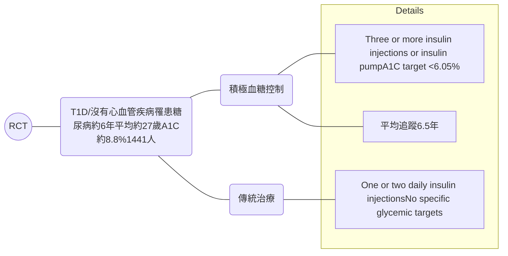
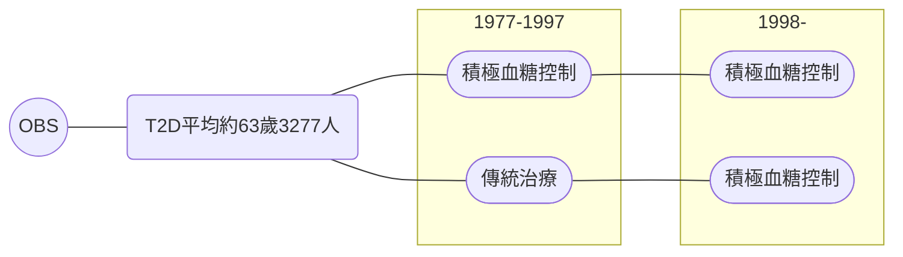
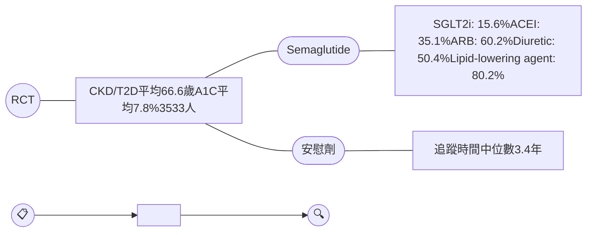
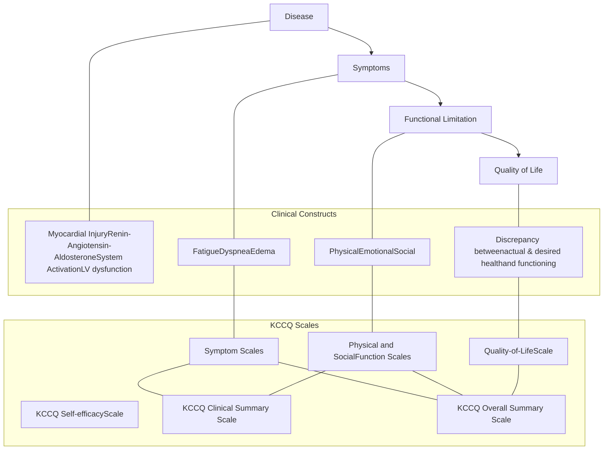

Illustration of medical icons including a cell, a test tube, and a magnifying glass arranged in a paw-print shape

# 糖尿病與代謝疾病重要臨床試驗

國立台灣大學醫學院附設醫院 新竹台大分院
范綱志醫師

# Evolution of focus in clinical trials for diabetes

Infographic showing a three-step timeline of diabetes clinical trial evolution: 01 Glucocentric approach, 02 A new era of glucose-lowering drugs and CVOTs, and 03 Cardiorenal risk reduction.

<table>
    <tr>
        <th>01</th>
        <th>02</th>
        <th>03</th>
    </tr>
    <tr>
        <td><mark>Glucocentric approach: targets for glycemic control</mark></td>
        <td>A new era: glucose-lowering drugs and CVOTs</td>
        <td>Cardiorenal risk reduction: beyond glycemic control</td>
    </tr>
</table>

# Diabetes studies in pursuit of the holy grail

Timeline of diabetes studies from 1993 to 2024

<table>
  <thead>
    <tr>
        <th>Study Group</th>
        <th>1993</th>
        <th>1998</th>
        <th>2005</th>
        <th>2008</th>
        <th>2009</th>
        <th>2014</th>
        <th>2015</th>
        <th>2016</th>
        <th>2024</th>
    </tr>
  </thead>
  <tbody>
    <tr>
        <td>DCCT/EDIC Group</td>
        <td>DCCT</td>
        <td> </td>
        <td>EDIC</td>
        <td> </td>
        <td> </td>
        <td> </td>
        <td> </td>
        <td>DCCT/EDIC 30- Year Follow-up</td>
        <td> </td>
    </tr>
    <tr>
        <td>UKPDS Group</td>
        <td> </td>
        <td>UKPDS 33 UKPDS 34</td>
        <td> </td>
        <td>UKPDS 80</td>
        <td> </td>
        <td> </td>
        <td> </td>
        <td> </td>
        <td>UKPDS 91</td>
    </tr>
    <tr>
        <td>Other Studies</td>
        <td> </td>
        <td> </td>
        <td> </td>
        <td>ACCORD ADVANCE</td>
        <td>VADT</td>
        <td>ADVANCE-ON</td>
        <td>Follow-up of VADT</td>
        <td>ACCORDION</td>
        <td> </td>
    </tr>
  </tbody>
</table>

# Timeline of glucose-lowering medications

<table>
  <tbody>
    <tr>
        <td>Year</td>
        <td>Diabetes (millions)</td>
        <td>Medication Introduced</td>
    </tr>
    <tr>
        <td>1920</td>
        <td>20</td>
        <td>Insulin Starvation diets and traditional remedies</td>
    </tr>
    <tr>
        <td>1950</td>
        <td>35</td>
        <td>1° Sulphonylureas</td>
    </tr>
    <tr>
        <td>1960</td>
        <td>50</td>
        <td>Biguanides</td>
    </tr>
    <tr>
        <td>1970</td>
        <td>75</td>
        <td>2° Sulphonylureas</td>
    </tr>
    <tr>
        <td>1980</td>
        <td>110</td>
        <td> </td>
    </tr>
    <tr>
        <td>1990</td>
        <td>150</td>
        <td>Metformin (USA 1995) Acarbose</td>
    </tr>
    <tr>
        <td>2000</td>
        <td>200</td>
        <td>Meglitinides TZDs</td>
    </tr>
    <tr>
        <td>2010</td>
        <td>320</td>
        <td>DPP4 inhibitors GLP-1 receptor agonists SGLT2 inhibitors</td>
    </tr>
    <tr>
        <td>2020</td>
        <td>480</td>
        <td> </td>
    </tr>
  </tbody>
</table>

# DCCT

DCCT study flow diagram showing patient characteristics, intervention groups (intensive vs conventional therapy), and study duration.

**主要試驗指標**

* 視網膜病變的發生及惡化

**主要發現**

* 積極血糖控制可延緩第1型糖尿病的視網膜、腎病變、神經病變的發生及惡化
* 積極血糖控制無法減少第1型糖尿病的大血管併發症風險

# DCCT: 積極血糖控制組糖化血色素控制優於傳統治療組

Magnifying glass icon showing cells

### 主要發現

* 積極血糖控制可延緩第1型糖尿病的視網膜、腎病變、神經病變的發生及惡化
* 積極血糖控制無法減少第1型糖尿病的大血管併發症風險

<table>
  <thead>
    <tr>
        <th>Year of Study</th>
        <th>Conventional (%)</th>
        <th>Intensive (%)</th>
    </tr>
  </thead>
  <tbody>
    <tr>
        <td>0</td>
        <td>8.7</td>
        <td>8.7</td>
    </tr>
    <tr>
        <td>1</td>
        <td>8.9</td>
        <td>6.9</td>
    </tr>
    <tr>
        <td>2</td>
        <td>9.0</td>
        <td>6.9</td>
    </tr>
    <tr>
        <td>3</td>
        <td>9.1</td>
        <td>7.0</td>
    </tr>
    <tr>
        <td>4</td>
        <td>9.1</td>
        <td>7.1</td>
    </tr>
    <tr>
        <td>5</td>
        <td>9.0</td>
        <td>7.1</td>
    </tr>
    <tr>
        <td>6</td>
        <td>9.2</td>
        <td>7.1</td>
    </tr>
    <tr>
        <td>7</td>
        <td>9.1</td>
        <td>7.2</td>
    </tr>
    <tr>
        <td>8</td>
        <td>8.9</td>
        <td>7.2</td>
    </tr>
    <tr>
        <td>9</td>
        <td>9.2</td>
        <td>7.4</td>
    </tr>
    <tr>
        <td>10</td>
        <td>9.2</td>
        <td>7.0</td>
    </tr>
  </tbody>
</table>

A

# DCCT: 積極血糖控制可延緩視網膜、腎病變的發生及惡化

主要發現圖示

## 主要發現

* 積極血糖控制可延緩第1型糖尿病的視網膜、腎病變、神經病變的發生及惡化
* 積極血糖控制無法減少第1型糖尿病的大血管併發症風險

### 視網膜病變

<table>
  <thead>
    <tr>
        <th colspan="12">視網膜病變 - A</th>
    </tr>
    <tr>
        <th>Year of Study</th>
        <th>0</th>
        <th>1</th>
        <th>2</th>
        <th>3</th>
        <th>4</th>
        <th>5</th>
        <th>6</th>
        <th>7</th>
        <th>8</th>
        <th colspan="2">9</th>
    </tr>
    <tr>
        <th>Conventional</th>
        <th>0</th>
        <th>1</th>
        <th>2</th>
        <th>5</th>
        <th>8</th>
        <th>15</th>
        <th>25</th>
        <th>32</th>
        <th>40</th>
        <th colspan="2">55</th>
    </tr>
    <tr>
        <th>Intensive</th>
        <th>0</th>
        <th>1</th>
        <th>2</th>
        <th>3</th>
        <th>4</th>
        <th>6</th>
        <th>8</th>
        <th>10</th>
        <th>12</th>
        <th colspan="2">14</th>
    </tr>
    <tr>
        <th colspan="2">Number of Patients</th>
        <th> </th>
        <th> </th>
        <th> </th>
        <th> </th>
        <th> </th>
        <th> </th>
        <th> </th>
        <th> </th>
        <th> </th>
        <th> </th>
    </tr>
  </thead>
  <tbody>
    <tr>
        <td>Conventional</td>
        <td>375</td>
        <td> </td>
        <td> </td>
        <td> </td>
        <td> </td>
        <td>220</td>
        <td> </td>
        <td> </td>
        <td>79</td>
        <td> </td>
        <td>52</td>
    </tr>
    <tr>
        <td>Intensive</td>
        <td>342</td>
        <td> </td>
        <td> </td>
        <td> </td>
        <td> </td>
        <td>202</td>
        <td> </td>
        <td> </td>
        <td>78</td>
        <td> </td>
        <td>49</td>
    </tr>
  </tbody>
</table>
<table>
  <thead>
    <tr>
        <th colspan="12">視網膜病變 - B</th>
    </tr>
    <tr>
        <th>Year of Study</th>
        <th>0</th>
        <th>1</th>
        <th>2</th>
        <th>3</th>
        <th>4</th>
        <th>5</th>
        <th>6</th>
        <th>7</th>
        <th>8</th>
        <th colspan="2">9</th>
    </tr>
    <tr>
        <th>Conventional</th>
        <th>2</th>
        <th>5</th>
        <th>10</th>
        <th>15</th>
        <th>20</th>
        <th>28</th>
        <th>38</th>
        <th>45</th>
        <th>48</th>
        <th colspan="2">55</th>
    </tr>
    <tr>
        <th>Intensive</th>
        <th>2</th>
        <th>4</th>
        <th>8</th>
        <th>10</th>
        <th>12</th>
        <th>15</th>
        <th>18</th>
        <th>20</th>
        <th>24</th>
        <th colspan="2">26</th>
    </tr>
    <tr>
        <th colspan="2">Number of Patients</th>
        <th> </th>
        <th> </th>
        <th> </th>
        <th> </th>
        <th> </th>
        <th> </th>
        <th> </th>
        <th> </th>
        <th> </th>
        <th> </th>
    </tr>
  </thead>
  <tbody>
    <tr>
        <td>Conventional</td>
        <td>348</td>
        <td> </td>
        <td> </td>
        <td> </td>
        <td> </td>
        <td>324</td>
        <td> </td>
        <td> </td>
        <td>128</td>
        <td> </td>
        <td>79</td>
    </tr>
    <tr>
        <td>Intensive</td>
        <td>354</td>
        <td> </td>
        <td> </td>
        <td> </td>
        <td> </td>
        <td>335</td>
        <td> </td>
        <td> </td>
        <td>136</td>
        <td> </td>
        <td>93</td>
    </tr>
  </tbody>
</table>

### 蛋白尿

<table>
  <thead>
    <tr>
        <th colspan="11">蛋白尿 - A</th>
    </tr>
    <tr>
        <th>Year of Study</th>
        <th>0</th>
        <th>1</th>
        <th>2</th>
        <th>3</th>
        <th>4</th>
        <th>5</th>
        <th>6</th>
        <th>7</th>
        <th>8</th>
        <th>9</th>
    </tr>
    <tr>
        <th>Conventional</th>
        <th>0</th>
        <th>3</th>
        <th>3</th>
        <th>6</th>
        <th>9</th>
        <th>12</th>
        <th>15</th>
        <th>20</th>
        <th>24</th>
        <th>28</th>
    </tr>
    <tr>
        <th>Intensive</th>
        <th>0</th>
        <th>3</th>
        <th>3</th>
        <th>5</th>
        <th>7</th>
        <th>9</th>
        <th>11</th>
        <th>13</th>
        <th>16</th>
        <th>16</th>
    </tr>
  </thead>
</table>
<table>
  <thead>
    <tr>
        <th colspan="11">蛋白尿 - B</th>
    </tr>
    <tr>
        <th>Year of Study</th>
        <th>0</th>
        <th>1</th>
        <th>2</th>
        <th>3</th>
        <th>4</th>
        <th>5</th>
        <th>6</th>
        <th>7</th>
        <th>8</th>
        <th>9</th>
    </tr>
    <tr>
        <th>Conventional</th>
        <th>10</th>
        <th>13</th>
        <th>18</th>
        <th>23</th>
        <th>26</th>
        <th>29</th>
        <th>31</th>
        <th>36</th>
        <th>36</th>
        <th>42</th>
    </tr>
    <tr>
        <th>Intensive</th>
        <th>10</th>
        <th>11</th>
        <th>13</th>
        <th>15</th>
        <th>17</th>
        <th>20</th>
        <th>21</th>
        <th>24</th>
        <th>24</th>
        <th>27</th>
    </tr>
  </thead>
</table>

# DCCT: 積極血糖控制無法減少大血管併發症風險

Magnifying glass icon showing cells

## 主要發現

* 積極血糖控制可延緩第1型糖尿病的視網膜、腎病變、神經病變的發生及惡化

* 積極血糖控制無法減少第1型糖尿病的大血管併發症風險

<table>
  <thead>
    <tr>
        <th colspan="10">TABLE II Number of Macrovascular Events as a Function of Type of Diabetic Management* in 1,441 Patients</th>
    </tr>
    <tr>
        <th rowspan="2">Events</th>
        <th colspan="3">Total</th>
        <th colspan="3">Conventional Treatment</th>
        <th colspan="3">Intensive Treatment</th>
    </tr>
    <tr>
        <th>Events</th>
        <th>Patients</th>
        <th>Initial Events</th>
        <th>Events</th>
        <th>Patients</th>
        <th>Initial Events</th>
        <th>Events</th>
        <th>Patients</th>
        <th>Initial Events</th>
    </tr>
  </thead>
  <tbody>
    <tr>
        <td>Major cardiovascular events</td>
        <td> </td>
        <td> </td>
        <td> </td>
        <td> </td>
        <td> </td>
        <td> </td>
        <td> </td>
        <td> </td>
        <td> </td>
    </tr>
    <tr>
        <td>Fatal</td>
        <td> </td>
        <td> </td>
        <td> </td>
        <td> </td>
        <td> </td>
        <td> </td>
        <td> </td>
        <td> </td>
        <td> </td>
    </tr>
    <tr>
        <td>Cardiovascular</td>
        <td>2</td>
        <td> </td>
        <td> </td>
        <td>1</td>
        <td> </td>
        <td> </td>
        <td>1</td>
        <td> </td>
        <td> </td>
    </tr>
    <tr>
        <td>Sudden death</td>
        <td>1</td>
        <td> </td>
        <td> </td>
        <td>0</td>
        <td> </td>
        <td> </td>
        <td>1</td>
        <td> </td>
        <td> </td>
    </tr>
    <tr>
        <td>Nonfatal</td>
        <td>21</td>
        <td>9</td>
        <td>14</td>
        <td>20</td>
        <td>8</td>
        <td>13</td>
        <td>1</td>
        <td>1</td>
        <td>1</td>
    </tr>
    <tr>
        <td>Myocardial infarction definite</td>
        <td>4</td>
        <td>4</td>
        <td> </td>
        <td>4</td>
        <td>4</td>
        <td> </td>
        <td>0</td>
        <td> </td>
        <td> </td>
    </tr>
    <tr>
        <td>Bypass graft or coronary angioplasty</td>
        <td>1</td>
        <td>1</td>
        <td> </td>
        <td>1</td>
        <td>1</td>
        <td> </td>
        <td>0</td>
        <td> </td>
        <td> </td>
    </tr>
    <tr>
        <td>Angina pectoris</td>
        <td>12</td>
        <td>5</td>
        <td> </td>
        <td>11</td>
        <td>4</td>
        <td> </td>
        <td>1</td>
        <td>1</td>
        <td> </td>
    </tr>
    <tr>
        <td>Silent myocardial infarction</td>
        <td>4</td>
        <td>4</td>
        <td> </td>
        <td>4</td>
        <td>4</td>
        <td> </td>
        <td>0</td>
        <td> </td>
        <td> </td>
    </tr>
    <tr>
        <td>Cardiac events of interest</td>
        <td>19</td>
        <td>16</td>
        <td>17</td>
        <td>12</td>
        <td>10</td>
        <td>10</td>
        <td>7</td>
        <td>6</td>
        <td>7</td>
    </tr>
    <tr>
        <td>Cardiac arrhythmia</td>
        <td>9</td>
        <td>8</td>
        <td> </td>
        <td>5</td>
        <td>4</td>
        <td> </td>
        <td>4</td>
        <td>4</td>
        <td> </td>
    </tr>
    <tr>
        <td>Major ECG abnormalities†</td>
        <td>7</td>
        <td>7</td>
        <td> </td>
        <td>5</td>
        <td>5</td>
        <td> </td>
        <td>2</td>
        <td>2</td>
        <td> </td>
    </tr>
    <tr>
        <td>Congestive heart failure</td>
        <td>3</td>
        <td>2</td>
        <td> </td>
        <td>2</td>
        <td>1</td>
        <td> </td>
        <td>1</td>
        <td>1</td>
        <td> </td>
    </tr>
    <tr>
        <td>Major nonfatal cerebrovascular events</td>
        <td> </td>
        <td> </td>
        <td> </td>
        <td> </td>
        <td> </td>
        <td> </td>
        <td> </td>
        <td> </td>
        <td> </td>
    </tr>
    <tr>
        <td>Stroke</td>
        <td>0</td>
        <td> </td>
        <td> </td>
        <td>0</td>
        <td> </td>
        <td> </td>
        <td>0</td>
        <td> </td>
        <td> </td>
    </tr>
    <tr>
        <td>Nonfatal cerebrovascular events of interest</td>
        <td> </td>
        <td> </td>
        <td> </td>
        <td> </td>
        <td> </td>
        <td> </td>
        <td> </td>
        <td> </td>
        <td> </td>
    </tr>
    <tr>
        <td>Transient ischemic attack</td>
        <td>2</td>
        <td>2</td>
        <td>2</td>
        <td>0</td>
        <td> </td>
        <td> </td>
        <td>2</td>
        <td>2</td>
        <td>2</td>
    </tr>
    <tr>
        <td>Major peripheral vascular events</td>
        <td>84</td>
        <td>44</td>
        <td>46</td>
        <td>61</td>
        <td>24</td>
        <td>26</td>
        <td>23</td>
        <td>20</td>
        <td>20</td>
    </tr>
    <tr>
        <td>Amputation of lower extremity</td>
        <td>1</td>
        <td>1</td>
        <td> </td>
        <td>0</td>
        <td> </td>
        <td> </td>
        <td>1</td>
        <td>1</td>
        <td> </td>
    </tr>
    <tr>
        <td>Arterial event requiring surgery</td>
        <td>2</td>
        <td>2</td>
        <td> </td>
        <td>2</td>
        <td>2</td>
        <td> </td>
        <td>0</td>
        <td> </td>
        <td> </td>
    </tr>
    <tr>
        <td>Claudication</td>
        <td>81</td>
        <td>43</td>
        <td> </td>
        <td>59</td>
        <td>24</td>
        <td> </td>
        <td>22</td>
        <td>19</td>
        <td> </td>
    </tr>
    <tr>
        <td>Peripheral vascular event of interest</td>
        <td> </td>
        <td> </td>
        <td> </td>
        <td> </td>
        <td> </td>
        <td> </td>
        <td> </td>
        <td> </td>
        <td> </td>
    </tr>
    <tr>
        <td>Persistent loss of pedal pulse</td>
        <td>25</td>
        <td>25</td>
        <td>25</td>
        <td>14</td>
        <td>14</td>
        <td>14</td>
        <td>11</td>
        <td>11</td>
        <td>11</td>
    </tr>
  </tbody>
</table>

\*Conventional or intensive; see text for description.

†Excluding silent myocardial infarctions.

The number of initial events in each category is the sum of the numbers of patients with events of each type.

ECG = electrocardiographic.

# EDIC: observational follow-up of DCCT cohort

Diagram showing the EDIC observational follow-up of the DCCT cohort, illustrating the transition from initial treatment groups (Intensive vs. Conventional) to long-term intensive glycemic control, along with primary endpoints and findings.

主要發現

主要試驗指標

* 心血管疾病死亡、非致死性心肌梗塞、非致死性中風、心電圖偵測到的心肌梗塞、心絞痛或心肌血管重建治療

* 早期積極血糖控制能夠降低第1型糖尿病的長期心血管風險

* 早期積極血糖控制可持續延緩第1型糖尿病的視網膜、腎病變、神經病變的發生及惡化

# EDIC: 5年後A1C沒有顯著差異

主要發現圖示

* 早期積極血糖控制能夠降低第1型糖尿病的長期心血管風險
* 早期積極血糖控制可持續延緩第1型糖尿病的視網膜、腎病變、神經病變的發生及惡化

<table>
  <thead>
    <tr>
        <th>Study Phase</th>
        <th>Study Year</th>
        <th>Conventional (%)</th>
        <th>Intensive (%)</th>
    </tr>
  </thead>
  <tbody>
    <tr>
        <td rowspan="10">DCCT Intervention</td>
        <td>0</td>
        <td>8.6</td>
        <td>8.8</td>
    </tr>
    <tr>
        <td>1</td>
        <td>8.9</td>
        <td>6.9</td>
    </tr>
    <tr>
        <td>2</td>
        <td>9.0</td>
        <td>7.0</td>
    </tr>
    <tr>
        <td>3</td>
        <td>9.1</td>
        <td>7.1</td>
    </tr>
    <tr>
        <td>4</td>
        <td>9.1</td>
        <td>7.1</td>
    </tr>
    <tr>
        <td>5</td>
        <td>9.0</td>
        <td>7.2</td>
    </tr>
    <tr>
        <td>6</td>
        <td>9.1</td>
        <td>7.2</td>
    </tr>
    <tr>
        <td>7</td>
        <td>9.0</td>
        <td>7.2</td>
    </tr>
    <tr>
        <td>8</td>
        <td>9.0</td>
        <td>7.3</td>
    </tr>
    <tr>
        <td>9</td>
        <td>9.2</td>
        <td>7.4</td>
    </tr>
    <tr>
        <td rowspan="18">EDIC Observation</td>
        <td>1</td>
        <td>8.1</td>
        <td>7.7</td>
    </tr>
    <tr>
        <td>2</td>
        <td>8.2</td>
        <td>7.9</td>
    </tr>
    <tr>
        <td>3</td>
        <td>8.3</td>
        <td>7.9</td>
    </tr>
    <tr>
        <td>4</td>
        <td>8.1</td>
        <td>7.9</td>
    </tr>
    <tr>
        <td>5</td>
        <td>8.0</td>
        <td>7.9</td>
    </tr>
    <tr>
        <td>6</td>
        <td>8.0</td>
        <td>7.8</td>
    </tr>
    <tr>
        <td>7</td>
        <td>7.8</td>
        <td>7.7</td>
    </tr>
    <tr>
        <td>8</td>
        <td>7.9</td>
        <td>7.8</td>
    </tr>
    <tr>
        <td>9</td>
        <td>7.7</td>
        <td>7.6</td>
    </tr>
    <tr>
        <td>10</td>
        <td>7.7</td>
        <td>7.5</td>
    </tr>
    <tr>
        <td>11</td>
        <td>7.7</td>
        <td>7.6</td>
    </tr>
    <tr>
        <td>12</td>
        <td>7.7</td>
        <td>7.6</td>
    </tr>
    <tr>
        <td>13</td>
        <td>7.7</td>
        <td>7.7</td>
    </tr>
    <tr>
        <td>14</td>
        <td>7.7</td>
        <td>7.7</td>
    </tr>
    <tr>
        <td>15</td>
        <td>7.9</td>
        <td>7.7</td>
    </tr>
    <tr>
        <td>16</td>
        <td>7.8</td>
        <td>7.7</td>
    </tr>
    <tr>
        <td>17</td>
        <td>7.7</td>
        <td>7.7</td>
    </tr>
    <tr>
        <td>18</td>
        <td>7.8</td>
        <td>7.7</td>
    </tr>
  </tbody>
</table>

# EDIC: 早期積極血糖控制可持續延緩小血管併發症的發生

Magnifying glass icon focusing on cells

**主要發現**

* 早期積極血糖控制能夠降低第1型糖尿病的長期心血管風險
* 早期積極血糖控制可持續延緩第1型糖尿病的視網膜、腎病變、神經病變的發生及惡化

<table>
  <thead>
    <tr>
        <th>Study Period</th>
        <th>Complication / Outcome</th>
        <th>Percent (%) reduction in risk</th>
    </tr>
  </thead>
  <tbody>
    <tr>
        <td rowspan="5">DCCT 1983-93</td>
        <td>3+step devel, Prim</td>
        <td>76</td>
    </tr>
    <tr>
        <td>3+step progression, Scnd</td>
        <td>54</td>
    </tr>
    <tr>
        <td>Microalb</td>
        <td>54</td>
    </tr>
    <tr>
        <td>Macroalb</td>
        <td>39</td>
    </tr>
    <tr>
        <td>Neuropathy</td>
        <td>64</td>
    </tr>
    <tr>
        <td rowspan="5">EDIC 1994-2011</td>
        <td>Further 3+ step prog, Prim</td>
        <td>34</td>
    </tr>
    <tr>
        <td>Further 3+step prog, Scnd</td>
        <td>58</td>
    </tr>
    <tr>
        <td>New Microalb</td>
        <td>45</td>
    </tr>
    <tr>
        <td>New Macroalb</td>
        <td>61</td>
    </tr>
    <tr>
        <td>New Neuropathy(2007-08)</td>
        <td>30</td>
    </tr>
    <tr>
        <td rowspan="3">DCCT + EDIC</td>
        <td>Severe eye</td>
        <td>50</td>
    </tr>
    <tr>
        <td>Reduced GFR</td>
        <td>50</td>
    </tr>
    <tr>
        <td>CVD events</td>
        <td>57</td>
    </tr>
  </tbody>
</table>

Percent (%) reduction in risk

# EDIC: 早期積極血糖控制能夠降低長期心血管風險

Magnifying glass icon focusing on cells

### 主要發現

* 早期積極血糖控制能夠降低第1型糖尿病的長期心血管風險
* 早期積極血糖控制可持續延緩第1型糖尿病的視網膜、腎病變、神經病變的發生及惡化

Any CVD

<table>
  <thead>
    <tr>
        <th>Years Since Entry</th>
        <th>CONVENTIONAL TREATMENT</th>
        <th>INTENSIVE TREATMENT</th>
    </tr>
  </thead>
  <tbody>
    <tr>
        <td>0</td>
        <td>0.00</td>
        <td>0.00</td>
    </tr>
    <tr>
        <td>1</td>
        <td>0.00</td>
        <td>0.00</td>
    </tr>
    <tr>
        <td>2</td>
        <td>0.00</td>
        <td>0.00</td>
    </tr>
    <tr>
        <td>3</td>
        <td>0.01</td>
        <td>0.00</td>
    </tr>
    <tr>
        <td>4</td>
        <td>0.01</td>
        <td>0.00</td>
    </tr>
    <tr>
        <td>5</td>
        <td>0.01</td>
        <td>0.00</td>
    </tr>
    <tr>
        <td>6</td>
        <td>0.01</td>
        <td>0.01</td>
    </tr>
    <tr>
        <td>7</td>
        <td>0.01</td>
        <td>0.01</td>
    </tr>
    <tr>
        <td>8</td>
        <td>0.01</td>
        <td>0.01</td>
    </tr>
    <tr>
        <td>9</td>
        <td>0.01</td>
        <td>0.01</td>
    </tr>
    <tr>
        <td>10</td>
        <td>0.02</td>
        <td>0.01</td>
    </tr>
    <tr>
        <td>11</td>
        <td>0.02</td>
        <td>0.01</td>
    </tr>
    <tr>
        <td>12</td>
        <td>0.03</td>
        <td>0.01</td>
    </tr>
    <tr>
        <td>13</td>
        <td>0.04</td>
        <td>0.02</td>
    </tr>
    <tr>
        <td>14</td>
        <td>0.04</td>
        <td>0.02</td>
    </tr>
    <tr>
        <td>15</td>
        <td>0.05</td>
        <td>0.03</td>
    </tr>
    <tr>
        <td>16</td>
        <td>0.06</td>
        <td>0.03</td>
    </tr>
    <tr>
        <td>17</td>
        <td>0.07</td>
        <td>0.04</td>
    </tr>
    <tr>
        <td>18</td>
        <td>0.08</td>
        <td>0.05</td>
    </tr>
    <tr>
        <td>19</td>
        <td>0.09</td>
        <td>0.05</td>
    </tr>
    <tr>
        <td>20</td>
        <td>0.10</td>
        <td>0.06</td>
    </tr>
    <tr>
        <td>21</td>
        <td>0.10</td>
        <td>0.07</td>
    </tr>
    <tr>
        <td>22</td>
        <td>0.11</td>
        <td>0.08</td>
    </tr>
    <tr>
        <td>23</td>
        <td>0.12</td>
        <td>0.09</td>
    </tr>
    <tr>
        <td>24</td>
        <td>0.12</td>
        <td>0.10</td>
    </tr>
    <tr>
        <td>25</td>
        <td>0.13</td>
        <td>0.11</td>
    </tr>
    <tr>
        <td>26</td>
        <td>0.14</td>
        <td>0.12</td>
    </tr>
    <tr>
        <td>27</td>
        <td>0.15</td>
        <td>0.12</td>
    </tr>
    <tr>
        <td>28</td>
        <td>0.17</td>
        <td>0.12</td>
    </tr>
    <tr>
        <td>29</td>
        <td>0.18</td>
        <td>0.12</td>
    </tr>
    <tr>
        <td>30</td>
        <td>0.18</td>
        <td>0.13</td>
    </tr>
    <tr>
        <td>31</td>
        <td>0.19</td>
        <td>0.14</td>
    </tr>
  </tbody>
</table>
<table>
  <thead>
    <tr>
        <th colspan="2">No. at Risk</th>
        <th> </th>
        <th> </th>
        <th> </th>
        <th> </th>
        <th> </th>
        <th> </th>
    </tr>
  </thead>
  <tbody>
    <tr>
        <td>Intensive</td>
        <td>711</td>
        <td>704</td>
        <td>684</td>
        <td>660</td>
        <td>629</td>
        <td>514</td>
        <td>22</td>
    </tr>
    <tr>
        <td>Conventional</td>
        <td>730</td>
        <td>715</td>
        <td>696</td>
        <td>654</td>
        <td>606</td>
        <td>474</td>
        <td>15</td>
    </tr>
  </tbody>
</table>

# EDIC: 早期積極血糖控制能夠<mark>降低</mark>長期全死因死亡風險

Cumulative mortality by treatment group

Microscope icon

### 主要發現

* 早期積極血糖控制能夠降低第1型糖尿病的長期心血管風險
* 早期積極血糖控制可持續延緩第1型糖尿病的視網膜、腎病變、神經病變的發生及惡化

<table>
  <tbody>
    <tr>
        <td>Time Since DCCT Randomization, y</td>
        <td>Conventional treatment</td>
        <td>Intensive treatment</td>
    </tr>
    <tr>
        <td>0</td>
        <td>0</td>
        <td>0</td>
    </tr>
    <tr>
        <td>5</td>
        <td>0.005</td>
        <td>0.005</td>
    </tr>
    <tr>
        <td>10</td>
        <td>0.01</td>
        <td>0.015</td>
    </tr>
    <tr>
        <td>15</td>
        <td>0.02</td>
        <td>0.02</td>
    </tr>
    <tr>
        <td>20</td>
        <td>0.045</td>
        <td>0.035</td>
    </tr>
    <tr>
        <td>25</td>
        <td>0.075</td>
        <td>0.055</td>
    </tr>
    <tr>
        <td>30</td>
        <td>0.11</td>
        <td>0.075</td>
    </tr>
  </tbody>
</table>
<table>
  <thead>
    <tr>
        <th rowspan="2">No. at risk</th>
        <th> </th>
        <th> </th>
        <th> </th>
        <th> </th>
        <th> </th>
        <th> </th>
    </tr>
    <tr>
        <th>0</th>
        <th>5</th>
        <th>10</th>
        <th>15</th>
        <th>20</th>
        <th>25</th>
    </tr>
  </thead>
  <tbody>
    <tr>
        <td>Conventional</td>
        <td>730</td>
        <td>726</td>
        <td>721</td>
        <td>712</td>
        <td>693</td>
        <td>476</td>
    </tr>
    <tr>
        <td>Intensive</td>
        <td>711</td>
        <td>706</td>
        <td>697</td>
        <td>694</td>
        <td>685</td>
        <td>501</td>
    </tr>
  </tbody>
</table>

# UKPDS 33: intensive with SU or insulin vs conventional with diet

Diagram of UKPDS 33 study design showing RCT of 3867 newly diagnosed T2D patients, average age 53.3, A1C 7.08%, split into intensive blood glucose control (SU or insulin, FPG < 108 mg/dL) and conventional treatment (Diet, FPG < 270 mg/dL) over 10 years.

<table>
    <tr>
        <th>主要試驗指標</th>
        <th>主要發現</th>
    </tr>
    <tr>
        <td>\* **Any diabetes-related endpoint** Sudden death, death from hyperglycemia or hypoglycemia, fatal or non-fatal MI, angina, HF, stroke, renal failure, amputation, vitreous hemorrhage, retinal photocoagulation, blindness in one eye, or cataract extraction</td>
        <td>\* 積極血糖控制可減少新診斷第 2型糖尿病的小血管併發症風險，但無法減少大血管併發症風險</td>
    </tr>
    <tr>
        <td>\* **Diabetes-related death** Death from MI, stroke, peripheral vascular disease, renal disease, hyperglycemia or hypoglycemia, and sudden death</td>
        <td>EMPTY</td>
    </tr>
    <tr>
        <td>\* **All-cause mortality**</td>
        <td>EMPTY</td>
    </tr>
</table>

# UKPDS 33: 追蹤10年期間兩組A1C的中位數為7.0%和7.9%

主要發現圖示

主要發現

* 積極血糖控制可減少新診斷第 2型糖尿病的小血管併發症風險，但無法減少大血管併發症風險

<table>
  <thead>
    <tr>
        <th colspan="3">Weight (Mean change in weight, kg)</th>
        <th colspan="2">HbA1c (Median HbA1c, %)</th>
    </tr>
    <tr>
        <th>Time (years)</th>
        <th>Conventional</th>
        <th>Intensive</th>
        <th>Conventional</th>
        <th>Intensive</th>
    </tr>
  </thead>
  <tbody>
    <tr>
        <td>0</td>
        <td>0</td>
        <td>0</td>
        <td>7.0</td>
        <td>7.0</td>
    </tr>
    <tr>
        <td>3</td>
        <td>1.5</td>
        <td>4.5</td>
        <td>7.5</td>
        <td>6.8</td>
    </tr>
    <tr>
        <td>6</td>
        <td>2.5</td>
        <td>5.5</td>
        <td>8.2</td>
        <td>7.2</td>
    </tr>
    <tr>
        <td>9</td>
        <td>2.7</td>
        <td>5.8</td>
        <td>8.4</td>
        <td>7.8</td>
    </tr>
    <tr>
        <td>12</td>
        <td>3.3</td>
        <td>6.2</td>
        <td>8.7</td>
        <td>8.1</td>
    </tr>
    <tr>
        <td>15</td>
        <td>3.4</td>
        <td>6.1</td>
        <td>8.7</td>
        <td>8.1</td>
    </tr>
  </tbody>
</table>

Baseline=75 kg

Patients followed for 10 years
* — Conventional
* – – Intensive

All patients assigned to regimen
* ● Conventional
* ○ Intensive

# UKPDS 33: 積極血糖控制可減少糖尿病相關終點事件

Magnifying glass icon showing cells

主要發現

* 積極血糖控制可減少新診斷第 2型糖尿病的小血管併發症風險，但無法減少大血管併發症風險

<table>
  <thead>
    <tr>
        <th> </th>
        <th colspan="2">Patients with clinical endpoints</th>
        <th colspan="2">Absolute risk: events per 1000 patient-years</th>
        <th>Log-rank p</th>
        <th>RR for intensive policy (CI)</th>
    </tr>
    <tr>
        <th>AGGREGATE ENDPOINT</th>
        <th>Intensive (n=2729)</th>
        <th>Conventional (n=1138)</th>
        <th>Intensive</th>
        <th>Conventional</th>
        <th> </th>
        <th> </th>
    </tr>
  </thead>
  <tbody>
    <tr>
        <td>Any diabetes-related endpoint</td>
        <td>963</td>
        <td>438</td>
        <td>40.9</td>
        <td>46.0</td>
        <td>0.029</td>
        <td>0.88 (0.79-0.99)</td>
    </tr>
    <tr>
        <td>Diabetes-related deaths</td>
        <td>285</td>
        <td>129</td>
        <td>10.4</td>
        <td>11.5</td>
        <td>0.34</td>
        <td>0.90 (0.73-1.11)</td>
    </tr>
    <tr>
        <td>All-cause mortality</td>
        <td>489</td>
        <td>213</td>
        <td>17.9</td>
        <td>18.9</td>
        <td>0.44</td>
        <td>0.94 (0.80-1.10)</td>
    </tr>
    <tr>
        <td>Myocardial infarction</td>
        <td>387</td>
        <td>186</td>
        <td>14.7</td>
        <td>17.4</td>
        <td>0.052</td>
        <td>0.84 (0.71-1.00)</td>
    </tr>
    <tr>
        <td>Stroke</td>
        <td>148</td>
        <td>55</td>
        <td>5.6</td>
        <td>5.0</td>
        <td>0.52</td>
        <td>1.11 (0.81-1.51)</td>
    </tr>
    <tr>
        <td>Amputation or death from PVD</td>
        <td>29</td>
        <td>18</td>
        <td>1.1</td>
        <td>1.6</td>
        <td>0.15</td>
        <td>0.65 (0.36-1.18)</td>
    </tr>
    <tr>
        <td>Microvascular</td>
        <td>225</td>
        <td>121</td>
        <td>8.6</td>
        <td>11.4</td>
        <td>0.0099</td>
        <td>0.75 (0.60-0.93)</td>
    </tr>
    <tr>
        <th>SINGLE ENDPOINTS</th>
        <th> </th>
        <th> </th>
        <th> </th>
        <th> </th>
        <th> </th>
        <th> </th>
    </tr>
    <tr>
        <td>Fatal myocardial infarction</td>
        <td>207</td>
        <td>90</td>
        <td>7.6</td>
        <td>8.0</td>
        <td>0.63</td>
        <td>0.94 (0.68-1.30)</td>
    </tr>
    <tr>
        <td>Non-fatal myocardial infarction</td>
        <td>197</td>
        <td>101</td>
        <td>7.5</td>
        <td>9.5</td>
        <td>0.057</td>
        <td>0.79 (0.58-1.09)</td>
    </tr>
    <tr>
        <td>Fatal: sudden death</td>
        <td>24</td>
        <td>18</td>
        <td>0.9</td>
        <td>1.6</td>
        <td>0.047</td>
        <td>0.54 (0.24-1.21)</td>
    </tr>
    <tr>
        <td>Heart failure</td>
        <td>80</td>
        <td>36</td>
        <td>3.0</td>
        <td>3.3</td>
        <td>0.63</td>
        <td>0.91 (0.54-1.52)</td>
    </tr>
    <tr>
        <td>Angina</td>
        <td>177</td>
        <td>72</td>
        <td>6.8</td>
        <td>6.7</td>
        <td>0.91</td>
        <td>1.02 (0.71-1.46)</td>
    </tr>
    <tr>
        <td>Fatal stroke</td>
        <td>43</td>
        <td>15</td>
        <td>1.6</td>
        <td>1.3</td>
        <td>0.60</td>
        <td>1.17 (0.54-2.54)</td>
    </tr>
    <tr>
        <td>Non-fatal stroke</td>
        <td>114</td>
        <td>44</td>
        <td>4.3</td>
        <td>4.0</td>
        <td>0.72</td>
        <td>1.07 (0.68-1.69)</td>
    </tr>
    <tr>
        <td>Death from peripheral vascular disease</td>
        <td>2</td>
        <td>3</td>
        <td>0.1</td>
        <td>0.3</td>
        <td>0.12</td>
        <td>0.26 (0.03-2.77)</td>
    </tr>
    <tr>
        <td>Amputation</td>
        <td>27</td>
        <td>18</td>
        <td>1.0</td>
        <td>1.6</td>
        <td>0.099</td>
        <td>0.61 (0.28-1.33)</td>
    </tr>
    <tr>
        <td>Death from renal disease</td>
        <td>8</td>
        <td>2</td>
        <td>0.3</td>
        <td>0.2</td>
        <td>0.53</td>
        <td>1.63 (0.21-12.49)</td>
    </tr>
    <tr>
        <td>Renal failure</td>
        <td>16</td>
        <td>9</td>
        <td>0.6</td>
        <td>0.8</td>
        <td>0.45</td>
        <td>0.73 (0.25-2.14)</td>
    </tr>
    <tr>
        <td>Retinal photocoagulation</td>
        <td>207</td>
        <td>117</td>
        <td>7.9</td>
        <td>11.0</td>
        <td>0.0031</td>
        <td>0.71 (0.53-0.96)</td>
    </tr>
    <tr>
        <td>Vitreous haemorrhage</td>
        <td>19</td>
        <td>10</td>
        <td>0.7</td>
        <td>0.9</td>
        <td>0.51</td>
        <td>0.77 (0.28-2.11)</td>
    </tr>
    <tr>
        <td>Blind in one eye</td>
        <td>78</td>
        <td>38</td>
        <td>2.9</td>
        <td>3.5</td>
        <td>0.39</td>
        <td>0.84 (0.51-1.40)</td>
    </tr>
    <tr>
        <td>Cataract extraction</td>
        <td>149</td>
        <td>80</td>
        <td>5.6</td>
        <td>7.4</td>
        <td>0.046</td>
        <td>0.76 (0.53-1.08)</td>
    </tr>
    <tr>
        <td>Death from hyperglycaemia</td>
        <td>0</td>
        <td>1</td>
        <td>0</td>
        <td>0.1</td>
        <td> </td>
        <td> </td>
    </tr>
    <tr>
        <td>Death from hypoglycaemia</td>
        <td>1</td>
        <td>0</td>
        <td>0</td>
        <td>0</td>
        <td> </td>
        <td> </td>
    </tr>
    <tr>
        <td>Fatal accident</td>
        <td>5</td>
        <td>2</td>
        <td>0.2</td>
        <td>0.2</td>
        <td>0.99</td>
        <td>1.01 (0.12-8.70)</td>
    </tr>
    <tr>
        <td>Death from cancer</td>
        <td>120</td>
        <td>50</td>
        <td>4.4</td>
        <td>4.4</td>
        <td>0.92</td>
        <td>0.98 (0.64-1.52)</td>
    </tr>
    <tr>
        <td>Death from any other specific cause</td>
        <td>65</td>
        <td>30</td>
        <td>2.4</td>
        <td>2.7</td>
        <td>0.57</td>
        <td>0.88 (0.50-1.56)</td>
    </tr>
    <tr>
        <td>Death from unknown cause</td>
        <td>14</td>
        <td>2</td>
        <td>0.5</td>
        <td>0.2</td>
        <td>0.14</td>
        <td>2.88 (0.41-20.19)</td>
    </tr>
  </tbody>
</table>

RR=relative risk. 95% CI for aggregate and 99% CI for single endpoints. PVD=peripheral vascular disease.

# UKPDS 33: 積極血糖控制可減少小血管併發症風險

Magnifying glass icon showing cells

## 主要發現

* 積極血糖控制可減少新診斷第 2 型糖尿病的小血管併發症風險，但無法減少大血管併發症風險
* **Microvascular complications**
Retinal photocoagulation, vitreous hemorrhage, and fatal or non-fatal renal failure

### Microvascular endpoints (Intensive vs. Conventional)
<table>
  <thead>
    <tr>
        <th>Time from randomisation (years)</th>
        <th>Intensive (%)</th>
        <th>Conventional (%)</th>
    </tr>
  </thead>
  <tbody>
    <tr>
        <td>0</td>
        <td>0</td>
        <td>0</td>
    </tr>
    <tr>
        <td>5</td>
        <td>~5</td>
        <td>~5</td>
    </tr>
    <tr>
        <td>10</td>
        <td>~10</td>
        <td>~13</td>
    </tr>
    <tr>
        <td>15</td>
        <td>~18</td>
        <td>~23</td>
    </tr>
  </tbody>
</table>

### Microvascular endpoints (Between intensive groups)
<table>
  <thead>
    <tr>
        <th>Time from randomisation (years)</th>
        <th>Chlorpropamide (%)</th>
        <th>Glibenclamide (%)</th>
        <th>Insulin (%)</th>
    </tr>
  </thead>
  <tbody>
    <tr>
        <td>0</td>
        <td>0</td>
        <td>0</td>
        <td>0</td>
    </tr>
    <tr>
        <td>5</td>
        <td>~5</td>
        <td>~5</td>
        <td>~5</td>
    </tr>
    <tr>
        <td>10</td>
        <td>~10</td>
        <td>~8</td>
        <td>~10</td>
    </tr>
    <tr>
        <td>15</td>
        <td>~20</td>
        <td>~18</td>
        <td>~22</td>
    </tr>
  </tbody>
</table>

# UKPDS 33: 積極血糖控制無法減少大血管併發症風險

Magnifying glass icon showing cells

### 主要發現

* 積極血糖控制可減少新診斷第 2 型糖尿病的小血管併發症風險，但無法減少大血管併發症風險

<table>
  <thead>
    <tr>
        <th colspan="5">Patients with events (%)</th>
    </tr>
    <tr>
        <th>Time (years)</th>
        <th>Myocardial infarction (p=0.052)</th>
        <th>Myocardial infarction (p=0.66 between intensive groups)</th>
        <th>Stroke (p=0.52)</th>
        <th>Stroke (p=0.07 between intensive groups)</th>
    </tr>
  </thead>
  <tbody>
    <tr>
        <td>0</td>
        <td>0</td>
        <td>0</td>
        <td>0</td>
        <td>0</td>
    </tr>
    <tr>
        <td>3</td>
        <td>3</td>
        <td>3</td>
        <td>2</td>
        <td>2</td>
    </tr>
    <tr>
        <td>6</td>
        <td>7</td>
        <td>7</td>
        <td>3</td>
        <td>3</td>
    </tr>
    <tr>
        <td>9</td>
        <td>12</td>
        <td>12</td>
        <td>5</td>
        <td>5</td>
    </tr>
    <tr>
        <td>12</td>
        <td>17</td>
        <td>17</td>
        <td>7</td>
        <td>7</td>
    </tr>
    <tr>
        <td>15</td>
        <td>25</td>
        <td>25</td>
        <td>9</td>
        <td>9</td>
    </tr>
  </tbody>
</table>

# UKPDS 34: intensive with metformin vs conventional with diet

UKPDS 34 study design and results diagram

新診斷T2D/過重肥胖
平均53歲
A1C平均7.2%
BMI平均31.4 kg/m2
1704人

積極血糖控制

Metformin or SU or insulin
FPG target <108 mg/dL

追蹤時間中位數10.7年

傳統治療

Diet
FPG target <270 mg/dL

**主要試驗指標**

* Any diabetes-related endpoint
* Diabetes-related death
* All-cause mortality

**主要發現**

* 使用metformin積極血糖控制可減少糖尿病相關終點事件的風險，且相較於SU及胰島素有較少的體重增加及低血糖風險

# UKPDS 34: 追蹤期間兩組A1C的中位數為7.4%和8.0%

Magnifying glass icon with cells

### 主要發現

* 使用 metformin 積極血糖控制可減少糖尿病相關終點事件的風險，且相較於SU及胰島素有較少的體重增加及低血糖風險

**Weight**
<table>
  <thead>
    <tr>
        <th>Time (years)</th>
        <th>Conventional (kg)</th>
        <th>Chlorpropamide (kg)</th>
        <th>Glibenclamide (kg)</th>
        <th>Insulin (kg)</th>
        <th>Metformin (kg)</th>
    </tr>
  </thead>
  <tbody>
    <tr>
        <td>0</td>
        <td>0</td>
        <td>0</td>
        <td>0</td>
        <td>0</td>
        <td>0</td>
    </tr>
    <tr>
        <td>3</td>
        <td>0.5</td>
        <td>3.5</td>
        <td>4.0</td>
        <td>4.5</td>
        <td>1.0</td>
    </tr>
    <tr>
        <td>6</td>
        <td>1.0</td>
        <td>4.0</td>
        <td>4.5</td>
        <td>5.0</td>
        <td>1.5</td>
    </tr>
    <tr>
        <td>9</td>
        <td>1.2</td>
        <td>4.5</td>
        <td>5.5</td>
        <td>6.0</td>
        <td>1.5</td>
    </tr>
    <tr>
        <td>12</td>
        <td>1.5</td>
        <td>4.0</td>
        <td>5.0</td>
        <td>7.5</td>
        <td>2.0</td>
    </tr>
    <tr>
        <td>15</td>
        <td>2.5</td>
        <td>4.5</td>
        <td>5.5</td>
        <td>8.0</td>
        <td>2.5</td>
    </tr>
  </tbody>
</table>

**HbA1c**
<table>
  <thead>
    <tr>
        <th>Time (years)</th>
        <th>Conventional (%)</th>
        <th>Chlorpropamide (%)</th>
        <th>Glibenclamide (%)</th>
        <th>Insulin (%)</th>
        <th>Metformin (%)</th>
    </tr>
  </thead>
  <tbody>
    <tr>
        <td>0</td>
        <td>7.0</td>
        <td>7.0</td>
        <td>7.0</td>
        <td>7.0</td>
        <td>7.0</td>
    </tr>
    <tr>
        <td>3</td>
        <td>7.8</td>
        <td>6.8</td>
        <td>7.0</td>
        <td>7.2</td>
        <td>7.2</td>
    </tr>
    <tr>
        <td>6</td>
        <td>8.2</td>
        <td>7.2</td>
        <td>7.5</td>
        <td>7.8</td>
        <td>7.5</td>
    </tr>
    <tr>
        <td>9</td>
        <td>8.5</td>
        <td>8.0</td>
        <td>8.2</td>
        <td>8.4</td>
        <td>8.0</td>
    </tr>
    <tr>
        <td>12</td>
        <td>8.8</td>
        <td>8.2</td>
        <td>8.5</td>
        <td>8.6</td>
        <td>8.2</td>
    </tr>
    <tr>
        <td>15</td>
        <td>9.5</td>
        <td>8.4</td>
        <td>8.8</td>
        <td>9.2</td>
        <td>8.4</td>
    </tr>
  </tbody>
</table>
<table>
  <thead>
    <tr>
        <th>Regimen</th>
        <th>n (followed 10 yrs)</th>
        <th>Legend Symbol</th>
        <th>n (at baseline, 5, 10, 15 years)</th>
    </tr>
  </thead>
  <tbody>
    <tr>
        <td>Conventional</td>
        <td>n=200</td>
        <td>●</td>
        <td>(411, 309, 200, 22)</td>
    </tr>
    <tr>
        <td>Chlorpropamide</td>
        <td>n=129</td>
        <td>■</td>
        <td>(265, 202, 129, 11)</td>
    </tr>
    <tr>
        <td>Glibenclamide</td>
        <td>n=148</td>
        <td>□</td>
        <td>(277, 229, 148, 18)</td>
    </tr>
    <tr>
        <td>Insulin</td>
        <td>n=199</td>
        <td>▨</td>
        <td>(409, 327, 199, 20)</td>
    </tr>
    <tr>
        <td>Metformin</td>
        <td>n=181</td>
        <td>▲</td>
        <td>(342, 279, 181, 21)</td>
    </tr>
  </tbody>
</table>

# UKPDS 34: 用metformin積極血糖控制可減少糖尿病相關終點

主要發現圖示

### 主要發現

* 使用 metformin 積極血糖控制可減少糖尿病相關終點事件的風險，且相較於SU及胰島素有較少的體重增加及低血糖風險

<table>
  <thead>
    <tr>
        <th>AGGREGATE ENDPOINT</th>
        <th>p for metformin vs other intensive</th>
        <th colspan="2">Patients with aggregate endpoints</th>
        <th colspan="2">Absolute risk (events per 1000 patient-years)</th>
        <th>Log-rank 2p</th>
        <th>RR (95% CI) vs conventional</th>
        <th> </th>
    </tr>
    <tr>
        <th> </th>
        <th> </th>
        <th>Metformin or intensive</th>
        <th>Conventional</th>
        <th>Metformin or intensive</th>
        <th>Conventional</th>
        <th> </th>
        <th> </th>
        <th>Favours metformin or intensive / Favours conventional</th>
    </tr>
  </thead>
  <tbody>
    <tr>
        <td rowspan="2">Any diabetes-related endpoint</td>
        <td rowspan="2">p=0.0034</td>
        <td>98</td>
        <td>160</td>
        <td>29.8</td>
        <td>43.3</td>
        <td>0.0023</td>
        <td>0.68 (0.53-0.87)</td>
        <td>[image]</td>
    </tr>
    <tr>
        <td>350</td>
        <td>160</td>
        <td>40.1</td>
        <td>43.3</td>
        <td>0.46</td>
        <td>0.93 (0.77-1.12)</td>
        <td>[image]</td>
    </tr>
    <tr>
        <td rowspan="2">Diabetes-related death</td>
        <td rowspan="2">p=0.11</td>
        <td>28</td>
        <td>55</td>
        <td>7.5</td>
        <td>12.7</td>
        <td>0.017</td>
        <td>0.58 (0.37-0.91)</td>
        <td>[image]</td>
    </tr>
    <tr>
        <td>103</td>
        <td>55</td>
        <td>10.3</td>
        <td>12.7</td>
        <td>0.19</td>
        <td>0.80 (0.58-1.11)</td>
        <td>[image]</td>
    </tr>
    <tr>
        <td rowspan="2">All-cause mortality</td>
        <td rowspan="2">p=0.021</td>
        <td>50</td>
        <td>89</td>
        <td>13.5</td>
        <td>20.6</td>
        <td>0.011</td>
        <td>0.64 (0.45-0.91)</td>
        <td>[image]</td>
    </tr>
    <tr>
        <td>190</td>
        <td>89</td>
        <td>18.9</td>
        <td>20.6</td>
        <td>0.49</td>
        <td>0.92 (0.71-1.18)</td>
        <td>[image]</td>
    </tr>
    <tr>
        <td rowspan="2">Myocardial infarction</td>
        <td rowspan="2">p=0.12</td>
        <td>39</td>
        <td>73</td>
        <td>11.0</td>
        <td>18.0</td>
        <td>0.01</td>
        <td>0.61 (0.41-0.89)</td>
        <td>[image]</td>
    </tr>
    <tr>
        <td>139</td>
        <td>73</td>
        <td>14.4</td>
        <td>18.0</td>
        <td>0.11</td>
        <td>0.79 (0.60-1.05)</td>
        <td>[image]</td>
    </tr>
    <tr>
        <td rowspan="2">Stroke</td>
        <td rowspan="2">p=0.032</td>
        <td>12</td>
        <td>23</td>
        <td>3.3</td>
        <td>5.5</td>
        <td>0.13</td>
        <td>0.59 (0.29-1.18)</td>
        <td>[image]</td>
    </tr>
    <tr>
        <td>60</td>
        <td>23</td>
        <td>6.2</td>
        <td>5.5</td>
        <td>0.60</td>
        <td>1.14 (0.70-1.84)</td>
        <td>[image]</td>
    </tr>
    <tr>
        <td rowspan="2">Peripheral vascular disease</td>
        <td rowspan="2">p=0.62</td>
        <td>6</td>
        <td>9</td>
        <td>1.6</td>
        <td>2.1</td>
        <td>0.57</td>
        <td>0.74 (0.26-2.09)</td>
        <td>[image]</td>
    </tr>
    <tr>
        <td>12</td>
        <td>9</td>
        <td>1.2</td>
        <td>2.1</td>
        <td>0.18</td>
        <td>0.56 (0.24-1.33)</td>
        <td>[image]</td>
    </tr>
    <tr>
        <td rowspan="2">Microvascular</td>
        <td rowspan="2">p=0.39</td>
        <td>24</td>
        <td>38</td>
        <td>6.7</td>
        <td>9.2</td>
        <td>0.19</td>
        <td>0.71 (0.43-1.19)</td>
        <td>[image]</td>
    </tr>
    <tr>
        <td>74</td>
        <td>38</td>
        <td>7.7</td>
        <td>9.2</td>
        <td>0.38</td>
        <td>0.84 (0.57-1.24)</td>
        <td>[image]</td>
    </tr>
  </tbody>
</table>

# UKPDS 34: 用metformin積極血糖控制無法減少小血管併發症

Magnifying glass icon with cells

主要發現

* 使用metformin積極血糖控制可減少糖尿病相關終點事件的風險，且相較於SU及胰島素有較少的體重增加及低血糖風險

## Microvascular

<table>
  <thead>
    <tr>
        <th>Years</th>
        <th>Conventional (n=411)</th>
        <th>Metformin (n=342)</th>
        <th>Intensive (n=951)</th>
        <th>Sulphonylurea plus metformin (n=268)</th>
        <th>Sulphonylurea (n=269)</th>
    </tr>
  </thead>
  <tbody>
    <tr>
        <td>0</td>
        <td>0</td>
        <td>0</td>
        <td>0</td>
        <td>0</td>
        <td>0</td>
    </tr>
    <tr>
        <td>3</td>
        <td>1</td>
        <td>1</td>
        <td>1</td>
        <td>1</td>
        <td>1</td>
    </tr>
    <tr>
        <td>6</td>
        <td>3</td>
        <td>3</td>
        <td>3</td>
        <td>3</td>
        <td>3</td>
    </tr>
    <tr>
        <td>9</td>
        <td>6</td>
        <td>5</td>
        <td>5</td>
        <td>5</td>
        <td>4</td>
    </tr>
    <tr>
        <td>12</td>
        <td>12</td>
        <td>9</td>
        <td>9</td>
        <td>10</td>
        <td>6</td>
    </tr>
    <tr>
        <td>15</td>
        <td>20</td>
        <td>14</td>
        <td>11</td>
        <td>14</td>
        <td>9</td>
    </tr>
  </tbody>
</table>

# UKPDS 34: metformin有較少的體重增加及低血糖風險

Magnifying glass icon focusing on cells

**主要發現**

* 使用 metformin 積極血糖控制可減少糖尿病相關終點事件的風險，且相較於SU及胰島素有較少的體重增加及低血糖風險

<table>
  <thead>
    <tr>
        <th colspan="8">Hypoglycemic episodes by therapy type over 15 years</th>
    </tr>
    <tr>
        <th>Panel</th>
        <th>Therapy Type</th>
        <th>Year 0 (%)</th>
        <th>Year 3 (%)</th>
        <th>Year 6 (%)</th>
        <th>Year 9 (%)</th>
        <th>Year 12 (%)</th>
        <th>Year 15 (%)</th>
    </tr>
  </thead>
  <tbody>
    <tr>
        <td>Major episodes-actual therapy</td>
        <td>Conventional</td>
        <td>0</td>
        <td>0.5</td>
        <td>0.2</td>
        <td>0.1</td>
        <td>0.1</td>
        <td>0.1</td>
    </tr>
    <tr>
        <td>Major episodes-actual therapy</td>
        <td>Insulin</td>
        <td>1</td>
        <td>3.5</td>
        <td>4.2</td>
        <td>2.5</td>
        <td>5.1</td>
        <td>3.9</td>
    </tr>
    <tr>
        <td>Major episodes-actual therapy</td>
        <td>Chlorpropamide</td>
        <td>1.8</td>
        <td>0.8</td>
        <td>0.8</td>
        <td>0.8</td>
        <td>0.1</td>
        <td>0.1</td>
    </tr>
    <tr>
        <td>Major episodes-actual therapy</td>
        <td>Glibenclamide</td>
        <td>1.2</td>
        <td>2.4</td>
        <td>1.6</td>
        <td>1.2</td>
        <td>1</td>
        <td>0.2</td>
    </tr>
    <tr>
        <td>Major episodes-actual therapy</td>
        <td>Metformin</td>
        <td>0</td>
        <td>0.1</td>
        <td>0.1</td>
        <td>0.1</td>
        <td>0.1</td>
        <td>0.1</td>
    </tr>
    <tr>
        <td>Major episodes-allocated therapy</td>
        <td>Conventional</td>
        <td>0.1</td>
        <td>0.8</td>
        <td>0.5</td>
        <td>0.4</td>
        <td>0.8</td>
        <td>3.1</td>
    </tr>
    <tr>
        <td>Major episodes-allocated therapy</td>
        <td>Insulin</td>
        <td>1.5</td>
        <td>2.8</td>
        <td>2.1</td>
        <td>2.5</td>
        <td>2.2</td>
        <td>4.1</td>
    </tr>
    <tr>
        <td>Major episodes-allocated therapy</td>
        <td>Chlorpropamide</td>
        <td>1.5</td>
        <td>0.8</td>
        <td>0.9</td>
        <td>1.3</td>
        <td>2.7</td>
        <td>2.3</td>
    </tr>
    <tr>
        <td>Major episodes-allocated therapy</td>
        <td>Glibenclamide</td>
        <td>1</td>
        <td>1.6</td>
        <td>1.4</td>
        <td>1.8</td>
        <td>1.5</td>
        <td>0.1</td>
    </tr>
    <tr>
        <td>Major episodes-allocated therapy</td>
        <td>Metformin</td>
        <td>0.1</td>
        <td>0.2</td>
        <td>0.1</td>
        <td>0.5</td>
        <td>0.1</td>
        <td>1.1</td>
    </tr>
    <tr>
        <td>Any episodes-actual therapy</td>
        <td>Conventional</td>
        <td>1.5</td>
        <td>2.1</td>
        <td>1.8</td>
        <td>1.2</td>
        <td>1.5</td>
        <td>1.2</td>
    </tr>
    <tr>
        <td>Any episodes-actual therapy</td>
        <td>Insulin</td>
        <td>31.5</td>
        <td>34.2</td>
        <td>38.5</td>
        <td>45.1</td>
        <td>38.8</td>
        <td>46.5</td>
    </tr>
    <tr>
        <td>Any episodes-actual therapy</td>
        <td>Chlorpropamide</td>
        <td>17.1</td>
        <td>12.5</td>
        <td>12.1</td>
        <td>5.2</td>
        <td>1.2</td>
        <td>0.5</td>
    </tr>
    <tr>
        <td>Any episodes-actual therapy</td>
        <td>Glibenclamide</td>
        <td>29.8</td>
        <td>16.5</td>
        <td>18.8</td>
        <td>12.5</td>
        <td>10.2</td>
        <td>7.8</td>
    </tr>
    <tr>
        <td>Any episodes-actual therapy</td>
        <td>Metformin</td>
        <td>6.8</td>
        <td>4.2</td>
        <td>5.1</td>
        <td>3.5</td>
        <td>2.1</td>
        <td>1.5</td>
    </tr>
    <tr>
        <td>Any episodes-allocated therapy</td>
        <td>Conventional</td>
        <td>2.5</td>
        <td>8.5</td>
        <td>10.2</td>
        <td>12.5</td>
        <td>13.1</td>
        <td>12.5</td>
    </tr>
    <tr>
        <td>Any episodes-allocated therapy</td>
        <td>Insulin</td>
        <td>32.5</td>
        <td>25.5</td>
        <td>30.5</td>
        <td>31.8</td>
        <td>35.5</td>
        <td>38.1</td>
    </tr>
    <tr>
        <td>Any episodes-allocated therapy</td>
        <td>Chlorpropamide</td>
        <td>18.8</td>
        <td>13.5</td>
        <td>14.2</td>
        <td>18.1</td>
        <td>15.2</td>
        <td>8.5</td>
    </tr>
    <tr>
        <td>Any episodes-allocated therapy</td>
        <td>Glibenclamide</td>
        <td>24.1</td>
        <td>22.5</td>
        <td>24.8</td>
        <td>22.5</td>
        <td>22.1</td>
        <td>4.5</td>
    </tr>
    <tr>
        <td>Any episodes-allocated therapy</td>
        <td>Metformin</td>
        <td>7.2</td>
        <td>6.1</td>
        <td>11.5</td>
        <td>14.2</td>
        <td>7.5</td>
        <td>18.5</td>
    </tr>
  </tbody>
</table>

# UKPDS follow-up: UKPDS 80 (10 years) and UKPDS 91 (24 years)

Study flow diagram showing T2D patient groups and treatment phases

主要試驗指標

* Any diabetes-related endpoint
* Diabetes-related death
* All-cause mortality

主要發現

* 使用SU或胰島素早期積極血糖控制能夠逐漸減少心肌梗塞和全死因死亡的風險
* 使用metformin早期積極血糖控制能夠持續減少心肌梗塞和全死因死亡的風險

# UKPDS follow-up: 1年後A1C沒有顯著差異

Magnifying glass icon focusing on a cell

### 主要發現

* 使用SU或胰島素早期積極血糖控制能夠逐漸減少心肌梗塞和全死因死亡的風險

* 使用 metformin 早期積極血糖控制能夠持續減少心肌梗塞和全死因死亡的風險

A
<table>
  <thead>
    <tr>
        <th>Year</th>
        <th>Conventional therapy (%)</th>
        <th>Sulfonylurea-insulin (%)</th>
    </tr>
  </thead>
  <tbody>
    <tr>
        <td>1997</td>
        <td>8.6</td>
        <td>8.2</td>
    </tr>
    <tr>
        <td>1998</td>
        <td>8.6</td>
        <td>8.4</td>
    </tr>
    <tr>
        <td>1999</td>
        <td>8.4</td>
        <td>8.5</td>
    </tr>
    <tr>
        <td>2000</td>
        <td>8.4</td>
        <td>8.5</td>
    </tr>
    <tr>
        <td>2001</td>
        <td>8.2</td>
        <td>8.2</td>
    </tr>
    <tr>
        <td>2002</td>
        <td>7.8</td>
        <td>7.8</td>
    </tr>
  </tbody>
</table>

B
<table>
  <thead>
    <tr>
        <th>Year</th>
        <th>Metformin (%)</th>
        <th>Conventional therapy (%)</th>
    </tr>
  </thead>
  <tbody>
    <tr>
        <td>1997</td>
        <td>8.8</td>
        <td>8.6</td>
    </tr>
    <tr>
        <td>1998</td>
        <td>8.9</td>
        <td>8.9</td>
    </tr>
    <tr>
        <td>1999</td>
        <td>9.0</td>
        <td>8.5</td>
    </tr>
    <tr>
        <td>2000</td>
        <td>8.6</td>
        <td>8.6</td>
    </tr>
    <tr>
        <td>2001</td>
        <td>8.6</td>
        <td>8.2</td>
    </tr>
    <tr>
        <td>2002</td>
        <td>8.0</td>
        <td>8.0</td>
    </tr>
  </tbody>
</table>

C
<table>
  <thead>
    <tr>
        <th>Year</th>
        <th>Sulfonylurea-insulin (kg)</th>
        <th>Conventional therapy (kg)</th>
    </tr>
  </thead>
  <tbody>
    <tr>
        <td>1997</td>
        <td>83.5</td>
        <td>81.5</td>
    </tr>
    <tr>
        <td>1998</td>
        <td>83.5</td>
        <td>81.5</td>
    </tr>
    <tr>
        <td>1999</td>
        <td>83.5</td>
        <td>81.8</td>
    </tr>
    <tr>
        <td>2000</td>
        <td>83.2</td>
        <td>82.0</td>
    </tr>
    <tr>
        <td>2001</td>
        <td>83.8</td>
        <td>82.5</td>
    </tr>
    <tr>
        <td>2002</td>
        <td>83.8</td>
        <td>82.5</td>
    </tr>
  </tbody>
</table>

D
<table>
  <thead>
    <tr>
        <th>Year</th>
        <th>Conventional therapy (kg)</th>
        <th>Metformin (kg)</th>
    </tr>
  </thead>
  <tbody>
    <tr>
        <td>1997</td>
        <td>88.0</td>
        <td>88.0</td>
    </tr>
    <tr>
        <td>1998</td>
        <td>88.5</td>
        <td>88.5</td>
    </tr>
    <tr>
        <td>1999</td>
        <td>89.0</td>
        <td>88.5</td>
    </tr>
    <tr>
        <td>2000</td>
        <td>89.2</td>
        <td>87.5</td>
    </tr>
    <tr>
        <td>2001</td>
        <td>89.5</td>
        <td>88.5</td>
    </tr>
    <tr>
        <td>2002</td>
        <td>90.0</td>
        <td>90.0</td>
    </tr>
  </tbody>
</table>

# UKPDS follow-up: 早期積極血糖控制逐漸減少MI和死亡風險

主要發現圖示

### 主要發現

* 使用SU或胰島素早期積極血糖控制能夠逐漸減少心肌梗塞和全死因死亡的風險
* 使用metformin早期積極血糖控制能夠持續減少心肌梗塞和全死因死亡的風險

A Any Diabetes-Related End Point

<table>
  <thead>
    <tr>
        <th>Year</th>
        <th>1997</th>
        <th>1999</th>
        <th>2001</th>
        <th>2003</th>
        <th>2005</th>
        <th>2007</th>
    </tr>
    <tr>
        <th>Hazard Ratio</th>
        <th>0.88</th>
        <th>0.90</th>
        <th>0.92</th>
        <th>0.91</th>
        <th>0.90</th>
        <th>0.91</th>
    </tr>
  </thead>
  <tbody>
    <tr>
        <td>No. of Events</td>
        <td> </td>
        <td> </td>
        <td> </td>
        <td> </td>
        <td> </td>
        <td> </td>
    </tr>
    <tr>
        <td>Conventional therapy</td>
        <td>438</td>
        <td>498</td>
        <td>571</td>
        <td>620</td>
        <td>651</td>
        <td>686</td>
    </tr>
    <tr>
        <td>Sulfonylurea-insulin</td>
        <td>963</td>
        <td>1151</td>
        <td>1292</td>
        <td>1409</td>
        <td>1505</td>
        <td>1571</td>
    </tr>
  </tbody>
</table>

A

<table>
  <thead>
    <tr>
        <th>Year</th>
        <th>2007</th>
        <th>2009</th>
        <th>2011</th>
        <th>2013</th>
        <th>2015</th>
        <th>2017</th>
        <th>2019</th>
        <th>2021</th>
    </tr>
    <tr>
        <th>HR</th>
        <th>0.91</th>
        <th>0.90</th>
        <th>0.90</th>
        <th>0.91</th>
        <th>0.91</th>
        <th>0.91</th>
        <th>0.91</th>
        <th>0.91</th>
    </tr>
  </thead>
  <tbody>
    <tr>
        <td>Number of events</td>
        <td> </td>
        <td> </td>
        <td> </td>
        <td> </td>
        <td> </td>
        <td> </td>
        <td> </td>
        <td> </td>
    </tr>
    <tr>
        <td>Conventional therapy</td>
        <td>686</td>
        <td>721</td>
        <td>736</td>
        <td>749</td>
        <td>763</td>
        <td>772</td>
        <td>785</td>
        <td>792</td>
    </tr>
    <tr>
        <td>Sulfonylurea or insulin</td>
        <td>1571</td>
        <td>1628</td>
        <td>1672</td>
        <td>1717</td>
        <td>1743</td>
        <td>1775</td>
        <td>1795</td>
        <td>1816</td>
    </tr>
  </tbody>
</table>

C Myocardial Infarction

<table>
  <thead>
    <tr>
        <th>Year</th>
        <th>1997</th>
        <th>1999</th>
        <th>2001</th>
        <th>2003</th>
        <th>2005</th>
        <th>2007</th>
    </tr>
    <tr>
        <th>Hazard Ratio</th>
        <th>0.84</th>
        <th>0.86</th>
        <th>0.88</th>
        <th>0.87</th>
        <th>0.85</th>
        <th>0.85</th>
    </tr>
  </thead>
  <tbody>
    <tr>
        <td>No. of Events</td>
        <td> </td>
        <td> </td>
        <td> </td>
        <td> </td>
        <td> </td>
        <td> </td>
    </tr>
    <tr>
        <td>Conventional therapy</td>
        <td>186</td>
        <td>212</td>
        <td>239</td>
        <td>271</td>
        <td>296</td>
        <td>319</td>
    </tr>
    <tr>
        <td>Sulfonylurea-insulin</td>
        <td>387</td>
        <td>450</td>
        <td>513</td>
        <td>573</td>
        <td>636</td>
        <td>678</td>
    </tr>
  </tbody>
</table>

C

<table>
  <thead>
    <tr>
        <th>Year</th>
        <th>2007</th>
        <th>2009</th>
        <th>2011</th>
        <th>2013</th>
        <th>2015</th>
        <th>2017</th>
        <th>2019</th>
        <th>2021</th>
    </tr>
    <tr>
        <th>HR</th>
        <th>0.85</th>
        <th>0.86</th>
        <th>0.86</th>
        <th>0.87</th>
        <th>0.87</th>
        <th>0.86</th>
        <th>0.85</th>
        <th>0.84</th>
    </tr>
  </thead>
  <tbody>
    <tr>
        <td>Number of events</td>
        <td> </td>
        <td> </td>
        <td> </td>
        <td> </td>
        <td> </td>
        <td> </td>
        <td> </td>
        <td> </td>
    </tr>
    <tr>
        <td>Conventional therapy</td>
        <td>319</td>
        <td>331</td>
        <td>348</td>
        <td>359</td>
        <td>374</td>
        <td>388</td>
        <td>408</td>
        <td>422</td>
    </tr>
    <tr>
        <td>Sulfonylurea or insulin</td>
        <td>678</td>
        <td>716</td>
        <td>742</td>
        <td>775</td>
        <td>715</td>
        <td>745</td>
        <td>774</td>
        <td>796</td>
    </tr>
  </tbody>
</table>

# UKPDS follow-up: 早期積極血糖控制持續減少小血管併發症

主要發現圖示

### 主要發現

* 使用SU或胰島素早期積極血糖控制能夠逐漸減少心肌梗塞和全死因死亡的風險
* 使用 metformin 早期積極血糖控制能夠持續減少心肌梗塞和全死因死亡的風險

## E Microvascular Disease

<table>
  <thead>
    <tr>
        <th>No. of Events</th>
        <th>1997</th>
        <th>1999</th>
        <th>2001</th>
        <th>2003</th>
        <th>2005</th>
        <th>2007</th>
    </tr>
  </thead>
  <tbody>
    <tr>
        <td>Conventional therapy</td>
        <td>121</td>
        <td>155</td>
        <td>187</td>
        <td>205</td>
        <td>212</td>
        <td>222</td>
    </tr>
    <tr>
        <td>Sulfonylurea-insulin</td>
        <td>225</td>
        <td>277</td>
        <td>338</td>
        <td>378</td>
        <td>406</td>
        <td>429</td>
    </tr>
  </tbody>
</table>
<table>
  <thead>
    <tr>
        <th>Number of events</th>
        <th>2007</th>
        <th>2009</th>
        <th>2011</th>
        <th>2013</th>
        <th>2015</th>
        <th>2017</th>
        <th>2019</th>
        <th>2021</th>
    </tr>
  </thead>
  <tbody>
    <tr>
        <td>Conventional therapy</td>
        <td>222</td>
        <td>229</td>
        <td>236</td>
        <td>242</td>
        <td>249</td>
        <td>254</td>
        <td>259</td>
        <td>261</td>
    </tr>
    <tr>
        <td>Sulfonylurea or insulin</td>
        <td>429</td>
        <td>441</td>
        <td>447</td>
        <td>463</td>
        <td>472</td>
        <td>482</td>
        <td>494</td>
        <td>497</td>
    </tr>
  </tbody>
</table>

## G Death from Any Cause

<table>
  <thead>
    <tr>
        <th>No. of Events</th>
        <th>1997</th>
        <th>1999</th>
        <th>2001</th>
        <th>2003</th>
        <th>2005</th>
        <th>2007</th>
    </tr>
  </thead>
  <tbody>
    <tr>
        <td>Conventional therapy</td>
        <td>213</td>
        <td>267</td>
        <td>330</td>
        <td>400</td>
        <td>460</td>
        <td>537</td>
    </tr>
    <tr>
        <td>Sulfonylurea-insulin</td>
        <td>489</td>
        <td>610</td>
        <td>737</td>
        <td>868</td>
        <td>1028</td>
        <td>1163</td>
    </tr>
  </tbody>
</table>
<table>
  <thead>
    <tr>
        <th>Number of events</th>
        <th>2007</th>
        <th>2009</th>
        <th>2011</th>
        <th>2013</th>
        <th>2015</th>
        <th>2017</th>
        <th>2019</th>
        <th>2021</th>
    </tr>
    <tr>
        <th>Year</th>
        <th> </th>
        <th> </th>
        <th> </th>
        <th> </th>
        <th> </th>
        <th> </th>
        <th> </th>
        <th> </th>
    </tr>
  </thead>
  <tbody>
    <tr>
        <td>Conventional therapy</td>
        <td>537</td>
        <td>570</td>
        <td>616</td>
        <td>648</td>
        <td>679</td>
        <td>710</td>
        <td>740</td>
        <td>770</td>
    </tr>
    <tr>
        <td>Sulfonylurea or insulin</td>
        <td>1163</td>
        <td>1270</td>
        <td>1372</td>
        <td>1458</td>
        <td>1561</td>
        <td>1642</td>
        <td>1714</td>
        <td>1778</td>
    </tr>
  </tbody>
</table>

# UKPDS follow-up: 早期metformin積極血糖控制持續減少MI

Magnifying glass icon showing cells

### 主要發現

* 使用SU或胰島素早期積極血糖控制能夠逐漸減少心肌梗塞和全死因死亡的風險
* 使用 metformin 早期積極血糖控制能夠持續減少心肌梗塞和全死因死亡的風險

## B Any Diabetes-Related End Point
P=0.02 P=0.01
<table>
  <thead>
    <tr>
        <th>Year</th>
        <th>1997</th>
        <th>1999</th>
        <th>2001</th>
        <th>2003</th>
        <th>2005</th>
        <th>2007</th>
    </tr>
  </thead>
  <tbody>
    <tr>
        <td>No. of Events</td>
        <td> </td>
        <td> </td>
        <td> </td>
        <td> </td>
        <td> </td>
        <td> </td>
    </tr>
    <tr>
        <td>Conventional therapy</td>
        <td>160</td>
        <td>190</td>
        <td>220</td>
        <td>240</td>
        <td>252</td>
        <td>262</td>
    </tr>
    <tr>
        <td>Metformin</td>
        <td>98</td>
        <td>126</td>
        <td>152</td>
        <td>175</td>
        <td>189</td>
        <td>209</td>
    </tr>
  </tbody>
</table>

## B
p=0·013 p=0·025
<table>
  <thead>
    <tr>
        <th>Year</th>
        <th>2007</th>
        <th>2009</th>
        <th>2011</th>
        <th>2013</th>
        <th>2015</th>
        <th>2017</th>
        <th>2019</th>
        <th>2021</th>
    </tr>
  </thead>
  <tbody>
    <tr>
        <td>Number of events</td>
        <td> </td>
        <td> </td>
        <td> </td>
        <td> </td>
        <td> </td>
        <td> </td>
        <td> </td>
        <td> </td>
    </tr>
    <tr>
        <td>Conventional therapy</td>
        <td>262</td>
        <td>274</td>
        <td>279</td>
        <td>284</td>
        <td>287</td>
        <td>289</td>
        <td>291</td>
        <td>293</td>
    </tr>
    <tr>
        <td>Metformin</td>
        <td>209</td>
        <td>217</td>
        <td>223</td>
        <td>227</td>
        <td>234</td>
        <td>240</td>
        <td>240</td>
        <td>245</td>
    </tr>
  </tbody>
</table>

## D Myocardial Infarction
P=0.01 P=0.005
<table>
  <thead>
    <tr>
        <th>Year</th>
        <th>1997</th>
        <th>1999</th>
        <th>2001</th>
        <th>2003</th>
        <th>2005</th>
        <th>2007</th>
    </tr>
  </thead>
  <tbody>
    <tr>
        <td>No. of Events</td>
        <td> </td>
        <td> </td>
        <td> </td>
        <td> </td>
        <td> </td>
        <td> </td>
    </tr>
    <tr>
        <td>Conventional therapy</td>
        <td>73</td>
        <td>83</td>
        <td>92</td>
        <td>106</td>
        <td>118</td>
        <td>126</td>
    </tr>
    <tr>
        <td>Metformin</td>
        <td>39</td>
        <td>45</td>
        <td>55</td>
        <td>64</td>
        <td>68</td>
        <td>81</td>
    </tr>
  </tbody>
</table>

## D
p=0.005 p=0·003
<table>
  <thead>
    <tr>
        <th>Year</th>
        <th>2007</th>
        <th>2009</th>
        <th>2011</th>
        <th>2013</th>
        <th>2015</th>
        <th>2017</th>
        <th>2019</th>
        <th>2021</th>
    </tr>
  </thead>
  <tbody>
    <tr>
        <td>Number of events</td>
        <td> </td>
        <td> </td>
        <td> </td>
        <td> </td>
        <td> </td>
        <td> </td>
        <td> </td>
        <td> </td>
    </tr>
    <tr>
        <td>Conventional therapy</td>
        <td>126</td>
        <td>128</td>
        <td>137</td>
        <td>144</td>
        <td>148</td>
        <td>153</td>
        <td>159</td>
        <td>164</td>
    </tr>
    <tr>
        <td>Metformin</td>
        <td>81</td>
        <td>86</td>
        <td>92</td>
        <td>98</td>
        <td>104</td>
        <td>105</td>
        <td>111</td>
        <td>114</td>
    </tr>
  </tbody>
</table>

# UKPDS follow-up: 早期metformin積極血糖控制持續減少死亡

主要發現圖示

### 主要發現

* 使用SU或胰島素早期積極血糖控制能夠逐漸減少心肌梗塞和全死因死亡的風險
* 使用 metformin 早期積極血糖控制能夠持續減少心肌梗塞和全死因死亡的風險

## F Microvascular Disease

<table>
  <thead>
    <tr>
        <th>No. of Events</th>
        <th>1997</th>
        <th>1999</th>
        <th>2001</th>
        <th>2003</th>
        <th>2005</th>
        <th>2007</th>
    </tr>
  </thead>
  <tbody>
    <tr>
        <td>Conventional therapy</td>
        <td>38</td>
        <td>58</td>
        <td>70</td>
        <td>73</td>
        <td>74</td>
        <td>78</td>
    </tr>
    <tr>
        <td>Metformin</td>
        <td>24</td>
        <td>37</td>
        <td>44</td>
        <td>52</td>
        <td>58</td>
        <td>66</td>
    </tr>
  </tbody>
</table>

## F

<table>
  <thead>
    <tr>
        <th>Number of events</th>
        <th>2007</th>
        <th>2009</th>
        <th>2011</th>
        <th>2013</th>
        <th>2015</th>
        <th>2017</th>
        <th>2019</th>
        <th>2021</th>
    </tr>
  </thead>
  <tbody>
    <tr>
        <td>Conventional therapy</td>
        <td>78</td>
        <td>79</td>
        <td>74</td>
        <td>75</td>
        <td>76</td>
        <td>76</td>
        <td>78</td>
        <td>78</td>
    </tr>
    <tr>
        <td>Metformin</td>
        <td>66</td>
        <td>68</td>
        <td>73</td>
        <td>74</td>
        <td>75</td>
        <td>77</td>
        <td>78</td>
        <td>79</td>
    </tr>
  </tbody>
</table>

## H Death from Any Cause

<table>
  <thead>
    <tr>
        <th>No. of Events</th>
        <th>1997</th>
        <th>1999</th>
        <th>2001</th>
        <th>2003</th>
        <th>2005</th>
        <th>2007</th>
    </tr>
  </thead>
  <tbody>
    <tr>
        <td>Conventional therapy</td>
        <td>89</td>
        <td>113</td>
        <td>136</td>
        <td>160</td>
        <td>183</td>
        <td>217</td>
    </tr>
    <tr>
        <td>Metformin</td>
        <td>50</td>
        <td>70</td>
        <td>86</td>
        <td>110</td>
        <td>123</td>
        <td>152</td>
    </tr>
  </tbody>
</table>

## H

<table>
  <thead>
    <tr>
        <th>Number of events</th>
        <th>2007</th>
        <th>2009</th>
        <th>2011</th>
        <th>2013</th>
        <th>2015</th>
        <th>2017</th>
        <th>2019</th>
        <th>2021</th>
    </tr>
  </thead>
  <tbody>
    <tr>
        <td>Conventional therapy</td>
        <td>217</td>
        <td>229</td>
        <td>246</td>
        <td>260</td>
        <td>270</td>
        <td>280</td>
        <td>290</td>
        <td>301</td>
    </tr>
    <tr>
        <td>Metformin</td>
        <td>152</td>
        <td>169</td>
        <td>186</td>
        <td>196</td>
        <td>212</td>
        <td>221</td>
        <td>233</td>
        <td>243</td>
    </tr>
  </tbody>
</table>

# Impact of intensive therapy: metabolic memory/legacy effect

<table>
  <thead>
    <tr>
        <th>Study</th>
        <th colspan="2">Microvascular</th>
        <th colspan="2">Myocardial infarction</th>
        <th colspan="2">Mortality</th>
    </tr>
  </thead>
  <tbody>
    <tr>
        <td rowspan="2">DCCT/EDIC (T1D)</td>
        <td>Initial</td>
        <td>↓</td>
        <td>Initial</td>
        <td>→</td>
        <td>Initial</td>
        <td>→</td>
    </tr>
    <tr>
        <td>Long-term</td>
        <td>↓</td>
        <td>Long-term</td>
        <td>↓</td>
        <td>Long-term</td>
        <td>↓</td>
    </tr>
    <tr>
        <td rowspan="2">UKPDS (T2D)</td>
        <td>Initial</td>
        <td>↓</td>
        <td>Initial</td>
        <td>→</td>
        <td>Initial</td>
        <td>→</td>
    </tr>
    <tr>
        <td>Long-term</td>
        <td>↓</td>
        <td>Long-term</td>
        <td>↓</td>
        <td>Long-term</td>
        <td>↓</td>
    </tr>
  </tbody>
</table>

NEJM logo

“For example, we know that in type 1 diabetes, metabolic control can reduce the risk of microvascular complications. On the other hand, the two largest randomized, placebo-controlled trials in patients with type 2 diabetes, the United Kingdom Prospective Diabetes Study and the University Group Diabetes Program, ~~failed to find a significant reduction in cardiovascular events~~ even with excellent glucose control.”

# Diabetes studies in pursuit of the holy grail

Timeline of diabetes studies from 1993 to 2024

<table>
  <thead>
    <tr>
        <th>Study Track</th>
        <th>1993</th>
        <th>1998</th>
        <th>2005</th>
        <th>2008</th>
        <th>2009</th>
        <th>2014</th>
        <th>2015</th>
        <th>2016</th>
        <th>2024</th>
    </tr>
  </thead>
  <tbody>
    <tr>
        <td>Yellow Track</td>
        <td>DCCT</td>
        <td> </td>
        <td>EDIC</td>
        <td> </td>
        <td> </td>
        <td> </td>
        <td> </td>
        <td>DCCT/EDIC 30- Year Follow-up</td>
        <td> </td>
    </tr>
    <tr>
        <td>Light Green Track</td>
        <td> </td>
        <td>UKPDS 33 UKPDS 34</td>
        <td> </td>
        <td>UKPDS 80</td>
        <td> </td>
        <td> </td>
        <td> </td>
        <td> </td>
        <td>UKPDS 91</td>
    </tr>
    <tr>
        <td>Dark Green Track</td>
        <td> </td>
        <td> </td>
        <td> </td>
        <td>ACCORD ADVANCE</td>
        <td>VADT</td>
        <td>ADVANCE-ON</td>
        <td>Follow-up of VADT</td>
        <td>ACCORDION</td>
        <td> </td>
    </tr>
  </tbody>
</table>

# 目標為接近正常範圍的積極血糖控制

<table>
  <thead>
    <tr>
        <th>Study</th>
        <th>ACCORD</th>
        <th>ADVANCE</th>
        <th>VADT</th>
    </tr>
  </thead>
  <tbody>
    <tr>
        <td>Participants</td>
        <td>T2D/已有心血管疾病或具 高風險因子 (約35%有心血管疾病)</td>
        <td>T2D/已有心血管疾病或具 高風險因子 (約32%有心血管疾病)</td>
        <td>T2D/使用最大劑量口服藥 或胰島素後仍控制不良 (約40%有心血管疾病)</td>
    </tr>
    <tr>
        <td>Size (n)</td>
        <td>10251</td>
        <td>11140</td>
        <td>1791</td>
    </tr>
    <tr>
        <td>Age (years)</td>
        <td>62.2</td>
        <td>66</td>
        <td>60.4</td>
    </tr>
    <tr>
        <td>DM duration (years)</td>
        <td>10</td>
        <td>7.9</td>
        <td>11.5</td>
    </tr>
    <tr>
        <td>Baseline A1C (%)</td>
        <td>8.3</td>
        <td>7.5</td>
        <td>9.4</td>
    </tr>
    <tr>
        <td>A1C target (%)</td>
        <td>&lt;6 vs 7–7.9</td>
        <td>&lt;6.5 vs SOC</td>
        <td>&lt;6 vs &lt;9</td>
    </tr>
  </tbody>
</table>

# 未能減少心血管風險

<table>
  <thead>
    <tr>
        <th>Study</th>
        <th>ACCORD</th>
        <th>ADVANCE</th>
        <th>VADT</th>
    </tr>
  </thead>
  <tbody>
    <tr>
        <td>Actual A1C (%)</td>
        <td>6.4 vs 7.5</td>
        <td>6.5 vs 7.3</td>
        <td>6.9 vs 8.4</td>
    </tr>
    <tr>
        <td>Follow-up (years)</td>
        <td>3.5 (early termination)</td>
        <td>5.0</td>
        <td>5.6</td>
    </tr>
    <tr>
        <td>Microvascular</td>
        <td>NS (reduced albuminuria, some eye complications and neuropathy)</td>
        <td>Reduced</td>
        <td>NS (reduced albuminuria)</td>
    </tr>
    <tr>
        <td>Macrovascular</td>
        <td>NS</td>
        <td>NS</td>
        <td>NS</td>
    </tr>
    <tr>
        <td>All-cause mortality</td>
        <td>Increased</td>
        <td>NS</td>
        <td>NS</td>
    </tr>
  </tbody>
</table>

# The New York Times

# Heart Attack Risk Seen in Drug for Diabetes

Share full article button
Share icon
Bookmark icon

Close-up of Avandia (rosiglitazone maleate) 8mg tablet bottle and loose pills
The Food and Drug Administration is trying to estimate the number of heart attacks that may be linked to GlaxoSmithKline's Avandia.

JB Reed/Bloomberg News

By **Stephanie Saul**

May 22, 2007

# Guidance for Industry

**Diabetes Mellitus — Evaluating Cardiovascular Risk in New Antidiabetic Therapies to Treat Type 2 Diabetes**

U.S. Department of Health and Human Services
Food and Drug Administration
Center for Drug Evaluation and Research (CDER)

December 2008
Clinical/Medical

# Timeline of glucose-lowering medications

<table>
  <tbody>
    <tr>
        <td>Year</td>
        <td>Diabetes (millions)</td>
        <td>Medication Introduced</td>
    </tr>
    <tr>
        <td>1920</td>
        <td>20</td>
        <td>Insulin Starvation diets and traditional remedies</td>
    </tr>
    <tr>
        <td>1950</td>
        <td>35</td>
        <td>1° Sulphonylureas</td>
    </tr>
    <tr>
        <td>1960</td>
        <td>50</td>
        <td>Biguanides</td>
    </tr>
    <tr>
        <td>1970</td>
        <td>75</td>
        <td>2° Sulphonylureas</td>
    </tr>
    <tr>
        <td>1980</td>
        <td>110</td>
        <td> </td>
    </tr>
    <tr>
        <td>1990</td>
        <td>150</td>
        <td>Metformin (USA 1995) Acarbose</td>
    </tr>
    <tr>
        <td>2000</td>
        <td>200</td>
        <td>Meglitinides TZDs</td>
    </tr>
    <tr>
        <td>2010</td>
        <td>320</td>
        <td>DPP4 inhibitors GLP-1 receptor agonists SGLT2 inhibitors</td>
    </tr>
    <tr>
        <td>2020</td>
        <td>480</td>
        <td> </td>
    </tr>
  </tbody>
</table>

# Evolution of focus in clinical trials for diabetes

Infographic showing a three-step evolution timeline with icons for cells/bacteria, a medicine bottle, and a medical kit.

* **01**
  **Glucocentric approach: targets for glycemic control**
* **02**
  **A new era: glucose-lowering drugs and CVOTs**
* **03**
  **Cardiorenal risk reduction: beyond glycemic control**

# CVOTs in T2D

Timeline showing years 2013, 2015, 2016, 2017, 2018, 2019, 2020, and 2021

<table>
  <thead>
    <tr>
        <th>2013</th>
        <th>2015</th>
        <th>2016</th>
        <th>2017</th>
        <th>2018</th>
        <th>2019</th>
        <th>2020</th>
        <th>2021</th>
        <th>Drug Class</th>
    </tr>
  </thead>
  <tbody>
    <tr>
        <td>SAVOR-TIMI 53 EXAMINE</td>
        <td>TECOS</td>
        <td> </td>
        <td> </td>
        <td>CARMELINA</td>
        <td>CAROLINA</td>
        <td> </td>
        <td> </td>
        <td>DPP-4i</td>
    </tr>
    <tr>
        <td> </td>
        <td>EMPA-REG OUTCOME</td>
        <td> </td>
        <td>CANVAS Program</td>
        <td>DECLARE-TIMI 58</td>
        <td> </td>
        <td>VERTIS CV</td>
        <td>SCORED</td>
        <td>SGLT2i</td>
    </tr>
    <tr>
        <td> </td>
        <td>ELIXA</td>
        <td>LEADER SUSTAIN-6</td>
        <td>EXSCEL</td>
        <td>Harmony Outcomes</td>
        <td>REWIND PIONEER 6</td>
        <td> </td>
        <td>AMPLITUDE-O</td>
        <td>GLP-1 RA</td>
    </tr>
  </tbody>
</table>

**New**
SURPASS-CVOT (NCT04255433)
SOUL (NCT03914326)

# SAVOR-TIMI 53

SAVOR-TIMI 53 study design diagram showing RCT with 16492 T2D patients with CVD or high risk factors, randomized to Saxagliptin (A1C end: 7.6%) or Placebo (A1C end: 7.9%) over a median follow-up of 2.1 years.

### 主要試驗指標
* 包含心血管疾病死亡、非致死性心肌梗塞或非致死性中風的複合性指標

### 主要發現
* Saxagliptin不會增加也不會減少第 2型糖尿病患者心血管疾病的風險
* 次分析研究中發現使用 saxagliptin 比起使用安慰劑會顯著增加因心衰竭住院的風險

# SAVOR-TIMI 53: saxagliptin不會增加或減少心血管疾病風險

Magnifying glass icon with medical symbols

### 主要發現

* Saxagliptin不會增加也不會減少第 2型糖尿病患者心血管疾病的風險
* 次分析研究中發現使用 saxagliptin 比起使用安慰劑會顯著增加因心衰竭住院的風險

## A Primary End Point

<table>
  <thead>
    <tr>
        <th>Days</th>
        <th>Saxagliptin (%)</th>
        <th>Placebo (%)</th>
    </tr>
  </thead>
  <tbody>
    <tr>
        <td>0</td>
        <td>0</td>
        <td>0</td>
    </tr>
    <tr>
        <td>180</td>
        <td>1.5</td>
        <td>1.5</td>
    </tr>
    <tr>
        <td>360</td>
        <td>3.5</td>
        <td>3.5</td>
    </tr>
    <tr>
        <td>540</td>
        <td>5.5</td>
        <td>5.5</td>
    </tr>
    <tr>
        <td>720</td>
        <td>7.5</td>
        <td>7.5</td>
    </tr>
    <tr>
        <td>900</td>
        <td>8.8</td>
        <td>8.9</td>
    </tr>
  </tbody>
</table>

Hazard ratio, 1.00 (95% CI, 0.89–1.12)
P<0.001 for noninferiority
P=0.99 for superiority

2-yr Kaplan–Meier rate:
Saxagliptin, 7.3%
Placebo, 7.2%

<table>
  <thead>
    <tr>
        <th>No. at Risk</th>
        <th>0</th>
        <th>180</th>
        <th>360</th>
        <th>540</th>
        <th>720</th>
        <th>900</th>
    </tr>
  </thead>
  <tbody>
    <tr>
        <td>Placebo</td>
        <td>8212</td>
        <td>7983</td>
        <td>7761</td>
        <td>7267</td>
        <td>4855</td>
        <td>851</td>
    </tr>
    <tr>
        <td>Saxagliptin</td>
        <td>8280</td>
        <td>8071</td>
        <td>7836</td>
        <td>7313</td>
        <td>4920</td>
        <td>847</td>
    </tr>
  </tbody>
</table>

# SAVOR-TIMI 53: saxagliptin顯著增加因心衰竭住院的風險

Magnifying glass icon focusing on a cell

## 主要發現

* Saxagliptin不會增加也不會減少第 2型糖尿病患者心血管疾病的風險

* 次分析研究中發現使用 saxagliptin 比起使用安慰劑會顯著增加因心衰竭住院的風險

## Table 2. Prespecified Clinical End Points.*

<table>
  <thead>
    <tr>
        <th>End Point</th>
        <th>Saxagliptin (N=8280)</th>
        <th>Placebo (N=8212)</th>
        <th>Hazard Ratio (95% CI)</th>
        <th>P Value</th>
    </tr>
    <tr>
        <th> </th>
        <th colspan="2">no. (%)</th>
        <th> </th>
        <th> </th>
    </tr>
  </thead>
  <tbody>
    <tr>
        <td>Cardiovascular death, myocardial infarction, or stroke: primary efficacy end point</td>
        <td>613 (7.3)</td>
        <td>609 (7.2)</td>
        <td>1.00 (0.89–1.12)</td>
        <td>0.99</td>
    </tr>
    <tr>
        <td>Cardiovascular death, myocardial infarction, stroke, hospitalization for unstable angina, heart failure, or coronary revascularization: secondary efficacy end point</td>
        <td>1059 (12.8)</td>
        <td>1034 (12.4)</td>
        <td>1.02 (0.94–1.11)</td>
        <td>0.66</td>
    </tr>
    <tr>
        <td>Death from any cause</td>
        <td>420 (4.9)</td>
        <td>378 (4.2)</td>
        <td>1.11 (0.96–1.27)</td>
        <td>0.15</td>
    </tr>
    <tr>
        <td>Death from cardiovascular causes</td>
        <td>269 (3.2)</td>
        <td>260 (2.9)</td>
        <td>1.03 (0.87–1.22)</td>
        <td>0.72</td>
    </tr>
    <tr>
        <td>Myocardial infarction</td>
        <td>265 (3.2)</td>
        <td>278 (3.4)</td>
        <td>0.95 (0.80–1.12)</td>
        <td>0.52</td>
    </tr>
    <tr>
        <td>Ischemic stroke</td>
        <td>157 (1.9)</td>
        <td>141 (1.7)</td>
        <td>1.11 (0.88–1.39)</td>
        <td>0.38</td>
    </tr>
    <tr>
        <td>Hospitalization for unstable angina</td>
        <td>97 (1.2)</td>
        <td>81 (1.0)</td>
        <td>1.19 (0.89–1.60)</td>
        <td>0.24</td>
    </tr>
    <tr>
        <td>Hospitalization for heart failure</td>
        <td>289 (3.5)</td>
        <td>228 (2.8)</td>
        <td>1.27 (1.07–1.51)</td>
        <td>0.007</td>
    </tr>
    <tr>
        <td>Hospitalization for coronary revascularization</td>
        <td>423 (5.2)</td>
        <td>459 (5.6)</td>
        <td>0.91 (0.80–1.04)</td>
        <td>0.18</td>
    </tr>
    <tr>
        <td>Doubling of creatinine level, initiation of dialysis, renal transplantation, or creatinine &gt;6.0 mg/dl (530 μmol/liter)</td>
        <td>194 (2.2)</td>
        <td>178 (2.0)</td>
        <td>1.08 (0.88–1.32)</td>
        <td>0.46</td>
    </tr>
    <tr>
        <td>Hospitalization for hypoglycemia</td>
        <td>53 (0.6)</td>
        <td>43 (0.5)</td>
        <td>1.22 (0.82–1.83)</td>
        <td>0.33</td>
    </tr>
  </tbody>
</table>

Checkmark icon

\* Event rates and percentages are 2-year Kaplan–Meier estimates.

# DPP-4i CVOTs in T2D (1)

<table>
  <thead>
    <tr>
        <th>Study</th>
        <th>SAVOR-TIMI 53</th>
        <th>EXAMINE</th>
        <th>TECOS</th>
        <th>CARMELINA</th>
        <th>CAROLINA</th>
    </tr>
  </thead>
  <tbody>
    <tr>
        <td>Intervention</td>
        <td>Saxagliptin</td>
        <td>Alogliptin</td>
        <td>Sitagliptin</td>
        <td>Linagliptin</td>
        <td>Linagliptin</td>
    </tr>
    <tr>
        <td>Comparison</td>
        <td>Placebo</td>
        <td>Placebo</td>
        <td>Placebo</td>
        <td>Placebo</td>
        <td>Glimepiride</td>
    </tr>
    <tr>
        <td>Participants</td>
        <td>T2D/已有心血 管疾病或具高 風險因子</td>
        <td>T2D/15–90天前 發生急性冠心 症</td>
        <td>T2D/已有心血 管疾病</td>
        <td>T2D/已有心血 管疾病或慢性 腎臟病</td>
        <td>T2D/已有心血 管疾病或具高 風險因子</td>
    </tr>
    <tr>
        <td>Size (n)</td>
        <td>16492</td>
        <td>5380</td>
        <td>14671</td>
        <td>6979</td>
        <td>6033</td>
    </tr>
    <tr>
        <td>Age (years)</td>
        <td>65.1</td>
        <td>61.0</td>
        <td>65.5</td>
        <td>65.9</td>
        <td>64.0</td>
    </tr>
    <tr>
        <td>DM duration (years)</td>
        <td>10.3</td>
        <td>7.1–7.3</td>
        <td>11.6</td>
        <td>14.8</td>
        <td>6.3</td>
    </tr>
  </tbody>
</table>

# DPP-4i CVOTs in T2D (2)

<table>
  <thead>
    <tr>
        <th>Study</th>
        <th>SAVOR-TIMI 53</th>
        <th>EXAMINE</th>
        <th>TECOS</th>
        <th>CARMELINA</th>
        <th>CAROLINA</th>
    </tr>
  </thead>
  <tbody>
    <tr>
        <td>CVD history (%)</td>
        <td>78.6</td>
        <td>100</td>
        <td>100</td>
        <td>58.5</td>
        <td>41.9</td>
    </tr>
    <tr>
        <td>HF history (%)</td>
        <td>12.8</td>
        <td>27.9</td>
        <td>18.0</td>
        <td>26.8</td>
        <td>4.5</td>
    </tr>
    <tr>
        <td>A1C (%)</td>
        <td>8.0</td>
        <td>8.0</td>
        <td>7.2</td>
        <td>7.9</td>
        <td>7.2</td>
    </tr>
    <tr>
        <td>eGFR (ml/min/1.73 m²)</td>
        <td>72.6</td>
        <td>71.1–71.2</td>
        <td>74.9</td>
        <td>54.6</td>
        <td>76.7</td>
    </tr>
    <tr>
        <td>Primary outcome</td>
        <td>3P-MACE</td>
        <td>3P-MACE</td>
        <td>4P-MACE</td>
        <td>3P-MACE</td>
        <td>3P-MACE</td>
    </tr>
    <tr>
        <td>Follow-up (years)</td>
        <td>2.1</td>
        <td>1.5</td>
        <td>3.0</td>
        <td>2.2</td>
        <td>6.3</td>
    </tr>
  </tbody>
</table>

# DPP-4i CVOTs in T2D (3)

<table>
  <thead>
    <tr>
        <th>Study</th>
        <th>SAVOR-TIMI 53</th>
        <th>EXAMINE</th>
        <th>TECOS</th>
        <th>CARMELINA</th>
        <th>CAROLINA</th>
    </tr>
  </thead>
  <tbody>
    <tr>
        <td>Primary endpoint</td>
        <td>NS</td>
        <td>NS</td>
        <td>NS</td>
        <td>NS</td>
        <td>NS</td>
    </tr>
    <tr>
        <td>HHF</td>
        <td>Increased</td>
        <td>NS</td>
        <td>NS</td>
        <td>NS</td>
        <td>NS</td>
    </tr>
    <tr>
        <td>Kidney</td>
        <td>NS</td>
        <td>N/A</td>
        <td>N/A</td>
        <td>NS</td>
        <td>N/A</td>
    </tr>
  </tbody>
</table>

Doubling of CRE, CRE >6.0 mg/dL, initiation of dialysis, or renal transplantation [space] Sustained decrease of at least 40% in eGFR, ESRD, or renal death

# EMPA-REG OUTCOME

EMPA-REG OUTCOME study design and results infographic

**主要試驗指標**

* 包含心血管疾病死亡、非致死性心肌梗塞或非致死性中風的複合性指標

**主要發現**

* Empagliflozin 降低 **14%** 主要試驗指標之相對風險

* Empagliflozin 降低 **32%** 全死因死亡之相對風險

# EMPA-REG: empagliflozin降低14%主要試驗指標之相對風險

主要發現

* Empagliflozin 降低 14% 主要試驗指標之相對風險
* Empagliflozin 降低 32% 全死因死亡之相對風險

### A Primary Outcome

Hazard ratio, 0.86 (95.02% CI, 0.74–0.99)
P=0.04 for superiority

<table>
  <thead>
    <tr>
        <th>Month</th>
        <th>0</th>
        <th>6</th>
        <th>12</th>
        <th>18</th>
        <th>24</th>
        <th>30</th>
        <th>36</th>
        <th>42</th>
        <th>48</th>
    </tr>
    <tr>
        <th>Empagliflozin (%)</th>
        <th>0</th>
        <th>1.5</th>
        <th>3.5</th>
        <th>5.5</th>
        <th>7.5</th>
        <th>9.5</th>
        <th>11.0</th>
        <th>12.5</th>
        <th>13.0</th>
    </tr>
    <tr>
        <th>Placebo (%)</th>
        <th>0</th>
        <th>2.0</th>
        <th>4.5</th>
        <th>7.0</th>
        <th>9.0</th>
        <th>11.5</th>
        <th>13.5</th>
        <th>15.0</th>
        <th>16.5</th>
    </tr>
  </thead>
</table>

**No. at Risk**

<table>
  <thead>
    <tr>
        <th>Month</th>
        <th>0</th>
        <th>6</th>
        <th>12</th>
        <th>18</th>
        <th>24</th>
        <th>30</th>
        <th>36</th>
        <th>42</th>
        <th>48</th>
    </tr>
  </thead>
  <tbody>
    <tr>
        <td>Empagliflozin</td>
        <td>4687</td>
        <td>4580</td>
        <td>4455</td>
        <td>4328</td>
        <td>3851</td>
        <td>2821</td>
        <td>2359</td>
        <td>1534</td>
        <td>370</td>
    </tr>
    <tr>
        <td>Placebo</td>
        <td>2333</td>
        <td>2256</td>
        <td>2194</td>
        <td>2112</td>
        <td>1875</td>
        <td>1380</td>
        <td>1161</td>
        <td>741</td>
        <td>166</td>
    </tr>
  </tbody>
</table>

# EMPA-REG: empagliflozin降低32%全死因死亡之相對風險

主要發現圖示

主要發現

* Empagliflozin 降低 14% 主要試驗指標之相對風險

* Empagliflozin 降低 32% 全死因死亡之相對風險

C Death from Any Cause

Hazard ratio, 0.68 (95% CI, 0.57-0.82)
P<0.001

<table>
  <thead>
    <tr>
        <th>No. at Risk</th>
        <th>0</th>
        <th>6</th>
        <th>12</th>
        <th>18</th>
        <th>24</th>
        <th>30</th>
        <th>36</th>
        <th>42</th>
        <th>48</th>
    </tr>
  </thead>
  <tbody>
    <tr>
        <td>Empagliflozin</td>
        <td>4687</td>
        <td>4651</td>
        <td>4608</td>
        <td>4556</td>
        <td>4128</td>
        <td>3079</td>
        <td>2617</td>
        <td>1722</td>
        <td>414</td>
    </tr>
    <tr>
        <td>Placebo</td>
        <td>2333</td>
        <td>2303</td>
        <td>2280</td>
        <td>2243</td>
        <td>2012</td>
        <td>1503</td>
        <td>1281</td>
        <td>825</td>
        <td>177</td>
    </tr>
  </tbody>
</table>

# EMPA-REG: empagliflozin降低35%心衰竭住院之相對風險

Magnifying glass icon showing cells

**主要發現**

* Empagliflozin 降低 14% 主要試驗指標之相對風險
* Empagliflozin 降低 32% 全死因死亡之相對風險

**D Hospitalization for Heart Failure**

Hazard ratio, 0.65 (95% CI, 0.50–0.85)
P=0.002

<table>
  <thead>
    <tr>
        <th>Month</th>
        <th>0</th>
        <th>6</th>
        <th>12</th>
        <th>18</th>
        <th>24</th>
        <th>30</th>
        <th>36</th>
        <th>42</th>
        <th>48</th>
    </tr>
    <tr>
        <th>Empagliflozin (%)</th>
        <th>0</th>
        <th>0.5</th>
        <th>1.0</th>
        <th>1.5</th>
        <th>1.8</th>
        <th>2.5</th>
        <th>3.0</th>
        <th>3.4</th>
        <th>3.5</th>
    </tr>
    <tr>
        <th>Placebo (%)</th>
        <th>0</th>
        <th>1.2</th>
        <th>1.8</th>
        <th>2.2</th>
        <th>3.0</th>
        <th>3.8</th>
        <th>4.2</th>
        <th>5.2</th>
        <th>6.5</th>
    </tr>
  </thead>
</table>

**No. at Risk**
<table>
  <thead>
    <tr>
        <th>Month</th>
        <th>0</th>
        <th>6</th>
        <th>12</th>
        <th>18</th>
        <th>24</th>
        <th>30</th>
        <th>36</th>
        <th>42</th>
        <th>48</th>
    </tr>
  </thead>
  <tbody>
    <tr>
        <td>Empagliflozin</td>
        <td>4687</td>
        <td>4614</td>
        <td>4523</td>
        <td>4427</td>
        <td>3988</td>
        <td>2950</td>
        <td>2487</td>
        <td>1634</td>
        <td>395</td>
    </tr>
    <tr>
        <td>Placebo</td>
        <td>2333</td>
        <td>2271</td>
        <td>2226</td>
        <td>2173</td>
        <td>1932</td>
        <td>1424</td>
        <td>1202</td>
        <td>775</td>
        <td>168</td>
    </tr>
  </tbody>
</table>

EASD European Association for the Study of Diabetes logo

MyEASD Login Contact

About EASD Membership Annual Meeting Education Foundation Academy Media Centre Prizes Guidelines Journal

Home > Media Centre > Resources

EASD MEDIA CENTRE logo

# Outcomes

Session: Results of the EMPA-REG OUTCOME™ Study

Stockholm 2015 Hellerström 17. September 2015 17:40 - 18:10 13162 views

## CV death

<table>
  <thead>
    <tr>
        <th>Months</th>
        <th>Empagliflozin (No. of patients)</th>
        <th>Placebo (No. of patients)</th>
    </tr>
  </thead>
  <tbody>
    <tr>
        <td>0</td>
        <td>4687</td>
        <td>2333</td>
    </tr>
    <tr>
        <td>6</td>
        <td>4651</td>
        <td>2303</td>
    </tr>
    <tr>
        <td>12</td>
        <td>4608</td>
        <td>2280</td>
    </tr>
    <tr>
        <td>18</td>
        <td>4556</td>
        <td>2243</td>
    </tr>
    <tr>
        <td>24</td>
        <td>4128</td>
        <td>2012</td>
    </tr>
    <tr>
        <td>30</td>
        <td>3079</td>
        <td>1503</td>
    </tr>
    <tr>
        <td>36</td>
        <td>2617</td>
        <td>1281</td>
    </tr>
    <tr>
        <td>42</td>
        <td>1722</td>
        <td>825</td>
    </tr>
    <tr>
        <td>48</td>
        <td>414</td>
        <td>177</td>
    </tr>
  </tbody>
</table>

Cumulative incidence function. HR, hazard ratio

EMPA-REG OUTCOME logo

Silvio Inzucchi
**Silvio Inzucchi**

**Contact & Follow**
* View biography →
* Write a comment →
* Send a message →
* Add favourite →

**Rating**
★★★★★(3)

**Sharing**
y f

# SGLT2i CVOTs in T2D (1)

<table>
  <thead>
    <tr>
        <th>Study</th>
        <th>EMPA-REG OUTCOME</th>
        <th>CANVAS Program</th>
        <th>DECLARE-TIMI 58</th>
        <th>VERTIS CV</th>
        <th>SCORED</th>
    </tr>
  </thead>
  <tbody>
    <tr>
        <td><strong>Intervention</strong></td>
        <td>Empagliflozin</td>
        <td>Canagliflozin</td>
        <td>Dapagliflozin</td>
        <td>Ertugliflozin</td>
        <td>Sotagliflozin</td>
    </tr>
    <tr>
        <td><strong>Comparison</strong></td>
        <td>Placebo</td>
        <td>Placebo</td>
        <td>Placebo</td>
        <td>Placebo</td>
        <td>Placebo</td>
    </tr>
    <tr>
        <td><strong>Participants</strong></td>
        <td>T2D/已有心血 管疾病</td>
        <td>T2D/已有心血 管疾病或具高 風險因子</td>
        <td>T2D/已有心血 管疾病或具高 風險因子</td>
        <td>T2D/已有心血 管疾病</td>
        <td>T2D/CKD/具高 風險因子</td>
    </tr>
    <tr>
        <td><strong>Size (n)</strong></td>
        <td>7020</td>
        <td>10142</td>
        <td>17160</td>
        <td>8246</td>
        <td>10584</td>
    </tr>
    <tr>
        <td><strong>Age (years)</strong></td>
        <td>63.1</td>
        <td>63.3</td>
        <td>63.9</td>
        <td>64.4</td>
        <td>69.0</td>
    </tr>
    <tr>
        <td><strong>DM duration (years)</strong></td>
        <td>N/A</td>
        <td>13.5</td>
        <td>10.0–11.0</td>
        <td>13.0</td>
        <td>N/A</td>
    </tr>
  </tbody>
</table>

# SGLT2i CVOTs in T2D (2)

<table>
  <thead>
    <tr>
        <th>Study</th>
        <th>EMPA-REG OUTCOME</th>
        <th>CANVAS Program</th>
        <th>DECLARE-TIMI 58</th>
        <th>VERTIS CV</th>
        <th>SCORED</th>
    </tr>
  </thead>
  <tbody>
    <tr>
        <td>CVD history (%)</td>
        <td>99.2</td>
        <td>65.6</td>
        <td>40.6</td>
        <td>100</td>
        <td>48.6</td>
    </tr>
    <tr>
        <td>HF history (%)</td>
        <td>10.1</td>
        <td>14.4</td>
        <td>10.0</td>
        <td>23.8</td>
        <td>31.0</td>
    </tr>
    <tr>
        <td>A1C (%)</td>
        <td>8.1</td>
        <td>8.2</td>
        <td>8.3</td>
        <td>8.2</td>
        <td>8.3</td>
    </tr>
    <tr>
        <td>eGFR (ml/min/1.73 m²)</td>
        <td>74.1</td>
        <td>76.5</td>
        <td>85.3</td>
        <td>76.0</td>
        <td>44.4—44.7</td>
    </tr>
    <tr>
        <td>Primary outcome</td>
        <td>3P-MACE</td>
        <td>3P-MACE</td>
        <td>3P-MACE</td>
        <td>3P-MACE</td>
        <td>N of CV death, HHF, and urgent HF visit</td>
    </tr>
    <tr>
        <td>Follow-up (years)</td>
        <td>3.1</td>
        <td>3.6</td>
        <td>4.2</td>
        <td>3.5</td>
        <td>1.3</td>
    </tr>
  </tbody>
</table>

# SGLT2i CVOTs in T2D (3)

<table>
  <thead>
    <tr>
        <th>Study</th>
        <th>EMPA-REG OUTCOME</th>
        <th>CANVAS Program</th>
        <th>DECLARE-TIMI 58</th>
        <th>VERTIS CV</th>
        <th>SCORED</th>
    </tr>
  </thead>
  <tbody>
    <tr>
        <td>Primary endpoint (HR)</td>
        <td>Reduced (0.86)</td>
        <td>Reduced (0.86)</td>
        <td>NS (0.93)</td>
        <td>NS (0.97)</td>
        <td>Reduced (0.74)</td>
    </tr>
    <tr>
        <td>CV death (HR)</td>
        <td>Reduced (0.62)</td>
        <td>NS (0.87)</td>
        <td>NS (0.98)</td>
        <td>NS (0.92)</td>
        <td>NS (0.90)</td>
    </tr>
    <tr>
        <td>Nonfatal MI (HR)</td>
        <td>NS (0.87)</td>
        <td>NS (0.85)</td>
        <td>NS (0.89)</td>
        <td>NS (1.04)</td>
        <td>N/A</td>
    </tr>
    <tr>
        <td>Nonfatal stroke (HR)</td>
        <td>NS (1.24)</td>
        <td>NS (0.90)</td>
        <td>NS (1.01)</td>
        <td>NS (1.00)</td>
        <td>N/A</td>
    </tr>
    <tr>
        <td>HHF (HR)</td>
        <td>Reduced (0.65)</td>
        <td>Reduced (0.67)</td>
        <td>Reduced (0.73)</td>
        <td>Reduced (0.70)</td>
        <td>Reduced (0.67)</td>
    </tr>
    <tr>
        <td>Kidney (HR)</td>
        <td>Reduced (0.54)</td>
        <td>Reduced (0.60)</td>
        <td>Reduced (0.53)</td>
        <td>NS (0.81)</td>
        <td>NS (0.71)</td>
    </tr>
  </tbody>
</table>

# GLP-1 RA CVOTs in T2D (1)

<table>
  <thead>
    <tr>
        <th>Study</th>
        <th>LEADER</th>
        <th>SUSTAIN-6</th>
        <th>REWIND</th>
        <th>PIONEER 6</th>
    </tr>
  </thead>
  <tbody>
    <tr>
        <td>Intervention</td>
        <td>Liraglutide</td>
        <td>Semaglutide</td>
        <td>Dulaglutide</td>
        <td>Oral semaglutide</td>
    </tr>
    <tr>
        <td>Comparison</td>
        <td>Placebo</td>
        <td>Placebo</td>
        <td>Placebo</td>
        <td>Placebo</td>
    </tr>
    <tr>
        <td>Participants</td>
        <td>T2D/已有心血管疾病或慢性腎臟病或心衰竭，或具高風險因子</td>
        <td>T2D/已有心血管疾病或慢性腎臟病或心衰竭，或具高風險因子</td>
        <td>T2D/已有心血管疾病或慢性腎臟病，或具高風險因子</td>
        <td>T2D/已有心血管疾病或慢性腎臟病，或具高風險因子</td>
    </tr>
    <tr>
        <td>Size (n)</td>
        <td>9340</td>
        <td>3297</td>
        <td>9901</td>
        <td>3183</td>
    </tr>
    <tr>
        <td>Age (years)</td>
        <td>64.3</td>
        <td>64.6</td>
        <td>66.2</td>
        <td>66.0</td>
    </tr>
    <tr>
        <td>DM duration (years)</td>
        <td>12.8</td>
        <td>13.9</td>
        <td>10.6</td>
        <td>14.9</td>
    </tr>
  </tbody>
</table>

# GLP-1 RA CVOTs in T2D (2)

<table>
  <thead>
    <tr>
        <th>Study</th>
        <th>LEADER</th>
        <th>SUSTAIN-6</th>
        <th>REWIND</th>
        <th>PIONEER 6</th>
    </tr>
  </thead>
  <tbody>
    <tr>
        <td>CVD history (%)</td>
        <td>81.3</td>
        <td>83.0</td>
        <td>31.5</td>
        <td>N/A</td>
    </tr>
    <tr>
        <td>HF history (%)</td>
        <td>17.8</td>
        <td>23.6</td>
        <td>8.6</td>
        <td>12.2</td>
    </tr>
    <tr>
        <td>A1C (%)</td>
        <td>8.7</td>
        <td>8.7</td>
        <td>7.4</td>
        <td>8.2</td>
    </tr>
    <tr>
        <td>eGFR (ml/min/1.73 m²)</td>
        <td>80.4</td>
        <td>≥60: 71.5% &lt;60: 28.5%</td>
        <td>84.1</td>
        <td>74.0</td>
    </tr>
    <tr>
        <td>Primary outcome</td>
        <td>3P-MACE</td>
        <td>3P-MACE</td>
        <td>3P-MACE</td>
        <td>3P-MACE</td>
    </tr>
    <tr>
        <td>Follow-up (years)</td>
        <td>3.8</td>
        <td>2.1</td>
        <td>5.4</td>
        <td>1.3</td>
    </tr>
  </tbody>
</table>

# GLP-1 RA CVOTs in T2D (3)

<table>
  <thead>
    <tr>
        <th>Study</th>
        <th>LEADER</th>
        <th>SUSTAIN-6</th>
        <th>REWIND</th>
        <th>PIONEER 6</th>
    </tr>
    <tr>
        <th>Primary endpoint (HR)</th>
        <th>Reduced (0.87)</th>
        <th>Reduced (0.74)</th>
        <th>Reduced (0.88)</th>
        <th>NS (0.79)</th>
    </tr>
  </thead>
  <tbody>
    <tr>
        <td>CV death (HR)</td>
        <td>Reduced (0.78)</td>
        <td>NS (0.98)</td>
        <td>NS (0.91)</td>
        <td>Reduced (0.49)</td>
    </tr>
    <tr>
        <td>Nonfatal MI (HR)</td>
        <td>NS (0.88)</td>
        <td>NS (0.74)</td>
        <td>NS (0.96)</td>
        <td>NS (1.18)</td>
    </tr>
    <tr>
        <td>Nonfatal stroke (HR)</td>
        <td>NS (0.89)</td>
        <td>Reduced (0.61)</td>
        <td>Reduced (0.76)</td>
        <td>NS (0.74)</td>
    </tr>
    <tr>
        <td>HHF (HR)</td>
        <td>NS (0.87)</td>
        <td>NS (1.11)</td>
        <td>NS (0.93)</td>
        <td>NS (0.86)</td>
    </tr>
    <tr>
        <td>Kidney (HR)</td>
        <td>Reduced (0.78)</td>
        <td>Reduced (0.64)</td>
        <td>Reduced (0.85)</td>
        <td>N/A</td>
    </tr>
  </tbody>
</table>
<table>
  <tbody>
    <tr>
        <td> </td>
        <td>New macroalbuminuria, doubling of CRE and eGFR ≤45, continuous RRT, or renal death</td>
        <td>New macroalbuminuria, doubling of CRE and eGFR &lt;45, continuous RRT, or renal death</td>
        <td>New macroalbuminuria, sustained decrease of at least 30% in eGFR, or continuous RRT</td>
        <td> </td>
    </tr>
  </tbody>
</table>

# Evolution of focus in clinical trials for diabetes

Infographic showing a timeline with three stages: 01 with a cell icon, 02 with a medicine bottle icon, and 03 with a medical bag icon.

<table>
  <thead>
    <tr>
        <th>01</th>
        <th>02</th>
        <th>03</th>
    </tr>
  </thead>
  <tbody>
    <tr>
        <td>Glucocentric approach: targets for glycemic control</td>
        <td>A new era: glucose- lowering drugs and CVOTs</td>
        <td>Cardiorenal risk reduction: beyond glycemic control</td>
    </tr>
  </tbody>
</table>

# Beyond glycemic control

Infographic showing the relationship between Participants, Primary outcome, and Intervention in clinical trials.

* **Participants**
    * CKD Participants icon
    * HF
    * Obesity

* **Primary outcome**
    * MACE Primary outcome icon
    * Kidney
    * HF
    * BW change

* **Intervention**
    * SGLT2i Intervention icon
    * nsMRA
    * GLP-1 RA
    * Dual GIP/GLP-1 RA

# CREDENCE

Flowchart of the CREDENCE study showing RCT design with CKD/T2D patients randomized to Canagliflozin or placebo, tracking primary endpoints and findings.

### 主要試驗指標

* 包含末期腎病變、肌酐酸濃度倍增、因腎臟或心血管疾病死亡的複合性指標

### 主要發現

* Canagliflozin 可以減少 30% 主要試驗指標的風險

# CREDENCE: canagliflozin可以減少30%主要試驗指標的風險

主要發現圖示

**主要發現**

* Canagliflozin 可以減少 30% 主要試驗指標的風險

## A Primary Composite Outcome

<table>
  <thead>
    <tr>
        <th>Months since Randomization</th>
        <th>0</th>
        <th>6</th>
        <th>12</th>
        <th>18</th>
        <th>24</th>
        <th>30</th>
        <th>36</th>
        <th>42</th>
    </tr>
    <tr>
        <th>No. at Risk: Placebo</th>
        <th>2199</th>
        <th>2178</th>
        <th>2132</th>
        <th>2047</th>
        <th>1725</th>
        <th>1129</th>
        <th>621</th>
        <th>170</th>
    </tr>
    <tr>
        <th>No. at Risk: Canagliflozin</th>
        <th>2202</th>
        <th>2181</th>
        <th>2145</th>
        <th>2081</th>
        <th>1786</th>
        <th>1211</th>
        <th>646</th>
        <th>196</th>
    </tr>
  </thead>
</table>

# Range for enrolment in trials

<table>
  <thead>
    <tr><th rowspan="10">GFR categories (mL/min/1.73 m²)</th><th> </th><th colspan="2">Albuminuria stages, description and range</th></tr>
    <tr>
<th>A1</th>
<th>A2</th>
<th>A3</th>
<th></th>
    </tr>
    <tr>
<th>Normoalbuminuria</th>
<th>Microalbuminuria</th>
<th>Macroalbuminuria</th>
<th></th>
    </tr>
    <tr>
<th>&lt;30 mg/g</th>
<th>30–300 mg/g</th>
<th>&gt;300 mg/g</th>
<th></th>
    </tr>
    <tr>
<th>Stage 1</th>
<th>≥90</th>
<th> </th>
<th> </th>
    </tr>
    <tr>
<th>Stage 2</th>
<th>60–89</th>
<th>E C D</th>
<th> </th>
    </tr>
    <tr>
<th>Stage 3a</th>
<th>45–59</th>
<th> </th>
<th> </th>
    </tr>
    <tr>
<th>Stage 3b</th>
<th>30–44</th>
<th> </th>
<th> </th>
    </tr>
    <tr>
<th>Stage 4</th>
<th>15–29</th>
<th> </th>
<th> </th>
    </tr>
    <tr>
<th>ESKD 5</th>
<th>&lt;15</th>
<th> </th>
<th> </th>
    </tr>
  </thead>
</table>

**CREDENCE** (DKD only)
eGFR ≥30 to <90 mL/min/1.73 m²
and UACR ≥300 mg/g

**DAPA-CKD** (CKD)
eGFR ≥25 to <75 mL/min/1.73 m²
and UACR ≥200 mg/g

**EMPA-KIDNEY** (CKD)
eGFR ≥45 to <75 mL/min/1.73 m²
and UACR ≥200 mg/g
OR
eGFR ≥20 to <45 mL/min/1.73 m²

E=EMPA-REG OUTCOME; C=CANVAS; D=DECLARE-TIMI 58

# SGLT2i kidney outcomes in CKD (1)

<table>
  <thead>
    <tr>
        <th>Study</th>
        <th>CREDENCE</th>
        <th>DAPA-CKD</th>
        <th>EMPA-KIDNEY</th>
    </tr>
  </thead>
  <tbody>
    <tr>
        <td><strong>Intervention</strong></td>
        <td>Canagliflozin 100 mg</td>
        <td>Dapagliflozin 10 mg</td>
        <td>Empagliflozin 10 mg</td>
    </tr>
    <tr>
        <td><strong>Comparison</strong></td>
        <td>Placebo</td>
        <td>Placebo</td>
        <td>Placebo</td>
    </tr>
    <tr>
        <td><strong>Participants</strong></td>
        <td>CKD/T2D</td>
        <td>CKD</td>
        <td>CKD</td>
    </tr>
    <tr>
        <td><strong>Size (n)</strong></td>
        <td>4401</td>
        <td>4304</td>
        <td>6609</td>
    </tr>
    <tr>
        <td><strong>Age (years)</strong></td>
        <td>63.0</td>
        <td>61.9</td>
        <td>63.8</td>
    </tr>
    <tr>
        <td><strong>DM (%)</strong></td>
        <td>100</td>
        <td>67.5</td>
        <td>46.0</td>
    </tr>
    <tr>
        <td><strong>CVD history (%)</strong></td>
        <td>50.4</td>
        <td>37.4</td>
        <td>26.7</td>
    </tr>
  </tbody>
</table>

# SGLT2i kidney outcomes in CKD (2)

<table>
  <thead>
    <tr>
        <th>Study</th>
        <th>CREDENCE</th>
        <th>DAPA-CKD</th>
        <th>EMPA-KIDNEY</th>
    </tr>
  </thead>
  <tbody>
    <tr>
        <td><strong>HF history (%)</strong></td>
        <td>14.8</td>
        <td>10.9</td>
        <td>10.0</td>
    </tr>
    <tr>
        <td><strong>A1C (%)</strong></td>
        <td>8.3</td>
        <td>N/A</td>
        <td>6.3</td>
    </tr>
    <tr>
        <td><strong>eGFR (ml/min/1.73 m²)</strong></td>
        <td>56.2</td>
        <td>43.1</td>
        <td>37.3</td>
    </tr>
    <tr>
        <td><strong>UACR (mg/g)</strong></td>
        <td>927</td>
        <td>934–965</td>
        <td>327–331</td>
    </tr>
    <tr>
        <td><strong>Primary outcome</strong></td>
        <td>Doubling of CRE, ESRD (including eGFR &lt;15), or renal or CV death</td>
        <td>Sustained decrease of at least 50% in eGFR, ESRD (including eGFR &lt;15), or renal or CV death</td>
        <td>Sustained decrease of at least 40% in eGFR, eGFR &lt;10, ESRD, or renal or CV death</td>
    </tr>
    <tr>
        <td><strong>Follow-up (years)</strong></td>
        <td>2.6</td>
        <td>2.4</td>
        <td>2.0</td>
    </tr>
  </tbody>
</table>

# SGLT2i kidney outcomes in CKD (3)

<table>
  <thead>
    <tr>
        <th>Study</th>
        <th>CREDENCE</th>
        <th>DAPA-CKD</th>
        <th>EMPA-KIDNEY</th>
    </tr>
  </thead>
  <tbody>
    <tr>
        <td>Primary endpoint (HR)</td>
        <td>Reduced (0.70)</td>
        <td>Reduced (0.61)</td>
        <td>Reduced (0.72)</td>
    </tr>
    <tr>
        <td>Doubling of CRE or eGFR decrease (HR)</td>
        <td>Reduced (0.60)</td>
        <td>Reduced (0.53)</td>
        <td>Reduced (0.70)</td>
    </tr>
    <tr>
        <td>ESRD (HR)</td>
        <td>Reduced (0.68)</td>
        <td>Reduced (0.64)</td>
        <td>Reduced (0.67)</td>
    </tr>
    <tr>
        <td>Renal death (HR)</td>
        <td>N/A</td>
        <td>N/A</td>
        <td>NS (0.90)</td>
    </tr>
    <tr>
        <td>CV death (HR)</td>
        <td>NS (0.78)</td>
        <td>NS (0.81)</td>
        <td>NS (0.84)</td>
    </tr>
    <tr>
        <td>CV death or HHF (HR)</td>
        <td>Reduced (0.69)</td>
        <td>Reduced (0.71)</td>
        <td>NS (0.84)</td>
    </tr>
  </tbody>
</table>

# FIDELIO-DKD

Infographic of FIDELIO-DKD trial design and results. It shows a randomized controlled trial (RCT) involving 5734 patients with CKD/T2D, average age 65.6 years, and average A1C 7.7%. Patients were randomized to Finerenone or Placebo with a median follow-up of 2.6 years. Baseline medications included SGLT2i (4.6%), ACEI (34.2%), ARB (65.7%), Diuretic (56.6%), and Statin (74.3%).

### 主要試驗指標
* 包含末期腎病變、eGFR持續降低40%以上、因腎臟死亡的複合性指標

### 主要發現
* Finerenone 能夠減少 18% 主要試驗指標的風險

# FIDELIO-DKD: finerenone能夠減少18%主要試驗指標的風險

主要發現圖示

**主要發現**

* Finerenone 能夠減少 18% 主要試驗指標的風險

## A Primary Composite Outcome

<table>
  <thead>
    <tr>
        <th>Months to First Event</th>
        <th>Placebo (%)</th>
        <th>Finerenone (%)</th>
    </tr>
  </thead>
  <tbody>
    <tr>
        <td>0</td>
        <td>0</td>
        <td>0</td>
    </tr>
    <tr>
        <td>6</td>
        <td>~2</td>
        <td>~2</td>
    </tr>
    <tr>
        <td>12</td>
        <td>~5</td>
        <td>~4</td>
    </tr>
    <tr>
        <td>18</td>
        <td>~8</td>
        <td>~7</td>
    </tr>
    <tr>
        <td>24</td>
        <td>~12</td>
        <td>~10</td>
    </tr>
    <tr>
        <td>30</td>
        <td>~16</td>
        <td>~13</td>
    </tr>
    <tr>
        <td>36</td>
        <td>~21</td>
        <td>~18</td>
    </tr>
    <tr>
        <td>42</td>
        <td>~24</td>
        <td>~21</td>
    </tr>
    <tr>
        <td>48</td>
        <td>~28</td>
        <td>~24</td>
    </tr>
  </tbody>
</table>

## No. at Risk

<table>
  <thead>
    <tr>
        <th>Group</th>
        <th>0</th>
        <th>6</th>
        <th>12</th>
        <th>18</th>
        <th>24</th>
        <th>30</th>
        <th>36</th>
        <th>42</th>
        <th>48</th>
    </tr>
  </thead>
  <tbody>
    <tr>
        <td>Placebo</td>
        <td>2841</td>
        <td>2724</td>
        <td>2586</td>
        <td>2379</td>
        <td>1758</td>
        <td>1248</td>
        <td>792</td>
        <td>453</td>
        <td>82</td>
    </tr>
    <tr>
        <td>Finerenone</td>
        <td>2833</td>
        <td>2705</td>
        <td>2607</td>
        <td>2397</td>
        <td>1808</td>
        <td>1274</td>
        <td>787</td>
        <td>441</td>
        <td>83</td>
    </tr>
  </tbody>
</table>

# FLOW

### 主要試驗指標

* 包含末期腎病變、eGFR持續降低50%以上、因腎臟或心血管疾病死亡的複合性指標

### 主要發現

* Semaglutide 1.0 mg能夠減少34%主要試驗指標的風險

# FLOW: semaglutide可以減少24%主要試驗指標的風險

Magnifying glass icon focusing on cells

**主要發現**

* Semaglutide 1.0 mg能夠減少34%主要試驗指標的風險

## A First Major Kidney Disease Event

Hazard ratio, 0.76 (95% CI, 0.66–0.88)
P=0.0003

<table>
  <thead>
    <tr>
        <th>Months since Randomization</th>
        <th>0</th>
        <th>6</th>
        <th>12</th>
        <th>18</th>
        <th>24</th>
        <th>30</th>
        <th>36</th>
        <th>42</th>
        <th>48</th>
    </tr>
    <tr>
        <th>Placebo (%)</th>
        <th>0</th>
        <th>1</th>
        <th>3</th>
        <th>6</th>
        <th>9</th>
        <th>15</th>
        <th>18</th>
        <th>24</th>
        <th>30</th>
    </tr>
    <tr>
        <th>Semaglutide (%)</th>
        <th>0</th>
        <th>1</th>
        <th>2</th>
        <th>4</th>
        <th>7</th>
        <th>11</th>
        <th>14</th>
        <th>18</th>
        <th>24</th>
    </tr>
  </thead>
</table>

**No. at Risk**

<table>
  <thead>
    <tr>
        <th>Group</th>
        <th>0</th>
        <th>6</th>
        <th>12</th>
        <th>18</th>
        <th>24</th>
        <th>30</th>
        <th>36</th>
        <th>42</th>
        <th>48</th>
    </tr>
  </thead>
  <tbody>
    <tr>
        <td>Placebo</td>
        <td>1766</td>
        <td>1736</td>
        <td>1682</td>
        <td>1605</td>
        <td>1516</td>
        <td>1408</td>
        <td>1048</td>
        <td>660</td>
        <td>354</td>
    </tr>
    <tr>
        <td>Semaglutide</td>
        <td>1767</td>
        <td>1738</td>
        <td>1693</td>
        <td>1640</td>
        <td>1572</td>
        <td>1489</td>
        <td>1131</td>
        <td>742</td>
        <td>392</td>
    </tr>
  </tbody>
</table>

# Range for enrolment in trials

Infographic showing GFR categories and Albuminuria stages with trial enrolment ranges

**FIDELIO-DKD** (DKD only)
eGFR ≥25 to <75 mL/min/1.73 m²
and UACR ≥300 mg/g
OR
eGFR ≥25 to <60 mL/min/1.73 m²
and UACR ≥30 to <300 mg/g

**FLOW** (DKD only)
eGFR ≥50 to ≤75 mL/min/1.73 m²
and UACR ≥300 mg/g
OR
eGFR ≥25 to <50 mL/min/1.73 m²
and UACR >100 mg/g

**CREDENCE** (DKD only)
eGFR ≥30 to <90 mL/min/1.73 m²
and UACR ≥300 mg/g

**DAPA-CKD** (CKD)
eGFR ≥25 to <75 mL/min/1.73 m²
and UACR ≥200 mg/g

**EMPA-KIDNEY** (CKD)
eGFR ≥45 to <75 mL/min/1.73 m²
and UACR ≥200 mg/g
OR
eGFR ≥20 to <45 mL/min/1.73 m²

<table>
  <thead>
    <tr><th rowspan="10">GFR categories (mL/min/1.73 m²)</th><th> </th><th colspan="2">Albuminuria stages, description and range</th></tr>
    <tr>
<th>A1</th>
<th>A2</th>
<th colspan="2">A3</th>
    </tr>
    <tr>
<th>Normoalbuminuria</th>
<th>Microalbuminuria</th>
<th colspan="2">Macroalbuminuria</th>
    </tr>
    <tr>
<th>&lt;30 mg/g</th>
<th>30–300 mg/g</th>
<th colspan="2">&gt;300 mg/g</th>
    </tr>
    <tr>
<th>Stage 1</th>
<th>≥90</th>
<th> </th>
<th> </th>
    </tr>
    <tr>
<th>Stage 2</th>
<th>60–89</th>
<th>E C D</th>
<th> </th>
    </tr>
    <tr>
<th>Stage 3a</th>
<th>45–59</th>
<th> </th>
<th> </th>
    </tr>
    <tr>
<th>Stage 3b</th>
<th>30–44</th>
<th> </th>
<th> </th>
    </tr>
    <tr>
<th>Stage 4</th>
<th>15–29</th>
<th> </th>
<th> </th>
    </tr>
    <tr>
<th>ESKD 5</th>
<th>&lt;15</th>
<th> </th>
<th> </th>
    </tr>
  </thead>
</table>

# Kidney outcomes in CKD and T2D (1)

<table>
  <thead>
    <tr>
        <th>Study</th>
        <th>CREDENCE</th>
        <th>FIDELIO-DKD</th>
        <th>FLOW</th>
    </tr>
  </thead>
  <tbody>
    <tr>
        <td>Intervention</td>
        <td>Canagliflozin 100 mg</td>
        <td>Finerenone 10 or 20 mg</td>
        <td>Semaglutide 1.0 mg</td>
    </tr>
    <tr>
        <td>Comparison</td>
        <td>Placebo</td>
        <td>Placebo</td>
        <td>Placebo</td>
    </tr>
    <tr>
        <td>Participants</td>
        <td>CKD/T2D</td>
        <td>CKD/T2D</td>
        <td>CKD/T2D</td>
    </tr>
    <tr>
        <td>Size (n)</td>
        <td>4401</td>
        <td>5734</td>
        <td>3533</td>
    </tr>
    <tr>
        <td>Age (years)</td>
        <td>63.0</td>
        <td>65.6</td>
        <td>66.6</td>
    </tr>
    <tr>
        <td>DM duration (years)</td>
        <td>15.8</td>
        <td>16.6</td>
        <td>&lt;15: 43.2% ≥15: 56.8%</td>
    </tr>
    <tr>
        <td>CVD history (%)</td>
        <td>50.4</td>
        <td>45.9</td>
        <td>22.9 (MI or stroke)</td>
    </tr>
  </tbody>
</table>

# Kidney outcomes in CKD and T2D (2)

<table>
  <thead>
    <tr>
        <th>Study</th>
        <th>CREDENCE</th>
        <th>FIDELIO-DKD</th>
        <th>FLOW</th>
    </tr>
  </thead>
  <tbody>
    <tr>
        <td><strong>HF history (%)</strong></td>
        <td>14.8</td>
        <td>7.7</td>
        <td>19.2</td>
    </tr>
    <tr>
        <td><strong>A1C (%)</strong></td>
        <td>8.3</td>
        <td>7.7</td>
        <td>7.8</td>
    </tr>
    <tr>
        <td><strong>eGFR (ml/min/1.73 m²)</strong></td>
        <td>56.2</td>
        <td>44.3</td>
        <td>47.0</td>
    </tr>
    <tr>
        <td><strong>UACR (mg/g)</strong></td>
        <td>927</td>
        <td>852</td>
        <td>567.6</td>
    </tr>
    <tr>
        <td><strong>Primary outcome</strong></td>
        <td>Doubling of CRE, ESRD (including eGFR &lt;15), or renal or CV death</td>
        <td>Sustained decrease of at least 40% in eGFR, eGFR &lt;15, ESRD, or renal death</td>
        <td>Sustained decrease of at least 50% in eGFR, eGFR &lt;15, ESRD, or renal or CV death</td>
    </tr>
    <tr>
        <td><strong>Follow-up (years)</strong></td>
        <td>2.6</td>
        <td>2.6</td>
        <td>3.4</td>
    </tr>
  </tbody>
</table>

# Kidney outcomes in CKD and T2D (2)

<table>
  <thead>
    <tr>
        <th>Study</th>
        <th>CREDENCE</th>
        <th>FIDELIO-DKD</th>
        <th>FLOW</th>
    </tr>
  </thead>
  <tbody>
    <tr>
        <td>Primary endpoint (HR)</td>
        <td>Reduced (0.70)</td>
        <td>Reduced (0.82)</td>
        <td>Reduced (0.76)</td>
    </tr>
    <tr>
        <td>Doubling of CRE or eGFR decrease (HR)</td>
        <td>Reduced (0.60)</td>
        <td>Reduced (0.81)</td>
        <td>Reduced (0.73)</td>
    </tr>
    <tr>
        <td>ESRD (HR)</td>
        <td>Reduced (0.68)</td>
        <td>NS (0.86)</td>
        <td>eGFR &lt;15: NS (0.80) RRT: NS (0.84)</td>
    </tr>
    <tr>
        <td>Renal death (HR)</td>
        <td>N/A</td>
        <td>N/A</td>
        <td>NS (0.97)</td>
    </tr>
    <tr>
        <td>CV death (HR)</td>
        <td>NS (0.78)</td>
        <td>NS (0.86)</td>
        <td>Reduced (0.71)</td>
    </tr>
    <tr>
        <td>HHF (HR)</td>
        <td>Reduced (0.61)</td>
        <td>NS (0.86)</td>
        <td>N/A</td>
    </tr>
  </tbody>
</table>

# SGLT2i HF outcomes in HF (1)

<table>
  <thead>
    <tr>
        <th>Study</th>
        <th>DAPA-HF</th>
        <th>EMPEROR-REDUCED</th>
        <th>SOLOIST-WHF</th>
        <th>EMPEROR-PRESERVED</th>
        <th>DELIVER</th>
    </tr>
  </thead>
  <tbody>
    <tr>
        <td>Intervention</td>
        <td>Dapagliflozin</td>
        <td>Empagliflozin</td>
        <td>Sotagliflozin</td>
        <td>Empagliflozin</td>
        <td>Dapagliflozin</td>
    </tr>
    <tr>
        <td>Comparison</td>
        <td>Placebo</td>
        <td>Placebo</td>
        <td>Placebo</td>
        <td>Placebo</td>
        <td>Placebo</td>
    </tr>
    <tr>
        <td>Participants</td>
        <td>Symptomatic HFrEF/NT-proBNP ≥600 pg/mL (≥400 if recent HHF; ≥900 if AFL/A-fib)</td>
        <td>Symptomatic HFrEF/NT-proBNP above a defined threshold by LVEF</td>
        <td>HHF with IV diuretics/T2D</td>
        <td>Symptomatic HF (LVEF &gt;40%)/NT- proBNP &gt;300 pg/mL (&gt;900 if A- fib)/SHD</td>
        <td>Symptomatic HF (LVEF &gt;40%)/NT- proBNP ≥300 pg/mL (≥600 if AFL/A-fib)/SHD</td>
    </tr>
    <tr>
        <td>Size (n)</td>
        <td>4744</td>
        <td>3730</td>
        <td>1222</td>
        <td>5988</td>
        <td>6263</td>
    </tr>
    <tr>
        <td>Age (years)</td>
        <td>66.3</td>
        <td>66.8</td>
        <td>69.0–70.0</td>
        <td>71.8</td>
        <td>71.6</td>
    </tr>
  </tbody>
</table>

# SGLT2i HF outcomes in HF (2)

<table>
  <thead>
    <tr>
        <th>Study</th>
        <th>DAPA-HF</th>
        <th>EMPEROR-REDUCED</th>
        <th>SOLOIST-WHF</th>
        <th>EMPEROR-PRESERVED</th>
        <th>DELIVER</th>
    </tr>
  </thead>
  <tbody>
    <tr>
        <td>DM (%)</td>
        <td>41.8</td>
        <td>49.8</td>
        <td>100</td>
        <td>49.1</td>
        <td>44.8</td>
    </tr>
    <tr>
        <td>LVEF (%)</td>
        <td>31.1</td>
        <td>27.4</td>
        <td>35.0</td>
        <td>54.3</td>
        <td>54.2</td>
    </tr>
    <tr>
        <td>NT-proBNP (pg/mL)</td>
        <td>1428–1446</td>
        <td>1887–1926</td>
        <td>1741.0–1816.8</td>
        <td>946–994</td>
        <td>704–729 (no AFL) 1387–1408 (AFL)</td>
    </tr>
    <tr>
        <td>A1C (%)</td>
        <td>N/A</td>
        <td>N/A</td>
        <td>7.1–7.2</td>
        <td>N/A</td>
        <td>N/A</td>
    </tr>
    <tr>
        <td>eGFR (ml/min/1.73 m²)</td>
        <td>65.8</td>
        <td>62.0</td>
        <td>49.2–50.5</td>
        <td>60.6</td>
        <td>61.0</td>
    </tr>
    <tr>
        <td>Primary outcome</td>
        <td>CV death, HHF, or urgent HF visit</td>
        <td>CV death or HHF</td>
        <td>N of CV death, HHF, and urgent HF visit</td>
        <td>CV death or HHF</td>
        <td>CV death, HHF, or urgent HF visit</td>
    </tr>
  </tbody>
</table>

# SGLT2i HF outcomes in HF (3)

<table>
  <thead>
    <tr>
        <th>Study</th>
        <th>DAPA-HF</th>
        <th>EMPEROR-REDUCED</th>
        <th>SOLOIST-WHF</th>
        <th>EMPEROR-PRESERVED</th>
        <th>DELIVER</th>
    </tr>
  </thead>
  <tbody>
    <tr>
        <td>Follow-up (years)</td>
        <td>1.5</td>
        <td>1.3</td>
        <td>0.8</td>
        <td>2.2</td>
        <td>2.3</td>
    </tr>
    <tr>
        <td>Primary endpoint (HR)</td>
        <td>Reduced (0.74)</td>
        <td>Reduced (0.75)</td>
        <td>Reduced (0.67)</td>
        <td>Reduced (0.79)</td>
        <td>Reduced (0.82)</td>
    </tr>
    <tr>
        <td>CV death (HR)</td>
        <td>Reduced (0.82)</td>
        <td>NS (0.92)</td>
        <td>NS (0.84)</td>
        <td>NS (0.91)</td>
        <td>NS (0.88)</td>
    </tr>
    <tr>
        <td>HHF or urgent HF visit (HR)</td>
        <td>Reduced (0.70)</td>
        <td>N/A</td>
        <td>Reduced (0.64)</td>
        <td>N/A</td>
        <td>Reduced (0.79)</td>
    </tr>
    <tr>
        <td>HHF (HR)</td>
        <td>Reduced (0.70)</td>
        <td>Reduced (0.69)</td>
        <td>N/A</td>
        <td>Reduced (0.71)</td>
        <td>Reduced (0.77)</td>
    </tr>
    <tr>
        <td>Change in KCCQ</td>
        <td>Increased</td>
        <td>Increased</td>
        <td>Increased</td>
        <td>Increased</td>
        <td>Increased</td>
    </tr>
  </tbody>
</table>

# STEP-HFpEF

Flowchart of the STEP-HFpEF study design and findings. It shows an RCT involving 529 participants with Obesity/Symptomatic HF (LVEF ≥45%) and No DM, with a median age of 69 and median BMI of 37.0 kg/m². Participants were randomized to Semaglutide or Placebo for a follow-up period of 1.1 years. Baseline medications included ACEI, ARB, or ARNI (80.2%), Beta blocker (79.0%), MRA (34.8%), SGLT2i (3.6%), and Diuretic (80.7%). Primary endpoints were change in KCCQ-CSS score and change in body weight. Key findings showed Semaglutide 2.4 mg significantly reduced heart failure symptoms and physical limitations, and reduced body weight.

ACEI, ARB, or ARNI: 80.2%
Beta blocker: 79.0%
MRA: 34.8%
SGLT2i: 3.6%
Diuretic: 80.7%

**主要試驗指標**

* KCCQ-CSS問卷分數的改變
* 體重的變化

**主要發現**

* Semaglutide 2.4 mg能夠顯著減少心衰竭的症狀和身體功能限制
* Semaglutide 2.4 mg可以減少體重

# Kansas City Cardiomyopathy Questionnaire (KCCQ)

CENTRAL ILLUSTRATION: Conceptual Mapping of the Kansas City Cardiomyopathy Questionnaire to Different Manifestations of Heart Failure

**CENTRAL ILLUSTRATION: Conceptual Mapping of the Kansas City Cardiomyopathy Questionnaire to Different Manifestations of Heart Failure**

## Mapping the Kansas City Cardiomyopathy Questionnaire (KCCQ) Scales

Spertus, J.A. et al. J Am Coll Cardiol. 2020;76(20):2379-90.

# STEP-HFpEF: semaglutide能夠<mark>顯著減少</mark>心衰竭的症狀和身體功能限制

Magnifying glass icon with cells

## 主要發現

* Semaglutide 2.4 mg能夠顯著減少心衰竭的症狀和身體功能限制

* Semaglutide 2.4 mg可以減少體重

A Change in KCCQ-CSS

<table>
  <thead>
    <tr>
        <th>Weeks since Randomization</th>
        <th>Semaglutide</th>
        <th>Placebo</th>
    </tr>
  </thead>
  <tbody>
    <tr>
        <td>0</td>
        <td>0</td>
        <td>0</td>
    </tr>
    <tr>
        <td>20</td>
        <td>11</td>
        <td>8</td>
    </tr>
    <tr>
        <td>36</td>
        <td>15</td>
        <td>9</td>
    </tr>
    <tr>
        <td>52</td>
        <td>16.6</td>
        <td>10</td>
    </tr>
    <tr>
        <td>52*</td>
        <td>16.6</td>
        <td>8.7</td>
    </tr>
  </tbody>
</table>

Estimated difference, 7.8 points
(95% CI, 4.8 to 10.9)
P<0.001

**No. of Participants**
<table>
  <thead>
    <tr>
        <th>Group</th>
        <th>0</th>
        <th>20</th>
        <th>36</th>
        <th>52</th>
        <th>52*</th>
    </tr>
  </thead>
  <tbody>
    <tr>
        <td>Semaglutide</td>
        <td>263</td>
        <td>249</td>
        <td>225</td>
        <td>243</td>
        <td>263</td>
    </tr>
    <tr>
        <td>Placebo</td>
        <td>266</td>
        <td>242</td>
        <td>217</td>
        <td>237</td>
        <td>266</td>
    </tr>
  </tbody>
</table>

# STEP-HFpEF: semaglutide可以<mark>減少體重</mark>

Icon of a magnifying glass over a petri dish

### 主要發現

* Semaglutide 2.4 mg能夠顯著減少心衰竭的症狀和身體功能限制
* Semaglutide 2.4 mg可以減少體重

B Change in Body Weight

<table>
  <thead>
    <tr>
        <th>Weeks since Randomization</th>
        <th>Semaglutide (%)</th>
        <th>Placebo (%)</th>
    </tr>
  </thead>
  <tbody>
    <tr>
        <td>0</td>
        <td>0</td>
        <td>0</td>
    </tr>
    <tr>
        <td>4</td>
        <td>-2.0</td>
        <td>-1.0</td>
    </tr>
    <tr>
        <td>8</td>
        <td>-3.5</td>
        <td>-1.5</td>
    </tr>
    <tr>
        <td>12</td>
        <td>-5.0</td>
        <td>-1.8</td>
    </tr>
    <tr>
        <td>16</td>
        <td>-6.5</td>
        <td>-2.0</td>
    </tr>
    <tr>
        <td>20</td>
        <td>-8.0</td>
        <td>-2.2</td>
    </tr>
    <tr>
        <td>28</td>
        <td>-10.0</td>
        <td>-2.3</td>
    </tr>
    <tr>
        <td>36</td>
        <td>-12.0</td>
        <td>-2.4</td>
    </tr>
    <tr>
        <td>44</td>
        <td>-13.0</td>
        <td>-2.5</td>
    </tr>
    <tr>
        <td>52</td>
        <td>-14.0</td>
        <td>-2.6</td>
    </tr>
    <tr>
        <td>52*</td>
        <td>-13.3</td>
        <td>-2.6</td>
    </tr>
  </tbody>
</table>

Estimated difference, 10.7 percentage points (95% CI, -11.9 to -9.4)
P<0.001

**No. of Participants**
<table>
  <thead>
    <tr>
        <th>Group</th>
        <th>0</th>
        <th>4</th>
        <th>8</th>
        <th>12</th>
        <th>16</th>
        <th>20</th>
        <th>28</th>
        <th>36</th>
        <th>44</th>
        <th>52</th>
        <th>52*</th>
    </tr>
  </thead>
  <tbody>
    <tr>
        <td>Semaglutide</td>
        <td>263</td>
        <td>255</td>
        <td>254</td>
        <td>250</td>
        <td>246</td>
        <td>252</td>
        <td>239</td>
        <td>243</td>
        <td>240</td>
        <td>246</td>
        <td>263</td>
    </tr>
    <tr>
        <td>Placebo</td>
        <td>266</td>
        <td>259</td>
        <td>249</td>
        <td>250</td>
        <td>243</td>
        <td>246</td>
        <td>243</td>
        <td>239</td>
        <td>233</td>
        <td>242</td>
        <td>266</td>
    </tr>
  </tbody>
</table>

# GLP-1 RA HF outcomes in HF and obesity (1)

<table>
  <thead>
    <tr>
        <th>Study</th>
        <th>STEP-HFpEF</th>
        <th>STEP-HFpEF DM</th>
    </tr>
  </thead>
  <tbody>
    <tr>
        <td>Intervention</td>
        <td>Semaglutide 2.4 mg</td>
        <td>Semaglutide 2.4 mg</td>
    </tr>
    <tr>
        <td>Comparison</td>
        <td>Placebo</td>
        <td>Placebo</td>
    </tr>
    <tr>
        <td>Participants</td>
        <td>Obesity/Symptomatic HF (LVEF ≥45%)/No DM</td>
        <td>Obesity/Symptomatic HF (LVEF ≥45%)/T2D</td>
    </tr>
    <tr>
        <td>Size (n)</td>
        <td>529</td>
        <td>616</td>
    </tr>
    <tr>
        <td>Age (years)</td>
        <td>69.0</td>
        <td>69.0 – 70.0</td>
    </tr>
    <tr>
        <td>DM (%)</td>
        <td>0</td>
        <td>100</td>
    </tr>
  </tbody>
</table>

# GLP-1 RA HF outcomes in HF and obesity (2)

<table>
  <thead>
    <tr>
        <th>Study</th>
        <th>STEP-HFpEF</th>
        <th>STEP-HFpEF DM</th>
    </tr>
  </thead>
  <tbody>
    <tr>
        <td>BMI (kg/m²)</td>
        <td>37.0</td>
        <td>36.9</td>
    </tr>
    <tr>
        <td>LVEF (%)</td>
        <td>57.0</td>
        <td>55.0–57.0</td>
    </tr>
    <tr>
        <td>NT-proBNP (pg/mL)</td>
        <td>450.8</td>
        <td>477.8–502.3</td>
    </tr>
    <tr>
        <td>A1C (%)</td>
        <td>N/A</td>
        <td>6.7–6.9</td>
    </tr>
    <tr>
        <td>KCCQ-CSS (points)</td>
        <td>58.9</td>
        <td>58.3–60.4</td>
    </tr>
    <tr>
        <td>Primary outcome</td>
        <td>1. Change in KCCQ-CSS 2. Change in BW</td>
        <td>1. Change in KCCQ-CSS 2. Change in BW</td>
    </tr>
    <tr>
        <td>Follow-up (years)</td>
        <td>1.1</td>
        <td>1.1</td>
    </tr>
  </tbody>
</table>

# GLP-1 RA HF outcomes in HF and obesity (3)

<table>
  <thead>
    <tr>
        <th>Study</th>
        <th>STEP-HFpEF</th>
        <th>STEP-HFpEF DM</th>
    </tr>
  </thead>
  <tbody>
    <tr>
        <td>Change in KCCQ-CSS (points)</td>
        <td>Increased (semaglutide: 16.6; placebo: 8.7)</td>
        <td>Increased (semaglutide: 13.7; placebo: 6.4)</td>
    </tr>
    <tr>
        <td>Change in BW (kg)</td>
        <td>Reduced (semaglutide: –13.3; placebo: –2.6)</td>
        <td>Reduced (semaglutide: –9.8; placebo: –3.4)</td>
    </tr>
    <tr>
        <td>Change in 6-minute walk distance (m)</td>
        <td>Increased (semaglutide: 21.5; placebo: 1.2)</td>
        <td>Increased (semaglutide: 12.7; placebo: –1.6)</td>
    </tr>
    <tr>
        <td>HHF or urgent HF visit (HR)</td>
        <td>Reduced (0.08)</td>
        <td>Reduced (0.40)</td>
    </tr>
  </tbody>
</table>

# 糖尿病與代謝疾病重要臨床試驗整理

## 社團法人中華民國糖尿病學會

*   **總編輯**
    李弘元

*   **執行編輯**
    許智堯、范綱志

Medical icon with cross

Cover image with stethoscope, pills, and insulin pen

## 臨床試驗年表

<table>
  <thead>
    <tr>
        <th>年份</th>
        <th>糖尿病重要試驗</th>
        <th>DPP-4i CVOT</th>
        <th>GLP-1 RA CVOT</th>
        <th>SGLT2i CVOT</th>
    </tr>
  </thead>
  <tbody>
    <tr>
        <td>1993</td>
        <td>DCCT</td>
        <td> </td>
        <td> </td>
        <td> </td>
    </tr>
    <tr>
        <td>1998</td>
        <td>UKPDS</td>
        <td> </td>
        <td> </td>
        <td> </td>
    </tr>
    <tr>
        <td>2008</td>
        <td>ACCORD ADVANCE VADT</td>
        <td> </td>
        <td> </td>
        <td> </td>
    </tr>
    <tr>
        <td>2013</td>
        <td> </td>
        <td>EXAMINE SAVOR</td>
        <td> </td>
        <td> </td>
    </tr>
    <tr>
        <td>2015</td>
        <td> </td>
        <td>TECOS</td>
        <td>ELIXA</td>
        <td>EMPA-REG</td>
    </tr>
    <tr>
        <td>2016</td>
        <td> </td>
        <td> </td>
        <td>LEADER SUSTAIN-6</td>
        <td> </td>
    </tr>
    <tr>
        <td>2017</td>
        <td> </td>
        <td> </td>
        <td>EXSCEL</td>
        <td>CANVAS</td>
    </tr>
    <tr>
        <td>2018</td>
        <td> </td>
        <td> </td>
        <td>HARMONY</td>
        <td>DECLARE</td>
    </tr>
    <tr>
        <td>2019</td>
        <td> </td>
        <td>CARMELINA</td>
        <td>PIONEER 6 REWIND</td>
        <td> </td>
    </tr>
    <tr>
        <td>2020</td>
        <td> </td>
        <td>CAROLINA</td>
        <td> </td>
        <td>VERTIS CV</td>
    </tr>
    <tr>
        <td>2021</td>
        <td> </td>
        <td> </td>
        <td>AMPLITUDE-O</td>
        <td>SCORED</td>
    </tr>
    <tr>
        <td>2022</td>
        <td> </td>
        <td> </td>
        <td> </td>
        <td> </td>
    </tr>
  </tbody>
</table>

Diabetes Association of the R.O.C. logo