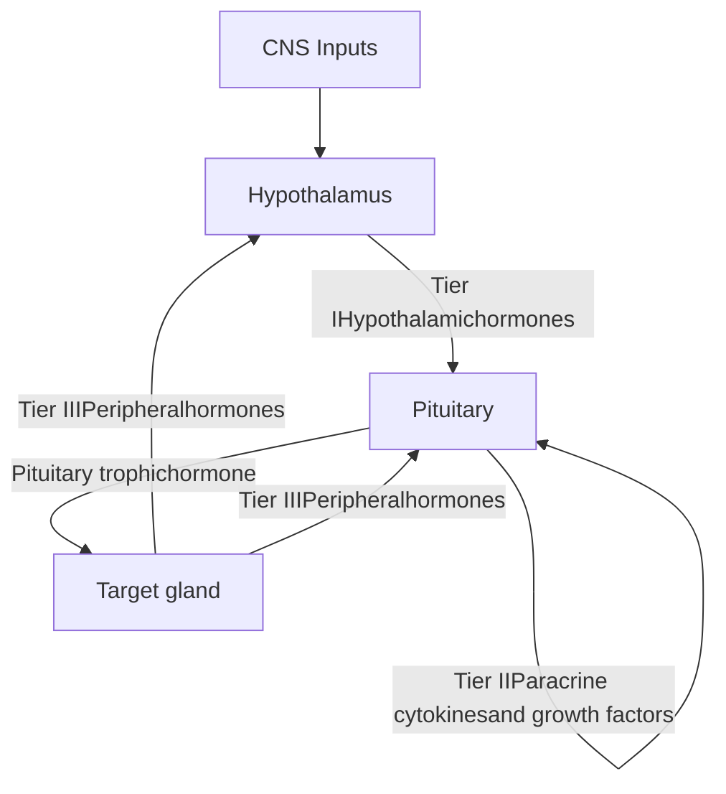
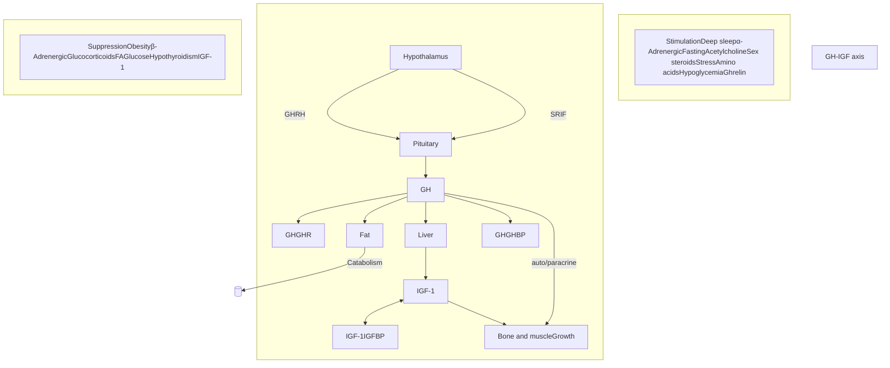
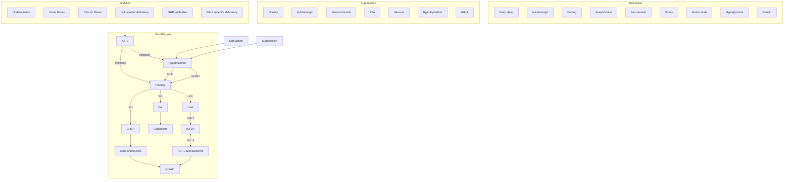
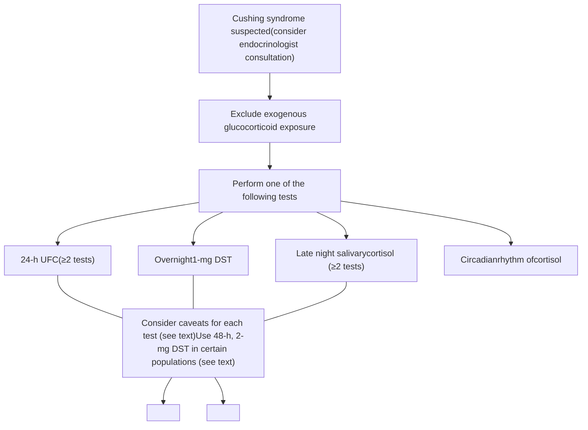
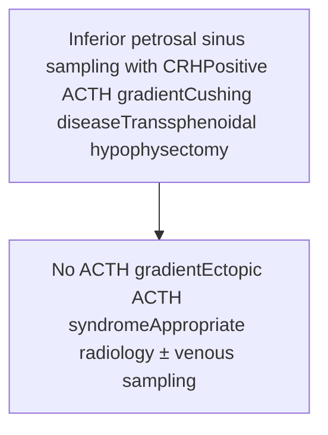
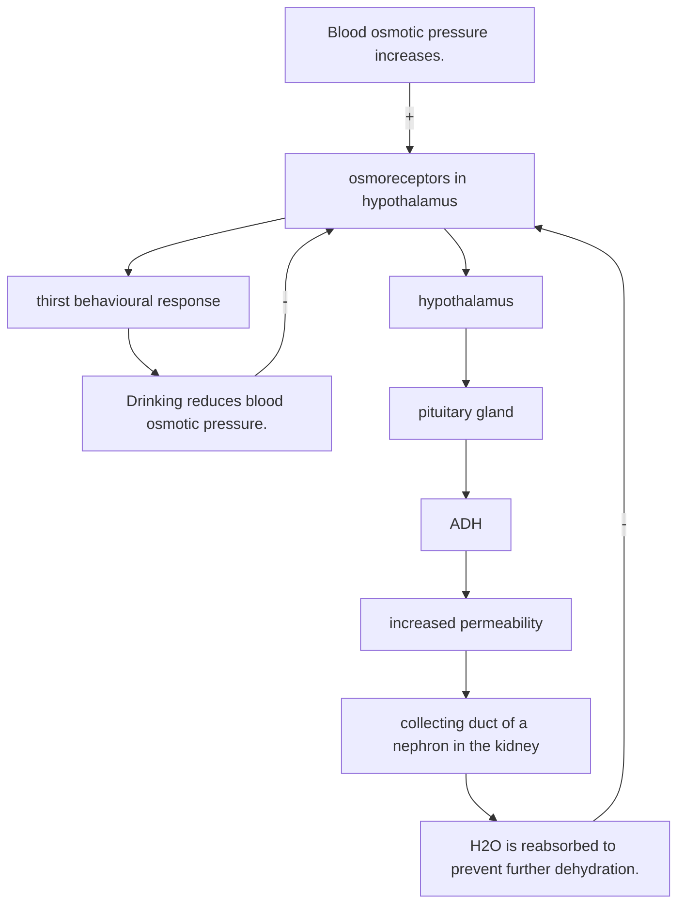
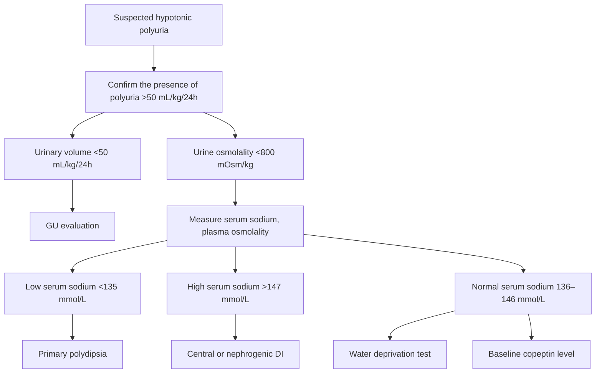
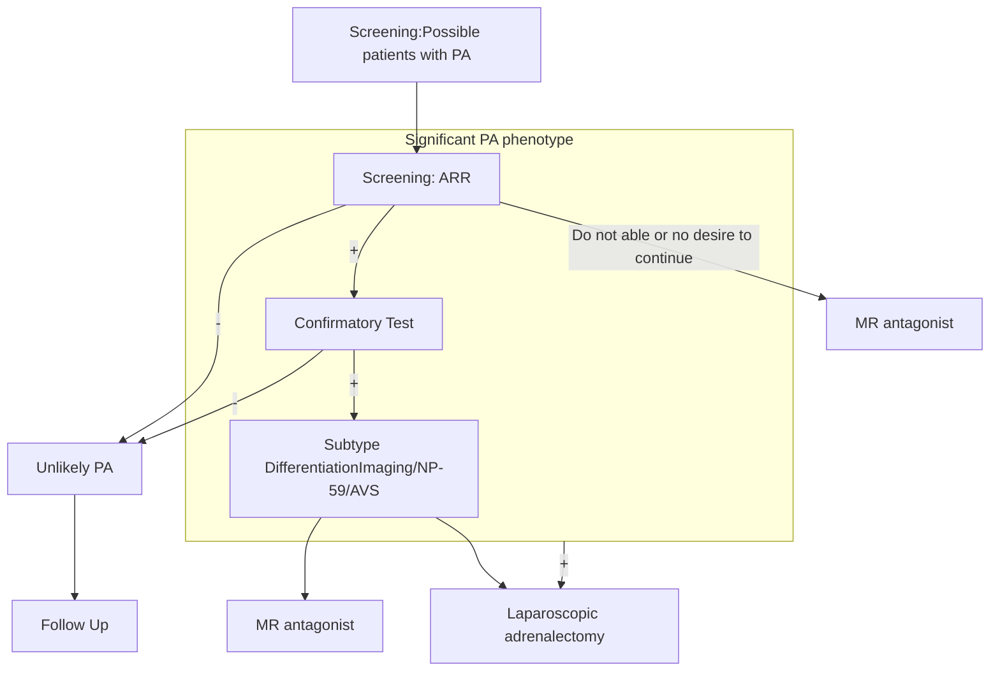
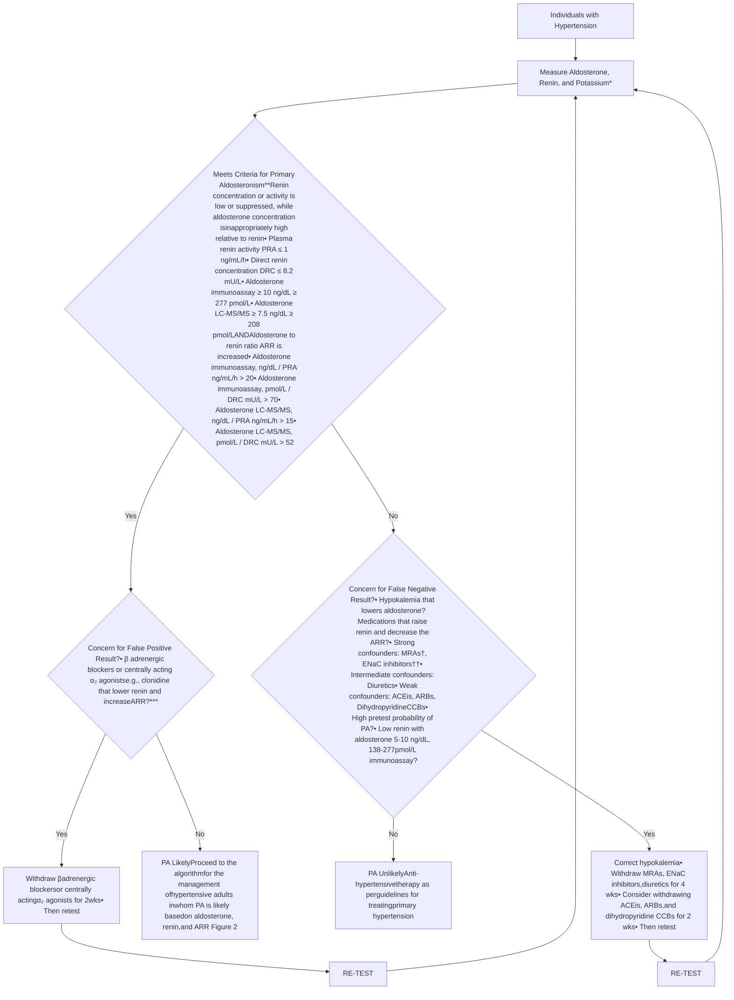

# Endocrine Dynamic Test

臺北市立聯合醫院仁愛院區

內分泌新陳代謝科 陳思綺醫師

# Assessment of Endocrine Function

* **Direct measurement of hormone concentrations**
    * *Basal serum* hormone levels
    * Hormone assessment if body fluid, eg. *urine, saliva*


<table>
  <thead>
    <tr>
        <th>Axis</th>
        <th>Lab (initial investigation or screening)</th>
    </tr>
  </thead>
  <tbody>
    <tr>
        <td><strong>Pituitary</strong></td>
        <td>GH, IGF-1(Insulin-like growth factor-1),Prolactin</td>
    </tr>
    <tr>
        <td><strong>Pituitary /gonad</strong></td>
        <td>Female: LH, FSH, E2 (estradiol), P4 (progesterone),(SHBG), (Day 21 if menstruating)<br/>Male: LH, FSH, testosterone (8 - 9:00 AM),(SHBG)</td>
    </tr>
    <tr>
        <td><strong>Pituitary /thyroid</strong></td>
        <td>TSH, free T4</td>
    </tr>
    <tr>
        <td><strong>Pituitary/adrenal</strong></td>
        <td>ACTH, cortisol (8AM + 4PM, 11PM), salivary cortisol<br/>24hr urine free cortisol</td>
    </tr>
    <tr>
        <td><strong>Posterior pituitary</strong></td>
        <td>Paired plasma and urine osmolality</td>
    </tr>
    <tr>
        <td><strong>Adrenal</strong></td>
        <td>Renin(PRA), aldosterone, urine/serum metanephrine</td>
    </tr>
  </tbody>
</table>

# Assessment of Endocrine Function

* **Pathologic Mechanisms of Endocrine Disease**
    * Hormone excess
    * hormone deficiency
    * hormone resistance

# Assessment of Endocrine Function

* **Pathologic Mechanisms of Endocrine Disease**
    * Hormone excess
    * hormone deficienc0y
    * hormone resistance
* **Baseline hormone levels are borderline or inconclusive**
* **Iatrogenic cause?** (blood sampling time, medication effect, lab error?)
* **Incompatible with clinical presentation?**
    * Evaluate history, symptoms, and signs, physical examination, current condition.

# Endocrine Dynamic test

# Indications for Endocrine Dynamic Function Tests

* **Suspected Hormone Deficiency or Excess**
    * *Stimulation* tests for *hormone deficiency*
    * *Suppression* tests for *hormone excess*
* **Evaluation of hypothalamic-pituitary-target organ Integrity**
    * *Primary* or *secondary*



Diagram of hypothalamic-pituitary-target organ axes showing feedback loops and actions for CRH/ACTH/Cortisol, TRH/TSH/T4-T3, GnRH/LH-FSH/Sex hormones, and GHRH-Somatostatin/GH/IGF-I and Dopamine/PRL.

* **Lesion localization**
    * *Venous sampling*

# Pituitary: Growth Hormone



## Hyperfunction  Dynamic Test

Acromegaly  75-g OGTT

## 14<sup>th</sup> Acromegaly consensus (2024)

1. Patient with **typical clinical signs and symptoms** of acromegaly, **IGF-I > 1.3 times the upper limit** of normal for age confirms the diagnosis.

2. For patients with **equivocal results**, **OGTT** might additionally be useful.


<page_number>6</page_number>

# 75g Oral Glucose Tolerance Test (OGTT) – for diabetes

* <u>Procedure</u>

    * Overnight fasting 8 hours, 75-g anhydrous glucose in 300 mL water, intake within 5 mins
    * Check plasma glucose level at 0 min, 60min(GDM), 120 min

* <u>Interpretation</u>


<table>
  <thead>
    <tr>
        <th>Plasma glucose</th>
        <th>0 min</th>
        <th>60 min</th>
        <th>120 min</th>
    </tr>
  </thead>
  <tbody>
    <tr>
        <td>Normal</td>
        <td>&lt;100 mg/dL</td>
        <td> </td>
        <td>&lt;140 mg/dL</td>
    </tr>
    <tr>
        <td>DM</td>
        <td>≥126 mg/dL</td>
        <td> </td>
        <td>≥200 mg/dL</td>
    </tr>
    <tr>
        <td>Prediabetes</td>
        <td>100-125 mg/dL</td>
        <td> </td>
        <td>140-199 mg/dL</td>
    </tr>
    <tr>
        <td>GDM</td>
        <td>≥92 mg/dL</td>
        <td>≥180 mg/dL</td>
        <td>≥153 mg/dL</td>
    </tr>
  </tbody>
</table>

# 75g Oral Glucose Tolerance Test (OGTT) – for growth hormone

* <u>Preparation</u>

    * Cessation of <u>oral estrogen</u> therapy 4 weeks prior to OGTT (avoid its effects on the GH axis)

* <u>Procedure</u>

    * Overnight fasting, 75-g anhydrous glucose in 300 mL water, intake within 5 mins
    * **Check blood GH level at 0, 30, 60, 90, and 120 minutes**

* <u>Interpretation</u>


<table>
  <thead>
    <tr>
        <th>Min</th>
        <th>0</th>
        <th>30</th>
        <th>60</th>
        <th>90</th>
        <th>120</th>
    </tr>
  </thead>
  <tbody>
    <tr>
        <td><strong>Growth Hormone (GH)</strong></td>
        <td> </td>
        <td> </td>
        <td> </td>
        <td> </td>
        <td> </td>
    </tr>
  </tbody>
</table>


* <span style="color: red">Acromegaly: failure of GH suppression to **< 0.4 μg/L** using ultrasensitive assays , **<1.0 ng/mL** using standard assay with an accompanying elevated IGF1 level</span>
* BMI-based GH nadir cutoffs of < 0.4 μg/L for BMI < 25 kg/m<sup>2</sup> and < 0.2 μg/L for BMI ≥ 25 kg/m<sup>2</sup> can be considered.
* False positive: starvation, protein-caloric malnutrition, anorexia nervosa.

# Pituitary: <span style="color: red">Growth Hormone</span>

---




<table>
  <thead>
    <tr>
        <th>Hypofunction</th>
        <th>Dynamic Test</th>
    </tr>
  </thead>
  <tbody>
    <tr>
        <td>GH deficiency</td>
        <td><strong>Insulin tolerance test (ITT)</strong><br/><strong>Glucagon stimulation test (GST)</strong><br/>Macimorelin test<br/>GHRH/Arginine test</td>
    </tr>
  </tbody>
</table>


* The clinical manifestations of adult GHD(AGHD) are often **nonspecific**

* Diagnostic tests for confirming AGHD should only be conducted if there is an **intention to treat the deficiency.**

* The diagnosis is established by a **GH stimulation test.** ( **ITT** is the gold standard)

# Glucagon Stimulation Test for pancreatic beta cell reserve

* <u>Purpose</u>: to assess determine <span style="color: red">beta cell reserve</span>

* <u>Procedure</u>

    * Patient preparation

        * adequate dietary carbohydrate (≥5g/kg BW) for at least 3 days before the test - NOT in ketotic state

        * No vigorous exercises, smoke before & during test

        * Stop OHA that interfere test, stop or decrease insulin 12 hours before the tet

    * NPO except water after midnight and during the test

    * <span style="color: blue">Glucagon in its diluting solution: 1 mg in 1 mL diluent (30 μg/kg BW, max 1mg) slowly IV infusion</span>

    * Check <span style="color: red">serum C-peptide</span> at 0 min and 6 min

* <u>Interpretation</u>

    * Type 1 diabetes is likely *IF*

    * <span style="color: red">0 min C-peptide <0.5 ng/mL</span>, OR


<table>
  <thead>
    <tr>
        <th> </th>
        <th>0 min</th>
        <th>6 min</th>
    </tr>
  </thead>
  <tbody>
    <tr>
        <td>C-peptide (ng/mL)</td>
        <td> </td>
        <td> </td>
    </tr>
  </tbody>
</table>


    * <span style="color: red">6 min C-peptide <1.8 ng/mL</span>, OR

    * <span style="color: red">Δ C-peptide <0.7 ng/mL</span>

# Glucagon stimulation test for growth hormone deficiency

* <u>Purpose</u>: for growth hormone deficiency

* <u>Procedure</u>:

    * Overnight fasting 8-10 hrs

    * Give **intramuscular (IM) glucagon**, (1mg if BW < 90 kg, 1.5 mg if body weight ≥ 90 kg)

    * Check **GH and glucose at 0、30、60、90、120、150、180、210、240 mins**

* <u>Interpretation</u>:

    * <mark><font color="red">Normal weight (BMI < 25 kg/m2): GH peak ≤ 3 ng/mL suggests AGHD.</font></mark>

    * Overweight (BMI 25–30 kg/m²):

        * High pre-test probability: GH peak ≤ 3 ng/mL suggests AGHD.

        * Low pre-test probability: GH peak ≤ 1 ng/mL suggests AGHD.

    * Obese (BMI > 30 kg/m2): GH peak ≤ 1 ng/mL suggests AGHD.

# HPA Axis : CRH, ACTH, cortisol

Flowchart of the HPA axis showing the relationship between stressors, diurnal rhythm, the hypothalamus, pituitary gland, and adrenals, leading to cortisol production and its effects on metabolism and the cardiovascular system.


<table>
  <thead>
    <tr>
        <th>Hyperfunction</th>
        <th>Dynamic Test</th>
    </tr>
  </thead>
  <tbody>
    <tr>
        <td>Cushing syndrome</td>
        <td>Dexamethasone suppression test</td>
    </tr>
  </tbody>
</table>
<table>
  <thead>
    <tr>
        <th>Hypofunction</th>
        <th>Dynamic Test</th>
    </tr>
  </thead>
  <tbody>
    <tr>
        <td>Adrenal insufficiency</td>
        <td>ACTH stimulation test<br/>Insulin tolerance test (ITT)</td>
    </tr>
  </tbody>
</table>

# Clinical suspicion for Cushing syndrome

BOX 13.5 Tests Used in the Diagnosis and Differential Diagnosis of Cushing Syndrome

**Diagnosis—Does the Patient Have Cushing Syndrome?**

Late-night salivary cortisol/circadian rhythm of plasma cortisol
Urinary free cortisol excretion<sup>a</sup>
Low-dose dexamethasone suppression test<sup>a</sup>

**Differential Diagnosis—What Is the Cause of Cushing Syndrome?**

Plasma ACTH
Plasma potassium, bicarbonate
High-dose dexamethasone suppression test
Corticotropin-releasing hormone test
Inferior petrosal sinus sampling
CT, MRI scanning of pituitary, adrenals
Scintigraphy
Tumor markers

\*<sup>a</sup>Valuable outpatient screening tests (see text discussion).
ACTH, adrenocorticotropic hormone; CT, computed tomography; MRI, magnetic resonance imaging.

Flowchart for suspected Cushing syndrome diagnosis



# 1mg Overnight Dexamethasone Suppression Test (DST)

* <u>Purpose</u>: <span style="color: blue">screening for Cushing's syndrome</span>
* <u>Procedure</u>
    * Give **1 mg dexamethasone** po at **11 pm**
    * Check **serum cortisol at 8-9 am** of the following day prior to food intake
* <u>Interpretation</u>
    * <span style="color: blue">Normally serum cortisol is</span> <span style="color: red">**suppressed to <1.8 μg/dL**</span>
    * <span style="color: blue">Depression, restless sleep, emotional or physical stress, recent heavy alcohol consumption, obesity, thyrotoxicosis, acromegaly, pregnancy, medications (*oral estrogen, diphenylhydantoin, phenytoin, rifampin & barbiturates*) $\rightarrow$ false positive</span>

# 48-Hour Low-Dose Dexamethasone Suppression Test (DST)

* <u>Purpose</u>: confirmation of Cushing's syndrome

* <u>Procedure</u>

    * D1: Obtain baseline serum cortisol, ACTH level at 8 am (9am)

    * D1-2: oral dexamethasone 0.5 mg q6h po x 2 days (8 doses = 4 mg)

    * D3: Check serum cortisol level at 8 am(9 am) (6 hours post the last dose)

* <u>Interpretation</u>

    * Normal response: serum cortisol <1.8 μg/dL at 8 am (9am) on D3


<table>
  <thead>
    <tr>
        <th>Low-dose DST</th>
        <th>ACTH (pg/mL)</th>
        <th>Cortisol (μg/dL)</th>
    </tr>
  </thead>
  <tbody>
    <tr>
        <td>D1 8 AM</td>
        <td>V</td>
        <td>V</td>
    </tr>
    <tr>
        <td>D3 8 AM</td>
        <td> </td>
        <td>V</td>
    </tr>
  </tbody>
</table>

# Differential Diagnosis for Cushing syndrome

**BOX 13.5** **Tests Used in the Diagnosis and Differential Diagnosis of Cushing Syndrome**

## Diagnosis—Does the Patient Have Cushing Syndrome?

Late-night salivary cortisol/circadian rhythm of plasma cortisol
Urinary free cortisol excretion<sup>a</sup>
Low-dose dexamethasone suppression test<sup>a</sup>

## Differential Diagnosis—What Is the Cause of Cushing Syndrome?

Plasma ACTH
Plasma potassium, bicarbonate
High-dose dexamethasone suppression test
Corticotropin-releasing hormone test
Inferior petrosal sinus sampling
CT, MRI scanning of pituitary, adrenals
Scintigraphy
Tumor markers

\*Valuable outpatient screening tests (see text discussion).

ACTH, adrenocorticotropic hormone; CT, computed tomography; MRI, magnetic resonance imaging.


<table>
  <thead>
    <tr>
        <th>Category</th>
        <th>Plasma immunoreactive ACTH (pg/mL)</th>
    </tr>
  </thead>
  <tbody>
    <tr>
        <td>Cushing disease</td>
        <td>~10 - 200</td>
    </tr>
    <tr>
        <td>Adrenal tumor</td>
        <td>&lt;10</td>
    </tr>
    <tr>
        <td>Ectopic ACTH</td>
        <td>~100 - 12,000</td>
    </tr>
  </tbody>
</table>


```mermaid
graph TD
    A[Cushing syndromeclinically/biochemically confirmed] --> B[Differential diagnosis]
    B --> C[ACTH]
    C --> D[Suppressed]
    C --> E[Detectable]
    D --> F[CT of adrenals(consider macronodular hyperplasia)]
    E --> G[ACTH-dependentdisease]
```

# Differential Diagnosis for Cushing syndrome

```mermaid
graph TD
    A[ACTH] --> B[Suppressed]
    A --> C[Detectable]
    B --> D[CT of adrenals(consider macronodular hyperplasia)]
    C --> E[ACTH-dependentdisease]
    E --> F["• 50% cortisol suppression following high- or low-dosedexamethasone suppression test (2 mg 6 hourly for 48 hours)AND• >50% increased serum cortisol post CRH stimulation testAND• Positive MRI scan of pituitary"]
    F --> G[Then proceed totranssphenoidal hypophysectomy]
    F --> H["If tests inconclusive (i.e., failure of any above criteria)"]
    H --> I[Inferior petrosal sinus sampling with CRH]
    I --> J[Positive ACTH gradient]
    J --> K[Cushing disease]
    K --> L[Transsphenoidal hypophysectomy]
    I --> M[No ACTH gradient]
    M --> N[Ectopic ACTH syndrome]
    N --> O[Appropriate radiology ± venous sampling]
```

* ACTH-dependent disease (Cushing disease or ectopic ACTH syndrome)
* Pituitary MRI scan
* **IPSS: gold standard test**
* High dose dexamethasone suppression test
* CRH stimulation test
* Desmopressin stimulation test

# Inferior Petrosal Sinus Sampling (IPSS)

* <u>Purpose</u>: The most robust test to D/D pituitary-origin from non-pituitary-origin of ACTH-dependent CS and lateralizing a pituitary tumor
* <u>Procedure</u>
    * Blood samples are obtained for plasma ACTH measurement from each of the three ports (Peripheral, Left IPS and Right IPS) simultaneously as baseline (0 min)
    * Desmopressin (DDAVP) 10 μg peripheral IV injection/CRH 100 μg iv injection
    * Blood sampling for plasma ACTH from each of the three ports (Peripheral, Left IPS and Right IPS) simultaneously at 2, 5, and 15 min after DDAVP


<table>
  <thead>
    <tr>
        <th>Min</th>
        <th>0</th>
        <th>2</th>
        <th>5</th>
        <th>15</th>
    </tr>
  </thead>
  <tbody>
    <tr>
        <td>Peripheral</td>
        <td> </td>
        <td> </td>
        <td> </td>
        <td> </td>
    </tr>
    <tr>
        <td>Left IPS</td>
        <td> </td>
        <td> </td>
        <td> </td>
        <td> </td>
    </tr>
    <tr>
        <td>Right IPS</td>
        <td> </td>
        <td> </td>
        <td> </td>
        <td> </td>
    </tr>
  </tbody>
</table>


Anatomical diagram showing the Cavernous sinus, Inferior petrosal sinus, Jugular vein, and Confluent pituitary veins in relation to the skull base.

* <u>Complication</u> :Groin hematoma, thromboembolic event, etc.

# Inferior Petrosal Sinus Sampling (IPSS)

* <u>Interpretation</u>
    * <span style="color: red">Ectopic ACTH: **IPS to peripheral (IPS:P) ratio <1.4 at baseline**</span>
    * <span style="color: red">Pituitary-origin: **IPS to peripheral (IPS:P) ratio ≥2 at baseline** and **≥3 after stimulation**</span>
    * Lateralization of pituitary adenoma: an inter-sinus ratio (IPS:IPS) **≥1.4**



# High-Dose Dexamethasone Suppression Test (DST)

* <u>Purpose</u>: D/D of Cushing's disease vs. Ectopic ACTH syndrome
* only when inferior petrosal sinus sampling for ACTH is not available

* <u>Procedure</u>
    * D1: Obtain baseline serum cortisol, ACTH at 8 am
    * D1-2: Give dexamethasone 2 mg q6h po x 2 days (8 doses = 16 mg)
    * D3: Check serum cortisol (ACTH, dexamethasone) level at 8 am

* <u>Interpretation</u>
    * Cushing's disease: **D3 cortisol level is <50% of D1 baseline cortisol level**
    * Ectopic ACTH: **non-suppressible**

# Corticotropin Releasing Hormone (CRH) Stimulation Test

* <u>Purpose</u>: D/D the <span style="color: blue">origin</span> of Cushing's syndrome

* <u>Rationale</u>

    * Normal subjects, CRH produces a rise in ACTH and cortisol of 15% to 20%.
    * Response is exaggerated in Cushing's disease. (10% do not respond to CRH.)
    * Adrenal tumors and most ectopic ACTH-secreting tumors do not respond

* <u>Procedure</u> (in the morning or afternoon)

    * Check baseline <span style="color: red">cortisol</span> (-15 min, 0 min)
    * IV inject <span style="color: blue">ovine or human-sequence CRH 1 µg/kg</span> or <span style="color: blue">single dose 100 µg</span> over 1 min
    * Check <span style="color: red">ACTH, cortisol every 15 minutes for 1 to 2 hours</span>

* <u>Interpretation</u>


<table>
  <thead>
    <tr>
        <th> </th>
        <th>Pituitary ACTH-secreting adenoma</th>
        <th>Adrenal tumor<br/>Ectopic ACTH-secreting tumor</th>
    </tr>
  </thead>
  <tbody>
    <tr>
        <td><strong>Δ Cortisol (µg/dL)</strong></td>
        <td>&gt;20%</td>
        <td>No respose</td>
    </tr>
    <tr>
        <td><strong>Δ ACTH (pg/mL)</strong></td>
        <td>&gt;50%</td>
        <td>No response</td>
    </tr>
  </tbody>
</table>

# Desmopressin stimulation test

* <u>Purpose</u>: D/D of Cushing's disease vs. Ectopic ACTH syndrome
* D/D of Cushing's disease vs. Pseudo-Cushing syndrome

* <u>Principle</u> :
    * Desmopressin stimulates ACTH and cortisol levels in most Cushing's disease patients, but not in healthy individuals or ectopic ACTH syndrome.

* <u>Procedure</u>
    * Overnight fasting and patient keep recumbenant position
    * Intravenous injection of 10µg DDAVP
    * Check plasma ACTH and serum cortisol at -15, 0, 15, 30, 45, 60, 90, and 120 min 。

* <u>Interpretation</u>

<table>
  <thead>
    <tr>
        <th> </th>
        <th>Pituitary ACTH-secreting adenoma</th>
        <th>Ectopic ACTH-secreting tumor<br/>Pseudo-Cushing</th>
    </tr>
  </thead>
  <tbody>
    <tr>
        <td><strong>Δ Cortisol (µg/dL)</strong></td>
        <td>&gt;20%</td>
        <td>No respose</td>
    </tr>
    <tr>
        <td><strong>Δ ACTH (pg/mL)</strong></td>
        <td>&gt;50%</td>
        <td>No respose</td>
    </tr>
  </tbody>
</table>

# HPA Axis : CRH, ACTH, cortisol

---

Diagram of the Hypothalamic-Pituitary-Adrenal (HPA) axis showing the flow from Diurnal rhythm and Stressors (hypoglycaemia, hypotension, fever, trauma, surgery) to the Hypothalamus, which releases CRH. CRH acts on the Pituitary (also influenced by ADH and Cytokines) to release ACTH. ACTH acts on the Adrenals to release Cortisol. Negative feedback loops are shown from Cortisol to the Pituitary and Hypothalamus.

* First test: serum **cortisol levels at 8-9 am**

* <u>Basal plasma cortisol and urinary free cortisol levels</u> : often in the low-normal range and cannot be used to exclude the diagnosis.

* **Diagnosis should be confirmed with definitive diagnostic tests.**


<table>
  <thead>
    <tr>
        <th>Hypofunction</th>
        <th>Dynamic Test</th>
    </tr>
  </thead>
  <tbody>
    <tr>
        <td>Adrenal insufficiency</td>
        <td>Rapid ACTH stimulation Test<br/>Insulin tolerance test</td>
    </tr>
  </tbody>
</table>

# Diagnosis of adrenal insufficiency

* <u>Symptoms and signs :</u>
    * Acute: fatigue, dizziness, weakness, nausea/vomit, circulatory failure
    * Chronic: tiredness, pallor, anorexia, nausea, weight loss, myalgia, hypoglycemia
* Perform biochemical testing for the HPA axis at least 18–24 hours after the last hydrocortisone dose or longer for synthetic glucocorticoids.

* Basal cortisol value >14.5 μg/dL indicates an intact HPA axis.
* The Endocrine Society suggest performing corticotropin stimulation test when morning cortisol level between 3 and 15 μg/dL
    * cortisol level <3 μg/dL →adrenal insufficiency
    * cortisol level > 15 μg/dL → excludes an AI diagnosis.

# Rapid ACTH (Synacthen/Cosyntropin) Stimulation Test

* <u>Purpose</u>: evaluate <span style="color: red">adrenocortical function</span> in suspected adrenal insufficiency

* <u>Procedure</u>

    * Anytime, NPO is not necessary

    * <span style="color: blue">250 μg</span> (standard dose) or <span style="color: blue">1 μg</span> (low dose) cosyntropin (Synacthen) slow iv push (im)

    * Blood sampling at 0 min (<span style="color: red">ACTH, Cortisol</span>), 30 min & 60 min (<span style="color: red">Cortisol</span>)

* <u>Interpretation</u>

    * Normal response: <span style="color: red">**peak of cortisol ≥18.1-20 μg/dL for standard dose (assay dependence) , cortisol ≥18.1 μg/dL at 30 mins for low dose**</span>

    * <span style="color: blue">*If the ACTH stimulation test is normal, ITT usually is not necessary in most cases*</span>

* May be unreliable if abnormalities of CBG or albumin

* Less sensitive when the pituitary damage accrued less than 6 weeks

# Insulin Tolerance Test (ITT)

* <u>Purpose</u>: gold standard to diagnose <span style="color: red">secondary adrenal insufficiency</span> & <span style="color: red">GH deficiency</span>

* <u>Contraindication</u>

    * Ischemic heart disease, pregnancy, cerebrovascular disease, epilepsy, severe hypopituitarism (<u>i.e. 9 am plasma cortisol <6.5 μg/dL</u>)

    * Elderly, critical illness are relative contraindications)

* <u>Procedure</u>

    * Before test: history taking (seizure, CAD history), EKG, check baseline <span style="color: red">cortisol</span> level
    * NPO since midnight, set IV catheter

    * Give <span style="color: blue">regular insulin</span> iv, dose: <span style="color: blue">0.1-0.15 U/kg of actual BW</span>; <span style="color: blue">0.2-0.3 U/kg</span> for <span style="color: blue">obese patients or patients with DM/acromegaly/Cushing's syndrome</span>

    * Check <span style="color: red">GH</span> if suspected GH deficiency

# Insulin Tolerance Test (ITT)

* <u>Blood sampling <mark>before</mark> adequate hypoglycemia</u>
    - Closely monitor plasma glucose until <mark>plasma glucose <40 mg/dL</mark> (with signs of neuroglycopenia)
    - Check serum <mark>cortisol/GH</mark> at <mark>hypoglycemia</mark>
    - If no adequate hypoglycemia for <mark>45 min</mark> after RI $\rightarrow$ <mark>repeat RI iv</mark> (often <mark>half dose</mark>)
* <u>Blood sampling <mark>after</mark> adequate hypoglycemia</u>
    - After adequate hypoglycemia $\rightarrow$ glucose supplement (D50W or food), keep monitor glucose
    - Check serum <mark>cortisol/GH</mark> at <mark>30 min after adequate hypoglycemia</mark>


<table>
  <thead>
    <tr>
        <th>Before (min)</th>
        <th>0 $\rightarrow$ RI</th>
        <th>15</th>
        <th>30</th>
        <th>45</th>
        <th>Repeat RI</th>
    </tr>
  </thead>
  <tbody>
    <tr>
        <td>One touch</td>
        <td>V</td>
        <td>V</td>
        <td>V</td>
        <td>V</td>
        <td> </td>
    </tr>
    <tr>
        <td>Plasma glucose</td>
        <td colspan="4">Check if one touch &lt;50 mg/dL</td>
        <td> </td>
    </tr>
    <tr>
        <td>Cortisol/GH</td>
        <td colspan="4">Check if plasma glucose &lt;40 mg/dL</td>
        <td> </td>
    </tr>
  </tbody>
</table>


Blue arrow pointing right


<table>
  <thead>
    <tr>
        <th>After (min)</th>
        <th>0<br/>(hypoglycemia)</th>
        <th colspan="2">30</th>
    </tr>
  </thead>
  <tbody>
    <tr>
        <td>One touch</td>
        <td>V</td>
        <td>V</td>
        <td></td>
    </tr>
    <tr>
        <td>Plasma glucose</td>
        <td>V</td>
        <td rowspan="4">D50W or<br/>food intake</td>
        <td>V</td>
    </tr>
    <tr>
        <td>Cortisol</td>
        <td>V</td>
        <td>V</td>
    </tr>
    <tr>
        <td>GH</td>
        <td>(V)</td>
        <td>(V)</td>
    </tr>
  </tbody>
</table>

# Insulin Tolerance Test (ITT) – Interpretation

* Adequate hypoglycemia: <mark>plasma glucose <40 mg/dL</mark>
(mostly occurs 20-35 min after insulin injection)

* Normal response of cortisol: <mark>peak cortisol level >18 μg/dL</mark>

* Normal response of growth hormone: <mark>peak GH >5 ng/mL</mark>
* GH deficiency: peak GH <3 ng/mL

# Pituitary-Gonad Axis: FSH, LH

Flowchart of the Pituitary-Gonad Axis showing GnRH stimulating the Gonadotroph to release LH and FSH, which in turn stimulate the Ovaries and Testes to produce hormones like Estradiol, Progesterone, Testosterone, and inhibin, with feedback loops.


<table>
  <thead>
    <tr>
        <th>Hypofunction</th>
        <th>Dynamic Test</th>
    </tr>
  </thead>
  <tbody>
    <tr>
        <td rowspan="2">Hypogonadism</td>
        <td>GnRH/LHRH test</td>
    </tr>
    <tr>
        <td>Clomiphene test</td>
    </tr>
  </tbody>
</table>


* The Endocrine Society(2016) **suggests against** dynamic testing with GnRH, which offers no useful diagnostic information.

# TRH Test

* <u>Purpose</u>
    * Distinguish between **TSHoma** and **thyroid hormone resistance**
    * Detect central hypothyroidism/prolactin deficiency or subclinical hyperthyroidism/hypothyroidism (目前少用)
* <u>Contraindication</u>: pregnancy early stage
* <u>Caution</u>: asthma, ischemic heart disease
* <u>Procedure</u>
    * NPO is not required, but preferred (nausea may occur)
    * Keep supine (slight hypertension may occur)
    * Give synthetic TRH (Protirelin) 400 μg (200-500 μg) iv over 15-30 sec
    * Blood sampling for measurement of TSH at 0min(before TRH), 30 min, 60 min, (180 min)
* Side effects: nausea, flushing, urge to micturate


<table>
  <thead>
    <tr>
        <th>Min</th>
        <th>0</th>
        <th>30</th>
        <th>60</th>
        <th>180</th>
    </tr>
  </thead>
  <tbody>
    <tr>
        <td>TSH</td>
        <td> </td>
        <td> </td>
        <td> </td>
        <td>(optional)</td>
    </tr>
  </tbody>
</table>

# TRH Test – Interpretation

* **TSH**
        * Normal TSH response: <mark>ΔTSH ≥5-6 mU/L</mark> at 20 to 30 minutes/<mark>peak TSH ≥ 2.5 fold</mark>, followed by a decline at 60 mins
        * Differentiating TSH-secreting adenoma and thyroid hormone resistance (TRH).
                * <mark>TSHoma :blunted response</mark>
                * <mark>TRH: preserved or exuberant response</mark>

        * Blunted or delayed response: central hypothyroidism, hyperthyroidism, euthyroid Graves’ disease, suppressive thyroid therapy, isolated TSH deficiency, renal failure, depression, or medications (glucocorticoid, L-dopa, bromocriptine, oral contraceptive, acetylsalicylic acid)

# TRH Test – Interpretation

## • Prolactin

* <mark>Normal PRL ≥2.5-fold</mark>; or PRL level >2 μg/L & increase >200% of baseline (varies with gender and age)
* <mark>Reduced</mark> or <mark>absent</mark> response with low baseline PRL level: <mark>deficient prolactin reserve</mark> and is typical of pituitary destruction, ablation, isolated gonadotropin deficiency, or idiopathic isolated prolactin deficiency
* <mark>Not useful in the D/D of hyperprolactinemia</mark>

# Posterior pituitary : Anti-diuretic hormone (Desmopressin)




<table>
  <thead>
    <tr>
        <th>PAVP</th>
        <th>pOsm</th>
    </tr>
  </thead>
  <tbody>
    <tr>
        <td>0</td>
        <td>280</td>
    </tr>
    <tr>
        <td>3</td>
        <td>288</td>
    </tr>
    <tr>
        <td>6</td>
        <td>295</td>
    </tr>
    <tr>
        <td>9</td>
        <td>303</td>
    </tr>
    <tr>
        <td>12</td>
        <td>310</td>
    </tr>
  </tbody>
</table>

A


<table>
  <thead>
    <tr>
        <th>PAVP</th>
        <th>UOsm</th>
    </tr>
  </thead>
  <tbody>
    <tr>
        <td>0</td>
        <td>50</td>
    </tr>
    <tr>
        <td>3</td>
        <td>700</td>
    </tr>
    <tr>
        <td>6</td>
        <td>1300</td>
    </tr>
    <tr>
        <td>9</td>
        <td>1300</td>
    </tr>
    <tr>
        <td>12</td>
        <td>1300</td>
    </tr>
  </tbody>
</table>

B


<table>
  <thead>
    <tr>
        <th>Hypofunction</th>
        <th>Dynamic Test</th>
    </tr>
  </thead>
  <tbody>
    <tr>
        <td>Diabetes insipidus</td>
        <td>Water deprivation test</td>
    </tr>
  </tbody>
</table>

# Algorithm for differential diagnosis of polyuria–polydipsia syndrome



* Accurate diagnosis was made in only 70% of polyuric patients

* The correct diagnosis in primary polydipsia was concluded in only 41% of cases

# Water Deprivation Test – 1

* Purpose: differential diagnosis of polyuria
* Procedure
    * 8 am 開始禁食禁水後，
    * 每 1 小時記錄尿量和 urine osmolarity
    * 每 2 小時記錄體重、血壓、血鈉、plasma osmolarity
    * <mark>(n) (0’) 時間時紀錄體重、血鈉、plasma osmolarity，準備給予 DDAVPT</mark>
    * 當有以下任一情況應立刻停止試驗
        * 體重下降 5%
        * 低血壓
        * 意識變化
* 試驗後應立即補充足夠液體以防止脫水。


<table>
  <thead>
    <tr>
        <th>Time</th>
        <th>BW<br/>(kg)</th>
        <th>BP<br/>(mmHg)</th>
        <th>Serum<br/>Na</th>
        <th>Plasma<br/>Osm</th>
        <th>Urine<br/>amount</th>
        <th>Urine<br/>Sp. Gr.</th>
        <th>Urine<br/>Osm</th>
    </tr>
  </thead>
  <tbody>
    <tr>
        <td>8 AM</td>
        <td>V</td>
        <td>V</td>
        <td>V</td>
        <td>V</td>
        <td>V</td>
        <td>V</td>
        <td>V</td>
    </tr>
    <tr>
        <td>9 AM</td>
        <td> </td>
        <td> </td>
        <td> </td>
        <td> </td>
        <td>V</td>
        <td>V</td>
        <td>V</td>
    </tr>
    <tr>
        <td>10 AM</td>
        <td>V</td>
        <td>V</td>
        <td>V</td>
        <td>V</td>
        <td>V</td>
        <td>V</td>
        <td>V</td>
    </tr>
    <tr>
        <td>11 AM</td>
        <td> </td>
        <td> </td>
        <td> </td>
        <td> </td>
        <td>V</td>
        <td>V</td>
        <td>V</td>
    </tr>
    <tr>
        <td>...</td>
        <td>V</td>
        <td>V</td>
        <td>V</td>
        <td>V</td>
        <td>V</td>
        <td>V</td>
        <td>V</td>
    </tr>
    <tr>
        <td>一直測....</td>
        <td> </td>
        <td> </td>
        <td> </td>
        <td> </td>
        <td>V</td>
        <td>V</td>
        <td>V</td>
    </tr>
    <tr>
        <td>到n時間<br/>(0’)</td>
        <td>V</td>
        <td>V</td>
        <td>V</td>
        <td>V</td>
        <td>V</td>
        <td>V</td>
        <td>V</td>
    </tr>
  </tbody>
</table>


## Time (n) (0’) definition
* 病人體重減少 3-5%
* 連續兩次 $\Delta$ urine osmolarity $\le 10\%$ 且 BW $\downarrow 2\%$; OR
* 連續兩次 $\Delta$ urine osmolarity $< 30$ mOsm/kg; OR
* Plasma osmolarity 達到 295-300 mOsm/kg; OR
* Plasma sodium $\ge 150$ mmol/L

禁食 + 禁水

## <mark>(0’) DDAVP (2 μg) 0.5 mL SC</mark>


<table>
  <tbody>
    <tr>
        <td>60 min</td>
        <td>V</td>
        <td>V</td>
        <td>V</td>
        <td>V</td>
        <td>V</td>
        <td> </td>
        <td>V</td>
    </tr>
    <tr>
        <td>120 min</td>
        <td>V</td>
        <td>V</td>
        <td>V</td>
        <td>V</td>
        <td>V</td>
        <td> </td>
        <td>V</td>
    </tr>
  </tbody>
</table>

# Water Deprivation Test – Interpretation


<table>
  <thead>
    <tr>
        <th> </th>
        <th colspan="4">Urine Osmolality (mOsm/kg)</th>
    </tr>
    <tr>
        <th> </th>
        <th>After dehydration</th>
        <th>After DDAVP</th>
        <th>After dehydration</th>
        <th>After DDAVP</th>
    </tr>
  </thead>
  <tbody>
    <tr>
        <td>Normal</td>
        <td>&gt;800</td>
        <td> </td>
        <td>&gt;800</td>
        <td> </td>
    </tr>
    <tr>
        <td>Central DI</td>
        <td>&lt;300</td>
        <td>↑ ≥50%</td>
        <td>&lt;300</td>
        <td>↑ &gt;50%</td>
    </tr>
    <tr>
        <td>Nephrogenic DI</td>
        <td>&lt;300</td>
        <td>↑ &lt;50%</td>
        <td>&lt;300</td>
        <td>(↑ &lt;15 %)</td>
    </tr>
    <tr>
        <td>Partial central DI</td>
        <td>300-800 mOsm/kg</td>
        <td>↑ &gt; 9 %</td>
        <td>300-800</td>
        <td>↑ &lt; 50%</td>
    </tr>
    <tr>
        <td>Primary polydipsia</td>
        <td>300-800 mOsm/kg</td>
        <td>↑ &lt; 9 %</td>
        <td>&gt;800</td>
        <td>↑ &lt; 50%</td>
    </tr>
    <tr>
        <td>Reference</td>
        <td colspan="2">Williams Textbook of Endocrinology 15e</td>
        <td colspan="2">Front Endocrinol 2025</td>
    </tr>
  </tbody>
</table>

# Adrenal cortex: Renin-Angiotensin-Aldosterone System (RAA)

```mermaid
graph TD
    subgraph Stimuli
        S1["↓ Renal arterial pressure"]
        S2["↑ β-Adrenergic action"]
        S3["↑ Prostaglandins"]
    end

    subgraph Inhibitors
        I1["ANP"]
        I2["Dopamine"]
    end

    Liver["Liver"] --> Angiotensinogen["Angiotensinogen"]
    S1 & S2 & S3 --> Renin_Trigger["Renin"]
    I1 & I2 --| - | Renin_Trigger
    
    Kidneys["Kidneys"] --> Renin_Trigger
    Angiotensinogen --> Angiotensin_I["Angiotensin I"]
    Renin_Trigger --> Angiotensin_I
    
    Angiotensin_I --> Lungs["Lungs"]
    Lungs --> Angiotensin_II["Angiotensin II"]
    
    Angiotensin_II --> Adrenal_Glands["Adrenal Glands"]
    Adrenal_Glands --> Aldosterone["Aldosterone"]
    
    Aldosterone --> Kidney_Effects["Extracellular volumeRenal arterial pressureNa+ (+ water) retention"]
    Aldosterone --> K_Excretion["K+ excretion"]
    
    K_Excretion --> Low_K["↓ECF [K+]"]
    Low_K --| - | Adrenal_Glands
```



# ARR cutoff values for screening of PA

**Table 1** Comparison of ARR cutoff values for screening of PA in different guidelines.


<table>
  <thead>
    <tr>
        <th>Association/year</th>
        <th>ARR cutoff (PAC/PRA) (ng/dL per ng/mL/h)</th>
        <th>ARR cutoff (PAC/DRC) (ng/dL per mU/L)</th>
        <th>Note</th>
    </tr>
  </thead>
  <tbody>
    <tr>
        <td>European Society of Endocrinology/2016</td>
        <td>30 as most adopted cutoff value</td>
        <td>3.7 as most adopted cutoff value</td>
        <td>Variable ARR cutoffs listed in Table for references</td>
    </tr>
    <tr>
        <td>Taiwan Society of Aldosteronism/2017</td>
        <td>35 to enhance specificity</td>
        <td>N/A</td>
        <td> </td>
    </tr>
    <tr>
        <td>Italian Society of Arterial Hypertension/2020</td>
        <td>No cutoff value provided<br/>↑PAC (≥10 ng/dL)<br/>↓PRA (&lt;1 ng/mL/hr) or<br/>↓ PRC (&lt;lower limit of normal for the assay)</td>
        <td>No cutoff value provided</td>
        <td>In context: "ARR provides quantitative information that should not be neglected by categorizing its results simply as positive or negative"</td>
    </tr>
    <tr>
        <td>European Society of Hypertension/2020</td>
        <td>30 as most adopted cutoff value</td>
        <td>3.7 as most adopted cutoff value</td>
        <td>Variable ARR cutoffs listed in Table. Recommend each laboratory to design specific criteria for ARR</td>
    </tr>
    <tr>
        <td>American College of Cardiology/2017</td>
        <td>ARR 30 plus PAC &gt;10 to be classified as positive</td>
        <td>N/A</td>
        <td> </td>
    </tr>
    <tr>
        <td>Hypertension Canada/2020</td>
        <td>20 for high sensitivity/low specificity; 27 for low sensitivity/high specificity<sup>a</sup></td>
        <td>2.16 for high sensitivity/low specificity; 3.28 for low sensitivity/high specificity<sup>a</sup></td>
        <td>Provide two different cutoff value with different sensitivity and specificity.</td>
    </tr>
  </tbody>
</table>


* Patients with spontaneous hypokalemia, PAC > 20 ng/dL plus PRA or direct renin concentration below detection level may not need further confirmatory tests.

# Medications interfere the ARR ratio

* Hold or switch drugs affect ARR (minimal effects on ARR: <mark>non-DHP CCB, α1 blocker, centrally acting a -adrenergic agonists</mark> )


<table>
  <thead>
    <tr>
        <th>Medications</th>
        <th>Effect on PAC</th>
        <th>Effect on Renin</th>
        <th>Effect on ARR</th>
        <th>Hold Duration</th>
    </tr>
  </thead>
  <tbody>
    <tr>
        <td><strong>K⁺-sparing diuretics</strong></td>
        <td>↑</td>
        <td>↑↑</td>
        <td>↓ (FN)</td>
        <td>4-6 weeks</td>
    </tr>
    <tr>
        <td><strong>K⁺-wasting diuretics</strong></td>
        <td>↓↑</td>
        <td>↓↑</td>
        <td>↓ (FN)</td>
        <td>4-6 weeks</td>
    </tr>
    <tr>
        <td><strong>ACEi, ARB</strong></td>
        <td>↓</td>
        <td>↑↑</td>
        <td>↓ (FN)</td>
        <td>2 weeks</td>
    </tr>
    <tr>
        <td><strong>CCB (CHPs)</strong></td>
        <td>↓↑</td>
        <td>↑</td>
        <td>↓ (FN)</td>
        <td>2 weeks</td>
    </tr>
    <tr>
        <td><strong>β-blockers, clonidine, α-methyldopa, NSAIDs</strong></td>
        <td>↓</td>
        <td>↓↓</td>
        <td>↑ (FP)</td>
        <td>2 weeks</td>
    </tr>
    <tr>
        <td><strong>Renin inhibitors\</strong>*</td>
        <td>↓</td>
        <td>PRA↓, DRC↑</td>
        <td>RPA↑ (FP)</td>
        <td>2 weeks</td>
    </tr>
    <tr>
        <td><strong>Hydralazine</strong></td>
        <td>→</td>
        <td>↑</td>
        <td>↓(FN)</td>
        <td>2 days</td>
    </tr>
  </tbody>
</table>

# Confirmation test of Primary Aldosteronism

<!-- layout: nbzq 1. Determine if this is semantically a table. Yes. 2. Side-by-side table check: No. 3. Row sampling: Typical body row has 5 columns. 4. Columns (5 total): 1. Confirmatory test, 2. Description, 3. Measurements, 4. Interpretation, 5. Remarks. 5. Merge cell detection: None. 6. Header structure: One row. 7. Column count verification: 5. 8. Header TSV sanity check: Confirmatory test	Description	Measurements	Interpretation	Remarks^a. 9. Verification Critique: Header is correct. -->
<table>
  <thead>
    <tr>
        <th>Confirmatory test</th>
        <th>Description</th>
        <th>Measurements</th>
        <th>Interpretation</th>
        <th>Remarks<sup>a</sup></th>
    </tr>
  </thead>
  <tbody>
    <tr>
        <td>Saline infusion test (SIT)<br/><strong>Saline infusion test</strong></td>
        <td>Infusion of 2L of 0.9% NaCl over 4 h, starting at 8–9 AM<br/><u>Recumbent SIT</u><br/>Recumbent position 1 h before and during the test<br/><u>Seated SIT</u><br/>Seated position 30 min before and during the test</td>
        <td>Post-infusion PAC</td>
        <td><u>Recumbent SIT</u><br/>Post-infusion PAC<br/>&gt;10 ng/dL: highly likely<br/>5–10 ng/dL: intermediate<br/>&lt;5 ng/dL: unlikely<br/><u>Seated SIT</u><br/>Post-infusion PAC<br/>Australia: &gt;6 ng/dL<sup>5,6</sup><br/>TAIPAI group: &gt;16 ng/dL<sup>4</sup></td>
        <td>Contraindicated in patients with uncontrolled hypertension, renal function impairment, arrhythmia, heart failure, and severe uncorrected hypokalemia.<br/>Seated SIT has higher diagnostic sensitivity than recumbent SIT with comparable diagnostic specificity.<sup>5,6</sup></td>
    </tr>
    <tr>
        <td>Captopril challenge test (CCT)<br/><strong>Captopril challenge test</strong></td>
        <td>25–50 mg captopril after sitting for at least 1 h, starting at 8–9 AM, then the patient remaining seated during the test</td>
        <td>PAC and PRA or DRC before and 1–2 h after oral captopril</td>
        <td>1. PAC suppression &gt;30% and suppressed renin<sup>2</sup><br/>2. For patients receiving 50 mg captopril and checking PAC 2h after oral captopril: PAC &gt;11 ng/dL and suppressed renin, or ARR &gt;20 ng/dL/ng/ml/h<sup>7,8</sup><br/>3. For patients receiving 50 mg captopril and checking PAC 90 min after oral captopril: ARR &gt;35 ng/dL per ng/mL/h (TAIPAI group)<sup>9</sup></td>
        <td>Can use in patients at risk for potential fluid overload.<br/>Risk of angioedema.<br/>Post-test PAC or ARR has higher diagnostic accuracy than the percentage of post-test PAC suppression.<sup>8,10</sup></td>
    </tr>
    <tr>
        <td>Oral sodium loading test (OSLT)<br/><strong>Oral sodium loading test</strong></td>
        <td>NaCl intake &gt;6 g/24h for 3 days</td>
        <td>24-h urinary aldosterone excretion from day 3 to day 4</td>
        <td>&gt;12 or 14 μg/24h: highly likely<br/>&lt;10 μg/24h in the absence of renal disease: unlikely<br/>\*24-h urinary sodium excretion from day 3 to day 4 to confirm the sufficiency of oral sodium intake (&gt;200 mmol/day)</td>
        <td>Contraindicated in patients with uncontrolled hypertension, renal function impairment, arrhythmia, heart failure, and severe uncorrected hypokalemia.</td>
    </tr>
    <tr>
        <td>Fludrocortisone suppression test<br/><strong>Fludrocortisone suppression test</strong></td>
        <td>Fludrocortisone 0.1 mg orally with KCl supplements every 6 h for 4 days.<br/>2 g NaCl intake three times daily with meals.</td>
        <td>PAC and PRA on day 4, 10 AM (seated posture).<br/>Cortisol on day 4, 7 AM and 10 AM.</td>
        <td>PAC &gt;6 ng/dL,<br/>PRA &lt;1 ng/ml/h and cortisol level at 10 AM less than that at 7 AM<br/>\* 24h urinary sodium excretion from day 3 to day 4 to confirm the sufficiency of oral sodium intake (&gt;200 mmol/day)</td>
        <td>Frequent blood test and hospital admission requirement.<br/>Risk of QT dispersion and arrhythmia.<sup>11</sup></td>
    </tr>
    <tr>
        <td>Losartan suppression test (TAIPAI group)<sup>9</sup><br/><strong>Losartan suppression test</strong></td>
        <td>50 mg losartan after sitting for at least 10 min, starting at 9 AM, then patient could be allowed to ambulate moderately</td>
        <td>PAC and PRA 2 h after oral losartan</td>
        <td>ARR &gt;35 ng/dL per ng/mL/h</td>
        <td>Losartan suppression test has better diagnostic accuracy for PA than CCT<sup>9</sup></td>
    </tr>
  </tbody>
</table>


Abbreviations: DRC, direct renin concentration; PA, primary aldosteronism; PAC, plasma aldosterone concentration; PRA, plasma renin activity.

<sup>a</sup> Anti-hypertensive medicines should be adjusted and hypokalemia should be corrected before the confirmatory test.

## GRADE Contents of Clinical Recommendations References

<!-- layout: dmku elrs tmto 1. Determine if this is semantically a table. Yes. 2. Side-by-side table check: No. 3. Row sampling: 3 columns. 4. Columns (3 total): 1. GRADE, 2. Contents of Clinical Recommendations, 3. References. 5. Merge cell detection: None. 6. Header structure: One row. 7. Column count verification: 3. 8. Header TSV sanity check: GRADE	Contents of Clinical Recommendations	References. 9. Verification Critique: Correct. -->
<table>
  <thead>
    <tr>
        <th>GRADE</th>
        <th>Contents of Clinical Recommendations</th>
        <th>References</th>
    </tr>
  </thead>
  <tbody>
    <tr>
        <td>1C</td>
        <td>Recommend saline infusion test (SIT) as one of the preferred confirmatory tests.</td>
        <td>1, 5, 7, 14, 16</td>
    </tr>
    <tr>
        <td>1B</td>
        <td>Recommend captopril challenge test (CCT) as one of the preferred confirmatory tests.</td>
        <td>1, 8–10, 14, 17</td>
    </tr>
  </tbody>
</table>


臨床實務上以saline infusion test 以及captopril challenge test最常被使用

# Seated Saline Infusion Test (SIT)

* <u>Principle</u>: aldosterone normally suppressed by volume expansion and salt loading
* <u>Procedure</u>
    * NOT performed in patients with **severe uncontrolled HTN, renal insufficiency, cardiac arrhythmia, heart failure, or severe hypokalemia.**
    * Correct hypokalemia before test
    * Starting at 8:00-9:30 AM
        * Seated position 60 min before and during the test
    * Infusion of 2L of 0.9% saline over 4 hours (monitor BP/HR throughout the test)
    * Blood samples at T0 and after 4 hours: <mark><font color="red">aldosterone</font></mark>, (plasma renin activity), <mark><font color="red">potassium</font></mark>


<table>
  <thead>
    <tr>
        <th>Seated SIT</th>
        <th>PAC<br/>(ng/dL)</th>
        <th>(PRA)<br/>(ng/ml/hr)</th>
        <th>K<br/>(mmol/L)</th>
    </tr>
  </thead>
  <tbody>
    <tr>
        <td>Before (T0)</td>
        <td> </td>
        <td> </td>
        <td> </td>
    </tr>
    <tr>
        <td>After (4H)</td>
        <td> </td>
        <td> </td>
        <td> </td>
    </tr>
  </tbody>
</table>

# Seated Saline Infusion Test (SIT) – Interpretation

<u>Seated position</u>

* **Post-infusion PAC < 7.8 ng/dL (by immunoassay) [5.8 ng/dL (by LC-MS/MS)] makes PA unlikely**
    * **Australia: > 6 ng/dL $\rightarrow$ very probable PA**
    * **TAIPAI group: > 16 ng/dL $\rightarrow$ very probable PA**

# Captopril Challenge Test (CCT)

* <u>Principle</u>: ACEi inhibits angiotensin II activation, aldosterone production, and increase renin
* <u>Procedure</u>
    * Seated position 60 min before and during the test
    * 50 mg captopril orally
    * Blood samples at T0, (1H), and 2H: PRA, aldosterone, (cortisol)


<table>
  <thead>
    <tr>
        <th>CCT</th>
        <th>PAC (ng/dL)</th>
        <th>PRA (ng/ml/hr)</th>
        <th>Cortisol (µg/dL)</th>
    </tr>
  </thead>
  <tbody>
    <tr>
        <td>Before (T0)</td>
        <td> </td>
        <td> </td>
        <td> </td>
    </tr>
    <tr>
        <td>After (1H)</td>
        <td> </td>
        <td> </td>
        <td> </td>
    </tr>
    <tr>
        <td>After (2H)</td>
        <td> </td>
        <td> </td>
        <td> </td>
    </tr>
  </tbody>
</table>

# Captopril Challenge Test (CCT)

* <u>Interpretation</u> (Sensitivity: 70-100%, Specificity: 68-95%)
        * Normally, a decrease of PAC >30%
        * **Post-captopril suppressed renin (<1.0 ng/mL/h), 2-hr post-captopril PAC < 10 ng/dL (by immunoassay) (7.5 ng/dL [by LC-MS/MS]) makes PA unlikely**

* PA: decrease of PAC ≤30%, PAC remains elevated, PRA remains suppressed
* PA :2h PAC > 11 ng/dL and suppressed renin, or ARR > 20 ng/dL/ng/ml/h (50 mg captopril)
* PA: 90 min ARR > 35 ng/dL per ng/mL/h (TAIPAI group)



# Endocrine Society 2025

* 所有高血壓患者都應考慮進行PA篩檢。

* 篩檢時應同時檢測renin, aldosterone, <mark>potassium</mark>

* 初始篩檢可先不停用干擾藥物，但判讀篩檢結果時，需考量干擾因素導致偽陰性或偽陽性的可能，視情況決定是否停藥及重測

# Criteria for PA

```mermaid
graph TD
    A[Individuals with Hypertension] --> B[Measure Aldosterone, Renin, and Potassium*]
    B --> C{Meets Criteria for Primary Aldosteronism**}
    C -- Yes --> D[Yes]
    C -- No --> E[No]
    D --> F[RE-TEST]
    E --> G[RE-TEST]
    F --> A
    G --> A

    subgraph CriteriaBox [Meets Criteria for Primary Aldosteronism**]
        direction TB
        T1[<u>Renin concentration or activity is low or suppressed, while aldosterone concentration isinappropriately high relative to renin</u>]
        L1["* Plasma renin activity (PRA) ≤ 1 ng/mL/h* Direct renin concentration (DRC) ≤ 8.2 mU/L"]
        R1["* Aldosterone (immunoassay) ≥ 10 ng/dL (≥ 277 pmol/L)* Aldosterone (LC-MS/MS) ≥ 7.5 ng/dL (≥ 208 pmol/L)"]
        
        T2[AND]
        
        T3[<u>Aldosterone to renin ratio (ARR) is increased</u>]
        L2["* Aldosterone (immunoassay, ng/dL) / PRA (ng/mL/h) > 20* Aldosterone (immunoassay, pmol/L) / DRC (mU/L) > 70"]
        R2["* Aldosterone (LC-MS/MS, ng/dL) / PRA (ng/mL/h) > 15* Aldosterone (LC-MS/MS, pmol/L) / DRC (mU/L) > 52"]
    end
```

Flowchart detailing the diagnostic criteria for Primary Aldosteronism in individuals with hypertension

# Endocrine Society 2025

```mermaid
graph TD
    Start[Does the Individual Desireand is a Candidate for Surgery?]
    Start -- NO --> MRA1[MRA*]
    Start -- YES --> HighProb{Is the Probability of Lateralizing PA High?Consider factors associated with higher probability of lateralizing PA:hypokalemia, higher aldosterone, suppressed renin}

    HighProb --> Low[Low Probability of Lateralizing PAProbability of lateralizing PA is so low that pursuingaldosterone suppression testing is not clinicallynecessary.Consider if:* Normokalemia* Aldosterone <~11 ng/dL (~305 pmol/L) byimmunoassay or <~8 ng/dL (~222 pmol/L) byLC-MS/MS*]
    
    HighProb --> Intermediate[Intermediate Probabilityof Lateralizing PA]
    
    HighProb --> High[High Probability of Lateralizing PALateralizing PA is so probable that aldosteronesuppression testing can be bypassed.Consider if clinical features of severe PA:* Hypokalemia* Very low renin (DRC < 2 mU/L or PRA < 0.2 ng/mL/h) with elevated aldosterone (>~20 ng/dL(~554 pmol/L) by immunoassay or >~15 ng/dL(~416 pmol/L) by LC-MS/MS)]

    Low --> TrialMRA[Consider Trialof MRA*]

    Intermediate --> Discuss[After discussing the options, does the patientprefer an empiric trial of MRA over proceeding toaldosterone suppression testing +/- AVS?]
    
    Discuss -- YES --> MRA2[MRA*]
    Discuss -- NO --> AldoS[AldosteroneSuppression Testing#]

    AldoS -- NEGATIVE --> MRA2
    AldoS -- POSITIVE --> AdrenalCT[Adrenal CT]

    High --> AdrenalCT
    
    AdrenalCT --> AVS[Adrenal Venous Sampling]
    AdrenalCT -.-> SurgeryDirect[Consider going directly tosurgery if patient is < 35 yr,has severe PA and > 1.0 cmunilateral adrenal mass]

    AVS --> Bilateral[BILATERALALDOSTERONEPRODUCTION]
    AVS --> Lateralized[LATERALIZEDALDOSTERONEPRODUCTION]

    Bilateral --> MRA3[MRA*]
    Lateralized --> Surgery[Surgery]
    SurgeryDirect -.-> Surgery

    Genetic[Consider GeneticTesting for FamilialForms of PA if* HTN age of onset < ~20yrs* 1st degree relativeswith PA* Family history of earlyonset HTN or CVA <40yrs]
```

**Consider Genetic Testing for Familial Forms of PA if**
* HTN age of onset < ~20 yrs
* 1st degree relatives with PA
* Family history of early onset HTN or CVA <40 yrs

<mark><font color="red">Confirmation test 僅建議用於篩檢結果顯示 intermediate probability of lateralizing PA 且患者有手術意願的情況下</font></mark>

\*MRA: mineralocorticoid receptor antagonist
\#Aldosterone suppression testing: oral salt loading, saline infusion test, fludrocortisone suppression test, or captopril challenge test.

# Adrenal Venous Sampling (AVS)

* Principle: Reliably differentiate lateralizing (unilateral) from bilateral forms of PA
* **Patients with age< 35 y/o, spontaneous hypokalemia, PAC > 30 ng/dL plus suppressed PRA, or unilateral adrenal adenoma >1cm may not need AVS.**
    - <span style="color: blue">Unstimulated sequential or simultaneous bilateral AVS</span>
    - <span style="color: blue">Unstimulated sequential or simultaneous bilateral AVS followed by bolus cosyntropin-stimulated (250 mg, IV bolus)</span>
    - <span style="color: blue">Continuous cosyntropin infusion(50 mg/h, IV drip,30 min before AVS starts) with sequential bilateral AVS</span>
* Procedure
    - Hypertension and hypokalemia should be corrected
    - Fast overnight, recumbent position 1 hr before the test

Anatomical illustration of Adrenal Venous Sampling showing the adrenal glands, kidneys, and inferior vena cava with catheters inserted.

# Adrenal Venous Sampling (AVS)


<table>
  <thead>
    <tr>
        <th>位置</th>
        <th>Cortisol</th>
        <th>SI</th>
        <th>Aldosterone</th>
        <th>ACR</th>
        <th>LI</th>
        <th>CSI</th>
    </tr>
  </thead>
  <tbody>
    <tr>
        <td colspan="7">Unstimulated</td>
    </tr>
    <tr>
        <td>Right AV (0)</td>
        <td> </td>
        <td> </td>
        <td> </td>
        <td> </td>
        <td> </td>
        <td> </td>
    </tr>
    <tr>
        <td>Left AV (0)</td>
        <td> </td>
        <td> </td>
        <td> </td>
        <td> </td>
        <td> </td>
        <td> </td>
    </tr>
    <tr>
        <td>IVC (1)</td>
        <td> </td>
        <td> </td>
        <td> </td>
        <td> </td>
        <td> </td>
        <td> </td>
    </tr>
    <tr>
        <td colspan="7">Unstimulated</td>
    </tr>
    <tr>
        <td>Right AV (1)</td>
        <td> </td>
        <td> </td>
        <td> </td>
        <td> </td>
        <td> </td>
        <td> </td>
    </tr>
    <tr>
        <td>Left AV (1)</td>
        <td> </td>
        <td> </td>
        <td> </td>
        <td> </td>
        <td> </td>
        <td> </td>
    </tr>
    <tr>
        <td>IVC (2)</td>
        <td> </td>
        <td> </td>
        <td> </td>
        <td> </td>
        <td> </td>
        <td> </td>
    </tr>
    <tr>
        <td colspan="7">Stimulated</td>
    </tr>
    <tr>
        <td>Right AV (2)</td>
        <td> </td>
        <td> </td>
        <td> </td>
        <td> </td>
        <td> </td>
        <td> </td>
    </tr>
    <tr>
        <td>Left AV (2)</td>
        <td> </td>
        <td> </td>
        <td> </td>
        <td> </td>
        <td> </td>
        <td> </td>
    </tr>
    <tr>
        <td>IVC (3)</td>
        <td> </td>
        <td> </td>
        <td> </td>
        <td> </td>
        <td> </td>
        <td> </td>
    </tr>
  </tbody>
</table>


Anatomical diagram of the adrenal glands and venous system showing catheters inserted in the femoral veins. Labels include: Right adrenal gland, Inferior phrenic vein, Left adrenal gland, Right adrenal vein, Left adrenal vein, Right renal vein, Left renal vein, Right kidney, Inferior vena cava, Common iliac vein, Inguinal ligament, Right femoral vein, and Catheters inserted in the femoral veins.

\* Abbreviations: ACR, aldosterone-cortisol ratio; AV, adrenal vein; CSI, contralateral suppression index; IVC, inferior vena cava; LI, lateralization index; SI, selectivity index.

\* Cortisol-corrected aldosterone ratio = ACR (aldosterone-cortisol ratio) = Cortisol (μg/dL) / Aldosterone (ng/dL)

# Interpretation of AVS

* **Selectivity index (SI)** :cortisol<sub>[AV]</sub> /cortisol <sub>[IVC]</sub>
    * **SI ≥ 2 for unstimulated AVS , ≥ 3-5 for ACTH-stimulated AVS.**
* **Lateralization index (LI)**: (aldosterone/cortisol) <sub>[high AV]</sub>/(aldosterone/cortisol) <sub>[low AV]</sub>
    * **LI ≥ 2-4 for unstimulated AVS, LI ≥ 2.6 – 4 for ACTH- stimulated AVS,**
* **Contralateral suppression index (CSI)**: (aldosterone/cortisol) <sub>[low AV]</sub>/(aldosterone/cortisol) <sub>[IVC]</sub>
    * **CSI < 1 before and after stimulation**


<table>
  <thead>
    <tr>
        <th>AVS index</th>
        <th>Index formula</th>
        <th>Cutoff values</th>
        <th>Diagnostic significance</th>
    </tr>
  </thead>
  <tbody>
    <tr>
        <td>Selectivity index (SI)</td>
        <td>[cortisol]<sub>AV</sub>/[cortisol]<sub>IVC</sub></td>
        <td>Unstimulated &gt;1.4 to 3<br/>Cosyntropin-stimulated &gt;5</td>
        <td>Indication of successful AV cannulation</td>
    </tr>
    <tr>
        <td>Lateralization index (LI)</td>
        <td>([aldosterone]/[cortisol])<sub>highAV</sub>/<br/>([aldosterone]/[cortisol])<sub>lowAV</sub></td>
        <td>Unstimulated or<br/>cosyntropin-stimulated ≥4</td>
        <td>Distinguishes lateralizing from bilateral PA</td>
    </tr>
    <tr>
        <td>Contralateral suppression index (CSI)</td>
        <td>([aldosterone]/[cortisol])<sub>lowAV</sub>/<br/>([aldosterone]/[cortisol])<sub>IVC</sub></td>
        <td>Unstimulated or<br/>cosyntropin-stimulated &lt;1</td>
        <td>Consistent with suppressed aldosterone production by the contralateral adrenal gland</td>
    </tr>
  </tbody>
</table>


Abbreviations: AV, adrenal vein; highAV, adrenal vein measurement from the dominant adrenal; IVC, inferior vena cava; lowAV, adrenal vein measurement from the nondominant adrenal gland.

# 72-hour Fasting Test

* <u>Principle</u>
        * Hypoglycemia suppress insulin secretion
        * <mark>High C-peptide (insulin) in hypoglycemic status indicates endogenous hyperinsulinemia</mark>

* <u>Procedure</u>
        * Start: check baseline <mark>plasma glucose, serum insulin & C-peptide</mark>
        * Only calorie-free & caffeine-free fluids; more supervised activity
        * Check urine ketone before fasting , Q12H and after fasting
        * Check one touch glucose <mark>Q4H till <60 mg/dL, then Q1H till <55 mg/dL</mark>
        * When one touch glucose <mark><55 mg/dL</mark>
                * Check <mark>plasma glucose, serum insulin & C-peptide</mark>
                * Monitor neuroglycopenic symptoms (weakness, confusion, incoordination, blurred vision…)
        * Reach <mark>adequate hypoglycemia (plasma glucose <55 mg/dL)</mark>
                * Glucose supplement (D50W or foods) & monitor one touch glucose

# 72-hour Fasting Test – Procedure

* **End the test**
    * Severe hypoglycemic symptoms, such as neuroglycopenic symptoms: impaired cognitive function, disorientation, unusual behavior, loss of consciousness
    * Hypoglycemic symptoms + plasma glucose <55 mg/dL
    * No hypoglycemic symptoms + plasma glucose <45 mg/dL
    * Over 72 hours


<table>
  <thead>
    <tr>
        <th> </th>
        <th>0 min<br/>(Hypoglycemia)</th>
        <th>30 min</th>
    </tr>
  </thead>
  <tbody>
    <tr>
        <td><strong>One touch glucose</strong></td>
        <td>V</td>
        <td>V</td>
    </tr>
    <tr>
        <td><strong>Plasma glucose</strong></td>
        <td>V</td>
        <td>V</td>
    </tr>
    <tr>
        <td><strong>Insulin</strong></td>
        <td>V</td>
        <td>V</td>
    </tr>
    <tr>
        <td><strong>C-peptide</strong></td>
        <td>V</td>
        <td>V</td>
    </tr>
    <tr>
        <td><strong>Cortisol (if suspected adrenal<br/>insufficiency)</strong></td>
        <td>V</td>
        <td>V</td>
    </tr>
  </tbody>
</table>

# Mixed Meal Test (for suspected post-prandial hypoglycemia )

## <u>Procedure</u>

* Start: check baseline <span style="color: red">plasma glucose, serum insulin & C-peptide</span>

* Mixed meal administration

    * 給予已知可誘發低血糖的特定食物

    * 一般不使用 75 g glucose 作為標準測試餐

* Check one touch glucose every 30 minutes <span style="color: blue">till <55 mg/dL (at least 3 hours，況延長至5小時。)</span>

* When one touch glucose <span style="color: red"><55 mg/dL</span>

    * Check <span style="color: red">plasma glucose, serum insulin & C-peptide</span>


<table>
  <thead>
    <tr>
        <th>Min</th>
        <th>0</th>
        <th>30</th>
        <th>60</th>
        <th>90</th>
        <th>120</th>
        <th>150</th>
        <th>180</th>
        <th>...</th>
    </tr>
  </thead>
  <tbody>
    <tr>
        <td>One touch glucose</td>
        <td> </td>
        <td> </td>
        <td> </td>
        <td> </td>
        <td> </td>
        <td> </td>
        <td> </td>
        <td> </td>
    </tr>
  </tbody>
</table>

# 72-hour Fasting Test and Mixed Meal Test

* <u>Interpretation</u>
    * When <mark>plasma glucose <55 mg/dL</mark> or <mark>severe hypoglycemic symptoms/signs (+)</mark>
    * <mark>**C-peptide level >0.6 ng/mL**</mark> **(0.2 nmol/L)**
    * <mark>**Insulin >3.0 μU/mL**</mark> **(18 pmol/L)**
    * **Pro-insulin > 5.0 pmol/L**


<table>
  <thead>
    <tr>
        <th>Symptoms, Signs, or Both</th>
        <th>Glucose (mg/dL)</th>
        <th>Insulin (μU/mL)</th>
        <th>C-Peptide (nmol/L)</th>
        <th>Proinsulin (pmol/L)</th>
        <th>β-Hydroxybutyrate (mmol/L)</th>
        <th>Glucose Increase After Glucagon (mg/dL)</th>
        <th>Circulating Oral Hypoglycemic Agent</th>
        <th>Antibody to Insulin</th>
        <th>Diagnostic Interpretation</th>
    </tr>
  </thead>
  <tbody>
    <tr>
        <td>No</td>
        <td>&lt;55</td>
        <td>&lt;3</td>
        <td>&lt;0.2</td>
        <td>&lt;5</td>
        <td>&gt;2.7</td>
        <td>&lt;25</td>
        <td>No</td>
        <td>No</td>
        <td>Normal</td>
    </tr>
    <tr>
        <td>Yes</td>
        <td>&lt;55</td>
        <td>»3</td>
        <td>&lt;0.2</td>
        <td>&lt;5</td>
        <td>≤2.7</td>
        <td>&gt;25</td>
        <td>No</td>
        <td>Neg (Pos)</td>
        <td>Exogenous insulin</td>
    </tr>
    <tr>
        <td>Yes</td>
        <td>&lt;55</td>
        <td>≥3</td>
        <td>≥0.2</td>
        <td>≥5</td>
        <td>≤2.7</td>
        <td>&gt;25</td>
        <td>No</td>
        <td>Neg</td>
        <td>Insulinoma, NIPHS, PGBH</td>
    </tr>
    <tr>
        <td>Yes</td>
        <td>&lt;55</td>
        <td>≥3</td>
        <td>≥0.2</td>
        <td>≥5</td>
        <td>≤2.7</td>
        <td>&gt;25</td>
        <td>Yes</td>
        <td>Neg</td>
        <td>Oral hypoglycemic agent</td>
    </tr>
    <tr>
        <td>Yes</td>
        <td>&lt;55</td>
        <td>»3</td>
        <td>»0.2<sup>b</sup></td>
        <td>»5<sup>b</sup></td>
        <td>≤2.7</td>
        <td>&gt;25</td>
        <td>No</td>
        <td>Pos</td>
        <td>Insulin autoimmune</td>
    </tr>
    <tr>
        <td>Yes</td>
        <td>&lt;55</td>
        <td>&lt;3</td>
        <td>&lt;0.2</td>
        <td>&lt;5</td>
        <td>≤2.7</td>
        <td>&gt;25</td>
        <td>No</td>
        <td>Neg</td>
        <td>IGF<sup>c</sup></td>
    </tr>
    <tr>
        <td>Yes</td>
        <td>&lt;55</td>
        <td>&lt;3</td>
        <td>&lt;0.2</td>
        <td>&lt;5</td>
        <td>&gt;2.7</td>
        <td>&lt;25</td>
        <td>No</td>
        <td>Neg</td>
        <td>Not insulin- or IGF mediated</td>
    </tr>
  </tbody>
</table>

# Selective Arterial Calcium Stimulation Test (SACST) with Hepatic Venous Sampling

* <u>Indication</u>: insulinoma localization or D/D with nesidioblastosis in <span style="color: red">endogenous hyperinsulinemia</span>

* <u>Procedure</u>

    * Under conscious sedation, 5Fr catheters were inserted into both the right femoral artery and vein

    * Under fluoroscopic guidance, the venous catheter was positioned in the <span style="color: blue">right hepatic vein</span> for blood sampling.

    * Standard pancreatic arteriography after selective catheterization of the <span style="color: blue">celiac, gastroduodenal (GDA), splenic (SPA), and superior mesenteric (SMA) arteries</span>.

    * <span style="color: blue">Calcium gluconate (0.025 mEq Ca<sup>2+</sup>/kg)</span> diluted to a 5-mL bolus was rapidly injected into the <span style="color: blue">GDA, SPA</span>, and <span style="color: blue">SMA</span>

    * Blood for <span style="color: red">insulin</span> were obtained from the right hepatic vein before the injection (baseline, t = 0) and 20, 40, and 60 seconds after calcium injection.

    * Five minutes were allowed between arterial stimulations.

* <u>Interpretation</u>: **<span style="color: red">Two-fold rise in insulin (peak level >100 μIU/mL) at 30 or 60 sec</span>** hepatic vein samples following injection into the relevant arterial territory

Anatomical diagram of the pancreas and surrounding vasculature including the portal vein, celiac trunk, splenic artery, splenic vein, superior mesenteric vein, superior mesenteric artery, gastroduodenal artery, and hepatic artery.

Dopmann JL., et al. Ann Intern Med. 1995; 123: 269
Tompson SM., et al. J Clin Endocrinol Metab. 2015; 100:4189
Tompson SM., et al. Surgery. 2015; 158:162

# Endocrine and Metabolic Dynamic Testing


<table>
  <thead>
    <tr>
        <th>Organ</th>
        <th>Hormone</th>
        <th>Hyperfunction</th>
        <th>Dynamic Test</th>
        <th>Hypofunction</th>
        <th>Dynamic Test</th>
    </tr>
  </thead>
  <tbody>
    <tr>
        <td rowspan="6">Pituitary</td>
        <td>GH</td>
        <td>Acromegaly</td>
        <td>75-g OGTT<br/>Octreotide test</td>
        <td>GH deficiency</td>
        <td>ITT, Glucagon test,</td>
    </tr>
    <tr>
        <td>ACTH</td>
        <td>Cushing disease</td>
        <td>DSTs, Desmopression test,<br/>CRH test, IPSS</td>
        <td>Adrenal insufficiency</td>
        <td>Cosyntropin test, ITT<br/>CRH stimulation test</td>
    </tr>
    <tr>
        <td>TSH</td>
        <td>Hyperthyroidism</td>
        <td>X, Octreotide test</td>
        <td>Hypothyroidism</td>
        <td>TRH test</td>
    </tr>
    <tr>
        <td>FSH/LH</td>
        <td>Hypergonadism</td>
        <td>X</td>
        <td>Hypogonadism</td>
        <td>GnRH test</td>
    </tr>
    <tr>
        <td>Prolactin</td>
        <td> </td>
        <td>X</td>
        <td> </td>
        <td>TRH test</td>
    </tr>
    <tr>
        <td>ADH</td>
        <td> </td>
        <td>X</td>
        <td>Diabetes insipidus</td>
        <td>Water deprivation test</td>
    </tr>
    <tr>
        <td>Thyroid</td>
        <td>Thyroid hormone</td>
        <td>Hyperthyroidism</td>
        <td>X</td>
        <td>Hypothyroidism</td>
        <td>X</td>
    </tr>
    <tr><td rowspan="4">Adrenal</td><td>Aldosterone</td><td>Aldosteronism</td><td>SIT, CCT, AVS</td><td> </td></tr>
    <tr>
        <td>Cortisol</td>
        <td>Cushing syndrome</td>
        <td>DSTs</td>
        <td>Adrenal insufficiency</td>
        <td>Cosyntropin test, ITT</td>
    </tr>
    <tr>
        <td>DHEA</td>
        <td> </td>
        <td>X</td>
        <td> </td>
        <td>X</td>
    </tr>
    <tr>
        <td>Catecholamines</td>
        <td>Pheochromocytoma</td>
        <td> </td>
        <td> </td>
        <td> </td>
    </tr>
    <tr>
        <td>Pancreas</td>
        <td>Insulin</td>
        <td>Insulinoma<br/>NIPHS</td>
        <td>72-hr fasting test<br/>Mixed-meal, SACST</td>
        <td>DM</td>
        <td>75-g OGTT,<br/>Glucagon stimulation test</td>
    </tr>
  </tbody>
</table>

# Thanks for listening !

---

## Special Thanks to

* **臺大醫院** 王景淵主任
* **臺大醫院** 施翔蓉醫師
* **臺大醫院** 吳婉禎醫師
* **臺大醫院** 林家宏醫師

A dog with its paw to its ear, appearing to listen intently