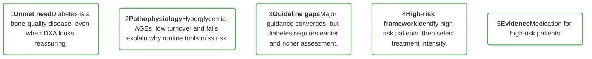
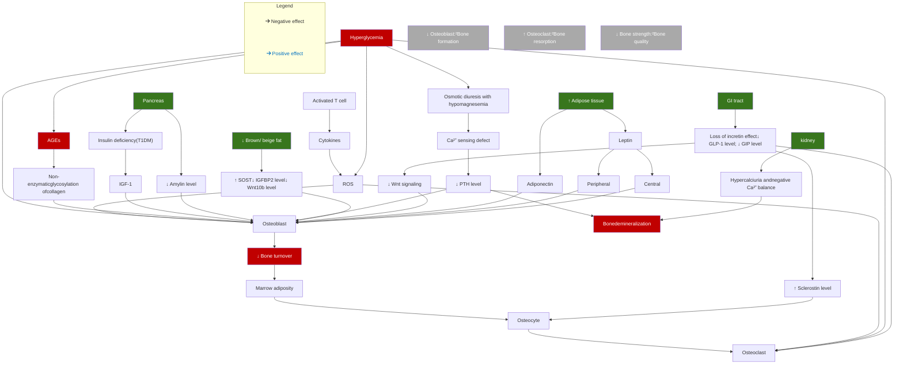
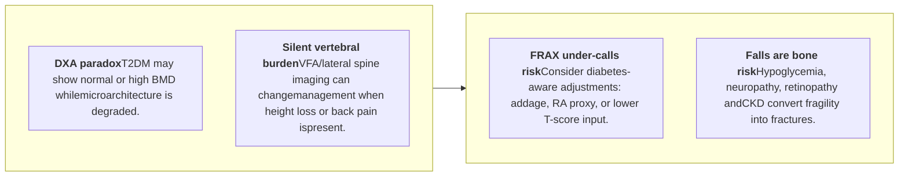
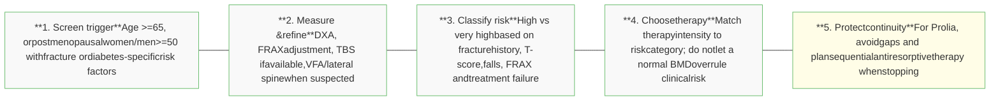
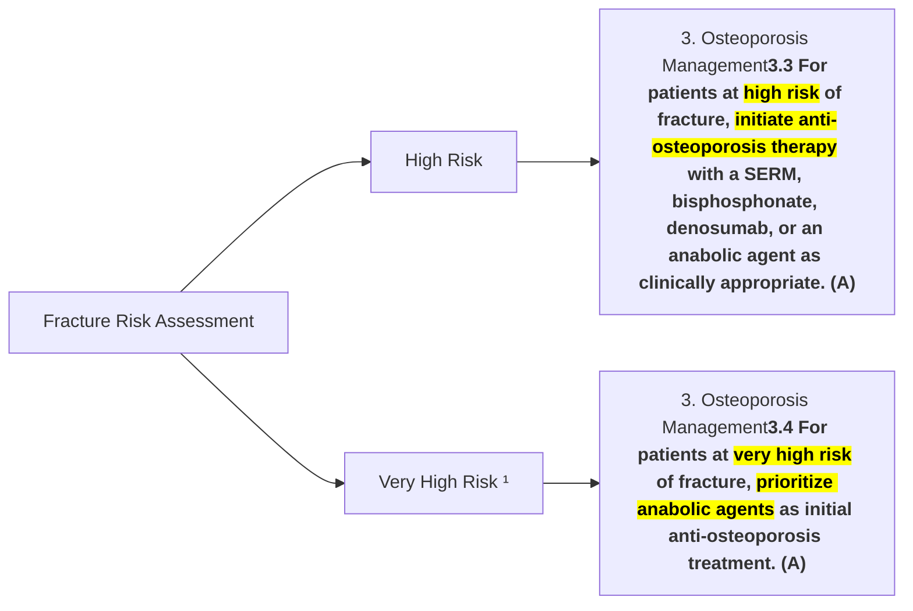
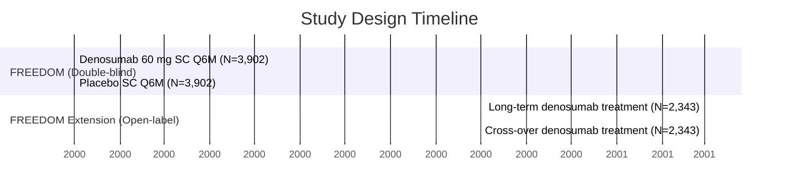

# Managing Skeletal Fragility in Diabetes
## Clinical Strategies and the Role of Medication
### <mark>A Guideline-Based Approach</mark>

黃兆山 Chang Gung Memorial Hospital

---

# Learning Path for Fellow Camp

A guideline-based flow from hidden risk to treatment choice



| 1                                                                   | 2                                                                                | 3                                                                              | 4                                                             | 5                                 |
| ------------------------------------------------------------------- | -------------------------------------------------------------------------------- | ------------------------------------------------------------------------------ | ------------------------------------------------------------- | --------------------------------- |
| \*\*Unmet need\*\*                                                  | \*\*Pathophysiology\*\*                                                          | \*\*Guideline gaps\*\*                                                         | \*\*High-risk framework\*\*                                   | \*\*Evidence\*\*                  |
| Diabetes is a bone-quality disease, even when DXA looks reassuring. | Hyperglycemia, AGEs, low turnover and falls explain why routine tools miss risk. | Major guidance converges, but diabetes requires earlier and richer assessment. | Identify high-risk patients, then select treatment intensity. | Medication for high-risk patients |


---

<mark>Section 1</mark>

# Introduction: Diabetes Is a Bone Quality Disease

<mark>Not just bone density</mark>

---


T1DM and T2DM Impair Bone Health Through Different Pathways

# Bone deteriorations differ markedly between T1DM and T2DM¹

|                                                      | T1DM                                          | T2DM                                            |
| ---------------------------------------------------- | --------------------------------------------- | ----------------------------------------------- |
| BMD²                                                 | Decreased<br/>(↓ 22-37%)                      | Normal or increased<br/>(↑ 5-10%)               |
| Bone turnover²<br/>(i.e., osteocalcin and CTX)       | Decreased                                     | Decreased                                       |
| Bone material properties and microstructure of bone² | Altered                                       | Altered                                         |
| Fracture risk (FRAX)²                                | Increased<br/>(RR of hip fracture = 1.7-12.3) | Increased\*<br/>(RR of hip fracture = 1.38-2.7) |
| Propensity for fall²                                 | Increased                                     | Increased                                       |
| Osteoporosis¹                                        | Increased                                     | Increased                                       |


\*BMD underestimates this risk.
BMD, bone mineral density; CTX, C-terminal cross-linked telopeptide collagen degradation product of type I collagen; DM, diabetes mellitus; FRAX, Fracture Risk Assessment Tool; RR, relative risk; T1DM, type 1 diabetes mellitus; T2DM, type 2 diabetes mellitus.
1. Wongdee K, Charoenphandhu N. World J Diabetes. 2011;2:41-8; 2. Napoli N, et al. Nat Rev Endocrinol. 2017;13:208-19.

DM


---


DM

# In Diabetes, a T-score of -1.9 Can Carry the Same Hip Fracture Risk as -2.5 Without Diabetes

* Data from 3 prospective observational studies with adjudicated fracture were analyzed in older community-dwelling adults (9,449 women and 7,436 men) in the US.

### Femoral neck BMD T score and 10-year fracture risk at age 75 years in women

| Femoral neck BMD T score | DM with insulin (10-year hip fracture risk, %) | DM without insulin (10-year hip fracture risk, %) | No DM (10-year hip fracture risk, %) |
| ------------------------ | ---------------------------------------------- | ------------------------------------------------- | ------------------------------------ |
| -4                       | \[blank]                                       | \[blank]                                          | 29                                   |
| -3.5                     | \[blank]                                       | 34                                                | 24                                   |
| -3                       | \[blank]                                       | 26                                                | 19                                   |
| -2.5                     | 24                                             | 21                                                | 14                                   |
| -2                       | 16                                             | 15                                                | 9                                    |
| -1.5                     | 10                                             | 10                                                | 6                                    |
| -1                       | 6                                              | 6                                                 | 4                                    |
| -0.5                     | 4                                              | 4                                                 | 3                                    |
| 0                        | 3                                              | 3                                                 | 2                                    |


**Comparison of Fracture Risk**

| Group | T score | Fracture risk |
| ----- | ------- | ------------- |
| DM    | -1.9    | ≈             |
| No DM | -2.5    | ≈             |


A woman with DM with T score of **-1.9** would have an estimated 10-year hip fracture risk **similar to** a woman without DM with a T score of **-2.5**.

BMD, bone mineral density; DM, diabetes mellitus; US, United States.
Schwartz AV, et al. JAMA. 2011;305:2184-92.


---


DM

# T2DM Patients Using Insulin Have 38% Higher Fracture Risk vs Non-Insulin Users

| Agent                                                     | BMD                                    | Fracture risk                          |
| --------------------------------------------------------- | -------------------------------------- | -------------------------------------- |
| Metformin 1,2                                             | ↔ / ↑                                  | ↔ / ↓                                  |
| DPP-4 inhibitors 3-5                                      | ↔ / ↑                                  | ↔ / ↓                                  |
| GLP-1 receptor agonists 6,7                               | ↔ / ↑                                  | ↔ / ↓                                  |
| \<span style="color:red">Sulfonylureas 8,9\</span>        | ↔                                      | ↔ / \<span style="color:red">↑\</span> |
| \<span style="color:red">Thiazolidinediones 10,11\</span> | \<span style="color:red">↓\</span>     | \<span style="color:red">↑\</span>     |
| SGLT2 inhibitors 12                                       | ↔                                      | ↔                                      |
| \<span style="color:red">Insulin 13,14\</span>            | ↔ / \<span style="color:red">↓\</span> | \<span style="color:red">↑\</span>     |


糖尿病患者
骨質疏鬆照護共識

社團法人中華民國糖尿病衛教學會
Taiwanese Association of Diabetes Educators

中華民國骨質疏鬆症學會
The Taiwanese Osteoporosis Association

中華民國內分泌學會
The Endocrine Society of the Republic of China (Taiwan)

DPP-4: Dipeptidyl peptidase-4; GLP1-RA: Glucagon-like peptide-1 receptor agonists; SGLT2-i: Sodium glucose co-transport-2 inhibitors.
2026糖尿病患者骨質疏鬆照護共識。2026年 03 月出版


---


<mark>Section 2</mark>

# Pathophysiology:

Biology explains the diagnostic blind spot


---

# Diabetes Disrupts Bone Remodeling Through Hyperglycemia, AGEs and Low Turnover

DM

## Cellular and molecular mechanisms of bone diseases in DM¹



| Indicator       | Effect            |
| --------------- | ----------------- |
| Osteoblast:²    | ↓ Bone formation  |
| Osteoclast:²    | ↑ Bone resorption |
| Bone strength:² | ↓ Bone quality    |


AGE, advanced glycation endproduct; DM, diabetes mellitus; GI, gastrointestinal; GIP, gastric inhibitory polypeptide; GLP-1, glucagon-like peptide 1; IGF-1, insulin-like growth factor 1; IGFBP2, insulin-like growth factor-binding protein 2; PTH, parathyroid hormone; ROS, reactive oxygen species; T1DM, type 1 diabetes mellitus; Wnt, Wingless integrase-1 pathway.

1. Napoli N, et al. Nat Rev Endocrinol. 2017;13:208-19; 2. Wongdee K, Charoenphandhu N. World J Diabetes. 2011;2:41-8.


---


prolia®
(denosumab) injection

<mark>Section 3</mark>

# Guideline Overview and Critical Gaps

Guidelines provide a frame; diabetes needs modifiers

AMGEN


---

# Guideline Overview: Four Lenses to Apply at the Bedside

| ADA / diabetes care                                                                                                               | 2026 DM-OP consensus                                                                           | Taiwan practice                                                                          | AACE / endocrine OP                                                                                                |
| --------------------------------------------------------------------------------------------------------------------------------- | ---------------------------------------------------------------------------------------------- | ---------------------------------------------------------------------------------------- | ------------------------------------------------------------------------------------------------------------------ |
| Bone health is part of diabetes comorbidity assessment; duration, insulin/SU/TZD, HbA1c and complications raise fracture concern. | DXA remains foundational; when diabetes hides risk, consider FRAX adjustment, TBS and VFA/IVA. | DXA and vertebral fracture definitions anchor diagnosis and reimbursement conversations. | Risk category drives initial therapy; high risk uses antiresorptive options, very high risk favors anabolic-first. |


> Clinical implication: in diabetes, standard thresholds are the starting point; apply diabetes-specific modifiers before calling a patient low risk.

---


ADA Highlights Diabetes-Specific Fracture Risk Factors

*   **2024 年 ADA guideline** 中新增骨骼健康為糖尿病患全方面共病症的評估項目之一，考慮骨密度 T 值和其他風險因子評估病患的骨折風險和骨骼強度。

### DM-specific risk factors for fractures

The following icons and text represent specific risk factors:
*   **T score ≤ -2.0** (Icon: X-ray of a bone)
*   **HbA1c > 8%** (Icon: Blood glucose meter)
*   **DM duration > 10 years** (Icon: Sugar cube and drop)
*   **Medication: Insulin, SU, TZDs** (Icon: Syringe and pills)
*   **Hypoglycemia** (Icon: Hand with blood drop)
*   **Macrovascular Microvascular complications\*** (Icon: Human figure)

*   HbA1c 每增加 1%，骨折風險增加 8% (RR 1.08 [95% CI 1.03-1.14])
*   隨著糖尿病罹病時間拉長 (第 2 型糖尿病病史 10 年以上、第 1 型糖尿病病史 26 年以上)，併發大、小血管病變，都顯著增加骨折的風險
*   日本研究分析發現，嚴重低血糖事件也會增加糖尿病患骨折風險 (HR 2.24 [95% CI 1.56-3.21])。

\*Peripheral and autonomic neuropathy, retinopathy, nephropathy.
BMD, bone mineral density; DM, diabetes mellitus; FRAX, Fracture Risk Assessment Tool; HbA1c, glycated hemoglobin A1c; RA, rheumatoid arthritis; SD, standard deviation; SGLT-2i, sodium-glucose cotransporter 2 inhibitor; T2DM, type 2 diabetes mellitus; TZD, thiazolidinedione.
Diabetes Care 2024;47(Suppl. 1):S52–S76. 2022第2型糖尿病臨床照護指引(更新版):第十六章 糖尿病的其他共病症 (2024年5月更新版)


---

# AACE Risk Stratification

| Fracture risk for PMO                                                                                                                                                                                                                                                                                                                    | Risk category     | Initial treatment      |
| ---------------------------------------------------------------------------------------------------------------------------------------------------------------------------------------------------------------------------------------------------------------------------------------------------------------------------------------- | ----------------- | ---------------------- |
| If one **or** more of the below is true:<br/>\* *BMD T-score ≤ –2.5*<br/>\* *Low-trauma spine or hip fracture*, regardless of BMD<br/>\* *Osteopenia* (T-score between –1.0 and –2.5) plus: A fragility fracture of *proximal humerus, pelvis, or distal forearm*<br/>\* High FRAX® probability (e.g., above country-specific threshold) | High Risk1,2      | BP, dMab<br/>SERM      |
| \* *Fracture within past 12 months1*<br/>\* Very *low BMD T-score < –3.01*<br/>\* Multiple fractures1,2<br/>\* Fracture while on osteoporosis treatment1<br/>\* Fracture while on medication harmful to bone1<br/>\* FRAX probability > 30% MOF, > 4.5% hip1<br/>\* High risk of falls or history of injurious falls1                    | Very High Risk1,2 | dMab, Romo, PTH<br/>BP |


AACE, American Association of Clinical Endocrinologists; BMD, bone mineral density; FRAX, Fracture Risk Assessment Tool; MOF, major osteoporotic fracture; PMO, postmenopausal osteoporosis; PTH, parathyroid hormone.
1. Camacho PM, et al. Endocr Pract. 2020;26 (Suppl 1):1-46. 2. Shoback D, et al. J Clin Endocrinol Metab. 2020;105:dgaa048.


---

# Critical Gaps in Diabetes: What Standard Algorithms Miss



<font color="#4CAF50"><b>Upgrade assessment</b></font>
<b>DXA + diabetes modifiers + TBS/VFA + fall-risk review</b>


---


<mark>Section 4</mark>

# Clinical Decision Framework and Embedded Case

<mark>Make the guideline actionable in clinic</mark>


---

# Embedded Case: Osteopenia Can Still Be High Risk

| Patient snapshot                                                                                                                                                                                                                             |                                                                                  | Question 1: Is osteopenia enough to reassure you?                             |
| -------------------------------------------------------------------------------------------------------------------------------------------------------------------------------------------------------------------------------------------- | -------------------------------------------------------------------------------- | ----------------------------------------------------------------------------- |
| 68F, T2DM x 15 years<br/>Insulin + sulfonylurea; HbA1c 8.4%<br/>CKD stage 3b, eGFR 38<br/>Peripheral neuropathy + retinopathy<br/>Two falls in the past year<br/>Height loss 3 cm, intermittent back pain<br/>DXA femoral neck T-score: -1.9 | Question 2: Which test most changes risk category: TBS, VFA, or FRAX adjustment? |                                                                               |
|                                                                                                                                                                                                                                              |                                                                                  | Question 3: If VFA shows vertebral fracture, how does initial therapy change? |


Teaching move: classify risk first, then reveal the pathway.

---

# Identify High-Risk Osteoporosis Before the First Fracture ⚠️

*   **Have you previously suffered from fracture? 過去是否有<mark>骨折</mark>病史？**
*   **If so, are you receiving anti-osteoporotic agents or DM, RA, GIOP now? 是否有在<mark>使用抗骨質疏鬆藥物治療或合併有 DM、RA、GIOP 等</mark>？**
*   **Do you have the following symptoms? 是否有<mark>駝背、變矮或是下背痛</mark>等臨床症狀？**

| Kyphosis1-3                                   | Loss of height1-4                                                           | Low back pain1, 4                                                         |
| --------------------------------------------- | --------------------------------------------------------------------------- | ------------------------------------------------------------------------- |
| An icon showing a person with a curved spine. | An icon showing a person next to a taller silhouette with a downward arrow. | An icon showing a person clutching their lower back with pain indicators. |
| (Progressive spinal curvature)                | (Historical loss ≥ 4 cm)                                                    |                                                                           |


1. Camacho PM, et al. Endocr Pract 2016;22(Suppl 4):1–42. 2. Kanis JA, et al. Osteoporos Int 2013;24:23–57. 3. Orimo H, et al. Arch Osteoporos 2012;7:3–20. 4. Cosman F, et al. Osteoporos Int 2014;25:2359–81.


---

# Which Patients Are High Risk?

Use this checklist before deciding that osteopenia or normal BMD is reassuring in diabetes.

| Clinical fracture signal                                                                                                                                 | BMD / FRAX signal                                                                                                          | Diabetes-specific amplifiers                                                                                              | Very-high-risk features                                                                                                                 |
| -------------------------------------------------------------------------------------------------------------------------------------------------------- | -------------------------------------------------------------------------------------------------------------------------- | ------------------------------------------------------------------------------------------------------------------------- | --------------------------------------------------------------------------------------------------------------------------------------- |
| Prior low-trauma spine or hip fracture; adult-age fragility fracture at humerus, pelvis or distal forearm; asymptomatic vertebral fracture on VFA/X-ray. | BMD T-score <= -2.5; osteopenia with elevated FRAX; diabetes-adjusted FRAX when clinical risk feels higher than the score. | Duration >10 years, insulin/SU/TZD use, HbA1c >8%, neuropathy, retinopathy, nephropathy, hypoglycemia or recurrent falls. | Recent fracture within 12 months, multiple fractures, T-score <= -3.0, fracture on therapy/steroids, injurious falls or very high FRAX. |


> Practical rule: diabetes shifts the threshold toward earlier treatment when risk modifiers accumulate.

---

# Do Not Leave a Treatment Gap:

```mermaid
graph TD
    Start[Do Not Leave a Treatment Gap:] --> RiskLevel{Risk Level}
    
    RiskLevel --> LowMod[Low-Moderate Risk]
    RiskLevel --> HighVeryHigh[<font color=red>High-Very High Risk</font>]

    LowMod --> LowRisk[Low Risk]
    LowMod --> ModRisk[Moderate Risk]

    LowRisk --> Reassess1[Reassess fracture risk in 2-4 yrs]
    
    ModRisk -.-> OR((OR))
    OR -.-> Bis[<b>(2.1) Bisphosphonates</b>(2.2) Reassess fracture risk in 3-5 yrs(2.2) (5 yrs for oral, 3 yrs for IV)(8.1) Calcium + Vitamin D as adjunct therapy]

    HighVeryHigh --> Bis
    HighVeryHigh --> Den[<b>(3.1) Denosumab</b>(3.2) Reassess fracture risk in 5-10 yrs(8.1) Calcium + Vitamin D as adjunct therapy]
    HighVeryHigh --> Teri[<b>(4.1) Teriparatide or Abaloparatide for 2 yrs</b>(8.1) Calcium + Vitamin D as adjunct therapy]
    HighVeryHigh --> Romo[<font color=red><b>(A.1) Romosozumab For 1 yr</b></font>(8.1) Calcium + Vitamin D as adjunct therapy]

    Bis --> BisLowMod[<b>Low-Moderate Risk</b>(2.2) Consider a drug holiday(11.1) Reassess fracture risk every 2-4 yrs(2.2) If bone loss or patient becomes high risk, consider restarting therapy]
    Bis --> BisHigh[<b>High Risk</b>(2.2) Continue therapy or switch to another therapy]

    Den --> DenLowMod[<b>Low-Moderate Risk</b>Consider giving bisphosphonates and then stopping for a drug holiday(11.1) Reassess fracture risk every 1-3 yrsIf bone loss, fracture occurs, or patient becomes high risk, consider restarting therapy]
    Den --> DenHigh[<b>High Risk</b>(3.2) Continue therapy or switch to another therapy]

    Teri --> Den
    Romo --> Den
    Romo -.-> Bis

    Bis -.-> Intolerant{Intolerant to or inappropriate for above therapies}
    Den -.-> Intolerant
    
    Intolerant --> AgeUnder60[<b>Age <60 or <10 yrs past menopause</b>Low VTE risk]
    Intolerant --> AgeOver60[<b>Age >60</b>]

    AgeUnder60 --> NoVasomotor[No vasomotor symptomsHigh breast cancer risk]
    AgeUnder60 --> WithVasomotor[With vasomotor symptoms]

    NoVasomotor --> SERM1[(5.1) SERM (raloxifene, bazedoxifene)]
    WithVasomotor --> HT[(6.1+6.2) HT (no uterus, Estrogen; with uterus, Estrogen + Progestin) or Tibolone]

    AgeOver60 --> ConsiderList[<b>Consider (in order):</b>1. SERM (5.1)2. HT/Tibolone (6.1+6.2)3. Calcitonin (7.1)4. Calcium + Vitamin D (8.2)]
```

PMO = postmenopausal osteoporosis.
Shoback D, et al. J Clin Endocrinol Metab. 2020;105(3):1-8.
Amgen was not involved in the development of this Endocrine Society Guideline and in no way influenced its content.


---

# From Diabetes Visit to Fracture Prevention: A Practical Framework



> Case answer: T-score -1.9 is not low risk in long-duration insulin-treated T2DM with CKD, falls and possible vertebral fracture.

---


Section 5

# Management in Diabetes Osteoporosis

<mark>Prioritize high-risk patients; support with DM evidence and RWE data</mark>

---

# 3. Osteoporosis Management

**Statements:**

**3.1** Lifestyle modifications, including nutrition, exercise, and fall prevention, should be recommended for all individuals with osteoporosis. (B)

**3.2** Anti-osteoporosis therapy should follow standard guideline recommendations; treatment initiation thresholds may be adjusted, such as lower FRAX and higher BMD cut-off values, based on clinical judgement and fracture risk. (B)

**3.3** For patients at high risk of fracture, initiate anti-osteoporosis therapy with a SERM, bisphosphonate, denosumab, or an anabolic agent as clinically appropriate. (A)

**3.4** For patients at very high risk of fracture, prioritize anabolic agents as initial anti-osteoporosis treatment. (A)

**3.5** Sequential therapy that begins with an anabolic agent followed by an antiresorptive agent may help preserve BMD gains and sustain reductions in fracture risk. (B)

The right side of the page features a stylized medical illustration of bone microarchitecture (trabecular bone) with hexagonal chemical structures overlaid in the background.

---


3. Osteoporosis Management

# 3.1 Lifestyle modifications, including nutrition, exercise, and fall prevention, should be recommended for all individuals with osteoporosis. (B)

### **Non-pharmacological management** forms the foundation of osteoporosis care <sup>1-4</sup>

| Nutrition                                                                                                                                                              | Exercise                                                                      | Safety                                                         |
| ---------------------------------------------------------------------------------------------------------------------------------------------------------------------- | ----------------------------------------------------------------------------- | -------------------------------------------------------------- |
| • **Calcium:** Target ≥ 1,000-1,200 mg1<br/>• **Vitamin D:** Target ≥ 800 IU, maintain ≥ 30 ng/mL1,2<br/>• **Protein:** Target 1.0-1.2 g/kg (crucial for sarcopenia) 1 | Emphasize weight-bearing, resistance, and balance training to prevent falls3. | Focus on home hazard removal and visual impairment correction. |


IU, international unit.
Reference: 1. Tai TW, et al. J Formos Med Assoc 2023;122 Suppl 1:S4-S13. 2. Cosman F, et al. Osteoporos Int 2014;25:2359-81. 3. Kanis JA, et al. Osteoporos Int 2019;30:3-44. 4. Camacho PM, et al. Endocr Pract 2020;26:1-46.


---

# 3. Osteoporosis Management

## 3.2 Anti-osteoporosis therapy should follow standard guideline recommendations; treatment initiation thresholds may be adjusted, such as <mark>lower FRAX</mark> and <mark>higher BMD</mark> cut-off values, based on clinical judgement and fracture risk.

### T-score

| General Population Thresholds¹⁻⁴                                                                                                                                                                             | T-score Scale | Important Considerations in Diabetes ⁴⁻⁶                                                     |
| ------------------------------------------------------------------------------------------------------------------------------------------------------------------------------------------------------------ | ------------- | -------------------------------------------------------------------------------------------- |
| \* **T-score ≤ −2.5**<br/>\* **Prior fragility fracture** regardless of BMD<br/>\* **Osteopenia (T −1.0 to −2.5)** with elevated **FRAX** risk<br/>- Hip fracture ≥3%<br/>- Major osteoporotic fracture ≥20% | -0.0          |                                                                                              |
|                                                                                                                                                                                                              | -1.0          |                                                                                              |
|                                                                                                                                                                                                              | -2.0          | \* **T-score ≤ −2.0**                                                                        |
|                                                                                                                                                                                                              | -2.5          | \* Fracture risk may be **underestimated by BMD and FRAX alone**                             |
|                                                                                                                                                                                                              | -3.0          | \* Even **one fragility fracture → very high risk**, especially within the first **2 years** |


BMD, bone mineral density; FRAX, Fracture Risk Assessment Tool.
Reference: 1. Cosman F, et al. Osteoporos Int 2014;25:2359-81. 2. Kanis JA, et al. Osteoporos Int 2019;30:3-44. 3. Camacho PM, et al. Endocr Pract 2020;26:1-46. 4. Taiwanese Osteoporosis Association. <u>https://www.toa1997.org.tw/news/content.php?id=224&t=6</u>. 5. Ferrari SL, et al. Osteoporos Int 2018;29:2585-96. 6. Kanis JA, et al. Osteoporos Int 2020;31:1-12.

---

# Severity of Fracture Risk Dictates the Initial Choice of Pharmacotherapy



### High Risk
- **SERMs**
- **Bisphosphonates**
- **Denosumab, or Anabolic**

### Very High Risk ¹
* Recent osteoporotic fracture (e.g., within 12 months)
* Multiple osteoporotic fractures
* Fracture sustained during anti-osteoporosis treatment
* Fracture sustained during long-term glucocorticoid treatment
* Extremely low BMD (e.g., T-score ≤-3.0)
* High risk of falling or history of injurious falls
* Very high FRAX 10-year probability of major osteoporotic fracture (e.g., ≥4.5% risk of hip fracture or ≥30% risk of major osteoporotic fracture).

**To rapidly restore skeletal integrity<sup>2,3</sup>**
- **Abaloparatide**
- **Teriparatide**
- **Romosozumab**

BMD, bone mineral density; FRAX, Fracture Risk Assessment Tool; SERM, Selective Estrogen Receptor Modulator.
Reference: 1. Tai TW, et al. J Formos Med Assoc 2023;122 Suppl 1:S4-S13. 2. Gregson CL, et al. Arch Osteoporos 2025;20:119. 3. Kanis JA, et al. Osteoporos Int 2020;31:1-12.


---


Current Opinion in
**Endocrinology, Diabetes and Obesity**
Articles & Issues ∨ For Authors ∨ Journal Info ∨

# Effects of Osteoporosis Drugs on BMD and Fracture Risk in Diabetes

PARATHYROIDS, BONE AND MINERAL METABOLISM: EDITED BY VIRAL N. SHAH
**Treatment of bone fragility in patients with diabetes: antiresorptive versus anabolic?**
Shah, Meghnaᵃ; Appuswamy, Anusha Veeravanallurᵃ; Rao, Sudhaker D.ᵇ; Dhaliwal, Rubanᵃ

| Medications            | Type 1 diabetes<br/>BMD | Type 1 diabetes<br/>Risk of fracture | Type 2 diabetes<br/>BMD | Type 2 diabetes<br/>Risk of fracture |
| ---------------------- | ----------------------- | ------------------------------------ | ----------------------- | ------------------------------------ |
| Alendronate \[24,26]   | ↑                       | ↓                                    | ↑                       | ↓                                    |
| Risedronate \[23,25]   | ↑                       | NA                                   | ↑                       | NA                                   |
| Zoledronate \[28]      | NA                      | NA                                   | NA                      | ↓                                    |
| Denosumab \[29]        | NA                      | NA                                   | ↑                       | ↓                                    |
| Abaloparatide \[44,45] | NA                      | NA                                   | ↑                       | ↓                                    |
| Teriparatide \[40–42]  | NA                      | NA                                   | ↑                       | ↓                                    |
| Romosozumab \[48]      | NA                      | NA                                   | ↑                       | ↓                                    |


ᵃOnly available evidence is from observational studies and posthoc analyses.
↑ increase, ↓ decrease, NA not available, BMD bone mineral density.

There are no randomized controlled trials that have compared the efficacy of antiresorptive and/or anabolic therapies on bone density, turnover, strength, or fracture outcomes in patients with type 1 or type 2 diabetes
Similar effect on BMD and fracture risk reduction in patients with and without DM

---


Home > Drugs & Aging > Article

# Managing Bone Fragility in Older Adults with Diabetes: Pathophysiology, Assessment, and Therapeutic Considerations

Review Article | Open access | Published: 19 March 2026
(2026) Cite this article

[Drugs & Aging]
Aims and scope →
Submit manuscript →

[x] You have full access to this open access article

Download PDF Save article

Gulistan Bahat, Tugba Erdogan, Savas Ozturk, Ozlem Soyluk Selcukbiricik, Serdar Ozkok, Dilek Gogas Yavuz, Mehmet Akif Karan & Jean-Yves Reginster

**Sections** | **References**
Abstract

Published online: 19 March 2026

| Medication class                 | Mechanism of action                                              | Evidence for efficacy in diabetes (BMD, fractures)                                                                                                                                         |
| -------------------------------- | ---------------------------------------------------------------- | ------------------------------------------------------------------------------------------------------------------------------------------------------------------------------------------ |
| Bisphosphonates (oral/IV)        | Inhibit osteoclast activity/resorption                           | Similar BMD ↑ and fracture ↓ versus nondiabetics (post hoc/obs.) \[21]; meta-analysis shows BMD ↑ \[82]                                                                                    |
| Denosumab                        | RANKL inhibitor; inhibits osteoclast formation/function/survival | Similar BMD ↑ and Vert Fx ↓ versus nondiabetics (post hoc) \[21]; NVF data mixed (↑ risk in one analysis) \[21]; potential ↓ incident T2D risk \[86]; may improve glucose parameters \[87] |
| Teriparatide (PTH 1-34)          | Anabolic; stimulates osteoblast function/bone formation          | Similar BMD ↑ and fracture ↓ versus nondiabetics (post hoc/obs.) \[21]; theoretical benefit in low turnover T2D \[21]                                                                      |
| Abaloparatide (PTHrP analog)     | Anabolic; selective PTH1R activation                             | Significant BMD ↑ and ↓ NVF versus placebo in T2D subgroup (post hoc ACTIVE) \[21]; may ↑ BMD > teriparatide at hip \[89]; ↓ hip/NVF versus teriparatide (claims data) \[90]               |
| Romosozumab (anti-sclerostin Ab) | Dual action: ↑ formation, ↓ resorption                           | Potent BMD ↑ and fracture ↓ versus placebo/alendronate (general population) \[96]; limited data in diabetes \[93]; preclinical T2D data promising \[21]                                    |


---

# FREEDOM and FREEDOM Extension: Pivotal Evidence Base for Prolia



**Calcium and Vitamin D** (administered throughout the study)

| FREEDOM<br/>0 - 3 Years (Double-blind)                                                                                                                                                                                   | FREEDOM extension<br/>0 - 7 Years (Open-label)                                        | FREEDOM extension<br/>0 - 7 Years (Open-label) |
| ------------------------------------------------------------------------------------------------------------------------------------------------------------------------------------------------------------------------ | ------------------------------------------------------------------------------------- | ---------------------------------------------- |
| \* 7,808 postmenopausal women aged 60 – 90 years with lumbar spine or total hip BMD T-score between -2.5 and -4.0<br/>\* Excluded: Any severe or > 2 moderate vertebral fractures; conditions that alter bone metabolism |                                                                                       | Study population                               |
| \* Incidence of new vertebral fracture over 3 years                                                                                                                                                                      | \* Evaluate the safety and tolerability of up to 10 years of denosumab administration | Primary endpoint                               |


BMD, bone mineral density; SC, subcutaneous; Q6M, every 6 months.
1. Bone HG, et al. Lancet Diabetes Endocrinol. 2017;5:513-23. 2. Cummings SR, et al. N Engl J Med. 2009;361:756-65.


---


# Prolia Reduced Vertebral, Nonvertebral and Hip Fracture Risk at 3 Years

<mark>FREEDOM</mark>

### Effect of Prolia® on the risk of fracture at 36 months

| Fracture Type          | Placebo | Prolia® | Relative Risk Reduction | Absolute Risk Reduction (ARR) |
| ---------------------- | ------- | ------- | ----------------------- | ----------------------------- |
| New vertebral fracture | 7.2     | 2.3     | 68%                     | ARR = 4.8%                    |
| Non-vertebral fracture | 8       | 6.5     | 20%                     | ARR = 1.5%                    |
| Hip fracture           | 1.2     | 0.7     | 40%                     | ARR = 0.3%                    |


Cummings SR, et al. N Engl J Med. 2009; 361(8):756-65.


---

# In Diabetes, Prolia Sustained BMD Gains for Up to 10 Years

* Of 7,808 subjects in FREEDOM, 508 with diabetes received denosumab (n = 266) or placebo (n = 242).
* Among those, BMD increased significantly with denosumab versus placebo in FREEDOM, and continued to increase during the Extension in long-term and crossover denosumab subjects.

<mark>FREEDOM</mark>
<mark>FREEDOM extension</mark>
<mark>DM</mark>

### Lumbar spine percent change from baseline

| Study year | Subjects with diabetes Crossover denosumab | Subjects without diabetes Crossover denosumab | Subjects with diabetes Long-term denosumab | Subjects without diabetes Long-term denosumab |
| ---------- | ------------------------------------------ | --------------------------------------------- | ------------------------------------------ | --------------------------------------------- |
| BL         | 0                                          | 0                                             | 0                                          | 0                                             |
| 3          | 2                                          | 6                                             | 9                                          | 9.5                                           |
| 4          | 6                                          | 7                                             | 11                                         | 11.5                                          |
| 5          | 8                                          | 9                                             | 13                                         | 13.5                                          |
| 6          | 10                                         | 11                                            | 15                                         | 16                                            |
| 8          | 12                                         | 14                                            | 18                                         | 19                                            |
| 10         | 15                                         | 17                                            | 19                                         | 21                                            |


### Total hip percent change from baseline

| Study year | Subjects with diabetes Crossover denosumab | Subjects without diabetes Crossover denosumab | Subjects with diabetes Long-term denosumab | Subjects without diabetes Long-term denosumab |
| ---------- | ------------------------------------------ | --------------------------------------------- | ------------------------------------------ | --------------------------------------------- |
| BL         | 0                                          | 0                                             | 0                                          | 0                                             |
| 1          | 0                                          | 0                                             | 3                                          | 3.5                                           |
| 2          | -1                                         | -1                                            | 4                                          | 5                                             |
| 3          | -2                                         | -1.5                                          | 5                                          | 6                                             |
| 4          | 0.5                                        | 1.5                                           | 5.5                                        | 6.5                                           |
| 5          | 2                                          | 2.5                                           | 6                                          | 7                                             |
| 6          | 3                                          | 3.5                                           | 6.5                                        | 7.5                                           |
| 8          | 3.5                                        | 4.5                                           | 7.5                                        | 8.5                                           |
| 10         | 3.5                                        | 6                                             | 8                                          | 9                                             |


### Femoral neck percent change from baseline

| Study year | Subjects with diabetes Crossover denosumab | Subjects without diabetes Crossover denosumab | Subjects with diabetes Long-term denosumab | Subjects without diabetes Long-term denosumab |
| ---------- | ------------------------------------------ | --------------------------------------------- | ------------------------------------------ | --------------------------------------------- |
| BL         | 0                                          | 0                                             | 0                                          | 0                                             |
| 1          | 0                                          | 0                                             | 2.5                                        | 3                                             |
| 2          | -0.5                                       | -0.5                                          | 4                                          | 4.5                                           |
| 3          | -1                                         | -1                                            | 4.5                                        | 5                                             |
| 4          | 1                                          | 1.5                                           | 5                                          | 6                                             |
| 5          | 2                                          | 2.5                                           | 5.5                                        | 6.5                                           |
| 6          | 3                                          | 3.5                                           | 6                                          | 7                                             |
| 8          | 3.5                                        | 5                                             | 7                                          | 8                                             |
| 10         | 3.5                                        | 6.5                                           | 7.5                                        | 9                                             |


BMD, bone mineral density..
Ferrari S, et al. Bone. 2020;134:115268.


---


# In Diabetes, Prolia Reduced New Vertebral and Hip Fracture Risk

* Nonvertebral fracture incidence was elevated specifically during the second year of FREEDOM but returned to levels comparable to placebo during the subsequent 7 years of follow-up.

<mark>FREEDOM</mark>
<mark>FREEDOM extension</mark>
<mark>DM</mark>

### Cumulative incidence of fracture at year 3 in the FREEDOM study

**80%**
**RR 0.20, p = 0.001**

| Fracture Type          | Placebo | Denosumab |
| ---------------------- | ------- | --------- |
| New vertebral fracture | 8       | 1.6       |
| Hip fracture           | 1.7     | 0.4       |


### Time to nonvertebral fracture in the first 3 years of FREEDOM extension (study years 4–6) receiving denosumab vs FREEDOM (study years 1–3) placebo

| Respective study year | FREEDOM extension: Long-term denosumab subjects with diabetes | FREEDOM extension: Long-term denosumab subjects without diabetes | FREEDOM: Placebo subjects with diabetes |
| --------------------- | ------------------------------------------------------------- | ---------------------------------------------------------------- | --------------------------------------- |
| 0                     | 0                                                             | 0                                                                | 0                                       |
| 0.5                   | 0.5                                                           | 0.5                                                              | 1.5                                     |
| 1                     | 0.5                                                           | 1.5                                                              | 3                                       |
| 1.5                   | 0.5                                                           | 2.5                                                              | 3.5                                     |
| 2                     | 2.5                                                           | 3                                                                | 5.5                                     |
| 2.5                   | 3                                                             | 4                                                                | 5.5                                     |
| 3                     | 5                                                             | 4.5                                                              | 6                                       |


RR, relative risk; OP, osteoporosis.
Ferrari S, et al. Bone. 2020;134:115268.


---

# RWE: Prolia Reduced Fracture Risk vs Bisphosphonates in More Than 500,000 Patients

藥實證

## Overall fracture relative risk reduction vs Zoledronic acid¹

| Major Osteoporotic Fracture | Hip        | Nonvertebral | Non-hip, Nonvertebral |
| --------------------------- | ---------- | ------------ | --------------------- |
| 26%\*                       | 34%\*      | 33%\*        | 31%\*                 |
| ARR: 2.87%                  | ARR: 1.22% | ARR: 2.99%   | ARR: 1.94%            |


## Overall fracture relative risk reduction vs Alendronate²

| Major Osteoporotic Fracture | Hip        | Nonvertebral | Non-hip, Nonvertebral |
| --------------------------- | ---------- | ------------ | --------------------- |
| 39%\*                       | 36%\*      | 43%\*        | 50%\*                 |
| ARR: 6.74%                  | ARR: 1.99% | ARR: 6.24%   | ARR: 5.42%            |


*RWE real world Evidence

*p < 0.05. Major osteoporotic fracture defined as nonvertebral fracture and hospitalized vertebral fracture. Data are derived from real-world sources and not from a controlled clinical study. Average follow-up was longer for Prolia® (mean: 1.52-1.55 years, median: 1.18 years) compared to zoledronic acid (mean: 1.44-1.46 years, median: 1.16 years). Average follow-up was longer for Prolia® (mean: 1.5 years, median: 1.2 years) compared to Alendronate (mean: 1.1 years, median: 0.6 years).
ARR, absolute risk reduction; CI, confidence interval; RRR, relative risk reduction.
1. Prolia® vs zoledronic acid - Study design. Available at: <u>https://www.evenityproliahcp.com/starting-prolia/real-world-evidence/vs-zoledronic-acid/study-design</u>. 2. Curtis JR, et al. J Bone Miner Res. Published online May 16, 2024. doi:10.1093/jbmr/zjae079.


---

# Prolia Has No Known Drug Interactions With Common Diabetes Medications

| Category¹                | Drugs¹                                                          | Drugs¹                                | Drugs¹                                            | Drugs¹ |
| ------------------------ | --------------------------------------------------------------- | ------------------------------------- | ------------------------------------------------- | ------ |
| Biguanide                | Metformin                                                       | NO INTERACTIONS<br/>were found²       |                                                   |        |
| Insulin<br/>secretagogue | Sulfonylurea                                                    |                                       | Glibenclamide, gliclazide, glimepiride, glipizide |        |
|                          | Non-sulfonylurea                                                | Mitiglinide, nateglinide, repaglinide |                                                   |        |
| α-glucosidase inhibitor  | Acarbose, miglitol                                              |                                       |                                                   |        |
| Thiazolidinedione        | Pioglitazone, rosiglitazone                                     |                                       |                                                   |        |
| DPP-4 inhibitor          | Alogliptin, linagliptin, saxagliptin, sitagliptin, vildagliptin |                                       |                                                   |        |
| SGLT-2 inhibitor         | Canagliflozin, dapagliflozin, empagliflozin, ertugliflozin      |                                       |                                                   |        |
| Glucagon-like peptide-1  | Semaglutide                                                     |                                       |                                                   |        |
| Insulin                  |                                                                 |                                       |                                                   |        |


ClCr, creatinine clearance; CKD, chronic kidney disease; DPP-4, dipeptidyl peptidase- 4; SGLT-2, sodium-glucose cotransporter-2.
1. 中華民國糖尿病學會。2022 第 2 型糖尿病臨床照護指引。2. Drugs.com / Drug Interaction Checker http://www.drugs.com/drug_interactions.php (Accessed in Mar 2022).


---

# Discontinuation: BMD Declines Without Sequential Therapy

* Postmenopausal women with low BMD were randomized to denosumab, placebo, or open-label oral alendronate weekly.

### Total hip BMD

| Months | Placebo | Denosumab 210 mg Q6M | Open-label alendronate QW |
| ------ | ------- | -------------------- | ------------------------- |
| 0      | 0       | 0                    | 0                         |
| 6      | -0.2    | 1.5                  | 0.8                       |
| 12     | -0.3    | 1.8                  | 1.5                       |
| 18     | -0.6    | 2.2                  | 2.0                       |
| 24     | -1.3    | 3.2                  | 2.6                       |
| 26     | -2.0    | 4.1                  | 3.1                       |
| 36     | -3.0    | -1.4                 | 0.8                       |
| 48     | -3.6    | -1.4                 | 1.0                       |


*Percent change (LS mean ± SE)*

### Lumbar spine BMD

| Months | Placebo | Denosumab 210 mg Q6M | Open-label alendronate QW |
| ------ | ------- | -------------------- | ------------------------- |
| 0      | 0       | 0                    | 0                         |
| 6      | -0.4    | 2.2                  | 1.5                       |
| 12     | -1.0    | 3.8                  | 3.2                       |
| 18     | -1.0    | 4.8                  | 4.2                       |
| 24     | -1.3    | 6.8                  | 5.0                       |
| 26     | -1.5    | 8.0                  | 6.0                       |
| 36     | -2.1    | 0.8                  | 4.8                       |
| 48     | -2.6    | 2.2                  | 4.4                       |


*Percent change (LS mean ± SE)*

**Legend:**
● Placebo
▲ Denosumab 210 mg Q6M
■ Open-label alendronate QW

BMD, bone mineral density; LS, least squares; Q6M, once every 6 months; QW, once weekly; SE, standard error.
Miller PD, et al. Bone. 2008;43:222-9.


---

# Prolia Improved Persistence by 76% vs Long-Acting BPs

## Persistence rate with osteoporosis therapies during 24-month follow-up

<mark>Patients initiating with denosumab SC were significantly **more likely to be persistent.**</mark>

$P < 0.001$ across all groups

| Therapy Category     | Therapy Type            | Persistence rate (%) | OR (95% CI)                |
| -------------------- | ----------------------- | -------------------- | -------------------------- |
| Oral therapies       | Alendronate oral QD     | 20                   |                            |
| Oral therapies       | Alendronate oral QW     | 24                   |                            |
| Oral therapies       | Risedronate oral QD     | 21                   |                            |
| Oral therapies       | Risedronate oral QW     | 20                   |                            |
| Oral therapies       | Risedronate oral QM     | 20                   |                            |
| Oral therapies       | Ibandronate oral QM     | 23                   |                            |
| Parenteral therapies | Ibandronate IV Q3M      | 19                   | OR 0.34 (95% CI 0.20-0.60) |
| Parenteral therapies | Denosumab SC Q6M        | 41                   |                            |
| Parenteral therapies | Zoledronic acid IV Q12M | 34                   | OR 0.76 (95% CI 0.67-0.86) |


CI, confidence interval; IV, intravenous; OR, odds ratio; Q3M, once every 3 months; Q6M, once every 6 months; Q12M, once every 12 months; QD, daily; QM, once monthly; QW, once weekly; SC, subcutaneous.
Durden E, et al. Arch Osteoporos. 2017;12:22.


---

# Prolia Provides Continuous BMD Gains Over 10 Years: No Drug Holiday

## Effects of antiresorptive osteoporosis treatments on hip BMD*

| Year | Denosumab | Zoledronic acid | Alendronate |
| ---- | --------- | --------------- | ----------- |
| 0    | 0         | 0               | 0           |
| 1    | 3.3       | 3.1             | 2.2         |
| 2    | 4.7       | 4.6             | 3.1         |
| 3    | 5.8       | 4.9             | 3.7         |
| 4    | 6.5       | 5.8             | 3.7         |
| 5    | 7.2       | 5.8             | 3.5         |
| 6    | 7.6       | 5.4             | 3.5         |
| 7    | 8.0       | 4.8             | 3.2         |
| 8    | 8.5       | 5.2             | 2.7         |
| 9    | 8.9       | 4.6             | 2.9         |
| 10   | 9.2       | \[null]         | 2.7         |


**↑ 9.2%**

### 持續增長
治療長達10年，BMD 沒有平原期 (Plateau)

### 骨折預防
Freedom- extension study: 使用>3年，手部/脊椎/髖部骨折發生率更低。

### 安全性
長期治療有更好的效益/風險比(Benefit/Risk Profile)。

*Data derived from long-term follow-up studies of the FLEX trial (alendronate, 5-10 mg peroral per day), the HORIZON trial (zoledronic acid, 5 mg IV infusion per year), and the FREEDOM trial (denosumab, 60 mg SC injection every 6 months)
BMD, bone mineral density; BP, bisphosphonate; IV, intravenous; SC, subcutaneous.
Kendler DL, et al. Adv Ther. 2022;39:58-74.


---

# Key Takeaways: Prolia Benefits in High-Risk Diabetes Care

1. Diabetes is a bone-quality disease; normal BMD does not exclude fragility.
2. Use risk first: Prolia fits high-risk or very-high-risk patients, not a simple BP replacement message.
3. DM data: durable BMD gains and vertebral/hip fracture-risk reduction in diabetes subgroups.
4. RWE: lower fracture risk versus BPs across prior-fracture, advanced-age and large matched cohorts.
5. Practical fit: twice-yearly dosing, no renal dose adjustment, and no known interactions with common diabetes drugs.

> Continuity protects the benefit: reassess every 1-3 years, continue until low risk is achieved, and plan sequential therapy before stopping.
> Metabolic signals are supportive, not the primary goal.

---

# Thank you

## Choose Original Prolia:
### Protecting bone health, one step at a time

For high-risk diabetes patients: treat, reassess, maintain continuity, and plan the next step before stopping.