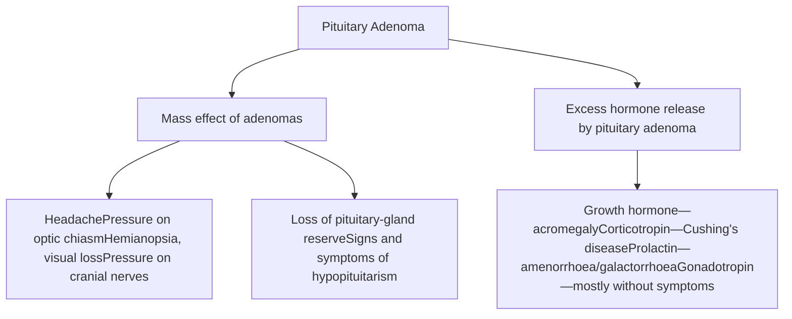
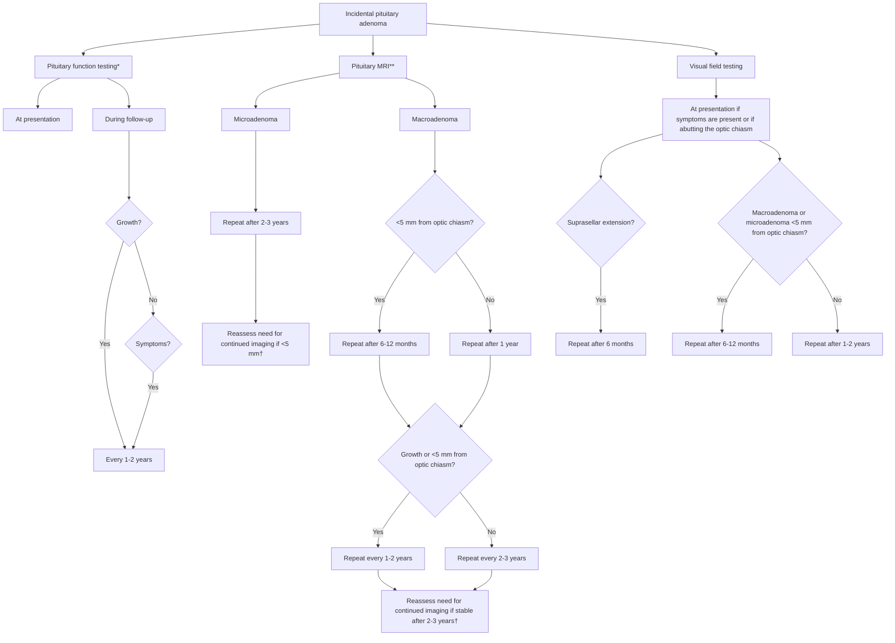
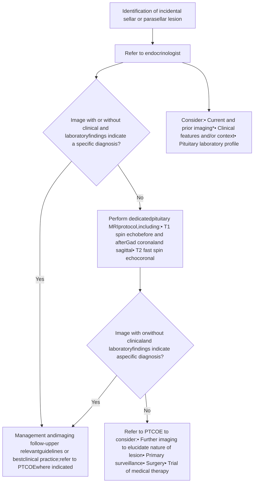
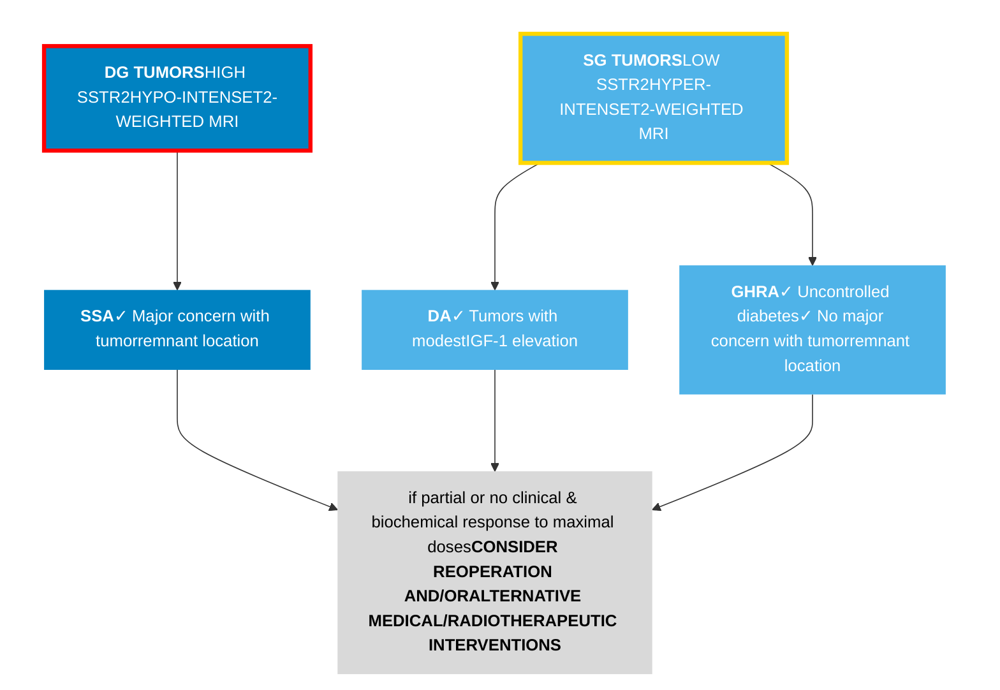
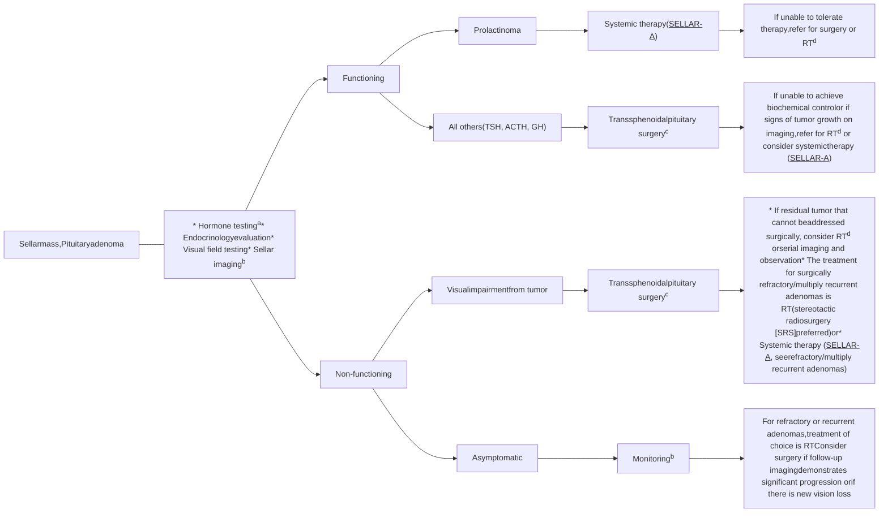
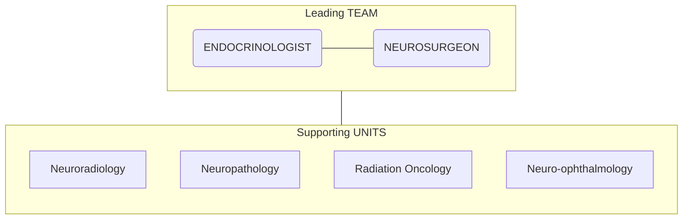

Black and white portrait of a man with acromegaly features
Sindbad the Sailor cartoon illustration
Close-up photo of a person's face with eyes censored

# 內分泌人如何想腦垂體疾病

Collage of medical images labeled A through F showing skin lesions, an ear, and an MRI scan
Illustration of a small figure facing a giant warrior with text overlay

汐止國泰綜合醫院
林慶齡

Close-up photo of the inside of a person's mouth

# Personal disclosure:

* Non, regarding this topic.

Illustration of a blindfolded white figure holding a golden scale of justice

# 大綱：

* 1）非戰之罪
* 2）天方夜譚
* 3）大衛vs.哥利亞巨人
* 4）先畫靶再射箭
* 5）善用老二哲學
* 6）地表板塊遷移
* 7）莫做諸葛亮
* 8）來去逛夜市

# 大綱：

* 1）非戰之罪
* 2）天方夜譚
* 3）大衛vs.哥利亞巨人
* 4）先畫靶再射箭
* 5）善用老二哲學
* 6）地表板塊遷移
* 7）莫做諸葛亮
* 8）來去逛夜市

# 非戰之罪(Incidental finding & new clinical entities such as IrAE)

The NEW ENGLAND JOURNAL of MEDICINE logo

CURRENT ISSUE SPECIALTIES TOPICS

This content is available to subscribers. Subscribe now. Already have an accoun

REVIEW ARTICLE

f X in

## Immune-Related Adverse Events Associated with Immune Checkpoint Blockade

Authors: Michael A. Postow, M.D., Robert Sidlow, M.D., and Matthew D. Hellmann, M.D. Author Info & Affiliations
Published January 10, 2018 | N Engl J Med 2018;378:158-168 | DOI: 10.1056/NEJMra1703481 | VOL. 378 NO. 2
Copyright © 2018

* 腦垂體腺瘤的發生似乎與地域或種族無關 。

在正常人群中盛行率很高。在 2004年的一項薈萃分析中，發現總體盛行率為 16.7%，其中以屍檢 (Autopsy) 研究盛行率為14.4%，根據影像學的研究則為 22.5%。更有報告指稱，未經篩選受試者，經影像證實的腦垂體腺瘤盛行率可高達 40%。

Diagram of a human body showing various immune-related adverse events: Encephalitis, aseptic meningitis, Hypophysitis, Uveitis, Thyroiditis, hypothyroidism, hyperthyroidism, Dry mouth, mucositis, Pneumonitis, Rash, vitiligo, Thrombocytopenia, anemia, Myocarditis, Hepatitis, Adrenal insufficiency, Pancreatitis, autoimmune diabetes, Nephritis, Vasculitis, Colitis, Arthralgia, Enteritis, Neuropathy.

* 但是這 類根據影像檢查或在屍檢中發現的腦垂體腺瘤，絕大多數在臨床上是不具徵狀的。

N Engl J Med 2018;378:158-168 Published January 10, 2018 DOI: 10.1056/NEJMra1703481 VOL. 378 NO. 2 Copyright © 2018

# 非戰之罪(Not just adenoma)

Table 3. Typical neoplastic or mass lesions in and around the pituitary gland.

## Neoplastic Lesion

PitNET, craniopharyngioma, pituicyte tumor, meningioma, chordoma, neuroblastoma, germ cell tumor, lymphoma, metastatic tumor, Langerhans cell histiocytosis

## Cystic lesion

Rathke's cleft cyst, arachnoid cyst

## Non-neoplastic lesion

Hypophysitis, IgG4-related disease, sarcoidosis, granulomatosis with polyangiitis, infective granuloma (tuberculosis, fungus, bacterial), abscess, pituitary hyperplasia, empty sella, cerebral aneurysm

PitNET: pituitary neuroendocrine tumor; IgG4: immunoglobulin G4.

# Box 2 | Indications for imaging resulting in discovery of incidentalomas in two large single-centre studies (n=413)

## Neurological and other clinical symptoms
* Headache
* Visual loss or blurring
* Diplopia
* Cranial nerve palsy
* Sinusitis, deviated septum, nose bleeds
* Otitis
* Primary eye disorder
* Tinnitus, hearing loss
* Neck pain or swelling, throat infection
* Mastoiditis
* Syndrome of inappropriate diuresis
* Syncope
* Vertigo, dizziness
* Fatigue

* Memory loss
* Altered mental status

## Injury or illness
* Cerebrovascular accident, transient ischaemic attack
* Trauma
* Brain metastases screening
* Seizure
* Multiple sclerosis
* Parkinson disease
* Cervical spine disease

## Other
* Follow-up of non-pituitary brain mass
* Dental X-rays
* MRI study volunteer
* Elective screening MRI

Data were retrieved from retrospective studies based on chart reviews, which could potentially limit the specifics of the presentations. Indications for imaging vary between centres and countries. Adapted from Famini et al.¹ and Freda et al.²⁹.

# 大綱：

* 1）非戰之罪
* 2）天方夜譚
* 3）大衛vs.哥利亞巨人
* 4）先畫靶再射箭
* 5）善用老二哲學
* 6）地表板塊遷移
* 7）莫做諸葛亮
* 8) 來去逛夜市

Illustration of Sindbad the Sailor on a flying carpet with a magic lamp and a castle in the background, featuring Japanese and English text "シンドバットの冒険 SINDBAD THE SAILOR 天方夜譚"

# 大綱：天方夜譚 (One thousand and one night)

Illustration for "Tales of the Arabian Nights" pinball machine featuring various characters like a genie, a sultan, and a princess in a Middle Eastern setting.

# What fraction of pituitary adenomas cause clinical problems?

<table>
  <tbody>
    <tr>
        <td>Category</td>
        <td>Percentage</td>
    </tr>
    <tr>
        <td>Subclinical</td>
        <td>99.9</td>
    </tr>
    <tr>
        <td>Clinically Significant</td>
        <td>0.1</td>
    </tr>
    <tr>
        <td colspan="2">Breakdown of Clinically Significant:</td>
    </tr>
    <tr>
        <td>Surgery</td>
        <td>56</td>
    </tr>
    <tr>
        <td>No surgery</td>
        <td>44</td>
    </tr>
    <tr>
        <td colspan="2">Breakdown of Surgery:</td>
    </tr>
    <tr>
        <td>Non invasive</td>
        <td>50</td>
    </tr>
    <tr>
        <td>Atypical</td>
        <td>6</td>
    </tr>
    <tr>
        <td>Carcinoma</td>
        <td>0.2</td>
    </tr>
  </tbody>
</table>

**Fig. 1** Epidemiology of pituitary adenomas. Left panel, proportion of pituitary adenomas causing clinically significant health problems (0.1%) among all pituitary adenomas in the population. Right panel, proportion of pituitary neoplasms causing clinically significant health problems that do not require surgery (44%), the proportion requiring surgery (56%), and within the surgically operated adenomas, the proportions that are non-invasive (50%), atypical (6%), or cancerous (1%)

# Where do endocrinologist stand?

<table>
  <thead>
    <tr>
        <th>Category</th>
        <th>Percentage (%)</th>
    </tr>
  </thead>
  <tbody>
    <tr>
        <td>Subclinical</td>
        <td>99.9</td>
    </tr>
    <tr>
        <td>Clinically Significant (Here?)</td>
        <td>0.1</td>
    </tr>
    <tr>
        <th colspan="2">Breakdown of Clinically Significant (0.1%)</th>
    </tr>
    <tr>
        <td>Surgery</td>
        <td>56</td>
    </tr>
    <tr>
        <td>No surgery (Here?)</td>
        <td>44</td>
    </tr>
    <tr>
        <th colspan="2">Breakdown of Surgery (56%)</th>
    </tr>
    <tr>
        <td>Non invasive</td>
        <td>50</td>
    </tr>
    <tr>
        <td>Atypical</td>
        <td>6</td>
    </tr>
    <tr>
        <td>Carcinoma</td>
        <td>0.2</td>
    </tr>
  </tbody>
</table>

**Fig. 1** Epidemiology of pituitary adenomas. Left panel, proportion of pituitary adenomas causing clinically significant health problems (0.1%) among all pituitary adenomas in the population. Right panel, proportion of pituitary neoplasms causing clinically significant health problems that do not require surgery (44%), the proportion requiring surgery (56%), and within the surgically operated adenomas, the proportions that are non-invasive (50%), atypical (6%), or cancerous (1%)

# 大綱：

* 1）非戰之罪
* 2）天方夜譚
* 3）大衛VS. 哥利亞巨人
* 4）先畫靶再射箭
* 5）善用老二哲學
* 6）地表板塊遷移
* 7）莫做諸葛亮
* 8）來去逛夜市

Illustration of David vs. Goliath

# How Can A Pituitary Lesion Presents Itself ?

Diagram showing the presentation of a pituitary lesion, including mass effect of adenomas and excess hormone release.

# The 5,4,3 rule:

* Most macroadenomas and microadenomas remain unchanged
* Some might shrink or disappear
* Macroadenomas are associated with:
    * <mark>5X</mark> higher risk of apoplexy,
    * <mark>4X</mark> increased risk of visual field deficits
    * <mark>3X</mark> higher risk of pituitary hormone deficits

nature reviews endocrinology
https://doi.org/10.1038/s41574-025-01134-8

Consensus statement
Check for updates

J. Clin. Endocrinol. Metab. 96, 905–912 (2011) *Endocrinol. Metab. Clin. North Am.* 37, 151–171 (2008)
J. Clin. Endocrinol. Metab. 107, e1231–e1241 (2022).
*Eur. J. Endocrinol.* 189, 87–95 (2023).

# Pituitary incidentaloma: a Pituitary Society international consensus guideline statement

Maria Fleseriu, Mark Gurnell², Ann McCormack ³, Hidenori Fukuoka 4, Andrea Glezer, Fabienne Langlois6, Theodore H. Schwartz38, Yona Greenman'7, Nidhi Agrawal8, Amit Akirov , Irina Bancos1°, Cristina Capatina", Frederic Castinetti 2, Michael Catalino13, Mirjam Christ-Crain 14, Liza Das15, Andjela Drincic16, Pamela U. Freda 17, Monica R. Gadelha18, Andrea Giustina9, Felicia Hanzu²°, Ken K. Y. Ho ⑥ 21, Kristina Isand²2, Susana Mallea-Gil2²3 Adam N. Mamelak²4. Hani J. Marcus25, Meliha Melin Uygur ⑤ 26, Mark Molitch27, Lisa B. Nachtigall28, Elisabeth N

# 對付巨人有啥重點?:

in addition to diagnosing the presence of a tumor, the goal of diagnostic imaging is to determine:

1. Morphology
2. The internal characteristics (cystic degeneration, hemorrhage, etc.)
3. <mark>The extent of the tumor;</mark>
4. Identify the location of the normal pituitary gland;
5. Determine the presence or absence and location of compression to the <mark>optic chiasm</mark> and <mark>optic nerve;</mark>
6. The presence or absence and condition of the <mark>cavernous sinus</mark> extension;
7. The presence or absence and condition of osteoclastic activity;
8. The location of the <mark>main trunk artery.</mark>

# Knosp Classification :The likelihood of invasion to cavernus sinus :

* grade 0
    * surgical invasion: 0%
    * histological invasion: 0%

* grade 1
    * surgical invasion: 1.5%
    * histological invasion: 0%

* grade 2
    * surgical invasion: 9.9%
    * histological invasion: 88%

* grade 3
    * 3A: surgical invasion: 26.5%
    * 3B: surgical invasion: 70.6%
    * combined histological invasion: 86%

* grade 4
    * surgical invasion: 100%
    * histological invasion: 100%

# Knosp classification
Knosp classification Grade 1: tumour is between the medial tangent and intercarotid line
logo

# Knosp classification
Knosp classification Grade 2: tumour is between the inter carotid line and the lateral tangent
logo

# Knosp classification
Knosp classification Grade 3A: tumour beyond the lateral tangent into the superior cavernous sinus compartment
logo

# Knosp classification
Knosp classification Grade 3B: tumour beyond the lateral tangent into the inferior cavernous sinus compartment
logo

# Knosp classification
Knosp classification Grade 4: tumour completely encases the internal carotid artery
logo

> grade 0 and 1: no invasion
> grade 2: possible invasion
> grade 3: probable invasion
> grade 4: definite invasion

# Predictive of gross total resection and endocrinological remission. (不包括從hypopituitarism復原)

* grade 1
    - gross total resection: 83%
    - endocrinological remission: 88%
* grade 2
    - gross total resection: 71%
    - endocrinological remission: 60%
* grade 3A
    - gross total resection: 85%
    - endocrinological remission: 67%
* grade 3B
    - gross total resection: 64%
    - endocrinological remission: 0%
* grade 4
    - gross total resection: 0%
    - endocrinological remission: 0%

## Knosp classification
Knosp classification Grade 1: tumour is between the medial tangent and intercarotid line
Grade 1 = tumour is between the medial tangent and intercarotid line

## Knosp classification
Knosp classification Grade 2: tumour is between the inter carotid line and the lateral tangent
Grade 2 = tumour is between the inter carotid line and the lateral tangent

## Knosp classification
Knosp classification Grade 3A: tumour beyond the lateral tangent into the superior cavernous sinus compartment
Grade 3A = tumour beyond the lateral tangent into the superior cavernous sinus compartment

## Knosp classification
Knosp classification Grade 3B: tumour beyond the lateral tangent into the inferior cavernous sinus compartment
Grade 3B = tumour beyond the lateral tangent into the inferior cavernous sinus compartment

## Knosp classification
Knosp classification Grade 4: tumour completely encases the internal carotid artery
Grade 4 = tumour completely encases the internal carotid artery

* **grade 0 and 1**: no invasion
* **grade 2**: possible invasion
* **grade 3**: probable invasion
* **grade 4**: definite invasion

# How Can A Pituitary Lesion Presents Itself ?

Diagram showing the presentation of a pituitary lesion, including mass effect of adenomas and excess hormone release, with illustrations of David and Goliath.

<table>
  <thead>
    <tr>
        <th>Mass effect of adenomas</th>
        <th>Loss of pituitary-gland reserve</th>
        <th>Excess hormone release by pituitary adenoma</th>
    </tr>
  </thead>
  <tbody>
    <tr>
        <td>Headache Pressure on optic chiasm Hemianopsia, visual loss Pressure on cranial nerves</td>
        <td>Signs and symptoms of hypopituitarism</td>
        <td>Growth hormone—acromegaly Corticotropin—Cushing's disease Prolactin—amenorrhoea/galactorrhoea Gonadotropin—mostly without symptoms</td>
    </tr>
  </tbody>
</table>

# 內分泌疾病之臨床評估(表徵)

* 冷水貢貢澇(奶水滾滾流) (prolactinoma)

* 大隻/肢佬 (Acromegaly/Gigantism)

* 月亮臉水牛肩青蛙肚 (Cushing’s disease)

Illustration of a double-headed axe

Traditional Chinese painting of a warrior on horseback with text "三斧定程咬金"

## Microadenoma may also resulted to hypopituitarism:

- Results from the UK NFPA Consortium show that approximately 10% of 459 patients with microNFPAs had hypopituitarism, with 7.2% having hypogonadism and <2% having hypothyroidism and hypoadrenalism.

## Incidentaloma: The role of endocrinologist

- All patients require prolactin and Insulin-like Growth Factor-1 measurement.
- For tumors larger than 6.0 mm, hypopituitarism evaluation should be considered.
- Surveillance is tailored according to size, visual and endocrine parameters.
- Management of functional incidentalomas follows tumor specific guidelines.

## 2015法國Guidline:

- Exploration for cortisol hypersecretion and/or ACTH assay are not recommended systematically but only in case of clinical signs of Cushing’s syndrome. (This chapter does not deal with biological diagnosis of Cushing’s syndrome.).
- In NF microadenoma of ≤ 5 mm diameter, neither radiologic nor hormonal surveillance are recommended: it is more important to reassure the patient (歐洲法國式浪漫)

# 大綱：

* 1）非戰之罪
* 2）天方夜譚
* 3）大衛vs.哥利亞巨人
* 4）先畫靶再射箭
* 5）善用老二哲學
* 6）地表板塊遷移
* 7）莫做諸葛亮
* 8）來去逛夜市

# Role of endocrine function tests:
先畫靶再射箭? Or 先射箭再畫靶?

Katniss Everdeen aiming a bow in a forest

**For Incidentalomas:**

**箭已射:** Lesion found

**靶?** Survey for functioning

**Table**
Key Clinical Points

Prevalence
* On imaging studies, pituitary incidentalomas are encountered in 10%-38% adults and 2% children
* Population-based studies indicate a prevalence of 22/100,000/y and an increasing incidence
* Most pituitary incidentalomas are small and correspond to nonfunctioning adenomas or Rathke cleft cysts

Initial biochemical testing
* Measure prolactin and IGF-1 levels in all patients with incidentalomas
  Mild hyperprolactinemia can be incidentaloma-related (hypersecretion, stalk effect) or unrelated (drugs, systemic conditions, macroprolactin)
  Incidentally detected somatotropinomas are increasingly detected
  Incidentally detected functioning corticotropinomas are rare; testing for hypercortisolism is recommended in patients with suggestive clinical manifestations and high ACTH levels
* Perform testing for hypopituitarism in patients with lesions $\ge$ 6.0 mm
  ACTH deficiency: low serum cortisol level at 8 AM fasting with normal (rarely low) ACTH; cosyntropin stimulation is recommended for low-normal or mildly low cortisol levels
  TSH deficiency: low free thyroxine usually with normal TSH levels
  Gonadotroph deficiency: serum FSH and LH in men (along with the AM testosterone level) and premenopausal women with oligomenorrhea or amenorrhea
  GH deficiency: stimulation tests rarely needed at diagnosis
* Diabetes insipidus is rare and indicates a different etiology than adenoma (Rathke cleft cyst, craniopharyngioma, hypophysitis, metastasis)

Imaging
* MRI with a pituitary protocol discriminates from artifacts and between etiologies
* Tumor size, proximity to the optic chiasm ($\le$5.0 mm) and possible invasion of the cavernous sinus (Knosp stages) guide patient management

Natural course
* Microadenomas, unlike macroadenomas, rarely enlarge
* Apoplexy risk is low, especially for small tumors
* Untreated pauci-symptomatic somatotropinomas and corticotropinomas require evaluation for specific comorbidities
* Neuro-ophthalmology baseline evaluation and follow-up are needed in patients with lesions close to the optic chiasm

Management
* Follow current guidelines for prolactinomas, somatotropinomas, corticotropinomas, and nonfunctioning pituitary adenomas
* Rathke cleft cysts require surgery in case of mass effect symptoms and have a high risk of postoperative recurrence
* Surveillance plans require individualization depending on clinical and imaging parameters
* A multidisciplinary approach is needed in patients with large lesions

Initial biochemical testing

* Measure prolactin and IGF-1 levels in all patients with incidentalomas
    Mild hyperprolactinemia can be incidentaloma-related (hypersecretion, stalk effect) or unrelated (drugs, systemic conditions, macroprolactin)
    Incidentally detected somatotropinomas are increasingly detected
    Incidentally detected functioning corticotropinomas are rare; testing for hypercortisolism is recommended in patients with suggestive clinical manifestations and high ACTH levels

* Perform testing for hypopituitarism in patients with lesions ≥ 6.0 mm
    ACTH deficiency: low serum cortisol level at 8 AM fasting with normal (rarely low) ACTH; cosyntropin stimulation is recommended for low-normal or mildly low cortisol levels
    TSH deficiency: low free thyroxine usually with normal TSH levels
    Gonadotroph deficiency: serum FSH and LH in men (along with the AM testosterone level) and premenopausal women with oligomenorrhea or amenorrhea
    GH deficiency: stimulation tests rarely needed at diagnosis

* Diabetes insipidus is rare and indicates a different etiology than adenoma (Rathke cleft cyst, craniopharyngioma, hypophysitis, metastasis)

# 先畫靶再射箭? Or 先射箭再畫靶?

A woman aiming a bow and arrow in a forest

**For Symtomatic patients:**

射箭? Locate the lesion

靶已定: Clinical & biochemical functioning change

# 其它提高下腦垂體微腺瘤檢出率的方法:

1). 採用不同 MR 序列 (如SPGR)

2). 改變序列中訊號採集 參數

3). 採用高磁場強度 MRI

4). 改變動態對比劑顯影之時序

5). 改變對比劑劑量

6). 運用 功能性影像

然 而考量人口中有一定比率合併有非功能性腦垂體偶發瘤的背景因素，任何顯示出更高微腺瘤檢測靈敏度的方法，必得克服此障礙，否則將付出假陽性率也伴隨翻高之代價。

# 腦垂體MRI動態顯影
（Dynamic contrast enhancement）

<table>
  <thead>
    <tr>
        <th>Series</th>
        <th>Peak Timing</th>
        <th>Peak Height</th>
        <th>Curve Style</th>
    </tr>
  </thead>
  <tbody>
    <tr>
        <td>Blood Pool</td>
        <td>Early</td>
        <td>High</td>
        <td>Solid line</td>
    </tr>
    <tr>
        <td>Normal Adenohypophysis</td>
        <td>Intermediate</td>
        <td>Medium</td>
        <td>Dotted line</td>
    </tr>
    <tr>
        <td>Adenoma</td>
        <td>Late</td>
        <td>Low</td>
        <td>Dashed line</td>
    </tr>
  </tbody>
</table>

Anatomical diagram of the hypothalamo-hypophyseal portal system showing the hypothalamus, infundibulum, and pituitary gland with associated blood vessels.

Within the same time peroid:

MRI scans of the pituitary gland showing sagittal and coronal views with medical metadata and a Windows taskbar at the bottom.

**Left Image Metadata:**
037Y 3mm
F LOC:0.0233
A S L
P I R
IDATE:2021/10/06
ITIME:09:05:50
CATHAY HOSPITAL TAIPEI
W 1169 : L 576
IAL
SE:6 SAG T2 FSE
MRI--HEAD&NECK : Pituitary gland(CEMR)

**Right Image Metadata:**
037Y 2mm
F LOC:-1.84
R A
L P
IDATE:2021/10/06
ITIME:09:12:56
CATHAY HOSPITAL TAIPEI
W 865 : L 395
IAL
SE:9 COR CUBE T1+C dyn (8)
MRI--HEAD&NECK : Pituitary gland(CEMR)

Screenshot of a medical imaging software interface showing two MRI scans of a pituitary gland. The left image is a coronal view (SE:9 COR CUBE T1+C dyn (8)) and the right image is a sagittal view (SE:6 SAG T2 FSE). Both scans are from Cathay Hospital Taipei, dated 2021/10/06. The interface includes various medical metadata, patient ID 0022499242, and system navigation bars at the top.

MRI scans of a pituitary gland, showing coronal and sagittal views with medical metadata and hospital branding.

**Left Image (Coronal View):**
IDATE:2021/10/06
ITIME:09:15:42
CATHAY HOSPITAL TAIPEI
SE:9 COR CUBE T1+C dyn (8)
MRI--HEAD&NECK : Pituitary gland(CEMR)
IAL
R
A
L
P
LOC:-1.84
2mm

**Right Image (Sagittal View):**
IDATE:2021/10/06
ITIME:09:05:50
CATHAY HOSPITAL TAIPEI
SE:6 SAG T2 FSE
MRI--HEAD&NECK : Pituitary gland(CEMR)
W 865 : L 395
IAL
P
I
R
A
S
L
037Y
F
LOC:0.0233 F
3mm

**Top Header Bar (from screenshot):**
0018517026 | 0702689181 | 0700020012 | 0022499242 [x]

MRI scan of a pituitary gland showing coronal and sagittal views with medical metadata and hospital information.

Screenshot of a medical imaging software interface showing two MRI scans of a pituitary gland. The left image is a coronal view (SE:9 COR CUBE T1+C dyn (8)) and the right image is a sagittal view (SE:6 SAG T2 FSE). Both images include patient data, scan parameters, and hospital information (CATHAY HOSPITAL TAIPEI). The interface includes a taskbar at the top with various open applications and system icons.

Screenshot of a medical imaging software interface showing two MRI scans of a pituitary gland. The left image is a coronal view (SE:9 COR CUBE T1+C dyn (8)) and the right image is a sagittal view (SE:6 SAG T2 FSE). Both images include patient data, scan parameters, and hospital information (CATHAY HOSPITAL TAIPEI). The interface includes a taskbar at the top with various open applications and system icons.

Screenshot of a medical imaging software interface showing two MRI scans of a brain, specifically focusing on the pituitary gland. The left image is a coronal view (SE:9 COR CUBE T1+C dyn (8)) and the right image is a sagittal view (SE:6 SAG T2 FSE). Both images include patient and hospital information: CATHAY HOSPITAL TAIPEI, IDATE: 2021/10/06. The interface includes various toolbars and system icons at the top.

Screenshot of a medical imaging software interface showing two MRI views of a pituitary gland. The left image is a coronal view (SE:9 COR CUBE T1+C dyn (8)) and the right image is a sagittal view (SE:6 SAG T2 FSE). Both images include patient and hospital information: CATHAY HOSPITAL TAIPEI, IDATE:2021/10/06. The interface includes various toolbars and window tabs at the top.

**Left Image (Coronal View):**
IDATE: 2021/10/06
ITIME: 09:18:58
CATHAY HOSPITAL TAIPEI
SE: 9 COR CUBE T1+C dyn (8)
MRI--HEAD&NECK : Pituitary gland(CEMR)
W 865 : L 395
IAL
R A
L P
LOC: -1.84
2mm
037Y F

**Right Image (Sagittal View):**
IDATE: 2021/10/06
ITIME: 09:05:50
CATHAY HOSPITAL TAIPEI
SE: 6 SAG T2 FSE
MRI--HEAD&NECK : Pituitary gland(CEMR)
W 1169 : L 576
IAL
A S L
P I R
LOC: 0.0233 F
3mm
037Y F

**Software Interface Elements:**
0018517026 0702689181 0700020012 0022499242 [x]
GEHCMR01
DICOM S: 9 I: 81
S: 6/9 I: 81/90
1.66

Screenshot of a medical imaging software interface showing two MRI scans of a pituitary gland. The left image is a coronal view (SE:9 COR CUBE T1+C dyn (8)) and the right image is a sagittal view (SE:6 SAG T2 FSE). Both scans are from CATHAY HOSPITAL TAIPEI, dated 2021/10/06. The interface includes various patient and technical metadata, such as IDATE, ITIME, and scan parameters.

MRI scans of the head and neck focusing on the pituitary gland, showing sagittal and coronal views with medical metadata and software interface elements.

037Y
F
3mm
LOC:0.0233

037Y
F
2mm
LOC:-3.834

A
S
L

P
I
R

R
A

L
P

IDATE:2021/10/06
ITIME:09:05:50
CATHAY HOSPITAL TAIPEI
W 1169 : L 576
IAL
SE:6 SAG T2 FSE
MRI--HEAD&NECK : Pituitary gland(CEMR)

IDATE:2021/10/06
ITIME:09:15:10
CATHAY HOSPITAL TAIPEI
W 865 : L 395
IAL
SE:9 COR CUBE T1+C dyn (8)
MRI--HEAD&NECK : Pituitary gland(CEMR)

0018517026
0702689181
0700020012
0022499242 [x]

FGEHCMR01 1.66 SE:9 COR CUBE T1+C dyn (8)
DICOM S: 9 I: 12 S: 6/9 I: 12/90

陳瑜忻醫師
自動播放
Pituitary paper
fmcJANUS作業...
C:\Windows\syst...
IMPAX 6.5.1.501 ...
Pituitary review2...
上午 11:42
2021/10/9

MRI Head and Neck: Pituitary gland (CEMR) scans from Cathay Hospital Taipei

**Left Image Panel:**
037Y
F
3mm
LOC:0.0233

A
S
L

P
I
R

IDATE:2021/10/06
ITIME:09:05:50
CATHAY HOSPITAL TAIPEI
W 1169 : L 576
IAL
SE:6 SAG T2 FSE
MRI--HEAD&NECK : Pituitary gland(CEMR)

**Right Image Panel:**
037Y
F
2mm
LOC:-3.834

R
A

L
P

IDATE:2021/10/06
ITIME:09:15:42
CATHAY HOSPITAL TAIPEI
W 865 : L 395
IAL
SE:9 COR CUBE T1+C dyn (8)
MRI--HEAD&NECK : Pituitary gland(CEMR)

**Bottom Interface Bar:**
0018517026 | 0702689181 | 0700020012 | 0022499242 [x]
GEHCMR01 1.66
DICOM S: 9 I: 22
SE:9 COR CUBE T1+C dyn (8)
S: 6/9 I: 22/90

**Taskbar / Application Icons:**
[Start] [Search] [Chrome] [Folder] [Folder: 陳瑜忻醫師] [Folder: 自動播放] [Folder: Pituitary paper] [Internet Explorer] [Folder] [Folder: fmcJANUS作業...] [Folder: C:\Windows\syst...] [IMPAX 6.5.1.501 ...] [PowerPoint: Pituitary review2...] [System Icons] 上午 11:47 2021/10/9

MRI scans of the head and neck focusing on the pituitary gland, showing sagittal and coronal views with medical metadata and a Windows taskbar at the bottom.

037Y 3mm
F LOC:0.0233

A
S
L

P
I
R

IDATE:2021/10/06
ITIME:09:05:50
CATHAY HOSPITAL TAIPEI IAL SE:6 SAG T2 FSE
W 1169 : L 576 MRI--HEAD&NECK : Pituitary gland(CEMR)

037Y 2mm
F LOC:-3.834

R
A

L
P

IDATE:2021/10/06
ITIME:09:16:14
CATHAY HOSPITAL TAIPEI IAL SE:9 COR CUBE T1+C dyn (8)
W 865 : L 395 MRI--HEAD&NECK : Pituitary gland(CEMR)

0018517026 0702689181 0700020012 0022499242 [x] GEHCMR01 1.66 SE:9 COR CUBE T1+C dyn (8)
DICOM S: 9 I: 32 S: 6/9 I: 32/90

陳瑜忻醫師 自動播放 Pituitary paper fmcJANUS作業... C:\Windows\syst... i IMPAX 6.5.1.501 ... Pituitary review2... 上午 11:50 2021/10/9

Screenshot of a medical imaging software interface showing two MRI scans of a pituitary gland. The left image is a coronal view (SE:9 COR CUBE T1+C dyn (8)) and the right image is a sagittal view (SE:6 SAG T2 FSE). Both scans are from CATHAY HOSPITAL TAIPEI, dated 2021/10/06. The interface includes various patient IDs and system navigation bars at the top.

Screenshot of a medical imaging software interface showing MRI scans of a pituitary gland. The screen is oriented upside down. The interface includes various toolbars at the top (bottom of image) and data overlays on the images such as patient ID, hospital name (CATHAY HOSPITAL TAIPEI), scan dates (2021/10/06), and technical parameters (MRI--HEAD&NECK : Pituitary gland(CEMR)).

Screenshot of a medical imaging software interface showing two MRI scans of a pituitary gland. The left image is a coronal view (SE:9 COR CUBE T1+C dyn) and the right image is a sagittal view (SE:6 SAG T2 FSE). Both scans are from CATHAY HOSPITAL TAIPEI, dated 2021/10/06. The interface includes various DICOM metadata, navigation bars, and system icons at the top.

Screenshot of a medical imaging software interface showing two MRI scans of a pituitary gland. The left image is a coronal view (SE:9 COR CUBE T1+C dyn (8)) and the right image is a sagittal view (SE:6 SAG T2 FSE). Both scans are from CATHAY HOSPITAL TAIPEI, dated 2021/10/06. The interface includes various DICOM metadata, patient identifiers (partially obscured), and navigation tools.

MRI scans of head and neck focusing on the pituitary gland, showing sagittal and coronal views with medical metadata and software interface elements.

037Y 3mm
F LOC:0.0233

A
S
L

P
I
R

IDATE:2021/10/06
ITIME:09:05:50
CATHAY HOSPITAL TAIPEI IAL SE:6 SAG T2 FSE
W 1169 : L 576 MRI--HEAD&NECK : Pituitary gland(CEMR)

037Y 2mm
F LOC:-3.834

R
A

L
P

IDATE:2021/10/06
ITIME:09:18:58
CATHAY HOSPITAL TAIPEI IAL SE:9 COR CUBE T1+C dyn (8)
W 865 : L 395 MRI--HEAD&NECK : Pituitary gland(CEMR)

0018517026 0702689181 0700020012 0022499242 [x]
FGEHCMR01 1.66 SE:9 COR CUBE T1+C dyn (8)
DICOM S: 9 I: 82 S: 6/9 I: 82/90

     自動播放 Pituitary paper http://10.10.1.5/... 國泰醫療資訊系... fmcJANUS作業... C:\Windows\syst... IMPAX 6.5.1.501... Pituitary review2... 下午 12:04 2021/10/6

MRI scans of Head and Neck focusing on the Pituitary gland

**Left Image Data:**
037Y
F
3mm
LOC:0.0233
A
S
L
P
I
R
IDATE:2021/10/06
ITIME:09:05:50
CATHAY HOSPITAL TAIPEI
W 1169 : L 576
IAL
SE:6 SAG T2 FSE
MRI--HEAD&NECK : Pituitary gland(CEMR)

**Right Image Data:**
037Y
F
2mm
LOC:-5.829
R
A
L
P
IDATE:2021/10/06
ITIME:09:12:56
CATHAY HOSPITAL TAIPEI
W 865 : L 395
IAL
SE:9 COR CUBE T1+C dyn (8)
MRI--HEAD&NECK : Pituitary gland(CEMR)

**Bottom Status Bar:**
0018517026 | 0702689181 | 0700020012 | 0022499242 [x]
GEHCMR01 1.66
DICOM S: 9 I: 3
SE:9 COR CUBE T1+C dyn (8)
S: 6/9 I: 3/90

**Taskbar / Application Icons:**
陳瑜忻醫師 | 自動播放 | Pituitary paper | fmcJANUS作業... | C:\Windows\syst... | IMPAX 6.5.1.501 ... | Pituitary review2... | 上午 11:37 2021/10/9

MRI scans of the head and neck focusing on the pituitary gland, showing sagittal and coronal views with medical metadata and a Windows taskbar at the bottom.

037Y  
F  
3mm  
LOC:0.0233  
037Y  
F  
2mm  
LOC:-5.829  

A  
S  
L  

P  
I  
R  

R  
A  

L  
P  

IDATE:2021/10/06  
ITIME:09:05:50  
CATHAY HOSPITAL TAIPEI  
W 1169 : L 576  
IAL  
SE:6 SAG T2 FSE  
MRI--HEAD&NECK : Pituitary gland(CEMR)  

IDATE:2021/10/06  
ITIME:09:15:10  
CATHAY HOSPITAL TAIPEI  
W 865 : L 395  
IAL  
SE:9 COR CUBE T1+C dyn (8)  
MRI--HEAD&NECK : Pituitary gland(CEMR)  

0018517026 | 0702689181 | 0700020012 | 0022499242 [x]  
GEHCMR01 1.66 SE:9 COR CUBE T1+C dyn (8)  
DICOM S: 9 I: 13 S: 6/9 I: 13/90  

陳瑜忻醫師 | 自動播放 | Pituitary paper | fmcJANUS作業... | C:\Windows\syst... | IMPAX 6.5.1.501 ... | Pituitary review2... | 上午 11:42 2021/10/9

Screenshot of a medical imaging software interface showing two MRI scans of a pituitary gland. The left image is a coronal view (SE:9 COR CUBE T1+C dyn (8)) and the right image is a sagittal view (SE:6 SAG T2 FSE). Both images include patient and hospital information: CATHAY HOSPITAL TAIPEI, IDATE:2021/10/06. The interface includes various toolbars and window tabs at the top.

MRI scans of the head and neck focusing on the pituitary gland

037Y
F
3mm
LOC:0.0233
A
S
L
P
I
R
IDATE:2021/10/06
ITIME:09:05:50
CATHAY HOSPITAL TAIPEI
W 1169 : L 576
SE:6 SAG T2 FSE
MRI--HEAD&NECK : Pituitary gland(CEMR)

037Y
F
2mm
LOC:-5.829
R
A
L
P
IDATE:2021/10/06
ITIME:09:16:14
CATHAY HOSPITAL TAIPEI
W 865 : L 395
SE:9 COR CUBE T1+C dyn (8)
MRI--HEAD&NECK : Pituitary gland(CEMR)

MRI scans of the head and neck focusing on the pituitary gland, showing sagittal and coronal views with medical data overlays.

037Y
F
3mm
LOC:0.0233

037Y
F
2mm
LOC:-5.829

A
S
L

P
I
R

R
A

L
P

IDATE:2021/10/06
ITIME:09:05:50
CATHAY HOSPITAL TAIPEI
W 1169 : L 576
IAL
SE:6 SAG T2 FSE
MRI--HEAD&NECK : Pituitary gland(CEMR)

IDATE:2021/10/06
ITIME:09:16:46
CATHAY HOSPITAL TAIPEI
W 865 : L 395
IAL
SE:9 COR CUBE T1+C dyn (8)
MRI--HEAD&NECK : Pituitary gland(CEMR)

0018517026 | 0702689181 | 0700020012 | 0022499242 [x]

GEHCMR01 1.66
DICOM S: 9 I: 43
SE:9 COR CUBE T1+C dyn (8)
S: 6/9 I: 43/90

陳瑜忻醫師 | 自動播放 | Pituitary paper | fmcJANUS作業... | C:\Windows\syst... | IMPAX 6.5.1.501 ... | Pituitary review2... | 上午 11:52 2021/10/9

Screenshot of a medical imaging software interface showing two MRI scans of a pituitary gland. The left image is a coronal view (SE:9 COR CUBE T1+C dyn (8)) and the right image is a sagittal view (SE:6 SAG T2 FSE). Both scans are from CATHAY HOSPITAL TAIPEI, dated 2021/10/06. The interface includes various patient and image metadata, such as IDATE, ITIME, and image settings.

MRI scan of head and neck showing pituitary gland

037Y
F
3mm
LOC:0.0233

037Y
F
2mm
LOC:-5.829

A
S
L

P
I
R

R
A

L
P

IDATE:2021/10/06
ITIME:09:05:50
CATHAY HOSPITAL TAIPEI
W 1169 : L 576
IAL
SE:6 SAG T2 FSE
MRI--HEAD&NECK : Pituitary gland(CEMR)

IDATE:2021/10/06
ITIME:09:17:51
CATHAY HOSPITAL TAIPEI
W 865 : L 395
IAL
SE:9 COR CUBE T1+C dyn (8)
MRI--HEAD&NECK : Pituitary gland(CEMR)

0018517026 0702689181 0700020012 0022499242 [x]

GEHCMR01 1.66
DICOM S: 9 I: 63
SE:9 COR CUBE T1+C dyn (8)
S: 6/9 I: 63/90

Screenshot of a medical imaging software interface showing two MRI scans of a pituitary gland, with patient data and scan parameters visible. The image is oriented horizontally but the content within the viewer is rotated.

# MRI Scans - Pituitary Gland

**Left Panel (Coronal View):**
*   **IDATE:** 2021/10/06
*   **ITIME:** 09:18:24
*   **CATHAY HOSPITAL TAIPEI**
*   **SE:9 COR CUBE T1+C dyn (8)**
*   **MRI--HEAD&NECK : Pituitary gland(CEMR)**
*   **W 865 : L 395**
*   **IAL**
*   **S: 6/9 I: 73/90**
*   **DICOM S: 9 I: 73**
*   **1.66**
*   **GEHCMR01**
*   **LOC: -5.829**
*   **2mm**
*   **037Y**
*   **F**

**Right Panel (Sagittal View):**
*   **IDATE:** 2021/10/06
*   **ITIME:** 09:05:50
*   **CATHAY HOSPITAL TAIPEI**
*   **SE:6 SAG T2 FSE**
*   **MRI--HEAD&NECK : Pituitary gland(CEMR)**
*   **W 1169 : L 576**
*   **IAL**
*   **LOC: 0.0233**
*   **3mm**
*   **037Y**
*   **F**

**Interface Elements:**
*   **Patient ID:** 0022499242 [x]
*   **Other IDs:** 0700020012, 0702689181, 0018517026
*   **System Date/Time:** 上午 11:16 2021/10/9

MRI scans of the head and neck, specifically the pituitary gland, showing sagittal and coronal views with medical data overlays and a Windows taskbar at the bottom.

037Y
F
3mm
LOC:0.0233

037Y
F
2mm
LOC:-5.829

A
S
L

P
I
R

R
A

L
P

IDATE:2021/10/06
ITIME:09:05:50
CATHAY HOSPITAL TAIPEI
W 1169 : L 576

IDATE:2021/10/06
ITIME:09:18:58
CATHAY HOSPITAL TAIPEI
W 865 : L 395

IAL
SE:6 SAG T2 FSE
MRI--HEAD&NECK : Pituitary gland(CEMR)

IAL
SE:9 COR CUBE T1+C dyn (8)
MRI--HEAD&NECK : Pituitary gland(CEMR)

0018517026 0702689181 0700020012 0022499242 [x]

GEHCMR01 1.66
DICOM S: 9 I: 83
SE:9 COR CUBE T1+C dyn (8)
S: 6/9 I: 83/90

Pituitary paper http://10.10.1.5/... 國泰醫療資訊系... fmcJANUS作業... C:\Windows\syst... IMPAX 6.5.1.501... Pituitary review2... 下午 12:04 2021/10/9

Screenshot of a medical imaging software interface showing two MRI scans of a pituitary gland. The left image is a coronal view (COR CUBE T1+C dyn) and the right image is a sagittal view (SAG T2 FSE). Both images include patient and hospital information, scan parameters, and orientation markers. The interface includes a taskbar at the top with various application icons and a timestamp of 2021/10/9.

MRI scans of the head and neck focusing on the pituitary gland, showing sagittal and coronal views with medical metadata overlays.

0022499242
037Y
F

IM:5
3mm
LOC:0.0233

0022499242
037Y
F

IM:14
2mm
LOC:-7.824

A
S
L

P
I
R

R
A

L
P

IDATE:2021/10/06
ITIME:09:05:50
CATHAY HOSPITAL TAIPEI
W 1169 : L 576

IDATE:2021/10/06
ITIME:09:15:10
CATHAY HOSPITAL TAIPEI
W 865 : L 395

IAL
SE:6 SAG T2 FSE
MRI--HEAD&NECK : Pituitary gland(CEMR)

IAL
SE:9 COR CUBE T1+C dyn (8)
MRI--HEAD&NECK : Pituitary gland(CEMR)

DICOM S: 9 I: 14
S: 6/9 I: 14/90

0018517026 | 0702689181 | 0700020012 | 0022499242 [x]

陳瑜忻醫師 | 自動播放 | Pituitary paper | fmcJANUS作業... | C:\Windows\syst... | IMPAX 6.5.1.501 ... | Pituitary review2...

上午 11:42
2021/10/9

MRI scans of the head and neck focusing on the pituitary gland, showing sagittal and coronal views with medical metadata and software interface elements.

037Y
F
3mm
LOC:0.0233

037Y
F
2mm
LOC:-7.824

A
S
L

P
I
R

R
A

L
P

IDATE:2021/10/06
ITIME:09:05:50
CATHAY HOSPITAL TAIPEI
W 1169 : L 576
SE:6 SAG T2 FSE
MRI--HEAD&NECK : Pituitary gland(CEMR)

IDATE:2021/10/06
ITIME:09:15:42
CATHAY HOSPITAL TAIPEI
W 865 : L 395
IAL
SE:9 COR CUBE T1+C dyn (8)
MRI--HEAD&NECK : Pituitary gland(CEMR)

0018517026 | 0702689181 | 0700020012 | 0022499242 [x]

GEHCMR01 1.66
DICOM S: 9 I: 24
SE:9 COR CUBE T1+C dyn (8)
S: 6/9 I: 24/90

陳瑜忻醫師 | 自動播放 | Pituitary paper | fmcJANUS作業... | C:\Windows\syst... | IMPAX 6.5.1.501 ... | Pituitary review2... | 上午 11:48 2021/10/9

Screenshot of a medical imaging software interface showing two MRI scans of a pituitary gland. The left image is a sagittal T2-weighted view (SE:6 SAG T2 FSE) and the right image is a coronal T1-weighted post-contrast dynamic view (SE:9 COR CUBE T1+C dyn (8)). Both scans are from Cathay Hospital Taipei, dated 2021/10/06. The interface includes patient data, scan parameters, and a Windows taskbar at the bottom.

MRI scans of the head and neck focusing on the pituitary gland, showing sagittal and coronal views with medical metadata and a Windows taskbar at the bottom.

037Y
F
3mm
LOC:0.0233

037Y
F
2mm
LOC:-7.824

A
S
L

P
I
R

R
A

L
P

IDATE:2021/10/06
ITIME:09:05:50
CATHAY HOSPITAL TAIPEI
W 1169 : L 576
IAL
SE:6 SAG T2 FSE
MRI--HEAD&NECK : Pituitary gland(CEMR)

IDATE:2021/10/06
ITIME:09:16:46
CATHAY HOSPITAL TAIPEI
W 865 : L 395
IAL
SE:9 COR CUBE T1+C dyn (8)
MRI--HEAD&NECK : Pituitary gland(CEMR)

0018517026 0702689181 0700020012 0022499242 [x]

GEHCMR01 1.66 SE:9 COR CUBE T1+C dyn (8)
DICOM S: 9 I: 44 S: 6/9 I: 44/90

陳瑜忻醫師 自動播放 Pituitary paper fmcJANUS作業... C:\Windows\syst... IMPAX 6.5.1.501 ... Pituitary review2... 上午 11:52 2021/10/9

Screenshot of a medical imaging software interface showing two MRI scans of a pituitary gland. The left image is a coronal view (SE:9 COR CUBE T1+C dyn (8)) and the right image is a sagittal view (SE:6 SAG T2 FSE). Both scans are from CATHAY HOSPITAL TAIPEI, dated 2021/10/06. The interface includes various patient and technical metadata such as IDATE, ITIME, and scan parameters.

Screenshot of a medical imaging software interface showing two MRI scans of a brain (pituitary gland). The left image is a coronal view labeled "SE:9 COR CUBE T1+C dyn (8)" and the right image is a sagittal view labeled "SE:6 SAG T2 FSE". Both images include patient and hospital information: "CATHAY HOSPITAL TAIPEI", "IDATE:2021/10/06". The software interface includes various toolbars and system icons at the top.

MRI scans of the head and neck focusing on the pituitary gland, showing sagittal and coronal views with medical metadata and software interface elements.

037Y 3mm 037Y 2mm
F LOC:0.0233 F LOC:-7.824

A P R L
S I A P
L R

IDATE:2021/10/06 IDATE:2021/10/06
ITIME:09:05:50 ITIME:09:18:24
CATHAY HOSPITAL TAIPEI SE:6 SAG T2 FSE CATHAY HOSPITAL TAIPEI SE:9 COR CUBE T1+C dyn (8)
W 1169 : L 576 MRI--HEAD&NECK : Pituitary gland(CEMR) W 865 : L 395 MRI--HEAD&NECK : Pituitary gland(CEMR)

0018517026 0702689181 0700020012 0022499242 [x] IAL IAL GEHCMR01 1.66 SE:9 COR CUBE T1+C dyn (8)
DICOM S: 9 I: 74 S: 6/9 I: 74/90

陳瑜忻醫師 自動播放 Pituitary paper fmcJANUS作業... C:\Windows\syst... IMPAX 6.5.1.501 ... Pituitary review2... 下午 12:00
2021/10/9

MRI scans of a head and neck, specifically the pituitary gland, showing sagittal and coronal views with medical data overlays and a Windows taskbar at the bottom.

037Y
F
3mm
LOC:0.0233

037Y
F
2mm
LOC:-7.824

A
S
L

P
I
R

R
A

L
P

IDATE:2021/10/06
ITIME:09:05:50
CATHAY HOSPITAL TAIPEI
W 1169 : L 576
IAL
SE:6 SAG T2 FSE
MRI--HEAD&NECK : Pituitary gland(CEMR)

IDATE:2021/10/06
ITIME:09:18:58
CATHAY HOSPITAL TAIPEI
W 865 : L 395
IAL
SE:9 COR CUBE T1+C dyn (8)
MRI--HEAD&NECK : Pituitary gland(CEMR)

0018517026 0702689181 0700020012 0022499242 [x]

GEHCMR01 1.66 SE:9 COR CUBE T1+C dyn (8)
DICOM S: 9 I: 84 S: 6/9 I: 84/90

自動播放 Pituitary paper http://10.10.1.5/... 國泰醫療資訊系... fmcJANUS作業... C:\Windows\syst... IMPAX 6.5.1.501... Pituitary review2... 下午 12:04 2021/10/9

Screenshot of a medical imaging software interface showing two MRI scans of a head and neck, specifically the pituitary gland. The left image is a sagittal view (SE:6 SAG T2 FSE) and the right image is a coronal view (SE:9 COR CUBE T1+C dyn (8)). Both scans are from Cathay Hospital Taipei, dated 2021/10/06. The interface includes various patient IDs, scan parameters, and a Windows taskbar at the bottom with several open applications.

037Y 3mm
F LOC:0.0233
A
S
L
P
I
R
IDATE:2021/10/06
ITIME:09:05:50
CATHAY HOSPITAL TAIPEI SE:6 SAG T2 FSE
W 1169 : L 576 MRI--HEAD&NECK : Pituitary gland(CEMR)

037Y 2mm
F LOC:-9.819
R
A
L
P
IDATE:2021/10/06
ITIME:09:12:56
CATHAY HOSPITAL TAIPEI IAL SE:9 COR CUBE T1+C dyn (8)
W 865 : L 395 MRI--HEAD&NECK : Pituitary gland(CEMR)

0018517026 0702689181 0700020012 0022499242 [x]
GEHCMR01 1.66 SE:6 SAG T2 FSE
DICOM S: 6 I: 5 S: 4/9 I: 5/11

陳瑜忻醫師 自動播放 Pituitary paper fmcJANUS作業... C:\Windows\syst... IMPAX 6.5.1.501 ... Pituitary review2... 上午 11:39 2021/10/9

Screenshot of a medical imaging software interface showing two MRI scans of a pituitary gland. The left image is a coronal view (SE:9 COR CUBE T1+C dyn (8)) and the right image is a sagittal view (SE:6 SAG T2 FSE). Both scans are from CATHAY HOSPITAL TAIPEI, dated 2021/10/06. The interface includes various medical metadata, patient IDs, and navigation tools.

Screenshot of a medical imaging software interface showing two MRI scans of a pituitary gland. The left image is a coronal view (SE:9 COR CUBE T1+C dyn (8)) and the right image is a sagittal view (SE:6 SAG T2 FSE). Both images include patient and hospital information, scan parameters, and anatomical markers. The interface includes a taskbar at the top with various open applications and system icons.

IDATE:2021/10/06
ITIME:09:05:50
CATHAY HOSPITAL TAIPEI
W 1169 : L 576
SE:6 SAG T2 FSE
MRI--HEAD&NECK : Pituitary gland(CEMR)
IAL
037Y
F
A
S
L
P
I
R
LOC:0.0233 F
3mm

IDATE:2021/10/06
ITIME:09:15:42
CATHAY HOSPITAL TAIPEI
W 865 : L 395
SE:9 COR CUBE T1+C dyn (8)
MRI--HEAD&NECK : Pituitary gland(CEMR)
IAL
037Y
F
R
A
L
P
LOC:-9.819
2mm

GEHCMR01
1.66
DICOM S: 9 I: 25
S: 6/9 I: 25/90

Screenshot of a medical imaging software interface showing two MRI scans of a pituitary gland. The left image is a coronal view (COR CUBE T1+C dyn) and the right image is a sagittal view (SAG T2 FSE). Both scans are from CATHAY HOSPITAL TAIPEI, dated 2021/10/06. The interface includes various DICOM metadata, patient identifiers (partially obscured), and navigation tools.

Screenshot of a medical imaging software interface showing two MRI views of a pituitary gland. The left image is a coronal view (SE:9 COR CUBE T1+C dyn) and the right image is a sagittal view (SE:6 SAG T2 FSE). Both images include patient and scan metadata such as IDATE:2021/10/06, ITIME, and hospital name (CATHAY HOSPITAL TAIPEI). The software interface includes various toolbar icons and window tabs at the top.

Screenshot of a medical imaging software interface showing two MRI scans of a pituitary gland. The left image is a coronal view (SE:9 COR CUBE T1+C dyn (8)) and the right image is a sagittal view (SE:6 SAG T2 FSE). Both images include patient data, hospital name (CATHAY HOSPITAL TAIPEI), and technical parameters. The interface includes a taskbar at the top with various application icons and a system clock showing 11:55 AM on 2021/10/6.

MRI scan of a pituitary gland showing coronal and sagittal views with medical metadata and hospital branding.

Screenshot of a medical imaging software interface showing two MRI scans of a pituitary gland. The left image is a coronal view (SE:9 COR CUBE T1+C dyn) and the right image is a sagittal view (SE:6 SAG T2 FSE). Both scans are from CATHAY HOSPITAL TAIPEI, dated 2021/10/06. The interface includes various patient IDs, scan parameters, and navigation tools.

MRI scans of head and neck showing pituitary gland

037Y
F
3mm
LOC:0.0233

037Y
F
2mm
LOC:-9.819

A
S
L

P
I
R

R
A

L
P

IDATE:2021/10/06
ITIME:09:05:50
CATHAY HOSPITAL TAIPEI
W 1169 : L 576
IAL
SE:6 SAG T2 FSE
MRI--HEAD&NECK : Pituitary gland(CEMR)

IDATE:2021/10/06
ITIME:09:18:58
CATHAY HOSPITAL TAIPEI
W 865 : L 395
IAL
SE:9 COR CUBE T1+C dyn (8)
MRI--HEAD&NECK : Pituitary gland(CEMR)

0018517026 | 0702689181 | 0700020012 | 0022499242 [x]

GEHCMR01 1.66
DICOM S: 9 I: 85
SE:9 COR CUBE T1+C dyn (8)
S: 6/9 I: 85/90

自動播放 | Pituitary paper | http://10.10.1.5/... | 國泰醫療資訊系... | fmcJANUS作業... | C:\Windows\syst... | IMPAX 6.5.1.501... | Pituitary review2... | 下午 12:04 2021/10/9

Screenshot of a medical imaging software interface showing two MRI scans of a pituitary gland. The left image is a coronal view (SE:9 COR CUBE T1+C dyn (8)) and the right image is a sagittal view (SE:6 SAG T2 FSE). Both scans are from CATHAY HOSPITAL TAIPEI, dated 2021/10/06. The interface includes various patient and technical metadata, such as ID numbers, slice thickness (2mm and 3mm), and window/level settings.

MRI scan of the head and neck focusing on the pituitary gland, showing sagittal and coronal views.

037Y F
3mm
LOC:0.0233

037Y F
2mm
LOC:-11.81

A
S
L

P
I
R

R
A

L
P

IDATE:2021/10/06
ITIME:09:05:50
CATHAY HOSPITAL TAIPEI
W 1169 : L 576
IAL
SE:6 SAG T2 FSE
MRI--HEAD&NECK : Pituitary gland(CEMR)

IDATE:2021/10/06
ITIME:09:15:10
CATHAY HOSPITAL TAIPEI
W 865 : L 395
IAL
SE:9 COR CUBE T1+C dyn (8)
MRI--HEAD&NECK : Pituitary gland(CEMR)

0018517026 0702689181 0700020012 0022499242 [x]

GEHCMR01 1.66 SE:9 COR CUBE T1+C dyn (8)
DICOM S: 9 I: 16 S: 6/9 I: 16/90

陳瑜忻醫師 自動播放 Pituitary paper fmcJANUS作業... C:\Windows\syst... IMPAX 6.5.1.501 ... Pituitary review2... 上午 11:43 2021/10/9

Screenshot of a medical imaging software interface showing two MRI scans of a pituitary gland. The left image is a coronal view (SE:9 COR CUBE T1+C dyn (8)) and the right image is a sagittal view (SE:6 SAG T2 FSE). Both scans are from CATHAY HOSPITAL TAIPEI, dated 2021/10/06. The interface includes various patient IDs and technical parameters.

Screenshot of a medical imaging software interface showing two MRI scans of a pituitary gland. The left image is a coronal view (SE:9 COR CUBE T1+C dyn) and the right image is a sagittal view (SE:6 SAG T2 FSE). Both scans are from CATHAY HOSPITAL TAIPEI, dated 2021/10/06. The interface includes various patient IDs and technical parameters at the top, and anatomical orientation markers (L, P, R, A, S, I) on the images.

Screenshot of a medical imaging software interface showing two MRI scans of a pituitary gland. The left image is a coronal view (SE:9 COR CUBE T1+C dyn (8)) and the right image is a sagittal view (SE:6 SAG T2 FSE). Both images include patient and hospital information, scan parameters, and anatomical orientation markers. The software interface includes a taskbar at the top with various open applications and system icons.

Screenshot of a medical imaging software interface showing two MRI scans of a pituitary gland. The left image is a coronal view (SE:9 COR CUBE T1+C dyn (8)) and the right image is a sagittal view (SE:6 SAG T2 FSE). Both scans are from CATHAY HOSPITAL TAIPEI, dated 2021/10/06. The interface includes various patient IDs, scan parameters, and navigation tools.

Screenshot of a medical imaging software interface showing two MRI scans of a pituitary gland. The left image is a coronal view (SE:9 COR CUBE T1+C dyn) and the right image is a sagittal view (SE:6 SAG T2 FSE). Both scans are from CATHAY HOSPITAL TAIPEI, dated 2021/10/06. The interface includes various patient IDs and technical parameters.

Screenshot of a medical imaging software interface showing two MRI views of a pituitary gland. The left image is a coronal view (SE:9 COR CUBE T1+C dyn) and the right image is a sagittal view (SE:6 SAG T2 FSE). Both images include patient data, scan parameters, and anatomical markers. The top of the screen shows a Windows taskbar with various open applications.

IDATE:2021/10/06
ITIME:09:18:24
CATHAY HOSPITAL TAIPEI
SE:9 COR CUBE T1+C dyn (8)
MRI--HEAD&NECK : Pituitary gland(CEMR)
W 865 : L 395
IAL
R
A
L
P
LOC:-11.81
2mm

IDATE:2021/10/06
ITIME:09:05:50
CATHAY HOSPITAL TAIPEI
SE:6 SAG T2 FSE
MRI--HEAD&NECK : Pituitary gland(CEMR)
W 1169 : L 576
IAL
P
I
R
A
S
L
LOC:0.0233 F
3mm 037Y F

MRI scans of the head and neck focusing on the pituitary gland, showing sagittal and coronal views with medical metadata and software interface elements.

037Y
F
3mm
LOC:0.0233

037Y
F
2mm
LOC:-11.81

A
S
L

P
I
R

R
A

L
P

IDATE:2021/10/06
ITIME:09:05:50
CATHAY HOSPITAL TAIPEI
W 1169 : L 576
IAL
SE:6 SAG T2 FSE
MRI--HEAD&NECK : Pituitary gland(CEMR)

IDATE:2021/10/06
ITIME:09:18:58
CATHAY HOSPITAL TAIPEI
W 865 : L 395
IAL
SE:9 COR CUBE T1+C dyn (8)
MRI--HEAD&NECK : Pituitary gland(CEMR)

0018517026 0702689181 0700020012 0022499242 [x]

GEHCMR01 1.66
DICOM S: 9 I: 86
SE:9 COR CUBE T1+C dyn (8)
S: 6/9 I: 86/90

**自動播放** Pituitary paper http://10.10.1.5/... 國泰醫療資訊系... fmcJANUS作業... C:\Windows\syst... IMPAX 6.5.1.501... Pituitary review2... 下午 12:04 2021/10/9

Screenshot of a medical imaging software interface showing two MRI scans of a pituitary gland. The left image is a coronal view (SE:9 COR CUBE T1+C dyn (8)) and the right image is a sagittal view (SE:6 SAG T2 FSE). Both scans are from CATHAY HOSPITAL TAIPEI, dated 2021/10/06. The interface includes various DICOM metadata, patient ID 0022499242, and navigation tools.

Screenshot of a medical imaging software interface showing two MRI scans of a pituitary gland. The left image is a coronal view (SE:9 COR CUBE T1+C dyn (8)) and the right image is a sagittal view (SE:6 SAG T2 FSE). Both scans are from CATHAY HOSPITAL TAIPEI, dated 2021/10/06. The interface includes patient ID 0022499242 and various technical parameters like LOC, W, and L values.

Screenshot of a medical imaging software interface showing two MRI scans of a pituitary gland. The left image is a coronal view (SE:9 COR CUBE T1+C dyn (8)) and the right image is a sagittal view (SE:6 SAG T2 FSE). Both scans are from CATHAY HOSPITAL TAIPEI, dated 2021/10/06. The interface includes various medical metadata, orientation markers (L, P, R, A, S, I), and software navigation bars at the top.

MRI scans of the head and neck focusing on the pituitary gland, showing sagittal and coronal views with medical metadata and a Windows taskbar at the bottom.

037Y  
F  
3mm  
LOC:0.0233  
A  
S  
L  
P  
I  
R  
IDATE:2021/10/06  
ITIME:09:05:50  
CATHAY HOSPITAL TAIPEI  
W 1169 : L 576  
IAL  
SE:6 SAG T2 FSE  
MRI--HEAD&NECK : Pituitary gland(CEMR)  

037Y  
F  
2mm  
LOC:-13.81  
R  
A  
L  
P  
IDATE:2021/10/06  
ITIME:09:16:14  
CATHAY HOSPITAL TAIPEI  
W 865 : L 395  
IAL  
SE:9 COR CUBE T1+C dyn (8)  
MRI--HEAD&NECK : Pituitary gland(CEMR)  

0018517026 0702689181 0700020012 0022499242 [x]  
GEHCMR01 1.66 SE:9 COR CUBE T1+C dyn (8)  
DICOM S: 9 I: 37 S: 6/9 I: 37/90  

* 陳瑜忻醫師
* 自動播放
* Pituitary paper
* fmcJANUS作業...
* C:\Windows\syst...
* IMPAX 6.5.1.501 ...
* Pituitary review2...
* 上午 11:50 2021/10/9

**Left Image (Coronal View):**
*   **IDATE:** 2021/10/06
*   **ITIME:** 09:16:46
*   **CATHAY HOSPITAL TAIPEI**
*   **MRI--HEAD&NECK : Pituitary gland(CEMR)**
*   **IAL**
*   **SE:9 COR CUBE T1+C dyn (8)**
*   **DICOM S: 9 I: 47/90**
*   **S: 6/9 I: 47**
*   **1.66**
*   **GEHCMR01**
*   **L P** (Left/Posterior markers)
*   **R A** (Right/Anterior markers)
*   **LOC: -13.81**
*   **2mm**

**Right Image (Sagittal View):**
*   **IDATE:** 2021/10/06
*   **ITIME:** 09:05:50
*   **CATHAY HOSPITAL TAIPEI**
*   **MRI--HEAD&NECK : Pituitary gland(CEMR)**
*   **W 865 : L 395**
*   **SE:6 SAG T2 FSE**
*   **IAL**
*   **P I R** (Posterior/Inferior/Right markers)
*   **A S L** (Anterior/Superior/Left markers)
*   **W 1169 : L 576**
*   **LOC: 0.0233 F**
*   **3mm 037Y F**

Screenshot of a medical imaging software interface showing two MRI scans of a pituitary gland. The left image is a coronal view (SE:9 COR CUBE T1+C dyn (8)) and the right image is a sagittal view (SE:6 SAG T2 FSE). Both images include patient and hospital information: CATHAY HOSPITAL TAIPEI, IDATE: 2021/10/06. The interface includes various toolbars and system icons at the top and bottom.

MRI scans of the head and neck focusing on the pituitary gland, showing sagittal and coronal views with medical annotations and software interface elements.

037Y
F
3mm
LOC:0.0233

037Y
F
2mm
LOC:-13.81

A
S
L

P
I
R

R
A

L
P

IDATE:2021/10/06
ITIME:09:05:50
CATHAY HOSPITAL TAIPEI
W 1169 : L 576
IAL
SE:6 SAG T2 FSE
MRI--HEAD&NECK : Pituitary gland(CEMR)

IDATE:2021/10/06
ITIME:09:17:51
CATHAY HOSPITAL TAIPEI
W 865 : L 395
IAL
SE:9 COR CUBE T1+C dyn (8)
MRI--HEAD&NECK : Pituitary gland(CEMR)

0018517026 0702689181 0700020012 0022499242 [x]

GEHCMR01 1.66
DICOM S: 9 I: 67
SE:9 COR CUBE T1+C dyn (8)
S: 6/9 I: 67/90

陳瑜忻醫師 自動播放 Pituitary paper fmcJANUS作業... C:\Windows\syst... IMPAX 6.5.1.501 ... Pituitary review2... 上午 11:58 2021/10/9

Screenshot of a medical imaging software interface showing two MRI scans of a pituitary gland. The left image is a coronal view (SE:9 COR CUBE T1+C dyn) and the right image is a sagittal view (SE:6 SAG T2 FSE). Both scans are from CATHAY HOSPITAL TAIPEI, dated 2021/10/06. The interface includes various DICOM metadata, navigation tools, and patient identifiers.

MRI scans of a pituitary gland showing sagittal and coronal views with medical metadata and software interface elements.

037Y  
F  
3mm  
LOC:0.0233  

037Y  
F  
2mm  
LOC:-13.81  

A  
S  
L  

P  
I  
R  

R  
A  

L  
P  

IDATE:2021/10/06  
ITIME:09:05:50  
CATHAY HOSPITAL TAIPEI  
W 1169 : L 576  
IAL  
SE:6 SAG T2 FSE  
MRI--HEAD&NECK : Pituitary gland(CEMR)  

IDATE:2021/10/06  
ITIME:09:18:58  
CATHAY HOSPITAL TAIPEI  
W 865 : L 395  
IAL  
SE:9 COR CUBE T1+C dyn (8)  
MRI--HEAD&NECK : Pituitary gland(CEMR)  

0018517026 | 0702689181 | 0700020012 | 0022499242 [x]  

GEHCMR01 1.66 SE:9 COR CUBE T1+C dyn (8)  
DICOM S: 9 I: 87 S: 6/9 I: 87/90  

Pituitary paper | http://10.10.1.5/ ... | 國泰醫療資訊系... | fmcJANUS作業... | C:\Windows\syst... | IMPAX 6.5.1.501... | Pituitary review2... | 下午 12:04 2021/10/9

Screenshot of a medical imaging software interface showing two MRI scans of a pituitary gland. The image is oriented upside down. The left pane shows a coronal view (SE:9 COR CUBE T1+C dyn (8)) and the right pane shows a sagittal view (SE:6 SAG T2 FSE). Both scans are from CATHAY HOSPITAL TAIPEI, dated 2021/10/06.

Screenshot of a medical imaging software interface showing two MRI scans of a pituitary gland. The left image is a coronal view (SE:9 COR CUBE T1+C dyn (8)) and the right image is a sagittal view (SE:6 SAG T2 FSE). Both scans are from CATHAY HOSPITAL TAIPEI, dated 2021/10/06. The interface includes various patient IDs and technical parameters.

Screenshot of a medical imaging software interface showing two MRI scans of a pituitary gland. The left image is a coronal view (SE:9 COR CUBE T1+C dyn (8)) and the right image is a sagittal view (SE:6 SAG T2 FSE). Both images include patient data, scan parameters, and hospital information (CATHAY HOSPITAL TAIPEI).

IDATE:2021/10/06
ITIME:09:15:42
CATHAY HOSPITAL TAIPEI
SE:6 SAG T2 FSE
MRI--HEAD&NECK : Pituitary gland(CEMR)
W 865 : L 395
IAL

IDATE:2021/10/06
ITIME:09:05:50
CATHAY HOSPITAL TAIPEI
W 1169 : L 576
IAL
MRI--HEAD&NECK : Pituitary gland(CEMR)

SE:9 COR CUBE T1+C dyn (8)
GEHCMR01
DICOM S: 9 I: 28
S: 6/9 I: 28/90
1.66

2mm
LOC:-15.8

3mm 037Y
LOC:0.0233 F

037Y
F

L
P

R
A

P
I
R

A
S
L

Screenshot of a medical imaging software interface showing two MRI scans of a pituitary gland. The left image is a coronal view (COR CUBE T1+C dyn) and the right image is a sagittal view (SAG T2 FSE). Both scans are from Cathay Hospital Taipei, dated 2021/10/06. The interface includes various DICOM metadata such as series numbers, echo times, and window/level settings.

Screenshot of a medical imaging software interface showing two MRI scans of a pituitary gland. The left image is a coronal view (COR CUBE T1+C dyn) and the right image is a sagittal view (SAG T2 FSE). Both images include patient data, hospital name (CATHAY HOSPITAL TAIPEI), and technical parameters.

**Left Image Data:**
IDATE:2021/10/06
ITIME:09:16:46
CATHAY HOSPITAL TAIPEI
SE:9 COR CUBE T1+C dyn (8)
MRI--HEAD&NECK : Pituitary gland(CEMR)
W 865 : L 395
IAL
SE:9 COR CUBE T1+C dyn (8)
DICOM S: 9 I: 48
S: 6/9 I: 48/90
1.66
GEHCMR01
L
P
R
A
LOC:-15.8
2mm

**Right Image Data:**
IDATE:2021/10/06
ITIME:09:05:50
CATHAY HOSPITAL TAIPEI
SE:6 SAG T2 FSE
MRI--HEAD&NECK : Pituitary gland(CEMR)
W 1169 : L 576
IAL
0022499242 [x]
P
I
R
A
S
L
LOC:0.0233 F
3mm 037Y
F
037Y
F

MRI scan of a pituitary gland showing coronal and sagittal views with medical metadata and annotations.

IDATE:2021/10/06
ITIME:09:17:19
CATHAY HOSPITAL TAIPEI
SE:6 SAG T2 FSE
MRI--HEAD&NECK : Pituitary gland(CEMR)
W 865 : L 395

IDATE:2021/10/06
ITIME:09:05:50
CATHAY HOSPITAL TAIPEI
SE:9 COR CUBE T1+C dyn (8)
MRI--HEAD&NECK : Pituitary gland(CEMR)
W 1169 : L 576

IAL
R
A
P
I
R

IAL
A
S
L

GEHCMR01
1.66
SE:9 COR CUBE T1+C dyn (8)
DICOM S: 9 I: 58
S: 6/9 I: 58/90

037Y
F
3mm
LOC:0.0233

037Y
F
2mm
LOC:-15.8

Screenshot of a medical imaging software interface showing two MRI scans of a pituitary gland. The left image is a coronal view (SE:9 COR CUBE T1+C dyn (8)) and the right image is a sagittal view (SE:6 SAG T2 FSE). Both scans are from Cathay Hospital Taipei, dated 2021/10/06. The interface includes various DICOM metadata, navigation bars, and system icons at the top.

MRI scans of a pituitary gland with medical metadata and software interface elements

IDATE:2021/10/06
ITIME:09:05:50
CATHAY HOSPITAL TAIPEI
W 1169 : L 576

SE:6 SAG T2 FSE
MRI--HEAD&NECK : Pituitary gland(CEMR)
W 865 : L 395

IDATE:2021/10/06
ITIME:09:18:24
CATHAY HOSPITAL TAIPEI

SE:9 COR CUBE T1+C dyn (8)
MRI--HEAD&NECK : Pituitary gland(CEMR)

SE:9 COR CUBE T1+C dyn (8)
S: 6/9 I: 78/90

DICOM S: 9 I: 78

037Y
F
LOC:0.0233 F
3mm

037Y
F
LOC:-15.8
2mm

A
S
L

P
I
R

R
A

L
P

MRI scans of a pituitary gland showing sagittal and coronal views with medical metadata and software interface elements.

037Y
F
3mm
LOC:0.0233

A
S
L

P
I
R

IDATE:2021/10/06
ITIME:09:05:50
CATHAY HOSPITAL TAIPEI
W 1169 : L 576
IAL
SE:6 SAG T2 FSE
MRI--HEAD&NECK : Pituitary gland(CEMR)

037Y
F
2mm
LOC:-15.8

R
A

L
P

IDATE:2021/10/06
ITIME:09:18:58
CATHAY HOSPITAL TAIPEI
W 865 : L 395
IAL
SE:9 COR CUBE T1+C dyn (8)
MRI--HEAD&NECK : Pituitary gland(CEMR)

0018517026 | 0702689181 | 0700020012 | 0022499242 [x]

GEHCMR01 1.66
DICOM S: 9 I: 88
SE:9 COR CUBE T1+C dyn (8)
S: 6/9 I: 88/90

自動播放 | Pituitary paper | http://10.10.1.5/ ... | 國泰醫療資訊系... | fmcJANUS作業... | C:\Windows\syst... | IMPAX 6.5.1.501... | Pituitary review2... | 下午 12:05 2021/10/9

MRI scans of the pituitary gland showing sagittal and coronal views with medical metadata and a Windows taskbar at the bottom.

037Y
F
3mm
LOC:0.0233

037Y
F
2mm
LOC:-17.8

A
S
L

P
I
R

R
A

L
P

IDATE:2021/10/06
ITIME:09:05:50
CATHAY HOSPITAL TAIPEI
W 1169 : L 576
IAL
SE:6 SAG T2 FSE
MRI--HEAD&NECK : Pituitary gland(CEMR)

IDATE:2021/10/06
ITIME:09:12:56
CATHAY HOSPITAL TAIPEI
W 865 : L 395
IAL
SE:9 COR CUBE T1+C dyn (8)
MRI--HEAD&NECK : Pituitary gland(CEMR)

0018517026 0702689181 0700020012 0022499242 [x]

FGEHCMR01 1.66 SE:9 COR CUBE T1+C dyn (8)
DICOM S: 9 I: 9 S: 6/9 I: 9/90

陳瑜忻醫師 自動播放 Pituitary paper fmcJANUS作業... C:\Windows\syst... IMPAX 6.5.1.501 ... Pituitary review2... 上午 11:40 2021/10/9

Screenshot of a medical imaging software interface showing two MRI scans of a pituitary gland. The left image is a coronal view (SE:9 COR CUBE T1+C dyn (8)) and the right image is a sagittal view (SE:6 SAG T2 FSE). Both scans are from CATHAY HOSPITAL TAIPEI, dated 2021/10/06. The interface includes various patient and technical metadata, as well as browser/system taskbars at the top.

# MRI Scans - Pituitary Gland (CEMR)

<table>
  <thead>
    <tr>
        <th>Metadata Field</th>
        <th>Value</th>
    </tr>
  </thead>
  <tbody>
    <tr>
        <td>IDATE</td>
        <td>2021/10/06</td>
    </tr>
    <tr>
        <td>ITIME</td>
        <td>09:15:10 (Left) / 09:05:50 (Right)</td>
    </tr>
    <tr>
        <td>Institution</td>
        <td>CATHAY HOSPITAL TAIPEI</td>
    </tr>
    <tr>
        <td>Scan Type (Left)</td>
        <td>SE:9 COR CUBE T1+C dyn (8)</td>
    </tr>
    <tr>
        <td>Scan Type (Right)</td>
        <td>SE:6 SAG T2 FSE</td>
    </tr>
    <tr>
        <td>Region</td>
        <td>MRI--HEAD&amp;NECK : Pituitary gland(CEMR)</td>
    </tr>
    <tr>
        <td>W / L (Left)</td>
        <td>W 865 : L 395</td>
    </tr>
    <tr>
        <td>W / L (Right)</td>
        <td>W 1169 : L 576</td>
    </tr>
    <tr>
        <td>LOC (Left)</td>
        <td>-17.8</td>
    </tr>
    <tr>
        <td>LOC (Right)</td>
        <td>0.0233 F</td>
    </tr>
  </tbody>
</table>

**Additional Technical Details:**
* SE:9 COR CUBE T1+C dyn (8)
* DICOM S: 9 I: 19/90
* S: 6/9 I: 19
* 2mm / 3mm
* 037Y

MRI scans of the head and neck focusing on the pituitary gland, showing sagittal and coronal views with medical metadata and software interface elements.

037Y
F
3mm
LOC:0.0233

037Y
F
2mm
LOC:-17.8

A
S
L

P
I
R

R
A

L
P

IDATE:2021/10/06
ITIME:09:05:50
CATHAY HOSPITAL TAIPEI
W 1169 : L 576
IAL
SE:6 SAG T2 FSE
MRI--HEAD&NECK : Pituitary gland(CEMR)

IDATE:2021/10/06
ITIME:09:15:42
CATHAY HOSPITAL TAIPEI
W 865 : L 395
IAL
SE:9 COR CUBE T1+C dyn (8)
MRI--HEAD&NECK : Pituitary gland(CEMR)

0018517026 0702689181 0700020012 0022499242 [x]

GEHCMR01 1.66
DICOM S: 9 I: 29
SE:9 COR CUBE T1+C dyn (8)
S: 6/9 I: 29/90

陳瑜忻醫師 自動播放 Pituitary paper fmcJANUS作業... C:\Windows\syst... IMPAX 6.5.1.501 ... Pituitary review2... 上午 11:49 2021/10/9

**IDATE:2021/10/06**
**ITIME:09:05:50**
**CATHAY HOSPITAL TAIPEI**
**W 1169 : L 576**

**SE:6 SAG T2 FSE**
**MRI--HEAD&NECK : Pituitary gland(CEMR)**

**IAL**

**A**
**S**
**L**

**P**
**I**
**R**

**037Y**
**F**

**3mm**
**LOC:0.0233 F**

**IDATE:2021/10/06**
**ITIME:09:16:14**
**CATHAY HOSPITAL TAIPEI**
**W 865 : L 395**

**SE:9 COR CUBE T1+C dyn (8)**
**MRI--HEAD&NECK : Pituitary gland(CEMR)**

**IAL**

**R**
**A**

**L**
**P**

**037Y**
**F**

**2mm**
**LOC:-17.8**

**GEHCMR01**
**DICOM S: 9 I: 39**
**S: 6/9 I: 39/90**
**1.66**
**SE:9 COR CUBE T1+C dyn (8)**

MRI scans of a pituitary gland, showing coronal and sagittal views with medical metadata and annotations.

IDATE:2021/10/06
ITIME:09:05:50
CATHAY HOSPITAL TAIPEI
W 1169 : L 576

SE:6 SAG T2 FSE
MRI--HEAD&NECK : Pituitary gland(CEMR)
W 865 : L 395

IDATE:2021/10/06
ITIME:09:16:46
CATHAY HOSPITAL TAIPEI

SE:9 COR CUBE T1+C dyn (8)
MRI--HEAD&NECK : Pituitary gland(CEMR)

IAL
S: 6/9 I: 49/90
DICOM S: 9 I: 49
1.66
GEHCMR01

037Y
F
LOC:0.0233 F
3mm

037Y
F
LOC:-17.8
2mm

Screenshot of a medical imaging software interface showing two MRI scans of a pituitary gland. The left image is a coronal view (SE:9 COR CUBE T1+C dyn (8)) and the right image is a sagittal view (SE:6 SAG T2 FSE). Both images include patient data, hospital name (CATHAY HOSPITAL TAIPEI), and technical parameters.

IDATE:2021/10/06
ITIME:09:05:50
CATHAY HOSPITAL TAIPEI
W 1169 : L 576
IAL
SE:6 SAG T2 FSE
MRI--HEAD&NECK : Pituitary gland(CEMR)
037Y
F
A
S
L
LOC:0.0233 F
3mm 037Y

IDATE:2021/10/06
ITIME:09:17:19
CATHAY HOSPITAL TAIPEI
W 865 : L 395
IAL
SE:9 COR CUBE T1+C dyn (8)
MRI--HEAD&NECK : Pituitary gland(CEMR)
GEHCMR01
1.66
DICOM S: 9 I: 59
S: 6/9 I: 59/90
R
A
L
P
LOC:-17.8
2mm

MRI scans of the head and neck, specifically the pituitary gland, showing sagittal and coronal views with medical data overlays.

037Y
F
3mm
LOC:0.0233

037Y
F
2mm
LOC:-17.8

A
S
L

P
I
R

R
A

L
P

IDATE:2021/10/06
ITIME:09:05:50
CATHAY HOSPITAL TAIPEI
W 1169 : L 576
IAL
SE:6 SAG T2 FSE
MRI--HEAD&NECK : Pituitary gland(CEMR)

IDATE:2021/10/06
ITIME:09:17:51
CATHAY HOSPITAL TAIPEI
W 865 : L 395
IAL
SE:9 COR CUBE T1+C dyn (8)
MRI--HEAD&NECK : Pituitary gland(CEMR)

0018517026
0702689181
0700020012
0022499242 [x]

GEHCMR01
DICOM S: 9 I: 69
1.66
SE:9 COR CUBE T1+C dyn (8)
S: 6/9 I: 69/90

陳瑜忻醫師
自動播放
Pituitary paper
fmcJANUS作業...
C:\Windows\syst...
IMPAX 6.5.1.501 ...
Pituitary review2...
上午 11:58
2021/10/9

MRI scans of the head and neck focusing on the pituitary gland, showing sagittal and coronal views with medical metadata and a Windows taskbar at the bottom.

037Y
F
3mm
LOC:0.0233

A
S
L

P
I
R

IDATE:2021/10/06
ITIME:09:05:50
CATHAY HOSPITAL TAIPEI
W 1169 : L 576
IAL
SE:6 SAG T2 FSE
MRI--HEAD&NECK : Pituitary gland(CEMR)

037Y
F
2mm
LOC:-17.8

R
A

L
P

IDATE:2021/10/06
ITIME:09:18:24
CATHAY HOSPITAL TAIPEI
W 865 : L 395
IAL
SE:9 COR CUBE T1+C dyn (8)
MRI--HEAD&NECK : Pituitary gland(CEMR)

0018517026 | 0702689181 | 0700020012 | 0022499242 [x]

GEHCMR01 1.66
DICOM S: 9 I: 79
SE:9 COR CUBE T1+C dyn (8)
S: 6/9 I: 79/90

陳瑜忻醫師 | 自動播放 | Pituitary paper | fmcJANUS作業... | C:\Windows\syst... | IMPAX 6.5.1.501 ... | Pituitary review2... | 下午 12:00 2021/10/9

MRI scan of the head and neck focusing on the pituitary gland, showing sagittal and coronal views with medical annotations and software interface elements.

037Y
F
3mm
LOC:0.0233

037Y
F
2mm
LOC:-17.8

A
S
L

P
I
R

R
A

L
P

IDATE:2021/10/06
ITIME:09:05:50
CATHAY HOSPITAL TAIPEI
W 1169 : L 576
IAL
SE:6 SAG T2 FSE
MRI--HEAD&NECK : Pituitary gland(CEMR)

IDATE:2021/10/06
ITIME:09:18:58
CATHAY HOSPITAL TAIPEI
W 865 : L 395
IAL
SE:9 COR CUBE T1+C dyn (8)
MRI--HEAD&NECK : Pituitary gland(CEMR)

0018517026 | 0702689181 | 0700020012 | 0022499242 [x]

GEHCMR01 | 1.66 | SE:9 COR CUBE T1+C dyn (8)
DICOM S: 9 I: 89 | S: 6/9 I: 89/90

     自動播放 |      Pituitary paper |      http://10.10.1.5/... |      國泰醫療資訊系... |      fmcJANUS作業... |      C:\Windows\syst... |      IMPAX 6.5.1.501... |      Pituitary review2... | 下午 12:05 2021/10/9

MRI scans of the pituitary gland showing sagittal and coronal views with medical metadata and software interface elements.

<table>
    <tr>
        <th>Left Image (Sagittal View)</th>
        <th>Right Image (Coronal View)</th>
    </tr>
    <tr>
        <td>037Y F</td>
        <td>3mm LOC:0.0233</td>
        <td>037Y F</td>
        <td>2mm LOC:-19.79</td>
    </tr>
    <tr>
        <td>A S L</td>
        <td>P I R</td>
        <td>R A</td>
        <td>L P</td>
    </tr>
    <tr>
        <td>IDATE:2021/10/06 ITIME:09:05:50 CATHAY HOSPITAL TAIPEI W 1169 : L 576</td>
        <td>IAL SE:6 SAG T2 FSE MRI--HEAD&amp;NECK : Pituitary gland(CEMR)</td>
        <td>IDATE:2021/10/06 ITIME:09:12:56 CATHAY HOSPITAL TAIPEI W 865 : L 395</td>
        <td>IAL SE:9 COR CUBE T1+C dyn (8) MRI--HEAD&amp;NECK : Pituitary gland(CEMR)</td>
    </tr>
</table>
**0018517026** **0702689181** **0700020012** **0022499242** [x]

GEHCMR01 1.66 SE:9 COR CUBE T1+C dyn (8)
DICOM S: 9 I: 10 S: 6/9 I: 10/90

陳瑜忻醫師 自動播放 Pituitary paper fmcJANUS作業... C:\Windows\syst... IMPAX 6.5.1.501 ... Pituitary review2... 上午 11:40 2021/10/9

MRI scans of the pituitary gland from Cathay Hospital Taipei, showing sagittal and coronal views with medical metadata and software interface elements.

037Y 3mm
F LOC:0.0233

037Y 2mm
F LOC:-19.79

A
S
L

P
I
R

R
A

L
P

IDATE:2021/10/06
ITIME:09:05:50
CATHAY HOSPITAL TAIPEI
W 1169 : L 576
IAL
SE:6 SAG T2 FSE
MRI--HEAD&NECK : Pituitary gland(CEMR)

IDATE:2021/10/06
ITIME:09:15:10
CATHAY HOSPITAL TAIPEI
W 865 : L 395
IAL
SE:9 COR CUBE T1+C dyn (8)
MRI--HEAD&NECK : Pituitary gland(CEMR)

1018517026 0702689181 0700020012 0022499242 [x]

GEHCMR01 1.66
DICOM S: 9 I: 20
SE:9 COR CUBE T1+C dyn (8)
S: 6/9 I: 20/90

陳瑜忻醫師 自動播放 Pituitary paper fmcJANUS作業... C:\Windows\syst... IMPAX 6.5.1.501 ... Pituitary review2... 上午 11:45 2021/10/9

MRI scans of the head and neck focusing on the pituitary gland, showing sagittal and coronal views with medical data overlays.

037Y
F
3mm
LOC:0.0233

037Y
F
2mm
LOC:-19.79

A
S
L

P
I
R

R
A

L
P

IDATE:2021/10/06
ITIME:09:05:50
CATHAY HOSPITAL TAIPEI
W 1169 : L 576
IAL
SE:6 SAG T2 FSE
MRI--HEAD&NECK : Pituitary gland(CEMR)

IDATE:2021/10/06
ITIME:09:15:42
CATHAY HOSPITAL TAIPEI
W 865 : L 395
IAL
SE:9 COR CUBE T1+C dyn (8)
MRI--HEAD&NECK : Pituitary gland(CEMR)

<table>
    <tr>
        <th>0018517026</th>
        <th>0702689181</th>
        <th>0700020012</th>
        <th>0022499242 [x]</th>
    </tr>
</table>
GEHCMR01 1.66
DICOM S: 9 I: 30
SE:9 COR CUBE T1+C dyn (8)
S: 6/9 I: 30/90

陳瑜忻醫師
自動播放
Pituitary paper
fmcJANUS作業...
C:\Windows\syst...
IMPAX 6.5.1.501 ...
Pituitary review2...
上午 11:49
2021/10/9

Screenshot of a medical imaging software interface showing two MRI scans of a pituitary gland. The left image is a coronal view (SE:9 COR CUBE T1+C dyn (8)) and the right image is a sagittal view (SE:6 SAG T2 FSE). Both scans are from CATHAY HOSPITAL TAIPEI, dated 2021/10/06. The interface includes various DICOM metadata, patient identifiers (partially obscured), and navigation tools.

MRI scans of the head and neck focusing on the pituitary gland, showing sagittal and coronal views with medical metadata overlays.

037Y
F
3mm
LOC:0.0233

A
S
L

P
I
R

IDATE:2021/10/06
ITIME:09:05:50
CATHAY HOSPITAL TAIPEI
W 1169 : L 576
IAL
SE:6 SAG T2 FSE
MRI--HEAD&NECK : Pituitary gland(CEMR)

037Y
F
2mm
LOC:-19.79

R
A

L
P

IDATE:2021/10/06
ITIME:09:16:46
CATHAY HOSPITAL TAIPEI
W 865 : L 395
IAL
SE:9 COR CUBE T1+C dyn (8)
MRI--HEAD&NECK : Pituitary gland(CEMR)

0018517026 | 0702689181 | 0700020012 | 0022499242 [x]

GEHCMR01 1.66
DICOM S: 9 I: 50
SE:9 COR CUBE T1+C dyn (8)
S: 6/9 I: 50/90

陳瑜忻醫師 | 自動播放 | Pituitary paper | fmcJANUS作業... | C:\Windows\syst... | IMPAX 6.5.1.501 ... | Pituitary review2... | 上午 11:53 2021/10/9

MRI scans of a pituitary gland showing sagittal and coronal views with medical metadata and software interface elements.

037Y
F
3mm
LOC:0.0233

A
S
L

P
I
R

IDATE:2021/10/06
ITIME:09:05:50
CATHAY HOSPITAL TAIPEI
W 1169 : L 576
IAL
SE:6 SAG T2 FSE
MRI--HEAD&NECK : Pituitary gland(CEMR)

037Y
F
2mm
LOC:-19.79

R
A

L
P

IDATE:2021/10/06
ITIME:09:17:19
CATHAY HOSPITAL TAIPEI
W 865 : L 395
IAL
SE:9 COR CUBE T1+C dyn (8)
MRI--HEAD&NECK : Pituitary gland(CEMR)

0018517026 0702689181 0700020012 0022499242 [x]

F GEHCMR01 1.66 SE:9 COR CUBE T1+C dyn (8)
DICOM S: 9 I: 60 S: 6/9 I: 60/90

陳瑜忻醫師 自動播放 Pituitary paper fmcJANUS作業... C:\Windows\syst... IMPAX 6.5.1.501 ... Pituitary review2... 上午 11:56 2021/10/9

MRI scans of the head and neck focusing on the pituitary gland, showing sagittal and coronal views with medical data overlays and a Windows taskbar at the bottom.

037Y 3mm
LOC:0.0233
F
A
S
L
P
I
R
IDATE:2021/10/06
ITIME:09:05:50
CATHAY HOSPITAL TAIPEI IAL SE:6 SAG T2 FSE
W 1169 : L 576 MRI--HEAD&NECK : Pituitary gland(CEMR)

037Y 2mm
LOC:-19.79
F
R
A
L
P
IDATE:2021/10/06
ITIME:09:17:51
CATHAY HOSPITAL TAIPEI IAL SE:9 COR CUBE T1+C dyn (8)
W 865 : L 395 MRI--HEAD&NECK : Pituitary gland(CEMR)

0018517026 0702689181 0700020012 0022499242 [x]
GEHCMR01 1.66 SE:9 COR CUBE T1+C dyn (8)
DICOM S: 9 I: 70 S: 6/9 I: 70/90

陳瑜忻醫師 自動播放 Pituitary paper fmcJANUS作業... C:\Windows\syst... IMPAX 6.5.1.501 ... Pituitary review2... 上午 11:58 2021/10/9

MRI scans of the head and neck focusing on the pituitary gland, showing sagittal and coronal views with medical metadata and software interface elements.

037Y
F
3mm
LOC:0.0233

037Y
F
2mm
LOC:-19.79

A
S
L

P
I
R

R
A

L
P

IDATE:2021/10/06
ITIME:09:05:50
CATHAY HOSPITAL TAIPEI
W 1169 : L 576
IAL
SE:6 SAG T2 FSE
MRI--HEAD&NECK : Pituitary gland(CEMR)

IDATE:2021/10/06
ITIME:09:18:24
CATHAY HOSPITAL TAIPEI
W 865 : L 395
IAL
SE:9 COR CUBE T1+C dyn (8)
MRI--HEAD&NECK : Pituitary gland(CEMR)

0018517026 | 0702689181 | 0700020012 | 0022499242 [x]

GEHCMR01 1.66
DICOM S: 9 I: 80
SE:9 COR CUBE T1+C dyn (8)
S: 6/9 I: 80/90

陳瑜忻醫師 | 自動播放 | Pituitary paper | fmcJANUS作業... | C:\Windows\syst... | IMPAX 6.5.1.501 ... | Pituitary review2... | 下午 12:01 2021/10/9

# 大綱：

* 1）非戰之罪
* 2）天方夜譚
* 3）大衛vs.哥利亞巨人
* 4）先畫靶再射箭
* 5）善用老二哲學
* 6）地表板塊遷移
* 7）莫做諸葛亮
* 8) 來去逛夜市

起手式: Start with T1W coronal view post contrast.

A side-by-side comparison showing a T1W coronal view MRI scan of a brain on the left and a martial artist in a starting stance on the right.

# 天龍八部之六脈神劍：垂體周邊顱神經辨識法。 Jet Li as a martial artist

Coronal MRI scan of the pituitary region Anatomical diagram of the cavernous sinus and surrounding structures including cranial nerves III, IV, VI, Va, Vb, internal carotid artery, optic chiasm, infundibulum, anterior pituitary, and sphenoid sinus

六脈神劍：只是二流武功, why?

# Hypogonadotropic hypognadism: Kallmann syndrome

Anatomical sagittal MR image of the head with labels: Frontal lobe, Thalamus, Olfactory bulb, Position of cribriform plate, and Middle and inferior nasal concha.

Coronal T2-weighted MR images labeled 2a and 2b. Image 2a shows bilateral agenesis of the olfactory bulbs (arrows). Image 2b shows a normal olfactory tract (arrows) and olfactory bulbs (arrowheads).

MR images of a case with Kallmann syndrome and a normal individual. 2a. Coronal T2-weighted MR image: bilateral agenesis of the olfactory bulbs (arrows); 2b. Coronal T2- weighted MR image shows normal olfactory tract (arrows) and olfactory bulbs (arrowheads).

# Adult olfactory bulb

MRI scans of an adult olfactory bulb in sagittal and coronal views, showing the pituitary gland area.

021Y 3mm
F LOC:-0.7615
A R S
P L I
IDATE:2019/07/17
ITIME:18:34:10
CATHAY HOSPITAL TAIPEI IRA Sag T1 FSE
W 1102 : L 560 MRI--HEAD&NECK : Pituitary gland(CEMR)

021Y 3mm
F LOC:-8.958
R P
L A
IDATE:2019/07/17
ITIME:18:44:33
CATHAY HOSPITAL TAIPEI 181 Cor T1 FSE+C FS
W 1186 : L 654 MRI--HEAD&NECK : Pituitary gland(CEMR)

# Olfactory bulb more easily visible in T2WI:

Side-by-side sagittal MRI scans of the head, with the left image (T2WI) showing the olfactory bulb circled in red, and the right image (T1WI) showing the same area for comparison. Both images include patient data, hospital name (CATHAY HOSPITAL TAIPEI), and scan parameters.

**Consensus statement**

Check for updates

# Pituitary incidentaloma: a Pituitary Society international consensus guideline statement

**Maria Fleseriu**1ORCID logo, **Mark Gurnell**2, **Ann McCormack**3, **Hidenori Fukuoka**4, **Andrea Glezer**5, **Fabienne Langlois**6, **Theodore H. Schwartz**38, **Yona Greenman**7, **Nidhi Agrawal**8, **Amit Akirov**9, **Irina Bancos**10, **Cristina Capatina**11, **Frederic Castinetti**12, **Michael Catalino**13, **Mirjam Christ-Crain**14, **Liza Das**15, **Andjela Drincic**16, **Pamela U. Freda**17, **Monica R. Gadelha**18, **Andrea Giustina**19, **Felicia Hanzu**20, **Ken K. Y. Ho**21, **Kristina Isand**22, **Susana Mallea-Gil**23, **Adam N. Mamelak**24, **Hani J. Marcus**25, **Meliha Melin Uygur**26, **Mark Molitch**27, **Lisa B. Nachtigall**28, **Elisabeth Nowa**29

†Also consider:
* Cranial neuropathy
* Solid versus cystic
* High-intensity T2
* Pituitary stalk deviation

Flowchart for the identification and management of incidental sellar or parasellar lesions, featuring three panels of medical imaging (MRI and CT scans) illustrating different cases. Panel 1 shows a pituitary adenoma, Panel 2 shows a trigeminal schwannoma, and Panel 3 shows a chondrosarcoma. The central flowchart guides the clinician from initial identification through referral to an endocrinologist, specific imaging protocols, and potential referral to a Pituitary Tumor Center of Excellence (PTCOE).

## 大綱：善用老二哲學(Role of T2 WI):

T1 加權圖像可以顯示蝶鞍區的解剖細節，當加上用 gadolinium 基對比劑增強顯影時， 更可提高檢測微腺瘤的敏感度。但由於近年來對 gadolinium 基對比劑在中樞神經系統 沉積的顧慮，使得是否應在腦垂體 MRI 檢查例行性運用 gadolinium對比劑受到關切。 傳統上認為 T2 加權圖像 (T2 weighted image, T2WI)，在腦垂體診斷的功用有限，只是 用來佐證腦垂體中有囊性病變 。最近，隨著影像技術的進展，重新定位了 T2 序列在 評估腦垂體病變時的角色與價值 。尤其是使用 FSE/TSE序列的 T2W 影像，被證實能 提供無法從 T1 序列中得到的診斷見解，並且在某些患者中也可能免去對比劑注射的 需求，在安全性考量上有額外的好處 。

# 別人的失敗就是我黑白郎君的快樂：
# T1W, T2W垂體微腺瘤判讀法。

黑白郎君圖像
T1WI 垂體微腺瘤影像
T2WI 垂體微腺瘤影像

微腺瘤

# 善用老二哲學(T2 W image):當黑白郎變黑白無常?:

MRI scans of a pituitary microadenoma in T1 and T2 weighted images, with yellow arrows pointing to the hypointense lesion.

典型的腦垂體生長素微腺瘤，在T1 與T2加權圖像上與正常的腦垂體前葉相比皆呈低訊號強度 (Hypointens, 黃色箭頭)。

# 善用老二哲學:(Based on T2WI: A personalized approach to selecting medical therapy for acromegaly following surgery)

PREDICTIVE MARKERS
FOR POSTSURGICAL
MEDICAL MANAGEMENT
OF ACROMEGALY:
A SYSTEMATIC REVIEW
AND CONSENSUS
TREATMENT GUIDELINE

Flowchart showing predictive markers for postsurgical medical management of acromegaly based on T2-weighted MRI intensity.

MRI scans of the pituitary gland showing different signal intensities on T2 and T1 weighted images.

<mark>無常二</mark>：通常囊狀內容物在T1W圖像上，可以是低訊號的液體，當囊腫內容物包含膽固醇，蛋白質等成分也可出現高訊號圖像。同樣的，多數RCC在T2圖像顯示高強度囊狀特徵。然而，含有富含蛋白質的粘液狀物質的RCC，則表現為T2低訊號甚至呈黯黑圖像。這種T2黯黑訊號和T1高訊號病灶的組合被認為是RCC等同病理性(Pathognomonic)的特徵112, 113。

# Microcystic change

When multiple cysts are observed on <mark>T2WI</mark> in macroadenoma, **silent corticotroph** PitNET/pituitary adenoma is highly likely

* <mark>Sensitivity 58%</mark>
* <mark>Specifcity 93%</mark>

T2 MRI scan showing microcystic change in a pituitary adenoma
T1+Gd MRI scan showing the same pituitary adenoma with contrast enhancement

Microcystic pattern in T2WI : highly suspect of silent corticotroph adenoma (more invasive/recurrent)

Two axial MRI scans of the brain, one showing a T2-weighted image with a microcystic pattern in the pituitary region and the other showing a corresponding T1-weighted image.

## Why care?

- Silent corticotroph PitNET/pituitary adenoma usually present as a macroadenoma. Silent corticotroph adenomas are considered to have a more aggressive behavior than other clinically nonfunctioning PitNETs/pituitary adenomas with a higher rate of preoperative hypopituitarism, a higher prevalence of cavernous sinus invasion, and an earlier recurrence.

# Pathognomonic finding for ICI-hypophysitis:

Diagram of human body showing various immune-related adverse events including Encephalitis, Hypophysitis, Uveitis, Thyroiditis, Pneumonitis, Rash, Myocarditis, Hepatitis, Adrenal insufficiency, Pancreatitis, Nephritis, Colitis, Arthralgia, Enteritis, and Neuropathy

Geographic hypoenhancing lesions in anterior pituitary lobe - observed in 95% of cases (19/20 patients)

* Well-defined poorly enhanced areas within anterior lobe
* Hypointense on T2-weighted imaging in ~58% of cases
* Reflects underlying fibrosis rather than inflammation
* Useful to distinguish ICI-hypophysitis from other hypophysitis types and pituitary tumors

Evolution over time (median 1.6 years post-diagnosis):

* Partially empty sella develops in ~45% of patients
* Pituitary atrophy reflecting progression from acute inflammation to chronic fibrosis

# 大綱：

* 1）非戰之罪
* 2）天方夜譚
* 3）大衛vs.哥利亞巨人
* 4）先畫靶再射箭
* 5）善用老二哲學
* 6）地表板塊遷移
* 7）莫做諸葛亮
* 8）來去逛夜市

# 地表板塊遷移 Treatment of Pituitary tumor:

<mark>TSH producing tumor ~1%</mark>

<mark>Cushing’s disease 10-15%</mark>

<mark>Acromegaly 10-20%</mark>

<mark>Prolactinoma 40-70%</mark>

Functioning: Depends on hormone pattern

* Prolactinoma: medical (Dopamine Agonists)

* Other functioning tumors: Surgery (plus adjuvant medical Tx if not curative)

Diagram showing the relationship between Medical treatment (blue triangle) and Surgical treatment (orange triangle), with Radiosurgery: Residual/Non-curative (pink bar) and Nonfunctioning pituitary tumor 15-40% (gold bar) below.

Non-functioning: Treatment depends on Mass impact.

* Observation- Microadenomas (<1 cm)

* Surgery- Macroadenomas (> 1cm) if S/S of compression.

**Nonfunctioning pituitary tumor 15-40%**

# Diagnosis and management of prolactin-secreting pituitary adenomas: a Pituitary Society international Consensus Statement.

* The biggest change from the previous versions of these recommendations is that <mark>surgery</mark> should be considered as the <mark>first-line option</mark> in some patients, such as patients with microprolactinomas and well-circumscribed macroprolactinomas (Knosp grade 0 and 1), and especially in young women.

* Transsphenoidal surgery (TSS) by experienced neurosurgeons using neuroendoscopy can achieve normalization of circulating levels of prolactin in up to <mark>93%</mark> of patients with microadenomas and <mark>75%</mark> of patients with selected macroadenomas, with low incidence rates of perioperative and postoperative complications (1–4%) and 0% mortality .

National Comprehensive Cancer Network logo

# NCCN Guidelines Version 1.2026
# Sellar Tumors

NCCN Guidelines Index
Table of Contents
Discussion

## RADIOLOGIC PRESENTATIONa CLINICAL IMPRESSION EVALUATION

\*a Hormone testing (7:00 AM to 9:00 AM): follicle-stimulating hormone (FSH), luteinizing hormone (LH), adrenocorticotropic hormone (ACTH), cortisol, testosterone, growth hormone (GH), insulin-like growth factor 1 (IGF-1), prolactin, thyroid-stimulating hormone (TSH), and T3/T4.

\*b Annual imaging (MRI-pituitary protocol) for 5 years, then every 2 years thereafter.

\*c Endoscopic transsphenoidal surgery preferred.

\*d Fractionated RT is indicated after subtotal resection. Consider close monitoring after gross total resection. Stereotactic radiosurgery (SRS) preferred, when feasible. Fractionated RT radiotherapy or SRS based on geometry, field size, and distance from critical structures like optics.

Note: All recommendations are category 2A unless otherwise indicated.

References on SELLAR-A

# 地表板塊遷移(Treatment paradigm shift)

*   **Apoplexy** (Right-pointing orange arrow)
*   **TSH producing ~1%** (Left-pointing black arrow)
*   **Cushing's Disease 10-15%** (Left-pointing green arrow)
*   **Acromegaly 10-20%** (Left-pointing yellow arrow)
*   **Prolactinoma 40-70%** (Blue box)

<table>
    <tr>
        <th>Medical treatment</th>
    </tr>
    <tr>
        <td>**Surgical treatment**</td>
    </tr>
</table>
*   **Radiosurgery: Residual/Non-curative** (Pink box)
*   **Non-funtioning 30-50** (Left-pointing brown arrow)
*   **Observation** (White box)

# 大綱：

* 1）非戰之罪
* 2）天方夜譚
* 3）大衛vs.哥利亞巨人
* 4）先畫靶再射箭
* 5）善用老二哲學
* 6）地表板塊遷移
* 7）莫做諸葛亮
* 8）來去逛夜市

# 大綱：莫作諸葛亮

English learning graphic with the text "Two heads are better than one." and an illustration of three people walking together.

English learning badge

**Two heads are better than one.**

三個臭皮匠，
勝過一個諸葛亮。

#ABC互動英語 11月號

Scene from a historical drama featuring Zhuge Liang with text overlay.

勝過諸葛亮的是三個臭神將
而不是臭皮匠啊！

facebook search bar

# 莫做諸葛亮(Pituitary Tumor Centers of Excellence)

**BOX 1. General characteristics of a PTCOE are:**

Provide the best care for patients with pituitary tumors and related pathologies

Independent of health authorities, administrations and for-profit organizations

Widely recognized by endocrinologists and pituitary surgeons
Aimed to the advancement of pituitary science

Providing adequate patient education and community outreach

Recognized by external national and/or international endocrine and neurosurgical medical societies

Act as training center for residents in the treatment of pituitary pathologies

# 莫作諸葛亮(Pituitary Tumor Centers of Excellence)

Not just because of its complexity but because of its delicacy?

## <u>PTCOE</u>

Leading TEAM: ENDOCRINOLOGIST and NEUROSURGEON

Supporting UNITS label

Supporting UNITS list: Neuroradiology, Neuropathology, Radiation Oncology, Neuro-ophthalmology

Where is the ENT doctor?

# 大綱：

* 1）非戰之罪
* 2）天方夜譚
* 3）大衛vs.哥利亞巨人
* 4）先畫靶再射箭
* 5）善用老二哲學
* 6）地表板塊遷移
* 7）莫做諸葛亮
* 8) 來去逛夜市

# 來去逛夜市: 遇見Jensen Huang!

Jensen Huang walking through a crowded night market in Taiwan, passing by food stalls with various snacks and ingredients on display.

Screenshot of a YouTube video titled "下一代該學甚麼? 黃仁勳:工程化的生命科學 | TVBS新聞 @TVBSNEWS01" showing Jensen Huang at the World Governments Summit 2024.

Management of nonfunctioni | pituitary adenoma classificati | Diagnosis and Management | (224) 下一代該學甚麼? 黃仁

youtube.com/watch?v=mVqlmp1tral

* 國泰世華MyBank -...
* Forms | USCIS
* Immigrant Visa - Si...
* The Interview for F...
* 臺安醫院健診中心-...
* American Institute...
* 申請美國簽證 | 主頁...
* Questions and Ans...
* ADA 2020 Virtual...

# 下一代該學甚麼? 黃仁勳:工程化的生命科學 | TVBS新聞 @TVBSNEWS01

TVBS NEWS logo **TVBS NEWS** [x]
2.61M subscribers

[Subscribe]
44
Share
Download
...

Advertisement for Liftage showing a discount of $270

下午 09:56
2024/3/23

Check for updates icon

J Pediatr Endocrinol Metab. 2009 January ; 22(1): 47–53.

# Identifying Facial Features and Predicting Patients of Acromegaly Using Three-Dimensional Imaging Techniques and Machine Learning

Tian Meng1†, Xiaopeng Guo2,3,4†, Wei Lian2,3,4, Kan Deng2,3,4, Lu Gao2,3,4, Zihao Wang2,3,4, Jiuzuo Huang1, Xiaojun Wang1, Xiao Long1* and Bing Xing2,3,4*

OPEN ACCESS

Edited by:

1 Department of Plastic and Aesthetic Surgery, Peking Union Medical College Hospital, Chinese Academy of Medical Sciences & Peking Union Medical College, Beijing, China, 2 Department of Neurosurgery, Peking Union Medical College Hospital, Chinese Academy of Medical Sciences & Peking Union Medical College, Beijing, China, 3 China Pituitary Disease Registry Center, Beijing, China, 4 China Pituitary Adenoma Specialist Council, Beijing, China

Patient

Diagram of patient's facial measurements with Z-scores: (2.8) Outer canthal distance, (-1.7) Nasal length, (-2.5) Facial height, (-2.0) Lower facial height

<table>
  <thead>
    <tr>
        <th>Family Member</th>
        <th>OCD</th>
        <th>NL</th>
        <th>FH</th>
        <th>LFH</th>
    </tr>
  </thead>
  <tbody>
    <tr>
        <td>Father</td>
        <td>(-1.8)</td>
        <td>(2.3)</td>
        <td>(2.3)</td>
        <td>(-1.3)</td>
    </tr>
    <tr>
        <td>Mother</td>
        <td>(2.6)</td>
        <td>(-0.33)</td>
        <td>(-0.8)</td>
        <td>(-0.7)</td>
    </tr>
    <tr>
        <td>Sibling (S1)</td>
        <td>(2.6)</td>
        <td>(2.7)</td>
        <td>(-1.8)</td>
        <td>(-1.8)</td>
    </tr>
  </tbody>
</table>

Fig 1. Child with pituitary Cushing's disease and family members. Z-scores for craniofacial measurements are shown in parentheses.

Three 3D facial scans (front, 45-degree, and profile views) showing 35 soft tissue landmarks plotted as green dots.

**FIGURE 1** | Thirty-five soft tissue landmarks were plotted in each 3D facial image. (1): g, glabella; (2): n, nasion; (3): prn, pronasale; (4): sn, subnasale; (5): ls, labiale superius; (6): sto, stomion; (7): li, labiale inferius; (8): sm, supramentale; (9): pg, pogonion; (10): gn, gnathion; (11, 12): en, endocanthion; (13, 14): ec, ectocanthion; (15, 16): im, iridion mediale; (17, 18): il, iridion laterale; (19, 20): ii, iridion inferius; (21, 22): or, inferior orbital groove; (23, 24): al, alare; (25, 26): ch, chelion; (27, 28): zy, zygion; (29, 30): tr, tragion; (31, 32): sba, subaurale; (33, 34): go, gonion; (35): cm, cervico-mandibular point.

# 大綱：

* 1）非戰之罪(Incidentaloma, irAE)
* 2）天方夜譚 (Epidemiology)
* 3）大衛vs.哥利亞巨人(Micro vs macroadenoma)
* 4）先畫靶再射箭(The role of endocrinologist)
* 5）善用老二哲學( image especially T2 WI)
* 6）地表板塊遷移(Treatment paradigm shift)
* 7）莫做諸葛亮(Pituitary Tumor Centers of Excellence)
* 8） 來去逛夜市(The AI era)

Thanks!!!