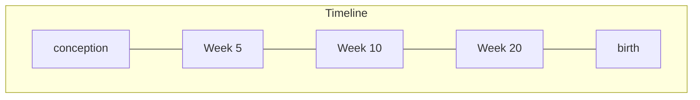
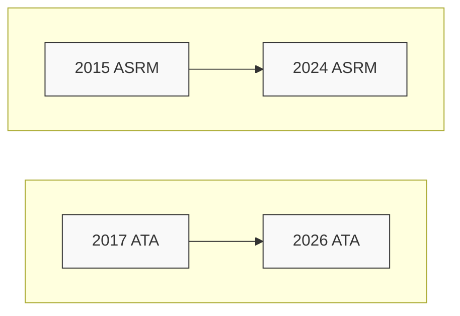
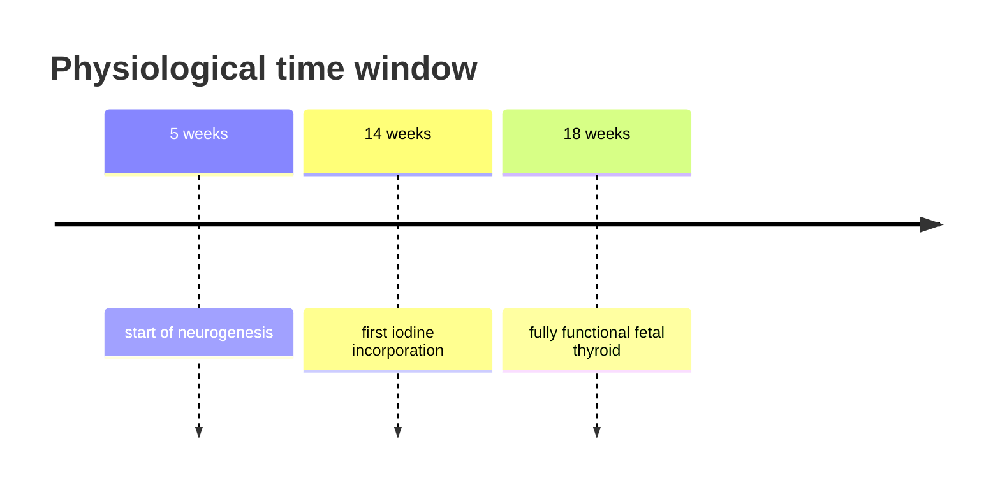
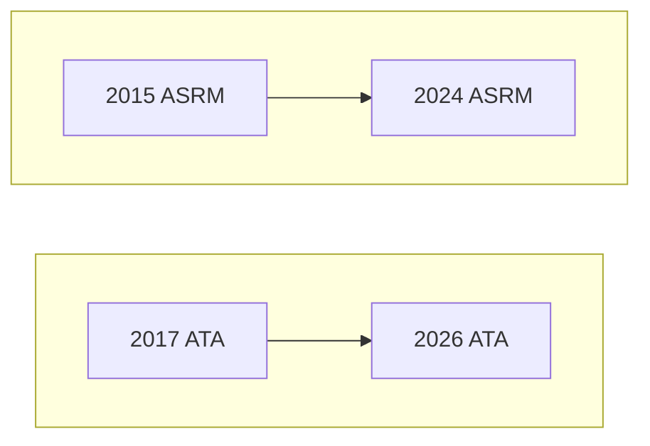

# Thyroid dysfunction in pregnancy

臺北榮民總醫院
黃君睿

---

# CASE 1

27 y/o female, G1P0, GA 9+1 weeks
Severe nausea and vomiting for 3 weeks, weight loss 4 kg

No past thyroid disease

fT4: 3.0 ng/dL (0.93-1.7 ng/dL)
TSH: <0.005 mIU/L (0.27 – 4.2 μIU/mL)

**What is your next step?**

(1) Start anti-thyroid drug (ATD)
(2) Start beta-blocker
(3) Provide symptomatic treatment (IV fluids, anti-emetics) and check TSI (thyroid stimulating immunoglobulin)
(4) Follow up thyroid function tests

---

# Mother

### Maternal Thyroid Function During Pregnancy

| Week of pregnancy | TBG  | Total T4 | hCG    | Free T4 | Thyrotropin |
| ----------------- | ---- | -------- | ------ | ------- | ----------- |
| 0                 | Low  | Low      | Low    | Low     | Medium      |
| 10                | High | High     | Peak   | High    | Low         |
| 20                | High | High     | Medium | Medium  | Medium      |
| 30                | High | High     | Low    | Low     | Medium      |
| 40                | High | High     | Low    | Low     | Medium      |

*   $\uparrow$ Estrogen $\rightarrow$ $\uparrow$ TBG
    *   $\rightarrow$ $\uparrow$ total T4, T3
*   $\uparrow$ hCG $\rightarrow$ $\uparrow$ free T4
    *   $\rightarrow$ $\downarrow$ TSH

Greenspan's Basic & Clinical Endocrinology, 9e

---

# TRIMESTER-SPECIFIC THYROID HORMONE REFERENCE INTERVALS

|               | TSH (µIU/mL) Lower Limit | TSH (µIU/mL) Upper Limit | Free T4 (ng/dL) Lower Limit | Free T4 (ng/dL) Upper Limit |
| ------------- | ------------------------ | ------------------------ | --------------------------- | --------------------------- |
| 1st Trimester | 0.007                    | 3.08                     | 0.96                        | 2.44                        |
| 2nd Trimester | 0.33                     | 4.55                     | 0.74                        | 1.24                        |
| 3rd Trimester | 0.29                     | 4.64                     | 0.72                        | 1.18                        |
| Non-pregnant  | 0.27                     | 4.2                      | 0.93                        | 1.7                         |

J Endocrinol Invest. 2025 Oct;48(10):2351-2360

---

# PREGNANCY SPECIFIC REFERENCE INTERVALS

* [ ] Preferably **population-specific**, **assay-specific**, **trimester-specific** ranges
* [ ] TSH reference range
    - [ ] **0.1–4.0** mIU/l in early gestation
    (when non-pregnant range is 0.5–4.5 mIU/l)
    - [ ] non-pregnant upper limit ↓ 0.5 mU/L, lower limit ↓ 0.4 mU/L
* [ ] Total T4 reference range
    - [ ] 7-16 weeks gestation: 5% per week
    - [ ] >16 weeks gestation: 150% of non-pregnant upper limit

Obstet Gynecol. 2020 Jun;135(6):e261-e274
Thyroid. 2017 Mar;27(3):315-389

---

# GESTATIONAL THYROTOXICOSIS

* hyperemesis gravidarum: BW lost > 5%, dehydration, ketonuria

|                | Graves' disease              | Gestational thyrotoxicosis                  |
| -------------- | ---------------------------- | ------------------------------------------- |
| Etiology       | Autoimmune                   | Secondary to hCG elevation                  |
| Prevalence     | 0.1-1%                       | 1-3%                                        |
| History        | Prior thyroid disease        | -                                           |
| Physical exam  | Goiter, ophthalmopathy       | -                                           |
| Lab            | TSHRAb or TSI positive, ↑ T3 | -                                           |
| Therapy        | Anti-thyroid drug            | Supportive care: anti-emetic, e⁻ No ATD |
| Disease course | Beyond pregnancy             | Transient, preg 14-18 wks resolve           |

---

# CASE 1

27 y/o female, G1P0, GA 9+1 weeks
Severe nausea and vomiting for 3 weeks, weight loss 4 kg

No past thyroid disease

fT4: 3.0 ng/dL (0.93-1.7 ng/dL)
TSH: <0.005 mIU/L (0.27 – 4.2 μIU/mL)

**What is your next step?**

(1) Start anti-thyroid drug (ATD)
(2) Start beta-blocker
(3) <mark>Provide symptomatic treatment (IV fluids, anti-emetics) and check TSI (thyroid stimulating immunoglobulin)</mark>
(4) Follow up thyroid function tests

---

# CASE 2

30 y/o female, G1P0, GA 6+5 weeks

Known Graves’ disease for 2 years, currently on methimazole 5 mg 1#QD

She reports no discomfort
Physical exam: diffuse goiter, no ophthalmopathy

fT4: 1.2 ng/dL (0.93-1.7 ng/dL)
TSH: 0.3 mIU/L (0.27 – 4.2 μIU/mL)

**What is your next step?**

(1) Continue methimazole at the same dose
(2) Decrease methimazole dose
(3) Shift to Propylthiouracil (PTU)
(4) Stop methimazole and monitor thyroid function closely

---

# THYROID AND PREGNANCY PHYSIOLOGY

## Fetal thyroid gland development

### T4 levels (pmol/l)

| Time Period        | Maternal | Maternal + Fetal | Neonate |
| ------------------ | -------- | ---------------- | ------- |
| T4 levels (pmol/l) | 15       | 15               | 15      |

### Development Timeline
*   **Expression of TRs:**
    *   Apo-TRs: Predominant in 1st Trimester.
    *   Occupied TRs: Predominant from 2nd Trimester onwards.
*   **Thyroid gland formation:** Occurs during the 1st Trimester.
*   **Thyroid hormone production:** Starts at approximately 14/40 weeks.
*   **Enzymes and Hormones:**
    *   **D3:** High in 1st Trimester, decreasing through pregnancy.
    *   **Fetal TSH:** Starts around 14/40 weeks and increases.
    *   **D2:** Increases from 2nd Trimester through Post-natal period.

### Timeline Scale
*   **1st Trimester:** 0 to 14/40 weeks.
*   **2nd Trimester:** 14/40 to 28/40 weeks.
*   **3rd Trimester:** 28/40 weeks to Term.
*   **Post-natal:** Term to 6/12.

*   Maternal thyroid gland enlarge 10-15%
*   Increased maternal thyroid hormone production 50%

Nutrients. 2019 Oct 5;11(10).
Nat Rev Endocrinol. 2017 Oct;13(10):610-622.

## Substances that cross placenta

| Substance            | Effect / Description                                                                                                                   | Crosses Placenta? | Target in Fetus      |
| -------------------- | -------------------------------------------------------------------------------------------------------------------------------------- | ----------------- | -------------------- |
| TSH                  |                                                                                                                                        | No (Blocked)      | -                    |
| T4 and levothyroxine | Stimulate fetal development (potentially suboptimal when too low or too high)                                                          | Yes               | Brain, Bone, Thyroid |
| TSHR-Ab              | Depending on subtype, can stimulate or block the fetal thyroid                                                                         | Yes               | Thyroid              |
| Iodine               | Necessary for fetal thyroid hormone production (too low leads to lower and too high could lead to higher thyroid hormone production\*) | Yes               | Thyroid              |
| Radioactive iodine   | Destruction of fetal thyroid gland                                                                                                     | Yes               | Thyroid              |
| PTU and methimazole  | Inhibits fetal thyroid function                                                                                                        | Yes               | Thyroid              |
| Propranolol          | Passes placental barrier, low risk of adverse fetal outcomes                                                                           | Yes               | Thyroid              |

*   **Only TSH does not cross placenta**

---

# ANTI-THYROID DRUG CHOICE IN PREGNANCY

* <mark>PTU</mark> is preferred over methimazole/carbimazole (especially in <mark>1st trimester</mark>)
* Absolute risk increase 3% (PTU) vs. 5% (MMI/CMZ)
* PTU-related birth defects generally less severe

The following charts represent the risk of birth defects by organ system for PTU and MMI/CMZ exposure compared to no ATD (reference).

### PTU exposure

| Category                     | Odds Ratio (approx.) | 95% CI (approx. range) |
| ---------------------------- | -------------------- | ---------------------- |
| Face and neck, others DQ18   | 4.5                  | 3.0 - 6.5              |
| Urinary DQ60-64              | 1.5                  | 1.1 - 2.0              |
| Respiratory DQ30-38          | 1.0                  | 0.6 - 1.6              |
| Circulatory DQ20-28          | 0.9                  | 0.7 - 1.2              |
| Digestive DQ39-45            | 0.9                  | 0.6 - 1.3              |
| Integumentary DQ80-84        | 0.8                  | 0.4 - 1.5              |
| Eye DQ10-15                  | No cases             | N/A                    |
| Musculoskeletal, others DQ79 | No cases             | N/A                    |
| No ATD (reference)           | 1.0                  | Reference              |

### MMI/CMZ exposure

| Category                     | Odds Ratio (approx.) | 95% CI (approx. range) |
| ---------------------------- | -------------------- | ---------------------- |
| Musculoskeletal, others DQ79 | 8.0                  | 5.5 - 11.5             |
| Integumentary DQ80-84        | 3.5                  | 2.5 - 5.0              |
| Digestive DQ39-45            | 3.0                  | 2.2 - 4.0              |
| Eye DQ10-15                  | 2.5                  | 1.5 - 4.0              |
| Urinary DQ60-64              | 2.0                  | 1.5 - 2.8              |
| Respiratory DQ30-38          | 1.8                  | 1.2 - 2.6              |
| Circulatory DQ20-28          | 1.5                  | 1.2 - 1.9              |
| Face and neck, others DQ18   | No cases             | N/A                    |
| No ATD (reference)           | 1.0                  | Reference              |

The images provided illustrate examples of birth defects:
* **Hydronephrosis** (associated with PTU exposure)
* **Preauricular sinus en cyst** (associated with PTU exposure)
* **Aplasia cutis** (associated with MMI/CMZ exposure)
* **Omphalocele** (associated with MMI/CMZ exposure)

Andersen et al. The Journal of clinical endocrinology and metabolism vol. 101,4 (2016): 1606-14.
Seo et al. Annals of internal medicine vol. 168,6 (2018): 405-413.

---

# ANTI-THYROID DRUG THERAPY IN PREGNANCY

* <mark>ATD</mark> monotherapy at the lowest possible dose
    - Target maternal fT4/TT4 at upper limit (slightly above): Fetus more sensitive to ATD
    - Avoid block-and-replace therapy: placenta is readily permeable to ATD but not to LT4
    - Dose reduction in pregnancy: fetal immune tolerance & maternal immune response decrease
* <mark>Stop ATD</mark> upon pregnancy when:
    - Treatment duration >6 months
    - Normal TSH during treatment
    - Use of <10mg methimazole (200mg PTU)
    - No signs of orbitopathy/goiter
    - TRAb or TBII <3x ULN

**Graves' Hyperthyroidism Management Timeline**

| Time Point | TSH Receptor Abs Level | Graves' hyperthyroidism relapse risk | Teratogenic period | Action           |
| ---------- | ---------------------- | ------------------------------------ | ------------------ | ---------------- |
| Conception | High (Stable)          | Low                                  | No                 |                  |
| Week 5     | High (Stable)          | Low                                  | Yes (Starts)       | STOP PTU/MMI/CMZ |
| Week 10    | High (Stable)          | Moderate                             | Yes (Ends)         |                  |
| Week 20    | High (Stable)          | High                                 | No                 |                  |
| Birth      | Low (Decreasing)       | Low                                  | No                 |                  |

---

# CASE 2

30 y/o female, G1P0, GA 6+5 weeks

Known Graves’ disease for 2 years, currently on methimazole 5 mg 1#QD

She reports no discomfort
Physical exam: diffuse goiter, no ophthalmopathy

fT4: 1.2 ng/dL (0.93-1.7 ng/dL)
TSH: 0.3 mIU/L (0.27 – 4.2 μIU/mL)

**What is your next step?**

(1) Continue methimazole at the same dose
(2) Decrease methimazole dose
(3) Shift to Propylthiouracil (PTU)
<mark>(4) Stop methimazole and monitor thyroid function closely</mark>

---

# CASE 2 - BABY

30 y/o female, G1P0, delivered a baby with elevated TSH and low fT4

Mother had Graves’ disease for 2 years and took methimazole but shifted to PTU during 1st trimester of pregnancy. TSI positive during pregnancy.

Maternal thyroid function at GA 37 weeks:
fT4: 1.2 ng/dL (0.93-1.7 ng/dL)
TSH: 0.3 mIU/L (0.27 – 4.2 μIU/mL)

Baby thyroid function at 3 days
fT4: 0.4 ng/dL (0.93-1.7 ng/dL)
TSH: 110 mIU/L (0.27 – 4.2 μIU/mL)

**What is the most likely diagnosis for the baby?** Congenital hypothyroidism ?

---

# FETAL/NEONATAL CONSIDERATIONS

* Neonatal thyroid considerations
    - ATDs at delivery $\rightarrow$ neonatal hypothyroidism
        - ATDs eliminate in 3-5 days postpartum
    - Maternal TSHRAb (TSI) $\rightarrow$ neonatal hyperthyroidism
        - Neonatal GD duration: 1-3 months

* Timing to check TSHRAb (TSI) in euthyroid Graves' disease
    - 1st trimester: upon pregnancy $\rightarrow$ if positive, check in again in late trimester
    - 18-22 weeks: decide if need fetal monitor (fetal goiter, tachycardia)
    - 28- 34 weeks: assess neonatal thyrotoxicosis risk

Thyroid. 2017 Mar;27(3):315-389

---

# CASE 3

35 y/o female, G1P0, GA 10+2 weeks

Levothyroxine 125 mcg daily due to total thyroidectomy for benign multinodular goiter

She feels well

fT4: 1.0 ng/dL (0.93-1.7 ng/dL)
TSH: 4.0 mIU/L (0.27 – 4.2 μIU/mL)

**What is your next step?**

(1) Continue current dose
(2) Decrease levothyroxine because TSH will fall in pregnancy
(3) Increase levothyroxine dose
(4) No action is needed

---

# ADJUSTMENT OF LEVOTHYROXINE DURING PREGNANCY

* 50%-85% needs to increase LT4
    - Thyroidectomy or RAI patients: needs more LT4
    - Autoimmune thyroiditis
    - LT4 for TSH suppression therapy in thyroid cancer: minimal change
* **increase** the dose of LT4 by **20%–50%**
    - two additional tablets weekly (7=>9#/week): 29%
    - increase 25-30% daily
* **following delivery, LT4 dose reduce to preconception**
* **target TSH: lower half of the trimester-specific reference range**
* Thyroid function testing in pregnancy
    - 4 weeks interval: detect 92% abnormalities
    - 6 weeks interval: detect 73% abnormalities

Endocrine. 2019 Oct;66(1):35-42.
Thyroid. 2017 Mar;27(3):315-389

---

# CASE 3

35 y/o female, G1P0, GA 10+2 weeks

Levothyroxine 125 mcg daily due to total thyroidectomy for benign multinodular goiter

She feels well

fT4: 1.0 ng/dL (0.93-1.7 ng/dL)
TSH: 4.0 mIU/L (0.27 – 4.2 μIU/mL)

**What is your next step?**

(1) Continue current dose
(2) Decrease levothyroxine because TSH will fall in pregnancy
<mark>(3) Increase levothyroxine dose</mark>
(4) No action is needed

---

# CASE 4

31 y/o female, G1P0, GA 15+4 weeks, no known thyroid disease

She presents for routine prenatal screening
No specific symptoms

fT4: 1.1 ng/dL (0.93-1.7 ng/dL)
TSH: 5.2 mIU/L (0.27 – 4.2 μIU/mL)

**What is your next step?**

(1) Reassure and repeat thyroid function in a few weeks
(2) Start levothyroxine therapy
(3) Check anti-TPO antibody and decide whether to treat based upon test result
(4) No treatment is needed unless overt hypothyroidism develop

---

### 2017 ATA
*   **TSH cutoff:** Pregnancy and population specific
*   **Miscarriage:** Inconsistent
*   **Obstetric outcomes:** Possible adverse
*   **Neurodevelopment:** —
*   **LT4 treatment:** Treat overt; consider SCH if TAI+
*   **Risk-Benefit:** Low-dose safe, unclear benefit

### 2026 ATA
# ?

----

### 2015 ASRM
*   **TSH cutoff:** >4.12 nonpreg / >2.5 preg
*   **Miscarriage:** ↑ Risk if TSH>4
*   **Obstetric outcomes:** Possible adverse
*   **Neurodevelopment:** Concern for IQ
*   **LT4 treatment:** Suggested if TSH>4
*   **Risk-Benefit:** LT4 safe, favored

### Evidence / Transitions (2010-2022)
*   **<u>Retraction</u>** of *Abdel Rahman* (2010)
*   *Lazarus* (2012) RCT: CATS-I
*   *Casey* (2017) RCT
*   *Hales* (2018) RCT: CATS-II
*   *Zhang Y.* (2017) meta-analysis
*   *Zhao T.* (2018) meta-analysis
*   *Hales* (2020) RCT
*   *Ge* (2022) cohort

### 2024 ASRM
*   **TSH cutoff:** Lab-specific
*   **Miscarriage:** No association
*   **Obstetric outcomes:** No association
*   **Neurodevelopment:** RCTs: no effect
*   **LT4 treatment:** Not recommended
*   **Risk-Benefit:** Warns for overtreatment

---

# PERSISTENCE OF THYROID ABNORMALITIES IN PREGNANCY

Chinese prospective cohort ( n=42492)
TFTs between week 9-14 & 32-36 weeks

### TABLE 3. PERSISTENCY OF THYROID DISEASE ENTITIES FROM EARLY TO LATE PREGNANCY (Table view)

|                              | 9-14 Weeks N | Persistency at 32-36 Weeks N (%) |
| ---------------------------- | ---------------- | ------------------------------------ |
| *Subclinical hypothyroidism* | *1044*           | *259 (24.8)*                         |
| Hypothyroxinemia             | 899              | 153 (17.7)                           |
| Overt hyperthyroidism        | 521              | 44 (8.4)                             |
| Subclinical hyperthyroidism  | 570              | 119 (20.9)                           |
| Low T3                       | 145              | 63 (43.4)                            |
| Elevated T3                  | 172              | 27 (15.7)                            |
| TPOAb positivity             | 1246             | 1047 (84.0)                          |

### TSH concentration first trimester vs third trimester

| TSH concentration first trimester (mU/L) | TSH concentration third trimester (mU/L) |
| ---------------------------------------- | ---------------------------------------- |
| 0                                        | 1.0                                      |
| 1                                        | 1.5                                      |
| 2                                        | 2.2                                      |
| 3                                        | 2.6                                      |
| 4                                        | 2.9                                      |
| 5                                        | 3.3                                      |
| 6                                        | 3.6                                      |
| 7                                        | 3.9                                      |
| 8                                        | 4.3                                      |

Thyroid. 2019 Oct;29(10):1475-1484.

---

# PERSISTENCE OF THYROID ABNORMALITIES IN PREGNANCY

Danish cohort ( n=1466)
TFTs between week 7-8 & 11-12 weeks

|                            | Persistence |
| -------------------------- | ----------- |
| Hypothyroidism             | 49.4%       |
| Overt hypothyroidism       | 45.5%       |
| Subclinical hypothyroidism | 41.0%       |

### Percentage agreement (%) by TSH in sample 1 (mIU/L)

| TSH in sample 1 (mIU/L) | Percentage agreement (%) | n/N   |
| ----------------------- | ------------------------ | ----- |
| < 0.01                  | 83.3                     | 5/6   |
| < 0.1                   | 80.0                     | 12/15 |
| < 0.2                   | 53.6                     | 15/28 |
| < 0.3                   | 42.5                     | 17/40 |
| < LL                    | 40.4                     | 19/47 |
| UL                      | 49.4                     | 44/89 |
| 4.0                     | 67.3                     | 33/49 |
| 5.0                     | 68.0                     | 17/25 |
| 6.0                     | 86.7                     | 13/15 |
| 7.0                     | 100.0                    | 9/9   |

*Note: The values for < LL (40.4%) and > UL (49.4%) are highlighted in the original chart with a red box.*

Eur Thyroid J. 2022 Feb 2;11(2):e210055.

---

# SCH AND NEONATAL OUTCOME TRIALS

| Outcome                  | Trial      | Timing             |
| ------------------------ | ---------- | ------------------ |
| Negative                 | NIH trial  | Median 17-18 weeks |
| Negative / overtreatment | CATS       | Median 13 weeks    |
| Positive                 | Iran study | Median 11 weeks    |

**Timeline of Fetal Development (from conception to birth):**

*   **5 weeks:** start of neurogenesis
*   **14 weeks:** first iodine incorporation
*   **18 weeks:** fully functional fetal thyroid

The **Physiological time window** is indicated as starting around 5 weeks and ending at 18 weeks.

---

# 2017 ATA guideline

**Legend:**
*   <mark>No treatment</mark> (Green)
*   <mark>Treatment considered</mark> (Blue)
*   <mark>Treatment indicated</mark> (Red)

### <u>TPO antibody positive women</u>

| No treatment | Treatment considered               | Treatment indicated           |
| ------------ | ---------------------------------- | ----------------------------- |
| Normal TSH   | 2.5 mU/L - upper limit (or 4 mU/L) | above upper limit (or 4 mU/L) |

### <u>TPO antibody negative women</u>

| No treatment | Treatment considered  | Treatment indicated |
| ------------ | --------------------- | ------------------- |
| Normal TSH   | Upper limit - 10 mU/L | >10 mU/L            |

[Large Black X over the 2017 guidelines]

$\downarrow$
Serum TSH concentration

# 2026 ATA guideline

### <u>First trimester</u>

| No treatment | Treatment considered  | Treatment indicated |
| ------------ | --------------------- | ------------------- |
| Normal TSH   | Upper limit - 10 mU/l | >10 mU/L            |

### <u>Second or third trimester</u>

| No treatment                             | Treatment indicated |
| ---------------------------------------- | ------------------- |
| Normal TSH or subclinical hypothyroidism | >10 mU/L            |

---

### <mark>2017 ATA</mark>
*   **TSH cutoff:** Pregnancy and population specific
*   **Miscarriage:** Inconsistent
*   **Obstetric outcomes:** Possible adverse
*   **Neurodevelopment:** —
*   **LT4 treatment:** Treat overt; consider SCH if TAI+
*   **Risk-Benefit:** Low-dose safe, unclear benefit

$\rightarrow$

### <mark>2026 ATA</mark>
# 1. Retest
# 2. Not risky
# 3. Do no harm

----

### <mark>2015 ASRM</mark>
*   **TSH cutoff:** >4.12 nonpreg / >2.5 preg
*   **Miscarriage:** ↑ Risk if TSH>4
*   **Obstetric outcomes:** Possible adverse
*   **Neurodevelopment:** Concern for IQ
*   **LT4 treatment:** Suggested if TSH>4
*   **Risk-Benefit:** LT4 safe, favored

$\rightarrow$

**<u>Retraction</u> of *Abdel Rahman* (2010)**
*   *Lazarus* (2012) RCT: CATS-I
*   *Casey* (2017) RCT
*   *Hales* (2018) RCT: CATS-II
*   *Zhang Y.* (2017) meta-analysis
*   *Zhao T.* (2018) meta-analysis
*   *Hales* (2020) RCT
*   *Ge* (2022) cohort

$\rightarrow$

### <mark>2024 ASRM</mark>
*   **TSH cutoff:** Lab-specific
*   **Miscarriage:** No association
*   **Obstetric outcomes:** No association
*   **Neurodevelopment:** RCTs: no effect
*   **LT4 treatment:** Not recommended
*   **Risk-Benefit:** Warns for overtreatment

24

---

# GUIDELINE EVOLUTION ON SUBCLINICAL HYPOTHYROIDISM AND PREGNANCY

| Topic              | 2015 ASRM                    | 2017 ATA                                   | 2020 ACOG                           | 2021 ETA                                           | 2024 ASRM              |
| ------------------ | ---------------------------- | ------------------------------------------ | ----------------------------------- | -------------------------------------------------- | ---------------------- |
| TSH cutoff         | >4.12 nonpreg; >2.5 preg | Pregnancy and population specific      | Same as ATA                         | TSH >4.0                                           | Lab-specific ULN       |
| Miscarriage        | ↑ Risk if TSH>4              | Inconsistent                               | RCTs: LT4 no benefit                | Worse ART if >3.5–4.0                              | No association         |
| Infertility        | Insufficient data            | Screen all subfertile; unclear benefit | Not addressed                       | SCH \~5–7% in subfertile; LT4 may help if >4.0 | No association         |
| Obstetric outcomes | Possible adverse             | Possible adverse                           | No proven benefit of LT4            | ART outcomes worse if TSH > 4.0                | No association         |
| Neurodevelopment   | Concern for IQ               | —                                          | RCTs: LT4 no benefit                | —                                                  | RCTs: no effect        |
| LT4 treatment      | Suggested if TSH>4           | Consider SCH if TAI+                       | Not recommended                     | Recommend if >4.0; consider 2.5–4.0 if TAI+    | Not recommended        |
| Screening          | No universal                 | Screen all subfertile                      | High-risk only                      | Screen all subfertile women (TSH+TPOAb)        | Only if symptomatic    |
| Risk–Benefit       | LT4 safe, favored            | Low-dose safe, unclear benefit         | RCTs: avoid unnecessary therapy | Case-by-case; avoid overtreatment              | Warns of overtreatment |

25

---

# CASE 4

31 y/o female, G1P0, GA 15+4 weeks, no known thyroid disease

She presents for routine prenatal screening
No specific symptoms

fT4: 1.1 ng/dL (0.93-1.7 ng/dL)
TSH: 5.2 mIU/L (0.27 – 4.2 μIU/mL)

**What is your next step?**

(1) <mark>Reassure and repeat thyroid function in a few weeks</mark>
(2) Start levothyroxine therapy
(3) Check anti-TPO antibody and decide whether to treat based upon test result
(4) No treatment is needed unless overt hypothyroidism develop

---

# CASE 5

30 y/o female, G1P0, GA 10+2 weeks, no known thyroid disease

She presents for routine prenatal screening, no symptoms

fT4: 1.2 ng/dL (0.93-1.7 ng/dL)
TSH: 2.1 mIU/L (0.27 – 4.2 μIU/mL)

Anti-thyroglobulin antibody (aTG): 180 IU/mL
Anti-thyroid peroxidase antibody (aTPO): 250 IU/mL

**What is your next step?**

(1) Start levothyroxine
(2) Repeat thyroid function in 4 weeks
(3) Start plaquenil
(4) No further follow-up is needed

---

# LT4 TREATMENT IN TPOAB(+) EUTHYROID WOMEN

| Study                 | POSTAL, 2017                                                                                                                                                                                                                                             | TABLET, 2019                                                                                                                                                                                      | T4LIFE, 2022                                                                                                                                                           |
| --------------------- | -------------------------------------------------------------------------------------------------------------------------------------------------------------------------------------------------------------------------------------------------------- | ------------------------------------------------------------------------------------------------------------------------------------------------------------------------------------------------- | ---------------------------------------------------------------------------------------------------------------------------------------------------------------------- |
| Country               | China                                                                                                                                                                                                                                                    | United Kingdom                                                                                                                                                                                    | Netherlands                                                                                                                                                            |
| No. of subjects       | 600                                                                                                                                                                                                                                                      | 952                                                                                                                                                                                               | 187                                                                                                                                                                    |
| Inclusion criteria    | TPOAb-positive euthyroid women undergoing IVF excluding women who have experienced more than two spontaneous abortions.                                                                                                                                  | TPOAb-positive euthyroid women who plan to conceive (natural pregnancy, assisted pregnancy) within 12 months, have a history of one or more miscarriages or have undergone infertility treatment. | TPOAb-positive women with normal thyroid function who had experienced two or more recurrent miscarriages.                                                              |
| LT4 treatment methods | Initiation of LT4 treatment prior to IVF Starting dose of LT4 2.5 mIU/L ≥ TSH: 50 μg/day 2.5 mIU/L < TSH: 25 μg/day (If body weight <50 kg: reduce the starting dose by 50%) TSH target: TSH 0.1–2.5 (1st), 0.2–3.0 (2nd), 0.3–3.0 (3rd) | Administration of 50 μg/day of LT4 from before conception to the end of pregnancy                                                                                                                 | Administration of LT4 before conception to the end of pregnancy TSH <1.0 mU/L: LT4 0.5 μg/kg TSH 1.0–2.5 mU/L: LT4 0.75 μg/kg TSH >2.5 mU/L: LT4 1.0 μg/kg |
| Results               | Miscarriage: RR = 0.97 (95% CI, 0.45–2.10)  Live birth rate (≥24 weeks): RR = 0.98 (95% CI, 0.78–1.24)  Preterm delivery: RR = 1.13 (95% CI, 0.65–1.96)                                                                                  | Live birth rate (≥34 weeks): RR = 0.97 (95% CI, 0.83–1.14)  Miscarriage (<24 weeks): RR = 0.95 (95% CI, 0.73–1.23)                                                                        | Live birth rate (≥24 weeks): RR = 1.03 (95% CI, 0.77–1.38)  Preterm birth (<34 weeks): RR = 1.41 (95% CI, 0.33–6.08)                                           |

<mark>No benifit</mark>

Endocrinol Metab 2023;38:289-294

---

# CASE 5

30 y/o female, G1P0, GA 10+2 weeks, no known thyroid disease

She presents for routine prenatal screening, no symptoms

fT4: 1.2 ng/dL (0.93-1.7 ng/dL)
TSH: 2.1 mIU/L (0.27 – 4.2 μIU/mL)

Anti-thyroglobulin antibody (aTG): 180 IU/mL
Anti-thyroid peroxidase antibody (aTPO): 250 IU/mL

**What is your next step?**

(1) Start levothyroxine
<mark>(2) Repeat thyroid function in 4 weeks</mark>
(3) Start plaquenil
(4) No further follow-up is needed

---

# TAKE HOME MESSAGE

* Trimester specific thyroid function reference needed
* Hyperemesis gravidarum (gestational thyrotoxicosis) vs. Graves' disease
* Graves' disease in pregnancy: consider discontinue anti-thyroid drug, PTU in first trimester, target fT4 at upper limit, immune tolerance during pregnancy with rebound post-partum, fetal considerations
* Increase preconception levothyroxine dose 20-30% during pregnancy
* Subclinical hypothyroidism in pregnancy: retest, treat if TSH>10 or consider to treat if TSH>4 in 1st trimester
* Levothyroxine not advised for preconception euthyroid aTPO(+) women