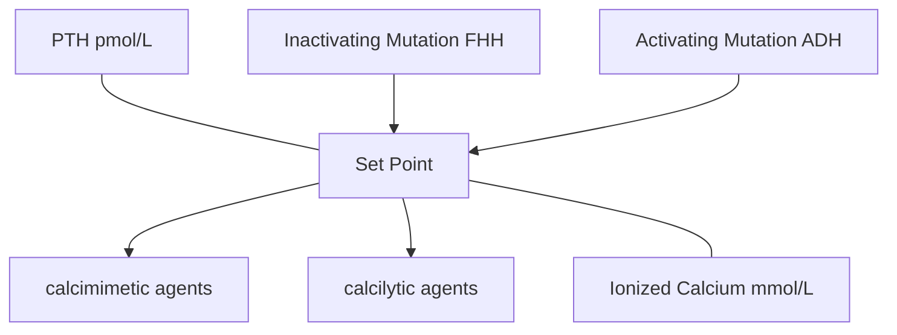
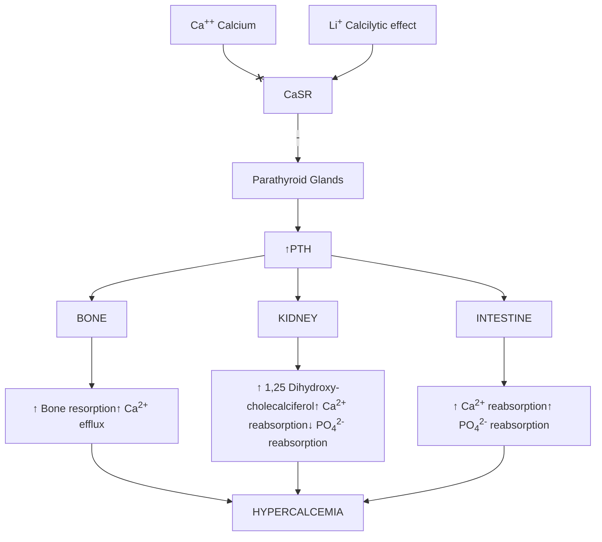
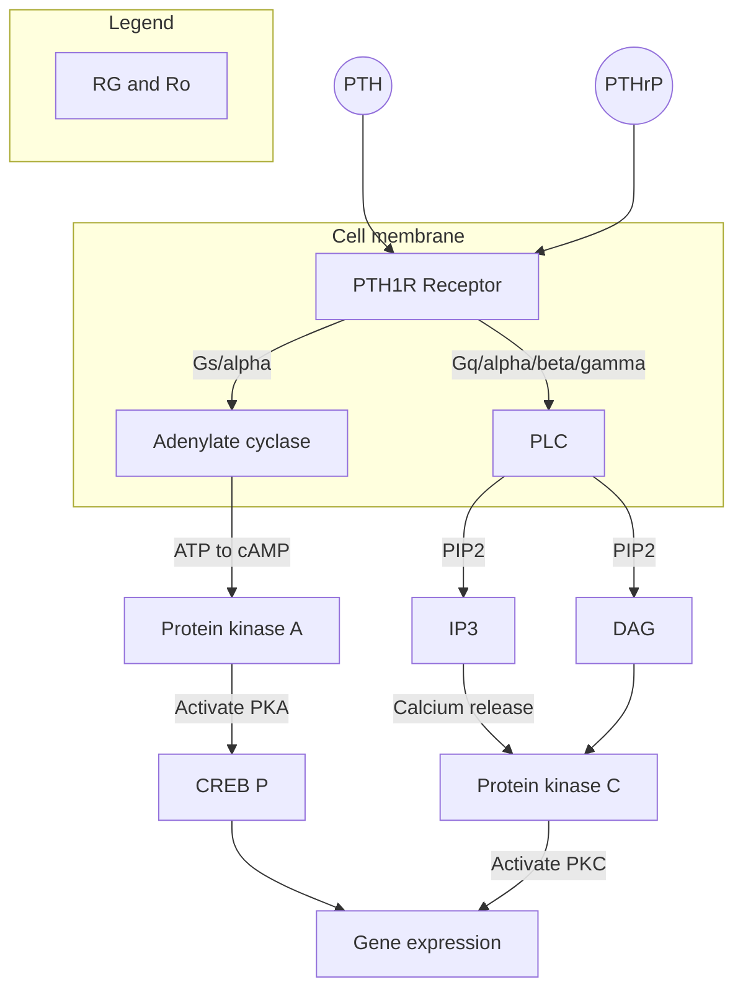
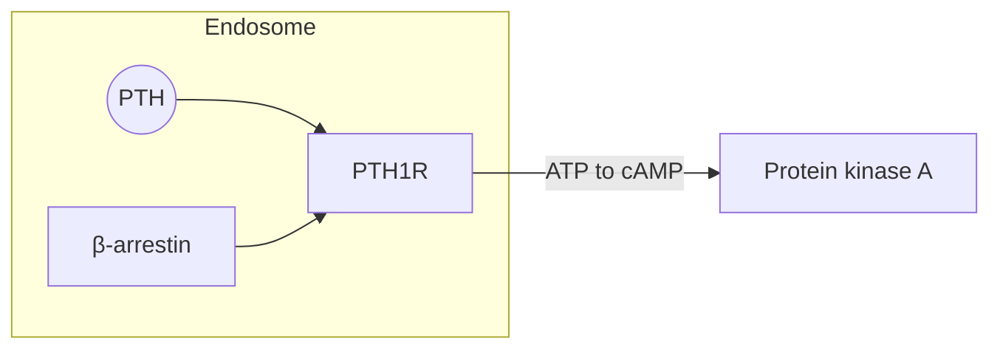

# Clinical Tips of Parathyroid Hormone and Disorders

*KEH SUNG TSAI MD NTUH and FEPC Taipei , May 31<sup>st</sup> , 2026*

ZP THERAPEUTICS
making healthcare more accessible


---

# Regulation of parathyroid function:
## hierarchic and intertwining
## calcium and calcium sensing receptor
## phosphorus (phosphate)
## calcitriol/calciferol
## FGF-23

The following chart illustrates the relationship between Ionized Calcium and PTH levels, showing the effects of mutations and pharmacological agents.

| Ionized Calcium (mmol/L) | Normal PTH (pmol/L) | Activating Mutation (ADH) / calcimimetic agents | Inactivating Mutation (FHH) / calcilytic agents |
| ------------------------ | ------------------- | ----------------------------------------------- | ----------------------------------------------- |
| 1.1                      | High                | Moderate                                        | Very High                                       |
| 1.2                      | Moderate            | Low                                             | High                                            |
| 1.3                      | Low                 | Very Low                                        | Moderate                                        |


**Chart Details:**
*   **Y-axis:** PTH (pmol/L)
*   **X-axis:** Ionized Calcium (mmol/L)
*   **Set Point:** Indicated by a horizontal dash-dotted line intersecting the curves.
*   **Normal Curve:** Solid black line.
*   **Left Shift (Red Dotted Line):** Represents **calcimimetic agents** and **Activating Mutation (ADH)**.
*   **Right Shift (Green Dashed Line):** Represents **calcilytic agents** and **Inactivating Mutation (FHH)**.

EUTICS
re accessible


---

# Shifting epidemiology of primary hyperparathyroidism
## Stones, bones, groans, and moans
## urolithiasis
## brown tumor and osteitis fibrosa cystica
## asymptomatic hypercalcemia
# osteoporosis screening (5-10% in NTUH)

ZP THERAPEUTICS
making healthcare more accessible


---

# Blood Parathyroid Hormone (PTH) Level vs Blood Calcium Level

| Condition                      | Calcium Level (mg/dl) Range | PTH Level Range | Notes                                  |
| ------------------------------ | --------------------------- | --------------- | -------------------------------------- |
| Kidney Failure                 | 7.0 - 9.0                   | 130 - 180       |                                        |
| Gastric Bypass Surgery         | 8.5 - 9.5                   | 60 - 180        |                                        |
| Vitamin D Deficiency           | 8.0 - 9.5                   | 65 - 100        |                                        |
| Normal Range For Calcium & PTH | 9.2 - 10.1                  | 12 - 65         |                                        |
| Hypoparathyroidism             | 7.0 - 9.2                   | 0 - 35          |                                        |
| Primary Hyperparathyroidism    | 10.2 - 14.0                 | 40 - 180        | Includes 50% and 80% probability zones |
| High Calcium of Malignancy     | 11.0 - 14.0                 | 0 - 18          |                                        |


**Graph Axis Details:**
*   **Y-Axis:** Blood Parathyroid Hormone (PTH) Level (units not specified, scale 0 to 180)
*   **X-Axis:** Blood Calcium Level (mg/dl) (scale 7 to 14)

Copyright © 2008 ZP THERAPEUTICS making healthcare more accessible


---

# Tricks in parathyroid hormone assays

intact PTH is not so intact (84 amino acid)
intact PTH only 70-90 % biologically active
<mark>(more truncated PTH causes falsely higher reading)</mark>
Diurnal change
excercise
meals calcium intake

ZP THERAPEUTICS
making healthcare more accessible


---


JCI The Journal of Clinical Investigation
Go to JCI Insight
About Editors Consulting Editors For authors Publication ethics Publication alerts by email Advertising Job board Contact
Clinical Research and Public Health Current issue Past issues By specialty Videos Reviews Viewpoint Collections Search the JCI

ties and were eating a self-selected diet. Venous blood (15 ml) was drawn every 2 hr for 24 hr beginning at 8:00 a.m. The subjects slept in the hospital with an indwelling catheter in the antecubital vein to facilitate the blood drawing without disturbing them during the night. The serum was separated within 30 min and kept frozen at -20°C until assayed. Serum calcium and phosphate were measured on each sample from all subjects, serum albumin in eight, and PTH and GH in four. All of the subjects went to sleep around 11:00 p.m.

The effect of an i.v. calcium infusion on serum PTH was studied in four normal subjects. In two, calcium was given from 7:00 p.m. to 8:00 a.m. as an infusion of calcium gluconate in 5% dextrose in water at a rate of 1 mg Ca<sup>++</sup>/kg each hour. Both subjects had previously been studied without calcium infusion. Two other subjects were studied during two consecutive 24 hr periods, first without a calcium infusion and then with calcium being infused from 8 p.m. to midnight at a rate of 4 mg Ca<sup>++</sup>/kg each hour. Blood for calcium and PTH was collected every 2-4 hr for 48 hr, including a period of time before and after the calcium infusion.

To study the effect of inactivity on serum calcium, PTH, and albumin levels, these measurements were performed in two normal subjects who were kept in bed for 24 consecutive hours.

|   | TIME<br/>PTH µEq/ml (T. H.)<br/>PTH µEq/ml (B. S.)<br/>PTH µEq/ml (T. K.)<br/>PTH µEq/ml (L. K.) | 8 a.m.<br/>48<br/>38<br/>28<br/>20 | Noon<br/>52<br/>42<br/>30<br/>22 | 4 p.m.<br/>55<br/>45<br/>32<br/>22 | 8 p.m.<br/>55<br/>40<br/>35<br/>25 | 12 mn<br/>82<br/>75<br/>55<br/>38 | 4 a.m.<br/>85<br/>65<br/>55<br/>35 | 8 a.m.<br/>45<br/>35<br/>30<br/>20 |
| - | ------------------------------------------------------------------------------------------------ | ---------------------------------- | -------------------------------- | ---------------------------------- | ---------------------------------- | --------------------------------- | ---------------------------------- | ---------------------------------- |


|   | TIME<br/>SERUM CALCIUM mg/100ml (L. K.)<br/>SERUM CALCIUM mg/100ml (T. H.)<br/>SERUM CALCIUM mg/100ml (B. S.)<br/>SERUM CALCIUM mg/100ml (T. K.) | 8 a.m.<br/>10.6<br/>10.5<br/>10.4<br/>10.4 | Noon<br/>10.8<br/>10.6<br/>10.5<br/>10.4 | 4 p.m.<br/>10.7<br/>10.5<br/>10.5<br/>10.4 | 8 p.m.<br/>11.2<br/>10.8<br/>10.8<br/>10.6 | 12 mn<br/>10.5<br/>10.5<br/>10.5<br/>10.4 | 4 a.m.<br/>10.0<br/>9.8<br/>9.8<br/>9.8 | 8 a.m.<br/>10.7<br/>10.4<br/>10.2<br/>10.1 |
| - | ------------------------------------------------------------------------------------------------------------------------------------------------ | ------------------------------------------ | ---------------------------------------- | ------------------------------------------ | ------------------------------------------ | ----------------------------------------- | --------------------------------------- | ------------------------------------------ |


Jubiz et al. JCI 1972

ZP THERAPEUTICS
making healthcare more accessible


---

# Magnitude of parathyroid hormone elevation in primary hyperparathyroidism: Does time of day matter? Frye et al., Surgery 2023

Methods: Institutional Reviretrospective chart review of patients undergoing parathyroidectomy for primary hyperparathyroidism between October 2019 and February 2022 at a quaternary care referral center. Parathyroid hormone values were compared before and after hourly intervals between 6:00 A.M. and 12:00 P.M.

Results:
Of 418 patients, the mean age was 61 years old, 80% of patients were female, and two-thirds had single-gland disease. A total of 933 parathyroid hormone levels were included in the analysis and median parathyroid hormone was 97.3 pg/mL. Parathyroid hormone levels were noted to be **significantly lower if they were drawn before 7:00 A.M.**

This diurnal variation persisted in patients with single-gland and advanced hyperparathyroidism but was abrogated in multi-gland parathyroid disease.

ZP THERAPEUTICS
making healthcare more accessible


---


Int. J. Sport Med 1997
**Physiology and Biochemistry**

# Effect of Exercise and Exogenous Glucocorticoid on Serum Level of Intact Parathyroid Hormone

K. S. Tsai<sup>1</sup>, J. C. Lin<sup>2</sup>, C. K. Chen<sup>1</sup>, W. C. Cheng<sup>1</sup>, C. H. Yang<sup>3</sup>

<sup>1</sup> Department of Laboratory Medicine, College of Medicine, National Taiwan University, Taipei, Taiwan, Republic of China
<sup>2</sup> Department of Physical Education, National Taiwan Normal University, Taipei, Taiwan, Republic of China
<sup>3</sup> Department of Physical Education, National Taipei Teachers College, Taipei, Taiwan, Republic of China

ZP THERAPEUTICS
making healthcare more accessible


---


K. S. Tsai, J. C. Lin, C. K. Chen et al.

### With dexamethasone pretreatment

| Time  | A  | B   | C  | D  | E  | F  | G | H  | Mean |
| ----- | -- | --- | -- | -- | -- | -- | - | -- | ---- |
| 0 min | 30 | 42  | 82 | 25 | 10 | 8  | 5 | 32 | 29.2 |
| 30min | 45 | 88  | 92 | 28 | 12 | 10 | 6 | 40 | 40.1 |
| 60min | 42 | 148 | 90 | 28 | 10 | 8  | 5 | 55 | 48.2 |


### No pretreatment

| Time  | A  | B  | C  | D  | E  | F  | G | H  | Mean |
| ----- | -- | -- | -- | -- | -- | -- | - | -- | ---- |
| 0 min | 28 | 40 | 45 | 25 | 15 | 8  | 5 | 38 | 25.5 |
| 30min | 45 | 80 | 55 | 28 | 18 | 10 | 6 | 42 | 35.5 |
| 60min | 42 | 75 | 72 | 28 | 15 | 8  | 5 | 70 | 39.4 |


**intact PTH ( ng/L )**

**Fig.1** The serum concentration of intact PTH of each subject indicated by capital letters A to H, and the mean ± SD values before and during exercise, with or without dexamethasone pretreatment.

ZP THERAPEUTICS
making healthcare more accessible


---


Calcif Tissue Int (1994) 55:335-341
**Calcified Tissue** International
© 1994 Springer-Verlag New York Inc.

# The Acute Metabolic Effects of Oral Tricalcium Phosphate and Calcium Carbonate

R.-S. Yang,<sup>1</sup> T.-K. Liu,<sup>1</sup> K.-S. Tsai<sup>2</sup>
<sup>1</sup>Department of Orthopaedics
<sup>2</sup>Department of Laboratory Medicine, College of Medicine, National Taiwan University, No. 7, Chung-Shan South Road, Taipei, Taiwan

Received: 19 November 1993 / Accepted: 26 April 1994

**Abstract.** A double-blind study was performed to test the metabolic effects of tricalcium phosphate (TP) and calcium carbonate (CC) on serum calcium (SCa), serum phosphorus (SP), and immunoreactive intact serum parathyroid hormone (SPTH) levels in two groups of 24 subjects. The mean age of young subjects was 29.5 years, and elderly subjects, 65.9 years. These subjects fasted overnight for 12 hours, but with good hydration, before the tests. Following a 2-hour baseline-urine collection, 1200 mg elemental calcium (as CC or TP in tablet form) was chewed and ingested and 2-hour post-load urines were collected. Blood was drawn immediately before and at 1, 2, and 4 hours after calcium load. The results showed that SCa and SP increased, whereas SPTH decreased with both preparations. The increment of SCa was similar after oral load of either calcium salt in both groups.

cium preparations [2-5, 7, 8, 13-17]. The efficiency of dietary calcium absorption, about 30%, was influenced by many factors. Even absorbed calcium is not entirely available, and a high percentage is excreted in urine. Adequate calcium supplementation may reduce bone resorption, and aids management of osteoporosis [2-5]. Elderly individuals may absorb calcium poorly because of renal dysfunction and/or intestinal malabsorption [4]. The ensued increased parathyroid function may induce a high turnover rate of bone metabolism and aggravate the bone loss. Higher doses of calcium or the addition of vitamin D or estrogen may benefit those patients with calcium malabsorption [4, 5, 18].

Various preparations for calcium supplementation are available, with their own advantages and drawbacks [2, 14, 15]. The suggested dose of calcium supplementation ranged

ZP THERAPEUTICS
making healthcare more accessible


---


Calcif Tissue Int (1994) 55:335-341
R.-S. Yang et al.: Acute Metabolic Effects of Calcium Supplements
337

## Young Group

### Serum Ca Conc. (mmol/l)

| Time (hr) | TP (○) | CC (●) |
| --------- | ------ | ------ |
| 0         | 2.18   | 2.16   |
| 1         | 2.28   | 2.31   |
| 2         | 2.34   | 2.37   |
| 4         | 2.34   | 2.36   |


### Serum P Conc. (mmol/l)

| Time (hr) | TP (○) | CC (●) |
| --------- | ------ | ------ |
| 0         | 1.06   | 1.05   |
| 1         | 1.26   | 1.06   |
| 2         | 1.27   | 1.05   |
| 4         | 1.32   | 1.14   |


### Serum PTH (ng/l)

| Time (hr) | TP (○) | CC (●) |
| --------- | ------ | ------ |
| 0         | 28     | 26     |
| 4         | 17     | 16     |


## Elderly Group

### Serum Ca Conc. (mmol/l)

| Time (hr) | TP (○) | CC (●) |
| --------- | ------ | ------ |
| 0         | 2.18   | 2.17   |
| 1         | 2.26   | 2.29   |
| 2         | 2.31   | 2.33   |
| 4         | 2.32   | 2.27   |


### Serum P Conc. (mmol/l)

| Time (hr) | TP (○) | CC (●) |
| --------- | ------ | ------ |
| 0         | 1.05   | 1.02   |
| 1         | 1.18   | 1.11   |
| 2         | 1.27   | 1.13   |
| 4         | 1.27   | 1.18   |


### Serum PTH (ng/l)

| Time (hr) | TP (○) | CC (●) |
| --------- | ------ | ------ |
| 0         | 42     | 40     |
| 4         | 28     | 25     |


**Fig. 1.** Effects of TP (○—○) and CC (●—●) on Sca, SP, and SPTH in both groups (mean ± SE, n = 24).

were collected again. Measurement of SCa, SP, SPTH, UCa/Cr, UP/Cr, and UcAMP/Cr of all specimens was performed at the same time after all specimens were collected. During the study, the vol-

Figure 1. The changes of SCa, SP, and SPTH are shown in the Table 2. Following the ingestion of TP or CC, there was a significant and progressive rise in SCa.

ZP THERAPEUTICS
making healthcare more accessible


---

# Primary hyperparathyroidism: Taking calcium, phosphorus, chloride levels into account

| Parameter  | Value  | Percentage       |
| ---------- | ------ | ---------------- |
| iPTH       | > 65   | 80%              |
| calcium    | > 10.5 | 80 %             |
| phosphorus | < 2.5  | 70%              |
| chloride   | > 106  | 35%              |
| cl/p       | > 33,  | 94% (NCHP\* 75%) |


\* normocalcemic primary hyperpara

ZP THERAPEUTICS
making healthcare more accessible


---


# Blood Parathyroid Hormone (PTH) Level vs. Blood Calcium Level

| Condition                      | Blood Calcium Level (mg/dl) Range | Blood Parathyroid Hormone (PTH) Level Range | Notes                                  |
| ------------------------------ | --------------------------------- | ------------------------------------------- | -------------------------------------- |
| Kidney Failure                 | 7.0 - 9.5                         | 130 - 180+                                  |                                        |
| Gastric Bypass Surgery         | 8.5 - 9.5                         | 80 - 180+                                   |                                        |
| Vitamin D Deficiency           | 8.0 - 10.0                        | 60 - 100                                    |                                        |
| Normal Range For Calcium & PTH | 8.5 - 10.2                        | 10 - 65                                     |                                        |
| Hypoparathyroidism             | 7.0 - 9.5                         | 0 - 35                                      |                                        |
| Primary Hyperparathyroidism    | 10.0 - 14.0                       | 30 - 180                                    | Includes 50% and 80% probability zones |
| High Calcium of Malignancy     | 11.0 - 14.0                       | 0 - 20                                      |                                        |


**Chart Axis Details:**
*   **Y-Axis:** Blood Parathyroid Hormone (PTH) Level (units not specified, scale 0 to 180+)
*   **X-Axis:** Blood Calcium Level (mg/dl) (scale 7 to 14)

Copyright © 2008 ZP THERAPEUTICS making healthcare more accessible


---

# Typical Diagnostic Test Results for Different Presentations of Hyperparathyroidism

|                                       | Primary Hypercalcemic Hyperparathyroidism (PHPT) | Primary Normocalcemic Hyperparathyroidism (nPHPT) | Normohormonal Primary Hyperparathyroidism (NPHPT) | Familial Hypocalciuric Hyperparathyroidism (FHH) | Secondary HPT (Vitamin D Deficiency, Kidney Disease, Malabsorption) |
| ------------------------------------- | ------------------------------------------------ | ------------------------------------------------- | ------------------------------------------------- | ------------------------------------------------ | ------------------------------------------------------------------- |
| Calcium (Ca)<br/>Serum and/or ionized | High                                             | Normal or<br/>High Normal                         | High                                              | Slight Elevation                                 | Low, Normal, or Slight Elevation                                    |
| PTH Intact                            | High                                             | High                                              | Normal or<br/>High Normal                         | Slight Elevation                                 | High                                                                |
| PTH-RP (produced by some cancers)     | Low                                              | Low                                               | Low                                               | Low                                              | Low                                                                 |
| Phosphate (PO4)                       | Low or<br/>Low Normal                            | Low or<br/>Low Normal                             | Low or<br/>Low Normal                             | Normal                                           | Low or<br/>Low Normal                                               |
| Magnesium (Mg)                        | Unaffected unless advanced stage                 | Unaffected                                        | Unaffected                                        | Unaffected                                       | Unaffected                                                          |
| Alkaline Phosphatase                  | Normal or High                                   | Normal or High                                    | Normal or High                                    | Normal                                           | Normal or High                                                      |
| Creatinine (Cr)                       | Unaffected unless advanced stage                 | Unaffected unless advanced stage                  | Unaffected unless advanced stage                  | Normal                                           | Normal                                                              |
| 24-Hour Urine Calcium                 | Normal or High                                   | Normal or High                                    | Normal or High                                    | Low                                              | Normal                                                              |
| Ca/Cr Clearance Ratio                 | Greater than 0.02                                | Greater than 0.02                                 | Greater than 0.02                                 | Less than 0.01                                   | Greater than 0.02                                                   |
| 25-Hydroxy (OH) Vitamin D3 (Stored)   | Normal or Low                                    | Normal or Low                                     | Normal or Low                                     | Unaffected                                       | Low                                                                 |
| 1,25-Dihydroxy Vitamin D (Active)     | Normal or High                                   | Normal or High                                    | Normal or High                                    | Unaffected                                       | Low                                                                 |


[colspan=6] Adapted from the website and chart shown in various videos by Babak Larian, MD, FACS. https://www.hyperparathyroidmd.com

We are not doctors, but we have suffered through the symptoms, been cured by successful surgeries, and are available to assist you 24/7, no matter where in the world you are. Please do not hesitate to post to our group if you have questions. Also, you can use the search box on this page (the magnifying glass icon) to read more about any given topic.
Prepared by the Hyperparathyroidism Support and Information Group admins and moderators.

2023-07-02
making healthcare more accessible


---


EPISODE PEARLS
# PRIMARY HYPERPARATHYROIDISM
THE CURBSIDERS INTERNAL MEDICINE

## Indications for surgical management

* **Symptomatic primary hyperparathyroidism**
    - Overt skeletal complications, including osteitis fibrosa cystica and fractures
    - Renal complications, including chronic kidney disease, nephrolithiasis, and nephrocalcinosis

* **Asymptomatic primary hyperparathyroidism**
    - Serum calcium > 1 mg/dL above the upper limit of normal
    - Osteoporosis (bone mineral density with T score < - 2.5)
    - eGFR or creatinine clearance < 60 mL/min
    - Nephrocalcinosis or nephrolithiasis by x-ray, ultrasound, or other imaging
    - Hypercalciuria (e.g., > 250 mg/day in women; >300 mg/day in men)
    - Age < 50 years

Adapted from: Bilezikian JP et al. 2022. Evaluation and Management of Primary Hyperparathyroidism: Summary Statement and Guidelines from the Fifth International Workshop. JBMR 37 (11) 2293-2314.

ZP THERAPEUTICS
making healthcare more accessible


---

# Image studies for primary hyperparathyroidism

## Echogram
## Tc99m-Sesamibi scan

----

## Cholin-PET
## 4D CT

ZP THERAPEUTICS
making healthcare more accessible


---

# Tc99m-sesamibi scan for hyperparathyroidism
## failure rate 30-50%:

* small lesion
* intrathyroid lesion
* cell types (chief cells, clear cells, oxyphilic cells)
* hyperplasia
* rapid wash out of MIBI
* single lesion can not rule out multiple gland lesions(hyperplasia) in 16% of cases
* <mark>(1/6 of single hot spot cases are actually multiple)</mark>

Microscopic view of parathyroid tissue showing various cell types.

ZP THERAPEUTICS
making healthcare more accessible


---

# Cholin PET for primary hyperperparathyroidism

ZP THERAPEUTICS
making healthcare more accessible


---


The image displays a series of medical diagnostic scans, likely MRI, PET, and CT, focused on the upper thoracic/neck region.

*   **Panel 1:** Axial T1-weighted MRI scan showing a soft tissue lesion (indicated by a red arrow) in the paratracheal region.
*   **Panel 2:** Axial T2-weighted MRI scan showing the same lesion (red arrow) with different signal intensity.
*   **Panel 3:** Axial post-contrast MRI scan highlighting the lesion (red arrow).
*   **Panel 4:** Axial PET scan showing intense radiotracer uptake (hot spot) at the site of the lesion (red arrow).
*   **Panel 5 & 6:** Scintigraphy or planar nuclear medicine images showing localized uptake in the upper chest area.
*   **Panel 7:** Multi-planar reconstruction (coronal, sagittal, and axial) of fused PET/CT scans, with crosshairs marking the specific location of the hypermetabolic lesion.

ZP THERAPEUTICS
making healthcare more accessible


---


The image displays a series of medical imaging scans, likely PET/CT, organized in a 2x3 grid labeled a1 through b3.

*   **a1**: A coronal PET scan showing a focal area of high tracer uptake (indicated by a black arrow) in the neck region.
*   **a2**: An axial CT scan of the neck at the level of the thyroid. A blue arrow points to a soft tissue density in the right thyroid lobe area.
*   **a3**: A fused PET/CT axial scan corresponding to a2, showing intense tracer uptake (red arrow) localized to the right thyroid lesion.
*   **b1**: Another coronal PET scan view, similar to a1, with a black arrow pointing to the same focal uptake.
*   **b2**: A different axial CT slice of the neck. A blue arrow points to the lesion.
*   **b3**: A fused PET/CT axial scan corresponding to b2, showing the localized tracer uptake (red arrow).

A color scale bar for the PET intensity is visible on the right side of the fused images (a3 and b3).

ZP THERAPEUTICS
making healthcare more accessible


---

# Fluorocholine PET for parathyroid adenomas

The image displays medical imaging scans (PET and MRI fusion) showing a parathyroid adenoma, alongside a sensitivity chart.

| Sensitivity | Value |
| ----------- | ----- |
| 1.0         | 0.92  |
| 0.8         |       |
| 0.6         |       |
| 0.4         |       |
| 0.2         |       |
| 0           |       |


*(Note: The chart on the right indicates a sensitivity value of approximately 0.92 for Fluorocholine PET in detecting parathyroid adenomas.)*

---

The image displays a series of medical scans, likely PET and CT images, labeled A through E.

*   **A**: A coronal PET scan showing the head, neck, and upper torso with focal areas of tracer uptake in the neck region.
*   **B**: An axial PET scan of the neck area showing a focal "hot spot" of tracer uptake.
*   **C**: An axial CT scan corresponding to the level shown in image B, providing anatomical detail of the neck and vertebrae.
*   **D**: Another axial PET scan at a different level (likely lower in the chest/neck junction) showing a smaller focal area of uptake.
*   **E**: An axial CT scan corresponding to the level shown in image D, showing the upper thoracic cavity and vertebrae.

ZP THERAPEUTICS
making healthcare more accessible


---


ZP THERAPEUTICS
making healthcare more accessible

The image displays a series of medical diagnostic scans labeled 'a' through 'f', showing various imaging modalities of the neck and upper chest area.

*   **Panel a:** An ultrasound image of the thyroid region showing a hypoechoic nodule within a dashed white oval.
*   **Panel b:** An axial CT scan of the neck. A solid white arrow points to a small, well-defined structure adjacent to the trachea.
*   **Panel c:** An axial PET/CT fusion scan of the upper chest. An open white arrow points to a region in the mediastinum.
*   **Panel d:** A maximum intensity projection (MIP) PET image of the head and neck. A solid black arrow points to a focal area of high uptake in the neck, and an open black arrow points to a lower focal area of uptake.
*   **Panel e:** An axial PET/CT fusion scan corresponding to the level in panel 'b'. A solid white arrow points to a focal area of intense radiotracer uptake (indicated by the red/yellow color on the heat map scale, which ranges from 0 to 5.4).
*   **Panel f:** An axial PET/CT fusion scan corresponding to the level in panel 'c'. An open white arrow points to a focal area of low-to-moderate radiotracer uptake (indicated by the blue/green color on the heat map scale, which ranges from 0 to 5.4).

**PET Intensity Scale (SUV)**

| Value | Color      |
| ----- | ---------- |
| 5.4   | Red/Yellow |
| 0     | Blue/Black |


---


The image displays a series of medical diagnostic scans, specifically PET/CT imaging of the neck and upper chest area.

*   On the left is a large grayscale Maximum Intensity Projection (MIP) PET scan showing several areas of high tracer uptake (dark spots) in the cervical and upper thoracic regions.
*   On the right are four smaller panels showing fused PET/CT cross-sectional images (axial and coronal views). These images highlight specific anatomical locations with bright orange/yellow "hot spots," indicating metabolic activity or tracer concentration, likely corresponding to the parathyroid glands or lymph nodes.

The background features a blue gradient with a stylized cityscape and a faint silhouette of a medical professional.

ZP THERAPEUTICS
making healthcare more accessible


---


A medical imaging scan (likely a PET or SPECT scan) of a patient's upper torso and neck area. The image shows several dark spots (foci of increased uptake) indicated by arrows:

*   A red arrow points to a small dark spot in the lower neck/supraclavicular region.
*   Four green arrows point to various other dark spots located in the shoulder, chest, and abdominal/flank areas.
*   The lower portion of the image shows a large, dark, dense area corresponding to the liver or upper abdominal organs.

ZP
THERAPEUTICS
making healthcare more accessible


---


# A Ultrasound (N=93)

| detected   | size (mm) | location    |
| ---------- | --------- | ----------- |
| no (n=23)  | 13        | left upper  |
| no (n=23)  | 10        | left upper  |
| no (n=23)  | 13        | left upper  |
| no (n=23)  | 14        | left upper  |
| no (n=23)  | 13        | left upper  |
| no (n=23)  | 13        | left upper  |
| no (n=23)  | 10        | left lower  |
| no (n=23)  | 15        | left lower  |
| no (n=23)  | 13        | left lower  |
| no (n=23)  | 34        | left lower  |
| no (n=23)  | 11        | right lower |
| no (n=23)  | 15        | right lower |
| no (n=23)  | 14        | right lower |
| no (n=23)  | 7         | right lower |
| no (n=23)  | 9         | right lower |
| no (n=23)  | 13        | right lower |
| no (n=23)  | 13        | right upper |
| no (n=23)  | 19        | right upper |
| no (n=23)  | 24        | right upper |
| no (n=23)  | 30        | right upper |
| no (n=23)  | 10        | right upper |
| no (n=23)  | 10        | ectopic     |
| no (n=23)  | 3         | ectopic     |
| yes (n=70) | 55        | left upper  |
| yes (n=70) | 50        | left upper  |
| yes (n=70) | 40        | left upper  |
| yes (n=70) | 35        | left upper  |
| yes (n=70) | 32        | left upper  |
| yes (n=70) | 28        | left upper  |
| yes (n=70) | 27        | left upper  |
| yes (n=70) | 24        | left upper  |
| yes (n=70) | 23        | left upper  |
| yes (n=70) | 22        | left upper  |
| yes (n=70) | 21        | left upper  |
| yes (n=70) | 20        | left upper  |
| yes (n=70) | 19        | left upper  |
| yes (n=70) | 18        | left upper  |
| yes (n=70) | 17        | left upper  |
| yes (n=70) | 16        | left upper  |
| yes (n=70) | 15        | left upper  |
| yes (n=70) | 14        | left upper  |
| yes (n=70) | 13        | left upper  |
| yes (n=70) | 12        | left upper  |
| yes (n=70) | 11        | left upper  |
| yes (n=70) | 10        | left upper  |
| yes (n=70) | 9         | left upper  |
| yes (n=70) | 8         | left upper  |
| yes (n=70) | 7         | left upper  |
| yes (n=70) | 6         | left upper  |
| yes (n=70) | 5         | left upper  |
| yes (n=70) | 4         | left upper  |
| yes (n=70) | 40        | left lower  |
| yes (n=70) | 35        | left lower  |
| yes (n=70) | 33        | left lower  |
| yes (n=70) | 25        | left lower  |
| yes (n=70) | 24        | left lower  |
| yes (n=70) | 23        | left lower  |
| yes (n=70) | 22        | left lower  |
| yes (n=70) | 21        | left lower  |
| yes (n=70) | 20        | left lower  |
| yes (n=70) | 19        | left lower  |
| yes (n=70) | 18        | left lower  |
| yes (n=70) | 17        | left lower  |
| yes (n=70) | 16        | left lower  |
| yes (n=70) | 15        | left lower  |
| yes (n=70) | 14        | left lower  |
| yes (n=70) | 13        | left lower  |
| yes (n=70) | 12        | left lower  |
| yes (n=70) | 11        | left lower  |
| yes (n=70) | 10        | left lower  |
| yes (n=70) | 35        | right lower |
| yes (n=70) | 30        | right lower |
| yes (n=70) | 28        | right lower |
| yes (n=70) | 25        | right lower |
| yes (n=70) | 24        | right lower |
| yes (n=70) | 23        | right lower |
| yes (n=70) | 22        | right lower |
| yes (n=70) | 21        | right lower |
| yes (n=70) | 20        | right lower |
| yes (n=70) | 19        | right lower |
| yes (n=70) | 18        | right lower |
| yes (n=70) | 17        | right lower |
| yes (n=70) | 16        | right lower |
| yes (n=70) | 15        | right lower |
| yes (n=70) | 14        | right lower |
| yes (n=70) | 13        | right lower |
| yes (n=70) | 12        | right lower |
| yes (n=70) | 11        | right lower |
| yes (n=70) | 10        | right lower |
| yes (n=70) | 9         | right lower |
| yes (n=70) | 8         | right lower |
| yes (n=70) | 31        | right upper |
| yes (n=70) | 26        | right upper |
| yes (n=70) | 20        | right upper |
| yes (n=70) | 18        | right upper |
| yes (n=70) | 15        | right upper |
| yes (n=70) | 12        | right upper |
| yes (n=70) | 10        | right upper |
| yes (n=70) | 20        | ectopic     |


p=0.03 by MWU

# B Scintigraphy (N=88)

| detected   | size (mm) | location    |
| ---------- | --------- | ----------- |
| no (n=39)  | 16        | left upper  |
| no (n=39)  | 15        | left upper  |
| no (n=39)  | 14        | left upper  |
| no (n=39)  | 13        | left upper  |
| no (n=39)  | 12        | left upper  |
| no (n=39)  | 11        | left upper  |
| no (n=39)  | 10        | left upper  |
| no (n=39)  | 9         | left upper  |
| no (n=39)  | 8         | left upper  |
| no (n=39)  | 36        | left lower  |
| no (n=39)  | 34        | left lower  |
| no (n=39)  | 20        | left lower  |
| no (n=39)  | 15        | left lower  |
| no (n=39)  | 14        | left lower  |
| no (n=39)  | 10        | left lower  |
| no (n=39)  | 8         | left lower  |
| no (n=39)  | 7         | left lower  |
| no (n=39)  | 30        | right lower |
| no (n=39)  | 26        | right lower |
| no (n=39)  | 25        | right lower |
| no (n=39)  | 16        | right lower |
| no (n=39)  | 15        | right lower |
| no (n=39)  | 14        | right lower |
| no (n=39)  | 13        | right lower |
| no (n=39)  | 12        | right lower |
| no (n=39)  | 11        | right lower |
| no (n=39)  | 10        | right lower |
| no (n=39)  | 4         | right lower |
| no (n=39)  | 3         | right lower |
| no (n=39)  | 20        | right upper |
| no (n=39)  | 18        | right upper |
| no (n=39)  | 17        | right upper |
| no (n=39)  | 15        | right upper |
| no (n=39)  | 14        | right upper |
| no (n=39)  | 13        | right upper |
| no (n=39)  | 12        | right upper |
| no (n=39)  | 11        | right upper |
| no (n=39)  | 10        | right upper |
| no (n=39)  | 14        | ectopic     |
| yes (n=49) | 55        | left upper  |
| yes (n=49) | 50        | left upper  |
| yes (n=49) | 40        | left upper  |
| yes (n=49) | 35        | left upper  |
| yes (n=49) | 32        | left upper  |
| yes (n=49) | 28        | left upper  |
| yes (n=49) | 27        | left upper  |
| yes (n=49) | 24        | left upper  |
| yes (n=49) | 23        | left upper  |
| yes (n=49) | 22        | left upper  |
| yes (n=49) | 21        | left upper  |
| yes (n=49) | 20        | left upper  |
| yes (n=49) | 19        | left upper  |
| yes (n=49) | 18        | left upper  |
| yes (n=49) | 17        | left upper  |
| yes (n=49) | 16        | left upper  |
| yes (n=49) | 15        | left upper  |
| yes (n=49) | 14        | left upper  |
| yes (n=49) | 13        | left upper  |
| yes (n=49) | 12        | left upper  |
| yes (n=49) | 11        | left upper  |
| yes (n=49) | 10        | left upper  |
| yes (n=49) | 9         | left upper  |
| yes (n=49) | 8         | left upper  |
| yes (n=49) | 7         | left upper  |
| yes (n=49) | 6         | left upper  |
| yes (n=49) | 5         | left upper  |
| yes (n=49) | 4         | left upper  |
| yes (n=49) | 40        | left lower  |
| yes (n=49) | 35        | left lower  |
| yes (n=49) | 33        | left lower  |
| yes (n=49) | 25        | left lower  |
| yes (n=49) | 24        | left lower  |
| yes (n=49) | 23        | left lower  |
| yes (n=49) | 22        | left lower  |
| yes (n=49) | 21        | left lower  |
| yes (n=49) | 20        | left lower  |
| yes (n=49) | 19        | left lower  |
| yes (n=49) | 18        | left lower  |
| yes (n=49) | 17        | left lower  |
| yes (n=49) | 16        | left lower  |
| yes (n=49) | 15        | left lower  |
| yes (n=49) | 14        | left lower  |
| yes (n=49) | 13        | left lower  |
| yes (n=49) | 12        | left lower  |
| yes (n=49) | 11        | left lower  |
| yes (n=49) | 10        | left lower  |
| yes (n=49) | 35        | right lower |
| yes (n=49) | 30        | right lower |
| yes (n=49) | 28        | right lower |
| yes (n=49) | 25        | right lower |
| yes (n=49) | 24        | right lower |
| yes (n=49) | 23        | right lower |
| yes (n=49) | 22        | right lower |
| yes (n=49) | 21        | right lower |
| yes (n=49) | 20        | right lower |
| yes (n=49) | 19        | right lower |
| yes (n=49) | 18        | right lower |
| yes (n=49) | 17        | right lower |
| yes (n=49) | 16        | right lower |
| yes (n=49) | 15        | right lower |
| yes (n=49) | 14        | right lower |
| yes (n=49) | 13        | right lower |
| yes (n=49) | 12        | right lower |
| yes (n=49) | 11        | right lower |
| yes (n=49) | 10        | right lower |
| yes (n=49) | 9         | right lower |
| yes (n=49) | 8         | right lower |
| yes (n=49) | 31        | right upper |
| yes (n=49) | 26        | right upper |
| yes (n=49) | 20        | right upper |
| yes (n=49) | 18        | right upper |
| yes (n=49) | 15        | right upper |
| yes (n=49) | 12        | right upper |
| yes (n=49) | 10        | right upper |
| yes (n=49) | 20        | ectopic     |


p=0.003 by MWU

# C PET (N=28)

| detected   | size (mm) | location    |
| ---------- | --------- | ----------- |
| no (n=1)   | 12        | left upper  |
| yes (n=27) | 34        | left lower  |
| yes (n=27) | 30        | left upper  |
| yes (n=27) | 25        | left upper  |
| yes (n=27) | 24        | left upper  |
| yes (n=27) | 23        | left upper  |
| yes (n=27) | 22        | left upper  |
| yes (n=27) | 21        | left upper  |
| yes (n=27) | 20        | left upper  |
| yes (n=27) | 19        | left upper  |
| yes (n=27) | 18        | left upper  |
| yes (n=27) | 17        | left upper  |
| yes (n=27) | 16        | left upper  |
| yes (n=27) | 15        | left upper  |
| yes (n=27) | 14        | left upper  |
| yes (n=27) | 13        | left upper  |
| yes (n=27) | 12        | left upper  |
| yes (n=27) | 11        | left upper  |
| yes (n=27) | 10        | left upper  |
| yes (n=27) | 9         | left upper  |
| yes (n=27) | 8         | left upper  |
| yes (n=27) | 21        | right upper |
| yes (n=27) | 20        | right upper |
| yes (n=27) | 18        | right upper |
| yes (n=27) | 15        | right upper |
| yes (n=27) | 12        | right upper |
| yes (n=27) | 10        | right upper |
| yes (n=27) | 24        | right lower |
| yes (n=27) | 15        | right lower |
| yes (n=27) | 14        | right lower |
| yes (n=27) | 13        | right lower |
| yes (n=27) | 12        | right lower |
| yes (n=27) | 11        | right lower |
| yes (n=27) | 10        | right lower |
| yes (n=27) | 8         | right lower |
| yes (n=27) | 15        | ectopic     |


# D MRI (N=17)

| detected   | size (mm) | location    |
| ---------- | --------- | ----------- |
| no (n=6)   | 32        | left lower  |
| no (n=6)   | 24        | right lower |
| no (n=6)   | 18        | right lower |
| no (n=6)   | 12        | left upper  |
| no (n=6)   | 10        | left lower  |
| no (n=6)   | 7         | right lower |
| yes (n=11) | 23        | right upper |
| yes (n=11) | 15        | left upper  |
| yes (n=11) | 15        | right upper |
| yes (n=11) | 14        | left upper  |
| yes (n=11) | 13        | left upper  |
| yes (n=11) | 12        | left lower  |
| yes (n=11) | 12        | left upper  |
| yes (n=11) | 11        | right upper |
| yes (n=11) | 10        | right upper |
| yes (n=11) | 9         | right lower |
| yes (n=11) | 6         | right lower |


**location**
*   ● left upper
*   ● left lower
*   ● right lower
*   ● right upper
*   ● ectopic

ZP THERAPEUTICS
making healthcare more accessible


---


# 4D CT for parathyroid adenomas

ZP THERAPEUTICS
making healthcare more accessible


---

# Technique:
A typical protocol consists of scanning in three phases

* non-contrast phase
* arterial phase: 25-30 seconds after start of contrast injection
* delayed (venous) phase: 60-80 seconds after start of contrast injection

ZP THERAPEUTICS
making healthcare more accessible


---

# Parathyroid adenoma in 4DCT: Patterns of enhancement

* All have lower attenuation relative to the thyroid gland o
* Type A
    - Higher attenuation than thyroid in arterial phase
    - Lower in delayed phase (wash-out)
    - 20%
* Type B
    - Not higher attenuation than thyroid in arterial phase
    - Lower attenuation than thyroid in delayed phase
    - 57%
* Type C
    - Neither higher attenuation in arterial or nor lower in delay
    - 22%

ZP THERAPEUTICS
making healthcare more accessible


---


(a)
(b)
(c)

**Figure 5.** Parathyroid adenoma (arrows) with type B enhancement, defined by the absence of arterial hyperenhancement but presence of delayed phase hypoenhancement relative to the thyroid. It is hypodense to the adjacent thyroid parenchyma on the pre-contrast phase (a), showing hypodensity compared to the thyroid on the arterial phase (b) but with delayed phase hypoenhancement (c).

(a)
(b)
(c)

**Figure 6.** Parathyroid adenoma (arrows) with type C enhancement, defined by absence of arterial phase hyperenhancement and delayed phase hypoenhancement relative to the thyroid. It is hypodense on the pre-contrast phase (a) and shows hypoenhancement on the arterial phase (b) and isoenhancement on the delayed phase (c). Contrast enhancement is still demonstrated in the venous and delayed phases, with slight washout on the delayed phase (Hounsfield unit on pre-contrast +33, arterial phase +148, and delayed phase +122).

ZP THERAPEUTICS
making healthcare more accessible


---

Three axial CT images of the neck at the level of the thyroid gland:
*   **A**: Axial noncontrast image showing a hypodense nodule (indicated by a blue arrow) posterior to the right thyroid lobe.
*   **B**: Axial early phase postcontrast image showing avid enhancement of the nodule (indicated by a blue arrow).
*   **C**: Axial delayed phase postcontrast image showing washout of the contrast from the nodule (indicated by a blue arrow).

72 year old male with elevated PTH level of 216 pg/dl. Axial noncontrast image (*A*), axial early phase postcontrast image (*B*), and axial delayed phase postcontrast image (*C*) shows a hypodense nodule contiguous with the right posterior thyroid gland, which demonstrate avid early contrast enhancement and washout. All four parathyroid glands were identified on 4D CT study. Pathology revealed parathyroid hyperplasia involving all 4 parathyroid glands.

---


The image displays a series of medical scans labeled A through F:

*   **A & B**: Tc 99m Sestamibi planar static imaging at 15 minutes and 3 hours.
*   **C**: Axial SPECT CT fusion image.
*   **D**: Axial noncontrast CT image.
*   **E**: Arterial phase postcontrast CT image.
*   **F**: Delayed phase postcontrast CT image.

Blue arrows in images C, D, E, and F point to a specific area of interest anterior to the left common carotid.

64 year old male with elevated PTH level of 111 pg/dl. Tc 99m Sestamibi study, 15 minutes and 3 hours static imaging Figure (A) & (B) as well as axial SPECT CT image (C) demonstrate no abnormal tracer retention. Axial noncontrast (D), arterial phase (E) and delayed phase postcontrast (F) images show a curvilinear hypodense soft tissue nodule with arterial enhancement and mild washout on venous phase, anterior to the left common carotid. Pathology revealed parathyroid hyperplasia.

ZP THERAPEUTICS
making healthcare more accessible


---

# Clinical Tips of Parathyroid Hormone and Disorders

KEH SUNG TSAI MD NTUH and FEPC Taipei, May 31st, 2024

Three axial CT scan images of the neck area are displayed vertically in the center of the page, showing cross-sections of the thyroid and parathyroid region with contrast enhancement.

ZP
THERAPEUTICS
making healthcare more accessible


---

# Hyperplasia as a cause of primary hyperparathyroidism
## <mark>Chalenge for management</mark>
## Pathology and biochemistry can not discriminate
## Image: cholin PET? 4D CT?
## More normocalcemia
## Less diurnal variation of iPTH levels
## Call for genetic screening: more familial, and MENs

ZP THERAPEUTICS
making healthcare more accessible


---


NTUH Endocrine CR (正在分享螢幕畫面和新增註解)

# MEN1 genetic testing- common ground of guidelines

* **Indication (both guidelines)**
    - diagnosis of clinical MEN1
    - first-degree relative with a germline MEN1 (pathogenic variant) PV /(likely pathogenic variant) LPV
    - PHPT before 30 yrs
    - Multiglandular PHPT (any age)
    - PHPT, dpNET or PA and first-degree relative also with disease

Del Rivero, J., et al. (2025). Endocrine practice. S1530-891X(25)00038-2.
Brandi, M. L., et. al The lancet. Diabetes & endocrinology vol. 13.8 (2025): 699-721.
122


---


# Elavated level of both iPTH and Ca
## primary hyperparathyroidism
## tertiary hyperparathyroidism
## Familial hypocalciuric hypercalcemia
## Lithium and other NAM of CaSR

----

(NAM:negative allosteric modulator
aka calcilytics)

ZP
THERAPEUTICS
making healthcare more accessible


---


Regulation of parathyroid function:
* calcium and calcium receptor
* phosphorus (phosphate)
* calcitriol/calciferol
* FGF-23

**Fig. 5. Correlation between total serum calcium and intact-PTH CLIA after log transformation.** I = normal controls; II = primary hyperparathyroidism; III = secondary hyperparathyroidism; IV = secondary hyperparathyroidism with hypercalcemia; V = cancer with hypercalcemia; VI = Vitamin D and calcium intoxication; VII = hypoparathyroidism.

|   | Total serum calcium (mmol/L) | Intact-PTH CLIA (ng/L) | Category |
| - | ---------------------------- | ---------------------- | -------- |
|   | 1.0                          | 100                    | III      |
|   | 1.5                          | 1000                   | III      |
|   | 2.0                          | 1000                   | III      |
|   | 2.5                          | 1000                   | III      |
|   | 1.5                          | 100                    | III      |
|   | 2.0                          | 100                    | III      |
|   | 2.5                          | 100                    | III      |
|   | 2.0                          | 10                     | III      |
|   | 2.5                          | 10                     | III      |
|   | 2.2                          | 100                    | I        |
|   | 2.3                          | 100                    | I        |
|   | 2.4                          | 100                    | I        |
|   | 2.5                          | 100                    | I        |
|   | 2.6                          | 100                    | I        |
|   | 2.2                          | 10                     | I        |
|   | 2.3                          | 10                     | I        |
|   | 2.4                          | 10                     | I        |
|   | 2.5                          | 10                     | I        |
|   | 2.6                          | 10                     | I        |
|   | 2.5                          | 500                    | II       |
|   | 2.7                          | 500                    | II       |
|   | 3.0                          | 500                    | II       |
|   | 3.5                          | 500                    | II       |
|   | 2.5                          | 100                    | II       |
|   | 2.7                          | 100                    | II       |
|   | 3.0                          | 100                    | II       |
|   | 3.5                          | 100                    | II       |
|   | 2.5                          | 50                     | II       |
|   | 2.7                          | 50                     | II       |
|   | 3.0                          | 50                     | II       |
|   | 3.5                          | 50                     | II       |
|   | 2.5                          | 10                     | V        |
|   | 3.0                          | 10                     | V        |
|   | 3.5                          | 10                     | V        |
|   | 4.0                          | 10                     | V        |
|   | 2.5                          | 1                      | V        |
|   | 3.0                          | 1                      | V        |
|   | 3.5                          | 1                      | V        |
|   | 4.0                          | 1                      | V        |
|   | 2.5                          | 10                     | VI       |
|   | 3.0                          | 10                     | VI       |
|   | 3.5                          | 10                     | VI       |
|   | 1.0                          | 10                     | VII      |
|   | 1.5                          | 10                     | VII      |
|   | 2.0                          | 10                     | VII      |
|   | 1.0                          | 1                      | VII      |
|   | 1.5                          | 1                      | VII      |
|   | 2.0                          | 1                      | VII      |
|   | 2.5                          | 1                      | VII      |
|   | 1.0                          | 0.1                    | VII      |
|   | 1.5                          | 0.1                    | VII      |
|   | 2.0                          | 0.1                    | VII      |


**Legend:**
* □ I
* ○ II
* Δ III
* ⊕ IV
* ∇ V
* \* VI
* ◊ VII

**Annotations on Chart:**
* Green oval highlighting Category III: **Secondary**
* Red oval highlighting Category II: **primary hyperpara**

----



ZP THERAPEUTICS
making healthcare more accessible


---


J Bone Miner Metab (2006) 24:■■■-■■■
DOI 10.1007/s00774-005-0656-x
© Springer-Verlag Tokyo 2006

# ORIGINAL ARTICLE

**Deng-Huang Su · Kuo-Meng Liao · Ying-Chun Chang · Keh-Sung Tsai**

## Secondary hyperparathyroidism as a palpable intrathyroid parathyroid gland in a patient with hypophosphatemic osteomalacia

----

Regulation of parathyroid function: hierarchic and intertwining
*   calcium and calcium sensing receptor
*   phosphorus (phosphate)
*   calcitriol/calciferol
*   FGF-23

| Ionized Calcium (mmol/L) | PTH (pmol/L) | Condition/Agent           |           |                             |
| ------------------------ | ------------ | ------------------------- | --------- | --------------------------- |
| 1.1                      | High         | Activating Mutation (ADH) |           |                             |
| 1.2                      |              | Normal Range              | Set Point |                             |
| 1.3                      |              |                           | Low       | Inactivating Mutation (FHH) |
| \[blank]                 | \[blank]     |                           |           | calcimimetic agents         |
| \[blank]                 | \[blank]     | calcilytic agents         |           |                             |


ZP THERAPEUTICS
making healthcare more accessible


---

# FECa for Familial hypocalciuric hypercalcemia (CaSR inactivating mutation)

$$ \frac{\text{urinary calcium } 110\text{mg}}{\text{serum calcium } 11 \text{ mg}} \times \frac{\text{serum creatinine } 1.0\text{mg}}{\text{urine creatinine } 1000\text{mg}} $$

$= 0.01$

ZP
THERAPEUTICS
making healthcare more accessible


---


Image studies for primary
Cholin-PET
4DCT

(a)
**CaSR**
***

| Category | Relative mRNA expression |
| -------- | ------------------------ |
| Mucosa   | 10                       |
| Tumor    | 3                        |


(b)
**Mucosa**
**Tumor**

The calcium-sensing receptor is downregulated in colorectal cancer. ( a ) mRNA expression of the CaSR determined by real time qRT-PCR is reduced in surgical specimens of human colorectal tumors compared with their respective adjacent mucosa ( n 5 65, *** p < 0.001). ( b ) Immunofluorescence staining of paraffin embedded sections of tumors and the adjacent mucosa with rabbit polyclonal anti-CaSR antibody (red). The blue counterstain (DAPI) shows the location of nuclei. Scale bar 50 m m. [Color figure can be viewed in the online issue, which is available at wileyonlinelibrary.com.]

# FHH is usually with no fracture risk, but ,with CaSR loss of funtion is a risk factor of colon cancer.

ZP THERAPEUTICS
making healthcare more accessible


---




**Shift to the right of the set point**
A graph shows PTH secretion on the y-axis and Extracellular calcium concentration on the x-axis. The curve for "Normal" is shifted to the right for "Hypercalcemia", indicating a higher set point for PTH suppression.

# Lithium ion is a calcilytic, long term use may cause tertiary hyperparathyroidism

ZP THERAPEUTICS
making healthcare more accessible


---


# Normocalcemic hyperparathyroidism vs. secondary hyperparathyroidism

## The list of secondary hyperparathyroidism is lengthy

ZP THERAPEUTICS
making healthcare more accessible


---


# Blood Parathyroid Hormone (PTH) Level vs. Blood Calcium Level

| Condition                      | Calcium Level (mg/dl) Range | PTH Level (pg/ml) Range | Notes                                             |
| ------------------------------ | --------------------------- | ----------------------- | ------------------------------------------------- |
| Kidney Failure                 | 7.0 - 9.2                   | 130 - 180               |                                                   |
| Gastric Bypass Surgery         | 8.5 - 9.5                   | 70 - 180                |                                                   |
| Vitamin D Deficiency           | 8.0 - 9.5                   | 65 - 100                |                                                   |
| Normal Range For Calcium & PTH | 9.0 - 10.1                  | 15 - 65                 |                                                   |
| Hypoparathyroidism             | 7.0 - 9.0                   | 0 - 35                  |                                                   |
| Primary Hyperparathyroidism    | 9.2 - 14.0                  | 60 - 180                | 80% of cases in upper region, 50% in lower region |
| High Calcium of Malignancy     | 11.0 - 14.0                 | 0 - 20                  |                                                   |


Copyright © 2008
ZP THERAPEUTICS
making healthcare more accessible


---

The image displays a line graph showing the relationship between Estimated GFR and Log PTH Peptide levels for various PTH fragments.

### Log PTH Peptide (pg/mL) vs. Estimated GFR (mL/min/1.73 m²)

| Estimated GFR (mL/min/1.73 m²) | Log PTH 1-84 | Log PTH 28-84 | Log PTH 34-77 | Log PTH 34-84 | Log PTH 37-77 | Log PTH 37-84 | Log PTH 38-77 | Log PTH 38-84 | Log PTH 45-84 |
| ------------------------------ | ------------ | ------------- | ------------- | ------------- | ------------- | ------------- | ------------- | ------------- | ------------- |
| 0                              | 2.25         | 2.25          | 3.40          | 3.50          | 3.10          | 3.20          | 3.40          | 3.50          | 3.10          |
| 15                             | 2.10         | 2.10          | 2.30          | 2.70          | 2.40          | 2.50          | 2.50          | 2.60          | 2.40          |
| 30                             | 2.00         | 2.00          | 2.10          | 2.35          | 2.20          | 2.25          | 2.20          | 2.25          | 2.20          |
| 45                             | 1.95         | 1.95          | 2.05          | 2.25          | 2.15          | 2.20          | 2.15          | 2.15          | 2.15          |
| 60                             | 1.95         | 1.95          | 2.00          | 2.20          | 2.15          | 2.15          | 2.10          | 2.05          | 2.15          |
| 75                             | 1.95         | 1.95          | 1.95          | 2.15          | 2.15          | 2.10          | 2.05          | 1.95          | 2.10          |
| 90                             | 1.95         | 1.95          | 1.90          | 2.15          | 2.15          | 2.10          | 2.05          | 1.85          | 2.10          |


**Legend:**
*   --- Log PTH 1-84
*   --- Log PTH 28-84
*   --- Log PTH 34-77
*   --- Log PTH 34-84
*   --- Log PTH 37-77
*   --- Log PTH 37-84
*   --- Log PTH 38-77
*   --- Log PTH 38-84
*   --- Log PTH 45-84

---

# iPTH lower than 200 pg/ml in severe vitamin D deficiency

## Concentration of Parathyroid Hormone (PTH) as a Function of 25(OH)D (N=14,681)

| Serum 25(OH)D (ng/ml) | Serum PTH (pg/ml) |
| --------------------- | ----------------- |
| 2                     | 100               |
| 5                     | 75                |
| 10                    | 60                |
| 15                    | 52                |
| 20                    | 48                |
| 25                    | 44                |
| 30                    | 40                |
| 35                    | 38                |
| 40                    | 36                |
| 45                    | 34                |
| 50                    | 32                |
| 55                    | 30                |


**Minimal adaptation at ~50 ng/ml 25(OH)D**

The page also includes two scatter plots showing the relationship between PTH (pg/mL) and 25(OH)D (ng/mL).

### Lowess smoother
This scatter plot shows a dense cluster of data points with a red trend line indicating that as 25(OH)D levels increase from 0 to 50 ng/mL, PTH levels decrease and then plateau around 20 pg/mL.

### Fractional Polynomial (-2)
This scatter plot shows the same data points with a grey trend line and confidence interval, demonstrating a sharp decline in PTH levels as 25(OH)D levels rise from 0 to approximately 20 ng/mL, followed by a stabilization.

ZP THERAPEUTICS
making healthcare more accessible


---


**Two Causes of Low Vitamin D**
Comparison of Vitamin D Deficiency and Primary Hyperparathyroidism

# Vitamin D-25 Level (ng/ml) vs. Blood Calcium Level (mg/dl)

| Vitamin D-25 Level (ng/ml) | 7                                                       | 8                                                       | 9                                                       | 10                                                    | 11                                                    | 12                                                    | 13                                                    | 14                                                    |
| -------------------------- | ------------------------------------------------------- | ------------------------------------------------------- | ------------------------------------------------------- | ----------------------------------------------------- | ----------------------------------------------------- | ----------------------------------------------------- | ----------------------------------------------------- | ----------------------------------------------------- |
| 80                         |                                                         |                                                         |                                                         |                                                       |                                                       |                                                       |                                                       |                                                       |
| 70                         |                                                         |                                                         |                                                         |                                                       |                                                       |                                                       |                                                       |                                                       |
| 60                         |                                                         |                                                         |                                                         | Normal Vitamin D and Normal Calcium                   |                                                       |                                                       |                                                       |                                                       |
| 50                         |                                                         |                                                         |                                                         | Normal Vitamin D and Normal Calcium                   |                                                       |                                                       |                                                       |                                                       |
| 40                         |                                                         |                                                         |                                                         | Normal Vitamin D and Normal Calcium                   |                                                       |                                                       |                                                       |                                                       |
| 30                         |                                                         |                                                         |                                                         | Normal Vitamin D and Normal Calcium                   | Primary Hyperparathyroidism (Vitamin D is Protective) | Primary Hyperparathyroidism (Vitamin D is Protective) | Primary Hyperparathyroidism (Vitamin D is Protective) | Primary Hyperparathyroidism (Vitamin D is Protective) |
| 20                         | Vitamin D Deficiency (with Normal Parathyroid Function) | Vitamin D Deficiency (with Normal Parathyroid Function) | Vitamin D Deficiency (with Normal Parathyroid Function) | Primary Hyperparathyroidism (Vitamin D is Protective) | Primary Hyperparathyroidism (Vitamin D is Protective) | Primary Hyperparathyroidism (Vitamin D is Protective) | Primary Hyperparathyroidism (Vitamin D is Protective) | Primary Hyperparathyroidism (Vitamin D is Protective) |
| 10                         | Vitamin D Deficiency (with Normal Parathyroid Function) | Vitamin D Deficiency (with Normal Parathyroid Function) | Vitamin D Deficiency (with Normal Parathyroid Function) | Primary Hyperparathyroidism (Vitamin D is Protective) | Primary Hyperparathyroidism (Vitamin D is Protective) | Primary Hyperparathyroidism (Vitamin D is Protective) | Primary Hyperparathyroidism (Vitamin D is Protective) | Primary Hyperparathyroidism (Vitamin D is Protective) |
| 0                          |                                                         |                                                         |                                                         |                                                       |                                                       |                                                       |                                                       |                                                       |


**Chart Annotations:**
*   **Normal Vitamin D and Normal Calcium:** Represented by a green rectangular area between Calcium 9.2-10.1 mg/dl and Vitamin D 30-65 ng/ml.
*   **Vitamin D Deficiency (with Normal Parathyroid Function):** Represented by a yellow shaded area at low Calcium (approx. 7.5-9.8 mg/dl) and low Vitamin D (approx. 5-30 ng/ml). A red arrow points from the bottom left of this area towards the normal range.
*   **Primary Hyperparathyroidism (Vitamin D is Protective):** Represented by a blue/purple shaded area at high Calcium (approx. 10.1-13.8 mg/dl) and low to mid Vitamin D (approx. 5-50 ng/ml).
*   **Need to check 25(OH)D??**: Red text with a red arrow pointing from the normal Vitamin D boundary down into the Primary Hyperparathyroidism region, indicating that high calcium levels may mask or be affected by Vitamin D levels.

Copyright © 2012
Norman Parathyroid Center

ZP THERAPEUTICS
making healthcare more accessible


---


ZP THERAPEUTICS
making healthcare more accessible

### Lab Results and Medical Reports

| 報告日      | 檢驗名稱                 | 值       |
| -------- | -------------------- | ------- |
| 20250801 | Ca                   | 8.0     |
| 20250801 | P                    | 3.9     |
| 20250801 | Hb                   | 10.8    |
| 20250519 | Intact-PTH (EIA/LIA) | 558.6   |
| 20250517 | Ca                   | 7.7     |
| 20250517 | P                    | 4.4     |
| 20250516 | Hb                   | 10.7    |
| 20250329 | Occult blood stool(定 | Nega... |
| 20250325 | Serum iron           | 23      |


| 報告日      | 檢查醫令            |
| -------- | --------------- |
| 20250312 | Chest-PA        |
| 20250311 | 心電圖檢查           |
| 20250217 | 乳房超音波           |
| 20250307 | 運動神經傳導速度測定 - 下肢 |
| 20250307 | 感覺神經傳導速度測定      |
| 20250307 | F波              |


| 文件日      | 表單名稱 |
| -------- | ---- |
| 20250217 | 門診病歷 |
| 20250217 | 門診病歷 |
| 20250217 | 門診病歷 |
| 20250221 | 門診病歷 |


----

**32歲女士 開烘焙店。職業病。問問 Fellow 們**

**上次遇過一個在南非代理中式麵條的女士，也是一個樣子。**

----

# 報告詳細資料

## 影像或病理報告內容

Intestine small duodenum second portion endoscopic biopsy chronic lymphocytic enteritis The specimen submitted consists of 9 tissue fragments measuring up to 0.5 x 0.2 x 0.1 cm in size fixed in formalin. Grossly they are yellowish white and soft. All for section and labeled as: A1 Jar 0 Microscopically it shows moderate lymphocytic infiltration in the mildly atrophic villi and celiac disease presence clinically can not be excluded. Please correlate with clinical findings for further assessment. Ref: Nil

----

### Relationship between Calcium and PTH Levels

| Blood Calcium Level (mg/dl) | PTH Level (pg/ml) | Condition                         |
| --------------------------- | ----------------- | --------------------------------- |
| 7                           | 180               | Kidney Failure                    |
| 7                           | 80                | Vitamin D Deficiency              |
| 7                           | 10                | Hypoparathyroidism                |
| 8.5 - 10.5                  | 40 - 60           | Normal Range                      |
| 11                          | 140               | Primary Hyperparathyroidism (80%) |
| 11                          | 80                | Primary Hyperparathyroidism (50%) |
| 13                          | 10                | High Calcium of Malignancy        |


Copyright © 2008 ZP THERAPEUTICS making healthcare more accessible


---


# New Recommendations for Celiac Disease Initial Serology Tests*

| Serology Test               | Test Purpose                                                                                           |
| --------------------------- | ------------------------------------------------------------------------------------------------------ |
| IgA-tissue transglutaminase | Performed to identify candidates for duodenal biopsy<br/>Sensitivity: 85%–92%<br/>Specificity: 93%–98% |
| Total serum IgA             | Performed to identify individuals with IgA deficiency                                                  |


<mark>* Serology tests should be performed before eliminating gluten from patient's diet.</mark>

ZP THERAPEUTICS
making healthcare more accessible


---

# Some messages

1. Celiac disease causes osteoporosis and fracture. It is a HLA DQ 2(Caucasian) associated autoimmune disease (90%).

2. Familial tendency, and many other extra-intestinal manifestations, and concurrent autoimmune diseases.

3. Increasing incidence, higher prevalence in osteoporotic patients.

ZP THERAPEUTICS
making healthcare more accessible


---

# Vertical Sleeve Gastrectomy (VSG)
The image illustrates a Vertical Sleeve Gastrectomy procedure. A large portion of the stomach is removed, leaving a banana-shaped section.
*   **Gastric sleeve (new stomach):** The remaining narrow tube of the stomach.

# Roux-en-Y Gastric Bypass (RYBG)
The image illustrates a Roux-en-Y Gastric Bypass procedure. The stomach is divided into a small upper pouch and a much larger lower "bypassed" portion. The small intestine is then rearranged to connect to both.
*   **Gastric pouch:** The small functional part of the stomach created at the top.
*   **Bypassed portion of stomach:** The larger part of the stomach that no longer receives food.
*   **Jejunum:** The section of the small intestine that is connected to the gastric pouch.
*   **Arrows:** Red arrows indicate the path of food through the pouch and into the jejunum. Green arrows indicate the path of digestive juices from the bypassed stomach and duodenum meeting the food further down the small intestine.

# Mini Gastric Bypass
The image illustrates a Mini Gastric Bypass procedure. It involves creating a long narrow tube (pouch) of the stomach and connecting it to a loop of the small intestine.
*   **New stomach:** The long, narrow gastric pouch.
*   **Bypassed portion of stomach:** The original stomach which is bypassed.
*   **Arrows:** Red arrows show food moving through the new stomach pouch directly into the small intestine. Green arrows show the flow of bile and pancreatic juices through the bypassed loop to meet the food.

ZP THERAPEUTICS
making healthcare more accessible


---

# Tricks in parathyroid hormone assays

* intact PTH is not so intact (84 amino acid)
* intact PTH only 70-90% biologically active
* (more truncated PTH causes falsely higher reading)
* Diurnal change
* exercise
* meals calcium intake

### Blood Parathyroid Hormone (PTH) Level vs. Blood Calcium Level (mg/dl)

| Condition                              | Calcium Level (mg/dl) | PTH Level |
| -------------------------------------- | --------------------- | --------- |
| Kidney Failure                         | 7.0 - 9.5             | 130 - 180 |
| Gastric Bypass Surgery                 | 8.5 - 9.5             | 70 - 180  |
| Vitamin D Deficiency                   | 8.0 - 9.5             | 65 - 100  |
| Normal Range For Calcium & PTH         | 9.2 - 10.1            | 12 - 65   |
| Hypoparathyroidism                     | 7.2 - 9.0             | 10 - 35   |
| Primary Hyperparathyroidism (80% zone) | 10.5 - 12.5           | 120 - 180 |
| Primary Hyperparathyroidism (50% zone) | 10.5 - 11.5           | 55 - 125  |
| Primary Hyperparathyroidism (General)  | 10.2 - 14.0           | 40 - 180  |
| High Calcium of Malignancy             | 11.0 - 14.0           | 0 - 15    |


ZP THERAPEUTICS
making healthcare more accessible
Copyright © 2008


---

# Hypoparathyroidism and pseudohypoparathyroidism

intact PTH is not so intact (84 amino acid)
intact PTH only 70-90% biologically active
(more truncated PTH causes falsely higher reading)

* Diurnal change
* exercise
* meals calcium intake

ZP THERAPEUTICS
making healthcare more accessible


---


# Blood Parathyroid Hormone (PTH) Level vs. Blood Calcium Level

| Condition                      | Blood Calcium Level (mg/dl) Range | Blood Parathyroid Hormone (PTH) Level Range | Notes                                                          |
| ------------------------------ | --------------------------------- | ------------------------------------------- | -------------------------------------------------------------- |
| Normal Range For Calcium & PTH | 9.0 - 10.1                        | 12 - 65                                     | Green rectangular area                                         |
| Primary Hyperparathyroidism    | 10.1 - 14.0                       | 40 - 180                                    | Large blue shaded area; includes 50% and 80% probability zones |
| High Calcium of Malignancy     | 11.0 - 14.0                       | 0 - 20                                      | Red shaded area at bottom right                                |
| Hypoparathyroidism             | 7.0 - 9.0                         | 0 - 35                                      | Orange shaded area at bottom left                              |
| Vitamin D Deficiency           | 8.0 - 9.5                         | 65 - 100                                    | Yellow shaded area                                             |
| Gastric Bypass Surgery         | 8.5 - 9.5                         | 70 - 180                                    | Purple diagonal shaded area                                    |
| Kidney Failure                 | 7.0 - 9.2                         | 130 - 180                                   | Light blue shaded area at top left                             |


**Chart Legend/Details:**
*   **X-axis:** Blood Calcium Level (mg/dl) ranging from 7 to 14.
*   **Y-axis:** Blood Parathyroid Hormone (PTH) Level ranging from 0 to 180.
*   **Primary Hyperparathyroidism Zones:**
    *   **50% Zone:** Centered around Calcium 11.5 mg/dl and PTH 100.
    *   **80% Zone:** Centered around Calcium 12.0 mg/dl and PTH 140.

Copyright © 2008
ZP THERAPEUTICS
making healthcare more accessible


---


The image displays clinical photographs and radiographs of a patient (proband).

*   (a) Full-body photograph of the proband showing a short stature, obesity, and a round face.
*   (b) Close-up photograph of the proband's hands, showing short, broad fingers (brachydactyly).
*   (c) Close-up photograph of the proband's feet from a front-facing angle.
*   (d) Close-up photograph of the proband's feet from a top-down angle, showing short toes.
*   (e) X-ray of the right hand (marked 'R') showing shortened metacarpals and phalanges.
*   (f) X-ray of the right foot (marked 'R') showing shortened metatarsals and phalanges.
*   (g) Another X-ray view of the right foot (marked 'R') further detailing the bone structure of the foot.

Figure 1: (a) The proband appeared short, obese, and face round. (b) The proband's hands. (c) The proband's feet. (d) Feet of the proband's...

ZP THERAPEUTICS
making healthcare more accessible


---

Two axial non-contrast CT images of the brain demonstrate extensive, symmetric, coarse calcifications involving the basal ganglia (specifically the caudate nuclei and lentiform nuclei), the thalami, and the cerebellar hemispheres.

64 year old male with elevated PTH level of 111 pg/dl. Tc 99m Sestamibi study, 15 minutes and 3 hours static imaging Figure (A) & (B) as well as axial SPECT CT image (C) demonstrate no abnormal tracer retention. Axial noncontrast (D), arterial phase (E) and delayed phase postcontrast (F) images show a curvilinear hypodense soft tissue nodule with arterial enhancement and mild washout on venous phase, anterior to the left common carotid. Pathology revealed parathyroid hyperplasia.

ZP
THERAPEUTICS
making healthcare more accessible


---


646-50
J. Endocrinol. Invest. 28: ??-??, 2005

Ready for press
Signature     
Return by Fax to n° 02.48.20.12.19

CASE REPORT

# Multiple intracranial calcifications and spinal compressions: Rare complications of type Ia pseudohypoparathyroidism

H. Chen<sup>1</sup>, F. Tseng<sup>2</sup>, D. Su<sup>3</sup>, H. Chen<sup>4</sup>, and K. Tsai<sup>2,5</sup>
<sup>1</sup>Department of Internal Medicine, Far Eastern Memorial Hospital; <sup>3</sup>Far Eastern Polyclinic;
<sup>2</sup>Division of Endocrine and Metabolism, Department of Internal Medicine; <sup>4</sup>Department of Radiology;
<sup>5</sup>Department of Laboratory Medicine, National Taiwan University Hospital and National Taiwan University College of Medicine, Taipei, Taiwan

ABSTRACT. Type Ia pseudohypoparathyroidism (PHP Ia) is an unusual inherited disease. PHP Ia often causes extraskeletal calcifications and even soft tissue ossifications. Patients may present neurologic symptoms and signs related to hypocalcemia and hyperphosphatemia. We report here a 38-yr-old woman with PHP Ia who had two uncommon neurologic complications. One was involuntary movements related to basal ganglia calcification, and the other was myelopathy owing to ossifications of the posterior longitudinal ligament and multiple herniated intervertebral disks. Aggressive body weight control and corrections of hypocalcemia, hyperphosphatemia, and elevated PTH may be important to prevent these unusual neurologic complications. Regular and careful neurologic examinations should be performed for early diagnosis and treatments of these spinal lesions.
(J. Endocrinol. Invest. 28: ??-??, 2005)
©2005, Editrice Kurtis

## INTRODUCTION
Pseudohypoparathyroidism (PHP) is an unusual in- [text cut off] Ia, such as epilepsy, tentany and unexplained falls, are usually caused by hypocalcemia (3). Other pro- [text cut off]

ZP THERAPEUTICS
making healthcare more accessible


---


H. Chen, F. Tseng, D. Su, et al.

Ready for press
Signature     
Return by Fax to n°
02.48.20.12.19

A
[X-ray image of a hand showing calcifications and shortened metatarsal bones]

B
[X-ray image of a foot showing calcifications and shortened metatarsal bones]

Fig. 1 - Radiographies show: A) sc calcifications and shorter second metatarsal bones of the right hand; and B) sc calcifications as well as shorter third and fourth metatarsal bones of the left foot.

(iPTH: 99.9 pg/ml; normal range: 12-72) were found. Electroencephalography, nerve conduction velocity (NCV) and electromyography did not reveal any obvious evidence of epilepsy or peripheral neuropathy. She has been taking calcium bicarbonate and $\alpha$-calcidiol since that time, after which the frequency of hypocalcemic episodes decreased remarkably. On screening of her family members, her 3-yr-old only daughter was also diagnosed to have PHP Ia.

Because of progressive dysarthria, unsteady gait, generalized weakness, urinary incontinence and involuntary movement with twitching of both upper limbs since late 2003, she was admitted for neurologic studies in February 2004.

On admission, her height was 147.8 cm and her weight was 77.8 kg (body mass index, (BMI): 35.61 kg/m<sup>2</sup>). She had a typical AHO appearance, including brachydactyly of hands and feet (Fig. 1), short stature, round face, short thick neck and central obesity. The neurological examinations of cranial nerves were intact. Both Chvostek's and Trousseau's signs were negative. She had impaired muscle power of all limbs, especially lower extremities. Her deep tendon reflexes of bilateral knees and ankles were hyperactive. The Babinski signs were bilateral extensor plantar responses. Hypoesthesia in pinprick, temperature and vibration were noted in both feet. A wide-base gait with unsteadiness was also noted, and she could not perform a tandem gait.

The laboratory examinations revealed normal serum calcium level (2.4 mmol/l), high-normal phosphate level (1.36 mmol/l), and high-normal iPTH (52.9 pg/ml) on admission and with continuous calcitril and calcium carbonate replacement. The serum levels of creatine, albumin, alkaline phosphatase (152 U/l; normal range: 60-220), and other electrolytes were within normal limits. The audiometry revealed no hearing loss. The cranial computed tomography (CT) showed symmetric calcifications in bilateral basal ganglions, thalamus, dentate nucleus, cerebellar and cerebral hemispheres (Fig. 2). The scalp somatosensory evoked potentials (SSEPs) showed absence of responses from each peroneal nerve and mildly prolonged central conducting times from each median nerve. An areflex neurogenic bladder without bladder sensation, bulbocavernosus reflex

A
[CT scan of the head showing intracranial calcifications in the basal ganglia and cerebral hemispheres]

B
[CT scan of the head showing intracranial calcifications in the cerebellum]

Fig. 2 - Computed tomography (CT) of the head reveals bilateral and symmetrical intracranial calcifications in the basal ganglia, thalamus, dentate nuclei, and at gray/white matter junctions in the cerebral lobes (A) and in the cerebella (B).

2
ZP THERAPEUTICS
making healthcare more accessible


---


| Classification | Hormone resistance           | AHO | GNAS defect       | PTH infusion                   |
| -------------- | ---------------------------- | --- | ----------------- | ------------------------------ |
| PHP 1a         | Multiple: PTH, TSH, Gn, GnRH | Yes | Maternal mutation | ↓ cAMP<br/>↓ Phosphaturia      |
| PHP 1b         | PTH, TSH \*                  | No  | Imprint           | ↓ cAMP<br/>↓ Phosphaturia      |
| PHP 1c         | Multiple: PTH, TSH, Gn       | Yes | Maternal mutation | ↓ cAMP<br/>↓ Phosphaturia      |
| PHP 2          | PTH                          | No  | Unknown           | Normal cAMP<br/>↓ Phosphaturia |
| PPHP           | No                           | Yes | Paternal mutation | Normal                         |


ZP THERAPEUTICS
making healthcare more accessible


---

# GNAS gene : genomic imprinting
# pseudo-hypoparathyroidism
# pseudo-pseudo-hypoparathyroidism
# Multiple endocrine organ: endorgan resistance

ZP THERAPEUTICS
making healthcare more accessible


---


# Prof. Fuller Albright (Harvard University)
is credited with numerous discoveries in medicine. He described polyostotic fibrous dysplasia (a version of this disease *with* an endocrine component was later eponymically called <mark>McCune–Albright syndrome</mark>), the clinical and pathological features and different types of pseudohypoparathyroidism (<mark>Albright hereditary osteodystrophy</mark>), the mechanism of Cushing 's syndromee, and renal tubular acidosis (inability of the kidneys to regulate the acid-base balance in the body), and recognized the importance of <mark>menopause on osteoporosis.</mark>

(1900 – 1969)

Portrait of Prof. Fuller Albright.

ZP THERAPEUTICS
making healthcare more accessible


---

# Albright hereditary osteodystrophy vs. McCune-Albright syndrome

## Both are Gs-alpha gene mutation, one gain, one loss of function

The image displays medical imaging related to bone pathology. On the right, there is a long-leg X-ray (teleoroentgenogram) showing significant bowing of the lower limbs and orthopedic hardware (plates and screws) in the proximal femur. In the center, there are four whole-body bone scintigraphy (bone scan) images showing multiple areas of increased tracer uptake (hot spots) in the skeleton, particularly in the long bones of the legs and the skull.

The background features a faint cityscape and the logo for ZP THERAPEUTICS.

ZP THERAPEUTICS
making healthcare more accessible


---


Time to Event

# Present Illness

| Time             | Event                                                                                                                                                                                                                        |
| ---------------- | ---------------------------------------------------------------------------------------------------------------------------------------------------------------------------------------------------------------------------- |
| 2010-2020, 25-35 | \* Under regular follow-up at orthopedic outpatient clinic                                                                                                                                                                   |
| 2020, 35         | \* Referred to endocrinologist's clinic for antiosteoporotic drugs<br/>→ Denosumab 60 mg Q6M + Caphos 1 tab BID<br/>\* Patient subjectively felt better weight bearing ability<br/><br/>**Bone turnover markers level**<br/> |


tsv	ALP(U/L)	Ca (mmol/L)	P (mg/dL)2020/11/02	434	2.37	2.82021/09/06	391	2.28	2.72022/04/01	170	2.30	2.5```**Why ?**
```

*(Note: The "Why ?" text in the original image is highlighted with a blue arrow pointing towards the Bone turnover markers level table.)*

---


# CaSR: Loss of Function Mutation → ?FHH
# Gain of Function Mutation → ?ADH
# Familial Hypoparathyroidism in Taiwan?

## PTH Regulation Diagram

| Element                     | Description                                                                    |
| --------------------------- | ------------------------------------------------------------------------------ |
| Y-axis                      | PTH (pmol/L)                                                                   |
| X-axis                      | Ionized Calcium (mmol/L)                                                       |
| Set Point                   | Horizontal dashed line indicating normal PTH set point                         |
| Inactivating Mutation (FHH) | Green dashed curve - shows elevated PTH levels at given calcium concentrations |
| Normal Response             | Black solid curve - standard PTH-calcium relationship                          |
| Activating Mutation (ADH)   | Red dotted curve - shows suppressed PTH levels at given calcium concentrations |
| Calcium Range               | 1.1 to 1.3 mmol/L shown on x-axis                                              |


## Research Paper Reference

**Identification of Three Novel Mutations in the GATA3 Gene Responsible for Familial Hypoparathyroidism and Deafness in the Chinese Population**

**Authors:** Wei-Yih Chiu, Huan-Wen Chen, Hwei-Wen Chao, Lee-Tzong Yann, and Keh-Sung Tsai

**Affiliations:** Departments of Laboratory Medicine (W.-Y.C., H.-W.Cha., K.-S.T.) and Internal Medicine (W.-Y.C., L.-T.Y., K.-S.T.), National Taiwan University Hospital, Taipei 100, Taiwan; and Department of Internal Medicine (H.-W.Che), Lo-Tung Pohai Hospital, Ilan 256, Taiwan

**Journal:** The Journal of Clinical Endocrinology & Metabolism 91(11):4587–4592

**Copyright:** © 2006 by The Endocrine Society

**DOI:** 10.1210/jc.2006-0864

**Printed in:** U.S.A.

**Note:** <mark>With hearing impairment</mark>

---

# Parathyroid hormone treatment

## <mark>The parathyroid paradox</mark>
Short exposure <mark>(LESS THAN 1-2 HOURS)</mark>
stimulates osteoblast and phosphaturia
## <mark>The shorter , the better</mark>
Continuous exposure for more than 4
hours stimulated both OB and OC and
renal 1-alpha hydroxylase

ZP THERAPEUTICS
making healthcare more accessible


---

# PTH vs. PTHrP: share same PTHR1

Int. J. Med. Sci. 2004 1(1): 21-28
Physiology and holder
Effect of Exercise and Exogenous Glucocorticoid on Serum Level of Intact Parathyroid Hormone
K. S. Tsai<sup>1</sup>, J. C. Lin<sup>2</sup>, C. K. Cheng<sup>3</sup>, C. H. Chen<sup>3</sup>, W. C. Yang<sup>3</sup>
<sup>1</sup>Department of Laboratory Medicine, National Taiwan University Hospital, Taipei, Taiwan, Republic of China
<sup>2</sup>Department of Physical Education, National Taiwan Normal University, Taipei, Taiwan, Republic of China
<sup>3</sup>Institute of Biomedical Engineering, National Yang-Ming University, Taipei, Taiwan, Republic of China

### A. Sequence Comparison
**Keyhead** (indicated by red arrow at N-terminus)
**holder** (indicated by red arrow at residues 20-30)

*   **PTH** NH2-S V S E I Q L M H N L G K H L N S M E R V E W L R K K L Q D V H N F.....84 (residue 34 marked)
*   **PTHrP** NH2-A V S E H Q L L H D K G K S I Q D L R R R F F L H H L I A E I H T A E I.....141 (residue 36 marked)

### B. Signaling Pathways


*   **Gsα/Adenylate cyclase/Protein kinase A pathway:**
    *   Adenylate cyclase converts ATP to cAMP.
    *   cAMP activates Protein kinase A.
    *   Active PKA enters the nucleus to phosphorylate CREB, leading to Gene expression.
*   **Gq/Phospholipase C/Protein kinase C pathway:**
    *   PLC acts on PIP<sub>2</sub> to produce IP<sub>3</sub> and DAG.
    *   IP<sub>3</sub> triggers Calcium release from the Endoplasmic reticulum.
    *   DAG and Calcium activate Protein kinase C, leading to Gene expression.

### C. Internalization (PTH only)

*   **PTH only**: Shows the internalization of the PTH-PTHR1 complex into an endosome involving β-arrestin, which continues to signal via the cAMP/PKA pathway.

ZP THERAPEUTICS
making healthcare more accessible


---

# Manipulation of PTH receptor 1 and PTH analogues to change drug action duration

## b
The following tables represent the data from the line charts showing cAMP (%) over time for different analogues.

### ABL vs ABL(H5I)

| minutes | ABL | ABL(H5I) |
| ------- | --- | -------- |
| 0       | 0   | 0        |
| 10      | 100 | 100      |
| 20      | 50  | 65       |
| 40      | 35  | 55       |
| 60      | 25  | 55       |
| 80      | 15  | 55       |


### PTH vs PTH(I5H)

| minutes | PTH | PTH(I5H) |
| ------- | --- | -------- |
| 0       | 0   | 0        |
| 10      | 100 | 100      |
| 20      | 65  | 15       |
| 40      | 55  | 10       |
| 60      | 50  | 10       |
| 80      | 50  | 10       |


## c
The following table describes the molecular interactions and states shown in the structural diagrams.

| State                     | ABL Position 5 | PTH Position 5 |
| ------------------------- | -------------- | -------------- |
| R0 state<br/>Long acting  | L354ECL2       | L354ECL2       |
|                           | His51 clash    | Ile5           |
| His52 clash               | F2883.36       |                |
| F2883.36                  |                |                |
| RG state<br/>short acting | Y429ECL3       | Q3645.37       |
|                           | K3605.36       | Ile5           |
| His5                      | I3635.39       |                |
| Q3645.37                  | L2923.40       |                |
| L2893.37                  |                |                |


The diagrams illustrate the structural basis for the different signaling durations:
- **R<sub>0</sub> state (Long acting):** Shows steric clashes for ABL at position 5 (His5) with residues like L354<sup>ECL2</sup> and F288<sup>3.36</sup>, whereas PTH with Ile5 at position 5 shows a different fit.
- **R<sub>G</sub> state (short acting):** Shows the interaction network for ABL (His5) and PTH (Ile5) with receptor residues including K360<sup>5.36</sup>, Q364<sup>5.37</sup>, and others.

---
**LA-PTH** (partial text visible at bottom)

---

# Parathyroid hormone related treatment modalities
## Pharmacologic manipulation of action durations:
For osteoporosis, <mark>the shorter the better.</mark>
teriparatide(PTH 1-34) shorter than parathyrin (PTH 1-84)
abaloparatide (PTHrP analogue) shortest

## Using CaSR as mediators:
calcilytics(NAM): ronacaleret, oral, short action to obtain short surges of PTH for osteoporosis

calcimimetics(PAM): oral , long acting ,
cinacalcet (Regpara,cinaca,calcelar,)
for hyperparathyroidism, symptomatic FHH

ZP
THERAPEUTICS
making healthcare more accessible


---

# Parathyroid hormone repalcement : <mark>why</mark> and how

* teriparatide(PTH 1-34), parathyrin (PTH 1-84) <mark>unfit</mark>
* <mark>palopegteriparatide</mark> (Yorvipath, TransConPTH) <mark>transiently conjugated</mark> to a branched methoxypolyethylene glycol (mPEG) carrier through a proprietary TransCon linker. Slowly release spontaneously
* <mark>eneboparatide</mark> hPTH(1-14), PTHrP(15-36) hybrid specific for <mark>G<sub>0</sub> state of PTH1R</mark>

ZP THERAPEUTICS
making healthcare more accessible


---


Int. J. Sports Med. 1997
Physiology and Biochemistry

# Effect of Exercise and Exogenous Glucocorticoid on Serum Level of Intact Parathyroid Hormone

K. S. Tsai<sup>1</sup>, C. Lin<sup>2</sup>, C. K. Cheng, C. H. Chen, W. C. Yang<sup>3</sup>

<sup>1</sup> Department of Physical Education, National Taiwan Normal University, Taipei, Taiwan, Republic of China
<sup>2</sup> Department of Physical Education, National Taiwan Teachers College, Taipei, Taiwan, Republic of China

----

### A
[Diagram showing the chemical structure of Palm-PTH(1-34) consisting of PTH(1-34) linked via a PEG<sub>2</sub> (20 atom) spacer to an EYEK EYE sequence with a palmitoyl group attached to a lysine residue.]

**PTH(1-34)** SVSEIQLMHNLGKHLNSMERVEWLRKKLQDVHNF
**Palm-PTH(1-34)** SVSEIQLMHNLGKHLNSMERVEWLRKKLQDVHNF(peg)<sub>2</sub>EYEK(palm)EYE

### C
**Blood Ca<sup>2+</sup>**

| Time after SC injection (h) | vehicle | PTH(1-34) | Palm-PTH(1-34) |
| --------------------------- | ------- | --------- | -------------- |
| 0                           | 1.26    | 1.26      | 1.26           |
| 1                           | 1.28    | 1.34      | 1.35           |
| 2                           | 1.27    | 1.41      | 1.38           |
| 3                           | 1.29    | 1.35      | 1.40           |
| 7                           | 1.29    | 1.28      | 1.43           |
| 24                          | 1.29    | 1.31      | 1.32           |


### E
**plasma ligand concentration**

| Time after sc injection (h) | PTH(1-34) | Palm-PTH(1-34) |
| --------------------------- | --------- | -------------- |
| 0                           | 0.1       | 0.1            |
| 1                           | 0.5       | 28.1           |
| 2                           | 0.2       | 25.0           |
| 3                           | 0.1       | 18.0           |
| 6                           | 0.05      | 8.0            |
| 24                          | 0.01      | 5.0            |


**Pharmacokinetic Parameters Table**

|                | t1/2 (h) | AUC  | Cmax | Tmax (h) |
| -------------- | -------- | ---- | ---- | -------- |
| PTH(1-34)      | 0.3      | 0.43 | 0.65 | 0.17     |
| Palm-PTH(1-34) | 1.9      | 116  | 28.1 | 1.0      |


ZP THERAPEUTICS
making healthcare more accessible


---

# Summary

Regulation of PTH
Variatios of iPTH assay, Ca & P
Hyperparathyroidism, imaging
secondary& tertiary hyperpara
pseudo-(pseudo)hypo, and GNAS
PTH, PTHrP, CasR modulators

ZP THERAPEUTICS
making healthcare more accessible


---


EPISODE PEARLS
**PRIMARY HYPERPARATHYROIDISM**
CURBSIDERS INTERNAL MEDICINE

# Indications for surgical management

*   Symptomatic primary hyperparathyroidism
*   Overt skeletal complications, including osteitis fibrosa cystica and fractures
*   Renal complications, including chronic kidney disease and nephrolithiasis
*   Serum calcium > 1 mg/dL above the upper limit of normal
*   Osteoporosis (bone mineral density with T score < - 2.5)
*   eGFR or creatinine clearance < 60 mL/min
*   Nephrocalcinosis or nephrolithiasis by x-ray, ultrasound, or other imaging
*   Hypercalciuria (e.g., > 250 mg/day in women; > 300 mg/day in men)
*   Age < 50 years

Adapted from: Bilezikian JP et al. 2022. Evaluation and Management of Primary Hyperparathyroidism: Summary Statement and Guidelines from the Fifth International Workshop. JBMR 37 (11) 2293-2314.

ZP THERAPEUTICS
making healthcare more accessible
