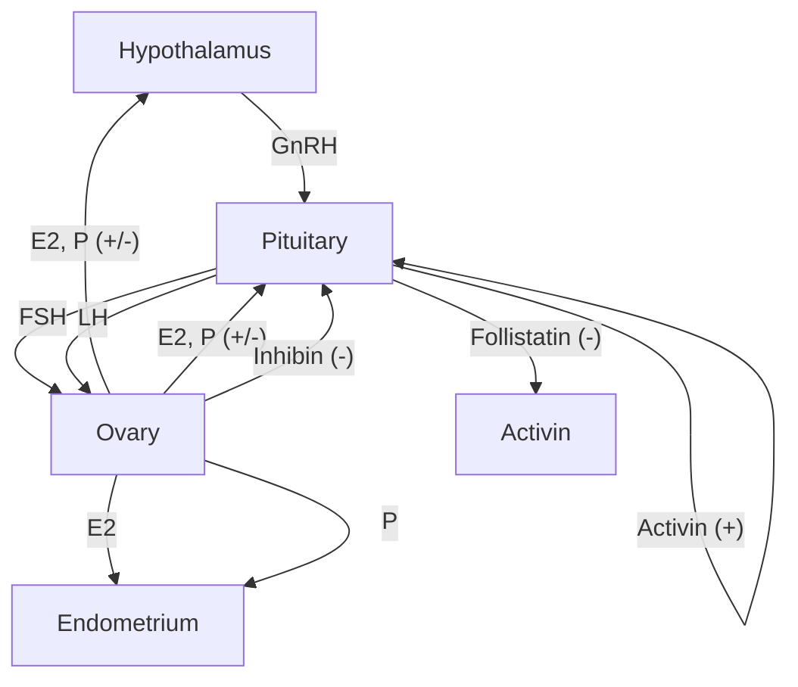
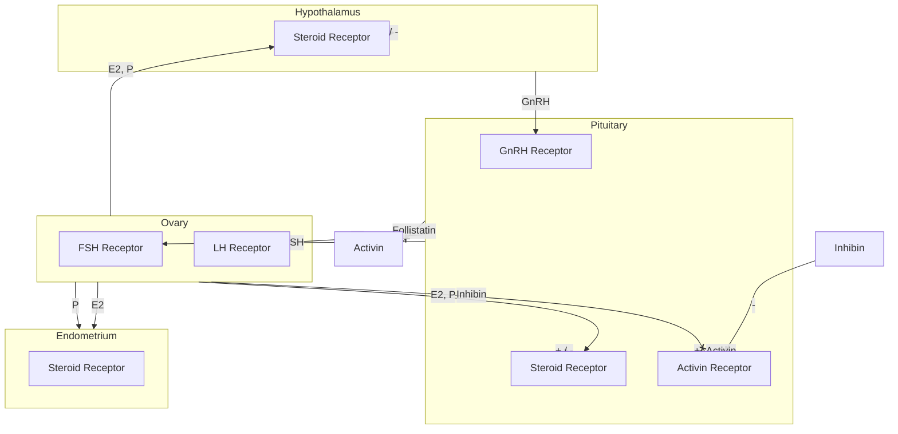
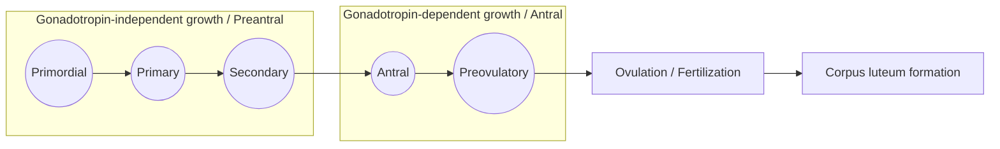
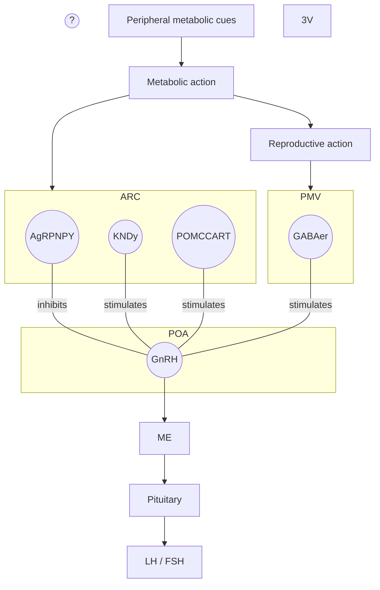
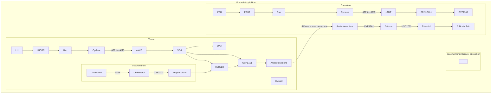
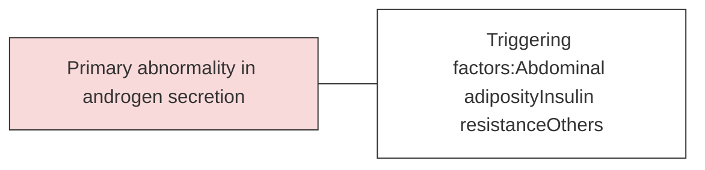
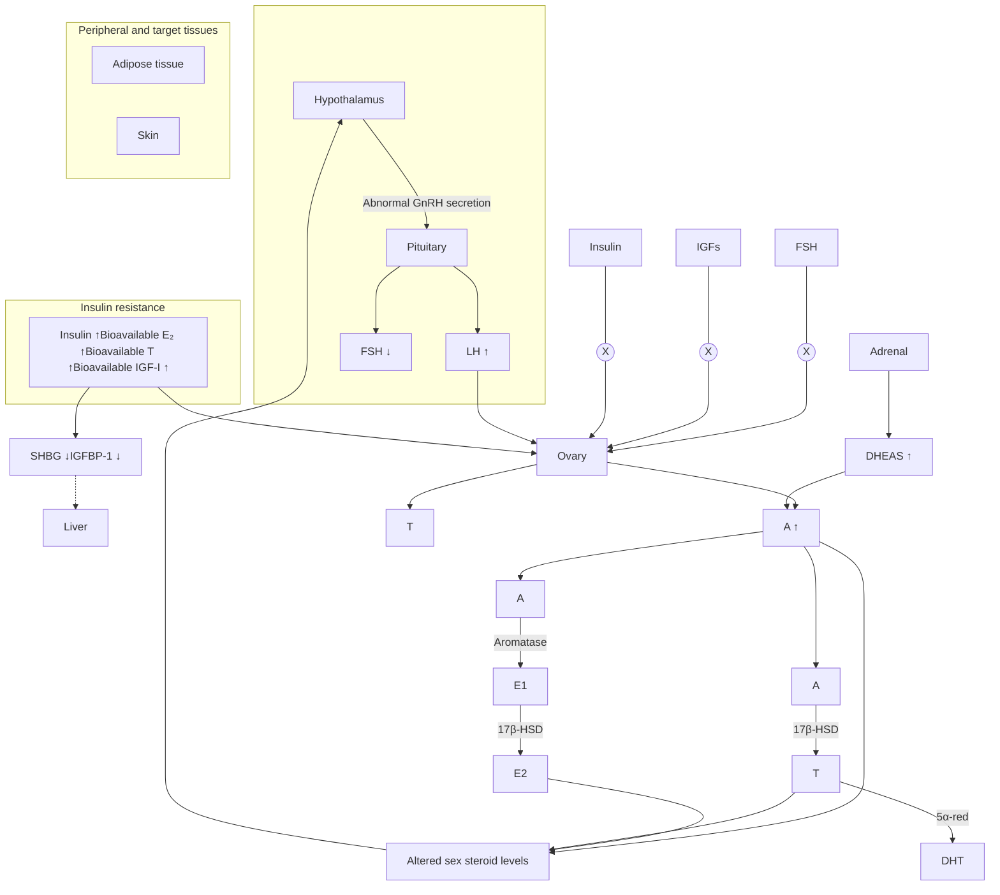

生殖荷爾蒙 內分泌 王舜禾

---

# Outline

* **Hypothalamic–pituitary–gonadal axis in female**
* Hypothalamic anovulation (Anorexia Nervosa)
* Prolactinoma
* Polyendocrine metabolic ovarian syndrome(PMOS)
  <mark>Poly Cystic Ovary Syndrome (PCOS)</mark>
* Menopause
* 臨床案例機智問答

---

Google logo decorated with a string of colorful holiday lights (red, green, yellow, and blue).

     FSH and LH cycle

---

Google FSH and LH cycle

# Google Image Search Results for "FSH and LH cycle"

| Image Thumbnail                                                            | Title / Source                                                               |
| -------------------------------------------------------------------------- | ---------------------------------------------------------------------------- |
| File:Hormones estradio... zh.wikiversity.org                           | File:Hormones estradio... zh.wikiversity.org                             |
| 激素週期 lungtp.com                                                        | 激素週期 lungtp.com                                                          |
| Hormones in Menstrual Cycle labpedia.net                               | Follicle Stimulating Hormone (FSH) (Follicular Stimulati... labpedia.net |
| Estrogen, luteinizing hormone (LH), fol... researchgate.net            | Estrogen, luteinizing hormone (LH), fol... researchgate.net              |
| 狐狸裝箱。: FSH & LH bayszone.blogspot.com                                  | 狐狸裝箱。: FSH & LH bayszone.blogspot.com                                    |
| Natural Contraception: Why ... pinterest.ch                            | Natural Contraception: Why ... pinterest.ch                              |
| LH, FSH / cycle \| Phar... pinterest.com                               | LH, FSH / cycle \| Phar... pinterest.com                                 |
| 月經週期(Menstrual cycl... smallcollation.blogspot....                     | 月經週期(Menstrual cycl... smallcollation.blogspot....                       |
| Menstrual Cycle \| BioNinja ib.bioninja.com.au                         | Menstrual Cycle \| BioNinja ib.bioninja.com.au                           |
| menstrual cycle hormones \| No Period. ... noperiodnowwhat.com         | menstrual cycle hormones \| No Period. ... noperiodnowwhat.com           |
| Changes in the diameter and valve closure time... phlebolymphology.org | Changes in the diameter and valve closure time... phlebolymphology.org   |
| Hormonal imbalance of ... fertilitypedia.org                           | Hormonal imbalance of ... fertilitypedia.org                             |

## Data Extraction from Key Charts

### Chart 1: Hormones in Menstrual Cycle (labpedia.net)

| Phase              | Day | Estrogen | Progesterone | LH        | FSH         |
| ------------------ | --- | -------- | ------------ | --------- | ----------- |
| Follicular phase   | 1   | Low      | Low          | Low       | Moderate    |
| Follicular phase   | 7   | Rising   | Low          | Low       | Moderate    |
| Ovulation          | 14  | Peak     | Low          | High Peak | Slight Peak |
| Luteal phase       | 21  | Moderate | High Peak    | Low       | Low         |
| Premenstrual phase | 28  | Low      | Low          | Low       | Low         |

### Chart 2: Menstrual Cycle Hormones (researchgate.net)

| Cycle Day      | Progesterone | Estrogen | FSH         | LH        |
| -------------- | ------------ | -------- | ----------- | --------- |
| 1 (Menses)     | Low          | Low      | Moderate    | Low       |
| 7              | Low          | Rising   | Moderate    | Low       |
| 14 (Ovulation) | Low          | Peak     | Slight Peak | High Peak |
| 21             | High         | Moderate | Low         | Low       |
| 28             | Low          | Low      | Low         | Low       |

### Chart 3: Pituitary Hormone Levels (ib.bioninja.com.au)

| Phase            | Hormone Activity                                                                                    |
| ---------------- | --------------------------------------------------------------------------------------------------- |
| Follicular phase | FSH levels are initially high (to develop follicles) before being inhibited by estrogen production. |
| Ovulation        | A huge spike in LH levels (and to a lesser extent, FSH) triggers ovulation (release of an ova).     |
| Luteal phase     | Rising levels of estrogen and progesterone inhibit both FSH and LH (levels therefore decrease).     |
| Menstruation     | When the corpus luteum degenerates, estrogen and progesterone levels fall and FSH levels rise.      |

2

---

哪個才是心目中的正確曲線?

# 1.
Anterior Pituitary hormone levels during the menstrual cycle.

| Day            | FSH           | LH        |
| -------------- | ------------- | --------- |
| 1              | Moderate      | Low       |
| 7              | High          | Low       |
| 14 (Ovulation) | Moderate Peak | High Peak |
| 21             | Low           | Low       |
| 28             | Moderate      | Low       |

# 2.
(b) Changes in concentration of anterior pituitary and ovarian hormones.
Source: PRINCIPLES OF ANATOMY AND PHYSIOLOGY by GERARD J. TORTORA and BRYAN DERRICKSON.

| Days | FSH           | LH        |
| ---- | ------------- | --------- |
| 0    | Low           | Low       |
| 2    | Small Peak    | Low       |
| 4    | Low           | Low       |
| 6    | Low           | Low       |
| 8    | Low           | Low       |
| 10   | Low           | Low       |
| 12   | Moderate Peak | High Peak |
| 14   | Low           | Moderate  |
| 16   | Low           | Low       |
| 18   | Low           | Low       |
| 20   | Low           | Low       |
| 22   | Low           | Low       |
| 24   | Low           | Low       |
| 26   | Low           | Low       |
| 28   | Low           | Low       |

# 3.
Journal of Ultrasound in Medicine. 2014;33:803-809
Lumen Learning courseware : Biology for Major II

| Day            | FSH       | LH            |
| -------------- | --------- | ------------- |
| 0              | Moderate  | Low           |
| 7              | Moderate  | Low           |
| 14 (Ovulation) | High Peak | Moderate Peak |
| 21             | Low       | Low           |
| 28             | Moderate  | Low           |

# 4.
Biology - Ovarian Cycle and Hormones

**Body Temperature and Hormone Levels**

| Phase            | Temperature (°C) | LH        | FSH           |
| ---------------- | ---------------- | --------- | ------------- |
| Follicular Phase | 36.4             | Low       | Moderate      |
| Ovulation        | 36.7 (Rise)      | High Peak | Moderate Peak |
| Luteal Phase     | 37.0             | Low       | Low           |

---

# 腦下垂體賀爾蒙：FSH 與 LH 的協奏

由腦下垂體前葉分泌的卵泡刺激素 (FSH) 與黃體成長素 (LH) 是啟動週期的關鍵。FSH 負責刺激卵泡成熟；而在第 13-14 天左右，LH 濃度會出現極劇烈的「高峰 (Surge)」，這是觸發排卵的絕對關鍵信號。為利於比較，兩者使用同等刻度 (mIU/mL) 繪製。

● LH (黃體成長素) ● FSH (卵泡刺激素)

| 天數     | LH (mIU/mL) | FSH (mIU/mL) |
| ------ | ----------- | ------------ |
| 第 1 天  | 4           | 4.5          |
| 第 3 天  | 4.2         | 4.8          |
| 第 5 天  | 4.5         | 5.2          |
| 第 7 天  | 5           | 5.5          |
| 第 9 天  | 6           | 5.2          |
| 第 11 天 | 12          | 6            |
| 第 13 天 | 50          | 16           |
| 第 15 天 | 7           | 5.5          |
| 第 17 天 | 4           | 4.2          |
| 第 19 天 | 3           | 3.2          |
| 第 21 天 | 2.5         | 2.8          |
| 第 23 天 | 2.5         | 3            |
| 第 25 天 | 3.5         | 4            |
| 第 27 天 | 4           | 4.5          |

| 月經期 | 濾泡期 | 排卵 (D14) | 黃體期 |
| --- | --- | -------- | --- |

From Gemini Pro 3.1 deep research

---

* 31歲女性

| FSH (mIU/mL)         | 4.3  | Follicular phase : 3.5- 12.5 Ovulaion phase : 4.7- 21.5 Luteal phase : 1.7- 7.7 Postmenopausal : 25.8- 134.8 |
| ------------------------ | ---- | ------------------------------------------------------------------------------------------------------------------------ |
| LH (mIU/mL)          | 6.48 | Follicular phase : 2.4- 12.6 Ovulation phase : 14.0- 95.6 Luteal phase : 1.0- 11.4 Postmenopause : 7.7- 58.5 |
| E2 (pg/mL)           | 44.2 | Follicular phase : 12.5-166 Ovulation phase : 85.8-498 Luteal phase : 43.8-211 Post-menopause : ND-54.7      |
| Progesterone (ng/mL) |      | Follicular phase : 0.057-0.893 Ovulation : 0.121-12.0 Luteal phase : 1.83-23.9 Postmenopausal : <0.05-0.126  |

---

# HPG axis in female

**Diagram Details:**

*   **Hypothalamus:** Releases GnRH (Gonadotropin-releasing hormone) to the Pituitary.
*   **Pituitary:**
    *   Releases FSH (Follicle-stimulating hormone) and LH (Luteinizing hormone) to the Ovary.
    *   Produces **Activin**, which has a positive (+) feedback on pituitary secretion.
    *   Produces **Follistatin**, which inhibits (-) Activin.
*   **Ovary:**
    *   Produces **E2** (Estradiol) and **P** (Progesterone), which provide both positive (+) and negative (-) feedback to the Hypothalamus and Pituitary.
    *   Produces **Inhibin**, which provides negative (-) feedback to the Pituitary.
*   **Endometrium:** Target tissue for E2 and P from the Ovary.

Modified from William's Textbook of Endocrinology, 13th Edition

---

# The effect of GnRH pulsatile frequency on gonadotropin secretion

994

| DAYS | GnRH Pulse Frequency | LH (ng/ml) | FSH (ng/ml) |
| ---- | -------------------- | ---------- | ----------- |
| -14  | 1 Pulse / hour       | 38         | 100         |
| -13  | 1 Pulse / hour       | 35         | 100         |
| -12  | 1 Pulse / hour       | 39         | 105         |
| -11  | 1 Pulse / hour       | 39         | 100         |
| -10  | 1 Pulse / hour       | 38         | 85          |
| -9   | 1 Pulse / hour       | 35         | 90          |
| -8   | 1 Pulse / hour       | 40         | 100         |
| -7   | 1 Pulse / hour       | 39         | 95          |
| -6   | 1 Pulse / hour       | 36         | 100         |
| -5   | 1 Pulse / hour       | 37         | 100         |
| -4   | 1 Pulse / hour       | 39         | 105         |
| -3   | 1 Pulse / hour       | 36         | 100         |
| -2   | 1 Pulse / hour       | 36         | 100         |
| -1   | 1 Pulse / hour       | 43         | 110         |
| 0    | 1 Pulse / hour       | 40         | 90          |
| 1    | 1 Pulse / 3 hours    | 23         | 70          |
| 2    | 1 Pulse / 3 hours    | 18         | 65          |
| 3    | 1 Pulse / 3 hours    | 33         | 90          |
| 4    | 1 Pulse / 3 hours    | 24         | 145         |
| 5    | 1 Pulse / 3 hours    | 27         | 150         |
| 6    | 1 Pulse / 3 hours    | 24         | 150         |
| 7    | 1 Pulse / 3 hours    | 24         | 155         |
| 8    | 1 Pulse / 3 hours    | 22         | 160         |
| 9    | 1 Pulse / 3 hours    | 19         | 175         |
| 10   | 1 Pulse / 3 hours    | 14         | 130         |
| 11   | 1 Pulse / 3 hours    | 21         | 155         |
| 12   | 1 Pulse / 3 hours    | 18         | 145         |
| 13   | 1 Pulse / 3 hours    | 18         | 160         |
| 14   | 1 Pulse / 3 hours    | 19         | 185         |
| 15   | 1 Pulse / 3 hours    | 26         | 195         |
| 16   | 1 Pulse / 3 hours    | 22         | 145         |
| 17   | 1 Pulse / hour       | 20         | 120         |
| 18   | 1 Pulse / hour       | 19         | 115         |
| 19   | 1 Pulse / hour       | 25         | 105         |
| 20   | 1 Pulse / hour       | 23         | 90          |
| 21   | 1 Pulse / hour       | 26         | 70          |
| 22   | 1 Pulse / hour       | 27         | 75          |
| 23   | 1 Pulse / hour       | 26         | 80          |
| 24   | 1 Pulse / hour       | 34         | 85          |
| 25   | 1 Pulse / hour       | 33         | 75          |
| 26   | 1 Pulse / hour       | 40         | 80          |
| 27   | 1 Pulse / hour       | 34         | 85          |
| 28   | 1 Pulse / hour       | 31         | 70          |
| 29   | 1 Pulse / hour       | 39         | 80          |
| 30   | 1 Pulse / hour       | 36         | 80          |
| 31   | 1 Pulse / hour       | 40         | 95          |
| 32   | 1 Pulse / hour       | 42         | 90          |

Endocrinology. 1981 Aug;109(2):376-85

---

# HPG axis in female

Modified from William's Textbook of Endocrinology, 13th Edition

Modified from William's Textbook of Endocrinology, 13th Edition

---

# Activin and Inhibin family

| Activin A  | βA βA | Inhibin A | α βA | ■ Inhibin α-subunit ■ Inhibin β-subunit |
| ---------- | ----- | --------- | ---- | ------------------------------------------- |
| Activin B  | βB βB | Inhibin B | α βB |                                             |
| Activin AB | βA βB |           |      |                                             |

**Inhibin A** producted by **dominant ovarian follicles** and **corpora lutea** (stimulated by **LH**).
**Inhibin B** producted by **granulosa cell** (stimulated by **FSH**).

11
William's Textbook of Endocrinology, 13th

---

# Activin and Inhibin family

<mark>Inhibin A and B suppressed FSH secretion</mark>

----

Inhibin A: $\alpha$ | $\beta_A$

Inhibin B: $\alpha$ | $\beta_B$

**Tertiary follicle** diagram showing:
*   Theca externa
*   Theca interna
*   Basement membrane
*   Zona pellucida
*   Fully grown oocyte
*   Antrum
*   Multiple layers of granulosa cells

----

**Inhibin A** producted by **dominant ovarian follicles** and **corpora lutea** (stimulated by **LH**).
**Inhibin B** producted by **granulosa cell** (stimulated by **FSH**).

12
William's Textbook of Endocrinology, 13th

---

# Neuroendocrine Control of the Menstrual Cycle

The following chart illustrates the hormonal and physiological changes throughout the menstrual cycle, divided into the Luteal, Follicular, and subsequent Luteal phases.

| Phase                              | Luteal phase             | Follicular phase                                   | Luteal phase                          |
| ---------------------------------- | ------------------------ | -------------------------------------------------- | ------------------------------------- |
| GnRH Pulse Frequency               | Low frequency pulses     | High frequency pulses                              | Low frequency pulses                  |
| LH (Luteinizing Hormone)           | Decreasing then stable   | Stable then sharp peak (surge)                     | Decreasing then stable                |
| FSH (Follicle Stimulating Hormone) | Slightly increasing      | Stable, slight dip, then peak (surge)              | Decreasing then stable                |
| Ovarian Cycle                      | Corpus luteum regression | Follicle development and ovulation                 | Corpus luteum formation               |
| Inhibin A                          | Decreasing               | Low, then sharp peak at ovulation                  | High, then decreasing                 |
| Inhibin B                          | Low                      | Increasing, peak mid-phase, then peak at ovulation | Low                                   |
| E2 (Estradiol)                     | Decreasing               | Increasing to a sharp peak before ovulation        | High, then decreasing                 |
| Prog (Progesterone)                | High, then decreasing    | Low                                                | Increasing to a peak, then decreasing |
| Endo (Endometrium)                 | Secretory                | Menses / Proliferative                             | Secretory                             |

**Visual Description of Ovarian and Endometrial Changes:**
*   **GnRH:** Represented by downward arrows indicating pulse frequency. Pulses are infrequent in the luteal phase and highly frequent in the follicular phase.
*   **Ovarian Cycle:** Shows the transition from a regressing corpus luteum to developing follicles, a dominant follicle, ovulation, and the formation of a new corpus luteum.
*   **Endometrium (Endo):**
    *   **Menses:** Thinning of the endometrial lining.
    *   **Proliferative:** Gradual thickening of the lining.
    *   **Secretory:** Thickened lining with increased vascularity (coiled arteries).

Hall, J.E. 2019. Yen and Jaffe’s Reproductive Endocrinology, 8th Edition.

---

# FSH induce antrum formation and follicular maturation

腔形成 靠FSH, 跟LH或estrogen無關

一直到 preovulatory face 才需要少量LH

|                           | Stage                                       | Genes Involved                        | Follicle size (mm) |
| ------------------------- | ------------------------------------------- | ------------------------------------- | ------------------ |
|                           | Gonadotropin-independent growth (Preantral) | Figla, Amh, Kit, Kitl, Nobox          | < 20               |
|                           | Gdf9, Kitl, Foxl2                           | 20-70                                 |                    |
|                           | Gonadotropin-dependent growth (Antral)      | Fshb, Fshr, Igf1, Ccnd2, Smad3, Taf4b | 70                 |
|                           | Acvr2, Inha, Inhba, Gja4, Esr1, Esr2        | 70                                    |                    |
| Ovulation / Fertilization | Bmp15                                       | -                                     |                    |

Modified from William's Textbook of Endocrinology, 13th Edition

---

# Neuroendocrine Control of the Menstrual Cycle

The following chart illustrates the hormonal and physiological changes during the menstrual cycle, divided into the Luteal and Follicular phases.

| Category                      | Luteal phase                                                                  | Follicular phase                                                                     | Luteal phase                                                        |
| ----------------------------- | ----------------------------------------------------------------------------- | ------------------------------------------------------------------------------------ | ------------------------------------------------------------------- |
| \*\*GnRH\*\*                  | Low frequency pulses (indicated by spaced arrows)                             | High frequency pulses (indicated by dense arrows)                                    | Low frequency pulses (indicated by spaced arrows)                   |
| \*\*LH / FSH\*\*              | LH (green line) and FSH (blue line) are relatively stable and low.            | LH and FSH levels rise, culminating in a sharp mid-cycle surge (LH surge is higher). | LH and FSH levels return to low, stable levels.                     |
| \*\*Ovarian Cycle\*\*         | Degenerating corpus luteum                                                    | Developing follicles -> Dominant follicle -> Ovulation                               | Developing corpus luteum                                            |
| \*\*Inhibin A / Inhibin B\*\* | Inhibin A (blue line) is high; Inhibin B (pink line) is low.                  | Inhibin B rises early; Inhibin A rises later in the phase, peaking around ovulation. | Inhibin A peaks mid-luteal; Inhibin B remains low.                  |
| \*\*E2 / Prog\*\*             | Estradiol (E2, green) and Progesterone (Prog, purple) are high but declining. | E2 and Prog are low initially; E2 rises sharply before ovulation.                    | Prog rises significantly; E2 also rises to a secondary peak.        |
| \*\*Endo\*\*                  | \*\*Secretory\*\*: Thick lining with coiled glands.                           | \*\*Menses\*\*: Lining sheds. \*\*Proliferative\*\*: Lining begins to regrow.    | \*\*Secretory\*\*: Lining thickens and glands become highly coiled. |

Hall, J.E. 2019. Yen and Jaffe’s Reproductive Endocrinology, 8th Edition.

---

哪個才是心目中的正確曲線?

# 1.
A line graph showing Anterior Pituitary hormone levels over a 28-day cycle.
*   **FSH (Light Blue line):** Shows a peak around day 5-7, a dip, and a smaller peak at day 14 (Ovulation).
*   **LH (Dark Blue line):** Remains low and flat until a sharp, high peak at day 14 (Ovulation), then declines.
*   **X-axis:** Day 1, 7, 14 (Ovulation), 21, 28.

# 2.
A line graph showing hormone concentration over a 28-day cycle.
*   **FSH (Blue line):** Shows a small peak around day 2-3 and a moderate peak at day 13.
*   **LH (Orange line):** Shows a very high, sharp peak at day 13.
*   **X-axis:** Days 0, 2, 4, 6, 8, 10, 12, 14, 16, 18, 20, 22, 24, 26, 28.
*   **Caption:** (b) Changes in concentration of anterior pituitary and ovarian hormones

# 3.
A line graph showing Pituitary hormone levels over a 28-day cycle.
*   **FSH (Orange line):** Shows a broad peak in the first half and a sharp peak at day 14 (Ovulation).
*   **LH (Red line):** Shows a sharp peak at day 14 (Ovulation) that is lower than the FSH peak.
*   **X-axis:** 0, 7, 14 (Ovulation), 21, 28.

# 4.
A composite diagram showing the menstrual cycle phases.
*   **Top row (Ovarian cycle):** Growing follicle $\rightarrow$ Ovulation $\rightarrow$ Corpus luteum $\rightarrow$ Corpus albicans.
*   **Middle row (Basal Body Temperature):** Shows a temperature shift from $36^\circ\text{C}$ to $37^\circ\text{C}$ after ovulation.
*   **Bottom row (Pituitary hormones):**
    *   **Luteinizing hormone (LH) (Blue line):** Shows a massive surge at ovulation (day 14).
    *   **Follicle-stimulating hormone (FSH) (Green line):** Shows a smaller surge at ovulation (day 14).

# 5. 都不是

---

# Case 1

* 36-year-old female
* Amenorrhea for 2 years
* Postprandial vomiting with weight loss from <mark>42kg to 28kg</mark> in 5 years

| Prolactin(ng/mL) | 6.24   | TSH(uIU/mL)        | 0.512 |
| ---------------- | ------ | ------------------ | ----- |
| FSH(mIU/mL)      | 7.32   | T3(ng/dL)          | 97.2  |
| LH(mIU/mL)       | 1.43   | Free T4(ng/dL)     | 1.17  |
| E2(pg/mL)        | *22.9* | ACTH8AM(pg/mL)     | 22.4  |
| P4(ng/mL)        | 0.2    | Cortisol8AM(ug/dL) | 14.2  |

---

# Metabolic Influences on Neuroendocrine Regulation of Reproduction

**Legend / Receptor Key:**
*   ● Kiss1r
*   ● IR
*   ● LepR (Leptin) ↓
*   ● GHSR (Ghrelin) ↑
*   ● MC3/4R
*   ● unknown

**Effect on GnRH:**
GnRH ↓

## Hypothalamic anovulation (Functional Hypothalamic Amenorrhea)

Curr Opin Endocrinol Diabetes Obes. 2013 Aug; 20(4): 335–341.

---

# Case 1-Anorexia Nervosa

* 36-year-old female
* Amenorrhea for 2 years
* Postprandial vomiting with weight loss from <mark>42kg to 28kg</mark> in 5 years

| Prolactin(ng/mL) | 6.24 | TSH(uIU/mL)        | 0.512 |
| ---------------- | ---- | ------------------ | ----- |
| FSH(mIU/mL)      | 7.32 | T3(ng/dL)          | 97.2  |
| LH(mIU/mL)       | 1.43 | Free T4(ng/dL)     | 1.17  |
| E2(pg/mL)        | 22.9 | ACTH8AM(pg/mL)     | 22.4  |
| P4(ng/mL)        | 0.2  | Cortisol8AM(ug/dL) | 14.2  |

---

# Case 2

* 33-year-old female
* G1P1
* Amenorrhea for 2 years after delivery and breastfeeding
* Sellar MRI: 0.8cm pituitary tumor (left)

The image shows a coronal T1-weighted MRI scan of the brain focusing on the sellar region, demonstrating a hypoenhancing lesion in the left aspect of the pituitary gland measuring approximately 0.8 cm.

| Prolactin(ng/mL) | *221* | TSH(uIU/mL)        | *6.71* |
| ---------------- | ----- | ------------------ | ------ |
| FSH(mIU/mL)      | 3.8   | Free T4(ng/dL)     | 1.07   |
| LH(mIU/mL)       | 0.82  | IGF-1(ng/mL)       | 151    |
| E2(pg/mL)        | *<5*  | ACTH8AM(pg/mL)     | 29.3   |
| P4(ng/mL)        | 0.52  | Cortisol8AM(ug/dL) | 15.23  |

---

# Effect of hyperprolactinemia on suppressing GnRH secretion

## Hyperprolactinemia

| Time (hr) | PRL (µg/L) | FSH (mIU/mL) | LH (mIU/mL) |
| --------- | ---------- | ------------ | ----------- |
| 0         | 55         | 9            | 7           |
| 0.5       | 78         | 8            | 6           |
| 1         | 60         | 9            | 5           |
| 1.5       | 55         | 7            | 6           |
| 2         | 52         | 8            | 5           |
| 2.5       | 65         | 8            | 5           |
| 3         | 60         | 9            | 4           |
| 3.5       | 82         | 8            | 5           |
| 4         | 65         | 9            | 4           |
| 4.5       | 62         | 8            | 5           |
| 5         | 55         | 7            | 4           |
| 5.5       | 40         | 8            | 4           |
| 6         | 58         | 6            | 4           |
| 6.5       | 40         | 8            | 4           |
| 7         | 60         | 8            | 4           |
| 7.5       | 50         | 7            | 4           |
| 8         | 55         | 5            | 4           |

## Normal hormone profile

| Time (hr) | PRL (µg/L) | FSH (mIU/mL) | LH (mIU/mL) |
| --------- | ---------- | ------------ | ----------- |
| 0         | 18         | 12           | 19          |
| 0.5       | 14         | 8            | 14          |
| 1         | 16         | 11           | 21          |
| 1.5       | 16         | 11           | 18          |
| 2         | 14         | 10           | 17          |
| 2.5       | 11         | 9            | 14          |
| 3         | 17         | 11           | 19          |
| 3.5       | 14         | 9            | 15          |
| 4         | 13         | 8            | 11          |
| 4.5       | 19         | 11           | 22          |
| 5         | 15         | 10           | 16          |
| 5.5       | 14         | 8            | 14          |
| 6         | 15         | 10           | 19          |
| 6.5       | 13         | 9            | 14          |
| 7         | 15         | 11           | 21          |
| 7.5       | 16         | 9            | 15          |
| 8         | 18         | 11           | 18          |

William's Textbook of Endocrinology, 13th Edition

---

# Case 2-Prolactinoma

* 33-year-old female
* G1P2
* Amenorrhea for 2 years after delivery and breastfeeding
* Sellar MRI: 0.8cm pituitary tumor (left)

Coronal T1-weighted MRI image of the brain showing a hypoenhancing lesion in the left side of the pituitary gland, measuring approximately 8.01 mm.

| Prolactin(ng/mL) | *221* | TSH(uIU/mL)        | *6.71* |
| ---------------- | ----- | ------------------ | ------ |
| FSH(mIU/mL)      | 3.8   | Free T4(ng/dL)     | 1.07   |
| LH(mIU/mL)       | 0.82  | IGF-1(ng/mL)       | 151    |
| E2(pg/mL)        | *<5*  | ACTH8AM(pg/mL)     | 29.3   |
| P4(ng/mL)        | 0.52  | Cortisol8AM(ug/dL) | 15.23  |

---

# Case 3

* 31-year-old female
* Irregular menstrual cycle for 10 years (Diagnosed)
* Amenorrhea for half years
* BH: 155cm, BW: 96 kg, BMI: 40 kg/m2
* GYN echo: multiple ovary cysts

| Prolactin(ng/mL)    | 13.1 | TSH(uIU/mL)        | 0.585 |
| ------------------- | ---- | ------------------ | ----- |
| FSH(mIU/mL)         | 4.3  | T3(ng/dL)          | 129   |
| LH(mIU/mL)          | 6.48 | Free T4(ng/dL)     | 1.23  |
| E2(pg/mL)           | 44.2 | ACTH8AM(pg/mL)     | 26.7  |
| Testosterone(ng/dL) | 50   | Cortisol8AM(ug/dL) | 14.01 |

---

| Test (Unit)  | Result | Reference Range                                                                                |
| ------------ | ------ | ---------------------------------------------------------------------------------------------- |
| FSH (mIU/mL) | 4.3    | **Follicular phase : 3.5- 12.5** Ovulaion phase : 4.7- 21.5 Luteal phase : 1.7- 7.7    |
| LH (mIU/mL)  | 6.48   | **Follicular phase : 2.4- 12.6** Ovulation phase : 14.0- 95.6 Luteal phase : 1.0- 11.4 |
| E2 (pg/mL)   | 44.2   | **Follicular phase : 12.5-166** Ovulation phase : 85.8-498 Luteal phase : 43.8-211     |

The image includes a diagram illustrating the hormonal changes during the menstrual cycle, showing the relationship between GnRH pulses, LH, FSH, Inhibin A, Inhibin B, E2 (Estradiol), and Prog (Progesterone) across the Luteal and Follicular phases.

**Hormonal Cycle Diagram Summary:**

*   **GnRH:** Shows low-frequency pulses in the luteal phase and high-frequency pulses in the follicular phase.
*   **LH & FSH:** LH shows a significant mid-cycle surge (ovulation), while FSH shows a smaller surge at the same time.
*   **Follicular Development:** Illustrates the maturation of the follicle from the follicular phase to ovulation and the subsequent formation of the corpus luteum in the luteal phase.
*   **Inhibin A & B:** Inhibin B peaks during the mid-follicular phase, while Inhibin A peaks during the luteal phase.
*   **E2 & Prog:** Estradiol (E2) peaks just before ovulation and again in the mid-luteal phase. Progesterone (Prog) remains low until after ovulation, peaking in the mid-luteal phase.

---

| FSH(mIU/mL)          | 4.3  |
| -------------------- | ---- |
| LH(mIU/mL)           | 6.48 |
| E2(pg/mL)            | 44.2 |
| Testosterone (ng/dL) | 50   |

The image displays a hormonal cycle diagram illustrating the levels of various hormones across the Luteal and Follicular phases. A red rectangular box highlights a specific point in the early-to-mid Follicular phase.

**Hormonal Trends and Physiological Events:**

*   **GnRH:** Shown as pulsatile arrows at the top, with higher frequency during the follicular phase.
*   **LH & FSH:** Both hormones show a significant peak (LH surge) at the end of the follicular phase, triggering ovulation.
*   **Ovarian Cycle:** Illustrates the maturation of follicles from small primary follicles to a large Graafian follicle, followed by ovulation and the formation of the corpus luteum.
*   **Inhibin A & Inhibin B:**
    *   Inhibin B rises during the follicular phase.
    *   Inhibin A peaks during the luteal phase.
*   **E2 (Estradiol) & Prog (Progesterone):**
    *   E2 rises steadily during the follicular phase, peaks just before ovulation, and has a second smaller peak in the luteal phase.
    *   Progesterone remains low during the follicular phase and rises significantly during the luteal phase, produced by the corpus luteum.

The highlighted red section corresponds to the early-to-mid follicular phase, where FSH and LH are relatively stable, and E2 is beginning its gradual rise.

---

| FSH(mIU/mL) LH(mIU/mL) E2(pg/mL) Testosterone (ng/dL) | 4.3 6.48 44.2 50 |
| ----------------------------------------------------------------- | ---------------------------- |

The image displays a hormonal chart of the menstrual cycle, highlighting the transition from the luteal phase to the follicular phase. A red vertical box indicates a specific point in the early follicular phase.

*   **GnRH:** Shows pulsatile secretion patterns, increasing in frequency during the follicular phase.
*   **LH / FSH:** LH (light blue line) and FSH (dark green line) levels are shown. FSH shows a slight rise at the beginning of the follicular phase.
*   **Follicle Development:** Below the LH/FSH graph, a series of illustrations show the maturation of follicles from small antral follicles to a dominant follicle and ovulation.
*   **Inhibin A / Inhibin B:** Inhibin A (dark blue line) and Inhibin B (red line) fluctuations are mapped across the phases.
*   **E2 / Prog:** Estradiol (E2, green line) and Progesterone (Prog, purple line) levels are shown. E2 begins to rise significantly during the mid-follicular phase.

An ultrasound image of an ovary is shown in the bottom left, displaying multiple small, dark, circular areas representing follicles.

**12 or more follicles measuring 2–9mm**

Follicle Detection and Ovarian Classification in Digital Ultrasound Images of Ovaries(P. S. Hiremath and Jyothi R. Tegnoor) DOI: 10.5772/56518

---

Dr. Sam's Imaging Library

| Transvaginal View                                                                                                                         | Transvaginal View                                                                                                                                             |                |                    |
| ----------------------------------------------------------------------------------------------------------------------------------------- | ------------------------------------------------------------------------------------------------------------------------------------------------------------- | -------------- | ------------------ |
| The image shows a transvaginal ultrasound of a normal ovary. Labels indicate: - Ovarian Stroma - Dominant Follicle - Follicle | The image shows a transvaginal ultrasound of a polycystic ovary. Labels indicate: - Peripheral Distribution Of Follicles - Hyperechoic Ovarian Stroma |                |                    |
|                                                                                                                                           |                                                                                                                                                               | # Normal Ovary | # Polycystic Ovary |
|                                                                                                                                           | \* Increased number of follicles                                                                                                                              |                |                    |
|                                                                                                                                           | \* String of pearls appearance: Peripheral distribution of follicles                                                                                          |                |                    |
|                                                                                                                                           | \* Increased Ovarian volume: >11ml (variable)                                                                                                                 |                |                    |
| 8-10 follicles from 2mm to 28mm                                                                                                           | 12 or more follicles measuring 2–9mm                                                                                                                          |                |                    |

---

| FSH(mIU/mL) LH(mIU/mL) E2(pg/mL) Testosterone (ng/dL) | 4.3 6.48 44.2 \50\ |
| ----------------------------------------------------------------- | ------------------------------------------------------------- |

The image displays a composite of medical illustrations and an ultrasound scan related to the menstrual cycle and ovarian follicles.

### Hormonal Regulation and Follicular Development
The top right diagram illustrates the hormonal fluctuations and follicular changes across the menstrual cycle phases: Luteal phase, Follicular phase, and the subsequent Luteal phase.

*   **GnRH:** Represented by downward arrows indicating pulsatile release, with increased frequency during the follicular phase.
*   **LH and FSH:** The graph shows a significant surge in LH (Luteinizing Hormone) and a smaller surge in FSH (Follicle-Stimulating Hormone) triggering ovulation.
*   **Inhibin A and Inhibin B:** These hormones show distinct peaks; Inhibin B peaks during the mid-follicular phase and ovulation, while Inhibin A peaks during the luteal phase.
*   **E2 (Estradiol) and Prog (Progesterone):** Estradiol peaks just before ovulation. Progesterone levels are low during the follicular phase and rise significantly during the luteal phase.
*   **Follicle Development:** Below the hormone graphs, the maturation of a follicle is shown, from small primary follicles to a large pre-ovulatory follicle, followed by ovulation and the formation of the corpus luteum. A red rectangular box highlights a specific stage in the early-to-mid follicular phase.

### Ultrasound Image
On the bottom left, a grayscale digital ultrasound image shows an ovary with multiple dark, circular areas representing developing follicles.

### Anatomy of a Tertiary Follicle
The bottom right diagram provides a detailed cross-section of a **Tertiary follicle**, labeling its various components:
*   **Theca externa**
*   **Theca interna**
*   **Basement membrane**
*   **Zona pellucida**
*   **Fully grown oocyte**
*   **Antrum** (the fluid-filled cavity)
*   **Multiple layers of granulosa cells**

Follicle Detection and Ovarian Classification in Digital Ultrasound Images of Ovaries(P. S. Hiremath and Jyothi R. Tegnoor) DOI: 10.5772/56518

---

| FSH(mIU/mL) LH(mIU/mL) E2(pg/mL) Testosterone (ng/dL) | 4.3 6.48 44.2 50 |
| ----------------------------------------------------------------- | ---------------------------- |

<mark>Higher inhibin B and higher AMH</mark>

The image shows a diagram of the menstrual cycle phases (Luteal phase, Follicular phase) and the corresponding hormone levels (GnRH pulses, LH, FSH, Inhibin A, Inhibin B, E2, and Prog). A red vertical box highlights a specific point in the early-to-mid follicular phase.

Below the hormone charts is a diagram of a **Tertiary follicle** with the following labeled parts:
*   Theca externa
*   Theca interna
*   Basement membrane
*   Zona pellucida
*   Fully grown oocyte
*   Antrum
*   Multiple layers of granulosa cells

The bottom left features an ultrasound image of an ovary showing multiple follicles.

Follicle Detection and Ovarian Classification in Digital Ultrasound Images of Ovaries(P. S. Hiremath and Jyothi R. Tegnoor) DOI: 10.5772/56518

---

| FSH(mIU/mL)          | 4.3  |
| -------------------- | ---- |
| LH(mIU/mL)           | 6.48 |
| E2(pg/mL)            | 44.2 |
| Testosterone (ng/dL) | 50   |

**Higher inhibin B and higher AMH**

An ultrasound image of an ovary showing multiple follicles, characteristic of polycystic ovary syndrome (PCOS).

Follicle Detection and Ovarian Classification in Digital Ultrasound Images of Ovaries(P. S. Hiremath and Jyothi R. Tegnoor) DOI: 10.5772/56518

A diagram illustrating the hormonal changes and follicular development across the menstrual cycle:

*   **GnRH**: Shows pulse frequency changes (slow in luteal phase, fast in follicular phase).
*   **Phases**: Luteal phase, Follicular phase (highlighted with a red box), and Luteal phase.
*   **Hormones**:
    *   **LH** and **FSH**: Levels fluctuate with a mid-cycle surge.
    *   **Inhibin A** and **Inhibin B**: Show distinct peaks during the cycle.
    *   **E2** (Estradiol) and **Prog** (Progesterone): Estradiol peaks before ovulation; Progesterone peaks in the luteal phase.
*   **Follicular Development**: Shows the progression from small follicles to a dominant follicle and ovulation.

A detailed anatomical diagram of a **Tertiary follicle**:
*   Theca externa
*   Theca interna
*   Basement membrane
*   Zona pellucida
*   Fully grown oocyte
*   Antrum
*   Multiple layers of granulosa cells

**Atresia $\rightarrow$ Theca cell $\rightarrow$ stroma cell $\rightarrow$ Hyperthecosis**

---

# Two-cell hypothesis for ovarian steroidogenesis

**A**

**Figure 17-19** Two-cell hypothesis for ovarian steroidogenesis. **A,** The preovulatory follicle produces estradiol through a paracrine interaction between theca and granulosa cells. In response to stimulation with a gonadotropin, steroidogenic factor 1 (SF-1, a member of the nuclear receptor family) acts as a master switch to initiate transcription of a series of steroidogenic genes in theca cells. In follicular granulosa cells, another nuclear receptor, liver homolog receptor 1 (LRH-1), seems to primarily mediate the downstream effects of follicle-stimulating hormone (FSH) in the rodent ovary.133,134 In humans, the roles of SF-1 and LRH-1 in steroidogenesis in preovulatory granulosa cells are not well understood. Because granulosa cells do not have a direct connection to the circulation, CYP19A1 (aromatase) in granulosa cells depends for substrate on androstenedione that diffuses from theca cells. Two critical steps in estradiol formation are the entry of cholesterol into mitochondria facilitated by steroidogenic acute regulatory protein (StAR) in theca cells and the conversion of androstenedione to estrone catalyzed by CYP19A1 in granulosa cells. **B,** In the corpus luteum, granulosa-lutein cells are heavily vascularized, a condition that is critical

---

TRENDS in Endocrinology and Metabolism Vol.18 No.7

The image illustrates a progression of female silhouettes from lean to obese, with target symbols on the abdominal area increasing in size to represent the severity of abdominal adiposity.

Below the silhouettes is a diagram showing the relationship between primary androgen secretion and triggering factors:

The diagram features a wedge shape indicating that as the influence of "Primary abnormality in androgen secretion" (marked with an asterisk \*) decreases, the influence of "Triggering factors: Abdominal adiposity, Insulin resistance, Others" (marked with a dagger †) increases.

CARNERO

TRENDS in Endocrinology and Metabolism Vol.18 No.7

---

# Pathologic mechanisms in PCOS

**Figure 17-32** Pathologic mechanisms in polycystic ovary syndrome (PCOS). A deficient in vivo response of the ovarian follicle to physiologic quantities of follicle-stimulating hormone (FSH), possibly because of an impaired interaction between signaling pathways associated with FSH and insulin-like growth factors (IGFs) or insulin, may be an important defect responsible for anovulation in PCOS. Insulin resistance associated with increased circulating and tissue levels of insulin and bioavailable estradiol (E₂), testosterone (T), and IGF-I gives rise to abnormal hormone production in a number of tissues. Oversecretion of luteinizing hormone (LH) and decreased output of FSH by the pituitary, decreased production of sex hormone–binding globulin (SHBG) and IGF-binding protein 1 (IGFBP-1) in the liver, increased adrenal secretion of dehydroepiandrosterone sulfate (DHEAS), and increased ovarian secretion of androstenedione (A) all contribute to the feed-forward cycle that maintains anovulation and androgen excess in PCOS. Excessive amounts of E₂ and T arise primarily from the conversion of A in peripheral and target tissues. T is converted to the potent steroids estradiol or DHT (dihydrotestosterone). Reductive 17β-hydroxysteroid dehydrogenase (17β-HSD) enzyme activity may be conferred by protein products of several genes with overlapping functions; 5α-reductase (5α-red).

---

| FSH(mIU/mL) LH(mIU/mL) E2(pg/mL) Testosterone (ng/dL) | 4.3 6.48 44.2 \50\ |
| ----------------------------------------------------------------- | ------------------------------------------------------------- |

The image shows a diagram of the menstrual cycle phases (Luteal phase, Follicular phase, and Luteal phase) illustrating the levels of various hormones:
*   **GnRH**: Represented by downward arrows indicating pulse frequency.
*   **LH and FSH**: Graphed over time, showing a significant surge at the end of the follicular phase.
*   **Follicle Development**: Visual representation of follicle growth and ovulation.
*   **Inhibin A and Inhibin B**: Graphed hormone levels.
*   **E2 (Estradiol) and Prog (Progesterone)**: Graphed hormone levels.
A red rectangular box highlights a specific section of the early-to-mid follicular phase.

An ultrasound image of an ovary is shown, displaying multiple dark, circular follicles, characteristic of a polycystic ovary.

1. Follicular FSH resistance
2. Sex steroid resistance of GnRH pulse generator
3. Insulin resistance

Follicle Detection and Ovarian Classification in Digital Ultrasound Images of Ovaries(P. S. Hiremath and Jyothi R. Tegnoor) DOI: 10.5772/56518

---

# Case 3-PMOS

* 31-year-old female
* Irregular menstrual cycle for 10 years (Diagnosed)
* Amenorrhea for half years
* BH: 155cm, BW: 96 kg, BMI: 40 kg/m2
* GYN echo: multiple ovary cysts

| Prolactin(ng/mL)    | 13.1 | TSH(uIU/mL)        | 0.585 |
| ------------------- | ---- | ------------------ | ----- |
| FSH(mIU/mL)         | 4.3  | T3(ng/dL)          | 129   |
| LH(mIU/mL)          | 6.48 | Free T4(ng/dL)     | 1.23  |
| E2(pg/mL)           | 44.2 | ACTH8AM(pg/mL)     | 26.7  |
| Testosterone(ng/dL) | *50* | Cortisol8AM(ug/dL) | 14.01 |

---

# Case 4-Menoapuse

* 61-year-old female
* Menopause for 8~10 years

| Test                    | Result | Reference Range                                                                                                          | Reference Range |
| ----------------------- | ------ | ------------------------------------------------------------------------------------------------------------------------ | --------------- |
| FSH (mIU/mL)        |        | Follicular phase : 3.5- 12.5 Ovulaion phase : 4.7- 21.5 Luteal phase : 1.7- 7.7 Postmenopausal : 25.8- 134.8 |                 |
| LH (mIU/mL)         |        | Follicular phase : 2.4- 12.6 Ovulation phase : 14.0- 95.6 Luteal phase : 1.0- 11.4 Postmenopause : 7.7- 58.5 |                 |
| E2 (pg/mL)          | <5     | Follicular phase : 12.5-166 Ovulation phase : 85.8-498 Luteal phase : 43.8-211 Post-menopause : ND-54.7      |                 |
| Progestrone (ng/mL) | 0.31   |                                                                                                                          |                 |

---

# Case 4-Menoapuse

* 61-year-old female
* Menopause for 8~10 years

| FSH (mIU/mL)        | 70.1  | Follicular phase : 3.5- 12.5 Ovulaion phase : 4.7- 21.5 Luteal phase : 1.7- 7.7 Postmenopausal : 25.8- 134.8 |   |
| ----------------------- | ----- | ------------------------------------------------------------------------------------------------------------------------ | - |
| LH (mIU/mL)         | 31.36 | Follicular phase : 2.4- 12.6 Ovulation phase : 14.0- 95.6 Luteal phase : 1.0- 11.4 Postmenopause : 7.7- 58.5 |   |
| E2 (pg/mL)          | <5    | Follicular phase : 12.5-166 Ovulation phase : 85.8-498 Luteal phase : 43.8-211 Post-menopause : ND-54.7      |   |
| Progestrone (ng/mL) | 0.31  |                                                                                                                          |   |

---

# Case 4-Menoapuse

* 61-year-old female
* Menopause for 8~10 years

| FSH (mIU/mL)        | *70.1*  | Follicular phase : 3.5- 12.5 Ovulaion phase : 4.7- 21.5 Luteal phase : 1.7- 7.7 Postmenopausal : 25.8- 134.8 |   |
| ----------------------- | ------- | ------------------------------------------------------------------------------------------------------------------------ | - |
| LH (mIU/mL)         | *31.36* | Follicular phase : 2.4- 12.6 Ovulation phase : 14.0- 95.6 Luteal phase : 1.0- 11.4 Postmenopause : 7.7- 58.5 |   |
| E2 (pg/mL)          | *<5*    | Follicular phase : 12.5-166 Ovulation phase : 85.8-498 Luteal phase : 43.8-211 Post-menopause : ND-54.7      |   |
| Progestrone (ng/mL) | 0.31    | After supplement (ESTRADE TABLETS 2MG(*ESTRADIOL*) 1# QD +*Utrogestan* soft capsule 100mg 1# QD) for *3 months*          |   |

---

# Case 4-Menoapuse

* 61-year-old female
* Menopause for 8~10 years

| FSH (mIU/mL)        | *70.1*  | Follicular phase : 3.5- 12.5 Ovulaion phase : 4.7- 21.5 Luteal phase : 1.7- 7.7 Postmenopausal : 25.8- 134.8 | *20.5* |
| ----------------------- | ------- | ------------------------------------------------------------------------------------------------------------------------ | ------ |
| LH (mIU/mL)         | *31.36* | Follicular phase : 2.4- 12.6 Ovulation phase : 14.0- 95.6 Luteal phase : 1.0- 11.4 Postmenopause : 7.7- 58.5 | *10.8* |
| E2 (pg/mL)          | *<5*    | Follicular phase : 12.5-166 Ovulation phase : 85.8-498 Luteal phase : 43.8-211 Post-menopause : ND-54.7      | 40.0   |
| Progestrone (ng/mL) | 0.31    | After supplement (ESTRADE TABLETS 2MG(*ESTRADIOL*) 1# QD +*Utrogestan* soft capsule 100mg 1# QD) for *3 months*          | 1.85   |

---

| Year | No. of women | FSH (IU/L)    | LH (IU/L)     | E₂ (nmol/L)  | Inhibin A (ng/L) | Inhibin B (ng/L) |
| ---- | ------------ | ------------- | ------------- | ------------ | ---------------- | ---------------- |
| -4   | 18           | 5.6 (10.5)    | 7.6 (9.0)     | 0.33 (0.4)   | 41 (66)          | 21 (67)          |
| -3   | 36           | 11.6 (16.9)   | 10.2 (10.2)   | 0.30 (0.5)   | 26 (30)          | 23 (42)          |
| *-2* | *51*         | *25.7 (30.5)* | *21.3 (18.8)* | *0.2 (0.4)*  | *12 (27)*        | *nd*             |
| *-1* | *56*         | *41.2 (40.2)* | *29.7 (15.2)* | *0.09 (0.3)* | *nd*             | *nd*             |
| 0    | 59           | 55.0 (41.4)   | 33.1 (15.3)   | 0.06 (0.1)   | nd               | nd               |
| 1    | 41           | 68.1 (36.5)   | 33.2 (18.4)   | 0.05 (0.03)  | nd               | nd               |
| 2    | 23           | 66.1 (42.1)   | 34.6 (17.6)   | 0.04 (0.03)  | nd               | nd               |
| 3    | 8            | 66.6 (38.4)   | 39.6 (14.5)   | 0.04 (0.03)  | nd               | nd               |

### Hormone Levels during Menopausal Transition

| year | FSH (U/L) | LH (U/L) | Inhibin A (ng/L) | Inhibin B (ng/L) | estradiol (nmol/L) |
| ---- | --------- | -------- | ---------------- | ---------------- | ------------------ |
| -4   | 5.6       | 7.6      | 41               | 21               | 0.33               |
| -3   | 11.6      | 10.2     | 26               | 23               | 0.30               |
| -2   | 25.7      | 21.3     | 12               | 0                | 0.20               |
| -1   | 41.2      | 29.7     | 0                | 0                | 0.09               |
| 0    | 55.0      | 33.1     | 0                | 0                | 0.06               |
| 1    | 68.1      | 33.2     | 0                | 0                | 0.05               |
| 2    | 66.1      | 34.6     | 0                | 0                | 0.04               |
| 3    | 66.6      | 39.6     | 0                | 0                | 0.04               |

Table I. Serum concentrations, median and interquartile range (in parentheses) of FSH, LH, E2, inhibin A and inhibin B from 59 women without hormone treatment during the menopausal transition and postmenopause. Data from 4 years before to 3 years after the final menstrual period (FMP) are shown. Year 0 = FMP. nd = not detectable

Acta Obstet Gynecol Scand 84 (2005)

---

# Summary

* **GnRH pulsatile frequency** dominated LH and FSH secretion.
* Inhibin A and B suppressed FSH secretion in female.
* In healthy women of reproductive age, the level of LH was usually higher than FSH. (Except the late luteal phase and early follicular phase)
* Hyperprolactinemia suppressed GnRH pulsatile frequency.
* Follicular FSH resistance, central gonadal steroids resistance and insulin resistance contribute to PCOS.

---

# Summary

* **GnRH pulsatile frequency** dominated LH and FSH secretion.
* **Inhibin A and B** suppressed FSH secretion in female.
* In healthy women of reproductive age, the level of LH was usually higher than FSH. (Except the late luteal phase and early follicular phase)
* Hyperprolactinemia suppressed GnRH pulsatile frequency.
* Follicular FSH resistance, central gonadal steroids resistance and insulin resistance contribute to PCOS.

---

# Summary

* **GnRH pulsatile frequency** dominated LH and FSH secretion.
* **Inhibin A and B** suppressed FSH secretion in female.
* In healthy women of reproductive age, the level of **LH was usually higher than FSH.** (Except the late luteal phase and early follicular phase)
* <mark>Hyperprolactinemia suppressed GnRH pulsatile frequency.</mark>
* <mark>Follicular FSH resistance, central gonadal steroids resistance and insulin resistance contribute to PCOS.</mark>

---

# Summary

* **GnRH pulsatile frequency** dominated LH and FSH secretion.
* **Inhibin A and B** suppressed FSH secretion in female.
* In healthy women of reproductive age, the level of **LH was usually higher than FSH.** (Except the late luteal phase and early follicular phase)
* **Hyperprolactinemia** suppressed GnRH pulsatile frequency.
* Follicular FSH resistance, central gonadal steroids resistance and insulin resistance contribute to PCOS.

---

# Summary

* **GnRH pulsatile frequency** dominated LH and FSH secretion.
* **Inhibin A and B** suppressed FSH secretion in female.
* In healthy women of reproductive age, the level of **LH was usually higher than FSH.** (Except the late luteal phase and early follicular phase)
* **Hyperprolactinemia** suppressed GnRH pulsatile frequency.
* **Follicular FSH resistance, sex steroid resistance of GnRH pulse generator** and insulin resistance contribute to PMOS.

---

機智問答

---

# Question 1

* 20歲女性， Amenorrhea for 21 months
* BW:44 kg(2021) $\rightarrow$ 33kg (2022/12 失戀) $\rightarrow$ 2023/2 無月經 $\rightarrow$ 44kg (2024/11 持續無月經 )
* BH: 155cm, BW: 44 kg, BMI: 18.3 kg/m2
* GYN echo: negative

| Prolactin(ng/mL):   | 6.1  | TSH(uIU/mL)             | 1.57  |
| ------------------- | ---- | ----------------------- | ----- |
| FSH(mIU/mL)         | 3.9  | T3(ng/dL)               | 78.9  |
| LH(mIU/mL)          | 1.27 | Free T4(ng/dL)          | 0.965 |
| E2(pg/mL)           | 19.3 | Testosterone(ng/dL)     | 43    |
| Progesterone(ng/dL) | 0.25 | (20\~49 yrs : 8.4-48.1) |       |

---

# Question 2

* 25歲女性，近一年月經不規則(2~3個月一次)
* BW:41 kg $\rightarrow$ 60kg (近一年)
* BH: 154cm, BW: 60 kg, BMI: 26.3 kg/m2
* PCOS history

| Prolactin(ng/mL)    | 22   |                         |      |
| ------------------- | ---- | ----------------------- | ---- |
| FSH(mIU/mL)         | 5.5  |                         |      |
| LH(mIU/mL)          | 12.8 |                         |      |
| E2(pg/mL)           | 55.7 | Testosterone(ng/dL)     | *62* |
| Progesterone(ng/dL) | 0.28 | (20\~49 yrs : 8.4-48.1) |      |

---

* 45歲女性，自述半年無月經，婦科超音波無異常
* AMH : 0.02 ng/mL (45-50歲; 0.046-2.06)
* Testosterone <3 ng/dL (20-49歲 : 8.4-48.1)

| FSH(mIU/mL) LH(mIU/mL) E2(pg/mL) Progesterone(ng/mL) | 113/9/30 101 65.5 <5 <0.05 | Follicular phase : 3.5- 12.5Ovulaion phase : 4.7- 21.5Luteal phase : 1.7- 7.7Postmenopausal : 25.8- 134.8 Follicular phase : 2.4- 12.6Ovulation phase : 14.0- 95.6Luteal phase : 1.0- 11.4Postmenopause : 7.7- 58.5 Follicular phase : 12.5-166Ovulation phase : 85.8-498Luteal phase : 43.8-211Post-menopause : ND-54.7 Follicular phase : 0.057-0.893Ovulation : 0.121-12.0Luteal phase : 1.83-23.9Postmenopausal : <0.05-0.126 | 113/11/25 6.7 11.4 279 0.14 |
| ---------------------------------------------------------------- | ------------------------------------------ | --------------------------------------------------------------------------------------------------------------------------------------------------------------------------------------------------------------------------------------------------------------------------------------------------------------------------------------------------------------------------------------------------------------------------------------------- | ------------------------------------------- |

---

謝謝大家 臉書: 王舜禾 Email: soonherwang@gmail.com

---

# Leuprorelin (leuprolide acetate) is a synthetic analogue of GnRH (LHRH)

【注意】1. 本藥限由醫師使用。
2. 請依醫師處方箋的指示使用。
【貯法】25℃以下。
【有效期限】三年。請於外盒所標示的使用期限內使用（即使於使用期限內，但於開封後應儘速使用）。

LH-RH同族體
Microcapsule型緩釋型製劑
柳菩林持續性藥效皮下注射劑3.75公絲
Leuplin Depot 3.75 mg S.C. Injection
(Leuprolide acetate for depot suspension)

衛署藥輸字第019493號
前次修訂: 2012年11月
修訂日期: 2017年7月

|                    | 【禁忌】(對下列病人請勿投與)                            | 【禁忌】(對下列病人請勿投與) | 【禁忌】(對下列病人請勿投與) |
| ------------------ | ------------------------------------------ | --------------- | --------------- |
| 子宮內膜異位、子宮肌瘤、中樞性性早熟 | (1)對本劑的成分或合成性LH-RH及LH-RH同族體曾發生過敏症者。        |                 |                 |
| \[empty]           | (2)已懷孕或可能懷孕的婦人，哺乳中的婦人(請參考使用上的注意事項5.對孕婦的投與) |                 | \[empty]        |
| \[empty]           | (3)未經診斷的異常陰道出血的病人。【有罹患惡性疾病的可能】             |                 | \[empty]        |
| 停經前乳癌              | (1)對本劑的成分或合成性LH-RH及LH-RH同族體曾發生過敏症者。        | \[empty]        |                 |
| \[empty]           | (2)已懷孕或可能懷孕的婦人，哺乳中的婦人(請參考使用上的注意事項5.對孕婦的投與) | \[empty]        |                 |
| 前列腺癌               | 對本劑的成分或合成性LH-RH及LH-RH同族體曾發生過敏症者。           | \[empty]        |                 |

| 中樞性性早熟症 | (1)於第一次使用初期，因為伴隨腦下垂體—性腺軸的刺激作用，而使得血清中性腺荷爾蒙濃度暫時性上昇，臨床症狀有時會出現暫時性的惡化，但通常繼續治療後，此現象即可消失。 (2)於本劑的投與期間，應定期進行LH-RH試驗，當未能達到對血中LH及FSH的抑制效果時，請中止投與。 (3)抽蓄－在上市後報告中曾觀察到病人使用leuprolide acetate 治療而發生抽蓄的情形。這些包括病人本身有癲癇發作(Seizure)，癲癇(epilepsy)，腦血管疾病及中樞神經系統異常或腫瘤的病史及病人併用會造成抽蓄的藥品，例如：Bupropion及SSRIs的藥品。也有非以上所提到的情形而發生抽蓄的報告。 |
| ------- | ------------------------------------------------------------------------------------------------------------------------------------------------------------------------------------------------------------------------------------------------------------------------------------------------------------------- |

【組成】
本劑為白色的凍晶注射劑，每一小瓶 (vial) 中含有下列成分：

| Leuprorelin acetate                           | 3.75 mg  |
| --------------------------------------------- | -------- |
| Copolymer (DL-Lactic acid/Glycolic acid)(3:1) | 33.75 mg |
| D-Mannitol                                    | 6.6 mg   |
| Total                                         | 44.1 mg  |

所添附的懸濁用溶解液每一安瓿 1ml 中含有下列成分：
D-Mannitol 50 mg

3. 藥物的交互作用
子宮內膜異位、子宮肌瘤
併用藥物的注意事項(與下列藥物併用時請慎重投與)

|                                                                                | 藥物名稱        | 表徵、症狀及處理方法                                     | 機轉及危險因子 |
| ------------------------------------------------------------------------------ | ----------- | ---------------------------------------------- | ------- |
| 性荷爾蒙製劑Estradiol同族體、Estriol同族體、結合型Estrogen製劑、estrogen及progesteron的合併製劑、混合型性荷爾蒙等 | 本劑的作用可能會降低。 | 本藥藉由抑制性荷爾蒙的分泌，而產生治療效果，因此，投與性荷爾蒙製劑可能會降低本藥的治療效果。 |         |

It **initially stimulates** LH and hence testicular androgen release; **continuous** administration then results in **profound suppression** of these hormones.

---

| FSH(mIU/mL) LH(mIU/mL) E2(pg/mL) Testosterone (ng/dL) | 4.3 6.48 44.2 \50\ |
| ----------------------------------------------------------------- | ------------------------------------------------------------- |

The image contains a hormonal cycle diagram showing GnRH pulses, LH, FSH, Inhibin A, Inhibin B, E2, and Prog levels across the Luteal and Follicular phases. A red vertical box highlights a specific section of the early-to-mid follicular phase.

1. Follicular FSH resistance ???
   ➔ **Excess androgen arrest follicular development**
   (granulosa cell proliferation and growth) Scientific Reports. 2015 12;5:18319
2. Sex steroid resistance of GnRH pulse generator
3. Insulin resistance