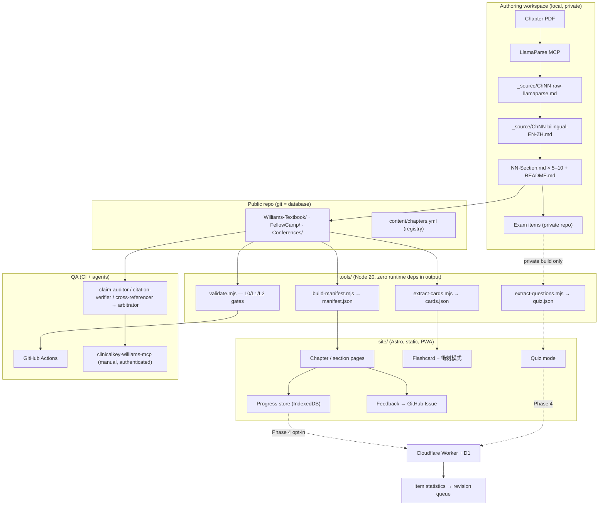

# SDD — Endocrinology Reading & Cases: Fellow Reading Platform

**Software Design Document**
Project: `zinojeng/Endocrinology-Reading-and-Cases`
Version: 1.0 (draft for implementation)
Date: 2026-07-23
Intended implementer: an autonomous coding agent (Antigravity or equivalent)
Author of spec: Claude Code, grounded on the live filesystem state described in §2.

---

## 0. How to use this document

This SDD is written to be executed by an LLM agent with filesystem and shell access, not by a
human team. It therefore states **exact paths, exact file formats, and exact acceptance
criteria** rather than intentions.

Rules for the implementing agent:

1. **Do not invent content.** This project's core value is that every clinical statement is
   traceable to the source textbook. You are building *tooling*, not medical content. Never
   author, "improve", or paraphrase a clinical claim in `Williams-Textbook/**`,
   `FellowCamp/**`, or `Conferences/**` unless a task in §8 explicitly says so.
2. **Do not break GitHub rendering.** Every `.md` under the three content directories must
   remain readable as plain Markdown on github.com after your changes. The repo is a study
   resource first and a web app second.
3. **Never commit the exam bank.** See §9.1. The exam-bank content lives in a *separate
   private repo*. If you find exam questions inside this repo's working tree, stop and report.
4. **Work in phases.** §8 defines Phase 1–5 with acceptance criteria. Do not start Phase N+1
   until Phase N's acceptance criteria pass. Open a PR per phase.
5. **Ask before destructive moves.** Renaming or relocating existing content directories
   changes public GitHub URLs that fellows may have bookmarked. §6 defines an additive layout
   specifically to avoid this.

---

## 1. Problem statement

Today the project is ~12,000 lines of carefully curated Traditional-Chinese-with-English-terms
Markdown, hand-assembled from LlamaParse output of *Williams Textbook of Endocrinology*, plus
FellowCamp board-exam material and ENDO conference cases. It is excellent as content and
essentially unmanaged as a system:

- **New chapters are ad-hoc.** Ch.36, 42, 43, 44 were each produced by a bespoke manual
  process. There is no written pipeline, no chapter registry, no definition of "done", so
  chapter N+1 costs as much as chapter N and quality depends on the operator's memory.
- **Reading is unguided.** A fellow opening `Williams-Textbook/` sees a folder of 5–10 files
  per chapter. There is no reading order beyond filename numbering, no time estimate, no
  learning objectives, no way to know what they have and have not read.
- **No progress state.** Nothing records that a fellow finished Ch.36 §03 or that they failed
  the %CV question three times. Nothing surfaces "you should review this before the exam".
- **No feedback loop.** If a fellow spots an error in a note, or finds a question ambiguous,
  there is no channel except telling the author verbally. Errors therefore persist.
- **No QA.** Nothing mechanically checks that a page citation exists, that a claimed
  percentage appears in the parsed source, that internal links resolve, that the answer key
  matches the quick-key line, or that the stated difficulty mix is real.

This document specifies the system that fixes those five gaps, in that order of priority.

---

## 2. Current state (verified inventory)

All facts below were verified on disk on 2026-07-23. Treat this section as ground truth for
paths; re-verify before editing.

### 2.1 The three locations

| Role | Path | Git |
|---|---|---|
| **Public repo clone** — source of truth for published content | `/Users/ander/Documents/Endocrinology-Reading-and-Cases-git` | `origin = github.com/zinojeng/Endocrinology-Reading-and-Cases`, on `main`, **0 ahead / 0 behind** |
| **Authoring workspace** — raw PDFs, parsed MD, private exam bank | `/Users/ander/Documents/medical/Williams` | **not a git repo** |
| **Citation-verification tool** — MCP bridge to ClinicalKey | `/Users/ander/Documents/Williams Endocrinology` | `origin = github.com/zinojeng/clinicalkey-williams-mcp`, 1 commit |

There is also a stale non-git copy at `/Users/ander/Documents/Endocrinology-Reading-and-Cases`
containing only `Conferences/` and `FellowCamp/`. **It is a duplicate. Do not write to it.**
Phase 1 must resolve this duplication (§8.1, task P1-6).

### 2.2 Published repo structure

```
Endocrinology-Reading-and-Cases/
├── README.md                       # category landing page (3-table index)
├── Williams-Textbook/
│   ├── README.md                   # chapter index + FellowCamp pointer
│   ├── Ch36-Digitized-Approaches-to-Diabetes/     # 13 tracked files
│   │   ├── README.md               # 本章一句話 / 分節索引 / High-Yield 速記
│   │   ├── 00-Overview-and-Key-Points.md
│   │   ├── 01-CGM-Sensors-Calibration-Accuracy.md
│   │   ├── … 09-Diabetes-Tech-in-Special-Situations.md
│   │   └── _source/
│   │       ├── Ch36-raw-llamaparse.md      # verbatim LlamaParse output
│   │       └── Ch36-bilingual-EN-ZH.md     # paragraph-aligned EN/ZH
│   ├── Ch42-Endocrine-Neoplasia-Syndromes/        # 11 files, sections 00–07
│   ├── Ch43-Neuroendocrine-Tumors-and-Disorders/  # 10 files, sections 00–06
│   └── Ch44-Immunoendocrinopathy-Syndromes/       #  7 files, sections 00–03
├── FellowCamp/2026/                # 00–11, 115年度 board-exam prep
└── Conferences/
    ├── ENDO2025/Meet the Professor/   # 41 cases, 11 topic folders
    └── ENDO2026/
        ├── Meet the Professor/        # 40 bilingual cases
        └── ebook/                     # bilingual EPUB
```

Note the naming inconsistency to preserve: the published repo uses `Williams-Textbook/` while
the authoring workspace uses `Williams-Textbook-of-Endocrinology/`. **Keep the published name.**

### 2.3 Authoring-workspace-only content (not in the public repo)

- `medical/Williams/Ch{36,42,43,44} *.pdf` and `*.md` — original PDFs and flat parsed MD.
- `medical/Williams/Williams-Endocrinology-Exam-Bank/` — **private**, board-exam MCQs.
  Currently Ch.36 only: `Ch36-exam-10Q.md` (10 items) and
  `Ch36-exam-set2-vignettes-12Q.md` (4 vignette cases × 3 items = 12). Its README declares it
  confidential and names a companion public repo `zinojeng/Williams-Textbook-of-Endocrinology`
  — a **different repo from this one**; §11-Q1 asks the owner to reconcile.
- `medical/Williams/Williams-Textbook-of-Endocrinology/FellowCamp-2026/` — includes `_source/`
  with the original lecture slides; the public repo carries the derived notes only.
- `medical/Williams/fellowcamp2026/{slides,transcript}` — raw slide PDFs + parsed MD.

### 2.4 Content grammar actually in use

The parsers you write depend on these conventions. They are **observed, consistent, and
therefore load-bearing** — treat them as an interface, and make the linter enforce them.

Section note (`NN-Title.md`):

```markdown
# Ch.36 CGM 衍生指標：TIR/TBR/TAR、TITR 與特殊族群目標（CGM-Derived Metrics: Time in Range）

> 來源：Williams Textbook of Endocrinology, Ch.36 … — <subsection title>（涵蓋 …）

---

## 🧬 前言：…
- bullet with **bold** for key terms and <u>underline</u> for must-memorize values

> 📌 **重點 (High-Yield)**：
> - one or more high-yield bullets

> 💡 **記憶法（54 / 70 / 180 / 250 四個關卡）**：
> - mnemonic bullets, often with a 口訣 line

| table | with | 中文 | interpretation |
```

Chapter `README.md`:

```markdown
# Ch.36 <Full English title> — Fellow 精讀筆記
> 來源：**Williams Textbook of Endocrinology, Ch.36**（<authors>）
> 原始 PDF 經 **LlamaParse** 解析（見 [`_source/…`]），再重整為 …
> 🇹🇼🇬🇧 逐段英中對照：[`_source/ChNN-bilingual-EN-ZH.md`]

## 🗺️ 本章一句話          <- exactly one blockquote, the chapter thesis
## 📚 分節索引            <- table: # | 檔案 | 主題 | 核心表格
## ⭐ High-Yield 速記      <- cross-section condensed bullets, grouped
```

Marker inventory (used by the flashcard and QA extractors):

| Marker | Meaning | Extract to |
|---|---|---|
| `> 📌 **重點 (High-Yield)**：` | must-know for the board exam | flashcard deck, exam blueprint |
| `> 💡 **記憶法（…）**：` | mnemonic / 口訣 | flashcard back-side hint |
| `<u>…</u>` | numeric value or threshold to memorize | claim-audit target (§7.7) |
| `**Table 36.3**` / `Fig. 36.11` / `Box 36.2` | source artifact reference | citation check against `_source` |
| `## 🗺️ 本章一句話` | chapter thesis | site chapter card |

Exam item file (private repo):

```markdown
# Williams Endocrinology Ch.NN — <topic>
## Board-Exam Style MCQ Set (N items)
> **Scope:** … **Source textbook:** … **Format:** Single best answer, 1 of 4.
> **Difficulty mix:** 易 ×3 · 中 ×4 · 難 ×3 (易 and 難 each < 1/3 of items).
> ⚠️ **Confidential — exam material. Not for distribution.**

| # | Type | Difficulty (難易度) | Topic | Williams p. |
|---|------|------|-------|-------------|
| Q1 | Standalone | 易 | … | 1426 (Fig. 36.2 p. 1424) |

# PART 1 — QUESTIONS
## Q1
<stem>
- **A.** …
- **B.** …

## Case 1 (Q5–Q7)
> <vignette>
### Q5
…

# PART 2 — ANSWER KEY, RATIONALE & SOURCES
> Quick key: **Q1 A · Q2 C · Q3 B · …**
```

### 2.5 Existing agent fleet (reuse, do not rebuild)

The owner already has specialized subagents defined for medical-content QA. The QA framework
in §7.7 **maps onto these** rather than inventing new prompts:

`citation-verifier` (DOI/PubMed resolution), `claim-auditor` (grep every %, n, OR/HR, quote
back to the local source MD), `cross-referencer` (does `[5]` actually support the sentence),
`arbitrator` (triage 必修/待議/通過 and re-run until zero), `counter-advocate` (find
contradicting literature), `drafter`, `style-editor`, `deep-dive-scout`, `fulltext-fetcher`,
`literature-scout`, `outline-architect`.

Also available: the `medical-literature-review` and `med-presentation` skills, and the
`clinicalkey-williams-mcp` server (§7.8).

---

## 3. Goals and non-goals

### 3.1 Goals

| # | Goal | Measured by |
|---|---|---|
| G1 | Adding a new chapter is a repeatable, gated pipeline | A new chapter reaches "published" via `docs/CHAPTER-PIPELINE.md` with no undocumented steps; wall-clock cost drops vs Ch.44 |
| G2 | A fellow always knows what to read next and how long it takes | Every section has objectives + est. minutes; every chapter has ≥2 named reading paths |
| G3 | Reading progress is recorded and resumable | Progress survives browser restart; exportable as JSON; per-chapter % complete visible |
| G4 | Errors get reported and fixed | ≤2 clicks from any paragraph to a pre-filled GitHub issue carrying file + anchor |
| G5 | Content correctness is mechanically enforced | CI blocks merge on broken links, schema violations, unverifiable numeric claims, answer-key mismatch |
| G6 | Exam items get better over time | Item-level attempt stats feed a revision queue |

### 3.2 Non-goals (explicitly out of scope)

- **Not** a hosting service for copyrighted textbook text. `_source/*-raw-llamaparse.md`
  already sits in a public repo; §9.2 flags this as a legal risk to resolve, but this SDD does
  not build a paywall or DRM.
- **Not** a multi-tenant SaaS. Expected audience is a single division's fellows (order of
  10 people), possibly a few external readers. Design for that scale; do not build
  organizations, billing, or RBAC.
- **Not** an LLM tutor/chatbot in Phase 1–4. Optional in Phase 5, and only retrieval-grounded.
- **Not** a rewrite of existing notes. Tooling is additive.

### 3.3 Design constraints

1. **Markdown is the database.** Git history is the audit log. No CMS, no content in SQL.
2. **Zero-backend by default.** Phases 1–3 ship as a static site on GitHub Pages with
   client-side state. A backend appears only in Phase 4 and only if §11-Q3 is answered yes.
3. **Traditional Chinese UI**, with English preserved for all medical terminology — matching
   the content's own bilingual convention.
4. **Mobile first.** Fellows read on phones between clinic sessions. Test at 390 px width.
5. **Offline-capable.** Ward Wi-Fi is unreliable; the site must be a PWA with cached content.

---

## 4. Personas and user stories

**P1 — Fellow preparing for the 專科醫師考試 (primary).** 3–12 months out from the board exam,
reads in 15–40 minute blocks on a phone, cares about high-yield density and self-testing.

- As P1, I open the site and see "繼續閱讀：Ch.36 §04 決策支援與 AGP 判讀（約 12 分鐘）".
- As P1, I finish a section and immediately get 5 flashcards drawn from its 📌 blocks.
- As P1, I see a per-chapter mastery bar combining read-coverage and quiz accuracy.
- As P1, two weeks before the exam I open 衝刺模式 and get only 📌/💡 blocks plus my
  previously-wrong questions.

**P2 — Attending/author (the repo owner).** Adds chapters, fixes errata, writes exam items.

- As P2, I run one command to scaffold a new chapter from a PDF and get a checklist of gates.
- As P2, I see an inbox of fellow-reported issues grouped by file.
- As P2, CI tells me *before merge* that a note cites a page number absent from `_source`.
- As P2, I see which exam items have <40% or >95% correct rates and should be revised.

**P3 — Visiting reader on GitHub.** Arrives from a search engine at a raw `.md`.

- As P3, the file still renders correctly and links to the rendered site version.

---

## 5. Architecture



**Key architectural decision: the manifest.** All dynamic behavior (progress, paths, search,
flashcards) reads from a single generated `manifest.json`. Content files stay dumb Markdown;
the manifest is derived, never hand-edited, and regenerated in CI. This is what lets the repo
remain a plain GitHub-readable study folder while also powering an app.

---

## 6. Target repository layout (additive)

```
Endocrinology-Reading-and-Cases/
├── README.md                       # unchanged (add one link to the site)
├── Williams-Textbook/              # unchanged paths; frontmatter added to files
├── FellowCamp/                     # unchanged
├── Conferences/                    # unchanged
├── content/
│   ├── chapters.yml                # chapter registry / roadmap (§7.1)
│   └── taxonomy.yml                # controlled tag vocabulary (§7.2.3)
├── docs/
│   ├── SDD-fellow-reading-platform.md   # this file
│   ├── CHAPTER-PIPELINE.md         # the runbook produced in Phase 2
│   ├── CONTENT-STYLE.md            # the grammar in §2.4, normative
│   └── QA-GATES.md                 # gate definitions + how to run locally
├── schemas/
│   ├── frontmatter.section.schema.json
│   ├── frontmatter.chapter.schema.json
│   ├── chapters.schema.json
│   └── manifest.schema.json
├── tools/                          # Node 20 ESM, no build step
│   ├── validate.mjs
│   ├── build-manifest.mjs
│   ├── extract-cards.mjs
│   ├── extract-questions.mjs       # reads the PRIVATE exam repo path, never commits output
│   ├── link-check.mjs
│   ├── claim-grep.mjs
│   ├── sync-workspace.mjs          # allowlisted copy authoring → public (§8.1 P1-6)
│   └── lib/{markdown.mjs,frontmatter.mjs,paths.mjs}
├── site/                           # Astro app (Phase 3)
│   ├── src/{pages,components,stores,styles}
│   ├── public/
│   └── astro.config.mjs
├── .github/
│   ├── workflows/{qa.yml,deploy.yml}
│   └── ISSUE_TEMPLATE/{errata.yml,question-feedback.yml,chapter-request.yml}
├── .gitignore                      # must include Icon? artifacts (§8.1 P1-1)
└── package.json                    # workspaces: tools, site
```

---

## 7. Component design

### 7.1 C1 — Chapter registry and the "new chapter" pipeline

**Problem it solves:** "is new coming chapter" — chapters arrive irregularly and there is no
tracked state between "PDF exists" and "published".

`content/chapters.yml` is the single roadmap. Every chapter — planned, in-flight, or done —
has an entry:

```yaml
version: 1
chapters:
  - id: ch36
    number: 36
    slug: Ch36-Digitized-Approaches-to-Diabetes
    title_en: Digitized Approaches to Diabetes Diagnostics and Therapeutics
    title_zh: 糖尿病的數位化診療
    authors: [Battelino, Sherr, Galderisi, Dovč]
    edition: "Williams Textbook of Endocrinology, 15e"
    pages: [1420, 1455]
    status: published          # planned|acquired|parsed|bilingual|drafted|qa|published
    sections: 10
    exam_sets: 2
    published_at: "2026-06-05"
    gates:                     # see §7.1.2; each records pass + date
      g1_source: {pass: true,  at: "2026-06-05"}
      g2_bilingual: {pass: true, at: "2026-06-05"}
      g3_sections: {pass: true, at: "2026-06-05"}
      g4_readme: {pass: true, at: "2026-06-05"}
      g5_claims: {pass: false, note: "retro-audit pending"}
      g6_links: {pass: false, note: "retro-audit pending"}
      g7_exam: {pass: true, at: "2026-06-10"}
      g8_review: {pass: false, note: "human sign-off not recorded"}
  - id: ch37
    number: 37
    title_en: <TBD>
    status: planned
    priority: high
    rationale: "board-exam blueprint weight; fellows requested"
```

**Roadmap seeding:** the owner must fill in which chapters come next (§11-Q2). Until then,
Antigravity should create `status: planned` stubs for the chapters implied by the existing
FellowCamp per-gland structure — pituitary, thyroid, parathyroid/bone, adrenal, gonad/
reproductive, pancreas/hypoglycemia — flagged `title_en: <TBD>` so the gap is visible rather
than silently missing.

#### 7.1.1 Pipeline stages

Codify what was done by hand for Ch.36/42/43/44 into `docs/CHAPTER-PIPELINE.md` plus a
scaffolder `tools/new-chapter.mjs`:

```
$ node tools/new-chapter.mjs --number 37 --slug Ch37-Foo --pdf "~/Documents/medical/Williams/Ch37 Foo.pdf"
```

which creates the directory skeleton, `_source/`, a `README.md` from template, a
`chapters.yml` entry at `status: acquired`, and prints the gate checklist.

| Stage | Action | Tooling | Output | Advances status to |
|---|---|---|---|---|
| S1 | Acquire PDF into authoring workspace | manual | `medical/Williams/ChNN <title>.pdf` | `acquired` |
| S2 | Parse to Markdown | **LlamaParse MCP** (owner's standing rule: LlamaParse first, free fallback only if the API is unavailable) | `_source/ChNN-raw-llamaparse.md` | `parsed` |
| S3 | Paragraph-aligned EN↔ZH | LLM, verbatim EN preserved | `_source/ChNN-bilingual-EN-ZH.md` | `bilingual` |
| S4 | Section split + note authoring | LLM (`drafter` agent) following `docs/CONTENT-STYLE.md` | `00-…md` … `NN-…md` | `drafted` |
| S5 | Chapter README (本章一句話 / 分節索引 / High-Yield 速記) | LLM + template | `README.md` | `drafted` |
| S6 | QA gates G1–G6 | `tools/validate.mjs` + agent fleet | gate results written back to `chapters.yml` | `qa` |
| S7 | Exam sets (private repo) | LLM, difficulty rules in §7.6.2 | `ChNN-exam-10Q.md`, `ChNN-exam-set2-vignettes-12Q.md` | `qa` |
| S8 | Human sign-off + publish | owner | commit + site deploy | `published` |

**Section-split heuristics** (derived from the existing four chapters — encode these in the
drafter prompt): 4–10 sections per chapter; `00-` is always Overview/Key Points; each section
200–400 lines; split on the textbook's own H2 boundaries, never mid-table; each section must
own at least one source Table/Box/Figure so citation checking has an anchor.

#### 7.1.2 Gate definitions

| Gate | Name | Automated? | Blocks publish? |
|---|---|---|---|
| G1 | Source present — raw LlamaParse MD exists, non-empty, page range recorded | yes | yes |
| G2 | Bilingual file exists; ≥95% of ZH paragraphs have an EN counterpart | yes | no (warn) |
| G3 | Section files conform to `CONTENT-STYLE.md` + frontmatter schema | yes | yes |
| G4 | Chapter README has all three required H2 sections; 分節索引 rows == section files | yes | yes |
| G5 | Claim audit — every `<u>`-marked number and every % / n / target grep-matches `_source` | yes (§7.7.3) | yes |
| G6 | Link check — all relative links and anchors resolve | yes | yes |
| G7 | Exam sets exist, answer key consistent, difficulty mix within rule | yes (private) | no |
| G8 | Human sign-off by the attending | no | yes |

### 7.2 C2 — Content model

#### 7.2.1 Section frontmatter

Added to the top of every `Williams-Textbook/**/NN-*.md`. GitHub renders YAML frontmatter as a
small table, which is acceptable and mildly informative; **do not** move this to sidecar files.

```yaml
---
id: ch36-s03
chapter: ch36
section: 3
title_zh: CGM 衍生指標：TIR/TBR/TAR、TITR 與特殊族群目標
title_en: "CGM-Derived Metrics: Time in Range"
source:
  book: "Williams Textbook of Endocrinology, 15e"
  chapter: 36
  pages: [1430, 1434]
  artifacts: ["Table 36.3"]
est_read_min: 12
difficulty: 中          # 易|中|難 — reading difficulty, not exam difficulty
objectives:
  - 說出 TIR / TBR / TAR / TITR 的定義與分層閾值
  - 背出非孕成人與孕期 T1D 的共識目標
  - 解釋 %CV 作為 glycemic variability 指標的臨界值
tags: [diabetes, CGM, glycemic-metrics, pregnancy, geriatrics]
exam_weight: high       # high|medium|low — board-exam yield
prereq: [ch36-s01]
updated: 2026-06-05
---
```

`est_read_min` rule: `ceil(zh_chars / 400 + tables * 1.5 + high_yield_blocks * 0.5)`, computed
by `build-manifest.mjs` and written back once by a one-off codemod; thereafter hand-tunable.

#### 7.2.2 Chapter frontmatter

```yaml
---
id: ch36
type: chapter
number: 36
title_zh: 糖尿病的數位化診療
title_en: Digitized Approaches to Diabetes Diagnostics and Therapeutics
thesis: "糖尿病科技 = 監測與輸注兩條主線，在 AID 匯流。"
status: published
sections: 10
est_read_min: 118
tags: [diabetes, technology]
---
```

#### 7.2.3 Taxonomy

`content/taxonomy.yml` defines the closed tag vocabulary (roughly the ENDO topic axes already
used by `Conferences/`: adipose-obesity-lipids, adrenal, bone-mineral, cardiovascular,
diabetes, general, neuroendocrine-pituitary, pediatric, reproductive, thyroid, tumor-biology,
plus modality tags: technology, genetics, pharmacology, imaging, dynamic-testing).
`validate.mjs` rejects tags outside this list. This is what makes cross-linking Williams
chapters ↔ FellowCamp sessions ↔ ENDO cases possible (§7.3.4).

#### 7.2.4 `manifest.json` (generated)

```jsonc
{
  "generatedAt": "2026-07-23T00:00:00Z",
  "commit": "62ddbf7",
  "chapters": [{
    "id": "ch36", "number": 36, "titleZh": "…", "thesis": "…",
    "estReadMin": 118, "tags": ["diabetes","technology"],
    "path": "Williams-Textbook/Ch36-Digitized-Approaches-to-Diabetes",
    "sections": [{
      "id": "ch36-s03", "n": 3, "titleZh": "…", "titleEn": "…",
      "path": "…/03-CGM-Metrics-TIR-TBR-TAR.md",
      "estReadMin": 12, "difficulty": "中", "examWeight": "high",
      "objectives": ["…"], "tags": ["CGM"],
      "headings": [{"depth": 2, "text": "TIR / TBR / TAR 的定義與分層", "slug": "tir-tbr-tar-…"}],
      "highYield": [{"id": "ch36-s03-hy1", "text": "…", "anchor": "…"}],
      "mnemonics": [{"id": "ch36-s03-mn1", "title": "54 / 70 / 180 / 250 四個關卡", "text": "…"}],
      "tables": ["Table 36.3"],
      "wordCountZh": 4210
    }]
  }],
  "fellowcamp": [ /* same shape, source: FellowCamp/2026 */ ],
  "conferences": [ /* ENDO2025 / ENDO2026 cases, topic-foldered */ ],
  "paths": [ /* reading paths, §7.3.2 */ ],
  "tagIndex": {"CGM": ["ch36-s01","ch36-s03","fc-01"]}
}
```

Committed to the repo (so the site can build without running extractors) **and** regenerated +
diff-checked in CI, so a stale manifest fails the build.

### 7.3 C3 — Reading experience

**Stack decision:** Astro 5 + TypeScript, `@astrojs/mdx` off (content stays pure `.md`),
Tailwind for styling, Pagefind for static full-text search (handles CJK), `@vite-pwa/astro`
for offline. Deployed by GitHub Actions to GitHub Pages. Rationale: static output means zero
hosting cost and zero backend, the content directory can be read directly by Astro's content
collections, and Pagefind indexes Chinese without a server.

#### 7.3.1 Page inventory

| Route | Purpose |
|---|---|
| `/` | Dashboard: 繼續閱讀 card, per-chapter progress rings, 距離考試 countdown, today's review queue |
| `/williams/` | Chapter grid with thesis line, est. time, progress, exam-weight badge |
| `/williams/:chapter/` | 本章一句話, 分節索引 with per-section progress, High-Yield 速記, "開始/繼續" CTA |
| `/williams/:chapter/:section/` | The note itself + reading toolbar (§7.3.3) |
| `/fellowcamp/` , `/conferences/` | Same treatment, lower priority |
| `/paths/:path` | A curated reading path (§7.3.2) |
| `/review/` | Flashcards + 衝刺模式 + wrong-question queue |
| `/quiz/:chapter` | Quiz mode (only when the private exam bundle is present) |
| `/progress/` | Detailed stats, export/import JSON, reset |
| `/search` | Pagefind UI |

#### 7.3.2 Reading paths

Defined in `content/paths.yml`, surfaced as first-class navigation — this is the main answer to
"how to improve fellows' reading":

```yaml
paths:
  - id: board-sprint-dm
    title_zh: 專科考試衝刺 — 糖尿病
    audience: 考前 4 週
    est_total_min: 260
    items: [ch36-s00, ch36-s03, ch36-s04, fc-01, fc-03, ch36-s07, …]
    mode: high-yield-only     # renders only 📌/💡 blocks + tables
  - id: deep-ch36
    title_zh: Ch.36 深讀
    items: [ch36-s00 … ch36-s09]
    mode: full
  - id: nen-men-block
    title_zh: 內分泌腫瘤群組（Ch42+Ch43 + ENDO cases）
    items: [ch42-s00…, ch43-s00…, endo2026-11-*]
    mode: full
```

`mode: high-yield-only` is a render mode, not a separate file: the site filters the parsed AST
to `> 📌` / `> 💡` blockquotes, tables, and H2 headings. This is why the marker grammar in
§2.4 must be enforced by the linter.

#### 7.3.3 Section page reading toolbar

- **進度**: scroll-depth indicator; auto-marks `reading` at 10%, offers 標記已讀 at 90%.
- **目標檢核**: the `objectives` from frontmatter rendered as tickable checkboxes, stored per
  user; a section counts as *mastered* only when all objectives are ticked.
- **雙語**: toggle that side-loads the matching paragraph from `_source/ChNN-bilingual-EN-ZH.md`
  (alignment by paragraph index; if alignment fails, fall back to opening the bilingual file).
- **字級 / 行距 / 夜間**: persisted display prefs. Default line-height 1.9 for CJK.
- **重點模式**: hide everything except 📌/💡/tables (same filter as `high-yield-only`).
- **回報問題**: §7.5.
- **本節卡片**: jump to flashcards generated from this section.
- **上一節 / 下一節** honoring the active reading path, not just file order.

#### 7.3.4 Cross-linking

Using `tagIndex`, every section page shows "相關內容": FellowCamp sessions and ENDO Meet-the-
Professor cases sharing ≥2 tags. Concretely, Ch.36 §03 (TIR targets) should surface
`FellowCamp/2026/01-糖尿病-專科考試重點` and ENDO diabetes-technology cases. This turns three
parallel silos into one study graph and is high-value for relatively low effort.

### 7.4 C4 — Reading progress

**Phase 1–3 (local only).** IndexedDB via `idb-keyval`, single store, schema-versioned:

```ts
type SectionProgress = {
  sectionId: string;               // "ch36-s03"
  state: 'unread' | 'reading' | 'read' | 'mastered';
  scrollMax: number;               // 0..1
  secondsOnPage: number;
  objectivesDone: number[];        // indices into frontmatter.objectives
  firstOpenedAt?: number; lastOpenedAt?: number; completedAt?: number;
  reviewCount: number;
};

type ProgressDB = {
  version: 1;
  userAlias: string;               // local-only label, no PII, no account
  sections: Record<string, SectionProgress>;
  cards: Record<string, CardState>;      // §7.6.1
  answers: AttemptRecord[];              // §7.6.3
  prefs: { fontScale: number; theme: 'light'|'dark'|'auto'; bilingual: boolean };
  examDate?: string;               // drives the countdown + review scheduling
};
```

Derived metrics on `/progress`: per-chapter % read (by est_read_min, not file count — a
12-minute section should not count the same as a 3-minute one), streak days, total minutes,
coverage of `exam_weight: high` sections specifically, and **weakest tags** (tags where quiz
accuracy is lowest) shown as "建議加強".

**Export/import**: `/progress` offers `匯出進度 (JSON)` and import — this is the multi-device
story for Phases 1–3 and the migration path into Phase 4. Ship export before anything else so
no early user loses data.

**Phase 4 (optional sync).** Cloudflare Worker + D1, GitHub OAuth (the audience already has
GitHub accounts), tables `users`, `progress_events` (append-only), `attempts`. Last-write-wins
per `sectionId` with client-side event log replay. Only build this if §11-Q3 is yes.

### 7.5 C5 — Feedback

Three channels, all zero-backend:

1. **Errata on a paragraph.** Every H2/H3 gets a hover/tap 🐛 affordance. Clicking opens
   `github.com/zinojeng/Endocrinology-Reading-and-Cases/issues/new` with the `errata.yml`
   template pre-filled via query params: file path, heading anchor, quoted text (first 200
   chars), commit SHA, site URL. Labels: `errata`, `ch36`.
2. **Section clarity rating.** At the end of each section: 「這一節清楚嗎？」 👍 / 🤔 / 👎 plus an
   optional free-text box. 👍 stores locally only (no network). 🤔/👎 opens the same issue flow
   pre-filled with the rating, because a complaint with no channel to the author is worthless.
3. **Question feedback.** In quiz mode, per item: 題目不清楚 / 答案有疑問 / 選項重複 →
   `question-feedback.yml` issue in the **private** exam repo, carrying item id and the user's
   chosen answer. Never carry question text into the public repo.

Issue templates go in `.github/ISSUE_TEMPLATE/`. Add `chapter-request.yml` so fellows can vote
on which chapter comes next — this feeds `chapters.yml` priority.

**Triage loop for P2:** a `feedback-triage` GitHub Action opens/updates a pinned issue每週
summarizing open errata grouped by chapter, so the author has a single inbox.

### 7.6 C6 — Retrieval practice (flashcards + quiz)

#### 7.6.1 Auto-generated flashcards

`tools/extract-cards.mjs` converts every `> 📌 **重點 (High-Yield)**：` bullet and every
`> 💡 **記憶法…**` block into a card:

```jsonc
{
  "id": "ch36-s03-hy2",
  "sectionId": "ch36-s03",
  "type": "high-yield",              // or "mnemonic"
  "front": "非孕成人 T1D/T2D 的 TIR / TBR / TAR / %CV 共識目標為何？",
  "back": "TIR >70%、TBR <4%（<54 為 <1%）、TAR <25%（>250 為 <5%）、%CV ≤36%",
  "sourceAnchor": "…#tir-tbr-tar-的定義與分層",
  "tags": ["CGM","glycemic-metrics"]
}
```

**Front-side generation is the one place LLM authoring is allowed**, because it produces a
question, not a fact — and the back side is copied verbatim from the note. Generation runs
offline, output is committed to `content/cards/chNN.json`, and is reviewed by the author before
merge. `<u>…</u>` spans become cloze deletions automatically (no LLM needed) — prefer cloze
where the underline exists, LLM-authored stems only where it doesn't.

Scheduling: **FSRS-lite** (or SM-2 if the agent prefers a simpler well-known implementation),
four grades (再來/困難/良好/簡單), state in `ProgressDB.cards`. Daily queue on `/review`, capped
at 40 cards, prioritized by `exam_weight` and days-to-exam.

#### 7.6.2 Quiz mode

`tools/extract-questions.mjs` parses the private exam Markdown (grammar in §2.4) into
`quiz.json`:

```jsonc
{
  "id": "ch36-set1-q7",
  "chapter": "ch36", "set": 1, "n": 7,
  "type": "case", "caseId": "ch36-set1-case1",
  "difficulty": "難",
  "topic": "Glycemic variability (%CV) — significance & priority",
  "sourcePages": "1431",
  "vignette": "…",            // shared across the case's items
  "stem": "…",
  "options": {"A": "…", "B": "…", "C": "…", "D": "…"},
  "answer": "A",
  "rationale": "…"
}
```

Parser invariants it must assert (these become gate G7):
- Every `## QN` in PART 1 has exactly 4 options labeled `**A.**`–`**D.**`.
- Every question has an entry in the header table and in PART 2.
- The PART 2 `Quick key:` line agrees with the per-question answers — the most likely
  real-world defect, and it is silent and dangerous.
- Difficulty counts match the declared mix and satisfy 易 < 1/3 and 難 < 1/3.
- Within a vignette set, difficulty is dispersed (易/中/難 each present), per the Set-2 design
  rule.
- No duplicate stems across sets in a chapter (normalized Levenshtein > 0.9 → fail).

Quiz UX: 練習模式 (immediate feedback + rationale + link to the source section) and 測驗模式
(no feedback until submit, timed at 90 s/item, generates a score report by tag). Wrong answers
enter the spaced-repetition queue as cards automatically.

#### 7.6.3 Attempt records

```ts
type AttemptRecord = {
  itemId: string; chosen: 'A'|'B'|'C'|'D'; correct: boolean;
  msSpent: number; at: number; mode: 'practice'|'test'; confidence?: 1|2|3;
};
```

Optional confidence rating enables the highest-value study signal there is: **confidently wrong
items**, which get top priority in the review queue.

### 7.7 C7 — QA framework

Five layers. Layers 0–2 are deterministic and run in CI; layer 3 is agentic and runs on demand
before publishing a chapter; layer 4 is human.

#### 7.7.0 L0 — Lint (fast, every commit)

- Markdown lint (`markdownlint-cli2`) with a project config that permits the emoji-H2 style.
- Filenames: `^\d{2}-[A-Za-z0-9()\-]+\.md$` for Williams sections; CJK allowed in FellowCamp.
- No trailing whitespace, LF endings, UTF-8 without BOM.
- **Reject `Icon\r` files and any path containing a CR** — currently polluting the working tree.

#### 7.7.1 L1 — Structural

- Frontmatter validates against `schemas/frontmatter.section.schema.json`.
- Chapter README contains 🗺️ 本章一句話, 📚 分節索引, ⭐ High-Yield 速記.
- 分節索引 table rows ↔ actual section files, 1:1, in order.
- Every section has ≥1 `> 📌` block (a section with no high-yield content is a drafting bug).
- Tags ⊆ `taxonomy.yml`.
- `chapters.yml` validates; every `published` chapter has G1/G3/G4/G5/G6/G8 = pass.
- `manifest.json` regenerates byte-identical to the committed copy.

#### 7.7.2 L2 — Link and reference integrity

- All relative links resolve to existing files; all `#anchors` resolve to real headings
  (slugified consistently with GitHub's algorithm, CJK-aware).
- Every `Table NN.N` / `Fig. NN.N` / `Box NN.N` mentioned in a note **exists in that chapter's
  `_source/ChNN-raw-llamaparse.md`**. This catches the classic hallucinated-artifact error.
- Every page number cited falls inside the chapter's `pages` range from `chapters.yml`.
- External URLs checked weekly (not per-commit) by a scheduled workflow; failures open an issue.

#### 7.7.3 L3 — Claim audit (the important one)

`tools/claim-grep.mjs` implements, deterministically, the same discipline as the
`claim-auditor` agent — this is the mechanical guard against LLM drift in notes:

For each section, extract every
(a) `<u>…</u>` span, (b) percentage, (c) numeric threshold with units (mg/dL, mmol/L, %, min,
mo, yr), (d) `n =` / sample size, (e) OR/HR/RR with CI, (f) quoted string;
then search `_source/ChNN-raw-llamaparse.md` for a supporting occurrence, with normalization
(full-width→half-width, `–`↔`-`, thousands separators, mg/dL↔mmol/L conversion within 2%).

Output `qa/claims-chNN.json`: `{claim, kind, sectionId, line, status: matched|fuzzy|unmatched,
evidence?}`. **CI fails on any `unmatched`**; `fuzzy` produces a warning list a human resolves.
Allowlist mechanism: `qa/claims-allow.yml` with a required `reason` per entry (e.g. a value
carried over from a guideline the chapter cites but does not print verbatim) — an allowlist
entry without a reason is itself a lint failure.

Agentic layer on top, run per-chapter before publish, reusing the existing fleet in parallel
then converging:

```
claim-auditor      ─┐
citation-verifier  ─┼→ arbitrator (必修/待議/通過) → drafter fixes → re-run until 必修 = 0
cross-referencer   ─┘
counter-advocate   ── (optional, for chapters making treatment recommendations)
style-editor       ── final pass, no semantic changes
```

Record the arbitrator's final verdict into `chapters.yml` gate G5 with the run date.

#### 7.7.4 L4 — Exam-item QA

- Static: the G7 invariants in §7.6.2.
- Psychometric (needs Phase 4 data): flag items with p-value <0.30 (too hard / miskeyed) or
  >0.95 (no discrimination), or point-biserial <0.15. Surface these on an author-only
  `/authoring/items` page as a revision queue. **A miskeyed item is the single worst defect in
  a study resource** — it teaches the wrong fact confidently — so p<0.30 items should be
  re-verified against source before anything else.

#### 7.7.5 CI pipeline

`.github/workflows/qa.yml`, on PR and push to main:

```yaml
jobs:
  qa:
    steps:
      - lint (L0)
      - validate structural (L1)
      - link + artifact check (L2)
      - claim grep (L3 deterministic)
      - manifest drift check
      - build site (must succeed)
      - a11y smoke test (axe on 3 representative pages)
```

`deploy.yml` publishes `site/dist` to GitHub Pages on `main` only after `qa` passes.
The exam bundle is **never** an input to these workflows (§9.1).

### 7.8 C8 — ClinicalKey MCP integration

`/Users/ander/Documents/Williams Endocrinology` (`clinicalkey-williams-mcp`) exposes
`ck_auth_status`, `ck_search`, `ck_open`, `ck_read_visible` against the owner's authenticated
Chrome session, localhost-only, rate-limited to 12 tasks/min, explicitly refusing full-chapter
mirroring.

Its role in this system is **verification, not acquisition**:

- When L3 reports `unmatched` claims, an author-run script
  `tools/verify-against-clinicalkey.mjs` takes the unmatched claim list and, for each, issues a
  bounded `ck_search` + `ck_read_visible` to confirm whether the claim exists in the published
  chapter (i.e. distinguishing "LlamaParse dropped it" from "the note invented it"). This
  distinction currently cannot be made and is the main false-positive source for L3.
- Results are written back into `qa/claims-chNN.json` as `status: verified-external` with the
  ClinicalKey citation metadata.

Constraints for the implementer: this runs **manually, locally, never in CI**; it requires the
owner's interactive login; keep the existing rate limit; do not extend the MCP server to bulk
retrieval. Suggested minimal change to that repo: add a `ck_verify_claim(text, chapter)` tool
that wraps search+read+match so the QA script has a single call, and add `npm test` coverage
for it (the repo currently has only `test/relay-server.test.ts`).

### 7.9 C9 — Non-functional requirements

| Aspect | Requirement |
|---|---|
| Performance | Section page LCP < 1.5 s on 4G; manifest < 500 KB gzipped (split per-chapter if exceeded) |
| Offline | PWA caches the manifest, all visited sections, and the full review queue |
| Accessibility | WCAG 2.1 AA; keyboard-navigable quiz; `<u>` emphasis must not be the sole carrier of meaning (pair with bold or a `.value` class) |
| i18n | UI zh-TW; do not translate medical English terms; `lang="zh-Hant"` with `lang="en"` spans |
| Browser support | Last 2 versions of Safari/Chrome incl. iOS Safari |
| Data | No PII collected; no analytics beyond optional self-hosted counts; progress never leaves the device before Phase 4 opt-in |

---

## 8. Phased delivery

### 8.1 Phase 1 — Hygiene and foundations (no user-visible change)

| # | Task | Acceptance |
|---|---|---|
| P1-1 | Add `.gitignore` entries for macOS `Icon\r` files, `.DS_Store`, `.metadata_cache/`; remove tracked/untracked Icon artifacts; document the broken `refs/…/Icon?` warning fix | `git status` clean on a fresh clone; no git ref warnings |
| P1-2 | Add `package.json` workspaces, Node 20 toolchain, `tools/lib/*` | `npm ci && npm run qa` runs |
| P1-3 | Write `docs/CONTENT-STYLE.md` codifying §2.4 grammar | Reviewed by owner |
| P1-4 | Implement L0 + L2 checks and wire `qa.yml` | CI green on current content, or failures triaged into issues |
| P1-5 | Create `content/chapters.yml` with the 4 existing chapters and planned stubs; `schemas/chapters.schema.json` | Validates |
| P1-6 | Resolve the three-location duplication: write `tools/sync-workspace.mjs` with an explicit allowlist + `--dry-run`; delete or clearly deprecate `/Users/ander/Documents/Endocrinology-Reading-and-Cases` (the stale non-git copy) **after confirming with the owner** | One documented source of truth; README of the stale dir points to the real one |

### 8.2 Phase 2 — Content model + chapter pipeline

| # | Task | Acceptance |
|---|---|---|
| P2-1 | Frontmatter schemas; codemod to backfill frontmatter for all 30 existing Williams section files (titles/pages from existing headers; `est_read_min` computed; `objectives` drafted by LLM **and reviewed** — objectives are pedagogy, not clinical claims, so LLM drafting is acceptable here) | All files validate; GitHub rendering visually checked on 3 files |
| P2-2 | `content/taxonomy.yml` + tag backfill | All tags in vocabulary |
| P2-3 | `build-manifest.mjs` + `manifest.schema.json` + drift check in CI | Manifest reproducible |
| P2-4 | `claim-grep.mjs` (L3 deterministic) run retroactively over Ch.36/42/43/44 | `qa/claims-ch*.json` produced; unmatched list triaged into issues; G5 recorded in `chapters.yml` |
| P2-5 | `docs/CHAPTER-PIPELINE.md` + `tools/new-chapter.mjs` scaffolder + `docs/QA-GATES.md` | Dry-run scaffolds a Ch.37 skeleton that passes L0/L1 |
| P2-6 | Issue templates + `feedback-triage` workflow | Templates render; a test issue lands with correct labels |

**Phase 2 is the highest-value phase.** If the owner only ever funds one phase, it should be
this one: it makes new chapters cheap and makes existing chapters verifiable, without any UI.

### 8.3 Phase 3 — Reading site (static, local progress)

| # | Task | Acceptance |
|---|---|---|
| P3-1 | Astro scaffold, content collections reading the existing dirs, Tailwind, zh-Hant typography | `npm run dev` renders Ch.36 §03 faithfully incl. tables, `<u>`, blockquote markers |
| P3-2 | Route inventory §7.3.1 (dashboard, chapter, section, path, search, progress) | All routes build statically |
| P3-3 | Progress store (IndexedDB) + reading toolbar + objectives checkboxes + export/import | Progress survives reload and browser restart; export/import round-trips |
| P3-4 | `content/paths.yml` + `high-yield-only` render mode + 重點模式 | 衝刺模式 for Ch.36 shows only 📌/💡/tables |
| P3-5 | Pagefind search (CJK verified), cross-link "相關內容" via tagIndex | Searching 「時間在範圍內」 finds ch36-s03 |
| P3-6 | Flashcards: `extract-cards.mjs`, cloze from `<u>`, FSRS-lite scheduler, `/review` | Ch.36 yields ≥40 cards; queue schedules correctly across simulated days |
| P3-7 | PWA + offline + a11y pass + mobile QA at 390 px | Lighthouse PWA ✓, a11y ≥95 |
| P3-8 | Feedback affordances → pre-filled GitHub issues | 2 clicks from paragraph to filed issue |
| P3-9 | Deploy to GitHub Pages; link from repo README | Live URL; P3 personas can use it |

### 8.4 Phase 4 — Quiz, sync, item analytics (conditional)

| # | Task | Acceptance |
|---|---|---|
| P4-1 | `extract-questions.mjs` + G7 invariants, run against the private exam repo | Ch.36's 22 items parse; quick-key cross-check passes |
| P4-2 | Private build mode: `SITE_EXAM_PATH=… npm run build:private` produces a build containing quiz data; default build provably excludes it | Grep of default `dist/` for a known stem returns nothing |
| P4-3 | Quiz UI (練習/測驗), wrong-answer → card pipeline, confidence rating | End-to-end on Ch.36 |
| P4-4 | *(conditional on §11-Q3)* Cloudflare Worker + D1 + GitHub OAuth sync; migrate local export format | Two devices converge |
| P4-5 | Item analytics + author revision queue (p-value, point-biserial) | Flags a deliberately miskeyed test item |

### 8.5 Phase 5 — Optional enhancements

Ranked by value/effort, to be picked by the owner rather than built by default:

1. **Chapter coverage vs board blueprint** — map `tags` to the 專科考試 blueprint weights and
   show which high-weight topics have no chapter yet. Directly answers "which chapter next".
2. **Cohort dashboard** (needs Phase 4) — anonymous aggregate for the attending: which sections
   the fellows skip, which items they miss. Requires explicit consent (§9.3).
3. **Retrieval-grounded Q&A** over the manifest + notes, answering strictly from cited sections
   with links, refusing when unsupported. Only with the existing anti-hallucination discipline.
4. **EPUB/PDF export per reading path** for offline/print, reusing the ENDO2026 ebook approach.
5. **ENDO case ↔ chapter integration** — attach relevant Meet-the-Professor cases as "applied
   practice" at the end of each chapter.

---

## 9. Security, privacy, and rights

### 9.1 Exam-bank isolation (hard requirement)

- Exam content lives **only** in the private repo. This repo must never contain it.
- Add `.github/workflows/leak-check.yml`: fail if any tracked file matches
  `PART 2 — ANSWER KEY`, `Quick key:`, `難易度 (難易度)` header patterns, or `Confidential — exam`.
- The default site build must not read `SITE_EXAM_PATH`. Assert in `qa.yml` that
  `dist/**` contains no `quiz.json`.
- Question-feedback issues route to the **private** repo.

### 9.2 Copyright (needs an owner decision — §11-Q4)

`_source/ChNN-raw-llamaparse.md` is a near-verbatim machine transcription of a copyrighted
textbook chapter, currently in a **public** repo. The derived study notes are defensible
transformative work; the raw parse is much less so. Options, in ascending order of caution:

(a) leave as-is; (b) move `_source/` to a private submodule / the authoring workspace and keep
only the bilingual condensations public; (c) keep `_source/` local-only and have CI verify
claims against a local copy (CI then can't run L3 — mitigate by running L3 pre-commit locally
and uploading only the `qa/claims-*.json` results).

**Recommendation: (c)**, because it preserves the entire QA capability while removing the
public verbatim copy. If chosen, L3 in CI degrades to verifying that a signed local claim
report exists and matches the content hash of the section files.

### 9.3 Personal data

No accounts, no PII in Phases 1–3. `userAlias` is a local display label. If Phase 4 sync ships,
store only GitHub user id + progress rows; publish a one-paragraph privacy note on `/progress`;
cohort analytics require an explicit opt-in toggle, default off.

### 9.4 Medical-safety disclaimer

Every page footer and every generated export must carry the existing disclaimer:
「內容為機器輔助之學習整理，僅供教育與臨床討論之用；臨床決策請以最新指引與原文為準。」

---

## 10. Risks

| Risk | Impact | Mitigation |
|---|---|---|
| Frontmatter backfill corrupts hand-crafted files | High | Codemod is idempotent, runs on a branch, produces a diff report; owner reviews 3 files before the rest are merged |
| Marker grammar drifts, silently breaking flashcards/重點模式 | Medium | L1 enforces markers; a section with zero 📌 blocks fails CI |
| L3 false positives (LlamaParse dropped a number the note legitimately has) | Medium | `fuzzy` tier + ClinicalKey verification (§7.8) + reasoned allowlist |
| Site becomes the thing, content stagnates | High | Phase 2 (content pipeline) precedes Phase 3 (site) deliberately; do not reorder |
| Owner is the only content author → bus factor 1 | High | The pipeline doc + scaffolder are the deliverable that makes a second author possible |
| Progress data loss before sync exists | Medium | Ship export/import in P3-3, not later; prompt for export every 30 days |
| Scope creep into LLM tutor | Medium | Explicit non-goal §3.2; Phase 5 only |

---

## 11. Open questions for the owner (blocking where marked)

- **Q1 (blocking Phase 1)** — `Williams-Endocrinology-Exam-Bank/README.md` names
  `github.com/zinojeng/Williams-Textbook-of-Endocrinology` as its public companion, but the
  notes actually live in `Endocrinology-Reading-and-Cases/Williams-Textbook/`. Are these two
  public repos both live? Which is canonical? Should the other be archived with a pointer?
- **Q2 (blocking Phase 2 roadmap)** — Which chapters are coming next, and in what order? Please
  fill the `status: planned` entries in `chapters.yml`. Is the source edition 15e?
- **Q3 (blocking Phase 4)** — Do fellows need cross-device progress sync, or is single-device +
  JSON export sufficient? If sync: is a Cloudflare account available?
- **Q4 (blocking public release)** — Which `_source/` option in §9.2 do you choose?
- **Q5** — Should FellowCamp and Conferences get the full treatment (frontmatter, progress,
  cards) in Phase 3, or stay read-only until Phase 5? Default assumption: read-only first,
  Williams-Textbook gets everything.
- **Q6** — Is there a target exam date to hard-code as the default countdown for the 2026 cohort?

---

## 12. Appendix

### 12.1 Effort estimate (agent-hours, rough)

Phase 1 ≈ 4–6 · Phase 2 ≈ 12–16 · Phase 3 ≈ 20–28 · Phase 4 ≈ 12–20 (conditional) ·
Phase 5 per-item. Phase 2 carries the best value-per-hour.

### 12.2 Commands the implementer should end up with

```bash
npm run qa                 # L0+L1+L2+L3 locally, same as CI
npm run manifest           # regenerate manifest.json
npm run cards              # regenerate flashcards
npm run new-chapter -- --number 37 --slug Ch37-… --pdf …
npm run verify:ck          # ClinicalKey claim verification (manual, authenticated)
npm run dev                # site dev server
npm run build              # public build (no exam data)
npm run build:private      # build including quiz data from SITE_EXAM_PATH
npm run leak-check         # exam-content leak scan
```

### 12.3 Definition of done for a published chapter

A chapter is `published` only when: all gates G1–G8 pass and are recorded in `chapters.yml`;
`qa/claims-chNN.json` has zero `unmatched`; the README's 分節索引 matches the files; ≥1 📌 block
per section; flashcards generated and author-reviewed; both exam sets exist in the private repo
and pass G7; the site builds and the chapter renders correctly at 390 px; and the attending has
signed off in the PR.

---

*This SDD describes tooling around medical study content. The content itself remains the
author's clinical responsibility; no tool in this design may alter a clinical claim without
human review.*
